# Myoglobin-CO Substate Structures and Dynamics: Multidimensional Vibrational Echoes and Molecular Dynamics Simulations

##  Abstract
Spectrally resolved infrared stimulated vibrational echo data were obtained for sperm whale carbonmonoxymyoglobin (MbCO) at 300 K. The measured dephasing dynamics of the CO ligand are in agreement with dephasing dynamics calculated with molecular dynamics (MD) simulations for MbCO with the residue histidine-64 (His64) having its imidazole _ε_ nitrogen protonated (N _ε_ –H). The two conformational substate structures B _ε_ and R _ε_ observed in the MD simulations are assigned to the spectroscopic A1 and A3 conformational substates of MbCO, respectively, based on the agreement between the experimentally measured and calculated dephasing dynamics for these substates. In the A1 substate, the N _ε_ –H proton and N _δ_ of His64 are approximately equidistant from the CO ligand, while in the A3 substate, the N _ε_ –H of His64 is oriented toward the CO, and the N _δ_ is on the surface of the protein. The MD simulations show that dynamics of His64 represent the major source of vibrational dephasing of the CO ligand in the A3 state on both femtosecond and picosecond time scales. Dephasing in the A1 state is controlled by His64 on femtosecond time scales, and by the rest of the protein and the water solvent on longer time scales.
##  I. Introduction
Understanding protein dynamics is essential to establishing the relationships between protein structure and protein function.[1](https://pmc.ncbi.nlm.nih.gov/articles/PMC2435512/#R1)–[5](https://pmc.ncbi.nlm.nih.gov/articles/PMC2435512/#R5) Protein dynamics occur on a continuum of time scales, from the subpicosecond to the microsecond and longer. Such dynamics can be investigated with a variety of spectroscopic techniques. However, spectroscopic techniques with sufficient time resolution to probe the shortest time scale dynamics typically cannot provide the necessary structural specificity to assign these dynamics to particular atomic motions. Computational techniques such as molecular dynamics (MD) simulations can provide a view of protein motions at an atomic level of detail over a short range of time scales. The application of molecular simulation to interpret spectroscopic measurements requires the direct modeling of the experimental observable, as performed here.
Carbonmonoxymyoglobin (MbCO) (see [Figure 1](https://pmc.ncbi.nlm.nih.gov/articles/PMC2435512/#F1)) has been extensively studied both experimentally[6](https://pmc.ncbi.nlm.nih.gov/articles/PMC2435512/#R6)–[19](https://pmc.ncbi.nlm.nih.gov/articles/PMC2435512/#R19) and computationally.[20](https://pmc.ncbi.nlm.nih.gov/articles/PMC2435512/#R20)–[26](https://pmc.ncbi.nlm.nih.gov/articles/PMC2435512/#R26) Myoglobin (Mb) is a small globular heme protein weighing approximately 17 kDa that is found in mammalian muscle tissue. The prosthetic heme group can reversibly bind a number of small molecule ligands such as O2, CO, and NO. The crystal structure of Mb has been known for 40 years[27](https://pmc.ncbi.nlm.nih.gov/articles/PMC2435512/#R27) and has been continually refined over the last four decades to atomic resolution.[28](https://pmc.ncbi.nlm.nih.gov/articles/PMC2435512/#R28),[29](https://pmc.ncbi.nlm.nih.gov/articles/PMC2435512/#R29) Because of its small size, relatively long MD simulations are tractable.[21](https://pmc.ncbi.nlm.nih.gov/articles/PMC2435512/#R21),[22](https://pmc.ncbi.nlm.nih.gov/articles/PMC2435512/#R22) The CO stretching mode of MbCO has a strong transition dipole, making its infrared absorption an easily monitored experimental observable that can be used to track kinetics and dynamics in the protein. Studies on Mb, and in particular on MbCO, serve as tests for many of the ideas on the relationship between structure and function in proteins.
### Figure 1.
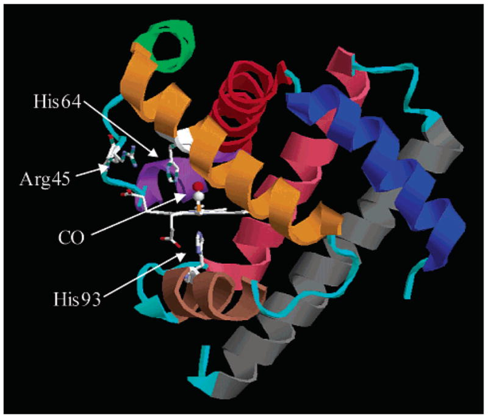
Crystal structure of MbCO taken from the Protein Data Bank (1A6G). The heme group and three residues are indicated explicitly. The heme iron is covalently bound to the protein via His93. His64 is thought to play a major role in the conformational substates of the protein. Secondary structure is color-coded: helix A, blue; helix B, red; helix C, purple; helix D, green; helix E, orange; helix F, brown; helix G, pink; helix H, gray. All loops are colored cyan.
The infrared (IR) spectrum of the CO stretching mode of MbCO has at least three major absorption bands,[6](https://pmc.ncbi.nlm.nih.gov/articles/PMC2435512/#R6),[7](https://pmc.ncbi.nlm.nih.gov/articles/PMC2435512/#R7),[12](https://pmc.ncbi.nlm.nih.gov/articles/PMC2435512/#R12)–[14](https://pmc.ncbi.nlm.nih.gov/articles/PMC2435512/#R14) denoted A0 (~1965 cm−1), A1 (~1944 cm−1), and A3 (~1932 cm−1). It is well known that these substates have different ligand binding rates,[1](https://pmc.ncbi.nlm.nih.gov/articles/PMC2435512/#R1),[6](https://pmc.ncbi.nlm.nih.gov/articles/PMC2435512/#R6),[13](https://pmc.ncbi.nlm.nih.gov/articles/PMC2435512/#R13) but the nature of the structural differences between these substates is still in question. It has been suggested that different electrostatic environments in the heme pocket arising from different conformations of heme pocket residues are largely responsible for the observed bands.[15](https://pmc.ncbi.nlm.nih.gov/articles/PMC2435512/#R15),[19](https://pmc.ncbi.nlm.nih.gov/articles/PMC2435512/#R19),[25](https://pmc.ncbi.nlm.nih.gov/articles/PMC2435512/#R25),[26](https://pmc.ncbi.nlm.nih.gov/articles/PMC2435512/#R26),[30](https://pmc.ncbi.nlm.nih.gov/articles/PMC2435512/#R30) Examples of previously hypothesized structures for the A substates are shown in [Figure 2](https://pmc.ncbi.nlm.nih.gov/articles/PMC2435512/#F2). Mutant studies have shown that the distal histidine, His64, plays a prominent role in determining the CO stretching frequency,[15](https://pmc.ncbi.nlm.nih.gov/articles/PMC2435512/#R15),[31](https://pmc.ncbi.nlm.nih.gov/articles/PMC2435512/#R31) but the tautomerization and orientation of this residue remain unclear. His64 has two titratable nitrogens, N _δ_ and N _ε_ , either of which can be oriented toward the ligand through rotation of the imidazole ring. This residue is also fairly mobile and has been reported at a wide variety of distances (from 2 to 7 Å) from the CO ligand in crystal structures.[28](https://pmc.ncbi.nlm.nih.gov/articles/PMC2435512/#R28),[29](https://pmc.ncbi.nlm.nih.gov/articles/PMC2435512/#R29),[32](https://pmc.ncbi.nlm.nih.gov/articles/PMC2435512/#R32) At low pH, His64 is thought to be doubly protonated and has been observed in a low pH crystal structure[32](https://pmc.ncbi.nlm.nih.gov/articles/PMC2435512/#R32) and in a resonance Raman study[11](https://pmc.ncbi.nlm.nih.gov/articles/PMC2435512/#R11) to be rotated out of the heme binding pocket away from the CO ligand in an “open” configuration. This conformer, with little interaction between His64 and the ligand, is thought to correspond to the A0 substate, because at low pH the A0 absorption line is the most intense. In addition, mutations of His64 to apolar residues produce a band at approximately the same frequency as the A0 line.[31](https://pmc.ncbi.nlm.nih.gov/articles/PMC2435512/#R31) At pH greater than 6, the A1 and A3 substates are the most populated at room temperature.[12](https://pmc.ncbi.nlm.nih.gov/articles/PMC2435512/#R12),[14](https://pmc.ncbi.nlm.nih.gov/articles/PMC2435512/#R14) Kinetic hole burning studies on the MbCO A substates strongly suggest that the A1 and A3 substates are the result of a single tautomerization state of His64 because the time scale of interconversion between the A1 and A3 substates (~1 ns) is much faster than the time scale of His64 tautomerization (~1 _μ_ s).[13](https://pmc.ncbi.nlm.nih.gov/articles/PMC2435512/#R13) Two recent atomic resolution crystal structures at neutral pH indicate that His64 is rotated into the heme pocket and is much closer to the ligand than in the A0 substate, but the exact conformation of His64 remains uncertain.[28](https://pmc.ncbi.nlm.nih.gov/articles/PMC2435512/#R28),[29](https://pmc.ncbi.nlm.nih.gov/articles/PMC2435512/#R29) In addition, these two crystal structures assign different tautomerization states to the singly protonated His64.
### Figure 2.
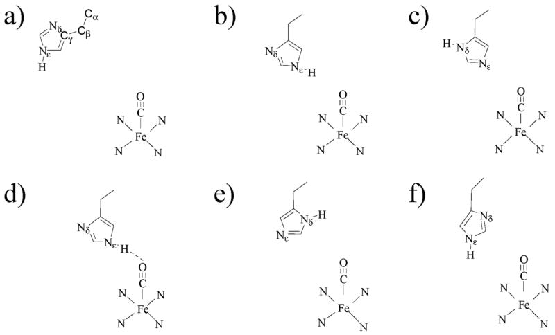
Possible conformers and tautomers of His64 that have been assigned to conformational substates. (a) A0.[29](https://pmc.ncbi.nlm.nih.gov/articles/PMC2435512/#R29),[32](https://pmc.ncbi.nlm.nih.gov/articles/PMC2435512/#R32) The distal His64 is swung out of the pocket away from the ligand. The carbons of the imidazole side chain are labeled Cα–C _γ_. (b) A1.[19](https://pmc.ncbi.nlm.nih.gov/articles/PMC2435512/#R19),[20](https://pmc.ncbi.nlm.nih.gov/articles/PMC2435512/#R20),[29](https://pmc.ncbi.nlm.nih.gov/articles/PMC2435512/#R29) The N _ε_ –H is in the pocket and oriented toward the ligand. (c) A1.[28](https://pmc.ncbi.nlm.nih.gov/articles/PMC2435512/#R28),[34](https://pmc.ncbi.nlm.nih.gov/articles/PMC2435512/#R34) The N _δ_ –H is oriented toward the solvent, and the lone pairs of the N _ε_ interact with the ligand. (d) A3.[29](https://pmc.ncbi.nlm.nih.gov/articles/PMC2435512/#R29),[45](https://pmc.ncbi.nlm.nih.gov/articles/PMC2435512/#R45),[80](https://pmc.ncbi.nlm.nih.gov/articles/PMC2435512/#R80) The N _ε_ –H is in the pocket and is very close to and interacts strongly with the ligand. There may be a hydrogen bond between N _ε_ –H and the CO. (e) A1[21](https://pmc.ncbi.nlm.nih.gov/articles/PMC2435512/#R21),[34](https://pmc.ncbi.nlm.nih.gov/articles/PMC2435512/#R34) or A3.[19](https://pmc.ncbi.nlm.nih.gov/articles/PMC2435512/#R19) The N _δ_ –H is in the pocket near the ligand. (f) A1.[45](https://pmc.ncbi.nlm.nih.gov/articles/PMC2435512/#R45) Both N _ε_ –H and N _δ_ are in the pocket. There is moderate interaction between His64 and the ligand.
Both MD methods[21](https://pmc.ncbi.nlm.nih.gov/articles/PMC2435512/#R21),[33](https://pmc.ncbi.nlm.nih.gov/articles/PMC2435512/#R33) and ab initio structural calculations[20](https://pmc.ncbi.nlm.nih.gov/articles/PMC2435512/#R20) have been used to address the issue of the structural origins of the A substates, as well as the tautomerization state of His64.[34](https://pmc.ncbi.nlm.nih.gov/articles/PMC2435512/#R34) Rovira et al.[20](https://pmc.ncbi.nlm.nih.gov/articles/PMC2435512/#R20) performed mixed quantum mechanical/molecular mechanical calculations for various possible conformers for the A substates. On the basis of shifts of the CO vibrational frequency, they concluded that His64 exists as the N _ε_ –H tautomer with the proton pointed toward the ligand. However, they were unable to assign specific structures to the A1 and A3 substates. Other computational studies have proposed structural assignments for the A substates using the N _δ_ –H tautomer,[21](https://pmc.ncbi.nlm.nih.gov/articles/PMC2435512/#R21),[33](https://pmc.ncbi.nlm.nih.gov/articles/PMC2435512/#R33) which also reproduce the trends in the IR frequency shift. These studies illustrate that computations of CO vibrational frequencies alone cannot unambiguously identify the configurations associated with the spectroscopic substates.
In this paper, we present measured and calculated spectrally resolved infrared stimulated vibrational echo data on sperm whale MbCO at 300 K. The ultrafast infrared vibrational echo[8](https://pmc.ncbi.nlm.nih.gov/articles/PMC2435512/#R8),[35](https://pmc.ncbi.nlm.nih.gov/articles/PMC2435512/#R35),[36](https://pmc.ncbi.nlm.nih.gov/articles/PMC2435512/#R36) and the multidimensional vibrational echo[37](https://pmc.ncbi.nlm.nih.gov/articles/PMC2435512/#R37)–[46](https://pmc.ncbi.nlm.nih.gov/articles/PMC2435512/#R46) measure the fast structural dynamics of molecules through their effects on vibrational line shapes. The current work expands the findings from our previous report on horse heart MbCO[40](https://pmc.ncbi.nlm.nih.gov/articles/PMC2435512/#R40) using a two-pulse spectrally resolved vibrational echo experiment. The three-pulse measurement (stimulated echo) permits the variation of the time delay _T_ w between the second and third pulses, providing a probe of dynamics on longer time scales than possible with the two-pulse echo. The three-pulse vibrational echo provides a family of dynamical line shapes rather than the single dynamical line shape provided by a two-pulse vibrational echo. Therefore, a more rigorous comparison between the experiments and the calculations is made possible. More recently, we presented the results of a preliminary study[45](https://pmc.ncbi.nlm.nih.gov/articles/PMC2435512/#R45) on horse heart MbCO using spectrally resolved stimulated echo measurements with a limited set of detection frequencies. Comparing these measurements on horse heart MbCO to MD simulations of sperm whale MbCO with the N _ε_ –H tautomer of His64, we provisionally assigned the structural origins of the A1 and A3 substates of MbCO. Here, we present the spectrally resolved stimulated vibrational echo response at a wide range of detection frequencies for the substates of sperm whale MbCO. These measurements are compared to molecular dynamics results for sperm whale MbCO with both possible tautomerization states of His64. Using a time-dependent Stark effect model to derive a frequency-frequency correlation function (FFCF) for the CO ligand from the MD simulations, spectrally resolved stimulated vibrational echo spectra are computed from the FFCF for each tautomer and compared to the data.
The comparisons between the calculated vibrational echo data for the two His64 tautomers and the measured vibrational echo data over a wide range of frequency and _T_ w indicate that the correct tautomer state of His64 is the N _ε_ –H structure and confirm the assignment of the structural origins of the A1 and A3 substates of MbCO made in our previous study.[45](https://pmc.ncbi.nlm.nih.gov/articles/PMC2435512/#R45) In addition, analysis of the MD results reveals the origins of the dephasing dynamics for the A1 and A3 substates in terms of contributions from particular portions of the protein and the water solvent.
##  II. The Vibrational Echo
Time-dependent interactions between a vibrational mode and its environment give rise to spectral line broadening. The linear absorption spectrum of a vibrational spectroscopic transition contains contributions from dynamics occurring on all time scales that are relevant to the interactions between the transition and its environment. In principle, all dynamical information about the interaction of a vibrational mode with its environment can be deduced from the absorption line shape alone.[47](https://pmc.ncbi.nlm.nih.gov/articles/PMC2435512/#R47) In practice, however, dynamics on long time scales often dominate the shape of the linear absorption spectrum, masking the precise nature of the interactions between an oscillator and its environment.
The stimulated vibrational echo is a nonlinear spectroscopic technique capable of separating the dynamical processes contributing to an absorption spectrum line width by selectively eliminating the contribution of dynamics that have time scales slower than an experimentally controlled waiting time.[48](https://pmc.ncbi.nlm.nih.gov/articles/PMC2435512/#R48)–[53](https://pmc.ncbi.nlm.nih.gov/articles/PMC2435512/#R53) In a stimulated vibrational echo experiment, three resonant pulses with variable delay _τ_ between pulses 1 and 2 and variable delay _T_ w between pulses 2 and 3 propagate along three different paths and are crossed in the sample. Interactions in the sample with the three applied pulses lead to the generation of a fourth vibrational echo pulse in a unique phase-matched direction. In a typical experiment, the value of _T_ w is fixed, and the intensity of the vibrational echo signal is recorded as a function of the scanned time delay _τ_. The stimulated vibrational echo eliminates spectral line broadening contributions from any dynamical processes that occur on time scales slower than the experimentally controlled time _T_ w.[48](https://pmc.ncbi.nlm.nih.gov/articles/PMC2435512/#R48),[49](https://pmc.ncbi.nlm.nih.gov/articles/PMC2435512/#R49),[51](https://pmc.ncbi.nlm.nih.gov/articles/PMC2435512/#R51),[52](https://pmc.ncbi.nlm.nih.gov/articles/PMC2435512/#R52) By measuring stimulated vibrational echoes decays for a series of _T_ w times, the dynamical spectral broadening that occurs on different time scales is systematically mapped out. The stimulated vibrational echo thus probes the dynamics of the interaction of a vibrational mode and its environment. Thorough descriptions of the vibrational echo can be found in several recent reviews by Fayer and coworkers[16](https://pmc.ncbi.nlm.nih.gov/articles/PMC2435512/#R16),[54](https://pmc.ncbi.nlm.nih.gov/articles/PMC2435512/#R54) and by Hamm and Hochstrasser.[52](https://pmc.ncbi.nlm.nih.gov/articles/PMC2435512/#R52)
##  III. Experimental and Computational Methods
### A. Experimental Methods
The current experimental setup has been modified extensively from that reported previously.[16](https://pmc.ncbi.nlm.nih.gov/articles/PMC2435512/#R16),[40](https://pmc.ncbi.nlm.nih.gov/articles/PMC2435512/#R40) An additional beam line for performing stimulated vibrational echoes has been added, as well as an array detector that greatly enhances the data acquisition rate. In the stimulated vibrational echo experiments reported here, an IR pulse (center frequency = 1940 cm−1, bandwidth = 125 cm−1, pulse duration = 125 fs) produced from a regeneratively amplified Ti: Sapphire pumped OPA (Spectra Physics) is beam split once, and each daughter pulse is split again with three 50%/50% (3.5–6.5 _μ_ m) ZnSe beam splitters (II–VI Inc.) with broadband antireflection coating to produce four equal-energy pulses (~700 nJ), three of which are used in the experiments. The three pulses have wave vectors _k⃗_ 1, _k⃗_ 2, and _k⃗_ 3 with variable delay time _τ_ between the pulses with wave vector _k⃗_ 1 and _k⃗_ 2 and with variable delay time _T_ w between pulses with wave vector _k⃗_ 2 and _k⃗_ 3. The parent IR laser pulse was compressed by carefully balancing the amount of CaF2 and Ge the beam passed through prior to being split. The beams were crossed and focused (spot size ~150 _μ_ m) in the sample with a 6 in. focal length 90° gold coated off-axis parabolic reflector (Janos Technologies), and the vibrational echo signal was detected in the _k⃗_ s = _k⃗_ 2 + _k⃗_ 3 − _k⃗_ 1 phase-matched direction. Another off-axis parabolic reflector was used to collimate the emitted vibrational echo beam, and a HeNe laser beam was coaligned onto the vibrational echo beam to aid in further alignments and routing of the vibrational echo beam.
The vibrational echo signal was dispersed in a SPEX 0.5 m monochromator (210 lines/mm) and detected with a 32-element HgCdTe array detector (Infrared Associates/Infrared Systems Development) with a resolution of ~1.2 cm−1 per element. The data were recorded in blocks of 32 wavelengths by scanning _τ_ at a fixed value of _T_ w, and then stepping the value of _T_ w. Two blocks of 32 wavelengths were necessary to span the spectral range of the data. One pixel from adjacent frequency blocks was overlapped during the acquisition to ensure the consistency of the data. The frequency spectrum of the array was calibrated by comparing the spectrum of atmospheric water absorptions to data from the HITRAN96 molecular database. The response of each pixel was normalized to account for variations in the pixel signal output. The second pulse in the echo experiment was chopped at 500 Hz to permit subtraction of scattered light and to correct for drifts in the array detector baseline.
Recombinant sperm whale Mb in pH 8.0 Tris-chloride buffer (~5 mg/mL) was obtained from Sigma. The solution was concentrated and flushed several times with 0.1 M phosphate pH 7 buffer (VWR Scientific) using a Microcon centrifugal filter device and was then concentrated to 15 mM. The sample was filtered with a 0.45 _μ_ m cellulose acetate filter (Osmonics Laboratories) prior to the final concentration step. The Mb sample was reduced with excess sodium dithionite under a CO atmosphere. The sample was stirred under a CO atmosphere for an hour after reduction to ensure that all Mb had a CO ligand before being loaded into a 50 _μ_ m gastight custom IR sample cell with 3 mm thick CaF2 windows. Detailed power and concentration studies were performed, and the vibrational echo decay was found to be independent of both the laser intensity and the concentration used in the experiments.
### B. Molecular Dynamics Computations
Molecular dynamics simulations at constant energy were performed using the MOIL software package[55](https://pmc.ncbi.nlm.nih.gov/articles/PMC2435512/#R55) on one molecule of sperm whale MbCO, 2627 rigid water molecules, one SO42− present in the crystal structure, and two Na+ added to ensure electroneutrality,[22](https://pmc.ncbi.nlm.nih.gov/articles/PMC2435512/#R22) at _T_ ≈ 300 K. Simulations were run for both the N _ε_ –H and the N _δ_ –H tautomers of His64. Calculations for N _δ_ –H began with an equilibrated structure employed by Meller and Elber.[22](https://pmc.ncbi.nlm.nih.gov/articles/PMC2435512/#R22) Treatment of the N _ε_ –H structure required modification of the original MOIL force field.[56](https://pmc.ncbi.nlm.nih.gov/articles/PMC2435512/#R56) Dynamics reported here for the N _ε_ –H structure are determined from 39 production trajectories totaling 12.7 ns in duration. Dynamics for the N _δ_ –H tautomer of His64 are calculated from 30 production trajectories totaling 12.0 ns in duration.
The CO transition frequency is highly sensitive to the electric field in the heme pocket.[15](https://pmc.ncbi.nlm.nih.gov/articles/PMC2435512/#R15),[25](https://pmc.ncbi.nlm.nih.gov/articles/PMC2435512/#R25),[26](https://pmc.ncbi.nlm.nih.gov/articles/PMC2435512/#R26),[30](https://pmc.ncbi.nlm.nih.gov/articles/PMC2435512/#R30),[31](https://pmc.ncbi.nlm.nih.gov/articles/PMC2435512/#R31) Therefore, the pure dephasing dynamics in both tautomers of His64 were modeled as arising from time-dependent Stark effect perturbations of the transition frequency induced by the fluctuating electric field at the CO caused by protein and solvent motions.[40](https://pmc.ncbi.nlm.nih.gov/articles/PMC2435512/#R40),[45](https://pmc.ncbi.nlm.nih.gov/articles/PMC2435512/#R45),[57](https://pmc.ncbi.nlm.nih.gov/articles/PMC2435512/#R57) The frequency fluctuations take the form
| (1)  
---|---  
where _u⃗_(_t_) is a unit vector along the electric dipole moment direction of CO, _E⃗_(_t_) is the instantaneous electric field at the midpoint of the CO bond, and _λ_ is the Stark coupling constant, discussed further below. We calculated _E⃗_(_t_) at CO using Coulomb’s law in a vacuum, the atomic partial charges in the MOIL force field, and the atomic positions generated by the MD. As described below, the spectrally resolved three-pulse vibrational echo signal and the linear absorption spectrum were calculated from the frequency–frequency correlation function (FFCF)
| (2)  
---|---  
The angular brackets in [eqs 1](https://pmc.ncbi.nlm.nih.gov/articles/PMC2435512/#FD1) and [2](https://pmc.ncbi.nlm.nih.gov/articles/PMC2435512/#FD2) denote an equilibrium ensemble average.
### C. Vibrational Echo Computations
We calculate the vibrational echo signal from third-order perturbation theory in the radiation–matter interaction. The third-order nonlinear polarization that generates the vibrational echo signal is a convolution of the material response function Σ _i Ri_(_t_ 3,_t_ 2,_t_ 1) with the applied optical fields _E j_(_t_): 
| (3)  
---|---  
The index _i_ in [eq 3](https://pmc.ncbi.nlm.nih.gov/articles/PMC2435512/#FD3) labels contributions to the response function within third-order perturbation theory,[47](https://pmc.ncbi.nlm.nih.gov/articles/PMC2435512/#R47) which are described in [Appendix A](https://pmc.ncbi.nlm.nih.gov/articles/PMC2435512/#APP1). The material system is modeled as a quantum-mechanical three-level system, coupled to a classical solvent that is treated within a second-order cumulant approximation. Details of the calculation of the nonlinear polarization _P_(3)(_τ_ , _T_ w, _t_) are given in [Appendix A](https://pmc.ncbi.nlm.nih.gov/articles/PMC2435512/#APP1).
The third-order nonlinear response function for MbCO is calculated by treating each of the conformational substates as a distinct species that retains its identity for the duration of the echo measurement. Each nonlinear response function is convolved with the temporal profiles of the excitation fields[58](https://pmc.ncbi.nlm.nih.gov/articles/PMC2435512/#R58) as shown in [eq 3](https://pmc.ncbi.nlm.nih.gov/articles/PMC2435512/#FD3) to yield the nonlinear polarization for that substate, and the total nonlinear polarization is computed from a concentration weighted sum of polarizations associated with each conformer
| (4)  
---|---  
where _c_ α is the concentration, _c_ α is described in Section IVB and in [Appendix B](https://pmc.ncbi.nlm.nih.gov/articles/PMC2435512/#APP2). The total nonlinear polarization was Fourier transformed with respect to the time variable _t_ , and the power spectrum was computed as a function of the delay times _τ_ and _T_ w and was evaluated at the detection frequencies for comparison with vibrational echo data. The linear absorption spectrum of the CO vibration is calculated within the same approximations used to calculate the nonlinear polarization by summing the concentration weighted contributions of each substate to the total linear polarization. The details of the calculation of the linear spectrum are presented in [Appendix A](https://pmc.ncbi.nlm.nih.gov/articles/PMC2435512/#APP1).
##  IV. Results and Discussion
### A. Multidimensional Vibrational Echo Data
Multidimensional stimulated vibrational echo data are presented in [Figure 3](https://pmc.ncbi.nlm.nih.gov/articles/PMC2435512/#F3). Slices through the data at three frequencies and _T_ w = 0 ([Figure 3a](https://pmc.ncbi.nlm.nih.gov/articles/PMC2435512/#F3)) and 8 ps ([Figure 3b](https://pmc.ncbi.nlm.nih.gov/articles/PMC2435512/#F3)) are shown in the main plots, while the full spectral response at these _T_ w values is shown in the insets as _τ_ -frequency contour plots. Contour plots of the spectrally resolved stimulated vibrational echo signal on MbCO at other _T_ w values can be found in the Supporting Information. It is clear from the data in [Figure 3a](https://pmc.ncbi.nlm.nih.gov/articles/PMC2435512/#F3) that the measured vibrational echo decay is frequency dependent. The vibrational echo data around 1945 cm−1 (blue curves) reflect contributions from the 0–1 transition of the A1 substate, while the vibrational echo data around 1932 cm−1 (red curves) reflect contributions from the 0–1 transition of the A3 substate. The black curves show the echo decay for an intermediate frequency value of 1938 cm−1. The vibrational echo decay for the 1–2 transition of the A1 substate appears at ~1920 cm−1 (see insets) red-shifted from the 0–1 transition by the vibrational anharmonicity of the CO stretching frequency, 25.3 cm−1. The vibrational echo decay for the 1–2 transition of the A3 line appears to the red of the A1 1–2 transition at ~1910 cm−1. Because of the bandwidth and center frequency of the excitation pulses, the A3 1–2 transition is a small contribution to the data.
#### Figure 3.
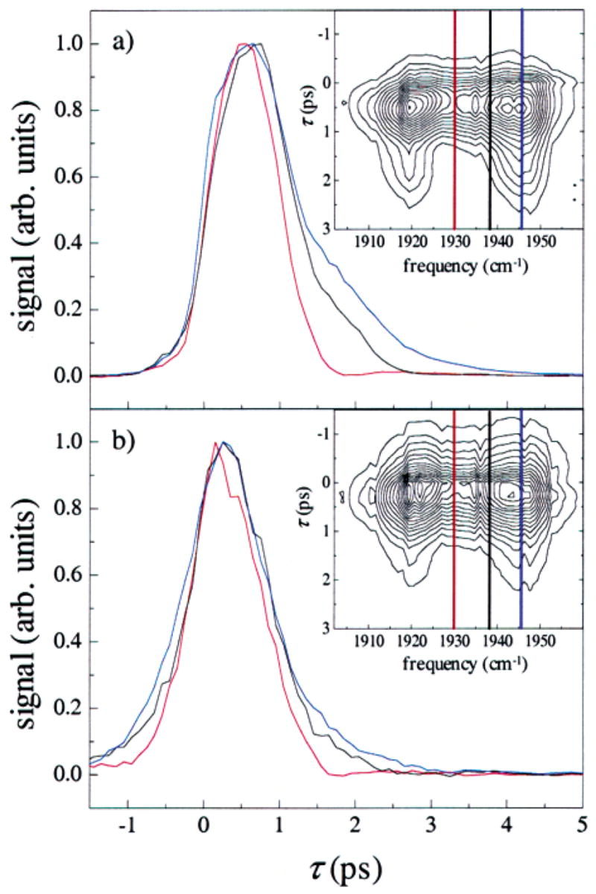
Spectrally resolved stimulated vibrational echo signals for (a) _T_ w = 0 ps and (b) _T_ w = 8 ps. Slices through the vibrational echo decay data are shown in the main plots at frequencies 1946 cm−1 (blue), 1938 cm−1 (black), and 1930 cm−1 (red). The full spectral response for the two _T_ w values is shown in the inset, along with the frequencies of each slice. The maximum amplitude of each slice has been normalized for comparison. The vibrational echo decays are highly frequency dependent for early _T_ w, but become independent of frequency for long _T_ w. The trends shown in the data at these _T_ w are representative of the trends seen in the full spectrally resolved vibrational echo data at other _T_ w.
There are a number of significant qualitative features of the dependence of the spectrally resolved vibrational echo decays on _τ_ , _T_ w, and frequency. First, the vibrational echo decays faster around 1932 cm−1 (red curves) than around 1945 cm−1 (blue curves). Second, comparisons between [Figure 3a](https://pmc.ncbi.nlm.nih.gov/articles/PMC2435512/#F3) and [Figure 3b](https://pmc.ncbi.nlm.nih.gov/articles/PMC2435512/#F3) show that the difference between the vibrational echo decay dephasing dynamics at different frequencies decreases as _T_ w is increased. The vibrational echo decays become more uniform as a function of frequency. Next, the vibrational echo signal decays faster as _T_ w is increased, and the peak of the vibrational echo signal shifts to earlier time as _T_ w is increased. These effects are the result of the inclusion of more dephasing processes in the _T_ w period as _T_ w is increased to encompass slower and slower dynamics. More dynamical broadening occurs as the system is allowed to evolve for longer and longer periods of time. Additional line broadening (frequency domain) results in a faster vibrational echo decay (time domain).
Our calculations of spectrally resolved stimulated vibrational echoes using the formalism of [Appendix A](https://pmc.ncbi.nlm.nih.gov/articles/PMC2435512/#APP1) reveal that these qualitative features are significantly influenced by the dynamics of the several overlapping vibrational transitions. However, the detailed shapes of the FFCFs used in the calculations control the quantitative agreement between the experimental data and calculated vibrational echo signal (see below). Several approaches have been previously proposed and applied to extract an FFCF directly from echo data on electronic and vibrational transitions.[37](https://pmc.ncbi.nlm.nih.gov/articles/PMC2435512/#R37),[49](https://pmc.ncbi.nlm.nih.gov/articles/PMC2435512/#R49),[59](https://pmc.ncbi.nlm.nih.gov/articles/PMC2435512/#R59) Implementation of these strategies is problematic for MbCO, which is characterized by several overlapping transitions, none of which is massively inhomogeneously broadened. A calculation of relevant FFCFs from a molecular model, as described in the following section, is required to fully interpret spectrally resolved echo data for such a system.
### B. Comparison of Measured and Simulated Dephasing Dynamics from MD
MD calculations of the instantaneous Stark shift _δω_(_t_) in [eq 1](https://pmc.ncbi.nlm.nih.gov/articles/PMC2435512/#FD1) for the N _ε_ –H structure show pronounced two-state behavior with a state R _ε_ characterized by a redder CO vibrational frequency and a state B _ε_ characterized by a bluer CO vibrational frequency. The Stark shifts of these two states fluctuate about mean values that differ by 9.3 _λ_ in units of cm−1, where _λ_ is the value of the Stark coupling constant expressed in units of cm−1/(MV/cm). In 13 trajectories of the 39 production trajectories of the N _ε_ –H tautomer, the system began and ended in the state R _ε_ without making a transition to the B _ε_ state, and in 3 trajectories, MbCO began and ended in B _ε_ without making a transition to R _ε_. In total, the R _ε_ state was observed 47 times for 8.96 ns of simulation. The B _ε_ state was observed 30 times for 3.24 ns of simulation. The time duration of a transition between the two conformers was ~500 fs. From this limited number of jumps, the average substate lifetimes of R _ε_ and B _ε_ are on the order of 100–200 ps. The limited time scale of the simulation prevents us from assigning quantitatively correct lifetimes or statistical weights to the R _ε_ and B _ε_ states. However, the lifetimes of the states are not required for the analysis presented below. A representative trajectory of _δω_(_t_) of duration 200 ps showing both states is plotted in [Figure 4a](https://pmc.ncbi.nlm.nih.gov/articles/PMC2435512/#F4).
#### Figure 4.
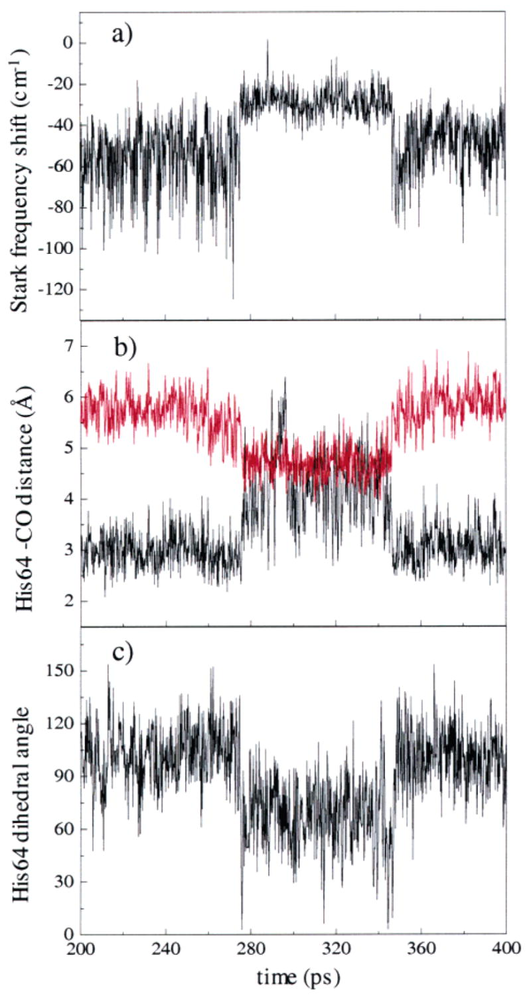
An example of a MD trajectory showing the transition between the R _ε_ state and the B _ε_ state. A transition occurs from R _ε_ to B _ε_ at ~280 ps, and then back to the R _ε_ state at ~345 ps. (a) The average value of the Stark frequency shift changes abruptly during the transition. (b) The distance between N _ε_ –H (black) and N _δ_ of His64 (red) during the trajectory. In the R _ε_ state, N _ε_ –H is much closer to the ligand than N _δ_. In the B _ε_ state, the distances of N _ε_ –H and N _δ_ of His64 to the CO are about the same. (c) The dihedral angle of the C _β_ –C _δ_ bond changes during the transition from R _ε_ to B _ε_ at ~280 ps and then back at ~345 ps.
The change in the CO vibrational frequency shown in [Figure 4a](https://pmc.ncbi.nlm.nih.gov/articles/PMC2435512/#F4) is associated with the motion of the distal histidine, His64, between two well-defined configurations. [Figure 4b](https://pmc.ncbi.nlm.nih.gov/articles/PMC2435512/#F4) shows the fluctuating distance between the N _ε_ –H proton and the midpoint of the CO bond (black) and the fluctuating distance between N _δ_ and the CO (red) for the same MD trajectory depicted in [Figure 4a](https://pmc.ncbi.nlm.nih.gov/articles/PMC2435512/#F4). In state R _ε_ , the N _ε_ –H bond points toward the CO ligand with a mean distance from H to CO midpoint of 3.2 Å. The mean distance from N _δ_ to CO is 5.8 Å. In the B _ε_ state, His64 has rotated about the C _β_ –C _γ_ bond relative to the R _ε_ state, such that both the N _ε_ proton and the N _δ_ are approximately the same distance from the ligand, with mean distances of 4.6 and 4.8 Å, respectively. The angle relevant to this rotation is that between the plane formed by Cα, C _β_ , and C _γ_ of the histidine arm, and the plane formed by C _γ_ , C _δ_ , and N _δ_ of the imidazole ring. The labeling of the carbon atoms of the histidine arm is defined in [Figure 2a](https://pmc.ncbi.nlm.nih.gov/articles/PMC2435512/#F2). The time dependence of this dihedral angle for the trajectory of [Figure 4a and 4b](https://pmc.ncbi.nlm.nih.gov/articles/PMC2435512/#F4) is shown in [Figure 4c](https://pmc.ncbi.nlm.nih.gov/articles/PMC2435512/#F4). This angle rotates from a mean value of 108° in R _ε_ to a mean value of 68° in B _ε_. In the B _ε_ state, the N _ε_ –H bond is not oriented directly toward the ligand but rather toward the heme, and both N _ε_ –H and N _δ_ are in the interior of the protein. The state R _ε_ has a structure qualitatively similar to [Figure 2b](https://pmc.ncbi.nlm.nih.gov/articles/PMC2435512/#F2), while B _ε_ qualitatively resembles [Figure 2f](https://pmc.ncbi.nlm.nih.gov/articles/PMC2435512/#F2). [Table 1](https://pmc.ncbi.nlm.nih.gov/articles/PMC2435512/#T1) summarizes some of the geometric differences between the B _ε_ and R _ε_ states. Representative snapshots of the R _ε_ and B _ε_ configurations are shown in [Figure 5a and 5b](https://pmc.ncbi.nlm.nih.gov/articles/PMC2435512/#F5), respectively.
#### Table 1.
Coordinates for Heme Pocket Atoms for the R _ε_ and B _ε_ Configurations
| distance (Å) 
* * *
| variance (Å)2
* * *  
---|---|---  
| R _ε_ state | B _ε_ state | R _ε_ state | B _ε_ state  
_R_(N _δ_ –O) (His64) | 5.69 | 4.46 | 0.205 | 0.142  
_R_(HN _ε_ –O) (His64) | 3.07 | 4.63 | 0.300 | 0.618  
_R_(C–O) | 1.13 | 1.13 | 0.000 | 0.000  
_R_(Fe–C) | 1.90 | 1.90 | 0.001 | 0.001  
_R_(Fe–Na) (Heme) | 1.97 | 1.97 | 0.001 | 0.001  
_R_(Fe–Nb) | 1.97 | 1.97 | 0.001 | 0.001  
_R_(Fe–Nc) | 1.97 | 1.97 | 0.001 | 0.001  
_R_(Fe–Nd) | 1.97 | 1.97 | 0.001 | 0.001  
_R_(Fe–N _ε_) (His93) | 2.21 | 2.21 | 0.004 | 0.004  
* * *  
| angle   
(deg) | angle   
(deg) | R _ε_ state   
((deg)2) | B _ε_ state   
((deg)2)  
* * *  
(Fe–C–O) | 173.38 | 173.33 | 11.97 | 12.20  
[Open in a new tab](https://pmc.ncbi.nlm.nih.gov/articles/PMC2435512/table/T1/)
#### Figure 5.
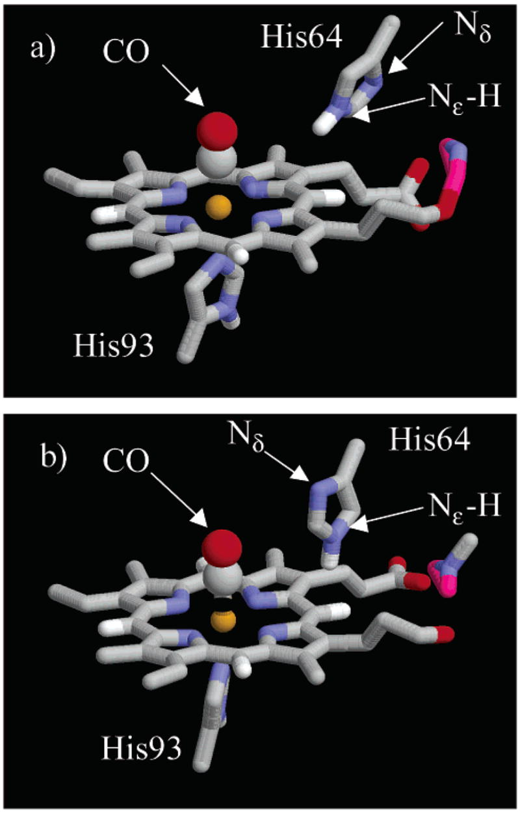
Snapshots of the heme pocket[45](https://pmc.ncbi.nlm.nih.gov/articles/PMC2435512/#R45) during the MD trajectory shown in [Figure 4](https://pmc.ncbi.nlm.nih.gov/articles/PMC2435512/#F4). (a) The R _ε_ configuration has N _ε_ –H oriented toward the CO, and the N _δ_ oriented toward the solvent. (b) In the B _ε_ configuration, the imidazole ring of His64 has undergone a rotation around the C _β_ –C _δ_ bond so that N _ε_ –H is oriented away from the CO ligand and N _δ_ is inside the heme pocket.
Frequency–frequency correlation functions were calculated for the two substates from [eqs 1](https://pmc.ncbi.nlm.nih.gov/articles/PMC2435512/#FD1) and [2](https://pmc.ncbi.nlm.nih.gov/articles/PMC2435512/#FD2) and are shown in [Figure 6a](https://pmc.ncbi.nlm.nih.gov/articles/PMC2435512/#F6) by the red (R _ε_) and blue (B _ε_) curves. The FFCF for R _ε_ has a larger initial amplitude than that for B _ε_ , indicating a larger root-mean-squared Stark shift fluctuation for the former state, which may also be seen qualitatively from the frequency fluctuations in [Figure 4a](https://pmc.ncbi.nlm.nih.gov/articles/PMC2435512/#F4). The FFCF for R _ε_ has an initial rapid decay on the time scale of ~100 fs, followed by slower decay on the picosecond time scale. This FFCF shows pronounced ringing during the first few picoseconds. The B _ε_ state FFCF, while of smaller initial amplitude, shows similar rapid and slower decays, but does not display the fine structure of the FFCF for R _ε_. Neither FFCF is well described as a sum of two exponential decays.
#### Figure 6.
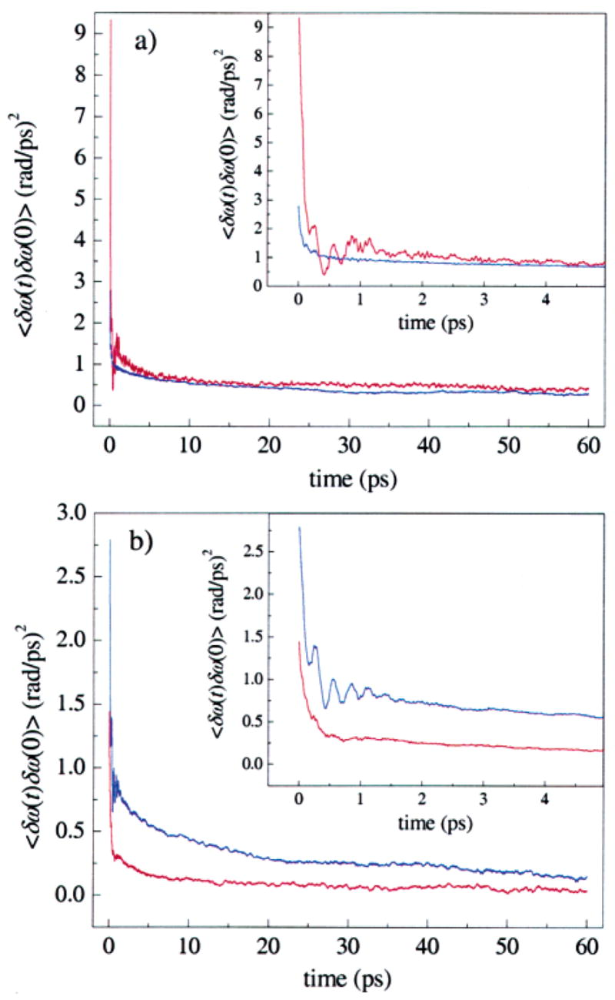
Frequency–frequency correlation functions (FFCFs) for the two tautomers of MbCO derived from MD simulations used to calculate vibrational echo signals. (a) The N _ε_ –H tautomer of His64. The R _ε_ conformer (red) and B _ε_ conformer (blue) both have a fast initial decay over the first few picoseconds, and then continue to decay slowly. The R _ε_ substate has a much larger initial amplitude. The value of the Stark coupling constant _λ_ is _λ_ = 2.1 cm−1/(MV/cm). (b) The N _δ_ –H tautomer of His64. The B _δ_ conformer (blue) has a larger initial amplitude than the R _δ_ (red) conformer. The value of _λ_ is _λ_ = 1.4 cm−1/(MV/cm).
The FFCFs for the R _ε_ and B _ε_ states were used to compute spectrally resolved vibrational echo decays for particular values of _T_ w. The IR line shape of MbCO shows two dominant features: the redder A3 peak at ~1934 cm−1 and the bluer A1 peak at 1945 cm−1. The R _ε_ state FFCF was used to model the dynamics of the A3 substate, and the B _ε_ state FFCF was used to model the dynamics of the A1 substate. We assumed that the simulation did not show the A0 substate, because His64 never adopted a swung out configuration seen in low pH crystal structures.[32](https://pmc.ncbi.nlm.nih.gov/articles/PMC2435512/#R32) Also, the inverse rate constant for interconversion between the A1 and A3 substates has been estimated to be ~1 ns, while the inverse rate constant for interchanging between the A1 and A0 substates is ~1 _μ_ s.[10](https://pmc.ncbi.nlm.nih.gov/articles/PMC2435512/#R10),[13](https://pmc.ncbi.nlm.nih.gov/articles/PMC2435512/#R13) Transitions between the R _ε_ and B _ε_ states occurred numerous times during the 12.8 ns of MD simulations, consistent with the rate constant between A1 and A3.
Calculation of the spectrally resolved stimulated vibrational echo decay curves from the formalism of section III requires knowledge of the following quantities: the peak frequencies of the substates, the concentrations of the substates (_c_ α in [eq 4](https://pmc.ncbi.nlm.nih.gov/articles/PMC2435512/#FD4)), the vibrational lifetimes of each substate, and the Stark coupling constant _λ_ in [eq 1](https://pmc.ncbi.nlm.nih.gov/articles/PMC2435512/#FD1). We include all three A substate peaks to reproduce the features seen in the data. The approximate inclusion of the A0 state, not observed in the simulation, is described in [Appendix B](https://pmc.ncbi.nlm.nih.gov/articles/PMC2435512/#APP2). The line center for the A1 substate was measured by taking a vibrational echo spectrum at _τ_ = 3.0 ps, _T_ w = 0.25 ps, shown in [Figure 7](https://pmc.ncbi.nlm.nih.gov/articles/PMC2435512/#F7). At this value of _τ_ , vibrational echo contributions from the A3 substate are negligible, leaving only the 0–1 and 1–2 transition peaks of the A1 substate. The vibrational echo spectrum in [Figure 7](https://pmc.ncbi.nlm.nih.gov/articles/PMC2435512/#F7) is an example of vibrational echo peak suppression, where differences in dephasing times are used as a means of enhancing certain peaks relative to other peaks.[60](https://pmc.ncbi.nlm.nih.gov/articles/PMC2435512/#R60),[61](https://pmc.ncbi.nlm.nih.gov/articles/PMC2435512/#R61) Further details used in the calculation of the spectrally resolved vibrational echo data for the A substates are presented in [Appendix B](https://pmc.ncbi.nlm.nih.gov/articles/PMC2435512/#APP2). However, it is important to note that the substate concentrations, _c_ α in [eq 4](https://pmc.ncbi.nlm.nih.gov/articles/PMC2435512/#FD4), and center line frequencies are determined by fitting the linear absorption spectrum to Voigt profiles. Therefore, the determination of the center frequencies and concentrations does not depend on any of the MD simulations used to analyze the stimulated vibrational echo data. The same line center frequencies and substate concentrations are used in the comparisons of the MD simulations for the two tautomers. All parameter values employed in the linear spectrum and vibrational echo calculations are summarized in [Table 2](https://pmc.ncbi.nlm.nih.gov/articles/PMC2435512/#T2).
#### Figure 7.
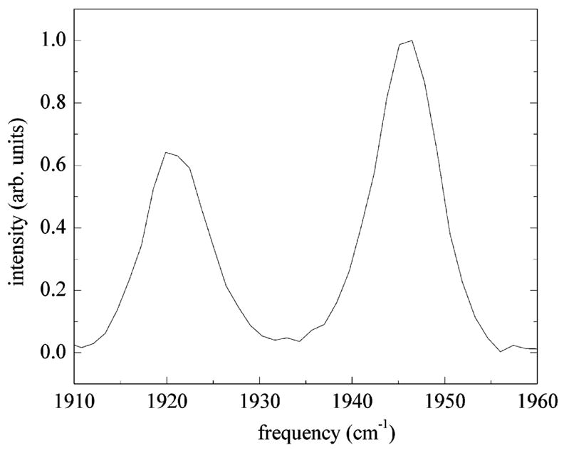
Vibrational echo spectrum at _τ_ = 2.1 ps, _T_ w = 0 ps. The 0–1 and 1–2 transitions of the A1 substate are clearly seen at 1945 and 1920 cm−1. Contributions to the echo spectrum from the A3 substate have been eliminated using T2 selectivity. The splitting between the two peaks gives an anharmonicity of Δ = 25.3 cm−1.
#### Table 2.
Summary of Parameters Used in Vibrational Echo Calculations[a](https://pmc.ncbi.nlm.nih.gov/articles/PMC2435512/#TFN1)
MbCO substate | center frequency   
(cm−1) | concentration   
(relative) | lifetime   
(ps) | FFCF   
(N _ε_ –H tautomer) | FFCF   
(N _δ_ –H tautomer)  
---|---|---|---|---|---  
A0 | 1965 | 0.125 | 16.5 | 0.64 × B _ε_ | 0.64 × B _δ_  
A1 | 1945 | 1.4 | 16.5 | B _ε_ | B _δ_  
A3 | 1934 | 1 | 14.7 | R _ε_ | R _δ_  
[Open in a new tab](https://pmc.ncbi.nlm.nih.gov/articles/PMC2435512/table/T2/)
a
The transition dipole moments for all A substates are assumed to be the same. An anharmonicity of Δ = 25.4 cm−1 is assumed for all transitions. The vibrational lifetimes for the A1 and A3 substates have been measured previously,[40](https://pmc.ncbi.nlm.nih.gov/articles/PMC2435512/#R40) and the lifetime of the A0 substate is assumed to be the same as the lifetime of the A1 substate. The laser pulse is assumed to be a transform-limited Gaussian pulse centered at 1940 cm−1 with a fwhm = 125 fs. The FFCFs for the N _ε_ –H tautomer were used in the calculations shown in [Figures 8](https://pmc.ncbi.nlm.nih.gov/articles/PMC2435512/#F8) and [9](https://pmc.ncbi.nlm.nih.gov/articles/PMC2435512/#F9), and the FFCFs for the N _δ_ –H tautomer were used in the calculations shown in [Figures 10](https://pmc.ncbi.nlm.nih.gov/articles/PMC2435512/#F10) and [11](https://pmc.ncbi.nlm.nih.gov/articles/PMC2435512/#F11). See [Appendix B](https://pmc.ncbi.nlm.nih.gov/articles/PMC2435512/#APP2) for further details.
Measured vibrational echo decays for four frequencies and three values of _T_ w are shown in [Figure 8](https://pmc.ncbi.nlm.nih.gov/articles/PMC2435512/#F8) in black. The red curves show vibrational echoes calculated using FFCFs for the N _ε_ –H tautomer. The FFCFs calculated from the MD simulations can be used to fit the experimental vibrational echo data for all measured values of _T_ w.[62](https://pmc.ncbi.nlm.nih.gov/articles/PMC2435512/#R62) In the fits, there is only one adjustable parameter, the Stark coupling constant, _λ_. The best fit value for the Stark coupling constant was found to be _λ_ = 2.1 cm−1/(MV/cm).[63](https://pmc.ncbi.nlm.nih.gov/articles/PMC2435512/#R63) The value for _λ_ has been determined experimentally by Boxer and co-workers using vibrational Stark spectroscopy on MbCO and a number of other heme-CO systems.[64](https://pmc.ncbi.nlm.nih.gov/articles/PMC2435512/#R64),[65](https://pmc.ncbi.nlm.nih.gov/articles/PMC2435512/#R65) They found the Stark coupling constant to be _λ_ = 1.8–2.2 cm−1/(MV/cm).[66](https://pmc.ncbi.nlm.nih.gov/articles/PMC2435512/#R66) Our value of _λ_ is in excellent agreement with these results. Thus, the only adjustable parameter in the fit of the experimental data using the FFCF determined by the MD simulations is, within experimental error, the same as the measured value. Spectrally resolved stimulated vibrational echo decays are very sensitive to protein structure and dynamics. The agreement between experiment and theory provides strong support for the assignment of the A1 and A3 structures.
#### Figure 8.
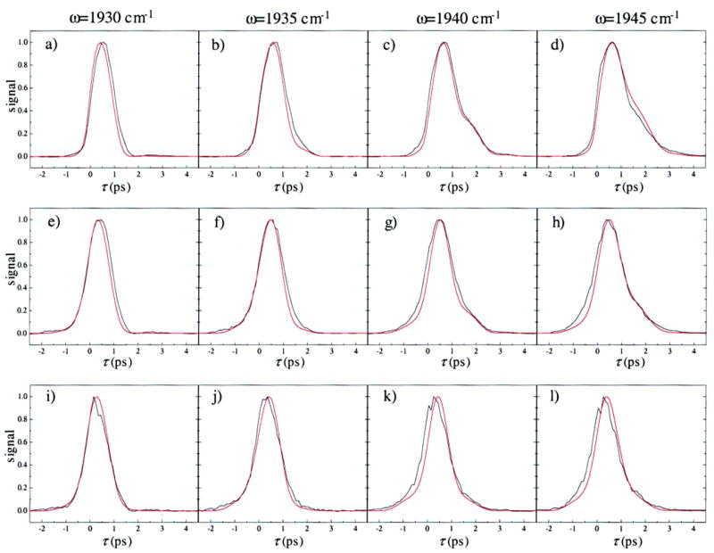
Comparison of the measured vibrational echo data (black) with the calculated vibrational echo data (red) for the N _ε_ –H tautomer of His64. The vibrational echo signals were calculated using the FFCFs shown in [Figure 6a](https://pmc.ncbi.nlm.nih.gov/articles/PMC2435512/#F6). The parameters used in the vibrational echo calculation are listed in [Table 2](https://pmc.ncbi.nlm.nih.gov/articles/PMC2435512/#T2). Spectrally resolved vibrational echo decays are shown for the frequencies 1930, 1935, 1940, and 1945 cm−1, and _T_ w = 0 ps (a–d), 2 ps (e–h), and 8 ps (i–l). Vibrational echo decays for a particular frequency as a function of _T_ w are in columns. The oscillations in the echo decays in panels c and d are due to anharmonic accidental degeneracy beats[38](https://pmc.ncbi.nlm.nih.gov/articles/PMC2435512/#R38),[77](https://pmc.ncbi.nlm.nih.gov/articles/PMC2435512/#R77),[81](https://pmc.ncbi.nlm.nih.gov/articles/PMC2435512/#R81) between the 0–1 transition of the A1 line and the 1–2 transition of the A0 line.
[Figure 9](https://pmc.ncbi.nlm.nih.gov/articles/PMC2435512/#F9) displays the measured linear absorption spectrum (solid curve) and the calculated linear spectrum (dashed curve) employing the same parameter values used for the calculated vibrational echo decays in [Figure 8](https://pmc.ncbi.nlm.nih.gov/articles/PMC2435512/#F8), and listed in [Table 2](https://pmc.ncbi.nlm.nih.gov/articles/PMC2435512/#T2). The center frequencies and relative substate concentrations derived from the model independent fits to the linear spectrum are used and are not adjustable parameters. The simulated linear spectrum is slightly wider than the measured line shape, and the amplitude of the A0 peak is too large. Overall, the agreement with the linear spectrum is reasonably good. However, the MD results overestimate the splitting between the A1 and A3 substates by ~8 cm−1, predicting a splitting of 19 cm−1 between the substates. While the stimulated vibrational echo is only sensitive to dynamics on short time scales, the linear absorption spectrum is also sensitive to dynamics on all possible time scales. Very long time scale dynamics may not be accurately modeled using only ~13 ns of MD simulation. Nonetheless, the linear spectrum agrees reasonably well and shows, along with the dynamical calculations in [Figure 8](https://pmc.ncbi.nlm.nih.gov/articles/PMC2435512/#F8), that the simulated FFCFs for the N _ε_ –H tautomer are consistent with the measured dynamics of the A1 and A3 substates of MbCO.
#### Figure 9.
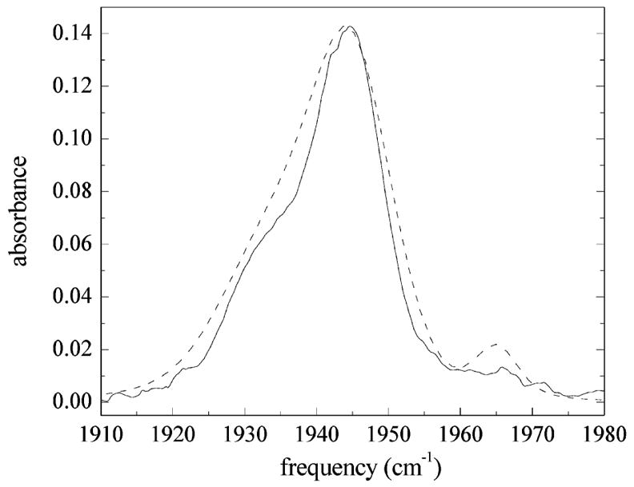
Comparison of the measured IR absorption spectrum of the CO stretch in MbCO (solid line) with that calculated using FFCFs for the N _ε_ –H tautomer of His64 (dashed line). The measured spectrum shows three bands at ~1965, 1945, and 1934 cm−1. The calculated linear spectrum for the N _ε_ –H tautomer is slightly wider than the measured spectrum, but generally agrees reasonably well with the overall shape of the experimental spectrum.
Trajectories of the fluctuating CO Stark shift for the N _δ_ –H structure, analogous to the calculation for N _ε_ –H shown in [Figure 4a](https://pmc.ncbi.nlm.nih.gov/articles/PMC2435512/#F4), also show pronounced two-state behavior, with a blue state B _δ_ (qualitatively similar to [Figure 2c](https://pmc.ncbi.nlm.nih.gov/articles/PMC2435512/#F2)) and a red state R _δ_ (qualitatively similar to [Figure 2e](https://pmc.ncbi.nlm.nih.gov/articles/PMC2435512/#F2)) having vibrational frequencies separated by 18.1 _λ_ in units of cm−1.67 The state B _δ_ has a structure similar to R _ε_. In both structures, N _ε_ points in the heme pocket toward the CO ligand. However, whereas in R _ε_ the proton is directed toward the ligand, in B _δ_ the proton is on the surface of the protein and directed into the solvent. The mean dihedral angle defined for [Figure 4b](https://pmc.ncbi.nlm.nih.gov/articles/PMC2435512/#F4) has the same value of 108° for B _δ_ as for R _ε_. In B _δ_ , the distances from N _ε_ and the N _δ_ –H proton to the midpoint of the CO bond are 5.6 and 9.5 Å, respectively. The red state R _δ_ is structurally similar to B _ε_ , but with the imidazole proton directed into the heme pocket, and with a mean dihedral angle of 80°, as compared to 68° for B _ε_. The mean distances from N _ε_ and the N _δ_ –H proton to the midpoint of the CO bond for the R _δ_ structure are 7.2 and 6.5 Å, respectively.
The FFCFs associated with these states are shown in [Figure 6b](https://pmc.ncbi.nlm.nih.gov/articles/PMC2435512/#F6). The FFCF for B _δ_ resembles that for R _ε_ in having a relatively large initial value and in displaying ringing on the picosecond time scale. Similarly, the FFCF for R _δ_ resembles that for B _ε_ in having a relatively small initial value and lacking fine structure. These FFCFs were used to compute the vibrational echo decays and absorption line shape with the same procedure, line centers, and concentrations used for the N _ε_ –H calculation. Details of the fitting procedure are in [Appendix B](https://pmc.ncbi.nlm.nih.gov/articles/PMC2435512/#APP2).
The computed vibrational echo signal for the N _δ_ –H tautomer is shown in [Figure 10](https://pmc.ncbi.nlm.nih.gov/articles/PMC2435512/#F10) for the same frequencies and values of _T_ w as shown in [Figure 8](https://pmc.ncbi.nlm.nih.gov/articles/PMC2435512/#F8). The calculated linear spectrum (dashed curve) using the FFCFs for the N _δ_ –H tautomer is compared to the experimental linear spectrum for sperm whale MbCO (solid curve) in [Figure 11](https://pmc.ncbi.nlm.nih.gov/articles/PMC2435512/#F11). The parameters used in the calculations shown in [Figures 10](https://pmc.ncbi.nlm.nih.gov/articles/PMC2435512/#F10) and [11](https://pmc.ncbi.nlm.nih.gov/articles/PMC2435512/#F11) are listed in [Table 2](https://pmc.ncbi.nlm.nih.gov/articles/PMC2435512/#T2). The agreement between the calculated and measured vibrational echo signals and linear spectra shown in [Figures 10](https://pmc.ncbi.nlm.nih.gov/articles/PMC2435512/#F10) and [11](https://pmc.ncbi.nlm.nih.gov/articles/PMC2435512/#F11) is not very good when using the FFCFs derived from the N _δ_ –H tautomer of His64. There are pronounced systematic differences in both the fits to the dynamical line shapes and the calculation of the linear spectrum. In addition, the best fit value for the Stark coupling constant was found to be _λ_ = 1.4 cm−1/(MV/cm), which lies well outside the experimental range for _λ_ measured by Boxer and co-workers.[64](https://pmc.ncbi.nlm.nih.gov/articles/PMC2435512/#R64),[65](https://pmc.ncbi.nlm.nih.gov/articles/PMC2435512/#R65) The calculated frequency splitting between the B _δ_ and R _δ_ state is 25 cm−1, a significant overestimate of the measured splitting 11 cm−1. A summary of the parameters used in the vibrational echo calculation for the N _δ_ –H tautomer is given in [Table 2](https://pmc.ncbi.nlm.nih.gov/articles/PMC2435512/#T2).
#### Figure 10.
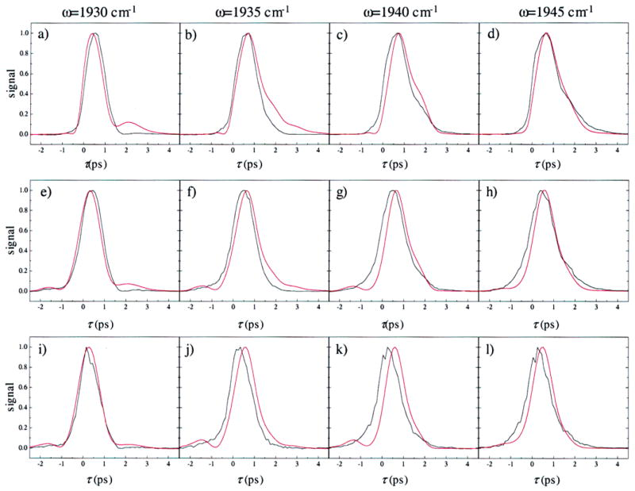
Comparison of the measured vibrational echo data (black) with the calculated vibrational echo data (red) for the N _δ_ –H tautomer of His64. Frequencies and values of _T_ w are the same as those shown in [Figure 8](https://pmc.ncbi.nlm.nih.gov/articles/PMC2435512/#F8). The vibrational echo signals were calculated using the FFCFs shown in [Figure 6b](https://pmc.ncbi.nlm.nih.gov/articles/PMC2435512/#F6). The parameters used in the vibrational echo calculation are listed in [Table 2](https://pmc.ncbi.nlm.nih.gov/articles/PMC2435512/#T2). The agreement is poorer for the N _δ_ –H tautomer of His64 than for the N _ε_ –H tautomer of His64 shown in [Figure 8](https://pmc.ncbi.nlm.nih.gov/articles/PMC2435512/#F8).
#### Figure 11.
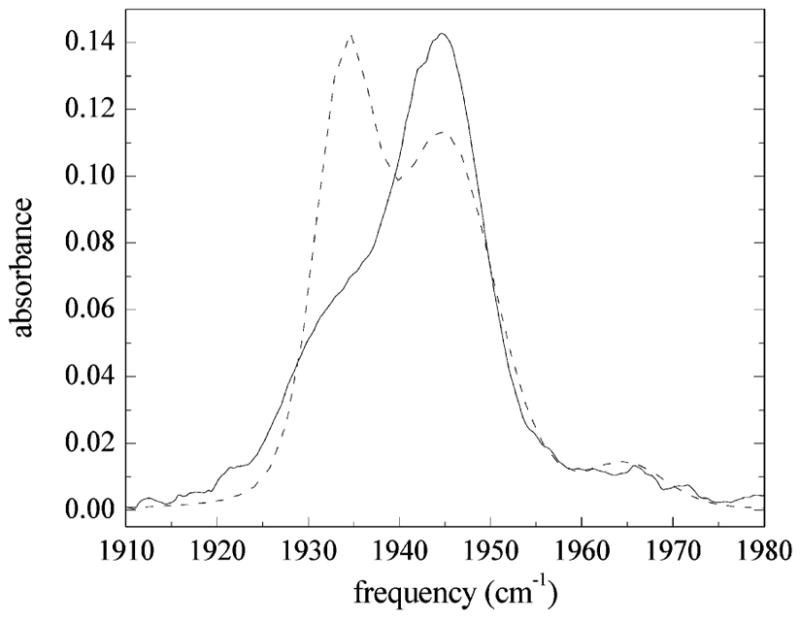
Comparison of the measured IR absorption spectrum (solid line) of the CO stretch in MbCO with that calculated using FFCFs for the N _δ_ –H tautomer of His64 (dashed line). The linear spectrum for the N _δ_ –H tautomer is calculated using the same line centers and concentrations used in the calculation of the linear spectrum for the N _ε_ –H tautomer of His64 shown in [Figure 9](https://pmc.ncbi.nlm.nih.gov/articles/PMC2435512/#F9). The agreement between the measured and calculated linear spectrum for the N _δ_ –H tautomer is quite poor.
Comparison of [Figures 8](https://pmc.ncbi.nlm.nih.gov/articles/PMC2435512/#F8) and [10](https://pmc.ncbi.nlm.nih.gov/articles/PMC2435512/#F10) shows that the differences between the FFCFs for the two tautomers of His64 shown in [Figure 6](https://pmc.ncbi.nlm.nih.gov/articles/PMC2435512/#F6) give rise to very different spectrally resolved stimulated vibrational echo signals. The agreement between the measured vibrational echo data and the vibrational echo signals calculated using the N _ε_ –H tautomer of His64 is quite good, while the agreement with the measured vibrational echo data using the N _δ_ –H tautomer of His64 is significantly worse. [Figure 11](https://pmc.ncbi.nlm.nih.gov/articles/PMC2435512/#F11) shows that the predicted absorption spectrum for the N _δ_ –H tautomer also agrees poorly with the measured result. In addition, the value of the Stark coupling constant _λ_ necessary to give reasonable agreement between the calculated vibrational echo data for the N _δ_ –H tautomer and the measured vibrational echo data is unphysically small. The best fit values of _λ_ are 2.1 cm−1/(MV/cm) for the N _ε_ –H tautomer and 1.4 cm−1/(MV/cm) for the N _δ_ –H tautomer of His64. A value of _λ_ = 1.4 cm−1/(MV/cm) implies an extremely high (approaching infinitely high) dielectric constant for the heme pocket, inconsistent with what is known about the structure of the hydrophobic heme pocket.[15](https://pmc.ncbi.nlm.nih.gov/articles/PMC2435512/#R15),[31](https://pmc.ncbi.nlm.nih.gov/articles/PMC2435512/#R31),[64](https://pmc.ncbi.nlm.nih.gov/articles/PMC2435512/#R64),[65](https://pmc.ncbi.nlm.nih.gov/articles/PMC2435512/#R65),[68](https://pmc.ncbi.nlm.nih.gov/articles/PMC2435512/#R68) The value of _λ_ = 2.1 cm−1/(MV/cm) obtained from fitting the vibrational echo data for the N _ε_ –H tautomer lies within the range established by Park et al. using vibrational Stark effect spectroscopy.[64](https://pmc.ncbi.nlm.nih.gov/articles/PMC2435512/#R64),[65](https://pmc.ncbi.nlm.nih.gov/articles/PMC2435512/#R65),[68](https://pmc.ncbi.nlm.nih.gov/articles/PMC2435512/#R68) It is possible to improve the quality of the agreement between the measured vibrational echo signals and those calculated using the N _δ_ –H tautomer by increasing the A1/A3 concentration ratio from 1.4 to around 4. However, a ratio of 4 is completely outside any error in the model independent fit to the linear spectrum used to determine the concentrations. In addition, using a ratio of 4 does not change the unphysical best fit value of _λ_ = 1.4 cm−1/(MV/cm) for the N _δ_ –H tautomer.
Our finding that the vibrational echo data are best modeled by the dynamics of MbCO with the N _ε_ –H structure is consistent with other measurements and calculations that have indicated that the N _ε_ –H tautomer is associated with the A1 and A3 substates. While two recent high-resolution X-ray crystal structures[28](https://pmc.ncbi.nlm.nih.gov/articles/PMC2435512/#R28),[29](https://pmc.ncbi.nlm.nih.gov/articles/PMC2435512/#R29) disagree on the exact position and orientation of His64, both structures have N _ε_ inside the pocket, close to the ligand. Given that this is the orientation of the His64 imidazole, if the tautomerization state of His64 were N _δ_ –H, lone pair interactions between N _ε_ and the CO ligand would blue-shift the CO transition frequency.[20](https://pmc.ncbi.nlm.nih.gov/articles/PMC2435512/#R20) Rovira et al.[20](https://pmc.ncbi.nlm.nih.gov/articles/PMC2435512/#R20) calculated the expected transition frequency of the CO stretching mode in MbCO for a number of different configurations and tautomerizations and concluded that only the N _ε_ –H tautomer could reproduce the frequency shift trends seen experimentally. In addition, a recent electron nuclear double resonance (ENDOR) experiment[69](https://pmc.ncbi.nlm.nih.gov/articles/PMC2435512/#R69) on MbNO assigned the tautomerization state of His64 to N _ε_ –H. Our assignment of the tautomerization state of His64 to N _ε_ –H is consistent with the existing strong case for this tautomer state giving rise to the A1 and A3 substates of MbCO.
### C. Decomposition of the Contributions to Dephasing Using the MD Simulations
Once the structural origins of the A substates of MbCO have been identified, the next step is to determine the source of the dynamical differences between these states. We can use the MD simulations to identify contributions to vibrational dephasing from different parts of the solvated MbCO system. The fluctuating Stark shift of the CO vibrational frequency in [eq 1](https://pmc.ncbi.nlm.nih.gov/articles/PMC2435512/#FD1) is linear in the electric field at the CO, which may be decomposed into contributions from various parts of the system. The contribution to the frequency fluctuation from a collection of atoms denoted _j_ is
| (5)  
---|---  
where _E⃗ j_ is the electric field at the midpoint of the CO bond, generated by the partial charges on the atoms in collection _j_. For example, we may decompose the total electric field at the CO into contributions from the protein and from the water solvent, so that the frequency fluctuation takes the form
| (6)  
---|---  
with subscripts _p_ and _s_ labeling protein and solvent, respectively.[70](https://pmc.ncbi.nlm.nih.gov/articles/PMC2435512/#R70) The FFCF, _C_(_t_), is then decomposed into autocorrelation functions of frequency fluctuations induced by the protein and by the solvent and cross-correlations between frequency fluctuations from those sources: 
| (7)  
---|---  
This decomposition is illustrated for the A3 state in [Figure 12a](https://pmc.ncbi.nlm.nih.gov/articles/PMC2435512/#F12), and for A1 in [Figure 12b](https://pmc.ncbi.nlm.nih.gov/articles/PMC2435512/#F12), and listed in [Table 3](https://pmc.ncbi.nlm.nih.gov/articles/PMC2435512/#T3). In each panel, _C_(_t_) is shown in black, _C_ pp(_t_) = 〈 _δω_ p(_t_)_δω_ p(0)〉 is shown in red, _C_ ss(_t_) = 〈 _δω_ s(_t_)_δω_ s(0)〉 is shown in green, and the sum of the cross-correlation functions, _C_ ps(_t_) + _C_ sp(_t_) = 〈 _δω_ p(_t_)_δω_ s(0)〉 + 〈 _δω_ s(_t_)_δω_ p(0)〉 is shown in blue. The black curve is thus the sum of the red, blue, and green curves. For the A3 substate in [Figure 12a](https://pmc.ncbi.nlm.nih.gov/articles/PMC2435512/#F12), _C_ pp(_t_) is very similar to _C_(_t_), including the fine structure on the picosecond time scale. This similarity does not arise because the solvent contribution _C_ ss(_t_) is negligible, but because of a near cancellation between _C_ ss(_t_) and the sum of solvent–protein cross-correlation functions, _C_ sp(_t_) + _C_ ps(_t_). Each of these cross-correlation functions is negative, indicating that electric field fluctuations from protein and solvent are anticorrelated. The solvent contribution _C_ ss(_t_) lacks fine structure and is very similar for the two states. [Figure 12b](https://pmc.ncbi.nlm.nih.gov/articles/PMC2435512/#F12) shows that _C_ pp(_t_) is also very similar to _C_(_t_) for the A1 substate, but that on the time scale of a few picoseconds, _C_(_t_) decays more slowly than _C_ pp(_t_), because the cancellation between _C_ ss(_t_) and _C_ sp(_t_) + _C_ ps(_t_) is not as complete as for the A3 state.
#### Figure 12.
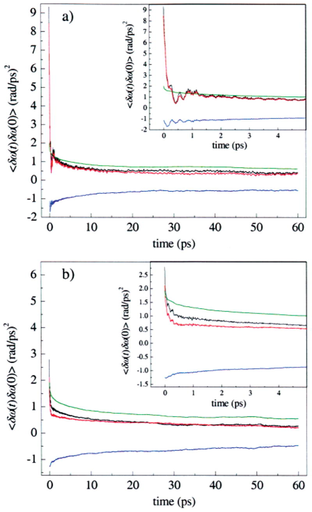
Decomposition of the FFCFs into contributions from the protein and from the solvent for the (a) A3 and (b) A1 states seen in MD simulations of MbCO. The total contribution (black), contribution from only the protein (red), contribution from only the solvent (green), and the cross-correlations between the protein and solvent (blue) are shown. For both the A1 and the A3 states, most of the dephasing is due to the protein. The protein and solvent dephasing contributions are anticorrelated.
#### Table 3.
Stark Effect Dephasing Contributions from MD Simulations[a](https://pmc.ncbi.nlm.nih.gov/articles/PMC2435512/#TFN2)
| R _ε_ state 
* * *
| B _ε_ state 
* * *  
---|---|---  
| Stark frequency shift (cm−1) | FFCF (_t_ = 0)   
((rad/ps)2) | Stark frequency shift (cm−1) | FFCF (_t_ = 0)   
((rad/ps)2)  
all | −48.8 | 9.35 | −29.6 | 2.80  
protein | −51.7 | 8.45 | −31.4 | 2.12  
His64 | −6.7 | 7.75 | 14.0 | 1.03  
solvent | 2.8 | 2.01 | 1.8 | 1.93  
[Open in a new tab](https://pmc.ncbi.nlm.nih.gov/articles/PMC2435512/table/T3/)
a
The Stark effect frequency shift contributions and initial amplitudes of the FFCFs for various parts of the protein and solvent for the N _ε_ –H tautomer simulations. The differences in the average frequencies for B _ε_ and R _ε_ are almost entirely due to the electric field contribution of His64. The Stark effect frequency shift and the initial amplitudes of the FFCF for the solvent are essentially the same. The Stark frequency shifts are additive; the initial amplitudes of the FFCFs are not.
We have further separated the protein contribution _C_ pp(_t_) into contributions from the eight helices and connecting loops that compose Mb (see [Figure 1](https://pmc.ncbi.nlm.nih.gov/articles/PMC2435512/#F1)). With the exception of helix E, which contains His64, the autocorrelation functions of induced frequency fluctuations for all the helices and loops are generally small. However, we calculate systematic differences between the A3 state and the A1 state in the contributions of the B, C, and D helices to the FFCF. The dephasing contribution for all three of these helices is larger in the A1 state. The cross-correlations between different helices are negligible, indicating that the helices move independently on these time scales. Dynamics of the residue Arg45 (see [Figure 1](https://pmc.ncbi.nlm.nih.gov/articles/PMC2435512/#F1)) have been proposed to play a role in the transition between states A1 and A3.[21](https://pmc.ncbi.nlm.nih.gov/articles/PMC2435512/#R21) We have computed the autocorrelation function of frequency fluctuations of the CO vibration from the electric field of Arg45 and find that these correlation functions are very similar for the two states, implying that the dynamics of this residue do not contribute to dephasing differences between A3 and A1.
We have carried out corresponding analysis to examine the contribution to _C_(_t_) from interactions between CO and the heme ring, including the Fe atom. While the heme ring contributes substantially to the average electric field at the CO, and hence to the total Stark shift of the CO frequency, heme dynamics[71](https://pmc.ncbi.nlm.nih.gov/articles/PMC2435512/#R71) do not contribute significantly to the electric field fluctuations at the CO on the time scales relevant to the vibrational echo. Moreover, contributions to _C_(_t_) from heme dynamics are nearly identical for the A1 and A3 substates. We have also ascertained that the mean bond length between Fe and the proximal histidine and the fluctuations in that bond length are identical in the A1 and A3 substates, as can be seen from [Table 1](https://pmc.ncbi.nlm.nih.gov/articles/PMC2435512/#T1). This finding suggests that, within the Stark effect model employed here, the proximal histidine is not a major contributor to dephasing differences between the two states. This classical mechanical model does not include polarization effects and other quantum mechanical phenomena that may play a role in the laboratory. However, as shown in Section IVB, the time-dependent Stark effect model is sufficient to describe the dephasing dynamics probed by the vibrational echo, and the magnitude of the Stark coupling constant is consistent with independent experimental measurements.[64](https://pmc.ncbi.nlm.nih.gov/articles/PMC2435512/#R64),[65](https://pmc.ncbi.nlm.nih.gov/articles/PMC2435512/#R65)
The role of His64 in dephasing the CO vibration is investigated with the decomposition
| (8)  
---|---  
in which the first term denotes the contribution from His64 and the second term represents the contribution from the rest of the system, solvent and protein. This decomposition is shown in [Figure 13a](https://pmc.ncbi.nlm.nih.gov/articles/PMC2435512/#F13) for A3 and in [Figure 13b](https://pmc.ncbi.nlm.nih.gov/articles/PMC2435512/#F13) for A1, and listed in [Table 3](https://pmc.ncbi.nlm.nih.gov/articles/PMC2435512/#T3). In each panel, _C_(_t_) is shown in black, the His64 contribution, _C_ hh(_t_), is shown in red, the contribution from the rest of the system, _C_ rr(_t_), is shown in green, and the sum of the cross-correlation functions, _C_ rh(_t_) + _C_ hr(_t_), is shown in blue. [Figure 13a](https://pmc.ncbi.nlm.nih.gov/articles/PMC2435512/#F13) shows that for the A3 substate, _C_(_t_) is essentially identical to _C_ hh(_t_) over the range of time scales investigated. _C_(_t_) follows _C_ hh(_t_) in the initial rapid decay on the time scale of hundreds of femtoseconds, in the slower decay on the picosecond time scale, and in the ringing on the picosecond time scale. This plot shows that the autocorrelation function of frequency fluctuations induced by the rest of the system, solvent and protein, _C_ rr(_t_), is not itself negligible, but is nearly canceled by the negative cross-correlation functions, _C_ rh(_t_) + _C_ hr(_t_). The ringing characterizing _C_(_t_) and _C_ hh(_t_) for A3 is absent for A1, as shown in [Figure 13b](https://pmc.ncbi.nlm.nih.gov/articles/PMC2435512/#F13). For the A1 substate, _C_ hh(_t_) decays on the time scale of hundreds of femtoseconds to an offset that is static on the time scale of the simulations. The initial decay of _C_(_t_) follows that of _C_ hh(_t_) for A1. The slower decay of _C_(_t_) on the picosecond time scale follows the contribution from the rest of the system, _C_ rr(_t_).
#### Figure 13.
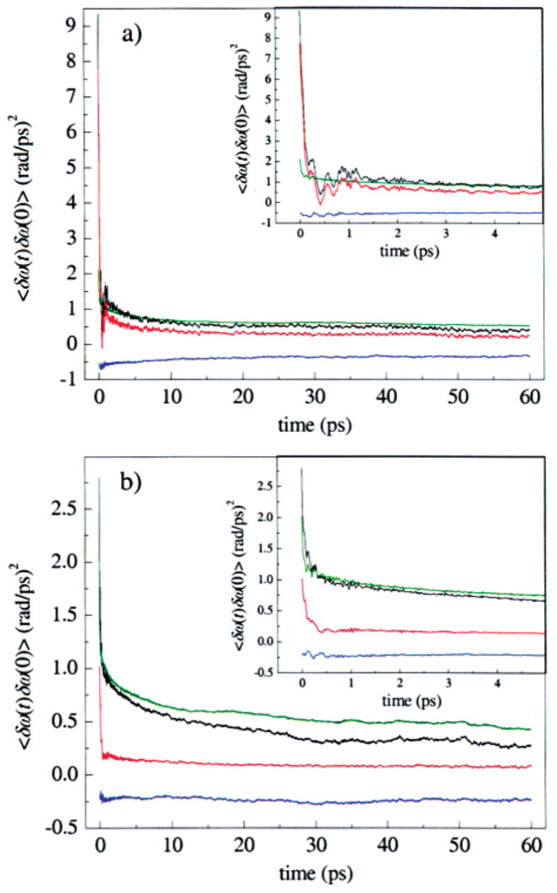
Decomposition of the FFCFs into contributions from His64 and from the rest of the system for the (a) A3 and (b) A1 states observed in MD simulations of MbCO. The total contribution (black), contribution from only His64 (red), contributions from all other atoms (green), and the cross-correlations between the His64 and the rest of the system (blue) are all shown. His64 is the dominant dephasing source for the A3 state. The A1 state has a substantial portion of the short time dephasing contribution from His64, but the rest of the system contributes appreciably to the dephasing at longer times. The dephasing contribution for His64 is more strongly anticorrelated with its surroundings in the A3 state.
These MD simulation results indicate that interactions with His64 play a central role in the dephasing dynamics of CO in MbCO. For the A3 state, interactions with His64 are the dominant dephasing contributor, and these interactions control CO dephasing on both the femtosecond and picosecond time scales. In the A1 state, His64 interactions control the initial rapid dephasing on the femtosecond time scale, but dephasing on slower time scales results from the combined effect of interactions with the rest of the protein and solvent. The differences in His64 contributions to the FFCF shown in [Figure 13a and 13b](https://pmc.ncbi.nlm.nih.gov/articles/PMC2435512/#F13) might lead one to the conclusion that His64 dynamics are significantly different for the A1 and A3 substates, that is, that the imidazole ring undergoes larger amplitude motions in A3 than in A1. In fact, this is _not_ the case. We have examined the motions of His64 in the A1 and A3 substates, and our analysis indicates that the dynamics of the imidazole ring of His64 are very similar in the two substates. A quantitative calculation of the autocorrelation functions of the C _β_ –C _γ_ dihedral angle of His64 for the two states, not shown here, indicates that the dynamics of this angle are comparable for A1 and A3. In addition, the mean center-of-mass position of the imidazole ring is unchanged by transitions between states, and the mean-squared fluctuations of this position are comparable for the two states. The essential difference for His64 between the A1 and A3 substates is the average dihedral angle. Of course, the magnitude and direction of the electric field of His64 felt at the CO ligand will be dramatically affected by the orientation of the imidazole ring. The different dephasing autocorrelation functions of His64 therefore appear to be reflections of structural differences between the A1 and A3 substates, rather than dynamical differences between these states. The larger value of _C_ hh(0) for A3, as well as the presence of ringing on the picosecond time scale for A3, reflect these structural differences.
##  V. Concluding Remarks
Multidimensional vibrational echo signals were measured for sperm whale MbCO, and the dephasing dynamics were found to be in agreement with dephasing dynamics calculated from MD simulations for sperm whale MbCO with the N _ε_ –H tautomer of His64. The two conformational substates B _ε_ and R _ε_ observed in the MD simulations were assigned to the A1 and A3 substates of MbCO. Dynamics of His64 constitute a major source of dephasing for the CO ligand, and orientational changes of this residue give rise to the A1 and A3 substates.
Our previous vibrational echo studies on MbCO[40](https://pmc.ncbi.nlm.nih.gov/articles/PMC2435512/#R40),[45](https://pmc.ncbi.nlm.nih.gov/articles/PMC2435512/#R45) treated horse heart MbCO. We have also recently made detailed spectrally resolved stimulated vibrational echo measurements on horse heart MbCO and find the vibrational echo data to be essentially the same as those for sperm whale MbCO,[72](https://pmc.ncbi.nlm.nih.gov/articles/PMC2435512/#R72) despite minor differences in the peak shapes and positions previously noted in the IR spectra.[15](https://pmc.ncbi.nlm.nih.gov/articles/PMC2435512/#R15),[31](https://pmc.ncbi.nlm.nih.gov/articles/PMC2435512/#R31) Additionally, we are able to fit the horse heart vibrational echo data using the identical FFCFs derived from the MD simulations on sperm whale MbCO with very similar values of the Stark coupling constant _λ_ , although with different values of the substate concentrations appropriate for horse heart MbCO. The primary structures of sperm whale MbCO and horse heart MbCO differ at 20 residues.[73](https://pmc.ncbi.nlm.nih.gov/articles/PMC2435512/#R73) The substitutions are generally conservative, and none of them is near the distal heme pocket. The ligand binding kinetics and heme affinity[73](https://pmc.ncbi.nlm.nih.gov/articles/PMC2435512/#R73) (the dominant factor in determining folding stability[74](https://pmc.ncbi.nlm.nih.gov/articles/PMC2435512/#R74)) for the two holoproteins are very similar. These facts strongly suggest that the structural assignments and dephasing dynamics for the A1 and A3 substates of sperm whale MbCO are also valid for horse heart MbCO, and also possibly for MbCO from other species.
Ultimately, the goal of understanding protein dynamics is to relate these dynamics to the biological function of the protein. The structural assignments of the A substates of MbCO and the identification of the sources of the vibrational dephasing of CO presented here represent a step toward that goal. Interpreting the stimulated vibrational echo experimental results with MD simulations has provided considerable insight into the structural and dynamical nature of the A substates of myoglobin. Further work toward identifying the functional consequences of these structural differences is needed. The combination of MD simulations and time-resolved spectroscopy can provide some of the atomic level details necessary to help understand the connection between protein structure and function.
##  Acknowledgments
We thank Ileana Stoica and Professor Ron Elber at Cornell University for helpful discussions regarding MOIL. K.A.M., I.J.F., A.G., B.L.M., and M.D.F. acknowledge the National Institutes of Health (1R01-GM61137) for support of this research. W.G.N., R.A., and R.F.L. acknowledge support from the National Science Foundation (CHE-0105623) and the Petroleum Research Fund of the American Chemical Society. The molecular dynamics portion of this research was carried out using the resources of the Cornell Theory Center, which receives funding from Cornell University, New York State, federal agencies, and corporate partners. K.A.M. was partially supported by an Abbott Laboratories Stanford Graduate Fellowship. W.G.N. acknowledges fellowship support from Cornell’s IGERT program in nonlinear systems, funded by NSF Grant DGE-9870681. R.A. is a Research Fellow of the Japan Society for the Promotion of Science (2000).
##  Appendix A– Calculation of the Vibrational Echo
We calculate the vibrational echo signal from third-order perturbation theory in the radiation–matter interaction.[47](https://pmc.ncbi.nlm.nih.gov/articles/PMC2435512/#R47),[52](https://pmc.ncbi.nlm.nih.gov/articles/PMC2435512/#R52) The third-order nonlinear polarization can be expressed as the sum of eight relevant terms after application of the rotating wave approximation and the phase-matching condition _k⃗_ s = _k⃗_ 2 + _k⃗_ 3 − _k⃗_ 1.[47](https://pmc.ncbi.nlm.nih.gov/articles/PMC2435512/#R47),[52](https://pmc.ncbi.nlm.nih.gov/articles/PMC2435512/#R52) The material system is treated as a quantum-mechanical three-level system, coupled to a classical solvent that is treated within a second-order cumulant expansion. Within this approximation, the dynamics of the system can be described with a two-time autocorrelation function. Autocorrelation functions of fluctuations in the frequencies of one-quantum transitions are set equal to the classical mechanical autocorrelation function of frequency fluctuations in [eq 2](https://pmc.ncbi.nlm.nih.gov/articles/PMC2435512/#FD2): _C_(_t_) = 〈 _δω_ 10(_t_)_δω_ 10(0)〉 = 〈 _δω_ 21(_t_)_δω_ 21(0)〉. The autocorrelation function of fluctuations in a two-quantum frequency is given by 〈 _δω_ 20(_t_)_δω_ 20(0)〉= 4〈 _δω_ 10(_t_)_δω_ 10(0)〉, the lifetime of the second excited state is taken to be one-half that of the first excited state,[75](https://pmc.ncbi.nlm.nih.gov/articles/PMC2435512/#R75) and the transition dipole moments are related by [76](https://pmc.ncbi.nlm.nih.gov/articles/PMC2435512/#R76) Within this model, the eight response functions are given by[47](https://pmc.ncbi.nlm.nih.gov/articles/PMC2435512/#R47),[52](https://pmc.ncbi.nlm.nih.gov/articles/PMC2435512/#R52)
| (A1)  
---|---  
| (A2)  
---|---  
| (A3)  
---|---  
| (A4)  
---|---  
| (A5)  
---|---  
| (A6)  
---|---  
where _ω_ 0 is the fundamental transition frequency, Δ is the anharmonicity, and _T_ 1 is the lifetime of the first vibrational excited state. Dynamics of the environment of the CO represented by the FFCFs enter these response functions through the line-broadening function, _g_(_t_): 
| (A7)  
---|---  
The linear absorption spectrum of the CO vibration is calculated within the same approximations used to calculate the nonlinear polarization and is given as the Fourier transform of _I_(_t_), a weighted sum of contributions from the conformational substates: 
| (A8)  
---|---  
| (A9)  
---|---  
where the subscript α is used to denote the different A substates of the protein.
##  Appendix B– Fitting the Vibrational Echo for the MbCO A Substates
The A1 line center determined from [Figure 7](https://pmc.ncbi.nlm.nih.gov/articles/PMC2435512/#F7) is 1945 cm−1, and the anharmonicity is 25.3 cm−1, consistent with previous measurements for the anharmonicity of MbCO.[77](https://pmc.ncbi.nlm.nih.gov/articles/PMC2435512/#R77) The lifetime of the A1 substate was measured to be _T_ 1 = 16.5 ps, and the A3 substate lifetime was measured to be _T_ 1 = 14.7 ps, as independently determined using pump–probe spectroscopy.[40](https://pmc.ncbi.nlm.nih.gov/articles/PMC2435512/#R40)
The values for the center wavelengths for the A0 and A3 substates were determined by fitting the linear absorption spectrum of sperm whale MbCO to three Voigt line shapes, holding the center frequency for the A1 substate fixed. The relative populations for the substates were assumed to be proportional to the relative areas under each Voigt line shape. Because of the strong overlap between the A1 and A3 substates, the relative concentrations derived from the fitting were not uniquely determined and showed some sensitivity to the initial parameters used in the fitting. Equally good fits to the linear spectrum could be obtained using relative ratios of A1/A3 from 1.2 to 1.6. We chose to fix the ratio of A1/A3 to 1.4, in reasonable agreement with a previously reported value for the A1/A3 ratio of 1.25 using four Gaussian fitting functions.[78](https://pmc.ncbi.nlm.nih.gov/articles/PMC2435512/#R78) The final values of the line centers and concentrations are in good agreement with previous measurements and assignments of these quantities.[6](https://pmc.ncbi.nlm.nih.gov/articles/PMC2435512/#R6),[7](https://pmc.ncbi.nlm.nih.gov/articles/PMC2435512/#R7),[12](https://pmc.ncbi.nlm.nih.gov/articles/PMC2435512/#R12),[78](https://pmc.ncbi.nlm.nih.gov/articles/PMC2435512/#R78)
Because we have not identified the A0 substate in the MD simulations, its dephasing dynamics must be approximated. Previous vibrational echo experiments on the MbCO mutant H64V over a wide range of temperatures have shown that this mutant has a dephasing rate that is approximately 20% slower than wild-type MbCO A1 substate at all temperatures.[79](https://pmc.ncbi.nlm.nih.gov/articles/PMC2435512/#R79) The linear spectrum for the H64V mutant is quite similar to the spectrum of the A0 substate in the wild-type protein.[15](https://pmc.ncbi.nlm.nih.gov/articles/PMC2435512/#R15),[31](https://pmc.ncbi.nlm.nih.gov/articles/PMC2435512/#R31),[79](https://pmc.ncbi.nlm.nih.gov/articles/PMC2435512/#R79) It has also been suggested that the A0 substate dephasing dynamics are slower than the dephasing dynamics of the A1 substate.[60](https://pmc.ncbi.nlm.nih.gov/articles/PMC2435512/#R60) We therefore chose to scale the amplitude of the FFCF used to model the A1 state by 0.64 to give a FFCF for the A0 substate. The factor 0.64 is the empirically determined scaling constant that gives a vibrational echo decay that is slower by ~20%. The lifetime of this substate was assumed to be equal to the lifetime of the A1 substate. While the dephasing function and lifetime for the A0 substate are only approximate, the overall effect of the error in these approximations on the calculated vibrational echo data is small, because these substates represent ~5% of the total substate population and contribute even less to the vibrational echo signal.
The values for the A substate line centers and relative populations, along with the FFCFs derived from the MD simulations, were used as input parameters for the calculation of the spectrally resolved stimulated vibrational echo for both His64 tautomers. For the calculated vibrational echo signals in [Figure 8](https://pmc.ncbi.nlm.nih.gov/articles/PMC2435512/#F8), the FFCF for B _ε_ ([Figure 6a](https://pmc.ncbi.nlm.nih.gov/articles/PMC2435512/#F6), blue curve) was used for A1, the FFCF for R _ε_ ([Figure 6a](https://pmc.ncbi.nlm.nih.gov/articles/PMC2435512/#F6), red curve) was used for A3, and the FFCF for B _ε_ multiplied by 0.64 was used for A0. For the calculated vibrational echo signals in [Figure 10](https://pmc.ncbi.nlm.nih.gov/articles/PMC2435512/#F10), the FFCF for B _δ_ ([Figure 6b](https://pmc.ncbi.nlm.nih.gov/articles/PMC2435512/#F6), blue curve) was used for A1, the FFCF for R _δ_ ([Figure 6b](https://pmc.ncbi.nlm.nih.gov/articles/PMC2435512/#F6), red curve) was used for A3, and the FFCF for B _δ_ multiplied by 0.64 was used for A0. In each of the vibrational echo calculations, all three FFCFs used in the calculation were scaled by the square of the Stark effect parameter _λ_ which was allowed to vary freely until the best possible agreement between the calculated and measured vibrational echo signals was obtained.
