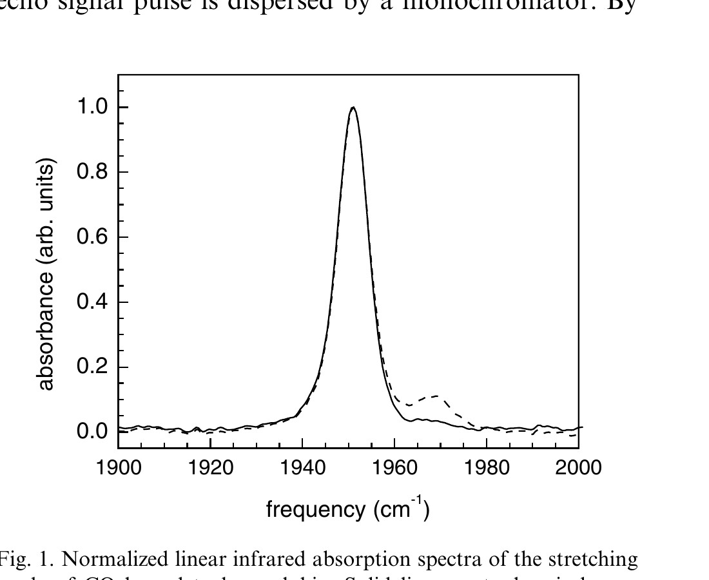
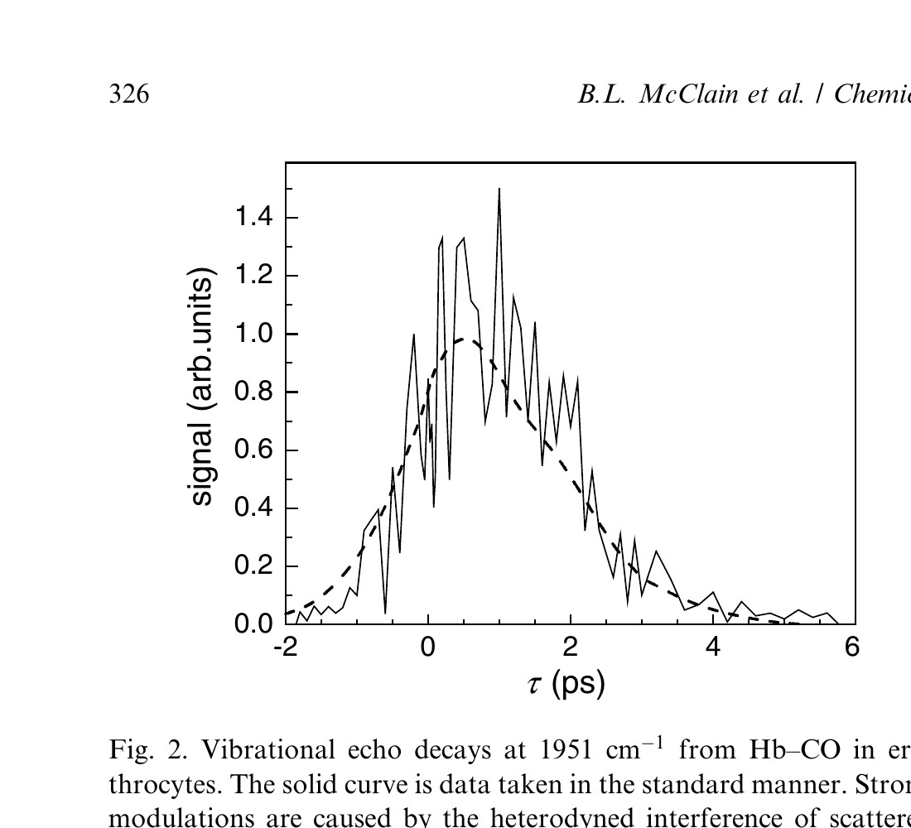
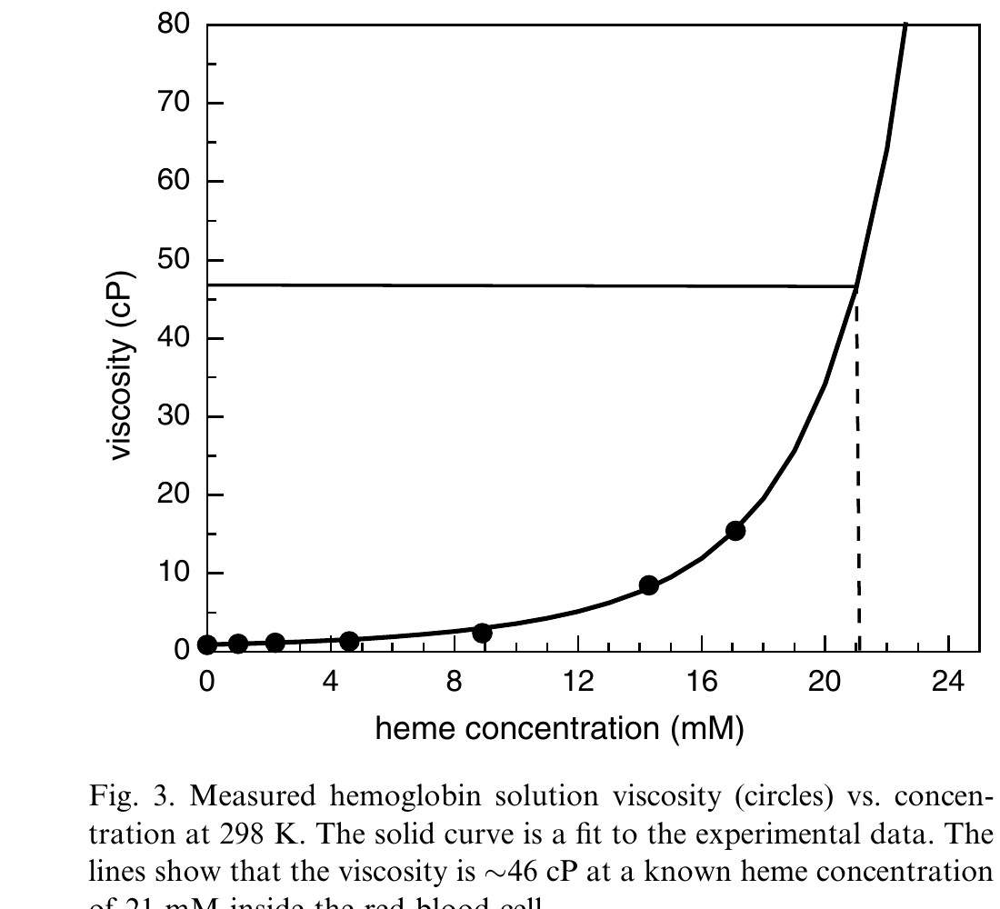
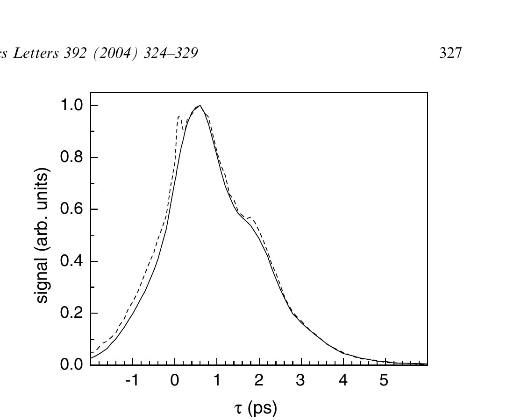
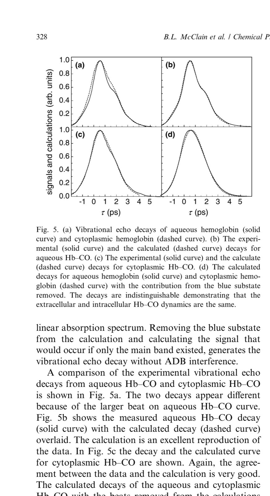

**Brian L. McClain, Ilya J. Finkelstein, and M.D. Fayer\***

*Chemical Physics Letters, Vol. 392, pp. 324–329, 2004*

DOI: [10.1016/j.cplett.2004.05.080](https://doi.org/10.1016/j.cplett.2004.05.080)

---

## Table of Contents

- [Abstract](#abstract)
- [1. Introduction](#1-introduction)
- [2. Experimental](#2-experimental)
- [3. Results and Discussion](#3-results-and-discussion)
- [4. Concluding Remarks](#4-concluding-remarks)
- [Acknowledgements](#acknowledgements)
- [References](#references)

---

## Abstract

Ultrafast spectrally resolved stimulated vibrational echo experiments measure the dephasing of the CO stretching mode of hemoglobin–CO (Hb–CO) inside living human erythrocytes (red blood cells). A method is presented to overcome the adverse impact on the vibrational echo signal from the strong light scattering caused by the cells. The results are compared to experiments on Hb–CO aqueous solutions. It is demonstrated that the dynamics of the protein as sensed by the CO ligand are the same inside the erythrocytes and in aqueous solution, but differences in the absorption spectra show that the cell affects the protein's potential energy surface.

---

## 1. Introduction

In this Letter, we present the first ultrafast infrared vibrational echo experiments on living cells. The experiments were conducted on living erythrocytes (red blood cells), and examined the dynamics of the protein hemoglobin (Hb) by measuring the vibrational dephasing of the stretching mode of CO bound at the active site of the protein (Hb–CO). The acquisition of vibrational echoes on erythrocytes is problematic. The vibrational excitation frequency of the CO stretching mode (near 5 μm) is smaller than the erythrocyte diameter (~10 μm), which leads to severe light scattering. The light scattered from the sample 'heterodynes' with the vibrational echo signal at the electric field level, producing massive oscillations in the signal. A method is presented that makes it possible to obtain high quality data on Hb–CO dynamics in spite of the virtually opaque nature of the red blood cell sample.

Protein dynamics are intimately related to function and play an important role in elucidating the relationship between the protein structure and function [[1–5](#ref1)]. Subtle modifications to the protein, such as small changes in conformation, binding of a substrate, or motions of key residues can have an effect on the observed dynamics. In addition, interactions of the protein with its environment can modify the protein's structure. Many studies of proteins, and Hb in particular, are conducted in aqueous buffer solutions [[5–7](#ref5)]. The question arises as to whether dynamics measured in aqueous solution are modified by the environment found inside a cell or other biological medium. Spectrally resolved stimulated vibrational echo experiments have been found to be sensitive to the relationship between structure and dynamics in studies of myoglobin–CO (Mb–CO) [[8–11](#ref8)]. The vibrational echo experiment measures the fast frequency fluctuations of the CO stretching mode caused by the structural fluctuations of the protein. Here, vibrational echo experiments on Hb–CO in solution and in erythrocytes are compared.

The biologically active sites of Hb are located at each of the four heme groups embedded within the protein. Carbon monoxide binds exceptionally well to the heme iron and provides an excellent probe for some aspects of both structure and dynamics [[5](#ref5),[10](#ref10),[12–16](#ref12)]. Hb inside a red blood cell is extremely high in concentration, particularly when compared to other cellular proteins. As a result of this high concentration, the physical properties of cytoplasmic Hb, such as viscosity, are significantly different from that in aqueous solutions.

The results presented below demonstrate that the fast structural fluctuations sensed by the CO ligand are the same in the erythrocytes as in solution, in spite of the differences in concentration, viscosity, and the detailed nature of the medium. However, there are differences between intra and extra cellular Hb in the linear infrared absorption spectrum of Hb–CO, which suggest that the environment in the cell interior affects the protein's potential energy surface.

---

## 2. Experimental

The experimental setup is similar to that described previously [[17](#ref17)]. Briefly, tunable mid-IR pulses with a center frequency of 1951 cm⁻¹ were generated by an optical parametric amplifier pumped with a regeneratively amplified Ti:Sapphire laser. The bandwidths and pulse durations used in these experiments were 150 cm⁻¹ and 100 fs, respectively. Three pulses (700 nJ/pulse) are crossed and focused at the sample. The spot size at the sample was 150 μm. The vibrational echo pulse generated in the phase-matched direction was detected with a liquid nitrogen-cooled HgCdTe array detector after dispersion through a 0.5 m monochromator. The resolution was 1.2 cm⁻¹. An intensity dependence study was performed and the data showed no intensity dependent effects [[18](#ref18)].

Lyophilized human methemoglobin (Sigma–Aldrich) was dissolved in either pH 7 0.1 M phosphate buffer, pH 7.4 phosphate buffered saline, or pH 7.4 HEPES buffer (at a concentration of 300 mmol/L) without further purification for buffer-dependent studies. The solution was centrifuged at 16,000 rcf for 30 min to remove large particulates, after which the supernate was removed and filtered through a 0.45 μm acetate filter. Carbonmonoxy hemoglobin was prepared from the methemoglobin stock solution by purging with nitrogen to remove dissolved oxygen, followed by reduction with excess dithionite solution and stirring under a CO atmosphere for one hour. The sample was then placed in sample cell with CaF₂ windows and a 50 μm Teflon spacer. Viscosity studies were performed using a Cannon–Ubbelohde viscometer at 25 °C on methemoglobin and repeated multiple times for reliability.

Whole blood was purchased from the Stanford blood bank in an EDTA solution. The samples were spun at 2200 rcf for 10 min in a microcentrifuge. The plasma was removed from the packed red cells by syringe and the process was repeated. The blood cells were then placed under a CO atmosphere for one hour, followed by loading into a sample cell. Visible and infrared spectroscopies were performed to ensure binding of CO to the erythrocyte sample.

---

## 3. Results and Discussion

[Fig. 1](#fig1) shows the background subtracted linear infrared absorption spectrum for the symmetric stretch of the heme-bound CO for cytoplasmic Hb (solid curve) and high concentration aqueous Hb solution (dashed curve). The main band is at 1951 cm⁻¹. There is another small band to the blue at 1969 cm⁻¹. In aqueous Hb–CO, these have been designated the CIII and CIV peaks, respectively [[19](#ref19)]. They are structural substates analogous to the three CO bands observed in Mb–CO [[3](#ref3),[10](#ref10),[15](#ref15),[17](#ref17),[20](#ref20)]. In the cytoplasmic Hb (solid line) the peak at 1969 cm⁻¹ is substantially diminished relative to the peak in aqueous solution. The ratio of the CIII to CIV bands is 10:1 in aqueous while it is 100:1 in the red blood cell. The ratio of the band areas in aqueous solution is independent of the Hb–CO concentration and the particular buffer used. The ratio also did not change upon addition of glycerol in low concentration or in such high concentration that the solvent is predominantly glycerol. As discussed below, the difference in the ratio complicates the comparison of solution and erythrocyte vibrational echo experiments. The difference also provides some insight into the influence of the cell on the protein structure.

<figure class="paper-figure" id="fig1">

<figcaption><strong>Figure 1.</strong> Normalized linear infrared absorption spectra of the stretching mode of CO bound to hemoglobin. Solid line – cytoplasmic hemoglobin. Dashed line – Hb–CO in a pH 7 phosphate buffer solution.</figcaption>
</figure>

The ~10 μm diameter of the erythrocytes results in significant light scattering of the 5 μm vibrational echo input pulses. The effect of this scattered light on the vibrational echo signal as a function of τ (the delay between the first two pulses in the vibrational echo pulse sequence) is shown in [Fig. 2](#fig2) by the solid curve. To obtain spectral resolution of the signal, the vibrational echo signal pulse is dispersed by a monochromator. By spectrally resolving the vibrational echo, analysis is simplified and additional information is obtained [[10](#ref10),[17](#ref17)]. Furthermore, it is possible to greatly reduce the influence of higher order (5th order) non-linear effects on the vibrational echo signal [[18](#ref18)]. The monochromator reduces the amount of scattered light because the detector only sees the light at the detection wavelength. The scattered light contribution to the detected signal is dependent on τ. Light entering the monochromator is temporally stretched (to ~10 ps), resulting in overlap of the scattered light and the vibrational echo wave packet over a wide range of τ delays. The electric field of the scattered light interferes with the electric field of the vibrational echo. As the delay between the first two excitation pulses is scanned, the phase of the vibrational echo electric field is advanced relative to the fixed scattered light electric fields from the second and third pulses. The result is alternating constructive and destructive interference between the vibrational echo and the scattered light. The interference produces the amplitude variations in the solid curve in [Fig. 2](#fig2).

<figure class="paper-figure" id="fig2">

<figcaption><strong>Figure 2.</strong> Vibrational echo decays at 1951 cm⁻¹ from Hb–CO in erythrocytes. The solid curve is data taken in the standard manner. Strong modulations are caused by the heterodyned interference of scattered light with the vibrational echo signal. The dashed line shows the vibrational echo signal when the phase of the first pulse is randomly varied by 180° (see text).</figcaption>
</figure>

The variations in the solid curve in [Fig. 2](#fig2) are not noise in the usual sense. The solid curve is the average of many scans. So long as the path lengths do not change, the phase relationships between the vibrational echo electric field and the scattered light electric fields are fixed. Because of the massive light scattering produced by the erythrocytes, some scattered light is collinear with the vibrational echo and cannot be completely eliminated by spatial filtering. To obtain a feel for the severity of the problem consider the following example. If the intensity of the vibrational echo pulse is 100 times larger than the scattered light, then at the electric field level, the ratio is only 10 to 1. The cross term responsible for the modulation is 2*ES*, where *E* is the vibrational echo electric field, and *S* is the scattered light electric field. Because, the two electric fields go in and out of phase, the 2*ES* cross term swings positive and negative, doubling the amplitude of the modulation. Therefore, if the scattered light is 1% of the vibrational echo in intensity, a 40% modulation will occur.

The vibrational echo signal pulse is inherently phase-locked to the first pulse. Therefore, the vibrational echo signal is not modulated by scattered light from the first pulse as τ is scanned. The phase relationship between the first pulse and the vibrational echo electric field provides a method for eliminating the oscillations in the data, making it possible to average the scattered light contribution to zero. A piezo-electric translator (PZT) is used to vary the distance traveled by pulse one by changing the position of a retroreflector. The PZT scans the distance 1/2 wavelength (2.5 μm). The scanning is done asynchronously with the laser repetition rate. The scan varies the phase of pulse one, and, therefore, the vibrational echo pulse by 180°. At each point in the τ scan delay, many shots are collected and averaged. Because the vibrational echo electric field varies in phase asynchronously with respect to the fixed phases of the scattered light electric fields, the oscillations are averaged out. We refer to this procedure as fibrillation. Fibrillation reduces the time resolution of the experiment by the time required for light to travel 1/2 wavelength, in this case, 8.5 fs. In the current experiments, the reduction in resolution is negligible. The dashed line in [Fig. 2](#fig2) is the vibrational echo data taken with fibrillation. It is clear that coherent scattered light interference has been eliminated. Vibrational echo experiments with fibrillation of non-scattering aqueous samples were performed and there were no noticeable differences in the decays. The fibrillation method is important because it makes it possible to perform vibrational echo experiments on highly scattering samples.

The hemoglobin concentration (in heme; four times the protein concentration) inside the erythrocyte is 21 mM (33.5 g/dL) [[21–24](#ref21)]. Increasing the concentration of a protein in aqueous solution increases the solution's viscosity. Reported viscosities inside erythrocytes range from 10 to 15 cP [[21](#ref21),[25](#ref25),[26](#ref26)]. However, these results are from indirect measurements that infer the protein's viscosity by measuring the relaxation time of a stretched cellular membrane [[26](#ref26)] or on solutions prepared without removal of large aggregates and particulates [[27](#ref27)]. Measurements on Mb–CO in various solutions and as a function of temperature showed that the Mb–CO dephasing dynamics (vibrational echo decays) were sensitive to the solution's viscosities [[28](#ref28)]. Therefore, in comparing the dephasing dynamics of Hb–CO in erythrocytes and in solution, it is necessary to consider the viscosity of the medium.

To estimate the viscosity inside red blood cells studies were performed on aqueous protein solutions at a variety of concentrations. Details will be presented in a subsequent publication. [Fig. 3](#fig3) shows a plot of protein concentration (in heme) versus measured viscosity (circles). To determine the viscosity inside of an erythrocyte, an extrapolation to higher concentrations was needed. A model by Mooney [[29](#ref29)], which is an extension of the Einstein viscosity model for hard spheres [[30](#ref30)], was used with empirical parameters to predict the viscosity inside an erythrocyte. The model was fit to the experimentally measured viscosities (solid line). The fit was extrapolated to the erythrocyte Hb concentration of 21 mM (dashed line), yielding a viscosity of 46 ± 6 cP.

<figure class="paper-figure" id="fig3">

<figcaption><strong>Figure 3.</strong> Measured hemoglobin solution viscosity (circles) vs. concentration at 298 K. The solid curve is a fit to the experimental data. The lines show that the viscosity is ~46 cP at a known heme concentration of 21 mM inside the red blood cell.</figcaption>
</figure>

[Fig. 4](#fig4) shows the vibrational echo decay curves for the high (17 mmol/L, solid curve) and low (4 mmol/L, dashed curve) concentration aqueous Hb–CO solutions. The spike at τ = 0 in the low concentration sample results from a transient grating signal in the water solvent produced when the first two pulses overlap. It is visible only in the low concentration sample, where its intensity is comparable to the echo signal. It modifies the rising edge of the data, but does not influence the curve at longer times. The data show that the dynamics of Hb–CO are independent of the Hb–CO concentration in solution. As shown in [Fig. 3](#fig3), a change in concentration modifies the solution viscosity. The data from the two aqueous samples shown in [Fig. 4](#fig4) differed in viscosity by ~15 cP. Therefore, the dynamics are also independent of viscosity. A more detailed viscosity study in which glycerol/water solutions are used to obtain very high viscosities, which will be published subsequently, confirms the lack of viscosity dependence.

<figure class="paper-figure" id="fig4">

<figcaption><strong>Figure 4.</strong> Comparison of the vibrational echo decays for high concentration (solid line) and low concentration (dashed line) solutions at 1951 cm⁻¹, demonstrating that the Hb–CO dynamics in aqueous solution are insensitive to the effects of concentration and viscosity.</figcaption>
</figure>

The data in [Fig. 4](#fig4) display an oscillation as evidenced by the shoulder at ~1.8 ps and a 'flattening' at ~3.4 ps. The oscillation occurs at the frequency of the Hb–CO vibrational anharmonicity (25 cm⁻¹) [[18](#ref18),[31](#ref31),[32](#ref32)], and is the result of an accidental degeneracy beat (ADB) [[33](#ref33),[34](#ref34)]. The ADB mechanism has been described in detail [[33](#ref33),[34](#ref34)]. It requires the overlap of the 0–1 transition of one subensemble with the 1–2 transition of a second subensemble. The 1–2 transition of the CIV subensemble (1944 cm⁻¹) overlaps the 0–1 transition of the CIII subensemble (see [Fig. 1](#fig1) and Fig. 2b of [[18](#ref18)]). The relative amplitudes of the two absorption bands determine the magnitude of the beat. Because the relative amplitudes are 10:1 in solution, the beat is relatively small. However, in the erythrocyte, the relative amplitudes of the CIII and CIV absorption bands are 100:1, the beat is much smaller, and barely discernable (see dashed curve in [Fig. 2](#fig2) and [Fig. 5](#fig5)). The difference in the magnitudes of the beats for Hb–CO solution and Hb–CO in the red blood cell prevents direct comparison of the decay curves.

To extract decays from the data so that the aqueous and cytoplasmic Hb–CO dynamics can be compared the influence of the ADBs are removed using diagrammatic perturbation theory calculations of the signals [[35](#ref35)]. Each substate was modeled with a tri-exponential frequency–frequency correlation function (FFCF). The two substates are constrained to have the same FFCF, with the relative ratio of the concentrations of the two substates used as an adjustable parameter. The small blue substate band is necessary to produce the beats observed on the decays. The details of its dynamics need only to be approximately correct to reproduce the data because it is small. However, the ratio of the two substate concentrations determines the amplitude of the beats. The ratio is constrained to be within the range of the measured ratio in the absorption spectrum. The FFCF is obtained by fitting the data and simultaneously reproducing the linear absorption spectrum. Removing the blue substate from the calculation and calculating the signal that would occur if only the main band existed, generates the vibrational echo decay without ADB interference.

A comparison of the experimental vibrational echo decays from aqueous Hb–CO and cytoplasmic Hb–CO is shown in [Fig. 5a](#fig5). The two decays appear different because of the larger beat on aqueous Hb–CO curve. [Fig. 5b](#fig5) shows the measured aqueous Hb–CO decay (solid curve) with the calculated decay (dashed curve) overlaid. The calculation is an excellent reproduction of the data. In [Fig. 5c](#fig5) the decay and the calculated curve for cytoplasmic Hb–CO are shown. Again, the agreement between the data and the calculation is very good. The calculated decays of the aqueous and cytoplasmic Hb–CO with the beats removed from the calculations are shown in [Fig. 5d](#fig5). The curves show nearly perfect agreement within experimental error and the small uncertainty introduced by having to fit the data to remove the beats. The agreement demonstrates that the fast protein structural fluctuations sensed by the CO ligand bound at the active site are the same in aqueous and cytoplasmic hemoglobin.

<figure class="paper-figure" id="fig5">

<figcaption><strong>Figure 5.</strong> (a) Vibrational echo decays of aqueous hemoglobin (solid curve) and cytoplasmic hemoglobin (dashed curve). (b) The experimental (solid curve) and the calculated (dashed curve) decays for aqueous Hb–CO. (c) The experimental (solid curve) and the calculated (dashed curve) decays for cytoplasmic Hb–CO. (d) The calculated decays for aqueous hemoglobin (solid curve) and cytoplasmic hemoglobin (dashed curve) with the contribution from the blue substate removed. The decays are indistinguishable demonstrating that the extracellular and intracellular Hb–CO dynamics are the same.</figcaption>
</figure>

Although the spectrally resolved stimulated vibrational echo experiments on aqueous and cytoplasmic Hb–CO demonstrate that the fast dynamics sensed at the active site of the protein by the bound CO ligand are the same, the linear spectra ([Fig. 1](#fig1)) demonstrate that there is a significant difference between Hb–CO in the two environments. The blue substate (1969 cm⁻¹) is a factor of ~10 less prevalent in cytoplasmic Hb–CO than in aqueous Hb–CO. This is true independent of the composition of the solution. The reduction of the CIV substate concentration in cytoplasmic Hb–CO shows that the protein has a different potential energy surface in the cell than in solution. The tenfold increase in the CIV substate concentration in aqueous Hb–CO is independent of the solution's concentration, buffer, viscosity, or addition of glycerol to a high fraction. Therefore, other constituents of the cell, not present in solution, must influence the Hb's potential energy surface, and its equilibrium preferred structure.

---

## 4. Concluding Remarks

The first ultrafast infrared spectrally resolved stimulated vibrational echo experiments on cells have been performed using a method that reduces the deleterious influence of scattered light inherent in examining a system composed of entities larger than the wavelength of the IR light. The experiments on living red blood cells measured the fast (ps) dynamics felt by CO bound at the active site of the hemoglobin protein. The results on cytoplasmic Hb–CO were compared to those from aqueous solutions, and found to be identical within experimental error. The results demonstrate that the cytoplasmic environment does not influence the fast dynamics of the protein, sensed by CO bound at the active site. However, differences in the linear absorption spectra show that the potential energy surface of Hb different from that of aqueous Hb.

---

## Acknowledgements

This work was supported by the National Institutes of Health (2 R01 GM061137-05). One of the authors (I.J.F.) is grateful for partial support by a Veatek and Stauffer Memorial Fellowship. The authors thank Prof. W. Huestis for many enlightening discussions regarding the physiological and biochemical properties of erythrocytes.

---

## References

1. Campbell BF, Chance MR, Friedman JM. Linking protein dynamics to function: The role of myoglobin dynamics and conformational substates. *Science.* 1987;238:373. [doi:10.1126/science.3659921](https://doi.org/10.1126/science.3659921)

2. Frauenfelder H, Sligar SG, Wolynes PG. The energy landscapes and motions of proteins. *Science.* 1991;254:1598. [doi:10.1126/science.1749933](https://doi.org/10.1126/science.1749933)

3. Hong MK, Braunstein D, Cowen BR, Frauenfelder H, Iben IET, Mourant JR, Ormos P, Scholl R, Schulte A, Steinbach PJ, Xie A, Young RD. Conformational substates and motions in myoglobin: External influences on structure and dynamics. *Biophys J.* 1990;58:429. [doi:10.1016/S0006-3495(90)82388-2](https://doi.org/10.1016/S0006-3495(90)82388-2)

4. Andrews BK, Romo T, Clarage JB, Pettitt BM, Phillips GN Jr. Characterizing global substates of myoglobin. *Structure.* 1998;6:587. [doi:10.1016/S0969-2126(98)00060-4](https://doi.org/10.1016/S0969-2126(98)00060-4)

5. Frauenfelder H, McMahon BH, Austin RH, Chu K, Groves JT. The role of structure, energy landscape, dynamics, and allostery in the enzymatic function of myoglobin. *Proc Natl Acad Sci USA.* 2001;98:2370. [doi:10.1073/pnas.041614298](https://doi.org/10.1073/pnas.041614298)

6. Jackson TA, Lim M, Anfinrud PA. Complex nonexponential relaxation in myoglobin after photodissociation of MbCO: Measurement and analysis from 2 ps to 56 µs. *Chem Phys.* 1994;180:131. [doi:10.1016/0301-0104(93)E0414-Q](https://doi.org/10.1016/0301-0104(93)E0414-Q)

7. Fenimore PW, Frauenfelder H, McMahon BH, Parak FG. Slaving: solvent fluctuations dominate protein dynamics and functions. *Proc Natl Acad Sci.* 2002;99:16047. [doi:10.1073/pnas.212637899](https://doi.org/10.1073/pnas.212637899)

8. Hamm P, Hochstrasser RM. Structure and dynamics of proteins and peptides: Femtosecond two-dimensional infrared spectroscopy. In: Fayer MD, ed. *Ultrafast Infrared and Raman Spectroscopy.* Marcel Dekker, Inc., New York; 2001:273.

9. Hamm P, Lim M, Hochstrasser RM. Structure of the amide I band of peptides measured by femtosecond nonlinear-infrared spectroscopy. *J Phys Chem B.* 1998;102:6123. [doi:10.1021/jp9813286](https://doi.org/10.1021/jp9813286)

10. Merchant KA, Noid WG, Akiyama R, Finkelstein IJ, Goun A, McClain BL, Loring RF, Fayer MD. Myoglobin-CO substate structures and dynamics: Multidimensional vibrational echoes and molecular dynamics simulations. *J Am Chem Soc.* 2003;125:13804. [doi:10.1021/ja035654x](https://doi.org/10.1021/ja035654x)

11. Fayer MD. Fast protein dynamics probed with infrared vibrational echo experiments. *Annu Rev Phys Chem.* 2001;52:315. [doi:10.1146/annurev.physchem.52.1.315](https://doi.org/10.1146/annurev.physchem.52.1.315)

12. Caughey WS, Shimada H, Choc MG, Tucker MP. Dynamic protein structures: Infrared evidence for four discrete rapidly interconverting conformers of carbon monoxyhemoglobin. *Proc Natl Acad Sci USA.* 1981;78:2903. [doi:10.1073/pnas.78.5.2903](https://doi.org/10.1073/pnas.78.5.2903)

13. Nienhaus GU, Mourant JR, Chu K, Frauenfelder H. Ligand binding to heme proteins: the effect of light on ligand binding in myoglobin. *Biochemistry.* 1994;33:13413. [doi:10.1021/bi00249a030](https://doi.org/10.1021/bi00249a030)

14. Ansari A, Colleen MJ, Henry ER, Hofrichter J, Eaton WA. Conformational relaxation and ligand binding in myoglobin. *Biochemistry.* 1994;33:5128. [doi:10.1021/bi00183a017](https://doi.org/10.1021/bi00183a017)

15. Potter WT, Hazzard JH, Kawanishi S, Caughey WS. Direct measurement of CO association rate constants for human hemoglobin A and Portland. *Biochem Biophys Res Commun.* 1983;116:719. [doi:10.1016/0006-291X(83)90582-X](https://doi.org/10.1016/0006-291X(83)90582-X)

16. Janes SM, Dalickas GA, Eaton WA, Hochstrasser RM. Picosecond transient absorption studies of the A0, A1, and A3 substates of MbCO. *Biophys J.* 1988;54:545. [doi:10.1016/S0006-3495(88)82987-9](https://doi.org/10.1016/S0006-3495(88)82987-9)

17. Merchant KA, Noid WG, Thompson DE, Akiyama R, Loring RF, Fayer MD. Structural assignments and dynamics of the A substates of MbCO: Spectrally resolved vibrational echo experiments and molecular dynamics simulations. *J Phys Chem B.* 2003;107:4. [doi:10.1021/jp026793o](https://doi.org/10.1021/jp026793o)

18. Finkelstein IJ, McClain BL, Fayer MD. Fifth-order contributions to ultrafast spectrally resolved vibrational echoes. *J Chem Phys.* 2004; submitted.

19. Mayer E. Infrared spectroscopic study on heme and carbonmonoxyheme in aqueous and cryogenic glasses. *J Am Chem Soc.* 1994;116:10571. [doi:10.1021/ja00102a025](https://doi.org/10.1021/ja00102a025)

20. Young RD, Frauenfelder H, Johnson JB, Lamb DC, Nienhaus GU, Philipp R, Scholl R. Time- and temperature-dependence of large-scale conformational transitions in myoglobin. *Chem Phys.* 1991;158:315. [doi:10.1016/0301-0104(91)87075-7](https://doi.org/10.1016/0301-0104(91)87075-7)

21. Hasinoff BB. Kinetic activation volumes of the binding of oxygen and carbon monoxide to hemoglobin and myoglobin studied on a high-pressure flash photolysis apparatus. *Biophys Chem.* 1981;13:173. [doi:10.1016/0301-4622(81)80015-0](https://doi.org/10.1016/0301-4622(81)80015-0)

22. Lew VL, Raftos JE, Sorette M, Bookchin RM, Mohandas N. Generation of dense, older red cells by Mg²⁺ permeabilization. *Blood.* 1995;86:334.

23. Wegner G, Kucera W. Hemoglobin, haematocrit and erythrocyte counts of two-year-old children from the German Democratic Republic. *Biomed Biochim Acta.* 1989;48:561.

24. Franco RS, Barker RL. A simplified method for determining hemoglobin mass in red blood cells. *J Lab Clin Med.* 1989;113:58.

25. Kelemen C, Chien S, Artmann GM. Temperature transition of human hemoglobin at body temperature: effects of calcium. *Biophys J.* 2001;80:2622. [doi:10.1016/S0006-3495(01)76232-9](https://doi.org/10.1016/S0006-3495(01)76232-9)

26. Hochmuth RM, Buxbaum KL, Evans EA. Temperature dependence of the viscoelastic recovery of red cell membrane. *Biophys J.* 1980;29:177. [doi:10.1016/S0006-3495(80)85124-1](https://doi.org/10.1016/S0006-3495(80)85124-1)

27. Kelemen C. Private communication, 2003.

28. Rector KD, Jiang J, Berg M, Fayer MD. Effects of solvent viscosity on protein dynamics: Infrared vibrational echo experiments and theory. *J Phys Chem B.* 2001;105:1081. [doi:10.1021/jp0023563](https://doi.org/10.1021/jp0023563)

29. Mooney M. The viscosity of a concentrated suspension of spherical particles. *J Colloid Sci.* 1951;6:162. [doi:10.1016/0095-8522(51)90036-0](https://doi.org/10.1016/0095-8522(51)90036-0)

30. Einstein A. *Investigations on the Theory of Brownian Movement.* Dover, New York; 1956.

31. Rector KD, Kwok AS, Ferrante C, Tokmakoff A, Rella CW, Fayer MD. Vibrational anharmonicity and multilevel vibrational dephasing from vibrational echo beats. *J Chem Phys.* 1997;106:10027. [doi:10.1063/1.474060](https://doi.org/10.1063/1.474060)

32. Rector KD, Thompson DE, Merchant K, Fayer MD. Dynamics in globular proteins: Vibrational echo experiments. *Chem Phys Lett.* 2000;316:122. [doi:10.1016/S0009-2614(99)01229-9](https://doi.org/10.1016/S0009-2614(99)01229-9)

33. Merchant KA, Thompson DE, Fayer MD. Two-dimensional time-frequency ultrafast infrared vibrational echo spectroscopy. *Phys Rev Lett.* 2001;86:3899. [doi:10.1103/PhysRevLett.86.3899](https://doi.org/10.1103/PhysRevLett.86.3899)

34. Merchant KA, Thompson DE, Fayer MD. Accidental degeneracy beats in ultrafast vibrational echo spectroscopy. *Phys Rev A.* 2002;65:023817. [doi:10.1103/PhysRevA.65.023817](https://doi.org/10.1103/PhysRevA.65.023817)

35. Mukamel S. *Principles of Nonlinear Optical Spectroscopy.* Oxford University Press, New York; 1995.

---

*Archived from the published PDF on 2026-04-14.*
