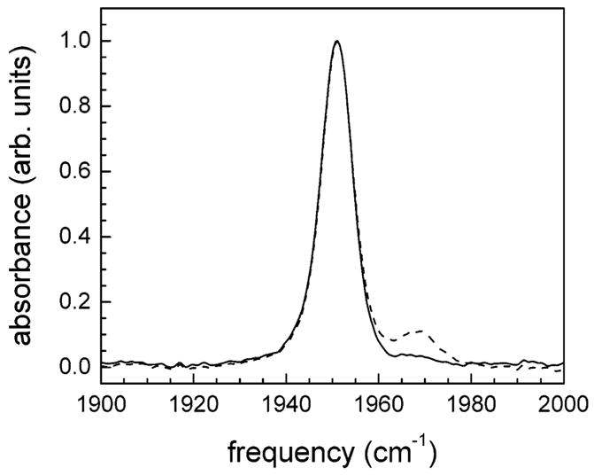
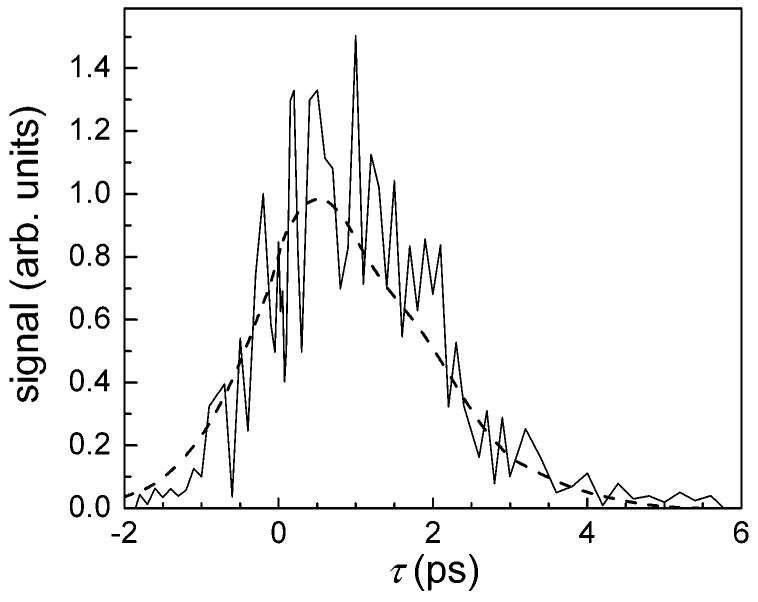
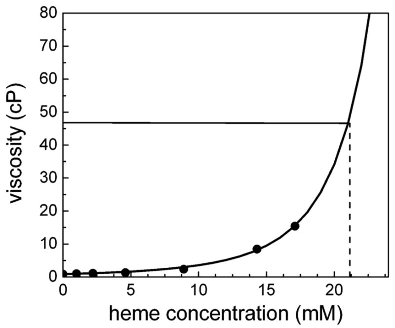
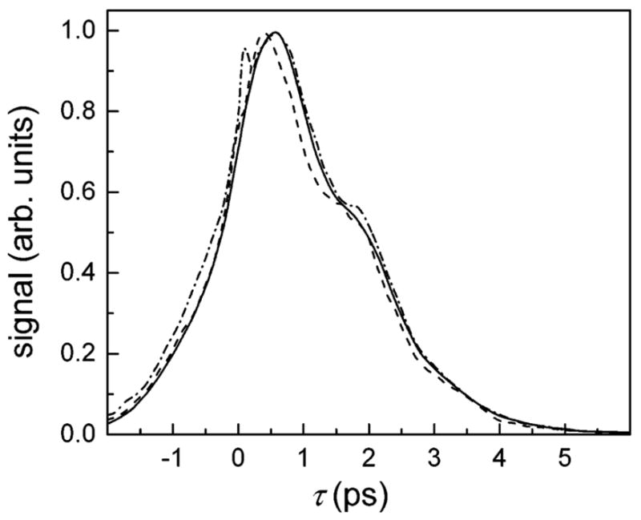
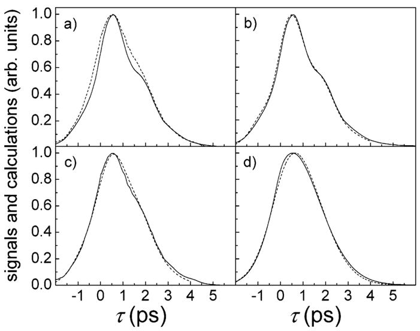
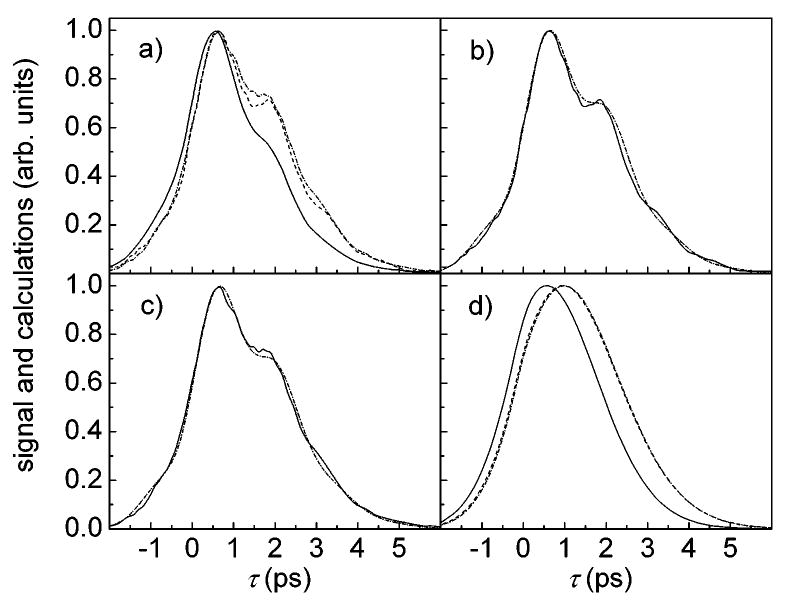
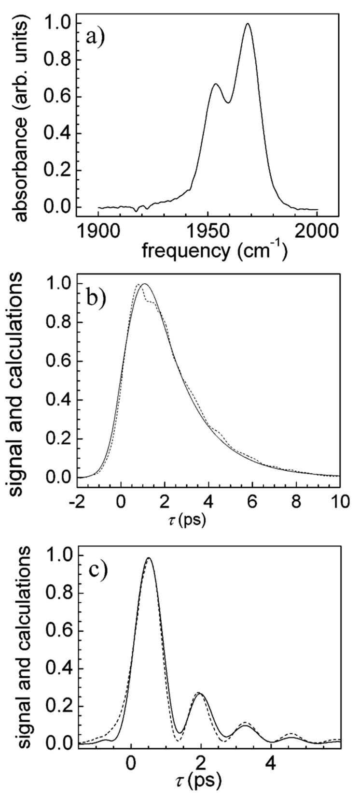
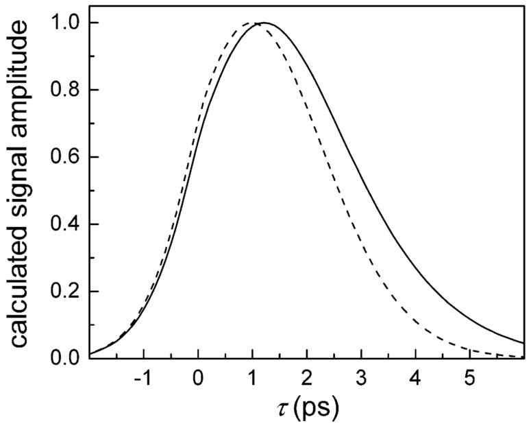
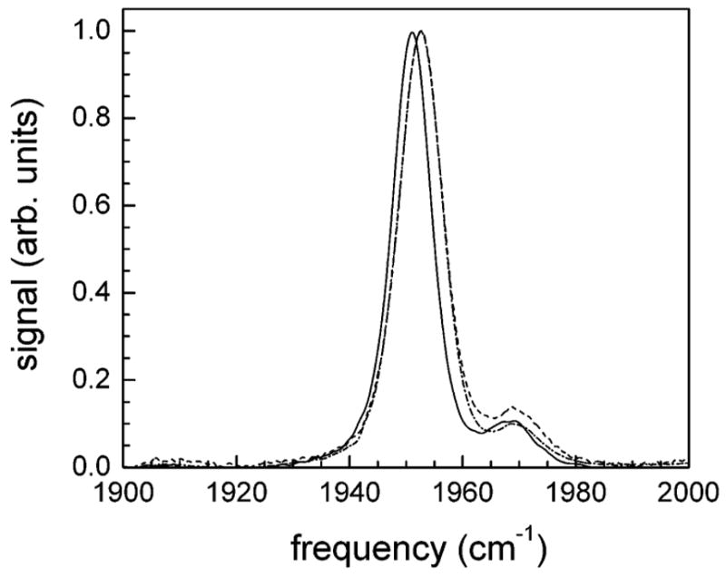

# Dynamics of Hemoglobin in Human Erythrocytes and in Solution: Influence of Viscosity Studied by Ultrafast Vibrational Echo Experiments

**Brian L. McClain, Ilya J. Finkelstein, and M. D. Fayer**

*J. Am. Chem. Soc.*, Volume 126, Issue 48, Pages 15702-10 (2004)

**DOI:** [10.1021/ja0454790](https://doi.org/10.1021/ja0454790)

---

## Table of Contents

- [Abstract](#abstract)
- [Introduction](#introduction)
- [Experimental Methods](#experimental-methods)
- [Results and Discussion](#results-and-discussion)
- [Concluding Remarks](#concluding-remarks)
- [Acknowledgments](#acknowledgments)

---

## Abstract
Ultrafast spectrally resolved stimulated vibrational echo experiments are used to measure the vibrational dephasing of the CO stretching mode of hemoglobin-CO (HbCO) inside living human erythrocytes (red blood cells), in liquid solutions, and in a glassy matrix. A method is presented to overcome the adverse impact on the vibrational echo signal from the strong light scattering caused by the cells. The results from the cytoplasmic HbCO are compared to experiments on aqueous HbCO samples prepared in different buffers, solutions containing low and high concentrations of glycerol, and in a solid trehalose matrix. Measurements are also presented that provide an accurate determination of the viscosity at the very high Hb concentration that is found inside the cells. It is demonstrated that the dynamics of the protein, as sensed by the CO ligand, are the same inside the erythrocytes and in aqueous solution and are independent of the viscosity. In solutions that are predominantly glycerol, the dynamics are modified somewhat but are still independent of viscosity. The experiments in trehalose give the dynamics at infinite viscosity and are used to separate the viscosity-dependent dynamics from the viscosity-independent dynamics. Although the HbCO dynamics are the same in the red blood cell and in the equivalent aqueous solutions, differences in the absorption spectra show that the distribution of a protein's equilibrium substates is sensitive to small pH differences.
---
## Introduction
In this paper, the first detailed account of ultrafast infrared vibrational echo experiments on living cells is presented.[1](#ref1) The dynamics of the protein hemoglobin (Hb) are examined in living erythrocytes (red blood cells) by measuring the vibrational dephasing of the stretching mode of CO bound at the active site of the protein (HbCO). Protein dynamics are intimately related to function and play an important role in elucidating the relationship between the protein structure and function.[2](#ref2)-[8](#ref8) Subtle modifications to the protein, such as small changes in conformation, binding of a substrate, or motions of key residues, can have an effect on the observed dynamics.[2](#ref2)-[6](#ref6) In addition, interactions of the protein with its environment, whether it is a lipid bilayer, a cellular cytoplasm, or an aqueous buffer, can modify the protein's structure.[9](#ref9)-[14](#ref14) Many studies of proteins, and Hb in particular, are conducted in aqueous buffer solutions.[6](#ref6),[15](#ref15),[16](#ref16) The question arises as to whether dynamics measured in aqueous solution are modified by the environment found inside a cell or other biological media.
The acquisition of ultrafast stimulated vibrational echo data on erythrocytes is not straightforward. The stimulated vibrational echo pulse sequence involves the application of three infrared pulses to the sample and the subsequent detection of the weak vibrational echo pulse, which emerges in a unique direction. The vibrational echo pulse passes through a monochromator that provides spectral resolution of the vibrational echo signal. The vibrational excitation frequency of the CO stretching mode (near 5 _μ_ m) is smaller than the erythrocyte diameter (~10 _μ_ m), which leads to severe light scattering. Despite spatial filtering, some scattered light propagates collinearly with the vibrational echo through the monochromator and reaches the detector. The light scattered from the sample "heterodynes" with the vibrational echo signal at the electric field level, producing massive variations in the signal. A method is presented that makes it possible to obtain high quality data on HbCO dynamics despite the virtually opaque nature of the red blood cell sample. The method presented here should be useful for performing vibrational echoes in other media that scatter light strongly.
Spectrally resolved stimulated vibrational echo experiments have been found to be sensitive to the relationship between structure and dynamics in studies of myoglobin-CO (MbCO).[17](#ref17)-[20](#ref20) The vibrational echo experiment measures the fast (femtoseconds to tens of picoseconds) frequency fluctuations of the CO stretching mode. These frequency fluctuations are caused by the structural fluctuations of the protein. Vibrational echo experiments on CO bound to the active site of heme proteins reveal the picosecond dynamics at that site. In the experiments and analysis presented below, vibrational echo experiments on HbCO in solution and in erythrocytes are compared.
The biologically active sites of Hb are located at each of the four heme groups embedded within the protein. Carbon monoxide binds exceptionally well to the heme iron and provides an excellent probe for some aspects of both structure and dynamics.[6](#ref6),[19](#ref19),[21](#ref21)-[23](#ref23) Hb inside a red blood cell is extremely high in concentration, particularly when compared to other cellular proteins. As a result of this high concentration, the physical properties of cytoplasmic Hb, such as viscosity, are significantly different from those in aqueous solutions. Experimental results on cytoplasmic HbCO are compared to those in aqueous solution. Several different buffer solutions were examined as well as HbCO in high and low concentration. Changing the concentration of protein changes the viscosity. In addition, adding glycerol in low and high concentrations modified the viscosity. For comparison, experiments are also presented on HbCO in trehalose, a glassy solvent at room temperature. Examination of the dynamics of HbCO in trehalose provides a measurement at infinite viscosity. Measurements are made that determine the viscosity at the concentration found inside the erythrocytes so that the comparisons to the results in aqueous solution can be examined in light of the relevant viscosities.
The results presented below demonstrate that the fast structural fluctuations sensed by the CO ligand bound at the active site of Hb are the same in the erythrocytes as in aqueous solutions, despite the differences in concentration, viscosity, and the detailed chemical nature of the medium. The dynamics of HbCO in solution do change to some extent when the solvent is high concentration glycerol in aqueous solution. However, in contrast to those of similar experiments on myoglobin-CO (MbCO),[24](#ref24) the solution dynamics of HbCO show essentially no viscosity dependence for changes in viscosity over an order of magnitude. HbCO in glassy trehalose (infinite viscosity) does display dynamics that are substantially different from those of HbCO in the liquid solutions or in blood cells.
There are indications of differences between cytoplasmic and aqueous HbCO in the linear-infrared absorption spectrum. The spectra are composed of a main band (1951 cm-1) and a small band to the blue (1969 cm-1) of the main band that is associated with a distinct protein substate, analogous to those observed in MbCO.[25](#ref25),[26](#ref26) In aqueous solution, the ratio of the areas of these bands is ~10:1. However, in the erythrocytes, the ratio is ~100:1. This difference suggests that the environment in the cell interior affects the protein's potential energy surface, shifting the relative energies of the substates so that the preferential population of the main band is increased in the erythrocytes. This substate ratio, but not the picosecond CO dephasing rate, is shown to be sensitive to pH. The small magnitude of the blue substate in either erythrocytes or liquid solution prevents examination of this substate's dynamics using vibrational echoes. However, in glassy trehalose, the two peaks have almost identical amplitudes. Comparisons of the vibrational echo measurements on the two substates are presented below.
---
## Experimental Methods
The experimental setup is similar to that described previously.[27](#ref27) Briefly, tunable mid-IR pulses with a center frequency of 1951 cm-1 were generated by an optical parametric amplifier pumped with a regeneratively amplified Ti:sapphire laser. The bandwidth and pulse duration used in these experiments were 150 cm-1 and 100 fs, respectively. Three pulses (~700 nJ/pulse) are used in the experiments. The delay between the first two pulses, _τ_ , was scanned between -5 and 10 ps at each waiting time, _T_ w. _T_ w (delay between pulses two and three) points were taken at 0.5, 2, 4, 8, and 16 ps. All three beams were crossed and focused at the sample. The spot size at the sample was ~150 _μ_ m. The vibrational echo pulse generated in the phase-matched direction was detected with a liquid nitrogen-cooled HgCdTe array detector (Infrared Associates/Infrared Systems Development) after dispersion through a 0.5 m monochromator. The resolution was 1.2 cm-1. A power dependence study was performed, and the data showed no power-dependent effects.[28](#ref28)
Lyophilized human methemoglobin (Sigma-Aldrich) was dissolved in either pH 7 0.1 M phosphate buffer, pH 7.4 phosphate-buffered saline (137 mM NaCl, 2.7 mM KCl, 10mM sodium phosphate), or pH 7.4 HEPES buffer (at a concentration of 300 mmol/L) without further purification for buffer-dependent studies. The buffer pH was measured before addition of Hb. Hb was added to the buffered solutions, and minor pH adjustments were made. The solutions were centrifuged at 16 000 rcf for 30 min to remove large particulates, after which the supernatant was removed and filtered through a 0.45 _μ_ m acetate filter. Carbonmonoxyhemoglobin was prepared from the methemoglobin stock solution by purging with nitrogen to remove dissolved oxygen, followed by reduction with a 10-fold excess of dithionite solution, and was stirred under a CO atmosphere for 1 h. The sample was then placed in a sample cell with CaF2 windows and a 50 _μ_ m Teflon spacer. Visible absorption spectroscopy was performed to determine the concentration of methemoglobin, deoxyhemoglobin, and carbonmonoxyhemoglobin samples for consistency.
Solutions containing several concentrations of glycerol in aqueous solution were prepared in an identical manner. The fractions of glycerol in the solutions ranged from 4 to 37 mol % (19-70% by volume). The trehalose sample was prepared as described above in a solution that was composed of 10% (w/w) trehalose in pH 7 phosphate buffer. The water/trehalose/HbCO was then spin coated onto a CaF2 flat to produce a thin (~30 _μ_ m thick) high optical quality film. The film was allowed to dry until there was little remaining water. No attempt was made to remove all of the water. For these studies, it was sufficient to have a glassy solid of effectively infinite viscosity. The optical density of the CO stretching mode in the Hb/trehalose sample was 40 mOD on a background absorbance of 90 mOD.
Viscosity studies of the liquid samples were performed using a Cannon-Ubbelohde viscometer at 25 °C on methemoglobin and were repeated multiple times for reliability.
Whole blood in an EDTA solution was purchased from the Stanford Blood Bank. The samples were spun at 2200 rcf for 10 min in a microcentrifuge. The plasma was removed from the packed red cells by syringe, and the process was repeated. The blood cells were then placed under a CO atmosphere for 1 h, followed by loading into a sample cell. Visible and infrared spectroscopic studies were performed to ensure binding of CO to the erythrocyte samples.
---
## Results and Discussion
[Fig. 1](#fig1) compares the background-subtracted linear-infrared absorption spectra for the symmetric stretch of heme-bound CO for cytoplasmic Hb (solid curve) and aqueous Hb solution (dashed curve). Two absorption bands are present, with the main band at 1951 cm-1 and a smaller band at 1969 cm-1. In aqueous HbCO, these have been designated the CIII and CIV peaks, respectively.[29](#ref29) These bands represent structural substates of Hb and are analogous to the bands observed in MbCO.[4](#ref4),[19](#ref19),[25](#ref25),[27](#ref27),[30](#ref30) In the cytoplasmic Hb (solid curve), the peak at 1969 cm-1 is substantially diminished relative to the peak in aqueous solution. The ratio of the CIII to CIV band areas is ~10:1 in aqueous HbCO, while it is ~100:1 in cytoplasmic HbCO. The ratio of the band areas in aqueous solution is independent of the HbCO concentration and the ionic strength of the buffer used. The ratio also did not change upon addition of glycerol in low concentration or in such high concentration that the solvent is predominantly glycerol. The ratio was found to be sensitive to the pH of the buffer.

<figure class="paper-figure" id="fig1">

<figcaption><strong>Figure 1.</strong> Normalized linear-infrared absorption spectra of the stretching mode of CO bound to Hb. CO bound to cytoplasmic Hb (solid curve). CO bound to Hb in pH 7 phosphate buffer solution (dashed curve). The area ratio of the CIII peak (1951 cm-1) to the CIV peak (1969 cm-1) is 10:1 for the aqueous HbCO solution but 100:1 for the cytoplasmic HbCO.</figcaption>
</figure>
### Vibrational Echoes in Erythrocytes
The ~10 _μ_ m diameter of the erythrocytes results in significant light scattering of the 5 _μ_ m vibrational echo input pulses. The effect of this scattered light on the vibrational echo signal as a function of _τ_ (the delay between the first two pulses in the vibrational echo pulse sequence) is shown in [Fig. 2](#fig2), by the solid curve. To obtain spectral resolution of the signal, the vibrational echo pulse is dispersed by a monochromator. When the vibrational echo is spectrally resolved, analysis is simplified and additional information is obtained.[19](#ref19),[27](#ref27) Furthermore, it is possible to greatly reduce the influence of higher order (5th order) nonlinear effects on the vibrational echo signal.[28](#ref28) The monochromator reduces the amount of scattered light because the detector only sees the light at the detection wavelength. The scattered light contribution to the detected signal is dependent on _τ_. Light entering the monochromator is temporally stretched (to ~10 ps), resulting in overlap of the scattered light and the vibrational echo wave packet over a wide range of _τ_ delays. The electric field of the scattered light interferes with the electric field of the vibrational echo. As the delay between the first two excitation pulses is scanned, the phase of the vibrational echo electric field is advanced relative to the fixed scattered light electric fields from the second and third pulses. The result is alternating constructive and destructive interference between the vibrational echo and the scattered light. The interference produces the amplitude variations in the solid curve in [Fig. 2](#fig2).

<figure class="paper-figure" id="fig2">

<figcaption><strong>Figure 2.</strong> Spectrally resolved stimulated vibrational echo decays at 1951 cm-1 from HbCO in erythrocytes. The solid curve is data taken in the standard manner and displays strong modulations caused by the heterodyned interference of scattered light with the vibrational echo signal. The dashed curve shows the vibrational echo signal collected using the new "fibrillation" method described in the text.</figcaption>
</figure>
The variations in the solid curve in [Fig. 2](#fig2) are not noise in the usual sense. The solid curve is the average of many scans. As long as the path lengths do not change, the phase relationships between the vibrational echo electric field and the scattered light electric fields are fixed. Because of the massive light scattering produced by the erythrocytes, some scattered light is collinear with the vibrational echo and cannot be completely eliminated by spatial filtering. To obtain a feel for the severity of the problem, consider the following example. If the intensity of the vibrational echo pulse is 100 times larger than that of the scattered light, then at the electric field level, the ratio is only 10:1. The cross term responsible for the modulation is 2 _ES_ , where _E_ is the vibrational echo electric field and _S_ is the scattered light electric field. Because the two electric fields go in and out of phase, the 2ES cross term swings positive and negative, doubling the amplitude of the modulation. Therefore, if the scattered light is 1% of the vibrational echo in intensity, a 40% modulation will occur.
Because the first pulse initiates the dephasing of the CO stretching vibration, the rephased vibrational ensemble (after the third pulse) that gives rise to the vibrational echo signal is inherently phase-locked to the first pulse. Therefore, the vibrational echo signal is not modulated by scattered light from the first pulse. The phase relationship between the first pulse and the vibrational echo electric field provides a method for eliminating the swings in the data, making it possible to average the scattered light contribution to zero. To remove the modulations, a piezo-electric translator (PZT) is used to vary the distance traveled by pulse 1 by changing the position of a retroreflector along the optical axis. The PZT scans the distance by 1⁄2 wavelength (2.5 _μ_ m). The scanning is done asynchronously with the laser repetition rate. The scan varies the phase of pulse 1 and, therefore, the vibrational echo pulse by 180°. At each point in the _τ_ scan delay, many shots are collected and averaged. Because the vibrational echo electric field varies in phase asynchronously with respect to the fixed phases of the scattered light electric fields, the interference-induced variations are averaged out. We refer to this procedure as fibrillation. Fibrillation reduces the time resolution of the experiment by the time required for light to travel 1⁄2 wavelength, in this case, 8.5 fs. In the current experiments, the reduction in resolution is negligible. The dashed line in [Fig. 2](#fig2) is the vibrational echo data taken with fibrillation. It is clear that coherent scattered light interference has been eliminated. Vibrational echo experiments with fibrillation of nonscattering aqueous samples were performed, and there were no noticeable differences in the decays. The fibrillation method is important because it makes it possible to perform vibrational echo experiments on highly scattering samples.
It has been established that the Hb concentration (in heme, 4 times the protein concentration) inside the erythrocyte is 21 mM (33.5 g/dL).[31](#ref31)-[34](#ref34) Increasing the concentration of a protein in aqueous solution increases the solution's viscosity. Reported viscosities inside erythrocytes range from 10 to 15 cP. [31](#ref31),[35](#ref35),[36](#ref36) However, these results are from indirect measurements that infer the protein's viscosity by measuring the relaxation time of a stretched cellular membrane[36](#ref36) or on solutions prepared without removal of large aggregates and particulates.[37](#ref37) Measurements on MbCO in solutions of different viscosities and in a single solvent, for which the viscosity was varied by changing the temperature, showed that the MbCO dephasing dynamics were sensitive to viscosity.[24](#ref24) Therefore, in comparing the dephasing dynamics of HbCO in erythrocytes and in solution, it is necessary to consider the viscosity of the medium.
Hemoglobin occupies nearly 70% of the volume of an erythrocyte. Thus, it is reasonable to estimate that the Hb protein dominates the internal cellular viscosity. To obtain the Hb viscosity inside a red blood cell, studies were performed on aqueous Hb solutions at a variety of concentrations. Before viscosity measurements were made, the solutions were centrifuged and passed through 0.45 _μ_ m filters to remove particulates. The concentration was then precisely determined by visible absorption spectroscopy on the met form of the protein. [Fig. 3](#fig3) shows a plot of Hb concentration (in heme) versus measured viscosity (circles). It is important to note that the measured viscosity for aqueous Hb solutions is higher than reported cellular viscosities at concentrations below the known cytoplasmic Hb concentration. Using this method, the highest solution concentration that could be achieved was 17 mM. To determine the viscosity inside an erythrocyte, an extrapolation to higher concentrations was needed. A model by Mooney,[38](#ref38) which is an extension of the Einstein viscosity model for hard spheres,[39](#ref39) was used with empirical parameters to predict the viscosity inside an erythrocyte. The functional form of the model is given in eq 1

<figure class="paper-figure" id="fig3">

<figcaption><strong>Figure 3.</strong> Measured Hb solution viscosity (circles) vs concentration at 298 K. The solid curve is a fit to the experimental data (see text). The lines show that the viscosity is ~46 cP at 21 mM in heme (5 mM Hb) concentration found inside red blood cells.</figcaption>
</figure>
> **(1)**

where _η_ is the predicted viscosity, _c_ is the concentration; _a_ 0 is the intrinsic solvent viscosity (0.8909 cP at 25 °C for water), and the inverse packing fraction and the hydration shell radius of the protein are represented by _a_ 1 and _a_ 2, respectively. The model was fit to the experimentally measured viscosities in [Fig. 3](#fig3) (solid curve), with _a_ 1 and _a_ 2 as adjustable parameters. The fit is very good. The fit was extrapolated to the erythrocyte Hb concentration of 21 mM (dashed line), yielding a viscosity of 46 ± 6 cP.
[Fig. 4](#fig4) shows the vibrational echo decay curves for high (17 mmol/L, solid curve) and low (4 mmol/L, dot-dashed curve) concentration aqueous HbCO solutions. In addition, the decay curve for a low concentration glycerol HbCO solution is shown (4 mmol/L, dashed curve). The spike at _τ_ = 0 in the low concentration aqueous sample results from a transient grating signal in the water solvent produced when the first two pulses overlap. It is visible only in the low concentration sample, where its intensity is comparable to the vibrational echo signal. This spike has approximately the pulse duration. It modifies the rising edge of the data but does not influence the curve at longer times. The aqueous data show that the dynamics of HbCO are independent of the HbCO concentration in solution. As shown in [Fig. 3](#fig3), a change in concentration modifies the solution viscosity. The data from the two aqueous samples shown in [Fig. 4](#fig4) differed in viscosity by ~18 cP. Therefore, over this range, the dynamics are also independent of viscosity. The glycerol data, which are at the same concentration as the low concentration aqueous solution (4 mmol/L) but have a viscosity nearly equal to that in the high concentration aqueous solution (24 versus 20 cP, respectively), remove protein concentration as a factor. This sample also displays dynamics that are almost identical to the other data. Whether the viscosity is increased by adding protein or glycerol, there is little change in the decay curves. This result is in contrast to an earlier study on MbCO that showed a pronounced difference in the dynamics of heme-bound CO with changes in solvent viscosity.[24](#ref24)

<figure class="paper-figure" id="fig4">

<figcaption><strong>Figure 4.</strong> Comparison of the HbCO vibrational echo decays for high HbCO concentration aqueous solution (solid curve), low HbCO concentration aqueous solution (dashed curve), and low HbCO concentration glycerol solution (dot-dashed curve) at 1951 cm-1. Within experimental error, the curves are the same showing a lack of concentration or viscosity dependence to the dephasing dynamics. (The spike at <em>τ</em> = 0 in the low concentration sample results from a solvent contribution because of the weak vibrational echo signal.)</figcaption>
</figure>
The data in [Fig. 4](#fig4) display an oscillation, as evidenced by the shoulder at ~1.8 ps and a "flattening" at ~3.4 ps. The oscillation occurs at the frequency of the HbCO vibrational anharmonicity (25 cm-1)[28](#ref28),[40](#ref40),[41](#ref41) and is the result of an accidental degeneracy beat (ADB).[42](#ref42),[43](#ref43) The ADB mechanism has been described in detail.[42](#ref42),[43](#ref43) It requires the overlap of the 0-1 transition of one subensemble with the 1-2 transition of a second subensemble. The 1-2 transition of the CIV subensemble (1944 cm-1) overlaps the 0-1 transition of the CIII subensemble (see [Fig. 1](#fig1) and Figure 2b of ref [24](#ref24)). The relative amplitudes of the two absorption bands determine the magnitude of the beat. Because the relative amplitude in aqueous solution is 10:1, the beat is relatively small. However, in the erythrocyte, the relative amplitudes of the CIII and CIV absorption bands are 100:1; the beat is much smaller and barely discernible (see dashed curves in [Figs. 2](#fig2) and [5](#fig5)). The high concentration glycerol sample displays beats that are similar to the aqueous and erythrocyte samples ([Fig. 7a](#fig7)). The difference in the magnitudes of the beats for the aqueous, glycerol, and cytoplasmic samples prevents direct comparison of the vibrational echo decay curves.

<figure class="paper-figure" id="fig5">

<figcaption><strong>Figure 5.</strong> (<b>a</b>) Vibrational echo decays of aqueous Hb (solid curve) and cytoplasmic Hb (dashed curve) at <em>T</em>w = 2 ps. The larger amplitude beat on the aqueous data makes the decay look faster than the cytoplasmic decay. (<b>b</b>) Experimental (solid curve) and calculated (dashed curve) decays for aqueous HbCO. The calculated curve fits the experimental data well. (<b>c</b>) Experimental (solid curve) and calculated (dashed curve) decays for cytoplasmic HbCO. (<b>d</b>) Calculated decays for aqueous Hb (solid curve) and cytoplasmic Hb (dashed curve) with the contribution from the blue substate that causes beats removed. Within experimental error, the decays are indistinguishable, demonstrating that the aqueous and cytoplasmic HbCO dynamics are identical.</figcaption>
</figure>

To extract decays from the data so that the HbCO dynamics can be compared, the ADBs must be removed. The method for beat removal is based on calculating the nonlinear signal using diagrammatic perturbation theory.[44](#ref44) Each substate was modeled with frequency-frequency correlation function (FFCF), _C_(_t_), composed of a tri-exponential and a constant
> **(2)**

The Δ _i_ terms are the ranges over which the frequencies fluctuate, and the _i_ th range of frequencies. The two substates are constrained to have the same FFCF, with the relative ratio of the concentrations of the two substates used as an adjustable parameter. The small blue substate band is necessary to produce the beats observed on the decays. The details of its dynamics need only to be approximately correct to reproduce the data because it is small. However, the ratio of the two substate concentrations determines the amplitude of the beats. The ratio is constrained to be within the range of the measured ratio in the absorption spectrum. The FFCF is fit to the data using an automated simplex algorithm that minimizes the _χ_ 2 value. The _χ_ 2 value presents a quantitative and sensitive method for evaluating the quality of the fit. Visual comparison of fits having _χ_ 2 values 10% larger than the minimized values showed that they were noticeably poorer. A good phenomenological model of the FFCF is determined when the calculation is able to simultaneously reproduce the vibrational echo decay and the linear absorption spectrum. As described below, removing the blue substate from the calculation and calculating the signal that would occur if only the main band existed generates the vibrational echo decay without ADB interference.
A comparison of the experimental vibrational echo decays from aqueous HbCO and cytoplasmic HbCO is shown in [Fig. 5a](#fig5). In this figure, the two decays appear different because of the larger beat on the aqueous HbCO curve. It is difficult to discern if the underlying dynamics are the same. [Fig. 5b](#fig5) shows the measured aqueous HbCO decay (solid curve), with the calculated decay (dashed curve) overlaid. As seen in the figure, the calculation is an excellent reproduction of the data. In [Fig. 5c](#fig5), the decay (solid curve) and the calculated curve (dashed curve) for cytoplasmic HbCO are shown. Again, the agreement between the data and the calculation is very good. The calculated decays of the aqueous (solid curve) and cytoplasmic HbCO (dashed curve), with the beats removed from the calculations, are shown in [Fig. 5d](#fig5). Within experimental error and the small uncertainty introduced by having to fit the data and remove the beats, the curves show nearly perfect agreement. The agreement demonstrates that the protein structural fluctuations sensed by the CO ligand bound at the active site are the same in aqueous and cytoplasmic hemoglobin over the ~10 ps time scale of the experiments. Increasing the time between the second and third pulses increases the time scale of the experiment. Experiments conducted with the delay between the second and third pulses extended to 16 ps showed no discernible differences between the cytoplasmic HbCO and the aqueous HbCO dynamics.
Although the spectrally resolved stimulated vibrational echo experiments on aqueous and cytoplasmic HbCO demonstrate that the dynamics sensed at the active site of the protein by the bound CO ligand on the experimental time scale are the same, the linear spectra ([Fig. 1](#fig1)) demonstrate that there is a significant difference between HbCO in the two environments. The blue substate (1969 cm-1) is a factor of ~10 less prevalent in cytoplasmic HbCO than in aqueous HbCO. The reduction of the CIV substate concentration in cytoplasmic HbCO shows that the protein has a different potential energy surface in the cell than in pH 7 solution. While the main substate is favored in both the cell and aqueous solution, the cytoplasmic HbCO has a stronger preference for the main substate. As discussed below, the extent of the preference for the main substate depends on the pH.
### Influence of Viscosity on Protein Dynamics
To test the apparent lack of viscosity dependence of HbCO dynamics, solutions containing various amounts of glycerol were examined to broaden the viscosity range. Glycerol has been extensively employed as a viscogenic cosolvent for elucidating protein dynamics over a wide range of time scales.[8](#ref8),[13](#ref13),[14](#ref14),[24](#ref24),[45](#ref45) These solutions had viscosities from 24 to 223 cP. A comparison of the vibrational echo decay curves for the high concentration glycerol-containing solutions and the aqueous Hb solution shows that the solvent influences the dynamics. [Fig. 6a](#fig6) compares the vibrational echo decays for HbCO over a wide range of viscosities and solvent composition. The 30% water/glycerol low protein concentration data had a measured viscosity of 223 cP (dot-dashed curve). The 42% water/glycerol low protein concentration (dashed curve) and the aqueous high protein concentration data (solid curve) had similar viscosities of 31 and 20 cP, respectively. The data show that the dynamics have slowed in the glycerol-containing samples as compared to those of the aqueous sample. However, the difference in the beats on the samples prevents direct comparisons.

<figure class="paper-figure" id="fig6">

<figcaption><strong>Figure 6.</strong> (<b>a</b>) Vibrational echo decays at <em>T</em>w = 2 ps for aqueous HbCO (solid curve) and glycerol-containing solutions at 31 (dashed curve) and 223 cP (dot-dashed curve). The glycerol-containing solutions appear to be slower than the aqueous solutions, but the beating in the decays makes a direct comparison difficult. (<b>b</b>) Experimental (solid curve) and calculated (dashed curve) decays for 31 cP HbCO. The calculated curve fits the experimental data well. (<b>c</b>) Experimental (solid curve) and calculated (dashed curve) decays for 223 cP HbCO. Again, the calculated curve fits the experimental data well. (<b>d</b>) Calculated decays for aqueous Hb (solid curve), 31 cP (dashed curve), and 223 cP (dot-dashed curve), with the contribution from the blue substate that causes the beats removed. The 31 and 223 cP decays are indistinguishable, demonstrating that the HbCO dynamics are independent of viscosity in the glycerol-containing solvent. However, the aqueous decay is faster.</figcaption>
</figure>
To compare the HbCO dynamics in aqueous and glycerol solutions, the procedure described above was applied to the glycerol samples. [Fig. 6b](#fig6) shows the experimentally measured vibrational echo decays for the low viscosity glycerol sample (31 cP, solid curve) and the calculated nonlinear decay (dashed curve). As that with the aqueous samples, the fit is quite good. The high concentration glycerol sample (223 cP, solid curve) and its corresponding calculated decay (dashed curve) are displayed in [Fig. 6c](#fig6). Again, the calculation provides an excellent representation of the experimental data. [Fig. 6d](#fig6) compares the calculated vibrational echo decays for the three samples with the beating caused by the blue substate removed. Clearly, the HbCO dynamics in the glycerol solutions are slower than the HbCO dynamics in the aqueous solution. However, as seen in the comparison of cytoplasmic and aqueous HbCO dynamics, viscosity does not play a role in modifying the HbCO dynamics in the glycerol solutions. The comparisons of solutions of different viscosities and different solvent composition demonstrate that the difference in the vibrational echo decay between aqueous and glycerol solutions is due to changes in the chemical composition of the solvent rather than in the viscosity. Glycerol is known to stabilize protein conformations that minimize the solvent-protein contacts. The stabilization of a hydrophobic HbCO structure in glycerol/water solutions is consistent with both of the ~2 cm-1 blue shift observed in the absorption spectrum of HbCO and a slowing of the vibrational echo decays in these solutions ([Figs. 6a](#fig6) and [9](#fig9)). Anfinrud and co-workers have also observed a glycerol-induced solvent effect in their recent photolysis studies of aqueous swMbCO and HbCO.[8](#ref8)

<figure class="paper-figure" id="fig7">

<figcaption><strong>Figure 7.</strong> (<b>a</b>) Normalized linear-infrared absorption spectra of the HbCO stretching mode in glassy trehalose. (<b>b</b>) Experimental (solid curve) and calculated (dashed curve) decays for HbCO in trehalose at 1969 cm-1. The decays are single exponential. (<b>c</b>) Experimental (solid curve) and calculated (dashed curve) decays for HbCO in trehalose at 1953 cm-1. The large depth of modulation in the beats is due to the increase in the intensity of the blue substate in the linear absorption spectrum (see <a href="#fig1">Fig. 1</a>). The fit uses parameters obtained from the fit to the blue substate; it reproduces the data within experimental error (see text).</figcaption>
</figure>

<figure class="paper-figure" id="fig8">

<figcaption><strong>Figure 8.</strong> Comparison of the normalized vibrational echo decays for a 223 cP glycerol solution (dashed curve) and a 31 cP glycerol solution (solid curve), in accordance with the viscoelastic theory. The difference in the decays demonstrates that the size of the viscosity change should be sufficient to observe significant change in the vibrational echo decays if HbCO had the same functional form of the viscosity dependence as that observed for MbCO.</figcaption>
</figure>

<figure class="paper-figure" id="fig9">

<figcaption><strong>Figure 9.</strong> Normalized linear FT-IR absorption spectra of the HbCO stretching mode. Aqueous HbCO (solid curve). HbCO in 42% (v/v) pH 7 phosphate buffer and glycerol solution and a viscosity of 31 cP (dot-dashed curve). HbCO in 30% (v/v) pH 7 phosphate buffer and glycerol solution and a viscosity of 223 cP (dashed curve). The main substate band at 1951 cm-1 is shifted to 1953 cm-1 in the glycerol solutions, while the substate band at 1969 cm-1 is not affected by the change in solvent. The ratios of the band areas are all ~10:1.</figcaption>
</figure>
As has been discussed in detail for MbCO,[19](#ref19) the CO vibrational dephasing is caused by electric field fluctuations that have contributions both from the protein and from the solvent. Therefore, changing the dielectric constant from solutions that are mainly water to solutions that are mainly glycerol may be responsible for the observed differences in the dephasing dynamics.
The lack of viscosity dependence seen in HbCO dephasing dynamics is surprising in light of vibrational echo[24](#ref24) and other[8](#ref8),[14](#ref14) experiments performed on MbCO. Rector and co-workers showed that the vibrational echo decays of MbCO slowed as the cube root of the solution viscosity, in accord with a viscoelastic model that treated the protein as a breathing sphere.[24](#ref24) The MbCO experiments displayed the same viscosity dependence whether the viscosity was changed by changing the temperature in a single solvent or by changing the solvent at room temperature. The time scale of motions in this model are in the picosecond range, as opposed to recent calculations by Garcia, in which global protein breathing motions are on the microsecond time scale.[46](#ref46) The underlying concept of the model is that internal motions of key protein residues are coupled to changes in the protein's surface topology. Changes in the protein's surface topology require motions of the solvent. As the solvent becomes more viscous, the ability of the protein's surface to move on the time scale of the experiment is reduced. The reduction in the protein's structural dynamics reduces the rate of vibrational dephasing. This is an idealized model that does not seek to pinpoint global protein motions and their time scales.
It is worth noting that there are some differences between the earlier experiments performed on MbCO and the experiments presented here on HbCO. The MbCO experiments had substantially worse time resolution (~1 ps), were two pulse vibrational echo experiments rather than three pulse experiments, and did not spectrally resolve the data. Because of the time resolution, all of the data were described as single exponential decays, which is not the case here. In the current experiments, the data are modeled in terms of a frequency-frequency correlation function with three exponential decay terms and a constant (eq 2). Using the theoretical framework of time-dependent diagrammatic perturbation theory, the nonexponential decays are reproduced.
In the experimental and theoretical analyses of the MbCO viscosity-dependent experiments, it was recognized that there is a viscosity-independent contribution and a viscosity-dependent contribution to the dephasing dynamics.[24](#ref24) The viscosity-independent dynamics involve those protein structural dynamics that do not require the protein's surface topology to change. To emphasize the MbCO viscosity-dependent dynamics, the viscosity-independent contribution was determined by measuring the MbCO vibrational echo decay (dephasing) in the glassy solid solvent trehalose. Because all of the decays were taken to be exponential, it was straightforward to subtract the measured dephasing rate constant for infinite viscosity (trehalose solvent) from the dephasing rate constant measured in solvents of different viscosities. In the current study of HbCO, we need to address the possibility that there is a viscosity-dependent component but that it is being masked by a large viscosity-independent contribution. Because the decays are nonexponential, we need a method for removing the viscosity-independent contribution from the rest of the decay to see if the remaining portions are viscosity dependent.
To separate the viscosity-dependent and -independent contributions to the vibrational echo decays, HbCO was placed in a pH 7 phosphate buffer solution containing 10% (w/w) trehalose. When the trehalose was dried, a glass formed at room temperature. The trehalose glass had effectively an infinite viscosity. Thus, the contributions to the CO dephasing from protein motions that depend on viscosity (surface topology changes) were eliminated on the time scale of the experiment. Therefore, a direct measurement of the viscosity-independent protein dynamics, as sensed by the CO dephasing, could be made in the trehalose solvent.
The linear absorption spectrum of HbCO in trehalose is shown in [Fig. 7a](#fig7). The glassy trehalose matrix dramatically shifts the substate population of the protein so that the CIV substate at 1969 cm-1 is favored over the CIII substate at 1953 cm-1 by nearly 2:1. [Fig. 7b](#fig7) displays the vibrational echo data for the CIV substate and a fit to the data. These data are very different from the data taken on cytoplasmic HbCO or on any of the liquid solutions of HbCO. Using a FFCF composed of a single exponential and a constant provided a very good fit to the data. The functional form of the FFCF is
> **(3)**

The constant, Δ02, reflects the extent of inhomogeneous broadening of the spectrum. If 1 in radians per second), the system is motionally narrowed,[47](#ref47)–[50](#ref50) and the decay is an exponential with a decay rate constant, _τ_ ≈ 0), Δ1 is determined. Then from Δ1 and the exponential decay rate constant, 1 = 5.4 cm-1 and
[Fig. 7c](#fig7) shows the vibrational echo decay of the CIII substate at 1953 cm-1. The increased absorption intensity of the CIV substate in the linear absorption spectrum produces a much larger 1-2 transition amplitude that overlaps with the CIII absorption. The result is a significant increase in the depth of modulation of the beats in the measured vibrational echo decay at 1953 cm-1. Because of the extent of the beats, the uncertainty in the fit is relatively large compared to the data in [Fig. 7b](#fig7). The data are also fit by the FFCF in eq 3 with the same parameters as those in the CIV substate. However, the uncertainty in the fit parameters is ±10%, compared to ±1% for those in the CIV substate.
The motionally narrowed dephasing dynamics that give rise to the single exponential decays for the substates of HbCO in trehalose reflect the infinite viscosity protein dynamics. In fitting the data for the aqueous and glycerol HbCO solutions at all viscosities using the FFCF with three exponential terms (eq 2), it was found that the parameters for the first term on the right-hand side (RHS) of eq 2 are identical to the parameters obtained from HbCO in trehalose within experimental uncertainty. Thus, the first term in the FFCF can be identified as resulting from dynamics that do not involve changes in the protein's surface topology. In solution, the dynamics reflected by the FFCF (eq 2), obtained from the vibrational echo decays, are composed of a term that is identical to the infinity viscosity time-dependent term and other terms. The second and third terms on the RHS of eq 2 are the terms that might display a viscosity dependence. In the study of MbCO viscosity dependence, it was found theoretically that the _τ m_ in the viscosity-dependent term used in the analysis scaled as the viscosity, _η_ , and the Δ is viscosity independent.[24](#ref24) For an FFCF with this type of viscosity dependence, the component of the vibrational echo decay that is viscosity dependent will become slower as _η_ 1/3.[24](#ref24),[47](#ref47)
With the ability to separate the infinite viscosity and viscosity-dependent contributions to the FFCF, the experimental data were examined to determine if the viscosity-independent motionally narrowed contribution (first term on the RHS of eq 2) masked the viscosity dependence of the data. First, the 223 cP data were fit so that the beats could be removed in the same manner as above. The calculated vibrational echo decay curve that corresponds to the measured data for 223 cP is the dashed curve in [Fig. 8](#fig8). The results of calculations based on the viscoelastic model[24](#ref24) (the solid curve) are also presented in [Fig. 8](#fig8). The eq 2, obtained from the data for the HbCO 31 cP glycerol solution, were scaled by the ratio 223:31 cP, as prescribed by the viscoelastic model. The complete FFCF in eq 2 with the scaled terms was then used to calculate the viscoelastic model's prediction of what the HbCO decays at 223 cP should be. This calculated curve is the solid curve in [Fig. 8](#fig8). The difference in these curves is significant, in contrast to the data ([Fig. 6](#fig6)), which are virtually identical within experimental error. Therefore, the viscosity dependence of the protein dynamics measured by the CO dephasing is either nonexistent or much weaker than that predicted by the viscoelastic model and observed for MbCO.[24](#ref24)
The results presented above bring out the question as to why MbCO shows significant viscosity-dependent dynamics in vibrational echo experiments but HbCO does not. The theory that predicts the viscosity dependence that is in good agreement for MbCO considers a single vibrational oscillator in a breathing sphere surround by solvent.[24](#ref24) One major difference between the two proteins is that Hb possesses a quaternary structure composed of four subunits. Each subunit is similar to Mb. If each subunit is considered the breathing sphere of the model, then the sphere is not completely surrounded by solvent. The fact that each subunit is only partially exposed to solvent might be expected to reduce the viscosity dependence, but it is not known to what extent. A possible explanation for the lack of a viscosity dependence would be that the motions of the protein that require surface topology changes are channeled to the parts of the protein that are the interfaces of the subunits. However, if intersubunit motions that do not involve solvent-exposed residues are important components of the protein dynamics sensed by the CO dephasing, then placing HbCO in trehalose should leave these unchanged. This is not the case. The infinite viscosity trehalose solvent eliminates contributions to the dephasing from portions of the FFCF (second and third terms on the RHS of eq 2). They become effectively static on the time scale of the measurements and add to the "static" term, Δ0, in the FFCF.
In addition, several experiments have identified viscosity-dependent rebinding kinetics in photolyzed HbCO.[8](#ref8),[13](#ref13) However, Sottini and co-workers observed that when encapsulated in a sol-gel, the HbCO rebinding kinetics do not differ from those of HbCO in solution. This is in contrast to MbCO, where the kinetics are strongly modified by sol-gel encapsulation. Sol-gel encapsulation is not identical to putting a protein in a glassy matrix because the sol-gel pore size can be relatively large and allow for some degree of hydration. Nonetheless, these observations are qualitatively consistent with our hypothesis that HbCO has more internal degrees of freedom than MbCO, and that they can fluctuate independently of the surface topology.
The conclusion is that HbCO does have a solvent dependence in the sense that an infinite viscosity solvent dramatically affects the dynamics on the vibrational echo time scale. However, the HbCO viscosity dependence is either nonexistent or much milder than that of MbCO, which shows a significant viscosity dependence over the range of viscosities investigated here.
### Linear Absorption Spectra
The dynamics of cytoplasmic HbCO and aqueous HbCO as measured by the vibrational echo experiments of the CO dephasing are the same despite the large difference in viscosity. As shown in detail here, HbCO does not display a viscosity dependence. There is a difference between cytoplasmic HbCO and aqueous HbCO that is manifested in the linear absorption spectrum shown in [Figure 1](#fig1). The ratio of the CIII to CIV band areas can change dramatically depending on the solvent pH and environment, as seen in the almost-dry trehalose solvent ([Fig. 7a](#fig7)). [Fig. 9](#fig9) shows the linear-infrared absorption spectrum of HbCO in an aqueous solution (solid curve), a 42% (v/v) water/glycerol solution (dot-dashed curve), and a 30% (v/v) water/glycerol solution (dashed curve). The spectrum of HbCO is modified by the addition of glycerol as indicated by the shift in the linear absorption spectrum. The center frequency of the main band shifts by two wavenumbers from 1951 to 1953 cm-1, while the substate band at 1969 cm-1 is not affected by the change in solvent. A fit using two Gaussians for both the aqueous data and the high concentration glycerol data gave peak area ratios that were essentially identical, that is, ~10:1. Therefore, the peak areas in the linear absorption spectra are not due to viscosity, at least for solvents that contain a significant amount of water and that are still liquids. However, using the solid, almost-dry trehalose solvent makes a dramatic change in both the vibrational echo data and the linear FT-IR spectrum.
In liquid solution, with water present in a substantial amount, the solution HbCO spectra differ from the cytoplasmic HbCO spectra in the ratio of the CIII and CIV bands. The reduction of the CIV substate concentration in cytoplasmic HbCO shows that the protein has a different potential energy surface in the cell than in solution. The two bands are associated with different structural substates of Hb. In the systems under study, the protein structure is equilibrated at room temperature. Therefore, the ratio is determined by the difference in energy associated with the substates. The 10-fold increase in the CIV substate concentration in aqueous HbCO is independent of the solution's concentration, viscosity, or addition of glycerol to a high fraction (solvent effect), but it displays sensitivity to pH. The aqueous solutions are at a pH of 7.0, while the cytoplasmic solution has a pH of 7.4.
---
## Concluding Remarks
Ultrafast infrared spectrally resolved stimulated vibrational echo experiments on living red blood cells were performed using a method that reduces the deleterious influence of scattered light inherent in examining a system composed of entities larger than the wavelength of the IR light. The experiments on the erythrocytes measured the fast (picosecond) protein dynamics felt by CO bound at the active site of the hemoglobin protein. The results on cytoplasmic HbCO were compared to those from aqueous solutions and were found to be identical within experimental error. The experiments demonstrate that the cytoplasmic environment does not influence the fast dynamics of the protein, sensed by CO bound at the active site, despite the large difference in the viscosity of the cell interior relative to that of the aqueous solution. However, differences in the linear absorption spectra show that the potential energy surface of Hb differs from that of aqueous Hb.
The fast HbCO dynamics were shown to be independent of viscosity over a 200 cP range. This is opposed to previous studies on the CO dephasing rate in MbCO, which exhibited a cube root dependence on solution viscosity, as predicted by a viscoelastic model. A method was described for separating the solvent-dependent and -independent protein motions by placing the protein in a glassy trehalose matrix that effectively eliminated all solvent-dependent motions. Measurement of the solvent-independent motions on the CO dephasing rate in the trehalose matrix revealed that the dynamics followed an exponential decay. It was observed that one component of the HbCO dephasing rate in both glycerol and aqueous solutions at all viscosities was identical to the exponential decay rate measured in the trehalose matrix. Therefore, this component can be identified with dynamics that do not require changes in the protein's surface topology. The intriguing question remains: why does MbCO display a solvent viscosity dependence, while HbCO does not? This issue is under further investigation by studying other proteins.
---
## Acknowledgments
This work was supported by the National Institutes of Health (2 R01 GM061137-05). I.J.F. is grateful for partial support by a Veatek and Stauffer Memorial Fellowship.

---

## References

1. McClain BL, Finkelstein IJ, Fayer MD. Chem Phys Lett. 2004;392:324-329. [doi:10.1063/1.1758940](https://doi.org/10.1063/1.1758940)

2. Campbell BF, Chance MR, Friedman JM. Science. 1987;238:373-376. [doi:10.1126/science.3659921](https://doi.org/10.1126/science.3659921)

3. Frauenfelder H, Sligar SG, Wolynes PG. Science. 1991;254:1598-1603. [doi:10.1126/science.1749933](https://doi.org/10.1126/science.1749933)

4. Hong MK, Braunstein D, Cowen BR, Frauenfelder H, Iben IET, Mourant JR, Ormos P, Scholl R, Schulte A, Steinbach PJ, Xie A, Young RD. Biophys J. 1990;58:429-436. [doi:10.1016/S0006-3495(90)82388-2](https://doi.org/10.1016/S0006-3495(90)82388-2)

5. Andrews BK, Romo T, Clarage JB, Pettitt BM, Phillips GN., Jr Structure. 1998;6:587-594. [doi:10.1016/s0969-2126(98)00060-4](https://doi.org/10.1016/s0969-2126(98)00060-4)

6. Frauenfelder H, McMahon BH, Austin RH, Chu K, Groves JT. Proc Natl Acad Sci USA. 2001;98:2370-2374. [doi:10.1073/pnas.041614298](https://doi.org/10.1073/pnas.041614298)

7. Brunori M, Cutruzzola F, Savino C, Travaglini-Allocatelli C, Vallone B, Gibson Q. Trends Biochem Sci. 1999;24:253-255. [doi:10.1016/s0968-0004(99)01421-8](https://doi.org/10.1016/s0968-0004(99)01421-8)

8. Lim M, Jackson TA, Anfinrud PA. J Am Chem Soc. 2004;126:7946-7957. [doi:10.1021/ja035475f](https://doi.org/10.1021/ja035475f)

9. Berndt KD, Guntert P, Orbons LPM, Wuthrich K. J Mol Biol. 1992;227:757-775. [doi:10.1016/0022-2836(92)90222-6](https://doi.org/10.1016/0022-2836(92)90222-6)

10. Barrick D, Hughson FM, Baldwin RL. J Mol Biol. 1994;237:588-601. [doi:10.1006/jmbi.1994.1257](https://doi.org/10.1006/jmbi.1994.1257)
11. Andrade MA, O'Donoghue SI, Rost B. J Mol Biol. 1998;276:517-525. [doi:10.1006/jmbi.1997.1498](https://doi.org/10.1006/jmbi.1997.1498)

12. Vonheijne G, Manoil C. Protein Eng. 1990;4:109-112. [doi:10.1093/protein/4.2.109](https://doi.org/10.1093/protein/4.2.109)

13. Gonnelli M, Strambini GB. Biophys J. 1993;65:131-137. [doi:10.1016/S0006-3495(93)81069-5](https://doi.org/10.1016/S0006-3495(93)81069-5)

14. Sottini S, Viappiani C, Ronda L, Bettati S, Mozzarelli A. J Phys Chem B. 2004;108:8475-8484.

15. Jackson TA, Lim M, Anfinrud PA. Chem Phys. 1994;180:131.

16. Fenimore PW, Frauenfelder H, McMahon BH, Parak FG. Proc Natl Acad Sci USA. 2002;99:16047-16051. [doi:10.1073/pnas.212637899](https://doi.org/10.1073/pnas.212637899)

17. Hamm P, Hochstrasser RM. In: Ultrafast Infrared and Raman Spectroscopy. Fayer MD, editor. Vol. 26. Marcel Dekker; New York: 2001. pp. 273-347.

18. Hamm P, Lim M, Hochstrasser RM. J Phys Chem B. 1998;102:6123-6138.

19. Merchant KA, Noid WG, Akiyama R, Finkelstein IJ, Goun A, McClain BL, Loring RF, Fayer MD. J Am Chem Soc. 2003;125:13804-13818. [doi:10.1021/ja035654x](https://doi.org/10.1021/ja035654x)

20. Fayer MD. Annu Rev Phys Chem. 2001;52:315-356. [doi:10.1146/annurev.physchem.52.1.315](https://doi.org/10.1146/annurev.physchem.52.1.315)
21. Caughey WS, Shimada H, Choc MG, Tucker MP. Proc Natl Acad Sci USA. 1981;78:2903-2907. [doi:10.1073/pnas.78.5.2903](https://doi.org/10.1073/pnas.78.5.2903)

22. Nienhaus GU, Mourant JR, Chu K, Frauenfelder H. Biochemistry. 1994;33:13413-13430. [doi:10.1021/bi00249a030](https://doi.org/10.1021/bi00249a030)

23. Ansari A, Colleen MJ, Henry ER, Hofrichter J, Eaton WA. Biochemistry. 1994;33:5128-5145. [doi:10.1021/bi00183a017](https://doi.org/10.1021/bi00183a017)

24. Rector KD, Jiang J, Berg M, Fayer MD. J Phys Chem B. 2001;105:1081-1092.

25. Potter WT, Hazzard JH, Kawanishi S, Caughey WS. Biochem Biophys Res Commun. 1983;116:719. [doi:10.1016/0006-291x(83)90584-3](https://doi.org/10.1016/0006-291x(83)90584-3)

26. Janes SM, Dalickas GA, Eaton WA, Hochstrasser RM. Biophys J. 1988;54:545. [doi:10.1016/S0006-3495(88)82987-4](https://doi.org/10.1016/S0006-3495(88)82987-4)

27. Merchant KA, Noid WG, Thompson DE, Akiyama R, Loring RF, Fayer MD. J Phys Chem B. 2003;107:4-7.

28. Finkelstein IJ, McClain BL, Fayer MD. J Chem Phys. 2004. [doi:10.1063/1.1758940](https://doi.org/10.1063/1.1758940). submitted.

29. Mayer E. J Am Chem Soc. 1994;116:10571-10577.

30. Young RD, Frauenfelder H, Johnson JB, Lamb DC, Nienhaus GU, Philipp R, Scholl R. Chem Phys. 1991;158:315.
31. Hasinoff BB. Biophys Chem. 1981;13:173-179. [doi:10.1016/0301-4622(81)80016-6](https://doi.org/10.1016/0301-4622(81)80016-6)

32. Lew VL, Raftos JE, Sorette M, Bookchin RM, Mohandas N. Blood. 1995;86:334-341.

33. Wegner G, Kucera W. Biomed Biochim Acta. 1989;48:561-567.

34. Franco RS, Barker RL. J Lab Clin Med. 1989;113:58-66.

35. Kelemen C, Chien S, Artmann GM. Biophys J. 2001;80:2622-2630. [doi:10.1016/S0006-3495(01)76232-7](https://doi.org/10.1016/S0006-3495(01)76232-7)

36. Hochmuth RM, Buxbaum KL, Evans EA. Biophys J. 1980;29:177-182. [doi:10.1016/S0006-3495(80)85124-1](https://doi.org/10.1016/S0006-3495(80)85124-1)

37. Kelemen, C. Hemoglobin Concentrations.

38. Mooney M. J Colloid Sci. 1951;6:162-170.

39. Einstein A. Dover; New York: 1956.

40. Rector KD, Kwok AS, Ferrante C, Tokmakoff A, Rella CW, Fayer MD. J Chem Phys. 1997;106:10027-10036.
41. Rector KD, Thompson DE, Merchant K, Fayer MD. Chem Phys Lett. 2000;316:122-128.

42. Merchant KA, Thompson DE, Fayer MD. Phys Rev Lett. 2001;86:3899-3902. [doi:10.1103/PhysRevLett.86.3899](https://doi.org/10.1103/PhysRevLett.86.3899)

43. Merchant KA, Thompson DE, Fayer MD. Phys Rev A. 2002;65:023817. [doi:10.1103/PhysRevLett.86.3899](https://doi.org/10.1103/PhysRevLett.86.3899)

44. Mukamel S. Principles of Nonlinear Optical Spectroscopy. Oxford University Press; New York: 1995.

45. Hogiu S, Enescu M, Pascu M. J Photochem Photobiol, B. 1997;40:55-60. [doi:10.1016/s1011-1344(97)00022-5](https://doi.org/10.1016/s1011-1344(97)00022-5)

46. Garcia A, Harman J. Protein Sci. 1996;5:62-71. [doi:10.1002/pro.5560050108](https://doi.org/10.1002/pro.5560050108)

47. Berg MA, Rector KD, Fayer MD. J Chem Phys. 2000;113:3233-3242.

48. Kubo R. In: Fluctuation, Relaxation and Resonance in Magnetic Systems. Haar DT, editor. Oliver and Boyd; London: 1961.

49. Kubo R. In: Fluctuation, Relaxation, and Resonance in Magnetic Systems. Haar DT, editor. Oliver and Boyd; London: 1962.

50. Schmidt J, Sundlass N, Skinner J. Chem Phys Lett. 2003;378:559-566.

---

*Archived from [PubMed Central](https://pmc.ncbi.nlm.nih.gov/articles/PMC2486496/) on 2025-07-19.*
