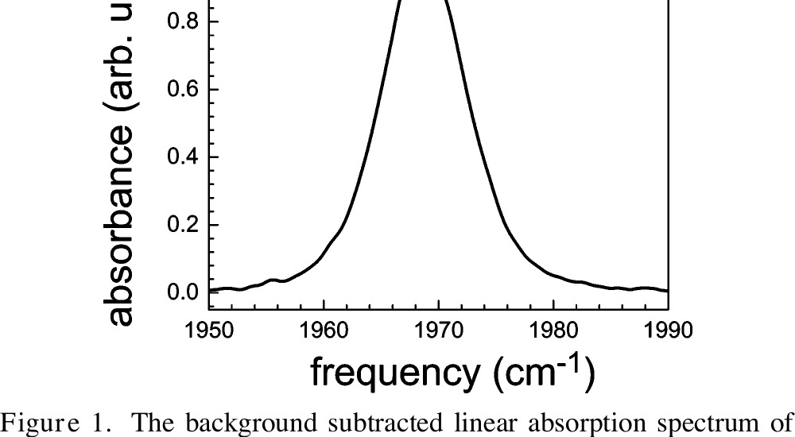
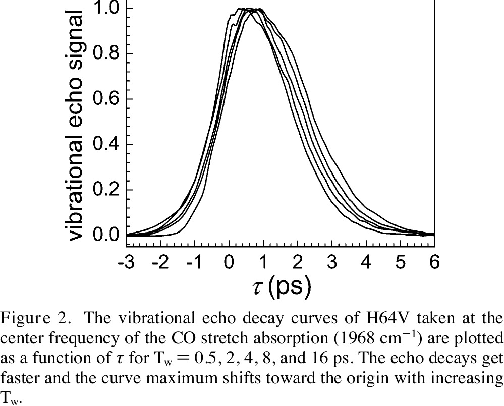
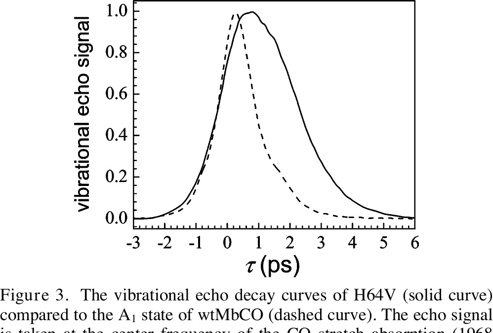
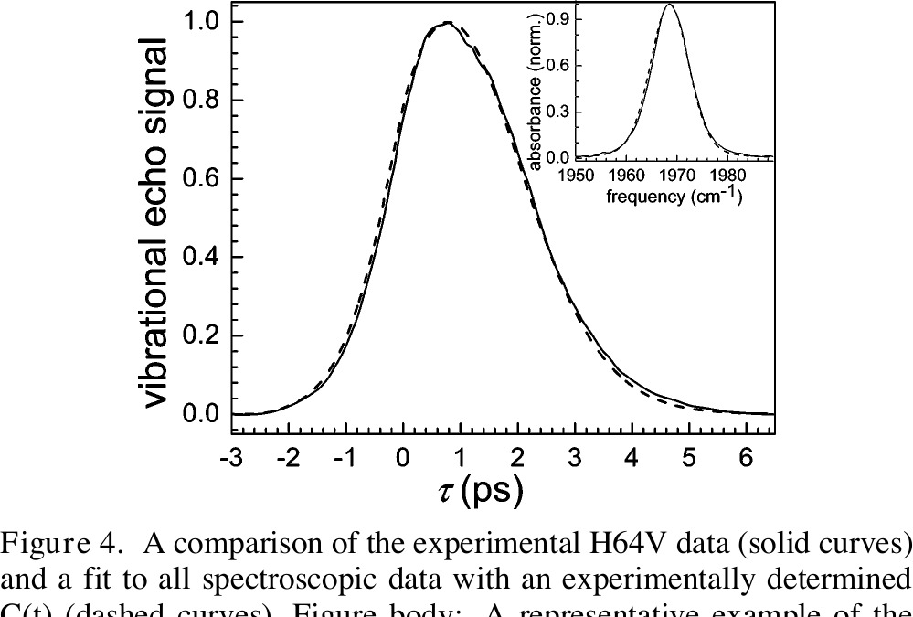
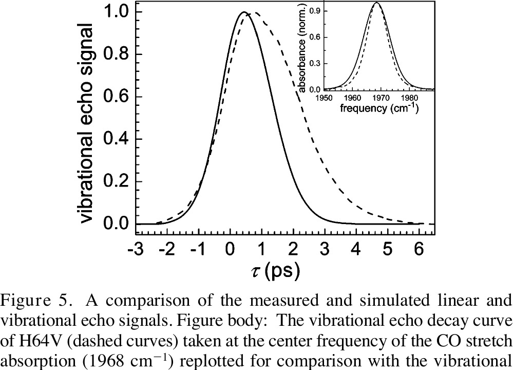
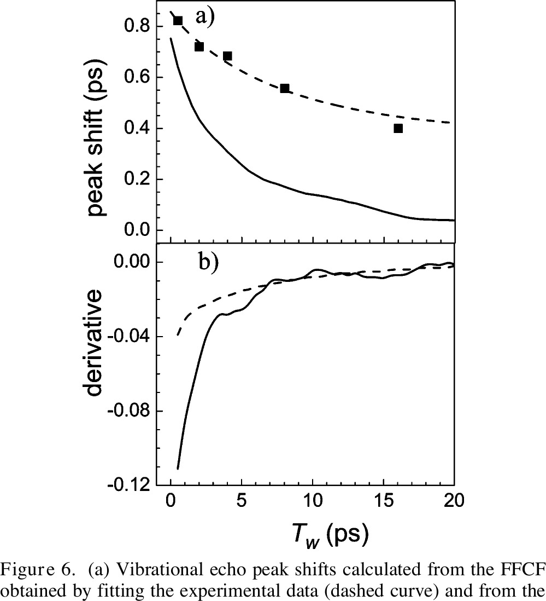
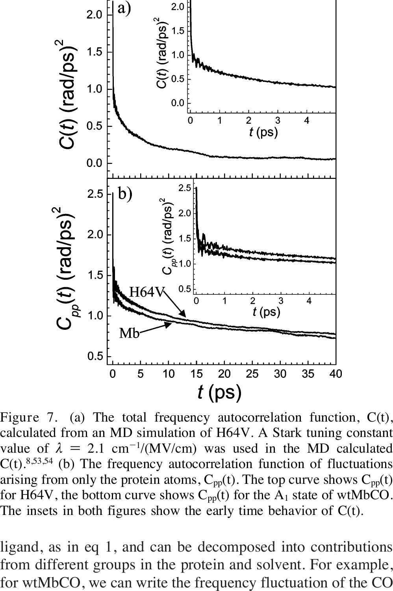

# Ultrafast Dynamics of Myoglobin without the Distal Histidine: Stimulated Vibrational Echo Experiments and Molecular Dynamics Simulations

**Ilya J. Finkelstein, Anne Goj, Brian L. McClain, Aaron M. Massari, Kusai A. Merchant, Roger F. Loring, and M. D. Fayer**

*J. Phys. Chem. B*, Vol. 109, No. 35, pp. 16959–16966 (2005)

**DOI:** [10.1021/jp0517201](https://doi.org/10.1021/jp0517201)

---

## Table of Contents

- [Abstract](#abstract)
- [I. Introduction](#i-introduction)
- [II. Experimental and Computational Methods](#ii-experimental-and-computational-methods)
- [III. Results and Discussion](#iii-results-and-discussion)
- [IV. Concluding Remarks](#iv-concluding-remarks)
- [Acknowledgments](#acknowledgments)
- [References](#references)

---

## Abstract

Ultrafast protein dynamics of the CO adduct of a myoglobin mutant with the polar distal histidine replaced by a nonpolar valine (H64V) have been investigated by spectrally resolved infrared stimulated vibrational echo experiments and molecular dynamics (MD) simulations. In aqueous solution at room temperature, the vibrational dephasing rate of CO in the mutant is reduced by ∼50% relative to the native protein. This finding confirms that the dephasing of the CO vibration in the native protein is sensitive to the interaction between the ligand and the distal histidine. The stimulated vibrational echo observable is calculated from MD simulations of H64V within a model in which vibrational dephasing is driven by electrostatic forces. In agreement with experiment, calculated vibrational echoes show slower dephasing for the mutant than for the native protein. However, vibrational echoes calculated for H64V do not show the quantitative agreement with measurements demonstrated previously for the native protein.

---

## I. Introduction

Proteins are complex molecules that sample a rugged energy landscape on time scales that range from femtoseconds to longer than milliseconds. Nonlinear femtosecond spectroscopic techniques can probe ultrafast (100 fs to tens of picoseconds) protein conformational fluctuations to relate these dynamics to the protein's physiological function and structure. [[1–7](#ref1)] Interpreting such measurements in terms of particular molecular motions requires theoretical treatment of the experimental observables with an atomic level of detail. The combination of complementary spectroscopic and computational studies can provide a detailed and self-consistent picture of protein structure, dynamics, and function. [[3,5,8–11](#ref3)]

The spectrally resolved infrared stimulated vibrational echo has been successfully applied to investigate protein structure and dynamics. [[6,7,9,12,13](#ref6)] Application of this technique to heme proteins has focused on the CO bound to the active site. [[14–20](#ref14)] By using the heme-bound CO as a probe, the spectrally resolved infrared stimulated vibrational echo can extract dynamical information from an inhomogeneously broadened and spectrally complicated line. The relatively low energy of the mid-IR interrogation pulses provides negligible perturbation to the steady-state protein structure. Furthermore, the fast time scales of the experiment correspond to those accessible by MD simulation, permitting a direct comparison between simulations and experiment.

Myoglobin is a small globular protein that is found in mammalian muscle tissue. The molecule reversibly binds exogenous ligands such as O₂, NO, and CO via a prosthetic iron heme group. Much of the detailed understanding of myoglobin and its conformational dynamics has come from a combination of simulations and biophysical studies on the native protein and a library of prepared mutants with several key modified residues. [[21–25](#ref21)] Recently, we reported an atomistic description of the protein dynamics in wild type sperm whale carbonmonoxy-myoglobin (wtMbCO) by comparing spectrally resolved infrared stimulated vibrational echoes to the vibrational echo signal calculated from MD simulations of the protein. [[5,8](#ref5)] Spectroscopic observables were calculated from a model in which time-dependent fluctuations of the CO vibrational frequency are driven by the classical time-dependent electrostatic forces exerted on the CO bond coordinate by the dynamics of the protein and solvent.

It has long been realized that aqueous wtMbCO can adopt several distinct conformations at room temperature. [[26,27](#ref26)] The spectroscopic signature for these structural substates is the multi-peak linear-infrared absorption spectrum of the CO stretch, [[27–29](#ref27)] which is dominated by three lines denoted, from high to low peak frequency, A₀, A₁, and A₃. A₁ and A₃ are the predominant spectral lines at room temperature and neutral pH. Comparison of measured and simulated absorption spectra and vibrational echoes showed that the primary structural difference between A₁ and A₃ states could be assigned to a rotation of the singly protonated imidazole group of the distal histidine, H64. [[5,8,10,11](#ref5)]

A wealth of experimental and theoretical evidence underscores the importance of H64 in myoglobin function and dynamics. [[23,30–33](#ref23)] H64 is the most polar residue near the active site, and interacts strongly with both CO and O₂ ligands. H64 has been implicated in the physiologically important differentiation between CO and O₂ binding to the heme group of myoglobin and hemoglobin. [[31,34–36](#ref31)] Furthermore, the H64 residue is highly mobile, and its rotation out of the heme pocket has been identified as a transient channel for ligand migration into the binding site. [[31,37–39](#ref31)] Photolysis studies and simulations of H64 mutants have shown that the distal residue is key in controlling the degree of geminate recombination and subsequent ligand migration through the protein matrix. [[35,40–42](#ref35)]

In this study, we employ spectrally resolved stimulated vibrational echo experiments to investigate myoglobin with the distal histidine replaced by a valine (H64V). The nonpolar valine residue interacts much more weakly with the heme-bound CO ligand than H64. We find that removing the distal histidine decreases the rates of vibrational dephasing and spectral diffusion in H64V relative to wtMbCO. The absorption spectrum and vibrational echo of CO bound to H64V is simulated with the same model previously applied to wtMbCO, and compared to the measured results. The simulated spectroscopic signals are in reasonable agreement with the experimentally measured curves without recourse to adjustable parameters in the calculations. However, the degree of quantitative agreement between simulation and experiment found for wtMbCO is lacking for H64V. The calculated spectral width is ∼20% too large, and the vibrational dephasing is ∼50% too fast. However, the slower time scale motions (greater than a few picoseconds) observed as spectral diffusion are essentially correctly reproduced by the simulations.

---

## II. Experimental and Computational Methods

### A. Experimental Methods

The experimental setup is similar to that described previously. [[5](#ref5)] Tunable mid-IR pulses with a center frequency of 1967 cm⁻¹ were generated by an optical parametric amplifier pumped with a regeneratively amplified Ti:Sapphire laser. The nearly transform-limited Gaussian-shaped pulses had a bandwidth and pulse duration of 130 cm⁻¹ and 120 fs, respectively. Three pulses (∼700 nJ/pulse) having wave vectors **k**₁, **k**₂, and **k**₃ were crossed and focused at the sample in a geometry such that after the sample the three excitation beams are located at three corners of a square and the signal is the fourth corner. The delay time between pulses **k**₁ and **k**₂, τ, was scanned at each time delay between pulses **k**₂ and **k**₃, T_w. The spot size at the sample was ∼150 µm. The vibrational echo pulse was detected with a liquid nitrogen-cooled HgCdTe 32-element array detector after dispersion through a 0.5 m monochromator with a spectral resolution of ∼1.2 cm⁻¹. The vibrational lifetime for H64V was measured to be 22 ps at room temperature using a transient grating experiment. [[43,44](#ref43)] An intensity dependence study was performed to verify that the data were free from higher order nonlinear signals. [[20](#ref20)]

Purified human met-H64V was provided by Boxer and co-workers. [[45](#ref45)] After reduction with a ∼10-fold excess of dithionite, the protein was stirred under a CO atmosphere for ∼1 h. The reduced and ligated protein was concentrated to ∼10 mM. The concentrated protein was loaded into an airtight sample cell with a 50 µm spacer between two CaF₂ windows. The sample had an optical density of ∼0.1 above background at the center of the CO stretching frequency. All data were acquired for both human and sperm whale H64V mutants to verify that the dynamics were not affected by the source of the protein.

### B. Molecular Dynamics Simulations

Molecular dynamics (MD) simulations were performed on one molecule of H64V and 3483 rigid TIP3P water molecules [[46](#ref46)] using the MOIL software package. [[47](#ref47)] The MOIL force field [[47](#ref47)] describes covalent interactions with the AMBER potential, [[48](#ref48)] nonbonded interactions with the OPLS potential, [[49](#ref49)] and improper torsions with the CHARMM potential. [[50](#ref50)] Protein and solvent were contained within a 45 Å × 54 Å × 61 Å cell, subject to periodic boundary conditions. The H64V molecule was constructed by attaching a CO ligand to the active site of sperm whale metmyoglobin with mutations H64V and D122N, [[31](#ref31)] from structure 2MGJ in the Protein Data Bank. [[51](#ref51)] The D122N mutation is far from the active site and is expected to have a negligible effect on the protein structure and dynamics. The protein structure carries a net positive charge; so one chloride ion was added to ensure electroneutrality. After attachment of the ligand, the system's energy was minimized, and the system was heated from 0 to 300 K at a rate of 1.5 K/ps, and then equilibrated at constant temperature, achieved by rescaling particle velocities. After equilibration, the system was simulated at constant energy for 5.9 ns, with T = 300 ± 3 K.

We relate molecular dynamics trajectories to spectroscopic observables with the electrostatic model applied previously to wtMbCO. [[5,8,10,11,52](#ref5)] In this picture, the force exerted by the local electric field on the electric dipole of the CO induces a shift in the CO transition frequency. Therefore, the frequency fluctuates in time with the dynamics of the local electric field. This frequency fluctuation is given by:

$$\delta\omega(t) = \lambda[\vec{u}(t)\cdot\vec{E}(t) - \langle\vec{u}\cdot\vec{E}\rangle] \tag{1}$$
<noscript></noscript>

where δω(t) is the time-dependent deviation from the mean vibrational frequency of the CO, **E**(t) is the time-dependent electric field calculated at the midpoint of the CO bond, λ is the Stark effect tuning rate, and **û**(t) is a unit vector along the carbon-oxygen bond of the CO. The local electric field was calculated from the partial charges in the MOIL force field, Coulomb's law in a vacuum, and the atomic configurations generated by the simulations. The coupling constant λ in eq 1 has been measured independently by Boxer and co-workers with vibrational Stark spectroscopy. [[53,54](#ref53)] For wtMbCO and other heme-CO systems, the coupling constant is found to lie in the range λ = 1.8–2.2 cm⁻¹/(MV/cm). [[53,54](#ref53)] In the previous comparison of calculated and measured vibrational echoes and absorption spectra for wtMbCO, λ was treated as an adjustable parameter, with a best fit value of λ = 2.1 cm⁻¹/(MV/cm), [[8](#ref8)] consistent with the range of measured values. [[53,54](#ref53)] We fixed the value of λ = 2.1 cm⁻¹/(MV/cm) in the calculations reported here for H64V. Variation of λ within the experimentally determined range for heme-CO systems does not significantly affect the absorption spectrum or vibrational echo decays. Therefore, the calculation of the observables for H64V is performed without recourse to adjustable parameters. Molecular dynamics trajectories are used to compute the equilibrium autocorrelation function of frequency fluctuations, C(t):

$$C(t) = \langle\delta\omega(0)\delta\omega(t)\rangle \tag{2}$$
<noscript></noscript>

The vibrational echo and absorption spectrum are then determined from C(t) as described in the following section.

### C. Vibrational Echo Calculations

The vibrational echo signal can be computed from the third-order nonlinear response function, [[55](#ref55)] whose convolution with the applied electric field amplitudes yields the electric polarization, P⁽³⁾(τ,T_w,t), that generates the vibrational echo signal. Here, τ denotes the delay between first and second pulses, T_w is the delay between second and third pulses, and t is the detection time. Within the conventional second cumulant approximation [[55](#ref55)] applied here, the effects on the vibrational echo from interactions between the CO vibration and its protein and solvent environment are contained in the frequency-frequency correlation function (FFCF), C(t), defined in eq 2. The vibrational lifetime of the CO stretch, measured independently by transient grating spectroscopy, [[14,43,44](#ref14)] is included in the calculations. Calculation of the response function in the manner used here has been presented previously [[5,11,12,55](#ref5)] and will not be further discussed here.

The spectrally resolved infrared stimulated vibrational echo measures the intensity level Fourier transform of the polarization along the t dimension for a fixed τ and T_w. The signal is calculated by squaring the Fourier transform of the total macroscopic polarization,

$$I^{(3)}(\tau, T_w, \omega) = \left|\int_0^\infty dt\, P^{(3)}(\tau, T_w, t) e^{i\omega t}\right|^2 \tag{3}$$
<noscript></noscript>

Within this model, the linear vibrational absorption spectrum of CO is related to C(t) by:

$$I^{(1)}(\omega) = 2\operatorname{Re}\int_0^\infty dt\, e^{i(\omega - \langle\omega_{10}\rangle)t} e^{-g(t) - t/2T_1} \tag{4}$$
<noscript></noscript>

where ⟨ω₁₀⟩ is the mean transition frequency of the ensemble of chromophores, g(t) is the line shape function given by g(t) = ∫₀^t dt′ ∫₀^t′ dt″ C(t″), and T₁ is the vibrational lifetime. As g(t) is also used to calculate the third-order response function, the FFCF determines the time dependence of all spectroscopic observables computed here.

Vibrational echoes and the absorption spectrum computed from eqs 3 and 4 with C(t) determined from MD simulations are compared to the experimental results below. In addition to comparing observables, another useful comparison between experiment and simulation is at the level of the FFCF. Within the model of eqs 3 and 4, C(t) may be extracted from measured results, independent of the MD simulations. For this purpose, the family of vibrational echo decays at different T_w values together with the steady-state absorption spectrum were simultaneously fit. The vibrational echo data measured at the center frequency of the H64V absorption were used in the fits. A multiexponential form of the FFCF:

$$C(t) = \Delta_0^2 + \sum_{i}^{n} \Delta_i^2 e^{-t/\tau_i} \tag{5}$$
<noscript></noscript>

was used to calculate g(t), which was then used to calculate the response functions, the third order polarization, and ultimately the vibrational echo signal. The multiexponential form was used because it describes the simulated FFCF for Mb reasonably well. [[5](#ref5)] As discussed below, a biexponential in addition to the constant term was used to fit the data.

This multiexponential form for the FFCF is a representation of what inherently may be a nonexponential process. However, the Δᵢ can be interpreted as the amplitude of a dynamical process with an associated time scale τᵢ. All CO frequency perturbations that are static relative to the time scales of the stimulated vibrational echo experiment (>∼100 ps) are included as a constant term, Δ₀, in C(t). As in previous studies on other heme-CO proteins, the linear absorption spectrum of the CO stretch in H64V is inhomogeneously broadened and necessitates the inclusion of a static term. To maximize the efficiency of the empirical fits, δ-function laser pulses were used when fitting the data. Once a good fit was obtained, convolution of the material polarization with transform-limited, Gaussian pulses was carried out to verify that the pulse duration was negligibly small compared to the H64V dephasing dynamics. All parameters in eq 5 were treated as adjustable and were varied by an automated simplex algorithm to give simultaneous quantitative agreement with the linear spectrum and with the dependence of the vibrational echo on τ, T_w, and frequency. The final parameters were essentially insensitive to the initial guess, and any variations were not large enough to affect the nature of the results.

---

## III. Results and Discussion

### A. Stimulated Vibrational Echo

The background subtracted linear absorption spectrum of CO bound to the active site of H64V is plotted in [Figure 1](#fig1). The H64V spectrum is well fit by a Gaussian function centered at 1968.5 cm⁻¹ with a fwhm of 9.5 cm⁻¹. In contrast, the spectrum of wtMbCO shows at least three distinct absorption lines, centered at 1934 (A₃), 1945 (A₁), and 1965 cm⁻¹ (A₀). [[5,26,27](#ref5)] The A₀ peak, the smallest of the three features at room temperature and neutral pH, is believed to arise from configurations in which the ligand interacts most weakly with H64 because the distal histidine is swung out of the pocket. [[36–39,56](#ref36)] As has been discussed in detail previously, [[5,8,57–59](#ref5)] [Figure 1](#fig1) suggests that the substitution of the distal histidine (H64) by a valine spectroscopically mimics the A₀ state of wtMbCO.

<figure class="paper-figure" id="fig1">

<figcaption><strong>Figure 1.</strong> The background subtracted linear absorption spectrum of the CO stretch of H64V. The absorption line is well fit by a single Gaussian function centered at 1968.5 cm⁻¹ with a fwhm of 9.5 cm⁻¹.</figcaption>
</figure>

Spectrally resolved infrared stimulated vibrational echo data for CO bound to H64V are presented in [Figure 2](#fig2). The normalized vibrational echo data are plotted as a function of τ for a series of T_w. The vibrational echo signal is spectrally resolved. [Figure 2](#fig2) plots a slice through the vibrational echo spectrum corresponding to the center of the H64V absorption spectrum (1968.5 cm⁻¹) at several values of T_w. As T_w is increased, the decay becomes faster. In previous experiments on wtMbCO, separating contributions from the three wtMbCO substates required analyzing many wavelengths. [[5](#ref5)] For H64V, no additional information is obtained by analyzing different wavelengths. However, spectral resolution is necessary to avoid contributions from the 1–2 vibrational transition. [[20](#ref20)]

<figure class="paper-figure" id="fig2">

<figcaption><strong>Figure 2.</strong> The vibrational echo decay curves of H64V taken at the center frequency of the CO stretch absorption (1968 cm⁻¹) are plotted as a function of τ for T_w = 0.5, 2, 4, 8, and 16 ps. The echo decays get faster and the curve maximum shifts toward the origin with increasing T_w.</figcaption>
</figure>

The stimulated vibrational echo measures spectral diffusion by varying the T_w delay time. As T_w is increased, it acts as a time gate, allowing dephasing events with longer time scales to influence the vibrational echo curves. At longer values of T_w, the spectrally resolved vibrational echo decay in τ becomes faster, and the peak shifts toward the origin. For a sufficiently long T_w, spectral diffusion is complete and all chromophores have sampled the entire spectral line. Under this circumstance, the vibrational echo peak shift is zero. However, because T₁ limits the time scale of the experiments, it is not possible to observe the slow time scale motions. As discussed above, the slow dynamics appear static on the vibrational echo time scale and are contained in the Δ₀ term of the FFCF (eq 5).

At short T_w, H64V exhibits a large peak shift of almost 1 ps. In contrast, wtMbCO has a very small peak shift at early T_w. This indicates that even at short T_w, the wtMbCO chromophores have nearly sampled the entire linear line shape while the H64V chromophores have sampled only a small fraction of the available frequencies, and therefore, only a small fraction of the structural configurations. By T_w = 16 ps, the A₁ state of myoglobin has a peak-shift nearly equal to zero, whereas the H64V maintains a significant peak shift of 0.5 ps; the H64V stimulated vibrational echo decays have only shifted ∼40% of the way toward the asymptotic limit. These results indicate that spectral diffusion is significantly slower in H64V relative to the A₁ and A₃ substates in wtMbCO. [[5,14](#ref5)] The dynamic population of chromophores in wtMbCO has nearly sampled the entire range of accessible spectral frequencies in a very short time, while the H64V chromophores do not completely sample the available spectrum by the longest T_w that was measurable in this study.

[Figure 3](#fig3) shows the substantial qualitative difference in the vibrational echo decays of H64V relative to those of the A₁ band of wtMbCO. The solid curve is the spectrally resolved vibrational echo decay collected at the center of the H64V absorption line for a T_w of 2 ps. The dashed curve presents the spectrally resolved vibrational echo decay collected at the center of the wtMbCO A₁ absorption line at the same T_w. The H64V decays are ∼50% slower than those of the A₁ state of wtMbCO for all experimentally acquired values of T_w. Previously, it has been shown that the A₁ state dephasing dynamics of wtMbCO are significantly slower than those of the A₃ state. [[5,8,10](#ref5)] At neutral pH, the steady-state concentration of the A₀ substate is very low, precluding a detailed analysis of its dynamics. Thus, the dashed curve in [Figure 3](#fig3) represents the slowest measurable decay for wtMbCO under physiological conditions.

<figure class="paper-figure" id="fig3">

<figcaption><strong>Figure 3.</strong> The vibrational echo decay curves of H64V (solid curve) compared to the A₁ state of wtMbCO (dashed curve). The echo signal is taken at the center frequency of the CO stretch absorption (1968 cm⁻¹ for H64V, 1945 cm⁻¹ for wtMbCO) and for T_w = 2 ps. The wtMbCO dynamics are significantly faster than those of H64V.</figcaption>
</figure>

The vibrational echo decay curves and linear absorption spectrum of H64V were simultaneously fit with a biexponential plus a constant frequency-frequency correlation function of the form given in eq 5. An example of the excellent agreement between the fit (dashed curve) and experimental data (solid curve) is presented in [Figure 4](#fig4). The inset shows the measured and calculated linear absorption spectrum, and the body of the figure shows the vibrational echo decay for T_w = 2 ps. The experimental observables calculated from C(t) that best fit both the linear absorption spectrum and vibrational echo data are nearly indistinguishable from the measured data on this plot. Excellent simultaneous agreement was achieved for all measured values of T_w.

<figure class="paper-figure" id="fig4">

<figcaption><strong>Figure 4.</strong> A comparison of the experimental H64V data (solid curves) and a fit to all spectroscopic data with an experimentally determined C(t) (dashed curves). Figure body: A representative example of the agreement between measured H64V vibrational echo data and fit for T_w = 2 ps. Inset: The linear absorption spectrum of H64V (solid curve) and fit to the data (dashed curve) obtained from an experimentally determined FFCF.</figcaption>
</figure>

The fitting parameters and uncertainty in their values are summarized in Table 1. The root-mean-squared amplitude Δ₁ and time scale τ₁ cannot be independently determined because the fastest time scale dephasing dynamics are motionally narrowed, that is, Δ₁τ₁ < 1, [[60,61](#ref60)] giving a Lorentzian contribution to the dynamic spectrum. The line width of the motionally narrowed component is Γ = 1/πT₂\*, with

$$1/T_2^* = \Delta_1^2\tau_1 \tag{6}$$
<noscript></noscript>

Although Δ₁ and τ₁ can be varied, they must simultaneously satisfy Δ₁τ₁ < 1 and eq 6, which results in a well-defined value for T₂\*. Therefore, Table 1 also lists T₂\* and the error bars for this quantity. The existence of motionally narrowed dynamical processes has been identified in both heme and non-heme protein dynamics, as measured by stimulated vibrational echo spectroscopy. [[5,10,12,13](#ref5)] These processes have been previously shown to persist in heme proteins when slower time scale dynamics are virtually eliminated by encapsulating the protein in a glassy matrix. [[15,17](#ref15)] The relationship between protein dynamics in glassy and aqueous media will be discussed in a future publication. [[62](#ref62)]

**TABLE 1: Experimentally Determined C(t) Parameters**

| Δ₀ (rad/ps) | Δ₁ (rad/ps) | τ₁ (ps) | T₂\* (ps) | Δ₂ (rad/ps) | τ₂ (ps) |
|:-----------:|:-----------:|:-------:|:---------:|:-----------:|:-------:|
| 0.56 ± 0.03 | 1.05 | 0.12 | 7.6 ± 0.4 | 0.37 ± 0.03 | 5.1 ± 0.5 |

### B. Molecular Dynamics Simulations of the Vibrational Echo

[Figure 5](#fig5) shows a comparison of the experimental observables calculated from molecular dynamics simulations and the experimental data. The body of the figure displays the vibrational echo for T_w = 2 ps, with simulation results given by the solid curve and experimental data shown by the dashed curve. The inset shows the absorption spectrum. Again, the solid curve is calculated from molecular dynamics simulation, and the experimental spectrum is the dashed curve. The simulations have no adjustable parameters. The simulated spectrum is 20% too broad while the simulated vibrational echo decay at this and all other T_w values is ∼50% too fast. Given the complexity of the calculations to obtain real experimental observables and the absence of adjustable parameters, the agreement between the simulations and the data is reasonably good.

<figure class="paper-figure" id="fig5">

<figcaption><strong>Figure 5.</strong> A comparison of the measured and simulated linear and vibrational echo signals. Figure body: The vibrational echo decay curve of H64V (dashed curves) taken at the center frequency of the CO stretch absorption (1968 cm⁻¹) replotted for comparison with the vibrational echo decays calculated from the MD simulation (solid curve). The decays are plotted as a function of τ for T_w = 2 ps. Inset: The background subtracted, experimentally measured linear absorption spectrum of H64V (dashed curve). The linear absorption spectrum calculated from MD simulations is shown as the solid curve. The lack of quantitative agreement between experiment and simulation is discussed in the text.</figcaption>
</figure>

Another observable that can provide some information on the nature of the discrepancies between experiment and simulation is the vibrational echo peak shift. The significance of the vibrational echo peak shift and its relation to spectral diffusion were discussed in Section IIIA. The spectrally resolved peak shift can be calculated directly from the FFCF, [[63–65](#ref63)] providing another means to compare calculated and measured dynamics. [Figure 6a](#fig6) plots the vibrational echo peak shifts vs T_w obtained from the simulated FFCF (solid line) and from the experimentally fit FFCF (dashed line). The black squares are the peak shifts measured from the spectrally resolved vibrational echo data. The experimental C(t) yields peak shifts that are in good agreement with the experimental data, confirming the relation between FFCF and echo peak shift. [[63–65](#ref63)] The simulated peak shift at T_w = 0 is within ∼10% of the measured value. This demonstrates that at short T_w both simulations and experimental data show that the chromophore has sampled a small percentage of its available spectral frequencies. The simulated FFCF produces peak shifts that decay far too fast. However, it is instructive to examine the derivative of the peak shift with respect to T_w, which is shown in [Figure 6b](#fig6). The simulated and experimental derivative curves are nearly identical by T_w ≈ 5 ps. The results show that the simulation properly accounts for the underlying dynamics that give rise to spectral diffusion after a few picoseconds. The most severe deviations between experiment and simulation are observed at short times, suggesting that the lack of success in simulating the vibrational echo decay curves is caused by a failure to reproduce the dynamical contribution to the observables in the first few picoseconds.

<figure class="paper-figure" id="fig6">

<figcaption><strong>Figure 6.</strong> (a) Vibrational echo peak shifts calculated from the FFCF obtained by fitting the experimental data (dashed curve) and from the FFCF obtained from the simulation (solid curve). The squares plot experimentally measured peak shift values. (b) The derivative of the peak shift curves with respect to T_w. The dashed curve corresponds to the peak shifts obtained from the experimental FFCF, and the solid curve to the peak shifts obtained from the simulated FFCF. For T_w > ∼5 ps, the curves coincide demonstrating that the simulated and experimental spectral diffusion are the same.</figcaption>
</figure>

It is not difficult to understand why the analysis of H64V does not show perfect agreement with experimental data. The calculation of the vibrational echo from molecular dynamics trajectories rests on a foundation of numerous approximations previously described. [[5](#ref5)] In particular, the CO vibration is assumed to interact with its surroundings through the classical electric field generated by the point charges of an empirical potential. The potential is constructed primarily to reproduce structural rather than dynamical properties. There is no inclusion of electronic polarizabilities in the force field for either the protein or the solvent. In addition to the direct coupling of the fluctuating electric field to CO frequency, it might be necessary to include other contributions, e.g., it is possible that fluctuations in the back-bonding from the heme π molecular orbitals into the CO π\* antibonding orbitals need to be taken into account. [[36,66](#ref36)] Given this list of approximations, the agreement seen between the simulations and the H64V data is quite reasonable.

In previous experiments and simulation on wtMbCO, virtually perfect agreement between experiment and simulation of both the A₁ and A₃ conformational substates of Mb was achieved. [[5](#ref5)] Connecting MD simulations to spectroscopic observables required one adjustable parameter, the Stark constant λ (see eq 1). However, the value that gave the best fits fell within the error bars of the measurement of this parameter. [[53,54](#ref53)] An important question is why did the wtMbCO simulations provide significantly better agreement with experiment than did the simulations of H64V? To examine the question, we consider the FFCFs of wtMbCO and H64V that were determined by molecular dynamics simulation. The simulated FFCF for H64V, C(t) (eq 2), is shown in [Figure 7a](#fig7). The inset is an expanded view of the short time portion. The decay of C(t) for H64V more closely resembles that of the A₁ state than that of the A₃ state in wtMbCO. The A₃ state has the protonated N of the imidazole ring of H64 pointed at and very close to the CO. [[5](#ref5)] This relatively strong interaction, which might be considered a hydrogen bond, should have a major influence on the local dynamics. This is borne out by the larger mean square frequency fluctuations which give rise to substantially more rapid dephasing of the A₃ state compared to the A₁ state. [[5](#ref5)] Therefore, we will compare H64V to the A₁ state, which has H64 in close proximity to the CO, but without the strong direct interaction associated with the A₃ state.

The frequency fluctuations in the electrostatic model are proportional to the local electric field fluctuations at the CO ligand, as in eq 1, and can be decomposed into contributions from different groups in the protein and solvent. For example, for wtMbCO, we can write the frequency fluctuation of the CO vibration as:

$$\delta\omega(t) = \delta\omega_p(t) + \delta\omega_{H64}(t) + \delta\omega_s(t) \tag{7}$$
<noscript></noscript>

with δωₚ(t) being the frequency fluctuation induced by the electric field exerted on the CO by the protein and heme excluding H64, δω_H64(t) being the contribution from the distal histidine, and δωₛ(t) being the contribution from the solvent. C(t) may then be decomposed into a sum of auto- and cross-correlation functions associated with these electric fields. C_pp(t) = ⟨δωₚ(0)δωₚ(t)⟩, the autocorrelation function of fluctuations of the CO frequency induced by the electric field of the protein, excluding H64 and solvent, is shown by the bottom curve for the A₁ state of wtMbCO in [Figure 7b](#fig7). The top curve shows C_pp(t) for H64V, and is nearly identical with the A₁ result. The small offset difference makes virtually no difference in calculated observables. From [Figure 7b](#fig7) it is clear that the protein contribution to the experimental observables in the H64V simulations is virtually identical with the protein contribution without the H64 in the simulation of wtMbCO. Furthermore, the comparison demonstrates that the protein-induced electric field at CO in the A₁ state of wtMbCO is nearly equal to the sum of the protein-induced field in H64V and an uncorrelated contribution from H64. [[5](#ref5)] The nonpolar distal valine was determined to make a negligible contribution to the FFCF of H64V in these simulations.

<figure class="paper-figure" id="fig7">

<figcaption><strong>Figure 7.</strong> (a) The total frequency autocorrelation function, C(t), calculated from an MD simulation of H64V. A Stark tuning constant value of λ = 2.1 cm⁻¹/(MV/cm) was used in the MD calculated C(t). [<a href="#ref8">8,53,54</a>] (b) The frequency autocorrelation function of fluctuations arising from only the protein atoms, C_pp(t). The top curve shows C_pp(t) for H64V, the bottom curve shows C_pp(t) for the A₁ state of wtMbCO. The insets in both figures show the early time behavior of C(t).</figcaption>
</figure>

The remaining contribution to the electric field at the CO in eq 7 is from the water solvent. In the simulations of H64V and of wtMbCO, the TIP3P water model [[46](#ref46)] was employed. As a check, the H64V simulations were run with the SPC [[67](#ref67)] water potential. Changing the water model produced an insignificant difference in the calculated vibrational echo curves.

As shown in [Figure 6](#fig6), the error in the FFCF calculated for H64V occurs at relatively short times (less than a few picoseconds) for which the simulation produces too much dephasing. [Figure 6b](#fig6) shows that the longer time portion of the FFCF is relatively accurate. The proposition that the H64V simulation produces too rapid dephasing is borne out by a comparison to the experimentally determined FFCF (Table 1). The simulated and experimentally determined C(t) share similar subpicosecond decays. However, the experimentally determined C(t) includes a term that is static on the time scale that influences the vibrational echo decays (<∼100 ps), Δ₀², which was required to fit the absorption spectrum. As a vibrational echo experiment is designed to remove the effects of static line broadening, the calculated vibrational echo is relatively insensitive to the presence of this static term. No comparable effectively static process occurs in the simulated C(t), which nearly decays to zero on the time scale of 50 ps. The net result is that the experimentally determined FFCF has a slow component that is static on the time scale of the experiments while the simulated FFCF does not display this component. This comparison to the experimentally determined FFCF together with [Figure 6b](#fig6) demonstrates that the H64V simulation produces too much dephasing on the ∼10 ps time scale.

The simulated FFCF of the A₁ state of wtMbCO is approximately equal to a sum of FFCFs from the distal histidine and from the rest of the protein and solvent. This observation and the fact that the FFCF of H64V closely resembles the A₁ FFCF from wtMbCO with the contribution of H64 suppressed ([Figure 7b](#fig7)) suggest a scenario that rationalizes the lack of perfect agreement between the H64V simulations and experiment that is found for wtMbCO.

The protein plus solvent contribution to the simulation produces too much dephasing resulting in calculated H64V vibrational echo decays that are too fast and a line width that is too wide. Previous analysis of wtMbCO showed that the distal histidine plays a major role in the fastest time scales of CO dephasing of both the A₁ and A₃ states of the native protein. These facts strongly suggest that the remarkable agreement found in wtMbCO is due to a cancellation of errors. The protein plus solvent contribution produces too much dephasing while the distal histidine, H64, produces too little. In going from wtMbCO to H64V, H64 is removed, and the cancellation of errors ceases.

---

## IV. Concluding Remarks

The distal histidine residue H64 is known to interact strongly with the active site in myoglobin and hemoglobin, [[68](#ref68)] and these interactions influence the thermodynamics and kinetics of ligand binding. [[32,35,36,42](#ref32)] The vibrational echo measurements reported here confirm that H64 plays a significant role in dephasing of the CO vibration in myoglobin. Vibrational echo decays measured in H64V are considerably slower than those in wtMbCO. In the absence of H64, the CO bound at the active site of the protein acts as a probe of the structural fluctuations of the entire protein without being dominated by the substantial interactions with the distal histidine.

Simulations of the stimulated vibrational echo decays and the absorption spectrum in H64V reproduce the decreased rate of vibrational dephasing relative to wtMbCO, but do not show the high level of agreement with experiment observed previously for wtMbCO. [[5,8,10](#ref5)] The simulated dynamics overestimate the dynamical line broadening while underestimating the static line broadening needed to describe the experimental linear spectrum and vibrational echo data. However, analysis of the vibrational echo peak shift data and its derivative ([Figure 6](#fig6)) demonstrate that the H64V simulations reproduce the longer time scale portions of the dephasing dynamics well and that the errors occur primarily at short times (less than a few picoseconds). Analysis of the contributions to the dephasing in the simulations suggests that the quantitative agreement between simulations and data for wtMbCO involves a cancellation of errors. The simulation of the protein plus solvent dynamics (H64V or wtMbCO minus H64) produces too much short time dephasing that is offset in wtMbCO by too little short time dephasing from the distal histidine. Nevertheless, the results presented here for the H64V mutant and the previous comparisons of simulations and vibrational echo data for wtMbCO demonstrate that an empirical force field for the protein with a simple model of water and an electrostatic mechanism for coupling the protein structural fluctuations to the CO frequency fluctuations can reasonably reproduce the fast dynamics observed by the vibrational echo experiments.

---

## Acknowledgments

We are indebted to Prof. Steve Boxer and Prof. Dana Dlott for providing us with samples of H64V. I.J.F., B.L.M., K.M., A.M.M., and M.D.F. acknowledge the National Institutes of Health (1R01-GM61137) for support of this research. A.M.M. acknowledges the National Institute of Health Ruth Kirschstein Postdoctoral Fellowship (1F32 GM-071162-01). R.F.L. and A.G. acknowledge support from the National Science Foundation through grant Nos. CHE0105623 and CHE0413992 and from the Petroleum Research Fund, administered by the American Chemical Society. The molecular dynamics portion of this research was carried out using the resources of the Cornell Theory Center, which receives funding from Cornell University, New York State, federal agencies, and corporate partners.

---

## References

1. Jackson, T. A.; Lim, M.; Anfinrud, P. A. *Chem. Phys.* **1994**, *180*, 131.

2. Lim, M.; Jackson, T. A.; Anfinrud, P. A. *J. Am. Chem. Soc.* **2004**, *126*, 7946.

3. Hummer, G.; Schotte, F.; Anfinrud, P. A. *Proc. Natl. Acad. Sci.* **2004**, *101*, 15330.

4. Brunori, M.; Cutruzzola, F.; Savino, C.; Travaglini-Allocatelli, C.; Vallone, B.; Gibson, Q. *Trends Biochem. Sci.* **1999**, *24*, 253.

5. Merchant, K. A.; Noid, W. G.; Akiyama, R.; Finkelstein, I. J.; Goun, A.; McClain, B. L.; Loring, R. F.; Fayer, M. D. *J. Am. Chem. Soc.* **2003**, *125*, 13804.

6. McClain, B. L.; Finkelstein, I. J.; Fayer, M. D. *Chem. Phys. Lett.* **2004**, *392*, 324.

7. McClain, B. L.; Finkelstein, I. J.; Fayer, M. D. *J. Am. Chem. Soc.* **2004**, *126*, 15702.

8. Merchant, K. A.; Noid, W. G.; Thompson, D. E.; Akiyama, R.; Loring, R. F.; Fayer, M. D. *J. Phys. Chem. B* **2003**, *107*, 4.

9. Merchant, K. A. *Ultrafast Multidimensional Vibrational Spectroscopy: Theoretical and Experimental Studies on Proteins and Model Compounds*, Stanford University, 2003.

10. Merchant, K. A.; Thompson, D. E.; Xu, Q.-H.; Williams, R. B.; Loring, R. F.; Fayer, M. D. *Biophys. J.* **2002**, *82*, 3277.

11. Williams, R. B.; Loring, R. F.; Fayer, M. D. *J. Phys. Chem. B* **2001**, *105*, 4068.

12. Hamm, P.; Hochstrasser, R. M. Structure and Dynamics of Proteins and Peptides: Femtosecond Two-Dimensional Infrared Spectroscopy. In *Ultrafast Infrared and Raman Spectroscopy*; Fayer, M. D., Ed.; Marcel Dekker: New York, 2001; Vol. 26, p 273.

13. Lim, M.; Hamm, P.; Hochstrasser, R. M. *Proc. Natl. Acad. Sci.* **1998**, *95*, 15315.

14. Rector, K. D.; Rella, C. W.; Kwok, A. S.; Hill, J. R.; Sligar, S. G.; Chien, E. Y. P.; Dlott, D. D.; Fayer, M. D. *J. Phys. Chem. B* **1997**, *101*, 1468.

15. Rector, K. D.; Engholm, J. R.; Rella, C. W.; Hill, J. R.; Dlott, D. D.; Fayer, M. D. *J. Phys. Chem. A* **1999**, *103*, 2381.

16. Rector, K. D.; Thompson, D. E.; Merchant, K.; Fayer, M. D. *Chem. Phys. Lett.* **2000**, *316*, 122.

17. Rector, K. D.; Jiang, J.; Berg, M.; Fayer, M. D. *J. Phys. Chem. B* **2001**, *105*, 1081.

18. Fayer, M. D. *Annu. Rev. Phys. Chem.* **2001**, *52*, 315.

19. Merchant, K. A.; Xu, Q.-H.; Thompson, D. E.; Fayer, M. D. *J. Phys. Chem. A* **2002**, *106*, 8839.

20. Finkelstein, I. J.; McClain, B. L.; Fayer, M. D. *J. Chem. Phys.* **2004**, *121*, 877.

21. Henry, E. R.; Sommer, J. H.; Hofrichter, J.; Eaton, W. A. *J. Mol. Biol.* **1983**, *166*, 443.

22. Martin, J. L.; Vos, M. H. *Methods Enzymol.* **1994**, *232*, 416.

23. Morikis, D.; Champion, P. M.; Springer, B. A.; Sligar, S. G. *Biochemistry* **1989**, *28*, 4791.

24. Balasubramanian, S.; Lambright, D. G.; Simmons, J. H.; Gill, S. J.; Boxer, S. G. *Biochemistry* **1994**, *33*, 8355.

25. Ostermann, A.; Waschipsky, R.; Parak, F. G.; Nienhaus, G. U. *Nature* **2000**, *404*, 205.

26. Makinen, M. W.; Houtchens, R. A.; Caughey, W. S. *Proc. Natl. Acad. Sci.* **1979**, *76*, 6042.

27. Caughey, W. S.; Shimada, H.; Choc, M. G.; Tucker, M. P. *Proc. Natl. Acad. Sci. U.S.A.* **1981**, *78*, 2903.

28. Li, T. S.; Quillin, M. L.; Phillips, G. N., Jr.; Olson, J. S. *Biochemistry* **1994**, *33*, 1433.

29. Anderton, C. L.; Hester, R. E.; Moore, J. N. *Biochim. Biophys. Acta* **1997**, *1338*, 107.

30. Jewsbury, P.; Kitagawa, T. *Biophys. J.* **1994**, *67*, 2236.

31. Quillin, M. L.; Arduini, R. M.; Olson, J. S.; Phillips, G. N., Jr. *J. Mol. Biol.* **1993**, *234*, 140.

32. Lukin, J. A.; Simplaceanu, V.; Zou, M.; Ho, N. T.; Ho, C. *Proc. Natl. Acad. Sci.* **2000**, *97*, 10354.

33. Phillips, G. N., Jr.; Teodoro, M. L.; Li, T.; Smith, B.; Olson, J. S. *J. Phys. Chem. B* **1999**, *103*, 8817.

34. Antonini, E.; Brunori, M. *Hemoglobin and Myoglobin in Their Reactions with Ligands*; North-Holland: Amsterdam, The Netherlands, 1971.

35. Braunstein, D.; Ansari, A.; Berendzen, J.; Cowen, B. R.; Egeberg, K. D.; Frauenfelder, H.; Hong, M. K.; Ormos, P.; Sauke, T. B.; Scholl, R.; Schulte, A.; Sligar, S. G.; Springer, B. A.; Steinbach, P. J.; Young, R. D. *Proc. Natl. Acad. Sci. U.S.A.* **1988**, *85*, 8497.

36. Rovira, C. *J. Mol. Struct. (THEOCHEM)* **2003**, *632*, 309.

37. Zhu, L.; Sage, J. T.; Rigos, A. A.; Morikis, D.; Champion, P. M. *J. Mol. Biol.* **1992**, *224*, 207.

38. Tian, W. D.; Sage, J. T.; Champion, P. M. *J. Mol. Biol.* **1993**, *233*, 155.

39. Yang, F.; Phillips, G. N., Jr. *J. Mol. Biol.* **1996**, *256*, 762.

40. Lambright, D. G.; Balasubramanian, S.; Boxer, S. G. *Biochemistry* **1993**, *32*, 10116.

41. Straub, J. E.; Karplus, M. *Chem. Phys.* **1991**, *158*, 221.

42. Braunstein, D. P.; Chu, K.; Egeberg, K. D.; Frauenfelder, H.; Mourant, J. R.; Nienhaus, G. U.; Ormos, P.; Sligar, S. G.; Springer, B. A.; Young, R. D. *Biophys. J.* **1993**, *65*, 2447.

43. Fourkas, J. T.; Fayer, M. D. *Acc. Chem. Res.* **1992**, *25*, 227.

44. Eichler, H. J. *Laser-Induced Dynamic Gratings*; Springer-Verlag: Berlin, Germany, 1986.

45. Hill, J. R.; Dlott, D. D.; Rella, C. W.; Peterson, K. A.; Decatur, S. M.; Boxer, S. G.; Fayer, M. D. *J. Phys. Chem.* **1996**, *100*, 12100.

46. Jorgensen, W. L.; Chandrasekhar, J.; Madura, J. D.; Impey, R. W.; Klein, M. L. *J. Chem. Phys.* **1983**, *79*, 926.

47. Elber, R.; Roitberg, A.; Simmerling, C.; Goldstein, R.; Li, H.; Verkhivker, G.; Keasar, C.; Zhang, J.; Ulitsky, A. *Comput. Phys. Commun.* **1994**, *91*, 159.

48. Weiner, S. J.; Kollman, P. A.; Case, D. A.; Singh, U. C.; Ghio, C.; Alagona, G.; Profeta, S.; Weiner, P. *J. Am. Chem. Soc.* **1984**, *106*, 765.

49. Jorgensen, W. L.; Tirado-Rives, J. *J. Am. Chem. Soc.* **1984**, *106*, 765.

50. Brooks, B. R.; Bruccoleri, R. E.; Olafson, B. D.; States, D. J.; Swaminathan, S.; Karplus, M. *J. Comput. Chem.* **1983**, *4*, 187.

51. Berman, H. M.; Westbrook, J.; Feng, Z.; Gilliland, G.; Bhat, T. N.; Weissig, N.; Shindyalov, I. N.; Bourne, P. E. *Nucleic Acids Res.* **2000**, *28*, 235.

52. Williams, R. B.; Loring, R. F. *J. Chem. Phys.* **2000**, *113*.

53. Park, E. S.; Andrews, S. S.; Hu, R. B.; Boxer, S. G. *J. Phys. Chem. B* **1999**, *103*, 9813.

54. Park, E. S.; Boxer, S. G. *J. Phys. Chem. B* **2002**, *106*, 5800.

55. Mukamel, S. *Principles of Nonlinear Optical Spectroscopy*; Oxford University Press: New York, 1995.

56. Johnson, J. B.; Lamb, D. C.; Frauenfelder, H.; Müller, J. D.; McMahon, B.; Nienhaus, G. U.; Young, R. D. *Biophys. J.* **1996**, *71*, 1563.

57. Hong, M. K.; Braunstein, D.; Cowen, B. R.; Frauenfelder, H.; Iben, I. E. T.; Mourant, J. R.; Ormos, P.; Scholl, R.; Schulte, A.; Steinbach, P. J.; Xie, A.; Young, R. D. *Biophys. J.* **1990**, *58*, 429.

58. Potter, W. T.; Hazzard, J. H.; Kawanishi, S.; Caughey, W. S. *Biochem. Biophys. Res. Commun.* **1983**, *116*, 719.

59. Young, R. D.; Frauenfelder, H.; Johnson, J. B.; Lamb, D. C.; Nienhaus, G. U.; Philipp, R.; Scholl, R. *Chem. Phys.* **1991**, *158*, 315.

60. Kubo, R. A Stochastic Theory of Line-Shape and Relaxation. In *Fluctuation, Relaxation and Resonance in Magnetic Systems*; Ter Haar, D., Ed.; Oliver and Boyd: London, UK, 1961.

61. Joo, T.; Albrecht, A. W. *J. Chem. Phys.* **1993**, *99*, 3244.

62. Massari, A. M.; Finkelstein, I. J.; McClain, B. L.; Goj, A.; Wen, X.; Bren, K. L.; Loring, R. F.; Fayer, M. D. *J. Am. Chem. Soc.* In preparation.

63. Tan, H.-S.; Piletic, I. R.; Riter, R. E.; Levinger, N. E.; Fayer, M. D. *Phys. Rev. Lett.* **2005**, *94*, 057405.

64. Cho, M. H.; Yu, J. Y.; Joo, T. H.; Nagasawa, Y.; Passino, S. A.; Fleming, G. R. *J. Chem. Phys.* **1996**, *100*, 11944.

65. Passino, S. A.; Nagasawa, Y.; Joo, T.; Fleming, G. R. *J. Phys. Chem. A* **1997**, *101*, 725.

66. Ray, G. B.; Li, X.-Y.; Ibers, J. A.; Sessler, J. L.; Spiro, T. G. *J. Am. Chem. Soc.* **1994**, *116*, 162.

67. Berendsen, H. J. C.; Postma, J. P. M.; van Gunsteren, W. F.; Hermans, J. *Intermol. Forces* **1981**, 331.

68. Antonini, E.; Brunori, M. *Hemoglobin and Myoglobin in Their Reactions with Ligands*; North-Holland Publishing Co.: Amsterdam, The Netherlands, 1971.

---

*Archived from the published PDF on 2026-04-15.*
