**Aaron M. Massari, Ilya J. Finkelstein, Brian L. McClain, Anne Goj, Xin Wen, Kara L. Bren, Roger F. Loring, and Michael D. Fayer**

*Journal of the American Chemical Society, Vol. 127, No. 41, pp. 14279–14289, 2005*

DOI: [10.1021/ja053627w](https://doi.org/10.1021/ja053627w)

---

## Abstract

Spectrally resolved infrared stimulated vibrational echo measurements are used to measure the vibrational dephasing of the CO stretching mode of carbonmonoxy-hemoglobin (HbCO), a myoglobin mutant (H64V), and a bacterial cytochrome *c*₅₅₂ mutant (*Ht*-M61A) in aqueous solution and trehalose glasses. The vibrational dephasing of the heme-bound CO is significantly slower for all three proteins embedded in trehalose glasses compared to that of aqueous protein solutions. All three proteins exhibit persistent but notably slower spectral diffusion when the protein surface is fixed by the glassy solvent. Frequency–frequency correlation functions (FFCFs) of the CO are extracted from the vibrational echo data to reveal that the structural dynamics, as sensed by the CO, of the three proteins in trehalose and aqueous solution are dominated by fast (tens of femtoseconds), motionally narrowed fluctuations. MD simulations of H64V in dynamic and "static" water are presented as models of the aqueous and glassy environments. FFCFs are calculated from the H64V simulations and qualitatively reproduce the important features of the experimentally extracted FFCFs. The suppression of long time scale (picoseconds to tens of picoseconds) frequency fluctuations (spectral diffusion) in the glassy solvent is the result of a damping of atomic displacements throughout the protein structure and is not limited to structural dynamics that occur only at the protein surface. The analysis provides evidence that some dynamics are coupled to the hydration shell of water, supporting the idea that the bioprotection offered by trehalose is due to its ability to immobilize the protein surface through a thin, constrained layer of water.

## I. Introduction

Under conditions of extreme temperature and drought, many adapted organisms become completely dehydrated and enter a state of anhydrobiosis, which can persist for several years. Surprisingly, when rehydrated, these organisms return to their previous level of biological activity unaffected by the dehydration process. The ability of these organisms to survive such adverse conditions without irreversible damage to proteins and cellular membranes has been linked to high concentrations of trehalose, [[1](#ref1)] a nonreducing sugar that forms a glass at room temperature. Although it is generally agreed that trehalose is the source of anhydrobiotic protection, the mechanism by which the sugar interacts with proteins remains an area of active investigation. [[2–10](#ref2)]

A protein's dynamics are intimately coupled to the medium in which it is solvated, thus it is no surprise that embedding a protein in a high viscosity or glassy solvent affects its dynamics. [[6](#ref6)],[[7](#ref7)],[[11](#ref11)] Flash-photolysis studies of CO recombination in carbonmonoxy-myoglobin (MbCO) [[12](#ref12)] and -hemoglobin (HbCO) [[13](#ref13)] have demonstrated that large-scale motions involved in ligand diffusion are strongly inhibited when these proteins are embedded in trehalose glasses. Gottfried and co-workers concluded that the trehalose glass does not impede fast dynamical processes in the heme active site, but dramatically damps large-scale conformational fluctuations. [[13](#ref13)]

Molecular dynamics (MD) simulations of MbCO by Cordone and co-workers have provided further evidence that small amplitude, harmonic vibrations in the heme (*i.e.*, motion of the iron atom with respect to the plane of the heme) are unaffected by the trehalose matrix, while large amplitude, anharmonic, internal protein motions are significantly inhibited. [[14](#ref14)],[[15](#ref15)] In addition, steady-state IR spectroscopic studies indicate that extremely dry samples of MbCO in trehalose exhibit no interconversion of the protein conformational substates associated with the spectroscopic substates of the CO, while slight uptake of water (ambient humidity) affords some interconversion between substates. [[16](#ref16)] Simulations indicate that trehalose is excluded from the inside of the protein and interacts indirectly with the exterior of the protein through a shell of water; the trehalose molecules make very few direct hydrogen bonds to the protein. [[5](#ref5)],[[10](#ref10)]

To simulate the effects of a glassy solvent on protein structural dynamics, Vitkup and co-workers compared MD simulations of MbCO in dynamic water to static water in which the water molecule coordinates were fixed. [[17](#ref17)] This work is particularly applicable to the present study because trehalose is believed to interact with proteins through a water hydration shell. [[5](#ref5)],[[10](#ref10)] The authors found that the equilibrium mean-squared fluctuations of atomic displacements were suppressed by the static solvent, inter-residue conformational exchange was completely eliminated, and the protein dynamics that remained were low amplitude and harmonic. The spatial variation of the solvent's influence on protein dynamics was investigated by grouping protein atoms into shells according to their distance from the protein surface and then averaging equilibrium mean-squared atomic fluctuations within each shell. In calculations with a liquid water solvent at *T* = 300 K, the mean-squared atomic fluctuations were found to be largest at the protein surface and decreased monotonically with distance from the protein surface. In contrast, for calculations with static water, the mean-squared atomic fluctuations were suppressed to a greater extent at the protein surface than in the interior, with the result that the mean-squared atomic fluctuations increased monotonically with distance from the protein surface. These results indicate that eliminating the mobility of the water molecules in the hydration shell affects the amplitude of atomic motions at the protein surface and its core.

In a related study, Tarek and co-workers reported MD simulations of ribonuclease A in aqueous solution in which the motions and translations of the water molecules in the hydration shell were expressly turned off. [[18](#ref18)] As a result of inhibiting water translation, mean-squared atomic fluctuations were greatly reduced through the entire protein. Hindering rotation of the hydration shell water molecules was found to have little effect on protein structural dynamics. The authors concluded that protein structural relaxation requires hydration shell network relaxation. Furthermore, on the ultrafast time scale, inhibiting hydration shell water molecule translation is dynamically analogous to dehydrating the protein. While static water molecules should not be expected to quantitatively represent a trehalose–water matrix, MD simulations of MbCO in trehalose–water solutions [[5](#ref5)],[[10](#ref10)],[[14](#ref14)] have found a suppression of protein dynamics by the trehalose glass that is qualitatively similar to that observed in simulations of proteins in static water. [[17](#ref17)],[[18](#ref18)]

Ultrafast vibrational echo measurements are sensitive to the relationship between structure and dynamics in MbCO and HbCO. [[19–23](#ref19)] These measurements probe the dephasing of the CO vibration, which in principle can arise either from elastic interactions with the protein environment, abnormal dynamic dephasing, or from inelastic processes that produce vibrational energy relaxation from the CO vibration to other modes. In MbCO and HbCO the vibrational lifetime (*T*1) of the CO stretch is sufficiently long that the vibrational echo dephasing is dominated by dynamic dephasing processes associated with conformational fluctuations of the protein. Within the electrostatic force model described below, [[22](#ref22)],[[24](#ref24)] the protein environment is envisioned as a network of partial charges, whose movement generates a time-dependent electric field that influences the CO vibrational frequency. [[25–30](#ref25)] In a previous study, two-pulse vibrational echo experiments were performed on MbCO embedded in trehalose to determine the dynamical dephasing of the CO vibration. [[11](#ref11)],[[31](#ref31)] These experiments demonstrated that the rate of dynamical dephasing was minimized in trehalose relative to other solvents of varying viscosity. The trehalose matrix functioned as an "infinite viscosity" solvent to lock the surface of the protein and thereby minimize the time-dependent frequency fluctuations of the CO.

In the current work, spectrally resolved infrared stimulated (three-pulse) vibrational echo experiments [[19](#ref19)] are used to study the dynamics of three heme proteins in aqueous and trehalose environments. Comparing the CO dephasing dynamics for the three proteins in trehalose to their dynamics in aqueous solution permits decoupling of the frequency fluctuations that arise from changes in the protein topology from those that are the result of inner core motions that are independent of changes in the protein surface topology. The proteins studied were the carbonmonoxy species of hemoglobin (HbCO), a mutant of human myoglobin (H64V), [[32](#ref32)] and a mutant of cytochrome *c*₅₅₂ from *Hydrogenobacter thermophilus* (*Ht*-M61A). [[33–35](#ref33)] In contrast to the previous two-pulse vibrational echo experiments on MbCO in trehalose, [[11](#ref11)],[[31](#ref31)] the current experiments provide significantly more dynamical information by utilizing three-pulse stimulated vibrational echoes that are spectrally resolved and ultrafast infrared pulses that are shorter by an order of magnitude. A two-pulse vibrational echo experiment is the equivalent of a three-pulse experiment but with the second and third pulses arriving simultaneously. The two-pulse vibrational echo measures only the fastest fluctuations that are observed at the time, *τ*, between pulses 1 and 2 scanned. In a three-pulse stimulated echo experiment, a set of *τ* scan decay curves is recorded for a series of times, *T*w, between pulses 2 and 3. These experiments measure spectral diffusion of the CO on time scales that are far longer than those that can be observed in a two-pulse experiment. The additional range of times observed in three-pulse vibrational echo experiments permits a more detailed analysis of the protein's structural dynamics. Nonlinear response theory [[36](#ref36)] allows the extraction of the quantitative autocorrelation function of fluctuations in the CO vibrational frequency or frequency–frequency correlation function (FFCF).

As a basis for understanding the vibrational echo experiments, MD simulations were performed for H64V in aqueous solution and in a glassy solvent in which the protein dynamics were allowed to evolve in the static potential of water molecules whose coordinates were fixed. [[17](#ref17)] Within the electrostatic force model described below, [[22](#ref22)],[[24](#ref24)] the FFCF of the heme-bound CO was calculated from these simulations and directly compared to the FFCFs extracted from the measured protein echo data. In general, a detailed, atomistic description of the effects of a glassy solvent on protein dynamics is generated. The complementary nature of the vibrational echo experiments and MD simulations presented here provides a greater depth and breadth of information compared to the previous vibrational echo experiments of MbCO in trehalose. [[24](#ref24)]

## II. Experimental Section

### A. Sample Preparation and Instrumentation

Lyophilized horse heart met-hemoglobin (Sigma), sodium dithionite, sodium hydroxide (Fisher), and dextran sulfate (Sigma) were used as received from Sigma Aldrich. Trehalose dihydrate was used as received from ICN Biochemicals. Potassium phosphate monobasic and sodium hydroxide were used as received from Fisher. Human adult hemoglobin was graciously provided by Professor Steven Boxer, Department of Chemistry, Stanford University.

The H64V mutant of human Mb (H64V-Mb) was expressed in *Escherichia coli* using the pet-Mb vector system as described for wild-type human Mb. [[32](#ref32)] The M61A mutant of *Ht* cyt *c*₅₅₂ (*Ht*-M61A) was prepared via the polymerase chain reaction overlap extension method [[38](#ref38)] using pMF2 [[41](#ref41)] as the template and 5' CGTCATCGGCCCCTCAATAAGG 3' and 5' GTTAAGCCGCGATCATGCACGTCC 3' as antisense and sense mutagenic primers, respectively. DNA manipulations were carried out generally as described previously. [[39](#ref39)] Cloning to yield the vector for expression of *Ht*-M61A (pRSQ524t) followed published procedures. [[40](#ref40)] Protein expression was achieved by culturing BL21(DE3) cells harboring pRSQ524t and pEC86, containing cyt *c* maturation genes cosmACDEFGH. Expression conditions and the protein purification procedure are described in detail elsewhere. [[34](#ref34)],[[35](#ref35)] Fully oxidized Hb/MbCO was prepared by the addition of ~5-fold molar excess K₃Fe(CN)₆, which was removed by gel filtration. The extinction coefficient for reduced Hb was determined using the pyridine hemochrome method. [[42](#ref42)] *T*1 of H64V is 1000 ± 50 ns. [[31](#ref31)]

Aqueous protein samples were prepared as previously described [[43](#ref43)],[[44](#ref44)] to a heme concentration of 10–15 mM in pH 7.0 D₂O phosphate buffer. Details are provided in the Supporting Information. [[32](#ref32)] UV–Visible (Varian Cary 3E) and FTIR (ATI Mattson Infinity S60) absorption spectroscopies were performed to determine all protein concentrations. HbCO, H64V, and *Ht*-M61A samples in trehalose were prepared by combining equal parts of the carbonmonoxy stock solution (prepared as described above) with a saturated trehalose solution (approximately 1:1 (w/v) in D₂O). 25 μL of the mixture was then spot coated on a CaF₂ window to produce a thin (~30 μm thick) high optical quality film. The samples were allowed to dry in a desiccator at room temperature and pressure for at least 18 h (but were then placed under vacuum (200 mTorr) for at least 24 h to remove residual water). Typical trehalose samples had absorbances at the CO stretching frequency of 0.05 OD on a background absorbance of 0.5 OD. Based on the inner thickness of 30 μm and the integrated area of the OH stretching band (absorption band from about 2100 to 2800 cm⁻¹ peak at ~2500 cm⁻¹) in pure trehalose, the amount of water remaining in these films was estimated to be less than 0.5% w/v.

The experimental setup has been previously described [[37](#ref37)] and details are provided in the Supporting Information. Briefly, ultrafast mid-IR pulses were generated by an optical parametric amplifier pumped with a regeneratively amplified Ti:sapphire laser. The bandwidth and pulse duration used in these experiments were 150 cm⁻¹ and 100 fs, respectively. The mid-IR pulse was split into three temporally controlled pulses (~700 nJ/pulse). The delay between the first two pulses, *τ*, was scanned at each time, *T*w, the delay between pulses 2 and 3. The three pulses were crossed and focused in the sample. The vibrational echo pulse generated in the phase-matched direction was spectrally resolved after detection. Data collection for all samples was performed under a nitrogen, dry air purged environment. For HbCO and H64V in trehalose, all linear and nonlinear spectroscopic data were collected in a chamber under 20 inHg vacuum to ensure maximum dehydration.

### B. Vibrational Echo Spectroscopy

FFCF Extraction from Stimulated Vibrational Echo Data. To extract quantitative information from the vibrational echo data, nonlinear response theory calculations were compared to the experimental data. [[22](#ref22)],[[36](#ref36)] Within conventional approximations, [[36](#ref36)] both the vibrational echo and the corresponding linear absorption spectrum are completely determined by the FFCF. A multiexponential form of the FFCF, *C*(*t*), was used in accord with previous vibrational echo analysis and MD simulations of sperm whale MbCO. [[22](#ref22)] The FFCF has the form

$$C(t) = \Delta_0^2 + \sum_{i=1}^{n} \Delta_i^2 \exp(-t/\tau_{\mathrm{m},i}) \tag{1}$$
<noscript>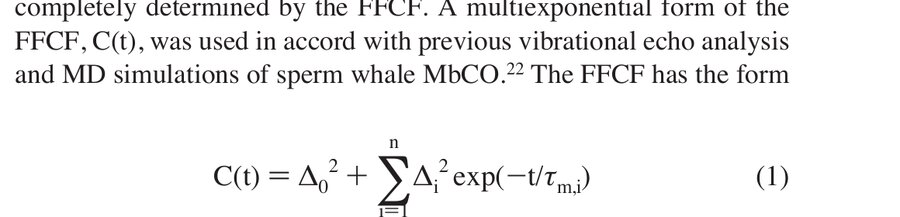</noscript>

Here, Δ₀ is the contribution from static frequency distributions, or inhomogeneous broadening, to the root-mean-squared vibrational frequency fluctuation of the CO, and Δᵢ is the magnitude of the contribution from a process with correlation time *τ*m,*i*. If *τ*i is fast compared to Δᵢ⁻¹ (*i.e.*, Δ*τ*m < 1) for a given exponential term, then that component of the FFCF is motionally narrowed. [[45–48](#ref45)]

For a motionally narrowed term (*i.e.*, Δ*τ*m < 1 for one of the terms in eq 1), Δ and *τ*m cannot be determined independently. Their combined effect on the FFCF and thus the vibrational echo signal is captured in a pure dephasing time, *T*₂* = 1/Δ²*τ*m. For such a component of the FFCF, *T*₂* describes the "homogeneous line width" for that component. The observed vibrational echo decay curve would be a single exponential that would decay as exp(−4*τ*/*T*2), where 1/*T*2 = 1/*T*₂* + 1/2*T*1. [[11](#ref11)] Although protein dynamics generally occur over a continuum of time scales, a multiexponential *C*(*t*) organizes their fluctuations into experimentally relevant time scales.

Both substates in the aqueous HbCO data [[49](#ref49)] were modeled with biexponential FFCFs (*n* = 2 in eq 1). The aqueous H64V and Ht-M61A and all three proteins in trehalose glasses were fit with a biexponential FFCF. The FFCF obtained from analysis of the data using response theory calculations was deemed correct when it could be used to calculate vibrational echo decays that fit the experimental vibrational echo data at all *T*w values and simultaneously reproduce the linear absorption spectrum. Additional details regarding FFCF extraction from vibrational echo data is available in the Supporting Information. [[32](#ref32)]

### C. Computational Methods

MD simulations were performed on one molecule of H64V and 3483 TIP3P water molecules, [[50](#ref50)] using the MOIL software package. [[51](#ref51)] The H64V molecule was constructed by attaching a CO ligand to the active site of sperm whale myoglobin with mutations H64V and D122N [[52](#ref52)] from crystal structure 2MG1 in the Protein Data Bank. [[53](#ref53)] The D122N mutation is far from the active site and is expected to have a negligible effect on protein structure and dynamics. This structure carries a net single positive charge, so no chloride ion was added to ensure electroneutrality. The long range of Coulombic forces were treated in the simulations by Ewald summation; the particle mesh Ewald algorithm, [[54](#ref54)] while short-ranged Lennard-Jones interactions are calculated with a cutoff of 9.1 Å. Two sets of simulations were performed to model the dynamics of the protein in liquid and in glassy solvents. Dynamics in aqueous solution were modeled by simulations in which the protein and solvent were equilibrated to 300 K, followed by constant energy simulations for 5.9 ns with *T* ≈ 300 ± 8 K. Dynamics in a glassy solvent were represented by selecting water and protein configurations from this trajectory at 5 ps intervals, fixing the water coordinates, and allowing the protein dynamics to occur in the static potential of each of these fixed water configurations. A total of 11.8 ns of trajectories of fixed-water MD simulations, at *T* = 300 ± 10 K, from all starting configurations was computed for fixed-water configurations.

We have previously calculated [[22](#ref22)],[[44](#ref44)] spectrally resolved stimulated vibrational echoes from sperm whale MbCO and from H64V using a force model based on the electrostatic force [[55–58](#ref55)] exerted by the protein, heme, and solvent on the CO vibrational coordinate. In this picture, the heme classical electric field at the CO induces a spectral shift in the CO vibrational frequency. Protein and solvent dynamics, as manifested in the time-varying fluctuations in this electric field, induce a time-dependent fluctuation in the CO frequency, *δω*(*t*), given by

$$\delta\omega(t) = \bar{\lambda}\hat{\delta}\cdot\bar{E}(t) - \langle\bar{\lambda}\hat{\delta}\cdot\bar{E}\rangle \tag{2}$$
<noscript>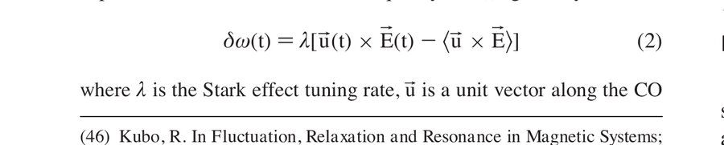</noscript>

where *λ̄* is the Stark effect tuning rate, *δ̂* is a unit vector along the CO bond, and **Ē** is the classical electric field calculated at the midpoint of the CO bond from the partial charges of the MOIL force field and Coulomb's law in vacuum. Angular brackets denote a configurational average. A coupling constant of *λ* = 2.1 cm⁻¹/(MV/cm) is reported for this heme–CO system [[44](#ref44)],[[59](#ref59)] and was used in all calculations.

Within a second cumulant approximation to the averaging over both interactions between the CO vibration and its environment, the linear absorption spectrum and the nonlinear vibrational echo may both be calculated from the autocorrelation function of frequency fluctuations, *C*(*t*), or FFCF:

$$C(t) = \langle\delta\omega(t)\,\delta\omega(0)\rangle \tag{3}$$
<noscript></noscript>

To analyze the case of a glassy solvent, it is useful to divide the average over all degrees of freedom represented by the angular brackets in eq 3 into ⟨...⟩w, which represents an average over the dynamic protein and solvent degrees of freedom in a given static-solvent configuration, and ⟨...⟩s, which represents the average over static solvent configurations. The FFCF for the glassy solvent, *C*g(*t*), may then be written as

$$C_{\mathrm{g}}(t) = \langle\delta\omega(t)\,\delta\omega(0)\rangle_{\mathrm{w,s}} \tag{4}$$
<noscript>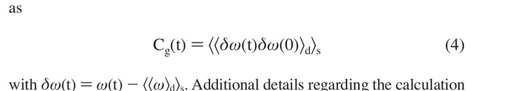</noscript>

To analyze the results of the simulations in terms of distance dependence from the protein surface, [[17](#ref17)] a grid with 0.2 Å spacing was superimposed onto the original 2MG1 crystal structure. Protein atoms within 1.05 Å, the Lennard-Jones minimum of the oxygen atom in the TIP3P potential, of a grid point were selected, constituting a protein surface. The non-hydrogen protein atoms were then sorted into atom shells, where atoms in shell 1 are within 3.5 Å of the surface, atoms in shell 2 within 3.5–4.5 Å of the surface, atoms in shell 3 within 4.5–5.5 Å of the surface, atoms in shell 4 lie within 5.5–6.5 Å of the surface, atoms in shell 5 within 6.5–7.5 Å of the surface, atoms in shell 6 within 7.5–8.5 Å of the surface, and atoms deeper than 8.5 Å from the surface. Protein atoms added to the crystal structure to form the simulated structure were assigned to the same shell as the non-hydrogen atom to which it was bonded. The heme atoms were not included in these shells, as we have found previously that, while the heme exerts a significant electric field at the CO, it does not contribute to the correlated electric field fluctuations on the picosecond time scale (see Supporting Information). [[22](#ref22)] The numbers of protein atoms included in each shell (*n*i) were *n*1 = 651, *n*2 = 276, *n*3 = 209, *n*4 = 86, *n*5 = 60, and *n*6 = 120.

## III. Results and Discussion

### A. Linear Spectroscopy

The normalized and background subtracted linear FTIR spectra of H64V, Ht-M61A, and HbCO are shown in [Figure 1](#fig1) for aqueous (solid lines) and glassy trehalose (dashed lines) environments. All peaks have been fit to Gaussian distributions to determine their full width at half-maximum (fwhm) and center frequency. The linear IR spectrum of aqueous H64V shows only a single transition at 1968.5 cm⁻¹ with a fwhm of 9.1 cm⁻¹ ([Figure 1a](#fig1)). Since this protein is a mutant of MbCO with the distal histidine replaced by a valine, this peak is generally accepted to correspond to the MbCO A0 spectroscopic substate. [[22](#ref22)],[[37](#ref37)],[[44](#ref44)],[[60–62](#ref60)] Upon embedding this protein in dry trehalose (at 20 mTorr), the peak blue-shifts to 1971 cm⁻¹ and broadens to 10.8 cm⁻¹ fwhm. CO bound to Ht-M61A in aqueous solution also exhibits a single transition at 1974 cm⁻¹ with a fwhm of 14.6 cm⁻¹ ([Figure 1b](#fig1)). The Ht-M61A CO peak blue-shifts to 1977 cm⁻¹ when the protein is embedded in a trehalose glass. The fwhm of Ht-M61A does not change in trehalose from its aqueous value.

The aqueous HbCO spectrum ([Figure 1c](#fig1)) exhibits two maxima: the main band at 1951 cm⁻¹ with a fwhm of 8.3 cm⁻¹ and a smaller band at 1969 cm⁻¹. In aqueous HbCO, these have been designated the CIII and CIV peaks, [[49](#ref49)] respectively, and correspond to two unique protein structural states (see Supporting Information). Continuing the trend of H64V and Ht-M61A, the CIII band blue-shifts to 1954.5 cm⁻¹ and broadens to nearly 12 cm⁻¹ when HbCO is prepared in a dry trehalose glass (at 20 mTorr). In addition, the intensity of the CIV band increases to 33% of the CIII band, reflecting an increased preference for this conformation compared to aqueous solution. A similar phenomenon has been observed for the analogous substate in native MbCO when prepared in dry trehalose. [[16](#ref16)] The spectral centers and line widths of the three proteins in both aqueous and trehalose environments are summarized in Table 1. The Gaussian shape of the spectral bands in all three proteins suggests that these transitions are inhomogeneously broadened.

<figure class="paper-figure" id="fig1">
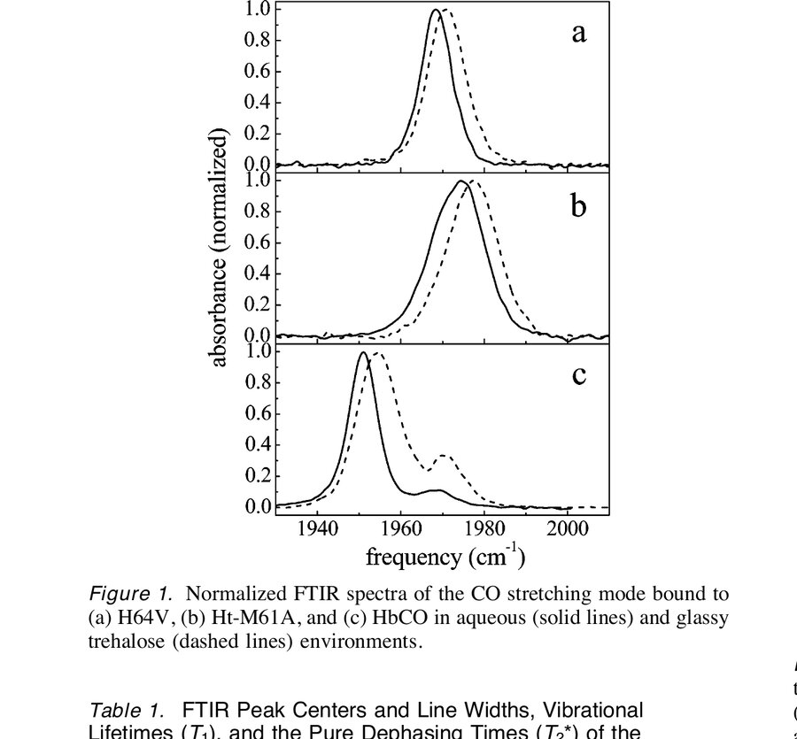
<figcaption><strong>Figure 1.</strong> Normalized FTIR spectra of the CO stretching mode bound to (a) H64V, (b) Ht-M61A, and (c) HbCO in aqueous (solid lines) and glassy trehalose (dashed lines) environments.</figcaption>
</figure>

**Table 1.** FTIR Peak Centers and Line Widths, Vibrational Lifetimes (*T*1), and the Pure Dephasing Times (*T*₂*) of the Motionally Narrowed Component of the FFCFs for H64V, Ht-M61A, and HbCO in Aqueous and Glassy Solvents

| | FTIR peak (cm⁻¹) | fwhm (cm⁻¹) | *T*1 (ps) | *T*₂* (ps) (= 1/Δ²*τ*m) |
|---|---|---|---|---|
| H64V aqueous | 1968.5 | 9.1 | 21.3 ± 0.2 | 7.57 |
| H64V trehalose | 1970.9 | 10.8 | 24.0 ± 0.1 | 12.75 |
| Ht-M61A aqueous | 1974 | 14.6 | 35.5 ± 0.2 | 8.44 |
| Ht-M61A trehalose | 1977 | 14.6 | 33.0 ± 0.2 | 9.19 |
| HbCO aqueous | 1951 | 8.3 | 23.5 ± 0.3 | 8.44 |
| | 1969 | ~8.3 | | |
| HbCO trehalose | 1954.5 | 12.8 | 24.0 ± 0.2 | 7.97 |
| | 1971 | ~12.8 | | |

The vibrational stimulated echo experiments described below confirm that the spectral bands are indeed inhomogeneously broadened, and therefore, vibrational echo experiments are necessary to uncover the underlying dynamics.

### B. Vibrational Echo Spectroscopy in Aqueous Solution and Trehalose Glasses

[Figure 2](#fig2) shows the vibrational echo decays for the three proteins in aqueous and trehalose environments at a single *T*w (0.5 ps) on a semilogarithmic scale. The vibrational echo decays of H64V and Ht-M61A in aqueous solution (solid lines) and trehalose glasses (dashed lines) are shown in panels a and b of [Figure 2](#fig2), respectively. Both proteins exhibit significantly slower CO dephasing when the proteins are embedded in a trehalose glass. The vibrational echo decays for the HbCO CIII substate with the influence of the CIV substate removed (see Supporting Information) in aqueous solution and a dry trehalose glass are shown in [Figure 2c](#fig2). It is apparent that the vibrational dephasing of the heme-bound CO is significantly slower for all three proteins in trehalose relative to the aqueous samples. Experimental FFCFs for all three proteins in trehalose and aqueous solution are virtually identical at short times and are dominated by a fast, motionally narrowed exponential term. This indicates that the processes governing vibrational dephasing on the shortest time scales are similar in the three proteins and are independent of the solvent environment. Longer time scale dynamics persist in all three proteins but are severely damped by trehalose encapsulation.

<figure class="paper-figure" id="fig2">
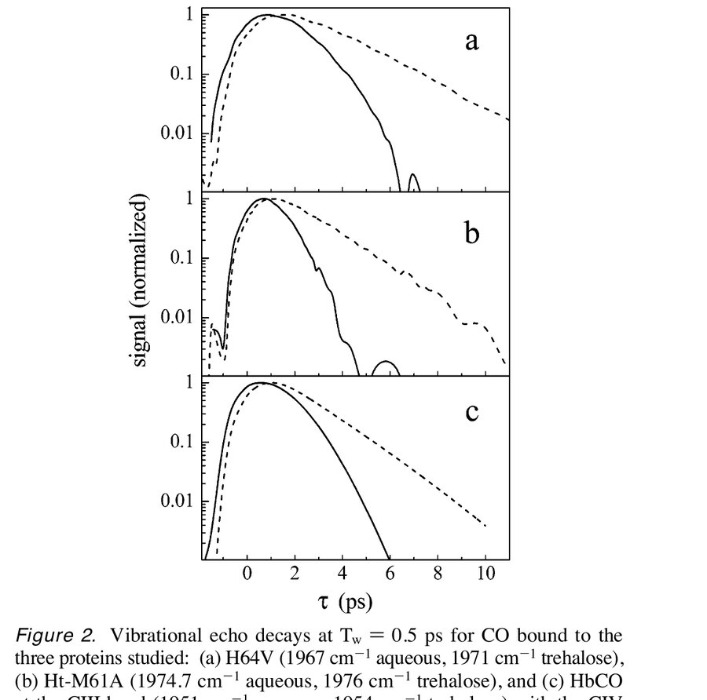
<figcaption><strong>Figure 2.</strong> Vibrational echo decays at *T*w = 0.5 ps for CO bound to the (a) H64V (1967 cm⁻¹ aqueous, 1971 cm⁻¹ trehalose), (b) Ht-M61A (1974.7 cm⁻¹ aqueous, 1976 cm⁻¹ trehalose), and (c) HbCO at the CIII band (1951 cm⁻¹ aqueous, 1954 cm⁻¹ trehalose) with the CIV substate "turned off". For all plots, solid lines are aqueous data and dashed lines are data taken in trehalose glasses.</figcaption>
</figure>

[Figure 3](#fig3) shows the vibrational echo decays as a function of *T*w for (a) H64V at 1967 cm⁻¹ and (b) H64V in a trehalose glass at 1971 cm⁻¹. Both show *T*w = 0.5, 4, 8, and 16 ps, and the arrows indicate the direction of vibrational echo decay shifting with increasing *T*w.

<figure class="paper-figure" id="fig3">
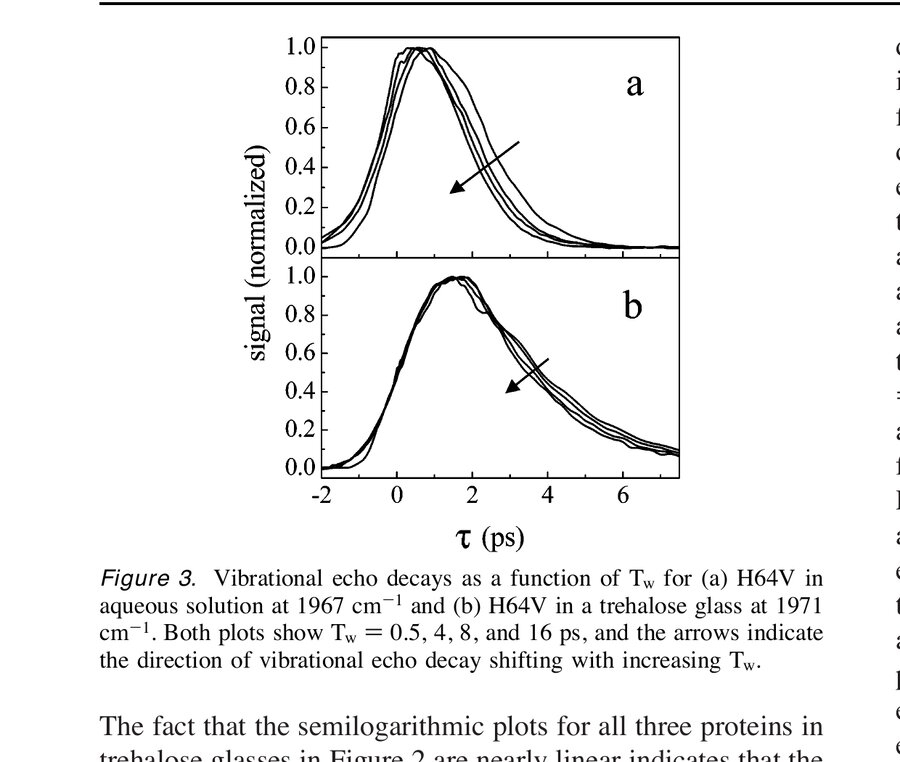
<figcaption><strong>Figure 3.</strong> Vibrational echo decays as a function of *T*w for (a) H64V at 1967 cm⁻¹ and (b) H64V in a trehalose glass at 1971 cm⁻¹. Both show *T*w = 0.5, 4, 8, and 16 ps, and the arrows indicate the direction of vibrational echo decay shifting with increasing *T*w.</figcaption>
</figure>

The fact that the semilogarithmic plots for all three proteins in trehalose glasses in [Figure 2](#fig2) are nearly linear indicates that the stimulated vibrational echoes are dominated by a motionally narrowed term in the FFCF. This is in contrast to the data taken in the aqueous solvents, in which the decays are highly nonexponential, indicating that the FFCF must contain a significant contribution from dynamics that are not motionally narrowed.

Table 1 contains the *T*1 values measured for the three proteins in aqueous and trehalose environments. These data were collected using the transient grating method. [[23](#ref23)],[[63–66](#ref63)] For H64V, Ht-M61A, and HbCO, the *T*1 values increase from 21.3, 35.5, and 23.5 ps to 24.0, 33.0, and 24.0 ps, respectively, upon going from an aqueous solution to a trehalose glass. The increases in *T*1 in going from aqueous solution to a trehalose glass are small. This demonstrates that the rate of vibrational energy relaxation from the CO ligand is not significantly affected by the nature of the solvent dynamics. The CO vibrational energy has been shown to dissipate efficiently into the vibrational modes of the heme (π-system), [[65](#ref65)],[[66](#ref66)] and these results show that fixing the surface of the protein with a glassy solvent does little to affect the vibrational energy relaxation mechanism.

In addition to determining the rate of CO dephasing, incorporating these proteins into trehalose glasses also changes their spectral diffusion. In three-pulse stimulated vibrational echoes, spectral diffusion is measured by varying the time delay between the second and third pulses, *T*w. Measuring the dynamics as a function of *T*w allows the protein dynamics to be measured over time scales that are much longer than the CO coherence time and are limited only by the population lifetime (*T*1).

[Figure 3](#fig3) shows vibrational echo decays for H64V in the two solvents at *T*w = 0.5, 4, 8, and 16 ps. The decays in aqueous solution ([Figure 3a](#fig3)) become faster, and the peaks of the decay curves shift toward the origin as *T*w becomes longer. In the frequency domain, the changes observed in the vibrational echo decays with *T*w show that the dynamical line broadens with increasing *T*w due to protein dynamics that influence the CO frequency on the *T*w time scale. For long enough *T*w, spectral diffusion is complete, and all chromophores have sampled the entire spectral line. In this case, the dynamical line shape (Fourier transform of the vibrational echo decay) is equal to the absorption line, and the vibrational echo peak shift is zero. In aqueous solution, H64V exhibits peak shifts from almost 1 ps at *T*w = 0.5 ps to less than 0.5 ps at *T*w = 16 ps. The fact that the vibrational echo decay peaks have not reached zero by *T*w = 16 ps demonstrates that the full range of protein dynamics affecting the CO frequency has not occurred within this time frame. [Figure 3b](#fig3) shows that the vibrational echo decays for H64V in dry trehalose do not change as dramatically with *T*w as they do in aqueous solution. By *T*w = 16 ps, the vibrational echo decay peak has shifted only a very small amount toward the origin, and the decays have become marginally but clearly faster. This demonstrates that some spectral diffusion persists for H64V in the trehalose glass but to a much lesser extent than in aqueous solution on the time scale of the experiment. While we do not present here a detailed study of spectral diffusion as a function of film hydration level, we have observed increases in spectral diffusion when this and other samples are measured at ambient humidity (data not shown). It is intriguing that inclusion of minute quantities of water into the trehalose glass produces a small but measurable change in the longer time scale dynamics reported by the CO. The same trends are observed in the vibrational echo data for Ht-M61A and HbCO in aqueous solution and trehalose glasses as a function of *T*w (data is available in Supporting Information). [[32](#ref32)]

<figure class="paper-figure" id="fig4">
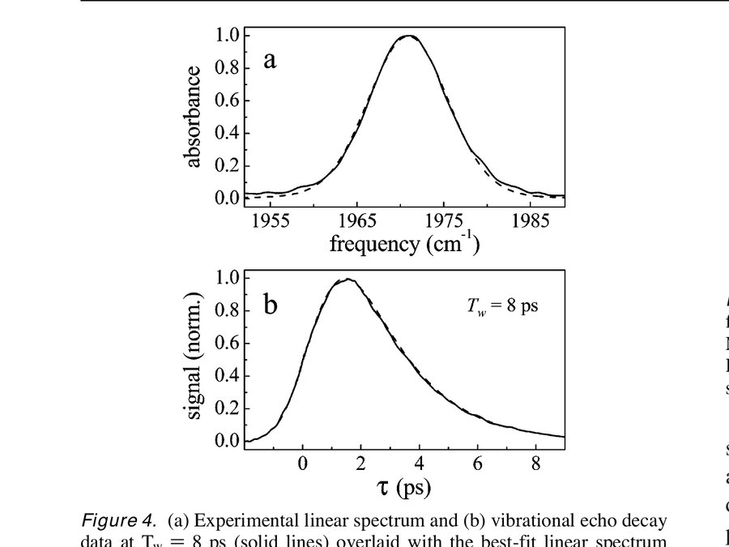
<figcaption><strong>Figure 4.</strong> (a) Experimental linear spectrum and (b) vibrational echo decay data at *T*w = 8 ps (solid lines) overlaid with the best-fit linear spectrum and vibrational echo decay (*T*w = 8 ps) calculated from nonlinear response theory (dashed lines) for H64V in trehalose at 1971 cm⁻¹.</figcaption>
</figure>

All three proteins exhibit nonexponential vibrational echo decays that are consistent at all values of *T*w. Clearly, some contributions to the CO dephasing depend on surface topology changes. [[11](#ref11)],[[31](#ref31)] As discussed below, fixing the protein's surface inhibits the movement of some residues or domains deeper within the core of the protein that cause fluctuations in the CO frequency.

It is evident on a semilogarithmic scale that the aqueous decays for all three proteins are highly nonexponential, while the decays in trehalose glasses are almost single exponentials. Thus, in addition to a change in dephasing rate, going from aqueous to trehalose solvent changes the functional form of the decay. In eq 1, if *C*(*t*) consisted of only a constant term plus a single, motionally narrowed exponential term, the observed vibrational echo decay curve would be a single exponential that would decay as exp(−4*τ*/*T*2), where 1/*T*2 = 1/*T*₂* + 1/2*T*1. [[31](#ref31)]

Nonlinear response theory [[36](#ref36)] was used to extract FFCFs from the fits to *τ* (the linear) and nonlinear vibrational echo signals as described above. As an example, the best-fit calculated linear spectrum and vibrational echo decay (*T*w = 8 ps) are overlaid in panels a and b of [Figure 4](#fig4) with the corresponding experimental data for H64V in trehalose (additional *T*w fits and data provided in Supporting Information). The agreement between model and experimental echo data signals is excellent, and the fits to all other data sets were of comparable quality.

The normalized experimental FFCFs for the three proteins in this study in aqueous solution and trehalose glasses are shown in [Figure 5](#fig5). While the differences in the FFCFs at longer times in going from aqueous solution to trehalose glass are dramatic, all six FFCFs contain a fast, motionally narrowed exponential term. As discussed above (see section IIB), for a motionally narrowed component of the FFCF, *Δ* and *τ*m cannot be individually determined. Instead, the motionally narrowed *T*₂* is sufficient to describe this component of the FFCF for each sample. This is an intrinsic spectroscopic property and does not depend on the time resolution of the experiment. It was found that five of the six samples have almost the same *T*₂* with *T*₂* = 8.3 ± 0.6 ps. For H64V in trehalose, *T*₂* = 12.7 ps. On the basis of the extracted FFCFs, we believe that all three heme proteins continue to undergo structurally similar, and possibly universal, fast fluctuations whether the surface of the protein is free to move in aqueous solution or is locked by the trehalose glass.

On longer time scales (tens of picoseconds), the dynamics of these proteins are quite different in trehalose glasses ([Figure 5](#fig5), dashed lines) as compared to that in aqueous solutions (solid lines). Comparison of the FFCFs for H64V, Ht-M61A, and HbCO in trehalose to their FFCFs in aqueous solution shows that the effect of embedding these proteins in a glassy solvent is that most of the longer time scale protein dynamics sensed by the CO are eliminated within the time window of the experiments. The FFCFs for all three proteins in aqueous solution show some structural dynamics on the tens of pico-

<figure class="paper-figure" id="fig5">
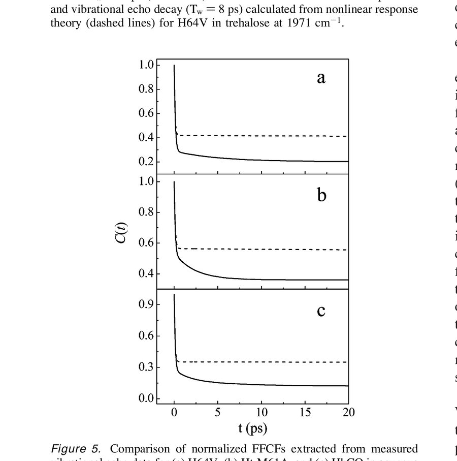
<figcaption><strong>Figure 5.</strong> Comparison of normalized FFCFs extracted from measured vibrational echo data for (a) H64V, (b) Ht-M61A, and (c) HbCO in aqueous (solid lines) and trehalose glass (dashed lines) environments.</figcaption>
</figure>

seconds time scale, while the proteins in trehalose glasses exhibit almost no dynamics after the initial fast motionally narrowed decay. The dynamics that have been eliminated by placing the proteins in a glassy solvent are the contributions to the CO dephasing from protein motions that depend on surface topology changes; those that remain are independent of the protein exterior fluctuations.

It is notable that all three proteins in trehalose continue to exhibit limited spectral diffusion ([Figure 3b](#fig3), for example), which is evidence of some persistent longer time scale structural fluctuations. The FFCFs for all three proteins in trehalose require a second exponential term to reproduce the observed spectral diffusion. The data sets could not be fit adequately with a single motionally narrowed term in the FFCF plus a constant term (see eq 1). The second exponential terms in the FFCFs for all three proteins were of low amplitude (see Supporting Information for complete tabulation of best-fit *C*(*t*) parameters), indicating that slow fluctuations on the picosecond time scale contributed a small percentage of the total mean-squared frequency fluctuations. The second exponential term was not the same for the three proteins, nor was it coincident with any of the exponential terms in their respective aqueous FFCFs. The trehalose glass strongly damps slow protein motions that are coupled to the fluctuations of the protein surface. The slower motions that persist in the trehalose matrix appear to be protein specific.

### C. MD Simulations of H64V in Aqueous and Glassy Water Solvents

To obtain a more thorough understanding of the effects of a glassy solvent on protein dynamics, we performed MD simulations on H64V in an aqueous environment and an environment approximating that of the glassy solvent. The MD simulations of H64V in liquid and static solvents permit the calculation of FFCFs from eqs 3 and 4 that are directly comparable to the experimentally extracted FFCFs for H64V shown in [Figure 5a](#fig5). The solid curve in [Figure 6](#fig6) shows the *C*(*t*) calculated from the MD simulation of H64V in liquid solvent, while the dashed curve shows *C*g(*t*) from eq 4 for the glassy solvent. The MD simulated and experimentally extracted FFCFs for H64V in aqueous solution and their corresponding vibrational echo signals have been compared in detail elsewhere (see Supporting Information). [[44](#ref44)] Comparison of the *C*(*t*) extracted from the vibrational echo measurements of H64V in trehalose ([Figure 5a](#fig5), dashed line) with *C*g(*t*) for the static solvent in [Figure 6](#fig6) shows that the simulations of H64V in an immobile solvent qualitatively reproduce the protein dynamics observed in a glass. The initial rapid decay of the calculated *C*(*t*) is very similar for

<figure class="paper-figure" id="fig6">
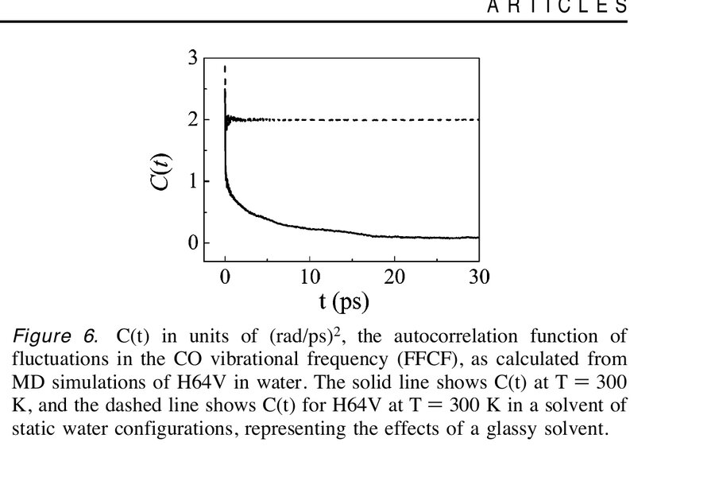
<figcaption><strong>Figure 6.</strong> *C*(*t*) in units of (rad/ps)², the autocorrelation function of fluctuations in the CO vibrational frequency (FFCF), as calculated from MD simulations of H64V in water. The solid line shows *C*(*t*) at *T* = 300 K, and the dashed line shows *C*(*t*) for H64V at *T* = 300 K in a solvent of static water configurations, representing the effects of a glassy solvent.</figcaption>
</figure>

static and dynamic solvents, while the slower dynamics are suppressed in the static solvent, as was observed in [Figure 5a](#fig5). The rapid decay is also shown in panels b and c of [Figure 5](#fig5) to be common to the other heme proteins in this study in both aqueous and glassy solvents. The MD simulated *C*(*t*) values in [Figure 6](#fig6) are in accord with the experimental evidence ([Figure 5a](#fig5)) that locking the protein surface affects internal protein dynamics that influence the long time scale frequency fluctuations of the heme-bound CO.

The MD simulations have the capacity to identify the molecular motions responsible for the initial rapid decay of *C*(*t*) shared by H64V in an aqueous and static solvent. In our previous study of sperm whale MbCO, [[22](#ref22)] it was concluded that the entire protein contributed to the initial decay of *C*(*t*), and that no particular structural element or dynamical mode was responsible for the decay. Likewise, the initial decay of *C*(*t*) for H64V in dynamic and static solvents shown in [Figure 6](#fig6) cannot be readily assigned to any single structural motion, but rather to small amplitude dynamics of the entire protein.

The separation of protein dynamics into fast motionally narrowed and slower dynamic ranges is reminiscent of recent work by Fenimore and co-workers. [[67](#ref67)] Akin to α- and β-relaxations in glasses, [[68–70](#ref68)] the authors report a separation of mean-squared atomic displacements by Mössbauer and neutron scattering experiments into "bulk solvent-slaved" (α) and "hydration shell-coupled" (β) fluctuations. A completely dehydrated protein continues to display small harmonic motions that have no coupling to an external solvent ("class III" fluctuations). [[37](#ref37)],[[67](#ref67)],[[71](#ref71)] Tarek and co-workers reported that MD simulations with static water mimicked the dynamics of a dehydrated protein. [[18](#ref18)] In this context, the predominantly fast structural dynamics that persist for HbCO, H64V, and Ht-M61A in trehalose glasses can be classified as a combination of class III and β-dynamics, as there is no bulk solvent present to generate α-fluctuations. In aqueous solution, dynamics on the tens of picoseconds time scale appear for all three proteins and must therefore be coupled to the bulk solvent (α-fluctuations). This correlation seems especially valid in light of our observation that a small amount of hydration of the trehalose films increases spectral diffusion. We speculate that eliminating the hydration shell that is maintained at the protein surface by the trehalose glass might extinguish spectral diffusion completely. Placing these samples into ambient humidity allows more of the β-dynamics to turn on.

### D. Analysis of MD Simulations

To investigate the influence of the solvent on dynamics in different parts of the protein in our MD simulations, we analyzed the dependence of atomic contributions to the equilibrium mean-squared fluctuations in the CO vibrational frequency, *C*(0) = ⟨(δω(0))²⟩, on the distance from the protein surface. [[17](#ref17)] The simulations were analyzed in terms of CO frequency fluctuations instead of the conventional mean-squared atomic displacements because the mean-squared frequency fluctuations have a direct connection to the measured vibrational echo data. According to eq 2, *C*(0) is proportional to the mean-squared fluctuation in the component of the electric field at the CO along the CO dipole. This quantity will certainly be influenced by equilibrium atomic mobilities as measured by the mean-squared fluctuations in atomic coordinates calculated by others, [[5](#ref5)],[[10](#ref10)],[[14](#ref14)],[[17](#ref17)] but will also depend on partial charges and the geometrical effects that determine the direction of the instantaneous electric field vector at the CO. We have grouped the protein atoms by distance from the protein surface using criteria similar to those employed previously (see section IIC) [[17](#ref17)] and have confirmed the same trends in mean-squared atomic displacements for H64V as observed by Vitkup and co-workers for wild-type MbCO (data not shown). [[17](#ref17)] The contribution of shell *i* to the frequency fluctuation of the CO vibration is denoted *δω*i(*t*) and is computed using eq 2 from the electric field exerted by atoms in that shell on the CO. Autocorrelation and cross-correlation functions associated with these shells are then given by *C*ij(*t*) = ⟨*δω*i(*t*)*δω*j(0)⟩ with *i* = *j* and *i* ≠ *j*, respectively.

<figure class="paper-figure" id="fig7">
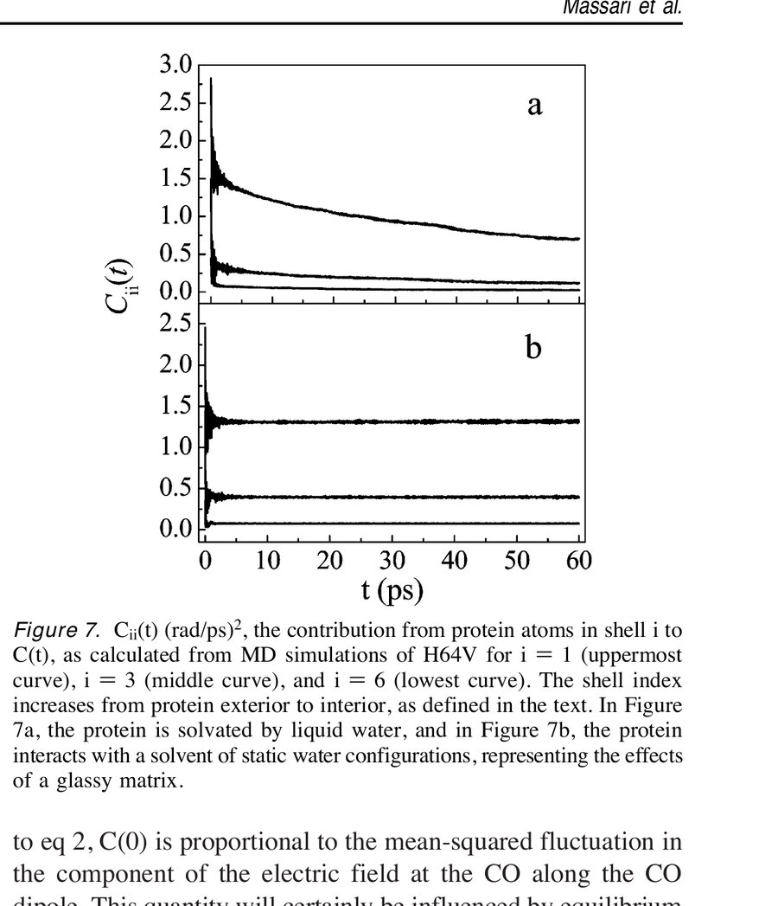
<figcaption><strong>Figure 7.</strong> *C*ii(*t*) (rad/ps)², the contribution from protein atoms in shell *i* to *C*(*t*), as calculated from MD simulations of H64V for *i* = 1 (uppermost curve), *i* = 3 (middle curve), and *i* = 6 (lowest curve). The shell index increases from protein exterior to interior, as defined in the text. In Figure 7a, the protein is solvated by liquid water, and in Figure 7b, the protein interacts with a solvent of static water configurations, representing the effects of a glassy matrix.</figcaption>
</figure>

The autocorrelation function of CO frequency fluctuations from shell *i*, *C*ii(*t*), is plotted in [Figure 7a](#fig7) for the liquid solvent and in [Figure 7b](#fig7) for the static solvent for *i* = 1 (uppermost curve), *i* = 3 (middle curve), and *i* = 6 (lowest curve). As noted in section IIC, atoms in shell 1 are within 3.5 Å of the protein surface in the crystal structure, atoms in shell 3 lie within 4.5–5.5 Å of the surface, and atoms in shell 6 lie within 7.5–8.5 Å of the surface. Each *C*ii(*t*) in [Figure 7a](#fig7) shows an initial subpicosecond decay followed by slower dynamics, as does the total correlation function *C*(*t*) for aqueous solution in [Figure 6](#fig6). When considering each shell individually, without the influence of other shells, [Figure 7a](#fig7) shows that there are more significant structural dynamics communicated to the heme-bound CO on the time scale of tens of picoseconds in the outermost shell than in the inner shells. This is not surprising when considering that the outer shells of this protein are not only more likely to be charged and polar but also less constrained and more free to move. The corresponding *C*ii(*t*) values in the static solvent ([Figure 7b](#fig7)) show a similar fast initial decay as the liquid solvent, with the suppression of slower dynamics by the static solvent in all shells.

*C*ii(0), the contribution of each shell to the equilibrium mean-squared fluctuation in the CO vibrational frequency for the liquid solvent calculations, is shown by the circles in [Figure 8a](#fig8) and is seen to decrease from the relatively polar protein surface to the relatively nonpolar interior. While this plot indicates that the dynamics at the surface of the protein have the largest influence on the equilibrium CO frequency fluctuations, it is important to consider that nearly 44% of the total protein atoms are contained in this shell. Normalization of *C*ii(0) by the number of atoms in each shell (*n*i) yields the squares plotted in [Figure 8a](#fig8). On a per atom basis, when considering each shell without the influence of other shells, the largest contribution to *C*(0) does not come from the protein surface but rather from shell 5, which is in the range of 6.5–7.5 Å from the surface.

<figure class="paper-figure" id="fig8">
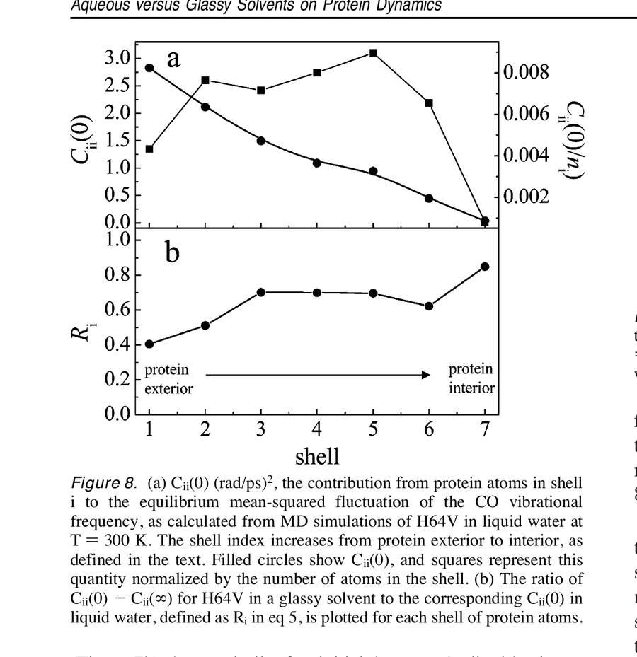
<figcaption><strong>Figure 8.</strong> (a) *C*ii(0) (rad/ps)², the contribution from protein atoms in shell *i* to the equilibrium mean-squared fluctuation of the CO vibrational frequency, as calculated from MD simulations of H64V in liquid water at *T* = 300 K. The shell index increases from protein exterior to interior, as defined in the text. Filled circles show *C*ii(0), and squares represent this quantity normalized by the number of atoms in the shell. (b) The ratio of *C*ii(0) − *C*ii(∞) for H64V in a glassy solvent to the corresponding *C*ii(0) in liquid water, defined as Ri in eq 5, is plotted for each shell of protein atoms.</figcaption>
</figure>

To apply this same analysis to the glassy solvent case, we do not examine [*C*g(0)]ii, which includes fluctuations from both protein dynamics and static solvent configurations, but rather the ratio of the total decay in static solvent, [*C*g(0)]ii − [*C*g(∞)]ii, which represents mean-squared frequency fluctuations arising from dynamics, to the corresponding decay in dynamic solvent.

$$R_i = \frac{[C_{\mathrm{g}}(0)]_{ii} - [C_{\mathrm{g}}(\infty)]_{ii}}{C_{ii}(0)} \tag{5}$$
<noscript>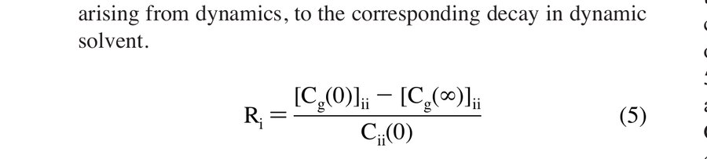</noscript>

[Figure 8b](#fig8) plots Ri for each shell. The dependence of Ri on distance from the protein surface quantifies the spatial variation of the suppression of protein dynamics by the static solvent. The fact that Ri < 1 for all shells reflects that the dynamic contributions to the equilibrium mean-squared frequency fluctuations in the static solvent are less for all shells than in the liquid solvent. This supports our experimental evidence that fixing the protein surface topology influences structural fluctuations in the inner core of the protein. While Ri does not vary monotonically across the shells, the general trend in Ri in [Figure 8b](#fig8) is an increase from the protein surface to the interior.

The simulations of Vitkup and co-workers [[17](#ref17)] demonstrated that the effect of a static solvent on wild-type MbCO is to suppress atomic mobilities throughout the protein, with atomic mean-squared displacements increasing slightly from the protein surface to the interior. Within our electric field model, fluctuations in the CO vibrational frequency arise from motions of atoms with partial charges. Therefore, the damping of atomic motions would be expected to lead to a suppression of frequency fluctuations. However, since the contribution of the motion of a particular atom to the electric field fluctuation depends on partial charge and distance from the CO as well as on its mobility, and since charges are not uniformly distributed throughout the protein, the spatial dependence of the suppression of contributions to CO frequency fluctuations by a glassy solvent is far from obvious. [Figure 8](#fig8) demonstrates that the spatial dependence of the damping of atomic displacements reported by Vitkup and co-workers [[17](#ref17)] is mirrored by the mean-squared frequency fluctuations of the heme-bound CO, which are probed by nonlinear spectroscopy.

Although [Figures 7](#fig7) and [8](#fig8) illustrate correlations in electric field fluctuations within the individual shells, no direct connection exists between *C*ii(*t*) and the total *C*(*t*) as a result of cross-correlations between electric field fluctuations at the CO induced by different shells. By computing the cross-correlation functions, *C*ij(*t*), we find that *C*ij(*t*) for any adjacent pair of shells is negative for all times studied, indicating significant cancellation of electric fields at the CO from different shells to produce the total field. [Figure 9](#fig9) illustrates the positive and negative cross-correlations (*C*ij(*t*)) between electric field fluctuations from the outermost shell (*i* = 1) and four interior shells (*j* = 2, 3, 4, and 5) for the dynamic aqueous solvent. The initial values *C*1j(0) are shown to alternate in sign, although this is not the case for *C*16(0) and *C*17(0) (not shown). The corresponding cross-correlations for the static solvent (data not shown) closely resemble the results for the liquid solvent. The anticorrelated nature of the frequency fluctuations in adjacent shells shows that there is no simple relation between the total correlation function *C*(*t*) and the autocorrelation functions associated with individual shells.

<figure class="paper-figure" id="fig9">
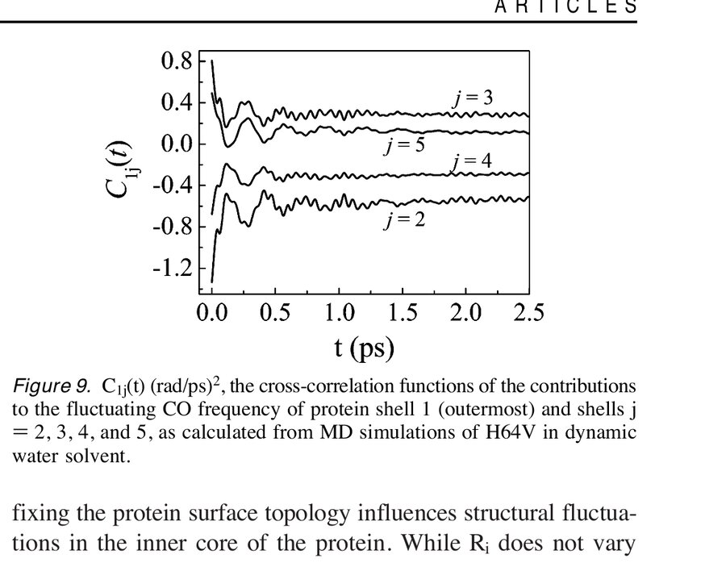
<figcaption><strong>Figure 9.</strong> *C*1j(*t*) (rad/ps)², the cross-correlation functions of the contributions to the fluctuating CO frequency of protein shell 1 (outermost) and shells *j* = 2, 3, 4, and 5, as calculated from MD simulations of H64V in dynamic water solvent.</figcaption>
</figure>

The results in [Figures 7](#fig7), [8](#fig8), and [9](#fig9), together with the results of previous simulations of proteins in immobilized solvents, [[17](#ref17)],[[18](#ref18)] provide a molecular picture of the solvent effects on protein dynamics observed by the vibrational echo measurements. In dynamic solvents, the mean-squared atomic displacements are greatest at the protein surface and therefore contribute strongly to the mean-squared frequency fluctuations of the CO. Placing the simulated H64V into a static solvent suppresses the atomic displacements in all shells and therefore suppresses the frequency fluctuations at the CO. However, the time-dependent electric fields at the CO from adjacent shells are shown in [Figure 9](#fig9) to be anticorrelated, resulting in significant field cancellation. This anticorrelation of frequency fluctuations underscores the fact that the concerted influence of all shells on the CO frequency must be considered in order to understand their influence on the dynamics at the protein active site. As others have shown, [[17](#ref17)] and as we have confirmed here, it is instructive to dissect the simulated protein into distance-dependent shells to understand the effect of solvent dynamics on structural dynamics at various distances from the protein surface. However, when trying to understand these solvent effects on the dynamics at the active site, which defines the functional role of a protein or enzyme, a more complex picture must be considered.

In the context of bioprotection, the results presented here indicate that inhibiting movement of the hydration shell water molecules is an effective way to suppress longer time scale (tens of picoseconds) structural dynamics at both the surface and inner core of a protein. In the preferential hydration model, [[10](#ref10)],[[67](#ref67)],[[72](#ref72)] trehalose forms few direct hydrogen bonds to the protein and functions primarily by concentrating and limiting the mobility of residual water at the protein surface. That the measured vibrational echo data for HbCO, H64V, and Ht-M61A in trehalose glasses and the simulated H64V in static solvent produce qualitatively similar FFCFs supports this model in which the trehalose functions as a bioprotectant by hindering displacements of the hydration shell water molecules at the protein surface.

## IV. Conclusions

Proteins are complex macromolecules that undergo structurally significant fluctuations with time scales spanning many orders of magnitude. The ultrafast infrared vibrational echo measurements of HbCO, H64V, and Ht-M61A in aqueous and trehalose matrix environments have revealed some universal aspects of solvent–protein dynamics. Compared to aqueous protein solutions, vibrational dephasing of the heme-bound CO is significantly reduced for all three proteins embedded in trehalose glasses. The dephasing of the CO is a probe of the time-dependent fluctuations of the protein structure. The fact that locking the exterior surface of the protein affects the observed CO dynamics indicates that the bonded CO ligand is either directly or indirectly sensitive to changes in protein structure that occur nanometers away from the active site. On longer time scales, HbCO, H64V, and Ht-M61A exhibit significantly reduced spectral diffusion in dry trehalose glasses relative to the aqueous samples. Experimental FFCFs for all three proteins in trehalose and aqueous solution are virtually identical at short times and are dominated by a fast, motionally narrowed exponential term. This indicates that the processes governing vibrational dephasing on the shortest time scales are similar in the three proteins and are independent of the solvent environment. Longer time scale dynamics persist in all three proteins but are severely damped by trehalose encapsulation.

MD simulations of H64V were carried out to generate an atomistic description of vibrational dephasing in aqueous and static environments. To draw a connection between the experimental results and the MD simulation of H64V, the FFCF of the heme-bound CO, which provides a direct comparison to the measured vibrational echo data, was calculated from the simulations. The FFCFs calculated from MD simulations of H64V in liquid and static aqueous environments are in excellent qualitative agreement with the FFCFs derived from vibrational echo experiments. With experiment and simulation in agreement, we are able to determine that the suppression of long time scale frequency fluctuations (spectral diffusion) in the glassy solvent is the result of a damping of atomic displacements throughout the protein structure and is not isolated to structural dynamics that occur only at the protein surface. The structural dynamics that remain when the solvent molecules are fixed are likely to be those that remain in a completely dehydrated protein. [[18](#ref18)] The fact that spectral diffusion persists in our vibrational echo data while the MD simulations in static water contain only fast time scale fluctuations indicates that some hydration shell-coupled dynamics are also present. We assert that the dynamics that we measure in trehalose glasses for all three proteins are a combination of class III and β dynamics described by Fenimore and co-workers. [[67](#ref67)] These experimental results and MD simulations confirm that the bioprotection offered by trehalose is a nonspecific interaction whereby the protein is selectively hydrated by a thin, immobilized layer of water. The trehalose glass functions to inhibit large-scale atomic fluctuations of the protein and its hydration shell, thereby precluding long-term biodehydration.

Previous MD simulations of MbCO in trehalose–water mixtures [[14](#ref14)],[[15](#ref15)] have suggested that the effect of the trehalose on protein dynamics is similar to that observed in simulations of myoglobin in a static water solvent. [[17](#ref17)] The similarity between the FFCF extracted from experimental vibrational echo data on H64V in a trehalose glass and that calculated from the MD simulation of H64V in a static water solvent is consistent with this finding. A more quantitative analysis of the effect of the trehalose glass environment on the protein dynamics probed by the vibrational echo must await the calculation of vibrational echoes directly from a simulation of MbCO in a room-temperature trehalose–water glass, a study which is reserved for a subsequent publication. [[72](#ref72)]

## References

1. Crowe, J. H.; Crowe, L. M. *Science* **1984**, *223*, 701–703.

2. Carpenter, J. F.; Crowe, J. H. *Biochemistry* **1989**, *28*, 3916–3922.

3. Ballone, P.; Marchi, M.; Branca, C.; Magazu, S. *J. Phys. Chem. B* **2000**, *104*, 6313–6317.

4. Belton, P. S.; Gil, A. M. *Biopolymers* **1994**, *34*, 957–961.

5. Cottone, G.; Ciccotti, G.; Cordone, L. *J. Chem. Phys.* **2002**, *117*, 9862–9866.

6. Walser, R.; Gunsteren, W. F. *Proteins: Struct., Funct., Genet.* **2001**, *42*, 414–421.

7. Caliskan, G.; Mechtani, D.; Roh, J. H.; Kisliuk, A.; Sokolov, A. P.; Azzam, S.; Cicerone, M. T.; Lin-Gibson, S.; Peral, I. *J. Chem. Phys.* **2004**, *121*, 1978–1983.

8. Sola-Penna, M.; Meyer-Fernandez, J. R. *Arch. Biochem. Biophys.* **1998**, *360*, 10–14.

9. Chen, T.; Fowler, A.; Toner, M. *Cryobiology* **2000**, *40*, 277–282.

10. Cottone, G.; Giuffrida, S.; Ciccotti, G.; Cordone, L. *Proteins: Struct., Funct., Bioinf.* **2005**, *59*, 291–302.

11. Rector, K. D.; Jiang, J.; Berg, M.; Fayer, M. D. *J. Phys. Chem. B* **2001**, *105*, 1081–1092.

12. Hagen, S. J.; Hofrichter, J.; Eaton, W. A. *Science* **1995**, *269*, 959–962.

13. Gottfried, D. S.; Peterson, E. S.; Sheikh, A. G.; Wang, J.; Yang, M.; Friedman, J. M. *J. Phys. Chem.* **1996**, *100*, 12034.

14. Cordone, L.; Galajda, P.; Vitrano, E.; Gassman, A.; Ostermann, A.; Parak, F. *Eur. Biophys. J.* **1998**, *27*, 173–176.

15. Cottone, G.; Cordone, L.; Ciccotti, G. *Biophys. J.* **2001**, *80*, 931–938.

16. Librizzi, F.; Viappiani, C.; Abbruzzetti, S.; Cordone, L. *J. Chem. Phys.* **2002**, *116*, 1193–1200.

17. Vitkup, D.; Ringe, D.; Petsko, G. A.; Karplus, M. *Nat. Struct. Biol.* **2000**, *7*, 34–38.

18. Tarek, M.; Tobias, D. J. *Phys. Rev. Lett.* **2002**, *88*, Art. No. 138101.

19. Lim, M.; Hamm, P.; Hochstrasser, R. M. *Proc. Natl. Acad. Sci. U.S.A.* **1998**, *95*, 15315–15320.

20. Hamm, P.; Hochstrasser, R. M. In *Ultrafast Infrared and Raman Spectroscopy*; Fayer, M. D., Ed.; Marcel Dekker: New York, 2001; Vol. 26, pp 273–347.

21. Hamm, P.; Lim, M.; Hochstrasser, R. M. *J. Phys. Chem. B* **1998**, *102*, 6123–6138.

22. Merchant, K. A.; Noid, W. G.; Akiyama, R.; Finkelstein, I. J.; Goun, A.; McClain, B. L.; Loring, R. F.; Fayer, M. D. *J. Am. Chem. Soc.* **2003**, *125*, 13804–13818.

23. Fayer, M. D. *Annu. Rev. Phys. Chem.* **2001**, *52*, 315–356.

24. Williams, R. B.; Loring, R. F.; Fayer, M. D. *J. Phys. Chem. B* **2001**, *105*, 4068–4071.

25. Rector, K. D.; Rella, C. W.; Kwok, A. S.; Hill, J. R.; Sligar, S. G.; Chien, E. Y. P.; Dlott, D. D.; Fayer, M. D. *J. Phys. Chem. B* **1997**, *101*, 1468–1475.

26. Rector, K. D.; Engholm, J. R.; Hill, J. R.; Myers, D. J.; Hu, R.; Boxer, S. G.; Dlott, D. D.; Fayer, M. D. *J. Phys. Chem. B* **1998**, *102*, 331–333.

27. Rella, C. W.; Rector, K. D.; Kwok, A. S.; Hill, J. R.; Schwettman, H. A.; Dlott, D. D.; Fayer, M. D. *J. Phys. Chem.* **1996**, *100*, 15620.

28. Oldfield, E.; Guo, K.; Augspurger, J. D.; Dykstra, C. E. *J. Am. Chem. Soc.* **1991**, *113*, 7537–7541.

29. Augspurger, J. D.; Dykstra, C. E.; Oldfield, E. *J. Am. Chem. Soc.* **1991**, *113*, 2447–2451.

30. Park, E. S.; Andrews, S. S.; Hu, R. B.; Boxer, S. G. *J. Phys. Chem. B* **1999**, *103*, 9813–9817.

31. Rector, K. D.; Engholm, J. R.; Rella, C. W.; Hill, J. R.; Dlott, D. D.; Fayer, M. D. *J. Phys. Chem. A* **1999**, *103*, 2381–2387.

32. Varadarajan, R.; Lambright, D. G.; Boxer, S. G. *Biochemistry* **1989**, *28*, 3771–3781.

33. Zhong, L.; Wen, X.; Rabinowitz, T. M.; Russell, B. S.; Karan, E. F.; Bren, K. L. *Proc. Natl. Acad. Sci. U.S.A.* **2004**, *101*, 8637–8642.

34. Wen, X.; Bren, K. L. Manuscript in progress.

35. Karan, E. F.; Russell, B. S.; Bren, K. L. *J. Biol. Inorg. Chem.* **2002**, *7*, 260–272.

36. Mukamel, S. *Principles of Nonlinear Optical Spectroscopy*; Oxford University Press: New York, 1995.

37. Merchant, K. A.; Noid, W. G.; Thompson, D. E.; Akiyama, R.; Loring, R. F.; Fayer, M. D. *J. Phys. Chem. B* **2003**, *107*, 4–7.

38. Ho, S. N.; Hunt, H. D.; Horton, R. M.; Pullen, J. K.; Pease, L. R. *Gene* **1989**, *77*, 51–59.

39. Sambrook, J.; Fritsch, E. F.; Maniatis, T. *Molecular Cloning: A Laboratory Manual*, 2nd ed.; Cold Spring Harbor Laboratory Press: New York, 1989.

40. Arslan, E.; Schulz, H.; Zufferey, R.; Künzler, P.; Thöny-Meyer, L. *Biochem. Biophys. Res. Commun.* **1998**, *251*, 744–747.

41. Fee, J. A.; Chen, Y.; Todaro, T. R.; Bren, K. L.; Patel, K. M.; Hill, M. G.; Gomez-Moran, E.; Loehr, T. M.; Ai, J.; Thöny-Meyer, L.; Williams, P. A.; Stura, E.; Sridhar, V.; McRee, D. E. *Protein Sci.* **2000**, *9*, 2074–2084.

42. Berry, E. A.; Trumpower, B. L. *Anal. Biochem.* **1987**, *161*, 1–15.

43. McClain, B. L.; Finkelstein, I. J.; Fayer, M. D. *J. Am. Chem. Soc.* **2004**, *126*, 15702–15710.

44. Finkelstein, I. J.; Goj, A.; McClain, B. L.; Massari, A. M.; Merchant, K. A.; Loring, R. F.; Fayer, M. D. *J. Phys. Chem. B* **2005**, *109*, 16959–16966.

45. Berg, M. A.; Rector, K. D.; Fayer, M. D. *J. Chem. Phys.* **2000**, *113*, 3233–3242.

46. Kubo, R. In *Fluctuation, Relaxation and Resonance in Magnetic Systems*; Ter Haar, D., Ed.; Oliver and Boyd: London, 1961.

47. Kubo, R. In *Fluctuation, Relaxation, and Resonance in Magnetic Systems*; Haar, D. T., Ed.; Oliver and Boyd: London, 1962.

48. Schmidt, J.; Sundlass, N.; Skinner, J. *Chem. Phys. Lett.* **2003**, *378*, 559–566.

49. Mayer, E. *J. Am. Chem. Soc.* **1994**, *116*, 10571–10577.

50. Jorgensen, W. L.; Chandrasekhar, J.; Madura, J. D.; Impey, R. W.; Klein, M. L. *J. Chem. Phys.* **1983**, *79*, 926–935.

51. Elber, R.; Roitberg, A.; Simmerling, C.; Goldstein, R.; Li, H.; Verkhivker, G.; Keasar, C.; Zhang, J.; Ulitsky, A. *Comput. Phys. Commun.* **1995**, *91*, 159–189.

52. Quillin, M. L.; Arduini, R. M.; Olson, J. S.; Phillips, G. N., Jr. *J. Mol. Biol.* **1993**, *234*, 140–155.

53. Berman, H. M.; Westbrook, J.; Feng, Z.; Gilliland, G.; Bhat, T. N.; Weissig, H.; Shindyalov, I. N.; Bourne, P. E. *Nucleic Acids Res.* **2000**, *28*, 235.

54. Darden, T.; York, D.; Pedersen, L. *J. Chem. Phys.* **1993**, *98*, 10089–10092.

55. Hayashi, T.; Jansen, T. l. C.; Zhuang, W.; Mukamel, S. *J. Phys. Chem. A* **2005**, *109*, 64–82.

56. Kwac, K.; Cho, M. *J. Chem. Phys.* **2003**, *119*, 2247–2255.

57. Moller, K.; Rey, R.; Hynes, J. *J. Phys. Chem. A* **2004**, *108*, 1275–1289.

58. Schmidt, J.; Corcelli, S.; Skinner, J. *J. Chem. Phys.* **2004**, *121*, 8887–8896.

59. Park, E. S.; Boxer, S. G. *J. Phys. Chem. B* **2002**, *106*, 5800–5806.

60. Potter, W. T.; Hazzard, J. H.; Kawanishi, S.; Caughey, W. S. *Biochem. Biophys. Res. Commun.* **1983**, *116*, 719.

61. Hong, M. K.; Braunstein, D.; Cowen, B. R.; Frauenfelder, H.; Iben, I. E. T.; Mourant, J. R.; Ormos, P.; Scholl, R.; Schulte, A.; Steinbach, P. J.; Xie, A.; Young, R. D. *Biophys. J.* **1990**, *58*, 429–436.

62. Young, R. D.; Frauenfelder, H.; Johnson, J. B.; Lamb, D. C.; Nienhaus, G. U.; Philipp, R.; Scholl, R. *Chem. Phys.* **1991**, *158*, 315.

63. Eichler, H. J. *Laser-Induced Dynamic Gratings*; Springer-Verlag: Berlin, 1986.

64. Fourkas, J. T.; Fayer, M. D. *Acc. Chem. Res.* **1992**, *25*, 227–233.

65. Dlott, D. D.; Fayer, M. D.; Hill, J. R.; Rella, C. W.; Suslick, K. S.; Ziegler, C. J. *J. Am. Chem. Soc.* **1996**, *118*, 7853.

66. Owrutsky, J. C.; Li, M.; Locke, B.; Hochstrasser, R. M. *J. Phys. Chem.* **1995**, *99*, 4842.

67. Fenimore, P. W.; Frauenfelder, H.; McMahon, B. H.; Young, R. D. *Proc. Natl. Acad. Sci. U.S.A.* **2004**, *101*, 14408–14413.

68. Angell, C. A.; Ngai, K. L.; McKenna, G. B.; McMillan, P. F.; Martin, S. W. *J. Appl. Phys.* **2000**, *88*, 3113–3157.

69. Green, J. L.; Fan, J.; Angell, C. A. *J. Phys. Chem.* **1994**, *98*, 13780–13790.

70. Ngai, K. L.; Paluch, M. *J. Chem. Phys.* **2004**, *120*, 857–873.

71. Fenimore, P. W.; Frauenfelder, H.; McMahon, B. H.; Parak, F. G. *Proc. Natl. Acad. Sci. U.S.A.* **2002**, *99*, 16047–16051.

72. Cottone, G.; Ciccotti, G.; Cordone, L. *J. Chem. Phys.* **2002**, *117*, 9862–9866.
