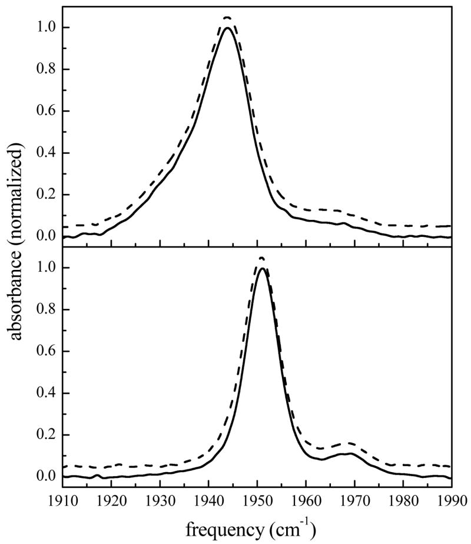
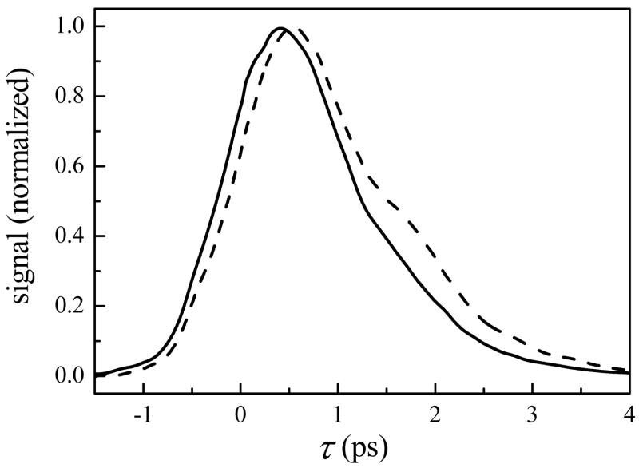
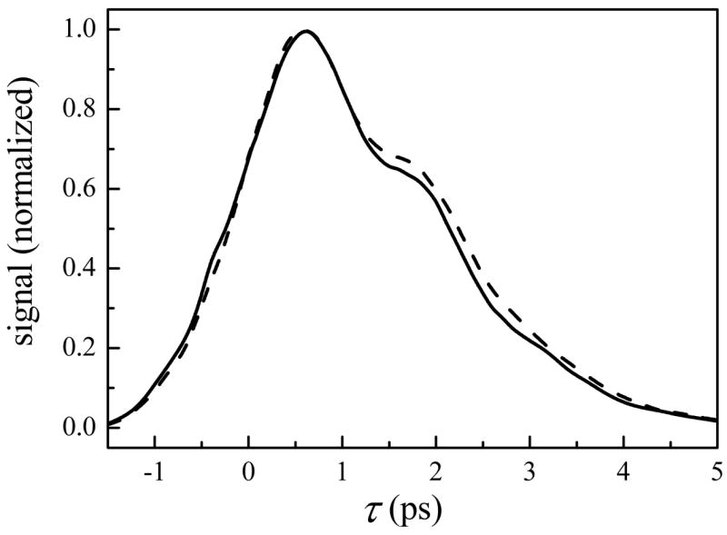
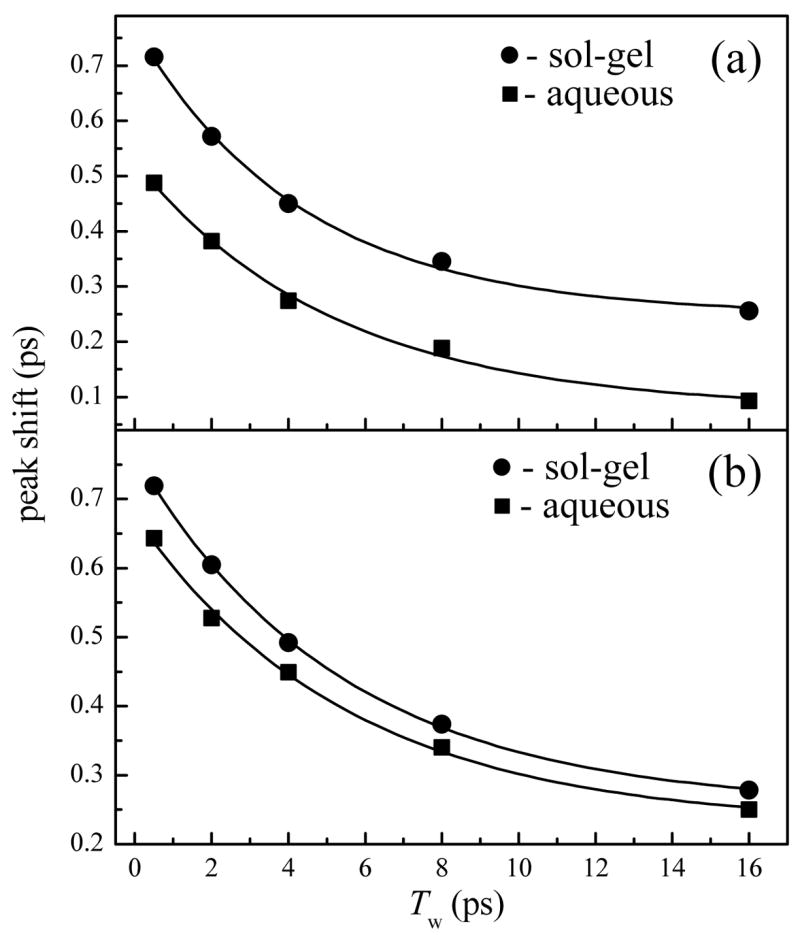
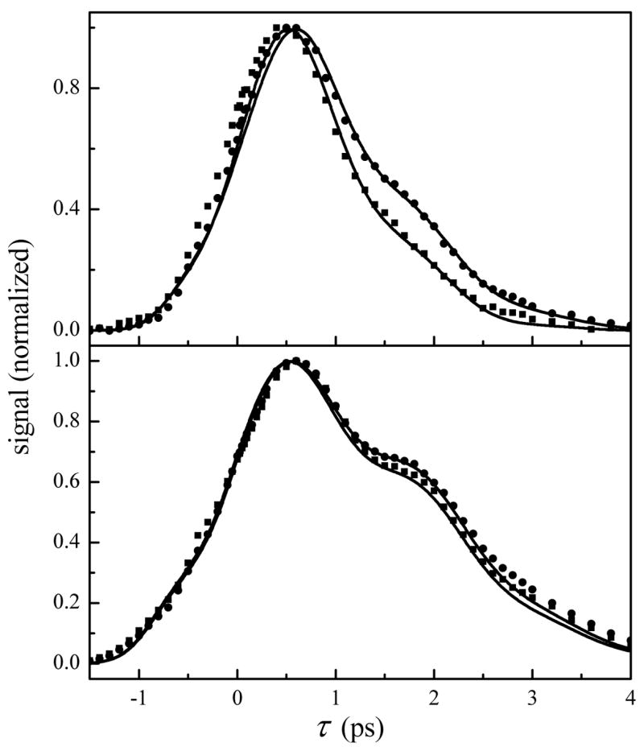

# Dynamics of Proteins Encapsulated in Silica Sol-gel Glasses Studied with IR Vibrational Echo Spectroscopy

**Aaron M. Massari, Ilya J. Finkelstein, and Michael D. Fayer**

*J. Am. Chem. Soc.*, Volume 128, Issue 12, Pages 3990–7 (2006)

**DOI:** [10.1021/ja058745y](https://doi.org/10.1021/ja058745y)

---

## Table of Contents

- [Abstract](#abstract)
- [I. Introduction](#i-introduction)
- [II. Materials and Methods](#ii-materials-and-methods)
- [III. Results and Discussion](#iii-results-and-discussion)
- [IV. Conclusions](#iv-conclusions)
- [Acknowledgments](#acknowledgments)

---

##  Abstract
Spectrally-resolved infrared stimulated vibrational echo spectroscopy is used to measure the fast dynamics of heme-bound CO in carbonmonoxy-myoglobin (MbCO) and hemoglobin (HbCO) embedded in silica sol-gel glasses. On the time scale of ~100 fs to several ps, the vibrational dephasing of the heme-bound CO is measurably slower for both MbCO and HbCO relative to aqueous protein solutions. The fast structural dynamics of MbCO, as sensed by the heme-bound CO, are influenced more by the sol-gel environment than those of HbCO. Longer time scale structural dynamics (tens of ps), as measured by the extent of spectral diffusion, are the same for both proteins encapsulated in sol-gel glasses compared to aqueous solutions. A comparison of the sol-gel experimental results to viscosity dependent vibrational echo data taken on various mixtures of water and fructose shows that the sol-gel encapsulated MbCO exhibits dynamics that are the equivalent to the protein in a solution that is nearly 20 times more viscous than bulk water. In contrast, the HbCO dephasing in the sol-gel reflects only a 2-fold increase in viscosity. Attempts to alter the encapsulating pore size by varying the molar ratio of silane precursor to water (_R_ -value) used to prepare the sol-gel glasses were found to have no effect on the fast or steady-state spectroscopic results. The vibrational echo data are discussed in the context of solvent confinement and protein-pore wall interactions to provide insights into the influence of a confined environment on the fast structural dynamics experienced by a biomolecule.
---
##  I. Introduction
Proteins embedded in silica sol-gel glasses are exemplary systems for studying the influence of spatial confinement on biomolecular structure, dynamics, and function.[1](https://pmc.ncbi.nlm.nih.gov/articles/PMC2532503/#R1)–[3](https://pmc.ncbi.nlm.nih.gov/articles/PMC2532503/#R3) Studies of this nature can generate an understanding of protein functionality in the often crowded physiological environment in which biomolecules operate. Silica sol-gel glasses consist of nanoporous networks with interpore connections that permit the exchange of solvent and small molecules while inhibiting the transport of larger species.[4](https://pmc.ncbi.nlm.nih.gov/articles/PMC2532503/#R4) It has been broadly shown that the overall stability of proteins and enzymes embedded in these glasses is enhanced with regard to temperature, pH, and chemical denaturation.[5](https://pmc.ncbi.nlm.nih.gov/articles/PMC2532503/#R5)–[13](https://pmc.ncbi.nlm.nih.gov/articles/PMC2532503/#R13) In addition, tertiary and quaternary conformational changes in heme proteins, such as myoglobin (Mb) and hemoglobin (Hb), can be inhibited or dramatically slowed, which allows these proteins to be “trapped” and studied in non-equilibrium structural conformations.[14](https://pmc.ncbi.nlm.nih.gov/articles/PMC2532503/#R14)–[22](https://pmc.ncbi.nlm.nih.gov/articles/PMC2532503/#R22)
The origin of the stability imparted by the silica sol-gel matrix is complex. Since the mean pore diameters in aged wet sol-gels (typically <10 nm) are comparable to the diameters of Mb and Hb, the pore walls could physically restrict protein motions. It has been noted that the surface of the protein could also interact with or adsorb to the hydrophilic silica pore walls through electrostatic or hydrogen bonding interactions.[3](https://pmc.ncbi.nlm.nih.gov/articles/PMC2532503/#R3),[23](https://pmc.ncbi.nlm.nih.gov/articles/PMC2532503/#R23)–[28](https://pmc.ncbi.nlm.nih.gov/articles/PMC2532503/#R28) Fluorescence anisotropy studies have demonstrated that proteins in sol-gel pores experience dramatically hindered rates of rotation due to protein adsorption to the pore walls.[23](https://pmc.ncbi.nlm.nih.gov/articles/PMC2532503/#R23),[29](https://pmc.ncbi.nlm.nih.gov/articles/PMC2532503/#R29),[30](https://pmc.ncbi.nlm.nih.gov/articles/PMC2532503/#R30)
Alternatively, the pore dimensions could influence the protein structural stability by affecting the dynamics of the surrounding solvent, which is intimately coupled to the dynamics of the protein. Water in nanoscopic environments (i.e. reverse micelles, carbon nanotubes, and glycolipid membranes) is characterized by a disrupted hydrogen bonding network and decreased solvent dynamics relative to its bulk properties.[31](https://pmc.ncbi.nlm.nih.gov/articles/PMC2532503/#R31)–[39](https://pmc.ncbi.nlm.nih.gov/articles/PMC2532503/#R39) Numerous studies have analyzed the dynamics of solvent molecules inside silica sol-gel pores.[40](https://pmc.ncbi.nlm.nih.gov/articles/PMC2532503/#R40)–[48](https://pmc.ncbi.nlm.nih.gov/articles/PMC2532503/#R48) Using small fluorescent molecules as environmental probes, several studies have reported small increases of the solvent viscosities in silica sol-gel pores.[25](https://pmc.ncbi.nlm.nih.gov/articles/PMC2532503/#R25),[29](https://pmc.ncbi.nlm.nih.gov/articles/PMC2532503/#R29),[40](https://pmc.ncbi.nlm.nih.gov/articles/PMC2532503/#R40),[41](https://pmc.ncbi.nlm.nih.gov/articles/PMC2532503/#R41) A series of studies by Fourkas and coworkers studied “weakly wetting” liquids in silica sol-gel pores using optical Kerr effect spectroscopy and determined that the molecules in the centers of the sol-gel pores experienced bulk-like solvent dynamics, while molecules near the pore walls exhibited dynamics that were an order of magnitude slower than bulk dynamics.[24](https://pmc.ncbi.nlm.nih.gov/articles/PMC2532503/#R24),[49](https://pmc.ncbi.nlm.nih.gov/articles/PMC2532503/#R49)–[53](https://pmc.ncbi.nlm.nih.gov/articles/PMC2532503/#R53) It was concluded that the dynamic inhibition was not the result of an increased viscosity, but rather a hydrodynamic volume effect for molecular rotation at a surface.[24](https://pmc.ncbi.nlm.nih.gov/articles/PMC2532503/#R24) Based on time-resolved fluorescence anisotropy of Rhodamine 6G, Narang and coworkers concluded that a freshly prepared sol-gel consisted of two dynamic environments: One in which the microviscosity was slightly elevated but remained constant near 2 cP, and another in which the viscosity increased to nearly 20 cP over 48 hours.[40](https://pmc.ncbi.nlm.nih.gov/articles/PMC2532503/#R40) The notion of dual solvent environments is a consistent finding across studies of solvent and small molecule dynamics in silica sol-gel glasses.[24](https://pmc.ncbi.nlm.nih.gov/articles/PMC2532503/#R24),[42](https://pmc.ncbi.nlm.nih.gov/articles/PMC2532503/#R42)–[48](https://pmc.ncbi.nlm.nih.gov/articles/PMC2532503/#R48)
The majority of protein dynamics studies in sol-gel glasses have focused on ligand rebinding kinetics following a photolysis event,[18](https://pmc.ncbi.nlm.nih.gov/articles/PMC2532503/#R18)–[21](https://pmc.ncbi.nlm.nih.gov/articles/PMC2532503/#R21),[54](https://pmc.ncbi.nlm.nih.gov/articles/PMC2532503/#R54) which invariably results in enhanced geminate recombination of the photolyzed CO for heme proteins encapsulated in sol-gel glasses. This is typically attributed to a decrease in protein structural mobility that hinders the escape of the photolyzed ligand from the protein interior into the surrounding solvent. It has been suggested that the influence of the confined solvent could be partly responsible for the altered dynamics observed for sol-gel encapsulated heme proteins.[9](https://pmc.ncbi.nlm.nih.gov/articles/PMC2532503/#R9),[13](https://pmc.ncbi.nlm.nih.gov/articles/PMC2532503/#R13),[17](https://pmc.ncbi.nlm.nih.gov/articles/PMC2532503/#R17),[54](https://pmc.ncbi.nlm.nih.gov/articles/PMC2532503/#R54)–[59](https://pmc.ncbi.nlm.nih.gov/articles/PMC2532503/#R59) Nonetheless, many interpretations of these data utilize a model in which the silica pore walls directly constrain the tertiary and quaternary protein structure.
In the current work, spectrally-resolved infrared vibrational echo spectroscopy [60](https://pmc.ncbi.nlm.nih.gov/articles/PMC2532503/#R60)–[63](https://pmc.ncbi.nlm.nih.gov/articles/PMC2532503/#R63) is used to measure the fast dynamics of heme-bound CO in MbCO and HbCO embedded in silica sol-gel glasses. Unlike fluorescence and CO photolysis studies, which probe dynamical properties following a structure altering electronic transition and/or ligand dissociation, the vibrational echo experiments measure the equilibrium ground state protein structural fluctuations. In this manner, IR vibrational echo spectroscopy provides valuable insights into the influence of the sol-gel confinement on protein dynamics.
Ultrafast IR vibrational echo spectroscopy is sensitive to the relationship between structure and dynamics in heme proteins.[61](https://pmc.ncbi.nlm.nih.gov/articles/PMC2532503/#R61),[62](https://pmc.ncbi.nlm.nih.gov/articles/PMC2532503/#R62),[64](https://pmc.ncbi.nlm.nih.gov/articles/PMC2532503/#R64)–[71](https://pmc.ncbi.nlm.nih.gov/articles/PMC2532503/#R71) These measurements are able to remove the influences of static or quasi-static distributions of protein structures that dominate the IR linear line shape (inhomogeneous broadening) and probe the underlying structural fluctuations of the protein as sensed by the CO bound at the active site of the protein. An electrostatic force model has been developed to relate the structural fluctuations of the protein to the time dependence of the CO frequency.[69](https://pmc.ncbi.nlm.nih.gov/articles/PMC2532503/#R69),[72](https://pmc.ncbi.nlm.nih.gov/articles/PMC2532503/#R72) In this model, the protein is a collection of partial charges whose movements generate a time-dependent electric field vector at the CO that couples to the CO transition dipole through the Stark effect. The time dependent Stark effect causes the CO vibrational frequency to fluctuate, producing dynamic dephasing.[61](https://pmc.ncbi.nlm.nih.gov/articles/PMC2532503/#R61),[66](https://pmc.ncbi.nlm.nih.gov/articles/PMC2532503/#R66),[73](https://pmc.ncbi.nlm.nih.gov/articles/PMC2532503/#R73)–[76](https://pmc.ncbi.nlm.nih.gov/articles/PMC2532503/#R76) There is also a contribution to the vibrational echo observable from CO vibrational population relaxation. In carbonmonoxy heme proteins, such as MbCO and HbCO, the vibrational lifetime of the bCO stretch is sufficiently long that the vibrational echo decay is primarily a measure of CO dephasing caused by protein structural fluctuations.[69](https://pmc.ncbi.nlm.nih.gov/articles/PMC2532503/#R69),[72](https://pmc.ncbi.nlm.nih.gov/articles/PMC2532503/#R72) Nonlinear response theory[77](https://pmc.ncbi.nlm.nih.gov/articles/PMC2532503/#R77) allows the extraction of the equilibrium autocorrelation function of the fluctuations in the CO vibrational frequency, or frequency-frequency correlation function (FFCF). The FFCF provides a quantitative description of the dynamics measured in vibrational echo spectroscopy that is useful for comparing the dynamics of proteins in different environments.
The IR vibrational echo data show that on the time scale of ~100 fs to several ps, the vibrational dephasing of the heme-bound CO is measurably slower for both MbCO and HbCO compared to their respective aqueous solutions. The fast structural dynamics of MbCO, as sensed by the heme-bound CO, are influenced more by the encapsulating matrix than those of HbCO, which may be explained by the quaternary level of structural organization present in HbCO but not MbCO. For longer time scales (tens of ps), protein structural evolution, as measured by the extent of spectral diffusion, is the same for both proteins encapsulated in sol-gel glasses compared to their respective aqueous solutions. The “effective viscosity” experienced by these proteins in sol-gel glasses was determined by comparison to the viscosity dependence of vibrational echo data taken in bulk aqueous fructose solutions. The comparison indicates that the experimental vibrational echoes for sol-gel encapsulated MbCO reflect a dynamic environment that is equivalent to a solution nearly 20 times more viscous than a bulk water-protein solution. In contrast, the HbCO dynamics in the sol-gel reflect only a 2-fold increase in effective solvent viscosity. Attempts to vary the pore size by varying the molar ratio of silane precursor to water (_R_ -value) had no measurable effect on the fast dynamics experienced by the heme-bound CO in either protein. These results suggest protein-directed templating of the silica matrix during gelation.
---
##  II. Materials and Methods
### A. Sample preparation
To prepare aqueous stock solutions of carbonmonoxy-MbCO and HbCO, 1.0 g of lyophilized protein (Sigma Aldrich) was dissolved in 3.0 mL pH 7.0 D2O (Sigma Aldrich) phosphate buffer (50 mM). The solutions were reduced with a 5-fold excess of sodium dithionite (Sigma Aldrich) and stirred under a CO atmosphere for one hour. The solutions were centrifuged at 14,000 rcf for 15 minutes through a 0.45 μm acetate filter (Pall Nanosep MF) to remove particulates. The final protein concentrations were 10–15 mM. For vibrational echo measurements on aqueous samples, small aliquots of the stock solutions were placed in a sample cell with CaF2 windows and a 50 μm Teflon spacer. UV-visible (Varian Cary 3E) and FTIR (ATI Mattson Infinity 9495) absorption spectroscopies were performed to determine all protein concentrations. The samples had mid-IR absorbances at the CO stretching frequency of 0.1 on a background absorbance of 0.5.
Sol-gel encapsulated protein samples were prepared using a slightly modified Ellerby procedure.[1](https://pmc.ncbi.nlm.nih.gov/articles/PMC2532503/#R1) To prepare the sol, 1.84 mL of tetramethoxysilane (TMOS) (Sigma Aldrich) was combined with 422.5 μL of D2O and 27.5 μL of 0.04 N HCl in D2O, and then sonicated at room temperature for 10 minutes to produce a clear homogeneous mixture. Within 5 minutes, an aliquot of the prepared sol was rapidly mixed with pH 6.5 bis tris D2O buffer (50mM) followed by mixing with the protein stock solutions (prepared as described above). It has been demonstrated that the use of D2O instead of H2O during the sol-gel preparation does not affect the polymerization process.41 The volumes of these three components were varied as listed in Table 1, to produce samples with good optical quality and the desired molar ratio of silane precursor to water (_R_ -value). The variations of pore diameter with _R_ -value have been quantified by techniques that require drying of the sol-gel glass, which is known to decrease the pore volume by a few tens of percent. Thus there is some uncertainty in the wet-aged sol-gel pore diameters. However, it is reasonable to expect that the decrease in dried sol-gel mean pore diameter with an increase in _R_ is a consistent trend among wet-aged sol-gel samples. At the protein concentrations used in this study, the protein was estimated to occupy 20% of the solution volume in the protein stock solutions. Therefore, when calculating the _R_ -values in Table 1, the water volume added from the protein solutions was taken to be 80% of the total volume of stock protein solutions. The mixed components were immediately transferred to a sample cell consisting of two CaF2 windows and a 50 micron Teflon spacer. The Teflon spacer was discontinuous around the edge of the CaF2 windows to permit exchange of methanol and buffer solutions during the gelation and soaking processes. The samples typically formed a gel within 30 seconds, and a small weight maintained pressure on the sample cell for 5 minutes. The sol-gel samples were then soaked in pH 7.0 D2O phosphate buffer solution (50 mM) to neutralize the pH of the aqueous solvent in the sol-gel pores. The pH-sensitive FTIR spectra for MbCO and HbCO[78](https://pmc.ncbi.nlm.nih.gov/articles/PMC2532503/#R78),[79](https://pmc.ncbi.nlm.nih.gov/articles/PMC2532503/#R79) confirmed that the pH inside the sol-gel samples was 7.0 after 48 hours. The edge openings in the Teflon spacers were sealed with Parafilm to prevent drying and vibrational echo data was collected immediately after the 48 hour soaking period.
#### Table 1.
Volumes of components mixed to prepare sol-gel encapsulated protein samples and their corresponding _R_ -values.
protein | sol (μL) | pH 6.5 buffer (μL) | protein stock solution (μL) |  _R_ -value  
---|---|---|---|---  
MbCO | 20 | 5 | 25 | 15  
20 | 20 | 35 | 27  
20 | 35 | 25 | 30  
20 | 40 | 40 | 39  
HbCO | 20 | 5 | 25 | 15  
20 | 20 | 35 | 27  
[Open in a new tab](https://pmc.ncbi.nlm.nih.gov/articles/PMC2532503/table/T1/)
### B. Stimulated vibrational echo spectroscopy
The experimental setup has been previously described in detail.[80](https://pmc.ncbi.nlm.nih.gov/articles/PMC2532503/#R80) Briefly, tunable mid-IR pulses with a center frequency adjusted to match the center frequency of the protein sample of interest (1945 or 1951 cm⁻¹) were generated by an optical parametric amplifier pumped with a regeneratively amplified Ti:Sapphire laser. The bandwidth and pulse duration used in these experiments were 150 cm⁻¹ and 100 fs, respectively. The mid-IR pulse was split into three temporally controlled pulses (~700 nJ/pulse). The delay between the first two pulses, τ, was scanned at each time _T_ w, the delay between pulses two and three. The three beams were crossed and focused at the sample. The spot size at the sample was ~150 μm. The vibrational echo pulse generated in the phase-matched direction was dispersed through a 0.5 meter monochromator (1.2 cm⁻¹ spectral resolution) and detected with either a liquid nitrogen-cooled HgCdTe array detector (Infrared Associates/Infrared Systems Development) or a liquid nitrogen-cooled InSb single element detector. A power dependence study was performed on all samples and the data showed no power dependent effects.[81](https://pmc.ncbi.nlm.nih.gov/articles/PMC2532503/#R81) Data collection for all samples was performed at room temperature in an enclosed, dry air purged environment.
---
##  III. Results and Discussion
### A. Linear IR spectroscopy
The background subtracted FTIR spectra of the CO bound to aqueous and sol-gel encapsulated MbCO and HbCO are shown in [Fig. 1](#fig1). All peaks have been fit as Gaussian distributions to determine their full width at half maximum (FWHM) and center frequency. The aqueous MbCO spectrum ([Fig. 1a](#fig1), solid line) shows three transitions centered at 1939, 1944, and 1965 cm⁻¹ with FWHMs of 20.5, 8.7, and 13.5 cm⁻¹, respectively. These CO stretching peaks correspond to three structurally distinct conformational substates.[69](https://pmc.ncbi.nlm.nih.gov/articles/PMC2532503/#R69),[80](https://pmc.ncbi.nlm.nih.gov/articles/PMC2532503/#R80),[82](https://pmc.ncbi.nlm.nih.gov/articles/PMC2532503/#R82)–[87](https://pmc.ncbi.nlm.nih.gov/articles/PMC2532503/#R87) The A0 band (1965 cm⁻¹) is attributed to a conformation in which the distal histidine (His64) is positioned out of the heme pocket,[82](https://pmc.ncbi.nlm.nih.gov/articles/PMC2532503/#R82),[88](https://pmc.ncbi.nlm.nih.gov/articles/PMC2532503/#R88)–[92](https://pmc.ncbi.nlm.nih.gov/articles/PMC2532503/#R92) while the A1 (1944 cm⁻¹) and A3 (1939 cm⁻¹) bands arise from the distal histidine being localized in the heme pocket in two distinct orientational geometries.[69](https://pmc.ncbi.nlm.nih.gov/articles/PMC2532503/#R69),[93](https://pmc.ncbi.nlm.nih.gov/articles/PMC2532503/#R93) The normalized spectrum of MbCO encapsulated in a silica sol-gel glass (_R_ = 15, dashed line) is overlaid and vertically offset for clarity in [Fig. 1a](#fig1). The spectrum is indistinguishable from that of the aqueous protein sample.

#### Figure 1. {#fig1}

**Normalized FTIR spectra of the CO stretching mode bound to a) MbCO and b) HbCO in aqueous and sol-gel encapsulated environments. For both frames, the solid line represents the aqueous protein spectrum and the dashed line is the sol-gel encapsulated protein. The spectra have been vertically offset for clarity.**
The FTIR spectrum of aqueous HbCO ([Fig. 1b](#fig1), solid line) exhibits two transitions at 1951 and 1969 cm⁻¹ both of which have FWHMs of 8.3 cm⁻¹. These peaks, termed the CIII and CIV substates, are analogous to the A1 and A0 substates in MbCO.[69](https://pmc.ncbi.nlm.nih.gov/articles/PMC2532503/#R69),[93](https://pmc.ncbi.nlm.nih.gov/articles/PMC2532503/#R93)–[95](https://pmc.ncbi.nlm.nih.gov/articles/PMC2532503/#R95) The spectrum of HbCO encapsulated in a sol-gel glass (_R_ = 15, dashed line) is overlaid and vertically offset, and, as shown for MbCO, is identical to the aqueous sample (solid line). Changing the _R_ -value over the range of 15 to 39 and 15 to 27 for MbCO and HbCO, respectively, does not affect the FTIR spectra for either protein (data not shown). The linear absorption spectrum reflects the distribution of structures on all time scales. That the spectra of the CO stretch in aqueous MbCO and HbCO are identical to their spectra in sol-gel glasses shows that encapsulation does not produce a substantial change in the distribution of accessible protein conformations. The Gaussian shape of the spectral bands in both proteins suggests that these transitions are inhomogeneously broadened, which would obscure any dynamical information contained in the linear spectra. The vibrational stimulated echo experiments described below reveal the underlying dynamical differences that exist for these proteins between aqueous and sol-gel glass environments on the ultrafast time scale.
### B. Vibrational echo spectroscopy
[Fig. 2](#fig2) displays vibrational echo data taken with _T_ w = 0.5 ps for MbCO encapsulated in a sol-gel glass (_R_ = 15, dashed line) and in aqueous solution (solid line). For clarity, we initially focus our attention here on a single _T_ w. The data demonstrate that the vibrational echo decay for the sol-gel sample is significantly slower than for the aqueous sample. In vibrational echo experiments, a slower decay (slower rate of vibrational dephasing) indicates that the frequency of the heme-bound CO is fluctuating more slowly. (Alternatively, if a system is motionally narrowed,[96](https://pmc.ncbi.nlm.nih.gov/articles/PMC2532503/#R96)–[99](https://pmc.ncbi.nlm.nih.gov/articles/PMC2532503/#R99) a slower decay can be caused by faster fluctuations. However, as shown below, this system undergoes spectral diffusion and is therefore not motionally-narrowed.) Within the electrostatic force model described above, this is the result of slower modulations of the net electric field generated by the entire protein and surrounding solvent at the heme-bound CO.

#### Figure 2. {#fig2}

**Spectrally-resolved vibrational echo decays at _T_ w = 0.5 ps for CO bound to aqueous (solid line) and sol-gel encapsulated MbCO (dashed line) at 1945 cm⁻¹.**
Increasing the _R_ -value for the sol-gel preparation has been reported to decrease the pore diameter by increasing the degree of silica cross-linking.[4](https://pmc.ncbi.nlm.nih.gov/articles/PMC2532503/#R4),[41](https://pmc.ncbi.nlm.nih.gov/articles/PMC2532503/#R41),[100](https://pmc.ncbi.nlm.nih.gov/articles/PMC2532503/#R100),[101](https://pmc.ncbi.nlm.nih.gov/articles/PMC2532503/#R101) However, the vibrational echo decays for MbCO sol-gel samples at all _R_ -values listed in Table 1 are the same (only _R_ = 15 data are shown). As discussed below, the changes observed in the protein dynamics can be accounted for by a change in the “effective viscosity” of the water in the sol-gel pore. It has been demonstrated by direct experiments on water in reverse micelles[32](https://pmc.ncbi.nlm.nih.gov/articles/PMC2532503/#R32),[38](https://pmc.ncbi.nlm.nih.gov/articles/PMC2532503/#R38),[39](https://pmc.ncbi.nlm.nih.gov/articles/PMC2532503/#R39) that water dynamics are very sensitive to confinement on nanoscopic length scales, and vary in a manner that resembles an increase in effective viscosity with a decrease in size. Furthermore, protein dynamics are known to be sensitive to the viscosity of the surrounding solvent.[102](https://pmc.ncbi.nlm.nih.gov/articles/PMC2532503/#R102),[103](https://pmc.ncbi.nlm.nih.gov/articles/PMC2532503/#R103) Therefore, to explain the independence of structural dynamics on the pore size, it is highly unlikely that the protein dynamics are simply insensitive to the size of the surrounding pore. As discussed further below, the likely explanation is that the sol-gel matrix is templated around the protein and, while the average “empty” pore diameter may change with _R_ -value, the size of pores formed around proteins is dictated by the size of the protein and is independent of _R_.[2](https://pmc.ncbi.nlm.nih.gov/articles/PMC2532503/#R2),[3](https://pmc.ncbi.nlm.nih.gov/articles/PMC2532503/#R3),[7](https://pmc.ncbi.nlm.nih.gov/articles/PMC2532503/#R7),[11](https://pmc.ncbi.nlm.nih.gov/articles/PMC2532503/#R11),[29](https://pmc.ncbi.nlm.nih.gov/articles/PMC2532503/#R29)
The vibrational echo decays at _T_ w = 0.5 are shown for aqueous and sol-gel encapsulated HbCO in [Fig. 3](#fig3). Although the change is not as dramatic as MbCO, the dephasing rate is noticeably slower for proteins encapsulated in sol-gel glasses. That the sol-gel environment has a weaker influence on the HbCO structural dynamics, as sensed by the heme-bound CO, may be due to the quaternary level of structural organization in this protein. Having only tertiary structure, the entire surface area of MbCO is in contact with the solvent or silica pore walls. In contrast, HbCO is a tetramer of tertiary subunits, each of which is structurally similar to MbCO. Therefore, each heme-containing subunit is partially “solvated” by the other three subunits and should be less sensitive to the properties of the surrounding solvent. Sottini and coworkers have also noted that proteins with a larger surface-to-volume ratio are expected to experience a greater degree of friction from their surrounding solvent environment.[54](https://pmc.ncbi.nlm.nih.gov/articles/PMC2532503/#R54) Previous vibrational echo studies confirm the weaker dynamic response of HbCO to the viscosity of the surrounding environment.[54](https://pmc.ncbi.nlm.nih.gov/articles/PMC2532503/#R54),[103](https://pmc.ncbi.nlm.nih.gov/articles/PMC2532503/#R103)–[105](https://pmc.ncbi.nlm.nih.gov/articles/PMC2532503/#R105) The first studies of the influence of viscosity on HbCO over a relatively small viscosity range in several solvent environments concluded that the protein dynamics were independent or very weakly dependent on the solvent viscosity.[105](https://pmc.ncbi.nlm.nih.gov/articles/PMC2532503/#R105) In a study to be presented soon of several heme proteins over many decades of viscosity in water/fructose mixtures, it will be demonstrated that HbCO does indeed have a measurable, albeit exceedingly weak, viscosity dependence.

#### Figure 3. {#fig3}

**Spectrally-resolved vibrational echo decays at _T_ w = 0.5 ps for CO bound to aqueous (solid line) and sol-gel encapsulated HbCO (dashed line) at 1951 cm⁻¹.**
In a study of several heme proteins in trehalose glasses,[79](https://pmc.ncbi.nlm.nih.gov/articles/PMC2532503/#R79) it was demonstrated that the influence of a glassy solvent (effectively infinite viscosity) on the protein dynamics was to turn off the slower dynamical motions while the fast structural dynamics remained. The infinite viscosity trehalose experiments are the extreme of a change in viscosity. In the trehalose glasses, the viscosity independent dynamics were motionally-narrowed. Through comparison to molecular dynamics simulations, it was demonstrated that those dynamics corresponded to very fast small amplitude essentially harmonic atomic displacements within the protein structure.[79](https://pmc.ncbi.nlm.nih.gov/articles/PMC2532503/#R79) In the present work, the time scales of the structural motions influenced by the sol-gel environment are comparable to the time range of a vibrational echo decay at a single _T_ w (several ps) out to the time scale of several _T w_. The frequency fluctuations caused by protein structural fluctuation that are “turned off” by the trehalose glass are those that are slowed in the sol-gel environment. Further information, including the relevant FFCF parameters for direct comparison to the trehalose experiments, is available in the [Supporting Information](https://pmc.ncbi.nlm.nih.gov/articles/PMC2532503/#SD1).
In stimulated vibrational echo experiments, the dynamics that occur on time scales longer than those shown for a single vibrational echo decay ([Figs. 2](#fig2) and [3](#fig3)) can be measured by varying the time delay between the second and third pulses, _T_ w. An entire decay curve is measured at each _T_ w, and the full curves are used in quantitative analysis of the data. As _T_ w increases, a broader distribution of protein conformations, and therefore a wider range of frequencies, is sampled through a process termed spectral diffusion. The increase in the sampled frequencies can be viewed as an increase in the dynamic linewidth that is buried under the inhomogeneously broadened absorption spectrum. As the dynamic linewidth increases, the vibrational echo decay curve, which is the Fourier transform of the dynamic line shape, decays more rapidly, and the peak of the decay moves toward τ = 0. Rather than plotting a series of complete vibrational echo decay curves, a convenient method of displaying the trends in the data is to plot the vibrational echo peak shift[32](https://pmc.ncbi.nlm.nih.gov/articles/PMC2532503/#R32),[106](https://pmc.ncbi.nlm.nih.gov/articles/PMC2532503/#R106)–[108](https://pmc.ncbi.nlm.nih.gov/articles/PMC2532503/#R108) as a function of _T_ w. The vibrational echo peak shift is the difference between the time of peak amplitude of the echo decay curve and τ = 0. For a long enough _T_ w, spectral diffusion is complete and all chromophores have sampled the entire spectral line. In this case, the dynamic line shape is equal to the absorption spectrum, and the vibrational echo decay is the free induction decay, which has a peak shift of zero. The vibrational lifetime, _T_ 1, limits the maximum time scale of the vibrational echo measurements, and therefore the frequency range of structural fluctuations that are involved in the vibrational echo measurements. As _T w_ is increased, the vibrational echo signal decreases because vibrational relaxation reduces the population of excited CO oscillators. However, _T w_ is not a hard cutoff of the time associated with dynamical fluctuations that contribute to the vibrational echo decay. Rather, fluctuations a few time _T w_ also contribute.[109](https://pmc.ncbi.nlm.nih.gov/articles/PMC2532503/#R109)–[111](https://pmc.ncbi.nlm.nih.gov/articles/PMC2532503/#R111) Because of the limitation imposed by the lifetime, the limit of zero peak shift is not reached in the present experiments; not all protein configurations that influence the frequency of the CO vibrational transition have been accessed. In these stimulated vibrational echo experiments on heme proteins, the fluctuations that occur on time scales longer than ~50 ps appear as inhomogeneous broadening.
The vibrational echo peak shifts for MbCO are shown in [Fig. 4a](#fig4) as a function of _T_ w. The peak shift values for sol-gel encapsulated MbCO (_R_ = 15, circles) are consistently larger than those for the aqueous protein (squares). [Fig. 4b](#fig4) displays the vibrational echo peak shifts for HbCO, which are also greater for the sol-gel encapsulated proteins than those for the aqueous protein solution. These figures demonstrates that the impact of sol-gel encapsulation, as displayed by the magnitude of the vibrational echo peak shift, is greater at all _T_ ws for MbCO than for HbCO compared to the proteins in aqueous solutions. At each _T_ w, both proteins in aqueous solution have sampled a greater fraction of the inhomogeneously broadened spectral line, and therefore a greater fraction of accessible structures, than the sol-gel encapsulated samples. The _T_ w dependent results are consistent with the faster dephasing shown for the aqueous protein relative to the sol-gel encapsulated protein in [Figs. 2](#fig2) and [3](#fig3). The _R_ -values used to prepare the sol-gels were found to have no significant effect on the _T_ w dependent vibrational echo decays for either protein (data not shown). As discussed below, use of viscosity dependent vibrational echo decays permits an “effective viscosity” to be assigned for each protein encapsulated in the sol-gel glasses.

#### Figure 4. {#fig4}

**Vibrational echo peak shifts as a function of _T_ w for a) MbCO and b) HbCO in aqueous and sol-gel encapsulated environments. In both frames, the filled squares represent the aqueous protein data and the filled circles represent the sol-gel encapsulated protein peak shifts. The solid lines represent single exponential fits to the data with time constants of a) 5.2 ± 0.7 and 4.4 ± 0.4 ps for aqueous and sol-gel encapsulated MbCO and b) 5.6 ± 0.7 and 5.4 ± 0.2 ps for aqueous and sol-gel encapsulated HbCO, respectively.**
To compare the shapes of the proteins’ vibrational echo peak shift curves, the aqueous and sol-gel encapsulated MbCO data were fit as single exponential decays plus a constant with time constants of 5.2 ± 0.7 ps and 4.4 ± 0.4 ps, respectively. For the aqueous and sol-gel encapsulated HbCO, single exponential decay time constants of 5.6 ± 0.7 ps and 5.4 ± 0.2 ps, respectively, were obtained. The constant offsets for all vibrational echo peak shift plots are indicative of the slow frequency fluctuations that occur on time scales that are longer than several times the longest _T w_s. Therefore, within error, the rates at which the vibrational echo decay peaks are shifting towards the origin for MbCO and HbCO are the same for each protein in aqueous and sol-gel encapsulated environments. This demonstrates that the protein dynamics, as sensed by the heme-bound CO, that occur on time scales longer than a few ps are virtually unaffected by the sol-gel encapsulation. Therefore, the very fast structural dynamics of both MbCO and HbCO are affected in a similar manner by the surrounding environment. The vibrational dephasing rate is decreased (time scale of a few hundred fs to several ps) while spectral diffusion on a longer time scale (tens of ps) remains approximately the same.
That the fast dynamics of both proteins are sensitive to the sol-gel pore environment while the tens of ps dynamics are unaffected is a dynamical trend that is consistent with a viscosity effect at relatively low viscosities. In this context, the results shown above can be compared to unpublished data taken in this lab on five proteins, including MbCO and HbCO, in aqueous/fructose solutions in which the concentration of fructose was increased to increase the viscosity. The viscosity dependence experiments span viscosities from aqueous solutions to solid glasses, and will be reported in a forthcoming publication. The quantitative description of the viscosity dependence of HbCO and the A1 state of MbCO, manifested in their viscosity dependent FFCFs, allows the calculation of vibrational echo decays for aqueous solutions with any viscosity. The FFCF parameters calculated at discreet viscosity points vary smoothly, which allows FFCF parameters at other viscosities to be obtained by interpolation. In [Fig. 5a](#fig5), the measured vibrational echo decays for aqueous and sol-gel encapsulated MbCO at _T_ w = 0.5 ps (reproduced from [Fig. 2](#fig2)) are overlaid with calculated vibrational echo data for the protein in 2.5 cP (aqueous solution with the protein) and 45 cP solutions. It is clear that the echo decays calculated at these viscosities are in good agreement with those measured for aqueous and sol-gel encapsulated MbCO. This demonstrates that the effective viscosity experienced by MbCO in the sol-gel matrix is ~20 times greater than the protein in aqueous solution. In contrast, only a 2-fold increase (1.5 cP to 3 cP) in effective viscosity is produced by sol-gel encapsulation of HbCO at _T_ w = 0.5 ps ([Fig. 5b](#fig5)).

#### Figure 5. {#fig5}

**a) Spectrally-resolved vibrational echo decays at _T_ w = 0.5 ps for aqueous (squares) and sol-gel encapsulated MbCO (circles) at 1945 cm⁻¹. The overlaid solid lines are calculated vibrational echo decays at _T_ w = 0.5 ps in aqueous solvent viscosities of 2.5 and 45 cP to match the experimental aqueous and sol-gel data. b) Spectrally-resolved vibrational echo decays at _T_ w = 0.5 ps for aqueous (squares) and sol-gel encapsulated HbCO (circles) at 1951 cm⁻¹. The overlaid solid lines are calculated vibrational echo decays at _T_ w = 0.5 ps in aqueous solvent viscosities of 1.5 and 3 cP to match the experimental aqueous and sol-gel data.**
The absence of an _R_ -dependence (pore size dependence) in the measured vibrational dephasing and spectral diffusion is consistent with templating of the silica matrix around the protein and the production of a thin layer of surrounding water during the sol-gel encapsulation process. In this manner, the pore dimension is determined at the gelation point by the size of the protein, and is unaffected by the _R_ -value used to prepare the silica matrix. Rotational anisotropy measurements of water confined to nanoscopic pores in reverse micelles can be used to obtain a rough approximation of the thickness of the water layer that surrounds the proteins in sol-gel glasses.[38](https://pmc.ncbi.nlm.nih.gov/articles/PMC2532503/#R38) The Debye-Einstein-Stokes equation[112](https://pmc.ncbi.nlm.nih.gov/articles/PMC2532503/#R112) predicts that the rotational correlation time (τ) is directly proportional to the viscosity (_η_) of the solution. Since the effective _η_ is known to increase with decreasing confinement length,[38](https://pmc.ncbi.nlm.nih.gov/articles/PMC2532503/#R38) these results imply that MbCO is surrounded by a thinner layer of water than HbCO. Using the rotational correlation times reported by Tan and coworkers,[38](https://pmc.ncbi.nlm.nih.gov/articles/PMC2532503/#R38) it is estimated that water confined to a length dimension of less than ~2 nm is required to obtain the 45 cP aqueous environments estimated for the water surrounding sol-gel encapsulated MbCO. Although this approximation ignores the protein interactions with the silica pore walls and treats the water layer thickness as the diameter of a sphere, it is not unreasonable to expect that silica polycondensation that is template-directed by a nanoscopic protein would produce interstitial solvent space of these dimensions. Using the same procedure, it is estimated that sol-gel encapsulated HbCO is surrounded by a layer of water that is ~5 nm thick. These distances are rough estimates because the comparisons to AOT reverse micelles[38](https://pmc.ncbi.nlm.nih.gov/articles/PMC2532503/#R38) ignore the differences in the interfacial structure of AOT (ionic) and the sol-gels (not ionic).
It is surprising that, within the approximations used above, the dephasing dynamics of sol-gel encapsulated HbCO reflect a surrounding water layer that is ~3 times thicker than that of MbCO. One possible explanation for this phenomenon is that the folded structure of HbCO becomes partially denatured during the encapsulation process. This would result in an increased protein volume at the point of silica templating. It has been estimated that the radius of gyration for a protein can change by as much as 50% upon folding from a denatured state.[113](https://pmc.ncbi.nlm.nih.gov/articles/PMC2532503/#R113)–[115](https://pmc.ncbi.nlm.nih.gov/articles/PMC2532503/#R115) As the silica matrix crosslinks and generates water through polycondensation, the protein refolds into a more compact structure, which increases the thickness of the surrounding water layer. The water pool is generated by the silica polycondensation reactions as well as the hydrophobic collapse that expels water from the hydrophobic regions of the folding protein. Although the conditions used to prepare the sol-gel encapsulated proteins in this study minimize the denaturing conditions, both encapsulated proteins are initially prepared in a low pH solvent amidst a process that generates methanol. It has been noted that myoglobin has a higher stability toward denaturation than hemoglobin,[116](https://pmc.ncbi.nlm.nih.gov/articles/PMC2532503/#R116) and is therefore feasible that HbCO partially denatures and refolds while MbCO remains compact during the encapsulation procedure. It is important to note that the IR spectra, which are very sensitive to structure, indicate that the proteins prepared in sol-gel glasses were in their correctly folded states at the point of data collection (see [Fig. 1](#fig1)).
In addition to an increased viscosity for the surrounding solvent, it is reasonable to expect that the proteins in this study have some degree of interaction with the pore walls. As noted above, the hindered rotation of proteins in silica sol-gel pores results from substantial interactions between the protein exterior and the hydrophilic pore walls.[23](https://pmc.ncbi.nlm.nih.gov/articles/PMC2532503/#R23),[29](https://pmc.ncbi.nlm.nih.gov/articles/PMC2532503/#R29),[30](https://pmc.ncbi.nlm.nih.gov/articles/PMC2532503/#R30) Nonetheless, the stimulated vibrational echo data shown above for MbCO and HbCO encapsulated in sol-gel glasses are _not_ representative of proteins whose surfaces are completely immobilized by a glassy matrix. Vibrational echo spectroscopy and molecular dynamics simulations for several heme proteins in trehalose glasses have demonstrated that nearly all of the structural dynamics slower than a few hundred fs are effectively turned off when the protein surface is fixed.[79](https://pmc.ncbi.nlm.nih.gov/articles/PMC2532503/#R79) Furthermore, the linear IR spectra showed static frequency shifts and increased inhomogeneous broadening indicative of locking the proteins into many structural configurations. In contrast, the steady-state and vibrational echo data in silica sol-gel glasses reveal proteins in an environment that is similar to an aqueous environment with an increased viscosity. The distinction between protein dynamics in sol-gel and trehalose glasses has been noted previously by Abruzzetti and coworkers,[19](https://pmc.ncbi.nlm.nih.gov/articles/PMC2532503/#R19) and is evidence that, while some pore wall interactions prevent global macromolecular rotation, a large fraction of the protein surface remains in contact with the nanoscopic water surrounding the protein in the pore.
Finally, although the protein dynamics in sol-gel glasses are very different from a protein encased in a trehalose glass, it is notable that the mechanism by which the structural fluctuations are damped in these two systems may not be completely dissimilar. The protein immobilizing effect of a trehalose glass has been shown to occur by an indirect mechanism in which the trehalose matrix constrains a thin layer of water at the surface of the encapsulated protein.[79](https://pmc.ncbi.nlm.nih.gov/articles/PMC2532503/#R79),[117](https://pmc.ncbi.nlm.nih.gov/articles/PMC2532503/#R117)–[119](https://pmc.ncbi.nlm.nih.gov/articles/PMC2532503/#R119) The drastic reduction in fast dynamics in a trehalose glass[79](https://pmc.ncbi.nlm.nih.gov/articles/PMC2532503/#R79) is perhaps an extreme example of the dynamic effect observed in the vibrational echo measurements for a protein in a sol-gel pore surrounded by a substantially thicker layer of confined water. To unambiguously determine the molecular origin of the change in the structural dynamics observed in these studies would require molecular dynamics simulations of the proteins in both the sol-gel and trehalose glass environments. Nonetheless, the nanoscopic dimensions inferred for the water surrounding the proteins in the sol-gel glasses in this study are similar to those found in many biological situations, and the results suggest the nature of the influence such environments may have in biologically confined systems.
---
##  IV. Conclusions
The ultrafast IR spectrally-resolved stimulated vibrational echo data presented here reveal important new aspects of the complex dynamics experienced by proteins in a spatially confined environment. Unlike previous studies that probed macromolecular rotations and protein dynamics following an electronic transition and/or CO ligand photolysis, this work has measured the fast structural dynamics of ground state equilibrated proteins encapsulated on a nanoscopic length scale. For both MbCO and HbCO, vibrational dephasing (fs to ps) in the sol-gel environment is measurably slower than in aqueous solution, although the CO dephasing in MbCO shows a greater sensitivity to the nanoscopic environment. The lack of sensitivity of HbCO to the sol-gel environment is attributed to the presence of quaternary structure, which partially shields individual subunits from the surrounding solvent. On longer time scales (tens of ps), spectral diffusion is essentially the same for both proteins relative to aqueous solution. The fast protein dynamics are unaffected by changes in the _R_ -value used to prepare the sol-gel glasses, which is known to vary the mean pore size. This supports the model in which the silica matrix is templated around the proteins during formation of the porous glass. A comparison to viscosity dependent studies for MbCO and HbCO in fructose water mixtures reveals that the sol-gel encapsulated MbCO and HbCO dephasing data reflect effective viscosity increases to 45 and 3 cP, respectively. The difference in change in effective viscosity with encapsulation from aqueous solution suggests that the MbCO is surrounded by a layer of water that is three times thinner than that of HbCO.
Unlike proteins encapsulated in trehalose glasses,[79](https://pmc.ncbi.nlm.nih.gov/articles/PMC2532503/#R79) the majority of the fast structural dynamics sensed by the heme-bound CO ligands in aqueous solution continue to be active for these two proteins in the sol-gel glasses. At the same time, the experimental results support an environment in which the silica pore walls confine a nanoscopic layer of water around the protein, which in turn affects the dynamics of the encapsulated protein. Although the solvent confinement is less extreme in the sol-gel pores (i.e. the layer of water is thicker) than in trehalose glasses, the mechanism of dynamic inhibition through a constrained layer of water is a feature common to both systems. The results may suggest a certain mechanistic generality for fine-tuning protein structural fluctuations through molecular crowding, and underscore the relevance of protein encapsulation in silica sol-gel glasses to the understanding of protein behavior in crowded physiological environments. In this regard, it is an important and challenging goal for future studies to characterize and understand the effect of varying thicknesses of confined solvent on protein structure and dynamics.

---
##  Acknowledgments
This work was supported by the National Institutes of Health (2 R01 GM-061137-05). A.M.M. was graciously supported by the National Institutes of Health Ruth L. Kirschstein Postdoctoral Fellowship (1 F32 GM-071162-01).

---

## References

1. Ellerby LM, et al. Science. 1992;255:1113–1115.
2. Gill I. Chem Mater. 2001;13:3404–3421.
3. Jin W, Brennan JD. Analytica Chimica Acta. 2002;461:1–36.
4. Brinker CJ, Scherer GW. Sol-gel Science: The Physics and Chemistry of Sol-gel Processing. Academic Press; 1990.
5. Miller JM, et al. J Non-Cryst Sol. 1996;202:279–289.
6. Lloyd CR, Eyring EM. Langmuir. 2000;16:9092–9094.
7. Dunn B, et al. Acta Materialia. 1998;46:737–741.
8. Williams AK, Hupp JT. J Am Chem Soc. 1998;120:4366–4371.
9. Ping G, et al. J Molec Recog. 2004;17:433–440.
10. Das TK, et al. J Am Chem Soc. 1998;120:10268–10269.
11. Lan EH, et al. J Mater Chem. 1999;9:45–53.
12. Bruno S, et al. Protein Science. 2001;10:2401–2407.
13. Eggers DK, Valentine JS. Protein Science. 2001;10:250–261.
14. Bettati S, Mozzarelli A. J Biol Chem. 1997;272:32050–32055.
15. Shibayama N. J Mol Biol. 1999;285:1383–1388.
16. McIninch JK, Kantrowitz ER. Biochim Biophys Acta. 2001;1547:320–328.
17. Samuni U, et al. J Biol Chem. 2002;277:25783–25790.
18. Viappiani C, et al. Proc Natl Acad Sci USA. 2004;101:14414–14419.
19. Abbruzzetti S, et al. Chem Phys Lett. 2001;346:430–436.
20. Samuni U, et al. Biochemistry. 2003;42:8272–8288.
21. Khan I, et al. Biochemistry. 2000;39:16099–16109.
22. Schiro G, et al. Biophys Chem. 2005;114:27–33.
23. Flora KK, Brennan JD. Chem Mater. 2001;13:4170–4179.
24. Farrer RA, Fourkas JT. Acc Chem Res. 2003;36:605–612.
25. McKiernan J, et al. J Phys Chem. 1994;98:1006–1009.
26. Hench LL, West JK. Chem Rev. 1990;90:33–72.
27. Nikiel L, et al. J Phys Chem. 1990;94:7458–7464.
28. Shen CY, Kostic NM. J Am Chem Soc. 1997;119:1304–1312.
29. Gottfried DS, et al. J Phys Chem B. 1999;103:2803–2807.
30. Gonnelli M, Strambini GB. Biophys Chem. 2003;104:155–169.
31. Levinger NE. Science. 2002;298:1722–1723.
32. Tan HS, et al. Phys Rev Lett. 2005;94:057405.
33. Sando GM, et al. J Phys Chem A. 2004;108:11209–11217.
34. Riter RE, et al. J Phys Chem B. 1998;102:2705–2714.
35. Harpham MR, et al. J Chem Phys. 2004;121:7855–7868.
36. Guo YL, et al. Langmuir. 2005;21:4610–4614.
37. Liu YC, Wang Q. Phys Rev B. 2005;72.
38. Tan HS, et al. J Chem Phys. 2005;122:174501.
39. Piletic IR, et al. J Phys Chem B. 2005;109:21273–21284.
40. Narang U, et al. J Phys Chem. 1994;98:17–22.
41. Winter R, et al. J Phys Chem. 1990;94:2706–2713.
42. Huwe A, et al. J Chem Phys. 1997;107:9699–9701.
43. Melnichenko YB, et al. J Chem Phys. 1995;103:2016–2024.
44. Crupi V, et al. Phys Chem Chem Phys. 2002;4:2768–2773.
45. Korb JP, et al. J Chem Phys. 1997;107:4044–4050.
46. Lee YT, et al. J Phys Chem. 1992;96:7161–7164.
47. Baumann R, et al. J Chem Phys. 2001;114:5781–5791.
48. Richert R, Yang M. J Phys Chem B. 2003;107:895–898.
49. Scodinu A, et al. J Phys Chem B. 2002;106:12863–12865.
50. Fourkas JT. Annu Rev Phys Chem. 2002;53:17–40.
51. Loughnane BJ, et al. J Phys Chem B. 2000;104:5421–5429.
52. Loughnane BJ, et al. J Phys Chem B. 1999;103:6061–6068.
53. Loughnane BJ, et al. J Chem Phys. 1999;111:5116–5123.
54. Sottini S, et al. J Phys Chem B. 2004;108:8475–8484.
55. Tokuriki N, et al. Protein Science. 2004;13:125–133.
56. Ellis RJ, Minton AP. Nature. 2003;425:27–28.
57. Davis-Searles PR, et al. Annu Rev Biophys Biomol Struct. 2001;30:271–306.
58. Minton AP. J Biol Chem. 2001;276:10577–10580.
59. Eggers DK, Valentine JS. J Mol Biol. 2001;314:911–922.
60. Tokmakoff A, Fayer MD. Acc Chem Res. 1995;28:437–445.
61. Rector KD, et al. J Phys Chem B. 1997;101:1468–1475.
62. Lim M, et al. Proc Natl Acad Sci USA. 1998;95:15315–15320.
63. Merchant KA, et al. Phys Rev Lett. 2001;86:3899–3902.
64. Zimdars D, et al. Phys Rev Lett. 1993;70:2718.
65. Rella CW, et al. Phys Rev Lett. 1996;77:1648.
66. Rector KD, et al. J Phys Chem B. 1998;102:331–333.
67. Hamm P, Hochstrasser RM. In: Ultrafast Infrared and Raman Spectroscopy. Fayer MD, editor. 2001.
68. Hamm P, et al. J Phys Chem B. 1998;102:6123–6138.
69. Merchant KA, et al. J Am Chem Soc. 2003;125:13804–13818.
70. Fayer MD. Annu Rev Phys Chem. 2001;52:315–356.
71. Chung HS, et al. J Phys Chem B. 2004;108:15332–15342.
72. Williams RB, et al. J Phys Chem B. 2001;105:4068–4071.
73. Rella CW, et al. J Phys Chem. 1996;100:15620.
74. Oldfield E, et al. J Am Chem Soc. 1991;113:7537–7541.
75. Augspurger JD, et al. J Am Chem Soc. 1991;113:2447–2451.
76. Park ES, et al. J Phys Chem B. 1999;103:9813–9817.
77. Mukamel S. Principles of Nonlinear Optical Spectroscopy. Oxford University Press; 1995.
78. Librizzi F, et al. J Chem Phys. 2002;116:1193–1200.
79. Massari AM, et al. J Am Chem Soc. 2005;127:14279–14289.
80. Merchant KA, et al. J Phys Chem B. 2003;107:4–7.
81. Finkelstein IJ, et al. J Chem Phys. 2004;121:877–885.
82. Finkelstein IJ, et al. J Phys Chem B. 2005;109:16959–16966.
83. Caughey WS, et al. Proc Natl Acad Sci USA. 1981;78:2903–2907.
84. Li TS, et al. Biochemistry. 1994;33:1433–1446.
85. Anderton CL, et al. Biochim Biophys Acta. 1997;1338:107–120.
86. Hong MK, et al. Biophys J. 1990;58:429–436.
87. Young RD, et al. Chem Phys. 1991;158:315.
88. Rovira C. J Mol Struct (THEOCHEM). 2003;632:309–321.
89. Johnson JB, et al. Biophys J. 1996;71:1563–1573.
90. Yang F, Phillips GN Jr. J Mol Biol. 1996;256:762–774.
91. Zhu L, et al. J Mol Biol. 1992;224:207–215.
92. Tian WD, et al. J Mol Biol. 1993;233:155–166.
93. Janes SM, et al. Biophys J. 1988;54:545.
94. Mayer E. J Am Chem Soc. 1994;116:10571–10577.
95. Potter WT, et al. Biochemistry. 1990;29:6283–6295.
96. Schmidt J, et al. Chem Phys Lett. 2003;378:559–566.
97. Kubo R. In: Fluctuation, Relaxation, and Resonance in Magnetic Systems. 1962.
98. Kubo R. In: Fluctuation, Relaxation and Resonance in Magnetic Systems. 1961.
99. Berg MA, et al. J Chem Phys. 2000;113:3233–3242.
100. Wasiucionek M, Breiter MW. J Non-Cryst Sol. 1997;220:52–57.
101. Lenza RFS, Vasconcelos WL. J Non-Cryst Sol. 2000;273:164–169.
102. Rector KD, et al. J Phys Chem B. 2001;105:1081–1092.
103. Finkelstein IJ, et al. Manuscript in preparation. 2005.
104. Rector KD, et al. Chem Phys Lett. 2000;316:122–128.
105. McClain BL, et al. J Am Chem Soc. 2004;126:15702–15710.
106. Cho MH, et al. J Chem Phys. 1996;100:11944–11953.
107. Passino SA, et al. J Phys Chem A. 1997;101:725–731.
108. Joo TH, et al. J Chem Phys. 1996;104:6089–6108.
109. Bai YS, Fayer MD. Phys Rev B. 1989;39:11066.
110. Narasimhan LR, et al. Chem Rev. 1990;90:439.
111. Berg M, et al. J Chem Phys. 1988;88:1564–1587.
112. Debye PJW. Polar molecules. Dover Publications; 1945.
113. Kohn JE, et al. Proc Natl Acad Sci USA. 2004;101:12491–12496.
114. Uzawa T, et al. Proc Natl Acad Sci USA. 2004;101:1171–1176.
115. Baker D. Nature. 2000;405:39–42.
116. Konishi Y, Feng R. Biochemistry. 1994;33:9706–9711.
117. Cottone G, et al. J Chem Phys. 2002;117:9862–9866.
118. Cottone G, et al. Proteins: Struct Funct Bioinform. 2005;59:291–302.
119. Fenimore PW, et al. Proc Natl Acad Sci USA. 2004;101:14408–14413.

---

*Archived from [PubMed Central (PMC2532503)](https://pmc.ncbi.nlm.nih.gov/articles/PMC2532503/) on 2025-07-19.*
