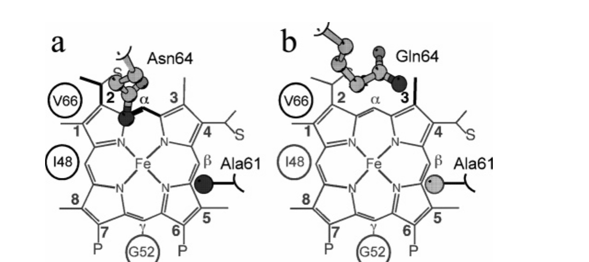
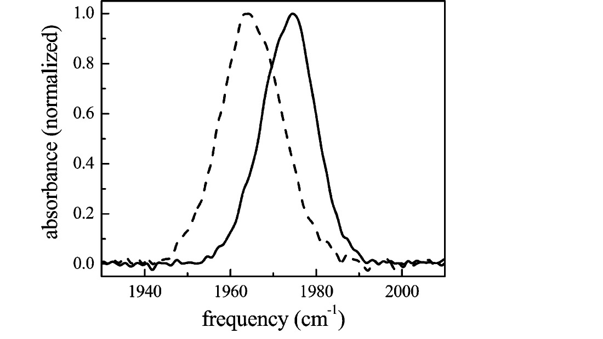
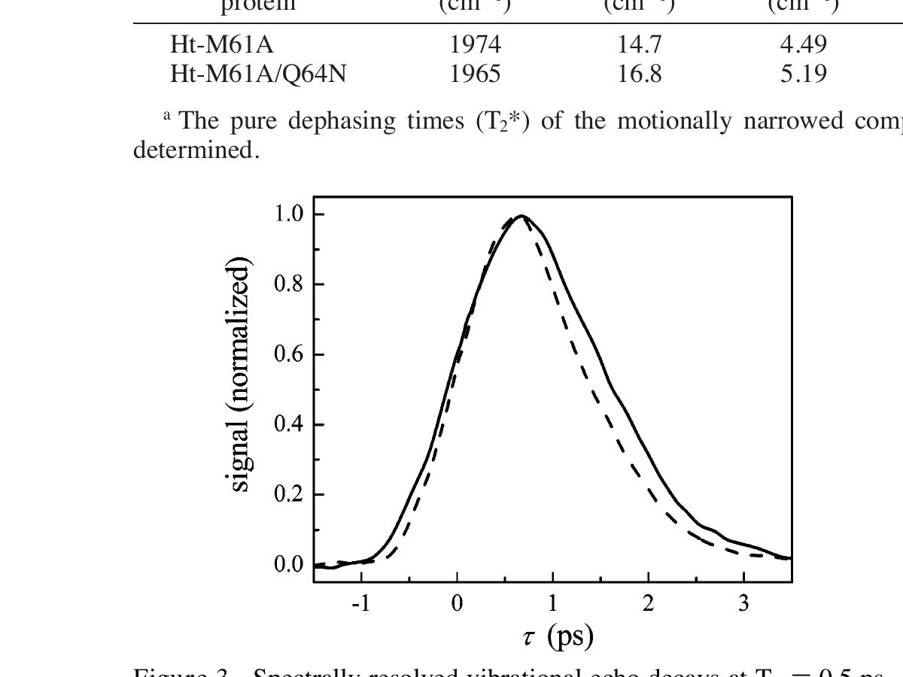
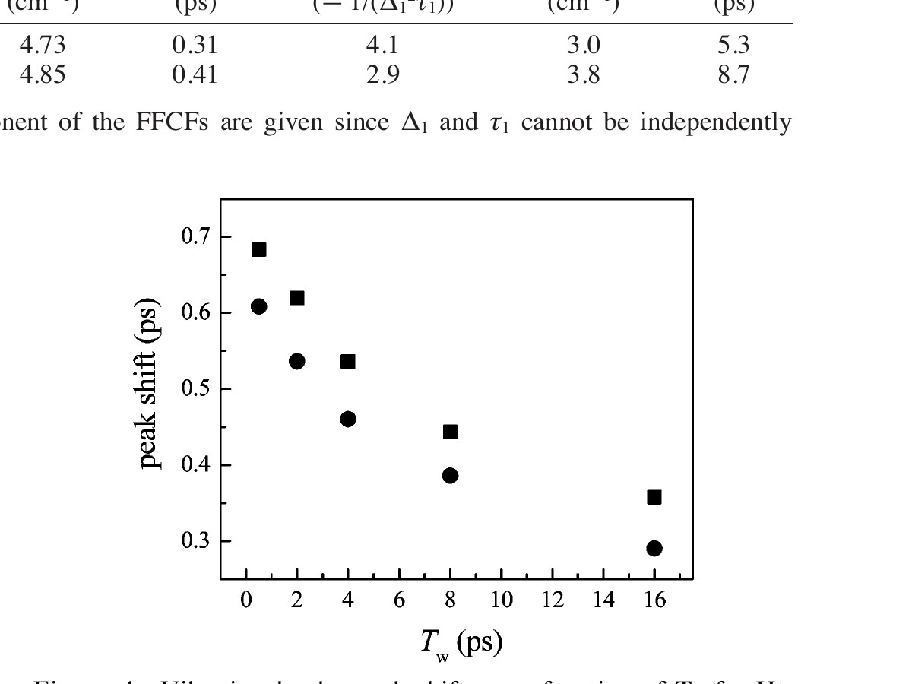
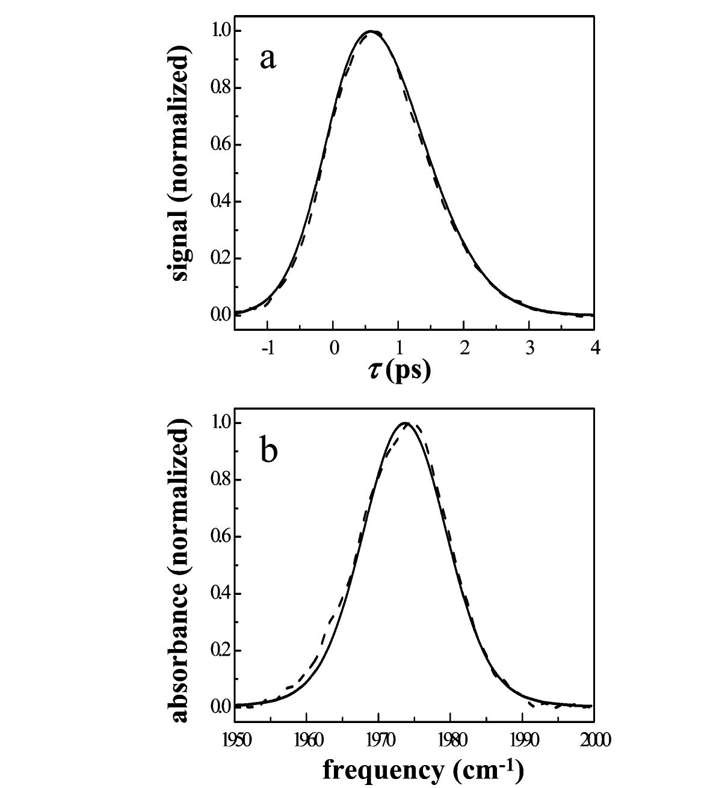
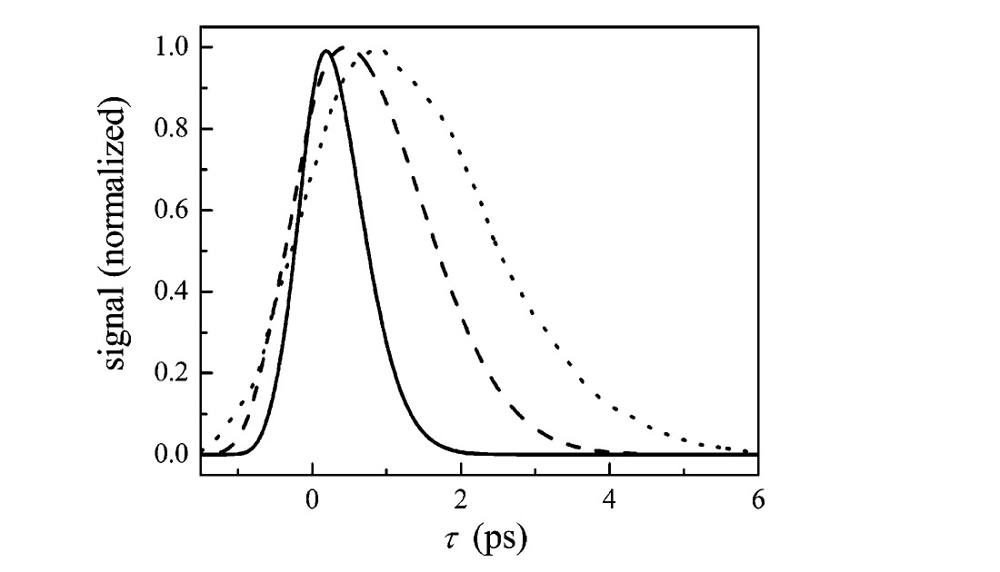

# Cytochrome c₅₅₂ Mutants: Structure and Dynamics at the Active Site Probed by Multidimensional NMR and Vibration Echo Spectroscopy

**Aaron M. Massari, Brian L. McClain, Ilya J. Finkelstein, Andrew P. Lee, Heather L. Reynolds, Kara L. Bren, and Michael D. Fayer**

*J. Phys. Chem. B*, Vol. 110, Issue 38, pp. 18803–18810 (2006)

**DOI:** [10.1021/jp054959q](https://doi.org/10.1021/jp054959q)

---

## Table of Contents

- [Abstract](#abstract)
- [I. Introduction](#i-introduction)
- [II. Materials and Methods](#ii-materials-and-methods)
- [III. Results and Discussion](#iii-results-and-discussion)
- [IV. Concluding Remarks](#iv-concluding-remarks)
- [Acknowledgments](#acknowledgments)
- [References](#references)

---

## Abstract

Spectrally resolved infrared stimulated vibrational echo experiments are used to measure the vibrational dephasing of a CO ligand bound to the heme cofactor in two mutated forms of the cytochrome c₅₅₂ from *Hydrogenobacter thermophilus*. The first mutant (Ht-M61A) is characterized by a single mutation of Met61 to an Ala (Ht-M61A), while the second variant is doubly modified to have Gln64 replaced by an Asn in addition to the M61A mutation (Ht-M61A/Q64N). Multidimensional NMR experiments determined that the geometry of residue 64 in the two mutants is consistent with a non-hydrogen-bonding and hydrogen-bonding interaction with the CO ligand for Ht-M61A and Ht-M61A/Q64N, respectively. The vibrational echo experiments reveal that the shortest time scale vibrational dephasing of the CO is faster in the Ht-M61A/Q64N mutant than that in Ht-M61A. Longer time scale dynamics, measured as spectral diffusion, are unchanged by the Q64N modification. Frequency–frequency correlation functions (FFCFs) of the CO are extracted from the vibrational echo data to confirm that the dynamical difference induced by the Q64N mutation is primarily an increase in the fast (hundreds of femtoseconds) frequency fluctuations, while the slower (tens of picoseconds) dynamics are nearly unaffected. We conclude that the faster dynamics in Ht-M61A/Q64N are due to the location of Asn64, which is a hydrogen bond donor, above the heme-bound CO. A similar difference in CO ligand dynamics has been observed in the comparison of the CO derivative of myoglobin (MbCO) and its H64V variant, which is caused by the difference in axial residue interactions with the CO ligand. The results suggest a general trend for rapid ligand vibrational dynamics in the presence of a hydrogen bond donor.

---

## I. Introduction

Cytochromes c (cyt c's) are small electron-transfer heme proteins that play key roles in respiration and photosynthesis.[1–3](#ref1) Due to their wide availability, robust structure, and ease of handling, these proteins have served as model systems to study the interplay of protein structure, dynamics, and function.[4–13](#ref4) Cytochrome c₅₅₂ from *Hydrogenobacter thermophilus* (Ht-cyt c₅₅₂)[14–17](#ref14) was recently shown to be a structurally unique example within the cyt c₈ family of class I[18](#ref18) cyt c's. Proteins in the cyt c₈ structural family, for example, *Pseudomonas* cyt c₅₅₁'s,[19–21](#ref19) typically have an asparagine residue at position 64 (Asn64) that is situated to donate a hydrogen bond to a methionine at position 61 (Met61), which occupies the sixth coordination site to the heme ([Figure 1](#fig1)a; sequence numbering is based on the *Pseudomonas aeruginosa* cyt c₅₅₁ sequence).[19–21](#ref19) This interaction has been shown to play an important role in determining the axial Met orientation[22,23](#ref22) and heme redox potential.[24](#ref24) Unlike its homologues, Ht-cyt c₅₅₂ has a glutamine at position 64 (Gln64), which is not oriented toward the axial Met61, but is instead localized over a methyl group (heme 3-CH₃ using the Fischer numbering system) at the heme edge, near the protein surface ([Figure 1](#fig1)b).[15–17](#ref15) Zhong and co-workers have shown that the absence of a hydrogen bond to the axial Met affects the dynamics, and presumably the functionality, of the active site by imparting a fluxional character to Met61 and influencing heme redox potential.[17,22–24](#ref17)

<figure class="paper-figure" id="fig1">

<figcaption><strong>Figure 1.</strong> Schematic representation of the heme and its environment in (a) Ht-M61A/Q64N and (b) Ht-M61A. The heme axial ligands (His/CO) are omitted for clarity. The approximate positions of Ile48, Gly52, and Val66 are shown with circles, and Ala61 and residue 64 are shown in ball-and-stick representations. All amino acids shown are oriented above the heme plane (toward the viewer) as is the axial CO ligand. Amino acids and heme substituents that show NOEs with the side-chain NH₂ group of residue 64 are highlighted in black.</figcaption>
</figure>

Multidimensional spectroscopic techniques have provided a wealth of information in the field of biology. Two-dimensional NMR studies have elucidated the structural and dynamical details of solvated proteins on time scales longer than tens of picoseconds.[13,25–33](#ref13) Multidimensional IR spectroscopy has improved upon the dynamic range of NMR techniques, revealing biochemical dynamics that occur on the picosecond to femtosecond time scales.[34–41](#ref34) Vibrational echo spectroscopy is a multidimensional IR technique that is sensitive to the relationship between structure and dynamics in heme proteins.[34–43](#ref34) These measurements probe the dephasing of a heme-bound CO vibration caused by structural fluctuation of the protein. There is also a contribution to the vibrational echo observable from vibrational energy relaxation from the CO vibration to other modes. In carbonmonoxy heme proteins, such as myoglobin (MbCO), hemoglobin (HbCO), and cyt c, the vibrational lifetime of the CO stretch is sufficiently long that the vibrational echo decay is caused primarily by protein structural fluctuations. Within the electrostatic force model described below,[39,44](#ref39) the protein environment is envisioned as a network of partial charges, whose movement generates a time-dependent electric field that influences the CO vibrational frequency to produce dynamic dephasing.[34,35,45–48](#ref34) Nonlinear response theory[49](#ref49) allows the extraction of the equilibrium autocorrelation function of the fluctuations in the CO vibrational frequency, or frequency–frequency correlation function (FFCF). The FFCF provides a quantitative description of the dynamics measured in vibrational echo spectroscopy that is useful for comparing the dynamics of different proteins.

In the current work, spectrally resolved infrared stimulated (three-pulse) vibrational echo spectroscopy[36](#ref36) was used to directly measure the active site structural dynamics of two mutated forms of Ht-cyt c₅₅₂.[17,22,50](#ref17) In both mutants, the heme axial ligand, Met61, was replaced by an alanine (M61A), which allowed a strong IR probe (CO) to be strategically bound to the ferrous heme in place of Met61 to report on the active site dynamics of both proteins. The first mutant studied (Ht-M61A) was characterized by only the single M61A mutation and retained an axial Gln64, which was expected to be oriented out of the heme pocket ([Figure 1](#fig1)b) as it is in the native protein.[16,17,22](#ref16) The second mutant (Ht-M61A/Q64N) was further modified to have Gln64 replaced by an Asn in an effort to generate an active site structure similar to that seen in most cyt c₈'s,[19–23](#ref19) with Asn64 positioned to interact with the heme-bound CO ([Figure 1](#fig1)a).

The vibrational echo data revealed that the ultrafast active site dynamics (≤1 ps) sensed by the heme-bound CO in Ht-M61A/Q64N are noticeably faster than those for Ht-M61A, while the rates of slower processes (tens of picoseconds time scale) are very similar for the two variants. Multidimensional NMR determined that the geometry of residue 64 in the two mutants produced conformations consistent with a non-hydrogen-bonding and hydrogen-bonding interaction between residue 64 and the CO ligand for Ht-M61A and Ht-M61A/Q64N, respectively. Gln64 was found to localize away from the heme pocket in Ht-M61A, as it does in the native Ht-cyt c, while Asn64 is oriented into the active site in Ht-M61A/Q64N to donate a hydrogen bond as it would in typical cyt c₈'s. The faster dynamics measured in Ht-M61A/Q64N are attributed to the interaction of the hydrogen-bond-donating Asn64 with the heme-bound CO. The dynamical changes observed in this engineered ligand-binding heme protein are analogous to those reported previously for the natural ligand-binding heme protein MbCO. A variant of MbCO in which the hydrogen-bond-donating distal histidine (coincidentally located at position 64) is replaced with a valine (H64V) displays slower vibrational dephasing than the native protein.[51](#ref51) These examples suggest a general trend toward rapid active site dynamics, as sensed by the CO ligand vibrational dephasing, in the presence of a hydrogen bond donor, and may represent a mechanism by which an organism imparts a unique selectivity to substrate binding or reactivity at the active site of a protein or enzyme.

---

## II. Materials and Methods

**A. Protein Expression and Purification.** Preparation of Ht-M61A and Ht-M61A/Q64N utilized an *E. coli*-based expression system.[50,52](#ref50) Molecular biology procedures and materials and the preparation of Ht-M61A are described in detail elsewhere.[22,53](#ref22) To prepare Ht-M61A/Q64N, the polymerase chain reaction overlap extension method[54](#ref54) was employed using the pSHC552A61 expression plasmid[53](#ref53) as the template. The mutagenic primers (mutation site italicized) were 5′-CCCGCGCCTCCTAAT*A*ATGTAACC-3′ and 5′-CGGTTACAT*T*ATTAGGAGGCGCGG-3′. Cloning, expression, and purification of Ht-M61A/Q64N were as described for Ht-M61A.[53](#ref53)

**B. Sample Preparation for Vibrational Echo Spectroscopy.** To prepare aqueous samples of carbonmonoxy Ht-M61A and Ht-M61A/Q64N, 10 mg of lyophilized protein was dissolved in 1.0 mL of pH 7.0 H₂O phosphate buffer (50 mM). The buffer pH was measured before addition of protein. The solutions were reduced with a 5-fold excess of dithionite (Sigma Aldrich) and stirred under a CO atmosphere for 1 h. The solutions were centrifuged at 3000 relative centrifugal force for 15 min through a 0.45 µm acetate filter (Pall Nanosep MF) to remove particulates. The samples were further concentrated by repeated centrifugation (Eppendorf 5415D) over modified polyethersulfone membranes (Pall Nanosep 3K Omega) to a final protein concentration of 10–15 mM. The sample was then placed in a sample cell with CaF₂ windows and a 50 µm Teflon spacer. UV-visible (Varian Cary 3E) and Fourier transform infrared (FTIR; ATI Mattson Infinity 9495) absorption spectroscopies were performed to determine all protein concentrations. The samples had mid-IR absorbances of 0.1 at the CO stretching frequency on a background absorbance of 0.5.

**C. NMR Spectroscopy.** Samples of carbonmonoxy Ht-M61A and Ht-M61A/Q64N for NMR (3–4 mM protein in 50 mM sodium phosphate, 10% D₂O, pH 4) were prepared by flushing samples with CO, followed by introducing a ~20-fold molar excess of Na₂S₂O₄. ¹H NMR data were collected on a Varian INOVA 500-MHz spectrometer at 298 K. Two-dimensional nuclear Overhauser effect (NOE) spectra were collected with 4096 points in the F2 dimension, 512 increments in the F1 dimension, and a 12 000-Hz spectral width. The mixing time was 100 ms, and the recycle time was 1.3 s. Solvent suppression was achieved by presaturation.

NMR data processing and analysis were performed using FELIX 97 (Accelrys). Assignments of selected ¹H resonances of Ht-M61A and Ht-M61A/Q64N were made by standard methods[55](#ref55) aided by comparison to published ¹H resonance assignments for reduced Ht cyt c₅₅₂[15,50](#ref15) and Ht-Q64N.[22](#ref22)

**D. Stimulated Vibrational Echo Spectroscopy.** The experimental setup has been previously described in detail.[56](#ref56) Briefly, tunable mid-IR pulses with a center frequency adjusted to match the center frequency of the protein sample of interest (1965–1976 cm⁻¹) were generated by an optical parametric amplifier pumped with a regeneratively amplified Ti:sapphire laser. The bandwidth and pulse duration used in these experiments were 150 cm⁻¹ and 100 fs, respectively. The mid-IR pulse was split into three temporally controlled pulses (~700 nJ/pulse). The delay between the first two pulses, τ, was scanned at each time Tw, the delay between pulses two and three. The three beams were crossed and focused at the sample. The spot size at the sample was ~150 µm. The vibrational echo pulse generated in the phase-matched direction was dispersed through a 0.5 m monochromator (1.2 cm⁻¹ spectral resolution) and detected with either a liquid-nitrogen-cooled HgCdTe array detector (Infrared Associates/Infrared Systems Development) or a liquid-nitrogen-cooled InSb single element detector (EG&G Judson). A power dependence study was performed on all samples, and the data showed no power-dependent effects.[57](#ref57) Data collection for all samples was performed at room temperature in an enclosed, dry-air-purged environment.

**E. FFCF Extraction from Vibrational Echo Data.** To extract quantitative information from the vibrational echo data, nonlinear response theory calculations were compared to the experimental data.[39,49](#ref39) Within conventional approximations,[49](#ref49) both the vibrational echo and the linear-infrared absorption spectrum are completely determined by the FFCF. The FFCF is the starting point from which the experimental observables are calculated. A multiexponential form of the FFCF, *C*(*t*), was used in accord with previous vibrational echo analysis and molecular dynamics simulations of heme proteins.[39,51,53](#ref39) It is important to note that exponentials in the FFCF do not give rise to single- or multiple-exponential vibrational echo decay curves but rather produce complicated nonexponential decays. The FFCF has the form

$$C(t) = \Delta_0^2 + \sum_{i=1}^{n} \Delta_i^2 \exp(-t/\tau_i) \tag{1}$$

Here, Δ₀ is the contribution from inhomogeneous broadening. Inhomogeneous broadening is caused by variations in protein structure that influence the CO frequency but evolve on time scales that are much slower than the experimental time window. In this study, the structural dynamics that occur on the time scale of ~100 ps will contribute to inhomogeneous broadening. Δ*ᵢ* is the magnitude of the contribution from a frequency-perturbing process with correlation time τ*ᵢ*. If τ*ᵢ* is fast compared to Δ*ᵢ*⁻¹ (Δ*ᵢ*τ*ᵢ* ≪ 1, Δ in radians/ps) for a given exponential term, then that component of the FFCF is motionally narrowed.[58–61](#ref58) For a motionally narrowed term in *C*(*t*), Δ and τ*ᵢ* cannot be determined independently,[53](#ref53) but a pure dephasing time, T₂\*, can be defined (T₂\* = (Δ²τ)⁻¹), which describes the "homogeneous line width" for that component of the FFCF. Although protein dynamics generally occur over a continuum of time scales, a multiexponential *C*(*t*) organizes these fluctuations into experimentally relevant time scales that can be compared from one system to another.

The FFCF is used to calculate the linear absorption spectrum and a series of vibrational echo decay curves (τ scanned, Tw fixed) for a range of Tw values. An FFCF with a single exponential plus a constant term was not able to simultaneously reproduce the linear-IR spectrum and the vibrational echo decay curves at all Tw values for either protein in this study. Two distinct FFCFs for Ht-M61A and Ht-M61A/Q64N, composed of a biexponential plus a constant term, were adequate to simultaneously fit the absorption spectrum and the vibrational echo decay curves of each protein. To maximize the efficiency of the empirical fits, δ-function laser pulses were used when fitting the data. A comparison of these fits to those obtained by performing the full three time-ordered integrals with the finite experimental pulse durations[49](#ref49) verified that the effects of pulse duration were negligibly small given the very short pulses used in the experiments. The FFCF obtained from analysis of the data using response theory calculations was deemed correct when it could be used to calculate vibrational echo decays that fit the experimental vibrational echo data at all Tw values and simultaneously reproduce the linear absorption spectrum.

---

## III. Results and Discussion

**A. Linear-IR Spectroscopy.** The background-subtracted linear FTIR spectra of CO bound to Ht-M61A and Ht-M61A/Q64N are shown in [Figure 2](#fig2). All peaks have been fit as Gaussian distributions to determine their full width at half-maxima (fwhm's) and center frequencies (Table 1). The spectrum of Ht-M61A (solid line) shows a single transition at 1974 cm⁻¹ with a fwhm of 14.7 cm⁻¹, while Ht-M61A/Q64N (dashed line) exhibits a single transition at 1965 cm⁻¹ with a fwhm of 16.8 cm⁻¹. The red shifting of the CO stretching frequency of Ht-M61A/Q64N relative to Ht-M61A is reminiscent of the IR spectrum of aqueous MbCO, which exhibits three primary CO stretching peaks corresponding to three structurally distinct conformational substates.[39,51,56,62–66](#ref39) The A₀ band (1965 cm⁻¹) is attributed to a conformation in which the distal histidine (His64) is positioned out of the heme pocket,[51,67–71](#ref51) while the A₁ (1944 cm⁻¹) and A₃ (1938 cm⁻¹) bands arise from the distal histidine being localized in the heme pocket in two distinct orientational geometries.[39,72](#ref39) In the case of MbCO, the inclusion of a polar, hydrogen-bond-donating residue inside the heme pocket results in a spectral shift of the CO stretch to lower frequencies. When this example is compared to the spectra of Ht-M61A and Ht-M61A/Q64N in [Figure 2](#fig2), the observed red spectral shift caused by replacing Gln64 with an Asn implies that the Gln may be located out of the active site (as does His64 in the MbCO A₀ substate) whereas the Asn is directed into the heme pocket (MbCO A₁ or A₃ substate). According to the electrostatic force model,[39,44](#ref39) the motions of a charged moiety in the vicinity of the heme-bound CO should dramatically affect the vibrational dynamics of this chromophore. However, the Gaussian shape of the spectral bands in Ht-M61A and Ht-M61A/Q64N suggests that these transitions are inhomogeneously broadened, which would obscure any dynamical information contained in the linear spectra. The vibrational stimulated echo experiments described below confirm that the spectral bands are indeed inhomogeneously broadened, and therefore, such experiments are necessary to uncover the underlying dynamics.

<figure class="paper-figure" id="fig2">

<figcaption><strong>Figure 2.</strong> Normalized FTIR spectra of the CO stretching mode bound to Ht-M61A (solid line) and Ht-M61A/Q64N (dashed line).</figcaption>
</figure>

**B. Multidimensional IR Studies: Stimulated Vibrational Echo Spectroscopy.** [Figure 3](#fig3) shows the vibrational echo decays for Ht-M61A (solid curve) and Ht-M61A/Q64N (dashed curve) at Tw = 0.5 ps. The decay of Ht-M61A/Q64N is noticeably faster than that of Ht-M61A, indicating that the CO dephases faster when Gln64 is replaced by Asn64. For clarity, we focus our attention here on a single Tw; however, this trend is consistent at all values of Tw. In vibrational echo experiments, a faster rate of dephasing indicates that the frequency of the heme-bound CO is fluctuating more rapidly. Within the electrostatic force model described above, structural fluctuations produce motions of charged and polar residues that induce the largest changes in CO transition frequency. The dynamic response of these two proteins as measured by vibrational echo spectroscopy confirms the implications of the linear-IR spectra discussed above. The increased fluctuations of the CO frequency are consistent with the structural picture in which Asn64 in Ht-M61A/Q64N is localized near the CO, whereas the Gln64 in Ht-M61A is directed out of the active site.

In stimulated (three-pulse) vibrational echo experiments, the dynamics that occur on time scales longer than those shown for a single vibrational echo decay ([Figure 3](#fig3)) can be measured by varying the time delay between the second and third pulses, Tw. Although at each Tw the entire decay curve is measured, these dynamics, termed spectral diffusion, are conveniently depicted by plotting the vibrational echo peak shift[73–76](#ref73) as a function of Tw. The vibrational echo peak shift is the difference between the time of peak amplitude of the decay curve and zero time. When longer time scale protein dynamics are present, measured in a vibrational echo experiment as frequency fluctuations that result in CO dephasing, the echo decays become faster as Tw becomes longer and their peaks shift toward the origin. In the frequency domain (Fourier transform of the vibrational echo decay), the changes observed in the vibrational echo decays with Tw show that the dynamical line width broadens with increasing Tw due to protein dynamics that influence the CO frequency on the Tw time scale. A broader dynamical line width (faster vibrational echo decay and smaller peak shift) means that a larger portion of the total possible structural configurations of the protein has been sampled. For long enough Tw, spectral diffusion is complete, and all chromophores have sampled the entire spectral line. In this case, the dynamic line shape is equal to the absorption line, and the vibrational echo peak shift is zero.

<figure class="paper-figure" id="fig3">

<figcaption><strong>Figure 3.</strong> Spectrally resolved vibrational echo decays at Tw = 0.5 ps for CO bound to Ht-M61A (1975 cm⁻¹, solid line) and Ht-M61A/Q64N (1965 cm⁻¹, dashed line).</figcaption>
</figure>

The vibrational echo peak shifts for Ht-M61A and Ht-M61A/Q64N are shown in [Figure 4](#fig4) as a function of Tw. The peak shift values for Ht-M61A/Q64N (filled circles) are consistently smaller than those for Ht-M61A (filled squares). This shows that for each Tw time delay, the CO bound to Ht-M61A/Q64N has sampled a greater fraction of the spectral line, which is consistent with the faster dephasing shown at a single Tw in [Figure 3](#fig3). The fact that the vibrational echo decay peaks have not shifted to zero by Tw = 16 ps demonstrates that the full range of protein dynamics affecting the CO frequency have not occurred within this time frame; not all protein configurations that influence the frequency of the CO vibrational transition have been accessed. In these experiments, fluctuations on times greater than ~50 ps appear as inhomogeneous broadening, which is accounted for by the Δ₀ term in eq 1. Aside from the nearly constant offset between the data for these two mutants ([Figure 4](#fig4)), the peak shifts for both proteins as a function of Tw have the same qualitative shape. The protein dynamics, as sensed by the heme-bound CO, that occur on time scales longer than a few picoseconds qualitatively appear to be unaffected by replacing the Gln64 in Ht-M61A with the Asn64 in Ht-M61A/Q64N. This indicates that the primary influence of Asn64 on the CO dynamics occurs on the time scale of a few picoseconds or faster.

<figure class="paper-figure" id="fig4">

<figcaption><strong>Figure 4.</strong> Vibrational echo peak shifts as a function of Tw for Ht-M61A (filled squares) and Ht-M61A/Q64N (filled circles).</figcaption>
</figure>

To compare the structural dynamics of these two proteins quantitatively, the FFCF for each protein was obtained by simultaneous fits that reproduce the linear-IR absorption spectrum and the vibrational echo decay curves at all Tw values using the procedure described in section II.E. The parameters for the best-fit FFCFs (*C*(*t*)) for Ht-M61A and Ht-M61A/Q64N are summarized in Table 1. As explained in section II.E, the constant term (Δ₀) in *C*(*t*) accounts for static or quasi-static frequency distributions whose frequency fluctuations are very slow on the time scale of the experiments. An example of the quality of the fits obtained using only the five adjustable parameters in the biexponential FFCFs is shown for the vibrational echo decay at Tw = 2 ps and the linear-IR spectrum for Ht-M61A in [Figure 5](#fig5). The overlaid fits to the experimental vibrational echo decay curves at all five Tw values and the linear-IR spectra calculated for both proteins using the parameters listed in Table 1 are available in the Supporting Information.

**Table 1.** FTIR Peak Centers and Line Widths and the Best-Fit *C*(*t*) Parameters for Ht-M61A and Ht-M61A/Q64N

| Protein | FTIR peak (cm⁻¹) | fwhm (cm⁻¹) | Δ₀ (cm⁻¹) | Δ₁ (cm⁻¹) | τ₁ (ps) | T₂\* (ps) = 1/(Δ₁²τ₁) | Δ₂ (cm⁻¹) | τ₂ (ps) |
|---------|-----------------|-------------|-----------|-----------|---------|----------------------|-----------|---------|
| Ht-M61A | 1974 | 14.7 | 4.49 | 4.73 | 0.31 | 4.1 | 3.0 | 5.3 |
| Ht-M61A/Q64N | 1965 | 16.8 | 5.19 | 4.85 | 0.41 | 2.9 | 3.8 | 8.7 |

*The pure dephasing times (T₂\*) of the motionally narrowed component of the FFCFs are given since Δ₁ and τ₁ cannot be independently determined.*

The linear absorption spectrum is very sensitive to the constant, Δ₀, because its width and shape are determined by both the dynamic and the inhomogeneous contributions to the spectrum. The shapes of the vibrational echo curves and their change in shape with Tw are very sensitive to the other parameters.

The FFCF of Ht-M61A/Q64N is characterized by a larger Δ₀ than Ht-M61A, which shows that some, but not all, of the increase in linear line width shown in [Figure 2](#fig2) is due to an increase in inhomogeneous broadening. The first exponential terms in the FFCFs for both proteins have correlation times (τ₁) that are very fast (hundreds of femtoseconds). However, these components are very near the boundary of motional narrowing (Δτ ≪ 1),[58–61](#ref58) at which point Δ and τ cannot be determined independently.[53](#ref53) In this nearly motionally narrowed regime, it is reasonable to believe that the relative time scale of the τ₁ values is correct, while the precise value of each τ₁ is not well-defined. To compare the relative dynamics encompassed by the first exponential terms in the FFCFs for Ht-M61A/Q64N and Ht-M61A, it is instructive to express this nearly motionally narrowed component of the FFCF as a pure dephasing time (T₂\*), which depends on both Δ₁ and τ₁ (see section II.E). The T₂\* values for Ht-M61A/Q64N and Ht-M61A are 2.9 and 4.1 ps, respectively. That the dephasing dynamics represented by this first exponential component of *C*(*t*) are over 40% faster for Ht-M61A/Q64N than Ht-M61A is consistent with the faster vibrational echo decay shown in [Figure 3](#fig3). Likewise, the similar longer time scale dynamics shown for these two mutants in [Figure 4](#fig4) is reflected in the second exponential component of their FFCFs. Since this component of *C*(*t*) is not motionally narrowed, both the magnitude (Δ₂) and the correlation time (τ₂) are quantitatively correct and can be used to describe both the vibrational echo and the linear-IR data. The extracted FFCFs show that the CO frequency fluctuations that occur on longer time scales (tens of picoseconds) for Ht-M61A/Q64N and Ht-M61A are characterized by very similar, but not identical, Δ₂ and τ₂ values, supporting the similar shape of the vibrational echo peak shift data in [Figure 4](#fig4). The fundamental dynamical difference imparted by replacing Gln64 with Asn64 is an increase in dephasing on the hundreds of femtoseconds time scale, while the CO frequency fluctuations on the tens of picoseconds time scale are virtually unchanged.

<figure class="paper-figure" id="fig5">

<figcaption><strong>Figure 5.</strong> (a) Experimental vibrational echo decay data at Tw = 2 ps and (b) linear spectrum for Ht-M61A (dashed lines) overlaid with the best-fit vibrational echo decay and linear spectrum calculated from nonlinear response theory (solid lines) at 1975 cm⁻¹.</figcaption>
</figure>

**C. Multidimensional NMR Studies: Nuclear Overhauser Effect Spectroscopy.** To determine the locations of residue 64 in Ht-M61A and Ht-M61A/Q64N relative to the heme pocket, we performed multidimensional NMR studies to complement the multidimensional IR experiments described above. Analysis of ¹H NMR data focused on assigning ¹H resonances for Gln64 in Ht-M61A and Asn64 in Ht-M61A/Q64N and identifying NOEs to these residues. Comparison of NMR data collected on both mutants studied above (Ht-M61A and Ht-M61A/Q64N) to published results on native Ht-cyt c₅₅₂[17,50](#ref17) and a variant with the Q64N but not the M61A mutation (Ht-Q64N)[22](#ref22) facilitated this analysis. The residue 64 conformations seen in Ht-cyt c₅₅₂ and in Ht-Q64N are readily distinguished from each other on the basis of NOE patterns. In wild-type reduced Ht-cyt c₅₅₂, assignment of ¹H NMR resonances for Gln64 was made by identification of NOEs from a Gln side chain to the Asn65 NH (which, in turn, shows NOEs to Val66). In addition, Gln64 ε-NH₂ protons have NOEs to side-chain protons of Met61 and to heme 3-CH₃.[22,50](#ref22) In Ht-Q64N, Asn64 is also assigned by identification of NOEs from its side chain to Asn65 NH. The Asn64 δ-NH₂ protons have additional NOEs to the side chains of Ile48 and Met61, heme α-meso-H, and heme thioether-2-CH₃.[22](#ref22)

[Figure 1](#fig1) provides schematic representations of the heme pockets of (a) Ht-M61A/Q64N and (b) Ht-M61A. In Ht-M61A/Q64N, Asn64 is readily assigned by identification of NOEs from its side chain to Asn65 NH at 9.14 ppm. In addition, NOEs are observed from one or both Asn64 δ-NH₂ protons to Val66 γ-CH₃, Ile48 β-H, heme α-meso-H, and Ala61 β-CH₃ but not to heme 3-CH₃. The pattern of NOEs for Asn64 in Ht-M61A/Q64N is similar to that seen for Asn64 in Ht-Q64N and in *P. aeruginosa* cyt c₅₅₁,[22,77](#ref22) suggesting that Asn64 Ht-M61A/Q64N is oriented above the heme iron as in the typical cyt c₈'s and thus is positioned to interact with an axial CO ligand ([Figure 1](#fig1)a). In Ht-M61A, Gln64 was also assigned by its characteristic NOEs to Asn65 and Val66. The Gln64 ε-NH₂ protons display NOEs to Val66 γ-CH₃'s and to heme 3-CH₃, whereas NOEs to Ile48 and Ala61 are not observed. This pattern is consistent with an orientation away from the heme iron, toward the heme 3-CH₃ near the protein surface, as seen in the wild-type Ht-cyt c₅₅₂ ([Figure 1](#fig1)b). A summary of the multidimensional NMR results is provided in Table 2.

In addition to NOEs, chemical shifts provide an important indication of the position of an amino acid relative to the heme. Nuclei oriented above the center of the heme macrocycle, in position to interact with an axial ligand, experience a substantial upfield chemical shift via the heme ring current.[78](#ref78) This effect has been shown to produce a readily identifiable pattern of upfield chemical shifts for the axial Met in reduced cyt c's.[79,80](#ref79) In both Ht-cyt c₅₅₂ variants in this study, the Ala61 β-CH₃ is shifted upfield as expected if its position is similar to the β-CH₂ in Met61 in the native Ht-cyt c₅₅₂ (δ ≈ 1.5 ppm; Table 2). In the case of an Asn64 (or Gln64) side-chain NH₂ proton, location above the center of the heme macrocycle (i.e., in position to interact with an axial ligand) would mean a significantly lower chemical shift from the expected value of ~6–8 ppm ("random-coil" chemical shifts are 6.8 and 7.6 ppm[55](#ref55)). For example, an upfield shift of ~3–5 ppm for one Asn64 δ-NH₂ proton (δ = 3.19 ppm) via the heme ring current is observed in reduced *P. aeruginosa* cyt c₅₅₁.[22,77](#ref22) The other Asn64 δ-NH₂ proton, which is oriented away from the axial ligand, has a more typical shift of 7.49 ppm.[81](#ref81) This pattern is seen for the Asn64 δ-NH₂ protons in other proteins in the cyt c₈ family: *Nitrosomonas europaea* cyt c₅₅₂ (3.35, 7.11 ppm),[82](#ref82) *Pseudomonas stutzeri* cyt c₅₅₁ (3.20, 7.02 ppm),[20](#ref20) and *Pseudomonas stutzeri* Zobell cyt c₅₅₁ (3.11, 6.95 ppm).[21](#ref21) In Ht-M61A/Q64N, the Asn64 δ-NH₂ protons have chemical shifts (3.18, 7.49 ppm) that are consistent with an orientation similar to that seen in the typical cyt c₈'s.[22](#ref22) In reduced Ht-cyt c₅₅₂, in contrast, the chemical shifts for the Gln64 ε-NH₂ protons (6.37, 6.67 ppm) are not consistent with a side-chain position near the heme iron or its axial ligand.[17,22,23,50](#ref17) In the current study, analogous chemical shift patterns are seen for Asn64 δ-NH₂ in Ht-M61A/Q64N (δ = 2.76, 6.85 ppm) and Gln64 ε-NH₂ in Ht-M61A (δ = 6.04, 6.19 ppm). These NMR data provide further support for the hypothesis that Asn64 in Ht-M61A/Q64N is positioned to interact with the axial CO, whereas Gln64 in Ht-M61A is not.

**Table 2.** ¹H NMR Data on Reduced Ht Cyt c₅₅₂ Derivatives

| Protein | Position | Residue | Atom(s) | δ (ppm) | Relevant NOEs | Refs |
|---------|----------|---------|---------|---------|---------------|------|
| Ht cyt c₅₅₂ | 61 | Met | β-CH₂ | 2.59, 0.61 | heme 5-CH₃, β-meso-H; G52 NH | 15, 50 |
| | 64 | Gln | NH | 7.29 | M61 ε-CH₃; N65 NH | |
| | 64 | Gln | ε-NH₂ | 6.37, 6.67 | heme 3-CH₃, α-meso-H; M61 β-H, ε-CH₃ | |
| Ht-Q64N | 61 | Met | β-CH₂ | 2.78, 0.81 | heme β-meso-H; G52 NH | 22 |
| | 64 | Asn | NH | 7.00 | N65 NH | |
| | 64 | Asn | δ-NH₂ | 3.18, 7.49 | heme 2-CH₃, α-meso-H; I48 γ-H; M61 γ-H, ε-CH₃; V66 γ-CH₃ | |
| Ht-M61A | 61 | Ala | β-CH₃ | 1.48 | heme 5-CH₃, β-meso-H | this work |
| | 64 | Gln | NH | not observed | | |
| | 64 | Gln | ε-NH₂ | 6.04, 6.19 | heme 3-CH₃; V66 γ-CH₃ | |
| Ht-M61A/Q64N | 61 | Ala | β-CH₃ | 1.53 | heme β-meso-H, γ-meso-H; G52 HN; N64 δ-H | this work |
| | 64 | Asn | NH | 7.10 | N65 NH | |
| | 64 | Asn | δ-NH₂ | 2.76, 6.85 | heme α-meso-H; I48 β-H; A61 β-CH₃; V66 β-CH₃ | |

In light of the structural characterization of Ht-M61A and Ht-M61A/Q64N by NMR, the comparison of these Ht-cyt c₅₅₂ mutants to MbCO and its variants can now be elaborated. As described above, the linear-IR spectra of Ht-M61A and Ht-M61A/Q64N ([Figure 2](#fig2)) appeared to correspond structurally to the MbCO A₀ and A₁ or A₃ conformational substates, respectively. The NMR results clearly indicate that the structural analogy is valid: Ht-M61A and the A₀ substate are characterized by residue 64 directed out of the heme pocket, while this residue is positioned within the pocket above the heme iron in Ht-M61A/Q64N and the A₁ and A₃ substates. In general, these data indicate that the inclusion of a polar hydrogen-bond-donating residue above the heme ring has a noticeable effect on the active site dynamics. For comparison to the Ht-cyt c₅₅₂ mutant dephasing dynamics shown in [Figure 3](#fig3), the spectrally resolved vibrational echo decays for MbCO at the A₁ (dashed curve) and A₃ (solid curve) substates are presented in [Figure 5](#fig5). Due to spectral overlap of all three spectroscopic lines in MbCO, the echo data for these substates are complicated by accidental degeneracy beats (ADBs).[83](#ref83) Fortunately, the FFCF extraction procedure described in section II.E allows the vibrational echo decays for each substate to be recalculated, as shown by the A₁ and A₃ echo decays in [Figure 6](#fig6), without the influence of the other states. The low intensity of the A₀ substate precludes the acquisition of data at this frequency; however, a MbCO mutant in which H64 has been replaced by a valine (H64V) has been shown to represent the CO vibrational dynamics that correspond to this substate.[51](#ref51) The vibrational echo decay for H64V (dotted curve), representing the A₀ substate decay, is overlaid in [Figure 6](#fig6) with the decays for the A₁ and A₃ substates (all decays shown at Tw = 0.5 ps).

It is apparent in [Figure 6](#fig6) that the dephasing of the A₃ substate is faster than that of the A₁ substate,[39,56,84](#ref39) which in turn dephases faster than the A₀ substate. The fundamental difference between the A₁ and the A₃ structures lies in the rotation of the singly protonated imidazole ring on His64. The N–H proton and N*δ* of this imidazole ring are equidistant from the CO ligand in the A₁ substate, whereas the N–H proton is directed toward the CO ligand in the A₃ substate.[39,56](#ref39) In the A₃ geometry, the direction of the hydrogen-bond-donating group (N–H proton) toward the heme-bound CO could provide an additional source of dephasing and generate the faster vibrational echo decay in [Figure 6](#fig6). It is important to recognize that Ht-cyt c₅₅₂ and MbCO are different proteins within the general category of heme proteins, and their overall dynamic ranges are quite different ([Figures 3](#fig3) and [5](#fig5)). Nonetheless, the relative magnitude of the change of the dephasing rate from Ht-M61A to Ht-M61A/Q64N is more similar to that of the MbCO A₀ to the A₁ substate than that of A₀ to A₃. While this is admittedly pushing the limitations of the analogy, the similarity of Ht-M61A/Q64N dynamics (relative to Ht-M61A) to the A₁ substate could suggest that the hydrogen-bonding amine group on Asn64 is rotated away from the CO ligand to some degree. To unambiguously identify the atomic displacements responsible for the vibrational dynamics measured in these experiments necessitates calculation of the vibrational echo data from molecular dynamics simulations.

<figure class="paper-figure" id="fig6">

<figcaption><strong>Figure 6.</strong> Spectrally resolved vibrational echo decays at Tw = 0.5 ps for CO bound to MbCO at the A₃ (1938 cm⁻¹, solid line) and A₁ (1944 cm⁻¹, dashed line) conformational substates. The vibrational echo decay at Tw = 0.5 ps for the H64V mutant is overlaid (1968 cm⁻¹, dotted line) and represents the echo decay from the A₀ substate in MbCO.</figcaption>
</figure>

That the dynamical trends of Ht-M61A and Ht-M61A/Q64N are similar to those of the conformational substates of MbCO is an intriguing result. In the case of MbCO, His64 has been implicated in the physiologically crucial differentiation between CO and O₂ binding to the heme group of myoglobin and hemoglobin.[67,85–87](#ref67) The sensitivity of the active site dynamics for MbCO to the geometry and dynamics of residue 64 suggests that an amino acid residue positioned to interact with heme axial ligands also has a profound effect on the functionality of the active site of cyt c's. This hypothesis has been recently supported by dynamical studies on Ht-cyt c₅₅₂ and Ht-M61A/Q64N.[17,22](#ref17) It is plausible that the presence of Gln64 in the active site of Ht-cyt c₅₅₂ instead of the Asn64 found in most other cyt c₈'s affords a unique physiological function that is beneficial to that species. The current study reveals a dynamical difference imparted by Gln64 on the picosecond time scale and shows that, in addition to affecting slower structural motions, single site mutations in naturally occurring proteins can also influence dynamical processes. Fast structural fluctuations can be the precursors to slower time scale structural changes.

---

## IV. Concluding Remarks

A protein's function is defined by its structural architecture and the evolution of that architecture with time. To understand, alter, or mimic the function of a protein or enzyme, it is necessary to understand the roles that specific residue motions play in the determining the physiological reactivity of the active site. The multidimensional IR experiments presented here revealed that the rate of dephasing (picosecond time scale) of the heme-bound CO in Ht-M61A/Q64N is significantly faster than that for Ht-M61A, while the rate of spectral diffusion (tens of picoseconds time scale) is nearly identical for the two mutants. This implies that the crucial residues surrounding the active site of a protein or enzyme could be optimized to satisfy the specific needs of an organism without significantly altering the longer time scale structural dynamics that typically involve movements of larger domains. Multidimensional NMR experiments provided data that were complementary to the multidimensional IR studies and determined that the geometry of residue 64 in the two mutants corresponded to a non-hydrogen-bonding and hydrogen-bonding interaction for Ht-M61A and Ht-M61A/Q64N, respectively. We conclude that the faster dynamics on the picosecond time scale measured in Ht-M61A/Q64N are due to the geometry of Asn64, which is a hydrogen bond donor that localizes above the heme-bound CO. A similar interaction between residue 64 and the CO ligand has been observed for MbCO and its H64V variant. These examples suggest a general trend toward rapid active site dynamics in the presence of a hydrogen bond donor and represent a mechanism by which an organism might impart a unique selectivity to substrate binding or reactivity at the active site of a protein or enzyme.

---

## Acknowledgments

This work was supported by the National Institutes of Health (NIH; Grant No. 2 R01 GM-061137-05). A.M.M. was graciously supported by the NIH Ruth L. Kirschstein Postdoctoral Fellowship (Grant No. 1 F32 GM-071162-01). K.L.B. acknowledges the support of the NIH (Grant No. GM63170) and a fellowship from the Alfred P. Sloan Foundation. We thank Ravinder Kaur and Timur Senguin for invaluable assistance with NMR experiments.

**Supporting Information Available:** Experimental vibrational echo decay data and the linear spectrum for Ht-M61A and Ht-M61A/Q64N overlaid with the best-fit vibrational echo decay and linear spectrum calculated from nonlinear response theory. This material is available free of charge via the Internet at http://pubs.acs.org.

---

## References

1. Moore, G. R.; Pettigrew, G. W. *Cytochromes c. Evolutionary, Structural, and Physicochemical Aspects*; Springer-Verlag: New York, 1990.

2. Wilson, M. In *Cytochrome c: A Multidisciplinary Approach*; University Science Books: Sausalito, CA, 1996.

3. Mathews, F. S. *Prog. Biophys. Mol. Biol.* **1985**, *45*, 1–56.

4. Pan, L. P.; Hibdon, S.; Liu, R. Q.; Durham, B.; Millett, F. *Biochemistry* **1993**, *32*, 8492–8498.

5. Bai, Y. W. *Proc. Natl. Acad. Sci. U.S.A.* **1999**, *96*, 477–480.

6. Mines, G. A.; Pascher, T.; Lee, S. C.; Winkler, J. R.; Gray, H. B. *Chem. Biol.* **1996**, *3*, 491–497.

7. Bjerrum, M. J.; Casimiro, D. R.; Chang, I. J.; Dibilio, A. J.; Gray, H. B.; Hill, M. G.; Langen, R.; Mines, G. A.; Skov, L. K.; Winkler, J. R.; Wuttke, D. S. *J. Bioenerg. Biomembr.* **1995**, *27*, 295–302.

8. Winkler, J. R.; Malmstrom, B. G.; Gray, H. B. *Biophys. Chem.* **1995**, *54*, 199–209.

9. Bryngelson, J. D.; Onuchic, J. N.; Socci, N. D.; Wolynes, P. G. *Proteins: Struct., Funct., Genet.* **1995**, *21*, 167–195.

10. Geren, L. M.; Beasley, J. R.; Fine, B. R.; Saunders, A. J.; Hibdon, S.; Pielak, G. J.; Durham, B.; Millett, F. *J. Biol. Chem.* **1995**, *270*, 2466–2472.

11. Sosnick, T. R.; Mayne, L.; Hiller, R.; Englander, S. W. *Nat. Struct. Biol.* **1994**, *1*, 149–156.

12. Raphael, A. L.; Gray, H. B. *J. Am. Chem. Soc.* **1991**, *113*, 1038–1040.

13. Bren, K. L.; Kellogg, J. A.; Kaur, R.; Wen, X. *Inorg. Chem.* **2004**, *43*, 7934–7944.

14. Sanbongi, Y.; Ishii, M.; Igarashi, Y.; Kodama, T. *J. Bacteriol.* **1989**, *171*, 65–69.

15. Hasegawa, J.; Yoshida, T.; Yamazaki, T.; Sambongi, Y.; Yu, Y.; Igarashi, Y.; Kodama, T.; Yamazaki, K.; Kyogoku, Y.; Kobayashi, Y. *Biochemistry* **1998**, *37*, 9641–9649.

16. Travaglini-Allocatelli, C.; Gianni, S.; Dubey, V. K.; Borgia, A.; Di Matteo, A.; Bonivento, D.; Cutruzzolà, F.; Bren, K. L.; Brunori, M. *J. Biol. Chem.* **2005**, *280*, 25729–25734.

17. Zhong, L.; Wen, X.; Rabinowitz, T. M.; Russell, B. S.; Karan, E. F.; Bren, K. L. *Proc. Natl. Acad. Sci. U.S.A.* **2004**, *101*, 8637–8642.

18. Ambler, R. P. *Biochim. Biophys. Acta* **1991**, *1058*, 42–47.

19. Matsuura, Y.; Takano, T.; Dickerson, R. E. *J. Mol. Biol.* **1982**, *156*, 389–409.

20. Cai, M.; Bradford, E. G.; Timkovich, R. *Biochemistry* **1992**, *31*, 8603–8612.

21. Cai, M.; Timkovich, R. *Biophys. J.* **1994**, *67*, 1207–1215.

22. Wen, X.; Bren, K. L. *Biochemistry* **2005**, *44*, 5225–5233.

23. Wen, X.; Bren, K. L. *Inorg. Chem.* **2005**, *44*, 8587–8593.

24. Ye, T.; Kaur, R.; Wen, X.; Bren, K. L.; Elliot, S. J. *Inorg. Chem.* **2005**, *44*, 8999–9006.

25. Massi, F.; Grey, M. J.; Palmer, A. G. *Protein Sci.* **2005**, *14*, 735–742.

26. Malmendal, A.; Evenas, J.; Forsen, S.; Akke, M. *J. Mol. Biol.* **1999**, *293*, 883–899.

27. Hill, R. B.; Bracken, C.; DeGrado, W. F.; Palmer, A. G. *J. Am. Chem. Soc.* **2000**, *122*, 11610–11619.

28. Eisenmesser, E. Z.; Bosco, D. A.; Akke, M.; Kern, D. *Science* **2002**, *295*, 1520–1523.

29. Bren, K. L.; Gray, H. B.; Banci, L.; Bertini, I.; Turano, P. *J. Am. Chem. Soc.* **1995**, *117*, 8067–8073.

30. Banci, L.; Bertini, I.; Huber, J. G.; Spyroulias, G. A.; Turano, P. *J. Biol. Inorg. Chem.* **1999**, *4*, 21–31.

31. Russell, B. S.; Zhong, L.; Bigotti, M. G.; Cutruzzola, F.; Bren, K. L. *J. Biol. Inorg. Chem.* **2003**, *8*, 156–166.

32. Lukin, J. A.; Kontaxis, G.; Simplaceanu, V.; Yuan, Y.; Bax, A.; Ho, C. *Proc. Natl. Acad. Sci. U.S.A.* **2003**, *100*, 517–520.

33. Palmer, A. G. *Chem. Rev.* **2004**, *104*, 3623–3640.

34. Rector, K. D.; Rella, C. W.; Kwok, A. S.; Hill, J. R.; Sligar, S. G.; Chien, E. Y. P.; Dlott, D. D.; Fayer, M. D. *J. Phys. Chem. B* **1997**, *101*, 1468–1475.

35. Rector, K. D.; Engholm, J. R.; Hill, J. R.; Myers, D. J.; Hu, R.; Boxer, S. G.; Dlott, D. D.; Fayer, M. D. *J. Phys. Chem. B* **1998**, *102*, 331–333.

36. Lim, M.; Hamm, P.; Hochstrasser, R. M. *Proc. Natl. Acad. Sci. U.S.A.* **1998**, *95*, 15315–15320.

37. Hamm, P.; Hochstrasser, R. M. In *Ultrafast Infrared and Raman Spectroscopy*; Fayer, M. D., Ed.; Practical Spectroscopy 26; Marcel Dekker: New York, 2001; pp 273–347.

38. Hamm, P.; Lim, M.; Hochstrasser, R. M. *J. Phys. Chem. B* **1998**, *102*, 6123–6138.

39. Merchant, K. A.; Noid, W. G.; Akiyama, R.; Finkelstein, I. J.; Goun, A.; McClain, B. L.; Loring, R. F.; Fayer, M. D. *J. Am. Chem. Soc.* **2003**, *125*, 13804–13818.

40. Fayer, M. D. *Annu. Rev. Phys. Chem.* **2001**, *52*, 315–356.

41. Chung, H. S.; Khalil, M.; Tokmakoff, A. *J. Phys. Chem. B* **2004**, *108*, 15332–15342.

42. Zimdars, D.; Tokmakoff, A.; Chen, S.; Greenfield, S. R.; Fayer, M. D.; Smith, T. I.; Schwettman, H. A. *Phys. Rev. Lett.* **1993**, *70*, 2718.

43. Rella, C. W.; Kwok, A.; Rector, K. D.; Hill, J. R.; Schwettmann, H. A.; Dlott, D. D.; Fayer, M. D. *Phys. Rev. Lett.* **1996**, *77*, 1648.

44. Williams, R. B.; Loring, R. F.; Fayer, M. D. *J. Phys. Chem. B* **2001**, *105*, 4068–4071.

45. Rella, C. W.; Rector, K. D.; Kwok, A. S.; Hill, J. R.; Schwettman, H. A.; Dlott, D. D.; Fayer, M. D. *J. Phys. Chem.* **1996**, *100*, 15620.

46. Oldfield, E.; Guo, K.; Augspurger, J. D.; Dykstra, C. E. *J. Am. Chem. Soc.* **1991**, *113*, 7537–7541.

47. Augspurger, J. D.; Dykstra, C. E.; Oldfield, E. *J. Am. Chem. Soc.* **1991**, *113*, 2447–2451.

48. Park, E. S.; Andrews, S. S.; Hu, R. B.; Boxer, S. G. *J. Phys. Chem. B* **1999**, *103*, 9813–9817.

49. Mukamel, S. *Principles of Nonlinear Optical Spectroscopy*; Oxford University Press: New York, 1995.

50. Karan, E. F.; Russell, B. S.; Bren, K. L. *J. Biol. Inorg. Chem.* **2002**, *7*, 260–272.

51. Finkelstein, I. J.; Goj, A.; McClain, B. L.; Massari, A. M.; Merchant, K. A.; Loring, R. F.; Fayer, M. D. *J. Phys. Chem. B* **2005**, *109*, 16959–16966.

52. Fee, J. A.; Chen, Y.; Todaro, T. R.; Bren, K. L.; Patel, K. M.; Hill, M. G.; Gomez-Moran, E.; Loehr, T. M.; Ai, J.; Thöny-Meyer, L.; Williams, P. A.; Stura, E.; Sridhar, V.; McRee, D. E. *Protein Sci.* **2000**, *9*, 2074–2084.

53. Massari, A. M.; Finkelstein, I. J.; McClain, B. L.; Goj, A.; Wen, X.; Bren, K. L.; Loring, R. F.; Fayer, M. D. *J. Am. Chem. Soc.* **2005**, *127*, 14279–14289.

54. Ho, S. N.; Hunt, H. D.; Horton, R. M.; Pullen, J. K.; Pease, L. R. *Gene* **1989**, *77*, 51–59.

55. Wüthrich, K. *NMR of Proteins and Nucleic Acids*; Wiley: New York, 1986.

56. Merchant, K. A.; Noid, W. G.; Thompson, D. E.; Akiyama, R.; Loring, R. F.; Fayer, M. D. *J. Phys. Chem. B* **2003**, *107*, 4–7.

57. Finkelstein, I. J.; McClain, B. L.; Fayer, M. D. *J. Chem. Phys.* **2004**, *121*, 877–885.

58. Berg, M. A.; Rector, K. D.; Fayer, M. D. *J. Chem. Phys.* **2000**, *113*, 3233–3242.

59. Kubo, R. In *Fluctuation, Relaxation and Resonance in Magnetic Systems*; Ter Haar, D., Ed.; Oliver and Boyd: London, 1961.

60. [Reference deleted on proof.]

61. Schmidt, J.; Sundlass, N.; Skinner, J. *Chem. Phys. Lett.* **2003**, *378*, 559–566.

62. Caughey, W. S.; Shimada, H.; Choc, M. G.; Tucker, M. P. *Proc. Natl. Acad. Sci. U.S.A.* **1981**, *78*, 2903–2907.

63. Li, T. S.; Quillin, M. L.; Phillips, G. N., Jr.; Olson, J. S. *Biochemistry* **1994**, *33*, 1433–1446.

64. Anderton, C. L.; Hester, R. E.; Moore, J. N. *Biochim. Biophys. Acta* **1997**, *1338*, 107–120.

65. Hong, M. K.; Braunstein, D.; Cowen, B. R.; Frauenfelder, H.; Iben, I. E. T.; Mourant, J. R.; Ormos, P.; Scholl, R.; Schulte, A.; Steinbach, P. J.; Xie, A.; Young, R. D. *Biophys. J.* **1990**, *58*, 429–436.

66. Young, R. D.; Frauenfelder, H.; Johnson, J. B.; Lamb, D. C.; Nienhaus, G. U.; Philipp, R.; Scholl, R. *Chem. Phys.* **1991**, *158*, 315.

67. Rovira, C. *J. Mol. Struct. (THEOCHEM)* **2003**, *632*, 309–321.

68. Johnson, J. B.; Lamb, D. C.; Frauenfelder, H.; Müller, J. D.; McMahon, B.; Nienhaus, G. U.; Young, R. D. *Biophys. J.* **1996**, *71*, 1563–1573.

69. Yang, F.; Phillips, G. N., Jr. *J. Mol. Biol.* **1996**, *256*, 762–774.

70. Zhu, L.; Sage, J. T.; Rigos, A. A.; Morikis, D.; Champion, P. M. *J. Mol. Biol.* **1992**, *224*, 207–215.

71. Tian, W. D.; Sage, J. T.; Champion, P. M. *J. Mol. Biol.* **1993**, *233*, 155–166.

72. Janes, S. M.; Dalickas, G. A.; Eaton, W. A.; Hochstrasser, R. M. *Biophys. J.* **1988**, *54*, 545.

73. Tan, H.-S.; Piletic, I. R.; Riter, R. E.; Levinger, N. E.; Fayer, M. D. *Phys. Rev. Lett.* **2005**, *94*, 057405.

74. Cho, M. H.; Yu, J. Y.; Joo, T. H.; Nagasawa, Y.; Passino, S. A.; Fleming, G. R. *J. Phys. Chem.* **1996**, *100*, 11944–11953.

75. Passino, S. A.; Nagasawa, Y.; Joo, T.; Fleming, G. R. *J. Phys. Chem. A* **1997**, *101*, 725–731.

76. Joo, T. H.; Jia, Y. W.; Yu, J. Y.; Lang, M. J.; Fleming, G. R. *J. Chem. Phys.* **1996**, *104*, 6089–6108.

77. Detlefsen, D. J.; Thanabal, V.; Pecoraro, V. L.; Wagner, G. *Biochemistry* **1991**, *30*, 9040–9046.

78. Cross, K. J.; Wright, P. E. *J. Magn. Reson.* **1985**, *64*, 220–231.

79. Senn, H.; Wüthrich, K. *Q. Rev. Biophys.* **1985**, *18*, 111–134.

80. La Mar, G. N.; Satterlee, J. D.; de Ropp, J. S. In *The Porphyrin Handbook*; Kadish, K. M., Smith, K. M., Ruilard, R., Eds.; Academic Press: New York, 2000; Vol. 5, pp 185–298.

81. Timkovich, R. *Biochemistry* **1990**, *29*, 7773–7780.

82. Timkovich, R.; Bergmann, D.; Arciero, D. M.; Hooper, A. B. *Biophys. J.* **1998**, *75*, 1964–1972.

83. Merchant, K. A.; Thompson, D. E.; Fayer, M. D. *Phys. Rev. A* **2002**, *65*, 023817.

84. Merchant, K. A.; Thompson, D. E.; Xu, Q.-H.; Williams, R. B.; Loring, R. F.; Fayer, M. D. *Biophys. J.* **2002**, *82*, 3277–3288.

85. Antonini, E.; Brunori, M. *Hemoglobin and Myoglobin in Their Reactions with Ligands*; North-Holland: Amsterdam, 1971.

86. Quillin, M. L.; Arduini, R. M.; Olson, J. S.; Phillips, G. N., Jr. *J. Mol. Biol.* **1993**, *234*, 140–155.

87. Braunstein, D.; Ansari, A.; Berendzen, J.; Cowen, B. R.; Egeberg, K. D.; Frauenfelder, H.; Hong, M. K.; Ormos, P.; Sauke, T. B.; Scholl, R.; Schulte, A.; Sligar, S. G.; Springer, B. A.; Steinbach, P. J.; Young, R. D. *Proc. Natl. Acad. Sci. U.S.A.* **1988**, *85*, 8497.

---

*Archived from the published PDF on 2026-04-15.*
