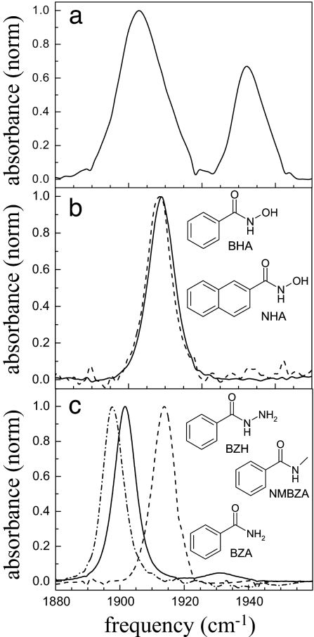
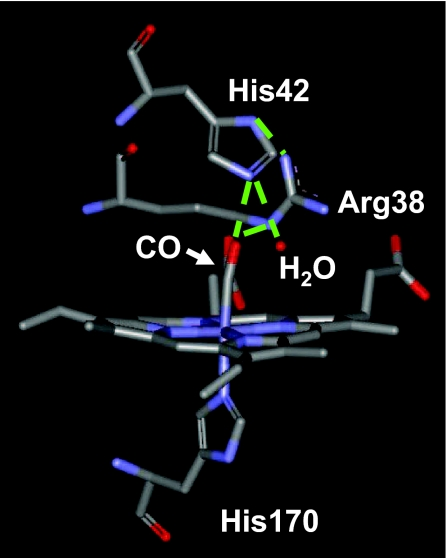
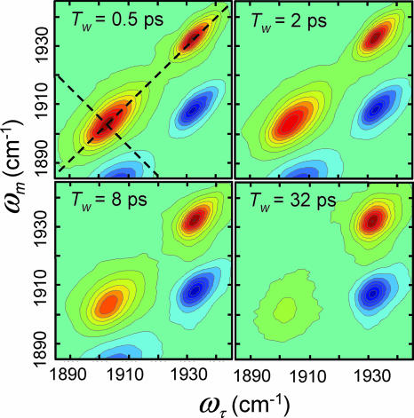
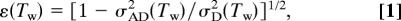
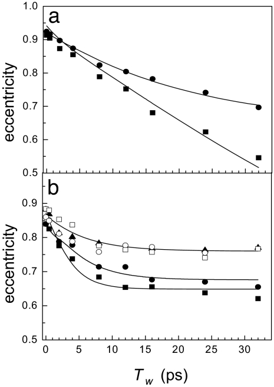
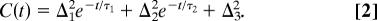
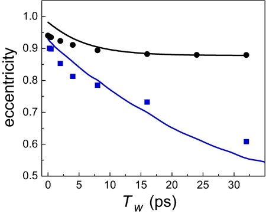

# Substrate binding and protein conformational dynamics measured by 2D-IR vibrational echo spectroscopy

**Ilya J. Finkelstein, Haruto Ishikawa, Seongheun Kim, Aaron M. Massari, and M. D. Fayer**

*Proc. Natl. Acad. Sci. USA*, Volume 104, Issue 8, Pages 2637–42 (2007)

**DOI:** [10.1073/pnas.0610027104](https://doi.org/10.1073/pnas.0610027104)

---

## Table of Contents

- [Abstract](#abstract)
- [Results and Discussion](#results-and-discussion)
- [Materials and Methods](#materials-and-methods)
- [Acknowledgments](#acknowledgments)

---

##  Abstract
Enzyme structural dynamics play a pivotal role in substrate binding and biological function, but the influence of substrate binding on enzyme dynamics has not been examined on fast time scales. In this work, picosecond dynamics of horseradish peroxidase (HRP) isoenzyme C in the free form and when ligated to a variety of small organic molecule substrates is studied by using 2D-IR vibrational echo spectroscopy. Carbon monoxide bound at the heme active site of HRP serves as a spectroscopic marker that is sensitive to the structural dynamics of the protein. In the free form, HRP assumes two distinct spectroscopic conformations that undergo fluctuations on a tens-of-picoseconds time scale. After substrate binding, HRP is locked into a single conformation that exhibits reduced amplitudes and slower time-scale structural dynamics. The decrease in carbon monoxide frequency fluctuations is attributed to reduced dynamic freedom of the distal histidine and the distal arginine, which are key residues in modulating substrate binding affinity. It is suggested that dynamic quenching caused by substrate binding can cause the protein to be locked into a conformation suitable for downstream steps in the enzymatic cycle of HRP.
**Keywords:** horseradish peroxidase, ultrafast
* * *
Enzyme-substrate binding is a dynamic process that is intimately coupled to protein structural fluctuations ([1](https://pmc.ncbi.nlm.nih.gov/articles/PMC1815234/#B1), [2](https://pmc.ncbi.nlm.nih.gov/articles/PMC1815234/#B2)). High-throughput screening methods have identified enzymes that bind structurally diverse inhibitors within their active sites, often with binding affinities exceeding those of the biologically derived substrate ([3](https://pmc.ncbi.nlm.nih.gov/articles/PMC1815234/#B3), [4](https://pmc.ncbi.nlm.nih.gov/articles/PMC1815234/#B4)). Such experimental observations illuminate our understanding of protein–substrate interactions, underscoring that static protein structure information alone is insufficient to describe the diverse influences of ligand binding at an active site ([2](https://pmc.ncbi.nlm.nih.gov/articles/PMC1815234/#B2)). A complete description of protein–ligand interactions requires information on the modification of protein dynamics, if any, when a ligand binds.
Proteins rapidly interconvert within an ensemble of similar conformations ([5](https://pmc.ncbi.nlm.nih.gov/articles/PMC1815234/#B5)–[10](https://pmc.ncbi.nlm.nih.gov/articles/PMC1815234/#B10)). A subset of these rapidly interconverting states may be favorable for binding a given substrate. A different subset of conformations may accommodate a structurally heterologous ligand. Although conceptually appealing, this mechanism is difficult to probe experimentally because it requires sensitivity to protein structural dynamics on fast time scales. The questions addressed here are, does substrate binding influence protein dynamics, and do different substrates binding to the same protein produce distinct changes in protein dynamics?
Ultrafast 2D-IR vibrational echo spectroscopy can probe protein conformational fluctuations under thermal equilibrium conditions on time scales ranging from subpicoseconds to ≈100 picoseconds or longer. 2D-IR vibrational echo spectroscopy is somewhat akin to 2D-NMR techniques but reports on protein dynamics that occur on fast time scales. The methods have recently been applied to study model enzymes ([11](https://pmc.ncbi.nlm.nih.gov/articles/PMC1815234/#B11), [12](https://pmc.ncbi.nlm.nih.gov/articles/PMC1815234/#B12)), protein unfolding ([10](https://pmc.ncbi.nlm.nih.gov/articles/PMC1815234/#B10)), peptide dynamics in membranes ([9](https://pmc.ncbi.nlm.nih.gov/articles/PMC1815234/#B9)), and protein equilibrium fluctuations in aqueous and confined environments ([7](https://pmc.ncbi.nlm.nih.gov/articles/PMC1815234/#B7), [8](https://pmc.ncbi.nlm.nih.gov/articles/PMC1815234/#B8), [13](https://pmc.ncbi.nlm.nih.gov/articles/PMC1815234/#B13), [14](https://pmc.ncbi.nlm.nih.gov/articles/PMC1815234/#B14)). In this work, we use 2D-IR vibrational echo spectroscopy to examine the equilibrium structural fluctuations of horseradish peroxidase (HRP) in the absence and presence of small molecule substrates with dissociation constants spanning three orders of magnitude. HRP is a type III peroxidase-family glycoprotein that oxidizes a variety of organic molecules in the presence of hydrogen peroxide as the oxidizing agent ([15](https://pmc.ncbi.nlm.nih.gov/articles/PMC1815234/#B15)). HRP has proven to be amenable to protein engineering and has been of intense interest in bioindustrial and enantiospecific catalysis applications ([4](https://pmc.ncbi.nlm.nih.gov/articles/PMC1815234/#B4), [16](https://pmc.ncbi.nlm.nih.gov/articles/PMC1815234/#B16)).
The active site of HRP comprises a solvent-exposed iron-heme prosthetic group that participates in the enzymatic catalysis cycle ([4](https://pmc.ncbi.nlm.nih.gov/articles/PMC1815234/#B4), [16](https://pmc.ncbi.nlm.nih.gov/articles/PMC1815234/#B16)). The heme can bind carbon monoxide (CO), which has frequently been exploited as a site-specific reporter of protein structure ([8](https://pmc.ncbi.nlm.nih.gov/articles/PMC1815234/#B8), [13](https://pmc.ncbi.nlm.nih.gov/articles/PMC1815234/#B13), [17](https://pmc.ncbi.nlm.nih.gov/articles/PMC1815234/#B17), [18](https://pmc.ncbi.nlm.nih.gov/articles/PMC1815234/#B18)) and dynamics ([8](https://pmc.ncbi.nlm.nih.gov/articles/PMC1815234/#B8), [19–21](https://pmc.ncbi.nlm.nih.gov/articles/PMC1815234/#B19)). The time dependence of the CO transition frequency is a spectroscopic reporter of protein structural fluctuations ([8](https://pmc.ncbi.nlm.nih.gov/articles/PMC1815234/#B8), [13](https://pmc.ncbi.nlm.nih.gov/articles/PMC1815234/#B13), [21](https://pmc.ncbi.nlm.nih.gov/articles/PMC1815234/#B21)). Within the dynamic Stark-effect model, structural fluctuations of groups within the protein generate a time-dependent electric field at the heme active site ([8](https://pmc.ncbi.nlm.nih.gov/articles/PMC1815234/#B8), [13](https://pmc.ncbi.nlm.nih.gov/articles/PMC1815234/#B13), [21](https://pmc.ncbi.nlm.nih.gov/articles/PMC1815234/#B21)). The CO transition frequency is exquisitely sensitive to electric fields ([20](https://pmc.ncbi.nlm.nih.gov/articles/PMC1815234/#B20), [22](https://pmc.ncbi.nlm.nih.gov/articles/PMC1815234/#B22)). Therefore, CO-frequency fluctuations are sensitive to global and local protein structural evolution.
The small molecule substrates used in this study are benzhydroxamic acid (BHA) analogs that have been investigated as a general class of tightly binding inhibitors for HRP and other peroxidases ([4](https://pmc.ncbi.nlm.nih.gov/articles/PMC1815234/#B4), [23](https://pmc.ncbi.nlm.nih.gov/articles/PMC1815234/#B23)) (see [Fig. 1](#fig1)). A wealth of structural ([24](https://pmc.ncbi.nlm.nih.gov/articles/PMC1815234/#B24)–[27](https://pmc.ncbi.nlm.nih.gov/articles/PMC1815234/#B27)), biochemical ([16](https://pmc.ncbi.nlm.nih.gov/articles/PMC1815234/#B16), [28](https://pmc.ncbi.nlm.nih.gov/articles/PMC1815234/#B28), [29](https://pmc.ncbi.nlm.nih.gov/articles/PMC1815234/#B29)), and spectroscopic evidence ([19](https://pmc.ncbi.nlm.nih.gov/articles/PMC1815234/#B19), [20](https://pmc.ncbi.nlm.nih.gov/articles/PMC1815234/#B20), [30](https://pmc.ncbi.nlm.nih.gov/articles/PMC1815234/#B30), [31](https://pmc.ncbi.nlm.nih.gov/articles/PMC1815234/#B31)) has identified His-42 and Arg-38 as the key HRP residues in modulating substrate binding and enzymatic activity. These distal heme residues are highly conserved in the peroxidase family ([4](https://pmc.ncbi.nlm.nih.gov/articles/PMC1815234/#B4)). Substrates and intermediates in the catalytic reaction of HRP interact with the distal residues through an extensive hydrogen-bonding network within the active site ([24](https://pmc.ncbi.nlm.nih.gov/articles/PMC1815234/#B24), [32](https://pmc.ncbi.nlm.nih.gov/articles/PMC1815234/#B32)) (see [Fig. 2](#fig2)). Substrates such as BHA can participate strongly with this intrinsic hydrogen-bond network, showing the strongest binding affinities. The substrates selected for this study incorporate key structural modifications that tune their propensity for making hydrogen bonds within the active site and thus exhibit dissociation constants between _K_ d = 4300 − 0.16 μM from ferric HRP ([16](https://pmc.ncbi.nlm.nih.gov/articles/PMC1815234/#B16)).
***[Fig. 1](#fig1).***

Normalized FTIR spectra of the CO-stretching mode bound to HRP in the free form (_a_) and when complexed to 2-NHA (dashed line) and BHA (solid line) (_b_) and NMBZA (dash-dot line), BZH (dashed line), and BZA (solid line) (_c_). Structures and abbreviations of the substrates used in this study are shown in the appropriate places.
***[Fig. 2](#fig2).***

Crystal structure of the active site of free HRP taken from the Protein Data Bank (ID code 1W4Y). His-170 tethers the heme group in the active site. The residues Arg-38 and His-42 and a disordered water molecule define the distal active-site structure and hydrogen-bonding network. Possible hydrogen-bonding interactions are shown as dashed green lines.
Aqueous HRP in the free form (without substrate) adopts two distinct spectroscopic states and, as shown below, has structural dynamics on the <1- and 20-ps time scales. After substrate binding, HRP occupies a single structural state. The protein dynamics, as reported by the CO transition-frequency fluctuations measured with the 2D-IR experiments, decrease in amplitude and slow down significantly. The protein dynamics of HRP are compared with myoglobin-CO (MbCO) and a mutant H64V (the distal histidine is replace by valine) that exhibits a similar reduction in observed dynamics relative to MbCO. The results are used to comment on the possible role of the biologically derived substrates in reordering the protein active site to facilitate downstream events in the enzymatic pathway.
---
##  Results and Discussion
### Linear Spectra.
The background-subtracted and normalized linear absorption spectra of free and inhibitor-bound HRP–CO in 2H2O are presented in [Fig. 1](#fig1). At pD 7.4, free HRP occupies two spectroscopically distinct structural conformations, with CO absorption bands centered at 1,903 and 1,934 cm⁻¹ ([33](https://pmc.ncbi.nlm.nih.gov/articles/PMC1815234/#B33), [34](https://pmc.ncbi.nlm.nih.gov/articles/PMC1815234/#B34)) ([Fig. 1](#fig1) _a_). The x-ray crystal structure of HRP–CO shows an extensive hydrogen-bond network at the active site that incorporates the CO, His-42, Arg-38, and a disordered water molecule in the heme cavity ([24](https://pmc.ncbi.nlm.nih.gov/articles/PMC1815234/#B24)) (see [Fig. 2](#fig2)). Resonance Raman spectra of the distal histidine imidazolium ([35](https://pmc.ncbi.nlm.nih.gov/articles/PMC1815234/#B35)) and other experimental data ([34](https://pmc.ncbi.nlm.nih.gov/articles/PMC1815234/#B34)) suggest that in the red state the CO is nearly normal to the heme plane and oriented such that it has a strong interaction with the distal histidine and a weaker one with the distal arginine. In the blue state the Fe–C–O linkage, although linear, is somewhat bent relative to the heme normal, allowing the CO to have a strong interaction with the distal arginine and a weaker one with the distal histidine. Resonance Raman evidence indicates that the crystal structure of the heme pocket shown in [Fig. 2](#fig2) resembles the blue spectroscopic state ([35](https://pmc.ncbi.nlm.nih.gov/articles/PMC1815234/#B35)). This structural assignment of the blue state is reinforced by pH titration studies of HRP. Deprotonation of His-42 at pH 8.7 is correlated with a total disappearance of the red state in HRP, indicating that CO in the red state participates in hydrogen bonding with a hydrogen on the distal histidine ([35](https://pmc.ncbi.nlm.nih.gov/articles/PMC1815234/#B35)).
[Fig. 1](#fig1) _b_ shows the background-subtracted linear spectra of HRP ligated with BHA (solid curve) and 2-napthohydroxamic acid (2-NHA) (dashed curve). [Fig. 1](#fig1) _c_ displays the linear spectra of HRP– _N_ -methylbenzamide (NMBZA), HRP–benzamide (BZA), and HRP–benzhydrazide (BZH) complexes. After substrate binding, the CO band becomes a single, essentially Gaussian peak centered between 1,898 and 1,915 cm⁻¹ ([33](https://pmc.ncbi.nlm.nih.gov/articles/PMC1815234/#B33), [34](https://pmc.ncbi.nlm.nih.gov/articles/PMC1815234/#B34)). The ligated HRP spectra are spread around the frequency of the unligated HRP red state and are significantly lower in frequency than the blue unligated state. The CO-band peak positions and widths are summarized in [Table 1](https://pmc.ncbi.nlm.nih.gov/articles/PMC1815234/#T1). A change in the transition frequency of the type observed here is almost certainly caused by a rearrangement of the distal cavity structure ([8](https://pmc.ncbi.nlm.nih.gov/articles/PMC1815234/#B8), [20](https://pmc.ncbi.nlm.nih.gov/articles/PMC1815234/#B20)). For example, in MbCO it is well documented that the three spectroscopically distinct substates, _A_ 0, _A_ 1, and _A_ 3, arise from distinct configurations of the distal histidine ([8](https://pmc.ncbi.nlm.nih.gov/articles/PMC1815234/#B8), [36](https://pmc.ncbi.nlm.nih.gov/articles/PMC1815234/#B36)).
#### Table 1.
Linear spectra of free and substrate-bound HRP
| νCO, cm⁻¹ | FWHM, cm⁻¹  
---|---|---  
HRP blue | 1,932.7 | 9.0  
HRP red | 1,903.7 | 13.0  
2-NHA | 1,908.3 | 7.3  
BHA | 1,909.0 | 7.3  
BZH | 1,913.3 | 9.0  
NMBZA | 1,898.0 | 6.9  
BZA | 1,901.5 | 8.6  
[Open in a new tab](https://pmc.ncbi.nlm.nih.gov/articles/PMC1815234/table/T1/)
Substrate binding in HRP is enthalpically stabilized, largely by the strong substrate carbonyl–Arg-38 hydrogen bond ([16](https://pmc.ncbi.nlm.nih.gov/articles/PMC1815234/#B16)). The HRP mutant R38L does not bind BHA ([37](https://pmc.ncbi.nlm.nih.gov/articles/PMC1815234/#B37)). BHA and 2-NHA are well matched to form hydrogen bonds with Arg-38, His-42, and Pro-139 and have very high binding affinities (_K_ d = 2.5 and 0.16 μM, respectively) to the ferric protein ([16](https://pmc.ncbi.nlm.nih.gov/articles/PMC1815234/#B16), [32](https://pmc.ncbi.nlm.nih.gov/articles/PMC1815234/#B32)). The substrates BZA, NMBZA, and BZH are less well suited to making hydrogen bonds within the active site and have _K_ d values of 4,300, 360, and 110 μM, respectively.
### 2D-IR Spectroscopy.
The absorption frequencies of substrate-bound HRP do not report the time-dependent protein structural fluctuations ([20](https://pmc.ncbi.nlm.nih.gov/articles/PMC1815234/#B20)). 2D-IR vibrational echo spectroscopy provides a dynamic spectrum that is sensitive to structural fluctuations of HRP and can be used to investigate how these dynamics are influenced by the binding of different substrates. Vibrational correlation spectra of HRP in the free form for a series of increasing “waiting” times, _T_ w, are presented in [Fig. 3](#fig3) as contour plots with 10% intervals. (The data have much finer contours used in analysis.) The ωτ frequency axis is associated with the first interaction with the radiation field (first IR pulse), and the ωm frequency axis is associated with the third interaction with the radiation field (third IR pulse), which is the emission frequency of the vibrational echo pulse. (ωτ and ωm are the equivalent of ω1 and ω3 in 2D NMR; see _Materials and Methods_ below.) Two positive bands (red) along the diagonal at (ωτ, ωm) = (1,903 cm⁻¹, 1,903 cm⁻¹) and (1,932 cm⁻¹, 1,932 cm⁻¹) arise from the 0-to-1 vibrational transitions of the CO stretch of the red and blue states of HRP, respectively. The negative peaks (blue) arise from the 1-to-2 transitions and are displaced from the diagonal bands by a CO vibrational anharmonicity of ≈25 cm⁻¹ ([38](https://pmc.ncbi.nlm.nih.gov/articles/PMC1815234/#B38)). These negative-going bands are directly below their corresponding positive-going 0-to-1 bands. The dynamical information obtained from the 1-to-2 bands is the same as that obtained from the 0-to-1 bands; therefore, only the 0-to-1 bands are analyzed below.
#### [Fig. 3](#fig3).

2D-IR spectra of free HRP as a function of increasing _T_ w. The dashed lines illustrate the diagonal and antidiagonal slices through the data for calculating the eccentricity parameter.
As can be seen in [Fig. 3](#fig3), both the relative amplitudes and the shapes of the 0-to-1 bands (bands on the diagonal) change with increasing _T_ w. At early _T_ w, the amplitudes of the two states are determined by the strengths of their transition dipole moments and concentrations. Vibrational energy relaxation to the ground vibrational state reduces the amplitudes of both bands at longer _T_ w. IR pump-probe experiments were used to measure the vibrational lifetimes of the red and blue states, which were determined to be 8 and 12 ps, respectively. Therefore, although the red state has a higher equilibrium concentration, the band at (ωτ, ωm) = (1,903 cm⁻¹, 1,903 cm⁻¹) decays significantly faster than the blue band, and the ratio of the peak amplitudes changes with increasing _T_ w.
The change in shape of the bands as _T_ w is increased reflects protein structural dynamics. The vibrational echo pulse sequence used to collect 2D-IR spectra displays inhomogeneous broadening along the diagonal and dynamic broadening along the antidiagonal ([39](https://pmc.ncbi.nlm.nih.gov/articles/PMC1815234/#B39)) (shown as dashed lines in [Fig. 3](#fig3)). At short _T_ w, the 2D dynamic line shape has significant inhomogeneous broadening, which manifests itself as elongation along the diagonal. As _T_ w is increased, the experiment picks up longer time-scale protein dynamics that increases the antidiagonal width and decreases the diagonal width but to a lesser extent than the antidiagonal. In the long time limit, all protein fluctuations contribute to the 2D spectrum, which would lead to a 2D-IR shape with equal diagonal and antidiagonal linewidths.
To compare the 2D line-broadening behavior of the different states of HRP, we define the eccentricity, ε, of a 2D band according to 
  
---  
where σAD and σD are the bandwidths along the antidiagonal and diagonal slices, respectively (see dashed lines in [Fig. 3](#fig3) _Upper Left_). This definition for the eccentricity displays several convenient limits. In the case of large inhomogeneous broadening, σAD ≪ σD, and ε → 1. At longer _T_ w, slower time-scale protein dynamics contributes to the antidiagonal width, causing the eccentricity to decay to zero. In the long time limit in which all protein structures have been sampled, ε → 0. The eccentricity is a convenient way to succinctly summarize protein dynamics contained in the 2D-IR spectra. The full 2D spectral shapes are used in fitting the data.
The _T_ w-dependent eccentricities of free and substrate-bound HRP are presented in [Fig. 4](#fig4). Curves through the data are obtained from 2D-IR calculations using a dynamic Stark-effect model of protein dynamics that is described below. In [Fig. 4](#fig4) _a_ , the eccentricities of the red and blue spectroscopic states of free HRP are shown as squares and circles, respectively. Both states have nearly identical initial eccentricities, indicating a similar ratio of dynamic to inhomogeneous broadening at very short _T_ w. The eccentricity of the red states decays faster than that of the blue state and reaches ≈0.5 at the longest experimentally accessible _T_ w. Neither the red states nor the blue states have sampled all structural configurations on the time scale of the experiment.
#### [Fig. 4](#fig4).

A comparison of HRP dynamics in the free and substrate-bound states. (_a_) _T_ w-dependent eccentricities of the blue (circles) and red (squares) states of free HRP. (_b_) Eccentricities of HRP ligated with 2-NHA (filled squares), BHA (filled circles), BZA (open squares), BZH (open circles), and NMBZA (triangles). The solid lines are obtained by simultaneously fitting the linear and 2D-IR data to determine the FFCFs.
[Fig. 4](#fig4) _b_ presents the _T_ w-dependent eccentricities of HRP complexed with the five substrates. Introducing the substrate into the protein active site fundamentally changes the nature of the dynamics, as is evident in the qualitative differences between the _T_ w-dependent eccentricities in [Fig. 4](#fig4), _a_ and _b_. Substrate binding shifts dynamics to longer time scales. With a bound substrate, the eccentricity decays on the time scale of a few picoseconds at early _T_ w but plateaus after _T_ w = ≈10 ps, becoming nearly _T_ w-independent. In the cases of BHA and 2-NHA bound to HRP, the eccentricities may continue to decrease but on time scales that are very slow, particularly compared with the free-HRP red state. Dynamics in HRP complexed with NMBZA are significantly constrained, and the eccentricity stops changing at a relatively large value of ≈0.75. A large _T_ w-independent eccentricity indicates that a significant fraction of the total CO linewidth undergoes frequency fluctuations on time scales that are much slower than the experimental observation window. [Fig. 4](#fig4) demonstrates qualitatively that substrate binding to HRP significantly slows the short-time-scale structural dynamics of the protein and shifts a significant fraction of the fluctuations to much longer time scales.
### Underlying Protein Dynamics.
A quantitative description of the amplitudes and time scales of CO-frequency fluctuations is provided by the frequency–frequency correlation function (FFCF) ([8](https://pmc.ncbi.nlm.nih.gov/articles/PMC1815234/#B8), [13](https://pmc.ncbi.nlm.nih.gov/articles/PMC1815234/#B13), [21](https://pmc.ncbi.nlm.nih.gov/articles/PMC1815234/#B21)). Within standard approximations, both the linear absorption spectrum and the 2D-IR vibrational echo spectra at all _T_ w are simultaneously described by the FFCF ([40](https://pmc.ncbi.nlm.nih.gov/articles/PMC1815234/#B40)). A multiexponential form of the FFCF, _C_(_t_), conveniently organizes a distribution of protein-fluctuation time scales and has been found to reproduce the influence of structural dynamics on the CO frequency in other heme proteins ([7](https://pmc.ncbi.nlm.nih.gov/articles/PMC1815234/#B7), [8](https://pmc.ncbi.nlm.nih.gov/articles/PMC1815234/#B8), [41](https://pmc.ncbi.nlm.nih.gov/articles/PMC1815234/#B41)). A biexponential plus a constant FFCF was sufficient to describe most of the observed protein dynamics in HRP: 
  
---  
The static component in _C_(_t_), Δ3, is the contribution to the CO-frequency distribution that occurs from protein structures that interconvert slower than the observable experimental time scales. The 2D-IR experiment is sensitive to dynamics that occur out to several _T_ w ([42](https://pmc.ncbi.nlm.nih.gov/articles/PMC1815234/#B42)), which corresponds to ≈100 ps in the experiments presented below. Structural fluctuations slower than ≈100 ps appear static to the experiment and are described by Δ3. The Δ3 term can be viewed as multiplied by another exponential, but as far as the experiment is concerned in all but one case discussed below, τ3 = ∞. Δi is the amplitude of frequency fluctuations (in units of angular frequency) resulting from structural evolution with a characteristic time τi. For Δi−1τi ≪ 1 for a given exponential term, this component of the FFCF is motionally narrowed ([41](https://pmc.ncbi.nlm.nih.gov/articles/PMC1815234/#B41), [43](https://pmc.ncbi.nlm.nih.gov/articles/PMC1815234/#B43)). A motionally narrowed term in _C_(_t_) contributes a _T_ w-independent symmetric 2D Lorentzian line with a width Γ* = πΔ2τ to the total 2D-IR spectrum. For a motionally narrowed component, Δ and τ cannot be determined independently; rather, Γ* can be obtained. The fastest protein fluctuations can contribute a motionally narrowed exponential to the FFCF and arise from very fast local motions of small groups, analogous to low-frequency vibrations, that do not significantly modify the enzyme topology. These fluctuations have been observed in experiments and simulations of several similar heme-CO proteins and will not be discussed further here ([7](https://pmc.ncbi.nlm.nih.gov/articles/PMC1815234/#B7), [41](https://pmc.ncbi.nlm.nih.gov/articles/PMC1815234/#B41)).
FFCFs were extracted from the experimental data by using an iterative fitting algorithm. The FFCF obtained from analysis of the data using response-theory calculations ([40](https://pmc.ncbi.nlm.nih.gov/articles/PMC1815234/#B40)) was deemed correct when it could be used to simultaneously calculate 2D-IR spectra that accurately reproduced the experimental correlation plots at all _T_ w, the linear absorption spectrum, and the _T_ w dependence of the eccentricity parameter (see [Eq. **1**](https://pmc.ncbi.nlm.nih.gov/articles/PMC1815234/#FD1)). In all cases, the data and calculations were in excellent agreement. Notably, the dynamics of the red state of free HRP could not be modeled adequately by an FFCF of the form shown in [Eq. **2**](https://pmc.ncbi.nlm.nih.gov/articles/PMC1815234/#FD2). The static term in the FFCF was replaced with a third exponential that has a 21-ps−1 time constant.
The parameters defining the experimentally derived FFCFs for free HRP and HRP with the five substrates bound are presented in [Table 2](https://pmc.ncbi.nlm.nih.gov/articles/PMC1815234/#T2). Each of the FFCFs has a motionally narrowed component characterized by the Lorentzian linewidth (Γ*) that contributes to the total 2D-IR linewidth but does not contribute to the _T_ w dependence. The FFCF of the free-HRP red state is different from all of the other spectroscopic lines. In addition to the motionally narrowed component, two additional time scales, τ2 = 1.5 ps and τ3 = 21 ps, are observed for the red state. This τ3 is the decay-time constant in the exponential factor that formally multiplies the Δ32 term in [Eq. **2**](https://pmc.ncbi.nlm.nih.gov/articles/PMC1815234/#FD2) but is not shown because τ3 is infinite for all of the other systems. The results indicate that the full range of structures that give rise to the red-state absorption spectrum have been sampled by ≈100 ps. The blue state of free HRP is well described by a single 15-ps exponential but lacks a short-time-scale component (aside from the motionally narrowed term that is common to all of the systems). In the blue state a relatively large set of CO-frequency fluctuations occur on time scales slower than ≈100 ps ([42](https://pmc.ncbi.nlm.nih.gov/articles/PMC1815234/#B42)) and necessitate a static term in the FFCF (τ3 = ∞).
#### Table 2.
FFCFs derived from linear and 2D-IR experimental data
| Γ*, cm⁻¹ | Δ2, cm⁻¹ | τ2, ps | Δ3, cm⁻¹ | τ3, ps  
---|---|---|---|---|---  
HRP blue | 1.40 | 3.2 | 15.0 | 2.4 | ∞  
HRP red | 0.76 | 3.1 | 1.5 | 5.6 | 21  
2-NHA | 0.62 | 3.2 | 2.6 | 1.8 | ∞  
BHA | 1.40 | 2.3 | 4.4 | 1.9 | ∞  
BZA | 1.40 | 2.8 | 4.5 | 2.7 | ∞  
BZH | 1.60 | 2.6 | 2.6 | 2.7 | ∞  
NMBZA | 1.30 | 1.7 | 5.4 | 2.0 | ∞  
[Open in a new tab](https://pmc.ncbi.nlm.nih.gov/articles/PMC1815234/table/T2/)
In comparing the behavior of free vs. substrate-bound HRP, the question arises as to the nature of the structural fluctuations that give rise to the observed dynamics. The influence of BHA binding on HRP–CO dynamics has been studied by Kaposi and coworkers both experimentally and by using molecular dynamics simulations ([18](https://pmc.ncbi.nlm.nih.gov/articles/PMC1815234/#B18), [20](https://pmc.ncbi.nlm.nih.gov/articles/PMC1815234/#B20)). The two spectroscopic states of free HRP were modeled by changing the protonation state of the distal histidine. In the protonated state (taken to be the red peak in the simulations), Arg-38 was relatively far from the CO and exhibited large RMSD fluctuations. In the deprotonated case (blue state), Arg-38 was significantly closer to the CO. Introducing BHA into the active site reoriented Arg-38 toward the substrate, shortened the Arg-38–CO distance slightly, and reduced the RMSD fluctuations of both the distal histidine and arginine.
Our results are in good qualitative agreement with the simulations. It is clear from the FFCF parameters given in [Table 2](https://pmc.ncbi.nlm.nih.gov/articles/PMC1815234/#T2) that the dynamics of HRP with a bound substrate are very different from the red state of free HRP. The free blue and red states have a 15- and 21-ps component, respectively. In contrast, the FFCFs for HRP with bound substrates have a slowest component of ≈2 to ≈5 ps in the observation time window. The linear absorption spectra of HRP with bound substrates are more similar to the red state of free HRP than to the blue state. The red-state 1.5-ps-fast component is followed by a slow component of 21 ps that takes the FFCF essentially to zero by ≈100 ps, completing the dynamics. None of the HRP–substrate systems show a component of their FFCFs that reflects full structural sampling by 100 ps. All of the HRP–substrate systems have substantial structural dynamics too slow to be in the experimentally accessible window, which are manifested as the constant term in the FFCF (see [Table 2](https://pmc.ncbi.nlm.nih.gov/articles/PMC1815234/#T2)). In comparison with the free-HRP red state, substrate binding significantly reduces the protein fluctuations. The red-state 1.5-ps component becomes two or three times as long, and the 21-ps component becomes too slow to measure. When the protein binds a substrate, the active-site structure exhibits a single spectroscopic state in which fluctuations of the distal arginine are strongly constrained. The small fraction of the dynamics that occur within the experimental window for HRP–substrate systems indicates that the dynamics of the distal histidine are also severely constrained. Our results are consistent with the suggestion that loss of dynamic freedom by Arg-38 is responsible for much of the entropic loss after substrate binding ([16](https://pmc.ncbi.nlm.nih.gov/articles/PMC1815234/#B16)).
Further insights into the changes in HRP dynamics after ligand binding can be obtained by comparison to MbCO. The active site of HRP is relatively large, can bind a diverse array of substrate molecules, and contains a distal histidine and arginine. The active site of myoglobin cannot accommodate substrates and does not have a distal arginine, but it also contains a distal histidine and a heme that binds CO. A wealth of experiments and simulations has underscored the pivotal role of the distal histidine in modulating the CO frequency in myoglobin. The H64V mutant (the distal histidine is replaced by a nonpolar valine) displays significantly decreased vibrational dephasing because of the elimination of this polar group ([8](https://pmc.ncbi.nlm.nih.gov/articles/PMC1815234/#B8), [13](https://pmc.ncbi.nlm.nih.gov/articles/PMC1815234/#B13)). It is instructive to compare the dynamics of free HRP to that of wild-type myoglobin and substrate-bound HRP with H64V.
The eccentricities of wild-type horse heart MbCO (blue squares) and H64V (black circles) are presented in [Fig. 5](#fig5) as a function of _T_ w. MbCO can adopt three distinct spectroscopic states that arise from different structural configurations of the distal histidine relative to the CO ([8](https://pmc.ncbi.nlm.nih.gov/articles/PMC1815234/#B8), [17](https://pmc.ncbi.nlm.nih.gov/articles/PMC1815234/#B17)). The data shown in [Fig. 5](#fig5) are for the _A_ 1 band of MbCO, the main band in the absorption spectrum. In the _A_ 1 state, it has been shown that the distal histidine does not form a hydrogen bond with the CO ([8](https://pmc.ncbi.nlm.nih.gov/articles/PMC1815234/#B8)). The eccentricities of H64V are obtained from an FFCF derived from previous homodyne vibrational echo experiments ([13](https://pmc.ncbi.nlm.nih.gov/articles/PMC1815234/#B13)). The lines are fits to the HRP–NMBZA (black curve) and free-HRP (blue curve) experimental eccentricities that were discussed above but have been offset along the vertical axis to account for different initial values of the HRP and myoglobin data (different motionally narrowed components). It is apparent from [Fig. 4](#fig4) that despite differences in the structure and function of HRP and Mb, the proteins display qualitatively similar trends in how the CO frequency is modulated by protein structural fluctuations. The dynamics of the red state of free HRP are very similar to those of the wild-type MbCO and are still evolving even at the longest experimentally accessible time scales. Introducing NMBZA into the active site of HRP reduces the rate and amplitude of protein dynamics in a fashion analogous to that of removing the distal histidine in MbCO.
#### [Fig. 5](#fig5).

The eccentricities of the _A_ 1 state of wild-type MbCO (blue squares) and the mutant H64V (black circles). The curves are calculated eccentricities of HRP–NMBZA (black) and red-state free HRP (blue), offset to overlap with the myoglobin data.
In H64V, the distal histidine has been removed, and the rate and magnitude of the vibrational dephasing on the experimental time scales are reduced accordingly. On the basis of the similarity between the MbCO data and the HRP red-state data shown in [Fig. 4](#fig4), it is reasonable to assume that a substantial contribution to the vibrational dephasing comes from the fluctuations of the distal histidine and the distal arginine. The 2D-IR experiment is sensitive to time-dependent electric fields around the CO, so the striking similarity in HRP–substrate and H64V dynamics highlights that substrate binding in HRP renders the distal residues nearly static on the 2D-IR experimental time scale. The clear conclusion to be drawn is that substrate binding locks up the distal ligands, constraining the structural fluctuations in the active site. The result is that the time scale of the fluctuations is pushed out to long times (>100 ps).
### Concluding Remarks.
The 2D-IR vibrational echo experiments demonstrate that unligated HRP has a dynamically “loose” red state in which motions of the distal ligands contribute substantially to vibrational dephasing. After substrate binding, both the amplitudes and time scales of CO-frequency fluctuations decrease markedly.
It is striking that the protein dynamics are significantly decreased when additional potential sources of CO-frequency perturbations are introduced into the active site. The distal residues participate in every step of the enzymatic cycle of HRP, and the results presented here indicate that substrate binding reorganizes and dynamically constrains these residues. On the basis of the observation that substrates in the HRP active site significantly decreases structural fluctuations of the distal residues, we suggest that the protein may exploit this feature of substrate binding to catalyze further steps in the enzymatic pathway. Thus, after recognition of biologically occurring substrates, the protein active site is not only reorganized structurally but also dynamically, priming the enzyme to sample the portion of the conformational energy landscape that may lead to subsequent steps in the reaction. In the enzymatic cycle of HRP, substrate binding occurs after H2O2 enters the active site and binds at the heme. The distal histidine serves as a general proton source, and the distal arginine stabilizes reactive intermediates ([4](https://pmc.ncbi.nlm.nih.gov/articles/PMC1815234/#B4)). Thus, both residues must be favorably positioned to facilitate downstream events in the enzymatic cycle, a process that may be afforded by the dynamic quenching observed after substrate binding ([20](https://pmc.ncbi.nlm.nih.gov/articles/PMC1815234/#B20)).
---
##  Materials and Methods
### Materials and Sample Preparation.
HRP type VIA (isoenzyme C) and horse heart myoglobin were purchased as lyophilized powder from Sigma–Aldrich (St. Louis, MO), BZH, BHA, BZA, NMBZA, and 2H2O were purchased from Aldrich. All reagents were of the highest available quality and used without further purification. 2-NHA was synthesized according to published protocols ([23](https://pmc.ncbi.nlm.nih.gov/articles/PMC1815234/#B23)), recrystallized twice, and deemed pure by 1H-NMR.
CO forms of HRP and myoglobin were prepared according to previously published protocols ([8](https://pmc.ncbi.nlm.nih.gov/articles/PMC1815234/#B8)). Typical absorption at the peak of the CO-stretch band was ≈0.1 absorbance units above the protein and 2H2O background, which is typically ≈0.4.
### 2D-IR Spectroscopy.
The 2D-IR spectrometer is similar to an experimental setup described previously ([44](https://pmc.ncbi.nlm.nih.gov/articles/PMC1815234/#B44), [45](https://pmc.ncbi.nlm.nih.gov/articles/PMC1815234/#B45)). Three transform-limited (110 fs, 150 cm⁻¹ FWHM) mid-IR laser pulses are sequentially time-delayed before they are brought into the sample. The vibrational echo pulse generated in the sample is emitted in the phase-matched direction, made colinear with a local oscillator pulse, and dispersed through a monochromator onto a 32-element mercury-cadmium-telluride array detector. The signal is mixed with the local oscillator to obtain full-time, frequency, and phase information about the vibrational echo wave packet. The laser frequency was tuned to coincide with the maximum of the absorption frequency for each protein. For studies on free HRP, the laser frequency was set at 1,920 cm⁻¹. In all samples, the broadband laser pulse afforded sufficient bandwidth to observe both 0-to-1 and 1-to-2 vibrational transitions.
For each protein, a family of vibrational echo 2D spectra is obtained as a function of three variables: the emitted vibrational echo frequencies, ωm, and the variable time delays between the first and second pulses (τ) and the second and third pulses (_T_ w, “waiting” time). Frequency correlation maps are created by numerically Fourier transforming the τ scan data as a function of the emission frequencies, ωm, at each _T_ w. Absorptive 2D-IR spectra are created via the dual-scan method ([44](https://pmc.ncbi.nlm.nih.gov/articles/PMC1815234/#B44), [46](https://pmc.ncbi.nlm.nih.gov/articles/PMC1815234/#B46)). The amplitude of the 2D-IR data at each fixed _T_ w is plotted as a function of the Fourier-transformed τ decay, ωτ (horizontal axis in the 2D plots), and emission frequency, ωm (vertical axis of the 2D plots).
---
##  Acknowledgments
This work was supported by National Institutes of Health Grant 2 R01 GM-061137-05. A.M.M. was supported by the National Institutes of Health Postdoctoral Fellowship, and H.I. is a Fellow of the Human Frontier Science Program.
##  Abbreviations 

BHA
    
benzhydroxamic acid 

MbCO
    
myoglobin-CO 

2-NHA
    
2-napthohydroxamic acid 

NMBZA
    
_N-_ methylbenzamide 

BZA
    
benzamide 

BZH
    
benzhydrazide 

FFCF
    
frequency–frequency correlation function.

---

## References

1. Jimenez R, Salazar G, Yin J, Joo T, Romesberg FE. Proc Natl Acad Sci USA. 2004;101:3803–3808. doi: 10.1073/pnas.0305745101.

2. Ma B, Shatsky M, Wolfson HJ, Nussinov R. Protein Sci. 2002;11:184–197. doi: 10.1110/ps.21302.

3. Vazquez-Laslop N, Zheleznova EE, Markham PN, Brennan RG, Neyfakh AA. Biochem Soc Trans. 2000;28:517–520.

4. Veitch NC, Smith AT. Adv Inorg Chem. 2000;51:107–162.

5. Fenimore PW, Frauenfelder H, McMahon BH, Parak FG. Proc Natl Acad Sci USA. 2002;99:16047–16051. doi: 10.1073/pnas.212637899.

6. Frauenfelder H, McMahon BH, Austin RH, Chu K, Groves JT. Proc Natl Acad Sci USA. 2001;98:2370–2374. doi: 10.1073/pnas.041614298.

7. Massari AM, Finkelstein IJ, Fayer MD. J Am Chem Soc. 2006;128:3990–3997. doi: 10.1021/ja058745y.

8. Merchant KA, Noid WG, Akiyama R, Finkelstein IJ, Goun A, McClain BL, Loring RF, Fayer MD. J Am Chem Soc. 2003;125:13804–13818. doi: 10.1021/ja035654x.

9. Mukherjee P, Kass I, Arkin IT, Zanni MT. Proc Natl Acad Sci USA. 2006;103:3528–3533. doi: 10.1073/pnas.0508833103.

10. Chung HS, Khalil M, Smith AW, Ganim Z, Tokmakoff A. Proc Natl Acad Sci USA. 2005;102:612–617. doi: 10.1073/pnas.0408646102.

11. Wang J, Chen J, Hochstrasser RM. J Phys Chem B Condens Matter Mater Surf Interfaces Biophys. 2006;110:7545–7555. doi: 10.1021/jp057564f.

12. Bredenbeck J, Helbing J, Kumita JR, Woolley GA, Hamm P. Proc Natl Acad Sci USA. 2005;102:2379–2384. doi: 10.1073/pnas.0406948102.

13. Finkelstein IJ, Goj A, McClain BL, Massari AM, Merchant KA, Loring RF, Fayer MD. J Phys Chem B Condens Matter Mater Surf Interfaces Biophys. 2005;109:16959–16966. doi: 10.1021/jp0517201.

14. Massari AM, McClain BL, Finkelstein IJ, Lee AP, Reynolds HL, Bren KL, Fayer MD. J Phys Chem B Condens Matter Mater Surf Interfaces Biophys. 2006;110:18803–18810. doi: 10.1021/jp054959q.

15. Veitch NC. Phytochemistry. 2004;65:249–259. doi: 10.1016/j.phytochem.2003.10.022.

16. Aitken SM, Turnbull JL, Percival MD, English AM. Biochemistry. 2001;40:13980–13989. doi: 10.1021/bi010445f.

17. Spiro TG, Wasbotten IH. J Inorg Biochem. 2005;99:34–44. doi: 10.1016/j.jinorgbio.2004.09.026.

18. Kaposi AD, Vanderkooi JM, Stavrov SS. Biophys J. 2006;91:4191–4200. doi: 10.1529/biophysj.105.068254.

19. Khajehpour M, Troxler T, Vanderkooi JM. Biochemistry. 2003;42:2672–2679. doi: 10.1021/bi020325n.

20. Kaposi AD, Prabhu NV, Dalosto SD, Sharp KA, Wright WW, Stavrov SS, Vanderkooi JM. Biophys Chem. 2003;106:1–14. doi: 10.1016/s0301-4622(03)00122-4.

21. Williams RB, Loring RF, Fayer MD. J Phys Chem B Condens Matter Mater Surf Interfaces Biophys. 2001;105:4068–4071.

22. Park ES, Andrews SS, Hu RB, Boxer SG. J Phys Chem B Condens Matter Mater Surf Interfaces Biophys. 1999;103:9813–9817.

23. Summers JB, Mazdiyasni H, Holms JH, Ratajczyk JD, Dyer RD, Carter GW. J Med Chem. 1987;30:574–580. doi: 10.1021/jm00386a022.

24. Carlsson GH, Nicholls P, Svistunenko D, Berglund GI, Hajdu J. Biochemistry. 2005;44:635–642. doi: 10.1021/bi0483211.

25. Meno K, Jennings S, Smith AT, Henriksen A, Gajhede M. Acta Crystallogr D. 2002;58:1803–1812. doi: 10.1107/s090744490201329x.

26. Gajhede M, Schuller DJ, Henriksen A, Smith AT, Poulos TL. Nat Struct Biol. 1997;4:1032–1038. doi: 10.1038/nsb1297-1032.

27. Henriksen A, Gajhede M, Baker P, Smith AT, Burke JF. Acta Crystallogr D. 1995;51:121–123. doi: 10.1107/S0907444994008723.

28. Howes BD, Heering HA, Roberts TO, Schneider-Belhadadd F, Smith AT, Smulevich G. Biopolymers. 2001;62:261–267. doi: 10.1002/bip.1021.

29. Howes BD, Rodriguez-Lopez JN, Smith AT, Smulevich G. Biochemistry. 1997;36:1532–1543. doi: 10.1021/bi962502o.

30. Smulevich G, Feis A, Indiani C, Becucci M, Marzocchi MP. J Biol Inorg Chem. 1999;4:39–47. doi: 10.1007/s007750050287.

31. Kaposi AD, Fidy J, Manas ES, Vanderkooi JM, Wright WW. Biochim Biophys Acta. 1999;1435:41–50. doi: 10.1016/s0167-4838(99)00206-x.

32. Henriksen A, Schuller DJ, Meno K, Welinder KG, Smith AT, Gajhede M. Biochemistry. 1998;37:8054–8060. doi: 10.1021/bi980234j.

33. Holzbaur IE, English AM, Ismail AA. J Am Chem Soc. 1996;118:3354–3359.

34. Ingledew WJ, Rich PR. Biochem Soc Trans. 2005;33:886–889. doi: 10.1042/BST0330886.

35. Hashimoto S, Takeuchi H. Biochemistry. 2006;45:9660–9667. doi: 10.1021/bi060466f.

36. Johnson JB, Lamb DC, Frauenfelder H, Müller JD, McMahon B, Nienhaus GU, Young RD. Biophys J. 1996;71:1563–1573. doi: 10.1016/S0006-3495(96)79359-1.

37. Smulevich G, Paoli M, Burke JF, Sanders SA, Thorneley RN, Smith AT. Biochemistry. 1994;33:7398–7407. doi: 10.1021/bi00189a046.

38. Rector KD, Kwok AS, Ferrante C, Tokmakoff A, Rella CW, Fayer MD. J Chem Phys. 1997;106:10027–10036.

39. Roberts ST, Loparo JJ, Tokmakoff A. J Chem Phys. 2006;125 doi: 10.1063/1.2232271. 084502.

40. Mukamel S. Principles of Nonlinear Optical Spectroscopy. New York: Oxford Univ Press; 1995.

41. Massari AM, Finkelstein IJ, McClain BL, Goj A, Wen X, Bren KL, Loring RF, Fayer MD. J Am Chem Soc. 2005;127:14279–14289. doi: 10.1021/ja053627w.

42. Bai YS, Fayer MD. Phys Rev B Condens Matter. 1989;39:11066. doi: 10.1103/physrevb.39.11066.

43. Schmidt J, Sundlass N, Skinner J. Chem Phys Lett. 2003;378:559–566.

44. Asbury JB, Steinel T, Fayer MD. J Luminescence. 2004;107:271–286. doi: 10.1016/j.jlumin.2003.12.035.

45. Zanni MT, Gnanakaran S, Stenger J, Hochstrasser RM. J Phys Chem B Condens Matter Mater Surf Interfaces Biophys. 2001;105:6520–6535.

46. Khalil M, Demirdoven N, Tokmakoff A. Phys Rev Lett. 2003;90 doi: 10.1103/PhysRevLett.90.047401. 047401–047404.

---

For the complete references list, please see the [full text](https://pmc.ncbi.nlm.nih.gov/articles/PMC1815234/) on PubMed Central.
