**Ilya J. Finkelstein, Junrong Zheng, Haruto Ishikawa, Seongheun Kim, Kyungwon Kwak, and Michael D. Fayer**

*Physical Chemistry Chemical Physics, Vol. 9, No. 13, pp. 1533–1549, 2007*

DOI: [10.1039/b618158a](https://doi.org/10.1039/b618158a)

---

## Abstract

Ultrafast 2D IR vibrational echo spectroscopy is described and a number of experimental examples are given. Details of the experimental method including the pulse sequence, heterodyne detection, and determination of the absorptive component of the 2D spectrum are outlined. As an initial example, the 2D spectrum of the stretching mode of CO bound to the protein myoglobin (MbCO) is presented. The time dependence of the 2D spectrum of MbCO, which is caused by protein structural evolution, is presented and its relationship to the frequency–frequency correlation function is described and used to make protein structural assignments based on comparisons to molecular dynamics simulations. The 2D vibrational echo experiments on the protein horseradish peroxidase are presented. The time dependence of the 2D spectra of the enzyme in the free form and with a substrate bound at the active site are compared and used to examine the influence of substrate binding on the protein's structural dynamics. The application of 2D vibrational echo spectroscopy to the study of chemical exchange under thermal equilibrium conditions is described. 2D vibrational echo chemical exchange spectroscopy is applied to the study of formation and dissociation of organic solute–solvent complexes and to the isomerization around a carbon–carbon single bond of an ethane derivative.

---

## I. Introduction

In 1950, the NMR "spin echo" [[1](#ref1)] ushered in the last half century of the development of coherent spectroscopic methods. The spin echo became the basis for the diverse range of pulsed NMR experiments, including multidimensional experiments, that are in use in fields of research from medicine to geology. [[2](#ref2)],[[3](#ref3)] In 1964, the basic concepts inherent in the spin echo were extended to visible spectroscopy using the earliest pulsed lasers to perform "photon echo" experiments on electronic excited states. [[4](#ref4)],[[5](#ref5)] Photon echoes have been widely used to study electronic excited state dynamics in systems such as low temperature crystals, [[6–10](#ref6)] glasses, [[11–14](#ref11)] proteins, [[15–17](#ref15)] and photosynthetic chromophore clusters. [[18](#ref18)],[[19](#ref19)] The advent of short pulse infrared (IR) sources made it possible to perform "vibrational echo" experiments on the vibrations of condensed matter systems such as liquids, glasses and proteins beginning in the early 1990s. [[20–24](#ref20)] These first one-dimensional two-pulse vibrational echo experiments were conducted with an IR free electron laser. [[20](#ref20)] However, rapid advances in laser technology now make it possible to conduct far more sophisticated vibrational echo experiments, particularly two-dimensional (2D) vibrational echoes, using table top laser systems.

2D IR vibrational echo spectroscopy [[25–35](#ref25)] is an ultrafast IR analog of 2D NMR but it operates on molecular vibrations instead of spins. Vibrations are the structural degrees of freedom of molecules. It is the direct probing of molecular structure and the dynamics of molecular structure and intermolecular interactions on ultrafast time scales that makes 2D vibrational echo spectroscopy a powerful tool that is becoming increasingly useful as the methodology develops.

The 2D IR vibrational echo signal is generated by a sequence of three ultrashort IR pulses tuned to the vibrational transitions of interest. The pulse sequence induces and then probes the coherent evolution of excitations (vibrations) of a molecular system. The first pulse in the sequence causes vibrational modes of an ensemble of molecules to "oscillate" initially all with the identical phase. The later pulses generate observable signals that are sensitive to changes in environments of individual molecules during the experiment, even if the aggregate populations in distinct environments do not change. For example, the structural fluctuations of a protein or the formation and dissociation of molecular complexes under thermal equilibrium conditions can be observed. The 2D IR vibrational echo spectrum can also display intramolecular interactions and dynamics that are not observables in a linear IR vibrational absorption experiment because they are masked by the inhomogeneous broadening that, in general, dominates a linear absorption spectral line shape in complex condensed matter molecular systems. A critical difference between the 2D IR and NMR variants is that the IR pulse sequence is sensitive to dynamics on timescales 6 to 10 orders of magnitude faster than NMR.

2D IR vibrational echo spectroscopy has several characteristics that make it a useful tool for the study of problems involving rapid dynamics under thermal equilibrium conditions in condensed phases. Such problems are ubiquitous in nature and difficult to study by other means. 2D IR vibrational echo experiments have temporal resolution of <100 fs, which is sufficiently fast to study the fastest chemical processes. In contrast to electronic excitation, the vibrational excitation associated with the 2D IR experiments produces a negligible perturbation of a molecular system, which does not change the chemical properties of the samples. 2D IR experiments can also be useful as a tool for chemical structural analysis by revealing the relationship among different mechanical degrees of freedom of a molecular or biomolecular system. 2D IR vibrational echo experiments have been successfully applied to study fast chemical exchange reactions and solution dynamics, [[29–31](#ref29)],[[36](#ref36)] water dynamics, [[37](#ref37)],[[38](#ref38)] hydrogen network evolution, [[28](#ref28)] intramolecular vibrational energy relaxations, [[34](#ref34)] protein structures and dynamics, [[30](#ref30)],[[39](#ref39)],[[40](#ref40)] and mixed chemicals analysis. [[41](#ref41)]

Since the first fast condensed matter vibrational echo experiments in 1993, [[20](#ref20)] the field has advanced a great deal. The first experiments were 1D with a time resolution of ~1 ps. Today, multi-dimensional phase resolved vibrational echoes have become almost routine, greatly increasing the types of information that can be obtained. Furthermore, tabletop laser systems now provide sub 50 fs IR pulses, making 2D IR vibrational echo spectroscopy increasingly available to a wide range of researchers. In this article the 2D vibrational echo will be described and two types of experiments will be used to illustrate the applications of the technique. These are the investigation of protein dynamics and structure through the observation and analysis of spectral diffusion, and the study of chemical process, *i.e.*, solute–solvent complex formation and dissociation and molecular isomerization around a carbon–carbon single bond, by measuring the rate of chemical exchange.

---

## II. The 2D vibrational echo method

In a 2D IR vibrational echo experiment, three ultrashort IR pulses tuned to the frequency of the vibrational modes of interest are crossed in the sample. Because the pulses are very short, they have a broad bandwidth, which makes it possible to simultaneously excite a number of vibrational modes in a very broad spectral feature. The IR pulses (*&nu;* ≈ 5 &mu;m) are produced with a regeneratively amplified Ti:Sapphire/OPA pumped optical parametric amplifier system. A 2D IR vibrational echo experimental setup is illustrated schematically in [Fig. 1](#fig1). The pulse sequence is shown at the bottom. The times between pulses 1 and 2 and pulses 2 and 3 are called *&tau;* and *T*w, respectively. The three successive ultrashort IR pulses with wave vectors (propagation directions) **k**1, **k**2, and **k**3 are applied to the sample to induce the subsequent emission of the time delayed 4th pulse, the vibrational echo. The vibrational echo pulse is emitted from the sample in a distinct direction from the excitation beam wave vector, **k**s = −**k**1 + **k**2 + **k**3.

<figure class="paper-figure" id="fig1">
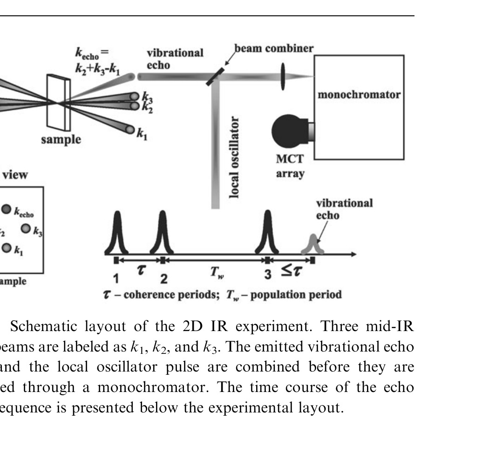
<figcaption><strong>Fig. 1</strong> Schematic layout for 2D IR experiments. Three mid-IR input beams are labeled as <strong>k</strong>1, <strong>k</strong>2, and <strong>k</strong>3. The emitted vibrational echo pulse and the local oscillator pulse are combined before they are dispersed through a monochromator. The time course of the echo pulse sequence is presented below the experimental layout.</figcaption>
</figure>

Both the intensity of the echo pulse and its time structure contain important information in the 2D IR vibrational echo experiment. If the echo pulse is sent directly into an IR detector, its intensity is measured, but phase and sign information is lost. Complete information is obtained by allowing the vibrational echo pulse to interfere with a 5th pulse called the local oscillator. In the heterodyne detected vibrational echo experiments, the local oscillator and vibrational echo pulses are collinear, and the phase information is obtained by scanning the interferogram pattern (interferogram) as a function of time (see below). In addition to providing phase and sign information, combining the vibrational echo with the local oscillator optically heterodyne amplifies the vibrational echo signal. The combined pulses are dispersed in a monochromator and then detected with a 32-element MCT IR array detector, which measures the signal at 32 wavelengths simultaneously.

Qualitatively, the vibrational echo experiment works in the following manner. The first pulse in the sequence places the vibrational oscillators into a coherent superposition state of the vibrational ground state (0) and vibrational first excited state (1), with all of the oscillators initially in phase. The initial phase relationship among the oscillators decays rapidly causing a decay of the initial macroscopic polarization that is generated by an in-phase ensemble of oscillators. The decay of the macroscopic polarization is the free induction decay. The phase relationship among the oscillators decays because of inhomogeneous broadening of the spectral line (a spread of transition frequencies associated with the finite absorption linewidth) with additional contributions from fast fluctuations of the transition frequencies caused by structural dynamics of the system. The rest of the pulse sequence can recover the phase relationship seemingly lost during the free induction decay because of inhomogeneous broadening. Only structural fluctuations that randomize the initial starting frequencies of the ensemble of oscillators (produced by spectral diffusion) cause a net loss of their initially set phase relationships among the oscillators. This destruction of phase relations caused by spectral diffusion cannot be recovered by the rest of the pulse sequence. However, even then, the signal is not zero because the initial two pulses also set up a spatial relationship (a transient grating) [[42](#ref42)] among the oscillators that contributes to the signal.

The second pulse in the sequence stores the phase (and spatial) information induced by the first pulse as a complex frequency and spatial pattern of differences of the populations of the 0 and 1 vibrational states. To see how the information is stored, first consider the spatial information. The first pulse produces a polarization that will interfere with the electric field of the second pulse if it arrives on a time comparable to the free induction decay. Because the paths of the two beams are crossed, the interference produces a spatial fringe pattern, alternating regions of light and dark. Where it is light, excited state population is produced. Therefore, there are alternating spatial regions of excited vibrations and greatly diminished vibrations. This pattern can be thought of as a population grating. This pattern lasts for the vibrational lifetime. The phase information is stored in a similar manner. Following the first pulse, vibrations at each frequency across the absorption line are in superposition states. Depending on the particular vibrational frequency of a molecule's superposition state, it will have a phase relationship relative to the electric field of the second pulse that will drive the vibration into the excited state or drive it into the ground state. Because of the spread of frequencies across the absorption band, along the frequency axis, there are alternating bands of excited states and ground states. This frequency pattern can be thought of as a frequency grating. Whether a molecule is in the excited state or ground state following the second pulse is determined by its phase relationship to the electric field of the second pulse. Therefore, the second pulse stores phase information in the form of the frequency grating.

After the waiting period, *T*w (see [Fig. 1](#fig1)) the third pulse again generates coherent superposition states of the oscillators. Initially, the oscillators are not in phase, but the pulse sequence initiates a rephasing process. At a time *&tau;* after the third pulse, the vibrational oscillators are again oscillating in phase. Each vibrational oscillator has associated with it a microscopic oscillating electric dipole. When rephasing has occurred, the sample again has a macroscopic polarization that acts as the source of the fourth pulse, the vibrational echo. The pulse is short because the dipoles again get out of phase just as they did after the first pulse.

In a dynamic system, the first laser pulse "labels" the initial structures of the species in the sample and initiates the first coherence period. The second pulse ends the first coherence period, *&tau;*, and starts the waiting time during which the labeled species undergo structural dynamics that change their frequencies. The third pulse ends the waiting period of length *T*w, and begins the last coherence period of length *t*, which ends with the emission of the vibrational echo pulse (see [Fig. 1](#fig1)). The echo signal contains information about the final structures of all labeled species.

During the coherence periods fast vibrational frequency dynamics induced by fast structural fluctuations cause dynamic dephasing, which in turn contributes to the line shapes in the 2D spectrum. During the *T*w period, called the population period, the oscillators are either in the ground or first excited vibrational state, not a superposition state. Slower structural fluctuations of the system give rise to spectral diffusion (slower time scale evolution of the oscillator frequencies) that contributes to the 2D line shapes. Spectral diffusion can be thought of as a smearing of the frequency grating as molecules wander from frequency grating excited state frequency regions into frequency grating ground state regions and *vice versa*. Then the third pulse does not produce as large a vibrational echo signal because of destruction of the frequency grating by spectral diffusion during the population period. Spectral diffusion destroys the phase information that was stored in the frequency grating immediately following the second pulse. Other processes during the population period also produce changes in the 2D spectrum. For example, chemical exchange can occur in which two species in equilibrium are interconverted one to the other without changing the overall number of either species. Chemical exchange causes new peaks to grow in as *T*w is increased. In an experiment, *&tau;* is scanned for fixed *T*w. The recorded signals are converted into a 2D vibrational echo spectrum. Then *T*w is increased and another spectrum is obtained. The series of spectra taken at a function of *T*w provides information on dephasing, spectral diffusion, and population dynamics.

To obtain the well resolved 2D vibrational echo spectra discussed below, it is necessary to acquire essentially pure absorptive spectra. The measured interferograms contain both the absorptive and dispersive components of the vibrational echo signal. To isolate the absorptive components, two sets of quantum pathways are measured independently by appropriate time ordering of the pulses in the sequence. [[25,43](#ref25)] With pulses 1 and 2 in the time region, pathway 1 or 2 is obtained by scanning pulse 1 or 2 in negative time, respectively. By adding the Fourier transformations of the two pathways, the dispersive component can be substantially cancelled leaving only the absorptive component. [[25,43](#ref25)] Following a phasing procedure [[44](#ref44)] based on the projection slice theorem, [[45](#ref45)] the 2D vibrational echo spectra are constructed by plotting the amplitude of the absorptive part of spectrum (see below).

---

## III. 2D IR vibrational echo spectroscopy of proteins

### A. Description of the technique—myoglobin-CO

To illustrate the nature of the method, experiments are presented on the stretch of CO bound to the site of the protein myoglobin used as an example. Carbonmonoxy-myoglobin (MbCO) has been extensively studied both experimentally [[46,47](#ref46)] and computationally. [[48,49](#ref48)] Myoglobin (Mb) is a small globular heme protein consisting of approximately 150 amino acids found in mammalian muscle tissue. The prosthetic heme group can reversibly bind a variety of small molecule ligands such as O2, CO and NO. [[50](#ref50)] The crystal structure of Mb has been known for over 40 years. [[61,62](#ref61)] The CO stretching mode of MbCO has a very strong transition dipole, making it an easily monitored experimental observable that can be used to track kinetics and dynamics in the protein. Studies on Mb, and in particular on MbCO, serve as tests for many of the ideas on the relationship between structure and function in proteins.

[Fig. 2a](#fig2) shows the linear FT-IR absorption spectrum of the CO stretch of MbCO. There are three bands labeled A0, A1, and A3 that correspond to different configurations of the distal histidine (His64). These bands will be discussed below. In a 2D vibrational echo spectrum, there are two frequency axes, which require two Fourier transforms of the time domain data to convert the time structure of the echo observable into 2D frequency data. As shown in [Fig. 1](#fig1), the vibrational echo pulse, which is overlapped with the local oscillator (LO) pulse, is passed through the monochromator. Taking the spectrum of the pulse performs one of the Fourier transforms and provides the vertical axis in the 2D spectrum, *&omega;*m (m for monochromator, see [Fig. 2c](#fig2)). The other frequency axis is obtained by scanning *&tau;*. Scanning *&tau;* produces an interferogram (see [Fig. 2b](#fig2)) as the echo pulse changes its phase relationship relative to the fixed LO pulse. There is one interferogram for each frequency on the *&omega;*m axis for which there is signal. The numerical Fourier transforms of the *&tau;* scan interferograms provide the *&omega;*&tau; axis. The data S(*&omega;*&tau;, *&omega;*m, *T*w) are then plotted for each *T*w in a three dimensional representation, that is, the amplitude as a function of both *&omega;*&tau; and *&omega;*m (the *&omega;*1 and *&omega;*3 axes, respectively in 2D NMR). More experimental details of the method including phase error corrections have been presented in detail. [[25,43](#ref25)]

<figure class="paper-figure" id="fig2">
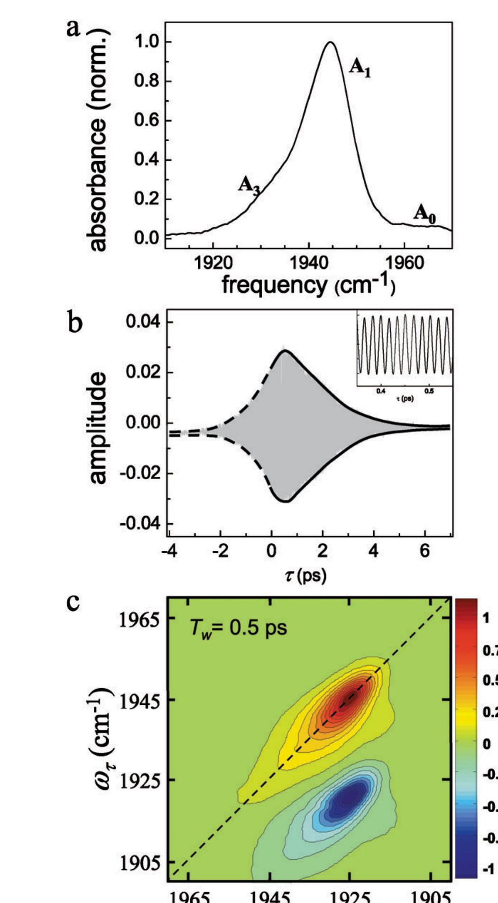
<figcaption><strong>Fig. 2</strong> (a) The FT-IR spectrum of MbCO. (b) A time-domain interference pattern collected in the 2D IR experiment at the center of the A1 transition in MbCO. The interferogram is shown in gray and envelope as a solid blue or red line. Positive <em>&tau;</em> (solid envelope) is defined by beam 1 arriving at the sample before beam 2 and negative <em>&tau;</em> (dashed envelope) indicates that beam 2 arrives before beam 1. A small portion of the interferogram with high time resolution is shown in the inset. (c) 2D IR absorptive spectrum of MbCO at <em>T</em>w = 0.5 ps. The positive going bands correspond to 0–1 transitions of the A1 and A3 states and negative going bands are the 1–2 transitions, displaced below <em>&omega;</em>m by the anharmonicity. The A0 state is not visible at this contour level (10%).</figcaption>
</figure>

In the 2D IR spectrum of MbCO ([Fig. 2c](#fig2)) there is a positive going band (red) on the diagonal (dashed line) and a negative going band (blue) off-diagonal. Each contour is a 10% change in amplitude. The positive band on the diagonal reflects the ground state to first vibrationally excited state (0–1 transition) of the CO stretch of MbCO. The negative going off-diagonal band involves the 1–2 transition. The frequencies of the first interaction of the radiation field (first pulse) with the vibrations are the frequencies on the *&omega;*&tau; axis. The frequencies of the third interaction (third pulse) with the vibrations, which is also the frequency of the echo emission, is the frequency on the *&omega;*m axis. If *&omega;*m = *&omega;*&tau;, the peak is on the diagonal. This is the situation for the red band in [Fig. 2c](#fig2) (the 0–1 transition).

The blue off-diagonal 1–2 band arises as follows. The first interaction produces a coherent superposition state of the 0–1 transition. One of the quantum pathways for the second interaction (second pulse) produces a population in the 1 state (first vibrationally excited state). Then the third pulse can couple the 1 state to the 2 state, and produce a coherent superposition of 1 and 2. This results in the vibrational echo being emitted at the 1–2 transition frequency, which is shifted to lower frequency than the 0–1 transition by the vibrational anharmonicity. Therefore, the *&omega;*&tau; frequency is the 0–1 frequency (1945 cm⁻¹), but the *&omega;*m frequency is the 1–2 frequency (1921 cm⁻¹). The off-diagonal anharmonicity peak is negative going because there is a 180° phase shift in the echo pulse electric field relative to the 0–1 echo. The spectrum in [Fig. 2c](#fig2) is for *T*w = 0.5 ps, a short time compared to the time scale of protein structural fluctuations in this system. Therefore, spectral diffusion is not complete, and the 0–1 band in the 2D spectrum is elongated along the diagonal and the 1–2 band is elongated along a line parallel to the diagonal. The elongation is the signature of inhomogeneous broadening. However, while the band is dominated by the A1 peak (see [Fig. 2a](#fig2)) there is also some contribution along the diagonal from the A3 band. With the 10% contours shown, the A0 band is not visible but can be seen when finer contours are used. As discussed below, the change in shape with increasing *T*w measures spectral diffusion, and, thus, the structural evolution of the system. The contribution to the band from the A1 and A3 peaks can be separated and analyzed to determine their respective dynamics. [[30,64](#ref30)]

<figure class="paper-figure" id="fig3">
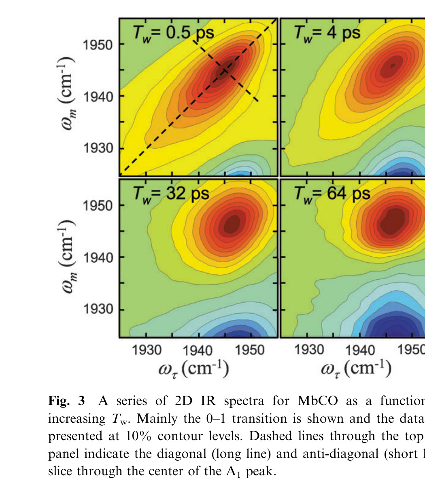
<figcaption><strong>Fig. 3</strong> A series of 2D IR spectra for MbCO as a function of increasing <em>T</em>w. Mainly the 0–1 transition is shown and the data are presented at 10% contour levels. Dashed lines through the top left panel indicate the diagonal (long line) and anti-diagonal (short line) slice through the center of the A1 peak.</figcaption>
</figure>

[Fig. 3](#fig3) displays 2D vibrational echo data for MbCO at four *T*ws. The diagonal 0–1 band and the off-diagonal 1–2 band contain essentially the same information. Because the vibrations are nearly harmonic, it can be shown that the 0–1 and 1–2 bands will be nearly identical in their time dependent evolution, which is confirmed by experimental studies. Therefore, only the 0–1 band will be discussed. As *T*w increases, the shape of the spectrum changes, going from elongated along the diagonal to essentially round. The change in shape of the bands as *T*w is increased reflects protein structural dynamics. The vibrational echo pulse sequence used to collect 2D IR spectra displays inhomogeneous broadening along the diagonal and dynamic broadening along the anti-diagonal (shown as dashed lines in the upper left panel of [Fig. 3](#fig3)). [[65](#ref65)] At short *T*w the 2D dynamic line shape has significant inhomogeneous broadening, which manifests itself as elongation along the diagonal. As *T*w is increased, the experiment picks up longer time scale protein dynamics that increases the anti-diagonal width and decreases the diagonal width, but to a lesser extent than the change in the anti-diagonal. In the long time limit, all protein fluctuations contribute to the 2D spectrum, which would lead to a 2D IR shape with equal diagonal and anti-diagonal linewidths.

To analyze the time evolution of the 2D spectrum, the full 2D band shapes are used. It is convenient to discuss the time evolution of 2D spectral band shapes by defining the eccentricity, *&epsilon;*,

$$\varepsilon(T_w) = \sqrt{1 - \frac{\sigma^2_{AD}(T_w)}{\sigma^2_D(T_w)}} \tag{1}$$
<noscript></noscript>

where *&sigma;*AD and *&sigma;*D are the band widths along the anti-diagonal and diagonal slices, respectively. This definition for the eccentricity displays several convenient limits. In the case of large inhomogeneous broadening, *&sigma;*AD ≪ *&sigma;*D, and *&epsilon;* → 1. At longer *T*ws, slower timescale protein dynamics contribute to the anti-diagonal width, causing the eccentricity to decay to zero. In the long time limit in which all protein structures have been sampled, *&epsilon;* → 0. The eccentricity is a convenient way to succinctly summarize protein dynamics contained in the 2D IR spectra. The full 2D spectral shapes are used in fitting the data.

<figure class="paper-figure" id="fig4">
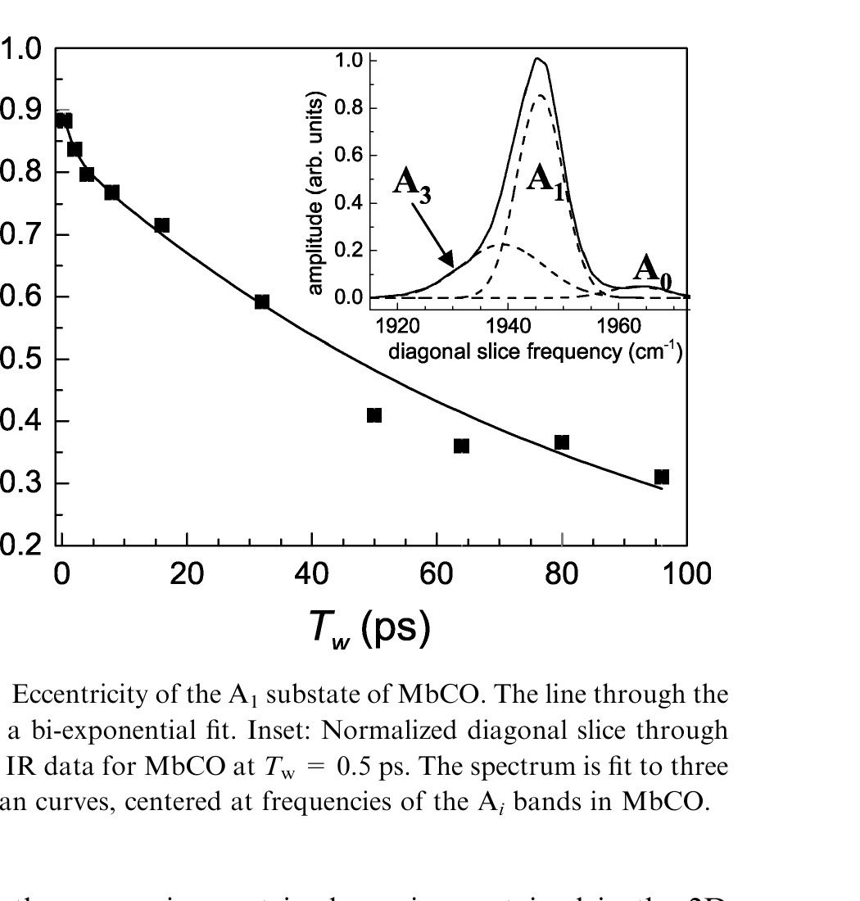
<figcaption><strong>Fig. 4</strong> Eccentricity of the A1 substate of MbCO. The line through the data is a bi-exponential fit. Inset: Normalized diagonal slice through the 2D IR data for MbCO at <em>T</em>w = 0.5 ps. The spectrum is fit to three Gaussian curves, centered at frequencies of the An bands in MbCO.</figcaption>
</figure>

As shown in [Fig. 2a](#fig2), the CO absorption of MbCO consists of three bands, the A0, A1, and A3, that arise from distinct orientations of the distal histidine relative to the CO. [[64,66](#ref64)] [Fig. 4](#fig4) inset shows the diagonal of the 2D vibrational echo spectrum at *T*w = 0.5 ps with the diagonal spectrum decomposed into the three peaks, which are fit as Gaussians. It has been found in the study of several heme proteins that the band shapes are well described as Gaussians. However, as discussed below, the quantitative analysis does not assume a particular line shape. The eccentricity of the A1 state as a function of *T*w is shown in the main part of [Fig. 4](#fig4). It was determined by measuring the antidiagonal width at the peak frequency and subtracting the contribution to the width from the overlapping A3 state, which was measured on the red side of the band. The eccentricity of the A1 state of MbCO decays as a biexponential. As discussed immediately below, there is actually a third, *T*w independent component in the 2D signal that arises from fast, motionally narrowed protein dynamics that is revealed in the full analysis of the data.

A quantitative description of the amplitudes and timescales of CO frequency fluctuations is provided by the frequency–frequency correlation function (FFCF). [[55,64,67–70](#ref55)] Structural fluctuations give rise to frequency fluctuations. The FFCF is the probability that a molecule with frequency *&omega;* at time *t* = 0, still has frequency *&omega;* at some later time averaged over the complete ensemble of molecules. As time increases, molecules sample an increasingly wide range of frequencies, and the FFCF decays. At sufficiently long time, all accessible structures are sampled, and all frequencies in the absorption line are sampled as well. Therefore, the FFCF decays to zero.

Within standard approximations, both the linear absorption spectrum and the 2D IR vibrational echo spectra at all *T*w can be simultaneously calculated with the appropriate FFCF. [[68](#ref68)] The FFCF describes the nature of the underlying dynamics that give rise to the experimental observables. A multi-exponential form of the FFCF, *C*(*t*), conveniently organizes a distribution of protein fluctuation time scales and has been found to reproduce the influence of structural dynamics on the CO frequency in other heme proteins. [[30,64](#ref30)] A tri-exponential FFCF was sufficient to describe the protein dynamics of MbCO and horseradish peroxidase discussed below,

$$C(t) = \Delta_1^2 e^{-t/\tau_1} + \Delta_2^2 e^{-t/\tau_2} + \Delta_3^2 e^{-t/\tau_3} \tag{2}$$
<noscript>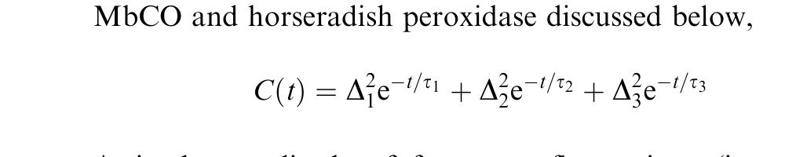</noscript>

*&Delta;*i is the amplitude of frequency fluctuations (in units of angular frequency) resulting from structural evolution with a characteristic time *&tau;*i. In some of the experiments discussed below, the last term is a static component in *C*(*t*), *&Delta;*3, that is, *&tau;*3 = ∞. A static contribution occurs from protein structures that interconvert slower than the observable experimental timescales. The 2D IR experiment is sensitive to dynamics that occur out to several *T*w. [[27](#ref27)] If *&Delta;*i·*&tau;*i ≪ 1 for a given exponential term, then this component of the FFCF is motionally narrowed. [[71,72](#ref71)] A motionally narrowed term in *C*(*t*) contributes a *T*w independent symmetric 2D Lorentzian line with a width *&Gamma;** = *&pi;&Delta;*²*&tau;* to the total 2D IR spectrum. For a motionally narrowed component, *&Delta;* and *&tau;* cannot be determined independently, but rather *&Gamma;** is obtained. The motionally narrowed component of the FFCF arises from very fast local motions of small groups that do not significantly modify the protein topology. These fluctuations have been observed in experiments and simulations of several heme-CO proteins. [[66,71](#ref66)]

FFCFs were obtained from the data by iterative fitting using response theory calculations. [[67,68](#ref67)] The FFCF was deemed correct when it could be used to simultaneously calculate 2D IR spectra at all *T*ws, and the linear absorption spectrum. Such calculations can also reproduce the *T*w dependence of the eccentricity (see eqn (1)). For the experiments on MbCO and on horseradish peroxidase (HRP) discussed below, the data and calculations were in excellent agreement. [[64,74](#ref64)]

From studying the dynamics of MbCO and combining the results with molecular dynamics (MD) simulations, it was possible to determine the structures of the A1 and A3 substates. [[40,64](#ref40)] It has been well documented that the A0 state has the distal histidine swung out of the pocket that contains the active iron heme site. [[75,76](#ref75)] It was also known that the A1 and A3 states have the distal histidine in the pocket. However, these structures interconvert too fast to be amenable to study using other techniques such as NMR. Using the vibrational echo experiments, the FFCFs of both the A1 and A3 states were determined. The results were then compared to MD simulations. However, it was first necessary to develop a method to calculate the ultrafast vibrational echo observables from a classical MD simulation of MbCO. [[70](#ref70)] The method uses the MD simulations to determine the fluctuating electric field along the CO transition dipole. The electric field fluctuations are caused by the motions of all of the groups in the proteins, which carry partial charges. The simulation produces the time dependent fluctuating electric field and then through the Stark coupling constant, the fluctuating CO frequency. [[77](#ref77)]

<figure class="paper-figure" id="fig5">
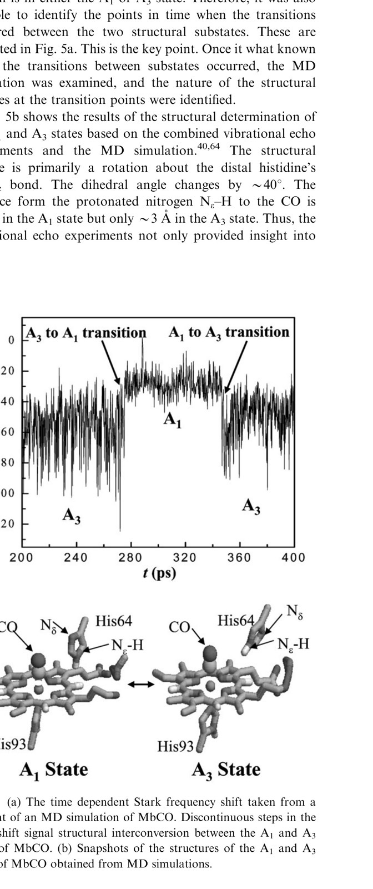
<figcaption><strong>Fig. 5</strong> (a) The time dependent Stark frequency shift taken from a segment of an MD simulation of MbCO. Discontinuous steps in the Stark shift signal structural interconversion between the A1 and A3 states of MbCO. (b) Snapshots of the structures of the A1 and A3 states of MbCO obtained from MD simulations.</figcaption>
</figure>

[Fig. 5a](#fig5) shows a portion of a frequency trajectory obtained from one run of the MD simulations. [[40,64](#ref40)] From the time dependent frequency shift, the FFCF is calculated. Then the FFCF obtained from the MD simulations is used as an input in the same diagrammatic perturbation calculations used to fit the 2D IR data. The agreement between the simulations and the experiments was found to be excellent. [[64](#ref64)] As can be seen in [Fig. 5a](#fig5), periodically, the nature of the fluctuations in the frequency changes. By comparison with experiment, it was possible to identify segments of the MD trajectory when the protein is in either the A1 or A3 state. Therefore, it was also possible to identify the points in time when the transitions occurred between the two structural substates. These are indicated in [Fig. 5a](#fig5). This is the key point. Once it was known when transitions between substates occurred, the MD simulation was examined, and the nature of the structural changes at the transition points were identified.

[Fig. 5b](#fig5) shows the results of the structural determination of the A1 and A3 states based on the combined vibrational echo experiments and the MD simulation. [[40,64](#ref40)] The structural change is primarily a rotation about the distal histidine's C&beta;–C&gamma; bond. The dihedral angle changes by ~40°. The distance from the protonated nitrogen N&delta;–H to the CO is ~5 Å in the A1 state but only ~3 Å in the A3 state. Thus, the vibrational echo experiments not only provided insight into the dynamics of the protein but also provided the necessary observables enabling the solution of a long standing structural problem.

### B. The influence of substrate binding of enzyme dynamics

Enzyme–substrate binding is a dynamic process that is intimately coupled to protein structural fluctuations. [[78,79](#ref78)] A complete description of protein–ligand interactions requires information on the modification of protein dynamics when a ligand binds. Recent observations that many proteins can bind structurally heterologous substrates with high affinity in the same active site has further highlighted the importance of protein dynamics in modulating substrate affinity. [[79](#ref79)]

A mechanism for multiple substrate recognition within the same binding site has been proposed based on the concept of a protein's distribution of structural states in equilibrium. [[79](#ref79)] Proteins are rapidly interconverting within an ensemble of similar conformations. [[64,80,81](#ref64)] A subset of these rapidly interconverting states may be favorable for binding a given substrate. A different subset of conformations may accommodate a structurally heterologous ligand. Although conceptually appealing, this mechanism is difficult to probe experimentally as it requires sensitivity to protein structural dynamics on fast timescales.

Using 2D IR vibrational echo spectroscopy we are able to address the questions of whether substrate binding influences protein dynamics and whether different substrates binding to the same protein produce distinct changes in protein structural fluctuations. 2D IR vibrational echo experiments were conducted to examine the equilibrium structural fluctuations of horseradish peroxidase (HRP) in the absence and presence of small molecule substrates with dissociation constants spanning three orders of magnitude. [[74](#ref74)] HRP is a type III peroxidase family glycoprotein that oxidizes a variety of organic molecules in the presence of hydrogen peroxide as the oxidizing agent. [[82](#ref82)] HRP has proven to be amenable to protein engineering and its reactivity towards a wide variety of organic substrates has made it of intense interest in bio-industrial and enantiospecific catalysis applications. [[83–86](#ref83)]

The active site of HRP is comprised of a solvent exposed iron heme prosthetic group (see [Fig. 6](#fig6)) that participates in the enzymatic catalysis cycle. [[85,86](#ref85)] The heme can bind carbon monoxide (CO), which has been frequently exploited as a site specific reporter of protein structure [[55,64,65](#ref55)] and dynamics. [[64,70,88](#ref64)] As in the MbCO experiments discussed above, the time dependence of the CO transition frequency is a spectroscopic reporter of protein structural fluctuations. [[55,64,70](#ref55)] Like MbCO, the CO transition frequency of HRP is highly sensitive to electric fields. [[87–89](#ref87)]

<figure class="paper-figure" id="fig6">
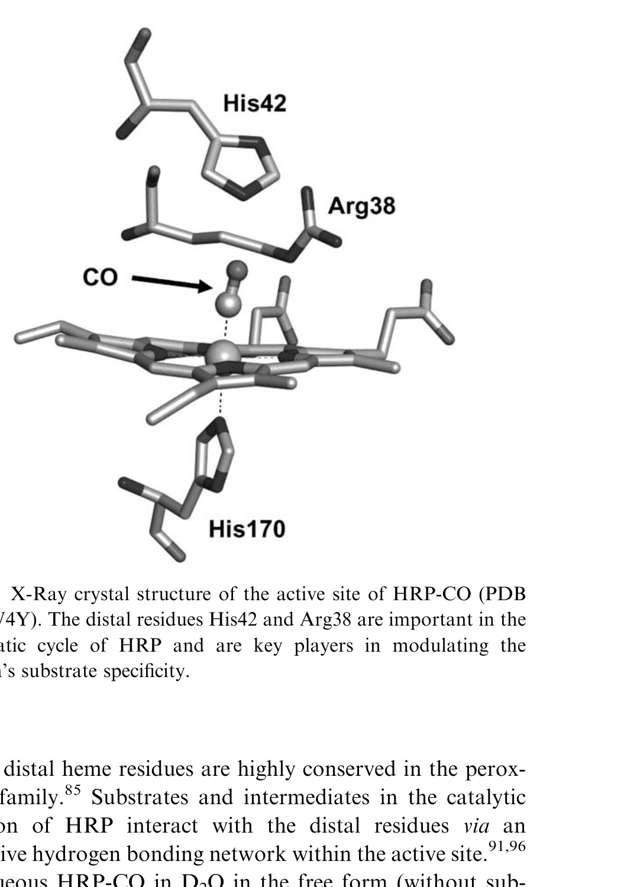
<figcaption><strong>Fig. 6</strong> X-Ray crystal structure of the active site of HRP-CO (PDB ID: 1W4Y). The distal residues His42 and Arg38 are important in the enzymatic cycle of HRP and are key players in modulating the protein's substrate specificity.</figcaption>
</figure>

Five small molecule substrates that are benzohydroxamic acid (BHA) analogs have been studied with 2D vibrational echoes. [[74](#ref74)] Only one of them will be discussed here. These substrates have been investigated as a general class of tightly binding inhibitors for HRP and other peroxidases. [[85,90](#ref85)] A wealth of structural, [[91,92](#ref91)] biochemical, [[84,86,93](#ref84)] and spectroscopic evidence [[88,94,95](#ref88)] has identified His42 and Arg38 as the key HRP residues in modulating substrate binding and enzymatic activity. [Fig. 6](#fig6) shows several key residues in the active site of HRP. These distal heme residues are highly conserved in the peroxidase family. [[85](#ref85)] Substrates and intermediates in the catalytic reaction of HRP interact with the distal residues *via* an extensive hydrogen bonding network within the active site. [[91,96](#ref91)]

Aqueous HRP-CO in D2O in the free form (without substrates) pD 7.4 adopts two distinct spectroscopic states [[55,88](#ref55)] at 1903 cm⁻¹ and 1934 cm⁻¹ as shown in the background subtracted and normalized linear absorption spectrum in [Fig. 7a](#fig7). Upon substrate binding, HRP occupies a single structural state resulting in a change in the spectrum to a single peak ([Fig. 7b](#fig7)). Resonance Raman spectra of the distal histidine imidazolium [[97](#ref97)] and other experimental data [[88](#ref88)] suggest that in the red state the CO is nearly normal to the heme plane and oriented such that it has a strong interaction with the distal histidine and a weaker one with the distal arginine. In the blue state, the Fe–C–O linkage, although linear, is somewhat bent relative to the heme normal, allowing the CO to form a strong hydrogen bond with the distal arginine and a weaker one with the distal histidine.

<figure class="paper-figure" id="fig7">
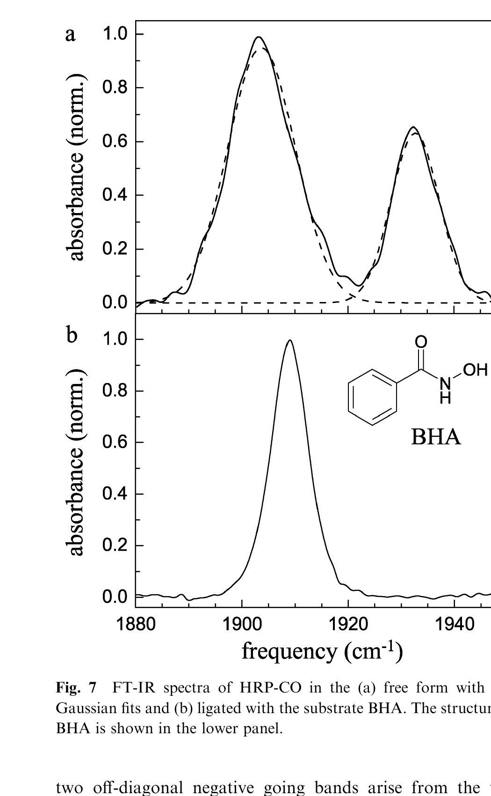
<figcaption><strong>Fig. 7</strong> FT-IR spectra of HRP-CO in the (a) free form with two Gaussian fits and (b) ligated with the substrate BHA. The structure of BHA is shown in the lower panel.</figcaption>
</figure>

[Fig. 7b](#fig7) shows the background subtracted linear spectra of HRP ligated with BHA, a single, essentially Gaussian peak centered at 1909 cm⁻¹. [[97,98](#ref97)] Spectra with four other substrates [[74](#ref74)] show that the ligated HRP spectra are spread around the frequency of the unligated HRP red state and are significantly lower in frequency than the blue unligated state. The disappearance of the blue CO band and narrowing of the absorption peaks relative to the free HRP red state spectrum suggests decreased protein conformational freedom.

<figure class="paper-figure" id="fig8">
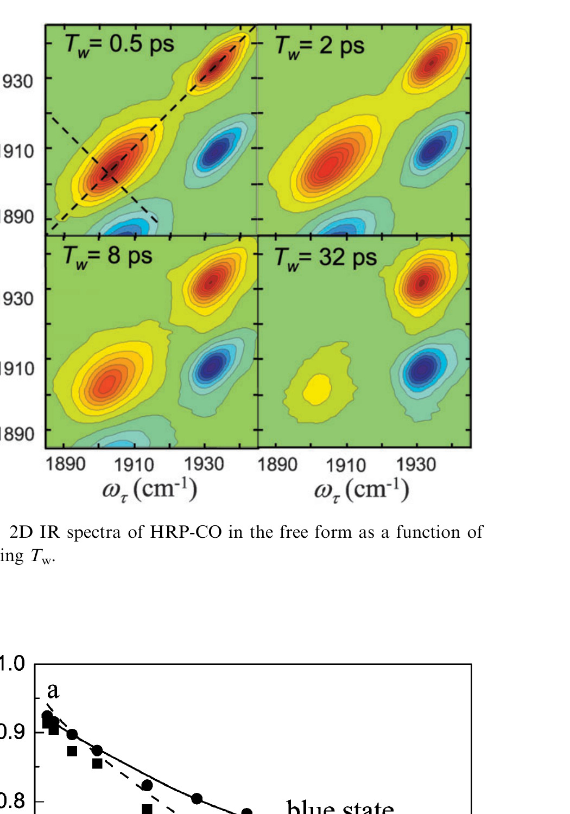
<figcaption><strong>Fig. 8</strong> 2D IR spectra of HRP-CO in the free form as a function of increasing <em>T</em>w.</figcaption>
</figure>

[Fig. 8](#fig8) shows the 2D vibrational echo spectra of the free form of HRP-CO at several *T*ws (10% contours). In each panel, the spectra are normalized to the largest peak. The two positive going bands on the diagonal correspond to the two peaks in the linear IR spectrum shown in [Fig. 7a](#fig7). The two off-diagonal negative going bands arise from the two associated 1–2 transitions. The diagonal and antidiagonal are shown in the upper left panel for the low frequency band. As *T*w increases, the peaks become more symmetrical resulting in decreasing eccentricities. The low frequency band has a significantly shorter vibrational life time that gives rise to its decrease in amplitude relative to the higher frequency band by *T*w = 32 ps. The full data sets contain much finer gradations and the signals can be analyzed at the longest *T*ws.

<figure class="paper-figure" id="fig9">
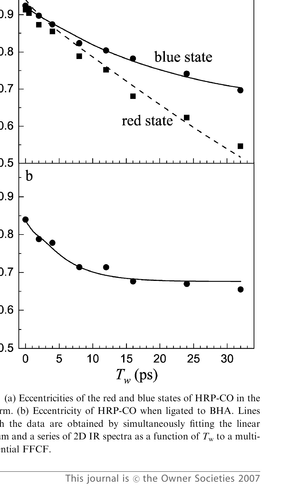
<figcaption><strong>Fig. 9</strong> (a) Eccentricities of the red and blue states of HRP-CO in the free form. (b) Eccentricity of HRP-CO when ligated to BHA. Lines through the data are obtained by simultaneously fitting the linear spectrum and a series of 2D IR spectra as a function of <em>T</em>w to a multi-exponential FFCF.</figcaption>
</figure>

[Fig. 9a](#fig9) shows the *T*w dependent eccentricities for the blue and red states of the free HRP-CO, and [Fig. 9b](#fig9) shows the eccentricities with the BHA substrate bound. Lines through the data are obtained from the full 2D IR calculations that determine the FFCFs as described above. Each of the FFCFs has a motionally narrowed component that contributes to the total 2D IR linewidth but does not contribute to the *T*w dependence. The FFCF of the red state of free HRP is different from all of the other spectroscopic bands, those shown here and the results for four other bound substrates discussed elsewhere. [[74](#ref74)] In addition to the motionally narrowed component, the red state of free HRP has two additional timescales, *&tau;*2 = 1.5 ps and *&tau;*3 = 21 ps. *&tau;*3 is infinite for all of the other systems. The results demonstrate that the full range of structures that give rise to the red state absorption spectrum have been sampled by ~100 ps. The blue state of free HRP is well described by a single 15 ps exponential and lacks a short timescale component (aside from the motionally narrowed term that is common to all of the systems). In the blue state a relatively large set of CO frequency fluctuations occur on timescales slower than ~100 ps and, resemble a static term in the FFCF (*&tau;* → ∞). The difference between the dynamics of the free states and BHA bound is clear from the differences in the eccentricities shown in [Fig. 9a](#fig9) and b. With BHA bound, the FFCF has a 4 ps component (*&tau;*2) and *&tau;*3 is infinite, in addition to a motionally narrowed component.

It is clear from [Fig. 9](#fig9) and the FFCF parameters that the dynamics of HRP with a bound substrate are very different than the red state of free HRP. The free blue state and red state, which are different, have a 15 ps and 21 ps component, respectively. In contrast, the FFCFs for HRP with bound substrates have a common component of *&tau;*2 = 3–5 ps in the observation time window. The linear absorption spectra of the free HRP red state and with bound substrates show that the substrate bound states have substantially narrowed protein structural dynamics.

Further insights into the changes in HRP dynamics upon ligand binding can be obtained by comparison to MbCO. The active site of HRP, in its entirety, can bind a diverse array of substrate molecules, and contains a distal histidine and arginine, but the active site of myoglobin accommodates only endogenous substrates and does not have a distal arginine, but it also contains a distal histidine and a heme bound to CO. A mutant of myoglobin lacking the distal histidine and bound to CO, called H64V, has been the subject of experimental observations and simulations and has underscored the pivotal role of the distal histidine in modulating the CO frequency in myoglobin. The H64V mutant (the distal histidine is replaced by a non-polar valine) displays significantly decreased vibrational dephasing because of the elimination of this polar residue. [[71](#ref71)] It is instructive to compare the dynamics of free HRP to that of wild-type myoglobin and substrate-bound HRP with H64V. When this is done, it is found that the dynamics of the A1 state of MbCO are very similar to the free HRP red state while the HRP-substrate dynamics are very similar to those of H64V. [[71](#ref71)]

In H64V, the distal histidine has been removed, and the rate and magnitude of the vibrational dephasing on the experimental time scales are reduced accordingly. Based on the similarity between the MbCO data and the HRP red state data, it is reasonable to assume that a substantial contribution to the vibrational dephasing of the free HRP comes from the fluctuations of the distal histidine and the distal arginine. The striking similarity in HRP-substrate and H64V dynamics highlights that substrate binding in HRP renders the distal residues nearly static on the 2D IR experimental timescale. The clear conclusion to be drawn is that substrate binding locks up the distal ligands, constraining the structural fluctuations in the active site. The result is that the time scale of the fluctuations is pushed out to long times (>100 ps). It is worth noting that the protein dynamics are significantly decreased even when additional potential sources of CO frequency perturbations are introduced into the active site. The distal residues participate in every step of the enzymatic cycle of HRP and the results indicate that substrate binding recognizes and dynamically constrains these residues. [[74](#ref74)] Based on the observation that substrates in the HRP active site significantly decreased structural fluctuations of the distal residues, it is possible that the protein may exploit the flutter of substrate binding to catalyze further steps in the enzymatic pathway. Thus, upon recognition of biologically occurring substrates, the protein active site is not only constrained structurally but also dynamically, priming the enzyme to sample the portion of the conformational energy landscape that may lead to subsequent steps in the reaction. [[74](#ref74)]

---

## III. Chemical exchange vibrational echo spectroscopy

### 1. The effect of chemical exchange on the 2D spectrum

<figure class="paper-figure" id="fig10">
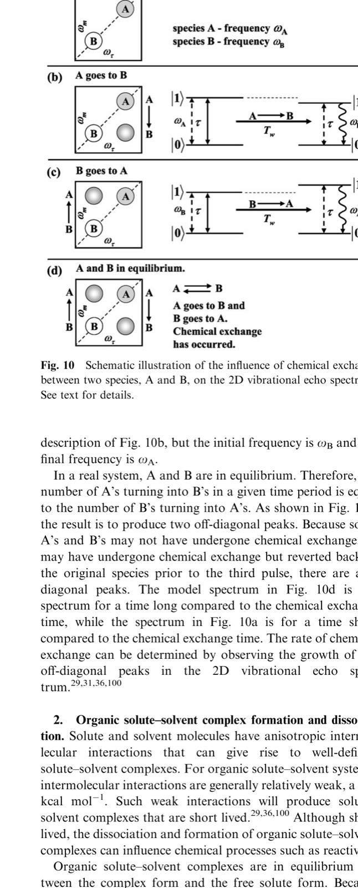
<figcaption><strong>Fig. 10</strong> Schematic illustration of the influence of chemical exchange between two species, A and B, on the 2D vibrational echo spectrum. See text for details.</figcaption>
</figure>

[Fig. 10](#fig10) illustrates the influence of chemical exchange on the 2D vibrational echo spectrum. Two species, A and B, with absorptions at distinct transition frequencies, *&omega;*A and *&omega;*B, are in thermal equilibrium. Species A is converted to species B, and *vice versa*, but there is no net change in the populations of A and B because the rate of A's going to B equals the rate of B's going to A. [Fig. 10a](#fig10) shows the 2D spectrum at very short time prior to chemical exchange. (Only the 0–1 portion of the spectrum is shown.) There are two peaks on the diagonal, one for species A and one for species B with frequencies on both axes, *i.e.*, *&omega;*m and *&omega;*&tau;, of *&omega;*A and *&omega;*B, respectively. [Fig. 10b](#fig10) shows what would happen if some of the A's convert to B's. The right part of [Fig. 10b](#fig10) shows the quantum pathways that lead to the signal. [[43](#ref43)] A dashed arrow represents a coherence (coherent superposition state) produced by a radiation field. The solid arrow represents a population, and the curved arrow represents the vibrational echo emission. The first pulse produces a coherence between the states of species A at frequency *&omega;*A. After time *&tau;*, the second pulse produces a population. There are several pathways, and a population can be produced in either the ground state (0) or the first excited state (1). During the period *T*w, some A's turn into B's (A → B). The third pulse again produces a coherence, but it is a coherence of species B at *&omega;*B, followed by echo emission at *&omega;*B. Because the first interaction (frequency on the *&omega;*&tau; axis) is at *&omega;*A, but the last interaction and echo emission (frequency on the *&omega;*m axis) is at *&omega;*B, an off-diagonal peak is generated as shown in the left portion of [Fig. 10b](#fig10). [Fig. 10c](#fig10) shows what happens if B's turn into A's (B → A). Everything is equivalent to the description of [Fig. 10b](#fig10), but the initial frequency is *&omega;*B and the final frequency is *&omega;*A.

In a real system, A and B are in equilibrium. Therefore, the number of A's turning into B's in a given time period is equal to the number of B's turning into A's. As shown in [Fig. 10d](#fig10), the result is to produce two off-diagonal peaks. Because some A's and B's may not have undergone chemical exchange, or may have undergone chemical exchange but reverted back to the original species prior to the third pulse, there are also diagonal peaks. The model spectrum in [Fig. 10d](#fig10) is the spectrum for a time long compared to the chemical exchange time, while the spectrum in [Fig. 10a](#fig10) is for a time short compared to the chemical exchange time. The rate of chemical exchange can be determined by observing the growth of the off-diagonal peaks in the 2D vibrational echo spectrum. [[29,31,36,100](#ref29)]

### 2. Organic solute–solvent complex formation and dissociation

Solute and solvent molecules have anisotropic intermolecular interactions that can give rise to well-defined solute–solvent complexes. For organic solute–solvent systems, intermolecular interactions are generally relatively weak, a few kcal mol⁻¹. Such weak interactions will produce solute–solvent complexes that are short lived. [[29,36](#ref29)] Although short lived, the dissociation and formation of organic solute–solvent complexes can influence chemical processes such as reactivity.

Organic solute–solvent complexes are in equilibrium between the complex form and the free solute form. Because formation and dissociation occurs on a ps time scale, until recently it has not been possible to observe the chemical exchange process between the two forms of the solute. [[29,36,100](#ref29)]

<figure class="paper-figure" id="fig11">
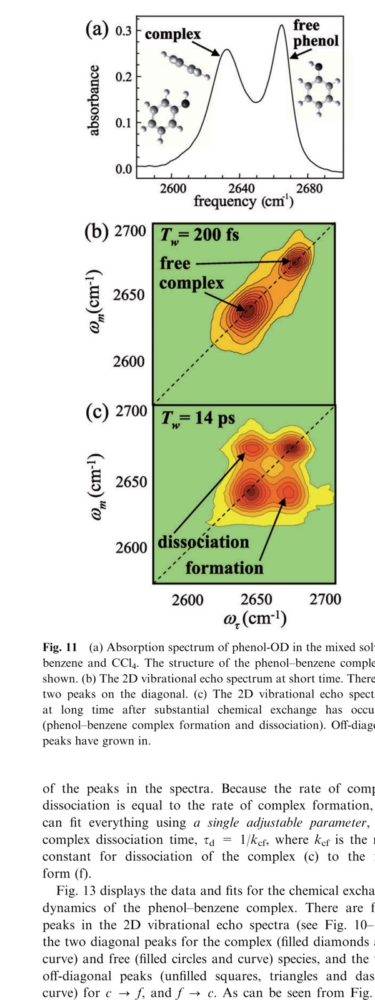
<figcaption><strong>Fig. 11</strong> (a) Absorption spectrum of phenol-OD in the mixed solvent benzene and CCl4. The structure of the phenol–benzene complex is shown. (b) The 2D vibrational echo spectrum at short time. There are two peaks on the diagonal. (c) The 2D vibrational echo spectrum at long time after substantial chemical exchange has occurred (phenol–benzene complex formation and dissociation). Off-diagonal peaks have grown in.</figcaption>
</figure>

To obtain information about solute–solvent complex formation and dissociation using 2D IR vibrational echo chemical exchange spectroscopy, it is sufficient to focus on the 0–1 region of the spectrum. Identical considerations apply to the 1–2 region, but analysis of the 1–2 region can provide additional information. [[29](#ref29)] Comparisons of the 0–1 and 1–2 regions of the spectra have been used to demonstrate that vibrational excitation does not perturb the chemical equilibrium. [[29](#ref29)]

[Fig. 11a](#fig11) displays the spectrum of the hydroxyl OD stretch of phenol in a mixed solvent of benzene (20 mol%) and CCl4 (80 mol%). The high frequency peak is the free phenol, and the low frequency peak is the phenol–benzene complex. [[29](#ref29)] The structure of the complex, determined from electronic structure calculations, is shown in the figure. [[29](#ref29)] The species are in equilibrium, with complexes constantly dissociating and free phenols associating with benzene to form complexes. [Fig. 11b](#fig11) shows the 2D vibrational echo spectrum at short time, *T*w = 200 fs; no significant exchange has occurred. As in [Fig. 10a](#fig10), there are two species in the system with different vibrational transition frequencies. At short time, the two species give two peaks on the diagonal, which correspond to the 2 peaks in the absorption spectrum. At long time, 14 ps, extensive chemical exchange has occurred. Off-diagonal peaks have grown in as can be seen clearly in [Fig. 11c](#fig11). The two peaks correspond to complex dissociation and formation. [Fig. 11c](#fig11) has the appearance of the schematic shown in [Fig. 10d](#fig10), and the discussion surrounding the origins of the off-diagonal peaks in [Fig. 10](#fig10) applies to the experimental data shown in [Fig. 11](#fig11).

<figure class="paper-figure" id="fig12">
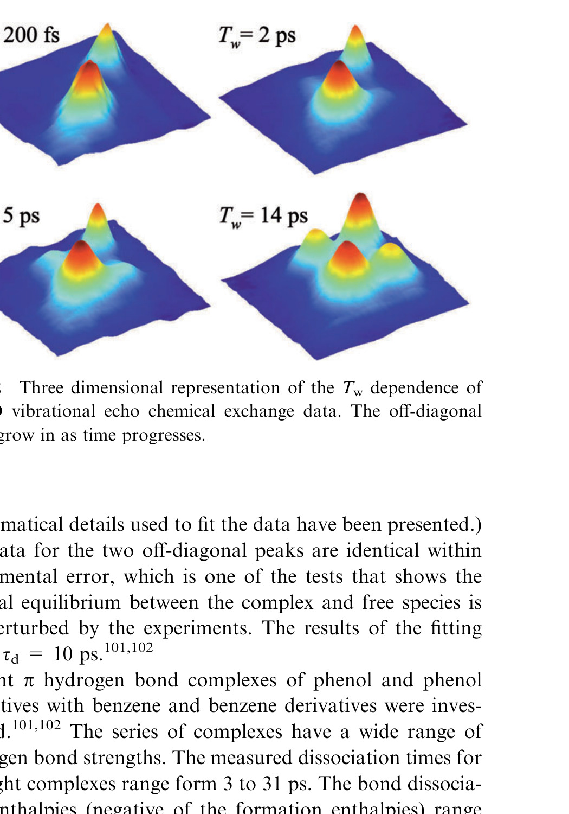
<figcaption><strong>Fig. 12</strong> Three dimensional representation of the <em>T</em>w dependence of the 2D vibrational echo chemical exchange data. The off-diagonal peaks grow in as time progresses.</figcaption>
</figure>

The growth of the off-diagonal peaks with increasing *T*w can be used to directly determine the thermal equilibrium rate for complex formation and dissociation. [Fig. 12](#fig12) displays 2D spectra as three dimensional representations. At 2 ps, the off-diagonal peaks are just appearing in these plots. By 5 ps they are clearly evident, and continue to grow as can be seen in the 14 ps plot. Data like these are used for detailed analysis of the chemical exchange kinetics. [[29,36,100,101](#ref29)] In addition to chemical exchange, there are other dynamical processes that contribute to the time dependent changes in the spectrum. Spectral diffusion causes the peaks to change shape. The rate of chemical exchange without complications arising from the changing peak shapes can be obtained by measuring the time dependent peak volumes. [[29,100](#ref29)] The vibrational lifetimes of the hydroxyl stretch and the orientational relaxation rates cause all of the peaks to decay in amplitude while chemical exchange causes the off-diagonal peaks to grow in. The vibrational lifetimes and the orientational relaxation rates are measured independently using ultrafast IR pump–probe spectroscopy. [[29,36,100](#ref29)] In addition, the equilibrium constant and the transition dipole moments of the species are necessary inputs in calculations and are obtained from the FT-IR absorption spectra. [[29,100](#ref29)]

Because two off-diagonal peaks grow in at the same rate (see [Fig. 13](#fig13)), the rate of complex formation and dissociation are equal, that is, the system is in equilibrium. The fact that vibrational excitation does not take the system out of equilibrium was further tested by comparing time evolution of the 0–1 and 1–2 regions of the spectra. [[29](#ref29)] With the system in equilibrium and the other input parameters known, [[29,100](#ref29)] there is only one adjustable parameter to fit the *T*w dependence of all of the peaks in the spectra. Because the rate of complex dissociation is equal to the rate of complex formation, we can fit everything using *a single adjustable parameter*, the complex dissociation time, *&tau;*d = 1/*k*cr, where *k*cr is the rate constant for dissociation of the complex (c) to the free form (f).

<figure class="paper-figure" id="fig13">
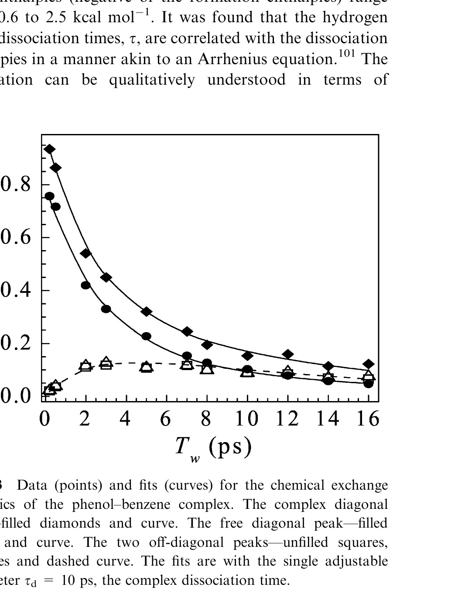
<figcaption><strong>Fig. 13</strong> Data (points) and fits (curves) for the chemical exchange dynamics of the phenol–benzene complex. The complex diagonal peak—filled diamonds and curve. The free diagonal peak—filled circles and curve. The two off-diagonal peaks—unfilled squares, triangles and dashed curve. The fits are with the single adjustable parameter <em>&tau;</em>d = 10 ps, the complex dissociation time.</figcaption>
</figure>

[Fig. 13](#fig13) displays the data and fits for the chemical exchange dynamics of the phenol–benzene complex. There are four peaks in the 2D vibrational echo spectra (see [Fig. 10](#fig10)–[12](#fig12)), the two diagonal peaks for the complex (filled diamonds and curve) and free (filled circles and curve) species, and the two off-diagonal peaks (unfilled squares, triangles and dashed curve) for c → f, and f → c. As can be seen from [Fig. 13](#fig13), the data are fit very well with the single parameter *&tau;*d. (The mathematical details used to fit the data have been presented.) The data for the two off-diagonal peaks are identical within experimental error, which is one of the tests that shows the thermal equilibrium between the complex and free species is not perturbed by the experiments. The results of the fitting yields *&tau;*d = 10 ps. [[101,102](#ref101)]

Eight *&pi;* hydrogen bond complexes of phenol and phenol derivatives with benzene and benzene derivatives were investigated. [[101,102](#ref101)] The series of complexes have a wide range of hydrogen bond strengths. The measured dissociation times for the eight complexes range from 3 to 31 ps. The bond dissociation enthalpies (negative of the formation enthalpies) range from 0.6 to 2.5 kcal mol⁻¹. It was found that the hydrogen bond dissociation times, *&tau;*d, are correlated with the dissociation enthalpies in a manner akin to an Arrhenius equation. [[101](#ref101)] The correlation can be qualitatively understood in terms of transition state theory. In this model, the activation enthalpy scales linearly with the bond dissociation enthalpy and the activation entropy is essentially independent of the molecular make up of the complex. These experiments are providing the first detailed information on the dynamics of weakly hydrogen bonded organic species and the relationship between dynamics and strengths of the hydrogen bonds.

### 3. Isomerization around a carbon–carbon single bond

Isomerization of organic molecules is responsible for the vast diversity of their chemical structures and the ability of both small molecules and large biopolymers to undergo structural changes without breaking chemical bonds. During the course of isomerization a molecule is transformed from one relatively stable conformation to another by passing through unfavorable configurations. Ethane and its derivatives are textbook examples of molecules that undergo this type of isomerization. [[103](#ref103)] In ethane, as one of the two methyl groups rotates 360° around the central carbon–carbon single bond, it will alternate three times between an unstable eclipsed conformation and the preferred staggered conformation. The transition from one staggered state to another leaves ethane structurally identical. Therefore, the result of ethane isomerization cannot be observed through a change in chemical structure. In a 1,2-disubstituted ethane derivative, the molecule can undergo a similar isomerization. However, a 1,2-disubstituted ethane has two distinct staggered conformations, *gauche* and *trans*. The two conformations have distinguishing characteristics because of the change in the relative positions of the two substituents. [[103](#ref103)] Carbon–carbon bond isomerization has been the subject of intense theoretical and experimental study since Bischoff found 100 years ago that rotation about the C–C single bond in ethane is not completely free. [[104](#ref104)]

<figure class="paper-figure" id="fig14">
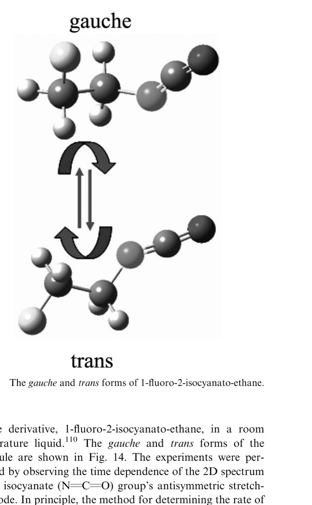
<figcaption><strong>Fig. 14</strong> The <em>gauche</em> and <em>trans</em> forms of 1-fluoro-2-isocyanato-ethane.</figcaption>
</figure>

The *trans*–*gauche* isomerization of 1,2-disubstituted ethane derivatives, *e.g.*, *n*-butane, is one of the simplest cases of a first-order chemical reaction. This type of isomerization has served as a basic model for modern chemical reaction kinetic theory and molecular dynamics simulation studies in condensed phases. [[105–109](#ref105)] In spite of extensive theoretical investigation, until recently [[110](#ref110)] no corresponding kinetic experiments have been performed to test the results, partially due to the low rotational energy barrier of the *n*-butane (~3.4 kcal mol⁻¹) and other simple 1,2-disubstituted ethane derivatives. [[111](#ref111)] Theoretical studies show that the isomerization time scale (1/*k*, *k* is the rate constant) is 10–100 ps at room temperature in liquids. [[105–109,112](#ref105)]

The room temperature time scale is much shorter than the microsecond and longer time scale measurements that can be made with dynamic nuclear magnetic resonance spectroscopy, a widely used method for studying slow temperature dependent isomerization kinetics at low temperatures for compounds with high barriers. [[113](#ref113)] Other methods to study fast isomerization dynamics under thermal equilibrium such as linear IR and Raman line shape analysis, [[114,115](#ref114)] are hampered by the contributions from multiple factors in addition to isomerization. [[116–118](#ref116)]

The 2D vibrational echo chemical exchange spectroscopic method has been applied to the study of the ultrafast *trans*–*gauche* isomerization dynamics of a simple 1,2-disubstituted ethane derivative, 1-fluoro-2-isocyanato-ethane, in a room temperature liquid. [[110](#ref110)] The *gauche* and *trans* forms of the molecule are shown in [Fig. 14](#fig14). The experiments were performed by observing the time dependence of the 2D spectrum of the isocyanate (N=C=O) group's antisymmetric stretching mode. In principle, the method for determining the rate of isomerization is identical to the method employed for determining the rate of solute–solvent complex formation and dissociation discussed above. In an IR absorption spectrum shown in [Fig. 15](#fig15), the *gauche* and *trans* isomers are sufficiently resolved to be able to detect the growth of off-diagonal peaks caused by chemical exchange between the two isomers. The peaks have essentially equal amplitude, which means that half of the molecules are in the *gauche* conformation and half are in the *trans* conformation. However, there is a third peak in the spectrum that is unassigned. It may be an overtone or a combination band. The unassigned transition is coupled through anharmonic terms in the molecular Hamiltonian to the *gauche* transition for molecules in the *gauche* form and to the *trans* transition for molecules in the *trans* form. In the absence of chemical exchange, the influence of coupling between modes on the same molecule is well known. [[34,119,120](#ref34)] Coupling between a pair of modes produces off-diagonal coherence transfer peaks (positive) and combination band peaks (negative). The coherence transfer peaks form a square pattern with the diagonal peaks; the off-diagonal peaks are the upper left and lower right corners of the square. The combination band peaks are directly below the coherence transfer peaks, shifted by the combination band shift. If there is a mixture of two species, then there will be two sets of coherence transfer and combination band peaks. [[34](#ref34)] Here the sample is a mixture of two species, the *gauche* and *trans* isomers. In addition to the off-diagonal peaks that are time dependent, vibrational population relaxation between modes on the same molecule causes additional peaks to grow in with the vibrational relaxation times. [[34](#ref34)]

<figure class="paper-figure" id="fig15">
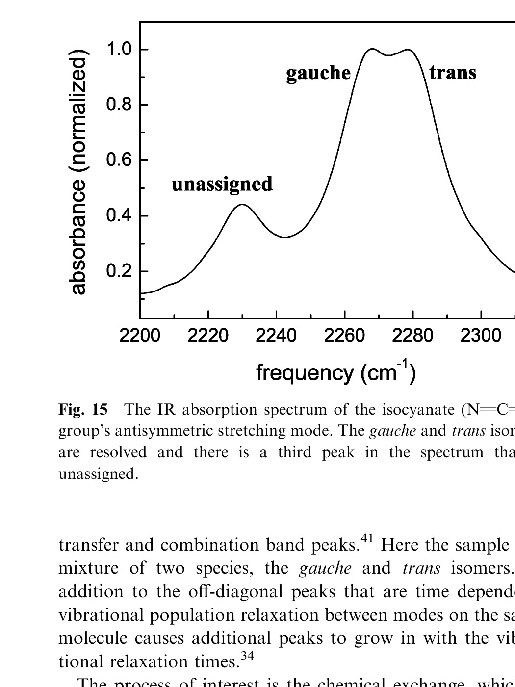
<figcaption><strong>Fig. 15</strong> The IR absorption spectrum of the isocyanate (N=C=O) group's antisymmetric stretching mode. The <em>gauche</em> and <em>trans</em> isomers are resolved and there is a third peak in the spectrum that is unassigned.</figcaption>
</figure>

The process of interest is the chemical exchange, which is caused by *gauche*–*trans* isomerization. The *gauche* and *trans* peaks are much closer together than either is to the unassigned peaks. [[110](#ref110)] The peaks that arise from the coupling to the unassigned peak are much farther off-diagonal than the chemical exchange peaks that arise from isomerization. However, one of the negative going (blue) peaks that grows in because of vibrational relaxation from the *trans* mode to the unassigned peak overlaps with the lower right chemical exchange off-diagonal position that will grow in as isomerization proceeds. The affected chemical exchange peak is shown schematically in [Fig. 10b](#fig10). The details of the vibrational relaxation peak that interferes with the lower right chemical exchange peak can be determined by examining the molecule 1-bromo-2-isocyanato-ethane. The bromo group is very large compared to the fluoro group, and it produces enough steric hindrance to significantly slow down the C–C isomerization. On the time scale of the experiments on 1-fluoro-2-isocyanato-ethane, isomerization of the bromo compound does not occur. The *T*w dependence of bromo compound shows that a negative going peak appears below the *trans* diagonal peak in the position in which a positive going off-diagonal peak would grow in if chemical exchange between the *trans* and *gauche* isomer occurred. [[110](#ref110)] Therefore, in contrast to the data shown in [Fig. 11](#fig11) and [12](#fig12), in which the off-diagonal chemical exchange peaks for solute–solvent formation and dissociation are of equal amplitude, in the isomerization experiments on 1-fluoro-2-isocyanato-ethane, the upper left chemical exchange peak will be prominent, but the lower right peak is mainly obscured.

<figure class="paper-figure" id="fig16">
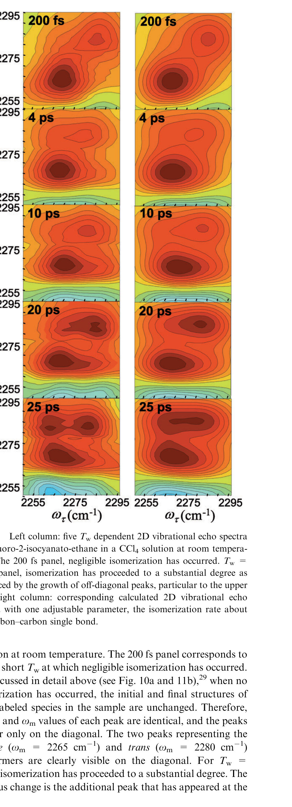
<figcaption><strong>Fig. 16</strong> Left column: five <em>T</em>w dependent 2D vibrational echo spectra of 1-fluoro-2-isocyanato-ethane in a CCl4 solution at room temperature. The 200 fs panel, negligible isomerization has occurred. <em>T</em>w = 25 ps panel, isomerization has proceeded to a substantial degree as evidenced by the growth of off-diagonal peaks, particular to the upper left. Right column: corresponding calculated 2D vibrational echo spectra with one adjustable parameter, the isomerization rate about the carbon–carbon single bond.</figcaption>
</figure>

[Fig. 16](#fig16) left column displays five *T*w dependent 2D vibrational echo spectra of 1-fluoro-2-isocyanato-ethane in a CCl4 solution at room temperature. The 200 fs panel corresponds to a very short *T*w at which negligible isomerization has occurred. As discussed in detail above (see [Fig. 10a](#fig10) and [11b](#fig11)), [[29](#ref29)] when no isomerization has occurred, the initial and final structures of each labeled species in the sample are unchanged. Therefore, the *&omega;*&tau; and *&omega;*m values of each peak are identical, and the peaks appear only on the diagonal. The two peaks representing the *gauche* (*&omega;*m = 2265 cm⁻¹) and *trans* (*&omega;*m = 2280 cm⁻¹) conformers are clearly visible on the diagonal. For *T*w = 25 ps, isomerization has proceeded to a substantial degree. The obvious change is the additional peak that has appeared at the upper left (*&omega;*&tau; = 2265 cm⁻¹ and *&omega;*m = 2280 cm⁻¹). This peak arises from *gauche* to *trans* isomerization. There is a corresponding peak to the lower right that is generated by *trans* to *gauche* isomerization but it is significantly negated by a negative going peak produced by vibrational relaxation as discussed above. [[110](#ref110)] The diagonal peaks arise from molecules with the same initial and final structures. The growth of the off-diagonal peaks with increasing *T*w permits determination of the isomerization rate (chemical exchange rate), although it is necessary to analyze the growth and decay of all of the peaks for accuracy. [[36](#ref36)]

In the same manner as discussed in connection with the solute–solvent complex chemical exchange problem, the vibrational lifetimes and orientational relaxation rates are needed and measured independently using IR pump–probe experiments. [[110](#ref110)] As described above, there is an additional vibrational relaxation pathway, distinct from the regular vibrational lifetime decay, that stems from the coupling of the NCO antisymmetric stretch of both conformers to an unassigned vibrational mode at ~2230 cm⁻¹. The coupling induces fast back and forth population equilibration between the unassigned mode and the NCO antisymmetric stretch (equilibration time constants are 0.9 ps for the *trans* and 1.9 ps for the *gauche* as measured by IR pump–probe experiments). [[110](#ref110)] In analyzing the data, all of the kinetics and other input information were obtained from independent experiments with the exception of the isomerization rate. [[110](#ref110)] Therefore, only one unknown parameter, the isomerization rate constant, *k*TG = *k*GT, was used in fitting the *T*w dependent 2D vibrational echo data. The *trans* to *gauche* and *gauche* to *trans* rate constants are taken to be equal within experimental error because the equilibrium constant is 1.

<figure class="paper-figure" id="fig17">
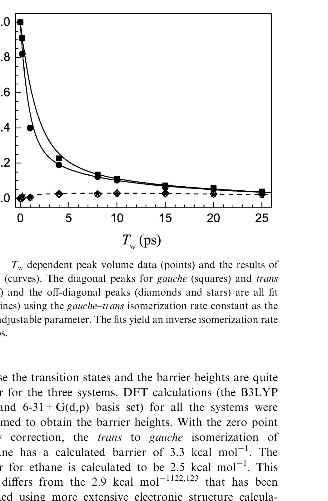
<figcaption><strong>Fig. 17</strong> <em>T</em>w dependent peak volume data (points) and the results of the fits (curves). The diagonal peaks for <em>gauche</em> (squares) and <em>trans</em> (circles) and the off-diagonal peaks (diamonds and stars) are all fit (solid lines) using the <em>gauche</em>–<em>trans</em> isomerization rate constant as the single adjustable parameter. The fits yield an inverse isomerization rate of 43 ps.</figcaption>
</figure>

[Fig. 16](#fig16) right column shows calculated 2D spectra using the known input parameters and the results of fitting *k*TG. Both the measured and calculated spectra are normalized by making the largest peak at each time unity. Given the complexity of the system, the model calculations do a very good job of reproducing the time dependent data. Of particular importance is the growth of the off-diagonal red peaks and the negative going peaks at the bottom of each panel. [Fig. 17](#fig17) shows the *T*w dependent peak volume data (points) and the results of the fits (curves). The diagonal peaks for *gauche* (squares) and *trans* (circles) and the off-diagonal peaks (diamonds and stars) are all fit very well (solid lines) using the isomerization rate constant as the only adjustable parameter. The off-diagonal peaks grow in at the same rate, consistent with *k*TG = *k*GT within experimental error. The fits yield 1/*k*TG = 1/*k*GT = 43 ± 10 ps. The error bars arise mainly from the uncertainty in the parameters that go into the calculations.

Based on the experimental results for the 1-fluoro-2-isocyanato-ethane, it is possible to calculate approximately the *gauche*–*trans* isomerization rate of *n*-butane and the rotational isomerization rate of ethane under the same conditions used in this study (CCl4 solution at room temperature, 297 K). [[110](#ref110)] It is interesting to obtain a number for *n*-butane because there have been a large number of theoretical calculations for the isomerization of this molecule. [[106–109](#ref106)] Transition state theory [[121](#ref121)] was employed with the assumption that the prefactors for all of the systems are the same. This assumption is reasonable because the transition states and the barrier heights are quite similar for the three systems. DFT calculations (the B3LYP level and 6-31 + G(d,p) basis set) for all the systems were performed to obtain the barrier heights. With the zero point energy correction, the *trans* to *gauche* isomerization of *n*-butane has a calculated barrier of 3.3 kcal mol⁻¹. The barrier for ethane is calculated to be 2.5 kcal mol⁻¹. This value differs from the 2.9 kcal mol⁻¹ [[122,123](#ref122)] that has been obtained using more extensive electronic structure calculations. However, the 2.5 kcal mol⁻¹ value is used for comparison with the 3.3 kcal mol⁻¹ obtained for 1-fluoro-2-isocyanato-ethane. By calculating the two barriers with the same method, it was hoped that there is some cancellation of errors.

Using the calculated barriers for 1-fluoro-2-isocyanato-ethane and for *n*-butane and the assumption that the prefactors are the same, a ~40 ps time constant for the *n*-butane *trans* to *gauche* isomerization time constant (1/*k*TG) was calculated. [[110](#ref110)] This value is identical within error to the 43 ps time found for the *n*-butane isomerization in CCl4 at 300 K from MD simulations. [[107](#ref107)] Other MD simulations gave isomerization rates in liquid *n*-butane at slightly lower temperatures: 52 ps (292 K), [[106](#ref106)] 57 ps (292 K), [[108](#ref108)] 50 ps (273 K) [[106](#ref106)] and 61 ps (<292 K). [[109](#ref109)] All of these values are reasonably close to the value obtained based on the experimental measurements of 1-fluoro-2-isocyanato-ethane. In the same manner, the isomerization time constant for ethane was found to be ~12 ps. [[110](#ref110)]

---

## IV. Concluding remarks

Here the method and some applications of 2D IR vibrational echo spectroscopy have been illustrated. In the 2D IR vibrational echo experiment, the vibrational echo is heterodyne detected, which provides amplitude and phase information, both of which are required to Fourier transform into the frequency domain and to obtain essentially absorptive 2D spectra. By eliminating a substantial portion of the dispersive contribution, the spectral resolution is greatly enhanced. In addition, in comparison to intensity level measurements, measuring the 2D vibrational echo spectrum at the polarization-level *via* heterodyne detection eliminates cross terms between different transitions that can greatly complicate analysis.

Two types of applications of 2D IR vibrational echo spectroscopy were described, that is, the measurement of spectral diffusion with examples from the study of protein dynamics and the measurement of chemical exchange with examples of solute–solvent complex dynamics and isomerization around a carbon–carbon single bond, both involving small molecules in solution. 2D IR vibrational echo spectroscopy is being applied to an increasingly wide variety of chemical and biophysical problems.

The utility of 2D IR vibrational echo spectroscopy for a wide variety of applications can be seen by contrasting it to NMR and to Vis/UV spectroscopy. NMR provides extremely high resolution and exquisite structural discrimination. In addition, there are a large number of pulse sequences that make NMR applicable to a wide variety of problems. However, NMR intrinsically operates on slow time scales. The RF frequency (~1 GHz) limits the direct measurement of dynamics to relatively slow processes. Vis/UV experiments can operate on ultrafast time scales and have been applied to a large number of dynamic processes. These are generally limited to photoinitiated processes rather than measuring dynamics under thermal equilibrium conditions, in contrast to all of the examples discussed above in which the dynamics are observed for systems in equilibrium at room temperature. Furthermore, for complex molecular systems in liquids, solids, or biological systems at room temperature, Vis/UV spectra are generally extremely broad with few identifiable features. The relationship between the time evolution of the Vis/UV observables and structural evolution of a system can be difficult to sort out.

Vibrational spectroscopy and particularly ultrafast 2D IR spectroscopy occupies a middle ground between NMR and Vis/UV spectroscopies. Relatively well resolved spectroscopic lines with well defined structural identity can be studied on time scales much faster than are accessible to NMR. In contrast to Vis/UV spectroscopies, 2D IR experiments can be conducted without perturbing the equilibrium state of a system because exciting a single vibrational quantum is generally a negligibly small perturbation. As demonstrated above, 2D vibrational echo experiments with heterodyne detection are akin to 2D NMR. However, they are intrinsically different. NMR has the great advantage of having all of the spin transitions quantized in the same direction along the magnetic field and the transitions of a given type of spin, *e.g.*, proton, have the same transition dipole matrix element. These properties make it possible to apply a pulse that will produce the same flip angle for all of the spins. The ability to have the same flip angle makes possible the complex pulse sequences used in NMR. In 2D vibrational echo experiments, the transition dipoles point in random directions. Therefore, the projection of the light's electric field on to the transition dipole varies from some maximum value to zero. Also, different transitions of the same type, *e.g.* a hydroxyl stretch, have different transition moments. It is not possible to have the same flip angle for all of the vibrations, precluding the more sophisticated pulse sequences used in NMR. Nonetheless, ultrafast heterodyne detected 2D IR vibrational echo spectroscopy is finding an increasingly diverse range of applications as the methodology advances.

---

## Acknowledgements

Work on protein dynamics was supported by a grant from the NIH (2 R01 GM061137-05). Work on chemical exchange dynamics was supported by grants from AFOSR (F49620-01-1-0018) and NSF (DMR-0332692).

---

## References

1. E. L. Hahn, *Phys. Rev.*, 1950, **80**, 580.

2. M. A. Brown and R. C. Semelka, *MRI Basic Principles and Applications*, Wiley-Liss, New York, 1999.

3. K. J. Dean, D. J. Bergman and G. A. LaTorraca, *Nuclear Magnetic Resonance: Handbook of Geophysical Exploration*, Elsevier Science, Oxford, UK, 2007.

4. N. A. Kurnit, I. D. Abella and S. R. Hartmann, *Phys. Rev. Lett.*, 1964, **13**, 567.

5. I. D. Abella, N. A. Kurnit and S. R. Hartmann, *Phys. Rev.*, 1966, **141**, 391.

6. T. J. Aartsma and D. A. Wiersma, *Chem. Phys. Lett.*, 1978, **54**, 415.

7. W. H. Hesselink and D. A. Wiersma, *Phys. Rev. Lett.*, 1979, **43**, 1991.

8. D. E. Cooper, R. W. Olson, R. D. Wieting and M. D. Fayer, *Chem. Phys. Lett.*, 1979, **67**, 41.

9. R. W. Olson, H. W. H. Lee, F. G. Patterson and M. D. Fayer, *J. Chem. Phys.*, 1982, **76**, 31.

10. R. J. Gulotty, C. A. Walsh, F. G. Patterson, W. L. Wilson and M. D. Fayer, *Chem. Phys. Lett.*, 1986, **125**, 507.

11. L. W. Molenkamp and D. A. Wiersma, *J. Chem. Phys.*, 1985, **83**, 1.

12. M. Berg, C. A. Walsh, L. R. Narasimhan, K. A. Littau and M. D. Fayer, *J. Chem. Phys.*, 1988, **88**, 1564.

13. C. A. Walsh, M. Berg, L. R. Narasimhan and M. D. Fayer, *J. Chem. Phys.*, 1987, **86**, 77.

14. C. A. Walsh, M. Berg, L. R. Narasimhan and M. D. Fayer, *Chem. Phys. Lett.*, 1986, **130**, 6.

15. D. T. Leeson and D. A. Wiersma, *Phys. Rev. Lett.*, 1995, **74**, 2138.

16. D. T. Leeson, D. A. Wiersma, K. Fritsch and J. Friedrich, *J. Phys. Chem. B*, 1997, **101**, 6331.

17. X. J. Jordanides, M. J. Lang, X. Song and G. R. Fleming, *J. Phys. Chem. B*, 1999, **103**, 7995.

18. D. M. Jonas, M. J. Lang, Y. Nagasawa, T. Joo and G. R. Fleming, *J. Phys. Chem.*, 1996, **100**, 12660.

19. D. Zigmantas, E. L. Read, T. Mancal, T. Brixner, A. T. Gardiner, R. J. Cogdell and G. R. Fleming, *Proc. Natl. Acad. Sci. U. S. A.*, 2006, **103**, 12672.

20. D. Zimdars, A. Tokmakoff, S. Chen, S. R. Greenfield, M. D. Fayer, T. I. Smith and H. A. Schwettman, *Phys. Rev. Lett.*, 1993, **70**, 2718.

21. C. W. Rella, A. Kwok, K. Rector, J. R. Hill, H. A. Schwettman, D. D. Dlott and M. D. Fayer, *Phys. Rev. Lett.*, 1996, **77**, 1648.

22. C. W. Rella, K. D. Rector, A. Kwok, J. R. Hill, H. A. Schwettman, D. D. Dlott and M. D. Fayer, *J. Phys. Chem.*, 1996, **100**, 15620.

23. A. Tokmakoff, D. Zimdars, R. S. Urdahl, R. S. Francis, A. S. Kwok and M. D. Fayer, *J. Phys. Chem.*, 1995, **99**, 13310.

24. A. Tokmakoff and M. D. Fayer, *Acc. Chem. Res.*, 1995, **28**, 437.

25. K. A. Merchant, D. E. Thompson and M. D. Fayer, *Phys. Rev. Lett.*, 2001, **86**, 3899.

26. M. Khalil, N. Demirdoven and A. Tokmakoff, *Phys. Rev. Lett.*, 2003, **90**, 047401.

27. J. B. Asbury, T. Steinel, C. Stromberg, S. A. Corcelli, C. P. Lawrence, J. L. Skinner and M. D. Fayer, *J. Phys. Chem. A*, 2004, **108**, 1107.

28. J. B. Asbury, T. Steinel and M. D. Fayer, *J. Phys. Chem. B*, 2004, **108**, 6544.

29. J. Zheng, K. Kwak, J. B. Asbury, X. Chen, I. R. Piletic and M. D. Fayer, *Science*, 2005, **309**, 1338.

30. M. T. Zanni and R. M. Hochstrasser, *Curr. Opin. Struct. Biol.*, 2001, **11**, 516.

31. Y. S. Kim and R. M. Hochstrasser, *Proc. Natl. Acad. Sci. U. S. A.*, 2005, **102**, 11185.

32. M. C. Asplund, M. T. Zanni and R. M. Hochstrasser, *Proc. Natl. Acad. Sci. U. S. A.*, 2000, **97**, 8219.

33. M. F. Zanni, S. Gnanakaran, J. Stenger and R. M. Hochstrasser, *J. Phys. Chem. B*, 2001, **105**, 6520.

34. M. Khalil, N. Demirdoven and A. Tokmakoff, *J. Chem. Phys.*, 2004, **121**, 362.

35. M. F. DeCamp, L. DeFlores, J. M. McCracken, A. Tokmakoff, K. Kwac and M. Cho, *J. Phys. Chem. B*, 2005, **109**, 11016.

36. J. Zheng, K. Kwak, X. Chen, J. B. Asbury and M. D. Fayer, *J. Am. Chem. Soc.*, 2006, **128**, 2977.

37. J. B. Asbury, T. Steinel, K. Kwak, S. A. Corcelli, C. P. Lawrence, J. L. Skinner and M. D. Fayer, *J. Chem. Phys.*, 2004, **121**, 12431.

38. C. J. Fecko, J. D. Eaves, J. J. Loparo, A. Tokmakoff and P. L. Geissler, *Science*, 2003, **301**, 1698.

39. K. D. Rector, C. W. Rella, A. S. Kwok, J. R. Hill, S. G. Sligar, E. Y. T. Chien, D. D. Dlott and M. D. Fayer, *J. Phys. Chem. B*, 1997, **101**, 1468.

40. K. A. Merchant, W. G. Noid, D. E. Thompson, R. Akiyama, R. F. Loring and M. D. Fayer, *J. Phys. Chem. B*, 2003, **107**, 4.

41. J. B. Asbury, T. Steinel and M. D. Fayer, *Chem. Phys. Lett.*, 2003, **381**, 139.

42. J. B. Asbury, T. Steinel and M. D. Fayer, *J. Lumin.*, 2004, **107**, 271.

43. M. D. Fayer, *Annu. Rev. Phys. Chem.*, 1982, **33**, 63.

44. J. B. Asbury, T. Steinel, C. Stromberg, K. J. Gaffney, I. R. Piletic, A. Goun and M. D. Fayer, *Chem. Phys. Lett.*, 2003, **374**, 362.

45. J. B. Asbury, T. Steinel and M. D. Fayer, *J. Lumin.*, 2004, **107**, 217.

46. R. R. Ernst, G. Bodenhausen and A. Wokaun, *Nuclear Magnetic Resonance in One and Two Dimensions*, Oxford University Press, Oxford, 1987.

47. A. Ansari, J. Berendzen, D. Braunstein, B. R. Cowen, H. Frauenfelder, M. K. Hong, I. E. T. Iben, J. B. Johnson, P. Ormos, T. B. Sauke, R. Scholl, A. Schulte, P. J. Steinbach, J. Vittitow and R. D. Young, *Biophys. Chem.*, 1987, **26**, 337.

48. W. S. Caughey, H. Shimada, M. G. Choc and M. P. Tucker, *Proc. Natl. Acad. Sci. U. S. A.*, 1981, **78**, 2903.

49. K. D. Rector, J. R. Engholm, C. W. Rella, J. R. Hill, D. D. Dlott and M. D. Fayer, *J. Phys. Chem. A*, 1999, **103**, 2381.

50. W. D. Tian, J. T. Sage, P. M. Champion, E. Chien and S. G. Sligar, *Biochemistry*, 1996, **35**, 3487.

51. G. N. Phillips, Jr, M. L. Teodoro, T. Li, B. Smith and J. S. Olson, *J. Phys. Chem. B*, 1999, **103**, 8817.

52. M. D. Fayer, *Annu. Rev. Phys. Chem.*, 2001, **52**, 315.

53. D. Morikis, P. M. Champion, B. A. Springer and S. G. Sligar, *Biochemistry*, 1989, **28**, 4791.

54. E. Oldfield, K. Guo, J. D. Augspurger and C. E. Dykstra, *J. Am. Chem. Soc.*, 1991, **113**, 7537.

55. I. J. Finkelstein, A. Goj, B. L. McClain, A. M. Massari, K. A. Merchant, R. F. Loring and M. D. Fayer, *J. Phys. Chem. B*, 2005, **109**, 16959.

56. A. M. Massari, I. J. Finkelstein and M. D. Fayer, *J. Am. Chem. Soc.*, 2006, **128**, 3990.

57. C. Rovira, B. Schulze, M. Eichinger, J. D. Evanseck and M. Parrinello, *Biophys. J.*, 2001, **81**, 435.

58. R. Elber and M. Karplus, *Science*, 1987, **235**, 318.

59. D. Vitkup, D. Ringe, G. A. Petsko and M. Karplus, *Nat. Struct. Biol.*, 2000, **7**, 34.

60. B. Kushkuley and S. S. Stavrov, *Biophys. J.*, 1997, **72**, 899.

61. J. C. Kendrew, R. E. Dickerson, B. E. Strandberg, R. G. Hart, D. R. Davies, D. C. Phillips and V. C. Shore, *Nature*, 1960, **185**, 422.

62. G. S. Kachalova, A. N. Popov and H. D. Bartunik, *Science*, 1999, **284**, 473.

63. J. Vojtechovsky, K. Chu, J. Berendzen, R. M. Sweet and I. Schlichting, *Biophys. J.*, 1999, **77**, 2153.

64. K. A. Merchant, W. G. Noid, R. Akiyama, I. Finkelstein, A. Goun, B. L. McClain, R. F. Loring and M. D. Fayer, *J. Am. Chem. Soc.*, 2003, **125**, 13804.

65. S. T. Roberts, J. J. Loparo and A. Tokmakoff, *J. Chem. Phys.*, 2006, **125**, 084502.

66. T. G. Spiro and I. H. Wasbotten, *J. Inorg. Biochem.*, 2005, **99**, 34.

67. S. Mukamel, *Annu. Rev. Phys. Chem.*, 2000, **51**, 691.

68. S. Mukamel, *Principles of Nonlinear Optical Spectroscopy*, Oxford University Press, New York, 1995.

69. P. Hamm and R. M. Hochstrasser, in *Ultrafast Infrared and Raman Spectroscopy*, ed. M. D. Fayer, Marcel Dekker Inc., New York, 2001, vol. 26, p. 273.

70. R. B. Williams, R. F. Loring and M. D. Fayer, *J. Phys. Chem. B*, 2001, **105**, 4068.

71. A. M. Massari, I. J. Finkelstein, B. L. McClain, A. Goj, X. Wen, K. L. Bren, R. F. Loring and M. D. Fayer, *J. Am. Chem. Soc.*, 2005, **127**, 14279.

72. Y. S. Bai and M. D. Fayer, *Phys. Rev. B*, 1989, **39**, 11066.

73. J. R. Schmidt, N. Sundlass and J. L. Skinner, *Chem. Phys. Lett.*, 2003, **378**, 559.

74. I. J. Finkelstein, H. Ishikawa, S. Kim, A. M. Massari and M. D. Fayer, *Proc. Natl. Acad. Sci. U. S. A.*, 2007, **104**, 2637.

75. W. D. Tian, J. T. Sage and P. M. Champion, *J. Mol. Biol.*, 1993, **233**, 155.

76. D. P. Braunstein, K. Chu, K. D. Egeberg, H. Frauenfelder, J. R. Mourant, G. U. Nienhaus, P. Ormos, S. G. Sligar, B. A. Springer and R. D. Young, *Biophys. J.*, 1993, **65**, 2447.

77. E. S. Park, S. S. Andrews and G. S. Boxer, *J. Phys. Chem. B*, 1999, **103**, 9813.

78. R. Jimenez, G. Salazar, J. Yin, T. Joo and F. E. Romesberg, *Proc. Natl. Acad. Sci. U. S. A.*, 2004, **101**, 3803.

79. B. Ma, M. Shatsky, H. J. Wolfson and R. Nussinov, *Protein Sci.*, 2002, **11**, 184.

80. H. Frauenfelder, B. H. McMahon, R. H. Austin, K. Chu and J. T. Groves, *Proc. Natl. Acad. Sci. U. S. A.*, 2001, **98**, 2370.

81. P. Mukherjee, I. Kass, I. T. Arkin and M. T. Zanni, *Proc. Natl. Acad. Sci. U. S. A.*, 2006, **103**, 3528.

82. A. W. Smith, H. S. Chung, Z. Ganim and A. Tokmakoff, *J. Phys. Chem. B*, 2005, **109**, 17025.

83. N. C. Veitch, *Phytochemistry*, 2004, **65**, 249.

84. A. T. Smith and N. C. Veitch, *Curr. Opin. Chem. Biol.*, 1998, **2**, 269.

85. N. C. Veitch and A. T. Smith, *Adv. Inorg. Chem.*, 2001, **51**, 107.

86. S. M. Aitken, J. L. Turnbull, M. D. Percival and A. M. English, *Biochemistry*, 2001, **40**, 13980.

87. S. D. Dalosto, N. V. Prabhu, J. M. Vanderkooi and K. A. Sharp, *J. Phys. Chem. B*, 2003, **107**, 1884.

88. A. D. Kaposi, N. V. Prabhu, S. D. Dalosto, K. A. Sharp, W. W. Wright, S. S. Stavrov and J. M. Vanderkooi, *Biophys. Chem.*, 2003, **106**, 1.

89. E. S. Park, S. S. Andrews, R. B. Hu and S. G. Boxer, *J. Phys. Chem. B*, 1999, **103**, 9813.

90. J. B. Summers, H. Mazdiyasni, J. H. Holms, J. D. Ratajczyk, R. D. Dyer and G. W. Carter, *J. Med. Chem.*, 1987, **30**, 574.

91. G. H. Carlsson, P. Nicholls, D. Svistunenko, G. I. Berglund and J. Hajdu, *Biochemistry*, 2005, **44**, 635.

92. A. Henriksen, M. Gajhede, P. Baker, A. T. Smith and J. F. Burke, *Acta Crystallogr., Sect. D*, 1995, **51**, 121.

93. B. D. Howes, H. A. Heering, T. O. Roberts, F. Schneider-Belhaddad, A. T. Smith and G. Smulevich, *Biopolymers*, 2001, **62**, 261.

94. M. Khajehpour, T. Troxler and J. M. Vanderkooi, *Biochemistry*, 2003, **42**, 2672.

95. G. Smulevich, A. Feis, C. Indiani, M. Becucci and M. P. Marzocchi, *J. Biol. Inorg. Chem.*, 1999, **4**, 39.

96. A. Henriksen, D. J. Schuller, K. Meno, K. G. Welinder, A. T. Smith and M. Gajhede, *Biochemistry*, 1998, **37**, 8054.

97. I. E. Holzbaur, A. M. English and A. A. Ismail, *J. Am. Chem. Soc.*, 1996, **118**, 3354.

98. W. J. Ingledew and P. R. Rich, *Biochem. Soc. Trans.*, 2005, **33**, 886.

99. S. Hashimoto and H. Takeuchi, *Biochemistry*, 2006, **45**, 9660.

100. K. Kwak, J. Zheng, H. Cang and M. D. Fayer, *J. Phys. Chem. B*, 2006, **110**, 19998.

101. J. Zheng and M. D. Fayer, *J. Am. Chem. Soc.*, 2006, accepted.

102. J. Zheng, K. Kwak, J. Asbury, X. Chen, I. R. Piletic and M. D. Fayer, *Science*, 2005, **309**, 1338.

103. J. March, *Advanced Organic Chemistry*, John Wiley and Sons, New York, 1985.

104. W. J. Orville-Thomas, *Internal Rotation in Molecules*, John Wiley and Sons, 1974.

105. T. A. Weber, *J. Chem. Phys.*, 1978, **69**, 2347.

106. D. Brown and J. H. R. Clarke, *J. Chem. Phys.*, 1990, **92**, 3062.

107. R. O. Rosenberg, B. J. Berne and D. Chandler, *Chem. Phys. Lett.*, 1980, **75**, 162.

108. R. Edberg, D. J. Evans and G. P. Morris, *J. Chem. Phys.*, 1987, **87**, 5700.

109. J. Ramirez and M. Laso, *J. Chem. Phys.*, 2001, **115**, 7285.

110. J. Zheng, K. Kwak, J. Xie and M. D. Fayer, *Science*, 2006, **313**, 1951.

111. A. Streitwieser and R. W. Taft, *Progress in Physical Organic Chemistry*, John Wiley and Sons, New York, 1968.

112. D. Chandler, *J. Chem. Phys.*, 1978, **68**, 2959.

113. L. M. Jackman and F. A. Cotton, *Dynamic Nuclear Magnetic Resonance Spectroscopy*, Academic Press, New York, 1975.

114. B. Cohen and S. Weiss, *J. Phys. Chem.*, 1983, **87**, 3606.

115. J. J. Turner, F. W. Grevels, S. M. Howdle, J. Jacke, M. T. Haward and W. E. Klotzbucher, *J. Am. Chem. Soc.*, 1991, **113**, 8347.

116. R. A. MacPhail and H. L. Strauss, *J. Chem. Phys.*, 1985, **82**, 1156.

117. H. L. Strauss, *J. Am. Chem. Soc.*, 1992, **114**, 905.

118. N. E. Levinger, P. H. Davis, P. Behera, D. J. Myers, C. Stromberg and M. D. Fayer, *J. Chem. Phys.*, 2003, **118**, 1312.

119. M. Khalil and A. Tokmakoff, *Chem. Phys.*, 2001, **266**, 213.

120. N. Demirdoven, M. Khalil, O. Golonzka and A. Tokmakoff, *J. Phys. Chem. A*, 2001, **105**, 8030.

121. I. N. Levine, *Physical Chemistry*, McGraw-Hill Book Company, New York, 1978.

122. V. Pophristic and L. Goodman, *Nature*, 2001, **411**, 565.

123. F. M. Bickelhaupt and E. J. Baerends, *Angew. Chem., Int. Ed.*, 2003, **42**, 4183.
