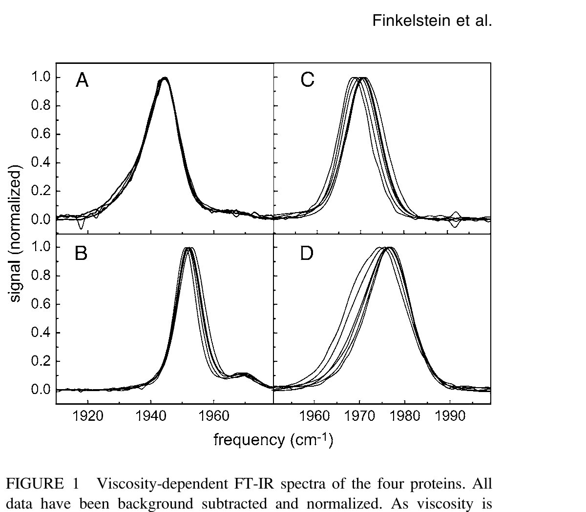
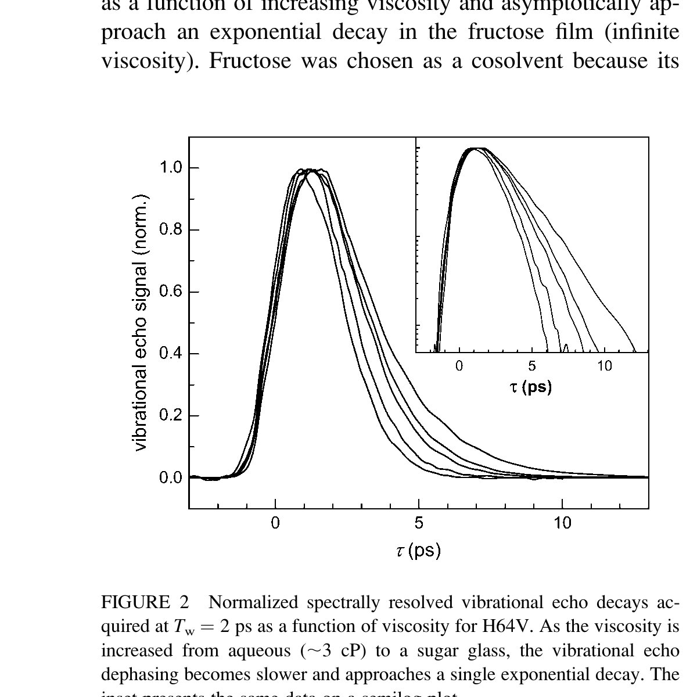
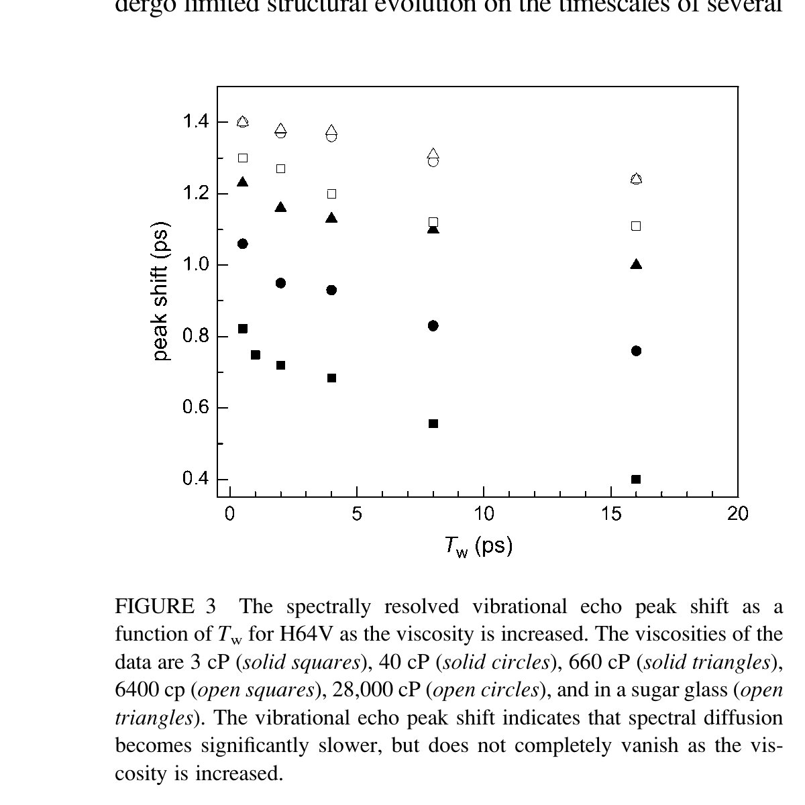
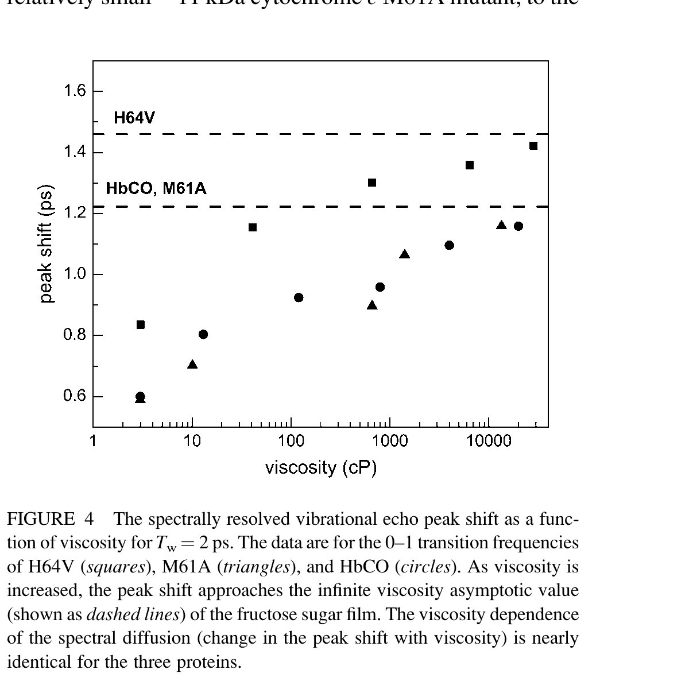
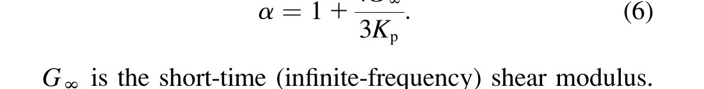
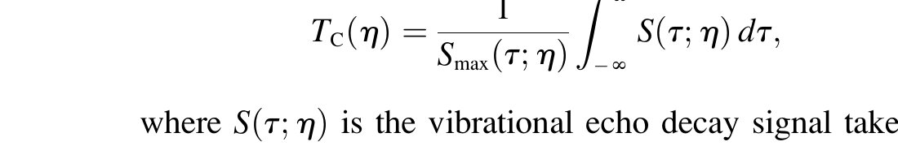
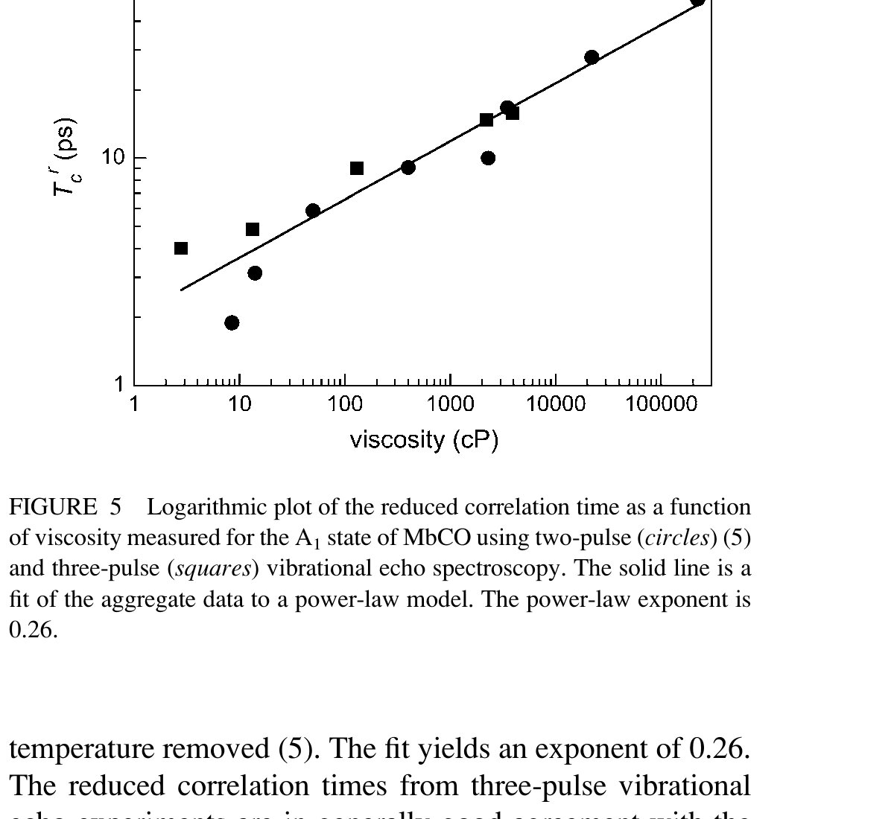
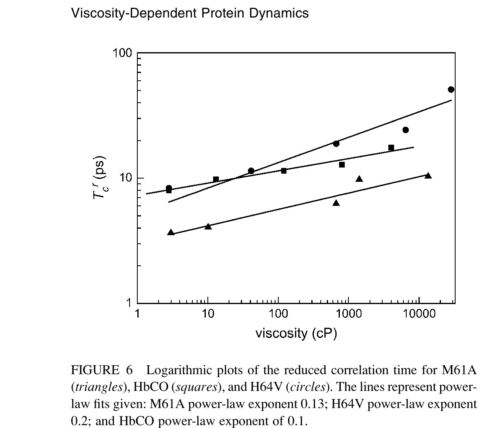
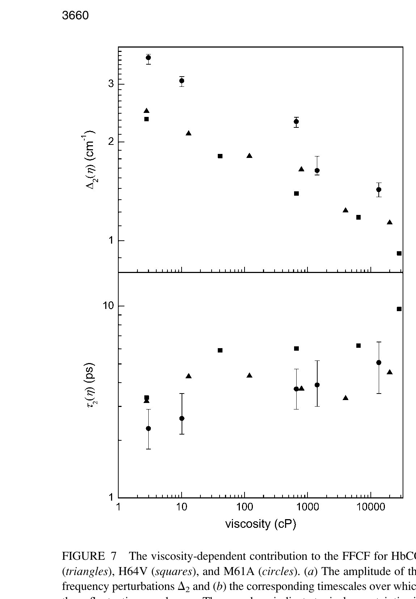

**Ilya J. Finkelstein, Aaron M. Massari, and M. D. Fayer**

*Biophysical Journal, Vol. 92, No. 10, pp. 3652–3662, 2007*

DOI: [10.1529/biophysj.106.093708](https://doi.org/10.1529/biophysj.106.093708)

## Table of Contents

- [Abstract](#abstract)
- [Introduction](#introduction)
- [Experimental Procedures](#experimental-procedures)
- [Results and Discussion](#results-and-discussion)
- [Viscoelastic Model](#viscoelastic-model)
- [Concluding Remarks](#concluding-remarks)
- [References](#references)

---

## Abstract

Spectrally resolved stimulated vibrational echo spectroscopy is used to investigate the dependence of fast protein dynamics on bulk solution viscosity at room temperature in four heme proteins: hemoglobin, myoglobin, a myoglobin mutant with the distal histidine replaced by a valine (H64V), and a cytochrome *c*₅₅₂ mutant with the distal methionine replaced by an alanine (M61A). Fructose is added to increase the viscosity of the aqueous protein solutions over many orders of magnitude. The fast dynamics of the four globular proteins were found to be sensitive to solution viscosity and asymptotically approached the dynamical behavior that was previously observed in room temperature sugar glasses. The viscosity-dependent protein dynamics are analyzed in the context of a viscoelastic relaxation model that treats the protein as a deformable breathing sphere. The viscoelastic model is in qualitative agreement with the experimental data but does not capture sufficient system detail to offer a quantitative description of the underlying fluctuation amplitudes and relaxation rates. A calibration method based on the near-infrared spectrum of water overtones was constructed to accurately determine the viscosity of small volumes of protein solutions.

* * *

## Introduction

Proteins are inherently dynamic molecules that undergo structural fluctuations over a wide range of timescales, from femtoseconds to milliseconds and longer ([[1–5](#ref1)]). Structural fluctuations that occur on the fastest (femtosecond to many picosecond) timescales permit the protein to sample a rugged energy landscape and ultimately facilitate slower, larger scale protein rearrangements that are responsible for modulating biological function ([[6–8](#ref6)]). The dynamics and stability of a protein in solution are intimately coupled to the dynamics of the solvent ([[8–12](#ref8)]). Early studies on O₂ photolysis from myoglobin highlighted the importance of solvent viscosity relative to other parameters such as pH or ionic strength in moderating the kinetics of rebinding in solution ([[12](#ref12)]). Subsequent detailed investigations of protein dynamics as a function of viscosity have offered insights into fundamental biochemical reactions ([[12–14](#ref12)]) and protein-solvent interactions ([[5](#ref5)],[[8–10](#ref8)],[[15–17](#ref15)]).

The relationship between structure and dynamics in heme proteins continues to serve as an elegant example of how nature has exploited the dynamic properties of proteins to affect their biological function. Hemoglobin is a globular, α-helical homodimer protein with four prosthetic heme groups that are responsible for reversibly binding O₂ and delivering it to myoglobin for subsequent storage in the muscle. The x-ray crystal structures of hemoglobin as well as myoglobin do not show static channels for biologically relevant small molecules such as O₂, NO, or CO to enter the protein's active site ([[18–20](#ref18)]). Elucidation of the mechanism by which these ligands enter (or escape) the active site via dynamic fluctuations of the protein structure has been one of the successes of modern biophysics ([[9](#ref9)],[[10](#ref10)],[[13](#ref13)],[[18](#ref18)],[[21](#ref21)],[[22](#ref22)]). Studies on the viscosity-dependent photolysis of CO from the protein's active site revealed the complexity of the ligand binding reaction. Further investigations into the viscosity-dependent dynamics of heme proteins have continued to support the strong coupling between solution viscosity and protein fluctuations ([[5](#ref5)],[[9](#ref9)],[[10](#ref10)],[[12](#ref12)],[[13](#ref13)],[[15](#ref15)]).

In this study, spectrally resolved infrared stimulated (three-pulse) vibrational echo ([[23](#ref23)]) spectroscopy is used to probe the fast structural dynamics of four globular heme proteins ([[24](#ref24)]) as a function of viscosity at room temperature. The solvent viscosity was tuned over five orders of magnitude by adding fructose to the aqueous protein solutions. Protein dynamics were directly measured by binding CO, a strong infrared (IR) chromophore, to the reduced Fe(II)-heme active site of each of the proteins. Cytochrome *c*₅₅₂ from *Hydrogenobacter thermophilus* is a small, ~11 kDa, globular protein with a solvent-accessible active site that contains a methionine ligand distal to the heme plane. The axial methionine residue in cytochrome *c*₅₅₂ was replaced by an alanine (M61A) to accommodate CO binding to the heme, and the aqueous mutant protein has been recently characterized by two-dimensional NMR and vibrational echo experiments ([[25–28](#ref25)]). Because the residue distal to the heme is known to strongly influence the dynamics sensed by the CO ([[29](#ref29)]), we also investigated the viscosity dependence of wild-type myoglobin (MbCO) and a mutant in which the distal histidine has been replaced by a valine (H64V). Finally, we investigated the viscosity-dependent protein dynamics of the ~64 kDa adult human hemoglobin (HbCO).

All four proteins in this study are found to be sensitive to the viscosity of the solution. As the viscosity is increased, the vibrational echo decays approach exponential relaxation, which indicates a reduction of the fast protein dynamics leaving a set of ultrafast structural fluctuations that motionally narrow the vibrational dynamic line ([[26](#ref26)]). Slower timescale dynamics (as measured by spectral diffusion) become slower and decrease in amplitude. By ~10,000 cP, the protein dynamics are indistinguishable from dynamics of a protein encased in a fructose glass. Although they vary substantially in size and structure, the vibrational echo decays of the four proteins exhibit very similar, mild viscosity dependence.

The experiments presented here are a major extension of previous two-pulse vibrational echo experiments conducted on the viscosity dependence of the dynamics of MbCO ([[5](#ref5)]). The two-pulse experiments involve a single time dimension, the time τ between the two input pulses that give rise to the vibrational echo signal ([[30](#ref30)],[[31](#ref31)]). The time resolution was an order of magnitude less than in the current experiments, and all of the data in the two-pulse experiments were analyzed assuming that the vibrational echo decays were exponential. The three-pulse vibrational echo experiments presented here have two time dimensions. In addition to the time between the first and second pulses, τ, there is a second time *T*w, the time between the second and third pulses. The two-pulse experiments are the equivalent of one point, *T*w = 0, in the current experiments. The increased time resolution shows that the decays are nonexponential. By making measurements over a series of *T*w values, a much broader range of dynamical timescales is observed. The current three-pulse stimulated vibrational echo experiments are sensitive to dynamics over a longer observation window (~100 ps) in contrast to the few picoseconds observed in the previous two-pulse experiments. The two time dimensions and the increase observation window makes it possible to more accurately pin down changes in the dynamics with viscosity. In addition, the experiments presented here examine four proteins with distinct characteristics, making comparisons possible.

The two-pulse experiments on MbCO were interpreted using a viscoelastic model ([[5](#ref5)]). The results appeared to be in excellent agreement with the predictions of the model. The three-pulse experiments make it possible to test the model more fully, and the results presented below demonstrate the failure of one of the major features of the model. Nonetheless, the viscoelastic relaxation model provides a rationale for the observed mild viscosity dependence of the vibrational echo signal, but it does not quantitatively capture the microscopic amplitudes and timescales of the protein fluctuations.

As part of this study, it was necessary to produce protein samples with a wide range of viscosities. An accurate determination of solvent viscosity in a ~10-μl solvent volume was achieved by calibrating the relationship between the area under a water combination band at ~5150 cm⁻¹ and the measured solvent viscosity for fructose-water and myoglobin-fructose-water solutions.

* * *

## Experimental Procedures

### Sample Preparation

Horse heart myoglobin, human hemoglobin, and fructose were purchased from Sigma-Aldrich (St. Louis, MO) and used without further purification. Purified human met-H64V was provided by Boxer and co-workers and was prepared according to published protocols ([[32](#ref32)],[[33](#ref33)]). The cytochrome *c* mutant M61A was prepared by Bren and co-workers as described previously ([[28](#ref28)],[[34](#ref34)]). Each protein was reduced with a ~10-fold excess of dithionite and stirred under a CO atmosphere for ~1 h. The reduced and CO-ligated protein was centrifugally concentrated to ~10 mM and loaded into an air-tight sample cell with a 50-μm spacer between two CaF₂ windows. The samples had an optical density of ~0.1–0.15 above a background of ~0.5 at the center of the CO stretching frequency. Sugar glass films were prepared by spin coating the protein-fructose solutions onto a CaF₂ flat and drying under vacuum overnight before data acquisition.

To increase the solution viscosity, fructose was added to the samples. Proteins at intermediate viscosities (<~200 cP) were prepared by dissolving fructose directly into the protein-water solutions. For the highest viscosities, the protein-water-fructose solutions were placed in a rotary evaporator to reduce the water content and increase solution viscosity. The viscosities of MbCO and HbCO fructose water solutions were measured directly by spinning disk rheometric methods (ARES rheometer, Rheometric Scientific, Piscataway, NJ). Limited availability and small sample volumes of the mutant proteins (M61A and H64V) precluded a direct rheometric determination of the solution viscosity, thus we developed a spectroscopic approach to accurately measure the solution viscosity over a range of ~10–100,000 cP. The spectroscopic viscosity determination method and the range of viscosities studied for each protein is described in complete detail in the Supplementary Material.

To verify that the changes in the protein dynamics are related to the solution viscosity (as opposed to fructose-specific interactions) we compared several data sets acquired at viscosities up to ~200 cP but where the coadditive was glycerol. The vibrational echo decays were identical regardless of whether fructose or glycerol was used to increase the viscosity. This observation is consistent with earlier observations that MbCO dynamics were sensitive to the solution viscosity regardless of whether ethylene glycol and glycerol is used as a coadditive ([[5](#ref5)]).

### Vibrational Echo Spectroscopy

The experimental setup has been previously described in detail ([[4](#ref4)],[[35](#ref35)]). Tunable mid-IR pulses with a center frequency adjusted to match the center frequency of the protein sample of interest (1945–1976 cm⁻¹) were generated by an optical parametric amplifier pumped with a regeneratively amplified Ti:Sapphire laser. The bandwidth and pulse duration used in these experiments were 150 cm⁻¹ and 100 fs, respectively. The mid-IR pulse was split into three pulses (~700 nJ/pulse each) with experimentally controllable timing delays. The delay between the first two pulses, τ, was scanned at each time *T*w, the delay between pulses two and three. The three beams were crossed and focused at the sample. The spot size at the sample was ~150 μm. The vibrational echo pulse generated in the phase-matched direction was dispersed through a 0.5 meter monochromator (~1.2 cm⁻¹ spectral resolution) and detected with a liquid nitrogen-cooled HgCdTe array detector or a liquid nitrogen-cooled InSb single element detector. A power dependence study was performed on all samples and the data showed no power-dependent effects ([[35](#ref35)]). Data collection for all samples was performed at room temperature in an enclosed, dry-air purged environment. Spectrally resolved vibrational echo data for each protein were acquired at the following waiting times: *T*w = 0.5, 2, 4, 8, and 16 ps and at all viscosities. All subsequent data analysis was performed on the spectrally resolved data. The spectral resolution makes it possible to separate contributions from partially overlapping spectral features in the absorption spectra of the four heme-CO proteins studied.

### FFCF Extraction from Vibrational Echo Data

To extract quantitative information from the vibrational echo decays, nonlinear response theoretical calculations were compared to the experimental data. Within conventional approximations ([[36–38](#ref36)]), both the vibrational echo and the linear infrared absorption spectrum are completely determined by the frequency-frequency correlation function (FFCF). A multiexponential form of the FFCF, *C*(*t*), was used in accord with previous vibrational echo analysis and molecular dynamics (MD) simulations of heme proteins ([[26](#ref26)],[[28](#ref28)],[[35](#ref35)],[[39](#ref39)],[[40](#ref40)]). It is important to note the highly nonlinear relationship between the FFCF and the vibrational echo decay. The exponentials in the FFCF do not necessarily give rise to single or multiexponential vibrational echo decay curves, but rather produce complicated nonexponential decays that are calculated from the FFCF using diagrammatic perturbation theory ([[37](#ref37)]). In contrast to the previously reported two-pulse vibrational echo study of the viscosity dependence of MbCO, the data presented below are not fit as if they are single exponentials. The nonexponential decays observed here are reproduced by the calculations. The FFCF employed here has the form

$$C(t) = \Delta_0^2 + \Delta_1^2 \exp(-t/\tau_1) + \Delta_2^2 \exp(-t/\tau_2) \tag{1}$$

<noscript></noscript>

where Δ₀ is the contribution from inhomogeneous broadening. Inhomogeneous broadening is caused by variations in protein structure that influence the CO frequency but evolve on timescales that are much longer than the experimental time window. In this study, the structural dynamics that occur on the timescale slower than ~100 ps will contribute to inhomogeneous broadening; Δ*i* is the magnitude of the contribution from a frequency perturbing process that contributes over a characteristic time τ*i*. If τ*i* is fast compared to Δ*i*⁻¹ (Δ*i*τ*i* ≪ 1, Δ*i* in radians/ps) for a given exponential term, then that component of the FFCF is motionally narrowed ([[26](#ref26)],[[41](#ref41)],[[42](#ref42)]). For a motionally narrowed term in *C*(*t*), the Δ*i* and τ*i* cannot be determined independently, but a pure dephasing time, can be defined (*T*₂\* = (Δ²τ)⁻¹), which describes the "homogeneous linewidth" for that component of the FFCF. Although protein dynamics generally occur over a continuum of timescales, a multiexponential *C*(*t*) organizes these fluctuations into experimentally relevant timescales that can be compared from one system to another.

The FFCF is used to calculate the linear absorption spectrum and a series of vibrational echo decay curves (τ scanned, *T*w fixed) for a range of *T*w values. An FFCF with a single exponential plus a constant term was not able to simultaneously reproduce the linear IR spectrum and the vibrational echo decay curves at all *T*w values for any of the proteins and viscosities in this study. To maximize the efficiency of the empirical fits, δ-function laser pulses were used when fitting the data. A comparison of these fits to those obtained by performing the full three time-ordered integrals with the finite pulse durations ([[37](#ref37)]) verified that the effects of pulse duration were negligibly small given the very short pulses used in the experiments. The FFCF obtained from analysis of the data using diagrammatic perturbation theory calculations was deemed correct when it could be used to calculate vibrational echo decays that fit the experimental vibrational echo data at all *T*w values and simultaneously reproduce the linear absorption spectrum. The viscosity-dependent FFCFs for each of the proteins are presented in the Supplementary Material. In the case of HbCO and MbCO, several spectroscopically distinct structural states can produce an oscillatory component in the vibrational echo signal from the main peak of interest through an accidental degeneracy beat mechanism ([[43](#ref43)]). To extract decays from the data so that the dynamics of the major state can be analyzed, the influence of the accidental degeneracy beat mechanisms are removed using the well-defined procedure that has been established previously ([[44](#ref44)]).

* * *

## Results and Discussion

### Linear and Stimulated Vibrational Echo Spectroscopy

The viscosity-dependent FTIR spectra of CO bound to MbCO, HbCO, H64V, and M61A are shown in [Fig. 1, *a–d*](#fig1). Both MbCO and HbCO exist as an ensemble of structurally distinct, interconverting substates that give rise to multiple peaks in the FTIR spectrum of the CO. In the case of MbCO, three spectroscopic substates commonly labeled as A₃, A₁, and A₀ (very small) can be observed at 1934, 1944, and 1968 cm⁻¹, respectively. In HbCO, two substates are observed at 1951 and 1968 cm⁻¹. The structural substates in both MbCO and HbCO arise because of the several possible orientations of the histidine distal to the heme plane. The distal histidine is a significant source of dephasing in MbCO ([[4](#ref4)],[[40](#ref40)],[[45](#ref45)]), and replacing it with a valine (H64V) allows us to observe structural fluctuations with increased emphasis on residues farther from the protein active site ([[26](#ref26)],[[39](#ref39)]).

<figure class="paper-figure" id="fig1">

<figcaption><strong>Figure 1.</strong> Viscosity-dependent FT-IR spectra of the four proteins. All data have been background subtracted and normalized. As viscosity is increased, the FT-IR spectra shift to higher frequency by a few wavenumbers. Panels A–D show the spectra of MbCO, HbCO, H64V, and M61A, respectively.</figcaption>
</figure>

The linear absorption spectra of the proteins examined in this study are only mildly dependent on the solvent viscosity. Upon addition of fructose (and an increase in the viscosity by many orders of magnitude) the linear absorption spectra of MbCO do not shift within experimental resolution. The other proteins shift at most a few wave numbers to the blue with M61A exhibiting the largest blue shift of 2.7 cm⁻¹ upon encapsulation in a fructose film. As viscosity is increased for the aqueous solution, the spectral width of the HbCO peak increases by ~1.5 cm⁻¹, while the widths of MbCO and H64V do not change within the spectral resolution of the FTIR measurement. The width of M61A decreases with increasing viscosity having a maximum decrease of ~3 cm⁻¹ when the protein is encapsulated in a fructose glass. The linear absorption spectrum is sensitive to protein structural fluctuations that occur on all timescales. Therefore, an increase or decrease in width shows that a change in the total range of frequencies has occurred. Because the frequencies are linked to structural configurations, a change in total linewidth suggests that there is a change in the total range of structural configurations. It is interesting to note that the largest protein increased in width whereas the smallest protein decreased in width. A difference between M61A and the other three proteins is that its active site is exposed to the solvent. It is unclear whether size differences and/or the exposed active site is responsible for the small changes in linewidths with increasing viscosity.

The relative concentrations of the structural substates in MbCO and HbCO are generally sensitive to solution conditions ([[44](#ref44)],[[46–48](#ref46)]). In protein-sugar films, the substate concentration is sensitive to the degree of film hydration and the type of saccharide used ([[49–51](#ref49)]). A change in the substate ratio means that there is a change in the relative thermodynamic stability of the two substates or for very dry films it is possible that the sugar glass captures the system far from equilibrium. The ratio of the spectroscopic substates in MbCO and HbCO does not change even in the fructose sugar films, contrary to what has been observed in trehalose and sucrose ([[26](#ref26)],[[49](#ref49)],[[52](#ref52)]). This observation may indicate that water preferentially hydrates the protein to a greater degree in fructose than in trehalose or sucrose glasses ([[26](#ref26)],[[52](#ref52)]) or that the fructose films retain more residual moisture than the disaccharides.

The linear absorption spectrum of heme-CO in proteins at room temperature is inhomogeneously broadened, obscuring the underlying protein dynamics ([[26](#ref26)],[[39](#ref39)],[[53](#ref53)],[[54](#ref54)]). Stimulated vibrational echo spectroscopy can look inside the inhomogeneously broadened absorption spectrum and reveal information about the fast dynamics of protein fluctuations ([[55](#ref55)]). [Fig. 2](#fig2) displays the spectrally resolved vibrational echo decay curves of H64V taken at the center of the 0–1 transition frequency as a function of increasing viscosity at a fixed waiting time, *T*w = 2 ps. All four proteins exhibit similar qualitative behavior. As the viscosity of the protein-fructose-water solution is increased the vibrational echo decays become slower and approach exponential decay functions as the viscosity approaches that of the sugar glass.

<figure class="paper-figure" id="fig2">

<figcaption><strong>Figure 2.</strong> Normalized spectrally resolved vibrational echo decays acquired at <em>T</em>w = 2 ps as a function of viscosity for H64V. As the viscosity is increased from aqueous (~3 cP) to a sugar glass, the vibrational echo dephasing becomes slower and approaches a single exponential decay. The inset presents the same data on a semilog plot.</figcaption>
</figure>

For all four proteins, the vibrational echo decays slow down as a function of increasing viscosity and asymptotically approach an exponential decay in the fructose film (infinite viscosity). Fructose was chosen as a cosolvent because its concentration could be varied to continuously modulate the viscosity from ~3–10,000 cP and eventually to a sugar glass. The nearly exponential vibrational echo decays of heme proteins encapsulated in a fructose glass are consistent with the behavior of proteins confined in other sugar glasses at room temperature and ethylene glycol and glycerol glasses observed at lower temperatures ([[5](#ref5)],[[26](#ref26)],[[56](#ref56)]). The onset of single exponential vibrational echo decays is a signature of the separation of the protein dynamics into two limits: very fast processes that produce motionally narrowed Lorentzian lineshapes and give rise to exponential vibrational echo decays, and very slow or static processes that do not evolve on the vibrational echo timescale and give rise to the Gaussian inhomogeneous distribution observed in the linear absorption spectrum. Previously, we have shown that the fastest protein dynamics that are sensed by the CO are essentially solvent independent and persist even when the protein is encased in a trehalose glass ([[26](#ref26)]). Our current findings confirm that this is a recurring feature of protein dynamics in sugar glasses and that the identity of the protein or the sugar is not important. By continuously increasing the solution viscosity we are able to monitor the transition from the dephasing that occurs over a variety of timescales in aqueous solution to the only ultrafast fluctuations that give rise to approximately single exponential vibrational echo decays that were previously observed in trehalose glasses.

In stimulated (three-pulse) vibrational echo experiments, the dynamics that occur on timescales longer than those shown for a single vibrational echo decay ([Fig. 2](#fig2)), termed spectral diffusion, can be measured by varying the time delay between the second and third pulses, *T*w. Although at each *T*w the entire decay curve is measured, it is convenient to display the large number of data sets by plotting the vibrational echo peak shift ([[39](#ref39)],[[57–59](#ref57)]) as a function of *T*w. The vibrational echo peak shift is the difference between the time of peak amplitude of the decay curve and zero time ([[57](#ref57)],[[58](#ref58)]). As *T*w is increased more fluctuations that occur at longer times are observed. These additional fluctuations cause the vibrational echo to decay faster and its peak to shift toward the origin ([[39](#ref39)],[[57](#ref57)],[[58](#ref58)]). A faster vibrational echo decay and smaller peak shift means that a larger portion of the total possible structural configurations of the protein has been sampled. For long enough *T*w, spectral diffusion is complete and the proteins have sampled all possible structures. In this limit, the Fourier transform of the vibrational echo is equal to the absorption line and the vibrational echo peak shift is zero. In the experiments conducted here, the long time limit is not reached because the maximum *T*w is restricted by the CO vibrational lifetime ([[60–62](#ref60)]).

[Fig. 3](#fig3) shows the vibrational echo peak shifts for H64V at several viscosities and in a fructose film. In the aqueous protein ([Fig. 3](#fig3), solid squares), the protein samples ~50% of the full linewidth by a *T*w of 16 ps. As viscosity is increased, the protein dynamics shift to slower timescales, as is evidenced by the larger initial peak shift amplitude and the reduction in the decay of the peak shift as a function of *T*w. At very high viscosities, the protein is unable to sample a substantial portion of its dynamic linewidth within the experimental observation window. It is interesting to note that the spectral diffusion at ~20,000 cP is identical within experimental error to that of a fructose film ([Fig. 3](#fig3), top two sets of data points). If the fast protein dynamics consisted only of a very fast motionally narrowed contribution to the vibrational echo decay with no spectral diffusion, then the peak shift would be independent of *T*w. The mild slope of the upper most points and nearly exponential vibrational echo decays show that there continues to be some spectral diffusion even in a fructose glass, which may indicate incomplete dehydration of the sugar film. The decrease in the slope of these peak shift plots with increasing viscosity demonstrates that the spectral diffusion is significantly reduced relative to that of the aqueous protein. The vibrational echo dynamics of all four proteins exhibited the same decrease in spectral diffusion dynamics as viscosity is increased. Furthermore, all proteins encapsulated in a fructose glass showed a mild *T*w dependence, suggesting that the proteins still undergo limited structural evolution on the timescales of several *T*w. The decrease in spectral diffusion is caused by a decrease in sampling of distinct protein structures on a timescale out to ~5× the longest *T*w ([[62](#ref62)]).

<figure class="paper-figure" id="fig3">

<figcaption><strong>Figure 3.</strong> The spectrally resolved vibrational echo peak shift as a function of <em>T</em>w for H64V as the viscosity is increased. The viscosities of the data are 3 cP (solid squares), 40 cP (solid circles), 660 cP (solid triangles), 6400 cP (open squares), 28,000 cP (open circles), and in a sugar glass (open triangles). The vibrational echo peak shift indicates that spectral diffusion becomes significantly slower, but does not completely vanish as the viscosity is increased.</figcaption>
</figure>

The peak shift information can also be used to conveniently gauge the relative viscosity-dependent behavior of the proteins in this study. [Fig. 4](#fig4) plots the peak shift of HbCO, H64V, and M61A at *T*w = 2 ps as a function of viscosity. The peak shifts of the A₁ and A₃ states of MbCO are difficult to determine because of the high degree of spectral overlap between the two states and these peak shifts are omitted from the current discussion. As the viscosity is increased, the amplitudes of the peak shifts increase (reflecting a decrease in the spectral diffusion) and asymptotically approach the peak shifts of the proteins in the fructose glass (indicated by the *dashed line*). The amplitude of the H64V peak shift is larger than that of HbCO and M61A. However, the viscosity dependence is reflected by the rate of change of the peak shift as a function of viscosity. The peak shift dependence on viscosity is nearly identical for all three proteins, and this observation remains consistent at all *T*w values.

<figure class="paper-figure" id="fig4">

<figcaption><strong>Figure 4.</strong> The spectrally resolved vibrational echo peak shift as a function of viscosity for <em>T</em>w = 2 ps. The data are for the 0–1 transition frequencies of H64V (squares), M61A (triangles), and HbCO (circles). As viscosity is increased, the peak shift approaches the infinite viscosity asymptotic value (shown as dashed lines) of the fructose sugar film. The viscosity dependence of the spectral diffusion (change in the peak shift with viscosity) is nearly identical for the three proteins.</figcaption>
</figure>

* * *

## Viscoelastic Model

The viscosity-dependent vibrational dephasing data have been discussed above in terms of several qualitative observations about the viscosity dependence of the structural fluctuations of heme proteins. First, the protein structural dynamics, as sensed by the CO bound to the heme active site, are only mildly sensitive to the detailed structure of the protein. In this study, we examined four proteins of varying sizes from the relatively small ~11 kDa cytochrome *c* M61A mutant, to the ~16 kDa MbCO and H64V mutant, and the larger 64 kDa HbCO. Furthermore, the residue distal to the heme plane was different in three of the four proteins: alanine (M61A), histidine (MbCO, HbCO), and valine (H64V). Although each of the proteins exhibits different dephasing rates that are sensitive to the identity of the distal residue and proteins structural dynamics ([[28](#ref28)],[[39](#ref39)]), the viscosity-dependent change in these fluctuations remained nearly the same for all four proteins. In each case, the dynamics are significantly slower in higher viscosity solvents and the longer timescale (<100 ps) fluctuations, observable as spectral diffusion, are nearly identical for the four proteins. Changing the solvent from fructose water to glycerol water did not change the result, which demonstrates that the dominate influence on dynamics is indeed viscosity rather than the changing composition of the fructose-water mixture.

Second, we observed that the dephasing rates exhibit a weak viscosity dependence. These data presented in [Figs. 4](#fig4) and [5](#fig5) span over five orders of magnitude in viscosity but the rates of spectral diffusion and vibrational dephasing change by approximately two orders of magnitude.

Both of these experimental observations are consistent with previously reported two-pulse vibrational echo measurements of the A₁ state MbCO as a function of viscosity and temperature ([[5](#ref5)]). A conceptually simple viscoelastic theory of protein-solvent interactions was used to discuss the earlier temperature and viscosity-dependent experimental data of the A₁ state of MbCO ([[5](#ref5)],[[54](#ref54)],[[63](#ref63)]). The main features of the viscoelastic model describing the relationship between viscosity-dependent protein structural fluctuations and vibrational echo observables ([[5](#ref5)]) will be briefly recapitulated and then tested with the isothermal viscosity-dependent protein dynamics data presented in this study.

The CO group in heme proteins is located in the protein interior and does not interact with the bulk solvent directly. Rather, vibrational dephasing of the CO is well described by interactions between the CO dipole moment and time-dependent fluctuating electric fields that arise from structural dynamics of partially charged residues within the protein ([[4](#ref4)],[[29](#ref29)],[[31](#ref31)],[[64](#ref64)]). Protein structural fluctuations are known to be strongly coupled to solvent dynamics ([[15](#ref15)],[[65](#ref65)]). Protein structural fluctuations may involve transient reorganization of the solvent around the protein, a process that is increasingly hindered as viscosity is increased. Structural fluctuations, even those that involve the interior of the protein, can require surface topology changes of the protein. These surface topology changes are resisted by the solvent, and the resistance increases as the viscosity increases. In the viscoelastic model, the protein is treated as a sphere of radius *r*p embedded in a viscoelastic continuous solvent with a given viscosity, η. The model considers spherical fluctuations of the protein's volume; *i.e.*, the protein is treated as a breathing sphere. This assumption is a reasonable approximation for the globular heme proteins. As a breathing sphere, the protein's fluctuations are fully characterized by its change in radius. The changes in the protein radius are coupled to changes in the electric field at the CO due to displacement of charged and polar groups within the protein. The protein is also treated as a continuous material with a bulk modulus *K*p. The viscoelastic theory shows that changes in the proteins radius are essentially instantaneously translated into changes of the electric field sensed by the CO.

The coupling between the changes in the protein radius, δ*r*p(*t*), and the fluctuating electric field, δ*E*(*t*), are described by a proportionality constant *b*,

$$\delta E(t) = b\,\delta r_p(t) \tag{2}$$

<noscript></noscript>

Within these assumptions, the time-dependent frequency fluctuations of the CO transition frequency is described by

$$\delta\omega(t) = \frac{\delta\mu_{01}\,\delta E(t)}{\hbar} - \langle\omega\rangle \tag{3}$$

<noscript></noscript>

where δμ₀₁(*t*) is the change in the dipole moment of the CO upon excitation from the ground to the first excited state and δω(*t*) is the deviations of the transition frequency from the ensemble averaged mean frequency ⟨ω⟩.

The viscosity dependence primarily manifests itself through the last term of the FFCF given in Eq. 1 (see below). The viscoelastic theory shows ([[5](#ref5)]) that this term is given by

$$\Delta_2 = \frac{b\,\delta\mu_{01}}{\hbar\sqrt{4\pi}} \left(\frac{k_B T}{3K_p r_p}\right)^{1/2} \tag{4}$$

<noscript></noscript>

where *k*B is Boltzmann's constant, *T* is the temperature, *ℏ* is Planck's constant, and the other parameters have been defined above. Note that within this model, Δ₂ is not viscosity dependent.

$$\tau_2 = \alpha\frac{\eta}{G_\infty} \tag{5}$$

<noscript></noscript>

with

$$\alpha = 1 + \frac{4G_\infty}{3K_p} \tag{6}$$

<noscript></noscript>

*G*∞ is the short-time (infinite-frequency) shear modulus. The solvent's viscoelastic behavior is characterized by a decaying shear modulus *G*(*t*). However, for sufficiently short times, *G*(*t*) can be approximated as *G*∞. As an estimate *K*p ≈ *K*∞, and the Cauchy relation for simple solids is used ([[66](#ref66)]), *G*∞ = (3/5)*K*∞. Therefore, α ≈ 9/5. The central result is that τ₂ is linearly dependent on viscosity whereas Δ₂ is independent of viscosity. Increasing the solvent viscosity reduces the ability of the radius of the protein to change at a given frequency. In the viscoelastic model, as the viscosity is increased, the characteristic time associated with the decay of the FFCF, τ₂, becomes longer. Fluctuations that at low viscosity occurred within the time window of the experiment (0–100 ps) are pushed to longer times, slowing the rate of vibrational dephasing observed in the vibrational echo experiment.

Eq. 5 suggests that at infinite viscosity, τ₂ would become infinitely long, and no dephasing would occur in the experimental time window. However, for sugar glasses the solvent is completely fixed but the protein can still undergo internal structural fluctuations that do not significantly change the protein's surface topology. The molecular origin of the protein's internal structural fluctuations have been characterized recently by three-pulse vibrational echo experiments on proteins in sugar glasses and MD simulations of H64V in a static (0 K) TIP3P water solvent ([[26](#ref26)]). The fluctuations that remain even at "infinite" viscosity are very fast small amplitude local motions that give rise to a motionally narrowed component of the FFCF, the second term on the right-hand side of Eq. 1. These fluctuations occur at all viscosities and do not contribute to the viscosity dependence. Therefore these viscosity-independent fluctuations are subtracted from the total dephasing rate to accurately determine how vibrational dephasing depends on viscosity.

The nonexponential vibrational echo dephasing decay curve for a particular *T*w can be characterized by a correlation time, *T*C(η), as

$$T_C(\eta) = \frac{1}{S_{\max}(\tau;\eta)} \int_{-\infty}^{\infty} S(\tau;\eta)\, d\tau \tag{7}$$

<noscript></noscript>

where *S*(τ; η) is the vibrational echo decay signal taken at the center of the CO transition frequency as a function of delay time τ and at a fixed waiting time *T*w and viscosity η. For a purely exponential signal, the correlation time reduces to the exponential decay time constant. For nonexponential decaying signals, the correlation time provides a convenient measure of the characteristic vibrational echo decay timescale. To obtain a pure viscosity-dependent correlation time related only to the last term in Eq. 1, the dephasing from viscosity-independent, *i.e.*, fructose glass, fluctuations are subtracted out. The reduced dephasing time, *T*Cr(η), at finite viscosities is given by

$$\frac{1}{T_C^r(\eta)} = \frac{1}{T_C(\eta)} - \frac{1}{T_C(\eta = \infty)} \tag{8}$$

<noscript></noscript>

where *T*C(η = ∞) is the dephasing time of the protein confined in a fructose glass. The viscoelastic model predicts that the reduced dephasing rate should scale as η1/3, which is the result of the linear dependence of τ₂ on η ([[5](#ref5)]).

The viscosity-dependent reduced dephasing times for the A₁ state of MbCO are presented in [Fig. 5](#fig5) on a log plot. The dephasing times obtained previously using two-pulse vibrational echo experiments ([[5](#ref5)]) are shown as circles, and the data acquired here using stimulated vibrational echoes with *T*w = 2 ps are given as squares. On a log plot, a power law appears as a line. The line is a power law fit to the data with the two points at the lowest viscosities from the previous experiments omitted from the fit because of insufficient time resolution (~1 ps) in those experiments. The two highest viscosity points were taken at low temperature with the influence of temperature removed ([[5](#ref5)]). The fit yields an exponent of 0.26. The reduced correlation times from three-pulse vibrational echo experiments are in generally good agreement with the two-pulse vibrational echo experiments measured previously. It is noteworthy that the measured exponent, 0.26, is relatively close to but not in agreement with the 0.33 exponent predicted by the viscoelastic model.

<figure class="paper-figure" id="fig5">

<figcaption><strong>Figure 5.</strong> Logarithmic plot of the reduced correlation time as a function of viscosity measured for the A₁ state of MbCO using two-pulse (circles) (<a href="#ref5">5</a>) and three-pulse (squares) vibrational echo spectroscopy. The solid line is a fit of the aggregate data to a power-law model. The power-law exponent is 0.26.</figcaption>
</figure>

The two-pulse vibrational echo is equivalent to the three-pulse vibrational echo experiments conducted here, but with *T*w = 0. Therefore, the two-pulse vibrational echo can probe the fastest protein dynamics but is unable to observe spectral diffusion. In addition, the limited time resolution of the previous two-pulse experiments (~1 ps) reduced their applicability to fast dynamics and low viscosities. The ~100-fs time resolution (~150 cm⁻¹ spectral pulse width) available in this study can probe fast dynamics and the lowest viscosities. In obtaining the A₁ reduced correlation times, the contribution from the partially overlapping A₃ state was removed using the same procedure that has been applied in other studies of MbCO ([[4](#ref4)],[[67](#ref67)]). This procedure produced some uncertainty in the A₁ and A₃ peak shifts, and they were not included in [Fig. 4](#fig4). However, *T*Cr(η) is an integral of the vibrational echo decay and was found to be insensitive to small changes in the shape of vibrational echo decay curves.

[Fig. 6](#fig6) presents the reduced correlation times for the other three proteins studied and the corresponding power law fits. The HbCO and M61A reduced correlation times have power law exponents of 0.1 and 0.13, respectively. These are substantially different from the 0.26 exponent found for the A₁ line of MbCO. The H64V gave a power law exponent of 0.21, close to that of MbCO and may be within experimental error. Although the actual dephasing times of H64V and MbCO are substantially different, their viscosity dependences are found to be very similar. It has been demonstrated previously that in aqueous solution H64V undergoes slower dephasing because of the removal of the distal histidine. However, the global structural fluctuations of the two proteins would be expected to be essentially the same. The similarity of MbCO and H64V viscosity dependences is consistent with there having the same structural fluctuation and that the viscosity dependence is a result of global structural fluctuations. In the case of myoglobin, a single point mutation in the protein interior (H64V) is not sufficient to significantly perturb the protein's structural stability or interactions with the solvent.

<figure class="paper-figure" id="fig6">

<figcaption><strong>Figure 6.</strong> Logarithmic plots of the reduced correlation time for M61A (triangles), HbCO (squares), and H64V (circles). The lines represent power-law fits given: M61A power-law exponent 0.13; H64V power-law exponent 0.2; and HbCO power-law exponent of 0.1.</figcaption>
</figure>

The results presented in [Fig. 6](#fig6) show that the viscoelastic model's prediction of a 0.33 exponent overestimates the viscosity dependence of the protein dynamics. The model captures the fact that the viscosity dependence is mild, but the results show that there can be substantial deviations from the η1/3 dependence. HbCO exhibits the weakest viscosity dependence. We conjecture that this may be related to the intraprotein cavity that can permit large-scale protein deformations to persist even at the highest viscosities. Although the surface topology of HbCO is constrained by the solvent, the protein can continue to transiently occupy the intracavity region. This conjecture could be tested by studying the viscosity dependence of CO dephasing in HbCO with a small-molecule affector, such as bezafibrate (BZF), introduced into the protein cavity. M61A also displays a weak viscosity dependence although not as weak as HbCO. Because M61A belongs to a different class of heme proteins than the other three proteins in this study, it is possible that the internal rigidity of this protein differs from the other proteins. As a result, the relevant structural dynamics are coupled differently to the surrounding solvent. This idea is supported in the detailed analysis presented below by the fact that the viscosity-dependent dynamics in M61A are in general larger in amplitude and slower than those of the other three proteins studied.

The relationship between the vibrational dephasing rate and protein structural fluctuations is highly nonlinear. A weak viscosity dependence of *T*Cr(η) may understate the underlying influences on protein structural dynamics that are caused by a change in viscosity. Structural rearrangements of protein residues cause time-dependent fluctuations in the transition frequency of the CO. The FFCF is a precise way to characterize these CO frequency fluctuations. Although protein structural fluctuations evolve over a continuum of timescales, the FFCF organizes these timescales into a finite set of fluctuation rates and relative amplitudes. The FFCF of each protein at a given viscosity was obtained by simultaneously fitting the linear absorption spectrum and a family of vibrational echo decays at several *T*w values at the spectral center frequency, as described in the section "FFCF extraction from vibrational echo data". The fits to the data used to extract the FFCFs for each protein are very good. The fits are shown in the Supplementary Material, Fig. S2.

In all four proteins at all viscosities, the FFCF was found to contain a fast (sub-100 fs) process that is motionally narrowed on the experimental timescales, and a slower (several picoseconds) process that describes larger-amplitude protein fluctuations ([[26](#ref26)]). The protein structural fluctuations that give rise to the fast exponential in the FFCF are identified with viscosity-independent protein fluctuations that persist even for proteins in sugar glasses. We have earlier elucidated the nature of these fluctuations through a combination of vibrational echo experiments and MD simulations ([[26](#ref26)]). These fluctuations can be pictured as uncorrelated small-scale displacements of protein atoms and small groups from their equilibrium positions without significant deformations in the overall protein structure. These processes are nearly uncoupled from the solvent environment and are thus independent of solution viscosity. They will contribute a viscosity-independent term to the FFCF, which here we take to be the second term on the right-hand side of Eq. 1. The viscosity-independent contribution to the FFCF was obtained from fitting the vibrational echo data for the proteins encased in a fructose film. The sub-100-fs exponential dominates the FFCF. After the viscosity-independent part of the FFCF was obtained from the fructose-glass samples, it was not allowed to vary when fitting the protein dynamics at all subsequent viscosities. This procedure allows us to evaluate a reduced FFCF that reflects only the viscosity-dependent contribution to the total protein dynamics (in analogy to *T*Cr(η)).

[Fig. 7, *a* and *b*](#fig7), display the magnitude, Δ₂(η), and timescales, τ₂(η), of the FFCF (Eq. 1). The motionally narrow term in the FFCF, Δ₁²exp(−*t*/τ₁), is independent of viscosity. The data are presented for HbCO, M61A, and H64V. The error bars indicate typical uncertainties in the fit values. The uncertainty in the timescales of the protein fluctuations increases at higher viscosities because the viscosity-dependent part of the FFCF contributes significantly less to the overall vibrational echo signal than the viscosity-independent component. As viscosity is increased, the magnitude of the protein fluctuations (Δ₂) decreases while the characteristic timescale of these processes (τ₂) gets longer. The vibrational echo detects structural evolution on timescales shorter than ~100 ps; slower process will appear as if they are static in these experiments. The decrease in the magnitude of Δ₂ and shift of these fluctuations to longer times is consistent with an overall redistribution of the continuum of protein dynamics to longer timescales. All three proteins show a monotonic decrease in Δ₂ (the amplitude of the observed viscosity-dependent fluctuations) that could be described well by a weak power law with an exponent of 0.1 ± 0.01. H64V and M61A also exhibit a mild, monotonic lengthening of the timescale of frequency fluctuation. In the case of HbCO, the timescale of fluctuations, τ₂, is unchanged between ~10–1000 cP, within the relatively large experimental uncertainty. This is consistent with HbCO dynamics being the least sensitive to viscosity. Vibrational echo experiments examining the effects of confinement in a nanoscopic water environment of MbCO and HbCO showed that HbCO dynamics were influenced substantially less than the MbCO dynamics ([[59](#ref59)]).

In the viscoelastic model describing the influence on the vibrational echo observables of the viscosity dependence of protein structural fluctuation, the magnitude of frequency fluctuations (Δ₂) in the FFCF is not dependent on solution viscosity (see Eq. 4), but the characteristic timescale of the fluctuations, τ₂, scales linearly with viscosity (see Eq. 5) ([[5](#ref5)],[[63](#ref63)]). These predictions are in disagreement with the experimentally determined FFCFs components, Δ₂ and τ₂, shown in [Fig. 7](#fig7). It is found that in the three proteins in which the components of the FFCF were determined, the Δ₂ values varied with viscosity in all three; τ₂ has a much weaker than linear dependence, and for HbCO, may be viscosity independent. Although the viscoelastic model does not reproduce the quantitative trends observed in the experiments, it properly predicts that the viscosity dependence of the protein dynamics should be very weak. There were a number of simplifying assumptions in the current form of the viscoelastic model. The protein was taken to be a uniform breathing sphere characterized only by *K*p, the bulk modulus of the solvent was ignored, and the infinite viscosity approximation to the shear modulus was employed. It is possible that an improved viscoelastic theory would more accurately capture the experimental results.

<figure class="paper-figure" id="fig7">

<figcaption><strong>Figure 7.</strong> The viscosity-dependent contribution to the FFCF for HbCO (triangles), H64V (squares), and M61A (circles). (<em>a</em>) The amplitude of the frequency perturbations Δ₂ and (<em>b</em>) the corresponding timescales over which these fluctuations evolve, τ₂. The error bars indicate typical uncertainties in the fits. The data are presented on logarithmic scales.</figcaption>
</figure>

## Concluding Remarks

Here we have examined connection between solvent viscosity and protein structural fluctuations. The vibrational echo experiments measure the vibrational dephasing of CO bound to the protein active site, which is sensitive to the global structural fluctuations of the protein. Four heme proteins with three different distal residues were studied over ~5 orders of magnitude in solution viscosity. In all cases it was found that the viscosity dependence was relatively weak over the time window examined in the experiments, ~100 fs to ~100 ps. The protein dynamics can be divided into two classes. One type is ultrafast very local fluctuations that do not depend on viscosity and remain at high viscosities and even persist in sugar glasses. The other type is slower larger amplitude fluctuations that require protein surface topology changes; these are affected by viscosity. Increasing viscosity reduces the presence of these larger amplitude fluctuations and lengthens the characteristic timescale of the fluctuations in the time window investigated. These results indicate that the fast fluctuations are slowed and shifted to longer timescales. The changes with viscosity are quite similar for the proteins studied although the details of the actual fluctuation dynamics vary among the proteins. In the context of the vibrational echo experiments, increasing the viscosity shifts the fluctuations to longer timescales, thereby moving them outside of the experimental observation window where they become contributions to the inhomogeneously broadened component of the total line shape.

The previous reported viscoelastic model was compared in detail to the results of the current three-pulse stimulated vibrational echo experiments. The viscoelastic model treats the protein as a breathing sphere in a viscoelastic continuum solvent. The model correctly predicts that the viscosity dependence of the vibrational dephasing should be mild. This may validate the basic idea that the viscosity's influence on protein structural dynamics occurs because of the resistance of the solvent to changes in protein volume; the resistance increases with increasing viscosity. Thus, the dynamics of a protein are intimately coupled to the dynamical fluctuations of the medium in which it is embedded. However, the viscoelastic model does not reproduce the details of the observations. The lack of agreement may arise because of a variety of simplifying assumptions that were made in the development of the model. It is possible that a more detailed viscoelastic model might reproduce the nature of the results reported here. Recent MD simulations ([[15](#ref15)],[[26](#ref26)],[[52](#ref52)]) and quasielastic neutron scattering experiments ([[16](#ref16)]) have reported a significant coupling between the solvent viscosity and fluctuations of residues deep within the protein. The vibrational echo results presented here give a detailed view of how structural dynamics are influenced by changes in viscosity. These results can serve as quantitative data to test simulations and our overall understanding of protein dynamics.

---

We thank Professors Kara Bren and Steven Boxer for providing purified mutant proteins.

This work was supported by the National Institutes of Health (2 R01 GM-061137-05). A.M.M. was graciously supported by the National Institutes of Health Ruth L. Kirschstein Postdoctoral Fellowship (1 F32 GM-071162-01).

---

## References

1. Sottini, S., S. Abbruzzetti, C. Viappiani, S. Bettati, L. Ronda, and A. Mozzarelli. 2005. Evidence for two geminate rebinding states following laser photolysis of R state ferrous hemoglobin encapsulated in wet silica gels. *J. Phys. Chem. B.* 109:11411–11413.

2. Sawicki, C. A., and M. A. Khaleque. 1983. Laser photolysis study of conformational change for hemoglobin in viscous solutions. *Biophys. J.* 44:191–199.

3. Lim, M., T. A. Jackson, and P. A. Anfinrud. 2004. Orientational distribution of CO before and after photolysis of MbCO and HbCO: a determination using time-resolved polarized mid-IR spectroscopy. *J. Am. Chem. Soc.* 126:7946–7957.

4. Merchant, K. A., W. G. Noid, R. Akiyama, I. J. Finkelstein, A. Goun, B. L. McClain, R. F. Loring, and M. D. Fayer. 2003. Myoglobin-CO substate structures and dynamics: multidimensional vibrational echoes and molecular dynamics simulations. *J. Am. Chem. Soc.* 125:13804–13818.

5. Rector, K. D., J. Jiang, M. Berg, and M. D. Fayer. 2001. Effects of solvent viscosity on protein dynamics: infrared vibrational echo experiments and theory. *J. Phys. Chem. B.* 105:1081–1092.

6. Viappiani, C., S. Bettati, S. Bruno, L. Ronda, S. Abbruzzetti, A. Mozzarelli, and W. A. Eaton. 2004. New insights into allosteric mechanisms from trapping unstable protein conformations in silica gels. *Proc. Natl. Acad. Sci. USA.* 101:14414–14419.

7. Ansari, A., M. J. Colleen, E. R. Henry, J. Hofrichter, and W. A. Eaton. 1994. Conformational relaxation and ligand binding in myoglobin. *Biochemistry.* 33:5128–5145.

8. Frauenfelder, H., B. H. McMahon, R. H. Austin, K. Chu, and J. T. Groves. 2001. The role of structure, energy landscape, dynamics, and allostery in the enzymatic function of myoglobin. *Proc. Natl. Acad. Sci. USA.* 98:2370–2374.

9. Fenimore, P. W., H. Frauenfelder, B. H. McMahon, and R. D. Young. 2004. Bulk-solvent and hydration-shell fluctuations, similar to alpha- and beta-fluctuations in glasses, control protein motions and functions. *Proc. Natl. Acad. Sci. USA.* 101:14408–14413.

10. Fenimore, P. W., H. Frauenfelder, B. H. McMahon, and F. G. Parak. 2002. Slaving: solvent fluctuations dominate protein dynamics and functions. *Proc. Natl. Acad. Sci. USA.* 99:16047–16051.

11. Parak, F., and H. Frauenfelder. 1993. Protein dynamics. *Physica A.* 201:332–345.

12. Beece, D., L. Eisenstein, H. Frauenfelder, D. Good, M. C. Marden, L. Reinisch, A. H. Reynolds, L. B. Sorensen, and K. T. Yue. 1980. Solvent viscosity and protein dynamics. *Biochemistry.* 19:5147–5157.

13. Ansari, A., C. M. Jones, E. R. Henry, J. Hofrichter, and W. A. Eaton. 1992. The role of solvent viscosity in the dynamics of protein conformational changes. *Science.* 256:1796–1798.

14. McKinnie, R. E., and J. S. Olson. 1981. Effect of solvent composition and viscosity on the rates of CO binding in heme proteins. *J. Biol. Chem.* 256:8928–8932.

15. Walser, R., and W. F. van Gunsteren. 2001. Viscosity dependence of protein dynamics. *Proteins.* 42:414–421.

16. Tarek, M., and D. J. Tobias. 2002. Role of protein-water hydrogen bond dynamics in the protein dynamical transition. *Phys. Rev. Lett.* 88:138101.

17. Caliskan, G., D. Mechtani, J. H. Roh, A. Kisliuk, A. P. Sokolov, S. Azzam, M. T. Cicerone, S. Lin-Gibson, and I. Peral. 2004. Protein and solvent dynamics: how strongly are they coupled? *J. Chem. Phys.* 121:1978–1983.

18. Hummer, G., F. Schotte, and P. A. Anfinrud. 2004. Unveiling functional protein motions with picosecond x-ray crystallography and molecular dynamics simulations. *Proc. Natl. Acad. Sci. USA.* 101:15330–15334.

19. Vojtechtovsky, J., K. Chu, J. Berendzen, R. M. Sweet, and I. Schlichting. 1999. Crystal structures of myoglobin-ligand complexes at near atomic resolution. *Biophys. J.* 77:2153–2174.

20. Fermi, G., and M. F. Perutz. 1981. *Atlas of Molecular Structures in Biology. 2. Haemoglobin and Myoglobin.* Clarendon Press, Oxford, UK.

21. Sagnella, D. E., J. E. Straub, D. Thirumalai, T. A. Jackson, and P. A. Anfinrud. 1999. Vibrational population relaxation of carbon monoxide in the heme pocket of carbonmonoxy myoglobin: comparison of time-resolved mid-IR absorbance experiments and molecular dynamics simulations. *Proc. Natl. Acad. Sci. USA.* 96:14324–14329.

22. Hagen, S. J., J. Hofrichter, and W. A. Eaton. 1995. Protein reaction kinetics in a room temperature glass. *Science.* 269:959–962.

23. Tokmakoff, A., D. Zimdars, B. Sauter, R. S. Francis, A. S. Kwok, and M. D. Fayer. 1994. Vibrational photon echoes in a liquid and glass: room temperature to 10 K. *J. Chem. Phys.* 101:1741–1744.

24. Rella, C. W., A. Kwok, K. D. Rector, J. R. Hill, H. A. Schwettmann, D. D. Dlott, and M. D. Fayer. 1996. Vibrational echo studies of protein dynamics. *Phys. Rev. Lett.* 77:1648–1651.

25. Bren, K. L., H. B. Gray, L. Banci, I. Bertini, and P. Turano. 1995. Paramagnetic ¹H NMR spectroscopy of the cyanide derivative of Met80Ala-iso-1-cytochrome *c. J. Am. Chem. Soc.* 117:8067–8073.

26. Massari, A. M., I. J. Finkelstein, B. L. McClain, A. Goj, X. Wen, K. L. Bren, R. F. Loring, and M. D. Fayer. 2005. The influence of aqueous vs. glassy solvents on protein dynamics: vibrational echo experiments and molecular dynamics simulations. *J. Am. Chem. Soc.* 127:14279–14289.

27. Bren, K. L., J. A. Kellogg, R. Kaur, and X. Wen. 2004. Folding, conformational changes, and dynamics of cytochromes *c* probed by NMR spectroscopy. *Inorg. Chem.* 43:7934–7944.

28. Massari, A. M., B. L. McClain, I. J. Finkelstein, A. P. Lee, H. L. Reynolds, K. L. Bren, and M. D. Fayer. 2005. Cytochrome *c*₅₅₂ mutants: structure and dynamics of the active site probed by multidimensional NMR and vibration echo spectroscopy. *J. Phys. Chem. B.* 110:18803–18810.

29. Rector, K. D., C. W. Rella, A. S. Kwok, J. R. Hill, S. G. Sligar, E. Y. P. Chien, D. D. Dlott, and M. D. Fayer. 1997. Mutant and wild type myoglobin-CO protein dynamics: vibrational echo experiments. *J. Phys. Chem. B.* 101:1468–1475.

30. Zimdars, D., A. Tokmakoff, S. Chen, S. R. Greenfield, M. D. Fayer, T. I. Smith, and H. A. Schwettmann. 1993. Picosecond infrared vibrational photon echoes in a liquid and glass using a free electron laser. *Phys. Rev. Lett.* 70:2718–2721.

31. Rella, C. W., K. D. Rector, A. S. Kwok, J. R. Hill, H. A. Schwettmann, D. D. Dlott, and M. D. Fayer. 1996. Vibrational echo studies of myoglobin-CO. *J. Phys. Chem.* 100:15620–15629.

32. Springer, B. A., and S. G. Sligar. 1987. High-level expression of sperm whale myoglobin in *Escherichia coli*. *Proc. Natl. Acad. Sci. USA.* 84:8961–8965.

33. Braunstein, D., A. Ansari, J. Berendzen, B. R. Cowen, K. D. Egeberg, H. Frauenfelder, M. K. Hong, P. Ormos, T. B. Sauke, R. Scholl, A. Schulte, S. G. Sligar, et al. 1988. Ligand binding to synthetic mutant myoglobin (His-E7→Gly): role of the distal histidine. *Proc. Natl. Acad. Sci. USA.* 85:8497–8501.

34. Wen, X., and K. L. Bren. 2005. Suppression of axial methionine fluxion in *Hydrogenobacter thermophilus* Glu64Ala cytochrome *c*₅₅₂. *Biochemistry.* 44:5225–5233.

35. Finkelstein, I. J., B. L. McClain, and M. D. Fayer. 2004. Fifth-order contributions to ultrafast spectrally resolved vibrational echoes: heme-CO proteins. *J. Chem. Phys.* 121:877–885.

36. Hamm, P., and R. M. Hochstrasser. 2001. Structure and dynamics of proteins and peptides: femtosecond two-dimensional infrared spectroscopy. In *Ultrafast Infrared and Raman Spectroscopy.* M. D. Fayer, editor. Marcel Dekker, New York. 273–347.

37. Mukamel, S. 1995. *Principles of Nonlinear Optical Spectroscopy.* Oxford University Press, New York.

38. Merchant, K. A., D. E. Thompson, and M. D. Fayer. 2001. Two-dimensional time-frequency ultrafast infrared vibrational echo spectroscopy. *Phys. Rev. Lett.* 86:3899–3902.

39. Finkelstein, I. J., A. Goj, B. L. McClain, A. M. Massari, K. A. Merchant, R. F. Loring, and M. D. Fayer. 2005. Ultrafast dynamics of myoglobin without the distal histidine: stimulated vibrational echo experiments and molecular dynamics simulations. *J. Phys. Chem. B.* 109:16959–16966.

40. Merchant, K. A. 2003. Ultrafast multidimensional vibrational spectroscopy: theoretical and experimental studies on proteins and model compounds. In *Chemistry.* Stanford University, Stanford, CA.

41. Joo, T., and A. W. Albrecht. 1993. Femtosecond time-resolved coherent anti-Stokes Raman spectroscopy of liquid benzene: a Kubo relaxation function analysis. *J. Chem. Phys.* 99:3244–3251.

42. Kubo, R. 1961. A stochastic theory of line-shape and relaxation. In *Fluctuation, Relaxation and Resonance in Magnetic Systems.* D. Ter Haar, editor. Oliver and Boyd, London, UK. 23–68.

43. Merchant, K. A., D. E. Thompson, and M. D. Fayer. 2002. Accidental degeneracy beats: a distinct beat phenomenon in non-linear optical spectroscopy. *Phys. Rev. A.* 65:023817.

44. McClain, B. L., I. J. Finkelstein, and M. D. Fayer. 2004. Dynamics of hemoglobin in human erythrocytes and in solution: influence of viscosity studied by ultrafast vibrational echo experiments. *J. Am. Chem. Soc.* 126:15702–15710.

45. Merchant, K. A., W. G. Noid, D. E. Thompson, R. Akiyama, R. F. Loring, and M. D. Fayer. 2003. Structural assignments and dynamics of the A substates of MbCO: spectrally resolved vibrational echo experiments and molecular dynamics simulations. *J. Phys. Chem. B.* 107:4–7.

46. Müller, J. D., B. H. McMahon, E. Y. T. Chen, S. G. Sligar, and G. U. Nienhaus. 1999. Connection between the taxonomic substates and protonation of histidines 64 and 97 in carbonmonoxy myoglobin. *Biophys. J.* 77:1036–1051.

47. Andrews, B. K., T. Romo, J. B. Clarage, B. M. Pettitt, and G. N. Phillips Jr. 1998. Characterizing global substates of myoglobin. *Structure.* 6:587–594.

48. Potter, W. T., J. H. Hazzard, M. G. Choc, M. P. Tucker, and W. S. Caughey. 1990. Infrared spectra of carbonyl hemoglobins: characterization of dynamic heme pocket conformers. *Biochemistry.* 29:6283–6295.

49. Librizzi, F., C. Viappiani, S. Abbruzzetti, and L. Cordone. 2002. Residual water modulates the dynamics of the protein and of the external matrix in "trehalose coated" MbCO: an infrared and flash-photolysis study. *J. Chem. Phys.* 116:1193–1200.

50. Cordone, L., P. Galajda, E. Vitrano, A. Gassmann, A. Ostermann, and F. Parak. 1998. A reduction of protein specific motions in co-ligated myoglobin embedded in a trehalose glass. *Eur. Biophys. J.* 27:173–176.

51. Gottfried, D. S., E. S. Peterson, A. G. Sheikh, J. Wang, M. Yang, and J. M. Friedman. 1996. Evidence for damped hemoglobin dynamics in a room temperature trehalose glass. *J. Phys. Chem.* 100:12034–12042.

52. Cottone, G., S. Giuffrida, G. Ciccotti, and L. Cordone. 2005. Molecular dynamics simulation of sucrose- and trehalose-coated carboxy-myoglobin. *Proteins.* 59:291–302.

53. Rector, K. D., D. E. Thompson, K. Merchant, and M. D. Fayer. 2000. Dynamics in globular proteins: vibrational echo experiments. *Chem. Phys. Lett.* 316:122–128.

54. Berg, M. A., K. D. Rector, and M. D. Fayer. 2000. Two-pulse echo experiments in the spectral diffusion regime. *J. Chem. Phys.* 113:3233–3242.

55. Fayer, M. D. 2001. Fast protein dynamics probed with infrared vibrational echo experiments. *Annu. Rev. Phys. Chem.* 52:315–356.

56. Rector, K. D., I. R. Engholm, C. W. Rella, J. R. Hill, D. D. Dlott, and M. D. Fayer. 1999. A dynamical transition in the protein myoglobin observed by infrared vibrational echo experiments. *J. Phys. Chem. A.* 103:2381–2387.

57. Piryatinski, A., and J. L. Skinner. 2002. Determining vibrational solvation-correlation functions from three-pulse infrared photon echoes. *J. Phys. Chem. B.* 106:8055–8063.

58. Joo, T. H., Y. W. Jia, J. Y. Yu, M. J. Lang, and G. R. Fleming. 1996. Third-order nonlinear time domain probes of solvation dynamics. *J. Chem. Phys.* 104:6089–6108.

59. Massari, A. M., I. J. Finkelstein, and M. D. Fayer. 2006. Dynamics of proteins encapsulated in silica sol-gel glasses studied with IR vibrational echo spectroscopy. *J. Am. Chem. Soc.* 128:3990–3997.

60. Walsh, C. A., M. Berg, L. R. Narasimhan, and M. D. Fayer. 1986. Optical dephasing of chromophores in an organic glass: picosecond photon echo and hole burning experiments. *Chem. Phys. Lett.* 130:6–11.

61. Berg, M., C. A. Walsh, L. R. Narasimhan, K. A. Littau, and M. D. Fayer. 1988. Dynamics in low temperature glasses: theory and experiment of optical dephasing, spectral diffusion, and hydrogen tunneling. *J. Chem. Phys.* 88:1564–1587.

62. Bai, Y. S., and M. D. Fayer. 1989. Time scales and optical dephasing measurements: investigation of dynamics in complex systems. *Phys. Rev. B.* 39:11066–11084.

63. Berg, M. A., and H. W. Hubble. 1998. A viscoelastic continuum model for non-polar solvation. II. Vibrational dephasing in moderate to high-viscosity liquids and glasses. *Chem. Phys.* 233:257–266.

64. Williams, R. B., R. F. Loring, and M. D. Fayer. 2001. Vibrational dephasing of carbonmonoxy myoglobin. *J. Phys. Chem. B.* 105:4068–4071.

65. Vitkup, D., D. Ringe, G. A. Petsko, and M. Karplus. 2000. Solvent mobility and the protein 'glass' transition. *Nat. Struct. Biol.* 7:34–38.

66. Zwanzig, R., and R. D. Mountain. 1965. High-frequency elastic moduli of simple fluids. *J. Chem. Phys.* 43:4464–4471.

67. Merchant, K. A., D. E. Thompson, Q.-H. Xu, R. B. Williams, R. F. Loring, and M. D. Fayer. 2002. Myoglobin-CO conformational substate dynamics: 2D vibrational echoes and MD simulations. *Biophys. J.* 82:3277–3288.
