**Kyungwon Kwak, Sungnam Park, Ilya J. Finkelstein, and M. D. Fayer**

*The Journal of Chemical Physics, Vol. 127, 124503, 2007*

DOI: [10.1063/1.2772269](https://doi.org/10.1063/1.2772269)

---

*Department of Chemistry, Stanford University, Stanford, California 94305, USA*

*(Received 6 June 2007; accepted 23 July 2007; published online 26 September 2007)*

Ultrafast two-dimensional infrared (2D-IR) vibrational echo spectroscopy can probe structural dynamics under thermal equilibrium conditions on time scales ranging from femtoseconds to ~100 ps and longer. One of the important uses of 2D-IR spectroscopy is to monitor the dynamical evolution of a molecular system by reporting the time dependent frequency fluctuations of an ensemble of vibrational probes. The vibrational frequency-frequency correlation function (FFCF) is the connection between the experimental observables and the microscopic molecular dynamics and is thus the central object of interest in studying dynamics with 2D-IR vibrational echo spectroscopy. A new observable is presented that greatly simplifies the extraction of the FFCF from experimental data. The observable is the inverse of the center line slope (CLS) of the 2D spectrum. The CLS is the inverse of the slope of the line that connects the maxima of the peaks of a series of cuts through the 2D spectrum that are parallel to the frequency axis associated with the first electric field-matter interaction. The CLS varies from a maximum of 1 to 0 as spectral diffusion proceeds. It is shown analytically to second order in time that the CLS is the *T*w (time between pulses 2 and 3) dependent part of the FFCF. The procedure to extract the FFCF from the CLS is described, and it is shown that the *T*w independent homogeneous contribution to the FFCF can also be recovered to yield the full FFCF. The method is demonstrated by extracting FFCFs from families of calculated 2D-IR spectra and the linear absorption spectra produced from known FFCFs. Sources and magnitudes of errors in the procedure are quantified, and it is shown that in most circumstances, they are negligible. It is also demonstrated that the CLS is essentially unaffected by Fourier filtering methods (apodization), which can significantly increase the efficiency of data acquisition and spectral resolution, when the apodization is applied along the axis used for obtaining the CLS and is symmetrical about *τ* = 0. The CLS is also unchanged by finite pulse durations that broaden 2D spectra. © 2007 American Institute of Physics. [DOI: 10.1063/1.2772269]

## I. Introduction

Ultrafast two-dimensional infrared (2D-IR) vibrational echo experiments probe fast dynamics in condensed matter systems with exceptional detail. They have recently been applied to study the hydrogen bond network of water, [[1–3](#ref1)] the equilibrium dynamics of aqueous and membrane bound proteins, [[4–6](#ref4)] ultrafast exchange and isomerization dynamics, [[7–10](#ref7)] and bath mediated solute structure fluctuations. [[11](#ref11)],[[12](#ref12)] 2D-IR vibrational echo spectra are acquired by heterodyne detection of the stimulated vibrational echo wave packet. They report the time dependent frequency evolution of an ensemble of chromophores as the molecule-bath system undergoes equilibrium structural fluctuations. In a 2D-IR vibrational echo experiment, three ultrafast mid-IR pulses with experimentally controlled delay times generate and manipulate a coherent superposition of the probe's ground and first two excited vibrational states. The time between pulses 1 and 2 is *τ* (the first coherence period), and the time between pulses 2 and 3 is *T*w (the population period). The vibrational echo pulse is generated after pulse 3 at a time ≤*τ* (the second coherence period). 2D vibrational echo spectra are obtained by scanning *τ* at fixed *T*w.

During the first coherence period, the molecules are frequency labeled. During the population period, the frequency-labeled molecules can evolve to different frequencies (spectral diffusion) because of microscopic molecular events. During the second coherence period, the final frequencies of the frequency-labeled molecules are read out. A 2D spectrum is obtained with the initial labeled frequencies as one axis and the final frequencies of the molecules as the other axis. A set of such 2D spectra is measured as a function of *T*w. By analyzing the amplitude, position, and peak shapes of the 2D spectra, detailed information on structure and dynamics of the molecular system is determined. Spectral diffusion results in changes in peak shapes as a function of *T*w. [[1](#ref1)],[[13](#ref13)] Appearance of off-diagonal peaks results from incoherent and coherent population transfers by anharmonic interactions [[14](#ref14)],[[15](#ref15)] or chemical exchange. [[8](#ref8)] Off-diagonal peaks occurring at *T*w = 0 can arise from coupling of different vibrational modes. [[16](#ref16)] Vibrational population relaxation and molecular reorientation lead to decay of the amplitudes of all peaks. [[4](#ref4)],[[8](#ref8)],[[17](#ref17)]

A key link between experimental observables and the underlying molecular and intermolecular structural fluctuations is the frequency-frequency correlation function (FFCF), also known as the vibrational solvation correlation function. Within conventional approximations, [[18](#ref18)] the FFCF captures the frequency response of a vibrational mode to the bath dynamics, where the bath can be a solvent or, for systems such as proteins, the protein itself. In addition, the FFCF provides a key connection between 2D-IR vibrational echo experiments and molecular dynamics simulations. [[13](#ref13)],[[19](#ref19)],[[20](#ref20)] However, the highly nonlinear relationship between the FFCF and spectroscopic observables significantly complicates the extraction of the FFCFs from 2D-IR spectra. To obtain the FFCF from experimental data, a trial FFCF is generally parameterized as a combination of decaying functions, and spectroscopic observables are calculated from a response function formalism that was developed by Mukamel and co-workers. [[18](#ref18)],[[21–23](#ref21)] A nonlinear fitting routine is employed to vary the multiple FFCF parameters to obtain agreement between the calculated spectra and the experimental spectra. The numerical problem is greatly increased when finite pulse durations need to be included as a set of three time ordered integrals. The computational complexity and questionable convergence of multiparameter nonlinear fitting routines has spurred the development of simpler methods that try to obtain the FFCF directly from experimental data. [[24](#ref24)],[[25](#ref25)]

Increasing interest in heterodyne detected 2D-IR vibrational echo spectroscopy has led to various approaches for obtaining the 2D-IR line shape equations analytically. [[26–28](#ref26)] Among these, Kwac *et al.* included spectral diffusion effects in their line shape equation for the narrow band pump-broadband probe IR experiments. In addition to the standard cumulant expansion and Condon approximations, a short time approximation was assumed for the two coherence periods. Using this line shape function, the time dependent slopes of the nodal plane of 2D-IR spectra were proven to be proportional to the normalized FFCF. [[28](#ref28)] More recently, Roberts *et al.* showed that, in 2D-IR vibrational echo experiments, the ellipticity of the band shape is also proportional to *T*w dependent portion of the FFCF. [[29](#ref29)] Both methods independently derived the same line shape function that is the product of two Gaussians whose widths change with increasing spectral diffusion. 2D spectra invariably have a motionally narrowed component that is *T*w independent. Neither approach dealt with extraction of the motionally narrowed component.

The characteristic *T*w dependence of an inhomogeneously broadened 2D-IR band caused by spectral diffusion is a change in shape from elongation along the diagonal axis at short *T*w (waiting time) toward a symmetric band at long waiting time, as shown in [Figs. 1(a) and 1(b)](#fig1). The *ω*τ axis is the axis of the first radiation field-matter interaction, and the *ω*m axis is the axis of the third interaction and vibrational echo emission. Besides fitting a set of 2D-IR spectra and listing the parameters that define the FFCF, the change in the 2D spectral band shape can be presented in other ways. For example, the change in the band shape can be described in terms of one-dimensional cuts through the data parallel to the *ω*τ axis. Projection of this cut onto the *ω*τ axis has a line shape with a width that is called the dynamic linewidth. [[1](#ref1)],[[13](#ref13)] Another method is to obtain linewidth from cuts taken perpendicular to the diagonal (antidiagonal) and along the diagonal to form the closely related functions, the eccentricity [[30](#ref30)] or ellipticity. [[29](#ref29)] In practice, the determination of these linewidths may be difficult because linewidths are very sensitive to experimental noise and errors that may result from inadequate sampling or Fourier transform truncation artifacts.

Rather than attempting to quantify changes in peak widths, we propose a new method that reports on both spectral diffusion and the FFCF by tracking changes in the frequency dependent positions of the peak maxima of slices through the 2D-IR data. The observable is the inverse of the center line slope (CLS) of the 2D spectrum, which varies from a maximum of 1 to 0 as spectral diffusion proceeds. The CLS is the inverse of the slope of the line that connects the maxima of the peaks of a series of cuts through the 2D spectrum that are parallel to the *ω*τ frequency axis. A key feature of the proposed method is that it eliminates the need for line shape analysis and the possible practical artifacts inherent therein.

The necessity of performing numerical Fourier transforms to obtain 2D-IR spectra imposes conditions on the data acquisition of the time-domain interferograms. To avoid frequency aliasing in 2D frequency space, a minimum sampling interval, the Nyquist interval, is required for the maximum frequency which is to be resolved. [[31](#ref31)] Therefore, points are taken with a few femtosecond intervals, and the time to collect an interferogram can be relatively long. However, truncation of the interferogram is not an option if accurate line shapes are required because truncation artifacts can make peaks broader or add side lobes, which can interfere with neighboring peaks. To avoid truncation artifacts, it is necessary to take data until the interferogram has decayed to zero, necessitating long scans and good signal-to-noise ratios at long times when the signal has decayed almost to zero. In 2D-IR vibrational echo experiments with more than one peak, the scanning time is always determined by the narrowest peak.

In analogy to the wide array of data processing techniques developed for handling complex 2D-NMR data, acquisition of 2D-IR vibrational echo spectra can be enhanced by applying data processing techniques to the time-domain interferograms. [[32](#ref32)] Apodization, or windowing, is one of the most important procedures and is routinely employed for slowly decaying interferograms and to spectrally resolve overlapping transitions in NMR. [[33](#ref33)],[[34](#ref34)] Apodization usually involves multiplication of an interferogram by a simple windowing function before numerical Fourier transformation. The primary goal of this procedure is to improve the signal-to-noise ratio or spectral resolution in the resulting 2D spectrum. [[35](#ref35)] Finite data acquisition time and the resulting truncation of the interferogram effectively define an apodization window that may lead to spectral artifacts and line broadening in the frequency domain. Numerical apodization performed with a decaying window function can smooth the abruptly truncated edge of the interferogram and reduce spectral leakage around the main peak.

Apodization can reduce data acquisition time and improve the overall signal-to-noise ratio by focusing the data acquisition effort on those portions of the interferogram where signal is still relatively strong. However, these substantial advantages are mitigated by the fact that a rapidly decaying window function will significantly alter the observed 2D-IR vibrational echo band shape. Numerical deconvolution of the true band shape from the effect of the windowing function is frequently difficult and is generally numerically unstable. [[36](#ref36)] However, the CLS method does not depend on line shapes to obtain the time dependent spectral diffusion, but rather the inverse slope of the center line. The center line is determined by the peak maxima of cuts through the 2D band. Although the shape of the band is changed by apodization, it will be demonstrated below that the positions of the peak maxima and, therefore, the CLS is not affected by apodization provided that the apodization is performed along the frequency axis used to obtain the CLS and the apodization function is symmetrical about *τ* = 0. Furthermore, the CLS is not influenced by finite pulse durations.

2D-IR vibrational echo spectra need to be "phased" correctly to obtain an essential absorptive spectrum. Obtaining the absorption part of the 2D-IR spectrum using the dual-scan method [[37](#ref37)] combined with proper phasing using the pump-probe projection theorem, [[38](#ref38)] corresponds to the phase correction in NMR. It is demonstrated below that apodization does not affect the procedures used to obtain a properly phased absorptive 2D-IR spectrum.

<figure class="paper-figure" id="fig1">
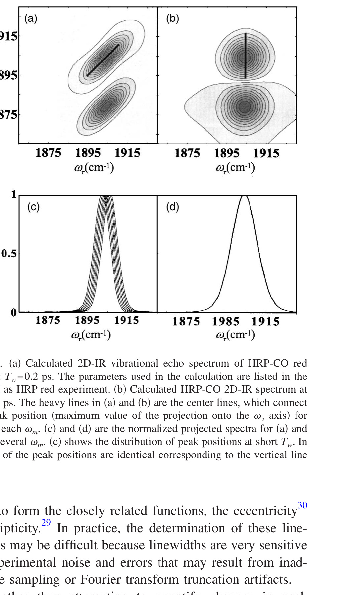
<figcaption><strong>Figure 1.</strong> (a) Calculated 2D-IR vibrational echo spectrum of HRP-CO red state at <em>T</em>w = 0.2 ps. The parameters used in the calculation are listed in Table I as HRP red experiment. (b) Calculated HRP-CO 2D-IR spectrum at <em>T</em>w = 60 ps. The heavy lines in (a) and (b) are the center lines, which connect the peak position (maximum value of the projection onto the <em>ω</em>τ axis) for cuts at each <em>ω</em>m. (c) and (d) are the normalized projected spectra for (a) and (b) at several <em>ω</em>m. (c) shows the distribution of peak positions at short <em>T</em>w. In (d), all of the peak positions are identical corresponding to the vertical line in (b).</figcaption>
</figure>

## II. Theoretical Development

### A. Response functions for 2D-IR spectra in the short time approximation

Here, we will derive the line shape function for the 2D-IR vibrational echo experiments using the short time approximation. A similar approach has already been employed by other groups in related contexts. [[25](#ref25)],[[28](#ref28)],[[29](#ref29)] It is included here so that the derivation of the important results is complete and to include the effects of lifetime and orientational relaxation, which have not been treated previously. The linear and third order response functions using diagrammatic perturbation theory have been presented. [[18](#ref18)] The linear IR absorption spectrum can be expressed as a Fourier transform of the linear response function, *R*¹(*t*),

$$R^1(t) = |\mu_{0,1}|^2 e^{-i\langle\omega_{0,1}\rangle t} \exp[-g_1(t)] \exp(-t/3T_\text{or}) \times \exp(-t/2T_1), \tag{1}$$

<noscript>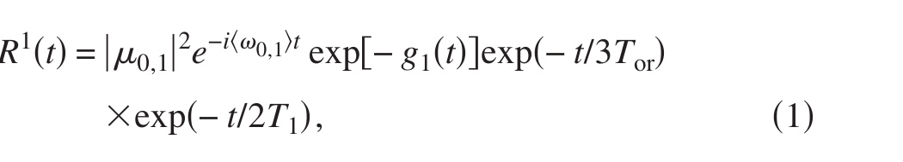</noscript>

where *μ*0,1 is the transition dipole for the ground vibrational state, 0, to the first vibrationally excited state, 1. ⟨*ω*0,1⟩ is the ensemble average 0–1 transition frequency, and the vibrational lifetime and orientational relaxation are included phenomenologically via *T*1 and *T*or, respectively. The line shape function *g*1(*t*) is

$$g_1(t) = \int_0^t d\tau_2 \int_0^{\tau_2} d\tau_1 \langle \delta\omega_{1,0}(\tau_1) \delta\omega_{1,0}(0) \rangle, \tag{2}$$

<noscript>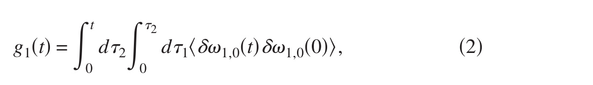</noscript>

where ⟨*δω*1,0(*τ*1)*δω*1,0(0)⟩ is the frequency-frequency correlation function (FFCF) for the 0-1 transition frequency. An FFCF that is a sum of exponential terms has been used to describe a wide variety of experimental systems. [[1](#ref1)],[[4](#ref4)],[[13](#ref13)],[[39](#ref39)],[[40](#ref40)] It has also been found that the vibrational systems that have been studied contain a motionally narrowed component in addition to dynamics that are not motionally narrowed. [[1](#ref1)],[[4](#ref4)],[[13](#ref13)],[[40](#ref40)],[[41](#ref41)] Therefore, we will consider the form of the FFCF to contain a motionally narrowed term as well as a sum of exponential terms. Motional narrowing can be represented as delta function in the FFCF. Then the FFCF has the form

$$C_1(t) = \langle \delta\omega_{1,0}(\tau_1) \delta\omega_{1,0}(0) \rangle = \frac{\delta(t)}{T_2^*} + \sum_i \Delta_i^2 \exp(-t/\tau_i), \tag{3}$$

<noscript>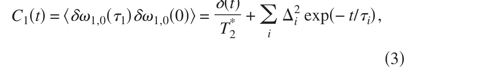</noscript>

where *T*2* is the pure-dephasing time, which is homogeneous at all times. Δ*i* is the frequency fluctuation amplitude and *τ**i* is the correlation time of the *i*th component. Because the contribution to line broadening from the finite vibrational lifetime and orientational relaxation are also purely homogeneous, these can be combined with the pure dephasing into a single homogeneous dephasing term. Then the FFCF is

$$C_1(t) = \langle \delta\omega_{1,0}(\tau_1) \delta\omega_{1,0}(0) \rangle = \frac{\delta(t)}{T_2} + \sum_i \Delta_i^2 \exp(-t/\tau_i), \tag{4}$$

<noscript>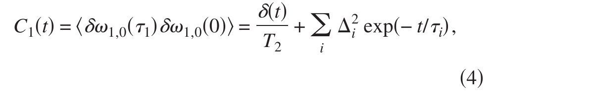</noscript>

where

$$\frac{1}{T_2} = \frac{1}{T_2^*} + \frac{1}{2T_1} + \frac{1}{3T_\text{or}}. \tag{5}$$

<noscript>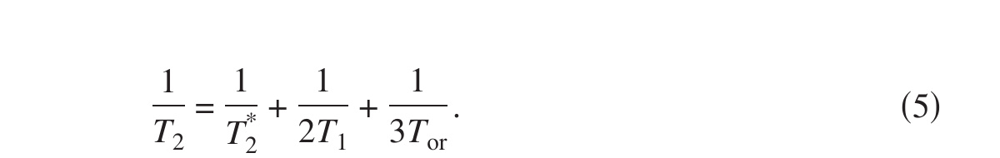</noscript>

This substitution significantly simplifies the subsequent treatment of the linear and third-order response functions while simultaneously including the effects of the finite lifetime and orientational relaxation in the overall treatment.

Within the form of the FFCF given in Eq. (4), the first-order response function is given by

$$R^1(t) = |\mu_{0,1}|^2 e^{-i\langle\omega_{0,1}\rangle t} \exp[-g_1(t)]. \tag{6}$$

<noscript>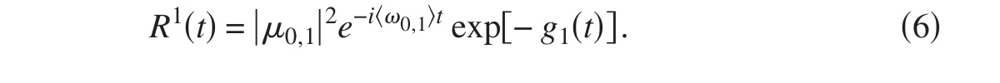</noscript>

The third-order response function for the quantum pathways responsible for the stimulated vibrational echo signal are given by

$$R_3^1(t_3, T_w, t_1) = R_3^2(t_3, T_w, t_1)$$

$$= |\mu_{0,1}|^4 e^{-i\langle\omega_{0,1}\rangle(-t_1+t_3)} \exp[-g_1(t_1) + g_1(T_w) - g_1(t_3) - g_1(t_1 + T_w) - g_1(T_w + t_3) + g_1(t_1 + T_w + t_3)]$$

$$\times \exp(-T_w/T_1)(1 + 0.8\exp(-T_w/T_\text{or})),$$

$$R_3^3(t_3, T_w, t_1) = -|\mu_{0,1}|^2|\mu_{1,2}|^2 e^{-i[\langle\omega_{0,1}\rangle(-t_1+t_3) - \Delta t_3]}$$

$$\times \exp[-g_1(t_1) + g_2(T_w) - g_3(t_3) - g_2(t_1 + T_w) - g_2(T_w + t_3) + g_2(t_1 + T_w + t_3)]$$

$$\times \exp(-T_w/T_1)(1 + 0.8\exp(-T_w/T_\text{or})),$$

$$R_3^4(t_3, T_w, t_1) = R_3^5(t_3, T_w, t_1)$$

$$= |\mu_{0,1}|^4 e^{-i\langle\omega_{0,1}\rangle(t_1+t_3)} \exp[-g_1(t_1) - g_1(T_w) - g_1(t_3) + g_1(t_1 + T_w) + g_1(T_w + t_3) - g_1(t_1 + T_w + t_3)]$$

$$\times \exp(-T_w/T_1)(1 + 0.8\exp(-T_w/T_\text{or})),$$

$$R_3^6(t_3, T_w, t_1) = -|\mu_{0,1}|^2|\mu_{1,2}|^2 e^{-i[\langle\omega_{0,1}\rangle(t_1+t_3) - \Delta t_3]}$$

$$\times \exp[-g_1(t_1) - g_2^*(T_w) - g_3(t_3) + g_2^*(t_1 + T_w) + g_2^*(T_w + t_3) - g_2^*(t_1 + T_w + t_3)]$$

$$\times \exp(-T_w/T_1)(1 + 0.8\exp(-T_w/T_\text{or})). \tag{7}$$

<noscript>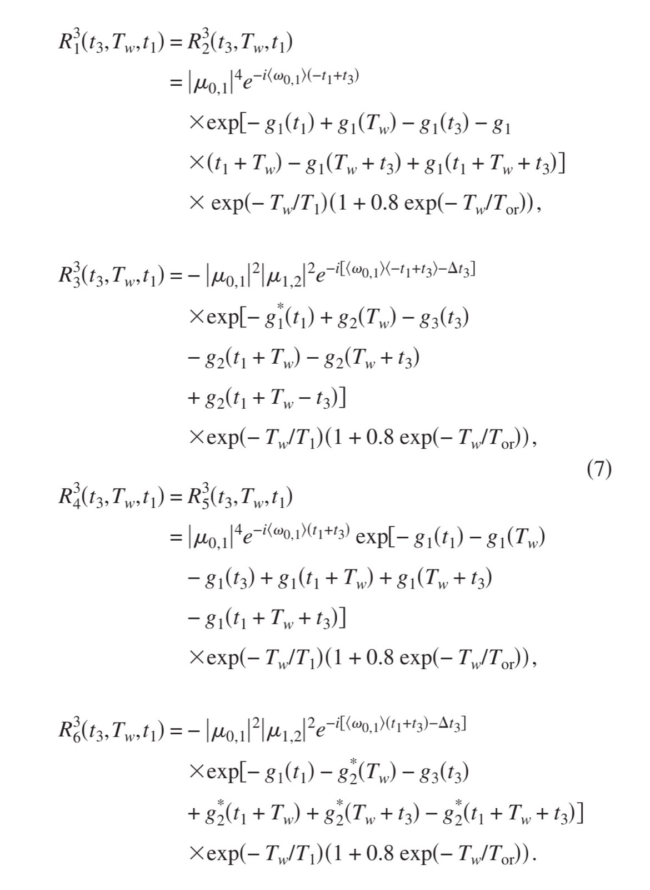</noscript>

In the above, *μ*1,2 is the transition dipole matrix elements for the 1-2 vibrational transitions and Δ is the vibrational anharmonicity. *g*2(*t*) represents cross correlation between the fundamental and excited transition frequency,

$$g_2(t) = \int_0^t d\tau_2 \int_0^{\tau_2} d\tau_1 \langle \delta\omega_{2,1}(\tau_1) \delta\omega_{1,0}(0) \rangle. \tag{8}$$

<noscript>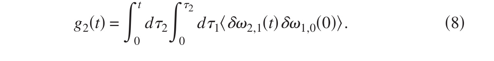</noscript>

*g*3(*t*) is the autocorrelation of the excited transition frequency,

$$g_3(t) = \int_0^t d\tau_2 \int_0^{\tau_2} d\tau_1 \langle \delta\omega_{2,1}(\tau_1) \delta\omega_{2,1}(0) \rangle. \tag{9}$$

<noscript>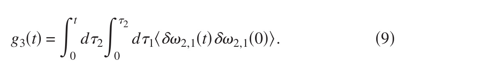</noscript>

These two functions can be different from *g*1(*t*) and also from each other in a three level vibrational system. The quantum correction to the time-correlation function [[42](#ref42)] is not considered here. Therefore, the FFCF is a real quantity and *g**i*(*t*) are also real.

The first three response functions represent rephasing pathways (R) and the last three are nonrephasing pathways (NR). There are actually two more response functions (reverse echoes) that occur only when the time ordering is such that *T*w is negative, that is, pulse 3 comes before pulses 1 and 2. In the dual-scan method used to obtain absorptive 2D-IR vibrational echo spectra, [[37](#ref37)] this never occurs. Then the additional pathways can only contribute for *T*w's that are approximately equal to or less than the pulse duration, and all three pulses overlap in time. Generally in this situation, the sample will produce a nonresonant contribution that arises from the electronic polarizability of all of the molecules in the sample, solutes and solvent. The nonresonant signal usually obscures or distorts the resonant signal. For these reasons, the two reverse echo response functions are not included in the analysis.

An absorptive 2D-IR signal, *S*2D, is obtained via the dual-scan method [[43](#ref43)] according to

$$S_{2D}(\omega_\tau, \omega_m, T_w) \propto \text{Re}[\tilde{R}_R(\omega_\tau, \omega_m, T_w) + \tilde{R}_{NR}(\omega_\tau, \omega_m, T_w)], \tag{10}$$

<noscript>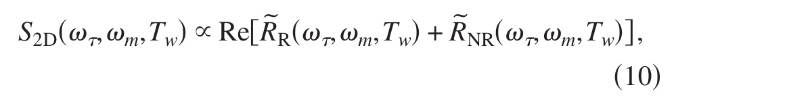</noscript>

where $\tilde{R}_R$ and $\tilde{R}_{NR}$ are defined as

$$\tilde{R}_R(\omega_\tau, \omega_m, T_w) = \int_0^\infty dt_1 \int_0^\infty dt_3 \exp(i\omega_m t_3 - i\omega_\tau t_1) \times R_R(t_1, T_w, t_3), \tag{11}$$

<noscript>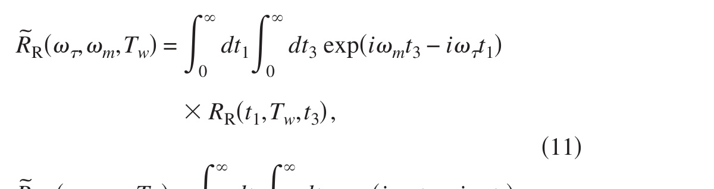</noscript>

$$\tilde{R}_{NR}(\omega_\tau, \omega_m, T_w) = \int_0^\infty dt_1 \int_0^\infty dt_3 \exp(i\omega_m t_3 + i\omega_\tau t_1) \times R_{NR}(t_1, T_w, t_3).$$

From Eq. (7), it is evident that the lifetime and orientational relaxation terms cause the intensity of the various response functions to decay as *T*w is increased. These decay terms can be effectively removed by normalizing the individual *T*w dependent 2D-IR spectra. In addition, these terms are independent of the Fourier transformation along *t*1 and *t*3 [see Eq. (11)]. Thus, the effect of the lifetime and orientational relaxation terms can be dropped to further simplify the response functions, but it should be emphasized that this normalization does not affect the overall 2D-IR line shape. As shown in Eq. (5), the combination of a motionally narrowed term [see Eq. (4)] with the lifetime and orientational relaxation produces a single Lorentzian contribution to the line shape.

Usually, an analytical form of the frequency domain response functions cannot be obtained because the line shape functions *g**i*(*t*) are a complicated set of nested integrals of exponential functions. Instead, numerical calculations are used to obtain the frequency domain response functions. During the numerical calculations, the direct relation between the signal and FFCF is lost. Multiparameter nonlinear fitting methods are generally used to obtain the FFCF from frequency domain spectra.

Using a short time approximation for the two coherence periods, [[28](#ref28)] the *g**i*(*t*) can be expanded with a Taylor expansion to second order in time, and the line shape functions and third-order response functions become analytically tractable. For example, the first two third-order response functions become

$$R_3^1(t_3, T_w, t_1) = R_3^2(t_3, T_w, t_1)$$

$$= |\mu_{0,1}|^4 e^{-i\langle\omega_{0,1}\rangle(-t_1+t_3)} \exp\left[-\frac{C_1(0)}{2}t_1^2 - \frac{t_1}{T_2} + C_1(T_w)t_1 t_3 - \frac{C_1(0)}{2}t_3^2 - \frac{t_3}{T_2}\right], \tag{12}$$

<noscript>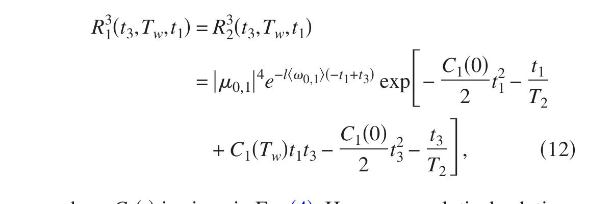</noscript>

where *C*1(*t*) is given in Eq. (4). However, analytical solutions for the frequency domain response still cannot be derived from equations of this form. Therefore, we temporarily take 1/*T*2 = 0. This approximation and the property of Dirac delta function guarantee that *C*(*t*) no longer has a motionally narrowed component. Below, we will introduce a procedure for recovering the motionally narrowed component from experimental data. The resulting response functions have been presented elsewhere, [[25](#ref25)],[[28](#ref28)],[[29](#ref29)] so only final result will be summarized here.

For the pathways that involve only the 0 and 1 vibrational levels (equivalent to ground state bleaching and stimulated emission in a pump-probe experiment),

$$\tilde{R}_{0\to1}^3(\omega_\tau, \omega_m, T_w) = \frac{4\pi}{(C_1(0)^2 - C_1(T_w)^2)^{1/2}} \times \exp\left(-\frac{C_1(0)\omega_m^2 - 2C_1(T_w)\omega_m\omega_\tau + C_1(0)\omega_\tau^2}{2\{C_1(0)^2 - C_1(T_w)^2\}}\right). \tag{13}$$

<noscript>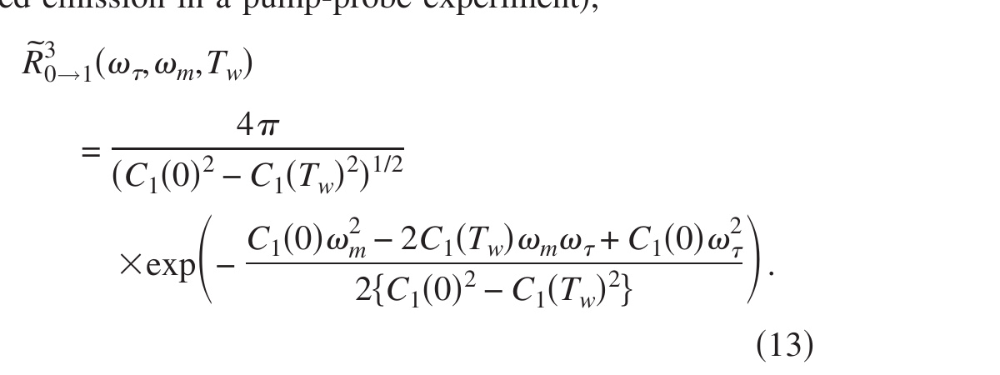</noscript>

For the pathways that result in a 1-2 coherence following the third interaction (excited state absorption), three different FFCFs are involved so the equation becomes more complex.

$$\tilde{R}_{1\to2}^3(\omega_\tau, \omega_m, T_w) = \frac{-2\pi\kappa^2}{(C_1(0)C_3(0) - C_2(T_w)^2)^{1/2}} \exp\left(-\frac{C_1(0)(\omega_m+\Delta)^2 - 2C_2(T_w)(\omega_m+\Delta)\omega_\tau + C_3(0)\omega_\tau^2}{2\{C_1(0)C_3(0) - C_2(T_w)^2\}}\right), \tag{14}$$

<noscript>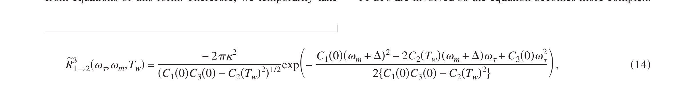</noscript>

where *κ* is defined as *μ*01/*μ*12 which is √2 under harmonic approximation. Also, to reduce the complexity of the equation, the average transition frequency ⟨*ω*01⟩ is taken as 0. In addition to *C*1(*t*) defined in Eq. (3), two other correlation functions, *C*2(*t*) and *C*3(*t*), are needed for the three level system. The former is the cross correlation function between the 0-1 and 1-2 transition frequencies. The latter is the autocorrelation of the 1-2 transition frequency. The 0 → 1 bands in the 2D-IR vibrational echo spectra only depend on *C*1(*t*). Hence, the FFCF of the fundamental frequency can be obtained by analyzing the 0 → 1 transition even though *C*2(*t*) and *C*3(*t*) may be different from *C*1(*t*).

Using the above form of the line shape function the analytical relationship between the FFCF and all 2D-IR experimental observables can be examined. Earlier studies have proposed the dynamic linewidth, [[13](#ref13)] the eccentricity, [[30](#ref30)] and the slope of nodal plane [[41](#ref41)] as simplified experimental observables related to the FFCF. These observables conveniently summarize 2D-IR spectra in a reduced one-dimensional form and can increase the accuracy and efficiency of nonlinear fitting routines. However, these fitting routines still require response function calculations with a parameterized model FFCF treated as a multivariable fitting parameter. To avoid these difficulties, methods for extracting the FFCF directly from 2D-IR spectra have begun to emerge. Recently, using the short time approximation, the ellipticity of the 2D-IR line shape was analyzed. [[29](#ref29)] Like the eccentricity, the ellipticity is obtained from the widths of the diagonal and antidiagonal cuts through the 2D-IR band. It was shown that, within the short time approximation, the *T*w dependent portion of the FFCF could be recovered directly from the experimental data. However, the method requires two linewidths at each *T*w, which can be subject to errors associated with determining line shapes. Also, a method for obtaining the motionally narrowed contribution to the FFCF was not developed. The CLS method is in the same spirit as the ellipticity approach but, as discussed in Sec. I, has advantages of not requiring linewidths and not being susceptible to influences on the line shapes, such as apodization. In addition, a method for obtaining the motionally narrowed contribution to the FFCF using the linear spectrum and a relatively simple calculation has been developed.

### B. The center line slope

The change in shape of the 2D-IR spectrum caused by spectral diffusion can be described in terms of the center line slope. [Figures 1(a) and 1(b)](#fig1) show model calculations for *T*w = 0.2 ps and for *T*w = 60 ps, at which time spectral diffusion is almost complete. The calculations are based on the FFCF determined for the CO stretching mode of CO bound at the active site of the enzyme horseradish peroxidase (HRP). [[30](#ref30)] The FFCF for HRP has the form given in Eq. (4), and will be used in detailed model calculations presented below. The heavy lines are the center lines. At a given *ω*m, a slice through the 2D spectrum parallel to the *ω*τ axis when projected onto the *ω*τ axis is a spectrum. The peak of this spectrum is one point on the center line. Taking many such slices and determining the peak for each produces a set of points. The line connecting the resulting points is the center line. At short *T*w, the center line has a significant slope. As *T*w increases, the 2D spectrum becomes more symmetrical. At sufficiently long time, when spectral diffusion has sampled all frequencies, the 2D band is symmetrical, and all cuts have the same peak frequency, which is the frequency of the peak of the linear IR absorption spectrum. The center line is vertical (infinite slope). [Figures 1(c) and 1(d)](#fig1) show the spectra (normalized) projected onto to the *ω*τ axis for several *ω*m slices. At short *T*w [200 fs, [Fig. 1(c)](#fig1)], there is a range of peak positions, yielding a center line with a slope. At very long *T*w [60 ps, [Fig. 1(d)](#fig1)], all of the peak frequencies are identical, giving the vertical center line.

In the limit of complete spectral diffusion, the long time limit, the 2D spectrum is symmetrical and the center line is vertical. In the other limit, *T*w = 0, and in the absence of a homogeneous component, the 2D spectrum is a thin line along the diagonal. The center line would be at 45°. As discussed below, the FFCF is related to the inverse of the center line slope. The inverse of the CLS has a maximum value of 1 at *T*w = 0 and goes to 0 in the long time limit. The maximum value of 1 can only occur in the absence of a homogeneous component. As the size of the homogeneous contribution increases, the initial value of the inverse of the CLS decreases. (The inverse of the CLS will also be referred to as the CLS.) The change in the center line as a function of *T*w is shown in [Fig. 2(a)](#fig2). The line with the smallest slope is for *T*w = 0.2 ps, and the line with the largest slope is for *T*w = 60 ps.

The relationship between the CLS (inverse of the center line slope) and the FFCF can be derived using the approximate 2D-IR line shape functions given in Eqs. (13) and (14). Here, we will concentrate only on the 0-1 band in the 2D-IR spectrum. The same procedure can be applied to the band involving vibrational echo emission at the 1-2 transition frequency. First, to define the slope of the line connecting the peak positions, at least the peak maxima for two *ω*m slices are needed. One point is selected as the center frequency of the 2D spectrum. This is the slice along *ω*τ at the *ω*m which corresponds to the peak frequency of the linear IR absorption spectrum. The center frequency slice spectrum can be expressed as

$$\tilde{R}_{0\to1}^3(\omega_\tau, 0, T_w) = \frac{4\pi}{(C_1(0)^2 - C_1(T_w)^2)^{1/2}} \times \exp\left(-\frac{C_1(0)\omega_\tau^2}{2\{C_1(0)^2 - C_1(T_w)^2\}}\right). \tag{15}$$

<noscript>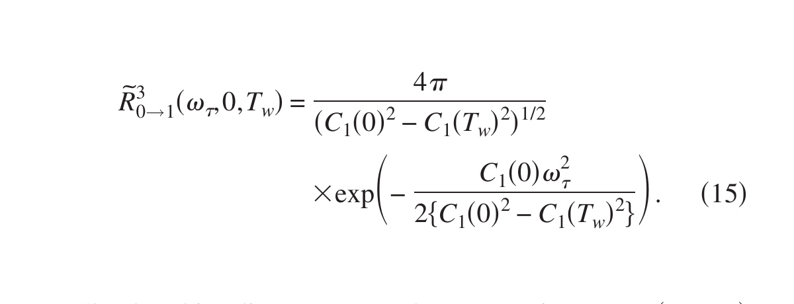</noscript>

Clearly, this slice spectrum has a maximum at (*ω*τ, *ω*m) = (0, 0). The other cut at *ω*m = *δ* has the spectrum projected onto the *ω*τ axis of

$$\tilde{R}_{0\to1}^3(\omega_\tau, \delta, T_w) = \frac{4\pi}{(C_1(0)^2 - C_1(T_w)^2)^{1/2}} \times \exp\left(-\frac{C_1(0)\delta^2 - 2C_1(T_w)\delta\omega_\tau + C_1(0)\omega_\tau^2}{2\{C_1(0)^2 - C_1(T_w)^2\}}\right). \tag{16}$$

<noscript>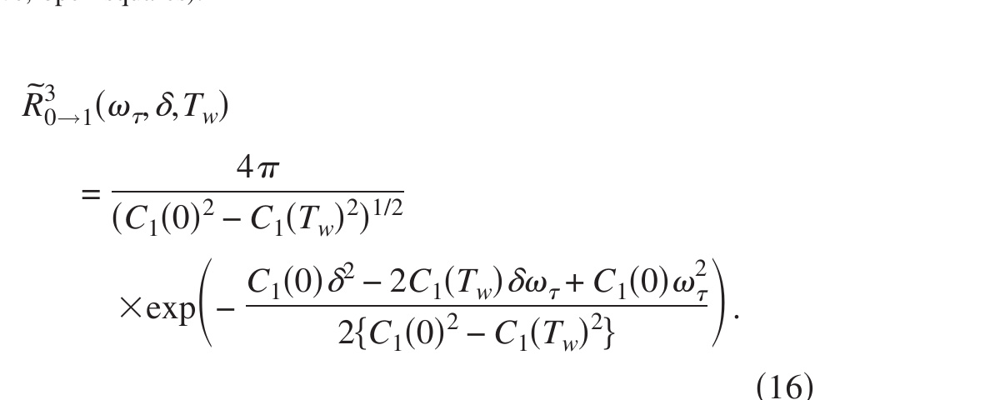</noscript>

Using the first derivative of this spectrum, $\partial\tilde{R}_{0\to1}^3(\omega_\tau^\text{Max}, \delta, T_w)/\partial\omega_\tau = 0$, the peak position of this slice is $(\omega_\tau, \omega_m) = (C_1(T_w)/C_1(0)\cdot\delta, \delta) = (C_1^N(T_w)\delta, \delta)$, where $C_1^N(T_w) = C_1(T_w)/C_1(0)$ is the normalized FFCF. Therefore, the slope of the line is

$$S(T_w) = \frac{1}{C_1^N(T_w)}. \tag{17}$$

<noscript>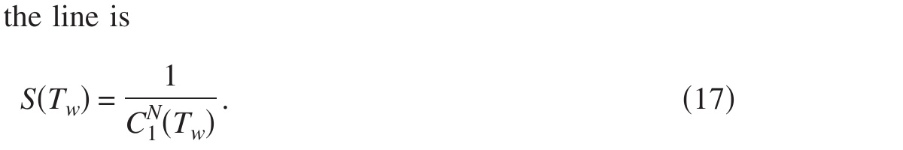</noscript>

Equation (17) is the important result. Within the short time approximation, the normalized FFCF, $C_1^N(T_w)$, is directly proportional to the inverse of the center line slope, which we refer to as the CLS. It should be emphasized that $C_1^N(T_w)$ does not include a motionally narrowed component. The change in slope reflects the *T*w dependent spectral diffusion. The 1/*T*2 contribution to the FFCF and 2D line shape is *T*w independent. In the next section, numerically calculated 2D-IR spectra using known FFCF input parameters are used to verify this relationship, access its accuracy, and demonstrate the procedure for recovering the *T*w independent 1/*T*2 contribution to the FFCF.

<figure class="paper-figure" id="fig2">
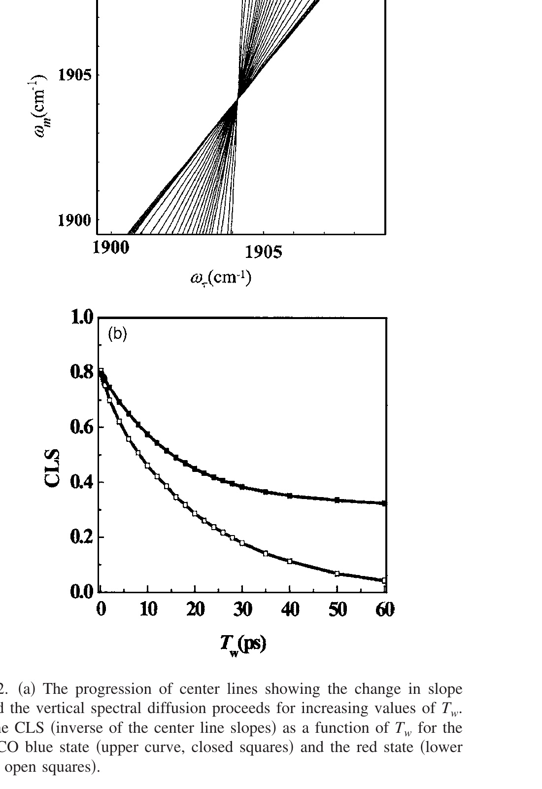
<figcaption><strong>Figure 2.</strong> (a) The progression of center lines showing the change in slope toward the vertical spectral diffusion proceeds for increasing values of <em>T</em>w. (b) The CLS (inverse of the center line slopes) as a function of <em>T</em>w for the HRP-CO blue state (upper curve, closed squares) and the red state (lower curve, open squares).</figcaption>
</figure>

## III. Testing the CLS Method

To check the validity of the CLS method, numerical calculations of response functions were performed with known FFCFs that were obtained from experiments by fitting the experimental data with the full response function time dependent diagrammatic perturbation theory method. [[21](#ref21)],[[22](#ref22)],[[44](#ref44)] First, the specific procedures to extract the FFCF will be shown using the FFCFs from 2D-IR vibrational echo measurements on the CO stretching mode of HRP. [[30](#ref30)] HRP is an enzyme that can bind a variety of substrates. Without a bound substrate, HRP displays two CO peaks in the FT-IR spectrum because it exists in two conformational substates related to the configuration of the distal residues. The FFCFs for the two CO lines will be extracted using CLS from the 2D spectra. Second, the method for recovering the homogeneous contribution *T*2 and the absolute amplitudes of inhomogeneous components will be demonstrated by also utilizing linear IR absorption spectra. The HRP-CO system was chosen because the FFCFs of the CO stretch of this protein contain the various components discussed in connection with Eq. (4), including a motionally narrowed component, a relatively slow spectral diffusion component, and a static component. The HRP-CO line shapes are almost Gaussian, but they are quite narrow with bandwidths of 10 and 15 cm⁻¹. A narrow peak gives rise to a slow decay time of the time-domain signal as *τ* is scanned, which makes this system a stringent test of the short time approximation. Also the 2D-IR experimentally obtained FFCFs from the deuterated hydroxyl stretching bands of phenol-OD in two solvents, pure CCl₄ and mesitylene, were used to test the CLS method for systems that have almost homogeneously broadened Lorentzian absorption bands.

The FFCFs for HRP-CO that we will try to duplicate with CLS were obtained by iterative fitting of the 2D-IR vibrational echo experiments with response function calculations of the *T*w dependent 2D-IR spectra and the linear line shapes. [[30](#ref30)] The protein is so large that orientational relaxation can be neglected. The population relaxation times, *T*1, were measured with IR pump-probe experiments. [[30](#ref30)] The two CO absorption bands are referred to as the red state (lower absorption frequency, 1903.7 cm⁻¹) and the blue state (higher absorption frequency, 1932.7 cm⁻¹). [[30](#ref30)] Both FFCFs have the form given in Eq. (4). The slow exponential component for the blue state is so slow that it appears as a constant on the accessible time scale of the experiments (~5*T*1). Therefore, for the blue state, the last term in Eq. (4) is just Δ2². The parameters obtained from the experiments are given in Table I (labeled as experiment) and are used to calculate the 2D-IR spectra. Because the lines are so narrow compared to the bandwidth of the pulses used in the experiments, finite pulse durations were not included in obtaining the FFCFs. [[30](#ref30)]

As discussed above, a plot of the peak frequency ($\omega_\tau^\text{max}$) at each *ω*m point forms a line in two-dimensional frequency space such as those shown in [Fig. 2(a)](#fig2) for the HRP red state. The slopes of such lines are determined and the inverse, the CLS, is plotted versus *T*w in [Fig. 2(b)](#fig2) for both the blue state (top curve) and the red state (bottom curve). As can be seen in [Fig. 2(b)](#fig2), the FFCFs for the two states are quite different. The blue state decays to a constant, which shows that there is a static component to the FFCF on the accessible time scale of the experiment. The red state is decaying to zero, indicating that on the time scale of ~100 ps all protein structural configurations associated with the red conformational substrate are sampled.

Another important feature of [Fig. 2(b)](#fig2) is that neither of the curves begins at 1. This immediately suggests that there is a homogeneous term composed of a motionally narrowed component, a lifetime term, and an orientational relaxation term. As discussed in Sec. II A, the homogeneous component was dropped, that is, 1/*T*2 = 0, from the FFCF to derive the analytical equations relating the CLS to the FFCF. The CLS gives only the *T*w dependent portion of the FFCF. The homogeneous contribution to the 2D-IR line shape does not depend on *T*w. CLS plots are the normalized FFCF without homogeneous contributions. If there is no homogeneous contribution, in general, the initial value of the CLS can still be somewhat smaller than 1, which is a result of the short time approximation (see Appendix 1). The error inherent in FFCF caused by the short time approximation, which produces a total amplitude for the *T*w dependent portion of the FFCF being a floor, is tested in the examples given below. Numerical simulations of CLS from FFCFs with various homogeneous contributions were used to see the effect of the inclusion of homogeneous components. Procedures and results of the numerical simulation are given in Appendix 2. Here the procedures that are validated in Appendix 3 are applied.

Time constants and relative amplitudes of the FFCF components are obtained by fitting the CLS to a trial function for the FFCF. A multiexponential decay function was used. The CLS for the red state of HRP, open squares in [Fig. 2(b)](#fig2), is fit best by a biexponential function without an offset. The relative amplitudes and decay time constants obtained from fitting are listed as CLS (norm) in the Table I. The time constants are reproduced essentially perfectly for both fast and slow inhomogeneous components. In many tests, we have determined that the time constants are always accurate. The initial value of the CLS is 0.82, which is the sum of the relative amplitudes of the two inhomogeneous components.

A homogeneous component decreases the initial value of the CLS from 1. The difference between CLS at *T*w = 0 and 1 is related to the homogeneous contribution to the FFCF [see equation (4)] and the Lorentzian contribution, 1/*πT*2, and to the linewidth, full width at half maximum (FWHM), of the IR absorption spectrum. The initial value of CLS represents the inhomogeneous contribution in line broadening of IR spectrum. Within the short time approximation used to derive the relationship between the FFCF and the CLS, the amplitude of an inhomogeneous component with a very fast time constant is decreased. Therefore, the CLS method cannot tell the difference between the magnitude of a homogeneous component and error introduced into the amplitude from a very fast inhomogeneous component by the short time approximation. The extent of this error is tested in the examples presented here, and it is small.

For the red state of HRP, 82% of IR line is ascribed to inhomogeneous broadening and the remaining 18% to the homogeneous contribution (see Table I). Using the procedure that is shown to be a good approximation in Appendix 3, the homogeneous line broadening, 1/*πT*2, is obtained by the product 0.18 × FWHM of IR absorption spectrum, which gives *T*2 in the FFCF [Eq. (4)]. If the CLS can be fit as a single exponential, that is, the inhomogeneous part of FFCF is a single component, the amplitude of this factor is obtained as Δ*i* = √(0.82) × (FWHM)/(2√(2 ln 2)). In this formula, 2(2 ln 2)^(1/2) is required to change the FWHM of the IR absorption line into the standard deviation and the overall square root is needed because relative amplitude from the CLS involves the squares of absolute amplitudes. [[39](#ref39)] When inhomogeneous part has multiple components, the entire inhomogeneous broadening will be divided following the ratio between the relative amplitudes, for example, for the red state of HRP [see Table I, CLS (norm)], 0.07/(0.07 + 0.75) and 0.75/(0.07 + 0.75). Again the relative amplitudes from the CLS are the ratio between the squares of amplitudes. Therefore, the square of the amplitude of the 1.5 ps component is Δ² = (0.07/0.82) × (FWHM/2√(2 ln 2))². To sum up this procedure, the amplitude of an inhomogeneous component can be estimated as Δ*i* = √*a**i* × (FWHM)/(2√(2 ln 2)). *a**i* is the relative amplitude obtained from fitting the *T*w dependence of the CLS. The results of this estimation are listed in Table I as CLS and linewidth. The amplitude of the slow component is accurate. The amplitude of the fast component and *T*2 is about a factor of 2 off. The time constants are correct, the amplitude of the slow component is correct, and the other two factors are somewhat off. Given the simplicity and ease of this procedure, which involves no response function calculations, the results are reasonable. This procedure is not rigorously correct because FWHM of the IR spectrum is the result of convolutions between the homogeneous and inhomogeneous contributions. Simple division of FWHM will lead to some error. However, as shown in Appendix 3, the error is small in all cases from almost purely Lorentzian to purely Gaussian lines. As shown in other examples below, if a very fast inhomogeneous component does not exist, this simple procedure is virtually quantitative.

With the simple procedure just presented, CLS cannot completely distinguish the homogeneous broadening and the initial part of inhomogeneous broadening, leading to the errors in Table I CLS with linewidth. An inhomogeneous component with a very fast time component will push this initial decay into the homogenous component. The result is a decrease of the amplitude of the fast inhomogeneous component and an increase of the homogenous dephasing time. The true *T*2 is no less than the estimation using only the absorption linewidth, and the amplitude of a very fast inhomogeneous component cannot be smaller than the estimated amplitude. Very fast means that the decay constant is comparable to the free induction decay time (see Appendix 1 for details).

More accurate results can be obtained by employing a more complicated but not difficult procedure. This procedure fits the linear absorption spectrum rather than using percentages of FWHM. The absorption spectrum is the Fourier transform of the linear response function given in Eq. (6). The linear response function is found using the known parameters obtained from the CLS and the FWHM of the absorption spectrum. For the red state of HRP, there are three exponential terms in the FFCF. Of these, the two time constants and the amplitude of the slow component are known. Only the homogenous component and the amplitude of the fast decay component were treated as fitting variables in fitting to the experimental spectrum. The response function was numerically Fourier transformed and compared to the absorption spectrum obtained from the calculation using the reported FFCF. [[30](#ref30)] Because there is no noise on the calculated spectrum, the fit only used the line shape down to 20% of the maximum amplitude. This cutoff prevented the possibility that the fitting was determined by the low amplitude wings of the spectrum that would not be accessible from a real spectrum with noise. The two fitting variables are constrained to be larger than or equal to the values obtained from the FWHM method. The upper limit is set using Eq. (5) as *T*2 ≤ 1/(1/2*T*1 + 1/3*T*or). With these constraints, the linear response function calculation is iterated to obtain the best fit to the experimental spectrum. The results are given in Table I as CLS and line shape. The agreement between the experimental values and the parameters obtained using CLS and the line shape fitting is essentially perfect. The information lost because of the short time approximation was recovered using the IR spectrum and linear response function calculation even though the experimental spectrum was only fit down the 20% of the peak value.

Table I also includes analysis of the HRP blue state. Fitting the CLS shows that the FFCF has a slow component and a constant component. The fact that the normalized CLS amplitudes do not sum to 1 indicates that there is also a homogeneous component. The decay times match the experimental values. Because both of the inhomogeneous components are slow, the simple FWHM linewidth method should work well. As can be seen in Table I CLS and linewidth, the results are actually quite close to the experimental values. These are obtained without any complicated analysis. When the line shape method is used, fitting the linear absorption spectrum as described above produces virtually perfect agreement with the experimental values, as shown in Table I CLS and line shape.

The HRP absorption line shapes are narrow and almost Gaussian with substantial inhomogeneous broadening. The method was also tested using the experimental FFCF for the OD stretch of HOD in pure water H₂O. [[1](#ref1)],[[13](#ref13)] The absorption spectrum is very broad, almost Gaussian with significant inhomogeneous broadening. [[1](#ref1)],[[13](#ref13)],[[45](#ref45)] The CLS method works very well, with agreement comparable to that displayed in Table I. The method was also applied to a concentrated NaBr solution. [[46](#ref46)] As another test approaching the opposite limit, experimentally determined FFCFs of the OD stretch of phenol-OD (the hydroxyl H replaced with D) in both CCl₄ and mesitylene were used for the 2D-IR calculation. [[47](#ref47)] Phenol-OD displays very narrow and almost Lorentzian IR spectra, implying that the absorption lines are almost homogeneously broadened. [[47](#ref47)] Both systems display 2D-IR vibrational echo spectra with the characteristic starlike shape associated with nearly homogeneously broadened line. [[48](#ref48)] The inhomogeneous contribution to the absorption line is small and therefore the spectral diffusion does not have a great impact on the 2D-IR line shapes.

**TABLE I.** HRP FFCF input parameters from Ref. 40, and parameters determined from the CLS method as discussed in the text.

| | | *T*₂ (ps) | Δ₂ (rad/ps) | *τ*₂ (ps) | Δ₁ (rad/ps) | *τ*₁ (ps) | *T*₁ (ps) |
|---|---|---|---|---|---|---|---|
| HRP red | Experiment | 7.5 | 0.58 | 1.5 | 1.06 | 21 | 8 |
| | CLS (norm) | NA | 0.07ª | 1.6 | 0.75ª | 21 | |
| | CLS and linewidth | 3.9 | 0.32 | 1.6 | 1.05 | 21 | |
| | CLS and line shape | 7.3 | 0.58 | 1.6 | 1.05 | 21 | |
| HRP blue | Experiment | 5.8 | 0.60 | 15 | 0.45 | ∞ | 12 |
| | CLS (norm) | NA | 0.5ª | 15 | 0.31ª | ∞ | |
| | CLS and linewidth | 5.3 | 0.58 | 15 | 0.46 | ∞ | |
| | CLS and line shape | 5.7 | 0.6 | 15 | 0.46 | ∞ | |

ªNormalized amplitude from normalized CLS, unitless, not rad/ps.

The FFCFs were derived from the iterative fitting of the 2D-IR spectra and the linear IR line shapes to third-order and linear response function calculations. [[47](#ref47)] The resulting FFCFs show a large homogenous component and small inhomogeneous component. [[47](#ref47)] The homogenous component was ascribed to very fast density fluctuations in the first solvation of the phenol, and the spectral diffusion to diffusive motions of solvent molecules in the first solvent shell. [[47](#ref47)] The same procedure used for the HRP protein was applied to extract the FFCFs using the CLS method from the 2D-IR spectra. All the input parameters for calculating 2D-IR spectrum are listed in Table II experiment. For completeness, the lifetimes and orientational decay times, measured using polarization selective pump-probe experiments, are also given. [[47](#ref47)] These do not come into the calculations but show that the homogeneous component is mainly composed of a motionally narrowed contribution to the dynamic line shape, rather than arising from the lifetime or orientational relaxation. The CLS for both samples could be well fit with a single exponential decay with an initial value of ~0.2. The initial values show that there is a very large homogenous contribution to the lines. The CLS time constants for the two samples are accurate. Both the simple FWHM linewidth method and the more detailed line shape method produce the amplitudes and *T*2 values that are in excellent agreement with the experimentally determined numbers.

**TABLE II.** FFCF input parameters from phenol in CCl₄, and parameters determined from the CLS method as discussed in the text.

| | | *T*₂ (ps) | Δ₂ (rad/ps) | *τ*₂ (ps) | *T*₂* | *T*₁ | *T*or |
|---|---|---|---|---|---|---|---|
| Phenol-OD in CCl₄ | Experiment | 0.9 | 0.55 | 5 | 1.04 | 12.5 | 2.9 |
| | CLS (norm) | NA | 0.19ª | 5 | | | |
| | CLS and linewidth | 0.88 | 0.52 | 5 | | | |
| | CLS and line shape | 0.9 | 0.55 | 5 | | | |
| Phenol-OD in mesitylene | Experiment | 0.45 | 1.2 | 13 | 0.48 | 7.6 | 5.5 |
| | CLS (norm) | NS | 0.27ª | 13 | | | |
| | CLS and linewidth | 0.47 | 1.3 | 13 | | | |
| | CLS and line shape | 0.47 | 1.3 | 13 | | | |

ªNormalized amplitude from normalized CLS, unitless, not rad/ps.

Additional details relating to the simple FWHM method are given in Appendix 3 and errors introduced by the short time approximation are discussed in Appendix 1. The amplitude factor is reasonably accurate using the FWHM method if the decay time constant, *τ* > ~5 × FID, where FID is the free induction decay, and its duration is taken to be the FID half-width.

## IV. Apodization and the CLS

In NMR, a variety of numerical methods is used to improve signal-to-noise ratios, resolutions, or data acquisition times. One that is very useful is apodization or windowing. [[33](#ref33)],[[35](#ref35)] Apodization involves multiplying an interferogram by a known simple function. A decaying function is used to reduce data acquisition time and improve signal-to-noise ratio. A growing function can be employed to simplify highly overlapping spectra by narrowing the line shapes. Of particular interest here is apodization with a decaying function along the *ω*τ axis. In many 2D-IR vibrational echo experiments, the *ω*m axis is obtained by detecting the heterodyned vibrational echo wave packet through a monochromator using an IR array detector. [[46](#ref46)],[[49](#ref49)] Taking the spectrum of the wave packet experimentally performs the necessary Fourier transform to give the *ω*m axis. There is no interferogram. This axis is referred to as the *ω*m axis because it is obtained with the monochromator. It corresponds to the *ω*3 axis in 2D-NMR. At each frequency along the *ω*m axis where there is signal, an interferogram is recorded by scanning the time delay *τ* between the first and second pulses. Therefore, the numerical Fourier transforms are applied to multiple one-dimensional interferograms, corresponding to the same type of data processing used in one-dimensional NMR.

The interferograms for the *ω*τ axis need to be scanned to sufficiently long *τ* so that they decay to zero to avoid Fourier transform artifacts. A good deal of time consuming data collection is required to obtain good signal-to-noise ratios at long *τ*. If the interferograms are simply truncated at short time, the Fourier transforms will contain high frequency artifacts.

If the *ω*τ axis interferogram is multiplied by a decaying function, it can be numerically taken to zero smoothly at a *τ* that is short compared to the complete decay of the interferogram. This avoids Fourier transform artifacts, but it also distorts the 2D-IR spectrum. Multiplying by a decaying function will produce an artificially broadened spectrum, while multiplying by an increasing function will produce an artificially narrowed spectrum along the *ω*τ axis. If accurate line shapes are important for extraction of the FFCF, then apodization can only be used with a deconvolution procedure to try to recover the true line shapes. However, as we will show here, apodization along the *ω*τ axis does not change the CLS even though the line shapes change a good deal. Therefore, the FFCF can be obtained in the same manner as described above even if *ω*τ axis apodization is employed.

To test the influence of apodization on the CLS, response function calculations are performed to obtain the *T*w dependence of the CLS with and without apodization. In the response function calculations, two Fourier transforms are performed to obtain the 2D frequency domain spectrum. The Fourier transform for *t*1 (time between the first and second pulses, *τ*) gives the *ω*τ axis, and the Fourier transform for *t*3 (time after the third pulse) gives the *ω*m axis. In the calculations, the *t*3 Fourier transform is performed, which is the equivalent in the experiment of using the monochromator to obtain the *ω*m axis. However, the apodization function is applied to the *t*1 interferograms, and then the *t*1 Fourier transforms are performed. This is the equivalent to experimentally collecting the interferograms at each *ω*m, applying an apodization function to the experimental interferograms, and then Fourier transforming.

As a first example, a two sided exponential decay centered at *τ* = 0 is used as the apodization function. The FFCF is that of the HRP red state used to produce the 2D spectra shown in [Figs. 1(a) and 1(b)](#fig1). The parameters are given in Table I HRP red experiment. In [Fig. 3(a)](#fig3), the positive time portion interferogram (rephasing scan) at one *ω*m is plotted before (small dashes) and after (solid) applying apodization. The exponential function, exp(−*t*1/*γ*), with *γ* = 1, is also plotted (large dashes). (The negative time portion of the interferogram, the nonrephasing scan, which is not shown, is apodized by the other side of the two sided exponential.) The same function is applied to the rephasing and nonrephasing interferograms to avoid possible distortion of the absorptive line shape because the ratio of the rephasing and nonrephasing signal determines the shape of 2D-IR spectrum. As can be seen in the figure, apodization changes the interferogram a great deal although there is no change in the frequency of the oscillations. [Figure 3(b)](#fig3) shows the resulting 2D spectrum with apodization. The spectrum is substantially broadened, as can be seen by comparison to [Fig. 1(a)](#fig1), which is calculated with the same FFCF at the same *T*w but without apodization. The broadening only occurs along the *ω*τ axis because apodization was only applied to the interferograms that arise from scanning *t*1, the time in the first coherence period (time between pulses 1 and 2, *τ*). The *ω*m axis is unaffected. [Figure 3(d)](#fig3) shows the result of using an increasing function for apodization, *γ* = −3. The spectrum is narrowed compared to the spectrum without apodization [[Fig. 1(a)](#fig1)].

Before calculating the CLS of the apodized 2D-IR spectra, the effect of apodization on the phasing process needs to be addressed. In real experiments, there are distortion to the 2D spectra caused by errors in knowing the exact *t*1 = 0 position, chirp, and the exact time between pulse 3 and the local oscillator pulse used for heterodyne detection. [[46](#ref46)],[[49](#ref49)] The dual-scan method is used to produce 2D line shapes that are mainly absorptive by adding the rephasing and nonrephasing spectra. [[37](#ref37)] To determine the correct phase correction factors, frequency resolved pump-probe spectra are used. The projection theorem [[38](#ref38)] states that the frequency resolved pump-probe spectrum should be equal to the projection of the 2D-IR vibrational echo spectrum onto the *ω*m axis. The projection is obtained by integrating the 2D-IR spectrum along the *ω*τ axis. Apodization is applied to the interferograms prior to Fourier transformation and phase correction. Therefore, it is important that apodization does not change the projection of the 2D-IR spectrum onto the *ω*m axis. In fact, apodization does not change the projection because it only affects the spectrum along *ω*τ. An example is given in [Fig. 3(c)](#fig3). The solid line is the projection of the data in [Fig. 1(a)](#fig1) (no apodization) and the two sets of points (square and triangles) are the projections of the apodized spectra given in [Figs. 3(b) and 3(d)](#fig3). The three projections are indistinguishable even though the three 2D-IR spectra are very different.

<figure class="paper-figure" id="fig3">
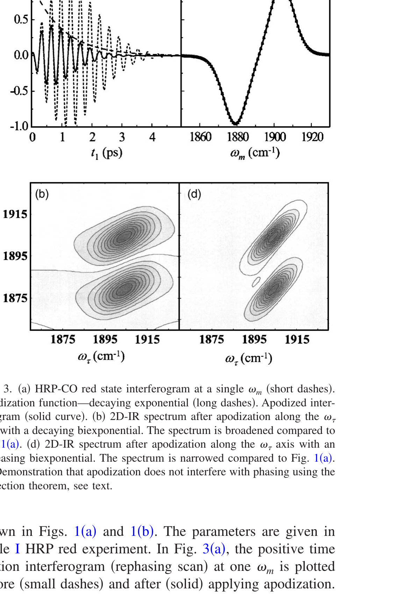
<figcaption><strong>Figure 3.</strong> (a) HRP-CO red state interferogram at a single <em>ω</em>m (short dashes). Apodization function—decaying exponential (long dashes). Apodized interferogram (solid curve). (b) 2D-IR spectrum after apodization along the <em>ω</em>τ axis with a decaying biexponential. The spectrum is broadened compared to <a href="#fig1">Fig. 1(a)</a>. (d) 2D-IR spectrum after apodization along the <em>ω</em>τ axis with an increasing biexponential. The spectrum is narrowed compared to <a href="#fig1">Fig. 1(a)</a>. (c) Demonstration that apodization does not interfere with phasing using the projection theorem, see text.</figcaption>
</figure>

To demonstrate the influence of apodization on the CLS, calculations were performed using the FFCFs of the red and blue states of HRP (see Table I). In addition to obtaining the *T*w dependent CLS, three other methods used to characterize the time evolution of 2D-IR spectra are obtained with and without apodization. These are the dynamic linewidth, [[1](#ref1)],[[13](#ref13)] the ellipticity, [[29](#ref29)] and the eccentricity, [[30](#ref30)] which are defined below.

[Figure 4(a)](#fig4) shows CLS calculations using the FFCFs of the HRP red and blue states. The upper curve is for the blue state, and the lower curve is for the red state. Two apodization functions are used, exp(−*t*1/*γ*), with *γ* = 1 (decaying exponential) and *γ* = −3 (increasing exponential). In all the parts of [Fig. 4](#fig4), squares are without apodization, circles are with decaying apodization, and diamonds are with increasing apodization. The open symbols are for the HRP red state, and the closed symbols are for the HRP blue state. As can be clearly seen in [Fig. 4(a)](#fig4), apodization does not influence the *T*w dependence of the CLS. Although the differences are very small, the squares, diamonds, and circles do not overlap exactly. This difference is not caused by the apodization but by the short time approximation because applying an apodization function changes the length of the interferogram. The accelerated decay of interferogram by apodization reduces the error caused by short time approximation and the prolonged interferogram increases the error (see Appendix for details). This change in amplitude in CLS is corrected using the method involving the IR spectrum as described in Sec. II. Therefore, the FFCF can be extracted even though apodization is applied to the data. Apodization along the *ω*τ axis changes the shapes of the 2D spectra, but it does not change the position of the center point (maximum value) at each *ω*m. The increasing apodization narrows peaks [see [Fig. 3(d)](#fig3)]. This type of apodization may be useful in congested spectra with overlapping off-diagonal peaks along the *ω*τ axis. The results show that it may be possible to separate peaks and determine their FFCFs with apodization and CLS.

[Figure 4(b)](#fig4) shows plots of the dynamic linewidths. [[1](#ref1)],[[13](#ref13)] The dynamic linewidth is a cut through the data at the center of the 0-1 portion of the spectrum, parallel to the *ω*τ axis, and projected onto the *ω*τ axis. The FWHMs of the projected line shapes are plotted. It is clear from the curves that apodization has a dramatic influence on the dynamic linewidth. This is to be expected because apodization changes the shapes of the 2D spectra along the *ω*τ axis. Therefore, it changes the FWHM of the projection on to the *ω*τ axis.

The ellipticity [[29](#ref29)] and the eccentricity [[30](#ref30)] are two other observables that are sensitive to spectral diffusion. Both of them use diagonal and antidiagonal widths of the 2D-IR spectra. The diagonal width is the standard deviation of the cut through the 2D spectrum along the diagonal. The antidiagonal width is the standard deviation of the cut perpendicular to the diagonal through the center of the 0-1 portion of the spectrum. Using the same procedure applied above to show the relationship between the CLS and the FFCF, the direct relationships between the ellipticity and the eccentricity can be derived. The derivation has been published for the ellipticity [[29](#ref29)] but the procedure for obtaining the full FFCF including the homogeneous contribution and the true amplitudes of each component was not developed. The ellipticity [[29](#ref29)] (El) and the eccentricity [[30](#ref30)] (Ec) are given by

$$\text{El}(T_w) = \frac{\sigma_D^2(T_w) - \sigma_{AD}^2(T_w)}{\sigma_D^2(T_w) + \sigma_{AD}^2(T_w)}, \tag{18}$$

<noscript>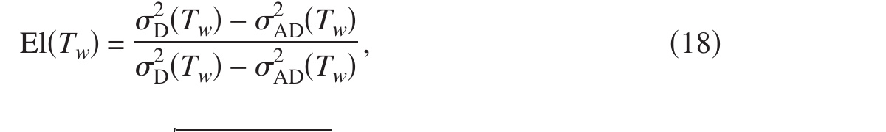</noscript>

$$\text{Ec}(T_w) = \sqrt{1 - \frac{\sigma_{AD}^2(T_w)}{\sigma_D^2(T_w)}}. \tag{19}$$

<noscript>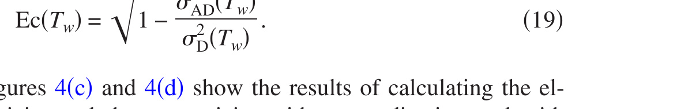</noscript>

[Figures 4(c) and 4(d)](#fig4) show the results of calculating the ellipticity and the eccentricity without apodization and with the two apodization functions. Like the dynamic linewidth, apodization has a substantial affect on both the ellipticity and the eccentricity.

<figure class="paper-figure" id="fig4">
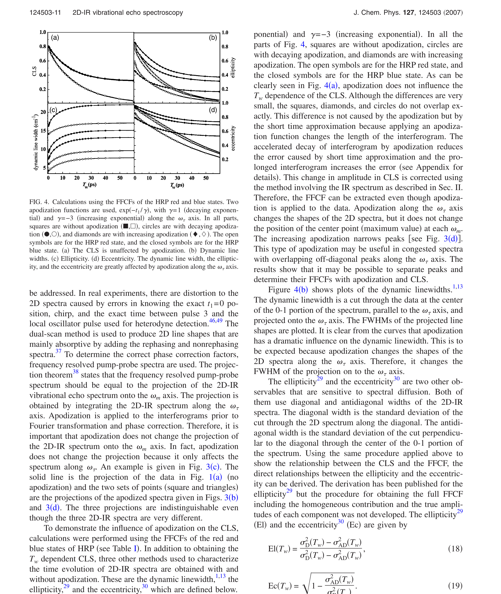
<figcaption><strong>Figure 4.</strong> Calculations using the FFCFs of the HRP red and blue states. Two apodization functions are used, exp(−<em>t</em>1/<em>γ</em>), with <em>γ</em> = 1 (decaying exponential) and <em>γ</em> = −3 (increasing exponential) along the <em>ω</em>τ axis. In all parts, squares are without apodization (■, □), circles are with decaying apodization (●, ○), and diamonds are with increasing apodization (◆, ◇). The open symbols are for the HRP red state, and the closed symbols are for the HRP blue state. (a) The CLS is unaffected by apodization. (b) Dynamic line widths. (c) Ellipticity. (d) Eccentricity. The dynamic line width, the ellipticity, and the eccentricity are greatly affected by apodization along the <em>ω</em>τ axis.</figcaption>
</figure>

The important result is that only the CLS is immune to apodization along the *ω*τ axis. Therefore, it is possible to improve signal-to-noise ratios and reduce data collection time using a decaying apodization function, or increase resolution and peak separation using an increasing apodization and still extract the FFCF in a simple manner using the CLS. There are several limitations on apodization that need to be kept in mind if the CLS is not going to be distorted. First, the apodization function should be symmetrical around *τ* = 0 so that its effect is the same on the rephasing and nonrephasing scans. Second, apodization along the *ω*m will change the CLS. However, if apodization along only *ω*m is performed, and if the cuts through the 2D spectra are taken parallel to *ω*m rather than parallel to *ω*τ, then the equivalent of the CLS is obtained, and it is not distorted by *ω*m apodization. The *ω*m apodization procedure is presented in Appendix 5. However, apodization along both axes will significantly change the CLS and prevent the FFCF from being obtained. In the examples given above, only exponential functions were employed. In Appendix 4, several other functions are used, and the generality of using the CLS method to obtain the FFCF with apodization is demonstrated.

A related issue is the influence of pulse duration on the CLS. In the examples given above, the experiments were conducted with pulses that were sufficiently short that their bandwidths were much wider than the absorption spectra including the 1-2 transitions. Therefore, the 2D-IR spectra are not affected by the finite pulse duration. However, for vibrations with broad spectra, such as water, the 2D-IR vibrational echo spectra can be changed by the finite bandwidth of the pulses. [[13](#ref13)],[[50](#ref50)] Provided that the pulses are reasonably short, that is, the band width is sufficient to span the spectrum even if it is not vastly wider than the spectrum, the finite pulse duration (bandwidth) has a negligible effect on the CLS. This is also true and has been demonstrated for the ellipticity. [[29](#ref29)]

## V. Concluding Remarks

We have presented a new approach for extracting the frequency-frequency correlation function from 2D-IR vibrational echo spectra. The direct relationship between the CLS and the *T*w dependent portion of the normalized FFCF was derived analytically using a short time approximation. A detailed procedure to obtain the full FFCF from the 2D-IR vibrational echo and absorption spectra, including the homogeneous contribution and the absolute rather than relative amplitudes of the inhomogeneous components, was delineated. Tests of the procedures using known FFCFs were given that show that the CLS method works very well in cases in which the lines are substantially inhomogeneously broadened and in cases in which the lines are almost homogeneously broadened. The usefulness of the method is that the full FFCF can be obtained without using complex response function calculations to fit the 2D-IR vibrational echo line shapes. The CLS method has recently been applied to water and concentrated salt solutions. [[46](#ref46)]

The usefulness of the CLS method is further enhanced by its insensitivity to apodization of the interferogram obtained for the *ω*τ axis (*ω*1 axis). The *ω*τ axis is the only axis that produces an interferogram in 2D-IR vibrational echo experiments in which the heterodyned detected signal is frequency resolved using a monochromator. It was demonstrated that apodization does not change the FFCFs extracted using CLS, although apodization has a major influence on the 2D-IR lineshapes. This is in contrast to other methods that can be used to obtain the FFCF such as the ellipticity. [[29](#ref29)] In 2D-IR vibrational echo experiments, apodization can be used to reduce data collection times, improve signal-to-noise ratios, and increase spectral resolution.

## Acknowledgments

This work was supported by grants from AFOSR (F49620-01-1-0018) and NSF (DMR-0652232).

## Appendix: Details of the CLS Method

The decrease of the initial CLS value from 1 is caused by a homogeneous contribution to the 2D spectra. However, such a decrease can also be caused by errors introduced by the short time approximation. The short time approximation effectively results in the transfer of part of the inhomogeneous contribution that undergoes fast spectral diffusion into the homogeneous component. Three methods were used to analyze the CLS with the results presented in Tables I and II. The third method, which includes a response function analysis of the absorption line, was shown to be quite accurate. The second method is also accurate if there are slow inhomogeneous components, but no fast inhomogeneous component. Below, numerical simulations are used to separately delineate the effect of a homogeneous contribution and the errors induced by the short time approximation. The linear relationship between the *T*w = 0 reduction of the CLS from 1 and the homogeneous contribution is examined numerically. It is found that the initial value of the CLS is related to the inhomogeneous contribution to the IR absorption linewidth. The extraction of the FFCF amplitudes and the homogeneous contribution using the simple division of the IR linewidth into homogeneous and inhomogeneous parts is shown to be approximately correct by comparison to the rigorous convolutions that give a Voight function. Furthermore, CLS are with a variety of different apodization functions, and it is demonstrated that any function can be used for apodization if the same function is applied to the rephasing and nonrephasing scans. While apodization along the *ω*τ axis was discussed in the body of the paper, it is shown that apodization along *ω*m axis produces the same results as that from the apodization along the *ω*τ axis when the CLS is determined using cuts parallel to the *ω*m axis.

### 1. Influence of the short time approximation

The short time approximation or fast dephasing time approximation has usually been applied to broad absorption lines. [[24](#ref24)],[[29](#ref29)] A broadband in the frequency domain corresponds to fast decay in the time-domain signal. Therefore, including only the first or second order terms of a Taylor expansion may be sufficient to describe the dephasing during the coherence periods. For example, the hydroxyl stretch of water has a very wide absorption line. However, many infrared transitions have narrow peaks that are nonetheless inhomogeneously broadened and have Gaussian line shapes. The CO stretch of the HRP protein, which was analyzed in detail above, has a narrow but inhomogeneously broadened absorption spectrum. Even for broad lines, it is not clear to what extent the short time approximation mixes a very fast inhomogeneous component with a homogeneous contribution. Therefore, it is important to examine the application of the short time approximation.

Here deviations of the CLS from an input normalized FFCF are determined for various cases. For simplicity, a single exponential function with one time constant and one amplitude is used as the FFCF, and homogeneous broadening is not included. Because there is no homogeneous broadening, reductions in the initial value from 1 are only caused by the short time approximation. A 2D-IR spectrum is calculated from a given FFCF. Then, the CLS obtained from the calculated 2D-IR spectrum is used to determine the time constant and relative amplitude. For this study, the absolute amplitude is not needed because, with a single inhomogeneous term in the FFCF, the relative amplitude can be directly compared to 1, which is the correct value of the relative amplitude for all FFCFs with a single component. A time standard is required to compare the results from different FFCFs to assign the *τ* value in the exponential decay as fast or slow. The free induction decay (FID) is a good time standard for systems with different dynamics. The FID time is defined as the time to decay to the half maximum of the envelope of interferogram. This envelope can be obtained by Fourier transforming the IR absorption spectrum. Therefore, in a real experiment, it is not necessary to know the FFCF. A time constant obtained by fitting the CLS can be compared to the Fourier transform of the IR absorption spectrum.

To compare the results from systems with dynamically different FFCFs, the ratio of the time constant to the FID time is used as the horizontal axis. The amplitude is fixed at Δ = 5 rad/ps in the FFCF, and a range of *τ* values is used. For each *τ* value, the spectrum is calculated and the FID determined. The ratio *τ*/FID was varied from 0.13 to 10. For each ratio (a particular *τ*), more than 20 2D-IR spectra with various *T*w points were calculated from the FFCF. The *T*w = 0 values obtained by fitting the resulting CLS obtained from the 2D spectra are plotted in [Fig. 5(a)](#fig5). Motionally narrowed cases with Δ*τ* < 1 are not considered as discussed above. The smallest *τ*/FID = 0.49 plotted corresponds to Δ*τ* = 1. The inhomogeneous component at *τ*/FID = 1 shows a 30% reduction from the correct value of 1. As the ratio increases, the deviation from 1 decreases. At *τ*/FID = 5, the error is only 10%. A 10% error in the amplitude in many cases is within experimental error. When the ratio is very large compared to 1, the error becomes negligibly small. It is for this reason that the slowest components of the FFCFs discussed in the body of the paper were taken to be accurate and used in determining other parameters.

For a given *τ*/FID ratio, it may be possible to know and correct for the error introduced by the short time approximation in the amplitude. In [Fig. 5(b)](#fig5), the ratio is fixed at *τ*/FID = 1, and the amplitude is varied from 1 to 10. The results show that the error, ~30%, is independent of the amplitude. Because the FID is known from the absorption spectrum and *τ* is known from fitting the CLS, [Fig. 5(b)](#fig5) can be used to correct the relative amplitude. However, as discussed in the body of the paper and shown below, the homogenous component also causes a decrease of the initial value of the CLS.

<figure class="paper-figure" id="fig5">
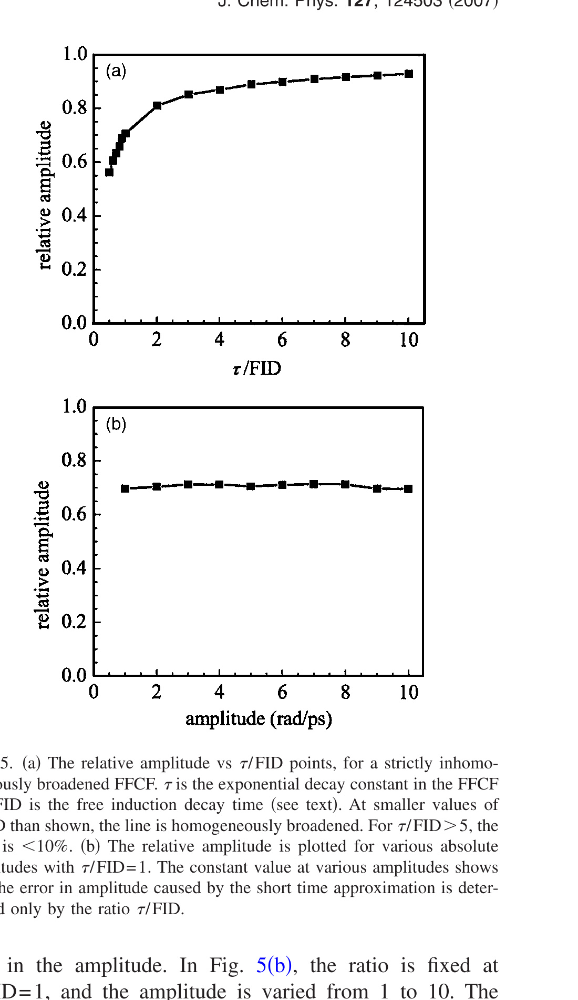
<figcaption><strong>Figure 5.</strong> (a) The relative amplitude vs <em>τ</em>/FID points, for a strictly inhomogeneously broadened FFCF. <em>τ</em> is the exponential decay constant in the FFCF and FID is the free induction decay time (see text). At smaller values of <em>τ</em>/FID than shown, the line is homogeneously broadened. For <em>τ</em>/FID > 5, the error is &lt;10%. (b) The relative amplitude is plotted for various absolute amplitudes with <em>τ</em>/FID = 1. The constant value at various amplitudes shows that the error in amplitude caused by the short time approximation is determined only by the ratio <em>τ</em>/FID.</figcaption>
</figure>

### 2. Influence of a homogeneous component

CLS is inversely proportional to the normalized FFCF, $C_1^N(T_w)$, in the absence of a homogeneous component. Here, the effect of a homogeneous component is examined through numerical calculations. An FFCF with a homogeneous component and one inhomogeneous component, $C(t) = \delta(t)/T_2 + \Delta_{ln}^2 \exp(-t/\tau_{ln})$, is used. The homogeneous line width is *W*h = 1/*πT*2. The inhomogeneous component is fixed with Δln = 1.9 rad/ps and *τ*ln = 25 ps. This *τ*ln is sufficiently long that the error in the amplitude of the inhomogeneous contribution introduced by the short time approximation is very small. *T*2 was varied from 25 to 0.15 ps to generate FFCFs that gave rise to *W*h/FWHM with values ranging from 0.05 to 0.9. FWHM is the full width at half maximum of the total absorption line. The *T*w dependent CLS were determined from the 2D spectra calculated from the different FFCFs (different homogeneous contributions) and are plotted in [Fig. 6(a)](#fig6). As shown in the figure, the effect of the homogeneous component is to decrease the initial amplitude from 1. The top curve in [Fig. 6(a)](#fig6) has the smallest homogeneous contribution, *T*2 = 25 ps, and the bottom curve is for *T*2 = 0.15 ps. In the 2D-IR vibrational echo spectra, the increasing amount of the homogeneous contribution results in less elongation along the diagonal.

To check the relationship between decrease in the *T*w = 0 value of the CLS from 1 and the magnitude of the homogeneous contribution, the decrease from 1 is plotted as a function of the ratio *W*h/FWHM in [Fig. 6(b)](#fig6). The points are calculated from the CLS and the homogeneous and total linewidths using the FFCFs. The line with slope 1 was drawn to emphasize the almost linear one-to-one relationship between these quantities throughout the entire change of homogeneous contributions. This relationship demonstrates that, for systems in which the inhomogeneous terms in the FFCF decay slowly (*τ*/FID > ~5) so that there is little error in the relative amplitude of the inhomogeneous terms, the homogeneous and inhomogeneous components of the FFCF can be obtained from the CLS and the absorption linewidth without using response function calculations of the absorption line shape.

<figure class="paper-figure" id="fig6">
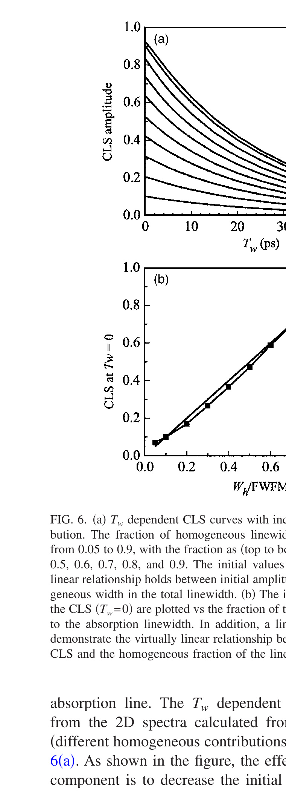
<figcaption><strong>Figure 6.</strong> (a) <em>T</em>w dependent CLS curves with increasing homogeneous contribution. The fraction of homogeneous linewidth to FWHM was increased from 0.05 to 0.9, with the fraction as (top to bottom) 0.05, 0.1, 0.2, 0.3, 0.4, 0.5, 0.6, 0.7, 0.8, and 0.9. The initial values of these curves show that a linear relationship holds between initial amplitude and the fraction of homogeneous width in the total linewidth. (b) The initial amplitudes (squares) of the CLS (<em>T</em>w = 0) are plotted vs the fraction of the homogeneous contribution to the absorption linewidth. In addition, a line of slope of 1 is shown to demonstrate the virtually linear relationship between the initial value of the CLS and the homogeneous fraction of the line.</figcaption>
</figure>

### 3. Determination of inhomogeneous component from the CLS

In addition to the homogeneous contribution to the absorption linewidth discussed in Appendix 2, there is also the inhomogeneous portion of the total linewidth, *W*ln. In the simple methods, CLS and linewidth, for determining the absolute amplitudes and the homogeneous *T*2, we employed the relationship,

$$\left(\frac{W_G}{\text{FWHM}}\right)^2 + \frac{W_L}{\text{FWHM}} \approx 1, \tag{A1}$$

<noscript>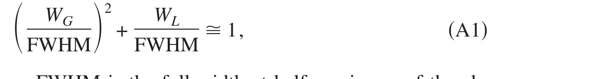</noscript>

where FWHM is the full width at half maximum of the absorption line and *W*G and *W*L are the FWHM of the Gaussian (inhomogeneous) and Lorentzian (homogeneous) components of the line. *W*G is 2.35 times the standard deviation of the Gaussian and *W*L = 1/*πT*2. The relation given in Eq. (A1) is not strictly correct because the total linewidth is determined by the convolution of the Gaussian and Lorentzian contributions to give a Voight line shape.

Because the Voight function has no exact analytical form, a very accurate approximation for the Voight function is used [[51](#ref51)] to demonstrate that the relationship in Eq. (A1) is quite accurate. The half-width at half maximum of Voight function can be expressed with very good accuracy as [[51](#ref51)]

$$b_{1/2}(a) = a + (\ln 2)^{1/2} \exp[-0.6055a + 0.718a^2 - 0.0049a^3 + 0.000\,136a^4], \tag{A2}$$

<noscript>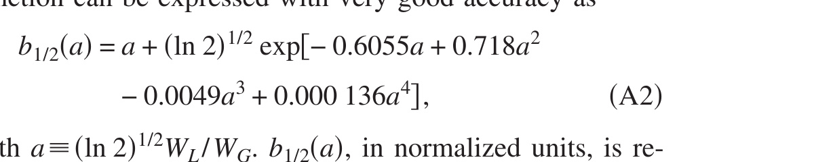</noscript>

with $a \equiv (\ln 2)^{1/2} W_L/W_G$. *b*1/2(*a*), in normalized units, is related to the FWHM of the Lorentzian and Gaussian components of the Voight function by

$$b_{1/2}(a) = a\frac{\text{FWHM}}{W_L} = (\ln 2)^{1/2}\frac{\text{FWHM}}{W_G}. \tag{A3}$$

<noscript>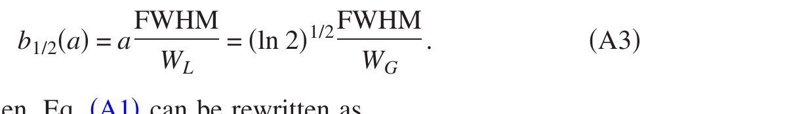</noscript>

Then, Eq. (A1) can be rewritten as

$$\frac{a}{b_{1/2}(a)} + \left(\frac{\sqrt{\ln 2}}{b_{1/2}(a)}\right)^2 \approx 1. \tag{A4}$$

<noscript>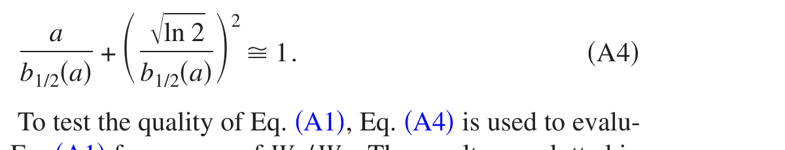</noscript>

To test the quality of Eq. (A1), Eq. (A4) is used to evaluate Eq. (A1) for a range of *W*L/*W*G. The results are plotted in [Fig. 7](#fig7). *W*L/*W*G ≅ 0 is the almost inhomogeneous case for which the line shape is approximately Gaussian. The *W*L/*W*G ≅ 20 is the almost homogeneously broadened case for which the line shape is approximately Lorentzian. As shown in the figure, Eq. (A1) is satisfied very well for quite a wide range of *W*L/*W*G.

<figure class="paper-figure" id="fig7">
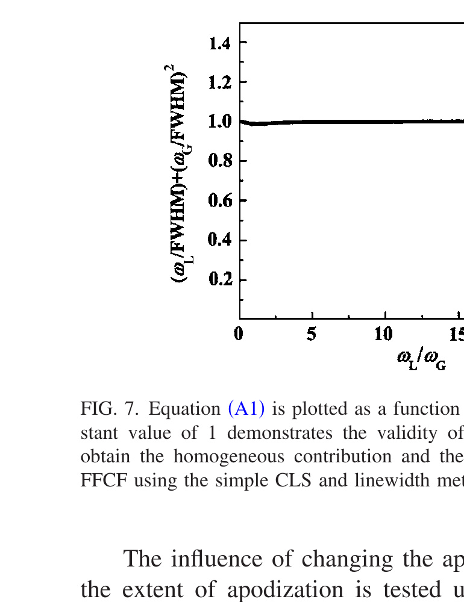
<figcaption><strong>Figure 7.</strong> Equation (A1) is plotted as a function of <em>W</em>L/<em>W</em>G. The almost constant value of 1 demonstrates the validity of the approximation used to obtain the homogeneous contribution and the absolute amplitudes of the FFCF using the simple CLS and linewidth methods.</figcaption>
</figure>

### 4. CLS is independent of the apodization function

In the body of the paper, biexponential functions were used to demonstrate the effects of apodization along the *ω*τ axis. The results from CLS are not changed by the different apodization functions and extents of apodization. To show this, numerical simulations were used.

The influence of changing the apodization function and the extent of apodization is tested using three apodization functions, each centered at *τ* = 0. They are a two-sided exponential decay, a Gaussian and a "hat" function. The hat function is a constant that extends from zero to the peak of the interferogram envelope and then decays to zero as a Gaussian at positive times, with the identical shape at negative times. The FFCF used to calculate the 2D response is the single exponential function used in Appendix 1. Among the various FFCFs presented in [Fig. 5](#fig5), three FFCFs were selected as a model for fast (*τ*/FID = 0.5), intermediate (*τ*/FID = 1), and slow (*τ*/FID = 5) dynamics. The extent of apodization was varied from 1/2 to 1/10 of the initial interferogram. The time to decay to half maximum of the interferogram was calculated before the second Fourier transform along the *ω*τ axis. Then the time constant of each apodization function was set such that the interferogram multiplied by the apodization function reached half maximum at 1/2, 1/3, 1/4, 1/5, and 1/10 of the time for the interferogram without apodization to reach half maximum. 2D spectra with different apodization functions and different decays were calculated, and the FFCFs were extracted from these spectra using CLS.

[Figure 8(a)](#fig8) shows the results of the calculations for the three FFCFs with three apodization functions [two-sided exponential decay (squares), Gaussian (diamonds), and hat function (circles)] and six different extents of apodization. On the horizontal axis, 1 is no apodization. As shown in the figure, there is almost no changes in the time constants extracted with CLS from the apodized 2D spectra even through there are extensive changes in the shapes of the spectra. Short time approximation causes some change in the initial amplitude, but as discussed in the body of the paper, the amplitudes can be accurately obtained using the CLS plus fitting the linear line shape. Even when the interferogram is forced to decay ten times faster than in the absence of apodization, the CLS gives an accurate determination of the FFCF. The 1/10 apodization can reduce the data collection time in an experiment tremendously. Apodization of the CLS along the *ω*τ axis is insensitive to the function form of the apodization function and the extent of apodization.

Enhancement of resolution along the *ω*τ axis is also demonstrated. Two apodization functions are used, a rising two-sided exponential and a shifted Gaussian function, $\exp(a\tau/T_2^* - b(\tau/T_2^*)^2)$. The shifted Gaussian function is composed of the rising exponential function, $\exp(a\tau/T_2^*)$, to compensate the decay of interferogram and the Gaussian decay function, $\exp(-b(\tau/T_2^*)^2)$, to make the interferogram decay to zero. *T*2* is the FID of unprocessed interferogram. However, *a*, *b*, and *T*2* are used as adjustable parameter to achieve the desired resolution. [[52](#ref52)] This function is used on both the rephasing and nonrephasing interferograms.

First, the simple rising exponential functions with various time constants are applied for resolution enhancement. Because the main purpose for applying a rising exponential function is to reduce the linewidth, the ratio between the linewidth before and after the apodization was used as a measure of the extent of apodization. This ratio is calculated from the dynamic linewidth at the shortest *T*w. [Figure 8(b)](#fig8) shows the results of the calculations. The horizontal axis is the reduction of the linewidth along the *ω*τ axis. The calculations are for the three FFCFs used in [Fig. 8(a)](#fig8). The results show that the FFCF decay constant can be extracted with the CLS. For each decay constant, the line stops at the point where further narrowing by increased apodization produces side lobes along the *ω*τ axis on either side of the 2D band. These side lobes do not change the CLS, but they could interfere with increased resolution.

Second, the shifted Gaussian function is used for resolution enhancement by reducing the extended wing of a spectrum without changing the FWHM. Similar results can be achieved by the sine bell function. [[32](#ref32)] To clearly show the effect of the shifted Gaussian function, the 2D-IR spectrum of phenol in CCl₄ was used because it has an almost Lorentzian line shape. Parameters for calculating 2D-IR spectrum are listed in Table II. In [Fig. 9(a)](#fig9), the 2D-IR spectrum at *T*w = 0.2 ps without apodization is shown. It has long wings along both axes. 2D-IR spectrum after apodization along the *ω*τ axis is presented in [Fig. 9(b)](#fig9). The long wing along the *ω*τ axis is reduced. To clearly show the reduction of the wing along the *ω*τ axis, slices cut through the *ω*m center frequency projected onto the *ω*τ axis are shown in [Fig. 9(c)](#fig9). The solid curve is the spectrum without apodization and the dashed curve is that with apodization. The shifted Gaussian function eliminates the extended Lorentzian wing without changing the FWHM of spectrum. Finally, [Fig. 9(d)](#fig9) shows that the CLS before (squares) and after (circles) apodization has not changed.

<figure class="paper-figure" id="fig8">
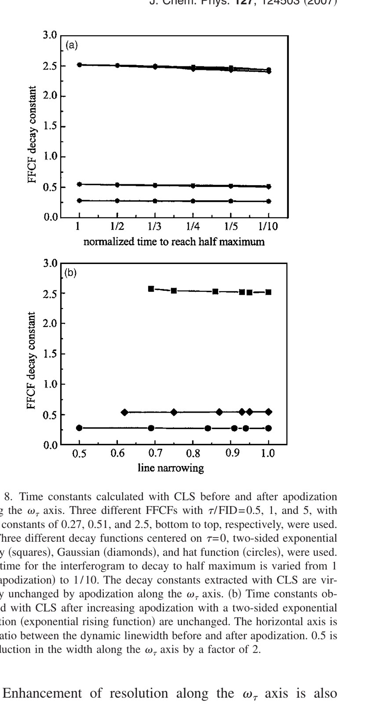
<figcaption><strong>Figure 8.</strong> Time constants calculated with CLS before and after apodization along the <em>ω</em>τ axis. Three different FFCFs with <em>τ</em>/FID = 0.5, 1, and 5, with time constants of 0.27, 0.51, and 2.5, bottom to top, respectively, were used. (a) Three different decay functions centered on <em>τ</em> = 0, two-sided exponential decay (squares), Gaussian (diamonds), and hat function (circles), were used. The time for the interferogram to decay to half maximum is varied from 1 (no apodization) to 1/10. The decay constants extracted with CLS are virtually unchanged by apodization along the <em>ω</em>τ axis. (b) Time constants obtained with CLS after increasing apodization with a two-sided exponential function (exponential rising function) are unchanged. The horizontal axis is the ratio between the dynamic linewidth before and after apodization. 0.5 is a reduction in the width along the <em>ω</em>τ axis by a factor of 2.</figcaption>
</figure>

### 5. Apodization along the *ω*m axis

In the body of the paper, we discuss apodization along the *ω*τ axis because, frequently, data are collected through a monochromator to give the second coherence period Fourier transformed axis, *ω*m. A two-dimensional interferogram can be obtained by scanning pulses 1 and 2 for first coherence period and scanning the local oscillator for second coherence periods. The resulting two-dimensional interferogram is Fourier transformed for each coherence period to obtain the 2D-IR spectrum. [[32](#ref32)] With this data collection method, apodization can be applied to the *ω*m axis rather than the *ω*τ axis. An increasing function apodization along the *ω*m axis can help to reduce the destructive interference between the positive 0-1 transition band and the negative 1-2 transition band. If necessary, apodization along the *ω*m axis can be accomplished even though a monochromator is used for the *ω*m axis. The time-frequency interferogram obtained using the monochromator can be converted into a time-time interferogram using inverse Fourier transformation, and an apodization function can be applied along the *ω*m axis. Then 2D-IR spectrum with apodization along the *ω*m axis can be obtained through double Fourier transformation. Response function with apodization along the *ω*m axis was calculated to see the effect of apodization along the *ω*m axis. The calculated 2D-IR spectra show the same effects as displayed in [Figs. 3(b) and 3(d)](#fig3) but the changes are along the *ω*m axis rather than along the *ω*τ axis.

When apodization is applied along the *ω*m axis, CLS is obtained by taking cuts through the 2D spectrum parallel to the *ω*m axis rather than the *ω*τ axis. Resulting CLS shows inverted behavior relative to the *ω*τ axis CLS. The *ω*m CLS has a center line slope close to 45° at short *T*w and the line becomes horizontal at long *T*w. As can be proved easily using Eq. (16), the CLS obtained through cuts parallel to the *ω*m axis is directly proportional to normalized FFCF. The resulting CLS apodized along the *ω*m axis shows the same behavior as the *ω*τ axis CLS apodized along *ω*τ axis. Apodization along the axis used to calculate the CLS does not change the CLS. Apodization along the other axis does change it. Therefore, it is possible to apodize along either axis, but not both.

<figure class="paper-figure" id="fig9">
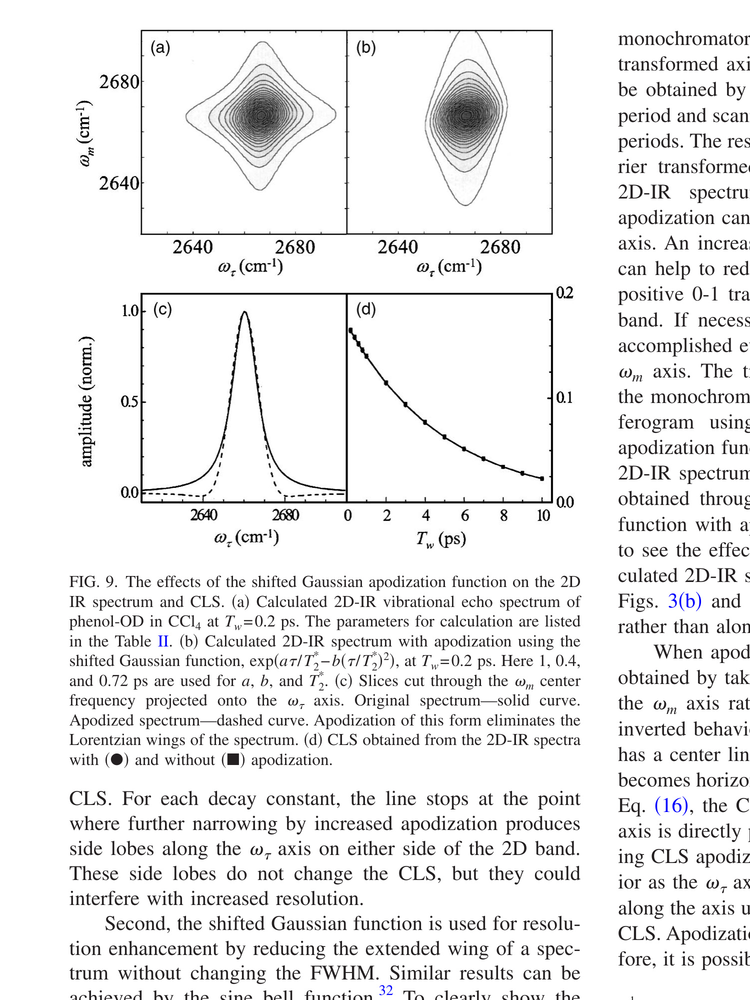
<figcaption><strong>Figure 9.</strong> The effects of the shifted Gaussian apodization function on the 2D IR spectrum and CLS. (a) Calculated 2D-IR vibrational echo spectrum of phenol-OD in CCl₄ at <em>T</em>w = 0.2 ps. The parameters for calculation are listed in Table II. (b) Calculated 2D-IR spectrum with apodization using the shifted Gaussian function, exp(<em>aτ</em>/<em>T</em>2* − <em>b</em>(<em>τ</em>/<em>T</em>2*)²), at <em>T</em>w = 0.2 ps. Here 1, 0.4, and 0.72 ps are used for <em>a</em>, <em>b</em>, and <em>T</em>2*. (c) Slices cut through the <em>ω</em>m center frequency projected onto the <em>ω</em>τ axis. Original spectrum—solid curve. Apodized spectrum—dashed curve. Apodization of this form eliminates the Lorentzian wings of the spectrum. (d) CLS obtained from the 2D-IR spectra with (●) and without (■) apodization.</figcaption>
</figure>

## References

1. J. B. Asbury, T. Steinel, C. Stromberg, S. A. Corcelli, C. P. Lawrence, J. L. Skinner, and M. D. Fayer, J. Phys. Chem. A **108**, 1107 (2004).

2. C. J. Fecko, J. J. Loparo, S. T. Roberts, and A. Tokmakoff, J. Chem. Phys. **122**, 054506 (2005).

3. M. L. Cowan, B. D. Bruner, N. Huse, J. R. Dwyer, B. Chugh, E. T. J. Nibbering, T. Elsasser, and R. J. D. Miller, Nature (London) **434**, 199 (2005).

4. I. J. Finkelstein, J. Zheng, H. Ishikawa, S. Kim, K. Kwak, and M. D. Fayer, Phys. Chem. Chem. Phys. **9**, 1533 (2007).

5. L. P. DeFlores and A. Tokmakoff, J. Am. Chem. Soc. **128**, 16520 (2006).

6. P. Mukherjee, I. Kass, I. T. Arkin, and M. T. Zanni, Proc. Natl. Acad. Sci. U.S.A. **103**, 3528 (2006).

7. Y. S. Kim and R. M. Hochstrasser, Proc. Natl. Acad. Sci. U.S.A. **102**, 11185 (2005).

8. J. Zheng, K. Kwak, J. B. Asbury, X. Chen, I. Piletic, and M. D. Fayer, Science **309**, 1338 (2005).

9. K. Kwak, J. Zheng, H. Cang, and M. D. Fayer, J. Phys. Chem. B **110**, 10384 (2006).

10. J. Zheng, K. Kwak, J. Xie, and M. D. Fayer, Science **313**, 1951 (2006).

11. J. Wang, J. Chen, and R. M. Hochstrasser, J. Phys. Chem. B **110**, 7545 (2006).

12. E. C. Fulmer, F. Ding, and M. T. Zanni, J. Chem. Phys. **122**, 034302 (2005).

13. J. B. Asbury, T. Steinel, K. Kwak, S. A. Corcelli, C. P. Lawrence, J. L. Skinner, and M. D. Fayer, J. Chem. Phys. **121**, 12431 (2004).

14. O. Golonzka, M. Khalil, N. Demirdoven, and A. Tokmakoff, Phys. Rev. Lett. **86**, 2154 (2001).

15. M. Khalil, N. Demirdoven, and A. Tokmakoff, J. Chem. Phys. **121**, 362 (2004).

16. O. Golonzka, M. Khalil, N. Demirdoven, and A. Tokmakoff, J. Chem. Phys. **115**, 10814 (2001).

17. M. Khalil, N. Demirdoven, and A. Tokmakoff, J. Phys. Chem. A **107**, 5258 (2003).

18. S. Mukamel, *Principles of Nonlinear Optical Spectroscopy* (Oxford University Press, New York, 1995).

19. J. D. Eaves, J. J. Loparo, C. J. Fecko, S. T. Roberts, A. Tokmakoff, and P. L. Geissler, Proc. Natl. Acad. Sci. U.S.A. **102**, 13019 (2005).

20. S. A. Corcelli, C. P. Lawrence, and J. L. Skinner, J. Chem. Phys. **120**, 8107 (2004).

21. S. Mukamel and R. F. Loring, J. Opt. Soc. Am. B **3**, 595 (1986).

22. S. Mukamel, Annu. Rev. Phys. Chem. **51**, 691 (2000).

23. W. M. Zhang, V. Chernyak, and S. Mukamel, J. Chem. Phys. **110**, 5011 (1999).

24. M. H. Cho, J. Y. Yu, T. H. Joo, Y. Nagasawa, S. A. Passino, and G. R. Fleming, J. Phys. Chem. **100**, 11944 (1996).

25. A. Piryatinski and J. L. Skinner, J. Phys. Chem. B **106**, 8055 (2002).

26. A. Tokmakoff, J. Phys. Chem. A **104**, 4247 (2000).

27. K. Okumura, A. Tokmakoff, and Y. Tanimura, Chem. Phys. Lett. **314**, 488 (1999).

28. K. Kwac and M. Cho, J. Phys. Chem. A **107**, 5903 (2003).

29. S. T. Roberts, J. J. Loparo, and A. Tokmakoff, J. Chem. Phys. **125**, 084502 (2006).

30. I. J. Finkelstein, H. Ishikawa, S. Kim, A. M. Massari, and M. D. Fayer, Proc. Natl. Acad. Sci. U.S.A. **104**, 2637 (2007).

31. R. N. Bracewell, *The Fourier Transform and Its Application* (McGraw Hill, Boston, 2000).

32. M. T. Zanni, M. C. Asplund, and R. M. Hochstrasser, J. Chem. Phys. **114**, 4579 (2001).

33. E. G. Codding and G. Horlick, Appl. Spectrosc. **27**, 85 (1973).

34. A. G. Marshall and F. R. Verdun, *Fourier Transforms in NMR, Optical, and Mass Spectrometry* (Elsevier, New York, 1990).

35. J. C. Hoch and A. S. Stern, *NMR Data Processing* (Wiley-Liss, New York, 1996).

36. W. H. Press, S. A. Teukolsky, W. T. Vetterling, and B. P. Flannery, *Numerical Recipes in C*, 2nd ed. (Cambridge University Press, New York, 1999).

37. M. Khalil, N. Demirdoven, and A. Tokmakoff, Phys. Rev. Lett. **90**, 047401 (2003).

38. M. Sarah, G. Faeder, and D. M. Jonas, J. Phys. Chem. A **103**, 10489 (1999).

39. J. R. Schmidt, N. Sundlass, and J. L. Skinner, Chem. Phys. Lett. **378**, 559 (2003).

40. I. J. Finkelstein, H. Ishikawa, S. Kim, A. M. Massari, and M. D. Fayer, Proc. Natl. Acad. Sci. U.S.A. **104**, 2637 (2007).

41. S. Woutersen, R. Pfister, P. Hamm, Y. Mu, D. S. Kosov, and G. Stock, J. Chem. Phys. **117**, 6833 (2002).

42. C. P. Lawrence and J. L. Skinner, Proc. Natl. Acad. Sci. U.S.A. **102**, 6720 (2005).

43. M. Khalil, N. Demirdoven, and A. Tokmakoff, Phys. Rev. Lett. **90**, 047401 (2003).

44. S. Mukamel, *Principles of Nonlinear Optical Spectroscopy* (Oxford University Press, New York, 1999).

45. T. Steinel, J. B. Asbury, J. R. Zheng, and M. D. Fayer, J. Phys. Chem. A **108**, 10957 (2004).

46. S. Park, K. Kwak, and M. D. Fayer, Laser Phys. Lett. **4**, 704 (2007).

47. K. Kwak, S. Park, and M. D. Fayer, Proc. Natl. Acad. Sci. U.S.A. (to be published).

48. R. R. Ernst, G. Bodenhausen, and A. Wokaun, *Nuclear Magnetic Resonance in One and Two Dimensions* (Oxford University Press, Oxford, 1987).

49. J. B. Asbury, T. Steinel, and M. D. Fayer, J. Lumin. **107**, 271 (2004).

50. P. Kjellberg, B. Bruggemann, and T. Pullerists, Phys. Rev. B **74**, 24303 (2006).

51. H. O. Di Rocco, D. I. Iriarte, and J. Pomarico, Appl. Spectrosc. **55**, 822 (2001).

52. R. Freeman, *A Handbook of Nuclear Magnetic Resonance* (Addison-Wesley-Longman, Singapore, 1997).
