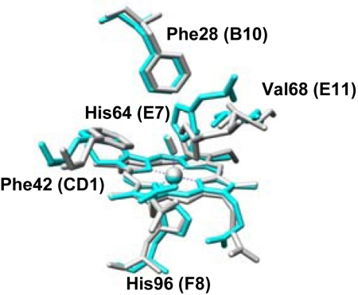
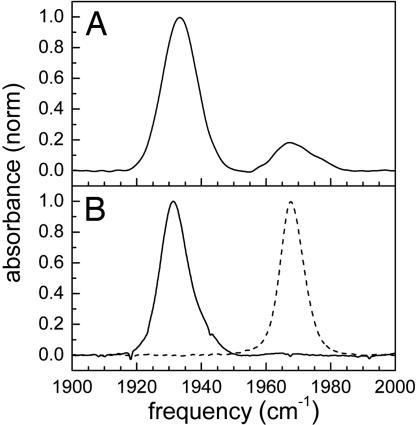
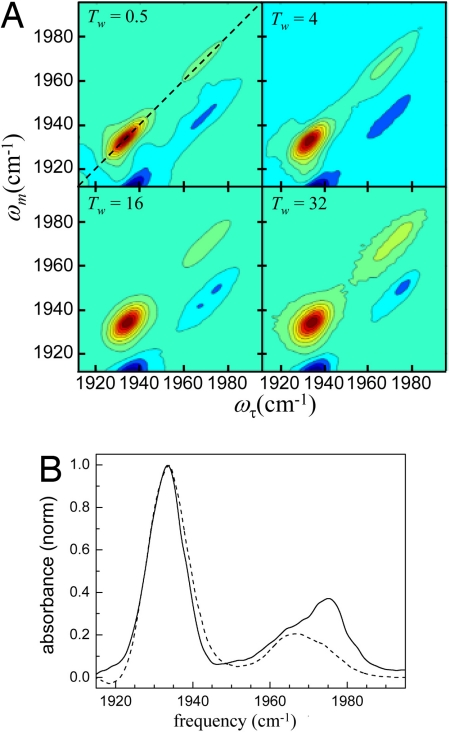
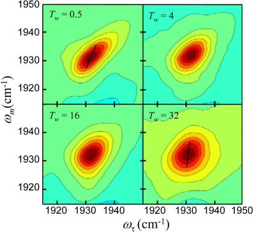
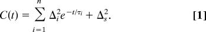
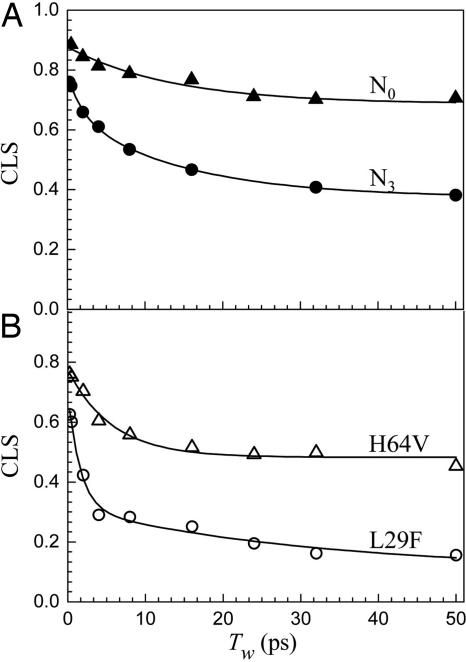

# Neuroglobin dynamics observed with ultrafast 2D-IR vibrational echo spectroscopy

**Haruto Ishikawa, Ilya J. Finkelstein, Seongheun Kim, Kyungwon Kwak, Jean K. Chung, Keisuke Wakasugi, Aaron M. Massari, and Michael D. Fayer**

*Proc. Natl. Acad. Sci. USA*, Volume 104, Issue 41 (2007)

**DOI:** [10.1073/pnas.0707718104](https://doi.org/10.1073/pnas.0707718104)

---

## Table of Contents

- [Abstract](#abstract)
- [Results and Discussion](#results-and-discussion)
- [Concluding Remarks](#concluding-remarks)
- [Materials and Methods](#materials-and-methods)
- [Acknowledgments](#acknowledgments)

---

##  Abstract
Neuroglobin (Ngb), a protein in the globin family, is found in vertebrate brains. It binds oxygen reversibly. Compared with myoglobin (Mb), the amino acid sequence has limited similarity, but key residues around the heme and the classical globin fold are conserved in Ngb. The CO adduct of Ngb displays two CO absorption bands in the IR spectrum, referred to as N3 (distal histidine in the pocket) and N0 (distal histidine swung out of the pocket), which have absorption spectra that are almost identical with the Mb mutants L29F and H64V, respectively. The Mb mutants mimic the heme pocket structures of the corresponding Ngb conformers. The equilibrium protein dynamics for the CO adduct of Ngb are investigated by using ultrafast 2D-IR vibrational echo spectroscopy by observing the CO vibration's spectral diffusion (2D-IR spectra time dependence) and comparing the results with those for the Mb mutants. Although the heme pocket structure and the CO FTIR peak positions of Ngb are similar to those of the mutant Mb proteins, the 2D-IR results demonstrate that the fast structural fluctuations of Ngb are significantly slower than those of the mutant Mbs. The results may also provide some insights into the nature of the energy landscape in the vicinity of the folded protein free energy minimum.
**Keywords:** myoglobin mutants, protein dynamics, energy landscape
* * *
Neuroglobin (Ngb) is a recently discovered family of vertebrate globin proteins. Ngb is expressed predominantly in nerve tissue. It has been hypothesized that Ngb facilitates O2 diffusion to protect neuronal cells from hypoxia and ischemia ([1](https://pmc.ncbi.nlm.nih.gov/articles/PMC2042171/#B1)). Ngb concentration in the brain is fairly low, too low to play the role that myoglobin (Mb) plays in the red muscles. However, because the expression level of Ngb is enhanced under hypoxic conditions _in vitro_ as well as ischemia _in vivo_ ([2](https://pmc.ncbi.nlm.nih.gov/articles/PMC2042171/#B2), [3](https://pmc.ncbi.nlm.nih.gov/articles/PMC2042171/#B3)), Ngb may be involved in neuronal responses to ischemia. A much higher concentration of Ngb is found in the retina. The concentration is high enough to deliver O2 to mitochondria ([4](https://pmc.ncbi.nlm.nih.gov/articles/PMC2042171/#B4)) and may facilitate O2 diffusion in a manner similar to Mb. Another possibility is that Ngb is involved in redox-coupled sensor regulation for signal transduction in the brain. Ngb binds to the GDP-bound form of the α-subunit of heterotrimeric G protein under oxidative stress ([5](https://pmc.ncbi.nlm.nih.gov/articles/PMC2042171/#B5)).
The 3D structures of Ngb from human and mouse, both having 151 amino acids, have been published ([6](https://pmc.ncbi.nlm.nih.gov/articles/PMC2042171/#B6), [7](https://pmc.ncbi.nlm.nih.gov/articles/PMC2042171/#B7)). Comparisons of Ngb with vertebrate Mb and Hb sequences show only minor similarities at the amino acid level ([1](https://pmc.ncbi.nlm.nih.gov/articles/PMC2042171/#B1)), but Ngb features the conserved classical globin fold and contains heme ([6](https://pmc.ncbi.nlm.nih.gov/articles/PMC2042171/#B6)). The heme iron in both the ferrous and ferric forms of Ngb is hexacoordinated ([8](https://pmc.ncbi.nlm.nih.gov/articles/PMC2042171/#B8)), in contrast to mammalian Mb and Hb, which contain pentacoordinated heme iron. Although hexacoordinated heme has been reported in plant, bacteria, and invertebrate globins, its physiological significance is not yet understood ([9](https://pmc.ncbi.nlm.nih.gov/articles/PMC2042171/#B9)). In Ngb, an external gaseous ligand must compete with the sixth ligand, the distal histidine (E7 in helix notation), for binding. Several key residues in the distal pocket for Mb, such as His-64 (E7), Val-68 (E11), and Phe-42 (CD1), are conserved in Ngb, although Leu-29 (B10) is replaced by Phe in Ngb (see [Fig. 1](https://pmc.ncbi.nlm.nih.gov/articles/PMC2042171/#F1)). Phenylalanine is found at position B10 in many nonsymbiotic plant Hbs that have hexacoordinated binding to the heme ([9](https://pmc.ncbi.nlm.nih.gov/articles/PMC2042171/#B9)). Previous studies revealed that Phe at position B10 influences the distal histidine and facilitates stable oxygen binding ([10](https://pmc.ncbi.nlm.nih.gov/articles/PMC2042171/#B10)). Another feature of Ngb is that the structural analysis has shown the presence in human Ngb of an intramolecular disulfide bond, which affects its oxygen affinity ([11](https://pmc.ncbi.nlm.nih.gov/articles/PMC2042171/#B11)).
***Fig. 1.***

Crystal structure of the active site of CO-bound ferrous mouse Ngb (gray) and L29F Mb (blue) mutant protein taken from the Protein Data Bank. The heme and some selected amino acid residues are shown.
Here we report measurements of the fast equilibrium structural dynamics of Ngb and comparisons of the Ngb dynamics with that of Mb mutant proteins. The Mb mutants mimic the structure of the active site of Ngb. The measurements are made by using 2D-IR vibrational echo spectroscopy, which is an ultrafast IR analog of 2D-NMR but operates on time scales many orders of magnitude shorter than NMR. 2D-IR vibrational echo spectroscopy can directly characterize protein motions on time scales from subpicosecond to 100 ps or longer ([12](https://pmc.ncbi.nlm.nih.gov/articles/PMC2042171/#B12)–[22](https://pmc.ncbi.nlm.nih.gov/articles/PMC2042171/#B22)).
A folded protein at equilibrium resides in a state that is in a free energy local minimum. A protein can have several such local minima, substates, separated by relatively high barriers. The substates are distinguished by differences in some well defined aspects of the protein's structure. Ngb and Mb are examples of proteins with several substates. As discussed below, the substates differ by the configuration of the distal histidine ([19](https://pmc.ncbi.nlm.nih.gov/articles/PMC2042171/#B19), [23](https://pmc.ncbi.nlm.nih.gov/articles/PMC2042171/#B23)–[25](https://pmc.ncbi.nlm.nih.gov/articles/PMC2042171/#B25)). One way to view the local minimum of a substate is that it is relatively broad with a rough energy landscape ([26](https://pmc.ncbi.nlm.nih.gov/articles/PMC2042171/#B26)). This landscape has numerous minima separated by relatively low barriers. Changes in protein structure are caused by transitions from one landscape minimum to another. A substantial fraction or all of these transitions occur on subpicosecond to 100-ps time scales, depending on the protein. These structural fluctuations can be observed by using 2D-IR vibrational echo spectroscopy.
For heme proteins, 2D-IR vibrational echo experiments use the heme-ligated CO vibration as a direct sensor of protein dynamics ([15](https://pmc.ncbi.nlm.nih.gov/articles/PMC2042171/#B15), [16](https://pmc.ncbi.nlm.nih.gov/articles/PMC2042171/#B16)). The IR liner absorption spectrum of the CO stretching mode of heme proteins generally displays several bands. The different bands reflect structural differences, i.e., distinct structural substates, and the width of the bands reflects the range of CO vibrational energies that are associated with the distribution of protein structural configurations of each substate ([15](https://pmc.ncbi.nlm.nih.gov/articles/PMC2042171/#B15), [23](https://pmc.ncbi.nlm.nih.gov/articles/PMC2042171/#B23), [24](https://pmc.ncbi.nlm.nih.gov/articles/PMC2042171/#B24)). The linear IR absorption spectrum cannot provide information on a protein's structural dynamics. The dynamical information is obtained from the time evolution of the 2D-IR line shapes that are acquired with the vibrational echo experiments ([16](https://pmc.ncbi.nlm.nih.gov/articles/PMC2042171/#B16)).
The peak positions of the stretching bands of CO bound to Ngb in the absorption spectrum are almost identical with those of particular Mb mutant proteins. However, it will be shown below that, despite the great similarity in the absorption spectra, heme pocket structures, and backbone folds, the structural dynamics of Ngb and Mb are distinct. Ligand rebinding studies of Ngb show that CO rebinding kinetics after optical excitation-induced dissociation of the CO from the heme is different from that of Mb ([27](https://pmc.ncbi.nlm.nih.gov/articles/PMC2042171/#B27), [28](https://pmc.ncbi.nlm.nih.gov/articles/PMC2042171/#B28)). The results presented below demonstrate that the equilibrium structural fluctuations of Ngb are considerably slower than those of Mb. The results also provide insights into the nature of the energy landscape near the folded protein's free energy minimum.
---
##  Results and Discussion
### Linear FTIR Spectroscopy.
The background-subtracted linear FTIR spectrum of CO bound to human Ngb is shown in [Fig. 2](https://pmc.ncbi.nlm.nih.gov/articles/PMC2042171/#F2) _A_. There are two CO absorption bands at 1,932 cm⁻¹ and 1,968 cm⁻¹. These bands have been called the N3 (lower frequency) and N0 (higher frequency) conformers, respectively, in analogy to the A3 and A0 bands of Mb ([27](https://pmc.ncbi.nlm.nih.gov/articles/PMC2042171/#B27), [29](https://pmc.ncbi.nlm.nih.gov/articles/PMC2042171/#B29)). The significant width of the CO stretching bands of Ngb and their Gaussian shapes imply structural heterogeneity associated with each protein substate that is sensed by the CO bound to the active site. Although the range of frequencies that make up a substate's absorption band is sensitive to the details of the heme pocket, it is also determined by the global structural variations of the protein ([19](https://pmc.ncbi.nlm.nih.gov/articles/PMC2042171/#B19), [20](https://pmc.ncbi.nlm.nih.gov/articles/PMC2042171/#B20), [30](https://pmc.ncbi.nlm.nih.gov/articles/PMC2042171/#B30), [31](https://pmc.ncbi.nlm.nih.gov/articles/PMC2042171/#B31)). The frequency of N3 corresponds closely to the MbCO A3 conformation, which has the distal histidine localized in the heme pocket ([19](https://pmc.ncbi.nlm.nih.gov/articles/PMC2042171/#B19)), whereas the frequency of N0 is almost identical with the MbCO A0 conformer, which has the distal histidine rotated out of the pocket ([25](https://pmc.ncbi.nlm.nih.gov/articles/PMC2042171/#B25)). Substitution in Ngb of the distal histidine by the nonpolar amino acid residues, valine or alanine, causes a substantial increase in the population of N0 conformer ([27](https://pmc.ncbi.nlm.nih.gov/articles/PMC2042171/#B27)).
***Fig. 2.***

Normalized FTIR spectra of the CO stretching mode bound to Ngb (_A_) and Mb mutant proteins L29F (solid curve) and H64V (dashed curve) (_B_).
The A1 substate of wild-type MbCO is predominately populated and dominates the absorption spectrum. It does not correspond to either the N3 or N0 states of Ngb in vibrational frequency. The A1 and A3 bands of MbCO arise from different conformations of the distal histidine in the heme pocket ([19](https://pmc.ncbi.nlm.nih.gov/articles/PMC2042171/#B19), [20](https://pmc.ncbi.nlm.nih.gov/articles/PMC2042171/#B20)). The A3 conformer places the hydrogen on the protonated ε-nitrogen of the distal histidine, much closer to the CO than the A1 conformer ([19](https://pmc.ncbi.nlm.nih.gov/articles/PMC2042171/#B19)). Because of the similarities of the N3 and A3 spectra and the N0 and A0 spectra, it is desirable to compare their dynamics by using 2D-IR vibrational echo spectroscopy. However, both the A3 and A0 bands are too small in wild-type MbCO to be useful for the 2D-IR experiments.
To compare the dynamics of Ngb and Mb, the mutant Mb proteins L29F and H64V were used. The dynamics of MbCO and MbCO mutants have been measured by using vibrational echo spectroscopy (see refs. [16](https://pmc.ncbi.nlm.nih.gov/articles/PMC2042171/#B16), [18](https://pmc.ncbi.nlm.nih.gov/articles/PMC2042171/#B18)–[21](https://pmc.ncbi.nlm.nih.gov/articles/PMC2042171/#B21), [32](https://pmc.ncbi.nlm.nih.gov/articles/PMC2042171/#B32)–[34](https://pmc.ncbi.nlm.nih.gov/articles/PMC2042171/#B34)). The background-subtracted normalized FTIR spectra of CO bound to the mutants are shown in [Fig. 2](https://pmc.ncbi.nlm.nih.gov/articles/PMC2042171/#F2) _B_. The L29F mutant has one major band at 1,932 cm⁻¹ corresponding closely to the N3 spectrum of Ngb. Leu-29 (B10) in Mb is substituted by Phe in Ngb, although other key residues in the distal pocket of Mb are preserved in Ngb. Therefore, the L29F mutant mimics the heme pocket structure of Ngb ([Fig. 1](https://pmc.ncbi.nlm.nih.gov/articles/PMC2042171/#F1)). Experiments, theory, and molecular dynamics simulations have shown that both the local and global coupling between protein structure and the CO vibrational transition frequency is mainly through the electric field along the CO bond ([19](https://pmc.ncbi.nlm.nih.gov/articles/PMC2042171/#B19), [20](https://pmc.ncbi.nlm.nih.gov/articles/PMC2042171/#B20), [24](https://pmc.ncbi.nlm.nih.gov/articles/PMC2042171/#B24), [29](https://pmc.ncbi.nlm.nih.gov/articles/PMC2042171/#B29), [30](https://pmc.ncbi.nlm.nih.gov/articles/PMC2042171/#B30), [35](https://pmc.ncbi.nlm.nih.gov/articles/PMC2042171/#B35)–[37](https://pmc.ncbi.nlm.nih.gov/articles/PMC2042171/#B37)). The protein residues range from charged, to polar, to nonpolar. All of these, as well as, to some extent, the solvent, contribute to the electric field. The vibrational states couple to the electric field via the Stark effect ([37](https://pmc.ncbi.nlm.nih.gov/articles/PMC2042171/#B37)). Differences in structure produce changes in the electric field at the CO and, therefore, changes in frequency. The range of frequencies associated with the inhomogeneous line widths of the CO bands is determined by the range of structures that produce the electric field at the CO. 2D-IR vibrational echoes monitor the interconversion of the structures via the time evolution of the CO frequency.
The spectrum of the Mb A0 band has a frequency almost the same as the Mb mutant, H64V, which has the distal histidine replaced by a valine. H64V mimics the situation in which the distal histidine is rotated out of the heme pocket. Both H64V and the N0 conformation for Ngb absorb at 1,968 cm⁻¹. The spectral positions and line widths of the Ngb bands and the mutant bands are given in [Table 1](https://pmc.ncbi.nlm.nih.gov/articles/PMC2042171/#T1).
#### Table 1.
Parameters for CO bound to Ngb and Mb and mutants
Protein | Line center, cm⁻¹ | FWHM, cm⁻¹ |  _T_ 1, ps  
---|---|---|---  
Ngb N3 | 1,932.7 | 12.1 | 19.3  
Ngb N0 | 1,968.1 | 9.8 | 18.4  
Mb L29F | 1,931.8 | 9.6 | 15.8  
Mb H64V | 1,968.0 | 8.8 | 24.1  
[Open in a new tab](https://pmc.ncbi.nlm.nih.gov/articles/PMC2042171/table/T1/)
### 2D-IR Spectroscopy.
Ultrafast 2D-IR vibrational echo spectroscopy can measure fast protein dynamics under thermal equilibrium conditions through the changes in the 2D-IR line shapes with time ([13](https://pmc.ncbi.nlm.nih.gov/articles/PMC2042171/#B13), [15](https://pmc.ncbi.nlm.nih.gov/articles/PMC2042171/#B15)–[17](https://pmc.ncbi.nlm.nih.gov/articles/PMC2042171/#B17), [19](https://pmc.ncbi.nlm.nih.gov/articles/PMC2042171/#B19)). In the vibrational echo experiments, three IR excitation pulses, ≈110 fs in duration, tuned to the vibrational absorption frequency are used. The times between pulses 1 and 2 and pulses 2 and 3 are called τ and _T_ w, respectively. The vibrational echo pulse emerges from the sample in a unique direction at a time ≤τ after the third pulse. A 2D spectrum is recorded by scanning τ at fixed _T_ w. The vibrational echo pulse is heterodyne detected through a monochromator. Heterodyne detection provides phase information in addition to signal amplitudes. Taking the spectrum of the heterodyned echo pulse performs one of the two Fourier transforms and gives the ωm-axis (m for monochromator) in the 2D frequency domain spectrum. When τ is scanned, time interferograms are generated at each ωm. The interferograms are numerically Fourier transformed to give the ωτ-axis of the 2D spectrum. Two-dimensional vibrational echo spectra are recorded as a function of _T_ w.
As _T_ w increases, the shape of the 2D spectral bands change. These changes are directly related to the structural evolution of the protein through the influence of the structural changes on the frequency of the CO vibrational mode. The experiment can be viewed qualitatively as follows. The first and second pulses act to label the initial frequencies of the molecules. Between the second and third pulses, structural evolution of the proteins causes the initially labeled frequencies to change (spectral diffusion). The third pulse ends the evolution period, and the vibrational echo pulse reads out the final frequencies. As _T_ w increases, there is more time for structural evolution and, therefore, larger frequency changes. The frequency changes are reflected in the change in shapes of the 2D-IR vibrational echo spectra. Full descriptions of the method have been presented ([16](https://pmc.ncbi.nlm.nih.gov/articles/PMC2042171/#B16), [38](https://pmc.ncbi.nlm.nih.gov/articles/PMC2042171/#B38)–[40](https://pmc.ncbi.nlm.nih.gov/articles/PMC2042171/#B40)).
[Fig. 3](https://pmc.ncbi.nlm.nih.gov/articles/PMC2042171/#F3) _A_ shows 2D-IR spectra of CO bound to Ngb at several values of _T_ w. The red bands are positive going and correspond to the 0–1 vibrational transition. The blue bands are negative going. They arise from vibrational echo emission at the frequency of the 1–2 vibration transition ([41](https://pmc.ncbi.nlm.nih.gov/articles/PMC2042171/#B41)) and are shifted along the ωm-axis by the CO stretching mode's anharmonicity. As _T_ w increases, all of the peaks decay at a rate determined by the vibrational lifetime _T_ 1. In [Fig. 3](https://pmc.ncbi.nlm.nih.gov/articles/PMC2042171/#F3) _A_ , the peaks are normalized to the largest peak in each panel. Therefore, the decay of the vibrationally excited population manifests itself as a relative reduction in the amplitude compared with the largest peak. The dashed line from upper right to lower left in [Fig. 3](https://pmc.ncbi.nlm.nih.gov/articles/PMC2042171/#F3) _A Upper Left_ is the diagonal. The two bands on the diagonal correspond to the 0–1 transitions of the two peaks in the absorption spectrum shown in [Fig. 2](https://pmc.ncbi.nlm.nih.gov/articles/PMC2042171/#F2) _A_. These two bands are located at (ωτ, ωm) = (1,932 cm⁻¹, 1,932 cm⁻¹) and (ωτ, ωm) = (1,968 cm⁻¹, 1,968 cm⁻¹) for the N3 and N0 conformers, respectively.
***Fig. 3.***

2D-IR vibrational echo spectra of NgbCO. (_A_) 2D-IR spectra at various times, _T_ w. Each contour corresponds to a 10% signal change. The red bands (positive going) correspond to the 0–1 vibrational transition. The blue bands (negative going) arise from vibrational echo emission at the 1–2 transition frequency. The dashed line in _Upper Left_ is the diagonal. (_B_) Diagonal slice spectra of CO-bound Ngb at _T_ w = 0.25 ps (dashed curve) and 50 ps (solid curve).
[Fig. 3](https://pmc.ncbi.nlm.nih.gov/articles/PMC2042171/#F3) _A_ illustrates two important features. As _T_ w increases, the bands go from highly elongated along the diagonal to less elongated and increasingly broad along the ωτ-axis. In the long time limit, they would become round. The change in shape is a manifestation of spectral diffusion caused by protein structural evolution. Detailed analysis presented below of the time dependence of the shapes quantifies the time evolution of the protein structures.
As _T_ w increases, the shape of the N3 changes but the peak position remains fixed. However, not only does the N0 band change shape, but the center frequency also changes, as can be seen in [Fig. 3](https://pmc.ncbi.nlm.nih.gov/articles/PMC2042171/#F3) _B_ , which displays two diagonal cuts through the 2D spectrum. The dotted-dashed curve is the cut at _T_ w = 0.25 ps, and the solid curve is the cut at _T_ w = 50 ps. The spectra have been normalized to the N3 band maximum. The N0 line clearly shifts. The shift occurs because the N0 line is produced by two distinct protein conformers with overlapping spectra and different vibrational lifetimes. The lower-frequency conformation in the N0 band has a shorter CO lifetime than the higher-frequency band, so at long time, the high-frequency band is revealed. In [Fig. 2](https://pmc.ncbi.nlm.nih.gov/articles/PMC2042171/#F2) _A_ , the N0 absorption is somewhat elongated to the high-frequency side, suggesting that there may be two peaks. In [Fig. 3](https://pmc.ncbi.nlm.nih.gov/articles/PMC2042171/#F3) _B_ it is clear that there are two peaks.
To compare the dynamics of Ngb and Mb, the 2D-IR spectra of the Mb mutants, L29F and H64V, were also measured. [Fig. 4](https://pmc.ncbi.nlm.nih.gov/articles/PMC2042171/#F4) shows 2D-IR spectra of the CO stretch for the L29F mutant at several _T_ w points. Only the 0–1 transition region is shown. The band is located on the diagonal at (ωτ, ωm) = (1,933 cm⁻¹, 1,933 cm⁻¹) for L29F and at (ωτ, ωm) = (1,968 cm⁻¹, 1,968 cm⁻¹) for H64V (not shown). The peak positions of the Mb mutants are time-independent. The structural evolution of L29F is manifested by the spectral-diffusion-induced change in shape of the 2D-IR band from elongated to close to round as _T_ w increases.
***Fig. 4.***

2D-IR spectra of CO bound to L29F Mb mutant protein. Each contour corresponds to a 10% signal change. The dashed lines are the center lines.
The changes in the shapes of the 2D bands with increasing _T_ w can be used to determine the time scales and amplitudes of various contributions to the fast structural dynamics of the proteins by using methods based on diagrammatic perturbation theory ([42](https://pmc.ncbi.nlm.nih.gov/articles/PMC2042171/#B42)). The frequency–frequency correlation function (FFCF) connects the experimental observables to the underlying dynamics. The FFCF is the probability that a vibrational oscillator with a given initial frequency still has the same frequency at time _t_ later, averaged over all starting frequencies. Once the FFCF is known, all linear and nonlinear optical experimental observables can be calculated by using the time-dependent diagrammatic perturbation theory ([42](https://pmc.ncbi.nlm.nih.gov/articles/PMC2042171/#B42)). Conversely, the FFCF can be extracted from 2D vibrational echo spectra with additional input from the linear absorption spectrum. In general, to determine the FFCF from 2D and linear spectra, full calculations of linear and nonlinear response functions are performed iteratively until the calculated results converge to the experimental results ([40](https://pmc.ncbi.nlm.nih.gov/articles/PMC2042171/#B40), [43](https://pmc.ncbi.nlm.nih.gov/articles/PMC2042171/#B43), [44](https://pmc.ncbi.nlm.nih.gov/articles/PMC2042171/#B44)).
Here the center line slope (CLS) method, a new approach for extracting the FFCF from the _T_ w dependence of the 2D spectra, is used ([39](https://pmc.ncbi.nlm.nih.gov/articles/PMC2042171/#B39), [45](https://pmc.ncbi.nlm.nih.gov/articles/PMC2042171/#B45)). It is accurate and much simpler numerically to implement than the full diagrammatic perturbation theory. Furthermore, it provides a more useful quantity to plot for visualizing differences in the dynamics of the various proteins than a series of 2D line shapes ([45](https://pmc.ncbi.nlm.nih.gov/articles/PMC2042171/#B45)). A slice through the 2D spectrum at a particular ωm is a spectrum along the ωτ-axis. The peak of this spectrum is at a particular ωτ-value. So the peak is a point with ωm-, ωτ-coordinates. Slices are taken over a range of ωm values, and the resulting set of points forms the center line. Two such center lines are shown in [Fig. 4](https://pmc.ncbi.nlm.nih.gov/articles/PMC2042171/#F4) for _T_ w = 0.5 ps and 32 ps. In the absence of a homogeneous contribution to the spectrum (see below), at _T_ w = 0 the 2D line shape would be a line along the diagonal at 45°. Then, the slope of the center line would be 1. At very long time, the 2D line shape becomes symmetrical, and the center line is vertical (the slope is infinite). It has been shown theoretically that the _T_ w-dependent part of the FFCF equals the _T_ w dependence of the inverse of the slope of the center line ([45](https://pmc.ncbi.nlm.nih.gov/articles/PMC2042171/#B45)), which is referred to as the CLS. Therefore, the CLS will vary from a maximum of 1 at _T_ w = 0 to a minimum of 0 at sufficiently long time. In [Fig. 4](https://pmc.ncbi.nlm.nih.gov/articles/PMC2042171/#F4), it can be seen that for _T_ w = 32 ps the slope of the center line is steeper than at _T_ w = 0.5 ps. It has also been shown theoretically that combining the analysis of the CLS with the linear absorption spectrum, the full FFCF can be obtained, including the _T_ w-independent homogeneous component ([45](https://pmc.ncbi.nlm.nih.gov/articles/PMC2042171/#B45)).
A homogeneous contribution to the 2D line shape and the linear absorption line shape can arise from three sources: very fast structural fluctuations that produce a motionally narrowed contribution ([16](https://pmc.ncbi.nlm.nih.gov/articles/PMC2042171/#B16), [43](https://pmc.ncbi.nlm.nih.gov/articles/PMC2042171/#B43), [44](https://pmc.ncbi.nlm.nih.gov/articles/PMC2042171/#B44), [46](https://pmc.ncbi.nlm.nih.gov/articles/PMC2042171/#B46)); the vibration lifetime, _T_ 1; and orientational relaxation. Because the proteins are so large, the orientational relaxation contribution is negligible. The _T_ 1 contribution was measured independently by using IR pump–probe experiments. The _T_ 1 contribution to the homogeneous line width (1/π2 _T_ 1) is small. It varies for the different bands but is ≈0.3 cm⁻¹. The _T_ 1 values are listed in [Table 1](https://pmc.ncbi.nlm.nih.gov/articles/PMC2042171/#T1). The homogeneous contribution mainly comes from the motionally narrowed component. Motional narrowing occurs when some portion of the structural fluctuations are extremely fast, such that Δτ < 1, where τ is the time scale of the fluctuations and Δ is the range (amplitude) of the frequency fluctuations. Motionally narrowed fluctuations produce a Lorentzian contribution to both the linear absorption spectrum and the 2D-IR spectrum. The _T_ w-independent homogeneous contribution manifests itself by broadening the 2D spectrum along the ωτ-axis even at _T_ w = 0. This broadening reduces the initial value of the CLS to a number <1, which permits the determination of the homogeneous component ([45](https://pmc.ncbi.nlm.nih.gov/articles/PMC2042171/#B45)).
A multiexponential form of the FFCF, _C_(_t_), was used to model the multi-time scale dynamics of the protein structural fluctuations. This form has been widely used, and in particular, it has been found applicable in studies of the structural dynamics of heme-CO proteins (see refs. [15](https://pmc.ncbi.nlm.nih.gov/articles/PMC2042171/#B15), [16](https://pmc.ncbi.nlm.nih.gov/articles/PMC2042171/#B16), [18](https://pmc.ncbi.nlm.nih.gov/articles/PMC2042171/#B18)–[20](https://pmc.ncbi.nlm.nih.gov/articles/PMC2042171/#B20), [31](https://pmc.ncbi.nlm.nih.gov/articles/PMC2042171/#B31)–[33](https://pmc.ncbi.nlm.nih.gov/articles/PMC2042171/#B33), [47](https://pmc.ncbi.nlm.nih.gov/articles/PMC2042171/#B47)). The FFCF has the form 
  
---  
The Δ _i_ and τ _i_ terms are the amplitudes and correlation times, respectively, of the frequency fluctuations induced by protein structural dynamics. τ _i_ reflects the time scale of a set of structural fluctuations, and Δ _i_ is the range of CO frequencies sampled because of the structural fluctuations. The experimental time window is ≈5 _T_ 1, because lifetime decay reduces the signal to zero. The 2D-IR vibrational echo experiment is sensitive to fluctuations a few times longer than this window ([48](https://pmc.ncbi.nlm.nih.gov/articles/PMC2042171/#B48)), i.e., several hundred picoseconds, because some portion of slower fluctuations will occur in the experimental window if their time scale is not too slow. Protein structural dynamics that are sufficiently slow will appear as static inhomogeneous broadening, which is reflected in _C_(_t_) by Δs, a static term. In obtaining the FFCF from the data, the Δ _i_ and the τ _i_ are determined. However, for a motionally narrow term (Δτ < 1), only the product, Δ2τ = 1/_T_ *2, can be obtained. _T_ *2 is called the pure dephasing time. The pure dephasing time is determined by using 1/_T_ 2 = 1/_T_ *2 + 1/_T_ 2, where _T_ 2 is determined from the CLS with use of the linear absorption spectrum ([45](https://pmc.ncbi.nlm.nih.gov/articles/PMC2042171/#B45)) and _T_ 1 is obtained from IR pump–probe experiments (see [Table 1](https://pmc.ncbi.nlm.nih.gov/articles/PMC2042171/#T1)).
The _T_ w-dependent CLS for the N3, N0, L29F, and H64V bands are presented in [Fig. 5](https://pmc.ncbi.nlm.nih.gov/articles/PMC2042171/#F5). The N0 band arises from two highly overlapped signals as is evident from [Fig. 3](https://pmc.ncbi.nlm.nih.gov/articles/PMC2042171/#F3) _B_. Given the small amplitude of the N0 signal, within the signal-to-noise ratio we can see no difference in the dynamics for the two underlying substates of the N0 band. Therefore, we will take the dynamics of the two components of the N0 line to be the same and present the data for N0 as if they are a single entity.
***Fig. 5.***

_T_ w-dependent CLS for N0 conformer of Ngb (_A_ , filled triangles) and N3 conformer of Ngb (_A_ , filled circles) and for Mb mutant proteins H64V (_B_ , open triangles) and L29F (_B_ , open circles).
[Fig. 5](https://pmc.ncbi.nlm.nih.gov/articles/PMC2042171/#F5) _A_ shows the CLS data for the Ngb N3 and N0 bands. It is clear from inspection of the data that the dynamics of the two Ngb substates are very different. The FFCF parameters are given in [Table 2](https://pmc.ncbi.nlm.nih.gov/articles/PMC2042171/#T2). The deviation from the maximum possible CLS value at _T_ w = 0 is indicative of a motionally narrowed term. _T_ *2 is more than a factor of 2 faster for N3 than N0. The N0 band has an intermediate decay, 11.5 ps, followed by a static component. As discussed above, the static component shows that there are protein structural fluctuations occurring on time scales longer than several hundred picoseconds, which are outside of the experimental window. In contrast, the N3 line has a fast (2 ps) decay followed by another, intermediate decay of 14 ps, and then a static term. Although the intermediate decay times are similar for the two Ngb substates, N3 has a fast-decay component, reflecting fast structural fluctuations, which is not present for the N0 substate.
#### Table 2.
FFCF parameters obtained from 2D-IR and absorption spectra
Protein |  _T_ 2*, ps | Δ1, cm⁻¹ | τ1, ps | Δ2, cm⁻¹ | τ2, ps | Δs, cm⁻¹  
---|---|---|---|---|---|---  
Ngb N3 | 5.0 | 1.9 | 2.0 | 2.7 | 14 | 3.1  
Ngb N0 | 11.9 | 1.8 | 11.5 |  |  | 3.5  
Mb L29F | 4.8 | 2.8 | 1.7 | 2.2 | 66 |   
Mb H64V | 7.7 | 2.1 | 5.2 |  |  | 2.7  
[Open in a new tab](https://pmc.ncbi.nlm.nih.gov/articles/PMC2042171/table/T2/)
The CLS data for the Mb mutants L29F and H64V are displayed in [Fig. 5](https://pmc.ncbi.nlm.nih.gov/articles/PMC2042171/#F5) _B_. The difference between the CLS decays of L29F and H64V is qualitatively similar to the difference between the N3 and N0 decays shown in [Fig. 5](https://pmc.ncbi.nlm.nih.gov/articles/PMC2042171/#F5) _A_. The decay of L29F is significantly faster than that of H64V in the same manner that the decay of N3 is faster than the decay of N0. The fundamental difference between L29F and H64V is the distal histidine. L29F has the distal histidine in the heme pocket. Its spectrum is almost identical with the spectrum of the A3 band of wild-type Mb. By combining vibrational echo experiments and molecular dynamics simulations, it has been shown that the A3 configuration of Mb has the protonated ε-nitrogen of the imidazole side group of the distal histidine directed toward the CO ([19](https://pmc.ncbi.nlm.nih.gov/articles/PMC2042171/#B19)). The conformation of the distal histidine results in a strong interaction between it and the CO bound at the active site. In contrast, H64V has the distal histidine replaced with a nonpolar valine, almost eliminating the interaction between residue 64 and the active site. Vibrational echoes and molecular dynamics simulations have shown that the reduction of CO vibrational spectral diffusion in H64V compared with the A3 (and A1) band of Mb is caused mainly by the elimination of the distal histidine ([32](https://pmc.ncbi.nlm.nih.gov/articles/PMC2042171/#B32)). In N3 the distal histidine is in the heme pocket but in N0 it is swung out of the pocket. The IR CO vibrational absorption spectra of the N0 and H64V bands, as well as the A0 band of Mb, are almost identical. Elimination of the distal histidine (H64V) has the same effect on the absorption spectrum as its being swung out of the pocket. Therefore, it is reasonable to ascribe the difference between the N3 and N0 spectral diffusion to the difference in the configuration of the distal histidine. As with Mb, the fast component of the dynamics of N3 can be substantially ascribed to motions of the distal histidine strongly interacting with the active site, which are absent for N0.
Although the nature of the relationship of the dynamics of N3/N0 to L29F/H64V is the same, the dynamics of Ngb is fundamentally different from the dynamics of Mb. The dynamics of N3 is substantially slower than that of L29F, and the dynamics of N0 is significantly slower than that of H64V. The fastest dynamics values of N3 and L29F are similar. They have essentially identical _T_ *2 values. L29F has a somewhat faster τ1 with somewhat greater amplitude, Δ1, but overall the fast dynamics values are similar. However, there is a major difference on the slower time scales. N3 has an intermediate time scale component and a static component of significant amplitude. L29F does not have a static component. Instead, it has a single 66-ps decay. Thus, the equilibrium structural fluctuations of L29F have a slowest component that is relatively fast, only 66 ps. In L29F, all possible structures that give rise to the inhomogeneous broadened CO absorption line are sampled in a few times at 66 ps. Although the heme pockets of N3 and L29F are similar and they are both globin proteins, their amino acid sequences are substantially different. The 2D-IR vibrational echo experiment is sensitive to both local and global structural fluctuation. The similarities in the heme pockets indicate that the differences in dynamics arise from the different global structural fluctuations of the two proteins.
The dynamics of the N0 substate of Ngb is also slower than the dynamics of H64V. Both have static components. The major difference between the two is in the moderately fast fluctuations. The τ1 values for N0 and H64V are 11.5 ps and 5.2 ps, respectively. Neither of these species has a distal histidine in the heme pocket, supporting the proposition that the differences in dynamics between Ngb and Mb involve differences in global structural fluctuations rather than differences in very local interactions at the active site.
---
##  Concluding Remarks
Ultrafast 2D-IR vibrational echo experiments have determined the time scales and relative magnitudes of the fast equilibrium structural fluctuations of the two substates, N3 and N0, of the protein neuroglobin by observing the vibrational dephasing dynamics of the stretching mode of CO bound at the heme active site. It is found that the structural fluctuations of the N0 substate are much slower than those of the N3 substate. The heme pocket structures of Ngb and Mb are similar despite the lack of similarity in their amino acid sequences. The linear IR spectra of CO bound at the active sites of the N3 and N0 conformers of Ngb are almost identical with the liner IR spectra of L29F and H64V Mb mutant proteins, respectively. N3 and L29F have a distal histidine in the active site pocket, whereas N0 and H64V do not. H64V displays substantially slower vibrational spectral diffusion than L29F. Therefore, the reduction in structural fluctuations detected by CO bound at the active site of Ngb in the N0 substate relative to the N3 substate is substantially due to the distal histidine being swung out of the heme pocket.
The vibrational echo experiments demonstrate that the equilibrium structural fluctuations of Ngb are significantly different from those of Mb despite the globin structure of the proteins, the near identity of their heme pocket structures, and the almost identical CO FTIR spectra. However, away from the heme pocket, the primary structures of Ngb and Mb are quite different. Ngb has a disulfide bond not present in Mb. Even in the absence of an exogenous bound ligand, Ngb is hexacoordinated with the distal histidine in the sixth ligand, whereas Mb is pentacoordinated. As revealed by the 2D-IR vibrational echo experiments, the net result of all structural differences is that the Ngb structure is substantially more constrained on fast time scales than Mb.
As shown in [Fig. 3](https://pmc.ncbi.nlm.nih.gov/articles/PMC2042171/#F3) _B_ , the N0 band is actually composed of two substates, N′0 and N″0, each of which has an absorption line width that is narrower than the total line width reported in [Table 1](https://pmc.ncbi.nlm.nih.gov/articles/PMC2042171/#T1). Thus, the range of structural variations of the N′0 and N″0 substates is small, and as can be seen in [Fig. 5](https://pmc.ncbi.nlm.nih.gov/articles/PMC2042171/#F5) _A_ , there is not a great deal of structural dynamics out to ≈100 ps. The reduced structural sampling on fast time scales in Ngb, particularly the N′0 and N″0 substates, may slow ligand migration through the protein to the active site compared with Mb.
A folded protein in a particular substate occupies a minimum on the free energy landscape ([26](https://pmc.ncbi.nlm.nih.gov/articles/PMC2042171/#B26)). However, the minimum is broad and rough with many local minima separated by low barriers. Transitions among these minima give rise to the structural fluctuations that cause the spectral diffusion measured by the 2D-IR vibrational echo experiment. In L29F, all of these local minima are sampled rapidly. Spectral diffusion is complete, and therefore all structures within the broad free energy minimum are sampled, in a few hundred picoseconds. In contrast, N3 has a static component in the FFCF that indicates that some of the dynamics occur on time scales that are long compared with several hundreds of picoseconds. The implication is that the rough landscape of N3 around the folding minimum has higher barriers than L29F.
The FFCF obtained for L29F has three terms (see [Table 2](https://pmc.ncbi.nlm.nih.gov/articles/PMC2042171/#T2)). The motionally narrowed term does not permit the determination of the time constant, τ. However, simulations of Mb show that the motionally narrowed τ is tens of femtoseconds ([32](https://pmc.ncbi.nlm.nih.gov/articles/PMC2042171/#B32)). With this value, L29F has structural fluctuations on three time scales: tens of femtoseconds, 1.7 ps, and 66 ps. The tens-of-femtosecond dynamics values are too fast for true structural changes. They reflect thermally excited oscillatory motions of small groups that are local and highly damped. The slower time constants are the time scales for true structural changes, such as changes in conformations of side chains. Although other explanations may exist, the fact that L29F has two well separated time constants suggests a two-tier energy landscape near the free energy minimum of the folded state. There is a set of low barriers that are crossed relatively rapidly and a set of higher barriers that are crossed more slowly. For the Ngb substates and H64V, the static terms in the FFCF imply that there is an even higher tier or tiers of barriers that push the time scale for part of the structural evolution out of the ≈100-ps time window of the experiments.
---
##  Materials and Methods
Expression and purification of His6-tagged human Ngb was performed as described in ref. [5](https://pmc.ncbi.nlm.nih.gov/articles/PMC2042171/#B5). Purity of protein and contamination of disulfide-dependent formation of dimmers were checked by SDS/PAGE under reduced and nonreduced conditions. The mutant sperm whale Mb proteins L29F and H64V were expressed and purified as described in ref. [49](https://pmc.ncbi.nlm.nih.gov/articles/PMC2042171/#B49).
The CO forms of Ngb and mutant Mb proteins were prepared according to protocols published in refs. [19](https://pmc.ncbi.nlm.nih.gov/articles/PMC2042171/#B19), [20](https://pmc.ncbi.nlm.nih.gov/articles/PMC2042171/#B20), and [31](https://pmc.ncbi.nlm.nih.gov/articles/PMC2042171/#B31). For both the linear FTIR and vibrational echo measurements, ≈20 μl of the sample solution was placed in a sample cell with CaF2 windows and a 50-μm Teflon spacer.
---
##  Acknowledgments
We thank Prof. R. Kopito (Stanford University) for the use of protein expression and purification equipment; Dr. J. Christianson and Dr. C. Patel (Stanford University) for invaluable assistance with sample preparation; and Prof. John S. Olson (Rice University, Houston, TX) for providing the myoglobin mutant proteins. This work was supported by National Institutes of Health Grant 2 R01 GM-061137-05. H.I. was supported by the Human Frontier Science Program. S.K. was supported by a fellowship from the Korea Research Foundation funded by the Korean government.
##  Abbreviations 

CLS
    
center line slope 

FFCF
    
frequency–frequency correlation function 

Mb
    
myoglobin 

Ngb
    
neuroglobin.

---

*Archived from [PubMed Central (PMC2042171)](https://pmc.ncbi.nlm.nih.gov/articles/PMC2042171/) on 2025-07-19.*
