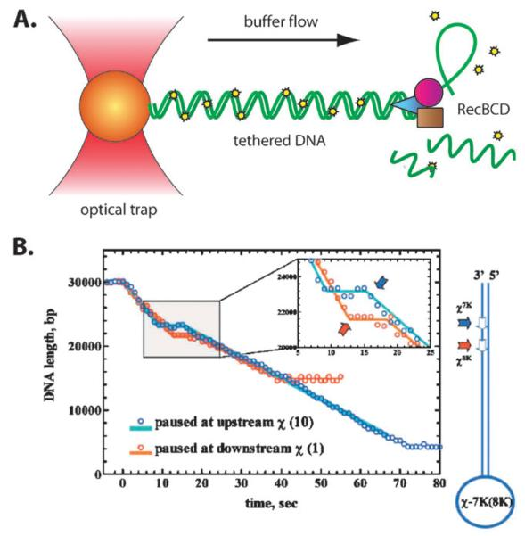
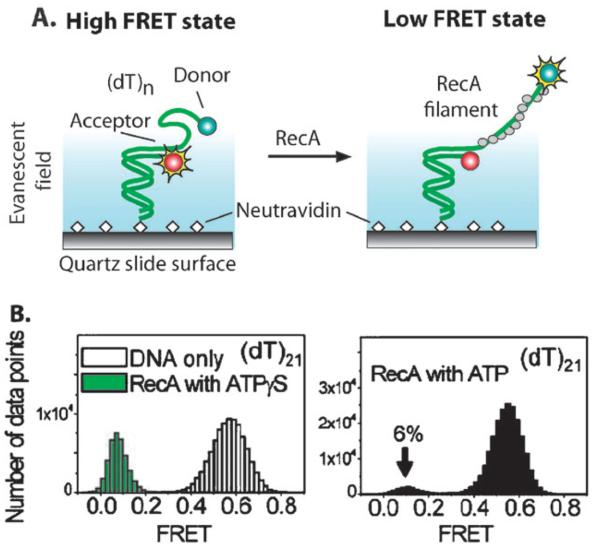
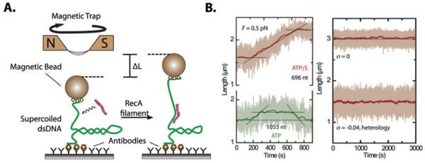
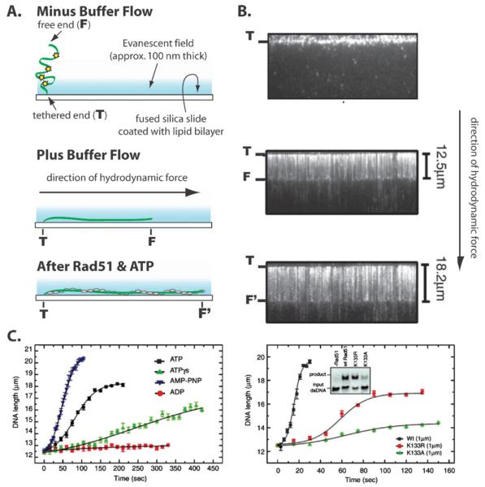
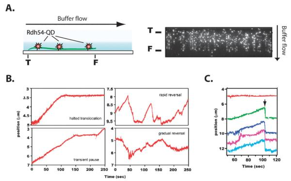
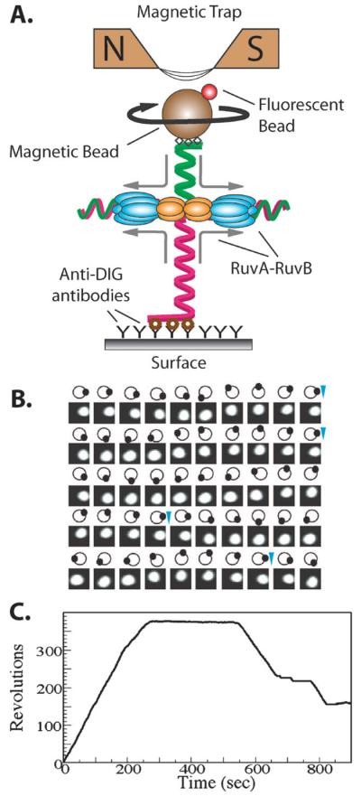

# Single molecule studies of homologous recombination

**Ilya J. Finkelstein and Eric C. Greene**

*Mol. Biosyst.*, Volume 4, Issue 11, Pages 1094–104 (2008)

**DOI:** [10.1039/b811681b](https://doi.org/10.1039/b811681b)

---

## Table of Contents

- [Abstract](#abstract)
- [1. Introduction](#1-introduction)
- [2. Discussion](#2-discussion)
- [3. Future Perspectives](#3-future-perspectives)
- [Acknowledgements](#acknowledgements)
- [References](#references)

---

##  Abstract
Single molecule methods offer an unprecedented opportunity to examine complex macromolecular reactions that are obfuscated by ensemble averaging. The application of single molecule techniques to study DNA processing enzymes has revealed new mechanistic details that are unobtainable from bulk biochemical studies. Homologous DNA recombination is a multi-step pathway that is facilitated by numerous enzymes that must precisely and rapidly manipulate diverse DNA substrates to repair potentially lethal breaks in the DNA duplex. In this review, we present an overview of single molecule assays that have been developed to study key aspects of homologous recombination and discuss the unique information gleaned from these experiments.
---
##  1. Introduction
The development of single molecule techniques for studying biological processes has yielded insights into reaction mechanisms that were otherwise inaccessible to traditional biochemical methods. Large molecular assemblies affect complex biochemical transformations _via_ a distribution of underlying intermediate states. Single molecule studies can directly access transient sub-populations that are obscured by ensemble averaging, an intrinsic property of bulk biochemical experiments. Observation of the time course of individual molecular trajectories elucidates the inter-conversion between these sub-populations and may offer crucial clues towards unraveling intricate molecular mechanisms. These advantages of single molecule techniques have been leveraged successfully to address diverse biological problems such as the dynamics of DNA replication and repair,[1](https://pmc.ncbi.nlm.nih.gov/articles/PMC2726709/#R1)-[9](https://pmc.ncbi.nlm.nih.gov/articles/PMC2726709/#R9) transcription,[10](https://pmc.ncbi.nlm.nih.gov/articles/PMC2726709/#R10)-[12](https://pmc.ncbi.nlm.nih.gov/articles/PMC2726709/#R12) translation,[13](https://pmc.ncbi.nlm.nih.gov/articles/PMC2726709/#R13)-[16](https://pmc.ncbi.nlm.nih.gov/articles/PMC2726709/#R16) ATP synthesis,[17](https://pmc.ncbi.nlm.nih.gov/articles/PMC2726709/#R17)-[19](https://pmc.ncbi.nlm.nih.gov/articles/PMC2726709/#R19) viral packaging,[20](https://pmc.ncbi.nlm.nih.gov/articles/PMC2726709/#R20),[21](https://pmc.ncbi.nlm.nih.gov/articles/PMC2726709/#R21) and intracellular transport.[22](https://pmc.ncbi.nlm.nih.gov/articles/PMC2726709/#R22)-[26](https://pmc.ncbi.nlm.nih.gov/articles/PMC2726709/#R26)
Single molecule studies of DNA–protein interactions have illuminated many aspects of DNA processing.[27](https://pmc.ncbi.nlm.nih.gov/articles/PMC2726709/#R27)-[31](https://pmc.ncbi.nlm.nih.gov/articles/PMC2726709/#R31) Early single molecule experiments probed the mechano-elastic response of individual DNA molecules under an applied force.[32](https://pmc.ncbi.nlm.nih.gov/articles/PMC2726709/#R32) This work served as a basis for studies of DNA remodeling by helicases, nucleases, nucleosome packaging, and other remodeling and repair enzymes. Recently, single molecule experiments on DNA processing have been applied to complex multi-protein systems, such as the replisome.[1](https://pmc.ncbi.nlm.nih.gov/articles/PMC2726709/#R1),[2](https://pmc.ncbi.nlm.nih.gov/articles/PMC2726709/#R2) Further work has extended studies of single molecule DNA processing to the level of a single cell.[33](https://pmc.ncbi.nlm.nih.gov/articles/PMC2726709/#R33)
Single molecule methods are now being employed to study complex DNA transactions, such as those that occur during homologous DNA recombination (HR). HR is a high-fidelity mechanism that repairs double strand DNA breaks (DSBs) by employing complementary genetic information that is available at a homologous site in the genome. DNA recombination also enables crossover formation between paired chromosomes during meiosis to generate genetic diversity and ensure proper segregation during meiotic division. In addition, HR is crucial for repairing DSBs that arise as a result of exogenous damage such as chemical insults or ionizing radiation, during the collapse of replication forks at a single stranded nick or lesion, or as a result of recombination between linear viral DNA and the host genome. Multiple excellent reviews of this evolutionarily ubiquitous DNA metabolism pathway in both prokaryotes[34](https://pmc.ncbi.nlm.nih.gov/articles/PMC2726709/#R34)-[36](https://pmc.ncbi.nlm.nih.gov/articles/PMC2726709/#R36) and eukaryotes[37](https://pmc.ncbi.nlm.nih.gov/articles/PMC2726709/#R37)-[39](https://pmc.ncbi.nlm.nih.gov/articles/PMC2726709/#R39) are available, and a brief overview of HR in _Escherichia coli_ is presented below.
A hallmark of HR is the generation of single stranded DNA (ssDNA) at the site of the DSB for use as a substrate in the homology recognition reaction. In _E. coli_ , the tripartite RecBCD complex recognizes and loads onto the ends of DSBs. RecBCD processes double stranded DNA (dsDNA) to produce ssDNA overhangs that serve as a substrate for RecA. In cells lacking functional RecBCD, other exonucleases such as RecE process the DSB to yield suitable ssDNA overhangs. RecA rapidly polymerizes along the ssDNA, and initiates a genome-wide search for homologous DNA. Upon encountering a stretch of homology, RecA invades the intact duplex to form a displacement loop (D-loop) structure. RecA mediated branch migration extends the paired heteroduplex DNA along the region of homology and the exposed ssDNA is filled in by polymerases. The resultant Holliday junction (HJ) is resolved by the RuvABC complex and sealed with ligases to yield two intact dsDNA molecules without loss of genetic information.
This review summarizes single molecule experiments aimed at unraveling aspects of HR. Results from studies of RecBCD, RecA, Rad51, Rad54, Rdh54 and RuvAB molecular machines are presented in the Discussion. We conclude by describing recent developments that will drive progress towards obtaining a more complete picture of HR _via_ single molecule techniques.
---
##  2. Discussion
Below, we present single molecule experiments on several enzymes that are central players in HR. In Section 2.1, we describe pioneering work on the processive and multifunctional molecular machine RecBCD.[3](https://pmc.ncbi.nlm.nih.gov/articles/PMC2726709/#R3),[40](https://pmc.ncbi.nlm.nih.gov/articles/PMC2726709/#R40)-[44](https://pmc.ncbi.nlm.nih.gov/articles/PMC2726709/#R44) Single molecule assays of various functions of the recombinase RecA and the eukaryotic homolog Rad51 are presented in Sections 2.2 and 2.3.[5](https://pmc.ncbi.nlm.nih.gov/articles/PMC2726709/#R5),[45](https://pmc.ncbi.nlm.nih.gov/articles/PMC2726709/#R45)-[56](https://pmc.ncbi.nlm.nih.gov/articles/PMC2726709/#R56) Observation of the eukaryotic Rad54 and Rdh54 translocation and DNA remodeling activity is discussed in Section 2.4.[6](https://pmc.ncbi.nlm.nih.gov/articles/PMC2726709/#R6),[7](https://pmc.ncbi.nlm.nih.gov/articles/PMC2726709/#R7),[57](https://pmc.ncbi.nlm.nih.gov/articles/PMC2726709/#R57),[58](https://pmc.ncbi.nlm.nih.gov/articles/PMC2726709/#R58) Finally, Section 2.5 summarizes experiments on the HJ specific motor complex RuvAB.[59](https://pmc.ncbi.nlm.nih.gov/articles/PMC2726709/#R59)-[62](https://pmc.ncbi.nlm.nih.gov/articles/PMC2726709/#R62)
### 2.1 RecBCD helicase
In _E. coli_ , the 330 kDa heterotrimeric RecBCD enzyme complex processes linear dsDNA for homologous recombination.[63](https://pmc.ncbi.nlm.nih.gov/articles/PMC2726709/#R63) RecBCD is a helicase and nuclease that preferentially loads onto nearly blunt dsDNA termini.[64](https://pmc.ncbi.nlm.nih.gov/articles/PMC2726709/#R64),[65](https://pmc.ncbi.nlm.nih.gov/articles/PMC2726709/#R65) The complex unwinds and nucleolytically cleaves the dsDNA as it translocates in a highly processive manner.
A crystal structure of the RecBCD–DNA complex presents a detailed picture of this enzyme.[66](https://pmc.ncbi.nlm.nih.gov/articles/PMC2726709/#R66) RecB and RecD are members of the Superfamily 1 (SF1) type helicases with 3′–5′ (SF1a) and 5′–3′ (SF1b) directionality, respectively.[67](https://pmc.ncbi.nlm.nih.gov/articles/PMC2726709/#R67) A central “pin” in the RecC unit bisects the duplex DNA and funnels the 3′ and 5′ ssDNA strands towards the RecB and RecD motors. As the ssDNA strands exit from their respective motor cavities, the ssDNA strands pass by an additional nucleolytic domain on RecB, where both strands are degraded, albeit at different rates.
RecBCD dependent recombination is cis regulated by the DNA sequence Chi (crossover hotspot instigator, 5′-GCTGGTGG-3′).[35](https://pmc.ncbi.nlm.nih.gov/articles/PMC2726709/#R35) Early genetic evidence and subsequent biochemical investigations revealed that Chi sequences are HR hotspots that are over-represented and dispersed uniformly at a frequency of approximately once per five kb throughout the _E. coli_ genome.[35](https://pmc.ncbi.nlm.nih.gov/articles/PMC2726709/#R35),[68](https://pmc.ncbi.nlm.nih.gov/articles/PMC2726709/#R68),[69](https://pmc.ncbi.nlm.nih.gov/articles/PMC2726709/#R69) Prior to encountering Chi, RecBCD degrades both strands of dsDNA. However, the nucleolytic behavior of RecBCD is altered upon encountering Chi.[63](https://pmc.ncbi.nlm.nih.gov/articles/PMC2726709/#R63),[70](https://pmc.ncbi.nlm.nih.gov/articles/PMC2726709/#R70)-[72](https://pmc.ncbi.nlm.nih.gov/articles/PMC2726709/#R72) Degradation of the 3′ tail is abolished, while translocation along the DNA and nucleolytic degradation of the 5′ ssDNA tail continue. The resulting 3′ ssDNA loop serves as the nucleation point for RecA and participates in downstream steps of HR.[73](https://pmc.ncbi.nlm.nih.gov/articles/PMC2726709/#R73),[74](https://pmc.ncbi.nlm.nih.gov/articles/PMC2726709/#R74)
The RecBCD system has been studied intensively at the single molecule level.[3](https://pmc.ncbi.nlm.nih.gov/articles/PMC2726709/#R3),[40](https://pmc.ncbi.nlm.nih.gov/articles/PMC2726709/#R40)-[44](https://pmc.ncbi.nlm.nih.gov/articles/PMC2726709/#R44) In a series of groundbreaking papers, Kowalczykowski and co-workers detailed the translocation behavior and Chi-sequence mediated changes in RecBCD activity. The single molecule assay is schematically illustrated in [Fig. 1a](#fig1). A long dsDNA substrate with a single biotinylated end was conjugated to a streptavidin coated polystyrene bead (orange sphere). The bead was optically trapped at the focal point of a laser beam, and illuminated in an epi-fluorescence microscope. The DNA was labeled with the fluorescent intercalating dye YOYO1 (yellow stars) and extended in a laminar buffer flow. The bead-DNA conjugate was incubated in the presence of RecBCD without ATP to form an initiation complex. Excess RecBCD was washed away and the flow buffer supplemented with ATP. Upon helicase unwinding, YOYO1 was displaced from the duplex DNA, which lead to a significant decrease in fluorescence.[75](https://pmc.ncbi.nlm.nih.gov/articles/PMC2726709/#R75) Thus, the helicase/nuclease activity of RecBCD was directly observed as a decrease in length of the dsDNA as a function time.
***[Fig. 1](#fig1).***{: #fig1}

(a) A schematic illustration of the RecBCD DNA unwinding assay. DNA is tethered at one end to an optically trapped bead and extended via buffer flow. The DNA is visualized by the intercalating dye YOYO1 (yellow stars). RecBCD activity liberates YOYO1 and is experimentally observed as a decrease in the length of the tethered DNA. (b) Chi mediated changes in RecBCD translocation for two representative single molecule traces. The observed change in DNA length (circles) and a piece-wise linear fit (lines) shows RecBCD pausing at a Chi locus. Location of Chi loci in the DNA substrate are depicted to the right of the graph. Reproduced with permission from ref. [44](https://pmc.ncbi.nlm.nih.gov/articles/PMC2726709/#R44).
In the absence of Chi, unwinding was rapid(∼500 bp s−1) and highly processive over tens of thousands of base pairs (bp).[3](https://pmc.ncbi.nlm.nih.gov/articles/PMC2726709/#R3),[44](https://pmc.ncbi.nlm.nih.gov/articles/PMC2726709/#R44) DNA substrates containing several Chi loci were constructed to observe changes in RecBCD activity. [Fig. 1b](#fig1) shows the model DNA substrate and typical trajectories of two RecBCD complexes both before and after Chi recognition.[41](https://pmc.ncbi.nlm.nih.gov/articles/PMC2726709/#R41),[44](https://pmc.ncbi.nlm.nih.gov/articles/PMC2726709/#R44) Upon encountering Chi, RecBCD paused transiently for several seconds before resuming translocation at a rate that was reduced nearly two-fold(∼300 bp s−1).[44](https://pmc.ncbi.nlm.nih.gov/articles/PMC2726709/#R44)
Several early bulk biochemical studies suggested that Chi sequence recognition triggered ejection of the RecD subunit and accounted for the changes in translocation and nucleolytic behavior.[76](https://pmc.ncbi.nlm.nih.gov/articles/PMC2726709/#R76),[77](https://pmc.ncbi.nlm.nih.gov/articles/PMC2726709/#R77) Dohoney and Gelles directly tested this hypothesis at the single molecule level.[40](https://pmc.ncbi.nlm.nih.gov/articles/PMC2726709/#R40) A RecD fusion product with a biotinylated peptide was co-expressed with both RecB and RecC, yielding a heterotrimeric complex that retained wild-type activity. The biotinylated RecBCD was conjugated to a large polystyrene bead and loaded onto a DNA substrate that was tethered to a glass surface at one end. Tethered particle motion analysis, pioneered by Landick and co-workers,[78](https://pmc.ncbi.nlm.nih.gov/articles/PMC2726709/#R78) was used to observe RecBCD motion. As the enzyme digested the dsDNA, the decreasing DNA tether length was detected by analysis of the change in the bead Brownian motion; shortening of the DNA restricted the motion of the bead. When a DNA substrate containing a Chi locus was used, the RecBCD-bead conjugate continued moving along the DNA, definitively ruling out that RecD was ejected upon encountering Chi. This finding was later confirmed by Kowalczykowski and co-workers.[41](https://pmc.ncbi.nlm.nih.gov/articles/PMC2726709/#R41)
Analysis of an ATP hydrolysis defective RecD mutant provided an elegant mechanistic explanation of the observed decrease in translocation velocity upon Chi recognition. The RecD mutant exhibited slow translocation rates, paused at Chi, but did not change velocity after the Chi locus.[43](https://pmc.ncbi.nlm.nih.gov/articles/PMC2726709/#R43) Based on a series of single molecule experiments, the authors concluded that RecD is the faster, lead motor unit before Chi recognition. However, upon encountering Chi, RecB assumes the lead position and translocates at a reduced rate relative to RecD.[43](https://pmc.ncbi.nlm.nih.gov/articles/PMC2726709/#R43)
Block and co-workers developed an optical trap with ∼6 bp spatial resolution to observe RecBCD motion with greater precision.[42](https://pmc.ncbi.nlm.nih.gov/articles/PMC2726709/#R42) Biotinylated RecBCD was immobilized _via_ streptavidin interaction on the passivated surface of a glass flow-cell. A polystyrene bead conjugated to a DNA substrate was reacted with the immobilized RecBCD and the reaction followed by observing displacement of the bead from the optical trap. The enzyme exhibited pauses that lasted for several seconds and force-dependent backsliding at moderate forces of 4–8 pN, suggesting that nucleolytic degradation did not occur immediately after the helicase unwinding of duplex DNA.
As indicated above, single molecule experiments have characterized RecBCD function with an unprecedented level of detail. RecBCD translocates along dsDNA in a highly processive manner with a step size less than 6 bp. Before Chi recognition, RecD is the lead motor unit. After encountering Chi, the enzyme pauses briefly to allow for a conformational transition that throttles RecD motion, abolishes degradation of the 3′ ssDNA tail, and makes the slower RecB enzyme the lead motor unit. Future work may capture RecBCD motion with single step size resolution[10](https://pmc.ncbi.nlm.nih.gov/articles/PMC2726709/#R10),[79](https://pmc.ncbi.nlm.nih.gov/articles/PMC2726709/#R79) and may also extend the observation of RecBCD translocation in the presence of other DNA binding enzymes that are present during HR.
### 2.2 RecA recombinase
In _E. coli_ , RecA executes the key step of HR: homology search and strand invasion into a complementary duplex sequence.[34](https://pmc.ncbi.nlm.nih.gov/articles/PMC2726709/#R34),[80](https://pmc.ncbi.nlm.nih.gov/articles/PMC2726709/#R80)-[83](https://pmc.ncbi.nlm.nih.gov/articles/PMC2726709/#R83) Studies of RecA function continue to serve as a keystone for understanding multiple aspects of HR. In addition, RecA is involved in multiple DNA metabolism pathways, such as induction of the SOS response and translesion DNA synthesis.[84](https://pmc.ncbi.nlm.nih.gov/articles/PMC2726709/#R84)-[86](https://pmc.ncbi.nlm.nih.gov/articles/PMC2726709/#R86) Homologs of RecA participate in HR in organisms ranging from bacteriophage to man, and the RecA fold is itself ancient and pervasive throughout all forms of life.[87](https://pmc.ncbi.nlm.nih.gov/articles/PMC2726709/#R87)
Upon processing of a DSB by an exonuclease/helicase such as RecBCD, ssDNA is generated. RecA is a DNA-dependent ATPase that polymerizes onto the ssDNA to form a nucleoprotein filament. The RecA-ssDNA nucleoprotein filament rapidly scans for a homologous sequence amidst a large pool of heterologous DNA. Once homology between the site of the DSB and intact dsDNA is found, the RecA filament invades the duplex DNA to form a D-loop. Subsequent repair enzymes synthesize missing DNA using the undamaged complementary template and process the resulting HJs.[82](https://pmc.ncbi.nlm.nih.gov/articles/PMC2726709/#R82),[83](https://pmc.ncbi.nlm.nih.gov/articles/PMC2726709/#R83)
Despite nearly fifty years of intense research into the structure and function of RecA and related homologs, several aspects of RecA catalyzed reactions remain poorly understood. Bulk biochemical methods do not directly or fully address the mechanism of RecA polymerization on DNA, homology search, strand exchange reactions, and the role ATP hydrolysis plays in each of these processes. However, single molecule methods are now being used to observe RecA nucleoprotein filament formation,[5](https://pmc.ncbi.nlm.nih.gov/articles/PMC2726709/#R5),[51](https://pmc.ncbi.nlm.nih.gov/articles/PMC2726709/#R51),[52](https://pmc.ncbi.nlm.nih.gov/articles/PMC2726709/#R52),[56](https://pmc.ncbi.nlm.nih.gov/articles/PMC2726709/#R56),[88](https://pmc.ncbi.nlm.nih.gov/articles/PMC2726709/#R88),[89](https://pmc.ncbi.nlm.nih.gov/articles/PMC2726709/#R89) study the interaction of RecA with single stranded DNA binding protein (SSB),[5](https://pmc.ncbi.nlm.nih.gov/articles/PMC2726709/#R5) and to follow the strand invasion reaction.[55](https://pmc.ncbi.nlm.nih.gov/articles/PMC2726709/#R55),[90](https://pmc.ncbi.nlm.nih.gov/articles/PMC2726709/#R90)
Biochemical evidence, largely gleaned from careful monitoring of DNA-dependent RecA ATPase activity, suggested that nucleation of a RecA cluster consisting of several monomers onto ssDNA was a relatively slow step that was followed by a rapid, unidirectional filament extension in the 3′ direction.[81](https://pmc.ncbi.nlm.nih.gov/articles/PMC2726709/#R81),[83](https://pmc.ncbi.nlm.nih.gov/articles/PMC2726709/#R83),[84](https://pmc.ncbi.nlm.nih.gov/articles/PMC2726709/#R84) Under certain _in vitro_ conditions, RecA polymerizes on dsDNA.[91](https://pmc.ncbi.nlm.nih.gov/articles/PMC2726709/#R91) Several early single molecule studies characterized the mechanical properties and rates of RecA filament assembly and disassembly on dsDNA stretched in an optical tweezers apparatus.[92](https://pmc.ncbi.nlm.nih.gov/articles/PMC2726709/#R92),[93](https://pmc.ncbi.nlm.nih.gov/articles/PMC2726709/#R93) These studies concluded that RecA-dsDNA filaments remained relatively flexible and dynamic when ATP is used as a cofactor but adopted a rigid structure when the slowly hydrolysable analog ATPγS was used.[92](https://pmc.ncbi.nlm.nih.gov/articles/PMC2726709/#R92),[93](https://pmc.ncbi.nlm.nih.gov/articles/PMC2726709/#R93)
Kowalczykowski and co-workers directly observed RecA nucleation and filament extension on dsDNA.[52](https://pmc.ncbi.nlm.nih.gov/articles/PMC2726709/#R52) An optically trapped bead conjugated to a single 48 kb dsDNA molecule was incubated in a laminar flow channel containing fluorescent RecA, followed by observation _via_ epi-fluorescence in a second laminar flow channel free of RecA to afford better signal to background discrimination. Although this ‘dipping and observation’ approach precluded real-time monitoring of filament formation, snapshots of filament extension were obtained. Appropriate buffer conditions to facilitate RecA loading onto dsDNA had to be chosen, since this nucleation is not observed under physiological conditions.[91](https://pmc.ncbi.nlm.nih.gov/articles/PMC2726709/#R91),[94](https://pmc.ncbi.nlm.nih.gov/articles/PMC2726709/#R94) The authors concluded that nucleation was highly dependent on solution conditions and thus most likely the key regulatory mechanism of RecA function _in vivo_. In contrast, filament extension appeared to be rapid and largely independent of reaction conditions. This observation was in accord with biochemical data that implicate multiple protein complexes such as RecBCD and RecFOR in facilitating nucleation of RecA onto ssDNA.[82](https://pmc.ncbi.nlm.nih.gov/articles/PMC2726709/#R82)
A seminal study of RecA nucleation and filament extension on short oligonucleotide substrates mimicking HR intermediates utilized changes in fluorescence resonance energy transfer (FRET) to detect RecA polymerization on ssDNA with single protein monomer resolution.[5](https://pmc.ncbi.nlm.nih.gov/articles/PMC2726709/#R5) A schematic of the experimental design is presented in [Fig. 2a](#fig2). A short DNA with a biotinylated dsDNA region (18 bp) and a long poly-dT ssDNA tail was immobilized _via_ biotin–streptavidin interaction on the surface of a quartz slide and viewed with a total internal reflection fluorescence microscope (TIRFM).
***[Fig. 2](#fig2).***{: #fig2}

A FRET-based assay for observing RecA nucleoprotein filament formation. (a) A DNA substrate with a poly(dT) ssDNA tail is labeled at two positions with a FRET dye pair (green and red spheres), immobilized on the surface of a flow-cell, and is illuminated via an evanescent field (blue gradient). Naked ssDNA is highly flexible, bringing the dye pair sufficiently close to observe a high FRET value (left panel), whereas a rigid RecA nucleoprotein filament separates the dyes, yielding a low FRET value (right panel). (b) A histogram of measured FRET values for naked ssDNA and RecA nucleoprotein filaments in the presence of various nucleotides. RecA–ATP filaments are highly dynamic and unstable. Reproduced with permission from ref. [5](https://pmc.ncbi.nlm.nih.gov/articles/PMC2726709/#R5).
Single-pair FRET was used as a readout of the distance between two dyes incorporated into the DNA substrate.[95](https://pmc.ncbi.nlm.nih.gov/articles/PMC2726709/#R95) The DNA was functionalized at one end with a Cy3 fluorophore (FRET donor, green sphere [Fig. 2a](#fig2)) and at the dsDNA–ssDNA junction with Cy5 (FRET acceptor, red sphere [Fig. 2a](#fig2)). Upon laser excitation of the donor dye, the highly flexible ssDNA brought the two fluorophores sufficiently close together to observe a high FRET signal ([Fig. 2b, left panel](#fig2)). Introduction of RecA and ATPγS into the flow-cell initiated formation of the nucleoprotein filament, extended the ssDNA, and shifted the FRET signal to lower values. When ATP was used as a cofactor, a bimodal distribution of FRET values with both filament-like and naked ssDNA characteristics was observed ([Fig. 2b, right panel](#fig2)). This data suggested that in the presence of ATP, RecA forms a highly dynamic nucleoprotein filament that is constantly undergoing assembly and disassembly.
To understand the complex kinetics of the observed FRET transitions, the authors adapted a statistical approach based on hidden Markov modeling to interpret the results in an unbiased manner.[96](https://pmc.ncbi.nlm.nih.gov/articles/PMC2726709/#R96) A detailed analysis of multiple FRET time courses taken with the Cy3–Cy5 dye pair at various locations on the DNA substrate led the authors to the following conclusions regarding the mechanism of RecA nucleation and filament extension: (1) RecA polymerizes in the net 3′ direction with a minimum nucleation cluster of ∼5 monomers, (2) filament extension and dissociation occur _via_ single RecA monomer units, (3) given a nucleation site, extending RecA filaments readily displace SSB from ssDNA.[5](https://pmc.ncbi.nlm.nih.gov/articles/PMC2726709/#R5) These results provided the first direct observation of crucial parameters such as the filament extension unit size as well as binding and dissociation rates at both 5′ and 3′ ends of the nucleoprotein filament.
Recently, strand exchange between single DNA molecules was monitored in real time using magnetic tweezers ([Fig. 3a](#fig3)).[55](https://pmc.ncbi.nlm.nih.gov/articles/PMC2726709/#R55) A 10 kb duplex DNA substrate was conjugated to a magnetic bead (orange sphere, [Fig. 3a](#fig3)) at one end. The other end of the DNA was attached to a glass slide surface. Both ends were tethered _via_ multiple anchor points to prevent free rotation of the DNA. Once a bead was captured in the magnetic field, the multiple attachment sites on both ends of the DNA allowed the introduction of supercoils by rotating the magnet. RecA–ssDNA nucleoprotein filaments were introduced into the flow-cell. In the presence of ATPγS, a RecA mediated three-strand structure was formed over the region of homology and experimentally observed as an increase in the DNA tether length (upper left panel, [Fig. 3b](#fig3)). The change in DNA tether length increased linearly with the homologous overlap length. By measuring the DNA extension as the supercoils were unraveled, the authors observed a homology length dependent change in the number of dsDNA supercoils. Negative control experiments with nonhomologous ssDNA and dsDNA substrates confirmed that the reaction was dependent on sequence complementarity between the substrates (upper right panel, [Fig. 3b](#fig3)).
***[Fig. 3](#fig3).***{: #fig3}

(a) Schematic of a magnetic tweezers assay for observing HR. DNA is immobilized between a glass slide and a magnetic bead held in a magnetic trap. The DNA is supercoiled by rotating the magnet. RecA nucleoprotein filaments and nucleotides are introduced. RecA mediated D-loop formation is observed as an elongation of the DNA substrate. (b) Representative traces of DNA elongation in the presence of ATPγS and ATP and a homologous RecA filament (left panel) or a non-homologous filament (right panel). Reproduced with permission from ref. [55](https://pmc.ncbi.nlm.nih.gov/articles/PMC2726709/#R55).
In the presence of ATP, the dsDNA extension behavior differed markedly from ATPγS. Upon introducing the protein filament, the dsDNA extended, plateaued, and contracted back to the original length (lower left panel, [Fig. 3b](#fig3)). This behavior was independent of the length of homologous overlap and was not observed between heterologous nucleoprotein filaments and dsDNA (lower right panel, [Fig. 3b](#fig3)). In addition, there was no detectable change in supercoiling upon reaction with RecA. This peculiar signature of the ATP mediated reaction led the authors to conjecture that RecA had catalyzed D-loop formation and that the protein dissociated from the duplex product.
Restriction enzyme mapping was used to define the DNA structure of the RecA–ATP dependent reaction product. An EcoRI site was introduced into the dsDNA tether region that was homologous to the ssDNA nucleoprotein filament. EcoRI incubation before the RecA reaction releases the magnetic bead by severing the dsDNA. After the RecA–ATP reaction, EcoRI digestion increased the distance between the bead and the surface, but did not result in complete bead separation from the DNA tether. Further overwinding of the DNA did not introduce any additional plectonemic coils, proving that a ssDNA patch was introduced by RecA at the EcoRI site.
The magnetic tweezers single molecule assay described above presented an unprecedented view of the steps governing RecA mediated strand exchange. In the presence of ATPγS, a three-stranded DNA–RecA structure was formed over the entire length of the homologous DNA region, but the protein could not disassemble after the DNA molecules were paired. With ATP, a RecA mediated structure was formed, but synapsis occurred over a limited (∼80 bp) region and propagated as a traveling wave along the length of homology before RecA was completely disassembled from the resulting D-loop.
Numerous aspects of RecA function are still poorly understood and future single molecule studies may help shed light on these reactions. For example, assays similar to the ones described above may be used to probe RecA mediated synapsis and strand exchange between DNA strands with limited homology or heterologous inserts.[97](https://pmc.ncbi.nlm.nih.gov/articles/PMC2726709/#R97) Several biochemical studies have suggested that RecA is a motor protein capable of using ATP hydrolysis to unwind dsDNA that is a few hundred bp ahead of the nucleoprotein filament.[83](https://pmc.ncbi.nlm.nih.gov/articles/PMC2726709/#R83) This ‘indirect helicase’ activity may be probed at the single molecule level and could explain the mechanism of heterology bypass in RecA mediated strand exchange reactions. In addition, further work is necessary to characterize the interaction between RecA and other HR proteins such as RecBCD, RecFOR, and RecX.[82](https://pmc.ncbi.nlm.nih.gov/articles/PMC2726709/#R82)
### 2.3 Rad51 recombinase
Rad51 is a eukaryotic RecA homolog that catalyzes homology search and strand invasion during HR. As in the case of RecA, Rad51 nucleoprotein filaments assemble onto exposed ssDNA tails and initiate the search for complementary sequences throughout the genome.[98](https://pmc.ncbi.nlm.nih.gov/articles/PMC2726709/#R98) Although the key function of Rad51 is similar to RecA, there are notable differences between the biochemical properties of the two proteins. For example, Rad51 binds both ssDNA and dsDNA readily,[99](https://pmc.ncbi.nlm.nih.gov/articles/PMC2726709/#R99) Rad51 requires many additional regulatory proteins,[100](https://pmc.ncbi.nlm.nih.gov/articles/PMC2726709/#R100),[101](https://pmc.ncbi.nlm.nih.gov/articles/PMC2726709/#R101) and Rad51 does not appear to exhibit the rich array of auxiliary functions that have been observed in RecA reactions.[98](https://pmc.ncbi.nlm.nih.gov/articles/PMC2726709/#R98)
In contrast to RecA, polymerization of Rad51 onto dsDNA is rapid and occurs with a slightly higher affinity than for ssDNA.[99](https://pmc.ncbi.nlm.nih.gov/articles/PMC2726709/#R99) [Fig. 4a](#fig4) describes a single molecule "DNA curtain" assay to probe the key elements of Rad51 assembly and disassembly on dsDNA.[28](https://pmc.ncbi.nlm.nih.gov/articles/PMC2726709/#R28),[45](https://pmc.ncbi.nlm.nih.gov/articles/PMC2726709/#R45),[48](https://pmc.ncbi.nlm.nih.gov/articles/PMC2726709/#R48),[53](https://pmc.ncbi.nlm.nih.gov/articles/PMC2726709/#R53),[102](https://pmc.ncbi.nlm.nih.gov/articles/PMC2726709/#R102) A fluid lipid bilayer doped with biotinylated lipids was assembled on the surface of a quartz slide. DNA molecules were tethered directly to the bilayer _via_ a biotin–neutravidin interaction, leaving the DNA free to diffuse within the bilayer. The application of hydro-dynamic force (buffer flow) collects the tethered DNA molecules along edges of microscale diffusion barriers and extends the DNA to near full-length along the surface. The DNA is stained with YOYO1 and visualized _via_ TIRFM. This approach allows the simultaneous observation of hundreds of physically aligned DNA molecules in real time within a single field-of-view ([Fig. 4b](#fig4)). To monitor filament formation, Rad51 is flushed into a flow cell with a pre-assembled DNA curtain and the Rad51 assembly dynamics are observed as an increase in the DNA length. Thus, both the rate of DNA extension and final DNA–nucleoprotein filament lengths are obtained.
***[Fig. 4](#fig4).***{: #fig4}

A high throughput system for studying Rad51–DNA interactions. (a) A cartoon depiction of the components that make up the DNA curtain. DNA is tethered at one end to a lipid bilayer, labeled with YOYO1, and extended by buffer flow within an evanescent wave. Rad51 nucleoprotein filament formation is experimentally observed as an increase in the DNA length. (b) Shows an example of a DNA curtain at a scratch (top panel) that is extended into the evanescent wave (middle panel) and elongated by Rad51 nucleoprotein filament assembly (bottom panel). (c) Rad51 filament assembly on single DNA molecules as a function of nucleotide cofactor and mutations in the Rad51 ATP binding site. The inset demonstrates the strand exchange activity of wtRad51 and both ATPase deficient mutants. In all panels, (T) denotes the tethered end, (F) is the flow-extended free DNA end, and (F′) is the flow-extended DNA end after Rad51 nucleoprotein filament formation. Used with permission from ref. [48](https://pmc.ncbi.nlm.nih.gov/articles/PMC2726709/#R48).
The Rad51 filament assembly reaction is sensitive to the type of nucleotide cofactor used. [Fig. 4c](#fig4) presents representative filament assembly trajectories for ATP, ADP, and several nonhydrolyzable analogs. Although DNA extension is not observed when ADP is used, bulk gel-shift experiments indicate that the protein is associated with DNA, suggesting that Rad51 still assembles on dsDNA, but assumes a filament structure that does not extend the dsDNA significantly.[103](https://pmc.ncbi.nlm.nih.gov/articles/PMC2726709/#R103)
The interdependence between Rad51 filament formation and nucleotide binding was gleaned from filament extension studies of Rad51 ATPase deficient mutants (right panel, [Fig. 4c](#fig4)). The mutant K133R binds ATP and supports elevated levels of _in vitro_ HR but has a significantly reduced hydrolysis activity, whereas K133A binds dsDNA but is deficient for recombination (inset, [Fig. 4c](#fig4)).[104](https://pmc.ncbi.nlm.nih.gov/articles/PMC2726709/#R104) Single molecule DNA extension curves for both mutants were compared to the wild-type (wt) protein. Mutant protein filament assembly rates were significantly reduced and the resulting filaments were shorter for the ATPase mutants than for wtRad51. These results indicated that both mutant proteins either assembled as incomplete patches that left much of the dsDNA exposed or formed structurally distinct filaments.
Wyman and co-workers observed the disassembly of a fully functional fluorescent Rad51 from dsDNA in real time.[49](https://pmc.ncbi.nlm.nih.gov/articles/PMC2726709/#R49) A Rad51 nucleoprotein filament was assembled on λ-DNA in the presence of Ca2+ to inhibit ATP hydrolysis, immobilized on the surface of a flow-cell, and visualized _via_ TIRFM. Nucleoprotein filament disassembly was activated by exchanging the Ca2+ ions for Mg2+ to initiate ATP hydrolysis. The loss of fluorescence intensity from one end of the nucleoprotein filament offered the first direct observation of Rad51 disassembly from dsDNA in an ATP-hydrolysis dependent manner.
These results, in addition to other single molecule studies of Rad51 disassembly, are beginning to yield a picture of Rad51 filament dynamics on DNA.[46](https://pmc.ncbi.nlm.nih.gov/articles/PMC2726709/#R46) The avid association of Rad51 with dsDNA that has been directly observed _in vitro_ poses an enigma for _in vivo_ function—Rad51–dsDNA filaments that can potentially form _in vivo_ will sequester the cellular pool of available protein and may lead to undesired recombination reactions. The molecular motors Rad54 and Rdh54 (see below) have been implicated in clearing Rad51 from dsDNA.[105](https://pmc.ncbi.nlm.nih.gov/articles/PMC2726709/#R105)-[107](https://pmc.ncbi.nlm.nih.gov/articles/PMC2726709/#R107) Single molecule approaches offer the possibility to directly observe the mechanism of Rad51 removal from dsDNA by these enzymes. In addition, future work will address the interaction of Rad51 filaments with an ever-growing list of protein mediators such as Hop2-Mnd1 and BRCA2.[39](https://pmc.ncbi.nlm.nih.gov/articles/PMC2726709/#R39)
### 2.4 Rad54/Rdh54 translocases
Rad54 and Rdh54 are members of the Snf2 family of DNA remodeling proteins.[108](https://pmc.ncbi.nlm.nih.gov/articles/PMC2726709/#R108),[109](https://pmc.ncbi.nlm.nih.gov/articles/PMC2726709/#R109) Snf2 family proteins are ubiquitous in nature and have been implicated in multiple DNA processing roles, including chromatin remodeling, DNA replication, transcription, translation, and DNA repair.[108](https://pmc.ncbi.nlm.nih.gov/articles/PMC2726709/#R108)-[110](https://pmc.ncbi.nlm.nih.gov/articles/PMC2726709/#R110) Several biochemical activities have been demonstrated for the Rad54 DNA-dependent ATPase. Rad54 introduces supercoils in closed circular DNA,[111](https://pmc.ncbi.nlm.nih.gov/articles/PMC2726709/#R111),[112](https://pmc.ncbi.nlm.nih.gov/articles/PMC2726709/#R112) stimulates DNA pairing, heteroduplex extension,[111](https://pmc.ncbi.nlm.nih.gov/articles/PMC2726709/#R111),[113](https://pmc.ncbi.nlm.nih.gov/articles/PMC2726709/#R113) Rad51-heteroduplex disassembly,[105](https://pmc.ncbi.nlm.nih.gov/articles/PMC2726709/#R105) and chromatin remodeling.[114](https://pmc.ncbi.nlm.nih.gov/articles/PMC2726709/#R114),[115](https://pmc.ncbi.nlm.nih.gov/articles/PMC2726709/#R115) These findings, along with others,[116](https://pmc.ncbi.nlm.nih.gov/articles/PMC2726709/#R116),[117](https://pmc.ncbi.nlm.nih.gov/articles/PMC2726709/#R117) led to the conclusion that Rad54 binds DNA as a multimeric complex and is capable of processive translocation. Rdh54 is another member of the Rad54-like Snf2 subfamily, and is closely related to Rad54 (37% sequence identity and 55% similarity). Rdh54 and Rad54 appear to be somewhat functionally redundant, and _rdh54 rad54_ double mutants are more sensitive to DNA damage that either single mutant.[118](https://pmc.ncbi.nlm.nih.gov/articles/PMC2726709/#R118) Single molecule investigations of both proteins have the potential to offer a unique vantage point on the diverse DNA processing capabilities of these molecular machines.
Kowalczykowski and co-workers reported the first direct observation of fluorescently labeled Rad54 translocation along dsDNA.[7](https://pmc.ncbi.nlm.nih.gov/articles/PMC2726709/#R7) Biotinylated DNA was conjugated to a polystyrene bead, captured in an optical trap, and extended in the focal plane of an epifluorescence microscope _via_ laminar buffer flow. _S. cerevisiae_ Rad54 was isolated as a glutathione S-transferase (GST) fusion product and bound to a fluorescein labeled anti-GST antibody. The protein was loaded onto the dsDNA and motion of the Rad54-oligomeric complex was followed as a translocating bright spot along the extended dsDNA. Multiple fluorescent dyes per antibody and the oligomeric nature of Rad54 allowed the researchers to observe motion over hundreds of seconds.
Initial binding of Rad54 to dsDNA was sequence independent. Translocation occurred both upstream (against buffer flow) and downstream (with buffer flow) with a wide distribution of rates and frequent pauses and direction reversals. The motion was highly processive, spanning tens of thousands of base pairs. The authors attribute the heterogeneous rates of translocation and observed pauses and direction reversals due to engagement of different DNA binding domains of Rad54 with DNA.[7](https://pmc.ncbi.nlm.nih.gov/articles/PMC2726709/#R7)
Bianco and co-workers adapted a similar experimental approach using a dual optical trap system.[57](https://pmc.ncbi.nlm.nih.gov/articles/PMC2726709/#R57) Two beads, each with a single dsDNA molecule were trapped in two independent optical traps and brought into close contact. The dsDNA was labeled with the intercalating fluorescent dye YOYO1. Changes in DNA length and DNA co-aggregation could be followed with the native protein. Although the location and number of Rad54 clusters was not observed, this study offered indirect evidence that DNA aggregation is mediated by Rad54 in a protein concentration dependent manner.[57](https://pmc.ncbi.nlm.nih.gov/articles/PMC2726709/#R57)
Greene and co-workers applied the high-throughput 'DNA curtain' assay to observe Rdh54-mediated DNA remodeling events ([Fig. 5a](#fig5)).[6](https://pmc.ncbi.nlm.nih.gov/articles/PMC2726709/#R6) A curtain of dsDNA was assembled at a lipid diffusion barrier on the surface of a flow-cell (see Section 2.3 for description). Rdh54 was expressed as a GST fusion product and conjugated with anti-GST antibodies covalently linked to fluorescent quantum dots (QDs). Quantum dots are highly fluorescent semiconductor nano-particles that are not prone to photobleaching, allowing observation of Rdh54 translocation for many minutes without reduction in signal intensity. A representative frame of a DNA curtain (unlabeled) bound by Rdh54-QD conjugates is presented in the left panel of [Fig. 5a](#fig5).
***[Fig. 5](#fig5).***{: #fig5}

(a) A schematic illustration and representative image of the Rdh54 translocation assay. In the image, the DNA is not fluorescently labeled and the Rdh54–QD complexes form a punctate pattern on the DNA curtain. (b) Representative trajectories of Rdh54 motion on DNA. Rdh54 exhibits complex translocation behavior that is characterized by transient pausing, and changes in velocity and direction. (c) A signature of Rdh54 looping activity is the simultaneous release of multiple QD complexes on the same single DNA molecule in the direction of flow (highlighted by arrow). In this example, an upstream complex released a DNA loop that was observed as a sudden jump in the locations of the downstream molecules. Used with permission from ref. [6](https://pmc.ncbi.nlm.nih.gov/articles/PMC2726709/#R6).
[Fig. 5b](#fig5) shows several typical traces of Rdh54 translocation along single DNA molecules. These studies found that Rdh54 could translocates at a rate of approximately 80 bp s−1. The motion was highly heterogeneous and included transient pauses and translocation direction reversals, in agreement with similar studies on Rad54.[7](https://pmc.ncbi.nlm.nih.gov/articles/PMC2726709/#R7),[57](https://pmc.ncbi.nlm.nih.gov/articles/PMC2726709/#R57) In addition, DNA loop release events were observed occasionally. When multiple complexes were loaded onto the same dsDNA molecule, rapid and correlated translocation direction reversals would simultaneously appear at several Rdh54 foci ([Fig. 5c, black arrow](#fig5)). This ATP dependent behavior was explained as the formation and release of DNA loops by an upstream Rdh54 complex. Recent work in the lab has extended the single-molecule curtain assay by introducing a second color quantum dot at the free, flow extended terminus of the dsDNA. This provides a simultaneous readout of Rdh54 translocation and looping products by independently monitoring the changes in the DNA length (_unpublished_).
Thus, single molecule assays have revealed the translocation and DNA looping behavior of Rad54 and Rdh54. Current single molecule studies of Rad54/Rdh54 translocation have utilized naked dsDNA substrates. In light of the diverse DNA remodeling roles attributed to Rad54, it will be of particular interest to observe what happens when these motor proteins encounter molecular roadblocks such as Rad51 filaments, nucleosomes, and chromatin fibers.
### 2.5 RuvAB resolvase
Holliday junctions are key intermediates of the RecA/Rad51-mediated homology search and strand invasion.[34](https://pmc.ncbi.nlm.nih.gov/articles/PMC2726709/#R34),[37](https://pmc.ncbi.nlm.nih.gov/articles/PMC2726709/#R37) In _E. coli_ , HJs are recognized by the RuvA protein, which preferentially binds at the junction with >1000 fold specificity relative to linear dsDNA.[61](https://pmc.ncbi.nlm.nih.gov/articles/PMC2726709/#R61) A tetrameric RuvA assembly at each side of the HJ recruits the molecular motor RuvB, which forms a hexameric ring around RuvA.[119](https://pmc.ncbi.nlm.nih.gov/articles/PMC2726709/#R119),[120](https://pmc.ncbi.nlm.nih.gov/articles/PMC2726709/#R120) The RuvAB complex catalyzes branch migration of the HJ in a highly processive, ATP dependent fashion.[61](https://pmc.ncbi.nlm.nih.gov/articles/PMC2726709/#R61) The RuvC homodimer completes HJ resolution by endonucleolytically cleaving the junction at the consensus sequence 5′-(A/T)TT′(G/C)-3′.[121](https://pmc.ncbi.nlm.nih.gov/articles/PMC2726709/#R121)-[123](https://pmc.ncbi.nlm.nih.gov/articles/PMC2726709/#R123)
Structural, biochemical, and mechanistic analysis of the RuvAB complex suggests that the RuvB motor pumps DNA through the RuvA core, inducing a rotation of the helical dsDNA.[120](https://pmc.ncbi.nlm.nih.gov/articles/PMC2726709/#R120) To directly observe the rotation of dsDNA that is being processed by RuvAB, Han and co-workers developed the simultaneous magnetic tweezers and fluorescence microscope system shown in [Fig. 6a](#fig6).[62](https://pmc.ncbi.nlm.nih.gov/articles/PMC2726709/#R62) A cruciform DNA was constructed with long (4.7 kB, 1.7 μm) vertical arms and short horizontal arms. One end of the long arms was decorated with multiple biotins and the other with multiple digoxigenins. The cruciform DNA was immobilized on the glass surface of a flowcell _via_ digoxigen–anti digoxigenin interactions. The other end of the cruciform DNA was reacted with a large (0.7 μm) streptavidin coated magnetic particle (brown sphere, [Fig. 6a](#fig6)) that had a small (20 nm) fluorescent bead (red sphere, [Fig. 6a](#fig6)) affixed asymmetrically to the large bead. The cruciform DNA was extended orthogonally to the surface in a magnetic trap. Upon addition of RuvAB in the presence of both Mg2+ and ATP, branch migration was expected to cause a rotation of the DNA strands. Multiple anchor points of the cruciform DNA between the magnetic particle on one end and the flow-cell surface on the opposite end ensured that the DNA rotation was transmitted to the magnetic bead.
***[Fig. 6](#fig6).***{: #fig6}

(a) A cartoon of the experimental setup used to observe RuvAB Holliday junction migration. A cruciform DNA is trapped between a flow cell surface and a streptavidin-coated magnetic bead (brown sphere) in magnetic tweezers. The magnetic bead is decorated with a fluorescent polystyrene sphere (red sphere). (b) RuvAB processes the Holliday junction, which leads to a rotation of the fluorescent sphere. Blue triangles represent a complete revolution of the fluorescent particle. (c) A representative trace of RuvAB-mediated processing of a Holliday junction. The reaction is characterized by transient pausing and occasional direction reversals. Panels (b) and (c) used with permission from ref. [62](https://pmc.ncbi.nlm.nih.gov/articles/PMC2726709/#R62).
[Fig. 6b](#fig6) presents sequential images of a rotating fluorescent sphere due to RuvAB dependent branch migration of a single DNA cruciform in and ATP dependent reaction. Loading of RuvAB onto the sides of the cruciform orthogonal to the tethered ends causes counter-clockwise rotation and subsequent shortening of the vertical dsDNA length until ultimately the bead irreversibly associates with the glass surface (see [Fig. 6a](#fig6)). If the RuvAB complex assembles along the vertical (long) arms of the cruciform DNA, clock-wise bead rotation is observed, and the observed DNA length will increase until all available cruciform DNA is processed into two disjoined dsDNA strands (observed as a release of the untethered magnetic bead).
Individual traces of hundreds of revolutions as a function of time ([Fig. 6c](#fig6)) revealed that RuvAB complexes are highly processive, exhibit long pauses, and undergo frequent reversals in the revolution direction. The authors interpret the observed pauses and revolution direction reversals as disassembly of the RuvAB complex at one side of the DNA junction and reassembly of a different complex at the opposite sides of the junction. The torque exerted by the RuvAB molecular motor was approximated as at least ∼10 pN by estimating the force necessary to rotate a ∼0.7 μm bead in water.[62](https://pmc.ncbi.nlm.nih.gov/articles/PMC2726709/#R62)
Stavans and co-workers employed a similar magnetic tweezers approach to study RuvAB-mediated branch migration.[59](https://pmc.ncbi.nlm.nih.gov/articles/PMC2726709/#R59) A magnetic particle was tethered to a flow-cell surface _via_ a cruciform DNA with two long vertical arms. The branch migration reaction was followed by a change in length of the vertical arms of the cruciform DNA by observing a changing diffraction pattern of the magnetic particle as the bead approaches or recedes away from the surface. The authors observed that RuvAB-catalyzed branch migration was processive (>1000 bp), marked by pauses and transitions between elongation and shortening of the cruciform tether, and exhibited a complex distribution of branch migration rates. Again, the pauses were interpreted as multiple unloading and reassembly events of the RuvAB complex on opposing sides of the Holliday junction. The DNA migration rate distribution showed multiple well defined peaks that remained largely independent of force up to _F_ ∼ 15 pN and at saturating ATP concentrations. The discrete HJ branch migration rate distribution supports the view that the hexameric RuvB assembly consists of distinct dimer or trimer subunits.[59](https://pmc.ncbi.nlm.nih.gov/articles/PMC2726709/#R59)
Using a similar magnetic tweezers and cruciform DNA assay, Heslot and co-workers probed the dependence of branch migration rates on applied force, enzyme concentrations, and DNA sequence.[60](https://pmc.ncbi.nlm.nih.gov/articles/PMC2726709/#R60) The authors confirmed that the branch migration rate remains largely independent of applied force below several pN and exhibited pausing and direction reversal behavior. The rate of pausing and branch migration restart was found to depend strongly on RuvB, but not RuvA concentration, confirming that RuvA assembly at the junction is not the rate limiting step, and that free RuvA in solution does not sequester RuvB away from the DNA. Finally, the branch migration rate did not exhibit any DNA sequence dependence.
Biochemical studies have demonstrated that RuvAB can bypass heterologous regions.[124](https://pmc.ncbi.nlm.nih.gov/articles/PMC2726709/#R124) RuvAB-mediated branch migration in the context of Holliday junctions with heterologous sequences was investigated by both bulk and single molecule methods.[61](https://pmc.ncbi.nlm.nih.gov/articles/PMC2726709/#R61) Bulk biochemical experiments confirmed that RuvAB translocation was impeded by heterologous sequences and a single molecule magnetic tweezer assay demonstrated that although migration is generally stalled, infrequent translocation events past the heterology can be observed.[61](https://pmc.ncbi.nlm.nih.gov/articles/PMC2726709/#R61)
Thus, single molecule assays have began to unravel the mechanism of HJ processing by RuvAB, but future studies may reveal even more detailed aspects of these reactions. For example, the precise nature of the mechanical transactions that must occur during branch migration remain unknown. Although it is clear that DNA rotation occurs during branch migration, is not known how this rotation and translation movement of the DNA is coupled to structural transitions in the protein complex. Further work may also address the function of RuvAB in complex with RuvC, an important player in HJ resolution. A more complete picture of RuvAB function in the context of HR will continue to emerge as these studies are conducted in the presence of other enzymes that are present during the final steps of recombination.
---
##  3. Future perspectives
Single molecule studies on DNA remodeling enzymes have yielded new information that was unobtainable _via_ traditional bulk biochemical methods. Observation of RecBCD translocation have directly demonstrated the highly processive motion of this enzyme along DNA and have uncovered conformational changes upon recognition of the recombinase hotspot Chi. The first steps of recombinase mediated strand invasion—nucleation on DNA and filament extension—have both been observed for RecA and Rad51. RecA mediated strand invasion and D-loop formation was captured on single DNA molecules. The translocation and DNA loop extrusion of Rad54 and Rdh54 have been reported. Finally, the RuvAB mediated Holliday junction branch migration and DNA rotation have been observed directly.
Rapid development of the single molecule field will continue to transform our understanding of HR. Ultrasensitive microscopes and optical tweezers assays have permitted the tracking of enzymes along DNA with ever increasing resolution.[10](https://pmc.ncbi.nlm.nih.gov/articles/PMC2726709/#R10),[125](https://pmc.ncbi.nlm.nih.gov/articles/PMC2726709/#R125),[126](https://pmc.ncbi.nlm.nih.gov/articles/PMC2726709/#R126) Nanofrabrication of birefringent microparticles for optical tweezer experiments has recently allowed the simultaneous application of force and torque to generate and measure length changes in supercoiled DNA with milli-second time resolution.[127](https://pmc.ncbi.nlm.nih.gov/articles/PMC2726709/#R127) By combining fluorescence techniques with optical and magnetic tweezers, the manipulation and simultaneous direct observation of HR reactions is rapidly becoming feasible.[128](https://pmc.ncbi.nlm.nih.gov/articles/PMC2726709/#R128)
Improvements in fluorescent markers will continue to expand the capabilities of single molecule techniques. The development of long-lived organic fluorophores with distinct absorption and emission spectra has spurred the development of three color FRET.[129](https://pmc.ncbi.nlm.nih.gov/articles/PMC2726709/#R129) Observing FRET between three substrates may reveal the precise time course of events that must occur during RecA and Rad51 mediated homology search, strand invasion and filament disassembly reactions. Recent progress in minimizing the size of quantum dots promises to extend our mechanistic understanding of individual recombination enzymes as well as multi-protein complexes in vitro and will begin to transfer that knowledge to an intracellular context.[130](https://pmc.ncbi.nlm.nih.gov/articles/PMC2726709/#R130),[131](https://pmc.ncbi.nlm.nih.gov/articles/PMC2726709/#R131)
---
##  Acknowledgements
The Greene laboratory is supported by funding from the National Institutes of Health, the National Science Foundation, the Susan G. Komen Foundation, and the Irma T. Hirschl Trust. IJF is supported by NIH Fellowship #F32GM80864-02. We apologize to any colleagues whose work we may not have been able to cite due to length limitations.
##  Biographies
 Ilya J. Finkelstein received his BS in chemistry from University of California, Berkeley and his PhD from Stanford University in 2007. He is currently an NIH Postdoctoral Fellow in the laboratory of Dr. Eric C. Greene in the Department of Biochemistry and Molecular Biophysics at Columbia University.
 Eric C. Greene received his BS in biochemistry from the University of Illinois, his PhD from Texas A&M University, and he conducted postdoctoral studies at the National Institute of Health. Currently, he is an assistant professor in the Department of Biochemistry and Molecular Biophysics at Columbia University. He has been a recipient of the Presidential Early Career Award for Scientists and Engineers from the NSF.

---

## References

1. van Oijen AM. Single-molecule kinetics of lambda exonuclease reveal base dependence and dynamic disorder. *Mol Biosyst.* 2007;3:117–125. doi: 10.1039/b612545j
2. Tanner NA, Hamdan SM, Jergic S, Schaeffer PM, Dixon NE, van Oijen AM. Single-molecule studies of fork dynamics in Escherichia coli DNA replication. *Nat Struct Mol Biol.* 2008;15:170–176. doi: 10.1038/nsmb.1381
3. Bianco PR, Brewer LR, Corzett M, Balhorn R, Yeh Y, Kowalczykowski SC, Baskin RJ. Processive translocation and DNA unwinding by individual RecBCD enzyme molecules. *Nature.* 2001;409:374–378. doi: 10.1038/35053131
4. Blainey PC, van Oijen AM, Banerjee A, Verdine GL, Xie XS. A base-excision DNA-repair protein finds intrahelical lesion bases by fast sliding in contact with DNA. *Proc Natl Acad Sci U S A.* 2006;103:5752–5757. doi: 10.1073/pnas.0509723103
5. Joo C, McKinney SA, Nakamura M, Rasnik I, Myong S, Ha T. Real-time observation of RecA filament dynamics with single monomer resolution. *Cell.* 2006;126:515–527. doi: 10.1016/j.cell.2006.06.042
6. Prasad TK, Robertson RB, Visnapuu ML, Chi P, Sung P, Greene EC. A DNA-translocating Snf2 molecular motor: Saccharomyces cerevisiae Rdh54 displays processive translocation and extrudes DNA loops. *J Mol Biol.* 2007;369:940–953. doi: 10.1016/j.jmb.2007.04.005
7. Amitani I, Baskin RJ, Kowalczykowski SC. Visualization of Rad54, a chromatin remodeling protein, translocating on single DNA molecules. *Mol Cell.* 2006;23:143–148. doi: 10.1016/j.molcel.2006.05.009
8. Dessinges MN, Lionnet T, Xi XG, Bensimon D, Croquette V. Single-molecule assay reveals strand switching and enhanced processivity of UvrD. *Proc Natl Acad Sci U S A.* 2004;101:6439–6444. doi: 10.1073/pnas.0306713101
9. Gorman J, Chowdhury A, Surtees JA, Shimada J, Reichman DR, Alani E, Greene EC. Dynamic basis for one-dimensional DNA scanning by the mismatch repair complex Msh2-Msh6. *Mol Cell.* 2007;28:359–370. doi: 10.1016/j.molcel.2007.09.008
10. Abbondanzieri EA, Greenleaf WJ, Shaevitz JW, Landick R, Block SM. Direct observation of base-pair stepping by RNA polymerase. *Nature.* 2005;438:460–465. doi: 10.1038/nature04268
11. Bai L, Santangelo TJ, Wang MD. Single-molecule analysis of RNA polymerase transcription. *Annu Rev Biophys Biomol Struct.* 2006;35:343–360. doi: 10.1146/annurev.biophys.35.010406.150153
12. Herbert KM, La Porta A, Wong BJ, Mooney RA, Neuman KC, Landick R, Block SM. Sequence-resolved detection of pausing by single RNA polymerase molecules. *Cell.* 2006;125:1083–1094. doi: 10.1016/j.cell.2006.04.032
13. Cornish PV, Ermolenko DN, Noller HF, Ha T. Spontaneous intersubunit rotation in single ribosomes. *Mol Cell.* 2008;30:578–588. doi: 10.1016/j.molcel.2008.05.004
14. Gonzalez M, Reyes R, Damas C, Alonso R, Bello AR. Oestrogen receptor alpha and beta in female rat pituitary cells: An immunochemical study. *Gen Comp Endocrinol.* 2008;155:857–868. doi: 10.1016/j.ygcen.2007.10.007
15. Blanchard SC, Kim HD, Gonzalez RL Jr, Puglisi JD, Chu S. tRNA dynamics on the ribosome during translation. *Proc Natl Acad Sci U S A.* 2004;101:12893–12898. doi: 10.1073/pnas.0403884101
16. Blanchard SC, Gonzalez RL, Kim HD, Chu S, Puglisi JD. tRNA selection and kinetic proofreading in translation. *Nat Struct Mol Biol.* 2004;11:1008–1014. doi: 10.1038/nsmb831
17. Capaldi RA, Aggeler R. Mechanism of the F(1)F(0)-type ATP synthase, a biological rotary motor. *Trends Biochem Sci.* 2002;27:154–160. doi: 10.1016/s0968-0004(01)02051-5
18. Kaim G, Prummer M, Sick B, Zumofen G, Renn A, Wild UP, Dimroth P. Coupled rotation within single F0F1 enzyme complexes during ATP synthesis or hydrolysis. *FEBS Lett.* 2002;525:156–163. doi: 10.1016/s0014-5793(02)03097-1
19. Yasuda R, Noji H, Yoshida M, Kinosita K Jr, Itoh H. Resolution of distinct rotational substeps by submillisecond kinetic analysis of F1-ATPase. *Nature.* 2001;410:898–904. doi: 10.1038/35073513
20. Fuller DN, Raymer DM, Rickgauer JP, Robertson RM, Catalano CE, Anderson DL, Grimes S, Smith DE. Measurements of single DNA molecule packaging dynamics in bacteriophage lambda reveal high forces, high motor processivity, and capsid transformations. *J Mol Biol.* 2007;373:1113–1122. doi: 10.1016/j.jmb.2007.09.011
21. Fuller DN, Raymer DM, Kottadiel VI, Rao VB, Smith DE. Single phage T4 DNA packaging motors exhibit large force generation, high velocity, and dynamic variability. *Proc Natl Acad Sci U S A.* 2007;104:16868–16873. doi: 10.1073/pnas.0704008104
22. Finer JT, Simmons RM, Spudich JA. Single myosin molecule mechanics: piconewton forces and nanometre steps. *Nature.* 1994;368:113–119. doi: 10.1038/368113a0
23. Coppin CM, Finer JT, Spudich JA, Vale RD. Detection of sub-8-nm movements of kinesin by high-resolution optical-trap microscopy. *Proc Natl Acad Sci U S A.* 1996;93:1913–1917. doi: 10.1073/pnas.93.5.1913
24. Kuo SC, Sheetz MP. Force of single kinesin molecules measured with optical tweezers. *Science.* 1993;260:232–234. doi: 10.1126/science.8469975
25. Kural C, Kim H, Syed S, Goshima G, Gelfand VI, Selvin PR. Kinesin and dynein move a peroxisome in vivo: a tug-of-war or coordinated movement? *Science.* 2005;308:1469–1472. doi: 10.1126/science.1108408
26. Peterman EJ, Sosa H, Moerner WE. Single-molecule fluorescence spectroscopy and microscopy of biomolecular motors. *Annu Rev Phys Chem.* 2004;55:79–96. doi: 10.1146/annurev.physchem.55.091602.094340
27. Greulich KO. Single-molecule studies on DNA and RNA. *Chemphyschem.* 2005;6:2458–2471. doi: 10.1002/cphc.200500038
28. Visnapuu ML, Duzdevich D, Greene EC. The importance of surfaces in single-molecule bioscience. *Mol Biosyst.* 2008;4:394–403. doi: 10.1039/b800444g
29. Cairns BR. Chromatin remodeling: insights and intrigue from single-molecule studies. *Nat Struct Mol Biol.* 2007;14:989–996. doi: 10.1038/nsmb1333
30. Rasnik I, Myong S, Ha T. Unraveling helicase mechanisms one molecule at a time. *Nucleic Acids Res.* 2006;34:4225–4231. doi: 10.1093/nar/gkl452
31. Seidel R, Dekker C. Single-molecule studies of nucleic acid motors. *Curr Opin Struct Biol.* 2007;17:80–86. doi: 10.1016/j.sbi.2006.12.003
32. Bustamante C, Bryant Z, Smith SB. Ten years of tension: single-molecule DNA mechanics. *Nature.* 2003;421:423–427. doi: 10.1038/nature01405
33. Luo G, Wang M, Konigsberg WH, Xie XS. Single-molecule and ensemble fluorescence assays for a functionally important conformational change in T7 DNA polymerase. *Proc Natl Acad Sci U S A.* 2007;104:12610–12615. doi: 10.1073/pnas.0700920104
34. Kowalczykowski SC, Dixon DA, Eggleston AK, Lauder SD, Rehrauer WM. Biochemistry of homologous recombination in Escherichia coli. *Microbiol Rev.* 1994;58:401–465. PMID: 7968923
35. Smith GR, Amundsen SK, Dabert P, Taylor AF. The initiation and control of homologous recombination in Escherichia coli. *Philos Trans R Soc Lond B Biol Sci.* 1995;347:13–20. doi: 10.1098/rstb.1995.0003
36. Michel B, Boubakri H, Baharoglu Z, LeMasson M, Lestini R. Recombination proteins and rescue of arrested replication forks. *DNA Repair (Amst).* 2007;6:967–980. doi: 10.1016/j.dnarep.2007.02.016
37. Wyman C, Ristic D, Kanaar R. Homologous recombination-mediated double-strand break repair. *DNA Repair (Amst).* 2004;3:827–833. doi: 10.1016/j.dnarep.2004.03.037
38. Seidel R, Bloom JG, Dekker C, Szczelkun MD. Motor step size and ATP coupling efficiency of the dsDNA translocase EcoR124I. *EMBO J.* 2008;27:1388–1398. doi: 10.1038/emboj.2008.69
39. San Filippo J, Sung P, Klein H. Mechanism of eukaryotic homologous recombination. *Annu Rev Biochem.* 2008;77:229–257. doi: 10.1146/annurev.biochem.77.061306.125255
40. Dohoney KM, Gelles J. Chi-sequence recognition and DNA translocation by single RecBCD helicase/nuclease molecules. *Nature.* 2001;409:370–374. doi: 10.1038/35053124
41. Handa N, Bianco PR, Baskin RJ, Kowalczykowski SC. Direct visualization of RecBCD movement reveals cotranslocation of the RecD motor after chi recognition. *Mol Cell.* 2005;17:745–750. doi: 10.1016/j.molcel.2005.02.011
42. Perkins TT, Li HW, Dalal RV, Gelles J, Block SM. Forward and reverse motion of single RecBCD molecules on DNA. *Biophys J.* 2004;86:1640–1648. doi: 10.1016/S0006-3495(04)74232-0
43. Spies M, Amitani I, Baskin RJ, Kowalczykowski SC. RecBCD enzyme switches lead motor subunits in response to chi recognition. *Cell.* 2007;131:694–705. doi: 10.1016/j.cell.2007.09.023
44. Spies M, Bianco PR, Dillingham MS, Handa N, Baskin RJ, Kowalczykowski SC. A molecular throttle: the recombination hotspot chi controls DNA translocation by the RecBCD helicase. *Cell.* 2003;114:647–654. doi: 10.1016/s0092-8674(03)00681-0
45. Yeykal CC, Greene EC. New tools for dissecting DNA curtains. *Cell Cycle.* 2006;5:1033–1038. doi: 10.4161/cc.5.10.2760
46. van der Heijden T, Seidel R, Modesti M, Kanaar R, Wyman C, Dekker C. Real-time assembly and disassembly of human RAD51 filaments on individual DNA molecules. *Nucleic Acids Res.* 2007;35:5646–5657. doi: 10.1093/nar/gkm629
47. Ristic D, Modesti M, van der Heijden T, van Noort J, Dekker C, Kanaar R, Wyman C. Human Rad51 filaments on double- and single-stranded DNA: correlating regular and irregular forms with recombination function. *Nucleic Acids Res.* 2005;33:3292–3302. doi: 10.1093/nar/gki640
48. Prasad TK, Yeykal CC, Greene EC. Visualizing the assembly of human Rad51 filaments on double-stranded DNA. *J Mol Biol.* 2006;363:713–728. doi: 10.1016/j.jmb.2006.08.046
49. Modesti M, Ristic D, van der Heijden T, Dekker C, van Mameren J, Peterman EJ, Wuite GJ, Kanaar R, Wyman C. Fluorescent human RAD51 reveals multiple nucleation sites and filament segments tightly associated along a single DNA molecule. *Structure.* 2007;15:599–609. doi: 10.1016/j.str.2007.04.003
50. Mine J, Disseau L, Takahashi M, Cappello G, Dutreix M, Viovy JL. Real-time measurements of the nucleation, growth and dissociation of single Rad51-DNA nucleoprotein filaments. *Nucleic Acids Res.* 2007;35:7171–7187. doi: 10.1093/nar/gkm752
51. Cisse I, Okumus B, Joo C, Ha T. Fueling protein DNA interactions inside porous nanocontainers. *Proc Natl Acad Sci U S A.* 2007;104:12646–12650. doi: 10.1073/pnas.0610673104
52. Galletto R, Amitani I, Baskin RJ, Kowalczykowski SC. Direct observation of individual RecA filaments assembling on single DNA molecules. *Nature.* 2006;443:875–878. doi: 10.1038/nature05197
53. Graneli A, Yeykal CC, Robertson RB, Greene EC. Long-distance lateral diffusion of human Rad51 on double-stranded DNA. *Proc Natl Acad Sci U S A.* 2006;103:1221–1226. doi: 10.1073/pnas.0508366103
54. Myong S, Rasnik I, Joo C, Lohman TM, Ha T. Repetitive shuttling of a motor protein on DNA. *Nature.* 2005;437:1321–1325. doi: 10.1038/nature04049
55. van der Heijden T, Modesti M, Hage S, Kanaar R, Wyman C, Dekker C. Homologous recombination in real time: DNA strand exchange by RecA. *Mol Cell.* 2008;30:530–538. doi: 10.1016/j.molcel.2008.03.010
56. van der Heijden T, van Noort J, van Leest H, Kanaar R, Wyman C, Dekker NH, Dekker C. Torque-limited RecA polymerization on dsDNA. *Nucleic Acids Res.* 2005;33:2099–2105. doi: 10.1093/nar/gki512
57. Bianco PR, Bradfield JJ, Castanza LR, Donnelly AN. Rad54 oligomers translocate and cross-bridge double-stranded DNA to stimulate synapsis. *J Mol Biol.* 2007;374:618–640. doi: 10.1016/j.jmb.2007.09.052
58. Nimonkar AV, Amitani I, Baskin RJ, Kowalczykowski SC. Single molecule imaging of Tid1/Rdh54, a Rad54 homolog that translocates on duplex DNA and can disrupt joint molecules. *J Biol Chem.* 2007;282:30776–30784. doi: 10.1074/jbc.M704767200
59. Amit R, Gileadi O, Stavans J. Direct observation of RuvAB-catalyzed branch migration of single Holliday junctions. *Proc Natl Acad Sci U S A.* 2004;101:11605–11610. doi: 10.1073/pnas.0404332101
60. Dawid A, Croquette V, Grigoriev M, Heslot F. Single-molecule study of RuvAB-mediated Holliday-junction migration. *Proc Natl Acad Sci U S A.* 2004;101:11611–11616. doi: 10.1073/pnas.0404369101
61. Dennis C, Fedorov A, Kas E, Salome L, Grigoriev M. RuvAB-directed branch migration of individual Holliday junctions is impeded by sequence heterology. *EMBO J.* 2004;23:2413–2422. doi: 10.1038/sj.emboj.7600249
62. Han YW, Tani T, Hayashi M, Hishida T, Iwasaki H, Shinagawa H, Harada Y. Direct observation of DNA rotation during branch migration of Holliday junction DNA by Escherichia coli RuvA-RuvB protein complex. *Proc Natl Acad Sci U S A.* 2006;103:11544–11548. doi: 10.1073/pnas.0600753103
63. Arnold DA, Kowalczykowski SC. RecBCD helicase/nuclease. In: *Encyclopedia of Life Sciences.* John Wiley & Sons, Ltd; Chichester: 1999.
64. Roman LJ, Kowalczykowski SC. Characterization of the helicase activity of the Escherichia coli RecBCD enzyme using a novel helicase assay. *Biochemistry.* 1989;28:2873–2881. doi: 10.1021/bi00433a019
65. Roman LJ, Kowalczykowski SC. Characterization of the adenosinetriphosphatase activity of the Escherichia coli RecBCD enzyme: relationship of ATP hydrolysis to the unwinding of duplex DNA. *Biochemistry.* 1989;28:2863–2873. doi: 10.1021/bi00433a018
66. Singleton MR, Dillingham MS, Gaudier M, Kowalczykowski SC, Wigley DB. Crystal structure of RecBCD enzyme reveals a machine for processing DNA breaks. *Nature.* 2004;432:187–193. doi: 10.1038/nature02988
67. Singleton MR, Dillingham MS, Wigley DB. Structure and mechanism of helicases and nucleic acid translocases. *Annu Rev Biochem.* 2007;76:23–50. doi: 10.1146/annurev.biochem.76.052305.115300
68. Arakawa K, Uno R, Nakayama Y, Tomita M. Validating the significance of genomic properties of Chi sites from the distribution of all octamers in Escherichia coli. *Gene.* 2007;392:239–246. doi: 10.1016/j.gene.2006.12.022
69. Uno R, Nakayama Y, Tomita M. Over-representation of Chi sequences caused by di-codon increase in Escherichia coli K-12. *Gene.* 2006;380:30–37. doi: 10.1016/j.gene.2006.05.013
70. Taylor AF, Smith GR. RecBCD enzyme is altered upon cutting DNA at a chi recombination hotspot. *Proc Natl Acad Sci U S A.* 1992;89:5226–5230. doi: 10.1073/pnas.89.12.5226
71. Taylor AF, Schultz DW, Ponticelli AS, Smith GR. RecBC enzyme nicking at Chi sites during DNA unwinding: location and orientation-dependence of the cutting. *Cell.* 1985;41:153–163. doi: 10.1016/0092-8674(85)90070-4
72. Ponticelli AS, Schultz DW, Taylor AF, Smith GR. Chi-dependent DNA strand cleavage by RecBC enzyme. *Cell.* 1985;41:145–151. doi: 10.1016/0092-8674(85)90069-8
73. Roman LJ, Kowalczykowski SC. Formation of heteroduplex DNA promoted by the combined activities of Escherichia coli RecA and RecBCD proteins. *J Biol Chem.* 1989;264:18340–18348. PMID: 2681196
74. Spies M, Kowalczykowski SC. The RecA binding locus of RecBCD is a general domain for recruitment of DNA strand exchange proteins. *Mol Cell.* 2006;21:573–580. doi: 10.1016/j.molcel.2006.01.007
75. Gurrieri S, Wells KS, Johnson ID, Bustamante C. Direct visualization of individual DNA molecules by fluorescence microscopy: characterization of the factors affecting signal/background and optimization of imaging conditions using YOYO. *Anal Biochem.* 1997;249:44–53. doi: 10.1006/abio.1997.2102
76. Myers RS, Kuzminov A, Stahl FW. The recombination hot spot chi activates RecBCD recombination by converting Escherichia coli to a recD mutant phenocopy. *Proc Natl Acad Sci U S A.* 1995;92:6244–6248. doi: 10.1073/pnas.92.14.6244
77. Koppen A, Krobitsch S, Thoms B, Wackernagel W. Interaction with the recombination hot spot chi in vivo converts the RecBCD enzyme of Escherichia coli into a chi-independent recombinase by inactivation of the RecD subunit. *Proc Natl Acad Sci U S A.* 1995;92:6249–6253. doi: 10.1073/pnas.92.14.6249
78. Schafer DA, Gelles J, Sheetz MP, Landick R. Transcription by single molecules of RNA polymerase observed by light microscopy. *Nature.* 1991;352:444–448. doi: 10.1038/352444a0
79. Charvin G, Bensimon D, Croquette V. Single molecule study of DNA unlinking by eukaryotic and prokaryotic type-II topoisomerases. *Single Mol.* 2002;3:43–48.
80. Bell CE. Structure and mechanism of Escherichia coli RecA ATPase. *Mol Microbiol.* 2005;58:358–366. doi: 10.1111/j.1365-2958.2005.04876.x
81. Cox MM. The bacterial RecA protein as a motor protein. *Annu Rev Microbiol.* 2003;57:551–577. doi: 10.1146/annurev.micro.57.030502.090953
82. Cox MM. Motoring along with the bacterial RecA protein. *Crit Rev Biochem Mol Biol.* 2007;42:41–63. doi: 10.1080/10409230701260258
83. Cox MM. Regulation of bacterial RecA protein function. *Nat Rev Mol Cell Biol.* 2007;8:127–138. doi: 10.1038/nrm2099
84. Cox MM. Recombinational DNA repair in bacteria and the RecA protein. *Prog Nucleic Acid Res Mol Biol.* 1999;63:311–366. doi: 10.1016/s0079-6603(08)60726-6
85. Lusetti SL, Cox MM. The bacterial RecA protein and the recombinational DNA repair of stalled replication forks. *Annu Rev Biochem.* 2002;71:71–100. doi: 10.1146/annurev.biochem.71.083101.133940
86. Schlacher K, Pham P, Cox MM, Goodman MF. Roles of DNA polymerase V and RecA protein in SOS damage-induced mutation. *Chem Rev.* 2006;106:406–419. doi: 10.1021/cr0404951
87. Lin Z, Kong H, Nei M, Ma H. Origins and evolution of the recA/RAD51 gene family: evidence for ancient gene duplication and endosymbiotic gene transfer. *Proc Natl Acad Sci U S A.* 2006;103:10328–10333. doi: 10.1073/pnas.0604232103
88. Cisse I, Okumus B, Joo C, Ha T. Fueling protein DNA interactions inside porous nanocontainers. *Proc Natl Acad Sci U S A.* 2007;104:12646–12650. doi: 10.1073/pnas.0610673104
89. Hegner M, Smith SB, Bustamante C. Polymerization and mechanical properties of single RecA-DNA filaments. *Proc Natl Acad Sci U S A.* 1999;96:10109–10114. doi: 10.1073/pnas.96.18.10109
90. Fulconis R, Mine J, Bancaud A, Dutreix M, Viovy JL. Mechanism of RecA-mediated homologous recombination revisited by single molecule nanomanipulation. *EMBO J.* 2006;25:4293–4304. doi: 10.1038/sj.emboj.7601260
91. Stasiak A, Egelman EH. Structure and function of RecA-DNA complexes. *Experientia.* 1994;50:192–203. doi: 10.1007/BF01924002
92. Leger JF, Robert J, Bourdieu L, Chatenay D, Marko JF. RecA binding to a single double-stranded DNA molecule: a possible role of DNA conformational fluctuations. *Proc Natl Acad Sci U S A.* 1998;95:12295–12299. doi: 10.1073/pnas.95.21.12295
93. Shivashankar GV, Feingold M, Krichevsky O, Libchaber A. RecA polymerization on double-stranded DNA by using single-molecule manipulation: the role of ATP hydrolysis. *Proc Natl Acad Sci U S A.* 1999;96:7916–7921. doi: 10.1073/pnas.96.14.7916
94. Menetski JP, Kowalczykowski SC. Interaction of recA protein with single-stranded DNA. Quantitative aspects of binding affinity modulation by nucleotide cofactors. *J Mol Biol.* 1985;181:281–295. doi: 10.1016/0022-2836(85)90092-0
95. Ha T, Enderle T, Ogletree DF, Chemla DS, Selvin PR, Weiss S. Probing the interaction between two single molecules: fluorescence resonance energy transfer between a single donor and a single acceptor. *Proc Natl Acad Sci U S A.* 1996;93:6264–6268. doi: 10.1073/pnas.93.13.6264
96. McKinney SA, Joo C, Ha T. Analysis of single-molecule FRET trajectories using hidden Markov modeling. *Biophys J.* 2006;91:1941–1951. doi: 10.1529/biophysj.106.082487
97. Hsieh P, Camerini-Otero CS, Camerini-Otero RD. The synapsis event in the homologous pairing of DNAs: RecA recognizes and pairs less than one helical repeat of DNA. *Proc Natl Acad Sci U S A.* 1992;89:6492–6496. doi: 10.1073/pnas.89.14.6492
98. Bianco PR, Tracy RB, Kowalczykowski SC. DNA strand exchange proteins: a biochemical and physical comparison. *Front Biosci.* 1998;3:D570–603. doi: 10.2741/a304
99. Baumann P, Benson FE, West SC. Human Rad51 protein promotes ATP-dependent homologous pairing and strand transfer reactions in vitro. *Cell.* 1996;87:757–766. doi: 10.1016/s0092-8674(00)81394-x
100. San Filippo J, Chi P, Sehorn MG, Etchin J, Krejci L, Sung P. Recombination mediator and Rad51 targeting activities of a human BRCA2 polypeptide. *J Biol Chem.* 2006;281:11649–11657. doi: 10.1074/jbc.M601249200
101. Sung P. Catalysis of ATP-dependent homologous DNA pairing and strand exchange by yeast RAD51 protein. *Science.* 1994;265:1241–1243. doi: 10.1126/science.8066464
102. Fazio T, Visnapuu ML, Wind S, Greene EC. DNA curtains and nanoscale curtain rods: high-throughput tools for single molecule imaging. *Langmuir.* 2008;24:10524–10531. doi: 10.1021/la801762h
103. van der Heijden T, Seidel R, Modesti M, Kanaar R, Wyman C, Dekker C. Real-time assembly and disassembly of human RAD51 filaments on individual DNA molecules. *Nucleic Acids Res.* 2007;35:5646–5657. doi: 10.1093/nar/gkm629
104. Chi P, Van Komen S, Sehorn MG, Sigurdsson S, Sung P. Roles of ATP binding and ATP hydrolysis in human Rad51 recombinase function. *DNA Repair (Amst).* 2006;5:381–391. doi: 10.1016/j.dnarep.2005.11.005
105. Solinger JA, Lutz G, Sugiyama T, Kowalczykowski SC, Heyer WD. Rad54 protein stimulates heteroduplex DNA formation in the synaptic phase of DNA strand exchange via specific interactions with the presynaptic Rad51 nucleoprotein filament. *J Mol Biol.* 2001;307:1207–1221. doi: 10.1006/jmbi.2001.4555
106. Li X, Zhang XP, Solinger JA, Kiianitsa K, Yu X, Egelman EH, Heyer WD. Rad51 and Rad54 ATPase activities are both required to modulate Rad51-dsDNA filament dynamics. *Nucleic Acids Res.* 2007;35:4124–4140. doi: 10.1093/nar/gkm412
107. Shah PP, Zheng X, Epshtein A, Carey JN, Bishop DK, Klein HL. Swi2/Snf2-related translocases prevent accumulation of toxic Rad51 complexes during mitotic growth. *Mol Cell.* 2010;39:862–872. doi: 10.1016/j.molcel.2010.08.028
108. Flaus A, Martin DM, Barton GJ, Owen-Hughes T. Identification of multiple distinct Snf2 subfamilies with conserved structural motifs. *Nucleic Acids Res.* 2006;34:2887–2905. doi: 10.1093/nar/gkl295
109. Saha A, Wittmeyer J, Cairns BR. Chromatin remodelling: the industrial revolution of DNA around histones. *Nat Rev Mol Cell Biol.* 2006;7:437–447. doi: 10.1038/nrm1945
110. Durr H, Korner C, Muller M, Hickmann V, Hopfner KP. X-ray structures of the Sulfolobus solfataricus SWI2/SNF2 ATPase core and its complex with DNA. *Cell.* 2005;121:363–373. doi: 10.1016/j.cell.2005.03.026
111. Tan TL, Kanaar R, Wyman C. Rad54, a Jack of all trades in homologous recombination. *DNA Repair (Amst).* 2003;2:787–794. doi: 10.1016/s1568-7864(03)00070-3
112. Swagemakers SM, Essers J, de Wit J, Hoeijmakers JH, Kanaar R. The human RAD54 recombinational DNA repair protein is a double-stranded DNA-dependent ATPase. *J Biol Chem.* 1998;273:28292–28297. doi: 10.1074/jbc.273.43.28292
113. Mazin AV, Alexeev AA, Kowalczykowski SC. A novel function of Rad54 protein. Stabilization of the Rad51 nucleoprotein filament. *J Biol Chem.* 2003;278:14029–14036. doi: 10.1074/jbc.M212779200
114. Alexiadis V, Kadonaga JT. Strand pairing by Rad54 and Rad51 is enhanced by chromatin. *Genes Dev.* 2002;16:2767–2771. doi: 10.1101/gad.1032102
115. Jaskelioff M, Van Komen S, Krebs JE, Sung P, Peterson CL. Rad54p is a chromatin remodeling enzyme required for heteroduplex DNA joint formation with chromatin. *J Biol Chem.* 2003;278:9212–9218. doi: 10.1074/jbc.M211545200
116. Petukhova G, Van Komen S, Vergano S, Klein H, Sung P. Yeast Rad54 promotes Rad51-dependent homologous DNA pairing via ATP hydrolysis-driven change in DNA double helix conformation. *J Biol Chem.* 1999;274:29453–29462. doi: 10.1074/jbc.274.41.29453
117. Ristic D, Wyman C, Paulusma C, Kanaar R. The architecture of the human Rad54-DNA complex provides evidence for protein translocation along DNA. *Proc Natl Acad Sci U S A.* 2001;98:8454–8460. doi: 10.1073/pnas.151056798
118. Shinohara M, Shita-Yamaguchi E, Buerstedde JM, Shinagawa H, Ogawa H, Shinohara A. Characterization of the roles of the Saccharomyces cerevisiae RAD54 gene and a homologue of RAD54, RDH54/TID1, in mitosis and meiosis. *Genetics.* 1997;147:1545–1556. doi: 10.1093/genetics/147.4.1545
119. Yamada K, Miyata T, Tsuchiya D, Oyama T, Fujiwara Y, Ohnishi T, Iwasaki H, Shinagawa H, Ariyoshi M, Mayanagi K, Morikawa K. Crystal structure of the RuvA-RuvB complex: a structural basis for the Holliday junction migrating motor machinery. *Mol Cell.* 2002;10:671–681. doi: 10.1016/s1097-2765(02)00641-x
120. West SC. Processing of recombination intermediates by the RuvABC proteins. *Annu Rev Genet.* 1997;31:213–244. doi: 10.1146/annurev.genet.31.1.213
121.Connolly B, Parsons CA, Benson FE, Dunderdale HJ, Sharples GJ, Lloyd RG, West SC. Resolution of Holliday junctions in vitro requires the Escherichia coli ruvC gene product. *Proc Natl Acad Sci U S A.* 1991;88:6063–6067. doi: 10.1073/pnas.88.14.6063
122. Iwasaki H, Takahagi M, Shiba T, Nakata A, Shinagawa H. Escherichia coli RuvC protein is an endonuclease that resolves the Holliday structure. *EMBO J.* 1991;10:4381–4389. PMID: 1661673
123. Sharples GJ, Benson FE, Illing GT, Lloyd RG. Molecular and functional analysis of the ruv region of Escherichia coli K-12 reveals three genes involved in DNA repair and recombination. *Mol Gen Genet.* 1990;221:219–226. doi: 10.1007/BF00261724
124. Adams DE, West SC. Bypass of DNA heterologies during RuvAB-mediated three- and four-strand branch migration. *J Mol Biol.* 1996;263:582–596. doi: 10.1006/jmbi.1996.0600
125. Yildiz A, Forkey JN, McKinney SA, Ha T, Goldman YE, Selvin PR. Myosin V walks hand-over-hand: single fluorophore imaging with 1.5-nm localization. *Science.* 2003;300:2061–2065. doi: 10.1126/science.1084398
126. Gordon MP, Ha T, Selvin PR. Single-molecule high-resolution imaging with photobleaching. *Proc Natl Acad Sci U S A.* 2004;101:6462–6465. doi: 10.1073/pnas.0401638101
127. La Porta A, Wang MD. Optical torque wrench: angular trapping, rotation, and torque detection of quartz microparticles. *Phys Rev Lett.* 2004;92:190801. doi: 10.1103/PhysRevLett.92.190801
128. Brau RR, Tarsa PB, Ferrer JM, Lee P, Lang MJ. Interlaced optical force-fluorescence measurements for single molecule biophysics. *Biophys J.* 2006;91:1069–1077. doi: 10.1529/biophysj.106.082602
129. Lee S, Lee J, Hohng S. Single-molecule three-color FRET with both negligible spectral overlap and long observation time. *PLoS One.* 2010;5:e12270. doi: 10.1371/journal.pone.0012270
130. Howarth M, Liu W, Puthenveetil S, Zheng Y, Marshall LF, Schmidt MM, Wittrup KD, Bawendi MG, Ting AY. Monovalent, reduced-size quantum dots for imaging receptors on living cells. *Nat Methods.* 2008;5:397–399. doi: 10.1038/nmeth.1206
131. Dahan M, Levi S, Luccardini C, Rostaing P, Riveau B, Triller A. Diffusion dynamics of glycine receptors revealed by single-quantum dot tracking. *Science.* 2003;302:442–445. doi: 10.1126/science.1088525

---

For the complete references list, please see the [full text](https://pmc.ncbi.nlm.nih.gov/articles/PMC2726709/) on PubMed Central.
