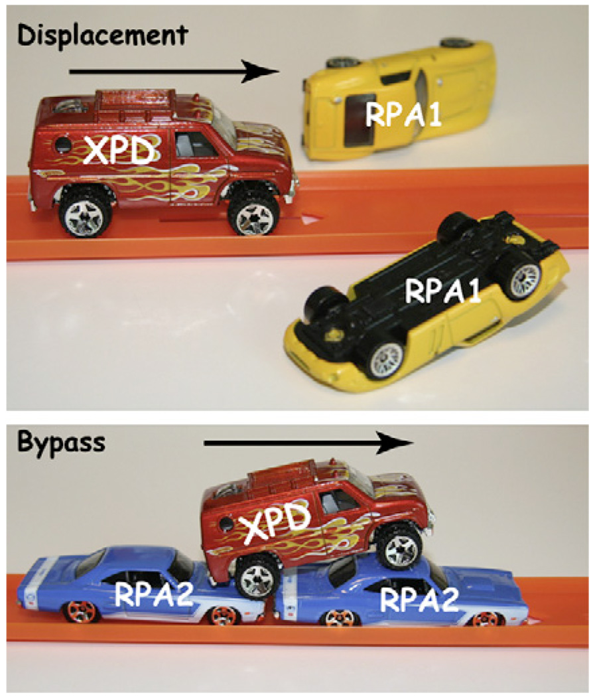
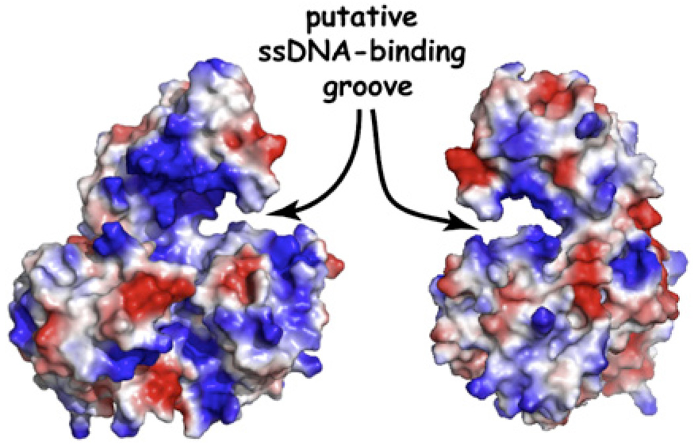

# XPD Helicase Speeds through a Molecular Traffic Jam

**Ilya J. Finkelstein and Eric C. Greene**

*Mol. Cell*, Volume 35, Issue 5, Pages 549–50 (2009)

**DOI:** [10.1016/j.molcel.2009.08.012](https://doi.org/10.1016/j.molcel.2009.08.012)

---

## Table of Contents

- [Abstract](#abstract)
- [References](#references)

---

##  Abstract
Helicases and other DNA translocases must travel along crowded substrates. In this issue, [Honda et al. (2009)](https://pmc.ncbi.nlm.nih.gov/articles/PMC3033736/#R3) report that the archaeal XPD helicase can bypass a single-stranded DNA-binding protein without either molecule being ejected from the DNA.
* * *
Traffic congestion is an unfortunate part of everyday life. Few experiences match the frustration of being stuck on a crowded highway, in bumper-to-bumper traffic, ticking away the minutes as the car in front inches forward. Molecular motors that navigate along DNA must also cope with potential traffic jams in a crowded intracellular milieu. Collisions between actively moving enzymes and stationary or stalled DNA-binding proteins must occur frequently, and the stakes couldn’t be higher. Deleterious roadblocks have the potential to bring transcription, replication, and DNA repair to a virtual standstill. Several reports have explored the outcome of such collisions during replication and transcription ([Hodges et al., 2009](https://pmc.ncbi.nlm.nih.gov/articles/PMC3033736/#R2); [Pomerantz and O’Donnell, 2008](https://pmc.ncbi.nlm.nih.gov/articles/PMC3033736/#R5); [Saeki and Svejstrup, 2009](https://pmc.ncbi.nlm.nih.gov/articles/PMC3033736/#R7)).
In this issue of _Molecular Cell_ , [Honda et al. (2009)](https://pmc.ncbi.nlm.nih.gov/articles/PMC3033736/#R3) extend these studies to explore what happens when a DNA helicase encounters a stationary roadblock. Helicases employ the energy of ATP hydrolysis to translocate along nucleic acids while destabilizing duplex DNA or RNA ([Singleton et al., 2007](https://pmc.ncbi.nlm.nih.gov/articles/PMC3033736/#R8)). For example, nucleotide excision repair requires the XPD helicase, which is an SF2 family protein that undergoes ATP-dependent, unidirectional 5′ → 3′ movement on single-stranded DNA (ssDNA). Most biochemical studies of helicases look at these enzymes as they interact with naked DNA (or RNA); however, in living cells XPD must travel along ssDNA that is coated by ssDNA-binding proteins. _Ferroplasma acidarmanus_ encodes two such proteins: RPA1 is a homodimer that extends ssDNA and competes with XPD loading, and RPA2 is a monomer that wraps ssDNA and stimulates XPD activity. How might _F. acidarmanus_ XPD deal with the inevitable collisions it must have with these ssDNA-binding proteins?
[Honda et al. (2009)](https://pmc.ncbi.nlm.nih.gov/articles/PMC3033736/#R3) report that XPD has a trick up its sleeve for dealing with potential traffic jams: the enzyme is able to motor along on DNA coated with ssDNA-binding proteins, seemingly while maintaining contact with the DNA, and it can either displace proteins it encounters or it can slip right past them without either protein falling off of the DNA ([Figure 1](#fig1)).

***Figure 1.***{: #fig1} XPD Helicase Displaces RPA1 but Motors Past RPA2 on Single-Stranded DNA.

To study these molecular collisions, [Honda et al. (2009)](https://pmc.ncbi.nlm.nih.gov/articles/PMC3033736/#R3) developed a clever single-molecule assay to observe the outcome of XPD motoring along ssDNA that is bound by RPA1 or RPA2. The authors exploit a unique feature of XPD: an FeS cluster in the protein acts as a molecular dimmer switch that attenuates the fluorescence emission of a Cy3 dye linked to the 3′ terminus of a single-stranded oligonucleotide ([Pugh et al., 2008](https://pmc.ncbi.nlm.nih.gov/articles/PMC3033736/#R6)). As XPD approaches the dye, its fluorescence decreases, but dissociation or translocation of the helicase away from the Cy3 restores the fluorescence signal. Calibrating the distance dependence of the fluorescence quenching allowed the authors to determine the rates of XPD translocation on naked and RPA-coated ssDNA. RPA1 had little effect on XPD translocation, yet RPA2 reduced the translocation rate to roughly half the rate measured on naked ssDNA. These distinct outcomes may reflect the different properties of the two RPAs: homodimeric RPA1 occludes 20 nucleotides, stiffens ssDNA, and competes with XDP for binding, whereas monomeric RPA2 occludes only 5 nucleotides, promotes DNA bending, and enhances XPD loading.
To further investigate the effects of RPA on XPD translocation, the authors labeled RPA1 or RPA2 with the fluorescent dye Cy5 and monitored its behavior by fluorescence resonance energy transfer (FRET) between the Cy3 on the 3′ terminus of the ssDNA and Cy5 on the adjacent molecule of RPA. As expected, XPD translocation toward the ssDNA 3′ terminus was accompanied by a decrease in both Cy3 and Cy5 fluorescence. Upon XPD dissociation, the Cy3 fluorescence at the ssDNA terminus recovered, but the Cy5 fluorescent signature of RPA1 was missing, indicating that RPA1 had either dissociated or was displaced by the rapidly moving XPD. In the presence of RPA2, a second type of event was observed: the slower moving XPD helicase seemed to slip past stationary RPA2 without either protein dissociating from the ssDNA. This shows that XPD can bypass RPA2 without removing it from the ssDNA, and the authors suggest a mechanism whereby XPD interacts with the phosphodiester backbone while RPA2 remains associated with the nucleic acid bases, presumably leaving sufficient room along the DNA for coexistence of both proteins. Despite the fact that XPD can bypass RPA2, existing crystal structures of the helicase suggest ssDNA is engaged in a deep groove, which would seemingly hinder direct bypass of any RPA-ssDNA complex ([Figure 2](#fig2)) ([Fan et al., 2008](https://pmc.ncbi.nlm.nih.gov/articles/PMC3033736/#R1); [Liu et al., 2008](https://pmc.ncbi.nlm.nih.gov/articles/PMC3033736/#R4)), implying that either XPD must undergo a significant conformational change or that other mechanisms might contribute to its ability to bypass RPA2. For example, XPD may "hop" over the RPA2 (or vice versa) by releasing the ssDNA upstream of the roadblock and rebinding further downstream, or XPD could step over the roadblock by transiently binding two different segments of ssDNA separated by the intervening molecule of RPA2, or XPD might move past RPA2 via a process akin to the passage of RNA polymerase through a stationary nucleosome ([Studitsky et al., 1997](https://pmc.ncbi.nlm.nih.gov/articles/PMC3033736/#R9)). In this scenario, RPA2 would gradually establish new contacts with the ssDNA at a location behind the forward-progressing molecule of XPD via a looped DNA intermediate. At the present, these mechanisms all remain speculative, and further studies will be necessary to unambiguously determine how XPD is able to achieve the feat of bypassing a stationary DNA-bound protein without concomitant dissociation.

***Figure 2.***{: #fig2} Crystal Structure of XPD Helicase.

The ssDNA-binding site forms a deep groove on the surface the protein. This image was generated from the coordinates of _Sulfolobus tokadaii_ XPD ([Liu et al., 2008](https://pmc.ncbi.nlm.nih.gov/articles/PMC3033736/#R4)).
In summary, these new findings demonstrate that it is physically possible for XPD to bypass potential traffic jams by either displacing the offending obstruction or by moving past the obstruction without either participant dissociating from the DNA. In moving forward, these observations must now be placed within the proper biological context. Is there a specific reason that XPD can bypass RPA2 but not RPA1? Do specific protein-protein interactions between XPD and either of the RPAs contribute to the outcome of the collisions? Is this activity limited to RPA1 and RPA2, or can XPD displace or bypass other potential roadblocks? How do other helicases behave during molecular collisions, and what role, if any, does the surprising bypass activity of XPD confer on the biological function of the enzyme? As future experiments begin to answer these questions, our understanding of molecular traffic jams will continue to speed ahead.
##  REFERENCES
  1. Fan L, Fuss JO, Cheng QJ, Arvai AS, Hammel M, Roberts VA, Cooper PK, Tainer JA. Cell. 2008;133:789–800. doi: 10.1016/j.cell.2008.04.030. [[DOI](https://doi.org/10.1016/j.cell.2008.04.030)] [[PMC free article](https://pmc.ncbi.nlm.nih.gov/articles/PMC3055247/)] [[PubMed](https://pubmed.ncbi.nlm.nih.gov/18510924/)] [[Google Scholar](https://scholar.google.com/scholar_lookup?journal=Cell&author=L%20Fan&author=JO%20Fuss&author=QJ%20Cheng&author=AS%20Arvai&author=M%20Hammel&volume=133&publication_year=2008&pages=789-800&pmid=18510924&doi=10.1016/j.cell.2008.04.030&)]
  2. Hodges C, Bintu L, Lubkowska L, Kashlev M, Bustamante C. Science. 2009;325:626–628. doi: 10.1126/science.1172926. [[DOI](https://doi.org/10.1126/science.1172926)] [[PMC free article](https://pmc.ncbi.nlm.nih.gov/articles/PMC2775800/)] [[PubMed](https://pubmed.ncbi.nlm.nih.gov/19644123/)] [[Google Scholar](https://scholar.google.com/scholar_lookup?journal=Science&author=C%20Hodges&author=L%20Bintu&author=L%20Lubkowska&author=M%20Kashlev&author=C%20Bustamante&volume=325&publication_year=2009&pages=626-628&pmid=19644123&doi=10.1126/science.1172926&)]
  3. Honda M, Park J, Pugh RA, Ha T, Spies M. Mol. Cell. 2009;35:694–703. doi: 10.1016/j.molcel.2009.07.003. this issue. [[DOI](https://doi.org/10.1016/j.molcel.2009.07.003)] [[PMC free article](https://pmc.ncbi.nlm.nih.gov/articles/PMC2776038/)] [[PubMed](https://pubmed.ncbi.nlm.nih.gov/19748362/)] [[Google Scholar](https://scholar.google.com/scholar_lookup?journal=Mol.%20Cell&author=M%20Honda&author=J%20Park&author=RA%20Pugh&author=T%20Ha&author=M%20Spies&volume=35&publication_year=2009&pages=694-703&pmid=19748362&doi=10.1016/j.molcel.2009.07.003&)]
  4. Liu H, Rudolf J, Johnson KA, McMahon SA, Oke M, Carter L, McRobbie AM, Brown SE, Naismith JH, White MF. Cell. 2008;133:801–812. doi: 10.1016/j.cell.2008.04.029. [[DOI](https://doi.org/10.1016/j.cell.2008.04.029)] [[PMC free article](https://pmc.ncbi.nlm.nih.gov/articles/PMC3326533/)] [[PubMed](https://pubmed.ncbi.nlm.nih.gov/18510925/)] [[Google Scholar](https://scholar.google.com/scholar_lookup?journal=Cell&author=H%20Liu&author=J%20Rudolf&author=KA%20Johnson&author=SA%20McMahon&author=M%20Oke&volume=133&publication_year=2008&pages=801-812&pmid=18510925&doi=10.1016/j.cell.2008.04.029&)]
  5. Pomerantz RT, O’Donnell M. Nature. 2008;456:762–766. doi: 10.1038/nature07527. [[DOI](https://doi.org/10.1038/nature07527)] [[PMC free article](https://pmc.ncbi.nlm.nih.gov/articles/PMC2605185/)] [[PubMed](https://pubmed.ncbi.nlm.nih.gov/19020502/)] [[Google Scholar](https://scholar.google.com/scholar_lookup?journal=Nature&author=RT%20Pomerantz&author=M%20O%E2%80%99Donnell&volume=456&publication_year=2008&pages=762-766&pmid=19020502&doi=10.1038/nature07527&)]
  6. Pugh RA, Honda M, Leesley H, Thomas A, Lin Y, Nilges MJ, Cann IK, Spies M. J. Biol. Chem. 2008;283:1732–1743. doi: 10.1074/jbc.M707064200. [[DOI](https://doi.org/10.1074/jbc.M707064200)] [[PubMed](https://pubmed.ncbi.nlm.nih.gov/18029358/)] [[Google Scholar](https://scholar.google.com/scholar_lookup?journal=J.%20Biol.%20Chem&author=RA%20Pugh&author=M%20Honda&author=H%20Leesley&author=A%20Thomas&author=Y%20Lin&volume=283&publication_year=2008&pages=1732-1743&pmid=18029358&doi=10.1074/jbc.M707064200&)]
  7. Saeki H, Svejstrup JQ. Mol. Cell. 2009;35:191–205. doi: 10.1016/j.molcel.2009.06.009. [[DOI](https://doi.org/10.1016/j.molcel.2009.06.009)] [[PMC free article](https://pmc.ncbi.nlm.nih.gov/articles/PMC2791892/)] [[PubMed](https://pubmed.ncbi.nlm.nih.gov/19647516/)] [[Google Scholar](https://scholar.google.com/scholar_lookup?journal=Mol.%20Cell&author=H%20Saeki&author=JQ%20Svejstrup&volume=35&publication_year=2009&pages=191-205&pmid=19647516&doi=10.1016/j.molcel.2009.06.009&)]
  8. Singleton MR, Dillingham MS, Wigley DB. Annu. Rev. Biochem. 2007;76:23–50. doi: 10.1146/annurev.biochem.76.052305.115300. [[DOI](https://doi.org/10.1146/annurev.biochem.76.052305.115300)] [[PubMed](https://pubmed.ncbi.nlm.nih.gov/17506634/)] [[Google Scholar](https://scholar.google.com/scholar_lookup?journal=Annu.%20Rev.%20Biochem&author=MR%20Singleton&author=MS%20Dillingham&author=DB%20Wigley&volume=76&publication_year=2007&pages=23-50&pmid=17506634&doi=10.1146/annurev.biochem.76.052305.115300&)]
  9. Studitsky VM, Kassavetis GA, Geiduschek EP, Felsenfeld G. Science. 1997;278:1960–1963. doi: 10.1126/science.278.5345.1960. [[DOI](https://doi.org/10.1126/science.278.5345.1960)] [[PubMed](https://pubmed.ncbi.nlm.nih.gov/9395401/)] [[Google Scholar](https://scholar.google.com/scholar_lookup?journal=Science&author=VM%20Studitsky&author=GA%20Kassavetis&author=EP%20Geiduschek&author=G%20Felsenfeld&volume=278&publication_year=1997&pages=1960-1963&pmid=9395401&doi=10.1126/science.278.5345.1960&)]

---

## References

For the complete references list, please see the [full text on PMC](https://pmc.ncbi.nlm.nih.gov/articles/PMC3033736/) or the published article in *Mol. Cell* 35(5):549–550 (2009).

---
*Archived from [PubMed Central (PMC3033736)](https://pmc.ncbi.nlm.nih.gov/articles/PMC3033736/) on 2025-07-19.*
