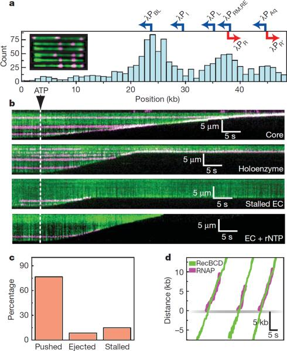
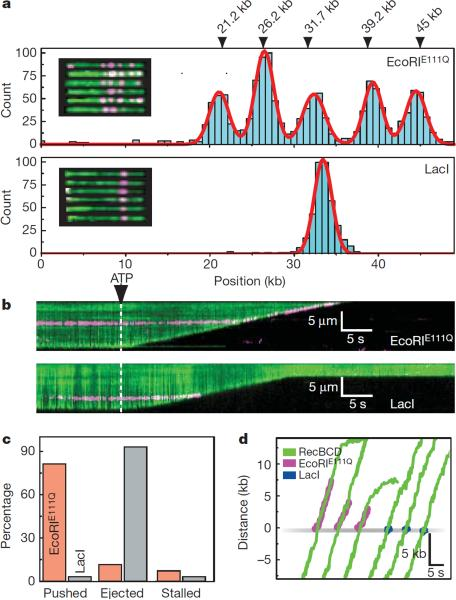
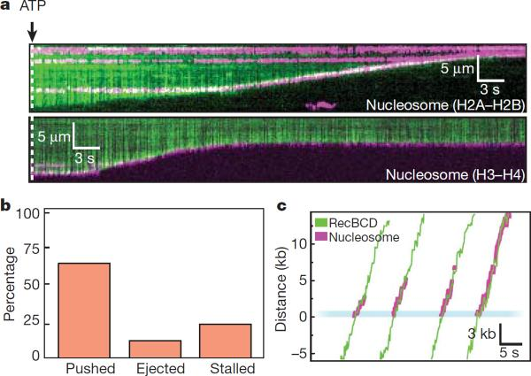
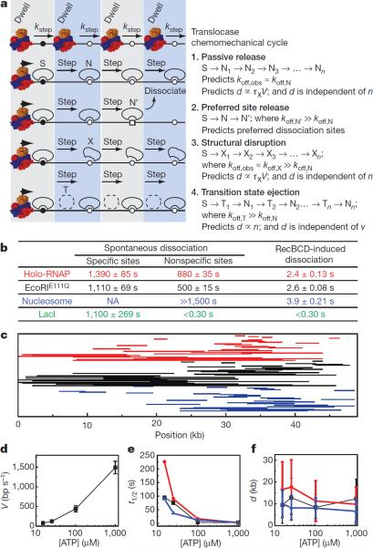

# Single-molecule imaging reveals mechanisms of protein disruption by a DNA translocase

##  Abstract
In physiological settings nucleic acid translocases must act on substrates occupied by other proteins, and an increasingly appreciated role of translocases is to catalyze protein displacement from RNA and DNA[1](https://pmc.ncbi.nlm.nih.gov/articles/PMC3230117/#R1),[2](https://pmc.ncbi.nlm.nih.gov/articles/PMC3230117/#R2),[3](https://pmc.ncbi.nlm.nih.gov/articles/PMC3230117/#R3),[4](https://pmc.ncbi.nlm.nih.gov/articles/PMC3230117/#R4). However, little is known regarding the inevitable collisions that must occur, and the fate of protein obstacles and the mechanisms by which they are evicted from DNA remain unexplored. Here we sought to establish the mechanistic basis for protein displacement from DNA using RecBCD as a model system. Using nanofabricated curtains of DNA and multi-color single-molecule microscopy, we visualized collisions between a model translocase and different DNA-bound proteins in real time. We show that the DNA translocase RecBCD can disrupt core RNA polymerase (RNAP), holoenzyme, stalled elongation complexes, and transcribing RNAP in either head-to-head or head-to-tail orientations, as well as EcoRIE111Q, _lac_ repressor and even nucleosomes. RecBCD did not pause during collisions and often pushed proteins thousands of base-pairs before evicting them from DNA. We conclude that RecBCD overwhelms obstacles through direct transduction of chemomechanical force with no need for specific protein-protein interactions, and that proteins can be removed from DNA through active disruption mechanisms that act on a transition state intermediate as they are pushed from one nonspecific site to the next.
* * *
RecBCD is a heterotrimeric translocase involved in initiating homologous recombination and processing stalled replication forks[5](https://pmc.ncbi.nlm.nih.gov/articles/PMC3230117/#R5),[6](https://pmc.ncbi.nlm.nih.gov/articles/PMC3230117/#R6). RecB is a 3'→5' SF1A helicase and contains a nuclease domain for DNA processing; RecD is a 5'→3' SF1B helicase; RecC holds the complex together and coordinates the response to cis-acting Chi sequences (5'-dGCTGGTGG-3'). RecD is the lead motor before Chi, RecB is the lead motor after Chi, and Chi-recognition is accompanied by a reduced rate of translocation corresponding to the slower velocity of RecB[7](https://pmc.ncbi.nlm.nih.gov/articles/PMC3230117/#R7),[8](https://pmc.ncbi.nlm.nih.gov/articles/PMC3230117/#R8). Chi prompts RecBCD to process DNA, yielding 3' ssDNA overhangs onto which RecA is loaded[7](https://pmc.ncbi.nlm.nih.gov/articles/PMC3230117/#R7),[8](https://pmc.ncbi.nlm.nih.gov/articles/PMC3230117/#R8).
We monitored RecBCD activity using total internal reflection fluorescence microscopy (TIRFM) and a DNA curtain assay that allows us to visualize hundreds of aligned molecules ([Fig. S1](https://pmc.ncbi.nlm.nih.gov/articles/PMC3230117/#SD1))[9](https://pmc.ncbi.nlm.nih.gov/articles/PMC3230117/#R9). When assayed on DNA curtains, RecBCD displayed rapid translocation (1,484±167 bp sec−1, 37°C, 1 mM ATP, N=100; [Fig. S1b,c](https://pmc.ncbi.nlm.nih.gov/articles/PMC3230117/#SD1)), high processivity (36,000±12,500 bp), and also decreased velocity in response to Chi (549±155 bp sec−1, 37°C, 1 mM ATP, N=100; [Fig. S1](https://pmc.ncbi.nlm.nih.gov/articles/PMC3230117/#SD1)), in agreement with previous studies[6](https://pmc.ncbi.nlm.nih.gov/articles/PMC3230117/#R6),[7](https://pmc.ncbi.nlm.nih.gov/articles/PMC3230117/#R7).
_E. coli_ contains ~2,000 molecules of RNA polymerase, and ≥65% of these are bound to the bacterial chromosome[10](https://pmc.ncbi.nlm.nih.gov/articles/PMC3230117/#R10), making it one of the most commonly encountered obstacles in physiological settings. RNAP is of special interest because it is a high-affinity DNA-binding protein (K _d_ ≈10 pM and K _d_ ≈100 pM for λPR and λPL, respectively) and powerful translocase capable of moving under an applied load of ~14–25 pN[11](https://pmc.ncbi.nlm.nih.gov/articles/PMC3230117/#R11). RNAP survives encounters with replication forks[12](https://pmc.ncbi.nlm.nih.gov/articles/PMC3230117/#R12),[13](https://pmc.ncbi.nlm.nih.gov/articles/PMC3230117/#R13),[14](https://pmc.ncbi.nlm.nih.gov/articles/PMC3230117/#R14) and stalls fork progression in head-on collisions[15](https://pmc.ncbi.nlm.nih.gov/articles/PMC3230117/#R15),[16](https://pmc.ncbi.nlm.nih.gov/articles/PMC3230117/#R16), arguing that RNAP is among the most formidable roadblocks encountered _in vivo_. During replication restart RecBCD translocates towards _OriC_ , therefore most collisions with RNAP will occur in a head-on orientation, suggesting that to survive these encounters RecBCD would need to exert more force than a replisome.
We used quantum dots (QDs) to fluorescently label RNAP ([Supplementary Information](https://pmc.ncbi.nlm.nih.gov/articles/PMC3230117/#SD1)). The binding distribution of QD-RNAP holoenzyme overlapped with known promoters ([Fig. 1a](https://pmc.ncbi.nlm.nih.gov/articles/PMC3230117/#F1)), promoter targeting was σ70-dependent, and promoter-bound holoenzymes were highly stable (t½=23.2±1.42 min, N=58; [Fig. S3a,b,c](https://pmc.ncbi.nlm.nih.gov/articles/PMC3230117/#SD1)). Core QD-RNAP dissociated when challenged with heparin (t½=3.4±0.03 sec, N=150), whereas promoter-bound holoenzyme was heparin-resistant (t½>>6.7 min, N=58), confirming open complex formation ([Fig. S3c,d](https://pmc.ncbi.nlm.nih.gov/articles/PMC3230117/#SD1)). Bulk assays verified QD-RNAP produced transcripts ([Fig. S3e](https://pmc.ncbi.nlm.nih.gov/articles/PMC3230117/#SD1)), and single molecule assays revealed a transcription velocity of 15.7±8.6 bp sec−1 (N=20, 25°C, 250 μM of each rNTP; [Fig. S3f](https://pmc.ncbi.nlm.nih.gov/articles/PMC3230117/#SD1)).
## Figure 1.

RecBCD removes RNAP from DNA. **a,** Distribution of QD-RNAP bound to λ-DNA. Locations of promoters are indicated; those facing left are shown blue, those facing right are red. The inset shows examples of YOYO1-stained λ-DNA (green) bound by RNAP (magenta). The tethered end of the DNA is on the left, and the free end of the DNA is on the right. **b,** Kymograms of RecBCD colliding with RNAP core, holoenzyme, stalled elongation complex (EC), and stalled ECs chased with rNTPs. Gaps in magenta traces correspond to QD blinking. **c,** Distribution of event types. **d,** Tracking data for collisions, with traces aligned at the collisions.
When RecBCD collided with RNAP, the polymerase was rapidly ejected from DNA (t½=2.4±0.13 sec; [Fig. 1b](https://pmc.ncbi.nlm.nih.gov/articles/PMC3230117/#F1)). Remarkably, RNAP could be pushed long distances (10,460 ± 7,690 bp, N=44; [Fig. 1](https://pmc.ncbi.nlm.nih.gov/articles/PMC3230117/#F1) & [Fig. S4](https://pmc.ncbi.nlm.nih.gov/articles/PMC3230117/#SD1)), and RecBCD could disrupt core, holoenzyme, stalled elongation complexes (ECs), and active ECs ([Fig. 1b](https://pmc.ncbi.nlm.nih.gov/articles/PMC3230117/#F1) & [Fig. S5](https://pmc.ncbi.nlm.nih.gov/articles/PMC3230117/#SD1)). Out of 47 collisions with QD-RNAP holoenzyme, 15% (7/47) immediately stalled RecBCD, 8.5% (4/47) resulted in dissociation of RNAP with no sliding, 76.5% (36/47) of RNAP was pushed and 71% of pushed molecules were eventually ejected ([Fig. 1c](https://pmc.ncbi.nlm.nih.gov/articles/PMC3230117/#F1)). The population of RNAP molecules that was directly ejected from the DNA increased ~5-fold for stalled and active elongation complexes ([Fig. S5](https://pmc.ncbi.nlm.nih.gov/articles/PMC3230117/#SD1)). RecBCD also pushed and evicted RNAP labeled with 40-nm fluorescent beads or Alexa Fluor 488-IgG, arguing against nonspecific interactions between RecBCD and the QDs ([Fig. S6a](https://pmc.ncbi.nlm.nih.gov/articles/PMC3230117/#SD1)). RecBCD did not slow or pause upon colliding with RNAP ([Fig. 1d](https://pmc.ncbi.nlm.nih.gov/articles/PMC3230117/#F1) & [Fig. S4a](https://pmc.ncbi.nlm.nih.gov/articles/PMC3230117/#SD1)), nor was there any reduction in processivity compared to naked DNA (29,000±15,500 bp). Similar outcomes were observed before and after Chi (not shown), indicating that RecBCD could dislodge RNAP regardless of whether RecB or RecD was the lead motor. We could unambiguously assign the orientation of RNAP at λPBL ([Fig. 1a](https://pmc.ncbi.nlm.nih.gov/articles/PMC3230117/#F1) & [Fig. S3f](https://pmc.ncbi.nlm.nih.gov/articles/PMC3230117/#SD1)), and RecBCD dislodged RNAP bound at λPBL during collisions in either direction ([Fig. 1b](https://pmc.ncbi.nlm.nih.gov/articles/PMC3230117/#F1) & [Fig. S7](https://pmc.ncbi.nlm.nih.gov/articles/PMC3230117/#SD1)). RecBCD also pushed and ejected RNAP bound at all other locations regardless of DNA orientation ([Fig. 1b](https://pmc.ncbi.nlm.nih.gov/articles/PMC3230117/#F1)). RecBCD even dislodged RNAP at lower velocities (446±192 bp sec−1, 122±128 bp sec−1, and 78±27 bp sec−1, at 100 μM, 25 μM and 15 μM ATP, respectively; [Fig. S7](https://pmc.ncbi.nlm.nih.gov/articles/PMC3230117/#SD1); & see below), indicating proteins could be dislodged even under sub-optimal translocation conditions. We conclude that RecBCD disrupts RNAP regardless of orientation, transcriptional status, or translocation velocity.
We next asked whether RecBCD could dislodge other proteins. EcoRIE111Q is a catalytically inactive version of EcoRI, which has high affinity (K _d_ =2.5 fM) for cognate sites and even binds tightly to nonspecific DNA (K _d_ =4.8 pM)[17](https://pmc.ncbi.nlm.nih.gov/articles/PMC3230117/#R17). EcoRIE111Q can halt _E. coli_ RNA polymerase[18](https://pmc.ncbi.nlm.nih.gov/articles/PMC3230117/#R18),[19](https://pmc.ncbi.nlm.nih.gov/articles/PMC3230117/#R19), T7 and SP6 RNA polymerases[20](https://pmc.ncbi.nlm.nih.gov/articles/PMC3230117/#R20), SV40 large T-antigen, UvrD, DnaB, and Dda helicases, SV40 replication forks[21](https://pmc.ncbi.nlm.nih.gov/articles/PMC3230117/#R21), and _E. coli_ replication forks[4](https://pmc.ncbi.nlm.nih.gov/articles/PMC3230117/#R4). EcoRI withstands up to ~20–40 pN[22](https://pmc.ncbi.nlm.nih.gov/articles/PMC3230117/#R22), and EcoRIE111Q binds cognate sites ~3000-fold stronger than wild-type EcoRI (K _d_ =6.7 pM)[17](https://pmc.ncbi.nlm.nih.gov/articles/PMC3230117/#R17), thus we infer the catalytic mutant can resist at least as much force as the wild-type protein. _Lac_ repressor (LacI) is representative of a large family of bacterial transcription factors that has served as a paradigm for transcriptional regulation and protein-DNA interactions. LacI binds tightly to specific sites (K _d_ =10 fM for a 21-bp symmetric operator)[23](https://pmc.ncbi.nlm.nih.gov/articles/PMC3230117/#R23), but binds weakly to nonspecific DNA (K _d_ ≥1 nM)[24](https://pmc.ncbi.nlm.nih.gov/articles/PMC3230117/#R24) and slides rapidly along nonspecific DNA rather than remaining at fixed locations[25](https://pmc.ncbi.nlm.nih.gov/articles/PMC3230117/#R25),[26](https://pmc.ncbi.nlm.nih.gov/articles/PMC3230117/#R26). LacI blocks RNAP and replication forks both _in vitro_ and _in vivo_[18](https://pmc.ncbi.nlm.nih.gov/articles/PMC3230117/#R18), highlighting this protein as a potent and physiologically relevant barrier to translocase progression.
EcoRIE111Q and LacI were labeled with QDs ([Supplementary Information](https://pmc.ncbi.nlm.nih.gov/articles/PMC3230117/#SD1)). QD-EcoRIE111Q and QD-LacI were targeted to the correct locations on the DNA substrates ([Fig. 2a](https://pmc.ncbi.nlm.nih.gov/articles/PMC3230117/#F2) & [Fig. S8](https://pmc.ncbi.nlm.nih.gov/articles/PMC3230117/#SD1)), and QD-LacI was rapidly released from DNA with IPTG, as expected ([Fig. S9](https://pmc.ncbi.nlm.nih.gov/articles/PMC3230117/#SD1)). When RecBCD collided with EcoRIE111Q it pushed the proteins 13,000±9,100 bp (N=70), before ejecting them from DNA ([Fig. 2b,c](https://pmc.ncbi.nlm.nih.gov/articles/PMC3230117/#F2)). In contrast, LacI was immediately ejected, and was not pushed within our resolution limits ([Fig. 2b,c,d](https://pmc.ncbi.nlm.nih.gov/articles/PMC3230117/#F2)). There was no change in velocity or processivity upon colliding with either protein ([Fig. 3b,d](https://pmc.ncbi.nlm.nih.gov/articles/PMC3230117/#F3) & [Fig. S4](https://pmc.ncbi.nlm.nih.gov/articles/PMC3230117/#SD1)). Out of 70 collisions with QD-EcoRIE111Q, 11.2% (5/70) stalled the translocase, 11.4% (8/70) resulted in immediate dissociation of EcoRIE111Q with no detectable sliding, 81.4% (57/70) of EcoRIE111Q was pushed along DNA and 92% of pushed molecules were eventually ejected ([Fig. 2c](https://pmc.ncbi.nlm.nih.gov/articles/PMC3230117/#F2)). Out of 30 collisions with LacI, 3.3% (1/30) stalled the translocase, 93.3% (28/30) resulted in immediate dissociation of LacI with no detectable sliding, and 3.3% (1/30) exhibited sliding before dissociation ([Fig. 2c](https://pmc.ncbi.nlm.nih.gov/articles/PMC3230117/#F2)). A greater fraction of LacI might slide, but if so, the sliding events fall below our resolution limits. Control experiments confirmed RecBCD disrupted EcoRIE111Q labeled with fluorescent beads or Alexa Fluor 488 ([Fig. S6b](https://pmc.ncbi.nlm.nih.gov/articles/PMC3230117/#SD1)). As with RNAP, RecBCD could strip EcoRIE111Q after Chi (not shown), and RecBCD also disrupted EcoRIE111Q and LacI during low velocity collisions (see below). These findings confirm that RecBCD readily displaces tightly bound proteins from DNA.
## Figure 2.

Disruption of EcoRIE111Q and lac repressor by RecBCD. **a,** Histogram of EcoRIE111Q (upper panel, N=1481) and LacI (lower panel, N=700) bound to λ-DNA. The locations of the 5 EcoRI sites found in λ-DNA are indicated, along with examples of QD-EcoRIE111Q bound to YOYO1-stained λ-DNA (inset, upper panel), and examples of QD-LacI bound to the DNA (inset, lower panel) **b,** Kymogram showing RecBCD colliding with EcoRIE111Q or LacI (magenta), as indicated. **d,** Distribution of event types for EcoRIE111Q and LacI. **e,** Tracking data for individual collisions.
## Figure 3.

Nucleosomes can be pushed along DNA. **a,** Kymograms showing RecBCD collisions with nucleosomes (magenta) that are labeled on either the H2A/H2B dimer or H3/H4 tetramer, as indicated. **b,** Distribution of event types. **c,** Tracking data illustrating collisions between RecBCD and nucleosomes.
In eukaryotes, nucleosomes are the most frequently encountered DNA-bound obstacles. Replisomes, transcription machinery, and ATP-dependent chromatin remodelers all act through mechanisms requiring force generation, and the response of nucleosomes to these forces remains a long standing question in chromatin biology. Heterologous systems have revealed fundamental principles underlying these processes[27](https://pmc.ncbi.nlm.nih.gov/articles/PMC3230117/#R27),[28](https://pmc.ncbi.nlm.nih.gov/articles/PMC3230117/#R28): experiments with SP6 RNAP provided a theoretical framework for nucleosome repositioning[27](https://pmc.ncbi.nlm.nih.gov/articles/PMC3230117/#R27); and studies with phage T4 proteins were among the first to address the fate of nucleosomes during replication[28](https://pmc.ncbi.nlm.nih.gov/articles/PMC3230117/#R28). Eukaryotic translocases exert forces in the same net direction as RecBCD, and RecBCD can unwind nucleosome-bound DNA[29](https://pmc.ncbi.nlm.nih.gov/articles/PMC3230117/#R29), arguing that it can serve as a good protein-based force probe for studying the fate of nucleosomes when rammed by a translocase.
Recombinant nucleosomes were deposited on DNA curtains by salt dialysis, as described[9](https://pmc.ncbi.nlm.nih.gov/articles/PMC3230117/#R9). Remarkably, RecBCD could push nucleosomes (7,311±5,373 bp, N=75; [Fig. 3](https://pmc.ncbi.nlm.nih.gov/articles/PMC3230117/#F3)), and similar results were obtained with fluorescently labeled H2A/H2B or H3/H4 ([Fig. 3a](https://pmc.ncbi.nlm.nih.gov/articles/PMC3230117/#F3)). Control experiments demonstrated that RecBCD could also push nucleosomes labeled with either fluorescent beads or Alexa Fluor 488 ([Fig. S6c](https://pmc.ncbi.nlm.nih.gov/articles/PMC3230117/#SD1)). Out of 357 collisions with QD-nucleosomes, 24% (84/357) immediately stalled RecBCD, 11% (40/357) resulted in direct nucleosome ejection, 65% (233/357) led to sliding ([Fig. 3b](https://pmc.ncbi.nlm.nih.gov/articles/PMC3230117/#F3)) and ~50% of these were eventually ejected (t½=3.93±0.21 sec; [Fig. 3b](https://pmc.ncbi.nlm.nih.gov/articles/PMC3230117/#F3) & [Fig. S4c](https://pmc.ncbi.nlm.nih.gov/articles/PMC3230117/#SD1)). Nucleosomes reduced the processivity of RecBCD to 14,000±7,000 bp, as anticipated[29](https://pmc.ncbi.nlm.nih.gov/articles/PMC3230117/#R29), and a larger fraction of these collisions caused the translocase to stall (24%) compared to RNAP (15% stall), EcoRIE111Q (7% stall) and LacI (3.3% stall). Fewer of the pushed nucleosomes (50%) were subsequently ejected from the DNA compared to the other roadblock proteins, and there was a 10% reduction (t-test, p=0.0005) in velocity while pushing nucleosomes ([Fig. 3c](https://pmc.ncbi.nlm.nih.gov/articles/PMC3230117/#F3) & [Fig. S4c](https://pmc.ncbi.nlm.nih.gov/articles/PMC3230117/#SD1)). These results demonstrate that intact nucleosomes can be pushed along DNA as theoretically predicted[30](https://pmc.ncbi.nlm.nih.gov/articles/PMC3230117/#R30), but indicated that RecBCD had more difficulty pushing and evicting nucleosomes compared to the other protein roadblocks. The finding that RecBCD pushes and evicts nucleosomes also rules out mechanisms requiring species-specific protein-protein interactions.
Protein disruption mechanisms can be described by at least four models, which differ in the nature of mobile intermediates and the stage of the chemomechanical cycle during which the proteins dissociate ([Fig. 4a](https://pmc.ncbi.nlm.nih.gov/articles/PMC3230117/#F4)). For the first model, passive release, the proteins (S) are dislodged from a high-affinity specific site, and then pushed from one sequential nonspecific site to the next. Subsequent dissociation occurs spontaneously simply because the proteins are bound to lower-affinity nonspecific DNA (N). This model assumes the proteins have similar low affinities for all nonspecific sites sampled, and predicts that the observed rates of RecBCD-induced dissociation (koff,obs) would be similar to spontaneous dissociation from nonspecific DNA in the absence of RecBCD (koff,obs≈koff,N). This model also predicts that the distance (d) over which proteins are pushed will be dictated by their affinity for nonspecific DNA, and will be proportional to velocity (V), such that faster translocation will lead to longer distances and slower translocation will yield shorter distances. The second model, preferred site release, accounts for a scenario where proteins encounter rare sequences of exceptionally low-affinity (N') such that they preferentially dissociate from these sites (koff,N' ≫koff,N). In the third model, structural disruption, translocase collisions alter the conformation of the proteins (_e.g._ by permanently rupturing a subset of protein-DNA contacts), such that they persist as structurally perturbed complexes (X) after displacement from the high-affinity site. In this scenario, the mobile intermediates have a characteristic lifetime (τx) dictated by their weakened affinity for DNA, and this lifetime should be insensitive to translocation velocity. Therefore, the distance (d) over which proteins are pushed will be proportional to velocity (V), and faster translocation will lead to longer distances whereas slower translocation will yield shorter distances. The most important feature of this model, which distinguishes it from all of the other models, is that the structurally disrupted proteins are more weakly bound to DNA specifically as a consequence of the collision, such that the observed rate of RecBCD-induced dissociation (koff,obs) would be greater than the rate of spontaneous dissociation from nonspecific DNA (koff,obs≈koff,X ≫koff,N). The fourth model, transition state ejection, is characterized by a series of tightly bound nonspecific complexes (N) that must pass through a weakly bound transition state (T) as they are pushed from one position to the next. This model predicts that dissociation occurs predominantly during the transition state (koff,T ≫koff,N). The time required to pass through the transition state during one round of the chemomechanical cycle is equivalent to the time required for the translocase to take a single step (_k_ step), which is a fixed intrinsic value independent of ATP concentration. This relationship can be rationalized by considering that the velocity of RecBCD can be controlled by modulating ATP concentration (see below), with slower velocities manifesting from longer dwell times between steps while awaiting new ATP, rather than from changes in _k_ step. Therefore the time it takes the roadblock to pass through the transition state during a single step will be independent of ATP concentration, whereas the cumulative time spent in the transition state will increase linearly with step number (n) irrespective of the overall observed translocation velocity. The probability of dissociation will then increase with step number, the observed lifetimes will be inversely proportional to velocity, and the total distance the proteins are pushed before dissociation will be independent of velocity (_i.e._ the roadblocks will be pushed similar distances regardless of how fast the translocase moves).
## Figure 4.

Protein displacement mechanisms. **a,** Models for protein displacement. **b,** Spontaneous dissociation versus RecBCD-induced dissociation as determined from single exponential fits to dissociation data ± s.d. Values for LacI nonspecific and RecBCD-induced dissociation represent upper bounds. Data are color-coded for each different protein, as indicated. **c,** Representative sliding trajectories. Each line corresponds to the collision (right endpoint) and dissociation (left endpoint) for single proteins. **d,** RecBCD velocity (mean ± s.d.) at varying [ATP]. **e,** Protein t1/2 at varying [ATP]. Error was ≤5.6% of the reported values. **f,** Pushing distances (mean ± s.e.m.) at different ATP concentrations.
Each aforementioned model makes distinct predictions that can be experimentally evaluated. This evaluation is made easier for RNAP, EcoRIE111Q, and nucleosomes because these proteins were pushed long distances (LacI is considered separately below). We first measured dissociation of these proteins from specific and nonspecific sites in the absence of RecBCD ([Supplementary Information](https://pmc.ncbi.nlm.nih.gov/articles/PMC3230117/#SD1)), and compared these results to RecBCD-induced rates of dissociation ([Fig. 4b](https://pmc.ncbi.nlm.nih.gov/articles/PMC3230117/#F4)). RNAP, EcoRIE111Q, and nucleosomes all bind tightly to nonspecific DNA, and RecBCD-induced dissociation was ≥200-fold faster than spontaneous dissociation from nonspecific sites, which is inconsistent with passive release. We next analyzed pushing trajectories to determine if there was any evidence supporting preferred site release. Comparison of these trajectories revealed that RecBCD-induced dissociation of all three roadblock proteins occurred at random locations ([Fig. 4c](https://pmc.ncbi.nlm.nih.gov/articles/PMC3230117/#F4)), arguing against preferred site release. To distinguish between structural disruption and transition state eviction we compared protein lifetimes and pushing distances at four different translocation velocities ([Fig. 4d](https://pmc.ncbi.nlm.nih.gov/articles/PMC3230117/#F4)). Remarkably, a 3.3-fold decrease in RecBCD velocity (446±192 bp sec−1 at 100 μM ATP) led to a 1.5-, 7.0-, and 3.4-fold increase in the post-collision half-life of EcoRIE111Q, RNAP, and nucleosomes, respectively, while the distribution of distances over which the proteins were pushed remained largely unaltered (Fig 5f & [Table S1](https://pmc.ncbi.nlm.nih.gov/articles/PMC3230117/#SD1)). This effect was even more obvious at 15 μM ATP, where a 19-fold decrease in RecBCD velocity (78±27 bp sec−1) led to a 36-, 93-, and 24-fold increase in post-collision half-life of EcoRIE111Q, RNAP, and nucleosomes, respectively, while pushing distances were either unaltered or increased compared to the faster velocities. These results indicated that dissociation was dictated by the number of steps the proteins were forced to take rather than the cumulative time it took to be pushed a given distance, which is most consistent with transition state ejection. While our experiments did not reveal any evidence for a structural disruption mechanism of eviction, this does not rule out the possibility that EcoRIE111Q, RNAP, and nucleosomes are structurally altered when acted upon by RecBCD. However, if they are structurally perturbed, this alone does not result in their eventual dissociation from DNA.
LacI differs from the other roadblocks in that it was immediately evicted from DNA, and the RecBCD-induced dissociation rate was comparable to the rate of spontaneous dissociation from nonspecific sites ([Fig. 4b](https://pmc.ncbi.nlm.nih.gov/articles/PMC3230117/#F4)), which would seem consistent with a passive release model. However, with current resolution limits we cannot completely rule out other mechanisms, and future studies will be necessary to fully address this issue. Importantly, RNAP, EcoRIE111Q, and nucleosomes all bind tightly to nonspecific DNA, whereas LacI binds much more weakly to nonspecific sequences ([Fig. 4b](https://pmc.ncbi.nlm.nih.gov/articles/PMC3230117/#F4)), suggesting that LacI is released more rapidly from DNA after the collisions due to its weaker affinity for nonspecific sites. This result demonstrates that the roadblock proteins and the nature of their interactions with nonspecific DNA are critical contributing factors to the outcome of the collisions.
This leaves the question of how much force RecBCD exerts, and how much is sufficient to disrupt obstacles. While our experiments do not yield a direct read out of force, we can safely conclude that the force exerted by RecBCD is sufficient to overcome RNAP, EcoRIE111Q, LacI and nucleosomes. Our work has revealed unprecedented details of protein collisions on DNA and provides new insights into how translocases can disrupt nucleoprotein complexes. Given the flexibility of our experimental platform, we anticipate these studies can be extended to other translocases and roadblock proteins, and it will be important to determine whether the mechanistic concepts developed here apply to different types of collisions between proteins on DNA.
##  METHODS SUMMARY
We conducted TIRFM experiments on a home-built microscope using nanofabricated DNA curtains, as previously described[9](https://pmc.ncbi.nlm.nih.gov/articles/PMC3230117/#R9). For all initial experiments, and for all kymograms shown in the manuscript, we used YOYO1 to stain the DNA. YOYO1 does not affect the translocation rate or processivity of RecBCD[6](https://pmc.ncbi.nlm.nih.gov/articles/PMC3230117/#R6), nor did it affect the binding distributions of RNAP, EcoRIE111Q, or nucleosomes (not shown). In the presence of YOYO1 the roadblocks showed the same general response to collisions with RecBCD, with identical distributions of ejection, stalling, and pushing (and pushing velocities) seen ±YOYO1. However, YOYO1 reduced the distance obstacles were pushed by 20–30% compared to minus YOYO1 reactions. Therefore all sliding distances and half-lives reported in the manuscript correspond to values measured in the absence of YOYO1. Sliding distances are only reported for roadblocks that did not encounter any other QD-tagged proteins as they were pushed along the DNA. This ensures that each analyzed collision/dissociation event only involved a single QD-tagged protein. Many reactions were observed in which multiple QD-tagged roadblocks were pushed into one another, but in these cases we could not determine the order in which each QD-protein was displaced from the DNA, and therefore could not measure sliding distances. For categorizing the event type distributions we defined “sliding” as any QD-tagged roadblock that moved more than 0.53 μm (~1,950 bp), and anything less than this was scored as a direct dissociation event.

##  Acknowledgements
We thank Dr. Max Gottesman, Dr. Ruben Gonzalez, and members of the Greene laboratory for discussion and assistance throughout this work. We thank Dr. Paul Modrich for providing an expression construct encoding EcoRIE111Q, Drs. Robert Landick and Karen Adelman for providing RNAP constructs, and Dr. Jeff Gelles for providing plasmids encoding RecBCD. I.J.F. was supported by an NIH Fellowship (F32GM80864). Funding was provided by the National Institutes of Health (GM074739 and GM082848 to E.C.G.). This work was partially supported by the Initiatives in Science and Engineering program through Columbia University, the Nanoscale Science and Engineering Initiative of the National Science Foundation under NSF Award Number CHE-0641523, and by the New York State Office of Science, Technology, and Academic Research (NYSTAR). E.C.G is an Early Career Scientist with the Howard Hughes Medical Institute. We apologize to colleagues whose work we were unable to cite due to length restrictions.
