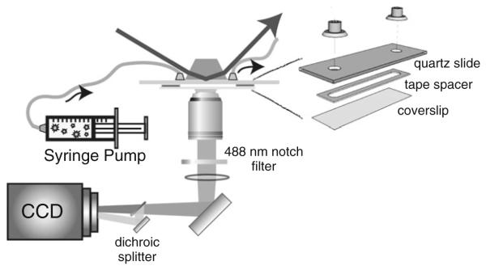
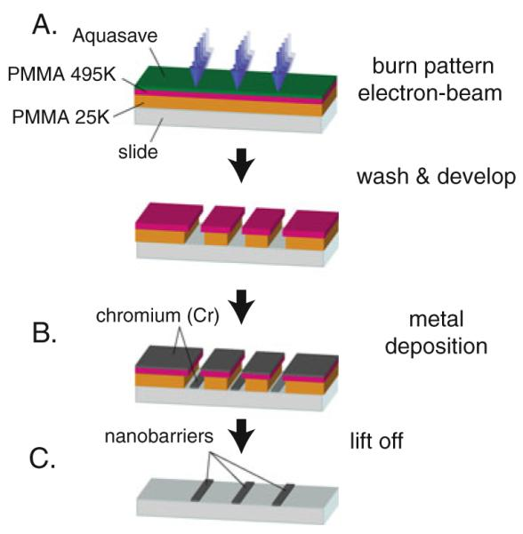
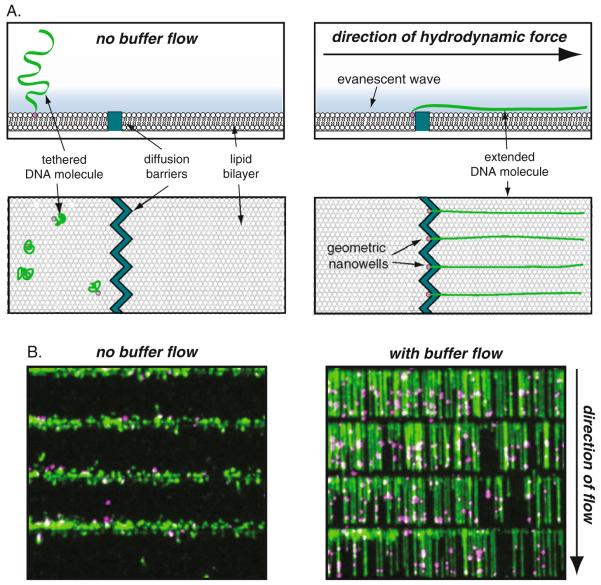

# Supported Lipid Bilayers and DNA Curtains for High-Throughput Single-Molecule Studies

**Ilya J. Finkelstein and Eric C. Greene**

*Methods Mol. Biol.*, Volume 745, Pages 447–461 (2011)

**DOI:** [10.1007/978-1-61779-129-1_26](https://doi.org/10.1007/978-1-61779-129-1_26)

---

## Table of Contents

- [Abstract](#abstract)
- [1. Introduction](#1-introduction)
- [2. Materials](#2-materials)
- [3. Methods](#3-methods)
- [Acknowledgments](#acknowledgments)
- [4. Notes](#4-notes)

---

##  Abstract
Single-molecule studies of protein–DNA interactions continue to yield new information on numerous DNA processing pathways. For example, optical microscopy-based techniques permit the real-time observation of proteins that interact with DNA substrates, which in turn allows direct insight into reaction mechanisms. However, these experiments remain technically challenging and are limited by the paucity of stable chromophores and the difficulty of acquiring statistically significant observations. In this protocol, we describe a novel, high-throughput, nanofabricated experimental platform enabling real-time imaging of hundreds of individual protein–DNA complexes over hour timescales.
**Keywords:** Single molecule, TIRF microscopy, nanofabrication, DNA curtains, nucleosome, DNA motors
---
##  1. Introduction
In recent years, fluorescence-based single-molecule imaging techniques have been used to follow the action of macromolecular machines along a DNA substrate. Direct observations of DNA replication ([1](https://pmc.ncbi.nlm.nih.gov/articles/PMC3319767/#R1)–[4](https://pmc.ncbi.nlm.nih.gov/articles/PMC3319767/#R4)), transcription ([5](https://pmc.ncbi.nlm.nih.gov/articles/PMC3319767/#R5)–[7](https://pmc.ncbi.nlm.nih.gov/articles/PMC3319767/#R7)), and repair ([8](https://pmc.ncbi.nlm.nih.gov/articles/PMC3319767/#R8)–[10](https://pmc.ncbi.nlm.nih.gov/articles/PMC3319767/#R10))atthe single-molecule level are continuing to offer fresh insights into these complex, multi-step reactions. The knowledge gained from these studies typically could not be accessed using traditional biochemical or biophysical approaches. Single-molecule experiments offer the advantage of being able to study rare or short-lived intermediates that can be obfuscated among the often-heterogenous populations of molecules that are studied in traditional biochemical assays.
Despite decades of intense technique development, single-molecule observations of protein–DNA interactions continue to be experimentally challenging. The relatively short fluorescent lifetimes of most organic dyes significantly limit the accessible reaction timescales. The molecules under investigation usually must be anchored to a surface that is inherently different from the normal environments encountered within cells. In addition, experimental platforms that manipulate the target DNA via optical or magnetic tweezers are typically carried out on single DNA molecules in a serial fashion (i.e., one molecule at a time), and this low data throughout often limit the scope of the experimental results. In the protocol presented here, we describe a method for rapid, real-time imaging of hundreds of individual protein–DNA complexes over extended, biological timescales within a biologically friendly microenvironment. The method is flexible and can be used to address a number of different biological problems. We have successfully applied this experimental approach to observe the diffusion and translocation of DNA repair proteins ([10](https://pmc.ncbi.nlm.nih.gov/articles/PMC3319767/#R10), [11](https://pmc.ncbi.nlm.nih.gov/articles/PMC3319767/#R11)), the localization of nucleosomes along an intrinsic DNA-binding energy landscape ([12](https://pmc.ncbi.nlm.nih.gov/articles/PMC3319767/#R12)), and to follow the polymerization activity of recombinases on double-stranded DNA ([13](https://pmc.ncbi.nlm.nih.gov/articles/PMC3319767/#R13)–[15](https://pmc.ncbi.nlm.nih.gov/articles/PMC3319767/#R15)).
In this protocol, we describe a nanofabricated, micro-fluidic system for simultaneous imaging of hundreds of DNA molecules in real time ([Fig. 26.1](#fig1)). The DNA molecules are organized into “DNA curtains” on the surface of a micro-fluidic sample chamber that is otherwise coated with a fluid lipid bilayer. Various aspects of the DNA curtains technology have been presented previously ([16](https://pmc.ncbi.nlm.nih.gov/articles/PMC3319767/#R16)–[19](https://pmc.ncbi.nlm.nih.gov/articles/PMC3319767/#R19)). Briefly, the experimental system consists of a total internal reflection fluorescence (TIRF) microscope builtaround an inverted Nikon TE2000 microscope. Laser illumination is provided by a ~200 mW 488 nm diode laser. The laser beam impinges on a DOVE prism atop a flowcell constructed from a silica microscope slide containing nanofabricated barriers to lipid diffusion ([Fig. 26.2](#fig2)). An evanescent wave is generated at the water–silica interface, illuminating a shallow observation volume at the flowcell surface. Fluorescence from molecules immobilized at the surface (see below) is collected by a 60×, N.A.1.2 water immersion objective. The signal is passed through a holographic 488 nm notch filter and imaged on a back-thinned 512 × 512 pixel EM-CCD. For multi-color fluorescence imaging, the signal is passed through a DualView beam splitter and each color imaged on one half of the CCD chip.
***[Fig. 26](#fig26).***1.

Schematic of the fluorescence microscope setup. The flowcell is placed on a microscope stage in an inverted configuration. A 488 nm laser impinges on a DOVE prism that rests atop the flowcell. Fluorescent signal is collected by a high N.A. objective and is passed through a 488 nm notch filter and a DualView beam splitter before being imaged on a 512 × 512 pixel EM-CCD. A syringe pump delivers continuous buffer flow through the flowcell inlet port.
***[Fig. 26](#fig26).***2.

Overview of electron beam lithography. (**a**) For e-beam lithography, the slide is first coated with PMMA, and a layer of Aquasave, and an electron beam rastered across the surface to burn through these layers creating a pattern that defines the shapes of the diffusion barriers. (**b**) Chromium (Cr) is deposited on the entire surface, and (**c**)the remaining PMMA is lifted off, leaving behind the nanofabricated barriers.
The surface of the flowcell is passivated by a fluid lipid bilayer ([20](https://pmc.ncbi.nlm.nih.gov/articles/PMC3319767/#R20)–[22](https://pmc.ncbi.nlm.nih.gov/articles/PMC3319767/#R22)). DNA is immobilized at the lipid bilayer by a streptavidin–biotin linkage and extended into the evanescent wave via shear buffer flow delivered by a syringe pump. The fluidity of the lipid bilayer permits organization of individual DNA molecules at nanofabricated diffusion barriers ([Fig. 26.3](#fig3)). The spacing, density, and orientation of DNA molecules relative to one another may be controlled by appropriately designed diffusion barriers ([17](https://pmc.ncbi.nlm.nih.gov/articles/PMC3319767/#R17)). Recently, we have also extended the DNA curtain technology to generate DNA arrays that are immobilized at both ends ([16](https://pmc.ncbi.nlm.nih.gov/articles/PMC3319767/#R16)).
***[Fig. 26](#fig26).***3.

Assembly of DNA curtains. (**a**) A schematic illustration of DNA molecules assembled into DNA curtains on a fluid lipid bilayer. DNA is tethered to the bilayer by a streptavidin–biotin linkage. In the presence of buffer flow, individual DNA molecules are pushed through the lipid bilayer until the molecules assemble at nanofabricated diffusion barriers. (**b**) A single field of view permits the observation of up to four rows of assembled λ-DNA curtains in the absence (left panel) and presence (right panel) of buffer flow. The DNA molecules have been decorated with QD-labeled RNA polymerase.
For our studies we label the proteins with highly fluorescent semiconductor nanocrystal quantum dots (QDs). Quantum dotsare relatively small (~10–20 nm diameter) nanoparticles that display broad excitation spectra, narrow emission peaks, large Stokes shifts, large absorbance cross sections, and very high quantum yields ([23](https://pmc.ncbi.nlm.nih.gov/articles/PMC3319767/#R23)). Individual QDs can be readily visualized at data collection rates of 100 frames/s and the QDs do not bleach even after prolonged illumination ([23](https://pmc.ncbi.nlm.nih.gov/articles/PMC3319767/#R23)–[26](https://pmc.ncbi.nlm.nih.gov/articles/PMC3319767/#R26)). This allows imaging for extended periods (up to hours) without risk of photobleaching the sample. To specifically label a protein of interest, an epitope tag is engineered into the protein. Antibodies raised against the epitope tag are chemically linked to QDs and the QD–antibody complex is conjugated with the protein prior to visualization on the DNA curtain.
The DNA can be viewed by staining with very low concentrations (1–2 nM) of the intercalating dye YOYO1. To avoid rapid photobleaching of YOYO1 and concomitant DNA damage due to the reactivity of excited fluorophores with molecular oxygen, we employ an enzymatic oxygen scavenging system. The coupled activity of glucose oxidase and catalase in a buffer containing millimolar amounts of glucose significantly reduces DNA breaks and permits observations of individual molecules for tens of minutes ([27](https://pmc.ncbi.nlm.nih.gov/articles/PMC3319767/#R27)). Although this approach does not inhibit the biochemical activity of many enzymes ([9](https://pmc.ncbi.nlm.nih.gov/articles/PMC3319767/#R9), [10](https://pmc.ncbi.nlm.nih.gov/articles/PMC3319767/#R10)), care should be taken to biochemically assay all the protein–DNA interactions in the presence of YOYO1, as well as all additional buffer components. If necessary, YOYO1 may be used to stain the DNA at the beginning of an experiment and subsequently flushed out by washing the flowcell with a high-salt (500 mM NaCl or 10 mM MgCl2) buffer. In addition, alternative labeling procedures that employ recognition of digoxigenin (DIG)-labeled DNA by anti-DIG antibody–QD conjugates have also been developed ([13](https://pmc.ncbi.nlm.nih.gov/articles/PMC3319767/#R13), [14](https://pmc.ncbi.nlm.nih.gov/articles/PMC3319767/#R14), [28](https://pmc.ncbi.nlm.nih.gov/articles/PMC3319767/#R28)). These labeling methods leave the duplex almost completely unperturbed and do not require intercalating DNA dyes or an oxygen scavenging system to visualize the DNA curtains.
---
##  2. Materials
### 2.1. TIRF Microscope
  1. Laser: 488 nm, ~200 mW cw diode laser (Coherent).
  2. Microscope: TE2000 Eclipse Inverted Microscope (Nikon).
  3. Objective: Plan Apo 60X 1.2, W.I. 0.22 WD (Nikon).
  4. Dual View Imaging System (Optical Insights).
  5. Holographic 488 nm Notch Filter (Semrock).
  6. DOVE Prism (ESCO).
  7. Syringe pump (KD Scientific).
  8. EM-CCD (Photometrix).
  9. NIS-Elements Imaging Software (Nikon).

### 2.2. Nanofabricated Silica Slides
  1. Nanofabrication facility: electron beam (e-beam) lithography and e-beam evaporator apparatus.
  2. Spin-coater (Laurell Technologies).
  3. Bath sonicator (VWR).
  4. NanoStrip solution (CyanTek).
  5. Polymethylmethacrylate (PMMA): MW of 25 kDa, 3% in anisole, and MW of 495 kDa, 1.5% in anisole (MicroChem).
  6. AquaSave conducting polymer (Mitsubishi Rayon).
  7. Resist Developer: 3:1 solution of 2-propanol and methyl isobutyl ketone (MicroChem).
  8. Acetone.
  9. 2-Propanol.

### 2.3. Buffer Solutions
  1. PBS buffer: 10 mM phosphate, 138 mM NaCl, 2.7 mM KCl, pH 7.2. Autoclaved and stored at room temperature.
  2. TE buffer: 10 mM Tris-HCl, pH 8, 1 mM EDTA. Autoclaved and stored at room temperature.
  3. Lipids buffer: 10 mM Tris-HCl, pH 7.8, 100 mM NaCl. Filter through a 0.22 μm syringe filter and store at room temperature.
  4. Imaging buffer: 40 mM Tris-HCl, pH 7.8, 1 mM DTT, 1mMMgCl2, 0.2 mg/ml bovine serum albumin (BSA; fraction VI, Sigma-Aldrich). Filter through a 0.22 μm syringe filter and use the same day as experiment.

### 2.4. DNA Substrate
  1. λ-Phage DNA (New England Biolabs).
  2. T4 ligase (New England Biolabs).

### 2.5. Antibody-Quantum Dots Conjugate Preparation
  1. Quantum Dot Antibody conjugation kit (Invitrogen).
  2. Appropriate antibody stock, stored as directed by manufacturer (e.g., monoclonal anti-FLAG M2 antibody, Sigma-Aldrich).

### 2.6. Lipid Bilayers
  1. Micro-tip sonicator.
  2. Chloroform, 99%.
  3. 18:1 PC (_cis_) 1,2-dioleoyl-_sn_ -glycero-3-phosphocholine (DOPC; Avanti Polar Lipids): prepared as a 20 mg/ml stock in chloroform.
  4. 16:0 biotinyl cap PE 1,2-dipalmitoyl-_sn_ -glycero-3-phosphoethanolamine-_N_ -cap biotinyl, sodium salt (DOPE-biotin; Avanti Polar Lipids): purchased as 10 mg/ml solution in chloroform.
  5. 18:1 PEG550 PE: 1,2-dioleoyl-_sn_ -glycero-3-phosphoethanolamine-_N_ -[methoxy(polyethylene glycol)-550] ammonium salt (DOPE-mPEG; Avanti Polar Lipids): stored as 10 mg/ml solution in chloroform.
  6. Streptavidin: stored as 1 mg/ml solution in water at −20°C.
  7. Glass screw-cap vials with Teflon liner (Avanti Polar Lipids).
  8. Glass syringes (100 and 500 μl) with Teflon plungers (Hamilton).

### 2.7. Flowcell Assembly
  1. Quartz microscope slides (1 in. × 3 in. × 1 mm; G. Finkenbeiner).
  2. Scotch double-sided tape (3 M).
  3. Microscope slide cover glass (Fisher Scientific).
  4. Nanoport assembly system (Upchurch Scientific).
  5. Tubing, Teflon PFA (Upchurch Scientific).
  6. Medium size binder clips.
  7. Low-temperature melting glue and glue gun.
  8. Disposable Luer lock connector syringes (BD Scientific).

### 2.8. Imaging DNA Curtains
  1. YOYO1 dye: stored as 1 mM stock in DMSO at −20°C (Invitrogen).
  2. Glucose oxidase (Sigma-Aldrich).
  3. Catalase (Sigma-Aldrich).

### 2.9. Data Processing Software
For experiments requiring tracking of QD-labeled proteins, the pointspread function of the fluorescent QD signal is fit to a 2D Gaussian for each frame of the multi-frame particle trajectory ([10](https://pmc.ncbi.nlm.nih.gov/articles/PMC3319767/#R10)). The strong fluorescence signal from QDs and the resulting high _S_ /_N_ ratio offer a high precision fit to within several nanometers ([29](https://pmc.ncbi.nlm.nih.gov/articles/PMC3319767/#R29), [30](https://pmc.ncbi.nlm.nih.gov/articles/PMC3319767/#R30)). In practice, accuracy of the particle trajectory is limited due to the Brownian motion fluctuations of the double-stranded DNA ([31](https://pmc.ncbi.nlm.nih.gov/articles/PMC3319767/#R31), [32](https://pmc.ncbi.nlm.nih.gov/articles/PMC3319767/#R32)). Our lab has developed several in-house particle tracking programs that were written in MAT-LAB and IgorPro, and excellent commercial and free software tools for routine particle tracking have also been reported ([33](https://pmc.ncbi.nlm.nih.gov/articles/PMC3319767/#R33)).
---
##  3. Methods
### 3.1. Nanofabrication of Lipid Diffusion Barriers
Nanofabricated barrier patterns are made by electron beam (e-beam) lithography, which yields uniform barrier patterns of high quality with nanometer precision ([Fig. 26.2](#fig2)). The general process of e-beam lithography involves first coating the microscope slide with a thin polymer film (a bilayer of polymethylmethacrylate (PMMA), followed by a layer of Aquasave conducting polymer). An electron beam is then used to “burn” a desired pattern into the polymer film and expose the underlying slide surface. Metal (we typically use chromium) is vaporized under vacuum and deposited over the entire surface, including the exposed slide surface and the PMMA. The remaining polymer is then peeled away in a process called “liftoff,” leaving behind themetal pattern on the microscope slide, which acts as lipid diffusion barriers when assembling the DNA curtains. 
  1. Drill quartz slides on a high-speed drill press using fresh diamond-tipped drills (_see_ [Note 1](https://pmc.ncbi.nlm.nih.gov/articles/PMC3319767/#FN1)).
  2. Clean slides in NanoStrip solution for ~30 min (_see_ [Note 2](https://pmc.ncbi.nlm.nih.gov/articles/PMC3319767/#FN2)).
  3. The NanoStrip solution may be reused for several rounds of cleaning.
  4. Exhaustively rinse slides with water to remove all NanoStrip.
  5. Wash slides individually with acetone. Wash with 2-propanol before acetone dries. Blow-dry using filtered, ultrapure N2 (_see_ [Note 3](https://pmc.ncbi.nlm.nih.gov/articles/PMC3319767/#FN3)).
  6. Spin-coat a layer of 25 kDa PMMA on the freshly cleaned slide. Spin-coat the high MW, 495 kDa PMMA on top of the low MW layer. Finally, spin-coat the slide with a few drops of AquaSave conducting polymer. Each layer is spun at 4,000 rpm for 45 s using a ramp rate of 300 rpm/s (_see_ [Note 4](https://pmc.ncbi.nlm.nih.gov/articles/PMC3319767/#FN4)).
  7. Linear barriers are written by e-beam lithography using an FEI Sirion scanning electron microscope equipped with a pattern generator and lithography control system (J. C. Nabity, Inc., Bozeman, MT, USA).
  8. After patterning, gently rinse the slide with water to remove the AquaSave layer.
  9. Develop the resist by placing the slide in the MIBK developer and sonicating in a bath sonicator for 1 min at 4°C.
  10. Immediately after developing, wash the slide with 2-propanol and blow-dry. Extended immersion in developer will over-develop the PMMA resist (_see_ [Note 5](https://pmc.ncbi.nlm.nih.gov/articles/PMC3319767/#FN5)).
  11. A semicore e-beam evaporator is used to deposit a 25 nm layer of chromium.
  12. Lift off the PMMA/chromium by soaking the slides in boiling acetone for 30 min, followed by a 5-min sonication in acetone.
  13. Following liftoff, samples are rinsed with acetone to remove stray chromium flakes and dried with N2.

Microscope slides with nanofabricated diffusion barriers produce reproducible, highly controlled DNA curtains. Nanofabricated slides are durable and can be reused for tens of experiments, but require access to a nanofabrication facility. Simple diffusion barriers can also be made by scratching the microscope slide with a glass scribe or diamond-tipped drill. These barriers are easy to make but are highly variable in quality and spacing ([18](https://pmc.ncbi.nlm.nih.gov/articles/PMC3319767/#R18), [19](https://pmc.ncbi.nlm.nih.gov/articles/PMC3319767/#R19)).
### 3.2. Preparation of λ-Phage DNA Substrates
Genomic DNA from the bacteriophage λ is 48.5 kb long, commercially available, and contains 12 nucleotide 5′-ssDNA overhangs that are used to ligate a biotinylated synthetic oligonucleotide. 
  1. In a 1.5 ml Eppendorf tube, combine 100 μl of 10× T4 ligase buffer, 100–500 μg of λ-DNA (_see_ [Note 6](https://pmc.ncbi.nlm.nih.gov/articles/PMC3319767/#FN6)), and the 3′-biotinylated and 5′-phosphorylated complementary oligonucleotide to a final concentration of 1 μM(_see_ [Note 7](https://pmc.ncbi.nlm.nih.gov/articles/PMC3319767/#FN7)). Add water to bring the total volume to 990 μl. Gently mix, warm to 65°C, and cool slowly to room temperature.
  2. Once the solution has cooled, add 10 μl of T4 ligase (400 U/μl) and place in a 42°C bath for 4 h to overnight. After the ligation reaction is complete, heat inactivate the ligase according to manufacturer’s recommendations.
  3. Filter the reaction through a Sephacryl S-200 or similar gelfiltration FPLC column at 4°C in TE + 150 mM NaCl running buffer to remove excess oligonucleotide and other reaction components. The 48.5 kb λ-DNA comes out in the void volume of the column.
  4. Dilute λ-DNA fractions are pooled and stored at 4°C or divided into 100 μl aliquots and stored frozen at −20°C.

### 3.3. Preparation of Antibody–Quantum Dot Conjugates
  1. Quantum dot (QD)–antibody conjugates are prepared according to the manufacturer-provided protocol with a minor modification in the final gel-filtration step.
  2. After the conjugation reaction is quenched with 2-mercaptoethanol (manufacturer protocol), the QD– antibody mixture is passed through a Superose 6 FPLC column. The QDs come out in the void volume while the antibodies and other reaction components enter the Superose matrix.
  3. QD conjugates are concentrated with MW 50 kDa microcentrifuge concentrators and stored for up to 3 months at 4°C in PBS at a final concentration of 100–500 nM.

### 3.4. Liposome Stock Solution Preparation
  1. Rinse a new 2 ml glass vial (_see_ [Note 8](https://pmc.ncbi.nlm.nih.gov/articles/PMC3319767/#FN8)) with water and ethanol. Dry the vial in an oven at 120°C under vacuum for about 20 min.
  2. Warm the lipid stock solutions (in chloroform) to room temperature.
  3. Combine 1 ml of 20 mg/ml DOPC, 160 μl of 10 mg/ml DOPE–mPEG, and 10 μl of 10 mg/ml DOPE–biotin chloroform stocks in the dry 2 ml glass vial.
  4. This mixture of chloroform stocks is evaporated by carefully blowing a weak stream of nitrogen gas while rotating the vialcontinuously to form a thin, uniform layer of dried lipid on the side walls. The glass vial is then placed under vacuum for at least 2 h (may be left overnight) to ensure complete removal of all residual chloroform.
  5. Add 2 ml of lipids buffer to the dried lipid mixture and allow it to hydrate for at least 2 h to overnight.
  6. Vortex the hydrated lipid mixture for 2–3 min to form large multilamellar vesicles. At this point, the liposomes should appear as an opaque, cloudy white solution.
  7. Transfer the liposome solution to a 5 ml polypropylene culture tube for sonication. Sonicate the liposomes using a probe tip sonicator to form small unilamellar vesicles under the following settings (VirSonic micro-tip sonicator): set the power output to 15%. Sonicate for 1.5 min with 2-min intervals on ice. Repeat this cycle two more times. After sonication, the liposome solution should clear considerably and become translucent.
  8. Filter the liposome solution using a 0.22 μm nylon syringe filter into 1.5 ml Eppendorf tubes. Store the liposome solution at 4°C for up to 2 weeks (_see_ [Note 9](https://pmc.ncbi.nlm.nih.gov/articles/PMC3319767/#FN9)). Do not freeze. The final concentration of liposome solution is 10 mg/ml DOPC with 0.5% (w/w) biotinylated DOPE and 8% (w/w) mPEG(550) DOPE.

### 3.5. Construction of Flowcells
The flowcell is constructed from a segment of double-sided tape sandwiched between a silica microscope slide and a glass coverslip ([Fig. 26.1](#fig1)). Tube ports are attached to pre-drilled holes in the silica slides. In practice, 5–10 flowcells are assembled simultaneously and stored in a vacuum dessicator for up to a week, but prolonged storage compromises surface quality, which can prevent deposition of a fluid bilayer. 
  1. Nanofabricated slides (_see_ **Section 3.1**) are rinsed in filtered MilliQ H2O, gently agitated in 2% Hellmanex cleaning solution for 1 h, rinsed thoroughly in H2O, soaked 1hin1M NaOH, and rinsed again with water and 100% methanol.
  2. The slides are dried under a dry nitrogen steam and baked at 120°C in a vacuum oven for an hour. Cleaned silica slides that have not been assembled into flowcells may be stored in the vacuum oven indefinitely.
  3. To assemble the flowcell, mask off a segment of double-sided tape with a narrow strip of paper. This paper will eventually be cut out, and the resulting channel in the tape will form the observation chamber for microscopy experiments.
  4. Place the double-sided tape over the silica slide. Make sure that both ends of the paper cover the drilled holes and that the paper template covers the chrome diffusion barriers.
  5. Cut out the paper template using a razor. Keep close to the template, ensuring that the tape does not cover the holes.
  6. Place a glass coverslip over the double-sided tape. Remove excess tape that is not covered by the coverslip.
  7. Sandwich the flowcell between two clean glass microscope slides, apply even pressure with four small binder clips, and bake in a vacuum oven at 120°C for up to an hour.
  8. The nanoports are attached with a low-temperature melting hot-glue gun to the silica side of the flowcell assembly.
  9. The assembled flowcells may be stored at room temperature under vacuum for up to a week without significant degradation to the flowcell surface and lipid bilayer fluidity.

### 3.6. Preparation of DNA Curtains
  1. Attach a syringe with 10 ml of H2O to one end of the flowcell. Rinse the flowcell with water, while tapping gently. Tapping the flowcell loosens and flushes out all air bubbles within the system. Air bubbles must be avoided, as even a small bubble will ruin the lipid bilayer surface. All subsequent syringes must be attached to the system by making drop-to-drop Luer lock connections.
  2. Wash the flowcell with 2–3 ml lipids buffer, contained in a 3 ml Luer lock syringe that is attached to the second nanoport. Alternating between the two flowcell ports reduces the chance of injecting air bubbles into the tubing.
  3. Dilute 40 μl of stock liposome solution (_see_ **Section 3.4**) with 960 μl of lipids buffer. Inject 1 ml of the diluted liposome solution into the flowcell as a series of three injections with a 5- to 10-min incubation time between injections.
  4. Rinse the flowcell with 2–3 ml lipids buffer. Incubate for 30 min to promote vesicle fusion and bilayer growth along the silica surface.
  5. Slowly inject 1 ml BSA buffer and incubate for 10 min to allow BSA to block remaining exposed surfaces.
  6. Inject 300 μl of 0.1 mg/ml streptavidin in BSA buffer.
  7. Rinse flowcell with 2–3 ml BSA buffer to flush out free streptavidin.
  8. Dilute 5–50 μl stock biotinylated λ-DNA (_see_ **Section 3.2**) into 1 ml BSA buffer. Slowly inject this solution into the flowcell and incubate 5–10 min to allow for DNA binding to the lipid bilayer surface. The amount of injected DNA may be adjusted to obtain the desired surface–DNA density.
  9. Rinse the DNA out with 2–3 ml BSA buffer. At this point, the flowcell is ready for imaging experiments and should be transferred to the microscope syringe pump system.

### 3.7. Imaging
  1. Attach the flowcell to the syringe pump system pre-rinsed **of Flowcells** with imaging buffer. With moderate buffer flow, the DNA molecules will be pushed along the surface and will align at the diffusion barriers, a process that may take several minutes.
  2. Mount the flowcell atop the microscope objective and place the DOVE prism on top of the silica slide.
  3. Focus the objective at the slide surface by adjusting the focus knob until the DNA fluorescence signal is maximized. Adjust the 488 nm laser beam and total internal reflection angle to maximize the fluorescence signal (_see_ [Note 10](https://pmc.ncbi.nlm.nih.gov/articles/PMC3319767/#FN10)). Experiments that use YOYO1-stained DNA must include an oxygen scavenging system for extended imaging ([27](https://pmc.ncbi.nlm.nih.gov/articles/PMC3319767/#R27)).
  4. For experiments that utilize QD-tagged proteins, inject the protein of interest in the appropriate reaction buffer to initiate the experiment.

---
##  Acknowledgments
We thank the many members of the Greene Laboratory who have worked on developing the DNA curtain experimental platform, in particular, Teresa Fazio for establishing the nanofabrication process. The Greene Laboratory is supported by the Howard Hughes Medical Institute, the National Institutes of Health, the National Science Foundation, the Susan G. Komen Foundation, and the Irma T. Hirschl Trust. IJF is supported by the NIH Fellowship #F32GM80864. We apologize to any colleagues whose work we were not able to cite due to length limitations.
---
##  4. Notes
1
The silica slides tend to shatter if drilled too quickly or with blunted drill bits. Work slowly, under a constant stream of running water, and change the drill bits frequently.
2
NanoStrip consists of a mixture of concentrated sulfuric acid and hydrogen peroxide, is extremely corrosive, and should be handled with care in a proper acid hood.
3
At this point, care should be taken to keep the cleaned slides away from dust.
4
The PMMA may be filtered through a 0.22 μm syringe filter to produce uniform, dust-free polymer layers.
5
It is generally possible to see the developed pattern using a white light illumination optical microscope and a 50× objective. It is generally a good idea to check the quality of the developed pattern before continuing with the next e-beam evaporation step.
6
Pre-warm the λ-DNA stock at 65–75°C for a few minutes before pipetting. Pre-warming the λ-DNA melts the cohesive ssDNA ends, which anneal at the high stock concentration. Care must be taken when working with any long DNA molecule to avoid shearing. Avoid multiple freeze– thaw cycles, pipette minimally with a wide-hole pipette tip, and mix all solutions gently by inverting and tapping the Eppendorf tube.
7
If both ends of the λ-DNA need to be functionalized, include the second oligo at a concentration of 1 μMat this step. Although the two oligos are complimentary and will anneal, the large excess of oligos over λ-DNA ends and efficient ligation at 42°C (near the oligo melting temperature) yields a majority of λ-DNA molecules with both ends functionalized.
8
Most laboratory plastics are susceptible to chloroform. Care must be taken to avoid all plastic lab wares when working with chloroform solutions. All stocks are stored in glass vials with Teflon-sealed caps. Lipids are transferred using glass Hamilton syringes with Teflon plungers that have been pre-rinsed thoroughly with chloroform.
9
Over time, the small unilamellar vesicles formed during initial sonication slowly fuse to make larger, more stable structures. Aged liposome stocks yield patchy bilayers with substantially reduced fluidity and poor surface blocking properties.
10
For experiments that do not use fluorescently stained DNA, it is possible to focus on the nanofabricated pattern or random imperfections on the slide surface.

## References

1. Hamdan SM, Loparo JJ, Takahashi M, Richardson CC, van Oijen AM. Dynamics of DNA replication loops reveal temporal control of lagging-strand synthesis. Nature. 2009;457:336–339.

2. van Oijen AM. Single-molecule studies of complex systems: the replisome. Mol Biosyst. 2007;3:117–125.

3. Perumal SK, Yue H, Hu Z, Spiering MM, Benkovic SJ. Single-molecule studies of DNA replisome function. Biochim Biophys Acta. 2010;1804:1094–1112.

4. Yao NY, Georgescu RE, Finkelstein J, O'Donnell ME. Single-molecule analysis reveals that the lagging strand increases replisome processivity but slows replication fork progression. Proc Natl Acad Sci USA. 2009;106:13236–13241.

5. Bai L, Santangelo TJ, Wang MD. Single-molecule analysis of RNA polymerase transcription. Annu Rev Biophys Biomol Struct. 2006;35:343–360.

6. Hodges C, Bintu L, Lubkowska L, Kashlev M, Bustamante C. Nucleosomal fluctuations govern the transcription dynamics of RNA polymerase II. Science. 2009;325:626–628.

7. Herbert KM, Greenleaf WJ, Block SM. Single-molecule studies of RNA polymerase: motoring along. Annu Rev Biochem. 2008;77:149–176.

8. Finkelstein IJ, Greene EC. Single molecule studies of homologous recombination. Mol Biosyst. 2008;4:1094–2104.

9. Spies M, Amitani I, Baskin RJ, Kowalczykowski SC. RecBCD enzyme switches lead motor subunits in response to chi recognition. Cell. 2007;131:694–705.

10. Gorman J, Chowdhury A, Surtees JA, Shimada J, Reichman DR, Alani E, Greene EC. Dynamic basis for one-dimensional DNA scanning by the mismatch repair complex Msh2-Msh6. Mol Cell. 2007;28:359–370.

11. Kwon Y, Seong C, Chi P, Greene EC, Klein H, Sung P. ATP-dependent chromatin remodeling by the Saccharomyces cerevisiae homologous recombination factor Rdh54. J Biol Chem. 2008;283:10445–10452.

12. Visnapuu ML, Greene EC. Single-molecule imaging of DNA curtains reveals intrinsic energy landscapes for nucleosome deposition. Nat Struct Mol Biol. 2009;16:1056–1062.

13. Robertson RB, Moses DN, Kwon Y, Chan P, Zhao W, Chi P, Klein H, Sung P, Greene EC. Visualizing the disassembly of S. cerevisiae Rad51 nucleoprotein filaments. J Mol Biol. 2009;388:703–720.

14. Robertson RB, Moses DN, Kwon Y, Chan P, Chi P, Klein H, Sung P, Greene EC. Visualizing the disassembly of S. cerevisiae Rad51 nucleoprotein filaments. Proc Natl Acad Sci USA. 2009;106:12688–12693.

15. Prasad TK, Yeykal CC, Greene EC. Visualizing the assembly of human Rad51 filaments on double-stranded DNA. J Mol Biol. 2006;363:713–728.

16. Gorman J, Fazio T, Wang F, Wind S, Greene EC. Nanofabricated racks of aligned and anchored DNA substrates for single-molecule imaging. Langmuir. 2009;26:1372–1379.

17. Visnapuu ML, Fazio T, Wind S, Greene EC. Parallel arrays of geometric nanowells for assembling curtains of DNA with controlled lateral dispersion. Langmuir. 2008;24:11293–11299.

18. Fazio T, Visnapuu ML, Wind S, Greene EC. DNA curtains and nanoscale curtain rods: high-throughput tools for single molecule imaging. Langmuir. 2008;24:10524–10531.

19. Graneli A, Yeykal CC, Prasad TK, Greene EC. Organized arrays of individual DNA molecules tethered to supported lipid bilayers. Langmuir. 2006;22:292–299.

20. Visnapuu ML, Duzdevich D, Greene EC. The importance of surfaces in single-molecule bioscience. Mol Biosyst. 2008;4:394–403.

21. Groves JT, Ulman N, Boxer SG. Micropatterning fluid lipid bilayers on solid supports. Science. 1997;275:651–653.

22. Richter RP, Berat R, Brisson AR. Formation of solid-supported lipid bilayers: an integrated view. Langmuir. 2006;22:3497–3505.

23. Jaiswal JK, Mattoussi H, Mauro JM, Simon SM. Long-term multiple color imaging of live cells using quantum dot bioconjugates. Nat Biotechnol. 2003;21:47–51.

24. Medintz IL, Uyeda HT, Goldman ER, Mattoussi H. Quantum dot bioconjugates for imaging, labeling and sensing. Nat Mater. 2005;4:435–446.

25. Ebenstein Y, Gassman N, Kim S, Kim Y, Ho S, Samuel R, Michalet X, Weiss S. Lighting up individual DNA binding proteins with quantum dots. Nano Lett. 2009;9:1598–1603.

26. Pinaud F, Michalet X, Bentolila LA, Tsay JM, Doose S, Li JJ, Iyer G, Weiss S. Advances in fluorescence imaging with quantum dot bio-probes. Biomaterials. 2006;27:1679–1687.

27. Rasnik I, McKinney SA, Ha T. Nonblinking and long-lasting single-molecule fluorescence imaging. Nat Methods. 2006;3:891–893.

28. Escude C, Geron-Landre B, Crut A, Desbiolles P. Multicolor detection of combed DNA molecules using quantum dots. Methods Mol Biol. 2009;544:357–366.

29. Thompson RE, Larson DR, Webb WW. Precise nanometer localization analysis for individual fluorescent probes. Biophys J. 2002;82:2775–2783.

30. Yildiz A, Selvin PR. Fluorescence imaging with one nanometer accuracy: application to molecular motors. Acc Chem Res. 2005;38:574–582.

31. Gueroui Z, Freyssingeas E, Place C, Berge B. Transverse fluctuation analysis of single extended DNA molecules. Eur Phys J E Soft Matter. 2003;11:105–108.

32. Quake SR, Babcock H, Chu S. The dynamics of partially extended single molecules of DNA. Nature. 1997;388:151–154.

33. Carter BC, Shubeita GT, Gross SP. Tracking single particles: a user-friendly quantitative evaluation. Phys Biol. 2005;2:60–72.

---

*Archived from [PubMed Central (PMC3319767)](https://pmc.ncbi.nlm.nih.gov/articles/PMC3319767/) on 2025-07-19.*
