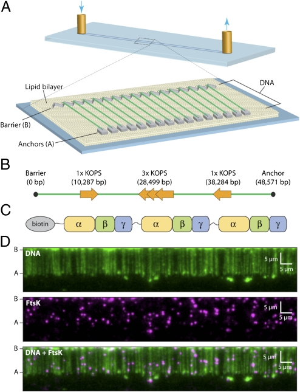
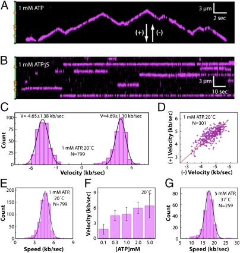
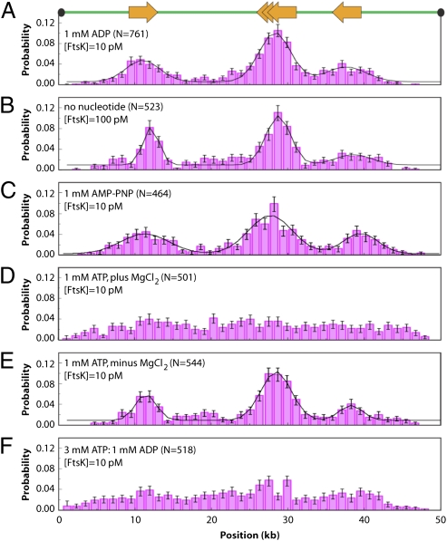
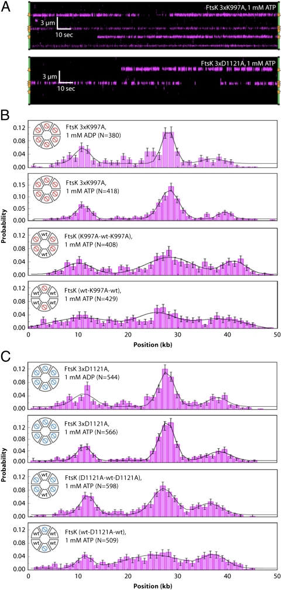
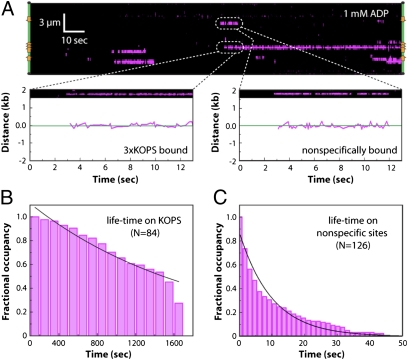
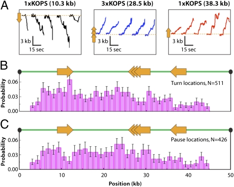

# Single-molecule imaging of DNA curtains reveals mechanisms of KOPS sequence targeting by the DNA translocase FtsK

**Ja Yil Lee\*, Ilya J. Finkelstein\*, Estelle Crozat, David J. Sherratt, and Eric C. Greene** (\* co-first authors)

*Proc. Natl. Acad. Sci. USA*, Volume 109, Issue 17, Pages 6531–6 (2012)

**DOI:** [10.1073/pnas.1201613109](https://doi.org/10.1073/pnas.1201613109)

---

## Table of Contents

- [Abstract](#abstract)
- [Results](#results)
- [Discussion](#discussion)
- [Materials and Methods](#materials-and-methods)
- [Acknowledgments](#acknowledgments)

---

##  Abstract
FtsK is a hexameric DNA translocase that participates in the final stages of bacterial chromosome segregation. Here we investigate the DNA-binding and translocation activities of FtsK in real time by imaging fluorescently tagged proteins on nanofabricated curtains of DNA. We show that FtsK preferentially loads at 8-bp KOPS (FtsK Orienting Polar Sequences) sites and that loading is enhanced in the presence of ADP. We also demonstrate that FtsK locates KOPS through a mechanism that does not involve extensive 1D diffusion at the scale of our resolution. Upon addition of ATP, KOPS-bound FtsK translocates in the direction dictated by KOPS polarity, and once FtsK has begun translocating it does not rerecognize KOPS from either direction. However, FtsK can abruptly change directions while translocating along DNA independent of KOPS, suggesting that the ability to reorient on DNA does not arise from DNA sequence-specific effects. Taken together, our data support a model in which FtsK locates KOPS through random collisions, preferentially engages KOPS in the ADP-bound state, translocates in the direction dictated by the polar orientation of KOPS, and is incapable of recognizing KOPS while translocating along DNA.
**Keywords:** single molecule, DNA curtains, ASCE translocase, target search, hexameric ATPase
* * *
FtsK is a membrane-bound DNA translocase that localizes to the division septum in bacteria and is essential for unlinking chromosome dimers that can arise after homologous recombination ([1](https://pmc.ncbi.nlm.nih.gov/articles/PMC3340036/#r1), [2](https://pmc.ncbi.nlm.nih.gov/articles/PMC3340036/#r2)). Failure to resolve these dimers prevents chromosome segregation and leads to cell death. In _Escherichia coli_ the tyrosine recombinase XerCD promotes dimer resolution at the 28-bp _dif_ site within the replication termination region. FtsK stimulates XerCD at _dif_ , and similar mechanisms for chromosome dimer resolution are found in other bacteria ([3](https://pmc.ncbi.nlm.nih.gov/articles/PMC3340036/#r3), [4](https://pmc.ncbi.nlm.nih.gov/articles/PMC3340036/#r4)).
_E. coli_ FtsK has an N-terminal integral membrane domain responsible for anchoring the protein to the septum and a C-terminal RecA-like motor domain, which are separated by a long (≈600 amino acids) proline/glutamine-rich linker region ([1](https://pmc.ncbi.nlm.nih.gov/articles/PMC3340036/#r1), [2](https://pmc.ncbi.nlm.nih.gov/articles/PMC3340036/#r2)). The motor domain has three subdomains, called α, β, and γ. FtsKαβ is a RecA-like ATPase that forms a homohexamer, which encircles DNA and couples the energy derived from ATP hydrolysis to translocation along DNA ([5](https://pmc.ncbi.nlm.nih.gov/articles/PMC3340036/#r5), [6](https://pmc.ncbi.nlm.nih.gov/articles/PMC3340036/#r6)). FtsKγ is a winged helix domain that binds to KOPS (FtsK Orienting Polar Sequences), an 8-mer DNA sequence that is overrepresented in the _E. coli_ genome and is preferentially oriented toward _dif_ ([7](https://pmc.ncbi.nlm.nih.gov/articles/PMC3340036/#r7), [8](https://pmc.ncbi.nlm.nih.gov/articles/PMC3340036/#r8)). During chromosome segregation, FtsK is guided toward the terminus region by KOPS, and upon reaching _dif_ , FtsKγ activates XerCD. Skewed sequences similar to KOPS are present in most bacteria, as are homologs of FtsK and XerCD ([3](https://pmc.ncbi.nlm.nih.gov/articles/PMC3340036/#r3), [4](https://pmc.ncbi.nlm.nih.gov/articles/PMC3340036/#r4)).
In vitro work has focused on the C-terminal FtsKαβγ motor domain, referred to as FtsK50C, or similar constructs ([5](https://pmc.ncbi.nlm.nih.gov/articles/PMC3340036/#r5)–[16](https://pmc.ncbi.nlm.nih.gov/articles/PMC3340036/#r16)). FtsK50C is a DNA-dependent ATPase, which can activate XerCD-_dif_ recombination ([6](https://pmc.ncbi.nlm.nih.gov/articles/PMC3340036/#r6)). Single-molecule studies have shown that FtsK50C translocates at ≈5 kb s−1 and resists stalling at forces up to 65 pN ([8](https://pmc.ncbi.nlm.nih.gov/articles/PMC3340036/#r8), [12](https://pmc.ncbi.nlm.nih.gov/articles/PMC3340036/#r12), [13](https://pmc.ncbi.nlm.nih.gov/articles/PMC3340036/#r13), [17](https://pmc.ncbi.nlm.nih.gov/articles/PMC3340036/#r17)). In addition, several studies have investigated how FtsK is guided toward _dif_ through interactions with KOPS ([7](https://pmc.ncbi.nlm.nih.gov/articles/PMC3340036/#r7)–[9](https://pmc.ncbi.nlm.nih.gov/articles/PMC3340036/#r9), [14](https://pmc.ncbi.nlm.nih.gov/articles/PMC3340036/#r14), [18](https://pmc.ncbi.nlm.nih.gov/articles/PMC3340036/#r18)). Early reports suggested that FtsK could recognize KOPS during translocation, enabling it to reorient while translocating ([7](https://pmc.ncbi.nlm.nih.gov/articles/PMC3340036/#r7), [8](https://pmc.ncbi.nlm.nih.gov/articles/PMC3340036/#r8), [14](https://pmc.ncbi.nlm.nih.gov/articles/PMC3340036/#r14), [19](https://pmc.ncbi.nlm.nih.gov/articles/PMC3340036/#r19)). However, other studies have suggested that KOPS acts only as a loading site for FtsK ([9](https://pmc.ncbi.nlm.nih.gov/articles/PMC3340036/#r9), [13](https://pmc.ncbi.nlm.nih.gov/articles/PMC3340036/#r13)).
Here we establish a DNA curtain assay that enables real-time visualization of FtsK activities. We directly visualize FtsK as it searches for and engages KOPS sites. Our data support a model in which FtsK locates KOPS through a mechanism that can be ascribed to a random 3D target search, with no evidence of long-distance 1D diffusion within our resolution limits, with the most efficient KOPS binding occurring in the presence of ADP. FtsK is also efficiently targeted to KOPS when ATP hydrolysis is prevented through the use of adenylyl imidodiphosphate (AMP-PNP), ATPγS, ATPase-deficient mutant proteins, or omission of MgCl2. However, ATP hydrolysis suppresses KOPS recognition, causing FtsK to bind nonspecific sites, which suggests the existence of ATP hydrolysis-mediated allosteric communication between the FtsKαβ motor and the KOPS-binding FtsKγ domain. We also monitor FtsK as it initiates translocation from KOPS and demonstrate that KOPS binding dictates the initial direction of FtsK movement. Subsequent encounters with KOPS have no influence on FtsK. Together our data help build a more complete picture of how FtsK interacts with KOPS and how these interactions are regulated by nucleotide cofactors.
---
##  Results
### Single-Molecule DNA Curtain Assay for Real-Time Imaging of FtsK Activity.
We developed a single-molecule fluorescence assay for visualizing the DNA-binding and translocation activities of FtsK using nanofabricated DNA curtains ([Fig. 1 _A_](#fig1) and [Fig. S1](http://www.pnas.org/lookup/suppl/doi:10.1073/pnas.1201613109/-/DCSupplemental/pnas.201201613SI.pdf?targetid=nameddest=SF1)) ([20](https://pmc.ncbi.nlm.nih.gov/articles/PMC3340036/#r20), [21](https://pmc.ncbi.nlm.nih.gov/articles/PMC3340036/#r21)). We used a λ-phage DNA (48,571 bp) bearing two naturally occurring single KOPS sites (1xKOPS), along with a sequence comprising three overlapping KOPS sites (3xKOPS) inserted within the phage genome ([Fig. 1 _B_](#fig1) and [_SI Materials and Methods_](http://www.pnas.org/lookup/suppl/doi:10.1073/pnas.1201613109/-/DCSupplemental/pnas.201201613SI.pdf?targetid=nameddest=STXT)). Rather than using FtsK50C, which is prone to aggregation, we used a linked trimer of FtsK, which lacks the N-terminal 50 amino acids that seem to be responsible for aggregation of FtsK50C ([22](https://pmc.ncbi.nlm.nih.gov/articles/PMC3340036/#r22)). Two FtsK trimers assemble to form a hexamer that retains the in vitro and in vivo activities of FtsK50C, as previously described ([22](https://pmc.ncbi.nlm.nih.gov/articles/PMC3340036/#r22)). Unless stated otherwise we refer to the linked FtsK trimer as FtsK, and all protein concentrations refer to the concentration of trimer. Use of the trimer is expected to bypass assembly steps otherwise required to make a hexameric motor from monomeric subunits ([_Discussion_](https://pmc.ncbi.nlm.nih.gov/articles/PMC3340036/#S2)). FtsK was expressed with an N-terminal 14-amino-acid tag that was biotinylated in vivo ([Fig. 1 _C_](#fig1) and [Fig. S2](http://www.pnas.org/lookup/suppl/doi:10.1073/pnas.1201613109/-/DCSupplemental/pnas.201201613SI.pdf?targetid=nameddest=SF2)). For imaging, FtsK was labeled by mixing with a 20-fold molar excess of streptavidin-conjugated quantum dots (QDs; [_SI Materials and Methods_](http://www.pnas.org/lookup/suppl/doi:10.1073/pnas.1201613109/-/DCSupplemental/pnas.201201613SI.pdf?targetid=nameddest=STXT)), allowing the proteins to be visualized while bound to the DNA curtains ([Fig. 1 _D_](#fig1)). Bulk assays confirmed that QD-tagged FtsK was active for ATP hydrolysis activity ([Fig. S3](http://www.pnas.org/lookup/suppl/doi:10.1073/pnas.1201613109/-/DCSupplemental/pnas.201201613SI.pdf?targetid=nameddest=SF3)).
***Fig. 1.***

Schematic representation of (_A_) nanofabricated double-tethered DNA curtain assay, (_B_) λ phage DNA bearing the two native 1xKOPS sites and the engineered 3xKOPS site, and (_C_) the covalently linked FtsK trimer with an N-terminal biotin tag. (_D_) Images of a double-tethered YOYO1-stained DNA curtain (green) bound by QD-tagged FtsK (magenta). The DNA, FtsK, and corresponding overlay are shown at _Top_ , _Middle_ , and _Bottom_ , respectively.
### Visualizing ATP-Dependent Translocation of FtsK.
FtsK translocated on the DNA in the presence of ATP ([Fig. 2 _A_](#fig2)). There was no evidence of translocation in reactions with ATPγS ([Fig. 2 _B_](#fig2)), AMP-PNP, ADP, no nucleotide, or in reactions using ATPase-deficient mutants (see below). Trajectories of single FtsK motors revealed abrupt changes in direction, as previously reported ([7](https://pmc.ncbi.nlm.nih.gov/articles/PMC3340036/#r7), [8](https://pmc.ncbi.nlm.nih.gov/articles/PMC3340036/#r8), [13](https://pmc.ncbi.nlm.nih.gov/articles/PMC3340036/#r13), [22](https://pmc.ncbi.nlm.nih.gov/articles/PMC3340036/#r22)), although these changes were not associated with KOPS ([Fig. 2 _A_](#fig2) and [Figs. S4](http://www.pnas.org/lookup/suppl/doi:10.1073/pnas.1201613109/-/DCSupplemental/pnas.201201613SI.pdf?targetid=nameddest=SF4) and [S5](http://www.pnas.org/lookup/suppl/doi:10.1073/pnas.1201613109/-/DCSupplemental/pnas.201201613SI.pdf?targetid=nameddest=SF5); see below). The velocities were the same in both directions ([Fig. 2 _C_](#fig2)), and the velocities of individual translocases were correlated in the forward (+) and reverse (−) directions ([Fig. 2 _A_](#fig2)), with a Pearson’s linear correlation of _r_ = 0.99 ([Fig. 2 _D_](#fig2)). FtsK displayed a mean (±SD) velocity of 4.66 ± 1.30 kb s−1 at 20 °C and 1 mM ATP ([Fig. 2 _E_](#fig2)), and the velocity scaled with ATP concentration, as expected ([Fig. 2 _F_](#fig2)) ([12](https://pmc.ncbi.nlm.nih.gov/articles/PMC3340036/#r12), [17](https://pmc.ncbi.nlm.nih.gov/articles/PMC3340036/#r17)). These results verified that the movement of FtsK was ATP-dependent translocation.
***Fig. 2.***

(_A_) Kymogram illustrating ATP-dependent translocation of QD-tagged FtsK (magenta) along a single DNA molecule (unlabeled). Transient gaps in the magenta signal correspond to QD blinking. The location of the KOPS sites is illustrated schematically on the left, and arrowheads indicate the arbitrarily assigned (+) and (-) designations for translocation direction. (_B_) Example of FtsK bound to DNA in the presence of ATPγS. (_C_) Velocity distribution with data segregated into (+) and (−) directions. (_D_) Scatter plot showing the relationship between (+) and (−) direction velocities for individual molecules of translocating FtsK. The red line illustrates a fit to the data and yields a slope of 1. (_E_) Velocity distribution histogram comprising the combined (+) and (−) velocity data sets, revealing a mean velocity of V = 4.66 ± 1.3 kb s−1. (_F_) Translocation velocities at varying concentrations of ATP. (_G_) Velocity distributions for data collected at 37 °C and 5 mM ATP, revealing a mean velocity of V = 17.5 ± 3.5 kb s−1.
### FtsK Is the Fastest Characterized DNA Translocase.
Previous studies have shown that FtsK can translocate at a mean velocity of ≈5 kb s−1 at 20–25 °C ([11](https://pmc.ncbi.nlm.nih.gov/articles/PMC3340036/#r11)–[13](https://pmc.ncbi.nlm.nih.gov/articles/PMC3340036/#r13), [17](https://pmc.ncbi.nlm.nih.gov/articles/PMC3340036/#r17), [22](https://pmc.ncbi.nlm.nih.gov/articles/PMC3340036/#r22)). However, bulk ATPase assays revealed a peak for FtsK DNA-dependent ATP hydrolysis activity above this temperature range ([Fig. S6](http://www.pnas.org/lookup/suppl/doi:10.1073/pnas.1201613109/-/DCSupplemental/pnas.201201613SI.pdf?targetid=nameddest=SF6)), suggesting that FtsK might be able to translocate even faster than has been reported. Therefore, we tested whether ≈5 kb s−1 observed at 20 °C reflected the maximum velocity of FtsK, or whether the translocase could travel even faster. Remarkably, the velocity of FtsK translocation increased to 17.5 ± 3.5 kb s−1 at 37 °C ([Fig. 2 _G_](#fig2)). The optimal temperature for ATP hydrolysis by FtsK (43–47 °C) is outside the accessible range of our current instrumentation, suggesting that FtsK might translocate even faster than the observed maximum.
### ADP Stimulates Loading of FtsK at KOPS.
We sought to determine whether FtsK was targeted to KOPS during initial binding to the DNA. In the presence of ADP, FtsK (10 pM) displayed a preference for the KOPS sites present in the λ-phage substrate ([Fig. 3 _A_](#fig3)). Binding was detected at both 1xKOPS and at 3xKOPS, and removing the 3xKOPS site eliminated the central peak ascribed to 3xKOPS binding but did not affect binding to the other two naturally occurring KOPS sites in the DNA substrate ([Fig. S7](http://www.pnas.org/lookup/suppl/doi:10.1073/pnas.1201613109/-/DCSupplemental/pnas.201201613SI.pdf?targetid=nameddest=SF7)).
***Fig. 3.***

(_A–F_) Binding distribution histograms for QD-tagged FtsK in the presence of the indicated nucleotide cofactor. All reactions were conducted in buffer containing 100 mM NaCl. For _D_ and _F_ , the reported distribution corresponds to the first detected binding position of FtsK molecules before their translocation away from the initial binding sites ([Fig. S9](http://www.pnas.org/lookup/suppl/doi:10.1073/pnas.1201613109/-/DCSupplemental/pnas.201201613SI.pdf?targetid=nameddest=SF9) and [_SI Materials and Methods_](http://www.pnas.org/lookup/suppl/doi:10.1073/pnas.1201613109/-/DCSupplemental/pnas.201201613SI.pdf?targetid=nameddest=STXT)). The relative locations of the KOPS sites are illustrated schematically in _A_.
In the absence of nucleotides the DNA-binding activity of FtsK was reduced, with no binding detected at 10 pM FtsK. However, when the concentration of FtsK was increased to 100 pM, our assays revealed KOPS-specific association of FtsK in the absence of nucleotide cofactor ([Fig. 3 _B_](#fig3)). A preference for KOPS was also observed when ADP was replaced with AMP-PNP ([Fig. 3 _C_](#fig3)) or ATPγS ([Fig. S8](http://www.pnas.org/lookup/suppl/doi:10.1073/pnas.1201613109/-/DCSupplemental/pnas.201201613SI.pdf?targetid=nameddest=SF8)). These results show that under our in vitro conditions FtsK has an intrinsic preference for binding KOPS and that nucleotide cofactors increase the affinity of FtsK for DNA. These results imply that although FtsKγ is responsible for recognizing and binding KOPS, additional binding stability is provided by FtsKαβ when in the nucleotide-bound state.
### ATP Hydrolysis Suppresses KOPS Specificity.
To determine the influence of ATP hydrolysis on DNA-binding activity we asked whether FtsK was targeted to KOPS in the presence of ATP. FtsK actively translocates in reactions with ATP ([Fig. 2](#fig2)), therefore binding distributions built from data collected in the presence of ATP reflect only the initial binding locations ([Fig. S9](http://www.pnas.org/lookup/suppl/doi:10.1073/pnas.1201613109/-/DCSupplemental/pnas.201201613SI.pdf?targetid=nameddest=SF9) and [_SI Materials and Methods_](http://www.pnas.org/lookup/suppl/doi:10.1073/pnas.1201613109/-/DCSupplemental/pnas.201201613SI.pdf?targetid=nameddest=STXT)). Surprisingly, KOPS-specific binding was eliminated in the presence of ATP ([Fig. 3 _D_](#fig3)). To determine whether the loss of KOPS specificity seen with ATP was due to the presence of ATP or reflected an effect of actual ATP hydrolysis, we measured the binding distribution of FtsK in reactions containing ATP, where 1 mM MgCl2 was replaced with 1 mM EDTA. Omission of MgCl2 restored KOPS binding in reactions with ATP, indicating that the loss of KOPS specificity could be attributed to ATP hydrolysis ([Fig. 3 _E_](#fig3)). We also assessed KOPS binding in a 3:1 mixture of ATP to ADP ([Fig. 3 _F_](#fig3)), as well as an order-of-addition experiment in which FtsK was preincubated with ADP and then chased with ATP before DNA binding ([Fig. S8 _B_](http://www.pnas.org/lookup/suppl/doi:10.1073/pnas.1201613109/-/DCSupplemental/pnas.201201613SI.pdf?targetid=nameddest=SF8)). Neither condition revealed KOPS binding, although there was very modest evidence of KOPS loading when FtsK was preincubated with ADP and then loaded onto the DNA in a 3:1 ATP:ADP mixture. We conclude that KOPS recognition by FtsK was suppressed even at physiologically relevant ratios of ADP to ATP.
### FtsK Walker A and Walker B Mutants Are Targeted to KOPS.
We next assayed the FtsK Walker A (K997A) and Walker B (D1121A) mutants using trimeric FtsK wherein all of the subunits were mutated ([22](https://pmc.ncbi.nlm.nih.gov/articles/PMC3340036/#r22)). Neither mutant could translocate on DNA ([Fig. 4 _A_](#fig4)), although both were targeted to KOPS in the presence of ADP ([Fig. 4 _B_ and _C_](#fig4), _Upper_). In contrast to WT FtsK, KOPS recognition by FtsK Walker mutants was not suppressed by ATP ([Fig. 4 _B_ and _C_](#fig4)). These results suggest that KOPS loading occurs when FtsK is unable to hydrolyze ATP. Therefore, if FtsK loads at KOPS in vivo, then mechanisms may exist to suppress ATP hydrolysis until the hexamer is fully assembled at KOPS.
***Fig. 4.***

KOPS recognition by ATPase defective mutants of FtsK. (_A_) Kymograms (_Upper_) for the FtsK 3xK997A Walker A mutant and the Walker B 3xD1121A mutant. (_B_) Binding distributions for the K997A FtsK Walker A mutants, as indicated. (_C_) Binding distributions of D1121A mutants, as indicated. All reactions used 10 pM mutated FtsK trimer and contained 100 mM NaCl. The relative number and location of the mutant and WT subunits within the FtsK hexamers are schematically illustrated in _B_ and _C_.
Next we tested whether KOPS recognition was disrupted when a subset of ATPase active sites were mutated. We took advantage of the trimeric FtsK constructs to generate hexamers with either two or four mutated subunits ([22](https://pmc.ncbi.nlm.nih.gov/articles/PMC3340036/#r22)), as illustrated in [Fig. 4 _B_ and _C_](#fig4). These experiments revealed that the KOPS binding specificity of the Walker mutants in the presence of ATP was related to the number of mutant subunits within the hexamer: FtsK bearing six mutant subunits bound specifically to KOPS, and hexamers with four mutant subunits showed intermediate KOPS specificity, whereas hexamers with just two mutated subunits displayed greatly reduced KOPS specificity, albeit not as reduced as the WT enzyme ([Fig. 4 _B_ and _C_](#fig4)). We conclude that the ability of FtsK to bind KOPS is enhanced when ATP hydrolysis is prevented and that the extent of this effect scales with the number of mutated subunits within the hexamer.
### Real-Time Visualization of FtsK Binding to KOPS.
We next asked how FtsK was targeted to specific sites by visualizing QD-tagged FtsK in real time as it searched for and engaged KOPS. As shown in [Fig. 5 _A_](#fig5), FtsK could bind DNA at either nonspecific sites or at the KOPS sites in the presence of ADP. When FtsK encountered KOPS it remained bound with a lifetime of ≈1,700 s, with ≈30% of the proteins remaining bound to KOPS beyond the duration of the measurements ([Fig. 5 _A_ and _B_](#fig5)). When FtsK engaged nonspecific sites it exhibited a half-life of 10 ± 0.6 s before dissociating ([Fig. 5 _A_ and _C_](#fig5)). There was no evidence for 1D diffusion of FtsK along the DNA within our current spatial (±30-nm) resolution limits, although we cannot rule out the possibility that FtsK may undergo 1D diffusion below our current resolution limits.
***Fig. 5.***

Real-time visualization of KOPS targeting by FtsK. (_A_) Kymogram showing the initial association of FtsK with the λ-phage substrate in a reaction containing 1 mM ADP. Examples of nonspecific and KOPS-specific binding are highlighted and shown along with the corresponding particle tracking data. (_B_) Binding distribution lifetimes of FtsK bound to KOPS. (_C_) Binding distribution lifetimes of FtsK bound to nonspecific sites. Specific and nonspecific binding data were collected at 1 mM ADP, and black lines correspond to single exponential fits to the data.
### KOPS-Bound FtsK Translocates in a Defined Direction.
To determine whether KOPS conferred orientation specificity with respect to the translocation direction, we conducted assays in which FtsK was prebound to KOPS in the presence of ADP. DNA translocation then was initiated by flushing 20 mM ATP into the sample chamber; the high concentration of ATP was used to mitigate any dilution effects arising from flow heterogeneity within the microfluidics. When KOPS-bound FtsK was chased with ATP, the initial direction of translocation was dictated by the orientation of KOPS for 100% of the FtsK molecules bound to the 3xKOPS site (_n_ = 40 of 40) and 87.5% of those bound to the 1xKOPS sites (_n_ = 35 of 40) ([Fig. 6 _A_](#fig6)). These results confirm that the orientation of KOPS defines the initial translocation direction of KOPS-bound FtsK.
***Fig. 6.***

KOPS dictates translocation direction only upon initial loading. (_A_) Examples of tracking data showing that FtsK leaves KOPS in the direction dictated by the orientation of KOPS. The relative orientation of each is depicted with arrows, and the location of each KOPS site is indicated with a dashed orange line. Fifteen seconds of each trajectory are shown. (_B_ and _C_) Histograms showing (_B_) positions at which FtsK changed direction or (_C_) paused. Pauses were defined as five consecutive frames with no detectable movement. The first and last bins were excluded from the binding distributions in _B_ and _C_ to avoid biasing the data due to FtsK collisions with the barriers.
### FtsK Does Not Recognize KOPS While Translocating on DNA.
To determine whether KOPS influenced the behavior of FtsK during translocation we followed the trajectories of fluorescently tagged FtsK as they encountered KOPS. We found no evidence that FtsK changed directions or paused upon encountering KOPS in either orientation ([Fig. 6 _B_ and _C_](#fig6)). These findings show that translocating FtsK does not reorient upon encountering KOPS, which is in agreement with recent bulk biochemical data ([9](https://pmc.ncbi.nlm.nih.gov/articles/PMC3340036/#r9)). We conclude that translocating FtsK is not functionally affected by encounters with KOPS in either orientation, implying that the only time at which KOPS is able to influence the behavior of FtsK is upon initial DNA binding.
---
##  Discussion
We have established a system for studying FtsK in vitro using nanofabricated DNA curtains and QD-tagged FtsK, providing a powerful tool for studying the properties of hexameric motor proteins. Our assays enable us to directly visualize DNA binding independent of translocation, which was not possible with previous approaches. Collectively, our results support a model wherein FtsK locates KOPS through random collisions and preferentially binds KOPS while in the ADP-bound state or when ATP hydrolysis is prohibited. Once assembled at KOPS, FtsK translocates in the direction dictated by KOPS but is not functionally affected by encounters with KOPS during translocation.
### Model for KOPS-Specific Loading of FtsK in the Absence of ATP Hydrolysis.
Our data suggest that FtsK is preferentially loaded at KOPS only under conditions in which ATP hydrolysis is prevented. This finding contrasts with bulk biochemical assays, which have suggested that FtsK loads at KOPS when ATP is used as the nucleotide cofactor ([9](https://pmc.ncbi.nlm.nih.gov/articles/PMC3340036/#r9)). One explanation for this discrepancy is that prior bulk assays used relatively short DNA substrates with a correspondingly high density of KOPS sites, ranging from 1 KOPS per 30 bp up to 1 KOPS per 336 bp. In contrast, there is only 1 KOPS site per ≈12 kb in the _E. coli_ chromosome, and this lower density is closely reflected by the 1 KOPS per ≈10 kb used in our single-molecule assays. It is possible that FtsK more readily discriminates between specific and nonspecific sites in the presence of ATP when KOPS is present at relatively high density.
Our finding that FtsK preferentially loads at KOPS only in the absence of ATP hydrolysis leads to the hypothesis that in vivo FtsK may be loaded onto KOPS under conditions in which ATP hydrolysis is prevented until the hexamer is completely assembled, thus ensuring initial suppression of nonspecific DNA-binding activity, so that FtsK can translocate in the proper direction with respect to the chromosomal location of _dif_. Given the abundance of ATP in vivo, and the finding that KOPS recognition is suppressed even in ADP/ATP mixtures, we speculate that cooperative stepwise assembly of FtsK hexamers from monomeric subunits at KOPS may be used as a mechanism for regulating the initiation of translocation, as previously suggested ([5](https://pmc.ncbi.nlm.nih.gov/articles/PMC3340036/#r5), [6](https://pmc.ncbi.nlm.nih.gov/articles/PMC3340036/#r6), [9](https://pmc.ncbi.nlm.nih.gov/articles/PMC3340036/#r9), [23](https://pmc.ncbi.nlm.nih.gov/articles/PMC3340036/#r23)). Such a model would presume that complete hexamer assembly from monomers is inefficient on nonspecific DNA and that ATP hydrolysis is inhibited until the hexamer is fully assembled at KOPS. Our use of the covalently linked trimer bypasses such an assembly driven mechanism for enhancing KOPS specificity by allowing more efficient binding to nonspecific DNA in the presence of ATP, thus revealing the otherwise unanticipated influence of ATP on KOPS recognition.
### Evidence for Allosteric Communication Between FtsKγ and FtsKαβ.
The possibility of allosteric communication between FtsKγ and FtsKαβ has been previously proposed, based on the close proximity of the ATP-binding pocket to the presumed interface between the different FtsK domains ([18](https://pmc.ncbi.nlm.nih.gov/articles/PMC3340036/#r18)). The ATPase active sites are located in FtsKαβ, whereas KOPS is recognized by FtsKγ; thus our finding that ATP hydrolysis abrogates KOPS specificity is consistent with the hypothesis that FtsKαβ is allosterically coupled to FtsKγ, such that it no longer recognizes KOPS when FtsKαβ is hydrolyzing ATP. Further evidence for communication between FtsKαβ and FtsKγ is provided by our finding that there was a ≈10-fold increase in the affinity of FtsK for DNA, without loss of KOPS specificity, in the presence of nucleotides relative to reactions lacking nucleotide cofactor.
A requirement for communication between FtsKγ and FtsKαβ may arise from the need for FtsK to translocate away from KOPS. As previously reported, interactions between FtsKγ and KOPS would have to be disrupted before the motor could begin translocating, otherwise FtsKγ could act as a “brake” preventing movement away from KOPS ([18](https://pmc.ncbi.nlm.nih.gov/articles/PMC3340036/#r18)). Allosteric interactions between FtsKαβ and FtsKγ upon assembly of an ATPase active hexamer at KOPS could be used to coordinate disruption of FtsKγ–KOPS interactions with translocation away from KOPS. Crystal structures reveal that three adjacent FtsKγ monomers interact cooperatively with a single KOPS site by assembling into a screw-like configuration that follows the pitch of the DNA ([18](https://pmc.ncbi.nlm.nih.gov/articles/PMC3340036/#r18)). Surprisingly, the helical structure formed by FtsKγ is not in register with the FtsKαβ hexameric ring. One possibility is that ATP hydrolysis by FtsKαβ alters the angular register of FtsKγ, such that it is no longer in an optimal configuration for cooperative binding to KOPS. Such a mechanism would allow translocation away from KOPS without FtsKγ impeding forward progression and would also provide an explanation for why FtsK does not recognize KOPS as it translocates along DNA.
### FtsKαβγ Is Targeted to KOPS Through a Mechanism Involving Random 3D Collisions.
The ability of proteins to locate specific targets among a vast excess of nonspecific DNA is a fundamental theme in biology, yet basic principles governing these search mechanisms remain poorly understood ([24](https://pmc.ncbi.nlm.nih.gov/articles/PMC3340036/#r24)–[26](https://pmc.ncbi.nlm.nih.gov/articles/PMC3340036/#r26)). The advent of single-molecule imaging technologies ([26](https://pmc.ncbi.nlm.nih.gov/articles/PMC3340036/#r26)), along with new NMR methodologies ([27](https://pmc.ncbi.nlm.nih.gov/articles/PMC3340036/#r27), [28](https://pmc.ncbi.nlm.nih.gov/articles/PMC3340036/#r28)), have fueled new interest in the target search problem. However, to date no published single-molecule study has directly revealed the so-called “search-to-capture” mechanism for any site-specific DNA-binding protein ([29](https://pmc.ncbi.nlm.nih.gov/articles/PMC3340036/#r29)). At a microscopic scale, QD-FtsK seems to locate KOPS through 3D collisions and exhibits no evidence of 1D diffusion along the DNA within our resolution limits, although we emphasize that we cannot yet address whether FtsK slides short distances below our current resolution limits (±30 nm, equivalent to ≈230 bp) during the target search process. In addition, we cannot formally rule out the possibility that FtsK might search for target sites by intersegmental transfer because the DNA in our assays cannot form the loops necessary for this mode of target searching. However, because FtsK can find KOPS in our assay, we conclude that intersegmental transfer cannot be an obligatory component of the FtsK target search processes.
Target search processes involving site-specific DNA-binding proteins are typically thought of within the context of proteins that can undergo free diffusion. However, FtsK is normally anchored to the division septum through its N-terminal integral membrane domain, and chromosomes undergoing segregation are threaded through this septum as they pass into new daughter cells. This geometry would seemingly preclude FtsK from undergoing a free diffusive search throughout the bacterial genome, and therefore we envision that FtsK searches for KOPS through a mechanism involving random sampling of the DNA as the genome is being pulled through the division septum. The _dif_ activation zone of the chromosome encompasses a ≈400-kb segment within the terminus region and contains a total of 34 KOPS sites in the correct orientation to direct FtsK toward _dif_ ([30](https://pmc.ncbi.nlm.nih.gov/articles/PMC3340036/#r30)). This large number of sites could help ensure that FtsK engages KOPS. Thus, the organization of the division septum, along with the locally high protein and DNA concentrations expected within the septum, and the high density of KOPS sites within the _dif_ activation zone could enhance KOPS-specific targeting in vivo.
### Pauses and Reversals During FtsK Translocation Are Independent of KOPS.
Our results show that FtsK initially translocates in the direction dictated by the polarity of KOPS. The motor can pause or change directions while translocating on DNA, but it does not do so in response to KOPS. We do not yet understand this phenomenon, although there are at least two reasonable explanations: (_i_) FtsK might be bound to the DNA as double hexamers of opposing polarity, with one hexamer in an “on” state capable of ATP-driven translocation and the other in an “off” state—coordinated switching between “on” and “off” states would then give rise to apparent changes in direction; or (_ii_) a single FtsK hexamer may spontaneously dissociate from the DNA but then quickly reassemble in the opposite orientation, which would give rise to a change in the translocation direction. The strong correlation found between the forward and reverse translocation directions for individually tracked proteins ([Fig. 2 _D_](#fig2)) implies that the changes in translocation direction arise from the behavior of single FtsK hexamers, rather than from the action of two different FtsK hexamers. The mechanism of FtsK reversal will be the subject of future studies; however, it is important to consider the potential impacts of changes in FtsK translocation direction for an in vivo scenario. For instance, it would be difficult for FtsK to maintain polarity in vivo if the motor domains spontaneously changed directions in the absence of a rectifying mechanism. Spontaneous reversals would likely be deleterious during chromosome segregation, suggesting that mechanisms may be in place to limit their occurrence once FtsK was properly loaded at KOPS. One possibility is that the isolated motor domains do not fully recapitulate the functional attributes of a full-length FtsK hemaxer anchored within the confines of the division septum, and that the organization and geometry of the septum may itself have an important regulatory impact on the behavior of FtsK. Alternatively, there may be unrecognized protein factors that interact with FtsK to rectify its motion during translocation. Future work will be essential to understand how these higher levels of cellular organization and/or interactions with other proteins may affect the activities of FtsK.
---
##  Materials and Methods
### DNA Curtains.
Double-tethered curtains were made as previously described ([20](https://pmc.ncbi.nlm.nih.gov/articles/PMC3340036/#r20), [21](https://pmc.ncbi.nlm.nih.gov/articles/PMC3340036/#r21)). In brief, after deposition of the bilayer, the sample chamber was flushed with buffer A [10 mM Tris·HCl (pH 7.8) and 100 mM NaCl] containing 30 μg mL−1 of anti-DIG Fab (Roche catalog no. 1214667001) and then incubated for 20 min to allow the Fab fragments to adsorb to the pentagons. The chamber was then flushed with buffer B [40 mM Tris·HCl (pH 8.0), 50 mM NaCl, 0.2 mg/mL BSA, and 2 mM MgCl2) for 5 min. Streptavidin (0.02 mg mL−1) in buffer B was then injected into the sample chamber and incubated for 20 min. After rinsing with additional buffer B, λ-DNA (15–20 pM) labeled at one end with biotin and at the other end with DIG ([_SI Materials and Methods_](http://www.pnas.org/lookup/suppl/doi:10.1073/pnas.1201613109/-/DCSupplemental/pnas.201201613SI.pdf?targetid=nameddest=STXT) and [Table S1](http://www.pnas.org/lookup/suppl/doi:10.1073/pnas.1201613109/-/DCSupplemental/pnas.201201613SI.pdf?targetid=nameddest=ST1)) was injected, incubated for 10 min, and unbound DNA was removed by flushing with buffer at 0.3 mL min−1. Application of flow aligned the DNA molecules along the diffusion barriers and stretched the molecules so the free ends could attach to the pentagons.
### Single-Molecule Assays.
FtsK was expressed and purified as previously described ([22](https://pmc.ncbi.nlm.nih.gov/articles/PMC3340036/#r22)). Biotinylated FtsK was conjugated to streptavidin-labeled QDs (Qdot 705; Invitrogen) in reaction mixes containing 0.4 μM streptavidin-QD and 20 nM FtsK (trimer) in buffer B. Reactions were incubated on ice for 10 min. Before use, the QD-tagged FtsK was diluted to a final concentration of 1–100 pM (as indicated), into reaction buffer [40 mM Tris·HCl (pH 8.0), 2 mM DTT, 2 mM MgCl2, 0.2 mg ml−1 BSA, 50 or 100 mM NaCl (as indicated), 0.3 nM YOYO-1, gloxy, and 1.6% (wt/vol) glucose, along with the indicated nucleotide conditions]. All reactions also contained ≈1 mM free biotin. Nucleotide cofactors were included as indicated.
### Data Analysis.
Position distribution measurements were made by fitting the QD signals from DNA-bound proteins to 2D Gaussian functions, as previously described ([31](https://pmc.ncbi.nlm.nih.gov/articles/PMC3340036/#r31)). Error bars on the distribution measurements represent 70% confidence intervals obtained through bootstrap analysis of the distribution data.

---
##  Acknowledgments
This work was supported by National Institutes of Health (NIH) Grant GM074739 (to E.C.G.), NIH Grants F32GM80864 and 1K99GM097177 (to I.J.F), a National Science Foundation Presidential Early Career Award for Scientists and Engineers (PECASE) Award (to E.C.G.), and Wellcome Trust Program Grant WT083469 (to D.J.S.). J.Y.L. was supported in part by Korea Research Foundation Grant KRF-2008-357-C00048 funded by the Korean Government. E.C. was supported in part by a European Molecular Biology Organization (EMBO) short-term fellowship.

---

## References

1. Sherratt DJ, Arciszewska LK, Crozat E, Graham JE, Grainge I. "The Escherichia coli DNA translocase FtsK." Biochem Soc Trans. 2010;38:395–398.

2. Barre FX. "FtsK and SpoIIIE: The tale of the conserved tails." Mol Microbiol. 2007;66:1051–1055.

3. Carnoy C, Roten CA. "The dif/Xer recombination systems in proteobacteria." PLoS ONE. 2009;4:e6531.

4. Kono N, Arakawa K, Tomita M. "Comprehensive prediction of chromosome dimer resolution sites in bacterial genomes." BMC Genomics. 2011;12:19.

5. Massey TH, Mercogliano CP, Yates J, Sherratt DJ, Löwe J. "Double-stranded DNA translocation: Structure and mechanism of hexameric FtsK." Mol Cell. 2006;23:457–469.

6. Aussel L, et al. "FtsK Is a DNA motor protein that activates chromosome dimer resolution by switching the catalytic state of the XerC and XerD recombinases." Cell. 2002;108:195–205.

7. Bigot S, et al. "KOPS: DNA motifs that control E. coli chromosome segregation by orienting the FtsK translocase." EMBO J. 2005;24:3770–3780.

8. Levy O, et al. "Identification of oligonucleotide sequences that direct the movement of the Escherichia coli FtsK translocase." Proc Natl Acad Sci USA. 2005;102:17618–17623.

9. Graham JE, Sherratt DJ, Szczelkun MD. "Sequence-specific assembly of FtsK hexamers establishes directional translocation on DNA." Proc Natl Acad Sci USA. 2010;107:20263–20268.

10. Grainge I, Lesterlin C, Sherratt DJ. "Activation of XerCD-dif recombination by the FtsK DNA translocase." Nucleic Acids Res. 2011;39:5140–5148.

11. Pease PJ, et al. "Sequence-directed DNA translocation by purified FtsK." Science. 2005;307:586–590.

12. Saleh OA, Pérals C, Barre FX, Allemand JF. "Fast, DNA-sequence independent translocation by FtsK in a single-molecule experiment." EMBO J. 2004;23:2430–2439.

13. Bigot S, Saleh OA, Cornet F, Allemand JF, Barre FX. "Oriented loading of FtsK on KOPS." Nat Struct Mol Biol. 2006;13:1026–1028.

14. Sivanathan V, et al. "The FtsK gamma domain directs oriented DNA translocation by interacting with KOPS." Nat Struct Mol Biol. 2006;13:965–972.

15. Marquis KA, et al. "SpoIIIE strips proteins off the DNA during chromosome translocation." Genes Dev. 2008;22:1786–1795.

16. Ptacin JL, et al. "Sequence-directed DNA export guides chromosome translocation during sporulation in Bacillus subtilis." Nat Struct Mol Biol. 2008;15:485–493.

17. Saleh OA, Bigot S, Barre FX, Allemand JF. "Analysis of DNA supercoil induction by FtsK indicates translocation without groove-tracking." Nat Struct Mol Biol. 2005;12:436–440.

18. Löwe J, et al. "Molecular mechanism of sequence-directed DNA loading and translocation by FtsK." Mol Cell. 2008;31:498–509.

19. Ptacin JL, Nöllmann M, Bustamante C, Cozzarelli NR. "Identification of the FtsK sequence-recognition domain." Nat Struct Mol Biol. 2006;13:1023–1025.

20. Gorman J, Fazio T, Wang F, Wind S, Greene EC. "Nanofabricated racks of aligned and anchored DNA substrates for single-molecule imaging." Langmuir. 2010;26:1372–1379.

21. Greene EC, Wind S, Fazio T, Gorman J, Visnapuu ML. "DNA curtains for high-throughput single-molecule optical imaging." Methods Enzymol. 2010;472:293–315.

22. Crozat E, et al. "Separating speed and ability to displace roadblocks during DNA translocation by FtsK." EMBO J. 2010;29:1423–1433.

23. Kennedy SP, Chevalier F, Barre FX. "Delayed activation of Xer recombination at dif by FtsK during septum assembly in Escherichia coli." Mol Microbiol. 2008;68:1018–1028.

24. von Hippel PH, Berg OG. "Facilitated target location in biological systems." J Biol Chem. 1989;264:675–678.

25. Halford SE, Marko JF. "How do site-specific DNA-binding proteins find their targets?" Nucleic Acids Res. 2004;32:3040–3052.

26. Gorman J, Greene EC. "Visualizing one-dimensional diffusion of proteins along DNA." Nat Struct Mol Biol. 2008;15:768–774.

27. Doucleff M, Clore GM. "Global jumping and domain-specific intersegment transfer between DNA cognate sites of the multidomain transcription factor Oct-1." Proc Natl Acad Sci USA. 2008;105:13871–13876.

28. Iwahara J, Zweckstetter M, Clore GM. "NMR structural and kinetic characterization of a homeodomain diffusing and hopping on nonspecific DNA." Proc Natl Acad Sci USA. 2006;103:15062–15067.

29. Halford SE. "An end to 40 years of mistakes in DNA-protein association kinetics?" Biochem Soc Trans. 2009;37:343–348.

30. Deghorain M, et al. "A defined terminal region of the E. coli chromosome shows late segregation and high FtsK activity." PLoS ONE. 2011;6:e22164.

31. Gorman J, Plys AJ, Visnapuu ML, Alani E, Greene EC. "Visualizing one-dimensional diffusion of eukaryotic DNA repair factors along a chromatin lattice." Nat Struct Mol Biol. 2010;17:932–938.

---

*Archived from [PubMed Central (PMC3340036)](https://pmc.ncbi.nlm.nih.gov/articles/PMC3340036/) on 2025-07-19.*
