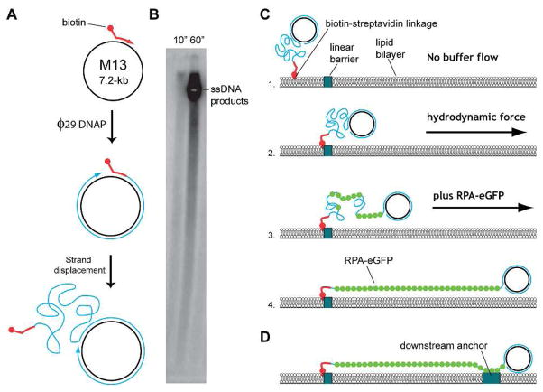
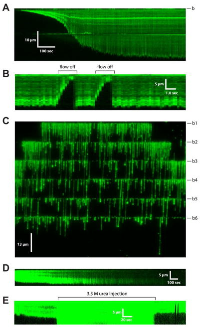
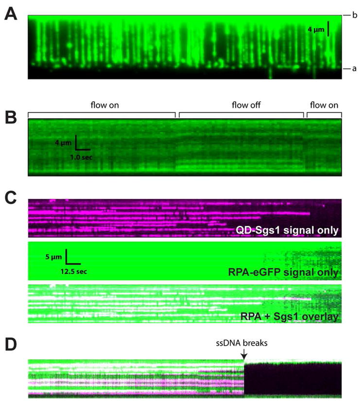

# Single-Stranded DNA Curtains for Real-Time Single-Molecule Visualization of Protein–Nucleic Acid Interactions

**Bryan Gibb, Tim D. Silverstein, Ilya J. Finkelstein, and Eric C. Greene**

*Anal. Chem.*, Volume 84, Issue 18, Pages 7607–12 (2012)

**DOI:** [10.1021/ac302117z](https://doi.org/10.1021/ac302117z)

---

## Table of Contents

- [Abstract](#abstract)
- [Introduction](#introduction)
- [Experimental Section](#experimental-section)
- [Acknowledgments](#acknowledgments)

---

##  Abstract
Single-molecule imaging of biological macromolecules has dramatically impacted our understanding of many types of biochemical reactions. To facilitate these studies we have established new strategies for anchoring and organizing DNA molecules on the surfaces of microfluidic sample chambers that are otherwise coated with fluid lipid bilayers. This previous work was reliant upon the use of double-stranded DNA, precluding access to information on biological processes involving single-stranded nucleic acid substrates. Here we present procedures for aligning and visualizing single-stranded DNA molecules along the leading edges of nanofabricated barriers to lipid diffusion, in both “single-tethered” and “double-tethered” experimental formats. This new single-molecule approach provides long-awaited access to critical biological reactions involving single-stranded DNA binding proteins.
**Keywords:** DNA curtains, homologous DNA recombination, single-stranded DNA, Replication protein A
---
##  Introduction
Protein-nucleic acid interactions contribute to all aspects of gene expression, genome maintenance, and DNA replication, and defects in protein-nucleic acid interactions are often the underlying causes of genetic diseases and cancer. Single-molecule methodologies have begun providing remarkable new information regarding the molecular details of reactions involving proteins and either DNA or RNA. However, it is challenging to acquire statistically meaningful data from technically demanding experiments designed to look at individual biochemical reactions, and this problem is compounded for cases where the biological molecules under investigation are heterogeneous and/or the reaction trajectories contain transient intermediates. In addition, most single-molecule techniques require that the molecules under investigation be physically anchored to a solid support. Extensive controls are essential to verify that surface tethering does not interfere with biological function. To help overcome these problems, we have developed new experimental strategies for organizing thousands of individual DNA molecules into defined patterns on the surfaces of microfluidic sample chambers coated with lipid bilayers that mimic cell membrane. We refer to these methodologies as “DNA curtains”, and they are assembled by tethering one end of a biotinylated DNA molecule to a lipid bilayer, which coats the surface of a microfluidic sample chamber.[1](https://pmc.ncbi.nlm.nih.gov/articles/PMC3475199/#R1)–[5](https://pmc.ncbi.nlm.nih.gov/articles/PMC3475199/#R5) The bilayer provides an inert environment compatible with a range of biological macromolecules. DNA is tethered to the bilayer via a biotin-streptavidin linkage, permitting the DNA to diffuse in two-dimensions. Hydrodynamic force is used to organize the DNA along nanofabricated barriers that disrupt the continuity of the bilayer. Lipids cannot traverse these barriers, therefore the molecules align along the barriers, and extend parallel to the sample chamber surface allowing them to be visualized by total internal reflection fluorescence microscopy (TIRFM). The barriers are made by electron-beam lithography, and variations in barrier patterns allow precise control over the organization of the DNA. DNA curtains enable direct visualization of hundreds or even thousands of individual DNA molecules along with any proteins bound to the DNA by real-time fluorescence microscopy, and the molecules themselves are confined within a within a “bio-friendly” microenvironment that minimizes nonspecific interactions with the sample chamber surface.[6](https://pmc.ncbi.nlm.nih.gov/articles/PMC3475199/#R6)–[9](https://pmc.ncbi.nlm.nih.gov/articles/PMC3475199/#R9)
Single-stranded DNA (ssDNA) is a key intermediate in nearly all biochemical reactions related to the maintenance of genome integrity (_e.g._ DNA replication, homologous DNA recombination, nucleotide excision repair, mismatch repair), but the lack of methodologies for readily visualizing long ssDNA molecules has been noted in the literature as a crucial limitation of existing single-molecule technologies.[10](https://pmc.ncbi.nlm.nih.gov/articles/PMC3475199/#R10) Several challenges have prevented use of ssDNA in single-molecule curtain experiments. Single-molecule experiments often rely upon intercalating dyes such as YOYO1 to view dsDNA, but YOYO1 causes extensive DNA nicking.[11](https://pmc.ncbi.nlm.nih.gov/articles/PMC3475199/#R11) This is not problematic for dsDNA, but even a single nick in the phosphate backbone will cause ssDNA to break away from its attachment to the surface. In addition, dsDNA is stiff and readily stretched by the application of buffer flow (~80% contour extension at ~1 pN of force).[12](https://pmc.ncbi.nlm.nih.gov/articles/PMC3475199/#R12) In contrast, ssDNA is much more flexible and also forms extensive secondary structure. As a consequence ~50–60 pN of force is required to stretch ssDNA to ~80% of its full contour length.[12](https://pmc.ncbi.nlm.nih.gov/articles/PMC3475199/#R12) This higher force regime is inaccessible with the laminar flow typically used for single molecule imaging.
Here, we generate ssDNA substrates using an _in vitro_ rolling circle replication assay and we align these long ssDNA molecules into DNA curtains along the leading edges of nanofabricated barriers to lipid diffusion. We then utilize a fluorescently-tagged variant of replication protein A (RPA), which is a DNA-binding protein with high-specificity for single-stranded DNA substrates,[13](https://pmc.ncbi.nlm.nih.gov/articles/PMC3475199/#R13) to both label the ssDNA and remove secondary structure. RPA-ssDNA filaments are stiffer than naked ssDNA, allowing the RPA-bound ssDNA to be stretched out by laminar flow and visualized by real-time optical microscopy. This approach will provide access to a wide range of problems related to protein-ssDNA interactions, in particular those related to the repair of damaged DNA.
---
##  Experimental Section
### φ29 DNA Polymerase
The gene encoding φ29 DNA polymerase was purchased from Genscript, and subcloned into a modified pTXB3 vector containing an N-terminal hexahistidine tag (6xHis) upstream of a 3x Flag epitope tag. The protein was expressed in _E. coli_ strain BL21 with overnight induction at 18°C with 0.3 mM IPTG. The cells were collected by centrifugation and resuspended in lysis buffer (25 mM Tris-HCl [pH 7.4] 500 mM NaCl, 5% Glycerol, 5 mM Imidazole), along with protease inhibitors (0.5 mM 4-(2-Aminoethyl) benzenesulfonyl fluoride(AEBSF; Fisher), 10 mM E-64 (Sigma), 2 mM Benzamidine), and then lysed by sonication. The lysate was clarified by centrifugation, and the supernatant was applied to Ni-NTA resin (Qiagen). The resin was washed with Ni-Wash buffer (25 mM Tris-HCl, pH 7.4, 500 mM NaCl, 5% Glycerol, 5 mM Imidazole). The protein was eluted in 25 ml Ni-Elution buffer (25 mM Tris-HCl, pH 7.4, 500 mM NaCl, 5% Glycerol, 300 mM Imidazole) and applied directly to a chitin column (NEB). The chitin column was washed with chitin-wash buffer (25 mM Tris, pH 7.4, 500 mM NaCl, 0.1 mM EDTA), and the protein was eluted by incubating the resin in chitin-wash buffer containing 50 mM DTT overnight at 4 °C. The eluate was dialyzed into storage buffer (10 mM Tris, pH 7.4, 100 mM KCl, 1 mM DTT, 0.1 mM EDTA, 50% glycerol) and stored at −80°C. Protein concentration was determined using ε280 nm 1.2 × 105 M−1 cm−1 to yield a final concentration of 10 LM (~0.75 mg/ml).
### GFP-tagged Replication Protein A
A plasmid encoding all three _S. cerevisiae_ subunits of replication protein A (scRPA) was generously provided by Dr. Marc Wold.[13](https://pmc.ncbi.nlm.nih.gov/articles/PMC3475199/#R13) An AvrII site was introduced into the 30-kDa subunit by site directed mutagenesis. The gene for enhanced green fluorescent protein (eGFP) was cloned downstream of the 32-kDa subunit. ScRPA-eGFP was expressed in _E. coli_ strain BL21 with an overnight induction at 18°C with 0.3 mM IPTG. The cells were collected by centrifugation, resuspended in lysis buffer (50 mM NaKPO4, 250 mM NaCI, 10 mM imidazole [pH 7.9]), and lysed by sonication. The lysate was clarified by centrifugation, and bound to Ni-resin (Qiagen) in batch for 30 minutes at 4°C. The beads were washed with Ni-Wash Buffer (50 mM NaKPO4, 250 mM NaCI, 20 mM imidazole). The protein was eluted with 2 × 5 ml in Ni-Elute Buffer (50 mM NaKPO4, 250 mM NaCI, 250 mM imidazole), and dialyzed against 2L of buffer (30 mM Hepes [pH 7.9], 1 mM DTT, 0.25 mM EDTA, 0.01% NP40, 80 mM NaCl). The protein was then purified by Hi-trap Q sepharose (GE Healthcare) with a gradient from 0 to 70% B (30 mM Hepes [pH 7.9], 1 mM DTT, 0.25 mM EDTA, 0.01% NP40; A- 80 mM NaCl, B- 1 M NaCl) over 150 ml. ScRPA-eGFP dialyzed overnight against 1L of buffer (30 mM Hepes [pH 7.9], 150 mM NaCl, 1 mM DTT, 0.01% NP40, 0.25 mM EDTA). The protein was then concentrated with polyethylene glycol (PEG; Thermofisher), and then dialyzed against storage buffer containing 50% glycerol. The protein was aliquoted, frozen in liquid N2 and stored at − 80°C. The final concentration was 8 LM (~1.1 mg/ml) as determined from the absorbance of the eGFP chromophore at 488 nM (_ε_ 488 nm = 55,000 cm−1M−1).
### Sgs1 purifcation and labeling
Sgs1 contains N-terminal Flag and C-terminal 3x HA tags and was expressed in Sf9 cells and purified over an anti-Flag column, as described.[14](https://pmc.ncbi.nlm.nih.gov/articles/PMC3475199/#R14) Sgs1 was labeled by incubating with anti-HA quantum dots (QDs) for 2 hours on ice prior to imaging.
### Single-stranded DNA substrates
Single-stranded M13mp18 (NEB) was annealed to a biotinylated primer (5′-BioTEG-dTTT TTT TTT TTT TTT TTT TTT TTT TTT TTT GTA AAA CGA CGG CCA GT). The annealed product was then passed through a size exclusion spin column (Centrispin 40; Princeton Separations) to remove excess primer. The final volume was 200 μl with an approximate concentration of 15 nM annealed M13mp18. Rolling circle replication reactions (100 μl) contained 50 mM Tris [pH 7.4], 2 mM DTT, 10 mM MgCl2, 10 mM ammonium sulfate, 0.15 nM primed M13mp18 DNA, and 200 μM dNTPs. Replication was initiated by addition of φ29 DNA polymerase to a final concentration of 100 nM and incubated for 30 minutes at 30°C. Reactions were quenched by addition of EDTA to a final concentration of 75 mM.
### Electron-beam lithography
Barriers were fabricated by electron-beam lithography, as described.[3](https://pmc.ncbi.nlm.nih.gov/articles/PMC3475199/#R3) In brief, fused silica slides were cleaned in NanoStrip (CyanTek Corp) for 20 minutes, rinsed with acetone and isopropanol and dried with N2. Slides were spin-coated with two layers of polymethylmethacrylate (PMMA; 25K and 495K; MicroChem), followed by a layer of Aquasave (Mitsubishi Rayon). Patterns were written with a FEI Sirion scanning electron microscope (J. C. Nabity, Inc.). Aquasave was removed with deionized water and resist was developed using isopropanol:methyl isobutyl ketone (3:1) for 1 minute with ultrasonic agitation at 5°C. The substrate was rinsed in isopropanol and dried with N2. Barriers were made with a 15–20 nm layer of chromium (Cr), and following liftoff, samples were rinsed with acetone and dried with N2.[3](https://pmc.ncbi.nlm.nih.gov/articles/PMC3475199/#R3)
### Flowcells
Flowcells and lipid bilayers were prepared as described.[3](https://pmc.ncbi.nlm.nih.gov/articles/PMC3475199/#R3) Briefly, lipid vesicles comprised of DOPC (1,2-dioleoyl-sn-glycerophosphocholine), 0.5% biotinylated-DPPE (1,2-dipalmitoyl-snglycero-3-phosphoethanolamine-N-(cap biotinyl)), and 8% mPEG 550-DOPE (1,2-dioleoyl-sn-glycero-3-phosphoethanolamine-N- [methoxy(polyethylene glycol)-550]) were diluted in buffer containing 10 mM Tris-HCl (pH 7.4) and 100 mM NaCl and incubated within the sample chamber for 30 minutes. The surface was further passivated with Buffer A [40 mM Tris-HCl (pH 7.4), 1 mM DTT, 1 mM MgCl2, 0.2 mg ml−1 BSA]. The DNA was coupled to the bilayer and aligned at the barriers. The flowcells were attached to a syringe pump system (KD Scientific) and flushed with Buffer A.
### Microscopy
Experiments were performed with a custom-built prism-type total internal reflection fluorescence (TIRF) microscope equipped with a 200 mW diode-pumped solid-state laser (488 nm; Coherent), and the laser power at the face of the prism was ~5 mW, as described.[6](https://pmc.ncbi.nlm.nih.gov/articles/PMC3475199/#R6)–[8](https://pmc.ncbi.nlm.nih.gov/articles/PMC3475199/#R8)
### Results & Discussion
φ29 DNA polymerase is highly processive and can generate ssDNA molecules (≥=70,000 nucleotides (nt) in length)[15](https://pmc.ncbi.nlm.nih.gov/articles/PMC3475199/#R15),[16](https://pmc.ncbi.nlm.nih.gov/articles/PMC3475199/#R16) in rolling circle replication assays using a circular ssDNA template (M13mp18; 7,249-nt) ([Figure 1A & 1B](#fig1)). The ssDNA products harbor a single biotin at the 5′ end, which can be linked to a lipid bilayer through a tetravalent streptavidin linkage ([Figure 1C](#fig1)). Single-stranded DNA molecules cannot be stretched by the hydrodynamic forces accessible within our system (≳1 pN), nor can they be labeled with fluorescent intercalating dyes. To overcome these issues, we chose scRPA-eGFP as an ssDNA-labeling reagent based on several criteria. First, scRPA binds tightly to ssDNA (Ka≈109–1011 M−1),[13](https://pmc.ncbi.nlm.nih.gov/articles/PMC3475199/#R13) so ssDNA binding is expected to occur at low protein concentrations amenable to single-molecule imaging. Second, RPA eliminates secondary structure in ssDNA, protects ssDNA from damage, and increases the persistence length of ssDNA;[13](https://pmc.ncbi.nlm.nih.gov/articles/PMC3475199/#R13),[17](https://pmc.ncbi.nlm.nih.gov/articles/PMC3475199/#R17) these features should ensure that ssDNA bound by RPA could be readily stretched by buffer flow ([Figure 1C & 1D](#fig1)). Third, scRPA retains biological function _in vivo_ when labeled with eGFP on the C-terminus of the 32-kDa subunit,[18](https://pmc.ncbi.nlm.nih.gov/articles/PMC3475199/#R18) ensuring that the labeled protein would retain all relevant activities related to its biological functions.

***Figure 1.***

Schematic of the procedures for making ssDNA curtains. (A) ssDNA is generated by rolling circle replication. (B) Agarose gel showing the products of rolling circle replication; note that the ssDNA generated in these assays is too long to verify its length by electrophoresis. (C) For single-tethered curtains, biotinylated ssDNA is anchored to a single lipid within the bilayer, and the DNA is then aligned at barriers through the application of hydrodynamic force. RPA-GFP is then introduced into the flowcell to label the DNA and remove secondary structure. (D) For double-tethered curtains, the RPA-ssDNA is nonspecifically adsorbed to exposed anchor points downstream from the linear diffusion barreirs.
To assemble single-tethered ssDNA curtains, the products of a rolling circle replication assay were anchored to the lipid bilayer, and scRPA-eGFP (0.2 nM) was then injected at a rate of 1.0 ml/min. Upon injection of the scRPA-eGFP the ssDNA becomes visible and begins extending towards its full contour length ([Figure 2A](https://pmc.ncbi.nlm.nih.gov/articles/PMC3475199/#F2)). When flow was paused, the ssDNA-scRPA-eGFP diffused away from the surface and out of the evanescent field, confirming that the molecules were not stuck to the bilayer ([Figure 2B](https://pmc.ncbi.nlm.nih.gov/articles/PMC3475199/#F2)). Wide-field images revealed varying lengths of ssDNA, as expected, with molecules ranging from 1.8–212 μm, and an average length of ~20 μm ([Figure 2C](https://pmc.ncbi.nlm.nih.gov/articles/PMC3475199/#F2)). Electron microscopy (EM) images of human RPA bound to ssDNA reveal that the protein-coated ssDNA had a contour length that was approximately 17% shorter than naked ssDNA, corresponding to a distance of ~0.40 nm between adjacent bases for RPA-bound ssDNA.[17](https://pmc.ncbi.nlm.nih.gov/articles/PMC3475199/#R17) Assuming _S. cerevisiae_ and human RPA interact similarly with ssDNA, and that the structure of RPA-ssDNA is similar in solution and on EM-grids, then the substrates observed in our assays would be expected to range from 4,500–530,000 nucleotides (nt) in length, with an average length of ~50,000 nt. Importantly, scRPA-eGFP remained bound to the ssDNA with little or no dissociation, or exchange with free RPA in solution, even after observations over times ranging up to ≥60 minutes. The eGFP fluorophores do bleach over extended observation periods, but the ssDNA itself does not shorten, indicating that the photo-bleached scRPA-eGFP remained bound to the ssDNA and did not exchange with protein in solution ([Figure 2D](https://pmc.ncbi.nlm.nih.gov/articles/PMC3475199/#F2)). In addition, scRPA-eGFP remained bound to the ssDNA when chased with buffers containing either 1 M NaCl or 3.5 M urea (not shown & [Figure 2E](https://pmc.ncbi.nlm.nih.gov/articles/PMC3475199/#F2)), as expected based upon prior bulk biochemical experiments.[13](https://pmc.ncbi.nlm.nih.gov/articles/PMC3475199/#R13)

***Figure 2.***

Single-tethered ssDNA curtains. (A) Kymogram showing RPA-dependent extension of an ssDNA substrate; ScRPA-eGFP was injected at time zero, the eGFP signal is in green, and the location of the linear barrier is indicated as “b”. (B) Transient pause of flow confirms that the scRPA-eGFP-ssDNA is not stuck to the sample chamber surface. (C) Full-field view of ssDNA molecules labeled with scRPA-eGFP. The six linear barriers are marked b1-b6. Image was collected while buffer was flowing through the sample chamber. (D) scRPA-eGFP remains bound to the ssDNA for long periods of time. (E) The scRPA-eGFP-ssDNA complex is resistant to buffers containing denaturant (3.5 M urea); note that the background increases while urea is flushed through the sample chamber, likely due to protein being stripped off the microfluidics upstream of the observation area
Single-tethered DNA curtains require constant buffer flow through the sample chamber in order to visualize the DNA substrates. In contrast, double-tethered curtains can be visualized in the absence of flow, which is advantageous in experimental scenarios where reagents are limiting or when the application of buffer flow might perturb the biological reactions under investigation.[2](https://pmc.ncbi.nlm.nih.gov/articles/PMC3475199/#R2),[3](https://pmc.ncbi.nlm.nih.gov/articles/PMC3475199/#R3),[7](https://pmc.ncbi.nlm.nih.gov/articles/PMC3475199/#R7) To make double-tethered ssDNA curtains, we utilized nanofabricated patterns consisting of linear barriers for aligning the ssDNA, and pentagon-shaped anchor points for tethering the downstream ends of the molecules ([Figure 1D](https://pmc.ncbi.nlm.nih.gov/articles/PMC3475199/#F1)). The scRPA-eGFP-ssDNA adsorbed nonspecifically to the anchor points, allowing the molecules to be viewed even in the absence of buffer flow ([Figure 3A](https://pmc.ncbi.nlm.nih.gov/articles/PMC3475199/#F3)). As a simple proof-of-principle, we next visualized the protein Sgs1 bound to the double-tethered ssDNA; Sgs1 is the _S. cerevisiae_ RecQ helicase that participates in a number of reactions involving ssDNA.[14](https://pmc.ncbi.nlm.nih.gov/articles/PMC3475199/#R14),[19](https://pmc.ncbi.nlm.nih.gov/articles/PMC3475199/#R19) Sgs1 was tagged with a quantum dot (QD), and injected into a flowcell containing double-tethered ssDNA curtains labeled with scRPA-eGFP. Both the ssDNA and the bound Sgs1 were readily visible with two-color imaging ([Figure 3B](https://pmc.ncbi.nlm.nih.gov/articles/PMC3475199/#F3)).

***Figure 3.***

Double-tethered ssDNA curtains. (A) Full-field view of extended scRPA-eGFP labeled ssDNA anchored by both ends to the sample chamber surface, as illustrated in [Figure 1D](https://pmc.ncbi.nlm.nih.gov/articles/PMC3475199/#F1); the linear barrier and anchor are indicated as “b” and “a”, respectively. Image was collected in the absence of flow. (B) Kymogram of a double-tethered ssDNA in the presence and absence of buffer flow, as indicated, confirming the molecule remains confined within the evanescent field even in the absence of an externally applied hydrodynamic force. (C) Kymogram showing QD-tagged Sgs1 bound to an ssDNA molecule. The ssDNA is in green (scRPA-eGFP; upper panel), the QD-tagged Sgs1 is shown in magenta (middle panel), and an overlay of the ScRPA-eGFP and QD-Sgs1 is also shown (bottom panel). (D) Kymogram showing example where the ssDNA spontaneously breaks during observation. Both the ssDNA and the Sgs1 immediately diffuse out of view, confirming they are not nonspecifically adsorbed to the surface.
In summary, ssDNA is a key intermediate in nearly all reactions related to DNA metabolism and genome maintenance. However, the lack of approaches for studying long ssDNA molecules by real-time single molecule imaging has greatly hindered progress on studies of a number of ssDNA-binding proteins essential for DNA repair and metabolism.[10](https://pmc.ncbi.nlm.nih.gov/articles/PMC3475199/#R10) Here we have presented a simple technique for preparing and visualizing ssDNA curtains bound by scRPA-eGFP. The remarkable stability of the scRPA-eGFP -ssDNA complex is of great benefit because it eliminated the need to maintain a pool of free RPA, which would contribute to background signal. Moreover, RPA is a ubiquitous protein involved in all biological reactions that have an ssDNA intermediate (_e.g._ homologous DNA recombination, nucleotide excision repair, post-replicative mismatch repair, DNA replication, _etc._), so the experiments shown will permit in-depth biological studies involving a broader compliment of proteins involved in the various reactions.[13](https://pmc.ncbi.nlm.nih.gov/articles/PMC3475199/#R13) Importantly naked ssDNA is unlikely to exist _in vivo_ because it becomes rapidly coated with RPA (or SSB in prokaryotes),[13](https://pmc.ncbi.nlm.nih.gov/articles/PMC3475199/#R13) therefore development of methods for observing RPA-bound ssDNA provides a biologically relevant context for experimentally accessing a range of other proteins that act on ssDNA (such as the homologous recombination proteins Rad51, Srs2, Rad52, _etc._).
---
##  Acknowledgments
This research was funded by NIH grants (GM074739 and GM082848) to E.C.G. This work was partially supported by the Nanoscale Science and Engineering Initiative of the National Science Foundation under NSF Award No. CHE-0641523 and by the New York State Office of Science, Technology, and Academic Research (NYSTAR). E.C.G. is an Early Career Scientist with the Howard Hughes Medical Institute.

## References

1. Fazio T, Visnapuu ML, Wind S, Greene EC. DNA curtains and nanoscale curtain rods: high-throughput tools for single molecule imaging. Langmuir. 2008;24:10524–31. doi: 10.1021/la801762h.

2. Gorman J, Fazio T, Wang F, Wind S, Greene E. Nanofabricated racks of aligned and anchored DNA substrates for single-molecule imaging. Langmuir. 2010;26:1372–9. doi: 10.1021/la902443e.

3. Greene E, Wind S, Fazio T, Gorman J, Visnapuu M. DNA curtains for high-throughput single-molecule optical imaging. Methods Enzymol. 2010;472:293–315. doi: 10.1016/S0076-6879(10)72006-1.

4. Visnapuu ML, Fazio T, Wind S, Greene EC. Parallel arrays of geometric nanowells for assembling curtains of DNA with controlled lateral dispersion. Langmuir. 2008;24:11293–11299. doi: 10.1021/la8017634.

5. Granéli A, Yeykal C, Prasad T, Greene E. Organized arrays of individual DNA molecules tethered to supported lipid bilayers. Langmuir. 2006;22:292–299. doi: 10.1021/la051944a.

6. Visnapuu ML, Greene E. Single-molecule imaging of DNA curtains reveals intrinsic energy landscapes for nucleosome deposition. Nat Struct Mol Biol. 2009;16:1056–1062. doi: 10.1038/nsmb.1655.

7. Gorman J, Plys A, Visnapuu M, Alani E, Greene E. Visualizing one-dimensional diffusion of eukaryotic DNA repair factors along a chromatin lattice. Nat Struct Mol Biol. 2010;17:932–8. doi: 10.1038/nsmb.1858.

8. Finkelstein I, Visnapuu ML, Greene E. Single-molecule imaging reveals mechanisms of protein disruption by a DNA translocase. Nature. 2010;468:983–987. doi: 10.1038/nature09561.

9. Gorman J, et al. Dynamic basis for one-dimensional DNA scanning by the mismatch repair complex Msh2-Msh6. Mol Cell. 2007;28:359–70. doi: 10.1016/j.molcel.2007.09.008.

10. Ha T, Kozlov A, Lohman T. Single-molecule views of protein movement on single-stranded DNA. Annu Rev Biophys. 2012;41:295–319. doi: 10.1146/annurev-biophys-042910-155351.

11. Tycon M, Dail C, Faison K, Melvin W, Fecko C. Quantification of dye-mediated photodamage during single-molecule DNA imaging. Anal Biochem. 2012;426:13–21. doi: 10.1016/j.ab.2012.03.021.

12. Bustamante C, Bryant Z, Smith S. Ten years of tension: single-molecule DNA mechanics. Nature. 2003;421:423–427. doi: 10.1038/nature01405.

13. Wold M. Replication protein A: a heterotrimeric, single-stranded DNA-binding protein required for eukaryotic DNA metabolism. Annu Rev Biochem. 1997;66:61–92. doi: 10.1146/annurev.biochem.66.1.61.

14. Niu H, et al. Mechanism of ATP-dependent DNA end-resection machinery from Saccharomyces cerevisiae. Nature. 2010;467:108–111. doi: 10.1038/nature09318.

15. Blanco L, et al. Highly efficient DNA synthesis by the phage 29 DNA polymerase. Symmetrical mode of DNA replication. J Biol Chem. 1989;264:8925–8940.

16. Brockman C, Kim S, Latinwo F, Schroeder C. Direct observation of single flexible polymers using single stranded DNA. Soft Matter. 2011;7:8005–8012. doi: 10.1039/C1SM05297G.

17. Treuner K, Ramsperger U, Knippers R. Replication protein A induces the unwinding of long double-stranded DNA regions. J Mol Biol. 1996;259:104–112. doi: 10.1006/jmbi.1996.0305.

18. Lisby M, Barlow J, Burgess R, Rothstein R. Choreography of the DNA damage response: spatiotemporal relationships among checkpoint and repair proteins. Cell. 2004;118:699–713. doi: 10.1016/j.cell.2004.08.015.

19. Bernstein K, Gangloff S, Rothstein R. The RecQ DNA helicases in DNA repair. Annu Rev Genet. 2010;44:393–417. doi: 10.1146/annurev-genet-102209-163602.

---

*Archived from [PubMed Central (PMC3475199)](https://pmc.ncbi.nlm.nih.gov/articles/PMC3475199/) on 2025-07-19.*
