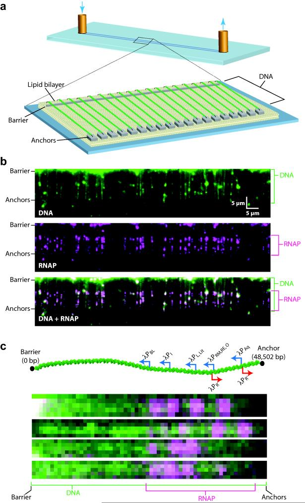
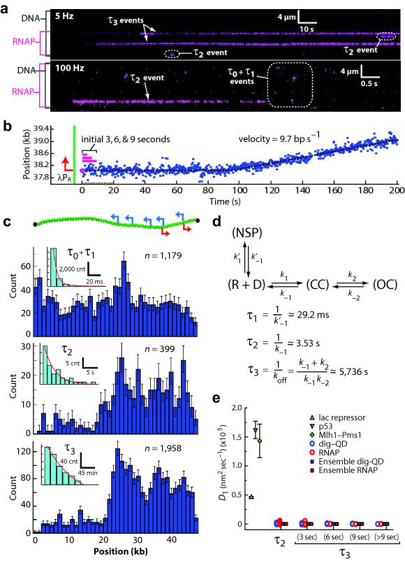
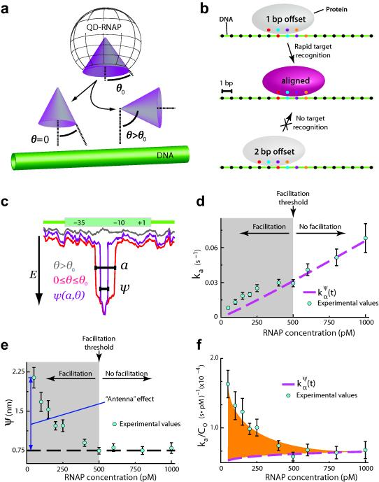
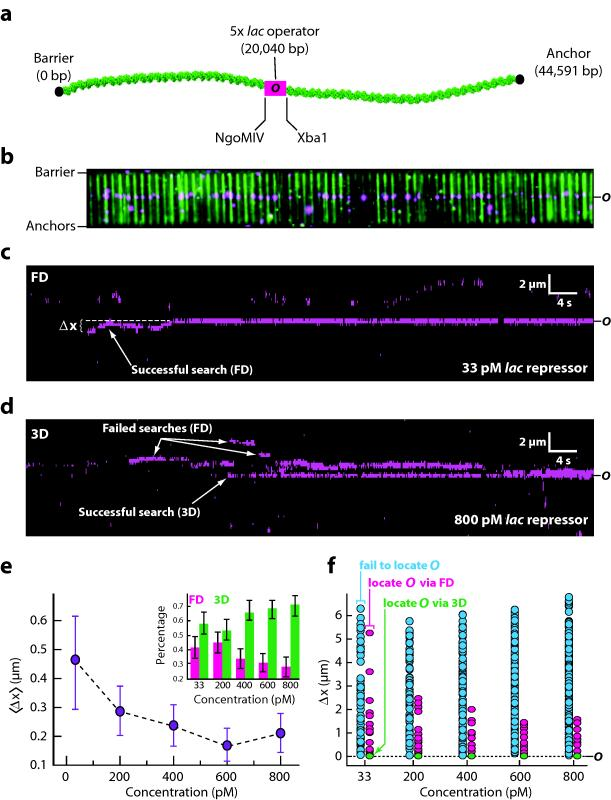
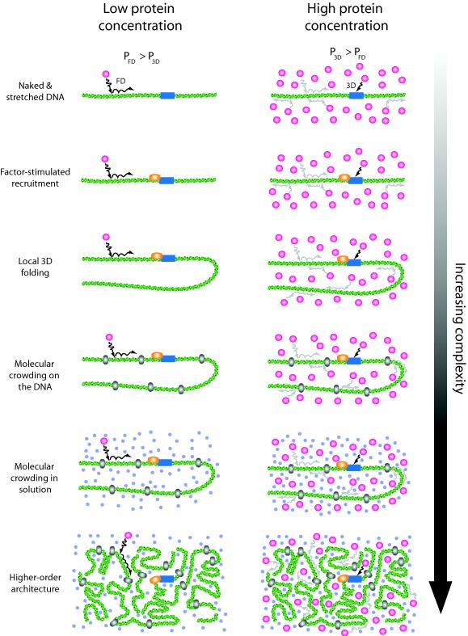

# The promoter-search mechanism of *Escherichia coli* RNA polymerase is dominated by three-dimensional diffusion

**Feng Wang\*, Sy Redding\*, Ilya J. Finkelstein, Jason Gorman, David R. Reichman, and Eric C. Greene** (\* co-first authors)

*Nat. Struct. Mol. Biol.*, Volume 20, Issue 2, Pages 174–81 (2013)

**DOI:** [10.1038/nsmb.2472](https://doi.org/10.1038/nsmb.2472)

---

## Table of Contents

- [Abstract](#abstract)
- [Introduction](#introduction)
- [Results](#results)
- [Discussion](#discussion)
- [Online Methods](#online-methods)
- [Acknowledgements](#acknowledgements)

---

##  Abstract
Gene expression, DNA replication, and genome maintenance are all initiated by proteins that must recognize specific targets from among a vast excess of nonspecific DNA. For example, to initiate transcription, _E. coli_ RNA polymerase must locate promoter sequences, which comprise <2% of the bacterial genome. This search problem remains one of the least understood aspects of gene expression, largely due to the transient nature of search intermediates. Here we visualize RNAP in real time as it searches for promoters, and we develop a theoretical framework for analyzing target searches at the submicroscopic scale based upon single–molecule target association rates. Contrary to long–held assumptions, we demonstrate that the promoter search is dominated by three–dimensional diffusion at both the microscopic and submicroscopic scales _in vitro_ , which has direct implications for understanding how promoters are located within physiological settings.
---
##  Introduction
Transcription is the key step of gene expression and regulation in which the information encoded in genomic DNA is transcribed into RNA.[4](https://pmc.ncbi.nlm.nih.gov/articles/PMC3565103/#R4)-[6](https://pmc.ncbi.nlm.nih.gov/articles/PMC3565103/#R6) A complex network of regulatory features allows precise control over the expression of any given gene. This regulation is achieved through the interplay of promoter DNA sequences that dictate the sites of transcript initiation, along with the effects of a multitude of transcription factors and other regulatory elements that can influence the efficiency of transcript initiation, elongation, and/or termination.[4](https://pmc.ncbi.nlm.nih.gov/articles/PMC3565103/#R4)-[6](https://pmc.ncbi.nlm.nih.gov/articles/PMC3565103/#R6) At the heart of this regulatory network is RNA polymerase (RNAP): the protein machinery directly responsible for RNA synthesis.[4](https://pmc.ncbi.nlm.nih.gov/articles/PMC3565103/#R4)-[7](https://pmc.ncbi.nlm.nih.gov/articles/PMC3565103/#R7)
_Escherichia coli_ has ~3,000 promoters, each containing a core sequence ~35 base pairs in length with hexameric consensus sites at the −35 (TTGACA) and −10 (TATAAT) regions.[4](https://pmc.ncbi.nlm.nih.gov/articles/PMC3565103/#R4)-[9](https://pmc.ncbi.nlm.nih.gov/articles/PMC3565103/#R9) Prior to synthesizing a transcript, RNAP must find appropriate promoter sequences. Like all DNA–binding proteins, RNAP is expected to employ some form of diffusion to locate its targets ([Supplementary Fig. 1](https://pmc.ncbi.nlm.nih.gov/articles/PMC3565103/#SD1)).[1](https://pmc.ncbi.nlm.nih.gov/articles/PMC3565103/#R1) There are four potential diffusion–based mechanisms that might contribute to the promoter search: (_i_) one–dimensional (1D) “hopping”, where the protein moves along the same molecule of DNA _via_ a correlated series of submicroscopic dissociation and rebinding events before re–equilibrating back into free solution; (_ii_) 1D–sliding, where the protein executes a random walk along the DNA without dissociation; (_iii_) intersegmental transfer, where the protein moves from one site to another _via_ a looped intermediate and (_iv_) three–dimensional diffusion (or “jumping”), where the protein starts out fully equilibrated with free solution (_i.e._ it has no memory of whether it has previously visited a DNA site) and then finds its targets through direct 3D–collisions from solution ([Supplementary [Fig. 1](#fig1)](https://pmc.ncbi.nlm.nih.gov/articles/PMC3565103/#SD1)).[1](https://pmc.ncbi.nlm.nih.gov/articles/PMC3565103/#R1) These mechanisms are not mutually exclusive, and different combinations can in principle contribute to site–specific targeting for a given DNA–binding protein. Search mechanisms that employ 1D–hopping, sliding, or intersegmental transfer are collectively referred to as facilitated diffusion,[10](https://pmc.ncbi.nlm.nih.gov/articles/PMC3565103/#R10)-[14](https://pmc.ncbi.nlm.nih.gov/articles/PMC3565103/#R14) because the reduction in dimensionality brought about through use of these mechanisms presents the potential for target site association rates that exceed the limits imposed by pure 3D diffusion. [1](https://pmc.ncbi.nlm.nih.gov/articles/PMC3565103/#R1),[14](https://pmc.ncbi.nlm.nih.gov/articles/PMC3565103/#R14),[15](https://pmc.ncbi.nlm.nih.gov/articles/PMC3565103/#R15)
The seminal work of Riggs _et al._ established that, under certain conditions, lac repressor binds its target faster than the three–dimensional (3D) diffusion limit.[16](https://pmc.ncbi.nlm.nih.gov/articles/PMC3565103/#R16) Subsequent theoretical and experimental work verified that target association rates can be accelerated through facilitated diffusion, and these results are also often used to argue that facilitated diffusion therefore must contribute to target searches.[10](https://pmc.ncbi.nlm.nih.gov/articles/PMC3565103/#R10)-[14](https://pmc.ncbi.nlm.nih.gov/articles/PMC3565103/#R14) However, as noted in the literature,[13](https://pmc.ncbi.nlm.nih.gov/articles/PMC3565103/#R13),[17](https://pmc.ncbi.nlm.nih.gov/articles/PMC3565103/#R17) there is little evidence to support this generalization based on the findings with lac repressor, and lac repressor itself may be atypical in terms of its DNA–binding and target search properties. In addition, prior theoretical models of target searches demonstrating that the fastest possible searches occur through a combination 3D diffusion and 1D sliding over short distances consider that a single protein at is conducting the search.[13](https://pmc.ncbi.nlm.nih.gov/articles/PMC3565103/#R13),[15](https://pmc.ncbi.nlm.nih.gov/articles/PMC3565103/#R15),[18](https://pmc.ncbi.nlm.nih.gov/articles/PMC3565103/#R18)-[21](https://pmc.ncbi.nlm.nih.gov/articles/PMC3565103/#R21) This assumption is reasonable for low–abundance proteins, such as lac repressor (≤10 molecules cell−1), but is less appropriate when considering proteins present at higher concentrations. Indeed, it has more recently been recognized that facilitated diffusion can in fact slow down target searches by causing proteins to waste too much time surveying nonspecific DNA,[18](https://pmc.ncbi.nlm.nih.gov/articles/PMC3565103/#R18),[19](https://pmc.ncbi.nlm.nih.gov/articles/PMC3565103/#R19),[22](https://pmc.ncbi.nlm.nih.gov/articles/PMC3565103/#R22)-[24](https://pmc.ncbi.nlm.nih.gov/articles/PMC3565103/#R24) leading to the suggestion that this outcome might be avoided in the case of some proteins through a combination of low affinity for nonspecific DNA and increased protein copy number.[18](https://pmc.ncbi.nlm.nih.gov/articles/PMC3565103/#R18) Nevertheless, based on the work with lac repressor, facilitated diffusion is still commonly assumed to play a role in the majority of cellular target search processes. Accordingly, a number of studies have reported that RNAP can move long distances along DNA by 1D–sliding,[25](https://pmc.ncbi.nlm.nih.gov/articles/PMC3565103/#R25)-[29](https://pmc.ncbi.nlm.nih.gov/articles/PMC3565103/#R29) and as a consequence it is also now widely assumed that RNAP locates promoters through facilitated diffusion involving a 1D search.[30](https://pmc.ncbi.nlm.nih.gov/articles/PMC3565103/#R30) Despite this, no promoter association rate exceeding the 3D–diffusion limit (~108–109 M−1 s−1) has ever been reported,[31](https://pmc.ncbi.nlm.nih.gov/articles/PMC3565103/#R31),[32](https://pmc.ncbi.nlm.nih.gov/articles/PMC3565103/#R32) and the potential contribution of facilitated diffusion to the promoter search process has been challenged in the literature.[33](https://pmc.ncbi.nlm.nih.gov/articles/PMC3565103/#R33)
In an effort to help resolve the mechanism of the promoter search, here we used single molecule optical imaging of nanofabricated DNA curtains to visualize molecules of _E. coli_ RNAP as they searched for the native promoters within the phage λ genome. Using this approach we could identify intermediates consistent with nonspecifically bound proteins, promoter–associated closed complexes, open complexes, and actively transcribing RNAP. We also present a theoretical framework for analyzing search mechanisms in the submicroscopic regime using experimentally measured kinetic parameters obtained from single molecule observations. Our experimental results and theoretical calculations argue that facilitated diffusion does not contribute to promoter targeting by _E. coli_ RNAP at physiologically relevant protein concentrations. We also show that protein concentration has a dominating effect in dictating how proteins find specific target sites, and the potential rate–accelerating benefits of facilitated diffusion can be overcome through increased protein abundance. The concepts derived from our theoretical treatment of the target search problem are entirely general, and can in principle be applied to any site– or structure–specific nucleic acid–binding protein.
---
##  Results
### Visualizing the promoter search by _E. coli_ RNAP
_E. coli_ RNAP is among the best–characterized enzymes at the single molecule level, yet no study has conclusively established how RNAP locates promoters.[34](https://pmc.ncbi.nlm.nih.gov/articles/PMC3565103/#R34) To distinguish among potential search mechanisms ([Supplementary Fig. 1](https://pmc.ncbi.nlm.nih.gov/articles/PMC3565103/#SD1) & [Supplementary Table 1](https://pmc.ncbi.nlm.nih.gov/articles/PMC3565103/#SD1))[10](https://pmc.ncbi.nlm.nih.gov/articles/PMC3565103/#R10),[11](https://pmc.ncbi.nlm.nih.gov/articles/PMC3565103/#R11),[13](https://pmc.ncbi.nlm.nih.gov/articles/PMC3565103/#R13),[14](https://pmc.ncbi.nlm.nih.gov/articles/PMC3565103/#R14), we used double–tethered DNA curtains to visualize quantum dot–tagged RNAP (QD–RNAP) bound to native promoters within λ–DNA ([Fig. 1](#fig1) & [Supplementary Table 2](https://pmc.ncbi.nlm.nih.gov/articles/PMC3565103/#SD1)). For these assays we functionalized the λ–DNA (48,502 base pairs) at one end with biotin, and at the other end with digoxigenin (DIG). We anchored the biotinylated DNA end to a lipid bilayer through a biotin–streptavidin linkage, and the molecules were then aligned along the leading edges of nanofabricated barriers by application of a hydrodynamic force. The DIG–tagged DNA ends were then anchored to anti–DIG antibody–coated pentagons positioned downstream from the linear barriers. This strategy yielded DNA molecules that are all anchored in the same orientation and can be viewed by total internal reflection fluorescence microscopy (TIRFM) in the absence of hydrodynamic flow.[35](https://pmc.ncbi.nlm.nih.gov/articles/PMC3565103/#R35)-[37](https://pmc.ncbi.nlm.nih.gov/articles/PMC3565103/#R37) Using similar assays, we have previously demonstrated that promoter binding by _E. coli_ RNAP is δ70–dependent, occurs preferentially at physiological ionic strength, and that QD–RNAP is active for transcription.[38](https://pmc.ncbi.nlm.nih.gov/articles/PMC3565103/#R38) We conclude that QD–RNAP faithfully located promoters within the context of our experimental platform.
#### [Fig. 1](#fig1). Single–molecule DNA curtain assay for promoter–specific binding by RNA polymerase.
{: #fig1}

(**a**) Double–tethered DNA curtain assay for organizing substrates on surfaces of a microfluidic device. (**b**) Two–color images of YOYO1–stained DNA (green) bound by QD–RNAP (magenta). **(c)** Schematic of the λ–phage genome (48.5–kb), including relative locations and orientations of promoters aligned with images of QD–RNAP on single DNA molecules ([Supplementary Table 2](https://pmc.ncbi.nlm.nih.gov/articles/PMC3565103/#SD1)). As shown in **(b–c)** most RNAP is bound to the promoters, and the left half of the λ–DNA that lacks promoters is essentially devoid of bound proteins. The finding that RNAP can locate promoters on stretched DNA molecules eliminates intersegmental transfer as an obligatory component of the promoter search ([Supplementary [Fig. 1](#fig1)](https://pmc.ncbi.nlm.nih.gov/articles/PMC3565103/#SD1)).
### Promoter association assays reveals known intermediates
We next visualized single molecules of RNAP in real time as they searched for native promoters within the λ–DNA. To observe the promoter search in real–time, QD–RNAP was injected into the flowcell (±rNTPs), flow was terminated, and data collected at 5, 10, or 100 frames per second (Hz; [Fig. 2a–b](#fig2)). These experiments revealed four potential intermediates, for brevity referred to as _τ_ 0, _τ_ 1, _τ_ 2, and _τ_ 3 events ([Fig. 2a](#fig2))._τ_ 0 events were highly transient [_τ_ 0=5.58 (5.46–5.74) milliseconds (ms); range indicates 95% confidence interval); R2=0.99], and were also observed with either QDs alone or in the absence of DNA ([Supplementary Fig. 2](https://pmc.ncbi.nlm.nih.gov/articles/PMC3565103/#SD1)); therefore we ascribed these events to random diffusion through the detection volume in the absence of any interaction with the DNA and they were not considered further. _τ_ 1 events were RNAP–dependent, displayed short lifetimes [_τ_ 1=29.23 (24.53–36.18) ms], occurred randomly along the DNA (within our spatial resolution limits of ±39–nm), were not observed in the absence of DNA, and were uncorrelated with promoter–bound open complexes (_r_ =0.25, _P_ =0.10, Pearson correlation analysis; [Fig. 2c](#fig2), [Supplementary Fig. 2](https://pmc.ncbi.nlm.nih.gov/articles/PMC3565103/#SD1)). RNAP corresponding to _τ_ 2 dissociated more slowly from the DNA [_τ_ 2=3.53 (2.77–4.8) seconds (s); R2=0.93], and were strongly correlated with distributions of promoter–bound open complexes (_r_ =0.87, _P_ <7×10−14; [Fig. 2c](#fig2)).[38](https://pmc.ncbi.nlm.nih.gov/articles/PMC3565103/#R38) Molecules classified as _τ_ 3 exhibited even slower dissociation [_τ_ 3=5,736 (5,150–6,467) s; R2=0.99], coincided with known promoters ([Fig. 2c](#fig2), [Supplementary Fig. 3](https://pmc.ncbi.nlm.nih.gov/articles/PMC3565103/#SD1)), were resistant to challenge with heparin (a hallmark of open complex formation), and could initiate transcription ([Fig. 2b](#fig2), [Supplementary [Fig. 4](#fig4)](https://pmc.ncbi.nlm.nih.gov/articles/PMC3565103/#SD1)), as previously described.[38](https://pmc.ncbi.nlm.nih.gov/articles/PMC3565103/#R38) These results are consistent with a reaction scheme where _τ_ 1 corresponds to nonspecifically bound RNAP, _τ_ 2 to closed complexes, and _τ_ 3 to open complexes ([Fig. 2d](#fig2)).
#### [Fig. 2](#fig2). Visualizing single molecules of RNA polymerase as they search for and engage promoters.
{: #fig2}

**(a)** Kymograms of RNAP binding to λ–DNA showing kinetically distinct intermediates. DNA is unlabeled, and RNAP is magenta. **(b)** Representative example of RNAP binding and initiating transcription from λPR; for this assay RNAP was premixed with all four rNTPs immediately prior to injection into the sample chamber (also see [Supplementary Fig. 4](https://pmc.ncbi.nlm.nih.gov/articles/PMC3565103/#SD1)). Initial binding (_t_ = 0 s) is indicated as (), and magenta bars highlight the first 3–9 seconds of the reaction trajectory. **(c)** Binding distributions of kinetically distinct intermediates, and corresponding lifetime measurements (insets; also see [Supplementary Fig. 2 & Supplementary Fig. 2](https://pmc.ncbi.nlm.nih.gov/articles/PMC3565103/#SD1)); a schematic showing the relative promoter location is included. Error bars indicate 70% confidence intervals obtained through bootstrap analysis.[37](https://pmc.ncbi.nlm.nih.gov/articles/PMC3565103/#R37) **(d)** Kinetic scheme reflecting observed intermediates. NSP, CC, and OC, refer to nonspecifically bound, closed complex, and open complex, respectively; note that CC could also represent another intermediate preceding the open complex.[6](https://pmc.ncbi.nlm.nih.gov/articles/PMC3565103/#R6) Kinetic parameters are not segregated for individual promoters, rather they are considered collectively, and therefore reported values should be considered an average of all λ promoters. **(e)** Upper bound of observed diffusion coefficients for promoter–bound RNAP, compared to immobilized dig–QDs and other proteins known to undergo 1D–diffusion ([Supplementary Fig. 7–8](https://pmc.ncbi.nlm.nih.gov/articles/PMC3565103/#SD1) & [Supplementary Table 4](https://pmc.ncbi.nlm.nih.gov/articles/PMC3565103/#SD1)).[36](https://pmc.ncbi.nlm.nih.gov/articles/PMC3565103/#R36),[45](https://pmc.ncbi.nlm.nih.gov/articles/PMC3565103/#R45),[47](https://pmc.ncbi.nlm.nih.gov/articles/PMC3565103/#R47) Diffusion coefficients are gamma distributed, therefore we report the magnitude of the square root of the variance as error bars (_n_ ≥ 50 for all data sets).
While values for _τ_ 2 (_i.e_. 1/_k_ −1) have not been previously reported in the literature, our value for _τ_ 2 was consistent with previously reported equilibrium constants measured in bulk for closed complex formation (_k_ 1/_k_ −1) for several different promoters, assuming a diffusion limited association rate.[39](https://pmc.ncbi.nlm.nih.gov/articles/PMC3565103/#R39)-[42](https://pmc.ncbi.nlm.nih.gov/articles/PMC3565103/#R42) The value we obtained for _τ_ 3 (_i.e_. 1/_k off_) was consistent with bulk biochemical data for the lifetime of the open complex,[41](https://pmc.ncbi.nlm.nih.gov/articles/PMC3565103/#R41)-[43](https://pmc.ncbi.nlm.nih.gov/articles/PMC3565103/#R43) providing additional support for our assignment of these events within the reaction scheme. Moreover, within the reaction scheme defined in [Fig. 2d](#fig2), the ratio of _τ_ 2/_τ_ 3 events is equal to _k_ −1/_k_ 2, yielding a value for _k_ 2 of 0.056 s−1, which is also in good agreement with literature values.[41](https://pmc.ncbi.nlm.nih.gov/articles/PMC3565103/#R41),[42](https://pmc.ncbi.nlm.nih.gov/articles/PMC3565103/#R42) We concluded that the promoter–bound intermediates observed in our assay reflected properties consistent with the literature, and that the DNA curtain assay could be used to probe the early stages of RNAP association with promoter DNA that precede the initiation of transcription.
### No microscopically detectable 1D–diffusion prior to promoter binding
Our results demonstrated that QD–tagged RNAP was correctly targeted to promoters in the DNA curtain assay, and that the experimental observables obtained from these assays recapitulated known reaction schemes and kinetic parameters for promoter association and dissociation. Surprisingly, real–time observations revealed no evidence for microscopic 1D–diffusion by RNAP (_n_ >6,000; [Fig. 2a](#fig2), [Supplementary Table 2](https://pmc.ncbi.nlm.nih.gov/articles/PMC3565103/#SD1), see below); only <0.5% of proteins exhibited 1D–motion, and these rare events did not precede promoter engagement. In addition, the same experiments were conducted over a range of ionic strengths (_e.g._ 0–200 mM KCl, 0–10 mM MgCl2), including all buffer conditions under which RNAP sliding has been previously reported ([Supplementary Table 3](https://pmc.ncbi.nlm.nih.gov/articles/PMC3565103/#SD1)). Under no conditions did we find evidence of microscopically detectable 1D diffusion of RNAP along the λ–DNA prior to engaging the promoters. Control experiments confirmed T7 RNAP and lac repressor were capable of extensive 1D diffusion in our assays ([Supplementary Fig. 5](https://pmc.ncbi.nlm.nih.gov/articles/PMC3565103/#SD1)),[44](https://pmc.ncbi.nlm.nih.gov/articles/PMC3565103/#R44)-[46](https://pmc.ncbi.nlm.nih.gov/articles/PMC3565103/#R46) and we have previously shown that the DNA repair proteins Msh2–Msh6 and Mlh1–Pms1 exhibit 1D diffusion, indicating that the DNA curtains or QD tags do not prevent protein diffusion along DNA.[36](https://pmc.ncbi.nlm.nih.gov/articles/PMC3565103/#R36),[37](https://pmc.ncbi.nlm.nih.gov/articles/PMC3565103/#R37) Finally, we readily observed 1D–movement for 1.0–μm beads coated with RNAP, suggesting that prior reports of extensive 1D–diffusion by _E. coli_ RNAP may have been confounded by multivalent aggregates ([Supplementary Fig. 6](https://pmc.ncbi.nlm.nih.gov/articles/PMC3565103/#SD1) & [Supplementary Notes](https://pmc.ncbi.nlm.nih.gov/articles/PMC3565103/#SD1)). In summary, we found no direct experimental evidence supporting an extensive contribution of 1D diffusion during the promoter search, suggesting that the promoter search by QD–tagged RNAP within the context of our DNA curtain assays was dominated by 3D diffusion.
As a further test of the hypothesis that RNAP did not undergo extensive 1D diffusion during the promoter search we next sought to determine the upper bounds for the observed 1D diffusion coefficients (_D_ 1,_obs_) for QD–RNAP at defined points along the reaction trajectory ([Fig. 2e](#fig2) & [Supplementary Fig. 7](https://pmc.ncbi.nlm.nih.gov/articles/PMC3565103/#SD1)). Given their transient nature (〈 _τ_ 1〉 ≤ 30 ms), we could not determine _D_ 1,_obs_ values for the nonspecifically bound RNAP (see below), however, we did calculate _D_ 1,_obs_ for intermediates categorized as either closed (_τ_ 2 events) or open complexes (_τ_ 3 events), as well as for the first 3–9 seconds after initial DNA binding for molecules of RNAP that subsequently initiated transcription in the presence of rNTPs ([Fig. 2b](#fig2)). We then compared the resulting _D_ 1,_obs_ values to published values for several well–characterized proteins known to undergo 1D diffusion, including lac repressor,[45](https://pmc.ncbi.nlm.nih.gov/articles/PMC3565103/#R45) p53,[47](https://pmc.ncbi.nlm.nih.gov/articles/PMC3565103/#R47) and Mlh1–Pms1.[36](https://pmc.ncbi.nlm.nih.gov/articles/PMC3565103/#R36) We also compared the data to immobile QDs coupled to the DNA through a covalent digoxigenin tag (dig–QD; [Fig. 2e](#fig2), [Supplementary Fig. 8](https://pmc.ncbi.nlm.nih.gov/articles/PMC3565103/#SD1) & [Supplementary Table 4](https://pmc.ncbi.nlm.nih.gov/articles/PMC3565103/#SD1)). The dig–QD measurements provided an indication of the extent to which the DNA fluctuations contribute to the diffusion coefficient measurements ([Supplementary Fig. 8](https://pmc.ncbi.nlm.nih.gov/articles/PMC3565103/#SD1)). The _D_ 1,_obs_ values for RNAP were all several orders of magnitude lower than values reported for lac repressor, p53, and Mlh1–Pms1 ([Fig. 2e](#fig2), [Supplementary Fig. 7](https://pmc.ncbi.nlm.nih.gov/articles/PMC3565103/#SD1) & [Supplementary Table 4](https://pmc.ncbi.nlm.nih.gov/articles/PMC3565103/#SD1)), further arguing against extensive 1D diffusion contributing to the promoter search. The _D_ 1,_obs_ values for RNAP (~15–100 nm2 s−1; [Supplementary Table 4](https://pmc.ncbi.nlm.nih.gov/articles/PMC3565103/#SD1)) were indistinguishable from values obtained for stationary dig–QDs. It is important to recognize that the small _D_ 1,_obs_ values obtained for RNAP cannot be interpreted as protein movement along the DNA, but rather arise from the underlying diffusive fluctuations of the DNA itself ([Supplementary [Fig. 8](#fig8)](https://pmc.ncbi.nlm.nih.gov/articles/PMC3565103/#SD1)). We concluded that promoter binding by _E. coli_ RNAP is not preceded by microscopically detectable 1D–diffusion.
### Intersegmental transfer is not essential for the promoter search
As indicated above, the promoter search mechanism of _E. coli_ RNAP appeared to be dominated by 3D random collisions, with no evidence for facilitated diffusion involving 1D sliding over distances along the DNA greater than our current spatial resolution limits. Facilitated searches can also potentially occur through intersegmental transfer, which would involve RNAP movement from one distal site to another _via_ a looped DNA intermediate ([Supplementary [Fig. 1](#fig1)](https://pmc.ncbi.nlm.nih.gov/articles/PMC3565103/#SD1)). The DNA used in our experiments were maintained in a stretched configuration, and we anticipate that they would not support intersegmental transfer because the DNA cannot form the looped intermediates necessary for this mode of facilitated diffusion. Given that RNAP readily bound promoters in the stretched λ–DNA, we concluded that intersegmental transfer cannot be an obligatory component of the promoter search process. However, we emphasize that we could not rule out the possibility that _E. coli_ RNAP might utilize mechanisms involving intersegmental transfer while searching for promoters on the bacterial chromosome _in vivo_.
### Submicroscopic framework for the promoter search problem
Given the transient nature of encounters between RNAP and nonspecific DNA, we were unable to experimentally determine _D_ 1,_obs_ for the protein while bound to nonspecific sites. Therefore, we next sought to establish a theoretical framework to investigate the promoter search at the submicroscopic scale. Here “submicroscopic” is defined as any event occurring below existing spatial and temporal resolution limits. Full treatment of the theory is presented in the Supplementary Notes; for brevity we highlight key features and results. We began by recognizing that the flux of RNAP onto the promoters is the result of three components: (_i_) direct binding to promoters from a fully equilibrated solution (_i.e._ 3D–diffusion); (_ii_) promoter binding from solution after dissociation from another region of DNA (_i.e._ hopping); and (_iii_) promoter binding after undergoing 1D–diffusion along the DNA (_i.e._ sliding). As revealed below, the most important of these terms with respect to the promoter search by _E. coli_ RNAP was direct binding from solution, which occurs at a rate of:   
---  
where _C_ 0 is initial protein concentration, _D_ 3 is the 3–dimension diffusion coefficient of QD–RNAP, _ψ_ is the effective target size, _ρ_ is the reaction radius, and _J_ 0 and _Y_ 0 are Bessel functions of the first and second kind, respectively. The effective target size is a geometric constraint describing the binding surface that transiently samples DNA during the promoter search, and is a function of protein orientation (_θ_) and linear target size (_a_) ([Fig. 3a–c](#fig3)).[10](https://pmc.ncbi.nlm.nih.gov/articles/PMC3565103/#R10),[48](https://pmc.ncbi.nlm.nih.gov/articles/PMC3565103/#R48) Linear target size should not be confused with promoter length; rather, it describes the range over which a bound protein can be out of register, yet still recognize its target ([Fig. 3b](#fig3)). An important prediction arising from this formalism is that target association rates for any protein can become dominated by _C_ 0 increases, implying that increased protein abundance can obviate any potentially accelerating contributions from facilitated diffusion, regardless of whether the protein in question is capable of hopping and/or sliding along DNA. In simpler terms, what the mathematics revealed was that the probability of directly colliding with a target site increases at higher protein concentration, and any form of search facilitation can be rendered effectively irrelevant by increasing protein abundance because the proteins that reach the target first will do so through 3D diffusion. The question then becomes: At what threshold concentration does 3D diffusion begin to dominate the search? For brevity, we will refer to the concentration at which 3D target binding becomes favored as the facilitation threshold (_C thr_): 3D target binding will be favored when the protein concentration equals or exceeds _C thr_, whereas facilitated diffusion will be favored when the concentration is below _C thr_. In addition, once facilitated diffusion is removed from the search through increased protein abundance, _ψ_), which in turn provides an estimate of linear target size (_a_). These parameters reflect dynamic physical properties of highly transient encounter complexes, and cannot be accessed through traditional biochemical analysis of stable or metastable reaction intermediates (closed complexes, open complexes, _etc._), nor can they be revealed through structural studies of static protein–nucleic acid complexes. To our knowledge, neither _ψ_ , _a_ , nor _C thr_ have been experimentally determined for any protein–nucleic acid interaction.
#### [Fig. 3](#fig3). Single–molecule kinetics reveal the promoter search is dominated by 3D–diffusion.
{: #fig3}

**(a)** Influence of protein orientation on target association. The angle _θ_ 0 defines the effective DNA–binding surface of QD–RNAP, and _θ_ defines the orientation of the effective binding surface relative to the promoter. **(b)** Illustration of linear target size (_a_), for example where _a_ = 2–bp: a 1–bp offset (in either direction) results in target recognition, but a 2–bp offset does not result in target recognition. **(c)** Relationship between _θ, a_ and _ψ_ , and their influence on promoter recognition. **(d)** Observed promoter assocition rates (_k a_). Dashed magenta line corresponds to _ψ_ = 0.75–nm), and experimental values above this line reflect rate enhancement due to facilitated diffusion. The boundary between the shaded and unshaded regions of the graph represents the facilitation threshold (_C thr_; as indicated). **(e)** Effective target size (_ψ_) versus RNAP concentration. The dashed black line highlights the limiting value of _ψ_. **(f)** Rate acceleration (_k a_/_C_ 0) versus RNAP concentration. The difference between the experimental values and **d–f)** error bars represent S.E.M. (_n_ ≥ 50 for each data point).
### Single molecule promoter search kinetics
By definition, it is not possible to directly visualize submicroscopic events that contribute to target searches. However, we can obtain promoter association rates from real–time single–molecule measurements (see below). These experimental values can then be compared to the theoretical calculations allowing us to extract critical features of search mechanisms that are otherwise obscured at the microscopic scale. This provides an independent assessment of the search process that is unhindered by existing spatial or temporal instrument resolution limits. Comparison of the experimental data to values calculated from 
We evaluated the potential contribution of submicroscopic facilitated diffusion to the search process by directly measuring promoter association times over a range of RNAP concentrations within the context of a new DNA curtain assay designed to separate neighboring molecules by 7–μm, thereby eliminating any potential for variation in association kinetics due to differences in local DNA concentration ([Fig. 3d](#fig3) & [Supplementary Figs. 9–11](https://pmc.ncbi.nlm.nih.gov/articles/PMC3565103/#SD1)). Importantly, with this assay we were not measuring closed or open complex formation; rather we were measuring the instantaneous time at which single molecules of RNAP are initially detected at a promoter, conditioned upon their subsequent conversion to closed and then open complexes ([Supplementary [Fig. 11](#fig11)](https://pmc.ncbi.nlm.nih.gov/articles/PMC3565103/#SD1)). These measurements were conducted at 100–ms temporal resolution, which is appropriate given that the slow downstream isomerization steps involved in promoter binding (_e.g._ closed and open complex formation) occur on the order of seconds, therefore any error in determining the initial binding events does not propagate into the measurements of the initial association rates. This experimental format allowed us to precisely define all of the experimental boundary conditions and parameters involved in calculating the predicted promoter association rates from _e.g._ DNA geometry, DNA length, DNA density, number of accessible promoters, protein concentration, solution viscosity, temperature, ionic strength, _etc._).
Interestingly, association rates exceeded [Fig. 3d](#fig3)). However, at ≥500 pM RNAP, association times converged to [Fig. 3d](#fig3)). Although our results showed QD–RNAP no longer benefits from facilitated diffusion at concentrations ≥500 pM, one must recognize that _C thr_ will vary for different proteins and/or different reaction conditions. For example, unlabeled RNAP (hydrodynamic radius, _r_ = 7.4–nm)[49](https://pmc.ncbi.nlm.nih.gov/articles/PMC3565103/#R49) will diffuse more rapidly through solution than QD–RNAP (_r_ ≈ 13.4–nm),[50](https://pmc.ncbi.nlm.nih.gov/articles/PMC3565103/#R50) so we anticipate the promoter association with unlabeled proteins that should converge to _C thr_. Importantly, the physical behavior of RNAP with respect to the search process will not change regardless of whether the concentration is above or below _C thr_; the only thing that changes is the probability of engaging a target through a direct collision (_P_ 3 _D_) versus the probability of engaging the target after undergoing facilitated diffusion along the DNA (_P FD_).
Furthermore, the exact solution of _ψ_ of 0.75–nm and estimated linear size _a_ of ~6–bp ([Fig. 3e](#fig3)),[51](https://pmc.ncbi.nlm.nih.gov/articles/PMC3565103/#R51) indicating promoters would not be recognized if RNAP is more than ±3–bp out of register. The apparent increase in _ψ_ at low RNAP concentration reflected what is historically referred to as the “antenna” effect.[12](https://pmc.ncbi.nlm.nih.gov/articles/PMC3565103/#R12),[26](https://pmc.ncbi.nlm.nih.gov/articles/PMC3565103/#R26) At 50 pM RNAP (_ψ_ = 2.23–nm) the “antenna” was just ~1.48–nm (corresponding to ~6–bp in our system); the very small size of the “antenna” indicated the limited contribution that facilitated diffusion (sliding and/or hopping) maded to the promoter search even at the lowest RNAP concentrations tested ([Fig. 3e–f](#fig3)). An _in vivo_ protein concentration of 1 nM corresponds to just 1 protein molecule in a volume the size of an _E. coli_ cell,[52](https://pmc.ncbi.nlm.nih.gov/articles/PMC3565103/#R52) therefore an _in vivo_ concentration of 50 pM would be equivalent to an average of just 1/20th of a molecule of RNAP per bacterium, which would not seem physiologically relevant. Taken together, our results demonstrated that although submicroscopic facilitated diffusion can moderately accelerate the promoter search, this acceleration only occurs at exceedingly low RNAP concentrations, whereas at physiologically relevant protein concentrations the overall promoter search process should be dominated by 3D–diffusion.
### Increased protein abundance disfavors facilitated searches
One conclusion arising from our mathematical treatment of target searches is that increased protein abundance will diminish the contribution of facilitated diffusion. This concept is not unique to _E. coli_ RNAP, and will even apply to proteins that can diffuse long distances along DNA because the probability of direct collisions (_P_ 3 _D_) with the target always increases with increasing protein abundance and will eventual exceed the probability of target engagement through facilitated diffusion (_P_ _FD_). As a simple illustration of this point, we used the DNA curtain assay and a λ–DNA bearing 5–tandem 21–bp symmetric lac operators to qualitatively assess target binding by QD–tagged lac repressor ([Fig. 4a–b](#fig4)).[38](https://pmc.ncbi.nlm.nih.gov/articles/PMC3565103/#R38) These experiments were intentionally conducted at low ionic strength, such that nonspecific binding and 1D diffusion were greatly favored, as described.[44](https://pmc.ncbi.nlm.nih.gov/articles/PMC3565103/#R44),[45](https://pmc.ncbi.nlm.nih.gov/articles/PMC3565103/#R45) At low concentrations many proteins initially bound to random, nonspecific sites and then diffused thousands of base pairs along the DNA before eventually binding the target; these events were categorized as having occurred through facilitated diffusion (FD; [Fig. 4c](#fig4)). Operator binding in the absence of microscopically detectable 1D diffusion was also observed; these events were categorized as 3D ([Fig. 4d](#fig4)). For the proteins that successfully engaged the operator the contribution of facilitated diffusion to the search process is reflected in the distance between the initial binding site and the operator (Δ _x_) and the change in the ratio of FD to 3D events. As protein concentration increased, the mean value of (Δ _x_) decreased for the proteins that bound to the operator ([Fig. 4e–f](#fig4)), and there was a corresponding increase in the fraction of events categorized as 3D ([Fig. 4e](#fig4), inset). At the highest concentration of lac repressor tested (800 pM) ~71% of the total operator binding events were attributed to 3D diffusion ([Fig. 4e](#fig4), inset). Technical limitations prevented titration to higher protein concentrations due to the accompanying increase in background fluorescence, but we anticipate that if the concentration were raised further eventually all of the operator binding events would occur through 3D diffusion. This conclusion will even extend into the submicroscopic regime. An in–depth analysis of the facilitation threshold and effective target size for lac repressor (as provided above for RNAP) was beyond the scope of this work, however the trend in these data clearly illustrated that the contribution of facilitated diffusion diminishes with increased protein abundance, even though lac repressor is capable of sliding great distances on DNA under low ionic strength conditions. Importantly, at all concentrations tested many molecules lac repressor bound to random, nonspecific sites all along the length of the λ–DNA, and these proteins still exhibited 1D diffusion even when the concentration was raised ([Fig. 4d,f](#fig4)); however, as concentration increased this 1D diffusion could be considered nonproductive with respect to target association because most of the proteins that bound the operator first did so through 3D collisions ([Fig. 4e](#fig4), inset & [Fig. 4d,f](#fig4)).
#### [Fig. 4](#fig4). Protein concentration exerts a dominant influence on target searches even for proteins capable of sliding on DNA.
{: #fig4}

**(a)** DNA schematic showing the location of the 5x lac operator. **(b)** Two–color image of YOYO1–stained DNA (green) bound by QD–lac repressor (magenta). **(c)** Kymogram showing an example of lac repressor binding to nonspecific DNA and then diffusing in 1D to the operator; data were collected at 33 pM lac repressor. The distance between the initial binding site and the operator is indicated as Δ _x_. **(d)** Kymogram showing an example of direct operator binding in the absence of any detectable 1D sliding; data were collected at 800 pM lac repressor. The successful search through 3D binding is highlighted, as are examples of molecules that searched through FD but failed to locate the operator. **(e)** Graph showing the mean value of Δ _x_ as a function of protein concentration for proteins that successfully engage the operator. Inset, percentage of total operator binding events that are attributable to FD (magenta) and 3D (green) at each protein concentration. Error bars represent S.D. of the data (_n_ ≥ 54 for each data point). **(f)** Graph of Δ _x_ for all observed proteins. Blue data points () correspond to proteins that fail to bind the operator, magenta data points () are proteins that bind the operator after undergoing FD, and green data points () correspond 3D binding to the operator. All green data points within each column overlap at zero, but their fractional contribution to operator binding is shown as green bars in the inset of panel **(e)**. These experiments were all conducted in buffer containing 10 mM Tris–HCl (pH 8.0), 1 mM MgCl2, 1 mM DTT, and 1 mg ml−1 BSA.
---
##  Discussion
Our results argue against facilitated diffusion at either the microscopic or submicroscopic scales as a significant contributing component of the _E. coli_ RNAP promoter search, and we also show that in general any potential contributions of facilitated diffusion can be overcome through increased protein abundance, even for proteins that can slide long distances on DNA. Facilitated diffusion and 3D collisions can be conceptually considered as two distinct, competing pathways either of which has the potential to result in target binding, and 3D diffusion will always be favored at protein concentrations equal to or exceeding the facilitation threshold simply because the relative increase in protein abundance increases the probability of a direct collision with the target site ([Fig. 5](#fig5)). In other words, just because a protein is physically capable of hopping and/or sliding over long distances along DNA does not mean that these processes will accelerate target binding because protein concentration can always have a dominating effect on the overall search process. A broader implication of this conclusion is that proteins present at low concentrations in living cells (_e.g._ lac repressor, <10 molecules cell−1) may be more apt to locate targets through facilitated diffusion, whereas those present at higher concentrations (_e.g._ RNAP, ~2,000–3,000 molecules cell−1) may be more likely to engage their target sites through 3D diffusion.
### [Fig. 5](#fig5). Increasingly complex environments encountered during _in vivo_ searches.
{: #fig5}

Facilitated diffusion (FD) will be favored at concentrations below the facilitation threshold because the initial encounter with the DNA will most often occur at nonspecific sites, so the probability (_P_) of target engagement through FD exceeds the probability of engagement through 3D (_P FD_ > _P_ 3 _D_). Concentrations equal to or exceeding the facilitation threshold will favor 3D because the relative increase in protein abundance increases the probability of a direct collision with the target site (_P FD_ > _P_ 3 _D_). FD–related processes such as sliding/hopping can still occur at high protein concentrations, but those proteins undergoing FD are less likely to reach the target site before those that collide directly with the target. Although the facilitation threshold will vary for different proteins and different conditions, higher protein concentrations will still favor 3D collisions irrespective of the local environment (_e.g._ the presence of recruitment factors, DNA–bound obstacles, macromolecular crowding, local DNA folding) or global DNA architecture. See the Discussion for additional details.
Our experimental setting differs substantially from much more complex physiological environments where the promoter search might be influenced by the presence of factors that can assist in the recruitment of RNAP to promoters, or by local DNA folding, higher–order chromatin architecture, and macromolecular crowding ([Fig. 5](#fig5)). While we cannot yet quantitatively assess the influence of these parameters, we can consider how they might qualitatively affect the promoter search.
Transcriptional activators, such as catabolite activator protein (CAP), are commonly involved in the regulation of gene expression, and can exert their effects either by facilitating recruitment of RNAP or by stimulating steps after recruitment (_e.g._ open complex formation, promoter escape, _etc._).[5](https://pmc.ncbi.nlm.nih.gov/articles/PMC3565103/#R5) In scenarios involving factor–assisted recruitment, additional protein–protein contacts stabilize interactions between RNAP and the promoter. However, the presence of a transcriptional activator near a promoter should not fundamentally alter the search process by causing RNAP to start sliding and/or hopping along the DNA while executing the search, rather it would just make the target appear “larger” to RNAP (_i.e._ promoter plus factor, instead of just the promoter), which would in turn reduce the facilitation threshold. Factors that stimulate steps after recruitment would not influence the search because they exert their effects only after the promoter search is complete.
Higher–order organization of DNA _in vivo_ has the potential to promote 3D collisions or “jumps”, but is not expected to favor 1D sliding and/or hopping, both of which can be considered as local events that are not influenced by global DNA architecture.[18](https://pmc.ncbi.nlm.nih.gov/articles/PMC3565103/#R18),[20](https://pmc.ncbi.nlm.nih.gov/articles/PMC3565103/#R20) In contrast, naked DNA stretched out at low dilution presents the most favorable possible conditions for 1D sliding and/or hopping.[17](https://pmc.ncbi.nlm.nih.gov/articles/PMC3565103/#R17),[21](https://pmc.ncbi.nlm.nih.gov/articles/PMC3565103/#R21) The fact that we do not detect facilitated diffusion contributing to the promoter search by RNAP under conditions that should otherwise greatly favor hopping and/or sliding suggests these processes are unlikely to occur _in vivo_ simply due to the more complex 3D DNA environment.
Molecular crowding, either in solution or on the DNA, is a nontrivial issue, which can have both positive and negative impacts on DNA binding. Increased nonspecific binding can arise from macromolecular crowding in solution due to excluded volume effects,[53](https://pmc.ncbi.nlm.nih.gov/articles/PMC3565103/#R53) and any increase in nonspecific binding has the potential to promote facilitated diffusion. Although in the case of _E. coli_ RNAP, increased nonspecific binding brought about through use of low ionic strength conditions still does not lead to microscopically detectable 1D diffusion, suggesting any increased nonspecific affinity caused by excluded volume effects is unlikely to cause RNAP to start diffusing along DNA. The effects of macromolecular crowding on DNA arise from the presence of other nonspecific DNA–binding proteins, which can reduce nonspecific DNA–binding affinities through competitive inhibition,[54](https://pmc.ncbi.nlm.nih.gov/articles/PMC3565103/#R54) and can also impede 1D diffusion along DNA through steric hindrance.[18](https://pmc.ncbi.nlm.nih.gov/articles/PMC3565103/#R18),[19](https://pmc.ncbi.nlm.nih.gov/articles/PMC3565103/#R19),[36](https://pmc.ncbi.nlm.nih.gov/articles/PMC3565103/#R36) The net result of the seemingly opposed influences of macromolecular crowding in solution versus molecular crowding on the DNA has yet to be quantitatively explored, although one might anticipate that highly abundant proteins such as Fis and HU (each of which can be present at concentrations of up to ~30–50 μM in _E. coli_) would disfavor facilitated searches by restricting access to nonspecific sites.[19](https://pmc.ncbi.nlm.nih.gov/articles/PMC3565103/#R19)
In summary, there are at least four reasons why promoter searches in _E. coli_ would not benefit from facilitated diffusion. First, there are on the order of ~2,000–3,000 molecules of RNAP in _E. coli_ , corresponding to an _in vivo_ concentration of ~2–3 μM.[55](https://pmc.ncbi.nlm.nih.gov/articles/PMC3565103/#R55) Based on our findings, if even a small fraction of the total RNAP present in a cell were free, then it should still locate promoters through 3D collisions rather than facilitated diffusion. Estimates have suggested that there are on the order of ~550 molecules (~0.5 μM) of free σ70–containing RNAP holoenzyme in living bacteria;[55](https://pmc.ncbi.nlm.nih.gov/articles/PMC3565103/#R55) if these estimates are correct, then the facilitation threshold would have to somehow increase by roughly three orders of magnitude in order for hopping and or sliding to accelerate the promoter search _in vivo_. In contrast to RNAP, lac repressor, which is thought to employ facilitated diffusion _in vivo_ during its target search,[45](https://pmc.ncbi.nlm.nih.gov/articles/PMC3565103/#R45),[56](https://pmc.ncbi.nlm.nih.gov/articles/PMC3565103/#R56) may need to do so to compensate for its much lower intracellular abundance (<10 molecules cell−1) and the corresponding scarcity of its targets (3 lac operators per genome). Second, long nonspecific lifetimes will lead to slower searches, so RNAP appears to be optimized to avoid wasting time scanning nonspecific DNA.[10](https://pmc.ncbi.nlm.nih.gov/articles/PMC3565103/#R10)-[13](https://pmc.ncbi.nlm.nih.gov/articles/PMC3565103/#R13),[17](https://pmc.ncbi.nlm.nih.gov/articles/PMC3565103/#R17) Third, other proteins (_e.g._ Fis, HU, IHF, H–NS, _etc._) may obstruct 1D–diffusion, but such obstacles could be avoided through 3D–searches.[19](https://pmc.ncbi.nlm.nih.gov/articles/PMC3565103/#R19) Fourth, other steps are rate–limiting during gene expression (_e.g._ promoter accessibility, promoter escape, elongation, _etc._),[33](https://pmc.ncbi.nlm.nih.gov/articles/PMC3565103/#R33),[57](https://pmc.ncbi.nlm.nih.gov/articles/PMC3565103/#R57)-[59](https://pmc.ncbi.nlm.nih.gov/articles/PMC3565103/#R59) suggesting there is simply no need for RNAP to locate promoters faster than the 3D–diffusion limit. Finally, despite the much more complicated environments present in physiological settings, our general conclusion regarding the effects of protein abundance on target searches should remain qualitatively true because higher protein concentrations will increase the probability of direct target binding through 3D collisions.
---
##  Online Methods
Single–molecule experiments were conducted on a custom–built total internal reflection microscope and utilized double–tethered DNA curtains.[35](https://pmc.ncbi.nlm.nih.gov/articles/PMC3565103/#R35),[36](https://pmc.ncbi.nlm.nih.gov/articles/PMC3565103/#R36) RNAP was expressed with a biotinylation peptide fused to the C–terminus of β’, and purified as described.[38](https://pmc.ncbi.nlm.nih.gov/articles/PMC3565103/#R38),[60](https://pmc.ncbi.nlm.nih.gov/articles/PMC3565103/#R60) Biotinylated RNAP holoenzyme was labeled with streptavidin–QDs (Qdot® 705, _r_ = 12.6–nm; Invitrogen). Prior to use, flowcells were flushed with transcription buffer (40 mM Tris [pH 8.0], 100 mM KCl, 10 mM MgCl2, 1 mM DTT and 2 mg ml−1 BSA) supplemented with 250 pM YOYO1 and 9 μM free biotin to block the surface. QD–tagged RNAP was then diluted into biotin–supplemented transcription buffer (±rNTP, 250 μM each, as indicated) to a final concentration of 30–200 pM, and then a 50–μl sample was injected into the flowcell at a rate of 0.1 ml min−1, and buffer flow was terminated 120–s after beginning the injection. For initial promoter binding measurements, experiments were conducted in buffer containing 20 mM Tris–HCl [pH 8.0], 25 mM KCl, 1 mM MgCl2, 1 mM DTT, and 2 mg ml−1 BSA, and images were acquired at 5–100 Hz, as indicated, using NIS–Elements software (Nikon). For the measurements of promoter association rates, the fraction of active protein in each preparation was first determined from gel shift assays utilizing a Cy3–labeled 249–bp DNA fragment containing the λPR promoter. Gel shifts were conducted under dilute protein conditions equivalent to those used in the single–molecule assays to ensure that ensemble protein activity reflected that in the single–molecule assays. All single–molecule kinetic measurements to determine promoter association rates utilized a new type of DNA curtain designed to avoid local DNA concentration effects ([Supplementary Fig. 10](https://pmc.ncbi.nlm.nih.gov/articles/PMC3565103/#SD1)). QD–RNAP (700–μl) was then injected into the flowcell at 0.5 ml min−1 in buffer containing 20 mM Tris–HCl [pH 8.0], 25 mM KCl, 1 mM MgCl2, 1 mM DTT, and 2 mg ml−1 BSA, using a standardized sample injection procedure that eliminated variability in observed association rates due to microfluidic heterogeneities and variations in protein concentration profiles. Images were collected at 10 Hz, and initial promoter association rates were then obtained by measuring dwell times between successive promoter binding events for all different DNA molecules within the field–of–view ([Supplementary Notes](https://pmc.ncbi.nlm.nih.gov/articles/PMC3565103/#SD1) & [Supplementary [Fig. 11](#fig11)](https://pmc.ncbi.nlm.nih.gov/articles/PMC3565103/#SD1)).

---
##  Acknowledgements
We thank M. Gottesman, R. Gonzalez, and the Greene laboratory for assistance and discussion throughout this work. We thank M. Gottesman, D. Duzdevich and members of our laboratories for carefully reading the manuscript. We thank R. Landick (University of Wisconson–Madison) for providing RNAP expression constructs. Supported by NIH grants GM074739 (E.C.G.) and F32GM80864 (I.J.F.), NIH training grant T32GM00879807 (J.G.), an NSF Award (E.C.G.), and by the Howard Hughes Medical Institute.

---

## References

1. von Hippel P, Berg O. Facilitated target location in biological systems. J Biol Chem. 1989;264:675–8.
2. Gorman J, Greene EC. Visualizing one–dimensional diffusion of proteins along DNA. Nat Struct Mol Biol. 2008;15:768–74.
3. Herbert K, Greenleaf W, Block S. Single–molecule studies of RNA polymerase: Motoring along. Ann Rev Biochem. 2008;77:149–176.
4. Haugen S, Ross W, Gourse R. Advances in bacterial promoter recognition and its control by factors that do not bind DNA. Nat Rev Microbiol. 2008;6:507–19.
5. Browning D, Busby S. The regulation of bacterial transcription initiation. Nat Rev Microbiol. 2004;2:57–65.
6. Saecker R, Record M, Dehaseth P. Mechanism of bacterial transcription initiation: RNA polymerase – promoter binding, isomerization to initiation–competent open complexes, and initiation of RNA synthesis. J Mol Biol. 2011;412:754–71.
7. Nudler E. RNA polymerase active center: the molecular engine of transcription. Annu Rev Biochem. 2009;78:335–61.
8. Mendoza–Vargas A, et al. Genome–wide identification of transcription start sites, promoters and transcription factor binding sites in E. coli. PLoS One. 2009;4:e7526.
9. Cho B, et al. The transcription unit architecture of the Escherichia coli genome. Nat Biotechnol. 2009;27:1043–9.
10. Berg OG, Blomberg C. Association kinetics with coupled diffusional flows. Special application to the lac repressor––operator system. Biophys Chem. 1976;4:367–81.
11. von Hippel PH, Berg OG. Facilitated target location in biological systems. J Biol Chem. 1989;264:675–8.
12. Mirny L, et al. How a protein searches for its site on DNA: the mechanism of facilitated diffusion. Journal of Physics a–Mathematical and Theoretical. 2009:42.
13. Halford S, Marko J. How do site–specific DNA–binding proteins find their targets? Nucleic Acids Res. 2004;32:3040–52.
14. Berg O, Winter R, von Hippel P. Diffusion–driven mechanisms of protein translocation on nucleic acids. 1 Models and theory. Biochemistry. 1981;20:6929–48.
15. Berg O, Blomberg C. Association kinetics with coupled diffusional flows. Special application to the lac repressor––operator system. Biophys Chem. 1976;4:367–81.
16. Riggs AD, Bourgeois S, Cohn M. The lac repressor–operator interaction. 3. Kinetic studies. J Mol Biol. 1970;53:401–17.
17. Halford S. An end to 40 years of mistakes in DNA–protein association kinetics? Biochem Soc Trans. 2009;37:343–8.
18. Mirny L, et al. How a protein searches for its site on DNA: the mechanism of facilitated diffusion. J Physics A. 2009;42:434013.
19. Li G–W, Berg O, Elf J. Effects of macromolecular crowding and DNA looping on gene regulation kinetics. Nature Physics. 2009;5:294–297.
20. Hu T, Grosberg A, Shklovskii B. How proteins search for their specific sites on DNA: the role of DNA conformation. Biophysical Journal. 2006;90:2731–2744.
21. Bauer M, Metzler R. Generalized faciliated diffusion model for DNA–binding proteins with search and recognition states. Biophysical Journal. 2012;102:2321–2330.
22. Kolesov G, Wunderlich Z, Laikova O, Gelfand M, Mirny L. How gene order is influenced by the biophysics of transcriotion regulation. Proc Natl Acad Sci U S A. 2007;104:13948–13953.
23. Wunderlich Z, Mirny L. Spatial effects on the speed and reliability of protein–DNA search. Nucleic Acids Res. 2008;36:3570–8.
24. Das R, Kolomeisky A. Facilitated search of proteins on DNA: correlations are important. Phys Chem Chem Phys. 2010;12:2999–3004.
25. Singer P, Wu CW. Promoter search by Escherichia coli RNA polymerase on a circular DNA template. J Biol Chem. 1987;262:14178–89.
26. Ricchetti M, Metzger W, Heumann H. One–dimensional diffusion of Escherichia coli DNA–dependent RNA polymerase: a mechanism to facilitate promoter location. Proc Natl Acad Sci U S A. 1988;85:4610–4.
27. Kabata H, et al. Visualization of single molecules of RNA polymerase sliding along DNA. Science. 1993;262:1561–3.
28. Guthold M, et al. Direct observation of one–dimensional diffusion and transcription by Escherichia coli RNA polymerase. Biophys J. 1999;77:2284–94.
29. Harada Y, et al. Single–molecule imaging of RNA polymerase–DNA interactions in real time. Biophys J. 1999;76:709–15.
30. Berg J, Tymoczko J, Stryer L. Biochemistry. W.H. Freeman and Company; New York: 2007.
31. Roe JH, Burgess RR, Record MT Jr. Kinetics and mechanism of the interaction of Escherichia coli RNA polymerase with the lambda PR promoter. J Mol Biol. 1984;176:495–522.
32. Friedman L, Gelles J. Mechanism of transcription initiation at an activator–dependent promoter defined by single–molecule observation. Cell. 2012;148:679–689.
33. DeHaseth PL, Zupancic M, Record MT Jr. RNA polymerase–promoter interactions: the comings and goings of RNA polymerase. J Bacteriol. 1998;180:3019–3025.
34. Herbert K, Greenleaf W, Block S. Single–molecule studies of RNA polymerase: motoring along. Annu Rev Biochem. 2008;77:149–76.
35. Gorman J, Fazio T, Wang F, Wind S, Greene EC. Nanofabricated racks of aligned and anchored DNA substrates for single–molecule imaging. Langmuir. 2010;26:1372–9.
36. Gorman J, Plys A, Visnapuu M, Alani E, Greene EC. Visualizing one–dimensional diffusion of eukaryotic DNA repair factors along a chromatin lattice. Nat Struct Mol Biol. 2010;17:932–8.
37. Gorman J, et al. Single–molecule imaging reveals target search mechanisms during mismatch repair. Proc Natl Acad Sci U S A. 2012;109:E3074–E3083.
38. Finkelstein I, Visnapuu M, Greene EC. Single–molecule imaging reveals mechanisms of protein disruption by a DNA translocase. Nature. 2010;468:983–7.
39. Simons R, Hoopes B, McClure W, Kleckner N. Three promoters near the termini of IS10: pIN, pOUT, and pIII. Cell. 1983;34:673–82.
40. McClure W. Rate–limiting steps in RNA chain initiation. Proc Natl Acad Sci U S A. 1980;77:5634–8.
41. Hawley D, McClure W. In vitro comparison of initiation properties of bacteriophage lambda wild–type PR and x3 mutant promoters. Proc Natl Acad Sci U S A. 1980;77:6381–5.
42. Dayton C, Prosen D, Parker K, Cech C. Kinetic measurements of Escherichia coli RNA polymerase association with bacteriophage T7 early promoters. J Biol Chem. 1984;259:1616–21.
43. Brunner M, Bujard H. Promoter recognition and promoter strength in the Escherichia coli system. EMBO J. 1987;6:3139–44.
44. Wang Y, Austin R, Cox E. Single molecule measurements of repressor protein 1D diffusion on DNA. Phys Rev Lett. 2006;97:048302.
45. Elf J, Li G, Xie X. Probing transcription factor dynamics at the single–molecule level in a living cell. Science. 2007;316:1191–4.
46. Kim JH, Larson RG. Single–molecule analysis of 1D diffusion and transcription elongation of T7 RNA polymerase along individual stretched DNA molecules. Nucleic Acids Res. 2007;35:3848–58.
47. Tafvizi A, Huang F, Fersht A, Mirny L, van Oijen A. A single–molecule characterization of p53 search on DNA. Proc Natl Acad Sci U S A. 2011;108:563–8.
48. Berg OG. Orientation constraints in diffusion–limited macromolecular association. The role of surface diffusion as a rate–enhancing mechanism. Biophys J. 1985;47:1–14.
49. Austin R, Karohl J, Jovin T. Rotational diffusion of Escherichia coli RNA polymerase free and bound to deoxyribonucleic acid in nonspecific complexes. Biochemistry. 1983;22:3082–90.
50. Gorman J, et al. Dynamic basis for one–dimensional DNA scanning by the mismatch repair complex Msh2–Msh6. Mol Cell. 2007;28:359–70.
51. Berg OG, von Hippel PH. Diffusion–controlled macromolecular interactions. Annu Rev Biophys Biophys Chem. 1985;14:131–60.
52. Moran U, Philips R, Milo R. Snapshot: key numbers in biology. Cell. 2010;141:1262.
53. Minton A. The influence of macromolecular crowding and macromolecular confinement on biochemical reactions in physiological media. J Biol Chem. 2001;276:10577–10580.
54. Graham J, Johnson R, Marko J. Concentration–dependent exchange accelerates turnover of proteins bound to double–stranded DNA. Nucleic Acids Res. 2011;39:2249–2259.
55. Ishihama A. Functional modulation of Escherichia coli RNA polymerase. Annu Rev Microbiol. 2000;54:499–518.
56. Hammar P, et al. The lac repressor displays faciliated diffusion in living cells. Science. 2012;336:1595–1598.
57. McClure W. Mechanism and control of transcription initiation in prokaryotes. Annu Rev Biochem. 1985;54:171–204.
58. So L, et al. General properties of transcriptional time series in Escherichia coli. Nat Genet. 43:554–60.
59. Reppas N, Wade J, Church G, Struhl K. The transition between trancriptional initiation and elongation in E. coli is highly variable and often rate limiting. Mol Cell. 2006;24:747–757.
60. Shaevitz J, Abbondanzieri E, Landick R, Block S. Backtracking by single RNA polymerase molecules observed at near–base–pair resolution. Nature. 2003;426:684–7.

---

*Archived from [PubMed Central (PMC3565103)](https://pmc.ncbi.nlm.nih.gov/articles/PMC3565103/) on 2025-07-19.*
