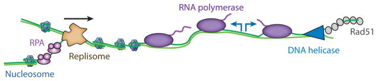
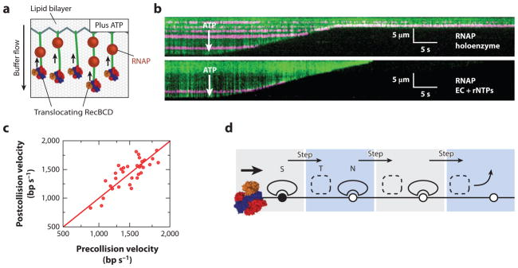
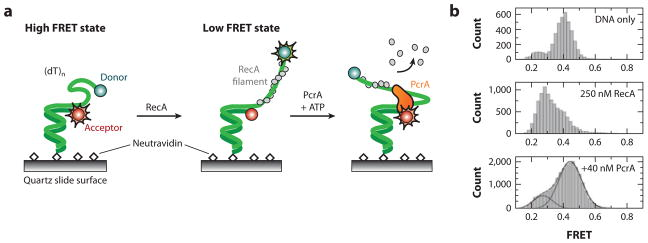
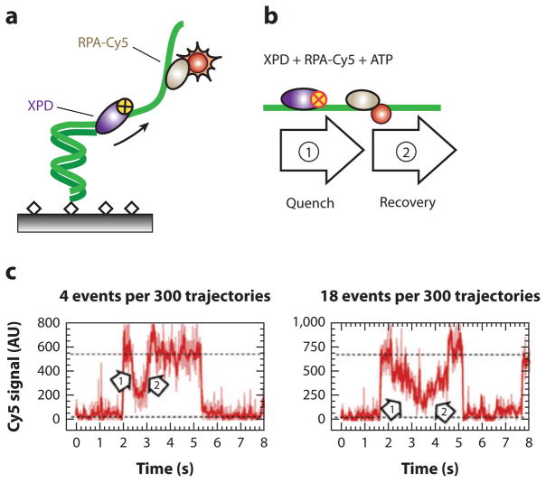
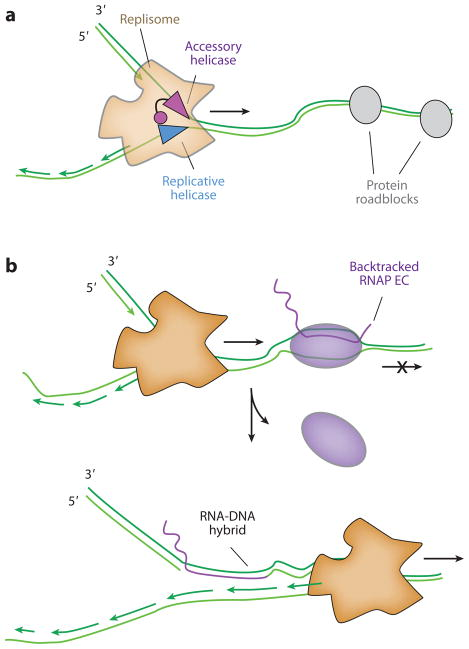
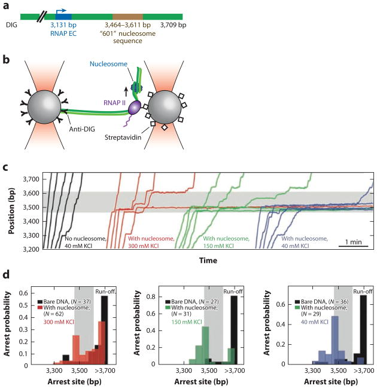
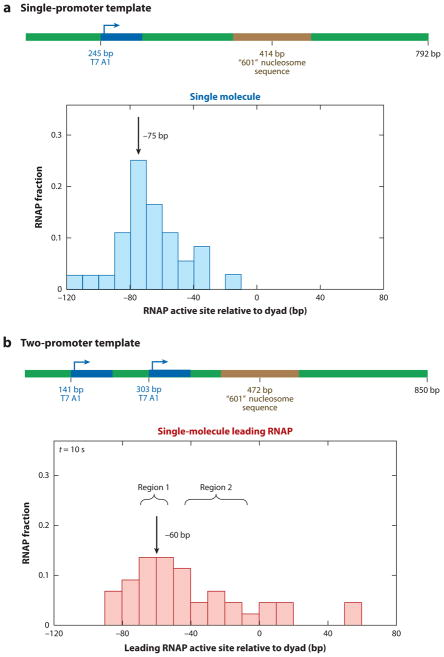

# Molecular Traffic Jams on DNA

**Ilya J. Finkelstein and Eric C. Greene**

*Annu. Rev. Biophys.*, Volume 42, Pages 241–63 (2013)

**DOI:** [10.1146/annurev-biophys-083012-130304](https://doi.org/10.1146/annurev-biophys-083012-130304)

---

## Table of Contents

- [Abstract](#abstract)
- [Introduction](#introduction)
- [Helicases](#helicases)
- [Replication](#replication)
- [Transcription](#transcription)
- [Final Thoughts](#final-thoughts)
- [Acknowledgments](#acknowledgments)

---

##  Abstract
All aspects of DNA metabolism—including transcription, replication, and repair—involve motor enzymes that move along genomic DNA. These processes must all take place on chromosomes that are occupied by a large number of other proteins. However, very little is known regarding how nucleic acid motor proteins move along the crowded DNA substrates that are likely to exist in physiological settings. This review summarizes recent progress in understanding how DNA-binding motor proteins respond to the presence of other proteins that lie in their paths. We highlight recent single-molecule biophysical experiments aimed at addressing this question, with an emphasis placed on analyzing the single-molecule, ensemble biochemical, and in vivo data from a mechanistic perspective.
**Keywords:** helicase, replisome, RNAP, roadblock, DNA curtains, FRET, optical tweezers
---
##  INTRODUCTION
Long stretches of naked DNA are unlikely to persist in vivo; rather, genomic DNA is coated with proteins that facilitate DNA compaction, organization, and maintenance. For example, in _Escherichia coli_ , the nucleoid-associated proteins H-NS, HU, Fis, IHF, and StpA are each present in copy numbers of 20,000 to 60,000 proteins per cell (~50–150 μM) and are some of the most abundant cellular proteins ([4](#ref4)). Furthermore, up to ~30% of the _E. coli_ genome is occluded by DNA-binding proteins, suggesting that regions of protein-free DNA are unlikely to be longer than ~100 base pairs (bp) ([4](#ref4), [61](#ref61), [105](#ref105)). Similarly, eukaryotic genomic DNA is organized into chromatin, a dense mesh of proteins and nucleic acids. The basic unit of chromatin is composed of nucleosomes, each of which is made up of ~147 bp of genomic DNA wrapped around two copies of the core histones proteins H2A, H2B, H3, and H4. Most of the eukaryotic genome is coated in nucleosomes and nucleosome-free DNA segments are, on average, only ~20–30 bp in length ([14](#ref14)).
Many essential aspects of DNA metabolism in both prokaryotes and eukaryotes—transcription, replication, and repair—must occur within these highly crowded environments. Despite the central role of nucleosomes and bacterial nucleoid-associated proteins in all aspects of DNA metabolism, a basic understanding of how DNA-binding motor proteins function in these crowded settings is still largely lacking. Furthermore, many of these processes must occur concurrently on the same stretch of DNA ([Fig. 1](#fig1)). In rapidly dividing prokaryotes, replication, transcription, and repair must all occur simultaneously. In eukaryotes, the replication machinery must also traverse highly transcribed sites ([6](#ref6)) and will encounter megabase-length transcripts that require more than one cell cycle for complete synthesis ([40](#ref40)). Thus, conflicts between transcription and replication must be resolved frequently in both prokaryotes and eukaryotes while somehow maintaining genome organization and stability.

<figure class="paper-figure" id="fig1">

<figcaption><strong>Figure 1.</strong> DNA replication, transcription, and repair must occur simultaneously on a crowded nucleic acid substrate. Conflicts between these molecular machines must be resolved rapidly to maintain cell viability and to avoid genomic instability.</figcaption>
</figure>

##  HELICASES
Helicases are enzymes that hydrolyze nucleotide triphosphates (NTPs) to translocate along a nucleic acid track, and catalyze the unwinding of duplex RNA or DNA into individual single strands ([87](#ref87)). Helicases participate in nearly all aspects of nucleic acid metabolism, including ribosome biogenesis, RNA folding, DNA replication, repair, and transcription ([87](#ref87), [90](#ref90)). This large group of enzymes has been organized into subfamilies based on structural, biochemical, and mechanistic classifications ([93](#ref93)).
Early biochemical studies established that some helicases are capable of unwinding duplex DNA that is decorated with other DNA-binding proteins ([46](#ref46), [72](#ref72)). Helicases have even been found to disrupt a biotin-streptavidin interaction, which is one of the strongest noncovalent linkages found in nature ([15](#ref15), [72](#ref72)). In fact, many enzymes that contain canonical helicase motifs or display helicase activity in vitro may be primarily involved in the removal of other proteins from nucleic acids in vivo. Enzymes that are able to remove other proteins from a nucleic acid track are now frequently referred to as stripases ([82](#ref82)). Helicases may also associate with larger macromolecular machines such as the replisome, where they act as stripases to help clear protein obstacles that would otherwise interfere with DNA replication (see Replication, below) ([10](#ref10), [67](#ref67)).
In this section we highlight recent advances in understanding how DNA helicases respond to protein obstacles in their path. We highlight single-molecule studies of three enzymes that show different behaviors when they are challenged with protein obstacles: (_a_) RecBCD, an _E. coli_ helicase/nuclease involved in DNA double-strand break (DSB) repair, pushes and evict roadblocks as it moves along double-stranded DNA (dsDNA) ([28](#ref28)); (_b_) PcrA, a monomeric heli-case from _Bacillus stearothermophilus_ , translocates along single-stranded DNA (ssDNA) and disrupts RecA-ssDNA nucleoprotein filaments ([76](#ref76)); and (_c_) XPD, a helicase involved in nucleotide excision repair, translocates along replication protein A (RPA)-bound ssDNA without displacing the protein obstacle ([43](#ref43)).
### RecBCD Removes Protein-Bound Obstacles
RecBCD is a heterotrimeric _E. coli_ helicase/nuclease required for processing DNA DSBs, degrading invading phage DNA, and rescuing stalled replication forks ([18](#ref18)). RecBCD is a fast (~1,000–2,000 bp sec−1) and processive (≥30,000 bp) heterotrimeric enzyme that uses the energy of ATP hydrolysis to travel along DNA ([7](#ref7)). RecB and RecD are members of the Superfamily 1 (SF1)-type helicases with 3′ → 5′ (SF1a) and 5′ → 3′ (SF1b) directionality, respectively ([93](#ref93)). A central pin in the RecC unit bisects the DNA duplex and funnels the 3′- and 5′-ssDNA strands toward the RecB and RecD motors, respectively. As the ssDNA strands exit from their respective motor cavities, the ssDNA strands are degraded by an additional nucleolytic domain on RecB ([18](#ref18)).
RecBCD must encounter many DNA-bound proteins in vivo, yet it was unclear how these potential obstacles might affect its progression ([20](#ref20)). We have addressed the effects of protein roadblocks on RecBCD translocation using single-molecule fluorescence microscopy to visualize individual molecular collisions in real-time on DNA curtains ([Fig. 2](#fig2)). In the DNA curtain approach, individual DNA molecules are anchored to a fluid lipid bilayer and are aligned along the leading edges of nanofabricated chrome barriers to lipid diffusion through the application of hydrodynamic force ([26](#ref26), [27](#ref27), [32](#ref32)) ([Fig. 2a](#fig2)). The DNA is stained with the highly fluorescent intercalating dye YOYO1 and can be visualized by total internal reflection fluorescence microscopy, enabling direct imaging of hundreds of individual molecules within a single field of view. Upon helicase unwinding, YOYO1 is displaced from the duplex DNA, which leads to a decrease in fluorescence ([7](#ref7), [35](#ref35)). Thus, the helicase/nuclease activity of RecBCD is directly observed as a decrease in length of the dsDNA as a function time ([Fig. 2b](#fig2)).

<figure class="paper-figure" id="fig2">

<figcaption><strong>Figure 2.</strong> (_a_) An illustration of the single-molecule DNA curtain assay used to observe RecBCD-roadblock collisions. Individual DNA molecules are tethered to a fluid lipid bilayer via a biotin-streptavidin interaction and organized at nanofabricated chrome barriers. RecBCD is loaded at the free DNA ends and fluorescent RNA polymerase (RNAP) is deposited on the native promoters along the DNA. The DNA is visualized by YOYO1, an intercalating fluorescent dye that does not interfere with RecBCD activity. The reaction is initiated by supplementing the flow buffer with ATP. As the DNA is degraded by RecBCD helicase/nuclease activity, the time-dependent decrease in DNA length serves as readout of RecBCD translocation. (_b_) Kymographs of RecBCD pushing and evicting RNAP holoenzyme and elongation complexes (ECs) from DNA. In all kymographs, the tethered end of the DNA is at the top, the free end is at the bottom, and buffer flow is from top to bottom. RecBCD is able to efficiently push and eventually displace RNAP holoenzyme (_top panel_ ), transcribing ECs (_bottom panel_ ). (_c_) A scatter plot of pre- and postcollision RecBCD velocities. The red line is a fit to the data with a slope of 1.0. RecBCD does not change velocity upon collision with RNAP. (_d_ ) A transition-state ejection model for roadblock displacement by RecBCD. Most roadblocks are displaced from RecBCD as they are pushed from one nonspecific DNA site to the next. Translocating RecBCD initially displaces the protein roadblock from a high-affinity specific site (S). The roadblock must pass through a much more weakly bound intermediate state (T) as it is pushed from one site to the next, followed by re-equilibration as a DNA-bound nonspecific complex (N). Subsequent steps by RecBCD continue to push the protein roadblocks from one nonspecific site to the next, until the proteins are eventually evicted from the DNA.</figcaption>
</figure>

### PcrA Clears RecA Recombinase from ssDNA
Helicases can translocate on ssDNA and play crucial roles in removing unwanted ssDNA-bound proteins ([17](#ref17), [38](#ref38), [88](#ref88)). For example, UvrD, PcrA, and Srs2 can promote the removal of the re-combinases RecA or Rad51 from transiently exposed ssDNA regions to prevent inappropriate homologous DNA recombination ([52](#ref52), [76](#ref76)).
PcrA is an SF1 helicase that translocates along ssDNA in a 3′ → 5′ direction with a step size of 1 nucleotide (nt) ([76](#ref76)). Monomeric PcrA preferentially binds to the ssDNA-dsDNA junction and is able to repetitively reel in the 5′-ssDNA tail. However, a dimeric or higher order form of the enzyme is required for helicase activity in vitro. The oligomeric state and in vivo function of PcrA, and its _E. coli_ homolog UvrD, continue to be debated ([17](#ref17)). Both helicases have been implicated in nucleotide excision repair, plasmid replication, and roadblock clearance ahead of the replisome, and as antirecombinases that act at stalled or collapsed replication forks ([17](#ref17)). A smFRET approach was used to characterize _B. stearothermophilus_ PcrA and to demonstrate that the enzyme could dislodge RecA nucleoprotein filaments from ssDNA.
Park et al. ([76](#ref76)) used smFRET to directly observe the activity of PcrA on RecA-ssDNA filaments. A DNA oligonucleotide with a long ssDNA tail was immobilized on the surface of a passivated microscope slide via a biotin-streptavidin interaction ([Fig. 3a](#fig3)). One end of the oligonucleotide was decorated with a Cy3 dye and the other end with a Cy5 dye. Upon photoexcitation of Cy3, nonradiative energy transfer may occur to Cy5 if the dyes are within the FRET transfer distance (~30–70 Å). The smFRET signal is observed as a photon emitted in the Cy5 fluorescence region. In the absence of all proteins, the ssDNA tail behaves as a highly flexible polymer, bringing the Cy3-Cy5 ends sufficiently close to ensure a strong smFRET signal ([Fig. 3b](#fig3)). Upon addition of RecA and ATP, a rigid nucleoprotein filament is formed, causing the smFRET signal to decrease ([38](#ref38), [48](#ref48)). When added to the flowcell, PcrA binds the ssDNA-dsDNA junction and displaces RecA from ssDNA in an ATP-dependent reaction. Multiple cycles of PcrA shuttling along the same RecA-coated ssDNA strand are observed experimentally ([76](#ref76)) ([Fig. 3b](#fig3)). The strong preference of monomeric PcrA for ssDNA-dsDNA junctions suggests that in vivo PcrA may preferentially bind at sites of stalled or collapsed replication forks and translocate along the newly synthesized lagging strand to remove recombinase proteins that might be loaded along the ssDNA. Thus, a major function of PcrA may be to act as an antirecombinase by keeping ssDNA free of RecA and thereby preventing deleterious recombination events. Importantly, although single-molecule and ensemble biochemistry studies show that PcrA and UvrD can act as antire-combinases, exactly how RecA is removed from DNA has not been delineated ([60](#ref60), [102](#ref102)). Future single-molecule studies may address critical questions such as the mechanism by which RecA is cleared from DNA, and whether individual RecA subunits are removed sequentially or as larger oligomers.

<figure class="paper-figure" id="fig3">

<figcaption><strong>Figure 3.</strong> (_a_) A smFRET-based assay for observing the RecA-clearing activity of PcrA helicase. A DNA oligonucleotide with a Cy3-Cy5 FRET dye pair is affixed to the surface of a passivated microscope slide. Entropically driven collapse of the ssDNA brings the two dyes within efficient FRET distance. Addition of RecA leads to a rigid nucleoprotein filament, which separates the two dyes and reduces the observed FRET signal. In the presence of ATP, PcrA helicase clears RecA and reels the free DNA ends closer together. (_b_) smFRET data. (_Top_) Naked ssDNA brings both dyes relatively close, leading to a FRET signal of ~0.5. (_Middle_) Addition of RecA elongates the ssDNA tail and reduces the smFRET to ~0.3. (_Bottom_) In the presence of ATP, PcrA clears RecA from ssDNA as it reels the two DNA ends close to each other.</figcaption>
</figure>

### XPD Can Bypass RPA on the Same ssDNA
Not all encounters between a helicase and a DNA-bound protein must end in roadblock eviction. For example, Spies and colleagues ([43](#ref43)) used a novel single-molecule fluorescence quenching approach to demonstrate that _Ferroplasma acidarmanus_ XPD helicase is able to translocate on protein-coated ssDNA without disrupting some of the bound proteins. XPD is an SF2 helicase involved in nucleotide excision repair and translocates along ssDNA with a 5′ → 3′ polarity ([43](#ref43), [84](#ref84)). XPD encodes an FeS cluster domain that is important for coupling ATP hydrolysis to translocation and also forms a secondary ssDNA-binding site ([84](#ref84), [86](#ref86)). To monitor XPD movement along DNA, the authors cleverly exploited the observation that the FeS cluster of XPD quenches nearby Cy3 and Cy5 dyes in a distance-dependent fashion. A schematic of the experimental setup is illustrated in [Fig. 4a](#fig4) ([43](#ref43)). A Cy3-labeled ssDNA oligonucleotide was immobilized on the surface of a passivated microscope slide via biotin-streptavidin interactions. In the absence of XPD, the Cy3-fluorescence intensity remained constant. When wild-type XPD and ATP were added to the flowcell, XPD began translocating along the ssDNA, and the Cy3 signal was quenched by the approaching FeS cluster ([Fig. 4b](#fig4)). Thus, XPD velocity could be characterized on naked DNA by using Cy3 quenching as a proxy for translocation ([43](#ref43)).

<figure class="paper-figure" id="fig4">

<figcaption><strong>Figure 4.</strong> A single-molecule dye-quenching assay for XPD translocation along replication protein A (RPA)-coated DNA. (_a_) A DNA oligonucleotide is immobilized on the surface of a passivated flowcell and decorated with Cy5-labeled RPA. The FeS cluster of XPD helicase quenches Cy5 fluorescence in a distance-dependent manner. (_b_) When ATP is added, XPD translocation toward RPA initially quenches the Cy5 fluorescence (_arrow 1_), and eventually XPD bypasses the RPA (_arrow 2_), which is revealed as an eventual recovery of the Cy5 intensity. (_c_) Examples of intensity trajectories showing XPD approaching (_arrow 1_) and moving past (_arrow 2_) RPA.</figcaption>
</figure>

##  REPLICATION
The replication machinery must duplicate genomic DNA that is decorated with nucleosomes, transcription factors, RNAPs, and other nucleoprotein complexes ([70](#ref70)). Replication fork collapse at a nucleoprotein barrier may lead to compromised replication and genomic instability ([19](#ref19), [40](#ref40)). Conflicts between replication and transcription are particularly deleterious, as they must occur frequently ([67](#ref67), [70](#ref70)). Below, we highlight recent ensemble biochemical studies that have helped define the strategies that organisms use to avoid replisome collapse at protein roadblocks.

### Nucleosomes
In vitro biochemical studies established that replisomes are strongly inhibited by protein roadblocks, and these studies were among the first to highlight the conceptual importance of protein-protein collisions on DNA ([12](#ref12), [81](#ref81)). In the first example of this work, Alberts and colleagues ([12](#ref12)) demonstrated that a bacteriophage T4 replisome requires the addition of Dda, a helicase that is not required for replication of naked DNA, to replicate past a nucleosome. The authors concluded that Dda acts as a roadblock-clearing enzyme in front of the T4 replisome ([12](#ref12)). Although the role of Dda in T4 phage replication has been reexamined ([53](#ref53), [62](#ref62)), this original work spurred numerous other studies that have now highlighted the roadblock clearance role of accessory nonreplicative helicases in both prokaryotes and eukaryotes (see Accessory Helicases, below) ([65](#ref65)).
Progress on understanding how the eukaryotic replication machinery proceeds through a nu-cleosome has been hampered by a paucity of reconstituted eukaryotic replisomes. SV40 replication continues to be the only fully reconstituted eukaryotic replisome that can be carried out in both cell-free extracts and in a highly purified in vitro system. SV40 replisomes efficiently replicated chromatinized templates ([45](#ref45)), and upon passage of a replication fork, nucleosomes are repositioned behind the replisome with an equal probability of being placed on either the leading or lagging strand ([97](#ref97)). In addition, the large T antigen, which is the SV40 replicative helicase, is capable of unwinding nucleosome-containing DNA, suggesting the replicative helicase may contribute to nu-cleosome displacement from DNA during replication ([89](#ref89)). However, whether the nucleosome core particle is actually disrupted during replication remains controversial. Several studies concluded that H2A/H2B is lost upon histone transfer behind the replisome ([30](#ref30), [33](#ref33)), although chemically cross-linked nucleosomes are also efficiently transferred behind the SV40 replisome ([104](#ref104)).
The polycomb group of epigenetic DNA-binding proteins was shown to transfer efficiently behind an SV40 replisome during replication in vitro, suggesting that this group of proteins, which make critical contributions to epigenetic inheritance, has evolved to survive collisions with replisomes without being displaced from DNA ([29](#ref29)). More work needs to be carried out to understand whether and how nucleosomes and other epigenetic factors remain bound to chromosomes during eukaryotic replication, and single-molecule observations may play a key role in understanding their fates when faced with an oncoming replisome.
### Accessory Helicases
Nonreplicative accessory helicases have been identified as critical roadblock-clearing motors that participate in DNA replication in T4 phage, _E. coli_ , _Bacillus subtilis_ , and _S. cerevisiae_ ([12](#ref12), [36](#ref36), [67](#ref67)). In an elegant biochemical and cell biology study, McGlynn and colleagues ([36](#ref36)) identified how two nonreplicative helicases help _E. coli_ replisomes get past protein roadblocks. For this work, EcoRI(E111G), a hydrolytically defective restriction enzyme that binds its cognate site with high affinity, was employed as a DNA-binding protein roadblock ([49](#ref49)). Eight EcoRI(E111G) repeats were found to sufficiently block progression of an in vitro–reconstituted _E. coli_ replisome ([66](#ref66)). The authors then tested eight nonreplicative helicases for their ability to stimulate replication through the EcoRI(E111G) nucleoprotein barrier. Two _E. coli_ –encoded helicases, Rep and UvrD, which are 3′ → 5′ SF1 helicases that, in the absence of the replisome, cannot dissociate EcoRI(E111G) from DNA, greatly stimulated replication past the EcoRI(E111G) barrier in vitro. In addition, PcrA, a homologous SF1 helicase from _B. subtilis_ promoted replication past the barrier. Importantly, although Dda is capable of clearing multiple proteins from DNA and can even disrupt the very strong biotin-streptavidin interaction, it did not stimulate replication past EcoRI(E111G) ([15](#ref15)).
In vivo analysis of _rep uvrD_ cells confirmed the in vitro results. For example, both Rep and UvrD were required for growth on rich media (i.e., conditions under which conflicts between replication and transcription are expected to occur most frequently), and although _rep uvrD_ colonies could be recovered at very low plating dilutions on rich media, these colonies were found to harbor suppressor mutations that reduce RNAP backtracking ([75](#ref75)). Backtracked RNAP is likely the most dangerous natural replication barrier and a source of genomic instability (see below); thus, survival of the _rep uvrD_ mutants was contingent upon elimination of a naturally occurring protein roadblock to DNA replication through the acquisition of suppressor mutations ([19](#ref19), [75](#ref75)).
Accessory helicases such as Rep, UvrR, and PcrA are capable of disrupting different types of protein roadblocks ahead of the replisome. For example, _rep uvrD_ cells could not tolerate 34 chromosomal tandem LacI-operator repeats, although this same nucleoprotein barrier was well tolerated in wild-type cells. Expression of PcrA, but not Dda, in a _rep uvrD_ background rescued the double-knockout phenotype.
Either Rep or UvrD may dislodge protein roadblocks to release stalled replication forks, and a model that describes the role of both Rep and UvrD at the replication fork is summarized in [Fig. 5](#fig5). The C terminus of Rep interacts directly with DnaB, the replicative helicase, suggesting Rep is an integral component of the _E. coli_ replisome. If the replisome stalls behind a nucleoprotein obstacle, Rep is proposed to load onto the strand opposite of DnaB where it can then displace the roadblock. UvrD does not physically interact with the replisome, but it is present at a very high concentration in the cell and can thus transiently associate with a stalled fork through simple mass action to clear the obstacle. One prediction of the model is that accessory helicases should translocate along the leading-strand template and move in the opposite direction of the replicative helicase to allow the fork to progress forward: DnaB moves 5′→3′, and as predicted, only accessory helicases that moved 3′ ′ 5′ stimulated roadblock clearance ([Fig. 5a](#fig5)). Additional experiments in other replication systems will help elucidate the generality of this model.

<figure class="paper-figure" id="fig5">

<figcaption><strong>Figure 5.</strong> (_a_) Accessory helicases interact with the replisome to remove protein roadblocks. In _Escherichia coli_ , the C terminus of the accessory, nonreplicative Rep helicase physically interacts with DnaB. Accessory helicases can aid replication past protein roadblocks such as LacI repeats, hydrolytically inactive EcoRI, and head-on RNAP collisions. (_b_) Upon encountering a backtracked RNA polymerase (RNAP) in a codirectional orientation, the replisome can reinitiate from the 3′ end of the mRNA R-loop. A subsequent round of replication converts the resulting nick into a double-strand break. Abbreviation: EC, elongation complex.</figcaption>
</figure>

### Replication-Transcription Conflicts
RNAP is one of the most pervasive and potent roadblocks to DNA replication ([6](#ref6), [22](#ref22), [23](#ref23), [40](#ref40), [68](#ref68), [80](#ref80), [81](#ref81)). In eukaryotes, the transcription of many genes, including the core histones, is highly upregulated during S-phase ([34](#ref34)). Furthermore, transcription of the longest genes present in higher eukaryotes takes more than one full cell cycle; therefore, conflicts between RNAP and the replication machinery must occur at these genes ([40](#ref40)). In prokaryotes, transcription is 20-fold slower than replication, guaranteeing that replisomes will frequently collide with the transcribing RNAPs. Several recent reviews have summarized replication-transcription conflicts and how they may be resolved ([65](#ref65), [67](#ref67), [69](#ref69)).
Replisomes can collide with RNAP in either head-on or codirectional orientations. Head-on collisions are thought to arrest replisome progression ([67](#ref67), [80](#ref80), [81](#ref81)), and most bacteria minimize head-on collisions by organizing highly transcribed genes codirectionally with DNA replication ([37](#ref37), [94](#ref94)). In support of this view, Pomerantz & O’Donnell ([81](#ref81)) demonstrated that in vitro, head-on collisions between an _E. coli_ replisome and RNAP caused fork stalling and required the Mfd ATPase to assist in dislodging RNAP. In contrast, codirectional collisions were resolved when RNAP was displaced by the replisome itself, and replication could then resume by using the 3′-OH of the nascent transcript as primer for continued synthesis ([80](#ref80)).
A recent in vivo study by Nudler and colleagues ([19](#ref19)) demonstrated that codirectional, but not head-on, collisions lead to DNA DSBs and genome instability in _E. coli_. For these assays, a unidirectional origin of replication was used to stage head-to-head or codirectional collisions on plasmid substrates. Transcription was under the control of a temperature-sensitive lambda repressor and the resulting products were identified using primer extension PCR assays. The transcript also included a ribosome-binding site, and the translation state was modulated by the inclusion or omission of an ATG start codon. Replication could also be suppressed by supplementing the media with sublethal levels of hydroxyurea (HU) ([19](#ref19)). Interestingly, the authors observed that backtracked RNAP resulted in replication-dependent DSBs. _E. coli_ employs multiple mechanisms to prevent RNAP backtracking, including GreA/GreB-dependent transcription restart, transcription-translation coupling, and ATPase-dependent RNAP clearance ([67](#ref67), [75](#ref75)), and DSB levels were significantly increased in _greA_ and _greB_ cells. Conversely, when the ATG start codon was introduced to couple transcription to translation, the occurrence of DSBs was reduced to near-background levels, even in a _greA/greB_ mutant background. Thus, the ribosome plays a dominant role in suppressing the negative impact of backtracked RNAP, thereby promoting successful DNA replication ([83](#ref83)).
The same study found that DSBs were almost completely absent in head-on collisions, despite the fact that head-on collisions have long been considered the most deleterious to DNA replication forks. The authors explain this puzzling observation by suggesting that displacement of a backtracked RNAP during a codirectional collision may lead to a stable R-loop that can then be used by the replisome to reprime downstream DNA synthesis ([Fig. 5b](#fig5)). The RNA-DNA hybrid must then be cleared by RNase H and the resulting ssDNA resynthesized before the next round of replication ([1](#ref1)). However, a DSB may form if the next round of replication reaches the R-loop before this repair is completed. In support of this model, overexpression of RNase H alleviated DSBs in codirectional collisions. Even though head-on collisions can stall the replisome, they do so without leading to DNA damage ([19](#ref19)). Thus, codirectional conflicts may be particularly dangerous sources of genomic instability and must be minimized or resolved in vivo.
Reconstituting replication-transcription conflicts at the single-molecule level will be necessary to address many of the remaining mechanistic questions. For example, is the backtracked RNAP evicted immediately from the DNA or is it pushed ahead of the replisome, and how does the replisome resolve multiple collisions at heavily transcribed genes, such as the rDNA operon? The development of single-molecule replication assays promises to help put these experiments within our technical capabilities ([31](#ref31), [99](#ref99), [101](#ref101)).
---
##  TRANSCRIPTION
Gene expression is intimately related to chromatin organization. RNAP must gain access to ge-nomic DNA that is organized in nucleosomes, and positioned nucleosomes regulate the transcription program on a whole-genome level. Thus, it is crucial to understand the mechanisms of transcription through nucleosomes.
Pioneering studies by Studitsky et al. ([95](#ref95)) established that phage SP6 RNAP transcribed effi-ciently through a nucleosome, revealing that the nucleosome could be transferred in _cis_ onto the DNA behind the moving polymerase. In the DNA-looping model, the RNAP EC bends DNA sufficiently to facilitate formation of new nucleosome-DNA contacts behind the EC. As the EC peels DNA away from the surface of the nucleosome, the newly exposed histone contacts are transferred to the naked DNA present behind the progressing EC ([95](#ref95)).
Reconstitution of in vitro transcription by _S. cerevisiae_ RNA polymerase III (pol III) confirmed that the DNA-looped intermediate mechanism was also valid for eukaryotic RNAPs ([96](#ref96)). Pol III, an enzyme that transcribes relatively short rRNA and tRNA genes, may be unlikely to transcribe past large numbers of nucleosomes in vivo. In vitro, however, pol III transcribes through a nucleosome in a manner analogous to that of phage RNAPs ([96](#ref96)).
### Does RNAP Actively Disrupt Nucleosomes?
In eukaryotes, RNA polymerase II (pol II) transcribes mRNA and may need to frequently contend with nucleosome barriers. However, in vitro, nucleosomes were a potent barrier to both yeast and human pol II transcription ([11](#ref11), [50](#ref50), [51](#ref51), [55](#ref55)). Furthermore, the mechanism of transcription and the fate of the nucleosomes differed markedly compared to what was seen with the simpler phage RNAPs ([50](#ref50), [55](#ref55)).
Bustamante and colleagues ([8](#ref8), [42](#ref42)) employed a high-resolution single-molecule optical tweezers assay to study the mechanism of how pol II traverses the nucleosome barrier. The study used a dual-optical trap approach as illustrated in [Fig. 6](#fig6). One polystyrene bead was affixed to the end of a DNA molecule via a digoxigenin-antidigoxigenin interaction. A pol II EC was assembled and affixed to a second streptavidin-coated bead. A single nucleosome was assembled on a strongly positioning Widom 601 DNA sequence downstream of the RNAP promoter ([Fig. 6a](#fig6)). The reactions were then initiated by the addition of all four rNTPs, and transcription by pol II was revealed as a change in the DNA length between the two beads.

<figure class="paper-figure" id="fig6">

<figcaption><strong>Figure 6.</strong> An optical trap assay to investigate RNA polymerase II (RNAP II) transcription past a nucleosome. (_a_) A schematic of the DNA construct used in this study. One end of the DNA was affixed to a polystyrene bead via a DIG–anti-DIG interaction. Biotinylated pol II was assembled onto a promoter (_blue_) and affixed to a second streptavidin-coated bead. A nucleosome was reconstituted on the strong nucleosome-positioning Widom 601 DNA sequence (_brown_). (_b_) An illustration of the experimental setup. RNAP transcription was monitored as a change in the DNA length between the two optical traps. (_c_) Individual pol II transcription traces as a function of NaCl concentration. At low salts, pol II stalls at the nucleosome barrier. As NaCl concentration is increased, pol II transiently pauses and eventually transcribes past the nucleosome. (_d_ ) A histogram of nucleosome-dependent arrest probability. The polymerase pauses as it encounters the nucleosome but can transcribe past transiently disrupted histone-DNA interactions at higher salt concentrations. (_c,d_ ) Transcription traces on naked DNA are shown in black; transcription traces on DNA with nucleosomes are shown in colors. The shaded regions of the graphs represent the location of the nucleosome positioning sequence. Abbreviations: EC, elongation complex; DIG, digoxigenin.</figcaption>
</figure>

### A Trailing RNAP Assists in Overcoming Nucleosome Barriers
Backtracking by the RNAP EC is a universal feature of all RNAPs and may interfere with transcription past protein roadblocks and result in genome instability ([19](#ref19), [75](#ref75)). In prokaryotes, four major mechanisms can rescue a backtracked RNAP EC: (_a_) Translation of the nascent transcript prevents RNAP backtracking ([83](#ref83)); (_b_) factors such as greA/greB rescue stalled ECs by clipping the backtracked message to realign the 3′-OH mRNA end with the RNAP catalytic site ([74](#ref74)); (_c_) AT-Pases such as Rho and Mfd can clear stalled RNAP from DNA ([13](#ref13), [25](#ref25), [91](#ref91)); and (_d_ ) cotranscription by two polymerases decreases backtracking by the leading EC ([24](#ref24), [47](#ref47)).
Cotranscription by two closely associated T7 RNAPs can also increase transcription through a nucleosome ([47](#ref47)). An optical tweezers–based DNA unzipping assay was used to investigate how two T7 RNAPs collaborate to transcribe past a nucleosome barrier ([Fig. 7](#fig7)). By unzipping duplex DNA, the authors directly mapped the position of the RNAP active site. Gel electrophoresis of the RNA message was used to determine the length of the transcript with single-nucleotide sensitivity. A comparison of the RNAP position to the length of the mRNA transcript specified how far the RNAP backtracked upon encountering a nucleosome barrier.

<figure class="paper-figure" id="fig7">

<figcaption><strong>Figure 7.</strong> Two RNA polymerases (RNAPs) collaborate to overcome a nucleosome barrier. An optical tweezers–based assay was used to map the position of a T7 RNAP active site after it encountered a nucleosome. (_a_) Individual RNAPs stall and backtrack at a nucleosome barrier. The DNA contained a single T7 RNAP promoter (_blue_) and a strongly positioned nucleosome (_brown_). Upon encountering the nucleosome, RNAP stalled and backtracked 75 bp away from the nucleosome dyad. Almost no read-through transcription was seen after a 10-s incubation. (_b_) A trailing RNAP was introduced on a second promoter. The leading RNAP no longer backtracked and paused 60 bp away from the nucleosome dyad. A large fraction of RNAP molecules was able to transcribe through the nucleosome barrier.</figcaption>
</figure>

##  FINAL THOUGHTS
All DNA-binding translocases must contend with chromosomes that are not just naked DNA, but rather highly complex and dynamic nucleoprotein structures. Collisions between motor proteins on DNA with other DNA-bound roadblocks can lead to deleterious events such as replication collapse, transcription deregulation, and genomic instability. Detailed mechanistic pictures of how different motor proteins function on crowded substrates will provide crucial insights necessary for understanding DNA replication, transcription, genome maintenance, and epigenetic inheritance. Why do some motor proteins, such as RecBCD, remove obstacles, whereas others seem unable to move past barriers? Do motor proteins use common mechanisms for obstacle displacement, or will each have unique and specific attributes related to their function and regulation? Is the ability to exert force a defining factor in dictating the outcomes of collisions on DNA, and to what extent do motor proteins vary in terms of the amount of force they can exert on an obstacle? What are the roles of translocases as accessory enzymes in larger macromolecular machines? How do different motors contend with nucleosomes without disrupting crucial genomic organization? Many recent breakthroughs in single-molecule imaging and manipulation techniques are allowing the field to tackle increasingly more challenging biochemical systems, which will begin to address these complex questions. Future studies will lead to a more detailed molecular understanding of how these remarkable enzymes can translocate through the dense mesh of obstacles in their path.
## SUMMARY POINTS.
  1. The DNA within living cells is bound by various proteins, such as nucleoid-associated proteins in bacteria and nucleosomes in eukaryotes. DNA motor enzymes, including helicases and polymerases, must be capable of acting in nucleic acid substrates bound by these potential obstacles.
  2. Traditional experimental approaches can often discern whether a particular motor protein is capable of traversing DNA bound by stationary obstacles, but it is very difficult to obtain detailed mechanistic information because these events are transient, unsynchronized, and difficult to detect. Single-molecule methods offer the opportunity to probe these collisions in real time with high spatial and temporal resolution, thus capturing transient intermediates that are otherwise undetectable.
  3. Single-molecule imaging studies have revealed RecBCD as a powerful DNA translocase that disrupts range of protein–nucleic acid complexes and acts through a mechanism in which the obstacle proteins are evicted as they are pushed from one nonspecific site to the next. The generality of this mechanism for other DNA-binding motor proteins remains unexplored.
  4. Replication forks are subject to stalling upon collisions with RNAP in either head-on or codirectional collisions. Bacterial genomes have evolved to help head-on collisions, which are thought to be the most deleterious, and specialized accessory helicases also assist obstacle bypass during DNA replication.
  5. Nucleosomes are likely the most common obstacle encountered in eukaryotic cells.
  6. An important challenge in the field is to push toward even more complex biochemical systems (such as fully recapitulated replication forks or eukaryotic RNAPs acting in the presence of a full complement of chromatin remodeling factors) using experimental conditions that mimic highly crowded in vivo environments as closely as possible.

---
##  Acknowledgments
We thank laboratory members for discussion throughout this work and for carefully reading the manuscript. Work in the authors’ laboratories is supported by NIH grants GM074739 and GM082848 (E.C.G.) and GM097177 (I.J.F.), and an NSF Award (E.C.G.). E.C.G. is an Early Career Scientist with the Howard Hughes Medical Institute.
##  Glossary 

DNA-binding motor proteins
    
proteins that utilize the energy derived from the hydrolysis of NTPs to move along DNA substrates 

smFRET
    
single-molecule Förster resonance energy transfer 

Helicases
    
motor proteins that exhibit NTP-driven movement along dsDNA or RNA, resulting in unwinding of duplex to generate single-stranded nucleic acids 

NTP
    
nucleotide triphosphate 

Stripases
    
motor proteins that can couple NTP-driven movement along nucleic acids to the displacement of bound proteins 

Replisome
    
a complex macromolecular machine comprising numerous protein components that work together to replicate DNA 

DSB
    
double strand break 

dsDNA
    
double-stranded DNA 

ssDNA
    
single-stranded DNA 

DNA curtains
    
a single-molecule method used to align hundreds DNA molecules at defined positions on a microfluidic sample chamber surface where they can then be visualized by optical microscopy 

YOYO1
    
a highly fluorescent DNA-intercalating dye, often used for visualizing DNA molecules with optical microscopy 

RNAP
    
RNA polymerase 

EC
    
elongation complex 

Optical tweezers
    
technique that utilizes a tightly focused infrared laser to trap a bead, which can then be used to measure force-dependent responses of biological molecules coupled to the bead 

R-loop
    
duplex nucleic acid structures composed of a mRNA hybridized to its DNA template, thought to be highly deleterious sources of genome instability

##  LITERATURE CITED
  * 1. Aguilera A, García-Muse T. R Loops: from transcription byproducts to threats to genome stability. Mol Cell. 2012;46:115–24. doi: 10.1016/j.molcel.2012.04.009. [[DOI](https://doi.org/10.1016/j.molcel.2012.04.009)] [[PubMed](https://pubmed.ncbi.nlm.nih.gov/22541554/)] [[Google Scholar](https://scholar.google.com/scholar_lookup?journal=Mol%20Cell&title=R%20Loops:%20from%20transcription%20byproducts%20to%20threats%20to%20genome%20stability&author=A%20Aguilera&author=T%20Garc%C3%ADa-Muse&volume=46&publication_year=2012&pages=115-24&pmid=22541554&doi=10.1016/j.molcel.2012.04.009&)]
  * 2. Antony E, Tomko EJ, Xiao Q, Krejci L, Lohman TM, Ellenberger T. Srs2 disassembles Rad51 filaments by a protein-protein interaction triggering ATP turnover and dissociation of Rad51 from DNA. Mol Cell. 2009;35:105–15. doi: 10.1016/j.molcel.2009.05.026. [[DOI](https://doi.org/10.1016/j.molcel.2009.05.026)] [[PMC free article](https://pmc.ncbi.nlm.nih.gov/articles/PMC2711036/)] [[PubMed](https://pubmed.ncbi.nlm.nih.gov/19595720/)] [[Google Scholar](https://scholar.google.com/scholar_lookup?journal=Mol%20Cell&title=Srs2%20disassembles%20Rad51%20filaments%20by%20a%20protein-protein%20interaction%20triggering%20ATP%20turnover%20and%20dissociation%20of%20Rad51%20from%20DNA&author=E%20Antony&author=EJ%20Tomko&author=Q%20Xiao&author=L%20Krejci&author=TM%20Lohman&volume=35&publication_year=2009&pages=105-15&pmid=19595720&doi=10.1016/j.molcel.2009.05.026&)]
  * 3. Armstrong AA, Mohideen F, Lima CD. Recognition of SUMO-modified PCNA requires tandem receptor motifs in Srs2. Nature. 2012;483:59–63. doi: 10.1038/nature10883. [[DOI](https://doi.org/10.1038/nature10883)] [[PMC free article](https://pmc.ncbi.nlm.nih.gov/articles/PMC3306252/)] [[PubMed](https://pubmed.ncbi.nlm.nih.gov/22382979/)] [[Google Scholar](https://scholar.google.com/scholar_lookup?journal=Nature&title=Recognition%20of%20SUMO-modified%20PCNA%20requires%20tandem%20receptor%20motifs%20in%20Srs2&author=AA%20Armstrong&author=F%20Mohideen&author=CD%20Lima&volume=483&publication_year=2012&pages=59-63&pmid=22382979&doi=10.1038/nature10883&)]
  * 4. Ali Azam T, Iwata A, Nishimura A, Ueda S, Ishihama A. Growth phase-dependent variation in protein composition of the Escherichia coli nucleoid. 1999;181:6361–70. doi: 10.1128/jb.181.20.6361-6370.1999. [[DOI](https://doi.org/10.1128/jb.181.20.6361-6370.1999)] [[PMC free article](https://pmc.ncbi.nlm.nih.gov/articles/PMC103771/)] [[PubMed](https://pubmed.ncbi.nlm.nih.gov/10515926/)] [[Google Scholar](https://scholar.google.com/scholar_lookup?Ali%20Azam%20T,%20Iwata%20A,%20Nishimura%20A,%20Ueda%20S,%20Ishihama%20A.%20Growth%20phase-dependent%20variation%20in%20protein%20composition%20of%20the%20Escherichia%20coli%20nucleoid.%201999;181:6361%E2%80%9370.%20doi:%2010.1128/jb.181.20.6361-6370.1999.)]
  * 5. Azvolinsky A, Dunaway S, Torres JZ, Bessler JB, Zakian VA. The S. cerevisiae Rrm3p DNA helicase moves with the replication fork and affects replication of all yeast chromosomes. Genes Dev. 2006;20:3104–16. doi: 10.1101/gad.1478906. [[DOI](https://doi.org/10.1101/gad.1478906)] [[PMC free article](https://pmc.ncbi.nlm.nih.gov/articles/PMC1635146/)] [[PubMed](https://pubmed.ncbi.nlm.nih.gov/17114583/)] [[Google Scholar](https://scholar.google.com/scholar_lookup?journal=Genes%20Dev&title=The%20S.%20cerevisiae%20Rrm3p%20DNA%20helicase%20moves%20with%20the%20replication%20fork%20and%20affects%20replication%20of%20all%20yeast%20chromosomes&author=A%20Azvolinsky&author=S%20Dunaway&author=JZ%20Torres&author=JB%20Bessler&author=VA%20Zakian&volume=20&publication_year=2006&pages=3104-16&pmid=17114583&doi=10.1101/gad.1478906&)]
  * 6. Azvolinsky A, Giresi PG, Lieb JD, Zakian VA. Highly transcribed RNA polymerase II genes are impediments to replication fork progression in Saccharomyces cerevisiae. Mol Cell. 2009;34:722–34. doi: 10.1016/j.molcel.2009.05.022. [[DOI](https://doi.org/10.1016/j.molcel.2009.05.022)] [[PMC free article](https://pmc.ncbi.nlm.nih.gov/articles/PMC2728070/)] [[PubMed](https://pubmed.ncbi.nlm.nih.gov/19560424/)] [[Google Scholar](https://scholar.google.com/scholar_lookup?journal=Mol%20Cell&title=Highly%20transcribed%20RNA%20polymerase%20II%20genes%20are%20impediments%20to%20replication%20fork%20progression%20in%20Saccharomyces%20cerevisiae&author=A%20Azvolinsky&author=PG%20Giresi&author=JD%20Lieb&author=VA%20Zakian&volume=34&publication_year=2009&pages=722-34&pmid=19560424&doi=10.1016/j.molcel.2009.05.022&)]
  * 7. Bianco PR, Brewer LR, Corzett M, Balhorn R, Yeh Y, et al. Processive translocation and DNA unwinding by individual RecBCD enzyme molecules. Nature. 2001;409:374–78. doi: 10.1038/35053131. [[DOI](https://doi.org/10.1038/35053131)] [[PubMed](https://pubmed.ncbi.nlm.nih.gov/11201750/)] [[Google Scholar](https://scholar.google.com/scholar_lookup?journal=Nature&title=Processive%20translocation%20and%20DNA%20unwinding%20by%20individual%20RecBCD%20enzyme%20molecules&author=PR%20Bianco&author=LR%20Brewer&author=M%20Corzett&author=R%20Balhorn&author=Y%20Yeh&volume=409&publication_year=2001&pages=374-78&pmid=11201750&doi=10.1038/35053131&)]
  * 8. Bintu L, Ishibashi T, Dangkulwanich M, Wu Y-Y, Lubkowska L, et al. Nucleosomal elements that control the topography of the barrier to transcription. Cell. 2012;151:738–49. doi: 10.1016/j.cell.2012.10.009. [[DOI](https://doi.org/10.1016/j.cell.2012.10.009)] [[PMC free article](https://pmc.ncbi.nlm.nih.gov/articles/PMC3508686/)] [[PubMed](https://pubmed.ncbi.nlm.nih.gov/23141536/)] [[Google Scholar](https://scholar.google.com/scholar_lookup?journal=Cell&title=Nucleosomal%20elements%20that%20control%20the%20topography%20of%20the%20barrier%20to%20transcription&author=L%20Bintu&author=T%20Ishibashi&author=M%20Dangkulwanich&author=Y-Y%20Wu&author=L%20Lubkowska&volume=151&publication_year=2012&pages=738-49&pmid=23141536&doi=10.1016/j.cell.2012.10.009&)]
  * 9. Bintu L, Kopaczynska M, Hodges C, Lubkowska L, Kashlev M, Bustamante C. The elongation rate of RNA polymerase determines the fate of transcribed nucleosomes. Nat Struct Mol Biol. 2011;18:1394–99. doi: 10.1038/nsmb.2164. [[DOI](https://doi.org/10.1038/nsmb.2164)] [[PMC free article](https://pmc.ncbi.nlm.nih.gov/articles/PMC3279329/)] [[PubMed](https://pubmed.ncbi.nlm.nih.gov/22081017/)] [[Google Scholar](https://scholar.google.com/scholar_lookup?journal=Nat%20Struct%20Mol%20Biol&title=The%20elongation%20rate%20of%20RNA%20polymerase%20determines%20the%20fate%20of%20transcribed%20nucleosomes&author=L%20Bintu&author=M%20Kopaczynska&author=C%20Hodges&author=L%20Lubkowska&author=M%20Kashlev&volume=18&publication_year=2011&pages=1394-99&pmid=22081017&doi=10.1038/nsmb.2164&)]
  * 10. Bochman ML, Sabouri N, Zakian VA. Unwinding the functions of the Pif1 family helicases. DNA Repair. 2010;9:237–49. doi: 10.1016/j.dnarep.2010.01.008. [[DOI](https://doi.org/10.1016/j.dnarep.2010.01.008)] [[PMC free article](https://pmc.ncbi.nlm.nih.gov/articles/PMC2853725/)] [[PubMed](https://pubmed.ncbi.nlm.nih.gov/20097624/)] [[Google Scholar](https://scholar.google.com/scholar_lookup?journal=DNA%20Repair&title=Unwinding%20the%20functions%20of%20the%20Pif1%20family%20helicases&author=ML%20Bochman&author=N%20Sabouri&author=VA%20Zakian&volume=9&publication_year=2010&pages=237-49&pmid=20097624&doi=10.1016/j.dnarep.2010.01.008&)]
  * 11. Bondarenko VA, Steele LM, Ujvári A, Gaykalova DA, Kulaeva OI, et al. Nucleosomes can form a polar barrier to transcript elongation by RNA polymerase II. Mol Cell. 2006;24:469–79. doi: 10.1016/j.molcel.2006.09.009. [[DOI](https://doi.org/10.1016/j.molcel.2006.09.009)] [[PubMed](https://pubmed.ncbi.nlm.nih.gov/17081995/)] [[Google Scholar](https://scholar.google.com/scholar_lookup?journal=Mol%20Cell&title=Nucleosomes%20can%20form%20a%20polar%20barrier%20to%20transcript%20elongation%20by%20RNA%20polymerase%20II&author=VA%20Bondarenko&author=LM%20Steele&author=A%20Ujv%C3%A1ri&author=DA%20Gaykalova&author=OI%20Kulaeva&volume=24&publication_year=2006&pages=469-79&pmid=17081995&doi=10.1016/j.molcel.2006.09.009&)]
  * 12. Bonne-Andrea C, Wong ML, Alberts BM. In vitro replication through nucleosomes without histone displacement. Nature. 1990;343:719–26. doi: 10.1038/343719a0. [[DOI](https://doi.org/10.1038/343719a0)] [[PubMed](https://pubmed.ncbi.nlm.nih.gov/2304549/)] [[Google Scholar](https://scholar.google.com/scholar_lookup?journal=Nature&title=In%20vitro%20replication%20through%20nucleosomes%20without%20histone%20displacement&author=C%20Bonne-Andrea&author=ML%20Wong&author=BM%20Alberts&volume=343&publication_year=1990&pages=719-26&pmid=2304549&doi=10.1038/343719a0&)]
  * 13. Borukhov S, Lee J, Laptenko O. Bacterial transcription elongation factors: new insights into molecular mechanism of action. Mol Microbiol. 2005;55:1315–24. doi: 10.1111/j.1365-2958.2004.04481.x. [[DOI](https://doi.org/10.1111/j.1365-2958.2004.04481.x)] [[PubMed](https://pubmed.ncbi.nlm.nih.gov/15720542/)] [[Google Scholar](https://scholar.google.com/scholar_lookup?journal=Mol%20Microbiol&title=Bacterial%20transcription%20elongation%20factors:%20new%20insights%20into%20molecular%20mechanism%20of%20action&author=S%20Borukhov&author=J%20Lee&author=O%20Laptenko&volume=55&publication_year=2005&pages=1315-24&pmid=15720542&doi=10.1111/j.1365-2958.2004.04481.x&)]
  * 14. Brogaard K, Xi L, Wang J-P, Widom J. A map of nucleosome positions in yeast at base-pair resolution. Nature. 2012;486:496–501. doi: 10.1038/nature11142. [[DOI](https://doi.org/10.1038/nature11142)] [[PMC free article](https://pmc.ncbi.nlm.nih.gov/articles/PMC3786739/)] [[PubMed](https://pubmed.ncbi.nlm.nih.gov/22722846/)] [[Google Scholar](https://scholar.google.com/scholar_lookup?journal=Nature&title=A%20map%20of%20nucleosome%20positions%20in%20yeast%20at%20base-pair%20resolution&author=K%20Brogaard&author=L%20Xi&author=J-P%20Wang&author=J%20Widom&volume=486&publication_year=2012&pages=496-501&pmid=22722846&doi=10.1038/nature11142&)]
  * 15. Byrd AK, Raney KD. Protein displacement by an assembly of helicase molecules aligned along single-stranded DNA. Nat Struct Mol Biol. 2004;11:531–38. doi: 10.1038/nsmb774. [[DOI](https://doi.org/10.1038/nsmb774)] [[PubMed](https://pubmed.ncbi.nlm.nih.gov/15146172/)] [[Google Scholar](https://scholar.google.com/scholar_lookup?journal=Nat%20Struct%20Mol%20Biol&title=Protein%20displacement%20by%20an%20assembly%20of%20helicase%20molecules%20aligned%20along%20single-stranded%20DNA&author=AK%20Byrd&author=KD%20Raney&volume=11&publication_year=2004&pages=531-38&pmid=15146172&doi=10.1038/nsmb774&)]
  * 16. De Septenville AL, Duigou S, Boubakri H, Michel B. Replication fork reversal after replication–transcription collision. PLoS Genet. 2012;8:e1002622. doi: 10.1371/journal.pgen.1002622. [[DOI](https://doi.org/10.1371/journal.pgen.1002622)] [[PMC free article](https://pmc.ncbi.nlm.nih.gov/articles/PMC3320595/)] [[PubMed](https://pubmed.ncbi.nlm.nih.gov/22496668/)] [[Google Scholar](https://scholar.google.com/scholar_lookup?journal=PLoS%20Genet&title=Replication%20fork%20reversal%20after%20replication%E2%80%93transcription%20collision&author=AL%20De%20Septenville&author=S%20Duigou&author=H%20Boubakri&author=B%20Michel&volume=8&publication_year=2012&pages=e1002622&pmid=22496668&doi=10.1371/journal.pgen.1002622&)]
  * 17. Dillingham MS. Superfamily I helicases as modular components of DNA-processing machines. Biochem Soc Trans. 2011;39:413–23. doi: 10.1042/BST0390413. [[DOI](https://doi.org/10.1042/BST0390413)] [[PubMed](https://pubmed.ncbi.nlm.nih.gov/21428912/)] [[Google Scholar](https://scholar.google.com/scholar_lookup?journal=Biochem%20Soc%20Trans&title=Superfamily%20I%20helicases%20as%20modular%20components%20of%20DNA-processing%20machines&author=MS%20Dillingham&volume=39&publication_year=2011&pages=413-23&pmid=21428912&doi=10.1042/BST0390413&)]
  * 18. Dillingham MS, Kowalczykowski SC. RecBCD enzyme and the repair of double-stranded DNA breaks. Microbiol Mol Biol Rev. 2008;72:642–71. doi: 10.1128/MMBR.00020-08. [[DOI](https://doi.org/10.1128/MMBR.00020-08)] [[PMC free article](https://pmc.ncbi.nlm.nih.gov/articles/PMC2593567/)] [[PubMed](https://pubmed.ncbi.nlm.nih.gov/19052323/)] [[Google Scholar](https://scholar.google.com/scholar_lookup?journal=Microbiol%20Mol%20Biol%20Rev&title=RecBCD%20enzyme%20and%20the%20repair%20of%20double-stranded%20DNA%20breaks&author=MS%20Dillingham&author=SC%20Kowalczykowski&volume=72&publication_year=2008&pages=642-71&pmid=19052323&doi=10.1128/MMBR.00020-08&)]
  * 19. Dutta D, Shatalin K, Epshtein V, Gottesman ME, Nudler E. Linking RNA polymerase backtracking to genome instability in E. coli. Cell. 2011;146:533–43. doi: 10.1016/j.cell.2011.07.034. Demonstrated crucial links between backtracked RNAP, DNA replication, translation, and genome instability. [[DOI](https://doi.org/10.1016/j.cell.2011.07.034)] [[PMC free article](https://pmc.ncbi.nlm.nih.gov/articles/PMC3160732/)] [[PubMed](https://pubmed.ncbi.nlm.nih.gov/21854980/)] [[Google Scholar](https://scholar.google.com/scholar_lookup?journal=Cell&title=Linking%20RNA%20polymerase%20backtracking%20to%20genome%20instability%20in%20E.%20coli&author=D%20Dutta&author=K%20Shatalin&author=V%20Epshtein&author=ME%20Gottesman&author=E%20Nudler&volume=146&publication_year=2011&pages=533-43&pmid=21854980&doi=10.1016/j.cell.2011.07.034&)]
  * 20. Eggleston AK, O’Neill TE, Bradbury EM, Kowalczykowski SC. Unwinding of nucleosomal DNA by a DNA helicase. J Biol Chem. 1995;270:2024–31. doi: 10.1074/jbc.270.5.2024. [[DOI](https://doi.org/10.1074/jbc.270.5.2024)] [[PubMed](https://pubmed.ncbi.nlm.nih.gov/7836428/)] [[Google Scholar](https://scholar.google.com/scholar_lookup?journal=J%20Biol%20Chem&title=Unwinding%20of%20nucleosomal%20DNA%20by%20a%20DNA%20helicase&author=AK%20Eggleston&author=TE%20O%E2%80%99Neill&author=EM%20Bradbury&author=SC%20Kowalczykowski&volume=270&publication_year=1995&pages=2024-31&pmid=7836428&doi=10.1074/jbc.270.5.2024&)]
  * 21. Elf J, Li GW, Xie XS. Probing transcription factor dynamics at the single-molecule level in a living cell. Science. 2007;316:1191–94. doi: 10.1126/science.1141967. [[DOI](https://doi.org/10.1126/science.1141967)] [[PMC free article](https://pmc.ncbi.nlm.nih.gov/articles/PMC2853898/)] [[PubMed](https://pubmed.ncbi.nlm.nih.gov/17525339/)] [[Google Scholar](https://scholar.google.com/scholar_lookup?journal=Science&title=Probing%20transcription%20factor%20dynamics%20at%20the%20single-molecule%20level%20in%20a%20living%20cell&author=J%20Elf&author=GW%20Li&author=XS%20Xie&volume=316&publication_year=2007&pages=1191-94&pmid=17525339&doi=10.1126/science.1141967&)]
  * 22. Elias-Arnanz M. Resolution of head-on collisions between the transcription machinery and bacteriophage ϕ29 DNA polymerase is dependent on RNA polymerase translocation. EMBO J. 1999;18:5675–82. doi: 10.1093/emboj/18.20.5675. [[DOI](https://doi.org/10.1093/emboj/18.20.5675)] [[PMC free article](https://pmc.ncbi.nlm.nih.gov/articles/PMC1171634/)] [[PubMed](https://pubmed.ncbi.nlm.nih.gov/10523310/)] [[Google Scholar](https://scholar.google.com/scholar_lookup?journal=EMBO%20J&title=Resolution%20of%20head-on%20collisions%20between%20the%20transcription%20machinery%20and%20bacteriophage%20%CF%9529%20DNA%20polymerase%20is%20dependent%20on%20RNA%20polymerase%20translocation&author=M%20Elias-Arnanz&volume=18&publication_year=1999&pages=5675-82&pmid=10523310&doi=10.1093/emboj/18.20.5675&)]
  * 23. Elias-Arnanz M, Salas M. Bacteriophage ϕ29 DNA replication arrest caused by codirectional collisions with the transcription machinery. EMBO J. 1997;16:5775–83. doi: 10.1093/emboj/16.18.5775. [[DOI](https://doi.org/10.1093/emboj/16.18.5775)] [[PMC free article](https://pmc.ncbi.nlm.nih.gov/articles/PMC1170208/)] [[PubMed](https://pubmed.ncbi.nlm.nih.gov/9312035/)] [[Google Scholar](https://scholar.google.com/scholar_lookup?journal=EMBO%20J&title=Bacteriophage%20%CF%9529%20DNA%20replication%20arrest%20caused%20by%20codirectional%20collisions%20with%20the%20transcription%20machinery&author=M%20Elias-Arnanz&author=M%20Salas&volume=16&publication_year=1997&pages=5775-83&pmid=9312035&doi=10.1093/emboj/16.18.5775&)]
  * 24. Epshtein V. Transcription through the roadblocks: the role of RNA polymerase cooperation. EMBO J. 2003;22:4719–27. doi: 10.1093/emboj/cdg452. [[DOI](https://doi.org/10.1093/emboj/cdg452)] [[PMC free article](https://pmc.ncbi.nlm.nih.gov/articles/PMC212720/)] [[PubMed](https://pubmed.ncbi.nlm.nih.gov/12970184/)] [[Google Scholar](https://scholar.google.com/scholar_lookup?journal=EMBO%20J&title=Transcription%20through%20the%20roadblocks:%20the%20role%20of%20RNA%20polymerase%20cooperation&author=V%20Epshtein&volume=22&publication_year=2003&pages=4719-27&pmid=12970184&doi=10.1093/emboj/cdg452&)]
  * 25. Epshtein V, Dutta D, Wade J, Nudler E. An allosteric mechanism of Rho-dependent transcription termination. Nature. 2010;463:245–49. doi: 10.1038/nature08669. [[DOI](https://doi.org/10.1038/nature08669)] [[PMC free article](https://pmc.ncbi.nlm.nih.gov/articles/PMC2929367/)] [[PubMed](https://pubmed.ncbi.nlm.nih.gov/20075920/)] [[Google Scholar](https://scholar.google.com/scholar_lookup?journal=Nature&title=An%20allosteric%20mechanism%20of%20Rho-dependent%20transcription%20termination&author=V%20Epshtein&author=D%20Dutta&author=J%20Wade&author=E%20Nudler&volume=463&publication_year=2010&pages=245-49&pmid=20075920&doi=10.1038/nature08669&)]
  * 26. Fazio T, Visnapuu M-L, Wind S, Greene EC. DNA curtains and nanoscale curtain rods: high-throughput tools for single molecule imaging. Langmuir. 2008;24:10524–31. doi: 10.1021/la801762h. [[DOI](https://doi.org/10.1021/la801762h)] [[PMC free article](https://pmc.ncbi.nlm.nih.gov/articles/PMC3033740/)] [[PubMed](https://pubmed.ncbi.nlm.nih.gov/18683960/)] [[Google Scholar](https://scholar.google.com/scholar_lookup?journal=Langmuir&title=DNA%20curtains%20and%20nanoscale%20curtain%20rods:%20high-throughput%20tools%20for%20single%20molecule%20imaging&author=T%20Fazio&author=M-L%20Visnapuu&author=S%20Wind&author=EC%20Greene&volume=24&publication_year=2008&pages=10524-31&pmid=18683960&doi=10.1021/la801762h&)]
  * 27. Finkelstein IJ, Greene EC. Supported lipid bilayers and DNA curtains for high-throughput single-molecule studies. Methods Mol Biol. 2011;745:447–61. doi: 10.1007/978-1-61779-129-1_26. [[DOI](https://doi.org/10.1007/978-1-61779-129-1_26)] [[PMC free article](https://pmc.ncbi.nlm.nih.gov/articles/PMC3319767/)] [[PubMed](https://pubmed.ncbi.nlm.nih.gov/21660710/)] [[Google Scholar](https://scholar.google.com/scholar_lookup?journal=Methods%20Mol%20Biol&title=Supported%20lipid%20bilayers%20and%20DNA%20curtains%20for%20high-throughput%20single-molecule%20studies&author=IJ%20Finkelstein&author=EC%20Greene&volume=745&publication_year=2011&pages=447-61&pmid=21660710&doi=10.1007/978-1-61779-129-1_26&)]
  * 28. Finkelstein IJ, Visnapuu M-L, Greene EC. Single-molecule imaging reveals mechanisms of protein disruption by a DNA translocase. Nature. 2010;468:983–87. doi: 10.1038/nature09561. [[DOI](https://doi.org/10.1038/nature09561)] [[PMC free article](https://pmc.ncbi.nlm.nih.gov/articles/PMC3230117/)] [[PubMed](https://pubmed.ncbi.nlm.nih.gov/21107319/)] [[Google Scholar](https://scholar.google.com/scholar_lookup?journal=Nature&title=Single-molecule%20imaging%20reveals%20mechanisms%20of%20protein%20disruption%20by%20a%20DNA%20translocase&author=IJ%20Finkelstein&author=M-L%20Visnapuu&author=EC%20Greene&volume=468&publication_year=2010&pages=983-87&pmid=21107319&doi=10.1038/nature09561&)]
  * 29. Francis NJ, Follmer NE, Simon MD, Aghia G, Butler JD. Polycomb proteins remain bound to chromatin and DNA during DNA replication in vitro. Cell. 2009;137:110–22. doi: 10.1016/j.cell.2009.02.017. [[DOI](https://doi.org/10.1016/j.cell.2009.02.017)] [[PMC free article](https://pmc.ncbi.nlm.nih.gov/articles/PMC2667909/)] [[PubMed](https://pubmed.ncbi.nlm.nih.gov/19303136/)] [[Google Scholar](https://scholar.google.com/scholar_lookup?journal=Cell&title=Polycomb%20proteins%20remain%20bound%20to%20chromatin%20and%20DNA%20during%20DNA%20replication%20in%20vitro&author=NJ%20Francis&author=NE%20Follmer&author=MD%20Simon&author=G%20Aghia&author=JD%20Butler&volume=137&publication_year=2009&pages=110-22&pmid=19303136&doi=10.1016/j.cell.2009.02.017&)]
  * 30. Gasser R, Koller T, Sogo JM. The stability of nucleosomes at the replication fork. J Mol Biol. 1996;258:224–39. doi: 10.1006/jmbi.1996.0245. [[DOI](https://doi.org/10.1006/jmbi.1996.0245)] [[PubMed](https://pubmed.ncbi.nlm.nih.gov/8627621/)] [[Google Scholar](https://scholar.google.com/scholar_lookup?journal=J%20Mol%20Biol&title=The%20stability%20of%20nucleosomes%20at%20the%20replication%20fork&author=R%20Gasser&author=T%20Koller&author=JM%20Sogo&volume=258&publication_year=1996&pages=224-39&pmid=8627621&doi=10.1006/jmbi.1996.0245&)]
  * 31. Georgescu RE, Kurth I, O’Donnell ME. Single-molecule studies reveal the function of a third polymerase in the replisome. Nat Struct Mol Biol. 2012;19:113–16. doi: 10.1038/nsmb.2179. [[DOI](https://doi.org/10.1038/nsmb.2179)] [[PMC free article](https://pmc.ncbi.nlm.nih.gov/articles/PMC3721970/)] [[PubMed](https://pubmed.ncbi.nlm.nih.gov/22157955/)] [[Google Scholar](https://scholar.google.com/scholar_lookup?journal=Nat%20Struct%20Mol%20Biol&title=Single-molecule%20studies%20reveal%20the%20function%20of%20a%20third%20polymerase%20in%20the%20replisome&author=RE%20Georgescu&author=I%20Kurth&author=ME%20O%E2%80%99Donnell&volume=19&publication_year=2012&pages=113-16&pmid=22157955&doi=10.1038/nsmb.2179&)]
  * 32. Gorman J, Fazio T, Wang F, Wind S, Greene EC. Nanofabricated racks of aligned and anchored DNA substrates for single-molecule imaging. Langmuir. 2010;26:1372–79. doi: 10.1021/la902443e. [[DOI](https://doi.org/10.1021/la902443e)] [[PMC free article](https://pmc.ncbi.nlm.nih.gov/articles/PMC2806065/)] [[PubMed](https://pubmed.ncbi.nlm.nih.gov/19736980/)] [[Google Scholar](https://scholar.google.com/scholar_lookup?journal=Langmuir&title=Nanofabricated%20racks%20of%20aligned%20and%20anchored%20DNA%20substrates%20for%20single-molecule%20imaging&author=J%20Gorman&author=T%20Fazio&author=F%20Wang&author=S%20Wind&author=EC%20Greene&volume=26&publication_year=2010&pages=1372-79&pmid=19736980&doi=10.1021/la902443e&)]
  * 33. Gruss C, Wu J, Koller T, Sogo JM. Disruption of the nucleosomes at the replication fork. EMBO J. 1993;12:4533–45. doi: 10.1002/j.1460-2075.1993.tb06142.x. Among the first studies to address the displacement and reassembly of nucleosomes at eukaryotic forks. [[DOI](https://doi.org/10.1002/j.1460-2075.1993.tb06142.x)] [[PMC free article](https://pmc.ncbi.nlm.nih.gov/articles/PMC413883/)] [[PubMed](https://pubmed.ncbi.nlm.nih.gov/8223463/)] [[Google Scholar](https://scholar.google.com/scholar_lookup?journal=EMBO%20J&title=Disruption%20of%20the%20nucleosomes%20at%20the%20replication%20fork&author=C%20Gruss&author=J%20Wu&author=T%20Koller&author=JM%20Sogo&volume=12&publication_year=1993&pages=4533-45&pmid=8223463&doi=10.1002/j.1460-2075.1993.tb06142.x&)]
  * 34. Gunjan A, Paik J, Verreault A. Regulation of histone synthesis and nucleosome assembly. Biochimie. 2005;87:625–35. doi: 10.1016/j.biochi.2005.02.008. [[DOI](https://doi.org/10.1016/j.biochi.2005.02.008)] [[PubMed](https://pubmed.ncbi.nlm.nih.gov/15989979/)] [[Google Scholar](https://scholar.google.com/scholar_lookup?journal=Biochimie&title=Regulation%20of%20histone%20synthesis%20and%20nucleosome%20assembly&author=A%20Gunjan&author=J%20Paik&author=A%20Verreault&volume=87&publication_year=2005&pages=625-35&pmid=15989979&doi=10.1016/j.biochi.2005.02.008&)]
  * 35. Gurrieri S, Wells KS, Johnson ID, Bustamante C. Direct visualization of individual DNA molecules by fluorescence microscopy: characterization of the factors affecting signal/background and optimization of imaging conditions using YOYO. Anal Biochem. 1997;249:44–53. doi: 10.1006/abio.1997.2102. [[DOI](https://doi.org/10.1006/abio.1997.2102)] [[PubMed](https://pubmed.ncbi.nlm.nih.gov/9193707/)] [[Google Scholar](https://scholar.google.com/scholar_lookup?journal=Anal%20Biochem&title=Direct%20visualization%20of%20individual%20DNA%20molecules%20by%20fluorescence%20microscopy:%20characterization%20of%20the%20factors%20affecting%20signal/background%20and%20optimization%20of%20imaging%20conditions%20using%20YOYO&author=S%20Gurrieri&author=KS%20Wells&author=ID%20Johnson&author=C%20Bustamante&volume=249&publication_year=1997&pages=44-53&pmid=9193707&doi=10.1006/abio.1997.2102&)]
  * 36. Guy CP, Atkinson J, Gupta MK, Mahdi AA, Gwynn EJ, et al. Rep provides a second motor at the replisome to promote duplication of protein-bound DNA. Mol Cell. 2009;36:654–66. doi: 10.1016/j.molcel.2009.11.009. Helped reveal how the secondary helicases Rep and UvrD act at replication forks to promote roadblock bypass in living cells. [[DOI](https://doi.org/10.1016/j.molcel.2009.11.009)] [[PMC free article](https://pmc.ncbi.nlm.nih.gov/articles/PMC2807033/)] [[PubMed](https://pubmed.ncbi.nlm.nih.gov/19941825/)] [[Google Scholar](https://scholar.google.com/scholar_lookup?journal=Mol%20Cell&title=Rep%20provides%20a%20second%20motor%20at%20the%20replisome%20to%20promote%20duplication%20of%20protein-bound%20DNA&author=CP%20Guy&author=J%20Atkinson&author=MK%20Gupta&author=AA%20Mahdi&author=EJ%20Gwynn&volume=36&publication_year=2009&pages=654-66&pmid=19941825&doi=10.1016/j.molcel.2009.11.009&)]
  * 37. Guy L, Roten C-AH. Genometric analyses of the organization of circular chromosomes: A universal pressure determines the direction of ribosomal RNA genes transcription relative to chromosome replication. Gene. 2004;340:45–52. doi: 10.1016/j.gene.2004.06.056. [[DOI](https://doi.org/10.1016/j.gene.2004.06.056)] [[PubMed](https://pubmed.ncbi.nlm.nih.gov/15556293/)] [[Google Scholar](https://scholar.google.com/scholar_lookup?journal=Gene&title=Genometric%20analyses%20of%20the%20organization%20of%20circular%20chromosomes:%20A%20universal%20pressure%20determines%20the%20direction%20of%20ribosomal%20RNA%20genes%20transcription%20relative%20to%20chromosome%20replication&author=L%20Guy&author=C-AH%20Roten&volume=340&publication_year=2004&pages=45-52&pmid=15556293&doi=10.1016/j.gene.2004.06.056&)]
  * 38. Ha T, Kozlov AG, Lohman TM. Single-molecule views of protein movement on single-stranded DNA. Annu Rev Biophys. 2012;41:295–319. doi: 10.1146/annurev-biophys-042910-155351. [[DOI](https://doi.org/10.1146/annurev-biophys-042910-155351)] [[PMC free article](https://pmc.ncbi.nlm.nih.gov/articles/PMC3719979/)] [[PubMed](https://pubmed.ncbi.nlm.nih.gov/22404684/)] [[Google Scholar](https://scholar.google.com/scholar_lookup?journal=Annu%20Rev%20Biophys&title=Single-molecule%20views%20of%20protein%20movement%20on%20single-stranded%20DNA&author=T%20Ha&author=AG%20Kozlov&author=TM%20Lohman&volume=41&publication_year=2012&pages=295-319&pmid=22404684&doi=10.1146/annurev-biophys-042910-155351&)]
  * 39. Hall MA, Shundrovsky A, Bai L, Fulbright RM, Lis JT, Wang MD. High-resolution dynamic mapping of histone-DNA interactions in a nucleosome. Nat Struct Mol Biol. 2009;16:124–29. doi: 10.1038/nsmb.1526. [[DOI](https://doi.org/10.1038/nsmb.1526)] [[PMC free article](https://pmc.ncbi.nlm.nih.gov/articles/PMC2635915/)] [[PubMed](https://pubmed.ncbi.nlm.nih.gov/19136959/)] [[Google Scholar](https://scholar.google.com/scholar_lookup?journal=Nat%20Struct%20Mol%20Biol&title=High-resolution%20dynamic%20mapping%20of%20histone-DNA%20interactions%20in%20a%20nucleosome&author=MA%20Hall&author=A%20Shundrovsky&author=L%20Bai&author=RM%20Fulbright&author=JT%20Lis&volume=16&publication_year=2009&pages=124-29&pmid=19136959&doi=10.1038/nsmb.1526&)]
  * 40. Helmrich A, Ballarino M, Tora L. Collisions between replication and transcription complexes cause common fragile site instability at the longest human genes. Mol Cell. 2011;44:966–77. doi: 10.1016/j.molcel.2011.10.013. [[DOI](https://doi.org/10.1016/j.molcel.2011.10.013)] [[PubMed](https://pubmed.ncbi.nlm.nih.gov/22195969/)] [[Google Scholar](https://scholar.google.com/scholar_lookup?journal=Mol%20Cell&title=Collisions%20between%20replication%20and%20transcription%20complexes%20cause%20common%20fragile%20site%20instability%20at%20the%20longest%20human%20genes&author=A%20Helmrich&author=M%20Ballarino&author=L%20Tora&volume=44&publication_year=2011&pages=966-77&pmid=22195969&doi=10.1016/j.molcel.2011.10.013&)]
  * 41. Herbert KM, Greenleaf WJ, Block SM. Single-molecule studies of RNA polymerase: motoring along. Annu Rev Biochem. 2008;77:149–76. doi: 10.1146/annurev.biochem.77.073106.100741. [[DOI](https://doi.org/10.1146/annurev.biochem.77.073106.100741)] [[PMC free article](https://pmc.ncbi.nlm.nih.gov/articles/PMC2854675/)] [[PubMed](https://pubmed.ncbi.nlm.nih.gov/18410247/)] [[Google Scholar](https://scholar.google.com/scholar_lookup?journal=Annu%20Rev%20Biochem&title=Single-molecule%20studies%20of%20RNA%20polymerase:%20motoring%20along&author=KM%20Herbert&author=WJ%20Greenleaf&author=SM%20Block&volume=77&publication_year=2008&pages=149-76&pmid=18410247&doi=10.1146/annurev.biochem.77.073106.100741&)]
  * 42. Hodges C, Bintu L, Lubkowska L, Kashlev M, Bustamante C. Nucleosomal fluctuations govern the transcription dynamics of RNA polymerase II. Science. 2009;325:626–28. doi: 10.1126/science.1172926. [[DOI](https://doi.org/10.1126/science.1172926)] [[PMC free article](https://pmc.ncbi.nlm.nih.gov/articles/PMC2775800/)] [[PubMed](https://pubmed.ncbi.nlm.nih.gov/19644123/)] [[Google Scholar](https://scholar.google.com/scholar_lookup?journal=Science&title=Nucleosomal%20fluctuations%20govern%20the%20transcription%20dynamics%20of%20RNA%20polymerase%20II&author=C%20Hodges&author=L%20Bintu&author=L%20Lubkowska&author=M%20Kashlev&author=C%20Bustamante&volume=325&publication_year=2009&pages=626-28&pmid=19644123&doi=10.1126/science.1172926&)]
  * 43. Honda M, Park J, Pugh RA, Ha T, Spies M. Single-molecule analysis reveals differential effect of ssDNA-binding proteins on DNA translocation by XPD helicase. Mol Cell. 2009;35:694–703. doi: 10.1016/j.molcel.2009.07.003. Provided the first suggestion that a translocase could move along a nucleic acid substrate while bypassing, but not displacing, other proteins. [[DOI](https://doi.org/10.1016/j.molcel.2009.07.003)] [[PMC free article](https://pmc.ncbi.nlm.nih.gov/articles/PMC2776038/)] [[PubMed](https://pubmed.ncbi.nlm.nih.gov/19748362/)] [[Google Scholar](https://scholar.google.com/scholar_lookup?journal=Mol%20Cell&title=Single-molecule%20analysis%20reveals%20differential%20effect%20of%20ssDNA-binding%20proteins%20on%20DNA%20translocation%20by%20XPD%20helicase&author=M%20Honda&author=J%20Park&author=RA%20Pugh&author=T%20Ha&author=M%20Spies&volume=35&publication_year=2009&pages=694-703&pmid=19748362&doi=10.1016/j.molcel.2009.07.003&)]
  * 44. Hsieh F-K, Fisher M, Ujvári A, Studitsky VM, Luse DS. Histone Sin mutations promote nucleo- some traversal and histone displacement by RNA polymerase II. EMBO Rep. 2010;11:705–10. doi: 10.1038/embor.2010.113. [[DOI](https://doi.org/10.1038/embor.2010.113)] [[PMC free article](https://pmc.ncbi.nlm.nih.gov/articles/PMC2933865/)] [[PubMed](https://pubmed.ncbi.nlm.nih.gov/20706221/)] [[Google Scholar](https://scholar.google.com/scholar_lookup?journal=EMBO%20Rep&title=Histone%20Sin%20mutations%20promote%20nucleo-%20some%20traversal%20and%20histone%20displacement%20by%20RNA%20polymerase%20II&author=F-K%20Hsieh&author=M%20Fisher&author=A%20Ujv%C3%A1ri&author=VM%20Studitsky&author=DS%20Luse&volume=11&publication_year=2010&pages=705-10&pmid=20706221&doi=10.1038/embor.2010.113&)]
  * 45. Ishimi Y, Sugasawa K, Hanaoka F, Kikuchi A. Replication of the simian virus 40 chromosome with purified proteins. J Biol Chem. 1991;266:16141–48. [[PubMed](https://pubmed.ncbi.nlm.nih.gov/1651935/)] [[Google Scholar](https://scholar.google.com/scholar_lookup?journal=J%20Biol%20Chem&title=Replication%20of%20the%20simian%20virus%2040%20chromosome%20with%20purified%20proteins&author=Y%20Ishimi&author=K%20Sugasawa&author=F%20Hanaoka&author=A%20Kikuchi&volume=266&publication_year=1991&pages=16141-48&pmid=1651935&)]
  * 46. Yancey-Wrona JE, Matson SW. Bound Lac repressor protein differentially inhibits the unwinding reactions catalyzed by DNA helicases. Nucleic Acids Res. 1992;20:6713–21. doi: 10.1093/nar/20.24.6713. [[DOI](https://doi.org/10.1093/nar/20.24.6713)] [[PMC free article](https://pmc.ncbi.nlm.nih.gov/articles/PMC334591/)] [[PubMed](https://pubmed.ncbi.nlm.nih.gov/1336182/)] [[Google Scholar](https://scholar.google.com/scholar_lookup?journal=Nucleic%20Acids%20Res&title=Bound%20Lac%20repressor%20protein%20differentially%20inhibits%20the%20unwinding%20reactions%20catalyzed%20by%20DNA%20helicases&author=JE%20Yancey-Wrona&author=SW%20Matson&volume=20&publication_year=1992&pages=6713-21&pmid=1336182&doi=10.1093/nar/20.24.6713&)]
  * 47. Jin J, Bai L, Johnson DS, Fulbright RM, Kireeva ML, et al. Synergistic action of RNA polymerases in overcoming the nucleosomal barrier. Nat Struct Mol Biol. 2010;17:745–52. doi: 10.1038/nsmb.1798. [[DOI](https://doi.org/10.1038/nsmb.1798)] [[PMC free article](https://pmc.ncbi.nlm.nih.gov/articles/PMC2938954/)] [[PubMed](https://pubmed.ncbi.nlm.nih.gov/20453861/)] [[Google Scholar](https://scholar.google.com/scholar_lookup?journal=Nat%20Struct%20Mol%20Biol&title=Synergistic%20action%20of%20RNA%20polymerases%20in%20overcoming%20the%20nucleosomal%20barrier&author=J%20Jin&author=L%20Bai&author=DS%20Johnson&author=RM%20Fulbright&author=ML%20Kireeva&volume=17&publication_year=2010&pages=745-52&pmid=20453861&doi=10.1038/nsmb.1798&)]
  * 48. Joo C, McKinney SA, Nakamura M, Rasnik I, Myong S, Ha T. Real-time observation of RecA filament dynamics with single monomer resolution. Cell. 2006;126:515–27. doi: 10.1016/j.cell.2006.06.042. [[DOI](https://doi.org/10.1016/j.cell.2006.06.042)] [[PubMed](https://pubmed.ncbi.nlm.nih.gov/16901785/)] [[Google Scholar](https://scholar.google.com/scholar_lookup?journal=Cell&title=Real-time%20observation%20of%20RecA%20filament%20dynamics%20with%20single%20monomer%20resolution&author=C%20Joo&author=SA%20McKinney&author=M%20Nakamura&author=I%20Rasnik&author=S%20Myong&volume=126&publication_year=2006&pages=515-27&pmid=16901785&doi=10.1016/j.cell.2006.06.042&)]
  * 49. King K, Benkovic SJ, Modrich P. Glu-111 is required for activation of the DNA cleavage center of EcoRI endonuclease. J Biol Chem. 1989;264:11807–15. [[PubMed](https://pubmed.ncbi.nlm.nih.gov/2745417/)] [[Google Scholar](https://scholar.google.com/scholar_lookup?journal=J%20Biol%20Chem&title=Glu-111%20is%20required%20for%20activation%20of%20the%20DNA%20cleavage%20center%20of%20EcoRI%20endonuclease&author=K%20King&author=SJ%20Benkovic&author=P%20Modrich&volume=264&publication_year=1989&pages=11807-15&pmid=2745417&)]
  * 50. Kireeva ML, Hancock B, Cremona GH, Walter W, Studitsky VM, Kashlev M. Nature of the nucleosomal barrier to RNA polymerase II. Mol Cell. 2005;18:97–108. doi: 10.1016/j.molcel.2005.02.027. [[DOI](https://doi.org/10.1016/j.molcel.2005.02.027)] [[PubMed](https://pubmed.ncbi.nlm.nih.gov/15808512/)] [[Google Scholar](https://scholar.google.com/scholar_lookup?journal=Mol%20Cell&title=Nature%20of%20the%20nucleosomal%20barrier%20to%20RNA%20polymerase%20II&author=ML%20Kireeva&author=B%20Hancock&author=GH%20Cremona&author=W%20Walter&author=VM%20Studitsky&volume=18&publication_year=2005&pages=97-108&pmid=15808512&doi=10.1016/j.molcel.2005.02.027&)]
  * 51. Kireeva ML, Walter W, Tchernajenko V, Bondarenko V, Kashlev M, Studitsky VM. Nucleosome remodeling induced by RNA polymerase II: loss of the H2A/H2B dimer during transcription. Mol Cell. 2002;9:541–52. doi: 10.1016/s1097-2765(02)00472-0. [[DOI](https://doi.org/10.1016/s1097-2765\(02\)00472-0)] [[PubMed](https://pubmed.ncbi.nlm.nih.gov/11931762/)] [[Google Scholar](https://scholar.google.com/scholar_lookup?journal=Mol%20Cell&title=Nucleosome%20remodeling%20induced%20by%20RNA%20polymerase%20II:%20loss%20of%20the%20H2A/H2B%20dimer%20during%20transcription&author=ML%20Kireeva&author=W%20Walter&author=V%20Tchernajenko&author=V%20Bondarenko&author=M%20Kashlev&volume=9&publication_year=2002&pages=541-52&pmid=11931762&doi=10.1016/s1097-2765\(02\)00472-0&)]
  * 52. Krejci L, Van Komen S, Li Y, Villemain J, Reddy MS, et al. DNA helicase Srs2 disrupts the Rad51 presynaptic filament. Nature. 2003;423:305–9. doi: 10.1038/nature01577. Showed that the Srs2 helicase from S. cerevisiae acts to remove the recombinase protein Rad51 from ssDNA molecules. [[DOI](https://doi.org/10.1038/nature01577)] [[PubMed](https://pubmed.ncbi.nlm.nih.gov/12748644/)] [[Google Scholar](https://scholar.google.com/scholar_lookup?journal=Nature&title=DNA%20helicase%20Srs2%20disrupts%20the%20Rad51%20presynaptic%20filament&author=L%20Krejci&author=S%20Van%20Komen&author=Y%20Li&author=J%20Villemain&author=MS%20Reddy&volume=423&publication_year=2003&pages=305-9&pmid=12748644&doi=10.1038/nature01577&)]
  * 53. Kreuzer KN, Brister JR. Initiation of bacteriophage T4 DNA replication and replication fork dynamics: a review in the Virology Journal series on bacteriophage T4 and its relatives. Virol J. 2010;7:358. doi: 10.1186/1743-422X-7-358. [[DOI](https://doi.org/10.1186/1743-422X-7-358)] [[PMC free article](https://pmc.ncbi.nlm.nih.gov/articles/PMC3016281/)] [[PubMed](https://pubmed.ncbi.nlm.nih.gov/21129203/)] [[Google Scholar](https://scholar.google.com/scholar_lookup?journal=Virol%20J&title=Initiation%20of%20bacteriophage%20T4%20DNA%20replication%20and%20replication%20fork%20dynamics:%20a%20review%20in%20the%20Virology%20Journal%20series%20on%20bacteriophage%20T4%20and%20its%20relatives&author=KN%20Kreuzer&author=JR%20Brister&volume=7&publication_year=2010&pages=358&pmid=21129203&doi=10.1186/1743-422X-7-358&)]
  * 54. Kruger W, Peterson CL, Sil A, Coburn C, Arents G, et al. Amino acid substitutions in the structured domains of histones H3 and H4 partially relieve the requirement of the yeast SWI/SNF complex for transcription. Genes Dev. 1995;9:2770–79. doi: 10.1101/gad.9.22.2770. [[DOI](https://doi.org/10.1101/gad.9.22.2770)] [[PubMed](https://pubmed.ncbi.nlm.nih.gov/7590252/)] [[Google Scholar](https://scholar.google.com/scholar_lookup?journal=Genes%20Dev&title=Amino%20acid%20substitutions%20in%20the%20structured%20domains%20of%20histones%20H3%20and%20H4%20partially%20relieve%20the%20requirement%20of%20the%20yeast%20SWI/SNF%20complex%20for%20transcription&author=W%20Kruger&author=CL%20Peterson&author=A%20Sil&author=C%20Coburn&author=G%20Arents&volume=9&publication_year=1995&pages=2770-79&pmid=7590252&doi=10.1101/gad.9.22.2770&)]
  * 55. Kulaeva OI, Gaykalova DA, Pestov NA, Golovastov VV, Vassylyev DG, et al. Mechanism of chromatin remodeling and recovery during passage of RNA polymerase II. Nat Struct Mol Biol. 2009;16:1272–78. doi: 10.1038/nsmb.1689. [[DOI](https://doi.org/10.1038/nsmb.1689)] [[PMC free article](https://pmc.ncbi.nlm.nih.gov/articles/PMC2919570/)] [[PubMed](https://pubmed.ncbi.nlm.nih.gov/19935686/)] [[Google Scholar](https://scholar.google.com/scholar_lookup?journal=Nat%20Struct%20Mol%20Biol&title=Mechanism%20of%20chromatin%20remodeling%20and%20recovery%20during%20passage%20of%20RNA%20polymerase%20II&author=OI%20Kulaeva&author=DA%20Gaykalova&author=NA%20Pestov&author=VV%20Golovastov&author=DG%20Vassylyev&volume=16&publication_year=2009&pages=1272-78&pmid=19935686&doi=10.1038/nsmb.1689&)]
  * 56. Kulaeva OI, Gaykalova DA, Studitsky VM. Transcription through chromatin by RNA polymerase II: histone displacement and exchange. Mutat Res. 2007;618:116–29. doi: 10.1016/j.mrfmmm.2006.05.040. [[DOI](https://doi.org/10.1016/j.mrfmmm.2006.05.040)] [[PMC free article](https://pmc.ncbi.nlm.nih.gov/articles/PMC1924643/)] [[PubMed](https://pubmed.ncbi.nlm.nih.gov/17313961/)] [[Google Scholar](https://scholar.google.com/scholar_lookup?journal=Mutat%20Res&title=Transcription%20through%20chromatin%20by%20RNA%20polymerase%20II:%20histone%20displacement%20and%20exchange&author=OI%20Kulaeva&author=DA%20Gaykalova&author=VM%20Studitsky&volume=618&publication_year=2007&pages=116-29&pmid=17313961&doi=10.1016/j.mrfmmm.2006.05.040&)]
  * 57. Kulaeva OI, Hsieh F-K, Studitsky VM. RNA polymerase complexes cooperate to relieve the nucleosomal barrier and evict histones. Proc Natl Acad Sci USA. 2010;107:11325–30. doi: 10.1073/pnas.1001148107. [[DOI](https://doi.org/10.1073/pnas.1001148107)] [[PMC free article](https://pmc.ncbi.nlm.nih.gov/articles/PMC2895129/)] [[PubMed](https://pubmed.ncbi.nlm.nih.gov/20534568/)] [[Google Scholar](https://scholar.google.com/scholar_lookup?journal=Proc%20Natl%20Acad%20Sci%20USA&title=RNA%20polymerase%20complexes%20cooperate%20to%20relieve%20the%20nucleosomal%20barrier%20and%20evict%20histones&author=OI%20Kulaeva&author=F-K%20Hsieh&author=VM%20Studitsky&volume=107&publication_year=2010&pages=11325-30&pmid=20534568&doi=10.1073/pnas.1001148107&)]
  * 58. Kulaeva OI, Studitsky VM. Mechanism of histone survival during transcription by RNA polymerase II. Transcription. 2010;1:85–88. doi: 10.4161/trns.1.2.12519. [[DOI](https://doi.org/10.4161/trns.1.2.12519)] [[PMC free article](https://pmc.ncbi.nlm.nih.gov/articles/PMC3023634/)] [[PubMed](https://pubmed.ncbi.nlm.nih.gov/21326897/)] [[Google Scholar](https://scholar.google.com/scholar_lookup?journal=Transcription&title=Mechanism%20of%20histone%20survival%20during%20transcription%20by%20RNA%20polymerase%20II&author=OI%20Kulaeva&author=VM%20Studitsky&volume=1&publication_year=2010&pages=85-88&pmid=21326897&doi=10.4161/trns.1.2.12519&)]
  * 59. Landick R. The regulatory roles and mechanism of transcriptional pausing. Biochem Soc Trans. 2006;34:1062–66. doi: 10.1042/BST0341062. [[DOI](https://doi.org/10.1042/BST0341062)] [[PubMed](https://pubmed.ncbi.nlm.nih.gov/17073751/)] [[Google Scholar](https://scholar.google.com/scholar_lookup?journal=Biochem%20Soc%20Trans&title=The%20regulatory%20roles%20and%20mechanism%20of%20transcriptional%20pausing&author=R%20Landick&volume=34&publication_year=2006&pages=1062-66&pmid=17073751&doi=10.1042/BST0341062&)]
  * 60. Lestini R, Michel B. UvrD controls the access of recombination proteins to blocked replication forks. EMBO J. 2007;26:3804–14. doi: 10.1038/sj.emboj.7601804. [[DOI](https://doi.org/10.1038/sj.emboj.7601804)] [[PMC free article](https://pmc.ncbi.nlm.nih.gov/articles/PMC1952219/)] [[PubMed](https://pubmed.ncbi.nlm.nih.gov/17641684/)] [[Google Scholar](https://scholar.google.com/scholar_lookup?journal=EMBO%20J&title=UvrD%20controls%20the%20access%20of%20recombination%20proteins%20to%20blocked%20replication%20forks&author=R%20Lestini&author=B%20Michel&volume=26&publication_year=2007&pages=3804-14&pmid=17641684&doi=10.1038/sj.emboj.7601804&)]
  * 61. Li G-W, Berg OG, Elf J. Effects of macromolecular crowding and DNA looping on gene regulation kinetics. Nat Struct Mol Biol. 2009;5:294–97. [[Google Scholar](https://scholar.google.com/scholar_lookup?journal=Nat%20Struct%20Mol%20Biol&title=Effects%20of%20macromolecular%20crowding%20and%20DNA%20looping%20on%20gene%20regulation%20kinetics&author=G-W%20Li&author=OG%20Berg&author=J%20Elf&volume=5&publication_year=2009&pages=294-97&)]
  * 62. Liu B, Alberts BM. Head-on collision between a DNA replication apparatus and RNA polymerase transcription complex. Science. 1995;267:1131–37. doi: 10.1126/science.7855590. [[DOI](https://doi.org/10.1126/science.7855590)] [[PubMed](https://pubmed.ncbi.nlm.nih.gov/7855590/)] [[Google Scholar](https://scholar.google.com/scholar_lookup?journal=Science&title=Head-on%20collision%20between%20a%20DNA%20replication%20apparatus%20and%20RNA%20polymerase%20transcription%20complex&author=B%20Liu&author=BM%20Alberts&volume=267&publication_year=1995&pages=1131-37&pmid=7855590&doi=10.1126/science.7855590&)]
  * 63. Luse DS, Spangler LC, Ujvári A. Efficient and rapid nucleosome traversal by RNA polymerase II depends on a combination of transcript elongation factors. J Biol Chem. 2011;286:6040–48. doi: 10.1074/jbc.M110.174722. [[DOI](https://doi.org/10.1074/jbc.M110.174722)] [[PMC free article](https://pmc.ncbi.nlm.nih.gov/articles/PMC3057798/)] [[PubMed](https://pubmed.ncbi.nlm.nih.gov/21177855/)] [[Google Scholar](https://scholar.google.com/scholar_lookup?journal=J%20Biol%20Chem&title=Efficient%20and%20rapid%20nucleosome%20traversal%20by%20RNA%20polymerase%20II%20depends%20on%20a%20combination%20of%20transcript%20elongation%20factors&author=DS%20Luse&author=LC%20Spangler&author=A%20Ujv%C3%A1ri&volume=286&publication_year=2011&pages=6040-48&pmid=21177855&doi=10.1074/jbc.M110.174722&)]
  * 64. Marini V, Krejci L. Srs2: The “odd-job man” in DNA repair. Cell. 2010;9:268–75. doi: 10.1016/j.dnarep.2010.01.007. [[DOI](https://doi.org/10.1016/j.dnarep.2010.01.007)] [[PMC free article](https://pmc.ncbi.nlm.nih.gov/articles/PMC2845805/)] [[PubMed](https://pubmed.ncbi.nlm.nih.gov/20096651/)] [[Google Scholar](https://scholar.google.com/scholar_lookup?journal=Cell&title=Srs2:%20The%20%E2%80%9Codd-job%20man%E2%80%9D%20in%20DNA%20repair&author=V%20Marini&author=L%20Krejci&volume=9&publication_year=2010&pages=268-75&pmid=20096651&doi=10.1016/j.dnarep.2010.01.007&)]
  * 65. McGlynn P. Helicases that underpin replication of protein-bound DNA in Escherichia coli. Biochem Soc Trans. 2011;39:606–10. doi: 10.1042/BST0390606. [[DOI](https://doi.org/10.1042/BST0390606)] [[PubMed](https://pubmed.ncbi.nlm.nih.gov/21428948/)] [[Google Scholar](https://scholar.google.com/scholar_lookup?journal=Biochem%20Soc%20Trans&title=Helicases%20that%20underpin%20replication%20of%20protein-bound%20DNA%20in%20Escherichia%20coli&author=P%20McGlynn&volume=39&publication_year=2011&pages=606-10&pmid=21428948&doi=10.1042/BST0390606&)]
  * 66. McGlynn P, Guy CP. Replication forks blocked by protein-DNA complexes have limited stability in vitro. J Mol Biol. 2008;381:249–55. doi: 10.1016/j.jmb.2008.05.053. [[DOI](https://doi.org/10.1016/j.jmb.2008.05.053)] [[PubMed](https://pubmed.ncbi.nlm.nih.gov/18602646/)] [[Google Scholar](https://scholar.google.com/scholar_lookup?journal=J%20Mol%20Biol&title=Replication%20forks%20blocked%20by%20protein-DNA%20complexes%20have%20limited%20stability%20in%20vitro&author=P%20McGlynn&author=CP%20Guy&volume=381&publication_year=2008&pages=249-55&pmid=18602646&doi=10.1016/j.jmb.2008.05.053&)]
  * 67. McGlynn P, Savery NJ, Dillingham MS. The conflict between DNA replication and transcription. Mol Microbiol. 2012;85:12–20. doi: 10.1111/j.1365-2958.2012.08102.x. [[DOI](https://doi.org/10.1111/j.1365-2958.2012.08102.x)] [[PubMed](https://pubmed.ncbi.nlm.nih.gov/22607628/)] [[Google Scholar](https://scholar.google.com/scholar_lookup?journal=Mol%20Microbiol&title=The%20conflict%20between%20DNA%20replication%20and%20transcription&author=P%20McGlynn&author=NJ%20Savery&author=MS%20Dillingham&volume=85&publication_year=2012&pages=12-20&pmid=22607628&doi=10.1111/j.1365-2958.2012.08102.x&)]
  * 68. Merrikh H, Machón C, Grainger WH, Grossman AD, Soultanas P. Co-directional replication–transcription conflicts lead to replication restart. Nature. 2011;470:554–57. doi: 10.1038/nature09758. Revealed that the replication restart machinery is required to resolve conflicts arising from both head-on and codirectional collisions between the transcription and replication machineries in vivo. [[DOI](https://doi.org/10.1038/nature09758)] [[PMC free article](https://pmc.ncbi.nlm.nih.gov/articles/PMC3059490/)] [[PubMed](https://pubmed.ncbi.nlm.nih.gov/21350489/)] [[Google Scholar](https://scholar.google.com/scholar_lookup?journal=Nature&title=Co-directional%20replication%E2%80%93transcription%20conflicts%20lead%20to%20replication%20restart&author=H%20Merrikh&author=C%20Mach%C3%B3n&author=WH%20Grainger&author=AD%20Grossman&author=P%20Soultanas&volume=470&publication_year=2011&pages=554-57&pmid=21350489&doi=10.1038/nature09758&)]
  * 69. Merrikh H, Zhang Y, Grossman AD, Wang JD. Replication-transcription conflicts in bacteria. Nat Rev Microbiol. 2012;10:449–58. doi: 10.1038/nrmicro2800. [[DOI](https://doi.org/10.1038/nrmicro2800)] [[PMC free article](https://pmc.ncbi.nlm.nih.gov/articles/PMC3467967/)] [[PubMed](https://pubmed.ncbi.nlm.nih.gov/22669220/)] [[Google Scholar](https://scholar.google.com/scholar_lookup?journal=Nat%20Rev%20Microbiol&title=Replication-transcription%20conflicts%20in%20bacteria&author=H%20Merrikh&author=Y%20Zhang&author=AD%20Grossman&author=JD%20Wang&volume=10&publication_year=2012&pages=449-58&pmid=22669220&doi=10.1038/nrmicro2800&)]
  * 70. Mirkin EV, Mirkin SM. Replication fork stalling at natural impediments. Microbiol Mol Biol Rev. 2007;71:13–35. doi: 10.1128/MMBR.00030-06. [[DOI](https://doi.org/10.1128/MMBR.00030-06)] [[PMC free article](https://pmc.ncbi.nlm.nih.gov/articles/PMC1847372/)] [[PubMed](https://pubmed.ncbi.nlm.nih.gov/17347517/)] [[Google Scholar](https://scholar.google.com/scholar_lookup?journal=Microbiol%20Mol%20Biol%20Rev&title=Replication%20fork%20stalling%20at%20natural%20impediments&author=EV%20Mirkin&author=SM%20Mirkin&volume=71&publication_year=2007&pages=13-35&pmid=17347517&doi=10.1128/MMBR.00030-06&)]
  * 71. Moldovan G-L, Dejsuphong D, Petalcorin MIR, Hofmann K, Takeda S, et al. Inhibition of homologous recombination by the PCNA-interacting protein PARI. Mol Cell. 2012;45:75–86. doi: 10.1016/j.molcel.2011.11.010. [[DOI](https://doi.org/10.1016/j.molcel.2011.11.010)] [[PMC free article](https://pmc.ncbi.nlm.nih.gov/articles/PMC3267324/)] [[PubMed](https://pubmed.ncbi.nlm.nih.gov/22153967/)] [[Google Scholar](https://scholar.google.com/scholar_lookup?journal=Mol%20Cell&title=Inhibition%20of%20homologous%20recombination%20by%20the%20PCNA-interacting%20protein%20PARI&author=G-L%20Moldovan&author=D%20Dejsuphong&author=MIR%20Petalcorin&author=K%20Hofmann&author=S%20Takeda&volume=45&publication_year=2012&pages=75-86&pmid=22153967&doi=10.1016/j.molcel.2011.11.010&)]
  * 72. Morris PD, Raney KD. DNA helicases displace streptavidin from biotin-labeled oligonucleotides. Biochemistry. 1999;38:5164–71. doi: 10.1021/bi9822269. [[DOI](https://doi.org/10.1021/bi9822269)] [[PubMed](https://pubmed.ncbi.nlm.nih.gov/10213622/)] [[Google Scholar](https://scholar.google.com/scholar_lookup?journal=Biochemistry&title=DNA%20helicases%20displace%20streptavidin%20from%20biotin-labeled%20oligonucleotides&author=PD%20Morris&author=KD%20Raney&volume=38&publication_year=1999&pages=5164-71&pmid=10213622&doi=10.1021/bi9822269&)]
  * 73. Muthurajan UM, Bao Y, Forsberg LJ, Edayathumangalam RS, Dyer PN, et al. Crystal structures of histone Sin mutant nucleosomes reveal altered protein–DNA interactions. EMBO J. 2004;23:260–71. doi: 10.1038/sj.emboj.7600046. [[DOI](https://doi.org/10.1038/sj.emboj.7600046)] [[PMC free article](https://pmc.ncbi.nlm.nih.gov/articles/PMC1271754/)] [[PubMed](https://pubmed.ncbi.nlm.nih.gov/14739929/)] [[Google Scholar](https://scholar.google.com/scholar_lookup?journal=EMBO%20J&title=Crystal%20structures%20of%20histone%20Sin%20mutant%20nucleosomes%20reveal%20altered%20protein%E2%80%93DNA%20interactions&author=UM%20Muthurajan&author=Y%20Bao&author=LJ%20Forsberg&author=RS%20Edayathumangalam&author=PN%20Dyer&volume=23&publication_year=2004&pages=260-71&pmid=14739929&doi=10.1038/sj.emboj.7600046&)]
  * 74. Nickels BE, Hochschild A. Regulation of RNA polymerase through the secondary channel. Cell. 2004;118:281–84. doi: 10.1016/j.cell.2004.07.021. [[DOI](https://doi.org/10.1016/j.cell.2004.07.021)] [[PubMed](https://pubmed.ncbi.nlm.nih.gov/15294154/)] [[Google Scholar](https://scholar.google.com/scholar_lookup?journal=Cell&title=Regulation%20of%20RNA%20polymerase%20through%20the%20secondary%20channel&author=BE%20Nickels&author=A%20Hochschild&volume=118&publication_year=2004&pages=281-84&pmid=15294154&doi=10.1016/j.cell.2004.07.021&)]
  * 75. Nudler E. RNA polymerase backtracking in gene regulation and genome instability. Cell. 2012;149:1438–45. doi: 10.1016/j.cell.2012.06.003. [[DOI](https://doi.org/10.1016/j.cell.2012.06.003)] [[PMC free article](https://pmc.ncbi.nlm.nih.gov/articles/PMC3815583/)] [[PubMed](https://pubmed.ncbi.nlm.nih.gov/22726433/)] [[Google Scholar](https://scholar.google.com/scholar_lookup?journal=Cell&title=RNA%20polymerase%20backtracking%20in%20gene%20regulation%20and%20genome%20instability&author=E%20Nudler&volume=149&publication_year=2012&pages=1438-45&pmid=22726433&doi=10.1016/j.cell.2012.06.003&)]
  * 76. Park J, Myong S, Niedziela-Majka A, Lee KS, Yu J, et al. PcrA helicase dismantles RecA filaments by reeling in DNA in uniform steps. Cell. 2010;142:544–55. doi: 10.1016/j.cell.2010.07.016. Showed that single molecules of PcrA could repeatedly dismantle RecA filaments by anchoring to the ssDNA/dsDNA junctions and translocating along the ssDNA while generating ssDNA loops. [[DOI](https://doi.org/10.1016/j.cell.2010.07.016)] [[PMC free article](https://pmc.ncbi.nlm.nih.gov/articles/PMC2943210/)] [[PubMed](https://pubmed.ncbi.nlm.nih.gov/20723756/)] [[Google Scholar](https://scholar.google.com/scholar_lookup?journal=Cell&title=PcrA%20helicase%20dismantles%20RecA%20filaments%20by%20reeling%20in%20DNA%20in%20uniform%20steps&author=J%20Park&author=S%20Myong&author=A%20Niedziela-Majka&author=KS%20Lee&author=J%20Yu&volume=142&publication_year=2010&pages=544-55&pmid=20723756&doi=10.1016/j.cell.2010.07.016&)]
  * 77. Payne BTI, van Knippenberg IC, Bell H, Filipe SR, Sherratt DJ, McGlynn P. Replication fork blockage by transcription factor-DNA complexes in Escherichia coli. Nucleic Acids Res. 2006;34:5194–202. doi: 10.1093/nar/gkl682. [[DOI](https://doi.org/10.1093/nar/gkl682)] [[PMC free article](https://pmc.ncbi.nlm.nih.gov/articles/PMC1636447/)] [[PubMed](https://pubmed.ncbi.nlm.nih.gov/17000639/)] [[Google Scholar](https://scholar.google.com/scholar_lookup?journal=Nucleic%20Acids%20Res&title=Replication%20fork%20blockage%20by%20transcription%20factor-DNA%20complexes%20in%20Escherichia%20coli&author=BTI%20Payne&author=IC%20van%20Knippenberg&author=H%20Bell&author=SR%20Filipe&author=DJ%20Sherratt&volume=34&publication_year=2006&pages=5194-202&pmid=17000639&doi=10.1093/nar/gkl682&)]
  * 78. Perkins TT, Li H-W, Dalal RV, Gelles J, Block SM. Forward and reverse motion of single RecBCD molecules on DNA. Biophys J. 2004;86:1640–48. doi: 10.1016/S0006-3495(04)74232-0. [[DOI](https://doi.org/10.1016/S0006-3495\(04\)74232-0)] [[PMC free article](https://pmc.ncbi.nlm.nih.gov/articles/PMC1303999/)] [[PubMed](https://pubmed.ncbi.nlm.nih.gov/14990491/)] [[Google Scholar](https://scholar.google.com/scholar_lookup?journal=Biophys%20J&title=Forward%20and%20reverse%20motion%20of%20single%20RecBCD%20molecules%20on%20DNA&author=TT%20Perkins&author=H-W%20Li&author=RV%20Dalal&author=J%20Gelles&author=SM%20Block&volume=86&publication_year=2004&pages=1640-48&pmid=14990491&doi=10.1016/S0006-3495\(04\)74232-0&)]
  * 79. Pfander B, Moldovan G-L, Sacher M, Hoege C, Jentsch S. SUMO-modified PCNA recruits Srs2 to prevent recombination during S phase. Nature. 2005;436:428–33. doi: 10.1038/nature03665. [[DOI](https://doi.org/10.1038/nature03665)] [[PubMed](https://pubmed.ncbi.nlm.nih.gov/15931174/)] [[Google Scholar](https://scholar.google.com/scholar_lookup?journal=Nature&title=SUMO-modified%20PCNA%20recruits%20Srs2%20to%20prevent%20recombination%20during%20S%20phase&author=B%20Pfander&author=G-L%20Moldovan&author=M%20Sacher&author=C%20Hoege&author=S%20Jentsch&volume=436&publication_year=2005&pages=428-33&pmid=15931174&doi=10.1038/nature03665&)]
  * 80. Pomerantz RT, O’Donnell M. The replisome uses mRNA as a primer after colliding with RNA polymerase. Nature. 2008;456:762–66. doi: 10.1038/nature07527. Showed that codirectional collisions between the E. coli replisomes and RNAP are resolved with the replisome resuming synthesis by using the 3′ mRNA as a primer. [[DOI](https://doi.org/10.1038/nature07527)] [[PMC free article](https://pmc.ncbi.nlm.nih.gov/articles/PMC2605185/)] [[PubMed](https://pubmed.ncbi.nlm.nih.gov/19020502/)] [[Google Scholar](https://scholar.google.com/scholar_lookup?journal=Nature&title=The%20replisome%20uses%20mRNA%20as%20a%20primer%20after%20colliding%20with%20RNA%20polymerase&author=RT%20Pomerantz&author=M%20O%E2%80%99Donnell&volume=456&publication_year=2008&pages=762-66&pmid=19020502&doi=10.1038/nature07527&)]
  * 81. Pomerantz RT, O’Donnell M. Direct restart of a replication fork stalled by a head-on RNA polymerase. Science. 2010;327:590–92. doi: 10.1126/science.1179595. [[DOI](https://doi.org/10.1126/science.1179595)] [[PMC free article](https://pmc.ncbi.nlm.nih.gov/articles/PMC2861996/)] [[PubMed](https://pubmed.ncbi.nlm.nih.gov/20110508/)] [[Google Scholar](https://scholar.google.com/scholar_lookup?journal=Science&title=Direct%20restart%20of%20a%20replication%20fork%20stalled%20by%20a%20head-on%20RNA%20polymerase&author=RT%20Pomerantz&author=M%20O%E2%80%99Donnell&volume=327&publication_year=2010&pages=590-92&pmid=20110508&doi=10.1126/science.1179595&)]
  * 82. Prasad TK, Robertson RB, Visnapuu M-L, Chi P, Sung P, Greene EC. A DNA-translocating Snf2 molecular motor: Saccharomyces cerevisiae Rdh54 displays processive translocation and extrudes DNA loops. J Mol Biol. 2007;369:940–53. doi: 10.1016/j.jmb.2007.04.005. [[DOI](https://doi.org/10.1016/j.jmb.2007.04.005)] [[PMC free article](https://pmc.ncbi.nlm.nih.gov/articles/PMC2705995/)] [[PubMed](https://pubmed.ncbi.nlm.nih.gov/17467735/)] [[Google Scholar](https://scholar.google.com/scholar_lookup?journal=J%20Mol%20Biol&title=A%20DNA-translocating%20Snf2%20molecular%20motor:%20Saccharomyces%20cerevisiae%20Rdh54%20displays%20processive%20translocation%20and%20extrudes%20DNA%20loops&author=TK%20Prasad&author=RB%20Robertson&author=M-L%20Visnapuu&author=P%20Chi&author=P%20Sung&volume=369&publication_year=2007&pages=940-53&pmid=17467735&doi=10.1016/j.jmb.2007.04.005&)]
  * 83. Proshkin S, Rahmouni AR, Mironov A, Nudler E. Cooperation between translating ribosomes and RNA polymerase in transcription elongation. Science. 2010;328:504–8. doi: 10.1126/science.1184939. [[DOI](https://doi.org/10.1126/science.1184939)] [[PMC free article](https://pmc.ncbi.nlm.nih.gov/articles/PMC2930199/)] [[PubMed](https://pubmed.ncbi.nlm.nih.gov/20413502/)] [[Google Scholar](https://scholar.google.com/scholar_lookup?journal=Science&title=Cooperation%20between%20translating%20ribosomes%20and%20RNA%20polymerase%20in%20transcription%20elongation&author=S%20Proshkin&author=AR%20Rahmouni&author=A%20Mironov&author=E%20Nudler&volume=328&publication_year=2010&pages=504-8&pmid=20413502&doi=10.1126/science.1184939&)]
  * 84. Pugh RA, Honda M, Leesley H, Thomas A, Lin Y, et al. The iron-containing domain is essential in Rad3 helicases for coupling of ATP hydrolysis to DNA translocation and for targeting the helicase to the single-stranded DNA-double-stranded DNA junction. J Biol Chem. 2007;283:1732–43. doi: 10.1074/jbc.M707064200. [[DOI](https://doi.org/10.1074/jbc.M707064200)] [[PubMed](https://pubmed.ncbi.nlm.nih.gov/18029358/)] [[Google Scholar](https://scholar.google.com/scholar_lookup?journal=J%20Biol%20Chem&title=The%20iron-containing%20domain%20is%20essential%20in%20Rad3%20helicases%20for%20coupling%20of%20ATP%20hydrolysis%20to%20DNA%20translocation%20and%20for%20targeting%20the%20helicase%20to%20the%20single-stranded%20DNA-double-stranded%20DNA%20junction&author=RA%20Pugh&author=M%20Honda&author=H%20Leesley&author=A%20Thomas&author=Y%20Lin&volume=283&publication_year=2007&pages=1732-43&pmid=18029358&doi=10.1074/jbc.M707064200&)]
  * 85. Pugh RA, Lin Y, Eller C, Leesley H, Cann IKO, Spies M. Ferroplasma acidarmanus RPA2 facilitates efficient unwinding of forked DNA substrates by monomers of FacXPD helicase. Cell. 2008;383:982–98. doi: 10.1016/j.jmb.2008.09.001. [[DOI](https://doi.org/10.1016/j.jmb.2008.09.001)] [[PubMed](https://pubmed.ncbi.nlm.nih.gov/18801373/)] [[Google Scholar](https://scholar.google.com/scholar_lookup?journal=Cell&title=Ferroplasma%20acidarmanus%20RPA2%20facilitates%20efficient%20unwinding%20of%20forked%20DNA%20substrates%20by%20monomers%20of%20FacXPD%20helicase&author=RA%20Pugh&author=Y%20Lin&author=C%20Eller&author=H%20Leesley&author=IKO%20Cann&volume=383&publication_year=2008&pages=982-98&pmid=18801373&doi=10.1016/j.jmb.2008.09.001&)]
  * 86. Pugh RA, Wu CG, Spies M. Regulation of translocation polarity by helicase domain 1 in SF2B helicases. Nat Struct Mol Biol. 2011;31:503–14. doi: 10.1038/emboj.2011.412. [[DOI](https://doi.org/10.1038/emboj.2011.412)] [[PMC free article](https://pmc.ncbi.nlm.nih.gov/articles/PMC3261565/)] [[PubMed](https://pubmed.ncbi.nlm.nih.gov/22081110/)] [[Google Scholar](https://scholar.google.com/scholar_lookup?journal=Nat%20Struct%20Mol%20Biol&title=Regulation%20of%20translocation%20polarity%20by%20helicase%20domain%201%20in%20SF2B%20helicases&author=RA%20Pugh&author=CG%20Wu&author=M%20Spies&volume=31&publication_year=2011&pages=503-14&pmid=22081110&doi=10.1038/emboj.2011.412&)]
  * 87. Pyle AM. Translocation and unwinding mechanisms of RNA and DNA helicases. Annu Rev Biophys. 2008;37:317–36. doi: 10.1146/annurev.biophys.37.032807.125908. [[DOI](https://doi.org/10.1146/annurev.biophys.37.032807.125908)] [[PubMed](https://pubmed.ncbi.nlm.nih.gov/18573084/)] [[Google Scholar](https://scholar.google.com/scholar_lookup?journal=Annu%20Rev%20Biophys&title=Translocation%20and%20unwinding%20mechanisms%20of%20RNA%20and%20DNA%20helicases&author=AM%20Pyle&volume=37&publication_year=2008&pages=317-36&pmid=18573084&doi=10.1146/annurev.biophys.37.032807.125908&)]
  * 88. Rad B, Kowalczykowski SC. Translocation of E. coli RecQ helicase on single-stranded DNA. Biochemistry. 2012;51:2921–29. doi: 10.1021/bi3000676. [[DOI](https://doi.org/10.1021/bi3000676)] [[PMC free article](https://pmc.ncbi.nlm.nih.gov/articles/PMC3330151/)] [[PubMed](https://pubmed.ncbi.nlm.nih.gov/22409300/)] [[Google Scholar](https://scholar.google.com/scholar_lookup?journal=Biochemistry&title=Translocation%20of%20E.%20coli%20RecQ%20helicase%20on%20single-stranded%20DNA&author=B%20Rad&author=SC%20Kowalczykowski&volume=51&publication_year=2012&pages=2921-29&pmid=22409300&doi=10.1021/bi3000676&)]
  * 89. Ramsperger U, Stahl H. Unwinding of chromatin by the SV40 large T antigen DNA helicase. EMBO J. 1995;14:3215–25. doi: 10.1002/j.1460-2075.1995.tb07324.x. [[DOI](https://doi.org/10.1002/j.1460-2075.1995.tb07324.x)] [[PMC free article](https://pmc.ncbi.nlm.nih.gov/articles/PMC394383/)] [[PubMed](https://pubmed.ncbi.nlm.nih.gov/7621834/)] [[Google Scholar](https://scholar.google.com/scholar_lookup?journal=EMBO%20J&title=Unwinding%20of%20chromatin%20by%20the%20SV40%20large%20T%20antigen%20DNA%20helicase&author=U%20Ramsperger&author=H%20Stahl&volume=14&publication_year=1995&pages=3215-25&pmid=7621834&doi=10.1002/j.1460-2075.1995.tb07324.x&)]
  * 90. Rezazadeh S. RecQ helicases: at the crossroad of genome replication, repair, and recombination. Mol Biol Rep. 2011;39:4527–43. doi: 10.1007/s11033-011-1243-y. [[DOI](https://doi.org/10.1007/s11033-011-1243-y)] [[PubMed](https://pubmed.ncbi.nlm.nih.gov/21947842/)] [[Google Scholar](https://scholar.google.com/scholar_lookup?journal=Mol%20Biol%20Rep&title=RecQ%20helicases:%20at%20the%20crossroad%20of%20genome%20replication,%20repair,%20and%20recombination&author=S%20Rezazadeh&volume=39&publication_year=2011&pages=4527-43&pmid=21947842&doi=10.1007/s11033-011-1243-y&)]
  * 91. Roberts J, Park J-S. Mfd, the bacterial transcription repair coupling factor: translocation, repair and termination. Cell. 2004;7:120–25. doi: 10.1016/j.mib.2004.02.014. [[DOI](https://doi.org/10.1016/j.mib.2004.02.014)] [[PubMed](https://pubmed.ncbi.nlm.nih.gov/15063847/)] [[Google Scholar](https://scholar.google.com/scholar_lookup?journal=Cell&title=Mfd,%20the%20bacterial%20transcription%20repair%20coupling%20factor:%20translocation,%20repair%20and%20termination&author=J%20Roberts&author=J-S%20Park&volume=7&publication_year=2004&pages=120-25&pmid=15063847&doi=10.1016/j.mib.2004.02.014&)]
  * 92. Schmidt KH. Saccharomyces cerevisiae RRM3, a 5′ to 3′ DNA helicase, physically interacts with proliferating cell nuclear antigen. J Biol Chem. 2002;277:45331–37. doi: 10.1074/jbc.M207263200. [[DOI](https://doi.org/10.1074/jbc.M207263200)] [[PubMed](https://pubmed.ncbi.nlm.nih.gov/12239216/)] [[Google Scholar](https://scholar.google.com/scholar_lookup?journal=J%20Biol%20Chem&title=Saccharomyces%20cerevisiae%20RRM3,%20a%205%E2%80%B2%20to%203%E2%80%B2%20DNA%20helicase,%20physically%20interacts%20with%20proliferating%20cell%20nuclear%20antigen&author=KH%20Schmidt&volume=277&publication_year=2002&pages=45331-37&pmid=12239216&doi=10.1074/jbc.M207263200&)]
  * 93. Singleton MR, Dillingham MS, Wigley DB. Structure and mechanism of helicases and nucleic acid translocases. Annu Rev Biochem. 2007;76:23–50. doi: 10.1146/annurev.biochem.76.052305.115300. [[DOI](https://doi.org/10.1146/annurev.biochem.76.052305.115300)] [[PubMed](https://pubmed.ncbi.nlm.nih.gov/17506634/)] [[Google Scholar](https://scholar.google.com/scholar_lookup?journal=Annu%20Rev%20Biochem&title=Structure%20and%20mechanism%20of%20helicases%20and%20nucleic%20acid%20translocases&author=MR%20Singleton&author=MS%20Dillingham&author=DB%20Wigley&volume=76&publication_year=2007&pages=23-50&pmid=17506634&doi=10.1146/annurev.biochem.76.052305.115300&)]
  * 94. Srivatsan A, Tehranchi A, MacAlpine DM, Wang JD. Co-orientation of replication and transcription preserves genome integrity. PLoS Genet. 2010;6:e1000810. doi: 10.1371/journal.pgen.1000810. [[DOI](https://doi.org/10.1371/journal.pgen.1000810)] [[PMC free article](https://pmc.ncbi.nlm.nih.gov/articles/PMC2797598/)] [[PubMed](https://pubmed.ncbi.nlm.nih.gov/20090829/)] [[Google Scholar](https://scholar.google.com/scholar_lookup?journal=PLoS%20Genet&title=Co-orientation%20of%20replication%20and%20transcription%20preserves%20genome%20integrity&author=A%20Srivatsan&author=A%20Tehranchi&author=DM%20MacAlpine&author=JD%20Wang&volume=6&publication_year=2010&pages=e1000810&pmid=20090829&doi=10.1371/journal.pgen.1000810&)]
  * 95. Studitsky VM, Clark DJ, Felsenfeld G. A histone octamer can step around a transcribing polymerase without leaving the template. Cell. 1994;76:371–82. doi: 10.1016/0092-8674(94)90343-3. Established principles that form the basis for many models describing how RNAPs and other motor proteins respond to the presence of nucleosomes. [[DOI](https://doi.org/10.1016/0092-8674\(94\)90343-3)] [[PubMed](https://pubmed.ncbi.nlm.nih.gov/8293470/)] [[Google Scholar](https://scholar.google.com/scholar_lookup?journal=Cell&title=A%20histone%20octamer%20can%20step%20around%20a%20transcribing%20polymerase%20without%20leaving%20the%20template&author=VM%20Studitsky&author=DJ%20Clark&author=G%20Felsenfeld&volume=76&publication_year=1994&pages=371-82&pmid=8293470&doi=10.1016/0092-8674\(94\)90343-3&)]
  * 96. Studitsky VM, Kassavetis GA, Geiduschek EP, Felsenfeld G. Mechanism of transcription through the nucleosome by eukaryotic RNA polymerase. Science. 1997;278:1960–63. doi: 10.1126/science.278.5345.1960. [[DOI](https://doi.org/10.1126/science.278.5345.1960)] [[PubMed](https://pubmed.ncbi.nlm.nih.gov/9395401/)] [[Google Scholar](https://scholar.google.com/scholar_lookup?journal=Science&title=Mechanism%20of%20transcription%20through%20the%20nucleosome%20by%20eukaryotic%20RNA%20polymerase&author=VM%20Studitsky&author=GA%20Kassavetis&author=EP%20Geiduschek&author=G%20Felsenfeld&volume=278&publication_year=1997&pages=1960-63&pmid=9395401&doi=10.1126/science.278.5345.1960&)]
  * 97. Sugasawa K, Ishimi Y, Eki T, Hurwitz J, Kikuchi A, Hanaoka F. Nonconservative segregation of parental nucleosomes during simian virus 40 chromosome replication in vitro. Proc Natl Acad Sci USA. 1992;89:1055–59. doi: 10.1073/pnas.89.3.1055. [[DOI](https://doi.org/10.1073/pnas.89.3.1055)] [[PMC free article](https://pmc.ncbi.nlm.nih.gov/articles/PMC48384/)] [[PubMed](https://pubmed.ncbi.nlm.nih.gov/1346554/)] [[Google Scholar](https://scholar.google.com/scholar_lookup?journal=Proc%20Natl%20Acad%20Sci%20USA&title=Nonconservative%20segregation%20of%20parental%20nucleosomes%20during%20simian%20virus%2040%20chromosome%20replication%20in%20vitro&author=K%20Sugasawa&author=Y%20Ishimi&author=T%20Eki&author=J%20Hurwitz&author=A%20Kikuchi&volume=89&publication_year=1992&pages=1055-59&pmid=1346554&doi=10.1073/pnas.89.3.1055&)]
  * 98. Takahata S, Yu Y, Stillman DJ. FACT and Asf1 regulate nucleosome dynamics and coactivator binding at the HO promoter. Cell. 2009;34:405–15. doi: 10.1016/j.molcel.2009.04.010. [[DOI](https://doi.org/10.1016/j.molcel.2009.04.010)] [[PMC free article](https://pmc.ncbi.nlm.nih.gov/articles/PMC2767235/)] [[PubMed](https://pubmed.ncbi.nlm.nih.gov/19481521/)] [[Google Scholar](https://scholar.google.com/scholar_lookup?journal=Cell&title=FACT%20and%20Asf1%20regulate%20nucleosome%20dynamics%20and%20coactivator%20binding%20at%20the%20HO%20promoter&author=S%20Takahata&author=Y%20Yu&author=DJ%20Stillman&volume=34&publication_year=2009&pages=405-15&pmid=19481521&doi=10.1016/j.molcel.2009.04.010&)]
  * 99. Tanner NA, Tolun G, Loparo JJ, Jergic S, Griffith JD, et al. E. coli DNA replication in the absence of free β clamps. EMBO J. 2011;30:1830–40. doi: 10.1038/emboj.2011.84. [[DOI](https://doi.org/10.1038/emboj.2011.84)] [[PMC free article](https://pmc.ncbi.nlm.nih.gov/articles/PMC3101994/)] [[PubMed](https://pubmed.ncbi.nlm.nih.gov/21441898/)] [[Google Scholar](https://scholar.google.com/scholar_lookup?journal=EMBO%20J&title=E.%20coli%20DNA%20replication%20in%20the%20absence%20of%20free%20%CE%B2%20clamps&author=NA%20Tanner&author=G%20Tolun&author=JJ%20Loparo&author=S%20Jergic&author=JD%20Griffith&volume=30&publication_year=2011&pages=1830-40&pmid=21441898&doi=10.1038/emboj.2011.84&)]
  * 100. Tolkunov D, Zawadzki KA, Singer C, Elfving N, Morozov AV, Broach JR. Chromatin remodelers clear nucleosomes from intrinsically unfavorable sites to establish nucleosome-depleted regions at promoters. Mol Biol Cell. 2011;22:2106–18. doi: 10.1091/mbc.E10-10-0826. [[DOI](https://doi.org/10.1091/mbc.E10-10-0826)] [[PMC free article](https://pmc.ncbi.nlm.nih.gov/articles/PMC3113774/)] [[PubMed](https://pubmed.ncbi.nlm.nih.gov/21508315/)] [[Google Scholar](https://scholar.google.com/scholar_lookup?journal=Mol%20Biol%20Cell&title=Chromatin%20remodelers%20clear%20nucleosomes%20from%20intrinsically%20unfavorable%20sites%20to%20establish%20nucleosome-depleted%20regions%20at%20promoters&author=D%20Tolkunov&author=KA%20Zawadzki&author=C%20Singer&author=N%20Elfving&author=AV%20Morozov&volume=22&publication_year=2011&pages=2106-18&pmid=21508315&doi=10.1091/mbc.E10-10-0826&)]
  * 101. van Oijen AM, Loparo JJ. Single-molecule studies of the replisome. Annu Rev Biophys. 2010;39:429–48. doi: 10.1146/annurev.biophys.093008.131327. [[DOI](https://doi.org/10.1146/annurev.biophys.093008.131327)] [[PubMed](https://pubmed.ncbi.nlm.nih.gov/20462378/)] [[Google Scholar](https://scholar.google.com/scholar_lookup?journal=Annu%20Rev%20Biophys&title=Single-molecule%20studies%20of%20the%20replisome&author=AM%20van%20Oijen&author=JJ%20Loparo&volume=39&publication_year=2010&pages=429-48&pmid=20462378&doi=10.1146/annurev.biophys.093008.131327&)]
  * 102. Veaute X, Delmas S, Selva M, Jeusset J, Le Cam E, et al. UvrD helicase, unlike Rep helicase, dismantles RecA nucleoprotein filaments in Escherichia coli. EMBO J. 2005;24:180–89. doi: 10.1038/sj.emboj.7600485. [[DOI](https://doi.org/10.1038/sj.emboj.7600485)] [[PMC free article](https://pmc.ncbi.nlm.nih.gov/articles/PMC544901/)] [[PubMed](https://pubmed.ncbi.nlm.nih.gov/15565170/)] [[Google Scholar](https://scholar.google.com/scholar_lookup?journal=EMBO%20J&title=UvrD%20helicase,%20unlike%20Rep%20helicase,%20dismantles%20RecA%20nucleoprotein%20filaments%20in%20Escherichia%20coli&author=X%20Veaute&author=S%20Delmas&author=M%20Selva&author=J%20Jeusset&author=E%20Le%20Cam&volume=24&publication_year=2005&pages=180-89&pmid=15565170&doi=10.1038/sj.emboj.7600485&)]
  * 103. Veaute X, Jeusset J, Soustelle C, Kowalczykowski SC, Le Cam E, Fabre F. The Srs2 helicase prevents recombination by disrupting Rad51 nucleoprotein filaments. Nature. 2003;423:309–12. doi: 10.1038/nature01585. [[DOI](https://doi.org/10.1038/nature01585)] [[PubMed](https://pubmed.ncbi.nlm.nih.gov/12748645/)] [[Google Scholar](https://scholar.google.com/scholar_lookup?journal=Nature&title=The%20Srs2%20helicase%20prevents%20recombination%20by%20disrupting%20Rad51%20nucleoprotein%20filaments&author=X%20Veaute&author=J%20Jeusset&author=C%20Soustelle&author=SC%20Kowalczykowski&author=E%20Le%20Cam&volume=423&publication_year=2003&pages=309-12&pmid=12748645&doi=10.1038/nature01585&)]
  * 104. Vestner B, Waldmann T, Gruss C. Histone octamer dissociation is not required for in vitro replication of simian virus 40 minichromosomes. J Biol Chem. 2000;275:8190–95. doi: 10.1074/jbc.275.11.8190. [[DOI](https://doi.org/10.1074/jbc.275.11.8190)] [[PubMed](https://pubmed.ncbi.nlm.nih.gov/10713143/)] [[Google Scholar](https://scholar.google.com/scholar_lookup?journal=J%20Biol%20Chem&title=Histone%20octamer%20dissociation%20is%20not%20required%20for%20in%20vitro%20replication%20of%20simian%20virus%2040%20minichromosomes&author=B%20Vestner&author=T%20Waldmann&author=C%20Gruss&volume=275&publication_year=2000&pages=8190-95&pmid=10713143&doi=10.1074/jbc.275.11.8190&)]
  * 105. Wang W, Li GW, Chen C, Xie XS, Zhuang X. Chromosome organization by a nucleoid-associated protein in live bacteria. Science. 2011;333:1445–49. doi: 10.1126/science.1204697. [[DOI](https://doi.org/10.1126/science.1204697)] [[PMC free article](https://pmc.ncbi.nlm.nih.gov/articles/PMC3329943/)] [[PubMed](https://pubmed.ncbi.nlm.nih.gov/21903814/)] [[Google Scholar](https://scholar.google.com/scholar_lookup?journal=Science&title=Chromosome%20organization%20by%20a%20nucleoid-associated%20protein%20in%20live%20bacteria&author=W%20Wang&author=GW%20Li&author=C%20Chen&author=XS%20Xie&author=X%20Zhuang&volume=333&publication_year=2011&pages=1445-49&pmid=21903814&doi=10.1126/science.1204697&)]
  * 106. Wright DJ, King K, Modrich P. The negative charge of Glu-111 is required to activate the cleavage center of EcoRI endonuclease. J Biol Chem. 1989;264:11816–21. [[PubMed](https://pubmed.ncbi.nlm.nih.gov/2745418/)] [[Google Scholar](https://scholar.google.com/scholar_lookup?journal=J%20Biol%20Chem&title=The%20negative%20charge%20of%20Glu-111%20is%20required%20to%20activate%20the%20cleavage%20center%20of%20EcoRI%20endonuclease&author=DJ%20Wright&author=K%20King&author=P%20Modrich&volume=264&publication_year=1989&pages=11816-21&pmid=2745418&)]
