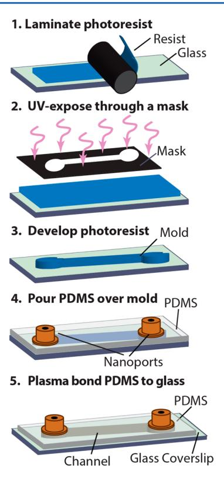
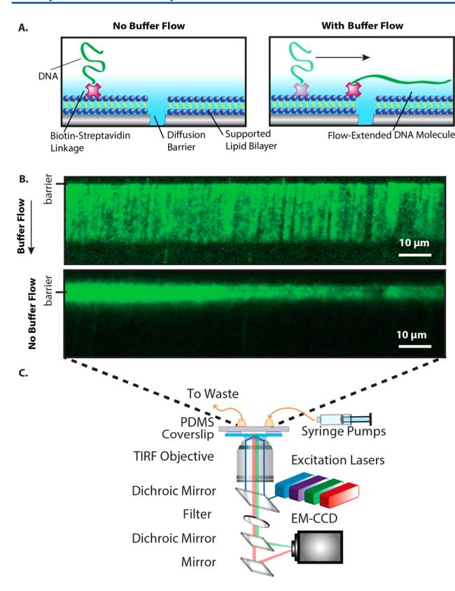
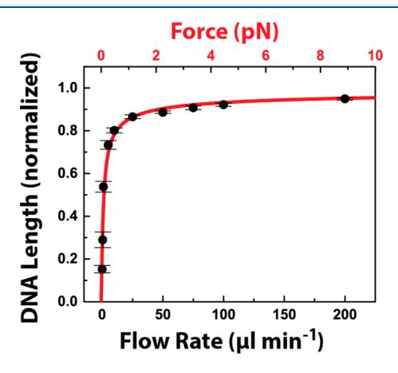
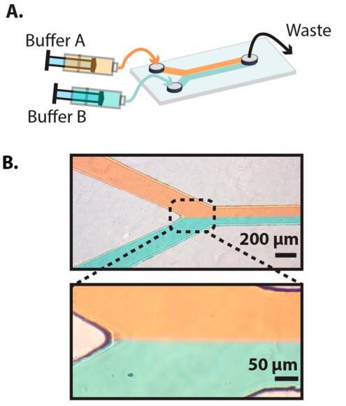
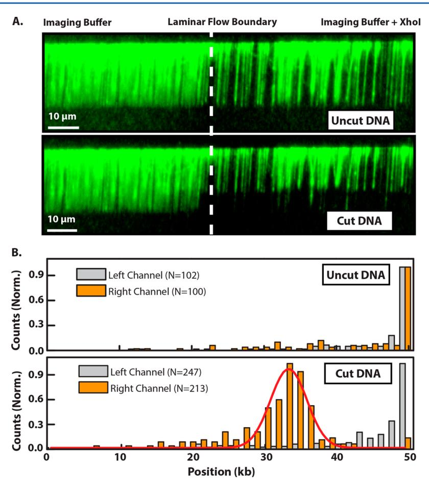
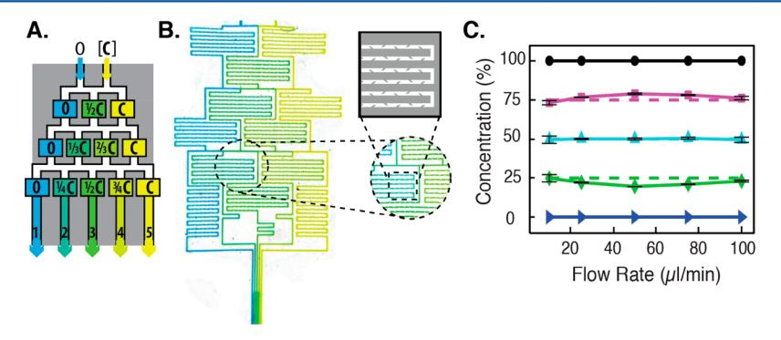
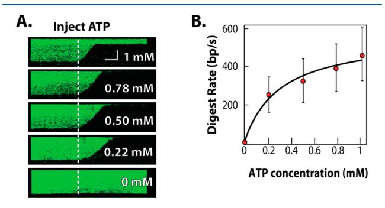

**Aaron D. Robison and Ilya J. Finkelstein***

*Analytical Chemistry, Vol. 86, Issue 9, pp. 4157–4163, 2014*

DOI: [10.1021/ac500267v](https://doi.org/10.1021/ac500267v)

---

## Contents

- [Abstract](#abstract)
- [Experimental Section](#experimental-section)
  - [Fabrication of Dry-Film Resist Masters](#fabrication-of-dry-film-resist-masters)
  - [Fabrication of Microfluidic Flow Cells](#fabrication-of-microfluidic-flow-cells)
  - [Preparation of RecBCD](#preparation-of-recbcd)
  - [Preparation of Biotinylated DNA](#preparation-of-biotinylated-dna)
  - [Lipids and DNA Curtains](#lipids-and-dna-curtains)
  - [Single-Molecule Microscopy and Data Analysis](#single-molecule-microscopy-and-data-analysis)
- [Results and Discussion](#results-and-discussion)
  - [Versatile Microfluidic Platform for DNA Curtains](#versatile-microfluidic-platform-for-dna-curtains)
  - [Concurrently Observing Two Biochemical Reactions](#concurrently-observing-two-biochemical-reactions)
  - [Imaging Five Reactions in a Passive Gradient Mixer](#imaging-five-reactions-in-a-passive-gradient-mixer)
- [Conclusion](#conclusion)
- [References](#references)

---

## Abstract {#abstract}

Single-molecule imaging and manipulation of biochemical reactions continues to reveal numerous biological insights. To facilitate these studies, we have developed and implemented a high-throughput approach to organize and image hundreds of individual DNA molecules at aligned diffusion barriers. Nonetheless, obtaining statistically relevant data sets under a variety of reaction conditions remains challenging. Here, we present a method for integrating high-throughput single-molecule "DNA curtain" imaging with poly(dimethylsiloxane) (PDMS)-based microfluidics. Our benchtop fabrication method can be accomplished in minutes with common tools found in all molecular biology laboratories. We demonstrate the utility of this approach by simultaneous imaging of two independent biochemical reaction conditions in a laminar flow device. In addition, five different reaction conditions can be observed concurrently in a passive linear gradient generator. Combining rapid microfluidic fabrication with high-throughput DNA curtains greatly expands our capability to interrogate complex biological reactions.

---

## Experimental Section {#experimental-section}

All chemicals were purchased from Sigma-Aldrich, unless otherwise specified. Restriction enzymes and DNA were purchased from New England Biolabs, and all lipids were from Avanti Lipids.

### Fabrication of Dry-Film Resist Masters {#fabrication-of-dry-film-resist-masters}

Dry film resists were obtained from DuPont (MX5000 series). High-resolution photomasks were designed in DraftSight and purchased from CAD/Art Services, Inc. To produce the mold master, a 3 in. × 1 in. strip of dry-film resist was laminated onto a clean glass microscope slide using a conventional office laminator at a rate of 11 mm s⁻¹ and a temperature of 97 °C (ProLam Photo Pouch laminator). After lamination, the dry-film resist was UV-treated through the photomask using a mask-aligner (Karl Suss MA6 Mask aligner; 12 s exposure time) or in a conventional gel-imaging transilluminator (SynOptics InGenious; 2 min exposure time). The UV-cured resist was developed with gentle rinses in 1% potassium carbonate at 4 °C, as suggested by the manufacturer protocol. After developing, the glass surface was gently cleaned to remove residual dry-film and used for casting the PDMS flow cells. After curing and cleaning, the dry-film master structures could be reused at least three times to cast multiple PDMS flow cells (see Supporting Information Tables S1 and S2).

### Fabrication of Microfluidic Flow Cells {#fabrication-of-microfluidic-flow-cells}

Glass coverslips (VWR; 22×50-1) were washed with 2% liquid detergent (Hellmanex III; Helma Analytics) followed by rinsing in water and ethanol before being air-dried in an ultrapure nitrogen gas stream. Coverslips were then annealed in a kiln (Paragon Caldera; Paragon Industries) by ramping the temperature from 20 to 525 °C at a rate of 2 °C min⁻¹. The coverslips were held at 525 °C for 5 h before the heating element was turned off. Coverslips gently cooled back to room temperature over 4 h. Annealing the coverslips greatly improves the fluidity of the supported lipid bilayer that is subsequently deposited on the coverslip surface. After annealing, slides were gently etched by scoring the coverslip surface with a 1.4 mm diamond-coated drill bit (Shor International).

An ~1 mm layer of liquid PDMS (Dow Corning; Sylgard 184) was prepared according to manufacturer recommendation (1:10 mixture of hardener to PDMS) and poured on top of the dry-film master. Nanoports (IDEX Corp.) were suspended in liquid PDMS above the flow cell inlets prior to polymer hardening. Nanoports were maintained approximately 0.5 mm above the surface of the master structure by suspending them in holes drilled through an inverted plastic Petri dish. After curing, the PDMS snugly retained the Nanoports. PDMS was removed from the master structure, and a 0.8 mm biopsy punch (Acuderm) was used to punch holes through the Nanoport openings. Finally, PDMS devices were treated in an air-plasma cleaner (Harrick Scientific) for 60 s and immediately bonded to freshly cleaned coverslips.

### Preparation of RecBCD {#preparation-of-recbcd}

Wild-type (wt) RecBCD purification was carried out as described previously[[9]](#ref9) with the following modifications. Plasmids IF53 (harboring wtRecBD) and IF54 (harboring wtRecC) were cotransformed into JM109 cells, grown in 2YT, and induced with IPTG.[[9]](#ref9) After induction, the cell pellet was collected, lysed by sonication, and clarified by ultracentrifugation. RecBCD was precipitated in 50% ammonium sulfate, resuspended in buffer A [20 mM Tris (pH 7.5); 0.1 mM EDTA; 0.1 mM DTT] and diluted with buffer A until the conductance was lower than buffer A plus 100 mM NaCl. The protein was loaded onto a 5 mL Q FastFlow column (GE Life Sciences) and eluted with a linear gradient into buffer A plus 1 M NaCl. RecBCD-containing fractions were pooled, diluted with five volumes of buffer A, and loaded onto a 1 mL Heparin column (GE). RecBCD was eluted with a linear salt gradient into buffer A plus 1 M NaCl, diluted with three volumes of buffer A, and loaded onto a 1 mL HiTrap Q HP column (GE). After elution with a linear salt gradient into buffer A plus 1 M NaCl, RecBCD-containing fractions were run through an S300 gel filtration column (GE) and dialyzed overnight into storage buffer [50% glycerol, 50 mM Tris–HCl (pH 7.5), 100 mM NaCl, 0.1 mM EDTA, 1 mM DTT, and 0.1% Triton X-100].

### Preparation of Biotinylated DNA {#preparation-of-biotinylated-dna}

The 48.5 kilobase (kb) bacteriophage λ genomic DNA was used for all microscopy experiments. Biotin was introduced to one end of the DNA by annealing and ligating a biotinylated synthetic oligonucleotide (5′AGG TCG CCG CCC 3′BioTEG; IDT DNA). Ligations were carried out with T4 ligase at 42 °C overnight. After ligation, T4 ligase was heat-inactivated at 65 °C for 20 min. The λ-DNA was separated from ligase and excess oligo by gel filtration on an S-1000 column (GE Life Sciences).

### Lipids and DNA Curtains {#lipids-and-dna-curtains}

Lipid bilayers were assembled as described previously, with several modifications.[[1]](#ref1),[[24]](#ref24) Small unilamellar vesicles composed of a ternary mixture of ~90% DOPC (1,2-dioleoyl-*sn*-glycero-3-phosphocholine; Avanti Lipids), 9% mPEG 2000-DOPE (1,2-dioleoyl-*sn*-glycero-3-phosphoethanolamine-*N*-(methoxy(poly(ethylene glycol))-2000) ammonium salt; Avanti Lipids), and ~1% biotinylated-DPPE (1,2-dipalmitoyl-*sn*-glycero-3-phosphoethanolamine-*N*-(biotinyl); Avanti Lipids) were prepared by sonication. Due to the narrow channel-widths of our devices, all liquid-handling steps were carried out by gravity flowing solutions through the flow cell. Vesicles were diluted in lipids buffer [10 mM Tris-HCl (pH 8) and 100 mM NaCl], introduced into the flow cell, and incubated for ~30 min. Excess vesicles were flushed with lipids buffer, and the flow cell was incubated for an additional 30 min to promote vesicle rupture and supported bilayer formation. After the bilayer was established, the flow cell was incubated for 10 min in BSA buffer [40 mM Tris-HCl (pH 8), 0.2 mg mL⁻¹ bovine serum albumin (BSA; Sigma), 1 mM DTT, 1 mM MgCl₂]. Streptavidin (Sigma) was diluted to 0.1 mg mL⁻¹ in BSA buffer and incubated in the flow cell for 10 min. Excess streptavidin was flushed out, and λ-DNA was incubated in the flow cell for an additional 10 min. In the absence of streptavidin, the microfluidic flow cells were virtually DNA-free, indicating that DNA tethering was mediated by a specific biotin–streptavidin interaction. A stepper-motor syringe pump (kd Scientific) was used to assemble aligned DNA curtains at mechanically etched diffusion barriers.

### Single-Molecule Microscopy and Data Analysis {#single-molecule-microscopy-and-data-analysis}

All microscopy was performed with an objective-type total internal reflection fluorescence (TIRF) microscope (Nikon Ti-Eclipse) equipped with a motorized microscope stage (Prior ProScan III) and a fiber-coupled laser launch containing 405, 488, 561, and 640 nm laser lines (Agilent MLC400). For TIRF imaging, the output of a 488 nm laser was guided through an excitation filter (Chroma; ZET488/10x) prior to entering the back aperture of a 60× oil-immersion 1.49 numerical aperture objective (Nikon). Fluorescence images were collected through the same objective and passed through three filters: (1) a 488 nm cleanup (Chroma; ZT488rdc), (2) a 500 nm long-pass emission (Chroma; ET500lp), and (3) a 525 nm band-pass (Chroma; ET525/50m) prior to detection on a back-thinned EMCCD (ANDOR iXon 3). The power at the surface of the objective was 0.2 mW (measured using a Laser Check power meter, Edmund Optics). The power flux in the field of view was 0.4 W cm⁻².

For fluorescence imaging, 100 pM of biotinylated λ-DNA was incubated for 10 min in imaging buffer [40 mM Tris–HCl (pH 8), 1 mM DTT, 2 mM MgCl₂, 0.2 mg mL⁻¹ bovine serum albumin, 1 nM YOYO-1 (Life Technologies), and an oxygen scavenging system (1.4 mM glucose, ~30 U glucose oxidase, and ~500 U catalase)].[[25]](#ref25) DNA molecules were stained with the fluorescent intercalating dye YOYO-1, which was present in the buffer at a concentration of 1 nM during all DNA imaging experiments. The DNA length is not affected by 1 nM YOYO-1.[[26]](#ref26) Furthermore, both the restriction enzyme[[27]](#ref27),[[28]](#ref28) and RecBCD enzymatic activities[[9]](#ref9),[[29]](#ref29),[[30]](#ref30) are fully maintained under these imaging conditions. To reduce DNA photodamage, the power flux and YOYO-1 concentration were both kept below the reported rates of dye-induced DNA breaks.[[31]](#ref31)

Images were acquired using NIS-Elements software (Nikon) and processed using ImageJ (http://rsbweb.nih.gov/ij/). Custom MATLAB scripts were used to analyze fluorescence intensities as a function of flow rate and to compute the length of individual fluorescent DNA molecules. Data analysis was performed in MATLAB and Origin Pro (OriginLabs). All reported error bars correspond to the standard deviation of the indicated number of individual DNA molecules.

---

## Results and Discussion {#results-and-discussion}

### Versatile Microfluidic Platform for DNA Curtains {#versatile-microfluidic-platform-for-dna-curtains}

Dry-film photoresist was used to rapidly generate micrometer-scale masters for PDMS-based soft lithography. The fabrication progress is outlined in [Fig. 1](#fig1). First, the photoresist was laminated onto a cleaned glass microscope slide and then exposed through a transparency mask on a UV gel transilluminator. The photoresist was developed and used as a master for casting PDMS microfluidic devices. After the PDMS was cured and detached from the master, the remaining device surface was capped with an optically smooth glass coverslip for microscopic observation. This benchtop fabrication process does not require any specialized equipment and can be completed in ~15 min.

<figure class="paper-figure" id="fig1">

<figcaption><strong>Figure 1.</strong> General strategy for rapid, benchtop microfluidic device fabrication. The dry-film resist is laminated onto a glass slide and photocured by exposure to UV light through a photomask. After chemical developing, the dry-film master is cast in PDMS. Nanoports are embedded in the liquid PDMS before it has time to harden. To complete device fabrication, the PDMS mold is separated from the master and plasma-bonded onto a glass coverslip.</figcaption>
</figure>

DNA curtains were assembled within a single-channel PDMS device. Biotinylated λ-phage DNA was tethered to the lipid bilayer via a biotin–streptavidin linkage. Buffer flow was then used to organize the tethered DNA molecules at mechanical barriers, which cannot be traversed by the otherwise mobile lipids ([Fig. 2](#fig2)A). [Fig. 2](#fig2)B demonstrates an array of λ-phage DNA molecules arranged at a mechanical barrier within the microfluidic device. DNA was stained with an intercalating dye and imaged via objective-based TIRF microscopy ([Fig. 2](#fig2)C). Upon introducing buffer flow, the DNA was extended and pushed to the mechanical barriers. In the absence of buffer flow, the DNA was fully retracted and began to freely diffuse within the fluid lipid bilayer. Thus, DNA curtains could be assembled and imaged with high signal to noise within PDMS-based microfluidic flow cells.

<figure class="paper-figure" id="fig2">

<figcaption><strong>Figure 2.</strong> (A) Illustration of a DNA molecule organized at a lipid diffusion barrier. (B) Fluorescence image of a λ-DNA curtain in the presence (top) and absence (bottom) of a 50 μL min⁻¹ buffer flow. In the absence of buffer flow (bottom panel), the DNA collapses and begins to diffuse away from the mechanical barrier. The DNA was stained with the intercalating dye YOYO-1. (C) Schematic of the objective-TIRF microscope used for imaging DNA curtains.</figcaption>
</figure>

To investigate the interdependence between DNA extension and flow rate, DNA extension was measured in an ~230 μm wide chamber ([Fig. 3](#fig3)). At least 10 DNA molecules were analyzed at each flow rate, and error bars represent the standard deviation of the mean DNA lengths. To approximate the applied force as a function of flow rate, the data was modeled with a wormlike chain (WLC) model according to eq 1:

$$F = \frac{k_\mathrm{B}T}{L_\mathrm{p}} \left[ \frac{1}{4\left(1 - \frac{\langle x \rangle}{L}\right)^2} - \frac{1}{4} + \frac{\langle x \rangle}{L} \right] \tag{1}$$

where *F* is the applied force, *k*B is Boltzmann's constant, *T* is the temperature, *L*p is the persistence length of double-stranded DNA (50 nm), *L* is the B-form λ-DNA length (16.5 μm), and ⟨*x*⟩ is the measured experimental DNA length.[[32]](#ref32),[[33]](#ref33) The red line is not a fit to the data; rather it is calculated from the experimental parameters. The excellent agreement between the model and simulations allows us to accurately estimate the forces that are exerted on the DNA molecules as a function of the applied flow rate. Less than 1 pN of force is applied at ~80% DNA extension (relative to crystallographic B-form length), and shear forces up to ~9 pN could be applied at flow rates of 200 μL s⁻¹. These forces are well below the rupture forces required to remove a lipid from the bilayer or to break the strong biotin–streptavidin interaction.[[34]](#ref34),[[35]](#ref35) Thus, the reduced volumes in PDMS-based fluidic devices will permit high-throughput interrogation of protein–DNA interactions in the 0.1–9 pN force regime.

<figure class="paper-figure" id="fig3">

<figcaption><strong>Figure 3.</strong> Extension of λ-DNA by shear flow. DNA length was measured as a function of the flow rate and normalized relative to the B-form DNA length (black circles). When corrected for the dimensions of the central channel, these rates correspond to flow velocities of 0.015, 0.073, 0.15, 0.73, 1.4, 3.6, 7.3, 11, 14, and 29 cm s⁻¹. The error bars represent the standard deviation in the lengths of at least 10 DNA molecules. At higher flow rates, the standard deviation is less than 1% of the average DNA length. The wormlike chain (WLC) model was used to estimate the applied force as a function of the DNA length (red line and scale). Note that there are no adjustable parameters in the WLC model. Forces between 0.1 and 9 pN can be readily applied in the 230 μm wide laminar flow device.</figcaption>
</figure>

### Concurrently Observing Two Biochemical Reactions {#concurrently-observing-two-biochemical-reactions}

First, a two-channel Y-shaped flow cell was constructed to simultaneously image two independent biochemical reactions ([Fig. 4](#fig4) and Supporting Information Figure S1). Laminar flow was sustained at flow rates above 5 μL min⁻¹, with the sharpest laminar flow boundary observed at the fastest flow rates.[[36]](#ref36) Thus, diffusive mixing was constrained to a thin region between the two laminar channels at flow rates above ~30 μL min⁻¹.

<figure class="paper-figure" id="fig4">

<figcaption><strong>Figure 4.</strong> (A) Schematic of a two-channel laminar flow Y-junction device. (B) Images of the device taken at a flow rate of 30 μL min⁻¹. A sharp laminar flow boundary is clearly visible at flow rates above 5 μL min⁻¹. Laminar flow was visualized by introducing red or green food dye into each of the channels.</figcaption>
</figure>

As a proof of principle, we carried out a dynamic optical restriction map of the DNA curtain in one of the two flow channels.[[2]](#ref2) As all DNA molecules are tethered by the same DNA end, hydrodynamic force mechanically aligns the molecules with respect to their DNA sequence. First, a fluorescent tracer was injected into the right channel to map the laminar flow boundary. Then, we selected a field of view that permitted simultaneous real-time observation of the DNA curtain in both channels. Prior to injecting the restriction enzyme XhoI, the DNA molecules were predominantly full length and indistinguishable in either channel ([Fig. 5](#fig5)A). After injecting XhoI into the right channel, the dense DNA curtain was completely digested in the right channel at the single predicted XhoI site, leaving a fragment that appeared to be ~15 kb shorter than the DNA in the left channel ([Fig. 5](#fig5)B). A Gaussian fit of the resulting DNA-length distribution yielded a mean length of 33.3 ± 2.5 kb (*N* = 213), which is consistent with the expected single XhoI restriction site at 33.5 kb on λ-DNA. Thus, XhoI activity was readily imaged in one of the laminar flow channels, while leaving DNA in the second channel unperturbed.

<figure class="paper-figure" id="fig5">

<figcaption><strong>Figure 5.</strong> (A) Fluorescence image of a dense λ-DNA curtain at the interface between two laminar flow channels. The DNA is full length in both channels prior to introducing XhoI (top) but is rapidly digested on the right side after XhoI is injected into the right channel (bottom). (B) A histogram of the distribution of individual DNA molecule lengths in the left (gray) and right (orange) channels before (top panel) and after introducing XhoI (bottom panel). After XhoI digestion, the DNA remains at full length in the left channel but is rapidly digested in the right channel. The number of DNA molecules in each histogram is indicated in the legend. The red curve in the bottom histogram is a Gaussian fit to the right-channel data with a center position of 33.3 ± 0.2 kb.</figcaption>
</figure>

### Imaging Five Reactions in a Passive Gradient Mixer {#imaging-five-reactions-in-a-passive-gradient-mixer}

Single-molecule biophysical studies must frequently be repeated as a function of several reaction conditions (e.g., salt or protein concentration). To further streamline these experiments, we developed a five-channel linear gradient mixer that permitted direct observation of five concurrent biochemical reactions ([Fig. 6](#fig6)). To maximize chaotic mixing under the rapid flow conditions required for full DNA extension, our design incorporated 125 baffles along a 50 mm mixing path. Mixing efficiency was determined by injecting fluorescein into one of the two input channels, and the resulting fluorescence intensity was measured across each of the five imaging channels. Near-ideal analyte mixing was observed within each of the five channels ([Fig. 6](#fig6)C). In addition, near-ideal protein gradients could be generated within the gradient mixer (Supporting Information Figure S4 and Table S4). The baffles were essential to promote chaotic mixing, as reducing their length or density substantially impacted the degree of mixing (data not shown).

<figure class="paper-figure" id="fig6">

<figcaption><strong>Figure 6.</strong> (A) Schematic illustration of a passive gradient mixer. An analyte, [C], is diluted after chaotic mixing. (B) Image of blue and yellow food dye in the gradient mixer, with a close-up view of mixing baffles within the microfluidic chambers. (C) Fluorescein was used to characterize the degree of mixing as a function of the flow rate. Fluorescence measurements were made in each of the five imaging channels and normalized to undiluted fluorescein (100%, black circles). The dashed lines indicate ideal mixing values. Error bars report the standard deviation of three measurements taken with three different devices.</figcaption>
</figure>

Next, the gradient mixer was used to characterize the ATP-dependent digestion rates of RecBCD on DNA. RecBCD is a heterotrimeric helicase and nuclease that converts the energy of ATP hydrolysis into processive translocation along the DNA.[[9]](#ref9),[[29]](#ref29),[[37]](#ref37),[[38]](#ref38) As RecBCD translocates along the DNA, its helicase domain unwinds duplex DNA and the nuclease activity digests the two resulting single-stranded DNAs. Resulting oligo-length fragments are rapidly removed during the continuous buffer flow. Thus, RecBCD translocation is measured as a change in the length of the fluorescently stained DNA. The microscope stage was scanned between each of the five channels during the course of the reaction. RecBCD was injected into the flow cell and allowed to bind DNA before injecting 1 mM ATP into one of the input channels.

Kymograms of RecBCD activity are shown in [Fig. 7](#fig7)A. RecBCD-mediated DNA digestion was rapid in 1 mM ATP (first channel, top kymogram), and there was no digestion in the absence of ATP (fifth channel, bottom kymogram). As expected, the RecBCD velocity shows a strong ATP dependence. The digestion rates from these five channels were fit to the Michaelis–Menten equation:

$$\nu = \frac{V_\mathrm{max}[S]}{K_\mathrm{m} + [S]} \tag{2}$$

where *ν* is the reaction rate, *V*max is the maximum rate at saturating substrate concentration [S], and *K*m is the substrate concentration at which the reaction rate is half of *V*max. The resulting fit yielded *V*max = 556 ± 66 bp s⁻¹ and *K*m = 229 ± 106 μM ATP, which is in agreement with previously reported values.[[9]](#ref9),[[29]](#ref29) We conclude that our passive gradient mixer permits the concurrent observation of five distinct biochemical reactions with single-molecule sensitivity.

<figure class="paper-figure" id="fig7">

<figcaption><strong>Figure 7.</strong> Concurrent observation of RecBCD activity in five defined ATP concentrations. (A) Kymograms of RecBCD digesting a DNA molecule in each of the five imaging chambers. The horizontal scale bar indicates 60 s, and the vertical scale bar is 4 μm. (B) The mean RecBCD digestion rate in the five channels was fit to a Michaelis–Menten equation. Error bars represent the standard deviation in the velocities of more than 30 RecBCD molecules taken from at least three microfluidic devices.</figcaption>
</figure>

---

## Conclusion {#conclusion}

This report describes a strategy to integrate multichannel, PDMS-based microfluidics with the high-throughput DNA curtains imaging platform. By using dry-film resists, highly reproducible devices can be fabricated in minutes in a typical molecular biology laboratory; the process does not entail any specialized microfabrication expertise or equipment. The master structures do not require additional silanization or other treatment prior to PDMS molding. Device miniaturization (<5 μL volume) and micrometer-scale channel widths substantially reduce protein consumption and permit the application of hydrodynamic forces from 0.1 to ~9 pN, an important range for interrogating protein–nucleic acid interactions.[[4]](#ref4),[[39]](#ref39)–[[42]](#ref42) The rapid and inexpensive construction of these disposable devices also eliminates the need to recycle and regenerate sensitive surfaces for supported lipid bilayers. Finally, observing the DNA curtain via objective-type TIRF avoids the challenges associated with imaging through PDMS.

The versatility of this microfabrication strategy will facilitate the development of more complex devices, such as circular-flow,[[15]](#ref15) ultrafast mixers,[[43]](#ref43) and other advanced microfluidic platforms. Control elements such as valves can permit DNA or protein recovery and sorting for further downstream analysis.[[44]](#ref44) Finally, the gas permeability of PDMS can be exploited to overcome challenges associated with oxygen-mediated fluorophore photobleaching.[[13]](#ref13)

In this work, mechanically etched diffusion barriers were used to construct DNA curtains on a surface of a microfluidic laminar flow cell. Nanopatterned surfaces have recently been used to generate highly uniform lipid diffusion barriers.[[1]](#ref1)–[[3]](#ref3) Future work will focus on depositing user-defined nanofeatures onto microscope coverslips for next-generation microfluidic DNA curtains.

In summary, we have developed a simple and cost-effective strategy for integrating microfluidics with the DNA curtain single-molecule imaging platform. The microfluidic devices are fabricated with tools that are readily available in all biochemistry laboratories; access to a clean room is not required. Furthermore, masters with feature sizes down to ~10 μm can be manufactured in minutes, permitting rapid fluidic prototyping. Soft-lithography-based microfluidic DNA curtains greatly expand the versatility of this powerful single-molecule approach. These methods will also find broad utility in biosensing and single-molecule analytical biology settings.

---

## Author Information

**Corresponding Author:** \*E-mail: ifinkelstein@cm.utexas.edu.

**Notes:** The authors declare no competing financial interest.

**Acknowledgments:** This research was supported in part by the Welch Foundation (F-1808) and by startup funds from the University of Texas at Austin. Dr. Ilya Finkelstein is a CPRIT Scholar in Cancer Research. We thank Dr. Edward Marcotte and his research group for occasional use of their objective-TIRF microscope. Dr. Eric Spivey contributed scanning electron microscope imaging expertise, and Dr. Ignacio Gallardo provided fluorescent proteins.

---

## References {#references}

1. Finkelstein, I. J.; Greene, E. C. *Methods Mol. Biol. (Clifton, NJ)* **2011**, *745*, 447–461.

2. Fazio, T.; Visnapuu, M.-L.; Wind, S.; Greene, E. C. *Langmuir* **2008**, *24*, 10524–10531.

3. Gorman, J.; Fazio, T.; Wang, F.; Wind, S.; Greene, E. C. *Langmuir* **2010**, *26*, 1372–1379.

4. Finkelstein, I. J.; Greene, E. C. *Annu. Rev. Biophys.* **2013**, *42*, 241–263.

5. Greene, E. C.; Wind, S.; Fazio, T.; Gorman, J.; Visnapuu, M.-L. In *Methods in Enzymology*; Walter, N. G., Ed.; Elsevier: Amsterdam, The Netherlands, 2010; Vol. 472, pp 293–315.

6. Castellana, E. T.; Cremer, P. S. *Surf. Sci. Rep.* **2006**, *61*, 429–444.

7. Visnapuu, M.-L.; Greene, E. C. *Nat. Struct. Mol. Biol.* **2009**, *16*, 1056–1062.

8. Gorman, J.; Wang, F.; Redding, S.; Plys, A. J.; Fazio, T.; Wind, S.; Alani, E. E.; Greene, E. C. *Proc. Natl. Acad. Sci. U.S.A.* **2012**, *109*, E3074–E3083.

9. Finkelstein, I. J.; Visnapuu, M.-L.; Greene, E. C. *Nature* **2010**, *468*, 983–987.

10. Lee, S. S.; Avalos Vizcarra, I.; Huberts, D. H. E. W.; Lee, L. P.; Heinemann, M. *Proc. Natl. Acad. Sci. U.S.A.* **2012**, *109*, 4916–4920.

11. Kurth, I.; Georgescu, R. E.; O'Donnell, M. E. *Nature* **2013**, *496*, 119–122.

12. Langelier, S. M.; Livak-Dahl, E.; Manzo, A. J.; Johnson, B. N.; Walter, N. G.; Burns, M. A. *Lab Chip* **2011**, *11*, 1679.

13. Lemke, E. A.; Gambin, Y.; Vandelinder, V.; Brustad, E. M.; Liu, H.-W.; Schultz, P. G.; Groisman, A.; Deniz, A. A. *J. Am. Chem. Soc.* **2009**, *131*, 13610–13612.

14. Zhao, Y.; Chen, D.; Yue, H.; French, J. B.; Rufo, J.; Benkovic, S. J.; Huang, T. J. *Lab Chip* **2013**, *13*, 2183.

15. Kim, S.; Streets, A. M.; Lin, R. R.; Quake, S. R.; Weiss, S.; Majumdar, D. S. *Nat. Methods* **2011**, *8*, 242–245.

16. Killian, J. L.; Li, M.; Sheinin, M. Y.; Wang, M. D. *Curr. Opin. Struct. Biol.* **2012**, *22*, 80–87.

17. Brewer, L. R.; Bianco, P. R. *Nat. Methods* **2008**, *5*, 517–525.

18. McDonald, J. C.; Duffy, D. C.; Anderson, J. R.; Chiu, D. T.; Wu, H.; Schueller, O. J. A.; Whitesides, G. M. *Electrophoresis* **2000**, *21*, 27–40.

19. Sia, S. K.; Whitesides, G. M. *Electrophoresis* **2003**, *24*, 3563–3576.

20. Duffy, D. C.; McDonald, J. C.; Schueller, O. J. A.; Whitesides, G. M. *Anal. Chem.* **1998**, *70*, 4974–4984.

21. Abgrall, P.; Conedera, V.; Camon, H.; Gue, A.-M.; Nguyen, N.-T. *Electrophoresis* **2007**, *28*, 4539–4551.

22. Marty, F.; Rousseau, L.; Saadany, B.; Mercier, B.; Français, O.; Mita, Y.; Bourouina, T. *Microelectron. J.* **2005**, *36*, 673–677.

23. Bu, M.; Melvin, T.; Ensell, G. J.; Wilkinson, J. S.; Evans, A. G. R. *Sens. Actuators, A* **2004**, *115*, 476–482.

24. Wolcott, H.; Alcott, B.; Kaplan, L.; Greene, E. C. In *Microscopy: Science, Technology, Applications and Education*; Mendez-Vilas, A., Diaz, J., Eds.; Formatex Publishing: Extremadura, Spain, 2010.

25. Rasnik, I.; McKinney, S. A.; Ha, T. *Nat. Methods* **2006**, *3*, 891–893.

26. Reuter, M.; Dryden, D. T. F. *Biochem. Biophys. Res. Commun.* **2010**, *403*, 225–229.

27. Visnapuu, M.-L.; Fazio, T.; Wind, S.; Greene, E. C. *Langmuir* **2008**, *24*, 11293–11299.

28. Xu, W.; Muller, S. J. *Lab Chip* **2011**, *11*, 435–442.

29. Bianco, P. R.; Brewer, L. R.; Corzett, M.; Balhorn, R.; Yeh, Y.; Kowalczykowski, S. C.; Baskin, R. J. *Nature* **2001**, *409*, 374–378.

30. Spies, M.; Bianco, P. R.; Dillingham, M. S.; Handa, N.; Baskin, R. J.; Kowalczykowski, S. C. *Cell* **2003**, *114*, 647–654.

31. Tycon, M. A.; Dial, C. F.; Faison, K.; Melvin, W.; Fecko, C. J. *Anal. Biochem.* **2012**, *426*, 13–21.

32. Hagerman, P. J. *Annu. Rev. Biophys. Biophys. Chem.* **1988**, *17*, 265–286.

33. Brinkers, S.; Dietrich, H. R. C.; de Groote, F. H.; Young, I. T.; Rieger, B. *J. Chem. Phys.* **2009**, *130*, 215105.

34. Granéli, A.; Yeykal, C. C.; Prasad, T. K.; Greene, E. C. *Langmuir* **2006**, *22*, 292–299.

35. Lee, J. Y.; Wang, F.; Fazio, T.; Wind, S.; Greene, E. C. *Biochem. Biophys. Res. Commun.* **2012**, *426*, 565–570.

36. Kamholz, A.; Yager, P. *Biophys. J.* **2001**, *80*, 155–160.

37. Dillingham, M. S.; Kowalczykowski, S. C. *Microbiol. Mol. Biol. Rev.* **2008**, *72*, 642–671.

38. Yang, L.; Handa, N.; Liu, B.; Dillingham, M. S.; Wigley, D. B.; Kowalczykowski, S. C. *Proc. Natl. Acad. Sci. U.S.A.* **2012**, *109*, 8907–8912.

39. Finkelstein, I. J.; Greene, E. C. *Mol. BioSyst.* **2008**, *4*, 1094.

40. Robinson, A.; van Oijen, A. M. *Nat. Rev. Microbiol.* **2013**, *11*, 303–315.

41. Bustamante, C.; Cheng, W.; Mejia, Y. X. *Cell* **2011**, *145*, 160.

42. Larson, M. H.; Landick, R.; Block, S. M. *Mol. Cell* **2011**, *41*, 249–262.

43. Gambin, Y.; VanDelinder, V.; Ferreon, A. C. M.; Lemke, E. A.; Groisman, A.; Deniz, A. A. *Nat. Methods* **2011**, *8*, 239–241.

44. Melin, J.; Quake, S. R. *Annu. Rev. Biophys. Biomol. Struct.* **2007**, *36*, 213–231.

---

*Archived from the published PDF on 2026-04-14.*
