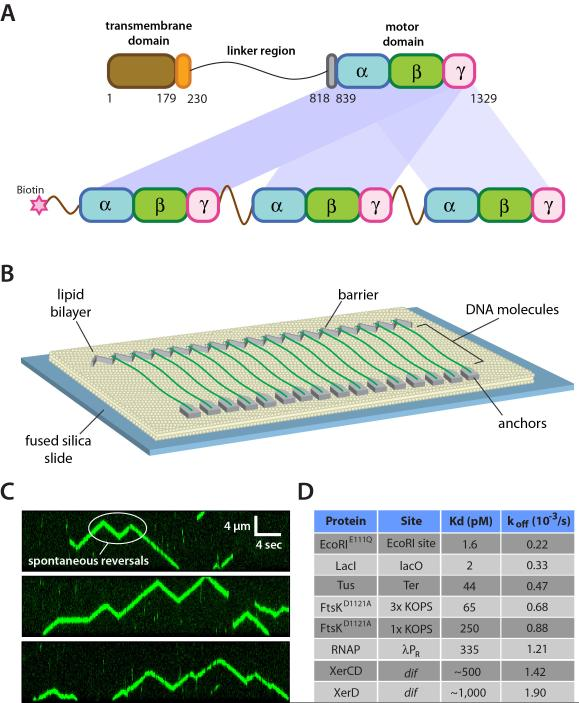
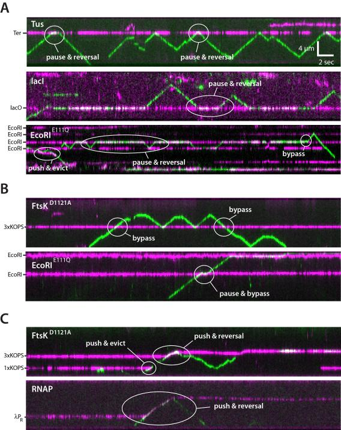
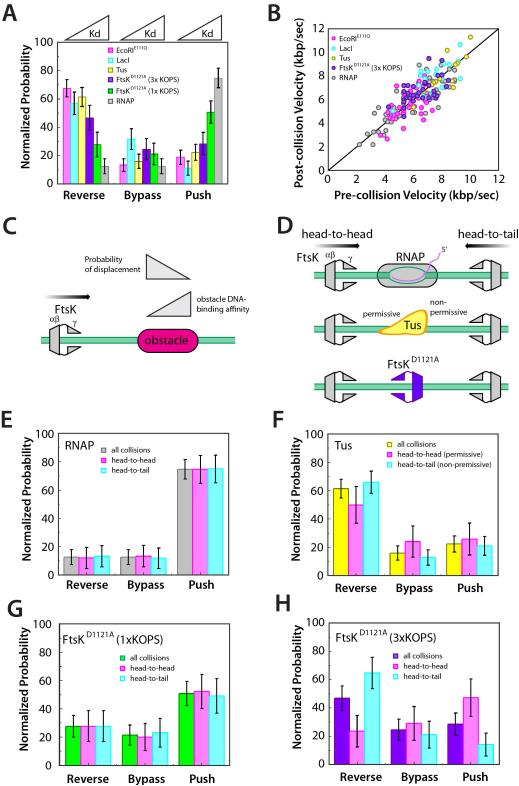
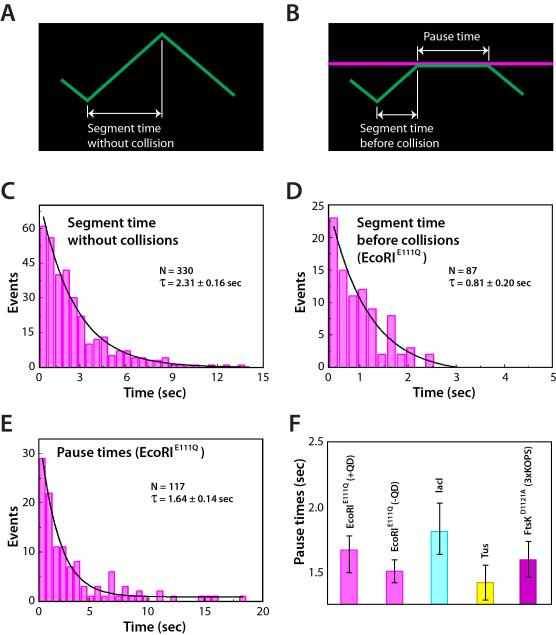
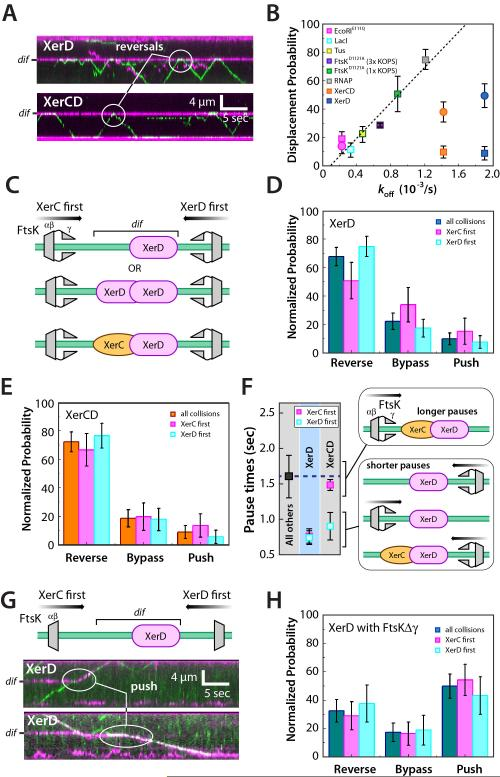
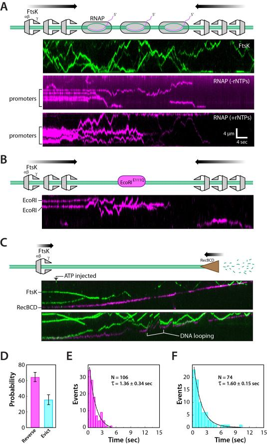
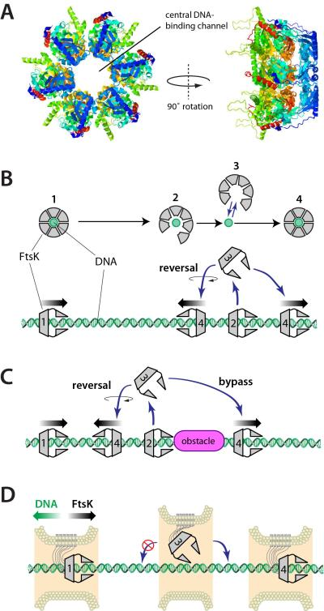

# Single-molecule imaging of FtsK translocation reveals mechanistic features of protein-protein collisions on DNA

**Ja Yil Lee, Ilya J. Finkelstein, Lidia K. Arciszewska, David J. Sherratt, and Eric C. Greene**

*Mol. Cell*, Volume 54, Issue 5, Pages 832–43 (2014)

**DOI:** [10.1016/j.molcel.2014.03.033](https://doi.org/10.1016/j.molcel.2014.03.033)

---

## Table of Contents

- [Summary](#summary)
- [Introduction](#introduction)
- [Results](#results)
- [Discussion](#discussion)
- [Experimental Procedures](#experimental-procedures)
- [Acknowledgments](#acknowledgments)

---

##  Summary
In physiological settings DNA translocases will encounter DNA-bound proteins, which must be dislodged or bypassed to allow continued translocation. FtsK is a bacterial translocase that promotes chromosome dimer resolution and decatenation by activating XerCD-_dif_ recombination. To better understand how translocases act in crowded environments we used single-molecule imaging to visualize FtsK in real-time as it collided with other proteins. We show that FtsK can push, evict, and even bypass DNA-bound proteins. The primary factor dictating the outcome of collisions was the relative affinity of the proteins for their specific binding sites. Importantly, protein-protein interactions between FtsK and XerD help prevent removal of XerCD from DNA by promoting rapid reversal of FtsK. Finally, we demonstrate that RecBCD always overwhelms FtsK when these two motor proteins collide while traveling along the same DNA molecule, indicating that RecBCD is capable of exerting a much greater force than FtsK when translocating along DNA.
---
##  Introduction
Nucleic acid translocases harness the chemical energy from nucleotide hydrolysis to move along DNA. Proteins such as chromatin remodeling enzymes, DNA polymerases, RNA polymerases, and DNA helicases must travel along chromosomal substrates bound by many other proteins. An increasingly appreciated role of nucleic acid translocases is to remove other proteins from DNA, and DNA-binding proteins are a major source of replication fork stalling, which can lead to genome instability ([Alzu et al., 2012](https://pmc.ncbi.nlm.nih.gov/articles/PMC4048639/#R1); [Gupta et al., 2013](https://pmc.ncbi.nlm.nih.gov/articles/PMC4048639/#R19); [Guy et al., 2009](https://pmc.ncbi.nlm.nih.gov/articles/PMC4048639/#R20); [Merrikh et al., 2011](https://pmc.ncbi.nlm.nih.gov/articles/PMC4048639/#R33); [Mizuno et al., 2013](https://pmc.ncbi.nlm.nih.gov/articles/PMC4048639/#R35)). However, there is still little mechanistic information regarding what happens when ATP-dependent motor proteins encounter obstacles on DNA.
_Escherichia coli_ FtsK is 1,329-amino acid (aa) protein, which localizes to the division septum and acts as a rotary DNA pump to help segregate sister chromosomes during cytokinesis ([Barre, 2007](https://pmc.ncbi.nlm.nih.gov/articles/PMC4048639/#R3); [Kaimer and Graumann, 2011](https://pmc.ncbi.nlm.nih.gov/articles/PMC4048639/#R24); [Stouf et al., 2013](https://pmc.ncbi.nlm.nih.gov/articles/PMC4048639/#R45)). FtsK is also required for stimulating the activity of the site-specific tyrosine recombinase XerCD, when bound to the 28-bp _dif_ site within the replication termination region of the chromosome ([Aussel et al., 2002](https://pmc.ncbi.nlm.nih.gov/articles/PMC4048639/#R2)). Xer recombination is a conserved reaction that unlinks chromosome dimers that arise during homologous recombination and also facilitates chromosome decatenation ([Barre, 2007](https://pmc.ncbi.nlm.nih.gov/articles/PMC4048639/#R3); [Carnoy and Roten, 2009](https://pmc.ncbi.nlm.nih.gov/articles/PMC4048639/#R8); [Kaimer and Graumann, 2011](https://pmc.ncbi.nlm.nih.gov/articles/PMC4048639/#R24); [Kono et al., 2011](https://pmc.ncbi.nlm.nih.gov/articles/PMC4048639/#R25); [Shimokawa et al., 2013](https://pmc.ncbi.nlm.nih.gov/articles/PMC4048639/#R42)).
FtsK has three domains: a 179-aa N-terminal membrane-spanning domain; a ~650-aa proline-/glutamine-rich linker domain; and a ~500-aa C-terminal motor domain ([Barre, 2007](https://pmc.ncbi.nlm.nih.gov/articles/PMC4048639/#R3); [Kaimer and Graumann, 2011](https://pmc.ncbi.nlm.nih.gov/articles/PMC4048639/#R24)). The C-terminal region can be divided into α-, β-, and γ-domains ([Aussel et al., 2002](https://pmc.ncbi.nlm.nih.gov/articles/PMC4048639/#R2); [Massey et al., 2006](https://pmc.ncbi.nlm.nih.gov/articles/PMC4048639/#R31)). FtsKαβ belongs to the RecA family of ATPases ([Aussel et al., 2002](https://pmc.ncbi.nlm.nih.gov/articles/PMC4048639/#R2); [Massey et al., 2006](https://pmc.ncbi.nlm.nih.gov/articles/PMC4048639/#R31)). FtsKγ is a winged-helix domain that binds the 8-bp KOPS (FtsK Oriented Polar Sequences; 5′-GGGNAGGG-3′), which guides the translocase towards the chromosome terminus during cell division ([Bigot et al., 2005](https://pmc.ncbi.nlm.nih.gov/articles/PMC4048639/#R5); [Graham et al., 2010a](https://pmc.ncbi.nlm.nih.gov/articles/PMC4048639/#R16); [Lee et al., 2012](https://pmc.ncbi.nlm.nih.gov/articles/PMC4048639/#R26); [Levy et al., 2005](https://pmc.ncbi.nlm.nih.gov/articles/PMC4048639/#R27); [Löwe et al., 2008](https://pmc.ncbi.nlm.nih.gov/articles/PMC4048639/#R28); [Sivanathan et al., 2006](https://pmc.ncbi.nlm.nih.gov/articles/PMC4048639/#R43)). The γ-domain is also necessary for activation of XerCD-_dif_ recombination ([Grainge et al., 2011](https://pmc.ncbi.nlm.nih.gov/articles/PMC4048639/#R18); [Yates et al., 2006](https://pmc.ncbi.nlm.nih.gov/articles/PMC4048639/#R48)). During Xer recombination, XerCD catalyzes two pairs of reciprocal strand exchange reactions, which lead to chromosome dimer resolution and decatenation ([Aussel et al., 2002](https://pmc.ncbi.nlm.nih.gov/articles/PMC4048639/#R2)). Translocation of FtsK towards XerD in an XerCD-_dif_ complex enables the FtsK γ-domain to contact XerD, leading to activation of XerD, which then initiates the first pair of strand exchange reactions, yielding a Holliday junction (HJ) intermediate, which is acted upon by XerC. The activity of XerC is independent of FtsK, but the XerD-catalyzed strand exchange reaction requires FtsK, and FtsK must approach XerCD from the XerD side of the complex, enabling the γ-domain to contact XerD ([Massey et al., 2004](https://pmc.ncbi.nlm.nih.gov/articles/PMC4048639/#R30); [Yates et al., 2006](https://pmc.ncbi.nlm.nih.gov/articles/PMC4048639/#R48); [Zawadzki et al., 2013](https://pmc.ncbi.nlm.nih.gov/articles/PMC4048639/#R49)).
_E. coli_ FtsK associates with the septum through its N-terminal domain, but FtsK lacking the membrane attachment domain can still support chromosome segregation if it is targeted to the division septum by an adapter protein ([Dubarry and Barre, 2010](https://pmc.ncbi.nlm.nih.gov/articles/PMC4048639/#R10)). _B. subtilis_ has two FtsK homologs: SpoIIIE, which harbors a membrane-spanning domain and acts during the later stages of chromosome segregation; and SftA, which acts earlier in chromosome segregation and lacks a membrane spanning domain ([Kaimer and Graumann, 2011](https://pmc.ncbi.nlm.nih.gov/articles/PMC4048639/#R24)). These findings indicate that FtsK/SpoIIIE motors are modular by design and can function without a direct connection to the cell membrane, and indeed the isolated motor domains have served as powerful model systems for studying the biochemical characteristics of hexameric DNA translocases ([Aussel et al., 2002](https://pmc.ncbi.nlm.nih.gov/articles/PMC4048639/#R2); [Bigot et al., 2006](https://pmc.ncbi.nlm.nih.gov/articles/PMC4048639/#R4); [Pease et al., 2005](https://pmc.ncbi.nlm.nih.gov/articles/PMC4048639/#R37); [Saleh et al., 2005](https://pmc.ncbi.nlm.nih.gov/articles/PMC4048639/#R40)).
FtsK must travel along chromosomes that are crowded with other DNA-binding proteins, and bulk biochemical assays demonstrated that FtsK can remove streptavidin and MatP from DNA, but does not readily remove XerCD from _dif_ ([Crozat et al., 2010](https://pmc.ncbi.nlm.nih.gov/articles/PMC4048639/#R9); [Graham et al., 2010b](https://pmc.ncbi.nlm.nih.gov/articles/PMC4048639/#R17)). SpoIIIE can remove RNA polymerase from DNA, and proteins such as transcription factors are also removed during forespore development ([Marquis et al., 2008](https://pmc.ncbi.nlm.nih.gov/articles/PMC4048639/#R29)). However, given the complexities of these reactions there is still little mechanistic information available, nor have general principles been established that can help predict outcomes for protein-protein collisions on DNA.
Here we sought to evaluate the outcomes of protein-protein collisions using single-molecule optical imaging of DNA curtains to determine how individual molecules of FtsK respond to protein obstacles. These experiments utilized a series of well-defined DNA-binding “roadblocks”, allowing us to address the relationship between protein removal and relative binding affinity. Our data reveal that the affinity of roadblock proteins for DNA was the primary factor in determining the outcome of collisions with FtsK. We also visualized collisions between FtsK and XerCD heterodimers bound at _dif_ to determine whether there were any distinct features arising from these collisions. These experiments demonstrate that an orientation-specific protein-protein interaction between FtsK and XerD regulates the ability of FtsK to remove XerCD from DNA. Finally, we visualized direct head-to-head collisions between FtsK and RecBCD to determine the relative strength of these two molecular motor proteins as they move towards one another while bound to the same DNA molecule.
---
##  Results
### Visualizing FtsK protein-protein collisions on single molecules of DNA
We used a linked trimer of the FtsK αβγ-motor domain with a biotinylated N-terminus ([Fig. 1A](#fig1)) ([Crozat et al., 2010](https://pmc.ncbi.nlm.nih.gov/articles/PMC4048639/#R9); [Lee et al., 2012](https://pmc.ncbi.nlm.nih.gov/articles/PMC4048639/#R26)). Unless stated otherwise we refer to the linked FtsK trimer as FtsKαβγ. The FtsKαβγ trimer dimerizes to form hexamers, and retains the _in vitro_ and _in vivo_ activities of FtsK50C, which is an unlinked monomer of the FtsK motor domain that can assemble into an active hexamer ([Aussel et al., 2002](https://pmc.ncbi.nlm.nih.gov/articles/PMC4048639/#R2)). FtsKαβγ was labeled by mixing with a 20-fold molar excess of streptavidin-conjugated quantum dots (QDs), and its activity was visualized on DNA curtains by total internal reflection fluorescence microscopy, allowing us to observe ATP-dependent translocation of individual FtsKαβγ motors along the DNA ([Fig. 1B, 1C](https://pmc.ncbi.nlm.nih.gov/articles/PMC4048639/#F1), & [Supplemental Videos 1](https://pmc.ncbi.nlm.nih.gov/articles/PMC4048639/#SD2)-[2](https://pmc.ncbi.nlm.nih.gov/articles/PMC4048639/#SD3)) ([Lee et al., 2012](https://pmc.ncbi.nlm.nih.gov/articles/PMC4048639/#R26)). FtsKαβγ displays a typical translocation velocity of 8.2±1.1 kb/sec at 27°C (see below), and the trajectories of individual motor proteins were punctuated by frequent changes in direction, as previously reported ([Lee et al., 2012](https://pmc.ncbi.nlm.nih.gov/articles/PMC4048639/#R26)).

***[Figure 1](#fig1).*** Experimental system for visualizing FtsK protein-protein collisions on DNA. (A).

Overview of the linked trimeric FtsKαβγ construct ([Crozat et al., 2010](https://pmc.ncbi.nlm.nih.gov/articles/PMC4048639/#R9)). **(B)** Schematic illustration of the double-tethered DNA curtains used to assay FtsKαβγ translocation activity. **(C)** Examples of kymographs highlighting typical examples of QD-tagged FtsKαβγ (shown in green) translocating on unlabeled DNA substrates; the DNA is unlabeled because intercalating dyes such as YOYO1 inhibit the translocation of FtsK ([Lee et al., 2012](https://pmc.ncbi.nlm.nih.gov/articles/PMC4048639/#R26)). (**D**) List of roadblock proteins indicating the experimentally determined Kd and _k off_ values based on bulk biochemical DNA binding measurements.
For analysis of protein-protein collisions we used a set of well-defined DNA-binding proteins, including: EcoRIE111Q, one of the tightest known site-specific binding proteins, which can block the movement of a variety of motor proteins ([Epshtein et al., 2003](https://pmc.ncbi.nlm.nih.gov/articles/PMC4048639/#R11); [Guy et al., 2009](https://pmc.ncbi.nlm.nih.gov/articles/PMC4048639/#R20)); Lac repressor (LacI), which is representative of a large class of bacterial transcription factors ([Epshtein et al., 2003](https://pmc.ncbi.nlm.nih.gov/articles/PMC4048639/#R11)); the replication termination protein Tus, which provides an orientation-specific block to replication forks ([Mulcair et al., 2006](https://pmc.ncbi.nlm.nih.gov/articles/PMC4048639/#R36)); FtsKαβγD1121A, which contains a point mutation in the Walker B nucleotide-binding domain that inactivates its DNA translocase activity ([Crozat et al., 2010](https://pmc.ncbi.nlm.nih.gov/articles/PMC4048639/#R9)); and RNA polymerase (RNAP), which is perhaps the most common obstacle that would be encountered by FtsK _in vivo_ ([Ishihama, 2000](https://pmc.ncbi.nlm.nih.gov/articles/PMC4048639/#R21); [McGlynn et al., 2012](https://pmc.ncbi.nlm.nih.gov/articles/PMC4048639/#R32); [Merrikh et al., 2012](https://pmc.ncbi.nlm.nih.gov/articles/PMC4048639/#R34)). For brevity we will refer to these collectively as “non-Xer” proteins. We also tested XerD and XerCD to determine whether specific protein-protein interactions can influence the outcomes of protein-protein collisions on DNA. To establish a baseline for interpreting the single-molecule data, we first measured equilibrium binding constants (Kd) and dissociation rates (_k off_) for each protein under conditions identical to those used for the FtsKαβγ experiments ([Fig. 1D](#fig1)). For DNA curtain assays, we used a series of λ-phage DNA (~48.5-kbp) constructs bearing binding sites for each of the roadblocks ([Figure S1](https://pmc.ncbi.nlm.nih.gov/articles/PMC4048639/#SD1)). We have previously shown site-specific DNA-binding on DNA curtains for QD-tagged EcoRIE111Q, LacI, FtsKαβγD1121A, and RNAP ([Finkelstein et al., 2010](https://pmc.ncbi.nlm.nih.gov/articles/PMC4048639/#R13); [Lee et al., 2012](https://pmc.ncbi.nlm.nih.gov/articles/PMC4048639/#R26); [Wang et al., 2013](https://pmc.ncbi.nlm.nih.gov/articles/PMC4048639/#R46)), and we verified that Tus, XerD, and XerCD were also correctly targeted to each of their cognate sites ([Figure S2](https://pmc.ncbi.nlm.nih.gov/articles/PMC4048639/#SD2)).
### FtsKαβγ can reverse direction, bypass, or push site-specific DNA-binding proteins
We used two-color labeling to visualize protein-protein collisions on DNA ([Fig. 2](#fig2)). First, the roadblock proteins were labeled with QDs (Qdot® 705) and incubated with the λ-DNA curtains containing appropriate binding sites ([Figure S2](https://pmc.ncbi.nlm.nih.gov/articles/PMC4048639/#SD2)). FtsKαβγ (~2 pM) tagged with a different colored QD (Qdot® 605) was then injected into the sample chamber with 1 mM ATP and images were collected at 10-Hz for ~3 min (2,000 frames). These reaction conditions yielded ~1-2 FtsKαβγ motors per DNA ([Fig. 2](#fig2)). FtsKαβγ displayed a variety of responses upon colliding with other proteins; illustrative examples are highlighted in [Figure 2](https://pmc.ncbi.nlm.nih.gov/articles/PMC4048639/#F2) and described below. FtsKαβγ often stalled and reversed direction upon colliding with other proteins ([Fig. 2A](#fig2)). Ftskαβγ could also push proteins along DNA ([Fig. 2C](#fig2)), similar to what we have reported for the DNA translocase RecBCD ([Finkelstein et al., 2010](https://pmc.ncbi.nlm.nih.gov/articles/PMC4048639/#R13)), although complete protein eviction from DNA by single FtsKαβγ motors was rare (see below). Remarkably, FtsKαβγ could even bypass proteins without macroscopic displacement of either entity from the DNA ([Fig. 2A-2C](#fig2)).

***[Figure 2](#fig2).*** Collisions between single FtsK motors and stationary DNA binding proteins. (A).

Kymographs highlighting examples of FtsKαβγ (shown in green) pauses and reversals upon colliding with either Tus, LacI, or EcoRIE111Q (shown in magenta) bound to TerB, LacO, or EcoRI cognate sites, respectively. **(B)** Kymographs highlighting examples of protein bypass by FtsKαβγ during collisions with either the ATPase mutant FtsKD1121A bound to a 3xKOPS site, or EcoRIE111Q bound to its cognate site. **(C)** Kymographs highlighting examples of either FtsKD1121A or RNAP being pushed by FtsKαβγ.
QDs may have impacted the outcome of the collisions, however, several observations argue against this possibility. First, we have previously shown that QD-tagged FtsKαβγ exhibits translocation activity consistent with the properties of unlabeled FtsK ([Bigot et al., 2006](https://pmc.ncbi.nlm.nih.gov/articles/PMC4048639/#R4); [Lee et al., 2012](https://pmc.ncbi.nlm.nih.gov/articles/PMC4048639/#R26); [Levy et al., 2005](https://pmc.ncbi.nlm.nih.gov/articles/PMC4048639/#R27); [Pease et al., 2005](https://pmc.ncbi.nlm.nih.gov/articles/PMC4048639/#R37); [Saleh et al., 2005](https://pmc.ncbi.nlm.nih.gov/articles/PMC4048639/#R40); [Saleh et al., 2004](https://pmc.ncbi.nlm.nih.gov/articles/PMC4048639/#R41)). Second, the QD-tagged DNA-binding proteins all bind to their expected target sites. Third, in assays using unlabeled EcoRIE111Q, Tus, or LacI we were able to locate all of the corresponding binding sites on λ-DNA based on the locations at which labeled FtsKαβγ paused ([Figure S3](https://pmc.ncbi.nlm.nih.gov/articles/PMC4048639/#SD3)). Similarly, the pause lifetimes for FtsKαβγ during collisions with unlabeled EcoRIE111Q, Tus, and LacI were similar to those observed with the QD-tagged proteins ([Figure S3](https://pmc.ncbi.nlm.nih.gov/articles/PMC4048639/#SD3)). These results suggested that the QDs had no appreciable effect on the outcomes of the collisions.
### Collision outcome is primarily influenced by roadblock affinity for its binding site
We next sought to determine whether there was a relationship between the DNA-binding properties of the roadblock proteins and the outcomes of the collisions. Collision outcomes were categorized as reverse, bypass, or push, and event outcomes were then compared to the binding affinity for each protein. Interestingly, the ability of FtsK to push a protein was directly related to binding affinity: proteins that bound DNA more tightly were less likely to be pushed, whereas those that bound less tightly were more likely to be pushed ([Fig. 3A](#fig3)). Conversely, collisions with more tightly bound proteins led to a greater probability for FtsKαβγ to reverse direction ([Fig. 3A](#fig3)). At one extreme was EcoRIE111Q, which had tightest binding of any protein tested ([Fig. 1D](#fig1)), and caused FtsKαβγ to reverse direction in ~70% of the collisions ([Fig. 3A](#fig3)). At the other extreme, RNAP displayed the weakest binding of the non-Xer proteins and was most pushed by Ftskαβγ in ~75% of all collisions ([Fig. 3A](#fig3)). Notably, FtsK collisions with unlabeled RNAP failed to reveal the locations of the λ phage promoters, consistent with the conclusion that unlabeled RNAP does not significantly impede FtsK translocation ([Figure S3](https://pmc.ncbi.nlm.nih.gov/articles/PMC4048639/#SD3)). FtsKαβγ did not slow down while pushing proteins ([Fig. 3B](#fig3)), indicating that once a protein was dislodged from its initial binding site the motor exerted sufficient force to continue pushing without experiencing a reduction in velocity. These findings suggest that binding strength dictates whether proteins would be pushed by FtsK: more weakly bound proteins are easier to push, whereas more tightly bound proteins cause FtsK to reverse direction ([Fig. 3C](#fig3)). In contrast, FtsKαβγ bypassed all proteins with similar efficiencies (20.1 ± 6.3% cumulative probability) ([Fig. 3A](#fig3)), suggesting the ability of FtsK to bypass proteins has little or nothing to do with the identity of the roadblock protein or its DNA binding properties.

***[Figure 3](#fig3).*** Collision outcome is dictated by obstacle protein binding affinity. (A).

FtsKαβγ collision outcomes summarized for each of the different (non-Xer) obstacle proteins. The data within each category (reverse, bypass, and push) are organized according to the binding affinity of each protein for its specific site, as indicated. **(B)** FtsKαβγs velocity before collisions versus velocity while pushing the obstacle protein; the back line represents reference slope of 1. **(C)** Model summarizing effect of protein DNA-binding affinity on the ability of FtsK to remove it from its binding site. **(D)** Schematic illustration of the different potential collision orientations for RNAP, Tus, and FtsKD1121A. Collision outcomes segregated based on protein orientation for **(E)** RNAP, **(F)** Tus, and **(G)** FtsKD1121A bound to either a single KOPS or **(H)** a triple KOPS site.
### Protein orientation does not impact collision outcome
Tus and RNAP are asymmetric and bind DNA with a defined polarity ([Fig. 3D](#fig3)). Binding sites for RNAP and Tus both have preferred orientations on the bacterial chromosome, and also have a defined polarity with respect to KOPS. FtsK moves in the same direction as most transcription and should most commonly encounter RNAP in a head-to-tail orientation ([Fig. 3D](#fig3)). Tus binds ten sites (Ter) within the terminus region and is asymmetrically organized with respect to DNA replication ([Mulcair et al., 2006](https://pmc.ncbi.nlm.nih.gov/articles/PMC4048639/#R36)). Replication forks bypass Tus in the permissive orientation, but not in the non-permissive orientation. FtsK should most commonly encounter Tus in the permissive orientation while translocating towards _dif_ on the bacterial chromosome. DNA curtains allow us to assign the orientation of any particular collision to determine the influence, if any, of protein orientation on collision outcome. Surprisingly, collision orientation had no significant impact on collisions with either RNAP or Tus ([Fig. 3E and Figure 3F](#fig3)); the most common outcome with RNAP was that it was pushed along DNA, whereas Tus usually caused FtsK to reverse direction. Thus FtsK responds similarly regardless of orientation during collisions with RNAP and Tus, despite the preferential orientations in which these collisions take place most commonly _in vivo_.
Collisions between FtsKαβγ and FtsKD1121A at 1xKOPS showed no differential response based on orientation ([Fig. 3G](#fig3)). However, head-to-tail collisions between translocating FtsKαβγ and FtsKD1121A at 3xKOPS showed a ~3-fold increase in reversals relative to head-to-head collisions ([Fig. 3H](#fig3)). This effect coincided with a reduction in the ability of translocating FtsK to push stationary FtsK molecules from 3xKOPS sites during head-to-head collisions. This asymmetry may arise from orientation-specific protein contacts, or may reflect an unanticipated orientation-dependent difference in the force necessary to remove FtsK from 3× KOPS. Future work will be necessary to distinguish between these possibilities.
### Relationship between spontaneous reversals and collision-dependent reversals
All single molecule studies of FtsKαβγ and SpoIIIE have reported that the proteins can reverse translocation direction on DNA (_e.g._ [Figure 1C](https://pmc.ncbi.nlm.nih.gov/articles/PMC4048639/#F1), and [Supplemental Video 2](https://pmc.ncbi.nlm.nih.gov/articles/PMC4048639/#SD3)) ([Bigot et al., 2006](https://pmc.ncbi.nlm.nih.gov/articles/PMC4048639/#R4); [Bigot et al., 2005](https://pmc.ncbi.nlm.nih.gov/articles/PMC4048639/#R5); [Crozat et al., 2010](https://pmc.ncbi.nlm.nih.gov/articles/PMC4048639/#R9); [Lee et al., 2012](https://pmc.ncbi.nlm.nih.gov/articles/PMC4048639/#R26); [Levy et al., 2005](https://pmc.ncbi.nlm.nih.gov/articles/PMC4048639/#R27); [Pease et al., 2005](https://pmc.ncbi.nlm.nih.gov/articles/PMC4048639/#R37); [Ptacin et al., 2008](https://pmc.ncbi.nlm.nih.gov/articles/PMC4048639/#R39); [Saleh et al., 2005](https://pmc.ncbi.nlm.nih.gov/articles/PMC4048639/#R40); [Saleh et al., 2004](https://pmc.ncbi.nlm.nih.gov/articles/PMC4048639/#R41)). The mechanistic basis for this spontaneous reversal remains unknown. We have shown that FtsKαβγ spontaneous reversals on naked DNA are not sequence dependent, and do not appear to arise from collisions between labeled and unlabeled FtsK motors ([Lee et al., 2012](https://pmc.ncbi.nlm.nih.gov/articles/PMC4048639/#R26)). We next asked whether the spontaneous FtsKαβγ reversals on naked DNA and the collision-induced reversals might be mechanistically related phenomena. We reasoned that if the two types of reversal events were related, then the segment time prior to spontaneous reversal on naked DNA ([Fig. 4A](#fig4)) should be equal the sum of the segment times prior to collisions with protein obstacles plus the pause times prior to the reversal events ([Fig. 4B](#fig4)). As shown in [Figure 4C](https://pmc.ncbi.nlm.nih.gov/articles/PMC4048639/#F4), the translocation segment time of FtsKαβγ on naked DNA prior to spontaneous reversal was 2.31±0.16 seconds in 1 mM ATP at 27°C. We used reactions with EcoRIE111Q to assess whether the sum of the segment times prior to collisions and pause times was equivalent to the FtsKαβγ segment times on naked DNA. This analysis revealed a segment time prior to collisions of 0.81±0.20 seconds ([Fig. 4D](#fig4)) and a pause time of 1.64±0.14 seconds prior to reversal after collisions with EcoRIE111Q ([Fig. 4E](#fig4)), corresponding to a total time of 2.45±0.24 seconds. These findings indicate that the FtsKαβγ translocation segment times in the absence of roadblocks were similar to the sum of the segment times before collisions plus the pause times prior to reversals upon colliding with EcoRIE111Q. In addition, the pause times were comparable for all of the non-Xer roadblock proteins ([Fig. 4F](#fig4)), and were not altered by the presence of the QD on the obstacle protein ([Figure S3C](https://pmc.ncbi.nlm.nih.gov/articles/PMC4048639/#SD3)), indicating that FtsKαβγ did not interact with the DNA-bound obstacles either through nonspecific protein-protein, protein-QD, or QD-QD contacts during the pauses. These findings suggest that the ability to reverse direction is an intrinsic property of FtsKαβγ, and that the overall time it takes FtsKαβγ to change direction is similar regardless of whether or not it collides with an obstacle.

***[Figure 4](#fig4).*** FtsK collisions with different proteins results in uniform pause times. (A).

Schematic illustrating defining how the segment times are determined from translocation trajectories on naked DNA, and **(B)** how segment times and pause times are defined in the presence of other DNA-binding proteins. **(C)** FtsKαβγ segment times on naked DNA. **(D)** Segment times before collisions with EcoRIE111Q; segment times were only obtained from DNA molecules with a single bound obstacle protein to avoid biasing the data towards shorter time intervals. **(E)** Pause time distribution graph for FtsKαβγ collisions with EcoRIE111Q. **(F)** FtsKαβγ pause times for collisions with different obstacle proteins; pause times could not be determined for collisions with RNAP because FtsKαβγ typically pushed RNAP rather than pausing.
### Collisions at _dif_ lead to rapid XerD-dependent FtsKαβγ reversal
The ability of FtsKαβγ to remove proteins from DNA was correlated with the affinity of the protein for its cognate site. Next we asked whether FtsKαβγ followed a similarly predictable pattern upon colliding with either XerD or XerCD. These experiments utilized a λ-DNA substrate containing an engineered _dif_ site ([Figure S1](https://pmc.ncbi.nlm.nih.gov/articles/PMC4048639/#SD1)), and QD-tagged XerD and XerCD ([Figure S2](https://pmc.ncbi.nlm.nih.gov/articles/PMC4048639/#SD2)). Based solely on their ensemble DNA-binding properties ([Fig. 1D](#fig1)), one might predict that FtsKαβγ would push XerD and XerCD off _dif_. Surprisingly, FtsKαβγ most commonly paused and reversed direction upon colliding with either XerD or XerCD ([Fig. 5A](#fig5)), and although the non-Xer proteins followed a very predictable trend, XerD and XerCD both deviated from this trend ([Fig. 5B](#fig5)). These findings indicate that the outcome of FtsKαβγ collisions with XerD and XerCD is not solely influenced by XerCD’s affinity for _dif_.

***[Figure 5](#fig5).*** Collisions with XerD provoke rapid reversal of FtsK. (A).

Kymographs of FtsKαβγ collisions with XerD (upper panel) and XerCD (lower panel), as indicated. **(B)** FtsKαβγ-induced displacement probability versus _k off_ in the absence of FtsKαβγ for each of the different obstacle proteins. The dashed line indicates a linear fit to all the data for the non-Xer proteins. Square data points were collected using FtsKαβγ and circular data points were from experiments using FtsKΔγ. **(C)** Schematic illustrating potential collision orientations for reactions with XerD and XerCD; note that in reactions with XerD only we cannot experimentally distinguish between XerD monomers and XerD dimers. **(D)** Event outcomes for XerD collisions segregated for orientation. **(E)** Event outcomes for XerCD collisions segregated for orientation. **(F)** FtsKαβγ pause lifetimes during collisions with XerD and XerCD segregated for orientation and compared to the pause lifetimes of all other non-Xer roadblock proteins. **(G)** Examples of collisions between FtsKΔγ and XerD, and **(H)** collision outcomes segregated by protein orientation.
The XerCD heterodimer is asymmetric, and interactions between FtsK and XerCD are also asymmetric. FtsKγ interacts with XerD, and FtsKαβγ stimulates Xer recombination when approaching from the XerD side of the DNA ([Massey et al., 2004](https://pmc.ncbi.nlm.nih.gov/articles/PMC4048639/#R30); [Zawadzki et al., 2013](https://pmc.ncbi.nlm.nih.gov/articles/PMC4048639/#R49))([Fig. 5C](#fig5)). Therefore we asked whether there were any orientation-specific effects during collisions between FtsKαβγ and the Xer proteins. There were no noticeable differences observed when the different types of collision outcomes (reverse, push, bypass) were segregated based on protein orientation ([Fig. 5D & 5E](#fig5)). However there was a marked reduction of the FtsKαβγ pause time to just 0.82±0.29 seconds upon collisions with XerD ([Fig. 5F](https://pmc.ncbi.nlm.nih.gov/articles/PMC4048639/#F5) & [Figure S4](https://pmc.ncbi.nlm.nih.gov/articles/PMC4048639/#SD4)). This ~50% reduction in pause time was observed for collisions from either direction in reactions with XerD alone bound to _dif_. In the absence of XerC, XerD can potentially bind to _dif_ as either a monomer or as a dimer. Our assay cannot distinguish between these two species, although FtsKαβγ approaching _dif_ from either orientation would interact with the same surface of a XerD dimer ([Fig. 5C](#fig5)). We next asked whether FtsKαβγ collisions with XerCD led to a similar reduction in the pause lifetime. Interestingly, there was also a ~50% reduction of the FtsKαβγ pause time during collisions with XerCD, but only when FtsKαβγ approached from the XerD side of the heterodimer ([Fig. 5F](https://pmc.ncbi.nlm.nih.gov/articles/PMC4048639/#F5) & [S4](https://pmc.ncbi.nlm.nih.gov/articles/PMC4048639/#SD4)). When FtsKαβγ approached XerCD from the XerC side of the complex it displayed a pause time of 1.49±0.07 seconds, which was comparable to the pause times prior to reversal observed for EcoRIE111Q, LacI, Tus, and FtsKD1121A. As a negative control we looked for orientation effects during collisions with EcoRIE111Q, which induced comparable levels of pausing and reversal as were observed for XerD and XerCD (cf. [Figure 2A](https://pmc.ncbi.nlm.nih.gov/articles/PMC4048639/#F2) & [Figure 5A](#fig5)). Analysis of this data yielded pause times at EcoRIE111Q of 1.57±0.30 versus 1.70±.27 for FtsKαβγ collisions from the left and right ends of the DNA, respectively, indicating there were no appreciable orientation-specific pausing effects during FtsKαβγ collisions with EcoRIE111Q. These results demonstrated that single molecules of FtsKαβγ do not readily remove XerD or XerCD from _dif_ regardless of orientation, in agreement with bulk biochemical studies ([Graham et al., 2010b](https://pmc.ncbi.nlm.nih.gov/articles/PMC4048639/#R17)). Moreover, these experiments revealed that collisions with XerD cause FtsKαβγ to more rapidly reverse direction. Given the available data, it seemed likely that the observed differences were due to protein-protein interactions between FtsK and XerD, indicating that FtsKαβγ “sees” and responds to XerD differently than other proteins during collisions on DNA.
### The γ-domain prevents FtsKαβγ from disrupting _dif_ -bound XerCD heterodimers
The FtsK γ-domain is necessary for KOPS recognition ([Bigot et al., 2006](https://pmc.ncbi.nlm.nih.gov/articles/PMC4048639/#R4); [Bigot et al., 2005](https://pmc.ncbi.nlm.nih.gov/articles/PMC4048639/#R5); [Löwe et al., 2008](https://pmc.ncbi.nlm.nih.gov/articles/PMC4048639/#R28); [Sivanathan et al., 2006](https://pmc.ncbi.nlm.nih.gov/articles/PMC4048639/#R43)) and is required for stimulating Xer recombination ([Grainge et al., 2011](https://pmc.ncbi.nlm.nih.gov/articles/PMC4048639/#R18); [Yates et al., 2006](https://pmc.ncbi.nlm.nih.gov/articles/PMC4048639/#R48)). To assess the contribution of the γ-domain to translocation we used FtsK lacking the γ-domains (FtsKΔγ) ([Figure S5A](https://pmc.ncbi.nlm.nih.gov/articles/PMC4048639/#SD5)). No DNA binding activity was detected for FtsKΔγ in the absence of ATP at any protein concentration tested (not shown), but DNA binding was detected in the presence of ATP when the concentration of FtsKΔγ (200 pM) was increased ~100-fold relative to assays with FtsKαβγ ([Figure S5B](https://pmc.ncbi.nlm.nih.gov/articles/PMC4048639/#SD5)). Once bound, FtsKΔγ translocated at the same velocity as FtsKαβγ ([Figure S5C](https://pmc.ncbi.nlm.nih.gov/articles/PMC4048639/#SD5)). However, the translocation trajectories of FtsKΔγ were substantially shorter than those of FtsKαβγ, and there was a marked decrease in the ability of FtsKΔγ to spontaneously reverse direction ([Figure S5B](https://pmc.ncbi.nlm.nih.gov/articles/PMC4048639/#SD5)). Most FtsKΔγ translocation trajectories were unidirectional and ended with FtsKΔγ dissociating from the DNA even though the segment durations prior to reversal/dissociation were indistinguishable for FtsKαβγ and FtsKΔγ ([Figure S5D and S5E](https://pmc.ncbi.nlm.nih.gov/articles/PMC4048639/#SD5)). These findings indicate that the γ-domain contributes to initial DNA binding and to the ability of FtsKαβγ to reverse direction, but does not appear to influence translocation once it is underway.
We next asked whether the γ-domain influenced the outcomes of protein-protein collisions. For FtsKαβγ, the outcome of most collisions with XerD was that the motors reversed direction ([Fig. 5A](#fig5)). In contrast, FtsKΔγ most commonly pushed XerD off of _dif_ ([Fig. 5G & 5H](#fig5)), or simply dissociated from the DNA upon colliding with XerD ([Figure S5F & S5G](https://pmc.ncbi.nlm.nih.gov/articles/PMC4048639/#SD5)). Similar findings were made for FtsKΔγ collisions involving XerCD (data not shown). One explanation for this finding is that deletion of the γ-domain somehow increased the force that could be exerted by FtsKαβ. However there is no reason to believe deletion of the γ-domain should increase the strength of the motor, and there was no indication that FtsKΔγ more readily displaced EcoRIE111Q from its cognate sites ([Figure S5F & S5G](https://pmc.ncbi.nlm.nih.gov/articles/PMC4048639/#SD5)). In addition, the full-length FtsKαβγ motor rarely dissociated from DNA upon colliding with stationary proteins, but there was a 6-fold increase in the fraction of collisions between FtsKΔγ and XerD that resulted in dissociation of FtsKΔγ from the DNA ([Figure S5F & S5G](https://pmc.ncbi.nlm.nih.gov/articles/PMC4048639/#SD5)). Similar FtsKΔγ dissociation was observed in collisions with EcoRIE111Q indicating that this outcome was not dependent upon any specific protein-protein interaction, but rather may have reflected the altered binding characteristics of FtsKΔγ and/or its inability to reverse direction on DNA ([Figure S5F](https://pmc.ncbi.nlm.nih.gov/articles/PMC4048639/#SD5)). Notably, although FtsKΔγ could more readily remove XerD and XerCD from DNA, the deletion of the γ-domain still did not cause XerD and XerCD to behave exactly like the other non-Xer proteins ([Fig. 5B](#fig5)), suggesting additional features of FtsKαβγ and/or XerD may also be influencing these events. Together these results suggest that the γ-domain helps prevent the FtsK from removing XerD from _dif_ , and also contributes to the ability of FtsKαβγ to reverse direction.
### Multiple FtsKαβγ motors can strip DNA of all proteins
The experiments described above were designed to evaluate the characteristics of individual FtsKαβγ motors, and revealed that individual FtsKαβγ motors rarely evicted proteins off of DNA into free solution. However, _in vivo_ microscopy assays suggest that SpoIIIE can strip proteins from DNA as chromosomes are translocated into the forespore during sporulation in _B. subtilis_ ([Marquis et al., 2008](https://pmc.ncbi.nlm.nih.gov/articles/PMC4048639/#R29)), and PALM imaging studies suggest that there may be up to ~6-7 SpoIIIE hexamers acting at the division septum ([Fiche et al., 2013](https://pmc.ncbi.nlm.nih.gov/articles/PMC4048639/#R12); [Fleming et al., 2010](https://pmc.ncbi.nlm.nih.gov/articles/PMC4048639/#R14)). More recently it has been shown that there are also ~7 hexamers of FtsK at the division septum in _E. coli_ ([Bisicchia et al., 2013](https://pmc.ncbi.nlm.nih.gov/articles/PMC4048639/#R6)). These findings raised the possibility that multiple motors acting on the same DNA might more efficiently remove bound proteins. Therefore we conducted experiments using 5-fold more FtsKαβγ (~10 pM). These conditions yielded ~5-10 labeled FtsKαβγ hexamers per DNA, commensurate with the five-fold increase in protein concentration ([Fig. 6A](https://pmc.ncbi.nlm.nih.gov/articles/PMC4048639/#F6), upper panel, and [Supplemental Video 3](https://pmc.ncbi.nlm.nih.gov/articles/PMC4048639/#SD4)). For the collision experiments, FtsKαβγ was not labeled to avoid overlapping signals from the significantly larger number of proteins bound to the DNA. Under these conditions RNAP, EcoRIE111Q, and Tus were all rapidly pushed and evicted into solution ([Fig. 6A-B](https://pmc.ncbi.nlm.nih.gov/articles/PMC4048639/#F6), and [Figure S6A](https://pmc.ncbi.nlm.nih.gov/articles/PMC4048639/#SD6)). Similarly, when XerD and XerCD are acted upon by multiple molecules of FtsK the proteins were rapidly displaced from the DNA ([Figure S6B](https://pmc.ncbi.nlm.nih.gov/articles/PMC4048639/#SD6)). This finding does not conflict with our understanding of FtsK function because typically only 10% of cells undergo Xer recombination. If FtsK stopped at XerD in all cells, then it might slow chromosome segregation, indicating that FtsK might have to frequently strip (or bypass) XerD and XerCD _in vivo_. We speculate that the XerCD heterotetramer is the key intermediate were FtsK would have to stop to promote recombination, and that the stalling/reversal seen in our assays with single motors may reflect FtsK “probing” XerCD to determine whether it was a dimer or heterotetramer, or perhaps to give XerCD more time to form the heterotetramer. Future work with the XerCD heterotetramer will be necessary to distinguish between these possibilities. We conclude that the cumulative action of multiple FtsKαβγ motors can strip even the tightest binding proteins from DNA.

***[Figure 6](#fig6).*** The combined action of multiple FtsK motors results in rapid removal of obstacle proteins from DNA. (A).

Kymograph showing an example of QD-tagged FtsKαβγ (upper panel) at higher protein concentrations and revealing an average of ~5-10 labeled FtsKαβγ motors per DNA. Kymographs showing the removal of promoter-bound RNAP (middle panel) and RNAP elongation complexes (lower panel) (shown in magenta) by FtsKαβγ (unlabeled). Kymographs showing that higher concentrations of FtsK also result in the removal of **(B)** EcoRIE111Q. **(C)** Kymograph showing collisions between FtsKαβγ and single RecBCD complexes. Abrupt increases in the apparent velocity of RecBCD correspond to FtsKαβγ-induced DNA-looping events, as highlighted. **(D)** Probability of FtsKαβγ reversal and eviction during collisions with RecBCD. **(E)** Lifetime of FtsKαβγ at RecBCD prior to reversing the direction of translocation. **(F)** Lifetime of FtsKαβγ at RecBCD prior to being evicted from the DNA.
### Head-on collisions reveal the relative strength of two DNA motors
RecBCD is an ATP-dependent DNA translocase and nuclease that processes the ends of double-stranded DNA breaks during homologous recombination in _E. coli_. RecBCD rapidly evicts RNAP, EcoRIE111Q, LacI, and even nucleosomes from DNA ([Finkelstein et al., 2010](https://pmc.ncbi.nlm.nih.gov/articles/PMC4048639/#R13)), suggesting RecBCD may be a more powerful motor than FtsKαβγ, even though FtsK is much faster (see below). To test this hypothesis we asked what happened when FtsKαβγ and RecBCD encountered one another on single-tethered DNA curtains, which allowed RecBCD to engage the free DNA end. QD-tagged RecBCD and FtsKαβγ were loaded onto the DNA, and translocation of both motors was initiated by the injection of ATP. If FtsKαβγ were capable of exerting greater force than RecBCD, then collisions between the two motors should stall RecBCD and/or result in its displacement from the DNA end. However, as shown in [Figure 6C](https://pmc.ncbi.nlm.nih.gov/articles/PMC4048639/#F6), RecBCD continued translocating when it collided with FtsKαβγ, and there was no evidence that RecBCD paused, slowed, or stalled during the collisions. In contrast, FtsKαβγ always reversed direction or was evicted from the DNA by RecBCD ([Fig. 6D](https://pmc.ncbi.nlm.nih.gov/articles/PMC4048639/#F6) and [Supplemental Video 4](https://pmc.ncbi.nlm.nih.gov/articles/PMC4048639/#SD5)); FtsKαβγ travels ~8-times faster than RecBCD (8.2±1.1 kb/sec versus 1.0±0.25 kb/sec at 27°C, respectively ([Figure S7](https://pmc.ncbi.nlm.nih.gov/articles/PMC4048639/#SD1))), so reversal events were readily distinguished as rapid movement of FtsKαβγ away from RecBCD ([Fig. 6D](#fig6)). Similarly, FtsKαβγ pauses were revealed as apparent movement of FtsKαβγ at the slower velocity of RecBCD while being pushed along the DNA. FtsKαβγ typically paused at the leading edge of the progressing RecBCD motor prior to either reversing direction or falling off the DNA, revealing pause lifetimes of 1.36±0.34 and 1.63±0.15 sec, respectively ([Fig. 6E-F](#fig6)). Interestingly, FtsKαβγ pause times during collisions with RecBCD were similar to those observed with static roadblocks (cf. [Figure 3F](#fig3)), suggesting that FtsKαβγ collisions with RecBCD were mechanistically similar to collisions involving static roadblocks. We conclude that RecBCD is a much more powerful molecular motor than FtsK.
---
##  Discussion
We have used FtsKαβγ as a model for studying the outcomes of protein-protein collisions on DNA. This work reveals that upon colliding with an obstacle FtsKαβγ can pause, reverse direction, push the obstacle along the DNA, or even completely bypass the obstacle. The ability to push proteins was primarily dictated by the affinity of to obstacle protein for its cognate binding site: weak-binding proteins were more readily pushed, whereas proteins that bound to DNA more tightly increased the probability that FtsKαβγ would reverse direction. However, even the most tightly bound proteins tested were stripped from DNA when acted upon by multiple motors. Our findings also show that FtsK responds differently during collisions with XerD and XerCD. In particular, collisions with XerD cause FtsKαβγ to reverse direction more rapidly than any of the other obstacles, and this effect is mediated by an interaction involving the FtsK γ-domain.
### FtsK can change direction and bypass stationary proteins
FtsK can reverse direction on DNA, and can bypass DNA-bound proteins without either entity macroscopically dissociating from the DNA. The similarity of the FtsK pause times during protein-protein collisions and the time between spontaneous reversal events on naked DNA suggests these two phenomena are mechanistically related. How is it possible for a hexameric translocase that completely encircles DNA ([Fig. 7A](#fig7)) to suddenly change direction, and how might it bypass large obstacles? One explanation for both observations is that the FtsK ring can transiently open, resulting in microscopic dissociation of FtsK from the DNA without equilibration into free solution, which would enable FtsK to then rapidly rebind the DNA at a location nearby ([Fig. 7B & 7C](#fig7)). Alternatively, the FtsK hexamer might transiently open, but remain in continuous physical contact with the DNA while either passing objects or reversing direction; however, this model is difficult to reconcile with the observation that FtsK can completely bypass large complexes such as QD-tagged RNAP or FtsKD1121A, which themselves cover most or all of the DNA. Direct detection of microscopic dissociation events is not possible at the temporal and spatial regimes accessible in our measurements, nevertheless the attraction of the microscopic dissociation model is that it provides a unified mechanistic explanation for both bypass and the long-standing observation that FtsK can spontaneously reverse direction.

***[Figure 7](#fig7).*** Model for FtsK reversal and protein bypass. (A).

Crystal structure of the FtsKαβ hexamer from _P. aeruginosa_ highlighting the DNA binding channel ([Massey et al., 2006](https://pmc.ncbi.nlm.nih.gov/articles/PMC4048639/#R31)). **(B)** Model for FtsKαβγ reversal, in which the hexameric ring opens, allowing the protein to microscopically dissociate from the DNA without fully equilibrating into free solution. Re-association with the DNA can occur in either of two possible orientations allowing the protein to spontaneously reverse direction. **(C)** The same mechanism involving a microscopically dissociated FtsKαβγ intermediate provides an explanation for how FtsK might bypass DNA-bound obstacles. **(D)** Physical constraints imposed by the division septum may be sufficient to prevent FtsK from reversing orientation during chromosome segregation.
The microscopic dissociation model predicts the existence of a partially opened intermediates, and which would not be surprising because FtsK can form a stable ring in solution, which must open to allow it to bind DNA ([Aussel et al., 2002](https://pmc.ncbi.nlm.nih.gov/articles/PMC4048639/#R2)), and FtsK must also open to allow the chromosome to pass into the new daughter cell when the terminus reaches the division septum and/or after chromosome dimer resolution ([Burton et al., 2007](https://pmc.ncbi.nlm.nih.gov/articles/PMC4048639/#R7); [Fleming et al., 2010](https://pmc.ncbi.nlm.nih.gov/articles/PMC4048639/#R14)). Moreover, crystal structures of other hexameric helicases have also revealed partially intermediates ([Itsathitphaisarn et al., 2012](https://pmc.ncbi.nlm.nih.gov/articles/PMC4048639/#R22); [Skordalakes and Berger, 2003](https://pmc.ncbi.nlm.nih.gov/articles/PMC4048639/#R44)). Moreover, it has recently been shown that SV40 large T antigen is also capable of bypassing proteins on DNA ([Yardimci et al., 2012](https://pmc.ncbi.nlm.nih.gov/articles/PMC4048639/#R47)), and T7 helicase (gp4) can bypass ssDNA-dsDNA junctions without dissociating into free solution ([Jeong et al., 2013](https://pmc.ncbi.nlm.nih.gov/articles/PMC4048639/#R23)). These findings suggest that structural plasticity may be a common feature of hexameric motor proteins, which might help ensure they can continue traveling along DNA even when faced with large obstacles.
The ability of FtsK to bypass obstacles might help prevent it from getting stuck at tightly bound obstacles, and the ability of FtsK to bypass proteins might also allow some types of DNA-binding proteins to remain bound to the chromosome during cell division. However, one important caution when making comparisons to the _in vivo_ environment is that our study utilizes a linked trimer of the FtsKαβγ motor domain. This construct allows interrogation of the basic biochemical and biophysical properties of the FtsK motor, but it may not fully reflect the _in vivo_ properties of FtsK. Notably, FtsK within living cells is typically confined to the division septum and pulls DNA through the septum, and the division septum may impose specific geometric constraints that might influence the translocation properties of FtsK. For example, although FtsK can spontaneously reverse direction in DNA _in vitro_ it seems unlikely that spontaneous changes in direction would occur within the context of the division septum, and any physical linkage to surrounding cellular structures could restrict free rotation of transiently unbound FtsK, which would rectify translocation even if it were punctuated by occasional microscopic dissociation ([Fig. 7D](#fig7)). Alternatively, confinement within the division septum may prevent FtsK from disengaging DNA until chromosome segregation has been completed. It will be crucial to establish a better understanding of the division septum structure to better understand how FtsK might act in this complex environment.
### RNA polymerase is readily displaced by FtsK.
RNAP is perhaps the most abundant obstacle that FtsK might encounter on the bacterial chromosome ([Ishihama, 2000](https://pmc.ncbi.nlm.nih.gov/articles/PMC4048639/#R21)). Importantly, RNAP is also the easiest protein for FtsKαβγ to push and remove from DNA, indicating that transcription would not likely impose any physical constraints on FtsK during chromosome segregation. Interestingly, FtsKαβγ overexpression is highly toxic to cells ([Crozat et al., 2010](https://pmc.ncbi.nlm.nih.gov/articles/PMC4048639/#R9); [Massey et al., 2006](https://pmc.ncbi.nlm.nih.gov/articles/PMC4048639/#R31)), and our _in vitro_ results would suggest that this toxicity may arise in part due to the ability to FtsKαβγ to strip RNA polymerase from DNA. In addition, SpoIIIE can remove GFP-RNAP and transcription factors (TetR) from chromosomal DNA during forespore development in _B. subtilis_. ([Marquis et al., 2008](https://pmc.ncbi.nlm.nih.gov/articles/PMC4048639/#R29)). Our results demonstrate that FtsKαβγ does push RNAP, and that the orientation of RNAP does not influence the ability of FtsKαβγ to dislodge it from promoters. Moreover, the action of multiple FtsKαβγ motors rapidly strips all RNAP from the DNA. The ability of FtsKαβγ to disrupt RNAP seems remarkable given that RNAP is itself a potent roadblock to DNA replication _in vivo_ ([Gupta et al., 2013](https://pmc.ncbi.nlm.nih.gov/articles/PMC4048639/#R19); [McGlynn et al., 2012](https://pmc.ncbi.nlm.nih.gov/articles/PMC4048639/#R32); [Merrikh et al., 2012](https://pmc.ncbi.nlm.nih.gov/articles/PMC4048639/#R34)), suggesting that FtsK is more adept at removing protein obstacles from the bacterial chromosome than the DNA replication machinery.
### The relative motor strength of FtsK and RecBCD
RecBCD can remove a variety of different proteins from DNA regardless of their binding affinity ([Finkelstein et al., 2010](https://pmc.ncbi.nlm.nih.gov/articles/PMC4048639/#R13)). FtsKαβγ can also push proteins on DNA, but this ability scales inversely with the affinity of the obstacle proteins for cognate DNA sites, and complete protein displacement by individual FtsKαβγ motors was rare. However, published stall force measurements for RecBCD and FtsKαβγ seemingly contradict this view: FtsK50C stalls at ~65 pN ([Pease et al., 2005](https://pmc.ncbi.nlm.nih.gov/articles/PMC4048639/#R37)) and the linked trimeric construct of FtsKαβγ used in this study is unaffected by forces of up to at least 35 pN ([Crozat et al., 2010](https://pmc.ncbi.nlm.nih.gov/articles/PMC4048639/#R9)), whereas RecBCD is reported to stall at just ~6-8 pN ([Perkins et al., 2004](https://pmc.ncbi.nlm.nih.gov/articles/PMC4048639/#R38)). One important challenge of interpreting stall forces measurements is that they may not report the actual force that a motor protein is capable of exerting while moving along DNA because the force vector applied to a protein during a stall measurement is not the same as that which it exerts during a protein-protein collision on DNA. In contrast, the experiments reported here look at RecBCD and FtsKαβγ traveling along the same DNA molecule, and reveal that FtsKαβγ is readily overwhelmed by RecBCD despite the finding that FtsKαβγ travels 8-fold faster than RecBCD under identical buffer conditions. These findings reveal the relative forces that these motor proteins are capable of exerting, and demonstrate that RecBCD is a more powerful motor than FtsKαβγ.
### General factors influencing the outcomes of protein-protein collisions on DNA
Our results highlight three general mechanistic features that are likely to contribute to the outcomes of motor protein collisions with other proteins on DNA: (_i_) the amount of force exerted by motor (or motors); (_ii_) the force that can be resisted by obstacle (_i.e._ its relative DNA-binding affinity); and (_iii_) the nature of the interface between the translocase and the DNA-bound proteins. Evidence pointing to the influence of all three of factors is found for FtsKαβγ. First, FtsKαβγ is less proficient at removing proteins from DNA relative to RecBCD, indicating that RecBCD exerts a greater force on DNA-bound obstacles. Second, RNAP was pushed along the DNA much more readily than the other proteins, and with the exception of XerD and XerCD, the overall ability of FtsKαβγ to provoke protein displacement from its cognate site was proportional to relative binding affinity. Finally, unlike the other proteins tested, DNA binding affinity alone did not dictate the outcomes of collisions with XerD and XerCD. Rather, collisions with XerD caused FtsKαβγ to rapidly reorient on the DNA without removing either XerD or XerCD from _dif_. While the detailed mechanistic basis for this outcome remains to be elucidated, it was dependent upon protein-protein interactions between XerD and the γ-domain of FtsK. Taken together, this work helps provide the initial underpinnings for understanding the basic mechanistic characteristics of protein-protein collisions on DNA, and similar single-molecule approaches may help reveal the extent to which these characteristics contribute to collisions involving different motor proteins, as well as the behaviors of motor proteins in more complex environments such as chromosomal DNA.
---
##  Experimental Procedures
### TIRFM experiments & data analysis
All single molecule measurements were conducted at 27°C in buffer containing 40 mM Tris-HCl [8.0], 50 mM NaCl, 2 mM MgCl2, 2 mM DTT, 0.2 mg ml-1 BSA, 1 mM biotin, and 1 mM ATP. Proteins were pre-labeled with QDs prior to use, as previously described ([Finkelstein et al., 2010](https://pmc.ncbi.nlm.nih.gov/articles/PMC4048639/#R13); [Lee et al., 2012](https://pmc.ncbi.nlm.nih.gov/articles/PMC4048639/#R26)): EcoRIE111Q, LacI and Tus were all labeled with anti-FLAG QDs (Qdot® 705, Invitrogen); FtsKD1121A and RNAP were labeled with streptavidin QDs (Qdot® 705, Invitrogen); and FtsK and FtsKΔγ were labeled with streptavidin QDs (Qdot® 605, Invitrogen). The stationary obstacle proteins where initially injected into the sample chambers and allowed to bind to their respective cognate sites. Unbound proteins were then flushed away, and data collection was immediately initiated upon injection of FtsK (1-3 pM of QD-tagged FtsK or 5-15 pM unlabeled FtsK, as indicated).
Two-color imaging was conducted as described ([Gorman et al., 2012](https://pmc.ncbi.nlm.nih.gov/articles/PMC4048639/#R15)). Position distributions and particle tracking were conducted as described ([Lee et al., 2012](https://pmc.ncbi.nlm.nih.gov/articles/PMC4048639/#R26)). Distribution error bars represent 70% confidence intervals obtained through Bootstrap analysis, as described ([Gorman et al., 2012](https://pmc.ncbi.nlm.nih.gov/articles/PMC4048639/#R15)). The FtsK collisions were classified (reverse, bypass, or push) by visual inspection of the data. Collisions were only categorized as bypass events if the same molecule of FtsK also collided with the same roadblock protein and either paused or reversed direction; this criterion was used to ensure that the individual molecules of FtsK and obstacle protein were on the same DNA molecule rather than two closely spaced DNA molecules within the curtain. For pushing events, the position of the obstacle was determined prior to the FtsK collision by particle tracking, and events were only categorized as pushing if the center position of the protein was shifted greater than 1-kbp upon collision with FtsK. The pause times were measured from kymographs made with NIH ImageJ, and were defined as the time FtsK remained near an stationary DNA-bound obstacle protein prior to reversing the direction of translocation.

## Highlights.
  * FtsK is an ATP-dependent hexameric DNA motor protein
  * Single molecule visualization reveals collisions between FtsK and other proteins
  * FtsK can push, evict and bypass other DNA-binding proteins
  * XerD causes FtsK to rapidly change its direction on DNA

---
##  Acknowledgments
We are grateful to members of the Greene laboratory for useful discussions and for carefully reading the manuscript. We also thank David Zyla for excellent technical assistance. This work was supported by NIH grant GM074739 (E.C.G.), and the Wellcome Trust Program Grant WT083469MA (D.J.S.). J. Y. Lee was supported in part by the Korea Research Foundation Grant funded by the Korean Government (KRF-2008-357-C00048). I.J.F. was supported by NIH grant F32GM80864 and the Welch Foundation (F-1808).

---

## References

1. Alzu A, Bermejo R, Begnis M, Lucca C, Piccini D, Carotenuto W, Saponaro M, Brambati A, Cocito A, Foiani M, et al. Senataxin associates with replication forks to protect fork integrity across RNA-polymerase-II-transcribed genes. Cell. 2012;151:835–846. doi: 10.1016/j.cell.2012.09.041.
2. Aussel L, Barre F, Aroyo M, Stasiak A, Stasiak A, Sherratt D. FtsK Is a DNA motor protein that activates chromosome dimer resolution by switching the catalytic state of the XerC and XerD recombinases. Cell. 2002;108:195–205. doi: 10.1016/s0092-8674(02)00624-4.
3. Barre F. FtsK and SpoIIIE: the tale of the conserved tails. Mol Microbiol. 2007;66:1051–1055. doi: 10.1111/j.1365-2958.2007.05981.x.
4. Bigot S, Saleh O, Cornet F, Allemand J, Barre F. Oriented loading of FtsK on KOPS. Nat Struct Mol Biol. 2006;13:1026–1028. doi: 10.1038/nsmb1159.
5. Bigot S, Saleh O, Lesterlin C, Pages C, El Karoui M, Dennis C, Grigoriev M, Allemand J, Barre F, Cornet F. KOPS: DNA motifs that control E. coli chromosome segregation by orienting the FtsK translocase. EMBO J. 2005;24:3770–3780. doi: 10.1038/sj.emboj.7600835.
6. Bisicchia P, Steel B, Debela MHM, Löwe J, Sherratt DJ. The N-terminal membrane-spanning domain of the Escherichia coli DNA translocase FtsK hexamerizes at the division septum. mBio. 2013;4:e00800–e00813. doi: 10.1128/mBio.00800-13.
7. Burton B, Marquis K, Sullivan N, Rapoport T, Rudner D. The ATPase SpoIIIE transports DNA across fused septal membranes during sporulation in Bacillus subtilis. Cell. 2007;131:1301–1312. doi: 10.1016/j.cell.2007.11.009.
8. Carnoy C, Roten C. The dif/Xer recombination systems in proteobacteria. PLoS One. 2009;4:e6531. doi: 10.1371/journal.pone.0006531.
9. Crozat E, Meglio A, Allemand J, Chivers C, Howarth M, Vénien-Bryan C, Grainge I, Sherratt D. Separating speed and ability to displace roadblocks during DNA translocation by FtsK. EMBO J. 2010;29:1423–1433. doi: 10.1038/emboj.2010.29.
10. Dubarry N, Barre F. Fully efficient chromosome dimer resolution in Escherichia coli cells lacking the integral membrane domain of FtsK. EMBO J. 2010;29:597–605. doi: 10.1038/emboj.2009.381.
11. Epshtein V, Toulme F, Rahmouni AR, Borukhov S, Nudler E. Transcription through the roadblocks: the role of RNA polymerase cooperation. EMBO J. 2003;22:4719–4727. doi: 10.1093/emboj/cdg452.
12. Fiche JB, Cattoni DI, Diekmann N, Langerak JM, Clerte C, Royer CA, Margeat E, Doan T, Nollmann M. Recruitment, assembly, and molecular architecture of the SpoIIIE DNA pump revealed by superresolution microscopy. PLoS Biol. 2013;11:e1001557. doi: 10.1371/journal.pbio.1001557.
13. Finkelstein I, Visnapuu M, Greene E. Single-molecule imaging reveals mechanisms of protein disruption by a DNA translocase. Nature. 2010;468:983–987. doi: 10.1038/nature09561.
14. Fleming T, Shin J, Lee S, Becker E, Huang K, Bustamante C, Pogliano K. Dynamic SpoIIIE assembly mediates septal membrane fission during Bacillus subtilis sporulation. Genes Dev. 2010;24:1160–1172. doi: 10.1101/gad.1925210.
15. Gorman J, Wang F, Redding S, Plys AJ, Fazio T, Wind S, Alani EE, Greene EC. Single-molecule imaging reveals target-search mechanisms during DNA mismatch repair. Proc Natl Acad Sci U S A. 2012;109:E3074–3083. doi: 10.1073/pnas.1211364109.
16. Graham J, Sherratt D, Szczelkun M. Sequence-specific assembly of FtsK hexamers establishes directional translocation on DNA. Proc Natl Acad Sci U S A. 2010a;107:20263–20268. doi: 10.1073/pnas.1007518107.
17. Graham J, Sivanathan V, Sherratt D, Arciszewska L. FtsK translocation on DNA stops at XerCD-dif. Nucleic Acids Res. 2010b;38:72–81. doi: 10.1093/nar/gkp843.
18. Grainge I, Lesterlin C, Sherratt D. Activation of XerCD-dif recombination by the FtsK DNA translocase. Nucleic Acids Res. 2011;39:5140–5148. doi: 10.1093/nar/gkr078.
19. Gupta MK, Guy CP, Yeeles JT, Atkinson J, Bell H, Lloyd RG, Marians KJ, McGlynn P. Protein-DNA complexes are the primary sources of replication fork pausing in Escherichia coli. Proc Natl Acad Sci U S A. 2013;110:7252–7257. doi: 10.1073/pnas.1303890110.
20. Guy CP, Atkinson J, Gupta MK, Mahdi AA, Gwynn EJ, Rudolph CJ, Moon PB, van Knippenberg IC, Cadman CJ, Dillingham MS, et al. Rep provides a second motor at the replisome to promote duplication of protein-bound DNA. Mol Cell. 2009;36:654–666. doi: 10.1016/j.molcel.2009.11.009.
21. Ishihama A. Functional modulation of Escherichia coli RNA polymerase. Annu Rev Microbiol. 2000;54:499–518. doi: 10.1146/annurev.micro.54.1.499.
22. Itsathitphaisarn O, Wing RA, Eliason WK, Wang J, Steitz TA. The hexameric helicase DnaB adopts a nonplanar conformation during translocation. Cell. 2012;151:267–277. doi: 10.1016/j.cell.2012.09.014.
23. Jeong YJ, Rajagopal V, Patel SS. Switching from single-stranded to double-stranded DNA limits the unwinding processivity of ring-shaped T7 DNA helicase. Nucleic Acids Res. 2013;41:4219–4229. doi: 10.1093/nar/gkt133.
24. Kaimer C, Graumann PL. Players between the worlds: multifunctional DNA translocases. Curr Opin Microbiol. 2011;14:719–725. doi: 10.1016/j.mib.2011.10.004.
25. Kono N, Arakawa K, Tomita M. Comprehensive prediction of chromosome dimer resolution sites in bacterial genomes. BMC Genomics. 2011;12:19. doi: 10.1186/1471-2164-12-19.
26. Lee JY, Finkelstein IJ, Crozat E, Sherratt DJ, Greene EC. Single-molecule imaging of DNA curtains reveals mechanisms of KOPS sequence targeting by the DNA translocase FtsK. Proc Natl Acad Sci U S A. 2012;109:6531–6536. doi: 10.1073/pnas.1201613109.
27. Levy O, Ptacin J, Pease P, Gore J, Eisen M, Bustamante C, Cozzarelli N. Identification of oligonucleotide sequences that direct the movement of the Escherichia coli FtsK translocase. Proc Natl Acad Sci U S A. 2005;102:17618–17623. doi: 10.1073/pnas.0508932102.
28. Löwe J, Ellonen A, Allen M, Atkinson C, Sherratt D, Grainge I. Molecular mechanism of sequence-directed DNA loading and translocation by FtsK. Mol Cell. 2008;31:498–509. doi: 10.1016/j.molcel.2008.05.027.
29. Marquis K, Burton B, Nollmann M, Ptacin J, Bustamante C, Ben-Yehuda S, Rudner D. SpoIIIE strips proteins off the DNA during chromosome translocation. Genes Dev. 2008;22:1786–1795. doi: 10.1101/gad.1684008.
30. Massey T, Aussel L, Barre F, Sherratt D. Asymmetric activation of Xer site-specific recombination by FtsK. EMBO Rep. 2004;5:399–404. doi: 10.1038/sj.embor.7400116.
31. Massey T, Mercogliano C, Yates J, Sherratt D, Löwe J. Double-stranded DNA translocation: structure and mechanism of hexameric FtsK. Mol Cell. 2006;23:457–469. doi: 10.1016/j.molcel.2006.06.019.
32. McGlynn P, Savery NJ, Dillingham MS. The conflict between DNA replication and transcription. Mol Microbiol. 2012;85:12–20. doi: 10.1111/j.1365-2958.2012.08102.x.
33. Merrikh H, Machon C, Grainger WH, Grossman AD, Soultanas P. Co-directional replication-transcription conflicts lead to replication restart. Nature. 2011;470:554–557. doi: 10.1038/nature09758.
34. Merrikh H, Zhang Y, Grossman AD, Wang JD. Replication-transcription conflicts in bacteria. Nat Rev Microbiol. 2012;10:449–458. doi: 10.1038/nrmicro2800.
35. Mizuno K, Miyabe I, Schalbetter SA, Carr AM, Murray JM. Recombination-restarted replication makes inverted chromosome fusions at inverted repeats. Nature. 2013;493:246–249. doi: 10.1038/nature11676.
36. Mulcair MD, Schaeffer PM, Oakley AJ, Cross HF, Neylon C, Hill TM, Dixon NE. A molecular mousetrap determines polarity of termination of DNA replication in E. coli. Cell. 2006;125:1309–1319. doi: 10.1016/j.cell.2006.04.040.
37. Pease P, Levy O, Cost G, Gore J, Ptacin J, Sherratt D, Bustamante C, Cozzarelli N. Sequence-directed DNA translocation by purified FtsK. Science. 2005;307:586–590. doi: 10.1126/science.1104885.
38. Perkins TT, Li HW, Dalal RV, Gelles J, Block SM. Forward and reverse motion of single RecBCD molecules on DNA. Biophys J. 2004;86:1640–1648. doi: 10.1016/S0006-3495(04)74232-0.
39. Ptacin JL, Nollmann M, Becker EC, Cozzarelli NR, Pogliano K, Bustamante C. Sequence-directed DNA export guides chromosome translocation during sporulation in Bacillus subtilis. Nat Struct Mol Biol. 2008;15:485–493. doi: 10.1038/nsmb.1412.
40. Saleh O, Bigot S, Barre F, Allemand J. Analysis of DNA supercoil induction by FtsK indicates translocation without groove-tracking. Nat Struct Mol Biol. 2005;12:436–440. doi: 10.1038/nsmb926.
41. Saleh O, Pérals C, Barre F, Allemand J. Fast, DNA-sequence independent translocation by FtsK in a single-molecule experiment. EMBO J. 2004;23:2430–2439. doi: 10.1038/sj.emboj.7600242.
42. Shimokawa K, Ishihara K, Grainge I, Sherratt DJ, Vazquez M. FtsK-dependent XerCD-dif recombination unlinks replication catenanes in a stepwise manner. Proc Natl Acad Sci U S A. 2013;110:20906–20911. doi: 10.1073/pnas.1308450110.
43. Sivanathan V, Allen M, de Bekker C, Baker R, Arciszewska L, Freund S, Bycroft M, Löwe J, Sherratt D. The FtsK gamma domain directs oriented DNA translocation by interacting with KOPS. Nat Struct Mol Biol. 2006;13:965–972. doi: 10.1038/nsmb1158.
44. Skordalakes E, Berger JM. Structure of the Rho transcription terminator: mechanism of mRNA recognition and helicase loading. Cell. 2003;114:135–146. doi: 10.1016/s0092-8674(03)00512-9.
45. Stouf M, Meile JC, Cornet F. FtsK actively segregates sister chromosomes in Escherichia coli. Proc Natl Acad Sci U S A. 2013;110:11157–11162. doi: 10.1073/pnas.1304080110.
46. Wang F, Redding S, Finkelstein IJ, Gorman J, Reichman DR, Greene EC. The promoter-search mechanism of Escherichia coli RNA polymerase is dominated by three-dimensional diffusion. Nat Struct Mol Biol. 2013;20:174–181. doi: 10.1038/nsmb.2472.
47. Yardimci H, Wang X, Loveland AB, Tappin I, Rudner DZ, Hurwitz J, van Oijen AM, Walter JC. Bypass of a protein barrier by a replicative DNA helicase. Nature. 2012;492:205–209. doi: 10.1038/nature11730.
48. Yates J, Zhekov I, Baker R, Eklund B, Sherratt D, Arciszewska L. Dissection of a functional interaction between the DNA translocase, FtsK, and the XerD recombinase. Mol Microbiol. 2006;59:1754–1766. doi: 10.1111/j.1365-2958.2005.05033.x.
49. Zawadzki P, May PF, Baker RA, Pinkney JN, Kapanidis AN, Sherratt DJ, Arciszewska LK. Conformational transitions during FtsK translocase activation of individual XerCD-dif recombination complexes. Proc Natl Acad Sci U S A. 2013;110:17302–17307. doi: 10.1073/pnas.1311065110.

---

*Archived from [PubMed Central (PMC4048639)](https://pmc.ncbi.nlm.nih.gov/articles/PMC4048639/) on 2025-07-19.*
