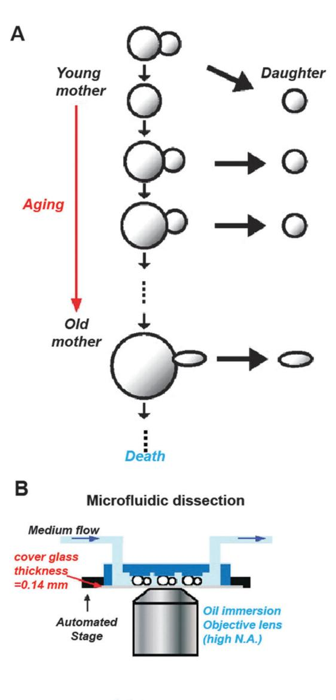
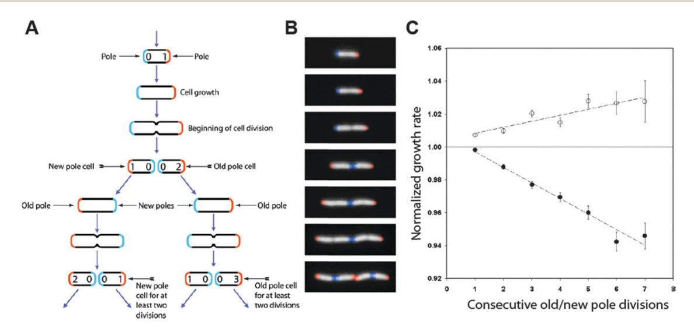
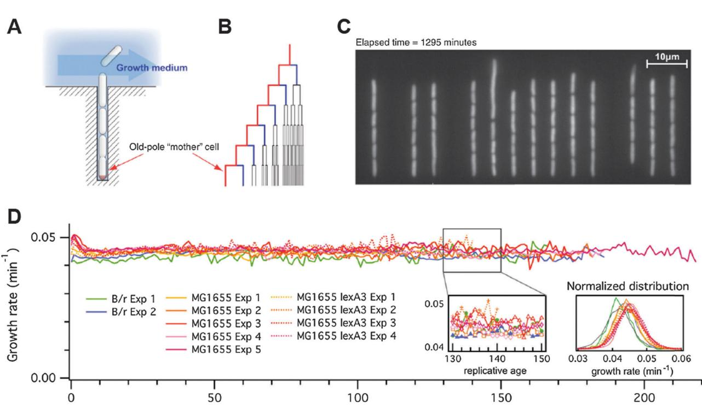
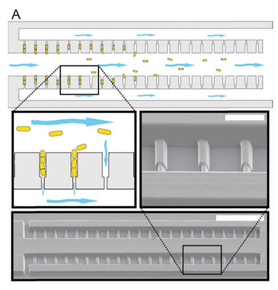
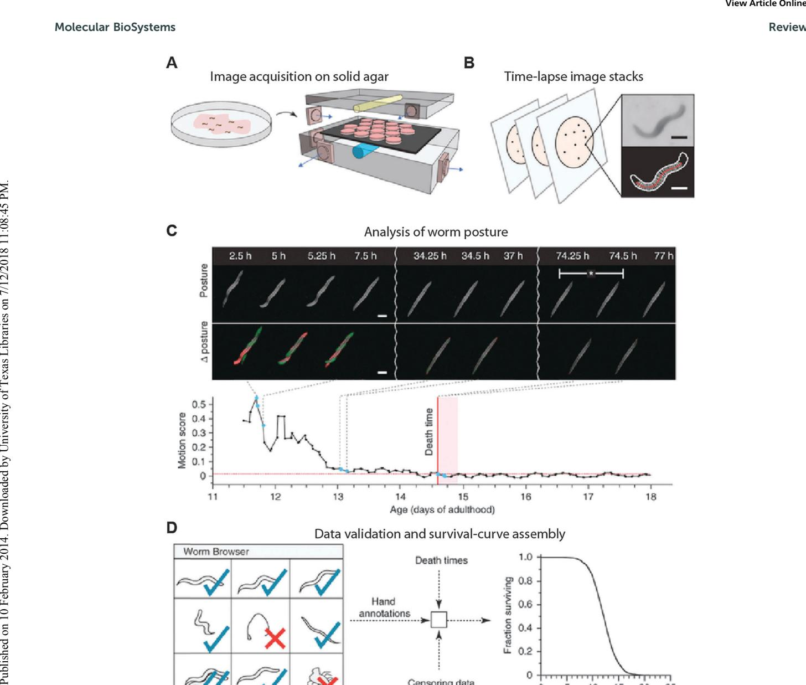
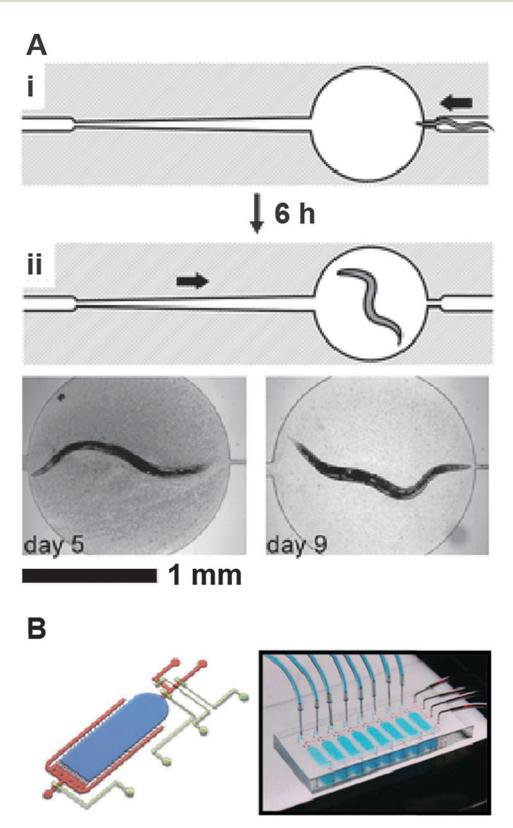

# From cradle to grave: high-throughput studies of aging in model organisms

**Eric C. Spivey and Ilya J. Finkelstein***

*Molecular BioSystems, Vol. 10, Issue 7, pp. 1658–1667, 2014*

**DOI:** [10.1039/c3mb70604d](https://doi.org/10.1039/c3mb70604d)

---

## Table of Contents

- [Abstract](#abstract)
- [Introduction](#introduction)
- [I. Replicative aging in unicellular organisms](#i-replicative-aging-in-unicellular-organisms)
  - [A. Replicative aging in *S. cerevisiae*](#a-replicative-aging-in-s-cerevisiae)
  - [B. Replicative aging in other unicellular organisms](#b-replicative-aging-in-other-unicellular-organisms)
- [II. Aging in *Caenorhabditis elegans*](#ii-aging-in-caenorhabditis-elegans)
  - [A. Automated plate-based aging assays](#a-automated-plate-based-aging-assays)
  - [B. Aging in micro-containers](#b-aging-in-micro-containers)
- [Conclusions](#conclusions)
- [Acknowledgements](#acknowledgements)
- [References](#references)

---

## Abstract

Aging—the progressive decline of biological functions—is a universal fact of life. Decades of intense research in unicellular and metazoan model organisms have highlighted that aging manifests at all levels of biological organization—from the decline of individual cells, to tissue and organism degeneration. To better understand the aging process, we must first aim to integrate quantitative biological understanding on the systems and cellular levels. A second key challenge is to then understand the many heterogeneous outcomes that may result in aging cells, and to connect cellular aging to organism-wide degeneration. Addressing these challenges requires the development of high-throughput aging and longevity assays. In this review, we highlight the emergence of high-throughput aging approaches in the most commonly used model organisms. We conclude with a discussion of the critical questions that can be addressed with these new methods.

---

## Introduction

Aging can be defined as the cumulative decline of cellular function that eventually leads to mortality. The emerging consensus is that cellular aging is due to the gradual accumulation of senescence factors, such as protein aggregates or genomic damage. [[1–3](#ref1)] A critical aim of cellular aging research is to define how these factors limit cellular longevity. In addition, a better understanding of how molecular degeneration in individual cells contributes to organism-wide decline is needed. As aging may affect organisms on the (epi-)genomic, proteomic, and metabolomic levels, aging needs to be studied as a system-wide phenomenon. Understanding the robustness of individual cells, as well as the interactions between cells and tissues, will help to delineate how aging impacts homeostasis of the entire organism. Thus, high-throughput biology approaches will help to clarify relationships between metabolic networks and aging factors at the molecular, cellular and organismal levels.

Our current understanding of aging is limited by the low-throughput and laborious nature of most aging assays, even in simple organisms such as *Saccharomyces cerevisiae*. For example, since the seminal observation that the replicative lifespan (RLS) of an individual yeast cell is limited, [[4](#ref4)] numerous lifespan-extending gene mutations have been identified. [[5,6](#ref5)] However, due to the laborious nature of standard RLS assays, a systematic description of how all genes and gene networks affect budding yeast longevity has not been reported. A second challenge is to understand how stochasticity at the molecular, cellular, and organismal levels contributes to the diversity of aging phenotypes. For example, although there is a large variation in life expectancies within any species, the exact determinants of longevity are still not understood. Recent observations indicate that aging is a pleiotropic process that may be influenced by multiple overlapping genetic pathways. [[7–9](#ref7)] To further map how stochasticity impacts aging, new tools are needed that permit the observation of large cohorts of aging cells and organisms, as well as individual cells within multicellular organisms.

In this review, we highlight recent progress towards the development of high-throughput aging assays and discuss new approaches that permit the automated observation of aging in unicellular and metazoan model organisms. We conclude with a discussion on how these assays may be further extended to approach aging from a systems-level perspective.

---

## I. Replicative aging in unicellular organisms

The RLS of a unicellular organism is defined as the number of daughters that a mother cell can produce before it senesces ([Fig. 1A](#fig1)). Since the seminal observation by Mortimer and Johnston that *S. cerevisiae* cells have a finite RLS, [[4](#ref4)] yeast continues to serve as a powerful model organism for the aging of mitotically active cells. RLS studies in *S. cerevisiae* have shed numerous insights into the mechanisms of cellular aging, including the crucial observation that damaged proteins and other putative senescence factors are preferentially retained in aging mother cells. [[2,10,11,59](#ref2)] We direct the reader to a number of excellent reviews on RLS in yeast. [[3,12–14](#ref3)] As protein aggregation and other mechanisms that impact the RLS in *S. cerevisiae* have also been observed to affect the lifespan of higher eukaryotes, [[15–17](#ref15)] yeast will continue to serve as a powerful model organism for aging research.

To determine the RLS of individual cells, progeny must be continuously moved away from the mother cell. This is typically accomplished by manually manipulating the cells under a low magnification micro-dissecting microscope—a method that has not changed appreciably since 1959. [[4](#ref4)] Although conceptually simple, micro-dissection RLS assays are laborious and time consuming, precluding the genome-wide analysis of aging phenotypes. In addition, constantly repositioning cells on an agar plate is incompatible with continuous microscopic observation. As the cells are moved onto different areas of a plate, changes in the local nutrient environment may also introduce extrinsic heterogeneity into the RLS measurement. Recently, several groups described automated dissection assays that address these limitations (for a summary, see Table 1). Below, we describe the development of novel RLS assays in several unicellular organisms.

**Table 1. Replicative-lifespan assays in unicellular organisms**

| Method | Organism | Number of cellsa | Whole lifespan observation? | Continuous fluorescence imaging?b | Notes |
|---|---|---|---|---|---|
| Manual micro-dissection | *S. cerevisiae* (e.g. refs 4, 5, 11); *S. pombe* (refs 10, 37, 38) | ~50–100 | Yes | No | Current "gold standard," but low-throughput and labor intensive |
| Microcolony lineage analysis | *E. coli* (ref 27); *S. cerevisiae* (ref 60); *S. pombe* (ref 38) | 10⁴–10⁵ | No | Possible | Monitors first ~7–9 generations, but local nutrient depletion may affect aging |
| Genetic selection | *S. cerevisiae* (refs 6, 22, 23) | n.d. | No | No | Dead progeny may physically remain attached to aging cells. Genetic reversion possible. |
| Microfluidic dissection | *E. coli* (ref 28); *S. cerevisiae* (refs 18, 19); *S. pombe* | ~100–1000 | Yes | Yes | A high-throughput approach, but requires micro-fabrication. |

a Indicates typical number of cells reported for a given genotype in most studies. b Indicates the ability to fluorescently observe individual cells over their replicative lifespans. n.d., not determined.

<figure class="paper-figure" id="fig1">

<figcaption><strong>Figure 1.</strong> (A) An illustration of replicative aging in budding yeast (<em>S. cerevisiae</em>). As a mother cell ages, it becomes progressively larger. (B) Schematic (left) and image (right) showing the basic operation of a microfluidic dissection platform. PDMS pads are positioned 4 μm above a glass coverslip. Mother cells are held between the PDMS pads and the coverslip. Progeny cells are continuously removed by flow of fresh media. This process allows high-resolution imaging of intracellular fluorescent markers. Figure adapted from ref. 18.</figcaption>
</figure>

### A. Replicative aging in *S. cerevisiae*

The unicellular eukaryote *S. cerevisiae* seems like an unlikely model for understanding the molecular mechanisms of aging. However, its rapid doubling time, a defined replicative lifespan, and the availability of powerful genetic and cell biology approaches have propelled the development of yeast as a model organism for aging. Many of the genetic determinants and molecular mechanisms of RLS in yeast have shed crucial insights into the underlying mechanisms of aging in higher eukaryotes. For example, caloric restriction and reduced ribosome biogenesis increases the RLS in yeast and also increases organismal longevity in higher eukaryotes. [[13](#ref13)] Comparative functional genomics approaches have quantitatively demonstrated the conserved genetic modulators for RLS in yeast and longevity in *C. elegans*. [[61](#ref61)] Thus, RLS assays will continue to yield new insights into the biology of eukaryotic and metazoan aging.

Two groups recently reported the construction of microfluidic devices to automate replicative aging assays in *S. cerevisiae*. [[18,19](#ref18)] Both approaches take advantage of the relatively small size of newborn daughters as compared to the aging mother ([Fig. 1A](#fig1)). [[20](#ref20)] To preferentially capture mother cells, polydimethylsiloxane (PDMS)-based soft lithography is used to construct microfluidic devices that are capped with a transparent glass coverslip for microscopic observation. In the device, the central flow chamber contains a series of PDMS pillars that terminate a few microns above the surface of the glass coverslip ([Fig. 1B](#fig1)). Yeast cells are injected at high pressures through the channel between the PDMS pillars and the glass substrate. During this injection, individual cells are trapped between the pillar and the glass coverslip. As the trapped cells divide, the smaller progeny cells are washed away from the mothers ([Fig. 1B](#fig1)). This process allows individual trapped cells to be observed without the unwanted accumulation of daughter cells.

Microfluidic dissection of daughter cells overcomes many of the limitations associated with current RLS aging assays. In contrast to laborious manual manipulation of progeny away from mother cells, microfluidic devices can be parallelized to facilitate concurrent RLS screens for large cohorts of genetically distinct cells. The continuous flow of fresh media guarantees well-defined growth conditions and efficient removal of waste products. Most importantly, these assays also permit continuous microscopic observation of aging cells. Using this platform, Lee *et al.* demonstrated that dying cells exhibit distinct morphologies: 34% of the cells were spherical at time of death, whereas the remaining 66% of cells were ellipsoidal. [[18](#ref18)] Interestingly, spherical cell death was observed in younger cells (12 buds on average). In contrast, cells that arrested after 23 buds looked ellipsoidal. Zhang and co-workers also observed that aging cells exhibited an altered translational response and an asymmetric partitioning of a fluorescent stress reporter. [[19](#ref19)] These observations suggest that individual cells may age *via* distinct pathways and future studies will be needed to define how these pathways contribute to the observed morphological phenotypes.

**Mother enrichment program.** Genetic selection has also been used to selectively inactivate daughter cell division, thereby enriching for aged cells in liquid cultures. This simplifies RLS studies and permits the large-scale isolation of precisely aged mother cells. [[21,22](#ref21)] To arrest daughter cells, Jarolim *et al.* expressed Cdc6 (an essential member of the DNA pre-replicative complex) in *S. cerevisiae* using a mother-specific promoter. Although this strategy effectively prevented daughter cells from reproducing, the mother's RLS was reduced by ~75%, significantly perturbing the cells' longevity and impacting the natural aging process. [[21](#ref21)]

Lindstrom and Gottschling developed an alternative genetic selection strategy that arrests daughter replication without significantly perturbing the mother's RLS. [[22](#ref22)] In their "Mother Enrichment Program" (MEP), Cre-lox recombination is used to disrupt *CDC20* and *UBC9*, two essential genes. Cre recombinase expression is under the control of a daughter-specific promoter and its localization is post-translationally regulated by fusion to an estradiol-binding domain. Thus, Cre is initially localized in the cytoplasm but is transported into the nucleus upon introduction of estradiol. [[22](#ref22)]

Using the MEP, Hughes *et al.* discovered that vacuolar pH regulation is lost in aging cells. [[23](#ref23)] Although the loss of vacuolar acidity was correlated with mitochondrial disintegration in aging mother cells, the vacuoles appeared rejuvenated in daughter cells. In addition, Feser *et al.* used the MEP to describe how elevated histone expression increases RLS. These studies elucidated a new genetic pathway that controls longevity while confirming the importance of gene stability to aging. [[6](#ref6)]

Although the MEP is a powerful way to enrich for aging cells, several drawbacks must be kept in mind when using genetic selection methods. Mutants that evade the MEP selection may arise infrequently, but will rapidly overgrow aging mother cells. [[22](#ref22)] Furthermore, using the MEP requires significant genomic alterations, precluding rapid screens in a large set of genetic backgrounds. Finally, the daughter's death is not immediate—daughters continue to produce a few granddaughters. [[22](#ref22)] These young cells will accumulate over the lifetime of the mother and may complicate proteomic analyses of aging cells.

### B. Replicative aging in other unicellular organisms

Based on RLS assays in *S. cerevisiae*, asymmetric cellular division has been proposed as a crucial mechanism for preferentially retaining cellular damage in the mother cells. [[59](#ref59)] Indeed, in prokaryotes that divide asymmetrically, different cell types exhibit strikingly different replication times and mortality rates. [[24,25](#ref24)] These models raise a crucial unresolved question: are symmetrically dividing organisms effectively immortal under ideal conditions? A key point to remember is that although binary fission appears to produce symmetric daughter cells, a number of intracellular features such as the cell pole, organelle position, and protein aggregates may separate asymmetrically during cell division. [[2,10,11,26](#ref2)] Thus asymmetric segregation may still limit the replicative lifespan of a symmetrically dividing organism. Indeed, mathematical models predict that asymmetric retention of senescence factors may improve the fitness of organisms that replicate in a symmetric manner. [[10](#ref10)] Below, we review recent high-throughput aging assays that have begun to shed light on replicative aging in symmetrically dividing cells.

**Replicative aging in *Escherichia coli*.** To address whether *E. coli* ages, Taddei and co-workers analyzed individual *E. coli* cells for ~7 divisions during micro-colony growth. [[2,27](#ref2)] An automated cell tracking algorithm was used to score the replication time and lineage of ~35,000 cells ([Fig. 2](#fig2)). Strikingly, the authors noted that the average growth rate of old-pole progeny is, on average, ~2% slower than those inheriting a new pole, suggesting that *E. coli* cells that inherit the old cell pole are aging ([Fig. 2C](#fig2)). [[27](#ref27)]

In a follow-up study, the authors determined how inheriting aggregated proteins impacts the growth of individual daughter cells. [[2](#ref2)] Protein aggregates were visualized by fluorescently labeling IbpA, a protein that localizes to inclusion bodies in *E. coli*. By tracking the growth of individual cells in microcolonies, the authors concluded that inclusion bodies reduce the growth rates of individual cells. [[2](#ref2)] These observations suggest that cellular aging may partially result from an increased misfolded protein load, and that cells preferentially sequester these protein aggregates in aging cells. Although these results provided strong evidence that individual cells within a microcolony exhibit different replication rates, the authors were unable to track cells past ~9 division cycles. Thus, these observations precluded the authors from monitoring the long-term effects of aging on cellular viability.

To directly observe how *E. coli* ages over hundreds of generations, Jun and co-workers developed a microfluidic device for separating individual cells from their progeny. [[28](#ref28)] A schematic of the device is presented in [Fig. 3A](#fig3). *E. coli* cells are captured in narrow channels. Fresh media is provided *via* a central trench. As the cells begin to replicate, daughter cells emerge from the side channels and are washed away *via* the central trench. Using this device, the authors were able to observe how individual *E. coli* cells divide under nutrient-rich conditions.

<figure class="paper-figure" id="fig2">

<figcaption><strong>Figure 2.</strong> Lineage analysis in <em>E. coli</em> microcolonies. (A) The age of each pole is indicated by the number inside the pole. Using the age of the cell poles, it is possible to assign an age to individual cells. (B) Time-lapse images of growing cells corresponding to the stages in (A). False color has been added to identify the poles. (C) The cellular growth rate, represented on the y-axis, is normalized to the growth rate of all cells from the same generation. Cells inheriting the old pole (closed circles) show a reduced growth rate, as compared to cells that inherit the new cell pole (open circles). Adapted from ref. 27.</figcaption>
</figure>

Surprisingly, the authors observed robust growth of individual bacterial cells for hundreds of generations. [[28](#ref28)] In contrast to the earlier microcolony analyses, [[2,27](#ref2)] the mother cells' replication rate did not slow down. The marked difference between these observations and the reduced replication rate of older cells in microcolony-based results may arise due to the different growth conditions. Local nutrient depletion in a micro-colony may reduce the division time of the oldest cells. Further studies will need to investigate how *E. coli* evades replicative aging and how aging cells deal with an ever-accumulating aggregated protein load.

<figure class="paper-figure" id="fig3">

<figcaption><strong>Figure 3.</strong> (A) Schematic illustration of the microfluidic mother machine. The old-pole mother cell is trapped at the end of the growth channel. (B) The outermost branch of the lineage tree represents the old-pole mother cell and her progeny. (C) Snapshot of a typical field of view. (D) The elongation rate does not show any cumulative decrease over 200 generations in any of the three strains (B/r, MG1655, or MG1655 <em>lexA3</em>). The growth rates show fast fluctuations with short-term correlation and follow a Gaussian distribution. Adapted from ref. 28 and reprinted with permission from Elsevier.</figcaption>
</figure>

**Replicative aging in *Schizosaccharomyces pombe*.** Fission yeast (*Schizosaccharomyces pombe*) is a simple eukaryotic model organism with a rapid lifecycle. It is genetically tractable, and resources for genome-wide deletion [[29](#ref29)] and fluorescent protein-fusion sets [[30–32](#ref30)] are readily available. *S. pombe* divides by medial fission in a fashion that is similar to human cells. Furthermore, aging-linked pathways such as the unfolded protein response [[33](#ref33)] and mitochondrial maintenance [[34,35](#ref34)] are conserved between fission yeast and metazoans. Thus, *S. pombe* represents a powerful and complementary opportunity to study the molecular mechanisms of aging. [[36](#ref36)]

Early observations of the RLS in *S. pombe* were determined by manually separating individual cells on a petri dish. [[37](#ref37)] However, as *S. pombe* divides by binary fission, defining the mother cell is significantly more challenging. Barker and Walmsley observed that aging cells develop a bilateral asymmetry that is morphologically analogous to the enlargement of aging *S. cerevisiae* cells. [[37](#ref37)] The authors reported that *S. pombe* also appeared to have a finite replicative lifespan. In addition, Nystrom and colleagues have reported that *S. pombe* preferentially retains damaged proteins in aging mother cells. [[10](#ref10)]

In a recent study, Coelho *et al.* developed a software package for automated lineage tracking of individual cells during the growth of a microcolony. [[38](#ref38)] As daughter cells are not removed, all experiments were limited to ~8 generations or fewer before unambiguous identification of individual cells became impossible. Nevertheless, automated cell tracking facilitated the detailed lineage examination of ~10,000 cells from 13 different *S. pombe* strains. Surprisingly, the authors concluded that *S. pombe* does not age under ideal growth conditions but exhibits stress-inducing aging after a heat shock (40 °C for one hour) or hydrogen peroxide treatment (1 mM H2O2 for one hour). As these results suggest that *S. pombe* is functionally immortal, it will be crucial to define how *S. pombe* evades the gradual accumulation of life-threatening senescence factors. [[2](#ref2)]

We have developed a complementary microfluidics-based RLS assay for fission yeast. Using long scan micro 3-D printing (LSμ3DP) as a rapid-prototyping tool, we have designed a microfluidic platform that allows high-throughput, full-lifespan observation of individual mother cells and their individual offspring ([Fig. 4](#fig4)). LSμ3DP is a technology that uses dynamic-mask multiphoton lithography [[39](#ref39)] to fabricate arbitrary 3-D objects [[40](#ref40)] in a range of materials. The rapid (~1 day) cycle of this prototyping method allowed us to quickly optimize key dimensions of our fluidic devices ([Fig. 4B](#fig4)).

In our devices, *S. pombe* is loaded *via* a central channel into catch tubes that are designed to loosely hold one mother and several daughter cells ([Fig. 4A](#fig4)). Each catch tube drains to side channels *via* an opening smaller than the cell diameter, providing a gentle suction to hold the mother cell in place. Once loaded in the catch tubes, the cells divide, and progeny cells are removed by flowing media through the central channel ([Fig. 4A](#fig4) inset). Our current devices can observe hundreds of cells for >100 hours. Importantly, the devices are compatible with continuous microscopic observation of aging-related phenotypes. Furthermore, by reversing buffer flow, we can collect populations of precisely aged mother cells. We anticipate that our device will permit high-throughput RLS in large cohorts of *S. pombe* cells.

<figure class="paper-figure" id="fig4">

<figcaption><strong>Figure 4.</strong> (A) Top: schematic of a microfluidic aging device for fission yeast. Cells are injected into the central channel. Individual cells are immobilized in the side tubes, and held in place with gentle suction. Inset: the progeny are pushed into the central channel and washed out of the device. Bottom: scanning electron micrograph of a master structure fabricated using LSμ3DP. Scale bar is 100 μm. Inset: detail of master structure features that form the catch tubes. Scale bar is 20 μm. (B) Time lapse of a dying mother cell (M) and its most recent daughters (D1, D2). At t = 1200 min., the mother ceases dividing, while its most recent daughter (D2) continues dividing. Scale bar is 20 μm.</figcaption>
</figure>

---

## II. Aging in *Caenorhabditis elegans*

The nematode *Caenorhabditis elegans* has a relatively short (~3 week) lifespan, is optically transparent, easy to culture, and has proven amenable to genetic manipulation. Since the pioneering discovery that *age-1* mutants have an increased lifespan, [[44,45](#ref44)] *C. elegans* has been firmly established as the primary model organism for metazoan aging research. Seminal studies in *C. elegans* have uncovered crucial aging-associated pathways and the reader is referred to numerous excellent reviews on the topic. [[17,46,47](#ref17)] As many of these discoveries have been validated in other model organisms and humans, studies in *C. elegans* continue to shed crucial insights into mechanisms of aging. [[17](#ref17)]

Despite the central role of *C. elegans* in aging research, most aging assays employ a tedious and low-throughput manual manipulation approach that has not changed appreciably in over thirty years. [[48](#ref48)] Age-synchronized adult worms are typically cultured at low densities on bacterial agar lawns. Every few days, the worms are removed from the incubator and tapped on the head with a fine wire to score their motility. In addition to being slow and laborious, this assay suffers from a number of limitations. First, worms are exposed to temperature variations when they are withdrawn from the incubator to assay viability. As *C. elegans* lifespan and development are exquisitely sensitive to temperature, this may complicate precise lifespan observations. [[49](#ref49)] Second, viability is not monitored continuously, thereby potentially missing gradual decline in motility and other physiological functions. Third, viability is defined subjectively and may miss end-of-life behaviors such as non-motile twitching. Below, we discuss the recent development of high-throughput aging platforms that overcome most of the challenges associated with traditional longevity assays in *C. elegans* (for a comparison, see Table 2).

**Table 2. High-throughput lifespan studies in *C. elegans***

| Method | Growth medium | Viability test | Number of animalsa | Tracks individual animals?b | Continuous fluorescence imaging? | Notes |
|---|---|---|---|---|---|---|
| Manual manipulation (refs 17, 44, 48) | Solid | Manual probe | <100 | Yes | No | Current "gold standard," but low-throughput and labor intensive |
| Lifespan Machine (ref 50) | Solid | Automated imaging | >500 | No | No | Cost-effective and highly parallelizable |
| WormFarm (ref 52) | Liquid | Automated imaging | >1000 | No | Possible | Requires micro-fabrication expertise |
| Lifespan-on-a-chip (ref 51) | Liquid | Automated imaging | 16 | Yes | Yes | Requires micro-fabrication. Can immobilize animals for microscopic observation. |

a Indicates typical number of animals of a given genotype in most studies. b Indicates the ability to unambiguously follow the same animal over its entire lifespan.

### A. Automated plate-based aging assays

The Lifespan Machine is a plate-based aging device which leverages consumer-grade flatbed scanners to parallelize aging assays ([Fig. 5](#fig5)). [[50](#ref50)] In this approach, plates containing age-synchronized worms are sealed on top of modified flatbed scanners and periodically imaged. Each scanner accommodates up to ~16 plates, with each plate housing ~35 animals. [[50](#ref50)] Together, the scanners act as an inexpensive, "distributed" microscope that can be scaled to image thousands of individual animals.

An automated image analysis and worm identification software pipeline discriminates individual worms from contaminants, worm clusters, and other defects in the agar plates. In addition to monitoring aging-related phenotypic changes with high temporal resolution, the software retrospectively determines the point of death in an unbiased fashion. Finally, the data from these experiments provides a continuous recording that allows researchers to review individual aging trajectories.

Using the Lifespan Machine, Stroustrup and co-workers validated that periodic exposure to the scanner light did not adversely affect worm longevity. In addition, the automated software algorithm was capable of tracking the closely related *C. briggsae* and *C. brenneri* species. Crucially, the Lifespan Machine afforded sufficient temporal resolution to monitor the rapid reduction of *C. elegans* lifespan under oxidative stress. However, the inability to manipulate individual animals constitutes a significant limitation of the Lifespan Machine. Finally, integrating the Lifespan Machine with a fluorescence-based readout will further improve the utility of this method.

<figure class="paper-figure" id="fig5">

<figcaption><strong>Figure 5.</strong> A schematic illustration of the Lifespan Machine. (A) Agar plates with age-synchronized worms are placed face down on the surfaces of flatbed scanners. (B) Each scanner captures a time series of plate images. Images are processed to identify foreground objects. Scale bars, 250 μm. (C) Micrographs showing stationary animals over time (top) and the corresponding posture changes (Δ posture). Death is identified by retrospective analysis as the final cessation of postural change. Bottom, change expressed as the sum of differences between individual pixel intensities for consecutive images ('motion score') as a function of time. (D) The LM produces a time-lapse image record for each individual. The schematic depicts the use of these records for visual validation or resolution of ambiguities. Validated death times are combined with automatic censoring data into a Kaplan–Meier survival curve (right, actual data). Adapted from ref. 50 and reprinted with permission from Macmillan Publishers.</figcaption>
</figure>

### B. Aging in micro-containers

In addition to plate-based assays, lifespan analysis can also be performed with worms cultured in liquid suspensions. Currently, liquid culture-based lifespan assays are rarely used because of the difficulty of separating worms from their progeny and the need to constantly replenish the growth medium over the worm's lifespan. To overcome these challenges, Hulme and co-workers manufactured microfluidic chips capable of culturing individual worms over their entire lifespan ([Fig. 6A](#fig6)). The worms enter ~1.5 mm diameter chambers *via* a narrow channel in the L4 stage of development, when the animals are able to fit through a narrow constriction channel. Within ~6 hours, wild type worms outgrow this channel and are permanently trapped in the central chambers. Liquid bacterial culture is constantly flowed through the chamber and worm progeny are flushed out *via* the same narrow channel. Finally, by reversing buffer flow, worms can be immobilized in a narrow wedge-shaped observation channel for microscopic and phenotypic evaluation.

A complementary microfluidics-based approach for large-scale *C. elegans* aging studies was pioneered by Xian and colleagues. Their WormFarm consists of a multi-layer monolithic microfluidic device that integrates a compartment for culturing up to 40 adult worms, as well as channels and control valves that facilitate nutrient influx ([Fig. 6B](#fig6)). Young progeny and waste are flushed out *via* a series of 10–20 μm channels that effectively separate these smaller particles from adult worms. An automated software suite scores the viability and phenotypic differences between individual worms. As the WormFarm cultures dozens of worms in the same chamber, it is unable to track the identity of individual animals. Instead, this approach significantly increases the number of animals aged under identical growth conditions.

<figure class="paper-figure" id="fig6">

<figcaption><strong>Figure 6.</strong> (A) Operation of "Lifespan-on-a-chip" microcontainer. (i) Loading the worm into the chamber. The width of the microchannel directly to the right of the chamber is just wide enough to allow the passage of an L4 worm into the chamber. The arrow indicates the direction of flow. (ii) After approximately 6 h at 24 °C, the worm becomes too large to exit the central chamber. Continuous flow of a suspension of bacteria from left to right provides food to the worm and removes all progeny. By reversing the direction of flow, the worm is directed into a wedge-like channel for temporary immobilization. Adapted from ref. 51, reprinted with permission of Royal Society of Chemistry. (B) Left: 3D schematic of a single WormFarm chamber, with narrow channels at side and bottom edge to filter out the worm progeny by size. The main chamber is shown in blue, the side channels in red, and the control layer in beige. Right: a photograph of the WormFarm chip. Each chip contains eight separated chambers, which can be controlled by pneumatic valves. Adapted from ref. 52, reprinted with the permission of Blackwell Publishing.</figcaption>
</figure>

Microfluidics-based liquid culture *C. elegans* lifespan assays offer several powerful advantages over plate-based assays. Individual animals can be continuously monitored optically and *via* fluorescence microscopy. [[52](#ref52)] Nutrients are constantly replenished, while young progeny and other waste is rapidly removed. Liquid culture also allows precise and rapid perturbation of growth conditions. Finally, these methods are readily compatible with other microfluidic worm manipulation methods. [[53–56](#ref53)] However, two key limitations remain unresolved with liquid-culture based aging assays. First, up to ~40% of liquid-cultured worms are lost due to matricidal hatching—a lethal phenotype where progeny hatch within the adult during the first 3–7 days of the experiment. [[51,57](#ref51)] In contrast, only ~6% of self-fertilized worms die of matricidal hatching on solid media. [[58](#ref58)] Matricidal hatching has recently been established as an age-related reproductive defect, [[58](#ref58)] so future studies will need to investigate the interplay between liquid culture conditions, matricidal hatching, and longevity. Second, variations in worm sizes, motility, and longevity have been observed between isogenic plate-aged and liquid-aged animals. [[52](#ref52)] Thus, future studies will need to correlate the results gleaned from liquid- and plate-based aging studies.

In summary, high-throughput plate-based and liquid culture aging assays provide powerful, complementary approaches that will usher in a new era of *C. elegans* aging research (Table 2). The Lifespan Machine relies on readily available consumer-grade electronics and monitors aging on solid support—conditions that are most similar to over three decades of aging research in this model organism. In contrast, PDMS-based liquid culture approaches are compatible with advanced fluorescence microscopy techniques and can be integrated with other automated worm manipulation methods. Thus, the development of high-throughput semi-automated methods for *C. elegans* aging will dramatically increase the scope of organismal aging research.

---

## Conclusions

Recent development of high-throughput aging assays in several important model organisms promises to significantly expand our understanding of the basic mechanisms of aging. The recent reports that *E. coli* [[28](#ref28)] and *S. pombe* [[38](#ref38)] do not age under ideal growth conditions raise fundamental questions about how these organisms are able to stave off the gradual accumulation of senescence factors. By capturing and observing cohorts of individual cells, we can now begin to address these basic questions. Furthermore, microfluidic dissection platforms can be used to prepare populations of precisely aged cells. In combination with ultrasensitive sequencing and transcriptome-wide analyses, we can now begin to decipher the genes and gene-networks that regulate cellular aging.

Automated aging assays will help to address some of the most fundamental questions in the aging field. By fluorescently observing individual cells, we can begin to define how stochastic gene expression and asymmetric damage segregation influences the many observed aging phenotypes. By following the fate of individual cells within metazoan model organisms, cellular aging can now be linked to organism-wide degeneration. Parallelizing the automated aging assays will enable large-scale data collection strategies for defining gene networks and external factors that contribute to an organism's longevity. Finally, by generating large cohorts of precisely aged organisms, we can begin to address how aging contributes to the wide array of age-associated diseases. Thus, emerging high-throughput longevity assays will provide new insights into the mechanisms of aging.

---

## Acknowledgements

This work was supported in part by the Welch Foundation (F-1808 to I.J.F.) and by startup funds from the University of Texas at Austin. Dr. Ilya Finkelstein is a CPRIT Scholar in Cancer Research. We thank Dr. Jason Shear for the occasional use of his μ3D printing apparatus. We thank Dr. Edward Marcotte for fruitful discussions and the use of his fluorescence microscope.

---

## References

1. D. C. David, N. Ollikainen, J. C. Trinidad, M. P. Cary, A. L. Burlingame and C. Kenyon, *PLoS Biol.*, 2010, **8**, e1000450.

2. A. B. Lindner, R. Madden, A. Demarez, E. J. Stewart and F. Taddei, *Proc. Natl. Acad. Sci. U. S. A.*, 2008, **105**, 3076–3081.

3. D. A. Sinclair, *Mech. Ageing Dev.*, 2002, **123**, 857–867.

4. R. K. Mortimer and J. R. Johnston, *Nature*, 1959, **183**, 1751–1752.

5. M. Kaeberlein, M. McVey and L. Guarente, *Genes Dev.*, 1999, **13**, 2570–2580.

6. J. Feser, D. Truong, C. Das, J. J. Carson, J. Kieft, T. Harkness and J. K. Tyler, *Mol. Cell*, 2010, **39**, 724–735.

7. D. Promislow, *Proc. R. Soc. London, Ser. B*, 2004, **271**, 1225–1234.

8. X. He and J. Zhang, *Genetics*, 2006, **173**, 1885–1891.

9. L. A. Herndon, P. J. Schmeissner, J. M. Dudaronek, P. A. Brown, K. M. Listner, Y. Sakano, M. C. Paupard, D. H. Hall and M. Driscoll, *Nature*, 2002, **419**, 808–814.

10. N. Erjavec, M. Cvijovic, E. Klipp and T. Nystrom, *Proc. Natl. Acad. Sci. U. S. A.*, 2008, **105**, 18764–18769.

11. B. Liu, L. Larsson, A. Caballero, X. Hao, D. Öling, J. Grantham and T. Nyström, *Cell*, 2010, **140**, 257–267.

12. V. D. Longo, G. S. Shadel, M. Kaeberlein and B. Kennedy, *Cell Metab.*, 2012, **16**, 18–31.

13. K. A. Steinkraus, M. Kaeberlein and B. K. Kennedy, *Annu. Rev. Cell Dev. Biol.*, 2008, **24**, 29–54.

14. D. A. Sinclair, in *Biological Aging*, ed. T. O. Tollefsbol, Humana Press, 2013, pp. 49–63.

15. J. F. Morley, H. R. Brignull, J. J. Weyers and R. I. Morimoto, *Proc. Natl. Acad. Sci. U. S. A.*, 2002, **99**, 10417–10422.

16. B. M. Wasko and M. Kaeberlein, *FEMS Yeast Res.*, 2013, **14**, 148–159.

17. C. J. Kenyon, *Nature*, 2010, **464**, 504–512.

18. S. S. Lee, I. Avalos Vizcarra, D. H. E. W. Huberts, L. P. Lee and M. Heinemann, *Proc. Natl. Acad. Sci. U. S. A.*, 2012, **109**, 4916–4920.

19. Y. Zhang, C. Luo, K. Zou, Z. Xie, O. Brandman, Q. Ouyang and H. Li, *PLoS One*, 2012, **7**, e48275.

20. B. K. Kennedy, N. R. Austriaco and L. Guarente, *J. Cell Biol.*, 1994, **127**, 1985–1993.

21. S. Jarolim, J. Millen, G. Heeren, P. Laun, D. S. Goldfarb and M. Breitenbach, *FEMS Yeast Res.*, 2004, **5**, 169–177.

22. D. L. Lindstrom and D. E. Gottschling, *Genetics*, 2009, **183**, 413–422.

23. A. L. Hughes and D. E. Gottschling, *Nature*, 2012, **492**, 261–265.

24. M. Ackermann, S. C. Stearns and U. Jenal, *Science*, 2003, **300**, 1920.

25. B. B. Aldridge, M. Fernandez-Suarez, D. Heller, V. Ambravaneswaran, D. Irimia, M. Toner and S. M. Fortune, *Science*, 2012, **335**, 100–104.

26. D. T. Kysela, P. J. B. Brown, K. C. Huang and Y. V. Brun, in *Annual Review of Microbiology*, ed. S. Gottesman, Annual Reviews, Palo Alto, 2013, vol. 67, pp. 417–435.

27. E. J. Stewart, R. Madden, G. Paul and F. Taddei, *PLoS Biol.*, 2005, **3**, e45.

28. P. Wang, L. Robert, J. Pelletier, W. L. Dang, F. Taddei, A. Wright and S. Jun, *Curr. Biol.*, 2010, **20**, 1099–1103.

29. D.-U. Kim, J. Hayles, D. Kim, V. Wood, H.-O. Park, M. Won, H.-S. Yoo, T. Duhig, M. Nam, G. Palmer, S. Han, L. Jeffery, S.-T. Baek, H. Lee, Y. S. Shim, M. Lee, L. Kim, K.-S. Heo, E. J. Noh, A.-R. Lee, Y.-J. Jang, K.-S. Chung, S.-J. Choi, J.-Y. Park, Y. Park, H. M. Kim, S.-K. Park, H.-J. Park, E.-J. Kang, H. B. Kim, H.-S. Kang, H.-M. Park, K. Kim, K. Song, K. B. Song, P. Nurse and K.-L. Hoe, *Nat. Biotechnol.*, 2010, **28**, 617–623.

30. A. Matsuyama, R. Arai, Y. Yashiroda, A. Shirai, A. Kamata, S. Sekido, Y. Kobayashi, A. Hashimoto, M. Hamamoto, Y. Hiraoka, S. Horinouchi and M. Yoshida, *Nat. Biotechnol.*, 2006, **24**, 841–847.

31. A. Hayashi, D. Da-Qiao, C. Tsutsumi, Y. Chikashige, H. Masuda, T. Haraguchi and Y. Hiraoka, *Genes Cells*, 2009, **14**, 217–225.

32. J. Ahn, C.-H. Choi, C.-M. Kang, C.-H. Kim, H.-M. Park, K.-B. Song, K.-L. Hoe, M. Won and K.-S. Chung, *J. Microbiol.*, 2009, **47**, 789–795.

33. A. Frost, M. G. Elgort, O. Brandman, C. Ives, S. R. Collins, L. Miller-Vedam, J. Weibezahn, M. Y. Hein, I. Poser, M. Mann, A. A. Hyman and J. S. Weissman, *Cell*, 2012, **149**, 1339–1352.

34. S. Chiron, M. Gaisne, E. Guillou, P. Belenguer, G. D. Clark-Walker and N. Bonnefoy, *Methods Mol. Biol.*, 2007, **372**, 91–105.

35. K. Takeda, T. Yoshida, S. Kikuchi, K. Nagao, A. Kokubu, T. Pluskal, A. Villar-Briones, T. Nakamura and M. Yanagida, *Proc. Natl. Acad. Sci. U. S. A.*, 2010, **107**, 3540–3545.

36. A. E. Roux, P. Chartrand, G. Ferbeyre and L. A. Rokeach, *J. Gerontol., Ser. A*, 2010, **65**, 1–8.

37. M. G. Barker and R. M. Walmsley, *Yeast*, 1999, **15**, 1511–1518.

38. M. Coelho, A. Dereli, A. Haese, S. Kühn, L. Malinovska, M. E. DeSantis, J. Shorter, S. Alberti, T. Gross and I. M. Tolić-Nørrelykke, *Curr. Biol.*, 2013, **23**, 1–9.

39. R. Nielson, B. Kaehr and J. Shear, *Small*, 2009, **5**, 120–125.

40. E. C. Spivey, E. T. Ritschdorff, J. L. Connell, C. A. McLennon, C. E. Schmidt and J. B. Shear, *Adv. Funct. Mater.*, 2013, **23**, 333–339.

41. S. Maruo and J. T. Fourkas, *Laser Photonics Rev.*, 2008, **2**, 100–111.

42. S. Jhaveri, J. McMullen, R. Sijbesma, L. Tan, W. Zipfel and C. Ober, *Chem. Mater.*, 2009, **21**, 2003–2006.

43. J. L. Connell, E. T. Ritschdorff, M. Whiteley and J. B. Shear, *Proc. Natl. Acad. Sci. U. S. A.*, 2013, **110**, 18380–18385.

44. D. B. Friedman and T. E. Johnson, *Genetics*, 1988, **118**, 75–86.

45. T. E. Johnson, *Science*, 1990, **249**, 908–912.

46. C. Kenyon, *Cell*, 2005, **120**, 449–460.

47. G. M. Stein and C. T. Murphy, *Front. Genet.*, 2012, **3**, 259.

48. D. S. Wilkinson, R. C. Taylor and A. Dillin, *Methods Cell Biol.*, 2012, **107**, 353–381.

49. M. R. Klass, *Mech. Ageing Dev.*, 1977, **6**, 413–429.

50. N. Stroustrup, B. E. Ulmschneider, Z. M. Nash, I. F. López-Moyado, J. Apfeld and W. Fontana, *Nat. Methods*, 2013, **10**, 665–670.

51. S. E. Hulme, S. S. Shevkoplyas, A. P. McGuigan, J. Apfeld, W. Fontana and G. M. Whitesides, *Lab Chip*, 2010, **10**, 589–597.

52. B. Xian, J. Shen, W. Chen, N. Sun, N. Qiao, D. Jiang, T. Yu, Y. Men, Z. Han, Y. Pang, M. Kaeberlein, Y. Huang and J.-D. J. Han, *Aging Cell*, 2013, **12**, 398–409.

53. A. Ben-Yakar, N. Chronis and H. Lu, *Curr. Opin. Neurobiol.*, 2009, **19**, 561–567.

54. N. Chronis, M. Zimmer and C. I. Bargmann, *Nat. Methods*, 2007, **4**, 727–731.

55. M. F. Yanik, C. B. Rohde and C. Pardo-Martin, *Annu. Rev. Biomed. Eng.*, 2011, **13**, 185–217.

56. W. Shi, H. Wen, B. Lin and J. Qin, *Top. Curr. Chem.*, 2011, **304**, 323–338.

57. D. R. Shook and T. E. Johnson, *Genetics*, 1999, **153**, 1233–1243.

58. C. L. Pickett and K. Kornfeld, *Aging Cell*, 2013, **12**, 544–553.

59. K. A. Henderson and D. E. Gottschling, *Curr. Opin. Cell Biol.*, 2008, **20**, 723–728.

60. M. Ricicova, M. Hamidi, A. Quiring, A. Niemistö, E. Emberly and C. L. Hansen, *Proc. Natl. Acad. Sci. U. S. A.*, 2013, **110**, 11403–11408.

61. E. D. Smith, M. Tsuchiya, L. A. Fox, N. Dang, D. Hu, E. O. Kerr, E. D. Johnston, B. N. Tchao, D. N. Pak, K. L. Welton, D. E. L. Promislow, J. H. Thomas, M. Kaeberlein and B. K. Kennedy, *Genome Res.*, 2008, **18**, 564–570.

---

*Archived from the published PDF on 2026-04-14.*
