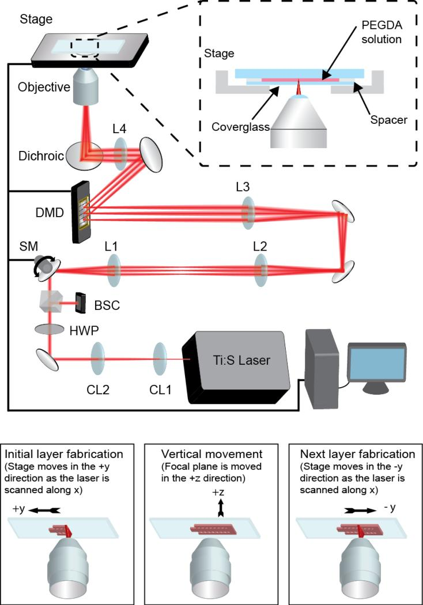
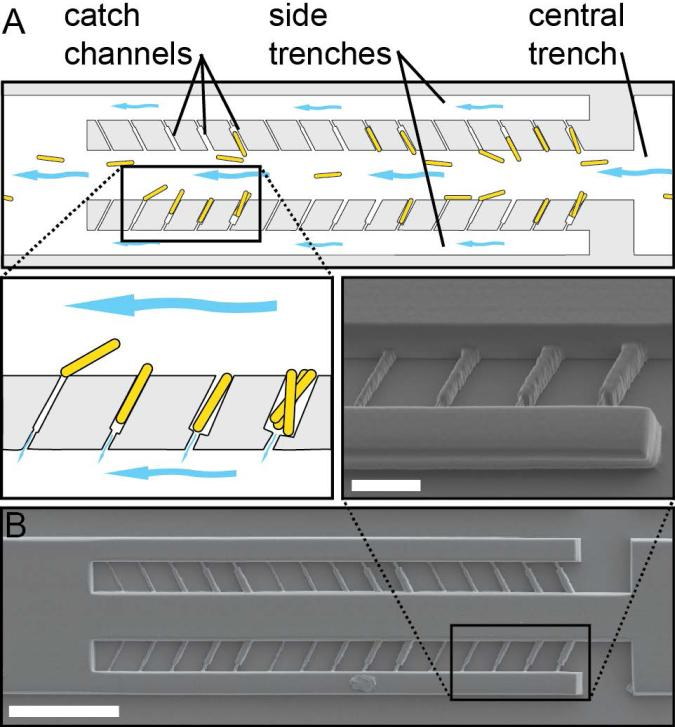
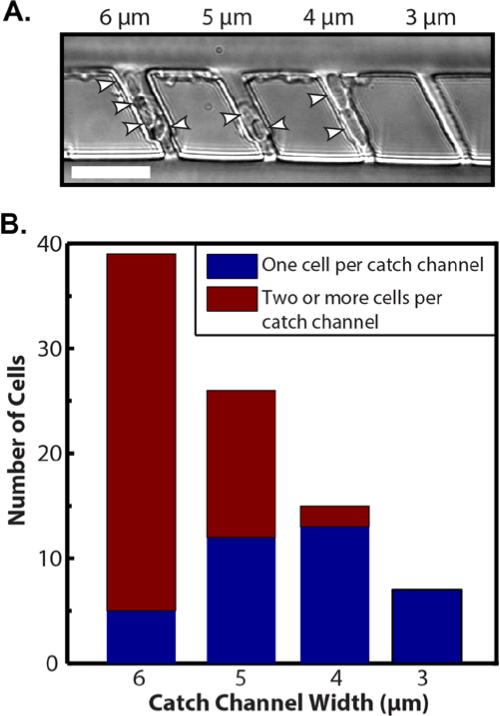
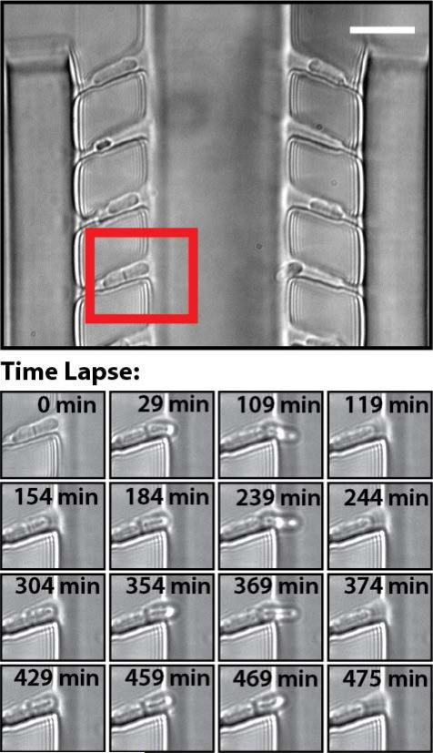
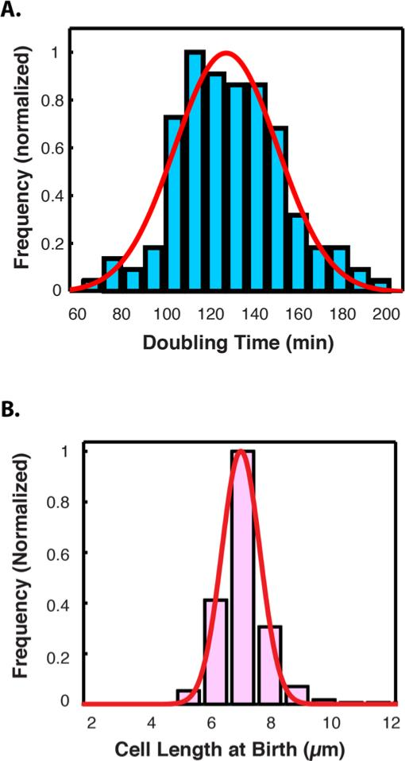
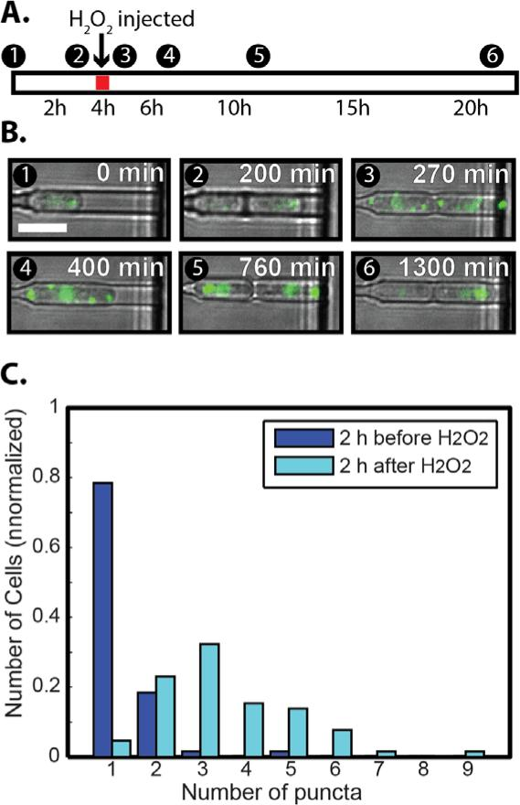
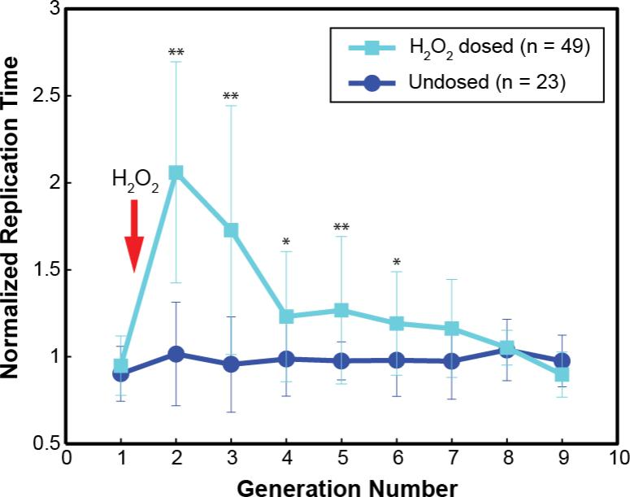

# A 3D-Printed Microfluidic Microdissector for High-Throughput Studies of Cellular Aging

**Eric C. Spivey, Blerta Xhemalce, Jason B. Shear, and Ilya J. Finkelstein**

*Anal. Chem.*, Volume 86, Issue 15, Pages 7406-12 (2014)

**DOI:** [10.1021/ac500893a](https://doi.org/10.1021/ac500893a)

---

## Table of Contents

- [Abstract](#abstract)
- [Introduction](#introduction)
- [Experimental Section](#experimental-section)
- [Results and Discussion](#results-and-discussion)
- [Conclusion](#conclusion)
- [Acknowledgements](#acknowledgements)

---

##  Abstract
Due to their short lifespan, rapid division and ease of genetic manipulation, yeasts are popular model organisms for studying aging in actively dividing cells. To study replicative aging over many cell divisions, individual cells must be continuously separated from their progeny via a laborious manual microdissection procedure. Microfluidics-based soft-lithography devices have recently been used to automate microdissection of the budding yeast _Saccharomyces cerevisiae_. However, little is known about replicative aging in _Schizosaccharomyces pombe_ , a rod-shaped yeast that divides by binary fission and shares many conserved biological functions with higher eukaryotes. In this report, we develop a versatile multiphoton lithography method that enables rapid fabrication of three-dimensional master structures for PDMS-based microfluidics. We exploit the rapid-prototyping capabilities of multiphoton lithography to create and characterize a cell-capture device that is capable of high-resolution microscopic observation of hundreds of individual _S. pombe_ cells. By continuously removing the progeny cells, we demonstrate that cell growth and protein aggregation can be tracked in individual cells for over ~100 hours. Thus, the fission yeast lifespan microdissector (FYLM) provides a powerful on-chip microdissection platform that will enable high-throughput studies of aging in rod-shaped cells.
---
##  Introduction
The relative simplicity and ease of genetic manipulation in yeasts have propelled their adoption as popular model organisms for aging research. In 1959 Mortimer and Johnston reported that in _S. cerevisiae_ the replicative lifespan (RLS)-the number of daughters produced by a mother before it dies-is limited to approximately thirty generations.[1](#ref1) Since that seminal observation, most studies have focused on replicative aging in _S. cerevisiae_ as a genetically tractable model system for aging in mitotically active cells.[2-6](#ref2) Many of the mechanistic and genetic insights gained from these replicative aging studies have since been explored in metazoans, cementing the importance of unicellular eukaryotes in aging research.[6-8](#ref6)
To determine the RLS of individual cells, progeny must be continuously removed from the mother cell. This is typically accomplished by manual manipulation of the cells under a low magnification dissecting microscope-a method that has not changed appreciably in the last fifty years.[1](#ref1),[9](#ref9) Although conceptually simple, microdissection RLS assays are laborious and time consuming, precluding a detailed analysis of aging phenotypes.[10](#ref10) In addition, constant repositioning of the cells on agar plates is incompatible with continuous microscopic observation. As the cells are moved onto different areas of a plate, changes in the local nutrient environment may also introduce extrinsic heterogeneity into the RLS measurement.
Although aging in _S. cerevisiae_ has been intensely studied for over fifty years, little is known about replicative aging in the distantly related fission yeast _Schyzosaccharomyces pombe_ (_S. pombe_). As _S. pombe_ divides by medial fission, the replicative age of a cell can be defined as the age of the oldest cell pole.[10](#ref10),[11](#ref11) Early studies suggested that _S. pombe_ has a short (~15 generation) RLS.[10](#ref10),[11](#ref11) However, a recent report concluded that under ideal growth conditions, _S. pombe_ avoids replicative aging and achieves functional immortality.[9](#ref9) These diverging results may partially stem from the difficulty of studying _S. pombe_ replicative aging via manual micromanipulation. Identifying the old-pole cells amidst new-pole progeny is particularly challenging.[10](#ref10),[11](#ref11) The low throughput nature of traditional microdissection studies also precludes a detailed mechanistic and genetic analysis of the factors that may contribute to replicative aging in _S. pombe_.
Microfluidic platforms offer a powerful approach for capturing and observing individual cells.[12-21](#ref12) Microfluidic devices have been used to investigate the mechanical properties of _S. pombe_ cells,[15](#ref15),[16](#ref16),[22](#ref22) to apply rapid changes in growth temperature,[23](#ref23),[24](#ref24) and to observe synchronized cohorts of cells.[18](#ref18),[25](#ref25) In conventional microfluidic device fabrication, the first step in producing a master structure is to photocure a polymer through a high-resolution UV mask.[26](#ref26) A polydimethyl siloxane (PDMS) flowcell is then molded around the master structure to generate the microfluidic device.[27](#ref27) However, fabrication of three-dimensional (3D) master structures with micron-scale features is a major bottleneck for rapid device prototyping. Producing multiple high-resolution (< 10 μm feature size) photomasks for each prototype iteration is time-consuming and can be prohibitively expensive. Moreover, aligning and exposing sequential layers of photoresist makes the fabrication of multi-layer master structures challenging.
In this report, we describe a multiphoton lithography fabrication approach that combines raster scanning of a laser beam on a dynamic mask with synchronized microscope stage movement to produce millimeter-sized 3D master structures for microfluidics. Using this flexible strategy for μ3D-printing (μ3DP), we designed and optimized the fission yeast lifespan microdissector (FYLM), a microfluidic device that is capable of capturing and retaining individual fission yeast cells. As the cells divide, the progeny are continuously removed, permitting continuous, ~100 hour microscopic observation of individually addressable old-pole cells. In addition, we demonstrate that the FYLM enables the fluorescent observation of aggregate dissolution after the induction of a proteotoxic stress. Thus, the FYLM promises to open new avenues for studying aging and other long-term processes in _S. pombe_ and other rod-shaped organisms.
---
##  EXPERIMENTAL SECTION
### Fabrication of PEG Masters
A 20 mM HEPES (L6876, Sigma) buffered saline (HBS) solution containing 100 mM NaCl (buffered to pH 7.3) was prepared as a solvent for the precursor solution. Rose Bengal (RB, 330000, Aldrich) was used as the photosensitizer for multiphoton lithography. 15 mg of RB was added to 110 μL HBS and 375 mg of 700 Da polyethylene glycol diacrylate (PEGDA, Aldrich 455008) so that the final mass percentage of PEGDA was 75%* and the final mass percentage of RB was 3%. Two parallel 25 mm × 2 mm strips of double-sided tape (Scotch tape, 3M) were placed ~15 mm apart along the long side of an acrylated glass slide (CEL Associates). A 22 mm × 40 mm, #0 coverglass (Fisher) was placed over the strips and affixed with gentle pressure. 20 μL of the PEGDA/RB solution was loaded into the space between the slide and the coverglass using capillary action. This assembly was then placed with the coverglass facing down on the stage of an inverted microscope (Zeiss Axiovert 135) used for μ3DP. We found that PEGDA/RB was an excellent fabrication material for multiple rounds of PDMS casting (see Supplemental Information).
The long-scan μ3DP apparatus described in this manuscript is based on an earlier version of the instrument that has been described in detail elsewhere.[28](#ref28) Briefly, the collimated output beam of a mode-locked titanium:sapphire laser, tuned to 740 nm (Coherent Mira 900F), was focused onto an electrically actuated scan mirror that scanned the beam in a linear pattern through a series of lenses onto a 800 × 600 (SVGA) digital micromirror device (DMD; obtained from a BenQ MP510 projector). The DMD was controlled by a computer displaying binary mask images, where micro-mirrors on the DMD corresponding to the white pixels of the mask image directed the beam into the back aperture of a 40X (0.95 NA) Zeiss Fluar microscope air objective. Thus, only the areas of the focal plane corresponding to the white areas of the mask resulted in photocrosslinking within the PEGDA precursor solution. Three-dimensional objects were fabricated in a layer-by-layer process by coordinating the movement of the microscope stage with the micro-mirrors on the DMD. The stage movements and DMD mirrors were controlled by custom software written in LabView (National Instruments, software available upon request).
The average laser power was adjusted using a half-wave plate/polarizer pair to provide 20-30 mW at the back aperture of the objective. The linear scan was established to generate a fast-axis ("x-axis") scan velocity of ~ 7 mm s-1, while the orthogonal ("y-axis") stage movement velocity was set at 20 μm s-1. These relative scan speeds were selected so that the lines of crosslinked PEGDA overlapped to produce a continuous three-dimensional PEGDA object. Our FYLM structures were 0.44 mm-long, consisted of 20 z-layers spaced 0.5 μm apart, and took approximately 12 minutes to fabricate (Figure S3). The fabrication time was predominantly determined by the y-axis stage movement. Additional capabilities of our new long-scan μ3D printing approach are summarized in the supplemental discussion.
### Scanning Electron Microscopy
PEGDA master structures were imaged using a Zeiss Supra 40 VP scanning electron microscope. The PEGDA structures were prepared for scanning electron microscopy (SEM) by sequential 15 min washes with 20 mL each of deionized water, ethanol, and methanol. After the methanol was removed, structures were placed in a drying oven at 60° C for 5 min. The structures were then sputter coated with a 10-nm-layer of Pt-Pd alloy using a Cressington 208 benchtop sputter coater for analysis in the SEM.
### Fabrication of Microfluidic Flowcells
Glass coverslips (Fisher; 22-266-822) were washed with 2% liquid detergent (Hellmanex III; Helma Analytics) followed by rinsing with water and isopropanol before drying at 60°C on a hot plate. PDMS prepolymer and hardener (Dow Sylgard 184) were mixed at a 10:1 weight ratio for 30 min on a rotating mixer. The mixed polymer was then centrifuged at 1500 rpm for 90 s to remove large air bubbles. Master structures were placed in a shallow container and covered with ~5 g of liquid PDMS. The filled container was placed in a vacuum chamber and degassed under vacuum (~630 mm Hg) for ~15 min to remove air bubbles. The PDMS was poured over the PEGDA master or SU-8 re-master (see Supplemental Methods) to a depth of ~1 mm. After curing in a 60 °C oven for 1 h., nanoports (IDEX Corporation; N-333) were placed on top of the interface inlets and an additional ~2 mm of PDMS was used to cement the nanoports in place. PDMS was then cured for an additional 3 hours, after which the PDMS microfluidic device was separated from the master and trimmed to create a flat surface for plasma bonding. A 1-mm biopsy-punch (Acu-Punch, Accuderm) was used to make through-holes between the nanoport and the microfluidic device. PDMS devices were treated in an air plasma cleaner (Harrick Scientific) for 20 s. and immediately bonded to the freshly cleaned coverslips. PDMS flowcells were used within a few days of fabrication.
### Loading Microfluidic Flowcells with _S. pombe_
Figure S4 summarizes the microfluidic layout used to connect the FYLM to the syringe pump and injection loop. To load the device, _S. pombe_ cells were grown overnight in YES medium (Sunrise Science Products) to an OD600 < 1.0 at 30 °C, then maintained in mid-log growth prior to loading into the FYLM. Cells were loaded into the device using a two-channel syringe pump (Legato 210, KD Scientific) according to the loading scheme described in Figure S4 and Supplemental Methods. Briefly, ~10 μL of the cell solution was injected into the flowcell manually. After flushing the device to remove excess cells not caught in catch channels, time-lapse image acquisition was initiated and the flow rate was maintained at 1-2 μL min-1. Table S1 summarizes the strains used in this study.
### Single-Cell Microscopy & Data Analysis
All microscopy was performed using an objective-type inverted microscope (Nikon Eclipse TE2000) equipped with a motorized microscope stage (Prior ProScan II). Images were collected with a 40x or 60x air 0.95 numerical aperture objective (Nikon CFI Plan Apo λ) using standard bright field (Köhler) illumination. Fluorescence excitation was accomplished using a xenon arc lamp (Sutter Instruments Lambda LS) and a standard GFP filter set (Chroma ET490/20x, 89100bs, ET525/36m). Images were acquired using a back-thinned EM-CCD (Photometrics Cascade II 512) controlled by NIS-Elements software (Nikon) and processed using ImageJ (<http://rsbweb.nih.gov/ij/>). For live-cell tracking, images were captured every two minutes. Data analysis was performed in ImageJ, MATLAB (MathWorks), and Microsoft Excel. Cell doubling times were scored by manually observing the formation of the division septum between two cells. Cell lengths were manually measured using the ImageJ ROI function. All reported error bars correspond to the standard deviation of the indicated number of individual cell measurements. The p-values reported in [Fig. 6](#fig6) and [Fig. 7](#fig7) were computed in MATLAB. [Fig. 6C](#fig6) was analyzed using a two-tailed paired t-test and [Fig. 7](#fig7) was analyzed using a two-tailed, two-sample t-test without assuming equal variance.
---
##  RESULTS AND DISCUSSION
### Long-scan μ3D-Printing
Multiphoton lithography is a powerful tool for rapidly fabricating micron-scale 3D structures in a variety of materials.[29-36](#ref29) However, generating millimeter-scale, arbitrary 3D structures remains a key challenge. Fabrication of structures that are larger than the optical field-of-view (typically ~250 μm for a 40x objective) can be accomplished by manually tiling multiple fields-of-view.[28](#ref28) Tiling two or more fields can lead to misalignments or double exposure, which may cause unpredictable voids and ridges in the 3D structure. In another approach, SU-8 substrates on a programmable microscope stage are translated in 3D, allowing the rapid fabrication of millimeter to centimeter scale structures.[37](#ref37),[38](#ref38) Below, we describe a new method that combined elements of each of these approaches to rapidly fabricate continuous millimeter-scale devices with arbitrary 3D geometries.
To generate millimeter-scale devices with high-aspect-ratio features, we developed a complementary "long-scan"μ3DP method that integrates rapid, dynamic mask laser scanning with millimeter-scale stage scanning ([Fig. 1](#fig1)). The long scan μ3DP method combines the flexibility of dynamic mask-based μ3D printing[28](#ref28),[35](#ref35),[39](#ref39) with the millimeter-length scales achieved by previous raster-scan methods.[37](#ref37),[38](#ref38) The focused output of the fabrication laser is linearly scanned over a digital micromirror device (DMD), which displays a timed sequence of digital masks. Presentation of masks on the DMD is coordinated with movement of the microscope stage along an axis orthogonal to the linear laser scan ([Fig. 1](#fig1) and Video S1). This method can be used to fabricate millimeter-scale 3D structures with micron-sized features. A more detailed discussion of the capabilities of this system is included in the supplemental methods.

<figure class="paper-figure" id="fig1">

<figcaption><strong>Figure 1. Long scan μ3DP.</strong> (A) Configuration of optical components. The output of a femtosecond titanium:sapphire (Ti:S) laser is collimated by lenses CL1 and CL2 before passing through a half-wave plate (HWP) and beam-splitting cube (BSC). The beam is linearly scanned by a scanning mirror (SM), then passed through two pairs of lenses (L1-L4) that expand both the beam diameter and the scan pattern. Between L3 and L4, the beam is focused on the DMD. Light reflecting from specified DMD mirrors is directed into the back aperture of a high-NA objective and focused into the PEGDA solution. Inset: PEGDA solution is introduced by capillary action into a space between a coverglass and a glass slide. The scanning mirror, DMD, and microscope stage are coordinated by a computer. (B) A sequence of timed mask instructions is sent to the DMD in coordination with lateral movement of the stage, producing a single long structure with micron-scale features. At the end of lateral movement, the stage is stepped along the optical axis to fabricate the next device layer.</figcaption>
</figure>
We used polyethylene glycol diacrylate (PEGDA) to fabricate ~0.5-mm-long FYLM master structures. Use of a solution of photosensitizer and PEGDA provided several advantages compared to fabrication using SU-8 (see supplemental methods). PEGDA structures were chemically inert, permanently bonded to the substrate, and refractory to swelling under alcohol and aqueous buffer conditions. Furthermore, PEGDA structures could be re-used to cast multiple PDMS devices. Thus, long scan μ3DP in PEGDA offers a robust approach for rapidly generating large-scale 3D structures for downstream microfluidics applications.
### A Microfluidic Microdissector for Fission Yeast
We designed a series of FYLM master structures for capturing and retaining individual fission yeast cells in a PDMS-based microfluidic device ([Fig. 2](#fig2) and S3). The rod-like haploid fission yeast cells are typically ~14 μm long before division and ~7 μm long after division (at "birth"), and 4 μm wide. Cells are loaded into the device via a wide (40 μm) central trench and individual cells are retained in narrow side channels. A 2 μm-wide constriction at the bottom of each channel opens into a 20 μm side trench, creating a drain while preventing the ~4 μm wide cells from slipping out (Figure S2). A pressure gradient between the central and side trenches provides mild suction that helps to retain cells for long-term analyses, and provides a constant flow to supply nutrients and remove waste. As _S. pombe_ divides by medial fission, progeny cells grow to fill the catch channels and are eventually washed away by a continuous perfusion of fresh growth media (Video S2).

<figure class="paper-figure" id="fig2">

<figcaption><strong>Figure 2. Schematic of fission yeast lifetime microdissector (FYLM).</strong> (A) Cells in solution enter the device through a central trench. Flow is from right to left (illustrated with blue arrows). Side trenches allow flow through the catch channels, drawing cells into the channels and retaining them via suction. Detail: Illustration of how catch-channel width affects cell loading. (B) PEGDA master structure used to generate a PDMS device with variable catch channel dimensions. Scale bar is 100 μm. Detail: Higher magnification image of the master structure showing (from left to right) 3 μm, 4 μm, 5 μm and 6 μm wide catch channels. Scale bar is 20 μm.</figcaption>
</figure>
Efficient loading, capture, and long-term retention of cells within the catch channels are critically dependent on the relative dimensions of the trenches and catch channels (illustrated in [Fig. 2A](#fig2)). To optimize the FYLM device, we exploited μ3DP to prototype several experimental master structures ([Fig. 2](#fig2) and S3). [Fig. 2B](#fig2) shows an SEM image of a master-structure where the catch channel dimensions are sequentially varied from 2 × 2 μm to 6 × 6 μm (width × height). Producing this master structure via conventional soft lithography would be prohibitively difficult, as it would require the fabrication and precise (submicron-scale) alignment of at least five unique UV photo-masks.
PDMS was cured around the master structure to construct a microfluidic device (Figure S1). To characterize cell loading and retention, exponentially dividing fission yeast cells were flushed through the device. A precision syringe pump maintained accurate, pulse-free media flow. As expected, nearly all of the 6 μm × 6 μm (width × height) channels were filled with cells. However, ~90% of these channels captured two or more cells side-by-side, precluding a simple analysis of the replication dynamics of each cell. Four-μm-wide catch channels offered the best balance between efficient single-cell loading and retention ([Fig. 3](#fig3)), as 3-μm-wide channels were too narrow to load cells reliably, and 2-μm-wide channels did not load any cells. Thus, 4 μm-wide catch channels were used in all subsequent devices. Next, we characterized the loading efficiency as a function of the angle between the catch channel and the central trench. We tested three devices with 45°, 60°, and 90° angles (Figure S3). We observed that typically ~50% of the catch channels could be reproducibly loaded with cells in all three configurations. We anticipate that refinements to the loading protocol may ultimately increase the percentage of catch channels filled.

<figure class="paper-figure" id="fig3">

<figcaption><strong>Figure 3.</strong> (A) A bright field image showing <em>S. pombe</em> cells filling catch channels of variable dimensions. The white arrowheads point to individual cells. The 6-μm-wide (nominal) channel (left) and 5-μm-wide channel (second from left) have both captured more than one cell side-by-side, making lineage tracking difficult. The 4-μm-wide channel caught a single cell that divided. At division, wild type fission yeast cells are, on average, ~14 μm long and ~4 μm wide. Scale bar is 25 μm. (B) Cell loading was quantified for catch channels of various widths. The graph represents the distribution of cells caught in 24 channels of a given width. As expected, 4-μm-wide channels offered the best compromise for capturing individual cells with a high loading efficiency.</figcaption>
</figure>
The morphology of individual _S. pombe_ cells can vary drastically in different genetic backgrounds, potentially requiring further optimization of the FYLM catch-channel dimensions. For example, a recent genome-wide deletion mutant screen identified 513 genes that led to an elongated cell phenotype, suggesting a defect in cell cycle progression.[40](#ref40) In addition, 25 mutants exhibited a small-cell morphology.[40](#ref40),[41](#ref41) Of these the _wee1_ deletion strain had the most severe phenotype, dividing at half the length of wild type cells (7 μm-long at cell division).[41](#ref41) The variable catch channel device described above will be essential for determining the optimal catch channel geometry for diverse cell morphologies.
### Continuous Long-Timescale Observation of Fission Yeast
To observe the replication dynamics of individual fission yeast cells, we maintained devices at 31± 1 °C using a temperature-controlled atmospheric chamber. To observe cells along the full FYLM device, multiple fields of view were acquired by scanning the motorized microscope stage. A bright field image was acquired in two-minute intervals at each stage position.
[Fig. 4](#fig4) demonstrates a single _S. pombe_ cell dividing over four generations. As expected, the cell is retained within the catch channel for tens of hours while the progeny cells are rapidly pushed out into the flow medium. Longer time-scale imaging revealed that individual cells within the FYLM continued to replicate for over 90 hours (Movie S2). [Fig. 5](#fig5) demonstrates that cells exhibited robust growth in the catch channels. The replication rate ([Fig. 5A](#fig5)) and cell length ([Fig. 5B](#fig5)) in the PDMS-device is indistinguishable from doubling times and birth length of exponentially growing cells cultured in rich liquid media[42](#ref42),[43](#ref43),[25](#ref25) The cells divided every 130 ± 25 min. (mean ± std. dev.; N=139 divisions), their birth length was 7.1 ± 0.9 μm (mean ± std. dev.; N=2250) Importantly, the replication rate and cell morphology was not perturbed by the confinement within the catch-tubes and the continuous perfusion of fresh media (Figures S6 and Table S2). Thus, we concluded that the FYLM provides an optimal growth environment for fission yeast.

<figure class="paper-figure" id="fig4">

<figcaption><strong>Figure 4. Monitoring cell growth in the FYLM.</strong> Top: A single field-of-view of a FYLM device with 4 μm catch channels. The entrance to the central trench is visible in the center, and the side trenches are on the left and right. Most catch channels captured individual viable <em>S. pombe</em> cells, and some cells have begun mitosis. Scale bar is 20 μm. Bottom: Time-lapse images of the cell in the red box. Each row shows four time points in one mitotic cycle of the same cell. The catch channel holds the original cell in place, while new cells are washed away as they separate.</figcaption>
</figure>

<figure class="paper-figure" id="fig5">

<figcaption><strong>Figure 5.</strong> (A) Histogram of cell division times (N=139 divisions). The cell division times are fit to a Gaussian distribution (red line, mean of 130 min with a standard deviation of 25 min). These results are in excellent agreement with the division time for wild type <em>S. pombe</em> in rich media (130-150 min)<a href="#ref42">42</a>,<a href="#ref43">43</a>, indicating that the FLYM device is not impeding normal cell division (also see Supplemental Figure S6). (B) Histogram of old pole cell lengths immediately after division ("birth length", N=2250 divisions). The red line is a fit to a Gaussian distribution (mean of 7.1 μm with a standard deviation of 0.9 μm). These results are in agreement with other measurements of birth length for wild type <em>S. pombe</em> in rich media microcolonies (7.3 ± 0.7 μm).<a href="#ref25">25</a></figcaption>
</figure>
We next observed the dynamics of protein aggregates in individual _S. pombe_ cells. Proteotoxic stress is a key determinant of cellular longevity;[44](#ref44) however, little is known about the accumulation and segregation of protein aggregates in fission yeast cells.[9](#ref9),[10](#ref10),[44](#ref44) Misfolded proteins accumulate into larger intracellular clusters that co-localize with Hsp104, a protein-aggregate remodeling factor.[9](#ref9),[45](#ref45),[46](#ref46) To observe protein aggregates, we fluorescently imaged the dynamics of Hsp104 fused to a C-terminal GFP.[47](#ref47) The chromosomally encoded Hsp104-GFP was driven by its endogenous promoter and expressed within its native genetic locus.[47](#ref47) _S. pombe_ cells were loaded into the FYLM and each field-of-view was sequentially imaged via epifluorescence and bright-field microscopy.
As a proof-of-principle, we induced proteome-wide aggregation by treating the cells with hydrogen peroxide (H2O2). First, cells were loaded into the FYLM and allowed to grow in the device for four hours ([Fig. 6](#fig6)). After the cells had undergone at least one round of replication, the media was switched to YES+1 mM H2O2 for thirty minutes ([Fig. 6a](#fig6)). As reported previously in both _S. cerevisiae_ and _S. pombe_ , Hsp104-GFP rapidly reorganized into numerous small punctate foci that segregated between dividing cells.[9](#ref9),[45](#ref45) Following H2O2 treatment, cells entered cell-cycle arrest and significantly slowed their replication time ([Fig. 6B](#fig6) and [Fig. 7](#fig7)). Surprisingly, the cells showed a persistent delay in their replication times for up to seven generations after the H2O2 treatment ([Fig. 7](#fig7)). Importantly, we could continuously observe the dynamic movement of Hsp104-GFP foci over at least ten cell divisions (Video S3). Together, these experiments demonstrate that the FYLM device permits wide-field fluorescence observation of Hsp104-GFP, a fluorescent reporter of proteome-wide misfolding. These results demonstrate that the FYLM will permit future studies to monitor key cellular senescence factors in precisely aged fission yeast cells.

<figure class="paper-figure" id="fig6">

<figcaption><strong>Figure 6. Hsp104-GFP relocalizes to distinct puncta after a proteotoxic (H2O2) stress.</strong> (A) Timeline displaying the experimental procedure, where cells were loaded into the FYLM device, allowed to grow for four hours, then exposed to YES medium supplemented with 1 mM H2O2 for 30 minutes. (B) Representative microscopy images tracking a single cell throughout the experimental period. The images document how Hsp104-GFP forms numerous small punctate structures following H2O2 exposure, which subsequently coalesce into larger bodies over time. (C) Quantitative data from 65 individual cells (N=65), illustrating that the number of Hsp104-GFP puncta significantly increases after oxidative stress. Two hours before H2O2 treatment, cells contained 1.0 ± 0.9 puncta. Two hours following exposure, cells showed 3.5 ± 1.6 puncta, with significant difference before and after exposure (p = 3.3 × 10-16).</figcaption>
</figure>

<figure class="paper-figure" id="fig7">

<figcaption><strong>Figure 7. Normalized replication times following treatment with 1 mM H2O2.</strong> The graph demonstrates that cell replication time doubles immediately after H2O2 exposure (indicated by an arrow marking when treatment was applied between the first and second generations). Cells gradually recover, returning to normal division rates around generation seven. Error bars represent standard deviation, with asterisks indicating statistical significance (&#42;&#42;p < 0.01, *p < 0.05).</figcaption>
</figure>
---
##  CONCLUSION
In this report, we describe long-scan μ3DP, a direct-write multiphoton lithography method capable of producing large aspect ratio, 3D structures with micron-scale features. This μ3DP method combines the flexibility of dynamic mask-based μ3D printing[28](#ref28),[35](#ref35),[39](#ref39) with the millimeter-length scales achieved by previous raster-scan methods.[37](#ref37),[38](#ref38)
Using μ3DP as a rapid prototyping method, we developed the FYLM, a high-throughput microfluidic platform for aging studies and long-timescale single-cell analysis in fission yeast. Microfluidic dissection offers a number of advantages over manual micro-manipulation studies. Our devices are compatible with high-resolution time-lapse microscopy methods. Second, we can physically capture and observe a large cohort of individually addressable cells. As the cells are immobilized via gentle suction, no chemical modification of the cell wall is required.[14](#ref14) Continuous flow of fresh growth medium ensures that all cells experience a similar nutrient environment. Most importantly, the identity of the aging cell pole is geometrically constrained and can be unambiguously identified in confined cells. Because mitochondrial maintenance, and other aging-associated processes are conserved between fission yeast and metazoans, high-throughput studies in this eukaryotic model organism offers great potential for shedding light on many aspects of cellular aging.
In addition to its utility in the rapid prototyping of masters for PDMS molding, μ3DP can also be used to develop micron-scale devices that require intricate or unconventional geometries, such as curves or sloping/irregular top surfaces. Moreover, μ3DP can be used to fabricate structures from a range of biological materials, including proteins and other biocompatible substrates.[33](#ref33),[35](#ref35),[39](#ref39) For example, μ3DP of a protein matrix has been used to produce bacterial microenvironments.[36](#ref36),[48](#ref48) Thus, the long-scan μ3DP approach described in this report will allow the generation of novel, millimeter-scale three-dimensional structures and devices.

---
##  ACKNOWLEDGEMENTS
This research was supported in part by the Welch Foundation (F-1808 to I.J.F; F-1331 to J.B.S.), and by startup funds from the University of Texas at Austin. Dr. Ilya Finkelstein is a CPRIT Scholar in Cancer Research. We thank Dr. Edward Marcotte and his research group for occasional use of their inverted fluorescence microscope. I.J.F., J.B.S., and B.X. are Fellows in the Institute of Cellular and Molecular Biology.

##  REFERENCES

1. Mortimer RK, Johnston JR. Nature. 1959;183:1751–1752. doi: 10.1038/1831751a0. [[DOI](https://doi.org/10.1038/1831751a0)]

2. Henderson KA, Gottschling DE. Current opinion in cell biology. 2008;20:723–728. doi: 10.1016/j.ceb.2008.09.004. [[DOI](https://doi.org/10.1016/j.ceb.2008.09.004)]

3. McMurray MA, Gottschling DE. Current opinion in microbiology. 2004;7:673–679. doi: 10.1016/j.mib.2004.10.008. [[DOI](https://doi.org/10.1016/j.mib.2004.10.008)]

4. Sinclair DA. Methods in Molecular Biology. In: Tollefsbol TO, editor. Biological Aging. Humana Press; 2013. pp. 49–63.

5. Sinclair DA. Mech. Ageing Dev. 2002;123:857–867. doi: 10.1016/s0047-6374(02)00023-4. [[DOI](https://doi.org/10.1016/s0047-6374\(02\)00023-4)]

6. Wasko BM, Kaeberlein M. FEMS Yeast Research. 2013 doi: 10.1111/1567-1364.12104. in press. [[DOI](https://doi.org/10.1111/1567-1364.12104)]

7. Kenyon CJ. Nature. 2010;464:504–512. doi: 10.1038/nature08980. [[DOI](https://doi.org/10.1038/nature08980)]

8. Smith ED, Tsuchiya M, Fox LA, Dang N, Hu D, Kerr EO, Johnston ED, Tchao BN, Pak DN, Welton KL, Promislow DEL, Thomas JH, Kaeberlein M, Kennedy BK. Genome Res. 2008;18:564–570. doi: 10.1101/gr.074724.107. [[DOI](https://doi.org/10.1101/gr.074724.107)]

9. Coelho M, Dereli A, Haese A, Kühn S, Malinovska L, DeSantis ME, Shorter J, Alberti S, Gross T, Tolić-Nørrelykke IM. Current Biology. 2013;23:1–9. doi: 10.1016/j.cub.2013.07.084. [[DOI](https://doi.org/10.1016/j.cub.2013.07.084)]

10. Erjavec N, Cvijovic M, Klipp E, Nystrom T. Proceedings of the National Academy of Sciences of the United States of America. 2008;105:18764–18769. doi: 10.1073/pnas.0804550105. [[DOI](https://doi.org/10.1073/pnas.0804550105)]

11. Barker MG, Walmsley RM. Yeast. 1999;15:1511–1518. doi: 10.1002/(sici)1097-0061(199910)15:14<1511::aid-yea482>3.3.co;2-p. [[DOI](https://doi.org/10.1002/\(sici\)1097-0061\(199910\)15:14<1511::aid-yea482>3.3.co;2-p)]

12. Lee SS, Vizcarra IA, Huberts DHEW, Lee LP, Heinemann M. PNAS. 2012;109:4916–4920. doi: 10.1073/pnas.1113505109. [[DOI](https://doi.org/10.1073/pnas.1113505109)]

13. Zhang Y, Luo C, Zou K, Xie Z, Brandman O, Ouyang Q, Li H. PloS one. 2012;7:e48275. doi: 10.1371/journal.pone.0048275. [[DOI](https://doi.org/10.1371/journal.pone.0048275)]

14. Xie Z, Zhang Y, Zou K, Brandman O, Luo C, Ouyang Q, Li H. Aging cell. 2012;11:599–606. doi: 10.1111/j.1474-9726.2012.00821.x. [[DOI](https://doi.org/10.1111/j.1474-9726.2012.00821.x)]

15. Terenna CR, Makushok T, Velve-Casquillas G, Baigl D, Chen Y, Bornens M, Paoletti A, Piel M, Tran PT. Current Biology. 2008;18:1748–1753. doi: 10.1016/j.cub.2008.09.047. [[DOI](https://doi.org/10.1016/j.cub.2008.09.047)]

16. Minc N, Boudaoud A, Chang F. Current Biology. 2009;19:1096–1101. doi: 10.1016/j.cub.2009.05.031. [[DOI](https://doi.org/10.1016/j.cub.2009.05.031)]

17. Wang P, Robert L, Pelletier J, Dang WL, Taddei F, Wright A, Jun S. Current biology: CB. 2010;20:1099–1103. doi: 10.1016/j.cub.2010.04.045. [[DOI](https://doi.org/10.1016/j.cub.2010.04.045)]

18. Tian Y, Luo C, Ouyang Q. Lab Chip. 2013;13:4071–4077. doi: 10.1039/c3lc50639h. [[DOI](https://doi.org/10.1039/c3lc50639h)]

19. Spivey EC, Finkelstein IJ. Mol. BioSyst. 2014 doi: 10.1039/c3mb70604d. [[DOI](https://doi.org/10.1039/c3mb70604d)]

20. Bell L, Seshia A, Lando D, Laue E, Palayret M, Lee SF, Klenerman D. Sensors and Actuators B: Chemical. 2014;192:36–41. doi: 10.1016/j.snb.2013.10.002. [[DOI](https://doi.org/10.1016/j.snb.2013.10.002)]

21. Grünberger A, Wiechert W, Kohlheyer D. Current Opinion in Biotechnology. 2014;29:15–23. doi: 10.1016/j.copbio.2014.02.008. [[DOI](https://doi.org/10.1016/j.copbio.2014.02.008)]

22. Minc N, Chang F. Current Biology. 2010;20:710–716. doi: 10.1016/j.cub.2010.02.047. [[DOI](https://doi.org/10.1016/j.cub.2010.02.047)]

23. Casquillas GV, Fu C, Berre ML, Cramer J, Meance S, Plecis A, Baigl D, Greffet J-J, Chen Y, Piel M, Tran PT. Lab Chip. 2011;11:484–489. doi: 10.1039/c0lc00222d. [[DOI](https://doi.org/10.1039/c0lc00222d)]

24. Syrovatkina V, Fu C, Tran PT. Current Biology. 2013;23:2423–2429. doi: 10.1016/j.cub.2013.10.023. [[DOI](https://doi.org/10.1016/j.cub.2013.10.023)]

25. Nobs J-B, Maerkl SJ. PLoS ONE. 2014;9:e93466. doi: 10.1371/journal.pone.0093466. [[DOI](https://doi.org/10.1371/journal.pone.0093466)]

26. Xia Y, Whitesides GM. Annu. Rev. Mater. Sci. 1998;28:153–184.

27. Folch A, Ayon A, Hurtado O, Schmidt MA, Toner M. Journal of Biomechanical Engineering. 1999;121:28–34. doi: 10.1115/1.2798038. [[DOI](https://doi.org/10.1115/1.2798038)]

28. Ritschdorff ET, Nielson R, Shear JB. Lab on a Chip. 2012;12:867–871. doi: 10.1039/c2lc21271d. [[DOI](https://doi.org/10.1039/c2lc21271d)]

29. Maruo S, Nakamura O, Kawata S. Optics letters. 1997;22:132–134. doi: 10.1364/ol.22.000132. [[DOI](https://doi.org/10.1364/ol.22.000132)]

30. Kawata S, Sun H-B, Tanaka T, Takada K. Nature. 2001;412:697–698. doi: 10.1038/35089130. [[DOI](https://doi.org/10.1038/35089130)]

31. Kaehr B, Ertas N, Nielson R, Allen R, Hill RT, Plenert M, Shear JB. Anal. Chem. 2006;78:3198–3202. doi: 10.1021/ac052267s. [[DOI](https://doi.org/10.1021/ac052267s)]

32. Maruo S, Fourkas JT. Laser & Photonics Reviews. 2008;2:100–111.

33. Jhaveri S, McMullen J, Sijbesma R, Tan L, Zipfel W, Ober C. Chemistry of Materials. 2009;21:2003–2006. doi: 10.1021/cm803174e. [[DOI](https://doi.org/10.1021/cm803174e)]

34. Culver JC, Hoffmann JC, Poché RA, Slater JH, West JL, Dickinson ME. Advanced Materials. 2012;24:2344–2348. doi: 10.1002/adma.201200395. [[DOI](https://doi.org/10.1002/adma.201200395)]

35. Spivey EC, Ritschdorff ET, Connell JL, McLennon CA, Schmidt CE, Shear JB. Advanced Functional Materials. 2013;23:333–339.

36. Connell JL, Ritschdorff ET, Whiteley M, Shear JB. PNAS. 2013;110:18380–18385. doi: 10.1073/pnas.1309729110. [[DOI](https://doi.org/10.1073/pnas.1309729110)]

37. Kumi G, Yanez CO, Belfield KD, Fourkas JT. Lab on a Chip. 2010;10:1057. doi: 10.1039/b923377f. [[DOI](https://doi.org/10.1039/b923377f)]

38. Liu Y, Nolte DD, Pyrak-Nolte LJ. Appl. Phys. A. 2010;100:181–191.

39. Nielson R, Kaehr B, Shear J. Small. 2009;5:120–125. doi: 10.1002/smll.200801084. [[DOI](https://doi.org/10.1002/smll.200801084)]

40. Hayles J, Wood V, Jeffery L, Hoe K-L, Kim D-U, Park H-O, Salas-Pino S, Heichinger C, Nurse P. Open Biol. 2013;3:130053. doi: 10.1098/rsob.130053. [[DOI](https://doi.org/10.1098/rsob.130053)]

41. Navarro FJ, Nurse P. Genome Biology. 2012;13:R36. doi: 10.1186/gb-2012-13-5-r36. [[DOI](https://doi.org/10.1186/gb-2012-13-5-r36)]

42. Forsburg SL, Rhind N. Yeast. 2006;23:173–183. doi: 10.1002/yea.1347. [[DOI](https://doi.org/10.1002/yea.1347)]

43. Sabatinos SA, Forsburg SL. Guide to Yeast Genetics: Functional Genomics, Proteomics, and Other Systems Analysis. In: Weissman Jonathan, Guthrie Christine, Fink Gerald R., editors. Methods in Enzymology. Vol. 470. Academic Press; 2010. pp. 759–795. [[DOI](https://doi.org/10.1016/S0076-6879\(10\)70032-X)]

44. Morimoto RI. Genes Dev. 2008;22:1427–1438. doi: 10.1101/gad.1657108. [[DOI](https://doi.org/10.1101/gad.1657108)]

45. Liu B, Larsson L, Caballero A, Hao X, Öling D, Grantham J, Nyström T. Cell. 2010;140:257–267. doi: 10.1016/j.cell.2009.12.031. [[DOI](https://doi.org/10.1016/j.cell.2009.12.031)]

46. Erjavec N, Larsson L, Grantham J, Nyström T. Genes Dev. 2007;21:2410–2421. doi: 10.1101/gad.439307. [[DOI](https://doi.org/10.1101/gad.439307)]

47. Nilsson D, Sunnerhagen P. RNA. 2011;17:120–133. doi: 10.1261/rna.2268111. [[DOI](https://doi.org/10.1261/rna.2268111)]

48. Connell JL, Wessel AK, Parsek MR, Ellington AD, Whiteley M, Shear JB. mBio. 2010:1, e00202-10–e00202-17. doi: 10.1128/mBio.00202-10. [[DOI](https://doi.org/10.1128/mBio.00202-10)]

---

*Archived from [PubMed Central](https://pmc.ncbi.nlm.nih.gov/articles/PMC4636036/) on 2026-03-26.*
