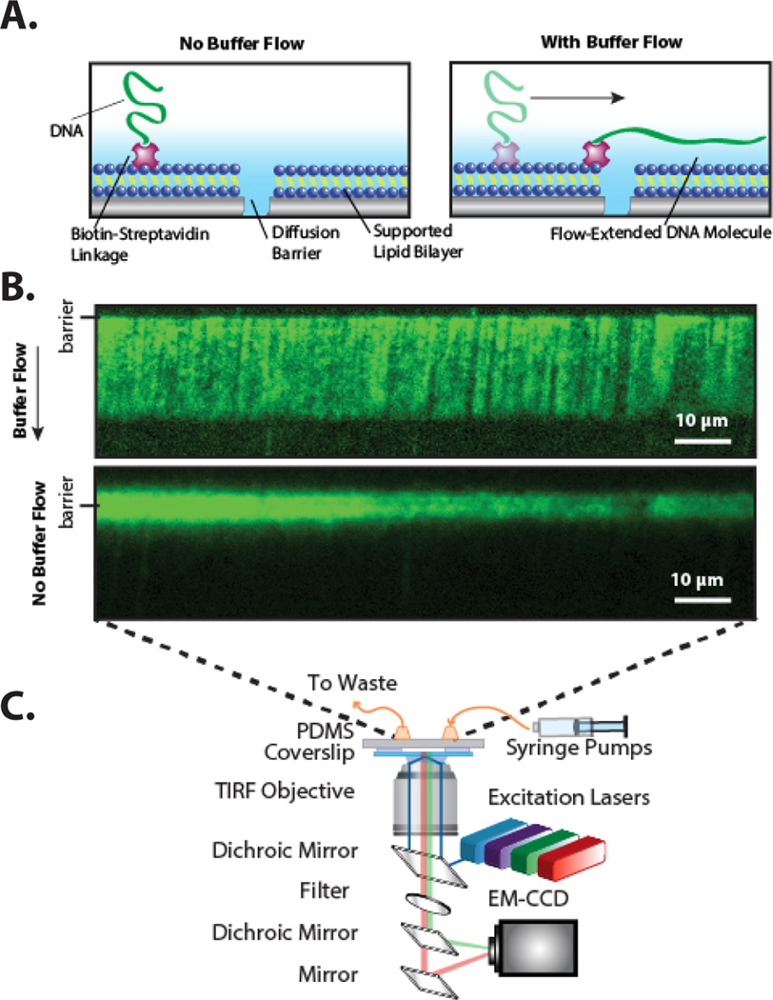
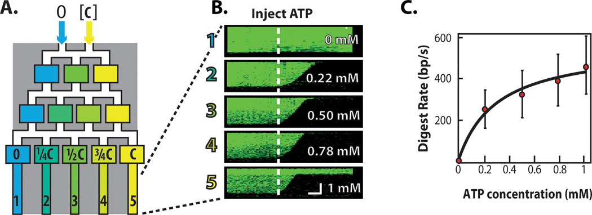
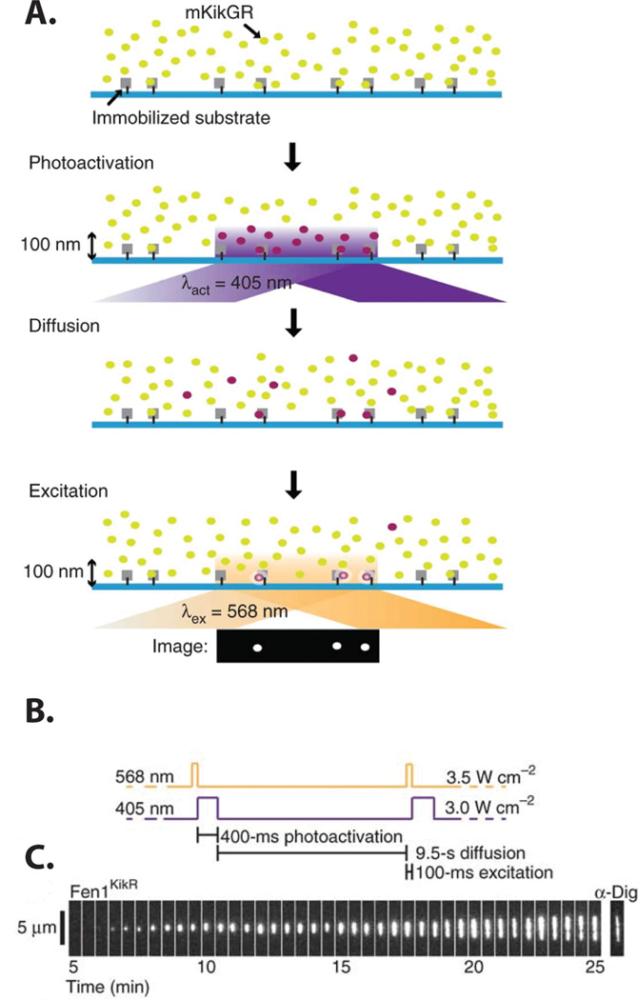
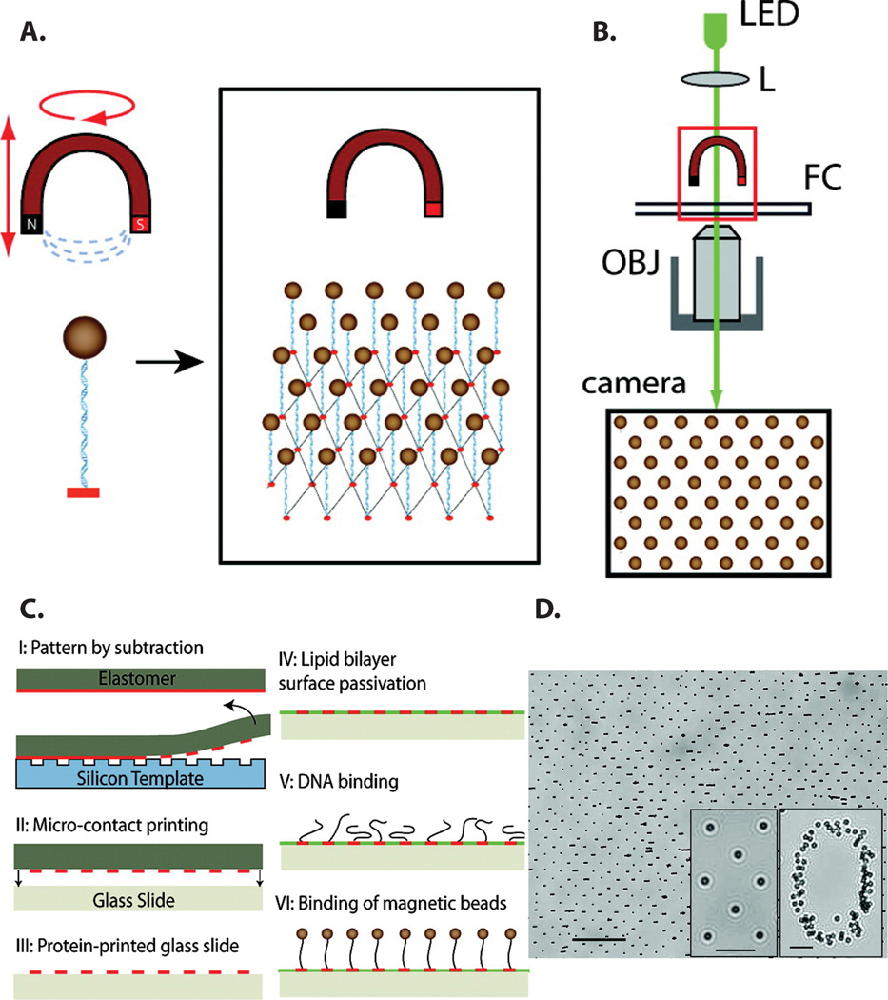
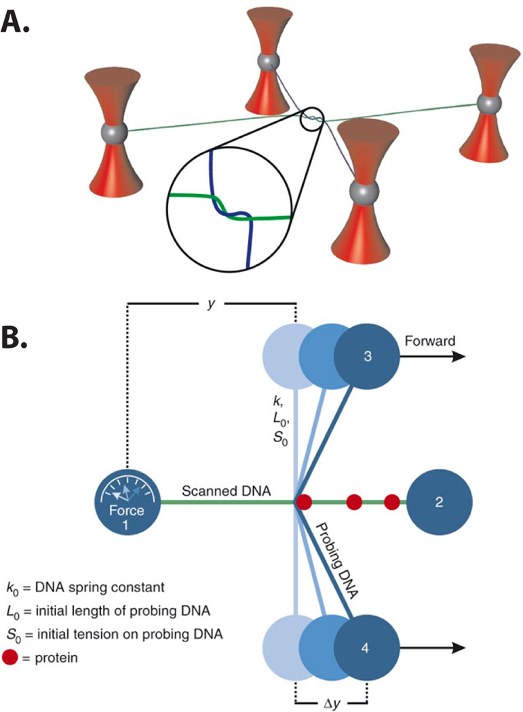

# High-Throughput Single-Molecule Studies of Protein–DNA Interactions

**Aaron D. Robison and Ilya J. Finkelstein**

*FEBS Lett.*, Volume 588, Issue 19, Pages 3539–46 (2014)

**DOI:** [10.1016/j.febslet.2014.05.021](https://doi.org/10.1016/j.febslet.2014.05.021)

---

## Table of Contents

- [Abstract](#abstract)
- [Introduction](#introduction)
- [Discussion](#discussion)
- [Concluding Remarks](#concluding-remarks)
- [Acknowledgements](#acknowledgements)

---

##  Abstract
Fluorescence and force-based single-molecule studies of protein-nucleic acid interactions continue to shed critical insights into many aspects of DNA and RNA processing. As single-molecule assays are inherently low-throughput, obtaining statistically relevant datasets remains a major challenge. Additionally, most fluorescence-based single-molecule particle-tracking assays are limited to observing fluorescent proteins that are in the low-nanomolar range, as spurious background signals predominate at higher fluorophore concentrations. These technical limitations have traditionally limited the types of questions that could be addressed via single-molecule methods. In this review, we describe new approaches for high-throughput and high-concentration single-molecule biochemical studies. We conclude with a discussion of outstanding challenges for the single-molecule biologist and how these challenges can be tackled to further approach the biochemical complexity of the cell.
**Keywords:** DNA curtains, Force Spectroscopy, Particle Tracking
---
##  Introduction
The advent of single-molecule methods—ultrasensitive tools that are capable of imaging and manipulating individual biochemical reactions—has revolutionized our understanding of biology. Single-molecule studies can directly interrogate transient biochemical steps that are obscured by ensemble averaging. These approaches are particularly useful for elucidating complex multi-step biochemical mechanisms and have proven especially amenable for studying protein-nucleic acid interactions. For example, single-molecule enzymology has shed critical insights into our understanding of DNA replication,[[1](https://pmc.ncbi.nlm.nih.gov/articles/PMC4163502/#R1)–[3](https://pmc.ncbi.nlm.nih.gov/articles/PMC4163502/#R3)] transcription,[[4](https://pmc.ncbi.nlm.nih.gov/articles/PMC4163502/#R4)–[6](https://pmc.ncbi.nlm.nih.gov/articles/PMC4163502/#R6)] chromatin remodeling,[[7](https://pmc.ncbi.nlm.nih.gov/articles/PMC4163502/#R7)] and DNA damage repair.[[8](https://pmc.ncbi.nlm.nih.gov/articles/PMC4163502/#R8),[9](https://pmc.ncbi.nlm.nih.gov/articles/PMC4163502/#R9)] The development of single-molecule experiments in cell-free extracts[[10](https://pmc.ncbi.nlm.nih.gov/articles/PMC4163502/#R10)–[12](https://pmc.ncbi.nlm.nih.gov/articles/PMC4163502/#R12)] and within living cells[[13](https://pmc.ncbi.nlm.nih.gov/articles/PMC4163502/#R13),[14](https://pmc.ncbi.nlm.nih.gov/articles/PMC4163502/#R14)] will continue to shed critical insights into all aspects of genome maintenance.
In the last two decades, the single-molecule methods toolkit has continued to expand at a dizzying pace. The choice of an appropriate method is dictated largely by the biochemical details and relevant length-scales of the desired biological process. For example, single-molecule Förster Resonance Energy Transfer (smFRET) can be used to monitor protein-nucleic acid interactions on the ~5 nm length-scale. For a complete discussion of smFRET-based approaches, we direct the reader towards several comprehensive reviews.[[15](https://pmc.ncbi.nlm.nih.gov/articles/PMC4163502/#R15)–[19](https://pmc.ncbi.nlm.nih.gov/articles/PMC4163502/#R19)] As DNA replication, transcription, and repair frequently involve highly processive molecular motors, these reactions must be studied on kilobase-length DNA substrates. These reactions can be indirectly visualized via tethered particle motion (TPM), where a long DNA molecule is used to tether a micron-size bead to the surface of a flowcell. Changes in the DNA length are observed as changes in the Brownian motion of the tethered beads.[[20](https://pmc.ncbi.nlm.nih.gov/articles/PMC4163502/#R20)–[22](https://pmc.ncbi.nlm.nih.gov/articles/PMC4163502/#R22)] To directly visualize biochemical reactions with high spatiotemporal resolution, DNA molecules are immobilized and extended on the surface of a microscope flow cell. The biochemical reaction is then followed by fluorescently tracking the enzyme or by monitoring a change in the length of the substrate DNA molecule.
These single-molecule particle-tracking experiments are hampered by two fundamental limitations. First, obtaining statistically relevant datasets is a challenge for experiments that are designed to observe individual molecules. This challenge is compounded by the fact that biochemical reconstitution of multi-subunit enzymatic machines (e.g. the replisome, chromatin remodelers, or DNA repair complexes) rarely approaches 100%. This biochemical heterogeneity further reduces the throughput of single-molecule data acquisition. Second, single-molecule fluorescence imaging must reliably discriminate weak signals from spurious background fluorescence. Most imaging experiments are carried out at extremely dilute (~1–10 nM) fluorescent protein concentrations. However, most transient biological interactions have evolved to be reversible in the 1–100 µM range, precluding their analysis by conventional single-molecule methods.[[23](https://pmc.ncbi.nlm.nih.gov/articles/PMC4163502/#R23)]
In this review, we summarize emerging experimental approaches for interrogating protein-nucleic acid interactions at the single-molecule level. We focus on methods that permit the organization, manipulation, and imaging of long DNA molecules. In addition, we highlight a general strategy to break the concentration barrier in single-molecule fluorescence imaging studies. We conclude with a summary of next-generation single-molecule methods that combine fluorescence imaging with force spectroscopy to probe protein-nucleic acid interactions with unprecedented resolution.
---
##  Discussion
### A. Tracking Enzymes on Long DNA Substrates
To visualize enzymes that traverse a long DNA substrate, the DNA molecule is immobilized on a microscope flow cell surface in an extended conformation. This is typically achieved by tethering DNA with streptavidin-biotin linkages on poly(ethylene glycol)-coated surfaces and extending the tethered DNA with hydrodynamic flow (see [Table 1](https://pmc.ncbi.nlm.nih.gov/articles/PMC4163502/#T1)).[[24](https://pmc.ncbi.nlm.nih.gov/articles/PMC4163502/#R24),[25](https://pmc.ncbi.nlm.nih.gov/articles/PMC4163502/#R25)] Alternatively, long DNA molecules can be suspended between two poly-L-lysine-coated silica beads adsorbed to the surface of a flow cell, forming DNA “tightropes.” As the DNA is tethered randomly on the flow cell surface, the number of DNA molecules per field-of-view must remain low. To avoid overlapping DNA molecules, only tens of DNA molecules are imaged within a single field-of-view. Moreover, because the DNA is randomly attached to the flow cell surface, individual DNA molecules have different tensions. Finally, for double-tethered DNA molecules, the orientation of the DNA sequence relative to its tether points is not known.
#### Table 1.
High-throughput single-molecule methods
Approach | Applications | Comments | References  
---|---|---|---  
smFRET | Observing protein conformations, protein-nucleic acid binding and short-distance translocation | Used for short-distance (1–5nm) interactions | [[15–19](https://pmc.ncbi.nlm.nih.gov/articles/PMC4163502/#R15)]  
Microfluidic DNA Curtains | Observing micron-length protein-DNA interactions | 1000’s of molecules in single field-of-view, defined DNA orientation | [[26](https://pmc.ncbi.nlm.nih.gov/articles/PMC4163502/#R26),[27](https://pmc.ncbi.nlm.nih.gov/articles/PMC4163502/#R27),[32](https://pmc.ncbi.nlm.nih.gov/articles/PMC4163502/#R32)]  
Random Surface Tethering | Tens of molecules in single field-of-view. DNA orientation unknown. | [[1–3](https://pmc.ncbi.nlm.nih.gov/articles/PMC4163502/#R1)]  
DNA Tightropes | Tens of molecules in single field-of-view. Tension and orientation unknown | [[9](https://pmc.ncbi.nlm.nih.gov/articles/PMC4163502/#R9),[92](https://pmc.ncbi.nlm.nih.gov/articles/PMC4163502/#R92)]  
Tethered Particle Motion | Monitors changes in DNA length, which can be used as an indirect probe of enzyme activity. | 100’s of molecules in single field-of-view | [[20](https://pmc.ncbi.nlm.nih.gov/articles/PMC4163502/#R20)]  
Multiplexed Magnetic Tweezers | Force spectroscopy of protein-DNA interactions. Torsional control possible. | 10’s to 100’s of molecules in single field-of-view | [[70](https://pmc.ncbi.nlm.nih.gov/articles/PMC4163502/#R70),[71](https://pmc.ncbi.nlm.nih.gov/articles/PMC4163502/#R71),[93](https://pmc.ncbi.nlm.nih.gov/articles/PMC4163502/#R93)]  
Multiplexed Optical Tweezers | Observing mechanical properties of DNA and protein-DNA interactions. | Offers 3D control of captured particles | [[78](https://pmc.ncbi.nlm.nih.gov/articles/PMC4163502/#R78),[79](https://pmc.ncbi.nlm.nih.gov/articles/PMC4163502/#R79)]  
Centrifugal Force Microscopy | Applies uniform centrifugal force on all molecules within an orbiting flowcell. | Imaging must occur out on a rotating stage. | [[65](https://pmc.ncbi.nlm.nih.gov/articles/PMC4163502/#R65)]  
[Open in a new tab](https://pmc.ncbi.nlm.nih.gov/articles/PMC4163502/table/T1/)
#### Microfluidic DNA Curtains
To overcome these limitations, we have developed microfluidic "DNA curtains," a high-throughput experimental platform for organizing and imaging hundreds of individual DNA molecules in a single field-of-view. To assemble DNA curtains, a supported lipid bilayer is first deposited on the surface of a microfluidic flow cell. The supported lipid bilayer provides excellent biomimetic surface passivation and DNA or proteins can be directly tethered to the lipid head groups via a biotin-streptavidin linkage.[[26](https://pmc.ncbi.nlm.nih.gov/articles/PMC4163502/#R26),[27](https://pmc.ncbi.nlm.nih.gov/articles/PMC4163502/#R27)] As the bilayer forms a two-dimensional fluid, hydrodynamic flow can be used to organize hundreds of lipid-tethered DNA molecules at patterned barriers to lipid diffusion [Fig. 1](#fig1). Importantly, all DNA molecules have identical orientation with respect to their DNA sequences and buffer flow maintains all molecules at the same tension.[[28](https://pmc.ncbi.nlm.nih.gov/articles/PMC4163502/#R28),[29](https://pmc.ncbi.nlm.nih.gov/articles/PMC4163502/#R29)] DNA curtains have been used to investigate how enzymes find specific DNA sites amidst a vast pool of nonspecific DNA,[[30](https://pmc.ncbi.nlm.nih.gov/articles/PMC4163502/#R30),[31](https://pmc.ncbi.nlm.nih.gov/articles/PMC4163502/#R31)] to observe how motor proteins translocate on crowded DNA,[[32](https://pmc.ncbi.nlm.nih.gov/articles/PMC4163502/#R32)] and to visualize the roles of accessory polymerases during DNA replication.[[3](https://pmc.ncbi.nlm.nih.gov/articles/PMC4163502/#R3)] Finally, the development of single-stranded DNA (ssDNA) curtains has facilitated single-molecule studies of homologous DNA recombination and other biochemical processes that occur on long tracks of ssDNA.[[33](https://pmc.ncbi.nlm.nih.gov/articles/PMC4163502/#R33)–[35](https://pmc.ncbi.nlm.nih.gov/articles/PMC4163502/#R35)]
##### [Figure 1](#fig1).

(a) An illustration of a DNA molecule organized at a lipid diffusion barrier (side view). (b) Fluorescent image of a α-DNA curtain in the presence (top) and absence (bottom) of a 50 µl min−1 buffer flow. In the absence of buffer flow (bottom panel), the DNA collapses and begins to diffuse away from the mechanical barrier. The DNA was stained with the intercalating dye YOYO-1. (c) Schematic of the objective-TIRF microscope used for imaging DNA curtains.
Although DNA curtains increase the number of molecules that can be imaged in a single field-of-view, numerous time-consuming and repetitive experiments are required to completely characterize a biochemical reaction (e.g. by changing the protein composition, or a nucleotide or salt concentration). To further increase the high-throughput capabilities of this experimental platform, we integrated DNA curtains with lab-on-chip poly(dimethylsiloxane) (PDMS) microfluidics.[[36](https://pmc.ncbi.nlm.nih.gov/articles/PMC4163502/#R36),[37](https://pmc.ncbi.nlm.nih.gov/articles/PMC4163502/#R37)] As a proof-of-principle, we designed a chaotic gradient mixer which enables simultaneous analysis of DNA curtains in discrete microfluidic channels [Fig. 2a](#fig2). For example, we observed the rate of DNA resection by RecBCD, a heterotrimeric helicase and nuclease that uses the energy from ATP hydrolysis to translocate along DNA.[[38](https://pmc.ncbi.nlm.nih.gov/articles/PMC4163502/#R38),[39](https://pmc.ncbi.nlm.nih.gov/articles/PMC4163502/#R39)] In [Fig. 2b](#fig2), RecBCD is not fluorescently labeled. Rather, its helicase/nuclease activity is observed as a shortening of the fluorescently-stained duplex DNA. RecBCD activity was imaged at five different ATP concentrations (in five analysis channels), allowing for rapid enzyme characterization in a single microfluidic chip [Fig. 2b,c](#fig2).
##### [Figure 2](#fig2).

(a) Schematic illustration of a passive gradient mixer. An analyte such as ATP, [C], is diluted after chaotic mixing. DNA curtains are formed and observed in imaging chambers 1–5. (b) Kymograms of RecBCD digesting a DNA molecule in each of the five imaging chambers at differing ATP concentrations. The horizontal scale bar indicates 60 s and the vertical scale bar is 4 µm. (c) The mean RecBCD digestion rate in the five channels (red dots, error bars represent standard deviation) was fit to a Michaelis-Menten equation (black line).
#### Breaking the Single-Molecule Concentration Barrier
To fluorescently observe individual molecules, all single-molecule approaches must minimize spurious background fluorescent signals. Wide-field illumination via total internal reflection fluorescence (TIRF) microscopy reduces the laser excitation volume to a ~100 nm region near the surface of a coverslip, thereby substantially reducing background signals.[[40](https://pmc.ncbi.nlm.nih.gov/articles/PMC4163502/#R40)] However, most TIRF-based experiments must still maintain the fluorophore concentration below ~10 nM to discriminate signal from background. Most methods that seek to image individual molecules at higher fluorophore concentrations either increase the local protein concentration, or further confine the laser illumination volume. For example, the reaction volume can be reduced by encapsulating the biochemical reaction of interest in a porous lipid vesicle[[41](https://pmc.ncbi.nlm.nih.gov/articles/PMC4163502/#R41)–[45](https://pmc.ncbi.nlm.nih.gov/articles/PMC4163502/#R45)], within a PDMS nanochannel[[46](https://pmc.ncbi.nlm.nih.gov/articles/PMC4163502/#R46)], or within a confined volume induced by a convex lens and a coverslip.[[47](https://pmc.ncbi.nlm.nih.gov/articles/PMC4163502/#R47)] Alternatively, the laser excitation can be confined to an attoliter volume within a zero-mode waveguide,[[48](https://pmc.ncbi.nlm.nih.gov/articles/PMC4163502/#R48)–[50](https://pmc.ncbi.nlm.nih.gov/articles/PMC4163502/#R50)] or near plasmonic nano-structures that locally enhance the light excitation.[[51](https://pmc.ncbi.nlm.nih.gov/articles/PMC4163502/#R51),[52](https://pmc.ncbi.nlm.nih.gov/articles/PMC4163502/#R52)] These methods are applicable for monitoring reactions that occur on short (<100 bp) nucleic acid substrates and are listed in [Table 2](https://pmc.ncbi.nlm.nih.gov/articles/PMC4163502/#T2). We direct the reader to several recent reviews summarizing these approaches. [[15](https://pmc.ncbi.nlm.nih.gov/articles/PMC4163502/#R15),[16](https://pmc.ncbi.nlm.nih.gov/articles/PMC4163502/#R16),[53](https://pmc.ncbi.nlm.nih.gov/articles/PMC4163502/#R53)]
##### Table 2.
Strategies to break the “concentration barrier”
Approach | Applicable to | Comments | References  
---|---|---|---  
Confinement in vesicles | smFRET | Enzymes must survive vesicle encapsulation procedure | [[41–45](https://pmc.ncbi.nlm.nih.gov/articles/PMC4163502/#R41)]  
Confinement in microfluidic channels | smFRET | Microfabrication required | [[46](https://pmc.ncbi.nlm.nih.gov/articles/PMC4163502/#R46)]  
Convex lens-induced confinement | Long DNA molecules | Simple implementation | [[47](https://pmc.ncbi.nlm.nih.gov/articles/PMC4163502/#R47)]  
Zero-mode waveguides | smFRET, long DNA molecules | Nanolithography required | [[48–50](https://pmc.ncbi.nlm.nih.gov/articles/PMC4163502/#R48)]  
Fluorophore photoactivation | smFRET, particle tracking | Used in concert with TIRF microscopy | [[54](https://pmc.ncbi.nlm.nih.gov/articles/PMC4163502/#R54)]  
Plasmonic nanostructures | smFRET | Nanolithography required | [[51](https://pmc.ncbi.nlm.nih.gov/articles/PMC4163502/#R51),[52](https://pmc.ncbi.nlm.nih.gov/articles/PMC4163502/#R52)]  
[Open in a new tab](https://pmc.ncbi.nlm.nih.gov/articles/PMC4163502/table/T2/)
As extended DNA molecules cannot be encapsulated within small vesicles or zero-mode-waveguides, these methods cannot be used to image proteins on long DNA molecules. To overcome this limitation, Loveland and co-workers developed a general approach to break the 'concentration barrier' for single-molecule experiments on both short and long DNA substrates.[[54](https://pmc.ncbi.nlm.nih.gov/articles/PMC4163502/#R54)] In this approach, a protein of interest is labeled with mKikGR, a photo-convertible fluorescent protein that emits green fluorescence in its un-activated state (mKikG). Upon photo-activation with 405 nm light, an isomerization in the fluorophore active site shifts the emission spectrum to the red (mKikR), permitting spectral discrimination between the photoactivated and un-activated states.[[55](https://pmc.ncbi.nlm.nih.gov/articles/PMC4163502/#R55)] Total internal reflection excitation is used to selectively photoconvert mKikG to mKikR near the surface [Fig. 3a](#fig3). Because unbound mKikR rapidly diffuses out of the illumination volume, only the DNA-bound mKikR is imaged. Using this method, termed PhADE (PhotoActivation, Diffusion, Excitation), Loveland et al. observed DNA replication in cell-free _Xenopus laevis_ egg extracts.[[54](https://pmc.ncbi.nlm.nih.gov/articles/PMC4163502/#R54)] By imaging mKikGR-labeled flap endonuclease 1 (Fen1KikGR), the authors could dynamically visualize the Okazaki fragments of replicating α-DNA molecules [Fig. 3c](#fig3).
##### [Figure 3](#fig3).

A general strategy for single-molecule imaging at high fluorophore concentrations. (a) Cartoon illustrating the PhADE imaging strategy. (b) The laser illumination sequence used to visualize the growth of Fen1KikGR replication bubbles. (c) Kymogram of a replication bubble growing over time in the presence 4 µM Fen1KikGR and digoxigenin (dig)-dUTP. Following the final PhADE cycle, the DNA was stained with anti-digoxigenin-fluorescein Fab fragments (α-Dig).
Two caveats must be considered when selecting this approach for single-molecule imaging at high fluorophore concentrations. First, as only a fraction of the mKikGR proteins are photoactivated by the 405 nm laser, the mKikGR-labeled protein must be present at a high density on the DNA molecule. Second, the mKikGR-labeled protein must not dissociate from the DNA molecule, as rapid exchange with un-activated protein still present in solution could rapidly ablate the mKikR signal. Despite these two caveats, PhADE provides the first general method to circumvent the concentration barrier in single-molecule studies on extended nucleic acid substrates and will greatly benefit from the continuing development of new photo-switchable fluorophores.[[56](https://pmc.ncbi.nlm.nih.gov/articles/PMC4163502/#R56),[57](https://pmc.ncbi.nlm.nih.gov/articles/PMC4163502/#R57)]
### B. High-Throughput Force Spectroscopy
Single-molecule force spectroscopy is a powerful tool for interrogating the mechanical properties of protein-nucleic acid interactions. Early force spectroscopy studies elucidated the mechanical properties of DNA and RNA.[[58](https://pmc.ncbi.nlm.nih.gov/articles/PMC4163502/#R58)–[61](https://pmc.ncbi.nlm.nih.gov/articles/PMC4163502/#R61)] These pioneering early experiments paved the way for mechanistic studies of protein-DNA interactions, such as those that probe the mechanical unzipping of DNA strands by helicases,[[62](https://pmc.ncbi.nlm.nih.gov/articles/PMC4163502/#R62)] the unwinding of nucleosomes,[[63](https://pmc.ncbi.nlm.nih.gov/articles/PMC4163502/#R63)] or relaxation of supercoiled DNA strands by topoisomerases.[[64](https://pmc.ncbi.nlm.nih.gov/articles/PMC4163502/#R64)]
Most force spectroscopy methods, such as optical and magnetic tweezers, require the manipulation of DNA molecules on a one-by-one basis. To address this challenge, several groups have developed high-throughput force spectroscopy approaches. For example, Wong and colleagues developed a massively parallel centrifugal force microscope, where uniform piconewton forces are applied on thousands of molecules within an orbiting sample.[[65](https://pmc.ncbi.nlm.nih.gov/articles/PMC4163502/#R65)] However, this method requires that both the sample chamber and the imaging optics must be within the same rotating frame, precluding the integration of modern microscopes and ultrasensitive CCD detectors. In addition, several groups have developed novel approaches for high-throughput optical and magnetic tweezers. Below, we highlight two of these approaches.
#### Magnetic Tweezers
In a magnetic tweezers experiment, a DNA molecule is tethered between the surface of a flow cell and a paramagnetic bead. To extend or supercoil the DNA, an external magnetic field is used to manipulate the paramagnetic bead [Fig. 4a,b](#fig4). Protein-dependent activities are inferred from the bead movement.[[64](https://pmc.ncbi.nlm.nih.gov/articles/PMC4163502/#R64),[66](https://pmc.ncbi.nlm.nih.gov/articles/PMC4163502/#R66)–[69](https://pmc.ncbi.nlm.nih.gov/articles/PMC4163502/#R69)]
##### [Figure 4](#fig4).

Schematic of a multiplexed magnetic tweezers (MT) apparatus. (a) An array of DNA molecules is immobilized between a flowcell surface and an external magnet. (b) A microscope system consisting of an LED, a lens (L), an objective (OBJ), and a camera is used to observe bead arrays tethered in a flow cell (FC). Video microscopy is used to measure the XYZ positions of the magnetic beads. (c) Strategy for patterning regular arrays of DNA for the MT assay. First, a protein layer containing anti-digoxigenin is transferred from a flat polymer stamp to a patterned glass substrate (I). The protein remaining on the stamp is then transferred to a glass slide and subsequently passivated with a lipid bilayer (II–IV). DNA end-labeled with biotin and digoxigenin is then allowed to bind to the patterned surface (V) and streptavidin-coated superparamagnetic beads then bind to the biotinylated DNA ends. (d) 40% zoom of a field-of-view showing magnetic beads arranged in a square array (scale bar 40 µm). Insets show a zoom-in of magnetic beads in a square array and as a number marker on the sample (scale bars 10 µm).
To simultaneously manipulate hundreds of trapped DNA molecules, De Vlaminck et al. developed a strategy for depositing precisely controlled arrays of DNA-tethered beads [Fig. 4](#fig4). Repeating micron-scale arrays of anti-digoxigenin antibodies were printed onto a glass coverslip and the rest of the surface was passivated with a supported lipid bilayer [Fig. 4c](#fig4). DNA molecules were affixed to these pads via a digoxigenin-antibody linkage. The density of DNA molecules was tuned to minimize the nearest-neighbor paramagnetic bead crosstalk probabilities [Fig. 4c,d](#fig4).[[70](https://pmc.ncbi.nlm.nih.gov/articles/PMC4163502/#R70)]
This approach offers a high-throughput strategy for single-molecule force spectroscopy. However, the number of beads that can be observed simultaneously is limited by non-uniformity of the applied magnetic field. To overcome this limitation, the authors analyzed the motion of the beads in a rotating magnetic field. Under a rotating magnet, the bi-circular rotational pattern of the paramagnetic beads is sensitive to both the angle of the applied magnetic force and the orientation of the bead-DNA attachment.[[71](https://pmc.ncbi.nlm.nih.gov/articles/PMC4163502/#R71)] Systematic analysis of these rotational patterns allows accurate calculation of the magnetic force experienced by each bead and the bead-DNA attachment orientations, thereby compensating for inhomogeneity in the magnetic field. This calibration technique provides accurate analysis of protein-DNA interactions over large fields-of-view. Thus, by integrating micron-scale surface patterning with a sophisticated magnetic field calibration scheme, hundreds of surface-tethered molecules can be imaged within a single field-of-view.
#### Optical Tweezers
Unlike magnetic tweezers, optical tweezers use highly focused laser beams to trap and manipulate polystyrene beads. To increase the throughput of optical tweezers experiments, a single beam can be time-shared via acousto-optical deflectors.[[72](https://pmc.ncbi.nlm.nih.gov/articles/PMC4163502/#R72)] Alternatively, a single beam can be split into an array of optical traps through the use of computer-generated holograms, [[73](https://pmc.ncbi.nlm.nih.gov/articles/PMC4163502/#R73),[74](https://pmc.ncbi.nlm.nih.gov/articles/PMC4163502/#R74)] refractive microlenses,[[75](https://pmc.ncbi.nlm.nih.gov/articles/PMC4163502/#R75),[76](https://pmc.ncbi.nlm.nih.gov/articles/PMC4163502/#R76)] or mechanical gratings.[[77](https://pmc.ncbi.nlm.nih.gov/articles/PMC4163502/#R77)] For example, Noom et al. were able to simultaneously trap four polystyrene beads by splitting a laser into two orthogonally polarized beams and keeping one of these beams as a stationary trap. The other beam was temporally shared between three independent trapping positions [Fig. 5](#fig5).[[78](https://pmc.ncbi.nlm.nih.gov/articles/PMC4163502/#R78)] By time-sharing the laser between several traps, Noom et al. physically wrapped one DNA strand around a second independent DNA molecule, providing a means of 'scanning' one DNA along its counterpart with sub-pN force. When the scanning DNA encountered a protein bound to the stationary DNA, a substantial increase in the frictional force could be measured [Fig. 5b](#fig5). A similar trapping strategy allowed the investigation of protein-mediated interaction of two DNA molecules.[[79](https://pmc.ncbi.nlm.nih.gov/articles/PMC4163502/#R79)] Although these studies demonstrate that single-molecule experiments can be conducted in a four-trap configuration, the development of high-throughput, multiplexed optical traps continues to be an important challenge for single-molecule force spectroscopy assays.[[80](https://pmc.ncbi.nlm.nih.gov/articles/PMC4163502/#R80)–[82](https://pmc.ncbi.nlm.nih.gov/articles/PMC4163502/#R82)]
##### [Figure 5](#fig5).

Dual DNA experiment showing (a) two α DNA molecules suspended between polystyrene beads held in place with optical tweezers. The probing DNA molecule (blue) is wrapped around the scanned DNA molecule (green). (b) A schematic showing the DNA scanning assay. The probing DNA is moved along the scanned DNA and upon encountering a bound protein, a force is measured on bead #1. This force is proportional to the distance αy.
---
##  Concluding Remarks
Single-molecule studies continue to add tremendous insights into our understanding of protein-nucleic acid interactions. In this review, we discussed emerging high-throughput single-molecule methods for observing and manipulating long-range protein-DNA interactions [[Table 1](https://pmc.ncbi.nlm.nih.gov/articles/PMC4163502/#T1)]. In addition, we discussed strategies for imaging individual molecules at high (µM) fluorophore concentrations [[Table 2](https://pmc.ncbi.nlm.nih.gov/articles/PMC4163502/#T2)]. Further integration with highly multiplexed and temperature-controlled microfluidic-based systems will expand the throughput of single-molecule biophysical studies.
Complimentary aspects of a biochemical reaction can simultaneously be probed by a combination of single-molecule imaging and force spectroscopy modalities. For example, a combined fluorescence and optical tweezers microscope has been used to investigate protein-DNA interactions as a function of the DNA tension.[[83](https://pmc.ncbi.nlm.nih.gov/articles/PMC4163502/#R83)–[85](https://pmc.ncbi.nlm.nih.gov/articles/PMC4163502/#R85)] Magnetic tweezers have also been used in conjunction with fluorescence techniques such as FRET[[86](https://pmc.ncbi.nlm.nih.gov/articles/PMC4163502/#R86)] and TIRF[[87](https://pmc.ncbi.nlm.nih.gov/articles/PMC4163502/#R87)] and to visualize individual proteins bound to DNA.[[88](https://pmc.ncbi.nlm.nih.gov/articles/PMC4163502/#R88)] Developing high-throughput versions of these methods will further enable single-molecule biophysical studies of multi-protein systems. Finally, the integration of new particle-manipulation modalities such as standing surface acoustic waves (SSAW),[[89](https://pmc.ncbi.nlm.nih.gov/articles/PMC4163502/#R89)] hydrodynamic focusing,[[90](https://pmc.ncbi.nlm.nih.gov/articles/PMC4163502/#R90)] and electrokinetic traps[[91](https://pmc.ncbi.nlm.nih.gov/articles/PMC4163502/#R91)] with existing fluorescence and force-manipulation techniques will further increase the information content of _in vitro_ single-molecule approaches.
---
##  ACKNOWLEDGEMENTS
This research was supported in part by the Welch Foundation (F-l808) and by the NIH (GM097177 to I.J.F). Dr. Ilya Finkelstein is a CPRIT Scholar in Cancer Research.

---

## References

1. Hamdan SM, Loparo JJ, Takahashi M, Richardson CC, van Oijen AM. Dynamics of DNA replication loops reveal temporal control of lagging-strand synthesis. Nature. 2008;457:336–339. doi: 10.1038/nature07512.
2. Yardimci H, Wang X, Loveland AB, Tappin I, Rudner DZ, Hurwitz J, van Oijen AM, Walter JC. Bypass of a protein barrier by a replicative DNA helicase. Nature. 2012;492:205–209. doi: 10.1038/nature11730.
3. Yao NY, Georgescu RE, Finkelstein J, O'Donnell ME. Single-molecule analysis reveals that the lagging strand increases replisome processivity but slows replication fork progression. Proc. Natl. Acad. Sci. 2009;106:13236–13241. doi: 10.1073/pnas.0906157106.
4. Galburt EA, Grill SW, Bustamante C. Single molecule transcription elongation. Methods. 2009;48:323–332. doi: 10.1016/j.ymeth.2009.04.021.
5. Wang F, Greene EC. Single-Molecule Studies of Transcription: From One RNA Polymerase at a Time to the Gene Expression Profile of a Cell. J. Mol. Biol. 2011;412:814–831. doi: 10.1016/j.jmb.2011.01.024.
6. Larson MH, Landick R, Block SM. Single-Molecule Studies of RNA Polymerase: One Singular Sensation, Every Little Step It Takes. Mol. Cell. 2011;41:249–262. doi: 10.1016/j.molcel.2011.01.008.
7. Neumann H, Hancock SM, Buning R, Routh A, Chapman L, Somers J, Owen-Hughes T, van Noort J, Rhodes D, Chin JW. A Method for Genetically Installing Site-Specific Acetylation in Recombinant Histones Defines the Effects of H3 K56 Acetylation. Mol. Cell. 2009;36:153–163. doi: 10.1016/j.molcel.2009.07.027.
8. Finkelstein IJ, Greene EC. Single molecule studies of homologous recombination. Mol. Biosyst. 2008;4:1094. doi: 10.1039/b811681b.
9. Kad NM, Wang H, Kennedy GG, Warshaw DM, Van Houten B. Collaborative Dynamic DNA Scanning by Nucleotide Excision Repair Proteins Investigated by Single-Molecule Imaging of Quantum-Dot-Labeled Proteins. Mol. Cell. 2010;37:702–713. doi: 10.1016/j.molcel.2010.02.003.
10. Hoskins AA, Friedman LJ, Gallagher SS, Crawford DJ, Anderson EG, Wombacher R, Ramirez N, Cornish VW, Gelles J, Moore MJ. Ordered and Dynamic Assembly of Single Spliceosomes. Science. 2011;331:1289–1295. doi: 10.1126/science.1198830.
11. Yardimci H, Loveland AB, van Oijen AM, Walter JC. Single-molecule analysis of DNA replication in Xenopus egg extracts. Methods. 2012;57:179–186. doi: 10.1016/j.ymeth.2012.03.033.
12. Krishnan R, Blanco MR, Kahlscheuer ML, Abelson J, Guthrie C, Walter NG. Biased Brownian ratcheting leads to pre-mRNA remodeling and capture prior to first-step splicing. Nat. Struct. Mol. Biol. 2013;20:1450–1457. doi: 10.1038/nsmb.2704.
13. Zhao ZW, Roy R, Gebhardt JCM, Suter DM, Chapman AR, Xie XS. Spatial organization of RNA polymerase II inside a mammalian cell nucleus revealed by reflected light-sheet superresolution microscopy. Proc. Natl. Acad. Sci. 2014;111:681–686. doi: 10.1073/pnas.1318496111.
14. Doksani Y, Wu JY, de Lange T, Zhuang X. Super-Resolution Fluorescence Imaging of Telomeres Reveals TRF2-Dependent T-loop Formation. Cell. 2013;155:345–356. doi: 10.1016/j.cell.2013.09.048.
15. Roy R, Hohng S, Ha T. A practical guide to single-molecule FRET. Nat. Methods. 2008;5:507–516. doi: 10.1038/nmeth.1208.
16. Preus S, Wilhelmsson LM. Advances in quantitative FRET-based methods for studying nucleic acids. Chembiochem Eur. J. Chem. Biol. 2012;13:1990–2001. doi: 10.1002/cbic.201200400.
17. Kim H, Ha T. Single-molecule nanometry for biological physics. Rep. Prog. Phys. 2013;76:016601. doi: 10.1088/0034-4885/76/1/016601.
18. Hohng S, Lee S, Lee J, Jo MH. Maximizing information content of single-molecule FRET experiments: multi-color FRET and FRET combined with force or torque. Chem. Soc. Rev. 2014;43:1007. doi: 10.1039/c3cs60184f.
19. Hohlbein J, Craggs TD, Cordes T. Alternating-laser excitation: single-molecule FRET and beyond. Chem. Soc. Rev. 2014;43:1156. doi: 10.1039/c3cs60233h.
20. Plenat T, Tardin C, Rousseau P, Salome L. High-throughput single-molecule analysis of DNA-protein interactions by tethered particle motion. Nucleic Acids Res. 2012;40:e89. doi: 10.1093/nar/gks250.
21. Wong OK, Guthold M, Erie DA, Gelles J. Interconvertible Lac Repressor–DNA Loops Revealed by Single-Molecule Experiments. PLoS Biol. 2008;6:e232. doi: 10.1371/journal.pbio.0060232.
22. Dunlap D, Zurla C, Manzo C, Finzi L. Probing DNA topology using Tethered Particle Motion. Methods Mol. Biol. Clifton NJ. 2011;783. doi: 10.1007/978-1-61779-282-3_16.
23. Schomburg I, Chang A, Placzek S, Sohngen C, Rother M, Lang M, Munaretto C, Ulas S, Stelzer M, Grote A, Scheer M, Schomburg D. BRENDA in 2013: integrated reactions, kinetic data, enzyme function data, improved disease classification: new options and contents in BRENDA. Nucleic Acids Res. 2013;41:D764–D772. doi: 10.1093/nar/gks1049.
24. Van Oijen AM. Single-Molecule Kinetics of Exonuclease Reveal Base Dependence and Dynamic Disorder. Science. 2003;301:1235–1238. doi: 10.1126/science.1084387.
25. Greene EC, Mizuuchi K. Direct Observation of Single MuB PolymersEvidence for a DNA-Dependent Conformational Change for Generating an Active Target Complex. Mol. Cell. 2002;9:1079–1089. doi: 10.1016/s1097-2765(02)00514-2.
26. Granéli A, Yeykal CC, Prasad TK, Greene EC. Organized Arrays of Individual DNA Molecules Tethered to Supported Lipid Bilayers. Langmuir. 2006;22:292–299. doi: 10.1021/la051944a.
27. Finkelstein IJ, Greene EC. Supported lipid bilayers and DNA curtains for high-throughput single-molecule studies. Methods Mol. Biol. Clifton NJ. 2011;745:447–461. doi: 10.1007/978-1-61779-129-1_26.
28. Visnapuu M-L, Fazio T, Wind S, Greene EC. Parallel Arrays of Geometric Nanowells for Assembling Curtains of DNA with Controlled Lateral Dispersion. Langmuir. 2008;24:11293–11299. doi: 10.1021/la8017634.
29. Gorman J, Fazio T, Wang F, Wind S, Greene EC. Nanofabricated Racks of Aligned and Anchored DNA Substrates for Single-Molecule Imaging. Langmuir. 2010;26:1372–1379. doi: 10.1021/la902443e.
30. Gorman J, Wang F, Redding S, Plys AJ, Fazio T, Wind S, Alani EE, Greene EC. Single-molecule imaging reveals target-search mechanisms during DNA mismatch repair. Proc. Natl. Acad. Sci. 2012;109:E3074–E3083. doi: 10.1073/pnas.1211364109.
31. Sternberg SH, Redding S, Jinek M, Greene EC, Doudna JA. DNA interrogation by the CRISPR RNA-guided endonuclease Cas9. Nature. 2014;507:62–67. doi: 10.1038/nature13011.
32. Finkelstein IJ, Greene EC. Molecular traffic jams on DNA. Annu. Rev. Biophys. 2013;42:241–263. doi: 10.1146/annurev-biophys-083012-130304.
33. Gibb B, Silverstein TD, Finkelstein IJ, Greene EC. Single-Stranded DNA Curtains for Real-Time Single-Molecule Visualization of Protein–Nucleic Acid Interactions. Anal. Chem. 2012;84:7607–7612. doi: 10.1021/ac302117z.
34. Gibb B, Ye LF, Gergoudis SC, Kwon Y, Niu H, Sung P, Greene EC. Concentration-Dependent Exchange of Replication Protein A on Single-Stranded DNA Revealed by Single-Molecule Imaging. PLoS ONE. 2014;9:e87922. doi: 10.1371/journal.pone.0087922.
35. Deng SK, Gibb B, de Almeida MJ, Greene EC, Symington LS. RPA antagonizes microhomology-mediated repair of DNA double-strand breaks. Nat. Struct. Mol. Biol. 2014;21:405–412. doi: 10.1038/nsmb.2786.
36. Duffy DC, McDonald JC, Schueller OJA, Whitesides GM. Rapid Prototyping of Microfluidic Systems in Poly(dimethylsiloxane). Anal. Chem. 1998;70:4974–4984. doi: 10.1021/ac980656z.
37. Robison AD, Finkelstein IJ. Rapid Prototyping of Multichannel Microfluidic Devices for Single-Molecule DNA Curtain Imaging. Anal. Chem. 2014. doi: 10.1021/ac500267v.
38. Finkelstein IJ, Visnapuu M-L, Greene EC. Single-molecule imaging reveals mechanisms of protein disruption by a DNA translocase. Nature. 2010;468:983–987. doi: 10.1038/nature09561.
39. Bianco PR, Brewer LR, Corzett M, Balhorn R, Yeh Y, Kowalczykowski SC, Baskin RJ. Processive translocation and DNA unwinding by individual RecBCD enzyme molecules. Nature. 2001;409:374–378. doi: 10.1038/35053131.
40. Axelrod D. Chapter 9 Total Internal Reflection Fluorescence Microscopy. Methods in Cell Biology. 1989:245–270. doi: 10.1016/s0091-679x(08)60982-6.
41. Benítez JJ, Keller AM, Ochieng P, Yatsunyk LA, Huffman DL, Rosenzweig AC, Chen P. Probing Transient Copper Chaperone–Wilson Disease Protein Interactions at the Single-Molecule Level with Nanovesicle Trapping. J. Am. Chem. Soc. 2008;130:2446–2447. doi: 10.1021/ja7107867.
42. Ishitsuka Y, Okumus B, Arslan S, Chen KH, Ha T. Temperature-Independent Porous Nanocontainers for Single-Molecule Fluorescence Studies. Anal. Chem. 2010;82:9694–9701. doi: 10.1021/ac101714u.
43. Cisse II, Kim H, Ha T. A rule of seven in Watson-Crick base-pairing of mismatched sequences. Nat. Struct. Mol. Biol. 2012;19:623–627. doi: 10.1038/nsmb.2294.
44. Okumus B, Arslan S, Fengler SM, Myong S, Ha T. Single Molecule Nanocontainers Made Porous Using a Bacterial Toxin. J. Am. Chem. Soc. 2009;131:14844–14849. doi: 10.1021/ja9042356.
45. Pirchi M, Ziv G, Riven I, Cohen SS, Zohar N, Barak Y, Haran G. Single-molecule fluorescence spectroscopy maps the folding landscape of a large protein. Nat. Commun. 2011;2:493. doi: 10.1038/ncomms1504.
46. Tyagi S, VanDelinder V, Banterle N, Fuertes G, Milles S, Agez M, Lemke EA. Continuous throughput and long-term observation of single-molecule FRET without immobilization. Nat. Methods. 2014;11:297–300. doi: 10.1038/nmeth.2809.
47. Leslie SR, Fields AP, Cohen AE. Convex Lens-Induced Confinement for Imaging Single Molecules. Anal. Chem. 2010;82:6224–6229. doi: 10.1021/ac101041s.
48. Chen J, Dalal RV, Petrov AN, Tsai A, O'Leary SE, Chapin K, Cheng J, Ewan M, Hsiung P-L, Lundquist P, Turner SW, Hsu DR, Puglisi JD. High-throughput platform for real-time monitoring of biological processes by multicolor single-molecule fluorescence. Proc. Natl. Acad. Sci. 2013. doi: 10.1073/pnas.1315735111.
49. Kinz-Thompson CD, Palma M, Pulukkunat DK, Chenet D, Hone J, Wind SJ, Gonzalez RL. Robustly Passivated, Gold Nanoaperture Arrays for Single-Molecule Fluorescence Microscopy. ACS Nano. 2013;7:8158–8166. doi: 10.1021/nn403447s.
50. Elting MW, Leslie SR, Churchman LS, Korlach J, McFaul CMJ, Leith JS, Levene MJ, Cohen AE, Spudich JA. Single-molecule fluorescence imaging of processive myosin with enhanced background suppression using linear zero-mode waveguides (ZMWs) and convex lens induced confinement (CLIC). Opt. Express. 2013;21:1189–1202. doi: 10.1364/OE.21.001189.
51. Acuna GP, Möller FM, Holzmeister P, Beater S, Lalkens B, Tinnefeld P. Fluorescence Enhancement at Docking Sites of DNA-Directed Self-Assembled Nanoantennas. Science. 2012;338:506–510. doi: 10.1126/science.1228638.
52. Punj D, Mivelle M, Moparthi SB, van Zanten TS, Rigneault H, van Hulst NF, García-Parajó MF, Wenger J. A plasmonic 'antenna-in-box' platform for enhanced single-molecule analysis at micromolar concentrations. Nat. Nanotechnol. 2013;8:512–516. doi: 10.1038/nnano.2013.98.
53. Holzmeister P, Acuna GP, Grohmann D, Tinnefeld P. Breaking the concentration limit of optical single-molecule detection. Chem. Soc. Rev. 2014;43:1014–1028. doi: 10.1039/c3cs60207a.
54. Loveland AB, Habuchi S, Walter JC, van Oijen AM. A general approach to break the concentration barrier in single-molecule imaging. Nat. Methods. 2012;9:987–992. doi: 10.1038/nmeth.2174.
55. Habuchi S, Tsutsui H, Kochaniak AB, Miyawaki A, van Oijen AM. mKikGR, a Monomeric Photoswitchable Fluorescent Protein. PLoS ONE. 2008;3:e3944. doi: 10.1371/journal.pone.0003944.
56. Hoi H, Shaner NC, Davidson MW, Cairo CW, Wang J, Campbell RE. A Monomeric Photoconvertible Fluorescent Protein for Imaging of Dynamic Protein Localization. J. Mol. Biol. 2010;401:776–791. doi: 10.1016/j.jmb.2010.06.056.
57. Fuchs J, Böhme S, Oswald F, Hedde PN, Krause M, Wiedenmann J, Nienhaus GU. A photoactivatable marker protein for pulse-chase imaging with superresolution. Nat. Methods. 2010;7:627–630. doi: 10.1038/nmeth.1477.
58. Smith S, Finzi L, Bustamante C. Direct mechanical measurements of the elasticity of single DNA molecules by using magnetic beads. Science. 1992;258:1122–1126. doi: 10.1126/science.1439819.
59. Strick TR, Allemand J-F, Bensimon D, Bensimon A, Croquette V. The Elasticity of a Single Supercoiled DNA Molecule. Science. 1996;271:1835–1837. doi: 10.1126/science.271.5257.1835.
60. Wang MD, Yin H, Landick R, Gelles J, Block SM. Stretching DNA with optical tweezers. Biophys. J. 1997;72:1335–1346. doi: 10.1016/S0006-3495(97)78780-0.
61. Liphardt J. Reversible Unfolding of Single RNA Molecules by Mechanical Force. Science. 2001;292:733–737. doi: 10.1126/science.1058498.
62. Bockelmann U, Thomen P, Essevaz-Roulet B, Viasnoff V, Heslot F. Unzipping DNA with Optical Tweezers: High Sequence Sensitivity and Force Flips. Biophys. J. 2002;82:1537–1553. doi: 10.1016/S0006-3495(02)75506-9.
63. Hall MA, Shundrovsky A, Bai L, Fulbright RM, Lis JT, Wang MD. High-resolution dynamic mapping of histone-DNA interactions in a nucleosome. Nat. Struct. Mol. Biol. 2009;16:124–129. doi: 10.1038/nsmb.1526.
64. Koster DA, Croquette V, Dekker C, Shuman S, Dekker NH. Friction and torque govern the relaxation of DNA supercoils by eukaryotic topoisomerase IB. Nature. 2005;434:671–674. doi: 10.1038/nature03395.
65. Halvorsen K, Wong WP. Massively Parallel Single-Molecule Manipulation Using Centrifugal Force. Biophys. J. 2010;98:L53–L55. doi: 10.1016/j.bpj.2010.03.012.
66. Dessinges M-N, Lionnet T, Xi XG, Bensimon D, Croquette V. Single-molecule assay reveals strand switching and enhanced processivity of UvrD. Proc. Natl. Acad. Sci. 2004;101:6439–6444. doi: 10.1073/pnas.0306713101.
67. Kollmannsberger P, Fabry B. High-force magnetic tweezers with force feedback for biological applications. Rev. Sci. Instrum. 2007;78:114301. doi: 10.1063/1.2804771.
68. Van Loenhout MTJ, van der Heijden T, Kanaar R, Wyman C, Dekker C. Dynamics of RecA filaments on single-stranded DNA. Nucleic Acids Res. 2009;37:4089–4099. doi: 10.1093/nar/gkp326.
69. Janssen XJA, Schellekens AJ, van Ommering K, van IJzendoorn LJ, Prins MWJ. Controlled torque on superparamagnetic beads for functional biosensors. Biosens. Bioelectron. 2009;24:1937–1941. doi: 10.1016/j.bios.2008.09.024.
70. De Vlaminck I, Henighan T, van Loenhout MTJ, Pfeiffer I, Huijts J, Kerssemakers JWJ, Katan AJ, van Langen-Suurling A, van der Drift E, Wyman C, Dekker C. Highly Parallel Magnetic Tweezers by Targeted DNA Tethering. Nano Lett. 2011;11:5489–5493. doi: 10.1021/nl203299e.
71. De Vlaminck I, Henighan T, van Loenhout MTJ, Burnham DR, Dekker C. Magnetic Forces and DNA Mechanics in Multiplexed Magnetic Tweezers. PLoS ONE. 2012;7:e41432. doi: 10.1371/journal.pone.0041432.
72. Visscher K, Gross SP, Block SM. Construction of multiple-beam optical traps with nanometer-resolution position sensing. IEEE J. Sel. Top. Quantum Electron. 1996;2:1066–1076.
73. Grier DG. A revolution in optical manipulation. Nature. 2003;424:810–816. doi: 10.1038/nature01935.
74. Grier DG, Roichman Y. Holographic optical trapping. Appl. Opt. 2006;45:880. doi: 10.1364/ao.45.000880.
75. Werner M, Merenda F, Piguet J, Salathé R-P, Vogel H. Microfluidic array cytometer based on refractive optical tweezers for parallel trapping, imaging and sorting of individual cells. Lab. Chip. 2011;11:2432. doi: 10.1039/c1lc20181f.
76. Lafong A, Hossack WJ, Arlt J, Nowakowski TJ, Read ND. Time-Multiplexed Laguerre-Gaussian holographic optical tweezers for biological applications. Opt. Express. 2006;14:3065. doi: 10.1364/oe.14.003065.
77. Dharmadhikari JA, Dharmadhikari AK, Makhija VS, Mathur D. Multiple optical traps with a single laser beam using a simple and inexpensive mechanical element. Curr. Sci. 2007;93:1265–1270.
78. Noom MC, van den Broek B, van Mameren J, Wuite GJL. Visualizing single DNA-bound proteins using DNA as a scanning probe. Nat. Methods. 2007;4:1031–1036. doi: 10.1038/nmeth1126.
79. Dame RT, Noom MC, Wuite GJL. Bacterial chromatin organization by H-NS protein unravelled using dual DNA manipulation. Nature. 2006;444:387–390. doi: 10.1038/nature05283.
80. Soltani M, Inman JT, Lipson M, Wang MD. Electro-optofluidics: achieving dynamic control onchip. Opt. Express. 2012;20:22314–22326. doi: 10.1364/OE.20.022314.
81. Lin S, Crozier KB. Planar silicon microrings as wavelength-multiplexed optical traps for storing and sensing particles. Lab. Chip. 2011;11:4047. doi: 10.1039/c1lc20574a.
82. Manesse M, Phillips AF, LaFratta CN, Palacios MA, Hayman RB, Walt DR. Dynamic microbead arrays for biosensing applications. Lab. Chip. 2013;13:2153. doi: 10.1039/c3lc00044c.
83. Candelli A, Wuite GJL, Peterman EJG. Combining optical trapping, fluorescence microscopy and micro-fluidics for single molecule studies of DNA–protein interactions. Phys. Chem. Chem. Phys. 2011;13:7263. doi: 10.1039/c0cp02844d.
84. Brau RR, Tarsa PB, Ferrer JM, Lee P, Lang MJ. Interlaced Optical Force-Fluorescence Measurements for Single Molecule Biophysics. Biophys. J. 2006;91:1069–1077. doi: 10.1529/biophysj.106.082602.
85. Van Mameren J, Modesti M, Kanaar R, Wyman C, Peterman EJG, Wuite GJL. Counting RAD51 proteins disassembling from nucleoprotein filaments under tension. Nature. 2009;457:745–748. doi: 10.1038/nature07581.
86. Hugel T, Michaelis J, Hetherington CL, Jardine PJ, Grimes S, Walter JM, Falk W, Anderson DL, Bustamante C. Experimental Test of Connector Rotation during DNA Packaging into Bacteriophage φ29 Capsids. PLoS Biol. 2007;5:e59. doi: 10.1371/journal.pbio.0050059.
87. Disseau L, Miné J, Dilhan M, Camon H, Viovy J-L. A Novel Way To Combine Magnetic Tweezers and Fluorescence Microscopy For Single Molecule Studies. Biophys. J. 2009;96:556a.
88. Graham JS, Johnson RC, Marko JF. Counting proteins bound to a single DNA molecule. Biochem. Biophys. Res. Commun. 2011;415:131–134. doi: 10.1016/j.bbrc.2011.10.029.
89. Chen Y, Nawaz AA, Zhao Y, Huang P-H, McCoy JP, Levine SJ, Wang L, Huang TJ. Standing surface acoustic wave (SSAW)-based microfluidic cytometer. Lab. Chip. 2014;14:916. doi: 10.1039/c3lc51139a.
90. Tanyeri M, Schroeder CM. Manipulation and Confinement of Single Particles Using Fluid Flow. Nano Lett. 2013;13:2357–2364. doi: 10.1021/nl4008437.
91. Wang Q, Goldsmith RH, Jiang Y, Bockenhauer SD, Moerner WE. Probing Single Biomolecules in Solution Using the Anti-Brownian Electrokinetic (ABEL) Trap. Acc. Chem. Res. 2012;45:1955–1964. doi: 10.1021/ar200304t.
92. Lin J, Countryman P, Buncher N, Kaur PEL, Zhang Y, Gibson G, You C, Watkins SC, Piehler J, Opresko PL, Kad NM, Wang H. TRF1 and TRF2 use different mechanisms to find telomeric DNA but share a novel mechanism to search for protein partners at telomeres. Nucleic Acids Res. 2013. doi: 10.1093/nar/gkt1132.
93. Ribeck N, Saleh OA. Multiplexed single-molecule measurements with magnetic tweezers. Rev. Sci. Instrum. 2008;79:094301. doi: 10.1063/1.2981687.

---

For the complete references list, please see the [full text](https://pmc.ncbi.nlm.nih.gov/articles/PMC4163502/) on PubMed Central.
