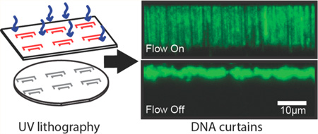
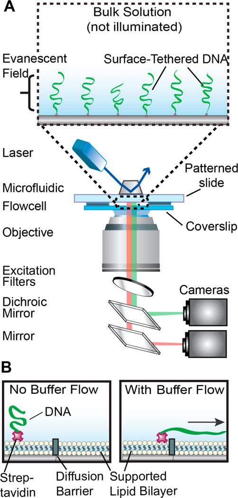
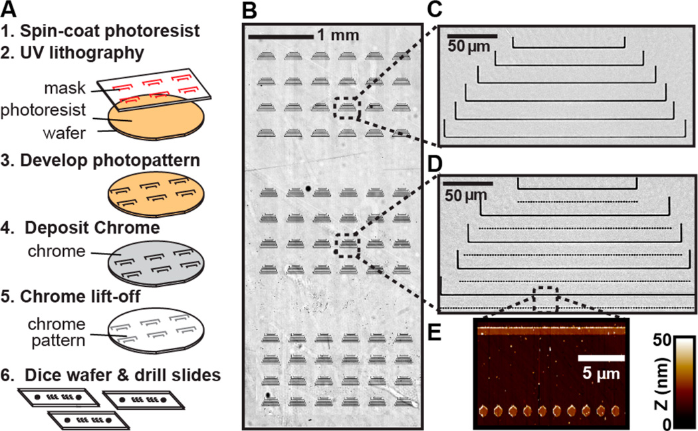
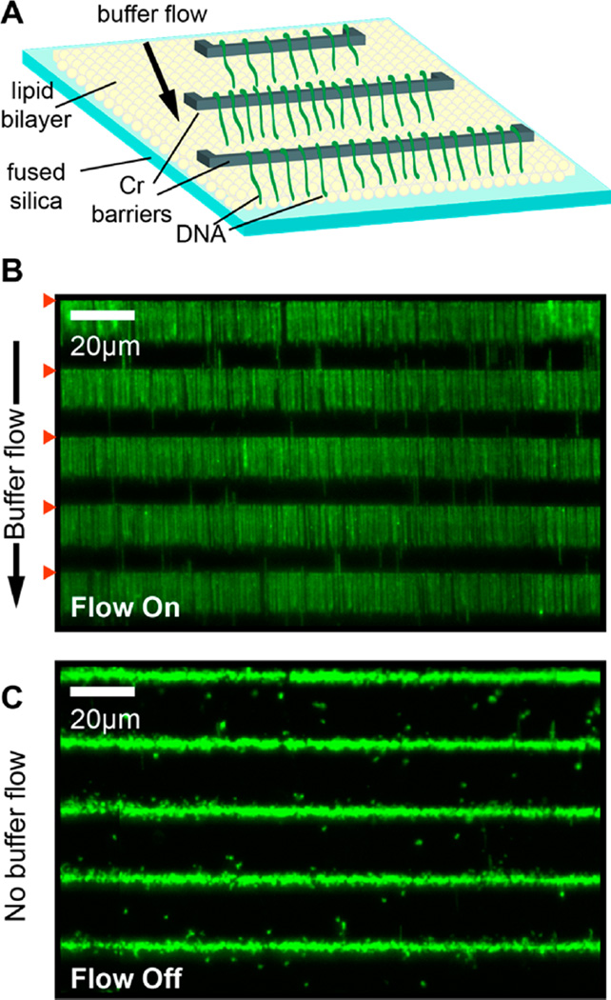
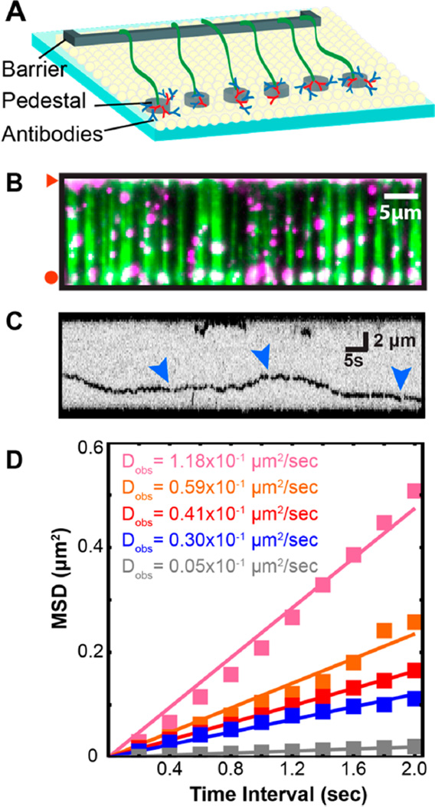
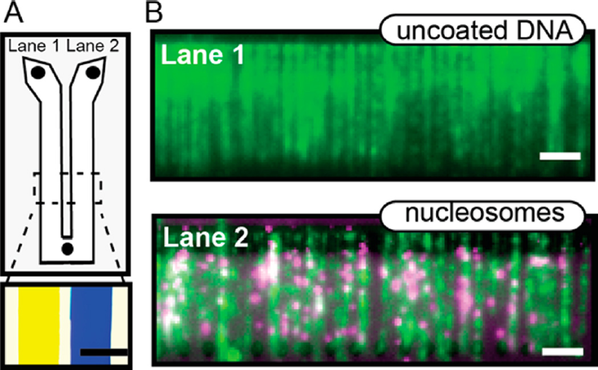

# High-Throughput Universal DNA Curtain Arrays for Single-Molecule Fluorescence Imaging

**Ignacio F. Gallardo, Praveenkumar Pasupathy, Maxwell Brown, Carol M. Manhart, Dean P. Neikirk, Eric Alani, and Ilya J. Finkelstein**

*Langmuir*, Volume 31, Issue 37, Pages 10310–7 (2015)

**DOI:** [10.1021/acs.langmuir.5b02416](https://doi.org/10.1021/acs.langmuir.5b02416)

---

## Table of Contents

- [Abstract](#abstract)
- [Introduction](#introduction)
- [Experimental Section](#experimental-section)
- [Results and Discussion](#results-and-discussion)
- [Conclusions](#conclusions)
- [Acknowledgments](#acknowledgments)

---

##  Abstract
Single-molecule studies of protein–DNA interactions have shed critical insights into the molecular mechanisms of nearly every aspect of DNA metabolism. The development of DNA curtains—a method for organizing arrays of DNA molecules on a fluid lipid bilayer—has greatly facilitated these studies by increasing the number of reactions that can be observed in a single experiment. However, the utility of DNA curtains is limited by the challenges associated with depositing nanometer-scale lipid diffusion barriers onto quartz microscope slides. Here, we describe a UV lithography-based method for large-scale fabrication of chromium (Cr) features and organization of DNA molecules at these features for high-throughput single-molecule studies. We demonstrate this approach by assembling 792 independent DNA arrays (containing >900 000 DNA molecules) within a single microfluidic flowcell. As a first proof of principle, we track the diffusion of Mlh1-Mlh3—a heterodimeric complex that participates in DNA mismatch repair and meiotic recombination. To further highlight the utility of this approach, we demonstrate a two-lane flowcell that facilitates concurrent experiments on different DNA substrates. Our technique greatly reduces the challenges associated with assembling DNA curtains and paves the way for the rapid acquisition of large statistical data sets from individual single-molecule experiments.

---
##  INTRODUCTION
Single-molecule fluorescence imaging approaches have shed critical insights into numerous biological processes and have proven especially useful for understanding DNA transcription, replication, and repair.[1](https://pmc.ncbi.nlm.nih.gov/articles/PMC4624423/#R1)–[6](https://pmc.ncbi.nlm.nih.gov/articles/PMC4624423/#R6) However, acquiring statistically relevant data sets remains a challenge for experiments that are performed on one molecule at a time. The recently developed “DNA curtains” platform overcomes this limitation by permitting the observation of hundreds of biochemical reactions in real time.[7](https://pmc.ncbi.nlm.nih.gov/articles/PMC4624423/#R7),[8](https://pmc.ncbi.nlm.nih.gov/articles/PMC4624423/#R8) In this approach, individual DNA molecules are anchored to a supported lipid bilayer (SLB) via a biotin–streptavidin interaction and aligned along barriers to lipid diffusion by the application of hydrodynamic force (see [Figure 1](https://pmc.ncbi.nlm.nih.gov/articles/PMC4624423/#F1) for schematic).[7](https://pmc.ncbi.nlm.nih.gov/articles/PMC4624423/#R7) The immobilized DNA and proteins are imaged via total internal reflection fluorescence (TIRF) microscopy ([Figure 1A](https://pmc.ncbi.nlm.nih.gov/articles/PMC4624423/#F1)). This experimental platform has recently been applied to a number of biochemical problems related to protein–DNA interactions.[9](https://pmc.ncbi.nlm.nih.gov/articles/PMC4624423/#R9)–[11](https://pmc.ncbi.nlm.nih.gov/articles/PMC4624423/#R11)
***Figure 1.***

An illustration of the DNA curtains platform. (A) DNA molecules are immobilized on the passivated surface of a microfluidic flowcell. The DNA is illuminated via a laser beam (488 nm) that impinges on a prism in total internal reflection fluorescence (TIRF) mode, thereby generating an evanescent excitation wave at the interface between the lithographic patterned surface and the imaging buffer. The evanescent wave penetrates ~200 nm away from the micropatterned flowcell surface to selectively illuminate surface-bound DNA and protein molecules. The resulting fluorescent signals propagate through a coverslip and are collected via a high numerical aperture objective, passed through two excitation clean-up filters (490 and 500 long pass; Chroma), and dispersed through a dichromic mirror onto two different charge coupled device (CCD; ANDOR) cameras. (B) Side view of a DNA molecule (green) that is affixed to a lipid bilayer (circles) via a biotin–streptavidin (magenta) linkage. In the presence of buffer flow, the DNA molecule moves within the fluid lipid bilayer and is captured at a Cr diffusion barrier (gray).
Supported lipid bilayers have emerged as versatile surfaces for assembling DNA curtains and offer multiple advantages for single-molecule studies of protein–DNA interactions.[12](https://pmc.ncbi.nlm.nih.gov/articles/PMC4624423/#R12) First, the SLB charge is readily tunable by changing the lipid composition and zwitterionionic head groups.[13](https://pmc.ncbi.nlm.nih.gov/articles/PMC4624423/#R13) Second, the bilayers can be doped with biotin, poly(ethylene glycol)s, and other exogenous chemicals.[14](https://pmc.ncbi.nlm.nih.gov/articles/PMC4624423/#R14),[15](https://pmc.ncbi.nlm.nih.gov/articles/PMC4624423/#R15) The biomimetic lipid bilayer also provides excellent surface passivation, thereby preventing nonspecific adsorption of nucleic acids, and proteins to the flowcell surfaces.[12](https://pmc.ncbi.nlm.nih.gov/articles/PMC4624423/#R12),[16](https://pmc.ncbi.nlm.nih.gov/articles/PMC4624423/#R16),[17](https://pmc.ncbi.nlm.nih.gov/articles/PMC4624423/#R17) Finally, lipid bilayers are readily manipulated via external shear or electrophoretic forces, and the bilayers can be corralled at mechanical barriers to lipid diffusion.[18](https://pmc.ncbi.nlm.nih.gov/articles/PMC4624423/#R18)–[25](https://pmc.ncbi.nlm.nih.gov/articles/PMC4624423/#R25)
The ability to manipulate and organize SLBs at mechanical barriers is at the core of the DNA curtains single-molecule platform. However, widespread adoption of DNA curtains has been hampered by the difficulty of fabricating custom microscope slides that are required for organizing arrays of DNA molecules. Early approaches used a glass scribe to mechanically etch such barriers,[18](https://pmc.ncbi.nlm.nih.gov/articles/PMC4624423/#R18),[26](https://pmc.ncbi.nlm.nih.gov/articles/PMC4624423/#R26) but in practice hand-etching does not produce controllable lipid diffusion barriers. Microcontact printing of protein barriers has also been used to rapidly fabricate lipid diffusion barriers, but these surface features are either too large (>10 µm) or are readily removed during stringent wash cycles.[27](https://pmc.ncbi.nlm.nih.gov/articles/PMC4624423/#R27)–[31](https://pmc.ncbi.nlm.nih.gov/articles/PMC4624423/#R31) To overcome these limitations, an electron beam lithography (EBL)-based fabrication strategy has been used to deposit chromium (Cr) patterns on glass slides.[32](https://pmc.ncbi.nlm.nih.gov/articles/PMC4624423/#R32),[33](https://pmc.ncbi.nlm.nih.gov/articles/PMC4624423/#R33) EBL is a high-resolution but low-throughput fabrication method because it requires raster scanning of an electron beam along each segment of the nanobarrier,[34](https://pmc.ncbi.nlm.nih.gov/articles/PMC4624423/#R34),[35](https://pmc.ncbi.nlm.nih.gov/articles/PMC4624423/#R35) thereby limiting the number of barriers that are deposited onto each quartz slide. The low-throughput nature of EBL, coupled with the high cost and limited availability of this specialized instrument, prompted us to develop a new approach for depositing Cr patterns on quartz microscope slides for DNA curtain imaging.
Here, we describe a UV lithography-based process for large-scale fabrication of Cr features for assembling DNA curtains.[36](https://pmc.ncbi.nlm.nih.gov/articles/PMC4624423/#R36),[37](https://pmc.ncbi.nlm.nih.gov/articles/PMC4624423/#R37) Using this fabrication method, we organize hundreds of thousands of DNA molecules within a single flowcell for high-throughput single-molecule imaging. The UV-patterned flowcells are capable of organizing aligned arrays of both single- and double-stranded DNA molecules. By patterning a large flowcell area, we also demonstrate multichannel microfluidic flowcells with two different DNA substrates. As our approach is both rapid and does not require advanced EBL or nanoimprint lithography apparatus, it will facilitate the adoption of high-throughput DNA curtains by the broader biophysical and analytical biosensor communities.
---
##  EXPERIMENTAL SECTION
### Quartz Wafer Fabrication
Chrome diffusion barriers were made on 1.58 mm thick, 101.6 mm diameter ground and polished GE124 quartz disks (Technical Glass Products). A flat was made by grinding 2 mm into the glass. Glass wafers were sequentially rinsed with acetone, isopropanol, and water and dried with a stream of N2 gas. The wafers were spin-coated in a Lauell Technologies Spinner, (4000 rpm for 45 s) with a layer of photoresist (Clariant, AZ5209E). The coated wafer was heated to 95 °C on a hot plate for 2 min. UV lithography was performed using a SUSS Microtec -MA6/BA6 mask aligner (MA6, hard contact mode, 6.5 s at 6.5 mW cm−2) using a chrome-coated quartz mask (Photo Sciences). AutoCAD files of the quartz masks are available upon request. The photoresist layer was developed by rinsing the wafer in developer (Megaposit MF-26A; 2–2.5% tetramethylammonium hydroxide (TMAH), DOW Chemical Company) for 35–40 s. The wafer was rinsed in deionized water and dried in N2 flow. After development, the wafers were etched with oxygen plasma for 120 s at 100 W (March CS-1701 etcher) to remove all the residual photoresist from the developed surface. A 20 nm layer of chromium (99.998% Kurt J. Lesker) was then sputtered onto the wafer (Cooke E-beam/ sputter deposition system at 8 kV). To lift off the photoresist and chromium, the wafer was sonicated in acetone for 1 min, rinsed in ethanol, and dried in N2 flow. The wafers were covered with a clean-room-rated silicon wafer tape (ICROS) and diced into six flowcell sized (50 mm × 22 mm) substrates (Disco 321 dicing saw).
### Proteins and DNA
Plasmids overexpressing human RPA-GFP were generously provided by Dr. Mauro Modesti and purified essentially as described previously.[38](https://pmc.ncbi.nlm.nih.gov/articles/PMC4624423/#R38) Phi29 DNA polymerase and FLAG-epitope labeled _S. cerevisiae_ Mlh1-Mlh3 were purified as described previously.[39](https://pmc.ncbi.nlm.nih.gov/articles/PMC4624423/#R39),[40](https://pmc.ncbi.nlm.nih.gov/articles/PMC4624423/#R40) Histones H2A, H2B, H3, and H4 were purified as described.[41](https://pmc.ncbi.nlm.nih.gov/articles/PMC4624423/#R41),[42](https://pmc.ncbi.nlm.nih.gov/articles/PMC4624423/#R42) For fluorescent labeling, H2A encodes an Nterminal 3xFLAG epitope tag. Detailed protocols for preparing DNA substrates for single-molecule imaging are described in the [Supporting Information](https://pmc.ncbi.nlm.nih.gov/articles/PMC4624423/#SD1).
### Nucleosome Reconstitution
#### Histone Octamer Assembly
Each of the four histones was dissolved in unfolding buffer (20 mM Tris-HCl pH 7.5, 7 M guanidinium-HCl, and 10 mM DTT) and gently agitated for 1 h at RT. The histones were mixed in equimolar ratios of H3/H4 and a 10% higher molar ratio of H2A/H2B relative to H3/ H4). The mixture was adjusted to a final concentration of 1 mg/mL and dialyzed against refolding buffer (10 mM Tris-HCl pH 8.0, 1 mM EDTA, 5 mM β-mercaptoethanol, 2 M NaCl) using 3500 MWCO dialysis tubing with several buffer exchanges over 48 h. The dialyzed mixture was centrifuged to remove aggregates and concentrated using spin concentrators (Amicon Ultra-15; Millipore) to a final volume of about 1 mL. Gel filtration over a Superdex-200 (GE Healthcare) using SAU-200 was performed to resolve histone octamers from dimers and tetramers in the refolding buffer. The octamer peak fractions were combined, concentrated using a 10 000 MWCO spin concentrator (Amicon Ultra-4, Millipore), and flash frozen using liquid N2. The resulting histone octamers were stored in −80 °C until use.
#### Nucleosome Reconstitution
Human nucleosomes were reconstituted on the λ-phage DNA via stepwise salt dialysis.[42](https://pmc.ncbi.nlm.nih.gov/articles/PMC4624423/#R42),[43](https://pmc.ncbi.nlm.nih.gov/articles/PMC4624423/#R43) First, λ-phage DNA was ligated to biotinylated and DIG-terminated oligonucleotides (IF7 and IF9, respectively) and gel-filtered through an S-1000 column (GE). The DNA was concentrated using isopropanol precipitation and dissolved to a final concentration of 70 ng µL−1 in TE with high salt (10 mM Tris-HCl pH 8.0, 1 mM EDTA, 2 M NaCl). For reconstitution, 30 µL of the DNA (final concentration of ~20 ng µL−1) was used in total volume of 100 µL. The octamer was diluted 10-fold in dilution buffer (10 mM Tris-HCl pH 7.6, 1 mM EDTA, 2 M NaCl) right before use. The 100 µL mixture was dialyzed using a mini dialysis button (10K MWCO, BioRad) against 400 mL of storage buffer (10 mM Tris-HCl pH 7.6, 1 mM EDTA, 1 mM DTT) that contained gradually decreasing concentrations of NaCl. Dialysis was performed in a cold room at 4 °C for at least 90 min at each step: 1.5, 1, 0.8, 0.6, and 0.4 M NaCl. As a final step, the reaction was dialyzed into 0.2 M NaCl overnight. At a nominal input ratio of 1:75 (DNA:octamer), we counted about 1–5 nucleosomes per DNA molecules. The large nominal DNA:octamer ratio probably stems from octamer loss due to aggregation onto the dialysis membrane and polypropylene tubing during the extended dialysis procedure.[43](https://pmc.ncbi.nlm.nih.gov/articles/PMC4624423/#R43) The nucleosome-coated DNA was stored at 4 °C for up to 2 weeks.
#### Single Molecule Microscopy
Flowcells and DNA curtains were assembled accordingly to previously published protocols, with some modifications (see [Supporting Information](https://pmc.ncbi.nlm.nih.gov/articles/PMC4624423/#SD1)).[7](https://pmc.ncbi.nlm.nih.gov/articles/PMC4624423/#R7) Images were collected with a Nikon Ti-E microscope in a prism-TIRF configuration. The inverted microscope setup allowed for the sample to be illuminated by a 488 nm laser light (Coherent) through a quartz prism. To minimize spatial drift, the experiment was conducted on a floating TMC optical table. A 60× water immersion objective lens (1.2 NA, Nikon), two EMCCD cameras (Andor iXon DU897, cooled to −80 °C), and Nis Elements software (Nikon) were used to collect the data with a 200 ms frame rate. Frames were saved as TIFF files without compression, and further image analysis was done in ImageJ (NIH).
### Observing Fluorescent Mlh1-Mlh3 on DNA Curtains
To fluorescently label Mlh1-Mlh3, 60 nM of the protein complex was mixed with 120 nM anti-FLAG QDs (QD705, Life Technologies) and incubated in 10 µL of imaging buffer for 15 min on ice. The Mlh1-Mlh3-QD mixture was diluted 6-fold in imaging buffer and injected into the flowcells via a 50 µL injection loop (at a flow rate of 50 µL min−1) and the flowcell flushed thoroughly at a flow rate of 300 µL min−1 to remove all Mlh1-Mlh3 molecules that did not associate with the DNA curtains. Then buffer flow was stopped, and a movie was collected at a 200 ms frame rate. We did not fluorescently label the DNA during the diffusion experiments. To ensure that the fluorescent Mlh1-Mlh3 trajectories corresponded to DNA-bound proteins, the DNA molecules were stained with YOYO-1 after the completion of each diffusion experiment. Only DNA-bound QDs were analyzed. Fluorescent Mlh1-Mlh3 was tracked in ImageJ (NIH) with a custom-written particle tracking script. For each frame the fluorescent particle was fit to a two-dimensional Gaussian function to obtain trajectories with subpixel resolution. The resulting trajectories were analyzed in Matlab (Mathworks). The mean-squared displacement and diffusion coefficients were calculated as described previously.[44](https://pmc.ncbi.nlm.nih.gov/articles/PMC4624423/#R44)
### Dual-Channel Flowcells
To assemble the dual-channel flowcells, microfabricated quartz slides were drilled with two inlet ports and a single outlet port. Y-shaped double-sided sticky tape (700 µm nominal thickness, type 666 from 3M) was cut using an Exacto and sandwiched between the quartz slide and a microscope coverslip. After baking the flowcell at 140 °C for 60 min, each ~9 mm lane was separated by a 2 mm barrier. The lipid bilayers were deposited through the inlet ports of lanes 1 and 2 ([Figure S4A](https://pmc.ncbi.nlm.nih.gov/articles/PMC4624423/#SD1)) keeping the single outlet port of the flowcell closed. To inject different DNA substrates into each of the lanes, the outlet port was opened, and 1 mL of an ~1 pM concentration of each DNA substrate was injected through the inlet ports ([Figure S4A](https://pmc.ncbi.nlm.nih.gov/articles/PMC4624423/#SD1)). Both DNA solutions were injected in parallel to prevent backflow between the two inlet channels (and cross-mixing between different types of DNA). Fluorescent labeling of the 3xFlag-tagged histone H2A was conducted as described for Mlh1-Mlh3 (see above). At the microscope, the antibody-QD solution was injected at 200 µL min−1 with a 700 µL loop (using a Rheodyne MXP7900 valve) between the syringe and the lane containing nucleosomes ([Figure S4B](https://pmc.ncbi.nlm.nih.gov/articles/PMC4624423/#SD1)). The imaging buffer had 0.2 nM of YOYO-1 and was injected at 400 µL min−1 into each flowcell ([Figure S4B](https://pmc.ncbi.nlm.nih.gov/articles/PMC4624423/#SD1)). Images were taken after the free antibody had been washed out the flowcells. Frames were taken every 200 ms when the buffer flow was 400 µL min−1. Two additional valves (shut-off valve; IDEX Health Science) were added right before the input of each lane to independently stop each flow. A computer-controlled microscope stage (Prior ProScan II) was used to sequentially image the two lanes with a 1 s frame rate.
---
##  RESULTS AND DISCUSSION
We developed a UV lithography-based process for large-scale fabrication of quartz substrates for DNA curtain imaging ([Figure 2A](https://pmc.ncbi.nlm.nih.gov/articles/PMC4624423/#F2)). In this approach, quartz wafers are coated with a UV-sensitive photoresist, exposed through a high-resolution photomask, and then developed (see Experimental Section). Next, an ~20 nm layer of Cr is deposited onto the wafer, and a lift-off procedure is used to remove all Cr that is not affixed to the quartz surface. Finally, the wafers are diced into 50 mm × 22 mm quartz slides, and each slide is drilled to produce individual microfluidic flowcells. As this process can pattern the surface of an entire wafer with a single UV exposure, we increased both the quantity and the types of diffusion barriers per microscope slide. [Figure 2B](https://pmc.ncbi.nlm.nih.gov/articles/PMC4624423/#F2) shows an optical image of a subset (72 in the figure), of the 792 total barrier sets that were deposited within each of the microfluidic flowcells. Individual barrier sets were highly uniform over the whole flowcell area ([Figure 2C,D](https://pmc.ncbi.nlm.nih.gov/articles/PMC4624423/#F2)). Atomic force microscopy ([Figure 2E](https://pmc.ncbi.nlm.nih.gov/articles/PMC4624423/#F2)) and scanning electron microscopy ([Supporting Information Figure S1](https://pmc.ncbi.nlm.nih.gov/articles/PMC4624423/#SD1)) confirmed that the UV-lithography barriers retained excellent uniformity and that the quartz slides were largely free of Cr and other fabrication defects. Although our UV lithography process is currently limited to ~1 µm wide surface features, this does not significantly impact the assembly or imaging of the 16 µm long DNA substrates (see below). With further optimization, conventional contact-mode UV lithography can be used to produce ~200 nm wide features.[45](https://pmc.ncbi.nlm.nih.gov/articles/PMC4624423/#R45),[46](https://pmc.ncbi.nlm.nih.gov/articles/PMC4624423/#R46) Importantly, this process is substantially more rapid, cost-effective, and easier to implement than EBL. The layout of the Cr features can be readily changed by ordering the appropriate UV photomask, and each 106 mm wafer is diced to produce six microfluidic flowcells. We conclude that UV photolithography can be used to rapidly fabricate Cr diffusion barriers for singlemolecule DNA curtains.
***Figure 2.***

Chromium barriers are deposited via UV lithography. (A) First, a quartz wafer is coated with photoresist and exposed to UV light through a high-resolution (chrome-on-quartz) UV photomask in contact mode geometry. The UV resist is developed, and 20 nm of Cr is deposited onto the wafer. Excess Cr is lifted off by gently dissolving the residual developer in acetone, leaving behind only the Cr that had bonded directly to the quartz surface. Finally, the wafer is diced to generate six (~22 mm × ~50 mm) quartz slides. Each slide is drilled using a diamond-coated drill bit to allow fluidic access to the flowcells. (B) An optical image of 72 barrier sets (from a total of 792 barrier sets) that are deposited onto each flowcell. Scale bar: 1 mm. A close-up view of a set of barriers used for single-tethering (C) and double-tethering DNA (D). The barriers sets are nearly free of residual Cr and other fabrication defects. Scale bars in (C) and (D) are 50 µm. (E) An AFM scan of the rectangular region in (D) shows that the Cr barriers have an average height of 20 nm.
Assembling DNA curtains requires a fluid SLB, which is critically dependent on the surface chemistry of the quartz substrate.[18](https://pmc.ncbi.nlm.nih.gov/articles/PMC4624423/#R18),[47](https://pmc.ncbi.nlm.nih.gov/articles/PMC4624423/#R47),[48](https://pmc.ncbi.nlm.nih.gov/articles/PMC4624423/#R48) We therefore tested whether the microfabrication process adversely affects DNA curtain assembly on UV-patterned slides ([Figure 3](https://pmc.ncbi.nlm.nih.gov/articles/PMC4624423/#F3)). First, lipid vesicles were incubated in the flowcell. Vesicles rupture and fusion facilitates the formation of continuous sheets of fluid SLBs.[49](https://pmc.ncbi.nlm.nih.gov/articles/PMC4624423/#R49) One end of each DNA molecule was affixed to the SLB via a biotin– streptavidin linkage, and buffer flow was used to organize and extend individual DNA molecules at the Cr barriers ([Figure 3B](https://pmc.ncbi.nlm.nih.gov/articles/PMC4624423/#F3)). When buffer flow was turned off, all DNA molecules collapsed to the tether point at the Cr diffusion barrier ([Figure 3C](https://pmc.ncbi.nlm.nih.gov/articles/PMC4624423/#F3)). We further confirmed that these flowcells are also compatible with ssDNA curtains ([Figure S2](https://pmc.ncbi.nlm.nih.gov/articles/PMC4624423/#SD1)).[39](https://pmc.ncbi.nlm.nih.gov/articles/PMC4624423/#R39),[50](https://pmc.ncbi.nlm.nih.gov/articles/PMC4624423/#R50) To generate ssDNA curtains, we prepared a plasmid where one strand contained a biotinylated 5′-ssDNA flap ([Figure S2A](https://pmc.ncbi.nlm.nih.gov/articles/PMC4624423/#SD1); see [Supporting Information](https://pmc.ncbi.nlm.nih.gov/articles/PMC4624423/#SD1)). This biotinylated DNA substrate was used as a template for rolling circle replication (RCR) with phi29 DNA polymerase.[39](https://pmc.ncbi.nlm.nih.gov/articles/PMC4624423/#R39) The resulting ssDNA molecules were readily assembled at the microfabricated diffusion barriers and were visualized with GFP-labeled replication protein A (RPA), a heterotrimeric protein complex that binds ssDNA ([Figure S2B](https://pmc.ncbi.nlm.nih.gov/articles/PMC4624423/#SD1)).[39](https://pmc.ncbi.nlm.nih.gov/articles/PMC4624423/#R39),[50](https://pmc.ncbi.nlm.nih.gov/articles/PMC4624423/#R50) Together, these results demonstrate that lipid bilayers maintain their fluidity on UV-fabricated quartz slides and that these slides can be used for large-scale organization of both dsDNA and ssDNA molecules.
***Figure 3.***

UV-fabricated Cr barriers support the assembly of DNA curtains. (A) An illustration of single-tethered DNA curtains. A fluid lipid bilayer (yellow) is deposited onto the micropatterned quartz surface (blue). DNA (green) is anchored to the lipid bilayer at one end, and buffer flow is used to organize the DNA molecules at the Cr diffusion barriers (gray). (B) A 170 × 103 µm field of view with individual DNA molecules (derived from λ-phage, ~48 500 bp long) assembled at five Cr barriers (red triangles). The DNA molecules are stained with the fluorescent intercalating dye YOYO-1 (Life Tech.), and there are >1200 DNA molecules within this field of view. (C) In the absence of buffer flow, the extended DNA molecules retract to the barriers. Scale bar: 20 µm.
To maximize the types of experiments that can be conducted within a single microfabricated flowcell, we also deposited a subset of barriers with additional pedestals that facilitate tethering of the DNA molecules by both ends. These double-tethered DNA molecules remain extended without any buffer flow, permitting the observation of protein–DNA interactions without continuous application of a hydrodynamic force ([Figure 4A](https://pmc.ncbi.nlm.nih.gov/articles/PMC4624423/#F4)).[32](https://pmc.ncbi.nlm.nih.gov/articles/PMC4624423/#R32) For double tethering, one end of the DNA was labeled with a biotin and the second end was labeled with a digoxigenin (DIG).[7](https://pmc.ncbi.nlm.nih.gov/articles/PMC4624423/#R7) We patterned the quartz slides with pedestals that were deposited 13 µm away from the diffusion barriers. These pedestals were first decorated with a goat antirabbit antibody (Immunology Consultants Laboratory, Inc.), followed by a primary rabbit anti-DIG antibody (ABfinity, Life Tech.). The primary–secondary antibody pair serves as an attachment point for DNA molecules that present their DIG ends near these pedestals (see [Supporting Information](https://pmc.ncbi.nlm.nih.gov/articles/PMC4624423/#SD1) for detailed methods). [Figure 4B](https://pmc.ncbi.nlm.nih.gov/articles/PMC4624423/#F4) shows that individual DNA molecules were readily tethered between the barriers and pedestals. In the absence of buffer flow, the double-tethered DNA molecules remained fully extended for 29 ± 0.2 min (half-life ± standard error, _N_ = 163; [Figure S3](https://pmc.ncbi.nlm.nih.gov/articles/PMC4624423/#SD1)). Gradual loss of double-tethered DNA may be due to (i) photodamage-induced DNA breaks, (ii) removal of the biotinylated lipid from the SLB, (iii) disruption of antibody–antigen interactions (either DIG-antibody or primary/secondary interactions), and (iv) desorption of the secondary antibody from the Cr pedestals. We confirmed that the double-tethering lifetime was identical when the laser was shuttered at 1 or 5 min intervals (data not shown), indicating that laser-induced DNA damage is not the primary cause of the observed lifetime. Based on the force– extension curve of λ-phage DNA,[51](https://pmc.ncbi.nlm.nih.gov/articles/PMC4624423/#R51) individual molecules are under ~0.5–2 pN of tension when extended to a length of 12– 14 µm (corresponding to the minimum and maximum distance between the Cr barrier and pedestal). Lipid-rupture forces are in the ~20 pN range, suggesting that loss of the biotinylated lipid is also unlikely.[52](https://pmc.ncbi.nlm.nih.gov/articles/PMC4624423/#R52)–[55](https://pmc.ncbi.nlm.nih.gov/articles/PMC4624423/#R55) We favor a model where the DNA is lost due to rupture of the antibody–antigen interactions, as the observed lifetime is consistent with the off rates (_k_ off) reported for antibody–DIG interaction.[56](https://pmc.ncbi.nlm.nih.gov/articles/PMC4624423/#R56),[57](https://pmc.ncbi.nlm.nih.gov/articles/PMC4624423/#R57) We cannot rule out that double-tethered DNA molecule are also lost due to desorption of the secondary antibodies from Cr pedestals. Regardless, the observed lifetime is sufficient for many experiments involving protein–DNA interactions (see below). Incorporating handles with multiple DIG molecules to increase the total number of DNA–pedestal tethers may further increase the double-tethered DNA lifetime.[58](https://pmc.ncbi.nlm.nih.gov/articles/PMC4624423/#R58)–[60](https://pmc.ncbi.nlm.nih.gov/articles/PMC4624423/#R60)
***Figure 4.***

Illustration of the scheme used for double-tethering DNA molecules on UV-fabricated Cr barriers. (A) The DNA is functionalized with biotin at one end and digoxigenin (DIG) at the other end. To extend and immobilize the DNA by both ends, oval-shaped Cr pedestals (1.3 × 1.5 µm; gray) are deposited 13 µm away from the linear barriers. Pedestals and barriers have the same Cr height. Secondary antirabbit antibodies (red) are adsorbed onto the pedestals. Primary rabbit anti-DIG antibodies (blue) are washed through the flowcell and captured by the secondary antibodies. Finally, the λ-DNA is tethered to the lipid bilayer surface via a biotin–streptavidin linkage, pushed to the barriers, and anchored on the pedestal via a DIG– antibody interaction. (B) Fluorescent DNA molecules (green) that remain fully extended between the barriers (red triangle) and oval pedestals (red circle) in the absence of buffer flow. Fluorescent Mlh1-Mlh3 (magenta; labeled with a QD) binds the DNA molecules. In the absence of buffer flow, Mlh1-Mlh3 diffuses freely on the extended DNA. Scale bar: 5 µm. (C) Kymograph of a representative Mlh1-Mlh3 (black) diffusing on DNA. Blinking of the fluorescence signal (blue arrows) indicates that Mlh1-Mlh3 is labeled with a single QD. To avoid photodamage, the DNA is not fluorescently labeled. (D) The mean-squared displacement (MSD) of five diffusing Mlh1-Mlh3 molecules. A linear fit to the MSD curves is used to calculate the diffusion coefficient of each molecule.
To demonstrate that UV-fabricated slides can support single-molecule studies of protein–DNA interactions, we monitored the DNA binding properties of _S. cerevisiae_ Mlh1-Mlh3 on double-tethered DNA curtains. Mlh1-Mlh3 is a heterodimeric protein complex that participates in DNA mismatch repair and in resolution of meiotic recombination intermediates.[40](https://pmc.ncbi.nlm.nih.gov/articles/PMC4624423/#R40),[61](https://pmc.ncbi.nlm.nih.gov/articles/PMC4624423/#R61),[62](https://pmc.ncbi.nlm.nih.gov/articles/PMC4624423/#R62) To fluorescently label Mlh1-Mlh3, we exploited a single FLAG epitope tag that has been inserted after amino acid 448 in Mlh1. Previous studies have shown that Mlh1 maintains full biochemical activity with this FLAG epitope.[40](https://pmc.ncbi.nlm.nih.gov/articles/PMC4624423/#R40),[63](https://pmc.ncbi.nlm.nih.gov/articles/PMC4624423/#R63) The Mlh1 subunit was fluorescently labeled by conjugating the enzyme with an anti-FLAG antibody covalently linked to a quantum dot (QD; Life Tech.), as described previously.[64](https://pmc.ncbi.nlm.nih.gov/articles/PMC4624423/#R64) [Figure 4B](https://pmc.ncbi.nlm.nih.gov/articles/PMC4624423/#F4) shows that fluorescently labeled Mlh1-Mlh3 was able to bind to the double-tethered DNA molecules. Mlh1-Mlh3 readily diffused on the DNA ([Figure 4C,D](https://pmc.ncbi.nlm.nih.gov/articles/PMC4624423/#F4)), and the diffusion coefficient was 0.026 ± 0.03 µm2 s−1 (mean ± std dev; _N_ = 25). The Mlh1-Mlh3 diffusion coefficients are within the range reported for other mismatch repair complexes, including the Mlh1-Pms1 complex (0.020 ± 0.023 µm2 s−1 at 50 mM NaCl),[65](https://pmc.ncbi.nlm.nih.gov/articles/PMC4624423/#R65) suggesting that both complexes may share similar diffusive behaviors on dsDNA.[64](https://pmc.ncbi.nlm.nih.gov/articles/PMC4624423/#R64),[65](https://pmc.ncbi.nlm.nih.gov/articles/PMC4624423/#R65) Proteins scan DNA via several facilitated diffusion mechanisms, including (i) sliding by tracking and rotating along the DNA backbone, (ii) hopping via a series of microscopic protein–DNA dissociation and rebinding events, and (iii) intersegment transfer, in which a protein can move from one location to another via a looped intermediate.[66](https://pmc.ncbi.nlm.nih.gov/articles/PMC4624423/#R66)–[68](https://pmc.ncbi.nlm.nih.gov/articles/PMC4624423/#R68) Individual molecules may stochastically interconvert between these states, leading to the large range of diffusion coefficients observed in these and prior studies.[69](https://pmc.ncbi.nlm.nih.gov/articles/PMC4624423/#R69)–[72](https://pmc.ncbi.nlm.nih.gov/articles/PMC4624423/#R72) Additional studies will be required to define how Mlh1-Mlh3 diffusion on DNA facilitates its functions in both mismatch repair and meiotic recombination.[40](https://pmc.ncbi.nlm.nih.gov/articles/PMC4624423/#R40),[62](https://pmc.ncbi.nlm.nih.gov/articles/PMC4624423/#R62) Here, we conclude that wafer-based UV lithography can be used for fabricating universal microscope slides that support both single-stranded and double-stranded DNA curtains for high-throughput studies of protein–DNA interactions.
To further extend the utility of our wide-field surface patterning strategy, we integrated DNA curtains with a two-lane microfluidic device ([Figure 5](https://pmc.ncbi.nlm.nih.gov/articles/PMC4624423/#F5)). Multichannel microfluidic devices can be used to simultaneously observe enzyme function on different substrates or solution conditions.[73](https://pmc.ncbi.nlm.nih.gov/articles/PMC4624423/#R73)–[75](https://pmc.ncbi.nlm.nih.gov/articles/PMC4624423/#R75) As a proof of principle, we exploited the large number of UV-patterned DNA curtain arrays to construct a dual-lane flowcell with two distinct DNA substrates in each of the two fluidically independent lanes ([Figure 5A](https://pmc.ncbi.nlm.nih.gov/articles/PMC4624423/#F5), bottom panel). Biotinylated lipid bilayers were deposited concurrently in both channels by flowing all reagents through the single flow port located at the bottom of the Y-shaped flowcell ([Figure S4](https://pmc.ncbi.nlm.nih.gov/articles/PMC4624423/#SD1)). The left lane was incubated with λ-DNA while the right lane was incubated with nucleosome-coated λ-DNA. The flowcell was mounted into the TIRF microscope, and both channels were rinsed with anti-Flag antibody conjugated QDs. The fluorescent antibody recognizes a 3xFlag epitope on histone H2A and is only expected to label nucleosome-containing DNA (lane 2). [Figure 5C](https://pmc.ncbi.nlm.nih.gov/articles/PMC4624423/#F5) demonstrates that we could readily image arrays of single-tethered DNA molecules in both channels, with only the right channel (lane 2) containing nucleosome-conjugated DNA. We anticipate that these flowcells will prove especially useful for studies that require side-by-side observation of protein behavior on different DNA substrates or to image protein activity under different buffer conditions (e.g., as a function of salt concentration or nucleotide state).
***Figure 5.***

A dual-lane flowcell for imaging two DNA substrates in the presence of buffer flow. (A) Cartoon schematic of the Y-shaped flowcell with two inlets and one outlet port. Each lane is 9 mm wide and separated by a 2 mm tape spacer (gray). Bottom panel: an image of yellow and blue food dye loaded into each of the two lanes. Scale bar: 5 mm. The lanes remain fluidically isolated for over 1 h. (B) Images captured from each lane during a single experiment. Lane 1 was assembled with λ-DNA, while lane 2 contained nucleosomecoated λ-DNA. Both channels were labeled with YOYO-1 DNA intercalating dye (Life Technologies). Nucleosomes were tagged with anti-FLAG QDs (magenta; 705 nm) and were exclusively observed in the right channel. Scale bar: 4 µm.
---
##  CONCLUSIONS
Here, we described a UV-lithography-based approach for rapidly creating arrays of DNA molecules on the surface of microfluidic flowcells. These universal slides support the assembly of both single- and double-tethered DNA molecules. Using this approach, we are able to rapidly pattern the entire surface of a quartz wafer without using EBL or other more specialized nanofabrication equipment. Furthermore, this method yields an order-of-magnitude increase in the density of tethered DNA molecules on the surface of each flowcell. Increasing the size of the field of view via a larger camera or a lower magnification objective can further increase the rate of data acquisition and multiple fields of view or additional flowcell lanes can be acquired by scanning a computer-controlled microscope stage. Additionally, we demonstrate that this approach is compatible with multichannel microfluidic flowcells for multiplexed single molecule imaging and manipulation.[76](https://pmc.ncbi.nlm.nih.gov/articles/PMC4624423/#R76) The method presented here will greatly facilitate single-molecule fluorescence studies of protein– nucleic acid interactions through the acquisition of large statistical data sets from individual experimental runs.

---
##  ACKNOWLEDGMENTS
We thank Yoori Kim, Andrew A. Leal, and Armando de la Torre for constructs, purified proteins, and critical reading of this manuscript. This work was supported by the Cancer Prevention Research Institute of Texas (R1214 to I.J.F.), the Welch Foundation (F-l808 to I.J.F.), the National Institute of General Medical Sciences of the National Institutes of Health (GM53085 to E.A. and R00 GM097177 to I.J.F.), and the National Science Foundation (1453358 to I.J.F.). C.M.M. is funded by an NIH training grant (F32 GM112435). I.J.F. is a CPRIT Scholar in Cancer Research. The content is solely the responsibility of the authors and does not necessarily represent the official views of the National Institutes of Health.
##  ABBREVIATIONS 

AFM
    
atomic force microscopy 

CCD
    
charge coupled device 

Cr
    
chromium 

DIG
    
digoxigenin 

DNA
    
deoxyribonucleic acid 

dsDNA
    
double-stranded DNA 

EBL
    
electron beam lithography 

GFP
    
green fluorescence protein 

MSD
    
mean-squared displacement 

QD
    
quantum dot 

RCR
    
rolling circle replication 

RPA
    
replication protein A 

SLB
    
supported lipid bilayer 

ssDNA
    
single-stranded DNA 

std dev
    
standard deviation 

TIRF
    
total internal reflection fluorescence 

UV
    
ultraviolet.

##  REFERENCE
  * 1.Bustamante C, Smith SB, Liphardt J, Smith D. Single-Molecule Studies of DNA Mechanics. Curr. Opin. Struct. Biol. 2000;10:279–285. doi: 10.1016/s0959-440x(00)00085-3. [[DOI](https://doi.org/10.1016/s0959-440x\(00\)00085-3)] [[PubMed](https://pubmed.ncbi.nlm.nih.gov/10851197/)] [[Google Scholar](https://scholar.google.com/scholar_lookup?journal=Curr.%20Opin.%20Struct.%20Biol&title=Single-Molecule%20Studies%20of%20DNA%20Mechanics&author=C%20Bustamante&author=SB%20Smith&author=J%20Liphardt&author=D%20Smith&volume=10&publication_year=2000&pages=279-285&pmid=10851197&doi=10.1016/s0959-440x\(00\)00085-3&)]
  * 2.Bai L, Santangelo TJ, Wang MD. Single-Molecule Analysis of RNA Polymerase Transcription. Annu. Rev. Biophys. Biomol. Struct. 2006;35:343–360. doi: 10.1146/annurev.biophys.35.010406.150153. [[DOI](https://doi.org/10.1146/annurev.biophys.35.010406.150153)] [[PubMed](https://pubmed.ncbi.nlm.nih.gov/16689640/)] [[Google Scholar](https://scholar.google.com/scholar_lookup?journal=Annu.%20Rev.%20Biophys.%20Biomol.%20Struct&title=Single-Molecule%20Analysis%20of%20RNA%20Polymerase%20Transcription&author=L%20Bai&author=TJ%20Santangelo&author=MD%20Wang&volume=35&publication_year=2006&pages=343-360&pmid=16689640&doi=10.1146/annurev.biophys.35.010406.150153&)]
  * 3.Joo C, Balci H, Ishitsuka Y, Buranachai C, Ha T. Advances in Single-Molecule Fluorescence Methods for Molecular Biology. Annu. Rev. Biochem. 2008;77:51–76. doi: 10.1146/annurev.biochem.77.070606.101543. [[DOI](https://doi.org/10.1146/annurev.biochem.77.070606.101543)] [[PubMed](https://pubmed.ncbi.nlm.nih.gov/18412538/)] [[Google Scholar](https://scholar.google.com/scholar_lookup?journal=Annu.%20Rev.%20Biochem&title=Advances%20in%20Single-Molecule%20Fluorescence%20Methods%20for%20Molecular%20Biology&author=C%20Joo&author=H%20Balci&author=Y%20Ishitsuka&author=C%20Buranachai&author=T%20Ha&volume=77&publication_year=2008&pages=51-76&pmid=18412538&doi=10.1146/annurev.biochem.77.070606.101543&)]
  * 4.Finkelstein IJ, Greene EC. Molecular Traffic Jams on DNA. Annu. Rev. Biophys. 2013;42:241–263. doi: 10.1146/annurev-biophys-083012-130304. [[DOI](https://doi.org/10.1146/annurev-biophys-083012-130304)] [[PMC free article](https://pmc.ncbi.nlm.nih.gov/articles/PMC3651777/)] [[PubMed](https://pubmed.ncbi.nlm.nih.gov/23451891/)] [[Google Scholar](https://scholar.google.com/scholar_lookup?journal=Annu.%20Rev.%20Biophys&title=Molecular%20Traffic%20Jams%20on%20DNA&author=IJ%20Finkelstein&author=EC%20Greene&volume=42&publication_year=2013&pages=241-263&pmid=23451891&doi=10.1146/annurev-biophys-083012-130304&)]
  * 5.Stratmann SA, van Oijen AM. DNA Replication at the Single-Molecule Level. Chem. Soc. Rev. 2014;43:1201. doi: 10.1039/c3cs60391a. [[DOI](https://doi.org/10.1039/c3cs60391a)] [[PubMed](https://pubmed.ncbi.nlm.nih.gov/24395040/)] [[Google Scholar](https://scholar.google.com/scholar_lookup?journal=Chem.%20Soc.%20Rev&title=DNA%20Replication%20at%20the%20Single-Molecule%20Level&author=SA%20Stratmann&author=AM%20van%20Oijen&volume=43&publication_year=2014&pages=1201&pmid=24395040&doi=10.1039/c3cs60391a&)]
  * 6.Erie DA, Weninger KR. Single Molecule Studies of DNA Mismatch Repair. DNA Repair. 2014;20:71–81. doi: 10.1016/j.dnarep.2014.03.007. [[DOI](https://doi.org/10.1016/j.dnarep.2014.03.007)] [[PMC free article](https://pmc.ncbi.nlm.nih.gov/articles/PMC4310750/)] [[PubMed](https://pubmed.ncbi.nlm.nih.gov/24746644/)] [[Google Scholar](https://scholar.google.com/scholar_lookup?journal=DNA%20Repair&title=Single%20Molecule%20Studies%20of%20DNA%20Mismatch%20Repair&author=DA%20Erie&author=KR%20Weninger&volume=20&publication_year=2014&pages=71-81&pmid=24746644&doi=10.1016/j.dnarep.2014.03.007&)]
  * 7.Finkelstein IJ, Greene EC. Supported Lipid Bilayers and DNA Curtains for High-Throughput Single-Molecule Studies. Methods Mol. Biol. 2011;745:447–461. doi: 10.1007/978-1-61779-129-1_26. [[DOI](https://doi.org/10.1007/978-1-61779-129-1_26)] [[PMC free article](https://pmc.ncbi.nlm.nih.gov/articles/PMC3319767/)] [[PubMed](https://pubmed.ncbi.nlm.nih.gov/21660710/)] [[Google Scholar](https://scholar.google.com/scholar_lookup?journal=Methods%20Mol.%20Biol&title=Supported%20Lipid%20Bilayers%20and%20DNA%20Curtains%20for%20High-Throughput%20Single-Molecule%20Studies&author=IJ%20Finkelstein&author=EC%20Greene&volume=745&publication_year=2011&pages=447-461&pmid=21660710&doi=10.1007/978-1-61779-129-1_26&)]
  * 8.Robison AD, Finkelstein IJ. High-Throughput Single-Molecule Studies of Protein–DNA Interactions. FEBS Lett. 2014;588:3539–3546. doi: 10.1016/j.febslet.2014.05.021. [[DOI](https://doi.org/10.1016/j.febslet.2014.05.021)] [[PMC free article](https://pmc.ncbi.nlm.nih.gov/articles/PMC4163502/)] [[PubMed](https://pubmed.ncbi.nlm.nih.gov/24859086/)] [[Google Scholar](https://scholar.google.com/scholar_lookup?journal=FEBS%20Lett&title=High-Throughput%20Single-Molecule%20Studies%20of%20Protein%E2%80%93DNA%20Interactions&author=AD%20Robison&author=IJ%20Finkelstein&volume=588&publication_year=2014&pages=3539-3546&pmid=24859086&doi=10.1016/j.febslet.2014.05.021&)]
  * 9.Sternberg SH, Redding S, Jinek M, Greene EC, Doudna JA. DNA Interrogation by the CRISPR RNA-Guided Endonuclease Cas9. Nature. 2014;507:62–67. doi: 10.1038/nature13011. [[DOI](https://doi.org/10.1038/nature13011)] [[PMC free article](https://pmc.ncbi.nlm.nih.gov/articles/PMC4106473/)] [[PubMed](https://pubmed.ncbi.nlm.nih.gov/24476820/)] [[Google Scholar](https://scholar.google.com/scholar_lookup?journal=Nature&title=DNA%20Interrogation%20by%20the%20CRISPR%20RNA-Guided%20Endonuclease%20Cas9&author=SH%20Sternberg&author=S%20Redding&author=M%20Jinek&author=EC%20Greene&author=JA%20Doudna&volume=507&publication_year=2014&pages=62-67&pmid=24476820&doi=10.1038/nature13011&)]
  * 10.Finkelstein IJ, Visnapuu M-L, Greene EC. Single-Molecule Imaging Reveals Mechanisms of Protein Disruption by a DNA Translocase. Nature. 2010;468:983–987. doi: 10.1038/nature09561. [[DOI](https://doi.org/10.1038/nature09561)] [[PMC free article](https://pmc.ncbi.nlm.nih.gov/articles/PMC3230117/)] [[PubMed](https://pubmed.ncbi.nlm.nih.gov/21107319/)] [[Google Scholar](https://scholar.google.com/scholar_lookup?journal=Nature&title=Single-Molecule%20Imaging%20Reveals%20Mechanisms%20of%20Protein%20Disruption%20by%20a%20DNA%20Translocase&author=IJ%20Finkelstein&author=M-L%20Visnapuu&author=EC%20Greene&volume=468&publication_year=2010&pages=983-987&pmid=21107319&doi=10.1038/nature09561&)]
  * 11.Lee JY, Finkelstein IJ, Arciszewska LK, Sherratt DJ, Greene EC. Single-Molecule Imaging of FtsK Translocation Reveals Mechanistic Features of Protein-Protein Collisions on DNA. Mol. Cell. 2014;54:832–843. doi: 10.1016/j.molcel.2014.03.033. [[DOI](https://doi.org/10.1016/j.molcel.2014.03.033)] [[PMC free article](https://pmc.ncbi.nlm.nih.gov/articles/PMC4048639/)] [[PubMed](https://pubmed.ncbi.nlm.nih.gov/24768536/)] [[Google Scholar](https://scholar.google.com/scholar_lookup?journal=Mol.%20Cell&title=Single-Molecule%20Imaging%20of%20FtsK%20Translocation%20Reveals%20Mechanistic%20Features%20of%20Protein-Protein%20Collisions%20on%20DNA&author=JY%20Lee&author=IJ%20Finkelstein&author=LK%20Arciszewska&author=DJ%20Sherratt&author=EC%20Greene&volume=54&publication_year=2014&pages=832-843&pmid=24768536&doi=10.1016/j.molcel.2014.03.033&)]
  * 12.Castellana ET, Cremer PS. Solid Supported Lipid Bilayers: From Biophysical Studies to Sensor Design. Surf. Sci. Rep. 2006;61:429–444. doi: 10.1016/j.surfrep.2006.06.001. [[DOI](https://doi.org/10.1016/j.surfrep.2006.06.001)] [[PMC free article](https://pmc.ncbi.nlm.nih.gov/articles/PMC7114318/)] [[PubMed](https://pubmed.ncbi.nlm.nih.gov/32287559/)] [[Google Scholar](https://scholar.google.com/scholar_lookup?journal=Surf.%20Sci.%20Rep&title=Solid%20Supported%20Lipid%20Bilayers:%20From%20Biophysical%20Studies%20to%20Sensor%20Design&author=ET%20Castellana&author=PS%20Cremer&volume=61&publication_year=2006&pages=429-444&pmid=32287559&doi=10.1016/j.surfrep.2006.06.001&)]
  * 13.Hafez IM, Ansell S, Cullis PR. Tunable pH-Sensitive Liposomes Composed of Mixtures of Cationic and Anionic Lipids. Biophys. J. 2000;79:1438–1446. doi: 10.1016/S0006-3495(00)76395-8. [[DOI](https://doi.org/10.1016/S0006-3495\(00\)76395-8)] [[PMC free article](https://pmc.ncbi.nlm.nih.gov/articles/PMC1301037/)] [[PubMed](https://pubmed.ncbi.nlm.nih.gov/10969005/)] [[Google Scholar](https://scholar.google.com/scholar_lookup?journal=Biophys.%20J&title=Tunable%20pH-Sensitive%20Liposomes%20Composed%20of%20Mixtures%20of%20Cationic%20and%20Anionic%20Lipids&author=IM%20Hafez&author=S%20Ansell&author=PR%20Cullis&volume=79&publication_year=2000&pages=1438-1446&pmid=10969005&doi=10.1016/S0006-3495\(00\)76395-8&)]
  * 14.Johansson B, Höök F, Klenerman D, Jönsson P. Label-Free Measurements of the Diffusivity of Molecules in Lipid Membranes. Chem Phys Chem. 2014;15:486–491. doi: 10.1002/cphc.201301136. [[DOI](https://doi.org/10.1002/cphc.201301136)] [[PubMed](https://pubmed.ncbi.nlm.nih.gov/24402971/)] [[Google Scholar](https://scholar.google.com/scholar_lookup?journal=Chem%20Phys%20Chem&title=Label-Free%20Measurements%20of%20the%20Diffusivity%20of%20Molecules%20in%20Lipid%20Membranes&author=B%20Johansson&author=F%20H%C3%B6%C3%B6k&author=D%20Klenerman&author=P%20J%C3%B6nsson&volume=15&publication_year=2014&pages=486-491&pmid=24402971&doi=10.1002/cphc.201301136&)]
  * 15.Wagner ML, Tamm LK. Tethered Polymer-Supported Planar Lipid Bilayers for Reconstitution of Integral Membrane Proteins: Silane-Polyethyleneglycol-Lipid as a Cushion and Covalent Linker. Biophys. J. 2000;79:1400–1414. doi: 10.1016/S0006-3495(00)76392-2. [[DOI](https://doi.org/10.1016/S0006-3495\(00\)76392-2)] [[PMC free article](https://pmc.ncbi.nlm.nih.gov/articles/PMC1301034/)] [[PubMed](https://pubmed.ncbi.nlm.nih.gov/10969002/)] [[Google Scholar](https://scholar.google.com/scholar_lookup?journal=Biophys.%20J&title=Tethered%20Polymer-Supported%20Planar%20Lipid%20Bilayers%20for%20Reconstitution%20of%20Integral%20Membrane%20Proteins:%20Silane-Polyethyleneglycol-Lipid%20as%20a%20Cushion%20and%20Covalent%20Linker&author=ML%20Wagner&author=LK%20Tamm&volume=79&publication_year=2000&pages=1400-1414&pmid=10969002&doi=10.1016/S0006-3495\(00\)76392-2&)]
  * 16.Sackmann E. Supported Membranes: Scientific and Practical Applications. Science. 1996;271:43–48. doi: 10.1126/science.271.5245.43. [[DOI](https://doi.org/10.1126/science.271.5245.43)] [[PubMed](https://pubmed.ncbi.nlm.nih.gov/8539599/)] [[Google Scholar](https://scholar.google.com/scholar_lookup?journal=Science&title=Supported%20Membranes:%20Scientific%20and%20Practical%20Applications&author=E%20Sackmann&volume=271&publication_year=1996&pages=43-48&pmid=8539599&doi=10.1126/science.271.5245.43&)]
  * 17.Persson F, Fritzsche J, Mir KU, Modesti M, Westerlund F, Tegenfeldt JO. Lipid-Based Passivation in Nanofluidics. Nano Lett. 2012;12:2260–2265. doi: 10.1021/nl204535h. [[DOI](https://doi.org/10.1021/nl204535h)] [[PMC free article](https://pmc.ncbi.nlm.nih.gov/articles/PMC3348678/)] [[PubMed](https://pubmed.ncbi.nlm.nih.gov/22432814/)] [[Google Scholar](https://scholar.google.com/scholar_lookup?journal=Nano%20Lett&title=Lipid-Based%20Passivation%20in%20Nanofluidics&author=F%20Persson&author=J%20Fritzsche&author=KU%20Mir&author=M%20Modesti&author=F%20Westerlund&volume=12&publication_year=2012&pages=2260-2265&pmid=22432814&doi=10.1021/nl204535h&)]
  * 18.Cremer PS, Boxer SG. Formation and Spreading of Lipid Bilayers on Planar Glass Supports. J. Phys. Chem. B. 1999;103:2554–2559. [[Google Scholar](https://scholar.google.com/scholar_lookup?journal=J.%20Phys.%20Chem.%20B&title=Formation%20and%20Spreading%20of%20Lipid%20Bilayers%20on%20Planar%20Glass%20Supports&author=PS%20Cremer&author=SG%20Boxer&volume=103&publication_year=1999&pages=2554-2559&)]
  * 19.Feng ZV, Granick S, Gewirth AA. Modification of a Supported Lipid Bilayer by Polyelectrolyte Adsorption. Langmuir. 2004;20:8796–8804. doi: 10.1021/la049030w. [[DOI](https://doi.org/10.1021/la049030w)] [[PubMed](https://pubmed.ncbi.nlm.nih.gov/15379509/)] [[Google Scholar](https://scholar.google.com/scholar_lookup?journal=Langmuir&title=Modification%20of%20a%20Supported%20Lipid%20Bilayer%20by%20Polyelectrolyte%20Adsorption&author=ZV%20Feng&author=S%20Granick&author=AA%20Gewirth&volume=20&publication_year=2004&pages=8796-8804&pmid=15379509&doi=10.1021/la049030w&)]
  * 20.Nakai K, Morigaki K, Iwasaki Y. Molecular Recognition on Fluidic Lipid Bilayer Microarray Corralled by Well-Defined Polymer Brushes. Soft Matter. 2010;6:5937–5943. [[Google Scholar](https://scholar.google.com/scholar_lookup?journal=Soft%20Matter&title=Molecular%20Recognition%20on%20Fluidic%20Lipid%20Bilayer%20Microarray%20Corralled%20by%20Well-Defined%20Polymer%20Brushes&author=K%20Nakai&author=K%20Morigaki&author=Y%20Iwasaki&volume=6&publication_year=2010&pages=5937-5943&)]
  * 21.Groves JT. Micropatterning Fluid Lipid Bilayers on Solid Supports. Science. 1997;275:651–653. doi: 10.1126/science.275.5300.651. [[DOI](https://doi.org/10.1126/science.275.5300.651)] [[PubMed](https://pubmed.ncbi.nlm.nih.gov/9005848/)] [[Google Scholar](https://scholar.google.com/scholar_lookup?journal=Science&title=Micropatterning%20Fluid%20Lipid%20Bilayers%20on%20Solid%20Supports&author=JT%20Groves&volume=275&publication_year=1997&pages=651-653&pmid=9005848&doi=10.1126/science.275.5300.651&)]
  * 22.Isono T, Ikeda T, Ogino T. Evolution of Supported Planar Lipid Bilayers on Step-Controlled Sapphire Surfaces. Langmuir. 2010;26:9607–9611. doi: 10.1021/la100179q. [[DOI](https://doi.org/10.1021/la100179q)] [[PubMed](https://pubmed.ncbi.nlm.nih.gov/20345104/)] [[Google Scholar](https://scholar.google.com/scholar_lookup?journal=Langmuir&title=Evolution%20of%20Supported%20Planar%20Lipid%20Bilayers%20on%20Step-Controlled%20Sapphire%20Surfaces&author=T%20Isono&author=T%20Ikeda&author=T%20Ogino&volume=26&publication_year=2010&pages=9607-9611&pmid=20345104&doi=10.1021/la100179q&)]
  * 23.Groves JT, Boxer SG. Micropattern Formation in Supported Lipid Membranes. Acc. Chem. Res. 2002;35:149–157. doi: 10.1021/ar950039m. [[DOI](https://doi.org/10.1021/ar950039m)] [[PubMed](https://pubmed.ncbi.nlm.nih.gov/11900518/)] [[Google Scholar](https://scholar.google.com/scholar_lookup?journal=Acc.%20Chem.%20Res&title=Micropattern%20Formation%20in%20Supported%20Lipid%20Membranes&author=JT%20Groves&author=SG%20Boxer&volume=35&publication_year=2002&pages=149-157&pmid=11900518&doi=10.1021/ar950039m&)]
  * 24.Groves JT, Ulman N, Cremer PS, Boxer SG. Substrate– Membrane Interactions: Mechanisms for Imposing Patterns on a Fluid Bilayer Membrane. Langmuir. 1998;14:3347–3350. [[Google Scholar](https://scholar.google.com/scholar_lookup?journal=Langmuir&title=Substrate%E2%80%93%20Membrane%20Interactions:%20Mechanisms%20for%20Imposing%20Patterns%20on%20a%20Fluid%20Bilayer%20Membrane&author=JT%20Groves&author=N%20Ulman&author=PS%20Cremer&author=SG%20Boxer&volume=14&publication_year=1998&pages=3347-3350&)]
  * 25.Groves JT, Kuriyan J. Molecular Mechanisms in Signal Transduction at the Membrane. Nat. Struct. Mol. Biol. 2010;17:659–665. doi: 10.1038/nsmb.1844. [[DOI](https://doi.org/10.1038/nsmb.1844)] [[PMC free article](https://pmc.ncbi.nlm.nih.gov/articles/PMC3703790/)] [[PubMed](https://pubmed.ncbi.nlm.nih.gov/20495561/)] [[Google Scholar](https://scholar.google.com/scholar_lookup?journal=Nat.%20Struct.%20Mol.%20Biol&title=Molecular%20Mechanisms%20in%20Signal%20Transduction%20at%20the%20Membrane&author=JT%20Groves&author=J%20Kuriyan&volume=17&publication_year=2010&pages=659-665&pmid=20495561&doi=10.1038/nsmb.1844&)]
  * 26.Salafsky J, Groves JT, Boxer SG. Architecture and Function of Membrane Proteins in Planar Supported Bilayers: A Study with Photosynthetic Reaction Centers. Biochemistry. 1996;35:14773–14781. doi: 10.1021/bi961432i. [[DOI](https://doi.org/10.1021/bi961432i)] [[PubMed](https://pubmed.ncbi.nlm.nih.gov/8942639/)] [[Google Scholar](https://scholar.google.com/scholar_lookup?journal=Biochemistry&title=Architecture%20and%20Function%20of%20Membrane%20Proteins%20in%20Planar%20Supported%20Bilayers:%20A%20Study%20with%20Photosynthetic%20Reaction%20Centers&author=J%20Salafsky&author=JT%20Groves&author=SG%20Boxer&volume=35&publication_year=1996&pages=14773-14781&pmid=8942639&doi=10.1021/bi961432i&)]
  * 27.Kim P, Lee SE, Jung HS, Lee HY, Kawai T, Suh KY. Soft Lithographic Patterning of Supported Lipid Bilayers onto a Surface and inside Microfluidic Channels. Lab Chip. 2006;6:54–59. doi: 10.1039/b512593f. [[DOI](https://doi.org/10.1039/b512593f)] [[PubMed](https://pubmed.ncbi.nlm.nih.gov/16372069/)] [[Google Scholar](https://scholar.google.com/scholar_lookup?journal=Lab%20Chip&title=Soft%20Lithographic%20Patterning%20of%20Supported%20Lipid%20Bilayers%20onto%20a%20Surface%20and%20inside%20Microfluidic%20Channels&author=P%20Kim&author=SE%20Lee&author=HS%20Jung&author=HY%20Lee&author=T%20Kawai&volume=6&publication_year=2006&pages=54-59&pmid=16372069&doi=10.1039/b512593f&)]
  * 28.Hovis JS, Boxer SG. Patterning and Composition Arrays of Supported Lipid Bilayers by Microcontact Printing. Langmuir. 2001;17:3400–3405. [[Google Scholar](https://scholar.google.com/scholar_lookup?journal=Langmuir&title=Patterning%20and%20Composition%20Arrays%20of%20Supported%20Lipid%20Bilayers%20by%20Microcontact%20Printing&author=JS%20Hovis&author=SG%20Boxer&volume=17&publication_year=2001&pages=3400-3405&)]
  * 29.Alom Ruiz S, Chen CS. Microcontact Printing: A Tool to Pattern. Soft Matter. 2007;3:168–177. doi: 10.1039/b613349e. [[DOI](https://doi.org/10.1039/b613349e)] [[PubMed](https://pubmed.ncbi.nlm.nih.gov/32680260/)] [[Google Scholar](https://scholar.google.com/scholar_lookup?journal=Soft%20Matter&title=Microcontact%20Printing:%20A%20Tool%20to%20Pattern&author=S%20Alom%20Ruiz&author=CS%20Chen&volume=3&publication_year=2007&pages=168-177&pmid=32680260&doi=10.1039/b613349e&)]
  * 30.Majd S, Mayer M. Hydrogel Stamping of Arrays of Supported Lipid Bilayers with Various Lipid Compositions for the Screening of Drug-Membrane and Protein-Membrane Interactions. Angew. Chem., Int. Ed. 2005;44:6697–6700. doi: 10.1002/anie.200502189. [[DOI](https://doi.org/10.1002/anie.200502189)] [[PubMed](https://pubmed.ncbi.nlm.nih.gov/16187388/)] [[Google Scholar](https://scholar.google.com/scholar_lookup?journal=Angew.%20Chem.,%20Int.%20Ed&title=Hydrogel%20Stamping%20of%20Arrays%20of%20Supported%20Lipid%20Bilayers%20with%20Various%20Lipid%20Compositions%20for%20the%20Screening%20of%20Drug-Membrane%20and%20Protein-Membrane%20Interactions&author=S%20Majd&author=M%20Mayer&volume=44&publication_year=2005&pages=6697-6700&pmid=16187388&doi=10.1002/anie.200502189&)]
  * 31.Xia Y, Whitesides GM. Soft Lithography. Annu. Rev. Mater. Sci. 1998;28:153–184. [[Google Scholar](https://scholar.google.com/scholar_lookup?journal=Annu.%20Rev.%20Mater.%20Sci&title=Soft%20Lithography&author=Y%20Xia&author=GM%20Whitesides&volume=28&publication_year=1998&pages=153-184&)]
  * 32.Gorman J, Fazio T, Wang F, Wind S, Greene EC. Nanofabricated Racks of Aligned and Anchored DNA Substrates for Single-Molecule Imaging. Langmuir. 2010;26:1372–1379. doi: 10.1021/la902443e. [[DOI](https://doi.org/10.1021/la902443e)] [[PMC free article](https://pmc.ncbi.nlm.nih.gov/articles/PMC2806065/)] [[PubMed](https://pubmed.ncbi.nlm.nih.gov/19736980/)] [[Google Scholar](https://scholar.google.com/scholar_lookup?journal=Langmuir&title=Nanofabricated%20Racks%20of%20Aligned%20and%20Anchored%20DNA%20Substrates%20for%20Single-Molecule%20Imaging&author=J%20Gorman&author=T%20Fazio&author=F%20Wang&author=S%20Wind&author=EC%20Greene&volume=26&publication_year=2010&pages=1372-1379&pmid=19736980&doi=10.1021/la902443e&)]
  * 33.Visnapuu M-L, Fazio T, Wind S, Greene EC. Parallel Arrays of Geometric Nanowells for Assembling Curtains of DNA with Controlled Lateral Dispersion. Langmuir. 2008;24:11293–11299. doi: 10.1021/la8017634. [[DOI](https://doi.org/10.1021/la8017634)] [[PMC free article](https://pmc.ncbi.nlm.nih.gov/articles/PMC2748852/)] [[PubMed](https://pubmed.ncbi.nlm.nih.gov/18788761/)] [[Google Scholar](https://scholar.google.com/scholar_lookup?journal=Langmuir&title=Parallel%20Arrays%20of%20Geometric%20Nanowells%20for%20Assembling%20Curtains%20of%20DNA%20with%20Controlled%20Lateral%20Dispersion&author=M-L%20Visnapuu&author=T%20Fazio&author=S%20Wind&author=EC%20Greene&volume=24&publication_year=2008&pages=11293-11299&pmid=18788761&doi=10.1021/la8017634&)]
  * 34.Altissimo M. E-Beam Lithography for Micro-/nanofabrication. Biomicrofluidics. 2010;4:026503. doi: 10.1063/1.3437589. [[DOI](https://doi.org/10.1063/1.3437589)] [[PMC free article](https://pmc.ncbi.nlm.nih.gov/articles/PMC2917861/)] [[PubMed](https://pubmed.ncbi.nlm.nih.gov/20697574/)] [[Google Scholar](https://scholar.google.com/scholar_lookup?journal=Biomicrofluidics&title=E-Beam%20Lithography%20for%20Micro-/nanofabrication&author=M%20Altissimo&volume=4&publication_year=2010&pages=026503&pmid=20697574&doi=10.1063/1.3437589&)]
  * 35.Vieu C, Carcenac F, Pépin A, Chen Y, Mejias M, Lebib A, Manin-Ferlazzo L, Couraud L, Launois H. Electron Beam Lithography: Resolution Limits and Applications. Appl. Surf. Sci. 2000;164:111–117. [[Google Scholar](https://scholar.google.com/scholar_lookup?journal=Appl.%20Surf.%20Sci&title=Electron%20Beam%20Lithography:%20Resolution%20Limits%20and%20Applications&author=C%20Vieu&author=F%20Carcenac&author=A%20P%C3%A9pin&author=Y%20Chen&author=M%20Mejias&volume=164&publication_year=2000&pages=111-117&)]
  * 36.Berkowski KL, Plunkett KN, Yu Q, Moore JS. Introduction to Photolithography: Preparation of Microscale Polymer Silhouettes. J. Chem. Educ. 2005;82:1365. [[Google Scholar](https://scholar.google.com/scholar_lookup?journal=J.%20Chem.%20Educ&title=Introduction%20to%20Photolithography:%20Preparation%20of%20Microscale%20Polymer%20Silhouettes&author=KL%20Berkowski&author=KN%20Plunkett&author=Q%20Yu&author=JS%20Moore&volume=82&publication_year=2005&pages=1365&)]
  * 37.Stevenson JTM, Gundlach AM. The Application of Photolithography to the Fabrication of Microcircuits. J. Phys. E: Sci. Instrum. 1986;19:654–667. [[Google Scholar](https://scholar.google.com/scholar_lookup?journal=J.%20Phys.%20E:%20Sci.%20Instrum&title=The%20Application%20of%20Photolithography%20to%20the%20Fabrication%20of%20Microcircuits&author=JTM%20Stevenson&author=AM%20Gundlach&volume=19&publication_year=1986&pages=654-667&)]
  * 38.Modesti M. Fluorescent Labeling of Proteins. Methods Mol. Biol. 2011;783:101–120. doi: 10.1007/978-1-61779-282-3_6. [[DOI](https://doi.org/10.1007/978-1-61779-282-3_6)] [[PubMed](https://pubmed.ncbi.nlm.nih.gov/21909885/)] [[Google Scholar](https://scholar.google.com/scholar_lookup?journal=Methods%20Mol.%20Biol&title=Fluorescent%20Labeling%20of%20Proteins&author=M%20Modesti&volume=783&publication_year=2011&pages=101-120&pmid=21909885&doi=10.1007/978-1-61779-282-3_6&)]
  * 39.Gibb B, Silverstein TD, Finkelstein IJ, Greene EC. Single-Stranded DNA Curtains for Real-Time Single-Molecule Visualization of Protein-Nucleic Acid Interactions. Anal. Chem. 2012;84:7607–7612. doi: 10.1021/ac302117z. [[DOI](https://doi.org/10.1021/ac302117z)] [[PMC free article](https://pmc.ncbi.nlm.nih.gov/articles/PMC3475199/)] [[PubMed](https://pubmed.ncbi.nlm.nih.gov/22950646/)] [[Google Scholar](https://scholar.google.com/scholar_lookup?journal=Anal.%20Chem&title=Single-Stranded%20DNA%20Curtains%20for%20Real-Time%20Single-Molecule%20Visualization%20of%20Protein-Nucleic%20Acid%20Interactions&author=B%20Gibb&author=TD%20Silverstein&author=IJ%20Finkelstein&author=EC%20Greene&volume=84&publication_year=2012&pages=7607-7612&pmid=22950646&doi=10.1021/ac302117z&)]
  * 40.Rogacheva MV, Manhart CM, Chen C, Guarne A, Surtees J, Alani E. Mlh1-Mlh3, A Meiotic Crossover and DNA Mismatch Repair Factor, Is a Msh2-Msh3-Stimulated Endonuclease. J. Biol. Chem. 2014;289:5664–5673. doi: 10.1074/jbc.M113.534644. [[DOI](https://doi.org/10.1074/jbc.M113.534644)] [[PMC free article](https://pmc.ncbi.nlm.nih.gov/articles/PMC3937641/)] [[PubMed](https://pubmed.ncbi.nlm.nih.gov/24403070/)] [[Google Scholar](https://scholar.google.com/scholar_lookup?journal=J.%20Biol.%20Chem&title=Mlh1-Mlh3,%20A%20Meiotic%20Crossover%20and%20DNA%20Mismatch%20Repair%20Factor,%20Is%20a%20Msh2-Msh3-Stimulated%20Endonuclease&author=MV%20Rogacheva&author=CM%20Manhart&author=C%20Chen&author=A%20Guarne&author=J%20Surtees&volume=289&publication_year=2014&pages=5664-5673&pmid=24403070&doi=10.1074/jbc.M113.534644&)]
  * 41.Thåström A, Lowary PT, Widom J. Measurement of Histone-DNA Interaction Free Energy in Nucleosomes. Methods. 2004;33:33–44. doi: 10.1016/j.ymeth.2003.10.018. [[DOI](https://doi.org/10.1016/j.ymeth.2003.10.018)] [[PubMed](https://pubmed.ncbi.nlm.nih.gov/15039085/)] [[Google Scholar](https://scholar.google.com/scholar_lookup?journal=Methods&title=Measurement%20of%20Histone-DNA%20Interaction%20Free%20Energy%20in%20Nucleosomes&author=A%20Th%C3%A5str%C3%B6m&author=PT%20Lowary&author=J%20Widom&volume=33&publication_year=2004&pages=33-44&pmid=15039085&doi=10.1016/j.ymeth.2003.10.018&)]
  * 42.Luger K, Rechsteiner TJ, Richmond TJ. Preparation of Nucleosome Core Particle from Recombinant Histones. In: Paul M, Wassarman APW, editors. Methods in Enzymology. Vol. 304. New York: Academic Press; 1999. pp. 3–19. [[DOI](https://doi.org/10.1016/s0076-6879\(99\)04003-3)] [[PubMed](https://pubmed.ncbi.nlm.nih.gov/10372352/)] [[Google Scholar](https://scholar.google.com/scholar_lookup?title=Methods%20in%20Enzymology&author=K%20Luger&author=TJ%20Rechsteiner&author=TJ%20Richmond&publication_year=1999&)]
  * 43.Lee JY, Greene EC. Assembly of Recombinant Nucleosomes on Nanofabricated DNA Curtains for Single-Molecule Imaging. Methods Mol. Biol. 2011;778:243–258. doi: 10.1007/978-1-61779-261-8_16. [[DOI](https://doi.org/10.1007/978-1-61779-261-8_16)] [[PubMed](https://pubmed.ncbi.nlm.nih.gov/21809211/)] [[Google Scholar](https://scholar.google.com/scholar_lookup?journal=Methods%20Mol.%20Biol&title=Assembly%20of%20Recombinant%20Nucleosomes%20on%20Nanofabricated%20DNA%20Curtains%20for%20Single-Molecule%20Imaging&author=JY%20Lee&author=EC%20Greene&volume=778&publication_year=2011&pages=243-258&pmid=21809211&doi=10.1007/978-1-61779-261-8_16&)]
  * 44.Gorman J, Chowdhury A, Surtees JA, Shimada J, Reichman DR, Alani E, Greene EC. Dynamic Basis for One-Dimensional DNA Scanning by the Mismatch Repair Complex Msh2-Msh6. Mol. Cell. 2007;28:359–370. doi: 10.1016/j.molcel.2007.09.008. [[DOI](https://doi.org/10.1016/j.molcel.2007.09.008)] [[PMC free article](https://pmc.ncbi.nlm.nih.gov/articles/PMC2953642/)] [[PubMed](https://pubmed.ncbi.nlm.nih.gov/17996701/)] [[Google Scholar](https://scholar.google.com/scholar_lookup?journal=Mol.%20Cell&title=Dynamic%20Basis%20for%20One-Dimensional%20DNA%20Scanning%20by%20the%20Mismatch%20Repair%20Complex%20Msh2-Msh6&author=J%20Gorman&author=A%20Chowdhury&author=JA%20Surtees&author=J%20Shimada&author=DR%20Reichman&volume=28&publication_year=2007&pages=359-370&pmid=17996701&doi=10.1016/j.molcel.2007.09.008&)]
  * 45.Meliorisz B, Partel S, Schnattinger T, Fühner T, Erdmann A, Hudek P. Investigation of High-Resolution Contact Printing. Microelectron. Eng. 2008;85:744–748. [[Google Scholar](https://scholar.google.com/scholar_lookup?journal=Microelectron.%20Eng&title=Investigation%20of%20High-Resolution%20Contact%20Printing&author=B%20Meliorisz&author=S%20Partel&author=T%20Schnattinger&author=T%20F%C3%BChner&author=A%20Erdmann&volume=85&publication_year=2008&pages=744-748&)]
  * 46.Kim J, Kim C, Allen MG, Yoon Y-K. Fabrication of 3D Nanostructures by Multidirectional UV Lithography and Predictive Structural Modeling. J. Micromech. Microeng. 2015;25:025017. [[Google Scholar](https://scholar.google.com/scholar_lookup?journal=J.%20Micromech.%20Microeng&title=Fabrication%20of%203D%20Nanostructures%20by%20Multidirectional%20UV%20Lithography%20and%20Predictive%20Structural%20Modeling&author=J%20Kim&author=C%20Kim&author=MG%20Allen&author=Y-K%20Yoon&volume=25&publication_year=2015&pages=025017&)]
  * 47.Tero R, Watanabe H, Urisu T. Supported Phospholipid Bilayer Formation on Hydrophilicity-Controlled Silicon Dioxide Surfaces. Phys. Chem. Chem. Phys. 2006;8:3885. doi: 10.1039/b606052h. [[DOI](https://doi.org/10.1039/b606052h)] [[PubMed](https://pubmed.ncbi.nlm.nih.gov/19817049/)] [[Google Scholar](https://scholar.google.com/scholar_lookup?journal=Phys.%20Chem.%20Chem.%20Phys&title=Supported%20Phospholipid%20Bilayer%20Formation%20on%20Hydrophilicity-Controlled%20Silicon%20Dioxide%20Surfaces&author=R%20Tero&author=H%20Watanabe&author=T%20Urisu&volume=8&publication_year=2006&pages=3885&pmid=19817049&doi=10.1039/b606052h&)]
  * 48.Zhuravlev LT. The Surface Chemistry of Amorphous Silica. Zhuravlev Model. Colloids Surf., A. 2000;173:1–38. [[Google Scholar](https://scholar.google.com/scholar_lookup?journal=Colloids%20Surf.,%20A&title=The%20Surface%20Chemistry%20of%20Amorphous%20Silica.%20Zhuravlev%20Model&author=LT%20Zhuravlev&volume=173&publication_year=2000&pages=1-38&)]
  * 49.Reimhult E, Kasemo B, Höök F. Rupture Pathway of Phosphatidylcholine Liposomes on Silicon Dioxide. Int. J. Mol. Sci. 2009;10:1683–1696. doi: 10.3390/ijms10041683. [[DOI](https://doi.org/10.3390/ijms10041683)] [[PMC free article](https://pmc.ncbi.nlm.nih.gov/articles/PMC2680641/)] [[PubMed](https://pubmed.ncbi.nlm.nih.gov/19468333/)] [[Google Scholar](https://scholar.google.com/scholar_lookup?journal=Int.%20J.%20Mol.%20Sci&title=Rupture%20Pathway%20of%20Phosphatidylcholine%20Liposomes%20on%20Silicon%20Dioxide&author=E%20Reimhult&author=B%20Kasemo&author=F%20H%C3%B6%C3%B6k&volume=10&publication_year=2009&pages=1683-1696&pmid=19468333&doi=10.3390/ijms10041683&)]
  * 50.Gibb B, Ye LF, Gergoudis SC, Kwon Y, Niu H, Sung P, Greene EC. Concentration-Dependent Exchange of Replication Protein A on Single-Stranded DNA Revealed by Single-Molecule Imaging. PLoS One. 2014;9:e87922. doi: 10.1371/journal.pone.0087922. [[DOI](https://doi.org/10.1371/journal.pone.0087922)] [[PMC free article](https://pmc.ncbi.nlm.nih.gov/articles/PMC3912175/)] [[PubMed](https://pubmed.ncbi.nlm.nih.gov/24498402/)] [[Google Scholar](https://scholar.google.com/scholar_lookup?journal=PLoS%20One&title=Concentration-Dependent%20Exchange%20of%20Replication%20Protein%20A%20on%20Single-Stranded%20DNA%20Revealed%20by%20Single-Molecule%20Imaging&author=B%20Gibb&author=LF%20Ye&author=SC%20Gergoudis&author=Y%20Kwon&author=H%20Niu&volume=9&publication_year=2014&pages=e87922&pmid=24498402&doi=10.1371/journal.pone.0087922&)]
  * 51.Smith SB, Cui Y, Bustamante C. Overstretching B-DNA: The Elastic Response of Individual Double-Stranded and Single-Stranded DNA Molecules. Science. 1996;271:795–799. doi: 10.1126/science.271.5250.795. [[DOI](https://doi.org/10.1126/science.271.5250.795)] [[PubMed](https://pubmed.ncbi.nlm.nih.gov/8628994/)] [[Google Scholar](https://scholar.google.com/scholar_lookup?journal=Science&title=Overstretching%20B-DNA:%20The%20Elastic%20Response%20of%20Individual%20Double-Stranded%20and%20Single-Stranded%20DNA%20Molecules&author=SB%20Smith&author=Y%20Cui&author=C%20Bustamante&volume=271&publication_year=1996&pages=795-799&pmid=8628994&doi=10.1126/science.271.5250.795&)]
  * 52.Lee JY, Wang F, Fazio T, Wind S, Greene EC. Measuring Intermolecular Rupture Forces with a Combined TIRF-Optical Trap Microscope and DNA Curtains. Biochem. Biophys. Res. Commun. 2012;426:565–570. doi: 10.1016/j.bbrc.2012.08.127. [[DOI](https://doi.org/10.1016/j.bbrc.2012.08.127)] [[PMC free article](https://pmc.ncbi.nlm.nih.gov/articles/PMC3467351/)] [[PubMed](https://pubmed.ncbi.nlm.nih.gov/22967893/)] [[Google Scholar](https://scholar.google.com/scholar_lookup?journal=Biochem.%20Biophys.%20Res.%20Commun&title=Measuring%20Intermolecular%20Rupture%20Forces%20with%20a%20Combined%20TIRF-Optical%20Trap%20Microscope%20and%20DNA%20Curtains&author=JY%20Lee&author=F%20Wang&author=T%20Fazio&author=S%20Wind&author=EC%20Greene&volume=426&publication_year=2012&pages=565-570&pmid=22967893&doi=10.1016/j.bbrc.2012.08.127&)]
  * 53.Marrink SJ, Berger O, Tieleman P, Jähnig F. Adhesion Forces of Lipids in a Phospholipid Membrane Studied by Molecular Dynamics Simulations. Biophys. J. 1998;74:931–943. doi: 10.1016/S0006-3495(98)74016-0. [[DOI](https://doi.org/10.1016/S0006-3495\(98\)74016-0)] [[PMC free article](https://pmc.ncbi.nlm.nih.gov/articles/PMC1302572/)] [[PubMed](https://pubmed.ncbi.nlm.nih.gov/9533704/)] [[Google Scholar](https://scholar.google.com/scholar_lookup?journal=Biophys.%20J&title=Adhesion%20Forces%20of%20Lipids%20in%20a%20Phospholipid%20Membrane%20Studied%20by%20Molecular%20Dynamics%20Simulations&author=SJ%20Marrink&author=O%20Berger&author=P%20Tieleman&author=F%20J%C3%A4hnig&volume=74&publication_year=1998&pages=931-943&pmid=9533704&doi=10.1016/S0006-3495\(98\)74016-0&)]
  * 54.Evans E, Berk D, Leung A, Mohandas N. Detachment of Agglutinin-Bonded Red Blood Cells. II. Mechanical Energies to Separate Large Contact Areas. Biophys. J. 1991;59:849–860. doi: 10.1016/S0006-3495(91)82297-4. [[DOI](https://doi.org/10.1016/S0006-3495\(91\)82297-4)] [[PMC free article](https://pmc.ncbi.nlm.nih.gov/articles/PMC1281250/)] [[PubMed](https://pubmed.ncbi.nlm.nih.gov/2065189/)] [[Google Scholar](https://scholar.google.com/scholar_lookup?journal=Biophys.%20J&title=Detachment%20of%20Agglutinin-Bonded%20Red%20Blood%20Cells.%20II.%20Mechanical%20Energies%20to%20Separate%20Large%20Contact%20Areas&author=E%20Evans&author=D%20Berk&author=A%20Leung&author=N%20Mohandas&volume=59&publication_year=1991&pages=849-860&pmid=2065189&doi=10.1016/S0006-3495\(91\)82297-4&)]
  * 55.Sitters G, Kamsma D, Thalhammer G, Ritsch-Marte M, Peterman EJG, Wuite GJL. Acoustic Force Spectroscopy. Nat. Methods. 2014;12:47–50. doi: 10.1038/nmeth.3183. [[DOI](https://doi.org/10.1038/nmeth.3183)] [[PubMed](https://pubmed.ncbi.nlm.nih.gov/25419961/)] [[Google Scholar](https://scholar.google.com/scholar_lookup?journal=Nat.%20Methods&title=Acoustic%20Force%20Spectroscopy&author=G%20Sitters&author=D%20Kamsma&author=G%20Thalhammer&author=M%20Ritsch-Marte&author=EJG%20Peterman&volume=12&publication_year=2014&pages=47-50&pmid=25419961&doi=10.1038/nmeth.3183&)]
  * 56.Chen G, Dubrawsky I, Mendez P, Georgiou G, Iverson BL. In Vitro Scanning Saturation Mutagenesis of All the Specificity Determining Residues in an Antibody Binding Site. Protein Eng., Des. Sel. 1999;12:349–356. doi: 10.1093/protein/12.4.349. [[DOI](https://doi.org/10.1093/protein/12.4.349)] [[PubMed](https://pubmed.ncbi.nlm.nih.gov/10325406/)] [[Google Scholar](https://scholar.google.com/scholar_lookup?journal=Protein%20Eng.,%20Des.%20Sel&title=In%20Vitro%20Scanning%20Saturation%20Mutagenesis%20of%20All%20the%20Specificity%20Determining%20Residues%20in%20an%20Antibody%20Binding%20Site&author=G%20Chen&author=I%20Dubrawsky&author=P%20Mendez&author=G%20Georgiou&author=BL%20Iverson&volume=12&publication_year=1999&pages=349-356&pmid=10325406&doi=10.1093/protein/12.4.349&)]
  * 57.Neuert G, Albrecht C, Pamir E, Gaub HE. Dynamic Force Spectroscopy of the Digoxigenin–antibody Complex. FEBS Lett. 2006;580:505–509. doi: 10.1016/j.febslet.2005.12.052. [[DOI](https://doi.org/10.1016/j.febslet.2005.12.052)] [[PubMed](https://pubmed.ncbi.nlm.nih.gov/16388805/)] [[Google Scholar](https://scholar.google.com/scholar_lookup?journal=FEBS%20Lett&title=Dynamic%20Force%20Spectroscopy%20of%20the%20Digoxigenin%E2%80%93antibody%20Complex&author=G%20Neuert&author=C%20Albrecht&author=E%20Pamir&author=HE%20Gaub&volume=580&publication_year=2006&pages=505-509&pmid=16388805&doi=10.1016/j.febslet.2005.12.052&)]
  * 58.Strick TR, Allemand J-F, Bensimon D, Bensimon A, Croquette V. The Elasticity of a Single Supercoiled DNA Molecule. Science. 1996;271:1835–1837. doi: 10.1126/science.271.5257.1835. [[DOI](https://doi.org/10.1126/science.271.5257.1835)] [[PubMed](https://pubmed.ncbi.nlm.nih.gov/8596951/)] [[Google Scholar](https://scholar.google.com/scholar_lookup?journal=Science&title=The%20Elasticity%20of%20a%20Single%20Supercoiled%20DNA%20Molecule&author=TR%20Strick&author=J-F%20Allemand&author=D%20Bensimon&author=A%20Bensimon&author=V%20Croquette&volume=271&publication_year=1996&pages=1835-1837&pmid=8596951&doi=10.1126/science.271.5257.1835&)]
  * 59.Paik DH, Roskens VA, Perkins TT. Torsionally Constrained DNA for Single-Molecule Assays: An Efficient, Ligation-Free Method. Nucleic Acids Res. 2013;41:e179–e179. doi: 10.1093/nar/gkt699. [[DOI](https://doi.org/10.1093/nar/gkt699)] [[PMC free article](https://pmc.ncbi.nlm.nih.gov/articles/PMC3799452/)] [[PubMed](https://pubmed.ncbi.nlm.nih.gov/23935118/)] [[Google Scholar](https://scholar.google.com/scholar_lookup?journal=Nucleic%20Acids%20Res&title=Torsionally%20Constrained%20DNA%20for%20Single-Molecule%20Assays:%20An%20Efficient,%20Ligation-Free%20Method&author=DH%20Paik&author=VA%20Roskens&author=TT%20Perkins&volume=41&publication_year=2013&pages=e179-e179&pmid=23935118&doi=10.1093/nar/gkt699&)]
  * 60.Seol Y, Neuman KC. Magnetic Tweezers for Single-Molecule Manipulation. Methods Mol. Biol. 2011;783:265–293. doi: 10.1007/978-1-61779-282-3_15. [[DOI](https://doi.org/10.1007/978-1-61779-282-3_15)] [[PubMed](https://pubmed.ncbi.nlm.nih.gov/21909894/)] [[Google Scholar](https://scholar.google.com/scholar_lookup?journal=Methods%20Mol.%20Biol&title=Magnetic%20Tweezers%20for%20Single-Molecule%20Manipulation&author=Y%20Seol&author=KC%20Neuman&volume=783&publication_year=2011&pages=265-293&pmid=21909894&doi=10.1007/978-1-61779-282-3_15&)]
  * 61.Flores-Rozas H, Kolodner RD. The Saccharomyces Cerevisiae MLH3 Gene Functions in MSH3-Dependent Suppression of Frameshift Mutations. Proc. Natl. Acad. Sci. U. S. A. 1998;95:12404–12409. doi: 10.1073/pnas.95.21.12404. [[DOI](https://doi.org/10.1073/pnas.95.21.12404)] [[PMC free article](https://pmc.ncbi.nlm.nih.gov/articles/PMC22844/)] [[PubMed](https://pubmed.ncbi.nlm.nih.gov/9770499/)] [[Google Scholar](https://scholar.google.com/scholar_lookup?journal=Proc.%20Natl.%20Acad.%20Sci.%20U.%20S.%20A&title=The%20Saccharomyces%20Cerevisiae%20MLH3%20Gene%20Functions%20in%20MSH3-Dependent%20Suppression%20of%20Frameshift%20Mutations&author=H%20Flores-Rozas&author=RD%20Kolodner&volume=95&publication_year=1998&pages=12404-12409&pmid=9770499&doi=10.1073/pnas.95.21.12404&)]
  * 62.Ranjha L, Anand R, Cejka P. The Saccharomyces Cerevisiae Mlh1-Mlh3 Heterodimer Is an Endonuclease That Preferentially Binds to Holliday Junctions. J. Biol. Chem. 2014;289:5674–5686. doi: 10.1074/jbc.M113.533810. [[DOI](https://doi.org/10.1074/jbc.M113.533810)] [[PMC free article](https://pmc.ncbi.nlm.nih.gov/articles/PMC3937642/)] [[PubMed](https://pubmed.ncbi.nlm.nih.gov/24443562/)] [[Google Scholar](https://scholar.google.com/scholar_lookup?journal=J.%20Biol.%20Chem&title=The%20Saccharomyces%20Cerevisiae%20Mlh1-Mlh3%20Heterodimer%20Is%20an%20Endonuclease%20That%20Preferentially%20Binds%20to%20Holliday%20Junctions&author=L%20Ranjha&author=R%20Anand&author=P%20Cejka&volume=289&publication_year=2014&pages=5674-5686&pmid=24443562&doi=10.1074/jbc.M113.533810&)]
  * 63.Plys AJ, Rogacheva MV, Greene EC, Alani E. The Unstructured Linker Arms of Mlh1–Pms1 Are Important for Interactions with DNA during Mismatch Repair. J. Mol. Biol. 2012;422:192–203. doi: 10.1016/j.jmb.2012.05.030. [[DOI](https://doi.org/10.1016/j.jmb.2012.05.030)] [[PMC free article](https://pmc.ncbi.nlm.nih.gov/articles/PMC3418407/)] [[PubMed](https://pubmed.ncbi.nlm.nih.gov/22659005/)] [[Google Scholar](https://scholar.google.com/scholar_lookup?journal=J.%20Mol.%20Biol&title=The%20Unstructured%20Linker%20Arms%20of%20Mlh1%E2%80%93Pms1%20Are%20Important%20for%20Interactions%20with%20DNA%20during%20Mismatch%20Repair&author=AJ%20Plys&author=MV%20Rogacheva&author=EC%20Greene&author=E%20Alani&volume=422&publication_year=2012&pages=192-203&pmid=22659005&doi=10.1016/j.jmb.2012.05.030&)]
  * 64.Gorman J, Wang F, Redding S, Plys AJ, Fazio T, Wind S, Alani EE, Greene EC. Single-Molecule Imaging Reveals Target-Search Mechanisms during DNA Mismatch Repair. Proc. Natl. Acad. Sci. U. S. A. 2012;109:E3074–E3083. doi: 10.1073/pnas.1211364109. [[DOI](https://doi.org/10.1073/pnas.1211364109)] [[PMC free article](https://pmc.ncbi.nlm.nih.gov/articles/PMC3494904/)] [[PubMed](https://pubmed.ncbi.nlm.nih.gov/23012240/)] [[Google Scholar](https://scholar.google.com/scholar_lookup?journal=Proc.%20Natl.%20Acad.%20Sci.%20U.%20S.%20A&title=Single-Molecule%20Imaging%20Reveals%20Target-Search%20Mechanisms%20during%20DNA%20Mismatch%20Repair&author=J%20Gorman&author=F%20Wang&author=S%20Redding&author=AJ%20Plys&author=T%20Fazio&volume=109&publication_year=2012&pages=E3074-E3083&pmid=23012240&doi=10.1073/pnas.1211364109&)]
  * 65.Gorman J, Plys AJ, Visnapuu M-L, Alani E, Greene EC. Visualizing One-Dimensional Diffusion of Eukaryotic DNA Repair Factors along a Chromatin Lattice. Nat. Struct. Mol. Biol. 2010;17:932–938. doi: 10.1038/nsmb.1858. [[DOI](https://doi.org/10.1038/nsmb.1858)] [[PMC free article](https://pmc.ncbi.nlm.nih.gov/articles/PMC2953804/)] [[PubMed](https://pubmed.ncbi.nlm.nih.gov/20657586/)] [[Google Scholar](https://scholar.google.com/scholar_lookup?journal=Nat.%20Struct.%20Mol.%20Biol&title=Visualizing%20One-Dimensional%20Diffusion%20of%20Eukaryotic%20DNA%20Repair%20Factors%20along%20a%20Chromatin%20Lattice&author=J%20Gorman&author=AJ%20Plys&author=M-L%20Visnapuu&author=E%20Alani&author=EC%20Greene&volume=17&publication_year=2010&pages=932-938&pmid=20657586&doi=10.1038/nsmb.1858&)]
  * 66.Berg OG, Winter RB, von Hippel PH. Diffusion-Driven Mechanisms of Protein Translocation on Nucleic Acids. Biochemistry. 1981;20:6929–6948. doi: 10.1021/bi00527a028. [[DOI](https://doi.org/10.1021/bi00527a028)] [[PubMed](https://pubmed.ncbi.nlm.nih.gov/7317363/)] [[Google Scholar](https://scholar.google.com/scholar_lookup?journal=Biochemistry&title=Diffusion-Driven%20Mechanisms%20of%20Protein%20Translocation%20on%20Nucleic%20Acids&author=OG%20Berg&author=RB%20Winter&author=PH%20von%20Hippel&volume=20&publication_year=1981&pages=6929-6948&pmid=7317363&doi=10.1021/bi00527a028&)]
  * 67.Tafvizi A, Mirny LA, van Oijen AM. Dancing on DNA: Kinetic Aspects of Search Processes on DNA. Chem Phys Chem. 2011;12:1481–1489. doi: 10.1002/cphc.201100112. [[DOI](https://doi.org/10.1002/cphc.201100112)] [[PMC free article](https://pmc.ncbi.nlm.nih.gov/articles/PMC4590286/)] [[PubMed](https://pubmed.ncbi.nlm.nih.gov/21560221/)] [[Google Scholar](https://scholar.google.com/scholar_lookup?journal=Chem%20Phys%20Chem&title=Dancing%20on%20DNA:%20Kinetic%20Aspects%20of%20Search%20Processes%20on%20DNA&author=A%20Tafvizi&author=LA%20Mirny&author=AM%20van%20Oijen&volume=12&publication_year=2011&pages=1481-1489&pmid=21560221&doi=10.1002/cphc.201100112&)]
  * 68.Gorman J, Greene EC. Visualizing One-Dimensional Diffusion of Proteins along DNA. Nat. Struct. Mol. Biol. 2008;15:768–774. doi: 10.1038/nsmb.1441. [[DOI](https://doi.org/10.1038/nsmb.1441)] [[PubMed](https://pubmed.ncbi.nlm.nih.gov/18679428/)] [[Google Scholar](https://scholar.google.com/scholar_lookup?journal=Nat.%20Struct.%20Mol.%20Biol&title=Visualizing%20One-Dimensional%20Diffusion%20of%20Proteins%20along%20DNA&author=J%20Gorman&author=EC%20Greene&volume=15&publication_year=2008&pages=768-774&pmid=18679428&doi=10.1038/nsmb.1441&)]
  * 69.Blainey PC, Luo G, Kou SC, Mangel WF, Verdine GL, Bagchi B, Xie XS. Nonspecifically Bound Proteins Spin While Diffusing along DNA. Nat. Struct. Mol. Biol. 2009;16:1224–1229. doi: 10.1038/nsmb.1716. [[DOI](https://doi.org/10.1038/nsmb.1716)] [[PMC free article](https://pmc.ncbi.nlm.nih.gov/articles/PMC2889498/)] [[PubMed](https://pubmed.ncbi.nlm.nih.gov/19898474/)] [[Google Scholar](https://scholar.google.com/scholar_lookup?journal=Nat.%20Struct.%20Mol.%20Biol&title=Nonspecifically%20Bound%20Proteins%20Spin%20While%20Diffusing%20along%20DNA&author=PC%20Blainey&author=G%20Luo&author=SC%20Kou&author=WF%20Mangel&author=GL%20Verdine&volume=16&publication_year=2009&pages=1224-1229&pmid=19898474&doi=10.1038/nsmb.1716&)]
  * 70.Blainey PC, van Oijen AM, Banerjee A, Verdine GL, Xie XS. A Base-Excision DNA-Repair Protein Finds Intrahelical Lesion Bases by Fast Sliding in Contact with DNA. Proc. Natl. Acad. Sci. U. S. A. 2006;103:5752–5757. doi: 10.1073/pnas.0509723103. [[DOI](https://doi.org/10.1073/pnas.0509723103)] [[PMC free article](https://pmc.ncbi.nlm.nih.gov/articles/PMC1458645/)] [[PubMed](https://pubmed.ncbi.nlm.nih.gov/16585517/)] [[Google Scholar](https://scholar.google.com/scholar_lookup?journal=Proc.%20Natl.%20Acad.%20Sci.%20U.%20S.%20A&title=A%20Base-Excision%20DNA-Repair%20Protein%20Finds%20Intrahelical%20Lesion%20Bases%20by%20Fast%20Sliding%20in%20Contact%20with%20DNA&author=PC%20Blainey&author=AM%20van%20Oijen&author=A%20Banerjee&author=GL%20Verdine&author=XS%20Xie&volume=103&publication_year=2006&pages=5752-5757&pmid=16585517&doi=10.1073/pnas.0509723103&)]
  * 71.Lin J, Countryman P, Buncher N, Kaur P, E L, Zhang Y, Gibson G, You C, Watkins SC, Piehler J, et al. TRF1 and TRF2 Use Different Mechanisms to Find Telomeric DNA but Share a Novel Mechanism to Search for Protein Partners at Telomeres. Nucleic Acids Res. 2014;42:2493–2504. doi: 10.1093/nar/gkt1132. [[DOI](https://doi.org/10.1093/nar/gkt1132)] [[PMC free article](https://pmc.ncbi.nlm.nih.gov/articles/PMC3936710/)] [[PubMed](https://pubmed.ncbi.nlm.nih.gov/24271387/)] [[Google Scholar](https://scholar.google.com/scholar_lookup?journal=Nucleic%20Acids%20Res&title=TRF1%20and%20TRF2%20Use%20Different%20Mechanisms%20to%20Find%20Telomeric%20DNA%20but%20Share%20a%20Novel%20Mechanism%20to%20Search%20for%20Protein%20Partners%20at%20Telomeres&author=J%20Lin&author=P%20Countryman&author=N%20Buncher&author=P%20Kaur&author=L%20E&volume=42&publication_year=2014&pages=2493-2504&pmid=24271387&doi=10.1093/nar/gkt1132&)]
  * 72.Kochaniak AB, Habuchi S, Loparo JJ, Chang DJ, Cimprich KA, Walter JC, van Oijen AM. Proliferating Cell Nuclear Antigen Uses Two Distinct Modes to Move along DNA. J. Biol. Chem. 2009;284:17700–17710. doi: 10.1074/jbc.M109.008706. [[DOI](https://doi.org/10.1074/jbc.M109.008706)] [[PMC free article](https://pmc.ncbi.nlm.nih.gov/articles/PMC2719409/)] [[PubMed](https://pubmed.ncbi.nlm.nih.gov/19411704/)] [[Google Scholar](https://scholar.google.com/scholar_lookup?journal=J.%20Biol.%20Chem&title=Proliferating%20Cell%20Nuclear%20Antigen%20Uses%20Two%20Distinct%20Modes%20to%20Move%20along%20DNA&author=AB%20Kochaniak&author=S%20Habuchi&author=JJ%20Loparo&author=DJ%20Chang&author=KA%20Cimprich&volume=284&publication_year=2009&pages=17700-17710&pmid=19411704&doi=10.1074/jbc.M109.008706&)]
  * 73.Brewer LR, Bianco PR. Laminar Flowcells for Single-Molecule Studies of DNA-Protein Interactions. Nat. Methods. 2008;5:517–525. doi: 10.1038/nmeth.1217. [[DOI](https://doi.org/10.1038/nmeth.1217)] [[PMC free article](https://pmc.ncbi.nlm.nih.gov/articles/PMC7141782/)] [[PubMed](https://pubmed.ncbi.nlm.nih.gov/18511919/)] [[Google Scholar](https://scholar.google.com/scholar_lookup?journal=Nat.%20Methods&title=Laminar%20Flowcells%20for%20Single-Molecule%20Studies%20of%20DNA-Protein%20Interactions&author=LR%20Brewer&author=PR%20Bianco&volume=5&publication_year=2008&pages=517-525&pmid=18511919&doi=10.1038/nmeth.1217&)]
  * 74.Liu B, Baskin RJ, Kowalczykowski SC. DNA Unwinding Heterogeneity by RecBCD Results from Static Molecules Able to Equilibrate. Nature. 2013;500:482–485. doi: 10.1038/nature12333. [[DOI](https://doi.org/10.1038/nature12333)] [[PMC free article](https://pmc.ncbi.nlm.nih.gov/articles/PMC3779544/)] [[PubMed](https://pubmed.ncbi.nlm.nih.gov/23851395/)] [[Google Scholar](https://scholar.google.com/scholar_lookup?journal=Nature&title=DNA%20Unwinding%20Heterogeneity%20by%20RecBCD%20Results%20from%20Static%20Molecules%20Able%20to%20Equilibrate&author=B%20Liu&author=RJ%20Baskin&author=SC%20Kowalczykowski&volume=500&publication_year=2013&pages=482-485&pmid=23851395&doi=10.1038/nature12333&)]
  * 75.Courson DS, Rock RS. Fast Benchtop Fabrication of Laminar Flow Chambers for Advanced Microscopy Techniques. PLoS One. 2009;4:e6479. doi: 10.1371/journal.pone.0006479. [[DOI](https://doi.org/10.1371/journal.pone.0006479)] [[PMC free article](https://pmc.ncbi.nlm.nih.gov/articles/PMC2714461/)] [[PubMed](https://pubmed.ncbi.nlm.nih.gov/19649241/)] [[Google Scholar](https://scholar.google.com/scholar_lookup?journal=PLoS%20One&title=Fast%20Benchtop%20Fabrication%20of%20Laminar%20Flow%20Chambers%20for%20Advanced%20Microscopy%20Techniques&author=DS%20Courson&author=RS%20Rock&volume=4&publication_year=2009&pages=e6479&pmid=19649241&doi=10.1371/journal.pone.0006479&)]
  * 76.Robison AD, Finkelstein IJ. Rapid Prototyping of Multichannel Microfluidic Devices for Single-Molecule DNA Curtain Imaging. Anal. Chem. 2014;86:4157–4163. doi: 10.1021/ac500267v. [[DOI](https://doi.org/10.1021/ac500267v)] [[PubMed](https://pubmed.ncbi.nlm.nih.gov/24734940/)] [[Google Scholar](https://scholar.google.com/scholar_lookup?journal=Anal.%20Chem&title=Rapid%20Prototyping%20of%20Multichannel%20Microfluidic%20Devices%20for%20Single-Molecule%20DNA%20Curtain%20Imaging&author=AD%20Robison&author=IJ%20Finkelstein&volume=86&publication_year=2014&pages=4157-4163&pmid=24734940&doi=10.1021/ac500267v&)]

---

*Archived from [PubMed Central (PMC4624423)](https://pmc.ncbi.nlm.nih.gov/articles/PMC4624423/) on 2025-07-19.*
