# Single-molecule imaging reveals the mechanism of Exo1 regulation by single-stranded DNA binding proteins

**Logan R. Myler*, Ignacio F. Gallardo*, Yi Zhou, Fade Gong, Soo-Hyun Yang, Marc S. Wold, Kyle M. Miller, Tanya T. Paull†, and Ilya J. Finkelstein†** (* co-first authors; † co-corresponding)

*Proc. Natl. Acad. Sci. USA*, Volume 113, Issue 9, Pages E1170–9 (2016)

**DOI:** [10.1073/pnas.1516674113](https://doi.org/10.1073/pnas.1516674113)

---

## Table of Contents

- [Abstract](#abstract)
- [Results](#results)
- [Discussion](#discussion)
- [Experimental Procedures](#experimental-procedures)
- [Acknowledgments](#acknowledgments)

---

##  Abstract
Exonuclease 1 (Exo1) is a 5′→3′ exonuclease and 5′-flap endonuclease that plays a critical role in multiple eukaryotic DNA repair pathways. Exo1 processing at DNA nicks and double-strand breaks creates long stretches of single-stranded DNA, which are rapidly bound by replication protein A (RPA) and other single-stranded DNA binding proteins (SSBs). Here, we use single-molecule fluorescence imaging and quantitative cell biology approaches to reveal the interplay between Exo1 and SSBs. Both human and yeast Exo1 are processive nucleases on their own. RPA rapidly strips Exo1 from DNA, and this activity is dependent on at least three RPA-encoded single-stranded DNA binding domains. Furthermore, we show that ablation of RPA in human cells increases Exo1 recruitment to damage sites. In contrast, the sensor of single-stranded DNA complex 1—a recently identified human SSB that promotes DNA resection during homologous recombination—supports processive resection by Exo1. Although RPA rapidly turns over Exo1, multiple cycles of nuclease rebinding at the same DNA site can still support limited DNA processing. These results reveal the role of single-stranded DNA binding proteins in controlling Exo1-catalyzed resection with implications for how Exo1 is regulated during DNA repair in eukaryotic cells.
* * *
All DNA maintenance processes require nucleases, which enzymatically cleave the phosphodiester bonds in nucleic acids. Exo1, a member of the Rad2 family of nucleases, participates in DNA mismatch repair (MMR), double-strand break (DSB) repair, nucleotide excision repair (NER), and telomere maintenance ([1](https://pmc.ncbi.nlm.nih.gov/articles/PMC4780606/#r1)–[3](https://pmc.ncbi.nlm.nih.gov/articles/PMC4780606/#r3)). Exo1 is the only nuclease implicated in MMR, where its 5ʹ to 3ʹ exonuclease activity is used to remove long tracts of mismatch-containing single-stranded DNA (ssDNA) ([2](https://pmc.ncbi.nlm.nih.gov/articles/PMC4780606/#r2), [4](https://pmc.ncbi.nlm.nih.gov/articles/PMC4780606/#r4)–[7](https://pmc.ncbi.nlm.nih.gov/articles/PMC4780606/#r7)). In addition, functionally deficient Exo1 variants have been identified in familial colorectal cancers, and Exo1-null mice exhibit a significant increase in tumor development, decreased lifespan, and sterility ([8](https://pmc.ncbi.nlm.nih.gov/articles/PMC4780606/#r8), [9](https://pmc.ncbi.nlm.nih.gov/articles/PMC4780606/#r9)). Exo1 also promotes DSB repair via homologous recombination (HR) by processing the free DNA ends to generate kilobase-length ssDNA resection products ([1](https://pmc.ncbi.nlm.nih.gov/articles/PMC4780606/#r1), [10](https://pmc.ncbi.nlm.nih.gov/articles/PMC4780606/#r10)–[12](https://pmc.ncbi.nlm.nih.gov/articles/PMC4780606/#r12)). The resulting ssDNA is paired with a homologous DNA sequence located on a sister chromatid, and the missing genetic information is then restored via DNA synthesis. The central role of Exo1 in DNA repair is highlighted by the large set of genetic interactions between Exo1 and nearly all other DNA maintenance and metabolism pathways ([13](https://pmc.ncbi.nlm.nih.gov/articles/PMC4780606/#r13)).
Exo1 generates long tracts of ssDNA in both MMR and DSB repair ([3](https://pmc.ncbi.nlm.nih.gov/articles/PMC4780606/#r3)). This ssDNA is rapidly bound by replication protein A (RPA), a ubiquitous heterotrimeric protein that participates in all DNA transactions that generate ssDNA intermediates ([14](https://pmc.ncbi.nlm.nih.gov/articles/PMC4780606/#r14)). RPA protects the ssDNA from degradation, participates in DNA damage response signaling, and acts as a loading platform for downstream DSB repair proteins ([15](https://pmc.ncbi.nlm.nih.gov/articles/PMC4780606/#r15)–[17](https://pmc.ncbi.nlm.nih.gov/articles/PMC4780606/#r17)). RPA also coordinates DNA resection by removing secondary ssDNA structures and by modulating the Bloom syndrome, RecQ helicase-like (BLM)/DNA2- and Exo1-dependent DNA resection pathways ([18](https://pmc.ncbi.nlm.nih.gov/articles/PMC4780606/#r18)–[21](https://pmc.ncbi.nlm.nih.gov/articles/PMC4780606/#r21)). Reconstitution of both the yeast and human BLM (Sgs1 in yeast)/DNA2-dependent resection reactions established that RPA stimulates DNA unwinding by BLM/Sgs1 and enforces a 5′-endonuclease polarity on DNA2 ([20](https://pmc.ncbi.nlm.nih.gov/articles/PMC4780606/#r20), [22](https://pmc.ncbi.nlm.nih.gov/articles/PMC4780606/#r22)). However, the effect of RPA on Exo1 remains unresolved. Independent studies using reconstituted yeast proteins reported that RPA could both inhibit ([23](https://pmc.ncbi.nlm.nih.gov/articles/PMC4780606/#r23)) and stimulate yeast Exo1 (yExo1) ([18](https://pmc.ncbi.nlm.nih.gov/articles/PMC4780606/#r18)). Similarly, human RPA has variously been reported to stimulate ([19](https://pmc.ncbi.nlm.nih.gov/articles/PMC4780606/#r19)) or inhibit human Exo1 (hExo1) ([4](https://pmc.ncbi.nlm.nih.gov/articles/PMC4780606/#r4), [5](https://pmc.ncbi.nlm.nih.gov/articles/PMC4780606/#r5), [21](https://pmc.ncbi.nlm.nih.gov/articles/PMC4780606/#r21)).
In addition to RPA, human cells also encode SOSS1, a heterotrimeric ssDNA-binding complex that is essential for HR ([24](https://pmc.ncbi.nlm.nih.gov/articles/PMC4780606/#r24)). SOSS1 consists of INTS3 (SOSSA), hSSB1 (SOSSB1), and C9orf80 (SOSSC) ([24](https://pmc.ncbi.nlm.nih.gov/articles/PMC4780606/#r24)–[26](https://pmc.ncbi.nlm.nih.gov/articles/PMC4780606/#r26)). SOSSB1 encodes a single ssDNA-binding domain that bears structural homology to _Escherichia coli_ ssDNA-binding protein (SSB) ([24](https://pmc.ncbi.nlm.nih.gov/articles/PMC4780606/#r24)). SOSS1 foci form rapidly after induction of DNA breaks, and ablation of SOSS1 severely reduces DNA resection, γH2AX foci formation, and HR at both ionizing radiation- and restriction endonuclease-induced DSBs ([12](https://pmc.ncbi.nlm.nih.gov/articles/PMC4780606/#r12), [24](https://pmc.ncbi.nlm.nih.gov/articles/PMC4780606/#r24), [25](https://pmc.ncbi.nlm.nih.gov/articles/PMC4780606/#r25), [27](https://pmc.ncbi.nlm.nih.gov/articles/PMC4780606/#r27)). In vitro, SOSS1 stimulates hExo1-mediated DNA resection and may help to load hExo1 at ss/dsDNA junctions ([21](https://pmc.ncbi.nlm.nih.gov/articles/PMC4780606/#r21)). However, the functional relationship between SOSS1 and RPA during hExo1 resection remains unresolved.
Here, we use high-throughput single-molecule DNA curtains and quantitative cell biology to reveal the interplay between human and yeast Exo1 and SSBs during DNA resection. We show that both human and yeast Exo1s are processive nucleases, but are rapidly stripped from DNA by RPA. RPA inhibition is dependent on its multiple DNA binding domains. Remarkably, SOSS1 and other SSBs with fewer than three DNA binding domains support long-range resection by hExo1. In human cells, depletion of RPA increases the rate of hExo1 recruitment to laser-induced DNA damage but reduces the extent of resection. In the presence of RPA, both human and yeast Exo1 can resect DNA using a distributive, multiple-turnover mechanism, potentially reconciling prior conflicting in vitro observations. Together, our work reveals the mechanistic basis for how RPA and SOSS1 differentially modulate hExo1 activity and highlights an additional, unexpected role for these SSBs in DNA resection. We anticipate that these findings will shed light on how Exo1 is regulated in multiple genome maintenance pathways.
---
##  Results
### Visualizing Exo1-Catalyzed DNA Resection.
We used high-throughput single-molecule DNA curtains to observe individual hExo1 enzymes ([Fig. 1 _A_](#fig1)). To measure DNA resection, we assembled arrays of DNA molecules (48.5 kb, derived from λ-phage) on the surface of a microfluidic flowcell. The flowcell was coated with a surface-passivating fluid lipid bilayer, and the DNA substrate was affixed to the bilayer via a biotin-streptavidin linkage. Nanofabricated chrome barriers were used to organize thousands of DNA molecules for high-throughput data collection and analysis ([28](https://pmc.ncbi.nlm.nih.gov/articles/PMC4780606/#r28)–[30](https://pmc.ncbi.nlm.nih.gov/articles/PMC4780606/#r30)). As hExo1 has been reported to preferentially load on 3′-ssDNA ends ([18](https://pmc.ncbi.nlm.nih.gov/articles/PMC4780606/#r18), [31](https://pmc.ncbi.nlm.nih.gov/articles/PMC4780606/#r31)–[33](https://pmc.ncbi.nlm.nih.gov/articles/PMC4780606/#r33)), we prepared a λ-phage DNA that contained a 72-nt 3′-polyT overhang. The surface-immobilized DNA was extended for fluorescent imaging via the application of mild buffer flow from a computer-controlled syringe pump ([28](https://pmc.ncbi.nlm.nih.gov/articles/PMC4780606/#r28)). When tagged at the C terminus, hExo1 retains full biochemical activity in vitro and is active in vivo. Therefore, we purified the enzyme with a C-terminal biotinylation sequence from cells overexpressing biotin ligase ([15](https://pmc.ncbi.nlm.nih.gov/articles/PMC4780606/#r15), [34](https://pmc.ncbi.nlm.nih.gov/articles/PMC4780606/#r34)–[36](https://pmc.ncbi.nlm.nih.gov/articles/PMC4780606/#r36)). Nearly 100% of the hExo1 molecules were biotinylated (as measured by streptavidin band-shift; [Fig. S1](https://pmc.ncbi.nlm.nih.gov/articles/PMC4780606/#sfig01)). For fluorescent imaging, biotinylated hExo1 was conjugated to a large excess of streptavidin-labeled quantum dots (QDs), ensuring fewer than one enzyme per QD ([37](https://pmc.ncbi.nlm.nih.gov/articles/PMC4780606/#r37)). Streptavidin conjugation did not impair hExo1 activity in either gel-based or single-molecule resection assays ([Fig. S1](https://pmc.ncbi.nlm.nih.gov/articles/PMC4780606/#sfig01)).
#### [Fig. 1](#fig1).
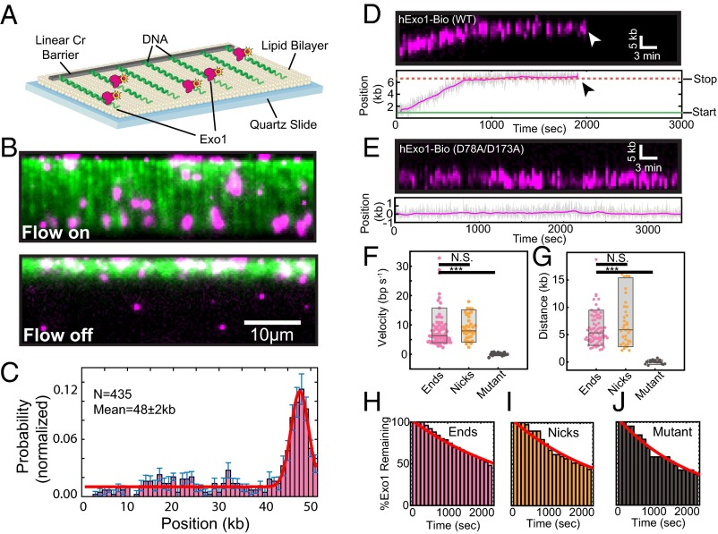
hExo1 is a processive DNA nuclease. (_A_) Schematic of the DNA curtains assay with hExo1. The flowcell surface is passivated with a lipid bilayer. DNA is affixed to the lipid bilayer, organized at nano-fabricated barriers, and extended to ∼85% of its B-form contour length. (_B_) Example of a DNA curtain (green) with fluorescent hExo1 molecules (magenta) in the presence (_Upper_) and absence (_Lower_) of buffer flow. Nearly all hExo1 molecules retracted with the DNA when buffer flow is turned off (_Lower_). (_C_) A histogram of the positions of individual hExo1 molecules bound to DNA (_n_ = 435 molecules). The red line is a single-Gaussian fit to the data (the mean of the fit is 48 ± 2 kb), and the error bars indicate the SD obtained via bootstrap analysis ([73](https://pmc.ncbi.nlm.nih.gov/articles/PMC4780606/#r73)). hExo1 preferentially binds the free 3′-ssDNA end but can also engage internal DNA sites. (_D_) Kymograph (_Upper_) and the corresponding particle-tracking trace (_Lower_) of a single hExo1 resecting from a DNA end (arrowhead indicates dissociation). (_E_) Kymograph (_Upper_) and corresponding trace (_Lower_) of nuclease-dead hExo1(D78A/D173A). (_F_) Box plots of velocities of WT hExo1 from ends (magenta, mean velocity = 8.4 ± 5.9 bp/s, _n_ = 75) and nicks (orange, mean velocity = 9.0 ± 3.9 bp/s, _n_ = 38), as well as for the nuclease-dead mutant (black, mean velocity = 0.1 ± 0.5 bp/s, _n_ = 19). (_G_) hExo1 is a processive nuclease from both ends (magenta, mean processivity = 6.0 ± 2.9 kb, _n_ = 75) and nicks (orange, processivity = 7.2 ± 4.2 kb, _n_ = 36). The nuclease-dead mutant does not move (black, processivity = 0.01 ± 0.3 kb, _n_ = 19). The velocities and processivities from nicks and ends are statistically indistinguishable (_P_ = 0.57 for velocities, _P_ = 0.09 for processivities) but are different from the nuclease-dead mutant (black, ***_P_ = 2.1 × 10−8 for velocity, ***_P_ = 2.7 × 10−14 for processivity). Box plots indicate the median, 10th, and 90th percentiles of the distribution. (_H–J_) hExo1 lifetimes at ends (_n_ = 75), nicks (_n_ = 39), and with nuclease-dead hExo1 (_n_ = 19). The red line is a single exponential fit to the data. As ∼50% of the molecules still remained on the DNA after our 40-min observation window, we report the lower estimate of the hExo1 half-lives (>1,800 s for hExo1 and >1,400 s for nuclease-dead hExo1).
#### Fig. S1.
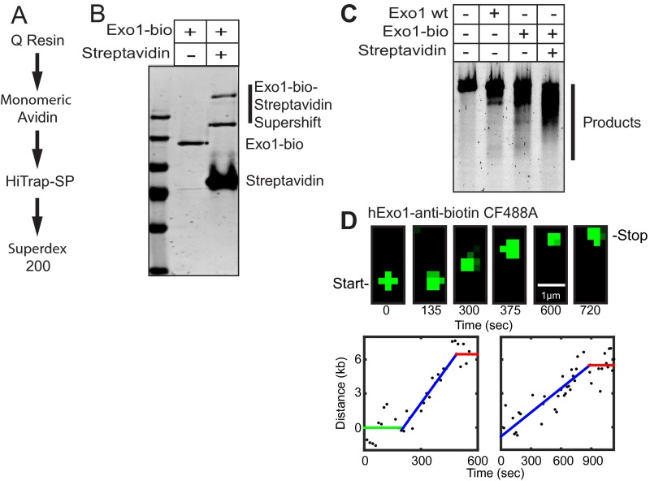
Human Exo1-biotin (hExo1-bio) purification and labeling. (_A_) Purification scheme for hExo1-bio. (_B_) SDS/PAGE gel showing hExo1-bio and hExo1-bio + streptavidin. Gel shift of hExo1-bio-streptavidin conjugates are indicated. The complete disappearance of the hExo1-bio band indicates that nearly 100% of the purified nucleases are biotinylated. (_C_) Resection assay with untagged WT hExo1 (500 pM), hExo1-bio (500 pM), or hExo1-bio (500 pM) + streptavidin (1 µg). Proteins were incubated in imaging buffer with 30 ng linearized 4.4-kb DNA (4-nt 3′ overhang) for 30 min at 37 °C. Resected DNA was separated on a 1% agarose gel and stained with SYBR green. The resection protocol has also been described previously ([21](https://pmc.ncbi.nlm.nih.gov/articles/PMC4780606/#r21)). Together, these assays indicate that streptavidin-conjugated hExo1-bio retains full resection activity. (_D_) Snapshots at indicated times (_Upper_) and single-particle tracking of two representative trajectories of resection by CF488-anti-biotin–labeled hExo1 (_Lower_). In both trajectories, hExo1 transitions between a resecting and a paused state. These results indicate that both states are intrinsic to hExo1 and are not dependent on the nature of the fluorophore.
Fluorescently labeled hExo1 was injected into the flowcell and visualized using total internal reflection fluorescence microscopy (TIRFM). We optimized protein injection conditions to load one or fewer fluorescent enzymes per DNA molecule ([Fig. 1 _B_](#fig1); 4 nM hExo1 in imaging buffer consisting of 40 mM Tris⋅HCl, pH 8, 60 mM NaCl, 1 mM MgCl2, 2 mM DTT, and 0.2 mg/mL bovine serum albumin (BSA)). Nearly all hExo1 molecules were bound to DNA, as turning off buffer flow led to the coordinated retraction of both the DNA and associated hExo1 molecules to the diffusion barrier ([Fig. 1 _B_](#fig1), _Lower_). To prevent the accumulation of additional nicks via DNA photodamage, we omitted intercalating DNA dyes in subsequent experiments. Next, we assayed hExo1-DNA binding specificity in the absence of nuclease activity (MgCl2 was replaced with 2 mM EDTA; [Fig. S2](https://pmc.ncbi.nlm.nih.gov/articles/PMC4780606/#sfig02)). Fifty-six percent of all hExo1 molecules (_n_ = 244/435) localized to the vicinity of the 3′-ssDNA ends ([Fig. 1 _C_](#fig1)); the remaining nucleases were distributed at internal binding sites, consistent with hExo1’s role in binding DNA nicks during MMR and NER ([7](https://pmc.ncbi.nlm.nih.gov/articles/PMC4780606/#r7), [38](https://pmc.ncbi.nlm.nih.gov/articles/PMC4780606/#r38)). These data indicate that individual hExo1 molecules preferentially bind 3′-ssDNA overhangs but can also bind rare DNA nicks (we estimate approximately three to five per DNA molecule) that occur as a result of handling the 48-kb-long λ-DNA substrates.
#### Fig. S2.
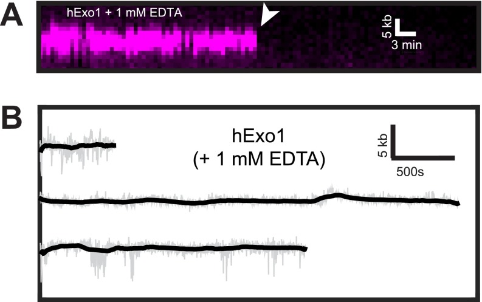
hExo1 requires a divalent cation to move on DNA. (_A_) Kymograph of hExo1-bio (magenta) in the presence of 1 mM EDTA. The white arrow indicates when the protein dissociated from DNA. (_B_) Example single-molecule trajectories of hExo1-bio with 1 mM EDTA. The raw data are displayed in gray, and the smoothed data are shown in black (>5-s boxcar averaging sliding window). As expected, hExo1 did not move in the absence of Mg+2, which is required for nuclease activity.
### hExo1 Is a Processive Nuclease That Interconverts Between Two States During Resection.
To track the position of individual resecting hExo1 molecules with subpixel accuracy, we fit the time-dependent fluorescent signals to a 2D Gaussian function ([39](https://pmc.ncbi.nlm.nih.gov/articles/PMC4780606/#r39)). The resulting time-dependent trajectories were used to analyze movement by individual nucleases ([Fig. 1 _D_](#fig1), _Lower_). Up to 70% of the molecules moved on DNA, whereas the remaining 30% of the molecules were stationary during the 2,400-s observation time. We also observed that moving hExo1 molecules could interconvert between two distinct modes: a paused state and a translocating state that was characterized by directional and processive movement along the DNA ([Fig. 1 _D_](#fig1)). As expected, nuclease-dead Exo1(D78A/D173A) bound at the 3′-ssDNA ends but did not move on DNA (mean velocity = 0.1 ± 0.5 bp/s; processivity = 0.01 ± 0.3 kb, _n_ = 19; [Fig. 1 _E_](#fig1)) ([32](https://pmc.ncbi.nlm.nih.gov/articles/PMC4780606/#r32)). We also did not observe any resection when EDTA was substituted for divalent metal ions ([Fig. S2](https://pmc.ncbi.nlm.nih.gov/articles/PMC4780606/#sfig02)). We considered a translocating molecule to be paused if it moved less than our ∼300-bp resolution for at least 100 s. Seventy-one percent (_n_ = 53/75) of DNA end-bound hExo1 molecules transitioned at least once between a translocating and a paused state; the remaining 29% (_n_ = 22/75) of these molecules resected DNA without pausing. Of the molecules that paused at least once, 45% (_n_ = 24/53) initially bound the DNA in a paused state before switching to processive movement (mean pause duration = 750 ± 380 s, _n_ = 24). The majority of molecules that paused at least once (91%, _n_ = 48/53) stopped before dissociating from DNA and did not restart DNA resection (mean pause duration = 1,070 ± 770 s, _n_ = 48). We also observed two-state trajectories with a fluorescent anti-biotin antibody bound to hExo1-bio and with hExo1-Flag labeled with a single QD-conjugated anti-Flag antibody, indicating that both the paused and resecting states were not dependent on the nature of the fluorophore ([Fig. S1 _D_](https://pmc.ncbi.nlm.nih.gov/articles/PMC4780606/#sfig01) and [Fig. S3](https://pmc.ncbi.nlm.nih.gov/articles/PMC4780606/#sfig03)). Stationary hExo1 may stem from protein inactivation during overexpression and purification or may be an intrinsic property of the enzyme. In support of the second model, a recent X-ray crystallographic study of hExo1 suggested that the largely unstructured C terminus, which is present in our full-length protein, harbors an auto-inhibitory domain ([32](https://pmc.ncbi.nlm.nih.gov/articles/PMC4780606/#r32)). This domain interacts with hMSH2 and hMLH1 ([40](https://pmc.ncbi.nlm.nih.gov/articles/PMC4780606/#r40), [41](https://pmc.ncbi.nlm.nih.gov/articles/PMC4780606/#r41)) and is critical for hMutSα stimulation of hExo1 nuclease activity ([5](https://pmc.ncbi.nlm.nih.gov/articles/PMC4780606/#r5), [32](https://pmc.ncbi.nlm.nih.gov/articles/PMC4780606/#r32), [42](https://pmc.ncbi.nlm.nih.gov/articles/PMC4780606/#r42)).
#### Fig. S3.
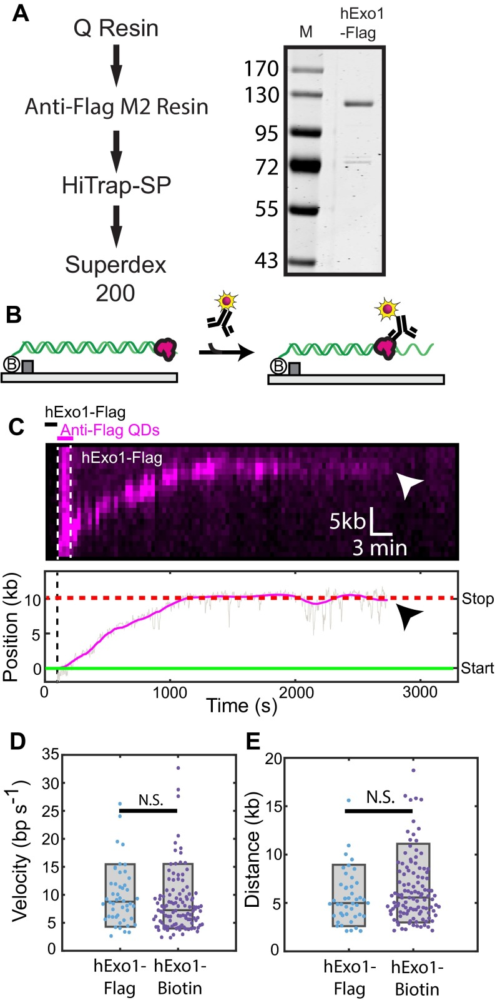
Human Exo1-Flag (hExo1-Flag) resects DNA similarly to hExo1-bio. (_A_) Purification scheme and SDS/PAGE gel showing recombinant hExo1-Flag. (_B_) Cartoon illustration of the in situ hExo1-Flag labeling strategy. First, unlabeled hExo1-Flag is loaded on the DNA and excess protein is flushed out. Second, anti-Flag antibody-conjugated QDs are injected into the flowcell. This guarantees that hExo1 is labeled with, at most, one QD. (_C_) Kymograph (_Upper_) and single-particle trace of a resecting hExo1-Flag. Arrowheads indicate hExo1-Flag dissociation. The sequential hExo1-Flag and QD injection scheme is also shown in the kymograph. (_D_) Comparison of hExo1 velocity and (_E_) processivity. The mean hExo1-Flag velocity (9.8 ± 5.2 bp/s; _n_ = 50) and processivity (5.6 ± 2.7 kb; _n_ = 50) was statistically similar to hExo1-bio (_P_ = 0.18 and _P_ = 0.15, respectively). Within our experimental resolution, 78% (_n_ = 39/50) of hExo1-Flag molecules paused at least once, with the remaining 22% (_n_ = 11/50) resecting without pausing. Of those that paused, 44% (_n_ = 17/39) paused before resection and 85% (_n_ = 33/39) paused after resection.
We next analyzed the time-dependent hExo1 trajectories to measure the velocity, processivity, and DNA-binding lifetime of each resecting enzyme. DNA end-bound hExo1 moved 6.0 ± 2.9 kb (range indicates SD, _n_ = 75), with a mean velocity of 8.4 ± 5.9 bp/s (range indicates SD, _n_ = 75) from DNA ends. From nicks, hExo1 moved 7.2 ± 4.2 kb (_n_ = 38) with a mean velocity of 9.0 ± 3.9 bp/s (_n_ = 36; [Fig. 1 _F_ and _G_](#fig1)). As expected, the mean velocity and processivity were statistically indistinguishable with a different fluorescent label on hExo1 and at a higher ionic strength ([Figs. S3](https://pmc.ncbi.nlm.nih.gov/articles/PMC4780606/#sfig03) and [S4](https://pmc.ncbi.nlm.nih.gov/articles/PMC4780606/#sfig04)). hExo1 velocity and processivity were statistically similar from both DNA ends and nicks (_P_ = 0.57 for velocities, _P_ = 0.09 for processivities) but very distinct from the nuclease-dead hExo1 (_P_ = 2.1 × 10−8 for velocities, _P_ = 2.7 × 10−14 for processivities; [Fig. 1 _F_ and _G_](#fig1)). Inverting the tethered and free DNA ends also yielded statistically similar velocity, processivity, and pause state distributions ([Fig. S5](https://pmc.ncbi.nlm.nih.gov/articles/PMC4780606/#sfig05)), indicating that hExo1 resection is independent of the underlying DNA sequence. Furthermore, hExo1 associated tightly with the DNA ([Fig. 1 _H_ – _J_](#fig1)). The dissociation half-life was similar for both end- and nick-bound hExo1 (half-life >1,800 s, _n_ = 75 and 39 for ends and nicks, respectively) as well as with the nuclease-dead mutant (half-life >1,400 s, _n_ = 19). We conclude that hExo1 is a processive nuclease that associates tightly with both nicks and free DNA ends.
#### Fig. S4.
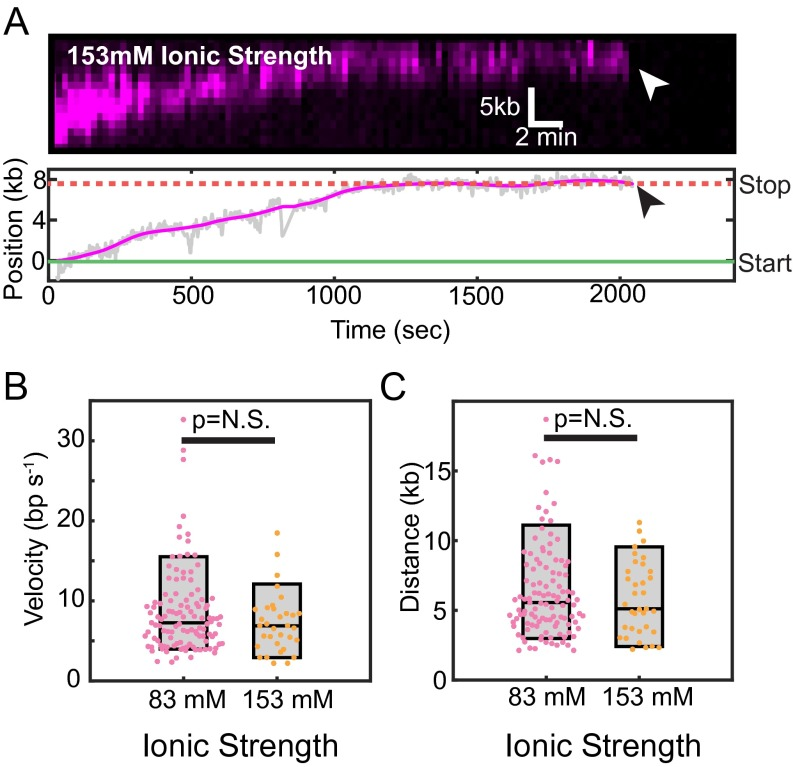
hExo1 is a processive nuclease at a higher ionic strength. (_A_) Kymograph (_Upper_) and the corresponding particle-tracking trace (_Lower_) of a single hExo1-bio resecting a free DNA end in the presence of I = 153 mM total ionic strength (imaging buffer with 130 mM NaCl). hExo1 resects ∼8 kb and pauses before dissociating from the DNA (arrowhead indicates dissociation). (_B_) Box plots of hExo1 velocities in a buffer with I = 83 mM (magenta, mean velocity = 8.6 ± 5.3 bp/s, _n_ = 113) or with I = 153 mM (orange, mean velocity = 7.2 ± 3.7 bp/s, _n_ = 33). (_C_) hExo1 is a processive nuclease at both low (I = 83 mM, magenta, mean processivity = 6.4 ± 3.4 kb, _n_ = 111) and high (I = 153 mM, orange, processivity = 5.8 ± 2.6 kb, _n_ = 35) total ionic strengths. The velocities and processivities from both nicks and ends are statistically indistinguishable (_P_ = 0.17 for velocities, _P_ = 0.38 for processivities). Box plots indicate the median, 10th, and 90th percentiles of the distribution.
#### Fig. S5.
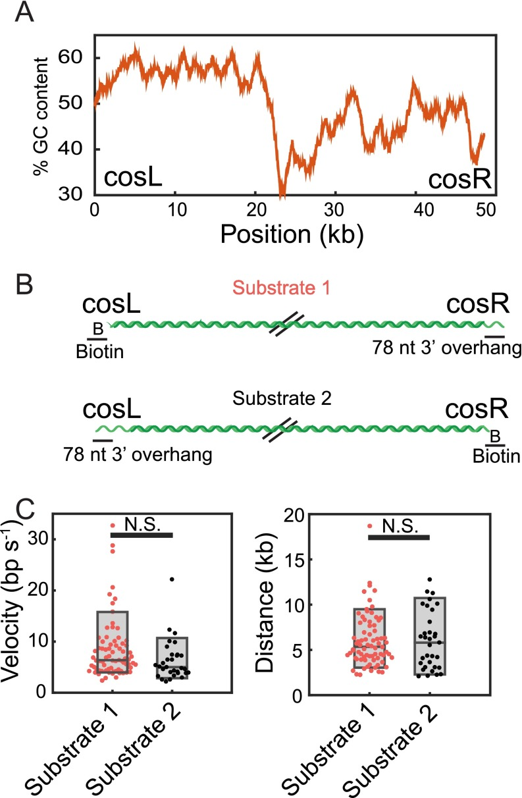
hExo1 resection is sequence independent. (_A_) GC content of our DNA substrate (derived from λ-phage) measured using a 1-kb sliding window from cosL to cosR. The GC content is increased on the cosL side relative to the cosR side. (_B_) Model of substrates used for testing sequence-dependent hExo1 resection activity. Oligonucleotides were ligated to the ends of the DNA to biotinylate one end and create a 3′-ssDNA overhang on the other end. The two substrates load hExo1 on opposite ends of the λ-DNA. (_C_) Velocities (_Left_) and processivities (_Right_) of hExo1 molecules that started at the ends of substrates 1 (magenta) and substrate 2 (black). The boxplot represents the 10th, median, and 90th percentiles of each distribution. Substrate 1 is used throughout the manuscript, and its velocity and processivity are reported in [Fig. 1](#fig1). For substrate 2, the velocity of hExo1 was 6.3 ± 4 bp/s (_n_ = 31) and the processivity was 6.0 ± 3.2 kb (_n_ = 33). The velocities and processivity were not statistically different between the two substrates (_P_ = 0.07 for velocity, _P_ = 0.98 for processivity). Within our resolution, there are no major differences in hExo1 behavior on substrate 1 vs. substrate 2.
### RPA Inhibits hExo1 by Stripping the Nuclease from DNA.
RPA rapidly associates with ssDNA and can modulate the activity of enzymes that participate in DNA resection ([14](https://pmc.ncbi.nlm.nih.gov/articles/PMC4780606/#r14), [43](https://pmc.ncbi.nlm.nih.gov/articles/PMC4780606/#r43)). To determine how human RPA (hRPA) affects hExo1, we first loaded hExo1 on DNA and then injected imaging buffer containing a low concentration (1 nM) of GFP-tagged hRPA ([44](https://pmc.ncbi.nlm.nih.gov/articles/PMC4780606/#r44)). hRPA-GFP rapidly displaced hExo1 from the DNA as it loaded onto the newly generated ssDNA ([Fig. 2 _A_](#fig2)). There was no discernible difference in hExo1 displacement by hRPA-GFP compared with WT hRPA ([Fig. S6](https://pmc.ncbi.nlm.nih.gov/articles/PMC4780606/#sfig06)). Injection of WT hRPA—but not storage buffer—also led to rapid hExo1 dissociation from the DNA ([Fig. 2 _C_](#fig2); half-life = 18 ± 1 s, _n_ = 90; error bars report 95% CI). Both stationary and moving hExo1s, as well as nuclease-dead hExo1(D78A/D173A) ([Fig. S6 _B_](https://pmc.ncbi.nlm.nih.gov/articles/PMC4780606/#sfig06)), were rapidly displaced by hRPA. Importantly, hRPA also inhibited resection by unlabeled hExo1, indicating that this inhibition was not due to the hExo1 labeling strategy ([Fig. S7](https://pmc.ncbi.nlm.nih.gov/articles/PMC4780606/#sfig07)). RPA occludes ∼30 nt when it engages ssDNA ([14](https://pmc.ncbi.nlm.nih.gov/articles/PMC4780606/#r14), [45](https://pmc.ncbi.nlm.nih.gov/articles/PMC4780606/#r45)). Therefore, the 78-nt ssDNA overhangs used in this study can bind, at most, two or three hRPA complexes. Our data indicates that this is sufficient to strip hExo1 from DNA.
#### [Fig. 2](#fig2).
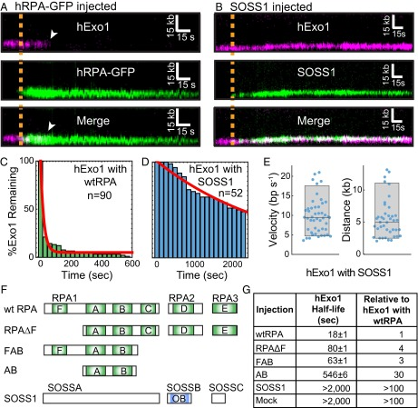
RPA, but not SOSS1, rapidly dissociates hExo1 from DNA. (_A_) Kymograph of hExo1 displacement (magenta, _Top_) by hRPA-GFP (green, _Middle_). (_Bottom_) Merged images. The orange line indicates when hRPA-GFP enters the flowcell, and white arrowheads indicate hExo1 dissociation. (_B_) Kymograph of hExo1 (magenta, _Top_) with injection of fluorescent SOSS1 (green, _Middle_). (_Bottom_) Merged images, and the orange line indicates when SOSS1 entered the flowcell. (_C_) Lifetime of DNA end-bound hExo1 in the presence of 1 nM RPA (half-life = 18 ± 1 s, _n_ = 90) and (_D_) 1 nM SOSS1 (half-life >2,000 s, _n_ = 52). Red lines, single exponential fits to the data. (_E_) Distribution of hExo1 velocities (_Left_ ; 9.8 ± 4.5 bp/s, _n_ = 47) and processivities (_Right_ ; 5.5 ± 3.0 kb, _n_ = 41) with 1 nM SOSS1 in the imaging buffer. Box plots indicate the median, 10th, and 90th percentiles of the distributions. (_F_) Diagram of hRPA, SOSS1, and various truncations used in this study. DNA binding domains are shown in light green (hRPA) or blue (SOSS1). (_G_) Half-lives of hExo1 in the presence of several hRPA truncations, SOSS1, or a mock injection containing RPA storage buffer. Right column indicates the half-lives normalized to those of hExo1 with hRPA.
#### Fig. S6.
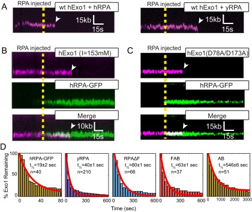
hExo1 is rapidly removed by both human and yeast RPA. (_A_) Kymographs of hExo1-bio (magenta) when 1 nM hRPA (_Left_) or 1 nM yRPA (_Right_) is injected into the flowcell. In both kymographs, the WT RPAs are not labeled. The dashed line represents the time when RPA is injected and white arrowheads mark hExo1 dissociation events. Representative kymographs of (_B_) hExo1-bio at a high ionic strength (I = 153 mM) or (_C_) hExo1(D78A/D173A)-bio (magenta, _Top_) plus hRPA-GFP (green, _Middle_). (_Bottom_) Merged images. hRPA displaces WT and nuclease-dead hExo1. (_D_) Lifetime of hExo1 on DNA with various RPAs. Red line, fit to an exponential model. [Table S1](https://pmc.ncbi.nlm.nih.gov/articles/PMC4780606/#st01) summarizes hExo1 half-lives in the presence of various RPAs and prokaryotic SSBs.
#### Fig. S7.
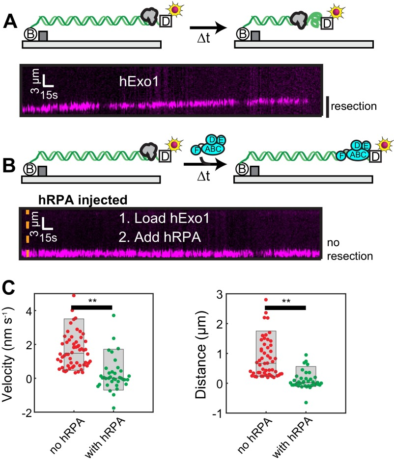
Unlabeled hExo1 is inhibited by hRPA. (_A_) Cartoon illustration of the experiment (_Upper_). To monitor resection catalyzed by unlabeled hExo1, the DNA substrate was prepared with a 3′-72 nt polyT and was terminated with a digoxigenin (dig, white square in cartoon illustration). The 3′-ssDNA end was labeled with an anti-dig conjugated QD. hExo1-catalyzed resection converts dsDNA to ssDNA, which appears as an overall shortening of the DNA at these flow rates. Kymograph (_Lower_) hExo1-catalyzed resection on naked DNA. (_B_) Cartoon illustration of the experiment as above (_Upper_) after injection of 1 nM hRPA. After injection of hRPA, hExo1 is rapidly displaced by hRPA, and the QD does not move. Kymograph (_Lower_) shows unlabeled hExo1 resection after injection of 1nM RPA (orange line). (_C_) Velocity (_Left_) and processivity (_Right_) of the QD-labeled ssDNA in the absence (red) or with 1 nM RPA (green). The velocity of the QD was 1.9 ± 1.6 nm/s (_n_ = 60) in the absence of RPA and 0.2 ± 1.6 nm/s (_n_ = 39) with RPA. Likewise, the processivity was 0.9 ± 0.7 μm (_n_ = 54) in the absence of RPA and 0.1 ± 0.3 μm (_n_ = 39) in the presence of RPA. These were significantly different (**_P_ < 0.01), indicating that RPA displaces unlabeled hExo1.
Next, we investigated whether the RPA inhibition was species specific. We purified WT yeast RPA (yRPA) and determined its effect on hExo1. On injecting 1 nM yRPA into the flowcell, hExo1 was rapidly removed from the DNA (half-life = 40 ± 1 s, _n_ = 210; [Fig. S6 _D_](https://pmc.ncbi.nlm.nih.gov/articles/PMC4780606/#sfig06)). Although both human and yeast RPA can displace hExo1, hRPA can do so twice as rapidly as the yeast protein ([Table S1](https://pmc.ncbi.nlm.nih.gov/articles/PMC4780606/#st01)). Both RPA complexes have subnanomolar affinity for ssDNA, suggesting that hRPA may displace hExo1 by direct competition for the ssDNA and also via species-specific interactions ([46](https://pmc.ncbi.nlm.nih.gov/articles/PMC4780606/#r46), [47](https://pmc.ncbi.nlm.nih.gov/articles/PMC4780606/#r47)). These results are surprising, as a physical interaction between the human or yeast RPA and Exo1 has not been reported ([15](https://pmc.ncbi.nlm.nih.gov/articles/PMC4780606/#r15), [21](https://pmc.ncbi.nlm.nih.gov/articles/PMC4780606/#r21)). Nonetheless, the proximity of the two complexes on the same DNA strand can be sufficient to enhance weak but species-specific interactions. Here, we conclude that hRPA rapidly displaces hExo1 and that three or fewer hRPA complexes are sufficient to remove both stationary and resecting hExo1 from DNA.
#### Table S1.
hExo1 survival half-lives
Injection | hExo1 half-life (s) | Relative to hExo1 with hRPA | Coefficient of determination (_R_ 2)  
---|---|---|---  
hRPA | 18 ± 1 | 1 | 0.98  
hRPA-GFP | 19 ± 2 | 1 | 0.96  
yRPA | 40 ± 1 | 2 | 0.98  
hRPAΔF | 80 ± 1 | 4 | 0.97  
FAB | 63 ± 1 | 3 | 0.97  
AB | 546 ± 6 | 30 | 0.98  
T4 gp32 | 790 ± 90 | 40 | 0.97  
SSB | 74 ± 1 | 4 | 0.98  
SOSS1 | >2,000 | >100 | ND  
Mock | >2,000 | >100 | ND  
[Open in a new tab](https://pmc.ncbi.nlm.nih.gov/articles/PMC4780606/table/st01/)
ND, not determined.
### SOSS1 Supports Processive Resection by hExo1.
SOSS1 is required for extensive DSB resection in cells ([24](https://pmc.ncbi.nlm.nih.gov/articles/PMC4780606/#r24), [25](https://pmc.ncbi.nlm.nih.gov/articles/PMC4780606/#r25)) and strongly stimulates hExo1 loading onto free DNA ends ([21](https://pmc.ncbi.nlm.nih.gov/articles/PMC4780606/#r21)). However, the mechanism by which SOSS1 regulates hExo1 resection remains unexplored. To determine how SOSS1 modulates hExo1, we purified a GST-tagged SOSS1 complex and fluorescently labeled it with an Alexa488-conjugated anti-GST antibody ([21](https://pmc.ncbi.nlm.nih.gov/articles/PMC4780606/#r21)). Fluorescent SOSS1 was then injected into flowcells containing resecting hExo1 molecules. Alexa488-SOSS1 colocalized with hExo1 at both nicks and ends but surprisingly did not displace the nuclease from DNA ([Fig. 2 _B_](#fig2)). We next assayed hExo1 activity when 1 nM SOSS1 (without the fluorescent label) was introduced into the flowcell. In contrast to hRPA, SOSS1 supported long-range resection. hExo1 stayed on the DNA for tens of minutes ([Fig. 2 _D_](#fig2); half-life >2,000 s, _n_ = 52), and the dwell time, velocities, and processivities were statistically indistinguishable from those of hExo1 in the absence of any SSBs ([Fig. 2 _E_](#fig2), _P_ = 0.16 for velocities and _P_ = 0.14 for processivities). In the presence of SOSS1, 92% (_n_ = 48/52) of hExo1 trajectories transitioned at least once between a paused and a resecting state, mirroring our earlier observations with hExo1 in the absence of any SSBs. The remaining 8% of these molecules (_n_ = 4/52) resected DNA without pausing. Of the molecules that paused at least once, 73% (_n_ = 35/48) paused before resecting and 63% (_n_ = 30/48) paused after DNA resection. We conclude that SOSS1 binds newly resected DNA without altering hExo1 velocity or processivity.
### hExo1 Is Inhibited by Multivalent SSBs.
We next sought to determine the mechanism by which RPA—but not SOSS1—displaces hExo1. RPA is composed of three polypeptides (RPA1, RPA2, and RPA3) that encode six nonequivalent DNA-binding domains (DBDs A–F; [Fig. 2 _F_](#fig2), _Upper_) ([14](https://pmc.ncbi.nlm.nih.gov/articles/PMC4780606/#r14), [47](https://pmc.ncbi.nlm.nih.gov/articles/PMC4780606/#r47)). Biochemical and cell biology studies with truncated proteins have established that DBD-A and DBD-B have the strongest ssDNA-binding affinities and are essential for proper RPA function in DNA replication and repair ([16](https://pmc.ncbi.nlm.nih.gov/articles/PMC4780606/#r16), [47](https://pmc.ncbi.nlm.nih.gov/articles/PMC4780606/#r47), [48](https://pmc.ncbi.nlm.nih.gov/articles/PMC4780606/#r48)). RPA1 also encodes an N-terminal DBD-F, which is connected to the DBD-A/B via a long polypeptide linker, harbors a weak DNA binding activity, and physically interacts with DNA replication and repair proteins ([45](https://pmc.ncbi.nlm.nih.gov/articles/PMC4780606/#r45), [49](https://pmc.ncbi.nlm.nih.gov/articles/PMC4780606/#r49), [50](https://pmc.ncbi.nlm.nih.gov/articles/PMC4780606/#r50)). To determine the key RPA domains that are required for hExo1 displacement, we purified and assayed a series of truncated hRPA variants ([Fig. 2 _F_](#fig2)). A heterotrimeric hRPA complex lacking DBD-F (RPAΔF) was able to displace hExo1 but at a fourfold slower rate than WT RPA (half-life = 80 ± 1 s, _n_ = 66; [Fig. S6 _D_](https://pmc.ncbi.nlm.nih.gov/articles/PMC4780606/#sfig06)). Next, we tested a series of RPA1 truncations that contained the high-ssDNA affinity DBD-A/B. Surprisingly, the FAB-RPA1 truncation was still proficient for hExo1 removal (half-life = 63 ± 1 s, _n_ = 37) and could do so more efficiently than RPAΔF ([Fig. 2 _G_](#fig2) and [Fig. S6 _D_](https://pmc.ncbi.nlm.nih.gov/articles/PMC4780606/#sfig06)). The N terminus of RPA1 facilitates melting of ss/dsDNA junctions and is also a central hub for many RPA-interacting proteins ([49](https://pmc.ncbi.nlm.nih.gov/articles/PMC4780606/#r49)). Our data indicate that this domain may also help to displace hExo1 by two nonexclusive mechanisms: (_i_) direct competition for the ssDNA and (_ii_) weak physical interactions with the nuclease. In contrast, the minimal DBD-A/B RPA1 truncation, which contains just the two highest affinity ssDNA-binding domains, was 30-fold slower than WT hRPA at removing hExo1 from DNA ([Fig. 2 _G_](#fig2) and [Fig. S6 _D_](https://pmc.ncbi.nlm.nih.gov/articles/PMC4780606/#sfig06); half-life = 546 ± 6 s; _n_ = 28). Interestingly, the SOSS1 complex contains only a single DNA binding domain, which may be why it fails to displace hExo1.
Our finding that truncated hRPA variants that retain three DBDs may rapidly displace hExo1 suggested that other SSBs with multiple DNA-binding domains could also remove hExo1 from DNA. To further test this observation, we measured the rate of hExo1 removal by the homotetrameric _E. coli_ SSB and monomeric T4 phage gp32 ([Fig. S8](https://pmc.ncbi.nlm.nih.gov/articles/PMC4780606/#sfig08)). Injecting 1 nM _E. coli_ SSB, which harbors four identical DBDs, rapidly inhibited hExo1, with a similar half-life to RPAΔF (half-life = 74 ± 1.3 s, _n_ = 31; [Fig. S8 _C_](https://pmc.ncbi.nlm.nih.gov/articles/PMC4780606/#sfig08) and [Table S1](https://pmc.ncbi.nlm.nih.gov/articles/PMC4780606/#st01)). In contrast, gp32 did not rapidly strip hExo1 from DNA (half-life = 790 ± 90 s; _n_ = 34; [Fig. S8 _D_](https://pmc.ncbi.nlm.nih.gov/articles/PMC4780606/#sfig08)). Moreover, neither gp32 nor SOSS1 affected the hExo1 resection rate and processivity ([Fig. S8 _E_](https://pmc.ncbi.nlm.nih.gov/articles/PMC4780606/#sfig08) and [Fig. 2 _E_](#fig2)). These results clarify earlier studies showing that SSB, but not gp32, can substitute for hRPA in limiting hExo1 resection in a reconstituted human MMR system ([5](https://pmc.ncbi.nlm.nih.gov/articles/PMC4780606/#r5)). Here, we show that SSB and RPA, but not gp32, can both efficiently turn over resecting hExo1. The similarities between the dwell times of hExo1 in the presence of RPAΔF and _E. coli_ SSB suggest that multivalent SSBs can efficiently displace hExo1 from DNA but that the N terminus of hRPA1 may harbor an additional hExo1-regulating domain.
#### Fig. S8.
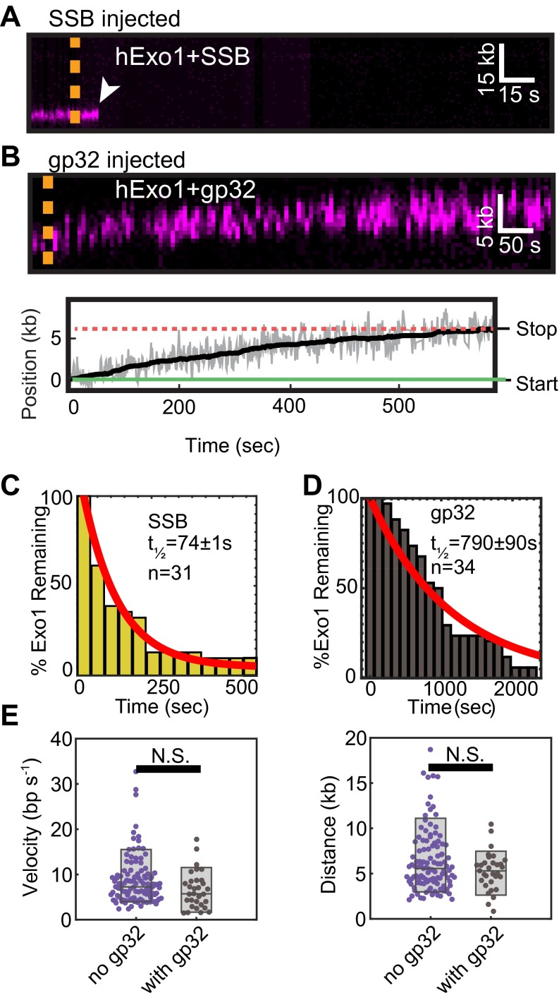
Effects of SSB and gp32 on hExo1 resection. (_A_) Kymograph of hExo1 displacement by WT SSB. The dashed line indicates when SSB was injected and the white arrow indicates hExo1 dissociation. (_B_) Kymograph (_Upper_) and corresponding particle-tracking trace (_Lower_) of hExo1 on injection of gp32. Green and red lines indicate the start and stopping point of the molecule, respectively. (_C_) Lifetime of hExo1 in the presence of 1nM SSB (half-life = 74 ± 1.3 s, _n_ = 31) and (_D_) 1 nM gp32 (half-life = 790 ± 90 s, _n_ = 34). The red lines are single exponential fits of the data. [Table S1](https://pmc.ncbi.nlm.nih.gov/articles/PMC4780606/#st01) further summarizes the fit parameters. (_E_) Velocity (_Left_) and processivity (_Right_) of hExo1 in the absence (purple) or presence (gray) of gp32. The velocity of hExo1 in the presence of gp32 was 7.4 ± 3.8 bp/s (_n_ = 27, _P_ = 0.06), whereas the processivity was 5.5 ± 1.8 kb (_n_ = 29, _P_ = 0.09). These values were not statistically different from those of hExo1 in the absence of SSBs.
### hRPA Depletion Increases hExo1 Recruitment to DNA Damage but Decreases Resection in Human Cells.
Our single-molecule observations demonstrated that RPA inhibits hExo1-dependent DNA resection. To extend these findings in vivo, we established two assays for monitoring hExo1 recruitment to DNA damage sites in human cells. First, we measured the dynamics of hExo1-GFP recruitment to laser-induced DNA damage in hRPA-depleted cells. RPA2 knockdown stimulated the rate of hExo1-GFP recruitment to laser-induced DNA damage in U2OS cells ([Fig. 3 _A_ – _C_](#fig3)). This effect was not due to changes in cell cycle progression because RPA2 knockdown did not appreciably alter the proportion of cells in S-phase ([Fig. 3 _D_](#fig3) and [Fig. S9 _A_](https://pmc.ncbi.nlm.nih.gov/articles/PMC4780606/#sfig09)). In addition, hExo1-GFP colocalized with γ-H2AX foci at the site of the laser damage ([Fig. S9 _B_](https://pmc.ncbi.nlm.nih.gov/articles/PMC4780606/#sfig09)). Overall, these results indicate that RPA inhibits hExo1 accumulation at DNA damage sites.
#### [Fig. 3](#fig3).
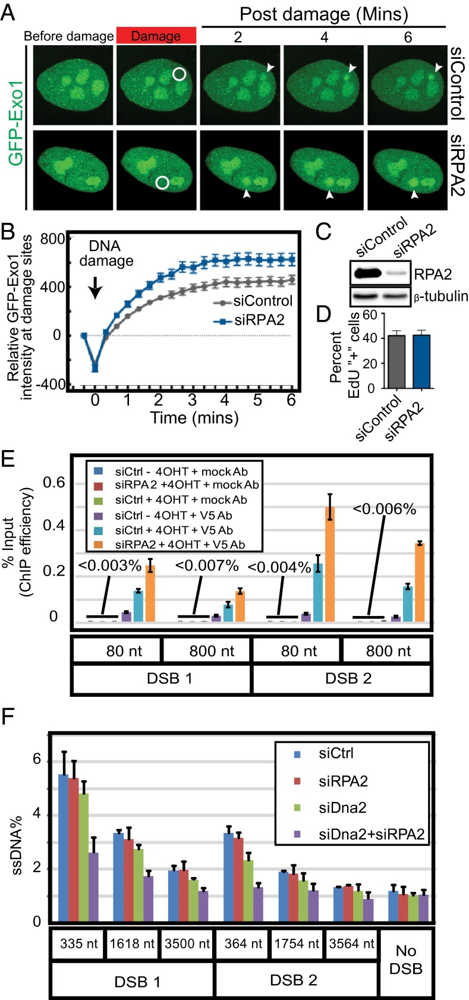
hRPA depletion increases hExo1 localization to DNA break sites but decreases resection in human cells. (_A_) Representative images of laser-induced GFP-hExo1 foci in the presence of siControl or siRPA2. The white circle indicates site of laser damage. (_B_) Quantification of _A_ with at least 20 cells per biological replicate. (_C_) Western blot showing levels of RPA2 after siRPA2 treatment. Loading control: β-tubulin. (_D_) Quantification of EdU+ cells (S phase) in the presence and absence of RPA2. (_E_) Quantification of hExo1 ChIP efficiency at DNA sites that are 80 or 800 nt downstream of two different _Asi_ SI-induced breaks (DSB1 and DSB2). (_F_) qPCR-based resection assays were carried out with siControl-, siRPA2-, siDNA2-, and siDNA2+siRPA2-treated cells. All error bars indicate SEM from three biological replicates.
#### Fig. S9.
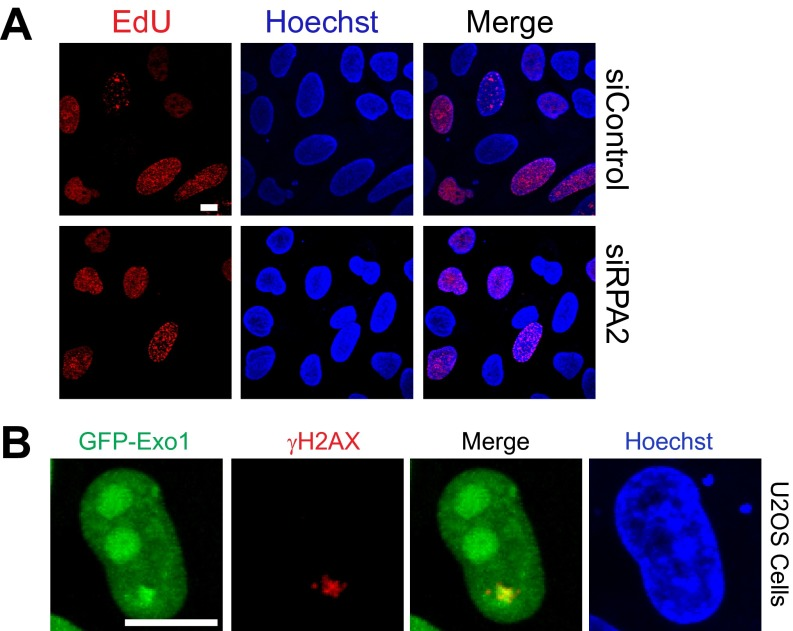
Exo1-GFP colocalizes with DNA damage. (_A_) RPA2 knockdown does not affect the cell cycle. Representative images of EdU-stained DNA in siControl- and siRPA2-treated cells. Quantification of EdU foci for two biological replicates (>200 cells per replicate) is included in the main text ([Fig. 3D](#fig3)). (Scale bar, 10 µm.) (_B_) Exo1-GFP colocalizes with the DNA damage marker γH2AX at sites of laser-induced DNA damage. (Scale bar, 10 µm.)
Next, we established a ChIP assay to monitor hExo1 localization at ssDNA intermediates in human cells. We adapted a resection assay using U2OS cells engineered to express an estrogen receptor ER-AsiSI restriction enzyme fusion that can be trafficked into the nucleus on treatment with 4-hydroxytamoxifen (4-OHT) ([51](https://pmc.ncbi.nlm.nih.gov/articles/PMC4780606/#r51), [52](https://pmc.ncbi.nlm.nih.gov/articles/PMC4780606/#r52)). AsiSI induction generates up to 150 DSBs per cell ([51](https://pmc.ncbi.nlm.nih.gov/articles/PMC4780606/#r51)). Resection efficiency can be measured by quantitative PCR (qPCR) using two primers located downstream of two different AsiSI recognition sites on chromosome I that are known to be cleaved with high efficiency ([12](https://pmc.ncbi.nlm.nih.gov/articles/PMC4780606/#r12)). Here, we extended this assay by stably integrating V5-epitope tagged hExo1 into the AsiSI-inducible U2OS cells. hExo1 recruitment to a DSB was monitored by ChIP with anti-V5 antibodies followed by qPCR to quantify the amount of DNA associated with hExo1. We detected more hExo1 associated with DNA in hRPA-depleted cells at both DSB-proximal (80 bp away) and distal (800 bp away) sites ([Fig. 3 _E_](#fig3)). These results were also consistent across two different AsiSI-generated DSBs. We conclude that depletion of hRPA leads to increased accumulation of hExo1 at DSBs, consistent with our laser irradiation experiments in cells and our in vitro single-molecule assays.
Next, we exploited the AsiSI-induced DSB assays to determine how hRPA coordinates DNA resection. ssDNA generation at specific sites near AsiSI-induced breaks was monitored by cleavage with restriction enzymes followed by qPCR with primers spanning those sites ([53](https://pmc.ncbi.nlm.nih.gov/articles/PMC4780606/#r53)). Resection of DSB ends prevents restriction enzyme cleavage, allowing amplification of the DNA and quantification of the percentage of produced ssDNA. Using this assay, we have previously shown that hExo1 and SOSS1 both promote long-range resection of free DNA ends into ssDNA substrates ([21](https://pmc.ncbi.nlm.nih.gov/articles/PMC4780606/#r21)). Here, we show that hRPA-depleted cells can still produce DNA resection intermediates up to ∼3.5 kb away from the break site. Because hExo1 is the major nuclease in human DSB resection ([11](https://pmc.ncbi.nlm.nih.gov/articles/PMC4780606/#r11)), hExo1 knockdown severely limits DNA resection intermediates ([12](https://pmc.ncbi.nlm.nih.gov/articles/PMC4780606/#r12)). A second, partially redundant resection pathway requires DNA2 nuclease ([19](https://pmc.ncbi.nlm.nih.gov/articles/PMC4780606/#r19), [20](https://pmc.ncbi.nlm.nih.gov/articles/PMC4780606/#r20), [22](https://pmc.ncbi.nlm.nih.gov/articles/PMC4780606/#r22), [23](https://pmc.ncbi.nlm.nih.gov/articles/PMC4780606/#r23)). To specifically monitor hExo1-dependent resection, we first measured resection in DNA2-depleted cells. DNA2-depleted cells displayed only a minor DNA resection defect ([11](https://pmc.ncbi.nlm.nih.gov/articles/PMC4780606/#r11), [12](https://pmc.ncbi.nlm.nih.gov/articles/PMC4780606/#r12)). To define the role of hRPA on hExo1 resection, we next quantified DNA resection intermediates in cells that were depleted for both RPA2 and DNA2. Surprisingly, codepletion of RPA2 and DNA2 resulted in decreased ssDNA generation, suggesting additional roles for hRPA in regulating DNA resection ([Fig. 3 _F_](#fig3)) ([15](https://pmc.ncbi.nlm.nih.gov/articles/PMC4780606/#r15)). Taken together, these results show that hRPA depletion enhances hExo1 recruitment to sites of DSBs in human cells, but long-range DSB processing is fine-tuned by additional components of the resection machinery.
### yExo1 Is a Processive Nuclease.
Early studies with purified human and yeast Exo1 reported that the enzymes act as distributive nucleases, whereas we observed processive resection with full-length hExo1 ([Fig. 1](#fig1)) ([6](https://pmc.ncbi.nlm.nih.gov/articles/PMC4780606/#r6), [31](https://pmc.ncbi.nlm.nih.gov/articles/PMC4780606/#r31), [54](https://pmc.ncbi.nlm.nih.gov/articles/PMC4780606/#r54), [55](https://pmc.ncbi.nlm.nih.gov/articles/PMC4780606/#r55)). To determine whether the human and yeast enzymes are functionally similar, we also purified biotinylated yExo1 and observed its activity on DNA curtains at its optimal temperature (30 °C; [Fig. 4 _A_](#fig4)). As reported previously, yExo1 preferentially bound the free 3′-ssDNA ends ([18](https://pmc.ncbi.nlm.nih.gov/articles/PMC4780606/#r18)). Similar to hExo1, we saw individual end-bound molecules transition between a paused and a translocating state ([Fig. 4 _A_](#fig4)). Seventy-eight percent of yExo1 molecules (_n_ = 45/58) paused at least once, with the remaining 22% (_n_ = 13/58) resecting without pausing. Forty-two percent of the molecules that paused (_n_ = 19/45) showed pausing before translocation (mean pause time: 430 ± 170 s, _n_ = 19/45). In addition, 93% of these molecules paused after translocation (mean pause time: 1,320 ± 720 s, _n_ = 42/45). Unlike hExo1, however, only ∼12% of total yExo1 molecules showed directional movement (_n_ = 58/490); the remaining molecules were stationary on the DNA. Despite the large number of stationary nucleases, our single-molecule assay permits us to determine the velocity and processivity of moving yExo1 proteins. In the absence of SSBs, these molecules resected DNA with a similar velocity and processivity to hExo1 (mean velocity = 10.9 ± 5.4 bp/s, processivity = 5.6 ± 2.6 kb, _n_ = 57; [Fig. 4 _B_ and _C_](#fig4)). yExo1 remained on the DNA ends for >1,800 s ([Fig. 4 _E_](#fig4); _n_ = 58), as we had observed with hExo1. Consistent with the effect of hRPA on hExo1, injection of yRPA rapidly removed both stationary and resecting yExo1 from DNA ends ([Fig. 4 _D_ and _F_](#fig4); half-life = 52 ± 2 s, _n_ = 76, _R_ 2 = 0.93). We conclude that in these single-turnover assays, yExo1 is also a processive nuclease but is rapidly displaced from DNA by yRPA.
#### [Fig. 4](#fig4).
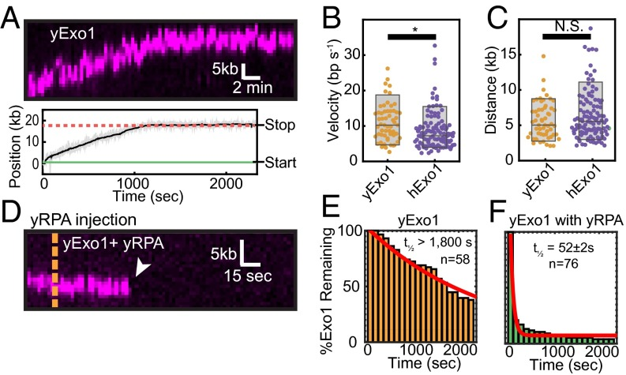
yExo1 is a processive nuclease. (_A_) Kymograph (_Upper_) and resection track (_Lower_) showing yExo1 processing of a DNA end. (_B_) Comparison of yExo1 (orange) and hExo1 (purple) velocities (_n_ = 57 for yExo1 and _n_ = 113 for hExo1) and (_C_) processivities (_n_ = 57 for yExo1 and _n_ = 111 for hExo1). The _P_ values were 0.004 and 0.15 for the velocities and processivities, respectively. For yExo1, the mean velocity was 10.9 ± 5.4 bp/s and the average processivity was 5.6 ± 2.6 kb (_n_ = 57). (_D_) Kymograph of a yExo1 molecule in the presence of 1 nM yRPA. The orange line indicates when yRPA enters the flowcell. (_E_) yExo1 lifetimes in the absence of yRPA (orange, half-life >1,800 s; _n_ = 58) and (_F_) with 1 nM yRPA injected into the flowcell (green, half-life = 52 ± 2 s, _n_ = 76). The red lines are single exponential fits to the data.
### Exo1 Is a Distributive Nuclease in the Presence of RPA.
Our previous data show that individual human and yeast Exo1 molecules are rapidly inhibited by RPA and that this inhibition is largely species independent. However, previous biochemical studies have reported that RPA can both stimulate and inhibit Exo1 ([5](https://pmc.ncbi.nlm.nih.gov/articles/PMC4780606/#r5), [18](https://pmc.ncbi.nlm.nih.gov/articles/PMC4780606/#r18), [19](https://pmc.ncbi.nlm.nih.gov/articles/PMC4780606/#r19), [21](https://pmc.ncbi.nlm.nih.gov/articles/PMC4780606/#r21), [23](https://pmc.ncbi.nlm.nih.gov/articles/PMC4780606/#r23), [31](https://pmc.ncbi.nlm.nih.gov/articles/PMC4780606/#r31)). To reconcile these results, we performed ensemble assays with varying concentrations of human or yeast Exo1 ([Fig. 5 _A_ and _B_](#fig5)). Consistent with our single molecule data ([Fig. 2](#fig2)), hExo1 was strongly inhibited by hRPA at a range of concentrations and time points ([Fig. 5 _A_](#fig5)). Surprisingly, we found that yExo1 retained resection activity in the presence of yRPA and that this effect was dependent on the relative concentration of yExo1 and DNA substrate ([Fig. 5 _B_](#fig5)). We reasoned that resection could still occur in the presence of yRPA if yExo1 can reload at the same ss/dsDNA junction. Given that only ∼12% of the DNA-bound yExo1 molecules were active in the single-molecule assay, yRPA may appear to stimulate resection in an ensemble gel assay by turning over both inactive and active enzymes ([_SI Discussion_](https://pmc.ncbi.nlm.nih.gov/articles/PMC4780606/#si1)).
#### [Fig. 5](#fig5).
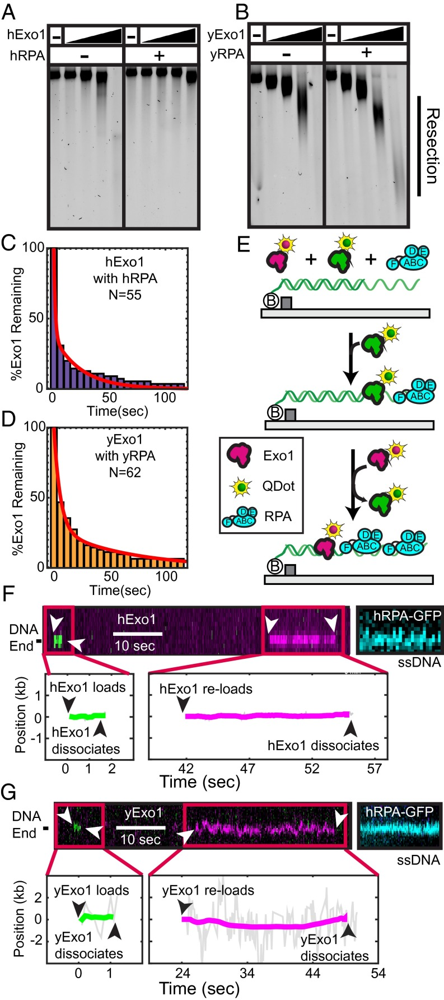
RPA promotes distributive Exo1 activity. (_A_) hExo1 resection in the presence of WT hRPA. Assays were performed with 10 ng of 4.5-kb linear DNA with 4-nt 3′ ssDNA overhangs, 62.5, 125, 250, or 500 pM hExo1, and 100 nM hRPA. Samples were deproteinized, separated on a 1% agarose gel in nondenaturing conditions, and then stained with SYBR green. (_B_) Resection reactions performed as above with 75, 150, 300, or 600 pM yExo1 and 100 nM yRPA. (_C_) Lifetime of hExo1 binding events when both hExo1 and hRPA are continuously injected into the flowcell. (_D_) Lifetime of yExo1 binding events in the presence of yRPA, when both proteins are continuously injected into the flowcell. For both _C_ and _D_ , the data were best described by two characteristic timescales (red, biexponential fit, see accompanying text). (_E_) Schematic of multiple turnover experiments. A 1:1 mixture of magenta- and green-labeled Exo1, as well as 1 nM RPA is continuously flowed over DNA curtains. (_F_) Kymographs (_Upper_) and the corresponding single-molecule trajectories (_Lower_) of several hExo1 and (_G_) yExo1 reloading at the same resection tract. Both magenta and green Exo1 molecules bind at the same site on the DNA molecule. After the resection experiments, hRPA-GFP was injected into the flowcell to stain the resulting ssDNA tracts (blue, _Right_).
To test this model, we designed a single-molecule assay that mimics gel-based ensemble experiments and allows us to visualize multiple Exo1 rebinding events in the presence of RPA. For these experiments, 1 nM QD-labeled Exo1 was premixed with 1 nM RPA and injected for 10 min into a flowcell with preformed DNA curtains. The imaging buffer also contained 1 nM WT RPA. First, we quantified the amount of time that each Exo1 remained associated with the DNA ([Fig. 5 _C_ and _D_](#fig5)). With both human and yeast Exo1, the distribution of dwell times was best described by two characteristic timescales that resulted in a sum of two exponential decays (as determined by an _F_ -test; [_SI Experimental Procedures_](https://pmc.ncbi.nlm.nih.gov/articles/PMC4780606/#si2)). The shorter timescale constituted 63% of the binding events for hExo1 (half-life = 0.9 ± 0.1 s, _n_ = 55, _R_ 2 = 0.98) and 73% of the events for yExo1 (half-life = 3.9 ± 0.2 s, _n_ = 62, _R_ 2 = 0.99). These short dwell times may correspond to Exo1 molecules that are evicted rapidly because RPA is already prebound on ssDNA when Exo1 encounters that DNA site. For both proteins, the longer timescale was similar to the dwell times that we observed when the corresponding RPA was injected in our single-turnover experiments ([Fig. 2 _C_](#fig2) for hExo1 and [Fig. 4 _F_](#fig4) for yExo1). Both binding modes were three times longer for yExo1 with yRPA than the corresponding human proteins. Loading events were also much more frequent, even at lower yExo1 concentrations. When we injected 0.2 nM yExo1, we saw ∼0.5 yExo1 binding events per minute per DNA molecule (_n_ = 21 DNA molecules). In contrast, we injected 2.5-fold more hExo1 (0.5 nM) but only saw ∼0.2 hExo1 binding events per minute per DNA (_n_ = 37 DNA molecules). Together with our single-turnover results (see previous section), these data suggest that yExo1 has higher affinity for DNA than hExo1 but that fewer of the DNA-bound yExo1 molecules are enzymatically active.
Next, we tested whether two different hExo1 molecules can load on the same ss/dsDNA junction in the presence of RPA. For these experiments, two hExo1 fractions were each conjugated with spectrally distinct QDs—the first emitted in the green channel (605-nm peak fluorescence emission) and the second in the magenta channel (705-nm emission). The differentially labeled proteins were mixed in a 1:1 ratio and injected into a flowcell that had 1 nM RPA in the imaging buffer ([Fig. 5 _E_](#fig5)). The resulting kymographs showed transient binding of either magenta or green hExo1 to the DNA, demonstrating that two distinct hExo1 molecules could reload on the same site ([Fig. 5 _F_](#fig5)). We did not see colocalization of the magenta and green enzymes, indicating that multiple hExo1 molecules do not bind concurrently to the same DNA site. To confirm that hExo1 binding resulted in DNA resection, we washed out hExo1 and incubated the DNA molecules with hRPA-GFP ([Fig. 5 _F_](#fig5)). RPA can readily turnover on ssDNA and the hRPA-GFP puncta indicate the nucleolytic conversion of dsDNA into ssDNA ([56](https://pmc.ncbi.nlm.nih.gov/articles/PMC4780606/#r56)). DNA sites that transiently associated with a fluorescent hExo1 were also stained with hRPA-GFP. We also observed similar reloading with yExo1 and yRPA, indicating that this is a shared feature between the human and yeast proteins ([Fig. 5 _G_](#fig5)).
As SOSS1 and hRPA are both rapidly detected at a DSB in human cells, we next tested whether SOSS1 increases the frequency of hExo1 reloading or the duration of hExo1 binding events in the presence of hRPA. With both SSBs present, the hExo1 loading rate was similar to the rate observed in the presence of hRPA alone (∼0.2 hExo1 loading events per minute per DNA molecule, _n_ = 35 DNA molecules). hExo1 dwell times also did not change significantly when 1 nM SOSS1 and 1 nM hRPA were coinjected into the flowcell (dwell times = 1.6 ± 0.1 and 18 s, respectively, _n_ = 58). Thus, SOSS1 does not promote reloading or retention of hExo1 in the presence of hRPA. Our results are also consistent with the inability of SOSS1 to stimulate hExo1 in single-turnover assays ([Fig. 2](#fig2)). Previous single-molecule FRET studies also suggested that SOSS1 binds ssDNA relatively weakly and that it can be replaced by hRPA ([21](https://pmc.ncbi.nlm.nih.gov/articles/PMC4780606/#r21)). Furthermore, SOSS1 appears before hRPA at DNA damage in human cells, suggesting that these two SSBs play distinct roles in regulating DNA resection in vivo. We conclude that hExo1 becomes highly distributive in the presence of hRPA and that SOSS1 does not alleviate hRPA inhibition of hExo1 rebinding to DNA.
##  SI Discussion
Several studies have reported that RPA and _E. coli_ SSB either stimulate ([18](https://pmc.ncbi.nlm.nih.gov/articles/PMC4780606/#r18), [19](https://pmc.ncbi.nlm.nih.gov/articles/PMC4780606/#r19), [31](https://pmc.ncbi.nlm.nih.gov/articles/PMC4780606/#r31)) or inhibit Exo1-catalyzed DNA resection ([5](https://pmc.ncbi.nlm.nih.gov/articles/PMC4780606/#r5), [23](https://pmc.ncbi.nlm.nih.gov/articles/PMC4780606/#r23), [66](https://pmc.ncbi.nlm.nih.gov/articles/PMC4780606/#r66)). Our results clarify how these proteins—both of which strip Exo1 from DNA—may nonetheless appear to stimulate resection. Exo1 binds DNA avidly (dwell-time >2,000 s; [Fig. 1](#fig1)), but only a fraction of the nucleases resect DNA. The low enzyme activity is not evident in bulk resection assays, but can be measured in single-molecule experiments. These inactive Exo1 proteins block access to free DNA ends. RPA and SSB strip both active and inactive Exo1 from DNA ([Fig. 2](#fig2) and [Fig. S7](https://pmc.ncbi.nlm.nih.gov/articles/PMC4780606/#sfig07)), promoting distributive resection that is catalyzed by a small subset of active nucleases. This effect is most apparent with yExo1, where ∼15% of DNA-bound nucleases resect DNA. Notably, Cannavo et al. reported that yeast RPA (yRPA) and SSB both stimulate yExo1, especially at high ratios of free DNA ends to yExo1 (∼0.25–8 nM yExo1 with 16 nM DNA ends in ref. [18](https://pmc.ncbi.nlm.nih.gov/articles/PMC4780606/#r18)). Similarly, hRPA modestly stimulated hExo1, but only when the nuclease was limiting ([19](https://pmc.ncbi.nlm.nih.gov/articles/PMC4780606/#r19)). Our assays demonstrate that inactive Exo1 will block DNA ends for processing by active enzymes. In addition, RPA and SSB may limit Exo1 binding to competitor ssDNA, as proposed by Cannavo et al. Together, these activities may appear to stimulate Exo1 in a gel-based ensemble assay, especially when a significant percentage of the molecules is capable of binding but not resecting free DNA ends.
##  SI Experimental Procedures
### Proteins and DNA.
#### Human Exo1-biotin and Exo1(D78A/D173A)-biotin.
A pFastBac1 (Life Tech.) plasmid containing hExo1 was generously provided by Paul Modrich ([4](https://pmc.ncbi.nlm.nih.gov/articles/PMC4780606/#r4)). Plasmid pIF7, which contains an avidity tag (GLNDIFEAQKIEWHE) at the C terminus, was created by inverse PCR using primers LM006 and LM008 ([74](https://pmc.ncbi.nlm.nih.gov/articles/PMC4780606/#r74)). To create Exo1(D78A/D173A), pIF7 was mutated by two rounds of QuikChange Mutagenesis (Agilent) using oligonucleotides TP2792 and TP2793 for D78A and TP3253 and TP3254 for D173A. Biotinylated Exo1 and Exo1(D78A/D173A) were purified as previously described ([21](https://pmc.ncbi.nlm.nih.gov/articles/PMC4780606/#r21)) with the following modifications: Exo1-bio was expressed in Sf21 insect cells using the Bac-to-Bac (Life Tech.) expression system. Cells were coinfected with Exo1-Avidity tag and BirA (biotin ligase) viruses, and pellets were harvested 72 h after infection. To purify Exo1-biotin, cells were homogenized in buffer A [25 mM Tris⋅HCl, pH 8, 100 mM NaCl, and 10% (vol/vol) glycerol] containing 1 mM PMSF in a Dounce homogenizer (Kimble Chase; Kontes) before three rounds of sonication on ice (30 s each time with a 30-s recovery on ice). Insoluble matter was pelleted for 1 h at 100,000 × _g_ , and the supernatant was added to Q beads in batch. The beads were rotated at 4 °C for 1 h, spun at 1,500 × _g_ for 5 min, and washed 3× with buffer A. Exo1 was eluted from the Q beads by incubating the beads with 15 mL buffer B [25 mM Tris⋅HCl, pH 8, 1 M NaCl, and 10% (vol/vol) glycerol]. The supernatant was removed from the beads via a Poly-Prep Chromatography Column (BioRad) and incubated with SoftLink Soft Release Avidin Resin (Promega) for 1 h. The reversible Avidin resin was packed into a column, rinsed with buffer A on an ÄKTA fast protein liquid chromatography (FPLC), and eluted with 5 mM biotin over the course of 30 min. Exo1-containing fractions were bound to a 1 mL SP Hi-Trap column in buffer A and eluted in 500-µL fractions with buffer B. The most concentrated Exo1-containing fractions were separated by gel filtration using a Superdex-200 column (GE) in buffer A. Biotinylated Exo1 was snap-frozen in 3-µL aliquots and stored at −80 °C. Both WT and Exo1(D78A/D173A) purified with similar homogeneity.
We measured Exo1 biotinylation efficiency as previously described ([72](https://pmc.ncbi.nlm.nih.gov/articles/PMC4780606/#r72)). Briefly, purified Exo1-bio was incubated with a large excess of streptavidin for 10 min on ice, mixed with loading dye, and run on an SDS/PAGE gel. The extraordinarily strong biotin-streptavidin interaction is not denatured by the SDS/PAGE gel conditions. We scored biotinylation efficiency by measuring the percentage of Exo1 proteins that shift up above the Exo1 molecular weight on the gel.
#### Human Exo1-Flag.
A Flag epitope (DYKDDDDK) was inserted at the C terminus of hExo1 by inverse PCR with primers LM4 and LM7 to create pIF8. hExo1-Flag was purified as described above, but with an anti-FLAG M2 resin (Sigma) replacing the reversible Avidin resin. hExo1-Flag was eluted from the anti-FLAG beads by incubating with 100 µg/mL Flag peptide, as suggested by the manufacturer (Sigma). After elution from the Flag beads, hExo1-containing fractions were purified via SP and gel filtration columns, as described for Exo1-biotin (see above).
#### yExo1.
A pFastBac1 (Life Tech.) plasmid containing yeast Exo1 was generously provided by R. Michael Liskay. Plasmid pTP3184, which contains an avidity tag (GLNDIFEAQKIEWHE) at the C terminus, was created by inverse PCR using primers IF190 and IF191. Biotinylated yExo1 was expressed and purified as above; however, instead of separating the most concentrated fractions via a Superdex-200 column, these fractions were pooled, dialyzed overnight in buffer A, aliquoted, snap-frozen, and stored at −80 °C.
#### Human RPA and RPA-GFP.
Plasmids overexpressing human RPA (hRPA) and hRPA-GFP were generously provided by Mauro Modesti and purified essentially as described previously ([44](https://pmc.ncbi.nlm.nih.gov/articles/PMC4780606/#r44)).
#### RPA70 A/B dimer.
For purification, a pET28a plasmid overexpressing the human RPA70 A/B-DNA binding domains (pIF106) was transformed into BL21(DE3) cells ([47](https://pmc.ncbi.nlm.nih.gov/articles/PMC4780606/#r47)). A single colony was inoculated into 50 mL lysogeny broth (LB) with 50 µg/mL kanamycin and incubated overnight at 37 °C with agitation. The next morning, the overnight preculture was diluted 100-fold into 6 L of LB + kanamycin and incubated at 37 °C with agitation until OD at 600 nm reached 0.6. Once this OD was reached, the solutions were cooled to 16 °C on ice in a cold room. Protein expression was induced with 1 mM isopropyl β-D-1-thiogalactopyranoside (IPTG) and the culture was incubated at 16 °C with agitation for 16–18 h. Cells were harvested by centrifuging for 15 min at 5,000 × _g_. The supernatant was discarded, and the cell pellet was resuspended in 40 mL PBS (137 mM NaCl, 2.7 mM KCl, 4.3 mM Na2HPO4, 1.47 mM KH2PO4, pH 7.4, 1 mM PMSF + 1 tablet of cOmplete-EDTA-free protease inhibitor; Roche). The cells were flash-frozen in liquid nitrogen and stored at −80 °C until needed.
The frozen cell paste corresponding to 3 L starter culture was thawed in lukewarm water and immediately placed on ice. All subsequent steps were performed at 4 °C. One volume of 2× lysis buffer [1 M NaCl, 60 mM Hepes, pH 7.8, 2 mM DTT, 40 mM imidazole, pH 8, 20% (vol/vol) glycerol, 2 mM PMSF, and 0.02% (vol/vol) Nonidet P-40 substitute] was added to the cells and resuspended by mixing with a pipette. The lysate was sonicated on ice for a total of 90 s (Fisher Scientific 705 Sonic Dismembrator at 75% amplitude; 15-s bursts with 90-s rests in between). The lysate was then centrifuged at 100,000 × _g_ for 35 min at 4 °C (Ti-45 rotor in Optima XE ultracentrifuge; Beckman-Coulter). A 5-mL HisTrap FF column was pre-equilibrated with 1× lysis buffer using the ÄKTA FPLC (GE Healthcare). The clarified lysate was loaded, and the column was washed with 50 mL 1× lysis buffer. Protein was eluted with a gradient to 100% (vol/vol) elution buffer [500 M NaCl, 30 mM Hepes, pH 7.8, 1 mM DTT, 500 mM imidazole, pH 8, 10% (vol/vol) glycerol, 1 mM PMSF, and 0.01% (vol/vol) Nonidet P-40 substitute] over eight column volumes.
RPA70 A/B-containing fractions were loaded on a Sephacryl S-300 HR (GE Healthcare) column pre-equilibrated with buffer R [50 mM KCl, 20 mM Tris⋅HCl, pH 7.5, 1 mM DTT, 0.5 mM EDTA, and 10% (vol/vol) glycerol]. Next, protein-containing fractions were loaded onto a 1-mL Hitrap Q HP column pre-equilibrated with buffer R, washed with 15 mL buffer R, and then eluted with a gradient to 100% (vol/vol) buffer RE [500 mM KCl, 20 mM Tris⋅HCl, pH 7.5, 1 mM DTT, 0.5 mM EDTA, and 10% (vol/vol) glycerol] over 10 column volumes. Fractions were analyzed on a 10–12% SDS/PAGE gel. The purest RPA70 A/B fractions were pooled and dialyzed against 2 L storage buffer [10 mM Tris⋅HCl, pH 7.6, 100 mM KCl, 1 mM DTT, 0.1 mM EDTA, and 50% (vol/vol) glycerol] overnight at 4 °C before being aliquotted and flash-frozen in liquid nitrogen for storage at −80 °C.
All other truncation mutants of RPA were purified as described by Wyka et al. ([47](https://pmc.ncbi.nlm.nih.gov/articles/PMC4780606/#r47)).
#### Yeast RPA.
An overexpression plasmid containing all three subunits of yRPA was modified by introducing an intein-chitin binding domain (CBD) to the C terminus of the Rfa2 subunit of RPA (pIF65). Plasmid pIF65 was transformed into Rosetta/pLysS cells (Novagen), and a single colony was inoculated into 50 mL of LB with 50 µg/mL carbenicillin and 34 µg/mL chloramphenicol and incubated overnight at 37 °C with agitation. The next morning, the overnight preculture was diluted 100-fold into 6 L of LB + carbenicillin + chloramphenicol and incubated at 37 °C with agitation until OD at 600 nm reached 0.6. The solutions were cooled to 16 °C, and protein expression was induced with 1 mM IPTG at 16 °C for 16–18 h. Cells were harvested by centrifuging for 15 min at 5,000 × _g_. The supernatant was discarded, and the cell pellet was resuspended in 40 mL PBS (137 mM NaCl, 2.7 mM KCl, 4.3 mM Na2HPO4, and 1.47 mM KH2PO4, pH 7.4) with 1 mM PMSF. Cell pellets were flash-frozen in liquid nitrogen and stored at −80 °C until needed.
The frozen cell paste corresponding to 3 L starter culture was thawed in lukewarm water and immediately placed on ice. All subsequent steps were performed at 4 °C. One volume of 2× lysis buffer [500 M NaCl, 40 mM Tris⋅HCl, pH 7.5, 10 mM imidazole, pH 8, 20% (vol/vol) glycerol, and 1 mM PMSF] was added to the cells and resuspended by mixing with a pipette. The lysate was sonicated on ice for a total of 90 s (Fisher Scientific 705 Sonic Dismembrator at 75% amplitude; 15-s bursts with 90-s rests in between). The lysate was then centrifuged at 100,000 × _g_ for 35 min at 4 °C (Ti-45 rotor in Optima XE ultracentrifuge; Beckman-Coulter). A 5-mL HisTrap FF column was pre-equilibrated with 1× lysis buffer using the ÄKTA FPLC (GE Healthcare). The clarified lysate was injected using a 50 mL SuperLoop (GE), and the column was washed with 50 mL 1× lysis buffer. Protein was eluted with a gradient to 100% (vol/vol) elution buffer [250 mM NaCl, 20 mM Tris⋅HCl, pH 7.5, 500 mM imidazole, pH 8, and 10% (vol/vol) glycerol] over eight column volumes. RPA-containing fractions were loaded on a 5-mL Chitin (New England BioLabs) column pre-equilibrated with buffer A (250 mM KCl, 20 mM Tris⋅HCl, pH 7.5, and 1 mM EDTA) and washed with 300 mL buffer A. To cleave the protein from the resin, the column was flushed with 60 mL elution buffer (buffer A+ 50 mM DTT) and left with no flow at 4 °C overnight. The next day the protein was eluted, and the RPA-containing fractions were diluted fivefold in buffer RA [20 mM Tris⋅HCl, pH 7.5, 0.5 mM EDTA, and 10% (vol/vol) glycerol]. The sample was loaded onto a 1 mL Hitrap Q HP column pre-equilibrated with buffer R, washed with 15 mL buffer R, and then eluted with a gradient to 100% (vol/vol) buffer RE [500 mM KCl, 20 mM Tris⋅HCl, pH 7.5, 1 mM DTT, 0.5 mM EDTA, and 10% (vol/vol) glycerol] over 10 column volumes. Fractions were analyzed on a 10–12% SDS/PAGE gel. The purest RPA fractions were pooled and dialyzed against 2 L storage buffer [10 mM Tris⋅HCl, pH 7.6, 100 mM KCl, 1 mM DTT, 0.1 mM EDTA, and 50% (vol/vol) glycerol] overnight at 4 °C before being aliquoted and flash-frozen in liquid nitrogen for storage at −80 °C.
#### T4 gp32.
Plasmid pIF89 was generated by PCR amplifying the gene encoding gp32 from phage DNA using oligos IF025 and IF026. The PCR amplicon was digested with NdeI and SpeI, and ligated into a homemade pET-derived vector that contains a C-terminal intein-CBD. Plasmid pIF89 was transformed into BL21-ArcticExpress cells (Agilent), and a single colony was used to start a 100 mL overnight preculture. The overnight preculture was diluted 100-fold into 6 L LB + carbenicillin and incubated at 30 °C with agitation until OD600∼0.6. The cells were cooled to 12 °C, and protein expression was induced with 0.4 mM IPTG at 12 °C for 16–20 h. Cells were harvested by centrifuging for 10 min at 5,000 × _g_ and 4 °C, and the cell pellet was resuspended in 35 mL resuspension buffer [50 mM Tris⋅HCl, pH 7.5, 500 mM NaCl, 1 mM ETDA, and 10% (vol/vol) sucrose] with 1 mM PMSF. Cell pellets were flash-frozen in liquid nitrogen and stored at −80 °C until needed.
The frozen cell pellet corresponding to 3 L culture was thawed in cold water and immediately placed on ice. The sample was sonicated on ice for a total of 90 s (Fisher Scientific 705 Sonic Dismembrator at 75% amplitude; 15-s bursts with 90-s rests in between). The lysate was then centrifuged at 100,000 × _g_ for 35 min at 4 °C (Ti-45 rotor in Optima XE ultracentrifuge; Beckman-Coulter). The clarified lysate was loaded on a 10-mL Chitin (New England BioLabs) column pre-equilibrated with buffer C (50 mM Tris⋅HCl, pH 7.5, 500 mM NaCl, and 1 mM EDTA) and washed with 1 L buffer D (50 mM Tris⋅HCl, pH 7.5, 1 M NaCl, and 1 mM EDTA). To cleave the protein from the resin, the column was flushed with 30 mL elution buffer (buffer D + 50 mM DTT) and left in elution buffer at 4 °C overnight. The next day, gp32 fractions were pooled and concentrated to a concentration of ∼90 µM using a 10K Amicon concentrator (Millipore). The protein was then dialyzed against 4 L storage buffer [20 mM Tris⋅HCl, pH 7.5, 150 mM NaCl, and 10% (vol/vol) glycerol] overnight at 4 °C before being aliquoted and flash-frozen in liquid nitrogen for storage at −80 °C.
#### SSB.
SSB was amplified from genomic DNA and cloned into a pET-derived vector that contains a C-terminal intein-CBD. Plasmid pIF122 was transformed into BL21(DE3) cells. A starter culture from a single colony was used to inoculate 6 L LB + carbenicillin and grown to an OD600∼0.6 at 37 °C. On reaching an optical density of 0.6, the culture was induced with IPTG to 0.5 mM and grown overnight at 16 °C. Cells were harvested by centrifugation, resuspended in resuspension buffer, and lysed by sonication. The clarified lysate was applied to a 10-mL Chitin gravity column, washed, and cleaved as for gp32. The protein was then dialyzed into storage buffer [50 mM Tris⋅HCl, pH 7.4, 300 mM NaCl, and 50% (vol/vol) glycerol] and stored at −20 °C. The concentration was determined by comparing the concentration to a set of known BSA standards.
#### SOSS1.
SOSS1 was purified according to previously published protocols ([21](https://pmc.ncbi.nlm.nih.gov/articles/PMC4780606/#r21)). Briefly, the SOSS1 (hSSB1 T117E) complex was expressed in Sf21 insect cells, harvested, and lysed similarly to Exo1-Bio. Next, the lysate was purified via Nickel-NTA resin, a Hi-Trap GST column, and a Hi-Trap SP column. The most concentrated fractions were loaded on a Superdex 200 gel filtration column, and fractions from this containing SOSS1 were combined, aliquoted, and frozen at −80 °C.
### Fluorescent Protein Labeling.
#### Conjugation of hExo1/yExo1 to streptavidin QDs.
Exo1-bio (80 nM) and streptavidin QDs (100 nM) were incubated in 10 µL imaging buffer (40 mM Tris⋅HCl, pH 8, 60 mM NaCl, 0.2 mg/mL BSA, 2 mM DTT, and 1 mM MgCl2) for 10 min on ice. Saturating biotin was added to bind free streptavidin, and the mixture was diluted to 200 µL (4 nM Exo1, 5 nM QD). The Exo1-QD mixture was injected into the flowcells via a 100-µL injection loop (at a flow rate of 200 µL/min), and the flowcell was flushed thoroughly at a flow rate of 400 µL/min to remove all Exo1 molecules that did not associate with the DNA curtains.
#### Conjugation of Exo1 to anti-biotin antibodies.
Exo1-bio (80nM) and anti-biotin CF488A antibody (1.2 µM; Biotium) were incubated in 10 µL imaging buffer as above for 10 min on ice. Saturating biotin was added to bind free antibody and the mixture was diluted to 200 µL (4 nM Exo1, 60 nM anti-biotin CF488). This mixture was injected as above.
#### SOSS1.
SOSS1 (200 nM) was incubated with Alexa488-anti GST antibodies (200 nM; Cell Signaling) before being diluted to 1 nM. For short injections, 1 or 10 nM SOSS1 (as indicated) was injected through a 5-mL loop. For longer time points, 30 mL 1 nM SOSS1 was loaded into a syringe and injected continuously for 1 h.
#### Gel-based resection assays with streptavidin-conjugated hExo1-bio.
Resection assays were conducted as described previously ([21](https://pmc.ncbi.nlm.nih.gov/articles/PMC4780606/#r21)). Briefly, WT hExo1 (500 pM), hExo1-bio (500 pM), or hExo1-bio (500 pM) + streptavidin (1 µg) was incubated in imaging buffer with 30 ng linearized 4.4-kb DNA (4-nt 3′ overhang created with SphI-HF; NEB) for 30 min at 37 °C. The reactions were deproteinized with 2 µg Proteinase K for 20 min at 37 °C, and the resection products were run on a 1% agarose gel overnight at 25 V. The gels were stained with SYBR green and analyzed on a Typhoon FLA 9500 laser scanner (GE Healthcare).
#### Gel-based resection assays with Exo1 and RPA.
Resection assays were conducted as above, but with a few modifications. hExo1-bio or yExo1-bio at indicated concentrations were incubated in imaging buffer with 10 ng PstI-HF (4-nt 3′ overhang; NEB) linearized 6.3-kb DNA in the presence or absence of hRPA or yRPA as indicated for 1 h at 37 °C or 30 °C. The reactions were deproteinized with 2 µg Proteinase K (NEB), run on a gel, stained, and analyzed as above.
#### DNA substrates for single-molecule experiments.
DNA substrates were prepared by annealing oligos IF7 and LM003 to purified lambda DNA (New England Biolabs) ([28](https://pmc.ncbi.nlm.nih.gov/articles/PMC4780606/#r28)). Briefly, ∼15 nM λ-phage DNA was heated to 65 °C, combined with ∼10 µM IF7 and LM003, and allowed to slowly cool to room temperature. After cooling, the reaction was supplemented with ATP to 1 mM, T4 DNA ligase (2,000 units; New England Biolabs) and incubated overnight at room temperature. To avoid adding nicks, the ligase was salt inactivated by supplementing the reaction with 100 µL 5 M NaCl to (final concentration: 1 M NaCl). To remove excess proteins and oligonucleotides, the reaction was passed over an S-1000 gel filtration column (GE), and the ligated DNA was stored at 4 °C. To reverse the DNA orientation, the same protocol was followed with oligos IF6 and LM024.
### Single-Molecule Methods.
#### Microscope slide nanofabrication.
To deposit diffusion barriers for DNA curtains, we developed a custom wafer-based nanofabrication process. Chrome diffusion barriers were made on 1.58-mm-thick, 101.6-mm-diameter ground and polished GE124 quartz discs (Technical Glass Products). To fit the glass into a wafer-processing holder, a flat was made by grinding 2 mm into the glass. Glass wafers were immersed in Piranha solution [3:1 sulfuric acid, 96%/hydrogen peroxide 30% (vol/vol)] for 8 min and spun-dried in a nitrogen flow at 2,000 rpm for 10 min (Spin Rinse Dryer Verteq, SRD, A182-39MLB 4713-7E). The wafers were spin coated in a Headway Spinner (PWM32) in two time steps for each layer (300 rpm for 10 s followed by 4,000 rpm for 60 s with 350-rpm/s ramp). A first layer of polymethylmethacrylate (PMMA), molecular weight 495K plus 1.5% (wt/vol) in anisole (MicroChem), was followed by a layer of Aquasave conducting polymer (Mitsubishi Rayon). The double coated wafer was set at 150 °C on a hotplate for 1 min. Electron beam lithography was performed in a Jeol 6000 FSE aligner. After writing the nanopattern, the Aquasave layer was rinsed off with deionized water and dried in N2 flow. The PMMA layer was developed by rinsing the wafer in a 3:1 solution of isopropanol to methyl isobutyl ketone (MIBK; MicroChem) for 1 min. The wafer was rinsed in isopropanol and dried in N2 flow. Electron beam evaporation (Cooke E-beam/sputter deposition system) was used to deposit a 13-nm layer of chromium (99.998% purity, Kurt J. Lesker) on the wafer. To lift off the PMMA, the chromium-coated wafer was sonicated in acetone for 30–60 min, rinsed in ethanol, and dried in N2 flow. The wafers were covered with a clean-room rated silicon wafer tape (ICROS) and diced into six flowcell-sized (50 × 22 mm) substrates (using a Disco 321 dicing saw).
#### Flow cell preparation.
We followed previously described protocols for assembling DNA curtains ([28](https://pmc.ncbi.nlm.nih.gov/articles/PMC4780606/#r28)). Briefly, nano-fabricated flowcells were pre-equilibrated in buffer L (10 mM Tris⋅HCl, pH 7.8, and 100 mM NaCl) and covered with a ternary lipid bilayer composed of a mixture of DOPC (97.7 mol%), DOPE-biotin (0.3 mol%), and DOPE-mPEG2K (2 mol%; Avanti Lipids). Flowcells were next incubated in imaging buffer (40 mM Tris⋅HCl, pH 8, 2 mM DTT, 1 mM MgCl2, 0.2 mg/mL BSA; fraction VI, Sigma-Aldrich) for 10 min. Next, streptavidin (Life Technologies; 0.1 mg/mL in imaging buffer) was injected into the flowcell. Finally, biotinylated λ-DNA was injected into the flowcell, and the flowcell was mounted on a custom-machined microscope stage for immediate fluorescent observation.
### Single-Molecule Microscopy.
Images were collected with a Nikon Ti-E microscope in a prism-TIRF configuration. The inverted microscope setup allowed for the sample to be illuminated by a 488-nm laser light (Coherent) through a quartz prism. To minimize spatial drift, the experiment was conducted on a floating TMC optical table. A 60× water immersion objective lens (1.2 NA; Nikon), two EMCCD cameras (Andor iXon DU897, −80 °C), and the Nis Elements software (Nikon) were used to collect the data at 1 Hz with a 100- or 200-ms exposure time. A computer-controlled shutter (700-µs opening time; Vincent Associates) was used to take 3,600 frames in 1 h. Frames were saved as TIFF files without compression, and further image analysis was done in ImageJ (National Institutes of Health). Fluorescent labels were tracked in ImageJ with a custom-written particle tracking script. The resulting trajectories were analyzed in Matlab (Mathworks). For each frame, the fluorescent particle was fit to a 2D Gaussian function to obtain trajectories with subpixel resolution. To correct for sample drifting on the XY-stage plane, a QD fixed to the slide surface was tracked as a reference, and such trajectories were subtracted from the molecule trajectories. To ensure that the trajectories corresponded to Exo1 on DNA, at the beginning of each experiment, the flow was stopped to see the characteristic recoiling motion of DNA-bound proteins. Only DNA-bound QDs were counted for statistical analysis. For individual Exo1 molecules, the velocity was determined by fitting the time-dependent motion along the DNA to a line. Some Exo1 molecules did not initiate translocation immediately on binding the DNA. Segments in the trajectory that corresponded to such paused Exo1 were not taken into account for calculating the molecules’ velocities but were counted in the DNA-binding lifetimes. To determine Exo1 DNA-binding lifetimes, we measured the total amount of time that each Exo1 molecule was bound to DNA. Exo1 lifetime data were fit to single-exponential decays of the form  
---  
where _y_ is the number of DNA-bound Exo1 molecules at time _t,_ _A_ is the normalized amplitude, and _B_ corresponds to a constant offset.
For multiple turnover experiments, we found that the Exo1 survival probabilities had a biexponential distribution, and the resulting data were fit to  
---  
where _A_ are the lifetime and amplitude of the first component, and _B_ are the lifetime and amplitude of the second component, respectively. Automated fitting was done via a custom Matlab script (available on request). The quality of the fit, as determined by the coefficient of determination (_R_ 2), is summarized in [Table S1](https://pmc.ncbi.nlm.nih.gov/articles/PMC4780606/#st01).
To verify that a biexponential fit was statistically appropriate, an _F_ -test was applied to the multiple turnover data in [Fig. 5 _C_ and _D_](#fig5) ([75](https://pmc.ncbi.nlm.nih.gov/articles/PMC4780606/#r75)). The significance of the fit between the single exponential model (model 1) and the double exponential model (model 2) was calculated by comparing the ratio _F_(1,2)  
---  
where _df_ 1 and _df_ 2 are the degrees of freedom for models 1 and 2. The residuals sums of squares _SSQ1_ (single exponential) and _SSQ2_ (double exponential) were calculated from the _n_ data points for each model. The _F_ -distribution was set at the 95% CI. As the data approach zero, we did not consider a constant term in either model 1 or model 2. Thus, the significance probability was determined from the _F_ probability distribution with two degrees of freedom (_df1_) for the single exponential and four degrees of freedom (_df2_) for the double exponential fit. Our data consisted of _n_ = 55 data points for hExo1 and _n_ = 62 for yExo1. The resulting ratio, _F_(1,2), was 362 for hExo1 ([Fig. 5 _C_](#fig5)) and 1,000 for yExo1 ([Fig. 5 _D_](#fig5)). To test the null hypothesis with 95% confidence, the _F_ probability, _F_ _NULL_ , was calculated with Matlab function finv(). _F_ _NULL_ was 3 for both hExo1 and yExo1. Because _F_(1,2) >> _F_ _NULL_ , the null hypothesis is not true, and the biexponential model fits the data more accurately than the single exponential model with at least 95% confidence.
In the absence of SSBs, Exo1 remained associated with the DNA for over an hour, and we are only able to report a lower bound on the lifetimes. For single-turnover reactions in the presence of SSBs, _t_ = 0 was defined as the time when 90% of the maximum SSB concentration (as measured by GFP-RPA fluorescence signal) had entered the flowcell. For multiple turnover experiments, Exo1 was continuously coinjected with 1 nM RPA, and the lifetimes were measured from transient binding events on individual DNA molecules.
#### Observing Exo1-biotin on DNA curtains.
All single-molecule experiments were carried out in imaging buffer containing 40 mM Tris⋅HCl, pH 8, 60 mM NaCl, 1 mM MgCl2, 2 mM DTT, and 0.2 mg/mL BSA. For [Fig. S2](https://pmc.ncbi.nlm.nih.gov/articles/PMC4780606/#sfig02), 1 mM MgCl2 was replaced with 1 mM EDTA. For single turnover assays, biotinylated Exo1 was incubated with a 1.5× molar excess of streptavidin QDs on ice for 10 min (emitting at 705 or 605 nm; Life Tech.). After incubation, the reaction was quenched with imaging buffer containing biotin, diluted to 4 nM for hExo1 or 1 nM for yExo1, and injected into the flowcell at a linear flow rate of 200 µL/s. After Exo1 bound the DNA, flow was increased to 400 µL/min. Constant flow was maintained with a continuous-drive syringe pump (Legato 210; KD Scientific). For multiple turnover experiments, two separate reactions were set up with biotinylated Exo1 and 1.5× molar excess of streptavidin QDs emitting at either 705 or 605 nm on ice for 10 min. These two reactions were quenched with imaging buffer containing biotin, mixed, and diluted to 500 pM for hExo1 or 200 pM for yExo1. The QD-Exo1 reaction was supplemented with 1 nM RPA and injected into the flowcell continuously for 10 min at 400 µL/min. All experiments with hExo1 were conducted at 37 °C, and the corresponding experiments with yExo1 were conducted at 30 °C. Constant temperature was maintained via an objective heater (Bioptechs) and a custom-built microscope stage heater.
#### Observing hExo1-Flag on DNA curtains.
A modified labeling scheme was used to ensure a single fluorophore per hExo1-Flag enzyme. First, 4 nM hExo1-Flag was injected into preassembled DNA curtains at a flow rate of 200 µL/s. After excess hExo1-Flag was flushed out of the flowcell, 700 µL 1 nM QD-conjugated anti-FLAG M2 antibodies (Sigma) was injected at a flow rate of 400 µL/min. This strategy guarantees that each DNA-bound hExo1-Flag is labeled with, at most, one fluorophore. Imaging and data analysis were identical to that of hExo1-biotin.
### Tissue Culture.
#### Cell culture conditions and treatments.
U2OS cells were maintained in DMEM (Invitrogen) supplemented with 10% FBS, 2 mM l-glutamine, 100 U/mL penicillin, and 100 μg/mL streptomycin. Transfections for siRNA were carried out with lipofectamine RNAiMax (Invitrogen) following the manufacturer’s instructions. The siRNA used in this study are as follows: TP3802 for siControl, TP4115 for siRPA2, and TP4206 for Dna2 ([Table S2](https://pmc.ncbi.nlm.nih.gov/articles/PMC4780606/#st02)). A mammalian expression vector containing Exo1-GFP was cloned by Gateway mutagenesis from a DNASU donor vector (HsCD00076255) into a destination vector containing a C-terminal GFP (Vivid Colors pcDNA6.2/C-EmGFP-DEST; Life Tech.). This vector (Exo1-GFP) was transfected by Fugene HD (Promega) according to the manufacturer’s instructions. EdU (5-ethynyl-2′-deoxyuridine) incorporation was used to detect active DNA synthesis. After indicated siRNA treatments, 10 μM EdU was added into the medium for 30 min. EdU was detected by using the Click-iT EdU imaging kit (Invitrogen; [C10340](https://www.ncbi.nlm.nih.gov/nuccore/C10340)).
##### Table S2.
Oligonucleotides used in this study
Name | Sequence  
---|---  
LM3 | [p]`GGG CGG CGA CCT TTTTTTTTTTTTTTTTTTTTTTTTTTTTTTTTTTTTTTTTTTTTTTTTTTTTTTTTTTTTTTTTTTTTTTTTTTTTTT`  
LM4 | [p]`TTA CTT GTC ATC GTC ATC CTT GTA ATC CTG GAA TAT TGC TCT TTG AAC ACG G`  
LM7 | `CAT ATG CAG ACT GCT GCA AAG C`  
LM6 | [p]`CTG AGC CTC GAA GAT GTC GTT CAG GCC CTG GAA TAT TGC TCT TTG AAC ACG`  
LM8 | `AAA ATC GAA TGG CAC GAA TAA CAT ATG CAG ACT GCT GCA AAG`  
LM24 | [p]`AGG TCG CCG CCC TTTTTTTTTTTTTTTTTTTTTTTTTTTTTTTTTTTTTTTTTTTTTTTTTTTTTTTTTTTTTTTTTTTTTTTTTTTTTT`  
NG1 | [p]`GG GCG GCG ACC TTT TTT TTT TTT TTT TTT TTT TTT TTT TTT TTT TTT TTT TTT TTT TTT T`[Dig]  
TP2792 | `GGGATCAAGCCTATTCTCGTATTTGCTGGATGTACTTTACC`  
TP2793 | `GGTAAAGTACATCCAGCAAATACGAGAATAGGCTTGATCCC`  
TP3253 | `ATAATTACAGAGGACTCGgctCTCCTAGCTTTTGGCTGTAAAAAG`  
TP3254 | `CTTTTTACAGCCAAAAGCTAGGAGagcCGAGTCCTCTGTAATTAT`  
TP3802 |  `AAUUCUCCGAACGUGUCACGUdTdT` (includes complement)  
TP3955 | `ATCGGGCCAATCTCAGAGG`  
TP3956 | `GCGACGCTAACGTTAAAGCA`  
TP4002 | `TGTCCTGTTCTTTTGTAGCGCA`  
TP4003 | `AAGCAAAAGCCTGAGGCTTAG`  
TP4028 | `CCGCCAGAAAGTTTCCTAGA`  
TP4029 | `CTCACCCTTGCAGCACTTG`  
TP4030 | `GGGTATGGAGCTGCCTCTAA`  
TP4031 | `GACAAAGATGGCTGGAGGAG`  
TP4115 |  `ACCUAGUUUCACAAUCUGdTdT` (includes complement)  
TP4206 |  `GGAAUGGAUAACCGGUACCdTdT` (includes complement)  
IF6 | [p]`GGG CGG CGA CCT`[Bio]  
IF7 | [p]`AGG TCG CCG CCC`[Bio]  
IF8 | [p]`AGG TCG CCG CCC`[Dig]  
IF9 | [p]`GGG CGG CGA CCT`[Dig]  
IF25 | `Aatcgcatatgtttaaacgtaaatctactgctgaa`  
IF26 | `AGGGCAACTAGTGCATCTCCCGTGATGCAGTAAAGGTCATTCAAAAGGTCATCCA`  
IF190 | `AGCGCAGAAAATTGAATGGCATGAATAACTCGAGGCATGCGGT`  
IF191 | `TCAAAAATATCGTTCAGGCCAAGCTTTTTACCTTTATAAACAAATTGAGAAAGCAAG`  
[Open in a new tab](https://pmc.ncbi.nlm.nih.gov/articles/PMC4780606/table/st02/)
Bio, biotinylated; Dig, digoxigeninylated; p, phosphorylated.
U2OS-ER-AsiSI (EV28) cells were cultured as previously described ([12](https://pmc.ncbi.nlm.nih.gov/articles/PMC4780606/#r12)). A mammalian expression vector containing Exo1-V5 was cloned by Gateway mutagenesis from a DNASU donor vector (HsCD00076255) into a destination vector containing a C-terminal V5 tag (pLX304; Addgene). Transfer of the plasmid into the EV28 cells was done by lentiviral infection, and a clonal population was selected for by stable integration of the vector with blasticidin.
#### Protein extracts and Western blotting.
For whole cell extracts, cells were collected with Laemmli buffer [4% (vol/vol) SDS, 20% (vol/vol) glycerol, and 120 mM Tris⋅HCl, pH 6.8] and sonicated in a Diagenode Bioruptor 300 for 10 min followed by boiling for 5 min at 95 °C before loading. Samples were resolved by SDS/PAGE and analyzed by standard Western blotting. Primary antibodies used for this study are anti-RPA32/RPA2 (Abcam; AB2175) and anti–β-tubulin (Abcam; ab6046). Blots were analyzed by standard chemiluminescence (GE Healthcare; Amersham ECL Prime system) using a Bio-Rad molecular imager ChemiDoc XRS+ system.
#### Laser microirradiation.
Laser microirradiation was carried out with a FluoView 1000 confocal microscope (Olympus) as previously described ([76](https://pmc.ncbi.nlm.nih.gov/articles/PMC4780606/#r76)). Briefly, U2OS cells were grown on glass-bottomed dishes (Willco Wells). After 24-h siRNA treatment, cells were transfected with the Exo1-GFP vector. Culture medium was replaced with normal medium containing 10 μM BrdU 8 h after transfection and incubated for 24 h. A 405-nm solid-state laser from the confocal microscope was used to generate BrdU-dependent DNA damage along the laser path. Following laser damage, cells were analyzed by live confocal fluorescent microscopy or immunofluorescence analysis as indicated.
#### Live-cell microscopy analysis.
Experiments for live-cell microscopy were performed in a heated environmental chamber with 5% CO2 on a Fluoview 1000 confocal microscope (Olympus) as previously described ([77](https://pmc.ncbi.nlm.nih.gov/articles/PMC4780606/#r77)). For quantification of GFP-Exo1 recruitment after laser microirradiation, the average fluorescence intensity at the damage site and an undamaged control region from the same cell were directly recorded using the FV10-ASW3.1 software. Variation of the fluorescence intensity was quantified as the difference between the average fluorescence intensity in the damaged region vs. in the undamaged region from the same cell. Each curve corresponds to data obtained from >20 analyzed cells from two independent experiments.
#### Immunofluorescence.
After indicated treatments, cells were treated and processed for immunofluorescence (IF) as previously described ([78](https://pmc.ncbi.nlm.nih.gov/articles/PMC4780606/#r78)). Briefly, cells were fixed with 2% (vol/vol) formalin for 15 min at room temperature, permeabilized with 0.5% (vol/vol) Triton-X for 10 min, and then blocked with PBS containing 3% (wt/vol) BSA. After blocking, cells were incubated with the primary antibody for 1 h at room temperature, followed by secondary antibody incubation for 1 h at room temperature. The primary antibody used for IF was anti–phospho-histone H2A.X (Ser139) (Millipore; 04-263), and the secondary antibody was Alexa Fluor 594 goat anti-mouse IgG. For both the IF and EdU detection analyses, cells were imaged and analyzed with Z-stacked setting using the FV10-ASW3.1 software on a Fluoview 1000 confocal microscope (Olympus). For quantification of EdU experiment, >200 cells for each treatment were counted. Percentages of the EdU-positive cells were plotted from data obtained from two independent experiments.
#### ChIP.
After indicated cell treatments, proteins were cross-linked to DNA by adding formaldehyde drop-wise directly to the media for a final concentration of 1% (vol/vol) and rotating gently at room temperature for 15 min. Next, glycine was added to a final concentration of 125 mM, and the cells were incubated for 5 min at room temperature. Cells were rinsed in PBS, harvested, and pelleted for 30 min at 1,000 × _g_. For lysis, the pellet was resuspended in 2 mL RIPA buffer [50 mM Tris⋅HCl, pH 8, 150 mM NaCl, 2 mM EDTA, pH 8, 1% (vol/vol) Nonidet P-40, 0.5% sodium deoxycholate, 0.1% SDS, and protease inhibitors (miniComplete, Roche)]. Next, the lysate was sonicated in a Bioruptor for 15–30 min at high power with a 10 s on/10 s off cycle. The lysate was cleared for 30 s, 4 °C, and 18,928 × _g_ , and the supernatant was transfered to new tube; 1 μL RNase A (0.5 mg/mL) was added to the input and incubated with shaking for 4 h at 65 °C. The chromatin was purified with one column of the Qiagen PCR purification kit and eluted with 50 µL water (heated at 50 °C and left for 30 min on column before spinning). DNA concentration was determined, and the quality of the shearing was analyzed by running 1 µg on a 1.5% agarose gel. The chromatin was diluted to 10 µg/mL with RIPA buffer, and the appropriate primary antibody was added as indicated and incubated overnight with rotation at 4 °C; 25 μL magnetic IgG+IgA Dynabeads (12.5 μL of each) was added to all samples and immunoprecipitated 2 h with rotation at room temperature. The beads were washed once successively with 1 mL of each of the following buffers and incubating for 5 min at room temperature, followed by pelleting the Dynabeads: TSE-150 [1% (vol/vol) Triton X-100, 0.1% SDS, 2 mM EDTA, 20 mM Tris⋅HCl, pH 8, and 150 mM NaCl], TSE-500 [1% (vol/vol) Triton X-100, 0.1% SDS, 2 mM EDTA, 20 mM Tris⋅HCl, pH 8, and 500 mM NaCl], LiCl/detergent buffer [0.25 M LiCl, 1% (vol/vol) Nonidet P-40, 1% (wt/vol) 2,5-dimethoxy-4-chloroamphetamine, 1 mM EDTA, and 10 mM Tris⋅HCl, pH 8], and TE (10 mM Tris⋅HCl, pH 8, and 0.1 mM EDTA). The beads were again pelleted, and the supernatant was removed. DNA was eluted by adding 125 μL elution buffer [1% (wt/vol) SDS and 0.1 M sodium bicarbonate] to the protein A/G beads and shaking for 30 min at 30 °C. The supernatant was moved to a new tube and shaken overnight at 65 °C. DNA was purified with one column of the Qiagen PCR purification kit and eluted with 50 µL water.
#### In vivo resection assay and qPCR.
The in vivo resection assay was performed as previously described ([12](https://pmc.ncbi.nlm.nih.gov/articles/PMC4780606/#r12)). The AsiSI sites used for resection have been previously characterized (DSB1, Chr 1: 89231183; DSB2, Chr 1: 109838221). qPCR of DNA near genomic AsiSI sites was also done as described previously ([12](https://pmc.ncbi.nlm.nih.gov/articles/PMC4780606/#r12)). Sites used for ChIP-qPCR in this study have been previously studied ([79](https://pmc.ncbi.nlm.nih.gov/articles/PMC4780606/#r79)). DSB1 (DSB-2 cited) is located on chromosome 21 at AsiSI position 32167382. For 80 bp away from the break, primers TP3955 and TP3956 were used. For 800 bp away from the break, primers TP4002 and TP4003 were used. Similarly, DSB2 (DSB-II cited) is located on chromosome 22 at AsiSI position 37194040. For 80 bp away from the break, primers TP4028 and TP4029 were used. For 800 bp away from the break, primers TP4030 and TP4031 were used.
---
##  Discussion
Here, we report that human and yeast Exo1 are processive nucleases, and individual Exo1 molecules can resect more than 5 kb of DNA during a single binding event ([Figs. 1](#fig1) and [4](https://pmc.ncbi.nlm.nih.gov/articles/PMC4780606/#fig04)). In the absence of SSBs, Exo1 can remain on the DNA for tens of minutes ([Figs. 1 _H_ – _J_](#fig1) and [4 _E_](https://pmc.ncbi.nlm.nih.gov/articles/PMC4780606/#fig04)). However, RPA inhibits Exo1 resection by physically removing the nuclease from DNA ([Figs. 2](#fig2) and [4 _F_](https://pmc.ncbi.nlm.nih.gov/articles/PMC4780606/#fig04)). We propose a model in which Exo1 becomes a distributive nuclease in the presence of RPA, with multiple turnover cycles allowing limited resection ([Fig. 6](#fig6)). Multiple turnover of Exo1 can appear stimulatory in the yeast Exo1 system because of the large percentage of inactive yExo1 molecules and the high affinity of these molecules for DNA ([_SI Discussion_](https://pmc.ncbi.nlm.nih.gov/articles/PMC4780606/#si1)). In contrast, SOSS1 primarily loads hExo1 on free DNA ends but does not otherwise stimulate processive nucleolytic resection.
***[Fig. 6](#fig6).***
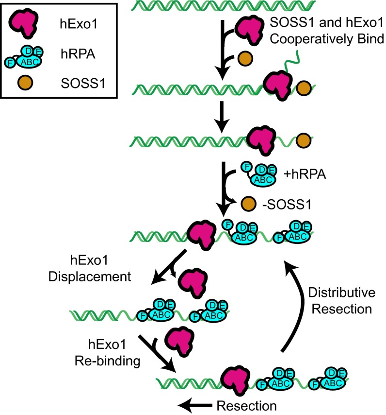
A model for hExo1 regulation by human SSBs. SOSS1 cooperatively loads hExo1 on DNA ends. As hExo1 resects the DNA, SOSS1 is replaced by hRPA. hRPA displaces hExo1, but another hExo1 molecule can rebind at the site. This cycle of binding, displacement, and rebinding results in distributive resection. Additional factors (e.g., BLM, MRN, and PCNA; not included for clarity) may also promote resection in the presence of hRPA.
RPA inhibits human and yeast Exo1, and possibly other nucleases and ssDNA-associated enzymes, by rapidly displacing them from DNA. We favor a mechanism where RPA can either diffuse for a short distance on ssDNA or bind directly behind Exo1 ([Fig. 6](#fig6)) ([57](https://pmc.ncbi.nlm.nih.gov/articles/PMC4780606/#r57)). Next, one of the low-affinity DBDs competes with Exo1 for the ssDNA directly downstream of the ss/dsDNA junction, causing disruption of Exo1–ssDNA interactions. An Exo1 hydrophobic wedge—found in all FEN1-family nucleases—makes critical contacts with at least three nucleotides of ssDNA ([32](https://pmc.ncbi.nlm.nih.gov/articles/PMC4780606/#r32), [58](https://pmc.ncbi.nlm.nih.gov/articles/PMC4780606/#r58)). We propose that one of the six RPA DBDs, likely DBD-F, interferes with Exo1–ssDNA contacts to displace Exo1 from DNA. Our results, in concert with other biochemical studies indicating that RPA also inhibits Fen1 at Okazaki fragment flaps and Pot1 at telomeric DNA ([59](https://pmc.ncbi.nlm.nih.gov/articles/PMC4780606/#r59)–[62](https://pmc.ncbi.nlm.nih.gov/articles/PMC4780606/#r62)), suggest a general mechanism where RPA physically strips other proteins from DNA. Indeed, we demonstrate that the tetrameric _E. coli_ SSB can strip hExo1 from DNA ([Fig. S8](https://pmc.ncbi.nlm.nih.gov/articles/PMC4780606/#sfig08)). Likewise, SSB limits the processivity of the AdnAB helicase nuclease, and archeal SSB limits the activity of XPF nuclease ([63](https://pmc.ncbi.nlm.nih.gov/articles/PMC4780606/#r63), [64](https://pmc.ncbi.nlm.nih.gov/articles/PMC4780606/#r64)). These observations are consistent with a general mechanism whereby multivalent SSBs can regulate the dissociation, and thus the processivity, of diverse families of nucleases.
Because RPA is ubiquitous in eukaryotic cells, how does Exo1 resect long tracts of DNA during HR and MMR? Several groups have reported a growing list of additional proteins that promote Exo1 activity. For example, hMutSα forms a sliding clamp and physically interacts with hExo1 to stimulate lesion-provoked excision during MMR ([32](https://pmc.ncbi.nlm.nih.gov/articles/PMC4780606/#r32), [65](https://pmc.ncbi.nlm.nih.gov/articles/PMC4780606/#r65)). The hMutSα–hExo1 complex may be more resistant to removal by hRPA ([4](https://pmc.ncbi.nlm.nih.gov/articles/PMC4780606/#r4), [32](https://pmc.ncbi.nlm.nih.gov/articles/PMC4780606/#r32), [42](https://pmc.ncbi.nlm.nih.gov/articles/PMC4780606/#r42)). In addition, Bowen et al. reported that mismatch-provoked resection by scExo1 was limited in the presence of scRPA, but was strongly stimulated by scMutSα ([66](https://pmc.ncbi.nlm.nih.gov/articles/PMC4780606/#r66)). During HR, hExo1 is stimulated by the protein complex Mre11/Rad50/Nbs1(Nibrin), (MRN), BLM, and proliferating cell nuclear antigen (PCNA)—all of which physically interact with hExo1 and may help to retain the nuclease on DNA ([19](https://pmc.ncbi.nlm.nih.gov/articles/PMC4780606/#r19), [21](https://pmc.ncbi.nlm.nih.gov/articles/PMC4780606/#r21), [36](https://pmc.ncbi.nlm.nih.gov/articles/PMC4780606/#r36)). Furthermore, we have shown that in the presence of RPA, both human and yeast Exo1 can rebind the same DNA site multiple times, suggesting a distributive resection mechanism ([Fig. 5](#fig5)). This mechanism could be beneficial to cells when Exo1 stalls or is blocked (e.g., at a nucleosome), which would require removal from DNA for reloading and repair to continue ([67](https://pmc.ncbi.nlm.nih.gov/articles/PMC4780606/#r67)).
RPA depletion leads to an increased hExo1 localization at both laser-induced DNA damage and at restriction enzyme-generated DSBs in human cells ([Fig. 3](#fig3)). Our results in human cells are broadly consistent with a recent study on the role of RPA during DSB resection in yeast ([15](https://pmc.ncbi.nlm.nih.gov/articles/PMC4780606/#r15)). RPA depletion in both human and yeast cells inhibited the production of ssDNA tracts, suggesting additional roles for RPA in facilitating end resection. RPA recruits the kinase ATR to DSBs, which promotes resection via phosphorylation of histone H2AX, C-terminal binding protein interacting protein, (CtIP), and Rad17 ([67](https://pmc.ncbi.nlm.nih.gov/articles/PMC4780606/#r67)–[71](https://pmc.ncbi.nlm.nih.gov/articles/PMC4780606/#r71)). As hExo1 cannot resect past a nucleosome in vitro ([66](https://pmc.ncbi.nlm.nih.gov/articles/PMC4780606/#r66)), RPA may also be required for recruiting chromatin remodelers to the DSB ahead of the resection machinery. Exo1 is also subject to a growing list of posttranslational modifications and is positively and negatively regulated by MRN, BLM, CtIP, and other components of the resection machinery ([10](https://pmc.ncbi.nlm.nih.gov/articles/PMC4780606/#r10), [21](https://pmc.ncbi.nlm.nih.gov/articles/PMC4780606/#r21), [31](https://pmc.ncbi.nlm.nih.gov/articles/PMC4780606/#r31), [35](https://pmc.ncbi.nlm.nih.gov/articles/PMC4780606/#r35), [36](https://pmc.ncbi.nlm.nih.gov/articles/PMC4780606/#r36)). Our work provides a framework for future studies to determine how these interactions facilitate long-range DNA resection by Exo1 in the presence of RPA.
---
##  Experimental Procedures
All single-molecule measurements were conducted at 30 °C or 37 °C in imaging buffer containing 40 mM Tris⋅HCl (pH 8.0), 60 mM NaCl, 1 mM MgCl2, 2 mM DTT, and 0.2 mg/mL BSA. For experiments at a higher ionic strength, the NaCl concentration was increased to 130 mM. Human or yeast Exo1-biotin was prelabeled with streptavidin QDs (Qdot 705; Life Tech) before use, as previously described ([72](https://pmc.ncbi.nlm.nih.gov/articles/PMC4780606/#r72)). To make the DNA curtain, λ-DNA was hybridized with a biotinylated oligonucleotide on one end and a 3′ overhang-generating oligonucleotide on the other end ([Table S2](https://pmc.ncbi.nlm.nih.gov/articles/PMC4780606/#st02)). hExo1-Flag was first injected into preassembled DNA curtains, excess protein was flushed out, and the remaining DNA-bound hExo1-Flag was labeled with 1 nM QD-conjugated anti-Flag M2 antibodies (Sigma) in situ. SOSS1 was prelabeled with Alexa488-labeled antiGST antibodies (Cell Signaling #3368). In single-turnover experiments, human or yeast Exo1 was initially injected into the sample chambers and allowed to bind to the DNA. Unbound Exo1 proteins were then flushed away, and data collection was immediately initiated. All SSBs were injected at a concentration of 1 nM 1 min after hExo1 loading. For multiple-turnover experiments, 1 nM h/yExo1 and 1 nM h/yRPA with indicated fluorophores were injected continuously during data collection.
Two-color imaging was conducted using two electron-multiplying charge coupled device (EMCCD) cameras and a 638-nm dichroic beam splitter (Chroma). Position distribution measurements and particle tracking were conducted as previously described ([29](https://pmc.ncbi.nlm.nih.gov/articles/PMC4780606/#r29)). Error bars on the binding distribution histogram represents the SDs of each bin in the histogram, as obtained through bootstrap analysis of the molecule binding data ([29](https://pmc.ncbi.nlm.nih.gov/articles/PMC4780606/#r29)). For all processivities and velocities, we report the mean and SDs. The lifetimes of individual molecules were defined as the time hExo1 remained on the DNA after SSBs (or mock storage buffer) were injected into the flowcell. At least 30 nuclease molecules were analyzed for each condition, and the resulting survival histogram was fit with a single exponential decay to extract the half-life. The errors bars of the half-lives represent the 95% CI of the fit of the exponential time constant. Additional information is available online in [_SI Experimental Procedures_](https://pmc.ncbi.nlm.nih.gov/articles/PMC4780606/#si2).
---
##  Acknowledgments
We thank Dr. Jennifer Surtees and members of the I.J.F., K.M.M., and T.T.P. laboratories for useful discussions and for critically reading the manuscript. We thank our colleagues Eric Greene (Columbia University, NY), Paul Modrich (Duke University, NC), R. Michael Liskay (Oregon Health & Science University, OR), Junjie Chen (MD Anderson Cancer Center, TX), and Mauro Modesti (Cancer Research Center of Marseille, FR) for valuable reagents. This work was supported by National Institute of General Medical Sciences of the National Institutes of Health Grant GM097177 (to I.J.F.), the Cancer Prevention Research Institute of Texas (CPRIT) Grants R1214 (to I.J.F.), R1116 (to K.M.M.), and RP110465 to (T.T.P.), and Welch Foundation Grant F-l808 (to I.J.F.). I.J.F. and K.M.M. are CPRIT Scholars in Cancer Research.

## References

1. Kim DS, et al. DNA end resection by human Exo1 requires kinase-dependent interaction with RPA. Proc Natl Acad Sci USA. 2016;113(6):E691-E700. [doi:10.1073/pnas.1516674113](https://doi.org/10.1073/pnas.1516674113)
2. Mimitou EP, Symington LS. DNA end resection: Many nucleases make light work. DNA Repair (Amst). 2009;8(9):983-995. [doi:10.1016/j.dnarep.2009.04.017](https://doi.org/10.1016/j.dnarep.2009.04.017)
3. Daley JM, et al. Biochemical mechanism of DNA end resection and its regulation. Wiley Interdiscip Rev RNA. 2015;6(4):445-460. [doi:10.1002/wrna.1287](https://doi.org/10.1002/wrna.1287)
4. Sartori AA, et al. Human CtIP promotes DNA end resection. Nature. 2007;450(7169):509-514. [doi:10.1038/nature06337](https://doi.org/10.1038/nature06337)
5. Makharashvili N, Paull TT. CtIP: Genetic and structural insights into a key component of the DNA-damage response. DNA Repair (Amst). 2015;32:159-166. [doi:10.1016/j.dnarep.2015.04.009](https://doi.org/10.1016/j.dnarep.2015.04.009)
6. Westmoreland JW, Resnick MA. Recombinational repair of radiation-induced double strand breaks. Adv Exp Med Biol. 2016;896:129-147. [doi:10.1007/978-3-319-27550-7_8](https://doi.org/10.1007/978-3-319-27550-7_8)
7. Zhu Z, et al. Sgs1 helicase and two nucleases Dna2 and Exo1 resect long-range double-strand breaks in *Saccharomyces cerevisiae*. Mol Cell. 2008;32(4):529-538. [doi:10.1016/j.molcel.2008.10.027](https://doi.org/10.1016/j.molcel.2008.10.027)
8. Liberti SE, Rasmussen LJ. Is hEXO1 a cancer predisposing gene? Mol Cancer Res. 2004;2(8):427-432.
9. Wei K, et al. Inactivation of Exonuclease 1 in mice results in DNA mismatch repair defects, increased cancer susceptibility, and male and female sterility. Genes Dev. 2003;17(5):603-614. [doi:10.1101/gad.1060603](https://doi.org/10.1101/gad.1060603)
10. Eid W, et al. DNA end resection by CtIP and exonuclease 1 prevents genomic instability. EMBO Rep. 2010;11(12):962-968. [doi:10.1038/embor.2010.157](https://doi.org/10.1038/embor.2010.157)
11. Tomimatsu N, et al. Exo1 plays a major role in DNA end resection in humans and influences double-strand break repair and damage signaling decisions. DNA Repair (Amst). 2012;11(4):441-448. [doi:10.1016/j.dnarep.2012.01.006](https://doi.org/10.1016/j.dnarep.2012.01.006)
12. Zhou Y, et al. Quantitation of DNA double-strand break resection intermediates in human cells. Nucleic Acids Res. 2014;42(3):e19. [doi:10.1093/nar/gkt1309](https://doi.org/10.1093/nar/gkt1309)
13. Tong AHY, et al. Global mapping of the yeast genetic interaction network. Science. 2004;303(5659):808-813. [doi:10.1126/science.1091317](https://doi.org/10.1126/science.1091317)
14. Wold MS. Replication protein A: A heterotrimeric, single-stranded DNA-binding protein required for eukaryotic DNA metabolism. Annu Rev Biochem. 1997;66:61-92. [doi:10.1146/annurev.biochem.66.1.61](https://doi.org/10.1146/annurev.biochem.66.1.61)
15. Chen H, et al. RPA coordinates DNA end resection and prevents formation of DNA hairpins. Mol Cell. 2013;50(4):589-600. [doi:10.1016/j.molcel.2013.04.032](https://doi.org/10.1016/j.molcel.2013.04.032)
16. Hass CS, et al. Repair-specific functions of replication protein A. J Biol Chem. 2012;287(6):3908-3918. [doi:10.1074/jbc.M111.287441](https://doi.org/10.1074/jbc.M111.287441)
17. Lisby M, et al. Choreography of the DNA damage response: Spatiotemporal relationships among checkpoint and repair proteins. Cell. 2004;118(6):699-713. [doi:10.1016/j.cell.2004.08.015](https://doi.org/10.1016/j.cell.2004.08.015)
18. Cannavo E, et al. Relationship of DNA degradation by *Saccharomyces cerevisiae* exonuclease 1 and its stimulation by RPA and Mre11-Rad50-Xrs2 to DNA end resection. Proc Natl Acad Sci USA. 2013;110(18):E1661-E1668. [doi:10.1073/pnas.1305166110](https://doi.org/10.1073/pnas.1305166110)
19. Nimonkar AV, et al. BLM-DNA2-RPA-MRN and EXO1-BLM-RPA-MRN constitute two DNA end resection machineries for human DNA break repair. Genes Dev. 2011;25(4):350-362. [doi:10.1101/gad.2003811](https://doi.org/10.1101/gad.2003811)
20. Niu H, et al. Mechanism of the ATP-dependent DNA end-resection machinery from *Saccharomyces cerevisiae*. Nature. 2010;467(7311):108-111. [doi:10.1038/nature09318](https://doi.org/10.1038/nature09318)
21. Yang S-H, et al. The SOSS1 single-stranded DNA binding complex promotes DNA end resection in concert with Exo1. EMBO J. 2013;32(1):126-139. [doi:10.1038/emboj.2012.314](https://doi.org/10.1038/emboj.2012.314)
22. Cejka P, et al. DNA end resection by Dna2-Sgs1-RPA and its stimulation by Top3-Rmi1 and Mre11-Rad50-Xrs2. Nature. 2010;467(7311):112-116. [doi:10.1038/nature09355](https://doi.org/10.1038/nature09355)
23. Nicolette ML, et al. Mre11-Rad50-Xrs2 and Sae2 promote 5′ strand resection of DNA double-strand breaks. Nat Struct Mol Biol. 2010;17(12):1478-1485. [doi:10.1038/nsmb.1957](https://doi.org/10.1038/nsmb.1957)
24. Richard DJ, et al. Single-stranded DNA-binding protein hSSB1 is critical for genomic stability. Nature. 2008;453(7195):677-681. [doi:10.1038/nature06883](https://doi.org/10.1038/nature06883)
25. Huang J, et al. SOSS complexes participate in the maintenance of genomic stability. Mol Cell. 2009;35(3):384-393. [doi:10.1016/j.molcel.2009.06.011](https://doi.org/10.1016/j.molcel.2009.06.011)
26. Ren W, et al. Structural basis of SOSS1 complex assembly and recognition of ssDNA. Cell Rep. 2014;6(6):982-991. [doi:10.1016/j.celrep.2014.02.020](https://doi.org/10.1016/j.celrep.2014.02.020)
27. Richard DJ, et al. hSSB1 rapidly binds at the sites of DNA double-strand breaks and is required for the efficient recruitment of the MRN complex. Nucleic Acids Res. 2011;39(5):1692-1702. [doi:10.1093/nar/gkq1098](https://doi.org/10.1093/nar/gkq1098)
28. Finkelstein IJ, Greene EC. Supported lipid bilayers and DNA curtains for high-throughput single-molecule studies. Methods Mol Biol. 2011;745:447-461. [doi:10.1007/978-1-61779-129-1_26](https://doi.org/10.1007/978-1-61779-129-1_26)
29. Finkelstein IJ, et al. Single-molecule imaging reveals mechanisms of protein disruption by a DNA translocase. Nature. 2010;468(7326):983-987. [doi:10.1038/nature09561](https://doi.org/10.1038/nature09561)
30. Robison AD, Finkelstein IJ. High-throughput single-molecule studies of protein-DNA interactions. FEBS Lett. 2014;588(19):3539-3546. [doi:10.1016/j.febslet.2014.05.021](https://doi.org/10.1016/j.febslet.2014.05.021)
31. Nimonkar AV, et al. Human exonuclease 1 and BLM helicase interact to resect DNA and initiate DNA repair. Proc Natl Acad Sci USA. 2008;105(44):16906-16911. [doi:10.1073/pnas.0809380105](https://doi.org/10.1073/pnas.0809380105)
32. Orans J, et al. Structures of human exonuclease 1 DNA complexes suggest a unified mechanism for nuclease family. Cell. 2011;145(2):212-223. [doi:10.1016/j.cell.2011.03.005](https://doi.org/10.1016/j.cell.2011.03.005)
33. Liao S, et al. Analysis of MRE11's function in the 5′→3′ processing of DNA double-strand breaks. Nucleic Acids Res. 2012;40(10):4496-4506. [doi:10.1093/nar/gks044](https://doi.org/10.1093/nar/gks044)
34. Tran PT, et al. Characterization of nuclease-dependent functions of Exo1p in *Saccharomyces cerevisiae*. DNA Repair (Amst). 2002;1(11):895-912. [doi:10.1016/s1568-7864(02)00114-3](https://doi.org/10.1016/s1568-7864(02)00114-3)
35. Tomimatsu N, et al. Phosphorylation of EXO1 by CDKs 1 and 2 regulates DNA end resection and repair pathway choice. Nat Commun. 2014;5:3561. [doi:10.1038/ncomms4561](https://doi.org/10.1038/ncomms4561)
36. Chen X, et al. PCNA promotes processive DNA end resection by Exo1. Nucleic Acids Res. 2013;41(20):9325-9338. [doi:10.1093/nar/gkt672](https://doi.org/10.1093/nar/gkt672)
37. Pathak S, et al. Characterization of the functional binding properties of antibody conjugated quantum dots. Nano Lett. 2007;7(7):1839-1845. [doi:10.1021/nl062706i](https://doi.org/10.1021/nl062706i)
38. Sertic S, et al. Human exonuclease 1 connects nucleotide excision repair (NER) processing with checkpoint activation in response to UV irradiation. Proc Natl Acad Sci USA. 2011;108(33):13647-13652. [doi:10.1073/pnas.1108547108](https://doi.org/10.1073/pnas.1108547108)
39. Thompson RE, et al. Precise nanometer localization analysis for individual fluorescent probes. Biophys J. 2002;82(5):2775-2783. [doi:10.1016/S0006-3495(02)75618-X](https://doi.org/10.1016/S0006-3495(02)75618-X)
40. Schmutte C, et al. Human exonuclease I interacts with the mismatch repair protein hMSH2. Cancer Res. 1998;58(20):4537-4542.

---

*Archived from [PubMed Central (PMC4780606)](https://pmc.ncbi.nlm.nih.gov/articles/PMC4780606/) on 2025-07-19.*
