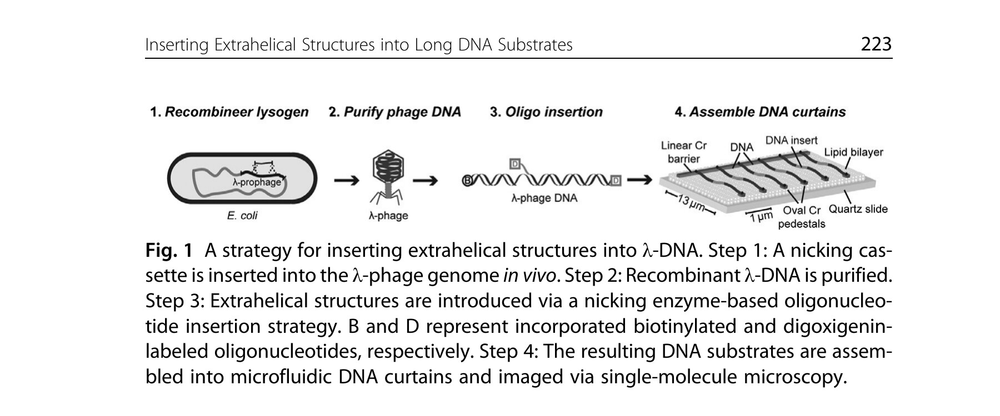
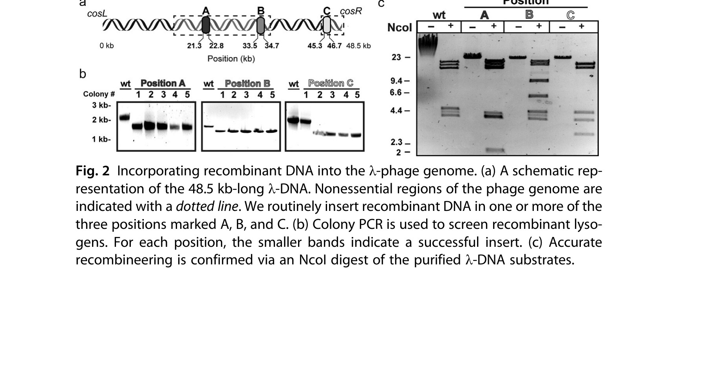
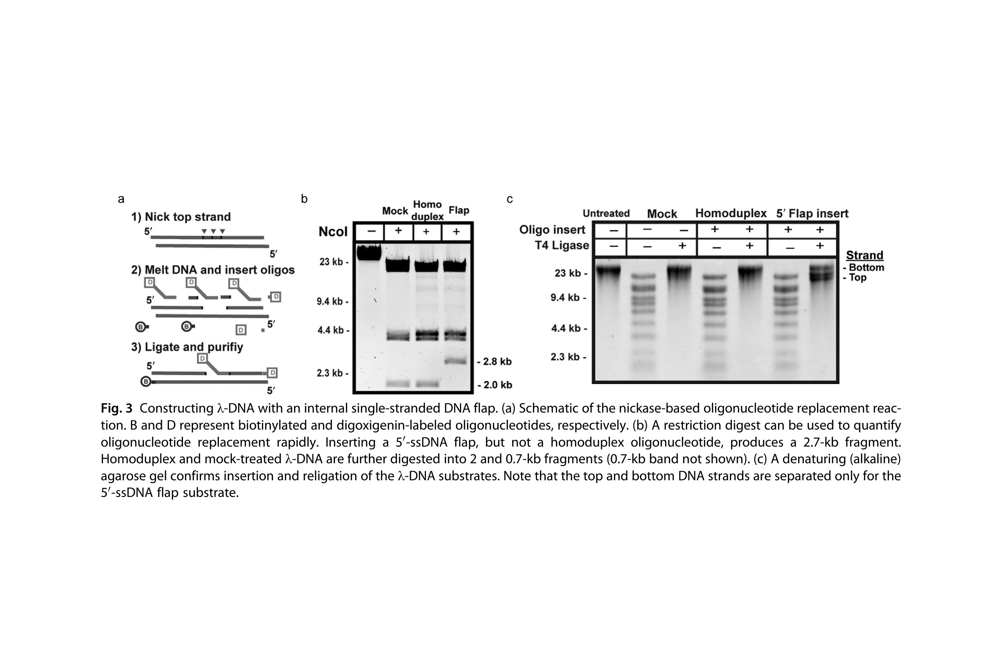
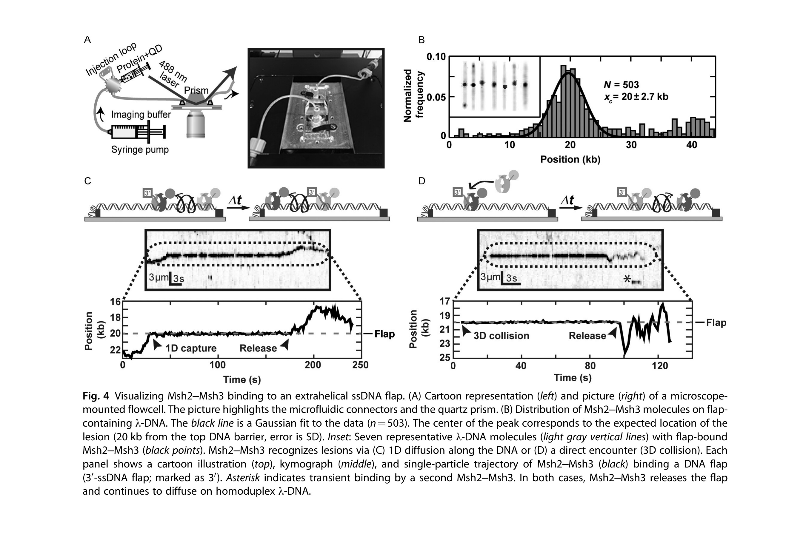

# Inserting Extrahelical Structures into Long DNA Substrates for Single-Molecule Studies of DNA Mismatch Repair

**Maxwell W. Brown, Armando de la Torre, and Ilya J. Finkelstein**

*Methods in Enzymology*, Volume 582, Pages 221–238 (2017)

**DOI:** [10.1016/bs.mie.2016.08.006](https://doi.org/10.1016/bs.mie.2016.08.006)

---

## Table of Contents

- [Abstract](#abstract)
- [1. Introduction](#introduction)
- [2. Materials](#materials)
  - [2.1 Buffers](#buffers)
  - [2.2 Recombineering](#recombineering-materials)
  - [2.3 Assembling DNA Curtains](#assembling-dna-curtains-materials)
  - [2.4 Imaging MMR Proteins](#imaging-mmr-proteins-materials)
- [3. Methods](#methods)
  - [3.1 Recombineering into λ-Phage](#recombineering-into-phage)
  - [3.2 Purifying λ-DNA](#purifying-dna)
  - [3.3 Inserting Oligonucleotides into DNA Substrates](#inserting-oligonucleotides)
  - [3.4 Assembling DNA Curtains](#assembling-dna-curtains)
  - [3.5 Imaging DNA MMR Proteins on DNA Curtains](#imaging-mmr-proteins)
  - [3.6 Analyzing Single-Molecule Traces](#analyzing-traces)
- [4. Notes](#notes)
- [Acknowledgments](#acknowledgments)
- [References](#references)

---

## Abstract {#abstract}

The DNA mismatch repair (MMR) system corrects errors that occur during DNA replication. MMR needs the coordinated and highly dynamic assembly of repair enzymes at the site of the lesion. By visualizing transient intermediates of these assemblies, single-molecule approaches have shed critical insights into the mechanisms of MMR. These studies frequently require long (>20 kb) DNA substrates with lesions and other extrahelical structures inserted at defined positions. DNA derived from bacteriophage λ (λ-DNA) is a high quality long (48.5 kb) DNA substrate that is frequently used in single-molecule studies. Here we provide detailed protocols for site-specific incorporation of recombinant sequences and extrahelical structures into λ-DNA. We also describe how to assemble DNA curtains, and how to collect and analyze single-molecule observations of lesion recognition by MMR proteins diffusing on these DNA curtains. These protocols will facilitate future single-molecule studies of DNA transcription, replication, and repair.

---

## 1. Introduction {#introduction}

The highly conserved DNA mismatch repair (MMR) system recognizes and repairs nucleotide misincorporation events and extrahelical lesions that are introduced during DNA replication and homologous recombination. In eukaryotes, repair is initiated by one of two heterodimeric MutS homolog (Msh) complexes, Msh2–Msh6 and Msh2–Msh3. Both complexes form sliding clamps on DNA and scan the genome for a partially overlapping but distinct spectrum of DNA lesions ([Erie & Weninger, 2014](#ref1); [Jiricny, 2013](#ref7); [Kantelinen et al., 2010](#ref8); [Lee et al., 2014](#ref10); [Li, 2008](#ref11)). Msh2–Msh6 primarily recognizes single-nucleotide mismatches and small insertion–deletion loops (IDLs) ([Jiricny, 2013](#ref7); [Reyes, Schmidt, Kolodner, & Hombauer, 2015](#ref15)). Msh2–Msh3 also recognizes some single-nucleotide mismatches as well as IDLs involving one or more unpaired nucleotides ([Harrington & Kolodner, 2007](#ref6); [Srivatsan, Bowen, & Kolodner, 2014](#ref16); [Surtees & Alani, 2006](#ref17)). After the lesion is recognized, MutL homolog (Mlh) complexes—Mlh1–Pms1 (in yeast) or Mlh1–Pms2 (in humans)—are recruited to the repair site. Mlh complexes also form sliding clamps on homoduplex DNA and harbor a mismatch-dependent endonuclease activity that is critical for MMR ([Kadyrov, Dzantiev, Constantin, & Modrich, 2006](#ref8b); [Kadyrov et al., 2009](#ref9a), [2007](#ref9b)). Following Mlh recruitment to the vicinity of the lesion, exonuclease 1 (Exo1) excises a long tract of DNA from the lesion containing strand. Finally, the gapped DNA is filled in by DNA polymerases ([Kunkel & Erie, 2005](#ref9c)).

MMR requires a spatially and temporally controlled assembly of repair enzymes at the lesion. Single-molecule imaging and manipulation have proven especially amenable for deciphering how these dynamic assemblies recognize and excise the lesion ([Erie & Weninger, 2014](#ref1); [Lee et al., 2014](#ref10)). For example, single-molecule approaches have been used to describe how Msh proteins scan both naked and chromatinized DNA for lesions, how Mlh proteins are recruited to the Msh–lesion complex, and how Exo1 excises the lesion ([Brown et al., 2016](#ref2); [Gorman et al., 2007](#ref5); [Jeon et al., 2016](#ref7b); [Lee et al., 2014](#ref10); [Myler et al., 2016](#ref12); [Qiu et al., 2012](#ref13)). These studies frequently require site-specific incorporation of mismatches or other lesions on a long (>20 kb) DNA substrate. DNA isolated from bacteriophage λ (λ-DNA) is a convenient source of high quality long (48.5 kb) DNA. However, introducing specific DNA sequences, tertiary structures, and chemical modifications into λ-DNA remains technically challenging.

In this chapter, we provide detailed protocols for rapidly modifying and purifying recombinant λ-DNA for single-molecule imaging ([Fig. 1](#fig1)). We use *in vivo* recombineering to target site-specific segments of the λ-phage genome with >90% efficiency, abrogating the need for restriction motifs and ligation. A nicking enzyme (nickase)-based strategy is used to incorporate mismatches and other structures at defined positions along the DNA substrate. Furthermore, we describe how to use these substrates for assembling DNA curtains, a high-throughput single-molecule fluorescence imaging approach ([Gallardo et al., 2015](#ref4)). We anticipate that these protocols will be broadly useful for both ensemble and single-molecule studies that require site-specific modification of long DNA substrates.

<figure class="paper-figure" id="fig1">

<figcaption><strong>Fig. 1</strong> A strategy for inserting extrahelical structures into λ-DNA. Step 1: A nicking cassette is inserted into the λ-phage genome <em>in vivo</em>. Step 2: Recombinant λ-DNA is purified. Step 3: Extrahelical structures are introduced via a nicking enzyme-based oligonucleotide insertion strategy. B and D represent incorporated biotinylated and digoxigenin-labeled oligonucleotides, respectively. Step 4: The resulting DNA substrates are assembled into microfluidic DNA curtains and imaged via single-molecule microscopy.</figcaption>
</figure>

---

## 2. Materials {#materials}

### 2.1 Buffers {#buffers}

1. **L1 buffer:** 300 mM NaCl; 100 mM Tris–HCl [pH 7.5]; 10 mM EDTA; 0.2 mg mL⁻¹ bovine serum albumin (BSA; fraction V, Sigma-Aldrich).
2. **L2 buffer:** 30% polyethylene glycol (PEG 6000) (w/v); 3 M NaCl.
3. **L3 buffer:** 100 mM NaCl; 100 mM Tris–HCl [pH 7.5]; 25 mM EDTA.
4. **L4 buffer:** 4% sodium dodecyl sulfate (SDS) (w/v).
5. **L5 buffer:** 3 M potassium acetate [pH 5.5].
6. **QBT buffer:** 750 mM NaCl; 50 mM MOPS [pH 7.0]; 15% isopropanol (v/v); 0.15% Triton X-100 (v/v).
7. **QC buffer:** 1.0 M NaCl; 50 mM MOPS [pH 7.0]; 15% isopropanol (v/v).
8. **QF buffer:** 1.25 M NaCl; 50 mM Tris–HCl [pH 8.5]; 15% isopropanol (v/v).
9. **TE buffer:** 10 mM Tris–HCl [pH 8.0]; 1 mM EDTA.
10. **SM buffer:** 50 mM Tris–HCl [pH 7.5]; 100 mM NaCl; 8 mM MgSO₄.
11. **10× alkaline agarose gel electrophoresis buffer:** 500 mM NaOH; 10 mM EDTA.
12. **Neutralization buffer:** 1 M Tris–HCl [pH 7.5]; 1.5 M NaCl.
13. **Lipids buffer:** 10 mM Tris–HCl [pH 8.0]; 100 mM NaCl. Filter through a 0.22 μm syringe filter (Olympus) and store at room temperature.
14. **BSA buffer:** 40 mM Tris–HCl [pH 7.8]; 1 mM DTT; 1 mM MgCl₂; 0.2 mg mL⁻¹ BSA. Filter through a 0.22 μm syringe filter and use the same day as experiment.
15. **Imaging buffer:** BSA buffer with 50 mM NaCl; 1–5 nM YOYO-I (Life Tech); 500 units of catalase (Sigma-Aldrich); 70 units of glucose oxidase (Sigma-Aldrich); and 1% glucose (w/v).
16. **PBS buffer:** 10 mM phosphate [pH 7.2]; 138 mM NaCl; 2.7 mM KCl. Autoclave and store at room temperature.

### 2.2 Recombineering {#recombineering-materials}

1. Micropulser (Bio-Rad).
2. Micropulser electroporation cuvettes (Bio-Rad).
3. Lab shaking incubator (New Brunswick).
4. Optima XE-90 Ultracentrifuge (Beckman Coulter).

### 2.3 Assembling DNA Curtains {#assembling-dna-curtains-materials}

1. TE2000 Eclipse Inverted Microscope (Nikon) modified for prism TIRF illumination, with a 488 nm laser (Coherent), a Nikon Plan Apo 60× objective (Nikon), a 638 dichroic beam-splitter (Chroma), a 500 long-pass filter (Chroma), and two EM-CCD cameras (Andor iXon DU897) ([Finkelstein & Greene, 2011](#ref3); [Gallardo et al., 2015](#ref4)).
2. Quartz Dove Prism (Tower Optical).
3. Index matching immersion oil (type FF, Cargile).
4. Syringe pump (KD Scientific).
5. Rheodyne HPLC 6 port switching valve (Kinesis).
6. Microfabricated quartz slides made via UV lithography techniques ([Gallardo et al., 2015](#ref4)).
7. λ-DNA (New England Biolabs).
8. Liposomes for surface functionalization and passivation. Liposomes are made by combining three different lipid solutions (purchased as powder from Avanti Polar Lipids) and diluting them in chloroform. DOPC (100 mg mL⁻¹) (1,2-dioleoyl-*sn*-glycero-3-phosphocholine) (#850375P), DOPE-mPEG2k (100 mg mL⁻¹) (1,2-dioleoyl-*sn*-glycero-3-phosphoethanolamine-*N*-[methoxy(polyethylene glycol)-2000]) (#880130P), and DOPE-biotin (25 mg mL⁻¹) (1,2-dioleoyl-*sn*-glycero-3-phosphoethanolamine-*N*-(cap biotinyl)) (#870273P). Liposome stock solutions are made by mixing a molar ratio of 97.7% DOPC, 2.0% DOPE-mPEG2k, and 0.3% DOPE-biotin ([Finkelstein & Greene, 2011](#ref3)). 220 μL of liposome mixture is then evaporated overnight in a vacuum desiccator, and rehydrated in 2 mL lipids buffer for 4 h. The liposomes are sonicated using a microtip sonicator (Qsonica Q700) at 15% power for three 90 s intervals. This ensures small, unilamellar vesicles (see Note 1). Sonicated products are filtered through a 0.22 μm syringe filter and stored at 4°C.
9. Streptavidin (Life Technologies) stored as 1 mg mL⁻¹ solution in H₂O at −20°C.
10. Digoxigenin monoclonal antibody (Life Technologies).
11. Goat antirabbit IgG polyclonal antibody (Immunology Consultants Laboratory #GGHL-15A).
12. PFA tubing 0.02″ ID (IDEX).
13. Flowcell injection connectors constructed from various IDEX fittings. NanoPort 10–32 coned ports, FingerTight III 10–32 fitting, 1/16″ replacement ferrule, hex short 1/16″ fitting.
14. Disposable Luer-lock connector syringes (BD Scientific).

### 2.4 Imaging MMR Proteins {#imaging-mmr-proteins-materials}

1. YOYO-1 dye: stored as 1 mM stock in DMSO at −20°C (Invitrogen).
2. Glucose oxidase type II from *Aspergillus niger* (Sigma-Aldrich).
3. Catalase from bovine liver (Sigma-Aldrich).
4. SiteClick Qdot 705 antibody labeling kit (ThermoFisher).
5. Affinity purified polyclonal rabbit anti-HA (Immunology Consultants Laboratory #RHGT-45A-Z) conjugated to quantum dots (QDs). Label antibodies using the SiteClick Qdot 705 antibody labeling kit (Life Technologies #S10454) per the manufacturer's directions with slight modification (see Note 2). Store conjugates at 4°C for up to 3 months.

---

## 3. Methods {#methods}

We developed an improved nickase-based strategy for inserting oligonucleotides at precise positions along λ-DNA ([Fig. 1](#fig1)). First, a cassette that includes three consecutive BspQI recognition motifs separated by 20-bp spacers is cloned into the λ-phage genome. To facilitate this process, we designed a series of cassettes that target two nonessential regions within the phage genome ([Fig. 2](#fig2)). Each nickase cassette is flanked by ~200-bp of homology to λ-DNA. λ-Red-based recombineering is used to construct recombinant λ-DNA rapidly with >90% efficiency ([Sharan, Thomason, Kuznetsov, & Court, 2009](#ref14)). Recombinant lysogens are identified via colony PCR and through growth sensitivity at a restrictive temperature (42–45°C). Recombinant phage is induced by a heat shock and the λ-DNA is purified from packaged phage particles. Below, we provide detailed protocols for each of these steps.

### 3.1 Recombineering into λ-Phage {#recombineering-into-phage}

#### 3.1.1 Preparing the Nickase Cassette

A linear, double-stranded DNA PCR product that contains a nicking cassette can be incorporated at one of three defined positions along the length of λ-DNA (defined as position A, B, or C). The nickase cassette contains a triple Nt.BspQI nickase recognition motif and an antibiotic resistance gene flanked on either end by 200 bps of sequence homology to λ-DNA. The identity of the flanking λ-DNA homology arms determines which of the three positions (A, B, or C) will be targeted for nickase cassette incorporation. We have designed a set of helper plasmids that can be used as PCR templates to amplify the desired nicking cassette with the specified λ-DNA homology arms. These plasmids (pIF251, pIF253, and pIF254) are available upon request.

1. Amplify the nickase cassette by PCR from the helper plasmid of choice (pIF251, pIF253, and pIF254 for positions A, B, and C, respectively) using Taq DNA polymerase and the specified primers (Tables 1 and 2).
2. Degrade the template by adding 1 U of restriction enzyme DpnI (NEB #R0176s) and incubating at 37°C for 1 h.
3. Purify the PCR product by gel extraction and resuspend in Milli-Q H₂O to a final concentration of 100–150 μg μL⁻¹. Removing residual plasmid DNA is essential, as even trace amounts can cause false positives during recombineering.

**Table 1. Nicking Cassette Preparation**

| λ-Position | Replacement Position (Relative to cosL) | Plasmid Template | Forward Primer | Reverse Primer |
|---|---|---|---|---|
| A | 21,251–22,750 bp | pIF251 | AD027 | AD028 |
| B | 33,498–34,685 bp | pIF253 | AD012 | AD013 |
| C | 46,446–47,862 bp | pIF254 | AD016 | AD017 |

Each nicking cassette is generated by PCR using the indicated template and primers. Templates are available on request.

**Table 2. Nickase and Primer Site Sequences**

| Name | Sequence |
|---|---|
| IF003 | /5Phos/AGG TCG CGG CC/3Bio |
| IF004 | /5Phos/GGG CGG CGA CCT/3Dig |
| AD012 | AGT CTG GAT AGC CAT AAG TG |
| AD013 | GTA ACC ACA TAC TTC CTG CC |
| AD016 | GCA GTC TGT CAG TCA GTG CG |
| AD017 | CGA GGG CAT TGC AGT AAT TG |
| AD027 | GCT ACC ACC ATG ACT AAC GC |
| AD028 | GGA TAT CAG AGC TAT GGC TC |
| AD006 | TTTTTTTTTTTTTTTTTTTTTTTTTTTTTTTCTTCCCTTGGTGCGATCGCTCTTCG |
| 3× Nt.BspQI nickase motif | GCT CTT CAT GCA TGC GGC CGC TCT TCC CAT GGT GCG ATC GCT CTT CGG |

Sequences are read 5′–3′. IF003 and IF004 were HPLC purified. AD006 was PAGE purified.

#### 3.1.2 Electroporation and Recombineering

1. Grow a 5 mL LB culture of λ-phage lysogen strain IF189 + pKD78 overnight at 30°C in the presence of 10 μg μL⁻¹ chloramphenicol. pKD78 is an arabinose-inducible helper plasmid that encodes the λ-red recombineering proteins ([Datsenko & Wanner, 2000](#ref3b)). IF189 was created by infecting *Escherichia coli* LE392MP cells with λ-DNA (λc1857 *Sam7*) using MaxPlax λ-phage packaging extracts (Epicenter).
2. The following day, use 350 μL of cells to inoculate a fresh 35 mL culture of LB supplemented with 10 μg mL⁻¹ chloramphenicol.
3. When the cells reach an OD₆₀₀ ~0.5, induce the λ-red recombinase system by adding 2% L-arabinose (w/v) (GoldBio #20-108) and incubate for an additional 1 h at 30°C.
4. Harvest the cells by centrifugation at 4500 RCF for 7 min.
5. To make the cells electrocompetent, wash 3× in ice-cold Milli-Q H₂O followed by centrifugation and resuspension in 200 μL of H₂O after each wash. Keep the electrocompetent cells on ice and use them immediately for the recombineering reaction (see Note 6).
6. Combine 50–150 ng of the nickase cassette (prepared above) with 50 μL of electrocompetent cells and transfer them into ice-cold 0.1 cm cuvettes. Electroporate the PCR product into the cells at 18 kV cm⁻¹.
7. Immediately resuspend the cells in 1 mL of SOC and then transfer to culture tubes containing 10 mL LB broth.
8. After a 4 h outgrowth at 30°C, plate 100 μL of the culture onto LB agar plates containing a low concentration of the appropriate antibiotic, and incubate overnight at 30°C.
9. The following morning, pick colonies and check for successful incorporation of recombinant DNA via colony PCR ([Fig. 2](#fig2)).

<figure class="paper-figure" id="fig2">

<figcaption><strong>Fig. 2</strong> Incorporating recombinant DNA into the λ-phage genome. (a) A schematic representation of the 48.5 kb-long λ-DNA. Nonessential regions of the phage genome are indicated with a <em>dotted line</em>. We routinely insert recombinant DNA in one or more of the three positions marked A, B, and C. (b) Colony PCR is used to screen recombinant lysogens. For each position, the smaller bands indicate a successful insert. (c) Accurate recombineering is confirmed via an NcoI digest of the purified λ-DNA substrates.</figcaption>
</figure>

### 3.2 Purifying λ-DNA {#purifying-dna}

The following procedure describes the overexpression and harvesting of recombinant phage capsids, and subsequent purification of approximately 1 mL of 200–500 ng μL⁻¹ of λ-DNA. Lytic λ-phage lysogen growth is induced at ~45°C. This temperature denatures the temperature-sensitive λ-repressor (cI857*ind* 1), which initiates phage amplification and packaging. An additional amber mutation in the S gene (*Sam* 7) delays cell lysis and produces large burst sizes (>200 phage capsids per cell), ultimately maximizing the yield of recombinant λ-DNA.

#### 3.2.1 Induction of Lytic Growth

1. Grow a colony of recombinant λ-phage lysogen in 50 mL of LB broth with the appropriate antibiotic overnight at 30°C.
2. Use 10 mL of this starter culture to inoculate 500 mL of LB the following morning. When the flask reaches an OD₆₀₀ ~0.6, rapidly raise the temperature to 42°C by swirling in a preheated water bath.
3. Once the temperature reaches 42°C, induce lytic growth by transferring the culture to a 45°C shaking incubator for 15 min.
4. After 15 min, lower the incubator temperature to 37°C and continue shaking for 2 h.

#### 3.2.2 Purification

1. Harvest the cells by centrifugation at 3000 RCF for 30 min and decant the supernatant (see Note 8).
2. Resuspend the cell pellet in 10 mL of SM buffer.
3. Add 2% chloroform (v/v) and lyse the cells by incubating at 37°C for 30 min while shaking at 200 rpm.
4. Degrade residual bacterial genomic DNA and RNA by adding 50 ng μL⁻¹ DNaseI (Sigma #D2821) and 30 ng μL⁻¹ RNaseA (Sigma #R6513) to the lysate and incubate for an additional hour at 37°C.
5. Centrifuge the lysate for 15 min at 6000 RCF and at 4°C. Collect the supernatant and dilute with 40 mL of SM buffer. This clarified lysate contains soluble phage capsids.
6. Add 10 mL ice-cold L2 buffer and precipitate the phage capsids by incubating on ice for 1 h.
7. Harvest the phage capsids by centrifugation at 10,000 RCF for 10 min at 4°C. Decant the supernatant.
8. Resuspend the pellet with 3 mL of L3 buffer and 3 mL of L4 buffer.
9. Phage capsid proteins are digested by incubating with 100 ng μL⁻¹ of proteinase K (NEB #P8012S) for 1 h at 55°C, which liberates the λ-DNA.
10. Precipitate the SDS with 3 mL of L5 buffer and clarify the resulting cloudy solution by centrifugation at 15,000 RCF for 30 min at 4°C. Collect the supernatant.
11. Preequilibrate a Qiagen tip-500 column (Qiagen #10262) with 30 mL QBT buffer.
12. Titrate the solution to pH 7.0 using 1 M MOPS [pH 8.0]. Pass the soluble λ-DNA over the column.
13. Wash the column with 30 mL QC buffer and elute with 15 mL of QF buffer.
14. Precipitate the λ-DNA by adding 10.5 mL of 100% isopropanol. DNA will precipitate as a long stringy web.
15. Collect the precipitate with a bent Pasteur pipette or pipette tip.
16. Rinse the spooled pellet in 70% ethanol and dissolve in TE buffer to a final DNA concentration of 200–500 ng μL⁻¹.
17. An NcoI restriction digest can be used to confirm the quality of the recombinant λ-DNA ([Fig. 2](#fig2)c).

### 3.3 Inserting Oligonucleotides into DNA Substrates {#inserting-oligonucleotides}

Recombinant λ-DNA is nicked with Nt.BspQI (nickase) enzyme, which creates closely spaced breaks in the top strand of the nickase cassette ([Fig. 3](#fig3)a). Alternatively, Nb.BspQI can be used to modify the bottom strand. Short single-stranded DNA fragments are melted out and replaced by a synthetic oligonucleotide by annealing slowly and ligating overnight. Excess oligonucleotides and enzymes are then removed by gel filtration. Restriction enzyme motifs (NcoI, NotI) that are within the replacement positions are used to verify proper insertion of the synthetic oligonucleotide ([Fig. 3](#fig3)b). Complete ligation of both strands can be further confirmed with alkaline agarose electrophoresis ([Fig. 3](#fig3)c).

1. In a 250 μL reaction, incubate 25 μg of recombinant λ-DNA with 50 U of Nt.BspQI (NEB #R0644s) and 1× buffer 3.1 (NEB #B7203) at 55°C for 1 h. Add 1 U of proteinase K (NEB #P8107S) for 1 h, at 55°C to halt the reaction, and increase the temperature to 70°C for 20 min.
2. Add a 500-fold molar excess of the desired insert oligonucleotide, along with a 250-fold excess of *cosL* and *cosR*-complementary oligonucleotides (IF003 and IF004; Table 2). The *cosL* and *cosR* oligonucleotides are modified with biotin or digoxigenin for assembling DNA curtains ([Finkelstein & Greene, 2011](#ref3); [Gallardo et al., 2015](#ref4)).
3. Slowly reduce the temperature from 70 to 22°C in a thermocycler at a rate of 0.5°C min⁻¹.
4. Add 1000 U of T4 DNA ligase and 1 mM ATP. Incubate overnight at room temperature.
5. Remove 50 μL of the final reaction for insertion verification. Save the rest for gel filtration.
6. Inactivate 250 μL of the above reaction with a final concentration of 1 M NaCl. Load the solution onto a 120 mL Sephacryl S-1000 column (GE #17-0476-01) in TE running buffer plus 150 mM NaCl to separate the modified λ-DNA from excess oligonucleotides and enzymes.

<figure class="paper-figure" id="fig3">

<figcaption><strong>Fig. 3</strong> Constructing λ-DNA with an internal single-stranded DNA flap. (a) Schematic of the nickase-based oligonucleotide replacement reaction. B and D represent biotinylated and digoxigenin-labeled oligonucleotides, respectively. (b) A restriction digest can be used to quantify oligonucleotide replacement rapidly. Inserting a 5′-ssDNA flap, but not a homoduplex oligonucleotide, produces a 2.7-kb fragment. Homoduplex and mock-treated λ-DNA are further digested into 2 and 0.7-kb fragments (0.7-kb band not shown). (c) A denaturing (alkaline) agarose gel confirms insertion and religation of the λ-DNA substrates. Note that the top and bottom DNA strands are separated only for the 5′-ssDNA flap substrate.</figcaption>
</figure>

#### 3.3.1 Diagnostics

The nicking cassette contains NcoI and NotI motifs for measuring oligonucleotide incorporation efficiency. If possible, design the insertion reaction such that successful incorporation of the oligonucleotide into the λ-DNA abolishes either restriction enzyme motif. Under these conditions, incorporation of the insert can be verified by performing a restriction enzyme digest. The restriction fragments are resolved on a native 0.8% agarose gel. Additional analysis on a denaturing alkaline agarose gel can be used to verify proper ligation of the modified λ-DNA ([Fig. 3](#fig3)). Nicking with Nt.BspQI produces a distinct ladder of bands on an alkaline agarose gel ([Fig. 3](#fig3)c). Ligation seals the nicks that cause these bands.

#### 3.3.2 Alkaline Agarose Gel Diagnostics

1. Take 5 μL of the sample set aside for insertion verification and run on a 0.6% alkaline agarose gel made with 1× alkaline agarose gel electrophoresis buffer. Run the gel at 20 V for 20 h at 4°C.
2. Rock the gel in neutralization buffer for 45 min at room temperature.
3. Stain by soaking in 10 mg mL⁻¹ ethidium bromide dissolved in 1× alkaline agarose gel electrophoresis buffer for 30 min at room temperature.
4. Destain the gel by soaking in H₂O for 30 min at room temperature.
5. Visualize DNA using a Typhoon FLA 9500 laser scanner (GE) ([Fig. 3](#fig3)).

### 3.4 Assembling DNA Curtains {#assembling-dna-curtains}

1. Assemble flowcells and prepare connectors as previously described ([Finkelstein & Greene, 2011](#ref3)). A diagram of the UV lithography generated features as well as double-tethered DNA curtains can be seen in [Fig. 1](#fig1) ([Gallardo et al., 2015](#ref4)). Briefly, a single DNA curtain barrier is comprised of a deposited line of Chromium (Cr) separated 13 μm away from circular Cr pedestals. These features are generated on a quartz flowcell via UV lithography. λ-DNA is tethered between these features via biotin/streptavidin and digoxigenin/α-digoxigenin antibody interactions, respectively. A lipid bilayer is deposited on the surface of the flowcell to both facilitate the attachment of λ-DNA to the bilayer and to passivate the surface of the flowcell.
2. Wash the flowcell with H₂O. Equilibrate the flowcell with lipids buffer (see Note 13).
3. Dilute 40 μL of liposome solution into 960 μL of lipids buffer. Inject diluted liposomes into the flowcell in three rounds with 10 min of incubation between each round.
4. Wash the flowcell in lipids buffer and incubate for at least 30 min for lipid healing. This will create a uniform lipid bilayer for surface passivation and λ-DNA attachment/organization.
5. Dilute 15 μL of goat antirabbit polyclonal antibody (Immunology Consultants Laboratory #GGHL-15A) into 285 μL of lipids buffer and inject into the flowcell. Incubate for 10 min. The antibody will attach nonspecifically to the chromium features including the pedestals.
6. Wash the flowcell in BSA buffer and immediately inject 2.5 μL of digoxigenin monoclonal antibody (Life Technologies #700772) diluted into 250 μL BSA buffer. Incubate for 10 min. The primary antibody will bind to the secondary antibody located on the pedestals. This will capture the digoxigenin functionalized end of the λ-DNA, allowing for tethering at both ends of the DNA molecule.
7. Dilute 30 μL of streptavidin into 270 μL of BSA buffer (0.1 mg mL⁻¹) and inject into the flowcell. Incubate for 10 min. Streptavidin will bind the biotinylated lipids and serve as a mobile tether for the functionalized λ-DNA.
8. Wash the flowcell with BSA buffer. Dilute 200 μL of functionalized λ-DNA into 800 μL of BSA buffer. Inject λ-DNA into the flowcell in three rounds with 5 min of incubation between each round.
9. Connect the flowcell to a syringe containing 10 mL of imaging buffer loaded onto a syringe pump ([Fig. 4](#fig4)). Flow imaging buffer through the flowcell at a rate of 100 μL min⁻¹. This flow rate provides enough force to extend the λ-DNA to be captured at the pedestal.
10. Attach the flowcell to the microscope stage using stage clips. Set the prism onto the flowcell with a drop of index matching oil. The polished faces of the prism should be in line with the excitation laser. The flow cell is ready for imaging ([Fig. 4](#fig4)).

### 3.5 Imaging DNA MMR Proteins on DNA Curtains {#imaging-mmr-proteins}

1. Acquire data through the use of Nikon Elements (Nikon) or other software. Microscope settings for acquisition are 10 MHz camera readout mode, 300 EM gain, 5× conversion gain, and 200 ms frame rate.
2. If included in the imaging buffer, image YOYO-I with 20 mW laser power (see Note 15). Use YOYO-I to focus on the surface as well as to fine-tune the TIRF angle.
3. The Msh2 subunit encodes an HA epitope tag between amino acids 644 and 645. Label Msh2–Msh3 with anti-HA QDs ([Brown et al., 2016](#ref2); [Gorman et al., 2007](#ref5)). Briefly, coincubate QDs and protein at a 1:1 molar ratio (150 nM protein and QDs) in BSA buffer for 15 min on ice followed by dilution to a final concentration of 5–10 nM in imaging buffer.
4. Inject the diluted protein–QD mixture into the flowcell using a 6-port switching valve and incubate with DNA curtains for 5–10 min.
5. After incubation, flush excess QDs and all non-DNA-bound proteins using buffer flow.
6. Terminate buffer flow and begin data acquisition.
7. Visualize QD-labeled Msh2–Msh3 with 20 mW laser power. QDs can be imaged indefinitely without photobleaching. Export raw data TIFFs without compression and save for analysis.

<figure class="paper-figure" id="fig4">

<figcaption><strong>Fig. 4</strong> Visualizing Msh2–Msh3 binding to an extrahelical ssDNA flap. (A) Cartoon representation (<em>left</em>) and picture (<em>right</em>) of a microscope-mounted flowcell. The picture highlights the microfluidic connectors and the quartz prism. (B) Distribution of Msh2–Msh3 molecules on flap-containing λ-DNA. The <em>black line</em> is a Gaussian fit to the data (<em>n</em> = 503). The center of the peak corresponds to the expected location of the lesion (20 kb from the top DNA barrier, error is SD). <em>Inset</em>: Seven representative λ-DNA molecules (<em>light gray vertical lines</em>) with flap-bound Msh2–Msh3 (<em>black points</em>). Msh2–Msh3 recognizes lesions via (C) 1D diffusion along the DNA or (D) a direct encounter (3D collision). Each panel shows a cartoon illustration (<em>top</em>), kymograph (<em>middle</em>), and single-particle trajectory of Msh2–Msh3 (<em>black</em>) binding a DNA flap (3′-ssDNA flap; marked as 3′). Asterisk indicates transient binding by a second Msh2–Msh3. In both cases, Msh2–Msh3 releases the flap and continues to diffuse on homoduplex λ-DNA.</figcaption>
</figure>

### 3.6 Analyzing Single-Molecule Traces {#analyzing-traces}

1. Analyze the raw data using ImageJ (NIH), or another image processing software. Track fluorescent particles to subpixel resolution by fitting the fluorescent intensity of a single QD to a two-dimensional Gaussian. An objective comparison of several particle-tracking strategies is available online ([Chenouard et al., 2014](#ref3c)). Our homemade ImageJ script is also available on request.
2. Generate digital trajectories and binding histograms using tracking information ([Fig. 4](#fig4)). Trajectories and histograms can be created using Matlab (Mathworks) or another computing environment.
3. Calculate the 1D mean squared displacements (MSD) of individual molecules using:

$$MSD(n\Delta t) = \frac{1}{N-n}\sum_{i=1}^{N-n}(y_{i+n} - y_i)^2$$

where *N* is the total number of frames in the trajectory, *n* is the number of frames for a given time interval, Δ*t* is the time between frames (time interval), and *y*i is the molecule position at frame *i*.

4. Calculate the diffusion coefficient of individual molecules by fitting a line through a plot of the MSDs for the first 10 time intervals using the following formula:

$$MSD(\Delta t) = 2D\Delta t$$

where *D* is the apparent 1D diffusion coefficient.

---

## 4. Notes {#notes}

1. Sonicated liposomes can be stored for up to 2 weeks at 4°C. Liposomes will continually condense in solution over the storage period. After approximately 2 weeks, the liposomes stop producing uniform DNA curtains.
2. After conjugating antibodies to QDs, purify the labeled QDs from the free antibody with a Sephacryl S-300 column (GE Life Sciences) or a similar gel filtration column in PBS buffer.
3. The targeting inserts can be prepared in advance and stored at −20°C.
4. Although recombineering can be performed with a minimum of 40 ng μL⁻¹ targeting insert λ-DNA, we saw much higher recombineering efficiency when the DNA was >100 ng μL⁻¹.
5. An OD₆₀₀ ~0.5 is optimal for arabinose induction of the λ-red recombinase system encoded on pKD78. The recombineering efficiency will markedly decrease at an OD₆₀₀ > 0.6.
6. Make electrocompetent cells fresh and use them as soon as they have been prepared. Add SOC immediately after electroporation, and transfer cells to LB and the incubator as soon as possible.
7. Although it is often enough to allow cells to grow out for 4 h after electroporation, it is highly recommended to allow the cells to grow for 24 h. This greatly increases the number of colonies per plate and increases the likelihood of successfully recombineered lysogens.
8. The λ-phage cell pellet can be flash frozen here and stored at −80°C for up to 1 week.
9. It is critical not to raise the temperature above 45°C during the heat shock of λ-phage lysogens. Monitor the LB temperature with a thermometer, as higher temperatures may affect the yield of purified λ-DNA.
10. The phage capsid pellet is faint white and slightly opaque; it can be very difficult to see on the walls of a 50 mL conical tube. Mark the tube position within the rotor when harvesting the phage capsid as to not obstruct the pellet from view.
11. Purification of >500 ng μL⁻¹ λ-DNA from these modified λ-phage lysogens may be expected but a minimum concentration of 200 ng μL⁻¹ should be achieved before attempting the nicking reaction.
12. When diagnosing the insertion efficiency, include the proper mock (no insert) and homoduplex insert controls.
13. When injecting solutions into the flowcell, be careful not to introduce bubbles, as they will destroy the lipid bilayer. To mediate this problem, make drop to drop connections with all syringes and push bubbles out of the flowcell by injection from the opposite port.
14. When aligning the TIRF angle, decrease the laser power to <2 mW by using neutral density filters (Thor Labs). Always wear protective eyewear.
15. YOYO-I generates laser-induced DNA damage. As such, it may be beneficial to omit YOYO-I from experiments, or stain the DNA after data acquisition and align your protein trajectories and DNA position in data processing. For experiments with unstained DNA, omit YOYO-I, glucose oxidase, catalase, and glucose from imaging buffer.

---

## Acknowledgments {#acknowledgments}

We thank Jennifer Surtees for sharing recombinant plasmids and purified proteins. We are grateful to members of the Finkelstein lab for carefully reading the manuscript. The content is solely the responsibility of the authors and does not necessarily represent the official views of the National Institutes of Health.

*Funding:* This work was supported by the National Science Foundation (1453358 to I.J.F.), the Institute of General Medical Sciences of the National Institutes of Health (GM097177 and GM120554 to I.J.F.), CPRIT (R1214 to I.J.F.), and the Welch Foundation (F-1808 to I.J.F.). I.J.F. is a CPRIT Scholar in Cancer Research.

---

## References {#references}

1. Brown, M. W., Kim, Y., Williams, G. M., Huck, J. D., Surtees, J. A., & Finkelstein, I. J. (2016). Dynamic DNA binding licenses a repair factor to bypass roadblocks in search of DNA lesions. *Nature Communications*, *7*, 10607.

2. Chenouard, N., Smal, I., de Chaumont, F., Maška, M., Sbalzarini, I. F., Gong, Y., et al. (2014). Objective comparison of particle tracking methods. *Nature Methods*, *11*, 281–289.

3. Datsenko, K. A., & Wanner, B. L. (2000). One-step inactivation of chromosomal genes in *Escherichia coli* K-12 using PCR products. *Proceedings of the National Academy of Sciences of the United States of America*, *97*, 6640–6645.

4. Erie, D. A., & Weninger, K. R. (2014). Single molecule studies of DNA mismatch repair. *DNA Repair*, *20*, 71–81.

5. Finkelstein, I. J., & Greene, E. C. (2011). Supported lipid bilayers and DNA curtains for high-throughput single-molecule studies. *Methods in Molecular Biology*, *745*, 447–461.

6. Gallardo, I. F., Pasupathy, P., Brown, M., Manhart, C. M., Neikirk, D. P., Alani, E., et al. (2015). High-throughput universal DNA curtain arrays for single-molecule fluorescence imaging. *Langmuir*, *31*, 10310–10317.

7. Gorman, J., Chowdhury, A., Surtees, J. A., Shimada, J., Reichman, D. R., Alani, E., et al. (2007). Dynamic basis for one-dimensional DNA scanning by the mismatch repair complex Msh2–Msh6. *Molecular Cell*, *28*, 359–370.

8. Harrington, J. M., & Kolodner, R. D. (2007). *Saccharomyces cerevisiae* Msh2–Msh3 acts in repair of base–base mispairs. *Molecular and Cellular Biology*, *27*, 6546–6554.

9. Jeon, Y., Kim, D., Martín-López, J. V., Lee, R., Oh, J., Hanne, J., et al. (2016). Dynamic control of strand excision during human DNA mismatch repair. *Proceedings of the National Academy of Sciences of the United States of America*, *113*, 3281–3286.

10. Jiricny, J. (2013). Postreplicative mismatch repair. *Cold Spring Harbor Perspectives in Biology*, *5*, a012633.

11. Kadyrov, F. A., Dzantiev, L., Constantin, N., & Modrich, P. (2006). Endonucleolytic function of MutLα in human mismatch repair. *Cell*, *126*, 297–308.

12. Kadyrov, F. A., Genschel, J., Fang, Y., Penland, E., Edelmann, W., & Modrich, P. (2009). A possible mechanism for exonuclease 1-independent eukaryotic mismatch repair. *Proceedings of the National Academy of Sciences of the United States of America*, *106*, 8495–8500.

13. Kadyrov, F. A., Holmes, S. F., Arana, M. E., Lukianova, O. A., O'Donnell, M., Kunkel, T. A., et al. (2007). *Saccharomyces cerevisiae* MutLα is a mismatch repair endonuclease. *Journal of Biological Chemistry*, *282*, 37181–37190.

14. Kantelinen, J., Kansikas, M., Korhonen, M. K., Ollila, S., Heinimann, K., Kariola, R., et al. (2010). MutSβ exceeds MutSα in dinucleotide loop repair. *British Journal of Cancer*, *102*, 1068–1073.

15. Kunkel, T. A., & Erie, D. A. (2005). DNA mismatch repair. *Annual Review of Biochemistry*, *74*, 681–710.

16. Lee, J.-B., Cho, W.-K., Park, J., Jeon, Y., Kim, D., Lee, S. H., et al. (2014). Single-molecule views of MutS on mismatched DNA. *DNA Repair*, *20*, 82–93.

17. Li, G.-M. (2008). Mechanisms and functions of DNA mismatch repair. *Cell Research*, *18*, 85–98.

18. Myler, L. R., Gallardo, I. F., Zhou, Y., Gong, F., Yang, S.-H., Wold, M. S., et al. (2016). Single-molecule imaging reveals the mechanism of Exo1 regulation by single-stranded DNA binding proteins. *Proceedings of the National Academy of Sciences of the United States of America*, *113*, e1170–e1179.

19. Qiu, R., DeRocco, V. C., Harris, C., Sharma, A., Hingorani, M. M., Erie, D. A., et al. (2012). Large conformational changes in MutS during DNA scanning, mismatch recognition and repair signalling. *The EMBO Journal*, *31*, 2528–2540.

20. Reyes, G. X., Schmidt, T. T., Kolodner, R. D., & Hombauer, H. (2015). New insights into the mechanism of DNA mismatch repair. *Chromosoma*, *124*, 443–462.

21. Sharan, S. K., Thomason, L. C., Kuznetsov, S. G., & Court, D. L. (2009). Recombineering: A homologous recombination-based method of genetic engineering. *Nature Protocols*, *4*, 206–223.

22. Srivatsan, A., Bowen, N., & Kolodner, R. D. (2014). Mispair-specific recruitment of the Mlh1–Pms1 complex identifies repair substrates of the *Saccharomyces cerevisiae* Msh2–Msh3 complex. *The Journal of Biological Chemistry*, *289*, 9352–9364.

23. Surtees, J. A., & Alani, E. (2006). Mismatch repair factor MSH2–MSH3 binds and alters the conformation of branched DNA structures predicted to form during genetic recombination. *Journal of Molecular Biology*, *360*, 523–536.

---

*Archived from the published PDF on 2026-04-15.*
