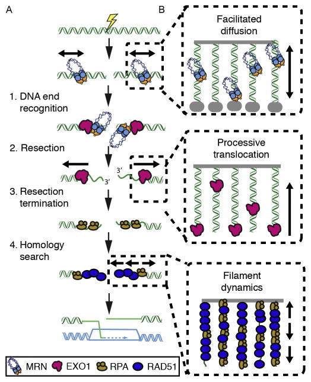
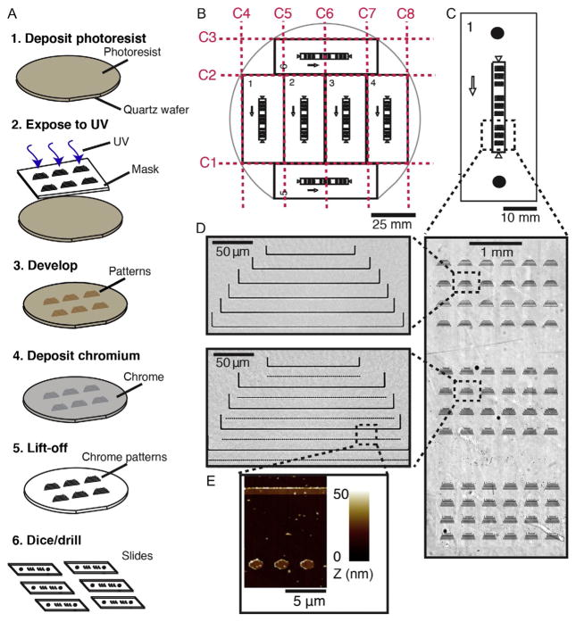
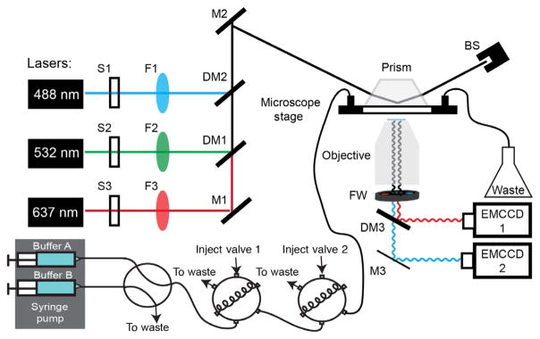
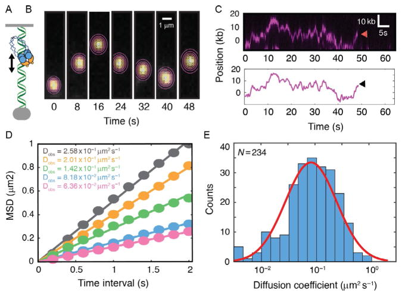
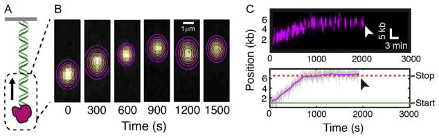
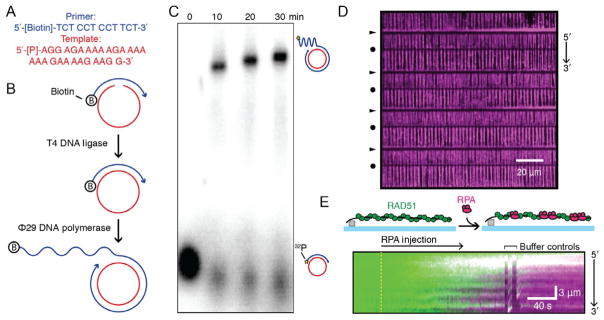

# Next-Generation DNA Curtains for Single-Molecule Studies of Homologous Recombination

**Michael M. Soniat, Logan R. Myler, Jeffrey M. Schaub, Yoori Kim, Ignacio F. Gallardo, and Ilya J. Finkelstein**

*Methods in Enzymology*, Volume 592, Pages 259–281 (2017)

**DOI:** [10.1016/bs.mie.2017.03.011](https://doi.org/10.1016/bs.mie.2017.03.011)

---

## Table of Contents

- [Abstract](#abstract)
- [1. Introduction](#1-introduction)
- [2. Methods](#2-methods)
- [3. Applications](#3-applications)
- [Acknowledgments](#acknowledgments)

---

##  Abstract
Homologous recombination (HR) is a universally conserved DNA double-strand break repair pathway. Single-molecule fluorescence imaging approaches have revealed new mechanistic insights into nearly all aspects of HR. These methods are especially suited for studying protein complexes because multicolor fluorescent imaging can parse out subassemblies and transient intermediates that associate with the DNA substrates on the millisecond to hour timescales. However, acquiring single-molecule datasets remains challenging because most of these approaches are designed to measure one molecular reaction at a time. The DNA curtains platform facilitates high-throughput single-molecule imaging by organizing arrays of DNA molecules on the surface of a microfluidic flowcell. Here, we describe a second-generation UV lithography-based protocol for fabricating flowcells for DNA curtains. This protocol greatly reduces the challenges associated with assembling DNA curtains and paves the way for the rapid acquisition of large datasets from individual single-molecule experiments. Drawing on our recent studies of human HR, we also provide an overview of how DNA curtains can be used for observing facilitated protein diffusion, processive enzyme translocation, and nucleoprotein filament dynamics on single-stranded DNA. Together, these protocols and case studies form a comprehensive introduction for other researchers that may want to adapt DNA curtains for high-throughput single-molecule studies of DNA replication, transcription, and repair.
---
##  1. INTRODUCTION
DNA double-strand breaks (DSBs) occur when both strands of the DNA duplex are cleaved in close proximity, fragmenting the chromosome into two distinct pieces. Each of our cells must repair upward of 50 DSBs that arise spontaneously per cell cycle ([Vilenchik & Knudson, 2003](https://pmc.ncbi.nlm.nih.gov/articles/PMC5564670/#R50)). DSBs also occur as a result of radio- and chemotherapeutics, which remain our frontline treatments for cancer. Repairing DSBs rapidly and accurately is critical, as incorrect DSB repair may lead to genome rearrangements, oncogene activation, and tumor formation. The global importance of DSB repair is illustrated by the severe cancer syndromes in patients with disruptions in any of the DSB repair proteins. For example, mutations in the MRE11–RAD50–NBS1 (MRN) complex, which participates in the first steps of DSB repair as well as the DNA damage response, lead to several familial cancer syndromes, immunodeficiency, and intellectual disability ([Lamarche, Orazio, & Weitzman, 2010](https://pmc.ncbi.nlm.nih.gov/articles/PMC5564670/#R25); [Luo et al., 1999](https://pmc.ncbi.nlm.nih.gov/articles/PMC5564670/#R29); [Williams et al., 2002](https://pmc.ncbi.nlm.nih.gov/articles/PMC5564670/#R53)). While MRN deficiency can lead to genome instability, MRN overexpression is also seen in up to ~30% of cancer cell lines ([Cerami et al., 2012](https://pmc.ncbi.nlm.nih.gov/articles/PMC5564670/#R8)). By elevating MRN levels, cancer cells develop resistance to genotoxic treatments via MRN-dependent alternative end-joining pathways ([Bunting & Nussenzweig, 2013](https://pmc.ncbi.nlm.nih.gov/articles/PMC5564670/#R5)). The spectrum and severity of MRN-associated diseases likely arise from the global effects of diminished DSB repair and DNA damage signaling ([Paull, 2015](https://pmc.ncbi.nlm.nih.gov/articles/PMC5564670/#R38)).
Eukaryotes have two major DSB repair pathways ([Fig. 1A](#fig1)). Non-homologous end joining (NHEJ) is an error-prone mechanism that does not use any DNA sequence homology to repair the DSB ([Weterings & Chen, 2008](https://pmc.ncbi.nlm.nih.gov/articles/PMC5564670/#R52)). NHEJ is active throughout the cell cycle and is the predominant repair pathway during the G1 phase in mammalian cells ([Bogomazova, Lagarkova, Tskhovrebova, Shutova, & Kiselev, 2011](https://pmc.ncbi.nlm.nih.gov/articles/PMC5564670/#R2); [Shahar et al., 2012](https://pmc.ncbi.nlm.nih.gov/articles/PMC5564670/#R42); [Shibata et al., 2011](https://pmc.ncbi.nlm.nih.gov/articles/PMC5564670/#R43)). We direct the reader to several excellent reviews that summarize the mechanisms of human NHEJ, which is beyond the scope of this manuscript ([Deriano & Roth, 2013](https://pmc.ncbi.nlm.nih.gov/articles/PMC5564670/#R12); [Weterings & Chen, 2008](https://pmc.ncbi.nlm.nih.gov/articles/PMC5564670/#R52)).
***Fig. 1.*** {#fig1}

Overview of protein dynamics during eukaryotic homologous recombination. (A) 1. DNA end recognition: The MRE11–RAD50–NBS1 (MRN) complex scans for free DNA ends via facilitated diffusion. Next, MRN loads Exonuclease 1 (EXO1) and other members of the resectosome at the free DNA ends. 2. EXO1 (or the BLM–DNA2 complex) nucleolytically processes (resects) the free DNA ends to produce long 3′-ssDNA ends. The resulting ssDNA is rapidly bound by replication protein A (RPA). 3. Resection terminates via an unknown mechanism and RPA is exchanged with the recombinase RAD51. 4. RAD51 catalyzes the search for a homologous DNA sequence in a sister chromatid. Finally, the missing genetic information is resynthesized to restore the physical continuity of the genome. (B) Illustration of how DNA curtains can be used to observe facilitated diffusion (_top_), processive translocation (_middle_), and nucleoprotein filament dynamics on ssDNA (_bottom_).
Broken DNA ends can also be repaired via homologous recombination (HR), which uses the intact sister chromatid to promote error-free repair ([Karanam, Kafri, Loewer, & Lahav, 2012](https://pmc.ncbi.nlm.nih.gov/articles/PMC5564670/#R23); [Mao, Bozzella, Seluanov, & Gorbunova, 2008](https://pmc.ncbi.nlm.nih.gov/articles/PMC5564670/#R30)). HR requires a spatiotemporally controlled assembly of repair enzymes at a DSB. In humans, HR is initiated by the MRN complex, which is one of the first repair factors to localize to DSBs ([Lisby & Rothstein, 2009](https://pmc.ncbi.nlm.nih.gov/articles/PMC5564670/#R27); [Lukas et al., 2004](https://pmc.ncbi.nlm.nih.gov/articles/PMC5564670/#R28)). The MRE11 subunit encodes a nuclease domain that initiates endo- and exonucleolytic processing of the free DNA ends ([Cannavo & Cejka, 2014](https://pmc.ncbi.nlm.nih.gov/articles/PMC5564670/#R6); [Paull & Gellert, 1998](https://pmc.ncbi.nlm.nih.gov/articles/PMC5564670/#R39); [Shibata et al., 2014](https://pmc.ncbi.nlm.nih.gov/articles/PMC5564670/#R44)). Following initial processing by MRN and CtIP, cells assemble a multienzyme resectosome consisting minimally of Exonuclease 1 (EXO1) and the Bloom’s syndrome helicase (BLM). Together, the BLM–EXO1–MRN resectosome catalyzes long-range resection of the free DNA ends to produce 3′-ssDNA overhangs ([Cejka et al., 2010](https://pmc.ncbi.nlm.nih.gov/articles/PMC5564670/#R7); [Gravel, Chapman, Magill, & Jackson, 2008](https://pmc.ncbi.nlm.nih.gov/articles/PMC5564670/#R21); [Mimitou & Symington, 2011](https://pmc.ncbi.nlm.nih.gov/articles/PMC5564670/#R32); [Myler & Finkelstein, 2016](https://pmc.ncbi.nlm.nih.gov/articles/PMC5564670/#R34); [Nimonkar et al., 2011](https://pmc.ncbi.nlm.nih.gov/articles/PMC5564670/#R36); [Niu et al., 2010](https://pmc.ncbi.nlm.nih.gov/articles/PMC5564670/#R37); [Symington, 2016](https://pmc.ncbi.nlm.nih.gov/articles/PMC5564670/#R46); [Symington & Gautier, 2011](https://pmc.ncbi.nlm.nih.gov/articles/PMC5564670/#R47)). While EXO1 appears to be the major nuclease in human cells, a redundant resection pathway uses the DNA2 nuclease/helicase along with BLM to catalyze DNA resection ([Farah, Cromie, & Smith, 2009](https://pmc.ncbi.nlm.nih.gov/articles/PMC5564670/#R14); [Myler et al., 2016](https://pmc.ncbi.nlm.nih.gov/articles/PMC5564670/#R35); [Tomimatsu et al., 2014](https://pmc.ncbi.nlm.nih.gov/articles/PMC5564670/#R49); [Zhou, Caron, Legube, & Paull, 2014](https://pmc.ncbi.nlm.nih.gov/articles/PMC5564670/#R55)). The resectosome generates kilobase-length tracks of single-stranded DNA (ssDNA) that are initially bound by replication protein A (RPA). RPA is subsequently displaced by RAD51 recombinase, which forms presynaptic nucleoprotein filaments on the DNA ([Chen & Wold, 2014](https://pmc.ncbi.nlm.nih.gov/articles/PMC5564670/#R10); [Symington, 2016](https://pmc.ncbi.nlm.nih.gov/articles/PMC5564670/#R46)). The RAD51-ssDNA filament then searches for homologous sequences in a sister chromatid. After a stretch of homology is found, strand invasion creates a displacement loop, which is then extended by a DNA polymerase and resolved by structure-specific nucleases (resolvases) to complete error-free DSB repair ([Mehta & Haber, 2014](https://pmc.ncbi.nlm.nih.gov/articles/PMC5564670/#R31)). In sum, HR requires a spatiotemporal assembly of dozens of DNA repair enzymes at the site of the lesion.
Here, we describe a rapid and scalable protocol for assembling high-throughput single-molecule DNA curtains to visualize the first steps of HR ([Fig. 1B](#fig1)). Observing DSB repair factors on DNA curtains permits the direct observation of transient protein–DNA interactions that are frequently averaged out in ensemble biochemical experiments. For example, we demonstrate an assay for observing how MRN rapidly locates to the DSB among a vast pool of homoduplex DNA. We also describe assays for observing how the multienzyme resectosome nucleolytically processes the free DNA ends and how RPA and RAD51 dynamically exchange on the resulting ssDNA substrate. More broadly, we anticipate that high-throughput DNA curtains will be widely applicable for single-molecule fluorescence studies for nearly all protein–nucleic acid interactions.
---
##  2. METHODS
### 2.1 Overview
To assemble DNA curtains, DNA molecules are anchored to a supported lipid bilayer (SLB) via a biotin–streptavidin linkage and organized at patterned features on the flowcell surface ([Finkelstein & Greene, 2011](https://pmc.ncbi.nlm.nih.gov/articles/PMC5564670/#R16); [Gallardo et al., 2015](https://pmc.ncbi.nlm.nih.gov/articles/PMC5564670/#R18)). SLBs offer three key advantages for single-molecule studies of protein–DNA interactions. First, the zwitterionic lipid head groups provide excellent surface passivation, thereby preventing nonspecific adsorption of nucleic acids and proteins to the flowcell surfaces. Second, biotin, poly(ethylene glycol)s, and other chemically nonreactive species can be readily introduced into the bilayer by including these lipids during SLB preparation. Finally, SLBs form a two-dimensional fluid on the flowcell surface. This allows the bilayers to be readily manipulated via external shear or electrophoretic forces.
The ability to manipulate and organize SLBs is at the core of the DNA curtains platform. Buffer flow (hydrodynamic force) is used to push and assemble DNA molecules at physical barriers to lipid diffusion. Early approaches for DNA curtains used a glass scribe to mechanically etch the flowcell, but in practice this does not produce controllable lipid diffusion barriers ([Granéli, Yeykal, Prasad, & Greene, 2006](https://pmc.ncbi.nlm.nih.gov/articles/PMC5564670/#R20)). The next iteration of this approach used electron beam lithography (EBL) to position ~100-nm-wide chromium (Cr) features on the surface of a quartz microscope slide ([Fazio, Visnapuu, Wind, & Greene, 2008](https://pmc.ncbi.nlm.nih.gov/articles/PMC5564670/#R15); [Finkelstein & Greene, 2011](https://pmc.ncbi.nlm.nih.gov/articles/PMC5564670/#R16); [Visnapuu, Fazio, Wind, & Greene, 2008](https://pmc.ncbi.nlm.nih.gov/articles/PMC5564670/#R51)). However, the limited availability of EBL tools in many university clean rooms, along with expense and relatively slow slide fabrication, has limited the broad adoption of DNA curtains in molecular biology labs.
This protocol describes a rapid UV lithography-based process for fabricating quartz slides for DNA curtains imaging ([Gallardo et al., 2015](https://pmc.ncbi.nlm.nih.gov/articles/PMC5564670/#R18)) (summarized in [Fig. 2](#fig2)). This process is compatible with wafer-based fabrication and uses instruments that will be found in nearly all university clean rooms. Second, UV lithography can be used to pattern large substrates (we use ~100mm wafers), producing up to six flowcells that are capable of organizing aligned arrays of both single- and double-tethered DNA molecules. Finally, our approach is rapid, is cost effective, and reduces the learning curve for molecular biologists that may not be familiar with micro-/nanofabrication.
***Fig. 2.*** {#fig2}

Rapid UV lithography-based fabrication of microfluidic flowcells for DNA curtains. (A) Overview of the microfabrication process. 1–2. Photoresist is spin-coated onto a quartz wafer and exposed to UV light through a photomask in vacuum mode. 3–4. The UV resist is developed following the manufacturer’s protocol, and a thin (~13nm) layer of chromium (Cr) is deposited on the surface. 5. Excess Cr is lifted off by sonication in acetone, leaving behind only the Cr that is bonded directly to the quartz surface. 6. Finally, the wafer is diced to generate six (22mm × 50mm) quartz slides. Each slide is drilled using a diamond-coated drill bit to allow fluidic access to the flowcells. (B) Schematic of quartz wafer. _Red dashed lines_ indicate the dicing pattern. (C) Schematic of a microfabricated slide. The _arrow_ represents the direction of buffer flow. _Black circles_ indicate drilled holes. (D) An optical image of Cr features that are deposited onto the surface of the quartz slide (_right_). A close-up view of a set of Cr features used for single-tethered DNA curtains (_top_) and double-tethering DNA (_bottom_). (E) An atomic force microscope (AFM) scan of the rectangular region in (D) showing the Cr features. _Panels (D) and (E): Reprinted with permission from Gallardo, I. F., Pasupathy, P., Brown, M., Manhart, C. M., Neikirk, D. P., Alani, E., et al. (2015). High-throughput universal DNA curtain arrays for single-molecule fluorescence imaging._ Langmuir, 31 _, 10310_ – _10317._
In brief, quartz wafers are coated with a UV-sensitive photoresist, exposed to UV through a high-resolution photomask, and then developed. Following development, a ~13-nm layer of Cr is deposited onto the surface, and all Cr that is not affixed to the quartz wafer is removed during a lift-off procedure ([Fig. 2A](#fig2)). Finally, the wafers are diced into six 50mm × 22mm quartz slides and drilled to produce individual microfluidic flowcells ([Fig. 2B](#fig2)). Each flowcell allows for single- or double-tethering of aligned arrays of DNA molecules ([Fig. 2C–E](#fig2)).
After slide fabrication, the flowcells and SLBs are assembled as described previously ([Brown et al., 2016](https://pmc.ncbi.nlm.nih.gov/articles/PMC5564670/#R4); [Finkelstein, Visnapuu, & Greene, 2010](https://pmc.ncbi.nlm.nih.gov/articles/PMC5564670/#R17); [Gallardo et al., 2015](https://pmc.ncbi.nlm.nih.gov/articles/PMC5564670/#R18); [Myler et al., 2016](https://pmc.ncbi.nlm.nih.gov/articles/PMC5564670/#R35)). In brief, the flowcell is constructed using a clean microfabricated quartz slide and a glass coverslip using a double-sided tape, and then connectors are sealed to the quartz slide using a glue gun. An SLB is deposited on the surface of the flowcell, and DNA is tethered to the lipids via a biotin–streptavidin linkage. For double-tethered DNA curtains, the DNA is further end-labeled with a digoxigenin and tethered to a Cr pedestal via digoxigenin/α-digoxigenin antibody interactions. After DNA curtains assembly, the flowcell is connected to a micro-fluidic valve system and syringe pump ([Fig. 3](#fig3)). Proteins and DNA are visualized using an inverted total internal reflection fluorescence (TIRF) microscope ([Fig. 3](#fig3)).
***Fig. 3.*** {#fig3}

Overview of the custom-built total internal reflection fluorescence (TIRF) microscope for DNA curtain experiments. (A) Each laser beam (488, 532, and 637nm) passes through a computer-controlled shutter (S1–S3) and a neutral density filter (F1–F3). The three beams are combined via dichroic beam combiners (DM1–DM2) and directed through a periscope onto a prism at a total internal reflection angle. This generates an evanescent excitation wave that illuminates the surface-bound DNA and protein molecules. The resulting fluorescent signals are collected via a water immersion high numerical aperture objective, passed through two excitation cleanup filters and dispersed through a dichromic mirror onto two electron-multiplied charge coupled device (EMCCD) cameras. A computer-controlled dual-syringe pump and two digitally actuated injections valves permit rapid buffer switching or the injection of different protein complexes. Mirrors (M1–M3) and beam stop (BS).
### 2.2 Flowcell Fabrication
#### 2.2.1 Instrumentation
Below, we describe the minimal set of tools that are required for microfabricating quartz slides for DNA curtains. We indicate the tools used in our facility in parentheses. This process may need to be adapted slightly to work with other fabrication facilities:
  1. Spin coater (Laurell Technologies WS-650-23B)
  2. Bath sonicator (Branson 2510)
  3. Plasma etcher (March Plasma CS-170)
  4. Mask aligner (Suss MA6)
  5. E-beam deposition system (Cooke Ebeam/Sputter Deposition System)
  6. Light microscope (Zeiss Axioskop 2 MAT)
  7. Wafer dicing saw (Disco 321)
  8. Drill press (7110l; Servo)
  9. Hot plates (HS61; Torrey Pines Scientific)

#### 2.2.2 Materials
  1. 1.58-mm-thick, 101.6-mm diameter ground and polished GE124 quartz wafers (Technical Glass Products)
  2. AZ5209E photoresist (Integrated Micro Materials)
  3. MF-26A developer (2%–2.5% tetramethylammonium hydroxide) (Megadeposit)
  4. Acetone (Fisher)
  5. Isopropanol (Fisher)
  6. Ethanol (200 Proof; Pharmco-Aaper)
  7. Diamond dicing blades (B-010-325-H; Dicing Blade Technology)
  8. 1.4mm Diamond-tipped drill bits (DIB-211.00; Shor)
  9. Chrome-coated quartz mask (Photo Sciences)
  10. Silicon wafer tape (18074-8.00; Semiconductor Equipment Corp.)

#### 2.2.3 Protocol
  1. Wash 100mm wafers with water, acetone, and isopropanol and then dry with N2 gas. Repeat until no stains are visible against light.
  2. Following cleaning, set a clean wafer on a hot plate heated at 120°C for at least 5min, then remove wafer, and let cool down.
  3. Load wafer on a spin coater and add ~3mL of photoresist to the center of wafer. Wafer should be covered ~80%, especially over pattern areas. Avoid forming bubbles in the photoresist.
  4. Spin wafer at 500rpm for 5s followed by 4000rpm for 45s at a ramp rate of 300 rpms−1.
  5. Set coated wafers on a hot plate set at 95°C for 2min, then remove wafer, and let cool (protect from UV light to avoid exposing the photoresist).
  6. Linear barriers are produced by UV lithography using an MA6 mask aligner. Expose a Cr-coated quartz mask in vacuum mode with the photoresist-coated wafer for about 8s with a lamp power of 6.0–7.0 mWcm−2. AutoCAD files of the quartz masks are available on GitHub: <https://github.com/finkelsteinlab>. Exposure time may need to be optimized for the preferred developer and mask aligner.
  7. Develop the resist by placing the wafer in developer for 1min while gently shaking. Purple lines should appear where patterns are located. After 1min, put wafer into water bath for 30s and blow-dry with N2 gas.
  8. Verify that discrete lines and pedestals are visible on wafer using a light microscope similar to patterns shown in [Fig. 2D](#fig2). If patterns are not well formed, repeat steps 1–7.
  9. Etch the wafers with oxygen plasma for 60s at 100W to remove residual photoresist from wafer surface.
  10. Use an E-beam deposition system at 8kV to deposit a 13-nm layer of Cr (rate of deposition: 0.05 nms−1).
  11. Lift off the photoresist and Cr from the wafer by sonication in acetone for 1min. Repeat sonication if excess photoresist remains. Time is very important here, as longer sonication may strip some Cr features from the wafer.
  12. Rinse wafer with isopropanol to remove any additional Cr and dry with N2 gas.
  13. Cover wafers in a clean-room silicon wafer tape and use a dicing saw to cut the wafers (0.5–1 mms−1 at 30,000rpm) into six 50mm × 22mm slides. Procedure for cutting wafer is listed below and cut sites labeled in [Fig. 2B](#fig2):
    1. Make the first cut 22mm from the flat of the wafer.
    2. Following the first cut, move up 50mm to make the second cut followed by a 22mm movement up to make the third cut. Remove slides 5 and 6.
    3. Rotate slides 1–4 by 90 degrees and move 6mm from the bottom to make the fourth cut.
    4. After the fourth cut, slides 1–4 are made 22mm apart from each other.
    5. Cut slides 5 and 6 to remove excess wafer.
  14. Drill holes in the new slides as shown in [Fig. 2C](#fig2) under a constant stream of running water.
  15. Wash and assemble flowcells as previously described ([Brown et al., 2016](https://pmc.ncbi.nlm.nih.gov/articles/PMC5564670/#R4); [Finkelstein et al., 2010](https://pmc.ncbi.nlm.nih.gov/articles/PMC5564670/#R17); [Gallardo et al., 2015](https://pmc.ncbi.nlm.nih.gov/articles/PMC5564670/#R18); [Myler et al., 2016](https://pmc.ncbi.nlm.nih.gov/articles/PMC5564670/#R35)). See [Note 1](https://pmc.ncbi.nlm.nih.gov/articles/PMC5564670/#FN2).

### 2.3 Assembling DNA Curtains
#### 2.3.1 Materials
  1. Lipids buffer: 10m _M_ Tris–HCl [pH 8.0]; 100m _M_ NaCl.
  2. BSA buffer: 40m _M_ Tris–HCl [pH 8.0]; 1m _M_ MgCl2; 1m _M_ DTT; 0.2 mgmL−1 BSA.
  3. Streptavidin, stored as a 1.0 mgmL−1 stock in water (434301; Thermo).
  4. **λ** -phage DNA (SD0011; Thermo).
  5. Affinity purified goat antirabbit IgG h + l (GGHL-15A; Immunology Consultants Laboratory).
  6. Anti-digoxigenin rabbit monoclonal antibody (700772; Thermo).
  7. Liposome stock-DOPC (97.7mol%; 850375P), DOPE-biotin (0.3mol%; 87 0273P), and DOPE-mPEG2K (2mol%; 880130P) (Avanti Polar Lipids).

#### 2.3.2 Depositing Lipid Bilayers on the Flowcell Surface
  1. Wash the flowcell with distilled H2O to carefully remove all bubbles.
  2. Equilibrate the channel with 3–4mL of lipids buffer.
  3. Dilute 40 μL of liposome stock solution in 960 μL lipids buffer. Inject on the flowcell in three rounds of ~300 μL and let incubate for 10min in-between injections.
  4. Wash the flowcell in 3–4mL of lipids buffer and let incubate for 30min.

#### 2.3.3 Assembling Single-Tethered DNA Curtains
  1. Equilibrate the flowcell with 3–4mL BSA buffer and let stand for 10 min.
  2. Dilute 30 μL of 1.0 mgmL−1 streptavidin in 270 μL BSA buffer (0.1 mgmL−1 final) and inject on flowcell. Incubate for 10min.
  3. Wash the flowcell with 3–4mL of BSA buffer to remove any unbound streptavidin.
  4. Dilute 100 μL of **λ** -DNA in 900 μL of BSA buffer. Inject DNA in ~ 300 μL increments with 5-min incubation in between.
  5. Wash the flowcell with 2–3mL of BSA buffer.
  6. Connect the flowcell with the microfluidic syringe pump with a syringe (10–30mL) filled with desired imaging buffer. In a 4-mm-wide flowcell channel, flow rates of 0.4 mLmin−1 extend dsDNA by ~80% of the crystallographic B-form (corresponding to ~0.6pN of tension). This provides a convenient DNA extension for data acquisition and analysis.

#### 2.3.4 Assembling Double-Tethered DNA Curtains
  1. Dilute 15 μL of 1 mgmL−1 affinity purified goat antirabbit IgG in 285 μL lipids buffer (~0.05 mgmL−1 final) and inject on flowcell. Incubate for 10min.
  2. Equilibrate the flowcell with 3–4mL BSA buffer.
  3. Dilute 2.5 μL of 0.5 mgmL−1 antidigoxigenin rabbit monoclonal antibody in 250 μL BSA buffer (0.01 mgmL−1 final) and inject on flowcell. Incubate for 10min.
  4. Dilute 30 μL of 1.0 mgmL−1 streptavidin in 270 μL BSA buffer (0.1 mgmL−1 final) and inject on flowcell. Incubate for 10min.
  5. Wash the flowcell with 3–4mL of BSA buffer to remove any unbound streptavidin.
  6. Dilute 100 μL of **λ** -DNA with a digoxigenin label opposite the bio-tinylated end in 900 μL of BSA buffer. Inject DNA in ~300 μL increments with 5-min incubation in between.
  7. Wash the flowcell with 2–3mL of BSA buffer.
  8. Connect the flowcell with the microfluidic syringe pump with a syringe (10–30mL) filled with desired buffer. Flow rates of 0.4 mLmin−1 provide good DNA extension for data acquisition. In this configuration, flow can be stopped in order to observe proteins on double-tethered DNA. See [Notes 2](https://pmc.ncbi.nlm.nih.gov/articles/PMC5564670/#FN3) and [3](https://pmc.ncbi.nlm.nih.gov/articles/PMC5564670/#FN4).

---
##  3. APPLICATIONS
### 3.1 Facilitated Diffusion of MRN on Double-Tethered dsDNA Curtains
#### 3.1.1 Overview
Sequence and structure-specific DNA-binding proteins must rapidly locate their targets amid a vast pool of nonspecific DNA. These proteins accelerate the search process by employing a combination of three-dimensional diffusion through the nucleus and facilitated one-dimensional (1D) diffusion along the DNA. During 1D diffusion, proteins can either slide along the helical pitch of the DNA backbone or transiently dissociate and associate with the DNA via a series of microscopic hops. Both sliding and hopping have been observed in vitro via single-molecule and ensemble biochemistry approaches and have also been inferred via single-molecule imaging in live cells ([Blainey et al., 2009](https://pmc.ncbi.nlm.nih.gov/articles/PMC5564670/#R1); [Cravens et al., 2015](https://pmc.ncbi.nlm.nih.gov/articles/PMC5564670/#R11); [Elf, Li, & Xie, 2007](https://pmc.ncbi.nlm.nih.gov/articles/PMC5564670/#R13); [Halford & Marko, 2004](https://pmc.ncbi.nlm.nih.gov/articles/PMC5564670/#R22); [Schonhoft & Stivers, 2012](https://pmc.ncbi.nlm.nih.gov/articles/PMC5564670/#R41)). Indeed, 1D facilitated diffusion is a common feature of nearly all proteins that scan both DNA ([Blainey et al., 2009](https://pmc.ncbi.nlm.nih.gov/articles/PMC5564670/#R1); [Halford & Marko, 2004](https://pmc.ncbi.nlm.nih.gov/articles/PMC5564670/#R22); [Tafvizi, Mirny, & van Oijen, 2011](https://pmc.ncbi.nlm.nih.gov/articles/PMC5564670/#R48)) and RNA ([Chandradoss, Schirle, Szczepaniak, MacRae, & Joo, 2015](https://pmc.ncbi.nlm.nih.gov/articles/PMC5564670/#R9); [Koh, Kidwell, Ragunathan, Doudna, & Myong, 2013](https://pmc.ncbi.nlm.nih.gov/articles/PMC5564670/#R24)). Here, we describe the use of double-tethered DNA curtains to visualize and quantify the diffusive properties of MRN, which rapidly locates DSBs in human cells ([Fig. 4](#fig4)).
##### Fig. 4. {#fig4}

Facilitated diffusion of repair factors on DNA curtains. (A) Illustration and (B) individual frames from a movie of a fluorescent MRN complex diffusing on a double-tethered DNA substrate. _Contour plots_ indicate a two-dimensional (2D) Gaussian fit to the fluorescence data. The center of the Gaussian fit is used to extract the absolute position of the molecule over time with subpixel accuracy. (C) Kymograph of the same MRN molecule as in (B). _Red arrow_ indicates when the molecule dissociates from the DNA. Tracking data extracted from the fits in (B) are used to determine the time-dependent trajectory of a single MRN molecule. _Black arrow_ indicates MRN dissociation. These trajectories are used to calculate the mean-squared displacement (MSD) curves. (D) MSD curves and corresponding diffusion coefficients of five MRN molecules. A linear fit of the MSD curves is used to determine the one-dimensional diffusion coefficients. (E) Histogram of the diffusion coefficients of 234 individual MRN molecules. _Red line_ : Gaussian fit indicates that the diffusion coefficients are log-normally distributed.
#### 3.1.2 Materials
  1. Imaging buffer: 40m _M_ Tris–HCl [pH 8.0]; 60m _M_ NaCl; 1m _M_ ; MgCl2; 2m _M_ DTT; 0.2 mgmL−1 BSA
  2. Biotinylated anti-FLAG M2 antibody (F9291; Sigma)
  3. Streptavidin-conjugated quantum dots (QDots) 705nm (Q10163MP; Thermo)
  4. YOYO-1 stored as a 1m _M_ stock in DMSO (Y3601; Life Technologies)
  5. Glucose oxidase type II from _Aspergillus niger_ (G2133; Sigma)
  6. Catalase from bovine liver (C9322; Sigma)

#### 3.1.3 Protocol for MRN Labeling and Injection
  1. Follow flowcell assembly protocol for double-tethered DNA curtains from Section 2.3.
  2. Dilute a biotinylated anti-FLAG M2 antibody 1:100 in lipid buffer. Using an 8:1 ratio of diluted antibody to streptavidin-conjugated quantum dots, preincubate QDots with the antibody. In our hands, preincubating the QDots with a small amount of BSA buffer reduces aggregation and improves fluorescent labeling. Incubate this mixture for 10min on ice.
  3. Add the FLAG-labeled protein to the antibody–QDot mixture. Incubate this mixture for 10min on ice.
  4. Dilute the protein–antibody–QDot mixture to 150–200 μL with imaging buffer containing 2 μL of saturating biotin. Overall final concentration should be <10n _M_ protein such that the quantum dot concentration does not completely shroud the background of the flowcell when imaging.
  5. Inject the sample on a 200-μL loop attached to the main buffer flow microfluidic setup.
  6. Immediately begin recording on the microscope cameras.
  7. Observe the fluorescence on the camera during the injection so that the main “cloud” of background QDots flows slightly past the field of view so that individual molecules on the surface are visible. Turn off the flow and stop the syringe pump.
  8. After ~15–25min, resume the flow and inject YOYO-1 diluted in imaging buffer with a triplet oxygen scavenging system such as glucose oxidase/catalase. Turning the flow on and off will reveal which molecules are double tethered.
  9. Images are acquired using Nikon Elements (Nikon) or Micro-Manager ([Stuurman, Edelstein, Amodaj, Hoover, & Vale, 2010](https://pmc.ncbi.nlm.nih.gov/articles/PMC5564670/#R45)). Microscope settings were used at 10MHz camera readout mode, 300× EM gain, 5× conversion gain, and 200ms frame rate collected every second. The 488-nm laser was set to ~100mW (at prism face).

#### 3.1.4 Analyzing Protein Diffusion
  1. Collect imaging data on one or several fields of view and export data into a tiff (tagged-image file format) stack.
  2. Using FIJI, overlay postlabeled DNA with the Qdot movie. This is used as a visual check to confirm that the Qdot is associated with a single DNA molecule.
  3. Copy the movies of individual molecules into separate files for tracking.
  4. Using a custom-written FIJI plugin, fit a 2D Gaussian to the frames that contain a single molecule on DNA for over 10s (50 frames). Be careful not to include background molecules that are not on DNA or diffuse outside of the barrier positions (code available upon request) ([Fig. 4B and C](#fig4)).
  5. Ultimately, these tracking positions can be used to calculate the mean squared displacement (MSD) and the diffusion coefficients of individual molecules, as described previously ([Fig. 4D and E](#fig4); [Brown et al., 2016](https://pmc.ncbi.nlm.nih.gov/articles/PMC5564670/#R4)).

### 3.2 Processive EXO1 Translocation on Single-Tethered dsDNA Curtains
#### 3.2.1 Overview
Nearly all DNA repair pathways require nucleolytic cleavage of the damaged substrate. In human DSB repair, EXO1 catalyzes DSB resection to generate ssDNA tracts. These ssDNA tracts serve as a loading scaffold for RAD51. We recently described that EXO1 is a processive enzyme that can digest >5000bp per nucleolytic reaction ([Myler et al., 2016](https://pmc.ncbi.nlm.nih.gov/articles/PMC5564670/#R35)). For these experiments, we used single-tethered DNA curtains to observe long-range resection of individual EXO1 molecules for nearly 1h. Below, we describe a protocol for imaging EXO1 on DNA curtains ([Fig. 5](#fig5)). This protocol can be readily adopted for imaging other enzymes that move processively on DNA.
##### Fig. 5. {#fig5}

Directional translocation of EXO1 on DNA curtains. (A) Illustration and (B) individual frames from a movie of a fluorescent EXO1 molecule translocating on a single-tethered DNA substrate. Contour plots indicate a two-dimensional (2D) Gaussian fit to the fluorescence data. The center of the Gaussian fit is used to extract the time-dependent trajectory, as in [Fig. 4](#fig4). (C) Kymograph of the same EXO1 molecule as in (B). _White arrow_ indicates when the molecule dissociates from the DNA. Below is a time-dependent trajectory of the same EXO1 molecule as above. _Black arrow_ indicates protein dissociation. Such trajectories are used to calculate the velocity, processivity, and pause dynamics. _Images in panel (C) are reprinted with permission from Myler, L. R., Gallardo, I. F., Zhou, Y., Gong, F., Yang, S.-H., Wold, M. S., et al. (2016). Single-molecule imaging reveals the mechanism of Exo1 regulation by single-stranded DNA binding proteins._ Proceedings of the National Academy of Sciences of the United States of America, 113 _, e1170_ – _e1179._
#### 3.2.2 Imaging EXO1 on DNA Curtains
  1. Follow flowcell assembly protocol for single-tethered DNA curtains from Section 2.3 using DNA with a long 3′-ssDNA overhang (78nt) in order to facilitate the loading of EXO1 on DNA ends.
  2. Preincubate 5 μL of imaging buffer with 1 μL of streptavidin QDots (1pmol) for 5min.
  3. Next, add 800fmol (2 μL of 400n _M_) biotin-EXO1 to the QDot mixture and incubate for another 10min on ice.
  4. Dilute the EXO1 to 200 μL imaging buffer containing 2 μL of saturating biotin (4n _M_ final concentration EXO1). This will prevent the non-specific binding of EXO1 to the streptavidin-coated lipids on the flowcell.
  5. Inject EXO1 at 200 μL min−1 in a 100-μL loop. Given the relatively slow movement of EXO1, it may be necessary to shutter the laser to only capture one frame per second with a 200-ms exposure.
  6. Increase the flow rate to 400 μLmin−1 after loading for full DNA extension and observation of EXO1.
  7. Images are acquired using Nikon Elements (Nikon) or Micro-Manager ([Stuurman et al., 2010](https://pmc.ncbi.nlm.nih.gov/articles/PMC5564670/#R45)). Microscope settings were used at 10MHz camera readout mode, 300× EM gain, 5× conversion gain, and 200ms frame rate collected every second. The 488-nm laser was set to ~100mW (at prism face). See [Notes 4](https://pmc.ncbi.nlm.nih.gov/articles/PMC5564670/#FN5) and [5](https://pmc.ncbi.nlm.nih.gov/articles/PMC5564670/#FN6).

#### 3.2.3 Analyzing Processive EXO1 Translocation
  1. Collect imaging data on one or several fields of view and export data into a tiff stack.
  2. Track the EXO1 molecules as described in Section 3.1 for MRN ([Fig. 5B and C](#fig5)). Single out a stationary particle on the flowcell, and track its _x_ and _y_ positions with subpixel accuracy by fitting the point-spread function to a 2D Gaussian ([Yildiz et al., 2003](https://pmc.ncbi.nlm.nih.gov/articles/PMC5564670/#R54)).
  3. Shift every frame of the original movie relative to the first image using the tracking position to adjust for drift (FIJI script available upon request).
  4. These tracking data can be used to calculate the velocity, processivity, and lifetime of individual EXO1 molecules on DNA.

### 3.3 Dynamics of RPA and RAD51 Filaments on ssDNA Curtains
#### 3.3.1 Overview
RAD51 forms nucleoprotein filaments on ssDNA and catalyzes the homology search within a sister chromatid. However, RAD51 does not melt secondary ssDNA structures, making experiments with secondary-structure-rich ssDNA difficult. Previous single-molecule studies have used RPA to melt secondary ssDNA structure. In a second step, RAD51 is used to remove RPA from the ssDNA ([Gibb et al., 2014](https://pmc.ncbi.nlm.nih.gov/articles/PMC5564670/#R19)). Here, we adapt a protocol for generating long, low-complexity ssDNA templates for DNA curtains ([Fig. 6](#fig6)) ([Brockman, Kim, & Schroeder, 2011](https://pmc.ncbi.nlm.nih.gov/articles/PMC5564670/#R3); [Lee et al., 2014](https://pmc.ncbi.nlm.nih.gov/articles/PMC5564670/#R26)). Two oligonucleotides are used to perform rolling circle replication (RCR) ([Fig. 6A–C](#fig6)). The oligonucleotide circle that acts as the template is composed of adenines and guanines, whereas the ssDNA product is comprised solely of cytosine and thymine. This eliminates the inter- and intra-molecular Watson–Crick base pairing within the RCR product. Below, we use a previously characterized fluorescent RAD51(C319S) to demonstrate efficient RAD51 binding independent of other secondary-structure melting factors ([Fig. 6C and D](#fig6)) ([Modesti et al., 2007](https://pmc.ncbi.nlm.nih.gov/articles/PMC5564670/#R33)).
##### Fig. 6. {#fig6}

Nucleoprotein filament dynamics on low sequence complexity ssDNA curtains. (A) Sequences of the two ssDNA oligonucleotides used for rolling circle replication. (B) Schematic of rolling circle replication (RCR) reaction. T4 DNA ligase ligates the template oligo to form a contiguous template strand. Next, phi29 DNA polymerase catalyzes the synthesis of long ssDNA molecules. (C) Agarose gel of several time points along the RCR synthesis reaction. The primer oligonucleotide was 32P labeled on the 5′-terminus phosphate (_gold star_). (D) Wide-field image of a microfabricated barrier set with double-tethered ssDNA curtains coated with RPA-TagRFP (_magenta_). _Arrows_ and _circles_ denote chromium barriers and pedestals, respectively. (E) Illustration and kymograph showing a single ssDNA molecule coated with ATTO488-RAD51(C319S) (_green_) replaced by RPA-TagRFP (_magenta_). _Yellow dashed line_ denotes the injection of RPA–TagRFP into the flowcell. Buffer controls indicate when the buffer flow was toggled off and on to show that the florescent proteins retract to the Cr barriers simultaneously with the ssDNA molecule. This indicates that RAD51 and RPA are on the ssDNA molecule. _Panel A: Adapted from Lee, K. S., Marciel, A. B., Kozlov, A. G., Schroeder, C. M., Lohman, T. M., & Ha, T. (2014). Ultrafast redistribution of E. coli SSB along long single-stranded DNA via intersegment transfer._ Journal of Molecular Biology, 426 _, 2413_ – _2421._
#### 3.3.2 Materials
  1. TE buffer: 10m _M_ Tris–HCl [pH 8.0]; 0.1m _M_ EDTA
  2. RAD51 buffer: 40m _M_ Tris–HCl [pH 8.0]; 1m _M_ MgCl2; 5m _M_ CaCl2; 100m _M_ KCl; 1m _M_ DTT; 1m _M_ ATP; 0.2 mgmL−1 BSA; 1m _M_ Trolox (Sigma-Aldrich); 1.0% glucose (w/v); 500units catalase (Sigma-Aldrich); 70units glucose oxidase (Sigma-Aldrich)
  3. 10× T4 DNA ligase reaction buffer (B0202S; NEB)
  4. T4 DNA ligase (M0202; NEB)
  5. Primer oligo (/Biosg/TC TCC TCC TTC T—HPLC purified; Integrated DNA Technologies)
  6. Template oligo (/5Phos/AG GAG AAA AAG AAA AAA AGA AAA GAA GG—PAGE purified; Integrated DNA Technologies)
  7. Nuclease-free water
  8. BSA, Molecular Biology Grade (B9000S; NEB)
  9. Thermocycler (Mastercycler pro S; Eppendorf )
  10. 10× phi29 DNA polymerase reaction buffer (B0269S; NEB)
  11. phi29 DNA polymerase (homemade 5 μ _M_ stock)
  12. Deoxynucleotide (dNTP) solution set (N0446S; NEB)

#### 3.3.3 Protocol for Ligation Reaction
  1. Prepare a 49 μL ligation reaction containing: (i) 5 μL 10× T4 ligase reaction buffer; (ii) 2 μL template oligo (10 μ _M_ stock in TE buffer); (iii) 1.8 μL primer oligo (10 μ _M_ stock in TE buffer); and (iv) 40.2 μL nuclease-free water.
  2. Heat the ligation reaction to 75°C for 5min in a thermocycler and cool the reaction to 4°C at a rate of μ1°C min−1.
  3. Add 1 μL of T4 DNA ligase to the reaction and incubate at room temperature for 3–5h. See [Note 6](https://pmc.ncbi.nlm.nih.gov/articles/PMC5564670/#FN7).

#### 3.3.4 Protocol for RCR
  1. Prepare a 100 μL RCR reaction containing: (i) 10 μL of 10× phi29 DNA polymerase reaction buffer; (ii) 8 μL dTTP (10m _M_ stock corresponding to 0.8m _M_ final concentration); (iii) 8 μL dCTP (10m _M_ stock corresponding to 0.8m _M_ final concentration); (iv) 1 μL BSA (10 mgmL−1 stock corresponding to 0.1 mgmL−1 final concentration); (v) 6.25 μL ligation mix (400n _M_ stock corresponding to 25n _M_ final concentration); (vi) 10 μL phi29 DNA polymerase (5 μ _M_ homemade stock corresponding to 0.5 μ _M_ final concentration); and (vii) 56.75 μL nuclease-free water.
  2. Incubate reaction at 30°C for 30min to generate ssDNA molecules that are greater than 20 μm in length. Length of incubation can be adjusted for the desired ssDNA length.
  3. Add 10 μL of 0.5 _M_ EDTA to quench reaction. Gently flick or invert tube to mix. Do not vortex, as this causes shearing of ssDNA molecules. Place reaction on ice. See [Notes 7](https://pmc.ncbi.nlm.nih.gov/articles/PMC5564670/#FN8) and [8](https://pmc.ncbi.nlm.nih.gov/articles/PMC5564670/#FN9).

#### 3.3.5 Assembling ssDNA Curtains
  1. Follow lipid bilayer protocol from Section 2.3.
  2. Equilibrate the flowcell with 3–4mL BSA buffer and let stand for 10min.
  3. Dilute 30 μL of 1.0 mgmL−1 streptavidin in 270 μL BSA buffer (0.1 mgmL−1 final) and inject on flowcell. Incubate for 10min.
  4. Wash the flowcell with 3–4mL of BSA buffer to remove any unbound streptavidin.
  5. Dilute 25 μL of quenched rolling circle reaction in 975 μL of BSA buffer. Inject ssDNA in ~300 μL increments with 5-min incubation in between.
  6. Wash the flowcell with 2–3mL of BSA buffer.
  7. Connect the flowcell with the microfluidic syringe pump with a syringe (10–30mL) filled with desired buffer. Flow rates of 1.0 mLmin−1 are generally used to extend the ssDNA in 4-mm-wide flowcells.

#### 3.3.6 Analyzing Protein Filament Dynamics
  1. RAD51(C319S)-ATTO488 was diluted to 5n _M_ in 700 μL of RAD51 buffer and injected at 0.5 mLmin−1.
  2. RPA-TagRFP was diluted to 2n _M_ in RAD51 buffer and flowed through the flowcell at 1.0 mLmin−1.
  3. Images are acquired using Nikon Elements (Nikon) or Micro-Manager ([Stuurman et al., 2010](https://pmc.ncbi.nlm.nih.gov/articles/PMC5564670/#R45)). Microscope settings were used at 10MHz camera readout mode, 300× EM gain, 5× conversion gain, and 200ms frame rate collected every 5s. 488 and 532nm lasers were set to ~ 20 and ~25mW (at prism face), respectively.
  4. Data were exported into a tiff stack and processed with FIJI ([Schindelin et al., 2012](https://pmc.ncbi.nlm.nih.gov/articles/PMC5564670/#R40)).
  5. Kymographs were generated with using the “Reslice” tool, making a single pixel width image of the ssDNA over time.
  6. Fluorescent intensity can be calculated over the ssDNA or region of interest using the “Measure” tool to average the pixel intensity over time.

---
##  Acknowledgments
We are indebted to Dr. Mauro Modesti and Dr. Tanya Paull for overexpression plasmids. We thank Dr. Praveenkumar Pasupathy for his help in troubleshooting the quartz slide fabrication process.
_Funding._ This work was supported by the National Science Foundation (1453358 to I.J.F.), the Institute of General Medical Sciences of the National Institutes of Health (GM097177 and GM120554 to I.J.F.), CPRIT (R1214 to I.J.F.), and the Welch Foundation (F-l808 to I.J.F.). I.J.F. is a CPRIT Scholar in Cancer Research. L.R.M. is supported by the National Cancer Institute (CA212452). Y.K. is a Howard Hughes Medical Institute international graduate student fellow.

---

## References

1. Blainey PC, Luo G, Kou SC, Mangel WF, Verdine GL, Bagchi B, et al. Nonspecifically bound proteins spin while diffusing along DNA. *Nature Structural & Molecular Biology*. 2009;16:1224–1229.
2. Bogomazova AN, Lagarkova MA, Tskhovrebova LV, Shutova MV, Kiselev SL. Error-prone nonhomologous end joining repair operates in human pluripotent stem cells during late G2. *Aging*. 2011;3:584–596.
3. Brockman C, Kim SJ, Schroeder CM. Direct observation of single flexible polymers using single stranded DNA. *Soft Matter*. 2011;7:8005–8008.
4. Brown MW, Kim Y, Williams GM, Huck JD, Surtees JA, Finkelstein IJ. Dynamic DNA binding licenses a repair factor to bypass roadblocks in search of DNA lesions. *Nature Communications*. 2016;7:10607.
5. Bunting SF, Nussenzweig A. End-joining, translocations and cancer. *Nature Reviews Cancer*. 2013;13:443–454.
6. Cannavo E, Cejka P. Sae2 promotes dsDNA endonuclease activity within Mre11-Rad50-Xrs2 to resect DNA breaks. *Nature*. 2014;514:122–125.
7. Cejka P, Cannavo E, Polaczek P, Masuda-Sasa T, Pokharel S, Campbell JL, et al. DNA end resection by Dna2-Sgs1-RPA and its stimulation by Top3-Rmi1 and Mre11-Rad50-Xrs2. *Nature*. 2010;467:112–116.
8. Cerami E, Gao J, Dogrusoz U, Gross BE, Sumer SO, Aksoy BA, et al. The cBio cancer genomics portal: An open platform for exploring multidimensional cancer genomics data. *Cancer Discovery*. 2012;2:401–404.
9. Chandradoss SD, Schirle NT, Szczepaniak M, MacRae IJ, Joo C. A dynamic search process underlies microRNA targeting. *Cell*. 2015;162:96–107.
10. Chen R, Wold MS. Replication protein A: Single-stranded DNA's first responder: Dynamic DNA-interactions allow replication protein A to direct single-strand DNA intermediates into different pathways for synthesis or repair. *BioEssays: News and Reviews in Molecular, Cellular and Developmental Biology*. 2014;36:1156–1161.
11. Cravens SL, Schonhoft JD, Rowland MM, Rodriguez AA, Anderson BG, Stivers JT. Molecular crowding enhances facilitated diffusion of two human DNA glycosylases. *Nucleic Acids Research*. 2015;43:4087–4097.
12. Deriano L, Roth DB. Modernizing the nonhomologous end-joining repertoire: Alternative and classical NHEJ share the stage. *Annual Review of Genetics*. 2013;47:433–455.
13. Elf J, Li GW, Xie XS. Probing transcription factor dynamics at the single-molecule level in a living cell. *Science*. 2007;316:1191–1194.
14. Farah JA, Cromie GA, Smith GR. Ctp1 and exonuclease 1, alternative nucleases regulated by the MRN complex, are required for efficient meiotic recombination. *Proceedings of the National Academy of Sciences of the United States of America*. 2009;106:9356–9361.
15. Fazio T, Visnapuu ML, Wind S, Greene EC. DNA curtains and nanoscale curtain rods: High-throughput tools for single molecule imaging. *Langmuir*. 2008;24:10524–10531.
16. Finkelstein IJ, Greene EC. Supported lipid bilayers and DNA curtains for high-throughput single-molecule studies. *Methods in Molecular Biology*. 2011;745:447–461.
17. Finkelstein IJ, Visnapuu ML, Greene EC. Single-molecule imaging reveals mechanisms of protein disruption by a DNA translocase. *Nature*. 2010;468:983–987.
18. Gallardo IF, Pasupathy P, Brown M, Manhart CM, Neikirk DP, Alani E, et al. High-throughput universal DNA curtain arrays for single-molecule fluorescence imaging. *Langmuir*. 2015;31:10310–10317.
19. Gibb B, Ye LF, Gergoudis SC, Kwon Y, Niu H, Sung P, et al. Concentration-dependent exchange of replication protein A on single-stranded DNA revealed by single-molecule imaging. *PLoS One*. 2014;9:e87922.
20. Granéli A, Yeykal CC, Prasad TK, Greene EC. Organized arrays of individual DNA molecules tethered to supported lipid bilayers. *Langmuir*. 2006;22:292–299.
21. Gravel S, Chapman JR, Magill C, Jackson SP. DNA helicases Sgs1 and BLM promote DNA double-strand break resection. *Genes & Development*. 2008;22:2767–2772.
22. Halford SE, Marko JF. How do site-specific DNA-binding proteins find their targets? *Nucleic Acids Research*. 2004;32:3040–3052.
23. Karanam K, Kafri R, Loewer A, Lahav G. Quantitative live cell imaging reveals a gradual shift between DNA repair mechanisms and a maximal use of HR in mid S phase. *Molecular Cell*. 2012;47:320–329.
24. Koh HR, Kidwell MA, Ragunathan K, Doudna JA, Myong S. ATP-independent diffusion of double-stranded RNA binding proteins. *Proceedings of the National Academy of Sciences of the United States of America*. 2013;110:151–156.
25. Lamarche BJ, Orazio NI, Weitzman MD. The MRN complex in double-strand break repair and telomere maintenance. *FEBS Letters*. 2010;584:3682–3695.
26. Lee KS, Marciel AB, Kozlov AG, Schroeder CM, Lohman TM, Ha T. Ultrafast redistribution of E. coli SSB along long single-stranded DNA via inter-segment transfer. *Journal of Molecular Biology*. 2014;426:2413–2421.
27. Lisby M, Rothstein R. Choreography of recombination proteins during the DNA damage response. *DNA Repair*. 2009;8:1068–1076.
28. Lukas C, Melander F, Stucki M, Falck J, Bekker-Jensen S, Goldberg M, et al. Mdc1 couples DNA double-strand break recognition by Nbs1 with its H2AX-dependent chromatin retention. *The EMBO Journal*. 2004;23:2674–2683.
29. Luo G, Yao MS, Bender CF, Mills M, Bladl AR, Bradley A, et al. Disruption of mRad50 causes embryonic stem cell lethality, abnormal embryonic development, and sensitivity to ionizing radiation. *Proceedings of the National Academy of Sciences of the United States of America*. 1999;96:7376–7381.
30. Mao Z, Bozzella M, Seluanov A, Gorbunova V. DNA repair by non-homologous end joining and homologous recombination during cell cycle in human cells. *Cell Cycle*. 2008;7:2902–2906.
31. Mehta A, Haber JE. Sources of DNA double-strand breaks and models of recombinational DNA repair. *Cold Spring Harbor Perspectives in Biology*. 2014;6:a016428.
32. Mimitou EP, Symington LS. DNA end resection—Unraveling the tail. *DNA Repair*. 2011;10:344–348.
33. Modesti M, Ristic D, van der Heijden T, Dekker C, van Mameren J, Peterman EJG, et al. Fluorescent human RAD51 reveals multiple nucleation sites and filament segments tightly associated along a single DNA molecule. *Cell*. 2007;15:599–609.
34. Myler LR, Finkelstein IJ. Eukaryotic resectosomes: A single-molecule perspective. *Progress in Biophysics and Molecular Biology*. 2016 (In press).
35. Myler LR, Gallardo IF, Zhou Y, Gong F, Yang SH, Wold MS, et al. Single-molecule imaging reveals the mechanism of Exo1 regulation by single-stranded DNA binding proteins. *Proceedings of the National Academy of Sciences of the United States of America*. 2016;113:e1170–e1179.
36. Nimonkar AV, Genschel J, Kinoshita E, Polaczek P, Campbell JL, Wyman C, et al. BLM-DNA2-RPA-MRN and EXO1-BLM-RPA-MRN constitute two DNA end resection machineries for human DNA break repair. *Genes & Development*. 2011;25:350–362.
37. Niu H, Chung WH, Zhu Z, Kwon Y, Zhao W, Chi P, et al. Mechanism of the ATP-dependent DNA end-resection machinery from Saccharomyces cerevisiae. *Nature*. 2010;467:108–111.
38. Paull TT. Mechanisms of ATM activation. *Annual Review of Biochemistry*. 2015;84:711–738.
39. Paull TT, Gellert M. The 3′ to 5′ exonuclease activity of Mre11 facilitates repair of DNA double-strand breaks. *Molecular Cell*. 1998;1:969–979.
40. Schindelin J, Arganda-Carreras I, Frise E, Kaynig V, Longair M, Pietzsch T, et al. Fiji: An open-source platform for biological-image analysis. *Nature Methods*. 2012;9:676–682.
41. Schonhoft JD, Stivers JT. Timing facilitated site transfer of an enzyme on DNA. *Nature Chemical Biology*. 2012;8:205–210.
42. Shahar OD, Raghu Ram EVS, Shimshoni E, Hareli S, Meshorer E, Goldberg M. Live imaging of induced and controlled DNA double-strand break formation reveals extremely low repair by homologous recombination in human cells. *Oncogene*. 2012;31:3495–3504.
43. Shibata A, Conrad S, Birraux J, Geuting V, Barton O, Ismail A, et al. Factors determining DNA double-strand break repair pathway choice in G2 phase. *The EMBO Journal*. 2011;30:1079–1092.
44. Shibata A, Moiani D, Arvai AS, Perry J, Harding SM, Genois MM, et al. DNA double-strand break repair pathway choice is directed by distinct MRE11 nuclease activities. *Molecular Cell*. 2014;53:7–18.
45. Stuurman N, Edelstein AD, Amodaj N, Hoover KH, Vale RD. Computer control of microscopes using μManager. *Current Protocols in Molecular Biology*. 2010;Chapter 14(Unit14.20).
46. Symington LS. Mechanism and regulation of DNA end resection in eukaryotes. *Critical Reviews in Biochemistry and Molecular Biology*. 2016;51:195–212.
47. Symington LS, Gautier J. Double-strand break end resection and repair pathway choice. *Annual Review of Genetics*. 2011;45:247–271.
48. Tafvizi A, Mirny LA, van Oijen AM. Dancing on DNA: Kinetic aspects of search processes on DNA. *Chemphyschem*. 2011;12:1481–1489.
49. Tomimatsu N, Mukherjee B, Catherine Hardebeck M, Ilcheva M, Vanessa Camacho C, Harris L, et al. Phosphorylation of EXO1 by CDKs 1 and 2 regulates DNA end resection and repair pathway choice. *Nature Communications*. 2014;5:3561.
50. Vilenchik MM, Knudson AG. Endogenous DNA double-strand breaks: Production, fidelity of repair, and induction of cancer. *Proceedings of the National Academy of Sciences of the United States of America*. 2003;100:12871–12876.
51. Visnapuu ML, Fazio T, Wind S, Greene EC. Parallel arrays of geometric nanowells for assembling curtains of DNA with controlled lateral dispersion. *Langmuir*. 2008;24:11293–11299.
52. Weterings E, Chen DJ. The endless tale of non-homologous end-joining. *Cell Research*. 2008;18:114–124.
53. Williams BR, Mirzoeva OK, Morgan WF, Lin J, Dunnick W, Petrini JHJ. A murine model of Nijmegen breakage syndrome. *Current Biology*. 2002;12:648–653.
54. Yildiz A, Forkey JN, McKinney SA, Ha T, Goldman YE, Selvin PR. Myosin V walks hand-over-hand: Single fluorophore imaging with 1.5-nm localization. *Science*. 2003;300:2061–2065.
55. Zhou Y, Caron P, Legube G, Paull TT. Quantitation of DNA double-strand break resection intermediates in human cells. *Nucleic Acids Research*. 2014;42:e19.

---

*Archived from [PubMed Central (PMC5564670)](https://pmc.ncbi.nlm.nih.gov/articles/PMC5564670/) on 2025-07-19.*
