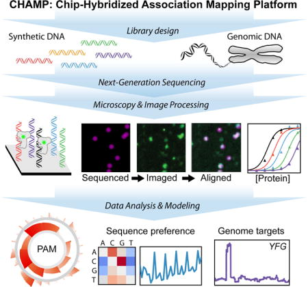
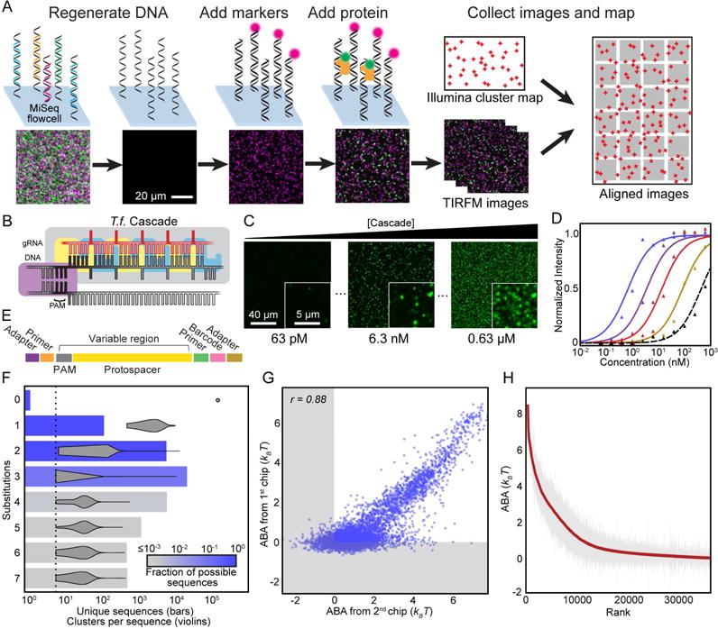
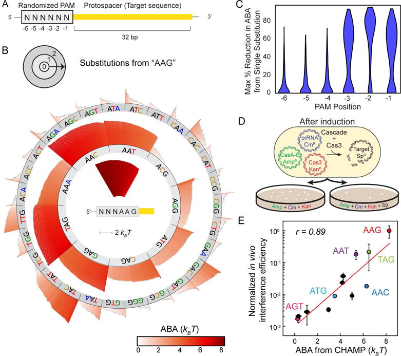
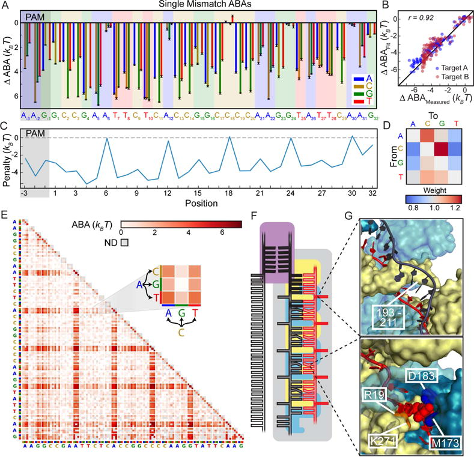
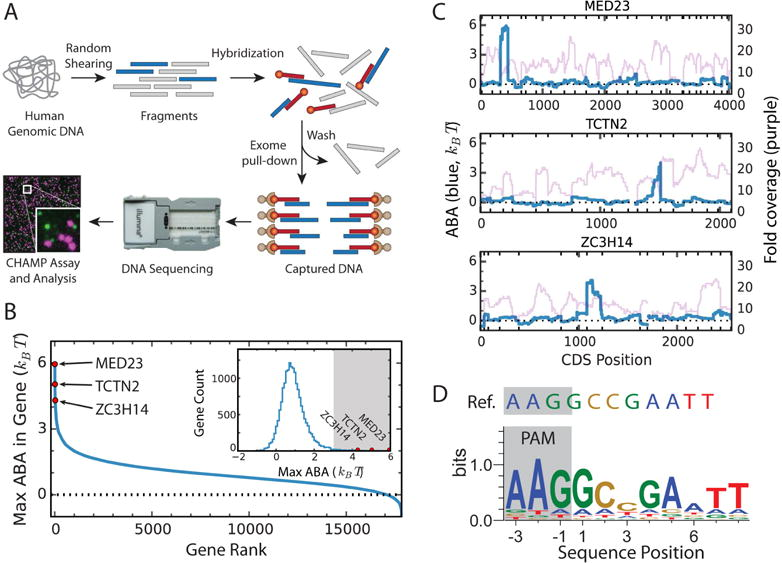
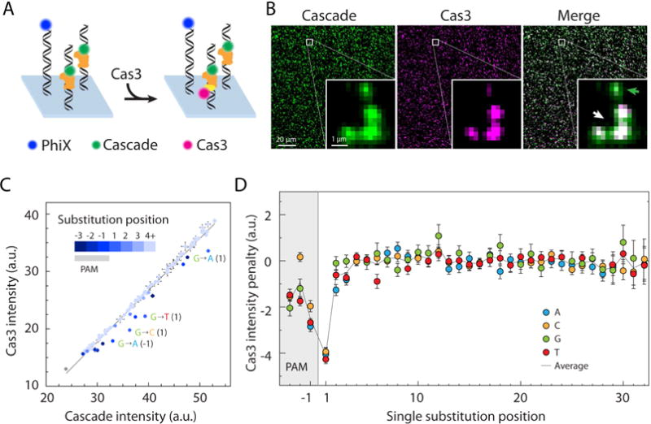
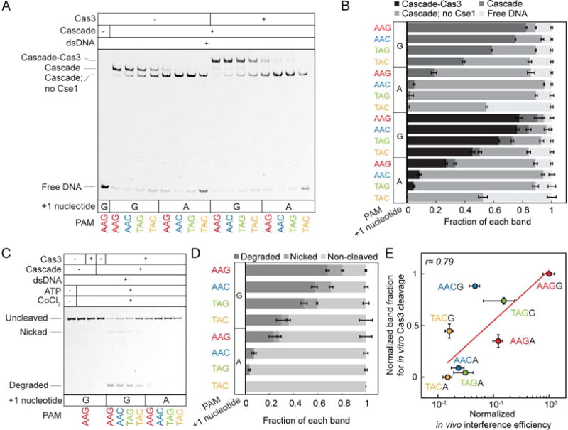

# Massively parallel biophysical analysis of CRISPR-Cas complexes on next generation sequencing chips

# Massively parallel biophysical analysis of CRISPR-Cas complexes on next generation sequencing chips
[Cheulhee Jung](https://pubmed.ncbi.nlm.nih.gov/?term="Jung%20C"\[Author\])
### Cheulhee Jung
1Department of Molecular Biosciences and Institute for Cellular and Molecular Biology, University of Texas at Austin, Austin, Texas 78712, USA
Find articles by [Cheulhee Jung](https://pubmed.ncbi.nlm.nih.gov/?term="Jung%20C"\[Author\])
1,¶, [John Hawkins](https://pubmed.ncbi.nlm.nih.gov/?term="Hawkins%20J"\[Author\])
### John Hawkins
2Institute for Computational Engineering and Science, University of Texas at Austin, Austin, Texas 78712, USA
Find articles by [John Hawkins](https://pubmed.ncbi.nlm.nih.gov/?term="Hawkins%20J"\[Author\])
2,¶, [Stephen K Jones Jr](https://pubmed.ncbi.nlm.nih.gov/?term="Jones%20SK"\[Author\])
### Stephen K Jones Jr
1Department of Molecular Biosciences and Institute for Cellular and Molecular Biology, University of Texas at Austin, Austin, Texas 78712, USA
Find articles by [Stephen K Jones Jr](https://pubmed.ncbi.nlm.nih.gov/?term="Jones%20SK"\[Author\])
1,¶, [Yibei Xiao](https://pubmed.ncbi.nlm.nih.gov/?term="Xiao%20Y"\[Author\])
### Yibei Xiao
3Department of Molecular Biology and Genetics, Cornell University, 253 Biotechnology Building, Ithaca, NY 14853, USA
Find articles by [Yibei Xiao](https://pubmed.ncbi.nlm.nih.gov/?term="Xiao%20Y"\[Author\])
3, [James Rybarski](https://pubmed.ncbi.nlm.nih.gov/?term="Rybarski%20J"\[Author\])
### James Rybarski
1Department of Molecular Biosciences and Institute for Cellular and Molecular Biology, University of Texas at Austin, Austin, Texas 78712, USA
Find articles by [James Rybarski](https://pubmed.ncbi.nlm.nih.gov/?term="Rybarski%20J"\[Author\])
1, [Kaylee E Dillard](https://pubmed.ncbi.nlm.nih.gov/?term="Dillard%20KE"\[Author\])
### Kaylee E Dillard
1Department of Molecular Biosciences and Institute for Cellular and Molecular Biology, University of Texas at Austin, Austin, Texas 78712, USA
Find articles by [Kaylee E Dillard](https://pubmed.ncbi.nlm.nih.gov/?term="Dillard%20KE"\[Author\])
1, [Jeffrey Hussmann](https://pubmed.ncbi.nlm.nih.gov/?term="Hussmann%20J"\[Author\])
### Jeffrey Hussmann
2Institute for Computational Engineering and Science, University of Texas at Austin, Austin, Texas 78712, USA
Find articles by [Jeffrey Hussmann](https://pubmed.ncbi.nlm.nih.gov/?term="Hussmann%20J"\[Author\])
2, [Fatema A Saifuddin](https://pubmed.ncbi.nlm.nih.gov/?term="Saifuddin%20FA"\[Author\])
### Fatema A Saifuddin
1Department of Molecular Biosciences and Institute for Cellular and Molecular Biology, University of Texas at Austin, Austin, Texas 78712, USA
Find articles by [Fatema A Saifuddin](https://pubmed.ncbi.nlm.nih.gov/?term="Saifuddin%20FA"\[Author\])
1, [Cagri A Savran](https://pubmed.ncbi.nlm.nih.gov/?term="Savran%20CA"\[Author\])
### Cagri A Savran
4School of Mechanical Engineering, Birck Nanotechnology Center, Purdue University, 1205 W. State St., West Lafayette, IN 47907, USA
Find articles by [Cagri A Savran](https://pubmed.ncbi.nlm.nih.gov/?term="Savran%20CA"\[Author\])
4, [Andrew D Ellington](https://pubmed.ncbi.nlm.nih.gov/?term="Ellington%20AD"\[Author\])
### Andrew D Ellington
1Department of Molecular Biosciences and Institute for Cellular and Molecular Biology, University of Texas at Austin, Austin, Texas 78712, USA
5Center for Systems and Synthetic Biology, University of Texas at Austin, Austin, Texas 78712, USA
6Institute for Cellular and Molecular Biology, University of Texas at Austin, Austin, Texas 78712, USA
Find articles by [Andrew D Ellington](https://pubmed.ncbi.nlm.nih.gov/?term="Ellington%20AD"\[Author\])
1,5,6, [Ailong Ke](https://pubmed.ncbi.nlm.nih.gov/?term="Ke%20A"\[Author\])
### Ailong Ke
3Department of Molecular Biology and Genetics, Cornell University, 253 Biotechnology Building, Ithaca, NY 14853, USA
Find articles by [Ailong Ke](https://pubmed.ncbi.nlm.nih.gov/?term="Ke%20A"\[Author\])
3, [William H Press](https://pubmed.ncbi.nlm.nih.gov/?term="Press%20WH"\[Author\])
### William H Press
2Institute for Computational Engineering and Science, University of Texas at Austin, Austin, Texas 78712, USA
6Institute for Cellular and Molecular Biology, University of Texas at Austin, Austin, Texas 78712, USA
Find articles by [William H Press](https://pubmed.ncbi.nlm.nih.gov/?term="Press%20WH"\[Author\])
2,6, [Ilya J Finkelstein](https://pubmed.ncbi.nlm.nih.gov/?term="Finkelstein%20IJ"\[Author\])
### Ilya J Finkelstein
1Department of Molecular Biosciences and Institute for Cellular and Molecular Biology, University of Texas at Austin, Austin, Texas 78712, USA
5Center for Systems and Synthetic Biology, University of Texas at Austin, Austin, Texas 78712, USA
6Institute for Cellular and Molecular Biology, University of Texas at Austin, Austin, Texas 78712, USA
Find articles by [Ilya J Finkelstein](https://pubmed.ncbi.nlm.nih.gov/?term="Finkelstein%20IJ"\[Author\])
1,5,6,7,*
  * Author information
  * Copyright and License information

1Department of Molecular Biosciences and Institute for Cellular and Molecular Biology, University of Texas at Austin, Austin, Texas 78712, USA
2Institute for Computational Engineering and Science, University of Texas at Austin, Austin, Texas 78712, USA
3Department of Molecular Biology and Genetics, Cornell University, 253 Biotechnology Building, Ithaca, NY 14853, USA
4School of Mechanical Engineering, Birck Nanotechnology Center, Purdue University, 1205 W. State St., West Lafayette, IN 47907, USA
5Center for Systems and Synthetic Biology, University of Texas at Austin, Austin, Texas 78712, USA
6Institute for Cellular and Molecular Biology, University of Texas at Austin, Austin, Texas 78712, USA
*
Correspondence: ifinkelstein@cm.utexas.edu
7
Lead Contact
¶
These authors contributed equally to this work
[PMC Copyright notice](https://pmc.ncbi.nlm.nih.gov/about/copyright/)
PMCID: PMC5552236 NIHMSID: NIHMS880499 PMID: [28666121](https://pubmed.ncbi.nlm.nih.gov/28666121/)
The publisher's version of this article is available at [Cell](https://doi.org/10.1016/j.cell.2017.05.044)
##  Summary
CRISPR-Cas nucleoproteins target foreign DNA via base pairing with a crRNA. However, a quantitative description of protein binding and nuclease activation at off-target DNA sequences remains elusive. Here, we describe a chip-hybridized association-mapping platform (CHAMP) that repurposes next-generation sequencing chips to simultaneously measure the interactions between proteins and ~107 unique DNA sequences. Using CHAMP, we provide the first comprehensive survey of DNA recognition by a Type I-E CRISPR-Cas (Cascade) complex and Cas3 nuclease. Analysis of mutated target sequences and human genomic DNA reveal that Cascade recognizes an extended protospacer adjacent motif (PAM). Cascade recognizes DNA with a surprising three-nucleotide periodicity. The identity of the PAM and the PAM-proximal nucleotides control Cas3 recruitment by releasing the Cse1 subunit. These findings are used to develop a model for the biophysical constraints governing off-target DNA binding. CHAMP provides a framework for high-throughput, quantitative analysis of protein-DNA interactions on synthetic and genomic DNA.
**Keywords:** CRISPR, Cascade, Next Generation Sequencing, Fluorescence Microscopy
##  Graphical abstract

##  Introduction
Clustered regularly interspaced palindromic repeats (CRISPR) and a CRISPR-associated (_cas_) operon provide bacteria and archaea with adaptive immunity against invading phages and other foreign nucleic acids ([Sorek et al., 2013](https://pmc.ncbi.nlm.nih.gov/articles/PMC5552236/#R40); [Wright et al., 2016](https://pmc.ncbi.nlm.nih.gov/articles/PMC5552236/#R47)). To provide adaptive immunity, cells assemble a CRISPR RNA (crRNA)-guided nucleoprotein complex that recognizes specific foreign DNA targets. After target DNA recognition, a CRISPR-specific nuclease degrades the foreign nucleic acids. CRISPR systems also confer immunity against future infections by acquiring foreign DNA sequences as new spacers into the CRISPR locus ([Amitai and Sorek, 2016](https://pmc.ncbi.nlm.nih.gov/articles/PMC5552236/#R1)). The ability to program and multiplex DNA/RNA targeting with diverse CRISPR-Cas systems has enabled leveraging of this microbial immune strategy for use in diverse biotechnological and medical applications ([Hsu et al., 2014](https://pmc.ncbi.nlm.nih.gov/articles/PMC5552236/#R17); [Sander and Joung, 2014](https://pmc.ncbi.nlm.nih.gov/articles/PMC5552236/#R35)).
Intense interest in emerging CRISPR-Cas systems has driven the development of high-throughput methods for characterizing crRNA-guided binding and cleavage activities. Deep sequencing is frequently used to identify off-target binding (e.g., ChIP-Seq) and cleavage (e.g., Digenome-Seq, BLESS) ([Kim et al., 2015](https://pmc.ncbi.nlm.nih.gov/articles/PMC5552236/#R22); [O’Geen et al., 2015](https://pmc.ncbi.nlm.nih.gov/articles/PMC5552236/#R31); [Ran et al., 2015](https://pmc.ncbi.nlm.nih.gov/articles/PMC5552236/#R33)). Alternative strategies include _in vivo_ fluorescent reporters for CRISPR-Cas protein binding or for the repair of resulting DNA double strand breaks ([Kim et al., 2015](https://pmc.ncbi.nlm.nih.gov/articles/PMC5552236/#R22); [Wu et al., 2014](https://pmc.ncbi.nlm.nih.gov/articles/PMC5552236/#R48)). These methods frequently detect off-target binding and cleavage activities, but have several limitations, as well (reviewed for Cas9 in [Bolukbasi et al., 2016](https://pmc.ncbi.nlm.nih.gov/articles/PMC5552236/#R5)). For example, both GFP production and DNA break repair efficiency may vary with cell cycle stage and genomic context. Similarly, pulldown methods can be influenced by antibody quality, the degree of chemical crosslinking, and the chromatin state of a given target. Most of these strategies are also limited to identifying genomic off-target DNA cleavage sites, thereby making it difficult to place the results in a quantitative biophysical framework. These methods aim to identify off-target sites _in vivo_ , but are not optimal for probing the molecular mechanisms underlying CRISPR-Cas activities.
Here, we describe a chip-hybridized association-mapping platform (CHAMP) for comprehensively profiling protein-nucleic acid interactions on sequenced next generation sequencing (NGS) chips. The most widely adopted NGS sequencers fluorescently image clusters of DNA molecules covalently affixed to the surface of a microfluidic chip. CHAMP leverages these chips—which would normally be discarded after sequencing—to quantitatively measure protein-DNA interactions. Importantly, CHAMP does not require any hardware or software modifications to older NGS sequencers, as has been reported previously ([Buenrostro et al., 2014](https://pmc.ncbi.nlm.nih.gov/articles/PMC5552236/#R6); [Tome et al., 2014](https://pmc.ncbi.nlm.nih.gov/articles/PMC5552236/#R44); [Nutiu et al., 2011](https://pmc.ncbi.nlm.nih.gov/articles/PMC5552236/#R30)). Instead, it uses modern and ubiquitous Illumina instruments to generate chips and sequencing data. Protein-DNA profiling experiments are then performed independently on a standard fluorescence microscope. In short, NGS sequencing provides information about the position and identities of millions of different DNA molecules, while the microscopy experiments quantitatively measure binding interactions of the proteins to a library of DNA molecules.
We used CHAMP to quantitatively profile interactions between the _T. fusca_ Type I-E CRISPR-Cas (Cascade) effector complex and a diverse library of genomic and synthetic target DNA molecules. Type I systems comprise approximately 50% of bacterial CRISPRs, and have been used to control gene expression and cell fate ([Luo et al., 2014](https://pmc.ncbi.nlm.nih.gov/articles/PMC5552236/#R25); [Makarova et al., 2015](https://pmc.ncbi.nlm.nih.gov/articles/PMC5552236/#R26); [Caliando and Voigt, 2015](https://pmc.ncbi.nlm.nih.gov/articles/PMC5552236/#R7)). CHAMP profiling revealed that Cascade recognizes an extended, six nucleotide protospacer adjacent motif (PAM). Quantitative profiling of off-target DNA-binding sequences reveals a three-nucleotide periodicity in Cascade-DNA interactions, observed in synthesized libraries and human genomic DNA. Cas3 recruitment was sensitive to the identity of the PAM and PAM-proximal DNA-RNA mismatches, establishing a novel DNA-guided proofreading mechanism. These results were used to develop a predictive biophysical framework that accurately reproduced _in vivo_ interference experiments. Using CHAMP, we also profile CRISPR-Cas binding in human genomic DNA, paving the way for rapid and quantitative determination of off-target binding sites in patient-specific genomes. More broadly, this study provides an experimental and computational framework for comprehensive analysis of protein-DNA interactions for diverse CRISPR systems and other DNA-binding proteins on both synthetic and genomic DNA libraries.
##  Results
### A chip-hybridized association-mapping platform (CHAMP) for profiling CRISPR-Cas DNA interactions
CHAMP leverages used MiSeq chips that are generated via the Illumina sequencing pipeline ([Figure 1](https://pmc.ncbi.nlm.nih.gov/articles/PMC5552236/#F1)). At the end of a DNA sequencing run, the surfaces of these chips are decorated with ~20 million spatially registered, unique DNA clusters. CHAMP uses high-throughput fluorescence imaging to measure the association between fluorescently labeled protein complexes and each DNA cluster ([Figure 1A](https://pmc.ncbi.nlm.nih.gov/articles/PMC5552236/#F1)). The MiSeq sequencer is ubiquitous in nearly all NGS cores and genomics labs, produces long (~300 bp) reads, and the MiSeq chips also contain integrated microfluidic ports. To prepare chips for CHAMP, the DNA clusters are first regenerated to remove any fluorescent nucleotides that can otherwise confound imaging ([Figure S1](https://pmc.ncbi.nlm.nih.gov/articles/PMC5552236/#SD1)). A fluorescent oligonucleotide primer is then hybridized to a subset of the DNA clusters and used as an alignment marker in the downstream image-processing pipeline ([Figure 1A](https://pmc.ncbi.nlm.nih.gov/articles/PMC5552236/#F1)). Next, fluorescently labeled proteins are incubated in the chip and imaged using a total internal reflection fluorescence (TIRF) microscope. The images are then analyzed using the CHAMP software pipeline, which maps each fluorescent cluster to the underlying DNA sequence, as reported by the Illumina sequencer ([Figure S2](https://pmc.ncbi.nlm.nih.gov/articles/PMC5552236/#SD1) and **Star Methods**). CHAMP’s strength lies in its platform independence and its software pipeline, which quantifies protein association with each DNA sequence ([Figure 1](https://pmc.ncbi.nlm.nih.gov/articles/PMC5552236/#F1) and **Star Methods**).
#### Figure 1. A chip-hybridized affinity-mapping platform (CHAMP).

(A) Overview of the CHAMP workflow. DNA is regenerated on a sequenced NGS chip. A subset of clusters is hybridized to fluorescent oligonucleotides (alignment markers, magenta). Fluorescent proteins are incubated in the chip (green) and the fluorescent intensities at each DNA cluster are recorded via TIRF microscopy. A computational pipeline uses the alignment markers to identify the DNA sequences of all fluorescent clusters. (B) A schematic representation of the _T. fusca_ Cascade protein complex. Cse1 is shown in purple, Cas7 subunits are shown in alternating blue and yellow, and all other subunits are collectively represented in gray. The target DNA is gray, the protospacer adjacent motif (PAM) and seed regions are black, while the crRNA is red. (C) Increasing concentrations of fluorescent Cascade complexes are incubated in the regenerated NGS chip and (D) the apparent binding affinities for each DNA sequence are obtained by fitting the fluorescent intensities to the Hill equation. The lowest-affinity curve in (black dashed line, D) reports non-specific binding of Cascade to off-target DNA clusters. (E) Illustration of the synthetic oligonucleotide library used for CHAMP. (F) Overview of the randomized library used for these studies. The bar graph represents the number of unique sequences used in the CHAMP experiments with increasing substitutions from the ideal PAM and protospacer sequence. The bars are shaded to indicate the percent coverage of the relevant sequence space. Violin plots indicate the number of DNA clusters observed per sequence in the CHAMP dataset. Only sequences represented by five or more unique DNA clusters are included in the analysis (dashed line). (G) CHAMP experiments were highly repeatable between two independently sequenced NGS chips. The gray zones indicate ABAs that fell outside of our experimentally defined cutoff for non-specific binding. The r-value was calculated omitting gray zones. (H) A rank-ordered list of all 35,968 ABAs that were measured via CHAMP. The gray line represents the standard deviation as measured by bootstrap analysis ([Efron and Tibshirani, 1993](https://pmc.ncbi.nlm.nih.gov/articles/PMC5552236/#R11)).
Using CHAMP, we profiled the PAM specificity and off-target binding affinity of the thermophilic _T. fusca_ Type I-E CRISPR-Cas (Cascade) complex ([Figure 1B](https://pmc.ncbi.nlm.nih.gov/articles/PMC5552236/#F1)). Experiments were carried out on regenerated MiSeq chips that contained a synthetic oligonucleotide library encoding substitutions within the PAM and the target DNA sequence. DNA binding was imaged at eleven Cascade concentrations ranging from 63 pM to 630 nM (see **Star Methods**). At each concentration, the thermophilic Cascade complex was first incubated in the chip at 60°C to promote DNA binding. Next, unbound complexes were flushed out of the chip, and DNA-bound Cascade was rapidly cooled to room temperature and labeled _in situ_ with fluorescent anti-FLAG antibodies ([Figure 1A](https://pmc.ncbi.nlm.nih.gov/articles/PMC5552236/#F1) and [Figure S1](https://pmc.ncbi.nlm.nih.gov/articles/PMC5552236/#SD1)). The _T. fusca_ Cascade complex included a triple FLAG epitope on the C-terminus of the Cas6 subunit. The epitope tag did not alter DNA binding by the _T. fusca_ Cascade, as reported previously for the _E. coli_ complex ([Szczelkun et al., 2014](https://pmc.ncbi.nlm.nih.gov/articles/PMC5552236/#R43)). We did not observe significant Cascade loss or photobleaching during image collection (~15 minutes per protein concentration) ([Figure S2F](https://pmc.ncbi.nlm.nih.gov/articles/PMC5552236/#SD1)). Apparent _K d_ values were determined by fitting the fluorescence intensities of each DNA cluster at the eleven Cascade concentrations to the Hill equation ([Figure 1D](https://pmc.ncbi.nlm.nih.gov/articles/PMC5552236/#F1), **Star Methods**). Non-specific DNA binding was observed via a random DNA sequence that was also included in the chip. This negative control sequence had an apparent _K d_ that was lower than our highest measured concentration ([Figure 1D](https://pmc.ncbi.nlm.nih.gov/articles/PMC5552236/#F1), **dashed curve**). We used these fits to define apparent binding affinity (ABA), the difference in apparent G between the negative control sequence and a sequence of interest. Positive values indicate stronger binding, and negative values were discarded as non-specific DNA binding. DNA sequences with at least 5 unique fluorescent clusters were included in the analysis, which provided average error of approximately 0.2 _k BT_ for the apparent binding affinity ([Figure S2G](https://pmc.ncbi.nlm.nih.gov/articles/PMC5552236/#SD1)). We sequenced ~16 million target DNA sequences, giving complete coverage of all possible six-nucleotide PAM variants, as well as all single- and double-nucleotide substitutions along the entire target DNA ([Figures 1E](https://pmc.ncbi.nlm.nih.gov/articles/PMC5552236/#F1) and [1F](https://pmc.ncbi.nlm.nih.gov/articles/PMC5552236/#F1)). Paired-end reads of linearly amplified synthetic oligonucleotide libraries were used to minimize biases and errors from library construction, synthesis, and sequencing. To avoid chip-specific biases, we performed experiments on two independent MiSeq chips, which recapitulated the measured ABAs (_r_ =0.88) ([Figure 1G](https://pmc.ncbi.nlm.nih.gov/articles/PMC5552236/#F1)). This CHAMP dataset resulted in ~36,000 unique DNA sequences with ABAs that were above the non-specific DNA binding threshold ([Figure 1H](https://pmc.ncbi.nlm.nih.gov/articles/PMC5552236/#F1)). With this dataset, we next set out to define the principles guiding Cascade-DNA interactions.
### Quantitative profiling of the protospacer adjacent motif (PAM)
In all CRISPR-Cas systems, the PAM flanks target DNA that is complementary to the crRNA. The PAM is crucial for facilitating interrogation of the target DNA by the Cascade complex. Diverse PAMs can also bias CRISPR-Cas systems towards DNA degradation (interference) or spacer acquisition (adaptive immunity) ([Heler et al., 2015](https://pmc.ncbi.nlm.nih.gov/articles/PMC5552236/#R14); [Horvath et al., 2008](https://pmc.ncbi.nlm.nih.gov/articles/PMC5552236/#R15); [Marraffini and Sontheimer, 2010](https://pmc.ncbi.nlm.nih.gov/articles/PMC5552236/#R29)). Early studies proposed that Cascade recognizes a three nucleotide PAM ([Marraffini, 2015](https://pmc.ncbi.nlm.nih.gov/articles/PMC5552236/#R28); [Semenova et al., 2011](https://pmc.ncbi.nlm.nih.gov/articles/PMC5552236/#R38)). However, recent structural and sequencing studies of the _E. coli_ Cascade complex suggested that Cse1 is sensitive to an extended PAM ([Hayes et al., 2016](https://pmc.ncbi.nlm.nih.gov/articles/PMC5552236/#R13); [Leenay et al., 2016](https://pmc.ncbi.nlm.nih.gov/articles/PMC5552236/#R24)). Thus, we used CHAMP to determine the apparent binding affinity of Cascade towards six nucleotide PAMs when the target DNA is fully complementary to the corresponding crRNA ([Figure 2A](https://pmc.ncbi.nlm.nih.gov/articles/PMC5552236/#F2)).
#### Figure 2. Cascade recognizes an extended protospacer adjacent motif (PAM).

(A) Overview of the randomized DNA library used for profiling extended PAM recognition. (B) A PAM landscape plot summarizes the ABAs for all non-zero six-nucleotide PAM sequences. The plot is organized into three concentric rings (top). These rings are organized by the sequence of the minimal, three nucleotide PAM. The inner ring represents all 64 ABAs obtained by randomizing the PAM-6 to PAM-4 positions for the strongest minimal PAM (e.g., N-6N-5N-4A-3A-2G-1). The outer rings show ABAs for all extended PAMs that are related by one or two nucleotide substitutions to the minimal A-3A-2G-1 PAM. The heights of the bars and the color map represent the ABAs. (C) Maximum percent reduction in ABA due to a single substitution at a given PAM position. For each set of sequences varying only in the indicated position (other positions held constant), the difference between the maximal and minimal ABAs was calculated, adjusted to remove possible differences due to error in ABA measurements (95% confidence). Violin plots show the distribution of resulting percent reductions for all such sets of sequences. (D) Illustration of the plasmid-based _T. fusca_ Cascade/Cas3 _in vivo_ interference assay. (E) _In vivo_ interference is strongly correlated with the ABAs measured via CHAMP. Error bars represent three biological replicates (_in vivo_ assays) or the standard deviation of the ABAs determined via bootstrapping.
CHAMP profiling of all 4,096 unique six nucleotide PAMs resulted in 950 sequences that had a non-zero ABA. In order visualize the complete set of all PAM preferences, we adapted sequence specificity landscapes (called PAM landscapes here, [Figure 2B](https://pmc.ncbi.nlm.nih.gov/articles/PMC5552236/#F2)) ([Carlson et al., 2010](https://pmc.ncbi.nlm.nih.gov/articles/PMC5552236/#R8)). The PAM landscape displays all PAM-dependent ABAs as a series of concentric rings ([Figure 2B](https://pmc.ncbi.nlm.nih.gov/articles/PMC5552236/#F2), top). The highest-affinity sequence for the first three PAM positions (A−3A−2G−1) is included in the center of the concentric rings. This innermost dataset displays the ABAs for all 6-nucleotide PAM sequences that contain a perfect match to the highest affinity three-nucleotide “minimal” PAM (N−6N−5N−4A−3A−2G−1 for _T. fusca_ Cascade: 64 unique sequences). The height and color of each bar on the individual rings corresponds to the ABA. A grey line above each peak represents the standard deviation of each measurement, as determined by bootstrap analysis. The vertical bars are sorted from the highest to lowest affinity sequences for each minimal PAM. When paired with AAG, variation in the −6 to −4 position contributes minimally to the ABA. The next ring in the landscape shows ABAs for six nucleotide PAMs that vary from A−3A−2G−1 by a single nucleotide in the first three positions (_e.g._ , N−6N−5N−4C−3A−2G−1). The final ring shows PAMs that vary from A−3A−2G−1 by two nucleotides (_e.g._ , N−6N−5N−4C−3C−2G−1). We did not detect any measurable binding affinity to PAMs with three substitutions relative to A−3A−2G−1, and these PAMs are thus not displayed in [Figure 2B](https://pmc.ncbi.nlm.nih.gov/articles/PMC5552236/#F2). This representation gives a high-level overview of the entire PAM sequence space, reducing the high-dimensionality of CHAMP datasets for rapidly comparing the binding affinity to various PAMs.
We determined the relative importance of each base in the extended PAM by computing the maximum change in the ABA when only that base was varied ([Figure 2C](https://pmc.ncbi.nlm.nih.gov/articles/PMC5552236/#F2)). For example, a single data point in the violin plot for the PAM−2 position plots the maximum difference in ABAs for the four A−6A−5A−4A−3N−2A−1 PAMs. The violin plot extends this comparison for all possible PAMs at each of the six PAM positions and show the maximum effects of a single base change in varying PAM contexts. The PAM−2 position is the most critical for defining the highest-affinity _T. fusca_ PAM. In contrast, the closely-related _E. coli_ Cascade complex has promiscuous recognition at the PAM-2 position ([Hayes et al., 2016](https://pmc.ncbi.nlm.nih.gov/articles/PMC5552236/#R13)). Both PAM−1 and PAM−3 make similar contributions to the ABA. Subsequent positions in the extended PAM typically contribute less to ABA (PAM−2 > PAM−1 ≈ PAM−3 > PAM−4 > PAM−5 > PAM−6). These results also highlight that PAMs with intermediate ABAs are the most sensitive to the identity of nucleotide positions −4 to −6. For example, for NNNGAG, the ABA increases over 60% from 2.7 _k BT_ for GGAGAG to 4.4 _k BT_ for CACGAG. Our data highlights additional sequence preferences, including enrichment of C−5 and G−6 in the highest affinity extended PAMs. The PAM−4 position is likely decoded by direct interactions with Cse1, as reported for the _E. coli_ Cascade structure ([Hayes et al., 2016](https://pmc.ncbi.nlm.nih.gov/articles/PMC5552236/#R13)). Contributions of PAM−5 and PAM−6 may be due to indirect effects such as changes in the shape of the DNA minor groove.
We next compared the CHAMP results with _in vitro_ electrophoretic mobility shift assays (EMSAs) and _in vivo_ interference assays. EMSAs showed excellent agreement with the CHAMP datasets (_r_ =0.96) over three orders of magnitude in concentration ([Figures S3A](https://pmc.ncbi.nlm.nih.gov/articles/PMC5552236/#SD1) and [S3B](https://pmc.ncbi.nlm.nih.gov/articles/PMC5552236/#SD1)). As expected, purified Cascade complexes lacking the Cse1 subunit did not exhibit any target DNA binding via EMSAs or CHAMP (data not shown). Next, we carried out a plasmid-based interference assay and compared the results to those obtained via CHAMP for a variety of PAM sequences. In this assay, _T. fusca_ Cascade, along with Cas3 nuclease, is induced in cells that also harbor a target plasmid that is degraded by the Cascade-Cas3 complex ([Figure 2D](https://pmc.ncbi.nlm.nih.gov/articles/PMC5552236/#F2)). After a brief outgrowth without antibiotics, interference efficiency is scored as the relative number of antibiotic-resistant colonies ([Huo et al., 2014](https://pmc.ncbi.nlm.nih.gov/articles/PMC5552236/#R18)). The results showed a strong correlation (_r_ =0.89), indicating that CHAMP-derived binding affinities are also predictive of interference activity _in vivo_ ([Figure 2E](https://pmc.ncbi.nlm.nih.gov/articles/PMC5552236/#F2)). Moreover, our observations also help to explain how _T. fusca_ avoids self-targeting its two Type I-E CRISPR loci. The first locus has a repeat that contains a 5′-A-4C-3C-2G-1 sequence adjacent to the CRISPR spacer elements, whereas the second repeat is 5′-T-4C-3A-2C-1. Here, we show that these sequences strongly disfavor Cascade binding and thus limit auto-immunity at the CRISPR locus. In sum, CHAMP profiling recapitulates DNA binding affinities measured via EMSAs _in vitro_ and is highly correlated with _in vivo_ interference activity.
### Profiling off-target CRISPR-Cas DNA binding on synthetic DNA libraries
To delineate the sequence determinants that influence Cascade-DNA interactions, we next analyzed the ABA for all DNA molecules with single or double substitutions along a 35-nt region that includes the first three positions of the PAM and the target DNA ([Figure 3](https://pmc.ncbi.nlm.nih.gov/articles/PMC5552236/#F3)). CHAMP profiling yielded information for all possible single-base substitutions with an average 3,000-fold coverage ([Figure 3A](https://pmc.ncbi.nlm.nih.gov/articles/PMC5552236/#F3)). As expected, substitutions in the PAM region reduced the ABA substantially, with the second position being most critical for Cascade binding ([Figure 3A](https://pmc.ncbi.nlm.nih.gov/articles/PMC5552236/#F3)). Prior structural and biochemical studies have established that every sixth nucleotide is not paired with the crRNA and flipped out in the Type I-E Cascade-DNA complex ([Hayes et al., 2016](https://pmc.ncbi.nlm.nih.gov/articles/PMC5552236/#R13); [Jackson et al., 2014](https://pmc.ncbi.nlm.nih.gov/articles/PMC5552236/#R19); [Zhao et al., 2014](https://pmc.ncbi.nlm.nih.gov/articles/PMC5552236/#R51)). A clear signature for these flipped-out base positions is also evident in the CHAMP profiling data ([Figure 3A](https://pmc.ncbi.nlm.nih.gov/articles/PMC5552236/#F3)). Surprisingly, CHAMP revealed that Cascade affinity was increased when thymidine replaced the complimentary cytosine as the third flipped-out base (position 18). We confirmed a preference for thymidines over cytosines at the flipped-out positions via EMSA assays ([Figures S3C–S3E](https://pmc.ncbi.nlm.nih.gov/articles/PMC5552236/#SD1)). In line with these observations, a structural study proposed that flipped out bases interact with a molecular relay of Cse2-encoded arginines ([van Erp et al., 2015](https://pmc.ncbi.nlm.nih.gov/articles/PMC5552236/#R45)). Taken together, these results suggest that flipped-out and mismatched DNA bases likely interact with Cascade, further stabilizing partially mismatched crRNA-DNA complexes during both interference and primed acquisition.
#### Figure 3. Comprehensive profiling of Cascade-DNA interactions.

(A) The change in ABA for all possible single-base substitutions along the minimal PAM and the target DNA. Negative values indicate a reduced ABA relative to the best PAM and perfectly paired DNA target. Error bars: S.D. obtained via bootstrapping. (B) CHAMP profiling was performed on two distinct DNA libraries (blue and red dots). The resulting data was used to construct a minimal binding model shown in (C) and (D) that accurately describes the data obtained from both CHAMP datasets. (C) Position-dependent substitution penalties and (D) position-independent nucleotide preferences obtained from the binding model. (E) The change in ABA for all dinucleotide substitutions. The triangular matrix represents the average of CHAMP measurements acquired on two independent chips. The PAM is in the upper left-hand corner. Gray regions indicate insufficient data. As an example, the inset shows an enlarged 3×3 dinucleotide substitution matrix showing all possible substitutions for positions A12 and C9. (F) A schematic representation of _T. fusca_ Cascade highlighting contribution of PAM positions -1 to -6, and the three-nucleotide periodicity. (G) Models representing the three-nucleotide periodicity imposed by the protruding Cas7 finger (residues 193-211) (top) and steric clash with adjacent amino acids (R19, M173, D183 and K271; transparent DNA for clarity) (bottom) based on _E. coli_ Cascade ([Hayes et al., 2016](https://pmc.ncbi.nlm.nih.gov/articles/PMC5552236/#R13)).
We developed a simple model to better quantify how substitutions along the PAM and the target DNA affect Cascade binding ([Figures 3B–D](https://pmc.ncbi.nlm.nih.gov/articles/PMC5552236/#F3)). This model considers a position-dependent penalty for all single base substitutions ([Figure 3C](https://pmc.ncbi.nlm.nih.gov/articles/PMC5552236/#F3)) and a position-independent weight that accounts for the identities of each target and substituted base ([Figure 3D](https://pmc.ncbi.nlm.nih.gov/articles/PMC5552236/#F3)). This model has fewer parameters than position weight matrices ([Stormo and Zhao, 2010](https://pmc.ncbi.nlm.nih.gov/articles/PMC5552236/#R42)), but nonetheless described ~90% of the variance in the experimental data ([Figure 3B](https://pmc.ncbi.nlm.nih.gov/articles/PMC5552236/#F3)). To further constrain this model, we acquired a second CHAMP dataset with a second crRNA-Cascade complex targeting a different DNA sequence. The model accurately described both independent CHAMP datasets acquired with two different crRNAs and corresponding DNA libraries (_r = 0.92_) ([Figure 3B](https://pmc.ncbi.nlm.nih.gov/articles/PMC5552236/#F3)). Analysis of the position-specific penalties clearly highlights the importance of the PAM, as well as the PAM-proximal nucleotides (_i.e._ seed region) in modulating the affinity of Cascade for DNA. The overall substitution penalties decrease with increasing distance from the PAM ([Figure 3C](https://pmc.ncbi.nlm.nih.gov/articles/PMC5552236/#F3)). This pattern has been recently observed for other CRISPR-Cas systems, ([Hsu et al., 2013](https://pmc.ncbi.nlm.nih.gov/articles/PMC5552236/#R16)), and likely reflects the initiation and directional formation of an R-loop proceeding from the seed region ([Blosser et al., 2015](https://pmc.ncbi.nlm.nih.gov/articles/PMC5552236/#R3); [Rutkauskas et al., 2015](https://pmc.ncbi.nlm.nih.gov/articles/PMC5552236/#R34)).
We also analyzed the ABAs for all double nucleotide substitutions along the same 35-nt PAM and target DNA region ([Figure 3E](https://pmc.ncbi.nlm.nih.gov/articles/PMC5552236/#F3)). The data highlights the importance of the PAM-2 position for controlling Cascade binding, as well as the synergistic effects of having any two flipped out bases. In the seed region, single substitutions are already poorly tolerated and reduce ABAs significantly. Therefore, a second mismatch in the seed reduces the ABAs to DNA-binding levels that are like non-specific DNA, while a second mismatch in PAM-distal positions are often tolerated. Two substitutions in the PAM-distal sequence only marginally destabilized the Cascade-DNA complex.
Surprisingly, our data and model also reveal an additional periodicity in base-substitution penalties centered between the flipped-out bases ([Figure 3C](https://pmc.ncbi.nlm.nih.gov/articles/PMC5552236/#F3) and [3E](https://pmc.ncbi.nlm.nih.gov/articles/PMC5552236/#F3)). This periodicity results in an overall decrease in mismatch penalties every three nucleotides (e.g., at +3, +6, +9, etc.). A close inspection of the high-resolution _E. coli_ Cascade structure reveals that every third base pair is puckered due to steric clashes between the RNA-DNA duplex and several residues in the Cas7 subunit ([Figures 3F](https://pmc.ncbi.nlm.nih.gov/articles/PMC5552236/#F3) and [3G](https://pmc.ncbi.nlm.nih.gov/articles/PMC5552236/#F3)). Six repeats of the Cas7 subunits polymerize along the crRNA to form the backbone of the Cascade complex. These subunits are likely to give rise to the three-nucleotide periodicity observed in our model and dinucleotide ABA data. Moreover, these residues are highly conserved amongst divergent Type I-E CRISPR-Cas systems, suggesting that they may play a role in Cascade assembly. Overall, our results highlight an unanticipated three-nucleotide periodicity in Cascade-DNA binding penalties that reduce the overall fidelity of RNA-DNA binding.
### Profiling off-target CRISPR-Cas binding in human genomic DNA
CHAMP uses a standard Illumina workflow and is immediately compatible with any nucleic acid library, including those derived from genomic preparations. We therefore extended CHAMP to profile CRISPR-Cas binding on human genomic DNA ([Figure 4](https://pmc.ncbi.nlm.nih.gov/articles/PMC5552236/#F4)). To enrich for gene-coding regions, exome capture was used in conjunction with paired-end sequencing on an Illumina MiSeq sequencer ([Figure 4A](https://pmc.ncbi.nlm.nih.gov/articles/PMC5552236/#F4)). The resulting sequenced MiSeq chip had an average 11-fold coverage for 17,862 human protein-coding regions from 7 million unique high-quality DNA clusters ([Figure S4A](https://pmc.ncbi.nlm.nih.gov/articles/PMC5552236/#SD1)). This MiSeq chip was used to quantitatively assay off-target CRISPR-Cas binding. Remarkably, 37 genes showed at least one high-affinity CRISPR binding site (defined as ABAs > 4 _k BT_) and ~200 genes showed moderate-affinity ABAs (> 3 _k BT_). The precision of the off-target DNA sequence is defined by both the length distribution of the sheared genome fragments and the depth of coverage at each position ([Figures 4B](https://pmc.ncbi.nlm.nih.gov/articles/PMC5552236/#F4) and [Figure S4B](https://pmc.ncbi.nlm.nih.gov/articles/PMC5552236/#SD1)). Nonetheless, most genes harboring off-target sites showed a single, well-resolved ~200 bp-wide peak ([Figure 4C](https://pmc.ncbi.nlm.nih.gov/articles/PMC5552236/#F4)).
#### Figure 4. Profiling off-target Cascade binding in a human exome.

(A) The CHAMP-Exome analysis pipeline. Human genomic DNA is randomly sheared and enriched for exome sequences (blue) using standard oligonucleotide hybridization and bead pull-down protocols. After enrichment and adapter ligation, the exome is sequenced on a MiSeq chip, which is then used for CHAMP. Apparent Binding Affinities (ABAs) at each position in the exome were measured via CHAMP. (B) Maximum ABA values in each gene, ordered by rank. The dashed line indicates ABAs that fell outside of the experimentally defined cutoff for non-specific binding. Inset: histogram of genes that show measurable off-target binding. The gray zone indicates genes that had ABAs greater than 3 _k BT_. Red dots in (B) indicate three representative genes with strong off-target binding sites, further described in (C). (C) Example high-affinity peaks. ABA is measured at each position in each gene using all reads overlapping that position. A high-affinity site thus appears as a peak in ABA whose width is a function of the DNA shearing length distribution. Shown are the measured ABAs at each position in a few genes containing high-ABA peaks. The ABAs spanning each gene are shown in blue (left y-axis) and the sequencing coverage in purple (right y-axis). Exon boundaries are shown as the minor ticks along the x-axis, and cause sharp changes in displayed ABA and coverage values. (D) Sequence logo generated from a 210-bp window centered around each of the ABA peaks > 3 _k BT_. Image generated with WebLogo ([Crooks et al., 2004](https://pmc.ncbi.nlm.nih.gov/articles/PMC5552236/#R9)).
The peaks with the highest ABAs represent genomic high-affinity off-target DNA binding sites. A subset of these peaks may also represent a combination of two lower affinity binding sites that are closer than our nominal resolution of 210 bp ([Figure S4B](https://pmc.ncbi.nlm.nih.gov/articles/PMC5552236/#SD1)). Nonetheless, a logo analysis of all peaks with ABAs > 3 _k BT_ revealed a consensus sequence that matches closely with the expected critical determinants of off-target binding observed in our synthetic DNA libraries ([Figure 4D](https://pmc.ncbi.nlm.nih.gov/articles/PMC5552236/#F4)). The consensus off-target site had a strong preference for an AAG PAM, with the second adenine giving the strongest signal (compare to [Figure 2C](https://pmc.ncbi.nlm.nih.gov/articles/PMC5552236/#F2)). Second, off-target sites were highly enriched for the first eight basepairs of the target DNA sequence. One notable exception is the flipped-out base in the sixth position, which does not base pair with the crRNA (also see [Figure 3](https://pmc.ncbi.nlm.nih.gov/articles/PMC5552236/#F3)). Consistent with binding data obtained from synthetic DNA arrays ([Figure 3](https://pmc.ncbi.nlm.nih.gov/articles/PMC5552236/#F3)), mismatches are also tolerated at the third base, which has reduced basepairing with the crRNA. This data also highlights that an eight nucleotide PAM-proximal “seed” region is necessary for efficient binding, as has been previously observed _in vitro_ and via _in vivo_ interference assays ([Fineran et al., 2014](https://pmc.ncbi.nlm.nih.gov/articles/PMC5552236/#R12); [Semenova et al., 2011](https://pmc.ncbi.nlm.nih.gov/articles/PMC5552236/#R38); [Wiedenheft et al., 2011](https://pmc.ncbi.nlm.nih.gov/articles/PMC5552236/#R46); [Xue et al., 2015](https://pmc.ncbi.nlm.nih.gov/articles/PMC5552236/#R49)). Here we demonstrate that CHAMP can profile off-target CRISPR-Cas binding sites in human genomic DNA, paving the way for rapid and quantitative profiling of off-target binding sites in patient-specific genomes.
### Cas3 recruitment requires perfect base pairing near the PAM
CHAMP profiling revealed pervasive off-target DNA binding by Cascade. Therefore, we reasoned that subsequent binding of the Cas3 nuclease may constitute an additional sequence-dependent proofreading mechanism. We investigated this possibility with three-color CHAMP experiments that measured the degree of Cas3 recruitment to DNA-bound Cascade ([Figure 5A](https://pmc.ncbi.nlm.nih.gov/articles/PMC5552236/#F5)). Fluorescent Cascade, Cas3, and alignment markers were spectrally separated into three distinct emission channels. After adding alignment markers, Cascade was introduced into the chips at a sufficiently high concentration to bind most DNA clusters that were partially complementary to the crRNA. Next, a saturating concentration of Cas3 was introduced into the same chip and CHAMP data was acquired ([Figure 5B](https://pmc.ncbi.nlm.nih.gov/articles/PMC5552236/#F5)). To prevent Cas3-dependent DNA degradation, these assays were conducted with a buffer containing 1 mM AMP-PNP and lacking Co+2 (see **Star Methods**). While most clusters had a linear correlation between Cascade and Cas3 signals, a subset of the clusters deviated from this linear correlation with a reduced Cas3 fluorescence ([Figure 5B](https://pmc.ncbi.nlm.nih.gov/articles/PMC5552236/#F5), **inset**). As expected, we did not see any Cas3 binding to the DNA clusters when Cascade was omitted from the chip, or on clusters that did not bind Cascade. These results suggest that Cas3 is recruited to Cascade in a DNA sequence-dependent manner.
#### Figure 5. Three-color CHAMP reveals DNA sequence-dependent Cas3 recruitment.

(A) Experimental strategy overview. Fluorescent Cascade is first incubated in the regenerated chips. Next, fluorescent Cas3 is introduced into the same chip. (B) Most DNA-bound Cascade complexes readily bind Cas3 (white arrow, right inset). However, a small subset of clusters shows reduced Cas3 binding (green arrow, right insert). (C) Analysis of the fluorescent Cascade and Cas3 intensities at all sequences with a single nucleotide mismatch. Points below the diagonal indicate reduced Cas3 binding. Color bar indicates the position of the mismatch and the labels indicate the identity of the substituted bases. The gray point is a negative control indicating the background fluorescent intensity, as measured at non-specific DNA sequences on the same chip. Error bars: SEM of at least 213 independent clusters. (D) Analysis of the position-dependent Cas3 recruitment penalties. The solid line is an average of the three possible substitutions measured at each nucleotide position. Error bars: SEM.
We analyzed ~646,000 DNA clusters representing 10,810 unique DNA sequences to determine the requirements for efficient Cas3 recruitment. This dataset represented all extended PAM and single-nucleotide substitution variants, as well as 94% of double-nucleotide substitution variants along the target DNA sequence ([Figure 1F](https://pmc.ncbi.nlm.nih.gov/articles/PMC5552236/#F1)). Approximately 450 DNA sequences showed a reduced ratio of Cas3 to Cascade fluorescent intensities relative to that of the fully complementary DNA target sequence. To better understand why Cas3 was not recruited at the same level to all DNA clusters, we focused on DNA sequences with single nucleotide substitutions along the PAM and the target DNA ([Figure 5C](https://pmc.ncbi.nlm.nih.gov/articles/PMC5552236/#F5)). Comparing the Cas3 and Cascade fluorescent signals indicated that most DNA sequences fell on a diagonal line that indicates stoichiometric Cas3 recruitment, while those below the diagonal line indicate sub-stoichiometric Cas3 to Cascade ratios. As expected, we did not observe any points above the diagonal ([Figure 5C](https://pmc.ncbi.nlm.nih.gov/articles/PMC5552236/#F5)). Cas3 recruitment was partially compromised at nearly all non-AAG PAMs, as well as for target DNAs with a substitution in the first three PAM-proximal positions ([Figure 5C](https://pmc.ncbi.nlm.nih.gov/articles/PMC5552236/#F5)). Using this information, we computed how sequence-dependent substitutions in the target DNA impact Cas3 recruitment. These results are expressed as a Cas3 recruitment penalty relative to expected stoichiometric binding ([Figure 5D](https://pmc.ncbi.nlm.nih.gov/articles/PMC5552236/#F5)). Surprisingly, our results revealed that mismatches in PAM−1 and +1 target positions strongly compromised Cas3 recruitment ([Figure 5D](https://pmc.ncbi.nlm.nih.gov/articles/PMC5552236/#F5)). These data implicate the PAM, as well as the first few nucleotides in the seed region, as critical for Cas3 binding to a Cascade-DNA complex.
### Sequence-specific loss of Cse1 decreases the Cascade interference efficiency
We next used EMSAs and nuclease assays to further determine the mechanism of DNA-guided Cas3 recruitment ([Figure 6](https://pmc.ncbi.nlm.nih.gov/articles/PMC5552236/#F6)). Cascade readily binds target DNA containing an A−3A−2G-1 PAM. Surprisingly, the Cascade-DNA complex migrated as a faster mobility species when either this PAM was changed or when the +1 DNA position was mismatched relative to the crRNA ([Figure 6A](https://pmc.ncbi.nlm.nih.gov/articles/PMC5552236/#F6)). Indeed, a DNA:crRNA mismatch in the +1 position converted 80% of the Cascade complexes to the faster-migrating species. These effects were additive, as changing the PAM and the +1 position simultaneously resulted in nearly 100% of the faster-migrating sub-complex. Consistent with previous studies, we confirmed that this faster migrating species represents Cascade lacking the Cse1 subunit ([Figure S5](https://pmc.ncbi.nlm.nih.gov/articles/PMC5552236/#SD1)) ([Huo et al., 2014](https://pmc.ncbi.nlm.nih.gov/articles/PMC5552236/#R18); [Jore et al., 2011](https://pmc.ncbi.nlm.nih.gov/articles/PMC5552236/#R21)). Adding a large excess of free Cse1 could restore the mobility back to that of a complete Cascade complex ([Figure S5](https://pmc.ncbi.nlm.nih.gov/articles/PMC5552236/#SD1)). Cse1 physically interacts with Cas3 and loads the nuclease onto the target DNA ([Huo et al., 2014](https://pmc.ncbi.nlm.nih.gov/articles/PMC5552236/#R18)). Adding excess Cas3 resulted in a super-shift, but only when Cse1 was part of the Cascade complex ([Figures 6A](https://pmc.ncbi.nlm.nih.gov/articles/PMC5552236/#F6) and [6B](https://pmc.ncbi.nlm.nih.gov/articles/PMC5552236/#F6)). As expected, impaired Cas3 recruitment also reduced Cas3 nuclease activity when ATP and Co+2 were added to the reaction mixtures ([Figures 6C](https://pmc.ncbi.nlm.nih.gov/articles/PMC5552236/#F6) and [6D](https://pmc.ncbi.nlm.nih.gov/articles/PMC5552236/#F6)). Consistent with these _in vitro_ studies, disrupting either the PAM or first few seed nucleotides also caused strong reduction in the plasmid-based _in vivo_ interference assays ([Figure 6E](https://pmc.ncbi.nlm.nih.gov/articles/PMC5552236/#F6)). These results reveal that DNA sequence-specific loss of Cse1 abrogates Cas3 recruitment and provides an additional proofreading mechanism for modulating CRISPR interference.
#### Figure 6. DNA-sequence dependent Cse1 dissociation provides an additional proofreading mechanism.

(A) Cse1 dissociation from the Cascade complex bound to DNAs with mismatches at the +1, -1, and -3 positions. Cas3 recruitment is Cse1-dependent, and is more impaired at mismatched sites containing these substitutions. Note that substitutions at the +1 position strongly promote Cse1 dissociation and abrogate Cas3 recruitment. DNA, Cascade, and Cas3 concentrations were 2 nM, 39 nM, and 1.1 μM, respectively. (B) Quantification of three replicates similar to (A). (C) Cas3 nuclease activity is strongly abrogated when mismatches are present in the +1 or PAM positions. Cas3 activity was Cascade, Co+2, and ATP-dependent. DNA, Cascade, and Cas3 concentrations were 2 nM, 39 nM, and 650 nM, respectively. (D) Quantification of three replicates of (C). (E) _In vivo_ interference is reduced when mismatches are present in the +1 or PAM positions. These results also agree with _in vitro_ assays (_r_ =0.79).
##  Discussion
CHAMP repurposes sequenced and discarded chips from modern next-generation Illumina sequencers for high-throughput association profiling of proteins to nucleic acids. A key difference between CHAMP and prior NGS-based approaches is that it does not require any hardware or software modifications to discontinued Illumina sequencers ([Nutiu et al., 2011](https://pmc.ncbi.nlm.nih.gov/articles/PMC5552236/#R30); [Tome et al., 2014](https://pmc.ncbi.nlm.nih.gov/articles/PMC5552236/#R44); [Buenrostro et al., 2014](https://pmc.ncbi.nlm.nih.gov/articles/PMC5552236/#R6)). In CHAMP, all association-profiling experiments are carried out on sequenced MiSeq chips and imaged in a conventional TIRF microscope. CHAMP’s computational strategy uses phiX clusters as alignment markers to align the spatial information obtained via Illumina sequencing with the fluorescent association profiling experiments. This strategy offers three key advantages over previous approaches. First, using a conventional fluorescence microscope opens new experimental configurations, including multi-color co-localization and time-dependent kinetic experiments. The excitation and emission optics can also be readily adapted for FRET ([Figure S6](https://pmc.ncbi.nlm.nih.gov/articles/PMC5552236/#SD1)), and other advanced imaging modalities. Second, complete fluidic access to the chip allows addition of other protein components during a biochemical reaction. Third, the computational strategy for aligning sequencer outputs to fluorescent datasets is applicable to all modern Illumina sequencers, including the MiSeq, NextSeq, and HiSeq platforms. Indeed, we also used the CHAMP imaging and bioinformatics pipeline to regenerate, image, and spatially align the DNA clusters in a HiSeq flowcell ([Figure S6](https://pmc.ncbi.nlm.nih.gov/articles/PMC5552236/#SD1)), providing an avenue for massively parallel profiling of protein-nucleic acid interactions on both synthetic libraries and entire genomes. Future extensions will leverage on-chip transcription and translation (e.g., ribosome display) to facilitate high-throughput studies of RNA or peptide association landscapes. These studies will permit quantitative biophysical studies of diverse protein-nucleic acid interactions.
### Cascade interrogates an extended PAM and recognizes mismatched DNA targets
Using CHAMP, we profiled the biophysical properties governing interactions between target DNA and the Type I-E CRISPR-Cas effector complex. Our findings reveal the biophysical parameters governing PAM recognition and DNA-binding at partially-complementary target DNAs. _T. fusca_ Cascade first identifies an extended PAM, possibly via hydrogen bonds with the PAM-4 nucleotide as suggested by a recent high-resolution structure of the _E. coli_ Cascade-DNA complex ([Hayes et al., 2016](https://pmc.ncbi.nlm.nih.gov/articles/PMC5552236/#R13)). Further readout of the PAM-5 and PAM-6 positions may be mediated by indirect effects, such as changes in the major and minor groove widths at the PAM-proximal bases. These results are also broadly consistent with recent plasmid-based PAM-profiling experiments, which highlighted that diverse CRISPR-Cas systems—including the _E. coli_ Type I-E Cascade— all decode an extended PAM ([Leenay et al., 2016](https://pmc.ncbi.nlm.nih.gov/articles/PMC5552236/#R24)).
Following PAM recognition and target DNA unwinding, an R-loop extends along the complementary target DNA. Using CHAMP, we probed the effects of multiple sequence substitutions on Cascade-DNA interactions. In addition to identifying the importance of the PAM, “seed,” and flipped-out bases, our analysis and modeling revealed an unanticipated three-nucleotide periodic interaction that reduced the relative penalty for DNA-RNA mismatches at these positions. A re-analysis of previously reported _E. coli_ Cascade plasmid interference assays also shows the same three-nucleotide periodicity ([Fineran et al., 2014](https://pmc.ncbi.nlm.nih.gov/articles/PMC5552236/#R12)). Here, we propose that this is likely a general structural feature shared by other Type I-E systems and that it likely arises due to a steric clash between basepairs in the R-loop and residues in each of the six Cas7 subunits. The crRNA is required for assembly of the _E. coli_ Cascade complex ([Zhao et al., 2014](https://pmc.ncbi.nlm.nih.gov/articles/PMC5552236/#R51)), and we speculate that these periodic contacts allow the crRNA to act as a scaffold during Cascade assembly. The crRNA is held in a conformation that maximizes interaction with the target DNA, possibly avoiding secondary structure formation by targets, as has been demonstrated in other RNA-guided nucleases ([Jiang et al., 2015](https://pmc.ncbi.nlm.nih.gov/articles/PMC5552236/#R20); [Schirle and MacRae, 2012](https://pmc.ncbi.nlm.nih.gov/articles/PMC5552236/#R37); [Zhao et al., 2014](https://pmc.ncbi.nlm.nih.gov/articles/PMC5552236/#R51)). This periodic mismatch tolerance was also confirmed at off-target sites mapped to the human exome, further highlighting the importance of quantitatively mapping the influence of mismatches on CRISPR-DNA interactions with both synthetic and genomic DNA substrates.
### A DNA sequence-dependent mechanism underlies Cse1 loss and CRISPR interference
By performing multi-color CHAMP imaging, we uncovered that Cas3 recruitment is dependent on the identity of the PAM, as well as perfect complementarity between crRNA and DNA in the +1 to +3 positions ([Figure 6](https://pmc.ncbi.nlm.nih.gov/articles/PMC5552236/#F6)). These nucleotides interact with the Cse1 subunit of the Cascade complex. EMSAs and _in vitro_ nuclease assays revealed that _T. fusca_ Cse1 dissociates from Cascade at intermediate PAMs or when there are mismatches between the crRNA and the first three nucleotides of the target DNA. The functional significance of this position was further confirmed with _in vivo_ plasmid interference assays and also recapitulates previously published _in vivo_ interference results with the _E. coli_ Cascade complex ([Fineran et al., 2014](https://pmc.ncbi.nlm.nih.gov/articles/PMC5552236/#R12)).
In addition to identifying foreign DNAs, Cascade and Cas3 also promote primed spacer acquisition, where additional spacers are rapidly acquired from foreign DNAs that already contain a spacer in the CRISPR locus. Spacer acquisition requires the Cas1-Cas2 protein complex, which binds protospacer DNA and uses its integrase activity to insert the protospacer within the CRISPR array. Cascade can promote target acquisition at both perfectly matched spacers and mismatch-containing spacers that do not elicit strong interference ([Sashital et al., 2012](https://pmc.ncbi.nlm.nih.gov/articles/PMC5552236/#R36); [Semenova et al., 2016](https://pmc.ncbi.nlm.nih.gov/articles/PMC5552236/#R39); [Staals et al., 2016](https://pmc.ncbi.nlm.nih.gov/articles/PMC5552236/#R41); [Xue et al., 2016](https://pmc.ncbi.nlm.nih.gov/articles/PMC5552236/#R50)). Conformational control of the Cse1 subunit is emerging as a key paradigm for recruiting Cas1-Cas2 and redirecting the Cascade-Cas3 complex towards primed acquisition ([Xue et al., 2016](https://pmc.ncbi.nlm.nih.gov/articles/PMC5552236/#R50)). Here, we speculate that Cse1 undergoes a DNA-sequence dependent conformational change that renders it labile in the absence of Cas1-Cas2 complex. Future CHAMP studies with fluorescent Cas1-Cas2 and FRET-reporters of Cse1 conformational state will shed light on the mechanisms and sequence requirements for primed spacer acquisition.
### Leveraging CHAMP for mapping protein-nucleic acid interactions on human genomes
Because CHAMP uses the standard Illumina workflow, it is immediately compatible with any nucleic acid library, including synthetic DNA, RNA, or genomic preparations. However, mapping CRISPR-DNA interactions on sequenced genomes presents additional computational challenges due to the random shearing lengths and uneven sequencing coverage. To address this challenge, we developed a bioinformatics pipeline that successfully identified off-target binding sites within a human exome with a ~200 bp effective resolution at an average 11-fold coverage depth. Higher resolution mapping can be readily achieved by shorter DNA fragments and greater sequencing coverage. Thus, CHAMP can be used to probe off-target CRISPR-Cas binding in any genome prior to performing genome-editing. Further extensions will allow direct observation of both binding and cleavage at these off-target sites. As CRISPR-Cas systems continue to be developed for human gene modification, CHAMP and similar methods may become useful tools for rapidly and quantitatively assaying target specificity on individual patient’s genomes.
##  STAR*METHODS
### CONTACT FOR REAGENT AND RESOURCE SHARING
Further information and requests for resources and reagents should be directed to and will be fulfilled by the Lead Contact Ilya J. Finkelstein (ifinkelstein@cm.utexas.edu).
### METHOD DETAILS
#### Protein Cloning and Purification
_T. fusca_ Cascade and Cas3 were over-expressed and purified as described previously with minor modifications ([Huo et al., 2014](https://pmc.ncbi.nlm.nih.gov/articles/PMC5552236/#R18)). Briefly, the Cascade complex and crRNA were expressed from pET-based plasmids that were co-transformed into BL21 star (DE3) cells (Thermo-Fisher). Cse1 contained a His6/Twin-Strep/SUMO N-terminal fusion, while Cas6 contained an N-terminal triple FLAG epitope for fluorescent labeling. Single colonies were used to inoculate LB + Kanamycin/Carbenicillin/Streptomycin media. At OD600 0.8, cells were induced with 1 mM IPTG overnight at 25°C. Cells were then lysed in 20 mM HEPES, pH 7.5, 500 mM NaCl, 2 μg mL-1 DNase (GoldBio) and 1x HALT protease inhibitor (Thermo-Fisher), and the clarified lysate was applied to a hand-packed Strep-Tactin Superflow gravity column (IBA Life Sciences) for purification via the Twin-Strep tagged Cse1. The Cascade complex was eluted with 20 mM HEPES, pH 7.5, 500 mM NaCl, 5 mM desthiobiotin, and then concentrated by centrifugal filtration (30 kDa Amicon, Millipore). The concentrate was then incubated overnight at 4°C with 3.3 μM SUMO protease to remove tags from Cse1. The complex was further fractionated over a HiLoad 16/600 Superdex 200 column (GE Healthcare) equilibrated in storage buffer (10 mM Tris-HCl, pH 7.5, 150 mM NaCl, 5 mM DTT). Fractions containing the full Cascade complex were determined by SDS-PAGE, pooled, and concentrated to ~5-10 μM (30 kDa centrifuge concentrators, Millipore). Small aliquots were flash frozen in liquid nitrogen and stored at -80°C. Aliquots were used only once and not refrozen.
#### Antibodies
Cascade and Cas3 were fluorescently labeled with mouse anti-FLAG M2 (F3165, Sigma) and Rabbit anti-HA (RHGT-45A-Z, ICL labs), respectively. Antibodies were conjugated to Alexa488 or Alexa647 at a ratio of ~1:3 antibody:dye according to the manufacturer’s instructions (Molecular Probes Alexa Fluor antibody labeling kits, Thermo Fisher Scientific). The antibody to dye conjugation ratio was measured using a NanoDrop (Thermo Fisher Scientific) according to the manufacturer-provided protocol. Fluorescent antibodies were stored in PBS buffer (pH 7.2, with 2 mM sodium azide) at -20°C.
#### DNA oligonucleotides libraries
Oligonucleotides were purchased from IDT or IBA (see [Table S1](https://pmc.ncbi.nlm.nih.gov/articles/PMC5552236/#SD1)). A synthetic oligonucleotide with six randomized bases was purchased from IDT and used to profile the extended six nucleotide PAM. Two additional synthetic oligonucleotide libraries were designed to measure the effects of mismatches along the entire target DNA sequence. These libraries were made by randomizing the bases along the entire length of the consensus target DNA sequence. In these “doped” libraries, every correct base had a 9% change of being substituted for each of three other bases (3% each; 9% total). This doping mixture was chosen to provide comprehensive coverage for sequence variants with a Hamming distance less than three on a typical MiSeq chip (representing ~20-25 million unique reads). Pooled custom DNA libraries were also purchased from CustomArray. DNA libraries were sequenced on a MiSeq (Illumina) using a 2×75 or a 2×300 paired end reagent kit (v3).
#### Exome preparation and sequencing
HeLa genomic DNA (NEB N4006S) was prepared using the TruSeq Exome Library Prep Kit (Illumina), yielding approximately 170 basepair-long DNA fragments. The exome library was then sequenced using the MiSeq Reagent Kit v3 (Illumina, 2×300 paired-end reads). The resulting MiSeq run yielded 9.1 million exome reads.
#### Chip regeneration and addition of alignment markers
After sequencing, MiSeq chips were kept at 4°C in storage buffer (10 mM Tris-Cl, pH 8.0, 1 mM EDTA, 500 mM NaCl). All imaging and chip regeneration steps were carried out in a custom-built microscope stage adapter with integrated microfluidic interconnects. An overview of the microscope stage and fluidic interface is summarized in [Figure S1](https://pmc.ncbi.nlm.nih.gov/articles/PMC5552236/#SD1). Detailed blueprints of all components are also available via GitHub (<https://github.com/finkelsteinlab/>). Temperature was controlled by PiWarmer, a home-built Raspberry Pi-controlled heating element. PiWarmer was also used to run the heating and cooling cycles required for on-chip cluster regeneration. Schematics and code for assembling the temperature controller, as well as protocols for chip regeneration are available via GitHub (<https://github.com/finkelsteinlab/>). The heating element was mounted on the microscope turret to allow for easy and consistent heat application.
All fluidic methods utilized an automated syringe pump (KD scientific) operating at a flow rate of 100 μl min-1 for chip preparation and experimentation. All reagents were added to the flow path through an automated, multi-position valve (Rheodyne MXP9900) containing either a 100 or 700 L injection loop.
To regenerate the DNA clusters, all DNAs covalently affixed to the MiSeq chip surface were denatured with 500 μl 0.1 N NaOH as it flowed through the chip (5 minutes) and similarly washed with 500 μl TE buffer. This removed the untethered DNAs strands containing residual fluorescent dyes from sequencing (see [Figure S1](https://pmc.ncbi.nlm.nih.gov/articles/PMC5552236/#SD1)). After denaturation, the chip was heated to 85°C and incubated with 500 nM of the regeneration primer (CJ.RP) in hybridization buffer (75 mM Trisodium Citrate, pH 7.0, 750 mM NaCl, 0.1% Tween-20). CJ.RP was annealed at 85°C for 5 min, followed by ramped linear cooling to 65°C over 10 min, ramped linear cooling from 65°C to 40°C over 30 min, and then washed with 1 ml washing buffer (4.5 mM Trisodium Citrate, pH 7.0, 45 mM NaCl, 0.1% Tween-20) at 40°C (10 minutes). CJ.RP binds to all user clusters but does not target phiX clusters. CJ.RP was extended at 60°C for 10 minutes in isothermal amplification buffer (20 mM Tris-HCl, pH 8.8, 10 mM (NH4)2SO4, 50 mM KCl, 2 mM MgSO4, 0.1% Tween-20) containing 0.08 U/l of Bst 2.0 WarmStart DNA polymerase (New England Biolabs) and 0.8 mM of dNTPs. The chip was then washed with 500 l hybridization buffer at 60°C to remove the polymerase (5 minutes). Finally, a phiX primer labeled with Atto647 or Cy3 (atto647-PCP/Cy3-PCP) was annealed under the same conditions as CJ.RP. The resultant fluorescent phiX clusters were used for aligning the FASTQ points to imaged clusters (see [Figure S1](https://pmc.ncbi.nlm.nih.gov/articles/PMC5552236/#SD1) and **Star Methods** below). Prepared chips could be used for at least a dozen Cascade-DNA binding experiments before requiring regeneration.
#### Fluorescence microscopy
All fluorescence images were collected using a Nikon Ti-E microscope in a prism-TIRF configuration equipped with a motorized stage (Prior ProScan II H117) containing the experimental MiSeq chip (Illumina) housed in our custom stage adapter ([Figure S1](https://pmc.ncbi.nlm.nih.gov/articles/PMC5552236/#SD1)). The chip was illuminated with 488 nm (Coherent), 532 nm (Ultralasers), or 633 nm (Ultralasers) lasers through a quartz prism (Tower Optical Co.). The laser exposure was controlled with high-speed shutters (LS682Z0, Vincent Associates) To minimize spatial drift, the microscope was assembled on a floating optical table (TMC). An active feedback system was used to maintain focus across the entire chip surface (Nikon PerfectFocus). Data were collected with a 100 ms exposure through a 60X water-immersion objective (1.2NA, Nikon) paired with (i) a quad-band filter (89401 Chroma), a 638 nm dichroic beam splitter, and either a 600 nm long-pass filter or 500 nm long pass/600 nm short pass filters (Chroma), or (ii) a dual-band filter (ZET532/660m Chroma), a 640 nm dichroic beam splitter, and either a 655 nm long-pass filter or ET4585/65m band pass filter (Chroma), which allowed multi-channel detection through two EMCCD cameras (Andor iXon DU897, cooled to -80°C). Images were collected using Micro-Manager Open Source Microscopy software ([Edelstein et al., 2014](https://pmc.ncbi.nlm.nih.gov/articles/PMC5552236/#R10)) and saved in an uncompressed TIFF file format for later analysis via a custom written image-processing pipeline (see below).
#### CHAMP assays
Increasing concentrations of the Cascade complex (0.063, 0.16, 0.39, 1, 2.5, 6.3, 16, 39, 100, 250, and 630 nM) were injected into a regenerated MiSeq chip and incubated at 60°C for 10 min in imaging buffer (40 mM Tris-HCl, pH 8.0, 150 mM NaCl, 2 mM MgCl2, 1 mM DTT, 0.2 mg ml-1 BSA, 0.1% Tween-20). After the incubation, excess Cascade was rapidly flushed out of the chip while the remaining proteins were labeled; this was accomplished by washing with 100 μl imaging buffer at 60°C, then 100 μl of 20 nM fluorescently-conjugated anti-FLAG antibody in imaging buffer at 25°C, and then an additional 100 μl of imaging buffer at 25°C (3 minutes total). Control experiments that omitted Cascade indicated that the fluorescent antibodies did not bind to the chip surface. For each Cascade concentration, we imaged up to 812 fields of view spanning nearly 50% of the total sequenced MiSeq chip surface area. The chip was illuminated with 20, 40 or 30 mW of laser power at 488, 532, or 633 nm, respectively (measured at the front face of the TIRF prism). To prevent photobleaching, the lasers were shuttered between subsequent fields of view during the ~15 minutes of image acquisition. No appreciable Cascade dissociation or cluster photobleaching occurred during this time (see [Figure S2F](https://pmc.ncbi.nlm.nih.gov/articles/PMC5552236/#SD1)). In order to avoid pixel saturation at high protein concentrations, ten 100 ms images were captured at each field of view. These images were summed into a final image and stored in hdf5 file format by channel and position. Care was taken to minimize experiment-to-experiment variation by acquiring all concentrations of a titration series in a single day. Following each experiment, the MiSeq chips were deproteinized with 32 units of Proteinase K (New England Biolabs) in washing buffer for 30 minutes at 42°C, and the chip showed no sign of degradation even after twelve Proteinase K treatments. The DNA in a chip could be denatured and re-synthesized up to five times using the regeneration protocol described above.
#### Electrophoretic mobility shift assay (EMSA)
All EMSAs were performed with radioactively or fluorescently labeled PCR products containing the indicated PAM and protospacer, as well as flanking sequences used in the CHAMP experiments (i.e., Illumina adapters). PCR was performed using 1 ng of template plasmid containing the desired PAM/protospacer, 500 nM of P5 primer for radioactive-labeling or Cy5-P5 primer for fluorescent-labeling, 500 nM of CJ.RP, 200 μM of dNTPs and 0.5 unit of Q5 high-fidelity DNA polymerase (New England Biolabs) in a 25 μl reaction on an MJ Research PTC-200 Thermal Cycler. The PCR product was purified (PCR purification kit, Qiagen) and quantified on a Nanodrop spectrophotometer (Thermo Fisher Scientific). For radioactive assays, PCR products were labeled with γ32P-ATP (PerkinElmer) using T4 polynucleotide kinase (New England Biolabs). The labeled PCR products were purified with MicroSpin G-25 columns (GE Healthcare).
Cascade binding assays were performed by incubating 0.1 nM of 32P-labeled dsDNA with increasing Cascade concentrations (0.025, 0.063, 0.16, 0.39, 1, 2.5, 6.3, 16, 39, 100, 250, 630 nM) for 30 min at 62°C in binding buffer (40 mM Tris-HCl, pH 8.0, 150 mM NaCl, 2 mM MgCl2, 1 mM DTT, 0.2 mg ml-1 BSA, 0.01% Tween-20). The reactions were resolved on a 2.5% agarose gel run with 0.5X TBE buffer. Gels were dried and DNA was visualized using a Typhoon scanner (GE Healthcare). ImageQuant software (GE Healthcare) was used to quantify the bound and unbound DNA amounts. The fraction of bound DNA was fit to the Hill equation to obtain _K d_ values. All experiments were repeated in triplicate.
To observe Cas3 binding, Cascade (39 nM) and target dsDNA (2 nM) were pre-bound for 30 min at 62°C in a binding buffer. Then, Cas3 and AMP-PNP (Sigma) were added into the EMSA reaction for final concentrations of 1.1 μM and 2 mM, respectively and incubated for 10 min at 62°C. The reactions were resolved on a 5% native PAGE gel containing 0.5X TBE buffer and visualized using a Typhoon scanner (GE Healthcare).
#### Cas3 nuclease assays
Cascade (39 nM) was first incubated with Cy5-labeled target dsDNA (2 nM) for 30 min at 62°C in binding buffer. Then, Cas3, CoCl2 (Sigma) and ATP (Sigma) were added into the EMSA reaction at final concentrations of 650 nM, 111 μM and 1.9 mM, respectively and incubated for 30 min at 62°C. The reaction was quenched with 50 mM EDTA and deproteinized with proteinase K. The reactions were resolved on a 10% denaturing PAGE gel containing 0.5X TBE buffer and visualized using a Typhoon scanner (GE Healthcare).
#### Plasmid loss assays
The Cascade expression construct was generated by insertion of the Cascade gene cassette (encoding all protein subunits) into a pBAD (ApR) vector. The pre-crRNA expression cassette containing five identical CRISPR units for target A, was cloned into the pACYC-Duet-1 (CmR) vector. A 127-bp fragment containing a protospacer and a PAM for target A was cloned into the pCDF-Duet-1 (SmR) vector to serve as the target DNA. _In vivo_ assays were performed with _T. fusca_ Cascade and Cas3 plasmids as described previously ([Huo et al., 2014](https://pmc.ncbi.nlm.nih.gov/articles/PMC5552236/#R18)).
#### Computational Methods
The main challenge for CHAMP is the precise mapping of each individual DNA cluster to an underlying DNA sequence. This is because CHAMP uses images obtained via conventional TIRF microscopy and the information in these images is only partially encoded in the sequencing output generated by all Illumina sequencers. These images are transformed by an arbitrary translation, scaling, and rotation relative to the coordinate system used in the Illumina software. Alignment between the sequencing output and CHAMP images is further confounded by false-positive (e.g., spurious fluorescent signals) and false-negative cluster coordinates (e.g., fluorescent signals that are filtered out by the Illumina sequencing software). CHAMP overcomes this challenge by using alignment markers with known DNA sequences to match the spatial position of all fluorescent clusters to a corresponding record in the sequencing output file ([Figure S2A](https://pmc.ncbi.nlm.nih.gov/articles/PMC5552236/#SD1)). A library consisting of the bacteriophage PhiX genome was used as the alignment marker because this DNA is included as an internal control and typically comprises 5-10% of all sequenced DNA clusters on every Illumina chip. This library also contains a unique sequencing adapter that can be selectively illuminated with a fluorescent primer ([Figure S1](https://pmc.ncbi.nlm.nih.gov/articles/PMC5552236/#SD1)). Mapping the alignment markers and protein-bound clusters requires two stages: first, a rough alignment using Fourier-based cross correlation methods is performed, followed by a precision alignment using least-squares constellation mapping between FASTQ and _de novo_ extracted clusters (see [Figure S2](https://pmc.ncbi.nlm.nih.gov/articles/PMC5552236/#SD1) and **Star Methods**). This is a specialized example of the image registration problem ([Zitová and Flusser, 2003](https://pmc.ncbi.nlm.nih.gov/articles/PMC5552236/#R52)), and allows CHAMP to function with any fluorescence-based sequencing platform and TIRF microscope (see Discussion below).
##### Aligning Fluorescent Images and FASTQ Points: Overview
To identify the DNA sequence of each cluster, we developed an image-processing pipeline to process images collected by TIRF microscopy. To decode each cluster’s sequence, its position was correlated to the corresponding record in the FASTQ file generated at the end of each MiSeq run. For each identified cluster, the FASTQ file reports the specifying lane, tile, and relative x-y coordinates. However, the FASTQ-supplied spatial information is reported in an arbitrary coordinate system that is scaled, rotated, and translated relative to our fluorescent images. An additional confounding factor is that FASTQ files do not report all fluorescent clusters (e.g., clusters that did not pass Illumina-specified quality control filters). In addition, some Illumina-reported clusters may also not light up in our fluorescent images. This may occur due to errors in the Illumina cluster identification pipeline, or possibly due to incomplete fluorescent labeling of the cluster during our experiments. As such, the mapping problem required finding the rotation, scale, x-offset, y-offset, and chip surface (both surfaces are imaged in a MiSeq chip) which best aligned the FASTQ points and imaged clusters. We accomplished this through two alignment stages: rough alignment and precision alignment, discussed below.
For the purposes of internal calibration, Illumina requires a percentage of each MiSeq run, typically 5-10% of all clusters, to be DNA from the small, thoroughly characterized phiX bacteriophage genome. Separate adapter chemistry is used for this phiX library, which can be accurately and specifically illuminated on any chip using complementary oligonucleotides. The phiX clusters do not contain a run-specific index barcode and are thus not demultiplexed as normal reads, but can be determined by mapping reads to the phiX genome. These phiX clusters provide a convenient resource for a variety of purposes, including alignment, categorization and intensity training, and as a control. We illuminated the phiX clusters by hybridizing them to a dye-conjugated oligo (Atto647-PCP or Cy3-PCP) during cluster re-generation and used the resulting fluorescent signals to align our fluorescent images with the corresponding FASTQ records.
##### Stage 1: Rough Alignment
The rough alignment was performed through cross-correlation of FASTQ points and images using fast Fourier methods ([Press, 2007](https://pmc.ncbi.nlm.nih.gov/articles/PMC5552236/#R32)). Briefly, each FASTQ tile was converted to an image, each cluster represented as a radially symmetric Gaussian with σ of 0.25 μm, a typical cluster size. Cross-correlation was then performed via the formula   
---  
with zero-padding enough to accommodate any offset, where ℱ and ℱ-1 are the fast forward and inverse 2D Fourier transforms, * is the complex conjugate, _F_ is the FASTQ image, and _T_ is the TIRF image. This allowed consideration of all x-y offsets (translation) in a computationally efficient manner, though did not inherently consider rotation or scale. For each TIRF image, the maximum cross-correlation was first found against two FASTQ tiles known from their position to not overlap the TIRF image in order to measure background noise level, after which correlations above a signal-to-noise cutoff of choice, 1.4 in the current work, indicated a good alignment. In order to achieve our first alignment, we exhaustively sampled the parameter space around initial estimates of rotation, scale, and parity. The first rough alignment established the approximate rotation and scale, and was performed on each MiSeq chip to account for small deviations in their mounting within the custom-built stage adapter. With reasonable estimates for these parameters, the Fourier-based alignment can be performed within 45 seconds on a desktop computer.
##### Stage 2: Precision Alignment
Following rough alignment in the alignment marker image channel, we performed precision alignment via constellation mapping in all channels. Our algorithm aimed to maximize the number of matches between FASTQ points and fluorescent clusters, forming the same “constellation” in each space. The mapping parameters were then quickly determined using linear least squares fitting.
First, cluster location information was extracted from the TIRF images. We used the astronomy software Source Extractor to fit two-dimensional Gaussian functions to the fluorescent clusters ([Bertin and Arnouts, 1996](https://pmc.ncbi.nlm.nih.gov/articles/PMC5552236/#R2)). Next, we found the nearest neighbors of FASTQ points in imaged cluster space and vice-versa using kd-trees ([Maneewongvatana and Mount, 1999](https://pmc.ncbi.nlm.nih.gov/articles/PMC5552236/#R27)). Two points which were nearest neighbors of each other in both directions were termed a mutual hit. Due to accrued noise – missing data in FASTQ space, missing data in imaged cluster space, and imperfect Gaussian calling – mutual hits were not by themselves high-confidence mappings. We further subcategorized mutual hits by the statuses of other nearby clusters. If cluster A and FASTQ point B were mutual hits and no other cluster X or FASTQ point Y consider A or B nearest neighbors, then the mutual hit was termed an exclusive hit. If there was another cluster X whose nearest neighbor was FASTQ point B, or another FASTQ point Y whose nearest neighbor was cluster A, then the status of hit AB was determined by the distance to the closest such X or Y. If the closest such X or Y was more than 1.25 microns away – the diameter of a typical cluster – AB was termed a good mutual hit; otherwise AB was called a bad mutual hit. Using exclusive hits and good mutual hits, we then performed linear least squares fitting to determine the final alignment. The precision alignment process, including both constellation identification and least squares fitting, is typically performed within 2.5 seconds on a desktop computer.
##### Calculating Cluster Intensity
Machine-learned linear weighting of pixels was used to calculate the fluorescent intensity of each cluster. (see [Figure S2](https://pmc.ncbi.nlm.nih.gov/articles/PMC5552236/#SD1)) For training, we used an experiment with only phiX clusters illuminated and restricted the analysis to exclusive and good mutual hits. Seven by seven pixel squares were extracted around each of these FASTQ points and linearized into feature vectors. Linear Discriminant Analysis (LDA) was then used to find pixel weights that best capture the intensity of a given cluster and penalize the intensity of neighboring clusters. The positive weights were used to calculate raw cluster intensities. To correct for variation in laser intensities across fields of view, cluster intensities were normalized within each run. The mode of pixel intensities of each image was calculated, and the intensity calculations in each image were normalized by the mode of the given image divided by the median of all modes.
#### Data Analysis
##### Calculating the apparent dissociation constant
Calculation of the apparent _K d_ value was performed for each sequence via curve fitting to the Hill equation (without cooperativity):   
---  
where _I min_ is the background intensity, _I max_ is the intensity of a fully saturated cluster, and the concentration values _x_ and cluster intensity values _I obs_ are derived from the concentration gradient experiment. _I min_ is calculated as the median intensity of negative control clusters in the lowest concentration point. _I max_ is determined separately for each concentration to normalize small differences in fluorescence intensities across the entire flowcell and between concentrations. At higher concentrations, DNA sequences that are perfectly complementary to the crRNA-Cascade complex become saturated and can be used as a reference to normalize between concentrations. To this end, _I max_ is calculated in two steps, using only clusters of the perfect target sequence. First, the _K d_ and a temporary, constant _I max_, call it _I max,const_, are fit jointly on the perfect target sequence clusters using information from all concentrations. Second, for each concentrations where median _I obs_ is greater than 90% of the fit _I max,const_, _I max_ is solved for from the above equation, using the observed median cluster intensity as _I obs_. At all preceding concentrations, _I max,const_ is used. These values of _I min_ and _I max_ are then used to fit _K d_ for all other sequences. Error bars indicate the standard deviation of bootstrap _K d_ values.
##### Position-Transition Model
The position transition model for change in apparent binding affinity (ABA) can be written as:   
---  
where _p i_ is the penalty, _r i_ is the reference base, and _s i_ is the sequenced base in the _i_ th position, and _t(x, y)_ is the position-independent transition weight from _x_ to _y_. The summation is carried out over all 35 positions in the minimal three-nucleotide PAM and the protospacer.
For computational efficiency, we cast this in matrix form. We represented each sequence as a 35-by-12 indicator matrix S with rows representing each sequence position and columns representing each non-identity transition. The position penalties and transition weights were represented as vectors _p_ and _t_. Then the above is written as   
---  
where: is the Frobenius inner product and ⊗ is the outer product. This was linearized and concatenated into multiple-sequence sparse matrices and fit using non-linear least squares. Having multiple reference sequences and normalizing the transition vector to have mean value one, obviated model degeneracy.
##### Cas3 Penalties
The line of stoichiometric Cascade/Cas3 intensity was fit to all single-mismatch data with a mismatch in the fourth target position or greater. Cas3 penalties were then calculated as the observed Cas3 average intensity minus the expected stoichiometric intensity given average Cascade intensity, such that points furthest from the line represented sequences with the greatest difference in Cas3 vs. Cascade occupancy. Error bars are the SEM of intensity values.
##### Exome dataset analysis
Exome reads were first trimmed with Trimmomatic 0.32 to remove Illumina adapter sequences ([Bolger et al., 2014](https://pmc.ncbi.nlm.nih.gov/articles/PMC5552236/#R4)). Trimmed reads were then mapped to the human genome using Bowtie2 2.2.3 ([Langmead and Salzberg, 2012](https://pmc.ncbi.nlm.nih.gov/articles/PMC5552236/#R23)). We filtered for read quality and mapping phred score above 20, resulting in seven million high quality mapped reads, or an average 11-fold coverage in regions of interest. For each position with at least five overlapping imaged reads, intensity information from all reads was used to measure ABA, following the same procedure as with the synthetic libraries. This results in a flat signal across most of the genes, with peaks at off-target sites with high ABAs. The peak width reflects both the distribution of read lengths and coverage depth across the library. Below, we demonstrate that this results in a triangle-shaped function.
Let randomly sheared DNA fragment _R_ be the randomly placed genomic interval of length |_R_ |, and consider ABA measurement site _x_ and a nearby high-affinity binding site _x b_. Then, the conditional probability that _x b_ is in _R_ given _x_ is in _R_ decreases linearly from one to zero as |_x – x b_| increases from zero to |_R_ |. Letting read length be random, this gives   
---  
For | _x – x b_ | less than the minimum read length, this can be interpreted as an expectation, which simplifies to a perfectly triangular peak:   
---  
For our observed read length distribution, this is approximately true for | _x – x b_ | < 100 bp ([Figure S4A](https://pmc.ncbi.nlm.nih.gov/articles/PMC5552236/#SD1)). This accounts for the top >60% of the peak, so the theoretical peak shape is approximately triangular ([Figure S4B](https://pmc.ncbi.nlm.nih.gov/articles/PMC5552236/#SD1)). If all reads had the same length, this would result in a perfectly triangular peak. Due to library size-selection, read lengths were relatively focused around the mean length ([Figure S4A](https://pmc.ncbi.nlm.nih.gov/articles/PMC5552236/#SD1)), so the resulting theoretical peak shape is approximately triangular ([Figure S4B](https://pmc.ncbi.nlm.nih.gov/articles/PMC5552236/#SD1)). Using the observed read length distribution results in theoretical peaks with a full width at half maximum (FWHM) of 162 bp. The experimental peak shape was determined by summing the normalized peak shapes from the top thirty high-affinity DNA binding sites. Remarkably, this result is in near quantitative agreement with the theoretical calculations with an observed FWHM of 210 bp. Deviation from the theoretical shape is due to finite coverage, bias in shearing sites, and the non-linear map from reads included to measured ABA. We therefore used the more conservative estimate of 210 bp as our cutoff for determining the underlying consensus motif. This motif was determined by searching a 210 bp window around the peak of the ABA curves for the presence of a high-affinity PAM and crRNA-complementary DNA. The results were plotted as a logo using WebLogo ([Crooks et al., 2004](https://pmc.ncbi.nlm.nih.gov/articles/PMC5552236/#R9)).
### DATA AND SOFTWARE AVAILABILITY
The source code for cluster identification, spatial registration, and binding affinity calculations is available via GitHub (<https://github.com/finkelsteinlab/>).

##  Acknowledgments
We are indebted to our colleague Scott Hunicke-Smith and members of the Genomic Sequencing and Analysis Facility for valuable insights. We are grateful to members of the Finkelstein laboratory for carefully reading the manuscript. This work was supported by a College of Natural Sciences Catalyst award, CPRIT (R1214 to I.J.F.), the Welch Foundation (F-1808 to I.J.F.), the National Science Foundation (1453358) and the National Institute of Health (F32 AG053051 to S.K.J.). This publication was also made possible through the support of a grant from the John Templeton Foundation (UTA16-000194 to A.D.E). The opinions expressed in this publication are those of the authors and do not necessarily reflect the views of the John Templeton Foundation. I.J.F. is a CPRIT Scholar in Cancer Research. The content is solely the responsibility of the authors and does not necessarily represent the official views of the National Science Foundation.
