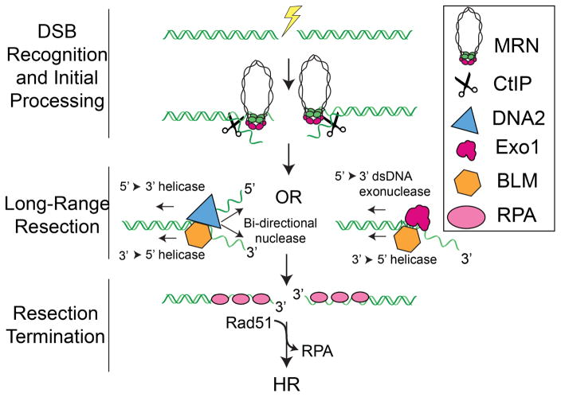
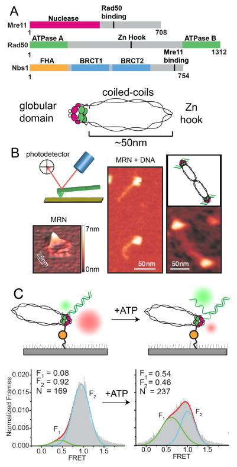
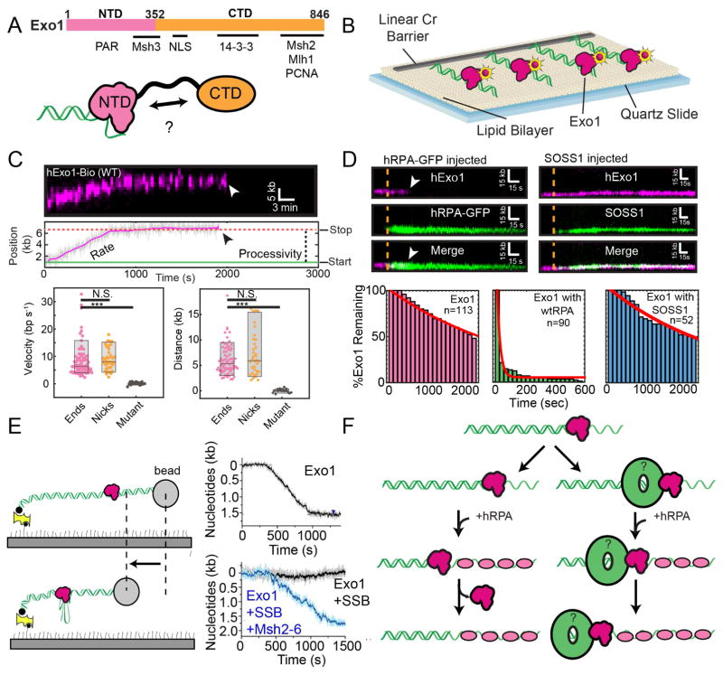
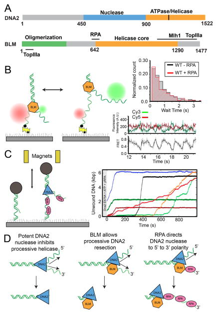
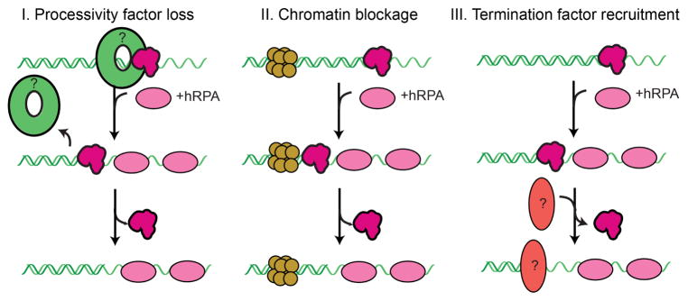

# Eukaryotic resectosomes: a single-molecule perspective

**Logan R. Myler and Ilya J. Finkelstein**

*Progress in Biophysics and Molecular Biology*, Volume 127, Pages 119–129 (2017)

**DOI:** [10.1016/j.pbiomolbio.2016.08.001](https://doi.org/10.1016/j.pbiomolbio.2016.08.001)

---

## Table of Contents

- [Abstract](#abstract)
- [1. Introduction](#1-introduction)
- [2. DNA End Recognition and Early Processing](#2-dna-end-recognition-and-early-processing)
- [3. Long-Range Resection](#3-long-range-resection)
- [4. Termination of Resection](#4-termination-of-resection)
- [5. Concluding Remarks](#5-concluding-remarks)
- [Acknowledgments](#acknowledgments)

---

##  Abstract
DNA double-strand breaks (DSBs) disrupt the physical and genetic continuity of the genome. If unrepaired, DSBs can lead to cellular dysfunction and malignant transformation. Homologous recombination (HR) is a universally conserved DSB repair mechanism that employs the information in a sister chromatid to catalyze error-free DSB repair. To initiate HR, cells assemble the resectosome: a multi-protein complex composed of helicases, nucleases, and regulatory proteins. The resectosome nucleolytically degrades (resects) the free DNA ends for downstream homologous recombination. Several decades of intense research have identified the core resectosome components in eukaryotes, archaea, and bacteria. More recently, these proteins have been characterized via single-molecule approaches. Here, we focus on recent single-molecule studies that have begun to unravel how nucleases, helicases, processivity factors, and other regulatory proteins dictate the extent and efficiency of DNA resection in eukaryotic cells. We conclude with a discussion of outstanding questions that can be addressed via single-molecule approaches.
---
##  1. Introduction
DNA double-strand breaks (DSBs) occur when both strands of DNA are physically fractured into two separate molecules. If unrepaired, even a single DSB can lead to cell death ([Bennett et al., 1993](#ref4)). These genotoxic lesions arise during normal cellular metabolism with upwards of 50 DSBs per cell cycle reported in some human cells ([Vilenchik and Knudson, 2006](#ref98), [2003](#ref99)). DSBs also arise from a variety of exogenous sources, including ionizing radiation and oxidative stress. More recently, DSBs have also been identified as key intermediates in resolving stalled replication forks and R-loops generated by stalled RNA polymerase ([Santos-Pereira and Aguilera, 2015](#ref81); [Skourti-Stathaki and Proudfoot, 2014](#ref84); [Zeman and Cimprich, 2014](#ref110)). Additionally, uncapped telomeres are often recognized as DSBs by the break repair machinery, requiring the formation of specific telomere-protecting structures ([Doksani and de Lange, 2014](#ref27)). Accurate and timely DSB repair is essential for maintaining the cell’s genetic information. Mutations in DSB repair proteins result in increased tumor formation, sterility, and embryonic lethality, underlining the importance of these systems for human health ([Stracker and Petrini, 2011](#ref87)).
Two canonical cell-cycle dependent pathways are responsible for DSB repair in human cells. The non-homologous end joining (NHEJ) pathway is active throughout the cell cycle and attempts to repair the break via direct ligation of the DNA ends ([Deriano and Roth, 2013](#ref23); [Weterings and Chen, 2008](#ref103)). NHEJ is generally considered as error-prone because the free DNA ends are ligated back together without regard to their sequence identity. When multiple DSBs occur in the same cell, illegitimate NHEJ between incompatible DNA ends can also lead to gross chromosomal rearrangements ([Gu et al., 2008](#ref35)). Homologous recombination (HR) is a second DSB repair pathway that is primarily active during the S and G2 phases of the cell cycle ([Jasin and Rothstein, 2013](#ref42); [Mathiasen and Lisby, 2014](#ref60)). HR is generally considered error-free because this pathway utilizes the sister chromatid to restore missing information at the damaged DNA ends. To initiate HR, the free DNA ends are extensively resected to create long 3′ single-stranded DNA (ssDNA) overhangs. DNA resection is thus a key regulatory step in the decision between NHEJ and HR ([Symington, 2016](#ref89); [Symington and Gautier, 2011](#ref90)). Resection is catalyzed by the resectosome: a processive multi-enzyme complex of repair factors that generally include a nuclease, a helicase, and multiple regulatory proteins. These regulatory proteins modulate the activity of the core nucleases and helicases, thereby producing a sufficiently long ssDNA tract to find a homologous sequence elsewhere in a sister chromatid. The resulting ssDNA is rapidly coated with Replication Protein A (RPA), an abundant ssDNA-binding protein. RPA protects the ssDNA from degradation, participates in the DNA damage response (DDR), and coordinates the loading of Rad51 recombinase ([Chen and Wold, 2014](#ref17); [Symington, 2016](#ref89)). The Rad51-ssDNA filament then searches for homologous DNA elsewhere in the genome. The resulting D-loop structure is used to duplicate genetic information from a sister chromatid. Following DNA synthesis, the D-loop is resolved to complete error-free repair ([Mehta and Haber, 2014](#ref61)).
DNA resection is currently thought to occur in two distinct phases. First, sensor proteins must locate the DNA ends—even when these ends are occluded by protein blocks—and process these structures ([Symington, 2016](#ref89); [Zhou and Elledge, 2000](#ref111)). Next, long-range resection machinery is loaded on these processed ends and produces long ssDNA overhangs. The Mre11-Rad50-Nbs1 (MRN) complex (MRX in yeast) is one of the first proteins to localize to a DSB ([Lisby et al., 2004](#ref53); [Lukas et al., 2004](#ref56)). Pioneering studies in budding yeast have established that MRX, along with Sae2, initiate HR ([Cannavo and Cejka, 2014](#ref10); [Cejka et al., 2010](#ref15); [Gravel et al., 2008](#ref34); [Mimitou and Symington, 2008](#ref62); [Niu et al., 2010](#ref71); [Zhu et al., 2008](#ref113)). Together, MRX/Sae2 make an initial incision near the DSB and promote limited processing of DNA ends that may be occluded by protein adducts such as trapped topoisomerases ([Gravel et al., 2008](#ref34); [Mimitou and Symington, 2008](#ref62); [Zhu et al., 2008](#ref113)). A similar model has also been proposed for DNA resection in higher eukaryotes, although verification will require additional biochemical studies ([Fig. 1](#fig1)). After this initial processing, MRN and CtIP recruit BLM helicase and either Exo1 or DNA2 nucleases ([Symington, 2016](#ref89)). Exo1 or DNA2, along with BLM, form the core eukaryotic resectosomes and promote long-range resection ([Cejka et al., 2010](#ref15); [Gravel et al., 2008](#ref34); [Mimitou and Symington, 2008](#ref62); [Nimonkar et al., 2011](#ref69); [Niu et al., 2010](#ref71); [Zhu et al., 2008](#ref113)). Recent evidence suggests that Exo1/BLM is the preferred system in human cells, while DNA2/BLM plays a largely redundant or ancillary role ([Myler et al., 2016](#ref66); [Tomimatsu et al., 2012](#ref93)). The resectosome produces long stretches of ssDNA, which is rapidly coated with RPA and other eukaryotic single-stranded DNA binding proteins (SSBs) ([Symington, 2016](#ref89)). In addition to their role in DDR signaling, these SSBs also appear to regulate DNA resection, although the underlying mechanisms of this process are only just beginning to be discovered ([Jeon et al., 2016](#ref43); [Myler et al., 2016](#ref66)).

<figure class="paper-figure" id="fig1">

<figcaption><strong>Figure 1. DNA Double Strand Break Resection for Homologous Recombination.</strong> Resection is initiated by the MRN complex, which recognizes the free DNA ends. MRN and CtIP initially process the DNA to promote the loading and assembly of a resectome containing either the nuclease Exo1 or the nuclease/helicase DNA2. The helicase BLM participates in both pathways. These two resectosomes catalyze long-range DNA resection. The resulting single-stranded DNA is bound by RPA and other SSBs. Finally, resection is terminated by an unknown mechanism and RPA is exchanged for Rad51, which facilitates the homology search for HR.</figcaption>
</figure>
Single-molecule studies are particularly suitable for understanding the functions of large, multi-protein molecular machines. For example, single-molecule methods have been used to probe the key steps in DNA replication, transcription, splicing, and homologous recombination ([Bell and Kowalczykowski, 2016](#ref3); [Bustamante et al., 2000](#ref9); [Finkelstein and Greene, 2008](#ref31); [Robinson and van Oijen, 2013](#ref78); [Warnasooriya and Rueda, 2014](#ref102)). These techniques are able to more directly observe resection intermediates with millisecond temporal resolution. By observing individual reactions, single-molecule approaches can directly capture transient intermediates (e.g., helicase pausing or reversal) without the need to synchronize the individual biochemical steps. Such transient intermediates are frequently averaged out in ensemble experiments. Furthermore, fluorescence imaging can be used to track the DNA as well as key protein components. Additionally, force spectroscopy can be used to define the chemo-mechanical coupling between enzyme movement and ATP hydrolysis. By following the protein, rather than the DNA, single-molecule methods also report on reactions that do not modify the substrate (e.g., a motor protein moving on DNA). These approaches have been especially useful for understanding homologous recombination in prokaryotes, and we direct the reader to several excellent reviews on this topic ([Kowalczykowski, 2015](#ref47); [Spies, 2013](#ref86); [Yeeles and Dillingham, 2010](#ref108)).
Here, we review recent single-molecule studies that have expanded our understanding of the eukaryotic resectosome. We will focus on DSB recognition, resectosome assembly, and long-range resection. We conclude with a discussion of how resection may be terminated in eukaryotic cells, followed by outstanding questions that can be best addressed via single-molecule approaches.
##  2. DNA End Recognition and Early Processing
MRN is one of the first protein complexes to localize to a DSB _in vivo_ , where it is critical for initiating repair ([Lafrance-Vanasse et al., 2015](#ref48); [Stracker and Petrini, 2011](#ref87)). MRN’s essential role is supported by its multiple enzymatic and structural functions ([Fig. 2a](#fig2)). The MRN complex consists of two subunits each of Mre11, Rad50, and Nbs1. The Mre11 subunit encodes a 3′→5′ exonuclease and a cryptic endonuclease ([Cannavo and Cejka, 2014](#ref10); [Paull and Gellert, 1998](#ref75); [Shibata et al., 2014](#ref83)). Rad50 is a Walker ATPase that is a member of the structural maintenance of chromosomes (SMC) family of proteins. The Rad50 ATPase domains interact with Mre11 to form the globular head of the MRN complex. Two Rad50-encoded coiled-coil arms extend ~50 nm from the globular head domain and are coordinated by a zinc hook. These coiled-coil arms and the zinc hook are necessary for DDR signaling and promote the assembly and DNA binding ability of the complex ([Lee et al., 2013](#ref50)). Nbs1 (Xrs2 in yeast) does not encode any enzymatic functions, but does contain FHA and BRCT domains for protein interaction and signaling and may also regulate the DNA binding and ATP-dependent activities of the entire complex ([Lee et al., 2013](#ref50); [Paull and Gellert, 1999](#ref74); [Williams et al., 2009](#ref106)). In addition, Nbs1 contains three redundant nuclear localization sequences (NLS) crucial for the nuclear localization of MRN ([Desai-Mehta et al., 2001](#ref24); [Tauchi et al., 2002](#ref91)).

<figure class="paper-figure" id="fig2">

<figcaption><strong>Figure 2. Single-molecule studies of MRN.</strong> <b>(A)</b> Domain map (top) and structural map (bottom) of the Mre11-Rad50-Nbs1 complex. <b>(B)</b> Atomic force microscopy studies reveal that MRN undergoes mesoscale conformational changes upon binding to DNA. Reproduced with permission from (<a href="#ref65">Moreno-Herrero et al., 2005</a>). Additionally, MRN complexes can bridge two DNA molecules via the long coiled-coil arms of Rad50. <b>(C)</b> A single-molecule FRET assay reveals that MRN harbors a limited ATP-dependent end-opening activity. Reproduced with permission from (<a href="#ref12">Cannon et al., 2013</a>). Briefly, MRN complexes were immobilized on the surface of a flowcell. DNA oligonucleotides containing a Cy3 label on one strand and a Cy5 label on the other are then bound by MRN, showing a high-FRET state. However, in the presence of ATP, MRN opens the ends, separating the Cy dyes and shifting the population to a low-FRET state.</figcaption>
</figure>
MRN homologs are conserved over all domains of life, including E. coli SbcCD, bacteriophage T4 gp47 (Mre11)/gp46 (Rad50), and archaeal Mre11/Rad50. Structural and biochemical studies of these conserved MR proteins have provided insight into complex formation, DNA binding, and nucleotide-dependent nuclease activation ([Das et al., 2010](#ref21); [Eykelenboom et al., 2008](#ref29); [Herdendorf and Nelson, 2014](#ref36); [Hopfner et al., 2001](#ref39), [2000](#ref40); [Liu et al., 2016](#ref54); [Möckel et al., 2012](#ref63); [Seifert et al., 2016](#ref82)). These studies have revealed multiple binding sites for DNA in the complex, which may represent the conformations necessary for DNA end binding, end tethering, and nuclease activity. Additionally, two nucleotide-dependent Rad50 states have been visualized: a “closed” conformation with ATP bound and an “open” conformation after ATP hydrolysis; however, the functional implications for these two states have yet to be fully characterized ([Lammens et al., 2011](#ref49)). We direct the reader to several excellent reviews that summarize these findings ([Hopfner, 2014](#ref38); [Lafrance-Vanasse et al., 2015](#ref48); [Paull and Deshpande, 2014](#ref73)). To date, all of the structural studies that have been reported for Mre11-Rad50 homologs are truncated to exclude the critical Rad50 coiled-coils. Lower resolution SAXS studies of archaeal MR homologs have also been reported. These techniques have helped determine the dynamic transition between the ATP-bound “closed” confirmation and the “open” confirmation, but future work will be required to understand the functional role of each of these states ([Williams et al., 2011](#ref105), [2010](#ref104)).
Single-molecule studies have also shed critical insights into both the structural organization of MRN, as well as its dynamic interactions with DNA. Atomic force microscopy (AFM) has been used to probe the conformational flexibility of the Rad50 coiled coils, as well as the interactions between MRN and free DNA ends ([Fig. 2b](#fig2)). In this technique, purified MRN-DNA complexes are deposited on the surface of atomically smooth mica and scanned with a cantilever. Small changes in the cantilever height are detected by the deflection of a laser beam, which allows nanometer-resolution mapping of the protein profile. Such AFM experiments provided our first glimpse of the complete human MRN complex ([de Jager et al., 2001](#ref22); [Moreno-Herrero et al., 2005](#ref65); [van der Linden et al., 2009](#ref96); [van Noort et al., 2003](#ref97)). Interestingly, MRN undergoes conformational changes upon binding DNA. The angle of the Rad50 coiled coils relative to the globular domain is 26 ± 9° in the absence of DNA but is decreased to 6 ± 5° in the presence of DNA ([Moreno-Herrero et al., 2005](#ref65)). This change upon binding DNA decreases the ability of the zinc hook to make intra-molecular interactions and promotes intermolecular interactions between two MRN complexes bound to separate DNA strands. Indeed, intermolecular MRN DNA end tethering has been observed via AFM, and subsequent studies have also observed MRX/MR-stimulated DNA end bridging _in vitro_ and _in vivo_ ([Cassani et al., 2016](#ref13); [Chen et al., 2001](#ref16); [Deshpande et al., 2014](#ref25); [Kaye et al., 2004](#ref45); [Lobachev et al., 2004](#ref55); [Moreno-Herrero et al., 2005](#ref65)). However, another _in vivo_ study that monitored fluorescent reporters proximal to broken DNA ends in human cells has questioned the importance of these DSB-bridging activities at restriction endonuclease-created DNA breaks ([Soutoglou and Misteli, 2008](#ref85)). Thus, the significance of MRN’s ability to bridge DNA ends requires additional clarification.
Follow-up AFM studies have explored the details of individual subunit binding to DNA, the importance of the coiled-coils, and the ATP dependence of complex formation and tethering ([Kinoshita et al., 2015](#ref46); [Lee et al., 2013](#ref50); [van der Linden et al., 2009](#ref96)). Interestingly, these studies have found that individual components of the MRN complex, specifically Mre11-Rad50, Rad50 alone, and Rad50-Nbs1, form DNA binding subcomplexes, which vary in their ability to oligomerize with each other, to tether DNA ends, and to hydrolyze ATP. Mre11 controls the structural arrangement of Rad50 oligomers and promotes end-tethering, but Rad50 alone was able to bind DNA and hydrolyze ATP. Surprisingly, a Rad50-Nbs1 complex was largely unaffected by the absence of Mre11. While these studies provide an interesting picture of MRN complex formation, AFM studies are essentially static snapshots of MRN-DNA interactions. Functional and dynamic characterization of individual MRN complexes and their interactions with DNA will continue to define how MRN promotes DSB repair.
A recent single-molecule FRET (smFRET) study has also begun to address the dynamic interaction of MRN with the DNA ends and how these interactions begin to assemble the resectosome ([Fig. 2c](#fig2)). In these experiments, surface-immobilized MRN was incubated with a double-stranded DNA oligonucleotide containing a Cy3–Cy5 FRET reporter pair ([Cannon et al., 2013](#ref12)). Using this assay, the authors determined that MRN has a DNA-unwinding activity that can open ~15–20 nucleotides at the free DNA ends ([Cannon et al., 2013](#ref12)). This property of MRN is dependent on the Rad50 ATPase domain and requires ATP hydrolysis for end opening. Ablation of this activity reduced Exo1-catalyzed DNA resection, suggesting that MRN promotes DNA resection by Exo1 at least in part through its interactions with DNA. The authors concluded that MRN stimulates Exo1 primarily by loading the nuclease onto the Y-like DNA structure that is created via MRN’s DNA-unwinding activity. However, a second biochemical study also suggested that MRN stimulates long-range Exo1 processivity via an unknown mechanism ([Nimonkar et al., 2011](#ref69)). Thus, MRN may play multiple roles in loading Exo1 and promoting long-range resection, and further single-molecule and ensemble biochemical studies will be required to directly test both models.
These single-molecule studies have begun to define how MRN binds ends, tethers multiple DNAs together, and opens a Y-structure at the end to promote repair initiation. CtIP (Sae2 in yeast), a 5′ endonuclease that cuts Y-structures, also assists in this process, albeit with an unknown mechanism and substrate ([Lengsfeld et al., 2007](#ref51); [Makharashvili et al., 2014](#ref57); [Wang et al., 2014](#ref100)). A combination of MRN’s DNA-unwinding activity with a CtIP-stimulated endonucleolytic cut may allow the generation of a short 3′-overhang DNA substrate for subsequent resection. In support of this model, the yeast MRX is stimulated by Sae2 to create nicks at protein-DNA adducts ([Cannavo and Cejka, 2014](#ref10)). This requires ATP as well as manganese and magnesium cofactors. Whether MRN’s DNA-unwinding activity is linked to its endonuclease activity, and whether these activities are recapitulated in MRX, remains to be seen. Exd2 is another mammalian nuclease that functionally interacts with MRN to initiate HR. Exd2 has been proposed to load at endonuclease-generated nicks and resect toward the DSB end, thereby creating a ssDNA overhang that serves as a loading scaffold for additional resectosome machinery ([Broderick et al., 2016](#ref7)). Further single-molecule studies of the ability of MRN to bind DNA ends and interact with CtIP, Exd2, and Exo1/BLM will be needed to define how this dynamic association promotes initiation on different end structures and how the MRN complex loads and assembles the resectosome.
##  3. Long-Range Resection
After initiation and processing of the DSB, the nucleases Exo1 or DNA2 are loaded onto the free DNA ends. Although the biochemical activities of both resection pathways have been reconstituted _in vitro_ , the molecular cues that govern whether Exo1 or DNA2 are preferred in certain contexts remain unclear. However, several studies have highlighted that Exo1 is the predominant nuclease in human DSB repair ([Farah et al., 2009](#ref30); [Tomimatsu et al., 2012](#ref93)). Knockdown of Exo1 in human cells creates a strong resection defect, whereas knockdown of DNA2 has little effect on resection ([Myler et al., 2016](#ref66); [Zhou et al., 2014](#ref112)). These data suggest that Exo1 is the major nuclease for resection in human cells, while DNA2 may constitute a backup mechanism in addition to its function in Okazaki fragment removal. Both Exo1 and DNA2 are physically coupled to—and stimulated by—the RecQ-like helicase BLM ([Nimonkar et al., 2011](#ref69), [2008](#ref70)). The following sections will individually review the recent single molecule studies of each of these enzymes independently.
### Exo1
Exonuclease 1 (Exo1) is important for homologous recombination, mismatch and nucleotide excision repair, and telomere maintenance ([Cejka, 2015](#ref14); [Doksani and de Lange, 2014](#ref27); [Goellner et al., 2015](#ref33); [Modrich, 2006](#ref64); [Reardon and Sancar, 2005](#ref76)). This protein shares similarities to the _E. coli_ RecJ and the human flap endonuclease Fen1, and it has a 5′→3′ exonuclease as well as a 5′ flap endonuclease activity ([Tsutakawa et al., 2011](#ref95)). We have recently characterized the activity of Exo1 using a high-throughput single-molecule DNA curtains assay ([Fig. 3a,b](#fig3))([Myler et al., 2016](#ref66)). In this assay, thousands of individual DNA molecules are organized at fabricated structures in a microfluidic flowcell for concurrent single-molecule imaging ([Gallardo et al., 2015](#ref32)). To assemble DNA curtains, a supported lipid bilayer is first deposited on the surface of a microfluidic flowcell. The lipid bilayer serves three essential functions: (i) it provides a biomimetic passivation surface for biochemical reactions, (ii) DNA is immobilized on biotinylated lipids via a biotin-streptavidin interaction, and (iii) the fluidity of the lipid leaflet can be used to spatially organize the DNA substrates for high-throughput single-molecule imaging. Individual Exo1 molecules are labeled with fluorescent quantum dots (QDs), allowing proteins to be observed for >60 minutes without photobleaching.
<figure class="paper-figure" id="fig3">

<figcaption><strong>Figure 3. Single-molecule studies of Exo1.</strong> <b>(A)</b> Domain map (top) and graphical map (bottom) of Exo1 and known interacting partners. Exo1 contains at least two distinct domains: a structured N-terminal nuclease domain (NTD) and an unstructured C-terminal domain (CTD). Previous studies have hypothesized an auto-inhibitory interaction between the NTD and CTD (<a href="#ref72">Orans et al., 2011</a>). <b>(B)</b> DNA Curtains assay for studying Exo1 activity and regulation. Reproduced with permission from (<a href="#ref66">Myler et al., 2016</a>). <b>(C)</b> Kymograph and particle tracking (top) of a single Exo1 molecule resecting from a DNA end. Rate and processivity measurements are indicated. Boxplots (bottom) show the velocity and processivity of Exo1 molecules from the lambda DNA end (magenta), nicked DNA (orange), or with the nuclease-dead Exo1(D78A/D173A) (black). <b>(D)</b> Kymographs of Exo1 lifetime upon injection of RPA (left) or SOSS1 (right). White arrow indicates dissociation of Exo1. Lifetimes (bottom) of Exo1 upon no injection (left), RPA (middle), or SOSS1 (right). <b>(E)</b> Paramagnetic bead assay for monitoring Exo1 resection. Reproduced with permission from (<a href="#ref43">Jeon et al., 2016</a>). Briefly, a paramagnetic bead attached to nicked DNA is tethered to a microscope slide surface via a biotin-streptavidin interaction. In the presence of flow, the DNA is extended and Exo1 is added. As Exo1 resects the DNA, it generates single-stranded DNA, which extends differently than dsDNA, resulting in a change in bead location. This change is monitored over time to determine the rate and processivity of Exo1 (right). In the presence of SSB, the bead does not move. However, MSH2-6 is able to overcome SSB inhibition of Exo1 activity. <b>(F)</b> Model for Exo1 resection in the presence of RPA. In the absence of a processivity factor (left), Exo1 is physically removed by RPA, which binds the single-stranded DNA generated by resection. However, processivity factors (green ring) may promote Exo1 degradation in the presence of RPA (right).</figcaption>
</figure>
Direct observation of human and yeast Exo1 revealed that both are processive nucleases that are capable of digesting ~6 kb of DNA per resection reaction ([Fig. 3c](#fig3)). DNA resection in yeast produces ~2–10 kb tracts of ssDNA ([Chung et al., 2010](#ref18)), and a recent study in human cell lines also found that resection proceeds up to 3.5 kb away from a DSB ([Zhou et al., 2014](#ref112)). Although it is tempting to speculate that a single Exo1 molecule could processively resect enough DNA to initiate HR _in vivo_ , other regulatory factors may limit Exo1’s processivity. RPA is one such factor that has been previously suggested to modulate Exo1 activity. However, previous reports with both the human and yeast proteins had been contradictory, suggesting that RPA variously stimulates ([Cannavo et al., 2013](#ref11); [Nimonkar et al., 2011](#ref69)) or inhibits Exo1 ([Nicolette et al., 2010](#ref68); [Yang et al., 2013](#ref107)). Therefore, we also determined how RPA modulates Exo1 activity. In these experiments, RPA and Exo1 were monitored simultaneously using dual-color single-molecule fluorescence imaging ([Fig. 3d](#fig3)). In the absence of RPA, Exo1 can remain on the DNA for greater than 30 minutes. However, RPA removes Exo1 from DNA in ~20 seconds, indicating that RPA physically displaces Exo1 from DNA ([Fig. 3d](#fig3)). These results were largely confirmed by a follow-up single-molecule study that visualized the movement of a paramagnetic bead as a proxy for ssDNA production ([Jeon et al., 2016](#ref43)). For this assay, a 21.8 kb DNA molecule containing nicks is tethered to the flowcell surface and extended via buffer flow. Exo1 loads on the nicks and resects the DNA substrate. The resulting ssDNA is monitored as a decrease in the overall DNA extension, and this signal can be used to estimate the resection tract. The authors largely confirmed our findings that Exo1 is processive and that RPA or _E. coli_ SSB inhibits this processive behavior. Interestingly, the addition of the mismatch binding protein MSH2-MSH6 resulted in a resection complex that was processive even in the presence of RPA ([Fig. 3e](#fig3))([Jeon et al., 2016](#ref43)). MSH2-MSH6 encircles dsDNA and forms a sliding clamp on homoduplex DNA ([Jiang et al., 2005](#ref44)). Exo1 interacts with MSH2, likely co-translocating with it to stabilize Exo1’s association with DNA, even in the presence of RPA. Given that MSH2-MSH6 binds specifically to mismatches, it is likely that the association of Exo1 and MSH2-MSH6 is required to control Exo1 binding exclusively to mismatch-containing DNA.
Direct visualization of both Exo1 and RPA indicates that RPA inhibits Exo1 by physically displacing the nuclease from DNA ([Fig. 3f](#fig3)). The mechanism of Exo1 displacement by RPA and prokaryotic SSBs likely involves competition between the two protein complexes for the same ss/dsDNA junction. One possibility is that RPA binds newly resected ssDNA as it emerges from the Exo1 active site. A second possibility is that a pre-bound RPA molecule diffuses along ssDNA until it encounters Exo1 ([Nguyen et al., 2014](#ref67); [Roy et al., 2009](#ref79)). We note that these models are not mutually exclusive and may depend on the concentration of free RPA in solution. Importantly, these models do not formally require a direct protein-protein interaction between the SSB and Exo1. Indeed, no physical interaction between RPA and Exo1 has been defined to date. However, we identified that deleting the N-terminal oligosaccharide/oligonucleotide (OB)-fold in RPA70 (the F-domain) resulted in decreased Exo1 displacement relative to wild type RPA. This suggests that the F-domain, as well as other elements in RPA, may physically interact with Exo1. Further experiments will be required to determine these interaction surfaces.
Another human SSB, SOSS1, has been recently identified to play a critical role in initiating DNA resection ([Richard et al., 2008](#ref77)). Like RPA, SOSS1 is also a heterotrimeric protein. However, whereas RPA has six OB-folds, SOSS1 only encodes a single OB-fold that facilitates interactions with ssDNA. Unlike RPA, SOSS1 supports long-range resection by Exo1 ([Myler et al., 2016](#ref66)). This appears to be a direct consequence of its lack of multiple OB folds. SOSS1 has also been proposed to load Exo1 on dsDNA for HR, although the mechanism for this activity is still unclear ([Yang et al., 2013](#ref107)). Given the low cellular concentration of SOSS1 ([Beck et al., 2011](#ref2)) and its relatively weak binding to ssDNA, it is unclear how SOSS1 can codirect HR in the presence of RPA in human cells. Future ensemble and single-molecule studies will be required to address how multiple SSBs bind the same ssDNA substrate to direct various aspects of DSB repair.
### BLM
Bloom’s Syndrome Helicase (BLM) is one of five human helicases with structural similarity to _E. coli_ RecQ, the founding member of the RecQ helicase family of enzymes ([Bernstein et al., 2010](#ref6)). Although all five of these proteins have been implicated in DNA repair, BLM is the most critical for DSB resection ([Bernstein et al., 2010](#ref6)). BLM is a 3′→5′ ATP-dependent helicase with a conserved core RecQ helicase domain and an N-terminal oligomerization domain that has been proposed to allow organization of BLM into hexamers and dodecamers ([Fig. 4a](#fig4))([Beresten et al., 1999](#ref5)). However, the reason for this stoichiometry is unknown, and follow-up studies with monomeric core-BLM (containing only the conserved RecQ helicase domain) have been unable to determine a functional role of oligomerization ([Yodh et al., 2009](#ref109)).
<figure class="paper-figure" id="fig4">

<figcaption><strong>Figure 4. Single-molecule studies of DNA2/BLM.</strong> <b>(A)</b> Domain map of DNA2 (top) and BLM (bottom). Functional domains and interacting partners are labeled. <b>(B)</b> A smFRET-based assay for BLM unwinding. Reproduced with permission from (<a href="#ref109">Yodh et al., 2009</a>). A dsDNA containing both Cy3 and Cy5 labels is tethered to a flowcell surface. A high FRET state is observed in the absence of BLM. In the presence of BLM, the dyes are physically separated, resulting in a low-FRET state. Interestingly, BLM can repetitively unwind and re-anneal the DNA, suggesting a strand-switching mechanism. Right panels show the wait time between strand switching events (top) and FRET trace (bottom). For full length BLM, strand switching wait time is unaffected by the presence of RPA. <b>(C)</b> A single-molecule assay for DNA2 nuclease-dead (E675A) helicase activity. Reproduced with permission from (<a href="#ref52">Levikova et al., 2013</a>). The position of a magnetic bead is monitored as DNA2 unwinds DNA in the presence of RPA. Right panel shows multiple processive DNA2 helicase trajectories. <b>(D)</b> Models for the functions of the DNA2-BLM-RPA complex. DNA2, is a potent, bidirectional nuclease in the absence of other factors, but cannot processively degrade DNA. In the presence of BLM, DNA2 can processively degrade both strands of DNA. Finally, in the DNA2-BLM-RPA complex, RPA directs DNA2 to only degrade the 5′ strand, creating the necessary 3′ overhangs for recombination.</figcaption>
</figure>
BLM stimulates the DSB resection activity of both DNA2 and Exo1, but the mechanism for this stimulation is not completely characterized ([Cejka et al., 2010](#ref15); [Nimonkar et al., 2008](#ref70); [Niu et al., 2010](#ref71); [Yang et al., 2013](#ref107)). One possibility is that BLM processively unwinds the DNA ahead of Exo1, thereby stimulating long-range resection. However, helicase-dead BLM (K695R) also stimulates Exo1 _in vitro_ , suggesting that an additional mechanism may contribute to Exo1 stimulation ([Nimonkar et al., 2008](#ref70)). A second possibility is that BLM may help to recruit Exo1 to the DNA ends. In addition, BLM may also act as a processivity factor to reduce Exo1 dissociation and stalling. The requirement for a helicase in Exo1-catalyzed resection may also be more pronounced when nucleosomes or other roadblocks are present on the DNA substrate. In support of this model, a recent study found that nucleosomes largely inhibit both yeast Exo1 and yeast DNA2 ([Adkins et al., 2013](#ref1)). However, DNA2-Sgs1 (the yeast BLM homolog), but not Exo1 alone, could efficiently digest a nucleosome-containing substrate. Interestingly, a ~300 bp region of naked dsDNA was required to efficiently process a nucleosome. On the other hand, Exo1 was able to resect nucleosomes reconstituted with H2AZ, a variant of the histone H2A. These results suggest that Exo1 and DNA2 may use different mechanisms to resect nucleosome substrates. Deciphering the precise mechanisms of how resectosomes process nucleosome-coated DNA will require further single-molecule and ensemble biochemical studies.
BLM physically interacts with DNA2 and stimulates processive degradation of DNA as part of the DNA2-BLM-TopIII-Rmi1-Rmi2 resectosome ([Daley et al., 2014](#ref20)). Here, BLM helicase is likely required for unwinding DNA ahead of the DNA2 nuclease/helicase. Indeed, biochemical studies have demonstrated that the helicase activity of BLM—but not DNA2—is essential for long-range resection ([Cejka et al., 2010](#ref15); [Nimonkar et al., 2011](#ref69)). Helicase-dead DNA2 (D294A) coupled with wild-type BLM was able to support efficient resection, whereas helicase-dead BLM (K695R) or nuclease-dead DNA2 (E675A) could not ([Cejka et al., 2010](#ref15); [Nimonkar et al., 2011](#ref69)). The inclusion of a topoisomerase (TopIII) and the OB fold-containing Rmi1-Rmi2 proteins in DNA resection remains somewhat mysterious. While TopIII-Rmi1-Rmi2 stimulates resection by DNA2-BLM, the free DNA ends are topologically unconstrained, suggesting that the DNA2-BLM resectosome should not require topoisomerase activity. Indeed, enzymatically dead TopIII mutants sustain long-range resection _in vitro_ ([Niu et al., 2010](#ref71)). These results suggest that TopIII-Rmi1-Rmi2 may play a structural or scaffolding role in assembling the resectosome during DNA resection.
Single-molecule studies have begun to unravel BLM’s helicase activity on both homoduplex and structured DNA substrates. Interestingly, two smFRET studies found that BLM has repetitive strand switching activity ([Wang et al., 2015](#ref101); [Yodh et al., 2009](#ref109)). These studies used a partial duplex FRET assay, whereby strand separation by helicase activity would decrease FRET ([Fig. 4b](#fig4)). Surprisingly, addition of BLM or BLM-core, which contains only the RecQ helicase domain, showed an ATP-dependent repetitive unwinding of the duplex. This is likely due to BLM strand switching, given that BLM has 3′→5′ polarity. Additionally, RPA did not affect the repetitive unwinding activity of wild-type BLM but largely increased the time between cycles for BLM-core. This suggests that RPA helps reinitiate unwinding for BLM, probably due to the protein-protein interaction not found in the core mutant. However, the significance of BLM’s strand switching activity in DNA resection remains unclear. BLM helicase also has robust G-quadruplex unwinding activity and may be important for resolving such structures at telomeres, stalled transcription bubbles, or possibly during DNA resection. Although strand-switching may be necessary to remove G-quadruplexes and resolve D-loops, it is unclear whether this activity is required for DNA resection. Future studies with BLM helicase in complex with proteins such as Exo1, DNA2, or the TopIII-Rmi1-Rmi2 complex may provide the resolution necessary to define BLM’s role in DNA resection.
### DNA2
DNA2 is an ATP-dependent helicase/nuclease that is involved in DNA resection and Okazaki fragment maturation during DNA replication ([Symington, 2016](#ref89)). _In vitro_ , DNA2 can digest both 5′ and 3′ DNA strands ([Masuda-Sasa et al., 2006](#ref59)). However, RPA directs DNA2 nuclease activity to only target the 5′ strand, leaving the 3′ end intact ([Cejka et al., 2010](#ref15)). A recent single-molecule study investigated the coupling between the DNA2 helicase and nuclease activities ([Levikova et al., 2013](#ref52)). In this assay, a 6.6 kb dsDNA with a 40-nt 5′ flap is tethered to a flowcell at one end, conjugated to a magnetic bead at the other end, and extended by a pair of magnets above the flowcell ([Fig. 4c](#fig4)). The length of the DNA substrate is monitored by imaging the position of the bead. DNA2 helicase activity generated a single-stranded DNA substrate for RPA to bind, extending the length of the DNA. A key finding of this study was that the nuclease-dead DNA2 (E675A) exhibits processive helicase activity greater than that of the wild-type enzyme, even in the presence of RPA. Thus, the DNA2 helicase activity is auto-regulated by its potent nuclease. This observation may suggest the need for BLM as an accessory helicase that can function when the intrinsic DNA2 helicase activity is suppressed via its nuclease domain. Further single-molecule studies with BLM and DNA2 will be required to define how the two enzymes cooperate to resect long stretches of DNA and what the functions of RPA are in regulating this process ([Fig. 4d](#fig4)).
##  4. Termination of Resection
How is DNA resection terminated and what factors determine the extent of DNA resection? Genetic studies have established that as few as 20 bp of ssDNA are sufficient for HR with a sister chromatid and as little as 60 bp can be used for single-strand annealing ([Hua et al., 1997](#ref41); [Rubnitz and Subramani, 1984](#ref80); [Sugawara et al., 2000](#ref88)). Longer resection tracts are required when the homologous DNA is located at a distal chromosome or when homologous information is not available elsewhere in the genome ([Hicks et al., 2011](#ref37); [Marrero and Symington, 2010](#ref58); [Zhu et al., 2008](#ref113)). Furthermore, persistent induction of an unrepaired DNA break leads to long-range resection that can span > 50 kb, ultimately causing cell death due to resection of an essential gene ([Zhu et al., 2008](#ref113)). The lack of resection termination in these situations suggests that resectosome disassembly might be coupled to Rad51 loading and recombination. Indeed, BLM physically interacts with and promotes Rad51-dependent strand exchange _in vitro_ ([Bugreev et al., 2009](#ref8)). BLM’s ability to load Rad51 is reminiscent of the RecA-loading activities encoded by RecB, a core subunit of the _E. coli_ resection machinery ([Dillingham and Kowalczykowski, 2008](#ref26)). The functional implications of BLM-Rad51 interactions will need to be addressed in future studies. Indeed, Rad51 nucleation on ssDNA is emerging as a highly regulated step in HR and additional resectosome subunits may also contribute to Rad51 loading during resection.
We propose three speculative models for how long-range resection may be terminated in eukaryotic cells ([Fig. 5](#fig5)). We focus on Exo1-dependent resection termination, but these proposed mechanisms are also likely relevant for DNA2-mediated resection. In the first model, a processivity factor stimulates extensive Exo1-dependent resection, even in the presence of RPA. Then, in a later step of resection, the processivity factor dissociates or is actively removed, allowing RPA to displace Exo1 and halt resection. A parallel for this mechanism has been proposed in eukaryotic mismatch repair. In both yeast and human cells, the MSH2-MSH6 complex physically interacts with Exo1 and acts as a processivity clamp during lesion excision. Furthermore, MLH1-PMS2, a mismatch repair-specific endonuclease, limits the number of MSH2-MSH6 complexes available to interact with Exo1, thereby limiting its resection potential ([Jeon et al., 2016](#ref43)). As a direct analogy, BLM and possibly MRN may serve as a processivity factors for Exo1-catalyzed resection in the presence of RPA. Dissociation of these processivity factors would render Exo1 sensitive to RPA inhibition and terminate DNA resection.

<figure class="paper-figure" id="fig5">

<figcaption><strong>Figure 5. Speculative models for termination of Exo1-dependent resection.</strong> In the first model (left), a processivity factor (green ring) promotes degradation in the presence of RPA. Then, at a later step of DNA resection, the processivity factor dissociates or is removed, allowing RPA to displace Exo1. For the second model (middle), the resectosome encounters a chromatin block, which physically stalls resection and leads to dissociation of the resectosome. In the third model (right), a termination factor (red oval) is recruited to physically disassemble the resectosome. We propose that one or several of these concepts will play a role in both Exo1 and DNA2-dependent resection.</figcaption>
</figure>
In the second model, the resectosome is stalled by a chromatin roadblock. This model is consistent with the strong inhibition of resection by nucleosomes _in vitro_ ([Adkins et al., 2013](#ref1)). Certain resectosome subunits may be required for efficient resection through nucleosomes, and lack of these proteins could cause stalling and disassembly of the complex. In addition, many chromatin remodelers have been implicated in DNA resection, including SRCAP (Swr1 in yeast), a complex that replaces histone H2A with its H2AZ variant. H2AZ nucleosomes support Exo1 resection to a limited extent ([Adkins et al., 2013](#ref1); [Dong et al., 2014](#ref28)). The human SMARCAD1 protein (Fun30 in yeast) also supports DNA end resection and homologous recombination, albeit by an unknown mechanism ([Costelloe et al., 2012](#ref19)). Future single molecule studies are necessary to define how individual resectosome components process both canonical and modified nucleosomes. These studies will detail whether single nucleosomes or nucleosome repeats block loading of the resectosome, slow or stall the complex, or otherwise remove it from DNA. Subsequent studies will be required to understand the interactions between resectosomes and chromatin remodelers.
Finally, resection may be terminated via recruitment of a termination factor that promotes disassembly of the resectosome components. The recently characterized HELB helicase has been proposed to act as an anti-recombinase in human cells ([Tkáč et al., 2016](#ref92)). HELB is a 5′→3′ helicase that is recruited to DSBs in an RPA-dependent manner to negatively regulate resection ([Tkáč et al., 2016](#ref92)). HELB directly inhibits both Exo1 and DNA2 _in vitro_ , but given the polarity of translocation, it is unclear how HELB might be able to stall or otherwise remove the resectosome. In summary, the biochemical mechanisms for resection termination are largely undefined and future single-molecule studies will be essential for deciphering these multi-step processes.
---
##  5. Concluding Remarks
Human cells initiate HR by assembling the resectosome, a multi-subunit molecular machine that nucleolytically generates 3′ ssDNA at the free DNA ends. Cell biological and biochemical studies have identified the core enzymatic components, and single molecule studies are beginning to identify how these enzymes interact to process free DNA ends. Here, we present an overview of these studies and outline outstanding questions that can be best addressed by future single-molecule studies. Overall, many questions remain regarding how resectosomes are assembled, how the individual components interact to process a nucleosome-coated DNA substrate, and how resection is terminated. In addition to answering these critical questions, further studies are needed to define how the resectosome is regulated. Have Exo1 and DNA2 specialized to repair breaks in different genomic contexts? Is the resectosome dynamic, with many subunits exchanging over the course of resection as has been proposed in DNA replication? ([Trakselis et al., 2001](#ref94)) Finally, do different types of lesions require one nuclease over the other? A dynamic resectosome would be able to exchange to find the right component. High-resolution single-molecule studies are beginning to address these critical questions in eukaryotic DNA break repair.
---
##  Acknowledgments
We are grateful to Tanya Paull as well as members of the Finkelstein and Paull Laboratories for critically reading this manuscript. Funding for the research in the Finkelstein laboratory comes from the National Institute of General Medical Sciences of the National Institutes of Health (GM097177, GM120554 to I.J.F.), CPRIT (R1214 to I.J.F.), and the Welch Foundation (F-l808 to I.J.F.). I.J.F. is a CPRIT Scholar in Cancer Research. The content is solely the responsibility of the authors and does not necessarily represent the official views of the National Institutes of Health.

---

## References

1. Adkins NL, Niu H, Sung P, Peterson CL. Nucleosome dynamics regulates DNA processing. Nat Struct Mol Biol. 2013;20:836–842. [doi:10.1038/nsmb.2585](https://doi.org/10.1038/nsmb.2585).

2. Beck M, Schmidt A, Malmstroem J, Claassen M, Ori A, Szymborska A, Herzog F, Rinner O, Ellenberg J, Aebersold R. The quantitative proteome of a human cell line. Mol Syst Biol. 2011;7:549. [doi:10.1038/msb.2011.82](https://doi.org/10.1038/msb.2011.82).

3. Bell JC, Kowalczykowski SC. Mechanics and Single-Molecule Interrogation of DNA Recombination. Annu Rev Biochem. 2016 [doi:10.1146/annurev-biochem-060614-034352](https://doi.org/10.1146/annurev-biochem-060614-034352).

4. Bennett CB, Lewis AL, Baldwin KK, Resnick MA. Lethality induced by a single site-specific double-strand break in a dispensable yeast plasmid. Proc Natl Acad Sci. 1993;90:5613–5617. [doi:10.1073/pnas.90.12.5613](https://doi.org/10.1073/pnas.90.12.5613).

5. Beresten SF, Stan R, van Brabant AJ, Ye T, Naureckiene S, Ellis NA. Purification of overexpressed hexahistidine-tagged BLM N431 as oligomeric complexes. Protein Expr Purif. 1999;17:239–248. [doi:10.1006/prep.1999.1135](https://doi.org/10.1006/prep.1999.1135).

6. Bernstein KA, Gangloff S, Rothstein R. The RecQ DNA helicases in DNA repair. Annu Rev Genet. 2010;44:393–417. [doi:10.1146/annurev-genet-102209-163602](https://doi.org/10.1146/annurev-genet-102209-163602).

7. Broderick R, Nieminuszczy J, Baddock HT, Deshpande RA, Gileadi O, Paull TT, McHugh PJ, Niedzwiedz W. EXD2 promotes homologous recombination by facilitating DNA end resection. Nat Cell Biol. 2016;18:271–280. [doi:10.1038/ncb3303](https://doi.org/10.1038/ncb3303).

8. Bugreev DV, Mazina OM, Mazin AV. Bloom syndrome helicase stimulates RAD51 DNA strand exchange activity through a novel mechanism. J Biol Chem. 2009;284:26349–26359. [doi:10.1074/jbc.M109.029371](https://doi.org/10.1074/jbc.M109.029371).

9. Bustamante C, Smith SB, Liphardt J, Smith D. Single-molecule studies of DNA mechanics. Curr Opin Struct Biol. 2000;10:279–285. [doi:10.1016/S0959-440X(00)00085-3](https://doi.org/10.1016/S0959-440X(00)00085-3).

10. Cannavo E, Cejka P. Sae2 promotes dsDNA endonuclease activity within Mre11-Rad50-Xrs2 to resect DNA breaks. Nature. 2014;514:122–125. [doi:10.1038/nature13771](https://doi.org/10.1038/nature13771).

11. Cannavo E, Cejka P, Kowalczykowski SC. Relationship of DNA degradation by Saccharomyces cerevisiae exonuclease 1 and its stimulation by RPA and Mre11-Rad50-Xrs2 to DNA end resection. Proc Natl Acad Sci U S A. 2013;110:E1661–1668. [doi:10.1073/pnas.1305166110](https://doi.org/10.1073/pnas.1305166110).

12. Cannon B, Kuhnlein J, Yang S-H, Cheng A, Schindler D, Stark JM, Russell R, Paull TT. Visualization of local DNA unwinding by Mre11/Rad50/Nbs1 using single-molecule FRET. Proc Natl Acad Sci U S A. 2013;110:18868–18873. [doi:10.1073/pnas.1309816110](https://doi.org/10.1073/pnas.1309816110).

13. Cassani C, Gobbini E, Wang W, Niu H, Clerici M, Sung P, Longhese MP. Tel1 and Rif2 Regulate MRX Functions in End-Tethering and Repair of DNA Double-Strand Breaks. PLoS Biol. 2016;14:e1002387. [doi:10.1371/journal.pbio.1002387](https://doi.org/10.1371/journal.pbio.1002387).

14. Cejka P. DNA End Resection: Nucleases Team Up with the Right Partners to Initiate Homologous Recombination. J Biol Chem. 2015;290:22931–22938. [doi:10.1074/jbc.R115.675942](https://doi.org/10.1074/jbc.R115.675942).

15. Cejka P, Cannavo E, Polaczek P, Masuda-Sasa T, Pokharel S, Campbell JL, Kowalczykowski SC. DNA end resection by Dna2-Sgs1-RPA and its stimulation by Top3-Rmi1 and Mre11-Rad50-Xrs2. Nature. 2010;467:112–116. [doi:10.1038/nature09355](https://doi.org/10.1038/nature09355).

16. Chen L, Trujillo K, Ramos W, Sung P, Tomkinson AE. Promotion of Dnl4-catalyzed DNA end-joining by the Rad50/Mre11/Xrs2 and Hdf1/Hdf2 complexes. Mol Cell. 2001;8:1105–1115. [doi:10.1016/s1097-2765(01)00388-4](https://doi.org/10.1016/s1097-2765(01)00388-4).

17. Chen R, Wold MS. Replication protein A: single-stranded DNA's first responder: dynamic DNA-interactions allow replication protein A to direct single-strand DNA intermediates into different pathways for synthesis or repair. BioEssays News Rev Mol Cell Dev Biol. 2014;36:1156–1161. [doi:10.1002/bies.201400107](https://doi.org/10.1002/bies.201400107).

18. Chung W-H, Zhu Z, Papusha A, Malkova A, Ira G. Defective resection at DNA double-strand breaks leads to de novo telomere formation and enhances gene targeting. PLoS Genet. 2010;6:e1000948. [doi:10.1371/journal.pgen.1000948](https://doi.org/10.1371/journal.pgen.1000948).

19. Costelloe T, Louge R, Tomimatsu N, Mukherjee B, Martini E, Khadaroo B, Dubois K, Wiegant WW, Thierry A, Burma S, van Attikum H, Llorente B. The yeast Fun30 and human SMARCAD1 chromatin remodellers promote DNA end resection. Nature. 2012;489:581–584. [doi:10.1038/nature11353](https://doi.org/10.1038/nature11353).

20. Daley JM, Chiba T, Xue X, Niu H, Sung P. Multifaceted role of the Topo IIIα-RMI1-RMI2 complex and DNA2 in the BLM-dependent pathway of DNA break end resection. Nucleic Acids Res. 2014;42:11083–11091. [doi:10.1093/nar/gku803](https://doi.org/10.1093/nar/gku803).

21. Das D, Moiani D, Axelrod HL, Miller MD, McMullan D, Jin KK, Abdubek P, Astakhova T, Burra P, Carlton D, Chiu H-J, Clayton T, Deller MC, Duan L, Ernst D, Feuerhelm J, Grant JC, Grzechnik A, Grzechnik SK, Han GW, Jaroszewski L, Klock HE, Knuth MW, Kozbial P, Krishna SS, Kumar A, Marciano D, Morse AT, Nigoghossian E, Okach L, Paulsen J, Reyes R, Rife CL, Sefcovic N, Tien HJ, Trame CB, van den Bedem H, Weekes D, Xu Q, Hodgson KO, Wooley J, Elsliger M-A, Deacon AM, Godzik A, Lesley SA, Tainer JA, Wilson IA. Crystal structure of the first eubacterial Mre11 nuclease reveals novel features that may discriminate substrates during DNA repair. J Mol Biol. 2010;397:647–663. [doi:10.1016/j.jmb.2010.01.049](https://doi.org/10.1016/j.jmb.2010.01.049).

22. De Jager M, van Noort J, van Gent DC, Dekker C, Kanaar R, Wyman C. Human Rad50/Mre11 is a flexible complex that can tether DNA ends. Mol Cell. 2001;8:1129–1135. [doi:10.1016/s1097-2765(01)00381-1](https://doi.org/10.1016/s1097-2765(01)00381-1).

23. Deriano L, Roth DB. Modernizing the nonhomologous end-joining repertoire: alternative and classical NHEJ share the stage. Annu Rev Genet. 2013;47:433–455. [doi:10.1146/annurev-genet-110711-155540](https://doi.org/10.1146/annurev-genet-110711-155540).

24. Desai-Mehta A, Cerosaletti KM, Concannon P. Distinct functional domains of nibrin mediate Mre11 binding, focus formation, and nuclear localization. Mol Cell Biol. 2001;21:2184–2191. [doi:10.1128/MCB.21.6.2184-2191.2001](https://doi.org/10.1128/MCB.21.6.2184-2191.2001).

25. Deshpande RA, Williams GJ, Limbo O, Williams RS, Kuhnlein J, Lee J-H, Classen S, Guenther G, Russell P, Tainer JA, Paull TT. ATP-driven Rad50 conformations regulate DNA tethering, end resection, and ATM checkpoint signaling. EMBO J. 2014;33:482–500. [doi:10.1002/embj.201386100](https://doi.org/10.1002/embj.201386100).

26. Dillingham MS, Kowalczykowski SC. RecBCD enzyme and the repair of double-stranded DNA breaks. Microbiol Mol Biol Rev MMBR. 2008;72:642–671. [doi:10.1128/MMBR.00020-08](https://doi.org/10.1128/MMBR.00020-08).

27. Doksani Y, de Lange T. The role of double-strand break repair pathways at functional and dysfunctional telomeres. Cold Spring Harb Perspect Biol. 2014;6:a016576. [doi:10.1101/cshperspect.a016576](https://doi.org/10.1101/cshperspect.a016576).

28. Dong S, Han J, Chen H, Liu T, Huen MSY, Yang Y, Guo C, Huang J. The human SRCAP chromatin remodeling complex promotes DNA-end resection. Curr Biol CB. 2014;24:2097–2110. [doi:10.1016/j.cub.2014.07.081](https://doi.org/10.1016/j.cub.2014.07.081).

29. Eykelenboom JK, Blackwood JK, Okely E, Leach DRF. SbcCD causes a double-strand break at a DNA palindrome in the Escherichia coli chromosome. Mol Cell. 2008;29:644–651. [doi:10.1016/j.molcel.2007.12.020](https://doi.org/10.1016/j.molcel.2007.12.020).

30. Farah JA, Cromie GA, Smith GR. Ctp1 and Exonuclease 1, alternative nucleases regulated by the MRN complex, are required for efficient meiotic recombination. Proc Natl Acad Sci U S A. 2009;106:9356–9361. [doi:10.1073/pnas.0902793106](https://doi.org/10.1073/pnas.0902793106).

31. Finkelstein IJ, Greene EC. Single molecule studies of homologous recombination. Mol Biosyst. 2008;4:1094–104. [doi:10.1039/b811681b](https://doi.org/10.1039/b811681b).

32. Gallardo IF, Pasupathy P, Brown M, Manhart CM, Neikirk DP, Alani E, Finkelstein IJ. High-Throughput Universal DNA Curtain Arrays for Single-Molecule Fluorescence Imaging. Langmuir. 2015;31:10310–10317. [doi:10.1021/acs.langmuir.5b02416](https://doi.org/10.1021/acs.langmuir.5b02416).

33. Goellner EM, Putnam CD, Kolodner RD. Exonuclease 1-dependent and independent mismatch repair. DNA Repair. 2015;32:24–32. [doi:10.1016/j.dnarep.2015.04.010](https://doi.org/10.1016/j.dnarep.2015.04.010).

34. Gravel S, Chapman JR, Magill C, Jackson SP. DNA helicases Sgs1 and BLM promote DNA double-strand break resection. Genes Dev. 2008;22:2767–2772. [doi:10.1101/gad.503108](https://doi.org/10.1101/gad.503108).

35. Gu W, Zhang F, Lupski JR. Mechanisms for human genomic rearrangements. PathoGenetics. 2008;1:4. [doi:10.1186/1755-8417-1-4](https://doi.org/10.1186/1755-8417-1-4).

36. Herdendorf TJ, Nelson SW. Catalytic mechanism of bacteriophage T4 Rad50 ATP hydrolysis. Biochemistry (Mosc) 2014;53:5647–5660. [doi:10.1021/bi500558d](https://doi.org/10.1021/bi500558d).

37. Hicks WM, Yamaguchi M, Haber JE. Real-time analysis of double-strand DNA break repair by homologous recombination. Proc Natl Acad Sci U S A. 2011;108:3108–3115. [doi:10.1073/pnas.1019660108](https://doi.org/10.1073/pnas.1019660108).

38. Hopfner K-P. ATP puts the brake on DNA double-strand break repair: a new study shows that ATP switches the Mre11-Rad50-Nbs1 repair factor between signaling and processing of DNA ends. BioEssays News Rev Mol Cell Dev Biol. 2014;36:1170–1178. [doi:10.1002/bies.201400102](https://doi.org/10.1002/bies.201400102).

39. Hopfner KP, Karcher A, Craig L, Woo TT, Carney JP, Tainer JA. Structural biochemistry and interaction architecture of the DNA double-strand break repair Mre11 nuclease and Rad50-ATPase. Cell. 2001;105:473–485. [doi:10.1016/s0092-8674(01)00335-x](https://doi.org/10.1016/s0092-8674(01)00335-x).

40. Hopfner KP, Karcher A, Shin DS, Craig L, Arthur LM, Carney JP, Tainer JA. Structural biology of Rad50 ATPase: ATP-driven conformational control in DNA double-strand break repair and the ABC-ATPase superfamily. Cell. 2000;101:789–800. [doi:10.1016/s0092-8674(00)80890-9](https://doi.org/10.1016/s0092-8674(00)80890-9).

41. Hua SB, Qiu M, Chan E, Zhu L, Luo Y. Minimum length of sequence homology required for in vivo cloning by homologous recombination in yeast. Plasmid. 1997;38:91–96. [doi:10.1006/plas.1997.1305](https://doi.org/10.1006/plas.1997.1305).

42. Jasin M, Rothstein R. Repair of strand breaks by homologous recombination. Cold Spring Harb Perspect Biol. 2013;5:a012740. [doi:10.1101/cshperspect.a012740](https://doi.org/10.1101/cshperspect.a012740).

43. Jeon Y, Kim D, Martín-López JV, Lee R, Oh J, Hanne J, Fishel R, Lee J-B. Dynamic control of strand excision during human DNA mismatch repair. Proc Natl Acad Sci. 2016 [doi:10.1073/pnas.1523748113](https://doi.org/10.1073/pnas.1523748113).

44. Jiang J, Bai L, Surtees JA, Gemici Z, Wang MD, Alani E. Detection of high-affinity and sliding clamp modes for MSH2-MSH6 by single-molecule unzipping force analysis. Mol Cell. 2005;20:771–781. [doi:10.1016/j.molcel.2005.10.014](https://doi.org/10.1016/j.molcel.2005.10.014).

45. Kaye JA, Melo JA, Cheung SK, Vaze MB, Haber JE, Toczyski DP. DNA breaks promote genomic instability by impeding proper chromosome segregation. Curr Biol CB. 2004;14:2096–2106. [doi:10.1016/j.cub.2004.10.051](https://doi.org/10.1016/j.cub.2004.10.051).

46. Kinoshita E, van Rossum-Fikkert S, Sanchez H, Kertokalio A, Wyman C. Human RAD50 makes a functional DNA-binding complex. Biochimie. 2015;113:47–53. [doi:10.1016/j.biochi.2015.03.017](https://doi.org/10.1016/j.biochi.2015.03.017).

47. Kowalczykowski SC. An Overview of the Molecular Mechanisms of Recombinational DNA Repair. Cold Spring Harb Perspect Biol. 2015;7 [doi:10.1101/cshperspect.a016410](https://doi.org/10.1101/cshperspect.a016410).

48. Lafrance-Vanasse J, Williams GJ, Tainer JA. Envisioning the dynamics and flexibility of Mre11-Rad50-Nbs1 complex to decipher its roles in DNA replication and repair. Prog Biophys Mol Biol. 2015;117:182–193. [doi:10.1016/j.pbiomolbio.2014.12.004](https://doi.org/10.1016/j.pbiomolbio.2014.12.004).

49. Lammens K, Bemeleit DJ, Möckel C, Clausing E, Schele A, Hartung S, Schiller CB, Lucas M, Angermüller C, Söding J, Sträßer K, Hopfner KP. The Mre11:Rad50 structure shows an ATP dependent molecular clamp in DNA double-strand break repair. Cell. 2011;145:54–66. [doi:10.1016/j.cell.2011.02.038](https://doi.org/10.1016/j.cell.2011.02.038).

50. Lee J-H, Mand MR, Deshpande RA, Kinoshita E, Yang S-H, Wyman C, Paull TT. Ataxia telangiectasia-mutated (ATM) kinase activity is regulated by ATP-driven conformational changes in the Mre11/Rad50/Nbs1 (MRN) complex. J Biol Chem. 2013;288:12840–12851. [doi:10.1074/jbc.M113.460378](https://doi.org/10.1074/jbc.M113.460378).

51. Lengsfeld BM, Rattray AJ, Bhaskara V, Ghirlando R, Paull TT. Sae2 is an endonuclease that processes hairpin DNA cooperatively with the Mre11/Rad50/Xrs2 complex. Mol Cell. 2007;28:638–651. [doi:10.1016/j.molcel.2007.11.001](https://doi.org/10.1016/j.molcel.2007.11.001).

52. Levikova M, Klaue D, Seidel R, Cejka P. Nuclease activity of Saccharomyces cerevisiae Dna2 inhibits its potent DNA helicase activity. Proc Natl Acad Sci U S A. 2013;110:E1992–2001. [doi:10.1073/pnas.1300390110](https://doi.org/10.1073/pnas.1300390110).

53. Lisby M, Barlow JH, Burgess RC, Rothstein R. Choreography of the DNA Damage Response: Spatiotemporal Relationships among Checkpoint and Repair Proteins. Cell. 2004;118:699–713. [doi:10.1016/j.cell.2004.08.015](https://doi.org/10.1016/j.cell.2004.08.015).

54. Liu Y, Sung S, Kim Y, Li F, Gwon G, Jo A, Kim A-K, Kim T, Song O-K, Lee SE, Cho Y. ATP-dependent DNA binding, unwinding, and resection by the Mre11/Rad50 complex. EMBO J. 2016;35:743–758. [doi:10.15252/embj.201592462](https://doi.org/10.15252/embj.201592462).

55. Lobachev K, Vitriol E, Stemple J, Resnick MA, Bloom K. Chromosome fragmentation after induction of a double-strand break is an active process prevented by the RMX repair complex. Curr Biol CB. 2004;14:2107–2112. [doi:10.1016/j.cub.2004.11.051](https://doi.org/10.1016/j.cub.2004.11.051).

56. Lukas C, Melander F, Stucki M, Falck J, Bekker-Jensen S, Goldberg M, Lerenthal Y, Jackson SP, Bartek J, Lukas J. Mdc1 couples DNA double-strand break recognition by Nbs1 with its H2AX-dependent chromatin retention. EMBO J. 2004;23:2674–2683. [doi:10.1038/sj.emboj.7600269](https://doi.org/10.1038/sj.emboj.7600269).

57. Makharashvili N, Tubbs AT, Yang SH, Wang H, Barton O, Zhou Y, Deshpande RA, Lee JH, Lobrich M, Sleckman BP, Wu X, Paull TT. Catalytic and noncatalytic roles of the CtIP endonuclease in double-strand break end resection. Mol Cell. 2014;54:1022–1033. [doi:10.1016/j.molcel.2014.04.011](https://doi.org/10.1016/j.molcel.2014.04.011).

58. Marrero VA, Symington LS. Extensive DNA end processing by exo1 and sgs1 inhibits break-induced replication. PLoS Genet. 2010;6:e1001007. [doi:10.1371/journal.pgen.1001007](https://doi.org/10.1371/journal.pgen.1001007).

59. Masuda-Sasa T, Imamura O, Campbell JL. Biochemical analysis of human Dna2. Nucleic Acids Res. 2006;34:1865–1875. [doi:10.1093/nar/gkl070](https://doi.org/10.1093/nar/gkl070).

60. Mathiasen DP, Lisby M. Cell cycle regulation of homologous recombination in Saccharomyces cerevisiae. FEMS Microbiol Rev. 2014;38:172–184. [doi:10.1111/1574-6976.12066](https://doi.org/10.1111/1574-6976.12066).

61. Mehta A, Haber JE. Sources of DNA double-strand breaks and models of recombinational DNA repair. Cold Spring Harb Perspect Biol. 2014;6:a016428. [doi:10.1101/cshperspect.a016428](https://doi.org/10.1101/cshperspect.a016428).

62. Mimitou EP, Symington LS. Sae2, Exo1 and Sgs1 collaborate in DNA double-strand break processing. Nature. 2008;455:770–774. [doi:10.1038/nature07312](https://doi.org/10.1038/nature07312).

63. Möckel C, Lammens K, Schele A, Hopfner K-P. ATP driven structural changes of the bacterial Mre11:Rad50 catalytic head complex. Nucleic Acids Res. 2012;40:914–927. [doi:10.1093/nar/gkr749](https://doi.org/10.1093/nar/gkr749).

64. Modrich P. Mechanisms in eukaryotic mismatch repair. J Biol Chem. 2006;281:30305–30309. [doi:10.1074/jbc.R600022200](https://doi.org/10.1074/jbc.R600022200).

65. Moreno-Herrero F, de Jager M, Dekker NH, Kanaar R, Wyman C, Dekker C. Mesoscale conformational changes in the DNA-repair complex Rad50/Mre11/Nbs1 upon binding DNA. Nature. 2005;437:440–443. [doi:10.1038/nature03927](https://doi.org/10.1038/nature03927).

66. Myler LR, Gallardo IF, Zhou Y, Gong F, Yang S-H, Wold MS, Miller KM, Paull TT, Finkelstein IJ. Single-molecule imaging reveals the mechanism of Exo1 regulation by single-stranded DNA binding proteins. Proc Natl Acad Sci. 2016;113:e1170–e1179. [doi:10.1073/pnas.1516674113](https://doi.org/10.1073/pnas.1516674113).

67. Nguyen B, Sokoloski J, Galletto R, Elson EL, Wold MS, Lohman TM. Diffusion of human replication protein A along single-stranded DNA. J Mol Biol. 2014;426:3246–3261. [doi:10.1016/j.jmb.2014.07.014](https://doi.org/10.1016/j.jmb.2014.07.014).

68. Nicolette ML, Lee K, Guo Z, Rani M, Chow JM, Lee SE, Paull TT. Mre11-Rad50-Xrs2 and Sae2 promote 5′ strand resection of DNA double-strand breaks. Nat Struct Mol Biol. 2010;17:1478–1485. [doi:10.1038/nsmb.1957](https://doi.org/10.1038/nsmb.1957).

69. Nimonkar AV, Genschel J, Kinoshita E, Polaczek P, Campbell JL, Wyman C, Modrich P, Kowalczykowski SC. BLM-DNA2-RPA-MRN and EXO1-BLM-RPA-MRN constitute two DNA end resection machineries for human DNA break repair. Genes Dev. 2011;25:350–362. [doi:10.1101/gad.2003811](https://doi.org/10.1101/gad.2003811).

70. Nimonkar AV, Ozsoy AZ, Genschel J, Modrich P, Kowalczykowski SC. Human exonuclease 1 and BLM helicase interact to resect DNA and initiate DNA repair. Proc Natl Acad Sci U S A. 2008;105:16906–16911. [doi:10.1073/pnas.0809380105](https://doi.org/10.1073/pnas.0809380105).

71. Niu H, Chung WH, Zhu Z, Kwon Y, Zhao W, Chi P, Prakash R, Seong C, Liu D, Lu L, Ira G, Sung P. Mechanism of the ATP-dependent DNA end-resection machinery from Saccharomyces cerevisiae. Nature. 2010;467:108–111. [doi:10.1038/nature09318](https://doi.org/10.1038/nature09318).

72. Orans J, McSweeney EA, Iyer RR, Hast MA, Hellinga HW, Modrich P, Beese LS. Structures of human exonuclease 1 DNA complexes suggest a unified mechanism for nuclease family. Cell. 2011;145:212–223. [doi:10.1016/j.cell.2011.03.005](https://doi.org/10.1016/j.cell.2011.03.005).

73. Paull TT, Deshpande RA. The Mre11/Rad50/Nbs1 complex: recent insights into catalytic activities and ATP-driven conformational changes. Exp Cell Res. 2014;329:139–147. [doi:10.1016/j.yexcr.2014.07.007](https://doi.org/10.1016/j.yexcr.2014.07.007).

74. Paull TT, Gellert M. Nbs1 potentiates ATP-driven DNA unwinding and endonuclease cleavage by the Mre11/Rad50 complex. Genes Dev. 1999;13:1276–1288. [doi:10.1101/gad.13.10.1276](https://doi.org/10.1101/gad.13.10.1276).

75. Paull TT, Gellert M. The 3′ to 5′ exonuclease activity of Mre 11 facilitates repair of DNA double-strand breaks. Mol Cell. 1998;1:969–979. [doi:10.1016/s1097-2765(00)80097-0](https://doi.org/10.1016/s1097-2765(00)80097-0).

76. Reardon JT, Sancar A. Nucleotide excision repair. Prog Nucleic Acid Res Mol Biol. 2005;79:183–235. [doi:10.1016/S0079-6603(04)79004-2](https://doi.org/10.1016/S0079-6603(04)79004-2).

77. Richard DJ, Bolderson E, Cubeddu L, Wadsworth RIM, Savage K, Sharma GG, Nicolette ML, Tsvetanov S, McIlwraith MJ, Pandita RK, Takeda S, Hay RT, Gautier J, West SC, Paull TT, Pandita TK, White MF, Khanna KK. Single-stranded DNA-binding protein hSSB1 is critical for genomic stability. Nature. 2008;453:677–681. [doi:10.1038/nature06883](https://doi.org/10.1038/nature06883).

78. Robinson A, van Oijen AM. Bacterial replication, transcription and translation: mechanistic insights from single-molecule biochemical studies. Nat Rev Microbiol. 2013;11:303–315. [doi:10.1038/nrmicro2994](https://doi.org/10.1038/nrmicro2994).

79. Roy R, Kozlov AG, Lohman TM, Ha T. SSB protein diffusion on single-stranded DNA stimulates RecA filament formation. Nature. 2009;461:1092–1097. [doi:10.1038/nature08442](https://doi.org/10.1038/nature08442).

80. Rubnitz J, Subramani S. The minimum amount of homology required for homologous recombination in mammalian cells. Mol Cell Biol. 1984;4:2253–2258. [doi:10.1128/mcb.4.11.2253](https://doi.org/10.1128/mcb.4.11.2253).

81. Santos-Pereira JM, Aguilera A. R loops: new modulators of genome dynamics and function. Nat Rev Genet. 2015;16:583–597. [doi:10.1038/nrg3961](https://doi.org/10.1038/nrg3961).

82. Seifert FU, Lammens K, Stoehr G, Kessler B, Hopfner K-P. Structural mechanism of ATP-dependent DNA binding and DNA end bridging by eukaryotic Rad50. EMBO J. 2016;35:759–772. [doi:10.15252/embj.201592934](https://doi.org/10.15252/embj.201592934).

83. Shibata A, Moiani D, Arvai AS, Perry J, Harding SM, Genois MM, Maity R, van Rossum-Fikkert S, Kertokalio A, Romoli F, Ismail A, Ismalaj E, Petricci E, Neale MJ, Bristow RG, Masson JY, Wyman C, Jeggo PA, Tainer JA. DNA double-strand break repair pathway choice is directed by distinct MRE11 nuclease activities. Mol Cell. 2014;53:7–18. [doi:10.1016/j.molcel.2013.11.003](https://doi.org/10.1016/j.molcel.2013.11.003).

84. Skourti-Stathaki K, Proudfoot NJ. A double-edged sword: R loops as threats to genome integrity and powerful regulators of gene expression. Genes Dev. 2014;28:1384–1396. [doi:10.1101/gad.242990.114](https://doi.org/10.1101/gad.242990.114).

85. Soutoglou E, Misteli T. Activation of the cellular DNA damage response in the absence of DNA lesions. Science. 2008;320:1507–10. [doi:10.1126/science.1159051](https://doi.org/10.1126/science.1159051).

86. Spies M. There and back again: new single-molecule insights in the motion of DNA repair proteins. Curr Opin Struct Biol. 2013;23:154–160. [doi:10.1016/j.sbi.2012.11.008](https://doi.org/10.1016/j.sbi.2012.11.008).

87. Stracker TH, Petrini JHJ. The MRE11 complex: starting from the ends. Nat Rev Mol Cell Biol. 2011;12:90–103. [doi:10.1038/nrm3047](https://doi.org/10.1038/nrm3047).

88. Sugawara N, Ira G, Haber JE. DNA length dependence of the single-strand annealing pathway and the role of Saccharomyces cerevisiae RAD59 in double-strand break repair. Mol Cell Biol. 2000;20:5300–5309. [doi:10.1128/mcb.20.14.5300-5309.2000](https://doi.org/10.1128/mcb.20.14.5300-5309.2000).

89. Symington LS. Mechanism and regulation of DNA end resection in eukaryotes. Crit Rev Biochem Mol Biol. 2016;51:195–212. [doi:10.3109/10409238.2016.1172552](https://doi.org/10.3109/10409238.2016.1172552).

90. Symington LS, Gautier J. Double-strand break end resection and repair pathway choice. Annu Rev Genet. 2011;45:247–71. [doi:10.1146/annurev-genet-110410-132435](https://doi.org/10.1146/annurev-genet-110410-132435).

91. Tauchi H, Kobayashi J, Morishima K, van Gent DC, Shiraishi T, Verkaik NS, vanHeems D, Ito E, Nakamura A, Sonoda E, Takata M, Takeda S, Matsuura S, Komatsu K. Nbs1 is essential for DNA repair by homologous recombination in higher vertebrate cells. Nature. 2002;420:93–98. [doi:10.1038/nature01125](https://doi.org/10.1038/nature01125).

92. Tkáč J, Xu G, Adhikary H, Young JTF, Gallo D, Escribano-Díaz C, Krietsch J, Orthwein A, Munro M, Sol W, Al-Hakim A, Lin ZY, Jonkers J, Borst P, Brown GW, Gingras AC, Rottenberg S, Masson JY, Durocher D. HELB Is a Feedback Inhibitor of DNA End Resection. Mol Cell. 2016;61:405–418. [doi:10.1016/j.molcel.2015.12.013](https://doi.org/10.1016/j.molcel.2015.12.013).

93. Tomimatsu N, Mukherjee B, Deland K, Kurimasa A, Bolderson E, Khanna KK, Burma S. Exo1 plays a major role in DNA end resection in humans and influences double-strand break repair and damage signaling decisions. DNA Repair. 2012;11:441–448. [doi:10.1016/j.dnarep.2012.01.006](https://doi.org/10.1016/j.dnarep.2012.01.006).

94. Trakselis MA, Mayer MU, Ishmael FT, Roccasecca RM, Benkovic SJ. Dynamic protein interactions in the bacteriophage T4 replisome. Trends Biochem Sci. 2001;26:566–572. [doi:10.1016/S0968-0004(01)01929-6](https://doi.org/10.1016/S0968-0004(01)01929-6).

95. Tsutakawa SE, Classen S, Chapados BR, Arvai AS, Finger LD, Guenther G, Tomlinson CG, Thompson P, Sarker AH, Shen B, Cooper PK, Grasby JA, Tainer JA. Human Flap Endonuclease Structures, DNA Double-Base Flipping, and a Unified Understanding of the FEN1 Superfamily. Cell. 2011;145:198–211. [doi:10.1016/j.cell.2011.03.004](https://doi.org/10.1016/j.cell.2011.03.004).

96. Van der Linden E, Sanchez H, Kinoshita E, Kanaar R, Wyman C. RAD50 and NBS1 form a stable complex functional in DNA binding and tethering. Nucleic Acids Res. 2009;37:1580–1588. [doi:10.1093/nar/gkn1072](https://doi.org/10.1093/nar/gkn1072).

97. Van Noort J, van Der Heijden T, de Jager M, Wyman C, Kanaar R, Dekker C. The coiled-coil of the human Rad50 DNA repair protein contains specific segments of increased flexibility. Proc Natl Acad Sci U S A. 2003;100:7581–7586. [doi:10.1073/pnas.1330706100](https://doi.org/10.1073/pnas.1330706100).

98. Vilenchik MM, Knudson AG. Radiation dose-rate effects, endogenous DNA damage, and signaling resonance. Proc Natl Acad Sci U S A. 2006;103:17874–17879. [doi:10.1073/pnas.0607995103](https://doi.org/10.1073/pnas.0607995103).

99. Vilenchik MM, Knudson AG. Endogenous DNA double-strand breaks: production, fidelity of repair, and induction of cancer. Proc Natl Acad Sci U S A. 2003;100:12871–12876. [doi:10.1073/pnas.2135498100](https://doi.org/10.1073/pnas.2135498100).

100. Wang H, Li Y, Truong LN, Shi LZ, Hwang PYH, He J, Do J, Cho MJ, Li H, Negrete A, Shiloach J, Berns MW, Shen B, Chen L, Wu X. CtIP maintains stability at common fragile sites and inverted repeats by end resection-independent endonuclease activity. Mol Cell. 2014;54:1012–1021. [doi:10.1016/j.molcel.2014.04.012](https://doi.org/10.1016/j.molcel.2014.04.012).

101. Wang S, Qin W, Li J-H, Lu Y, Lu K-Y, Nong D-G, Dou S-X, Xu C-H, Xi X-G, Li M. Unwinding forward and sliding back: an intermittent unwinding mode of the BLM helicase. Nucleic Acids Res. 2015;43:3736–3746. [doi:10.1093/nar/gkv209](https://doi.org/10.1093/nar/gkv209).

102. Warnasooriya C, Rueda D. Single-molecule fluorescence-based studies on the dynamics, assembly and catalytic mechanism of the spliceosome. Biochem Soc Trans. 2014;42:1211–1218. [doi:10.1042/BST20140105](https://doi.org/10.1042/BST20140105).

103. Weterings E, Chen DJ. The endless tale of non-homologous end-joining. Cell Res. 2008;18:114–124. [doi:10.1038/cr.2008.3](https://doi.org/10.1038/cr.2008.3).

104. Williams GJ, Lees-Miller SP, Tainer JA. Mre11-Rad50-Nbs1 conformations and the control of sensing, signaling, and effector responses at DNA double-strand breaks. DNA Repair. 2010;9:1299–1306. [doi:10.1016/j.dnarep.2010.10.001](https://doi.org/10.1016/j.dnarep.2010.10.001).

105. Williams GJ, Williams RS, Williams JS, Moncalian G, Arvai AS, Limbo O, Guenther G, SilDas S, Hammel M, Russell P, Tainer JA. ABC ATPase signature helices in Rad50 link nucleotide state to Mre11 interface for DNA repair. Nat Struct Mol Biol. 2011;18:423–431. [doi:10.1038/nsmb.2038](https://doi.org/10.1038/nsmb.2038).

106. Williams RS, Dodson GE, Limbo O, Yamada Y, Williams JS, Guenther G, Classen S, Glover JNM, Iwasaki H, Russell P, Tainer JA. Nbs1 flexibly tethers Ctp1 and Mre11-Rad50 to coordinate DNA double-strand break processing and repair. Cell. 2009;139:87–99. [doi:10.1016/j.cell.2009.07.033](https://doi.org/10.1016/j.cell.2009.07.033).

107. Yang S-H, Zhou R, Campbell J, Chen J, Ha T, Paull TT. The SOSS1 single-stranded DNA binding complex promotes DNA end resection in concert with Exo1. EMBO J. 2013;32:126–139. [doi:10.1038/emboj.2012.314](https://doi.org/10.1038/emboj.2012.314).

108. Yeeles JTP, Dillingham MS. The processing of double-stranded DNA breaks for recombinational repair by helicase-nuclease complexes. DNA Repair. 2010;9:276–285. [doi:10.1016/j.dnarep.2009.12.016](https://doi.org/10.1016/j.dnarep.2009.12.016).

109. Yodh JG, Stevens BC, Kanagaraj R, Janscak P, Ha T. BLM helicase measures DNA unwound before switching strands and hRPA promotes unwinding reinitiation. EMBO J. 2009;28:405–416. [doi:10.1038/emboj.2008.298](https://doi.org/10.1038/emboj.2008.298).

110. Zeman MK, Cimprich KA. Causes and consequences of replication stress. Nat Cell Biol. 2014;16:2–9. [doi:10.1038/ncb2897](https://doi.org/10.1038/ncb2897).

111. Zhou BB, Elledge SJ. The DNA damage response: putting checkpoints in perspective. Nature. 2000;408:433–439. [doi:10.1038/35044005](https://doi.org/10.1038/35044005).

112. Zhou Y, Caron P, Legube G, Paull TT. Quantitation of DNA double-strand break resection intermediates in human cells. Nucleic Acids Res. 2014;42:e19. [doi:10.1093/nar/gkt1309](https://doi.org/10.1093/nar/gkt1309).

113. Zhu Z, Chung WH, Shim EY, Lee SE, Ira G. Sgs1 helicase and two nucleases Dna2 and Exo1 resect DNA double-strand break ends. Cell. 2008;134:981–994. [doi:10.1016/j.cell.2008.08.037](https://doi.org/10.1016/j.cell.2008.08.037).

