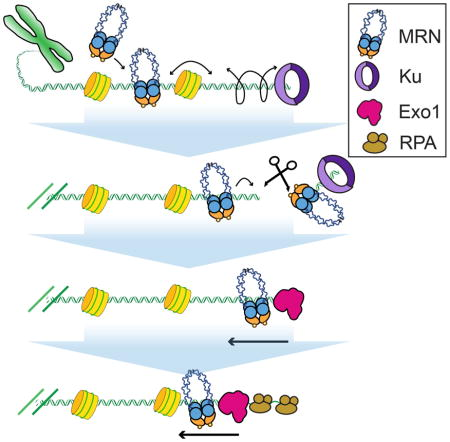
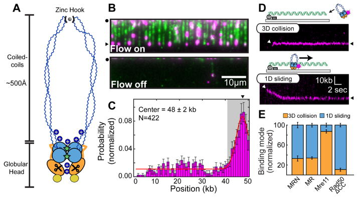
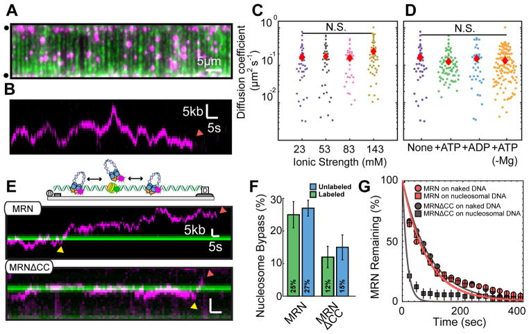
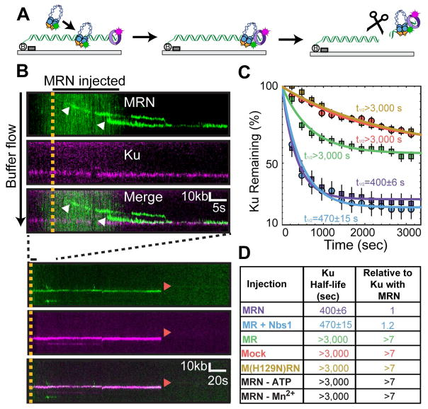
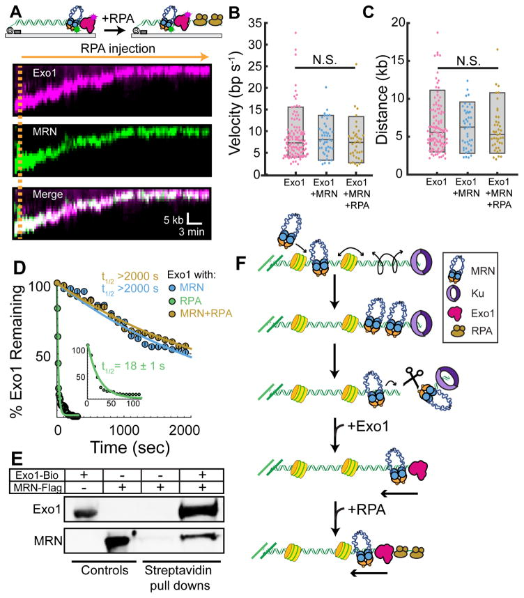

# Single-molecule imaging reveals how Mre11-Rad50-Nbs1 initiates DNA break repair

# Single-molecule imaging reveals how Mre11-Rad50-Nbs1 initiates DNA break repair
[Logan R Myler](https://pubmed.ncbi.nlm.nih.gov/?term="Myler%20LR"\[Author\])
### Logan R Myler
1Department of Molecular Biosciences, The University of Texas at Austin, Austin, TX 78712 USA
2Howard Hughes Medical Institute, The University of Texas at Austin, Austin, TX 78712 USA
3Center for Systems and Synthetic Biology, The University of Texas at Austin, Austin, TX 78712 USA
Find articles by [Logan R Myler](https://pubmed.ncbi.nlm.nih.gov/?term="Myler%20LR"\[Author\])
1,2,3,4, [Ignacio F Gallardo](https://pubmed.ncbi.nlm.nih.gov/?term="Gallardo%20IF"\[Author\])
### Ignacio F Gallardo
1Department of Molecular Biosciences, The University of Texas at Austin, Austin, TX 78712 USA
3Center for Systems and Synthetic Biology, The University of Texas at Austin, Austin, TX 78712 USA
Find articles by [Ignacio F Gallardo](https://pubmed.ncbi.nlm.nih.gov/?term="Gallardo%20IF"\[Author\])
1,3,4, [Michael M Soniat](https://pubmed.ncbi.nlm.nih.gov/?term="Soniat%20MM"\[Author\])
### Michael M Soniat
1Department of Molecular Biosciences, The University of Texas at Austin, Austin, TX 78712 USA
3Center for Systems and Synthetic Biology, The University of Texas at Austin, Austin, TX 78712 USA
Find articles by [Michael M Soniat](https://pubmed.ncbi.nlm.nih.gov/?term="Soniat%20MM"\[Author\])
1,3, [Rajashree A Deshpande](https://pubmed.ncbi.nlm.nih.gov/?term="Deshpande%20RA"\[Author\])
### Rajashree A Deshpande
1Department of Molecular Biosciences, The University of Texas at Austin, Austin, TX 78712 USA
2Howard Hughes Medical Institute, The University of Texas at Austin, Austin, TX 78712 USA
Find articles by [Rajashree A Deshpande](https://pubmed.ncbi.nlm.nih.gov/?term="Deshpande%20RA"\[Author\])
1,2, [Xenia B Gonzalez](https://pubmed.ncbi.nlm.nih.gov/?term="Gonzalez%20XB"\[Author\])
### Xenia B Gonzalez
1Department of Molecular Biosciences, The University of Texas at Austin, Austin, TX 78712 USA
3Center for Systems and Synthetic Biology, The University of Texas at Austin, Austin, TX 78712 USA
Find articles by [Xenia B Gonzalez](https://pubmed.ncbi.nlm.nih.gov/?term="Gonzalez%20XB"\[Author\])
1,3, [Yoori Kim](https://pubmed.ncbi.nlm.nih.gov/?term="Kim%20Y"\[Author\])
### Yoori Kim
1Department of Molecular Biosciences, The University of Texas at Austin, Austin, TX 78712 USA
3Center for Systems and Synthetic Biology, The University of Texas at Austin, Austin, TX 78712 USA
Find articles by [Yoori Kim](https://pubmed.ncbi.nlm.nih.gov/?term="Kim%20Y"\[Author\])
1,3, [Tanya T Paull](https://pubmed.ncbi.nlm.nih.gov/?term="Paull%20TT"\[Author\])
### Tanya T Paull
1Department of Molecular Biosciences, The University of Texas at Austin, Austin, TX 78712 USA
2Howard Hughes Medical Institute, The University of Texas at Austin, Austin, TX 78712 USA
Find articles by [Tanya T Paull](https://pubmed.ncbi.nlm.nih.gov/?term="Paull%20TT"\[Author\])
1,2, [Ilya J Finkelstein](https://pubmed.ncbi.nlm.nih.gov/?term="Finkelstein%20IJ"\[Author\])
### Ilya J Finkelstein
1Department of Molecular Biosciences, The University of Texas at Austin, Austin, TX 78712 USA
3Center for Systems and Synthetic Biology, The University of Texas at Austin, Austin, TX 78712 USA
Find articles by [Ilya J Finkelstein](https://pubmed.ncbi.nlm.nih.gov/?term="Finkelstein%20IJ"\[Author\])
1,3,5,*
  * Author information
  * Article notes
  * Copyright and License information

1Department of Molecular Biosciences, The University of Texas at Austin, Austin, TX 78712 USA
2Howard Hughes Medical Institute, The University of Texas at Austin, Austin, TX 78712 USA
3Center for Systems and Synthetic Biology, The University of Texas at Austin, Austin, TX 78712 USA
*
Correspondence: ifinkelstein@cm.utexas.edu
4
These authors contributed equally
5
Lead Contact
Issue date 2017 Sep 7.
[PMC Copyright notice](https://pmc.ncbi.nlm.nih.gov/about/copyright/)
PMCID: PMC5609712 NIHMSID: NIHMS901271 PMID: [28867292](https://pubmed.ncbi.nlm.nih.gov/28867292/)
The publisher's version of this article is available at [Mol Cell](https://doi.org/10.1016/j.molcel.2017.08.002)
##  Summary
DNA double-strand break (DSB) repair is essential for maintaining our genomes. Mre11-Rad50-Nbs1 (MRN) and Ku70-Ku80 (Ku) direct distinct DSB repair pathways, but the interplay between these complexes at a DSB remains unclear. Here, we use high-throughput single-molecule microscopy to show that MRN searches for free DNA ends by one-dimensional facilitated diffusion, even on nucleosome-coated DNA. Rad50 binds homoduplex DNA and promotes facilitated diffusion, whereas Mre11 is required for DNA end recognition and nuclease activities. MRN gains access to occluded DNA ends by removing Ku or other DNA adducts via an Mre11-dependent nucleolytic reaction. Next, MRN loads Exonuclease 1 (Exo1) onto the free DNA ends to initiate DNA resection. In the presence of Replication Protein A (RPA), MRN acts as a processivity factor for Exo1, retaining the exonuclease on DNA for long-range resection. Our results provide a mechanism for how MRN promotes homologous recombination on nucleosome-coated DNA.
##  Graphical abstract

##  Introduction
Mre11-Rad50-Nbs1 (MRN) is critical for initiating human DNA double-strand break (DSB) repair ([Figure 1A](https://pmc.ncbi.nlm.nih.gov/articles/PMC5609712/#F1)). MRN is one of the first DNA repair complexes to be detected at DSBs _in vivo_ ([Lisby et al., 2004](https://pmc.ncbi.nlm.nih.gov/articles/PMC5609712/#R27)). MRN binds both homoduplex DNA and free DNA ends, but the functional implications of its various DNA binding modes and how it rapidly locates DSBs is not fully understood. Upon reaching free DNA ends, MRN initiates homologous recombination (HR), which is used for error-free repair of DSBs that occur in the S/G2 phases of the cell cycle as well as for breaks resulting from replication fork collapse and from DNA-protein crosslinks. After recognizing the DSB, MRN next recruits Exonuclease 1 (Exo1), a long-range nuclease that resects the free DNA ends to create long 3′ single-stranded DNA (ssDNA) overhangs. These overhangs serve as scaffolds for RAD51 recombinase and other factors that catalyze error-free homologous recombination.
### Figure 1. MRN uses a combination of 3D and 1D diffusion to reach DNA ends.

(A) Mre11 (orange) harbors a nuclease site (scissors). Rad50 (blue) encodes ATP-binding sites (stars) in the globular domain and a zinc hook at the apex of the coiled-coil arms. Nbs1 associates with the globular core (yellow). Blue ‘+’ signs indicate positive DNA-binding patches. (B) MRN (magenta) on DNA (green). Turning off buffer flow retracts both MRN and DNA to the barriers (black circle), indicating that MRN is on the DNA. (C) MRN binding distribution along the DNA substrate. Gray region indicates the uncertainty in defining the DNA end. Error bars: SD as determined by bootstrap analysis. Red line: Gaussian fit. (D) MRN finds the DNA end by 3D collision (top) or 1D sliding (bottom). White arrows: initial MRN position on DNA; black arrows: free DNA end. (E) Quantification of binding modes for MRN (N=87), MR (N=83), or the Mre11 (N=45) and Rad50ΔCC (N=61) subunits. Error bars: S.D. as determined by bootstrap analysis.
Broken DNA ends can also be repaired via non-homologous end joining (NHEJ), an error-prone mechanism that does not use any DNA sequence homology to repair the DSB. NHEJ is active throughout the cell cycle and is the predominant repair pathway during the G1 phase in mammalian cells ([Bogomazova et al., 2011](https://pmc.ncbi.nlm.nih.gov/articles/PMC5609712/#R3); [Shahar et al., 2012](https://pmc.ncbi.nlm.nih.gov/articles/PMC5609712/#R38); [Shibata et al., 2011](https://pmc.ncbi.nlm.nih.gov/articles/PMC5609712/#R40)). The Ku70-Ku80 heterodimer (Ku) promotes NHEJ by capping the free DNA ends and physically blocking end resection ([Langerak et al., 2011](https://pmc.ncbi.nlm.nih.gov/articles/PMC5609712/#R24); [Shao et al., 2012](https://pmc.ncbi.nlm.nih.gov/articles/PMC5609712/#R39)). A critical open question is how MRN and Exo1 are able to process DSBs in the presence of a high cellular concentration of Ku throughout the cell cycle ([Langerak et al., 2011](https://pmc.ncbi.nlm.nih.gov/articles/PMC5609712/#R24); [Symington and Gautier, 2011](https://pmc.ncbi.nlm.nih.gov/articles/PMC5609712/#R44)). In one model, the DSB repair pathway is defined by whether Ku or MRN is first to reach the free DNA end. Alternatively, MRN may use its limited nucleolytic processing to create an entry site for Exo1 upstream of a Ku-occluded DNA end. Finally, the functional role of MRN during long-range DNA resection also remains unresolved.
Here, we use high-throughput single-molecule DNA curtains to investigate how MRN initiates DNA resection on Ku-blocked DNA ends. MRN accelerates its search for free DNA ends via facilitated one-dimensional (1D) diffusion along homoduplex DNA. Dynamic DNA binding within the Rad50 domain allows MRN to navigate past nucleosomes whereas DNA end recognition is catalyzed by the Mre11 subunit. In contrast, Ku recognizes free DNA ends exclusively via a three-dimensional (3D) collision mechanism. Both MRN and Ku can localize to the vicinity of a free DNA end, where Mre11 removes Ku and other protein-DNA adducts. MRN also loads Exo1 onto the free DNA ends and acts as an Exo1 processivity factor during long-range resection. These observations highlight that MRN harnesses both its catalytic and non-catalytic activities to regulate the DSB repair pathway choice and promote error-free HR.
##  Results
### MRN searches for DNA ends via one-dimensional (1D) facilitated diffusion
High-throughput single-molecule DNA curtain assays were used to directly observe the interplay between MRN, Ku, and the resection machinery at free DNA ends. In this assay, hundreds of 48.5 kb-long DNA substrates are tethered to supported lipid bilayers and organized at microfabricated chromium barriers for high-throughput single-molecule microscopy ([Gallardo et al., 2015](https://pmc.ncbi.nlm.nih.gov/articles/PMC5609712/#R12)). The second, free DNA ends serve as MRN substrates ([Figure 1B](https://pmc.ncbi.nlm.nih.gov/articles/PMC5609712/#F1)). For fluorescent imaging, the Mre11 subunit is labeled with a quantum dot (QD)-conjugated antibody directed against a C-terminal triple flag epitope tag. MRN was injected onto the single-tethered DNA curtains and its binding position mapped by fitting the point spread function to a two dimensional (2D) Gaussian profile ([Figures 1C](https://pmc.ncbi.nlm.nih.gov/articles/PMC5609712/#F1) And [S1](https://pmc.ncbi.nlm.nih.gov/articles/PMC5609712/#SD1)). Approximately half of the MRN molecules localize to the free DNA ends (56%; N = 237/422). A subset of MRN complexes also bound to internal DNA sites after initially sliding on the DNA (44%, N = 185/422). MRN binding to internal sites is consistent with its role in recognizing DNA nicks and other ss-/dsDNA structures ([de Jager et al., 2001](https://pmc.ncbi.nlm.nih.gov/articles/PMC5609712/#R19)). Previous studies estimated that the 48.5 kb-long DNA substrates used here accumulate ~3–5 nicks during DNA purification and single-molecule experiments ([Myler et al., 2016](https://pmc.ncbi.nlm.nih.gov/articles/PMC5609712/#R30)). A third of the DNA-bound MRN molecules (N = 29/87) recognized the free DNA ends via 3D collision (within our ~300 bp resolution, [Figure 1D](https://pmc.ncbi.nlm.nih.gov/articles/PMC5609712/#F1)). Interestingly, the remaining 67% (N = 58/87) of MRN molecules bound DNA internally and slid down the DNA to find the free DNA end ([Figure 1D](https://pmc.ncbi.nlm.nih.gov/articles/PMC5609712/#F1)). Buffer flow directs MRN sliding towards the free DNA end, suggesting that in the absence of buffer flow MRN may scan homoduplex DNA bidirectionally via facilitated diffusion (see below). These observations indicate that MRN uses a combination of 3D collision through space and one-dimensional (1D) sliding along DNA to locate DSBs.
We next investigated which subunit(s) of the MRN complex were responsible for DNA end recognition. The Mre11-Rad50 (MR) complex used a combination of 1D diffusion and 3D collision similar to MRN, albeit with a ~3-fold lower affinity for DNA, as described previously ([Figures 1E](https://pmc.ncbi.nlm.nih.gov/articles/PMC5609712/#F1) and [S1](https://pmc.ncbi.nlm.nih.gov/articles/PMC5609712/#SD1)) ([Paull and Gellert, 1999](https://pmc.ncbi.nlm.nih.gov/articles/PMC5609712/#R36)). Unlike the full complex, Mre11 bound free DNA ends largely via 3D collisions ([Figures 1E](https://pmc.ncbi.nlm.nih.gov/articles/PMC5609712/#F1) and [S1](https://pmc.ncbi.nlm.nih.gov/articles/PMC5609712/#SD1)). We could not purify the full-length human Rad50 by itself, but a Rad50 that lacked 888 amino acids of the Rad50 coiled-coil domain (Rad50ΔCC) largely used 1D sliding to search for DNA ends ([Figures 1E](https://pmc.ncbi.nlm.nih.gov/articles/PMC5609712/#F1) and [S1C](https://pmc.ncbi.nlm.nih.gov/articles/PMC5609712/#SD1)) ([Hohl et al., 2011](https://pmc.ncbi.nlm.nih.gov/articles/PMC5609712/#R18); [Lee et al., 2013](https://pmc.ncbi.nlm.nih.gov/articles/PMC5609712/#R25)). Surprisingly, Rad50ΔCC was rapidly washed off the free DNA ends in single-tethered DNA curtains, indicating that it lacked the ability to recognize DSBs ([Figure S1](https://pmc.ncbi.nlm.nih.gov/articles/PMC5609712/#SD1)). In contrast, Mre11, MR, and MRN remained on DNA for >3,000 sec (N = 43, 71, and 79 for Mre11, MR, and MRN, respectively) ([Figure S1F](https://pmc.ncbi.nlm.nih.gov/articles/PMC5609712/#SD1)). Addition of the Rad50 and Nbs1 subunits did not significantly alter the lifetimes of Mre11 sub-complexes at the DNA ends, further highlighting that Mre11 is solely required for end recognition. Overall, these results suggest that the Rad50 subunit confers MRN with the ability to bind and slide on homoduplex DNA, while end recognition requires the Mre11 subunit.
### The Rad50 subunit promotes facilitated diffusion on nucleosomal DNA
We further characterized MRN’s facilitated diffusion using double-tethered DNA curtains, where the DNA is in an extended conformation without any buffer flow ([Gallardo et al., 2015](https://pmc.ncbi.nlm.nih.gov/articles/PMC5609712/#R12)). Nearly all MRN complexes exhibited 1D facilitated diffusion along the length of the entire DNA molecule ([Figures 2A and 2B](https://pmc.ncbi.nlm.nih.gov/articles/PMC5609712/#F2)). During 1D diffusion, proteins can either slide along the helical pitch of the DNA backbone or can transiently dissociate and associate with the DNA via a series of microscopic hops. To differentiate between sliding and hopping, we measured the MRN diffusion coefficients at increasing ionic strengths ([Figure 2C](https://pmc.ncbi.nlm.nih.gov/articles/PMC5609712/#F2) and [Table S1](https://pmc.ncbi.nlm.nih.gov/articles/PMC5609712/#SD1)). At higher ionic strengths, increased electrostatic screening between protein and DNA results in increased apparent diffusion coefficients. However, MRN diffusion on DNA was independent of the ionic strength, suggesting that MRN primarily tracks the DNA helix as it searches for free DNA ends ([Figure 2C](https://pmc.ncbi.nlm.nih.gov/articles/PMC5609712/#F2)). Next, we investigated whether ATP-driven conformational transitions are an important determinant of MRN diffusion on DNA. Rad50 binds and hydrolyzes ATP, and ATP-dependent opening of the Rad50 subunits is proposed to regulate DNA entry into the Mre11-encoded nuclease domains ([Lafrance-Vanasse et al., 2015](https://pmc.ncbi.nlm.nih.gov/articles/PMC5609712/#R21); [Lammens et al., 2011](https://pmc.ncbi.nlm.nih.gov/articles/PMC5609712/#R23); [Lim et al., 2011](https://pmc.ncbi.nlm.nih.gov/articles/PMC5609712/#R26)). Diffusion coefficients were nucleotide-independent, indicating that ATP-induced conformational transitions do not regulate facilitated diffusion ([Figure 2D](https://pmc.ncbi.nlm.nih.gov/articles/PMC5609712/#F2) and [Table S1](https://pmc.ncbi.nlm.nih.gov/articles/PMC5609712/#SD1)). Recent crystal structures of archaeal and eukaryotic MR homologs suggested that dsDNA binds a positive patch along the Rad50 globular domain ([Figure 1A](https://pmc.ncbi.nlm.nih.gov/articles/PMC5609712/#F1)) ([Lammens et al., 2011](https://pmc.ncbi.nlm.nih.gov/articles/PMC5609712/#R23); [Liu et al., 2016](https://pmc.ncbi.nlm.nih.gov/articles/PMC5609712/#R28); [Seifert et al., 2016](https://pmc.ncbi.nlm.nih.gov/articles/PMC5609712/#R37)). We reasoned that this region might also be responsible for facilitated diffusion of the human MRN complex. As expected, the MR complex was fully functional in both facilitated diffusion and DNA end recognition, ruling out Nbs1 as the critical subunit for DNA binding ([Figure S1A](https://pmc.ncbi.nlm.nih.gov/articles/PMC5609712/#SD1)). Consistent with our previous results, Rad50ΔCC alone was able to diffuse on DNA but Mre11 did not diffuse on homoduplex DNA ([Figures S2A–S2C](https://pmc.ncbi.nlm.nih.gov/articles/PMC5609712/#SD1)). We also confirmed that the _Saccharomyces cerevisiae_ Mre11-Rad50-Xrs2 (MRX) (Xrs2 is the yeast Nbs1 homolog) and the T4-phage MR (gp47/gp46) complexes also scan homoduplex DNA via facilitated diffusion ([Figures S2A and S2C](https://pmc.ncbi.nlm.nih.gov/articles/PMC5609712/#SD1)). Moreover, the isolated full-length T4-phage Rad50 (gp46) also diffuses on DNA ([Figures S2A and S2C](https://pmc.ncbi.nlm.nih.gov/articles/PMC5609712/#SD1)). These results confirm that facilitated diffusion is shared by divergent MR(N/X) complexes from bacteriophage to humans and that this activity is dependent on the globular domain of Rad50. This separation of function between Rad50-dependent diffusion and Mre11-dependent end binding likely explains the co-conservation of Mre11 and Rad50 across all taxa of life.
#### Figure 2. MRN bypasses nucleosomes as it scans DNA via facilitated diffusion.

(A) MRN (magenta) on double-tethered DNA (green). Circles: DNA barriers and anchors. (B) Kymograph of MRN diffusing on double-tethered DNA. Red arrow: MRN dissociates from DNA. (C) Diffusion coefficients of MRN as a function of the ionic strength and (D) in different nucleotide conditions. N.S. indicates p > 0.05. Red diamonds: mean diffusion coefficient. (E) Kymographs of MRN (top) or MRNΔCC (bottom) diffusing past nucleosomes (green). Yellow arrows indicate nucleosome bypass events and red arrows mark where MRN dissociated from the DNA. (F) Nucleosome bypass probabilities. Error bars: SD obtained via bootstrap analysis. (G) Lifetimes of MRN (orange) or MRNΔCC (gray) on naked (circles) and post-labeled nucleosome-coated DNA (squares). Solid lines: single exponential fit to the data. Error bars: SD obtained via bootstrapping.
We next sought to determine how MRN navigates on DNA that is packaged into nucleosomes, which may block proteins that search for their target sites via facilitated diffusion. We deposited an average of 4 ± 0.8 nucleosomes (N = 93 DNA molecules) on the DNA substrate via a salt-dialysis protocol ([Figures S2D and S2E](https://pmc.ncbi.nlm.nih.gov/articles/PMC5609712/#SD1)). Fluorescent MRN was added to the nucleosome-coated double-tethered DNA curtains and individual diffusion traces were recorded for 20 minutes. The nucleosomes were then visualized _in situ_ by injecting a fluorescent antibody directed against the HA epitope tag on the H2A subunit ([Figure S2D](https://pmc.ncbi.nlm.nih.gov/articles/PMC5609712/#SD1) and STAR Methods). An MRN-nucleosome encounter was scored as a bypass event when MRN diffused from one side of a nucleosome to the other ([Figure S2](https://pmc.ncbi.nlm.nih.gov/articles/PMC5609712/#SD1)). The bypass probability reflects how strongly a barrier can block facilitated diffusion. This value can range from 0% for an impenetrable barrier to 50% for a completely permeable barrier (or naked DNA). This is because diffusing molecules are undergoing a 1D random walk and are equally likely to take a step forward or back along the DNA. Surprisingly, we observed nucleosome-bypass events in 27% of all collisions (94/347 collisions; 44 trajectories) ([Figures 2E and 2F](https://pmc.ncbi.nlm.nih.gov/articles/PMC5609712/#F2)). MRN also bypassed nucleosomes that were fluorescently pre-labeled with a QD (605 nm emission, ~10 nm radius), thereby creating a much larger barrier to 1D diffusion ([Figure 2F](https://pmc.ncbi.nlm.nih.gov/articles/PMC5609712/#F2)). The bypass probability for these larger obstacles was 25% (91/363 collisions; 85 trajectories), nearly identical to unlabeled nucleosomes. Moreover, MRN continued to diffuse on moderately dense nucleosome arrays and 25% of MRN molecules remained mobile on the highest-density nucleosome substrates ([Figures S2F–H](https://pmc.ncbi.nlm.nih.gov/articles/PMC5609712/#SD1)). Together, these results indicate that MRN can diffuse past multiple nucleosome obstacles to scan the genome for free DNA ends.
Since Rad50 promotes facilitated diffusion on DNA, we further analyzed the structural organization of the Rad50 subunit. The apex of the ~50 nm-long Rad50 coiled-coils terminates in a zinc hook that facilitates both intra- and intermolecular dimerization of the SMC-like Rad50 subunits. This dimerization promotes the organization of MRN’s globular domain and has also been proposed to topologically encircle homoduplex DNA ([Liu et al., 2016](https://pmc.ncbi.nlm.nih.gov/articles/PMC5609712/#R28); [Seifert et al., 2016](https://pmc.ncbi.nlm.nih.gov/articles/PMC5609712/#R37)). Therefore, truncation of the Rad50 coils may alter MRN’s ability to navigate on nucleosome-coated DNA. We tested this hypothesis by observing how the Mre11-Rad50ΔCC-Nbs1 (MRNΔCC) complex bypasses nucleosomes ([Figures 2E](https://pmc.ncbi.nlm.nih.gov/articles/PMC5609712/#F2), [S2G, and S2H](https://pmc.ncbi.nlm.nih.gov/articles/PMC5609712/#SD1)). Truncating the Rad50 coiled-coils reduced the nucleosome bypass probability ~2-fold (15%, N = 297 collisions, 90 molecules) for post-labeled nucleosomes and had a similar effect on pre-labeled nucleosomes (12%, N = 191 collisions, 90 molecules). Although MRNΔCC bound DNA with similar affinity to full-length MRN, it dissociated ~5-fold more rapidly from nucleosome-coated DNA ([Figure 2G](https://pmc.ncbi.nlm.nih.gov/articles/PMC5609712/#F2) and [Table S2](https://pmc.ncbi.nlm.nih.gov/articles/PMC5609712/#SD1)). MRNΔCC primarily dissociated from the DNA during nucleosome collisions (70% of dissociation events, N=32/46), whereas only 59% of full-length MRN complexes (N=51/87) dissociated from DNA in the vicinity of a nucleosome. Truncation of the Rad50 coiled-coils and zinc hook prevent the complex from completely encircling the DNA and may also disrupt organization of the globular domain. However, the observation that MRNΔCC has the same binding lifetimes as MRN on naked DNA indicates that these perturbations do not significantly alter DNA binding. Rather, these results suggest that MRN must transiently dissociate from the DNA backbone to bypass a nucleosome and that MRNΔCC is less likely to return to the vicinity of the DNA molecule after this microscopic dissociation. MRN may remain encircled around the DNA during micro-dissociation by holding the DNA in between its long coiled-coils. Consistent with this model, a recent study identified an interface that stabilizes Rad50 coiled coils in an intramolecular dimer assembly ([Park et al., 2017](https://pmc.ncbi.nlm.nih.gov/articles/PMC5609712/#R35)). Taken together, these results indicate that full-length Rad50 promotes facilitated diffusion past nucleosome obstacles by retaining MRN on homoduplex DNA.
### MRN nucleolytically removes Ku from DNA ends
Ku and MRN both localize to free DNA ends within seconds of DSB induction, but Ku is present throughout the cell cycle and physically blocks other proteins from binding the DNA ends ([Branzei and Foiani, 2008](https://pmc.ncbi.nlm.nih.gov/articles/PMC5609712/#R4)). Therefore, we sought to determine how MRN gains access to Ku-blocked DNA. We purified and visualized the human Ku complex via a QD-conjugated antibody directed against the triple HA epitope tag on the C-terminus of the Ku80 subunit ([Figures S3A–C](https://pmc.ncbi.nlm.nih.gov/articles/PMC5609712/#SD1)). When injected onto single-tethered DNA curtains, the majority of Ku molecules (61%; N = 345/567) localized to the free DNA ends. The remaining molecules (39%; N = 222/567) bound to the middle of the DNA ([Figures S3A and S3B](https://pmc.ncbi.nlm.nih.gov/articles/PMC5609712/#SD1)). These observations are consistent with Ku’s strong preference for free DNA ends and with its limited ability to bind nicks and other ssDNA-dsDNA junctions ([Blier et al., 1993](https://pmc.ncbi.nlm.nih.gov/articles/PMC5609712/#R2); [Krasner et al., 2015](https://pmc.ncbi.nlm.nih.gov/articles/PMC5609712/#R20)). Several studies have reported conflicting observations regarding whether the ring-like Ku complex can slide on homoduplex DNA prior to recognizing the DSB ([Grundy et al., 2014](https://pmc.ncbi.nlm.nih.gov/articles/PMC5609712/#R15); [Walker et al., 2001](https://pmc.ncbi.nlm.nih.gov/articles/PMC5609712/#R45)). In contrast to MRN, we did not observe any instances where Ku slid or diffused from internal DNA sites to reach the free DNA end. Ku bound free DNA ends exclusively via 3D collisions (N = 345; [Figure S3C](https://pmc.ncbi.nlm.nih.gov/articles/PMC5609712/#SD1)), where it remained for the duration of our observation time (> 3,000 seconds) ([Figure 3](https://pmc.ncbi.nlm.nih.gov/articles/PMC5609712/#F3)).
#### Figure 3. MRN nucleolytically removes Ku-blocked DNA ends.

(A) Illustration and (B) kymographs of MRN co-localizing with Ku. Two MRN complexes initially bind ~25 kb and ~10 kb upstream of Ku but rapidly slide to the DNA end (top). White arrows indicate binding events. In the presence of Mn2+ and ATP, MRN nucleolytically removes itself and Ku (bottom, red arrows). (C) Lifetime of Ku on DNA ends in the presence of nuclease active MRN sub-complexes, or the nuclease-deficient M(H129N)RN. (D) Half-lives with two additional controls added in black.
Since MRN can bind and slide on homoduplex DNA, we reasoned that it can also load upstream of a Ku-occluded free DNA end. To test this hypothesis, MRN was injected into flowcells with Ku-bound single-tethered DNA curtains. MRN bound upstream of the Ku-blocked ends and 76% (N = 84) of DNA-bound MRN molecules rapidly slid with buffer flow to a Ku-bound free DNA end ([Figures 3A and 3B](https://pmc.ncbi.nlm.nih.gov/articles/PMC5609712/#F3)). These observations reveal that MRN can use its homoduplex sliding activity to occupy the vicinity of a Ku-blocked DSB.
MRN contains an Mre11-encoded endonuclease that is activated by ATP and Mn2+ ([Paull and Gellert, 1999](https://pmc.ncbi.nlm.nih.gov/articles/PMC5609712/#R36)). Nucleolytically active MRN, but not the nuclease-deficient M(H129N)RN mutant, rapidly removed Ku from the DNA ([Figures 3C and 3D](https://pmc.ncbi.nlm.nih.gov/articles/PMC5609712/#F3)). In the presence of both ATP and Mn2+, the Ku half-life was reduced at least 7-fold (half-life = 400 ± 6 sec; N = 139). Moreover, the cleavage reaction frequently removed both MRN and Ku in a single step (82%; N = 34), suggesting that the cleavage site was upstream of both complexes or that nuclease-active MRN was unable to bind the free DNA end. In addition to ATP and Mn2+, the Mre11 nuclease activation also required the Nbs1 subunit for optimal activity ([Figures 3C and 3D](https://pmc.ncbi.nlm.nih.gov/articles/PMC5609712/#F3), and [Table S2](https://pmc.ncbi.nlm.nih.gov/articles/PMC5609712/#SD1)). Nbs1 does not encode any catalytic or DNA binding activities but is thought to be a key regulator of conformational switches within the MR complex ([Deshpande et al., 2016](https://pmc.ncbi.nlm.nih.gov/articles/PMC5609712/#R11); [Paull and Gellert, 1999](https://pmc.ncbi.nlm.nih.gov/articles/PMC5609712/#R36); [Williams et al., 2010](https://pmc.ncbi.nlm.nih.gov/articles/PMC5609712/#R46)). Our results further confirm that Nbs1 is critical for activating the Mre11 nuclease at Ku-blocked ends ([Table S2](https://pmc.ncbi.nlm.nih.gov/articles/PMC5609712/#SD1)). Interestingly, MRN also removed adducts at both the 5′ and 3′-DNA ends (half-life = 610 ± 15, N = 42 for 3′ label, and half-life = 860 ± 30, N = 57 for 5′ label), suggesting that it creates a nick on both sides of the DNA ([Figures S3E–H](https://pmc.ncbi.nlm.nih.gov/articles/PMC5609712/#SD1)). We used a radiolabeled PCR substrate to further characterize MRN nucleolytic cleavage. In the presence of Ku, MRN generated an endonucleolytic cut ~30 nt upstream from the DNA end ([Figures S3I and S3J](https://pmc.ncbi.nlm.nih.gov/articles/PMC5609712/#SD1)). This is consistent with the DNA end occupancy of Ku (~15nt) plus the footprint of the nucleolytic MRN molecule ([Liu et al., 2016](https://pmc.ncbi.nlm.nih.gov/articles/PMC5609712/#R28); [Seifert et al., 2016](https://pmc.ncbi.nlm.nih.gov/articles/PMC5609712/#R37)). Taken together, these results show that MRN(X) can remove Ku and other DNA-bound adducts from free DNA ends.
### MRN loads Exo1 and is a core subunit of the resectosome
MRN loads Exo1 onto DNA ends and is proposed to directly stimulate resection via an unknown mechanism ([Nicolette et al., 2010](https://pmc.ncbi.nlm.nih.gov/articles/PMC5609712/#R32); [Nimonkar et al., 2011](https://pmc.ncbi.nlm.nih.gov/articles/PMC5609712/#R33); [Yang et al., 2013](https://pmc.ncbi.nlm.nih.gov/articles/PMC5609712/#R48)). We previously determined that human Exo1 is a processive enzyme but is rapidly removed from DNA by RPA ([Myler et al., 2016](https://pmc.ncbi.nlm.nih.gov/articles/PMC5609712/#R30)). Here, we assayed Exo1 activity in the presence of MRN by directly imaging both MRN and Exo1 using two-color fluorescent imaging. MRN formed a stable, long-lived complex (half-life >2,000 sec; N = 51) with Exo1 throughout the resection reaction ([Figure 4A](https://pmc.ncbi.nlm.nih.gov/articles/PMC5609712/#F4)). The MRN/Exo1 complex resected 6.2 ± 2.7 kb (N = 43) of DNA with a mean velocity of 8.4 ± 3.9 bp sec−1 (N = 45), indicating that MRN does not stimulate Exo1 nuclease activity on naked DNA ([Figures 4B and 4C](https://pmc.ncbi.nlm.nih.gov/articles/PMC5609712/#F4)) ([Myler et al., 2016](https://pmc.ncbi.nlm.nih.gov/articles/PMC5609712/#R30)). We also confirmed that MRN did not stimulate Exo1 when the buffer was supplemented with Mn2+ and ATP to activate the Mre11 endonuclease activity ([Figures S4A and S4B](https://pmc.ncbi.nlm.nih.gov/articles/PMC5609712/#SD1)). In the cell, the Exo1-generated ssDNA is rapidly bound by RPA. RPA reduces the Exo1 lifetime on DNA ~100-fold and converts Exo1 into a distributive enzyme ([Myler et al., 2016](https://pmc.ncbi.nlm.nih.gov/articles/PMC5609712/#R30)). However, an interaction between MRN and Exo1 could help to retain the nuclease on DNA in the presence of RPA. Therefore, we set out to determine if MRN can overcome RPA removal of Exo1 ([Figure 4](https://pmc.ncbi.nlm.nih.gov/articles/PMC5609712/#F4)). Surprisingly, the MRN/Exo1 complex stably bound to DNA with 1 nM RPA in the flow buffer ([Figure 4D](https://pmc.ncbi.nlm.nih.gov/articles/PMC5609712/#F4)). Moreover, large resection tracts were observed behind the moving MRN/Exo1 complex when RPA-GFP was used to stain the ssDNA ([Figures S4C and S4D](https://pmc.ncbi.nlm.nih.gov/articles/PMC5609712/#SD1)). RPA-GFP foci continued to move and accumulate intensity for the duration of MRN/Exo1 translocation, indicating continuous ssDNA production ([Figures S4C and S4D](https://pmc.ncbi.nlm.nih.gov/articles/PMC5609712/#SD1)). The MRN/Exo1 complex persisted on DNA for >2,000 seconds (N = 65) in the presence of RPA ([Figure 4D](https://pmc.ncbi.nlm.nih.gov/articles/PMC5609712/#F4)), consistent with the previously reported lifetime of Exo1 on naked DNA ([Myler et al., 2016](https://pmc.ncbi.nlm.nih.gov/articles/PMC5609712/#R30)). Additionally, Exo1 velocity and processivity were largely unaffected by RPA in the presence of MRN (velocity = 7.7 ± 4.6 bp sec−1, p = 0.57, N = 37; processivity = 6.0 ± 3.1 kb, p = 0.97, N = 42).
#### Figure 4. MRN is a core subunit of the resectosome.

(A) Kymograph of MRN (magenta) and Exo1 (green) co-resecting DNA in the presence of 1 nM RPA (orange line). (B) Velocity and (C) processivity of Exo1 alone (magenta, N = 111), Exo1 + MRN (blue, N = 43), or Exo1 + MRN + RPA (gold, N = 37). The velocities and processivities are statistically indistinguishable (N.S.: p-values > 0.05). Box plots indicate the median, 10th, and 90th percentiles of the distribution. (D) Lifetime of Exo1 in the presence of MRN (blue), RPA (green inset: short timescale), or MRN and RPA (gold). (E) Pull down of MRN with Exo1 indicates a protein-protein interaction between the two enzymes. (F) MRN initially scans homoduplex DNA via facilitated diffusion, bypassing nucleosomes to reach Ku-blocked DNA ends. MRN then nucleolytically removes Ku from DNA. A second MRN complex promotes long-range resection by loading Exo1 and alleviating RPA inhibition.
Our single-molecule studies, as well as prior ensemble biochemical reports, suggested that MRN may stimulate Exo1 via physical interactions between the two complexes ([Cejka, 2015](https://pmc.ncbi.nlm.nih.gov/articles/PMC5609712/#R7); [Cejka et al., 2010](https://pmc.ncbi.nlm.nih.gov/articles/PMC5609712/#R8); [Nimonkar et al., 2011](https://pmc.ncbi.nlm.nih.gov/articles/PMC5609712/#R33); [Niu et al., 2010](https://pmc.ncbi.nlm.nih.gov/articles/PMC5609712/#R34)). We next sought to determine which subunits give rise to these interactions. Using biotinylated Exo1 immobilized on streptavidin magnetic beads as bait, we were able to pull down the MRN complex _in vitro_ ([Figure 4E](https://pmc.ncbi.nlm.nih.gov/articles/PMC5609712/#F4)). To further characterize the physical interaction between Exo1 and MRN, we assayed interactions between wild-type Exo1, the catalytic Exo1 core (Exo1(NTD)), and the individual subunits of the MRN complex ([Figure S4E](https://pmc.ncbi.nlm.nih.gov/articles/PMC5609712/#SD1)). Full-length Exo1 interacted with both Mre11 and Nbs1 but not with Rad50ΔCC. Exo1(NTD) directly pulled down Mre11, but surprisingly did not interact with Nbs1 or Rad50ΔCC. This suggests that Exo1(NTD) binds to the Mre11 subunit of MRN, and that a secondary interaction with Nbs1 may be contained in the unstructured C-terminus of Exo1. Taken together, these data suggest that MRN acts as a processivity factor for Exo1 and helps to retain the nuclease on DNA via direct protein-protein interactions, even in the presence of RPA ([Nimonkar et al., 2011](https://pmc.ncbi.nlm.nih.gov/articles/PMC5609712/#R33); [Yang et al., 2013](https://pmc.ncbi.nlm.nih.gov/articles/PMC5609712/#R48)).
##  Discussion
Taken together, this work provides a comprehensive model for DSB recognition and the initiation of resection by the human MRN complex ([Figure 4F](https://pmc.ncbi.nlm.nih.gov/articles/PMC5609712/#F4)). MRN binds homoduplex DNA and scans past nucleosomes to locate free DNA ends. The DNA sliding and nucleosome bypass activities are exclusively encoded within the Rad50 subunit, whereas Mre11 recognizes the free DNA ends. Our results provide a molecular underpinning for previous observations that the weak (~1 μM) affinity of Mre11 for homoduplex DNA is stimulated by being in complex with Rad50 ([Williams et al., 2008](https://pmc.ncbi.nlm.nih.gov/articles/PMC5609712/#R47)). We propose that this separation of function between the Mre11 and Rad50 subunits explains the conservation of MR homologs across all taxa of life. These observations also suggest that the Rad50 subunit is critical for MRN binding in the vicinity of replication forks, transcription bubbles, and capped telomeres ([Guirouilh-Barbat et al., 2008](https://pmc.ncbi.nlm.nih.gov/articles/PMC5609712/#R16); [Lamarche et al., 2010](https://pmc.ncbi.nlm.nih.gov/articles/PMC5609712/#R22); [Sirbu et al., 2011](https://pmc.ncbi.nlm.nih.gov/articles/PMC5609712/#R42)). Furthermore, we show that MRN uses facilitated 1D diffusion to scan for DNA lesions and that the Rad50 coiled-coils can retain the complex on DNA, even when MRN encounters nucleosomes. These results are especially striking when compared with two recent studies of cohesin diffusion on crowded DNA ([Davidson et al., 2016](https://pmc.ncbi.nlm.nih.gov/articles/PMC5609712/#R10); [Stigler et al., 2016](https://pmc.ncbi.nlm.nih.gov/articles/PMC5609712/#R43)). Like Rad50, cohesin also encodes two ~30–40 nm-long coiled-coils. However, both human and _S. pombe_ cohesins are blocked by diverse roadblocks, suggesting that the “effective” pore size is only ~10–15 nm wide ([Davidson et al., 2016](https://pmc.ncbi.nlm.nih.gov/articles/PMC5609712/#R10); [Stigler et al., 2016](https://pmc.ncbi.nlm.nih.gov/articles/PMC5609712/#R43)). In contrast, MRN diffuses on moderately dense nucleosome arrays. This allows MRN to rapidly find DNA ends in euchromatin and nucleosome-depleted genomic regions. Reduced MRN diffusion on highly chromatinized DNA may also contributed to limited HR and slow repair at heterochromatic DNA breaks. Overall, these results provide a molecular picture of MRN as both a DNA end-binding protein and also as a DNA damage-sensing complex.
MRN promotes the loading of Exo1 on DNA ends, particularly in the presence of Ku ([Langerak et al., 2011](https://pmc.ncbi.nlm.nih.gov/articles/PMC5609712/#R24); [Nimonkar et al., 2011](https://pmc.ncbi.nlm.nih.gov/articles/PMC5609712/#R33); [Yang et al., 2013](https://pmc.ncbi.nlm.nih.gov/articles/PMC5609712/#R48)). Here we also show that MRN can remove Ku via two endonucleolytic cuts. This is consistent with a recent genetic study showing that Ku and DNAPKcs can be removed from single-ended DSBs by an unknown mechanism that is dependent on MRN’s endonuclease activity ([Chanut et al., 2016](https://pmc.ncbi.nlm.nih.gov/articles/PMC5609712/#R9)). Two additional factors likely regulate MRN’s nuclease activity. First, multiple MRN complexes are recruited to the free DNA ends by protein-protein interactions with other repair factors. PARP1 is one likely candidate because it directly interacts with Mre11 and also recognizes free DNA ends ([Haince et al., 2008](https://pmc.ncbi.nlm.nih.gov/articles/PMC5609712/#R17)). Second, MRN nuclease activity is further activated via CtIP binding and ATM phosphorylation ([Anand et al., 2016](https://pmc.ncbi.nlm.nih.gov/articles/PMC5609712/#R1); [Cannavo and Cejka, 2014](https://pmc.ncbi.nlm.nih.gov/articles/PMC5609712/#R6)). This activity may function in parallel with a secondary mechanism that requires MRN’s endo and exonuclease activities to nick the DNA and promote bi-directional resection in concert with CtIP nuclease ([Chanut et al., 2016](https://pmc.ncbi.nlm.nih.gov/articles/PMC5609712/#R9); [Garcia et al., 2011](https://pmc.ncbi.nlm.nih.gov/articles/PMC5609712/#R13); [Makharashvili et al., 2014](https://pmc.ncbi.nlm.nih.gov/articles/PMC5609712/#R29); [Neale et al., 2005](https://pmc.ncbi.nlm.nih.gov/articles/PMC5609712/#R31); [Shibata et al., 2014](https://pmc.ncbi.nlm.nih.gov/articles/PMC5609712/#R41)). Additional studies will be required to parse out the roles of CtIP in regulating the critical first step of DSB resection.
After clearing the free DNA ends, MRN then loads Exo1 on DNA via physical interactions between the two enzymes. However, RPA limits resection by stripping Exo1 from DNA ([Genschel and Modrich, 2003](https://pmc.ncbi.nlm.nih.gov/articles/PMC5609712/#R14); [Myler et al., 2016](https://pmc.ncbi.nlm.nih.gov/articles/PMC5609712/#R30)). Here, we find that MRN acts as a processivity factor that retains Exo1 on DNA and promotes kilobase-length resection in the presence of RPA. In sum, this work reveals that MRN promotes HR by recognizing and clearing protein-occluded DSBs and also by promoting long-range DNA resection. Future studies will be crucial for understanding how MRN contributes to long-range DNA resection on chromatin.
##  STAR Methods
### CONTACT FOR REAGENT AND RESOURCE SHARING
Further information and requests for resources and reagents should be directed to and will be fulfilled by the Lead Contact, Ilya Finkelstein (ifinkelstein@cm.utexas.edu).
### EXPERIMENTAL MODEL AND SUBJECT DETAILS
See [Key Resources Table](https://pmc.ncbi.nlm.nih.gov/articles/PMC5609712/#T1) for information on bacterial and insect strains used as sources of materials in this study.
#### KEY RESOURCES TABLE.
REAGENT or RESOURCE | SOURCE | IDENTIFIER  
---|---|---  
Antibodies  
Monoclonal ANTI-FLAG M2 antibody produced in mouse | Sigma-Aldrich | F1804-1MG  
HA tag antibody (mouse) | GeneTex | GTX18181  
Anti-Mouse IgG (H&L) IRDye800 Conjugated Antibody | Rockland | RL-610-132-121  
Rabbit anti-HA Tag antibody affinity purified | ICL Lab | RHGT-45A-Z  
Monoclonal ANTI-FLAG BioM2 antibody produced in mouse | Sigma-Aldrich | F9291-.2MG  
F(ab′)2-Goat anti-Rabbit IgG (H+L) Secondary Antibody, Qdot 705 | Life Tech. | Q11461MP  
F(ab′)2-Goat anti-Rabbit IgG (H+L) Secondary Antibody, Qdot 605 | Life Tech. | Q11402MP  
|  |   
Bacterial and Insect Strains  
BL21(DE3) cells | Agilent | 230245  
ArcticExpress (DE3)RIL cells | Stratagene | 230193  
DH10bac cells | Invitrogen | 10361012  
Sf21 insect cells (Grace’s media) | Invitrogen | [B82101](https://www.ncbi.nlm.nih.gov/nuccore/B82101)  
|  |   
Chemicals, Peptides, and Recombinant Proteins  
Streptavidin Atto647N | Atto-Tec | AD 647N-65  
Streptavidin Quantum Dot 705 | Life Tech. | Q10163MP  
Streptavidin Quantum Dot 605 | Life Tech. | Q10103MP  
Dynabeads M-280 Streptavidin | Life Tech. | 11205D  
T4 Polynucleotide Kinase | NEB | M0201L  
[γ-32P]-ATP | Perkin Elmer | BLU002H  
Bovine Serum Albumin (BSA) | Fisher Scientific | 9048-46-8  
DNase I | NEB | M0303S  
|  |   
Critical Commercial Assays  
Q5 PCR Mutagenesis | NEB | E0554S  
Bac-to-Bac Baculovirus Expression System | Life Tech. |   
|  |   
Deposited Data  
Mendeley Data | Mendeley | doi:10.17632/4ck8jnr2mx.1  
Oligonucleotides  
See [Table S2](https://pmc.ncbi.nlm.nih.gov/articles/PMC5609712/#SD1) for a list of oligonucleotides used in this study | IDT |   
Recombinant DNA  
pFastbac1 | Life Tech. | 10360014  
Lambda DNA | NEB | N3011S  
pUC19 vector | NEB | N3041S  
TOPO blunt vector | Stratagene | 240205  
Ku70-His (pDR121), Ku80-3XHA (pIF2) | This study | Available upon request  
Human Mre11-3XFlag (pIF240), Rad50-His (pTP3090), Nbs1 (pTP284), Mre11(H129N)-3XFlag (pTP3695), Nbs1-Flag (pTP288) | This study | Available upon request  
Rad50(ΔCC)-HA-His (pTP516) | This study | Available upon request  
Yeast Mre11-His (pTP391), Rad50-Flag (pTP3335), Xrs2 (pTP622) | This study | Available upon request  
gp46 (pIF237), gp47 (pIF238) | This study | Available upon request  
Exo1-avidity (pIF7), Exo1(NTD)-avidity (pIF241) | This study | Available upon request  
RPA-His (pIF47), RPA-GFP-His (pIF48) | This study | Available upon request  
Human histone 3XHA-H2A (pIF131), H2B (pIF10), H3 (pIF11), H4 (pIF12) | This study | Available upon request  
|  |   
Software and Algorithms  
FIJI (Fiji is just imageJ; version:1.47b) | ImageJ software |   
Matlab (version:R2015b) | Mathworks |   
Custom FIJI and Matlab scripts | This study | Available upon request  
Other  
Eclipse Ti-E Inverted TIRF Microscope | Nikon | MEA53100  
60X water-immersion objective (1.2NA) | Nikon | MRD07602  
500 nm long-pass filter | Chroma | ET500lp  
638 nm dichroic beam splitter | Chroma | Custom Order  
iXon X3 DU897 EMCCD cameras | Andor | 77026031  
Protein Lo-Bind Tubes | Eppendorf | 022431081  
Typhoon FLA 9500 | GE Healthcare | 28996943  
Optima XE ultracentrifuge | Beckman-Coulter | [A99836](https://www.ncbi.nlm.nih.gov/protein/A99836)  
Sonic Dismembrator Model 705 | Fisher Scientific | [FB705110](https://www.ncbi.nlm.nih.gov/nuccore/FB705110)  
Ni-NTA Superflow Resin | Qiagen | 30410  
HiTrap Q HP column | GE Healthcare | 17-1153-01  
Anti-FLAG M2 Affinity Gel | Sigma Aldrich | A2220  
Chitin Resin | NEB | S6651S  
HiTrap SP HP column | GE Healthcare | 17115101  
HiTrap Heparin HP column | GE Healthcare | 17040601  
Superose 6 (10/300) | GE Healthcare | 17517201  
Superdex 200 (10/300) | GE Healthcare | 17517501  
Softlink Soft Release Avidin Resin | Promega | V201A  
[Open in a new tab](https://pmc.ncbi.nlm.nih.gov/articles/PMC5609712/table/T1/)
### METHOD DETAILS
#### MRN and Ku purification
MRN and variants were expressed in Sf21 insect cells co-infected with up to three viruses ([Lee et al., 2013](https://pmc.ncbi.nlm.nih.gov/articles/PMC5609712/#R25); [Yang et al., 2013](https://pmc.ncbi.nlm.nih.gov/articles/PMC5609712/#R48)). For fluorescent imaging, a triple flag epitope tag was cloned into the C-terminus of human Mre11 in pFastBac1 (Life Tech.) via Q5 PCR mutagenesis (NEB) with primers IF183 and IF184 to generate plasmid pIF240. MRN, MR, and subunits were purified via Ni-NTA (Qiagen), Q HP (GE), SP HP (GE), and Superose 6 (GE) columns. Ku was expressed in Sf21 insect cells using the Bac-to-Bac (Life Tech.) expression system ([Yang et al., 2013](https://pmc.ncbi.nlm.nih.gov/articles/PMC5609712/#R48)). For fluorescent imaging, a triple HA tag was cloned into the C-terminus of Ku80 via two rounds of inverse PCR mutagenesis (NEB) using primers LM002, IF115, IF116, and IF117 to generate pIF2 (See [Table S3](https://pmc.ncbi.nlm.nih.gov/articles/PMC5609712/#SD1)). Ku was purified via Ni-NTA (Qiagen), Q HP (GE), Heparin (GE), and Superdex 200 (GE) columns.
#### Single-molecule data collection and analysis
All single-molecule data was collected at 37°C using a Nikon Ti-E microscope in a prism-TIRF configuration ([Brown et al., 2016](https://pmc.ncbi.nlm.nih.gov/articles/PMC5609712/#R5); [Myler et al., 2016](https://pmc.ncbi.nlm.nih.gov/articles/PMC5609712/#R30)). Data were collected with a 200 ms exposure through a 60X water-immersion objective (1.2NA, Nikon), a 500 nm long-pass (Chroma) and a 638 nm dichroic beam splitter (Chroma) for two-channel detection through two EMCCD cameras (Andor iXon DU897, cooled to −80°C). Histograms of MRN and Ku binding preference on DNA were acquired by combining data from at least three flowcells for each experiment. A Gaussian curve with a constant offset was fit to the largest peak using a custom script written in MATLAB (available upon request). The constant offset in the fitting accounts for molecules that bind nonspecifically along the length of the DNA substrate. The center and SD of each fit are reported in the corresponding figure panels.
#### DNA Substrates for DNA curtains
DNA substrates containing a blunt end, digylated 5′ or 3′ end, or a 3′-78 nt overhang were prepared by annealing the appropriate oligos at 65°C, ligating the DNA overnight with T4 DNA ligase (NEB), heat inactivation of the ligase, and purification of the DNA substrates through an S1000 gel filtration column (GE) ([Myler et al., 2016](https://pmc.ncbi.nlm.nih.gov/articles/PMC5609712/#R30)). Nucleosomes were reconstituted via stepwise salt dialysis using 1.5 M, 1.0 M, 0.8 M, 0.6 M, 0.4 M, and 0.2 M NaCl concentrations each for 2 hours ([Brown et al., 2016](https://pmc.ncbi.nlm.nih.gov/articles/PMC5609712/#R5)).
#### Fluorescent protein labeling
Flag-tagged proteins were conjugated to Quantum Dots (QDs) by first pre-incubating a biotinylated anti-flag antibody (Sigma-Aldrich, F9291-.2MG) with Streptavidin QDs (Life Tech., Q10163MP for 705 and Q10103MP for 605) on ice for 10 minutes. Next, MRN or other flag-tagged proteins were incubated with the anti-flag QDs for an additional 10 minutes on ice, diluted with imaging buffer (40 mM Tris-HCL [pH 8.0], 60mM NaCl, 0.2 mg mL−1 BSA, 1mM MgCl2, 1mM DTT) or cleavage buffer (40mM Tris-HCL [pH 8.0], 60 mM NaCl, 0.2 mg mL−1 BSA, 5 mM MgCl2, 1 mM DTT, 1 mM MnCl2, 1 mM ATP) containing free biotin, and injected into the flowcell. Ku was labeled with anti-HA antibody conjugated QDs on ice for 10 minutes prior to injection. Exo1 was conjugated to streptavidin QDs ([Myler et al., 2016](https://pmc.ncbi.nlm.nih.gov/articles/PMC5609712/#R30)). Where indicated, RPA (or RPA-GFP) was included at a concentration of 1nM in the imaging buffer.
#### MRN subunits, RPA, and histone purification
Human Mre11, Rad50ΔCC (replacing Rad50 amino acids 217-1104 with a PPAAAGG linker), and Nbs1 were individually purified from insect cells ([Lee et al., 2013](https://pmc.ncbi.nlm.nih.gov/articles/PMC5609712/#R25)). Yeast MRX was purified from Sf21 insect cells infected with three viruses encoding each of the complex subunits similar to human MRN ([Nicolette et al., 2010](https://pmc.ncbi.nlm.nih.gov/articles/PMC5609712/#R32)). Human RPA and RPA-GFP were purified from _E. coli_ using a pET expression vector ([Myler et al., 2016](https://pmc.ncbi.nlm.nih.gov/articles/PMC5609712/#R30)). Human histones were individually purified from inclusion bodies, assembled into octamers, and reconstituted on DNA curtains via step-wise salt dialysis ([Brown et al., 2016](https://pmc.ncbi.nlm.nih.gov/articles/PMC5609712/#R5)).
#### Exo1 and Exo1(NTD) purification
Biotinylated Exo1 was co-infected with a BirA virus in Sf21 insect cells and purified via Q (GE), SoftLink Soft Release Avidin Resin (Promega), SP (GE), and Superose 6 (GE) columns ([Myler et al., 2016](https://pmc.ncbi.nlm.nih.gov/articles/PMC5609712/#R30)). To make the N-terminal domain (NTD) encoding amino acids 1-352, the C-terminal domain was removed from the full length Exo1-Bio (pIF7) via inverse PCR with oligos XBG001 and XBG002. The resulting pFastBac derivative harboring Exo1(NTD) (pIF241) was used to amplify insect cell virus and infect Sf21 cells. Exo1(NTD) was purified using the same protocol as the full length Exo1 ([Myler et al., 2016](https://pmc.ncbi.nlm.nih.gov/articles/PMC5609712/#R30)).
#### T4 Rad50 (gp46) cloning and expression
The gene encoding gp47 was amplified from T4 phage DNA using oligos IF075 and IF076 and sub-cloned between the EcoRI and XbaI sites of pUC19. Oligos IF077 and IF078 were used to introduce an A384T silent serine mutation to abolish the internal NdeI site. The gene was PCR amplified from pUC19, digested with BamHI and XhoI, and ligated into a homemade pET-derived vector that contains a C-terminal intein-CBD, a C-terminal His6 and a N-terminal triple flag epitope tag. Plasmid pIF237 was transformed into BL21-ArcticExpress cells and a single colony was used to start a 100 ml overnight pre-culture. The overnight pre-culture was diluted 100-fold into 6 L of LB + carbenicillin and incubated at 37°C with agitation until OD600~ 0.6. The cells were cooled to 18°C and protein expression was induced with 0.2 mM IPTG at 18°C for 14–16 h. Cells were harvested by centrifuging for 8 min at 8000 × g, 4°C and the cell pellet was resuspended in 35 ml of resuspension buffer [50 mM Tris-HCl pH 8, 500 mM NaCl, 1 mM ETDA, 10% sucrose] with 1 mM PMSF. Cell pellets were flash-frozen in liquid nitrogen and stored at −80°C until needed.
#### T4 Mre11 (gp47) cloning and expression
The gene encoding Mre11 (gp47) was amplified from T4 phage DNA using oligos IF079 and IF080. The PCR amplicon was digested with NdeI and XhoI, and ligating into a homemade pET-derived vector that contains a C-terminal intein-CBD and a C-terminal His6. Plasmid pIF238 was transformed into BL21-ArcticExpress cells and expressed following the same protocol as T4 Rad50.
#### T4 Mre11/Rad50 (gp47/gp46) purification
The Mre11 and Rad50 subunits were purified individually using the following protocol. The frozen cell pellet corresponding to 3 L of culture was thawed in cold water and immediately placed on ice. The sample was sonicated on ice for a total of 90 s (Fisher Scientific 705 Sonic Dismembrator at 75% amplitude; 15 sec bursts with 90 sec rests in between). The lysate was then centrifuged at 35,000 RCF for 35 min at 4°C (Ti-45 rotor in Optima XE ultracentrifuge, Beckman-Coulter). The clarified lysate was loaded on a 10 ml chitin (New England BioLabs) column pre-equilibrated with buffer C [20 mM Tris-HCl pH 7.5, 500 mM NaCl, 1 mM EDTA] and washed with 1 L of buffer D [20 mM Tris-HCl pH 7.5, 1 M NaCl, 1 mM EDTA]. To cleave the protein from the resin, the column was flushed with 30 ml of elution buffer (buffer D + 50 mM DTT) and left in elution buffer at 4°C overnight. The next day, gp46 (or gp47) fractions were pooled and dialyzed against 4 L storage buffer [20 mM Tris-HCl pH 8, 200 mM NaCl, 20% glycerol] overnight at 4°C. Aliquots were flash-frozen in liquid nitrogen for storage at −80°C.
#### Protein pull downs
Triple flag-Mre11-Rad50-Nbs, Mre11-flag, Rad50ΔCC-HA, or Nbs1-flag were each incubated with biotinylated hExo1, two units of DNase I (NEB), and 20 ng of bovine serum albumin (BSA, Fisher Scientific) in A buffer (25 mM Tris-HCl [pH 8.0], 100 mM NaCl, and 10% glycerol) for 30 minutes on ice. The samples were then added to a mixture of 100 ng BSA and 5 μL of Dynabeads M-280 Streptavidin (Life Tech) for additional 15 min incubation on ice. After three washes with 2 mg mL−1 BSA in A buffer, proteins bound to the beads were resolved by 8% SDS-PAGE, followed by Western blotting with anti-flag primary antibody (Sigma-Aldrich, F1804-1MG) or anti-HA primary antibody (GeneTex, GTX18181), anti-mouse secondary antibody (Rockland, RL-610-132-121), and streptavidin atto647N (Atto-Tec, AD 647N-65).
#### Ensemble MRN nuclease assays
TP4535 and TP4373 were cloned into TOPO blunt vector (Stratagene) to create pTP3718. TP542 was radiolabeled at the 5′ end with [γ-32P]-ATP using T4 polynucleotide kinase (NEB). The radiolabeled oligo and TP5124 were then used to amplify a 197 bp DNA fragment from pTP3718, followed by purification on a 0.7% agarose gel. MR and Nbs1 were pre-incubated for 15 min on ice prior to addition to the reaction and addition of the DNA substrate. In a 10 μl reaction volume, MR and equimolar Nbs1 were incubated with ~0.5 nM DNA and 10 nM Ku70/80 heterodimer in 25 mM MOPS pH 7.0, 20 mM Tris, pH 8.0, 80 mM NaCl, 8% glycerol, 1 mM DTT, 1 mM ATP, 5 mM MgCl2, 1 mM MnCl2 and 0.2 mg ml−1 BSA in Protein Lo-Bind tubes (Eppendorf) at 37°C for 30 min. Ku 70/80 heterodimer was allowed to bind to DNA in assay reaction prior to the addition of hMRN. Reactions were stopped with 0.2% SDS and 10 mM EDTA, lyophilized, dissolved in formamide, boiled at 100°C for 4 min, loaded on denaturing polyacrylamide gels containing 16% acrylamide, 20% formamide and 6M urea and separated at 40W for 1.5 h, followed by phosphorimager analysis.
### QUANTIFICATION AND STATISTICAL ANALYSIS
Quantification and statistical analyses were done using Matlab (version:R2015b). The positions of individual molecules on DNA were determined by fitting the point spread function to a 2D Gaussian. Diffusion coefficients were obtained by first calculating the mean-squared displacement (MSD) of moving MRN molecules and fitting the first 10% of each MSD curve (at least 10 MSD points) to a line. The slope of the linear fit reports the 1D diffusion coefficient reported in [Figure 2](https://pmc.ncbi.nlm.nih.gov/articles/PMC5609712/#F2). Nucleosome bypass probabilities were defined by observing the number of diffusing MRN molecules that moved through a region containing the nucleosome within our experimental resolution (see [Supplement](https://pmc.ncbi.nlm.nih.gov/articles/PMC5609712/#SD1) for a complete definition of bypass probabilities and nucleosome localization precision). Statistical details of experiments can be found in the Results and figure legends where indicated.
### DATA AND SOFTWARE AVAILABILITY
Data have been deposited to Mendeley Data and are available at: doi:10.17632/4ck8jnr2mx.1. All custom Matlab and FIJI scripts are available u

##  Acknowledgments
We are grateful to members of the Finkelstein and Paull laboratories for useful discussions and for critically reading the manuscript. This work was supported by the National Institute of General Medical Sciences of the National Institutes of Health (GM120554 to I.J.F.), the National Cancer Institute of the National Institutes of Health (CA092584 to I.J.F., CA212452 to L.R.M.), CPRIT (R1214 to I.J.F., RP110465 to T.T.P.), and the Welch Foundation (F-l808 to I.J.F.). I.J.F. is a CPRIT Scholar in Cancer Research. Y.K. is a Howard Hughes Medical Institute international graduate student fellow. The content is solely the responsibility of the authors and does not necessarily represent the official views of the National Institutes of Health. We are indebted to our colleagues Karolyn Luger, Mauro Modesti, Paul Modrich, Dale Ramsden, and Marc Wold for valuable reagents.
