# Coordination of Rad1–Rad10 interactions with Msh2–Msh3, Saw1 and RPA is essential for functional 3′ non-homologous tail removal

**Robin Eichmiller\*, Melisa Medina-Rivera\*, Rachel DeSanto, Eugen Minca, Christopher Kim, Cory Holland, Ja-Hwan Seol, Megan Schmit, Dominik Terber, Ilya J. Finkelstein, Sang Eun Lee, and Jennifer A. Surtees** (\* co-first authors)

*Nucleic Acids Research*, Volume 46, Issue 10, Pages 5075–5096 (2018)

**DOI:** [10.1093/nar/gky254](https://doi.org/10.1093/nar/gky254)

---

## Table of Contents

- [Abstract](#abstract)
- [Introduction](#introduction)
- [Materials and Methods](#materials-and-methods)
- [Results](#results)
- [Discussion](#discussion)
- [Acknowledgements](#acknowledgements)

---

##  Abstract
Double strand DNA break repair (DSBR) comprises multiple pathways. A subset of DSBR pathways, including single strand annealing, involve intermediates with 3′ non-homologous tails that must be removed to complete repair. In _Saccharomyces cerevisiae_ , Rad1–Rad10 is the structure-specific endonuclease that cleaves the tails in 3′ non-homologous tail removal (3′ NHTR). Rad1–Rad10 is also an essential component of the nucleotide excision repair (NER) pathway. In both cases, Rad1–Rad10 requires protein partners for recruitment to the relevant DNA intermediate. Msh2–Msh3 and Saw1 recruit Rad1–Rad10 in 3′ NHTR; Rad14 recruits Rad1–Rad10 in NER. We created two _rad1_ separation-of-function alleles, _rad1R203A,K205A_ and _rad1R218A_ ; both are defective in 3′ NHTR but functional in NER. _In vitro_ , rad1R203A,K205A was impaired at multiple steps in 3′ NHTR. The _rad1R218A in vivo_ phenotype resembles that of _msh2_ - or _msh3_ -deleted cells; recruitment of rad1R218A–Rad10 to recombination intermediates is defective. Interactions among rad1R218A–Rad10 and Msh2–Msh3 and Saw1 are altered and rad1R218A–Rad10 interactions with RPA are compromised. We propose a model in which Rad1–Rad10 is recruited and positioned at the recombination intermediate through interactions, between Saw1 and DNA, Rad1–Rad10 and Msh2–Msh3, Saw1 and Msh2–Msh3 and Rad1–Rad10 and RPA. When any of these interactions is altered, 3′ NHTR is impaired.
---
##  INTRODUCTION
Endogenous and exogenous DNA damage is a constant threat to genome stability. As a result, many distinct DNA repair pathways have evolved to cope with a wide variety of DNA lesions, from replication errors (e.g. mismatch repair; MMR) to UV lesions (e.g. nucleotide excision repair; NER) to double-strand DNA breaks (e.g. homologous recombination; HR) ([1](https://pmc.ncbi.nlm.nih.gov/articles/PMC6007489/#B1)). In addition to these apparently discrete pathways, components of different pathways will cooperate to allow repair of a broader range of lesions, such as DNA interstrand cross-links (interstrand cross-link repair; ICLR) ([2](https://pmc.ncbi.nlm.nih.gov/articles/PMC6007489/#B2)). The _Saccharomyces cerevisiae_ structure-specific endonuclease Rad1–Rad10 (Xpf-Ercc1 in mammalian cells) is involved in several distinct DNA repair pathways, including NER, ICLR and specialized forms of HR that involves 3′ non-homologous tail removal (3′ NHTR) ([2–5](https://pmc.ncbi.nlm.nih.gov/articles/PMC6007489/#B2)). The regulation of Rad1–Rad10 recruitment to these distinct DNA lesions (and subsequent activation of its endonuclease activity) is a critical factor in ensuring appropriate DNA repair pathway selection.
In NER, Rad14 interacts with Rad1–Rad10; this interaction is essential for recruitment of Rad1–Rad10 to NER lesions ([6](https://pmc.ncbi.nlm.nih.gov/articles/PMC6007489/#B6)). Rad1–Rad10 has specificity for double-strand/single-strand DNA (ds/ssDNA) junctions with 3′ ssDNA ([7](https://pmc.ncbi.nlm.nih.gov/articles/PMC6007489/#B7),[8](https://pmc.ncbi.nlm.nih.gov/articles/PMC6007489/#B8)) and is therefore recruited to the 5′ side of the bubble substrate generated around the lesion by other NER factors. Rad1–Rad10 then cleaves the DNA 2–5 deoxyribonucleotides upstream of the ds/ssDNA junction ([8](https://pmc.ncbi.nlm.nih.gov/articles/PMC6007489/#B8)); Rad2 cleaves on the other side of the bubble. The intervening sequence is removed and new DNA is synthesized to fill in the gap ([4](https://pmc.ncbi.nlm.nih.gov/articles/PMC6007489/#B4)).
In a subset of double-strand break repair (DSBR) pathways, such as single-strand annealing (SSA) and some instances of gene conversion, a recombination intermediate is formed in which there is unannealed 3′ ssDNA tails (3′ non-homologous tails; 3′ NHTs). These tails must be removed, through 3′ NHTR, because DNA polymerases cannot use an unannealed 3′ OH group to prime DNA synthesis to complete repair ([3](https://pmc.ncbi.nlm.nih.gov/articles/PMC6007489/#B3),[5](https://pmc.ncbi.nlm.nih.gov/articles/PMC6007489/#B5)). Rad1–Rad10 is required to cleave the 3′ NHTs ([9](https://pmc.ncbi.nlm.nih.gov/articles/PMC6007489/#B9),[10](https://pmc.ncbi.nlm.nih.gov/articles/PMC6007489/#B10)) and Rad1–Rad10 recruitment to recombination intermediates is dependent on both Saw1 and the MMR recognition complex Msh2–Msh3 ([11](https://pmc.ncbi.nlm.nih.gov/articles/PMC6007489/#B11),[12](https://pmc.ncbi.nlm.nih.gov/articles/PMC6007489/#B12)). Saw1 interacts directly with Rad1–Rad10, stimulates its endonuclease activity and the interaction is required for localization of Rad1–Rad10 to the DNA substrate _in vivo_ ([12](https://pmc.ncbi.nlm.nih.gov/articles/PMC6007489/#B12)). This indicates a direct role for Saw1 in bringing Rad1–Rad10 to the recombination intermediate.
Msh2–Msh3 is also required for recruitment of Rad1–Rad10, but in contrast to Saw1, it has been proposed to play a more indirect role, by stabilizing the recombination intermediate through its interactions with the DNA, thereby making it possible for Rad1–Rad10 to locate the structure ([12](https://pmc.ncbi.nlm.nih.gov/articles/PMC6007489/#B12),[13](https://pmc.ncbi.nlm.nih.gov/articles/PMC6007489/#B13)). Msh2–Msh3 is a structure-specific DNA-binding protein. In MMR it recognizes and binds insertion/deletion loops (IDLs) ([14–16](https://pmc.ncbi.nlm.nih.gov/articles/PMC6007489/#B14)), preferentially binding the 5′ side of the IDL ([16](https://pmc.ncbi.nlm.nih.gov/articles/PMC6007489/#B16),[17](https://pmc.ncbi.nlm.nih.gov/articles/PMC6007489/#B17)). Msh2–Msh3 also binds the ds/ssDNA junction formed in 3′ NHTR ([16](https://pmc.ncbi.nlm.nih.gov/articles/PMC6007489/#B16),[18](https://pmc.ncbi.nlm.nih.gov/articles/PMC6007489/#B18)). Msh2–Msh3 ATP binding and hydrolysis is affected by the DNA substrate to which it is bound, with higher nucleotide turnover observed in the presence of 3′ ssDNA flap substrates ([19](https://pmc.ncbi.nlm.nih.gov/articles/PMC6007489/#B19)). How this impacts 3′ NHTR remains unclear, but mutations in the Walker A motif of either Msh2 or Msh3 impair 3′ NHTR ([20](https://pmc.ncbi.nlm.nih.gov/articles/PMC6007489/#B20),[21](https://pmc.ncbi.nlm.nih.gov/articles/PMC6007489/#B21)).
Msh2–Msh3 localization to the recombination intermediate in the chromosome is largely dependent on _RAD52 in vivo_ ([12](https://pmc.ncbi.nlm.nih.gov/articles/PMC6007489/#B12)), presumably because the DSB is not processed properly in its absence. _RAD52_ is not required for Msh2 recruitment in a plasmid-based system ([18](https://pmc.ncbi.nlm.nih.gov/articles/PMC6007489/#B18)). No other proteins have been implicated in Msh2–Msh3 recruitment, although the complex does interact with RPA ([22](https://pmc.ncbi.nlm.nih.gov/articles/PMC6007489/#B22)), which could facilitate Msh2–Msh3 binding following the generation of 3′ ssDNA flaps to which RPA would bind. Msh2–Msh3 binding to the recombination intermediate is independent of Rad1–Rad10 and Saw1 ([12](https://pmc.ncbi.nlm.nih.gov/articles/PMC6007489/#B12)). Binding of Msh2–Msh3 to these junctions is proposed to promote double-strand break repair through recombination in the presence of homologous sequences, but to allow unwinding of intermediates with homeologous sequences, i.e. heteroduplex rejection ([23](https://pmc.ncbi.nlm.nih.gov/articles/PMC6007489/#B23),[24](https://pmc.ncbi.nlm.nih.gov/articles/PMC6007489/#B24)). Interactions between Rad1–Rad10 and Msh2–Msh3 have been demonstrated by yeast two-hybrid analysis and co-immunoprecipitation experiments using yeast cell extracts ([25](https://pmc.ncbi.nlm.nih.gov/articles/PMC6007489/#B25)) and were proposed to aid recruitment of Rad1–Rad10, although it is not clear whether these interactions are direct.
Saw1 and Msh2–Msh3 have also been shown to interact with each other in co-immunoprecipitation experiments using cell lysates, ([11](https://pmc.ncbi.nlm.nih.gov/articles/PMC6007489/#B11)), although these are not necessarily direct physical interactions. _In vitro_ transcription-translation experiments indicated a direct interaction between Saw1 and Msh2 alone, supporting the idea of a direct interaction with Msh2–Msh3 ([11](https://pmc.ncbi.nlm.nih.gov/articles/PMC6007489/#B11)). Importantly, Saw1 also has structure-specific DNA-binding activity with a preference for DNA substrates with 3′ ssDNA tails ([12](https://pmc.ncbi.nlm.nih.gov/articles/PMC6007489/#B12)). Therefore, Rad1–Rad10, Msh2–Msh3 and Saw1 have all been shown to interact with one another (directly or indirectly) and they all bind similar DNA substrates, with specificity for ds/ssDNA junctions with 3′ ssDNA tails. The single-stranded DNA binding protein complex RPA has also been implicated in positioning Xpf-Ercc1, the human homolog of Rad1–Rad10, on specific DNA substrates in NER and ICLR ([26–30](https://pmc.ncbi.nlm.nih.gov/articles/PMC6007489/#B26)). These observations suggest the possibility of competition and/or cooperation among these proteins in initiating 3′NHTR, in which case the regulation and coordination of these interactions would be critical in ensuring proper function in 3′ NHTR.
In an attempt to understand the regulation of Rad1–Rad10 recruitment to 3′ NHTR intermediates, thereby initiating removal of the 3′ ssDNA tails, we focused on the N-terminal region of Rad1. Although the C-terminal portion of Rad1 (and the mammalian homolog XPF) has been well-characterized ([6](https://pmc.ncbi.nlm.nih.gov/articles/PMC6007489/#B6),[12](https://pmc.ncbi.nlm.nih.gov/articles/PMC6007489/#B12),[31–35](https://pmc.ncbi.nlm.nih.gov/articles/PMC6007489/#B31)), relatively little is known about the function of the N-terminal half of Rad1. One study demonstrated that the N-terminal 378 residues of XPF, the mammalian homolog of Rad1, retained non-specific DNA-binding activity ([36](https://pmc.ncbi.nlm.nih.gov/articles/PMC6007489/#B36)). This region has been implicated in structure-specific recognition and its loss abrogated XPF-ERCC1 endonuclease activity _in vitro_ ([37](https://pmc.ncbi.nlm.nih.gov/articles/PMC6007489/#B37)). Point mutations in this region of _Xenopus_ XPF exhibited defects in positioning on ICLR substrates; analogous mutations have been identified in human Fanconi anemia patients ([38](https://pmc.ncbi.nlm.nih.gov/articles/PMC6007489/#B38)). We mutated a series of conserved residues in the N-terminal portion of Rad1 upstream of previously characterized alleles and identified two separation-of-function mutants that were functional for NER but defective in 3′ NHTR. Our analysis of these mutations _in vivo_ and _in vitro_ indicate that the rad1 mutant proteins are compromised in the regulation of protein-protein interactions among Rad1–Rad10, Msh2–Msh3, Saw1 and RPA, thereby abrogating 3′ NHTR function.
---
##  MATERIALS AND METHODS
### Plasmids and yeast strain construction
All yeast transformations were performed using the lithium acetate method ([39](https://pmc.ncbi.nlm.nih.gov/articles/PMC6007489/#B39)). All plasmids, strains oligonucleotides are listed in [Supplementary Tables S1–S3](https://pmc.ncbi.nlm.nih.gov/articles/PMC6007489/#sup1).
Both low and high copy number _RAD1_ plasmids were constructed. For both, the _RAD1_ gene was amplified from genomic DNA (isolated from FY23) and included 500 base pairs upstream to encode the endogenous _RAD1_ promoter. _Xho_ I and _Bam_ HI sites were engineered at the upstream and downstream ends of the PCR product, respectively, to allow cloning into pRS414 (_ARS CEN_ plasmid—low copy) to generate pJAS33 and into pRS424 (2μ plasmid—high copy) to generate pRD1 ([Supplementary Table S1](https://pmc.ncbi.nlm.nih.gov/articles/PMC6007489/#sup1)). Both plasmids carry the _TRP1_ nutritional marker. The PCR fragment was confirmed by DNA sequencing. The _rad1_ alleles were made by PCR-based site-directed mutagenesis (oligonucleotides used are listed in [Supplementary Table S2](https://pmc.ncbi.nlm.nih.gov/articles/PMC6007489/#sup1)), confirmed by DNA sequencing and sub-cloned into pRD1. For overexpression of the _rad1_ alleles in _Escherichia coli_ , a _Bsu36_ I-_Mlu_ I fragment containing each allele was sub-cloned into pJAS21 ([12](https://pmc.ncbi.nlm.nih.gov/articles/PMC6007489/#B12)), a pET15-based plasmid that co-overexpresses His–Rad1 and untagged Rad10, each behind their own T7 promoter. The plasmids carrying _rad1_ alleles are listed in [Supplementary Table S1](https://pmc.ncbi.nlm.nih.gov/articles/PMC6007489/#sup1).
The _MSH2_ and _MSH3_ overexpression plasmids (pMMR8 and pMMR20, respectively) have been described previously ([40](https://pmc.ncbi.nlm.nih.gov/articles/PMC6007489/#B40)), as has the _msh3KKAA_ overexpression plasmid ([41](https://pmc.ncbi.nlm.nih.gov/articles/PMC6007489/#B41)). An empty vector (pJAS104) was derived from pMMR20 and used as a negative control in SSA assays. To create this plasmid, pMMR20 was digested with _Bgl_ II and _Sal_ I to remove _MSH3_. The ends were blunted by treatment with mung bean nuclease and then ligated with T4 DNA ligase (all cloning enzymes were from NEB).
SSA strains containing _rad1–3HA_ and _rad1D825A-3HA_ were made previously as described in (Li, 2008). EAY1141 and YMV80 were transformed with a PCR product of _rad1R218A-3HA_ linked to the _KANMX_ marker.
### Double strand break survival and mating type switching assay
EAY1115 encodes a double non-homology at the _MAT_ locus and carries a galactose-inducible HO endonuclease that creates a DSB at the _MAT_ locus ([5](https://pmc.ncbi.nlm.nih.gov/articles/PMC6007489/#B5)). This strain was transformed with low copy plasmids expressing _RAD1_ or _rad1_ alleles and the efficiency of DSBR was assayed as described previously ([42](https://pmc.ncbi.nlm.nih.gov/articles/PMC6007489/#B42)). Briefly, cultures were grown to mid-log phase in synthetic complete media lacking tryptophan (SC-trp) in the presence of lactate as carbon source. DSBs were induced by the addition of galactose for 30 min. Cultures were washed, diluted and plated onto SC-trp plates. After incubation at 30°C for 3 days, percentage survival was calculated as the ratio of number of colonies that grew following DSB induction relative to uninduced control. At least two independent transformants of EAY1115 were tested for each _rad1_ allele and each set was tested in triplicate. To determine mating type switching, 10–30 individual colonies that survived DSB induction, from each transformant, were mated with FY23 (_MAT_**a**) and FY86 (_MAT_ α) on YPD and replica plated on synthetic minimal media lacking lysine and leucine to select for diploids. Those cells that were able to mate with FY23 (_MAT_**a**) had switched from _MAT_**a** to _MAT_ α following induction of the DSB and were therefore competent for DSBR.
### UV survival assays
A _rad1Δ::KANMX_ was made in _Saccharomyces cerevisiae_ FY23. The strain was then transformed with high copy plasmids containing _RAD1_ or the _rad1_ alleles as well as an empty vector. A single colony was used to start an overnight in synthetic minimal media lacking tryptophan (SC –trp). The overnight was grown to saturation ∼12–16 h. For the qualitative assays, the overnight was diluted 1 in 10 and the OD600 was determined. The OD600 of all strains was made equal before starting serial dilutions. Ten microliter each of the undiluted and 10−1, 10−2, 10−3, 10−4 and 10−5 dilutions were spotted on SC –trp plates. The plates were exposed to 0, 15 and 45 s of UV at 1 J/m2/s. Immediately after UV exposure, the plates were wrapped in foil and placed in a 30°C incubator for 4 days. The plates were imaged using Gel Doc (Bio Rad). For the assay shown, _rad1Δ, RAD1_ and the _rad1_ alleles were all tested side by side on the same day. For the quantitative assays, cells were diluted and plated on SC –trp. For the _rad1Δ_ , cells were exposed to 0, 3, 6, 9, 15 and 30 J/m2. All other strains were exposed to 0, 15, 30 and 45 J/m2. Immediately after exposure, the plates were wrapped in foil and placed in a 30°C incubator for 4 days. Percent survival was calculated as the ratio of the number of colonies that grew following UV exposure relative to the unexposed cells. At least two independent transformants of FY23 were tested for each _rad1_ allele and each set was tested in triplicate.
### ICLR survival assays
In these assays, the strains tested were the same as those used in the UV survival assays. The method was the same as for the quantitative UV survival assays except that the cells were plated on SC –trp + nitrogen mustard (HN2) or cisplatin. The concentrations used are indicated in the figure. DMSO was used as the control for the cisplatin assay and deionized H2O was used as the control for the HN2 assay. For the assay shown, _rad1Δ, RAD1_ and the _rad1_ alleles were all tested side by side on the same day for the HN2 and cisplatin assays respectively.
### DNA substrates and protein purification
DNA substrates were made as described previously ([16](https://pmc.ncbi.nlm.nih.gov/articles/PMC6007489/#B16)). The substrates used in this paper were the splayed Y (LS1/LS3) and 3′ flap (LS1/LS3/LS16), representing model 3′ NHTR DNA intermediates.
Purification of 6XHis–Saw1, His–Rad1–Rad10 and His–Rad1–Rad10/Saw1 complexes was performed as described previously ([12](https://pmc.ncbi.nlm.nih.gov/articles/PMC6007489/#B12)) with one alteration. In all cases, the lysates were cleared in an Ultracentrifuge (Beckman Coulter) at 95 000 × _g_ for 1 h. The higher speed and additional time further cleared the sample and the gel filtration elution profiles were slightly changed although higher molecular weight fractions containing His–Rad1, Rad10 and Saw1 were still observed. Purification of the rad1 mutant complexes were performed using the same procedure.
Yeast Msh2–Msh3 was purified as described previously ([19](https://pmc.ncbi.nlm.nih.gov/articles/PMC6007489/#B19)).
Yeast RPA was purified as described previously ([43](https://pmc.ncbi.nlm.nih.gov/articles/PMC6007489/#B43)).
### Rad10 antibody
His–Rad10 protein was overexpressed from pJAS19 in _Escherichia coli_. His–Rad10 was purified using nickel affinity resin, as described for His–Rad1–Rad10, and eluted with 200 mM imidazole. The Rad10 was injected into rabbits to generate antibodies. The antibody was tested for specificity, and compared with the pre-immune bleed, with cell lysates and purified proteins (data not shown).
### Gel mobility shift assays
Gel mobility shift assays were performed with His–Rad1/rad1R203A,K205A/rad1R218A–Rad10, as previously described ([12](https://pmc.ncbi.nlm.nih.gov/articles/PMC6007489/#B12)). Briefly, reactions (10 μl) were performed in 50 mM Tris–HCl (pH 8.0), 5 mM DTT with 0.1 pmol end-labeled DNA substrates. Purified protein was incubated with the substrate in the absence of magnesium and in the presence of EDTA, to prevent any endonuclease activity. The reactions were electrophoresed through a 4% native 0.5× TBE gel at 130 V for 45 min. The gels were dried and exposed to PhosphorImager screen (Molecular Dynamics) and quantified by ImageQuant (GE). All of the shifted material within the lanes was quantified as ‘bound’ in these experiments, rather than a discrete product.
### Endonuclease assays
Endonuclease assays were performed with His–Rad1/rad1R203A,K205A/rad1R218A–Rad10 as described previously ([12](https://pmc.ncbi.nlm.nih.gov/articles/PMC6007489/#B12)).
To test the effect of RPA on endonuclease activity, reactions were performed in RPA binding buffer (40 mM HEPES–KOH, pH 7.5, 75 mM KCl, 5 mM MgCl2, 1 mM DTT, 5% glycerol and 100 μg/ml BSA). Yeast RPA (80 nM) was pre-incubated with the 3′flap substrate for 10 min at 30°C. Rad1–Rad10, rad1E349K–Rad10 or rad1E706K–Rad10 (200 nM) were then added and reaction mixtures were incubated at 30°C for 1 h. Reactions were deproteinized by the addition of 100 μg Proteinase K and 0.1% SDS. After a 15 min incubation at 30°C, the reactions were loaded onto 10% native acrylamide gel and electrophoresed at 250 V in 1× TBE, for 45 min. The gels were dried and then exposed to a PhosphoImager screen. Quantification of cleavage products was carried out using ImageQuant (GE).
### SSA assays
EAY1141 contains two 205 bp _URA_ repeats separated by 2.6 kb containing an HO recognition sequence ([44](https://pmc.ncbi.nlm.nih.gov/articles/PMC6007489/#B44)). YMV80 contains two 1.3 kb _leu2_ repeats separated by 25 kb containing an HO recognition site ([45](https://pmc.ncbi.nlm.nih.gov/articles/PMC6007489/#B45)). EAY1141 and YMV80 with various iterations were tested. Plasmids and strains used are outlined in [Supplementary Tables S2 and S3](https://pmc.ncbi.nlm.nih.gov/articles/PMC6007489/#sup1), respectively. Cultures were grown to mid-log phase in SC in the presence of lactate as carbon source. DSBs were induced by the addition of galactose for 5 h. Glucose was added to stop the induction and cells were diluted and plated on SC plates. Assays with strains containing plasmids used the appropriate SC–amino acid(s) media and plates. After incubation at 30°C for 4 days, percent survival was calculated as the ratio of number of colonies that grew following DSB induction relative to the uninduced control. At least two independent transformants of EAY1141 and YMV80 were tested for each _rad1_ allele and each set was tested in triplicate.
### Western blotting
To detect the levels of Rad1 and rad1R218A, cells containing _RAD1::3XHA, rad1::3XHA_ or _rad1Δ_ integrated at the endogenous _RAD1_ locus were grown to mid-log phase. Cells were harvested by centrifugation and resuspended in IPP150 (10 mM Tris–HCl pH 8.0, 150 mM NaCl, 0.1% NP-40). The cell pellets were flash frozen in liquid nitrogen and stored −80°C. Cells were ground with dry ice and thawed on ice with the addition of Protease Cocktail Inhibitor Set I (Calbiochem) and PMSF at a final concentration of 1 mM. Lysates were cleared by centrifugation at 95 000 × g at 4°C for 1 h. Equivalent amounts of protein (500 μg) from each lysate were incubated on ice for 20 min and then incubated with α-HA antibody at 4°C for 1 h, with shaking. A 50% slurry of Protein A/G-Agarose beads (Pierce) was added and reactions were incubated overnight with rocking at 4°C. The beads were incubated on ice for 10 min and then collected by centrifugation. The beads were washed three times with ice cold IP buffer (50 mM HEPES, pH 7.5, 1 mM EDTA, 1% Triton X, 0.1% NaDOC). Beads were resuspended in 1× Laemmli buffer (62.5 mM Tris–HCl pH 6.8, 2% SDS, 10% glycerol, 5% β-mercaptoethanol, 0.025% bromophenol blue) and heated to 95°C for 8 min. DTT was added to each reaction to a final concentration of 5 μM. The immunoprecipitated material was separated by electrophoresis through an 8% SDS polyacrylamide gel and then transferred to nitrocellulose. The membrane was blocked with 10% milk in TBS-T (20 mM Tris–HCl, 137 mM NaCl, 0.1% Tween 20) for 1 h. After several washes with 1× TBS-T the membrane was probed overnight with α-HA antibody (1:5000; Roche, CA5), washed several times with 1× TBS-T and then incubated with α-mouse IgG-HRP (1:5000; Promega) for 20 min. Excess antibody was removed by additional washes with 1× TBS-T. SuperSignal West Dura Extended Duration Substrate was mixed in 1:1 ratio and placed on the membrane. The blot was imaged using a ChemiDoc system (BioRad).
To detect Saw1 levels, cleared lysates (as above) were electrophoresed through 12% SDS polyacrylamide gels and then transferred to nitrocellulose. The membrane was blocked with 10% milk in TBS-T for 1 h. The membrane was probed with α-Saw1 antibody ([12](https://pmc.ncbi.nlm.nih.gov/articles/PMC6007489/#B12)) (1:1000) overnight, washed and then incubated with α rabbit IgG-HRP (1:5000; Promega) for 20 min. SuperSignal® West Dura Extended Duration Substrate was mixed at a 1:1 ratio and placed on the membrane. Proteins were imaged with a ChemiDoc system (Bio-Rad).
### Far western blotting
This method was adapted from ([46](https://pmc.ncbi.nlm.nih.gov/articles/PMC6007489/#B46)). Proteins were spotted on dry nitrocellulose membrane (0.45 μM, Bio-Rad). After spotting, the membrane was blocked in TBS-T + 10% milk. The membrane was washed with TBS-T and incubated with His–Rad1/rad1R203A,K205A/rad1R218A–Rad10 at 4°C with rocking overnight. The membrane was washed with TBS-T and incubated with α-Rad10 antibody (1:1000) for 1 h. The membrane was washed with TBS-T and incubated with Goat-αRabbit (1:4000; Thermo Scientific) for 20 min. The membrane was washed with TBS-T. SuperSignal® West Dura Extended Duration Substrate was mixed at a 1:1 ratio and placed on the membrane. The membrane was exposed in a ChemiDoc (Bio Rad). Quantification was done using Image Lab™ (Bio Rad). For each experiment, a standard curve of His–Rad1/rad1R203 K205A/rad1R218A–Rad10 was spotted. The experimental spots and standard curves were incubated together at the 1° antibody step and were treated together for the remainder of the experiment.
###  _In vitro_ Co-immunoprecipitations
Reactions (100 μl) were performed in Co-IP Buffer (50 mM HEPES, pH 7.5, 1 mM EDTA, 1% Triton X, 0.1% NaDOC, 15 μg BSA, ±0.5 μg sonicated salmon sperm). His–Rad1–Rad10, rad1R203A,K205A-Rad10 or rad1R218A–Rad10 and Msh2–Msh3 were used in equimolar ratios. An excess of 6×His–Saw1 was used. The proteins were incubated together on ice for 20 min. Antibody, 1 μl of α-Rad10 or α-Saw1, was added and incubated at 4°C with rocking for 1 hour. Protein A/G Agarose (Pierce®) was added and incubated at 4°C with rocking for 1 h. The supernatant was removed and the beads were washed three times with Co-IP buffer at room temperature. 1× Laemmli Buffer was added and the beads were heated to 95°C for 15 min. The eluate was removed and analyzed by SDS-page (12%) gel followed by Coomassie or Silver Staining (Bio Rad). Gels were imaged in a Gel Doc (Bio Rad) and quantified using Image Lab™ (Bio Rad).
###  _In vivo_ Co-immunoprecipitations
_RAD1_ and _rad1R218A_ were tagged with a C-terminal 3XHA tag at their genomic locus. Yeast lysates expressing Rad1–3HA and rad1R218A-3HA were prepared by lysing cells with glass beads in 0.6 ml cold IP150 solution (20 mM Tris–HCl pH 8.0, 150 mM NaCl, 0.5% NP-40) supplemented with protease inhibitor cocktail (Roche Life Science). Anti-HA monoclonal antibody (Roche Life Science) was added to pre-cleared cell lysate and incubated at 4°C for 90 min. A 50% slurry of Protein A/G Agarose (30 μl) was added to the lysate to immunoprecipitate Rad1–Rad10 or rad1R218A–Rad10, and the mixture was incubated for an additional 30 min at 4°C. The beads were collected by centrifugation and washed extensively with IP150. The bound protein was eluted by the addition of 1× Laemmli buffer and incubation at 95°C. The eluted proteins were separated by SDS-PAGE, transferred to nitrocellulose. The presence of RPA was detected by immunoblotting using α-Rpa1 polyclonal antibody.
---
##  RESULTS
### Alanine mutations in the N-terminal region of Rad1
While the C-terminal portion of Rad1 has been well-characterized ([6](https://pmc.ncbi.nlm.nih.gov/articles/PMC6007489/#B6)), little is known either functionally or structurally about the N-terminal region of Rad1 ([Fig. 1A](#fig1)). This region is removed from the known enzymatic functions of the protein (endonuclease activity, interactions with Rad10 and Rad14). The analogous region of mammalian XPF protein has been implicated in DNA-binding activity and correct positioning on DNA substrates ([36–38](https://pmc.ncbi.nlm.nih.gov/articles/PMC6007489/#B36)), although some work suggests that this region is not likely responsible for specific ds/ssDNA junction interactions ([31](https://pmc.ncbi.nlm.nih.gov/articles/PMC6007489/#B31),[33](https://pmc.ncbi.nlm.nih.gov/articles/PMC6007489/#B33)). Residues in this region may be important for protein-protein interactions ([30](https://pmc.ncbi.nlm.nih.gov/articles/PMC6007489/#B30),[38](https://pmc.ncbi.nlm.nih.gov/articles/PMC6007489/#B38)). An alignment of _S. cerevisiae_ Rad1 and human Xpf indicated that residues 179–492 of Rad1 align well with residues 78–378 of Xpf ([Fig. 1B](#fig1)). To characterize this region of Rad1 in an unbiased manner, conserved charged residues in this alignment, which are more likely to be exposed and available for potential interactions with DNA and/or protein partners, were changed to alanine, alone or in combination, to generate 10 _rad1_ alleles targeting residues 203 through 456 ([Fig. 1B](#fig1)).
#### Figure 1. {#fig1}
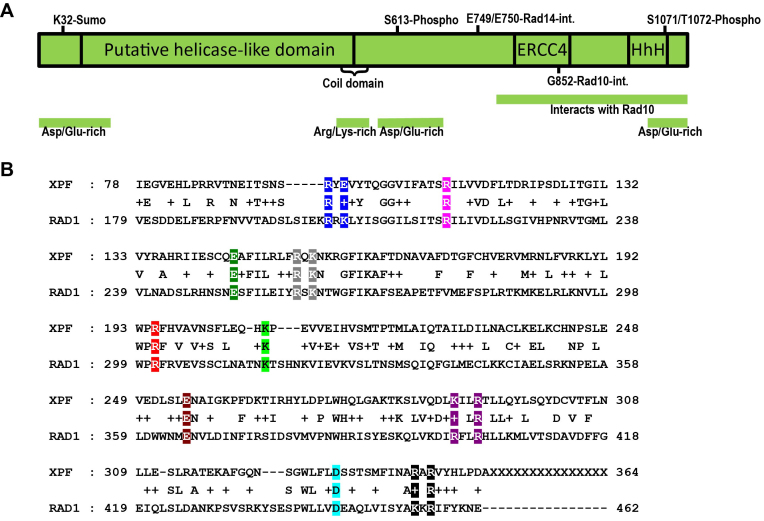
(**A**) Cartoon of the known functional regions of Rad1. (**B**) Alignment of N-terminal portions of Rad1 and human XPF. Residues 179 to 462 of Rad1 were aligned with XPF by Blast (NCBI). Conserved and similar residues are indicated. Conserved, charged residues were mutated to alanine, either individually or in clusters, by site-directed mutagenesis. Mutated residues are indicated in color. Residues mutated as a group are shown in the same color. Ten mutations were created in _RAD1_ , spanning residues 203 through 456.
For _in vivo_ NER and 3′ NHTR assays using these _rad1_ alleles, all ten mutants were subcloned into a high copy number (2 μ) plasmid under the control of the endogenous _RAD1_ promoter. We found that the high copy number plasmid more completely complemented the _rad1Δ_ background than the low copy (_ARS CEN_) plasmid in both NER and 3′ NHTR _in vivo_ assays ([Supplementary Figure S1A](https://pmc.ncbi.nlm.nih.gov/articles/PMC6007489/#sup1) and data not shown).
All 10 _rad1_ alleles were tested for their ability to complement a _rad1Δ_ in 3′ NHTR, using a mating type switching assay ([9](https://pmc.ncbi.nlm.nih.gov/articles/PMC6007489/#B9),[20](https://pmc.ncbi.nlm.nih.gov/articles/PMC6007489/#B20),[42](https://pmc.ncbi.nlm.nih.gov/articles/PMC6007489/#B42)). This assay uses a yeast strain (EAY1042) engineered to contain non-homology on either side of the HO endonuclease cleavage site at the _MAT_** _a_** locus ([Fig. 2A](#fig2)). EAY1042 is absolutely dependent on _RAD1_ for survival of an HO-induced DSB; HO is induced by galactose ([42](https://pmc.ncbi.nlm.nih.gov/articles/PMC6007489/#B42)). Therefore, survival following treatment with galactose is a measure of 3′ NHTR. Because this strain is also deleted for _HMR_** _a_** , repair of the break can only occur using _HML_ α as a template, resulting in a _MAT_** _a_** to _MAT_ α switch upon repair. This mating type switch can be monitored by mating galactose survivors with _MAT_** _a_** and _MAT_ α strains, allowing us to account for inefficient DSB induction and possible alternative repair pathways (e.g. non-homologous end joining). Only cells that have repaired the DSB via a standard pathway that includes 3′NHTR will have switched mating type.
#### Figure 2. {#fig2}
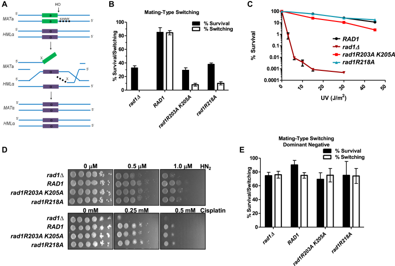
_rad1R203A,K205A_ and _rad1R218A_ are separation of function mutations. (**A**) Cartoon of mating-type switch assay for DSBR requiring 3′ NHTR. Strains contain a galactose-inducible HO endonuclease. A _KanMX_ cassette was inserted at the _MAT_ locus to create non-homology on either side of the DSB, making mating-type switching dependent on _RAD1_ ([42](https://pmc.ncbi.nlm.nih.gov/articles/PMC6007489/#B42)). (**B**) _rad1R203A,K205A_ and _rad1R218A_ are defective in the double non-homology mating-type switch assay. The percentage of cells that survive the induced DSB (black bars) is indistinguishable from the _rad1Δ_. The percentage of survivors that have switched mating-type from **a** to α (white bars), indicating the cells have undergone repair involving 3′ NHTR, is very low. (**C**) _rad1R203A,K205A_ (red square) and _rad1R218A_ (teal triangle) were tested in a quantitative UV survival assay. _RAD1_ (black circle) and _rad1Δ_ (dark red inverted triangle) are also shown. Percent survival was calculated by determining the viability of cells exposed to UV relative to no UV exposure. Data represents the mean ± SEM of at least six independent experiments, with at least two independent transformants. (**D**) ICLR activity was tested in the presence of _rad1Δ, RAD1, rad1R203A,K205A_ , and _rad1R218A_. Serial dilutions of saturated overnights were plated on media containing nitrogen mustard (HN2) or cisplatin. (**E**) _rad1R203A,K205A_ and _rad1R218A_ plasmids were transformed into EAY1042 (_RAD1_) and tested in the double non-homology mating type switch assay to determine whether the alleles are dominant negative. As controls, the _RAD1_ plasmid and the corresponding empty vector were also transformed into EAY1042. Data represents the mean ± SEM of at least three independent experiments.
The _rad1Δ_ derivative of EAY1042, EAY1115, was transformed with pRS414 or pRS414 carrying _RAD1_ (pRD1) or one of the 10 _rad1_ alleles (pRD2–11) under the control of the endogenous _RAD1_ promoter. In this assay, the plasmid-borne _RAD1_ supports ∼ 80% survival and ∼80% switching, comparable to EAY1042 ([Supplementary Figure S1A](https://pmc.ncbi.nlm.nih.gov/articles/PMC6007489/#sup1)) ([42](https://pmc.ncbi.nlm.nih.gov/articles/PMC6007489/#B42)), whereas the empty vector results in ∼30% survival and ∼0% switching. Eight of the 10 _rad1_ alleles exhibited levels of survival and switching comparable to _RAD1_ ([Supplementary Figure S1B](https://pmc.ncbi.nlm.nih.gov/articles/PMC6007489/#sup1)). Importantly, two alleles, _rad1R203A,K205A_ and _rad1R218A_ , were severely compromised in both survival and switching, strongly indicating a defect in 3′NHTR. Survival rates were indistinguishable from the empty vector, while switching was slightly higher than in the absence of _RAD1_ ([Supplementary Figure S1B](https://pmc.ncbi.nlm.nih.gov/articles/PMC6007489/#sup1); [Fig. 2B](#fig2)), comparable to rates observed with _msh3Δ_ ([42](https://pmc.ncbi.nlm.nih.gov/articles/PMC6007489/#B42)).
UV sensitivity assays revealed that all 10 _rad1_ alleles retained NER activity _in vivo_. Spot assays were performed in both the EAY1115 (used for the 3′ NHTR assay; data not shown) and standard FY23 _rad1Δ_ backgrounds ([Supplementary Figure S1C](https://pmc.ncbi.nlm.nih.gov/articles/PMC6007489/#sup1)), with similar results. Therefore _rad1R203A,K205A_ and _rad1R218A_ are separation of function mutations that retained NER activity but lost function in 3′ NHTR. These phenotypes are the inverse of two _rad1_ alleles identified by Guzder _et al_ (2006) near the 3′ end of _rad1_ ([Fig. 1A](#fig1)), which are proficient in 3′ NHTR but defective in NER because they fail to interact with Rad14 ([6](https://pmc.ncbi.nlm.nih.gov/articles/PMC6007489/#B6)).
We performed more quantitative tests to determine NER activity of the two mutants defective in 3′ NHTR, to evaluate any potentially subtle changes ([Fig. 2C](#fig2)). In these assays, _rad1R218A_ was indistinguishable from _RAD1_ UV sensitivity, indicating that this allele is a complete separation-of-function mutation. The _rad1R203A,K205A_ allele did exhibit a mild sensitivity to UV light relative to _RAD1_ , but still retained significant NER activity when compared to the empty vector (_rad1Δ_) control. Spot assays for growth in the presence of either cisplatin or nitrogen mustard similarly indicated that these alleles support interstrand cross-link repair ([Fig. 2D](#fig2)).
To test for any dominant negative effects of these separation-of-function alleles, EAY1042 (_RAD1_) was transformed with plasmid-borne _rad1R203A,K205A_ or _rad1R218A_. Neither allele interfered with _RAD1_ function in 3′ NHTR in this assay ([Fig. 2E](#fig2)), indicating that these are loss-of function alleles.
###  _In vitro_ DNA binding and endonuclease activities of _rad1_ separation of function alleles
Because both _rad1_ alleles exhibited significant NER function _in vivo_ , we anticipated that both would retain _in vitro_ DNA-binding and endonuclease activity. To test this, both His–rad1R203A,K205A–Rad10 and His–rad1R218A–Rad10 complexes were overexpressed in _E. coli_ and purified as described previously for His–Rad1–Rad10 ([12](https://pmc.ncbi.nlm.nih.gov/articles/PMC6007489/#B12)) (see Materials and Methods). The overexpression and purification profiles of the mutant complexes were indistinguishable from His–Rad1–Rad10 and protein yields were similar. Our previous work ([12](https://pmc.ncbi.nlm.nih.gov/articles/PMC6007489/#B12)) demonstrated that, while His–Rad1–Rad10 and His–rad1-Rad10 mutant complexes did form discrete complexes with DNA substrates in gel mobility shift assays, we often observed smearing and some accumulation in the wells, consistent with complexes that are not completely stable through gel electrophoresis and/or the possibility that multiple complexes are formed.
Both mutant complexes were able to bind splayed Y and 3′ flap DNA substrates ([Fig. 3](#fig3)), as determined by gel mobility shift assay. His–rad1R203A,K205A–Rad10 appeared to have a small decrease in affinity for the 3′ flap substrate. With both substrates, His–rad1R203A,K205A–Rad10 exhibited two discrete shifts and a significant amount of smearing throughout the lanes, consistent with complexes that are less stable as they migrate through the gel. This could be a result of reduced or altered affinity for DNA overall or possibly an increase in non-specific DNA-binding activity.
#### Figure 3. {#fig3}
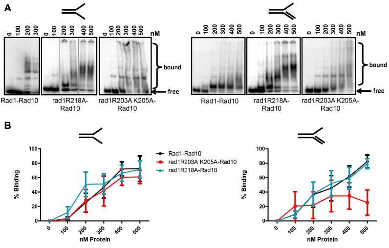
DNA binding of rad1 mutants. (**A**) DNA binding activity was determined by electrophoretic mobility shift assay with His–Rad1–Rad10, His–rad1R203A,205A–Rad19 and His–rad1R218A–Rad10 purified from _E. coli_ (see Materials and Methods). Binding to splayed (left panel) and 3′ flap (right panel), 32P- labeled DNA substrates was tested. Each DNA substrate was incubated with increasing concentrations (100–500 nM) of protein. The bound and free DNA are indicated. For His–Rad1–Rad10, the gel with the splayed substrate was electrophoresed for longer than the His–rad1R218A–Rad10 gel, resulting in greater resolution of the higher order complexes. Also for the splayed substrates, shifts from three different gels are shown. In the His–rad1R218A–Rad10 panel, the middle two lanes were inverted. (**B**) Left panel: Percent binding to splayed Y DNA substrate. Right panel: Percent binding to the 3′ flap DNA substrate. Quantification was performed using ImageQuant 5.2. Data represents the mean ± SEM of at least three independent experiments. His–Rad1–Rad10 (black circle), His–rad1R203A,K205A–Rad10 (red square), or His–rad1R218A–Rad10 (teal triangle).
In contrast, His–rad1R218A–Rad10 appeared to have affinity for both substrates that was similar to the wild-type protein; we observed 50% binding at approximately the same protein concentration for both complexes. Interestingly, in the presence of the splayed substrate, there are multiple discrete higher molecular weight shifts observed with both His–Rad1–Rad10 and His–rad1R218A–Rad10. These higher order complexes may be a result of non-specific protein–DNA interactions. However, the observation that these complexes form as a progression from the lower discrete complex, combined with the fact that the substrate is limiting and relatively short (49 bases; 31 double stranded, 18 single-stranded for splayed) suggests that there may be protein-protein interactions mediating these additional shifts. This will be tested in future experiments.
In contrast, in the presence of the 3′ flap substrate, the kinetics of the appearance of higher molecular weight shifts was distinct for His–Rad1–Rad10 and His–rad1R218A–Rad10. At 100 and 200 nM, the shifts observed with His–rad1R218A–Rad10 were similar to the shifts observed at 200–500 nM His–Rad1–Rad10. These bands then appear to be more efficiently shifted to higher molecular weights at ∼300 nM rad1R218A–Rad10. Although these shifts were somewhat less discrete than the shifts at lower protein concentrations, there do appear to be distinct species formed, similar to those observed with the splayed substrate. Furthermore, similar higher order complexes were observed with the wild-type protein, albeit at lower levels through the titration.
His–rad1R218A–Rad10 retained endonuclease activity that was similar to His–Rad1–Rad10, except at the highest concentration of splayed substrate ([Fig. 4B](#fig4), left). His–rad1R218A–Rad10 cleavage of 3′ flap substrates was somewhat more efficient than His–Rad1–Rad10 ([Fig. 4B](#fig4), right). In contrast, His–rad1R203A,K205A–Rad10 exhibited an ∼4-fold decrease in cleavage activity with both DNA substrates. The reduced activity is surprising, given that the mutation is well-removed from the endonuclease active site as well as the Rad10 interaction region ([Fig. 1A](#fig1)) and did not affect DNA-binding. However, the changes to alanine could nonetheless impact the conformation of the nucleoprotein complex to reduce the efficiency of cleavage. This reduced endonuclease activity could explain the mild defect in NER. The stronger effect of this allele on the 3′ NHTR phenotype could indicate that (a) 3′ NHTR is more sensitive to the reduced endonuclease activity and/or (b) additional steps in 3′ NHTR are impacted. Based on our examination of protein-protein interactions (see below), we suggest that it is a combination of both factors.
#### Figure 4. {#fig4}
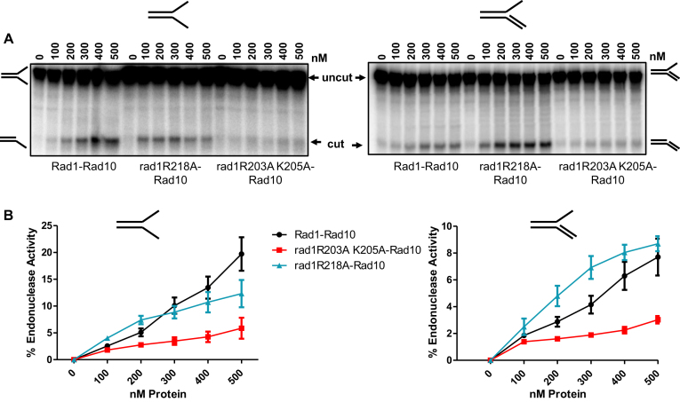
Endonuclease activity of His–rad1R203A,K205A-Rad10 is reduced. Endonuclease activity was determined by endonuclease assays with His–Rad1–Rad10, His–rad1R203A,K205A-Rad10 and His–rad1R218A–Rad10 purified from _E. coli_. (**A**) Cleavage of the 32P-labeled splayed (left panel) and 3′ flap substrate (right panel). The DNA substrate was incubated with increasing concentrations (100–500 nM) of protein. The intact substrate (uncut) and cleaved product (cut) are indicated. (**B**) Left panel: Percent endonuclease activity was determined with splayed Y DNA substrate. Right panel: Percent endonuclease activity was determined with the 3′ flap DNA substrates. Quantification was performed using ImageQuant 5.2. Data represents the mean ± SEM of at least four independent experiments. His–Rad1–Rad10 (black circle), His–rad1R203A,K205A–Rad10 (red square) and His–rad1R218A–Rad10 (teal triangle).
### Altered interactions between Saw1 and mutant rad1 protein complexes
We have previously demonstrated that Rad1–Rad10 interactions with Saw1 are required for Rad1–Rad10 recruitment to SSA recombination intermediates ([12](https://pmc.ncbi.nlm.nih.gov/articles/PMC6007489/#B12)). We further demonstrated that Rad1–Rad10 forms a stable complex with Saw1. Our _in vivo_ results (above) suggested that the interactions between Rad1–Rad10 and Saw1 might be altered. Therefore we evaluated the direct interactions between Saw1 and rad1–R203A,K205A–Rad10 or rad1R218A–Rad10. First, we performed far western analysis, in which increasing amounts of His–Saw1 were spotted on a nitrocellulose membrane. After blocking, the membrane was probed with purified His–Rad1–Rad10, His–rad1R218A–Rad10 or His–rad1R203A,K205A-Rad10. The presence of His–Rad1–Rad10 or His–rad1-Rad10 complex was then detected by an α-Rad10 antibody (see Materials and Methods). In this assay binding was weak, but the two mutant rad1–Rad10 complexes interacted with Saw1 like Rad1–Rad10 ([Supplementary Figure S2A and B](https://pmc.ncbi.nlm.nih.gov/articles/PMC6007489/#sup1)).
We also used purified His–Saw1, His–Rad1–Rad10 or His–rad1–Rad10 complexes to perform co-immunoprecipitation experiments, to assess interactions when His–Saw1 was not constrained by binding to the membrane ([Fig. 5A](#fig5)). When mixed with His-Saw1 at stoichiometric concentrations, the α-Saw1 antibody immunoprecipitated ∼3-fold more His–rad1R218A–Rad10 than His–Rad1–Rad10 ([Fig. 5B](#fig5)). It was not possible to perform the reverse experiment because Saw1 bound non-specifically to the Protein A/G beads in the absence of α-Saw1 antibody. These co-immunoprecipitation experiments indicated that both mutant rad1–Rad10 complexes retained their ability to interact with Saw1 but that the stability and/or stoichiometry of the interactions were altered with His–rad1R218A–Rad10.
#### Figure 5. {#fig5}
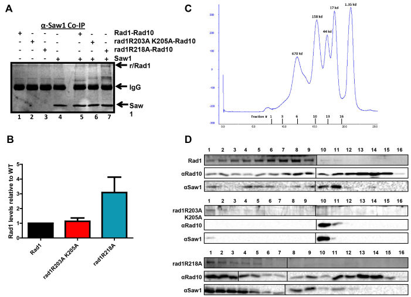
rad1 complex interactions with Saw1 by co-immunoprecipitation (A, B) and gel filtration (C, D). (**A**) His–Rad1–Rad10, His–rad1R203A,K205A-Rad10, and His–rad1R218A–Rad10 in the presence of BSA were incubated with (+) or without (–) 6xHis-Saw1. An α-Saw1 antibody was added to each and then pulled down with Protein A/G agarose (Pierce®). The proteins were removed from the beads by boiling and analyzed on an SDS-page (12%) gel, followed by silver stain. His–Rad1/rad1R203A,K205A/rad1R218A and 6xHis-Saw1 are indicated with arrows. (**B**) The amount of His–Rad1–Rad10, His–rad1R203A,K205A-Rad10 and His–rad1R218A–Rad10 that was pulled down by Saw1 was quantified and internally normalized using Image Lab (Bio Rad). Any non-specific interactions in the absence of 6xHis-Saw1 were also quantified and subtracted from the specific band. In each independent experiment, the amount of His–rad1R203A,K205A-Rad10 (red) and His–rad1R218A–Rad10 (teal) was set relative to His–Rad1–Rad10 (black). Data represents the mean ± SEM of four independent experiments. (**C**) Elution profile of broad range standards (Bio Rad) through the Superose 6 column (GE Lifesciences). The molecular weights of the standards are indicated in kDa about the curve. The gel filtration fractions from the complex profiles are indicated below the x-axis. The fraction numbers are the same for all three protein complexes. (**D**) Representative analysis of gel filtration fractions. Fraction numbers start with #1 representing the highest molecular weight fractions following the void. Fractions were analyzed for His–Rad1, His–rad1R203A,K205A, His–rad1R218A (Coomassie stain), Rad10 (western blot), and Saw1 (western blot). The left and right panels from each gel or blot were performed at the same time, in parallel.
### Rad1–Rad10/Saw1 complex purification is altered in presence of rad1R203A,K205A-Rad10
His–Rad1–Rad10 and Saw1 (untagged) co-purify through two purification steps (metal affinity and gel filtration) following co-overexpression in _E. coli_ ([12](https://pmc.ncbi.nlm.nih.gov/articles/PMC6007489/#B12)). Therefore we evaluated the ability of His–rad1R203A,K205A-Rad10 and His–rad1R218A–Rad10 to co-purify with Saw1 and compared the elution profiles of these proteins following gel filtration.
The first purification step was a Cobalt affinity resin, to which the histidine tag of each Rad1 or rad1 complex binds. While overexpression of all three protein complexes was comparable (see Cobalt load fractions, [Supplementary Figure S3A](https://pmc.ncbi.nlm.nih.gov/articles/PMC6007489/#sup1)), we consistently observed less rad1, Saw1 and Rad10 binding and eluting from the Cobalt resin in the presence of His–rad1R203A,K205A ([Supplementary Figure S3A](https://pmc.ncbi.nlm.nih.gov/articles/PMC6007489/#sup1)). Furthermore, the relative amount of Saw1 that co-purified with this mutant complex was significantly lower than with Rad1–Rad10 or with rad1R218A–Rad10 ([Supplementary Figure S3B](https://pmc.ncbi.nlm.nih.gov/articles/PMC6007489/#sup1)), suggesting that the tripartite rad1–Rad10–Saw1 complex is destabilized.
In support of this idea, the elution profile of His–rad1R203A,K205A-Rad10, Saw1 and Rad10 is significantly altered compared to that of His–Rad1, Saw1 and Rad10. The elution fractions are indicated on the molecular weight standard profile ([Fig. 5C](#fig5)), with the void eluting by ∼7.5 ml. Rad1 has a molecular weight of ∼ 126 kDa, Saw1 is ∼30 kDa and Rad10 is ∼24 kDa. First, there is less protein overall, consistent with less starting protein ([Fig. 5D](#fig5)). Second, the majority of His–rad1R203A,K205A elutes in the highest molecular weight fractions, but there is no detectable Rad10 in these fractions. Only a small amount of Saw1 is present ([Fig. 5D](#fig5)). Third, Rad10 is exclusively present in fractions 10 and 11, which corresponds to the molecular weights of ∼100 kDa, based on the standards. Saw1 is also readily detectable in these fractions but His–rad1R203A,K205A is not. Unlike the wild-type complex (or the His–rad1R218A complex) there are no fractions in which all three proteins are detectable. This indicates that the His–rad1R203A,K205A-Rad10/Saw1 complex either does not form properly or is unstable such that it does not persist through gel filtration. This observation provides an explanation of the _in vivo_ 3′ NHTR phenotype with this allele. It is noteworthy that it appears to be the presence of Saw1 that disrupts the His–rad1R203A,K205A–Rad10 complex. In the absence of Saw1, the elution profile of His–rad1R203A,K205A–Rad10 is very similar to that of the wild-type, consistent with the wild-type purification of the complex used for the endonuclease on DNA-binding experiments ([Supplementary Figure S4A](https://pmc.ncbi.nlm.nih.gov/articles/PMC6007489/#sup1)).
In contrast, the gel filtration profile of (His–rad1R218A+Saw1+Rad10) is more similar to the wild-type profile. There are several fractions in which all three proteins co-elute, although these are shifted somewhat toward higher molecular weights, perhaps suggesting an altered complex stoichiometry. This would be consistent with enhanced co-immunoprecipitation of His–rad1R218A–Rad10 with Saw1 ([Fig. 5A](#fig5)). Alternatively, there may be some aggregation of the protein complexes. However, the change in size appears to be specific to the presence of Saw1 – the elution profile of His–rad1R218A–Rad10 is similar to that of wild-type Rad1–Rad10 ([Supplementary Figure S4A](https://pmc.ncbi.nlm.nih.gov/articles/PMC6007489/#sup1)). Furthermore, to assess any aggregation, we centrifuged partially purified His–Rad1–Rad10 and His–rad1R218A–Rad10 and analyzed the supernatant by gel electrophoresis. Following centrifugation, we recovered ∼85–90% of the protein ([Supplementary Figure S4B](https://pmc.ncbi.nlm.nih.gov/articles/PMC6007489/#sup1)).
### His–rad1R203A,K205A-Rad10 has reduced interaction with Msh2–Msh3
Rad1–Rad10 recruitment to SSA intermediates is dependent on Msh2–Msh3 as well as on Saw1, although the mechanism is unclear. It has been proposed that Msh2–Msh3’s primary function in 3′NHTR is in binding and stabilizing the 3′ flap DNA intermediate ([13](https://pmc.ncbi.nlm.nih.gov/articles/PMC6007489/#B13)). This is primarily based on the observation that Msh2–Msh3 is not required for repair involving long direct repeats ([12](https://pmc.ncbi.nlm.nih.gov/articles/PMC6007489/#B12),[13](https://pmc.ncbi.nlm.nih.gov/articles/PMC6007489/#B13)) and is consistent with the DNA-binding properties of Msh2–Msh3 ([16](https://pmc.ncbi.nlm.nih.gov/articles/PMC6007489/#B16)). Consistent with this possibility, yeast two-hybrid and co-immunoprecipitation experiments revealed interactions between Msh2–Msh3 and Rad1–Rad10, although these were performed with yeast lysates and therefore could be direct or indirect interactions ([25](https://pmc.ncbi.nlm.nih.gov/articles/PMC6007489/#B25)). Either way, the functional significance of this interaction is not known.
To determine whether Msh2–Msh3 and Rad1–Rad10 interact directly, we first performed far western blotting. Purified Msh2–Msh3 was spotted on nitrocellulose and then incubated with His–Rad1–Rad10. After washing, the presence of His–Rad1–Rad10 was probed with a polyclonal α-Rad10 antibody followed by chemiluminescence. His–Rad1–Rad10 was readily detected in the presence of Msh2–Msh3 ([Supplementary Figure S2C, D](https://pmc.ncbi.nlm.nih.gov/articles/PMC6007489/#sup1)) but not BSA ([Supplementary Figure S2A](https://pmc.ncbi.nlm.nih.gov/articles/PMC6007489/#sup1)), indicating a direct interaction between these complexes. We confirmed this interaction by co-immunoprecipitation ([Fig. 6](#fig6)). Purified Msh2–Msh3 and His–Rad1–Rad10 were incubated together and then protein was immunoprecipitated with α−Rad10 antibody. Msh2–Msh3 was efficiently immunoprecipitated in the presence of His–Rad1–Rad10 ([Fig. 6A](#fig6), lanes 7 and 8); very little Msh2–Msh3 was immunoprecipitated in the absence of His–Rad1–Rad10 ([Fig. 6A](#fig6), lanes 5 and 6), although there is some interaction with the Protein A/G beads. α-Msh2 antibody was also able to immunoprecipitate His–Rad1–Rad10 when Msh2–Msh3 was present (data not shown).
#### Figure 6. {#fig6}
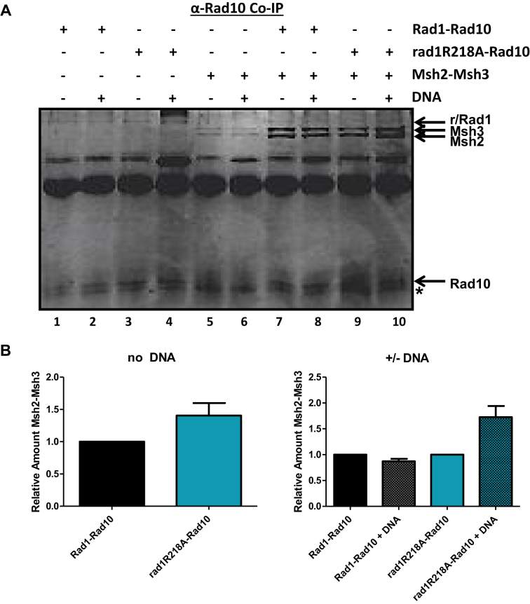
Interactions between rad1R218A–Rad10 and Msh2–Msh3 by co-immunoprecipitation analysis. (**A**) His–Rad1–Rad10 and His–rad1R218A–Rad10 (+BSA) were incubated with or without Msh2–Msh3 in the presence and absence of non-specific DNA. α-Rad10 antibody was added to each reaction followed by Protein A/G agarose (Pierce®) beads to immunoprecipitate interacting proteins. The proteins were removed from the beads by boiling and analyzed on an SDS-page (12%) gel, by silver staining. His–Rad1/rad1R203A,K205A/rad1R218A, Rad10, Msh2 and Msh3 bands are indicated with arrows. We note that Rad10 does not stain well with silver and is therefore not as intense a band as Rad1. Msh2–Msh3 exhibits some background interactions with the Protein A/G beads. ( **B**) Left panel: The amount of Msh2–Msh3 that was pulled down by His–Rad1–Rad10 and His–rad1R218A–Rad10 was quantified using Image Lab (Bio Rad). Any non-specific interactions in the absence of His–Rad1–Rad10 or His–rad1R218A–Rad10 were also quantified and subtracted from the specific band. In each independent experiment, the amount of Msh2–Msh3 immunoprecipitated with His–rad1R218A–Rad10 (teal) was internally normalized and set relative to the amount pulled down by His–Rad1–Rad10 (black) with no DNA. Right panel: In each independent experiment, the amount of Msh2–Msh3 immunoprecipitated with His–Rad1–Rad10 (black) or rad1R218A–Rad10 (teal) was internally normalized and compared to the amount of Msh2–Msh3 co-immunoprecipitated in the presence of non-specific DNA (shaded gray and teal for His–Rad1–Rad10 and His–Rad1R218A-Rad10, respectively. Data represents the mean ± SEM of at least four independent experiments.
His–rad1R203A,K205A-Rad10 complex exhibited ∼4-fold lower binding to Msh2–Msh3 than His–Rad1–Rad10 in the far western blot ([Supplementary Figure S2C and D](https://pmc.ncbi.nlm.nih.gov/articles/PMC6007489/#sup1)), revealing yet another defect in this protein complex. Thus His–rad1R203A,K205A has reduced endonuclease activity ([Fig. 4](#fig4)) as well as altered interactions with Saw1 in the context of the Rad1–Rad10/Saw1 ternary complex ([Fig. 5D](#fig5)) and Msh2–Msh3 ([Supplementary Figure S2D](https://pmc.ncbi.nlm.nih.gov/articles/PMC6007489/#sup1)). The altered protein-protein interactions are specific to 3′ NHTR, therefore these combined observations explain why this _rad1_ allele is more defective in 3′ NHTR than NER, leading to a separation-of-function phenotype. We did not characterize this mutation further.
In contrast, His–rad1R218A–Rad10 binding to Msh2–Msh3 was similar to that of His–Rad1–Rad10 in the far western assay ([Supplementary Figure S2C and D](https://pmc.ncbi.nlm.nih.gov/articles/PMC6007489/#sup1)). Similarly, Msh2-Msh3 and His–rad1R218A–Rad10 co-immunoprecipitated efficiently ([Fig. 6A](#fig6), lane 9); in this assay the interaction is similar to that observed with the wild-type proteins ([Fig. 6B](#fig6), left side). Interestingly, the presence of non-specific DNA appeared to enhance the interaction between His–rad1R218A–Rad10 and Msh2–Msh3 by ∼2-fold ([Fig. 6A](#fig6), compare lanes 9 and 10, [Fig. 6B](#fig6), right side); DNA did not appear to affect the interaction between His–Rad1–Rad10 and Msh2–Msh3 ([Fig. 6A](#fig6), compare lanes 7 & 8, [Fig. 6B](#fig6), right side). This could be a result of His–rad1R218A–Rad10 having a stronger interaction with Msh2–Msh3 bound non-specifically to DNA; Msh2–Msh3 has relatively high affinity for non-specific DNA ([16](https://pmc.ncbi.nlm.nih.gov/articles/PMC6007489/#B16)). Alternatively, His–rad1R218A–Rad10 may have an enhanced or altered interaction with the DNA ([Fig. 3](#fig3)) that increases its interaction with Msh2–Msh3.
### Msh2–Msh3 and Saw1 interact directly
Both Saw1 and Msh2–Msh3 interact with Rad1–Rad10 and both are required for the coordination of 3′ NHTR. Altered interactions negatively impact 3′ NHTR, as observed with _rad1R203A,K205A_. In contrast, His–rad1R218A–Rad10 had enhanced interactions with these proteins _in vitro_. Therefore we wondered whether the regulation or coordination of these interactions might be affected in the presence of the _rad1R218A_ background.
We first examined whether Msh2–Msh3 modulates interactions between Rad1–Rad10 and Saw1 and vice versa, _in vitro_. Previous work has indicated that Saw1 and Msh2 interact ([11](https://pmc.ncbi.nlm.nih.gov/articles/PMC6007489/#B11)); we sought to demonstrate a direct interaction between Saw1 and the Msh2–Msh3 complex using purified proteins before examining the interactions among Msh2–Msh3, Rad1–Rad10 and Saw1. Therefore we performed co-immunoprecipitation experiments with purified Msh2–Msh3 and His–Saw1. Msh2–Msh3 was efficiently immunoprecipitated in the presence of His-Saw1 and α-Saw1 antibody, indicating that these proteins interact directly ([Fig. 7A](#fig7), lane 3).
#### Figure 7. {#fig7}
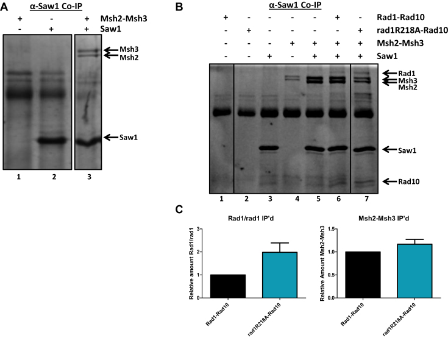
His–Rad1–Rad10 or His–rad1R218A–Rad10, Msh2–Msh3 and 6xHis-Saw1 interactions by co-immunoprecipitation analysis. ( **A**) Msh2–Msh3 (+BSA) was incubated with or without 6xHis-Saw1. α-Saw1 antibody was added to each reaction followed by Protein A/G agarose (Pierce®) beads to immunoprecipitate interacting proteins. (**B**) His–Rad1–Rad10 or His–rad1R218A–Rad10 and Msh2–Msh3 (+BSA) were incubated with or without 6xHis-Saw1. α-Saw1 antibody was added to each reaction, followed by Protein A/G agarose (Pierce®) beads to immunoprecipitate proteins interacting with Saw1. The proteins were removed from the beads by boiling and analyzed on an SDS-page (12%) gel. His–Rad1, His–rad1R218A, Rad10, Msh2, Msh3, and 6xHisSaw1 bands are indicated with arrows. **C**. The amount of His–Rad1, His–rad1R218A and Msh2- Msh3 that were pulled down by 6xHis-Saw1 was quantified using Image Lab (Bio Rad). Any non-specific interactions in the absence of 6xHis-Saw1 were also quantified and subtracted from the specific band. In each independent experiment, the amount of His–Rad1–Rad10, His–rad1R218A and Msh2–Msh3 immunoprecipitated by 6xHis-Saw1was internally normalized. Left panel: The amount of His–rad1R218A–Rad10 (teal) immunoprecipitated by 6xHis-Saw1in the presence of Msh2–Msh3, was set relative to the amount of His–Rad1–Rad10 immunoprecipitated under the same conditions (black). Right panel: The amount of Msh2–Msh3 immunoprecipitated with 6xHis-Saw1 in the presence of His–Rad1–Rad10 (black) or His–rad1R218A–Rad10 (teal) was internally normalized and quantified. Data represents the mean ± SEM of at least four independent experiments.
We then incubated stoichiometric concentrations of His–Rad1–Rad10, Msh2–Msh3 and His-Saw1 and immunoprecipitated with α-Saw1 antibody ([Fig. 7B](#fig7)). All three proteins were present in the immunoprecipitate, although there was substantially more Msh2–Msh3 than Rad1–Rad10. A similar level of Msh2–Msh3 was co-immunoprecipitated in the presence of His-Saw1 with the α-Saw1 antibody in the absence of Rad1–Rad10 ([Fig. 7B](#fig7) compare lanes 5 and 6). In contrast, in the presence of His–rad1R218A–Rad10, the amount of rad1-Rad10 complex immunoprecipitated by α-Saw1 was increased ∼2-fold relative to His–Rad1–Rad10 ([Fig. 7C](#fig7)). Because both His–Rad1–Rad10 and Msh2–Msh3 co-immunoprecipitate with His-Saw1, it is not possible to discern whether the increased capture of His–rad1R218A–Rad10 is a result of increased interactions with Saw1 and/or Msh2–Msh3. In either case, these results are consistent with altered protein-protein interactions in the presence of rad1R218A.
###  _rad1R218A_ phenotype is specific to Msh2–Msh3-dependent DSBR
For defective coordination of rad1R218A–Rad10, Saw1 and Msh2–Msh3 interactions to interfere with 3′ NHTR in the _rad1R218A_ strain, Msh2–Msh3 must be required for a function (or functions) in addition to its 3′ ssDNA flap binding activity. To explore this further _in vivo_ , we integrated _rad1R218A::3HA_ into the endogenous _RAD1_ chromosomal locus; Western blots indicated that rad1R218A–3HA was expressed at levels comparable to Rad1–3HA ([Fig. 8A](#fig8)). We then assessed the effect of _rad1R218A_ on SSA, another DSBR pathway that requires 3′ NHTR ([Fig. 8B](#fig8)). Both Msh2–Msh3 and Saw1 are required for the SSA repair pathway when the direct repeats are short, i.e. ∼200 bp in length; both are required to recruit Rad1–Rad10 to SSA intermediates ([Fig. 8B](#fig8)) ([12](https://pmc.ncbi.nlm.nih.gov/articles/PMC6007489/#B12)). However, Msh2–Msh3 is not required for either repair or recruitment of Rad1–Rad10 when the direct repeats are ∼1 kb in length ([12](https://pmc.ncbi.nlm.nih.gov/articles/PMC6007489/#B12),[13](https://pmc.ncbi.nlm.nih.gov/articles/PMC6007489/#B13)). Therefore we evaluated the _rad1R218A_ phenotype in SSA with both short repeat (EAY1141) and long repeat (YMV80) backgrounds. In both strains backgrounds, we compared survival (a proxy for repair) in _RAD1, rad1D825A_ , which is proficient in DNA intermediate binding but inactive for endonuclease activity ([12](https://pmc.ncbi.nlm.nih.gov/articles/PMC6007489/#B12)), and _rad1R218A_ strains. With short repeats ([Fig. 8C](#fig8)), _rad1D825A_ exhibited very low survival similar to the _rad1Δ_ , as shown previously ([12](https://pmc.ncbi.nlm.nih.gov/articles/PMC6007489/#B12)). Strains encoding _rad1R218A_ also had a null phenotype in this strain background ([Fig. 8C](#fig8)), consistent with the defect we observed in the mating-type switch assay ([Fig. 2B](#fig2)). This strain was more sensitive to UV light than wild-type ([Supplementary Figure S5](https://pmc.ncbi.nlm.nih.gov/articles/PMC6007489/#sup1)) but was still significantly more resistant that _rad1Δ_.
#### Figure 8. {#fig8}
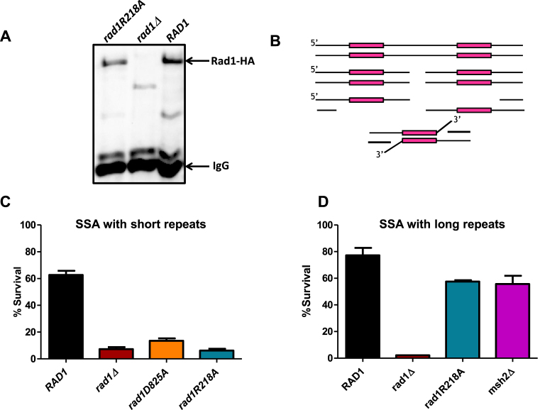
_rad1R218A_ function in SSA. (**A**) _rad1R218A-3HA_ was integrated into the chromosome, replacing endogenous _RAD1_. To determine expression levels, α-HA antibody was used to immunoprecipitate HA-tagged protein from cell lysates grown to mid-log phase for _rad1R218A-3HA, RAD1–3HA_ , and _rad1Δ_ w. A western blot of eluates was performed using α−HA antibody. _rad1Δ_ serves as a negative control. An arrow indicates the Rad1–3HA or rad1R218A-3HA band. (**B**) Cartoon of SSA in the EAY1141 (short ∼250 bp _ura3_ repeats) and YMV80 (long ∼ 1.3 kb _leu2_ repeats) strains used to assess 3′ NHTR.(**C**) Msh2–Msh3-dependent SSA assays with short repeats were performed. **D**. Msh2–Msh3-independent SSA assays with long repeats were performed. Percent survival (induced/uninduced) was calculated by determining the viability of cells after a 5 hour induction of HO expression. Data represents the mean ± SEM of at least six independent experiments with at least two independent isolates. The following strains were used: _RAD1_ (black), _rad1Δ_ (dark red), _rad1D825A_ (orange), _rad1R218A_ (teal) and _msh2Δ_ (magenta).
In the YMV80 background, which contains much larger direct repeats, _rad1R218A_ exhibited only a minor SSA defect ([Fig. 8D](#fig8)). In the _rad1R218A_ background, we observed levels of repair comparable to that observed in the _msh2Δ_ background ([12](https://pmc.ncbi.nlm.nih.gov/articles/PMC6007489/#B12)). This observation demonstrates that the _rad1R218A_ phenotype is specific to the Msh2–Msh3-dependent repair pathway. Msh2–Msh3 has been hypothesized to stabilize the 3′ NHTR intermediate ([13](https://pmc.ncbi.nlm.nih.gov/articles/PMC6007489/#B13)) and is required for recruitment of Rad1–Rad10 to short recombination intermediates _in vivo_ ([12](https://pmc.ncbi.nlm.nih.gov/articles/PMC6007489/#B12)). These data argue that Msh2–Msh3 is directly involved in the initiation of the 3′ NHTR step of repair beyond simply stabilizing the SSA 3′ flap recombination intermediate to enable localization of Rad1–Rad10/Saw1 to short regions of homology. Instead we propose that Msh2–Msh3 is part of a ‘handoff’ mechanism to efficiently recruit Rad1–Rad10 to 3′ non-homologous DNA tails. Furthermore, these data suggest that the _rad1R218A_ repair phenotype results, at least in part, from a defect in the initiation step of Msh2–Msh3-dependent 3′ NHTR.
### rad1R218A recruitment to SSA intermediates is disrupted
If the initiation step of SSA is defective in the presence of the _rad1R218A_ allele, one possibility is that recruitment of rad1R218A–Rad10 to the SSA recombination intermediates is compromised. To test this idea, we performed chromatin immunoprecipitation experiments to detect recruitment ([Fig. 9A](#fig9)), as described previously ([12](https://pmc.ncbi.nlm.nih.gov/articles/PMC6007489/#B12)). Rad1 is not detectable at the recombination intermediate, as previously noted ([12](https://pmc.ncbi.nlm.nih.gov/articles/PMC6007489/#B12)) likely because it cleaves the 3′ flap and then dissociates from the intermediate. In contrast, recruitment of the endonuclease-deficient form of Rad1, rad1D825A, is readily detectable ([12](https://pmc.ncbi.nlm.nih.gov/articles/PMC6007489/#B12)). Without cleavage activity, this protein is presumably trapped at the intermediate.
#### Figure 9. {#fig9}
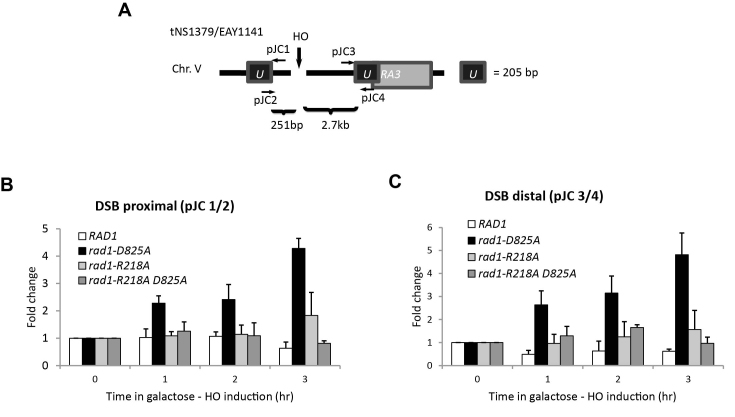
Localization of Rad1 and rad1R218A to SSA intermediates. Chromatin immunoprecipitation (ChIP) experiments to assess rad1R218A recruitment to SSA intermediates in the presence of short repeats. (**A**) Locations of the primers used are shown. The pJC1/pJC2 primer pair detects localization proximal to the DSB; the pJC3/pJC4 pair measures distal localization. (**B**) Localization of Rad1, rad1D825A, rad1R218A and rad1R218A,D825A to the DNA adjacent to the DSB (pJC1/pJC2 primer pair) at 1, 2 and 3 hours following induction of a DSB. (**C**) Localization of Rad1, rad1D825A, rad1R218A and rad1R218A,D825A distal to the DSB (pJC3/pJC4 primer pair) at 1, 2 and 3 hours following induction of a DSB. Fold enrichment represents the ratio of the rad1 IP PCR signal before (0 h) and after HO induction, normalized by the PCR signal of the MAT control. Data represent the mean ± standard deviation of three or more independent experiments.
rad1R218A–Rad10 was not efficiently localized at the SSA intermediate, with or without a mutation in the endonuclease domain ([Fig. 9B](#fig9), [C](https://pmc.ncbi.nlm.nih.gov/articles/PMC6007489/#F9)). Gel mobility shift assays indicated that His–rad1R218A–Rad10 is proficient at binding 3′ flap substrates ([Fig. 3](#fig3)). These observations indicate that lack of localization of the mutant rad1 protein complex is a result of a defect in recruitment, not binding, although altered binding ([Fig. 3](#fig3)) may be a factor in localization of rad1R218A–Rad10 _in vivo_. It is worth noting that there is an increase in rad1R218A–Rad10 compared to wild-type Rad1 at both the proximal and distal sites at the later time points. This suggests that the protein complex is recruited but is not stably established at the recombination intermediate with short repeats; repair is fairly efficient with longer repeat intermediates, even in the absence of _MSH2_ ([Fig. 8D](#fig8)).
###  _SAW1_ overexpression enhances SSA in _rad1R218A_ background
_SAW1_ is required for the recruitment of Rad1–Rad10 to recombination intermediates, a key step in initiating 3′ NHTR. Therefore, we tested the effect of overexpressing _SAW1_ on SSA activity. SSA strains (short repeats) encoding _RAD1_ or _rad1R218A_ were transformed with a high copy number (2μ) plasmid carrying _SAW1_ under the control of its endogenous promoter, which led to significant overexpression of Saw1 ([Supplementary Figure S6A](https://pmc.ncbi.nlm.nih.gov/articles/PMC6007489/#sup1)). It has been observed that sumoylated Saw1 promotes UV survival ([47](https://pmc.ncbi.nlm.nih.gov/articles/PMC6007489/#B47)), but we considered the possibility that _SAW1_ overexpression might interfere with NER. We observed no effect on UV sensitivity, indicating that excess Saw1 does not interfere with NER ([Supplementary Figure S7A](https://pmc.ncbi.nlm.nih.gov/articles/PMC6007489/#sup1)).
It has been noted previously that Saw1 is unstable in the absence of Rad1 ([12](https://pmc.ncbi.nlm.nih.gov/articles/PMC6007489/#B12)), which is consistent with our observations ([Supplementary Figure S6A](https://pmc.ncbi.nlm.nih.gov/articles/PMC6007489/#sup1)). Notably, even when overexpressed from the high copy number plasmid, Saw1 is stabilized by endogenous levels of Rad1 (or rad1D825A or rad1R218A). This suggests that stabilization of increased levels of Saw1 does not require additional _RAD1_ to be expressed. Recent mass spectrometry data with endogenous proteins indicated that there is roughly 5 times more Saw1 in the cell than Rad1 under normal growth conditions ([48](https://pmc.ncbi.nlm.nih.gov/articles/PMC6007489/#B48)), consistent with the possibility that stoichiometric complexes of Rad1–Rad10 and Saw1 are not required for Saw1 protein stability _in vivo_.
_SAW1_ overexpression had no effect on SSA in the presence of _RAD1_ or _rad1D825A_ ([Fig. 10A](#fig10), [B](https://pmc.ncbi.nlm.nih.gov/articles/PMC6007489/#F10); Mann-Whitney, _P_ = 0.96 and 0.51, respectively). In contrast, overexpression of _SAW1_ resulted in a ∼2-fold increase (Mann-Whitney, _P_ = 0.045) in survival of an induced DSB in the _rad1R218A_ background ([Fig. 10C](#fig10)). This partial complementation supports the idea that the regulation of interactions between Rad1–Rad10 and Saw1 impacts the efficiency of the pathway.
#### Figure 10. {#fig10}
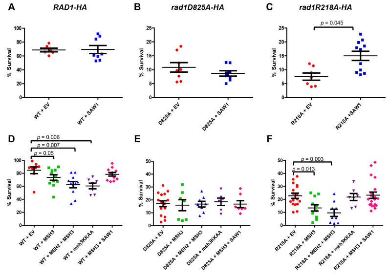
Overexpression of _SAW1, MSH2_ , and _MSH3_ impacts SSA efficiency. SSA assays with 205 bp _ura3_ repeats with a high copy (HC) plasmid containing _SAW1_ (blue squares) or an empty vector (EV, orange circles) were performed in the presence of (**A**) _RAD1_ , (**B**) _rad1D825A_ , and (**C**) _rad1R218A_. (**D**) SSA activity was determined in _RAD1–3HA_ strains transformed with empty vectors (EV; orange circles), _MSH3_ (green squares), _MSH2+MSH3_ (blue triangles), _msh3KKAA_ (purple inverted triangles) or _MSH3+SAW1_ (pink diamonds). (**E**) SSA activity was determined in _rad1D825A-3HA_ strains transformed with empty vectors (EV; orange circles), _MSH3_ (green squares), _MSH2+MSH3_ (blue triangles), _msh3KKAA_ (purple inverted triangles) or _MSH3+SAW1_ (pink diamonds). (**F**) SSA activity was determined in _rad1R218A-3HA_ strains transformed with empty vectors (EV; orange circles), _MSH3_ (green squares), _MSH2+MSH3_ (blue triangles), _msh3KKAA_ (purple inverted triangles) or _MSH3+SAW1_ (pink diamonds). Percent survival (induced/uninduced) was calculated by determining the viability of cells after a 5 hour induction of HO expression. Data represents the mean ± SEM of at least six independent experiments, with at least two independent plasmid transformants.
Rad1–Rad10 also forms stable complexes with Rad14 in NER ([49](https://pmc.ncbi.nlm.nih.gov/articles/PMC6007489/#B49),[50](https://pmc.ncbi.nlm.nih.gov/articles/PMC6007489/#B50)). We tested the possibility that Saw1 and Rad14 functionally compete with each other for interactions with Rad1–Rad10 in 3′ NHTR. When we performed SSA assays in the absence of _RAD14_ , we observed no difference in survival, indicating that the presence of Rad14 does not compromise 3′ NHTR ([Supplementary Figure S7B](https://pmc.ncbi.nlm.nih.gov/articles/PMC6007489/#sup1)).
### Overexpression of _MSH3_ interferes with SSA
If Msh2–Msh3-dependent initiation of SSA is impacted in the _rad1R218A_ background, we reasoned that overexpression of _MSH3_ might affect 3′ NHTR. SSA strains (short repeats) encoding _RAD1, rad1D825A_ or _rad1R218A_ were transformed with a plasmid carrying _MSH3_ under the control of a galactose-inducible promoter. Overexpression had no effect on SSA in the presence of _rad1D825A_ ([Fig. 10E](#fig10)). In both _RAD1_ and _rad1R218A_ strains, we observed a small, but statistically significant decrease in SSA efficiency compared to the presence of the empty vector ([Fig. 10D](#fig10), [F](https://pmc.ncbi.nlm.nih.gov/articles/PMC6007489/#F10), orange circles versus green squares; Mann-Whitney _P_ = 0.05 for _RAD1, P_ = 0.01 for _rad1R218A_). This effect was enhanced by co-overexpression of _MSH2_ and _MSH3_ ([Fig. 10](#fig10), blue triangles). This observation suggests that Msh2–Msh3 interacts with Rad1–Rad10 both on and off the DNA, otherwise excess Msh2–Msh3 should have no effect on SSA activity. Alternatively, the excess Msh2–Msh3 could bind to the DNA intermediate and occlude Rad1–Rad10 access. To distinguish these possibilities, we overexpressed the _msh3KKAA_ mutation, which abrogates specific DNA binding activity of the Msh2–msh3KKAA complex ([41](https://pmc.ncbi.nlm.nih.gov/articles/PMC6007489/#B41)). In the presence of _RAD1_ , overexpression of _msh3KKAA_ reduced SSA, similar to _MSH2/MSH3_ overexpression ([Fig. 10D](#fig10), purple inverted triangles; Mann–Whitney _P_ = 0.006), supporting the idea that the excess MSH complex need not be bound to the recombination intermediate in order to interfere with Rad1–Rad10 function. In contrast, overexpression of _msh3KKAA_ had no effect on the SSA phenotype in the _rad1R218A_ background ([Fig. 10F](#fig10), purple inverted triangles; Mann-Whitney _P_ = 0.82), suggesting that, in this case, it is Msh2–Msh3 bound to the recombination intermediate that is causing the enhanced SSA defect.
_MSH3_ and _SAW1_ overexpression had opposite effects on SSA efficiency in the presence of _rad1R218A in vivo_ ([Fig. 10C](#fig10) and [F](https://pmc.ncbi.nlm.nih.gov/articles/PMC6007489/#F10)), indicating excess Msh2–Msh3 and Saw1 can suppress or enhance SSA, respectively. Therefore we tested the impact of overexpressing both genes at the same time in the _rad1R218A_ background ([Fig. 10F](#fig10), pink diamonds). Under these conditions, SSA efficiency was indistinguishable from that in the presence of the empty vectors alone ([Fig. 10F](#fig10), orange circles), the effect of overexpressing either gene essentially canceling out the effect of the other (_P_ = 0.8433; Mann–Whitney). This suggests that a careful balance of protein factors is important for maximizing repair efficiency.
### RPA interacts with Rad1–Rad10 and stimulates its endonuclease activity; _rad1R218A_ disrupts these activities
Recent studies have indicated that interactions between the mammalian homolog of Rad1–Rad10 and RPA influence its activity in NER and ICLR ([27](https://pmc.ncbi.nlm.nih.gov/articles/PMC6007489/#B27),[30](https://pmc.ncbi.nlm.nih.gov/articles/PMC6007489/#B30)). To assess whether RPA plays a similar role in Rad1–Rad10-mediated 3′ NHTR, we first interrogated protein-protein interactions between Rad1–Rad10 and RPA _in vivo_. Using the HA-tagged version of Rad1 or rad1R218A expressed from its endogenous locus, we performed co-immunoprecipitation from cell lysates with αHA antibodies and probed a western blot with α-Rfa1 antibody. In the presence of Rad1-HA, Rfa1 co-immunoprecipitated ([Fig. 11A](#fig11), lane 2), indicating that these proteins interact _in vivo_.
#### Figure 11. {#fig11}
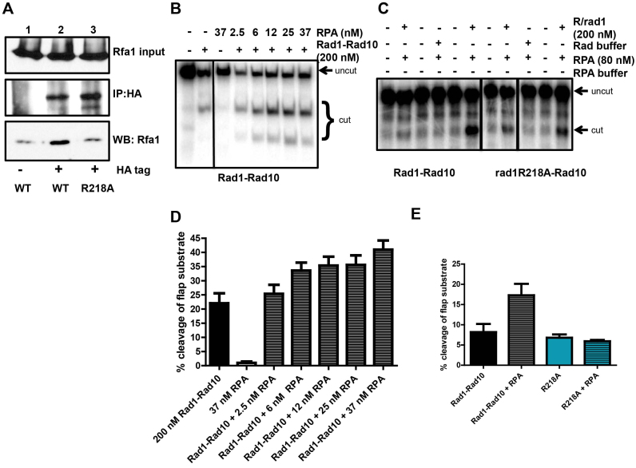
rad1R218A disrupts interaction with RPA. (**A**) Co-immunoprecipitation experiments from cells. Rad1-HA or rad1R218A-HA was immunoprecipitated with α-HA antibody and associated proteins were probed by western blot, using α−Rfa1 antibody. (**B**) A Representative gel of the endonuclease activity of purified His–Rad1–Rad10 (200 nM) on 3′ flap substrates in the absence or presence of increasing concentrations of RPA. (**C**) Representative gel of His–rad1R218A–Rad10 endonuclease activity in the absence or presence of RPA. (**D**) Quantification of multiple RPA titration experiments, using multiple different preparations of His–Rad1–Rad10 and RPA. (**E**) Quantification of stimulation of cleavage activity by RPA. Note that while the absolute activity of Rad1–Rad10 and rad1R218A–Rad10 in the absence and presence of RPA varies, the relative levels remain consistent. For both panels B and C, the reactions shown were all run on the same gel; some unrelated lanes were cropped out of the images.
We next tested to see if this Rad1–Rad10/RPA interaction was functional _in vitro_. Using purified proteins, we tested the effect of yeast RPA on Rad1–Rad10’s ability to cleave a 3′ ssDNA flap substrate _in vitro_. This is a sub-optimal substrate for Rad1–Rad10 ([12](https://pmc.ncbi.nlm.nih.gov/articles/PMC6007489/#B12)). We demonstrated that RPA is able to stimulate Rad1–Rad10 endonuclease activity on a 3′ flap substrate by ∼2-fold ([Fig. 11B](#fig11) and [D](https://pmc.ncbi.nlm.nih.gov/articles/PMC6007489/#F11)). Importantly, SSB from _E. coli_ did not stimulate Rad1–Rad10’s endonuclease activity (data not shown). These experiments were performed under conditions in which RPA DNA-binding efficiency was between 50 and 85% (data not shown). These observations are consistent with RPA playing a role in positioning Rad1–Rad10 on the DNA substrate.
Notably, the interaction with RPA was lost in the presence of rad1R218A–HA ([Fig. 11A](#fig11), lane 3). Furthermore, in contrast to wild-type His–Rad1–Rad10, His–rad1R218A–Rad10 endonuclease activity was insensitive to the presence of RPA ([Fig. 11C](#fig11) and [D](https://pmc.ncbi.nlm.nih.gov/articles/PMC6007489/#F11)). These results indicate that the interaction between Rad1–Rad10 and RPA is important for the stimulation of catalytic activity and that this interaction is disrupted in the _rad1R218A_ background.
---
##  DISCUSSION
### Distinct molecular requirements for Rad1 in NER and 3′ NHTR
In this study we identified two _rad1_ alleles within a poorly characterized region of _RAD1_ that exhibited separation-of-function phenotypes; both were functional for NER and severely impaired in 3′ NHTR. These phenotypes demonstrated that there are distinct molecular requirements for Rad1 in NER vs. 3′ NHTR, consistent with the different requirements of the two pathways ([Supplementary Figure S8](https://pmc.ncbi.nlm.nih.gov/articles/PMC6007489/#sup1)). For instance, recent work has implicated a role for sumoylated Saw1 in NER, but not 3′ NHTR ([47](https://pmc.ncbi.nlm.nih.gov/articles/PMC6007489/#B47)). Similarly, different protein partners are required. Our results highlight the importance of Msh2–Msh3 in 3′ NHTR.
Several factors contributed to the 3′ NHTR defect in the _rad2R203A,K205A_ background. First, the His–rad1R203A,K205A-Rad10 exhibited a defect in endonuclease activity ([Fig. 4](#fig4)), although this defect had a more minor effect on NER ([Fig. 2C](#fig2)) than on 3′ NHTR ([Fig. 2B](#fig2)). Second, His–rad1R203A,K205A–Rad10 was impaired in its interaction with Msh2–Msh3 ([Supplementary Figure S2C and D](https://pmc.ncbi.nlm.nih.gov/articles/PMC6007489/#sup1)). Third, complex formation or complex stability between His–rad1R203A,K205A-Rad10 and Saw1 was compromised, evident from the elution profiles of both the Cobalt and gel filtration purification steps ([Fig. 5D](#fig5), [Supplementary Figure S3](https://pmc.ncbi.nlm.nih.gov/articles/PMC6007489/#sup1)). This effect was specific to Saw1; His–rad1R203A,K205A-Rad10 purification and gel filtration elution profile was similar to that of His–Rad1–Rad10 ([Supplementary Figure S4A](https://pmc.ncbi.nlm.nih.gov/articles/PMC6007489/#sup1) and data not shown). Because there were multiple _in vitro_ defects with His–rad1R203A,K205A-Rad10, it is difficult to pinpoint a single cause for the 3′ NHTR phenotype to help define the pathway ([Supplementary Figure S8](https://pmc.ncbi.nlm.nih.gov/articles/PMC6007489/#sup1)). A less robust interaction between rad1R203A,K205A–Rad10 and Msh2–Msh3 could limit recruitment to recombination intermediates, as could the instability of the rad1R203A,K205A–Rad10 complex specifically in the presence of Saw1. Both observations explain the 3′ NHTR phenotype of this mutation.
In contrast, His–rad1R218A–Rad10 retained wild-type endonuclease activity ([Fig. 4](#fig4)) and was able to interact efficiently with Msh2–Msh3 ([Fig. 6](#fig6), [Supplementary Figure S2C, D](https://pmc.ncbi.nlm.nih.gov/articles/PMC6007489/#sup1)) and form a tripartite complex with Saw1 (Figures [5](https://pmc.ncbi.nlm.nih.gov/articles/PMC6007489/#F5) and [7](https://pmc.ncbi.nlm.nih.gov/articles/PMC6007489/#F7), [Supplementary Figure S3](https://pmc.ncbi.nlm.nih.gov/articles/PMC6007489/#sup1)). Nonetheless, differences from His–Rad1–Rad10 were noted with respect to protein-protein interactions, which could impact biological function. First, His–rad1R218A–Rad10 exhibited an increased interaction with Msh2–Msh3 in co-immunoprecipitation experiments in the presence of non-specific DNA ([Fig. 6](#fig6)), indicating a change in the strength, stability and/or stoichiometry of binding. This change may be revealed when one or both proteins interact with DNA. Second, His–rad1R218A–Rad10 was more efficiently immunoprecipitated with His-Saw1 in the presence of Msh2–Msh3 than His–Rad1–Rad10 ([Fig. 7B](#fig7) and [C](https://pmc.ncbi.nlm.nih.gov/articles/PMC6007489/#F7)). Co-immunoprecipitation experiments suggest that this is due to increased interactions between His–rad1R218A–Rad10 and His–Saw1 ([Fig. 5A](#fig5) and [B](https://pmc.ncbi.nlm.nih.gov/articles/PMC6007489/#F5)) compared to His–Rad1–Rad10. Third, His–rad1R218A–Rad10 no longer interacted with RPA ([Fig. 11](#fig11)). These observations indicate that the _rad1R218A_ mutation interferes with the normal regulation and coordination of protein–protein interactions among Rad1–Rad10, Msh2–Msh3, Saw1 and RPA that are required to mediate 3′ NHTR ([Supplementary Figure S8](https://pmc.ncbi.nlm.nih.gov/articles/PMC6007489/#sup1)).
### A more direct role for Msh2–Msh3 in recruiting Rad1–Rad10?
Msh2 has previously been shown to interact with Rad1 and Saw1 ([11](https://pmc.ncbi.nlm.nih.gov/articles/PMC6007489/#B11),[25](https://pmc.ncbi.nlm.nih.gov/articles/PMC6007489/#B25)), presumably via Msh2–Msh3, and these interactions have been proposed to play a role in protein recruitment to the intermediate ([11](https://pmc.ncbi.nlm.nih.gov/articles/PMC6007489/#B11),[25](https://pmc.ncbi.nlm.nih.gov/articles/PMC6007489/#B25)). Nonetheless, models of 3′ NHTR in the literature have focused on the role that Msh2–Msh3 plays in stabilizing the recombination intermediate (e.g. ([3](https://pmc.ncbi.nlm.nih.gov/articles/PMC6007489/#B3),[11–13](https://pmc.ncbi.nlm.nih.gov/articles/PMC6007489/#B11)). Based on our _in vitro_ and _in vivo_ results, we propose three distinct roles for Msh2–Msh3 at different steps in 3′NHTR ([Fig. 12](#fig12)): (i) Msh2–Msh3 binds and stabilizes recombination intermediates, perhaps blocking unwinding of the intermediate ([23](https://pmc.ncbi.nlm.nih.gov/articles/PMC6007489/#B23)), (ii) Msh2–Msh3 interacts with Saw1 and/or Rad1–Rad10 to recruit and retain the Rad1–Rad10/Saw1 complex to the recombination intermediate and (iii) Msh2–Msh3 leaves the recombination intermediate to allow cleavage, which we propose also involves protein-protein interactions (see next section). Alternatively, the interactions between Msh2–Msh3 and Rad1–Rad10–Saw1 could enhance cleavage activity prior to Msh2–Msh3 leaving the recombination intermediate. We base this model on the following observations.
#### Figure 12. {#fig12}
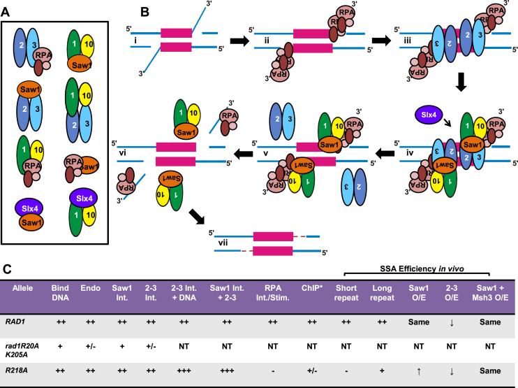
Cartoon model of protein-DNA and protein-protein interactions involved in 3′ NHTR. (**A**) Cartoon of the known protein-protein interactions among Msh2–Msh3, Rad1–Rad10, Saw1, RPA and Slx4 ([11](https://pmc.ncbi.nlm.nih.gov/articles/PMC6007489/#B11),[12](https://pmc.ncbi.nlm.nih.gov/articles/PMC6007489/#B12),25,[47](https://pmc.ncbi.nlm.nih.gov/articles/PMC6007489/#B47),[53–55](https://pmc.ncbi.nlm.nih.gov/articles/PMC6007489/#B53)). Please note that the illustrated interactions in this cartoon are not intended to indicate specific interaction domains. (**B**) Model for 3′ NHTR. (i) Double strand break processing results in a recombination intermediate with 3′ non-homologous single-stranded DNA tails. (ii) The ssDNA tails are bound by RPA. (iii) Msh2–Msh3 binds the double-strand/single-strand DNA junction ([16](https://pmc.ncbi.nlm.nih.gov/articles/PMC6007489/#B16)). This step does not require other proteins _in vitro_ but may be facilitated by RPA, which interacts with Msh2–Msh3 ([22](https://pmc.ncbi.nlm.nih.gov/articles/PMC6007489/#B22)), or other factors _in vivo_. Msh2–Msh3 stabilizes the intermediate to facilitate downstream steps of 3′ NHTR and aids in recruitment of Rad1–Rad10-Saw1. (iv) Msh2–Msh3 interacts with Rad1–Rad10-Saw1 to recruit the complex to the recombination intermediate. Msh2–Msh3 interactions with Rad1–Rad10 and/or Saw1 may facilitate this step. Interactions between RPA and Rad1–Rad10 aid in recruitment and/or positioning of Rad1–Rad10-Saw1 at the intermediate. Slx4 may also play a role in positioning Rad1–Rad10-Saw1 at the recombination intermediate ([38](https://pmc.ncbi.nlm.nih.gov/articles/PMC6007489/#B38)). We propose that sequential protein-protein interactions are important for properly positioning and stabilizing Rad1–Rad10 at the intermediate. (v) Rad1–Rad10–Saw1 binds the DNA junction and displaces Msh2–Msh3 from the DNA. Alternatively Msh2–Msh3 may remain bound to the DNA and/or multi-protein complex to stimulate Rad1–Rad10 cleavage of the 3′ flap. (vi) The 3′ tails are cleaved by Rad1–Rad10(-Saw1) and Rad1–Rad10-Saw1 leaves the DNA to allow DNA synthesis to fill in the gap (vii). (**C**) Summary of _in vitro_ and _in vivo_ activities of _RAD1, rad1R203A k205A and rad1R218A_. Int. refers to interaction; Stim. refers to stimulation. A more comprehensive summary is shown in [Supplementary Figure S8](https://pmc.ncbi.nlm.nih.gov/articles/PMC6007489/#sup1). * ChIP performed in the presence of the endonuclease deficient rad1D825A mutation, which is necessary to see rad1 localization. ++ indicates wild-type levels of activity, _in vitro_ or _in vivo_ ; +++ indicates increased activity relative to wild-type, + and +/– indicate decreasing activity levels relative to wild-type; - indicates not detectable activity; NT indicates not tested.
First, the 3′ NHTR defect in _rad1R218A_ was specific to Msh2–Msh3-dependent repair pathways, i.e. SSA involving short repeats ([Fig. 8](#fig8)). Consistent with this observation, the switching efficiency of both _rad1_ alleles in the mating type switch assay was more similar to that of an _msh3Δ_ than a _rad1Δ_ (∼10% versus ∼0%) ([Fig. 2B](#fig2)) ([20](https://pmc.ncbi.nlm.nih.gov/articles/PMC6007489/#B20),[42](https://pmc.ncbi.nlm.nih.gov/articles/PMC6007489/#B42)). These data indicate that (i) the _rad1R218A_ mutation altered interactions with Msh2–Msh3 and/or (ii) Msh2–Msh3-binding to the recombination intermediate, which is independent of Rad1 ([12](https://pmc.ncbi.nlm.nih.gov/articles/PMC6007489/#B12)), is insufficient for rad1R218A–Rad10 recruitment in this genetic background. Both possibilities suggest that Msh2–Msh3 is playing a more direct role in 3′ NHTR, in addition to stabilizing the recombination intermediate.
Second, interactions among Msh2–Msh3, Saw1 and rad1R218A–Rad10 were altered _in vitro_. Specifically, His–rad1R218A–Rad10 was more efficiently immunoprecipitated by Saw1 in the presence of Msh2–Msh3 than wild-type His–Rad1–Rad10 ([Fig. 7B](#fig7) and [C](https://pmc.ncbi.nlm.nih.gov/articles/PMC6007489/#F7)). These interactions are potentially important for recruitment of Rad1–Rad10/Saw1 to the recombination intermediate and/or hand-off from Msh2–Msh3 to Rad1–Rad10/Saw1, i.e. Msh2–Msh3 leaving the intermediate.
Finally, overexpression of _MSH3_ or _MSH2/MSH3_ reduced SSA efficiency in both the _RAD1–3HA_ and _rad1R218A-3HA_ backgrounds. The excess MSH complex, which exhibits a dominant negative effect on 3′ NHTR, may not be interacting with the recombination intermediate (it is bound by endogenous levels of complex ([18](https://pmc.ncbi.nlm.nih.gov/articles/PMC6007489/#B18),[42](https://pmc.ncbi.nlm.nih.gov/articles/PMC6007489/#B42))). Therefore, the inhibition of SSA may be a result of Rad1–Rad10 interacting with Msh2–Msh3 independent of the DNA, as demonstrated here, _in vitro_ ([Fig. 6](#fig6)). Consistent with this possibility, overexpression of _msh3KKAA_ , which has lost specific DNA-binding activity ([41](https://pmc.ncbi.nlm.nih.gov/articles/PMC6007489/#B41)) also reduced SSA efficiency in the presence of _RAD1–3HA_. This suggested that Msh2-msh3KKAA (not bound to DNA) can interfere with 3′ NHTR, perhaps titrating Rad1–Rad10 away from the recombination intermediate, thus interfering with the stable recruitment of Rad1–Rad10 to the DNA intermediate, although it is possible that Msh2–Msh3 plays a role in addition to Rad1–Rad10 recruitment. In contrast, overexpression of _msh3KKAA_ did not negatively affect SSA efficiency in the _rad1R218A_ background, suggesting that the free MSH complex does not efficiently titrate rad1R218A–Rad10 away from the 3′ NHTR pathway. It is notable that His–rad1R218A–Rad10 interacts with Msh2–Msh3 better than His–Rad1–Rad10 in the presence of DNA ([Fig. 6](#fig6)), which may make it less titratable from the recombination DNA intermediate.
### Coordination between Rad1–Rad10, Saw1, RPA and Msh2–Msh3
A loss or reduction in the ability of proteins to interact provides a clear explanation for the disruption of a biochemical pathway. However, enhanced interactions can be equally detrimental in pathways that require transient contact and ‘hand-off’ from one set of interactions to the next. We propose that the R218A change in Rad1 leads to altered, both decreased and enhanced, interactions among Rad1–Rad10, Msh2–Msh3, RPA and Saw1 that disrupt 3′ NHTR ([Fig. 12](#fig12), [Supplementary Figure S8](https://pmc.ncbi.nlm.nih.gov/articles/PMC6007489/#sup1)).
Through co-immunoprecipitation and far western analyses, we demonstrated for the first time that both Rad1–Rad10 and Saw1 form direct physical interactions with Msh2–Msh3 (Figures [6](https://pmc.ncbi.nlm.nih.gov/articles/PMC6007489/#F6) and [7](https://pmc.ncbi.nlm.nih.gov/articles/PMC6007489/#F7), [Supplementary Figure S2](https://pmc.ncbi.nlm.nih.gov/articles/PMC6007489/#sup1)). These proteins could interact simultaneously and be part of the same complex. Alternatively, protein interactions could shift during the process of 3′ NHTR. Direct interaction between Msh2–Msh3 and Saw1 could mediate hand-off of Rad1–Rad10 to the DNA – or hold Rad1–Rad10 poised for action until a further signal, e.g. Slx4 interactions. rad1R218A interactions with both Msh2–Msh3 and Saw1 are altered _in vitro_ , affecting one or more steps in 3′ NHTR (Figures [5](https://pmc.ncbi.nlm.nih.gov/articles/PMC6007489/#F5)–[7](https://pmc.ncbi.nlm.nih.gov/articles/PMC6007489/#F7), [Supplementary Figure S2](https://pmc.ncbi.nlm.nih.gov/articles/PMC6007489/#sup1)). Rad1–Rad10 interactions with RPA also appear critical for enhancing Rad1–Rad10 cleavage activity ([Fig. 11](#fig11)), similar to a role for RPA in modulating Xpf-Ercc1 activity in mammalian NER and ICLR, at least _in vitro_ ([27](https://pmc.ncbi.nlm.nih.gov/articles/PMC6007489/#B27),[30](https://pmc.ncbi.nlm.nih.gov/articles/PMC6007489/#B30)). It is worth noting that the integrated version of _rad1R218A_ was somewhat UV sensitive ([Supplementary Figure S5](https://pmc.ncbi.nlm.nih.gov/articles/PMC6007489/#sup1)), indicating that an impaired interaction with RPA also impacts NER. In mammalian systems, interactions between RPA and Xpf-Ercc1 are important for efficient NER ([26](https://pmc.ncbi.nlm.nih.gov/articles/PMC6007489/#B26),[27](https://pmc.ncbi.nlm.nih.gov/articles/PMC6007489/#B27)). These observations indicate that the coordinated set of protein-protein interactions is disrupted in the _rad1R218A_ background and is consistent with a separation-of-function phenotype that primarily affects 3′ NHTR. We do note that the interaction between Rad1–Rad10 and RPA is not required for recruitment of Rad1–Rad10 to the recombination intermediate (data not shown) and so may be acting downstream of recruitment.
We propose a model for the initiation of the 3′NHTR of DSBR in which Rad1–Rad10 forms a complex with Saw1, which is critical for the recruitment of Rad1–Rad10 to the recombination intermediate ([12](https://pmc.ncbi.nlm.nih.gov/articles/PMC6007489/#B12)) ([Fig. 12](#fig12)). Msh2–Msh3 binds the recombination intermediate thereby stabilizing it, particularly in the presence of shorter repeats ([Fig. 12](#fig12)Bii) ([13](https://pmc.ncbi.nlm.nih.gov/articles/PMC6007489/#B13),[18](https://pmc.ncbi.nlm.nih.gov/articles/PMC6007489/#B18)). Rad1–Rad10 is physically brought to the ds/ssDNA junction and properly positioned for cleavage through four sets of interactions ([Fig. 12](#fig12)Biii, iv): (i) between Saw1 and DNA ([12](https://pmc.ncbi.nlm.nih.gov/articles/PMC6007489/#B12)), (ii) between Rad1–Rad10 and Msh2–Msh3 (bound to the DNA) ([Fig. 6](#fig6), [Supplementary Figure S2](https://pmc.ncbi.nlm.nih.gov/articles/PMC6007489/#sup1)), (iii) between Saw1 and Msh2–Msh3 (bound to the DNA) ([Fig. 7](#fig7)) and (iv) between Rad1–Rad10 and RPA (bound to DNA) ([Fig. 11](#fig11)). When any of these interactions is altered, 3′ NHTR is impaired. This is supported by the following observations. First, in the presence of saw1 mutants impaired for interactions with either the DNA or with Rad1–Rad10, Rad1–Rad10 recruitment to the DNA intermediate is impaired and 3′ NHTR is blocked ([12](https://pmc.ncbi.nlm.nih.gov/articles/PMC6007489/#B12)). Second, overexpression of _msh3KKAA_ reduced the efficiency of SSA in the presence of _RAD1–3HA_ ([Fig. 10](#fig10)), suggesting interactions between Rad1–Rad10 and Msh2–Msh3 OFF the DNA impair 3′ NHTR. Third, His–rad1R218A–Rad10 has altered interactions with both Msh2–Msh3 and Saw1 _in vitro_ and with RPA _in vivo_ ; this mutation blocks 3′ NHTR. This is consistent with a mismanagement of protein complexes in the presence of rad1R218A that is sufficient to disrupt the regulated coordination of protein-protein interactions to mediate 3′ NHTR initiation. Altered interactions with the DNA itself ([Fig. 3](#fig3)) may also play a role. In particular, enhanced interactions between, for example, rad1R218A–Rad10 and Saw1 could interfere with appropriate hand-off to the next step in the repair pathway, including recruitment to the recombination intermediate via interactions with Msh2–Msh3. Mutations that disrupt the Msh2–Msh3/Rad1–Rad10 interaction will be important in testing this model.
We propose that once Rad1–Rad10 is positioned, via interactions with Msh2–Msh3 and RPA ([Fig. 12](#fig12)Biv) and its endonuclease activity is activated, Msh2–Msh3 dissociates from the DNA, either dissociating completely ([Fig. 12](#fig12)Bv) or handing Rad1–Rad10(-Saw1) off to the DNA junction but remaining in contact with the multi-protein complex at the recombination intermediate. Msh2–Msh3 ATP binding and/or hydrolysis may impact these dynamics ([19](https://pmc.ncbi.nlm.nih.gov/articles/PMC6007489/#B19),[20](https://pmc.ncbi.nlm.nih.gov/articles/PMC6007489/#B20)). Following cleavage, the DNA substrate for Msh2–Msh3, Rad1–Rad10 and Saw1 is no longer present and these proteins leave the DNA ([Fig. 12](#fig12)Bvi) to allow DNA resynthesis to fill in the remaining gaps ([Fig. 12](#fig12)Bvii).
Thus far the role of Slx4 in 3′ NHTR remains unclear. It is not required for recruitment of Rad1–Rad10 to the recombination intermediate ([12](https://pmc.ncbi.nlm.nih.gov/articles/PMC6007489/#B12)). It is, however, required for cleavage of the 3′ ssDNA tails ([51](https://pmc.ncbi.nlm.nih.gov/articles/PMC6007489/#B51)) and mammalian SLX4 stimulates XPF-ERCC1 endonuclease activity in ICLR ([52](https://pmc.ncbi.nlm.nih.gov/articles/PMC6007489/#B52)). Mammalian SLX4 has been proposed to be critical for proper positioning of XPF-ERCC1 on its ICLR substrates ([38](https://pmc.ncbi.nlm.nih.gov/articles/PMC6007489/#B38)). These observations suggest a role for Slx4 in coordinating the mechanistic steps in 3′ NHTR downstream of Rad1–Rad10 recruitment. One intriguing possibility is that Msh2–Msh3 and Saw1 co-operate to localize Rad1–Rad10 to the recombination intermediate, where it remains poised for action until the arrival of Slx4 ([Fig. 12](#fig12)Biv).

---
##  ACKNOWLEDGEMENTS
We thank Dr Mark Sutton for helpful discussions. We are also grateful to the members of the Lee and Surtees labs for helpful discussions and to Dr. Shobhit Gogia, Calvin Yang, Jaime O’Connor and Mindy Haarmeyer for performing early _in vivo_ experiments. We thank Dr Eric Alani, in whose lab J.A.S. made the Rad10 antibodies.
##  SUPPLEMENTARY DATA
[Supplementary Data](https://academic.oup.com/nar/article-lookup/doi/10.1093/nar/gky254#supplementary-data) are available at NAR Online.
##  FUNDING
NIH Research [GM71011 to S.E.L., ES022054 and CA188032 to P.H., GM097177 to I.J.F., IMSD R25 GM095459 and a diversity supplement to GM066094 to M.M.R. and GM87459 to J.A.S.]; University at Buffalo's Genome, Environment and Microbiome Community of Excellence (to J.A.S.). Funding for open access charge: University at Buffalo Genome, Environment and Microbiome Community of Excellence.
_Conflict of interest statement_. None declared.
##  REFERENCES
  * 1. Boiteux S., Jinks-Robertson S.. DNA repair mechanisms and the bypass of DNA damage in Saccharomyces cerevisiae. Genetics. 2013; 193:1025–1064. [[DOI](https://doi.org/10.1534/genetics.112.145219)] [[PMC free article](https://pmc.ncbi.nlm.nih.gov/articles/PMC3606085/)] [[PubMed](https://pubmed.ncbi.nlm.nih.gov/23547164/)] [[Google Scholar](https://scholar.google.com/scholar_lookup?journal=Genetics&title=DNA%20repair%20mechanisms%20and%20the%20bypass%20of%20DNA%20damage%20in%20Saccharomyces%20cerevisiae&author=S.%20Boiteux&author=S.%20Jinks-Robertson&volume=193&publication_year=2013&pages=1025-1064&pmid=23547164&doi=10.1534/genetics.112.145219&)]
  * 2. Clauson C., Schärer O.D., Niedernhofer L.. Advances in understanding the complex mechanisms of DNA interstrand Cross-Link repair. Cold Spring Harbor Perspect. Biol. 2013; 5:a012732. [[DOI](https://doi.org/10.1101/cshperspect.a012732)] [[PMC free article](https://pmc.ncbi.nlm.nih.gov/articles/PMC4123742/)] [[PubMed](https://pubmed.ncbi.nlm.nih.gov/24086043/)] [[Google Scholar](https://scholar.google.com/scholar_lookup?journal=Cold%20Spring%20Harbor%20Perspect.%20Biol.&title=Advances%20in%20understanding%20the%20complex%20mechanisms%20of%20DNA%20interstrand%20Cross-Link%20repair&author=C.%20Clauson&author=O.D.%20Sch%C3%A4rer&author=L.%20Niedernhofer&volume=5&publication_year=2013&pages=a012732&pmid=24086043&doi=10.1101/cshperspect.a012732&)]
  * 3. Paques F., Haber J.E.. Multiple pathways of recombination induced by double-strand breaks in Saccharomyces cerevisiae. Microbiol. Mol. Biol. Rev. 1999; 63:349–404. [[DOI](https://doi.org/10.1128/mmbr.63.2.349-404.1999)] [[PMC free article](https://pmc.ncbi.nlm.nih.gov/articles/PMC98970/)] [[PubMed](https://pubmed.ncbi.nlm.nih.gov/10357855/)] [[Google Scholar](https://scholar.google.com/scholar_lookup?journal=Microbiol.%20Mol.%20Biol.%20Rev.&title=Multiple%20pathways%20of%20recombination%20induced%20by%20double-strand%20breaks%20in%20Saccharomyces%20cerevisiae&author=F.%20Paques&author=J.E.%20Haber&volume=63&publication_year=1999&pages=349-404&pmid=10357855&doi=10.1128/mmbr.63.2.349-404.1999&)]
  * 4. Prakash S., Prakash L.. Nucleotide excision repair in yeast. Mut. Res. 2000; 451:13–24. [[DOI](https://doi.org/10.1016/s0027-5107\(00\)00037-3)] [[PubMed](https://pubmed.ncbi.nlm.nih.gov/10915862/)] [[Google Scholar](https://scholar.google.com/scholar_lookup?journal=Mut.%20Res.&title=Nucleotide%20excision%20repair%20in%20yeast&author=S.%20Prakash&author=L.%20Prakash&volume=451&publication_year=2000&pages=13-24&pmid=10915862&doi=10.1016/s0027-5107\(00\)00037-3&)]
  * 5. Lyndaker A.M., Alani E.. A tale of tails: insights into the coordination of 3′ end processing during homologous recombination. BioEssays. 2009; 31:315–321. [[DOI](https://doi.org/10.1002/bies.200800195)] [[PMC free article](https://pmc.ncbi.nlm.nih.gov/articles/PMC2958051/)] [[PubMed](https://pubmed.ncbi.nlm.nih.gov/19260026/)] [[Google Scholar](https://scholar.google.com/scholar_lookup?journal=BioEssays&title=A%20tale%20of%20tails:%20insights%20into%20the%20coordination%20of%203%E2%80%B2%20end%20processing%20during%20homologous%20recombination&author=A.M.%20Lyndaker&author=E.%20Alani&volume=31&publication_year=2009&pages=315-321&pmid=19260026&doi=10.1002/bies.200800195&)]
  * 6. Guzder S.N., Sommers C.H., Prakash L., Prakash S.. Complex formation with damage recognition protein Rad14 is essential for saccharomyces cerevisiae Rad1–Rad10 nuclease to perform its function in nucleotide excision repair in vivo. Mol. Cell. Biol. 2006; 26:1135–1141. [[DOI](https://doi.org/10.1128/MCB.26.3.1135-1141.2006)] [[PMC free article](https://pmc.ncbi.nlm.nih.gov/articles/PMC1347044/)] [[PubMed](https://pubmed.ncbi.nlm.nih.gov/16428464/)] [[Google Scholar](https://scholar.google.com/scholar_lookup?journal=Mol.%20Cell.%20Biol.&title=Complex%20formation%20with%20damage%20recognition%20protein%20Rad14%20is%20essential%20for%20saccharomyces%20cerevisiae%20Rad1%E2%80%93Rad10%20nuclease%20to%20perform%20its%20function%20in%20nucleotide%20excision%20repair%20in%20vivo&author=S.N.%20Guzder&author=C.H.%20Sommers&author=L.%20Prakash&author=S.%20Prakash&volume=26&publication_year=2006&pages=1135-1141&pmid=16428464&doi=10.1128/MCB.26.3.1135-1141.2006&)]
  * 7. Bardwell A.J., Bardwell L., Tomkinson A.E., Friedberg E.C.. Specific cleavage of model recombination and repair intermediates by the yeast Rad1-RAD10 DNA endonuclease. Science. 1994; 265:2082–2085. [[DOI](https://doi.org/10.1126/science.8091230)] [[PubMed](https://pubmed.ncbi.nlm.nih.gov/8091230/)] [[Google Scholar](https://scholar.google.com/scholar_lookup?journal=Science&title=Specific%20cleavage%20of%20model%20recombination%20and%20repair%20intermediates%20by%20the%20yeast%20Rad1-RAD10%20DNA%20endonuclease&author=A.J.%20Bardwell&author=L.%20Bardwell&author=A.E.%20Tomkinson&author=E.C.%20Friedberg&volume=265&publication_year=1994&pages=2082-2085&pmid=8091230&doi=10.1126/science.8091230&)]
  * 8. Rodriguez K., Wang Z., Friedberg E.C., Tomkinson A.E.. Identification of functional domains within the RAD1·RAD10 repair and recombination endonuclease of saccharomyces cerevisiae. J. Biol. Chem. 1996; 271:20551–20558. [[DOI](https://doi.org/10.1074/jbc.271.34.20551)] [[PubMed](https://pubmed.ncbi.nlm.nih.gov/8702799/)] [[Google Scholar](https://scholar.google.com/scholar_lookup?journal=J.%20Biol.%20Chem.&title=Identification%20of%20functional%20domains%20within%20the%20RAD1%C2%B7RAD10%20repair%20and%20recombination%20endonuclease%20of%20saccharomyces%20cerevisiae&author=K.%20Rodriguez&author=Z.%20Wang&author=E.C.%20Friedberg&author=A.E.%20Tomkinson&volume=271&publication_year=1996&pages=20551-20558&pmid=8702799&doi=10.1074/jbc.271.34.20551&)]
  * 9. Fishman-Lobell J., Haber J.E.. Removal of nonhomologous DNA ends in double-strand break recombination: the role of the yeast ultraviolet repair gene _RAD1_. Science. 1992; 258:480–484. [[DOI](https://doi.org/10.1126/science.1411547)] [[PubMed](https://pubmed.ncbi.nlm.nih.gov/1411547/)] [[Google Scholar](https://scholar.google.com/scholar_lookup?journal=Science&title=Removal%20of%20nonhomologous%20DNA%20ends%20in%20double-strand%20break%20recombination:%20the%20role%20of%20the%20yeast%20ultraviolet%20repair%20gene%20RAD1&author=J.%20Fishman-Lobell&author=J.E.%20Haber&volume=258&publication_year=1992&pages=480-484&pmid=1411547&doi=10.1126/science.1411547&)]
  * 10. Ivanov E.L., Haber J.E.. _RAD1_ and _RAD10_ , but not other excision repair genes, are required for double-strand break-induced recombination in _Saccharomyces cerevisiae_. Mol. Cell. Biol. 1995; 15:2245–2251. [[DOI](https://doi.org/10.1128/mcb.15.4.2245)] [[PMC free article](https://pmc.ncbi.nlm.nih.gov/articles/PMC230452/)] [[PubMed](https://pubmed.ncbi.nlm.nih.gov/7891718/)] [[Google Scholar](https://scholar.google.com/scholar_lookup?journal=Mol.%20Cell.%20Biol.&title=RAD1%20and%20RAD10,%20but%20not%20other%20excision%20repair%20genes,%20are%20required%20for%20double-strand%20break-induced%20recombination%20in%20Saccharomyces%20cerevisiae&author=E.L.%20Ivanov&author=J.E.%20Haber&volume=15&publication_year=1995&pages=2245-2251&pmid=7891718&doi=10.1128/mcb.15.4.2245&)]
  * 11. Li F., Dong J., Pan X., Oum J.-H., Boeke J.D., Lee S.E.. Microarray-Based genetic screen defines SAW1, a gene required for Rad1/Rad10-dependent processing of recombination intermediates. Mol. Cell. 2008; 30:325–335. [[DOI](https://doi.org/10.1016/j.molcel.2008.02.028)] [[PMC free article](https://pmc.ncbi.nlm.nih.gov/articles/PMC2398651/)] [[PubMed](https://pubmed.ncbi.nlm.nih.gov/18471978/)] [[Google Scholar](https://scholar.google.com/scholar_lookup?journal=Mol.%20Cell&title=Microarray-Based%20genetic%20screen%20defines%20SAW1,%20a%20gene%20required%20for%20Rad1/Rad10-dependent%20processing%20of%20recombination%20intermediates&author=F.%20Li&author=J.%20Dong&author=X.%20Pan&author=J.-H.%20Oum&author=J.D.%20Boeke&volume=30&publication_year=2008&pages=325-335&pmid=18471978&doi=10.1016/j.molcel.2008.02.028&)]
  * 12. Li F., Dong J., Eichmiller R., Holland C., Minca E., Prakash R., Sung P., Yong Shim E., Surtees J.A., Eun Lee S. Role of Saw1 in Rad1/Rad10 complex assembly at recombination intermediates in budding yeast. EMBO J. 2013; 32:461–472. [[DOI](https://doi.org/10.1038/emboj.2012.345)] [[PMC free article](https://pmc.ncbi.nlm.nih.gov/articles/PMC3595435/)] [[PubMed](https://pubmed.ncbi.nlm.nih.gov/23299942/)] [[Google Scholar](https://scholar.google.com/scholar_lookup?journal=EMBO%20J.&title=Role%20of%20Saw1%20in%20Rad1/Rad10%20complex%20assembly%20at%20recombination%20intermediates%20in%20budding%20yeast&author=F.%20Li&author=J.%20Dong&author=R.%20Eichmiller&author=C.%20Holland&author=E.%20Minca&volume=32&publication_year=2013&pages=461-472&pmid=23299942&doi=10.1038/emboj.2012.345&)]
  * 13. Sugawara N., Paques F., Colaiacovo M., Haber J.E.. Role of Saccharomyces cerevisiae Msh2 and Msh3 repair proteins in double-strand break-induced recombination. Proc. Natl. Acad. Sci. U.S.A. 1997; 94:9214–9219. [[DOI](https://doi.org/10.1073/pnas.94.17.9214)] [[PMC free article](https://pmc.ncbi.nlm.nih.gov/articles/PMC23120/)] [[PubMed](https://pubmed.ncbi.nlm.nih.gov/9256462/)] [[Google Scholar](https://scholar.google.com/scholar_lookup?journal=Proc.%20Natl.%20Acad.%20Sci.%20U.S.A.&title=Role%20of%20Saccharomyces%20cerevisiae%20Msh2%20and%20Msh3%20repair%20proteins%20in%20double-strand%20break-induced%20recombination&author=N.%20Sugawara&author=F.%20Paques&author=M.%20Colaiacovo&author=J.E.%20Haber&volume=94&publication_year=1997&pages=9214-9219&pmid=9256462&doi=10.1073/pnas.94.17.9214&)]
  * 14. Sia E., Kokoska R., Dominska M., Greenwell P., Petes T.. Microsatellite instability in yeast: dependence on repeat unit size and DNA mismatch repair genes. Mol. Cell. Biol. 1997; 17:2851–2858. [[DOI](https://doi.org/10.1128/mcb.17.5.2851)] [[PMC free article](https://pmc.ncbi.nlm.nih.gov/articles/PMC232137/)] [[PubMed](https://pubmed.ncbi.nlm.nih.gov/9111357/)] [[Google Scholar](https://scholar.google.com/scholar_lookup?journal=Mol.%20Cell.%20Biol.&title=Microsatellite%20instability%20in%20yeast:%20dependence%20on%20repeat%20unit%20size%20and%20DNA%20mismatch%20repair%20genes&author=E.%20Sia&author=R.%20Kokoska&author=M.%20Dominska&author=P.%20Greenwell&author=T.%20Petes&volume=17&publication_year=1997&pages=2851-2858&pmid=9111357&doi=10.1128/mcb.17.5.2851&)]
  * 15. Marsischky G.T., Filosi N., Kane M.F., Kolodner R.D.. Redundancy of _Saccharomyces cerevisiae MSH3_ and _MSH6_ in _MSH2_ -dependent mismatch repair. Genes Dev. 1996; 10:407–420. [[DOI](https://doi.org/10.1101/gad.10.4.407)] [[PubMed](https://pubmed.ncbi.nlm.nih.gov/8600025/)] [[Google Scholar](https://scholar.google.com/scholar_lookup?journal=Genes%20Dev.&title=Redundancy%20of%20Saccharomyces%20cerevisiae%20MSH3%20and%20MSH6%20in%20MSH2-dependent%20mismatch%20repair&author=G.T.%20Marsischky&author=N.%20Filosi&author=M.F.%20Kane&author=R.D.%20Kolodner&volume=10&publication_year=1996&pages=407-420&pmid=8600025&doi=10.1101/gad.10.4.407&)]
  * 16. Surtees J.A., Alani E.. Mismatch repair factor MSH2-MSH3 binds and alters the conformation of branched DNA structures predicted to form during genetic recombination. J. Mol. Biol. 2006; 360:523–536. [[DOI](https://doi.org/10.1016/j.jmb.2006.05.032)] [[PubMed](https://pubmed.ncbi.nlm.nih.gov/16781730/)] [[Google Scholar](https://scholar.google.com/scholar_lookup?journal=J.%20Mol.%20Biol.&title=Mismatch%20repair%20factor%20MSH2-MSH3%20binds%20and%20alters%20the%20conformation%20of%20branched%20DNA%20structures%20predicted%20to%20form%20during%20genetic%20recombination&author=J.A.%20Surtees&author=E.%20Alani&volume=360&publication_year=2006&pages=523-536&pmid=16781730&doi=10.1016/j.jmb.2006.05.032&)]
  * 17. Gupta S., Gellert M., Yang W.. Mechanism of mismatch recognition revealed by human MutSβ bound to unpaired DNA loops. Nat. Struct. Mol. Biol. 2012; 19:72–78. [[DOI](https://doi.org/10.1038/nsmb.2175)] [[PMC free article](https://pmc.ncbi.nlm.nih.gov/articles/PMC3252464/)] [[PubMed](https://pubmed.ncbi.nlm.nih.gov/22179786/)] [[Google Scholar](https://scholar.google.com/scholar_lookup?journal=Nat.%20Struct.%20Mol.%20Biol.&title=Mechanism%20of%20mismatch%20recognition%20revealed%20by%20human%20MutS%CE%B2%20bound%20to%20unpaired%20DNA%20loops&author=S.%20Gupta&author=M.%20Gellert&author=W.%20Yang&volume=19&publication_year=2012&pages=72-78&pmid=22179786&doi=10.1038/nsmb.2175&)]
  * 18. Evans E., Sugawara N., Haber J.E., Alani E.. The Saccharomyces cerevisiae Msh2 mismatch repair protein localizes to recombination intermediates in vivo. Mol. Cell. 2000; 5:789–799. [[DOI](https://doi.org/10.1016/s1097-2765\(00\)80319-6)] [[PubMed](https://pubmed.ncbi.nlm.nih.gov/10882115/)] [[Google Scholar](https://scholar.google.com/scholar_lookup?journal=Mol.%20Cell&title=The%20Saccharomyces%20cerevisiae%20Msh2%20mismatch%20repair%20protein%20localizes%20to%20recombination%20intermediates%20in%20vivo&author=E.%20Evans&author=N.%20Sugawara&author=J.E.%20Haber&author=E.%20Alani&volume=5&publication_year=2000&pages=789-799&pmid=10882115&doi=10.1016/s1097-2765\(00\)80319-6&)]
  * 19. Kumar C., Eichmiller R., Wang B., Williams G.M., Bianco P.R., Surtees J.A.. ATP binding and hydrolysis by Saccharomyces cerevisiae Msh2–Msh3 are differentially modulated by mismatch and double-strand break repair DNA substrates. DNA Repair. 2014; 18:18–30. [[DOI](https://doi.org/10.1016/j.dnarep.2014.03.032)] [[PMC free article](https://pmc.ncbi.nlm.nih.gov/articles/PMC4059350/)] [[PubMed](https://pubmed.ncbi.nlm.nih.gov/24746922/)] [[Google Scholar](https://scholar.google.com/scholar_lookup?journal=DNA%20Repair&title=ATP%20binding%20and%20hydrolysis%20by%20Saccharomyces%20cerevisiae%20Msh2%E2%80%93Msh3%20are%20differentially%20modulated%20by%20mismatch%20and%20double-strand%20break%20repair%20DNA%20substrates&author=C.%20Kumar&author=R.%20Eichmiller&author=B.%20Wang&author=G.M.%20Williams&author=P.R.%20Bianco&volume=18&publication_year=2014&pages=18-30&pmid=24746922&doi=10.1016/j.dnarep.2014.03.032&)]
  * 20. Kumar C., Williams G.M., Havens B., Dinicola M.K., Surtees J.A.. Distinct requirements within the Msh3 nucleotide binding pocket for mismatch and Double-Strand break repair. J. Mol. Biol. 2013; 425:1881–1898. [[DOI](https://doi.org/10.1016/j.jmb.2013.02.024)] [[PMC free article](https://pmc.ncbi.nlm.nih.gov/articles/PMC3657845/)] [[PubMed](https://pubmed.ncbi.nlm.nih.gov/23458407/)] [[Google Scholar](https://scholar.google.com/scholar_lookup?journal=J.%20Mol.%20Biol.&title=Distinct%20requirements%20within%20the%20Msh3%20nucleotide%20binding%20pocket%20for%20mismatch%20and%20Double-Strand%20break%20repair&author=C.%20Kumar&author=G.M.%20Williams&author=B.%20Havens&author=M.K.%20Dinicola&author=J.A.%20Surtees&volume=425&publication_year=2013&pages=1881-1898&pmid=23458407&doi=10.1016/j.jmb.2013.02.024&)]
  * 21. Studamire B., Price G., Sugawara N., Haber J.E., Alani E.. Separation-of-Function mutations in saccharomyces cerevisiae MSH2 that confer mismatch repair defects but do not affect Nonhomologous-Tail removal during recombination. Mol. Cell. Biol. 1999; 19:7558–7567. [[DOI](https://doi.org/10.1128/mcb.19.11.7558)] [[PMC free article](https://pmc.ncbi.nlm.nih.gov/articles/PMC84769/)] [[PubMed](https://pubmed.ncbi.nlm.nih.gov/10523644/)] [[Google Scholar](https://scholar.google.com/scholar_lookup?journal=Mol.%20Cell.%20Biol.&title=Separation-of-Function%20mutations%20in%20saccharomyces%20cerevisiae%20MSH2%20that%20confer%20mismatch%20repair%20defects%20but%20do%20not%20affect%20Nonhomologous-Tail%20removal%20during%20recombination&author=B.%20Studamire&author=G.%20Price&author=N.%20Sugawara&author=J.E.%20Haber&author=E.%20Alani&volume=19&publication_year=1999&pages=7558-7567&pmid=10523644&doi=10.1128/mcb.19.11.7558&)]
  * 22. Gavin A.-C., Aloy P., Grandi P., Krause R., Boesche M., Marzioch M., Rau C., Jensen L.J., Bastuck S., Dumpelfeld B. et al. Proteome survey reveals modularity of the yeast cell machinery. Nature. 2006; 440:631–636. [[DOI](https://doi.org/10.1038/nature04532)] [[PubMed](https://pubmed.ncbi.nlm.nih.gov/16429126/)] [[Google Scholar](https://scholar.google.com/scholar_lookup?journal=Nature&title=Proteome%20survey%20reveals%20modularity%20of%20the%20yeast%20cell%20machinery&author=A.-C.%20Gavin&author=P.%20Aloy&author=P.%20Grandi&author=R.%20Krause&author=M.%20Boesche&volume=440&publication_year=2006&pages=631-636&pmid=16429126&doi=10.1038/nature04532&)]
  * 23. Chakraborty U., George C.M., Lyndaker A.M., Alani E.. A delicate balance between repair and replication factors regulates recombination between divergent DNA sequences in Saccharomyces cerevisiae. Genetics. 2016; 202:525–540. [[DOI](https://doi.org/10.1534/genetics.115.184093)] [[PMC free article](https://pmc.ncbi.nlm.nih.gov/articles/PMC4788233/)] [[PubMed](https://pubmed.ncbi.nlm.nih.gov/26680658/)] [[Google Scholar](https://scholar.google.com/scholar_lookup?journal=Genetics&title=A%20delicate%20balance%20between%20repair%20and%20replication%20factors%20regulates%20recombination%20between%20divergent%20DNA%20sequences%20in%20Saccharomyces%20cerevisiae&author=U.%20Chakraborty&author=C.M.%20George&author=A.M.%20Lyndaker&author=E.%20Alani&volume=202&publication_year=2016&pages=525-540&pmid=26680658&doi=10.1534/genetics.115.184093&)]
  * 24. Anand R., Beach A., Li K., Haber J.. Rad51-mediated double-strand break repair and mismatch correction of divergent substrates. Nature. 2017; 544:377–380. [[DOI](https://doi.org/10.1038/nature22046)] [[PMC free article](https://pmc.ncbi.nlm.nih.gov/articles/PMC5544500/)] [[PubMed](https://pubmed.ncbi.nlm.nih.gov/28405019/)] [[Google Scholar](https://scholar.google.com/scholar_lookup?journal=Nature&title=Rad51-mediated%20double-strand%20break%20repair%20and%20mismatch%20correction%20of%20divergent%20substrates&author=R.%20Anand&author=A.%20Beach&author=K.%20Li&author=J.%20Haber&volume=544&publication_year=2017&pages=377-380&pmid=28405019&doi=10.1038/nature22046&)]
  * 25. Bertrand P., Tishkoff D.X., Filosi N., Dasgupta R., Kolodner R.D.. Physical interaction between components of DNA mismatch repair and nucleotide excision repair. Proc. Natl. Acad. Sci. U.S.A. 1998; 95:14278–14283. [[DOI](https://doi.org/10.1073/pnas.95.24.14278)] [[PMC free article](https://pmc.ncbi.nlm.nih.gov/articles/PMC24364/)] [[PubMed](https://pubmed.ncbi.nlm.nih.gov/9826691/)] [[Google Scholar](https://scholar.google.com/scholar_lookup?journal=Proc.%20Natl.%20Acad.%20Sci.%20U.S.A.&title=Physical%20interaction%20between%20components%20of%20DNA%20mismatch%20repair%20and%20nucleotide%20excision%20repair&author=P.%20Bertrand&author=D.X.%20Tishkoff&author=N.%20Filosi&author=R.%20Dasgupta&author=R.D.%20Kolodner&volume=95&publication_year=1998&pages=14278-14283&pmid=9826691&doi=10.1073/pnas.95.24.14278&)]
  * 26. de Laat W., Appeldoorn E., Jaspers N.G.J., Hoeijmakers J.H.J.. DNA structural elements required for ERCC1-XPF endonuclease activity. J. Biol. Chem. 1998; 273:7835–7842. [[DOI](https://doi.org/10.1074/jbc.273.14.7835)] [[PubMed](https://pubmed.ncbi.nlm.nih.gov/9525876/)] [[Google Scholar](https://scholar.google.com/scholar_lookup?journal=J.%20Biol.%20Chem.&title=DNA%20structural%20elements%20required%20for%20ERCC1-XPF%20endonuclease%20activity&author=W.%20de%C2%A0Laat&author=E.%20Appeldoorn&author=N.G.J.%20Jaspers&author=J.H.J.%20Hoeijmakers&volume=273&publication_year=1998&pages=7835-7842&pmid=9525876&doi=10.1074/jbc.273.14.7835&)]
  * 27. Fisher L.A., Bessho M., Wakasugi M., Matsunaga T., Bessho T.. Role of interaction of XPF with RPA in nucleotide excision repair. J. Mol. Biol. 2011; 413:337–346. [[DOI](https://doi.org/10.1016/j.jmb.2011.08.034)] [[PMC free article](https://pmc.ncbi.nlm.nih.gov/articles/PMC3200199/)] [[PubMed](https://pubmed.ncbi.nlm.nih.gov/21875596/)] [[Google Scholar](https://scholar.google.com/scholar_lookup?journal=J.%20Mol.%20Biol.&title=Role%20of%20interaction%20of%20XPF%20with%20RPA%20in%20nucleotide%20excision%20repair&author=L.A.%20Fisher&author=M.%20Bessho&author=M.%20Wakasugi&author=T.%20Matsunaga&author=T.%20Bessho&volume=413&publication_year=2011&pages=337-346&pmid=21875596&doi=10.1016/j.jmb.2011.08.034&)]
  * 28. Matsunaga T., Park C.H., Bessho T., Mu D., Sancar A.. Replication protein A confers structure-specific endonuclease activities to the XPF-ERCC1 and XPG subunits of human DNA repair excision nuclease. J. Biol. Chem. 1996; 271:11047–11050. [[DOI](https://doi.org/10.1074/jbc.271.19.11047)] [[PubMed](https://pubmed.ncbi.nlm.nih.gov/8626644/)] [[Google Scholar](https://scholar.google.com/scholar_lookup?journal=J.%20Biol.%20Chem.&title=Replication%20protein%20A%20confers%20structure-specific%20endonuclease%20activities%20to%20the%20XPF-ERCC1%20and%20XPG%20subunits%20of%20human%20DNA%20repair%20excision%20nuclease&author=T.%20Matsunaga&author=C.H.%20Park&author=T.%20Bessho&author=D.%20Mu&author=A.%20Sancar&volume=271&publication_year=1996&pages=11047-11050&pmid=8626644&doi=10.1074/jbc.271.19.11047&)]
  * 29. Bessho T., Sancar A., Thompson L.H., Thelen M.P.. Reconstitution of human excision nuclease with recombinant XPF-ERCC1 complex. J. Biol. Chem. 1997; 272:3833–3837. [[DOI](https://doi.org/10.1074/jbc.272.6.3833)] [[PubMed](https://pubmed.ncbi.nlm.nih.gov/9013642/)] [[Google Scholar](https://scholar.google.com/scholar_lookup?journal=J.%20Biol.%20Chem.&title=Reconstitution%20of%20human%20excision%20nuclease%20with%20recombinant%20XPF-ERCC1%20complex&author=T.%20Bessho&author=A.%20Sancar&author=L.H.%20Thompson&author=M.P.%20Thelen&volume=272&publication_year=1997&pages=3833-3837&pmid=9013642&doi=10.1074/jbc.272.6.3833&)]
  * 30. Abdullah U.B., McGouran J.F., Brolih S., Ptchelkine D., El‐Sagheer A.H., Brown T., McHugh P.J.. RPA activates the XPF‐ERCC1 endonuclease to initiate processing of DNA interstrand crosslinks. EMBO J. 2017; 36:2047–2060. [[DOI](https://doi.org/10.15252/embj.201796664)] [[PMC free article](https://pmc.ncbi.nlm.nih.gov/articles/PMC5510000/)] [[PubMed](https://pubmed.ncbi.nlm.nih.gov/28607004/)] [[Google Scholar](https://scholar.google.com/scholar_lookup?journal=EMBO%20J.&title=RPA%20activates%20the%20XPF%E2%80%90ERCC1%20endonuclease%20to%20initiate%20processing%20of%20DNA%20interstrand%20crosslinks&author=U.B.%20Abdullah&author=J.F.%20McGouran&author=S.%20Brolih&author=D.%20Ptchelkine&author=A.H.%20El%E2%80%90Sagheer&volume=36&publication_year=2017&pages=2047-2060&pmid=28607004&doi=10.15252/embj.201796664&)]
  * 31. Das D., Folkers G.E., van Dijk M., Jaspers N.G., Hoeijmakers J. H., Kaptein R., Boelens R.. The structure of the XPF-ssDNA complex underscores the distinct roles of the XPF and ERCC1 Helix- Hairpin-Helix domains in ss/ds DNA recognition. Structure. 2012; 20:667–675. [[DOI](https://doi.org/10.1016/j.str.2012.02.009)] [[PubMed](https://pubmed.ncbi.nlm.nih.gov/22483113/)] [[Google Scholar](https://scholar.google.com/scholar_lookup?journal=Structure&title=The%20structure%20of%20the%20XPF-ssDNA%20complex%20underscores%20the%20distinct%20roles%20of%20the%20XPF%20and%20ERCC1%20Helix-%20Hairpin-Helix%20domains%20in%20ss/ds%20DNA%20recognition&author=D.%20Das&author=G.E.%20Folkers&author=M.%20van%C2%A0Dijk&author=N.G.%20Jaspers&author=J.%20H.%20Hoeijmakers&volume=20&publication_year=2012&pages=667-675&pmid=22483113&doi=10.1016/j.str.2012.02.009&)]
  * 32. Das D., Faridounnia M., Kovacic L., Kaptein R., Boelens R., Folkers G.E.. Single-stranded DNA binding by the Helix-Hairpin-Helix domain of XPF protein contributes to the substrate specificity of the ERCC1-XPF protein complex. J. Biol. Chem. 2017; 292:2842–2853. [[DOI](https://doi.org/10.1074/jbc.M116.747857)] [[PMC free article](https://pmc.ncbi.nlm.nih.gov/articles/PMC5314179/)] [[PubMed](https://pubmed.ncbi.nlm.nih.gov/28028171/)] [[Google Scholar](https://scholar.google.com/scholar_lookup?journal=J.%20Biol.%20Chem.&title=Single-stranded%20DNA%20binding%20by%20the%20Helix-Hairpin-Helix%20domain%20of%20XPF%20protein%20contributes%20to%20the%20substrate%20specificity%20of%20the%20ERCC1-XPF%20protein%20complex&author=D.%20Das&author=M.%20Faridounnia&author=L.%20Kovacic&author=R.%20Kaptein&author=R.%20Boelens&volume=292&publication_year=2017&pages=2842-2853&pmid=28028171&doi=10.1074/jbc.M116.747857&)]
  * 33. Su Y., Orelli B., Madireddy A., Niedernhofer L.J., Schärer O.D.. Multiple DNA binding domains mediate the function of the ERCC1-XPF protein in nucleotide excision repair. J. Biol. Chem. 2012; 287:21846–21855. [[DOI](https://doi.org/10.1074/jbc.M111.337899)] [[PMC free article](https://pmc.ncbi.nlm.nih.gov/articles/PMC3381147/)] [[PubMed](https://pubmed.ncbi.nlm.nih.gov/22547097/)] [[Google Scholar](https://scholar.google.com/scholar_lookup?journal=J.%20Biol.%20Chem.&title=Multiple%20DNA%20binding%20domains%20mediate%20the%20function%20of%20the%20ERCC1-XPF%20protein%20in%20nucleotide%20excision%20repair&author=Y.%20Su&author=B.%20Orelli&author=A.%20Madireddy&author=L.J.%20Niedernhofer&author=O.D.%20Sch%C3%A4rer&volume=287&publication_year=2012&pages=21846-21855&pmid=22547097&doi=10.1074/jbc.M111.337899&)]
  * 34. Enzlin J.H., Scharer O.D.. The active site of the DNA repair endonuclease XPF-ERCC1 forms a highly conserved nuclease motif. EMBO J. 2002; 21:2045–2053. [[DOI](https://doi.org/10.1093/emboj/21.8.2045)] [[PMC free article](https://pmc.ncbi.nlm.nih.gov/articles/PMC125967/)] [[PubMed](https://pubmed.ncbi.nlm.nih.gov/11953324/)] [[Google Scholar](https://scholar.google.com/scholar_lookup?journal=EMBO%20J.&title=The%20active%20site%20of%20the%20DNA%20repair%20endonuclease%20XPF-ERCC1%20forms%20a%20highly%20conserved%20nuclease%20motif&author=J.H.%20Enzlin&author=O.D.%20Scharer&volume=21&publication_year=2002&pages=2045-2053&pmid=11953324&doi=10.1093/emboj/21.8.2045&)]
  * 35. Tsodikov O.V., Enzlin J.H., Scharer O.D., Ellenberger T.. Crystal structure and DNA binding functions of ERCC1, a subunit of the DNA structure-specific endonuclease XPF-ERCC1. Proc. Natl. Acad. Sci. U.S.A. 2005; 102:11236–11241. [[DOI](https://doi.org/10.1073/pnas.0504341102)] [[PMC free article](https://pmc.ncbi.nlm.nih.gov/articles/PMC1183572/)] [[PubMed](https://pubmed.ncbi.nlm.nih.gov/16076955/)] [[Google Scholar](https://scholar.google.com/scholar_lookup?journal=Proc.%20Natl.%20Acad.%20Sci.%20U.S.A.&title=Crystal%20structure%20and%20DNA%20binding%20functions%20of%20ERCC1,%20a%20subunit%20of%20the%20DNA%20structure-specific%20endonuclease%20XPF-ERCC1&author=O.V.%20Tsodikov&author=J.H.%20Enzlin&author=O.D.%20Scharer&author=T.%20Ellenberger&volume=102&publication_year=2005&pages=11236-11241&pmid=16076955&doi=10.1073/pnas.0504341102&)]
  * 36. McCutchen-Maloney S.L., Giannecchini C.A., Hwang M.H., Thelen M.P.. Domain mapping of the DNA binding, endonuclease, and ERCC1 binding properties of the human DNA repair protein XPF. Biochemistry. 1999; 38:9417–9425. [[DOI](https://doi.org/10.1021/bi990591+)] [[PubMed](https://pubmed.ncbi.nlm.nih.gov/10413517/)] [[Google Scholar](https://scholar.google.com/scholar_lookup?journal=Biochemistry&title=Domain%20mapping%20of%20the%20DNA%20binding,%20endonuclease,%20and%20ERCC1%20binding%20properties%20of%20the%20human%20DNA%20repair%20protein%20XPF&author=S.L.%20McCutchen-Maloney&author=C.A.%20Giannecchini&author=M.H.%20Hwang&author=M.P.%20Thelen&volume=38&publication_year=1999&pages=9417-9425&pmid=10413517&doi=10.1021/bi990591+&)]
  * 37. Bowles M., Lally J., Fadden A.J., Mouilleron S., Hammonds T., McDonald N.Q.. Fluorescence-based incision assay for human XPF–ERCC1 activity identifies important elements of DNA junction recognition. Nucleic Acids Res. 2012; 40:e101. [[DOI](https://doi.org/10.1093/nar/gks284)] [[PMC free article](https://pmc.ncbi.nlm.nih.gov/articles/PMC3401468/)] [[PubMed](https://pubmed.ncbi.nlm.nih.gov/22457069/)] [[Google Scholar](https://scholar.google.com/scholar_lookup?journal=Nucleic%20Acids%20Res.&title=Fluorescence-based%20incision%20assay%20for%20human%20XPF%E2%80%93ERCC1%20activity%20identifies%20important%20elements%20of%20DNA%20junction%20recognition&author=M.%20Bowles&author=J.%20Lally&author=A.J.%20Fadden&author=S.%20Mouilleron&author=T.%20Hammonds&volume=40&publication_year=2012&pages=e101&pmid=22457069&doi=10.1093/nar/gks284&)]
  * 38. Klein Douwel D., Hoogenboom W.S., Boonen R.A., Knipscheer P.. Recruitment and positioning determine the specific role of the XPF‐ERCC1 endonuclease in interstrand crosslink repair. EMBO J. 2017; 36:2034–2046. [[DOI](https://doi.org/10.15252/embj.201695223)] [[PMC free article](https://pmc.ncbi.nlm.nih.gov/articles/PMC5510004/)] [[PubMed](https://pubmed.ncbi.nlm.nih.gov/28292785/)] [[Google Scholar](https://scholar.google.com/scholar_lookup?journal=EMBO%20J.&title=Recruitment%20and%20positioning%20determine%20the%20specific%20role%20of%20the%20XPF%E2%80%90ERCC1%20endonuclease%20in%20interstrand%20crosslink%20repair&author=D.%20Klein%C2%A0Douwel&author=W.S.%20Hoogenboom&author=R.A.%20Boonen&author=P.%20Knipscheer&volume=36&publication_year=2017&pages=2034-2046&pmid=28292785&doi=10.15252/embj.201695223&)]
  * 39. Gietz D., Jean A.S., Woods R.A., Schiestl R.H.. Improved method for high efficiency transformation of intact yeast cells. Nucleic Acids Res. 1992; 20:1425. [[DOI](https://doi.org/10.1093/nar/20.6.1425)] [[PMC free article](https://pmc.ncbi.nlm.nih.gov/articles/PMC312198/)] [[PubMed](https://pubmed.ncbi.nlm.nih.gov/1561104/)] [[Google Scholar](https://scholar.google.com/scholar_lookup?journal=Nucleic%20Acids%20Res.&title=Improved%20method%20for%20high%20efficiency%20transformation%20of%20intact%20yeast%20cells&author=D.%20Gietz&author=A.S.%20Jean&author=R.A.%20Woods&author=R.H.%20Schiestl&volume=20&publication_year=1992&pages=1425&pmid=1561104&doi=10.1093/nar/20.6.1425&)]
  * 40. Habraken Y., Sung P., Prakash L., Prakash S.. Binding of insertion/deletion DNA mismatches by the heterodimer of yeast mismatch repair proteins MSH2 and MSH3. Curr. Biol. 1996; 6:1185–1187. [[DOI](https://doi.org/10.1016/s0960-9822\(02\)70686-6)] [[PubMed](https://pubmed.ncbi.nlm.nih.gov/8805366/)] [[Google Scholar](https://scholar.google.com/scholar_lookup?journal=Curr.%20Biol.&title=Binding%20of%20insertion/deletion%20DNA%20mismatches%20by%20the%20heterodimer%20of%20yeast%20mismatch%20repair%20proteins%20MSH2%20and%20MSH3&author=Y.%20Habraken&author=P.%20Sung&author=L.%20Prakash&author=S.%20Prakash&volume=6&publication_year=1996&pages=1185-1187&pmid=8805366&doi=10.1016/s0960-9822\(02\)70686-6&)]
  * 41. Lee S.D., Surtees J.A., Alani E.. Saccharomyces cerevisiae MSH2-MSH3 and MSH2-MSH6 complexes display distinct requirements for DNA binding domain I in mismatch recognition. J. Mol. Biol. 2007; 366:53–66. [[DOI](https://doi.org/10.1016/j.jmb.2006.10.09)] [[PMC free article](https://pmc.ncbi.nlm.nih.gov/articles/PMC1805781/)] [[PubMed](https://pubmed.ncbi.nlm.nih.gov/17157869/)] [[Google Scholar](https://scholar.google.com/scholar_lookup?journal=J.%20Mol.%20Biol.&title=Saccharomyces%20cerevisiae%20MSH2-MSH3%20and%20MSH2-MSH6%20complexes%20display%20distinct%20requirements%20for%20DNA%20binding%20domain%20I%20in%20mismatch%20recognition&author=S.D.%20Lee&author=J.A.%20Surtees&author=E.%20Alani&volume=366&publication_year=2007&pages=53-66&pmid=17157869&doi=10.1016/j.jmb.2006.10.09&)]
  * 42. Lyndaker A.M., Goldfarb T., Alani E.. Mutants defective in Rad1–Rad10-Slx4 exhibit a unique pattern of viability during mating-type switching in Saccharomyces cerevisiae. Genetics. 2008; 179:1807–1821. [[DOI](https://doi.org/10.1534/genetics.108.090654)] [[PMC free article](https://pmc.ncbi.nlm.nih.gov/articles/PMC2516060/)] [[PubMed](https://pubmed.ncbi.nlm.nih.gov/18579504/)] [[Google Scholar](https://scholar.google.com/scholar_lookup?journal=Genetics&title=Mutants%20defective%20in%20Rad1%E2%80%93Rad10-Slx4%20exhibit%20a%20unique%20pattern%20of%20viability%20during%20mating-type%20switching%20in%20Saccharomyces%20cerevisiae&author=A.M.%20Lyndaker&author=T.%20Goldfarb&author=E.%20Alani&volume=179&publication_year=2008&pages=1807-1821&pmid=18579504&doi=10.1534/genetics.108.090654&)]
  * 43. Myler L.R., Gallardo I.F., Zhou Y., Gong F., Yang S.-H., Wold M.S., Miller K.M., Paull T.T., Finkelstein I.J.. Single-molecule imaging reveals the mechanism of Exo1 regulation by single-stranded DNA binding proteins. Proc. Natl. Acad. Sci. U.S.A. 2016; 113:E1170–E1179. [[DOI](https://doi.org/10.1073/pnas.1516674113)] [[PMC free article](https://pmc.ncbi.nlm.nih.gov/articles/PMC4780606/)] [[PubMed](https://pubmed.ncbi.nlm.nih.gov/26884156/)] [[Google Scholar](https://scholar.google.com/scholar_lookup?journal=Proc.%20Natl.%20Acad.%20Sci.%20U.S.A.&title=Single-molecule%20imaging%20reveals%20the%20mechanism%20of%20Exo1%20regulation%20by%20single-stranded%20DNA%20binding%20proteins&author=L.R.%20Myler&author=I.F.%20Gallardo&author=Y.%20Zhou&author=F.%20Gong&author=S.-H.%20Yang&volume=113&publication_year=2016&pages=E1170-E1179&pmid=26884156&doi=10.1073/pnas.1516674113&)]
  * 44. Sugawara N., Goldfarb T., Studamire B., Alani E., Haber J.E.. Heteroduplex rejection during single-strand annealing requires Sgs1 helicase and mismatch repair proteins Msh2 and Msh6 but not Pms1. Proc. Natl. Acad. Sci. U.S.A. 2004; 101:9315–9320. [[DOI](https://doi.org/10.1073/pnas.0305749101)] [[PMC free article](https://pmc.ncbi.nlm.nih.gov/articles/PMC438974/)] [[PubMed](https://pubmed.ncbi.nlm.nih.gov/15199178/)] [[Google Scholar](https://scholar.google.com/scholar_lookup?journal=Proc.%20Natl.%20Acad.%20Sci.%20U.S.A.&title=Heteroduplex%20rejection%20during%20single-strand%20annealing%20requires%20Sgs1%20helicase%20and%20mismatch%20repair%20proteins%20Msh2%20and%20Msh6%20but%20not%20Pms1&author=N.%20Sugawara&author=T.%20Goldfarb&author=B.%20Studamire&author=E.%20Alani&author=J.E.%20Haber&volume=101&publication_year=2004&pages=9315-9320&pmid=15199178&doi=10.1073/pnas.0305749101&)]
  * 45. Vaze M.B., Pellicioli A., Lee S.E., Ira G., Liberi G., Arbel-Eden A., Foiani M., Haber J.E.. Recovery from checkpoint-mediated arrest after repair of a double-strand break requires Srs2 helicase. Mol. Cell. 2002; 10:373–385. [[DOI](https://doi.org/10.1016/s1097-2765\(02\)00593-2)] [[PubMed](https://pubmed.ncbi.nlm.nih.gov/12191482/)] [[Google Scholar](https://scholar.google.com/scholar_lookup?journal=Mol.%20Cell&title=Recovery%20from%20checkpoint-mediated%20arrest%20after%20repair%20of%20a%20double-strand%20break%20requires%20Srs2%20helicase&author=M.B.%20Vaze&author=A.%20Pellicioli&author=S.E.%20Lee&author=G.%20Ira&author=G.%20Liberi&volume=10&publication_year=2002&pages=373-385&pmid=12191482&doi=10.1016/s1097-2765\(02\)00593-2&)]
  * 46. Walsh B.W., Lenhart J.S., Schroeder J.W., Simmons L.A.. Keck JL. Single-Stranded DNA Binding Proteins: Methods and Protocols. 2012; Totowa: Humana Press; 161–168. [[Google Scholar](https://scholar.google.com/scholar_lookup?title=Single-Stranded%20DNA%20Binding%20Proteins:%20Methods%20and%20Protocols&author=B.W.%20Walsh&author=J.S.%20Lenhart&author=J.W.%20Schroeder&author=L.A.%20Simmons&publication_year=2012&)]
  * 47. Sarangi P., Altmannova V., Holland C., Bartosova Z., Hao F., Anrather D., Ammerer G., Lee Sang E., Krejci L., Zhao X.. A versatile scaffold contributes to damage survival via sumoylation and nuclease interactions. Cell Rep. 2014; 9:143–152. [[DOI](https://doi.org/10.1016/j.celrep.2014.08.054)] [[PMC free article](https://pmc.ncbi.nlm.nih.gov/articles/PMC4280569/)] [[PubMed](https://pubmed.ncbi.nlm.nih.gov/25263559/)] [[Google Scholar](https://scholar.google.com/scholar_lookup?journal=Cell%20Rep.&title=A%20versatile%20scaffold%20contributes%20to%20damage%20survival%20via%20sumoylation%20and%20nuclease%20interactions&author=P.%20Sarangi&author=V.%20Altmannova&author=C.%20Holland&author=Z.%20Bartosova&author=F.%20Hao&volume=9&publication_year=2014&pages=143-152&pmid=25263559&doi=10.1016/j.celrep.2014.08.054&)]
  * 48. Kulak N.A., Pichler G., Paron I., Nagaraj N., Mann M.. Minimal, encapsulated proteomic-sample processing applied to copy-number estimation in eukaryotic cells. Nat. Methods. 2014; 11:319. [[DOI](https://doi.org/10.1038/nmeth.2834)] [[PubMed](https://pubmed.ncbi.nlm.nih.gov/24487582/)] [[Google Scholar](https://scholar.google.com/scholar_lookup?journal=Nat.%20Methods&title=Minimal,%20encapsulated%20proteomic-sample%20processing%20applied%20to%20copy-number%20estimation%20in%20eukaryotic%20cells&author=N.A.%20Kulak&author=G.%20Pichler&author=I.%20Paron&author=N.%20Nagaraj&author=M.%20Mann&volume=11&publication_year=2014&pages=319&pmid=24487582&doi=10.1038/nmeth.2834&)]
  * 49. Guzder S.N., Sung P., Prakash L., Prakash S.. Nucleotide excision repair in yeast is mediated by sequential assembly of repair factors and not by a pre-assembled repairosome. J. Biol. Chem. 1996; 271:8903–8910. [[DOI](https://doi.org/10.1074/jbc.271.15.8903)] [[PubMed](https://pubmed.ncbi.nlm.nih.gov/8621533/)] [[Google Scholar](https://scholar.google.com/scholar_lookup?journal=J.%20Biol.%20Chem.&title=Nucleotide%20excision%20repair%20in%20yeast%20is%20mediated%20by%20sequential%20assembly%20of%20repair%20factors%20and%20not%20by%20a%20pre-assembled%20repairosome&author=S.N.%20Guzder&author=P.%20Sung&author=L.%20Prakash&author=S.%20Prakash&volume=271&publication_year=1996&pages=8903-8910&pmid=8621533&doi=10.1074/jbc.271.15.8903&)]
  * 50. Yamamoto H., Sawai H., Weber T.K., Rodriguez-Bigas M.A., Perucho M.. Somatic frameshift mutations in DNA mismatch repair and proapoptosis genes in hereditary nonpolyposis colorectal cancer. Cancer Res. 1998; 58:997–1003. [[PubMed](https://pubmed.ncbi.nlm.nih.gov/9500462/)] [[Google Scholar](https://scholar.google.com/scholar_lookup?journal=Cancer%20Res.&title=Somatic%20frameshift%20mutations%20in%20DNA%20mismatch%20repair%20and%20proapoptosis%20genes%20in%20hereditary%20nonpolyposis%20colorectal%20cancer&author=H.%20Yamamoto&author=H.%20Sawai&author=T.K.%20Weber&author=M.A.%20Rodriguez-Bigas&author=M.%20Perucho&volume=58&publication_year=1998&pages=997-1003&pmid=9500462&)]
  * 51. Toh W.-L., Sugawara N., Dong J., Toth R., Lee S.E., Haber J.E., Rouse J.. Mec1/Tel1-dependent phosphorylation of Slx4 stimulates Rad1–Rad10-dependent cleavage of non-homologous DNA tails. DNA Repair. 2010; 9:718–726. [[DOI](https://doi.org/10.1016/j.dnarep.2010.02.013)] [[PMC free article](https://pmc.ncbi.nlm.nih.gov/articles/PMC4352089/)] [[PubMed](https://pubmed.ncbi.nlm.nih.gov/20382573/)] [[Google Scholar](https://scholar.google.com/scholar_lookup?journal=DNA%20Repair&title=Mec1/Tel1-dependent%20phosphorylation%20of%20Slx4%20stimulates%20Rad1%E2%80%93Rad10-dependent%20cleavage%20of%20non-homologous%20DNA%20tails&author=W.-L.%20Toh&author=N.%20Sugawara&author=J.%20Dong&author=R.%20Toth&author=S.E.%20Lee&volume=9&publication_year=2010&pages=718-726&pmid=20382573&doi=10.1016/j.dnarep.2010.02.013&)]
  * 52. Hodskinson Mi.R., Silhan J., Crossan G.P., Garaycoechea J.I., Mukherjee S., Johnson C.M., Schärer O.D., Patel K.J.. Mouse SLX4 is a tumor suppressor that stimulates the activity of the nuclease XPF-ERCC1 in DNA crosslink repair. Mol. Cell. 2014; 54:472–484. [[DOI](https://doi.org/10.1016/j.molcel.2014.03.014)] [[PMC free article](https://pmc.ncbi.nlm.nih.gov/articles/PMC4017094/)] [[PubMed](https://pubmed.ncbi.nlm.nih.gov/24726326/)] [[Google Scholar](https://scholar.google.com/scholar_lookup?journal=Mol.%20Cell&title=Mouse%20SLX4%20is%20a%20tumor%20suppressor%20that%20stimulates%20the%20activity%20of%20the%20nuclease%20XPF-ERCC1%20in%20DNA%20crosslink%20repair&author=Mi.R.%20Hodskinson&author=J.%20Silhan&author=G.P.%20Crossan&author=J.I.%20Garaycoechea&author=S.%20Mukherjee&volume=54&publication_year=2014&pages=472-484&pmid=24726326&doi=10.1016/j.molcel.2014.03.014&)]
  * 53. Flott S., Rouse J.. Slx4 becomes phosphorylated after DNA damage in a Mec1/Tel1-dependent manner and is required for repair of DNA alkylation damage. Biochem. J. 2005; 391:325–333. [[DOI](https://doi.org/10.1042/BJ20050768)] [[PMC free article](https://pmc.ncbi.nlm.nih.gov/articles/PMC1276931/)] [[PubMed](https://pubmed.ncbi.nlm.nih.gov/15975089/)] [[Google Scholar](https://scholar.google.com/scholar_lookup?journal=Biochem.%20J.&title=Slx4%20becomes%20phosphorylated%20after%20DNA%20damage%20in%20a%20Mec1/Tel1-dependent%20manner%20and%20is%20required%20for%20repair%20of%20DNA%20alkylation%20damage&author=S.%20Flott&author=J.%20Rouse&volume=391&publication_year=2005&pages=325-333&pmid=15975089&doi=10.1042/BJ20050768&)]
  * 54. Diamante G., Phan C., Celis A.S., Krueger J., Kelson E.P., Fischhaber P.L.. SAW1 is required for SDSA double-strand break repair in S. cerevisiae. Biochem. Biophys. Res. Commun. 2014; 445:602–607. [[DOI](https://doi.org/10.1016/j.bbrc.2014.02.048)] [[PMC free article](https://pmc.ncbi.nlm.nih.gov/articles/PMC4001863/)] [[PubMed](https://pubmed.ncbi.nlm.nih.gov/24565838/)] [[Google Scholar](https://scholar.google.com/scholar_lookup?journal=Biochem.%20Biophys.%20Res.%20Commun.&title=SAW1%20is%20required%20for%20SDSA%20double-strand%20break%20repair%20in%20S.%20cerevisiae&author=G.%20Diamante&author=C.%20Phan&author=A.S.%20Celis&author=J.%20Krueger&author=E.P.%20Kelson&volume=445&publication_year=2014&pages=602-607&pmid=24565838&doi=10.1016/j.bbrc.2014.02.048&)]
  * 55. Ito T., Chiba T., Ozawa R., Yoshida M., Hattori M., Sakaki Y.. A comprehensive two-hybrid analysis to explore the yeast protein interactome. Proc. Natl. Acad. Sci. U.S.A. 2001; 98:4569–4574. [[DOI](https://doi.org/10.1073/pnas.061034498)] [[PMC free article](https://pmc.ncbi.nlm.nih.gov/articles/PMC31875/)] [[PubMed](https://pubmed.ncbi.nlm.nih.gov/11283351/)] [[Google Scholar](https://scholar.google.com/scholar_lookup?journal=Proc.%20Natl.%20Acad.%20Sci.%20U.S.A.&title=A%20comprehensive%20two-hybrid%20analysis%20to%20explore%20the%20yeast%20protein%20interactome&author=T.%20Ito&author=T.%20Chiba&author=R.%20Ozawa&author=M.%20Yoshida&author=M.%20Hattori&volume=98&publication_year=2001&pages=4569-4574&pmid=11283351&doi=10.1073/pnas.061034498&)]

---

## References

For the complete references list, please see the [full text on PMC](https://pmc.ncbi.nlm.nih.gov/articles/PMC6007489/) or the published article in *Nat. Chem. Biol.* 14(6):616–623 (2018).

---
*Archived from [PubMed Central (PMC6007489)](https://pmc.ncbi.nlm.nih.gov/articles/PMC6007489/) on 2025-07-19.*
