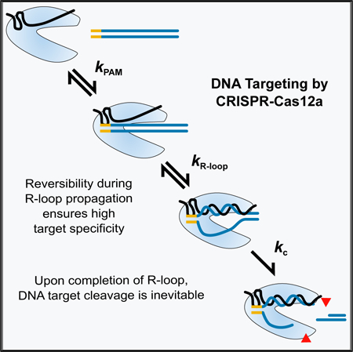
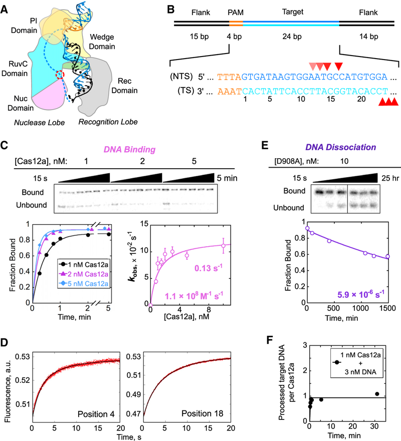
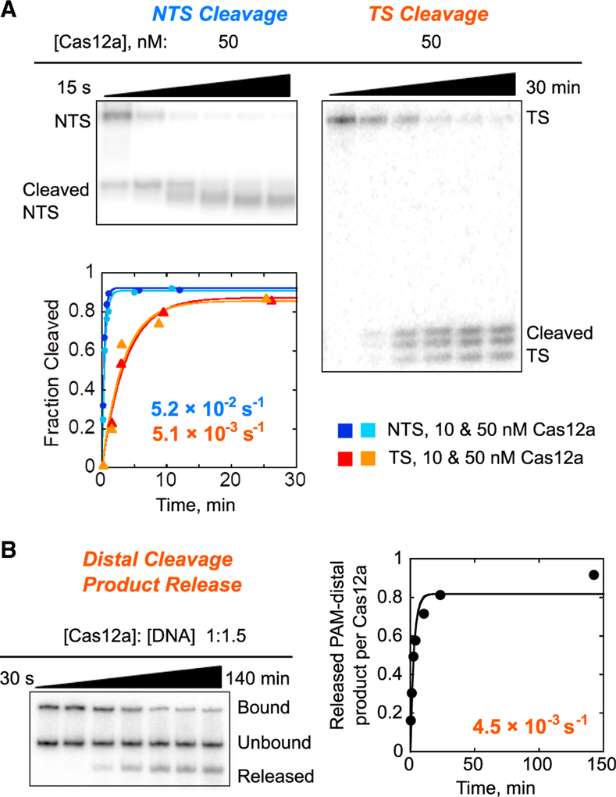
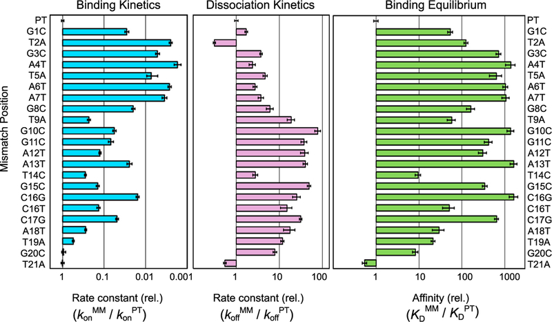
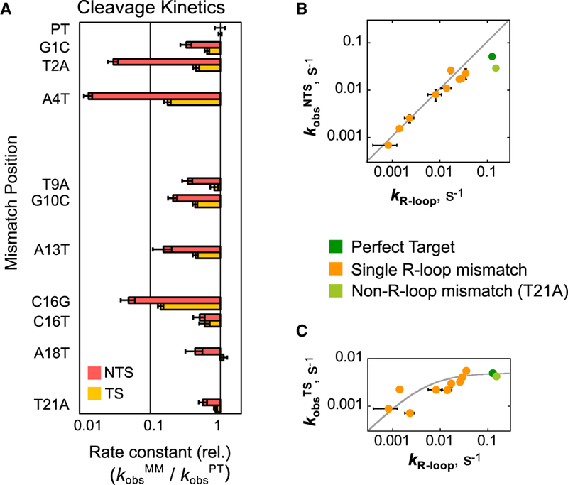
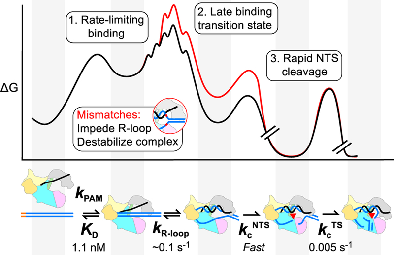

# Kinetic Basis for DNA Target Specificity of CRISPR-Cas12a

**Isabel Strohkendl, Fatema A. Saifuddin, James R. Rybarski, Ilya J. Finkelstein, and Rick Russell**

*Mol. Cell*, Volume 71, Issue 5, Pages 816–828.e3 (2018)

**DOI:** [10.1016/j.molcel.2018.06.043](https://doi.org/10.1016/j.molcel.2018.06.043)

---

## Table of Contents

- [Summary](#summary)
- [Introduction](#introduction)
- [Results](#results)
- [Discussion](#discussion)
- [STAR Methods](#star-methods)
- [Acknowledgments](#acknowledgments)

---
##  SUMMARY
Class 2 CRISPR-Cas nucleases are programmable genome editing tools with promising applications in human health and disease. However, DNA cleavage at off-target sites that resemble the target sequence is a pervasive problem that remains poorly understood mechanistically. Here, we use quantitative kinetics to dissect the reaction steps of DNA targeting by _Acidaminococcus sp_ Cas12a (also known as Cpf1). We show that Cas12a binds DNA tightly in two kinetically separable steps. Protospacer-adjacent motif (PAM) recognition is followed by rate-limiting R-loop propagation, leading to inevitable DNA cleavage of both strands. Despite functionally irreversible binding, Cas12a discriminates strongly against mismatches along most of the DNA target sequence. This result implies substantial reversibility during R-loop formation—a late transition state—and defies common descriptions of a “seed” region. Our results provide a quantitative basis for the DNA cleavage patterns measured _in vivo_ and observations of greater reported target specificity for Cas12a than for the Cas9 nuclease.
##  Graphical Abstract

##  In Brief
Strohkendl et al. dissect DNA binding and cleavage by CRISPR-Cas12a. They show that binding is functionally irreversible, yet Cas12a discriminates against mismatches with the target DNA extending beyond a seed region. These results suggest that R-loop propagation is readily reversible, enabling Cas12a to select DNA sequences more precisely than Cas9.
---
##  INTRODUCTION
CRISPR-Cas systems are revolutionary new tools for gene editing applications ([Hsu et al., 2014](https://pmc.ncbi.nlm.nih.gov/articles/PMC6679935/#R14)). The nuclease enzymes in these systems can be readily programmed by the rational design of a CRISPR RNA (crRNA) sequence. Targets are identified via protospacer-adjacent motif (PAM) recognition and formation of a helix between the guide RNA and the DNA or RNA target, which licenses cleavage of the target. The information inherent in the ~20 base pairs formed by the crRNA and the target is sufficient, in principle, to uniquely target a single sequence, even in large eukaryotic genomes.
Class 2 CRISPR-Cas systems are particularly useful because they use a single polypeptide for both recognition and cleavage of the target DNA or RNA. However, Cas9, the prototypical class 2 enzyme used in eukaryotic cells, invariably falls short of targeting a single unique site, as related “off-target” DNA sequences are also recognized and cleaved at significant levels ([Sternberg and Doudna, 2015](https://pmc.ncbi.nlm.nih.gov/articles/PMC6679935/#R31)). The existence of off-target cleavage events is not surprising, as molecular interactions are never perfectly specific. For example, mismatches in DNA-RNA duplexes typically incur penalties of only 2–5 kcal/mol in solution ([Sugimoto et al., 1995](https://pmc.ncbi.nlm.nih.gov/articles/PMC6679935/#R33); [Watkins et al., 2011](https://pmc.ncbi.nlm.nih.gov/articles/PMC6679935/#R40)). Even with one or two mismatches, a 20-bp helix is stable ([Herschlag, 1991](https://pmc.ncbi.nlm.nih.gov/articles/PMC6679935/#R12)), and complexes formed with imperfect targets may be sufficiently long-lived to favor cleavage over enzyme dissociation ([Bisaria et al., 2017](https://pmc.ncbi.nlm.nih.gov/articles/PMC6679935/#R1)). Despite the importance of these off-target cleavage events, we still lack a full understanding of the biophysical basis for the specificity of CRISPR-Cas enzymes.
Cas12a (also known as Cpf1) is a class 2 enzyme ([Makarova et al., 2015](https://pmc.ncbi.nlm.nih.gov/articles/PMC6679935/#R22); [Shmakov et al., 2015](https://pmc.ncbi.nlm.nih.gov/articles/PMC6679935/#R26); [Zetsche et al., 2015](https://pmc.ncbi.nlm.nih.gov/articles/PMC6679935/#R47)) that has recently emerged as a more specific alternative to Cas9 ([Figure 1A](#fig1)) ([Kim et al., 2016](https://pmc.ncbi.nlm.nih.gov/articles/PMC6679935/#R17); [Swarts et al., 2017](https://pmc.ncbi.nlm.nih.gov/articles/PMC6679935/#R34)). Indeed, both _Acidaminococcus sp_. BV3L6 Cas12a (AsCas12a) and _Lachnospiraceae_ bacterium Cas12a (LbCas12a) showed little or no tolerance for mismatches in mammalian cells ([Kim et al., 2016](https://pmc.ncbi.nlm.nih.gov/articles/PMC6679935/#R17), [2017](https://pmc.ncbi.nlm.nih.gov/articles/PMC6679935/#R18); [Kleinstiver et al., 2016](https://pmc.ncbi.nlm.nih.gov/articles/PMC6679935/#R19); [Tóth et al., 2016](https://pmc.ncbi.nlm.nih.gov/articles/PMC6679935/#R37); [Tu et al., 2017](https://pmc.ncbi.nlm.nih.gov/articles/PMC6679935/#R38); [Zhong et al., 2017](https://pmc.ncbi.nlm.nih.gov/articles/PMC6679935/#R49)). In contrast, Cas9 discriminates strongly against mismatches only within the first ~10 bp of the RNA-DNA helix (R-loop) proximal to the PAM ([Fu et al., 2013](https://pmc.ncbi.nlm.nih.gov/articles/PMC6679935/#R7); [Hsu et al., 2013](https://pmc.ncbi.nlm.nih.gov/articles/PMC6679935/#R13); [Slaymaker et al., 2016](https://pmc.ncbi.nlm.nih.gov/articles/PMC6679935/#R29)). Cas12a is also capable of processing its own precursor crRNA, unlike Cas9, and can, therefore, be used for multiplexed applications ([Fonfara et al., 2016](https://pmc.ncbi.nlm.nih.gov/articles/PMC6679935/#R6); [Zetsche et al., 2017](https://pmc.ncbi.nlm.nih.gov/articles/PMC6679935/#R48)).

***Figure 1.*** Cas12a Binding and Dissociation with a Matched Target DNA.

(A) Schematic depiction of AsCas12a in complex with crRNA (black) and DNA (blue). The PAM is highlighted in orange. The RuvC nuclease active site, where the D908A mutation is located, is indicated with a red circle. The 20-bp R-loop formed between the crRNA and the TS lines the recognition lobe, and the NTS is predicted to line the nuclease lobe (dashed line). One of the REC domains is omitted to allow visualization of the R-loop.
(B) Schematic and sequence of the target DNA substrate. Red triangles mark cleavage sites. Lighter triangles on the NTS indicate cleavage sites in “trimming” events that follow the initial cleavage event.
(C) Representative gels and plots showing time dependences of Cas12a binding to a matched DNA target, and a corresponding plot of the observed rate constant as a function of Cas12a concentration. Error bars reflect the SEM of 3–5 replicates.
(D) 2-aminopurine (2-AP) fluorescence curves showing R-loop propagation for wild-type Cas12a in the presence of EDTA after rapid binding to DNA. 2-AP was substituted at position 4 or 18 of the NTS, as indicated. The time dependences indicated two consecutive transitions, with R-loop formation giving an increase in fluorescence (0.11 ± 0.01 s−1) and a subsequent fast conformational transition giving a smaller decrease in fluorescence (0.62 ± 0.14 s−1). Together, these two transitions result in the biphasic curves observed.
(E) Representative time course gel and plot showing dissociation of Cas12a(D908A) from the matched target DNA.
(F) Stoichiometric DNA processing by Cas12a. In a reaction containing 3-fold excess matched DNA target relative to Cas12a, the fraction of processed DNA target is plotted over time. Specifically, the plot indicates the amount of DNA target that has been bound by Cas12a or released as PAM-proximal product relative to the amount of Cas12a. Over the time shown, released product was not observed, as expected from previous measurements and the very slow release of uncleaved DNA target measured herein; see (E).
See also [Figures S1](https://pmc.ncbi.nlm.nih.gov/articles/PMC6679935/#SD1) and [S2](https://pmc.ncbi.nlm.nih.gov/articles/PMC6679935/#SD1).
One striking question that arises is how different CRISPR-Cas enzymes can have different levels of specificity, despite using the chemically identical R-loop as the source of sequence-specific DNA binding. A common feature of CRISPR-Cas systems and other RNA-directed enzymes is that the targeting RNA includes a “seed” region. The seed region, which, for CRISPR-Cas enzymes, is a subset of nucleotides within the crRNA that base pairs with PAM-proximal nucleotides, is highly sensitive against mismatches and is, therefore, critical for target affinity and specificity ([Gorski et al., 2017](https://pmc.ncbi.nlm.nih.gov/articles/PMC6679935/#R10); [Jinek et al., 2012](https://pmc.ncbi.nlm.nih.gov/articles/PMC6679935/#R15); [Wiedenheft et al., 2011](https://pmc.ncbi.nlm.nih.gov/articles/PMC6679935/#R42)). A crystal structure of Cas12a from _Francisella novicidia_ (FnCas12a) showed that the bound crRNA includes a 5-nt region that is pre-ordered for base-pair formation ([Swarts et al., 2017](https://pmc.ncbi.nlm.nih.gov/articles/PMC6679935/#R34)) with PAM-proximal nucleotides. This pre-ordering of the crRNA may contribute to a PAM-proximal seed region, but it cannot account for the high cleavage specificity seen throughout the R-loop beyond these 5 nt. Indeed, little is known about how Cas12a achieves its high specificity despite the many published crystal structures ([Dong et al., 2016](https://pmc.ncbi.nlm.nih.gov/articles/PMC6679935/#R5); [Gao et al., 2016](https://pmc.ncbi.nlm.nih.gov/articles/PMC6679935/#R8); [Stella et al., 2017](https://pmc.ncbi.nlm.nih.gov/articles/PMC6679935/#R30); [Swarts et al., 2017](https://pmc.ncbi.nlm.nih.gov/articles/PMC6679935/#R34); [Yamano et al., 2016](https://pmc.ncbi.nlm.nih.gov/articles/PMC6679935/#R45), [2017](https://pmc.ncbi.nlm.nih.gov/articles/PMC6679935/#R46)) and _in vivo_ targeting results.
Here, we report a quantitative dissection of the binding and cleavage reactions of Cas12a, pre-loaded with a defined crRNA, toward a perfectly matched DNA target and a series of targets with single mismatches at each position within the R-loop. We find that DNA binding is rate limiting for cleavage, both for matched and mismatched targets. While this behavior generally abrogates specificity of enzymes, we find that Cas12a discriminates strongly against mismatches across most of the R-loop, suggesting reversibility within the process of R-loop formation and a seed region that defies the strict boundary observed for Cas9. Our results provide fundamental insights into DNA targeting by Cas12a, and the origins of greater DNA target specificity of Cas12a than Cas9. In addition, our work suggests strategies for further improvement of specificity through enzyme engineering.
---
##  RESULTS
### A Kinetic Framework for Recognition and Cleavage of a Matched DNA Target
We first generated a complete kinetic framework for Cas12a on a matched DNA target. The rates of DNA binding and dissociation, as well as cleavage of each DNA strand, were measured using a crRNA-loaded AsCas12a (henceforth referred to as Cas12a) and an oligonucleotide DNA target ([Figure 1B](#fig1)). Our target DNA included a 5’-TTTA-3’ PAM sequence, which conforms to the consensus 5’-TTTV-3’ PAM ([Kim et al., 2017](https://pmc.ncbi.nlm.nih.gov/articles/PMC6679935/#R18)), adjacent to 24 bp that matched the crRNA targeting sequence. The target DNA was 32P labeled at the 5’ end of either the target strand (TS) or the non-target strand (NTS).
The second-order rate constant for Cas12a binding (_k_ on) was determined by incubating various concentrations of Cas12a with a trace amount of NTS-labeled duplex. Reaction aliquots were quenched at various times by the addition of the same unlabeled duplex in excess and analyzed by native PAGE ([Figure 1C](#fig1)). The dependence of the observed rate constant on Cas12a concentration gave a _k_ on value of 1.1 (±0.1) × 108 M−1 s−1, within 1–2 orders of magnitude of the macromolecular diffusion limit. The _k_ on value was the same within error for the nuclease-inactive Cas12a(D908A) ([Yamano et al., 2016](https://pmc.ncbi.nlm.nih.gov/articles/PMC6679935/#R45); [Zetsche et al., 2015](https://pmc.ncbi.nlm.nih.gov/articles/PMC6679935/#R47)), indicating that cleavage of the DNA does not impact the observed binding rate ([Figure S1](https://pmc.ncbi.nlm.nih.gov/articles/PMC6679935/#SD1)). A hyperbolic dependence on protein concentration with an apparent plateau was observed for both Cas12a and Cas12a(D908A), indicating that binding includes two detectable steps. We infer that the Cas12a concentration that gives the half-maximal rate constant (_K_ ½) of 1.1 ± 0.2 nM reflects the equilibrium constant for an initial complex, most likely resulting from PAM recognition ([Gong et al., 2018](https://pmc.ncbi.nlm.nih.gov/articles/PMC6679935/#R9)). The maximal rate constant (_k_ max) of 0.13 ± 0.01 s−1 reflects that a first-order step following initial binding, which we show later to be R-loop formation, limits the overall binding rate at high Cas12a concentrations. Cas12a(D908A) behaved similarly but with a somewhat larger _k_ max value of 0.24 ± 0.06 s−1 ([Figure S1A](https://pmc.ncbi.nlm.nih.gov/articles/PMC6679935/#SD1)), suggesting that the mutated residue within the RuvC domain may be involved in R-loop formation.
To directly measure R-loop formation, we used stopped-flow fluorescence with a DNA substrate that included a 2-aminopurine (2-AP) at either position 4 or position 18 of the NTS to report on the early and late stages of R-loop propagation ([Figure S2A](https://pmc.ncbi.nlm.nih.gov/articles/PMC6679935/#SD1)). The fluorescence of 2-AP is strongly quenched by stacking when it is base paired, making 2-AP a sensitive probe for monitoring base-pairing changes in Cas9 ([Gong et al., 2018](https://pmc.ncbi.nlm.nih.gov/articles/PMC6679935/#R9)) and many other nucleic acid systems ([Jones and Neely, 2015](https://pmc.ncbi.nlm.nih.gov/articles/PMC6679935/#R16); [Raney et al., 1994](https://pmc.ncbi.nlm.nih.gov/articles/PMC6679935/#R24); [Russell et al., 2006](https://pmc.ncbi.nlm.nih.gov/articles/PMC6679935/#R25); [Tamulaitis et al., 2007](https://pmc.ncbi.nlm.nih.gov/articles/PMC6679935/#R36)). Potential complications associated with DNA cleavage were avoided by adding EDTA to chelate Mg2+ or by using Cas12a(D908A) in the presence of Mg2+. In the presence of EDTA, the 2-AP fluorescence signal increased with a rate constant of 0.11 ± 0.01 s−1 for wild-type Cas12a ([Figure 1D](#fig1)). The rate constant was not affected by the position of the 2-AP probe and statistically indistinguishable from the plateau observed in the binding kinetics experiments discussed earlier ([Figure 1C](#fig1)). Cas12a(D908A) in the presence of Mg2+ gave a similar fluorescence increase and a somewhat larger rate constant of 0.15 ± 0.01 s−1 ([Figure S2B](https://pmc.ncbi.nlm.nih.gov/articles/PMC6679935/#SD1)), which was unaffected by the position of the 2-AP or the presence of Mg2+ and was indistinguishable from the _k_ max value observed in DNA-binding experiments. Control experiments using gel approaches showed that the presence of the 2-AP modification did not alter the observed rates of R-loop formation or DNA cleavage ([Figure S2C](https://pmc.ncbi.nlm.nih.gov/articles/PMC6679935/#SD1)). All the fluorescence traces also included a more rapid transition that most likely reflects a conformational change following R-loop formation ([Figures 1D](#fig1) and [S2](https://pmc.ncbi.nlm.nih.gov/articles/PMC6679935/#SD1)). Together, our results indicate that R-loop formation by Cas12a occurs with a rate constant of ~0.1 s−1. The independence of the rate constant on the 2-AP position indicates that, upon initiation, the process of R-loop propagation is fast and largely complete within a few seconds.
The rate constant for dissociation of Cas12a(D908A) from the target DNA (_k_ off; [Figure 1E](#fig1)) was measured using pulse-chase experiments and native gel separation. Dissociation was extremely slow in the presence of Mg2+, with a _k_ off value of 5.9 (±0.4) × 10−6 s−1 (t½ = 32 ± 2 hr). As a control, we compared the wild-type Cas12a and Cas12a(D908A) in the presence of EDTA to block DNA cleavage. The _k_ off values were 2.4 (±0.3) and 2.3 (±0.3) × 10−4 s−1 for Cas12a and Cas12a(D908A), respectively ([Figure S1B](https://pmc.ncbi.nlm.nih.gov/articles/PMC6679935/#SD1)), indicating that the D908A substitution does not affect the lifetime of the complex. In addition, Mg2+ increases the lifetime of the ternary complex by 40-fold, perhaps by favoring the conformational transition that follows R-loop formation or by contributing more directly to R-loop stability in the complex.
The very slow dissociation from the matched target suggested that release of the PAM-proximal DNA product after cleavage would also be very slow and would result in a stoichiometric burst of processed target DNA. Indeed, we observed such a stoichiometric burst ([Figure 1F](#fig1)). The lack of detectable enzyme turnover is consistent with previous observations of Cas12a as a “single turnover” enzyme ([Chen et al., 2018](https://pmc.ncbi.nlm.nih.gov/articles/PMC6679935/#R4); [Singh et al., 2018](https://pmc.ncbi.nlm.nih.gov/articles/PMC6679935/#R28)), and the stoichiometry of the product indicates that Cas12a is fully active and that each Cas12a molecule binds and cleaves one DNA target.
Our measured rate constants for binding and dissociation of Cas12a from the matched DNA target give a calculated _K_ D value of 54 ± 4 fM (_k_ off/_k_ on). This value is 103-fold lower than the recently reported value of 0.1 nM from single-molecule fluorescence experiments ([Singh et al., 2018](https://pmc.ncbi.nlm.nih.gov/articles/PMC6679935/#R28)) and 105-fold lower than that determined via binding affinity assays with FnCas12a in the absence of Mg2+ ion ([Fonfara et al., 2016](https://pmc.ncbi.nlm.nih.gov/articles/PMC6679935/#R6)). The previous studies used direct measurements of the fraction of DNA target bound rather than kinetics measurements, and they did not provide the >32-hr incubation required to reach equilibrium (i.e., at least one half-life of the bound complex), which would lead to apparently weaker binding of Cas12a. Although our measured equilibrium constant is extraordinarily low for an enzyme-substrate interaction, reflecting a very stable complex, the value is three orders of magnitude higher than the predicted _K_ D value for a 20-bp RNA:DNA duplex of the same sequence (~0.02 fM) ([Sugimoto et al., 1995](https://pmc.ncbi.nlm.nih.gov/articles/PMC6679935/#R33)).
We next measured cleavage of the NTS and the TS by individually radiolabeling each strand in separate reactions ([Figure 2A](#fig2)). For each strand of the target DNA, we used hyperbolic fits to the observed rate constants from multiple Cas12a concentrations to determine the observed rate constants for cleavage. We obtained a maximal rate constant of 5.2 (±0.6) × 10−2 s−1 for NTS cleavage and a 10-fold lower value for TS cleavage, 5.1 (±0.2) × 10−3 s−1. The slower TS cleavage is consistent with a recent report that the NTS is expected to line the nuclease lobe of Cas12a, which contains the RuvC nuclease domain ([Stella et al., 2017](https://pmc.ncbi.nlm.nih.gov/articles/PMC6679935/#R30); [Swarts et al., 2017](https://pmc.ncbi.nlm.nih.gov/articles/PMC6679935/#R34)) ([Figure 1A](#fig1)), and is thus poised for cleavage. In contrast, the TS:crRNA heteroduplex (R-loop) lines the recognition lobe and may require substantial movement of the TS and/or the single RuvC nuclease domain to position the TS for cleavage ([Stella et al., 2017](https://pmc.ncbi.nlm.nih.gov/articles/PMC6679935/#R30); [Swarts et al., 2017](https://pmc.ncbi.nlm.nih.gov/articles/PMC6679935/#R34)).

***Figure 2.*** Cleavage of a Matched DNA Target by Cas12a.

(A) Representative gels and corresponding plot showing multiple product bands upon Cas12a-mediated cleavage of the NTS (left) and TS (right). Reactions included 10 or 50 nM Cas12a, as indicated.
(B) Rapid release of the PAM-distal cleavage product following cleavage of the TS. The top band indicates Cas12a-bound DNA target, and the bottom band indicates the released PAM-distal product after DNA cleavage. The middle band indicates DNA target that remains unbound because it is present in 1.5-fold excess relative to Cas12a. The plot on the right indicates the amount of released PAM-distal product relative to the amount of Cas12a, giving a dissociation rate constant of 4.5 (±1.3) × 10−3 s−1.
Close inspection of the DNA cleavage reactions revealed multiple products for each strand ([Figure 2A](#fig2)). For the NTS, the initial cleavage event occurred at position 16 and was followed by apparent trimming of up to 4 nt, with a rate constant of 1.2 (±0.1) × 10−2 s−1, resulting in the accumulation of faster migrating products. For the TS, multiple cleavage products appeared with the same time dependence and maintained their relative intensities over time. The apparently imprecise cleavage, occurring at positions 23–25, suggests flexibility of this region of the TS and/or the RuvC domain. The lack of further cleavage events on the TS most likely reflects rapid dissociation of the PAM-distal product, which includes the radiolabeled end of the TS, after both DNA strands have been cleaved ([Singh et al., 2018](https://pmc.ncbi.nlm.nih.gov/articles/PMC6679935/#R28)) ([Figure 2B](#fig2)). Previous studies of FnCas12a have differed in the reported positions of DNA cleavage ([Fonfara et al., 2016](https://pmc.ncbi.nlm.nih.gov/articles/PMC6679935/#R6); [Stella et al., 2017](https://pmc.ncbi.nlm.nih.gov/articles/PMC6679935/#R30); [Zetsche et al., 2015](https://pmc.ncbi.nlm.nih.gov/articles/PMC6679935/#R47)). Our findings of trimming and imprecision in the positions of DNA cleavage reconcile these previous results, build on recent observations of multiple DNA cleavage sites ([Stella et al., 2017](https://pmc.ncbi.nlm.nih.gov/articles/PMC6679935/#R30); [Swarts et al., 2017](https://pmc.ncbi.nlm.nih.gov/articles/PMC6679935/#R34)), and have biological implications for the processing of the DNA ends in the context of endogenous DNA repair systems (see [Discussion](https://pmc.ncbi.nlm.nih.gov/articles/PMC6679935/#S7)).
Together, our results show that DNA cleavage by Cas12a occurs orders of magnitude faster than dissociation from a matched DNA target, indicating that essentially every complete binding event of Cas12a results in DNA cleavage ([Bisaria et al., 2017](https://pmc.ncbi.nlm.nih.gov/articles/PMC6679935/#R1)). A key consequence of this irreversible binding is that the specificity of Cas12a against mismatches must be determined by the relative binding kinetics, not by differences in equilibrium binding.
### Single Mismatches throughout the R-Loop Slow Cas12a Binding
To measure the specificity of Cas12a against mismatches between the crRNA and target DNA, we introduced single base-pair changes in the DNA at each position throughout the R-loop ([Table S1](https://pmc.ncbi.nlm.nih.gov/articles/PMC6679935/#SD1)). The _k_ on values were reduced substantially for mismatched DNA targets, with pronounced effects along nearly the entire length of the R-loop ([Figures 3](#fig3) and [S3](https://pmc.ncbi.nlm.nih.gov/articles/PMC6679935/#SD1); [Table S2](https://pmc.ncbi.nlm.nih.gov/articles/PMC6679935/#SD1)). PAM-proximal mismatches gave ~150- to 600-fold decreases, and PAM-distal mismatches gave up to 65-fold decreases. Additionally, we found that the identity of the nucleotide mismatch can impact the binding rate, as C16G slowed binding by nearly 70-fold, while C16T slowed binding by only 7-fold. A mismatch at position 21 did not decrease the rate of binding, supporting previous findings that a conserved aromatic residue (W382) stacks on position 20 of the RNA-DNA duplex and prevents further R-loop propagation ([Swarts et al., 2017](https://pmc.ncbi.nlm.nih.gov/articles/PMC6679935/#R34); [Yamano et al., 2016](https://pmc.ncbi.nlm.nih.gov/articles/PMC6679935/#R45)).

***Figure 3.*** Mismatches throughout the R-Loop Reduce the Affinity of Cas12a for Target DNA.

Bar graphs, left and center, represent the rates of binding and dissociation, respectively, of Cas12a for a mismatched target (MM) normalized by the corresponding rates for the matched (i.e., perfect) target DNA (PT). The combination of the relative rate constants gives the overall effect on affinity, as depicted in the graph at the right. Error bars in the left and center panels represent the normalized SE of the fit and the normalized SEM (n ≥ 3) for binding and dissociation, respectively. Error bars in the right panel reflect the propagated errors from binding and dissociation reactions. Target names are defined as the mismatch position and substituted nucleotide within the NTS.
See also [Figure S3](https://pmc.ncbi.nlm.nih.gov/articles/PMC6679935/#SD1) and [Tables S1](https://pmc.ncbi.nlm.nih.gov/articles/PMC6679935/#SD1) and [S2](https://pmc.ncbi.nlm.nih.gov/articles/PMC6679935/#SD1).
The sensitivity of Cas12a to mismatches indicates that almost all positions of the R-loop contribute significantly to the binding rate constant. This result was surprising, because when an RNA-DNA duplex forms in the absence of a protein co-factor, the transition state is reached after the formation of only a few base pairs ([Pörschke, 1977](https://pmc.ncbi.nlm.nih.gov/articles/PMC6679935/#R23); [Woodside et al., 2006b](https://pmc.ncbi.nlm.nih.gov/articles/PMC6679935/#R44)). Thus, only these base pairs contribute to the rate and specificity of duplex formation ([Woodside et al., 2006a](https://pmc.ncbi.nlm.nih.gov/articles/PMC6679935/#R43)). In contrast, our results indicate that, when Cas12a-crRNA binds to its target DNA, the formation of the R-loop has a later transition state, with more base pairs formed. Indeed, assuming that the R-loop begins to form adjacent to the PAM sequence ([Sternberg et al., 2014](https://pmc.ncbi.nlm.nih.gov/articles/PMC6679935/#R32); [Szczelkun et al., 2014](https://pmc.ncbi.nlm.nih.gov/articles/PMC6679935/#R35)), the sensitivity of the binding rate to PAM-distal mismatches implies that propagation of the R-loop remains readily reversible until nearly the entire loop is formed. Biologically, this late transition state is expected to permit Cas12a to discriminate against mismatches in spite of the irreversible nature of the overall binding process.
To further explore the effects of sequence mismatches on Cas12a binding, we measured Cas12a dissociation from this series of DNA targets. All but one mismatch within the R-loop increased the dissociation rate ([Figures 3](#fig3) and [S3C](https://pmc.ncbi.nlm.nih.gov/articles/PMC6679935/#SD1); [Table S2](https://pmc.ncbi.nlm.nih.gov/articles/PMC6679935/#SD1)), as is expected for destabilizing changes to the bound complex. Intriguingly, the largest increases in the dissociation rate were caused by PAM-distal mismatches. This effect has also been observed for Cas9 ([Boyle et al., 2017](https://pmc.ncbi.nlm.nih.gov/articles/PMC6679935/#R2); [Szczelkun et al., 2014](https://pmc.ncbi.nlm.nih.gov/articles/PMC6679935/#R35)). PAM-distal mismatches increased the rate of dissociation 6- to 80-fold, except one substitution that gave a smaller increase of 3-fold (T14C), perhaps because this mismatched target can form a dG⋅rU wobble base pair. In contrast, PAM-proximal mismatches increased the rate of Cas12a dissociation only up to 5-fold. The larger effects of PAM-distal mismatches on dissociation support the late transition state model proposed from our _k_ on results.
The combined effects of mismatches on _k_ on and _k_ off reveal a high level of thermodynamic discrimination by Cas12a for its perfect target DNA ([Figure 3](#fig3)). Mismatches throughout the R-loop weaken binding substantially, with typical effects ranging from 50-fold to approximately 1,000-fold. Although the effects of single mismatches are large, the resulting complexes are still quite stable, with sub-nanomolar affinity. The thermodynamic effects of mismatches do not display a detectable trend across the R-loop, in contrast to some expectations for seed regions (see [Discussion](https://pmc.ncbi.nlm.nih.gov/articles/PMC6679935/#S7)).
### Mismatches Do Not Impact DNA Cleavage Rates after R-Loop Formation
We next measured cleavage of each strand of a subset of the mismatched targets by using labeled targets as described earlier and saturating Cas12a concentrations ([Figures 4A](#fig4) and [S3D](https://pmc.ncbi.nlm.nih.gov/articles/PMC6679935/#SD1); [Table S2](https://pmc.ncbi.nlm.nih.gov/articles/PMC6679935/#SD1)). Mismatches decreased the observed rate constant for NTS cleavage in a manner that paralleled the slower R-loop formation determined from our binding data ([Figure 4B](#fig4)). The correspondence of these rate constants across a range of >100-fold suggests that the rate of NTS cleavage is limited by propagation of the R-loop.

***Figure 4.*** Mismatches Impede R-Loop Propagation, Affecting Binding and Observed Rates of Cleavage.

(A) Bar graphs represent the observed rates of cleavage for a mismatched target (_k_ obsMM) normalized to the matched target rate (_k_ obsPT). Error bars reflect the normalized SE of the fit. Red bars indicate NTS cleavage; yellow bars indicate TS cleavage. (B and C) Plots showing the correlation between effects of mismatches on binding (R-loop formation) and DNA cleavage. As the rate of R-loop formation decreases from mismatches, the rate of NTS cleavage mirrors this decrease (B). Values of _k_ R-loop are the _k_ max values derived from Cas12a binding fits. The gray line denotes a 1:1 correspondence between the rate constants for R-loop formation and NTS cleavage. In contrast, the observed rate of TS cleavage is not decreased by mutation, unless the rate of R-loop formation approaches or is less than the rate of cleavage of the matched target (C). The gray curve models the expected rate constant observed as _k_ R-loop is varied and the rate constant for TS cleavage remains at a value of 0.0051 s−1 (STAR Methods). In both panels, horizontal error bars reflect the standard error of _k_ max determined from a hyperbolic fit to the Cas12a concentration dependence of the binding rate constant. Vertical error bars represent the standard error of the maximal rate constant for cleavage from a hyperbolic fit to the Cas12a concentration dependence of the observed rate constant for cleavage.
See also [Figure S3](https://pmc.ncbi.nlm.nih.gov/articles/PMC6679935/#SD1) and [Table S2](https://pmc.ncbi.nlm.nih.gov/articles/PMC6679935/#SD1).
Because TS cleavage is approximately 10-fold slower than NTS cleavage for the matched target, we expected that mismatches that slow R-loop propagation, and thus NTS cleavage, by less than 10-fold would not decrease the observed rate of TS cleavage substantially. For mismatches that give larger effects, cleavage of both strands would be rate limited by R-loop propagation, so that the observed rate of TS cleavage would be decreased to that of R-loop propagation and NTS cleavage (modeled by the solid curve in [Figure 4C](#fig4)). Indeed, the effects of both sets of mismatches conformed to this simple model. Thus, our results support a model in which mismatches between the DNA and crRNA slow R-loop propagation and have no additional effects on the cleavage rates of either DNA strand after the R-loop is fully formed.
### Cas12a Binding Remains Rate Limiting at a Physiological Mg2+ Concentration
Biological Mg2+ concentrations are between 0.2 and 1 mM in mammalian nuclei ([Günther, 2006](https://pmc.ncbi.nlm.nih.gov/articles/PMC6679935/#R11)) and only slightly higher in bacterial cells ([Lusk et al., 1968](https://pmc.ncbi.nlm.nih.gov/articles/PMC6679935/#R21)), much lower than the 5–10 mM used in most _in vitro_ studies. To extend our kinetic framework to a cellular milieu, we also conducted reactions at the lower Mg2+ concentration of 1 mM ([Figure S4](https://pmc.ncbi.nlm.nih.gov/articles/PMC6679935/#SD1)). Cas12a binding to its perfect target DNA was slowed by 30%, to 8.1 (±1.2) × 107 M−1 s−1, and Cas12a(D908A) dissociation was accelerated 6-fold, to a value of 3.3 (±0.6) 10−5 s−1. Cleavage of the NTS, with an observed rate constant of 0.020 ± 0.001 s−1, remained orders of magnitude faster than Cas12a dissociation. Thus, at a near-physiological Mg2+ concentration, Cas12a remains an efficient DNA nuclease. The increased dissociation rate demonstrates the importance of Mg2+ for stability of the ternary complex, but the affinity remains very high (_K_ D = 410 ± 100 fM), and DNA binding is still rate limiting for cleavage. Thus, it is likely that DNA binding remains rate limiting for cleavage _in vivo_ and that target specificity is determined by differences in the rate constant for Cas12a binding, not differences in affinity.
---
##  DISCUSSION
Cas12a is currently a subject of intense interest for its simplicity and potential for high target specificity _in vivo_. Here, we provide a detailed kinetic mechanism that outlines a mechanistic basis for its extraordinary specificity. A quantitative kinetic analysis of the physical and chemical steps of DNA targeting shows that binding of Cas12a to target DNA involves two kinetically separable steps ([Figure 5](#fig5)). An initial step likely represents PAM recognition, which is rapid and reversible. Next, the R-loop forms with a rate constant of ~0.1 s−1, as revealed by a plateau in the binding rate constant and by 2-AP fluorescence experiments. The same rate constant is obtained whether the 2-AP probe is near the PAM-proximal end or the PAM-distal end, indicating that the R-loop propagates quickly after initiating adjacent to the PAM. After R-loop formation, the NTS is cleaved rapidly, so that R-loop formation limits the cleavage rate under saturating conditions. Following this cleavage event, there is additional trimming of 4 nt of the NTS and cleavage of the TS 10-fold more slowly. The DNA cleavage steps are not impacted detectably by single mismatches between the crRNA and the target DNA. Instead, the decreased observed cleavage rates arise from decreases in the rate of R-loop formation.

***Figure 5.*** Model and Kinetic Framework for Cas12a Target Recognition and Cleavage.

Cas12a specificity is determined during R-loop formation. Due to the late transition state for R-loop formation, Cas12a is able to discriminate against mismatches across the R-loop. Cleavage of the NTS strand occurs rapidly (_k_ cNTS), so that R-loop formation is rate limiting for cleavage even under saturating conditions. TS cleavage occurs ~10-fold more slowly (_k_ cTS). A mismatch (red curve) increases the energy barrier for R-loop formation, resulting in a decreased rate of R-loop formation with no direct effect on the DNA cleavage steps. Breaks in the free energy profile indicate irreversible cleavage steps. Valleys correspond to the ground states of Cas12a, shown in the cartoon below the profile (aligned by gray panels).
DNA cleavage is less precise than previously thought, as the NTS is trimmed toward the PAM and the TS is cleaved at multiple positions. These cleavage events imply that there is considerable mobility of the NTS and the RuvC domain and that there is flexibility in positioning of the TS in the nuclease active site. Additionally, the multiple cleavage events are consistent with recent data indicating that the RuvC domain becomes highly active upon R-loop formation, rapidly cleaving exogenous ssDNA ([Chen et al., 2018](https://pmc.ncbi.nlm.nih.gov/articles/PMC6679935/#R4); [Li et al., 2018](https://pmc.ncbi.nlm.nih.gov/articles/PMC6679935/#R20)). Biologically, the trimming of the target DNA ends is significant, because it leads to non-cohesive DNA ends, which require filling in by a polymerase but could also be subjected to resection during DNA repair ([Chang et al., 2017](https://pmc.ncbi.nlm.nih.gov/articles/PMC6679935/#R3)). Additionally, the rapid release of the PAM-distal cleavage product following TS cleavage ([Singh et al., 2018](https://pmc.ncbi.nlm.nih.gov/articles/PMC6679935/#R28); [Figure 1E](#fig1)) would produce an unprotected 5’ overhang available for binding by repair factors or annealing to a new DNA with microhomology.
Our kinetic analysis showed that substrate dissociation is orders of magnitude slower than DNA cleavage. This result indicates that DNA binding is rate limiting for cleavage under subsaturating conditions, and, therefore, DNA binding controls the level of target specificity. Importantly, this behavior is robust, with DNA binding remaining rate limiting for cleavage at low, physiological Mg2+ concentration and for DNA targets that include single mismatches with the crRNA. Despite DNA binding being rate limiting for DNA cleavage, substantial penalties were observed for mismatches throughout the R-loop. This surprising result implies a late transition state for R-loop formation, with R-loop propagation being readily reversible until most of the 20 base pairs have formed ([Figure 5](#fig5)). The late transition state may arise as a consequence of the concurrent displacement of the non-target DNA strand, allowing a reversible “exchange” reaction between the DNA duplex and the R-loop that may be augmented by features of Cas12a. Alternatively or in addition, features of the contacts of the R-loop and/or the NTS with Cas12a may contribute to the reversibility of R-loop formation.
The pattern of mismatch effects on Cas12a specificity is consistent with some descriptions of the roles and origins of a seed region but defies others. The decrease in binding kinetics and, consequently, in cleavage specificity is generally larger in PAM-proximal than PAM-distal positions, supporting descriptions of a seed region that invoke increased specificity close to the PAM ([Gorski et al., 2017](https://pmc.ncbi.nlm.nih.gov/articles/PMC6679935/#R10); [Swarts et al., 2017](https://pmc.ncbi.nlm.nih.gov/articles/PMC6679935/#R34)). On the other hand, substantial specificity remains present for more PAM-distal positions, which differs from Cas9 and other studied enzymes that use seed regions for target recognition ([Jinek et al., 2012](https://pmc.ncbi.nlm.nih.gov/articles/PMC6679935/#R15); [Wang et al., 2009](https://pmc.ncbi.nlm.nih.gov/articles/PMC6679935/#R39)). Additionally, the effects of mismatches on DNA target affinity are uniform across the R-loop, in contrast to descriptions of seed regions that invoke higher thermodynamic specificity originating from pre-ordering of the crRNA in the PAM-proximal region ([Gorski et al., 2017](https://pmc.ncbi.nlm.nih.gov/articles/PMC6679935/#R10)). The kinetic origin of the seed region for Cas12a probably reflects that the R-loop forms through a defined pathway, starting from the PAM, and that the PAM-proximal base pairs are formed in the transition state for R-loop formation to a greater extent than the PAM-distal base pairs.
Our results have important implications for applications of Cas12a _in vivo_. The finding that Cas12a binding to target DNA is rate limiting for cleavage suggests that the levels of discrimination against off-target cleavage in cells are determined by the extent to which the rate of target binding, not the affinity, is decreased by a given mismatch ([Bisaria et al., 2017](https://pmc.ncbi.nlm.nih.gov/articles/PMC6679935/#R1)). DNA super-coiling _in vivo_ may facilitate rate-limiting R-loop formation, as observed for Cas9 and the multisubunit Cascade complex ([Szczelkun et al., 2014](https://pmc.ncbi.nlm.nih.gov/articles/PMC6679935/#R35); [Westra et al., 2012](https://pmc.ncbi.nlm.nih.gov/articles/PMC6679935/#R41)), but there is no expectation of a change in the magnitudes of the mismatch penalties or in their distribution within the R-loop. Indeed, the reported patterns of off-target DNA cleavage _in vivo_ show decreased discrimination at the PAM-distal end and in the center of the R-loop ([Kim et al., 2016](https://pmc.ncbi.nlm.nih.gov/articles/PMC6679935/#R17); [Kim et al., 2017](https://pmc.ncbi.nlm.nih.gov/articles/PMC6679935/#R18); [Kleinstiver et al., 2016](https://pmc.ncbi.nlm.nih.gov/articles/PMC6679935/#R19)), closely resembling the effects of mismatches on the binding rate constant rather than effects on equilibrium binding ([Figure 3](#fig3)).
Our results also highlight a key difference between Cas12a and Cas9. As noted earlier, the positions of strong discrimination against mismatches are confined to a PAM-proximal “seed” region for Cas9, as measured both in cells by DNA cleavage and _in vitro_ by binding experiments ([Boyle et al., 2017](https://pmc.ncbi.nlm.nih.gov/articles/PMC6679935/#R2); [Hsu et al., 2013](https://pmc.ncbi.nlm.nih.gov/articles/PMC6679935/#R13); [Singh et al., 2016](https://pmc.ncbi.nlm.nih.gov/articles/PMC6679935/#R27); [Sternberg et al., 2014](https://pmc.ncbi.nlm.nih.gov/articles/PMC6679935/#R32)). Analogous to our results for Cas12a and supported by recent kinetics experiments on Cas9 ([Gong et al., 2018](https://pmc.ncbi.nlm.nih.gov/articles/PMC6679935/#R9)), it appears likely that DNA binding also limits the rate of cleavage by Cas9 _in vivo_. Thus, the limited seed region for Cas9 specificity implies that the transition state for R-loop formation is reached upon formation of fewer base pairs than for Cas12a. We conclude, from this difference, that the position of the transition state for binding can be influenced by properties of the Cas endonuclease, not just by the intrinsic reversibility of the R-loop, which would be equivalent for Cas12a and Cas9. Further, the variation in transition state position suggests the possibility of engineering nucleases to shift the transition state even further into the PAM-distal region of the R-loop, extending the region and the overall levels of specificity for gene editing applications.
---
##  STAR★METHODS
### CONTACT FOR REAGENT AND RESOURCE SHARING
Requests for further information and reagents should be directed to the Lead Contact, Rick Russell (rick_russell@cm.utexas.edu).
##  METHOD DETAILS
### Cas12a Cloning and Purification
An _E. coli_ codon-optimized gene encoding AsCas12a was purchased from BioMatik. The gene was cloned into a custom pET-19 based expression vector pIF254 (WT) and pIF255 (D908A) and transformed into BL21 star (DE3) cells (Thermo Fisher). Cas12a contained a His6/Twin-Strep/SUMO N-terminal fusion. Single colonies were used to inoculate Terrific Broth supplemented with 50 μg/mL carbenicillin at 37°C. An aliquot of the starter culture (4 mL) was then used to inoculate 1 L of Terrific Broth. When the culture reached an OD600 of ~0.6, 1 mM IPTG was added and cultures were further incubated at 18°C for 24 hr. Cells were then lysed in 20 mM Na-HEPES, pH 8.0, 1 M NaCl, 1 mM EDTA, 5% glycerol, 0.1% Tween-20, 1 mM PMSF, 2000 U DNase (GoldBio), and 1X HALT Pro-tease Inhibitor (Thermo Fisher) and homogenized. The lysate was clarified by centrifugation and was applied to a hand-packed Strep-Tactin Superflow gravity column (IBA Life Sciences). Cas12a was eluted with 20 mM Na-HEPES, 1 M NaCl, 10 mM desthiobiotin, and 5 mM MgCl2. SUMO protease (2.4 mM) was added to the eluate and the solution was dialyzed into 500 mM NaCl overnight at 4°C. The sample was then fractionated over a HiLoad 16/600 Superdex 200 Column (GE Healthcare) equilibrated in 20 mM Na-HEPES, pH 8.0, 500 mM NaCl, 5 mM MgCl2, and 2 mM dithiothreitol (DTT). Fractions containing Cas12a were determined by SDS-PAGE, pooled and concentrated to ~10 mM using a 30 kDa centrifuge concentrator (Millipore) ([Figure S1C](https://pmc.ncbi.nlm.nih.gov/articles/PMC6679935/#SD1)). Small aliquots were flash frozen in liquid nitrogen and stored at −80°C.
### DNA Substrate Preparation
Oligonucleotides corresponding to the TS and NTS (Integrated DNA Technologies) ([Table S1](https://pmc.ncbi.nlm.nih.gov/articles/PMC6679935/#SD1)) were 5’-radiolabeled with [γ−32P]ATP (Perkin-Elmer) using T4 polynucleotide kinase (New England Biolabs). Radiolabeled oligonucleotides were purified by polyacrylamide gel electrophoresis, eluted in TE buffer, and stored at –20°C. Target DNA duplexes were formed by incubating either the radiolabeled TS or NTS (25 nM) with four-fold excess of the unlabeled complementary strand in annealing buffer (50 mM Na-MOPS pH 7.0, 100 mM NaCl). The mixture was heated at 90°C for 5 min, slow-cooled to 25°C, and diluted to ~1 nM duplex (corresponding to the calculated concentration of the radiolabeled strand).
### Cas12a-crRNA Assembly
The Cas12a-crRNA complex was assembled for experiments each day using purified Cas12a and a minimal precursor crRNA (pre-crRNA) that had a single uridine upstream of the Cas12a cleavage site (purchased from IDT). The crRNA precursor sequence is: 5’-UAAUUUCUACUCUUGUAGAUGUGAUAAGUGGAAUGCCAUGUGGA. Assembly reactions were performed by incubating Cas12a with a 2-fold excess of the precursor crRNA for 25 min at 25°C in 50 mM Na-MOPS, pH 7.0, 120 mM NaCl, 5 mM MgCl2, 2 mM DTT, and 0.2 mg/ml bovine serum albumin. The assembled complex was then diluted, maintaining the same buffer conditions, and stored on ice until use.
### Measurement of Cas12a binding kinetics
Reactions were performed in the same buffer conditions as the assembly reaction. DNA binding was initiated by the addition of a trace amount of target DNA duplex, radiolabeled on the NTS, to various concentrations of the assembled Cas12a-crRNA complex (1–10 nM). At various time points, 2 μl of the 20 μl binding reactions were withdrawn and added to 4 ml of an ice-cold chase solution consisting of 3X loading dye (15% glycerol, 5 mM Tris-Cl, pH 8.0, 0.015% xylene cyanol) supplemented with 50 mM Na-MOPS, pH 7.0, 120 mM NaCl, 20 mM EDTA, and 100 nM unlabeled perfect target duplex. Control reactions in which the unlabeled chase and labeled duplex were premixed before addition of Cas12a-crRNA resulted in minimal binding of the labeled DNA (< 10%), indicating that the unlabeled DNA target is an effective quench. Samples were electrophoresed on a 12% native gel at 4°C, exposed to a phosphorimager screen overnight, and then scanned using a Typhoon FLA 9500 (GE Healthcare). Bands of radioactivity corresponding to unbound and bound DNA complexes were quantified using ImageQuant 5.2 (GE Healthcare). For experiments performed at 1 mM Mg2+, Cas12a was first assembled with the crRNA under standard conditions at 5 mM Mg2+ and then diluted to 1 mM Mg2+ prior to initiation of reactions. Values of _k_ on and _k_ R-loop were determined from hyperbolic fits to the protein concentration dependence of the observed binding rates. In these plots, data points also included the _k_ off value as a y-intercept point. For mismatched DNA targets, fits were constrained with _K_ ½ = 1 nM as warranted, such that the decreases in _k_ max, which were highly constrained by the data, led to corresponding decreases in the _k_ on values.
### Measurement of Cas12a dissociation kinetics
A DNase-inactive mutant (Cas12a(D908A)) was used for dissociation reactions in the presence of Mg2+. Purified Cas12a(D908A) was loaded with the minimal pre-crRNA as described above. Cas12a(D908A)-crRNA was then mixed with a trace amount of target DNA duplex labeled on the NTS for at least one hour at 25°C to allow complete binding of the duplex. For mismatch targets that bound slowly, binding incubation periods were increased to 2 hr. Dissociation reactions were performed at 10 nM Cas12a(D908A) and initiated by adding the unlabeled perfect target DNA in 50-fold excess over the protein concentration to ensure no further binding or rebinding of labeled DNA during the time course. Aliquots (2 μl) were withdrawn over the course of ~24 hr, mixed with 2 μl of ice-cold 6X loading dye (30% glycerol, 10 mM Tris-Cl, pH 8.0, 0.03% xylene cyanol), and stored at 4°C. Samples were electrophoresed on a 12% native gel at 4°C, imaged with a phosphorimager, and analyzed as described above. For experiments performed at 1 mM Mg2+ or in the absence of Mg2+, Cas12a (wild-type or D908A) was assembled with the crRNA as described above and then diluted to 1 mM Mg2+ during the DNA loading step or chelated with 10 mM EDTA.
### Measurement of DNA strand cleavage rates
DNA duplexes were radiolabeled at the 5’ end of either the TS or NTS. Cleavage reactions were performed using 2, 10, and 50 nM Cas12a (pre-assembled with crRNA) and were initiated by addition of a trace amount of labeled target DNA. At various times, 2 μl samples were quenched in 4 μl of denaturing quench (90% formamide, 20 mM EDTA, 0.01% bromophenol blue, and 0.005% xylene cyanol). Our denaturing quench also included 300 nM of an oligonucleotide with no complementarity to our target sequences to reduce retention on microfuge tube walls and in the gel wells. Samples were heated to 95°C for 3 min and immediately loaded onto a 20% denaturing polyacrylamide gel containing 7 M urea. Gels were exposed and imaged as described above. Bands corresponding to cleaved and uncleaved DNA substrate were quantified. For experiments performed at 1 mM Mg2+, Cas12a was first assembled with the crRNA under standard conditions at 5 mM Mg2+ and then diluted to 1 mM Mg2+ when it was transferred into the cleavage reactions.
To model the expected dependence of the observed rate constant for TS cleavage on the R-loop formation rate constant, we used the inverse of the sum of the transit times (curve in [Figure 4C](#fig4)), with the R-loop formation rate constant varied and the rate constant for TS cleavage held constant (1/_k_ obs = 1/_k_ R-loop + 1/_k_ cTS). Simulations using Kinetic Explorer software (Kintek Corp.) for select combinations of rate constants showed good agreement between the values of _k_ obs from this approximation and first-order fits to the simulated progress curves.
### Measurement of R-loop propagation rate
NTSs were purchased as oligonucleotides with 2-aminopurine substituted at position 4 or 18 (IDT). The target duplex was formed by annealing the NTS and TS (10 mM each) in a thermocycler in 2-AP Annealing Buffer (10 mM Tris-Cl, pH 8.0, 50 mM NaCl, 1 mM EDTA). The duplex was then diluted to 600 nM with Running Buffer (100 mM NaCl, 50 mM Tris pH 8.0, 5 mM MgCl2, 2 mM DTT) in an amber tube. Cas12a was assembled with a 2-fold excess of precursor crRNA for 25 min at room temperature in binding buffer (50 mM Tris-Cl, pH 8.0, 100 mM NaCl, 5 mM MgCl2, 2 mM DTT). The SF 2004 series stopped-flow (KinTek Corp.) ports were washed with 600 μl (port volume) of 2 N NaOH, 2 N HCl and 5 × 600 μl of deionized water before experiments. For each experiment, 300 μl of the target DNA was loaded into port A and 300 μl of 1 μM Cas12a solution was loaded into port B. Triplicate datasets were combined and analyzed using the KinTek Global Kinetic Explorer to obtain rates.
##  QUANTIFICATION AND STATISTICAL ANALYSIS
All binding, dissociation, and cleavage reactions were performed at least three times at the indicated enzyme concentration. Rates of dissociation are shown as the mean ± SEM of the time courses fit by an exponential decrease. Rate constants for binding and cleavage are shown as the mean fit ± SE of the hyperbolic fit of the observed rate constants as a function of Cas12a concentration.
All gel-based assays were analyzed using ImageQuant 5.2 (GE Healthcare) and all data fitting was performed with Kaleidagraph. Weighted data fitting using nonlinear regression was used to determine rates, amplitudes, and standard errors of the fit.
Stopped-flow assays were performed in replicates and analyzed with KinTek Global Kinetic Explorer.
##  DATA AND SOFTWARE AVAILABILITY
The raw data reported in this paper are available from Mendeley Datasets at <https://doi.org/10.17632/w8d5fn5vxn.1>.

## Highlights.
  * DNA target binding by CRISPR-Cas12a is rate limiting for DNA cleavage
  * Multiple cleavage sites are present on each DNA strand
  * Specificity against mismatches suggests a late transition state for R-loop formation
  * Data explain _in vivo_ cleavage patterns by Cas12a and differences from Cas9

---
##  ACKNOWLEDGMENTS
We thank Prof. Ken Johnson and Dr. Shanzhong Gong for use of the stopped-flow fluorimeter and for guidance with the 2-AP fluorescence experiments, Prof. Ailong Ke for providing a Twin-Strep-Sumo expression vector, and Prof. Dan Herschlag and members of the Russell and Finkelstein labs for comments on the manuscript. This work was supported by NIGMS grants P01GM066275 (to R.R., co-investigator) and R01GM124141 (to I.J.F.) and by Welch Foundation grants F-1563 (to R.R.) and F-1808 (to I.J.F.).

##  REFERENCES
  1. Bisaria N, Jarmoskaite I, and Herschlag D (2017). Lessons from enzyme kinetics reveal specificity principles for RNA-guided nucleases in RNA interference and CRISPR-based genome editing. Cell Syst. 4, 21–29. [[DOI](https://doi.org/10.1016/j.cels.2016.12.010)] [[PMC free article](https://pmc.ncbi.nlm.nih.gov/articles/PMC5308874/)] [[PubMed](https://pubmed.ncbi.nlm.nih.gov/28125791/)] [[Google Scholar](https://scholar.google.com/scholar_lookup?journal=Cell%20Syst&title=Lessons%20from%20enzyme%20kinetics%20reveal%20specificity%20principles%20for%20RNA-guided%20nucleases%20in%20RNA%20interference%20and%20CRISPR-based%20genome%20editing&author=N%20Bisaria&author=I%20Jarmoskaite&author=D%20Herschlag&volume=4&publication_year=2017&pages=21-29&pmid=28125791&doi=10.1016/j.cels.2016.12.010&)]
  2. Boyle EA, Andreasson JOL, Chircus LM, Sternberg SH, Wu MJ, Guegler CK, Doudna JA, and Greenleaf WJ (2017). High-throughput biochemical profiling reveals sequence determinants of dCas9 off-target binding and unbinding. Proc. Natl. Acad. Sci. USA 114, 5461–5466. [[DOI](https://doi.org/10.1073/pnas.1700557114)] [[PMC free article](https://pmc.ncbi.nlm.nih.gov/articles/PMC5448226/)] [[PubMed](https://pubmed.ncbi.nlm.nih.gov/28495970/)] [[Google Scholar](https://scholar.google.com/scholar_lookup?journal=Proc.%20Natl.%20Acad.%20Sci.%20USA&title=High-throughput%20biochemical%20profiling%20reveals%20sequence%20determinants%20of%20dCas9%20off-target%20binding%20and%20unbinding&author=EA%20Boyle&author=JOL%20Andreasson&author=LM%20Chircus&author=SH%20Sternberg&author=MJ%20Wu&volume=114&publication_year=2017&pages=5461-5466&pmid=28495970&doi=10.1073/pnas.1700557114&)]
  3. Chang HHY, Pannunzio NR, Adachi N, and Lieber MR (2017). Non-homologous DNA end joining and alternative pathways to double-strand break repair. Nat. Rev. Mol. Cell Biol 18, 495–506. [[DOI](https://doi.org/10.1038/nrm.2017.48)] [[PMC free article](https://pmc.ncbi.nlm.nih.gov/articles/PMC7062608/)] [[PubMed](https://pubmed.ncbi.nlm.nih.gov/28512351/)] [[Google Scholar](https://scholar.google.com/scholar_lookup?journal=Nat.%20Rev.%20Mol.%20Cell%20Biol&title=Non-homologous%20DNA%20end%20joining%20and%20alternative%20pathways%20to%20double-strand%20break%20repair&author=HHY%20Chang&author=NR%20Pannunzio&author=N%20Adachi&author=MR%20Lieber&volume=18&publication_year=2017&pages=495-506&pmid=28512351&doi=10.1038/nrm.2017.48&)]
  4. Chen JS, Ma E, Harrington LB, Da Costa M, Tian X, Palefsky JM, and Doudna JA (2018). CRISPR-Cas12a target binding unleashes indiscriminate single-stranded DNase activity. Science 360, 436–439. [[DOI](https://doi.org/10.1126/science.aar6245)] [[PMC free article](https://pmc.ncbi.nlm.nih.gov/articles/PMC6628903/)] [[PubMed](https://pubmed.ncbi.nlm.nih.gov/29449511/)] [[Google Scholar](https://scholar.google.com/scholar_lookup?journal=Science&title=CRISPR-Cas12a%20target%20binding%20unleashes%20indiscriminate%20single-stranded%20DNase%20activity&author=JS%20Chen&author=E%20Ma&author=LB%20Harrington&author=M%20Da%20Costa&author=X%20Tian&volume=360&publication_year=2018&pages=436-439&pmid=29449511&doi=10.1126/science.aar6245&)]
  5. Dong D, Ren K, Qiu X, Zheng J, Guo M, Guan X, Liu H, Li N, Zhang B, Yang D, et al. (2016). The crystal structure of Cpf1 in complex with CRISPR RNA. Nature 532, 522–526. [[DOI](https://doi.org/10.1038/nature17944)] [[PubMed](https://pubmed.ncbi.nlm.nih.gov/27096363/)] [[Google Scholar](https://scholar.google.com/scholar_lookup?journal=Nature&title=The%20crystal%20structure%20of%20Cpf1%20in%20complex%20with%20CRISPR%20RNA&author=D%20Dong&author=K%20Ren&author=X%20Qiu&author=J%20Zheng&author=M%20Guo&volume=532&publication_year=2016&pages=522-526&pmid=27096363&doi=10.1038/nature17944&)]
  6. Fonfara I, Richter H, Bratovic M, Le Rhun A, and Charpentier E (2016). The CRISPR-associated DNA-cleaving enzyme Cpf1 also processes precursor CRISPR RNA. Nature 532, 517–521. [[DOI](https://doi.org/10.1038/nature17945)] [[PubMed](https://pubmed.ncbi.nlm.nih.gov/27096362/)] [[Google Scholar](https://scholar.google.com/scholar_lookup?journal=Nature&title=The%20CRISPR-associated%20DNA-cleaving%20enzyme%20Cpf1%20also%20processes%20precursor%20CRISPR%20RNA&author=I%20Fonfara&author=H%20Richter&author=M%20Bratovic&author=A%20Le%20Rhun&author=E%20Charpentier&volume=532&publication_year=2016&pages=517-521&pmid=27096362&doi=10.1038/nature17945&)]
  7. Fu Y, Foden JA, Khayter C, Maeder ML, Reyon D, Joung JK, and Sander JD (2013). High-frequency off-target mutagenesis induced by CRISPR-Cas nucleases in human cells. Nat. Biotechnol 31, 822–826. [[DOI](https://doi.org/10.1038/nbt.2623)] [[PMC free article](https://pmc.ncbi.nlm.nih.gov/articles/PMC3773023/)] [[PubMed](https://pubmed.ncbi.nlm.nih.gov/23792628/)] [[Google Scholar](https://scholar.google.com/scholar_lookup?journal=Nat.%20Biotechnol&title=High-frequency%20off-target%20mutagenesis%20induced%20by%20CRISPR-Cas%20nucleases%20in%20human%20cells&author=Y%20Fu&author=JA%20Foden&author=C%20Khayter&author=ML%20Maeder&author=D%20Reyon&volume=31&publication_year=2013&pages=822-826&pmid=23792628&doi=10.1038/nbt.2623&)]
  8. Gao P, Yang H, Rajashankar KR, Huang Z, and Patel DJ (2016). Type V CRISPR-Cas Cpf1 endonuclease employs a unique mechanism for crRNA-mediated target DNA recognition. Cell Res. 26, 901–913. [[DOI](https://doi.org/10.1038/cr.2016.88)] [[PMC free article](https://pmc.ncbi.nlm.nih.gov/articles/PMC4973337/)] [[PubMed](https://pubmed.ncbi.nlm.nih.gov/27444870/)] [[Google Scholar](https://scholar.google.com/scholar_lookup?journal=Cell%20Res&title=Type%20V%20CRISPR-Cas%20Cpf1%20endonuclease%20employs%20a%20unique%20mechanism%20for%20crRNA-mediated%20target%20DNA%20recognition&author=P%20Gao&author=H%20Yang&author=KR%20Rajashankar&author=Z%20Huang&author=DJ%20Patel&volume=26&publication_year=2016&pages=901-913&pmid=27444870&doi=10.1038/cr.2016.88&)]
  9. Gong S, Yu HH, Johnson KA, and Taylor DW (2018). DNA unwinding is the primary determinant of CRISPR-Cas9 activity. Cell Rep. 22, 359–371. [[DOI](https://doi.org/10.1016/j.celrep.2017.12.041)] [[PMC free article](https://pmc.ncbi.nlm.nih.gov/articles/PMC11151164/)] [[PubMed](https://pubmed.ncbi.nlm.nih.gov/29320733/)] [[Google Scholar](https://scholar.google.com/scholar_lookup?journal=Cell%20Rep&title=DNA%20unwinding%20is%20the%20primary%20determinant%20of%20CRISPR-Cas9%20activity&author=S%20Gong&author=HH%20Yu&author=KA%20Johnson&author=DW%20Taylor&volume=22&publication_year=2018&pages=359-371&pmid=29320733&doi=10.1016/j.celrep.2017.12.041&)]
  10. Gorski SA, Vogel J, and Doudna JA (2017). RNA-based recognition and targeting: sowing the seeds of specificity. Nat. Rev. Mol. Cell Biol 18, 215–228. [[DOI](https://doi.org/10.1038/nrm.2016.174)] [[PubMed](https://pubmed.ncbi.nlm.nih.gov/28196981/)] [[Google Scholar](https://scholar.google.com/scholar_lookup?journal=Nat.%20Rev.%20Mol.%20Cell%20Biol&title=RNA-based%20recognition%20and%20targeting:%20sowing%20the%20seeds%20of%20specificity&author=SA%20Gorski&author=J%20Vogel&author=JA%20Doudna&volume=18&publication_year=2017&pages=215-228&pmid=28196981&doi=10.1038/nrm.2016.174&)]
  11. Günther T (2006). Concentration, compartmentation and metabolic function of intracellular free Mg2+. Magnes. Res 19, 225–236. [[PubMed](https://pubmed.ncbi.nlm.nih.gov/17402290/)] [[Google Scholar](https://scholar.google.com/scholar_lookup?journal=Magnes.%20Res&title=Concentration,%20compartmentation%20and%20metabolic%20function%20of%20intracellular%20free%20Mg2+&author=T%20G%C3%BCnther&volume=19&publication_year=2006&pages=225-236&pmid=17402290&)]
  12. Herschlag D (1991). Implications of ribozyme kinetics for targeting the cleavage of specific RNA molecules in vivo: more isn’t always better. Proc. Natl. Acad. Sci. USA 88, 6921–6925. [[DOI](https://doi.org/10.1073/pnas.88.16.6921)] [[PMC free article](https://pmc.ncbi.nlm.nih.gov/articles/PMC52205/)] [[PubMed](https://pubmed.ncbi.nlm.nih.gov/1871108/)] [[Google Scholar](https://scholar.google.com/scholar_lookup?journal=Proc.%20Natl.%20Acad.%20Sci.%20USA&title=Implications%20of%20ribozyme%20kinetics%20for%20targeting%20the%20cleavage%20of%20specific%20RNA%20molecules%20in%20vivo:%20more%20isn%E2%80%99t%20always%20better&author=D%20Herschlag&volume=88&publication_year=1991&pages=6921-6925&pmid=1871108&doi=10.1073/pnas.88.16.6921&)]
  13. Hsu PD, Scott DA, Weinstein JA, Ran FA, Konermann S, Agarwala V, Li Y, Fine EJ, Wu X, Shalem O, et al. (2013). DNA targeting specificity of RNA-guided Cas9 nucleases. Nat. Biotechnol 31, 827–832. [[DOI](https://doi.org/10.1038/nbt.2647)] [[PMC free article](https://pmc.ncbi.nlm.nih.gov/articles/PMC3969858/)] [[PubMed](https://pubmed.ncbi.nlm.nih.gov/23873081/)] [[Google Scholar](https://scholar.google.com/scholar_lookup?journal=Nat.%20Biotechnol&title=DNA%20targeting%20specificity%20of%20RNA-guided%20Cas9%20nucleases&author=PD%20Hsu&author=DA%20Scott&author=JA%20Weinstein&author=FA%20Ran&author=S%20Konermann&volume=31&publication_year=2013&pages=827-832&pmid=23873081&doi=10.1038/nbt.2647&)]
  14. Hsu PD, Lander ES, and Zhang F (2014). Development and applications of CRISPR-Cas9 for genome engineering. Cell 157, 1262–1278. [[DOI](https://doi.org/10.1016/j.cell.2014.05.010)] [[PMC free article](https://pmc.ncbi.nlm.nih.gov/articles/PMC4343198/)] [[PubMed](https://pubmed.ncbi.nlm.nih.gov/24906146/)] [[Google Scholar](https://scholar.google.com/scholar_lookup?journal=Cell&title=Development%20and%20applications%20of%20CRISPR-Cas9%20for%20genome%20engineering&author=PD%20Hsu&author=ES%20Lander&author=F%20Zhang&volume=157&publication_year=2014&pages=1262-1278&pmid=24906146&doi=10.1016/j.cell.2014.05.010&)]
  15. Jinek M, Chylinski K, Fonfara I, Hauer M, Doudna JA, and Charpentier E (2012). A programmable dual-RNA-guided DNA endonuclease in adaptive bacterial immunity. Science 337, 816–821. [[DOI](https://doi.org/10.1126/science.1225829)] [[PMC free article](https://pmc.ncbi.nlm.nih.gov/articles/PMC6286148/)] [[PubMed](https://pubmed.ncbi.nlm.nih.gov/22745249/)] [[Google Scholar](https://scholar.google.com/scholar_lookup?journal=Science&title=A%20programmable%20dual-RNA-guided%20DNA%20endonuclease%20in%20adaptive%20bacterial%20immunity&author=M%20Jinek&author=K%20Chylinski&author=I%20Fonfara&author=M%20Hauer&author=JA%20Doudna&volume=337&publication_year=2012&pages=816-821&pmid=22745249&doi=10.1126/science.1225829&)]
  16. Jones AC, and Neely RK (2015). 2-Aminopurine as a fluorescent probe of DNA conformation and the DNA-enzyme interface. Q. Rev. Biophys 48, 244–279. [[DOI](https://doi.org/10.1017/S0033583514000158)] [[PubMed](https://pubmed.ncbi.nlm.nih.gov/25881643/)] [[Google Scholar](https://scholar.google.com/scholar_lookup?journal=Q.%20Rev.%20Biophys&title=2-Aminopurine%20as%20a%20fluorescent%20probe%20of%20DNA%20conformation%20and%20the%20DNA-enzyme%20interface&author=AC%20Jones&author=RK%20Neely&volume=48&publication_year=2015&pages=244-279&pmid=25881643&doi=10.1017/S0033583514000158&)]
  17. Kim D, Kim J, Hur JK, Been KW, Yoon SH, and Kim JS (2016). Genome-wide analysis reveals specificities of Cpf1 endonucleases in human cells. Nat. Biotechnol 34, 863–868. [[DOI](https://doi.org/10.1038/nbt.3609)] [[PubMed](https://pubmed.ncbi.nlm.nih.gov/27272384/)] [[Google Scholar](https://scholar.google.com/scholar_lookup?journal=Nat.%20Biotechnol&title=Genome-wide%20analysis%20reveals%20specificities%20of%20Cpf1%20endonucleases%20in%20human%20cells&author=D%20Kim&author=J%20Kim&author=JK%20Hur&author=KW%20Been&author=SH%20Yoon&volume=34&publication_year=2016&pages=863-868&pmid=27272384&doi=10.1038/nbt.3609&)]
  18. Kim HK, Song M, Lee J, Menon AV, Jung S, Kang YM, Choi JW, Woo E, Koh HC, Nam JW, and Kim H (2017). In vivo high-throughput profiling of CRISPR-Cpf1 activity. Nat. Methods 14, 153–159. [[DOI](https://doi.org/10.1038/nmeth.4104)] [[PubMed](https://pubmed.ncbi.nlm.nih.gov/27992409/)] [[Google Scholar](https://scholar.google.com/scholar_lookup?journal=Nat.%20Methods&title=In%20vivo%20high-throughput%20profiling%20of%20CRISPR-Cpf1%20activity&author=HK%20Kim&author=M%20Song&author=J%20Lee&author=AV%20Menon&author=S%20Jung&volume=14&publication_year=2017&pages=153-159&pmid=27992409&doi=10.1038/nmeth.4104&)]
  19. Kleinstiver BP, Tsai SQ, Prew MS, Nguyen NT, Welch MM, Lopez JM, McCaw ZR, Aryee MJ, and Joung JK (2016). Genome-wide specificities of CRISPR-Cas Cpf1 nucleases in human cells. Nat. Biotechnol 34, 869–874. [[DOI](https://doi.org/10.1038/nbt.3620)] [[PMC free article](https://pmc.ncbi.nlm.nih.gov/articles/PMC4980201/)] [[PubMed](https://pubmed.ncbi.nlm.nih.gov/27347757/)] [[Google Scholar](https://scholar.google.com/scholar_lookup?journal=Nat.%20Biotechnol&title=Genome-wide%20specificities%20of%20CRISPR-Cas%20Cpf1%20nucleases%20in%20human%20cells&author=BP%20Kleinstiver&author=SQ%20Tsai&author=MS%20Prew&author=NT%20Nguyen&author=MM%20Welch&volume=34&publication_year=2016&pages=869-874&pmid=27347757&doi=10.1038/nbt.3620&)]
  20. Li SY, Cheng QX, Liu JK, Nie XQ, Zhao GP, and Wang J (2018). CRISPR-Cas12a has both cis- and trans-cleavage activities on single-stranded DNA. Cell Res. 28, 491–493. [[DOI](https://doi.org/10.1038/s41422-018-0022-x)] [[PMC free article](https://pmc.ncbi.nlm.nih.gov/articles/PMC5939048/)] [[PubMed](https://pubmed.ncbi.nlm.nih.gov/29531313/)] [[Google Scholar](https://scholar.google.com/scholar_lookup?journal=Cell%20Res&title=CRISPR-Cas12a%20has%20both%20cis-%20and%20trans-cleavage%20activities%20on%20single-stranded%20DNA&author=SY%20Li&author=QX%20Cheng&author=JK%20Liu&author=XQ%20Nie&author=GP%20Zhao&volume=28&publication_year=2018&pages=491-493&pmid=29531313&doi=10.1038/s41422-018-0022-x&)]
  21. Lusk JE, Williams RJ, and Kennedy EP (1968). Magnesium and the growth of _Escherichia coli_. J. Biol. Chem 243, 2618–2624. [[PubMed](https://pubmed.ncbi.nlm.nih.gov/4968384/)] [[Google Scholar](https://scholar.google.com/scholar_lookup?journal=J.%20Biol.%20Chem&title=Magnesium%20and%20the%20growth%20of%20Escherichia%20coli&author=JE%20Lusk&author=RJ%20Williams&author=EP%20Kennedy&volume=243&publication_year=1968&pages=2618-2624&pmid=4968384&)]
  22. Makarova KS, Wolf YI, Alkhnbashi OS, Costa F, Shah SA, Saunders SJ, Barrangou R, Brouns SJ, Charpentier E, Haft DH, et al. (2015). An updated evolutionary classification of CRISPR-Cas systems. Nat. Rev. Microbiol 13, 722–736. [[DOI](https://doi.org/10.1038/nrmicro3569)] [[PMC free article](https://pmc.ncbi.nlm.nih.gov/articles/PMC5426118/)] [[PubMed](https://pubmed.ncbi.nlm.nih.gov/26411297/)] [[Google Scholar](https://scholar.google.com/scholar_lookup?journal=Nat.%20Rev.%20Microbiol&title=An%20updated%20evolutionary%20classification%20of%20CRISPR-Cas%20systems&author=KS%20Makarova&author=YI%20Wolf&author=OS%20Alkhnbashi&author=F%20Costa&author=SA%20Shah&volume=13&publication_year=2015&pages=722-736&pmid=26411297&doi=10.1038/nrmicro3569&)]
  23. Pörschke D (1977). Elementary steps of base recognition and helix-coil transitions in nucleic acids. Mol. Biol. Biochem. Biophys 24, 191–218. [[DOI](https://doi.org/10.1007/978-3-642-81117-3_5)] [[PubMed](https://pubmed.ncbi.nlm.nih.gov/904614/)] [[Google Scholar](https://scholar.google.com/scholar_lookup?journal=Mol.%20Biol.%20Biochem.%20Biophys&title=Elementary%20steps%20of%20base%20recognition%20and%20helix-coil%20transitions%20in%20nucleic%20acids&author=D%20P%C3%B6rschke&volume=24&publication_year=1977&pages=191-218&pmid=904614&doi=10.1007/978-3-642-81117-3_5&)]
  24. Raney KD, Sowers LC, Millar DP, and Benkovic SJ (1994). A fluorescence-based assay for monitoring helicase activity. Proc. Natl. Acad. Sci. USA 91, 6644–6648. [[DOI](https://doi.org/10.1073/pnas.91.14.6644)] [[PMC free article](https://pmc.ncbi.nlm.nih.gov/articles/PMC44259/)] [[PubMed](https://pubmed.ncbi.nlm.nih.gov/8022830/)] [[Google Scholar](https://scholar.google.com/scholar_lookup?journal=Proc.%20Natl.%20Acad.%20Sci.%20USA&title=A%20fluorescence-based%20assay%20for%20monitoring%20helicase%20activity&author=KD%20Raney&author=LC%20Sowers&author=DP%20Millar&author=SJ%20Benkovic&volume=91&publication_year=1994&pages=6644-6648&pmid=8022830&doi=10.1073/pnas.91.14.6644&)]
  25. Russell R, Das R, Suh H, Travers KJ, Laederach A, Engelhardt MA, and Herschlag D (2006). The paradoxical behavior of a highly structured misfolded intermediate in RNA folding. J. Mol. Biol 363, 531–544. [[DOI](https://doi.org/10.1016/j.jmb.2006.08.024)] [[PubMed](https://pubmed.ncbi.nlm.nih.gov/16963081/)] [[Google Scholar](https://scholar.google.com/scholar_lookup?journal=J.%20Mol.%20Biol&title=The%20paradoxical%20behavior%20of%20a%20highly%20structured%20misfolded%20intermediate%20in%20RNA%20folding&author=R%20Russell&author=R%20Das&author=H%20Suh&author=KJ%20Travers&author=A%20Laederach&volume=363&publication_year=2006&pages=531-544&pmid=16963081&doi=10.1016/j.jmb.2006.08.024&)]
  26. Shmakov S, Abudayyeh OO, Makarova KS, Wolf YI, Gootenberg JS, Semenova E, Minakhin L, Joung J, Konermann S, Severinov K, et al. (2015). Discovery and functional characterization of diverse class 2 CRISPR-Cas systems. Mol. Cell 60, 385–397. [[DOI](https://doi.org/10.1016/j.molcel.2015.10.008)] [[PMC free article](https://pmc.ncbi.nlm.nih.gov/articles/PMC4660269/)] [[PubMed](https://pubmed.ncbi.nlm.nih.gov/26593719/)] [[Google Scholar](https://scholar.google.com/scholar_lookup?journal=Mol.%20Cell&title=Discovery%20and%20functional%20characterization%20of%20diverse%20class%202%20CRISPR-Cas%20systems&author=S%20Shmakov&author=OO%20Abudayyeh&author=KS%20Makarova&author=YI%20Wolf&author=JS%20Gootenberg&volume=60&publication_year=2015&pages=385-397&pmid=26593719&doi=10.1016/j.molcel.2015.10.008&)]
  27. Singh D, Sternberg SH, Fei J, Doudna JA, and Ha T (2016). Real-time observation of DNA recognition and rejection by the RNA-guided endonuclease Cas9. Nat. Commun 7, 12778. [[DOI](https://doi.org/10.1038/ncomms12778)] [[PMC free article](https://pmc.ncbi.nlm.nih.gov/articles/PMC5027287/)] [[PubMed](https://pubmed.ncbi.nlm.nih.gov/27624851/)] [[Google Scholar](https://scholar.google.com/scholar_lookup?journal=Nat.%20Commun&title=Real-time%20observation%20of%20DNA%20recognition%20and%20rejection%20by%20the%20RNA-guided%20endonuclease%20Cas9&author=D%20Singh&author=SH%20Sternberg&author=J%20Fei&author=JA%20Doudna&author=T%20Ha&volume=7&publication_year=2016&pages=12778&pmid=27624851&doi=10.1038/ncomms12778&)]
  28. Singh D, Mallon J, Poddar A, Wang Y, Tippana R, Yang O, Bailey S, and Ha T (2018). Real-time observation of DNA target interrogation and product release by the RNA-guided endonuclease CRISPR Cpf1 (Cas12a). Proc. Natl. Acad. Sci. USA 115, 5444–5449. [[DOI](https://doi.org/10.1073/pnas.1718686115)] [[PMC free article](https://pmc.ncbi.nlm.nih.gov/articles/PMC6003496/)] [[PubMed](https://pubmed.ncbi.nlm.nih.gov/29735714/)] [[Google Scholar](https://scholar.google.com/scholar_lookup?journal=Proc.%20Natl.%20Acad.%20Sci.%20USA&title=Real-time%20observation%20of%20DNA%20target%20interrogation%20and%20product%20release%20by%20the%20RNA-guided%20endonuclease%20CRISPR%20Cpf1%20\(Cas12a\)&author=D%20Singh&author=J%20Mallon&author=A%20Poddar&author=Y%20Wang&author=R%20Tippana&volume=115&publication_year=2018&pages=5444-5449&pmid=29735714&doi=10.1073/pnas.1718686115&)]
  29. Slaymaker IM, Gao L, Zetsche B, Scott DA, Yan WX, and Zhang F (2016). Rationally engineered Cas9 nucleases with improved specificity. Science 351, 84–88. [[DOI](https://doi.org/10.1126/science.aad5227)] [[PMC free article](https://pmc.ncbi.nlm.nih.gov/articles/PMC4714946/)] [[PubMed](https://pubmed.ncbi.nlm.nih.gov/26628643/)] [[Google Scholar](https://scholar.google.com/scholar_lookup?journal=Science&title=Rationally%20engineered%20Cas9%20nucleases%20with%20improved%20specificity&author=IM%20Slaymaker&author=L%20Gao&author=B%20Zetsche&author=DA%20Scott&author=WX%20Yan&volume=351&publication_year=2016&pages=84-88&pmid=26628643&doi=10.1126/science.aad5227&)]
  30. Stella S, Alcón P, and Montoya G (2017). Structure of the Cpf1 endonuclease R-loop complex after target DNA cleavage. Nature 546, 559–563. [[DOI](https://doi.org/10.1038/nature22398)] [[PubMed](https://pubmed.ncbi.nlm.nih.gov/28562584/)] [[Google Scholar](https://scholar.google.com/scholar_lookup?journal=Nature&title=Structure%20of%20the%20Cpf1%20endonuclease%20R-loop%20complex%20after%20target%20DNA%20cleavage&author=S%20Stella&author=P%20Alc%C3%B3n&author=G%20Montoya&volume=546&publication_year=2017&pages=559-563&pmid=28562584&doi=10.1038/nature22398&)]
  31. Sternberg SH, and Doudna JA (2015). Expanding the biologist’s toolkit with CRISPR-Cas9. Mol. Cell 58, 568–574. [[DOI](https://doi.org/10.1016/j.molcel.2015.02.032)] [[PubMed](https://pubmed.ncbi.nlm.nih.gov/26000842/)] [[Google Scholar](https://scholar.google.com/scholar_lookup?journal=Mol.%20Cell&title=Expanding%20the%20biologist%E2%80%99s%20toolkit%20with%20CRISPR-Cas9&author=SH%20Sternberg&author=JA%20Doudna&volume=58&publication_year=2015&pages=568-574&pmid=26000842&doi=10.1016/j.molcel.2015.02.032&)]
  32. Sternberg SH, Redding S, Jinek M, Greene EC, and Doudna JA (2014). DNA interrogation by the CRISPR RNA-guided endonuclease Cas9. Nature 507, 62–67. [[DOI](https://doi.org/10.1038/nature13011)] [[PMC free article](https://pmc.ncbi.nlm.nih.gov/articles/PMC4106473/)] [[PubMed](https://pubmed.ncbi.nlm.nih.gov/24476820/)] [[Google Scholar](https://scholar.google.com/scholar_lookup?journal=Nature&title=DNA%20interrogation%20by%20the%20CRISPR%20RNA-guided%20endonuclease%20Cas9&author=SH%20Sternberg&author=S%20Redding&author=M%20Jinek&author=EC%20Greene&author=JA%20Doudna&volume=507&publication_year=2014&pages=62-67&pmid=24476820&doi=10.1038/nature13011&)]
  33. Sugimoto N, Nakano S, Katoh M, Matsumura A, Nakamuta H, Ohmichi T, Yoneyama M, and Sasaki M (1995). Thermodynamic parameters to predict stability of RNA/DNA hybrid duplexes. Biochemistry 34, 11211–11216. [[DOI](https://doi.org/10.1021/bi00035a029)] [[PubMed](https://pubmed.ncbi.nlm.nih.gov/7545436/)] [[Google Scholar](https://scholar.google.com/scholar_lookup?journal=Biochemistry&title=Thermodynamic%20parameters%20to%20predict%20stability%20of%20RNA/DNA%20hybrid%20duplexes&author=N%20Sugimoto&author=S%20Nakano&author=M%20Katoh&author=A%20Matsumura&author=H%20Nakamuta&volume=34&publication_year=1995&pages=11211-11216&pmid=7545436&doi=10.1021/bi00035a029&)]
  34. Swarts DC, van der Oost J, and Jinek M (2017). Structural basis for guide RNA processing and seed-dependent DNA targeting by CRISPR-Cas12a. Mol. Cell 66, 221–233.e4. [[DOI](https://doi.org/10.1016/j.molcel.2017.03.016)] [[PMC free article](https://pmc.ncbi.nlm.nih.gov/articles/PMC6879319/)] [[PubMed](https://pubmed.ncbi.nlm.nih.gov/28431230/)] [[Google Scholar](https://scholar.google.com/scholar_lookup?journal=Mol.%20Cell&title=Structural%20basis%20for%20guide%20RNA%20processing%20and%20seed-dependent%20DNA%20targeting%20by%20CRISPR-Cas12a&author=DC%20Swarts&author=J%20van%20der%20Oost&author=M%20Jinek&volume=66&publication_year=2017&pages=221-233&pmid=28431230&doi=10.1016/j.molcel.2017.03.016&)]
  35. Szczelkun MD, Tikhomirova MS, Sinkunas T, Gasiunas G, Karvelis T, Pschera P, Siksnys V, and Seidel R (2014). Direct observation of R-loop formation by single RNA-guided Cas9 and Cascade effector complexes. Proc. Natl. Acad. Sci. USA 111, 9798–9803. [[DOI](https://doi.org/10.1073/pnas.1402597111)] [[PMC free article](https://pmc.ncbi.nlm.nih.gov/articles/PMC4103346/)] [[PubMed](https://pubmed.ncbi.nlm.nih.gov/24912165/)] [[Google Scholar](https://scholar.google.com/scholar_lookup?journal=Proc.%20Natl.%20Acad.%20Sci.%20USA&title=Direct%20observation%20of%20R-loop%20formation%20by%20single%20RNA-guided%20Cas9%20and%20Cascade%20effector%20complexes&author=MD%20Szczelkun&author=MS%20Tikhomirova&author=T%20Sinkunas&author=G%20Gasiunas&author=T%20Karvelis&volume=111&publication_year=2014&pages=9798-9803&pmid=24912165&doi=10.1073/pnas.1402597111&)]
  36. Tamulaitis G, Zaremba M, Szczepanowski RH, Bochtler M, and Siksnys V (2007). Nucleotide flipping by restriction enzymes analyzed by 2-aminopurine steady-state fluorescence. Nucleic Acids Res. 35, 4792–4799. [[DOI](https://doi.org/10.1093/nar/gkm513)] [[PMC free article](https://pmc.ncbi.nlm.nih.gov/articles/PMC1950555/)] [[PubMed](https://pubmed.ncbi.nlm.nih.gov/17617640/)] [[Google Scholar](https://scholar.google.com/scholar_lookup?journal=Nucleic%20Acids%20Res&title=Nucleotide%20flipping%20by%20restriction%20enzymes%20analyzed%20by%202-aminopurine%20steady-state%20fluorescence&author=G%20Tamulaitis&author=M%20Zaremba&author=RH%20Szczepanowski&author=M%20Bochtler&author=V%20Siksnys&volume=35&publication_year=2007&pages=4792-4799&pmid=17617640&doi=10.1093/nar/gkm513&)]
  37. Tóth E, Weinhardt N, Bencsura P, Huszár K, Kulcsár PI, Tálas A, Fodor E, and Welker E (2016). Cpf1 nucleases demonstrate robust activity to induce DNA modification by exploiting homology directed repair pathways in mammalian cells. Biol. Direct 11, 46. [[DOI](https://doi.org/10.1186/s13062-016-0147-0)] [[PMC free article](https://pmc.ncbi.nlm.nih.gov/articles/PMC5024423/)] [[PubMed](https://pubmed.ncbi.nlm.nih.gov/27630115/)] [[Google Scholar](https://scholar.google.com/scholar_lookup?journal=Biol.%20Direct&title=Cpf1%20nucleases%20demonstrate%20robust%20activity%20to%20induce%20DNA%20modification%20by%20exploiting%20homology%20directed%20repair%20pathways%20in%20mammalian%20cells&author=E%20T%C3%B3th&author=N%20Weinhardt&author=P%20Bencsura&author=K%20Husz%C3%A1r&author=PI%20Kulcs%C3%A1r&volume=11&publication_year=2016&pages=46&pmid=27630115&doi=10.1186/s13062-016-0147-0&)]
  38. Tu M, Lin L, Cheng Y, He X, Sun H, Xie H, Fu J, Liu C, Li J, Chen D, et al. (2017). A ‘new lease of life’: FnCpf1 possesses DNA cleavage activity for genome editing in human cells. Nucleic Acids Res. 45, 11295–11304. [[DOI](https://doi.org/10.1093/nar/gkx783)] [[PMC free article](https://pmc.ncbi.nlm.nih.gov/articles/PMC5737432/)] [[PubMed](https://pubmed.ncbi.nlm.nih.gov/28977650/)] [[Google Scholar](https://scholar.google.com/scholar_lookup?journal=Nucleic%20Acids%20Res&title=new%20lease%20of%20life%E2%80%99:%20FnCpf1%20possesses%20DNA%20cleavage%20activity%20for%20genome%20editing%20in%20human%20cells&author=M%20Tu&author=L%20Lin&author=Y%20Cheng&author=X%20He&author=H%20Sun&volume=45&publication_year=2017&pages=11295-11304&pmid=28977650&doi=10.1093/nar/gkx783&)]
  39. Wang Y, Juranek S, Li H, Sheng G, Wardle GS, Tuschl T, and Patel DJ (2009). Nucleation, propagation and cleavage of target RNAs in Ago silencing complexes. Nature 461, 754–761. [[DOI](https://doi.org/10.1038/nature08434)] [[PMC free article](https://pmc.ncbi.nlm.nih.gov/articles/PMC2880917/)] [[PubMed](https://pubmed.ncbi.nlm.nih.gov/19812667/)] [[Google Scholar](https://scholar.google.com/scholar_lookup?journal=Nature&title=Nucleation,%20propagation%20and%20cleavage%20of%20target%20RNAs%20in%20Ago%20silencing%20complexes&author=Y%20Wang&author=S%20Juranek&author=H%20Li&author=G%20Sheng&author=GS%20Wardle&volume=461&publication_year=2009&pages=754-761&pmid=19812667&doi=10.1038/nature08434&)]
  40. Watkins NE Jr., Kennelly WJ, Tsay MJ, Tuin A, Swenson L, Lee HR, Morosyuk S, Hicks DA, and Santalucia J Jr. (2011). Thermodynamic contributions of single internal rA⋅dA, rC⋅dC, rG⋅dG and rU⋅dT mismatches in RNA/DNA duplexes. Nucleic Acids Res. 39, 1894–1902. [[DOI](https://doi.org/10.1093/nar/gkq905)] [[PMC free article](https://pmc.ncbi.nlm.nih.gov/articles/PMC3061078/)] [[PubMed](https://pubmed.ncbi.nlm.nih.gov/21071398/)] [[Google Scholar](https://scholar.google.com/scholar_lookup?journal=Nucleic%20Acids%20Res&title=Thermodynamic%20contributions%20of%20single%20internal%20rA%E2%8B%85dA,%20rC%E2%8B%85dC,%20rG%E2%8B%85dG%20and%20rU%E2%8B%85dT%20mismatches%20in%20RNA/DNA%20duplexes&author=NE%20Watkins&author=WJ%20Kennelly&author=MJ%20Tsay&author=A%20Tuin&author=L%20Swenson&volume=39&publication_year=2011&pages=1894-1902&pmid=21071398&doi=10.1093/nar/gkq905&)]
  41. Westra ER, van Erp PB, Künne T, Wong SP, Staals RH, Seegers CL, Bollen S, Jore MM, Semenova E, Severinov K, et al. (2012). CRISPR immunity relies on the consecutive binding and degradation of negatively super-coiled invader DNA by Cascade and Cas3. Mol. Cell 46, 595–605. [[DOI](https://doi.org/10.1016/j.molcel.2012.03.018)] [[PMC free article](https://pmc.ncbi.nlm.nih.gov/articles/PMC3372689/)] [[PubMed](https://pubmed.ncbi.nlm.nih.gov/22521689/)] [[Google Scholar](https://scholar.google.com/scholar_lookup?journal=Mol.%20Cell&title=CRISPR%20immunity%20relies%20on%20the%20consecutive%20binding%20and%20degradation%20of%20negatively%20super-coiled%20invader%20DNA%20by%20Cascade%20and%20Cas3&author=ER%20Westra&author=PB%20van%20Erp&author=T%20K%C3%BCnne&author=SP%20Wong&author=RH%20Staals&volume=46&publication_year=2012&pages=595-605&pmid=22521689&doi=10.1016/j.molcel.2012.03.018&)]
  42. Wiedenheft B, van Duijn E, Bultema JB, Waghmare SP, Zhou K, Barendregt A, Westphal W, Heck AJ, Boekema EJ, Dickman MJ, and Doudna JA (2011). RNA-guided complex from a bacterial immune system enhances target recognition through seed sequence interactions. Proc. Natl. Acad. Sci. USA 108, 10092–10097. [[DOI](https://doi.org/10.1073/pnas.1102716108)] [[PMC free article](https://pmc.ncbi.nlm.nih.gov/articles/PMC3121849/)] [[PubMed](https://pubmed.ncbi.nlm.nih.gov/21536913/)] [[Google Scholar](https://scholar.google.com/scholar_lookup?journal=Proc.%20Natl.%20Acad.%20Sci.%20USA&title=RNA-guided%20complex%20from%20a%20bacterial%20immune%20system%20enhances%20target%20recognition%20through%20seed%20sequence%20interactions&author=B%20Wiedenheft&author=E%20van%20Duijn&author=JB%20Bultema&author=SP%20Waghmare&author=K%20Zhou&volume=108&publication_year=2011&pages=10092-10097&pmid=21536913&doi=10.1073/pnas.1102716108&)]
  43. Woodside MT, Anthony PC, Behnke-Parks WM, Larizadeh K, Herschlag D, and Block SM (2006a). Direct measurement of the full, sequence-dependent folding landscape of a nucleic acid. Science 314, 1001–1004. [[DOI](https://doi.org/10.1126/science.1133601)] [[PMC free article](https://pmc.ncbi.nlm.nih.gov/articles/PMC2656380/)] [[PubMed](https://pubmed.ncbi.nlm.nih.gov/17095702/)] [[Google Scholar](https://scholar.google.com/scholar_lookup?journal=Science&title=Direct%20measurement%20of%20the%20full,%20sequence-dependent%20folding%20landscape%20of%20a%20nucleic%20acid&author=MT%20Woodside&author=PC%20Anthony&author=WM%20Behnke-Parks&author=K%20Larizadeh&author=D%20Herschlag&volume=314&publication_year=2006a&pages=1001-1004&pmid=17095702&doi=10.1126/science.1133601&)]
  44. Woodside MT, Behnke-Parks WM, Larizadeh K, Travers K, Herschlag D, and Block SM (2006b). Nanomechanical measurements of the sequence-dependent folding landscapes of single nucleic acid hairpins. Proc. Natl. Acad. Sci. USA 103, 6190–6195. [[DOI](https://doi.org/10.1073/pnas.0511048103)] [[PMC free article](https://pmc.ncbi.nlm.nih.gov/articles/PMC1458853/)] [[PubMed](https://pubmed.ncbi.nlm.nih.gov/16606839/)] [[Google Scholar](https://scholar.google.com/scholar_lookup?journal=Proc.%20Natl.%20Acad.%20Sci.%20USA&title=Nanomechanical%20measurements%20of%20the%20sequence-dependent%20folding%20landscapes%20of%20single%20nucleic%20acid%20hairpins&author=MT%20Woodside&author=WM%20Behnke-Parks&author=K%20Larizadeh&author=K%20Travers&author=D%20Herschlag&volume=103&publication_year=2006b&pages=6190-6195&pmid=16606839&doi=10.1073/pnas.0511048103&)]
  45. Yamano T, Nishimasu H, Zetsche B, Hirano H, Slaymaker IM, Li Y, Fedorova I, Nakane T, Makarova KS, Koonin EV, et al. (2016). Crystal structure of Cpf1 in complex with guide RNA and target DNA. Cell 165, 949–962. [[DOI](https://doi.org/10.1016/j.cell.2016.04.003)] [[PMC free article](https://pmc.ncbi.nlm.nih.gov/articles/PMC4899970/)] [[PubMed](https://pubmed.ncbi.nlm.nih.gov/27114038/)] [[Google Scholar](https://scholar.google.com/scholar_lookup?journal=Cell&title=Crystal%20structure%20of%20Cpf1%20in%20complex%20with%20guide%20RNA%20and%20target%20DNA&author=T%20Yamano&author=H%20Nishimasu&author=B%20Zetsche&author=H%20Hirano&author=IM%20Slaymaker&volume=165&publication_year=2016&pages=949-962&pmid=27114038&doi=10.1016/j.cell.2016.04.003&)]
  46. Yamano T, Zetsche B, Ishitani R, Zhang F, Nishimasu H, and Nureki O (2017). Structural basis for the canonical and non-canonical PAM recognition by CRISPR-Cpf1. Mol. Cell 67, 633–645.e3. [[DOI](https://doi.org/10.1016/j.molcel.2017.06.035)] [[PMC free article](https://pmc.ncbi.nlm.nih.gov/articles/PMC5957536/)] [[PubMed](https://pubmed.ncbi.nlm.nih.gov/28781234/)] [[Google Scholar](https://scholar.google.com/scholar_lookup?journal=Mol.%20Cell&title=Structural%20basis%20for%20the%20canonical%20and%20non-canonical%20PAM%20recognition%20by%20CRISPR-Cpf1&author=T%20Yamano&author=B%20Zetsche&author=R%20Ishitani&author=F%20Zhang&author=H%20Nishimasu&volume=67&publication_year=2017&pages=633-645&pmid=28781234&doi=10.1016/j.molcel.2017.06.035&)]
  47. Zetsche B, Gootenberg JS, Abudayyeh OO, Slaymaker IM, Makarova KS, Essletzbichler P, Volz SE, Joung J, van der Oost J, Regev A, et al. (2015). Cpf1 is a single RNA-guided endonuclease of a class 2 CRISPR-Cas system. Cell 163, 759–771. [[DOI](https://doi.org/10.1016/j.cell.2015.09.038)] [[PMC free article](https://pmc.ncbi.nlm.nih.gov/articles/PMC4638220/)] [[PubMed](https://pubmed.ncbi.nlm.nih.gov/26422227/)] [[Google Scholar](https://scholar.google.com/scholar_lookup?journal=Cell&title=Cpf1%20is%20a%20single%20RNA-guided%20endonuclease%20of%20a%20class%202%20CRISPR-Cas%20system&author=B%20Zetsche&author=JS%20Gootenberg&author=OO%20Abudayyeh&author=IM%20Slaymaker&author=KS%20Makarova&volume=163&publication_year=2015&pages=759-771&pmid=26422227&doi=10.1016/j.cell.2015.09.038&)]
  48. Zetsche B, Heidenreich M, Mohanraju P, Fedorova I, Kneppers J, DeGennaro EM, Winblad N, Choudhury SR, Abudayyeh OO, Gootenberg JS, et al. (2017). Multiplex gene editing by CRISPR-Cpf1 using a single crRNA array. Nat. Biotechnol 35, 31–34. [[DOI](https://doi.org/10.1038/nbt.3737)] [[PMC free article](https://pmc.ncbi.nlm.nih.gov/articles/PMC5225075/)] [[PubMed](https://pubmed.ncbi.nlm.nih.gov/27918548/)] [[Google Scholar](https://scholar.google.com/scholar_lookup?journal=Nat.%20Biotechnol&title=Multiplex%20gene%20editing%20by%20CRISPR-Cpf1%20using%20a%20single%20crRNA%20array&author=B%20Zetsche&author=M%20Heidenreich&author=P%20Mohanraju&author=I%20Fedorova&author=J%20Kneppers&volume=35&publication_year=2017&pages=31-34&pmid=27918548&doi=10.1038/nbt.3737&)]
  49. Zhong G, Wang H, Li Y, Tran MH, and Farzan M (2017). Cpf1 proteins excise CRISPR RNAs from mRNA transcripts in mammalian cells. Nat. Chem. Biol 13, 839–841. [[DOI](https://doi.org/10.1038/nchembio.2410)] [[PMC free article](https://pmc.ncbi.nlm.nih.gov/articles/PMC5577360/)] [[PubMed](https://pubmed.ncbi.nlm.nih.gov/28628097/)] [[Google Scholar](https://scholar.google.com/scholar_lookup?journal=Nat.%20Chem.%20Biol&title=Cpf1%20proteins%20excise%20CRISPR%20RNAs%20from%20mRNA%20transcripts%20in%20mammalian%20cells&author=G%20Zhong&author=H%20Wang&author=Y%20Li&author=MH%20Tran&author=M%20Farzan&volume=13&publication_year=2017&pages=839-841&pmid=28628097&doi=10.1038/nchembio.2410&)]

---

*Archived from [PubMed Central (PMC6679935)](https://pmc.ncbi.nlm.nih.gov/articles/PMC6679935/) on 2025-07-19.*
