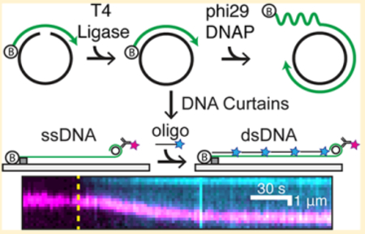
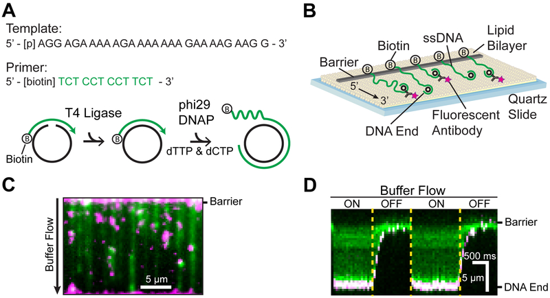
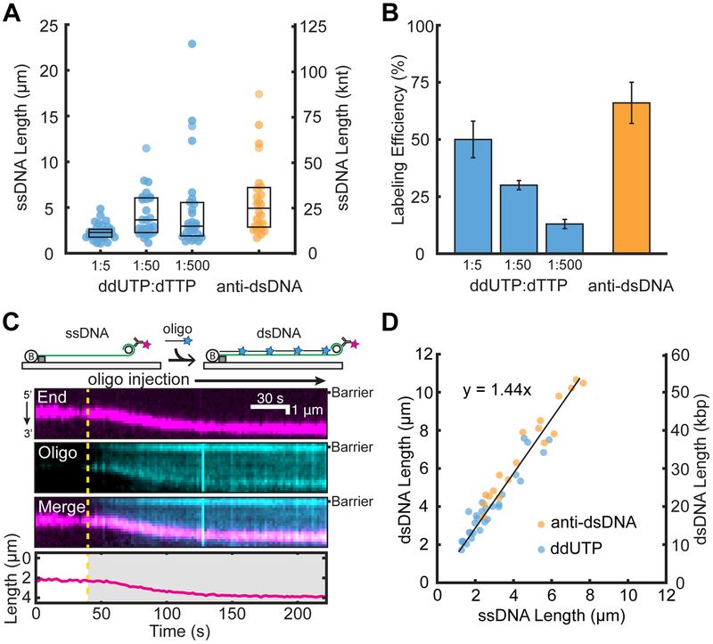
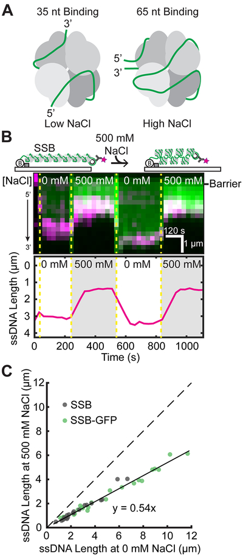
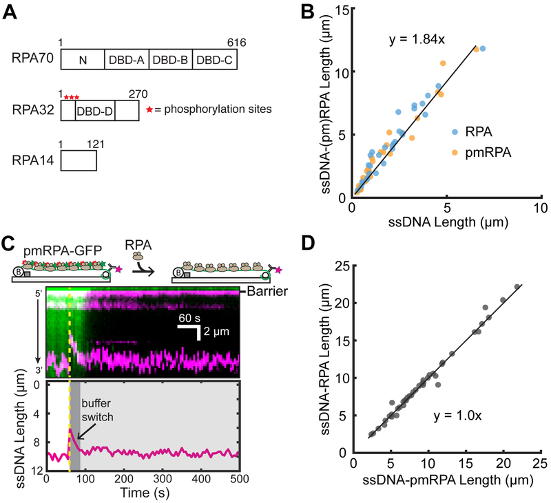

# Assessing Protein Dynamics on Low-Complexity Single-Stranded DNA Curtains

**Jeffrey M. Schaub, Hongshan Zhang, Michael M. Soniat, and Ilya J. Finkelstein**

*Langmuir*, Volume 34, Issue 47, Pages 14882–14890 (2018)

**DOI:** [10.1021/acs.langmuir.8b01812](https://doi.org/10.1021/acs.langmuir.8b01812)

---

## Table of Contents

- [Abstract](#abstract)
- [Introduction](#introduction)
- [Experimental Section](#experimental-section)
- [Results and Discussion](#results-and-discussion)
- [Conclusions](#conclusions)
- [Acknowledgments](#acknowledgments)

---
##  Abstract
Single-stranded DNA (ssDNA) is a critical intermediate in all DNA transactions. Because ssDNA is more flexible than double-stranded (ds) DNA, interactions with ssDNA-binding proteins (SSBs) may significantly compact or elongate the ssDNA molecule. Here, we develop and characterize low-complexity ssDNA curtains, a high-throughput single-molecule assay to simultaneously monitor protein binding and correlated ssDNA length changes on supported lipid bilayers. Low-complexity ssDNA is generated via rolling circle replication of short synthetic oligonucleotides, permitting control over the sequence composition and secondary structure-forming propensity. One end of the ssDNA is functionalized with a biotin, while the second is fluorescently labeled to track the overall DNA length. Arrays of ssDNA molecules are organized at microfabricated barriers for high-throughput single-molecule imaging. Using this assay, we demonstrate that _E. coli_ SSB drastically and reversibly compacts ssDNA templates upon changes in NaCl concentration. We also examine the interactions between a phosphomimetic RPA and ssDNA. Our results indicate that RPA-ssDNA interactions are not significantly altered by these modifications. We anticipate that low-complexity ssDNA curtains will be broadly useful for single-molecule studies of ssDNA-binding proteins involved in DNA replication, transcription, and repair.
##  Graphical Abstract

---
##  INTRODUCTION
Single-stranded DNA (ssDNA) is a key intermediate in nearly all aspects of DNA metabolism, including transcription, replication, and repair. Long ssDNA substrates can be generated during the first steps of homologous recombination of DNA breaks in both prokaryotes and eukaryotes.[1](https://pmc.ncbi.nlm.nih.gov/articles/PMC6679933/#R1)–[4](https://pmc.ncbi.nlm.nih.gov/articles/PMC6679933/#R4) In addition, long ssDNA substrates are critical intermediates in eukaryotic break-induced replication, phage replication, and conjugative plasmid transfer.[5](https://pmc.ncbi.nlm.nih.gov/articles/PMC6679933/#R5)–[7](https://pmc.ncbi.nlm.nih.gov/articles/PMC6679933/#R7) Cellular ssDNA is rapidly bound by endogenous single-stranded DNA binding proteins (SSBs). SSBs rapidly diffuse and stabilize ssDNA from damage and cellular nucleases.[8](https://pmc.ncbi.nlm.nih.gov/articles/PMC6679933/#R8),[9](https://pmc.ncbi.nlm.nih.gov/articles/PMC6679933/#R9) SSBs also physically interact with multiple DNA-processing proteins and thus act as recruitment hubs for downstream replication and repair.[10](https://pmc.ncbi.nlm.nih.gov/articles/PMC6679933/#R10),[11](https://pmc.ncbi.nlm.nih.gov/articles/PMC6679933/#R11) SSBs bind ssDNA via one or more oligonucleotide/oligosaccharide binding (OB) folds. For example, the homotetrameric E. _coli_ single-stranded DNA-binding protein (_Ec_ SSB) encodes four identical OB folds that can nonetheless interact with ssDNA in a variety of conformations.[12](https://pmc.ncbi.nlm.nih.gov/articles/PMC6679933/#R12) The biological consequences of these alternative binding conformations are still not entirely clear but have been proposed to affect the ssDNA topology and potentially impact _Ec_ SSB fonction.[12](https://pmc.ncbi.nlm.nih.gov/articles/PMC6679933/#R12),[3](https://pmc.ncbi.nlm.nih.gov/articles/PMC6679933/#R3)
Replication protein A (RPA) is the most abundant eukaryotic ssDNA-binding protein. RPA encodes six OB folds among its three heterotrimeric subunits.[14](https://pmc.ncbi.nlm.nih.gov/articles/PMC6679933/#R14),[15](https://pmc.ncbi.nlm.nih.gov/articles/PMC6679933/#R15) RPA’s OB folds have a variable affinity for ssDNA, with the strongest interactions encoded in the RPA70 subunit.RPA binds ssDNA with subnanomolar affinities yet is readily displaced by other proteins, such as RAD51.[17](https://pmc.ncbi.nlm.nih.gov/articles/PMC6679933/#R17)–[19](https://pmc.ncbi.nlm.nih.gov/articles/PMC6679933/#R19) In addition, RPA is hyperphosphorylated in response to DNA damage.[20](https://pmc.ncbi.nlm.nih.gov/articles/PMC6679933/#R20),[21](https://pmc.ncbi.nlm.nih.gov/articles/PMC6679933/#R21) RPA phosphorylation is crucial for cell recovery from the DNA damage response in the S phase.[22](https://pmc.ncbi.nlm.nih.gov/articles/PMC6679933/#R22) Post-translational RPA modifications have been proposed to alter the RPA structure and its interactions with DNA, but the impact of these modifications on ssDNA geometry has been controversial.[23](https://pmc.ncbi.nlm.nih.gov/articles/PMC6679933/#R23)–[26](https://pmc.ncbi.nlm.nih.gov/articles/PMC6679933/#R26) Here, we use single-molecule fluorescence imaging to probe how _Ec_ SSB and human RPA compact ssDNA.
Single-molecule studies of protein-ssDNA interactions have traditionally used two strategies to generate ssDNA substrates. One approach denatures a dsDNA template via mechanical unzipping or the addition of a chemical denaturant.[27](https://pmc.ncbi.nlm.nih.gov/articles/PMC6679933/#R27),[28](https://pmc.ncbi.nlm.nih.gov/articles/PMC6679933/#R28) Mechanical unfolding of individual molecules is timeconsuming and requires a dedicated optical or magnetic tweezer apparatus. Chemical denaturation is frequently incomplete; segments of the template DNA are not melted or can rehybridize after the denaturant is diluted or washed out of the flow cell. Moreover, harsh chemical denaturants such as NaOH can partially hydrolyze the phosphate backbone. The second strategy generates ssDNA via rolling circle replication (RCR) by a strand-displacing DNA polymerase. This strategy can generate >50 000 nucleotide (nt) ssDNA substrates, especially when strand displacement synthesis is catalyzed by the highly processive phi29 DNA polymerase (DNAP).[29](https://pmc.ncbi.nlm.nih.gov/articles/PMC6679933/#R29),[30](https://pmc.ncbi.nlm.nih.gov/articles/PMC6679933/#R30) RCR products can also be synthesized from short oligonucleotide (oligo) DNA templates.[31](https://pmc.ncbi.nlm.nih.gov/articles/PMC6679933/#R31),[32](https://pmc.ncbi.nlm.nih.gov/articles/PMC6679933/#R32) However, fluorescent labeling of the RCR products on the 3′-end is challenging because the ssDNA molecules are highly repetitive. Both approaches also produce complex ssDNA that may encode sequence and secondary structures that confound single-molecule studies. ssDNA templates that contain additional secondary structures must be extended by force, denaturants, or secondary structure-destabilizing proteins.[19](https://pmc.ncbi.nlm.nih.gov/articles/PMC6679933/#R19),[27](https://pmc.ncbi.nlm.nih.gov/articles/PMC6679933/#R27),[28](https://pmc.ncbi.nlm.nih.gov/articles/PMC6679933/#R28) These limitations of existing approaches have motivated us to generalize RCR for high-throughput single-molecule DNA curtains.
Here, we describe a method for assembling low-complexity ssDNA curtains via RCR from short oligos. Low-complexity ssDNA is largely devoid of standard Watson-Crick base pairing, resulting in extended ssDNA at minimal applied forces. RCR with phi29 DNAP produces ssDNA molecules exceeding 105 nt in length but is highly dependent on the enzymatic activity of the DNA polymerase. We thus also optimized the expression of phi29 DNAP, ensuring highly reproducible RCR products. We describe an improved labeling strategy for the specific functionalization of both ssDNA ends. Finally, each ssDNA molecule can be readily converted to double-stranded DNA (dsDNA), allowing the accurate measurement of the overall DNA length in nucleotides. DNA curtains organize hundreds of individual ssDNA molecules into arrays on the surface of a microfluidic flow cell for high-throughput singlemolecule imaging. We validate our strategy by examining the ssDNA length changes induced by different ssDNA-binding modes of the _Ec_ SSB. We also utilize this strategy to interrogate whether phosphomimetic human RPA (pmRPA) undergoes significant changes in its ssDNA-binding properties relative to that of wt RPA. In sum, low-complexity ssDNA curtains will be useful to the broader scientific community interested in the physical changes in ssDNA upon interaction with proteins and other nucleic acids.
---
##  EXPERIMENTAL SECTION
### Synthesis and Assembly of Low-Complexity ssDNA Curtains.
PAGE-purified oligos were purchased from IDT. ssDNA circles were prepared by annealing 5 _μ_ M phosphorylated template oligo (/5Phos/AG GAG AAA AAG AAA AAA AGA AAA GAA GG) and 4.5 _μ_ M biotinylated primer oligo (5/Biosg/TC TCC TCC TTC T) in 1× T4 ligase reaction buffer (NEB B0202S).[31](https://pmc.ncbi.nlm.nih.gov/articles/PMC6679933/#R31),[32](https://pmc.ncbi.nlm.nih.gov/articles/PMC6679933/#R32) Oligos were heated to 75 °C for 5 min and cooled to 4 °C at a rate of −1 °C min−1. Annealed circles were ligated with the addition of 1 _μ_ L of T4 DNA ligase (NEB M0202S) at room temperature for _~5_ h. Ligated circles can be stored at 4 °C for up to 1 month. Low-complexity ssDNA was synthesized in 1× phi29 DNA polymerase reaction buffer (NEB M0269S), 500 _μ_ M dCTP and dTTP (NEB N0446S), 0.2 mg mL−1 BSA (NEB B9000S), 10 nM annealed circles, and 100 nM phi29 DNAP (purified in-house). The solution was mixed and immediately injected into the flow cell and incubated at 30 °C for 20 min. For digoxigenin incorporation as an end label, 100 _μ_ M dTTP was included in a 5, 50, or 500 molar excess over digoxigenin-11-ddUTP (Roche). ssDNA synthesis was quenched by removing excess nucleotides and polymerase with BSA buffer (40 mM Tris-HCl pH 8.0,2 mM MgCl2, 1 mM DTT, and 0.2 mg mL−1 BSA).
### Single-Molecule Microscopy.
Flow cells were prepared as previously described.[33](https://pmc.ncbi.nlm.nih.gov/articles/PMC6679933/#R33),[34](https://pmc.ncbi.nlm.nih.gov/articles/PMC6679933/#R34) Briefly, a 4-mm-wide, 100-_μ_ m-high flow channel is constructed between a glass coverslip (VWR 48393 059) and a custom-made flow cell containing 1–2-_μ_ m-wide chromium barriers using two-sided tape (3M 665). All experiments were conducted at 37 °C under a flow rate of 1 mL min−1. Single-molecule fluorescent images were recorded on a prism TIRF microscopy-based inverted Nikon Ti-E microscope. The sample was illuminated with a 488 nm laser (Coherent Sapphire) and a 637 nm laser (Coherent OBIS) split by a 638 nm dichroic beam splitter (Chroma). Two-color imaging was recorded using dual-electron-multiplying charge-coupled device (EMCCD) cameras (Andor iXon DU897). Subsequent images were exported as uncompressed TIFF stacks and further analyzed in FIJI.[35](https://pmc.ncbi.nlm.nih.gov/articles/PMC6679933/#R35)
### ssDNA End Labeling.
For digoxigenin-incorporated ssDNA, ends were labeled with a rabbit anti-digoxigenin primary antibody (Thermo 9H27L19) followed by incubation with an ATTO488-labeled goat anti-rabbit secondary antibody (Sigma 18772). For dsDNA RCR-circle-labeled ssDNA, ends were labeled with a mouse anti-dsDNA primary antibody (Thermo MA1–35346) followed by incubation with an ATTO647N-labeled goat anti-mouse secondary antibody (Sigma 50185). The end-labeling percentage was calculated by counting the number of ssDNA molecules stained with RPA-GFP that were also fluorescently end-labeled divided by the total number of DNA molecules visible in a field of view. For concurrent visualization of the DNA ends and the complementary oligonucleotides, the DNA ends were labeled with a mouse anti-dsDNA primary antibody (Thermo MA1–35346) followed by incubation with a QD705-labeled goat antimouse secondary antibody (Thermo Q11062MP).
### ssDNA to dsDNA Length Conversion.
DNA ends were tracked using custom-written FIJI scripts. Briefly, the fluorescence intensity of the ssDNA end label is fit to a two-dimensional (2D) Gaussian function for subpixel particle localization. The 2D Gaussian fit is then plotted and labeled as a function of the frame number (time). The plateaus in length change are then averaged together to reveal the corresponding length.
Initial ssDNA length was measured at a 1.0 mL min−1 flow rate. The ssDNA was converted to dsDNA by injection with 100 nM complementary oligo (in a ratio of 99:1 complementary (5/AGG AGA AAA AGA AAA AAA GAA AAG AAG G, IDT) and ATTO647N-complementary oligo (5/ATTO647N/AG GAG AAA AAG AAA AAA AGA AAA GAA GG, IBA)). A mixture of unlabeled and ATTO647N-labeled complementary oligo was used to limit laser-induced damage to the ssDNA. The ssDNA length measurements revealed a non-normal distribution; thus, the aggregate measurements were reported by median and interquartile range (IQR) reporting of the range of lengths between the 25th and 75th percentiles.
At a 1.0 mL min−1 flow rate, we observed the _λ_ -DNA length to be extended to 84% of the B-form crystallographic structure ([Figure S2](https://pmc.ncbi.nlm.nih.gov/articles/PMC6679933/#SD1)). On the basis of the crystallographic interbase distance of 0.34 nm, we therefore estimate dsDNA to have an interbase distance of 0.29 nm. The corresponding dsDNA length in micrometers was divided by the calculated interbase distance to estimate the DNA size in kilobase pairs (kbp).
### E. coli SsB.
Plasmids overexpressing either _Ec_ SSB-GFP (pIF109) or wt _Ec_ SSB (pIF122) were transformed into BL21 (DE3) (Novagen) _E. coli_ cells. 6 L of LB was grown to an OD600 of 0.6 and subsequently induced with 0.5 mM IPTG overnight at 18 °C.[19](https://pmc.ncbi.nlm.nih.gov/articles/PMC6679933/#R19),[36](https://pmc.ncbi.nlm.nih.gov/articles/PMC6679933/#R36) The resulting pellet was resuspended in lysis buffer (25 mM Tris-HCl [pH 7.4], 500 mM NaCl, 1 mM EDTA and 5% (v/v) glycerol, supplemented with 1× HALT protease cocktail (Thermo-Fisher) and 1 mM phenyl-methanesulfonyl fluoride (PMSF, Sigma-Aldrich)). Cells were sonicated and centrifuged at 35 000 RCF for 45 min. Cellular supernatant was loaded on 5 mL (bed volume) of StrepTactin Superflow resin (IBA Life Sciences) pre-equilibrated with lysis buffer. SSB was eluted in 20 mL of elution buffer (lysis buffer supplemented with 5 mM desthiobiotin (Sigma-Aldrich D1411)) and collected in 5 mL fractions. The elution was pooled and concentrated using spin concentration (Amicon). SSB was dialyzed into storage buffer (50 mM Tris-HCl [pH 7.4], 300 mM NaCl, and 50% (v/v) glycerol), flash frozen in liquid nitrogen, and stored at −80 °C. Protein concentrations were determined by comparison to a BSA standard curve using SDS-PAGE.
### Human RPA.
The plasmids for human wt RPA (pIF47) and RPA-GFP (pIF48) were generous gifts from Dr. Marc Wold and Dr. Mauro Modesti, respectively. The plasmids for pmRPA (pIF430) and pmRPA-GFP (pIF429) were mutagenized using Q5 site-directed mutagenesis (NEB E0554S) to create the S8D, S11D, S12D, S13D, T21D, S23D, S29D, and S33D mutations of RPA2 from pIF47 and pIF48 overexpression plasmids, respectively. All RPA variants were purified as described previously.[37](https://pmc.ncbi.nlm.nih.gov/articles/PMC6679933/#R37)
### phi29 DNA Polymerase.
The gene encoding phi29 DNAP was cloned into a pET19 vector with an N-terminal His-TwinStep-SUMO tag to generate pIF376. The plasmid was transformed into Rosetta (DE3)pLysS (Novagen, 70956) _E. coli_ cells. 1 L of LB was grown to an OD600 of 0.6 and subsequently induced with 0.5 mM IPTG overnight at 16 °C. The resulting pellet was resuspended in lysis buffer (25 mM Tris-HCl [pH 7.5], 500 mM NaCl, and 5% (v/v) glycerol, supplemented with 1× HALT protease cocktail (ThermoFisher) and 1 mM phenylmethanesulfonyl fluoride (PMSF, Sigma-Aldrich)). Cells were sonicated and centrifuged at 35 000 RCF for 45 min. Cellular supernatant was loaded on 5 mL (bed volume) of StrepTactin Superflow resin (IBA Life Sciences) pre-equilibrated with lysis buffer. The resin was subsequently washed with high salt wash buffer (lysis buffer supplemented with 1 M NaCl) to remove bound DNA from the polymerase. phi29 DNAP was eluted in 20 mL of elution buffer (lysis buffer supplemented with 5 mM desthiobiotin (Sigma-Aldrich D1411)) and collected in 5 mL fractions. phi29 DNAP was dialyzed into storage buffer (10 mM Tris-HCl [pH 7.5], 100 mM KCl, 1 mM DTT, 0.1 mM EDTA, and 10% (v/v) glycerol) with 5 _μ_ g purified SUMO protease (homemade stock generated via overexpression from pIF183) overnight. Digested phi29 DNAP was flash frozen in liquid nitrogen and stored at −80 °C. Protein concentrations were determined by comparison to a BSA standard curve using SDS-PAGE.
### SSB Buffer Exchange Experiments.
_Ec_ SSB buffer exchange experiments were conducted in either BSA buffer or BSA buffer supplemented with 500 mM NaCl. ssDNA ends were labeled prior to the introduction of SSB. SSB(-GFP) (1 nM concentration in monomers) was included in the buffer flow. Prior to each buffer switch, a 100 _μ_ L injection of 100 nM SSB(-GFP) (concentration in monomers) was injected to ensure complete coverage of the ssDNA molecules. Images were collected with a 100 ms exposure taken every 30 s to minimize laser-induced photobleaching.
### RPA and pmRPA-GFP Exchange Experiments.
wt RPA and pmRPA experiments were conducted in BSA buffer supplemented with 150 mM NaCl. ssDNA ends were labeled prior to the introduction of RPA. The initial ssDNA length was measured at a 1.0 mL min−1 flow rate. The ssDNA was coated by injection with 5 nM (pm)RPA. RPA and pmRPA-GFP exchange experiments were conducted in BSA buffer. pmRPA-GFP (10 nM) was included in the buffer flow to ensure complete coating of the ssDNA molecule. The flow cell was then switched to the same buffer supplemented with 10 nM wt RPA. Images were collected with a 100 ms exposure taken every 5 s.
---
##  RESULTS AND DISCUSSION
We developed an oligo-based RCR method for the generation and single-molecule imaging of low-complexity ssDNA ([Figure 1](#fig1)).[31](https://pmc.ncbi.nlm.nih.gov/articles/PMC6679933/#R31),[32](https://pmc.ncbi.nlm.nih.gov/articles/PMC6679933/#R32) A short 28 nt phosphorylated template and a 12 nt biotinylated primer oligo are annealed to form a minicircle. The addition of T4 DNA ligase converts the nicked minicircle into a covalently closed form ([Figure 1A](#fig1)). The template strand is designed to eliminate Watson-Crick base pairing in the synthesized ssDNA molecule.[31](https://pmc.ncbi.nlm.nih.gov/articles/PMC6679933/#R31),[32](https://pmc.ncbi.nlm.nih.gov/articles/PMC6679933/#R32) The 5′-end of the minicircle primer is biotinylated for downstream assembly on the surface of a microfluidic flow cell ([Figure 1B](#fig1)). The minicircles are introduced into the flow cell, and RCR is performed in situ with phi29 DNAP. Performing RCR in the flow cell reduces pipette-induced shearing of the >50 000-nt-long ssDNA molecules and generates longer ssDNA substrates.[38](https://pmc.ncbi.nlm.nih.gov/articles/PMC6679933/#R38) The resulting ssDNA molecules consist of tens of thousands of repeating 28 nt sequences. These ssDNAs are organized at microfabricated chromium barriers via the addition of the hydrodynamic force (buffer flow, [Figure 1C](#fig1)). The free 3′-end of the ssDNA molecule can be fluorescently labeled allowing the simultaneous observation of fluorescent ssDNA-binding proteins and how these proteins alter the ssDNA length. Repeated cycles of toggling buffer flow on and off retract the ssDNA to the chromium barrier, indicating that the ssDNAs are not associated with the flow-cell surface ([Figure 1D](#fig1)). Hundreds of individual molecules are readily observed in a single field of view for rapid data acquisition.

***[Figure 1](#fig1).***

Assembly of low-complexity ssDNA curtains. (A) A phosphorylated template (black) and a biotinylated primer (green) are annealed and treated with T4 DNA ligase to make minicircles. Low-complexity ssDNA composed solely of thymidine and cytidine is synthesized via rolling circle replication by phi29 DNAP. (B) Low-complexity ssDNA curtains with fluorescent end labeling. The 3′ end of the ssDNA was labeled with a fluorescent antibody. (C) RPA-GFP (green)-coated ssDNA with fluorescent end labeling (magenta). (D) Kymograph of a representative ssDNA in panel (C) with buffer flow on and off, indicating that the ssDNA is anchored to the surface via the 5′-biotin tether.
The length of the ssDNA substrates is critically dependent on the enzymatic activity of phi29 DNAP. We found that commercially available enzyme had variable activity and produced short ssDNA substrates ([Figure S1](https://pmc.ncbi.nlm.nih.gov/articles/PMC6679933/#SD1)). We therefore developed an alternative protocol for the rapid purification of phi29 DNAP. Codon-optimized phi29 DNAP was expressed as an N-terminal SUMO-protein fusion and purified via a single-gravity-flow StrepTactin column. Following elution from the column with desthiobiotin, the enzyme was dialyzed in the presence of SUMO protease to remove the SUMO domain. Homemade phi29 DNAP was stored at −80°C and retained high RCR activity for >8 months. The homemade construct consistently synthesized ssDNA molecules that were >5-fold longer than commercial polymerases ([Figure S1C](https://pmc.ncbi.nlm.nih.gov/articles/PMC6679933/#SD1),[D](https://pmc.ncbi.nlm.nih.gov/articles/PMC6679933/#SD1)).
RCR generates a broad distribution of ssDNA molecule lengths. We therefore sought to relate the length of each ssDNA molecule in micrometers to its corresponding length in nucleotides. ssDNA is highly flexible and elastic and can adopt base-stacking configurations even in the absence of Watson-Crick base pairing.[39](https://pmc.ncbi.nlm.nih.gov/articles/PMC6679933/#R39)–[41](https://pmc.ncbi.nlm.nih.gov/articles/PMC6679933/#R41) These dynamic properties of ssDNA confound estimates of the number of nucleotides that can be made on the basis of the length of the ssDNA molecule. Therefore, our strategy is to measure the length of each ssDNA molecule at a given flow rate, followed by the conversion of that ssDNA to dsDNA. The well-characterized wormlike chain (WLC) model can then be used to correlate the length of the dsDNA to its corresponding composition in base pairs. The number of base pairs in the dsDNA molecule also defines the nucleotide length of the parental ssDNA molecule.
We first attempted to fluorescently label the 3′-end of the ssDNA molecules via enzymatic incorporation of digoxigenin-11-ddUTP (ddUTP) to terminate ssDNA synthesis. The digoxigenin moiety was fluorescently labeled by anti-digox-igenin antibody conjugated to an ATTO488 fluorescent dye. However, using high ddUTP to dTTP ratios resulted in very short ssDNA molecules ([Figure 2A](#fig2)). The median lengths of the ssDNA were 2.3 _μ_ m (IQR 1.8–2.6 _μ_ m, _N_ = 31), 3.7 _μ_ m (IQR 2.3–6.0 _μ_ m, _N_ = 25), and 3.0 _μ_ m (IQR 2.0–5.5 _μ_ m, _N_ = 27) for 1:5, 1:50, and 1:500 ddUTP to dTTP, respectively. Decreasing the ddUTP concentration also decreased the single-molecule labeling efficiency, resulting in ~90% of unlabeled ssDNAs ([Figure 2B](#fig2)). We thus pursued an alternative strategy that labels the minicircle dsDNA that remains on the 3′ end of the ssDNA. Using an anti-dsDNA antibody conjugated to an ATTO647N fluorescent dye, we labeled the 3′ ends of ~66% of the ssDNA molecules (_N_ = 107/162) while maintaining a median length of 4.9 _μ_ m (IQR 2.9–7.1 _μ_ m, _N_ = 24). The length of the ssDNA can be further controlled by optimizing the RCR reaction time.[34](https://pmc.ncbi.nlm.nih.gov/articles/PMC6679933/#R34) The anti-dsDNA antibody is highly specific because there was minimal observable fluorescence on the ssDNA segment of the molecules. This labeling approach should be widely useful to researchers generating ssDNA via RCR.

***[Figure 2](#fig2).***

Efficient end-labeling and length calibration of low-complexity ssDNAs. Comparison of (A) ssDNA lengths and (B) ssDNA end-labeling efficiencies following treatment with ddUTP-dig or fluorescent antibodies. Box plots denote the first and third quartiles of the data. Error bars represent the standard deviation of the labeling efficiency across at least three flow-cell experiments. (C) Cartoon illustration (top) and a representative kymograph of ssDNA (magenta labels the 3′ end) elongated following the injection of a complementary oligo (cyan). The DNA length was tracked by fitting the 3′-end signal (bottom). The dashed line represents the oligo injection time. (D) The ssDNA to dsDNA length change was quantified by either antidigoxigenin ddUTP (blue) or anti-dsDNA (orange). Experimental data were fit to a line (black) with a slope of 1.44 _±_ 0.05.
Next, we exploited the highly repetitive RCR product to convert the ssDNA molecules to dsDNA by incubation with a complementary oligo ([Figure 2C](#fig2)). The injection of a complementary oligo (100 nM final concentration, 1% labeled with ATTO647N) showed an increase in the DNA extension ([Figure 2C](#fig2),[D](#fig2)). The conversion of ssDNA to dsDNA was also visible as the coating of the ssDNA substrate with the ATTO647N signal due to oligo hybridization. The DNA extends and eventually plateaus, indicating a fully hybridized dsDNA molecule. Comparing the ssDNA length to the final dsDNA extension showed a linear correlation ([Figure 2D](#fig2)). The ssDNA to dsDNA extension has a slope of 1.44 ± 0.05 at a flow rate of 1 mL min−1. At this flow rate, _λ_ -DNA is extended to 0.84 times the length of crystallographic B-form dsDNA corresponding to an interbase distance of 0.29 nm. ([Figure S2](https://pmc.ncbi.nlm.nih.gov/articles/PMC6679933/#SD1)). Together with the dsDNA length in micrometers, these measurements directly report the size of each ssDNA molecule in nucleotides.
### NaCl-Induced Structural Transitions of _E. coli_ Single-Stranded DNA-Binding Protein.
_Ec_ SSB is critical to DNA replication, repair, and recombination.[10](https://pmc.ncbi.nlm.nih.gov/articles/PMC6679933/#R10),[42](https://pmc.ncbi.nlm.nih.gov/articles/PMC6679933/#R42) It engages ssDNA in various conformations with two predominant footprints of 35 and 65 nucleotides, engaging two or four OB folds on average, respectively ([Figure 3A](#fig3)).[12](https://pmc.ncbi.nlm.nih.gov/articles/PMC6679933/#R12),[43](https://pmc.ncbi.nlm.nih.gov/articles/PMC6679933/#R43) These forms exist in equilibrium, but interestingly, the ssDNA binding mode of _Ec_ SSB is directly impacted by the concentration of cation in solution, with higher concentrations favoring the compacted 65 nt binding mode.[44](https://pmc.ncbi.nlm.nih.gov/articles/PMC6679933/#R44),[45](https://pmc.ncbi.nlm.nih.gov/articles/PMC6679933/#R45) The in vivo significance of the binding modes is unclear, although the 65 nt binding mode is dispensable for growth.[13](https://pmc.ncbi.nlm.nih.gov/articles/PMC6679933/#R13) Previous AFM and single-molecule experiments have interrogated the compaction and extension of _Ec_ SSB with differing results.[46](https://pmc.ncbi.nlm.nih.gov/articles/PMC6679933/#R46),[47](https://pmc.ncbi.nlm.nih.gov/articles/PMC6679933/#R47) Here, we use ssDNA templates to explore the salt-induced conformational changes of _Ec_ SSB on ssDNA.
***[Figure 3](#fig3).***

Analysis of _Ec_ SSB binding modes on ssDNA. (A) Illustration of proposed _Ec_ SSB-ssDNA binding modes.[12](https://pmc.ncbi.nlm.nih.gov/articles/PMC6679933/#R12),[43](https://pmc.ncbi.nlm.nih.gov/articles/PMC6679933/#R43)(B) Cartoon (top) and kymograph of _Ec_ SSB-GFP (green) on ssDNA (3′ end in magenta). Dashed yellow lines denote when the buffer switched between high and low NaCl concentration. The ssDNA end position was determined via single-particle tracking (bottom). (C) Correlation between ssDNA-_Ec_ SSB lengths at 0 and 500 mM NaCl. The solid black line is a linear fit to the data (N = 23 _Ec_ SSB-GFP and 20 wt _Ec_ SSB). The dashed line represents a slope of 1.
As a proof of principle, we sought to test whether our ssDNA method is able to precisely measure the length of _Ec_ SSB conformations. _Ec_ SSB-GFP or wt _Ec_ SSB was incubated with end-labeled ssDNA substrates at 0 and 500 mM NaCl concentrations ([Figure 2B](#fig2)). We observed a drastic shortening of the ssDNA when the buffer is switched from 0 to 500 mM NaCl ([Figure 3B](#fig3)). The shortening is fully reversible for both wt _Ec_ SSB and _Ec_ SSB-GFP because the ssDNA re-extends to the initial length when the buffer is returned to 0 mM NaCl. Individual observations of ssDNA length transitions showed a linear fit with a slope of 0.54 ± 0.01, as would be predicted from _Ec_ SSB binding in the 35 and 65 nt modes ([Figure 3C](#fig3)). Moreover, our results indicate that GFP does not impact _Ec_ SSB’s NaCl-dependent interactions with ssDNA. These results closely mirror the condensation of ssDNA-_Ec_ SSB by AFM, where the 65 nt binding mode length was ~60% that of the extended 35 nt mode.[46](https://pmc.ncbi.nlm.nih.gov/articles/PMC6679933/#R46) However, we did not observe higher levels of compaction seen in a previous single-molecule study.[47](https://pmc.ncbi.nlm.nih.gov/articles/PMC6679933/#R47) This discrepancy may arise from the technical challenges associated with fully denaturing the 48.5 kbp DNA substrates used in the earlier study. In addition, the prior measurements were conducted in a different force regime (0.1–0.5 pN). Here, we conclude that _EcSSB_ compacts the ssDNA in accordance with the number of OB folds engaged by each DNA-binding mode.
### Conformational Binding Mechanism of RPA and Phosphomimetic RPA.
RPA is the most abundant SSB in eukaryotic cells and also serves as a signal for the DNA damage response and stalled replication via hyperphosphorylation on the N-terminus of RPA32.[11](https://pmc.ncbi.nlm.nih.gov/articles/PMC6679933/#R11),[48](https://pmc.ncbi.nlm.nih.gov/articles/PMC6679933/#R48) Phosphorylated RPA (pRPA) is excluded from replication centers in vivo, highlighting the direct role in regulating replication.[49](https://pmc.ncbi.nlm.nih.gov/articles/PMC6679933/#R49) pRPA can regulate the DNA damage response via two possible mechanisms: (i) pRPA acts as a key mediator to recruit DNA damage proteins and (ii) pRPA induces structural changes that alter the ssDNA binding modes or properties of RPA.[14](https://pmc.ncbi.nlm.nih.gov/articles/PMC6679933/#R14),[50](https://pmc.ncbi.nlm.nih.gov/articles/PMC6679933/#R50) Previous studies have detailed two principle modes of DNA binding by RPA. The first includes DNA binding domains (DBDs) A and B, which occupy a footprint of approximately 8 nucleotides,[51](https://pmc.ncbi.nlm.nih.gov/articles/PMC6679933/#R51) and the second includes an extended binding footprint of ~30 nucleotides that engages DBDs A–D.[52](https://pmc.ncbi.nlm.nih.gov/articles/PMC6679933/#R52) structural examinations of the effects of pRPA on conformational dynamics suggest that the N-terminus and DBD B of RPA70 may interact strongly with the highly phosphorylated N-terminus of RPA32, potentially impacting the binding interaction with ssDNA.[23](https://pmc.ncbi.nlm.nih.gov/articles/PMC6679933/#R23),[50](https://pmc.ncbi.nlm.nih.gov/articles/PMC6679933/#R50),[53](https://pmc.ncbi.nlm.nih.gov/articles/PMC6679933/#R53) Indeed, previous studies showed that that pRPA binds with poorer affinity to short, 8 nt oligos, hypothesizing a transition to the extended conformation.[50](https://pmc.ncbi.nlm.nih.gov/articles/PMC6679933/#R50) However, RPA and pRPA have similar binding affinities toward longer oligos.[23](https://pmc.ncbi.nlm.nih.gov/articles/PMC6679933/#R23),[24](https://pmc.ncbi.nlm.nih.gov/articles/PMC6679933/#R24) Therefore, the highly negatively charged N-terminus of RPA32 may be sufficient to alter the DNA-binding properties of RPA.
Previous single-molecule studies have utilized RPA to extend ssDNA molecules.[54](https://pmc.ncbi.nlm.nih.gov/articles/PMC6679933/#R54),[55](https://pmc.ncbi.nlm.nih.gov/articles/PMC6679933/#R55) We sought to test whether there is an appreciable ssDNA length change between pRPA and RPA using our end-labeled ssDNA assay. In order to assay in vitro, we generated a phosphomimetic variant of RPA (pmRPA) by introducing eight mutations in the N-terminus of RPA32 ([Figure 4A](#fig4)). This phosphomimetic RPA variant recapitulates pRPA phenotypes in vivo and is indistinguishable from pRPA in vitro.[23](https://pmc.ncbi.nlm.nih.gov/articles/PMC6679933/#R23),[24](https://pmc.ncbi.nlm.nih.gov/articles/PMC6679933/#R24),[49](https://pmc.ncbi.nlm.nih.gov/articles/PMC6679933/#R49) We initially observed the change in ssDNA length upon introduction of either RPA or pmRPA ([Figure 4B](#fig4)). Interestingly, we do not observe significant differences in the extension of ssDNA from RPA or pmRPA with a combined slope of 1.84 ± 0.06. To reaffirm our observation, we sought to do a protein replacement assay. Initially, ssDNA was bound with pmRPA-GFP and then replaced with RPA We did not observe any length changes between the binding of pmRPA-GFP and RPA on end-labeled ssDNA curtains ([Figure 4C](#fig4)). An examination of the pmRPA-GFP fluorescence intensity shows a steep decline upon the introduction of RPA, indicating the complete exchange of pmRPA-GFP for RPA, as seen for previous single-molecule RPA experiments.[19](https://pmc.ncbi.nlm.nih.gov/articles/PMC6679933/#R19) An analysis of individual molecules shows that the there is a linear correlation between the pmRPA-GFP length and RPA length with a slope of 1.0 ± 0.03, confirming the same ssDNA extension for pmRPA and wt RPA ([Figure 4D](#fig4)). Additionally, we observe a similar ssDNA extension when using the complex M13mp18 DNA sequence ([Figure S3](https://pmc.ncbi.nlm.nih.gov/articles/PMC6679933/#SD1)). Previous studies suggested that pmRPA may be deficient in secondary structure destabilization; however, we do not visualize an increase in the ssDNA extension when switching from pmRPA-GFP to RPA.[23](https://pmc.ncbi.nlm.nih.gov/articles/PMC6679933/#R23),[24](https://pmc.ncbi.nlm.nih.gov/articles/PMC6679933/#R24) Several lines of evidence suggested that pmRPA may bind ssDNA in an altered conformation relative to rpa.[23](https://pmc.ncbi.nlm.nih.gov/articles/PMC6679933/#R23),[50](https://pmc.ncbi.nlm.nih.gov/articles/PMC6679933/#R50),[53](https://pmc.ncbi.nlm.nih.gov/articles/PMC6679933/#R53) However, our results indicate that pmRPA does not undergo a structural transformation that affects the end-to-end length of ssDNA, at least on extended DNA substrates. We cannot rule out interactions between the N-termini of RPA32 and RPA70, as reported in several recent studies.[23](https://pmc.ncbi.nlm.nih.gov/articles/PMC6679933/#R23),[50](https://pmc.ncbi.nlm.nih.gov/articles/PMC6679933/#R50),[53](https://pmc.ncbi.nlm.nih.gov/articles/PMC6679933/#R53) Our results are minimally consistent with a model where the N-terminus of RPA70 does not interact appreciably with ssDNA and thus does not change the binding mode of the wt RPA complex relative to that of pmRPA[48](https://pmc.ncbi.nlm.nih.gov/articles/PMC6679933/#R48),[56](https://pmc.ncbi.nlm.nih.gov/articles/PMC6679933/#R56) Taken together, these observations suggest that the major function of pRPA in the cell is likely as a loading and recruitment platform for additional repair proteins at the sites of DNA damage.
***[Figure 4](#fig4).***

Analysis of RPA binding modes on ssDNA. (A) Schematic of the DNA binding domains (DBDs) of the heterotrimeric RPA. Red stars denote the approximate locations of eight phosphorylation sites of RPA32. (B) Both RPA and pmRPA extend the ssDNA to a similar extent. The solid black line is a linear fit to both RPA (_N_ = 31 molecules) and pmRPA (_N_ = 34 molecules). (C) Cartoon (top) and kymograph of ssDNA-bound pmRPA-GFP (green) as it is replaced by wt RPA (unlabeled). The corresponding change in the DNA length is shown in magenta. The dashed yellow line denotes when pmRPA-GFP was replaced with RPA in the buffer. (Bottom) ssDNA end-labeled tracking. (D) Scatter plot of ssDNA length with pmRPA and RPA. The solid black line is a linear analysis of more than three flow cells (_N_ = 41 DNA molecules).
---
##  CONCLUSIONS
Long ssDNA substrates are generated via a variety of cellular processes including DNA replication, recombination, and repair. For example, DNA resection via prokaryotic or eukaryotic nucleases involved in double-stranded DNA break repair can generate tens of thousands of nucleotides of ssDNA both in vitro and in vivo.[1](https://pmc.ncbi.nlm.nih.gov/articles/PMC6679933/#R1)–[4](https://pmc.ncbi.nlm.nih.gov/articles/PMC6679933/#R4) In addition, long ssDNA substrates are generated during eukaryotic break-induced replication, prokaryotic phage replication, and conjugative plasmid transfer.[5](https://pmc.ncbi.nlm.nih.gov/articles/PMC6679933/#R5)–[7](https://pmc.ncbi.nlm.nih.gov/articles/PMC6679933/#R7) Here, we describe an approach to generate >50 000-nt-long, low-complexity ssDNA curtains via in situ RCR to serve as models of these biological processes. The resulting substrates can be transformed into dsDNA by tiling with a complementary oligonucleotide. Transforming ssDNA to dsDNA in situ is a rapid way to estimate the length of each molecule in nucleotides without having to compensate for the extensibility and non-Watson-Crick base-stacking interactions that are inherent to ssDNA.[4](https://pmc.ncbi.nlm.nih.gov/articles/PMC6679933/#R4),[57](https://pmc.ncbi.nlm.nih.gov/articles/PMC6679933/#R57) A nearly linear relationship between the ssDNA and dsDNA lengths was observed for the experimental buffer flow and under buffer conditions. In addition, the ssDNA is fluorescently end labeled, allowing dynamic visualization and simultaneous ssDNA length changes upon introducing unlabeled or fluorescent SSBs. To increase the adoption of this experimental platform, we describe a few key practical considerations below.
The template and primer oligos can readily be purchased, divided into aliquots, and stored to provide reagents for minicircle generation for several years. Annealed and ligated minicircles can be stored at 4 °C for up to 1 month without compromising efficiency. The recombinant phi29 DNAP described here yields significantly longer ssDNA molecules and is active for months when stored at −80 °C. In addition, performing RCR in situ results in greater ssDNA end-labeling, likely by reducing DNA shearing during DNA curtain assembly.[38](https://pmc.ncbi.nlm.nih.gov/articles/PMC6679933/#R38) In summary, we describe a method for assembling low-complexity ssDNA substrates for high-throughput singlemolecule studies. Because this ssDNA lacks the propensity for Watson-Crick base pairing, it is more equivalent to poly-T oligos that are frequently used in ensemble biochemical experiments. This method will be widely applicable to other single-molecule observations of protein-nucleic acid interactions.

---
##  ACKNOWLEDGMENTS
We are indebted to Dr. Marc Wold and Dr. Mauro Modesti for sharing overexpression vectors and to members of the Finkelstein laboratory for carefully reading this manuscript. This work is supported by the NSF (grant 1453358 awarded to I.J.F), the NIH (R01GM120554 and P01CA092584 to I.J.F.), and by the Welch Foundation (grant F-1808 awarded to I.J.F.). Michael Soniat is supported by a postdoctoral fellowship, PF-17-169-01-DMC, from the American Cancer Society. The content is solely the responsibility of the authors and does not necessarily represent the official views of the National Institute of General Medical Sciences or the National Institutes of Health.

## References

1. Finkelstein IJ, Visnapuu M-L, and Greene EC (2010). Single-molecule imaging reveals mechanisms of protein disruption by a DNA translocase. *Nature* 468, 983-987. [doi:10.1038/nature09561](https://doi.org/10.1038/nature09561)

2. Wiktor J, van der Does M, Buller L, Sherratt DJ, and Dekker C (2018). Direct observation of end resection by RecBCD during double-stranded DNA break repair in vivo. *Nucleic Acids Res.* 46, 1821-1833. [doi:10.1093/nar/gkx1290](https://doi.org/10.1093/nar/gkx1290)

3. Zhu Z, Chung W-H, Shim EY, Lee SE, and Ira G (2008). Sgs1 helicase and two nucleases Dna2 and Exo1 resect DNA double-strand break ends. *Cell* 134, 981-994. [doi:10.1016/j.cell.2008.08.037](https://doi.org/10.1016/j.cell.2008.08.037)

4. Mimitou EP, and Symington LS (2008). Sae2, Exo1 and Sgs1 collaborate in DNA double-strand break processing. *Nature* 455, 770-774. [doi:10.1038/nature07312](https://doi.org/10.1038/nature07312)

5. Saini N, Ramakrishnan S, Elango R, Ayyar S, Zhang Y, Deem A, Ira G, Haber JE, Lobachev KS, and Malkova A (2013). Migrating bubble during break-induced replication drives conservative DNA synthesis. *Nature* 502, 389-392. [doi:10.1038/nature12584](https://doi.org/10.1038/nature12584)

6. Novick RP (1998). Contrasting lifestyles of rolling-circle phages and plasmids. *Trends Biochem. Sci.* 23, 434-438. [doi:10.1016/s0968-0004(98)01302-4](https://doi.org/10.1016/s0968-0004(98)01302-4)

7. Krupovic M, and Forterre P (2015). Single-stranded DNA viruses employ a variety of mechanisms for integration into host genomes. *Ann. N. Y. Acad. Sci.* 1341, 41-53. [doi:10.1111/nyas.12675](https://doi.org/10.1111/nyas.12675)

8. Zhou R, Kozlov AG, Roy R, Zhang J, Korolev S, Lohman TM, and Ha T (2011). SSB functions as a sliding platform that migrates on DNA via reptation. *Cell* 146, 222-232. [doi:10.1016/j.cell.2011.06.036](https://doi.org/10.1016/j.cell.2011.06.036)

9. Nguyen B, Sokoloski J, Galletto R, Elson EL, Wold MS, and Lohman TM (2014). Diffusion of human replication protein A along single-stranded DNA. *J. Mol. Biol.* 426, 3246-3261. [doi:10.1016/j.jmb.2014.07.014](https://doi.org/10.1016/j.jmb.2014.07.014)

10. Shereda R, Kozlov AG, Lohman TM, Cox MM, and Keck JL (2008). SSB as an organizer/mobilizer of genome maintenance complexes. *Crit. Rev. Biochem. Mol. Biol.* 43, 289-318. [doi:10.1080/10409230802341296](https://doi.org/10.1080/10409230802341296)

11. Zou Y, Liu Y, Wu X, and Shell SM (2006). Functions of human replication protein A (RPA): from DNA replication to DNA damage and stress responses. *J. Cell Physiol.* 208, 267-273. [doi:10.1002/jcp.20622](https://doi.org/10.1002/jcp.20622)

12. Roy R, Kozlov AG, Lohman TM, and Ha T (2007). Dynamic structural rearrangements between DNA binding modes of E. coli SSB protein. *J. Mol. Biol.* 369, 1244-1257. [doi:10.1016/j.jmb.2007.03.079](https://doi.org/10.1016/j.jmb.2007.03.079)

13. Waldman VM, Weiland E, Kozlov AG, and Lohman TM (2016). Is a fully wrapped SSB-DNA complex essential for Escherichia coli survival? *Nucleic Acids Res.* 44, 4317-4329. [doi:10.1093/nar/gkw262](https://doi.org/10.1093/nar/gkw262)

14. Fanning E, Klimovich V, and Nager AR (2006). A dynamic model for replication protein A (RPA) function in DNA processing pathways. *Nucleic Acids Res.* 34, 4126-4137. [doi:10.1093/nar/gkl550](https://doi.org/10.1093/nar/gkl550)

15. Liu T, and Huang J (2016). Replication protein A and more: single-stranded DNA-binding proteins in eukaryotic cells. *Acta Biochim. Biophys. Sin.* 48, 665-670. [doi:10.1093/abbs/gmw041](https://doi.org/10.1093/abbs/gmw041)

16. Bastin-Shanower SA, and Brill SJ (2001). Functional analysis of the four DNA binding domains of replication protein A. The role of RPA2 in ssDNA binding. *J. Biol. Chem.* 276, 36446-36453. [doi:10.1074/jbc.M104386200](https://doi.org/10.1074/jbc.M104386200)

17. New JH, Sugiyama T, Zaitseva E, and Kowalczykowski SC (1998). Rad52 protein stimulates DNA strand exchange by Rad51 and replication protein A. *Nature* 391, 407-410. [doi:10.1038/34950](https://doi.org/10.1038/34950)

18. Sugiyama T, and Kowalczykowski SC (2002). Rad52 protein associates with replication protein A (RPA)-single-stranded DNA to accelerate Rad51-mediated displacement of RPA and presynaptic complex formation. *J. Biol. Chem.* 277, 31663-31672. [doi:10.1074/jbc.M203494200](https://doi.org/10.1074/jbc.M203494200)

19. Gibb B, Ye LF, Gergoudis SC, Kwon Y, Niu H, Sung P, and Greene EC (2014). Concentration-dependent exchange of replication protein A on single-stranded DNA revealed by single-molecule imaging. *PLoS One* 9, e87922. [doi:10.1371/journal.pone.0087922](https://doi.org/10.1371/journal.pone.0087922)

20. Liu VF, and Weaver DT (1993). The ionizing radiation-induced replication protein A phosphorylation response differs between ataxia telangiectasia and normal human cells. *Mol. Cell. Biol.* 13, 7222-7231. [doi:10.1128/mcb.13.12.7222](https://doi.org/10.1128/mcb.13.12.7222)

21. Carty MP, Zernik-Kobak M, McGrath S, and Dixon K (1994). UV light-induced DNA synthesis arrest in HeLa cells is associated with changes in phosphorylation of human single-stranded DNA-binding protein. *EMBO J.* 13, 2114-2123. [doi:10.1002/j.1460-2075.1994.tb06487.x](https://doi.org/10.1002/j.1460-2075.1994.tb06487.x)

22. Liu J-S, Kuo S-R, and Melendy T (2006). Phosphorylation of replication protein A by S-phase checkpoint kinases. *DNA Repair* 5, 369-380. [doi:10.1016/j.dnarep.2005.11.007](https://doi.org/10.1016/j.dnarep.2005.11.007)

23. Binz SK, Lao Y, Lowry DF, and Wold MS (2003). The phosphorylation domain of the 32-kDa subunit of replication protein A (RPA) modulates RPA-DNA interactions. Evidence for an intersubunit interaction. *J. Biol. Chem.* 278, 35584-35591. [doi:10.1074/jbc.M305388200](https://doi.org/10.1074/jbc.M305388200)

24. Oakley GG, Patrick SM, Yao J, Carty MP, Turchi JJ, and Dixon K (2003). RPA phosphorylation in mitosis alters DNA binding and protein-protein interactions. *Biochemistry* 42, 3255-3264. [doi:10.1021/bi026377u](https://doi.org/10.1021/bi026377u)

25. Fried LM, Koumenis C, Peterson SR, Green SL, van Zijl P, Allalunis-Turner J, et al. (1996). The DNA damage response in DNA-dependent protein kinase-deficient SCID mouse cells: replication protein A hyperphosphorylation and p53 induction. *Proc. Natl. Acad. Sci. U. S. A.* 93, 13825-13830. [doi:10.1073/pnas.93.24.13825](https://doi.org/10.1073/pnas.93.24.13825)

26. Patrick SM, Oakley GG, Dixon K, and Turchi JJ (2005). DNA damage induced hyperphosphorylation of replication protein A. 2. Characterization of DNA binding activity, protein interactions, and activity in DNA replication and repair. *Biochemistry* 44, 8438-8448. [doi:10.1021/bi048057b](https://doi.org/10.1021/bi048057b)

27. Sheng Y, and Bowser MT (2014). Isolating single stranded DNA using a microfluidic dialysis device. *Analyst* 139, 215-224. [doi:10.1039/c3an01880f](https://doi.org/10.1039/c3an01880f)

28. De Vlaminck I, and Dekker C (2012). Recent advances in magnetic tweezers. *Annu. Rev. Biophys.* 41, 453-472. [doi:10.1146/annurev-biophys-122311-100544](https://doi.org/10.1146/annurev-biophys-122311-100544)

29. Blanco L, Bernad A, Lazaro JM, Martin G, Garmendia C, and Salas M (1989). Highly efficient DNA synthesis by the phage phi 29 DNA polymerase. Symmetrical mode of DNA replication. *J. Biol. Chem.* 264, 8935-8940.

30. Gibb B, Silverstein TD, Finkelstein IJ, and Greene EC (2012). Single-stranded DNA curtains for real-time single-molecule visualization of protein-nucleic acid interactions. *Anal. Chem.* 84, 7607-7612. [doi:10.1021/ac302117z](https://doi.org/10.1021/ac302117z)

31. Brockman C, Kim SJ, and Schroeder CM (2011). Direct observation of single flexible polymers using single stranded DNA. *Soft Matter* 7, 8005-8012. [doi:10.1039/C1SM05297G](https://doi.org/10.1039/C1SM05297G)

32. Lee KS, Marciel AB, Kozlov AG, Schroeder CM, Lohman TM, and Ha T (2014). Ultrafast redistribution of E. coli SSB along long single-stranded DNA via intersegment transfer. *J. Mol. Biol.* 426, 2413-2421. [doi:10.1016/j.jmb.2014.04.023](https://doi.org/10.1016/j.jmb.2014.04.023)

33. Gallardo IF, Pasupathy P, Brown M, Manhart CM, Neikirk DP, Alani E, and Finkelstein IJ (2015). High-throughput universal DNA curtain arrays for single-molecule fluorescence imaging. *Langmuir* 31, 10310-10317. [doi:10.1021/acs.langmuir.5b02416](https://doi.org/10.1021/acs.langmuir.5b02416)

34. Soniat MM, Myler LR, Schaub JM, Kim Y, Gallardo IF, and Finkelstein IJ (2017). Next-generation DNA curtains for single-molecule studies of homologous recombination. *Methods Enzymol.* 592, 259-281. [doi:10.1016/bs.mie.2017.03.011](https://doi.org/10.1016/bs.mie.2017.03.011)

35. Schindelin J, Arganda-Carreras I, Frise E, Kaynig V, Longair M, Pietzsch T, et al. (2012). Fiji: an open-source platform for biological-image analysis. *Nat. Methods* 9, 676-682. [doi:10.1038/nmeth.2019](https://doi.org/10.1038/nmeth.2019)

36. Liu J, Choi M, Stanenas AG, Byrd AK, Raney KD, Cohan C, and Bianco PR (2011). Novel, fluorescent, SSB protein chimeras with broad utility. *Protein Sci.* 20, 1005-1020. [doi:10.1002/pro.633](https://doi.org/10.1002/pro.633)

37. Myler LR, Gallardo IF, Zhou Y, Gong F, Yang S-H, Wold MS, et al. (2016). Single-molecule imaging reveals the mechanism of Exo1 regulation by single-stranded DNA binding proteins. *Proc. Natl. Acad. Sci. U. S. A.* 113, E1170-E1179. [doi:10.1073/pnas.1516674113](https://doi.org/10.1073/pnas.1516674113)

38. Pomerantz AK, Moerner WE, and Kool ET (2008). Visualization of long human telomere mimics by single-molecule fluorescence imaging. *J. Phys. Chem. B* 112, 13184-13187. [doi:10.1021/jp806696u](https://doi.org/10.1021/jp806696u)

39. Goddard NL, Bonnet G, Krichevsky O, and Libchaber A (2000). Sequence dependent rigidity of single stranded DNA. *Phys. Rev. Lett.* 85, 2400-2403. [doi:10.1103/PhysRevLett.85.2400](https://doi.org/10.1103/PhysRevLett.85.2400)

40. Ke C, Humeniuk M, S-Gracz H, and Marszalek PE (2007). Direct measurements of base stacking interactions in DNA by single-molecule atomic-force spectroscopy. *Phys. Rev. Lett.* 99, 018302. [doi:10.1103/PhysRevLett.99.018302](https://doi.org/10.1103/PhysRevLett.99.018302)

41. Wuite GJ, Smith SB, Young M, Keller D, and Bustamante C (2000). Single-molecule studies of the effect of template tension on T7 DNA polymerase activity. *Nature* 404, 103-106. [doi:10.1038/35003614](https://doi.org/10.1038/35003614)

42. Antony E, and Lohman TM (2018). Dynamics of E. coli single stranded DNA binding (SSB) protein-DNA complexes. *Semin. Cell Dev. Biol.* [doi:10.1016/j.semcdb.2018.03.017](https://doi.org/10.1016/j.semcdb.2018.03.017)

43. Raghunathan S, Kozlov AG, Lohman TM, and Waksman G (2000). Structure of the DNA binding domain of E. coli SSB bound to ssDNA. *Nat. Struct. Biol.* 7, 648-652. [doi:10.1038/77943](https://doi.org/10.1038/77943)

44. Lohman TM, and Overman LB (1985). Two binding modes in Escherichia coli single strand binding protein-single stranded DNA complexes. Modulation by NaCl concentration. *J. Biol. Chem.* 260, 3594-3603.

45. Bujalowski W, and Lohman TM (1986). Escherichia coli single-strand binding protein forms multiple, distinct complexes with single-stranded DNA. *Biochemistry* 25, 7799-7802. [doi:10.1021/bi00372a003](https://doi.org/10.1021/bi00372a003)

46. Hamon L, Pastre D, Dupaigne P, Breton CL, Cam EL, and Pietrement O (2007). High-resolution AFM imaging of single-stranded DNA-binding (SSB) protein-DNA complexes. *Nucleic Acids Res.* 35, e58. [doi:10.1093/nar/gkm147](https://doi.org/10.1093/nar/gkm147)

47. Bell JC, Liu B, and Kowalczykowski SC (2015). Imaging and energetics of single SSB-ssDNA molecules reveal intramolecular condensation and insight into RecOR function. *eLife* 4, e08646. [doi:10.7554/eLife.08646](https://doi.org/10.7554/eLife.08646)

48. Binz SK, Sheehan AM, and Wold MS (2004). Replication protein A phosphorylation and the cellular response to DNA damage. *DNA Repair* 3, 1015-1024. [doi:10.1016/j.dnarep.2004.03.028](https://doi.org/10.1016/j.dnarep.2004.03.028)

49. Vassin VM, Wold MS, and Borowiec JA (2004). Replication protein A (RPA) phosphorylation prevents RPA association with replication centers. *Mol. Cell. Biol.* 24, 1930-1943. [doi:10.1128/MCB.24.5.1930-1943.2004](https://doi.org/10.1128/MCB.24.5.1930-1943.2004)

50. Liu Y, Kvaratskhelia M, Hess S, Qu Y, and Zou Y (2005). Modulation of replication protein A function by its hyperphosphorylation-induced conformational change involving DNA binding domain B. *J. Biol. Chem.* 280, 32775-32783. [doi:10.1074/jbc.M505705200](https://doi.org/10.1074/jbc.M505705200)

51. Blackwell LJ, and Borowiec JA (1994). Human replication protein A binds single-stranded DNA in two distinct complexes. *Mol. Cell. Biol.* 14, 3993-4001. [doi:10.1128/mcb.14.6.3993](https://doi.org/10.1128/mcb.14.6.3993)

52. Kim C, Snyder RO, and Wold MS (1992). Binding properties of replication protein A from human and yeast cells. *Mol. Cell. Biol.* 12, 3050-3059. [doi:10.1128/mcb.12.7.3050](https://doi.org/10.1128/mcb.12.7.3050)

53. Bochkareva E, Kaustov L, Ayed A, Yi G-S, Lu Y, Pineda-Lucena A, et al. (2005). Single-stranded DNA mimicry in the p53 transactivation domain interaction with replication protein A. *Proc. Natl. Acad. Sci. U. S. A.* 102, 15412-15417. [doi:10.1073/pnas.0504614102](https://doi.org/10.1073/pnas.0504614102)

54. Qi Z, Redding S, Lee JY, Gibb B, Kwon Y, Niu H, et al. (2015). DNA sequence alignment by microhomology sampling during homologous recombination. *Cell* 160, 856-869. [doi:10.1016/j.cell.2015.01.029](https://doi.org/10.1016/j.cell.2015.01.029)

55. Lee JY, Terakawa T, Qi Z, Steinfeld JB, Redding S, Kwon Y, et al. (2015). DNA recombination. Base triplet stepping by the Rad51/RecA family of recombinases. *Science* 349, 977-981. [doi:10.1126/science.aab2666](https://doi.org/10.1126/science.aab2666)

56. Daughdrill GW, Ackerman J, Isern NG, Botuyan MV, Arrowsmith C, Wold MS, and Lowry DF (2001). The weak interdomain coupling observed in the 70 kDa subunit of human replication protein A is unaffected by ssDNA binding. *Nucleic Acids Res.* 29, 3270-3276. [doi:10.1093/nar/29.15.3270](https://doi.org/10.1093/nar/29.15.3270)

57. Lee J-B, Hite RK, Hamdan SM, Sunney Xie X, Richardson CC, and van Oijen AM (2006). DNA primase acts as a molecular brake in DNA replication. *Nature* 439, 621-624. [doi:10.1038/nature04317](https://doi.org/10.1038/nature04317)

---

*Archived from [PubMed Central (PMC6679933)](https://pmc.ncbi.nlm.nih.gov/articles/PMC6679933/) on 2025-07-19.*
