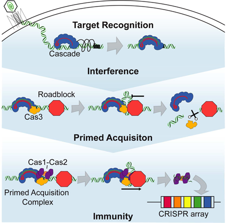
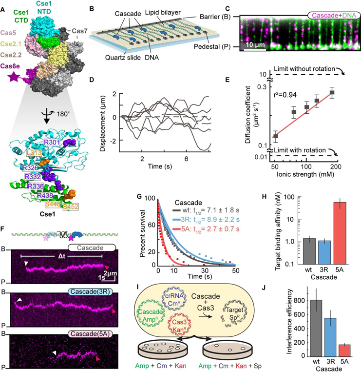
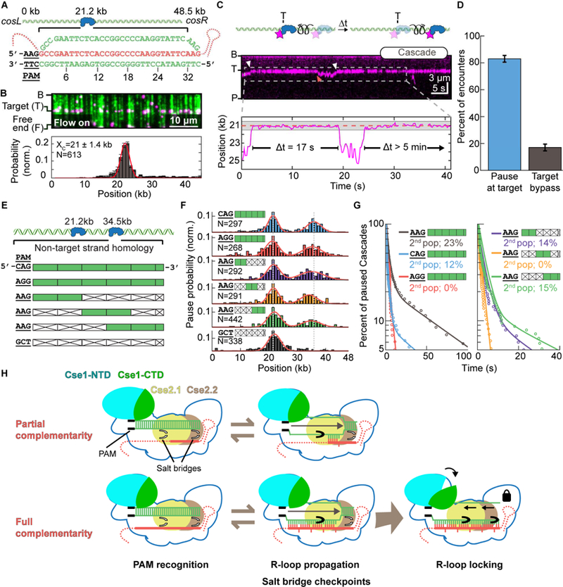
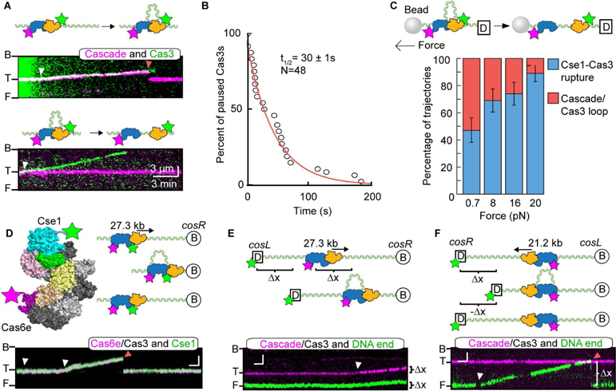
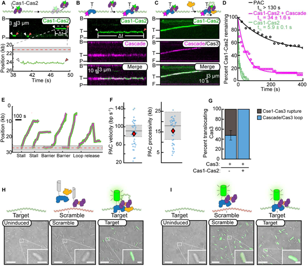
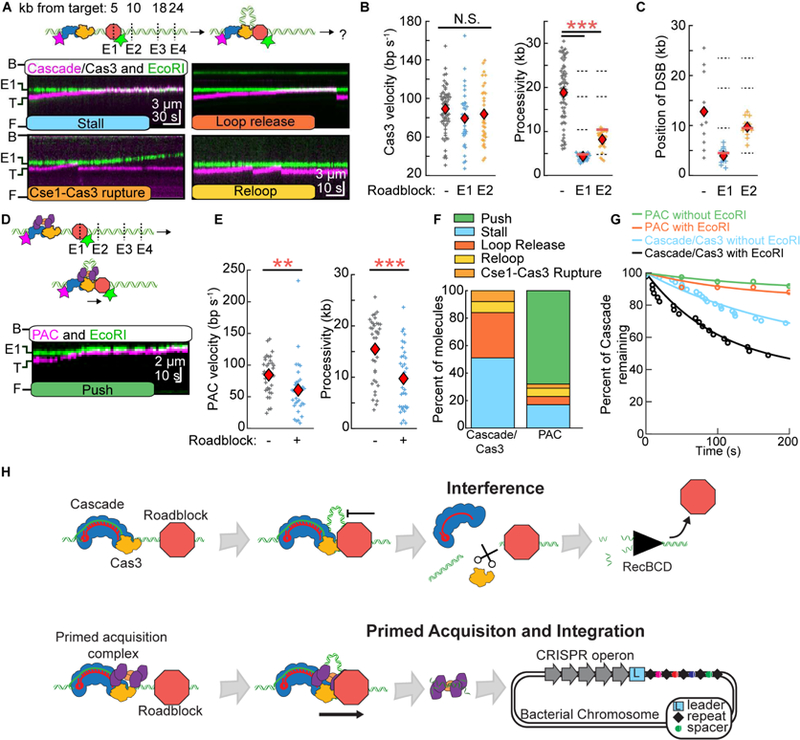
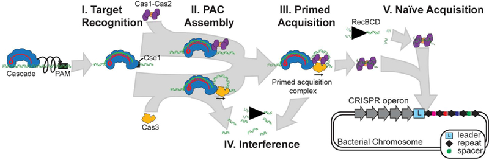

# Assembly and translocation of a CRISPR-Cas primed acquisition complex

**Kaylee E. Dillard\*, Maxwell W. Brown\*, Nicole V. Johnson, Yibei Xiao, Adam Dolan, Erik Hernandez, Samuel D. Dahlhauser, Yoori Kim, Logan R. Myler, Eric V. Anslyn, Ailong Ke, and Ilya J. Finkelstein** (\* co-first authors)

*Cell*, Volume 175, Issue 4, Pages 934–946.e13 (2018)

**DOI:** [10.1016/j.cell.2018.09.009](https://doi.org/10.1016/j.cell.2018.09.009)

---

## Table of Contents

- [Abstract](#abstract)
- [Introduction](#introduction)
- [Results](#results)
- [Discussion](#discussion)
- [Acknowledgments](#acknowledgments)

---
##  Abstract
CRISPR-Cas systems confer an adaptive immunity against viruses. Following viral injection, Cas1-Cas2 integrates segments of the viral genome (spacers) into the CRISPR locus. In addition, efficient “primed” spacer acqui sition and viral degradation (interference) both require the Cascade complex along with the Cas3 helicase/nuclease. Here, we present single-molecule characterization of the _Thermobifida fusca_ (_Tfu_) primed acquisition complex (PAC). We show that _Tfu_ Cascade rapidly samples non-specific DNA via facilitated one-dimensional diffusion. Cas3 loads at target-bound Cascade and the Cascade/Cas3 complex translocates via a looped DNA intermediate. Cascade/Cas3 complexes stall at diverse protein roadblocks, resulting in a double strand break at the stall site. In contrast, Cas1-Cas2 samples DNA transiently via 3D collisions. Moreover, Cas1-Cas2 associates with Cascade and translocates with Cascade/Cas3, forming the PAC. PACs can displace different protein roadblocks, suggesting a mechanism for long-range spacer acquisition. This work provides a molecular basis for the coordinated steps in CRISPR-based adaptive immunity.
**Keywords:** CRISPR, Cascade, Primed Acquisition, DNA Curtains, Fluorescence Microscopy
##  Graphical Abstract

##  In brief
Single molecule studies illuminate how the type I-E CRISPR-Cas interference and adaptation complexes interact and function to achieve primed spacer acquisition
---
##  INTRODUCTION
Bacteria and archaea destroy foreign nucleic acids by mounting an RNA-guided CRISPR-Cas adaptive immune response. During infection, a segment of the viral DNA, known as a protospacer, is integrated into the CRISPR locus of the host genome to immunize the cell. The integrated spacers are transcribed and processed into CRISPR RNAs (crRNAs) that assemble into a surveillance ribonucleoprotein complex (e.g., Cascade in the Type I CRISPR-Cas systems). These surveillance complexes direct the cleavage of foreign DNAs via Cas nucleases (e.g., Cas3 in Type I systems). The CRISPR locus thus confers protection to the cell and its progeny against future infections, making CRISPR-Cas immunity an adaptive process.
CRISPR-Cas systems can acquire spacers via two genetically distinct pathways: naïve or primed acquisition. Both pathways use the Cas1-Cas2 integrase to insert new spacers into the CRISPR locus ([Arslan et al., 2014](https://pmc.ncbi.nlm.nih.gov/articles/PMC6441324/#R2); [Krupovic et al., 2014](https://pmc.ncbi.nlm.nih.gov/articles/PMC6441324/#R24); [Wang et al., 2015](https://pmc.ncbi.nlm.nih.gov/articles/PMC6441324/#R47)). Naïve acquisition requires only the Cas1-Cas2 complex and can integrate foreign nucleic acids that the cell has not encountered previously as well as viruses that have evaded prior immunization ([Levy et al., 2015](https://pmc.ncbi.nlm.nih.gov/articles/PMC6441324/#R27); [Nuñez et al., 2014](https://pmc.ncbi.nlm.nih.gov/articles/PMC6441324/#R35), [2015](https://pmc.ncbi.nlm.nih.gov/articles/PMC6441324/#R36)). In contrast, primed acquisition requires Cas1-Cas2, Cascade, Cas3, and a prior record of infection by a related pathogen. Despite these additional genetic requirements, primed acquisition is much more efficient than naïve acquisition ([Datsenko et al., 2012](https://pmc.ncbi.nlm.nih.gov/articles/PMC6441324/#R6); [Semenova et al., 2016](https://pmc.ncbi.nlm.nih.gov/articles/PMC6441324/#R42); [Staals et al., 2016](https://pmc.ncbi.nlm.nih.gov/articles/PMC6441324/#R45)). Thus, primed acquisition permits the cell to rapidly adapt to phages that have acquired escape mutations.
In Type I CRISPR-Cas systems, the Cascade surveillance complex locates and binds foreign nucleic acids for both degradation and primed acquisition ([Datsenko et al., 2012](https://pmc.ncbi.nlm.nih.gov/articles/PMC6441324/#R6); [Fineran et al., 2014](https://pmc.ncbi.nlm.nih.gov/articles/PMC6441324/#R9); [Li et al., 2014](https://pmc.ncbi.nlm.nih.gov/articles/PMC6441324/#R28); [Richter et al., 2014](https://pmc.ncbi.nlm.nih.gov/articles/PMC6441324/#R38); [Fagerlund et al., 2017](https://pmc.ncbi.nlm.nih.gov/articles/PMC6441324/#R8); [Semenova et al., 2016](https://pmc.ncbi.nlm.nih.gov/articles/PMC6441324/#R42)). An RNA-DNA loop (R-loop) between the crRNA and the protospacer conformationally locks Cascade onto the foreign DNA ([Hochstrasser et al., 2014](https://pmc.ncbi.nlm.nih.gov/articles/PMC6441324/#R15); [Blosser et al., 2015](https://pmc.ncbi.nlm.nih.gov/articles/PMC6441324/#R4); [Wiedenheft et al., 2011](https://pmc.ncbi.nlm.nih.gov/articles/PMC6441324/#R49); [Jore et al., 2011](https://pmc.ncbi.nlm.nih.gov/articles/PMC6441324/#R19); [Xue et al., 2016](https://pmc.ncbi.nlm.nih.gov/articles/PMC6441324/#R52); [Xiao et al., 2017a](https://pmc.ncbi.nlm.nih.gov/articles/PMC6441324/#R50); [Rutkauskas et al., 2015](https://pmc.ncbi.nlm.nih.gov/articles/PMC6441324/#R39); [Sashital et al., 2012](https://pmc.ncbi.nlm.nih.gov/articles/PMC6441324/#R40)). Next, target-bound Cascade loads Cas3 nuclease/helicase, which unwinds and degrades the foreign DNA into a single-stranded DNA (ssDNA) product ([Hochstrasser et al., 2014](https://pmc.ncbi.nlm.nih.gov/articles/PMC6441324/#R15); [Sinkunas et al., 2011](https://pmc.ncbi.nlm.nih.gov/articles/PMC6441324/#R44); [Westra et al., 2012](https://pmc.ncbi.nlm.nih.gov/articles/PMC6441324/#R48); [Huo et al., 2014](https://pmc.ncbi.nlm.nih.gov/articles/PMC6441324/#R16); [Gong et al., 2014](https://pmc.ncbi.nlm.nih.gov/articles/PMC6441324/#R14)). Although the genetic requirements for primed acquisition have been established previously, the biophysical mechanisms underpinning interactions between Cascade, Cas3, and Cas1-Cas2 have remained elusive ([Datsenko et al., 2012](https://pmc.ncbi.nlm.nih.gov/articles/PMC6441324/#R6); [Fineran et al., 2014](https://pmc.ncbi.nlm.nih.gov/articles/PMC6441324/#R9)).
Here, we report the stepwise assembly and biophysical characterization of the _Thermobifida fusca (Tfu)_ Type I-E CRISPR-Cas interference and primed acquisition machineries. Using single-molecule fluorescence imaging, we show that Cse1, a subunit of Cascade, plays a key role in target recognition by facilitating rapid scanning of foreign DNA via facilitated diffusion. After target recognition, Cascade recruits Cas3, and the Cascade/Cas3 interference complex translocates via a looped DNA intermediate until it encounters other DNA-bound proteins. Upon stalling at these roadblocks, Cas3 creates double-stranded DNA breaks that degrade the viral genome. Finally, we provide direct evidence that Cas1-Cas2 binds DNA transiently on its own but interacts with Cascade/Cas3 to form the primed acquisition complex (PAC). The PAC translocates for long distances on crowded DNA, explaining how spacers are acquired far from the target site during primed acquisition. Taken together, this work provides a comprehensive molecular mechanism for how Cascade and Cas3 function during both interference and primed acquisition in the CRISPR-Cas adaptive immune system.
---
##  RESULTS
### Cascade scans for targets via facilitated diffusion on non-specific DNA
To understand how Cascade participates in both interference and primed acquisition, we imaged fluorescent _Tfu_ Cascade on double-tethered DNA curtains that extend the substrate in the absence of buffer flow ([Gallardo et al., 2015](https://pmc.ncbi.nlm.nih.gov/articles/PMC6441324/#R12); [Jung et al., 2017](https://pmc.ncbi.nlm.nih.gov/articles/PMC6441324/#R20)) ([Figure 1](#fig1) and [S1](https://pmc.ncbi.nlm.nih.gov/articles/PMC6441324/#SD2)). The DNA substrate lacked a target DNA sequence that was complementary to the Cascade crRNA. In contrast to prior results with the _E. coli (Ec)_ Cascade complex, we observed that 90% (N=258 out of 288) of _Tfu_ Cascade molecules initially bound non-specific DNA and scanned the substrate via facilitated 1D diffusion ([Figure 1D-F](#fig1)) ([Redding et al., 2015](https://pmc.ncbi.nlm.nih.gov/articles/PMC6441324/#R37)).

***Figure 1.*** Cse1 promotes facilitated diffusion of Cascade along DNA.

(A) Top: structure of _T. fusca_ (_Tfu_) Cascade (PDB ID: 5U0A). Star: fluorescent label. Bottom: diverse Cse1 subunits encode a set of eight evolutionarily-conserved positive residues that may interact with DNA. _Tfu_ Cse1 retains five positive residues (purple). (B) DNA curtains are assembled by immobilizing DNA molecules between microfabricated chrome barriers (B) and pedestals (P). (C) Cascade (magenta) binds non-specifically along the DNA substrate (green). (D) Single-particle traces showing six representative Cascade molecules diffusing on DNA. (E) Cascade diffusion coefficients as a function of ionic strength. Dashed lines: upper boundaries for the theoretical diffusion coefficients based on models either with (helical) or without (non-helical) rotation along the DNA duplex. N > 45 molecules for all conditions. Error bars: S.E.M. The linear fit (red line) estimates 1 ± 0.4 (mean ± 95% C.I.) Coulombic interactions are disrupted at increasing ionic strength. (F) Illustration (top) and kymographs (bottom) of the indicated Cascade variants diffusing on DNA. White and red arrows mark DNA binding and release, respectively. (G) DNA-binding lifetimes of each Cascade variant were fit to a single exponential decay (solid lines). Legend: half-lives ± 95% C.I. (H) Cascade target binding affinities measured via EMSAs. S.D. calculated from at least three replicates. (I) _In vivo_ interference assay and (J) interference efficiency of the indicated Cascade variants. Mean and S.E.M. are calculated from three replicates. Also see [Figure S1](https://pmc.ncbi.nlm.nih.gov/articles/PMC6441324/#SD2).
Proteins can scan DNA via two mutually non-exclusive scenarios: (1) sliding with rotation along the DNA helix and, (2) hopping via microscopic dissociation and re-association with DNA. Hopping allows proteins to efficiently search larger segments of the genome, while frequently randomizing the spatial register between the protein and the DNA backbone (see below). These scenarios can be distinguished by measuring the magnitude and salt-dependence of the diffusion coefficient. Because sliding proteins rotate along the DNA duplex, they experience a significantly higher drag and overall lower diffusion than hopping proteins. Hopping is observed indirectly as an increase in the diffusion coefficient at higher ionic strength because of increased electrostatic screening between the protein and DNA ([Kochaniak et al., 2009](https://pmc.ncbi.nlm.nih.gov/articles/PMC6441324/#R22)). _Tfu_ Cascade diffusion coefficients were between the theoretical limits of sliding- and hopping-only scenarios ([Figure 1E](#fig1)). Moreover, the diffusion coefficients increased ~3-fold when the ionic strength was raised from 50 mM to 200 mM ([Figure 1E](#fig1)), suggesting that Cascade searches for targets via a combination of both sliding and hopping modes.
Cascade lacking Cse1 did not diffuse on DNA curtains. Therefore, we conjectured that a positive patch on the _Tfu_ Cse1 outer surface ([Figure 1A](#fig1), bottom) promotes facilitated diffusion of Cascade during foreign DNA surveillance and that increasing ionic strength screens at least one of these charges ([Figure 1E](#fig1)). A structure-based multi-sequence alignment of divergent Cse1 variants revealed that the positive patch is highly conserved and can extend up to eight amino acids ([Figure S1A](https://pmc.ncbi.nlm.nih.gov/articles/PMC6441324/#SD2) \and [Data S1](https://pmc.ncbi.nlm.nih.gov/articles/PMC6441324/#SD1))([Ashkenazy et al., 2016](https://pmc.ncbi.nlm.nih.gov/articles/PMC6441324/#R3); [Tay et al., 2015](https://pmc.ncbi.nlm.nih.gov/articles/PMC6441324/#R46)). _Tfu_ Cse1 encodes positive charges at five of these eight sites ([Figure 1A](#fig1)). Notably, this positive patch is disrupted in _Ec_ Cse1, likely explaining the conflicting reports regarding facilitated diffusion of _Ec_ Cascade proposed by prior studies ([Figure S1A](https://pmc.ncbi.nlm.nih.gov/articles/PMC6441324/#SD2))([Redding et al., 2015](https://pmc.ncbi.nlm.nih.gov/articles/PMC6441324/#R37); [Xue et al., 2017](https://pmc.ncbi.nlm.nih.gov/articles/PMC6441324/#R53)). To test the importance of the Cse1 positive patch on facilitated diffusion, we purified Cascade harboring Cse1(5A), a variant with all five positive residues mutated to alanine ([Figure S1A](https://pmc.ncbi.nlm.nih.gov/articles/PMC6441324/#SD2)). Cse1(5A)-Cascade diffusion trajectories were 2.6-fold shorter than the wild type complex on non-specific DNA ([Figure 1G](#fig1); 2.7 ± 0.7s, N=50 vs. 7.1 ± 1.8s, N=100), and also had a 50-fold lower binding affinity for target DNA, as determined by electrophoretic mobility shift assays (EMSAs, [Figure 1H](#fig1) and [S1B](https://pmc.ncbi.nlm.nih.gov/articles/PMC6441324/#SD2)). Extending the positive patch to eight positive residues, Cse1(3R)-Cascade, did not appreciably change the duration of the diffusion traces (8.9 ± 2.2s, N=100) and also did not affect the binding affinity for target DNA ([Figure 1G](#fig1) and [S1](https://pmc.ncbi.nlm.nih.gov/articles/PMC6441324/#SD2)), indicating that additional charges are not necessary for efficient target recognition. To further probe the role of Cse1 in promoting Cascade diffusion, we optimized a sortase-based transpeptidation strategy to fluorescently label the Cse1 subunit alone, or in complex with Cascade ([Figure S1](https://pmc.ncbi.nlm.nih.gov/articles/PMC6441324/#SD2)). Fluorescent Cse1 could bind and diffuse on DNA and was most frequently observed on DNA regions with the highest PAM density ([Figure S1E,F](https://pmc.ncbi.nlm.nih.gov/articles/PMC6441324/#SD2)). Cse1 diffusion trajectories were shorter than those for the Cascade complex at identical ionic strength, suggesting that additional Cascade subunits may also engage in non-specific DNA interactions during target search ([Figure S1E](https://pmc.ncbi.nlm.nih.gov/articles/PMC6441324/#SD2)). We conclude that the positive channel formed on the surface of _Tfu_ Cse1 is critical for promoting facilitated diffusion and target recognition by _Tfu_ Cascade.
Positive residues in the Cas7 subunit (K144, K145, K148) are positioned to interact with DNA and may contribute additional stabilization during target search ([van Erp et al., 2015](https://pmc.ncbi.nlm.nih.gov/articles/PMC6441324/#R7); [Xiao et al., 2017a](https://pmc.ncbi.nlm.nih.gov/articles/PMC6441324/#R50); [Xue et al., 2017](https://pmc.ncbi.nlm.nih.gov/articles/PMC6441324/#R53)). We adapted an _in vivo_ interference assay using _Tfu_ Cascade and _Tfu_ Cas3 to determine the functional significance of the Cse1 and Cas7 positive patches ([Figure 1I,J](#fig1) and [S1G,H](https://pmc.ncbi.nlm.nih.gov/articles/PMC6441324/#SD2)). Plasmid interference efficiency was compared for WT and mutant Cascade complexes containing Cse1(5A), Cse1(3R), Cas7(3A), or Cse1(5A)/Cas7(3A) mutations. The _Tfu_ Cse1(5A) mutant showed a significant decrease in interference efficiency, whereas Cse1(3R) was statistically indistinguishable from WT Cse1. These data are consistent with our _in vitro_ single-molecule results and suggest that additional positive residues are unnecessary for efficient interference. The interference efficiency of Cas7(3A), containing the K144A, K145A, K148A substitutions, was also reduced and the Cse1(5A)/Cas7(3A) double mutant had the most severe interference defect (8-fold lower than WT Cascade). These results, along with complementary smFRET studies in the _Ec_ Cascade system, suggest that both Cse1 and Cas7 stabilize Cascade on non-specific DNA during target search via facilitated 1D diffusion ([Xue et al., 2017](https://pmc.ncbi.nlm.nih.gov/articles/PMC6441324/#R53)).
### Cascade samples potential targets via two transient intermediates
Next, we determined how diffusing Cascade molecules recognize full and partially complementary DNA targets ([Figure 2](#fig2)). To image the target search and recognition reaction, fluorescent Cascade was added to pre-assembled DNA curtains. Surprisingly, diffusing complexes frequently paused and released the target site without forming a stable R-loop ([Figure 2C](#fig2)). Cascade paused only at full or partial targets; we did not observe pausing on PAM-rich, but otherwise non-specific DNA. Approximately 80% of Cascade-target encounters (N=313 encounters) resulted in pausing events (defined to be >800 ms long for high-confidence pauses; see Methods) ([Figure 2D](#fig2)). Cascade can encounter the target in two polarities with only one orientation positioned correctly for Cse1 to recognize the PAM and initiate R-loop propagation ([Semenova et al., 2011](https://pmc.ncbi.nlm.nih.gov/articles/PMC6441324/#R41); [Rutkauskas et al., 2015](https://pmc.ncbi.nlm.nih.gov/articles/PMC6441324/#R39); [Blosser et al., 2015](https://pmc.ncbi.nlm.nih.gov/articles/PMC6441324/#R4)). If Cascade only scanned DNA via sliding along the DNA helix, it would encounter the target sequence with the wrong polarity 50% of the time. Therefore, only 50% of the encounters would pause at the target. However, we observed that ~80% of all encounters resulted in a pause. Cascade must therefore be sampling both orientations, likely via a hopping mechanism ([Figure 2D](#fig2)). Hopping allows Cascade to sample potential target sites with both polarities, ensuring efficient target recognition.

***Figure 2.*** Cascade transiently samples target sequences via PAM-dependent R-loop propagation and seed-distal complementarity.

(A) Illustration of a DNA substrate with a single Cascade target inserted 21.2 kb away from the _cosL_ DNA end. (B) Top: image of Cascade (magenta) bound to the target sequence on a single-tethered DNA curtain (green). Bottom: histogram of Cascade binding the target site fit to a single Gaussian (center and S.D. are indicated). (C) Top: illustration and kymograph of a diffusing Cascade molecule transiently pausing at the target site. The white and red arrows indicate the beginning and end of a pause, respectively. Bottom: single-molecule tracking indicates that Cascade pauses twice at the target site (dashed line). Gray band: experimental uncertainty in defining the target site. (D) Most encounters with the target sequence result in Cascade pausing (N=27 Cascade molecules; 227 pauses). Error bars are generated via bootstrapping in (B) and (D). (E) Schematic of six DNA substrates containing a second Cascade target 34.5 kb away from the _cosL_ DNA end. Segments of the target DNA are either mismatched (white boxes) or complementary (green boxes) to the crRNA. (F) Pausing probability of Cascade on the six DNA substrates described in (E). Pausing distributions are fit to two Gaussians (red) and recover both target positions (dotted grey lines). N: number of pauses. (G) Cascade pause durations on the substrates shown in (E). In all but two cases, the data required a bi-exponential fit (solid lines). The magnitude of the second population of the two exponentials is reported. N > 95 pauses for all experiments. (H) Model for target recognition by diffusing Cascade surveillance complexes. See also [Figure S2](https://pmc.ncbi.nlm.nih.gov/articles/PMC6441324/#SD3).
Next, we probed how Cascade engages potential target sites with a series of DNA substrates that included a second target site at 34.5 kb with altered PAMs or partial sequence complementarity to the crRNA ([Figure 2E](#fig2) and [S2C](https://pmc.ncbi.nlm.nih.gov/articles/PMC6441324/#SD3)). Cascade pausing at these partial target sites required both a PAM and a segment of target DNA complementary to the crRNA. Scrambling the seed region— the ~12 nucleotides proximal to the PAM that are critical for _in vivo_ interference —only resulted in a 50% reduction of paused Cascade molecules relative to the perfect target sequence ([Figure 2F](#fig2)). This suggests that Cascade can transiently recognize PAM-distal target DNA independently of the seed ([Blosser et al., 2015](https://pmc.ncbi.nlm.nih.gov/articles/PMC6441324/#R4)). Next, we observed how long Cascade remained associated with each of the PAM variants and partial target sequences ([Figure 2G](#fig2)). Cascade pause times were best described by a bi-exponential fit with a short, _t_ _1_ =1–3 s, and a longer, t2~50 s, half-life. The PAM controlled the duration and relative amplitude of the shorter timescale (_t_ _1_), but not the duration of _t_ _2_ ([Figure 2G](#fig2), left). The highest DNA-binding affinity (and strongest interference) PAM (5’-AAG) resulted in the longest _t_ _1_ pause duration, _t_ _1_ =2.8 ± 0.1s (N=656 pauses). In contrast, intermediate interference 5’-CAG and weakest interference 5’-AGG PAMs had short _t_ _1_ pauses (_t_ _1_ =1.5 ± 0.1s; N=105 and _t_ _1_ =2.4 ± 0.4s; N=96 pauses, respectively). Moreover, the weakest 5’-AGG PAM pause durations were best described by a single, short exponential decay without a long-lived state (_t_ _2_). Next, we determined the pause duration for Cascade on a series of targets that had the strongest PAM (5’-AAG), but contained mismatches between the crRNA and the first, second, and third segments of the target DNA ([Figure 2G](#fig2), right). All DNA substrates still exhibited a short pause, _t_ _1_ =~1–2s. Unlike the PAM mutations, mismatches between the target and the crRNA led to changes in the second pause duration, _t_ _2_. _t_ _2_ was ~2.6 fold shorter than the perfect target for substrates with PAM-proximal and distal complementarity but was virtually non-existent when the complementarity was moved to the middle segment. These data show that complementarity in the PAM-proximal ‘seed’ region is sufficient to induce a long-lived pause on the partial target as the R-loop directionally propagates away from the PAM. Unexpectedly, PAM-distal complementarity is also sufficient for a long-lived Cascade pause. Our recent structural snapshots of a partial _Tfu_ Cascade R-loop revealed that salt-bridges between Cas7s and Cse2 subunits seal the target strand in PAM-distal regions during R-loop propagation ([Xiao et al., 2017a](https://pmc.ncbi.nlm.nih.gov/articles/PMC6441324/#R50)). Taken together, the structural and single-molecule results suggest the model summarized in [Figure 2H](#fig2). The identity of the PAM and the first few PAM-proximal nucleotides initiate a short (1–3s) pause. This pause is likely necessary for Cse1 to insert an aromatic wedge into the PAM-proximal DNA duplex and melt a bubble in the target DNA. R-loop propagation is reversible, even on the complementary target DNA. Extension of the R-loop past two Cse2 salt bridges further stabilize the R-loop intermediate ([Xiao et al., 2017a](https://pmc.ncbi.nlm.nih.gov/articles/PMC6441324/#R50)). Finally, conformational locking of the entire Cascade complex re-orients the Cse1 N- and C-terminal lobes for Cas3 recruitment and downstream interference and primed acquisition.
### Translocating Cascade/Cas3 complexes generate tension-sensitive DNA loops
To determine the mechanism of _Tfu_ Cas3 recruitment and translocation, we next imaged Cascade, Cas3, and the ssDNA product ([Figures S3](https://pmc.ncbi.nlm.nih.gov/articles/PMC6441324/#SD4) and [S4](https://pmc.ncbi.nlm.nih.gov/articles/PMC6441324/#SD5)). Fluorescent Cas3 preferentially localized to target-bound Cascade and remained stationary on DNA substrates with AMP-PNP, a non-hydrolysable ATP analog ([Figure S3D,E](https://pmc.ncbi.nlm.nih.gov/articles/PMC6441324/#SD4)). In the presence of 1 mM ATP, Cas3 translocated towards the DNA tethering point, as expected for the 3’ to 5’ directionality of the Cas3 helicase domain on the non-target strand ([Figure 3A](#fig3)) ([Huo et al., 2014](https://pmc.ncbi.nlm.nih.gov/articles/PMC6441324/#R16)). Remarkably, Cascade remained associated with the translocating Cas3 in 53% of all trajectories ([Figure 3A](#fig3), top). In the remaining trajectories, Cascade and Cas3 fluorescent signals separated within a single frame (< 200 ms), suggesting a rupture between Cascade and Cas3 that was rapid and stochastic. After rupturing from Cas3, Cascade returned to its initial position at the target DNA site while Cas3 continued to translocate along the DNA substrate ([Figure 3A](#fig3), top). The co-translocation of the Cascade/Cas3 complex and instantaneous return of Cascade to the target site is consistent with a looped DNA intermediate produced during DNA translocation. The DNA loop is produced because Cas3 translocates away from the target site while maintaining contact with target-bound Cascade, as has been proposed for the _E. coli_ Type I-E system ([Loeff et al., 2018](https://pmc.ncbi.nlm.nih.gov/articles/PMC6441324/#R29); [Redding et al., 2015](https://pmc.ncbi.nlm.nih.gov/articles/PMC6441324/#R37)). Processive Cas3 movement started after a 30 ± 0.8s (N=48) initiation phase where Cas3 did not appear to translocate within our spatial resolution ([Figure 3B](#fig3)). However, limited Cas3 helicase/nuclease activity was apparent during this initiation phase because short ssDNAs could be visualized by adding fluorescent single-stranded DNA binding protein (SSB) to the flowcells. ([Figure S4](https://pmc.ncbi.nlm.nih.gov/articles/PMC6441324/#SD5)). Cas3 translocated along the DNA substrate with a mean processivity of 19 ± 7 kb (N=68, error denotes S.D.) at a velocity of 89 ± 25 bp s−1 (N=68). Guided by previous findings that Cas3 interacts with the Cse1 subunit of Cascade and observation that Cse1 and Cas3 are fused in other Type I-E systems, we tested whether Cse1 remains associated with translocating Cas3 after Cascade release ([Redding et al., 2015](https://pmc.ncbi.nlm.nih.gov/articles/PMC6441324/#R37); [Westra et al., 2012](https://pmc.ncbi.nlm.nih.gov/articles/PMC6441324/#R48)). Concurrent dual-color imaging of both fluorescent Cse1 and Cas6e in a Cascade complex revealed that Cse1 always remained associated with Cascade as Cas3 translocated away ([Figure 3D](#fig3)). These results provide direct evidence for retention of Cse1 in the Cascade complex after Cas3 loading and translocation.

***Figure 3.*** Cascade/Cas3 complex translocates via a looped DNA intermediate.

(A) Top: illustration and kymograph of a translocating Cascade/Cas3 complex. Bottom: Cas3 translocating independently of Cascade. White arrows: initiation of translocation; red arrow: Cascade/Cas3 separation. (B) Cas3 initiates translocation after a 30 ± 1s (95% C.I.) pause (N=48). (C) Hydrodynamic force is applied to a 1 µm paramagnetic bead conjugated to the free DNA end. Increasing tension on the DNA ruptures the Cse1 and Cas3 protein-protein contacts, leading to independent Cas3 translocation events. (D) Top: schematic of the dual-labeled Cascade complex. Cse1 and Cas6e always translocated together upon addition of Cas3 and ATP (N=10). (E, F) Translocating Cas3 extrudes a DNA loop due to interactions with target-bound Cascade (top, E,F). Cascade/Cas3 translocates in the 3’ to 5’ direction on the non-target strand, towards the _cosR_ DNA end. Release of the DNA loop (red arrow in panel F) via Cas3-Cse1 rupture or slippage returns the DNA end to its initial position. Scale bars: 3 min (horizontal) and 1 µm (vertical). See also [Figures S3](https://pmc.ncbi.nlm.nih.gov/articles/PMC6441324/#SD4) and [S4](https://pmc.ncbi.nlm.nih.gov/articles/PMC6441324/#SD5).
Physical interactions between target-bound Cascade and a moving Cas3 will produce a growing and tension-dependent DNA loop that is extruded at the Cse1-Cas3 interface ([Loeff et al., 2018](https://pmc.ncbi.nlm.nih.gov/articles/PMC6441324/#R29); [Redding et al., 2015](https://pmc.ncbi.nlm.nih.gov/articles/PMC6441324/#R37)). To directly visualize these looped DNA intermediates, we used DNA substrates with one fluorescent DNA end positioned either upstream or downstream of translocating Cas3 ([Figures 3E,F](#fig3)). Consistent with the looping model, Cas3 movement away from the free DNA end pulls Cascade and the free DNA end at identical rates in the direction of Cas3 translocation ([Figure 3E](#fig3)). Alternatively, if the DNA tethering geometry is reversed, then Cas3 translocation reels in the free DNA end without observable Cascade movement ([Figure 3F](#fig3)). Retraction and stochastic release of the free DNA end corresponded with independent Cas3 translocation and Cse1-Cas3 rupture.
In the cell, one or both ends of the foreign DNA are likely to be physically constrained (i.e., to the viral capsid during infection/package or to the transcription/translation machinery during viral replication). Processive Cascade/Cas3 translocation will thus produce increasing DNA tension as the DNA loop grows. We developed a high-throughput assay to measure force-dependent Cascade/Cas3 loop rupture ([Figure 3C](#fig3) and [S3F](https://pmc.ncbi.nlm.nih.gov/articles/PMC6441324/#SD4)). In this assay, one end of the DNA is immobilized on the pedestal and the second DNA end is conjugated to a 1 µm streptavidin-coated paramagnetic bead. The tension on the DNA molecule can then be controlled by increasing the force on the bead. These beads increase the hydrodynamic drag experienced by DNA molecules under mild buffer flow. Increasing the buffer flow rate (hydrodynamic force) correspondingly increases the tension applied to the DNA molecule ([Figure S3G](https://pmc.ncbi.nlm.nih.gov/articles/PMC6441324/#SD4)). At an applied force of 0.7 pN, 53% (N=30) of translocating Cascade/Cas3 complexes moved together as a complex for the duration of the entire trajectory. Increasing the applied force resulted in substantially fewer looped Cascade/Cas3 complexes; only 11% (N=18) of translocating complexes moved together at 20 pN of applied force ([Figure 3C](#fig3)). We conclude that Cascade/Cas3 interactions rupture as tension accumulates between the moving Cas3 and stationary Cascade.
### Cas1-Cas2 associates with Cascade/Cas3 in the Primed Acquisition Complex
Primed acquisition requires Cascade, Cas3, and the Cas1-Cas2 integrase ([Datsenko et al., 2012](https://pmc.ncbi.nlm.nih.gov/articles/PMC6441324/#R6); [Fineran et al., 2014](https://pmc.ncbi.nlm.nih.gov/articles/PMC6441324/#R9); [Li et al., 2014](https://pmc.ncbi.nlm.nih.gov/articles/PMC6441324/#R28); [Richter et al., 2014](https://pmc.ncbi.nlm.nih.gov/articles/PMC6441324/#R38); [Fagerlund et al., 2017](https://pmc.ncbi.nlm.nih.gov/articles/PMC6441324/#R8); [Semenova et al., 2016](https://pmc.ncbi.nlm.nih.gov/articles/PMC6441324/#R42); [Jackson et al., 2017](https://pmc.ncbi.nlm.nih.gov/articles/PMC6441324/#R18)). However, the functions of Cas1-Cas2 in primed acquisition have only been assayed indirectly. Here, we observed the assembly and translocation of a ~710 kDa PAC, consisting of Cas1-Cas2, Cascade, and Cas3 ([Figure 4](#fig4)). For single-molecule imaging, Cas2 was N-terminally labeled via sortase-mediated transpeptidation and integrated into a _Tfu_ Cas1-Cas2 heterodimer with a (Cas1)4-(Cas2)2 stoichiometry ([Figure S5](https://pmc.ncbi.nlm.nih.gov/articles/PMC6441324/#SD6)). In the absence of Cascade, Cas1-Cas2 transiently bound the DNA substrate with a half-life of ~5.9 ± 0.1s (N=38) ([Figure 4A,D](#fig4)). We next determined how Cas1-Cas2 interacted with target-bound Cascade ([Figure 4B](#fig4)). Cas1-Cas2 complexes that randomly collided with Cascade remained stably associated with Cascade at the target site. We followed up this observation with four lines of evidence that Cas1-Cas2 forms a long-lived complex with both target-bound and diffusing Cascade complexes. First, Cas1-Cas2 co-localized with Cascade that was pre-loaded on the target site and the lifetime of Cas1-Cas2 on DNA increased ~5.8-fold relative to Cas1-Cas2 in the absence of Cascade ([Figures 4B,D](#fig4) and [S5E](https://pmc.ncbi.nlm.nih.gov/articles/PMC6441324/#SD6)). Second, pre-incubating fluorescent or unlabeled Cascade with fluorescent Cas1-Cas2, resulted in Cascade/Cas1-Cas2 complexes that diffused on non-specific DNA and could recognize the Cascade target sequence ([Figure S5F](https://pmc.ncbi.nlm.nih.gov/articles/PMC6441324/#SD6)). Third, we could pull down Cascade with bead-immobilized Cas1-Cas2 ([Figure S5G](https://pmc.ncbi.nlm.nih.gov/articles/PMC6441324/#SD6)). Fourth, we determined that Cascade and Cas1-Cas2 formed a complex _in vivo,_ as reported by a bimolecular fluorescence complementation (BiFC) assay ([Figure 4I](#fig4)). In this assay, Cse1 was fused to a C-terminal fragment of mVenus and Cas1 was fused to the N-terminal mVenus fragment ([Nagai et al., 2002](https://pmc.ncbi.nlm.nih.gov/articles/PMC6441324/#R33)). Expression of Cascade and the Cas1-Cas2 complex resulted in robust fluorescent signal. Deleting Cas2 resulted in no signal, indicating that formation of the Cascade/Cas1-Cas2 complex either requires the intact Cas1-Cas2 integrase or is mediated via Cas2-specific protein interactions ([Figure S5H](https://pmc.ncbi.nlm.nih.gov/articles/PMC6441324/#SD6)). Remarkably, the DNA target was not required for a strong BiFC signal between the Cascade and Cas1-Cas2 subunits _in vivo_. These results indicate that Cascade interacts with Cas1-Cas2 in a DNA-independent manner and that Cas1-Cas2 remains associated with target-bound Cascade.

***Figure 4.*** Cas1-Cas2 forms a complex with Cascade and Cas3.

(A) Cas1-Cas2 sampling DNA via 3D collisions. The dashed red line and gray band represent the Cascade target site, as defined in [Figure 2](#fig2). (B) Illustration (top) and kymographs of Cas1-Cas2 (green) recruitment to Cascade (magenta) at the target site. White arrows in (A) & (B): Cas1-Cas2 binding, red arrows: Cas1-Cas2 dissociation. (C) The PAC processively translocates along DNA. Cascade (magenta) and Cas1-Cas2 (green) are fluorescently labeled while the presence of dark Cas3 is observed via translocation of the entire complex. (D) DNA-binding lifetimes of the indicated complexes were each fit to a single exponential decay. A constant was also included in the Cascade/Cas3 and PAC fits. Error: 95% C.I. (E) Representative traces of Cascade (magenta) and Cas1-Cas2 (green) translocating together in the PAC. (F) The mean PAC velocity was statistically indistinguishable from Cascade/Cas3 (N=39; p=0.34). Mean PAC processivity was reduced compared to Cascade/Cas3 (p=0.015). Red diamonds indicate the mean of the PAC distribution. The mean and S.D. of the Cascade/Cas3 distributions are indicated by the solid and dashed gray lines, respectively. (G) The PAC translocates exclusively via a DNA looping mechanism. Error bars generated via bootstrapping. (H) BiFC assay showing the PAC forms _in vivo_. (I) Cascade interacts with Cas1-Cas2 without a target DNA. Scale bars: 10 µm and 2 µm for the inset. See also [Figure S5](https://pmc.ncbi.nlm.nih.gov/articles/PMC6441324/#SD6).
Next, we imaged directional translocation of the entire PAC by adding unlabeled Cas3 to the pre-assembled Cascade/Cas1-Cas2 complex. Cas3 activity was observed indirectly as translocation of the PAC away from the target site ([Figure 4C](#fig4)). The majority of translocating PACs retained Cas1-Cas2 for the duration of the entire trajectory (87.5%, N=35/40), indicating that Cas1-Cas2 is further stabilized within the PAC ([Figure 4D,E](#fig4)) relative to the Cascade/Cas1-Cas2 sub-complex. All translocating PACs moved towards the DNA tether at a mean velocity of 84 ± 28 bp s−1 (N=40; error indicates S.D.), which was statistically indistinguishable from the velocity observed for Cascade/Cas3 ([Figure 4F](#fig4)). In contrast, the PAC processivity was 20% lower than the Cascade/Cas3 complex (15.5 ± 5.6 kb for the PAC, N=40; p=0.015 relative to Cascade/Cas3). Whereas ~50% of Cascade/Cas3 complexes eventually showed Cse1-Cas3 rupture and independent Cas3 translocation, we did not see any independently translocating Cas1-Cas2/Cas3 sub-complexes under identical force and imaging conditions ([Figure 4G](#fig4), N=40).
The formation of the PAC _in vivo_ was also tested via BiFC between Cascade and Cas1 in the presence of Cas3 and target DNA ([Figure 4H](#fig4)). Induction of all PAC components produced a fluorescent signal between Cas1-Cas2 and Cascade, but only in the presence of a high affinity target. In contrast, Cas1-Cas2 bound to Cascade independently of a high affinity DNA target in the absence of Cas3 ([Figure 4I](#fig4)). These data suggest that the PAC organizes around the target DNA and that Cas3 may inhibit the ability of Cas1-Cas2 to bind Cascade in the absence of a target DNA. Taken together, our results demonstrate that Cas1-Cas2 is a core subunit of the PAC, where it is stabilized by direct interactions with Cascade. Additional contacts between Cas1-Cas2 and Cas3, as well as the forked DNA that emerges from the Cas3 exit channel may contribute to Cas1-Cas2 retention in the PAC.
### Cascade/Cas3 stalls and causes DNA breaks after colliding with other DNA-bound proteins
Cas3 likely encounters RNA polymerases (RNAPs), transcription factors, and other DNA-binding proteins during processive (>10 kb) translocation. We therefore determined the outcomes of collisions between Cas3 and three site-specific DNA binding proteins— hydrolytically defective EcoRI(E111Q), Lac repressor (LacI), and stalled _Ec_ RNA polymerase (RNAP) ([Figure 5](#fig5) and [S6](https://pmc.ncbi.nlm.nih.gov/articles/PMC6441324/#SD7)). EcoRI(E111Q), LacI, and RNAP bind their target sites with pM-nM affinity, and are frequently used as model roadblocks on DNA ([Finkelstein and Greene, 2013](https://pmc.ncbi.nlm.nih.gov/articles/PMC6441324/#R10)). We first observed Cas3 interactions with fluorescent EcoRI(E111Q), which bound specifically to four EcoRI binding sites on the DNA ([Figure 5A](#fig5), top). To assay Cas3 vs. EcoRI(E111Q) collisions, fluorescent Cascade and EcoRI(E111Q) were incubated with the DNA prior to assembling DNA curtains. Cas3 was introduced with ATP, and translocation was monitored via imaging of the Cascade/Cas3 looping complex. EcoRI(E111Q) blocked 100% (N=76/76) of all Cascade/Cas3 complexes. The most frequent outcome, accounting for 51% of all collisions (N=39/76), was Cascade/Cas3 stalling at the roadblock ([Figure 5A,F](#fig5)). Other outcomes included stalling followed by a single-frame release of Cascade/Cas3 back to the initial target site (33%), or re-looping by the same Cascade/Cas3 complex (8%). In the rare event of Cas3 dissociation from Cascade before collision with the roadblock, the freely-moving Cas3 could push EcoRI(E111Q) off its target site. We never observed roadblock pushing by the entire Cascade/Cas3 complex, suggesting that Cas3 alone may be able to remove protein roadblocks. To differentiate the effects of the roadblock from the natural processivity of Cascade/Cas3 on naked DNA, we focused our analysis on Cascade/Cas3 complexes that encountered either of the first two occupied EcoRI(E111Q) binding sites (E1 and E2 in [Figure 5](#fig5)). The observed velocity was statistically indistinguishable from Cas3 on naked DNA. However, translocation was blocked by the protein roadblock ([Figure 5B](#fig5) and [S6C](https://pmc.ncbi.nlm.nih.gov/articles/PMC6441324/#SD7)).

***Figure 5.*** Differential outcomes of translocating Cascade/Cas3 and the PAC at protein roadblocks.

(A) Top: illustration of four EcoRI binding sites, E1 to E4, upstream of the Cascade target. Bottom: outcomes for collisions between translocating Cascade/Cas3 complexes (magenta) and EcoRI(E111Q) bound at E1 (green). (B) Cascade/Cas3 translocation velocities (left) and processivities (right) on naked DNA or with EcoRI(E111Q) roadblocks. Red diamonds: mean of the distribution. Dashed lines: locations of E1 to E4. Red line: the location of the first roadblock encountered by Cascade/Cas3. N > 25 for all conditions. Cas3 velocity was statistically indistinguishable for all conditions (p=0.08, 0.34 for E1 and E2 relative to naked DNA, respectively), whereas the processivity was significantly reduced in all roadblock experiments (p=5.7×10−20, 5.9×10−19 for E1 and E2 relative to naked DNA, respectively). (C) Position of DSBs induced by Cas3 nuclease activity (N ≥ 10) (D) The PAC (magenta) pushes EcoRI(E111Q) (green). (E) Velocities (left) and processivities (right) of the PAC in the absence And presence of EcoRI(E111Q). Both velocities and processivities were reduced with a roadblock compared to naked DNA (p=1.9×10−3 and p=4.9×10−5 for velocity and processivity, respectively). (F) Outcomes of collisions with EcoRI(E111Q). (G) The PAC causes less frequent DSBs on both naked DNA and at a protein roadblock. Error: 95% C.I. of a single exponential fit. Top: Cascade/Cas3 stalls and creates a DSB at roadblocks. Bottom: the PAC can push through roadblocks to acquire additional protospacers. See also [Figure S6](https://pmc.ncbi.nlm.nih.gov/articles/PMC6441324/#SD7).
We also tested two additional protein roadblocks that Cascade/Cas3 would likely encounter in the cell. Lac repressor (LacI) is a bacterial transcription factor that binds its operator site with picomolar affinity and is frequently used as a potent roadblock for DNA motor proteins ([Finkelstein and Greene, 2013](https://pmc.ncbi.nlm.nih.gov/articles/PMC6441324/#R10)). LacI, located 12.3 kb upstream of the Cascade target, also blocked Cascade/Cas3 translocation with 100% (N=28/28) of collisions resulting in stalling and frequent Cascade/Cas3 loop release ([Figure S6A-C](https://pmc.ncbi.nlm.nih.gov/articles/PMC6441324/#SD7)). Finally, we tested conflicts between Cascade/Cas3 and the host RNAP, which is required for early transcription of all foreign DNAs. While Cascade/Cas3 was able to push stalled RNAP (31% of collisions), the most frequent outcome was still Cascade/Cas3 stalling at an _Ec_ RNAP (67%) ([Figure S6D,E](https://pmc.ncbi.nlm.nih.gov/articles/PMC6441324/#SD7)). In sum, the Cascade/Cas3 complex processively translocates on naked DNA but is largely blocked by other DNA-binding proteins ([Figure 5H](#fig5)).
We reasoned that stalled Cas3 may create a double-stranded DNA break (DSB) through concerted nicking via its nuclease activity at the protein roadblock. To test this, we determined the location of Cas3-induced DSBs and the rate of their occurrence with and without the EcoRI roadblock. In the single-molecule assay, DSBs are visualized as a sudden (single-frame) shortening of the DNA molecule along with a loss of the Cascade/Cas3 signal, or by visualization of the cleaved DNA via a DNA intercalating dye (YOYO-1). The lifetime of Cascade/Cas3 on DNA was significantly shorter in the presence of the EcoRI(E111Q) roadblock relative to naked DNA ([Figure 5G](#fig5)). Cascade dissociation occurred simultaneously with DNA cleavage and required the addition of Cas3 and ATP ([Figure S6F](https://pmc.ncbi.nlm.nih.gov/articles/PMC6441324/#SD7)). In the absence of any protein roadblocks, DSBs were distributed throughout the DNA. However, Cas3-induced DSBs were predominantly at the EcoRI.E1 and EcoRI.E2 sites when EcoRI(E111Q) was deposited on the DNA ([Figure 5C](#fig5)). These results indicate that stalled Cascade/Cas3 complexes cleave DNA at protein roadblocks. The resulting free DNA end may then be further processed by RecBCD and other host nucleases.
### The PAC pushes through DNA-binding proteins to search for downstream protospacers
Primed acquisition can occur kilobases away from the Cascade target site, indicating that the PAC is also likely to encounter protein obstacles as it translocates on DNA ([Semenova et al., 2016](https://pmc.ncbi.nlm.nih.gov/articles/PMC6441324/#R42)). Therefore, we tested how the PAC responds to the EcoRI(E111Q) and stalled RNAP protein roadblocks. We first incubated Cascade and EcoRI(E111Q) with the DNA substrate. Next, fluorescent Cas1-Cas2 was injected into the flowcell, followed by Cas3 and 1 mM ATP. Translocation of the PAC was observed as directional movement of Cascade or Cas1-Cas2 away from the target site. The most common outcome of PAC-EcoRI(E111Q) collisions was pushing of the roadblock away from its high-affinity binding site (68% of molecules; N=24 out of 35) ([Figure 5D,F](#fig5)). This outcome was markedly different from the Cascade/Cas3-EcoRI(E111Q) collisions, which always blocked translocation ([Figure 5F](#fig5)). Although the PAC could push EcoRI(E111Q), its velocity and processivity decreased significantly relative to the PAC on naked DNA (p=1.9×10−3 relative to PAC and p=4.9×10−5 relative to PAC, respectively) ([Figure 5E](#fig5)). The PAC lifetime was essentially unchanged in the presence of protein roadblocks, suggesting that Cas3-induced DSBs were also significantly downregulated in the context of the PAC ([Figure 5G](#fig5)). The PAC could also push promoter-engaged RNAP 63% of the time, suggesting that the PAC is likely able to strip diverse protein roadblocks from cellular DNA ([Figure S6](https://pmc.ncbi.nlm.nih.gov/articles/PMC6441324/#SD7)). The ability of the PAC to push through protein roadblocks explains the acquisition of additional protospacers relatively far from the Cascade target site ([Semenova et al., 2016](https://pmc.ncbi.nlm.nih.gov/articles/PMC6441324/#R42)).
---
##  DISCUSSION
Here, we directly observe the first steps of target recognition and processing by the _Tfu_ Type I-E CRISPR/Cas system ([Figure 6](#fig6)). An evolutionarily-conserved positive patch on the outer surface of Cse1 and positive residues in Cas7 promote facilitated diffusion of Cascade during target search. Neutralizing mutations in these positive patches reduce the lifetimes of diffusing Cascade complexes on non-specific DNA and decrease the _in vivo_ interference efficiency. Facilitated diffusion is likely a conserved search mechanism among all CRISPR systems ([Globyte et al., 2018](https://pmc.ncbi.nlm.nih.gov/articles/PMC6441324/#R13); [Xue et al., 2017](https://pmc.ncbi.nlm.nih.gov/articles/PMC6441324/#R53)). Cascade target recognition and stable R-loop locking proceeds via at least two temporally distinct intermediates. The first of these intermediates initiates PAM-proximal opening of the DNA bubble and sampling of the target DNA “seed” region. The second, longer-lived intermediate includes R-loop propagation and additional stabilization via Cse2 salt-bridges. Complexes that cannot fully recognize the R-loop dissociate from the DNA target and continue to scan nonspecific DNA.

***Figure 6.*** Stepwise assembly of CRISPR-associated sub-complexes in interference and spacer acquisition.

(I) Cascade surveils foreign DNA via a combination of facilitated 1D diffusion and hopping. (II) Target-bound Cascade can interact with Cas1-Cas2 and Cas3 to assemble the PAC. (III) The PAC samples DNA for possible protospacers during processive translocation. (IV) Alternatively, Cas3 induces a double-stranded DNA break, likely at a protein roadblock. The free DNA ends may be further processed by RecBCD or other host nucleases to generate pre-spacers for adaptive immunity. (V) In naïve acquisition, RecBCD degrades foreign DNA into short oligonucleotide-size fragments. Cas1-Cas2 integrates some of these fragments into the CRISPR locus.
After target recognition, Cascade recruits Cas3 helicase/nuclease and the Cascade/Cas3 complex translocates in a 3’ to 5’ direction on the non-target strand. Cascade remains associated with the target, causing a DNA loop to develop between Cas3 and a target-bound Cascade. This protein interaction ruptures in a stochastic and force-dependent manner, with Cas3 occasionally translocating independently of Cascade. The Cascade/Cas3 complex is highly processive on naked DNA but is blocked by other DNA-binding proteins. Cascade/Cas3 stalling at protein roadblocks allows for iterative nicking by Cas3 and subsequent cleavage of the DNA strand. The resulting DSB can then be further processed by RecBCD and other host nucleases. In contrast, freely-moving Cas3 can push protein roadblocks from their DNA-binding sites. Clearing protein roadblocks by Cas3 could improve the interference efficiency on crowded DNA.
Primed acquisition also requires the Cas1-Cas2 integrase. Here, we provide the first direct evidence that Cas1-Cas2 is stabilized on DNA via physical interactions with Cascade. Cascade forms the keystone of the PAC, as Cas3 and Cas1-Cas2 both require Cascade for stable association with the target DNA. Our data suggest that the PAC can assemble via two routes that include initial recruitment of either Cas3 or Cas1-Cas2 to target-bound Cascade, followed by addition of the remaining sub-complex ([Figure 6](#fig6)). Further support for this assembly comes from the Type I-F system, where Cas3 is expressed as a direct fusion with Cas2.
Finally, we demonstrate that the PAC can displace other DNA-binding proteins as it searches for downstream protospacers. Cas1-Cas2 harbors a PAM-decoding center, initially identified in the structure of the _Ec_ Cas1-Cas2 complex, that is also conserved in _Tfu_ Cas1-Cas2 ([Data S1](https://pmc.ncbi.nlm.nih.gov/articles/PMC6441324/#SD1)) ([Wang et al., 2015](https://pmc.ncbi.nlm.nih.gov/articles/PMC6441324/#R47)). The Cas1-Cas2 PAM decoding center may be able to scan, capture, and excise foreign DNAs as they emerge from Cas3 within the PAC. This would likely involve the Cas1 nuclease, as the Cas2 nuclease is structurally occluded and dispensable for integration _in vivo_ ([Nuñez et al., 2014](https://pmc.ncbi.nlm.nih.gov/articles/PMC6441324/#R35), [2015](https://pmc.ncbi.nlm.nih.gov/articles/PMC6441324/#R36); [Wang et al., 2015](https://pmc.ncbi.nlm.nih.gov/articles/PMC6441324/#R47)). Alternatively, further processing by RecBCD and other host nucleases may produce short DNA fragments for integration by Cas1-Cas2 nuclease.
Two models have recently been proposed to account for how interference and primed acquisition are coordinated. One model suggests that Cse1 conformational changes recruit a Cas3/Cas1-Cas2 sub-complex during primed acquisition ([Redding et al., 2015](https://pmc.ncbi.nlm.nih.gov/articles/PMC6441324/#R37); [Xue et al., 2016](https://pmc.ncbi.nlm.nih.gov/articles/PMC6441324/#R52)). Cas3/Cas1-Cas2 then moves bi-directionally on the DNA to acquire new spacers. However, spacers are preferentially selected from the same strand as the original Cascade target site, suggesting the prime acquisition machinery might processively translocate in one direction along the DNA to acquire additional spacers ([Datsenko et al., 2012](https://pmc.ncbi.nlm.nih.gov/articles/PMC6441324/#R6)). Additionally, a recent single-molecule magnetic tweezers paper found primed acquisition occurs independently of the Cse1 conformational changes ([Krivoy et al., 2018](https://pmc.ncbi.nlm.nih.gov/articles/PMC6441324/#R23)). An alternative model suggests Cas3 produces DNA cleavage products that Cas1-Cas2 can further process and integrate into the CRISPR locus ([Künne et al., 2016](https://pmc.ncbi.nlm.nih.gov/articles/PMC6441324/#R25)). Our data reconciles these com peting models by showing that Cas1-Cas2 forms a complex with Cascade/Cas3, allowing for Cas3 cleavage products to be positioned for direct uptake by Cas1-Cas2. Additional structural and biochemical studies will be required to address how Cas1-Cas2 selects protospacers during PAC translocation and how these protospacers are subsequently integrated into the bacterial genome.
##  Contact for Reagent and Resource Sharing
Further information and requests for resources and reagents should be directed to and will be fulfilled by the Lead Contact Ilya J. Finkelstein (ifinkelstein@cm.utexas.edu).
##  Experimental Model and Subject Details
_E. coli_ cells used for both protein purification and _in vivo_ assays were grown in LB broth. TfuCas3 was purified from _E. coli_ cells grown in a M9 minimal media excluding trace metals. Cobalt was supplemented to the media. For protein purification, Cascade was transformed into BL21 Star (DE3) _E. coli_ while all other proteins were purified from BL21 (DE3) _E. coli_ cells. _E. coli_ BL21-AI were used for _in vivo_ experiments.
##  Method Details
### Protein Cloning and Purification
_Thermobifida fusca (Tfu)_ Cascade ([Huo et al., 2014](https://pmc.ncbi.nlm.nih.gov/articles/PMC6441324/#R16)), _Tfu_ Cas3 ([Huo et al., 2014](https://pmc.ncbi.nlm.nih.gov/articles/PMC6441324/#R16)), _E. coli (Ec)_ SSB, _Ec_ SSB-GFP ([Finkelstein et al., 2010](https://pmc.ncbi.nlm.nih.gov/articles/PMC6441324/#R11)), _Ec_ 3xHA-EcoRI(E111Q) ([Finkelstein et al., 2010](https://pmc.ncbi.nlm.nih.gov/articles/PMC6441324/#R11)), _Ec_ 3xHA-LacI ([Finkelstein et al., 2010](https://pmc.ncbi.nlm.nih.gov/articles/PMC6441324/#R11)), sortase variants ([Antos et al., 2009](https://pmc.ncbi.nlm.nih.gov/articles/PMC6441324/#R1)) and SUMO protease ([Malakhov et al., 2004](https://pmc.ncbi.nlm.nih.gov/articles/PMC6441324/#R31)) were purified as described previously. For fluorescent labeling, the Cas6e subunit encoded a 3xFLAG epitope tag ([Jung et al., 2017](https://pmc.ncbi.nlm.nih.gov/articles/PMC6441324/#R20)). _TfuCse1_ variants with mutated positive patch residues were cloned by using QuickChange multi-site mutagenesis (Agilent) using oligos MB75, MB76, MB77 & MB78 and MB79 & MB80 for Cse1(5A) and Cse1(3R) respectively (Table S1). Plasmids harboring mutagenized Cse1 (pIF291 for Cse1(3R) or pIF292 for Cse1(5A)) were used to purify Cascade variants following the same protocol as the wild type complex. For the _in vivo_ interference assay, Cse1 and Cas7 variants containing positive patch mutations were cloned by using QuickChange multi-site mutagenesis (Agilent) using oligos MB75, MB76, MB77, MB78, MB79, and MB80 for Cse1(5A) and Cse1(3R). Oligo MB101 was used for Cas7 mutations. For fluorescent Cas2 labeling, three glycines were added at the N-terminus using oligos MB069 and MB070 to generate plasmid pIF212 (NEB Q5 mutagenesis kit). Fluorescent Cas3 was prepared by adding LPETG-TwinStrep to the C-terminus with oligonucleotides MB073 and MB074 to generate plasmid pIF218. _Tfu_ Cas3 was also purified using a M9 minimal media excluding trace metals. For this purification, Cas3 containing an N-terminal TwinStrep-SUMO-fusion was expressed from a pET-28b expression vector. Starter cultures were prepared by growing 5 mL of LB with 50 µg mL−1 kanamycin overnight at 37°C. The starter was then transferred to 100 mL M9 containing 50 µg mL−1 kanamycin and grown overnight at 37°C. The 1 L expression cultures of M9 containing 50 µg mL−1 kanamycin were seeded with 25 mL of the overnight M9 starter and were grown at 37°C to an O.D.600 ~ 0.6. Cultures were induced with 1 mM of Isopropyl β-D-1-hiogalactopyranoside (IPTG), 1 µM CoCl 2 was added and the cultures were grown overnight at 22°C. Cells were pelleted and resuspended in 35 mL of Buffer A (30 mM HEPES [pH 7.5], 150 mM NaCl) to be lysed via sonication. After ultracentrifugation, clarified lysate was placed over a 5 mL Strep-Tactin Superflow 50% suspension (IBA Life Sciences, 2–1206-010) gravity column equilibrated in Buffer A. The column was washed with 100 mL of Buffer A and the protein was eluted with 20 mL of Buffer B (30 mM HEPES [pH 7.5], 150 mM NaCl, 5 mM desthiobiotin). After elution, Cas3 was spin concentrated with a (10 kDa) Amicon Ultra-15 Centrifugal Filter (EMD Millipore, UFC903024) and SUMO protease was incubated with the protein overnight. Cas3 was isolated on a HiPrep Sephacryl S-200 HR column (GE, 17116601) pre-equilibrated in Buffer A. Peak fractions were concentrated to 25 µ M and frozen with liquid nitrogen.
_Tfu_ Cas1 and _Tfu_ Cas2 were cloned into pET expression vectors containing an N-terminal His6-SUMO-fusion (pIF201 and pIF202 for Cas1 and Cas2, respectively). Cas1 and Cas2 were purified separately following the same protocol: 1 L of LB supplemented with 50 µg mL−1 kanamycin was seeded with 20 mL of overnight culture. Cultures were grown at 37°C to an O.D.600 ~ 0.6 and induced with 0.5 mM Isopropyl β-D-1-thiogalactopyranoside (IPTG). The temperature was reduced to 18°C and growth continue d for 18 hours. After expression, cells were pelleted by centrifugation and resuspended in 35 mL of Nickel Buffer A (20 mM HEPES [pH 7.5], 10 mM Imidazole, 500 mM NaCl). Cells were lysed by a pressure homogenizer, and cellular debris pelleted via ultracentrifugation. The clarified lysate was run over two tandem 1 mL His-Trap HP ion affinity columns (GE, 29–0510-21) pre-equilibrated in Nickel Buffer A. The His-Trap column was washed with 40 mL of Nickel Buffer A and Cas1 or Cas2 was eluted with a 20 mL gradient to 100% Nickel Buffer B (20 mM HEPES [pH 7.5], 500 mM imidazole, 500 mM NaCl). SUMO protease was added to the reaction in 1:50 molar ratio with Cas1 or Cas2 and the mixture was dialyzed against 2 L of Nickel Buffer A overnight. The Cas1-Cas2 complex was assembled by mixing Cas1 and Cas2 at a 4:1 molar ratio and incubating for 1 hour at 4°C. The complex was resolved over a HiPrep Sephacryl S-200 HR column (GE, 17116601) pre-equilibrated in Gel Filtration Buffer (20 mM HEPES [pH 7.5], 500 mM NaCl, 10% glycerol).
A strain encoding an _in vivo_ biotinylation peptide on the C-terminus of the β’ subunit (strain IF46) of _Ec_ RNA polymerase (RNAP) was generously provided by Dr. Robert Landick ([Shaevitz et al., 2003](https://pmc.ncbi.nlm.nih.gov/articles/PMC6441324/#R43)). RNAP holoenzyme was purified as described previously with some modifications ([Nudler et al., 2003](https://pmc.ncbi.nlm.nih.gov/articles/PMC6441324/#R34)). A 50 mL starter culture was grown overnight at 37°C. A 2 L flask of LB was inoculated with 10 mL of the overnight culture and grown overnight at 37°C. Cells were resuspended in 100mL of grinding buffer (300 mM NaCl, 50 mM Tris-HCl, pH 8, 5% glycerol, 10 mM EDTA, 0.1% PMSF, 10 mM mercaptoethanol, 133 µ g mL−1 lysozyme) and incubated in the buffer for 20 minutes. Next, Sodium Deoxycholate was added to a final concentration of 0.2%, and the cells were sonicated using a Sonic Dismembrator 60 (Fisher). The lysate was spun down for 30 minutes using a Sorvall JA-20 rotor at 12,000rpm. PEI was added to the supernatant while stirring to a final concentration of 0.35%, then stirred for an additional 10 minutes. The lysate was centrifuged in a Sorvall JA-20 rotor at 6000 rpm for 5 minutes and resuspended in 100 mL 0-salt A buffer (25mM Tris pH8, 10% glycerol) + 300 mM NaCl. Again, the lysate was pelleted using a Sorvall JA-20 rotor at 6000 rpm for 5 minutes and resuspended in 100 mL 0-salt A buffer (25 mM Tris pH 8, 10% glycerol) + 500 mM NaCl. The lysate was centrifuged again and resuspended in 100 mL B buffer (25mM Tris-HCl pH 8, 10% glycerol, 1M NaCl) and incubated for 1 hour to extract the RNAP. Finally, the lysate was centrifuged again in a Sorvall JA-20 rotor at 6000 rpm for 5 minutes, and ammonium sulfate was slowly added to the supernatant to 65% w/v. The solution was stirred for 30 minutes before centrifugation in a Sorvall JA-20 rotor at 14,000 rpm for 45 minutes. The protein was dissolved in 50mL 0-salt A buffer (25 mM Tris-HCl pH 8, 10% glycerol) and loaded onto a 5-mL Hi-Trap Heparin column at 0.5 mL min-1. The column was washed with A buffer (25 mM Tris pH 8, 10% glycerol, 100 mM NaCl) and eluted from the column with >60% B buffer. Fractions were collected and diluted to lower the salt concentration. Then, the protein was loaded onto a Resource Q column and washed with a slow salt gradient from 0.05–1 M NaCl to separate holoenzyme and the core complex. Fractions of the holoenzyme were concentrated and mixed with an equal volume of glycerol prior to storage at −20°C.
###  _In vivo_ Interference Assay
_Tfu_ Cse1 and Cas7 variants containing positive patch mutations were cloned via QuickChange multi-site mutagenesis (Agilent) (see Tables S1 & S2 for oligos and plasmids, respectively). The _in vivo_ interference assay used the plasmid system described previously, with several modifications ([Huo et al., 2014](https://pmc.ncbi.nlm.nih.gov/articles/PMC6441324/#R16)). Genes required for the assembly of the _Tfu_ Cascade complex were in a pBAD-based vector. _Tfu_ Cas3 was in pET28b, the crRNA array (harboring 4 repeats of the same crRNA sequence) was in pACYC Duet1, and the target sequence was in pCDF-Duet1. The LB-agar plates had the following concentrations of each antibiotic: 50 µg ml−1 kanamycin, 100 µg ml−1 ampicillin, 50 µg ml−1 streptomycin, and 34 µg ml−1 chloramphenicol. The Cas3 and crRNA plasmids were co-transformed to BL21-AI cells, then competent cells were made from these. The target plasmid was transformed, and competent cells prepared again. Cascade plasmids were then transformed to obtain _E. coli_ strains harboring all four plasmids. 5 mL LB cultures with no antibiotics were inoculated with the four plasmid-containing cells and grown to OD 0.7 at 37°C. Cultures were induced with 0.5% L- arabinose and 2.5 mM IPTG and grown for an additional 4.5 hours at 37°C. Cultures were the n serially 10-fold diluted and plated onto LB plates containing ampicillin, kanamycin, and chloramphenicol and on LB plates containing ampicillin, kanamycin, chloramphenicol, and streptomycin. The ratio of the colony forming units (multiplied by their dilution scale) between the two plates was used to calculate the interference efficiency for each mutant Cascade complex.
### Bimolecular Fluorescence Complementation (BiFC) Assays
For BiFC assays, Cas3 was amplified using oligos NJ022 and NJ027 and sub-cloned into a vector containing the crRNA array (HiFi Assembly, NEB). mVenus-pBAD was a gift from Michael Davidson and Atsushi Miyawaki (Addgene plasmid # 54845) and was split at 154/155 for use in this study ([Nagai et al., 2002](https://pmc.ncbi.nlm.nih.gov/articles/PMC6441324/#R33)). mVenus-N was fused to Cas1 in pACYC Cas1-Cas2 by HiFi Assembly using oligos KD055, KD066, KD067, & KD068. mVenus-C was fused to the C-terminus of Cse1 in the pBAD vector encoding all Cascade subunits (HiFi Assembly using oligos KD059, KD060, KD061, & KD062). For the control shown in [Figure S5H](https://pmc.ncbi.nlm.nih.gov/articles/PMC6441324/#SD6), Cas2 was removed from the pACYC Cas1-mVenusN vector by inverse PCR, using oligos NJ032 and NJ034.
BiFC experiments were performed in _E. coli_ BL21-AI cells carrying Cascade (Cse1-mVenusC), Cas1-mVenusN/Cas2, target or scrambled DNA, and either a vector containing just the crRNA or both crRNA and Cas3. A single colony bearing all four plasmids was grown in LB at 37°C until OD600 reached ~0.3. Cells were induced with 0.05% L-arabinose and 1mM IPTG and shaken at 30°C for 3 hours. Cells were re-suspended in 1X PBS, pH 7.2 and 10 µL of the solution was sandwiched between two #0 glass microscope coverslips (Fisher #12–458-5C). The cells were imaged using an inverted microscope (Nikon Eclipse Ti) equipped with a 60X water objective and a motorized stage (Proscan III, Prior). Images were acquired on a scientific grade camera (Andor iXon EMCCD) using bright field light and an ET EYFP filter cube (Chroma #49003). For Cas2-dependent controls, pACYC Cas1-mVenusN (CamR) was used in place of pACYC Cas1-mVenusN/Cas2 and the experiments were performed as above (Table S2).
### Sortase labeling for single-molecule imaging
#### Peptide synthesis.
Peptides were synthesized using the Liberty Blue Automated Microwave Peptide Synthesizer (CEM Corporation) using manufacturer-suggested protocols. Analytical HPLC characterization of peptides was performed using an Agilent Zorbax column (4.6 × 250 mm; 10 mL min−1, 5–95% 1000 MeCN or MeOH (0.1 % trifluoroacetic acid (TFA) or formic acid (FA)) over 60–90 minutes). A Gemini C18 3.5 micron 2.1 × 50 mm was used for online separation; 0.7 mL min−1, 5–95% MeCN (0.1 % formic acid) in 12 min. An Agilent Technologies Accurate-Mass LC/MS (model #6530) was used for high-resolution mass spectra of purified peptides. All solvents were HPLC grade. LPETGG was synthesized using 100 µmole Fmoc- Gly-Wang resin (NovaBiochem by 1005 sequential coupling of the Nα-Fmoc-amino acid (P3 Biosystems) (0.2 M, 3 ml) in DMF in the presence of DIC (Chem-Impex Inc.) (1M, 1 mL) and ethyl (hydroxyimino) cyanoacetate (1M, 0.5 mL). After final deprotection, the resin was washed three times with 20 mL DMF (Fisher), AcOH, DCM, and MeOH and dried under vacuum. The peptide was cleaved from resin in TFA, water, and triisopropylsilane (TIPS) (95:2.5:2.5) for 3 hours. TFA was removed by flow of 1010 nitrogen, and the peptide precipitated with −20°C d iethyl ether. Peptide was purified by preparative HPLC (gradient elution, 5–95% MeOH in H2O w/ 0.1% FA). Organic solvents were removed by rotary evaporation. Aqueous remnants were frozen at −70°C and lyophilized overnight.
To make Atto647-LPETGG, 5.0 mg of NHS-Atto647N (Atto-Tec) was added to 4.4 mg LPETGG in 1.0 ml of anhydrous DMF. Next, 3.0 µL of N,N-Diisopropylethylamine (Sigma Aldrich) was added. The reaction was placed on a shaker for 3 hours and monitored by LC/MS. Crude mixture was purified directly by preparatory HPLC (5–95% MeOH in H2O w/ 0.1% FA). Organic solvents were removed by rotary evaporation, aqueous remnants were frozen at −70 °C 1020 and lyophilized overnight. Product was isolated as the formic acid salt. HRMS: [M]+ calc’d.: 1200.67030 m/z; obs.: 1200.62780 m/z. HRMS: [M-H]− calcd.: 943.54150 m/z; obs.: 943.54330 m/z.
Fmoc-GGGK was synthesized following the procedure described previously, omitting the final Fmoc deprotection step. Peptide was purified by preparative HPLC (gradient elution, 5–95% 1025 MeOH in H2O w/ 0.1% FA). Organic solvents were removed by rotary evaporation, aqueous remnants were frozen at −70 °C and lyophilized over night. Procedure for making GGGK-Atto647N was performed similarly to Atto647-LPETGG. The reaction was complete after 3 hours. To the crude mixture was added a solution of 20% piperidine in DMF (1.0 ml) and stirred for 20 minutes, deprotecting the N-terminus. Crude mixture was purified directly by preparatory 1030 HPLC (5–95% MeOH in H2O w/ 0.1% formic acid). Organic solvents were removed by rotary evaporation, aqueous remnants were frozen at −70 °C and lyophilized overnight. Product was isolated as the formic acid salt. HRMS: [M]+ calcd.: 945.55970 m/z; obs.: 945.55950 m/z. HRMS: [M-H]− calcd.: 943.54150 m/z; obs.: 943.54330 m/z.
#### Sortase labeling
For fluorescent labeling, Cse1 and Cas2 were purified with an N-terminal GGG residues after the SUMO tag and Cas3 was purified with a C-terminal LPETGG-TwinStrep motif. Sortase labeling was optimized for each protein by varying the temperature, labeling time, and sortase variant([Antos et al., 2009](https://pmc.ncbi.nlm.nih.gov/articles/PMC6441324/#R1)). Cse1 was labeled by incubating 48 µM Cse1 with 60 µM SUMO 1040 protease for 12 hours at 4˚C. Then, 50 µM sortase(5 M) (Addgene: 75144)([Chen et al., 2011](https://pmc.ncbi.nlm.nih.gov/articles/PMC6441324/#R5)), 10 mM CaCl2, 250 µM (Atto647N)-LPETGG fluorescent peptide was added to the protein and incubated for 1 hour at 37°C. Immediately following fluorescent labeling, Cse1 was separated from the free peptide and sortase on a Sephacryl S-200 HR column (GE) using glycerol free Gel Filtration Buffer. Fluorescent Cse1 was then reconstituted with the rest of the Cascade complex in a 1:1 ratio through a step-down NaCl dialysis (500 mM NaCl to 150 mM NaCl), and the full complex was isolated using a HiPrep Sephacryl S-200 HR column (GE) with TS Buffer (10 mM Tris-HCl [pH 7.5], 150 mM NaCl, 5 mM DTT).
Fluorescent Cas2 was prepared by cloning a C-terminal GGG and purified similarly to wild type Cas2, but with the following modification. After SUMO proteolysis, 20 µM of GGG-Cas2 was incubated with 100 µM sortase(7M) (Addgene: 51141) and 100 µM (Atto647N)-LPETGG fluorescent peptide at 4 °C for 1 hour along with of 5 mM CaCl2. Fluorescent Cas2 was separated from the free peptide and sortase on a 1 mL His-Trap HP ion affinity column with Gel Filtration Buffer, followed by complex formation and purification as described above. Fluorescently labeled Cas3 was generated by incubating 20 µM of Cas3-LPETGG-TwinStrep with 100 µM sortase(7M) and 100 µM GGGK-(Atto647N) fluorescent peptide at 15 °C for 1 hour along with 5 mM of CaCl2. Fluorescent Cas3 was separated from the free peptide and sortase using a HiPrep Sephacryl S-200 HR column with Gel Filtration Buffer containing 150 mM NaCl.
### Antibodies
Cascade was fluorescently labeled with mouse anti-FLAG BioM2 (Sigma, F9291) via a 3xFLAG epitope tag on the Cas6e subunit([Jung et al., 2017](https://pmc.ncbi.nlm.nih.gov/articles/PMC6441324/#R20)). For single-molecule imaging, antibodies were bound to 605 nm or 705 nm streptavidin-conjugated quantum dots (QDs) following published protocols (Thermo Fisher Scientific). The following antibodies were used for Westerns and co-IP experiments with Cas2, Cas3–6xHis, and Cascade-1xFLAG, respectively: 6xHis Monoclonal Antibody (Albumin Free, Clontech, 631212) and DYKDDDDK Tag Antibody (Cell Signaling Technology, 2368S)
### Electrophoretic mobility shift assay (EMSA)
All EMSAs were performed with Cy5-labeled DNA substrates that were generated via PCR with primers CJ1 and CJ2, as described previously([Jung et al., 2017](https://pmc.ncbi.nlm.nih.gov/articles/PMC6441324/#R20)). Cascade EMSAs were performed by incubating 0.3 nM of the PCR product with increasing Cascade concentrations (0.13, 0.22, 0.37, 0.62, 1.0, 1.7, 2.9, 4.8, 8 nM for WT and Cascade(3R); 1.8, 4.6, 12, 29, 72, 180, 450 nM for Cascade(5A) ) for 30 minutes at 62°C in Binding Buffer (20 mM HEPES [pH 7.5], 150 mM NaCl, 2 mM MgCl2, 1 mM DTT, 0.2 mg ml-1 BSA, 0.01% Tween-20). The reactions were resolved on a 5% native PAGE gel with 0.5X TBE Buffer (45 mM Tris-HCl [pH 8.0], 45 mM boric acid, 1 mM EDTA). Gels were visualized using a Typhoon scanner (GE) and quantified in ImageQuant TL v8.1 (GE). The fraction of bound DNA was fit to the hyperbolic curve to obtain _K_ _d_ values. All experiments were repeated in triplicate.
### Gel-based Cas3 nuclease assay
Cy5-labeled dsDNA substrates (2 nM) were incubated with Cascade (40 nM) and either WT or fluorescently-labeled Cas3 (500 nM) for 1 hour at 58°C. The reaction buffer contained 20 mM 1085 HEPES, pH 7.5, 150 mM NaCl, 5% glycerol, 10 mM MgCl2, 100 µM CoCl 2, and 2 mM ATP. The reaction was quenched with 20 mM EDTA and proteinase K at 53°C for 30 minutes. DNA was resolved on a 10% denaturing PAGE gel and visualized with a Typhoon scanner (GE).
### DNA substrates for single-molecule microscopy
DNA substrates with mutated target sequences were generated by cloning the mutated targets into helper plasmids pIF251 and pIF253 that had ~200 bp of flanking homology with λ-phage DNA ([Kim et al., 2017](https://pmc.ncbi.nlm.nih.gov/articles/PMC6441324/#R21)). PCR products containing the large homology arms were recombineered into _E. coli_ lysogens and the recombinant DNA purified from packaged phage particles([Kim et al., 2017](https://pmc.ncbi.nlm.nih.gov/articles/PMC6441324/#R21)). To functionalize the DNA ends for single-molecule experiments, we combine 125 µg of purified λ-phage DNA with 2 µM of biotinylated oligos (IF001or IF003 or (Table S1)). For double-tethered DNA curtains, a second dig-labeled oligo was annealed to the second DNA end (oligos IF002 or IF004). After ligation, the reaction was separated over a Sephacryl S-1000 column (GE, #45–000-084) to purify full length labeled DNA. The DNA was stored at 4°C.
### Single-molecule fluorescence microscopy and data analysis
All single-molecule imaging was performed using a Nikon Ti-E microscope in a prism-TIRF configuration equipped with a motorized stage (Prior ProScan II H117) containing microfluidic flowcells housed in a custom stage adapter. The flowcell was illuminated with 488 nm (Coherent), 532 nm (Ultralasers), and 633 nm (Ultralasers) lasers through a quartz prism (Tower Optical Co.). A 60x air objective and a custom-built microscope stage heater were used to maintain the flowcell near the optimal _Tfu_ Cascade temperature.
To prepare double-tethered DNA curtains for single-molecule imaging, 40 µL of liposome stock solution (97.7% DOPC, 2.0% DOPE-mPEG2k, and 0.3% DOPE-biotin; Avanti #850375P, #880130P, #870273P, respectively) was diluted into 960 µL Lipids Buffer (10 mM Tris-HCl [pH 7.8], 100 mM NaCl) and incubated in the flowcell for 30 minutes. Next, 50 ng µL −1 of goat anti-rabbit polyclonal antibody (ICL Labs, #GGHL-15A) diluted in Lipids Buffer was injected into the flowcell and incubated for 10 minutes. The flowcell was washed in Imaging Buffer (40 mM Tris–HCl [pH 7.8], 2 mM MgCl 2, 0.2 mg mL− 1 BSA) followed by a 10-minute incubation with 5 ng µL −1 of digoxigenin monoclonal antibody (Life Technologies, #700772) diluted in Imaging Buffer. Next, 0.1 mg mL−1 Streptavidin diluted in Imaging Buffer was injected into the flowcell and incubated for 10 minutes. Lastly, 12.5 ng µL −1 of the biotin- and dig-labeled DNA substrate was injected into the flowcell. Single-tethered curtains were prepared by omitting the anti-rabbit antibody and digoxigenin antibody steps. Unless otherwise indicated, imaging Buffer was supplemented with 50 mM NaCl (76 mM ionic strength). In experiments using Sortase labeled Cas3 and/or Cas1-Cas2, 10 mL Imaging Buffer was supplemented with 1 mM Trolox (Sigma-Aldrich, #238813–5G), 500 units of catalase (Sigma-Aldrich), 70 units of glucose oxidase (Sigma-Aldrich), and 1% glucose (w/v). Finally, experiments with Cas3 and/or Cas1-Cas2 included 20 µM CoCl 2 in the Imaging Buffer.
To observe Cascade diffusion and target search, 150 µL of 0.1 nM QD-labeled Cascade in Imaging Buffer supplemented with 50–150 mM NaCl was injected into a flowcell with pre-assembled double-tethered DNA curtains. Excess Cascade was removed and DNA-bound Cascade complexes were imaged at a 200 ms framerate for 10 minutes. Imaging was carried out at 25–45 °C and did not show any qualitative changes in Cascade target search behavior. In experiments where Cascade was pre-bound to the DNA target, 10 nM Cascade was incubated with 1.3 µg of biotinylated and digoxigenin labeled DNA at 55 °C for 10 minutes, followed by a 10-minute incubation at room temperature. The DNA bound Cascade was then diluted to 1 mL in Imaging Buffer with 50 mM NaCl and injected into flowcells prepared for single or double-tethered DNA curtains. Cascade was then labeled _in situ_ by injecting 150 µL of 10 nM anti-FLAG antibody conjugated QDs.
Cas3 translocation was observed by injecting 10 nM Cas3 diluted in 150 µL Imaging Buffer onto single-tethered DNA curtains with Cascade pre-bound to its target DNA. Experiments using ATTO647N-Cas3 used a five second frame rate and a computer-controlled digital shutter (Vincent Associates) on the 637 nm laser to limit Cas3 photobleaching. In these experiments, Cascade was visualized using a spectrally distinct 605 nm QD. Wild type (unlabeled) Cas3 was used in experiments with fluorescent Cse1 or fluorescent Cas1-Cas2 complex.
To observe Cas3-roadblock collisions, Cascade was pre-bound to the DNA target at 55°C. Then 5 nM of 3xHA-EcoRI(E111Q) or 2.5 nM 3xHA-LacI were incubated with the Cascade-DNA substrate on ice for 5 minutes, followed by dilution into 1 mL of Imaging Buffer. The protein bound DNA was then injected into flowcells prepared for single-tethered DNA curtains. All proteins were labeled _in situ._ HA labeled proteins were labeled by injecting 150 µL of 1 nM of anti-rabbit conjugated Qdots (Thermo Q-11461MP) pre-bound to 0.2 nM anti-HA antibody (ICL Labs, RHGT-45A-Z) diluted in Imaging Buffer. For experiments involving RNAP complexes, Cascade was pre-bound to the DNA at 55°C. _E. coli_ RNAP holoenzyme was fluorescently labeled with a streptavidin-coated QD([Finkelstein et al., 2010](https://pmc.ncbi.nlm.nih.gov/articles/PMC6441324/#R11)) and injected into the flowcell in the presence of 25 µM of GTP, 1 mM ATP, and 25 µM U TP. The ATP concentration was higher to support Cas3 translocation. RNAP that was not engaged to the promoter was removed from the DNA by a 700 µL heparin wash (0.2 mg mL −1). Cascade was fluorescently labeled by a QD _in situ_. Then, 10 nM unlabeled Cas3 was injected and collisions between the RNAP and Cascade/Cas3 complexes were visualized by recording ~10-min movies at 5 frames per second.
To observe PAC-roadblock collisions, single-tethered curtains were prepared as above for the Cas3-roadblock collisions. Next, fluorescent or WT Cas1-Cas2 (700 µL of 1 nM complex) were injected in Imaging Buffer containing 150 mM NaCl prior to the Cas3 injection.
For force-dependent experiments, 12 µg of biotinylated and digoxigenin labeled λ-DNA molecules were conjugated to 4 mg of 1 µm superparamagnetic beads (NEB, #S1420S) in Lipids Buffer overnight at room temperature. DNA-conjugated beads were washed 3 times and resuspended in 75 µL of Lipids Buffer. Cascade (30 nM) was pre-bound to 15 µL of DNA conjugated beads at 55°C and cooled to room tempera ture. DNA was captured in flowcells assembled with liposomes lacking biotinylated lipids and streptavidin. Cascade-bound DNA was injected into the flowcell, and concentrated at the surface with a rare-earth magnet for 10 minutes. The DNA bound to digoxigenin antibodies at the chromium barriers. Excess DNA and beads were flushed out of the flowcell. To initiate Cas3 translocation, 10 nM of Cas3 was injected into this flowcell at 50 µL min −1. The flow rate was subsequently increased to the desired applied force. To calculate the force-dependent elongation of DNA conjugated beads, single particle tracking was used to measure the mean extension of bead-tethered DNA molecules from the chromium barriers at flow rates ranging from 100 to 1200 µL min-1.
To image fluorescent Cas1-Cas2, Cascade was pre-bound to the target and labeled via the 3xFLAG epitope on Cas6, as described above. Fluorescent Cas1-Cas2 was diluted to a final concentration of 1 nM in Imaging Buffer containing 150 mM NaCl, and injected onto single-tethered DNA curtains. Free Cas1-Cas2 was washed out of the flowcell, followed by injection of 10 nM Cas3 when indicated.
### Co-immunoprecipitation and Western Blotting
Purified Cas1-Cas2 (225 nM) was incubated with purified Cascade (225 nM) on ice for 30 minutes in Western Buffer (40mM Tris-HCl [pH 8.0], 0.2 mg/mL BSA, 150 mM NaCl, 10% glycerol, 2 mM MgCl2, and 2 units/mL DNase I. To pull-down by TwinStrep-Cas2, the sample was applied to Strep-tactin Superflow 50% suspension beads (catalog# 2–1206-002, IBA). Anti-FLAG M2 Magnetic Beads (catalog# M8823–1ML, Sigma) were used to carry out the reciprocal experiment by pulling-down via Cascade-1xFLAG. The beads were then washed three times with Western Buffer, and the samples removed by adding 3x-FLAG peptide or boiling the beads. Supernatant was resolved on a 15% SDS-PAGE gels and probed by standard Western blotting.
### Quantification and Statistical Analysis
For [Figures 1](#fig1) and [3](#fig3)-[5](#fig5), n represents the number of molecules. For [Figure 2](#fig2), n represents the number of pause events.
Fluorescent particles were tracking using an in-house ImageJ script (available upon request). Trajectories were used to calculate the mean-squared displacement and the diffusion coefficients for Cascade, or the velocity and processivity for the Cas3-containing complexes. Binding lifetimes were fit to either a single exponential decay or a biexponential decay using a custom MATLAB script (Mathworks R2015b). The biexponential fits were tested to be appropriate using an _f-test_ applied to the survival curve data. For pause analysis, a molecule was considered paused if it stayed within a stationary window for four continuous frames (0.8 seconds). This window was defined as 3-fold the standard deviation (S.D.) of the fluctuations of a stationary Cascade at its target. Pause location was recorded in relation to the pedestal located at the digoxigenin labeled end of the DNA.
Translocating Cas3 was defined as Cas3 that left the target window for at least four continuous frames (> 800 ms). Looping Cas3-Cascade molecules were defined by scoring whether Cascade also left the target window with Cas3. In contrast, independently moving Cas3s were defined by scoring traces where Cascade remained stationary while Cas3 moved away from the target window.
#### Roadblock collision analysis.
Collisions were defined when Cascade fluorescence co-localized with the roadblock (EcoRI(E111Q), LacI, or RNAP). The roadblock was considered pushed if it moved away from its binding site for four adjacent frames (0.8 seconds).
#### Cse1 homology modeling.
Multi-sequence alignment was performed with the ConSurf evolutionary conservation tool using the HMMR homolog search algorithm, and MAFFT multiple sequence alignment methods([Ashkenazy et al., 2016](https://pmc.ncbi.nlm.nih.gov/articles/PMC6441324/#R3)). Conservation of positive residues was calculated as the percentage of a total of 150 divergent Cse1 homolog sequences that had an Arginine, Lysine, and Histidine for each residue aligned against _Tfu_ Cse1.
### Determining theoretical limits of helical and non-helical diffusion
We determined the radius of Cascade (PDB ID: 5U0A) by measuring the distance from the center of mass of Cascade bound to DNA to a distal atom in Cse1. We calculated a radius (R) of 9.6 nm. To calculate the theoretical maximum diffusion for Cascade sliding along the DNA, we calculated the rotational friction of the protein with the quantum dot (QD) using equation [(1)](https://pmc.ncbi.nlm.nih.gov/articles/PMC6441324/#FD1) ([Kochaniak et al., 2009](https://pmc.ncbi.nlm.nih.gov/articles/PMC6441324/#R22)). 
| (1)  
---|---  
Where _k_ _B_ is the Boltzmann constant, _T_ is temperature, η is the viscosity of water, _R_ is the radius of Cascade bound to DNA, and _R_ _QD_ is the radius of the QD. _T,_ the temperature in the diffusion experiments was 298 K. _R_ QD, the radius of the QD, was taken from the manufacturer’s literature (12 nm). Since our imaging buffer did not have any viscogens, the overall viscosity was comparable to water at 25°C, ηwater = 10−3 Pa·s.
To estimate the theoretical maximum diffusion coefficient with rotation, we followed the analysis previously described for PCNA ([Kochaniak et al., 2009](https://pmc.ncbi.nlm.nih.gov/articles/PMC6441324/#R22)). In this analysis, rotational friction dominates over translational friction, such that the theoretical maximum diffusion coefficient can be estimated as[(2)](https://pmc.ncbi.nlm.nih.gov/articles/PMC6441324/#FD2): 
| (2)  
---|---  
_R_ oc, the combined radius of the QD and Cascade, was estimated to be 21.6 nm.

---
##  ACKNOWLEDGMENTS
We are very grateful to Dr. Irina Artsimovitch and Dr. Robert Landick, Jeffrey Schaub, James Rybarski, and Fatema Saifuddin for providing materials. This work was supported by the Welch Foundation (F-1808 to I.J.F.), the NIH (R01GM124141 to I.J.F. & R35GM118174 to A.K.). K.E.D. and L.M. are supported by NIH fellowships (F31GM125201 to K.E.D. and F99CA212452. To L.M.). Y.K. is an HHMI graduate student fellow. We apologize to all our colleagues whose work could not be cited due to editorial constraints.

## References

1. Antos JM, Chew G-L, Guimaraes CP, Yoder NC, Grotenbreg GM, Popp MW-L, and Ploegh HL (2009). Site-specific N- and C-terminal labeling of a single polypeptide using sortases of different specificity. *J. Am. Chem. Soc.* 131, 10800-10801. [doi:10.1021/ja902681k](https://doi.org/10.1021/ja902681k)

2. Arslan Z, Hermanns V, Wurm R, Wagner R, and Pul U (2014). Detection and characterization of spacer integration intermediates in type I-E CRISPR-Cas system. *Nucleic Acids Res.* 42, 7884-7893. [doi:10.1093/nar/gku510](https://doi.org/10.1093/nar/gku510)

3. Ashkenazy H, Abadi S, Martz E, Chay O, Mayrose I, Pupko T, and Ben-Tal N (2016). ConSurf 2016: an improved methodology to estimate and visualize evolutionary conservation in macromolecules. *Nucleic Acids Res.* 44, W344-W350. [doi:10.1093/nar/gkw408](https://doi.org/10.1093/nar/gkw408)

4. Blosser TR, Loeff L, Westra ER, Vlot M, Kunne T, Sobota M, Dekker C, Brouns SJJ, and Joo C (2015). Two distinct DNA binding modes guide dual roles of a CRISPR-Cas protein complex. *Mol. Cell* 58, 60-70. [doi:10.1016/j.molcel.2015.01.028](https://doi.org/10.1016/j.molcel.2015.01.028)

5. Chen I, Dorr BM, and Liu DR (2011). A general strategy for the evolution of bond-forming enzymes using yeast display. *Proc. Natl. Acad. Sci. U. S. A.* 108, 11399-11404. [doi:10.1073/pnas.1101046108](https://doi.org/10.1073/pnas.1101046108)

6. Datsenko KA, Pougach K, Tikhonov A, Wanner BL, Severinov K, and Semenova E (2012). Molecular memory of prior infections activates the CRISPR/Cas adaptive bacterial immunity system. *Nat. Commun.* 3, 945. [doi:10.1038/ncomms1937](https://doi.org/10.1038/ncomms1937)

7. van Erp PBG, Jackson RN, Carter J, Golden SM, Bailey S, and Wiedenheft B (2015). Mechanism of CRISPR-RNA guided recognition of DNA targets in Escherichia coli. *Nucleic Acids Res.* 43, 8381-8391. [doi:10.1093/nar/gkv793](https://doi.org/10.1093/nar/gkv793)

8. Fagerlund RD, Wilkinson ME, Klykov O, Barendregt A, Pearce FG, Kieper SN, Maxwell HWR, Capolupo A, Heck AJR, Krause KL, et al. (2017). Spacer capture and integration by a type I-F Cas1-Cas2-3 CRISPR adaptation complex. *Proc. Natl. Acad. Sci.* 114, E5122-E5128. [doi:10.1073/pnas.1618421114](https://doi.org/10.1073/pnas.1618421114)

9. Fineran PC, Gerrber MJH, Levin BR, and Westra ER (2014). Degenerate target sites mediate rapid primed CRISPR adaptation. *Proc. Natl. Acad. Sci. U. S. A.* 111, E1629-E1638. [doi:10.1073/pnas.1400071111](https://doi.org/10.1073/pnas.1400071111)

10. Finkelstein IJ, and Greene EC (2013). Molecular traffic jams on DNA. *Annu. Rev. Biophys.* 42, 241-263. [doi:10.1146/annurev-biophys-083012-130304](https://doi.org/10.1146/annurev-biophys-083012-130304)

11. Finkelstein IJ, Visnapuu M-L, and Greene EC (2010). Single-molecule imaging reveals mechanisms of protein disruption by a DNA translocase. *Nature* 468, 983-987. [doi:10.1038/nature09561](https://doi.org/10.1038/nature09561)

12. Gallardo IF, Pasupathy P, Brown M, Manhart CM, Neikirk DP, Alani E, and Finkelstein IJ (2015). High-throughput universal DNA curtain arrays for single-molecule fluorescence imaging. *Langmuir* 31, 10310-10317. [doi:10.1021/acs.langmuir.5b02416](https://doi.org/10.1021/acs.langmuir.5b02416)

13. Globyte V, Lee SH, Bae T, Kim JS, and Joo C (2019). CRISPR/Cas9 searches for a protospacer adjacent motif by lateral diffusion. *EMBO J.* 38, e99466. [doi:10.15252/embj.201899466](https://doi.org/10.15252/embj.201899466)

14. Gong B, Shin M, Sun J, Jung C-H, Bolt EL, van der Oost J, and Kim J-S (2014). Molecular insights into DNA interference by CRISPR-associated nuclease-helicase Cas3. *Proc. Natl. Acad. Sci. U. S. A.* 111, 16359-16364. [doi:10.1073/pnas.1410806111](https://doi.org/10.1073/pnas.1410806111)

15. Hochstrasser ML, Taylor DW, Bhat P, Guegler CK, Sternberg SH, Nogales E, and Doudna JA (2014). CasA mediates Cas3-catalyzed target degradation during CRISPR RNA-guided interference. *Proc. Natl. Acad. Sci. U. S. A.* 111, 6618-6623. [doi:10.1073/pnas.1405079111](https://doi.org/10.1073/pnas.1405079111)

16. Huo Y, Nam KH, Ding F, Lee H, Wu L, Xiao Y, Farchione MD Jr., Zhou S, Rajashankar K, Kurinov I, et al. (2014). Structures of CRISPR Cas3 offer mechanistic insights into Cascade-activated DNA unwinding and degradation. *Nat. Struct. Mol. Biol.* 21, 771-777. [doi:10.1038/nsmb.2875](https://doi.org/10.1038/nsmb.2875)

17. Jackson RN, Golden SM, van Erp PBG, Carter J, Westra ER, Brouns SJJ, van der Oost J, Terwilliger TC, Read RJ, and Wiedenheft B (2014). Crystal structure of the CRISPR RNA-guided surveillance complex from Escherichia coli. *Science* 345, 1473-1479. [doi:10.1126/science.1256328](https://doi.org/10.1126/science.1256328)

18. Jackson RN, van Erp PBG, Sternberg SH, and Wiedenheft B (2017). Conformational regulation of CRISPR-associated nucleases. *Curr. Opin. Microbiol.* 37, 110-119. [doi:10.1016/j.mib.2017.05.010](https://doi.org/10.1016/j.mib.2017.05.010)

19. Jore MM, Lundgren M, van Duijn E, Bultema JB, Westra ER, Waghmare SP, Wiedenheft B, Pul U, Wurm R, Wagner R, et al. (2011). Structural basis for CRISPR RNA-guided DNA recognition by Cascade. *Nat. Struct. Mol. Biol.* 18, 529-536. [doi:10.1038/nsmb.2019](https://doi.org/10.1038/nsmb.2019)

20. Jung C, Hawkins JA, Jones SK Jr., Xiao Y, Rybarski JR, Dillard KE, Hussmann J, Saber FA, Plante KL, Rossmann SN, et al. (2017). Massively parallel biophysical analysis of CRISPR-Cas complexes on next generation sequencing chips. *Cell* 170, 35-47.e13. [doi:10.1016/j.cell.2017.05.044](https://doi.org/10.1016/j.cell.2017.05.044)

21. Kim Y, de la Torre A, Leal AA, and Finkelstein IJ (2017). Efficient modification of lambda-DNA substrates for single-molecule studies. *Sci. Rep.* 7, 2071. [doi:10.1038/s41598-017-01984-x](https://doi.org/10.1038/s41598-017-01984-x)

22. Kochaniak AB, Habuchi S, Loparo JJ, Chang DJ, Cimprich KA, Walter JC, and van Oijen AM (2009). Proliferating cell nuclear antigen uses two distinct modes to move along DNA. *J. Biol. Chem.* 284, 17700-17710. [doi:10.1074/jbc.M109.008706](https://doi.org/10.1074/jbc.M109.008706)

23. Krivoy A, Rutkauskas M, Kuber N, Richter C, Csaszar E, Hedman H, Olovnikov I, Fischle W, and Seidel R (2018). Primed CRISPR adaptation in Escherichia coli cells does not depend on conformational changes in the Cascade effector complex detected in vitro. *Nucleic Acids Res.* 46, 4087-4098. [doi:10.1093/nar/gky219](https://doi.org/10.1093/nar/gky219)

24. Krupovic M, Makarova KS, Forterre P, Prangishvili D, and Koonin EV (2014). Casposons: a new superfamily of self-synthesizing DNA transposons at the origin of prokaryotic CRISPR-Cas immunity. *BMC Biol.* 12, 36. [doi:10.1186/1741-7007-12-36](https://doi.org/10.1186/1741-7007-12-36)

25. Kunne T, Kieper SN, Bannwarth JW, Vogel AIM, Werber M, van der Oost J, Brouns SJJ, and Seidel R (2016). Cas3-derived target DNA degradation fragments fuel primed CRISPR adaptation. *Mol. Cell* 63, 852-864. [doi:10.1016/j.molcel.2016.07.011](https://doi.org/10.1016/j.molcel.2016.07.011)

26. Levy A, Goren MG, Yosef I, Auster O, Manor M, Amitai G, Edgar R, Qimron U, and Sorek R (2015). CRISPR adaptation biases explain preference for acquisition of foreign DNA. *Nature* 520, 505-510. [doi:10.1038/nature14302](https://doi.org/10.1038/nature14302)

27. Li M, Wang R, Zhao D, and Xiang H (2014). Adaptation of the Haloarcula hispanica CRISPR-Cas system to a purified virus strictly requires a priming process. *Nucleic Acids Res.* 42, 2483-2492. [doi:10.1093/nar/gkt1154](https://doi.org/10.1093/nar/gkt1154)

28. Loeff L, Brouns SJJ, and Joo C (2018). Repetitive DNA reeling by the Cascade-Cas3 complex in nucleotide unwinding steps. *Mol. Cell* 70, 385-394.e3. [doi:10.1016/j.molcel.2018.03.031](https://doi.org/10.1016/j.molcel.2018.03.031)

29. Lohman TM, and Ferrari ME (1994). Escherichia coli single-stranded DNA-binding protein: multiple DNA-binding modes and cooperativities. *Annu. Rev. Biochem.* 63, 527-570. [doi:10.1146/annurev.bi.63.070194.002523](https://doi.org/10.1146/annurev.bi.63.070194.002523)

30. Malakhov MP, Mattern MR, Malakhova OA, Drinker M, Weeks SD, and Butt TR (2004). SUMO fusions and SUMO-specific protease for efficient expression and purification of proteins. *J. Struct. Funct. Genomics* 5, 75-86. [doi:10.1023/B:JSFG.0000029237.70316.52](https://doi.org/10.1023/B:JSFG.0000029237.70316.52)

31. Mulepati S, and Bailey S (2013). In vitro reconstitution of an Escherichia coli RNA-guided immune system reveals unidirectional, ATP-dependent degradation of DNA target. *J. Biol. Chem.* 288, 22184-22192. [doi:10.1074/jbc.M113.472233](https://doi.org/10.1074/jbc.M113.472233)

32. Nagai T, Ibata K, Park ES, Kubota M, Mikoshiba K, and Miyawaki A (2002). A variant of yellow fluorescent protein with fast and efficient maturation for cell-biological applications. *Nat. Biotechnol.* 20, 87-90. [doi:10.1038/nbt0102-87](https://doi.org/10.1038/nbt0102-87)

33. Nuñez JK, Kranzusch PJ, Noeske J, Wright AV, Davies CW, and Doudna JA (2014). Cas1-Cas2 complex formation mediates spacer acquisition during CRISPR-Cas adaptive immunity. *Nat. Struct. Mol. Biol.* 21, 528-534. [doi:10.1038/nsmb.2820](https://doi.org/10.1038/nsmb.2820)

34. Nuñez JK, Lee ASY, Engelman A, and Doudna JA (2015). Integrase-mediated spacer acquisition during CRISPR-Cas adaptive immunity. *Nature* 519, 193-198. [doi:10.1038/nature14237](https://doi.org/10.1038/nature14237)

35. Redding S, Sternberg SH, Marshall M, Gibb B, Bhat P, Guegler CK, Wiedenheft B, Doudna JA, and Greene EC (2015). Surveillance and processing of foreign DNA by the Escherichia coli CRISPR-Cas system. *Cell* 163, 854-865. [doi:10.1016/j.cell.2015.10.003](https://doi.org/10.1016/j.cell.2015.10.003)

36. Richter C, Gristwood T, Clulow JS, and Fineran PC (2012). In vivo protein interactions and complex formation in the Pectobacterium atrosepticum subtype I-F CRISPR/Cas system. *PLoS One* 7, e49549. [doi:10.1371/journal.pone.0049549](https://doi.org/10.1371/journal.pone.0049549)

37. Rutkauskas M, Sinkunas T, Songailiene I, Tikhomirova MS, Siksnys V, and Seidel R (2015). Directional R-loop formation by the CRISPR-Cas surveillance complex Cascade provides efficient off-target site rejection. *Cell Rep.* 10, 1534-1543. [doi:10.1016/j.celrep.2015.01.067](https://doi.org/10.1016/j.celrep.2015.01.067)

38. Sashital DG, Wiedenheft B, and Doudna JA (2012). Mechanism of foreign DNA selection in a bacterial adaptive immune system. *Mol. Cell* 46, 606-615. [doi:10.1016/j.molcel.2012.03.020](https://doi.org/10.1016/j.molcel.2012.03.020)

39. Semenova E, Jore MM, Datsenko KA, Semenova A, Westra ER, Wanner B, van der Oost J, Brouns SJJ, and Severinov K (2011). Interference by clustered regularly interspaced short palindromic repeat (CRISPR) RNA is governed by a seed sequence. *Proc. Natl. Acad. Sci. U. S. A.* 108, 10098-10103. [doi:10.1073/pnas.1104144108](https://doi.org/10.1073/pnas.1104144108)

40. Semenova E, Savitskaya E, Musharova O, Strotskaya A, Vorontsova D, Datsenko KA, Logacheva MD, and Severinov K (2016). Highly efficient primed spacer acquisition from targets destroyed by the Escherichia coli type I-E CRISPR-Cas interfering complex. *Proc. Natl. Acad. Sci. U. S. A.* 113, 7626-7631. [doi:10.1073/pnas.1602639113](https://doi.org/10.1073/pnas.1602639113)

41. Sinkunas T, Gasiunas G, Fremaux C, Barrangou R, Horvath P, and Siksnys V (2011). Cas3 is a single-stranded DNA nuclease and ATP-dependent helicase in the CRISPR/Cas immune system. *EMBO J.* 30, 1335-1342. [doi:10.1038/emboj.2011.41](https://doi.org/10.1038/emboj.2011.41)

42. Staals RHJ, Jackson SA, Biber A, Brouns SJJ, Brown CM, van der Oost J, and Fineran PC (2016). Interference-driven spacer acquisition is dominant over naive and primed adaptation in a native CRISPR-Cas system. *Nat. Commun.* 7, 12853. [doi:10.1038/ncomms12853](https://doi.org/10.1038/ncomms12853)

43. Tay M, Liu S, and Yuan YA (2015). Crystal structure of Thermobifida fusca Cse1 reveals target DNA binding site. *Protein Sci.* 24, 236-245. [doi:10.1002/pro.2609](https://doi.org/10.1002/pro.2609)

44. Wang J, Li J, Zhao H, Sheng G, Wang M, Yin M, and Wang Y (2015). Structural and mechanistic basis of PAM-dependent spacer acquisition in CRISPR-Cas systems. *Cell* 163, 840-853. [doi:10.1016/j.cell.2015.10.008](https://doi.org/10.1016/j.cell.2015.10.008)

45. Westra ER, van Erp PBG, Kunne T, Wong SP, Staals RHJ, Seegers CLC, Bollen S, Jore MM, Semenova E, Severinov K, et al. (2012). CRISPR immunity relies on the consecutive binding and degradation of negatively supercoiled invader DNA by Cascade and Cas3. *Mol. Cell* 46, 595-605. [doi:10.1016/j.molcel.2012.03.018](https://doi.org/10.1016/j.molcel.2012.03.018)

46. Wiedenheft B, van Duijn E, Bultema JB, Waghmare SP, Zhou K, Barendregt A, Westphal W, Heck AJR, Boekema EJ, Dickman MJ, and Doudna JA (2011). RNA-guided complex from a bacterial immune system enhances target recognition through seed sequence interactions. *Proc. Natl. Acad. Sci. U. S. A.* 108, 10092-10097. [doi:10.1073/pnas.1102716108](https://doi.org/10.1073/pnas.1102716108)

47. Xiao Y, Luo M, Hayes RP, Kim J, Ng S, Ding F, Liao M, and Ke A (2017a). Structure basis for directional R-loop formation and substrate handover mechanisms in type I CRISPR-Cas system. *Cell* 170, 48-60.e11. [doi:10.1016/j.cell.2017.06.012](https://doi.org/10.1016/j.cell.2017.06.012)

48. Xiao Y, Luo M, Dolan AE, Liao M, and Ke A (2018). Structure basis for RNA-guided DNA degradation by Cascade and Cas3. *Science* 361, eaat0839. [doi:10.1126/science.aat0839](https://doi.org/10.1126/science.aat0839)

49. Xue C, Whitis NR, and Sashital DG (2016). Conformational control of Cascade interference and priming activities in CRISPR immunity. *Mol. Cell* 64, 826-834. [doi:10.1016/j.molcel.2016.09.033](https://doi.org/10.1016/j.molcel.2016.09.033)

50. Xue C, Zhu Y, Zhang X, Shin Y-K, and Sashital DG (2017). Real-time observation of target search by the CRISPR surveillance complex Cascade. *Cell Rep.* 21, 3717-3727. [doi:10.1016/j.celrep.2017.11.110](https://doi.org/10.1016/j.celrep.2017.11.110)

51. Zhao H, Sheng G, Wang J, Wang M, Bunkoczi G, Gong W, Wei Z, and Wang Y (2014). Crystal structure of the RNA-guided immune surveillance Cascade complex in Escherichia coli. *Nature* 515, 147-150. [doi:10.1038/nature13733](https://doi.org/10.1038/nature13733)

---

*Archived from [PubMed Central (PMC6441324)](https://pmc.ncbi.nlm.nih.gov/articles/PMC6441324/) on 2025-07-19.*
