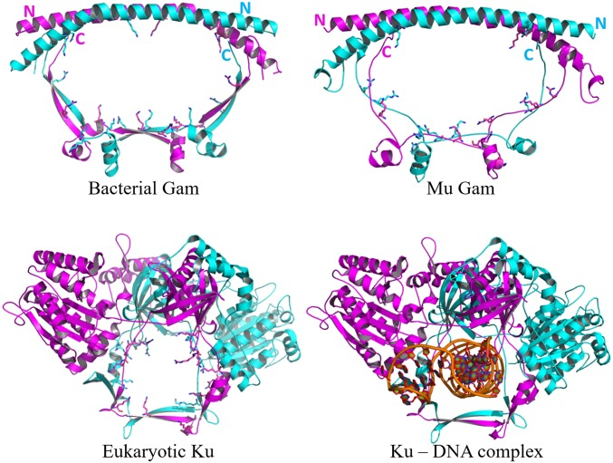
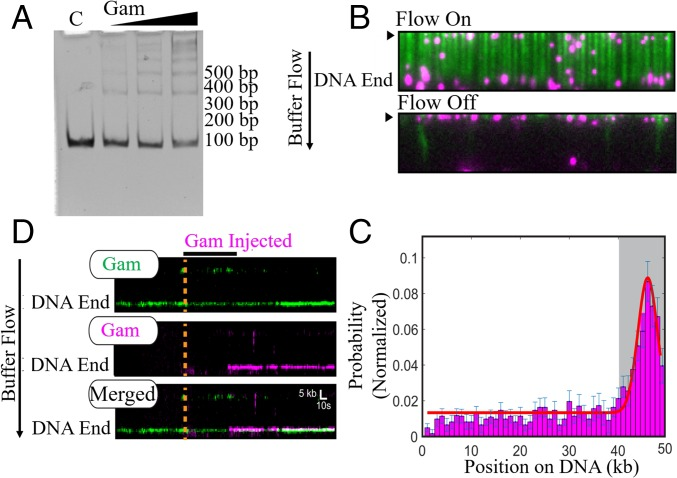
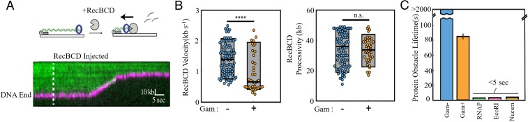
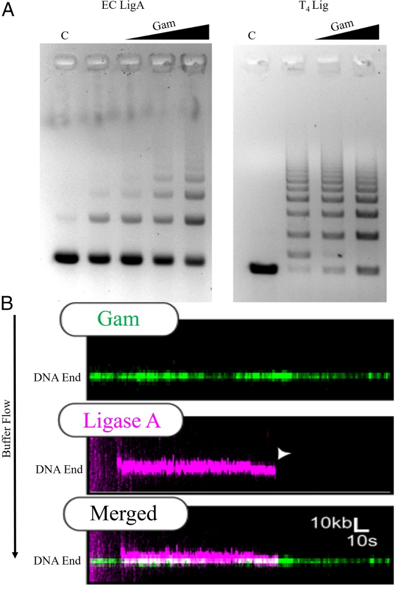
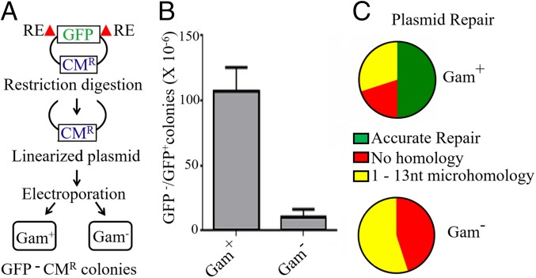
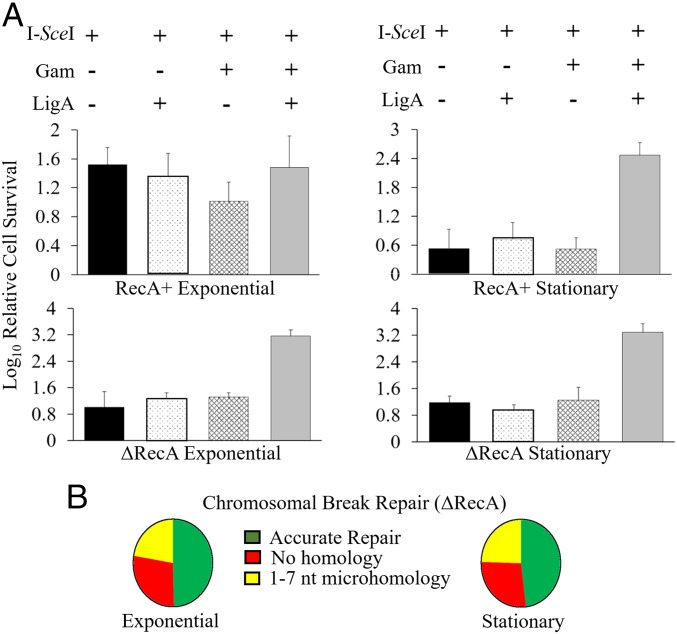
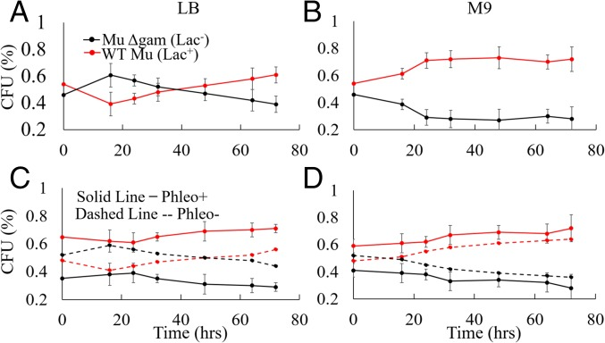
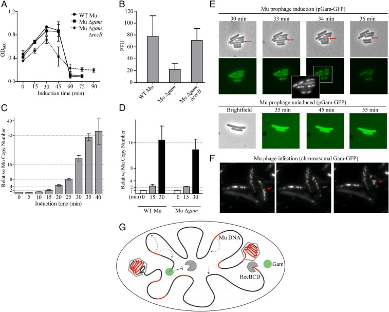

# Phage Mu Gam protein promotes NHEJ in concert with _Escherichia coli_ ligase

##  Abstract
The Gam protein of transposable phage Mu is an ortholog of eukaryotic and bacterial Ku proteins, which carry out nonhomologous DNA end joining (NHEJ) with the help of dedicated ATP-dependent ligases. Many bacteria carry Gam homologs associated with either complete or defective Mu-like prophages, but the role of Gam in the life cycle of Mu or in bacteria is unknown. Here, we show that MuGam is part of a two-component bacterial NHEJ DNA repair system. Ensemble and single-molecule experiments reveal that MuGam binds to DNA ends, slows the progress of RecBCD exonuclease, promotes binding of NAD+-dependent _Escherichia coli_ ligase A, and stimulates ligation. In vivo, Gam equally promotes both precise and imprecise joining of restriction enzyme-digested linear plasmid DNA, as well as of a double-strand break (DSB) at an engineered I-_Sce_ I site in the chromosome. Cell survival after the induced DSB is specific to the stationary phase. In long-term growth competition experiments, particularly upon treatment with a clastogen, the presence of _gam_ in a Mu lysogen confers a distinct fitness advantage. We also show that the role of Gam in the life of phage Mu is related not to transposition but to protection of genomic Mu copies from RecBCD when viral DNA packaging begins. Taken together, our data show that MuGam provides bacteria with an NHEJ system and suggest that the resulting fitness advantage is a reason that bacteria continue to retain the _gam_ gene in the absence of an intact prophage.
* * *
Genomes are subject to chemical and physical damage from both endogenous and exogenous processes. Repair of the resulting damage is essential for survival of all life forms, and many mechanisms exist for reversing specific types of damage ([1](https://pmc.ncbi.nlm.nih.gov/articles/PMC6294893/#r1)). The bulk of DNA damage affects one strand, where it impedes replication fork progression, resulting in replication fork collapse and double-strand breaks (DSBs), which, if unrepaired or incorrectly repaired, can lead to chromosomal rearrangements, oncogenic transformation, and cell death ([2](https://pmc.ncbi.nlm.nih.gov/articles/PMC6294893/#r2), [3](https://pmc.ncbi.nlm.nih.gov/articles/PMC6294893/#r3)). DSBs are repaired by two major pathways: homologous recombination (HR) and nonhomologous end joining (NHEJ) ([2](https://pmc.ncbi.nlm.nih.gov/articles/PMC6294893/#r2), [4](https://pmc.ncbi.nlm.nih.gov/articles/PMC6294893/#r4)–[6](https://pmc.ncbi.nlm.nih.gov/articles/PMC6294893/#r6)). HR is found in all organisms studied, and relies on the presence of two DNA copies, so that the HR machinery can restore the damage by copying information from the undamaged homolog, which serves as a template for DNA synthesis across the break. NHEJ, on the other hand, acts during situations when only one chromosomal copy is available, and joins the broken DNA directly. The NHEJ pathway was first identified in mammalian cells ([7](https://pmc.ncbi.nlm.nih.gov/articles/PMC6294893/#r7)); this pathway is found in both unicellular and multicellular eukaryotes ([6](https://pmc.ncbi.nlm.nih.gov/articles/PMC6294893/#r6)), as well as in archae ([8](https://pmc.ncbi.nlm.nih.gov/articles/PMC6294893/#r8)). The core constituents of the NHEJ pathway are Ku proteins that bind DNA ends at DSBs in a sequence- and overhang-independent manner, and recruit a dedicated ATP-dependent ligase complex that seals the break. NHEJ does not generally return the DNA to its original sequence, the imprecision contributing to genomic mutations, a process that vertebrates have taken advantage of in generating antigen receptor diversity in the immune system. During the last decade, identification of homologs of eukaryotic Ku proteins and ATP-dependent ligases (LigD) in several bacteria, for example _Mycobacterium_ , _Pseudomonas_ , _Bacillus_ , _Streptomyces_ , and _Agrobacterium_ species, has confirmed that NHEJ operates in prokaryotes as well ([9](https://pmc.ncbi.nlm.nih.gov/articles/PMC6294893/#r9)–[11](https://pmc.ncbi.nlm.nih.gov/articles/PMC6294893/#r11)).
The Gam protein of transposable bacteriophage Mu shares sequence similarity with eukaryotic and bacterial Ku proteins ([12](https://pmc.ncbi.nlm.nih.gov/articles/PMC6294893/#r12)). Mu is a temperate phage, which uses transposition to propagate itself during both lysogenic and lytic phases of growth ([13](https://pmc.ncbi.nlm.nih.gov/articles/PMC6294893/#r13), [14](https://pmc.ncbi.nlm.nih.gov/articles/PMC6294893/#r14)). The lysogenic repressor controls the transcription of a long early transcript ([15](https://pmc.ncbi.nlm.nih.gov/articles/PMC6294893/#r15)) that encodes the essential transposition genes (A, B) followed by a cluster of 14 genes categorized for historical reasons as semiessential (SE) ([16](https://pmc.ncbi.nlm.nih.gov/articles/PMC6294893/#r16), [17](https://pmc.ncbi.nlm.nih.gov/articles/PMC6294893/#r17)). These genes are expressed constitutively in the prophage ([18](https://pmc.ncbi.nlm.nih.gov/articles/PMC6294893/#r18)), but their function is largely unknown. The Gam gene is in this cluster and was so named because it complemented the Gam gene of phage λ ([19](https://pmc.ncbi.nlm.nih.gov/articles/PMC6294893/#r19)), which inhibits the RecBCD nuclease ([20](https://pmc.ncbi.nlm.nih.gov/articles/PMC6294893/#r20)). Purified MuGam was shown to specifically bind linear dsDNA as a homodimer, and protect against ExoV (RecBC) and other exonucleases ([12](https://pmc.ncbi.nlm.nih.gov/articles/PMC6294893/#r12), [21](https://pmc.ncbi.nlm.nih.gov/articles/PMC6294893/#r21)–[24](https://pmc.ncbi.nlm.nih.gov/articles/PMC6294893/#r24)), an action different from that of λGam, which binds to RecBCD to inactivate it ([25](https://pmc.ncbi.nlm.nih.gov/articles/PMC6294893/#r25)). A fluorescent MuGam−GFP fusion has recently been used to detect DSBs in both _Escherichia coli_ and mammalian cells, and has been demonstrated to block RecBCD activity in a λΔ _gam_ plaque assay ([26](https://pmc.ncbi.nlm.nih.gov/articles/PMC6294893/#r26)). Overproduction of Gam has been reported to stimulate transformation efficiency of linear plasmid DNA ([23](https://pmc.ncbi.nlm.nih.gov/articles/PMC6294893/#r23)), suggesting that Gam might be useful for acquiring foreign DNA. Gam homologs were identified in several pathogenic bacteria, and one of these—HiGam encoded by a Mu-like prophage in _Haemophilus influenzae_ —was purified and shown to have properties similar to MuGam in binding linear DNA and protecting against exonuclease III ([12](https://pmc.ncbi.nlm.nih.gov/articles/PMC6294893/#r12)). Despite the known biochemical properties of Gam, its function in the lifecycle of Mu is not known.
We show, in this study, that MuGam is a true homolog of Ku in that it promotes NHEJ by suppressing the DNA degradation activities of RecBCD and by recruiting an NAD+-dependent ligase to the free DNA ends. This role for MuGam in conferring NHEJ to bacterial cells is consistent with the survival advantage it confers on the host bacterium during long-term culture and when treated with clastogens. We also deduce a role for Gam in the life of Mu and speculate why Gam is only found in Mu-like phages.
##  Results and Discussion
### A Bacterial Homolog of MuGam Is Structurally Similar to Eukaryotic Ku.
Gam-encoding genes were identified earlier in four bacterial species that carried near-complete Mu prophage sequences ([12](https://pmc.ncbi.nlm.nih.gov/articles/PMC6294893/#r12)). Our search for MuGam homologs identified them only in bacterial phyla, always linked to either complete or partial Mu-like sequences ([_SI Appendix_ , Fig. S1 _A_](https://www.pnas.org/lookup/suppl/doi:10.1073/pnas.1816606115/-/DCSupplemental)). Many bacterial orders in these phyla also had Ku homologs that always accompanied LigD, but the presence of Gam was independent of LigD ([_SI Appendix_ , Fig. S1 _B_](https://www.pnas.org/lookup/suppl/doi:10.1073/pnas.1816606115/-/DCSupplemental)). There are currently no available structures of bacterial Ku proteins, but the structure of a MuGam homolog from _Desulfovibrio vulgaris_ (Dv) shows similarities with eukaryotic Ku ([Fig. 1](https://pmc.ncbi.nlm.nih.gov/articles/PMC6294893/#fig01)). In contrast to heterodimeric eukaryotic Ku, DvGam is a homodimer in the crystal structure, as are the solution states of mycobacterial Ku ([27](https://pmc.ncbi.nlm.nih.gov/articles/PMC6294893/#r27)) and MuGam ([12](https://pmc.ncbi.nlm.nih.gov/articles/PMC6294893/#r12)). A homology model built for MuGam looked similar to the DvGam structure ([Fig. 1](https://pmc.ncbi.nlm.nih.gov/articles/PMC6294893/#fig01)). The central cavity in DvGam is similar to the one that holds DNA in eukaryotic Ku in that both cavities are surrounded by conserved positively charged amino acid residues sterically well suited for interacting with negatively charged DNA. However, this cavity in DvGam is twice as wide as that in Ku ([28](https://pmc.ncbi.nlm.nih.gov/articles/PMC6294893/#r28)), and could potentially accommodate two DNA helices, or undergo a structural constriction upon DNA binding. The N-terminal region of DvGam is a long antiparallel alpha helix with no additional subdomains; in the eukaryotic Ku heterodimer, this region is more complex, likely providing a docking platform for other NHEJ-associated proteins such as XRCC4, XLF, and PKcs (reviewed in ref. [29](https://pmc.ncbi.nlm.nih.gov/articles/PMC6294893/#r29)).
#### Fig. 1.

Structural comparison of eukaryotic Ku, bacterial Gam, and MuGam. (_Upper Left_) Crystal structure of DvGam homodimer (PDB ID code 2P2U). (_Upper Right_) A homology model of phage MuGam dimer (see [_Methods_](https://pmc.ncbi.nlm.nih.gov/articles/PMC6294893/#s11)). (_Lower Left_) Crystal structure of a eukaryotic Ku heterodimer (PDB ID code 1JEQ). (_Lower Right_) Ku in presence of dsDNA (PDB ID code 1JEY). Positively charged amino acid residues projecting into the central DNA-binding cavity for Ku, and into the equivalent space for Gam, are represented as sticks. The central cavity in DvGam is twice as wide as that in Ku (36 Å × 65 Å vs. 30 Å × 24 Å).
### Multiple MuGam Dimers Can Load on a DNA End.
EMSA assays showed that MuGam preferentially binds linear DNA with an estimated Kd of ∼12 nM ([Fig. 2 _A_](https://pmc.ncbi.nlm.nih.gov/articles/PMC6294893/#fig02)) ([12](https://pmc.ncbi.nlm.nih.gov/articles/PMC6294893/#r12), [21](https://pmc.ncbi.nlm.nih.gov/articles/PMC6294893/#r21), [24](https://pmc.ncbi.nlm.nih.gov/articles/PMC6294893/#r24)). The ladder of bands further indicated that multiple Gam dimers can load on the substrate, as has been observed for the eukaryotic Ku complex. Next, we employed high-throughput single-molecule DNA curtains to image MuGam as it interacts with the DNA substrate ([30](https://pmc.ncbi.nlm.nih.gov/articles/PMC6294893/#r30), [31](https://pmc.ncbi.nlm.nih.gov/articles/PMC6294893/#r31)). In this assay, thousands of individual DNA molecules (∼48.5 kb long, derived from λ-phage DNA) are organized at microfabricated chromium barriers and visualized by total internal reflection fluorescence microscopy. For fluorescence imaging, MuGam was purified with an N-terminal FLAG epitope tag (see [_Methods_](https://pmc.ncbi.nlm.nih.gov/articles/PMC6294893/#s11) and [_SI Appendix_ , Fig. S2](https://www.pnas.org/lookup/suppl/doi:10.1073/pnas.1816606115/-/DCSupplemental)) and labeled with a fluorescent anti-FLAG antibody before injection into the DNA curtain. The anti-FLAG antibody was conjugated with a quantum dot (QD) that emits in the 705-nm range (magenta in [Fig. 2 _B_](https://pmc.ncbi.nlm.nih.gov/articles/PMC6294893/#fig02)). Most Gam molecules bound the DNA, although a few associated with the lipid bilayer, as observed when buffer flow was turned off ([Fig. 2 _B_](https://pmc.ncbi.nlm.nih.gov/articles/PMC6294893/#fig02)). As expected, injecting the antibody-conjugated QD alone did not result in any DNA-bound molecules. Gam binding position was mapped by fitting the point spread function to a 2D Gaussian profile ([Fig. 2 _C_](https://pmc.ncbi.nlm.nih.gov/articles/PMC6294893/#fig02)). Gam was located predominantly at the ends of the DNA (67%; _n_ = 277/413). To determine whether multiple Gam dimers could load on the same DNA end, we first injected Gam labeled with a 605-nm QD (green), followed by Gam that was labeled with a magenta QD into the same flow cell. Approximately 70% (_n_ = 56/80) of the DNA molecules had two differentially labeled Gams that were colocalized stably at the same DNA end (_t_ 1/2 = >2,000 s) ([Fig. 2 _D_](https://pmc.ncbi.nlm.nih.gov/articles/PMC6294893/#fig02)). These experiments demonstrate that at least two Gam dimers, but possibly even larger assemblies, can load on the free DNA end. In summary, the ensemble and single-molecule experiments demonstrate that multiple Gam dimers can bind to linear DNA ends.
#### Fig. 2.

MuGam is located predominantly at DNA ends. (_A_) EMSA assay. Linear dsDNA (100 bp) was incubated with increasing amounts of tagless Gam, electrophoresed on a 5% native acrylamide gel, and visualized by ethidium bromide (EtBr) staining. C, DNA alone control. Position of size markers is indicated on the right. (_B_) Fluorescent FLAG-Gam (magenta) binds λ−DNA organized at microfabricated barriers (green, labeled with YOYO1 dye). Turning off buffer flow retracts both Gam and DNA to the barriers (black arrow), indicating that Gam is on the DNA. (_C_) A binding distribution of Gam along the DNA shows a strong preference for DNA ends. Gray region indicates the experimental uncertainty in defining the DNA end. Error bars were determined by bootstrap analysis. Red line denotes the Gaussian fit. (_D_) Multiple FLAG-Gam molecules can stack on a free DNA end, as indicated by colocalization of green- and magenta-labeled Gams on a single DNA molecule. Position of the Gam-bound DNA end is indicated. Orange dashed line and black horizontal bar indicate when the magenta Gam was injected into the flow cell. See [_Methods_](https://pmc.ncbi.nlm.nih.gov/articles/PMC6294893/#s11) for experimental details.
### MuGam Slows but Does Not Block RecBCD Degradation.
The reported ability of Gam to protect bound DNA from a variety of exonucleases ([21](https://pmc.ncbi.nlm.nih.gov/articles/PMC6294893/#r21), [24](https://pmc.ncbi.nlm.nih.gov/articles/PMC6294893/#r24)) was tested with the most potent _E. coli_ exonuclease, RecBCD ([32](https://pmc.ncbi.nlm.nih.gov/articles/PMC6294893/#r32)). RecBCD is an ATP-dependent helicase and nuclease that initiates DNA degradation from free DNA ends. We therefore tested whether RecBCD can access and degrade MuGam-bound DNA ends. In this assay, the activity of WT RecBCD was visualized as the degradation of a fluorescently labeled DNA molecule as a function of time ([Fig. 3 _A_](https://pmc.ncbi.nlm.nih.gov/articles/PMC6294893/#fig03)) ([33](https://pmc.ncbi.nlm.nih.gov/articles/PMC6294893/#r33), [34](https://pmc.ncbi.nlm.nih.gov/articles/PMC6294893/#r34)). We observed that MuGam is pushed by RecBCD as the DNA shortens ([Fig. 3 _A_](https://pmc.ncbi.nlm.nih.gov/articles/PMC6294893/#fig03)). The velocity and processivity of RecBCD on MuGam-bound DNA was calculated to be 0.93 ± 0.6 kb⋅s−1 and 33 ± 8.3 kb, respectively ([Fig. 3 _B_](https://pmc.ncbi.nlm.nih.gov/articles/PMC6294893/#fig03); _n_ = 40). In comparison, RecBCD’s velocity was 1.41 ± 0.5 kb⋅s−1 and the processivity was 35 ± 10.8 kb on naked DNA (_n_ = 100) (see also ref. [35](https://pmc.ncbi.nlm.nih.gov/articles/PMC6294893/#r35)). This processivity likely underestimates the RecBCD in vivo because a significant fraction of the nucleases digested the entire ∼48.5-kb-long DNA substrate in a single reaction ([_SI Appendix_ , Fig. S3 _A_](https://www.pnas.org/lookup/suppl/doi:10.1073/pnas.1816606115/-/DCSupplemental)) ([36](https://pmc.ncbi.nlm.nih.gov/articles/PMC6294893/#r36)). In contrast, RecBCD rarely digested Gam-bound DNA to completion in the single-molecule assay ([_SI Appendix_ , Fig. S3 _A_](https://www.pnas.org/lookup/suppl/doi:10.1073/pnas.1816606115/-/DCSupplemental)). Strikingly, MuGam also reduces the velocity of RecBCD. In addition, the half-life of MuGam on DNA in the presence of RecBCD was 87 ± 3 s (_n_ = 40) ([Fig. 3 _C_](https://pmc.ncbi.nlm.nih.gov/articles/PMC6294893/#fig03)), which is significantly higher than that of other tight binding DNA protein complexes that encounter RecBCD ([35](https://pmc.ncbi.nlm.nih.gov/articles/PMC6294893/#r35)). The sequence similarity between MuGam and Ku ([12](https://pmc.ncbi.nlm.nih.gov/articles/PMC6294893/#r12)) suggests that it may encircle DNA similar to Ku, possibly making MuGam more difficult to remove by RecBCD. Although the half-life was higher than other DNA binding proteins, >98% of MuGam molecules were eventually removed within 300 s by RecBCD. In 100% of these events (_n_ = 40), MuGam dissociated only after RecBCD ceased translocating and presumably also uncapped the DNA end ([Fig. 3 _A_](https://pmc.ncbi.nlm.nih.gov/articles/PMC6294893/#fig03)). These results are consistent with MuGam surrounding the DNA duplex while RecBCD pushes it during DNA translocation. We note that our experimental setup precluded using higher MuGam:DNA ratios because Gam aggregates interacted with the flow cell surface at higher concentrations. Thus, the partial RecBCD inhibition observed here likely underestimates how a large train of Gams may inhibit RecBCD in vivo. These findings were confirmed in bulk experiments using purified RecBCD, as well as whole cell extracts as the source of this enzyme, where MuGam-bound DNA was observed to survive longer than unbound DNA ([_SI Appendix_ , Fig. S3 _B_ and _C_](https://www.pnas.org/lookup/suppl/doi:10.1073/pnas.1816606115/-/DCSupplemental)). We conclude that MuGam slows DNA degradation by RecBCD but does not stop it completely.
#### Fig. 3.

Gam slows RecBCD progress. (_A_) (_Upper_) Illustration and (_Lower_) representative kymograph of RecBCD digesting DNA (green) containing FLAG-Gam (magenta). Dashed line indicates when RecBCD was added to the flow cell. RecBCD is not fluorescently labeled. (_B_) Distribution of RecBCD velocities and processivities on naked and Gam-bound DNA. Box plots indicate the median, 10th, and 90th percentiles of the distributions (_n_ = 40). ****_P_ < 0.0001; n.s., not significant. More than 95% of Gam-bound DNA molecules were processed by RecBCD (very similar to RecBCD processing of naked DNA), suggesting that Gam doesn’t significantly block RecBCD loading under these experimental conditions. (_C_) Upon colliding with RecBCD, Gam remains associated with DNA more than 16-fold longer than _E. coli_ RNA polymerase, EcoRI(E111Q), and nucleosomes (also see ref. [35](https://pmc.ncbi.nlm.nih.gov/articles/PMC6294893/#r35)).
### MuGam Stimulates Ligation by _E. coli_ Ligase A and Promotes Its Binding to DNA Ends.
Given the similarity of MuGam to Ku ([12](https://pmc.ncbi.nlm.nih.gov/articles/PMC6294893/#r12)), we tested whether MuGam would promote joining of restriction enzyme-digested sticky DNA ends by ligase. We used both the ATP-dependent DNA ligase from phage T4 and the NAD+-dependent ligase A (LigA) from _E. coli_. Gam stimulated ligation by LigA, and not by T4 ligase ([Fig. 4 _A_](https://pmc.ncbi.nlm.nih.gov/articles/PMC6294893/#fig04)). While the ligation reaction with LigA was stimulated threefold to fivefold, that with T4 ligase was inhibited, suggesting specificity of the Gam−LigA reaction. To test whether MuGam−LigA interaction could be visualized using DNA curtains, we purified an HA-tagged version of LigA ([_SI Appendix_ , Fig. S4 _A_](https://www.pnas.org/lookup/suppl/doi:10.1073/pnas.1816606115/-/DCSupplemental), _Left_); MuGam also stimulated ligation with (HA)2-LigA ([_SI Appendix_ , Fig. S4 _B_](https://www.pnas.org/lookup/suppl/doi:10.1073/pnas.1816606115/-/DCSupplemental), _Left_). When QD-labeled LigA was introduced into the flow cell containing MuGam-bound DNA, LigA was seen to colocalize with MuGam, and persist at that end with a half-life of ∼180 ± 30 s (_n_ = 25) ([Fig. 4 _B_](https://pmc.ncbi.nlm.nih.gov/articles/PMC6294893/#fig04)). This localization was not observed in the absence of Gam ([_SI Appendix_ , Fig. S4 _C_](https://www.pnas.org/lookup/suppl/doi:10.1073/pnas.1816606115/-/DCSupplemental)).
#### Fig. 4.

Gam binding stimulates _E. coli_ DNA LigA activity. (_A_) The 550-bp substrate DNA (C) with noncomplementary sticky ends (_Eco_ RI/_Sal_ I) was incubated with increasing molar ratios of tagless Gam before the addition of _E. coli_ LigA (_Left_) or T4DNA ligase (_Right_). DNA:Gam molar ratios in _Left_ were 1:10, 1:20, and 1:40; only the first two ratios were used in _Right_. Reaction products were analyzed by agarose gel electrophoresis and visualized with EtBr. (_B_) Representative kymograph of FLAG-Gam (green) colocalizing with (HA)2-Lig A (magenta). White arrow denotes LigA dissociation. The half-life of LigA with Gam localization is ∼3 min (_n_ = 25).
LigA is the primary and essential ligase in _E. coli_ , required for the ligation of the Okazaki fragments during DNA replication ([37](https://pmc.ncbi.nlm.nih.gov/articles/PMC6294893/#r37), [38](https://pmc.ncbi.nlm.nih.gov/articles/PMC6294893/#r38)). _E. coli_ also has a second nonessential NAD+-dependent ligase B (LigB), which is reported to be less efficient than LigA ([39](https://pmc.ncbi.nlm.nih.gov/articles/PMC6294893/#r39), [40](https://pmc.ncbi.nlm.nih.gov/articles/PMC6294893/#r40)). We purified an HA-tagged version of LigB ([_SI Appendix_ , Fig. S4 _A_](https://www.pnas.org/lookup/suppl/doi:10.1073/pnas.1816606115/-/DCSupplemental), _Right_), which showed lower ligation efficiency, as expected, but MuGam nonetheless stimulated DNA ligation by (HA)2-LigB ([_SI Appendix_ , Fig. S4 _B_](https://www.pnas.org/lookup/suppl/doi:10.1073/pnas.1816606115/-/DCSupplemental), _Right_). In the DNA curtain setup, however, LigB localization to Gam-bound ends was not observed ([_SI Appendix_ , Fig. S4 _D_](https://www.pnas.org/lookup/suppl/doi:10.1073/pnas.1816606115/-/DCSupplemental)). We conclude that MuGam interacts with LigA to promote ligation of linear DNA ends. LigB can also participate in this reaction, but at a ower efficiency.
### MuGam Promotes Precise Joining of Linear Plasmid DNA.
To test whether Gam promotes joining of linear DNA ends in vivo, a CmR plasmid encoding GFP was cut with _Nde_ I to remove a major portion of the gene encoding GFP. Mu lysogens that differed only in the presence or absence of _gam_ were transformed with the gel-isolated plasmid backbone ([Fig. 5 _A_](https://pmc.ncbi.nlm.nih.gov/articles/PMC6294893/#fig05)). Overproduction of MuGam has been reported to stimulate transformation efficiency by linear plasmid DNA ([23](https://pmc.ncbi.nlm.nih.gov/articles/PMC6294893/#r23)). The uncut plasmid was therefore also transformed into the two strains, and the recovery of the CmR, GFP− plasmid was expressed as a ratio, GFP−/GFP+ colonies. There was ∼100-fold higher recovery of CmR, GFP− colonies in the Gam+ strain compared with the Gam− strain ([Fig. 5 _B_](https://pmc.ncbi.nlm.nih.gov/articles/PMC6294893/#fig05)). Plasmids isolated from 20 CmR, GFP− colonies from each strain were sequenced, and the repair junctions were analyzed. Half of those from the Gam+ strain had precisely joined the _Nde_ I cut, while the remaining plasmids had deletions of ∼1 to 500 bp on either side of the initial cut, the joints displaying either no homology or microhomology over a few nucleotides ([Fig. 5 _C_](https://pmc.ncbi.nlm.nih.gov/articles/PMC6294893/#fig05)). In contrast, there was no precise joining of the _Nde_ I–cut ends in plasmids recovered from the Gam− strain, which otherwise showed similar deletion sizes, and microhomologies across the joint. Thus, Gam promotes efficient joining of sticky DNA ends in vivo, half of these events being precise. From experiments presented in [Figs. 4](https://pmc.ncbi.nlm.nih.gov/articles/PMC6294893/#fig04) and [5](https://pmc.ncbi.nlm.nih.gov/articles/PMC6294893/#fig05), we conclude that Gam assists NHEJ.
#### Fig. 5.

Gam promotes efficient repair of linear plasmid DNA in vivo. (_A_) Schematic of the experimental setup. RE, restriction enzyme (_Nde_ I). (_B_) Recovery of CmR GFP− colonies in Gam+ (HM8305) and Gam− (SB02) Mu lysogens. The data are normalized for transformation efficiency using the uncut CmR GFP+ plasmid. (_C_) Sequence summary of 20 CmR GFP− plasmids from each strain.
### MuGam Promotes Precise Joining of I-_Sce_ I Resected Chromosomal DNA, Preferentially in the Stationary Phase.
To test whether a chromosomal break could be sealed in the presence of Gam, we used a strain with a chromosomal I-_Sce_ I site located close to the origin of replication (_oriC_) ([26](https://pmc.ncbi.nlm.nih.gov/articles/PMC6294893/#r26)). In this strain, Gam is expressed from a tetracycline-inducible promoter, and I-_Sce_ I is expressed from an arabinose-inducible promoter, both from chromosomal locations. Overproduction of Gam, whether from a plasmid or a regulated promoter on the chromosome, is toxic to the cell ([26](https://pmc.ncbi.nlm.nih.gov/articles/PMC6294893/#r26), [41](https://pmc.ncbi.nlm.nih.gov/articles/PMC6294893/#r41)). Spot assays were therefore first carried out to titrate the amount of Gam induction that was nonlethal. Pilot experiments showed improved survival if LigA levels were increased, so _ligA_ was also provided on an Isopropyl-β-D-thiogalactoside (IPTG)-inducible plasmid. Without induction of Gam and LigA expression, I-_Sce_ I induction killed ∼85% of cells under exponential growth conditions and ∼99% in the stationary phase ([Fig. 6 _A_](https://pmc.ncbi.nlm.nih.gov/articles/PMC6294893/#fig06)). Expression of Gam or LigA alone did not improve cell survival (Gam alone being more detrimental), whereas expression of both showed a ∼100-fold increase in survival only in the stationary phase. The critical difference between exponential and stationary phases for these experiments is the presence of a sister copy in the former but not in the latter. To test whether the HR machinery might be masking Gam activity in the exponential phase, we repeated the experiment using an isogenic RecA− strain. In the absence of HR, we observed ∼99% cell killing in the exponential phase, but the presence of Gam and LigA showed a 100-fold increase in survival in this growth phase, similar to that seen in the stationary phase for both RecA+ and RecA− strains. Repair junctions at the I-_Sce_ I site were examined by whole genome sequencing of the cultures (i.e., before determining survivor counts) in both growth phases in the RecA− strain. The results were similar for both ([Fig. 6 _B_](https://pmc.ncbi.nlm.nih.gov/articles/PMC6294893/#fig06)). As observed for the linear plasmid DNA joints ([Fig. 5 _C_](https://pmc.ncbi.nlm.nih.gov/articles/PMC6294893/#fig05)), nearly 50% of the chromosomal joints were also precise repairs. The remaining joints had deletions spanning ∼1 kb, and either no homology or 1- to 7-nt microhomology ([_SI Appendix_ , Fig. S5](https://www.pnas.org/lookup/suppl/doi:10.1073/pnas.1816606115/-/DCSupplemental) for deletion sizes). These data are consistent with a role for Gam in NHEJ preferentially in the stationary phase in the WT strain.
#### Fig. 6.

Expression of Gam and LigA together increases survival of cells experiencing a chromosomal DSB. (_A_) The host strain was either RecA+ (SMR14353) or isogenic RecA− (ΔRecA; SB08), and experiments were conducted in either the exponential or stationary phase. Relative cell survival was scored by counting cfus under the indicated experimental conditions (+/− representing induction of relevant proteins), and normalized to the lowest cell count (∼105) obtained in any single experiment. (_B_) Repair junctions of chromosomal breaks in RecA− cells. Of the exponential phase genomes examined (_n_ = 865), nearly 50% of all sequences (_n_ = 426) were perfect repairs. Of the remaining, 28% (_n_ = 240) had repair joints with no homology, 13% (_n_ = 118) had joints with 1 nt of homology, and 9% (81) had joints between 2 nt and 7 nt of homology. The repair trend was similar in the stationary phase genomes (_n_ = 1,240). Nearly 50% (_n_ = 595) showed accurate repair, 27% (_n_ = 341) repaired with no homology, 17% (_n_ = 218) with 1 nt of homology, and the remaining 3% (_n_ = 86) between 2 nt and 7 nt of homology. See [_SI Appendix_ , Fig. S5](https://www.pnas.org/lookup/suppl/doi:10.1073/pnas.1816606115/-/DCSupplemental) for deletion sizes at the repair joints.
### MuGam Confers Improved Fitness in Growth Competition Experiments.
The retention of MuGam homologs in multiple bacterial phyla even in the absence of a complete Mu ([_SI Appendix_ , Fig. S1 _A_](https://www.pnas.org/lookup/suppl/doi:10.1073/pnas.1816606115/-/DCSupplemental)) suggests that Gam-promoted NHEJ may provide a survival advantage when DNA damage occurs in the stationary phase, where a template for HR is unavailable ([9](https://pmc.ncbi.nlm.nih.gov/articles/PMC6294893/#r9)). To test this proposition, we cocultured isogenic Mu lysogens that differed only in the presence or absence of _gam_. The strains were mixed together at a similar culture density (OD600) and grown continuously for 72 h in either rich or minimal media, withdrawing aliquots at the indicated intervals for determining colony-forming units (cfus) ([Fig. 7 _A_ and _B_](https://pmc.ncbi.nlm.nih.gov/articles/PMC6294893/#fig07) and [_SI Appendix_ , Fig. S6 _A_ and _B_](https://www.pnas.org/lookup/suppl/doi:10.1073/pnas.1816606115/-/DCSupplemental)). In rich media, the Gam− strain had a growth advantage at early times, but the Gam+ strain outcompeted the Gam− strain over the long term, the advantage manifesting clearly after ∼20 h ([Fig. 7 _A_](https://pmc.ncbi.nlm.nih.gov/articles/PMC6294893/#fig07)). The same trend was seen in minimal media ([Fig. 7 _B_](https://pmc.ncbi.nlm.nih.gov/articles/PMC6294893/#fig07)), except that the Gam+ strain did not display the disadvantage in the exponential phase seen in rich media ([Fig. 7 _A_](https://pmc.ncbi.nlm.nih.gov/articles/PMC6294893/#fig07)). Relative fitness of the Gam+ over the Gam− strain was calculated to be 1.03 in rich media, and 1.1 in minimal media (see [_Methods_](https://pmc.ncbi.nlm.nih.gov/articles/PMC6294893/#s11)). Both values are considered to be significant with a 95% confidence interval (CI95) and will be favored by natural selection ([42](https://pmc.ncbi.nlm.nih.gov/articles/PMC6294893/#r42)). The disadvantage of Gam+ during the exponential phase in rich media ([Fig. 7 _A_](https://pmc.ncbi.nlm.nih.gov/articles/PMC6294893/#fig07)) might be due to Gam interference with HR. The clear advantage of Gam+ during the stationary phase is consistent with the function of NHEJ during times when a sister DNA copy is not available for repair by HR.
#### Fig. 7.

Presence of Gam increases host fitness. (_A_ and _B_) Gam+ (Lac+) and Gam _−_ (Lac−) Mu lysogens (DMW61 and DMW154) were mixed together in (_A_) LB or (_B_) M9 media at similar OD600 values, and propagated continuously at 30 °C for 72 h without changing the media, as described in [_Methods_](https://pmc.ncbi.nlm.nih.gov/articles/PMC6294893/#s11). Aliquots were removed at the indicated times to determine cfus, scoring for Lac+ and Lac− phenotypes on Mackonkey agar to distinguish the two strains. The data are a summary of at least three biological repeats done in triplicates. Reversing the strains carrying the Lac+ and Lac− alleles [i.e., Gam+ (Lac−) and Gam _−_ (Lac+)] gave similar results overall, showing that the particular Lac allele does not significantly affect the outcome ([_SI Appendix_ , Fig. S6](https://www.pnas.org/lookup/suppl/doi:10.1073/pnas.1816606115/-/DCSupplemental)). The relative fitness of the Gam+ over the Gam _−_ strain was calculated to be 1.03 (CI95 = ±0.0001) in LB and 1.1 (CI95 = ±0.02) in M9. (_C_ and _D_) As in _A_ and _B_ , except the mixed culture was treated with phleomycin before the start of the growth competition experiment. Dashed lines represent a concurrent experiment without the phleomycin treatment. The relative fitness in LB for the phleomycin treated cultures was 1.03 (CI95 = ±0.007) and, in M9, 1.07 (CI95 = ±0.012). The control no-phleomycin results were similar to those in _A_ and _B_.
The data in [Figs. 4](https://pmc.ncbi.nlm.nih.gov/articles/PMC6294893/#fig04)–[6](https://pmc.ncbi.nlm.nih.gov/articles/PMC6294893/#fig06) show that Gam joins DSBs both in vitro and in vivo. We therefore expected that treatment with a clastogen such as phleomycin, which induces DSBs ([43](https://pmc.ncbi.nlm.nih.gov/articles/PMC6294893/#r43)), would also reveal a fitness advantage for the Gam+ strain in long-term cultures. The experimental setup was similar to the one shown in [Fig. 7 _A_ and _B_](https://pmc.ncbi.nlm.nih.gov/articles/PMC6294893/#fig07), except that survival profiles of phleomycin-treated and untreated mixtures of Gam+ and Gam− strains were monitored. The Gam+ strain showed an immediate advantage after phleomycin treatment ([Fig. 7 _C_ and _D_](https://pmc.ncbi.nlm.nih.gov/articles/PMC6294893/#fig07) and [_SI Appendix_ , Fig. S6 _C_ and _D_](https://www.pnas.org/lookup/suppl/doi:10.1073/pnas.1816606115/-/DCSupplemental)). This advantage was seen even in rich media, in contrast to the untreated control (here and in [Fig. 7 _A_](https://pmc.ncbi.nlm.nih.gov/articles/PMC6294893/#fig07)). The early onset of a survival advantage could be due to high amounts of chromosomal damage in unreplicated DNA in the phleomycin-treated cells that could not be handled by HR alone. Overall, these data are consistent with the NHEJ function of MuGam.
### Gam Is Not Required for Mu Transposition, but Is Apparently Involved in Protecting Mu Replicas from RecBCD When DNA Packaging Ensues.
The life cycle of Mu is summarized in [_SI Appendix_ , Fig. S8 _A_](https://www.pnas.org/lookup/suppl/doi:10.1073/pnas.1816606115/-/DCSupplemental). Infecting Mu DNA is linear. An injected phage protein MuN binds to the linear ends noncovalently and circularizes the DNA, protecting it from exonucleases (ref. [41](https://pmc.ncbi.nlm.nih.gov/articles/PMC6294893/#r41) and references therein). After transposition into the _E. coli_ genome, Mu can either enter a prophage state or go through the lytic cycle, during which the Mu genome is amplified by repeated replicative transposition into the _E. coli_ genome, followed by packaging of chromosomal Mu replicas. Since MuGam binds to linear DNA ends, a backup role for Gam in protecting linear infecting Mu DNA has been speculated ([12](https://pmc.ncbi.nlm.nih.gov/articles/PMC6294893/#r12)). However, a Mu variant missing the SE region, which includes _gam_ , was fully proficient in Mu lysogeny, ruling out such a role ([44](https://pmc.ncbi.nlm.nih.gov/articles/PMC6294893/#r44)). A role for Gam in replicative transposition is also ruled out, given the similar lysis profiles of a MuΔ _gam_ lysogen compared with WT Mu ([Fig. 8 _A_](https://pmc.ncbi.nlm.nih.gov/articles/PMC6294893/#fig08)). We noticed, however, that the phage titers obtained from MuΔ _gam_ were consistently threefold to fivefold lower ([Fig. 8 _B_](https://pmc.ncbi.nlm.nih.gov/articles/PMC6294893/#fig08)). These titers were restored to WT levels if the strain carried a _recB_ deletion, indicating that the lower titers of MuΔ _gam_ were likely related to generation of RecBCD-susceptible DSBs ([Fig. 8 _B_](https://pmc.ncbi.nlm.nih.gov/articles/PMC6294893/#fig08)). However, DSBs are not expected during replicative transposition ([14](https://pmc.ncbi.nlm.nih.gov/articles/PMC6294893/#r14)). To test whether Mu replication/transposition was inhibited in the Δ _gam_ strain, Mu copy numbers during the lytic cycle were estimated by real-time PCR first for WT Mu, by isolating _E. coli_ genomic DNA at various time points ([Fig. 8 _C_](https://pmc.ncbi.nlm.nih.gov/articles/PMC6294893/#fig08)). Mu copy numbers were seen to double first around 15 min after induction of Mu transposition, and then approximately every 5 min, leveling off around 40 min, at which time mature phage were observed when cells were lysed artificially, suggesting that packaging of Mu replicas into phage heads had begun before 40 min. We then compared the WT Mu genomic copy numbers to those in the MuΔ _gam_ strain at 0, 15, and 30 min after induction of lytic growth ([Fig. 8 _D_](https://pmc.ncbi.nlm.nih.gov/articles/PMC6294893/#fig08)). In both strains, Mu copies doubled at 15 min, indicating that replication was not delayed in the Δ _gam_ strain. Mu genomic copies decreased slightly at 30 min for MuΔ _gam_ , a time at which packaging is expected to have started ([Fig. 8 _D_](https://pmc.ncbi.nlm.nih.gov/articles/PMC6294893/#fig08)). Mu replicas are packaged from their chromosomal locations by a head-full mechanism starting at the left end, with host DNA flanking both sides of the insertion included in the virion genome ([45](https://pmc.ncbi.nlm.nih.gov/articles/PMC6294893/#r45)). Initiation of packaging would leave a chromosomal DSB flanking at this end first, and then on both sides of the Mu copy after packaging was complete ([Fig. 8 _G_](https://pmc.ncbi.nlm.nih.gov/articles/PMC6294893/#fig08)). We surmised that the effect of Gam was likely being manifested at this stage, when the phage genome being packaged is itself protected from RecBCD, but the DNA adjacent to the packaged genome is vulnerable, and this adjacent DNA is likely to include another copy of Mu that gets degraded. This would explain the lower phage titers in a _gam_ − strain ([Fig. 8 _B_](https://pmc.ncbi.nlm.nih.gov/articles/PMC6294893/#fig08)). To test when packaging begins, we tracked the appearance of chromosomal DSBs by using MuGam−GFP expressed from plasmid, as demonstrated in other experiments ([26](https://pmc.ncbi.nlm.nih.gov/articles/PMC6294893/#r26), [41](https://pmc.ncbi.nlm.nih.gov/articles/PMC6294893/#r41)). In a time course after Mu induction, fluorescent Gam foci began to appear around 33 min, and the nucleoid was studded with foci by 36 min ([Fig. 8 _E_](https://pmc.ncbi.nlm.nih.gov/articles/PMC6294893/#fig08)). Cells began to lyse at around 40 min. Cells that did not show foci never lysed, and no fluorescent foci were observed in the absence of Mu induction. This experiment was repeated by infecting Mu into a strain that expressed MuGam−GFP on the chromosome from the λPR promoter; the GFP foci were more distinct, and the results were similar ([Fig. 8 _F_](https://pmc.ncbi.nlm.nih.gov/articles/PMC6294893/#fig08) and [_SI Appendix_ , Fig. S7](https://www.pnas.org/lookup/suppl/doi:10.1073/pnas.1816606115/-/DCSupplemental)). We conclude that Gam is primarily involved in protecting Mu progeny in the genome from destruction by RecBCD toward the end of the lytic cycle ([Fig. 8 _G_](https://pmc.ncbi.nlm.nih.gov/articles/PMC6294893/#fig08)).
#### Fig. 8.

Role of Gam in the Mu life cycle. (_A_) Lysis curves of the following lysogens: WT Mu (HM8305), MuΔ _gam_ (SB02), and MuΔ _gam_ in a Δ _recB_ host (SB03). (_B_) Plaque forming units (PFU) released after induction of strains shown in _A_. (_C_) Real-time PCR analysis of WT chromosomal Mu copies (relative to a single copy gene _hipA_) at indicated times after induction of Mu replication. (_D_) As in _C_ , except a comparison of WT and ∆ _gam_ chromosomal Mu copies at indicated times after induction. (_E_ and _F_) Appearance of Gam-GFP foci toward the end of Mu lytic cycle. In _E_ , Gam-GFP is expressed from a plasmid. (_Upper_) Twenty-five minutes after MuΔ _gam_ prophage induction (SB77), cells were placed on agar pads and monitored under phase contrast for GFP fluorescence for indicated times after induction. The red arrow points to a cell that eventually lysed. (_Inset_) A larger image of the 34-min sample, with a different contrast to highlight the foci. (_Lower_) The same culture imaged without Mu induction. In _F_ , Gam-GFP is expressed at a chromosomal location from lambda PR promoter, under control of a thermosensitive repressor (SMR16470). This strain was infected with WT Mu, propagated in liquid medium for 40 min at 42 °C, and transferred to agar pads, where punctate cells began lysing almost immediately (see [_Methods_](https://pmc.ncbi.nlm.nih.gov/articles/PMC6294893/#s11)). The time course of appearance of the puncta was similar to that in _E_ , with no puncta above background in control cells held at for 40 min at 42 °C ([_SI Appendix_ , Fig. S7](https://www.pnas.org/lookup/suppl/doi:10.1073/pnas.1816606115/-/DCSupplemental)). Red arrow points to a lysing cell. (_G_) Model showing the protective role of Gam at the chromosomal end (black line) of the break during packaging of Mu replicas (red line) into phage heads. [Magnification: _E_ and _F_ , 1,000×.]
##  Summary and Perspective
We have established, in this study, that MuGam is a functional homolog of Ku proteins in that it promotes NHEJ in concert with _E. coli_ LigA (the weak stimulation with LigB needs further study). The difference between Gam and Ku NHEJ is that the ligase is NAD+-dependent rather than ATP-dependent. We speculate that the larger central cavity in bacterial Gam ([Fig. 1](https://pmc.ncbi.nlm.nih.gov/articles/PMC6294893/#fig01); compare DvGam and Ku) might facilitate capture and pairing of the second DNA end after Gam loads on the first one, by stably (or transiently) housing both ends to promote joining. We also identify, in this study, a role for Gam in the lifecycle of Mu, which is related to its function of reducing RecBCD activity, i.e., protection of DSBs generated in the chromosome during Mu packaging. Thus, Gam has at least two separate functions: protecting DSBs against exonucleases and repairing them by NHEJ. The former is important for survival of Mu, but both are important for survival of the host. In the host, the DSB protection function of Gam likely aids the transformation efficiency of naturally competent bacteria ([23](https://pmc.ncbi.nlm.nih.gov/articles/PMC6294893/#r23)), contributing to long-term evolution of the host by acquisition of foreign DNA as has been suggested before ([12](https://pmc.ncbi.nlm.nih.gov/articles/PMC6294893/#r12), [23](https://pmc.ncbi.nlm.nih.gov/articles/PMC6294893/#r23)). The NHEJ function of Gam likely contributes to the increased fitness of host strains in the stationary phase as demonstrated in this study.
Why is Gam specifically associated with transposable Mu-like phages ([_SI Appendix_ , Fig. S1 _A_](https://www.pnas.org/lookup/suppl/doi:10.1073/pnas.1816606115/-/DCSupplemental)), when there is no apparent need for Gam in transposition per se ([Fig. 8](https://pmc.ncbi.nlm.nih.gov/articles/PMC6294893/#fig08))? Other phages like λ and T4 also have exposed double-strand ends during replication that need protection. Why have these phages evolved alternate mechanisms to inhibit RecBCD, using proteins that directly bind to the nuclease ([20](https://pmc.ncbi.nlm.nih.gov/articles/PMC6294893/#r20), [46](https://pmc.ncbi.nlm.nih.gov/articles/PMC6294893/#r46)–[48](https://pmc.ncbi.nlm.nih.gov/articles/PMC6294893/#r48))? RecBCD is essential for the repair of broken genomic DNA by HR ([32](https://pmc.ncbi.nlm.nih.gov/articles/PMC6294893/#r32)). We suggest that λ and T4 inhibit RecBCD directly because they carry their own recombination functions, and do not need the HR function of RecBCD. By contrast, Mu does not encode known HR functions, and needs the host RecBCD at two distinct stages of lysogeny that require repair of both Mu and host DNA as summarized in [_SI Appendix_ , Fig. S8](https://www.pnas.org/lookup/suppl/doi:10.1073/pnas.1816606115/-/DCSupplemental). When infecting Mu transposes into the _E. coli_ genome, it waits for the _E. coli_ replication fork ([_SI Appendix_ , Fig. S8 _B_](https://www.pnas.org/lookup/suppl/doi:10.1073/pnas.1816606115/-/DCSupplemental), _Left_), the arrival of which triggers two events. One event is generation of a DSB on the lagging strand of chromosomal DNA when the fork encounters the single-strand nick at the Mu−host junction resulting from the nick–join event of Mu transposition ([_SI Appendix_ , Fig. S8 _B_](https://www.pnas.org/lookup/suppl/doi:10.1073/pnas.1816606115/-/DCSupplemental), _Middle_); this DSB must be repaired by HR ([41](https://pmc.ncbi.nlm.nih.gov/articles/PMC6294893/#r41), [44](https://pmc.ncbi.nlm.nih.gov/articles/PMC6294893/#r44)). The other event is degradation by RecBCD of the flanking host DNA still attached to the Mu insertion intermediate, followed by repair of the insertion ([_SI Appendix_ , Fig. S8 _B_](https://www.pnas.org/lookup/suppl/doi:10.1073/pnas.1816606115/-/DCSupplemental), _Right_) ([41](https://pmc.ncbi.nlm.nih.gov/articles/PMC6294893/#r41), [49](https://pmc.ncbi.nlm.nih.gov/articles/PMC6294893/#r49), [50](https://pmc.ncbi.nlm.nih.gov/articles/PMC6294893/#r50)). RecBCD is therefore essential for recovery of a stable Mu lysogen ([44](https://pmc.ncbi.nlm.nih.gov/articles/PMC6294893/#r44)). We suggest that Gam is found preferentially in Mu-like prophages because it has evolved a function that protects linear DNA ends without having to debilitate RecBCD.
##  Methods
See [_SI Appendix_](https://www.pnas.org/lookup/suppl/doi:10.1073/pnas.1816606115/-/DCSupplemental) for standard protein purification methods, RecBCD assays, repair/recovery of cut plasmids, and details of chromosomal DSB recovery, Mu growth, and qPCR.
### Strain Construction and Growth Conditions.
Bacterial strains, plasmids, and primers used in this work are listed in [_SI Appendix_ , Tables S1–S3](https://www.pnas.org/lookup/suppl/doi:10.1073/pnas.1816606115/-/DCSupplemental). Bacteria were generally propagated in Luria Broth (LB) media unless otherwise stated. The Mu _gam_ gene was deleted in lysogenic strains using λ-Red recombination system ([51](https://pmc.ncbi.nlm.nih.gov/articles/PMC6294893/#r51)), substituting it with a KanR cassette flanked by flippase recognition target (FRT) sites. Δ _lac_ and ∆ _rec_ A were constructed by the same method, except that GenR cassette from pkD46-GenR plasmid was substituted for _recA_ ([52](https://pmc.ncbi.nlm.nih.gov/articles/PMC6294893/#r52)). The antibiotic resistance-linked versions of the gene deletions were moved to other backgrounds using phage P1 transduction ([53](https://pmc.ncbi.nlm.nih.gov/articles/PMC6294893/#r53)), and the resistance cassette was either retained or removed later by Flp recombinase from pCP20, which leaves an 82- to 85-bp FRT scar in the place of the deleted gene.
### MuGam Homology Modeling and Phylogenetic Analysis.
The best structural template for MuGam was identified through I-TASSER (iterative threading assembly refinement) ([54](https://pmc.ncbi.nlm.nih.gov/articles/PMC6294893/#r54)), where the crystal structure of DvGam [Protein Data Bank (PDB) ID code 2P2U] was found to be the closest structural homolog (rmsd 2.52 Å). The homology model of MuGam was prepared by SWISS MODEL (<https://swissmodel.expasy.org/>) and Swiss-PDBViewer ([55](https://pmc.ncbi.nlm.nih.gov/articles/PMC6294893/#r55)), and was found to be structurally similar to the model obtained through I-TASSER. The geometry optimization of the MuGam dimer model was carried out by PHENIX (Python-based Hierarchical Environment for Integrated Xtallography) ([56](https://pmc.ncbi.nlm.nih.gov/articles/PMC6294893/#r56)). Stereochemical property of the model was assessed by RAMPAGE ([57](https://pmc.ncbi.nlm.nih.gov/articles/PMC6294893/#r57)). PyMOL ([www.pymol.org/](http://www.pymol.org/)) was used to create all of the structural representations.
Amino acid sequence alignment between _Mycobacterium tuberculosis_ Ku and MuGam is not significant, allowing a clear distinction between the two in Position-Specific Iterated Basic Local Alignment Search Tool searches ([58](https://pmc.ncbi.nlm.nih.gov/articles/PMC6294893/#r58)), which were performed using either MuGam or _M. tuberculosis_ Ku and LigaseD as query against a reference protein (Refseq) database (<https://www.ncbi.nlm.nih.gov/refseq/>) for each major phylum under the bacterial domain. The searches were performed with a minimum threshold expect value of 0.0001. The three domains of life representing major bacterial phyla are prepared by iTOL (Interactive Tree of Life) ([59](https://pmc.ncbi.nlm.nih.gov/articles/PMC6294893/#r59)). Partial Mu sequences were identified by PHASTER (Phage Search Tool Enhanced Release) searches ([60](https://pmc.ncbi.nlm.nih.gov/articles/PMC6294893/#r60)).
### DNA Curtain Experiments.
DNA substrates were prepared for single-molecule imaging by annealing the appropriate oligos to bacteriophage λ DNA (NEB) at 65 °C, ligating the DNA overnight with T4 DNA ligase (NEB), and heat inactivation of the ligase. The DNA substrates were purified through an S1000 gel filtration column to remove enzymes and excess oligos (GE) ([41](https://pmc.ncbi.nlm.nih.gov/articles/PMC6294893/#r41)). The gel-filtered DNA was used directly during flow cell assembly and stored at 4 °C for up to a month.
DNA curtains were assembled on microfabricated microscope slides, as described previously ([30](https://pmc.ncbi.nlm.nih.gov/articles/PMC6294893/#r30), [31](https://pmc.ncbi.nlm.nih.gov/articles/PMC6294893/#r31)). All single-molecule data were collected at 37 °C in imaging buffer [40 mM Tris⋅HCl (pH 8.0), 2 mM MgCl2, 1 mM ATP, 1 mM DTT, 0.2 mg⋅mL−1 BSA] on a Nikon Ti-E microscope in a prism total internal reflection fluorescence configuration. The flow cells were illuminated by a 488-nm laser light (Coherent) through a quartz prism. A 60× water immersion objective (1.2 NA; Nikon), a 500-nm long-pass filter (Chroma) and a 638-nm dichroic beam splitter (Chroma), and two electron multiplying charge-coupled device cameras (AndoriXon DU897, cooled to −80 °C) allowed data to be collected at a 200-ms exposure. Images were collected, saved as uncompressed TIFF files using the NIS-Elements software, and analyzed via custom-written image processing script implemented in ImageJ and MATLAB (all analysis scripts are available via GitHub at <https://github.com/finkelsteinlab/imagej-particle-tracking-script>).
FLAG-Gam was conjugated to QDs by first preincubating a biotinylated anti-FLAG antibody (F9291; Sigma-Aldrich) with streptavidin QDs [Q10163MP for 705 (magenta) or Q10103MP for 605 (green); Life Technologies] on ice for 10 min. Next, FLAG-Gam was incubated with the anti-FLAG QDs for an additional 10 min on ice, diluted to 40 nM with BSA buffer containing free biotin, and injected into the flow cell at 0.2 mL⋅min−1 in BSA buffer over several minutes. After all free FLAG-Gam was washed out, the flow cell was switched to imaging buffer containing 0.5 nM YOYO1 (Invitrogen), 1.4 mM glucose, glucose oxidase, and catalase to visualize DNA. Following injection of YOYO-1, 20 nM RecBCD was injected into the flow cell at 0.4 mL⋅min−1.
Quantification and statistical analyses were done using MATLAB (version: R2015b). For processivity and velocity measurements, position distribution measurements and particle tracking were conducted as previously described ([61](https://pmc.ncbi.nlm.nih.gov/articles/PMC6294893/#r61)). The lifetimes of FLAG-Gam were defined as the time FLAG-Gam remained on the DNA after RecBCD was injected into the flow cell. The survival histogram ([Fig. 3 _B_](https://pmc.ncbi.nlm.nih.gov/articles/PMC6294893/#fig03)) was fitted with a single exponential decay to extract the half-life. Errors bars represent the CI95 of the fit of the exponential time constant.
For FLAG-Gam and (HA)2-LigA or (HA)2-LigB colocalization experiments, FLAG-Gam was labeled as above and injected into the flow cell at 0.2 mL⋅min−1 in BSA buffer. Following wash-out of free FLAG-Gam, 40 nM (HA)2-LigA or (HA)2-LigB that were labeled with anti-HA antibody (RHGT-45A-Z; ICL Lab) conjugated QDs were injected into flow cell at 0.4 mL⋅min−1.
### Repair of I-_Sce_ I Mediated Chromosomal dsDNA Breaks.
The overall experimental flow was as follows: Induce LigA/Gam in cells growing in rich media to either the exponential or stationary phase, before I-_Sce_ I induction. Wash and resuspend these cells in minimal media for the duration of I-_Sce_ I induction. Allow repair of the DNA damage for several hours in minimal media without a usable carbon source, before monitoring survival by cfus or preparing genomic DNA for sequencing to assess the damage. See [_SI Appendix_](https://www.pnas.org/lookup/suppl/doi:10.1073/pnas.1816606115/-/DCSupplemental) for details.
### Fitness Experiments.
Single colonies of the Gam+ and Gam− strains distinguished by their Lac+ or Lac− phenotypes were inoculated into separate flasks containing 10 mL of LB or M9 glucose to initiate experimental populations. When OD600 reached ∼0.5, they were mixed together at similar OD values and propagated continuously at 30 °C without changing the medium. In experiments involving phleomycin treatment, 1 µg/mL of phleomycin (Fischer Scientific) showed roughly 50% killing as determined by a spot assay after treatment of Gam+ cultures for 25 min at 30 °C, with shaking. This concentration was therefore used to similarly treat the combined strain mixture. Treated cultures were washed three times in sterile 0.1 M NaCl, added to the appropriate media (LB or M9), and propagated continuously at 30 °C as above, along with controls without phleomycin treatment run at the same time for comparison. At various time points, aliquots were washed with 0.1 M NaCl three times, diluted, and plated on Mackonkey agar to differentiate Lac+ and Lac− cell populations.
Relative fitness (_W_) values for Gam+ and Gam− cells were calculated according to the formula [adapted from Barrick Lab protocol for experimental evolution ([barricklab.org/twiki/bin/view/Lab/ProtocolList#Experimental_Evolution](http://barricklab.org/twiki/bin/view/Lab/ProtocolList#Experimental_Evolution))]  
---  
where _M_ Gam+ (Malthusian parameter for Gam+ strain) = _N_ A(_f_)/_N_ A(_i_) = PCA(_f_) * DF/PCA(_i_) (Malthusian parameter is defined as “the intrinsic rate of natural increase”); MGam-(Malthusian parameter for Gam− strain) = _N_ B(_f_)/_N_ B(_i_) = PCB(_f_) * DF/PCB(_i_); _N_ is cell number; PC is plate count; DF is dilution factor of all transfers combined; A and B are the two strains being tested; and _i_ and _f_ are the initial and final time points.
### Visualization of GamGFP Foci During the Mu Lytic Cycle in Vivo.
This experiment was performed both by induction of a Mu prophage and by infection with phage. For induction, Gam-GFP was expressed from a rhamnose-inducible plasmid promoter (pGam-GFP) in a MuΔ _gam_ lysogen (SB77); SB77 cells were grown in M9 media (0.2% glucose, 0.2% CAS amino acids) to an OD600 ≈ 0.6; Gam-GFP production was induced by the addition of 100 μM l-rhamnose for 1 h at 30 °C, after which rhamnose concentration was increased to 300 μM and the cell culture was shifted to 42 °C to induce Mu transposition/replication; and cell aliquots were removed at 25 min postinduction and placed on an M9 agarose (1.5%) pad for imaging at room temperature. For infection, Gam-GFP was expressed from a chromosomal location, where Gam-GFP is under lambda PR control (SMR16470); this strain was infected with WT Mu (from HM8305) at a multiplicity of infection of 5, and incubated for 40 min at 42 °C, where the thermosensitive Mu and lambda repressors are both inactivated; cell aliquots were placed on agar pads as above and visualized with an Olympus BX53 fluorescence microscope; and images were captured using cellSens standard software (version 1.6) from Olympus. Both bright-field and GFP images were taken as cells began to lyse.

##  Acknowledgments
We thank Susan Rosenberg and Makkuni Jayaram for strains and reagents. This work was supported by National Institutes of Health Grants GM118085 (to R.M.H.) and GM120554, GM097177, and CA092584 (to I.J.F.), and, in part, by the Robert Welch Foundation Grants F-1811 (to R.M.H.) and F1808 (to I.J.F.). M.M.S. is supported by a Postdoctoral Fellowship, PF-17-169-01-DMC, from the American Cancer Society.
