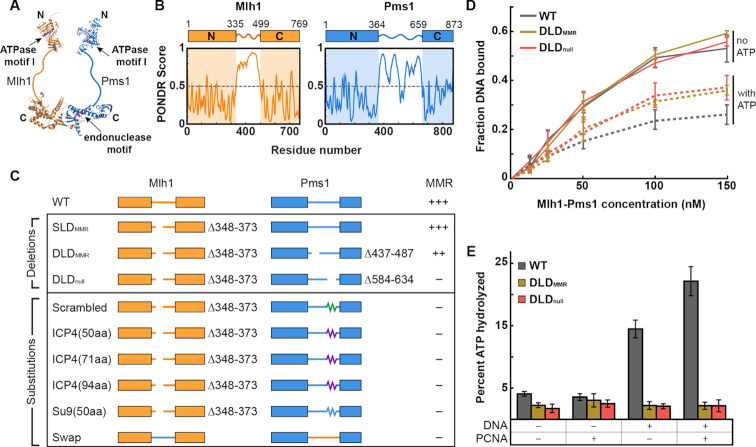
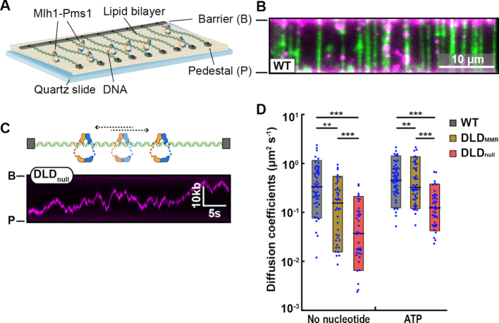
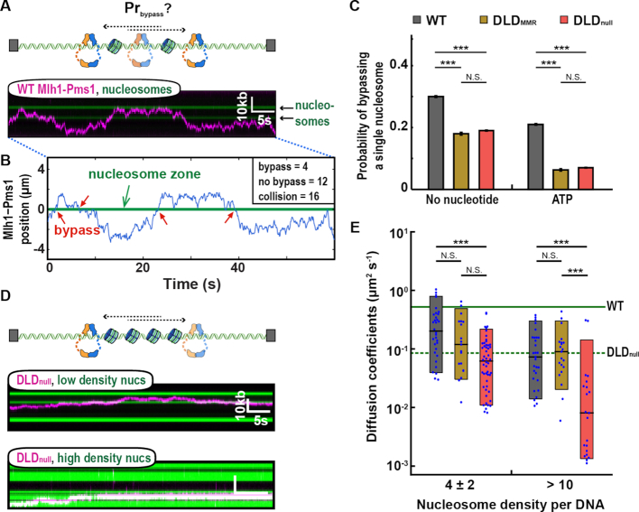
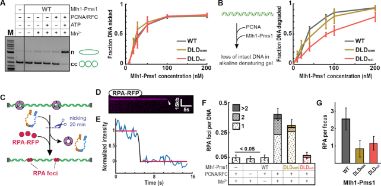
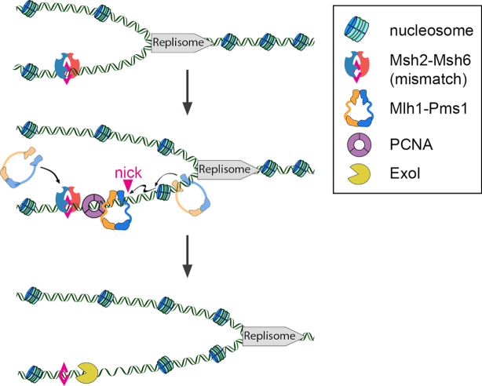

# Intrinsically disordered regions regulate both catalytic and non-catalytic activities of the MutLα mismatch repair complex

**Yoori Kim\*, Christopher M. Furman\*, Carol M. Manhart, Eric Alani†, and Ilya J. Finkelstein†** (\* co-first authors; † co-corresponding)

*Nucleic Acids Research*, Volume 47, Issue 3, Pages 1407-1421 (2019)

**DOI:** [10.1093/nar/gky1208](https://doi.org/10.1093/nar/gky1208)

---

## Table of Contents

- [Abstract](#abstract)
- [Introduction](#introduction)
- [Materials and Methods](#materials-and-methods)
- [Results](#results)
- [Discussion](#discussion)
- [Acknowledgements](#acknowledgements)

---
##  Abstract
Intrinsically disordered regions (IDRs) are present in at least 30% of the eukaryotic proteome and are enriched in chromatin-associated proteins. Using a combination of genetics, biochemistry and single-molecule biophysics, we characterize how IDRs regulate the functions of the yeast MutLα (Mlh1-Pms1) mismatch repair (MMR) complex. Shortening or scrambling the IDRs in both subunits ablates MMR _in vivo_. Mlh1-Pms1 complexes with shorter IDRs that disrupt MMR retain wild-type DNA binding affinity but are impaired for diffusion on both naked and nucleosome-coated DNA. Moreover, the IDRs also regulate the adenosine triphosphate hydrolysis and nuclease activities that are encoded in the structured N- and C-terminal domains of the complex. This combination of phenotypes underlies the catastrophic MMR defect seen with the mutant MutLα _in vivo_. More broadly, this work highlights an unanticipated multi-functional role for IDRs in regulating both facilitated diffusion on chromatin and nucleolytic processing of a DNA substrate.
---
##  INTRODUCTION
Intrinsically disordered regions (IDRs) are structurally heterogeneous protein domains that encode diverse functions. IDRs are conformationally flexible, facilitating interactions with multiple partners through intramolecular and intermolecular mechanisms ([1](#ref1),[2](#ref2)). IDRs are often found as linkers connecting functional domains where they can regulate protein stability ([1](#ref1)). IDRs are prevalent in chromatin-binding proteins, and the IDRs in these proteins have been implicated in bridging DNA strands, chromatin remodeling and interacting with other key proteins in DNA metabolic pathways ([3](#ref3),[4](#ref4)). Moreover, IDRs in transcription factors and single-strand DNA binding (SSB) proteins have been reported to tune the DNA binding affinities of these proteins ([5-10](#ref5)). Whether these IDRs also regulate scanning on chromatin and other catalytic processes is an open question. This is partly because mutations in such regions often do not confer a specific phenotype, and in some cases, the amino acid sequences contained within IDRs, which are typically poorly conserved among family members, can be critical for the function of a specific IDR-containing protein. Using the mismatch repair protein Mlh1-Pms1 as a case study, we explore the role of IDRs in regulating the DNA scanning and enzymatic activities of a critical eukaryotic DNA repair factor.
The MutL homolog family protein MutLα (MLH; Mlh1-Pms1 in baker's yeast) is essential for eukaryotic DNA mismatch repair (MMR). Mlh1-Pms1 organizes into a ring-like structure that links the ordered N- and C-terminal domains via 160-290 amino acid-long IDRs ([11-16](#ref11)) ([Fig. 1A](#fig1); amino acids 335-499 in Mlh1, 364-659 in Pms1). Mlh1-Pms1 searches for MutS homologs (MSH) bound to DNA mismatches ([16-18](#ref16)). A latent MLH endonuclease activity then nicks the newly-synthesized DNA strand resulting in excision of the mismatch ([19](#ref19)). This activity requires PCNA, and multiple nicks may enhance the excision step of MMR ([20-27](#ref20)).

<figure class="paper-figure" id="fig1">

<figcaption><strong>Figure 1. The IDR of Mlh1-Pms1 is critical for MMR <em>in vivo</em> and ATP hydrolysis <em>in vitro</em>.</strong> (<strong>A</strong>) Illustration of Mlh1-Pms1 highlighting the structured N- and C-terminal domains separated by IDRs (solid lines). (<strong>B</strong>) Bioinformatic prediction of long IDRs in both Mlh1 (amino acids 335-499) and Pms1 (amino acids 364-659) using the PONDR VSL2 predictor (<a href="#ref28">28</a>). Any value above 0.5 is considered disordered. (<strong>C</strong>) Schematic of IDR sequence changes made in Mlh1-Pms1, followed by the mutator phenotype conferred by the indicated alleles. +++ WT mutation rate, ++ hypomorph, - null. See text for a description of the specific sequences. (<strong>D</strong>) DNA binding activities for each complex analyzed by filter binding in the presence (dashed line) and absence (solid line) of 1 mM ATP. Mlh1-Pms1 variants were included at final concentrations of 12.5, 25, 50, 100 and 150 nM in buffer containing 25 mM NaCl. DNA binding of a 49-bp oligonucleotide was quantified by scintillation counting. Three replicates were averaged; error bars indicate ± one SD. (<strong>E</strong>) ATP hydrolysis activities of WT and mutant Mlh1-Pms1 complexes (0.40 μM) were determined alone, and in the presence of PCNA (0.5 μM), or 49-bp homoduplex DNA (0.75 μM), and both PCNA (0.5 μM) and 49-bp homoduplex DNA (0.75 μM). Error bars indicate ± one SD of three replicates.</figcaption>
</figure>
All MLH-family proteins encode an IDR between the structured N- and C-termini ([28](#ref28)). However, the functional role(s) of the IDRs in Mlh1-Pms1 is enigmatic. The composition and length of the MLH IDRs are critical for efficient MMR in yeast, and missense/deletion mutations within these linkers are found in human cancers ([11](#ref11),[29](#ref29),[30](#ref30)). We previously proposed that the Mlh1-Pms1 IDRs are sufficiently long to accommodate a nucleosome within the complex, possibly allowing Mlh1-Pms1 to navigate on chromatin _in vivo_ ([17](#ref17),[31](#ref31)). In support of this model Mlh1-Pms1 foci that were visualized in live yeast were short-lived (∼1.5 min on average), and displayed rapid movements in the nucleus ([32](#ref32)). In addition, the Mlh1-Pms1 IDRs display nucleotide-dependent conformational transitions, with adenosine triphosphate (ATP) binding bringing the N- and C-terminal subunits close together ([33-35](#ref33)). This ATPase activity is required for MMR _in vivo_ and can stimulate the endonuclease activity _in vitro_ ([20](#ref20),[36-39](#ref36)). ATP-dependent conformational rearrangements involving the IDRs are hypothesized to position bound DNA near the endonuclease active site and presumably change Mlh1-Pms1 affinity for DNA ([33](#ref33),[35](#ref35),[36](#ref36)). Together, these studies suggest that MLH proteins may use conformational changes mediated by the ATP cycle to modulate affinity for DNA, navigate on chromatin, and introduce nicks on a DNA substrate for efficient MMR. However, these possible functions of the IDRs have not been tested directly.
Here, we use a combination of genetics, ensemble biochemistry, and single-molecule biophysics to investigate how the Mlh1-Pms1 IDRs promote both DNA scanning and nuclease activities. We show that both the sequence composition and the precise length of the IDRs are required for optimal MMR _in vivo_. Having mapped genetic requirements for MMR, we next biochemically characterized a double linker deletion (DLD) mutant that was almost completely defective in MMR (DLDnull), and another linker deletion mutant that retains partial _in vivo_ MMR function (DLDMMR). Interestingly, both mutants can diffuse on DNA and nick a supercoiled plasmid, but show reduced DNA-dependent ATPase and nucleosome bypass activities. Furthermore, DLDnull is unable to navigate dense nucleosome arrays and is defective in multiple rounds of DNA nicking. These results establish that the IDRs license Mlh1-Pms1 to navigate chromatin and nick DNA at multiple sites to promote efficient MMR _in vivo_. Thus, the IDRs play a critical role in regulating how a DNA repair enzyme scans chromatin for a specific target and how the enzyme activates its endonuclease activity. More broadly, these results expand the functions of IDRs in regulating the DNA scanning and enzymatic activities of chromatin-associated complexes.
---
##  MATERIALS AND METHODS
### Bulk biochemical assays
#### DNA substrates for bulk biochemical assays
pUC18 (2.7 kb, Invitrogen) was used as the closed circular substrate for endonuclease assays presented in [Fig. 4A](#fig4) and Supplementary Figure S4A and B. A 49-mer homoduplex DNA substrate was used in the DNA binding and ATPase experiments presented in [Fig. 1D](#fig1) and [E](#fig1), and Supplementary Figure S2B. This substrate was made as follows. AO3142-5′-GGGTCAACGTGGGCAAAGATGTCCTAGCAAGTCAGAATTCGGTAGCGTG-3′ was labeled on the 5′ end with 32P labeled phosphate using T4 polynucleotide kinase (New England Biolabs). Unincorporated nucleotide was removed using a P30 spin column (BioRad). The two oligonucleotides were annealed by combining end-labeled AO3142 with a 2-fold molar excess of unlabeled AO3144-5′-CACGCTACCGAATTCTGACTTGCTAGGACATCTTTGCCCACGTTGACCC-3′ in buffer containing 10 mM Tris-HCl, pH 7.5, 100 mM NaCl, 10 mM MgCl2, and 0.1 mM ethylenediaminetetraacetic acid (EDTA). Annealing was accomplished by incubating the DNA substrates at 95°C for 5 min, followed by cooling to 25°C at a rate of 1°C/min. Following annealing, excess single-stranded DNA was removed using an S300 spin column (GE). 2.7 kb pUC18 for endonuclease assays on circular DNA was purchased from Thermo. For [Fig. 4B](#fig4) and Supplementary Figure S4C and D, the pBR322 plasmid (4.4 kb, Thermo) was linearized using _Hind_ III (NEB) by incubation at 37°C for 60 min, followed by enzyme inactivation at 80°C for 20 min. Linearized fragments were isolated using a polymerase chain reaction (PCR) clean-up kit (Zymo Research).
<figure class="paper-figure" id="fig2">

<figcaption><strong>Figure 2. The IDRs promote facilitated Mlh1-Pms1 diffusion on DNA.</strong> (<strong>A</strong>) Schematic of the DNA curtains assay. Fluorescently labeled Mlh1-Pms1 is injected into the flowcell and visualized on double-tethered DNA substrates in the absence of buffer flow. (<strong>B</strong>) An image of Mlh1-Pms1 (magenta puncta) on double-tethered DNA molecules (green). To avoid interference from the DNA-intercalating dye, the DNA is not fluorescently stained during analysis of Mlh1-Pms1 movement on DNA. (<strong>C</strong>) A schematic (top) and representative kymograph of a DLDnull Mlh1-Pms1 diffusing on DNA (bottom). (<strong>D</strong>) Diffusion coefficients of Mlh1-Pms1 complexes in the absence and presence of ATP. Boxplots indicate the median, 10th and 90th percentiles of the distribution. <em>P</em>-values are obtained from K-S test: *<em>P</em>-values < 0.05, **<em>P</em>-value < 0.01 and ***<em>P</em>-value < 0.005.</figcaption>
</figure>
ATP binding to Mlh1-Pms1 results in dimerization of the N-terminal domains, compaction of the IDRs, and the formation of a ring-like sliding clamp on DNA ([33](#ref33),[35](#ref35),[37](#ref37),[63](#ref63)). To probe the functional significance of this conformational change, we measured the diffusion coefficients of the Mlh1-Pms1 variants as a function of ATP. Diffusion coefficients in the ATP-bound state were significantly increased compared to the apo (no nucleotide) condition for all complexes. These results are consistent with a prior single-molecule report of ATP-dependent diffusion of _E. coli_ MutL homodimer ([60](#ref60)). However, compared to WT and DLDMMR, the mean DLDnull diffusion coefficient is ∼6-fold lower on DNA in the presence and absence of ATP ([Fig. 2D](#fig2) and Supplementary Table S2). While DLDnull displayed the lowest diffusion coefficient of all the complexes in the absence or presence of ATP ([Fig. 2D](#fig2)), DLDnull and DLDMMR displayed similar diffusion coefficients in the presence of ADP or AMP-PNP (Supplementary Figure S2D; See 'Discussion' section). We conclude that the IDRs of Mlh1-Pms1 are critical for efficient facilitated diffusion on DNA.
Mlh1-Pms1 must efficiently traverse chromatin to locate mismatch-bound MSH complexes. We, therefore, imaged Mlh1-Pms1 on nucleosome-coated DNA substrates. Nucleosomes were assembled using salt gradient dialysis with increasing concentrations of histone octamers to DNA molecules to recapitulate both sparse and dense nucleosome arrays ([17](#ref17),[64](#ref64)). Single nucleosomes were visualized via a fluorescent antibody directed against a triple HA epitope on the N-terminus of H2A. Nucleosomes were distributed over the entire length of the DNA molecule, with a weak preference for GC-rich segments, as described previously (Supplementary Figure S3A) ([65](#ref65)).
We first determined whether the Mlh1-Pms1 IDRs regulate diffusion past a single nucleosome. DNA substrates with one to seven nucleosomes were assembled into double-tethered DNA curtains (Supplementary Figure S3B). Mlh1-Pms1 was added to the flowcell prior to fluorescently labeling the nucleosomes. Keeping the nucleosomes unlabeled guaranteed that Mlh1-Pms1 was not blocked by the H2A-targeting antibody. After recording 10-15 min of Mlh1-Pms1 diffusion, a fluorescently labeled anti-HA antibody visualized the nucleosome positions. Diffusing Mlh1-Pms1 complexes encountered and occasionally bypassed individual nucleosomes ([Fig. 3A](#fig3)). To quantitatively determine the probability of bypassing a single nucleosome, we defined a 'collision zone' for each nucleosome which encompasses three standard deviations of the spatial resolution of our single-molecule assay (0.08 μm; ∼ 300 bp) (Supplementary Figure S3C and 'Materials and Methods' section). Diffusing Mlh1-Pms1 that entered this collision zone from one side of the nucleosome and emerged from the other side was counted as a bypass event. Events where Mlh1-Pms1 entered and emerged from the same side of the nucleosome collision zone were scored as non-bypass encounters ([Fig. 3B](#fig3)). This quantification likely underestimates the frequency of microscopic Mlh1-Pms1 nucleosome bypass events that are below our spatial resolution but does not change any of the underlying conclusions comparing the different complexes.
<figure class="paper-figure" id="fig3">

<figcaption><strong>Figure 3. The IDRs increase Mlh1-Pms1 movement on nucleosome-coated DNA.</strong> (<strong>A</strong>) An illustration (top) and a representative kymograph of WT Mlh1-Pms1 diffusing past a nucleosome (bottom). (<strong>B</strong>) Trajectory analysis of single nucleosome bypass events. The nucleosome collision zone (green) is defined as three standard deviations of the experimental resolution of the nucleosome position (see 'Materials and Methods' section). (<strong>C</strong>) The values obtained from the analysis shown in (B) are fit to binary logistic regression to obtain predicted probability of nucleosome bypass. (<strong>D</strong>) A cartoon (top) and representative kymographs of DLDnull (magenta) on DNA containing 4 ± 2 nucleosomes (middle, green) or >10 nucleosomes (bottom, green) in the absence of ATP. Nucleosomes are labeled with fluorescent anti-HA antibodies after Mlh1-Pms1 trajectories are recorded. (<strong>E</strong>) Diffusion coefficients of the three Mlh1-Pms1 complexes on nucleosome-coated DNA. The solid and dashed green lines indicate the mean of the diffusion coefficients of WT and DLDnull on naked DNA, respectively. <em>P</em>-values are obtained from K-S test: *<em>P</em>-values < 0.05, **<em>P</em>-value < 0.01 and ***<em>P</em>-value < 0.005. N.S. indicates <em>P</em> > 0.05.</figcaption>
</figure>
WT Mlh1-Pms1 bypassed nucleosomes 30.0 ± 0.3% of the time ([Fig. 3C](#fig3) and Supplementary Table S3). A molecule that travels via a 1D random walk involving facilitated diffusion has a 50% probability of stepping forward or backward on DNA. This 50% probability value is the maximum theoretical bypass probability in the absence of any nucleosome obstacles. Thus, Mlh1-Pms1 is capable of efficiently bypassing a nucleosome obstacle. In contrast, both DLDMMR and DLDnull complexes had a 2-fold reduced nucleosome bypass frequency (18.0 ± 0.5%; _N_ = 29 for DLDMMR; 19.0 ± 0.2%; _N_ = 27 for DLDnull).
Next, we explored how ATP-induced conformational changes affect nucleosome bypass by Mlh1-Pms1 (Supplementary Figure S3C). In the presence of ATP, all Mlh1-Pms1 variants exhibited a reduced bypass probability, with a significantly larger, ∼2- to 3-fold, decrease in nucleosome bypass probability for both DLD variants. The decrease in bypass probabilities for DLDMMR and DLDnull mirrors their ATPase activities ([Fig. 1E](#fig1)). Taken together, these data suggest that ATP-dependent dimerization of the N-terminal domains accompanied by conformational compaction of the IDRs reduces dynamic movement on nucleosome-coated DNA.
We reasoned that the combination of a reduced diffusion coefficient and less efficient nucleosome bypass observed with DLDnull may compromise its ability to navigate on dense nucleosome arrays. To test this, we increased the histone octamer to DNA ratio during salt dialysis to deposit >10 nucleosomes per DNA substrate (Supplementary Figure S3D). At this high density, each nucleosome is optically indistinguishable due to the diffraction limit of light. Nonetheless, by using two-color fluorescent imaging we can still track individual diffusing Mlh1-Pms1 complexes on this nucleosome-coated DNA substrate ([Fig. 3D](#fig3) and Supplementary Figure S3E). The 1D diffusion of all Mlh1-Pms1 complexes was restricted on this high nucleosome density substrate compared to naked DNA. Notably, while 1D diffusion coefficients of WT and DLDMMR decreased by 3-fold compared to naked DNA, the DLDnull diffusion coefficient decreased 12-fold on this chromatinized DNA substrate ([Fig. 3E](#fig3)). Thus, the IDRs are important for promoting rapid facilitated diffusion on naked DNA but are especially critical for navigating on chromatin.
<figure class="paper-figure" id="fig4">

<figcaption><strong>Figure 4. The IDRs regulates extensive DNA nicking.</strong> (<strong>A</strong>) Endonuclease activity on closed circular DNA in the presence (+) or absence (-) of MnSO4, ATP and yeast PCNA/RFC (left panel). Where + is indicated, the concentration of MnSO4 was 2.5 mM, ATP was 0.5 mM, RFC and PCNA were each 500 nM. The final concentration of WT Mlh1-Pms1 was 100 nM. In the presence of MnSO4, ATP, RFC and PCNA at the above concentrations, Mlh1-Pms1 variants were titrated from 0 to 200 nM (right panel). Error-bars: SD of three replicates. (<strong>B</strong>) Illustration (left panel) and quantification (right panel) of endonuclease activity of WT and mutant Mlh1-Pms1 complexes (titrated from 0 to 200 nM) on linear DNA (also see Supplementary Figure S4C and D for controls). All reactions contain 500 nM PCNA, 0.5 mM ATP and 5 mM MnSO4. Error-bars: SD of four replicates. (<strong>C</strong>) Schematic of the single-molecule endonuclease assay. Formation of ssDNA gaps via PCNA-activated Mlh1-Pms1 nuclease activity was visualized by injecting RPA-RFP into the flowcell. (<strong>D</strong>) Kymograph and (<strong>E</strong>) fluorescent intensity profile of an RPA-RFP punctum with a single-step photobleaching event (arrow), indicating a single RPA-RFP molecule on the ssDNA. (<strong>F</strong>) The number of RPA foci per DNA molecule for the indicated Mlh1-Pms1 variants. (<strong>G</strong>) The number of RPA molecule per punctum for the three Mlh1-Pms1 complexes. To estimate the number of RPA molecules per ssDNA segment, the fluorescent intensity for each punctum was measured and normalized to that of a single RPA-RFP (see 'Materials and Methods' section for details).</figcaption>
</figure>
<figure class="paper-figure" id="fig5">

<figcaption><strong>Figure 5. A model of replication-coupled mismatch repair.</strong> Msh2-Msh6 locates mismatches in DNA that is nucleosome-free during replication. Mlh1-Pms1 sliding clamps efficiently bypass nucleosomes that are deposited on the newly replicated DNA. The ability of Mlh1-Pms1 to traverse nucleosomes is important to locate mismatch-bound Msh2-Msh6 but not during endonucleolytic DNA cleavage. Exo1 binds one or more Mlh1-Pms1-generated nicks and degrades the nascent daughter DNA strand.</figcaption>
</figure>

---
##  ACKNOWLEDGEMENTS
We thank Dr Alba Guarne for sharing information on IDRs and the MLH nicking assay, Dr Titia Sixma for sharing the MutL over-expression vector, Dr Andreas Matouschek for sharing plasmids encoding the flexible protein linkers used in the genetic assays, Jeff Schaub for RPA-RFP, Dr Eric Greene and members of the Finkelstein and Alani labs for helpful discussions and comments on the manuscript.

##  SUPPLEMENTARY DATA
[Supplementary Data](https://academic.oup.com/nar/article-lookup/doi/10.1093/nar/gky1244#supplementary-data) are available at NAR Online.
##  FUNDING
Howard Hughes Medical Institute (to Y.K.); Cancer Prevention & Research Institute of Texas (R1214 to I.J.F.); National Institute of General Medical Sciences [GM120554 to I.J.F., GM53085 to E.A., GM112435 to C.M.M.]; The Welch Foundation [F-1808 to I.J.F.]. Funding for open access charge: NIH.
_Conflict of interest statement_. None declared.
##  REFERENCES
1. Oldfield C.J., Dunker A.K.. Intrinsically disordered proteins and intrinsically disordered protein regions. Annu. Rev. Biochem. 2014; 83:553-584. [[DOI](https://doi.org/10.1146/annurev-biochem-072711-164947)] [[PubMed](https://pubmed.ncbi.nlm.nih.gov/24606139/)] [[Google Scholar](https://scholar.google.com/scholar_lookup?journal=Annu.%20Rev.%20Biochem.&title=Intrinsically%20disordered%20proteins%20and%20intrinsically%20disordered%20protein%20regions&author=C.J.%20Oldfield&author=A.K.%20Dunker&volume=83&publication_year=2014&pages=553-584&pmid=24606139&doi=10.1146/annurev-biochem-072711-164947&)]
2. van der Lee R., Buljan M., Lang B., Weatheritt R.J., Daughdrill G.W., Dunker A.K., Fuxreiter M., Gough J., Gsponer J., Jones D.T. et al. Classification of intrinsically disordered regions and proteins. Chem. Rev. 2014; 114:6589-6631. [[DOI](https://doi.org/10.1021/cr400525m)] [[PMC free article](https://pmc.ncbi.nlm.nih.gov/articles/PMC4095912/)] [[PubMed](https://pubmed.ncbi.nlm.nih.gov/24773235/)] [[Google Scholar](https://scholar.google.com/scholar_lookup?journal=Chem.%20Rev.&title=Classification%20of%20intrinsically%20disordered%20regions%20and%20proteins&author=R.%20van%C2%A0der%C2%A0Lee&author=M.%20Buljan&author=B.%20Lang&author=R.J.%20Weatheritt&author=G.W.%20Daughdrill&volume=114&publication_year=2014&pages=6589-6631&pmid=24773235&doi=10.1021/cr400525m&)]
3. Andres S.N., Williams R.S.. CtIP/Ctp1/Sae2, molecular form fit for function. DNA Repair (Amst.). 2017; 56:109-117. [[DOI](https://doi.org/10.1016/j.dnarep.2017.06.013)] [[PMC free article](https://pmc.ncbi.nlm.nih.gov/articles/PMC5543718/)] [[PubMed](https://pubmed.ncbi.nlm.nih.gov/28623092/)] [[Google Scholar](https://scholar.google.com/scholar_lookup?journal=DNA%20Repair%20\(Amst.\)&title=CtIP/Ctp1/Sae2,%20molecular%20form%20fit%20for%20function&author=S.N.%20Andres&author=R.S.%20Williams&volume=56&publication_year=2017&pages=109-117&pmid=28623092&doi=10.1016/j.dnarep.2017.06.013&)]
4. Warren C., Shechter D.. Fly fishing for histones: catch and release by histone chaperone intrinsically disordered regions and acidic stretches. J. Mol. Biol. 2017; 429:2401-2426. [[DOI](https://doi.org/10.1016/j.jmb.2017.06.005)] [[PMC free article](https://pmc.ncbi.nlm.nih.gov/articles/PMC5544577/)] [[PubMed](https://pubmed.ncbi.nlm.nih.gov/28610839/)] [[Google Scholar](https://scholar.google.com/scholar_lookup?journal=J.%20Mol.%20Biol.&title=Fly%20fishing%20for%20histones:%20catch%20and%20release%20by%20histone%20chaperone%20intrinsically%20disordered%20regions%20and%20acidic%20stretches&author=C.%20Warren&author=D.%20Shechter&volume=429&publication_year=2017&pages=2401-2426&pmid=28610839&doi=10.1016/j.jmb.2017.06.005&)]
5. van Leeuwen H.C., Strating M.J., Rensen M., de Laat W., van der Vliet P.C.. Linker length and composition influence the flexibility of Oct-1 DNA binding. EMBO J. 1997; 16:2043-2053. [[DOI](https://doi.org/10.1093/emboj/16.8.2043)] [[PMC free article](https://pmc.ncbi.nlm.nih.gov/articles/PMC1169807/)] [[PubMed](https://pubmed.ncbi.nlm.nih.gov/9155030/)] [[Google Scholar](https://scholar.google.com/scholar_lookup?journal=EMBO%20J.&title=Linker%20length%20and%20composition%20influence%20the%20flexibility%20of%20Oct-1%20DNA%20binding&author=H.C.%20van%C2%A0Leeuwen&author=M.J.%20Strating&author=M.%20Rensen&author=W.%20de%C2%A0Laat&author=P.C.%20van%C2%A0der%C2%A0Vliet&volume=16&publication_year=1997&pages=2043-2053&pmid=9155030&doi=10.1093/emboj/16.8.2043&)]
6. Kozlov A.G., Weiland E., Mittal A., Waldman V., Antony E., Fazio N., Pappu R.V., Lohman T.M.. Intrinsically disordered C-terminal tails of E. coli single-stranded DNA binding protein regulate cooperative binding to single-stranded DNA. J. Mol. Biol. 2015; 427:763-774. [[DOI](https://doi.org/10.1016/j.jmb.2014.12.020)] [[PMC free article](https://pmc.ncbi.nlm.nih.gov/articles/PMC4419694/)] [[PubMed](https://pubmed.ncbi.nlm.nih.gov/25562210/)] [[Google Scholar](https://scholar.google.com/scholar_lookup?journal=J.%20Mol.%20Biol.&title=Intrinsically%20disordered%20C-terminal%20tails%20of%20E.%20coli%20single-stranded%20DNA%20binding%20protein%20regulate%20cooperative%20binding%20to%20single-stranded%20DNA&author=A.G.%20Kozlov&author=E.%20Weiland&author=A.%20Mittal&author=V.%20Waldman&author=E.%20Antony&volume=427&publication_year=2015&pages=763-774&pmid=25562210&doi=10.1016/j.jmb.2014.12.020&)]
7. Liu J., Perumal N.B., Oldfield C.J., Su E.W., Uversky V.N., Dunker A.K.. Intrinsic disorder in transcription factors. Biochemistry. 2006; 45:6873-6888. [[DOI](https://doi.org/10.1021/bi0602718)] [[PMC free article](https://pmc.ncbi.nlm.nih.gov/articles/PMC2538555/)] [[PubMed](https://pubmed.ncbi.nlm.nih.gov/16734424/)] [[Google Scholar](https://scholar.google.com/scholar_lookup?journal=Biochemistry&title=Intrinsic%20disorder%20in%20transcription%20factors&author=J.%20Liu&author=N.B.%20Perumal&author=C.J.%20Oldfield&author=E.W.%20Su&author=V.N.%20Uversky&volume=45&publication_year=2006&pages=6873-6888&pmid=16734424&doi=10.1021/bi0602718&)]
8. Currie S.L., Lau D.K.W., Doane J.J., Whitby F.G., Okon M., McIntosh L.P., Graves B.J.. Structured and disordered regions cooperatively mediate DNA-binding autoinhibition of ETS factors ETV1, ETV4 and ETV5. Nucleic Acids Res. 2017; 45:2223-2241. [[DOI](https://doi.org/10.1093/nar/gkx068)] [[PMC free article](https://pmc.ncbi.nlm.nih.gov/articles/PMC5389675/)] [[PubMed](https://pubmed.ncbi.nlm.nih.gov/28161714/)] [[Google Scholar](https://scholar.google.com/scholar_lookup?journal=Nucleic%20Acids%20Res.&title=Structured%20and%20disordered%20regions%20cooperatively%20mediate%20DNA-binding%20autoinhibition%20of%20ETS%20factors%20ETV1,%20ETV4%20and%20ETV5&author=S.L.%20Currie&author=D.K.W.%20Lau&author=J.J.%20Doane&author=F.G.%20Whitby&author=M.%20Okon&volume=45&publication_year=2017&pages=2223-2241&pmid=28161714&doi=10.1093/nar/gkx068&)]
9. Kozlov A.G., Shinn M.K., Weiland E.A., Lohman T.M.. Glutamate promotes SSB protein-protein Interactions via intrinsically disordered regions. J. Mol. Biol. 2017; 429:2790-2801. [[DOI](https://doi.org/10.1016/j.jmb.2017.07.021)] [[PMC free article](https://pmc.ncbi.nlm.nih.gov/articles/PMC5576569/)] [[PubMed](https://pubmed.ncbi.nlm.nih.gov/28782560/)] [[Google Scholar](https://scholar.google.com/scholar_lookup?journal=J.%20Mol.%20Biol.&title=Glutamate%20promotes%20SSB%20protein-protein%20Interactions%20via%20intrinsically%20disordered%20regions&author=A.G.%20Kozlov&author=M.K.%20Shinn&author=E.A.%20Weiland&author=T.M.%20Lohman&volume=429&publication_year=2017&pages=2790-2801&pmid=28782560&doi=10.1016/j.jmb.2017.07.021&)]
10. Vuzman D., Levy Y.. Intrinsically disordered regions as affinity tuners in protein-DNA interactions. Mol. Biosyst. 2012; 8:47-57. [[DOI](https://doi.org/10.1039/c1mb05273j)] [[PubMed](https://pubmed.ncbi.nlm.nih.gov/21918774/)] [[Google Scholar](https://scholar.google.com/scholar_lookup?journal=Mol.%20Biosyst.&title=Intrinsically%20disordered%20regions%20as%20affinity%20tuners%20in%20protein-DNA%20interactions&author=D.%20Vuzman&author=Y.%20Levy&volume=8&publication_year=2012&pages=47-57&pmid=21918774&doi=10.1039/c1mb05273j&)]
11. Plys A.J., Rogacheva M.V., Greene E.C., Alani E.. The unstructured linker arms of Mlh1-Pms1 are important for interactions with DNA during mismatch repair. J. Mol. Biol. 2012; 422:192-203. [[DOI](https://doi.org/10.1016/j.jmb.2012.05.030)] [[PMC free article](https://pmc.ncbi.nlm.nih.gov/articles/PMC3418407/)] [[PubMed](https://pubmed.ncbi.nlm.nih.gov/22659005/)] [[Google Scholar](https://scholar.google.com/scholar_lookup?journal=J.%20Mol.%20Biol.&title=The%20unstructured%20linker%20arms%20of%20Mlh1-Pms1%20are%20important%20for%20interactions%20with%20DNA%20during%20mismatch%20repair&author=A.J.%20Plys&author=M.V.%20Rogacheva&author=E.C.%20Greene&author=E.%20Alani&volume=422&publication_year=2012&pages=192-203&pmid=22659005&doi=10.1016/j.jmb.2012.05.030&)]
12. Bronner C.E., Baker S.M., Morrison P.T., Warren G., Smith L.G., Lescoe M.K., Kane M., Earabino C., Lipford J., Lindblom A. et al. Mutation in the DNA mismatch repair gene homologue hMLH 1 is associated with hereditary non-polyposis colon cancer. Nature. 1994; 368:258-261. [[DOI](https://doi.org/10.1038/368258a0)] [[PubMed](https://pubmed.ncbi.nlm.nih.gov/8145827/)] [[Google Scholar](https://scholar.google.com/scholar_lookup?journal=Nature&title=Mutation%20in%20the%20DNA%20mismatch%20repair%20gene%20homologue%20hMLH%201%20is%20associated%20with%20hereditary%20non-polyposis%20colon%20cancer&author=C.E.%20Bronner&author=S.M.%20Baker&author=P.T.%20Morrison&author=G.%20Warren&author=L.G.%20Smith&volume=368&publication_year=1994&pages=258-261&pmid=8145827&doi=10.1038/368258a0&)]
13. Prolla T.A., Christie D.M., Liskay R.M.. Dual requirement in yeast DNA mismatch repair for MLH1 and PMS1, two homologs of the bacterial mutL gene. Mol. Cell. Biol. 1994; 14:407-415. [[DOI](https://doi.org/10.1128/mcb.14.1.407)] [[PMC free article](https://pmc.ncbi.nlm.nih.gov/articles/PMC358390/)] [[PubMed](https://pubmed.ncbi.nlm.nih.gov/8264608/)] [[Google Scholar](https://scholar.google.com/scholar_lookup?journal=Mol.%20Cell.%20Biol.&title=Dual%20requirement%20in%20yeast%20DNA%20mismatch%20repair%20for%20MLH1%20and%20PMS1,%20two%20homologs%20of%20the%20bacterial%20mutL%20gene&author=T.A.%20Prolla&author=D.M.%20Christie&author=R.M.%20Liskay&volume=14&publication_year=1994&pages=407-415&pmid=8264608&doi=10.1128/mcb.14.1.407&)]
14. Hall M.C., Shcherbakova P.V., Fortune J.M., Borchers C.H., Dial J.M., Tomer K.B., Kunkel T.A.. DNA binding by yeast Mlh1 and Pms1: implications for DNA mismatch repair. Nucleic Acids Res. 2003; 31:2025-2034. [[DOI](https://doi.org/10.1093/nar/gkg324)] [[PMC free article](https://pmc.ncbi.nlm.nih.gov/articles/PMC153752/)] [[PubMed](https://pubmed.ncbi.nlm.nih.gov/12682353/)] [[Google Scholar](https://scholar.google.com/scholar_lookup?journal=Nucleic%20Acids%20Res.&title=DNA%20binding%20by%20yeast%20Mlh1%20and%20Pms1:%20implications%20for%20DNA%20mismatch%20repair&author=M.C.%20Hall&author=P.V.%20Shcherbakova&author=J.M.%20Fortune&author=C.H.%20Borchers&author=J.M.%20Dial&volume=31&publication_year=2003&pages=2025-2034&pmid=12682353&doi=10.1093/nar/gkg324&)]
15. Argueso J.L., Kijas A.W., Sarin S., Heck J., Waase M., Alani E.. Systematic mutagenesis of the Saccharomyces cerevisiae MLH1 gene reveals distinct roles for Mlh1p in meiotic crossing over and in vegetative and meiotic mismatch repair. Mol. Cell. Biol. 2003; 23:873-886. [[DOI](https://doi.org/10.1128/MCB.23.3.873-886.2003)] [[PMC free article](https://pmc.ncbi.nlm.nih.gov/articles/PMC140715/)] [[PubMed](https://pubmed.ncbi.nlm.nih.gov/12529393/)] [[Google Scholar](https://scholar.google.com/scholar_lookup?journal=Mol.%20Cell.%20Biol.&title=Systematic%20mutagenesis%20of%20the%20Saccharomyces%20cerevisiae%20MLH1%20gene%20reveals%20distinct%20roles%20for%20Mlh1p%20in%20meiotic%20crossing%20over%20and%20in%20vegetative%20and%20meiotic%20mismatch%20repair&author=J.L.%20Argueso&author=A.W.%20Kijas&author=S.%20Sarin&author=J.%20Heck&author=M.%20Waase&volume=23&publication_year=2003&pages=873-886&pmid=12529393&doi=10.1128/MCB.23.3.873-886.2003&)]
16. Guarné A., Ramon-Maiques S., Wolff E.M., Ghirlando R., Hu X., Miller J.H., Yang W.. Structure of the MutL C-terminal domain: a model of intact MutL and its roles in mismatch repair. EMBO J. 2004; 23:4134-4145. [[DOI](https://doi.org/10.1038/sj.emboj.7600412)] [[PMC free article](https://pmc.ncbi.nlm.nih.gov/articles/PMC524388/)] [[PubMed](https://pubmed.ncbi.nlm.nih.gov/15470502/)] [[Google Scholar](https://scholar.google.com/scholar_lookup?journal=EMBO%20J.&title=Structure%20of%20the%20MutL%20C-terminal%20domain:%20a%20model%20of%20intact%20MutL%20and%20its%20roles%20in%20mismatch%20repair&author=A.%20Guarn%C3%A9&author=S.%20Ramon-Maiques&author=E.M.%20Wolff&author=R.%20Ghirlando&author=X.%20Hu&volume=23&publication_year=2004&pages=4134-4145&pmid=15470502&doi=10.1038/sj.emboj.7600412&)]
17. Gorman J., Plys A.J., Visnapuu M.-L., Alani E., Greene E.C.. Visualizing one-dimensional diffusion of eukaryotic DNA repair factors along a chromatin lattice. Nat. Struct. Mol. Biol. 2010; 17:932-938. [[DOI](https://doi.org/10.1038/nsmb.1858)] [[PMC free article](https://pmc.ncbi.nlm.nih.gov/articles/PMC2953804/)] [[PubMed](https://pubmed.ncbi.nlm.nih.gov/20657586/)] [[Google Scholar](https://scholar.google.com/scholar_lookup?journal=Nat.%20Struct.%20Mol.%20Biol.&title=Visualizing%20one-dimensional%20diffusion%20of%20eukaryotic%20DNA%20repair%20factors%20along%20a%20chromatin%20lattice&author=J.%20Gorman&author=A.J.%20Plys&author=M.-L.%20Visnapuu&author=E.%20Alani&author=E.C.%20Greene&volume=17&publication_year=2010&pages=932-938&pmid=20657586&doi=10.1038/nsmb.1858&)]
18. Groothuizen F.S., Winkler I., Cristóvão M., Fish A., Winterwerp H.H.K., Reumer A., Marx A.D., Hermans N., Nicholls R.A., Murshudov G.N. et al. MutS/MutL crystal structure reveals that the MutS sliding clamp loads MutL onto DNA. Elife. 2015; 4:e06744. [[DOI](https://doi.org/10.7554/eLife.06744)] [[PMC free article](https://pmc.ncbi.nlm.nih.gov/articles/PMC4521584/)] [[PubMed](https://pubmed.ncbi.nlm.nih.gov/26163658/)] [[Google Scholar](https://scholar.google.com/scholar_lookup?journal=Elife&title=MutS/MutL%20crystal%20structure%20reveals%20that%20the%20MutS%20sliding%20clamp%20loads%20MutL%20onto%20DNA&author=F.S.%20Groothuizen&author=I.%20Winkler&author=M.%20Crist%C3%B3v%C3%A3o&author=A.%20Fish&author=H.H.K.%20Winterwerp&volume=4&publication_year=2015&pages=e06744&pmid=26163658&doi=10.7554/eLife.06744&)]
19. Kunkel T.A., Erie D.A.. Eukaryotic mismatch repair in relation to DNA replication. Annu. Rev. Genet. 2015; 49:291-313. [[DOI](https://doi.org/10.1146/annurev-genet-112414-054722)] [[PMC free article](https://pmc.ncbi.nlm.nih.gov/articles/PMC5439269/)] [[PubMed](https://pubmed.ncbi.nlm.nih.gov/26436461/)] [[Google Scholar](https://scholar.google.com/scholar_lookup?journal=Annu.%20Rev.%20Genet.&title=Eukaryotic%20mismatch%20repair%20in%20relation%20to%20DNA%20replication&author=T.A.%20Kunkel&author=D.A.%20Erie&volume=49&publication_year=2015&pages=291-313&pmid=26436461&doi=10.1146/annurev-genet-112414-054722&)]
20. Kadyrov F.A., Dzantiev L., Constantin N., Modrich P.. Endonucleolytic function of MutLalpha in human mismatch repair. Cell. 2006; 126:297-308. [[DOI](https://doi.org/10.1016/j.cell.2006.05.039)] [[PubMed](https://pubmed.ncbi.nlm.nih.gov/16873062/)] [[Google Scholar](https://scholar.google.com/scholar_lookup?journal=Cell&title=Endonucleolytic%20function%20of%20MutLalpha%20in%20human%20mismatch%20repair&author=F.A.%20Kadyrov&author=L.%20Dzantiev&author=N.%20Constantin&author=P.%20Modrich&volume=126&publication_year=2006&pages=297-308&pmid=16873062&doi=10.1016/j.cell.2006.05.039&)]
21. Kadyrov F.A., Genschel J., Fang Y., Penland E., Edelmann W., Modrich P.. A possible mechanism for exonuclease 1-independent eukaryotic mismatch repair. Proc. Natl. Acad. Sci. U.S.A. 2009; 106:8495-8500. [[DOI](https://doi.org/10.1073/pnas.0903654106)] [[PMC free article](https://pmc.ncbi.nlm.nih.gov/articles/PMC2677980/)] [[PubMed](https://pubmed.ncbi.nlm.nih.gov/19420220/)] [[Google Scholar](https://scholar.google.com/scholar_lookup?journal=Proc.%20Natl.%20Acad.%20Sci.%20U.S.A.&title=A%20possible%20mechanism%20for%20exonuclease%201-independent%20eukaryotic%20mismatch%20repair&author=F.A.%20Kadyrov&author=J.%20Genschel&author=Y.%20Fang&author=E.%20Penland&author=W.%20Edelmann&volume=106&publication_year=2009&pages=8495-8500&pmid=19420220&doi=10.1073/pnas.0903654106&)]
22. Goellner E.M., Smith C.E., Campbell C.S., Hombauer H., Desai A., Putnam C.D., Kolodner R.D.. PCNA and Msh2-Msh6 activate an Mlh1-Pms1 endonuclease pathway required for Exo1-independent mismatch repair. Mol. Cell. 2014; 55:291-304. [[DOI](https://doi.org/10.1016/j.molcel.2014.04.034)] [[PMC free article](https://pmc.ncbi.nlm.nih.gov/articles/PMC4113420/)] [[PubMed](https://pubmed.ncbi.nlm.nih.gov/24981171/)] [[Google Scholar](https://scholar.google.com/scholar_lookup?journal=Mol.%20Cell&title=PCNA%20and%20Msh2-Msh6%20activate%20an%20Mlh1-Pms1%20endonuclease%20pathway%20required%20for%20Exo1-independent%20mismatch%20repair&author=E.M.%20Goellner&author=C.E.%20Smith&author=C.S.%20Campbell&author=H.%20Hombauer&author=A.%20Desai&volume=55&publication_year=2014&pages=291-304&pmid=24981171&doi=10.1016/j.molcel.2014.04.034&)]
23. Lu A.L. Influence of GATC sequences on Escherichia coli DNA mismatch repair _in vitro_. J. Bacteriol. 1987; 169:1254-1259. [[DOI](https://doi.org/10.1128/jb.169.3.1254-1259.1987)] [[PMC free article](https://pmc.ncbi.nlm.nih.gov/articles/PMC211927/)] [[PubMed](https://pubmed.ncbi.nlm.nih.gov/3029029/)] [[Google Scholar](https://scholar.google.com/scholar_lookup?journal=J.%20Bacteriol.&title=Influence%20of%20GATC%20sequences%20on%20Escherichia%20coli%20DNA%20mismatch%20repair%20in%20vitro&author=A.L.%20Lu&volume=169&publication_year=1987&pages=1254-1259&pmid=3029029&doi=10.1128/jb.169.3.1254-1259.1987&)]
24. Hermans N., Laffeber C., Cristovão M., Artola-Borán M., Mardenborough Y., Ikpa P., Jaddoe A., Winterwerp H.H.K., Wyman C., Jiricny J. et al. Dual daughter strand incision is processive and increases the efficiency of DNA mismatch repair. Nucleic Acids Res. 2016; 44:6770-6786. [[DOI](https://doi.org/10.1093/nar/gkw411)] [[PMC free article](https://pmc.ncbi.nlm.nih.gov/articles/PMC5001592/)] [[PubMed](https://pubmed.ncbi.nlm.nih.gov/27174933/)] [[Google Scholar](https://scholar.google.com/scholar_lookup?journal=Nucleic%20Acids%20Res.&title=Dual%20daughter%20strand%20incision%20is%20processive%20and%20increases%20the%20efficiency%20of%20DNA%20mismatch%20repair&author=N.%20Hermans&author=C.%20Laffeber&author=M.%20Cristov%C3%A3o&author=M.%20Artola-Bor%C3%A1n&author=Y.%20Mardenborough&volume=44&publication_year=2016&pages=6770-6786&pmid=27174933&doi=10.1093/nar/gkw411&)]
25. Gueneau E., Dherin C., Legrand P., Tellier-Lebegue C., Gilquin B., Bonnesoeur P., Londino F., Quemener C., Le Du M.-H., Márquez J.A. et al. Structure of the MutLα C-terminal domain reveals how Mlh1 contributes to Pms1 endonuclease site. Nat. Struct. Mol. Biol. 2013; 20:461-468. [[DOI](https://doi.org/10.1038/nsmb.2511)] [[PubMed](https://pubmed.ncbi.nlm.nih.gov/23435383/)] [[Google Scholar](https://scholar.google.com/scholar_lookup?journal=Nat.%20Struct.%20Mol.%20Biol.&title=Structure%20of%20the%20MutL%CE%B1%20C-terminal%20domain%20reveals%20how%20Mlh1%20contributes%20to%20Pms1%20endonuclease%20site&author=E.%20Gueneau&author=C.%20Dherin&author=P.%20Legrand&author=C.%20Tellier-Lebegue&author=B.%20Gilquin&volume=20&publication_year=2013&pages=461-468&pmid=23435383&doi=10.1038/nsmb.2511&)]
26. Goellner E.M., Putnam C.D., Kolodner R.D.. Exonuclease 1-dependent and independent mismatch repair. DNA Repair (Amst.). 2015; 32:24-32. [[DOI](https://doi.org/10.1016/j.dnarep.2015.04.010)] [[PMC free article](https://pmc.ncbi.nlm.nih.gov/articles/PMC4522362/)] [[PubMed](https://pubmed.ncbi.nlm.nih.gov/25956862/)] [[Google Scholar](https://scholar.google.com/scholar_lookup?journal=DNA%20Repair%20\(Amst.\)&title=Exonuclease%201-dependent%20and%20independent%20mismatch%20repair&author=E.M.%20Goellner&author=C.D.%20Putnam&author=R.D.%20Kolodner&volume=32&publication_year=2015&pages=24-32&pmid=25956862&doi=10.1016/j.dnarep.2015.04.010&)]
27. Genschel J., Kadyrova L.Y., Iyer R.R., Dahal B.K., Kadyrov F.A., Modrich P.. Interaction of proliferating cell nuclear antigen with PMS2 is required for MutLα activation and function in mismatch repair. Proc. Natl. Acad. Sci. U.S.A. 2017; 114:4930-4935. [[DOI](https://doi.org/10.1073/pnas.1702561114)] [[PMC free article](https://pmc.ncbi.nlm.nih.gov/articles/PMC5441711/)] [[PubMed](https://pubmed.ncbi.nlm.nih.gov/28439008/)] [[Google Scholar](https://scholar.google.com/scholar_lookup?journal=Proc.%20Natl.%20Acad.%20Sci.%20U.S.A.&title=Interaction%20of%20proliferating%20cell%20nuclear%20antigen%20with%20PMS2%20is%20required%20for%20MutL%CE%B1%20activation%20and%20function%20in%20mismatch%20repair&author=J.%20Genschel&author=L.Y.%20Kadyrova&author=R.R.%20Iyer&author=B.K.%20Dahal&author=F.A.%20Kadyrov&volume=114&publication_year=2017&pages=4930-4935&pmid=28439008&doi=10.1073/pnas.1702561114&)]
28. Obradovic Z., Peng K., Vucetic S., Radivojac P., Brown C.J., Dunker A.K.. Predicting intrinsic disorder from amino acid sequence. Proteins. 2003; 53:566-572. [[DOI](https://doi.org/10.1002/prot.10532)] [[PubMed](https://pubmed.ncbi.nlm.nih.gov/14579347/)] [[Google Scholar](https://scholar.google.com/scholar_lookup?journal=Proteins&title=Predicting%20intrinsic%20disorder%20from%20amino%20acid%20sequence&author=Z.%20Obradovic&author=K.%20Peng&author=S.%20Vucetic&author=P.%20Radivojac&author=C.J.%20Brown&volume=53&publication_year=2003&pages=566-572&pmid=14579347&doi=10.1002/prot.10532&)]
29. Wanat J.J., Singh N., Alani E.. The effect of genetic background on the function of Saccharomyces cerevisiae mlh1 alleles that correspond to HNPCC missense mutations. Hum. Mol. Genet. 2007; 16:445-452. [[DOI](https://doi.org/10.1093/hmg/ddl479)] [[PubMed](https://pubmed.ncbi.nlm.nih.gov/17210669/)] [[Google Scholar](https://scholar.google.com/scholar_lookup?journal=Hum.%20Mol.%20Genet.&title=The%20effect%20of%20genetic%20background%20on%20the%20function%20of%20Saccharomyces%20cerevisiae%20mlh1%20alleles%20that%20correspond%20to%20HNPCC%20missense%20mutations&author=J.J.%20Wanat&author=N.%20Singh&author=E.%20Alani&volume=16&publication_year=2007&pages=445-452&pmid=17210669&doi=10.1093/hmg/ddl479&)]
30. Ou J., Niessen R.C., Vonk J., Westers H., Hofstra R.M.W., Sijmons R.H.. A database to support the interpretation of human mismatch repair gene variants. Hum. Mutat. 2008; 29:1337-1341. [[DOI](https://doi.org/10.1002/humu.20907)] [[PubMed](https://pubmed.ncbi.nlm.nih.gov/18951442/)] [[Google Scholar](https://scholar.google.com/scholar_lookup?journal=Hum.%20Mutat.&title=A%20database%20to%20support%20the%20interpretation%20of%20human%20mismatch%20repair%20gene%20variants&author=J.%20Ou&author=R.C.%20Niessen&author=J.%20Vonk&author=H.%20Westers&author=R.M.W.%20Hofstra&volume=29&publication_year=2008&pages=1337-1341&pmid=18951442&doi=10.1002/humu.20907&)]
31. Gorman J., Wang F., Redding S., Plys A.J., Fazio T., Wind S., Alani E.E., Greene E.C.. Single-molecule imaging reveals target-search mechanisms during DNA mismatch repair. Proc. Natl. Acad. Sci. U.S.A. 2012; 109:E3074-E3083. [[DOI](https://doi.org/10.1073/pnas.1211364109)] [[PMC free article](https://pmc.ncbi.nlm.nih.gov/articles/PMC3494904/)] [[PubMed](https://pubmed.ncbi.nlm.nih.gov/23012240/)] [[Google Scholar](https://scholar.google.com/scholar_lookup?journal=Proc.%20Natl.%20Acad.%20Sci.%20U.S.A.&title=Single-molecule%20imaging%20reveals%20target-search%20mechanisms%20during%20DNA%20mismatch%20repair&author=J.%20Gorman&author=F.%20Wang&author=S.%20Redding&author=A.J.%20Plys&author=T.%20Fazio&volume=109&publication_year=2012&pages=E3074-E3083&pmid=23012240&doi=10.1073/pnas.1211364109&)]
32. Hombauer H., Campbell C.S., Smith C.E., Desai A., Kolodner R.D.. Visualization of eukaryotic DNA mismatch repair reveals distinct recognition and repair intermediates. Cell. 2011; 147:1040-1053. [[DOI](https://doi.org/10.1016/j.cell.2011.10.025)] [[PMC free article](https://pmc.ncbi.nlm.nih.gov/articles/PMC3478091/)] [[PubMed](https://pubmed.ncbi.nlm.nih.gov/22118461/)] [[Google Scholar](https://scholar.google.com/scholar_lookup?journal=Cell&title=Visualization%20of%20eukaryotic%20DNA%20mismatch%20repair%20reveals%20distinct%20recognition%20and%20repair%20intermediates&author=H.%20Hombauer&author=C.S.%20Campbell&author=C.E.%20Smith&author=A.%20Desai&author=R.D.%20Kolodner&volume=147&publication_year=2011&pages=1040-1053&pmid=22118461&doi=10.1016/j.cell.2011.10.025&)]
33. Sacho E.J., Kadyrov F.A., Modrich P., Kunkel T.A., Erie D.A.. Direct visualization of asymmetric adenine-nucleotide-induced conformational changes in MutL alpha. Mol. Cell. 2008; 29:112-121. [[DOI](https://doi.org/10.1016/j.molcel.2007.10.030)] [[PMC free article](https://pmc.ncbi.nlm.nih.gov/articles/PMC2820111/)] [[PubMed](https://pubmed.ncbi.nlm.nih.gov/18206974/)] [[Google Scholar](https://scholar.google.com/scholar_lookup?journal=Mol.%20Cell&title=Direct%20visualization%20of%20asymmetric%20adenine-nucleotide-induced%20conformational%20changes%20in%20MutL%20alpha&author=E.J.%20Sacho&author=F.A.%20Kadyrov&author=P.%20Modrich&author=T.A.%20Kunkel&author=D.A.%20Erie&volume=29&publication_year=2008&pages=112-121&pmid=18206974&doi=10.1016/j.molcel.2007.10.030&)]
34. Claeys Bouuaert C., Keeney S.. Distinct DNA-binding surfaces in the ATPase and linker domains of MutLγ determine its substrate specificities and exert separable functions in meiotic recombination and mismatch repair. PLoS Genet. 2017; 13:e1006722. [[DOI](https://doi.org/10.1371/journal.pgen.1006722)] [[PMC free article](https://pmc.ncbi.nlm.nih.gov/articles/PMC5448812/)] [[PubMed](https://pubmed.ncbi.nlm.nih.gov/28505149/)] [[Google Scholar](https://scholar.google.com/scholar_lookup?journal=PLoS%20Genet.&title=Distinct%20DNA-binding%20surfaces%20in%20the%20ATPase%20and%20linker%20domains%20of%20MutL%CE%B3%20determine%20its%20substrate%20specificities%20and%20exert%20separable%20functions%20in%20meiotic%20recombination%20and%20mismatch%20repair&author=C.%20Claeys%C2%A0Bouuaert&author=S.%20Keeney&volume=13&publication_year=2017&pages=e1006722&pmid=28505149&doi=10.1371/journal.pgen.1006722&)]
35. Ban C., Junop M., Yang W.. Transformation of MutL by ATP binding and hydrolysis: a switch in DNA mismatch repair. Cell. 1999; 97:85-97. [[DOI](https://doi.org/10.1016/s0092-8674\(00\)80717-5)] [[PubMed](https://pubmed.ncbi.nlm.nih.gov/10199405/)] [[Google Scholar](https://scholar.google.com/scholar_lookup?journal=Cell&title=Transformation%20of%20MutL%20by%20ATP%20binding%20and%20hydrolysis:%20a%20switch%20in%20DNA%20mismatch%20repair&author=C.%20Ban&author=M.%20Junop&author=W.%20Yang&volume=97&publication_year=1999&pages=85-97&pmid=10199405&doi=10.1016/s0092-8674\(00\)80717-5&)]
36. Pillon M.C., Lorenowicz J.J., Uckelmann M., Klocko A.D., Mitchell R.R., Chung Y.S., Modrich P., Walker G.C., Simmons L.A., Friedhoff P. et al. Structure of the endonuclease domain of MutL: unlicensed to cut. Mol. Cell. 2010; 39:145-151. [[DOI](https://doi.org/10.1016/j.molcel.2010.06.027)] [[PMC free article](https://pmc.ncbi.nlm.nih.gov/articles/PMC2933357/)] [[PubMed](https://pubmed.ncbi.nlm.nih.gov/20603082/)] [[Google Scholar](https://scholar.google.com/scholar_lookup?journal=Mol.%20Cell&title=Structure%20of%20the%20endonuclease%20domain%20of%20MutL:%20unlicensed%20to%20cut&author=M.C.%20Pillon&author=J.J.%20Lorenowicz&author=M.%20Uckelmann&author=A.D.%20Klocko&author=R.R.%20Mitchell&volume=39&publication_year=2010&pages=145-151&pmid=20603082&doi=10.1016/j.molcel.2010.06.027&)]
37. Tran P.T., Liskay R.M.. Functional studies on the candidate ATPase domains of Saccharomyces cerevisiae MutLalpha. Mol. Cell. Biol. 2000; 20:6390-6398. [[DOI](https://doi.org/10.1128/mcb.20.17.6390-6398.2000)] [[PMC free article](https://pmc.ncbi.nlm.nih.gov/articles/PMC86114/)] [[PubMed](https://pubmed.ncbi.nlm.nih.gov/10938116/)] [[Google Scholar](https://scholar.google.com/scholar_lookup?journal=Mol.%20Cell.%20Biol.&title=Functional%20studies%20on%20the%20candidate%20ATPase%20domains%20of%20Saccharomyces%20cerevisiae%20MutLalpha&author=P.T.%20Tran&author=R.M.%20Liskay&volume=20&publication_year=2000&pages=6390-6398&pmid=10938116&doi=10.1128/mcb.20.17.6390-6398.2000&)]
38. Räschle M., Dufner P., Marra G., Jiricny J.. Mutations within the hMLH1 and hPMS2 subunits of the human MutLalpha mismatch repair factor affect its ATPase activity, but not its ability to interact with hMutSalpha. J. Biol. Chem. 2002; 277:21810-21820. [[DOI](https://doi.org/10.1074/jbc.M108787200)] [[PubMed](https://pubmed.ncbi.nlm.nih.gov/11948175/)] [[Google Scholar](https://scholar.google.com/scholar_lookup?journal=J.%20Biol.%20Chem.&title=Mutations%20within%20the%20hMLH1%20and%20hPMS2%20subunits%20of%20the%20human%20MutLalpha%20mismatch%20repair%20factor%20affect%20its%20ATPase%20activity,%20but%20not%20its%20ability%20to%20interact%20with%20hMutSalpha&author=M.%20R%C3%A4schle&author=P.%20Dufner&author=G.%20Marra&author=J.%20Jiricny&volume=277&publication_year=2002&pages=21810-21820&pmid=11948175&doi=10.1074/jbc.M108787200&)]
39. Kadyrov F.A., Holmes S.F., Arana M.E., Lukianova O.A., O'Donnell M., Kunkel T.A., Modrich P.. Saccharomyces cerevisiae MutLalpha is a mismatch repair endonuclease. J. Biol. Chem. 2007; 282:37181-37190. [[DOI](https://doi.org/10.1074/jbc.M707617200)] [[PMC free article](https://pmc.ncbi.nlm.nih.gov/articles/PMC2302834/)] [[PubMed](https://pubmed.ncbi.nlm.nih.gov/17951253/)] [[Google Scholar](https://scholar.google.com/scholar_lookup?journal=J.%20Biol.%20Chem.&title=Saccharomyces%20cerevisiae%20MutLalpha%20is%20a%20mismatch%20repair%20endonuclease&author=F.A.%20Kadyrov&author=S.F.%20Holmes&author=M.E.%20Arana&author=O.A.%20Lukianova&author=M.%20O%E2%80%99Donnell&volume=282&publication_year=2007&pages=37181-37190&pmid=17951253&doi=10.1074/jbc.M707617200&)]
40. Hall M.C., Kunkel T.A.. Purification of eukaryotic MutL homologs from Saccharomyces cerevisiae using self-affinity technology. Protein Expr. Purif. 2001; 21:333-342. [[DOI](https://doi.org/10.1006/prep.2000.1379)] [[PubMed](https://pubmed.ncbi.nlm.nih.gov/11237696/)] [[Google Scholar](https://scholar.google.com/scholar_lookup?journal=Protein%20Expr.%20Purif.&title=Purification%20of%20eukaryotic%20MutL%20homologs%20from%20Saccharomyces%20cerevisiae%20using%20self-affinity%20technology&author=M.C.%20Hall&author=T.A.%20Kunkel&volume=21&publication_year=2001&pages=333-342&pmid=11237696&doi=10.1006/prep.2000.1379&)]
41. Cooper M.P., Balajee A.S., Bohr V.A.. The C-terminal domain of p21 inhibits nucleotide excision repair _In vitro_ and _In vivo. Mol. Biol_. Cell. 1999; 10:2119-2129. [[DOI](https://doi.org/10.1091/mbc.10.7.2119)] [[PMC free article](https://pmc.ncbi.nlm.nih.gov/articles/PMC25424/)] [[PubMed](https://pubmed.ncbi.nlm.nih.gov/10397753/)] [[Google Scholar](https://scholar.google.com/scholar_lookup?journal=Cell&title=The%20C-terminal%20domain%20of%20p21%20inhibits%20nucleotide%20excision%20repair%20In%20vitro%20and%20In%20vivo.%20Mol.%20Biol&author=M.P.%20Cooper&author=A.S.%20Balajee&author=V.A.%20Bohr&volume=10&publication_year=1999&pages=2119-2129&pmid=10397753&doi=10.1091/mbc.10.7.2119&)]
42. Finkelstein J., Antony E., Hingorani M.M., O'Donnell M.. Overproduction and analysis of eukaryotic multiprotein complexes in Escherichia coli using a dual-vector strategy. Anal. Biochem. 2003; 319:78-87. [[DOI](https://doi.org/10.1016/s0003-2697\(03\)00273-2)] [[PubMed](https://pubmed.ncbi.nlm.nih.gov/12842110/)] [[Google Scholar](https://scholar.google.com/scholar_lookup?journal=Anal.%20Biochem.&title=Overproduction%20and%20analysis%20of%20eukaryotic%20multiprotein%20complexes%20in%20Escherichia%20coli%20using%20a%20dual-vector%20strategy&author=J.%20Finkelstein&author=E.%20Antony&author=M.M.%20Hingorani&author=M.%20O%E2%80%99Donnell&volume=319&publication_year=2003&pages=78-87&pmid=12842110&doi=10.1016/s0003-2697\(03\)00273-2&)]
43. Modesti M. Fluorescent labeling of proteins. Methods Mol. Biol. 2011; 783:101-120. [[DOI](https://doi.org/10.1007/978-1-61779-282-3_6)] [[PubMed](https://pubmed.ncbi.nlm.nih.gov/21909885/)] [[Google Scholar](https://scholar.google.com/scholar_lookup?journal=Methods%20Mol.%20Biol.&title=Fluorescent%20labeling%20of%20proteins&author=M.%20Modesti&volume=783&publication_year=2011&pages=101-120&pmid=21909885&doi=10.1007/978-1-61779-282-3_6&)]
44. Rogacheva M.V., Manhart C.M., Chen C., Guarne A., Surtees J., Alani E.. Mlh1-Mlh3, a meiotic crossover and DNA mismatch repair factor, is a Msh2-Msh3-stimulated endonuclease. J. Biol. Chem. 2014; 289:5664-5673. [[DOI](https://doi.org/10.1074/jbc.M113.534644)] [[PMC free article](https://pmc.ncbi.nlm.nih.gov/articles/PMC3937641/)] [[PubMed](https://pubmed.ncbi.nlm.nih.gov/24403070/)] [[Google Scholar](https://scholar.google.com/scholar_lookup?journal=J.%20Biol.%20Chem.&title=Mlh1-Mlh3,%20a%20meiotic%20crossover%20and%20DNA%20mismatch%20repair%20factor,%20is%20a%20Msh2-Msh3-stimulated%20endonuclease&author=M.V.%20Rogacheva&author=C.M.%20Manhart&author=C.%20Chen&author=A.%20Guarne&author=J.%20Surtees&volume=289&publication_year=2014&pages=5664-5673&pmid=24403070&doi=10.1074/jbc.M113.534644&)]
45. Manhart C.M., Ni X., White M.A., Ortega J., Surtees J.A., Alani E.. The mismatch repair and meiotic recombination endonuclease Mlh1-Mlh3 is activated by polymer formation and can cleave DNA substrates in trans. PLoS Biol. 2017; 15:e2001164. [[DOI](https://doi.org/10.1371/journal.pbio.2001164)] [[PMC free article](https://pmc.ncbi.nlm.nih.gov/articles/PMC5409509/)] [[PubMed](https://pubmed.ncbi.nlm.nih.gov/28453523/)] [[Google Scholar](https://scholar.google.com/scholar_lookup?journal=PLoS%20Biol.&title=The%20mismatch%20repair%20and%20meiotic%20recombination%20endonuclease%20Mlh1-Mlh3%20is%20activated%20by%20polymer%20formation%20and%20can%20cleave%20DNA%20substrates%20in%20trans&author=C.M.%20Manhart&author=X.%20Ni&author=M.A.%20White&author=J.%20Ortega&author=J.A.%20Surtees&volume=15&publication_year=2017&pages=e2001164&pmid=28453523&doi=10.1371/journal.pbio.2001164&)]
46. Alani E., Chi N.W., Kolodner R.. The Saccharomyces cerevisiae Msh2 protein specifically binds to duplex oligonucleotides containing mismatched DNA base pairs and insertions. Genes Dev. 1995; 9:234-247. [[DOI](https://doi.org/10.1101/gad.9.2.234)] [[PubMed](https://pubmed.ncbi.nlm.nih.gov/7851796/)] [[Google Scholar](https://scholar.google.com/scholar_lookup?journal=Genes%20Dev.&title=The%20Saccharomyces%20cerevisiae%20Msh2%20protein%20specifically%20binds%20to%20duplex%20oligonucleotides%20containing%20mismatched%20DNA%20base%20pairs%20and%20insertions&author=E.%20Alani&author=N.W.%20Chi&author=R.%20Kolodner&volume=9&publication_year=1995&pages=234-247&pmid=7851796&doi=10.1101/gad.9.2.234&)]
47. Rose MD, Winston F, Hieter P. Methods in Yeast Genetics: a Cold Spring Harbor Laboratory Course Manual. 1990; NY: Cold Spring Harbor Laboratory Press. [[Google Scholar](https://scholar.google.com/scholar_lookup?title=Methods%20in%20Yeast%20Genetics:%20a%20Cold%20Spring%20Harbor%20Laboratory%20Course%20Manual&author=MD%20Rose&author=F%20Winston&author=P%20Hieter&publication_year=1990&)]
48. Heck J.A., Argueso J.L., Gemici Z., Reeves R.G., Bernard A., Aquadro C.F., Alani E.. Negative epistasis between natural variants of the Saccharomyces cerevisiae MLH1 and PMS1 genes results in a defect in mismatch repair. Proc. Natl. Acad. Sci. U.S.A. 2006; 103:3256-3261. [[DOI](https://doi.org/10.1073/pnas.0510998103)] [[PMC free article](https://pmc.ncbi.nlm.nih.gov/articles/PMC1413905/)] [[PubMed](https://pubmed.ncbi.nlm.nih.gov/16492773/)] [[Google Scholar](https://scholar.google.com/scholar_lookup?journal=Proc.%20Natl.%20Acad.%20Sci.%20U.S.A.&title=Negative%20epistasis%20between%20natural%20variants%20of%20the%20Saccharomyces%20cerevisiae%20MLH1%20and%20PMS1%20genes%20results%20in%20a%20defect%20in%20mismatch%20repair&author=J.A.%20Heck&author=J.L.%20Argueso&author=Z.%20Gemici&author=R.G.%20Reeves&author=A.%20Bernard&volume=103&publication_year=2006&pages=3256-3261&pmid=16492773&doi=10.1073/pnas.0510998103&)]
49. Gietz R.D., Schiestl R.H., Willems A.R., Woods R.A.. Studies on the transformation of intact yeast cells by the LiAc/SS-DNA/PEG procedure. Yeast. 1995; 11:355-360. [[DOI](https://doi.org/10.1002/yea.320110408)] [[PubMed](https://pubmed.ncbi.nlm.nih.gov/7785336/)] [[Google Scholar](https://scholar.google.com/scholar_lookup?journal=Yeast&title=Studies%20on%20the%20transformation%20of%20intact%20yeast%20cells%20by%20the%20LiAc/SS-DNA/PEG%20procedure&author=R.D.%20Gietz&author=R.H.%20Schiestl&author=A.R.%20Willems&author=R.A.%20Woods&volume=11&publication_year=1995&pages=355-360&pmid=7785336&doi=10.1002/yea.320110408&)]
50. Christianson T.W., Sikorski R.S., Dante M., Shero J.H., Hieter P.. Multifunctional yeast high-copy-number shuttle vectors. Gene. 1992; 110:119-122. [[DOI](https://doi.org/10.1016/0378-1119\(92\)90454-w)] [[PubMed](https://pubmed.ncbi.nlm.nih.gov/1544568/)] [[Google Scholar](https://scholar.google.com/scholar_lookup?journal=Gene&title=Multifunctional%20yeast%20high-copy-number%20shuttle%20vectors&author=T.W.%20Christianson&author=R.S.%20Sikorski&author=M.%20Dante&author=J.H.%20Shero&author=P.%20Hieter&volume=110&publication_year=1992&pages=119-122&pmid=1544568&doi=10.1016/0378-1119\(92\)90454-w&)]
51. Tran H.T., Keen J.D., Kricker M., Resnick M.A., Gordenin D.A.. Hypermutability of homonucleotide runs in mismatch repair and DNA polymerase proofreading yeast mutants. Mol. Cell. Biol. 1997; 17:2859-2865. [[DOI](https://doi.org/10.1128/mcb.17.5.2859)] [[PMC free article](https://pmc.ncbi.nlm.nih.gov/articles/PMC232138/)] [[PubMed](https://pubmed.ncbi.nlm.nih.gov/9111358/)] [[Google Scholar](https://scholar.google.com/scholar_lookup?journal=Mol.%20Cell.%20Biol.&title=Hypermutability%20of%20homonucleotide%20runs%20in%20mismatch%20repair%20and%20DNA%20polymerase%20proofreading%20yeast%20mutants&author=H.T.%20Tran&author=J.D.%20Keen&author=M.%20Kricker&author=M.A.%20Resnick&author=D.A.%20Gordenin&volume=17&publication_year=1997&pages=2859-2865&pmid=9111358&doi=10.1128/mcb.17.5.2859&)]
52. Brown M.W., Kim Y., Williams G.M., Huck J.D., Surtees J.A., Finkelstein I.J.. Dynamic DNA binding licenses a repair factor to bypass roadblocks in search of DNA lesions. Nat. Commun. 2016; 7:10607. [[DOI](https://doi.org/10.1038/ncomms10607)] [[PMC free article](https://pmc.ncbi.nlm.nih.gov/articles/PMC4742970/)] [[PubMed](https://pubmed.ncbi.nlm.nih.gov/26837705/)] [[Google Scholar](https://scholar.google.com/scholar_lookup?journal=Nat.%20Commun.&title=Dynamic%20DNA%20binding%20licenses%20a%20repair%20factor%20to%20bypass%20roadblocks%20in%20search%20of%20DNA%20lesions&author=M.W.%20Brown&author=Y.%20Kim&author=G.M.%20Williams&author=J.D.%20Huck&author=J.A.%20Surtees&volume=7&publication_year=2016&pages=10607&pmid=26837705&doi=10.1038/ncomms10607&)]
53. Hammer Ø., Harper D.A., Ryan P.D.. PAST: Paleontological Statistics Software Package for Education and Data Analysis. Palaeontologia Electronica. 2001; 4:1-9. [[Google Scholar](https://scholar.google.com/scholar_lookup?journal=Palaeontologia%20Electronica&title=PAST:%20Paleontological%20Statistics%20Software%20Package%20for%20Education%20and%20Data%20Analysis&author=%C3%98.%20Hammer&author=D.A.%20Harper&author=P.D.%20Ryan&volume=4&publication_year=2001&pages=1-9&)]
54. Efron B., Tibshirani R.J.. An Introduction to the Bootstrap. 1993; 1st ednNY: Chapman and Hall/CRC. [[Google Scholar](https://scholar.google.com/scholar_lookup?title=An%20Introduction%20to%20the%20Bootstrap&author=B.%20Efron&author=R.J.%20Tibshirani&publication_year=1993&)]
55. Kim Y., de la Torre A., Leal A.A., Finkelstein I.J.. Efficient modification of λ-DNA substrates for single-molecule studies. Sci. Rep. 2017; 7:2071. [[DOI](https://doi.org/10.1038/s41598-017-01984-x)] [[PMC free article](https://pmc.ncbi.nlm.nih.gov/articles/PMC5437064/)] [[PubMed](https://pubmed.ncbi.nlm.nih.gov/28522818/)] [[Google Scholar](https://scholar.google.com/scholar_lookup?journal=Sci.%20Rep.&title=Efficient%20modification%20of%20%CE%BB-DNA%20substrates%20for%20single-molecule%20studies&author=Y.%20Kim&author=A.%20de%C2%A0la%C2%A0Torre&author=A.A.%20Leal&author=I.J.%20Finkelstein&volume=7&publication_year=2017&pages=2071&pmid=28522818&doi=10.1038/s41598-017-01984-x&)]
56. Yu H., Singh Gautam A.K., Wilmington S.R., Wylie D., Martinez-Fonts K., Kago G., Warburton M., Chavali S., Inobe T., Finkelstein I.J. et al. Conserved sequence preferences contribute to substrate recognition by the proteasome. J. Biol. Chem. 2016; 291:14526-14539. [[DOI](https://doi.org/10.1074/jbc.M116.727578)] [[PMC free article](https://pmc.ncbi.nlm.nih.gov/articles/PMC4938175/)] [[PubMed](https://pubmed.ncbi.nlm.nih.gov/27226608/)] [[Google Scholar](https://scholar.google.com/scholar_lookup?journal=J.%20Biol.%20Chem.&title=Conserved%20sequence%20preferences%20contribute%20to%20substrate%20recognition%20by%20the%20proteasome&author=H.%20Yu&author=A.K.%20Singh%C2%A0Gautam&author=S.R.%20Wilmington&author=D.%20Wylie&author=K.%20Martinez-Fonts&volume=291&publication_year=2016&pages=14526-14539&pmid=27226608&doi=10.1074/jbc.M116.727578&)]
57. Fishbain S., Inobe T., Israeli E., Chavali S., Yu H., Kago G., Babu M.M., Matouschek A.. Sequence composition of disordered regions fine-tunes protein half-life. Nat. Struct. Mol. Biol. 2015; 22:214-221. [[DOI](https://doi.org/10.1038/nsmb.2958)] [[PMC free article](https://pmc.ncbi.nlm.nih.gov/articles/PMC4351145/)] [[PubMed](https://pubmed.ncbi.nlm.nih.gov/25643324/)] [[Google Scholar](https://scholar.google.com/scholar_lookup?journal=Nat.%20Struct.%20Mol.%20Biol.&title=Sequence%20composition%20of%20disordered%20regions%20fine-tunes%20protein%20half-life&author=S.%20Fishbain&author=T.%20Inobe&author=E.%20Israeli&author=S.%20Chavali&author=H.%20Yu&volume=22&publication_year=2015&pages=214-221&pmid=25643324&doi=10.1038/nsmb.2958&)]
58. Pluciennik A., Dzantiev L., Iyer R.R., Constantin N., Kadyrov F.A., Modrich P.. PCNA function in the activation and strand direction of MutLα endonuclease in mismatch repair. Proc. Natl. Acad. Sci. U.S.A. 2010; 107:16066-16071. [[DOI](https://doi.org/10.1073/pnas.1010662107)] [[PMC free article](https://pmc.ncbi.nlm.nih.gov/articles/PMC2941292/)] [[PubMed](https://pubmed.ncbi.nlm.nih.gov/20713735/)] [[Google Scholar](https://scholar.google.com/scholar_lookup?journal=Proc.%20Natl.%20Acad.%20Sci.%20U.S.A.&title=PCNA%20function%20in%20the%20activation%20and%20strand%20direction%20of%20MutL%CE%B1%20endonuclease%20in%20mismatch%20repair&author=A.%20Pluciennik&author=L.%20Dzantiev&author=R.R.%20Iyer&author=N.%20Constantin&author=F.A.%20Kadyrov&volume=107&publication_year=2010&pages=16066-16071&pmid=20713735&doi=10.1073/pnas.1010662107&)]
59. Kawasoe Y., Tsurimoto T., Nakagawa T., Masukata H., Takahashi T.S.. MutSα maintains the mismatch repair capability by inhibiting PCNA unloading. Elife. 2016; 5:e15155. [[DOI](https://doi.org/10.7554/eLife.15155)] [[PMC free article](https://pmc.ncbi.nlm.nih.gov/articles/PMC4942255/)] [[PubMed](https://pubmed.ncbi.nlm.nih.gov/27402201/)] [[Google Scholar](https://scholar.google.com/scholar_lookup?journal=Elife&title=MutS%CE%B1%20maintains%20the%20mismatch%20repair%20capability%20by%20inhibiting%20PCNA%20unloading&author=Y.%20Kawasoe&author=T.%20Tsurimoto&author=T.%20Nakagawa&author=H.%20Masukata&author=T.S.%20Takahashi&volume=5&publication_year=2016&pages=e15155&pmid=27402201&doi=10.7554/eLife.15155&)]
60. Liu J., Hanne J., Britton B.M., Bennett J., Kim D., Lee J.-B., Fishel R.. Cascading MutS and MutL sliding clamps control DNA diffusion to activate mismatch repair. Nature. 2016; 539:583-587. [[DOI](https://doi.org/10.1038/nature20562)] [[PMC free article](https://pmc.ncbi.nlm.nih.gov/articles/PMC5845140/)] [[PubMed](https://pubmed.ncbi.nlm.nih.gov/27851738/)] [[Google Scholar](https://scholar.google.com/scholar_lookup?journal=Nature&title=Cascading%20MutS%20and%20MutL%20sliding%20clamps%20control%20DNA%20diffusion%20to%20activate%20mismatch%20repair&author=J.%20Liu&author=J.%20Hanne&author=B.M.%20Britton&author=J.%20Bennett&author=D.%20Kim&volume=539&publication_year=2016&pages=583-587&pmid=27851738&doi=10.1038/nature20562&)]
61. Gallardo I.F., Pasupathy P., Brown M., Manhart C.M., Neikirk D.P., Alani E., Finkelstein I.J.. High-throughput universal DNA curtain arrays for single-molecule fluorescence imaging. Langmuir. 2015; 31:10310-10317. [[DOI](https://doi.org/10.1021/acs.langmuir.5b02416)] [[PMC free article](https://pmc.ncbi.nlm.nih.gov/articles/PMC4624423/)] [[PubMed](https://pubmed.ncbi.nlm.nih.gov/26325477/)] [[Google Scholar](https://scholar.google.com/scholar_lookup?journal=Langmuir&title=High-throughput%20universal%20DNA%20curtain%20arrays%20for%20single-molecule%20fluorescence%20imaging&author=I.F.%20Gallardo&author=P.%20Pasupathy&author=M.%20Brown&author=C.M.%20Manhart&author=D.P.%20Neikirk&volume=31&publication_year=2015&pages=10310-10317&pmid=26325477&doi=10.1021/acs.langmuir.5b02416&)]
62. Soniat M.M., Myler L.R., Schaub J.M., Kim Y., Gallardo I.F., Finkelstein I.J.. Next-Generation DNA Curtains for Single-Molecule Studies of Homologous Recombination. Meth. Enzymol. 2017; 592:259-281. [[DOI](https://doi.org/10.1016/bs.mie.2017.03.011)] [[PMC free article](https://pmc.ncbi.nlm.nih.gov/articles/PMC5564670/)] [[PubMed](https://pubmed.ncbi.nlm.nih.gov/28668123/)] [[Google Scholar](https://scholar.google.com/scholar_lookup?journal=Meth.%20Enzymol.&title=Next-Generation%20DNA%20Curtains%20for%20Single-Molecule%20Studies%20of%20Homologous%20Recombination&author=M.M.%20Soniat&author=L.R.%20Myler&author=J.M.%20Schaub&author=Y.%20Kim&author=I.F.%20Gallardo&volume=592&publication_year=2017&pages=259-281&pmid=28668123&doi=10.1016/bs.mie.2017.03.011&)]
63. Ban C., Yang W.. Crystal structure and ATPase activity of MutL: implications for DNA repair and mutagenesis. Cell. 1998; 95:541-552. [[DOI](https://doi.org/10.1016/s0092-8674\(00\)81621-9)] [[PubMed](https://pubmed.ncbi.nlm.nih.gov/9827806/)] [[Google Scholar](https://scholar.google.com/scholar_lookup?journal=Cell&title=Crystal%20structure%20and%20ATPase%20activity%20of%20MutL:%20implications%20for%20DNA%20repair%20and%20mutagenesis&author=C.%20Ban&author=W.%20Yang&volume=95&publication_year=1998&pages=541-552&pmid=9827806&doi=10.1016/s0092-8674\(00\)81621-9&)]
64. Dyer P.N., Edayathumangalam R.S., White C.L., Bao Y., Chakravarthy S., Muthurajan U.M., Luger K.. Reconstitution of nucleosome core particles from recombinant histones and DNA. Meth. Enzymol. 2004; 375:23-44. [[DOI](https://doi.org/10.1016/s0076-6879\(03\)75002-2)] [[PubMed](https://pubmed.ncbi.nlm.nih.gov/14870657/)] [[Google Scholar](https://scholar.google.com/scholar_lookup?journal=Meth.%20Enzymol.&title=Reconstitution%20of%20nucleosome%20core%20particles%20from%20recombinant%20histones%20and%20DNA&author=P.N.%20Dyer&author=R.S.%20Edayathumangalam&author=C.L.%20White&author=Y.%20Bao&author=S.%20Chakravarthy&volume=375&publication_year=2004&pages=23-44&pmid=14870657&doi=10.1016/s0076-6879\(03\)75002-2&)]
65. Visnapuu M.-L., Greene E.C.. Single-molecule imaging of DNA curtains reveals intrinsic energy landscapes for nucleosome deposition. Nat. Struct. Mol. Biol. 2009; 16:1056-1062. [[DOI](https://doi.org/10.1038/nsmb.1655)] [[PMC free article](https://pmc.ncbi.nlm.nih.gov/articles/PMC2779460/)] [[PubMed](https://pubmed.ncbi.nlm.nih.gov/19734899/)] [[Google Scholar](https://scholar.google.com/scholar_lookup?journal=Nat.%20Struct.%20Mol.%20Biol.&title=Single-molecule%20imaging%20of%20DNA%20curtains%20reveals%20intrinsic%20energy%20landscapes%20for%20nucleosome%20deposition&author=M.-L.%20Visnapuu&author=E.C.%20Greene&volume=16&publication_year=2009&pages=1056-1062&pmid=19734899&doi=10.1038/nsmb.1655&)]
66. Smith C.E., Bowen N., Graham W.J., Goellner E.M., Srivatsan A., Kolodner R.D.. Activation of Saccharomyces cerevisiae Mlh1-Pms1 Endonuclease in a Reconstituted Mismatch Repair System. J. Biol. Chem. 2015; 290:21580-21590. [[DOI](https://doi.org/10.1074/jbc.M115.662189)] [[PMC free article](https://pmc.ncbi.nlm.nih.gov/articles/PMC4571882/)] [[PubMed](https://pubmed.ncbi.nlm.nih.gov/26170454/)] [[Google Scholar](https://scholar.google.com/scholar_lookup?journal=J.%20Biol.%20Chem.&title=Activation%20of%20Saccharomyces%20cerevisiae%20Mlh1-Pms1%20Endonuclease%20in%20a%20Reconstituted%20Mismatch%20Repair%20System&author=C.E.%20Smith&author=N.%20Bowen&author=W.J.%20Graham&author=E.M.%20Goellner&author=A.%20Srivatsan&volume=290&publication_year=2015&pages=21580-21590&pmid=26170454&doi=10.1074/jbc.M115.662189&)]
67. Sakato M., Zhou Y., Hingorani M.M.. ATP binding and hydrolysis-driven rate-determining events in the RFC-catalyzed PCNA clamp loading reaction. J. Mol. Biol. 2012; 416:176-191. [[DOI](https://doi.org/10.1016/j.jmb.2011.12.018)] [[PMC free article](https://pmc.ncbi.nlm.nih.gov/articles/PMC3437054/)] [[PubMed](https://pubmed.ncbi.nlm.nih.gov/22197378/)] [[Google Scholar](https://scholar.google.com/scholar_lookup?journal=J.%20Mol.%20Biol.&title=ATP%20binding%20and%20hydrolysis-driven%20rate-determining%20events%20in%20the%20RFC-catalyzed%20PCNA%20clamp%20loading%20reaction&author=M.%20Sakato&author=Y.%20Zhou&author=M.M.%20Hingorani&volume=416&publication_year=2012&pages=176-191&pmid=22197378&doi=10.1016/j.jmb.2011.12.018&)]
68. Dionne I., Brown N.J., Woodgate R., Bell S.D.. On the mechanism of loading the PCNA sliding clamp by RFC. Mol. Microbiol. 2008; 68:216-222. [[DOI](https://doi.org/10.1111/j.1365-2958.2008.06150.x)] [[PubMed](https://pubmed.ncbi.nlm.nih.gov/18312273/)] [[Google Scholar](https://scholar.google.com/scholar_lookup?journal=Mol.%20Microbiol.&title=On%20the%20mechanism%20of%20loading%20the%20PCNA%20sliding%20clamp%20by%20RFC&author=I.%20Dionne&author=N.J.%20Brown&author=R.%20Woodgate&author=S.D.%20Bell&volume=68&publication_year=2008&pages=216-222&pmid=18312273&doi=10.1111/j.1365-2958.2008.06150.x&)]
69. Pillon M.C., Babu V.M.P., Randall J.R., Cai J., Simmons L.A., Sutton M.D., Guarné A.. The sliding clamp tethers the endonuclease domain of MutL to DNA. Nucleic Acids Res. 2015; 43:10746-10759. [[DOI](https://doi.org/10.1093/nar/gkv918)] [[PMC free article](https://pmc.ncbi.nlm.nih.gov/articles/PMC4678855/)] [[PubMed](https://pubmed.ncbi.nlm.nih.gov/26384423/)] [[Google Scholar](https://scholar.google.com/scholar_lookup?journal=Nucleic%20Acids%20Res.&title=The%20sliding%20clamp%20tethers%20the%20endonuclease%20domain%20of%20MutL%20to%20DNA&author=M.C.%20Pillon&author=V.M.P.%20Babu&author=J.R.%20Randall&author=J.%20Cai&author=L.A.%20Simmons&volume=43&publication_year=2015&pages=10746-10759&pmid=26384423&doi=10.1093/nar/gkv918&)]
70. Lao Y., Lee C.G., Wold M.S.. Replication protein A interactions with DNA. 2. Characterization of double-stranded DNA-binding/helix-destabilization activities and the role of the zinc-finger domain in DNA interactions. Biochemistry. 1999; 38:3974-3984. [[DOI](https://doi.org/10.1021/bi982371m)] [[PubMed](https://pubmed.ncbi.nlm.nih.gov/10194309/)] [[Google Scholar](https://scholar.google.com/scholar_lookup?journal=Biochemistry&title=Replication%20protein%20A%20interactions%20with%20DNA.%202.%20Characterization%20of%20double-stranded%20DNA-binding/helix-destabilization%20activities%20and%20the%20role%20of%20the%20zinc-finger%20domain%20in%20DNA%20interactions&author=Y.%20Lao&author=C.G.%20Lee&author=M.S.%20Wold&volume=38&publication_year=1999&pages=3974-3984&pmid=10194309&doi=10.1021/bi982371m&)]
71. Kim C., Snyder R.O., Wold M.S.. Binding properties of replication protein A from human and yeast cells. Mol. Cell. Biol. 1992; 12:3050-3059. [[DOI](https://doi.org/10.1128/mcb.12.7.3050)] [[PMC free article](https://pmc.ncbi.nlm.nih.gov/articles/PMC364519/)] [[PubMed](https://pubmed.ncbi.nlm.nih.gov/1320195/)] [[Google Scholar](https://scholar.google.com/scholar_lookup?journal=Mol.%20Cell.%20Biol.&title=Binding%20properties%20of%20replication%20protein%20A%20from%20human%20and%20yeast%20cells&author=C.%20Kim&author=R.O.%20Snyder&author=M.S.%20Wold&volume=12&publication_year=1992&pages=3050-3059&pmid=1320195&doi=10.1128/mcb.12.7.3050&)]
72. Blackwell L.J., Borowiec J.A.. Human replication protein A binds single-stranded DNA in two distinct complexes. Mol. Cell. Biol. 1994; 14:3993-4001. [[DOI](https://doi.org/10.1128/mcb.14.6.3993)] [[PMC free article](https://pmc.ncbi.nlm.nih.gov/articles/PMC358765/)] [[PubMed](https://pubmed.ncbi.nlm.nih.gov/8196638/)] [[Google Scholar](https://scholar.google.com/scholar_lookup?journal=Mol.%20Cell.%20Biol.&title=Human%20replication%20protein%20A%20binds%20single-stranded%20DNA%20in%20two%20distinct%20complexes&author=L.J.%20Blackwell&author=J.A.%20Borowiec&volume=14&publication_year=1994&pages=3993-4001&pmid=8196638&doi=10.1128/mcb.14.6.3993&)]
73. Hess M.T., Mendillo M.L., Mazur D.J., Kolodner R.D.. Biochemical basis for dominant mutations in the Saccharomyces cerevisiae MSH6 gene. Proc. Natl. Acad. Sci. U.S.A. 2006; 103:558-563. [[DOI](https://doi.org/10.1073/pnas.0510078103)] [[PMC free article](https://pmc.ncbi.nlm.nih.gov/articles/PMC1334674/)] [[PubMed](https://pubmed.ncbi.nlm.nih.gov/16407100/)] [[Google Scholar](https://scholar.google.com/scholar_lookup?journal=Proc.%20Natl.%20Acad.%20Sci.%20U.S.A.&title=Biochemical%20basis%20for%20dominant%20mutations%20in%20the%20Saccharomyces%20cerevisiae%20MSH6%20gene&author=M.T.%20Hess&author=M.L.%20Mendillo&author=D.J.%20Mazur&author=R.D.%20Kolodner&volume=103&publication_year=2006&pages=558-563&pmid=16407100&doi=10.1073/pnas.0510078103&)]
74. Reyes G.X., Schmidt T.T., Kolodner R.D., Hombauer H.. New insights into the mechanism of DNA mismatch repair. Chromosoma. 2015; 124:443-462. [[DOI](https://doi.org/10.1007/s00412-015-0514-0)] [[PMC free article](https://pmc.ncbi.nlm.nih.gov/articles/PMC4600670/)] [[PubMed](https://pubmed.ncbi.nlm.nih.gov/25862369/)] [[Google Scholar](https://scholar.google.com/scholar_lookup?journal=Chromosoma&title=New%20insights%20into%20the%20mechanism%20of%20DNA%20mismatch%20repair&author=G.X.%20Reyes&author=T.T.%20Schmidt&author=R.D.%20Kolodner&author=H.%20Hombauer&volume=124&publication_year=2015&pages=443-462&pmid=25862369&doi=10.1007/s00412-015-0514-0&)]

