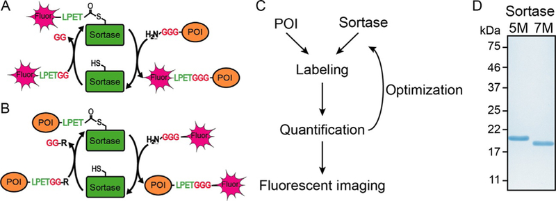
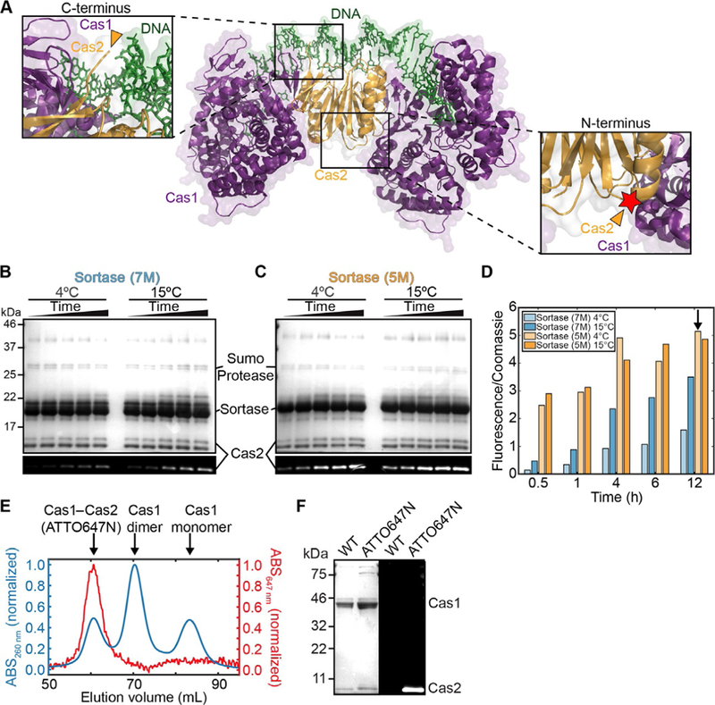
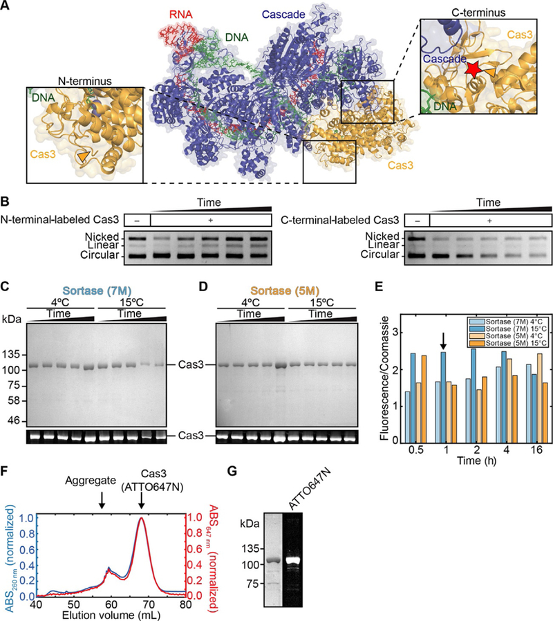
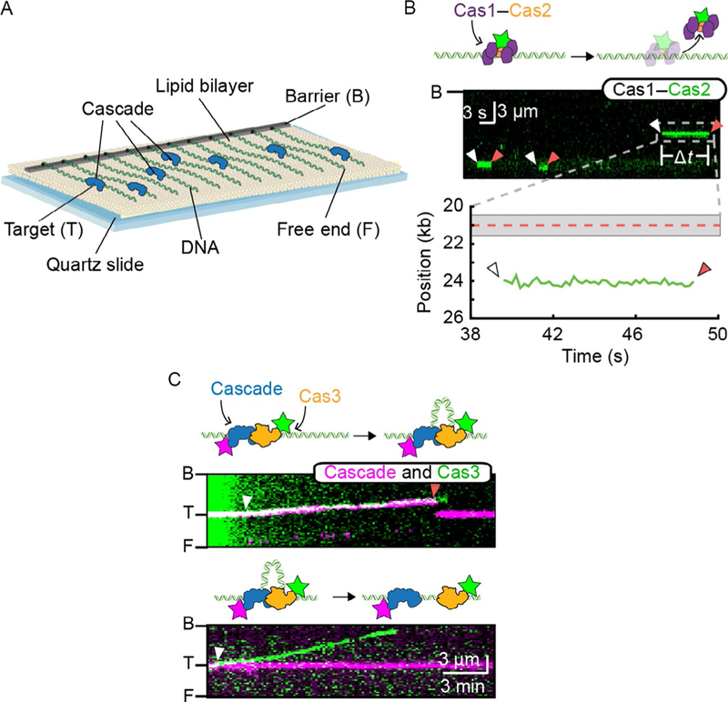

# Sortase-mediated fluorescent labeling of CRISPR complexes

**Kaylee E. Dillard, Jeffrey M. Schaub, Maxwell W. Brown, Fatema A. Saifuddin, Yibei Xiao, Erik Hernandez, Samuel D. Dahlhauser, Eric V. Anslyn, Ailong Ke, and Ilya J. Finkelstein**

*Methods in Enzymology*, Volume 616, Pages 1–29 (2019)

**DOI:** [10.1016/bs.mie.2018.10.011](https://doi.org/10.1016/bs.mie.2018.10.011)

---

## Table of Contents

- [Abstract](#abstract)
- [1. Introduction](#1-introduction)
- [2. Methods](#2-methods)
- [3. Applications](#3-applications)
- [4. Notes](#4-notes)
- [Acknowledgments](#acknowledgments)

---
##  Abstract
Fluorescent labeling of proteins is a critical requirement for single-molecule imaging studies. Many protein labeling strategies require harsh conditions or large epitopes that can inactivate the target protein, either by decreasing the protein’s enzymatic activity or by blocking protein–protein interactions. Here, we provide a detailed protocol to efficiently label CRISPR–Cas complexes with a small fluorescent peptide via sortase-mediated transpeptidation. The sortase tag consists of just a few amino acids that are specifically recognized at either the N- or the C-terminus, making this strategy advantageous when the protein is part of a larger complex. Sortase is active at high ionic strength, 4°C, and with a broad range of organic fluorophores. We discuss the design, optimization, and single-molecule fluorescent imaging of CRISPR–Cas complexes on DNA curtains. Sortase-mediated transpeptidation is a versatile addition to the protein labeling toolkit.
---
##  1. Introduction
Single-molecule methodologies have provided mechanistic insights into many cellular processes. Fluorescent imaging of proteins and their substrates permits visualization of transient intermediates, such as protein conformational changes, movement on DNA substrates, and protein–protein interactions. For example, single-molecule Förster resonance energy transfer (smFRET) studies have established that Cas9 undergoes conformational rearrangements in the HNH domain during target binding and cleavage ([Chen et al., 2017](https://pmc.ncbi.nlm.nih.gov/articles/PMC6380366/#R3); [Dagdas, Chen, Sternberg, Doudna, & Yildiz, 2017](https://pmc.ncbi.nlm.nih.gov/articles/PMC6380366/#R6); [Sternberg, LaFrance, Kaplan, & Doudna, 2015](https://pmc.ncbi.nlm.nih.gov/articles/PMC6380366/#R23); [Yang et al., 2018](https://pmc.ncbi.nlm.nih.gov/articles/PMC6380366/#R30)). These single-molecule studies provided novel insights into how Cas9 distinguishes between on-target DNA sites and off-target sites that are partially complementary to the gRNA. Additional single-molecule studies have elucidated the mechanism of target recognition and translocation on DNA substrates for a variety of CRISPR–Cas proteins, including Cascade, Cas3, Cas1–Cas2, Cas9, and Cas12a ([Dillard et al., 2018](https://pmc.ncbi.nlm.nih.gov/articles/PMC6380366/#R7); [Jung et al., 2017](https://pmc.ncbi.nlm.nih.gov/articles/PMC6380366/#R13); [Redding et al., 2015](https://pmc.ncbi.nlm.nih.gov/articles/PMC6380366/#R16); [Singh, Mallon, et al., 2018](https://pmc.ncbi.nlm.nih.gov/articles/PMC6380366/#R20); [Singh, Wang, et al., 2018](https://pmc.ncbi.nlm.nih.gov/articles/PMC6380366/#R21); [Sternberg, Redding, Jinek, Greene, & Doudna, 2014](https://pmc.ncbi.nlm.nih.gov/articles/PMC6380366/#R24); [Xue, Zhu, Zhang, Shin, & Sashital, 2017](https://pmc.ncbi.nlm.nih.gov/articles/PMC6380366/#R29)). One unifying feature of this diverse set of assays is that the protein(s) of interest needs to be fluorescently labeled in vitro while retaining enzymatic functions and complex-specific interaction surfaces.
In vitro fluorescent labeling strategies can be subdivided into three broad categories. The first category covalently attaches a fluorescent dye to cysteines, amines, and other reactive amino acid side chains. For example, cysteines can be labeled via a maleimide coupling reaction. Maleimide conjugation to the cysteine group requires all additional surface-exposed cysteines to be removed from the protein; prior knowledge of the protein structure is essential when a large set of reactive sites are possible. The protein of interest (POI) is then reduced by a reducing agent, and the reducing agent is removed prior to incubation with the maleimide-conjugated fluorescent dye ([Kim et al., 2008](https://pmc.ncbi.nlm.nih.gov/articles/PMC6380366/#R14)). This approach is especially suitable for small proteins as all reactive cysteines have to be mutated to serines. An illustrative example is the aforementioned set of smFRET studies probing the conformational dynamics of Cas9. For that work, the authors had to replace the two native cysteines with serines and reintroduce two additional cysteines at positions that were within the expected Cy3–Cy5 dye pair Förster energy transfer distance ([Sternberg et al., 2015](https://pmc.ncbi.nlm.nih.gov/articles/PMC6380366/#R23); [Yang et al., 2018](https://pmc.ncbi.nlm.nih.gov/articles/PMC6380366/#R30)). While biochemical confirmation of any fluorescent labeling scheme is always required, special care must be taken when a large set of residues need to be mutated with this labeling strategy.
Second, genetically encoded fluorescent proteins, epitope tags, or protein fragments can be fused to the POI. In this scenario, the POI contains a single fluorescent tag, which can be valuable for determining the stoichiometry or number of proteins present at a specific locus (i.e., by measuring GFP photobleaching steps). However, genetically encoded fluorescent proteins photobleach more quickly and are less bright than organic fluorophores, limiting the experimental imaging time ([Cranfill et al., 2016](https://pmc.ncbi.nlm.nih.gov/articles/PMC6380366/#R5)). These epitopes are also larger than organic dyes (e.g., GFP is 27 kDa), which can block essential protein interactions or active sites ([Hink et al., 2000](https://pmc.ncbi.nlm.nih.gov/articles/PMC6380366/#R12)). Protein fragments such as SNAP, CLIP, and HaloTag can be used to covalently conjugate an organic dye to the POI. This strategy significantly improves photostability of the resulting molecule compared to GFP ([Cole, 2013](https://pmc.ncbi.nlm.nih.gov/articles/PMC6380366/#R4); [Gautier et al., 2008](https://pmc.ncbi.nlm.nih.gov/articles/PMC6380366/#R9); [Los et al., 2008](https://pmc.ncbi.nlm.nih.gov/articles/PMC6380366/#R15); [Sun et al., 2011](https://pmc.ncbi.nlm.nih.gov/articles/PMC6380366/#R25)). However, SNAP or CLIP adds ~29 kDa and Halo adds 33 kDa to the POI ([Hansen, Rodgers, & Hoskins, 2016](https://pmc.ncbi.nlm.nih.gov/articles/PMC6380366/#R11)). This can perturb protein function and expression. Alternatively, genetically encoded epitope tags (i.e., a FLAG or HA epitope) can be added. These epitopes are then conjugated to fluorescent antibodies. This approach offers three key advantages: (1) the antibodies are commercially available; (2) multiple fluorophores can be covalently linked to each antibody for a brighter signal; and (3) the imaging strategy can be rapidly modified by using antibodies conjugated to different fluorophores. However, short epitopes can be occluded within a protein complex resulting in low labeling efficiency. In addition, the large size of a fluorescent antibody can alter the protein’s activity or block potential protein binding partners. These limitations of genetically encoded fluorescent tags have prompted the development of enzymatic strategies to directly add organic fluorophores at defined positions of protein complexes.
The third broad strategy uses enzymes that covalently couple a fluorescent dye to the POI. For example, the formylglycine-generating enzyme (FGE) can be coexpressed with a protein to directly conjugate a dye to a short epitope. FGE turns the cysteine within the LCTPSR recognition motif into formylglycine. This residue can then be coupled to a cyanine hydrazide dye ([Shi et al., 2012](https://pmc.ncbi.nlm.nih.gov/articles/PMC6380366/#R18)). While this labeling strategy can reach 100% labeling efficiency, it requires a large excess of fluorophore to label the protein (e.g., >75 m _M_ in this reported study). Using large concentrations of a fluorophore can be expensive and limited by the solubility of that particular dye. Alternatively, lower concentrations of fluorophores require a more acidic buffer and incubation at higher temperatures (e.g., pH 5.5 and 37°C) in order to get efficient labeling ([Carrico, Carlson, & Bertozzi, 2007](https://pmc.ncbi.nlm.nih.gov/articles/PMC6380366/#R2); [Shi et al., 2012](https://pmc.ncbi.nlm.nih.gov/articles/PMC6380366/#R18)). These harsh conditions can cause unstable proteins to precipitate out of solution and limit the types of proteins that can be labeled via this method.
Sortase-mediated transpeptidation is a general and robust enzymatic strategy for labeling defined subunits in protein complexes. Sortase attaches proteins to the bacterial cell wall in Gram-positive bacteria. Sortase purified from _Staphylococcus aureus_ uses a recognition motif of LPXTG, where X is any amino acid, to covalently link a protein containing multiple glycine residues. Recently, sortase was adapted to attach small fluorescent peptides to proteins via the N- or C-termini ([Antos et al., 2009](https://pmc.ncbi.nlm.nih.gov/articles/PMC6380366/#R1); [Guimaraes et al., 2013](https://pmc.ncbi.nlm.nih.gov/articles/PMC6380366/#R10); [Theile et al., 2013](https://pmc.ncbi.nlm.nih.gov/articles/PMC6380366/#R26)). To increase the rate and efficiency of sortase labeling, two variants, 5M and 7M, were created ([Fig. 1C](https://pmc.ncbi.nlm.nih.gov/articles/PMC6380366/#F1)). Both mutants have increased catalytic activity, but sortase (7M) mutant does not require addition of calcium to the reaction. Sortase (7M) is thus more appropriate for labeling enzymes when calcium uptake may be problematic.
***Fig. 1***.

Overview of the sortase-mediated transpeptidation. Overview of (A) N-terminal and (B) C-terminal sortase labeling. (C) Overall labeling and optimization workflow. (D) Coomassie blue-stained SDS-PAGE gel showing purified sortase (5M) and sortase (7M). _Panels (A) and (B): Schematic adapted from_ [Guimaraes, C. P., Witte, M. D., Theile, C. S., Bozkurt, G., Kundrat, L., Blom, A. E. M., et al. (2013](https://pmc.ncbi.nlm.nih.gov/articles/PMC6380366/#R10)). _Site-specific C-terminal and internal loop labeling of proteins using sortase-mediated reactions._ Nature Protocols, 8, _1787_ – _1799_ ; [Theile, C. S., Witte, M. D., Blom, A. E. M., Kundrat, L., Ploegh, H. L., & Guimaraes, C. P. (2013).](https://pmc.ncbi.nlm.nih.gov/articles/PMC6380366/#R26) _Site-specific N-terminal labeling of proteins using sortase-mediated reactions._ Nature Protocols, 8, _1800_ – _1807._
Here, we describe how to optimize sortase-mediated fluorescent labeling of CRISPR–Cas complexes for single-molecule applications ([Fig. 1](https://pmc.ncbi.nlm.nih.gov/articles/PMC6380366/#F1)). Key advantages are: (1) site-specific labeling of the protein via the N- or C-terminus; (2) efficient labeling in physiological buffer conditions and low temperatures; (3) minimal mutations to the POI; (4) relatively low concentrations of expensive fluorophores; and (5) attachment of a small fluorescent peptide allows for protein–protein interactions. We provide a step-by-step protocol for both N- and C-terminal labeling of _Thermobifida fusca_ (_Tfu_) Type I-E CRISPR complexes and their subsequent reconstitution into a protein complex. In short, sortase-mediated fluorescent labeling is a broadly applicable strategy for a wide range of proteins complexes.
---
##  2. Methods
### 2.1. Overview
The Type I-E CRISPR system is comprised of Cascade, an 11-subunit crRNA-containing surveillance complex, the Cas1–Cas2 integrase, and Cas3 helicase/nuclease. Sortase-mediated fluorescent labeling of these sub-components allowed us to overcome multiple challenges that we and others encountered with fluorescent labeling of these proteins. For example, both Cas1–Cas2 and Cas3 directly interact with Cascade to form the primed acquisition complex ([Dillard et al., 2018](https://pmc.ncbi.nlm.nih.gov/articles/PMC6380366/#R7)). Large fluorescent tags interfere with Cas1 and Cas2 activity ([Redding et al., 2015](https://pmc.ncbi.nlm.nih.gov/articles/PMC6380366/#R16)), and Cas3 helicase/nuclease activity on DNA curtains (data not shown). Placement of an epitope tag on the N-terminus of Cas3 also decreases nuclease activity. Efficient labeling of these Type I-E CRISPR–Cas proteins requires a labeling strategy that works under high salt concentrations and adds a small organic fluorophore. Sortase-mediated transpeptidation allowed us to label individual CRISPR– Cas subunits.
We purified both sortase mutants (i.e., 7M and 5M), along with the POIs. Sortase labeling efficiency was optimized for each POI by testing three main parameters: the sortase mutant, incubation times, and temperatures. Optimization can be done after the POI has been isolated via a single purification column and while other proteins are present in the reaction (e.g., SUMO protease). Once optimal fluorescent labeling was determined, the reaction was scaled up and resulting labeled protein purified to remove sortase and excess fluorescent peptide. Then, the protein’s labeling efficiency was determined via a plate reader assay prior to fluorescent imaging. Using single-molecule DNA curtains, we show that these fluorescent CRISPR– Cas proteins can navigate DNA and interact with other protein partners.
### 2.2. Buffers
#### 2.2.1. Sortase purification buffers
  1. Sortase Lysis Buffer: 50 m _M_ Tris–HCl (pH 7.5), 150 m _M_ NaCl, 10 m _M_ imidazole, 10% (v/v) glycerol, supplemented with 1 × HALT protease cocktail (ThermoFisher), and 1 m _M_ phenylmethanesulfonyl fluoride (PMSF, Sigma-Aldrich).
  2. Sortase Elution Buffer: Sortase Lysis Buffer supplemented with 500 m _M_ imidazole.
  3. Sortase Dialysis Buffer: 50 m _M_ Tris–HCl (pH 8.0) and 150 m _M_ NaCl.

#### 2.2.2. Cas1–Cas2 purification buffers
  1. Cas1–Cas2 Buffer A: 20 mM HEPES (pH 7.5), 10 mM imidazole, 500 mM NaCl.
  2. Cas1–Cas2 Buffer B: 20 mM HEPES (pH 7.5), 500 mM imidazole, 500 mM NaCl.
  3. Cas1–Cas2 Gel Filtration Buffer: 20 mM HEPES (pH 7.5), 500 mM NaCl, 10% glycerol.

#### 2.2.3. Cascade purification buffers
  1. Cascade Buffer A: 20 m _M_ HEPES (pH 7.5), 500 m _M_ NaCl.
  2. Cascade Buffer B: 20 m _M_ HEPES (pH 7.5), 500 m _M_ NaCl, 5 m _M_ desthiobiotin.
  3. Cascade Gel Filtration Buffer: 10 m _M_ Tris–HCl (pH 7.5), 150 m _M_ NaCl, 5 m _M_ DTT.
  4. His Wash Buffer: 20 m _M_ HEPES (pH 7.5), 500 m _M_ NaCl, 10 m _M_ imidazole.
  5. His Elution Buffer: 20 m _M_ HEPES (pH 7.5), 500 m _M_ NaCl, 500 m _M_ imidazole.

#### 2.2.4. Cas3 purification buffers
  1. Cas3 Buffer A: 20 m _M_ HEPES (pH 7.5), 10 m _M_ imidazole, 500 m _M_ NaCl.
  2. Cas3 Buffer B: 20 m _M_ HEPES (pH 7.5), 500 m _M_ imidazole, 500 m _M_ NaCl.
  3. Cas3 Gel Filtration Buffer: 20 m _M_ HEPES (pH 7.5), 150 m _M_ NaCl, 10% glycerol.

### 2.3. Sortase purification
The plasmids for sortase 7M (Addgene plasmid # 51141) and sortase 5M (Addgene plasmid # 51140) were purchased from Addgene and were generous gifts from Hidde Ploegh ([Shi et al., 2014](https://pmc.ncbi.nlm.nih.gov/articles/PMC6380366/#R19)).
  1. Transform BL21 (Novagen, 69450) _Escherichia coli_ cells with either a plasmid for sortase 7M (pIF170) or 5M (pIF185).
  2. Inoculate 2 L of LB with 15 mL of a starter culture and grow at 37°C to an OD600 of 0.6. Induce the culture with 0.5 m _M_ IPTG overnight at 25°C.
  3. Harvest the cells by centrifuging for 15 min at 6000 × _g_.
  4. Resuspend the pellets with 50 mL of Sortase Lysis Buffer.
  5. Sonicate the cells to lyse and centrifuge the lysate in an ultracentrifuge at 35,000 × _g_ for 45 min at 4°C.
  6. Apply the supernatant onto a 1.5-mL bed volume of Ni-NTA resin (ThermoFisher) preequilibrated with Sortase Lysis Buffer.
  7. Elute 1 mL fractions of sortase with Sortase Elution Buffer.
  8. Pool the fractions and dialyze overnight in Sortase Dialysis Buffer.
  9. Concentrate sortase to ~500 μ _M_ using a spin concentrator (EMD Millipore, UFC901008) and flash-freeze aliquots in liquid nitrogen. Store at —80°C.
  10. Determine protein concentration by comparing to a BSA standard curve using SDS-PAGE.

### 2.4. Purification of _Tfu_ Cascade complexes and subunits for N-terminal sortase labeling
#### 2.4.1. Cas1–Cas2 purification and sortase labeling of Cas2
[Fig. 2](https://pmc.ncbi.nlm.nih.gov/articles/PMC6380366/#F2) describes the overall strategy for purifying a fluorescent Cas1–Cas2 complex. Cas2 has a GGG sortase epitope on the N-terminus after the SUMO tag. Cas2 and Cas1 are purified separately, and Cas2 is labeled with an ATTO647N dye. The Cas1–Cas2 complex is reconstituted from Cas1 and fluorescent Cas2 monomers.
##### Fig. 2.

N-terminal sortase labeling of Cas1–Cas2. (A) Structure of Cas1–Cas2 complexed with DNA (adapted from PDB: 5DS5, [Wright et al., 2017](https://pmc.ncbi.nlm.nih.gov/articles/PMC6380366/#R27)). Cas2 (_orange_) C-terminus is largely inaccessible. The N-terminus is positioned closer to the solvent accessible space between the Cas1 (_purple_) homotetramer. _Orange arrows_ denote the N- and C-termini of Cas2 in the _insets_. _Red star_ denotes approximate position of fluorescent label. We optimized N-terminal labeling of Cas2 with (B) sortase (7M) and (C) sortase (5M). Time points: 0.5, 1, 4, 6, 12 h. _Top_ : Coomassie blue staining of an SDS-PAGE gel of the reaction; _bottom_ : fluorescence imaging of the Cas2 band. (D) Quantification of fluorescence signal from (B) and (C). _Arrow_ denotes conditions used for large-scale labeling. (E) Gel filtration chromatography trace showing reconstitution of the fluorescent Cas1–Cas2 complex. (F) SDS-PAGE gel of Coomassie blue (_left_) and fluorescence (_right_) of unmodified (WT) and ATTO647N-labeled Cas1–Cas2.
  1. Transform _E. coli_ BL21 (DE3) cells with either a plasmid for Cas1 (pIF201) or Cas2 (pIF212).
  2. Inoculate two 1 L cultures of LB with 15 mL of a starter culture and grow at 37°C to an OD600 of 0.6. Induce the culture with 0.5 m _M_ IPTG and grow at 18°C overnight.
  3. Harvest the cells by centrifuging for 15 min at 6000 × _g_.
  4. Resuspend the pellets with 35 mL of Cas1–Cas2 Buffer A supplemented with 10 μg/mL DNase and 1 × Halt Protease inhibitor and homogenize to lyse the cells.
  5. Clarify the lysate by centrifuging in an ultracentrifuge at 35,000 × _g_ for 35 min at 4°C.
  6. Equilibrate two 1 mL HisTrap columns with Cas1–Cas2 Buffer A. Apply the supernatant containing either Cas1 or Cas2 to the two 1 mL HisTrap columns in tandem.
  7. Wash the columns with Cas1–Cas2 Buffer A.
  8. Elute either Cas1 or Cas2 with Cas1–Cas2 Buffer B. Determine the protein concentration using a Bradford assay.
  9. For Cas1, incubate SUMO protease with Cas1 overnight at 4°C in a 1:50 _M_ ratio with Cas1.
  10. For Cas2, incubate SUMO protease and 3 × sortase 5M, 10 m _M_ CaCl2, and 5 × LPETGG fluorescent peptide for 12 h at 4°C.
  11. To remove sortase 5M from Cas2, apply the reaction to a 5-mL HisTrap column equilibrated in Cas1–Cas2 Buffer A. Collect the flow-through that contains Cas2.
  12. Incubate Cas2 with 4 × Cas1 for 1 h at 4°C.
  13. Spin concentrate the Cas1–Cas2 complex to 700 μL (EMD Millipore, UFC903024).
  14. Isolate the Cas1–Cas2 complex on a HiPrep Sephacryl S-200 HR column preequilibrated in Cas1–Cas2 Gel Filtration Buffer.
  15. Collect the peak fractions containing the fluorescent Cas1–Cas2 complex and flash-freeze aliquots in liquid nitrogen to be stored at —80°C.

#### 2.4.2. Cascade purification and sortase labeling of Cse1
[Fig. 3](https://pmc.ncbi.nlm.nih.gov/articles/PMC6380366/#F3) describes the overall labeling strategy for N-terminal proteins. Cse1 has a GGG N-terminal sortase epitope after the SUMO tag. Cse1 is purified and labeled separately from the rest of the Cascade complex. Sortase labeling optimization of Cse1 was carried out as above for Cas2 (see Section 2.6). The N-terminus of Cse1 was labeled because the C-terminus is occluded by other protein subunits within the complex ([Fig. 3A](https://pmc.ncbi.nlm.nih.gov/articles/PMC6380366/#F3)). After sortase labeling, the Cascade complex is reconstituted. 
##### Cse1 purification and sortase labeling:
  1. Transform _E. coli_ BL21 (DE3) cells with the Cse1 plasmid (pIF181).
  2. Inoculate one 2 L culture of LB with 15 mL of a starter culture and grow at 37°C to an OD600 of 0.8.
  3. Induce with 1 m _M_ IPTG and grow at 25°C overnight.
  4. Harvest the cells by centrifuging for 15 min at 6000 × _g_.
  5. Resuspend the pellets with 35 mL of Cascade Buffer A supplemented with 10 μg/mL DNase and 1 × Halt Protease inhibitor. Lyse the cells with sonication.
  6. Clarify the lysate by centrifuging in an ultracentrifuge at 35,000 × _g_ for 35 min at 4°C.
  7. Equilibrate a 5-mL bed volume Strep-Tactin Superflow 50% suspension resin column with Cascade Buffer A and apply the supernatant.
  8. Rinse the column with 100 mL of Cascade Buffer A.
  9. Elute with 20 mL of Cascade Buffer B.
  10. Spin concentrate Cse1 to 1 mL.
  11. Incubate Cse1 with 2 × SUMO protease at 4°C for 12 h.
  12. Add 3 × sortase 5M, 10 m _M_ CaCl2, and 5 × LPETGG fluorescent peptide to Cse1 for 1 h at 37°C.
  13. Separate Cse1 from sortase via a HiPrep Sephacryl S-200 HR column (GE) in Cascade Buffer A.

##### Purification of the Cascade complex:
  1. Transform _E. coli_ BL21 (DE3) cells with the Cascade B-E plasmid (pIF164) and crRNA (pIF165).
  2. Inoculate one 2 L culture of LB with 15 mL of a starter culture and grow at 37°C to an OD600 of 0.8.
  3. Induce with 1 m _M_ IPTG and grow at 25°C overnight.
  4. Harvest the cells by centrifuging for 15 min at 6000 × _g_.
  5. Resuspend the pellets with 35 mL of Cascade Buffer A supplemented with 10 μg/mL DNase and 1 × Halt Protease inhibitor. Lyse the cells with sonication.
  6. Clarify the lysate by centrifuging in an ultracentrifuge at 35,000 × _g_ for 35 min at 4°C.
  7. Apply the supernatant to a 2-mL bed volume Ni-NTA column preequilibrated in Cascade Buffer A.
  8. Wash with 100 mL His Wash Buffer.
  9. Elute with 6 mL His Elution Buffer.
  10. Spin concentrate to 1 mL and dialyze overnight into Cascade Buffer A.

##### Reconstitution of a fluorescent Cascade complex:
  1. Combine fluorescent Cse1 and the rest of the Cascade complex in a 1:1 ratio.
  2. Reconstitute the complex via a step-down NaCl dialysis. 
    1. Using SnakeSkin dialysis tubing (cat# 68100), incubate in Cascade Buffer A containing 500 m _M_ NaCl for 3 h.
    2. Dialyze at 300 m _M_ NaCl for 3 h.
    3. Finally, dialyze at 150 m _M_ NaCl for 3 h.
  3. Isolate the fluorescent Cascade complex via a HiPrep Sephacryl S-200 HR column (GE) in Cascade Gel Filtration Buffer.
  4. Collect the peak fractions and flash-freeze in liquid nitrogen to be stored at —80°C.

##### Fig. 3.

C-terminal sortase labeling of Cas3. (A) Structure of Cascade–Cas3 complexed with DNA (adapted from PDB: 6C66, [Xiao, Luo, Dolan, Liao, & Ke, 2018](https://pmc.ncbi.nlm.nih.gov/articles/PMC6380366/#R28)). Cas3 (_orange_) N- and C-termini are relatively solvent exposed away from DNA (_green_) and Cascade (_blue_). _Orange arrows_ denote the N- and C-termini of Cas3 in the _insets_. _Red star_ denotes approximate position of fluorescent label. (B) Plasmid digests show that C-terminally labeled Cas3 is more active than then N-terminally labeled protein. Time points of 10, 30, 60, 90, 120 min. (C) Sortase (7M) and (D) sortase (5M) were evaluated for C-terminal labeling of Cas3. Time points: 0.5, 1, 2, 4, 16 h. SDS-PAGE gel of Coomassie blue (_top_) and fluorescence (_bottom_) of the indicated proteins. (E) Quantification of fluorescent signals from (C) and (D). _Arrow_ denotes conditions used for large-scale labeling. (F) Gel filtration chromatography trace showing that the fluorescent signal coelutes with Cas3. (G) SDS-PAGE gel of fluorescent Cas3. _Left_ : Coomassie blue; _right_ : fluorescent detection.
### 2.5. Purification of Tfu Cascade complexes and subunits for C-terminal sortase labeling
#### 2.5.1. Cas3 purification and sortase labeling
Cas3 contains a C-terminal LPETGG-TwinStrep motif for sortase labeling. The sortase reaction was optimized as described earlier for Cas2. After fluorescent labeling, the protein is sized on a gel filtration column to remove free dye and sortase protein.
  1. Transform _E. coli_ BL21 (DE3) cells with the Cas3 plasmid (pIF218).
  2. Inoculate one 2 L culture of LB with 15 mL of a starter culture and grow at 37°C to an OD600 of 0.6.
  3. Induce with 0.5 m _M_ IPTG and grow at 18°C overnight.
  4. Harvest the cells by centrifuging for 15 min at 6000 × _g_.
  5. Resuspend the pellets with 35 mL of Cas3 Buffer A supplemented with 10 μg/mL DNase and 1 × Halt Protease inhibitor. Homogenize the cells.
  6. Clarify the lysate by centrifugation at 15,000 rpm for 60 min at 4°C.
  7. Equilibrate two 1 mL HisTrap columns in tandem with Cas3 Buffer A and apply the supernatant.
  8. Elute Cas3 and measure the protein concentration of the 1 mL peak fraction via a Bradford assay. If the protein concentration is below 20 μ _M_ , spin concentrate.
  9. Add 5 × GGG fluorescent peptide and 5 × sortase 7M relative to the Cas3 concentration.
  10. Incubate the reaction at 15°C for 1 h.
  11. Isolate fluorescent Cas3 by applying to a HiPrep Sephacryl S-200 HR column (GE) equilibrated in Cas3 Gel Filtration Buffer.
  12. Collect the fractions containing fluorescent Cas3 and spin concentrate to about 1 mL (EMD Millipore, UFC903024).
  13. Aliquot and flash-freeze the protein in liquid nitrogen before storing at —80°C.

### 2.6. Optimization of sortase-mediated fluorescent labeling
Sortase labeling of proteins requires optimization of three variables: sortase variants, temperature, and time.
  1. Prepare two master mixes with a total volume of 160 μL containing either the sortase (5M) or sortase (7M). Each master mix includes: 
    1. Protein to be labeled (1–20 μ _M_ is recommended).
    2. 3–5 × sortase compared to the concentration of the protein to be labeled.
    3. 5 × fluorescent peptide compared the concentration of the protein to be labeled.
    4. 10 m _M_ CaCl2 for the master mix containing the sortase 5M variant.
  2. Divide each master mix into 15 separate aliquots of 10 μL and incubate at the specific time and temperature. 
    1. Test sortase labeling at 4°C, 15°C, and 37°C. Also, test different incubation times (i.e., 0.5, 1, 4, 6, and 12 h).
  3. Quench the reaction by flash freezing the aliquot in liquid nitrogen and storing at —20°C until all reactions are complete.
  4. Run all reactions on an SDS-PAGE gel and acquire a fluorescent image of the gel using a Typhoon.
  5. Stain the gel with Coomassie to determine the protein concentration.
  6. Calculate the ratio of fluorescence intensity in the Typhoon image to protein concentration in the Coomassie-stained image for each condition to determine the best labeling condition.

---
##  3. Applications
### 3.1. Single-molecule imaging of fluorescent Cas1–Cas2, Cascade, and Cas3 on DNA curtains
DNA curtains were assembled as described previously ([Gallardo et al., 2015](https://pmc.ncbi.nlm.nih.gov/articles/PMC6380366/#R8); [Schaub, Zhang, Soniat, & Finkelstein, 2018](https://pmc.ncbi.nlm.nih.gov/articles/PMC6380366/#R17); [Soniat et al., 2017](https://pmc.ncbi.nlm.nih.gov/articles/PMC6380366/#R22)). Briefly, biotinylated lipids were deposited on a microfluidic device containing chromium barriers. DNA was then tethered to the lipid bilayer via a streptavidin-biotin linkage. With buffer flow, the DNA is extended ([Fig. 4A](https://pmc.ncbi.nlm.nih.gov/articles/PMC6380366/#F4)). Due to the difficulty of labeling Cas1–Cas2, little was known about how this complex transiently binds nonspecific DNA. To test this, we added fluorescent Cas1–Cas2 to double-tethered DNA curtains. Cas1–Cas2 transiently sampled the DNA nonspecifically via 3D collisions with a short lifetime ([Fig. 4B](https://pmc.ncbi.nlm.nih.gov/articles/PMC6380366/#F4)).
#### Fig. 4.

Single-molecule imaging of fluorescent Cascade, Cas1–Cas2, and Cas3 on DNA curtains. (A) Schematic of DNA curtains. Lipid-tethered DNA molecules are organized at chromium diffusion barriers. Continuous buffer flow keeps the DNA extended for single-molecule imaging. (B) Cas1–Cas2 lifetime on DNA. Cartoon (_top_), kymograph (_middle_), and analysis (_bottom_) of fluorescent Cas1–Cas2 binding and dissociating from DNA. DNA binding is independent of target recognition (_red dotted line_) (C) Cartoon and kymograph of Cas3 (_green_) complex formation with Cascade (_magenta_). Fluorescent Cas3 is visualized as translocating with (_top_) or separately (_bottom_) from Cascade indicating two modes of translocation.
During interference, Cascade and Cas3 degrade single-stranded foreign DNA. Cas3 is a helicase/nuclease, so we fluorescently labeled Cas3 via a sortase-mediated reaction to see this translocation on DNA. We found Cas3 moves on DNA via two main modes: (1) remaining associated with Cascade as a complex and (2) independently away from Cascade at the target sequence ([Fig. 4C](https://pmc.ncbi.nlm.nih.gov/articles/PMC6380366/#F4)). Thus, sortase-mediated labeling of the individual CRISPR–Cas proteins provides a flexible strategy for labeling challenging protein complexes.
##  4. Notes
  1. We found that the extent of C-terminal sortase labeling is significantly improved when the epitope is extended past the minimal recognition site (LPETG). In our studies, the C-terminus of the POI had an LPETGG-TwinStrep epitope to remove unlabeled complexes.
  2. The sortase (5M) reaction includes 10 m _M_ CaCl2. Use sortase (7M) when labeling proteins that require a metal cofactor as this avoids uptake of the Ca2+ metal ion by the POI. We still recommend testing both variants whenever possible because labeling efficiency varies for each POI ([Figs. 2D](https://pmc.ncbi.nlm.nih.gov/articles/PMC6380366/#F2) and [3E](https://pmc.ncbi.nlm.nih.gov/articles/PMC6380366/#F3)).
  3. We noted that N-terminal sortase labeling can sometimes also non-specifically label other proteins in a complex. Care should be taken to verify that labeling is specific to a single subunit in a complex.
  4. Cas1 and Cas2 precipitate out of solution when the NaCl concentration is below 500 m _M_. When SUMO protease and/or sortase were added to the reaction, the buffer was adjusted to maintain the 500 m _M_ NaCl concentration.

---
##  Acknowledgments
We are very grateful to Dr. Hidde Ploegh for providing sortase plasmids via Addgene.
Funding
This work was supported by the National Institutes of Health (GM097177 and GM120554 to I.J.F. and F31GM125201 to K.E.D.) and the Welch Foundation (F-l808 to I.J.F.).

---

## References

1. Antos JM, Chew G-L, Guimaraes CP, et al. Site-specific N- and C-terminal labeling of a single polypeptide using sortases of different specificity. *Journal of the American Chemical Society*. 2009;131:10800–10801.

2. Carrico IS, Carlson BL, Bertozzi CR. Introducing genetically encoded aldehydes into proteins. *Nature Chemical Biology*. 2007;3:321–322.

3. Chen JS, Dagdas YS, Kleinstiver BP, et al. Enhanced proofreading governs CRISPR–Cas9 targeting accuracy. *Nature*. 2017;550:407–410.

4. Cole NB. Site-specific protein labeling with SNAP-tags. *Current Protocols in Protein Science*. 2013;73:30.1.1–30.1.16.

5. Cranfill PJ, Sell BR, Baird MA, et al. Quantitative assessment of fluorescent proteins. *Nature Methods*. 2016;13:557–562.

6. Dagdas YS, Chen JS, Sternberg SH, Doudna JA, Yildiz A. A conformational checkpoint between DNA binding and cleavage by CRISPR-Cas9. *Science Advances*. 2017;3:eaao0027.

7. Dillard KE, Brown MW, Johnson NV, et al. Assembly and translocation of a CRISPR-Cas primed acquisition complex. *Cell*. 2018;175:934–946.

8. Gallardo IF, Pasupathy P, Brown M, et al. High-throughput universal DNA curtain arrays for single-molecule fluorescence imaging. *Langmuir*. 2015;31:10310–10317.

9. Gautier A, Juillerat A, Heinis C, et al. An engineered protein tag for multiprotein labeling in living cells. *Chemistry & Biology*. 2008;15:128–136.

10. Guimaraes CP, Witte MD, Theile CS, et al. Site-specific C-terminal and internal loop labeling of proteins using sortase-mediated reactions. *Nature Protocols*. 2013;8:1787–1799.

11. Hansen SR, Rodgers ML, Hoskins AA. Fluorescent labeling of proteins in whole cell extracts for single-molecule imaging. *Methods in Enzymology*. 2016;581:83–104.

12. Hink MA, Griep RA, Borst JW, et al. Structural dynamics of green fluorescent protein alone and fused with a single chain Fv protein. *Journal of Biological Chemistry*. 2000;275:17556–17560.

13. Jung C, Hawkins JA, Jones SK, et al. Massively parallel biophysical analysis of CRISPR-Cas complexes on next generation sequencing chips. *Cell*. 2017;170:35–47.

14. Kim Y, Ho SO, Gassman NR, et al. Efficient site-specific labeling of proteins via cysteines. *Bioconjugate Chemistry*. 2008;19:786–791.

15. Los GV, Encell LP, McDougall MG, et al. HaloTag: A novel protein labeling technology for cell imaging and protein analysis. *ACS Chemical Biology*. 2008;3:373–382.

16. Redding S, Sternberg SH, Marshall M, et al. Surveillance and processing of foreign DNA by the *Escherichia coli* CRISPR-Cas system. *Cell*. 2015;163:854–865.

17. Schaub JM, Zhang H, Soniat MM, Finkelstein IJ. Assessing protein dynamics on low-complexity single-stranded DNA curtains. *Langmuir*. 2018.

18. Shi X, Jung Y, Lin L-J, et al. Quantitative fluorescent labeling of aldehyde-tagged proteins for single-molecule imaging. *Nature Methods*. 2012;9:499–503.

19. Shi J, Kundrat L, Pishesha N, et al. Engineered red blood cells as carriers for systemic delivery of a wide array of functional probes. *Proceedings of the National Academy of Sciences of the United States of America*. 2014;111:10131–10136.

20. Singh D, Mallon J, Poddar A, et al. Real-time observation of DNA target interrogation and product release by the RNA-guided endonuclease CRISPR Cpf1 (Cas12a). *Proceedings of the National Academy of Sciences of the United States of America*. 2018;115:5444–5449.

21. Singh D, Wang Y, Mallon J, et al. Mechanisms of improved specificity of engineered Cas9s revealed by single-molecule FRET analysis. *Nature Structural & Molecular Biology*. 2018;25:347–354.

22. Soniat MM, Myler LR, Schaub JM, et al. Next-generation DNA curtains for single-molecule studies of homologous recombination. *Methods in Enzymology*. 2017;592:259–281.

23. Sternberg SH, LaFrance B, Kaplan M, Doudna JA. Conformational control of DNA target cleavage by CRISPR-Cas9. *Nature*. 2015;527:110–113.

24. Sternberg SH, Redding S, Jinek M, Greene EC, Doudna JA. DNA interrogation by the CRISPR RNA-guided endonuclease Cas9. *Nature*. 2014;507:62–67.

25. Sun X, Zhang A, Baker B, et al. Development of SNAP-tag fluorogenic probes for wash-free fluorescence imaging. *Chembiochem*. 2011;12:2217–2226.

26. Theile CS, Witte MD, Blom AEM, et al. Site-specific N-terminal labeling of proteins using sortase-mediated reactions. *Nature Protocols*. 2013;8:1800–1807.

27. Wright AV, Liu J-J, Knott GJ, et al. Structures of the CRISPR genome integration complex. *Science*. 2017;357:eaao0679.

28. Xiao Y, Luo M, Dolan AE, Liao M, Ke A. Structure basis for RNA-guided DNA degradation by Cascade and Cas3. *Science*. 2018;361:eaat0839.

29. Xue C, Zhu Y, Zhang X, Shin Y-K, Sashital DG. Real-time observation of target search by the CRISPR surveillance complex Cascade. *Cell Reports*. 2017;21:3717–3727.

30. Yang M, Peng S, Sun R, et al. The conformational dynamics of Cas9 governing DNA cleavage are revealed by single-molecule FRET. *Cell Reports*. 2018;22:372–382.

---

*Archived from [PubMed Central (PMC6380366)](https://pmc.ncbi.nlm.nih.gov/articles/PMC6380366/) on 2025-07-19.*
