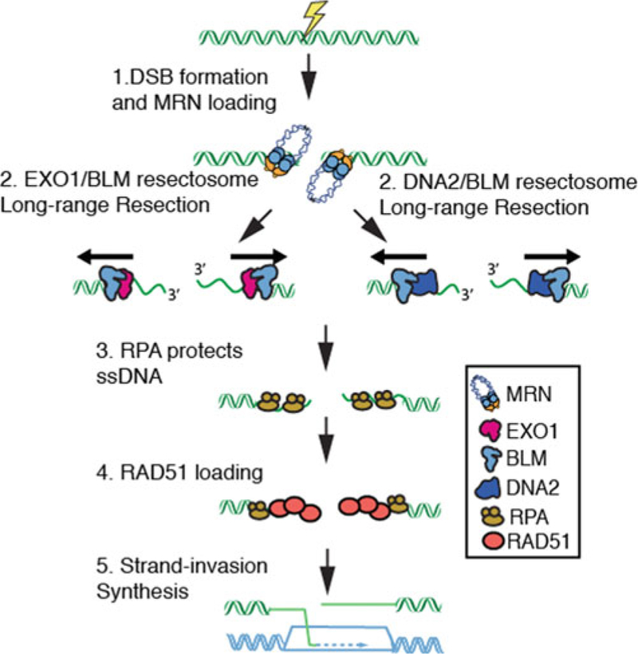
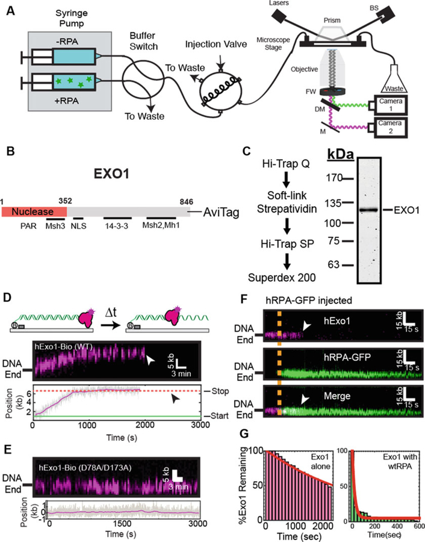
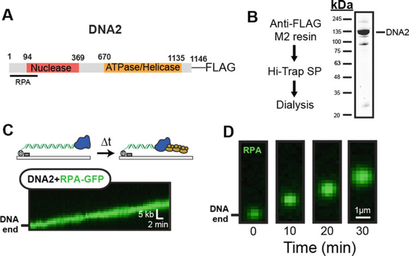
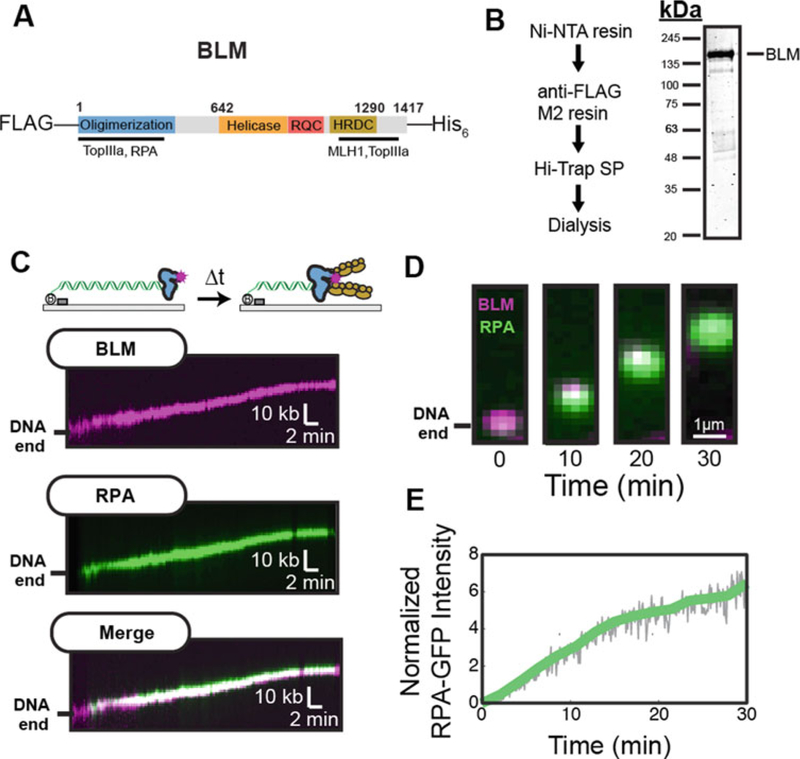

# Assembling the Human Resectosome on DNA Curtains

**Michael M. Soniat, Logan R. Myler, and Ilya J. Finkelstein**

*Methods Mol. Biol.*, Volume 1999, Pages 235–266 (2019)

**DOI:** [10.1007/978-1-4939-9500-4_15](https://doi.org/10.1007/978-1-4939-9500-4_15)

---

## Table of Contents

- [Abstract](#abstract)
- [1. Introduction](#1-introduction)
- [2. Materials](#2-materials)
- [3. Methods](#3-methods)
- [Acknowledgments](#acknowledgments)
- [4. Notes](#4-notes)

---
##  Abstract
DNA double-strand breaks (DSBs) are a potentially lethal DNA lesions that disrupt both the physical and genetic continuity of the DNA duplex. Homologous recombination (HR) is a universally conserved genome maintenance pathway that initiates via nucleolytic processing of the broken DNA ends (resection). Eukaryotic DNA resection is catalyzed by the resectosome—a multicomponent molecular machine consisting of the nucleases DNA2 or Exonuclease 1 (EXO1), Bloom’s helicase (BLM), the MRE11-RAD50-NBS1 (MRN) complex, and additional regulatory factors. Here, we describe methods for purification and single-molecule imaging and analysis of EXO1, DNA2, and BLM. We also describe how to adapt resection assays to the high-throughput single-molecule DNA curtain assay. By organizing hundreds of individual molecules on the surface of a microfluidic flowcell, DNA curtains visualize protein complexes with the required spatial and temporal resolution to resolve the molecular choreography during critical DNA-processing reactions.
**Keywords:** DNA curtains, Homologous recombination, Bloom’s syndrome helicase (BLM), DNA nuclease (DNA2), Exonuclease 1 (EXO1)
---
##  1. Introduction
Each of our cells is confronted with up to 50 DNA double-strand breaks (DSBs) per replication cycle [[1](https://pmc.ncbi.nlm.nih.gov/articles/PMC6666396/#R1), [2](https://pmc.ncbi.nlm.nih.gov/articles/PMC6666396/#R2)]. DSBs arise as a result of cellular metabolism, but are extremely hazardous because they disrupt both the physical and genetic continuity of the genome. Unrepaired DSBs are primary causes of gross chromosomal rearrangements, loss of heterozygosity, and genomic instability. Thus, all organisms have developed multiple pathways to rapidly identify and repair DSBs.
Homologous recombination (HR) is a universally conserved double-strand break repair pathway that uses the intact sister chromatid to promote error-free repair ([Fig. 1](#fig1)) [[3](https://pmc.ncbi.nlm.nih.gov/articles/PMC6666396/#R3)–[6](https://pmc.ncbi.nlm.nih.gov/articles/PMC6666396/#R6)]. HR is initiated when the Mre11-Rad50-Nbs1 (MRN) complex identifies the DNA ends [[7](https://pmc.ncbi.nlm.nih.gov/articles/PMC6666396/#R7)–[10](https://pmc.ncbi.nlm.nih.gov/articles/PMC6666396/#R10)]. MRN is a multifunctional enzyme. The Mre11 subunit contains a 3ʹ to 5ʹ exonuclease and an endonuclease activity which is important for processing DNA ends [[11](https://pmc.ncbi.nlm.nih.gov/articles/PMC6666396/#R11)]. The Rad50 subunit is an ATPase that interacts with Mre11 to promote the assembly of the MR complex. Rad50 also contains nonspecific DNA binding activity and extended ~50 nm coiled-coiled arms that interact via an apical zinc hook motif. The zinc hook is essential for cellular viability and the activation of the DNA damage response (DDR) [[12](https://pmc.ncbi.nlm.nih.gov/articles/PMC6666396/#R12)]. The Nbs1 subunit does not contain any enzymatic activity, but mediates nuclear import of the MRN complex [[13](https://pmc.ncbi.nlm.nih.gov/articles/PMC6666396/#R13), [14](https://pmc.ncbi.nlm.nih.gov/articles/PMC6666396/#R14)]. Nbs1 also promotes protein interactions with ATM kinase and other DDR signaling proteins [[8](https://pmc.ncbi.nlm.nih.gov/articles/PMC6666396/#R8), [12](https://pmc.ncbi.nlm.nih.gov/articles/PMC6666396/#R12), [15](https://pmc.ncbi.nlm.nih.gov/articles/PMC6666396/#R15)]. MRN initiates HR by processing the free DNA ends via a two-step reaction. First, MRN’s endonucleolytic activity creates a nick tens of nucleotides upstream of the free DNA end [[16](https://pmc.ncbi.nlm.nih.gov/articles/PMC6666396/#R16)–[18](https://pmc.ncbi.nlm.nih.gov/articles/PMC6666396/#R18)]. This activity is not strictly required at DSBs that produce “clean” DNA ends that are free of modified bases or protein-DNA adducts. MRN, along with CtIP, are critical for initiating processing of DSBs that contain protein–DNA adducts or other lesions [[16](https://pmc.ncbi.nlm.nih.gov/articles/PMC6666396/#R16), [18](https://pmc.ncbi.nlm.nih.gov/articles/PMC6666396/#R18)–[20](https://pmc.ncbi.nlm.nih.gov/articles/PMC6666396/#R20)]. MRN’s exonucleolytic activity can process in a 3ʹ to 5ʹ direction toward the free DNA end [[21](https://pmc.ncbi.nlm.nih.gov/articles/PMC6666396/#R21)]. Next, MRN recruits helicases and nucleases that coordinate long-range DNA resection for downstream homologous recombination.
***[Fig. 1](#fig1)***.

Overview of double-strand break resection. (_1_) The MRE11-RAD50-NBS1 (MRN) complex rapidly identifies genomic double-strand breaks (DSBs). (_2_) MRN loads Bloom's syndrome helicase (BLM) and Exonuclease 1 (EXO1) complex or the BLM/DNA2 complex at DNA ends. EXO1 or DNA2 then nucleolytically processes (resect) the free DNA ends to produce long 3ʹ-ssDNA ends. (_3_) The resulting ssDNA is rapidly bound by Replication Protein A (RPA). (_4_) RPA is then replaced by the recombinase RAD51. 5. RAD51 catalyzes the search for a homologous DNA sequence in a sister chromatid. Finally, the missing genetic information is resynthesized to repair the genome
Long-range resection is carried out by two partially redundant multiprotein molecular complexes [[4](https://pmc.ncbi.nlm.nih.gov/articles/PMC6666396/#R4)]. The first pathway couples exonuclease 1 (EXO1) and the Bloom's Syndrome helicase (BLM) [[3](https://pmc.ncbi.nlm.nih.gov/articles/PMC6666396/#R3), [20](https://pmc.ncbi.nlm.nih.gov/articles/PMC6666396/#R20), [22](https://pmc.ncbi.nlm.nih.gov/articles/PMC6666396/#R22)–[27](https://pmc.ncbi.nlm.nih.gov/articles/PMC6666396/#R27)]. While the EXO1/BLM resection machinery appears to be the major pathway in human cells, an alternative pathway uses the DNA2 helicase/nuclease along with BLM [[28](https://pmc.ncbi.nlm.nih.gov/articles/PMC6666396/#R28)]. Together, these DNA resection complexes nucleolytically process the genome to generate kilobase-length stretches of single-stranded DNA (ssDNA) [[4](https://pmc.ncbi.nlm.nih.gov/articles/PMC6666396/#R4)]. The functional significance of how these resection machineries are selected and whether this modulates repair outcomes remains an outstanding question in the field. Furthermore, many of the biophysical properties (e.g., velocity, processivity, and regulation by interacting partners) remain active areas of research. To address these outstanding questions, our lab has reconstituted the first key steps of human HR in vitro and with single-molecule resolution. Here, we provide methods for purifying, labeling, and single-molecule imaging of these resectosome components on the DNA curtains assay. The DNA curtains assay enables high-throughput single-molecule imaging of individual protein molecules on organized arrays of DNA molecules within a microfluidic flowcell. Compared to other ensemble and single-molecule fluorescence methods, DNA curtains offer three key advantages: [[1](https://pmc.ncbi.nlm.nih.gov/articles/PMC6666396/#R1)] long DNA substrates (~48 kb) permit direct observation of kilobase-length DNA resection and repair, [[2](https://pmc.ncbi.nlm.nih.gov/articles/PMC6666396/#R2)] by using multilaser illumination, multiple protein components can be monitored simultaneously with millisecond temporal resolution, and [[3](https://pmc.ncbi.nlm.nih.gov/articles/PMC6666396/#R3)] the construction of multichannel, microfluidic DNA curtains facilitates high-throughput data acquisition. Bottom-up assembly of DNA resection with single-molecule sensitivity is shedding new light on the functions and regulation of these critical guardians of genome integrity. DNA curtains is a high-throughput single-molecule assay that facilitates direct imaging of DNA resection proteins using fluorescence microscopy ([Fig. 2](#fig2)) [[30](https://pmc.ncbi.nlm.nih.gov/articles/PMC6666396/#R30)–[33](https://pmc.ncbi.nlm.nih.gov/articles/PMC6666396/#R33)].
***[Fig. 2](#fig2)***.

Single-Molecule Imaging of EXO1. (**a**) Overview of the custom-built total internal reflection fluorescence (TIRF) microscope for DNA curtain experiments. A 488 nm laser beam passes through a computer-controlled shutter and neutral density filter (not shown). The laser is directed through a prism at a total internal reflection angle. The beam terminates in a beam stop (BS). This generates an evanescent excitation wave that illuminates the surface-bound DNA and protein molecules. The resulting fluorescent signals are collected via a water immersion high numerical aperture objective, passed through two excitation cleanup filters (FW) and dispersed through a dichromic mirror (DM) onto two electron-multiplied charge coupled device (EMCCD) cameras. A computer-controlled dual-syringe pump and two digitally actuated injections valves permit rapid buffer switching or the injection of different protein complexes. (**b**) Domain map of EXO1 showing key known interacting partner domains (**c**) Purification scheme of EXO1-AviTag (**d**) Kymograph of a single EXO1 resecting a DNA substrate. White arrow indicates when the molecule dissociates from the DNA. Below is a time-dependent single-particle trajectory of the same EXO1 molecule. Black arrow indicates protein dissociation. (**e**) Kymograph of nuclease-dead (D78A/D173A) EXO1 molecule. Gray line indicates the raw particle-tracking trajectory and the magenta line is a 15-s sliding average. (**f**) Kymograph of EXO1 (magenta, top) as it is displaced by RPA-GFP (green, middle). Merged images: bottom. The orange line indicates when RPA-GFP enters the flowcell, and white arrowheads indicate EXO1 dissociation. (**g**) Lifetime analysis of DNA end-bound EXO1 in the absence and in the presence of 1 nM RPA-GFP. Images in panel (**c–g**) are reprinted with permission from PNAS [[29](https://pmc.ncbi.nlm.nih.gov/articles/PMC6666396/#R29)]
---
##  2. Materials
### 2.1. Purification
  1. BLM Lysis Buffer: 50 mM KH2PO4, 500 mM KCl, 10% (vol/vol) glycerol, 2.5 mM imidazole, 400 μL 50% Tween-20, 400 μL of phenylmethylsulfonyl fluoride (PMSF: 17 mg/ mL), 20 mM β-mercaptoethanol.
  2. EXO1/DNA2 Lysis Buffer: 25 mM Tris–HCl pH 8.0, 100 mM NaCl, 10% (vol/vol) glycerol, 400 μL of PMSF (17 mg/mL), 20 mM β-mercaptoethanol.
  3. Ni2+ B Buffer: 50 mM KH2PO4, 500 mM KCl, 10% (vol/vol) glycerol, 250 mM imidazole, 20 mM β-mercaptoethanol.
  4. A Buffer: 25 mM Tris–HCl pH 8.0, 100 mM NaCl, 10% (vol/vol) glycerol, 1 mM DTT.
  5. B Buffer: 25 mM Tris–HCl pH 8.0, 1 M NaCl, 10% (vol/vol) glycerol, 1 mM DTT.
  6. PBS: 137 mM NaCl, 2.7 mM KCl, 4.3 mM Na2HPO4, 1.47 mM KH2PO4.
  7. RPA Ni2+ A Buffer: 40 mM Tris–HCl pH 7.5, 1 M NaCl, 10 mM imidazole, pH 8.0, 20% glycerol, 4 mM β-mercaptoethanol, 1 mM PMSF.
  8. RPA Ni2+ B Buffer: 20 mM Tris–HCl pH 7.5, 500 mM NaCl, 500 mM imidazole pH 8.0, 10% glycerol, 2 mM β-mercaptoethanol.
  9. RPA Heparin Buffer A: 20 mM Tris–HCl pH 7.5, 50 mM KCl, 10% glycerol, 0.5 mM EDTA, 1 mM DTT.
  10. RPA Heparin Buffer B: 20 mM Tris–HCl pH 7.5, 500 mM KCl, 10% glycerol, 0.5 mM EDTA, 1 mM DTT.
  11. RPA Storage Buffer: 10 mM Tris pH 7.5, 100 mM KCl, 0.1 mM EDTA, 50% glycerol, 1 mM DTT.
  12. Ni2+-NTA resin.
  13. Anti-FLAG M2 resin.
  14. Streptavidin resin.
  15. Dounce homogenizer.
  16. Disposable columns.
  17. 3× FLAG peptide.
  18. Hi-Trap SP column (GE Healthcare).
  19. Hi-Trap Q column (GE Healthcare).
  20. Superdex 200 Increase 10/300 GL column (GE Healthcare).
  21. HiLoad 16/600 Superdex 200 pg column (GE Healthcare).

### 2.2. Microscopy
  1. Lipids Buffer: 40 mM Tris–HCl pH 8.0, Bovine Serum Albumin (BSA; 0.2 mg/mL in H2O).
  2. Imaging Buffer: 40 mM Tris–HCl pH 8.0, 60 mM NaCl, 1 mM MgCl2, 2 mM DTT, bovine serum albumin (BSA; 0.2 mg/mL in H2O).
  3. Biotinylated anti-FLAG M2 antibody (Sigma-Aldrich).
  4. Streptavidin-conjugated quantum dots (QDs) 705 nm (ThermoFisher).

### 2.3. Equipment
  1. Sonicator.
  2. Ultracentrifuge.
  3. High-speed centrifuge.
  4. AKTA FPLC (GE Healthcare).
  5. 488 nm laser (Sapphire 488–200 CW CDRH; Coherent).
  6. Eclipse TI-E Inverted microscope (Nikon).
  7. 60× water-immersion objective (1.2NA) (Nikon).
  8. 500 nm long-pass filter (Chroma).
  9. 638 nm dichroic beam splitter (Chroma).
  10. iXon X3 DU897 EMCCD cameras (Andor).
  11. Placeholder TextSyringe pumps.

---
##  3. Methods
### 3.1. Purification and Single-Molecule Imaging of EXO1
Since its discovery in 1992, the 5ʹ to 3ʹ exonuclease 1 (EXO1) has been identified as a key player in DNA double-strand break repair, mismatch repair, telomere maintenance, and replication fork restart [[5](https://pmc.ncbi.nlm.nih.gov/articles/PMC6666396/#R5), [34](https://pmc.ncbi.nlm.nih.gov/articles/PMC6666396/#R34)–[37](https://pmc.ncbi.nlm.nih.gov/articles/PMC6666396/#R37)]. EXO1 translocates on DNA without hydrolyzing ATP by acting as a Brownian ratchet, stabilizing the transient opening of the DNA to allow for phosphodiester bond cleavage [[38](https://pmc.ncbi.nlm.nih.gov/articles/PMC6666396/#R38), [39](https://pmc.ncbi.nlm.nih.gov/articles/PMC6666396/#R39)]. In the cell, the ssDNA that is generated by EXO1 is rapidly bound by replication protein A (RPA), a ubiquitous eukaryotic ssDNA-binding protein. However, the molecular details of EXO1 processivity and its regulation by RPA remained controversial, largely because ensemble-biochemical methods cannot distinguish the precise choreography of both proteins at the ssDNA-dsDNA junction [[23](https://pmc.ncbi.nlm.nih.gov/articles/PMC6666396/#R23), [40](https://pmc.ncbi.nlm.nih.gov/articles/PMC6666396/#R40), [41](https://pmc.ncbi.nlm.nih.gov/articles/PMC6666396/#R41)].
We recently established a single-molecule assay that visualizes EXO1 on high-throughput DNA curtains [[29](https://pmc.ncbi.nlm.nih.gov/articles/PMC6666396/#R29)]. In these assays, EXO1 is purified with a C-terminal epitope tag that can be used for conjugation with fluorescent antibodies or quantum dots (QDs) ([Fig. 2b](#fig2), [c](#fig2)). QDs are relatively small (~10 nm radius) fluorophores that have a high quantum yield. Moreover, QDs do not photo-bleach over several hours of illumination (_see_ [Note 1](https://pmc.ncbi.nlm.nih.gov/articles/PMC6666396/#FN2)) [[42](https://pmc.ncbi.nlm.nih.gov/articles/PMC6666396/#R42)]. We have evaluated several C-terminal epitopes for fluorescent EXO1 labeling. These include GFP, FLAG, and the 15-amino acid-long AviTag (GLNDIFEAQKIEWHE). AviTag is biotinylated on the lysine residue in insect cells that are coinfected with both the EXO1 and _E. coli_ biotin ligase (BirA) viruses [[43](https://pmc.ncbi.nlm.nih.gov/articles/PMC6666396/#R43)]. Coinfection of EXO1-AviTag with BirA resulted in ~50% biotinylation efficiency, as determined by streptavidin band-shift on an SDS-PAGE gel [[44](https://pmc.ncbi.nlm.nih.gov/articles/PMC6666396/#R44)]. A streptavidin column was used in the protocol described below to further enrich for biotinylated protein. The fully biotinylated EXO1 concentration was ~300–400 nM, which is sufficient for single-molecule studies. Direct labeling of the EXO1-biotin using streptavidin-conjugated QDs resulted in excellent fluorescent imaging on DNA curtains ([Fig. 2d](#fig2), [e](#fig2)). The following protocols detail the purification and fluorescent imaging of EXO1-biotin via single-molecule resection assays.
#### 3.1.1. Purification of EXO1
  1. Grow Sf21 insect cells with baculoviruses harboring EXO1-biotin and BirA (biotin ligase) following manufacturer-suggested protocols (Thermo). Briefly, the FastBac plasmid containing human EXO1, BirA, Tn7 transposon segments are transformed into DH10bac cells. The baculovirus is then produced by transfecting the bacmid into a small culture of insect cells and then amplifying the titer. To amplify the baculovirus, incubate the virus in a 15-cm plate of insect cells for 72 h (first amplification). Next, incubated the first amplification in the same manner in several 15-cm plates of cells to create the second amplification. Following amplification, add 600 μL of virus to 15 × 106 cells in sixty 15-cm dish containing 25 mL of Sf-900 II Serum Free Media containing penicillin–streptomycin. Incubate for 72 h.
  2. Harvest Sf21 cells 72 h after infection. Centrifuge at 4000 × _g_ to pellet the cells, snap-freeze in liquid nitrogen, and store at −80 °C until purification.
  3. Thaw the pellet quickly at room temperature.
  4. Homogenize pellet in 40 mL of EXO1 Lysis Buffer in a 40 mL Dounce homogenizer with 50 strokes of a B pestle.
  5. Sonicate cells on ice three times for 30 s each time with a 30 s recovery on ice.
  6. Centrifuge the mixture at 100,000 × _g_ for 1 h at 4 °C to obtain soluble extract. Keep a small aliquot for analysis.
  7. Run supernatant through a 5-mL Hi-Trap Q using A Buffer and B Buffer on an AKTA FPLC. Perform a 100% B Buffer elution to retain as much protein as possible. Collect 1 mL fractions.
  8. Incubate elution with 1 mL of equilibrated streptavidin resin for 1 h at 4 °C with gentle rocking.
  9. Centrifuge the sample at 500 × _g_ for 3 min. Pack the resin into a column to put onto an AKTA FPLC.
  10. Wash the resin with A Buffer until the UV peak stabilizes (~10 column volumes).
  11. Elute with 5 mM biotin dissolved in A Buffer in 1 mL fractions.
  12. Run sample through a Hi-Trap SP using A Buffer and B Buffer on an AKTA FPLC. Perform a 100% Buffer B elution to retain as much protein as possible. Collect 1 mL fractions and concentrate the sample before gel filtration.
  13. The most concentrated fraction from the SP column is then developed on a Superdex 200 column equilibrated in A Buffer on an AKTA FPLC. Collect 1 mL fractions and pool highest concentration fractions.
  14. Determine proteins concentration using Bradford assay.
  15. Aliquot sample, snap-freeze with liquid nitrogen, and store at −80 °C.
  16. The typical yield from 2 L of Sf21 cells is ~80–100 μg of ~300–400 nM EXO1-biotin.
  17. To measure EXO1 biotinylation efficiency: incubate purified EXO1-bio with a large excess of streptavidin (~2 μM) for 10 min on ice. Mix with loading dye and run on an SDS-PAGE gel (do not boil sample to preserve the EXO1-Streptavidin interaction). Measure biotinylation efficiency by measuring the percentage of EXO1 that shift above the molecular weight of EXO1 on the gel.

#### 3.1.2. Purification of RPA-GFP
  1. Grow hRPA-GFP-His6 plasmid in Rosetta(DE3)/pLysS cells.
  2. Inoculate single colony into 50 mL of LB in a 500 mL flask with 50 μg/mL of carbenicillin and 34 μg/mL chloramphenicol.
  3. Grow overnight at 37 °C.
  4. Next day, inoculate 2 L of LB with 15 mL of overnight per liter.
  5. Grow until an O.D. 600 nm of 0.6–1.0 then induce cultures at 16 °C for 16–18 h with 1 mM IPTG.
  6. Harvest cells for 15 min at 4000 × _g_.
  7. Resuspend pellet in 20 mL of 1× PBS and respin for 15 min at 4000 × _g_.
  8. Cells can be flash frozen in liquid nitrogen and store in −80 °C until ready to use.
  9. Resuspend pellet in 25 mL of RPA Ni2+ A Buffer.
  10. Sonicate cells on ice for a total of 90 s (75 amplitude; 15 s bursts with 90 s rests in between).
  11. Centrifuge the mixture at 100,000 × _g_ for 35 min at 4 °C to obtain soluble extract. Keep a small aliquot for analysis.
  12. Run supernatant through a 5 mL HisTrap column using RPA Ni2+ A Buffer and RPA Ni2+ B Buffer. Perform a linear gradient over 10 CVs to elute protein. Collect 1 mL fractions. (RPA elutes at about 250 mM imidazole).
  13. To remove NaCl, dialyze for 4 h-overnight with RPA Heparin Buffer A.
  14. Following dialysis, if there are aggregates centrifuge at 4000 × _g_ for 15 min.
  15. Run sample through a 1 mL Heparin column using RPA Heparin Buffer A and RPA Heparin Buffer B. Perform a linear gradient over 10 CVs to elute protein. Collect 1 mL fractions. Monitor the fractions with two wavelengths. 280 nm for protein absorption and 488 nm for GFP fluorescence. Analyze samples on a 10–12% SDS-PAGE gel.
  16. Pool fractions and run sample through a HiLoad 16/600 Superdex 200 pg column using RPA Heparin Buffer A. Collect 1 mL fractions. RPA should elute about 60 mL. Analyze samples on a 10–12% SDS-PAGE gel.
  17. To concentrate sample, pool fractions and run sample through a 1 mL HiTrap Q column using RPA Heparin Buffer A and RPA Heparin Buffer B. Perform a linear gradient over 10 CVs to elute protein. Collect 1 mL fractions. RPA should elute at about 250 mM KCl. Analyze samples on a 10–12% SDS-PAGE gel.
  18. Pool fractions and dialyze overnight in 1 L RPA Storage Buffer.
  19. Determine proteins concentration using Bradford assay.
  20. Aliquot sample and snap-freeze with liquid nitrogen and store at −80 °C.
  21. The typical yield from 2 L of _E. coli_ cells is ~0.5–1 mg of ~1–10 μM protein.

#### 3.1.3. Single-Molecule Analysis of EXO1 Nuclease Activity
A homemade prism-type total internal reflection fluorescence (TIRF) microscope is used to image DNA curtains, as previously described ([Fig. 2a](#fig2)) [[45](https://pmc.ncbi.nlm.nih.gov/articles/PMC6666396/#R45)]. Briefly, quartz wafers are coated with UV-sensitive photoresist, exposed to UV through a high-resolution photomask, and then developed. Following development, ~13-nm layer of Cr is deposited on the wafer surface and are diced into six 50 mm × 22 mm quartz slides and further drilled. The flowcell is then created by combining one of the quartz slides with a glass coverslip using double-sided tape. Connectors are then added to drilled holes using a glue gun. Flowcells are then pre-equilibrated in Lipids Buffer and then coated with a with a lipid bilayer composed of a mixture of DOPC (97.7 mol%), DOPE-biotin (0.3 mol%), and DOPE-mPEG2K (2 mol%; Avanti Lipids). Flowcells are next incubated with Imaging Buffer for 10 min. Next, streptavidin is injected in to the flowcell followed by biotinylated λ-DNA. Flowcells are then mounted on a custom-machined microscope stage. For these experiments, DNA molecules are tethered to the lipid bilayer at one end [[30](https://pmc.ncbi.nlm.nih.gov/articles/PMC6666396/#R30), [46](https://pmc.ncbi.nlm.nih.gov/articles/PMC6666396/#R46)]. The second DNA end remaining free for EXO1 binding and DNA resection. DNA curtains are first preassembled in the flowcell. Next, EXO1 is injected through a 100 μL injection loop at a flow rate of 200 μL/min. Fluorescence emitted by fluorescent EXO1 and/or resectosome cofactors is split by dichroic optics that allows for simultaneous multicolor observation on two electron-multiplied charge coupled devices (EM-CCD cameras). Using this approach, we recently dissected how RPA rapidly displaces EXO1 from DNA ends ([Fig. 2f](#fig2), [g](#fig2)) [[29](https://pmc.ncbi.nlm.nih.gov/articles/PMC6666396/#R29)]. For this assay, a dual syringe setup allowed rapid injection of RPA (or RPA-GFP) into the flowcell. One syringe contained just Imaging Buffer, whereas the second syringe had Imaging Buffer with 1 nM RPA or RPA-GFP. The detailed protocol describing this experiment is presented below.
  1. Assemble flowcells and single-tethered DNA curtains as described previously [[45](https://pmc.ncbi.nlm.nih.gov/articles/PMC6666396/#R45)]. Using DNA with a long 3ʹ ssDNA overhang (78 nt) facilitates the loading of EXO1 onto DNA ends (_see_ [Note 2](https://pmc.ncbi.nlm.nih.gov/articles/PMC6666396/#FN3)).
  2. Add 800 fmol (2 μL of 400 nM) of EXO1 to 1 nmol (1 μL of 1 μM streptavidin QDs) in 7 μL of Imaging Buffer. Incubate for 10 min on ice.
  3. Dilute to 200 μL with Imaging Buffer and add 5 μL saturating free biotin (~10 mM) dissolved in PBS.
  4. Inject EXO1 at a rate of 200 μL/min in a 100 μL loop (_see_ [Note 3](https://pmc.ncbi.nlm.nih.gov/articles/PMC6666396/#FN4)).
  5. Increase the flow rate to 400 μL/min after EXO1 is bound to the DNA. The DNA substrate is extended to ~90% of its B-form crystallographic lengths at this flow rate.
  6. Experiments are performed with the flowcell and microscope objective both equilibrated to 37 °C. Images are collected using Nikon Elements (Nikon). Data is acquired with a 488 nm laser (~100 mW), 200 ms frame rate collected every second, 10 MHz camera readout mode, 300× EM gain, and 5× conversion.
  7. For analysis of the effect of RPA on resection, set up RPA in a second syringe at 1 nM concentration in Imaging Buffer.
  8. After loading EXO1, use a digitally actuated valve to switch to the RPA-containing buffer.

#### 3.1.4. Analyzing EXO1 Resection Data
  1. Collect imaging data and export data into a TIFF (tagged-image file format) stack.
  2. Adjust for imaging drift by picking out a stationary particle on the flowcell surface and track its _x_ and _y_ positions by fitting the point-spread function to a 2D-Gaussian. Shift every frame of the original movie using the tracked data (FIJI script available upon request).
  3. The precise location of moving EXO1 molecules in each frame is fit to a 2D Gaussian using a custom-written FIJI plugin, (code available upon request).
  4. Tracked data can be used to calculate the velocity, processivity, and DNA-binding lifetimes of individual molecules.

### 3.2. Imaging DNA2 Resection by Tracking RPA-GFP
DNA2 was first discovered as a key enzyme in Okazaki flap maturation, but is also implicated in other nucleolytic transactions in DSB repair, mitochondrial DNA replication/repair, and telomere maintenance [[4](https://pmc.ncbi.nlm.nih.gov/articles/PMC6666396/#R4)]. DNA2 encodes an ATP-dependent helicase and ATP-independent nuclease domains in a single polypeptide ([Fig. 3a](#fig3)). How these two activities are coupled, and how DNA2 processes long DNA substrates is not entirely clear. Recently it has been shown that the helicase activity of DNA2 accelerates DNA resection in the presence of RPA. This is further stimulated by BLM helicase. Based on these biochemical reconstitutions, an emerging model posits that BLM and DNA2 form a bidirectional motor where BLM is the lead helicase and the helicase activity of DNA2 acts as a ssDNA translocase to promote DNA resection [[31](https://pmc.ncbi.nlm.nih.gov/articles/PMC6666396/#R31), [47](https://pmc.ncbi.nlm.nih.gov/articles/PMC6666396/#R47)]. The nuclease activity of DNA2 is critical to all of DNA2 functions; however, little is known about the role of the DNA2’s helicase activity and whether this activity is required for efficient DSB resection in vivo [[31](https://pmc.ncbi.nlm.nih.gov/articles/PMC6666396/#R31)–[33](https://pmc.ncbi.nlm.nih.gov/articles/PMC6666396/#R33), [47](https://pmc.ncbi.nlm.nih.gov/articles/PMC6666396/#R47)]. A recent single-molecule study found that the nuclease-dead DNA2 exhibits processive helicase activity, suggesting that the helicase activity is autoregulated by the nuclease activity [[32](https://pmc.ncbi.nlm.nih.gov/articles/PMC6666396/#R32)]. Furthermore, structural studies have also defined the basis for DNA2 interaction with RPA and its preference for DNA ends [[48](https://pmc.ncbi.nlm.nih.gov/articles/PMC6666396/#R48)]. RPA directs the 5ʹ to 3ʹ nuclease activity of DNA while inhibiting the 3ʹ to 5ʹ nuclease activity [[49](https://pmc.ncbi.nlm.nih.gov/articles/PMC6666396/#R49)]. Though the helicase and nuclease activity of DNA2's role in DNA repair has been shown, the long-range resection activity of DNA2 protein is still undefined. Here, we describe the purification of recombinant human DNA2-FLAG in Sf21 cells using the Bac-to-Bac (Life Tech.) expression system (_see_ [Note 4](https://pmc.ncbi.nlm.nih.gov/articles/PMC6666396/#FN5)) ([Fig. 3b](#fig3)). We also describe single-molecule analysis of DNA2 translocation on DNA curtains using RPA-GFP as a readout of DNA resection (_see_ [Note 5](https://pmc.ncbi.nlm.nih.gov/articles/PMC6666396/#FN6)) ([Fig. 3c](#fig3), [d](#fig3)):
#### [Fig. 3](#fig3).

Indirect Imaging of DNA2 resection by RPA-GFP tracking. (**a**) Domain map of DNA2 used for single-molecule assays. Key interacting partners are highlighted in the map. (**b**) DNA2-FLAG purification scheme and SDS-PAGE gel of the purified protein. (**c**) Kymograph of DNA2-mediated resection by monitoring RPA-GFP signal. (**d**) DNA2 processively generates ssDNA, as indicated by snapshots of RPA-GFP accumulation
#### 3.2.1. Purification of DNA2
  1. Grow Sf21 insect cells in 60 15-cm dishes with a baculovirus harboring DNA2-FLAG, as recommended by the manufacturer. See [Subheading 3.1.1](https://pmc.ncbi.nlm.nih.gov/articles/PMC6666396/#S8) for details.
  2. Harvest 2 L of Sf21 cells 72 h after infection. Centrifuge at 4000 × _g_ to pellet the cells, snap-freeze in liquid nitrogen, and store at −80 °C until purification.
  3. Thaw the pellet quickly at room temperature.
  4. Homogenize pellet obtained from in 40 mL of DNA2 Lysis Buffer in a 40 mL Dounce homogenizer with 50 strokes of a B pestle.
  5. Sonicate cells on ice three times for 30 s each time with a 30 s recovery on ice.
  6. Centrifuge the mixture at 100,000 × _g_ for 1 h at 4 °C to obtain soluble extract. Keep a small aliquot for analysis.
  7. Incubate supernatant with 0.8 mL of equilibrated anti-FLAG M2 Affinity Gel and incubate for 1 h at 4 °C with gentle rocking.
  8. Transfer FLAG resin to a disposable column.
  9. Wash the resin with 15 mL of A Buffer three times.
  10. Add 5 mL of A Buffer supplemented with 100 μL of 3×FLAG peptide (stock: 5 mg/mL) and incubate for 30 min at 4 °C.
  11. Collect the 5 mL of sample from FLAG resin. Keep a small aliquot for analysis.
  12. Run sample through a 1 mL Hi-Trap SP column using A Buffer and B Buffer on an AKTA FPLC. Perform a linear gradient over 15 CVs to elute protein. Collect 1 mL fractions.
  13. Pool peak fractions from the SP column and dialyze overnight in A Buffer.
  14. Determine proteins concentration using Bradford assay.
  15. Aliquot sample and snap-freeze with liquid nitrogen and store at −80 °C.
  16. The typical yield from 2 L of SF21 cells is ~100–125 μg of purified DNA2 at ~400–600 nM.

#### 3.2.2. Single-Molecule Analysis of DNA2 Resection
  1. Follow flowcell assembly protocol for single-tethered DNA curtains as previously reported using DNA with a 3ʹ or 5ʹ ssDNA overhang to facilitate DNA2 loading on DNA ends [[45](https://pmc.ncbi.nlm.nih.gov/articles/PMC6666396/#R45)].
  2. Dilute 800 fmol (2 μL of 400 nM) of DNA2 to 200 μL with Imaging Buffer.
  3. Inject DNA2 at 200 μL per min in a 100 μL loop.
  4. Increase the flow rate to 400 μL per minute after loading for full DNA extension.
  5. Switch to Imaging Buffer containing 1 nM RPA-GFP.
  6. Experiments are performed at 37 °C. Images are collected using Nikon Elements (Nikon). Data is acquired with a 488 nm laser (~100 mW), 200 ms frame rate collected every 2 s, 10 MHz camera readout mode, 300× EM gain, and 5× conversion.

#### 3.2.3. Analyzing DNA2 Resection Data
  1. Collect imaging data and export data into a TIFF (tagged-image file format) stack.
  2. Adjust for imaging drift by picking out a stationary particle on the flowcell, and track its _x_ and _y_ positions by fitting the point-spread function to a 2D-Gaussian. Shift every frame of the original movie using the tracked data (FIJI script available upon request).
  3. Annotate the moving RPA-GFP molecules and fit a 2D Gaussian to the frames using a custom-written FIJI plugin (code available upon request).
  4. Tracked data can be used to calculate the velocity and processivity of individual molecules.
  5. Calculate RPA intensity as readout of DNA resection by summing the total pixel intensity over a defined area over every frame in ImageJ.

### 3.3. Imaging of BLM Helicase Activity
BLM is a 3ʹ to 5ʹ ATP-dependent helicase and one of five helicases found in humans with structural similarity to _E. coli_ RecQ [[50](https://pmc.ncbi.nlm.nih.gov/articles/PMC6666396/#R50), [51](https://pmc.ncbi.nlm.nih.gov/articles/PMC6666396/#R51)]. BLM is a key player in DNA double-strand break repair, DNA recombination, DNA replication, and telomere maintenance. The enzyme is comprised of an N-terminal oligomerization domain followed by a conserved core RecQ helicase domain containing the helicase domain, the RecQ C-terminal (RQC) domain and the helicase-and-ribonuclease D-C terminal (HRDC) domains ([Fig. 4a](#fig4)). The N-terminus of BLM induces oligomerization of the full-length enzyme, but the role of these structures in promoting BLM’s myriad functions is still unknown [[52](https://pmc.ncbi.nlm.nih.gov/articles/PMC6666396/#R52)]. The RQC domain directs binding to of BLM to ssDNA–dsDNA junctions, and aids in coupling ATP hydrolysis to DNA unwinding (_see_ [Note 6](https://pmc.ncbi.nlm.nih.gov/articles/PMC6666396/#FN7)) [[53](https://pmc.ncbi.nlm.nih.gov/articles/PMC6666396/#R53), [54](https://pmc.ncbi.nlm.nih.gov/articles/PMC6666396/#R54)]. The HRDC domain has weak affinity for ssDNA and is required in BLM-catalyzed dissolution of double Holliday junctions [[54](https://pmc.ncbi.nlm.nih.gov/articles/PMC6666396/#R54)–[57](https://pmc.ncbi.nlm.nih.gov/articles/PMC6666396/#R57)]. BLM unwinds a variety of DNA substrates during DNA replication and repair (14). BLM is also critical for DSB resection because it stimulates the DNA resection activities of both EXO1 and DNA2 nucleases [[22](https://pmc.ncbi.nlm.nih.gov/articles/PMC6666396/#R22)–[25](https://pmc.ncbi.nlm.nih.gov/articles/PMC6666396/#R25), [40](https://pmc.ncbi.nlm.nih.gov/articles/PMC6666396/#R40)]. Along with EXO1 and DNA2, RPA also physically interacts with BLM and stimulates BLM's helicase activity [[58](https://pmc.ncbi.nlm.nih.gov/articles/PMC6666396/#R58)–[60](https://pmc.ncbi.nlm.nih.gov/articles/PMC6666396/#R60)]. However, the mechanism of this stimulation is unknown, nor is the functional overlap with the DNA2 helicase activity. One gap in the field is that most biochemical and biophysical studies have focused on an _E. coli_ -expressed BLM truncation that retains just the core RecQ helicase domain [[61](https://pmc.ncbi.nlm.nih.gov/articles/PMC6666396/#R61)–[67](https://pmc.ncbi.nlm.nih.gov/articles/PMC6666396/#R67)]. This truncated BLM likely recapitulates the key features of the motor core but lacks the oligomerization and additional regulatory peptides that facilitate interactions with other repair proteins. Here, we describe the purification of full-length BLM with an N-terminal FLAG and a C-terminal His6 epitope from Sf21 insect cells using the Bac-to-Bac (Life Tech.) expression system ([Fig. 4b](#fig4)). We also describe single-molecule analysis of BLM helicase activity on DNA curtains by tracking both fluorescently tagged BLM and RPA-GFP ([Fig. 4c](#fig4), [d](#fig4)).
#### [Fig. 4](#fig4).

Direct Imaging of BLM helicase activity. (**a**) Domain map of BLM used for single-molecule assays. (**b**) Purification scheme and SDS-PAGE gel of FLAG-BLM-His6. (**c**) Kymograph of BLM (top) during helicase activity in the presence of RPA-GFP (green). Bottom: merged images. (**d**) BLM helicase generates two strands of ssDNA, which appears as RPA-GFP accumulation at the BLM position. (**e**) Quantification of RPA-GFP intensity. Solid lines represent a twenty-frame moving average filter of the raw particle tracking intensities
#### 3.3.1. Purification of BLM
  1. Grow Sf21 insect cells in 60 15-cm dishes with a baculovirus harboring FLAG-BLM-His6, as recommended by the manufacturer. See [Subheading 3.1.1](https://pmc.ncbi.nlm.nih.gov/articles/PMC6666396/#S8) for details.
  2. Harvest 2 L of Sf21 cells 72 h after infection. Centrifuge at 4000 × _g_ to pellet the cells, snap-freeze in liquid nitrogen, and store at −80 °C until purification.
  3. Thaw the pellet quickly at room temperature.
  4. Homogenize pellet in 40 mL of BLM Lysis Buffer in a 40 mL Dounce homogenizer with 50 strokes of a B pestle.
  5. Sonicate cells on ice three times for 30 s each time with a 30 s recovery on ice.
  6. Centrifuge the mixture at 100,000 × _g_ for 1 h at 4 °C to obtain soluble extract. Keep a small aliquot for analysis.
  7. Incubate supernatant with 8–10 mL of equilibrated Ni-NTA resin for 1 h at 4 °C with gentle rocking.
  8. Centrifuge the sample at 500 × _g_ for 2 min. Keep a small aliquot for analysis.
  9. Transfer Ni-NTA resin to a disposable column.
  10. Wash the resin with 50 mL of BLM Lysis Buffer three times.
  11. Add 15 mL of Ni2+ B Buffer: to resin and incubate for 30 min at 4 °C.
  12. Collect the 15 mL of sample from the Ni-NTA resin. Keep a small aliquot for analysis.
  13. Add sample to 0.8 mL of equilibrated anti-FLAG M2 affinity resin and incubate for 30 min at 4 °C.
  14. Transfer FLAG resin to a disposable column.
  15. Wash the resin with 15 mL of A Buffer three times.
  16. Add 5 mL of A Buffer +100 μL of 3× FLAG peptide (5 mg/ mL) and incubate for 30 min at 4 °C.
  17. Collect the 5 mL of sample from FLAG resin. Keep a small aliquot for analysis.
  18. Run sample through a 1 mL Hi-Trap SP using A Buffer and B Buffer on an AKTA FPLC. Perform a linear gradient over 10 CVs to elute protein. Collect 1 mL fractions.
  19. Pool aliquots containing BLM from the SP column and dialyze overnight in A Buffer.
  20. Determine proteins concentration using Bradford assay.
  21. Aliquot sample and snap-freeze with liquid nitrogen and store at −80 °C.
  22. The typical yield from 2 L of Sf21 cells is ~75–100 μg of ~300–400 nM protein.

#### 3.3.2. Single-Molecule Analysis of BLM Helicase Activity with RPA
  1. Follow flowcell assembly protocol for single-tethered DNA curtains as previously described for EXO1 (_see_ [Note 7](https://pmc.ncbi.nlm.nih.gov/articles/PMC6666396/#FN8)) (_see_ [Subheading 3.1.3](https://pmc.ncbi.nlm.nih.gov/articles/PMC6666396/#S10) above).
  2. Dilute a biotinylated anti-FLAG M2 antibody 1:100 in Lipids Buffer.
  3. Incubate an 8:1 ratio of diluted antibody to streptavidin-conjugated QDs for 10 min on ice.
  4. Add 40 nM FLAG-BLM to the antibody-QD mixture and incubate for another 10 min on ice (_see_ [Note 8](https://pmc.ncbi.nlm.nih.gov/articles/PMC6666396/#FN9)).
  5. Dilute mixture to 200 μL Imaging Buffer and add 2 μL of saturating biotin (~10 μM).
  6. Inject BLM at 200 μL per minute in a 100 μL loop.
  7. Increase the flow rate to 400 μL per minute after loading and switch to Imaging buffer containing 1 nM RPA-GFP.
  8. Experiments are performed at 37 °C. Images are collected using Nikon Elements (Nikon). Data is acquired with a 488 nm laser (~100 mW), 200 ms frame rate collected every 2 s, 10 MHz camera readout mode, 300× EM gain, and 5× conversion.

#### 3.3.3. Analyzing BLM and RPA Helicase Activity Data
  1. Collect imaging data and export data into a TIFF (tagged-image file format) stack.
  2. Adjust for imaging drift by picking out a stationary particle on the flowcell and track its _x_ and _y_ positions by fitting the point-spread function to a 2D-Gaussian. Shift every frame of the original movie using the tracked data (FIJI script available upon request).
  3. Select moving BLM molecules and fit a 2D Gaussian to the frames using a custom-written FIJI plugin (code available upon request).
  4. Tracked data can be used to calculate the velocity, processivity, and DNA-binding lifetimes of individual molecules.
  5. Calculate RPA intensity as a readout of helicase activity by summing the total pixel intensity over a defined area over every frame in ImageJ ([Fig. 4d](#fig4)).

---
##  Acknowledgments
We are indebted to Drs. Mauro Modesti and Tanya Paull for plasmids, cell pellets, and other reagents. This work was supported by the National Institutes of Health (GM120554 and CA092584) and the Welch Foundation (F-l808 to I.J.F.). M.M.S. is supported by a Postdoctoral Fellowship, PF-17–169-01-DMC, from the American Cancer Society. L.R.M. is supported by the National Cancer Institute (CA212452).
##  4 Notes
1.
Quantum dots (QDs), while having a high quantum yield, also have batch-to-batch variation in the percent of “dark” QDs. One estimate indicates that 25–75% of QDs in a particular batch may not be fluorescent [[68](https://pmc.ncbi.nlm.nih.gov/articles/PMC6666396/#R68), [69](https://pmc.ncbi.nlm.nih.gov/articles/PMC6666396/#R69)].
2.
EXO1 will load onto nicks and blunt ends with roughly equal affinity. Avoid centrifugation and pipette gently with wide-bore tips to avoid accumulating unwanted nicks in the 48.5 kb-long DNA substrate. Even with the gentlest handling, we routinely observe ~3–5 nicks in freshly prepared DNA substrates. We find that addition of the 78-nt long 3ʹ ssDNA overhang stimulates loading of ~60% of the EXO1 molecules at the DNA ends as opposed to internal nicks.
3.
EXO1 loading on DNA ends is salt sensitive. We did not observe efficient protein binding to the DNA above ~80 mM NaCl (total ionic strength: 103 mM). Preloading the EXO1 and then switching to a buffer at 120 mM NaCl (total ionic strength: 143 mM) retained most of the EXO1 molecules. We typically inject 4 nM of EXO1 in Imaging Buffer supplemented with 60 mM NaCl, resulting in ~1 EXO1 molecule per DNA substrate.
4.
Movement of the FLAG tag to the N-terminus of DNA2 results in low protein expression (personal communication).
5.
DNA2 activity is inhibited when an anti-Flag antibody-conjugated QD is appended to the C-terminus. This suggests that both termini may be important for regulating helicase/nuclease activity.
6.
BLM binding to DNA is nucleotide-dependent. We observe that BLM loads onto DNA curtains nonspecifically in the apo (no nucleotide) or ADP-bound states. To promote specific DNA end binding, 1 mM ATP is added to the reaction buffer.
7.
Unlike EXO1, BLM can also load onto DNA substrates containing a blunt end or a 12 nt 5ʹ-overhang.
8.
BLM helicase activity and fluorescent labeling efficiency are highest when it is preincubated with the fluorescent antibodies prior to injection onto DNA curtains.

---

## References

1. Vilenchik MM, Knudson AG (2003) Endogenous DNA double-strand breaks: production, fidelity of repair, and induction of cancer. Proc Natl Acad Sci U S A 100:12871–12876
2. Vilenchik MM, Knudson AG (2006) Radiation dose-rate effects, endogenous DNA damage, and signaling resonance. Proc Natl Acad Sci U S A 103:17874–17879
3. Ciccia A, Elledge SJ (2010) The DNA damage response: making it safe to play with knives. Mol Cell 40:179–204
4. Symington LS (2016) Mechanism and regulation of DNA end resection in eukaryotes. Crit Rev Biochem Mol Biol 51:195–212
5. Symington LS, Gautier J (2011) Double-strand break end resection and repair pathway choice. Annu Rev Genet 45:247–271
6. Jasin M, Rothstein R (2013) Repair of strand breaks by homologous recombination. Cold Spring Harb Perspect Biol 5:a012740
7. Cannavo E, Cejka P (2014) Sae2 promotes dsDNA endonuclease activity within Mre11-Rad50-Xrs2 to resect DNA breaks. Nature 514:122–125
8. Paull TT, Gellert M (1998) The 3ʹ to 5ʹ exonuclease activity of Mre11 facilitates repair of DNA double-strand breaks. Mol Cell 1:969–979
9. Shibata A, Moiani D, Arvai AS et al. (2014) DNA double-strand break repair pathway choice is directed by distinct MRE11 nuclease activities. Mol Cell 53:7–18
10. Lukas C, Melander F, Stucki M et al. (2004) Mdc1 couples DNA double-strand break recognition by Nbs1 with its H2AX-dependent chromatin retention. EMBO J 23:2674–2683
11. Stracker TH, Petrini JHJ (2011) The MRE11 complex: starting from the ends. Nat Rev Mol Cell Biol 12:90–103
12. Lee J-H, Mand MR, Deshpande RA et al. (2013) Ataxia telangiectasia-mutated (ATM) kinase activity is regulated by ATP-driven conformational changes in the Mre11/Rad50/Nbs1 (MRN) complex. J Biol Chem 288:12840–12851
13. Tauchi H, Kobayashi J, Morishima K et al. (2002) Nbs1 is essential for DNA repair by homologous recombination in higher vertebrate cells. Nature 420:93–98
14. Desai-Mehta A, Cerosaletti KM, Concannon P (2001) Distinct functional domains of nibrin mediate Mre11 binding, focus formation, and nuclear localization. Mol Cell Biol 21:2184–2191
15. Williams RS, Dodson GE, Limbo O et al. (2009) Nbs1 flexibly tethers Ctp1 and Mre11-Rad50 to coordinate DNA double-strand break processing and repair. Cell 139:87–99
16. Deshpande RA, Lee J-H, Arora S et al. (2016) Nbs1 converts the human Mre11/Rad50 nuclease complex into an endo/exonuclease machine specific for protein-DNA adducts. Mol Cell 64:593–606
17. Anand R, Ranjha L, Cannavo E et al. (2016) Phosphorylated CtIP functions as a co-factor of the MRE11-RAD50-NBS1 endonuclease in DNA end resection. Mol Cell 64:940–950
18. Myler LR, Gallardo IF, Soniat MM et al. (2017) Single-molecule imaging reveals how Mre11-Rad50-Nbs1 initiates DNA break repair. Mol Cell 67:891–898
19. Mimitou EP, Symington LS (2008) Sae2, Exo1 and Sgs1 collaborate in DNA double-strand break processing. Nature 455:770–774
20. Zhu Z, Chung W-H, Shim EY et al. (2008) Sgs1 helicase and two nucleases Dna2 and Exo1 resect DNA double-strand break ends. Cell 134:981–994
21. Garcia V, Phelps SE, Gray S et al. (2011) Bidirectional resection of DNA double-strand breaks by Mre11 and Exo1. Nature 479:241–244
22. Cejka P, Cannavo E, Polaczek P et al. (2010) DNA end resection by Dna2-Sgs1-RPA and its stimulation by Top3-Rmi1 and Mre11-Rad50-Xrs2. Nature 467:112–116
23. Nimonkar AV, Genschel J, Kinoshita E et al. (2011) BLM-DNA2-RPA-MRN and EXO1-BLM-RPA-MRN constitute two DNA end resection machineries for human DNA break repair. Genes Dev 25:350–362
24. Nimonkar AV, Ozsoy AZ, Genschel J et al. (2008) Human exonuclease 1 and BLM helicase interact to resect DNA and initiate DNA repair. Proc Natl Acad Sci U S A 105:16906–16911
25. Niu H, Chung W-H, Zhu Z et al. (2010) Mechanism of the ATP-dependent DNA end-resection machinery from Saccharomyces cerevisiae. Nature 467:108–111
26. Gravel S, Chapman JR, Magill C et al. (2008) DNA helicases Sgs1 and BLM promote DNA double-strand break resection. Genes Dev 22:2767–2772
27. Mimitou EP, Symington LS (2011) DNA end resection—Unraveling the tail. DNA Repair 10:344–348
28. Tomimatsu N, Mukherjee B, Deland K et al. (2012) Exo1 plays a major role in DNA end resection in humans and influences double-strand break repair and damage signaling decisions. DNA Repair 11:441–448
29. Myler LR, Gallardo IF, Zhou Y et al. (2016) Single-molecule imaging reveals the mechanism of Exo1 regulation by single-stranded DNA binding proteins. Proc Natl Acad Sci U S A 113:e1170–e1179
30. Gallardo IF, Pasupathy P, Brown M et al. (2015) High-throughput universal DNA curtain arrays for single-molecule fluorescence imaging. Langmuir 31:10310–10317
31. Levikova M, Pinto C, Cejka P (2017) The motor activity of DNA2 functions as an ssDNA translocase to promote DNA end resection. Genes Dev 31:493–502
32. Levikova M, Klaue D, Seidel R et al. (2013) Nuclease activity of Saccharomyces cerevisiae Dna2 inhibits its potent DNA helicase activity. Proc Natl Acad Sci U S A 110:E1992–E2001
33. Pinto C, Kasaciunaite K, Seidel R et al. (2016) Human DNA2 possesses a cryptic DNA unwinding activity that functionally integrates with BLM or WRN helicases. elife 5:e18574
34. Szankasi P, Smith GR (1992) A DNA exonuclease induced during meiosis of Schizosaccharomyces pombe. J Biol Chem 267:3014–3023
35. Wu P, Takai H, de LT (2012) Telomeric 3ʹ overhangs derive from resection by Exo1 and Apollo and fill-in by POT1b-associated CST. Cell 150:39–52
36. Modrich P (2006) Mechanisms in eukaryotic mismatch repair. J Biol Chem 281:30305–30309
37. Pasero P, Vindigni A (2017) Nucleases acting at stalled forks: how to reboot the replication program with a few shortcuts. Annu Rev Genet 51:477–499
38. Orans J, McSweeney EA, Iyer RR et al. (2011) Structures of human exonuclease 1 DNA complexes suggest a unified mechanism for nuclease family. Cell 145:212–223
39. Shi Y, Hellinga HW, Beese LS (2017) Interplay of catalysis, fidelity, threading, and processivity in the exo- and endonucleolytic reactions of human exonuclease I. Proc Natl Acad Sci U S A 114:6010–6015
40. Yang S-H, Zhou R, Campbell J et al. (2013) The SOSS1 single-stranded DNA binding complex promotes DNA end resection in concert with Exo1. EMBO J 32:126–139
41. Genschel J, Modrich P (2003) Mechanism of 5ʹ-directed excision in human mismatch repair. Mol Cell 12:1077–1086
42. Finkelstein IJ, Visnapuu M-L, Greene EC (2010) Single-molecule imaging reveals mechanisms of protein disruption by a DNA translocase. Nature 468:983–987
43. Duffy S, Tsao KL, Waugh DS (1998) Site-specific, enzymatic biotinylation of recombinant proteins in Spodoptera frugiperda cells using biotin acceptor peptides. Anal Biochem 262:122–128
44. Sorenson AE, Askin SP, Schaeffer PM (2015) In-gel detection of biotin–protein conjugates with a green fluorescent streptavidin probe. Anal Methods 7:2087–2092
45. Soniat MM, Myler LR, Schaub JM et al. (2017) Next-Generation DNA curtains for single-molecule studies of homologous recombination. In: Eichman BF (ed) Methods in Enzymology. Academic Press, Cambridge, MA, pp 259–281
46. Finkelstein IJ, Greene EC (2011) Supported lipid bilayers and DNA curtains for high-throughput single-molecule studies. Methods Mol Biol 745:447–461
47. Miller AS, Daley JM, Pham NT et al. (2017) A novel role of the Dna2 translocase function in DNA break resection. Genes Dev 31:503–510
48. Zhou C, Pourmal S, Pavletich NP (2015) Dna2 nuclease-helicase structure, mechanism and regulation by Rpa. elife 4:e09832
49. Masuda-Sasa T, Imamura O, Campbell JL (2006) Biochemical analysis of human Dna2. Nucleic Acids Res 34:1865–1875
50. Croteau DL, Popuri V, Opresko PL et al. (2014) Human RecQ helicases in DNA repair, recombination, and replication. Annu Rev Biochem 83:519–552
51. Bernstein KA, Gangloff S, Rothstein R (2010) The RecQ DNA helicases in DNA repair. Annu Rev Genet 44:393–417
52. Beresten SF, Stan R, van Brabant AJ et al. (1999) Purification of overexpressed hexahistidine-tagged BLM N431 as oligomeric complexes. Protein Expr Purif 17:239–248
53. Janscak P, Garcia PL, Hamburger F et al. (2003) Characterization and mutational analysis of the RecQ core of the bloom syndrome protein. J Mol Biol 330:29–42
54. Kitano K (2014) Structural mechanisms of human RecQ helicases WRN and BLM. Front Genet 5:366
55. Bernstein DA, Keck JL (2003) Domain mapping of Escherichia coli RecQ defines the roles of conserved N- and C-terminal regions in the RecQ family. Nucleic Acids Res 31:2778–2785
56. Kim YM, Choi B-S (2010) Structure and function of the regulatory HRDC domain from human Bloom syndrome protein. Nucleic Acids Res 38:7764–7777
57. Liu Z, Macias MJ, Bottomley MJ et al. (1999) The three-dimensional structure of the HRDC domain and implications for the Werner and Bloom syndrome proteins. Structure 7:1557–1566
58. Brosh RM, Li J-L, Kenny MK et al. (2000) Replication protein A physically interacts with the Bloom's syndrome protein and stimulates its helicase activity. J Biol Chem 275:23500–23508
59. Doherty KM, Sommers JA, Gray MD et al. (2005) Physical and functional mapping of the replication protein A interaction domain of the Werner and Bloom syndrome helicases. J Biol Chem 280:29494–29505
60. Kang D, Lee S, Ryu K-S et al. (2018) Interaction of replication protein A with two acidic peptides from human Bloom syndrome protein. FEBS Lett 592:547–558
61. Guo R-B, Rigolet P, Ren H et al. (2007) Structural and functional analyses of disease-causing missense mutations in Bloom syndrome protein. Nucleic Acids Res 35:6297–6310
62. Chatterjee S, Zagelbaum J, Savitsky P et al. (2014) Mechanistic insight into the interaction of BLM helicase with intra-strand G-quadruplex structures. Nat Commun 5:ncomms6556
63. Yodh JG, Stevens BC, Kanagaraj R et al. (2009) BLM helicase measures DNA unwound before switching strands and hRPA promotes unwinding reinitiation. EMBO J 28:405–416
64. Newman JA, Savitsky P, Allerston CK et al. (2015) Crystal structure of the Bloom's syndrome helicase indicates a role for the HRDC domain in conformational changes. Nucleic Acids Res 43:5221–5235
65. Swan MK, Legris V, Tanner A et al. (2014) Structure of human Bloom's syndrome helicase in complex with ADP and duplex DNA. Acta Crystallogr D Biol Crystallogr 70:1465–1475
66. Nguyen GH, Dexheimer TS, Rosenthal AS et al. (2013) A small molecule inhibitor of the BLM helicase modulates chromosome stability in human cells. Chem Biol 20:55–62
67. Karow JK, Chakraverty RK, Hickson ID (1997) The Bloom's syndrome gene product is a 3ʹ–5ʹ DNA helicase. J Biol Chem 272:30611–30614
68. Yao J, Larson DR, Vishwasrao HD et al. (2005) Blinking and nonradiant dark fraction of water-soluble quantum dots in aqueous solution. Proc Natl Acad Sci U S A 102:14284–14289
69. Ebenstein Y, Mokari T, Banin U (2002) Fluorescence quantum yield of CdSe/ZnS nanocrystals investigated by correlated atomic-force and single-particle fluorescence microscopy. Appl Phys Lett 80:4033–4035

---

For the complete references list, please see the [full text](https://pmc.ncbi.nlm.nih.gov/articles/PMC6666396/) on PubMed Central.
