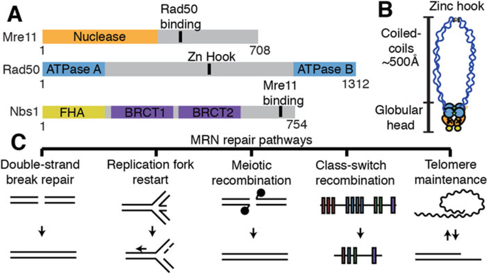
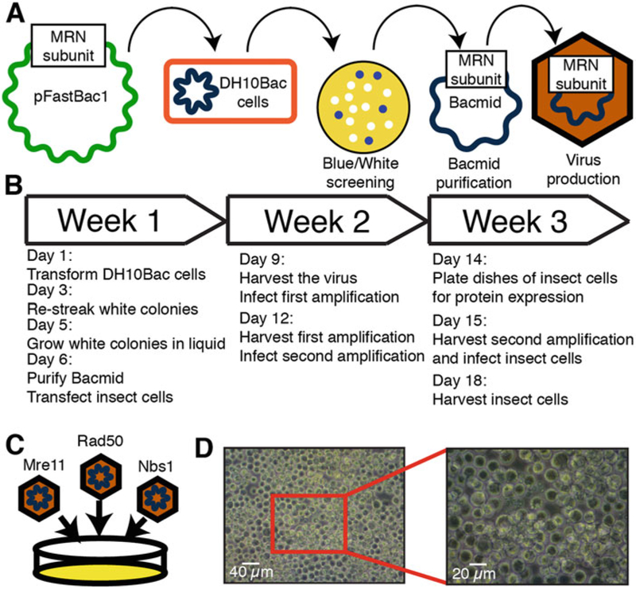
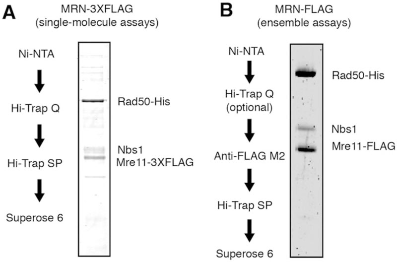
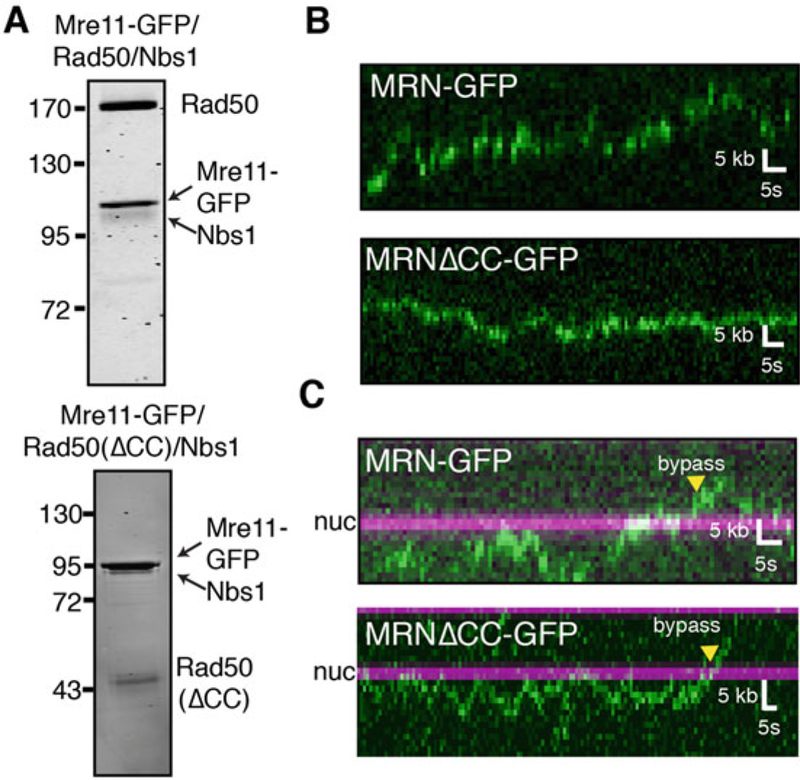
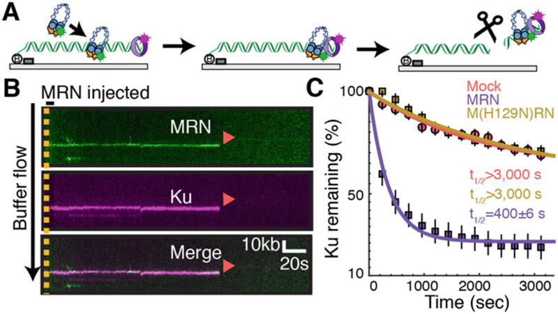
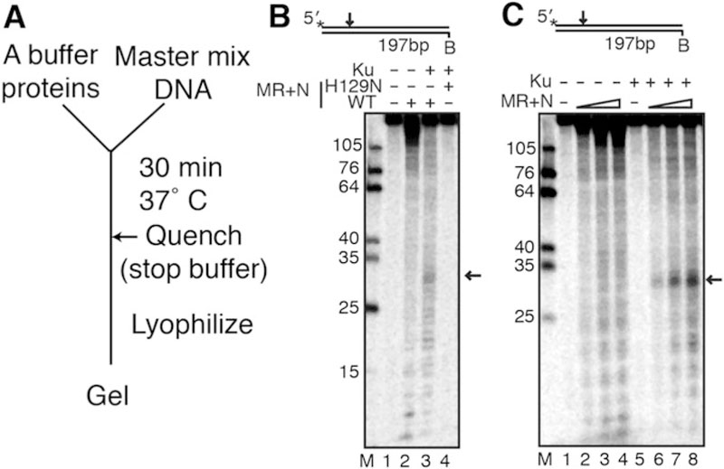

# Purification and Biophysical Characterization of the Mre11-Rad50-Nbs1 Complex

**Logan R. Myler, Michael M. Soniat, Xiaoming Zhang, Rajashree A. Deshpande, Tanya T. Paull, and Ilya J. Finkelstein**

*Methods Mol. Biol.*, Volume 2004, Pages 269–287 (2019)

**DOI:** [10.1007/978-1-4939-9562-2_17](https://doi.org/10.1007/978-1-4939-9562-2_17)

---

## Table of Contents

- [Abstract](#abstract)
- [1. Introduction](#1-introduction)
- [2. Materials](#2-materials)
- [3. Methods](#3-methods)
- [Acknowledgments](#acknowledgments)
- [4. Notes](#4-notes)

---
##  Abstract
The Mre11-Rad50-Nbs1 (MRN) complex coordinates the repair of DNA double-strand breaks, replication fork restart, meiosis, class-switch recombination, and telomere maintenance. As such, MRN is an essential molecular machine that has homologs in all organisms of life, from bacteriophage to humans. In human cells, MRN is a >500 kDa multifunctional complex that encodes DNA binding, ATPase, and both endonuclease and exonuclease activities. MRN also forms larger assemblies and interacts with multiple DNA repair and replication factors. The enzymatic properties of MRN have been the subject of intense research for over 20 years, and more recently, single-molecule biophysics studies are beginning to probe its many biochemical activities. Here, we describe the methods used to overexpress, fluorescently label, and visualize MRN and its activities on single molecules of DNA.
**Keywords:** DNA curtains, Single-molecule imaging, Homologous recombination, DNA repair, MRN
---
##  1. Introduction
DNA double-strand breaks (DSBs) are particularly toxic DNA lesions because they disrupt the physical continuity of the DNA duplex [[1](https://pmc.ncbi.nlm.nih.gov/articles/PMC6667175/#R1), [2](https://pmc.ncbi.nlm.nih.gov/articles/PMC6667175/#R2)]. DSBs can arise from genotoxic agents such as cisplatin, etoposide, and ionizing radiation, but are also programmatically generated during meiosis and class switch recombination [[3](https://pmc.ncbi.nlm.nih.gov/articles/PMC6667175/#R3)–[5](https://pmc.ncbi.nlm.nih.gov/articles/PMC6667175/#R5)]. In addition, telomeres can be recognized as DSBs, and end protection mechanisms must be maintained [[6](https://pmc.ncbi.nlm.nih.gov/articles/PMC6667175/#R6)]. The repair of DSBs is essential for cell survival and DSB repair is differentially regulated in cancer cells, providing a promising avenue for therapeutic strategies that target DSB repair-deficient tumors [[7](https://pmc.ncbi.nlm.nih.gov/articles/PMC6667175/#R7)–[9](https://pmc.ncbi.nlm.nih.gov/articles/PMC6667175/#R9)].
The Mre11-Rad50 heterodimer (MR) is a universally conserved complex that recognizes DNA ends and coordinates the repair of DSBs and other DNA lesions (_see_ [Fig. 1](#fig1)). Eukaryotes evolved an additional regulatory subunit (Nbs1 in humans; Xrs2 in yeast) that interacts with other DNA maintenance proteins and further fine-tunes the enzymatic activities of MR. MRN is involved in both DNA damage signaling and the enzymatic processing that ultimately leads to repair [[10](https://pmc.ncbi.nlm.nih.gov/articles/PMC6667175/#R10)–[14](https://pmc.ncbi.nlm.nih.gov/articles/PMC6667175/#R14)]. The MRN complex facilitates these activities via both catalytic and noncatalytic functions. Mre11 is both a 3′−5′ exonuclease and an endonuclease, which can be abolished by a single point mutation (H129N in the human protein) [[15](https://pmc.ncbi.nlm.nih.gov/articles/PMC6667175/#R15)–[17](https://pmc.ncbi.nlm.nih.gov/articles/PMC6667175/#R17)]. Both nucleolytic activities are stimulated by the addition of manganese in the reaction buffer. The physiological context for this manganese requirement is unclear, as Mg2+ is likely the predominant cation in nuclei. Mre11 complexes strongly with Rad50, an SMC-like protein that contains two Walker ATPase domains that are linked by long (>50 nm) coiled-coil arms that contain a zinc hook [[18](https://pmc.ncbi.nlm.nih.gov/articles/PMC6667175/#R18)]. This zinc hook facilitates multiple interactions that regulate the activity of the rest of the complex [[18](https://pmc.ncbi.nlm.nih.gov/articles/PMC6667175/#R18)–[20](https://pmc.ncbi.nlm.nih.gov/articles/PMC6667175/#R20)]. The Walker ATPase domains and a short patch of the coiled-coil arms interact with Mre11 to form the globular domain of MRN [[21](https://pmc.ncbi.nlm.nih.gov/articles/PMC6667175/#R21), [22](https://pmc.ncbi.nlm.nih.gov/articles/PMC6667175/#R22)]. Nbs1 serves as a loading platform for interacting partners with the MRN complex, regulates the ATPase activity of Rad50, and localizes the complex to the nucleus [[23](https://pmc.ncbi.nlm.nih.gov/articles/PMC6667175/#R23)–[27](https://pmc.ncbi.nlm.nih.gov/articles/PMC6667175/#R27)].
### Fig. 1.

Overview of MRN architecture and associated DNA maintenance pathways. (A) Domain map of Mre11, Rad50, and Nbs1 (B) Illustration of MRN complex architecture [[42](https://pmc.ncbi.nlm.nih.gov/articles/PMC6667175/#R42)]. (C) MRN-associated DNA maintenance pathways
Partial crystal structures, small-angle x-ray scattering analysis, and atomic force microscopy have begun to unravel MRN’s conformational plasticity [[18](https://pmc.ncbi.nlm.nih.gov/articles/PMC6667175/#R18), [28](https://pmc.ncbi.nlm.nih.gov/articles/PMC6667175/#R28)–[30](https://pmc.ncbi.nlm.nih.gov/articles/PMC6667175/#R30)]. At least two conformations of the globular domain have been observed, which are dependent on the ATP binding of the Rad50 subunit [[21](https://pmc.ncbi.nlm.nih.gov/articles/PMC6667175/#R21), [31](https://pmc.ncbi.nlm.nih.gov/articles/PMC6667175/#R31)–[37](https://pmc.ncbi.nlm.nih.gov/articles/PMC6667175/#R37)]. In the “closed” state, a dimer of Rad50 ATPase domains coordinate ATP in an antiparallel manner, restricting access to the Mre11 nuclease but promoting DNA binding [[14](https://pmc.ncbi.nlm.nih.gov/articles/PMC6667175/#R14)]. After ATP hydrolysis, the MRN complex transitions to the “open” state, giving Mre11 access to the DNA for nucleolytic cleavage.
Many of these biophysical insights have been gleaned from comparative studies of bacterial, archaeal, and phage Mre11-Rad50 homologs. This is because obtaining large quantities of biochemically active human MRN complex remains a challenge in the field [[38](https://pmc.ncbi.nlm.nih.gov/articles/PMC6667175/#R38)]. Additionally, imaging-based single-molecule studies require fluorescently labeled MRN complexes to directly visualize activity. Here, we present a protocol for purifying human MRN and its associated subcomplexes from insect cells. In addition, we describe both single-molecule and ensemble biochemical methods to probe MRN’s DNA binding and endonuclease activities. We anticipate that this protocol will serve as a useful guide for future studies of human MRN in various DNA repair processes.
---
##  2. Materials
### 2.1. Media, Strains, Plasmids
  1. DH10Bac cells.
  2. Sf21 cells (or Sf9 cells; _see_ [Note 1](https://pmc.ncbi.nlm.nih.gov/articles/PMC6667175/#FN2)).
  3. Plasmids for MRN: 
    1. Mre11–3XFLAG in pFastbac1.
    2. Mre11-FLAG in pFastbac1.
    3. Mre11-GFP-FLAG in pFastbac1.
    4. Mre11(H129N)-3XFLAG in pFastbac1.
    5. Mre11(H129N)-FLAG in pFastbac1.
    6. Nbs1 in pFastbac1.
    7. Nbs1-FLAG in pFastbac1.
    8. Rad50-His6 in pACEbac1.

### 2.2. Chemicals, Buffers, and Other Reagents
  1. SOC media: 2% tryptone, 0.5% yeast extract, 10 mM NaCl, 2.5 mM KCl, 10 mM MgCl2, 20 mM glucose.
  2. BAC plates: LB agar with 50 μg/mL kanamycin, 7 μg/mL gentamicin, 10 μg/mL tetracycline, 100 μg/mL X-gal, 40 μg/mL IPTG.
  3. Solution I: 15 mM Tris–HCl pH 8.0, 10 mM ethylenediami-netetraacetic acid (EDTA), 100 μg/mL RNase A.
  4. Solution II: 0.2 N NaOH, 1% SDS.
  5. Solution III: 3 M KC2H3O2 pH 5.5.
  6. Sf-900 II Serum Free Media (ThermoFisher Scientific).
  7. Cellfectin II reagent (ThermoFisher Scientific).
  8. MRN Lysis Buffer: 50 mM KH2PO4 pH 7.4, 500 mM KCl, 2.5 mM imidazole, 20 mM β-mercaptoethanol (β-ME), 10% glycerol, 0.5% Tween-20, 1 mM phenylmethane sulfonyl fluoride (PMSF).
  9. Low-salt Ni2+ A Buffer: 50 mM KH2PO4 pH 7.4, 50 mM KCl, 2.5 mM imidazole, 20 mM β-ME, 10% glycerol.
  10. Low-salt Ni2+ B Buffer: 50 mM KH2PO4 pH 7.4, 500 mM KCl, 250 mM imidazole, 20 mM β-ME, 10% glycerol.
  11. A Buffer: 25 mM Tris–HCl pH 8.0, 100 mM NaCl, 10% (vol/vol) glycerol, 1 mM dithiothreitol (DTT).
  12. 0-salt A Buffer: 25 mM Tris–HCl pH 8.0, 10% (vol/vol) glycerol, 1 mM DTT.
  13. B Buffer: 25 mM Tris–HCl pH 8.0, 1 M NaCl, 10% (vol/vol) glycerol, 1 mM DTT.
  14. Imaging buffer: 40 mM Tris–HCl pH 8.0, 60 mM NaCl, 1 mM MgCl2, 2 mM DTT, 0.2 mg/mL bovine serum albumin (BSA).
  15. MRN cleavage buffer: 40 mM Tris–HCl pH 8.0, 60 mM NaCl, 5 mM MgCl2, 1 mM MnCl2, 2 mM DTT, 0.2 mg/mL BSA.
  16. Biotinylated anti-FLAG M2 antibody (Sigma-Aldrich).
  17. Rabbit anti-HA antibody (ICL Lab).
  18. [γ−32P]-ATP.
  19. T4 polynucleotide kinase.
  20. Linear DNA fragment (here, we use a 197 bp DNA molecule).
  21. Stop solution: 0.2% SDS and 10 mM EDTA.
  22. MRN Ensemble Cleavage Buffer: 25 mM MOPS pH 7.0, 20 mM Tris–HCl, pH 8.0, 80 mM NaCl, 8% glycerol, 1 mM DTT, 1 mM ATP, 5 mM MgCl2, 1 mM MnCl2, and 0.2 mg/mL BSA.
  23. Protein Lo-Bind tubes.
  24. 15-cm dishes.
  25. T75 flasks.
  26. Grace’s Media (ThermoFisher Scientific).
  27. Fetal bovine serum (FBS; _see_ [Note 2](https://pmc.ncbi.nlm.nih.gov/articles/PMC6667175/#FN3)).
  28. Phosphate-buffered saline (PBS): 137 mM NaCl, 2.7 mM KCl, 10 mM Na2HPO4, 1.8 mM KH2PO4.
  29. Dounce homogenizer.
  30. Benchtop microcentrifuge.
  31. Tris–EDTA buffer (TE): 10 mM Tris–HCl pH 8.0, 1 mM EDTA.
  32. 70% ethanol.
  33. Isopropanol.
  34. 45-μm filters.
  35. 50 mL conical tubes.
  36. Liquid nitrogen.
  37. Cell scraper.
  38. 50 mL superloop.
  39. Ni-NTA Resin (Qiagen).
  40. Hi-Trap Q (GE).
  41. Anti-FLAG M2 Resin (Sigma).
  42. Hi-Trap SP (GE).
  43. Superose 6 30/300 GL Increase (GE).
  44. ATP.
  45. Denaturing polyacrylamide gel (16% acrylamide, 20% formamide, 6 M urea).

### 2.3. Specialized Equipment and Materials
  1. Custom TIRF microscope for single-molecule imaging [[39](https://pmc.ncbi.nlm.nih.gov/articles/PMC6667175/#R39)].
  2. Anti-rabbit secondary antibody conjugated quantum dots (QDots) 705 nm (ThermoFisher Scientific).
  3. Anti-rabbit secondary antibody conjugated quantum dots (QDots) 605 nm (ThermoFisher Scientific).
  4. Streptavidin-conjugated quantum dots (QDots) 705 nm (ThermoFisher Scientific).
  5. Streptavidin-conjugated quantum dots (QDots) 605 nm (ThermoFisher Scientific).
  6. Typhoon phosphorimager.
  7. SpeedVac.
  8. YoYo-1 (ThermoFisher Scientific).

---
##  3. Methods
### 3.1. Insect Cell Culture
#### 3.1.1. Bacmid Production
For two decades, MRN variants have been expressed using a variety of systems [[40](https://pmc.ncbi.nlm.nih.gov/articles/PMC6667175/#R40)]. Expression of bacterial, archaeal, and phage MR homologs can be carried out in _E. coli_. However, we have found that Sf21 insect cells yield the most reliable and high expression of the full-length human MRN and yeast MRX complexes (Xrs2 is the yeast Nbs1 homolog.). Adherent Sf21 cells are coinfected with viruses containing each of the three MRN components (_see_ [Fig. 2](#fig2)).
##### Fig. 2.

Overview of MRN expression in insect cells. (**a**) Illustration of baculovirus production using the Bac-to-Bac system. (**b**) Timeline of baculovirus production. (**c**) Three separate viruses containing individual members of the MRN complex are separately produced and then used to infect the same cells. (**d**) Image of healthy Sf21 insect cells infected with virus
Baculoviruses for each of the individual MRN subunits are produced using the Bac-to-Bac Baculovirus Expression System (ThermoFisher Scientific). Purifying a bacmid is the first step in producing a baculovirus. Using the Bac-to-Bac system, a plasmid containing Tn7 transposon segments can be transformed into DH10Bac cells, which will recombine the plasmid into a baculoviral shuttle vector and generate a bacmid that can be directly transfected into insect cells (_see_ [Note 3](https://pmc.ncbi.nlm.nih.gov/articles/PMC6667175/#FN4)).
  1. Clone or obtain Mre11 and Nbs1 in pFastbac1 and Rad50 in pACEBac1 (_see_ [Note 4](https://pmc.ncbi.nlm.nih.gov/articles/PMC6667175/#FN5)).
  2. Add 1 ng of plasmid to 100 μL of DH10Bac cells.
  3. Incubate the cells on ice for 30 min and heat-shock for 45 s at 42 °C.
  4. Add 1 mL of SOC media and recover cells for 4 h at 37 °C.
  5. Plate on BAC plates. Grow for 48 h at 37 °C.
  6. Pick three white colonies and one blue colony and restreak onto a BAC plate to ensure the correct screening.
  7. From the second BAC plate, pick one white colony and grow overnight at 37 °C in LB containing the BAC antibiotics. Some bacmids will take more than one night to grow in liquid culture.
  8. Spin down 1.5 mL of cells at 14,000 × _g_.
  9. Resuspend in 300 μL of Solution I.
  10. Add 300 μL Solution II, mix, and incubate at room temperature for 5 min.
  11. Add 300 μL Solution III and mix gently.
  12. Incubate on ice for 5–10 min.
  13. Centrifuge at 14,000 × _g_ in a microcentrifuge for 10 min.
  14. Move the supernatant to another tube and add 800 μL isopropanol.
  15. Centrifuge at 14,000 × _g_ in a microcentrifuge for 15 min.
  16. Remove the supernatant and add 500 μL 70% ethanol. Invert to wash the pellet.
  17. Centrifuge at 14,000 × _g_ in a microcentrifuge for 5 min.
  18. Dump out the supernatant and air dry the pellet for 5–10 min.
  19. Resuspend the dried bacmid in 40 μL filter-sterilized TE.

#### 3.1.2. Baculovirus Production
Baculovirus is produced by transfecting the bacmid into a small culture of insect cells and then amplifying the titer.
  1. Seed 1 × 106 cells in one well of a 6-well plate in 2 mL of Sf-900 II Serum Free Media.
  2. On the same day that the bacmid is produced, prepare two solutions for transfection.
  3. Solution A: 5 μL bacmid prep in 100 μL Sf-900 II Serum Free Media.
  4. Solution B: 6 μL Cellfectin II reagent in 100 μL Sf-900 II Serum Free Media.
  5. Add the two solutions together and incubate for 30 min at room temperature.
  6. Aspirate the media from the cells, and add 800 μL Sf-900 II Serum Free Media.
  7. Add the bacmid mixture to the cells and incubate for 5 h at 27 °C.
  8. After 5 h, aspirate the media and add 3 mL of fresh media.
  9. Incubate the cells for 72 h to allow virus production.
  10. Pipette the supernatant into a syringe attached to a 45-μm filter. Save this first preparation of virus at 4 °C.

#### 3.1.3. Baculovirus Amplification and Infection
To amplify the baculovirus, the first preparation of the virus is ncubated with a 15-cm plate of insect cells for 72 h. Next, this first amplification is incubated in the same manner with several 15-cm plates of cells to create the second amplification, which is high titer enough to induce the cells to produce protein. This process is repeated for each of the MRN subunits (_see_ [Note 5](https://pmc.ncbi.nlm.nih.gov/articles/PMC6667175/#FN6)). We generally use 60 15-cm dishes to produce the full complex. Each dish is infected with 600 μL of each of the three viruses. The first amplification can be stored at 4 °C for several years, but freshly made second amplification should be used for protein production.
  1. Seed 15 × 106 cells in a 15-cm dish in 25 mL of Grace’s Media containing 15% FBS (_see_ [Note 2](https://pmc.ncbi.nlm.nih.gov/articles/PMC6667175/#FN3) for FBS information and _see_ [Note 6](https://pmc.ncbi.nlm.nih.gov/articles/PMC6667175/#FN7) for insect cell maintenance).
  2. Add 500 μL of the initial virus preparation and incubate for 72 h.
  3. Harvest the first amplification by filtering the supernatant with a 45 μm filter into a conical tube.
  4. Add 50 μL of the first amplification to each of 3 15-cm dishes of 15 × 106 cells, and incubate for another 72 h.
  5. Harvest the second amplification by filtering the supernatant with a 45 μm filter into a conical tube.
  6. The second amplification is now ready to infect dishes for protein production.
  7. Seed ~15 × 106 cells each into 15-cm dishes in 25 mL of Grace’s Media containing 15% FBS. A typical prep would be 60 dishes.
  8. Add 600 μL of each virus to each dish.
  9. Incubate for 72 h.
  10. Harvest the insect cells by scraping the cells from the bottom of each dish with a cell scraper and collecting the cells into a centrifuge bottle.
  11. Spin the cells at 1500 × _g_ for 10 min.
  12. Resuspend the cells in 40 mL of PBS and transfer to a conical tube.
  13. Spin the cells again at 1500 × _g_ for 10 min.
  14. Aspirate the PBS and snap-freeze the pellets in liquid nitrogen before storing at −80 °C.

### 3.2. Purification of Human MRN Variants
#### 3.2.1. Purification of MRN for Single-Molecule and Ensemble Biochemistry Experiments
Coexpression of all three MRN subunits typically yields low expression (~80 μg complex per 60-dish Sf21 pellet). An alternative approach is to infect Sf21 cells with the Mre11/Rad50 (MR) subcomplex and to reconstitute this with Nbs1, which is purified separately [[41](https://pmc.ncbi.nlm.nih.gov/articles/PMC6667175/#R41)]. The principal advantage of this approach is that the MR complex is expressed at a significantly higher concentration (~500 μg MR complex per 60-dish Sf21 pellet). For single-molecule analysis, we tested a variety of different constructs, purification schemes, and fluorescent labeling strategies. We visualized MRN with 1xFLAG, 3xFLAG, biotin, GFP, HALO, and HA tags distributed over the Rad50 and Mre11 subunits. However, we observed the best labeling with a 3xFLAG on the C-terminus of the Mre11 subunit. The protocol described below should be concluded in a single purification day (_see_ [Fig. 3](#fig3)). Stopping overnight decreases MRN yield and biochemical activity.
##### Fig. 3.

MRN purification. (**a**) Purification scheme and SDS-PAGE gel of 3XFLAG-MRN or (**b**) FLAG-MRN
  1. Follow the above protocol for producing a pellet of insect cells expressing MRN from 60 15-cm dishes.
  2. Quickly thaw the pellet and resuspend in 40 mL of MRN Lysis Buffer.
  3. Homogenize pellet in a 50 mL Dounce homogenizer using an “A” piston.
  4. Sonicate cells on ice three times for 30 s each time with a 30 s recovery on ice.
  5. Centrifuge the mixture at 100,000 × _g_ for 1 h at 4 °C.
  6. Incubate supernatant with 10 mL of equilibrated Ni-NTA resin for 1 h at 4 °C with gentle agitation.
  7. Centrifuge the sample at 1500 × _g_ for 3 min.
  8. Remove the supernatant, add 40 mL of High-salt Ni2+ A buffer, and incubate at 4 °C with gentle agitation for 5 min.
  9. Centrifuge the sample at 1500 × _g_ for 3 min.
  10. Remove the supernatant, add 40 mL of Low-salt Ni2+ A buffer, and incubate at 4 °C with gentle agitation for 5 min.
  11. Centrifuge the sample at 1500 × _g_ for 3 min.
  12. Remove the supernatant, add 40 mL of 10% Low-salt Ni2+ B buffer (4 mL Ni2+ B + 36 mL Ni2+ A), and incubate at 4 °C with gentle agitation for 5 min.
  13. Centrifuge the sample at 1500 × _g_ for 3 min.
  14. Add 15 mL of Ni2+ B buffer to resin and incubate for 30 min at 4 °C.
  15. Transfer Ni-NTA resin to disposable column and collect the elution.
  16. Dilute the elution with 15 mL A Buffer and load onto a 50-mL superloop.
  17. Equilibrate a Hi-Trap Q column on an FPLC with A and B buffers.
  18. Load the sample onto the Q column using the superloop and wash until the UV stabilizes.
  19. Elute with a step to 100% B buffer and collect 0.5 mL fractions.
  20. Combine the fractions with the highest UV intensity (up to 5 mL).
  21. Keep a small aliquot for analysis. Dilute the prep in 0-salt A buffer until the NaCl concentration is less than 100 mM.
  22. Equilibrate a Hi-Trap SP column on an FPLC with A and B buffers.
  23. Load the sample onto the SP column using the superloop and wash until the UV stabilizes.
  24. Elute with a step to 100% B buffer and collect 0.5 mL fractions.
  25. Equilibrate a Superose 6 30/300 GL Increase column on an FPLC with A and B buffers.
  26. Take the highest concentration sample from SP and load it on the Superose 6 column using a 500 μL injection loop. The full complex should elute just after the void volume. Later fractions will contain substoichiometric subcomplexes. Pool highest concentration fractions.
  27. Aliquot sample, snap-freeze with liquid nitrogen, and store at −80 °C.

#### 3.2.2. Alternative MRN Purification Strategies for Biochemical Studies
Above, we describe the purification for 3XFLAG-MRN, as this construct is readily labeled for single-molecule imaging and also retains both endonuclease and exonuclease activities. However, this protocol reduces the overall MRN yield and purity. This is because the triple FLAG tag precludes elution of the MRN complex from FLAG beads, making the anti-FLAG resin incompatible with the purification. When single-molecule imaging is not the final goal, we recommend purification of MRN harboring a single FLAG tag on the Mre11 subunit. This protocol adds an anti-FLAG column to the MRN purification scheme, as described below.
  1. Follow purification of FLAG-MRN through the Ni2+-NTA resin elution (_see_ [Subheading 3.2.1](https://pmc.ncbi.nlm.nih.gov/articles/PMC6667175/#S12), until **step 15**). Adding the Q column is optional for this purification due to higher purity from the FLAG column.
  2. Dilute the elution with 15 mL A Buffer.
  3. Add 1 mL of Anti-FLAG resin preequilibrated in A buffer.
  4. Incubate for 1 h at 4 °C with gentle agitation.
  5. Pack the resin into an empty column.
  6. Attach the column to an FPLC preequilibrated with A and B buffers.
  7. Wash the column with A buffer until the UV280 absorption reading stabilizes.
  8. Attach a 5 mL injection loop to the system.
  9. Inject 5 mL A buffer with 100 μg/mL 3XFLAG peptide.
  10. When the UV280 reading starts to increase, pause the flow for 20 min, allowing the 3XFLAG peptide to compete with the protein.
  11. Continue the flow, collect, and pool all fractions with large UV280.
  12. Inject the eluate onto an SP column and follow the protocol above to continue purification through SP and Superose 6 (starting at [Subheading 3.2.1](https://pmc.ncbi.nlm.nih.gov/articles/PMC6667175/#S12), **step 23**. Also _see_ [Note 7](https://pmc.ncbi.nlm.nih.gov/articles/PMC6667175/#FN8)).

### 3.3. Imaging of MRN-GFP on DNA Curtains
We have previously established that MRN can be labeled by quantum dots (QDs) and visualized on DNA curtains [[39](https://pmc.ncbi.nlm.nih.gov/articles/PMC6667175/#R39), [42](https://pmc.ncbi.nlm.nih.gov/articles/PMC6667175/#R42)]. However, QDs are relatively large fluorescent nanoparticles (>10 nm diameter) and we have pursued both GFP and HALO-tagged MRNs to reduce the fluorophore size and validate the QD-MRN results. Here, we describe the visualization of MRN-GFP (_see_ [Fig. 4](#fig4)). MRN-GFP is expressed and purified using the anti-FLAG resin as described above. Both GFP-MRN and QD-labeled MRN bind and diffuse on homoduplex DNA. Additionally, we purified MRNΔCC, a variant with truncated Rad50 coiled coils (Rad50ΔCC; residues 218–1104 replaced with a PPAGGG linker). Our results with MRNΔCC-GFP were identical to QD-labeled MRNΔCC, indicating that the coiled coils are not required for diffusion on DNA and further confirming that QD-labeled MRN is fully active in the single-molecule assays. We also made nucleosome curtains as previously described and saw that both MRN-GFP and MRN CC-GFP complexes are able to diffuse past nucleosomes in search of free DNA ends [[42](https://pmc.ncbi.nlm.nih.gov/articles/PMC6667175/#R42), [43](https://pmc.ncbi.nlm.nih.gov/articles/PMC6667175/#R43)]. Quantum dots can fluoresce for tens of minutes without appreciable photobleaching. In contrast, GFP photobleaches relatively rapidly, and we increased the shuttering rate to be able to observe long-range movements of the MRN-GFP complex on DNA curtains.
#### Fig. 4.

Single-molecule visualization of GFP-MRN. (**a**) Purification gels of MRN-GFP and MRNΔCC-GFP. (**b**) Representative kymographs illustrating the diffusion of MRN-GFP (top) and MRNΔCC-GFP (bottom) on naked DNA or (**c**) DNA with nucleosomes. MRN is green, and nucleosomes are magenta in all kymographs
  1. Follow flowcell assembly protocol for double-tethered DNA curtains as previously reported [[39](https://pmc.ncbi.nlm.nih.gov/articles/PMC6667175/#R39)]. If examining nucleosome curtains, prepare the double-tethered DNA curtains with λ-DNA already containing nucleosomes. Briefly, a microscope slide with double-tethering patterns on it is encased in a flow-cell by making a channel in double-sided tape sandwiched with a coverslip. Buffer flow can be added using nanoports that are glued to holes in the microscope slide. This flowcell should be cleaned, passivated with a fluid lipid bilayer, coated with strep-tavidin and antibodies for attaching DNA, and attached to a custom TIRF microscope.
  2. Dilute MRN-GFP complex to 5 nM protein and inject in a 100 μL loop onto the flowcell. Be sure to not start exposing with the laser until the MRN has completely entered the flowcell.
  3. Turn the buffer flow off, open the laser shutter, and begin imaging with a 200 ms exposure rate and 0.1 fps shutter rate. We used high laser power (100 mW) because the signal is very weak.
  4. Image until all of the MRN-GFP molecules have photo-bleached (_see_ [Note 8](https://pmc.ncbi.nlm.nih.gov/articles/PMC6667175/#FN9)).

### 3.4. Visualizing MRN Cleavage of Ku on DNA Curtains
Our single-molecule results indicated that MRN could diffuse on DNA in the absence of buffer flow [[42](https://pmc.ncbi.nlm.nih.gov/articles/PMC6667175/#R42)]. We hypothesized that MRN could use this diffusive state to load on Ku-bound DNA, where the end was obstructed. To test this hypothesis, Ku was prebound to the ends of DNA and then MRN was injected into the flowcell (_see_ [Fig. 5](https://pmc.ncbi.nlm.nih.gov/articles/PMC6667175/#F5)). MRN nuclease activity was activated via switching to cleavage buffer (imaging buffer with 5 mM MgCl2 and 1 mM MnCl2; _see_ [Note 9](https://pmc.ncbi.nlm.nih.gov/articles/PMC6667175/#FN10)).
#### Fig. 5.

Single-molecule visualization of MRN cleavage. (**a**) Schematic of an MRN/Ku single-molecule cleavage assay [[42](https://pmc.ncbi.nlm.nih.gov/articles/PMC6667175/#R42)]. MRN is first injected onto a Ku-blocked end, where it slides down in the presence of mild buffer flow (left to right) to colocalize with Ku at the end of DNA. Next, MRN cleaves both strands of the DNA duplex in a reaction that requires Mn+2, ATP, and Mre11 nuclease activity. Ku is removed from the DNA via this nuclease cut. (**b**) Kymograph of MRN (green) cleavage of Ku (magenta). Red arrows indicate dissociation (via cleavage). (**c**) Percentage of Ku molecules remaining after mock injection (red), injection of MRN (purple) or the nuclease-deficient M(H129N)RN mutant
  1. Follow flowcell assembly protocol for single-tethered DNA curtains as previously reported using a blunt end DNA [[39](https://pmc.ncbi.nlm.nih.gov/articles/PMC6667175/#R39)]. These flowcells are similar to the ones described above but lack the pedestals required for double-tethering, so that there is a free DNA end.
  2. Preincubate 16 μL anti-HA rabbit antibody with 2 μL of anti-rabbit secondary QDot 705 for 10 min on ice. In a separate tube, preincubate 16 μL biotinylated anti-FLAG mouse anti-body with 2 μL of streptavidin QDot 605 for 10 min on ice.
  3. Add 1 μL of 1 μM 3xHA Ku to the anti-HA rabbit mixture and incubate for 10 min on ice. Meanwhile, add 5 μL of 120 nM 3XFLAG MRN to the anti-mouse mixture and incubate for 10 min on ice.
  4. Dilute the Ku mixture to 200 μL in imaging buffer with saturating biotin.
  5. Dilute the MRN mixture to 1 mL in imaging buffer with saturating biotin.
  6. Inject the Ku mixture at 200 μL/min in a 100 μL injection loop onto DNA curtains and allow excess Ku to flow off.
  7. Next, increase the flow rate to 400 μL/min to extend the DNA to almost B-form length.
  8. Begin imaging the curtain with a 1 fps shutter rate and a 200 ms exposure time. Be sure to turn the buffer flow off for 6 s to establish which Ku molecules are DNA versus surface bound.
  9. Inject MRN in a 700 μL loop.
  10. Image the flowcell for 1 h. Near the end of imaging, buffer flow should be toggled on and off briefly to confirm all remaining DNA-bound molecules. These molecules retract to the chromium DNA curtain barriers when buffer flow is transiently turned off (_see_ [Note 10](https://pmc.ncbi.nlm.nih.gov/articles/PMC6667175/#FN11)).

### 3.5. MRN Ensemble Nuclease Assays
MRN contains a 3′ to 5′ exonuclease activity and an endonuclease activity [[23](https://pmc.ncbi.nlm.nih.gov/articles/PMC6667175/#R23), [40](https://pmc.ncbi.nlm.nih.gov/articles/PMC6667175/#R40)]. Cannavo and Cejka first reported that the budding yeast MRX complex can cleave DNA next to a biotin–streptavidin adduct when stimulated by the cofactor Sae2 [[15](https://pmc.ncbi.nlm.nih.gov/articles/PMC6667175/#R15)]. Recently, we and others described that MRN can cleave the DNA next to a protein adduct or the more physiological Ku-occluded DNA end [[16](https://pmc.ncbi.nlm.nih.gov/articles/PMC6667175/#R16), [42](https://pmc.ncbi.nlm.nih.gov/articles/PMC6667175/#R42), [44](https://pmc.ncbi.nlm.nih.gov/articles/PMC6667175/#R44)]. Taken together with recent genetic and cell biology studies, these results suggest that MRN(X) nuclease activity is required for resolving protein–DNA adducts that may block replication and repair as well as Ku-blocked DNA ends. Here, we describe the protocol for this ensemble nuclease assay (_see_ [Fig. 6](https://pmc.ncbi.nlm.nih.gov/articles/PMC6667175/#F6)).
#### Fig. 6.

An ensemble assay for MRN nuclease activity. (**a**) Schematic of the ensemble assay. (**b**) MRN ensemble cleavage assay reproduced with permission from [[42](https://pmc.ncbi.nlm.nih.gov/articles/PMC6667175/#R42)]. MR or M(H129N)R (50 nM) and 50 nM Nbs1 were incubated with a 5′ radiolabeled 197 bp dsDNA containing 10 nM Ku. Black arrows represent MRN cleavage product. MR+N was used in these experiments, but MRN can also be used. (**c**) Titration of MRN into an ensemble cleavage assay (12.5, 25 and 50 nM MR + equimolar Nbs1 were used)
  1. Radiolabel an oligo on the 5′ end with [γ−32P]-ATP using T4 polynucleotide kinase (NEB).
  2. PCR amplify a 197 bp DNA fragment using the radiolabeled oligo.
  3. Gel purify the radiolabeled DNA fragment using a 0.7% agarose gel.
  4. In a 10 μL reaction, 50 nM MR and equimolar concentration of Nbs1 are preincubated to assemble the MRN complex.
  5. Incubate the MRN complex with ~0.5 nM DNA and 10 nM Ku heterodimer in MRN ensemble cleavage buffer in Protein Lo-Bind tubes at 37 °C for 30 min.
  6. Ku is allowed to bind to DNA in assay reaction prior to the addition of MRN.
  7. Stop the reaction by adding 2 μL of stop solution (0.2% SDS and 10 mM EDTA).
  8. Lyophilize the reaction in a SpeedVac.
  9. Dissolve the lyophilized DNA in formamide and boil at 100 °C for 4 min.
  10. Load the reaction on a denaturing polyacrylamide gel (16% acrylamide, 20% formamide, 6 M urea) at 40 W for 1.5 h.
  11. Expose to a phosphor screen, and scan on a Typhoon phosphorimager (_see_ [Note 11](https://pmc.ncbi.nlm.nih.gov/articles/PMC6667175/#FN12)).

---
##  Acknowledgments
We are indebted to Dr. Mauro Modesti for reagents. This work was supported by CPRIT (to I.J.F.), the National Institutes of Health (GM120554 and CA092584 to I.J.F.) and the Welch Foundation (F-l808 to I.J.F.). M.M.S. is supported by a postdoctoral fellowship, PF-17–169-01-DMC, from the American Cancer Society. L.R.M. is supported by the National Cancer Institute (CA212452). T.T.P. is an investigator of the Howard Hughes Medical Institute. I.J.F. is a CPRIT Scholar in cancer research.
##  4 Notes
1.
High MRN expression requires using healthy cells. This means that >99% of cells should adhere to the bottom within an hour and that the size of the cells should be uniformly small, not enlarged or floating (_see_ [Fig. 2](https://pmc.ncbi.nlm.nih.gov/articles/PMC6667175/#F2) for a representative image of insect cells on a plate). We have used both Sf21 and Sf9 cells successfully with the caveat that MRN yield is critically dependent on using the healthiest cells possible; MRN yield decreases rapidly when cells are not healthy.
2.
High MRN expression is critically dependent on the lot of Fetal Bovine Serum (FBS) that is used for growing the insect cells. Operationally, we screen every new lot of FBS by purifying MRN that is overexpressed in cells grown in the new media. If that particular FBS lot produces MRN expression that is visible after purification, we stockpile that particular lot (50–100 bottles) and keep them frozen at −20 °C until use. Grace’s Media containing 20% FBS is used for T75 flasks with adherent cells, but 15% FBS is used for suspension culture and plates. This amount of FBS should be checked for each lot of FBS purchased.
3.
Bacmid prep should be performed on the same day as transfection.
4.
The large size of Rad50 made it difficult to clone into pFast-bac1. pACEBac1 worked better for cloning and bacmid production.
5.
While amplifying three separate viruses is initially more time-consuming than other multi-component baculovirus expression systems, this strategy offers flexibility in combining different mutant proteins and subcomplexes [[45](https://pmc.ncbi.nlm.nih.gov/articles/PMC6667175/#R45)].
6.
For insect cell culture, it is important to maintain a cycle of passaging/growth that allows the insect cells to stay constantly in log phase but also allows quick identification of slow growing/unhealthy cells. We maintain 10–15 T75 flasks of adherent Sf21’s that are split 1 to 4 from confluency on Thursdays and Mondays. Confluent cells from these flasks on Thursday are diluted into 1 L spinner flasks, which will be ready on Monday to plate into ~60 15-cm dishes for infection. Cells that do not grow well in this timeframe are discarded and fresh freezer stocks are thawed to maintain the best-growing cells. We have previously been able to produce MRN by infecting the suspension cells in the spinner flasks directly. However, for unknown reasons, the lot of serum determines for us whether cells can produce MRN in suspension or adherent cultures.
7.
To obtain higher concentrations of the complex, MR and Nbs1 can be purified separately from two different preparations of insect cells. In this case, Nbs1-FLAG is used to purify the Nbs1 protein separately. The MR subcomplex and Nbs1 can be mixed together and purified by size exclusion chromatography or directly coincubated in biochemical assays. If purification of the full complex is performed, 1 mM ATP should be added to the mixture to promote MRN complex formation.
8.
We have observed 1D diffusive motion of the MRN-GFP molecules along DNA ([Fig. 4](https://pmc.ncbi.nlm.nih.gov/articles/PMC6667175/#F4)). Optionally, the DNA can be poststained with YoYo-1 to determine the position of the double-tethered DNA molecules. The colocalization of the 1D diffusive MRN-GFP molecule with a tethered DNA acts as a control for DNA interaction as opposed to surface-bound molecules.
9.
The presence of manganese in the MRN cleavage buffer dims the quantum dots. To continue imaging over long time frames, shutter the laser in between exposures at a rate of 1 fps or slower (200 ms exposure).
10.
Molecules of Ku that colocalize with MRN and retract to the chromium barriers after turning buffer flow off should be analyzed. The disappearance of Ku at these sites should be quantified based on the amount of time before removal. As controls, nuclease-dead MRN(H129N) or the omission of manganese or ATP from the cleavage buffer should result in Ku remaining on the DNA for the length of the movie ([Fig. 5](https://pmc.ncbi.nlm.nih.gov/articles/PMC6667175/#F5)).
11.
The appearance of a band at ~30 nt indicates MRN cleavage of the DNA next to a Ku-blocked end. As controls, nuclease-dead MRN(H129N) or the omission of manganese, ATP, MRN, or Nbs1 can be used to see the loss of cleavage product ([Fig. 6](https://pmc.ncbi.nlm.nih.gov/articles/PMC6667175/#F6)).

---

*Archived from [PubMed Central (PMC6667175)](https://pmc.ncbi.nlm.nih.gov/articles/PMC6667175/) on 2025-07-19.*
