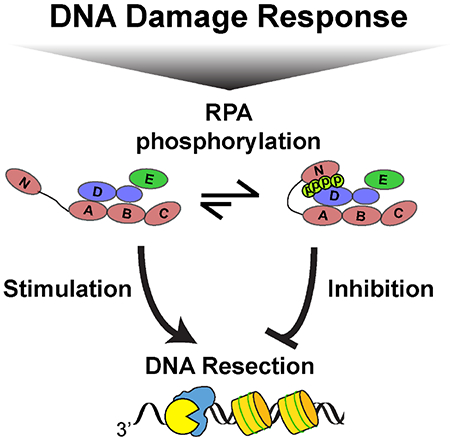
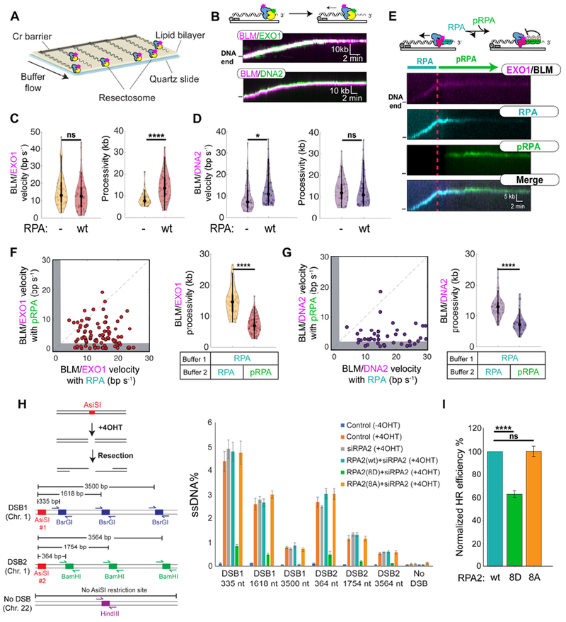
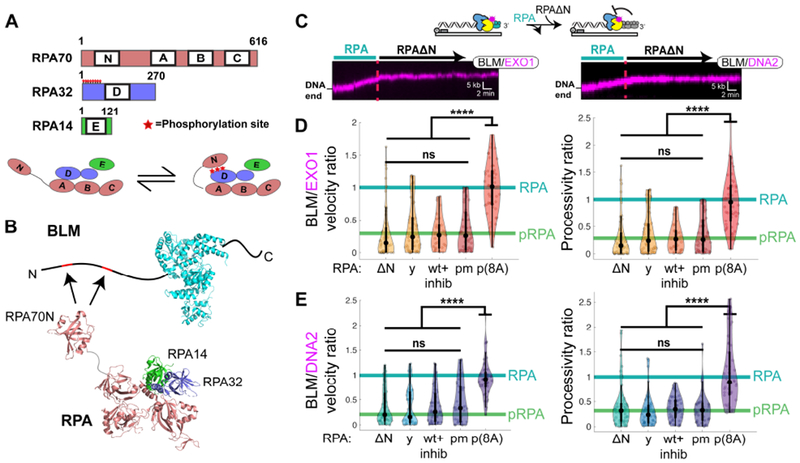
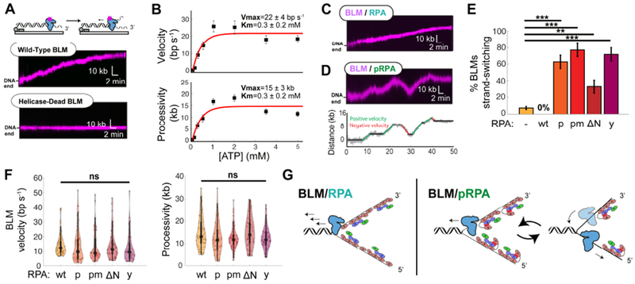
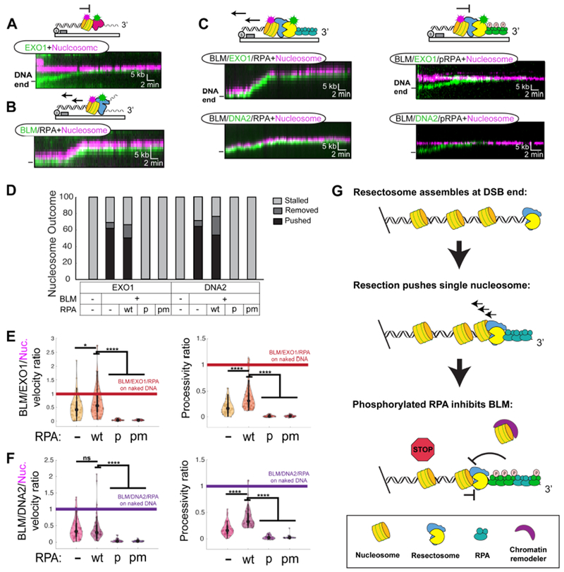

# RPA phosphorylation inhibits DNA resection

**Michael M. Soniat, Logan R. Myler, Hung-Che Kuo, Tanya T. Paull, and Ilya J. Finkelstein**

*Molecular Cell*, Volume 75, Issue 1, Pages 145-153 (2019)

**DOI:** [10.1016/j.molcel.2019.05.005](https://doi.org/10.1016/j.molcel.2019.05.005)

---

## Table of Contents

- [Summary](#summary)
- [Introduction](#introduction)
- [Results](#results)
- [Discussion](#discussion)
- [STAR Methods](#star-methods)
- [Acknowledgements](#acknowledgements)

---
##  SUMMARY
Genetic recombination in all kingdoms of life initiates when helicases and nucleases process (resect) the free DNA ends to expose single-stranded (ss) DNA overhangs. Resection regulation in bacteria is programmed by a DNA sequence, but a general mechanism limiting resection in eukaryotes has remained elusive. Using single-molecule imaging of reconstituted human DNA repair factors, we identify phosphorylated RPA (pRPA) as a negative resection regulator. BLM helicase together with EXO1 and DNA2 nucleases catalyze kilobase-length DNA resection on nucleosome-coated DNA. The resulting ssDNA is rapidly bound by RPA, which further stimulates DNA resection. RPA is phosphorylated during resection as part of the DNA damage response (DDR). Remarkably, pRPA inhibits DNA resection in cellular assays and _in vitro_ via inhibition of BLM helicase. pRPA suppresses BLM initiation at DNA ends and promotes the intrinsic helicase strand-switching activity. These findings establish that pRPA provides a feedback loop between DNA resection and the DDR.
**Keywords:** RPA, BLM, single-molecule, EXO1, DNA2, double-strand break, DNA repair
##  Graphical Abstract

---
##  INTRODUCTION
Homologous recombination (HR) is a universally conserved DNA double-strand break (DSB) repair pathway that uses the information stored in a sister chromatid to repair the broken genome ([Jasin and Rothstein, 2013](#ref31)). In eukaryotes, homologous recombination is initiated by the MRE11-RAD50-NBS1 (MRN) complex, which rapidly localizes to DSBs in human cells ([Lisby et al., 2004](#ref34)). MRN initiates HR by removing adducts from the DNA ends and by loading the Bloom's Syndrome helicase (BLM) along with Exonuclease 1 (EXO1) or DNA2 nuclease/helicase ([Lisby et al., 2004](#ref34); [Myler and Finkelstein, 2016](#ref41); [Symington, 2016](#ref56)). Single-stranded DNA (ssDNA) is generated by nucleolytic degradation (i.e., resection) of one of the two DNA strands. Replication protein A (RPA) rapidly coats the ssDNA that is generated during DNA resection. RPA-ssDNA filaments are phosphorylated by ATR, together with ATM, CDK, and DNA-PKcs ([Ciccia and Elledge, 2010](#ref12); [Maréchal and Zou, 2015](#ref36)). Although RPA phosphorylation is induced in response to DNA damage and is frequently used as a readout of DSB resection, cells expressing phosphomimetic RPA mutants have defects in DNA recombination and repair ([Binz et al., 2003](#ref4), [2004](#ref5)). However, the role of RPA phosphorylation during DNA resection and the mechanisms that measure and terminate DNA resection are not fully understood.
Here, we use single-molecule fluorescence imaging and cellular assays to establish that RPA phosphorylation is a critical regulator of eukaryotic resection on chromatin. BLM, in concert with RPA, stimulates processive resection by EXO1 and DNA2 nucleases. However, RPA32 phosphorylation inhibits DNA resection _in vitro_ and in cells. Phosphorylated RPA (pRPA) drastically slows both BLM/EXO1 and BLM/DNA2 resectosomes and stimulates BLM strand switching when the nuclease is omitted from the reaction. Moreover, BLM/EXO1 and BLM/DNA2 can resect past nucleosomes in the presence of RPA but are blocked when pRPA is added to the reaction. Thus, phosphorylated RPA is a critical negative regulator of DNA resection and other processes that involve BLM helicase.
---
##  RESULTS
### Mechanism of BLM/EXO1 and BLM/DNA2-mediated DNA resection
We established a single-molecule DNA curtain assay to image the role of RPA during DNA resection ([Figure 1](#fig1)). In this assay, BLM helicase and the nucleases EXO1 or DNA2 are imaged on 48.5 kb-long DNA molecules that are organized on the surface of a lipid-coated microfluidic flowcell ([Gallardo et al., 2015](#ref23)). Recombinant BLM was labeled with an anti-FLAG (when with EXO1) or anti-HA antibody (when with DNA2) conjugated to a fluorescent nanoparticle (quantum dot; QD) ([Figure 1B](#fig1) and S1A, STAR Methods). Biotinylated EXO1 was coupled to a streptavidin-conjugated QD and DNA2 coupled to an anti-FLAG antibody conjugated QD that emits in a spectrally distinct fluorescent channel ([Figures 1B](#fig1) and S1A)([Myler et al., 2016](#ref42)). Ensemble and single-molecule resection experiments confirmed that the fluorescent labels do not interfere with EXO1, BLM, or DNA enzymatic activities (Figure S1).
<figure class="paper-figure" id="fig1">

<figcaption><strong>Figure 1. RPA regulates DNA resection.</strong> <b>(A)</b> Schematic of the single-molecule resection assay. <b>(B)</b> Kymographs of BLM (magenta) and EXO1 (green) or BLM and DNA2 (green) resecting DNA. <b>(C)</b> BLM/EXO1 and <b>(D)</b> BLM/DNA2 velocities and processivities with and without RPA (N>50 for all experiments). Violin plots: dots represent the median; black bars show the interquartile range (thick bars) and 95% confidence intervals (thin bars). <b>(E)</b> BLM and EXO1 (magenta) resecting DNA in the presence of 1 nM RPA-RFP (cyan) for 10 minutes before switching to pRPA-GFP (green) for 40 minutes. <b>(F-G)</b> Velocities (left) and processivities (right) of individual <b>(F)</b> BLM/EXO1 (N=90) and <b>(G)</b> BLM/DNA2 (N=42) complexes before and after switching from RPA to pRPA. Gray bars: molecules that stopped within our experimental uncertainty. Dashed line is shown as a reference with a slope of m=1. <b>(H)</b> Schematic and quantification of a qPCR-based cellular resection assay of cells transfected with RPA2(wt), RPA2(8D), or RPA2(8A). Error bars: SEM from three biological replicates. <b>(I)</b> Quantification of HR by I-Scel-induced DSBs in cells transfected with RPA2(wt), RPA2(8D), or RPA2(8A). Error bars: SEM from four biological replicates. (not significant; ns, p>0.05; * , p<0.05; <b>, p<0.01; </b>&#42;, p<0.001; &#42;&#42;&#42;&#42;, p<0.0001).</figcaption>
</figure>
EXO1 is the major DNA resection nuclease in human cells, so we first assayed EXO1 with BLM at the single-molecule level ([Tomimatsu et al., 2012](#ref58)). BLM and EXO1 physically interact in the absence of DNA and co-localize at free DNA ends in the single-molecule assay ([Figures 1B](#fig1) and S1B,C) ([Nimonkar et al., 2008](#ref44)). Nearly all BLM/EXO1 complexes (~91%; N=50/55) translocated at least ~1 kb away from the free DNA end within 129 ± 9 s of ATP being introduced, signaling the initiation of DNA resection ([Figure 1B](#fig1)). Furthermore, BLM increased both the velocity and processivity of EXO1-catalyzed DNA resection. Compared to EXO1 alone, the velocity of the BLM/EXO1-complex increased 2-fold (16 ± 9 bp s-1; N=50) and the processivity was increased 1.5-fold (9 ± 3 kb; N=50), consistent with BLM's previously-reported role in stimulating DNA resection both _in vitro_ and _in vivo_ ([Figure 1C](#fig1)) ([Mimitou and Symington, 2008](#ref38); [Nimonkar et al., 2008](#ref44), [2011](#ref45); [Niu et al., 2010](#ref46); [Yang et al., 2013](#ref61)). BLM/EXO1 complexes terminated resection when both enzymes remaining co-localized stopped moving (stalled) on DNA ([Figure 1B](#fig1)). This observation suggests that one or both enzymes disengage from processive DNA translocation in the stalled complex. Surprisingly, helicase-dead BLM(K695A) did not change EXO1 velocity but increased its processivity, suggesting that BLM acts as a processivity factor for EXO1 (Figures S1D,E)([Myler et al., 2016](#ref42)). We conclude that BLM stimulates long-range DNA resection via both helicase-dependent and independent mechanisms that open the DNA substrate and retain EXO1 on DNA.
BLM also stimulated resection by DNA2 nuclease ([Figure 1B](#fig1)). Consistent with prior reports, DNA2 alone was inactive on 3'-ssDNA overhangs in the absence of BLM (Figure S1F) ([Cejka et al., 2010](#ref9); [Nimonkar et al., 2011](#ref45); [Niu et al., 2010](#ref46)). However, 93% (N=50/54) of BLM/DNA2 complexes resected within 70 ± 4 seconds of ATP being introduced for 13 ± 6 kb at a rate of 9 ± 6 bp s-1 ([Figure 1D](#fig1)). The addition of BLM(K695A) or nuclease-dead DNA2(D277A) ablated DNA resection by the entire complex (Figure S1F,G). Similar to BLM/EXO1, BLM/DNA2 complexes terminated resection with both enzymes remaining co-localized in the stalled complex.
We next set out to determine how RPA regulates both BLM/EXO1 and BLM/DNA2-catalyzed resection. Reactions were supplemented with 1 nM RPA or RPA-GFP to visualize the ssDNA resection product. The intensity of the RPA-GFP signal increased proportionally with the distance traveled by BLM/EXO1 or BLM/DNA2, indicating that ssDNA is continuously generated during enzyme translocation (Figure S1H). With RPA, BLM/EXO1 complexes initiated long-range DNA resection within 56 ± 6 s (N=52) of ATP entering the flowcell. BLM/EXO1 velocity were statistically indistinguishable from that without RPA, but resection was 1.6-fold more processive (14 ± 6 kb; N=52) ([Figure 1C](#fig1)). RPA also stimulated BLM/DNA2 via a slightly different mechanism. Nearly all (92%; N=58/63) BLM/DNA2 complexes initiated resection within 32 ±3 s (N=58) of ATP entering the flowcell. However, RPA increased BLM/DNA2 velocity by 1.4-fold (13 ± 7 bp s-1; N=58) but did not alter the resection processivity (13 ± 4 kb; N=58) ([Figure 1D](#fig1)). The subtly different effects of RPA on the two complexes likely reflects the inhibitory effects of RPA on EXO1, but not on BLM or DNA2 ([Brosh et al., 2000](#ref7); [Masuda-Sasa et al., 2006](#ref37); [Myler et al., 2016](#ref42); [Zhou et al., 2015](#ref64)). Taken together, these data demonstrate that RPA stimulates initiation of the BLM/EXO1 and BLM/DNA2 resectosomes and promotes rapid, processive DNA resection.
### Phosphorylated RPA (pRPA) inhibits DNA resection
Phosphorylation of RPA induces conformational changes within the RPA70 subunit ([Binz et al., 2003](#ref4), [2004](#ref5); [Maréchal and Zou, 2015](#ref36)). We reasoned that these conformational rearrangements may alter how pRPA interacts with the BLM/EXO1 and BLM/DNA2 resectosomes. To test this hypothesis, pRPA and fluorescent pRPA-GFP were prepared by incubating the recombinant RPA (overexpressed in _E. coli_) with SV40 replication-competent human cell extracts (Figure S2A,B) ([Fotedar and Roberts, 1992](#ref21); [Stillman and Gluzman, 1985](#ref54)).
In the cell, pRPA is initially absent but begins to accumulate as a result of DNA resection ([Maréchal and Zou, 2015](#ref36)). To recapitulate pRPA accumulation _in vitro_ , DNA resection was imaged for 10 minutes with RPA-RFP in the flowcell and then switched to a buffer containing pRPA-GFP for another 40 minutes. This three-color single-molecule experiment allowed simultaneous observation of BLM/EXO1 (via an EXO1 fluorescent label), RPA-RFP, and pRPA-GFP ([Figure 1E](#fig1)). As expected, pRPA rapidly replaced RPA on the ssDNA ([Gibb et al., 2014](#ref25)). Strikingly, the addition of pRPA caused 32% (N = 29/90) of BLM/EXO1 molecules to stop resecting the DNA ([Figure 1F](#fig1)). The remaining 68% of the molecules moved ~3-fold slower (6 ± 4 bp s-1; N=61/90) than with unphosphorylated RPA. BLM/EXO1 processivity was also reduced ~3-fold after addition of pRPA ([Figure 1F](#fig1)). The addition of pRPA also stalled 36% (N = 15/42) of BLM/DNA2 complexes. The remaining 64% of complexed moved ~2-fold slower (6 ± 5 bp s-1; N=35/42) than with unphosphorylated RPA ([Figure 1G](#fig1)). BLM/DNA2 resection processivity was also reduced ~3-fold after switching from RPA to pRPA ([Figure 1G](#fig1)). Control experiments where wt RPA was present in both resection buffers showed no change in velocity or processivity ([Figure 1F](#fig1),[G](#fig1)). To determine whether pRPA is directly arresting DNA resection, we repeated these experiments with variable times between resection initiation and pRPA injection (Figures S2D, S2E). Both BLM/EXO1- and BLM/DNA2-catalyzed resection was inhibited when pRPA entered the flowcell, shortening the resection tracks to 2±1 kb with a 2.5-minute pre-pRPA incubation, 4±2 kb with a five-minute pre-pRPA incubation, or 8±3 kb for the ten-minute pre-pRPA incubation. Similar results were seen using phosphomimetic RPA (pmRPA) ([Figure 2D](#fig2),[E](#fig2)). pmRPA substitutes the RPA32 residues at positions 8, 11-13, 21, 23, 29, and 33 for aspartic acids and recapitulates RPA phosphorylation phenotypes _in vitro_ and _in vivo_ ([Binz et al., 2003](#ref4); [Lee et al., 2010](#ref33)). Resection was also inhibited when pmRPA was substituted for RPA in a gel-based resection assay (Figure S2F). Taken together, these results indicate that phosphorylation of the N-terminus of RPA32 inhibits resection _in vitro_.
<figure class="paper-figure" id="fig2">

<figcaption><strong>Figure 2. RPA70N-BLM interactions inhibit DNA resection.</strong> <b>(A)</b> Schematic of RPA indicating key phosphorylation sites on RPA32. Bottom: RPA32 phosphorylation induces physical interactions with RPA70N. <b>(B)</b> BLM (PDB:4CGZ) interacts with RPA70N (PDB:4IPC) on RPA (PDB:4GOP) via at least two N-terminal acidic patches (<a href="#ref18">Fan and Pavletich, 2012</a>; <a href="#ref19">Feldkamp et al., 2013</a>; <a href="#ref32">Kang et al., 2018</a>; <a href="#ref43">Newman et al., 2015</a>). <b>(C)</b> Kymographs of BLM/EXO1 (left) and BLM/DNA2 (right) resecting DNA in the presence of 1 nM RPA for 10 minutes before switching to RPAΔN for 40 minutes. <b>(D)</b> Ratios BLM/EXO1 and <b>(E)</b> BLM/DNA2 velocities (left) and processivities (right) before and after switching to the indicated RPA variants: RPAΔN (ΔN; N=57 for BLM/EXO1, N=50 for BLM/DNA2), yeast RPA (y; N=55 for BLM/EXO1, N=44 for BLM/DNA2), RPA plus RPA70 inhibitor (wt+inhib; N=30 for BLM/EXO1, N=51 for BLM/DNA2), phosphomimetic RPA (pmRPA; N=54 for BLM/EXO1, N=36 for BLM/DNA2), and phosphorylated RPA(8A) (p(8A); N=54 for BLM/EXO1, N=37 for BLM/DNA2). Both velocity and processivity are compared to the ratios of wt RPA (cyan bar) and pRPA (green bar) from <a href="#fig1">Figure 1F</a>, <a href="#fig1">G</a>. (not significant; ns, p>0.05; * , p<0.05; <b>, p<0.01; </b>&#42;, p<0.001; &#42;&#42;&#42;&#42;, p<0.0001).</figcaption>
</figure>
We extended these findings in cells by directly measuring the extent of resection at AsiSI-generated genomic DSBs ([Figure 1H](#fig1)) ([Zhou and Paull, 2015](#ref63)). We depleted endogenous RPA2 mRNA and overexpressed RPA (RPA2(wt)), pmRPA (RPA2(8D)), or phosphoblocking mutant (RPA2(8A)) (Figure S2G). RPA2-depleted cells can still produce DNA resection intermediates up to ~3.5 kb from AsiSI-break site ([Myler et al., 2016](#ref42)). Overexpression of siRNA-resistant RPA2(wt) was statistically identical to control cells. However, overexpression of RPA2(8D) severely inhibited DNA resection whereas overexpression of RPA2(8A) restored resection to WT levels. Overexpression of RPA2(8D) also decreased HR efficiency as measured by a DR-HR GFP reporter assay ([Figure 1I](#fig1) and S2H,I), likely by reducing DNA resection ([Pierce et al., 1999](#ref50)). These results directly confirm that RPA phosphorylation inhibits DNA resection and HR in cells.
### RPA70N-BLM interactions regulate DNA resection
RPA70N physically interacts with both BLM and the phosphorylated N-terminus of RPA32 ([Brosh et al., 2000](#ref7); [Kang et al., 2018](#ref32); [Maréchal and Zou, 2015](#ref36)) ([Figure 2A](#fig2), [2B](#fig2)). To test the importance of this interaction, we assayed DNA resection in the presence of RPAΔN, which lacks the first 168 N-terminal residues of RPA70. RPAΔN inhibited both BLM/EXO1 and BLM/DNA2 processivity and velocity ([Figure 2C](#fig2)-[E](#fig2)). This result is consistent with a second experiment where the RPA70N inhibitor 3,3',5,5'-tetraiodothyroacetic acid was included in the resection buffer. This compound binds within the basic cleft of RPA70N, blocking ATRIP and BLM interactions ([Kang et al., 2018](#ref32); [Souza-Fagundes et al., 2012](#ref53)). In the absence of RPA, adding 100 μM of the inhibitor had no effect on BLM/EXO1 or BLM/DNA2 resection (Figure S3A,B). Lastly, we obtained similar results when. resection assays were performed with _S. cerevisiae_ RPA (yRPA) ([Figure 2D](#fig2),[E](#fig2)). Yeast RPA70N is only 20% identical with human RPA70N and most of the RPA70N residues implicated in BLM interaction vary between the human and yeast RPA70 variants (Figure S3C).
pRPA prepared from 293T cell extracts is likely a heterogeneous ensemble of post-translational modifications. We therefore also purified phosphomimetic RPA (pmRPA) and phosphoblocking RPA(8A) (Figure S2C). Switching from wt RPA to pmRPA was statistically indistinguishable from resection with pRPA ([Figure 2D](#fig2),[E](#fig2)). In contrast, switching from wt RPA to pRPA(8A)-RPA(8A) incubated in 293T cell extracts-did not inhibit DNA resection ([Figure 2D](#fig2),[E](#fig2)). RPA phosphorylation in cells increases with induction of the DDR, which occurs concurrently with DNA resection. We mimicked this process by adding various mixtures of RPA and pmRPA ten minutes after resection initiation (Figure S3D). These data show that resection arrests with a ~1:3 ratio of pmRPA:RPA. RPA is present throughout the resection assay, ruling out RPA depletion as the cause of resection termination. As RPA regulates all three enzymes, we also assayed the effects of pRPA on EXO1 and DNA2 in the absence of BLM. EXO1 alone was rapidly stripped from DNA by pRPA, consistent with our prior study showing how RPA inhibits EXO1 (Figure S3E)([Myler et al., 2016](#ref42)). Moreover, DNA2 alone did not initiate translocation from 3'-ssDNA ends with either RPA or pRPA (Figure S3F). Thus, we inferred that RPA interacts with BLM to regulate DNA resection (see below).
### RPA70N regulates BLM strand-switching
We first imaged BLM on DNA curtains because the helicase has not been assayed on long DNA substrates at the single-molecule level ([Figure 3A](#fig3)). In the absence of RPA, ~30% (N=90/286) of BLMs initiated long-range translocation 366 ± 26 s (N=90) after 1 mM ATP entered the flowcell ([Figure 3A](#fig3) and S4A). BLM's ATP concentration-dependent velocity and processivity were fit to a Michaelis-Menten curve with a Km of 0.3 ± 0.2 mM ATP ([Figure 3B](#fig3)). The maximal velocity, Vmax, was 22 ± 4 bp s-1 with a maximal processivity of 15 ± 3 kb. In all subsequent experiments, fluorescent BLM was monitored in the presence of 1 mM ATP with 1 nM of RPA-GFP (or wt RPA) in the imaging buffer ([Figure 3C](#fig3) and S4A-D).
<figure class="paper-figure" id="fig3">

<figcaption><strong>Figure 3. Phosphorylated RPA triggers BLM strand-switching.</strong> <b>(A)</b> BLM is a processive helicase whereas the helicase-dead BLM(K695A) does not move on DNA. <b>(B)</b> ATP concentration-dependent BLM velocity (top) and processivity (bottom) fit to Michaelis-Menten kinetics (red). Error bars: SEM. Fit parameters and 95% CI are indicated. <b>(C)</b> BLM (magenta) with 1 nM RPA or <b>(D)</b> with pRPA. Bottom: particle-tracking of the kymograph above highlighting pausing (black) and strand-switching (red, green) segments of the trajectory. <b>(E)</b> RPA stimulates BLM helicase initiation. This requires BLM-RPA70N interactions. RPA variants: wt RPA (wt; N=78), pRPA (p; N=53), pmRPA (pm; N=60), RPAΔN (ΔN; N=43), and yRPA (y; N=40). Error bars: S.D. as determined by bootstrap analysis (<a href="#ref17">Efron and Tibshirani, 1993</a>). <b>(F)</b> BLM strand-switching is suppressed via BLM-RPA70N interactions. <b>(G)</b> Distribution of BLM velocities and processivities with RPA variants. (not significant; ns, p>0.05; * , p<0.05; <b>, p<0.01; </b>&#42;, p<0.001; <b>, p<0.0001). </b>(<b>H</b>) Model of RPA and pRPA regulation of BLM helicase and BLM in concert with either EXO1 or DNA2 nuclease.</figcaption>
</figure>
Addition of RPA reduced BLM's velocity ~1.5-fold (15 ± 8 bp s-1; N=78), to the level seen with BLM/EXO1 (Figures S4A and S1C). The processivity was statistically indistinguishable from experiments without any RPA (15 ± 7 kb; N=78) (Figure S4A). RPA also increased the number of BLM molecules that initiated helicase activity (73%; N=78/107) and shortened the initiation time to 195 ± 14 s (N=78) (Figure S4C,D).
BLM translocation was qualitatively different with pRPA, pmRPA, RPAΔN, and yRPA. These RPA variants failed to stimulate helicase initiation (Figure S4C,D). More strikingly, all three variants-but not wt RPA-induced the intrinsic strand-switching activity previously reported for BLM ([Figure 3D](#fig3),[E](#fig3) and S4E) ([Wang et al., 2015](#ref60); [Yodh et al., 2009](#ref62)). Strand-switching refers to BLM alternating between translocation on either the Watson or Crick ssDNA strands. We observed and quantified switches in translocation direction that were >2 kb, well above the resolution of the DNA curtain assay ([Figure 3E](#fig3)). Without RPA, 8% (N=7/90) of BLM trajectories exhibited strand-switching. RPA completely suppressed these long-range strandswitching events. In contrast, BLM strand switching was drastically increased with pRPA, pmRPA, RPAΔN, and yRPA ([Figure 3E](#fig3)). BLM switched strands once or twice per trajectory, followed by bursts of 2-4 kb-long processive segments (Figure S4E). BLM's velocity and processivity with all RPA variants was statistically indistinguishable from those with wt RPA after accounting for strand-switching ([Figure 3F](#fig3)). We conclude that RPA70N stimulates BLM helicase initiation and suppresses BLM's intrinsic strand-switching activity ([Figure 3G](#fig3)). However, BLM cannot switch strands in the context of the resectosome as one of the two ssDNA strands is degraded by either EXO1 or DNA2 nucleases. Thus, BLM pauses or stalls, reducing the extent of DNA resection ([Figure 1](#fig1)).
### Phosphorylated RPA inhibits resection past nucleosomes
We next sought to determine whether nucleosomes are an additional barrier to DNA resection. DNA substrates with an average of 4 ± 1 fluorescent human nucleosomes per DNA molecule were prepared via step-wise salt dialysis (H2A labeled, Figure S4F) ([Brown et al., 2016](#ref8)). EXO1 alone cannot resect past a nucleosome, as previously reported for the yeast Exo1 ([Figure 4A](#fig4),[D](#fig4)) ([Adkins et al., 2013](#ref1)). Fluorescent DNA2 also failed to initiate resection in the absence of BLM (Figure S1F). In contrast, BLM pushed nucleosomes for an average of 6 ± 4 kb with a velocity of 6 ± 5 bp s-1 (N=46) when RPA was added to the reaction ([Figure 4B](#fig4),[D](#fig4), and S5B). Nucleosome collisions reduced both the helicase processivity and velocity ~2-fold relative to naked DNA. All trajectories terminated with BLM stalling after pushing a nucleosome without disassembly of the histone octamer, as reported by the fluorescent H2A signal.
<figure class="paper-figure" id="fig4">

<figcaption><strong>Figure 4. Nucleosomes and phosphorylated RPA terminate resection.</strong> <b>(A)</b> Kymograph showing EXO1 (green) stalling at a nucleosome (magenta) (N=40). <b>(B)</b> BLM pushes nucleosomes in the presence of RPA (N=46). <b>(C)</b> BLM/EXO1 (N=68) and BLM/DNA2 (N=50) (left) are able to move nucleosomes in the presence of wt RPA. In contrast, pRPA (right) induces stalling of both BLM/EXO1 (N=40) and BLM/DNA2 (N=35) at a nucleosome. <b>(D)</b> Outcomes of collisions for the indicated resectosome components. <b>(E)</b> Relative velocities and processivities of nucleosomes that encounter the indicated resectosome components. Values are normalized to the same enzymes on naked DNA. (not significant; ns, p>0.05; * , p<0.05; <b>, p<0.01; </b>&#42;, p<0.001; <b>, p<0.0001). </b>(F)<b> A summary of how RPA phosphorylation negatively regulates DNA resection on chromatin. </b>(<b>G</b>) A summary of how RPA phosphorylation negatively regulates DNA resection on chromatin.</figcaption>
</figure>
Both BLM/EXO1 and BLM/DNA2 were able to resect past a nucleosome in the absence and presence of wt RPA ([Figure 4C](#fig4)-[F](#fig4)). In >60% of such collisions, the nucleosome was pushed by the BLM/EXO1 (or DNA2) resectosome. Of these pushed nucleosomes, H2A signals were lost in ~10% of BLM/EXO1 (N=5/50) and BLM/DNA2 (N=5/54) trajectories without RPA. In the presence of RPA, H2A signal was lost in 24% of BLM/EXO1 trajectories (N=16/68) and 30% of BLM/DNA2 trajectories (N=15/50). Loss of H2A can indicate complete octamer disassembly or formation of a tetrasome containing H3 and H4. Nucleosome collisions reduced both the DNA resection processivities (5 ± 3 kb, N=68 for BLM/EXO1; 5 ± 2 kb, N=50 for BLM/DNA2) and velocities (10 ± 7 bp s-1, N=68 for BLM/EXO1; 5 ± 3 bp s-1, N=50 for BLM/DNA2) relative to naked DNA in the presence of RPA ([Figure 4F](#fig4)). Moreover, resection stalls at higher-density nucleosome substrates that are more akin to chromatin (Figure S5C).
Resection with pRPA or pmRPA showed drastically different nucleosome collision outcomes ([Figure 4C](#fig4)-[F](#fig4)). Both BLM/EXO1 and BLM/DNA2 were completely inhibited by the first nucleosome that the complexes encountered (N=40 and 35, respectively). Taken together, these results show that BLM assists both EXO1 and DNA2 to resect past single nucleosome barriers. Nucleosomes remain associated with the DNA, as has been observed previously for the RecBCD complex ([Finkelstein et al., 2010](#ref20)). Most surprisingly, phosphorylated RPA immediately stalls resection at the first encountered nucleosome.
---
##  DISCUSSION
Here, we show that RPA stimulates long-range DNA resection via a physical interaction between RPA70N and BLM ([Figure 3G](#fig3)). RPA binds ssDNA with a KD of ~10-10 M with a 5'→3' polarity, positioning the RPA70N subunit in close proximity to BLM on the 3'-strand to stimulate its helicase activity. RPA also stimulates BLM translocation past individual nucleosomes, but not nucleosome arrays. Limited resection past one or two nucleosomes may be sufficient when a sister chromatid is in close proximity to complete HR ([Hua et al., 1997](#ref29); [Rubnitz and Subramani, 1984](#ref51); [Sugawara et al., 2000](#ref55)). Consistent with this model, dedicated chromatin remodelers (e.g., SMARCAD1, INO80, ANP32E, SRCAP) are essential for long-range resection ([Chen et al., 2012](#ref11); [Costelloe et al., 2012](#ref13); [Dong et al., 2014](#ref16); [Gospodinov et al., 2011](#ref26); [Gursoy-Yuzugullu et al., 2015](#ref28)) ([Figure 4G](#fig4)).
Phosphorylation of RPA abrogates or changes its interaction with BLM, increasing the helicase's intrinsic strand-switching activity. Regulation of BLM strand switching may be important during the later stages of HR (i.e., joint molecule dissolution, Holliday junction migration, resolution of ultra-fine bridges, and at stalled replication forks) ([Bachrati and Hickson, 2008](#ref2); [Croteau et al., 2014](#ref14)). In addition to the effect on BLM, RPA phosphorylation has variously been reported to retain or decrease its ability to melt ssDNA structures ([Binz and Wold, 2008](#ref3); [Fried et al., 1996](#ref22); [Liu et al., 2005](#ref35); [Oakley et al., 2003](#ref48); [Patrick et al., 2005](#ref49)). Additional studies are required to resolve the effects of RPA phosphorylation on its DNA binding and ssDNA melting activities.
Eukaryotes terminate DNA resection via multiple overlapping strategies. Additional mechanisms include the recruitment of the helicase HELB, possibly to remove stalled resectosomes from DNA ([Tkáč et al., 2016](#ref57)). DNA resection is also suppressed by the 53BP1 effector complex, Shieldin ([Dev et al., 2018](#ref15); [Ghezraoui et al., 2018](#ref24); [Gupta et al., 2018](#ref27); [Mirman et al., 2018](#ref39); [Noordermeer et al., 2018](#ref47)). Post-translational modification of EXO1, BLM, and DNA2 also limit DNA resection in a cell cycle-dependent manner ([Böhm and Bernstein, 2014](#ref6); [Chen et al., 2011](#ref10); [Tomimatsu et al., 2017](#ref59)). This work underscores that RPA-an interaction hub for multiple DNA replication and repair proteins-is also critical for regulating resection. More broadly, phosphorylation-dependent changes in inter-subunit RPA interactions may be general regulators of DNA maintenance factors important for preserving genomic integrity.
---
##  STAR METHODS
### Method Details
#### Protein Cloning and Purification
Oligonucleotides were purchased from IDT. Human RPA (pIF47), yeast RPA (pIF65), pmRPA (pIF430), RPA(8A) (pIF539), RPA-GFP (pIF48), and RPADN (pIF537) were purified from _E. coli_ using a pET expression vector ([Binz et al., 2003](#ref4); [Modesti, 2011](#ref40); [Myler et al., 2016](#ref42)). The phosphomimetic RPA (pmRPA) and phosphoblocking RPA (RPA(8A)) mutants substitute RPA32 subunit amino acids S8, S11, S12, S13, T21, S23, S29, and S33 for aspartic acids or alanines, respectively ([Binz et al., 2003](#ref4)). pmRPA was cloned into a pET expression vector using Q5 PCR (NEB) with primers MS006 and MS007. RPA8A plasmid was constructed similarly using primers MS008 and MS009. Epitope-tagged human Exonuclease 1 (EXO1; pIF7) was purified from insect cells ([Myler et al., 2016](#ref42)).
For single-molecule fluorescent imaging, a FLAG epitope tag was cloned into the N-terminus of human Bloom's helicase gene along with a C-terminal His6 epitope in pFastBAC (Life Tech) via Q5 PCR mutagenesis (NEB) with primers MS002 and MS003 to generate plasmid pIF458. FLAG-BLM-His6 was expressed in Sf21 insect cells infected using the Bac-to-Bac expression system (Life Tech.) ([Yang et al., 2013](#ref61)). Cells were harvested 72 hours after infection, pelleted, frozen, and stored at -80°C. Cells were homogenized in buffer A containing 50 mM KH2PO4, pH 7.0, 500 mM KCl, 10% glycerol, 20 mM β-mercaptoethanol, 2.5 mM imidazole, and 250 mM phenylmethane sulfonyl fluoride (PMSF) in a Dounce homogenizer (Kimble Chase; Kontes) followed by sonication on ice. Insoluble material was pelleted for 1 hr at 35,000 rpm and supernatant was added to Ni-NTA resin (QIAGEN, 30410) in batch and rotated at 4°C for 1 hr. Ni-NTA resin was then spun at 3,000 rpm for 10 min and, washed 3x with buffer A. BLM was eluted with 15 mL of buffer B containing 50 mM KH2PO4, pH 7.0, 500 mM KCl, 10% glycerol, 20 mM β-mercaptoethanol, 250 mM Imidazole, and 250 mM PMSF. BLM was then incubated with Anti-FLAG M2 Affinity Gel (Sigma-Aldrich, A2220) at 4°C for 1 hr, washed with 3× with buffer C (25 mM Tris pH 8.0, 100 mM NaCl, 10% Glycerol, 1 mM DTT), and eluted with 5 mL of buffer C containing 0.1 mg/mL FLAG peptide (Sigma-Aldrich, F3290). BLM was further purified using a 1 mL HiTrap SP (GE Healthcare, 17115101) with a gradient from buffer C to buffer D (25 mM Tris pH 8.0, 1 M NaCl, 10% Glycerol, 1 mM DTT) and dialyzed overnight at 4°C in Buffer C.
An 3xHA epitope tag was also cloned into the N-terminus of BLM via Q5 PCR mutagenesis using primers MS004 and MS005 to generate plasmid pIF527. The 3xHA-BLM-His6 variant was purified using a similar protocol as FLAG-BLM, with the following minor modifications. After lysis and clarification in buffer A, the supernatant was purified using a 5 mL HisTrap HP column (GE Healthcare, 17524802) and eluted with buffer B. BLM was further purified using HiTrap SP (GE Healthcare, 17115101) and dialyzed overnight at 4°C in Buffer C.
A DNA2 pFastBAC plasmid encoding DNA2-FLAG (pIF494) was generously provided by Jim Daley and expressed in Sf21 insect cells infected using the Bac-to-Bac expression system (Life Tech.) Cells were harvested 72 hours after infection, pelleted, frozen, and stored at -80°C. Cells were homogenized in 25 mM Tris-HCl pH 8.0, 100 mM NaCl, 10% (vol/vol) glycerol, 400 μL of PMSF (17 mg/mL), 20 mM β-mercaptoethanol in a Dounce homogenizer (Kimble Chase; Kontes) followed by sonication on ice. Insoluble material was pelleted for 1 hr at 35,000 rpm and supernatant was added to an anti-FLAG M2 Affinity Gel (Sigma-Aldrich, A2220) at 4°C for 1 hr, washed with 3× with buffer C (25 mM Tris pH 8.0, 100 mM NaCl, 10% Glycerol, 1 mM DTT), and eluted with 5 mL of buffer C containing 0.1 mg/mL FLAG peptide (Sigma-Aldrich, F3290). DNA2 was further purified using a 1 mL HiTrap SP (GE Healthcare, 17115101) with a gradient from buffer C to buffer D (25 mM Tris pH 8.0, 1 M NaCl, 10% Glycerol, 1 mM DTT) and dialyzed overnight at 4°C in Buffer C.
Purified human RPA was phosphorylated _in vitro_ as described previously with a few minor modifications ([Fotedar and Roberts, 1992](#ref21); [Stillman and Gluzman, 1985](#ref54)). Briefly, HEK293T cells were lysed in buffer A (25mM Tris-HCl pH 8, 100mM NaCl, 10% glycerol) by sonication. Next, the lysate was clarified by centrifugation at 20,000x _g_ -(Eppendorf Centrifuge 5424) for 10 minutes. The concentration of extract was measured via Bradford assay and adjusted to 10 mg mL-1. Next, the following components were combined in a 50 μL solution with buffer B (40mM HEPES pH 7.5, 8mM MgCl2, 0.5mM DTT, 3mM ATP): 100 ng of pcDNA3 plasmid DNA (an SV40 replication origin containing plasmid, 10 mg mL-1), HEK293T extract (2-5 mg mL-1 final concentration), and 2 pM purified RPA (final concentration: 400 nM). This reaction was incubated at 37°C for 2 hours. Phosphorylated RPA was purified from the extract using a 1 mL HiTrap Q. RPA phosphorylation was assayed by western blot using antibodies for pRPA at S4/S8 and S33 (Bethyl Laboratories).
#### Single Molecule Fluorescence Microscopy
All single-molecule data were collected on a Nikon Ti-E microscope in a prism-TIRF configuration equipped with a Prior H117 motorized stage. Flowcells were loaded into a custom-designed stage insert incorporating a chip mount, fluidic interface, and heating element ([Soniat et al., 2017](#ref52)). All experiments were maintained at 37°C by a combination of an objective heater (Bioptechs) and a custom-built stage-mounted heating block. The flowcell was illuminated with a 488 nm laser (Coherent) or 532 nm laser (ReadyLasers) through a quartz prism (Tower Optical Co.). Data were collected with a 200 ms exposure, 1-second shutter (Vincent Associates) resulting in 3,600 frames in 1 hour, through a 60X water-immersion objective (1.2NA, Nikon), a 500 nm long-pass (Chroma) and a 638 nm dichroic beam splitter (Chroma), which allowed two-channel detection through two EMCCD cameras (Andor iXon DU897, cooled to -80°C). For three-color experiments, data was collected with 200 ms exposure, 2-second shutter, and a 561 nm dichroic beam splitter (Chroma), which allowed for detection of Quantum Dot-705 labeled EXO1, RPA-RFP, and pRPA-GFP. Images were collected using NIS-Elements software and saved in an uncompressed TIFF file format for later analysis (see below).
Fluorescent particles were tracked in ImageJ using a custom-written particle tracking script (available upon request). The resulting trajectories were analyzed in Matlab (Mathworks). Trajectories were used to calculate velocity and processivity for BLM or the BLM/EXO1 complex. EXO1 binding lifetimes were fit to a single exponential decay using a custom MATLAB script. Histograms of binding preferences for BLM and EXO1 on DNA were acquired by combining data from at least three flowcells for each experiment and fitting to a Gaussian curve using a custom script written in MATLAB.
To obtain Michaelis-Menten parameters for BLM translocation (Vmax and Km), at least 35 BLM molecules were tracked at each ATP concentration at 37°C. The histogram of the velocity and processivity distributions were fit to Gaussian functions. The center of the fit is the reported value and the error-bars correspond to the standard deviation of the fits. After obtaining the mean velocity and processivity as a function of ATP, the data was then fit to a Michaelis-Menten curve.
DNA substrates for single-molecule studies contained a 78 nucleotide 3' overhang. These were prepared by annealing oligonucleotides IF007 and LM003 to λ-phage DNA ([Myler et al., 2016](#ref42)). For nucleosome reconstitution, the DNA was first ligated to the oligonucleotide handles and then concentrated using isopropanol precipitation and resuspension in TE buffer with high salt (10mM Tris-HCl pH 8.0, 1mM EDTA, 2M NaCl). Human octamers were reconstituted into nucleosomes at a nominal ratio of 1:100 (DNA:octamer) and dialyzed via a stepwise salt-dialysis using 1.5 M, 1.0 M, 0.8 M, 0.6 M, 0.4 M, and 0.2 M for 2 hrs each. The nucleosomes were then visualized on DNA by injecting a fluorescent antibody directed against a HA epitope tag on the H2A subunit.
#### Fluorescent protein labeling
FLAG-BLM (40 nM) was conjugated to Quantum Dots (QDs) by first pre-incubating a biotinylated anti-FLAG antibody (Sigma-Aldrich, F9291) with streptavidin QDs (Life Tech., Q10163MP for 705 and Q10103MP for 605) on ice for 10 minutes in 20 μL. Next, BLM was incubated with the anti-FLAG QDs at a ratio of 1:2 for an additional 10 minutes on ice, diluted with BSA buffer containing free biotin to 200 μL and injected into the flowcell. 3xHA-BLM was labeled with an anti-HA antibody (ICL Lab, RHGT-45A-Z) conjugated QDs on ice for 10 minutes prior to injection. EXO1 was conjugated to streptavidin QDs at a ratio of 1:2. Saturating biotin was added to the EXO1-QD conjugates to bind free streptavidin sites and the mixture was diluted to 200 μL prior to injecting EXO1 into the flowcell.
### Pull-Down Assays
FLAG-BLM was incubated with biotinylated EXO1, two units of DNase I (NEB), and 20 ng of bovine serum albumin (BSA, Fisher Scientific) in Buffer A (25 mM Tris-HCl [pH 8.0], 100 mM NaCl, and 10% glycerol) for 30 minutes on ice. The samples were then added to a mixture of 100 ng BSA and 5 μL of streptavidin-coated paramagnetic beads (Dynabeads M-280, Life Tech.) for an additional 15 min incubation on ice. After three washes with 2 mg mL-1 BSA in Buffer A, proteins bound to the beads were resolved by 8% SDS-PAGE, followed by western blotting with anti-FLAG primary antibodies (Sigma-Aldrich, F1804), anti-mouse secondary antibodies (Rockland, RL-610-132-121), and streptavidin ATTO647N (Atto-Tec, AD 647N-65).
### ER-AsiSI resection assay
Plasmids encoding RPA2 variants were generously provided by Dr. Marc Wold. U2OS cells encoding the ER-_Asi_ SI restriction endonuclease were transfected with pIF528 (encoding GFP-RPA2(wt)), pIF529 (GFP-RPA2(8D)), or pIF530 (GFP-RPA2(8A)) and treated with 300 nM of 4-Hydroxytamoxifen (4-OHT; Sigma) for 4 hrs ([Zhou and Paull, 2015](#ref63)). Upon addition of 4-OHT, _Asi_ SI relocalizes to the nucleus and induces up to 150 DSBs per cell ([Iacovoni et al., 2010](#ref30)). Cells were collected 4 hours after 4-OHT treatment, and the genomic DNA was extracted and digested with _Bsr_ GI or _Bam_ HI overnight at 37°C. The extent of resection was determined by qPCR with TaqMan and primer pairs for two _Asi_ SI sites located on chromosome 1 (DSB1, Chr 1: 89231183; DSB2, Chr 1: 109838221). In addition, a primer pair across a HindIII restriction site on chromosome 22 with no DSB is used as negative control. Three biological replicates were measured for all samples.
### Biochemical Resection Assay
Resection assays were conducted as described previously ([Myler et al., 2016](#ref42); [Yang et al., 2013](#ref61)). Briefly, 30 ng linearized 4.4-kb DNA (4-nt 3' overhang created with _Sph_ I-HF; NEB) was incubated with RPA or pmRPA (100 nM) and 3xHA-BLM (10 nM) followed by EXO1-bio (1 nM) or DNA2-FLAG (10 nM) with or without streptavidin (1 μg) or anti-FLAG (1 μg) in imaging buffer. Reactions were incubated for 30 min at 37°C. The reactions were deproteinized with 2 μg Proteinase K for 20 min at 37 °C, and the resection products were run on a 1% agarose gel overnight at 25 V. The gels were stained with SYBR green and analyzed on a Typhoon FLA 9500 laser scanner (GE Healthcare).
### Direct repeat-homologous recombination (DR-HR) Assay
U2OS cells encoding the DR-GFP reporter (U2OS-DR) were transfected with siRPA2 24 h after seeding, followed by transfection with RPA2(wt)-myc (pIF532), RPA2(8D)-myc (pIF533), or RPA2(8A)-myc (pIF534) along with I-SceI-expressing vector (pCAG-I-SceI) or control vector (pCAG) as previously described ([Pierce et al., 1999](#ref50)). Cells were harvested 72 h after siRNA transfection and analyzed by flow cytometry for GFP-positive cells with a NovoCyte flow cytometer (ACEA Biosciences).
#### Quantification and Statistical Analysis
For [Figures 1](#fig1)-[4](#fig4), n represents the number of molecules. Quantification and statistical analyses were done using MATLAB (version: R2015b). Fluorescent particles were tracked using an in-house ImageJ script (available upon request where the positions of individual molecules on DNA were determined by fitting the point spread function to a 2D Gaussian. Trajectories were used to calculate the velocity and processivity for the BLM/EXO1 or BLM/DNA2 complexes. Binding lifetimes were fit to either a single exponential decay using a custom MATLAB script. Statistical details of experiments can be found in the Results and figure legends where indicated.

---
##  ACKNOWLEDGEMENTS
We thank Kyle Miller, Jim Daley, and Marc Wold for reagents. This work was supported by the NIH (GM120554 to I.J.F, CA092584 to I.J.F., and CA212452 to L.R.M.), CPRIT (R1214 to I.J.F., RP110465 to T.T.P.), the Welch Foundation (F-l808 to I.J.F.), and the American Cancer Society (PF-17-169-01-DMC to M.M.S.). T.T.P. is an investigator of the Howard Hughes Medical Institute. The content is solely the responsibility of the authors and does not necessarily represent the official views of the National Institutes of Health.

##  REFERENCES
1. Adkins NL, Niu H, Sung P, and Peterson CL (2013). Nucleosome dynamics regulates DNA processing. Nat. Struct. Mol. Biol. 20, 836-842. [[DOI](https://doi.org/10.1038/nsmb.2585)]

2. Bachrati CZ, and Hickson ID (2008). RecQ helicases: guardian angels of the DNA replication fork. Chromosoma 117, 219-233. [[DOI](https://doi.org/10.1007/s00412-007-0142-4)]

3. Binz SK, and Wold MS (2008). Regulatory Functions of the N-terminal Domain of the 70-kDa Subunit of Replication Protein A (RPA). J. Biol. Chem. 283, 21559-21570. [[DOI](https://doi.org/10.1074/jbc.M802450200)]

4. Binz SK, Lao Y, Lowry DF, and Wold MS (2003). The phosphorylation domain of the 32-kDa subunit of replication protein A (RPA) modulates RPA-DNA interactions. Evidence for an intersubunit interaction. J. Biol. Chem. 278, 35584-35591. [[DOI](https://doi.org/10.1074/jbc.M305388200)]

5. Binz SK, Sheehan AM, and Wold MS (2004). Replication protein A phosphorylation and the cellular response to DNA damage. DNA Repair (Amst.) 3, 1015-1024. [[DOI](https://doi.org/10.1016/j.dnarep.2004.03.028)]

6. Böhm S, and Bernstein KA (2014). The role of post-translational modifications in fine-tuning BLM helicase function during DNA repair. DNA Repair (Amst.) 22, 123-132. [[DOI](https://doi.org/10.1016/j.dnarep.2014.07.007)]

7. Brosh RM, Li J-L, Kenny MK, Karow JK, Cooper MP, Kureekattil RP, Hickson ID, and Bohr VA (2000). Replication Protein A Physically Interacts with the Bloom's Syndrome Protein and Stimulates Its Helicase Activity. J. Biol. Chem. 275, 23500-23508. [[DOI](https://doi.org/10.1074/jbc.M001557200)]

8. Brown MW, Kim Y, Williams GM, Huck JD, Surtees JA, and Finkelstein IJ (2016). Dynamic DNA binding licenses a repair factor to bypass roadblocks in search of DNA lesions. Nat Commun 7, 10607. [[DOI](https://doi.org/10.1038/ncomms10607)]

9. Cejka P, Cannavo E, Polaczek P, Masuda-Sasa T, Pokharel S, Campbell JL, and Kowalczykowski SC (2010). DNA end resection by Dna2-Sgs1-RPA and its stimulation by Top3-Rmi1 and Mre11-Rad50-Xrs2. Nature 467, 112-116. [[DOI](https://doi.org/10.1038/nature09355)]

10. Chen X, Niu H, Chung W-H, Zhu Z, Papusha A, Shim EY, Lee SE, Sung P, and Ira G (2011). Cell cycle regulation of DNA double-strand break end resection by Cdk1-dependent Dna2 phosphorylation. Nat. Struct. Mol. Biol. 18, 1015-1019. [[DOI](https://doi.org/10.1038/nsmb.2105)]
11. Chen X, Cui D, Papusha A, Zhang X, Chu C-D, Tang J, Chen K, Pan X, and Ira G (2012). The Fun30 nucleosome remodeller promotes resection of DNA double-strand break ends. Nature 489, 576-580. [[DOI](https://doi.org/10.1038/nature11355)]

12. Ciccia A, and Elledge SJ (2010). The DNA damage response: making it safe to play with knives. Mol. Cell 40, 179-204. [[DOI](https://doi.org/10.1016/j.molcel.2010.09.019)]

13. Costelloe T, Louge R, Tomimatsu N, Mukherjee B, Martini E, Khadaroo B, Dubois K, Wiegant WW, Thierry A, Burma S, et al. (2012). The yeast Fun30 and human SMARCAD1 chromatin remodellers promote DNA end resection. Nature 489, 581-584. [[DOI](https://doi.org/10.1038/nature11353)]

14. Croteau DL, Popuri V, Opresko PL, and Bohr VA (2014). Human RecQ Helicases in DNA Repair, Recombination, and Replication. Annual Review of Biochemistry 83, 519-552. [[DOI](https://doi.org/10.1146/annurev-biochem-060713-035428)]

15. Dev H, Chiang T-WW, Lescale C, de Krijger I, Martin AG, Pilger D, Coates J, Sczaniecka-Clift M, Wei W, Ostermaier M, et al. (2018). Shieldin complex promotes DNA end-joining and counters homologous recombination in BRCA1-null cells. Nat. Cell Biol. 20, 954-965. [[DOI](https://doi.org/10.1038/s41556-018-0140-1)]

16. Dong S, Han J, Chen H, Liu T, Huen MSY, Yang Y, Guo C, and Huang J (2014). The human SRCAP chromatin remodeling complex promotes DNA-end resection. Curr. Biol. 24, 2097-2110. [[DOI](https://doi.org/10.1016/j.cub.2014.07.081)]

17. Efron B, and Tibshirani RJ (1993). An Introduction to the Bootstrap (New York: Chapman and Hall/CRC).

18. Fan J, and Pavletich NP (2012). Structure and conformational change of a replication protein A heterotrimer bound to ssDNA. Genes Dev. 26, 2337-2347. [[DOI](https://doi.org/10.1101/gad.194787.112)]

19. Feldkamp MD, Frank AO, Kennedy JP, Patrone JD, Vangamudi B, Waterson AG, Fesik SW, and Chazin WJ (2013). Surface reengineering of RPA70N enables cocrystallization with an inhibitor of the replication protein A interaction motif of ATR interacting protein. Biochemistry 52, 6515-6524. [[DOI](https://doi.org/10.1021/bi400542z)]

20. Finkelstein IJ, Visnapuu M-L, and Greene EC (2010). Single-molecule imaging reveals mechanisms of protein disruption by a DNA translocase. Nature 468, 983-987. [[DOI](https://doi.org/10.1038/nature09561)]
21. Fotedar R, and Roberts JM (1992). Cell cycle regulated phosphorylation of RPA-32 occurs within the replication initiation complex. EMBO J. 11, 2177-2187. [[DOI](https://doi.org/10.1002/j.1460-2075.1992.tb05277.x)]

22. Fried LM, Koumenis C, Peterson SR, Green SL, van Zijl P, Allalunis-Turner J, Chen DJ, Fishel R, Giaccia AJ, Brown JM, et al. (1996). The DNA damage response in DNA-dependent protein kinase-deficient SCID mouse cells: replication protein A hyperphosphorylation and p53 induction. Proc. Natl. Acad. Sci. 93, 13825-13830. [[DOI](https://doi.org/10.1073/pnas.93.24.13825)]

23. Gallardo IF, Pasupathy P, Brown M, Manhart CM, Neikirk DP, Alani E, and Finkelstein IJ (2015). High-Throughput Universal DNA Curtain Arrays for Single-Molecule Fluorescence Imaging. Langmuir 31, 10310-10317. [[DOI](https://doi.org/10.1021/acs.langmuir.5b02416)]

24. Ghezraoui H, Oliveira C, Becker JR, Bilham K, Moralli D, Anzilotti C, Fischer R, Deobagkar-Lele M, Sanchiz-Calvo M, Fueyo-Marcos E, et al. (2018). 53BP1 cooperation with the REV7-shieldin complex underpins DNA structure-specific NHEJ. Nature 560, 122-127. [[DOI](https://doi.org/10.1038/s41586-018-0362-1)]

25. Gibb B, Ye LF, Gergoudis SC, Kwon Y, Niu H, Sung P, and Greene EC (2014). Concentration-Dependent Exchange of Replication Protein A on Single-Stranded DNA Revealed by Single-Molecule Imaging. PLoS ONE 9, e87922. [[DOI](https://doi.org/10.1371/journal.pone.0087922)]

26. Gospodinov A, Vaissiere T, Krastev DB, Legube G, Anachkova B, and Herceg Z (2011). Mammalian Ino80 mediates double-strand break repair through its role in DNA end strand resection. Mol. Cell. Biol. 31, 4735-4745. [[DOI](https://doi.org/10.1128/MCB.06182-11)]

27. Gupta R, Somyajit K, Narita T, Maskey E, Stanlie A, Kremer M, Typas D, Lammers M, Mailand N, Nussenzweig A, et al. (2018). DNA Repair Network Analysis Reveals Shieldin as a Key Regulator of NHEJ and PARP Inhibitor Sensitivity. Cell 173, 972-988. e23. [[DOI](https://doi.org/10.1016/j.cell.2018.03.050)]

28. Gursoy-Yuzugullu O, Ayrapetov MK, and Price BD (2015). Histone chaperone Anp32e removes H2A.Z from DNA double-strand breaks and promotes nucleosome reorganization and DNA repair. Proc. Natl. Acad. Sci. U.S.A. 112, 7507-7512. [[DOI](https://doi.org/10.1073/pnas.1504868112)]

29. Hua SB, Qiu M, Chan E, Zhu L, and Luo Y (1997). Minimum length of sequence homology required for in vivo cloning by homologous recombination in yeast. Plasmid 38, 91-96. [[DOI](https://doi.org/10.1006/plas.1997.1305)]

30. Iacovoni JS, Caron P, Lassadi I, Nicolas E, Massip L, Trouche D, and Legube G (2010). High-resolution profiling of gammaH2AX around DNA double strand breaks in the mammalian genome. EMBO J. 29, 1446-1457. [[DOI](https://doi.org/10.1038/emboj.2010.38)]
31. Jasin M, and Rothstein R (2013). Repair of strand breaks by homologous recombination. Cold Spring Harb Perspect Biol 5, a012740. [[DOI](https://doi.org/10.1101/cshperspect.a012740)]

32. Kang D, Lee S, Ryu K-S, Cheong H-K, Kim E-H, and Park C-J (2018). Interaction of replication protein A with two acidic peptides from human Bloom syndrome protein. FEBS Lett. 592, 547-558. [[DOI](https://doi.org/10.1002/1873-3468.12992)]

33. Lee D-H, Pan Y, Kanner S, Sung P, Borowiec JA, and Chowdhury D (2010). A PP4 phosphatase complex dephosphorylates RPA2 to facilitate DNA repair via homologous recombination. Nat. Struct. Mol. Biol. 17, 365-372. [[DOI](https://doi.org/10.1038/nsmb.1769)]

34. Lisby M, Barlow JH, Burgess RC, and Rothstein R (2004). Choreography of the DNA Damage Response: Spatiotemporal Relationships among Checkpoint and Repair Proteins. Cell 118, 699-713. [[DOI](https://doi.org/10.1016/j.cell.2004.08.015)]

35. Liu Y, Kvaratskhelia M, Hess S, Qu Y, and Zou Y (2005). Modulation of replication protein A function by its hyperphosphorylation-induced conformational change involving DNA binding domain B. J. Biol. Chem. 280, 32775-32783. [[DOI](https://doi.org/10.1074/jbc.M505705200)]

36. Maréchal A, and Zou L (2015). RPA-coated single-stranded DNA as a platform for post-translational modifications in the DNA damage response. Cell Res. 25, 9-23. [[DOI](https://doi.org/10.1038/cr.2014.147)]

37. Masuda-Sasa T, Imamura O, and Campbell JL (2006). Biochemical analysis of human Dna2. Nucleic Acids Res. 34, 1865-1875. [[DOI](https://doi.org/10.1093/nar/gkl070)]

38. Mimitou EP, and Symington LS (2008). Sae2, Exo1 and Sgs1 collaborate in DNA double-strand break processing. Nature 455, 770-774. [[DOI](https://doi.org/10.1038/nature07312)]

39. Mirman Z, Lottersberger F, Takai H, Kibe T, Gong Y, Takai K, Bianchi A, Zimmermann M, Durocher D, and de Lange T (2018). 53BP1-RIF1-shieldin counteracts DSB resection through CST- and Polα-dependent fill-in. Nature 560, 112-116. [[DOI](https://doi.org/10.1038/s41586-018-0324-7)]

40. Modesti M (2011). Fluorescent Labeling of Proteins. In Single Molecule Analysis, Peterman EJG, and Wuite GJL, eds. (Totowa, NJ: Humana Press), pp. 101-120.
41. Myler LR, and Finkelstein IJ (2016). Eukaryotic resectosomes: A single-molecule perspective. Prog. Biophys. Mol. Biol. [[DOI](https://doi.org/10.1016/j.pbiomolbio.2016.08.001)]

42. Myler LR, Gallardo IF, Zhou Y, Gong F, Yang S-H, Wold MS, Miller KM, Paull TT, and Finkelstein IJ (2016). Single-molecule imaging reveals the mechanism of Exo1 regulation by single-stranded DNA binding proteins. Proc. Natl. Acad. Sci. U.S.A. 113, e1170-e1179. [[DOI](https://doi.org/10.1073/pnas.1516674113)]

43. Newman JA, Savitsky P, Allerston CK, Bizard AH, Özer Ö, Sarlos K, Liu Y, Pardon E, Steyaert J, Hickson ID, et al. (2015). Crystal structure of the Bloom's syndrome helicase indicates a role for the HRDC domain in conformational changes. Nucleic Acids Res 43, 5221-5235. [[DOI](https://doi.org/10.1093/nar/gkv373)]

44. Nimonkar AV, Ozsoy AZ, Genschel J, Modrich P, and Kowalczykowski SC (2008). Human exonuclease 1 and BLM helicase interact to resect DNA and initiate DNA repair. Proc. Natl. Acad. Sci. U.S.A. 105, 16906-16911. [[DOI](https://doi.org/10.1073/pnas.0809380105)]

45. Nimonkar AV, Genschel J, Kinoshita E, Polaczek P, Campbell JL, Wyman C, Modrich P, and Kowalczykowski SC (2011). BLM-DNA2-RPA-MRN and EXO1-BLM-RPA-MRN constitute two DNA end resection machineries for human DNA break repair. Genes Dev. 25, 350-362. [[DOI](https://doi.org/10.1101/gad.2003811)]

46. Niu H, Chung W-H, Zhu Z, Kwon Y, Zhao W, Chi P, Prakash R, Seong C, Liu D, Lu L, et al. (2010). Mechanism of the ATP-dependent DNA end-resection machinery from Saccharomyces cerevisiae. Nature 467, 108-111. [[DOI](https://doi.org/10.1038/nature09318)]

47. Noordermeer SM, Adam S, Setiaputra D, Barazas M, Pettitt SJ, Ling AK, Olivieri M, Alvarez-Quilon A, Moatti N, Zimmermann M, et al. (2018). The shieldin complex mediates 53BP1-dependent DNA repair. Nature 560, 117-121. [[DOI](https://doi.org/10.1038/s41586-018-0340-7)]

48. Oakley GG, Patrick SM, Yao J, Carty MP, Turchi JJ, and Dixon K (2003). RPA phosphorylation in mitosis alters DNA binding and protein-protein interactions. Biochemistry 42, 3255-3264. [[DOI](https://doi.org/10.1021/bi026377u)]

49. Patrick SM, Oakley GG, Dixon K, and Turchi JJ (2005). DNA Damage Induced Hyperphosphorylation of Replication Protein A. 2. Characterization of DNA Binding Activity, Protein Interactions, and Activity in DNA Replication and Repair. Biochemistry 44, 8438-8448. [[DOI](https://doi.org/10.1021/bi048057b)]

50. Pierce AJ, Johnson RD, Thompson LH, and Jasin M (1999). XRCC3 promotes homology-directed repair of DNA damage in mammalian cells. Genes Dev. 13, 2633-2638. [[DOI](https://doi.org/10.1101/gad.13.20.2633)]
51. Rubnitz J, and Subramani S (1984). The minimum amount of homology required for homologous recombination in mammalian cells. Mol. Cell. Biol. 4, 2253-2258. [[DOI](https://doi.org/10.1128/mcb.4.11.2253)]

52. Soniat MM, Myler LR, Schaub JM, Kim Y, Gallardo IF, and Finkelstein IJ (2017). Next-Generation DNA Curtains for Single-Molecule Studies of Homologous Recombination. Meth. Enzymol. 592, 259-281. [[DOI](https://doi.org/10.1016/bs.mie.2017.03.011)]

53. Souza-Fagundes EM, Frank AO, Feldkamp MD, Dorset DC, Chazin WJ, Rossanese OW, Olejniczak ET, and Fesik SW (2012). A high-throughput fluorescence polarization anisotropy assay for the 70N domain of replication protein A. Anal. Biochem. 421, 742-749. [[DOI](https://doi.org/10.1016/j.ab.2011.11.025)]

54. Stillman BW, and Gluzman Y (1985). Replication and supercoiling of simian virus 40 DNA in cell extracts from human cells. Mol. Cell. Biol. 5, 2051-2060. [[DOI](https://doi.org/10.1128/mcb.5.8.2051)]

55. Sugawara N, Ira G, and Haber JE (2000). DNA length dependence of the single-strand annealing pathway and the role of Saccharomyces cerevisiae RAD59 in double-strand break repair. Mol. Cell. Biol. 20, 5300-5309. [[DOI](https://doi.org/10.1128/mcb.20.14.5300-5309.2000)]

56. Symington LS (2016). Mechanism and regulation of DNA end resection in eukaryotes. Crit. Rev. Biochem. Mol. Biol. 51, 195-212. [[DOI](https://doi.org/10.3109/10409238.2016.1172552)]

57. Tkáč J, Xu G, Adhikary H, Young JTF, Gallo D, Escribano-Diaz C, Krietsch J, Orthwein A, Munro M, Sol W, et al. (2016). HELB Is a Feedback Inhibitor of DNA End Resection. Mol. Cell 61, 405-418. [[DOI](https://doi.org/10.1016/j.molcel.2015.12.013)]

58. Tomimatsu N, Mukherjee B, Deland K, Kurimasa A, Bolderson E, Khanna KK, and Burma S (2012). Exo1 plays a major role in DNA end resection in humans and influences double-strand break repair and damage signaling decisions. DNA Repair (Amst.) 11, 441-448. [[DOI](https://doi.org/10.1016/j.dnarep.2012.01.006)]

59. Tomimatsu N, Mukherjee B, Harris JL, Boffo FL, Hardebeck MC, Potts PR, Khanna KK, and Burma S (2017). DNA-damage-induced degradation of EXO1 exonuclease limits DNA end resection to ensure accurate DNA repair. J. Biol. Chem. 292, 10779-10790. [[DOI](https://doi.org/10.1074/jbc.M116.772475)]

60. Wang S, Qin W, Li J-H, Lu Y, Lu K-Y, Nong D-G, Dou S-X, Xu C-H, Xi X-G, and Li M (2015). Unwinding forward and sliding back: an intermittent unwinding mode of the BLM helicase. Nucleic Acids Res. 43, 3736-3746. [[DOI](https://doi.org/10.1093/nar/gkv209)]
61. Yang S-H, Zhou R, Campbell J, Chen J, Ha T, and Paull TT (2013). The SOSS1 single-stranded DNA binding complex promotes DNA end resection in concert with Exo1. EMBO J. 32, 126-139. [[DOI](https://doi.org/10.1038/emboj.2012.314)]

62. Yodh JG, Stevens BC, Kanagaraj R, Janscak P, and Ha T (2009). BLM helicase measures DNA unwound before switching strands and hRPA promotes unwinding reinitiation. EMBO J. 28, 405-416. [[DOI](https://doi.org/10.1038/emboj.2008.298)]

63. Zhou Y, and Paull TT (2015). Direct measurement of single-stranded DNA intermediates in mammalian cells by quantitative polymerase chain reaction. Analytical Biochemistry 479, 48-50. [[DOI](https://doi.org/10.1016/j.ab.2015.03.025)]

64. Zhou C, Pourmal S, and Pavletich NP (2015). Dna2 nuclease-helicase structure, mechanism and regulation by Rpa. Elife 4. [[DOI](https://doi.org/10.7554/eLife.09832)]

