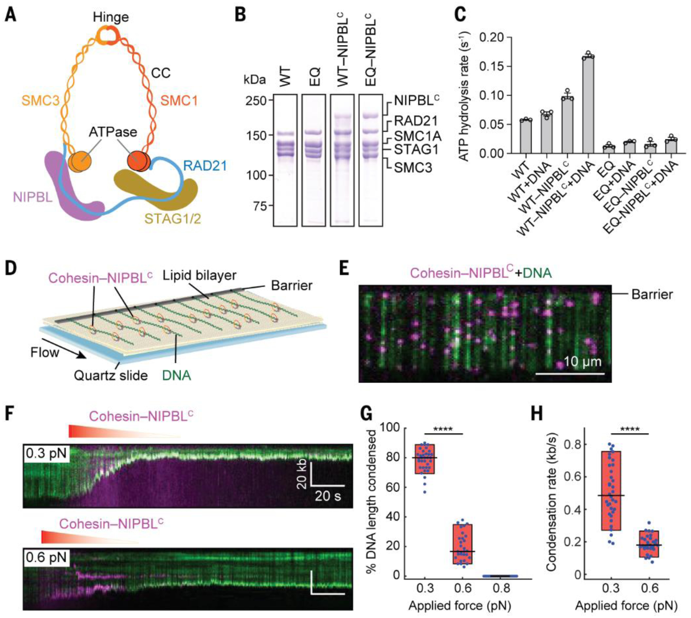
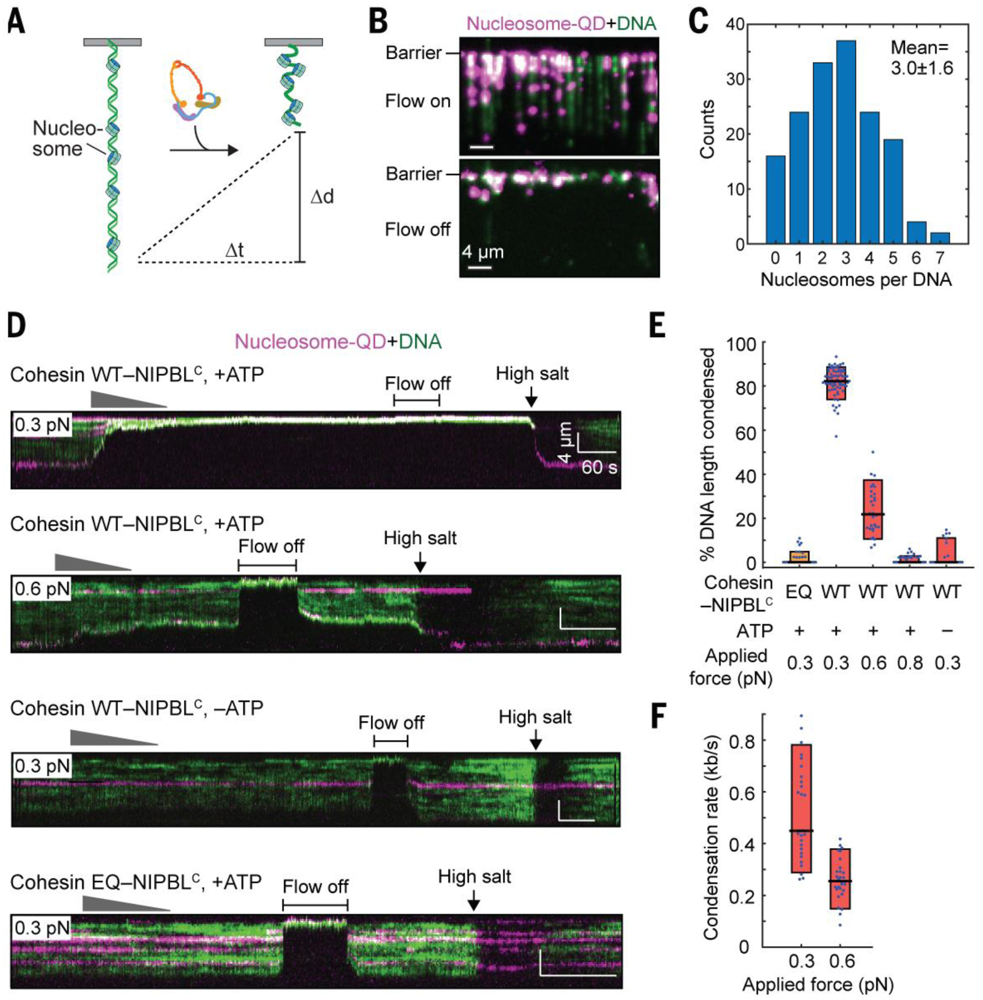
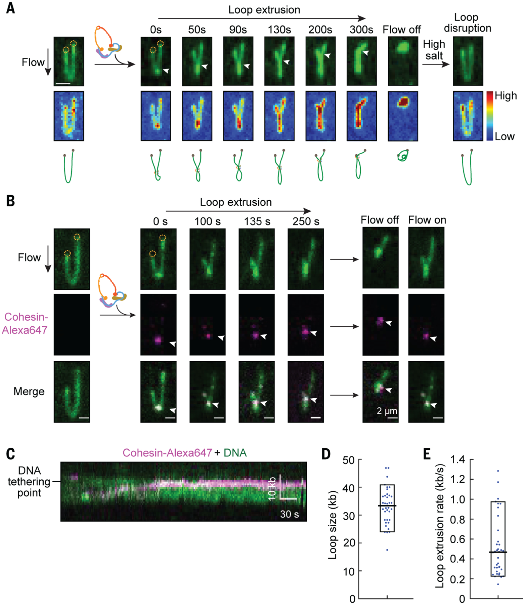
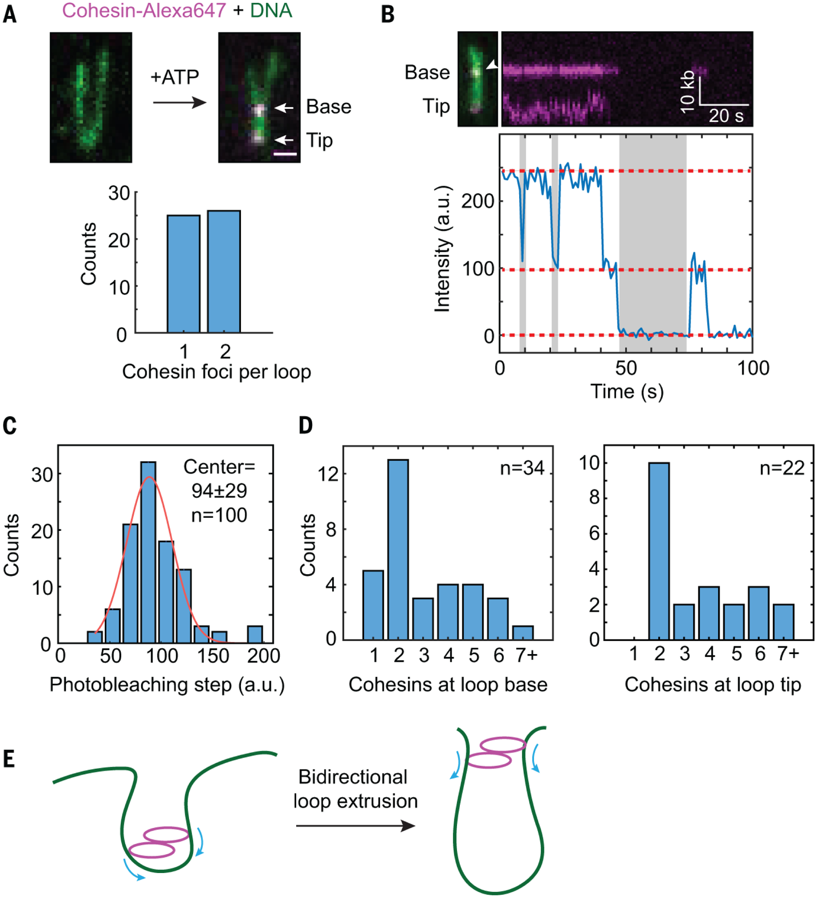

# Human cohesin compacts DNA by loop extrusion

##  Abstract
Cohesin is a chromosome-bound multisubunit ATPase complex. Following its loading onto chromosomes, cohesin generates chromosome loops to regulate chromosome functions. It has been suggested that cohesin organizes the genome via loop extrusion, but direct evidence is lacking. Here, we use single-molecule imaging to show that recombinant human cohesin-NIPBL complex compacts both naked and nucleosome-bound DNA by extruding DNA loops. DNA compaction by cohesin requires ATP hydrolysis, and is force-sensitive. This compaction is processive over tens of kilobases (kb) at an average rate of 0.5 kb per second. Compaction of double-tethered DNA suggests that a cohesin dimer extrudes DNA loops bidirectionally. Our results establish cohesin-NIPBL as an ATP-driven molecular machine capable of loop extrusion.
* * *
The ring-shaped cohesin complex binds chromosomes both topologically and non-topologically and regulates diverse chromosome-based processes, including chromosome segregation, DNA repair, and transcription ([1](https://pmc.ncbi.nlm.nih.gov/articles/PMC7387118/#R1)–[7](https://pmc.ncbi.nlm.nih.gov/articles/PMC7387118/#R7)). Human cohesin consists of the SMC1-SMC3 heterodimeric ATPase, the kleisin subunit RAD21 that links the ATPase heads, and either one of the helical repeat proteins STAG1 or STAG2 ([Fig. 1A](https://pmc.ncbi.nlm.nih.gov/articles/PMC7387118/#F1)). Cohesin is loaded on chromosomes by the NIPBL-MAU2 complex ([8](https://pmc.ncbi.nlm.nih.gov/articles/PMC7387118/#R8)–[10](https://pmc.ncbi.nlm.nih.gov/articles/PMC7387118/#R10)). Mutations of cohesin subunits and NIPBL result in human developmental diseases with multisystem dysfunctions, collectively referred to as cohesinopathy ([9](https://pmc.ncbi.nlm.nih.gov/articles/PMC7387118/#R9), [11](https://pmc.ncbi.nlm.nih.gov/articles/PMC7387118/#R11)), likely due to transcriptional defects caused by cohesin deficiency. High-throughput chromosome conformation capture (Hi-C) experiments suggest that cohesin mediates the formation of chromosome loops and topologically associated domains (TADs) through a process termed loop extrusion ([5](https://pmc.ncbi.nlm.nih.gov/articles/PMC7387118/#R5), [12](https://pmc.ncbi.nlm.nih.gov/articles/PMC7387118/#R12)–[20](https://pmc.ncbi.nlm.nih.gov/articles/PMC7387118/#R20)). Single-molecule studies have demonstrated that the related SMC complex condensin can extrude DNA loops ([21](https://pmc.ncbi.nlm.nih.gov/articles/PMC7387118/#R21), [22](https://pmc.ncbi.nlm.nih.gov/articles/PMC7387118/#R22)). In contrast, cohesin has been reported to slide on DNA through ATP-independent passive diffusion in vitro ([23](https://pmc.ncbi.nlm.nih.gov/articles/PMC7387118/#R23)–[25](https://pmc.ncbi.nlm.nih.gov/articles/PMC7387118/#R25)). Whether cohesin also has intrinsic loop extrusion activity remains an open question. Here, we addressed this question with single-molecule studies using recombinant human cohesin.
## Fig. 1. Human cohesin-NIPBLC compacts linear DNA.

(**A**) Schematic representation of human cohesin-NIPBL. CC, coiled coil. (**B**) Coomassie staining of purified recombinant human cohesin and cohesin-NIPBLC. (**C**) The ATPase activities (Mean ± SEM) of human cohesin and cohesin-NIPBLC (50 nM) in the absence or presence of 500 nM 40-bp dsDNA. (**D**) Illustration of DNA curtains bound by human cohesin-NIPBLC. One end of DNA is tethered to the surface. (**E**) An image of fluorescently labeled cohesin-NIPBLC (magenta) on single-tethered DNA molecules stained with YOYO-1 (green). (**F**) Representative kymographs showing DNA condensation mediated by cohesin-NIPBLC at two applied forces. Red gradient triangle indicates the protein injection time window. The concentration of protein traversing the flowcell was diluted for a few minutes by constant buffer flow. (**G** and **H**) Quantification of the percentage of DNA length condensed (G) and the DNA condensation rate (H). Boxplots indicate the median, 10th, and 90th percentiles of the distribution. _P_ -values are obtained from two-tailed _t_ test: **** _p_ < 0.0001. At least 25 DNA molecules were measured for each condition.
The cohesin loader NIPBL remains bound to cohesin on chromosomes ([26](https://pmc.ncbi.nlm.nih.gov/articles/PMC7387118/#R26), [27](https://pmc.ncbi.nlm.nih.gov/articles/PMC7387118/#R27)), and is required for chromosome looping in cells ([15](https://pmc.ncbi.nlm.nih.gov/articles/PMC7387118/#R15)). We thus expressed and purified the recombinant human cohesin complex alone or bound to the C-terminal region of NIPBL (NIPBLC, residues 1163–2804) in insect cells ([Fig. 1B](https://pmc.ncbi.nlm.nih.gov/articles/PMC7387118/#F1) and [fig. S1A](https://pmc.ncbi.nlm.nih.gov/articles/PMC7387118/#SD1)). Cohesin alone had low basal ATPase activity, and this activity was greatly stimulated by NIPBLC and DNA ([Fig. 1C](https://pmc.ncbi.nlm.nih.gov/articles/PMC7387118/#F1)) ([28](https://pmc.ncbi.nlm.nih.gov/articles/PMC7387118/#R28), [29](https://pmc.ncbi.nlm.nih.gov/articles/PMC7387118/#R29)). The ATPase-deficient cohesin SMC1A-E1157Q/SMC3-E1144Q (EQ) mutant exhibited minimal ATPase activity even in the presence of NIPBLC and DNA. Negative-stain electron microscopy showed that 51% (n=352) of the chemically crosslinked cohesin-NIPBLC complex particles displayed a bent-rod-like conformation with an overall length of ~50 nm ([fig. S1](https://pmc.ncbi.nlm.nih.gov/articles/PMC7387118/#SD1), [B](https://pmc.ncbi.nlm.nih.gov/articles/PMC7387118/#SD1) and [C](https://pmc.ncbi.nlm.nih.gov/articles/PMC7387118/#SD1)), while the rest of the particles had a shorter, thicker rod shape with a length of ~33 nm. These conformations likely represent different forms of cohesin, with SMC1-SMC3 hinge domains partially or fully folded back toward their head domains, as had been previously observed for both human and yeast cohesin ([30](https://pmc.ncbi.nlm.nih.gov/articles/PMC7387118/#R30), [31](https://pmc.ncbi.nlm.nih.gov/articles/PMC7387118/#R31)).
If cohesin can extrude DNA loops, it is expected to compact DNA. To test this possibility, we used total internal reflection fluorescence microscopy to observe aligned arrays of DNA molecules on a lipid bilayer surface in real time ([Fig. 1D](https://pmc.ncbi.nlm.nih.gov/articles/PMC7387118/#F1) and [movie S1](https://pmc.ncbi.nlm.nih.gov/articles/PMC7387118/#SD9)) ([32](https://pmc.ncbi.nlm.nih.gov/articles/PMC7387118/#R32), [33](https://pmc.ncbi.nlm.nih.gov/articles/PMC7387118/#R33)). DNA was stained with the green fluorescent dye, YOYO-1. After incubating the DNA curtains with unlabeled cohesin-NIPBLC in the absence of buffer flow, we observed that all DNA molecules were completely compacted to the barrier in the presence of ATP ([fig. S2](https://pmc.ncbi.nlm.nih.gov/articles/PMC7387118/#SD1)), and this compaction could not be reversed by resuming flow.
We then fluorescently labeled NIPBLC with quantum dots (QDs) to visualize the cohesin-NIPBLC complex. The QD-labeled cohesin-NIPBLC complexes rapidly bound to the DNA array as soon as it entered the flowcell ([Fig. 1E](https://pmc.ncbi.nlm.nih.gov/articles/PMC7387118/#F1)). We observed single QD-tagged complexes, as indicated by intermittent QD photoblinking ([34](https://pmc.ncbi.nlm.nih.gov/articles/PMC7387118/#R34)), but cannot completely rule out QD-tagged cohesion oligomers (see below). Analysis of the initial binding distribution of the cohesin-NIPBLC complexes on the DNA substrate showed preferential loading on AT-rich regions ([fig. S3](https://pmc.ncbi.nlm.nih.gov/articles/PMC7387118/#SD1), [A](https://pmc.ncbi.nlm.nih.gov/articles/PMC7387118/#SD1) and [B](https://pmc.ncbi.nlm.nih.gov/articles/PMC7387118/#SD1)), which was also observed for cohesin alone and for condensin ([21](https://pmc.ncbi.nlm.nih.gov/articles/PMC7387118/#R21), [24](https://pmc.ncbi.nlm.nih.gov/articles/PMC7387118/#R24)). We also measured one-dimensional diffusion activity of the cohesin-NIPBLC complex on double-tethered DNA curtains ([fig. S3](https://pmc.ncbi.nlm.nih.gov/articles/PMC7387118/#SD1), [C](https://pmc.ncbi.nlm.nih.gov/articles/PMC7387118/#SD1) and [D](https://pmc.ncbi.nlm.nih.gov/articles/PMC7387118/#SD1)). The complex was stably bound on DNA for over 5 min and diffused slowly in an ATP-independent manner, with an average diffusion coefficient of 0.02 ± 0.003 μm2 s−1 (mean ± SEM; [fig. S3](https://pmc.ncbi.nlm.nih.gov/articles/PMC7387118/#SD1), [E](https://pmc.ncbi.nlm.nih.gov/articles/PMC7387118/#SD1) and [F](https://pmc.ncbi.nlm.nih.gov/articles/PMC7387118/#SD1)), which is 8-fold lower than that reported for human cohesin topologically bound to DNA ([25](https://pmc.ncbi.nlm.nih.gov/articles/PMC7387118/#R25)). Thus, the cohesin-NIPBLC complex displays very limited diffusion activity on DNA.
After the initial binding of cohesin-NIPBLC complexes to single-tethered DNA, we observed time-dependent, gradual DNA compaction ([Fig. 1F](https://pmc.ncbi.nlm.nih.gov/articles/PMC7387118/#F1) and [movie S2](https://pmc.ncbi.nlm.nih.gov/articles/PMC7387118/#SD8)). We then measured the extent and rate of cohesin-mediated DNA compaction at different applied forces (i.e., flow rates; [Fig. 1](https://pmc.ncbi.nlm.nih.gov/articles/PMC7387118/#F1), [F](https://pmc.ncbi.nlm.nih.gov/articles/PMC7387118/#F1) to [H](https://pmc.ncbi.nlm.nih.gov/articles/PMC7387118/#F1)) ([35](https://pmc.ncbi.nlm.nih.gov/articles/PMC7387118/#R35)). At an initial applied force of 0.3 pN, the DNA was almost completely compacted with an average rate of 0.5 kb s−1. When the initial applied force increased to 0.6 pN, we detected incomplete DNA condensation with a correspondingly slower rate. There was minimal DNA compaction by cohesin-NIPBLC at 0.8 pN of applied force. Although the applied force changes for DNA molecules as they begin compacting, the force-sensitive cohesin translocation is qualitatively similar to condensin-mediated DNA looping ([22](https://pmc.ncbi.nlm.nih.gov/articles/PMC7387118/#R22)). Reducing the salt concentration from 50 mM to 25 mM increased the extent and rate of DNA compaction by cohesin at high flow rates ([fig. S4](https://pmc.ncbi.nlm.nih.gov/articles/PMC7387118/#SD1)), suggesting that stronger cohesin-DNA or cohesin-cohesin interactions (as can occur in a crowded nuclear milieu) can raise the force threshold of compaction.
Cohesin alone (without NIPBLC) with its RAD21 subunit labeled with QD did not bind or compact DNA even in the presence of ATP ([fig. S5A](https://pmc.ncbi.nlm.nih.gov/articles/PMC7387118/#SD1)), indicating a requirement for NIPBL in loading cohesin onto DNA. The slowly hydrolyzable ATP analog, AMP-PNP, could not support efficient DNA compaction ([fig. S5](https://pmc.ncbi.nlm.nih.gov/articles/PMC7387118/#SD1), [A](https://pmc.ncbi.nlm.nih.gov/articles/PMC7387118/#SD1) and [B](https://pmc.ncbi.nlm.nih.gov/articles/PMC7387118/#SD1)). The ATPase-deficient cohesin EQ mutant, which was expected to retain nucleotide-binding activity, was also deficient in DNA compaction even in the presence of NIPBLC and ATP. Thus, cohesin-NIPBLC-dependent DNA compaction requires ATP hydrolysis.
We never detected stepwise DNA condensation events, suggesting that DNA compaction by cohesin-NIPBLC is not mediated through search-and-capture of distant DNA segments. Instead, we observed frequent cohesin-NIPBLC slippage events at 0.3 pN of applied force ([fig. S6](https://pmc.ncbi.nlm.nih.gov/articles/PMC7387118/#SD1)). These observations suggested that cohesin can slide backward on DNA. The rate of the backtracking was similar to that of compaction ([fig. S6C](https://pmc.ncbi.nlm.nih.gov/articles/PMC7387118/#SD1)). The gradual, processive, ATP-dependent DNA compaction by cohesin-NIPBLC with occasional slippage indicated that cohesin is a _bona fide_ molecular motor.
Surprisingly, after DNA was fully compacted by cohesin-NIPBLC at 0.3 pN, increasing the applied force to 0.8 pN did not fully extend the DNA, and the bound cohesin only back-tracked slightly ([fig. S6A](https://pmc.ncbi.nlm.nih.gov/articles/PMC7387118/#SD1)). This suggested that the completion of DNA compaction might lead to the formation of more stable cohesin-DNA assemblies, providing a plausible explanation for the observation that ATP is not required to maintain cohesin-dependent TADs after their formation in cells ([18](https://pmc.ncbi.nlm.nih.gov/articles/PMC7387118/#R18)).
Cohesin can bind DNA by entrapment of DNA inside the lumen of its ring (topological binding) or by physical interaction with DNA that does not involve the opening of its ring (non-topological binding). Topological DNA binding is salt-resistant ([29](https://pmc.ncbi.nlm.nih.gov/articles/PMC7387118/#R29)). Injection of high-salt buffer dislodged the bound cohesin and fully reversed DNA compaction ([fig. S6A](https://pmc.ncbi.nlm.nih.gov/articles/PMC7387118/#SD1) and [movie S3](https://pmc.ncbi.nlm.nih.gov/articles/PMC7387118/#SD7)). Thus, cohesin-NIPBLC that is capable of loop extrusion might not be topologically bound to DNA. Analysis of the fluorescent intensities from DNA and QD-protein complexes indicated that cohesin-mediated DNA compaction preferably occurred at the untethered DNA ends ([figs. S6A](https://pmc.ncbi.nlm.nih.gov/articles/PMC7387118/#SD1) and [S7](https://pmc.ncbi.nlm.nih.gov/articles/PMC7387118/#SD1)). The underlying reason for this preference is unclear but could be due to the ease of formation of seed DNA loops near the ends or flow-induced higher occupancy of cohesin at DNA ends. Regardless, our data indicated that cohesin-NIPBLC is a processive DNA motor that compacts DNA.
DNA is packaged into chromatin in the nucleus. We next tested whether cohesin-NIPBLC could compact nucleosome-bound DNA ([Fig. 2A](https://pmc.ncbi.nlm.nih.gov/articles/PMC7387118/#F2)). We incorporated 1–6 QD-labeled human nucleosomes on each DNA substrate via salt dialysis ([Fig. 2](https://pmc.ncbi.nlm.nih.gov/articles/PMC7387118/#F2), [B](https://pmc.ncbi.nlm.nih.gov/articles/PMC7387118/#F2) and [C](https://pmc.ncbi.nlm.nih.gov/articles/PMC7387118/#F2)), and visualized the nucleosome-bound DNA substrate upon injection of unlabeled cohesin-NIPBLC at multiple applied forces ([Fig. 2D](https://pmc.ncbi.nlm.nih.gov/articles/PMC7387118/#F2)). The extent of nucleosome-DNA compaction was about 80% ([Fig. 2E](https://pmc.ncbi.nlm.nih.gov/articles/PMC7387118/#F2)), and the average rate of the compaction was 0.5 kb s−1 ([Fig. 2F](https://pmc.ncbi.nlm.nih.gov/articles/PMC7387118/#F2)). Compaction of nucleosome-bound DNA was also force-sensitive and dependent on ATP hydrolysis ([Fig. 2](https://pmc.ncbi.nlm.nih.gov/articles/PMC7387118/#F2), [D](https://pmc.ncbi.nlm.nih.gov/articles/PMC7387118/#F2) to [F](https://pmc.ncbi.nlm.nih.gov/articles/PMC7387118/#F2)). Thus, cohesin-NIPBLC compacts nucleosome-bound DNA with properties similar to those of naked DNA. Nucleosomes impede the movement of topologically loaded cohesin ([23](https://pmc.ncbi.nlm.nih.gov/articles/PMC7387118/#R23), [24](https://pmc.ncbi.nlm.nih.gov/articles/PMC7387118/#R24)). Our finding that cohesin-NIPBLC compacts naked and nucleosome-bound DNA with similar rates again suggested that the loop-extruding cohesin might not be topologically loaded. Furthermore, high-salt washout of cohesin revealed that nucleosomes themselves were not repositioned during cohesin-dependent compaction ([Fig. 2D](https://pmc.ncbi.nlm.nih.gov/articles/PMC7387118/#F2)). These data suggested that cohesin can act on chromatin without having to displace or slide nucleosomes.
## Fig. 2. Cohesin-NIPBLC compacts nucleosomal DNA.

(**A**) An illustration of nucleosomal DNA compaction by cohesin-NIPBLC. (**B**) An image of QD-labeled nucleosomes deposited on single-tethered DNA curtain with or without flow. (**C**) Distribution of the number of nucleosomes per DNA (Mean ± SD). (**D**) Representative kymographs of the compaction of nucleosome-bound DNA by WT or EQ cohesin-NIPBLC at different applied forces with or without ATP. (**E**) Percentage of the length of nucleosome-bound DNA condensed in (D). (**F**) Compaction rate of nucleosome-bound DNA by cohesin-NIPBLC. At least 25 DNA molecules were measured for each condition in (E) and (F).
To directly visualize loop extrusion by cohesin, we prepared ‘U’-shaped DNA by tethering both DNA ends to the surface and monitored the looping events in real time ([movie S4](https://pmc.ncbi.nlm.nih.gov/articles/PMC7387118/#SD10)). A small loop formed immediately after cohesin-NIPBLC injection, and gradually elongated until the motor stalled or one side of the loop reached either DNA-tethering point ([Fig. 3A](https://pmc.ncbi.nlm.nih.gov/articles/PMC7387118/#F3), [fig. S8A](https://pmc.ncbi.nlm.nih.gov/articles/PMC7387118/#SD1), and [movies S5](https://pmc.ncbi.nlm.nih.gov/articles/PMC7387118/#SD6) to [S7](https://pmc.ncbi.nlm.nih.gov/articles/PMC7387118/#SD3)). Both arms of the ‘U’-shaped DNA were shortened during the process. These results are consistent with cohesin-NIPBLC extruding DNA loops bidirectionally, as unidirectional asymmetric loop extrusion is expected to shorten only one arm of the ‘U’-shaped DNA. The loop was stably maintained for a few minutes, and injection of a high-salt buffer quickly restored the DNA to its original ‘U’-shape ([movie S8](https://pmc.ncbi.nlm.nih.gov/articles/PMC7387118/#SD2)). As expected, we did not detect any looping activity in the absence of ATP or with the cohesin EQ mutant.
## Fig. 3. Real-time visualization of loop extrusion by cohesin-NIPBLC.

(**A**) A time-course showing DNA loop extrusion by cohesin-NIPBLC on YOYO-1 stained ‘U’-shaped DNA (top). Scale bar, 2 μm. Both DNA ends (dashed circle) are tethered to the surface and the extruding loop is extended at 0.1 ml/min buffer flow. Upon cohesin-NIPBLC injection, a small loop appeared at the tip of the DNA and elongated until the base of the loop (arrow) reaches one tethering point. A brief shutoff of flow retracted DNA completely, indicating DNA was not stuck to the surface. Injection of a high-salt buffer (500 mM NaCI) disrupted the loop. The scaled colormap (middle panel) shows that the DNA intensity matches the growing loop. The schematic drawing (bottom panel) depicts a model of loop extrusion. (**B**) Time-course montage of loop extrusion showing the localization of labeled cohesin-NIPBLC (indicated by white arrowheads) at the base of the DNA loop. Turning the flow on and off showed that the cohesin-NIPBLC complex moved with the DNA, confirming that it was indeed bound to the DNA loop. (**C**) A representative kymograph showing the movement of a labeled cohesin-NIPBLC complex toward the DNA-tethering points. (**D** and **E**) Quantification of the loop size (D) and the rate of loop extrusion (E) by Alexa647-labeled cohesin-NIPBLC.
To visualize cohesin-NIPBLC at the base of the loop, we directly labeled cohesin-NIPBLC containing SNAPf-tagged STAG1 with Alexa Fluro 647 dye (Alexa647). Alexa647-labeled cohesin completely compacted DNA with a similar rate as the unlabeled complex ([fig. S8B](https://pmc.ncbi.nlm.nih.gov/articles/PMC7387118/#SD1)). Cohesin-NIPBLC bound at the base of the extruding loop ([Fig. 3B](https://pmc.ncbi.nlm.nih.gov/articles/PMC7387118/#F3), [fig. S8C](https://pmc.ncbi.nlm.nih.gov/articles/PMC7387118/#SD1), and [movie S9](https://pmc.ncbi.nlm.nih.gov/articles/PMC7387118/#SD4)). Consistent with symmetric, bidirectional loop extrusion, cohesin-NIPBLC moved toward DNA-tethering points during the process ([Fig. 3C](https://pmc.ncbi.nlm.nih.gov/articles/PMC7387118/#F3)). The average size of extruded loops was 33 kb, and the mean rate of loop extrusion was 0.5 kb s−1 ([Fig. 3](https://pmc.ncbi.nlm.nih.gov/articles/PMC7387118/#F3), [D](https://pmc.ncbi.nlm.nih.gov/articles/PMC7387118/#F3) and [E](https://pmc.ncbi.nlm.nih.gov/articles/PMC7387118/#F3)).
A single condensin complex can extrude DNA loops asymmetrically and in one direction ([22](https://pmc.ncbi.nlm.nih.gov/articles/PMC7387118/#R22)). A single cohesin complex might be able to perform symmetric loop extrusion. Alternatively, two cohesin complexes might act in concert to extrude loops in both directions. To determine how many cohesin molecules perform loop extrusion, we analyzed photobleaching steps of Alexa647-labeled cohesin-NIPBLC on DNA loops. On about 50% of DNA loops, we observed two fluorescent foci, with one each at the loop base and tip ([Fig. 4A](https://pmc.ncbi.nlm.nih.gov/articles/PMC7387118/#F4)). The number of photobleaching steps of both Alexa647-cohesin foci peaked at 2 ([Fig. 4](https://pmc.ncbi.nlm.nih.gov/articles/PMC7387118/#F4), [B](https://pmc.ncbi.nlm.nih.gov/articles/PMC7387118/#F4) to [D](https://pmc.ncbi.nlm.nih.gov/articles/PMC7387118/#F4)). Cohesin foci on DNA that did not form loops had no discrete peaks for the number of photobleaching steps ([Fig. 4D](https://pmc.ncbi.nlm.nih.gov/articles/PMC7387118/#F4)). Thus, the loop-extruding complexes most frequently contained two cohesin molecules. These data suggested that a cohesin-NIPBLC dimer might be the minimal functional unit for loop extrusion.
## Fig. 4. Cohesin-NIPBLC dimers promote loop extrusion.

(**A**) Top panel, a representative image of Alexa647-labeled cohesin-NIPBLC complexes bound to both the base and the tip of a DNA loop. Bottom panel, the number of Alexa647-cohesin foci on each DNA loop (_n_ =51 DNA molecules). (**B**) A representative two-step photobleaching trace of cohesin at the loop base was plotted, with the corresponding DNA loop image and its kymograph shown above the trace. Dashed red line: photobleaching steps; gray: intermittent blinking indicating single fluors. (**C**) The intensity distribution of single photobleaching steps of Alexa647-cohesin at the DNA loop was fit to a Gaussian distribution (red line). (**D**) The distribution of the number of cohesin-NIPBLC molecules at the DNA loop base (left panel) and at the loop tip (right panel). (**E**) Model for bidirectional loop extrusion by a cohesin-NIPBLC dimer.
Collectively, our results supported a model in which a cohesin-NIPBLC dimer extrudes DNA loops symmetrically in both directions ([Fig. 4E](https://pmc.ncbi.nlm.nih.gov/articles/PMC7387118/#F4)). Bidirectional loop extrusion by a cohesin dimer also explains the observed and simulated Hi-C maps of chromosome loops ([5](https://pmc.ncbi.nlm.nih.gov/articles/PMC7387118/#R5), [19](https://pmc.ncbi.nlm.nih.gov/articles/PMC7387118/#R19)). We observed loop extrusion by recombinant human cohesin-NIPBLC at relatively low applied forces and low salt concentrations. We anticipate that cellular crowding, MAU2, the N-terminal region of NIPBL, and other cohesin interactors further stabilize cohesin on DNA and enhance its intrinsic loop extrusion activity in cells.
High-salt buffer dislodged loop-extruding cohesin from DNA. Cohesin-NIPBLC bound to DNA at low salt exhibited diffusion kinetics much slower than those of topologically loaded cohesin. Finally, nucleosomes do not hinder cohesin-mediated DNA compaction. These findings suggested that cohesin mediates loop extrusion through non-topological or pseudo-topological interactions with DNA.

##  ACKNOWLEDGMENTS
We thank Zhuqing Ouyang and Sotaro Kikuchi for their initial biochemical characterization of cohesin and its loader complex, and the staff of the Electron Microscopy Core Facility at University of Texas Southwestern Medical Center for technical support.
Funding:
This study was supported by the Howard Hughes Medical Institute, the National Institutes of Health (GM120554 to I.J.F. and GM124096 to H.Y.), Cancer Prevention and Research Institute of Texas (RP160667-P2 to H.Y.), and the Welch Foundation (F-1808 to I.J.F. and 1-1441 to H.Y.). I.J.F. is a CPRIT Scholar in Cancer Research.

##  REFERENCES AND NOTES
  * 1.Haarhuis JH, Elbatsh AM, Rowland BD, Cohesin and its regulation: On the logic of X-shaped chromosomes. Dev. Cell 31, 7–18 (2014). doi: 10.1016/j.devcel.2014.09.010 Medline [[DOI](https://doi.org/10.1016/j.devcel.2014.09.010)] [[PubMed](https://pubmed.ncbi.nlm.nih.gov/25313959/)] [[Google Scholar](https://scholar.google.com/scholar_lookup?journal=Dev.%20Cell&title=Cohesin%20and%20its%20regulation:%20On%20the%20logic%20of%20X-shaped%20chromosomes&author=JH%20Haarhuis&author=AM%20Elbatsh&author=BD%20Rowland&volume=31&publication_year=2014&pages=7-18&pmid=25313959&doi=10.1016/j.devcel.2014.09.010&)]
  * 2.Morales C, Losada A, Establishing and dissolving cohesion during the vertebrate cell cycle. Curr. Opin. Cell Biol 52, 51–57 (2018). doi: 10.1016/j.ceb.2018.01.010 Medline [[DOI](https://doi.org/10.1016/j.ceb.2018.01.010)] [[PubMed](https://pubmed.ncbi.nlm.nih.gov/29433064/)] [[Google Scholar](https://scholar.google.com/scholar_lookup?journal=Curr.%20Opin.%20Cell%20Biol&title=Establishing%20and%20dissolving%20cohesion%20during%20the%20vertebrate%20cell%20cycle&author=C%20Morales&author=A%20Losada&volume=52&publication_year=2018&pages=51-57&pmid=29433064&doi=10.1016/j.ceb.2018.01.010&)]
  * 3.Uhlmann F, SMC complexes: From DNA to chromosomes. Nat. Rev. Mol. Cell Biol 17,399–412 (2016). doi: 10.1038/nrm.2016.30 Medline [[DOI](https://doi.org/10.1038/nrm.2016.30)] [[PubMed](https://pubmed.ncbi.nlm.nih.gov/27075410/)] [[Google Scholar](https://scholar.google.com/scholar_lookup?journal=Nat.%20Rev.%20Mol.%20Cell%20Biol&title=SMC%20complexes:%20From%20DNA%20to%20chromosomes&author=F%20Uhlmann&volume=17&publication_year=2016&pages=399-412&pmid=27075410&doi=10.1038/nrm.2016.30&)]
  * 4.Zheng G, Yu H, Regulation of sister chromatid cohesion during the mitotic cell cycle. Sci. China Life Sci 58,1089–1098 (2015). doi: 10.1007/s11427-015-4956-7 Medline [[DOI](https://doi.org/10.1007/s11427-015-4956-7)] [[PubMed](https://pubmed.ncbi.nlm.nih.gov/26511516/)] [[Google Scholar](https://scholar.google.com/scholar_lookup?journal=Sci.%20China%20Life%20Sci&title=Regulation%20of%20sister%20chromatid%20cohesion%20during%20the%20mitotic%20cell%20cycle&author=G%20Zheng&author=H%20Yu&volume=58&publication_year=2015&pages=1089-1098&pmid=26511516&doi=10.1007/s11427-015-4956-7&)]
  * 5.Sedeño Cacciatore Á, Rowland BD, Loop formation by SMC complexes: Turning heads, bending elbows, and fixed anchors. Curr. Opin. Genet. Dev 55, 11–18 (2019). doi: 10.1016/j.gde.2019.04.010 Medline [[DOI](https://doi.org/10.1016/j.gde.2019.04.010)] [[PubMed](https://pubmed.ncbi.nlm.nih.gov/31108424/)] [[Google Scholar](https://scholar.google.com/scholar_lookup?journal=Curr.%20Opin.%20Genet.%20Dev&title=Loop%20formation%20by%20SMC%20complexes:%20Turning%20heads,%20bending%20elbows,%20and%20fixed%20anchors&author=%C3%81%20Sede%C3%B1o%20Cacciatore&author=BD%20Rowland&volume=55&publication_year=2019&pages=11-18&pmid=31108424&doi=10.1016/j.gde.2019.04.010&)]
  * 6.Peters JM, Tedeschi A, Schmitz J, The cohesin complex and its roles in chromosome biology. Genes Dev. 22, 3089–3114 (2008). doi: 10.1101/gad.1724308 Medline [[DOI](https://doi.org/10.1101/gad.1724308)] [[PubMed](https://pubmed.ncbi.nlm.nih.gov/19056890/)] [[Google Scholar](https://scholar.google.com/scholar_lookup?journal=Genes%20Dev&title=The%20cohesin%20complex%20and%20its%20roles%20in%20chromosome%20biology&author=JM%20Peters&author=A%20Tedeschi&author=J%20Schmitz&volume=22&publication_year=2008&pages=3089-3114&pmid=19056890&doi=10.1101/gad.1724308&)]
  * 7.Nasmyth K, Haering CH, Cohesin: Its roles and mechanisms. Annu. Rev. Genet 43, 525–558 (2009). doi: 10.1146/annurev-genet-102108-134233 Medline [[DOI](https://doi.org/10.1146/annurev-genet-102108-134233)] [[PubMed](https://pubmed.ncbi.nlm.nih.gov/19886810/)] [[Google Scholar](https://scholar.google.com/scholar_lookup?journal=Annu.%20Rev.%20Genet&title=Cohesin:%20Its%20roles%20and%20mechanisms&author=K%20Nasmyth&author=CH%20Haering&volume=43&publication_year=2009&pages=525-558&pmid=19886810&doi=10.1146/annurev-genet-102108-134233&)]
  * 8.Ciosk R, Shirayama M, Shevchenko A, Tanaka T, Toth A, Shevchenko A, Nasmyth K, Cohesin’s binding to chromosomes depends on a separate complex consisting of Scc2 and Scc4 proteins. Mol. Cell 5, 243–254 (2000). doi: 10.1016/S1097-2765(00)80420-7 Medline [[DOI](https://doi.org/10.1016/S1097-2765\(00\)80420-7)] [[PubMed](https://pubmed.ncbi.nlm.nih.gov/10882066/)] [[Google Scholar](https://scholar.google.com/scholar_lookup?journal=Mol.%20Cell&title=Cohesin%E2%80%99s%20binding%20to%20chromosomes%20depends%20on%20a%20separate%20complex%20consisting%20of%20Scc2%20and%20Scc4%20proteins&author=R%20Ciosk&author=M%20Shirayama&author=A%20Shevchenko&author=T%20Tanaka&author=A%20Toth&volume=5&publication_year=2000&pages=243-254&pmid=10882066&doi=10.1016/S1097-2765\(00\)80420-7&)]
  * 9.Tonkin ET, Wang TJ, Lisgo S, Bamshad MJ, Strachan T, NIPBL, encoding a homolog of fungal Scc2-type sister chromatid cohesion proteins and fly Nipped-B, is mutated in Cornelia de Lange syndrome. Nat. Genet 36, 636–641 (2004). doi: 10.1038/ng1363 Medline [[DOI](https://doi.org/10.1038/ng1363)] [[PubMed](https://pubmed.ncbi.nlm.nih.gov/15146185/)] [[Google Scholar](https://scholar.google.com/scholar_lookup?journal=Nat.%20Genet&title=NIPBL,%20encoding%20a%20homolog%20of%20fungal%20Scc2-type%20sister%20chromatid%20cohesion%20proteins%20and%20fly%20Nipped-B,%20is%20mutated%20in%20Cornelia%20de%20Lange%20syndrome&author=ET%20Tonkin&author=TJ%20Wang&author=S%20Lisgo&author=MJ%20Bamshad&author=T%20Strachan&volume=36&publication_year=2004&pages=636-641&pmid=15146185&doi=10.1038/ng1363&)]
  * 10.Watrin E, Schleiffer A, Tanaka K, Eisenhaber F, Nasmyth K, Peters J-M, Human Scc4 is required for cohesin binding to chromatin, sister-chromatid cohesion, and mitotic progression. Curr. Biol 16, 863–874 (2006). doi: 10.1016/j.cub.2006.03.049 Medline [[DOI](https://doi.org/10.1016/j.cub.2006.03.049)] [[PubMed](https://pubmed.ncbi.nlm.nih.gov/16682347/)] [[Google Scholar](https://scholar.google.com/scholar_lookup?journal=Curr.%20Biol&title=Human%20Scc4%20is%20required%20for%20cohesin%20binding%20to%20chromatin,%20sister-chromatid%20cohesion,%20and%20mitotic%20progression&author=E%20Watrin&author=A%20Schleiffer&author=K%20Tanaka&author=F%20Eisenhaber&author=K%20Nasmyth&volume=16&publication_year=2006&pages=863-874&pmid=16682347&doi=10.1016/j.cub.2006.03.049&)]
  * 11.Bose T, Gerton JL, Cohesinopathies, gene expression, and chromatin organization. J. Cell Biol 189, 201–210 (2010). doi: 10.1083/jcb.200912129 Medline [[DOI](https://doi.org/10.1083/jcb.200912129)] [[PMC free article](https://pmc.ncbi.nlm.nih.gov/articles/PMC2856913/)] [[PubMed](https://pubmed.ncbi.nlm.nih.gov/20404106/)] [[Google Scholar](https://scholar.google.com/scholar_lookup?journal=J.%20Cell%20Biol&title=Cohesinopathies,%20gene%20expression,%20and%20chromatin%20organization&author=T%20Bose&author=JL%20Gerton&volume=189&publication_year=2010&pages=201-210&pmid=20404106&doi=10.1083/jcb.200912129&)]
  * 12.Nasmyth K, Disseminating the genome: Joining, resolving, and separating sister chromatids during mitosis and meiosis. Annu. Rev. Genet 35, 673–745 (2001). doi: 10.1146/annurev.genet.35.102401.091334 Medline [[DOI](https://doi.org/10.1146/annurev.genet.35.102401.091334)] [[PubMed](https://pubmed.ncbi.nlm.nih.gov/11700297/)] [[Google Scholar](https://scholar.google.com/scholar_lookup?journal=Annu.%20Rev.%20Genet&title=Disseminating%20the%20genome:%20Joining,%20resolving,%20and%20separating%20sister%20chromatids%20during%20mitosis%20and%20meiosis&author=K%20Nasmyth&volume=35&publication_year=2001&pages=673-745&pmid=11700297&doi=10.1146/annurev.genet.35.102401.091334&)]
  * 13.Alipour E, Marko JF, Self-organization of domain sturctures by DNA-loop-extruding enzymes. Nucleic Acids Res. 40, 11202–11212 (2012). doi: 10.1093/nar/gks925 Medline [[DOI](https://doi.org/10.1093/nar/gks925)] [[PMC free article](https://pmc.ncbi.nlm.nih.gov/articles/PMC3526278/)] [[PubMed](https://pubmed.ncbi.nlm.nih.gov/23074191/)] [[Google Scholar](https://scholar.google.com/scholar_lookup?journal=Nucleic%20Acids%20Res&title=Self-organization%20of%20domain%20sturctures%20by%20DNA-loop-extruding%20enzymes&author=E%20Alipour&author=JF%20Marko&volume=40&publication_year=2012&pages=11202-11212&pmid=23074191&doi=10.1093/nar/gks925&)]
  * 14.Gassler J, Brandão HB, Imakaev M, Flyamer IM, Ladstätter S, Bickmore WA, Peters J-M, Mirny LA, Tachibana K, A mechanism of cohesin-dependent loop extrusion organizes zygotic genome architecture. EMBO J. 36, 3600–3618 . rioi: 10.15252/embj.201798083 Medline [[DOI](https://doi.org/10.15252/embj.201798083)] [[PMC free article](https://pmc.ncbi.nlm.nih.gov/articles/PMC5730859/)] [[PubMed](https://pubmed.ncbi.nlm.nih.gov/29217590/)] [[Google Scholar](https://scholar.google.com/scholar_lookup?journal=EMBO%20J&title=A%20mechanism%20of%20cohesin-dependent%20loop%20extrusion%20organizes%20zygotic%20genome%20architecture&author=J%20Gassler&author=HB%20Brand%C3%A3o&author=M%20Imakaev&author=IM%20Flyamer&author=S%20Ladst%C3%A4tter&volume=36&pages=3600-3618&pmid=29217590&doi=10.15252/embj.201798083&)]
  * 15.Haarhuis JHI, van der Weide RH, Blomen VA, Yáñez-Cuna JO, Amendola M, van Ruiten MS, Krijger PHL, Teunissen H, Medema RH, van Steensel B, Brummelkamp TR, de Wit E, Rowland BD, The cohesin release factor WAPL restricts chromatin loop extension. Cell 169, 693–707.e14 (2017). doi: 10.1016/j.cell.2017.04.013 Medline [[DOI](https://doi.org/10.1016/j.cell.2017.04.013)] [[PMC free article](https://pmc.ncbi.nlm.nih.gov/articles/PMC5422210/)] [[PubMed](https://pubmed.ncbi.nlm.nih.gov/28475897/)] [[Google Scholar](https://scholar.google.com/scholar_lookup?journal=Cell&title=The%20cohesin%20release%20factor%20WAPL%20restricts%20chromatin%20loop%20extension&author=JHI%20Haarhuis&author=RH%20van%20der%20Weide&author=VA%20Blomen&author=JO%20Y%C3%A1%C3%B1ez-Cuna&author=M%20Amendola&volume=169&publication_year=2017&pages=693-707.e14&pmid=28475897&doi=10.1016/j.cell.2017.04.013&)]
  * 16.Rao SSP, Huang S-C, Glenn St Hilaire B, Engreitz JM, Prerz EM, Kieffer-Kwon K-R, Sanborn AL, Johnstone SE, Bascom GD, Bochkov ID, Huang X, Shamim MS, Shin J, Turner D, Ye Z, Omer AD, Robinson JT, Schlick T, Bernstein BE, Casellas R, Lander ES, Aiden EL, Cohesin loss eliminates all loop domains. Cell 171, 305–320.e24(2017). doi: 10.1016/j.cell.2017.09.026 Medline [[DOI](https://doi.org/10.1016/j.cell.2017.09.026)] [[PMC free article](https://pmc.ncbi.nlm.nih.gov/articles/PMC5846482/)] [[PubMed](https://pubmed.ncbi.nlm.nih.gov/28985562/)] [[Google Scholar](https://scholar.google.com/scholar_lookup?journal=Cell&title=Cohesin%20loss%20eliminates%20all%20loop%20domains&author=SSP%20Rao&author=S-C%20Huang&author=B%20Glenn%20St%20Hilaire&author=JM%20Engreitz&author=EM%20Prerz&volume=171&publication_year=2017&pages=305-320.e24&pmid=28985562&doi=10.1016/j.cell.2017.09.026&)]
  * 17.Wutz G, Várnai C, Nagasaka K, Cisneros DA, Stocsits RR, Tang W, Schoenfelder S, Jessberger G, Muhar M, Hossain MJ, Walther N, Koch B, Kueblbeck M, Ellenberg J, Zuber J, Fraser P, Peters J-M, Topologically associating domains and chromatin loops depend on cohesin and are regulated by CTCF, WAPL, and PDS5 proteins. EMBO J. 36, 3573–3599 (2017). doi: 10.15252/embj.201798004 Medline [[DOI](https://doi.org/10.15252/embj.201798004)] [[PMC free article](https://pmc.ncbi.nlm.nih.gov/articles/PMC5730888/)] [[PubMed](https://pubmed.ncbi.nlm.nih.gov/29217591/)] [[Google Scholar](https://scholar.google.com/scholar_lookup?journal=EMBO%20J&title=Topologically%20associating%20domains%20and%20chromatin%20loops%20depend%20on%20cohesin%20and%20are%20regulated%20by%20CTCF,%20WAPL,%20and%20PDS5%20proteins&author=G%20Wutz&author=C%20V%C3%A1rnai&author=K%20Nagasaka&author=DA%20Cisneros&author=RR%20Stocsits&volume=36&publication_year=2017&pages=3573-3599&pmid=29217591&doi=10.15252/embj.201798004&)]
  * 18.Vian L, Pękowska A, Rao SSP, Kieffer-Kwon K-R, Jung S, Baranello L, Huang S-C, El Khattabi L, Dose M, Pruett N, Sanborn AL, Canela A, Maman Y, Oksanen A, Resch W, Li X, Lee B, Kovalchuk AL, Tang Z, Nelson S, Di Pierro M, Cheng RR, Machol I, St Hilaire BG, Durand NC, Shamim MS, Stamenova EK, Onuchic JN, Ruan Y, Nussenzweig A, Levens D, Aiden EL, Casellas R, The energetics and physiological impact of cohesin extrusion. Cell 173, 1165–1178.e20 (2018). doi: 10.1016/j.cell.2018.03.072 Medline [[DOI](https://doi.org/10.1016/j.cell.2018.03.072)] [[PMC free article](https://pmc.ncbi.nlm.nih.gov/articles/PMC6065110/)] [[PubMed](https://pubmed.ncbi.nlm.nih.gov/29706548/)] [[Google Scholar](https://scholar.google.com/scholar_lookup?journal=Cell&title=The%20energetics%20and%20physiological%20impact%20of%20cohesin%20extrusion&author=L%20Vian&author=A%20P%C4%99kowska&author=SSP%20Rao&author=K-R%20Kieffer-Kwon&author=S%20Jung&volume=173&publication_year=2018&pages=1165-1178.e20&pmid=29706548&doi=10.1016/j.cell.2018.03.072&)]
  * 19.Fudenberg G, Imakaev M, Lu C, Goloborodko A, Abdennur N, Mirny LA, Formation of chromosomal domains by loop extrusion. Cell Rep. 15, 2038–2049 (2016). doi: 10.1016/j.celrep.2016.04.085 Medline [[DOI](https://doi.org/10.1016/j.celrep.2016.04.085)] [[PMC free article](https://pmc.ncbi.nlm.nih.gov/articles/PMC4889513/)] [[PubMed](https://pubmed.ncbi.nlm.nih.gov/27210764/)] [[Google Scholar](https://scholar.google.com/scholar_lookup?journal=Cell%20Rep&title=Formation%20of%20chromosomal%20domains%20by%20loop%20extrusion&author=G%20Fudenberg&author=M%20Imakaev&author=C%20Lu&author=A%20Goloborodko&author=N%20Abdennur&volume=15&publication_year=2016&pages=2038-2049&pmid=27210764&doi=10.1016/j.celrep.2016.04.085&)]
  * 20.Tedeschi A, Wutz G, Huet S, Jaritz M, Wuensche A, Schirghuber E, Davidson IF, Tang W, Cisneros DA, Bhaskara V, Nishiyama T, Vaziri A, Wutz A, Ellenberg J, Peters J-M, Wapl is an essential regulator of chromatin structure and chromosome segregation. Nature 501, 564–568 (2013). doi: 10.1038/nature12471 Medline [[DOI](https://doi.org/10.1038/nature12471)] [[PMC free article](https://pmc.ncbi.nlm.nih.gov/articles/PMC6080692/)] [[PubMed](https://pubmed.ncbi.nlm.nih.gov/23975099/)] [[Google Scholar](https://scholar.google.com/scholar_lookup?journal=Nature&title=Wapl%20is%20an%20essential%20regulator%20of%20chromatin%20structure%20and%20chromosome%20segregation&author=A%20Tedeschi&author=G%20Wutz&author=S%20Huet&author=M%20Jaritz&author=A%20Wuensche&volume=501&publication_year=2013&pages=564-568&pmid=23975099&doi=10.1038/nature12471&)]
  * 21.Terakawa T, Bisht S, Eeftens JM, Dekker C, Haering CH, Greene EC, The condensin complex is a mechanochemical motor that translocates along DNA. Science 358, 672–676 (2017). doi: 10.1126/science.aan6516 Medline [[DOI](https://doi.org/10.1126/science.aan6516)] [[PMC free article](https://pmc.ncbi.nlm.nih.gov/articles/PMC5862036/)] [[PubMed](https://pubmed.ncbi.nlm.nih.gov/28882993/)] [[Google Scholar](https://scholar.google.com/scholar_lookup?journal=Science&title=The%20condensin%20complex%20is%20a%20mechanochemical%20motor%20that%20translocates%20along%20DNA&author=T%20Terakawa&author=S%20Bisht&author=JM%20Eeftens&author=C%20Dekker&author=CH%20Haering&volume=358&publication_year=2017&pages=672-676&pmid=28882993&doi=10.1126/science.aan6516&)]
  * 22.Ganji M, Shaltiel IA, Bisht S, Kim E, Kalichava A, Haering CH, Dekker C, Real-time imaging of DNA loop extrusion by condensin. Science 360,102–105 (2018). doi: 10.1126/science.aar7831 Medline [[DOI](https://doi.org/10.1126/science.aar7831)] [[PMC free article](https://pmc.ncbi.nlm.nih.gov/articles/PMC6329450/)] [[PubMed](https://pubmed.ncbi.nlm.nih.gov/29472443/)] [[Google Scholar](https://scholar.google.com/scholar_lookup?journal=Science&title=Real-time%20imaging%20of%20DNA%20loop%20extrusion%20by%20condensin&author=M%20Ganji&author=IA%20Shaltiel&author=S%20Bisht&author=E%20Kim&author=A%20Kalichava&volume=360&publication_year=2018&pages=102-105&pmid=29472443&doi=10.1126/science.aar7831&)]
  * 23.Davidson IF, Goetz D, Zaczek MP, Molodtsov MI, Huis In ‘t Veld PJ, Weissmann F, Litos G, Cisneros DA, Ocampo-Hafalla M, Ladurner R, Uhlmann F, Vaziri A, Peters J-M, Rapid movement and transcriptional re-localization of human cohesin on DNA. EMBO J. 35, 2671–2685 (2016). doi: 10.15252/embj.201695402 Medline [[DOI](https://doi.org/10.15252/embj.201695402)] [[PMC free article](https://pmc.ncbi.nlm.nih.gov/articles/PMC5167347/)] [[PubMed](https://pubmed.ncbi.nlm.nih.gov/27799150/)] [[Google Scholar](https://scholar.google.com/scholar_lookup?journal=EMBO%20J&title=Rapid%20movement%20and%20transcriptional%20re-localization%20of%20human%20cohesin%20on%20DNA&author=IF%20Davidson&author=D%20Goetz&author=MP%20Zaczek&author=MI%20Molodtsov&author=PJ%20Huis%20In%20%E2%80%98t%20Veld&volume=35&publication_year=2016&pages=2671-2685&pmid=27799150&doi=10.15252/embj.201695402&)]
  * 24.Stigler J, Çamdere GO, Koshland DE, Greene EC, Single-molecule imaging reveals a collapsed conformational state for DNA-bound cohesin. Cell Rep. 15, 988–998 (2016). doi: 10.1016/j.celrep.2016.04.003 Medline [[DOI](https://doi.org/10.1016/j.celrep.2016.04.003)] [[PMC free article](https://pmc.ncbi.nlm.nih.gov/articles/PMC4856582/)] [[PubMed](https://pubmed.ncbi.nlm.nih.gov/27117417/)] [[Google Scholar](https://scholar.google.com/scholar_lookup?journal=Cell%20Rep&title=Single-molecule%20imaging%20reveals%20a%20collapsed%20conformational%20state%20for%20DNA-bound%20cohesin&author=J%20Stigler&author=GO%20%C3%87amdere&author=DE%20Koshland&author=EC%20Greene&volume=15&publication_year=2016&pages=988-998&pmid=27117417&doi=10.1016/j.celrep.2016.04.003&)]
  * 25.Kanke M, Tahara E, Huis In’t Veld PJ, Nishiyama T, Cohesin acetylation and Wapl-Pds5 oppositely regulate translocation of cohesin along DNA. EMBO J. 35, 2686–2698 (2016). doi: 10.15252/embj.201695756 Medline [[DOI](https://doi.org/10.15252/embj.201695756)] [[PMC free article](https://pmc.ncbi.nlm.nih.gov/articles/PMC5167340/)] [[PubMed](https://pubmed.ncbi.nlm.nih.gov/27872142/)] [[Google Scholar](https://scholar.google.com/scholar_lookup?journal=EMBO%20J&title=Cohesin%20acetylation%20and%20Wapl-Pds5%20oppositely%20regulate%20translocation%20of%20cohesin%20along%20DNA&author=M%20Kanke&author=E%20Tahara&author=PJ%20Huis%20In%E2%80%99t%20Veld&author=T%20Nishiyama&volume=35&publication_year=2016&pages=2686-2698&pmid=27872142&doi=10.15252/embj.201695756&)]
  * 26.Rhodes J, Mazza D, Nasmyth K, Uphoff S, Scc2/Nipbl hops between chromosomal cohesin rings after loading. eLife 6, e30000 (2017). doi: 10.7554/eLife.30000 Medline [[DOI](https://doi.org/10.7554/eLife.30000)] [[PMC free article](https://pmc.ncbi.nlm.nih.gov/articles/PMC5621834/)] [[PubMed](https://pubmed.ncbi.nlm.nih.gov/28914604/)] [[Google Scholar](https://scholar.google.com/scholar_lookup?journal=eLife&title=Scc2/Nipbl%20hops%20between%20chromosomal%20cohesin%20rings%20after%20loading&author=J%20Rhodes&author=D%20Mazza&author=K%20Nasmyth&author=S%20Uphoff&volume=6&publication_year=2017&pages=e30000&pmid=28914604&doi=10.7554/eLife.30000&)]
  * 27.Zheng G, Kanchwala M, Xing C, Yu H, MCM2-7-dependent cohesin loading during S phase promotes sister-chromatid cohesion. eLife 7, e33920 (2018). doi: 10.7554/eLife.33920 Medline [[DOI](https://doi.org/10.7554/eLife.33920)] [[PMC free article](https://pmc.ncbi.nlm.nih.gov/articles/PMC5897099/)] [[PubMed](https://pubmed.ncbi.nlm.nih.gov/29611806/)] [[Google Scholar](https://scholar.google.com/scholar_lookup?journal=eLife&title=MCM2-7-dependent%20cohesin%20loading%20during%20S%20phase%20promotes%20sister-chromatid%20cohesion&author=G%20Zheng&author=M%20Kanchwala&author=C%20Xing&author=H%20Yu&volume=7&publication_year=2018&pages=e33920&pmid=29611806&doi=10.7554/eLife.33920&)]
  * 28.Petela NJ, Gligoris TG, Metson J, Lee B-G, Voulgaris M, Hu B, Kikuchi S, Chapard C, Chen W, Rajendra E, Srinivisan M, Yu H, Löwe J, Nasmyth KA, Scc2 is a potent activator of cohesin’s ATPase that promotes loading by binding Scc1 without Pds5. Mol. Cell 70, 1134–1148.e7 (2018). doi: 10.1016/j.molcel.2018.05.022 Medline [[DOI](https://doi.org/10.1016/j.molcel.2018.05.022)] [[PMC free article](https://pmc.ncbi.nlm.nih.gov/articles/PMC6028919/)] [[PubMed](https://pubmed.ncbi.nlm.nih.gov/29932904/)] [[Google Scholar](https://scholar.google.com/scholar_lookup?journal=Mol.%20Cell&title=Scc2%20is%20a%20potent%20activator%20of%20cohesin%E2%80%99s%20ATPase%20that%20promotes%20loading%20by%20binding%20Scc1%20without%20Pds5&author=NJ%20Petela&author=TG%20Gligoris&author=J%20Metson&author=B-G%20Lee&author=M%20Voulgaris&volume=70&publication_year=2018&pages=1134-1148.e7&pmid=29932904&doi=10.1016/j.molcel.2018.05.022&)]
  * 29.Murayama Y, Uhlmann F, Biochemical reconstitution of topological DNA binding by the cohesin ring. Nature 505, 367–371 (2014). doi: 10.1038/nature12867 Medline [[DOI](https://doi.org/10.1038/nature12867)] [[PMC free article](https://pmc.ncbi.nlm.nih.gov/articles/PMC3907785/)] [[PubMed](https://pubmed.ncbi.nlm.nih.gov/24291789/)] [[Google Scholar](https://scholar.google.com/scholar_lookup?journal=Nature&title=Biochemical%20reconstitution%20of%20topological%20DNA%20binding%20by%20the%20cohesin%20ring&author=Y%20Murayama&author=F%20Uhlmann&volume=505&publication_year=2014&pages=367-371&pmid=24291789&doi=10.1038/nature12867&)]
  * 30.Hons MT, Huis In ’t Veld PJ, Kaesler J, Rombaut P, Schleiffer A, Herzog F, Stark H, Peters J-M, Topology and structure of an engineered human cohesin complex bound to Pds5B. Nat. Commun 7, 12523 (2016). doi: 10.1038/ncomms12523 Medline [[DOI](https://doi.org/10.1038/ncomms12523)] [[PMC free article](https://pmc.ncbi.nlm.nih.gov/articles/PMC4996973/)] [[PubMed](https://pubmed.ncbi.nlm.nih.gov/27549742/)] [[Google Scholar](https://scholar.google.com/scholar_lookup?journal=Nat.%20Commun&title=Topology%20and%20structure%20of%20an%20engineered%20human%20cohesin%20complex%20bound%20to%20Pds5B&author=MT%20Hons&author=PJ%20Huis%20In%20%E2%80%99t%20Veld&author=J%20Kaesler&author=P%20Rombaut&author=A%20Schleiffer&volume=7&publication_year=2016&pages=12523&pmid=27549742&doi=10.1038/ncomms12523&)]
  * 31.Bürmann F, Lee B-G, Than T, Sinn L, O’Reilly FJ, Yatskevich S, Rappsilber J, Hu B, Nasmyth K, Löwe J, A folded conformation of MukBEF and cohesin. Nat. Struct. Mol. Biol 26, 227–236 (2019). doi: 10.1038/s41594-019-0196-z Medline [[DOI](https://doi.org/10.1038/s41594-019-0196-z)] [[PMC free article](https://pmc.ncbi.nlm.nih.gov/articles/PMC6433275/)] [[PubMed](https://pubmed.ncbi.nlm.nih.gov/30833788/)] [[Google Scholar](https://scholar.google.com/scholar_lookup?journal=Nat.%20Struct.%20Mol.%20Biol&title=A%20folded%20conformation%20of%20MukBEF%20and%20cohesin&author=F%20B%C3%BCrmann&author=B-G%20Lee&author=T%20Than&author=L%20Sinn&author=FJ%20O%E2%80%99Reilly&volume=26&publication_year=2019&pages=227-236&pmid=30833788&doi=10.1038/s41594-019-0196-z&)]
  * 32.Gallardo IF, Pasupathy P, Brown M, Manhart CM, Neikirk DP, Alani E, Finkelstein IJ, High-throughput universal DNA curtain arrays for single-molecule fluorescence imaging. Langmuir 31, 10310–10317 (2015). doi: 10.1021/acs.langmuir.5b02416 Medline [[DOI](https://doi.org/10.1021/acs.langmuir.5b02416)] [[PMC free article](https://pmc.ncbi.nlm.nih.gov/articles/PMC4624423/)] [[PubMed](https://pubmed.ncbi.nlm.nih.gov/26325477/)] [[Google Scholar](https://scholar.google.com/scholar_lookup?journal=Langmuir&title=High-throughput%20universal%20DNA%20curtain%20arrays%20for%20single-molecule%20fluorescence%20imaging&author=IF%20Gallardo&author=P%20Pasupathy&author=M%20Brown&author=CM%20Manhart&author=DP%20Neikirk&volume=31&publication_year=2015&pages=10310-10317&pmid=26325477&doi=10.1021/acs.langmuir.5b02416&)]
  * 33.Soniat MM, Myler LR, Schaub JM, Kim Y, Gallardo IF, Finkelstein IJ, Next-generation DNA curtains for single-molecule studies of homologous recombination. Methods Enzymol. 592, 259–281 (2017). doi: 10.1016/bs.mie.2017.03.011 Medline [[DOI](https://doi.org/10.1016/bs.mie.2017.03.011)] [[PMC free article](https://pmc.ncbi.nlm.nih.gov/articles/PMC5564670/)] [[PubMed](https://pubmed.ncbi.nlm.nih.gov/28668123/)] [[Google Scholar](https://scholar.google.com/scholar_lookup?journal=Methods%20Enzymol&title=Next-generation%20DNA%20curtains%20for%20single-molecule%20studies%20of%20homologous%20recombination&author=MM%20Soniat&author=LR%20Myler&author=JM%20Schaub&author=Y%20Kim&author=IF%20Gallardo&volume=592&publication_year=2017&pages=259-281&pmid=28668123&doi=10.1016/bs.mie.2017.03.011&)]
  * 34.Kuno M, Fromm DP, Hamann HF, Gallagher A, Nesbitt DJ, Nonexponential “blinking” kinetics of single CdSe quantum dots: A universal power law behavior. J. Chem. Phys 112,3117–3120 (2000). doi: 10.1063/1.480896 [[DOI](https://doi.org/10.1063/1.480896)] [[Google Scholar](https://scholar.google.com/scholar_lookup?journal=J.%20Chem.%20Phys&title=Nonexponential%20%E2%80%9Cblinking%E2%80%9D%20kinetics%20of%20single%20CdSe%20quantum%20dots:%20A%20universal%20power%20law%20behavior&author=M%20Kuno&author=DP%20Fromm&author=HF%20Hamann&author=A%20Gallagher&author=DJ%20Nesbitt&volume=112&publication_year=2000&pages=3117-3120&doi=10.1063/1.480896&)]
  * 35.Schaub JM, Zhang H, Soniat MM, Finkelstein IJ, Assessing protein dynamics on low-complexity single-stranded DNA curtains. Langmuir 34, 14882–14890 . doi: 10.1021/acs.langmuir.8b01812 Medline [[DOI](https://doi.org/10.1021/acs.langmuir.8b01812)] [[PMC free article](https://pmc.ncbi.nlm.nih.gov/articles/PMC6679933/)] [[PubMed](https://pubmed.ncbi.nlm.nih.gov/30044093/)] [[Google Scholar](https://scholar.google.com/scholar_lookup?journal=Langmuir&title=Assessing%20protein%20dynamics%20on%20low-complexity%20single-stranded%20DNA%20curtains&author=JM%20Schaub&author=H%20Zhang&author=MM%20Soniat&author=IJ%20Finkelstein&volume=34&pages=14882-14890&pmid=30044093&doi=10.1021/acs.langmuir.8b01812&)]
  * 36.Weissmann F, Petzold G, VanderLinden R, Huis In’t Veld PJ, Brown NG, Lampert F, Westermann S, Stark H, Schulman BA, Peters J-M, biGBac enables rapid gene assembly for the expression of large multisubunit protein complexes. Proc. Natl. Acad. Sci. U.S.A 113, E2564–E2569 (2016). doi: 10.1073/pnas.1604935113 Medline [[DOI](https://doi.org/10.1073/pnas.1604935113)] [[PMC free article](https://pmc.ncbi.nlm.nih.gov/articles/PMC4868461/)] [[PubMed](https://pubmed.ncbi.nlm.nih.gov/27114506/)] [[Google Scholar](https://scholar.google.com/scholar_lookup?journal=Proc.%20Natl.%20Acad.%20Sci.%20U.S.A&title=biGBac%20enables%20rapid%20gene%20assembly%20for%20the%20expression%20of%20large%20multisubunit%20protein%20complexes&author=F%20Weissmann&author=G%20Petzold&author=R%20VanderLinden&author=PJ%20Huis%20In%E2%80%99t%20Veld&author=NG%20Brown&volume=113&publication_year=2016&pages=E2564-E2569&pmid=27114506&doi=10.1073/pnas.1604935113&)]
  * 37.Schindelin J, Arganda-Carreras I, Frise E, Kaynig V, Longair M, Pietzsch T, Preibisch S, Rueden C, Saalfeld S, Schmid B, Tinevez J-Y, White DJ, Hartenstein V, Eliceiri K, Tomancak P, Cardona A, Fiji: An open-source platform for biological-image analysis. Nat. Methods 9, 676–682 (2012). doi: 10.1038/nmeth.2019 Medline [[DOI](https://doi.org/10.1038/nmeth.2019)] [[PMC free article](https://pmc.ncbi.nlm.nih.gov/articles/PMC3855844/)] [[PubMed](https://pubmed.ncbi.nlm.nih.gov/22743772/)] [[Google Scholar](https://scholar.google.com/scholar_lookup?journal=Nat.%20Methods&title=Fiji:%20An%20open-source%20platform%20for%20biological-image%20analysis&author=J%20Schindelin&author=I%20Arganda-Carreras&author=E%20Frise&author=V%20Kaynig&author=M%20Longair&volume=9&publication_year=2012&pages=676-682&pmid=22743772&doi=10.1038/nmeth.2019&)]
  * 38.Kim Y, Furman CM, Manhart CM, Alani E, Finkelstein IJ, Intrinsically disordered regions regulate both catalytic and non-catalytic activities of the MutLα mismatch repair complex. Nucleic Acids Res 47, 1823–1835 (2019). [[DOI](https://doi.org/10.1093/nar/gky1244)] [[PMC free article](https://pmc.ncbi.nlm.nih.gov/articles/PMC6393296/)] [[PubMed](https://pubmed.ncbi.nlm.nih.gov/30541127/)] [[Google Scholar](https://scholar.google.com/scholar_lookup?journal=Nucleic%20Acids%20Res&title=Intrinsically%20disordered%20regions%20regulate%20both%20catalytic%20and%20non-catalytic%20activities%20of%20the%20MutL%CE%B1%20mismatch%20repair%20complex&author=Y%20Kim&author=CM%20Furman&author=CM%20Manhart&author=E%20Alani&author=IJ%20Finkelstein&volume=47&publication_year=2019&pages=1823-1835&pmid=30541127&doi=10.1093/nar/gky1244&)]
  * 39.Wegner KD, Hildebrandt N, Quantum dots: Bright and versatile in vitro and in vivo fluorescence imaging biosensors. Chem. Soc. Rev 44, 4792–4834 (2015). doi: 10.1039/C4CS00532E Medline [[DOI](https://doi.org/10.1039/C4CS00532E)] [[PubMed](https://pubmed.ncbi.nlm.nih.gov/25777768/)] [[Google Scholar](https://scholar.google.com/scholar_lookup?journal=Chem.%20Soc.%20Rev&title=Quantum%20dots:%20Bright%20and%20versatile%20in%20vitro%20and%20in%20vivo%20fluorescence%20imaging%20biosensors&author=KD%20Wegner&author=N%20Hildebrandt&volume=44&publication_year=2015&pages=4792-4834&pmid=25777768&doi=10.1039/C4CS00532E&)]
  * 40.Perkins TT, Smith DE, Larson RG, Chu S, Stretching of a single tethered polymer in a uniform flow. Science 268, 83–87 (1995). doi: 10.1126/science.7701345 Medline [[DOI](https://doi.org/10.1126/science.7701345)] [[PubMed](https://pubmed.ncbi.nlm.nih.gov/7701345/)] [[Google Scholar](https://scholar.google.com/scholar_lookup?journal=Science&title=Stretching%20of%20a%20single%20tethered%20polymer%20in%20a%20uniform%20flow&author=TT%20Perkins&author=DE%20Smith&author=RG%20Larson&author=S%20Chu&volume=268&publication_year=1995&pages=83-87&pmid=7701345&doi=10.1126/science.7701345&)]
  * 41.Marko JF, Siggia ED, Stretching DNA. Macromolecules 28, 8759–8770 (1995). doi: 10.1021/ma00130a008 [[DOI](https://doi.org/10.1021/ma00130a008)] [[Google Scholar](https://scholar.google.com/scholar_lookup?journal=Macromolecules&title=Stretching%20DNA&author=JF%20Marko&author=ED%20Siggia&volume=28&publication_year=1995&pages=8759-8770&doi=10.1021/ma00130a008&)]
  * 42.Hammer O, Harper DA, Ryan PD, PAST: Paleontological statistics software package for education and data analysis. Palaeontol. Electronica 4,1–9 (2001). [[Google Scholar](https://scholar.google.com/scholar_lookup?journal=Palaeontol.%20Electronica&title=PAST:%20Paleontological%20statistics%20software%20package%20for%20education%20and%20data%20analysis&author=O%20Hammer&author=DA%20Harper&author=PD%20Ryan&volume=4&publication_year=2001&pages=1-9&)]
  * 43.Efron B, Tibshirani RJ, An Introduction to the Bootstrap (Chapman & Hall/CRC Monographs on Statistics and Applied Probability 57, CRC, ed. 1,1994). [[Google Scholar](https://scholar.google.com/scholar_lookup?title=An%20Introduction%20to%20the%20Bootstrap&author=B%20Efron&author=RJ%20Tibshirani&publication_year=1994&)]

## ACTIONS
  * [ View on publisher site ](https://doi.org/10.1126/science.aaz4475)
  * [ PDF (1.6 MB) ](https://pmc.ncbi.nlm.nih.gov/articles/PMC7387118/pdf/nihms-1606083.pdf)
  * Cite
  * Collections
  * Permalink
## PERMALINK
Copy

## RESOURCES
###  Similar articles 
###  Cited by other articles 
###  Links to NCBI Databases 
## On this page
  * [Abstract](https://pmc.ncbi.nlm.nih.gov/articles/PMC7387118/#ABS1)
  * [Supplementary Material](https://pmc.ncbi.nlm.nih.gov/articles/PMC7387118/#SM1)
  * [ACKNOWLEDGMENTS](https://pmc.ncbi.nlm.nih.gov/articles/PMC7387118/#S1)
  * [Footnotes](https://pmc.ncbi.nlm.nih.gov/articles/PMC7387118/#fn-group1)
  * [REFERENCES AND NOTES](https://pmc.ncbi.nlm.nih.gov/articles/PMC7387118/#ref-list1)
  * [Associated Data](https://pmc.ncbi.nlm.nih.gov/articles/PMC7387118/#_ad93_)

## Cite
* Copy
  * [ Download .nbib .nbib ](https://pmc.ncbi.nlm.nih.gov/articles/PMC7387118/ "Download a file for external citation management software")
  * Format: AMA  APA  MLA  NLM 

## Add to Collections
Create a new collection
Add to an existing collection
Name your collection *
Choose a collection 
Unable to load your collection due to an error  
[Please try again](https://pmc.ncbi.nlm.nih.gov/articles/PMC7387118/)
Add  Cancel 
Follow NCBI 
[ NCBI on X (formerly known as Twitter) ](https://twitter.com/ncbi) [ NCBI on Facebook ](https://www.facebook.com/ncbi.nlm) [ NCBI on LinkedIn ](https://www.linkedin.com/company/ncbinlm) [ NCBI on GitHub ](https://github.com/ncbi) [ NCBI RSS feed ](https://ncbiinsights.ncbi.nlm.nih.gov/)
Connect with NLM 
[ NLM on X (formerly known as Twitter) ](https://twitter.com/nlm_nih) [ NLM on Facebook ](https://www.facebook.com/nationallibraryofmedicine) [ NLM on YouTube ](https://www.youtube.com/user/NLMNIH)
[National Library of Medicine   
8600 Rockville Pike  
Bethesda, MD 20894](https://www.google.com/maps/place/8600+Rockville+Pike,+Bethesda,+MD+20894/%4038.9959508,%0A%20%20%20%20%20%20%20%20%20%20%20%20-77.101021,17z/data%3D!3m1!4b1!4m5!3m4!1s0x89b7c95e25765ddb%3A0x19156f88b27635b8!8m2!3d38.9959508!%0A%20%20%20%20%20%20%20%20%20%20%20%204d-77.0988323)
  * [ Web Policies ](https://www.nlm.nih.gov/web_policies.html)
  * [ FOIA ](https://www.nih.gov/institutes-nih/nih-office-director/office-communications-public-liaison/freedom-information-act-office)
  * [ HHS Vulnerability Disclosure ](https://www.hhs.gov/vulnerability-disclosure-policy/index.html)

  * [ Help ](https://support.nlm.nih.gov/?pagename=cloudpmc-viewer%3Apmc%3Aarticle%3Amanuscript)
  * [ Accessibility ](https://www.nlm.nih.gov/accessibility.html)
  * [ Careers ](https://www.nlm.nih.gov/careers/careers.html)

  * [ NLM ](https://www.nlm.nih.gov/)
  * [ NIH ](https://www.nih.gov/)
  * [ HHS ](https://www.hhs.gov/)
  * [ USA.gov ](https://www.usa.gov/)

Back to Top 
  *[*]: required
