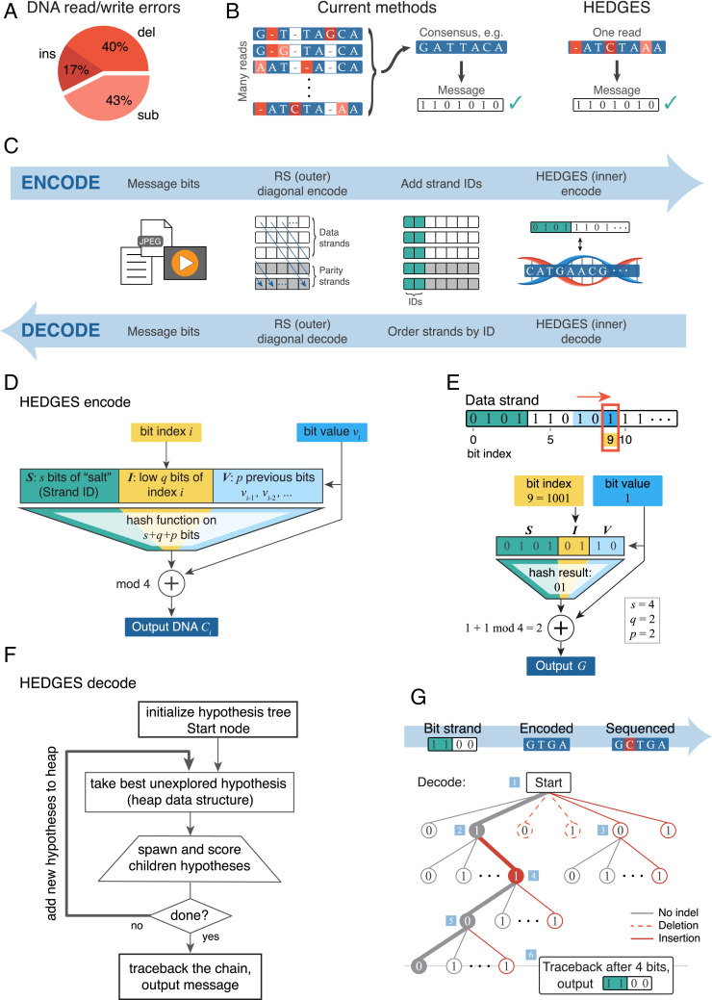
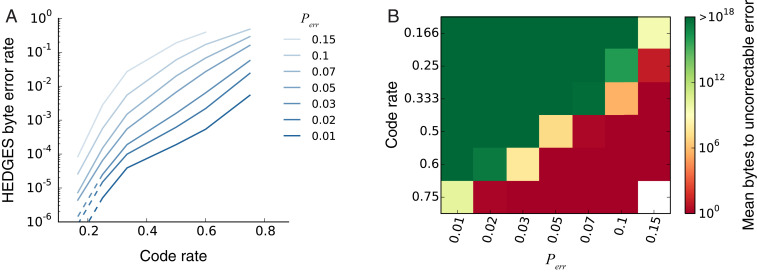

# HEDGES error-correcting code for DNA storage corrects indels and allows sequence constraints

**William H. Press, John A. Hawkins, Stephen K. Jones Jr., Jeffrey M. Schaub, and Ilya J. Finkelstein**

*Proc. Natl. Acad. Sci. USA*, Volume 117, Issue 31, Pages 18489–18496 (2020)

**DOI:** [10.1073/pnas.2004821117](https://doi.org/10.1073/pnas.2004821117)

---

## Table of Contents

- [Abstract](#abstract)
- [Results](#results)
- [Discussion](#discussion)
- [Methods](#methods)
- [Acknowledgments](#acknowledgments)

---
##  Abstract
Synthetic DNA is rapidly emerging as a durable, high-density information storage platform. A major challenge for DNA-based information encoding strategies is the high rate of errors that arise during DNA synthesis and sequencing. Here, we describe the HEDGES (Hash Encoded, Decoded by Greedy Exhaustive Search) error-correcting code that repairs all three basic types of DNA errors: insertions, deletions, and substitutions. HEDGES also converts unresolved or compound errors into substitutions, restoring synchronization for correction via a standard Reed–Solomon outer code that is interleaved across strands. Moreover, HEDGES can incorporate a broad class of user-defined sequence constraints, such as avoiding excess repeats, or too high or too low windowed guanine–cytosine (GC) content. We test our code both via in silico simulations and with synthesized DNA. From its measured performance, we develop a statistical model applicable to much larger datasets. Predicted performance indicates the possibility of error-free recovery of petabyte- and exabyte-scale data from DNA degraded with as much as 10% errors. As the cost of DNA synthesis and sequencing continues to drop, we anticipate that HEDGES will find applications in large-scale error-free information encoding.
* * *
DNA is an ideal molecular-scale storage medium for digital information ([1](https://pmc.ncbi.nlm.nih.gov/articles/PMC7414044/#r1)–[7](https://pmc.ncbi.nlm.nih.gov/articles/PMC7414044/#r7)). An arbitrary digital message can be encoded as a DNA sequence and chemically synthesized as a pool of oligonucleotide strands. These strands can be stored, duplicated, or transported through space and time. DNA sequencing can then be used to recover the digital message, hopefully exactly. Advances in the cost and scale of DNA synthesis and sequencing are increasingly making DNA-based information storage economically feasible. While synthesis today costs $0.001 per nucleotide, some observers project a decrease of orders of magnitude ([8](https://pmc.ncbi.nlm.nih.gov/articles/PMC7414044/#r8)). A strand of DNA containing the four natural nucleotides can encode a maximum of 2 bits per DNA character. With this maximum code rate (defined as rate 
An ECC must correct the three kinds of errors associated with DNA—substitutions of one base by another, as well as spurious insertions or deletions of nucleotides in the DNA strand (indels). Indels represent more than 50% of observed DNA errors ([Fig. 1 _A_](https://pmc.ncbi.nlm.nih.gov/articles/PMC7414044/#fig01)). However, most DNA encoding schemes use ECCs that can only correct substitutions, a standard task in coding theory ([9](https://pmc.ncbi.nlm.nih.gov/articles/PMC7414044/#r9)–[12](https://pmc.ncbi.nlm.nih.gov/articles/PMC7414044/#r12)). The coding theory literature reports only a few ECCs that correct for deletions, and there are no well-established methods for all three of deletions, insertions, and substitutions ([13](https://pmc.ncbi.nlm.nih.gov/articles/PMC7414044/#r13), [14](https://pmc.ncbi.nlm.nih.gov/articles/PMC7414044/#r14)). Prior DNA storage implementations correct for indels by sequencing to high depth, followed by multiple alignment and consensus base calling ([Fig. 1 _B_](https://pmc.ncbi.nlm.nih.gov/articles/PMC7414044/#fig01)) ([1](https://pmc.ncbi.nlm.nih.gov/articles/PMC7414044/#r1), [3](https://pmc.ncbi.nlm.nih.gov/articles/PMC7414044/#r3), [6](https://pmc.ncbi.nlm.nih.gov/articles/PMC7414044/#r6)). This approach represents an inefficient “repetition” ECC. Moreover, repetition ECCs only correct errors associated with DNA sequencing. Correcting synthesis errors using this approach also requires pooling multiple synthesis reactions, which is the most costly and time-consuming step in DNA-based information storage ([2](https://pmc.ncbi.nlm.nih.gov/articles/PMC7414044/#r2)). Finally, alignment and consensus decoding does not scale well beyond small proof-of-principle experiments. In sum, ECCs that require high-depth repetition in the stored DNA have very small code rates because a large number of stored nucleotides are required per recovered message bit.
***[Fig. 1](#fig1).***

(_A_) Distribution of insertion and deletion errors (indels) in a typical DNA storage pipeline ([Table 1](https://pmc.ncbi.nlm.nih.gov/articles/PMC7414044/#t01)); ins, insertion; del, deletion; sub, substitution. (_B_) (_Left_) Existing DNA-based encoding methods require sequence-level redundancy, strand alignment, and consensus calling to reduce indel errors. (_Right_) HEDGES corrects indel and substitution errors from a single read. (_C_) Overview of the interleaved encoding pipeline used throughout this paper. (_D_) HEDGES encoding algorithm in the simplest case: half-rate code, no sequence constraints. The HEDGES encoding algorithm is a variant of plaintext auto-key, but with redundancy introduced because (in the case of a half-rate code, for example) 1 bit of input generates 2 bits of output. Hashing each bit value with its strand ID, bit index, and a few previous bits “poisons” bad decoding hypotheses, allowing for correction of indels. (_E_) An example HEDGES encode, encoding bit 9 of the shown data strand (red box). As in _D_ , half-rate code, no sequence constraints. (_F_) The HEDGES decoding algorithm is a greedy search on an expanding tree of hypotheses. Each hypothesis simultaneously guesses one or more message bits [_SI Appendix, Supplementary Text_](https://www.pnas.org/lookup/suppl/doi:10.1073/pnas.2004821117/-/DCSupplemental)) limits exponential tree growth: Most spawned nodes are never revisited. (_G_) Illustration of a simplified HEDGES decode. The example bit strand message is encoded and then sequenced with an insertion error. Blue squares give decoding action order: 1, Initialize Start node; 2 to 5, explore best hypothesis at each step; and 6, traceback and output the best hypothesis message. DNA image credit: [freepik.com](http://freepik.com).
Here, we describe an algorithm to achieve high code rates with a minimum requirement for redundancy in the stored DNA. We adapt the coding theory approach of constructing an “inner” code (so termed because it is closest to the physical channel, the DNA) to correct most indel and substitution errors. The inner code translates between a string of [Fig. 1 _C_](https://pmc.ncbi.nlm.nih.gov/articles/PMC7414044/#fig01)) to more evenly distribute synthesis and sequencing errors, which improves error correction performance ([15](https://pmc.ncbi.nlm.nih.gov/articles/PMC7414044/#r15)). We test our strategy (both in silico and in vitro) with degraded DNA oligonucleotide pools. Based on these experiments, we use computer simulations to demonstrate that this coding strategy enables error-free exabyte (
---
##  Results
### HEDGES Theoretical Design.
[Fig. 1](https://pmc.ncbi.nlm.nih.gov/articles/PMC7414044/#fig01) shows the data flow for HEDGES encoding and decoding algorithms. In the terminology of coding theory, HEDGES is an infinite-constraint-length convolutional code (a “tree code”) incorporating some features specific to the DNA channel. It is decoded via a stack algorithm that assigns costs to both indels and substitutions. The decoding algorithm succeeds probabilistically, with the ability to signal success or failure. Decoding failures are then regarded as erasures (unknown bits or bytes) and can be corrected in the outer code [i.e., an RS(255,223) code]. Alternatively, the error strand can be discarded and resequenced.
The simplest case is a half-rate code (1 bit encoded per nucleotide) with no constraints on the output DNA sequence, shown in [Fig. 1 _D_](https://pmc.ncbi.nlm.nih.gov/articles/PMC7414044/#fig01) (see [_SI Appendix_ , Fig. S1](https://www.pnas.org/lookup/suppl/doi:10.1073/pnas.2004821117/-/DCSupplemental) for full diagram). The basic plan is a variant of a centuries-old “text auto-key encoding” cryptographic technique ([16](https://pmc.ncbi.nlm.nih.gov/articles/PMC7414044/#r16)) (see also Wikipedia, “Autokey cipher”). We generate a stream of pseudorandom characters 
The decoding algorithm sequentially guesses message bits ([Fig. 1 _F_](https://pmc.ncbi.nlm.nih.gov/articles/PMC7414044/#fig01)). Each guessed bit [17](https://pmc.ncbi.nlm.nih.gov/articles/PMC7414044/#r17)).
In summary, the algorithm encodes information as a stream of nucleotides such that any single decoding error in either nucleotide identity or nucleotide position will “poison” the downstream predictions. Thus, on decoding, there will be only one good-scoring chain of guesses—the correct one. In the unlikely case that the heap grows larger than a preset size 
### Testing In Silico.
For in silico testing, we assumed equal rates for substitutions, insertions, and deletions with total error probability per nucleotide 
The HEDGES algorithm was implemented in C++ for speed, with a Python-callable interface for encoding/decoding single strands. As an initial validation of programming accuracy and interface design, we used an outer-code concatenated design with packets of 255 strands of length 300 protected by RS(255,223). A detailed description of the encoding design is provided in [_SI Appendix_ , _Supplementary Text_](https://www.pnas.org/lookup/suppl/doi:10.1073/pnas.2004821117/-/DCSupplemental); all corresponding computer programs are provided in [_SI Appendix_](https://www.pnas.org/lookup/suppl/doi:10.1073/pnas.2004821117/-/DCSupplemental) and available via GitHub. For every code rate 
We next needed to construct a statistical error model that could be extrapolated to the petabyte or exabyte scale. For this model, we needed to know the rate of bit errors and byte errors in HEDGES output (for each code rate [_SI Appendix_ , Fig. S2](https://www.pnas.org/lookup/suppl/doi:10.1073/pnas.2004821117/-/DCSupplemental)). Decode failures are thus characterized by a single value, the mean run length to failure in a Poisson model. [Fig. 2 _A_](https://pmc.ncbi.nlm.nih.gov/articles/PMC7414044/#fig02) shows the byte error rate as a function of code rate, while [_SI Appendix_ , Fig. S2](https://www.pnas.org/lookup/suppl/doi:10.1073/pnas.2004821117/-/DCSupplemental) gives full details on observed bit and byte error rates, and mean runs to decode failures. Byte error rates were typically 3 to 5 (not 8) times the bit error rates.
#### [Fig. 2](#fig2).

In silico performance of the HEDGES algorithm. (_A_) The in silico byte error rate for the HEDGES algorithm as a function of code rate, _B_) The mean number of bytes to an uncorrectable error, assuming the interleaved RS(255,223) design discussed in the text.
Using these byte error rates, we then modeled HEDGES in an overall concatenated ECC design. [Fig. 2 _B_](https://pmc.ncbi.nlm.nih.gov/articles/PMC7414044/#fig02) shows the average number of message bytes that could be decoded before encountering an uncorrectable error using the concatenated design previously described (see [_Methods_](https://pmc.ncbi.nlm.nih.gov/articles/PMC7414044/#s6) for details). A broad set of code rates (green) are suitable for gigabyte- to exabyte-scale DNA storage. HEDGES decode failures in this region occur every [_Discussion_](https://pmc.ncbi.nlm.nih.gov/articles/PMC7414044/#s5)). Similar simulations with the imposed output constraints of no homopolymer runs (e.g., GGGG or AAAA) greater than four, and [_SI Appendix_ , Fig. S3](https://www.pnas.org/lookup/suppl/doi:10.1073/pnas.2004821117/-/DCSupplemental), and are not substantially different from [Fig. 2](https://pmc.ncbi.nlm.nih.gov/articles/PMC7414044/#fig02). We also modeled the effects of sequencing constraints more generally ([_SI Appendix_ , _Supplementary Text_ and Fig. S4](https://www.pnas.org/lookup/suppl/doi:10.1073/pnas.2004821117/-/DCSupplemental)), and the combined model and simulation results indicate that the most common sequencing constraints have minimal impact on HEDGES. In sum, in silico simulations indicate that HEDGES is capable of error-free decoding of exabyte-scale messages.
### Testing In Vitro.
We next tested real-world ECC performance on a pooled sample of 5,865 synthetic 300-base pair DNA strands that were exposed to accelerated aging or enzymatic mutagenesis. Of these, 18 packets of 255 strands were HEDGES inner-encoded (with subsets at each of six code rates) and then RS(255,223) outer-encoded across strands. Five packets, totaling 1,275 strands, were encoded with an unrelated error correction algorithm ([18](https://pmc.ncbi.nlm.nih.gov/articles/PMC7414044/#r18)), but also served as a negative control on identifying and sequencing HEDGES strands into packets. Each HEDGES strand consisted of [_Methods_](https://pmc.ncbi.nlm.nih.gov/articles/PMC7414044/#s6)) flanking a 254-nucleotide DNA payload. When decoded into bytes, each payload comprised a 1-byte packet number, a 1-byte sequence number (these “salt-protected” on encryption; see [_Methods_](https://pmc.ncbi.nlm.nih.gov/articles/PMC7414044/#s6)), a message payload whose length depended on the code rate, and a 2-byte runout. The sample was PCR amplified and prepared for Illumina-based sequencing. Additionally, we degraded the DNA separately via error-prone PCR mutagenesis or by incubation at high temperature (see [_Methods_](https://pmc.ncbi.nlm.nih.gov/articles/PMC7414044/#s6)). Sequencing was done to a mean depth of 
We performed two kinds of tests of the decoding algorithm, with and without knowledge of the encoded message. “Type A” tests assumed knowledge of the 5,865 strand sequences and could be used to characterize the nature of end-to-end DNA error rates. “Type B” tests were blind decodings of the sequenced data, with knowledge only that the pooled DNA contained HEDGES-encoded data in the specified format.
In our Type A tests, 10 to 15% of sequenced strands could not be uniquely identified with any known input strand, even using quite robust N-gram methods, and even for unmutagenized aliquots. This may be the result of the low concentration, or of contamination at some stage; but it also added to the challenge for the blind type B tests.
For strands whose progenitor sequence could be identified, [Table 1](https://pmc.ncbi.nlm.nih.gov/articles/PMC7414044/#t01) shows measured rates of substitution, insertion, and deletion errors. Notably, only the highest mutagenesis kit protocol produced a substantial increase in DNA errors. Data in ref. [3](https://pmc.ncbi.nlm.nih.gov/articles/PMC7414044/#r3) estimate DNA degradation over a wide range of timescales and temperatures, suggesting that 50 °C incubation for 8 h should have produced significant mutagenesis. We did not find this, however. So, for further analysis here, we consider only the untreated and high-mutagenesis datasets.
#### Table 1.
Observed end-to-end DNA error rates, which includes errors introduced during synthesis, sample handling and storage, preparation, and sequencing
|  | Mutagenesis kit | 50°C incubation  
---|---|---|---  
| Untreated | Low | Medium | High | 2°h | 8°h  
Substitution | 0.0057 | 0.0075 | 0.0178 | 0.0238 | 0.0082 | 0.0085  
Deletion | 0.0054 | 0.0045 | 0.0067 | 0.0082 | 0.0040 | 0.0047  
Insertion | 0.0023 | 0.0020 | 0.0032 | 0.0039 | 0.0017 | 0.0019  
Total | 0.0134 | 0.0139 | 0.0277 | 0.0359 | 0.0140 | 0.0151  
[Open in a new tab](https://pmc.ncbi.nlm.nih.gov/articles/PMC7414044/table/t01/)
The observed total error rates on the order of 1% were approximately doubled and tripled by the medium and high protocols (respectively) of the mutagenesis kit. Incubation at 50 °C for 2 and 8 h had only a small effect and was not further tested.
[Table 2](https://pmc.ncbi.nlm.nih.gov/articles/PMC7414044/#t02) shows the results for decoding strands that were identified as belonging to packets of each code rate. Approximately 3% of the strands failed to decode even at small code rates where, in simulation, there were many fewer such failures. Identification of these strands was ambiguous and may stem from PCR mispriming, oligonucleotide misdimerization, and other next generation sequencing (NGS) library preparation artifacts that can vary from batch to batch. Indeed, for lower code rates (where the ECC was relatively unstressed), strand decode failure rates were slightly higher for the untreated case than for the high-mutagenesis case, presumably due to batch-to-batch variation in the number of such artifacts.
#### Table 2.
Measured in vitro performance and inferred extrapolation to large datasets
| Code rate  
---|---  
| 0.166 | 0.250 | 0.333 | 0.500 | 0.600 | 0.750  
Untreated |  |  |  |  |  |   
Strand decode failure rate | 0.033 | 0.033 | 0.040 | 0.045 | 0.055 | 0.069  
Observed byte error rate | 0.00061 | 0.00110 | 0.00182 | 0.00240 | 0.00248 | 0.00547  
Mean byte errors per RS decode | 0.16 | 0.28 | 0.46 | 0.61 | 0.63 | 1.39  
Mean bytes to uncorrectable | 1.8E+28 | 9.2E+23 | 2.1E+20 | 2.2E+18 | 1.3E+18 | 3.8E+12  
High mutagenesis |  |  |  |  |  |   
Strand decode failure rate | 0.027 | 0.029 | 0.029 | 0.037 | 0.062 | 0.322  
Observed byte error rate | 0.00034 | 0.00114 | 0.00137 | 0.00345 | 0.00850 | 0.02888  
Mean byte errors per RS decode | 0.09 | 0.29 | 0.35 | 0.88 | 2.17 | 7.36  
Mean bytes to uncorrectable | 3.6E+32 | 5.1E+23 | 2.4E+22 | 5.9E+15 | 4.4E+09 | 4.9E+02  
[Open in a new tab](https://pmc.ncbi.nlm.nih.gov/articles/PMC7414044/table/t02/)
The upper two values in each box are as experimentally measured in vitro. The bottom values are inferred from the measured quantities for error-free decoding of large datasets under the same experimental conditions. Colors indicate feasibility for large data storage, by the same criteria as [Fig. 2](https://pmc.ncbi.nlm.nih.gov/articles/PMC7414044/#fig02).
For this reason, the values for the mean run to an uncorrectable error in [Table 2](https://pmc.ncbi.nlm.nih.gov/articles/PMC7414044/#t02) are calculated assuming a strategy of rejecting failed decodes, rather than counting them as erasures. We adopted just this rejection strategy in our blind (type B) decoding; the input data were several [_Methods_](https://pmc.ncbi.nlm.nih.gov/articles/PMC7414044/#s6) for details).
As expected based on the results of [Table 2](https://pmc.ncbi.nlm.nih.gov/articles/PMC7414044/#t02), we achieved error-free decodes of all packets, except in the case of two packets with high mutagenesis at the highest code rate 0.750. With no mutagenesis, 24,000 total reads were required for all 18 packets. With high mutagenesis, 22,000 reads were required for 16 packets, while the undecodable two continued to fail indefinitely. In the successful cases, the number of reads corresponded to about depth 3 on message-bearing message strands. This depth was required merely to sufficiently populate the packets for the outer code to operate due to random strand sampling, not because of any property of HEDGES as the inner code.
---
##  Discussion
HEDGES is designed to be flexible with respect to DNA strand lengths, DNA sequencing and synthesis technologies, choices of outer code, and interleaving details. The most important feature of HEDGES is that it always either 1) recovers “perfect” synchronization of the individual DNA strand to which it is applied (that is, completely eliminates insertion and deletion errors) or else 2) signals that it is unable to do so by a decode failure. Here “perfect” means that our reported bit and byte error rates, which are small enough to be completely corrected by a standard outer code such as RS, are already inclusive of any residual instances of missynchronization.
In the feasible (green) regions of [Fig. 2](https://pmc.ncbi.nlm.nih.gov/articles/PMC7414044/#fig02), HEDGES decode failures occur about every [Fig. 2](https://pmc.ncbi.nlm.nih.gov/articles/PMC7414044/#fig02) use strategy 1; those in [Table 2](https://pmc.ncbi.nlm.nih.gov/articles/PMC7414044/#t02) use strategy 2. Importantly, HEDGES allows constraints on the encoded DNA strands such as reducing homopolymer runs and maintaining a balanced GC content. [_SI Appendix_ , Fig. S3](https://www.pnas.org/lookup/suppl/doi:10.1073/pnas.2004821117/-/DCSupplemental), when compared to [Fig. 2](https://pmc.ncbi.nlm.nih.gov/articles/PMC7414044/#fig02), shows that such constraints impose little penalty on both the code rate and error correction level. Thus, we demonstrate that both are viable strategies for error correction.
We performed both in silico and in vitro experiments to validate HEDGES across a variety of error rates. Such statistical analyses of rare events, based on both experimental data and simulations, should be a required part of all future proposals for DNA data storage. HEDGES performance on real DNA with observed total errors of [Tables 1](https://pmc.ncbi.nlm.nih.gov/articles/PMC7414044/#t01) and [2](https://pmc.ncbi.nlm.nih.gov/articles/PMC7414044/#t02)) was comparable to computer simulation at the same total DNA error rates and to the statistical model we built using simple Poisson random errors ([Fig. 2](https://pmc.ncbi.nlm.nih.gov/articles/PMC7414044/#fig02)). In both cases, HEDGES demonstrates the feasibility of large-scale error-free recovery at code rates up to 0.6 (1.2 bits per nucleotide) for 
---
##  Methods
### HEDGES Encoding in the Half-Rate Case.
Given a message stream of bits
| [1]  
---|---  
(“the message” or “bits”), we want to emit a stream of DNA characters  
---  
(“the codestream” or “characters”). We first review the case of a half-rate code, where we emit exactly one 
We generate a keystream of characters 
| [2]  
---|---  
where [_SI Appendix_ , _Supplementary Text_](https://www.pnas.org/lookup/suppl/doi:10.1073/pnas.2004821117/-/DCSupplemental) for initialization.) We then emit a codestream character
| [3]  
---|---  
the addition performed modulo 4.
The redundancy necessary for error correction comes from the fact that 
Some further details about the encoding algorithm are given in [_SI Appendix_ , _Supplementary Text_](https://www.pnas.org/lookup/suppl/doi:10.1073/pnas.2004821117/-/DCSupplemental).
### HEDGES Decoding Algorithm.
For simplicity, assume that error rates are “small,” so that “most” DNA bases are received as they were intended. (We saw, in [_Results_](https://pmc.ncbi.nlm.nih.gov/articles/PMC7414044/#s1), that DNA character error rates up to [Eq. **3**](https://pmc.ncbi.nlm.nih.gov/articles/PMC7414044/#eq3) to predict two possibilities for the character 
We have not yet accounted for the possibility of insertions and deletions, however. In fact, there are more than the above two possible guesses. We must guess not just 
Log probability penalties accumulate additively along any chain of guesses. In the causal case of a chain of all-correct guesses, we accumulate penalties only in the (relatively rare) case of actual errors. However, because of the way that the key [Eq. **3**](https://pmc.ncbi.nlm.nih.gov/articles/PMC7414044/#eq3)) is constructed, a single wrong guess for either 
The rate of decode errors rises in the last several bytes of message, because some incorrect chains don’t have time to accumulate bad scores. To counter this, we pad each strand with (typically) two “runout bytes” of message zeros at encode, and ignore them at decode. The need for runout bytes makes the HEDGES algorithm inefficient (and thus unsuitable) for an application needing very short DNA strands (e.g., tens rather than hundreds of nucleotides).
Further details about the decoding algorithm are given in [_SI Appendix_ , _Supplementary Text_](https://www.pnas.org/lookup/suppl/doi:10.1073/pnas.2004821117/-/DCSupplemental).
### Use of Salt to Protect Critical Message.
In [Eq. **3**](https://pmc.ncbi.nlm.nih.gov/articles/PMC7414044/#eq3) and [Fig. 1 _D_](https://pmc.ncbi.nlm.nih.gov/articles/PMC7414044/#fig01), we allowed for some number of bits of known salt [_SI Appendix_ , _Supplementary Text_](https://www.pnas.org/lookup/suppl/doi:10.1073/pnas.2004821117/-/DCSupplemental)). This is generally the case when the outer code is interleaved across strands. To the outer code decoder, each incorrectly ordered strand is equivalent to a full strand length of random errors, so it is very important to protect strand ID message bits that determine the strand ordering for outer decoding. Here is how salt is enabling of extra protection: Suppose we want to protect an initial 
| [4]  
---|---  
Most errors in the first 
### Code Rates Other than One-Half.
A simple modification of the encode and decode algorithms described above allows for code rates other than one-half. Take the input bitstream of expression [**1**](https://pmc.ncbi.nlm.nih.gov/articles/PMC7414044/#eq1) and partition it into a stream of values [Table 3](https://pmc.ncbi.nlm.nih.gov/articles/PMC7414044/#t03). See also [_SI Appendix_ , Fig. S1](https://www.pnas.org/lookup/suppl/doi:10.1073/pnas.2004821117/-/DCSupplemental).
#### Table 3.
Mapping of bits 
Code Rate | Pattern |  [*](https://pmc.ncbi.nlm.nih.gov/articles/PMC7414044/#tfn1)  
---|---|---  
0.750 |  |   
0.600 |  |   
0.500 |  |   
0.333 |  |   
0.250 |  |   
0.166 |  |   
[Open in a new tab](https://pmc.ncbi.nlm.nih.gov/articles/PMC7414044/table/t03/)
*
See _Code Rates Other than One-Half_.
Here are two examples showing how to interpret the entries in [Table 3](https://pmc.ncbi.nlm.nih.gov/articles/PMC7414044/#t03) (with adjacency denoting 2-bit values in   
---  
[Eq. **3**](https://pmc.ncbi.nlm.nih.gov/articles/PMC7414044/#eq3) for encoding now becomes
| [5]  
---|---  
where [_SI Appendix_ , _Supplementary Text_](https://www.pnas.org/lookup/suppl/doi:10.1073/pnas.2004821117/-/DCSupplemental) for details of this.
Decoding follows exactly the same pattern. Guessing a 2-bit 
### HEDGES Parameters.
For encoding, the parameter choices are 1) the choice of code rate and variable bit pattern (as in [Table 3](https://pmc.ncbi.nlm.nih.gov/articles/PMC7414044/#t03)), the default case being code rate 0.5; 2) the number [_SI Appendix_ , _Supplementary Text_](https://www.pnas.org/lookup/suppl/doi:10.1073/pnas.2004821117/-/DCSupplemental).
It is an important point that choosing the decode runtime parameters, for example, [_SI Appendix_ , _Supplementary Text_ and Fig. S6](https://www.pnas.org/lookup/suppl/doi:10.1073/pnas.2004821117/-/DCSupplemental)). One can evaluate success by running time and by the count of errors needing correction by the outer RS code. The parameter values that we suggest may be viewed as starting points.
### Imposing DNA Output Sequence Constraints.
DNA synthesis and sequencing platforms have sequence-dependent error profiles. Imbalanced GC content and homopolymer runs are well known to be problematic, for example, leading to indel and substitution errors or even whole strand dropout errors in popular sequencers such as those from Illumina and Oxford Nanopore ([19](https://pmc.ncbi.nlm.nih.gov/articles/PMC7414044/#r19), [20](https://pmc.ncbi.nlm.nih.gov/articles/PMC7414044/#r20)). Thus, many proposed ECCs impose constraints on GC content, homopolymer runs, or both. These typically involve one-off coding designs for each constraint, often reducing significantly the effective code rate ([7](https://pmc.ncbi.nlm.nih.gov/articles/PMC7414044/#r7)). An important property of the HEDGES algorithm is that it can accommodate a large class of sequence constraints without additional, one-off, code design. Moreover, constraints may be imposed without decreasing the code rate (a seeming paradox that we explain below).
Consider the class of constraints that can be applied to a nucleotide sequence with only “past” information. That is, from the emitted sequence 
The only required change in the HEDGES algorithm is to replace [Eq. **5**](https://pmc.ncbi.nlm.nih.gov/articles/PMC7414044/#eq5) by
| [6]  
---|---  
and output the thus-indexed character in the acceptable set [_SI Appendix_ , Fig. S1](https://www.pnas.org/lookup/suppl/doi:10.1073/pnas.2004821117/-/DCSupplemental)).
Note that [Eq. **6**](https://pmc.ncbi.nlm.nih.gov/articles/PMC7414044/#eq6) has the same code rate as [[**5**](https://pmc.ncbi.nlm.nih.gov/articles/PMC7414044/#eq5)]. How is this possible when constraints always act to reduce the number of possible output strings, and hence reduce the channel capacity? The answer is that [[**6**](https://pmc.ncbi.nlm.nih.gov/articles/PMC7414044/#eq6)] absorbs the reduced capacity completely into the error correction, not into the message. The extreme case is when 
This is a versatile scheme. When there is a possibility of emitting an unacceptable homopolymer, [4](https://pmc.ncbi.nlm.nih.gov/articles/PMC7414044/#r4)). To disallow GGC motifs, one might have imagined building a bespoke code around triplets of characters encoded as members of a large Galois field ([3](https://pmc.ncbi.nlm.nih.gov/articles/PMC7414044/#r3)) and removing GGC, NGG, and GCN as possible output triples. Within HEDGES, GGC can be disallowed as an afterthought, simply by adding it to the list of forbidden outputs.
### Statistical Model of System Designs with Outer Codes.
We take as input, from [_SI Appendix_ , Fig. S5](https://www.pnas.org/lookup/suppl/doi:10.1073/pnas.2004821117/-/DCSupplemental), the byte error rate 
We assume that the RS error correction is interleaved, that is, runs across strands. We further assume that, as in our example concatenated design, each RS input byte string samples uniformly along the length of the DNA strands and thus sees uncorrelated errors and erasures with their respective mean rates. We implemented this by applying the RS outer code “diagonally” across strands, so that strand ends (for example) are distributed over multiple RS decodes ([Fig. 1 _C_](https://pmc.ncbi.nlm.nih.gov/articles/PMC7414044/#fig01)). The number of errors in each RS correction is thus a random Poisson variable 
Erasures can occur for two reasons: 1) If the DNA pool is sequenced to a mean depth 
| [7]  
---|---  
The number of erasures is thus a random Poisson variable 
| [8]  
---|---  
While the sum of two Poisson variables is Poisson, the factor one-half in front of [Eq. **8**](https://pmc.ncbi.nlm.nih.gov/articles/PMC7414044/#eq8) involves no simple distribution. Replacing the one-half by either zero or 1 does give Poisson distributions, however, that bound the desired result and turn out to be not too different numerically (in their power-of-ten exponents, which is all we care about). As an approximation, we thus may interpolate by setting the factor back to one-half and pretend that it is still Poisson.
Poisson tail probabilities can be written exactly as incomplete gamma functions ([21](https://pmc.ncbi.nlm.nih.gov/articles/PMC7414044/#r21)). In our regime of interest, the upper and lower bounds ([22](https://pmc.ncbi.nlm.nih.gov/articles/PMC7414044/#r22)),
| [9]  
---|---  
nearly coincide, where 
The values in [Fig. 2](https://pmc.ncbi.nlm.nih.gov/articles/PMC7414044/#fig02) (red/yellow/green cells) result from performing the above calculations with 
### Blind Decoding Tests.
We eliminated reads in which the flanking 
Taking the reads one at a time, we first attempted decodes at all six designed code rates, but limiting the hypothesis budget to 
When the full decode succeeded, we accepted it as authoritative for that strand by packet and sequence ID, and performed no further full decodes for that strand when encountered. When it failed, we discarded the strand. That is, we did not attempt to rescue bytes up to the failure point.
After every 1,000 strands, we looked for packets that were sufficiently populated to possibly allow RS(255,223) outer error correction, counting missing strands as erasures. When the outer correction eventually succeeded, we marked that packet as done. This is a conservative strategy for testing, using only the first observed read of each strand and a near-maximal number of missing strands in each packet for the outer decode. In practice, after sequencing, one would use all available reads and potentially reduce the error rates even further.
### DNA Library Prep and Sequencing.
A DNA library of 5,865 300-nt oligonucleotides was synthesized by Twist Biosciences. To introduce mutations, the DNA storage library was mutagenized using the Diversify PCR Random Mutagenesis Kit (Takara 630703). Samples were added with 480 
To mimic time-dependent aging of DNA, DNA storage library samples were incubated at 50 °C for a period of 2 h or 8 h in water ([3](https://pmc.ncbi.nlm.nih.gov/articles/PMC7414044/#r3)). Samples were then PCR amplified for 12 cycles using primers IF538 and IF539.
PCR-amplified samples were purified using a PCR cleanup kit (NEB T1030).
Illumina sequencing libraries were prepared using the NEBNext Multiplex Oligos for Illumina (E7335) primer set. Libraries were sequenced on a paired-end MiSeq chip with 300 base pairs of read length. Final library preparation and sequencing was performed by the University of Texas Genomic Sequencing and Analysis Facility (GSAF).

---
##  Acknowledgments
We thank Twist Biosciences and the GSAF at The University of Texas at Austin for their help, respectively, in synthesizing and sequencing our DNA. We have had useful communication with Dave Forney, Dan Costello, and Felix Pahl. Claire Mirocha assisted with the data analysis. This work was supported by a College of Natural Sciences Catalyst Award, the Welch Foundation (Grant F-1808 to I.J.F.), and the NIH (Grants R01 GM120554 and R01 GM124141 to I.J.F., and Grant F32 AG053051 to S.K.J.). The DNA graphic in [Fig. 1](https://pmc.ncbi.nlm.nih.gov/articles/PMC7414044/#fig01) is from freepik.com.

##  Data Availability.
The sequenced reads used in testing are available on the Sequence Read Archive (SRA) under accession numbers SAMN14897329, SAMN14897330, SAMN14897331, SAMN14897332, SAMN14897333, SAMN14897334, and SAMN14897335 (SRA Project number PRJNA631961) ([23](https://pmc.ncbi.nlm.nih.gov/articles/PMC7414044/#r23)).
Oligos used in the study are as follows:
IF538: 
IF539: 
The computer code used for the generation and testing of the inner HEDGES code and outer RS code is available at <https://github.com/whpress/hedges>. This paper utilized two commercial C++ source code libraries: Numerical Recipes (<http://www.numerical.recipes>) and the Schifra Reed-Solomon Error Correcting Code Library (<http://www.schifra.com>). The specific routines used in this paper are freely available for noncommercial use and are included in the above GitHub repository.

---

## References

1. Church G. M., Gao Y., Kosuri S., "Next-generation digital information storage in DNA." *Science* 337, 1628 (2012). DOI: 10.1126/science.1226355

2. Goldman N., et al., "Towards practical, high-capacity, low-maintenance information storage in synthesized DNA." *Nature* 494, 77–80 (2013). DOI: 10.1038/nature11875

3. Grass R. N., Heckel R., Pudda M., Paunescu D., Stark W. J., "Robust chemical preservation of digital information on DNA in silica with error-correcting codes." *Angew. Chem. Int. Ed.* 54, 2552–2555 (2015). DOI: 10.1002/anie.201411378

4. Bornholt J., et al., "A DNA-based archival storage system." *Comput. Architect. News* 44, 637–649 (2016).

5. Erlich Y., Zielinski D., "DNA Fountain enables a robust and efficient storage architecture." *Science* 255, 950–954 (2017). DOI: 10.1126/science.aaj2038

6. Yazdi S. M. H. T., Gabrys R., Milenkovic O., "Portable and error-free DNA-based data storage." *Nat. Sci. Rep.* 7, 5011 (2017). DOI: 10.1038/s41598-017-05188-1

7. Organick L., Ang S. D., Chen Y.-J., "Random access in large-scale DNA data storage." *Nat. Biotechnol.* 36, 242–248 (2018). DOI: 10.1038/nbt.4079

8. Ceze L., Nivala J., Strauss K., "Molecular digital data storage using DNA." *Nat. Rev. Genet.* 20, 456–466 (2019). DOI: 10.1038/s41576-019-0125-3

9. MacWilliams F. J., Sloane N. J. A., *The Theory of Error-Correcting Codes* (North Holland, 1983).

10. Roth R. M., *Introduction to Coding Theory* (Cambridge University Press, 2006).

11. Moon T. K., *Error Correction Coding: Mathematical Methods and Algorithms* (Wiley, 2005).

12. Lin S., Costello D. J., *Error Control Coding* (Pearson, 2nd ed., 2004).

13. Mitzenmacher M., "A survey of results for deletion channels and related synchronization channels." *Probab. Surv.* 6, 1–33 (2009).

14. Li R., "New developments in coding against insertions and deletions." Honors thesis, Carnegie Mellon University, Pittsburgh, PA.

15. Wicker S. B., Bhargava V. K., *An Introduction to Reed-Solomon Codes* (Wiley-IEEE, 1994).

16. Vigenère B. de, *Traicté des chiffres ou secrètes manières d'escrire* (Abel l'Angelier, Paris, 1586).

17. Hart P. E., Nilsson N. J., Raphael B., "A formal basis for the heuristic determination of minimum cost paths." *IEEE Trans. Sys. Sci. Cyber.* 4, 100–107 (1968).

18. Hawkins J. A., Jones S. K., Finkelstein I. J., Press W. H., "Indel-correcting DNA barcodes for high-throughput sequencing." *Proc. Natl. Acad. Sci. U.S.A.* 115, E6217–E6226 (2018). DOI: 10.1073/pnas.1802640115

19. Chen Y.-C., Liu T., Yu C.-H., Chiang T.-Y., Hwang C.-C., "Effects of GC bias in next-generation-sequencing data on de novo genome assembly." *PloS One* 8, e62856 (2013). DOI: 10.1371/journal.pone.0062856

20. Jain M., et al., "Nanopore sequencing and assembly of a human genome with ultra-long reads." *Nat. Biotechnol.* 36, 338–345 (2018). DOI: 10.1038/nbt.4060

21. Press W. H., Teukolsky S. A., Vetterling W. T., Flannery B. P., *Numerical Recipes: The Art of Scientific Computing* (Cambridge University Press, 3rd ed., 2007).

22. Klar B., "Bounds on tail probabilities of discrete distributions." *Probab. Eng. Inf. Sci.* 14, 161–171 (2000).

23. Press W. H., Hawkins J. A., Jones S. K. Jr, Schaub J. M., Finkelstein I. J., "HEDGES error-correcting code for DNA storage corrects indels and allows sequence constraints." NCBI BioProject, deposited May 12, 2020. DOI: 10.1073/pnas.2004821117

---

*Archived from [PubMed Central (PMC7414044)](https://pmc.ncbi.nlm.nih.gov/articles/PMC7414044/) on 2025-07-19.*
