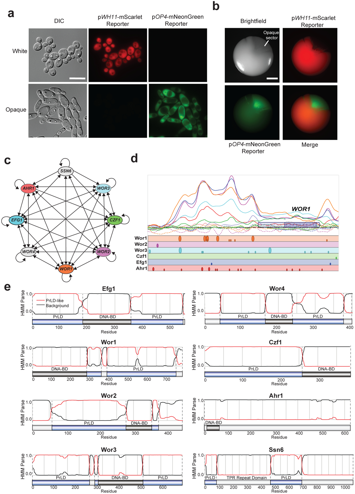
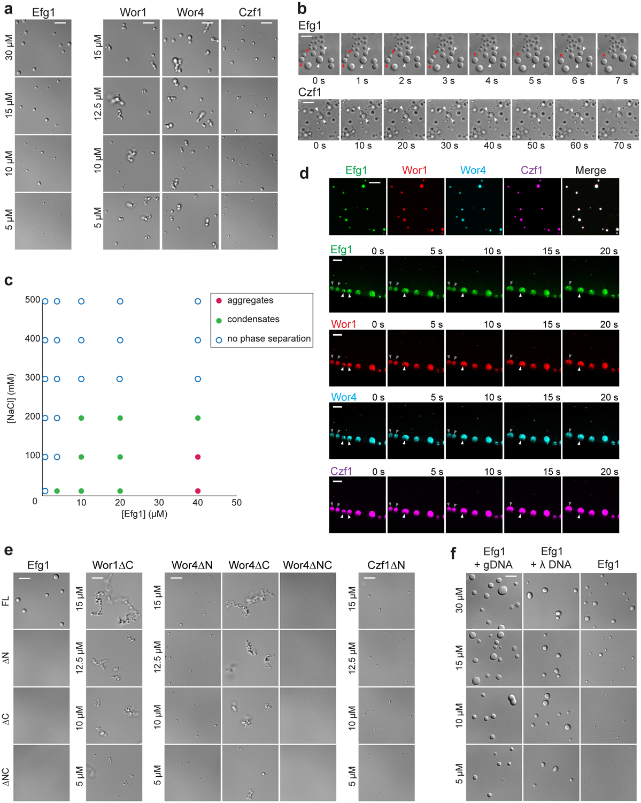
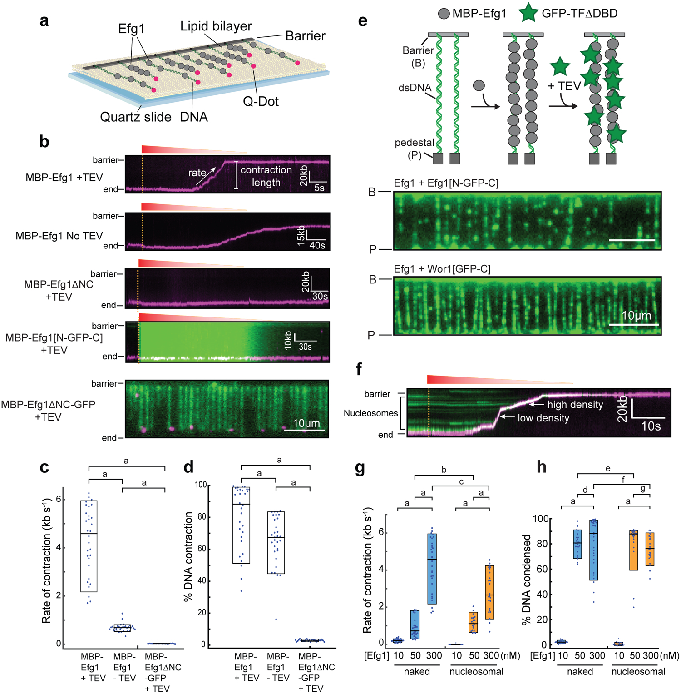
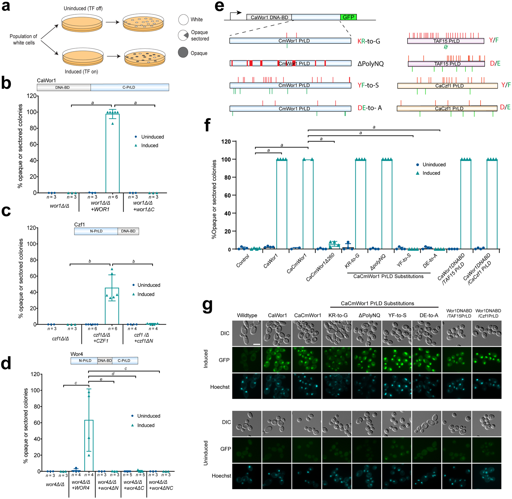
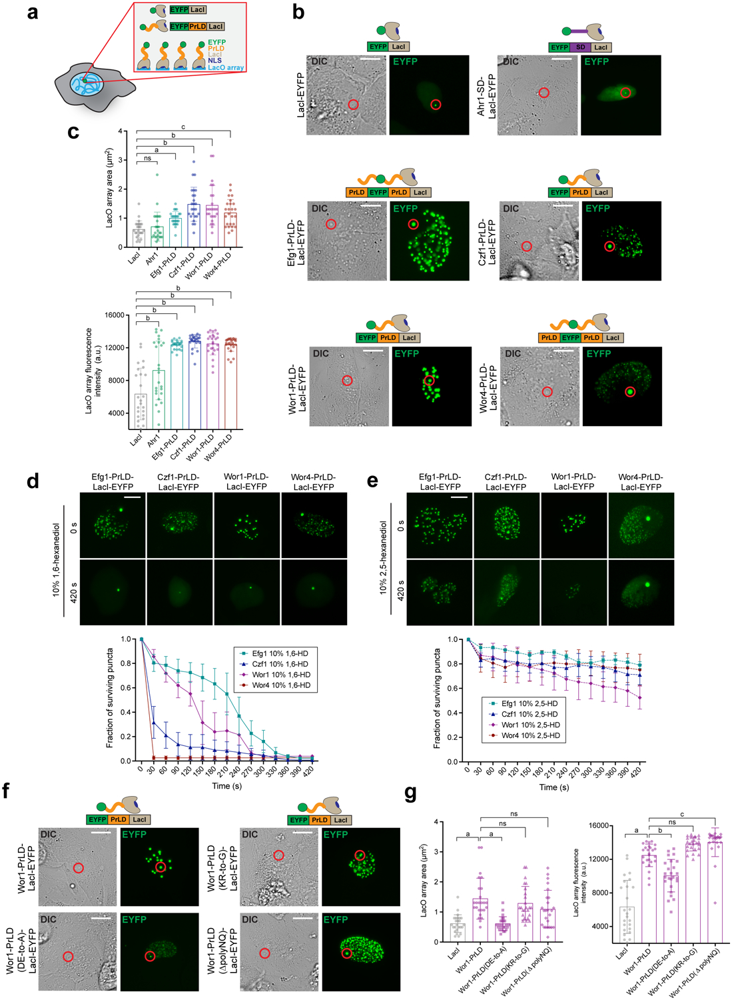
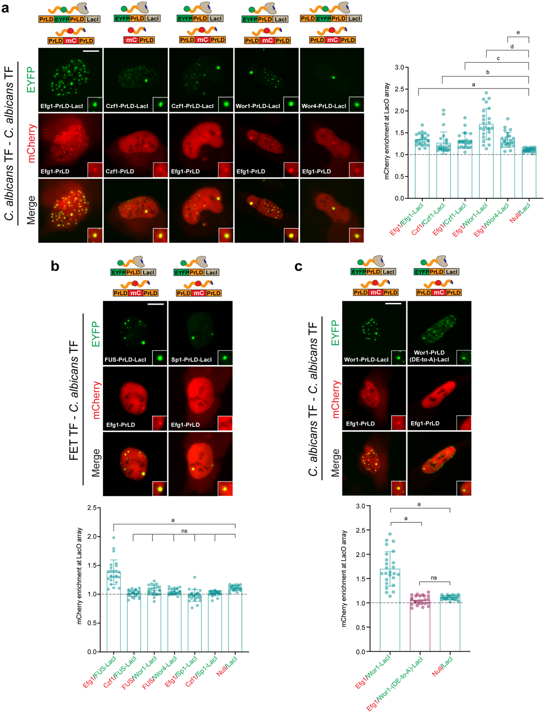

# Epigenetic Cell Fate in _Candida albicans_ is Controlled by Transcription Factor Condensates Acting at Super-Enhancer-Like Elements

**Corey Frazer\*, Mae I. Staples\*, Yoori Kim, Matthew Hirakawa, Maureen A. Dowell, Nicole V. Johnson, Aaron D. Hernday, Veronica H. Ryan, Nicolas L. Fawzi, Ilya J. Finkelstein, and Richard J. Bennett** (\* co-first authors)

*Nature Microbiology*, Volume 5, Issue 11, Pages 1327–1339 (2020)

**DOI:** [10.1038/s41564-020-0760-7](https://doi.org/10.1038/s41564-020-0760-7)

---

## Table of Contents

- [Summary](#summary)
- [Main](#main)
- [Results](#results)
- [Discussion](#discussion)
- [Methods](#methods)
- [Acknowledgements](#acknowledgements)

---
##  Summary
Cell identity in eukaryotes is controlled by transcriptional regulatory networks (TRNs) that define cell type-specific gene expression. In the opportunistic fungal pathogen _Candida albicans_ , TRNs regulate epigenetic switching between two alternative cell states, ‘white’ and ‘opaque’, that exhibit distinct host interactions. Here, we reveal that the transcription factors (TFs) regulating cell identity contain prion-like domains (PrLDs) that enable liquid-liquid demixing and the formation of phase-separated condensates. Multiple white-opaque TFs can co-assemble into complex condensates as observed on single DNA molecules. Moreover, heterotypic interactions between PrLDs supports the assembly of multifactorial condensates at a synthetic locus within live eukaryotic cells. Mutation of the Wor1 PrLD revealed that substitution of acidic residues abolished its ability to phase separate and to co-recruit other TFs in live cells, as well as its function in _C. albicans_ cell fate determination. Together, these studies reveal that PrLDs support the assembly of TF complexes that control fungal cell identity and highlight parallels with the ‘super-enhancers’ that regulate mammalian cell fate.
---
##  Main
Many species can epigenetically differentiate into alternative cellular subtypes. This ability relies on transcriptional regulatory networks (TRNs) to coordinate cell type-specific gene expression programs that are then maintained over multiple cell divisions[1](https://pmc.ncbi.nlm.nih.gov/articles/PMC7581547/#R1),[2](https://pmc.ncbi.nlm.nih.gov/articles/PMC7581547/#R2). In mammalian cells, studies suggest that cell fate is determined by TFs undergoing liquid-liquid phase separation (LLPS), whereby protein-dense condensates form that are in equilibrium with a more dilute surrounding phase[3](https://pmc.ncbi.nlm.nih.gov/articles/PMC7581547/#R3)–[10](https://pmc.ncbi.nlm.nih.gov/articles/PMC7581547/#R10). The high densities of TFs required for LLPS are achieved by recruitment to unusually large regulatory regions or ‘super-enhancers’ that control cell type identity[11](https://pmc.ncbi.nlm.nih.gov/articles/PMC7581547/#R11)–[14](https://pmc.ncbi.nlm.nih.gov/articles/PMC7581547/#R14). Super-enhancers consist of clusters of conventional enhancers that are in close proximity to one another, which can account for the high density of TFs bound to these regions as well as for their extended size[9](https://pmc.ncbi.nlm.nih.gov/articles/PMC7581547/#R9),[11](https://pmc.ncbi.nlm.nih.gov/articles/PMC7581547/#R11),[14](https://pmc.ncbi.nlm.nih.gov/articles/PMC7581547/#R14)–[18](https://pmc.ncbi.nlm.nih.gov/articles/PMC7581547/#R18).
While cell fate determination has been extensively studied in multicellular organisms many unicellular pathogens also undergo differentiation to evade the immune system or to adapt to fluctuating host environments[19](https://pmc.ncbi.nlm.nih.gov/articles/PMC7581547/#R19)–[22](https://pmc.ncbi.nlm.nih.gov/articles/PMC7581547/#R22). A prime example of epigenetic variation is phenotypic switching in the fungal pathogen _Candida albicans_ , where cells interconvert between white and opaque states that display distinct phenotypic properties and tissue tropisms[20](https://pmc.ncbi.nlm.nih.gov/articles/PMC7581547/#R20),[23](https://pmc.ncbi.nlm.nih.gov/articles/PMC7581547/#R23)–[26](https://pmc.ncbi.nlm.nih.gov/articles/PMC7581547/#R26). Regulation of the white-opaque switch involves a complex network of at least 8 TFs which autoregulate their own expression as well as that of each another[27](https://pmc.ncbi.nlm.nih.gov/articles/PMC7581547/#R27)–[36](https://pmc.ncbi.nlm.nih.gov/articles/PMC7581547/#R36). Here, we reveal that 7 of these master TFs contain prion-like domains (PrLDs) that promote co-assembly into phase-separated condensates. These PrLDs enable homotypic and heterotypic interactions between TFs _in vivo_ and are critical for TF function in cell fate determination. We therefore propose that LLPS allows coordination of TFs for regulation of fungal cell fate and reveal parallels to the cell fate-defining networks controlling mammalian cell identity.
---
##  Results
### The TF network regulating _C. albicans_ white-opaque cell identity
_C. albicans_ cells can stochastically switch between white and opaque states that have distinct morphologies and transcriptional programs. At the colony level, switching is evident by darker opaque sectors within white colonies and can be readily detected by state-specific fluorescent reporters ([Fig. 1a](#fig1),[b](https://pmc.ncbi.nlm.nih.gov/articles/PMC7581547/#F1))[37](https://pmc.ncbi.nlm.nih.gov/articles/PMC7581547/#R37)–[39](https://pmc.ncbi.nlm.nih.gov/articles/PMC7581547/#R39). The TRN regulating the white-opaque switch shows multiple parallels to those defining mammalian cell fate. In both, cell identity is controlled by interconnected networks whereby TFs autoregulate their own expression as well as those of each other. For example, in the white-opaque network, connections exist between 8 or more master TFs ([Fig. 1c](#fig1))[27](https://pmc.ncbi.nlm.nih.gov/articles/PMC7581547/#R27)–[36](https://pmc.ncbi.nlm.nih.gov/articles/PMC7581547/#R36). The TRNs regulating cell identity also involve unusually large regulatory regions in both fungi and mammals. The median size of mammalian ‘super-enhancers’ is >8 kb versus ~700 bp for typical enhancers[11](https://pmc.ncbi.nlm.nih.gov/articles/PMC7581547/#R11), and the regulatory regions of master white-opaque TFs are similarly expanded; the upstream intergenic regions of 6 of the 8 TFs are >7 kb, considerably larger than the average intergenic length of 557 bp in _C. albicans_[40](https://pmc.ncbi.nlm.nih.gov/articles/PMC7581547/#R40). White-opaque TFs bind overlapping regions upstream of the genes encoding the master TFs. For example, the intergenic region upstream of _WOR1_ is 10.5 kb and is bound by all 8 master TFs in opaque cells, including Wor1 itself ([Fig. 1d](#fig1))[27](https://pmc.ncbi.nlm.nih.gov/articles/PMC7581547/#R27),[30](https://pmc.ncbi.nlm.nih.gov/articles/PMC7581547/#R30),[36](https://pmc.ncbi.nlm.nih.gov/articles/PMC7581547/#R36). Similar patterns of TF binding are observed for intergenic regions upstream of the other master TFs in the TRN ([Extended Data Fig. 1](https://pmc.ncbi.nlm.nih.gov/articles/PMC7581547/#F7)). These TFs co-occupy similar genomic positions despite a paucity of DNA binding motifs, many of which were defined using unbiased _in vitro_ approaches[27](https://pmc.ncbi.nlm.nih.gov/articles/PMC7581547/#R27) ([Fig. 1d](#fig1) and [Extended Data [Fig. 1](#fig1)](https://pmc.ncbi.nlm.nih.gov/articles/PMC7581547/#F7)). This suggests that _C. albicans_ cell fate-defining TFs are recruited to expanded DNA regulatory regions, at least in part, via protein-protein interactions.
#### [Fig. 1](#fig1). The white-opaque transcriptional network in _C. albicans_ is regulated by multiple TFs containing prion-like domains (PrLDs).

**a** , _C. albicans_ cells can switch between two cell states with distinct colony and cellular morphologies. Representative images are shown for a strain expressing white-specific (p _WH11_ -mScarlet) and opaque-specific (p _OP4_ -mNeonGreen) reporters in both white and opaque cell states. DIC, differential interference contrast. Scale bar; 10 μm.
**b** , White-to-opaque switching at the colony level. Image of a single _C. albicans_ colony expressing white- and opaque-specific reporters after growth at 22°C for 7 days on SCD medium. Image shows a representative white colony with an opaque sector. Scale bar; 1 mm.
**c** , Transcriptional network regulating the opaque state in _C. albicans_. Arrows represent direct binding interactions for TFs to the regulatory region of a given gene based on ChIP-chip/ChIP-Seq data. Model adapted from previous studies, see refs.[27](https://pmc.ncbi.nlm.nih.gov/articles/PMC7581547/#R27)–[36](https://pmc.ncbi.nlm.nih.gov/articles/PMC7581547/#R36).
**d** , Top, Summary of ChIP-chip data for binding of network TFs to the WOR1 promoter and ORF. Solid lines indicate TF binding and dotted lines indicate controls. ChIP-chip binding shown for Wor1 (orange), Wor2 (pink), Wor3 (blue), Czf1 (green), Efg1 (purple) and Ahr1 (red). The _WOR1_ ORF is represented by a purple box and a lighter purple box represents the untranslated region. Bottom, Positions of consensus DNA binding sites for each TF. The large circles represent motif hits with >75% of the maximum score, medium circles represent motif hits that have 50–75% of the maximum score, and small circles represent motif hits that have 25–50% of the maximum score. ChIP enrichment plot generated from data in refs.[27](https://pmc.ncbi.nlm.nih.gov/articles/PMC7581547/#R27),[30](https://pmc.ncbi.nlm.nih.gov/articles/PMC7581547/#R30),[36](https://pmc.ncbi.nlm.nih.gov/articles/PMC7581547/#R36) and motif analysis performed using data from refs.[27](https://pmc.ncbi.nlm.nih.gov/articles/PMC7581547/#R27),[30](https://pmc.ncbi.nlm.nih.gov/articles/PMC7581547/#R30).
**e,** PLAAC analysis (Prion-like Amino Acid Composition) to identify PrLDs. A hidden Markov model (HMM) is used to parse protein regions into prion-like domains (PrLDs) and non-PrLDs on the basis of amino acid composition. Relative position of PrLDs and DNA binding domains (DNA-BDs) is shown for the 8 master TFs that regulate white-opaque identity in _C. albicans_.
###  _C. albicans_ white-opaque TFs can form phase-separated condensates
Our analysis revealed that 7 out of 8 white-opaque TFs contain prion-like domains (PrLDs) by PLAAC analysis[41](https://pmc.ncbi.nlm.nih.gov/articles/PMC7581547/#R41). Thus, Czf1, Efg1, Ssn6, and Wor1-Wor4 all contain at least one PrLD ([Fig. 1e](#fig1)). PrLDs are intrinsically disordered, low complexity domains that are rich in glutamine/asparagine (Q/N) residues yet contain few charged or hydrophobic residues. Although recognized for their ability to form self-templating amyloid fibrils, PrLDs can also increase the propensity for proteins to undergo liquid-liquid phase separation (LLPS)[42](https://pmc.ncbi.nlm.nih.gov/articles/PMC7581547/#R42),[43](https://pmc.ncbi.nlm.nih.gov/articles/PMC7581547/#R43).
To test if white-opaque TFs undergo phase separation _in vitro_ , we purified _C. albicans_ Czf1, Efg1, Wor1 and Wor4 proteins from _E. coli_ as fusions with maltose binding protein (MBP) ([Extended Data [Fig. 2](#fig2)](https://pmc.ncbi.nlm.nih.gov/articles/PMC7581547/#F8)). Strikingly, each protein underwent LLPS upon proteolytic release from MBP ([Fig. 2a](#fig2)). A chimera between the _C. albicans_ Wor1 DNA binding domain and the _Candida maltosa_ Wor1 PrLD was used for these experiments, as purified ‘ _CaCm_ Wor1’ was obtained in higher amounts than native _Ca_ Wor1 and the chimeric protein was functional in _C. albicans_ white-opaque switching assays (see below).
#### [Fig. 2](#fig2). _C. albicans_ white-opaque TFs undergo phase separation in vitro.

**a,** Images of protein droplets formed by Efg1, Wor1 (_CaCm_ Wor1), Wor4, and Czf1. Assays performed in 10 mM Tris-HCl buffer, pH 7.4, 150 mM NaCl, at 22°C following 30 min incubation with TEV. Wor1, Wor4, and Czf1 assays included 5% PEG-8000. Images represent a single experimental replicate, with assays carried out three times with similar results. Scale bar; 5 μm.
**b,** Time course of Efg1 (top) and Czf1 (bottom) undergoing droplet-droplet fusion events. Arrows indicate individual fusion events. Droplets formed using 15 μM of each TF in 10 mM Tris-HCl, pH 7.4, 150 mM NaCl. Samples were incubated at 22°C with TEV added for 30 min prior to imaging. Images represent a single time course, with assays repeated three times with similar results. Scale bar; 5 μm.
**c,** Phase diagram of Efg1 phase separation events at the indicated salt and protein concentrations following TEV treatment at 22°C. Condensates indicate formation of circular liquid droplets. Aggregates indicate formation of clusters of droplets.
**d,** Representative images of fluorescently labeled Efg1, Wor1 (_Ca_ Wor1), Wor4, and Czf1 proteins compartmentalized within Efg1 condensates. Unlabeled Efg1 (15 μM) was allowed to form condensates in the presence of each of the fluorescently labeled proteins (37.5 nM) in 10 mM Tris-HCl, pH 7.4, 150 mM NaCl. Proteins were pre-incubated at 22°C with TEV for 30 min. Dylight NHS-Ester labeling of the 4 proteins used fluors of 488, 550, 405, and 633 nm. Images represent a single experimental replicate, and assays were repeated three times with similar results. Scale bar, 5 μm for compartmentalization and 20 μm for droplet fusion events; images are maximum Z-stack projections. Arrows indicate individual fusion events with images shown in 5 s intervals from a time range of 50–70 s during a total imaging time of 100 s.
**e,** Phase separation analysis of Efg1, Wor1 (_Ca_ Wor1), Wor4, and Czf1 in which PrLDs have been removed. Efg1 was utilized at 30 μM whereas Wor1, Wor4 and Czf1 were present at the indicated protein concentrations. Proteins were pre-incubated with TEV for 30 min at 22°C prior to analysis. Assays were performed in 10 mM Tris-HCl, pH 7.4, 150 mM NaCl, and supplemented with 5% PEG-8000 for Wor1, Wor4 and Czf1. Images represent a single experimental replicate, with assays repeated three times with similar results. Scale bar; 5 μm.
**f,** Images of Efg1 droplets formed with SC5314 genomic DNA (gDNA), phage lambda DNA (λ), and without addition of DNA. Assays performed in 10 mM Tris-HCl buffer, pH 7.4, 150 mM NaCl, at 22°C following 30 min incubation with TEV. Genomic DNA was included at a final concentration of 50 nM and phage lambda DNA was included at a final concentration of 9.4 nM. Images represent a single experimental replicate, with assays repeated twice with similar results. Scale bar; 5 μm.
Efg1 formed liquid-like droplets at concentrations as low as 5 μM under physiological buffer conditions and without molecular crowding agents ([Fig. 2b](#fig2)). Droplet-droplet fusion events were readily observed and droplet size increased with increasing Efg1 concentrations ([Fig. 2a](#fig2),[b](https://pmc.ncbi.nlm.nih.gov/articles/PMC7581547/#F2)) but was inhibited by increasing salt concentrations ([Fig. 2c](#fig2)). At high Efg1 and low salt concentrations, droplets showed less liquid-like behavior and formed amorphous aggregates ([Fig. 2c](#fig2)). Condensate formation was also observed with Czf1, Wor1, and Wor4, although the extent of liquid-like behavior varied between TFs. Both Wor1 and Wor4 formed gel-like droplets that self-adhered to form chains, whereas Czf1 and Efg1 produced spherical droplets that continued to undergo liquid-liquid fusion events under identical conditions ([Fig. 2a](#fig2),[b](https://pmc.ncbi.nlm.nih.gov/articles/PMC7581547/#F2)). We further probed the liquid-like properties of the TFs by treating pre-formed droplets with the aliphatic alcohol 1,6-hexanediol, which has been shown to disrupt weak hydrophobic interactions in phase-separated condensates[44](https://pmc.ncbi.nlm.nih.gov/articles/PMC7581547/#R44)–[46](https://pmc.ncbi.nlm.nih.gov/articles/PMC7581547/#R46). Efg1 droplets were completely dissolved by 10% 1,6-hexanediol whereas other condensates showed variable results. Czf1 and Wor1 were largely unaffected, while Wor4 showed reduced droplet size and number ([Extended Data Fig. 3a](https://pmc.ncbi.nlm.nih.gov/articles/PMC7581547/#F9)). We further examined Wor4 condensates by treating them with 10% 1,6-hexanediol prior to addition of TEV/5% PEG and in this instance droplet formation was essentially abolished. Treatment of condensates with the related compound 2,5-hexanediol, which does not dissolve liquid-like assemblies, did not disrupt droplets in any of these assays ([Extended Data [Fig. 3a](#fig3)](https://pmc.ncbi.nlm.nih.gov/articles/PMC7581547/#F9)).
Notably, liquid droplets formed by one white-opaque TF supported co-compartmentalization with other network TFs. For example, using Efg1 as the bulk reagent, fluorescently labeled Efg1, Wor1, Wor4 or Czf1 were included at sub-phase-separating concentrations (37.5 nM). Upon TEV treatment, the bulk unlabeled Efg1 formed liquid droplets that incorporated each of the labeled TFs into condensates that continued to undergo droplet-droplet fusion ([Fig. 2d](#fig2)). When treated with 10% 1,6-hexanediol, but not 2,5-hexanediol, these droplets readily dissolved further indicating their liquid properties ([Extended Data Fig. 3b](https://pmc.ncbi.nlm.nih.gov/articles/PMC7581547/#F9)). TF co-compartmentalization also occurred when TFs other than Efg1 were the bulk reagent ([Extended Data [Fig. 3c](#fig3)](https://pmc.ncbi.nlm.nih.gov/articles/PMC7581547/#F9)). These results show how condensates formed by a single _C. albicans_ TF can promote heterotypic interactions between TFs.
### PrLDs promote LLPS by _C. albicans_ white-opaque TFs
The contribution of PrLDs to phase separation of white-opaque TFs was determined. Efg1 contains N- and C-terminal PrLDs that flank an APSES DNA binding domain (DBD)[47](https://pmc.ncbi.nlm.nih.gov/articles/PMC7581547/#R47),[48](https://pmc.ncbi.nlm.nih.gov/articles/PMC7581547/#R48). Loss of either PrLD abolished the ability of Efg1 to phase separate under conditions where the native protein readily formed droplets (30 μM Efg1; [Fig. 2e](#fig2)). Similar results were obtained with Czf1 and Wor4 where removal of PrLDs attenuated phase separation; removal of the single PrLD from Czf1 resulted in the formation of smaller droplets than the full-length protein while removal of both PrLDs from Wor4 abolished droplet formation ([Fig. 2a](#fig2),[e](https://pmc.ncbi.nlm.nih.gov/articles/PMC7581547/#F2)). More subtle phenotypes were observed in Wor4 when only one PrLD was deleted; loss of the N-terminal PrLD reduced droplet formation whereas removal of the C-terminal PrLD resulted in increased gelling (i.e., formation of irregular assemblies that did not form larger droplets) ([Fig. 2a](#fig2),[e](https://pmc.ncbi.nlm.nih.gov/articles/PMC7581547/#F2)). In the case of Wor1, deletion of the C-terminal PrLD still allowed the protein to form aggregate chains even at concentrations as low as 5 μM, although these aggregates were smaller than those formed by the native protein ([Fig. 2a](#fig2),[e](https://pmc.ncbi.nlm.nih.gov/articles/PMC7581547/#F2)). The inclusion of DNA was also found to impact phase separation of TFs; Efg1 forms relatively small droplets at concentrations of 5–10 μM, yet the presence of _C. albicans_ genomic DNA or phage lambda DNA enabled Efg1 to form larger droplets under the same conditions ([Fig. 2f](#fig2)). This indicates that DNA can promote condensates formed by a _C. albicans_ TF.
To examine homotypic and heterotypic interactions mediated by PrLDs, the DBD was replaced with GFP ([Extended Data Fig. 4a](https://pmc.ncbi.nlm.nih.gov/articles/PMC7581547/#F10)) and TF recruitment into Efg1 condensates analyzed. Efg1[N-GFP-C] was readily recruited into bulk Efg1 droplets, whereas removal of the N- or C-terminal PrLDs led to weak or no recruitment into droplets, respectively ([Extended Data Fig. 4b](https://pmc.ncbi.nlm.nih.gov/articles/PMC7581547/#F10)). Similar results were obtained with Wor1, Wor4 and Czf1, where replacement of DBDs with GFP generated chimeric proteins that could be readily recruited into Efg1 condensates ([Extended Data [Fig. 4a](#fig4)](https://pmc.ncbi.nlm.nih.gov/articles/PMC7581547/#F10),[b](https://pmc.ncbi.nlm.nih.gov/articles/PMC7581547/#F10)). In the case of Wor4, like Efg1, both the N- and C-terminal PrLDs were necessary for efficient recruitment into Efg1 droplets. These data show that PrLDs promote phase separation which allows for heterotypic interactions between white-opaque TFs.
### PrLD-containing TFs form phase-separated condensates on single DNA molecules
TF condensate formation on single DNA molecules was examined using ‘DNA curtain’ assays. Here, DNA is trapped on top of a fluid lipid bilayer with molecules tethered at one end and fluorescently labeled at the other end ([Fig. 3a](#fig3))[49](https://pmc.ncbi.nlm.nih.gov/articles/PMC7581547/#R49),[50](https://pmc.ncbi.nlm.nih.gov/articles/PMC7581547/#R50). DNA molecules are extended by buffer flow and the lipid bilayer serves as a biomimetic surface that blocks non-specific adsorption of proteins and nucleic acids to the flowcell.
#### [Fig. 3](#fig3). Efg1 condenses naked and nucleosome-coated single DNA molecules.

**a,** Schematic of DNA curtains assay. DNA ends are fluorescently labeled with Qdot-conjugated –Dig antibodies and the _C. albicans_ TF Efg1 injected into the flowcell while keeping the DNA extended via buffer flow.
**b,** Top four panels show representative kymographs of MBP-Efg1 (+/− TEV protease), MBP Efg1[N-GFP-C] (+TEV) and MBP-Efg1ΔNC (+TEV). All contain 300 nM Efg1 or variants on naked DNA molecules. The time point when Efg1 is injected into the flowcell is indicated with yellow dashed lines and the protein traverses the flowcell for a few minutes as its concentration is diluted by constant buffer flow. The rate and extent of DNA condensation is measured by tracking the fluorescent DNA end. The bottom panel shows MBP-Efg1ΔNC-GFP (+TEV) at a single time point establishing protein binding across an array of DNA molecules. At least two experiments were performed for each condition and all observed results are reproducible.
**c, d,** Rate (**c**) and degree (**d**) of DNA condensation expressed as a percent of the total DNA length, corresponding to respective kymograph conditions detailed above. Boxplots indicate the median (middle line), and 10–90th percentiles of the distribution (ends of boxes). Statistical analysis performed using a a two-sample one-sided K-S test; P-values: a, < 0.0001. _N=30 (MBP-Efg1+TEV), N=33 (MBP-Efg1-TEV), N=28 (MBP-Efg1ΔNC-GFP+TEV_).
**e,** Efg1 bound to DNA can recruit other TFs via their PrLDs. DNA molecules are double-tethered to block Efg1-driven DNA condensation and 300 nM MBP-Efg1 was first incubated with the DNA. GFP-Efg1[N-GFP-C] or GFP-Wor1[GFP-C] was then injected with TEV protease. Images show recruitment of GFP-Efg1[N-GFP-C] (top) or GFP-Wor1[GFP-C] (bottom) to DNA-bound Efg1. At least two experiments were performed for each assay and all observed results are reproducible.
**f,** A representative kymograph of Efg1 condensing nucleosome-coated DNA. Nucleosomes are shown in green and the fluorescently labeled DNA end is in magenta. The time point when Efg1 is injected into the flowcell is indicated with yellow dashed lines. The rate and extent of DNA condensation is measured by tracking the fluorescent DNA end.
**g,h,** Quantification of contraction rate (**g**) and percentage of DNA condensed (**h**) using naked or nucleosome-containing DNA with different Efg1 concentrations. Boxplots indicate the median (middle line), and 10–90th percentiles of the distribution (ends of boxes). Statistical analysis performed using a two-sample one-sided K-S test; P-values: a, < 0.0001; b, 0.02, c, 0.001; d, 0.008; e, 0.01; f, 0.004; and g, 0.014. _N=27, 26, 30_ molecules _(naked panel)_ , and _26, 22, 24_ molecules _(nucleosomal panel)_.
_C. albicans_ Efg1 was used in DNA curtain assays with the consensus Efg1 binding sequence (TGCAT)[27](https://pmc.ncbi.nlm.nih.gov/articles/PMC7581547/#R27) represented 145 times in the 48.5 kb phage λ genome used for these assays. MBP-Efg1 was pre-incubated with TEV protease and the mixture injected into flowcells containing pre-assembled DNA curtains. Efg1 binding resulted in the contraction of DNA molecules as measured by movement of the untethered, fluorescently-labeled end towards the tethered end ([Fig. 3b](#fig3), top). Importantly, DNA compaction required both the DBD and the PrLDs of Efg1; injection of Efg1[N-GFP-C] that lacked the DBD did not show detectable binding or contraction of DNA, while injection of Efg1ΔNC-GFP that lacked both PrLDs coated the DNA molecules but also failed to contract DNA ([Fig. 3b](#fig3)).
Efg1 contracted DNA molecules almost completely to the barrier when using high (300 nM) or intermediate (50 nM) concentrations ([Fig. 3c](#fig3),[d](https://pmc.ncbi.nlm.nih.gov/articles/PMC7581547/#F3)). In contrast, MBP-Efg1 that was not TEV treated (and thus not able to undergo LLPS) showed a significantly slower DNA contraction rate and a reduced average contraction length ([Fig. 3c](#fig3),[d](https://pmc.ncbi.nlm.nih.gov/articles/PMC7581547/#F3)). Together, these data implicate both the DNA binding and phase separation properties of Efg1 as important for driving the contraction of DNA molecules.
We next sought to determine if PrLDs can promote homotypic or heterotypic interactions on single DNA molecules. Here, DNA molecules were tethered at both DNA ends to inhibit DNA contraction[49](https://pmc.ncbi.nlm.nih.gov/articles/PMC7581547/#R49),[50](https://pmc.ncbi.nlm.nih.gov/articles/PMC7581547/#R50) and MBP-TF fusions again TEV treated to remove MBP prior to injection. Full-length, unlabeled Efg1 was allowed to bind to the DNA prior to injection with TF-GFP fusions that lack their corresponding DBDs. We observed that both Efg1[N-GFP-C] and Wor1[GFP-C] rapidly accumulated in foci over the length of Efg1-coated DNA molecules ([Fig. 3e](#fig3)), whereas Efg1[N-GFP-C] did not bind to DNA in the absence of native Efg1 ([Fig. 3b](#fig3)). This shows that Efg1 and Wor1 can both be recruited into TF-DNA compartments via their PrLDs.
TFs function in the context of chromatin and we therefore assessed how nucleosomes impact DNA condensation. DNA curtains were prepared with >10 nucleosomes deposited onto each DNA molecule and visualized using a fluorescent antibody against an HA epitope on histone H2A[51](https://pmc.ncbi.nlm.nih.gov/articles/PMC7581547/#R51),[52](https://pmc.ncbi.nlm.nih.gov/articles/PMC7581547/#R52). Efg1 caused contraction of nucleosomal DNA substrates although this occurred at a significantly slower rate than that of naked DNA ([Fig. 3f](#fig3)–[h](https://pmc.ncbi.nlm.nih.gov/articles/PMC7581547/#F3)), indicating that nucleosomes act as physical barriers to DNA binding and/or DNA compaction by Efg1. In support of this model, nucleosome-free DNA regions compacted more rapidly than nucleosome-dense regions of the same DNA substrate (see arrows, [Fig. 3f](#fig3)).
### PrLDs are necessary for TF function in determining _C. albicans_ white-opaque cell fate
The functional contribution of PrLDs to the regulation of _C. albicans_ cell fate was tested by ectopic expression of mutant TFs and quantification of white-to-opaque switching. Induced expression of full-length TFs led to elevated frequencies of switching, as expected[29](https://pmc.ncbi.nlm.nih.gov/articles/PMC7581547/#R29)–[32](https://pmc.ncbi.nlm.nih.gov/articles/PMC7581547/#R32),[35](https://pmc.ncbi.nlm.nih.gov/articles/PMC7581547/#R35). Thus, whereas <2% of cells underwent stochastic white-to-opaque switching under non-inducing conditions, forced expression of _WOR1, WOR4_ , or _CZF1_ resulted in 98%, 63%, or 45% of white cells switching to the opaque state, respectively ([Fig. 4a](#fig4)–[d](https://pmc.ncbi.nlm.nih.gov/articles/PMC7581547/#F4)). In contrast, ectopic expression of TFs lacking their respective PrLDs showed no increase in white-to-opaque switching over background ([Fig. 4b](#fig4)–[d](https://pmc.ncbi.nlm.nih.gov/articles/PMC7581547/#F4)).
#### [Fig. 4](#fig4). Deletion or mutation of PrLDs abolishes the function of _C. albicans_ TFs in cell fate determination.

**a,** Cell state switching assays. _C. albicans_ white cells were analyzed for the frequency of switching to the opaque state. White cells were plated for single colonies on control non-inducing media or on inducing media. Colony phenotypes were analyzed after 7 days at 22°C.
**b-d,** Effect of ectopic expression of _WOR1_ (**b**), _CZF1_ (**c**) or _WOR4_ (**d**) variants from the _MAL2_ promoter on white-to-opaque switching frequencies. In each case TFs were expressed with or without the indicated N- or C-terminal PrLDs. Each TF was tested in the corresponding null mutant background (e.g., _WOR1_ variants were expressed in a strain that is a _wor1Δ/Δ_ mutant). Center of the data represents the mean of the indicated independent experiments per strain, and error bars represent S.D. Comparisons were performed between the full-length induced constructs and the mutant induced constructs using a two-tailed unpaired t-test with Welch’s correction. P-values: a, <0.0001; b, 0.0010; c, 0.0463; d, 0.0470; e,0.0465.
**e,** The _C. albicans_ Wor1 DNA binding domain was fused to the PrLD of _C. maltosa_ Wor1 with the indicated amino acid substitutions. Arrangement of Y/F and D/E residues in the PrLDs of human TAF15 and _C. albicans_ Czf1 tested for their ability to replace the Wor1 PrLD.
**f,** White-to-opaque switching frequency of indicated constructs expressed from the _MET3_ promoter. Colony phenotypes were analyzed after 7 days at 22°C. Statistical comparisons were performed between different strains using a two-tailed unpaired t-test with Welch’s correction. P-value: a, <0.0001.
**g,** Relative GFP expression levels of _CaCm_ Wor1 PrLD substitutions and replacements. Images are representative of two independent experimental replicates that showed the same result. GFP and Hoechst histograms are set to equivalent levels. Scale bar; 5 μm.
Phase separation is promoted by multivalent interactions between residues in low complexity domains, with multiple weak interactions able to overcome the entropic cost of LLPS[53](https://pmc.ncbi.nlm.nih.gov/articles/PMC7581547/#R53). Recent studies implicate a variety of intermolecular interactions in driving LLPS including patterned charged residues, hydrophobic residues and aromatic residues, with the latter shown to promote various pi interactions[43](https://pmc.ncbi.nlm.nih.gov/articles/PMC7581547/#R43),[54](https://pmc.ncbi.nlm.nih.gov/articles/PMC7581547/#R54)–[57](https://pmc.ncbi.nlm.nih.gov/articles/PMC7581547/#R57). Glutamine residues can also enhance LLPS and promote the liquid-to-solid transition of condensates[43](https://pmc.ncbi.nlm.nih.gov/articles/PMC7581547/#R43),[57](https://pmc.ncbi.nlm.nih.gov/articles/PMC7581547/#R57). To address if these residues alter the functionality of a white-opaque TF, derivatives of the _Cm_ Wor1 PrLD were tested including (i) removal of negatively charged residues (DE-to-A mutant), (ii) removal of positively charged residues (KR-to-G mutant) (iii) substitution of aromatic residues (YF-to-S mutant), and (iv) deletion of repetitive polyN/polyQ tracts (ΔpolyNQ) ([Fig. 4e](#fig4)). Notably, both DE-to-A and YF-to-S mutants abolished Wor1 function in white-opaque switching, whereas KR-to-G and ΔpolyNQ mutants showed wildtype functionality ([Fig. 4f](#fig4)). In the case of the DE-to-A mutant, we note this involved substitution of only 8 residues within the 312 residue PrLD. All Wor1 variants correctly localized in the nucleus as determined by fluorescence microscopy ([Fig. 4g](#fig4)).
We also tested whether Wor1 could regulate cell fate if its PrLD was replaced with the PrLD of another TF. Substitution of the Wor1 PrLD with that from the white-opaque regulator Czf1 or that from TAF15, a mammalian FET family TF, generated chimeric proteins that were still fully functional in white-to-opaque switching. These experiments reveal that negatively charged residues and aromatic residues in the PrLD are critical for Wor1 function, and that PrLDs from other TFs can substitute for the native PrLD despite lacking any substantial sequence homology.
### Formation of _C. albicans_ TF condensates at genomic loci in live cells
To determine if _C. albicans_ white-opaque TFs form condensates in a cellular environment, we tested their heterologous expression in a mammalian cell line that has been used for monitoring LLPS _in vivo_[8](https://pmc.ncbi.nlm.nih.gov/articles/PMC7581547/#R8),[58](https://pmc.ncbi.nlm.nih.gov/articles/PMC7581547/#R58). In this system, U2OS cells containing ~50,000 copies of the Lac operator (LacO) are used to recruit proteins fused to the Lac repressor (LacI)[8](https://pmc.ncbi.nlm.nih.gov/articles/PMC7581547/#R8),[59](https://pmc.ncbi.nlm.nih.gov/articles/PMC7581547/#R59). We tested expression of PrLDs from Efg1, Czf1, Wor1 or Wor4 fused to LacI-EYFP and found that each formed bright foci at the LacO array, as well as smaller puncta throughout the nucleus ([Fig. 5a](#fig5),[b](https://pmc.ncbi.nlm.nih.gov/articles/PMC7581547/#F5)). These PrLDs generated structures at the LacO array that were visible by DIC microscopy ([Fig. 5b](#fig5)), suggesting that the mass density/refractive index of these assemblies distinguishes them from their environment, as observed with foci formed by human TFs[8](https://pmc.ncbi.nlm.nih.gov/articles/PMC7581547/#R8). Importantly, analysis of LacO-associated hubs showed that foci associated with _C. albicans_ PrLDs were significantly larger and brighter than foci formed by LacI without a PrLD, as well as larger than foci formed by Ahr1 which lacks a PrLD ([Fig. 5c](#fig5)). This indicates that PrLD-PrLD interactions enhance protein recruitment to the LacO array. Additionally, LacI fused to Efg1, Czf1, Wor1 or Wor4 PrLDs produced additional puncta throughout the nuclei, while LacI alone did not, establishing that these PrLDs can seed self-assembly independent of the LacO array ([Fig. 5b](#fig5)).
#### [Fig. 5](#fig5). _C. albicans_ PrLDs enable the formation of phase-separated condensates at a genomic array in live cells.

**a,** Schematic of mammalian U2OS cells containing a LacO array used to recruit LacI or LacI-PrLD-fusion proteins.
**b,** Representative fluorescence microscopy and DIC images of U2OS cells containing the LacO array (indicated with a red circle) bound by the LacI-EYFP control, or by Ahr1-SD-LacI-EYFP, Efg1-PrLD-LacI-EYFP, Czf1-PrLD-LacI-EYFP, Wor1-PrLD-LacI-EYFP, or Wor4-PrLD-LacI-EYFP. SD, structured domain; PrLD, prion-like domain. Scale bars; 10 μm. Note that the PrLD from _C. maltosa_ Wor1 was used in these experiments (see [Methods](https://pmc.ncbi.nlm.nih.gov/articles/PMC7581547/#S10)).
**c,** Quantification of average size (top) and fluorescence intensity (bottom) of the LacO array bound by LacI-EYFP, Ahr1-LacI-EYFP, Efg1-PrLD-LacI-EYFP, Czf1-PrLD-LacI-EYFP, Wor1-PrLD-LacI-EYFP, and Wor4-PrLD-LacI-EYFP. Fluorescence intensity calculated after subtraction of the LacI-EYFP background. Center of the data represents mean and error bars represent S.D. Statistical analysis was performed using ordinary one-way ANOVA with Dunnett’s multiple comparisons test, in which the mean value for each construct was compared to the mean of the control LacI construct. P-values: a, 0.0261; b, <0.0001; c, 0.0003; ns, not significant. n = 25, with images analyzed from 25 individual cells for each construct. Experiments were repeated at least three times with similar results.
**d, e,** Representative fluorescence microscopy images of Efg1, Czf1, Wor1, and Wor4 foci in U2OS cells containing a LacO array before and after treatment with (**d**) 10% 1,6-hexanediol or (**e**) 10% 2,5-hexanediol. Scale bars; 10 μm. Error bars represent S.E.M. n = 3 for each construct in each condition tested, with cells analyzed from at least three separate experiments with similar results. Images of cells 420 s after treatment have been enhanced for brightness to better represent remaining puncta in the nucleus.
**f,** Representative fluorescence microscopy and DIC images of U2OS cells containing the LacO array (indicated with red circle) bound by wildtype Wor1-PrLD-LacI-EYFP, or by indicated Wor1-PrLD-LacI-EYFP variants. Scale bars; 10 μm.
**g,** Quantification of average size (top) and fluorescence intensity (bottom) of the LacO array bound by the wildtype Wor1-PrLD-LacI-EYFP or each indicated Wor1-PrLD-LacI-EYFP variant. Fluorescence intensity calculated after subtraction of the LacI-EYFP background. Center of the data represents mean and error bars represent S.D. Statistical analysis was performed using ordinary one-way ANOVA with Dunnett’s multiple comparisons test, in which the mean value for each construct was compared to the mean of the control wildtype Wor1 construct. P-values: a, <0.0001; b, 0.0001; c, 0.0204; ns, not significant. n = 25, with images analyzed from 25 individual cells for each construct. Experiments were repeated at least twice with similar results.
To examine whether PrLD-mediated foci involved LLPS, U2OS cells were treated with 10% 1,6- or 2,5-hexanediol. When cells were treated with 1,6-hexanediol, foci formed by _C. albicans_ PrLDs at LacO arrays shrank in both size and brightness, while smaller nuclear puncta disappeared completely with time scales ranging from 30 seconds (Wor4) to 6 minutes (Efg1) ([Fig. 5d](#fig5)). Efg1-, Czf1-, Wor1- and Wor4-containing foci were not affected by 2,5-hexanediol to the same extent as 1,6-hexanediol ([Fig. 5e](#fig5)), consistent with foci forming via liquid-liquid demixing.
To dissect the amino acid residues contributing to condensate formation, several Wor1 PrLD variants tested for functionality in _C. albicans_ ([Fig. 4](#fig4)) were evaluated for their properties in U2OS cells. Interestingly, the KR-to-G and ΔpolyNQ PrLD variants that were functional in _C. albicans_ showed similar condensate formation to the wildtype PrLD ([Fig. 5f](#fig5),[g](https://pmc.ncbi.nlm.nih.gov/articles/PMC7581547/#F5)). In contrast, however, the non-functional DE-to-A variant showed no increase in the size of the LacO-associated signal relative to LacI alone and displayed significantly decreased fluorescence intensity at the array compared to the wildtype PrLD and other variants ([Fig. 5f](#fig5),[g](https://pmc.ncbi.nlm.nih.gov/articles/PMC7581547/#F5)). These results reveal that the Wor1 DE-to-A mutant that is defective in driving white-to-opaque switching in _C. albicans_ cells is also defective in condensate formation in mammalian cells.
### PrLDs mediate heterotypic interactions between _C. albicans_ TFs _in vivo_
PrLDs from white-opaque TFs were tested for their ability to mediate homotypic and/or heterotypic interactions using U2OS cells. For these experiments, PrLDs were fused to EYFP-LacI or mCherry and expressed in U2OS cells containing the synthetic LacO array. Using this approach, PrLD-mCherry fusion proteins will show enrichment at the LacO array only if recruited by interactions with PrLD-LacI-EYFP proteins.
Given that PrLDs from white-opaque TFs increase the size of LacI foci formed at the LacO array ([Fig. 5b](#fig5)), we predicted that homotypic interactions would occur between these PrLDs. In line with this, homotypic interactions were detected between the two Efg1-PrLD constructs, as well as between the two Czf1-PrLD constructs ([Fig. 6a](#fig6),[b](https://pmc.ncbi.nlm.nih.gov/articles/PMC7581547/#F6)). Moreover, heterotypic interactions were detected between the Czf1, Wor1 and Wor4 PrLDs fused to LacI-EYFP and Efg1-PrLD-mCherry ([Fig. 6a](#fig6),[b](https://pmc.ncbi.nlm.nih.gov/articles/PMC7581547/#F6)), indicative of interactions between PrLDs from different TFs. Recruitment via PrLDs was not limited to the LacO array as additional nuclear puncta were observed that contained both EYFP and mCherry signals (e.g., see Efg1-Efg1 and Wor1-Efg1 interactions in [Fig. 6a](#fig6)).
#### [Fig. 6](#fig6). Condensates formed at a LacO array in U2OS cells involve both homotypic and heterotypic PrLD-PrLD interactions.

**a,** (Left) Fluorescence microscopy images of combinations of different _C. albicans_ PrLD-LacI-EYFP and PrLD-mCherry constructs co-expressed in U2OS cells containing a LacO array. (Right) Quantification of mCherry-PrLD enrichment at the LacO array when bound by different PrLD-LacI-EYFP constructs. Enrichment defined as maximum intensity at the LacO array divided by average intensity directly outside the array. Null construct refers to mCherry alone when not fused to a PrLD. Enrichment above 1 suggests PrLD-PrLD interactions occur at the array. Center of the data represents mean, and error bars represent S.D. Statistical analysis was performed using ordinary one-way ANOVA with Dunnett’s multiple comparisons test in which the mean of each construct was compared to the mean of the control Null/LacI construct. P-values are reported for data with means greater than the Null/LacI construct; a, 0.0006, b, 0.0370, c, 0.0027, d, < 0.0001, e, 0.0008. n = 25 for each construct, with images analyzed from 25 individual cells, and experiments repeated at least three times with similar results. Scale bars; 10 μm. Note that the PrLD from _C. maltosa_ Wor1 was used in all U2OS cell experiments.
**b,** (Top) Fluorescence microscopy images of combinations of FET TF family PrLD-LacI-EYFP constructs and _C. albicans_ PrLD-mCherry constructs co-expressed in U2OS cells containing a LacO array. (Bottom) Quantification of mCherry-PrLD enrichment at the LacO array when bound by different FET PrLD-LacI-EYFP constructs (see **a** and [Methods](https://pmc.ncbi.nlm.nih.gov/articles/PMC7581547/#S10)). Center of the data represents mean, and error bars represent S.D. Statistical analysis was performed using ordinary one-way ANOVA with Dunnett’s multiple comparisons test in which the mean of each construct was compared to the mean of the control Null/LacI construct. P-values are reported for data with means greater than the Null/LacI construct; a, < 0.0001, ns, not significant. n = 25 for each construct, with images analyzed from 25 individual cells, and experiments repeated at least three times with similar results. Scale bars; 10 μm.
**c,** (Top) Fluorescence microscopy images of combinations of different Wor1 PrLD-LacI-EYFP and Efg1 PrLD-mCherry constructs co-expressed in U2OS cells containing a LacO array. (Bottom) Quantification of mCherry-PrLD enrichment at the LacO array when bound by either wildtype Wor1 or Wor1-PrLD(DE-to-A)-LacI-EYFP constructs (see **a** and [Methods](https://pmc.ncbi.nlm.nih.gov/articles/PMC7581547/#S10)). Center of the data represents mean, and error bars represent S.D. Statistical analysis was performed using ordinary one-way ANOVA with Dunnett’s multiple comparisons test in which the mean of each construct was compared to the mean of the wildtype Wor1-PrLD-LacI-EYFP/Efg1-mCherry construct and the Null/LacI construct. P-values; a, < 0.0001, ns, not significant. n = 25 for each construct, with images analyzed from 25 individual cells, and experiments repeated at least two times with similar results. Scale bars; 10 μm.
Potential interactions between _C. albicans_ PrLDs with those in human TFs were also examined. The human FET TF family includes FUS, TAF15 and Sp1 that can form phase-separated condensates[5](https://pmc.ncbi.nlm.nih.gov/articles/PMC7581547/#R5)–[8](https://pmc.ncbi.nlm.nih.gov/articles/PMC7581547/#R8). Previously, the FUS PrLD was shown to form heterotypic interactions with PrLDs from other FET family TFs but not with the Sp1 PrLD[8](https://pmc.ncbi.nlm.nih.gov/articles/PMC7581547/#R8). Interestingly, Efg1 PrLDs formed heterotypic interactions with the FUS PrLD, as Efg1-PrLD-mCherry was recruited to FUS-PrLD-LacI-EYFP at the LacO array and these proteins also co-localized at other sites in the nucleus ([Fig. 6b](#fig6)). In contrast, PrLDs from Czf1, Wor1 and Wor4 failed to interact with FUS and an Sp1-PrLD-fusion protein did not recruit Efg1- or Czf1-PrLD proteins ([Fig. 6b](#fig6)). These results show that _C. albicans_ PrLDs can promote co-assembly of fungal TF complexes, as well as support interactions between fungal TFs and a subset of their mammalian counterparts.
Finally, we tested whether the DE-to-A substituted Wor1 PrLD that is defective in condensate formation ([Fig. 5f](#fig5),[g](https://pmc.ncbi.nlm.nih.gov/articles/PMC7581547/#F5)) and white-opaque switching ([Fig. 4](#fig4)) could recruit other PrLDs to the LacO array in U2OS cells. Strikingly, this variant was completely defective in recruiting Efg1-PrLD-mCherry to the LacO array ([Fig. 6c](#fig6)). This establishes that a mutant PrLD defective in phase separation is unable to co-recruit other TF PrLDs, and is consistent with a role for phase separation in the transcriptional control of fungal cell fate.
---
##  Discussion
How does a highly interconnected network of TFs regulate cell identity? This question is a clinically relevant one for _C. albicans_ , where transitions between cell states modulate interactions with its human host[19](https://pmc.ncbi.nlm.nih.gov/articles/PMC7581547/#R19)–[22](https://pmc.ncbi.nlm.nih.gov/articles/PMC7581547/#R22). Here, we reveal that the TFs regulating the _C. albicans_ white-opaque switch contain PrLDs that promote LLPS and propose that this is integral to their function in regulating fungal cell fate.
We demonstrate that _C. albicans_ white-opaque TFs can form multifactorial condensates and show this both on single DNA molecules _in vitro_ and in live eukaryotic cells. Critically, deletion or mutation of PrLDs blocks LLPS and the assembly of TF complexes, and concomitantly abolishes TF function. In particular, substitution of 8 acidic residues within the Wor1 PrLD disrupted its function in _C. albicans_ cells and also blocked condensate formation in mammalian cells. This is consistent with electrostatic interactions being an important driver of LLPS in intrinsically disordered regions (IDRs) including those of mammalian TFs[43](https://pmc.ncbi.nlm.nih.gov/articles/PMC7581547/#R43),[54](https://pmc.ncbi.nlm.nih.gov/articles/PMC7581547/#R54),[56](https://pmc.ncbi.nlm.nih.gov/articles/PMC7581547/#R56),[57](https://pmc.ncbi.nlm.nih.gov/articles/PMC7581547/#R57). Wor1 function is therefore predicted to be highly sensitive to phosphorylation events that introduce additional negative charges, aligning with other IDRs where phosphorylation modulates LLPS[60](https://pmc.ncbi.nlm.nih.gov/articles/PMC7581547/#R60). It is also striking that the Wor1 PrLD can be substituted for PrLDs from other TFs (either fungal or mammalian) and its functional role retained, indicating that some PrLDs are interchangeable despite no clear conservation between their primary sequences.
A phase separation model for TFs in regulating white-opaque cell fate is consistent with previous studies in _C. albicans_. First, the occupancy of white-opaque TFs at a given locus correlates with the number of different TFs bound to that locus[27](https://pmc.ncbi.nlm.nih.gov/articles/PMC7581547/#R27), suggesting that cooperative interactions increase TF recruitment to the DNA. Second, multiple white-opaque TFs bind to highly overlapping positions in the genome despite a paucity of DNA binding motifs ([Fig. 1](#fig1)), further suggesting that TFs are recruited, at least in part, by protein-protein interactions[27](https://pmc.ncbi.nlm.nih.gov/articles/PMC7581547/#R27). Third, the white-opaque switch is extremely sensitive to perturbations in TF levels including those of _WOR1_[61](https://pmc.ncbi.nlm.nih.gov/articles/PMC7581547/#R61), consistent with the threshold effects that accompany phase separation events[62](https://pmc.ncbi.nlm.nih.gov/articles/PMC7581547/#R62). These studies support a model whereby LLPS enables co-recruitment of TFs to key regulatory regions in the _C. albicans_ genome. In mammalian cells, TFs have been shown to activate transcription by recruiting RNA polymerase II, cofactors and Mediator into complex condensates[3](https://pmc.ncbi.nlm.nih.gov/articles/PMC7581547/#R3),[7](https://pmc.ncbi.nlm.nih.gov/articles/PMC7581547/#R7),[8](https://pmc.ncbi.nlm.nih.gov/articles/PMC7581547/#R8),[58](https://pmc.ncbi.nlm.nih.gov/articles/PMC7581547/#R58),[63](https://pmc.ncbi.nlm.nih.gov/articles/PMC7581547/#R63),[64](https://pmc.ncbi.nlm.nih.gov/articles/PMC7581547/#R64). It should be noted, however, that the precise relationship between TFs, condensate formation and gene activation remains to be determined, with some studies indicating that transcription is driven by transient complexes rather than the formation of stable, phase-separated condensates[58](https://pmc.ncbi.nlm.nih.gov/articles/PMC7581547/#R58),[65](https://pmc.ncbi.nlm.nih.gov/articles/PMC7581547/#R65).
Finally, we highlight parallels between the TRN regulating white-opaque fate with other TRNs both in _C. albicans_ and in mammals. For example, the biofilm TRN in _C. albicans_ exhibits extensive genetic interactions between multiple TFs[66](https://pmc.ncbi.nlm.nih.gov/articles/PMC7581547/#R66),[67](https://pmc.ncbi.nlm.nih.gov/articles/PMC7581547/#R67), many of which also contain PrLDs. We therefore predict that PrLD-PrLD interactions similarly contribute to the regulation of biofilm formation, and that inhibition of these interactions represents a novel approach for treatment of _C. albicans_ infections. Close parallels with mammalian TRNs are also noted where high concentrations of TFs and cofactors can assemble at ‘super-enhancers’, and these elements are integral to the control of cell identity[3](https://pmc.ncbi.nlm.nih.gov/articles/PMC7581547/#R3),[9](https://pmc.ncbi.nlm.nih.gov/articles/PMC7581547/#R9),[11](https://pmc.ncbi.nlm.nih.gov/articles/PMC7581547/#R11),[14](https://pmc.ncbi.nlm.nih.gov/articles/PMC7581547/#R14),[63](https://pmc.ncbi.nlm.nih.gov/articles/PMC7581547/#R63). As with the _C. albicans_ white-opaque TRN, super-enhancers are characterized by their unusually large size and sensitivity to perturbation[9](https://pmc.ncbi.nlm.nih.gov/articles/PMC7581547/#R9),[11](https://pmc.ncbi.nlm.nih.gov/articles/PMC7581547/#R11). We therefore propose a conserved role for LLPS of TFs at ‘super-enhancer-like’ regulons and that cell fate determination mechanisms are shared from fungi to man.
---
##  Methods
### Motif analysis
Motif analysis was performed using MochiView[68](https://pmc.ncbi.nlm.nih.gov/articles/PMC7581547/#R68) and previously published position-specific affinity matrices (PSAM) and position-specific weight matrices (PSWM). Briefly, the regions flanking the genes shown in [Figure 1d](#fig1) and [Extended Data [Fig. 1](#fig1)](https://pmc.ncbi.nlm.nih.gov/articles/PMC7581547/#F7) were scanned for partial or complete matches to the Wor1, Wor2, Wor3, Czf1 and Efg1 PSAM matrices, which were derived from mechanically induced trapping of molecular interactions (MITOMI 2.0) _in vitro_ binding data[27](https://pmc.ncbi.nlm.nih.gov/articles/PMC7581547/#R27),[30](https://pmc.ncbi.nlm.nih.gov/articles/PMC7581547/#R30), and the Ahr1 PSWM which was derived from ChIP-chip data[27](https://pmc.ncbi.nlm.nih.gov/articles/PMC7581547/#R27). Motif hit scores were then binned based on their percentage of the maximum possible score for each motif (1.0 for MITOMI-derived PSAMs, and 7.37 for the ChIP-chip-derived Ahr1 PSWM).
### Plasmid construction
Ahr1, Efg1, Czf1, Wor1 and Wor4 ORF sequences were codon optimized for expression in _E. coli_. These synthetic ORFs were cloned into pRP1B-MBP/THMT[7](https://pmc.ncbi.nlm.nih.gov/articles/PMC7581547/#R7),[69](https://pmc.ncbi.nlm.nih.gov/articles/PMC7581547/#R69) (pRB523) using NdeI/XhoI to create plasmids pRB515, pRB514, pRB516, pRB512 and pRB549, respectively. A chimeric Wor1 construct was generated by combining the DBD of _C albicans_ Wor1 with the PrLD of _C. maltosa_ Wor1. The _Ca_ Wor1 DBD was PCR amplified from pRB512 using oligos 4260/4261 and the _Cm_ Wor1 PrLD was amplified from a codon-optimized sequence cloned into pUC57 (pRB791, Gene Universal) using oligos 4268/4269. A PCR fusion product between _Ca_ Wor1-DBD and _Cm_ Wor1-PrLD was generated using oligos 4260/4269 by Splicing by Overlap Extension (SOE)-PCR[70](https://pmc.ncbi.nlm.nih.gov/articles/PMC7581547/#R70) and cloned into pRB523 with NdeI/XhoI to create pRB838.
PrLD deletion plasmids for bacterial expression were constructed by PCR amplifying fragments of the full-length _E. coli-_ optimized ORFs and cloning into pRB1B-MBP using NdeI/XhoI. pMBP-Wor1ΔC (pRB592) was created by amplifying the Wor1 DBD (aa1–321) from pRB512 using oligos 3890/3891. MBP-Czf1ΔN (pRB596) was created by amplifying the DBD of Czf1 (aa260–385) from pRB516 using oligos 3894/3895. pMBP-Efg1ΔN (pRB594) was created by amplifying the DBD and C-terminal PrLD (aa181–554) from pRB514 using oligos 3896/3813. pMBP-Efg1ΔC (pRB593) was created by amplifying the N-terminal PrLD and DBD of Efg1 (aa1–356) from pRB514 using oligos 3812/3893. pMBP-Efg1ΔNC (pRB595) was created by amplifying the Efg1 DBD (aa181–356) from pRB514 using oligos 3892/3893. pMBP-Wor4ΔN (pRB597) was created by amplifying the DBD and C-terminal PrLD (aa165–401) of Wor4 from pRB549 using oligos 3896/3897. pMBP-Wor4ΔC (pRB598) was created by amplifying the N-terminal PrLD and DBD of Wor4 (aa1–246) from pRB549 using oligos 3898/3899. pMBP-Wor4ΔNC (pRB588) was created by amplifying the DBD of Wor4 (aa165–246) from pRB549 using oligos 3896/3899.
pMBP-GFP-PrLD fusions for Wor1, Efg1, Czf1 and Wor4 were constructed so that the fluorescent protein replaces the DBD, using the same PrLD regions described above. To create pMBP-Wor1[GFP-C] (pRB719) the C-terminal PrLD of Wor1 was PCR amplified with oligos 4059/4060 from pRB512 and GFP was PCR amplified from pSJS1488 (a gift from Steven Sandler, UMass Amherst) with oligos 4057/4058. The two fragments were combined using SOE-PCR with oligos 4057/4060, and the product cloned into pRB1B-MBP with NdeI/XhoI. The insert of pMBP-Efg1[N-GFP-C] (pRB717) was created by first PCR amplifying three overlapping fragments: N- and C-terminal Efg1 PrLDs were amplified from pRB514 using oligos 4051/4052 and 4055/4056, respectively, and GFP was amplified from pRB690 using 4053/4054. The N-terminal PrLD was fused to GFP using SOE-PCR with oligos 4051/4054 and the C-terminal PrLD was fused to GFP by SOE-PCR using oligos 4053/4056. The former PCR product was digested with NdeI/MfeI and the latter product with MfeI/XhoI and both cloned into pRB1B-MBP digested with NdeI/XhoI. pMBP-Efg1[N-GFP] (pRB883) was created by PCR amplifying the N-terminal PrLD of Efg1 and GFP from pRB717 using oligos 4455/4456, digesting with NheI/XhoI and cloning into pRB523. pMBP-Efg1[GFP-C] (pRB885) was created by PCR amplifying GFP and the C-terminal PrLD of Efg1 from pRB717 using oligos 4457/4056, and cloning into pRB523 with NheI/XhoI. pMBP-Czf1[N-GFP] (pRB919) was created by SOE-PCR fusion of the Czf1 N-terminal PrLD amplified from pRB516 (oligos 4466/4534) with GFP amplified from pRB690 (oligos 4458/4464). Fusion PCR was conducted using oligos 4466/4464. The PCR product was cloned into pRB1B-MBP with NheI/XhoI. The pMBP-Wor4[N-GFP-C] (pRB887) insert was created by SOE-PCR of three fragments: the Wor4 N-PrLD amplified from RB549 (oligos 4460/4461), GFP from RB690 (oligos 4458/4459) and the Wor4 C-PrLD from RB549 (oligos 4462/4463). Fusion PCR was conducted using oligos 4460/4463 and the product cloned into pRB1B-MBP with NheI/XhoI. pMBP-Wor4[N-GFP] (pRB889) was generated by SOE-PCR of two fragments using oligos 4460/4464. The N-terminal PrLD was PCR amplified from pRB549 (oligos 4460/4461) and GFP amplified from pRB690 (oligos 4458/4464). The resulting fusion product was cloned into pRB523 using NheI/XhoI. pMBP-Wor4[GFP-C] (pRB891) was created by SOE PCR of two fragments with oligos 4465/4463. GFP was PCR amplified from pRB690 (oligos 4465/4459) and the C-terminal PrLD was amplified from pRB549 (oligos 4462/4463). The fusion product was cloned into pRB523 with NheI/XhoI. pMBP-GFP (pRB723) was created by PCR amplifying GFP from pRB690 (oligos 4122/4123) which was cloned into pRB523 with NheI/XhoI.
For inducible expression of white-opaque TF regulators in _C. albicans_ , ORFs were cloned under the control of the _MAL2_ or _MET3_ promoter. pMAL2-Wor1 (pRB488) was created by PCR amplifying the _MAL2_ promoter (oligos 3455/3456) and the _WOR1_ ORF (oligos 3457/3458) and assembling these fragments by SOE-PCR. The resulting PCR product was cloned into pSFS2A[71](https://pmc.ncbi.nlm.nih.gov/articles/PMC7581547/#R71) using ApaI/XhoI. To create p _MAL2_ driving CaWor1DBD/CmWor1PrLD expression (pRB843) the insert was assembled by SOE-PCR. The _Ca_ Wor1 DBD was PCR amplified from SC5314 gDNA (oligos 4155/4156) and the _Cm_ PrLD was amplified from Xu316 gDNA using (4368/4369). Fragments were fused by PCR (oligos 4155/4369) and cloned into pRB505 (pMal2-Efg1-myc) with ApaI/ XmaI. pRB505 was constructed by PCR amplifying p _MAL2_ (oligos 3357/3358), the _EFG1_ ORF (oligos 3541/3542) and a myc tag sequence from pMG1905[72](https://pmc.ncbi.nlm.nih.gov/articles/PMC7581547/#R72) (oligos 3539/3540) and cloning the 3 PCR fragments into pSFS2A with KpnI/BamHI. Additional p _MAL2_ -regulated constructs were cloned into pRB505 as ApaI/XmaI fragments; Wor1ΔC was PCR amplified from pRB488 (oligos 4155/4156) to create pRB760, Czf1 was amplified from pNim1-Czf1 (a gift from J. Morschhauser, U. Wurzburg) (oligos 4009/4011) to create pRB652, Czf1ΔN was amplified from pNim1-Czf1 (oligos 4010/4011) to create pRB653, Wor4 was amplified from pRB605 (pNim1-Wor4) (oligos 4157/4158) to create pRB755, Wor4ΔN was amplified from pRB605 (oligos 4158/4159) to create pRB757, Wor4ΔC was amplified from pRB605 (oligos 4157/4160) to create pRB758 and Wor4ΔNC was amplified from pRB605 (oligos 4159/4160) to create pRB770.
p _MET3_ -CaWor1-GFP (pRB1305) was created by a three-way ligation between the Wor1 ORF amplified from pRB488 using oligos 5778/5785 and digested with XmaI/KpnI, GFP amplified from pRB137 using oligos 5789/5790 digested with KpnI/HindIII, and pRB157 digested with XmaI/HindIII. p _MET3_ -CaWor1DBD/CmWor1PrLD-GFP (pRB1307) was created by a three-way ligation between the CaWor1DBD/CmWor1PRD ORF from pRB843 using oligos 5778/5786 and digested with XmaI/KpnI, GFP amplified from pRB137 using oligos 5789/5790 digested with KpnI/HindIII and pRB157 digested with XmaI/HindIII. p _MET3_ -CaWor1DBD/ CmWor1PrLDΔ260 (pRB1443) was created by amplification of DBD and 52 amino acids of the PRLD from pRB843 using oligos 5778/6222 and cloned into pRB1309 using KpnI/XmaI. pRB1309 was constructed identically to pRB1305 except with the Czf1 ORF amplified from pRB1142 using oligos 5781/5787. p _MET3_ -CaWor1DBD /CmWor1PrLD(KR-to-G)-GFP (pRB1489) insert was created by SOE-PCR of the DBD of CaWor1 from pRB1442 using oligos 5778/6234 and the PrLD of CmWor1 with KR-to-G substitutions amplified from pRB1455 using oligos 4368/5786. Note that PrLD substitutions were created using the endogenous CmWor1PrLD sequence with the residues in question substituted to the most common codon for the amino acid replacements. PCR fusion was conducted using oligos 5778/57886, the resulting fragment cloned into pRB1309 with XmaI/KpnI. p _MET3_ -CaWor1DBD /CmWor1PrLD(ΔpolyNQ)-GFP (pRB1491) was created by SOE PCR of the CaWor1 DBD as above, with the CmWor1PRLD amplified from pRB1459, in which all stretches of three or more Q and/or N residues were deleted, using oligos 6236/6237. PCR fusion was conducted using oligos 5778/6237, and the resulting fragment cloned into pRB1309 with XmaI/KpnI. p _MET3_ -CaWor1DBD/CmWor1PrLD(YF-to-S)-GFP (pRB1495) was created by SOE-PCR of the CaWor1DBD as described above, and the CmWor1PrLD containing YF to S substitutions from was amplified from pRB1457 using oligos 4268/6235. PCR fusion was conducted using oligos 5778/6235, the resulting insert cloned into pRB1309 using XmaI/KpnI. p _MET3_ -CaWor1DBD/CmWor1PrLD(DE-to-A)-GFP (pRB1424) was constructed by SOE PCR of the CaWor1DBD as described above, and the PrLD of CmWor1 containing DE-to-A substitutions amplified from pRB1242 using oligos 4368/6125. PCR fusion was conducted using oligos 5778/6125 and cloned into pRB1309 using XmaI/KpnI. p _MET_ 3-CaWor1DBD/TAF15PrLD (pRB1485) was constructed by SOE-PCR using the CaWor1DBD amplified as described above and the PrLD of human TAF15 amplified from pRB1210 using oligos 6248/6249. Fusion was conducted using oligos 5778/6249, the resulting insert was digested with XmaI/KpnI and ligated into pRB1309. p _MET3_ -CaWor1DBD/CaCzf1PrLD-GFP (pRB1487) was created by SOE PCR. The CaWor1 DBD was amplified as above, and the CaCzf1 PrLD was amplified from pRB1309 using oligos 6250/6251. Fusion was conducted using oligos 5778/6251 and the resulting insert cloned into pRB1309 using KpnI/XmaI.
Plasmids for expression of _C. albicans_ TF PrLDs with EYFP/LacI or mCherry for expression in U2OS cells were constructed using sequences codon-optimized for expression in _E. coli_ as _C. albicans_ CUG codons would be mistranslated to leucine in U2OS cells. pEYFP-Efg1-PrLD-LacI (pRB1222) was constructed by fusion PCR of three fragments; the N-terminal PrLD of Efg1 was PCR amplified from pRB514 (oligos 5578 and 5579), EYFP from pRB1208 (oligos 5580/5581) and the C-terminal PrLD of Efg1 from pRB514 (oligos 5578/5583). SOE-PCR was conducted on the three fragments using oligos 5578/5583 and the resulting produce cloned into pRB1208 with NheI/BspEI. To create pEYFP-Ahr1-LacI (pRB1503) the ORF of Ahr1 lacking the DBD was amplified using oligos 6269/6270 from pRB515, the insert digested using BsrGI/XmaI and ligated into pRB1209 digested with BsrGI/BspEI. pEYFP-CmWor1-PrLD-LacI (pRB1410) was created by amplification of the CmWor1PrLD from pRB838 using oligos 6117/6118 and cloned into pRB1208 with BsrGI/BspEI. pEYFP-CmWor1PrLD(DE-to-A)-LacI (pRB1501) was created by amplifying the CmWor1PrLD with DE-to-A substitutions from pRB1461 using oligos 6244/6245, and cloned into pRB1208 with BsrGI/BspEI. pEYFP-CmWor1PrLD(KR-to-G)-LacI (pRB1497) was created by amplifying the CmWor1PrLD with KR-to-G substitutions from pRB1456 using oligos 6240/6241, and cloning into pRB1208 using BsrGI/BspEI. pEYFP-CmWor1PrLD(ΔpolyNQ)-LacI (pRB1499) was created by amplifying the CmWor1 PrLD from pRB1460, where all stretches of three or more N and/or Q residues were deleted, using oligos 6242/6243, and cloning the insert into pRB1209 with BsrGI/BspEI. pEYFP-Czf1-PrLD-LacI (pRB1216) was constructed by amplifying the Czf1 PrLD from pRB516 (oligos 5575/5576), and cloning into pRB1208 with BsrGI/BspEI. pEYFP-Wor4-PrLD-LacI (pRB1266) was constructed by fusion of the N-terminal Wor4 PrLD (amplified from pRB549 with oligos 5671/5672), EYFP (amplified from pRB1208 with oligos 5673/5674) and the C-terminal Wor4 PrLD (amplified from pRB549 with oligos 5675/5676). SOE-PCR joined the three fragments (using oligos 5673/5676) and the product cloned into pRB1208 with NheI/BspEI. pmCherry-Efg1-PrLD (pRB1224) was constructed by PCR fusion of the N-PrLD of Efg1 (amplified from pRB514 with oligos 5578/5579), mCherry (amplified from pRB1207 using oligos 5580/5581) and the C-terminal PrLD of Efg1 (amplified from pRB514 using oligos 5578/5584). The three fragments were joined by SOE-PCR using oligos 5578/5584 and the resulting product cloned into pRB1207 with NheI/BspEI. pmCherry-Czf1PrLD (pRB1218) was constructed by amplifying the Czf1 PrLD from pRB516 using oligos 5575/5577, and cloned into pRB1207 with BsrGI/BspEI.
###  _Candida albicans_ strain construction
Plasmids containing p _MAL2_ -driven ORFs were digested with AflII for targeting to the endogenous _MAL2_ locus and transformed using the lithium acetate/PEG/heatshock method. Integration of _pMAL2_ -_WOR1_ (pRB488) into a _wor1Δ/Δ_ strain (CAY189) to create strains CAY7593/7594 was confirmed by PCR with oligos 317/3727, p _MAL2_ -_WOR1_ ΔC (pRB760) was transformed into a _wor1Δ/Δ_ strain (CAY189) to create strains CAY8507/8508 and checked by PCR with oligos 3727/3946, p _MAL2_ -_CZF1_ (pRB652) was transformed into a _czf1Δ/Δ_ strain (CAY191) to create strains CAY7956/7957 and checked by PCR with oligos 3727/3722, and p _MAL2_ -_CZF1_ ΔN (pRB653) transformed into CAY191 to create strains CAY7958/7959 and checked by PCR with oligos 3727/4011. Integration of p _MAL2_ -_WOR4_ (pRB755) to create CAY8502, p _MAL2_ -_WOR4_ ΔN (pRB757) to create CAY8503/8504, p _MAL2_ -_WOR4_ ΔC (pRB758) to create CAY8505/8506 and p _MAL2_ -_WOR4_ ΔNC (pRB770) to create CAY8557/8558 were conducted in a _wor4Δ/Δ_ strain background (CAY7409) and were all checked by PCR using oligos 3727/3905.
Plasmids with p _MET3_ -driven ORFs were linearized using AflII and integrated into the _MET3_ locus in strain RBY1177 (_MTL_**a** /**a**) and integration PCR checked using oligos 317/6007 or 1063/377. p _MET3_ -CaWor1-GFP (CAY11704/11705) used pRB1305, p _MET3_ -CaWor1DBD/CmWor1PrLD-GFP (CAY11706/11707) used pRB1307, p _MET3_ -CaWor1DBD/CmWor1PrLDΔ260 (CAY11736/11737) used pRB1443, p _MET3_ -CaWor1DBD/CmWor1PrLD(KR-to-G)-GFP (CAY11776/11777) used pRB1489, p _MET3_ -Wor1DBD /CmWor1PrLD(ΔpolyNQ)-GFP (CAY11778/11779) used pRB1491, p _MET3_ -CaWor1DBD/CmWor1PrLD(YF-to-S)-GFP (CAY11780/11781) used p1493, p _MET3_ -CaWor1DBD/CmWor1PrLD(DE-to-A)-GFP (CAY11712/11713) used pRB1425, p _MET3_ -CaWor1DBD/TAF15PrLD (CAY11772/11773) used pRB1485, and p _MET3-_ CaWor1DBD/CaCzf1PrLD (CAY11774/11775) used pRB1485.
### White-opaque cell determination assays
For p _MAL2_ -driven constructs, cells in the white phenotypic state were cultured overnight in liquid YPD medium at 30°C. Cells per milliliter was estimated using optical density with 1 OD600 = 2×107 cells/ml. Cultures were serially diluted in PBS to 2×103 cells/ml and approximately 100 cells were spread-plated in duplicate on Synthetic Complete-Dextrose (SCD) and SC-maltose media. Plates were incubated at 22°C for seven days the colonies were counted and scored for the presence of opaque sectors. For p _MET3_ -driven constructs, white state cells were grown on Synthetic Dropout medium containing 5 mM Methionine and Cysteine (SD+MET)[73](https://pmc.ncbi.nlm.nih.gov/articles/PMC7581547/#R73), suspended in PBS, serially diluted, then plated on synthetic dropout medium lacking these amino acids (SD-Met) and SD+Met , and incubated at 22°C for seven days before scoring for the presence of opaque colonies and sectors.
###  _Candida_ cell imaging
Cells were grown for two days on SD+MET then used to inoculate 3 ml cultures in SD-MET and SD+MET which were then incubated at 22°C for 18 hours. 200 μl of each culture were diluted 1:5 in fresh media and 10 μl of 1 mg/ml Hoechst 33258 was added. After 20 minutes with shaking, cells were pelleted and resuspended in 100 μl of fresh media. Cells were imaged using a Zeiss Axio Observer Z1 inverted fluorescence microscope for fluorescence and DIC imaging equipped with Zen software (Zen 3.0 blue edition).
### Protein purification
His-MBP fusion protein constructs were transformed into BL21 (DE3) Star _E. coli_ cells for expression. Cells were grown at 37°C overnight then diluted 1:100 into fresh LB media, cultured at 37°C until they reached an optical density of 0.5–0.7 OD, and then induced with 1 mM isopropyl β-D-1-thiogalactopyranoside (IPTG). Induction conditions for most MBP-fusion proteins were 30°C for 4 h with the exception of MBP-Wor1 (30°C, 8 h), MBP-Efg1 (25°C, overnight), MBP-Wor4 (18°C, 8 h), MBP-Efg1[N-GFP-C] (25°C, 4 h) and MBP-Wor1[GFP-C] (25°C, 4 h). For the majority of purified proteins, cells were lysed with lysozyme followed by sonication in lysis buffer consisting of 10 mM, Tris pH 7.4, 1 M NaCl, 1 mM PMSF and a protease inhibitor cocktail (ThermoFisher Pierce Protease Inhibitor). For purification of MBP-Czf1, MBP-Czf1ΔN, MBP-Efg1ΔN, MBP-Efg1ΔC, MBP-Wor4ΔN, MBP-Wor4ΔC, MBP-Wor4ΔNC and MBP-GFP, cells were lysed for thirty minutes at 22°C using 4 ml of B-PER (supplemented with 1 M NaCl) per gram of _E. coli_ pellet wet weight. B-PER is Bacterial Protein Extraction Reagent (ThermoFisher). Proteins were purified by nickel affinity chromatography, followed by size exclusion using a Sephacryl S300 26/60 column (GE). Fractions were concentrated using Amicon Ultra 50K concentrators (Millipore) and snap frozen in liquid nitrogen. The MBP-_Ca_ Wor1-DBD/_Cm_ Wor1-PrLD protein was concentrated using a Pierce PES concentrator (ThermoFisher).
### PLAAC analysis
Protein sequences were analyzed by PLAAC (Prion-like Amino Acid Composition; <http://plaac.wi.mit.edu/>)[41](https://pmc.ncbi.nlm.nih.gov/articles/PMC7581547/#R41).
### Phase separation assays
Protein stocks were thawed at 22°C and diluted in 10 mM Tris-HCl, pH 7.4, 150 mM NaCl. Aliquots were further concentrated in centrifugal filter units (Amicon Ultra – 0.5 mL centrifugal filter units) to 100 μl volumes. Protein concentration was measured with a Nanodrop 2000c (ThermoFisher) and diluted in 10 mM Tris-HCl buffer with 150 mM NaCl to appropriate concentrations, as indicated for each assay. Protein reactions with TEV were set up in 10 μl total volumes (9.5 μl protein with 0.5 μl of 0.3 mg/ml TEV) and incubated for 30 min at 22°C. Where noted, 5% PEG-8000 was also included in reactions. Fluorescent labeling of proteins with Dylight Fluorophore Dyes (ThermoFisher Dylight NHS Esters 488, 633, 405, 550) was carried out per manufacturer’s instructions after buffer exchange into 10 mM sodium phosphate buffer, pH 7.5, 150 mM NaCl using Amicon Ultra 0.5 filter units. Labeled proteins were added to assays at indicated concentrations prior to TEV incubation. For DNA phase separation assays, lambda phage DNA (ThermoScientific Lambda DNA) or _C. albicans_ SC5314 genomic DNA (gDNA) was diluted in 10 mM Tris-HCl, pH 7.4, 150 mM NaCl, and added to indicated proteins at a final concentration of 9.4 nM or 50 nM, respectively, before TEV incubation. Proteins were imaged immediately following incubation on chamber slides (Polysciences 10-chamber slides), with 2.5 μl solution per chamber, sealed using a glass coverslip. All images were acquired at 63X initial magnification with a Zeiss Axio Observer Z1 inverted fluorescence microscope for fluorescence and DIC imaging, or at 60X initial magnification with an Olympus FV3000 Confocal Microscope. The Zeiss microscope was equipped with AxioVision software (version 4.8) and Zen software (version 3.0 blue edition), and the Olympus microscope was equipped with CellSens software (version 1.17). For time-lapse imaging of droplet fusion events, proteins were imaged under DIC or the appropriate channel for each DyLight dye detailed above at the indicated conditions and images acquired every second (Efg1 and Efg1 bulk with DyLight labeled proteins) or every 10 seconds (Czf1). Post-imaging processing was carried out in FIJI (ImageJ version 1.52p).
### Hexanediol treatment of TF condensates
Protein stocks were prepared as detailed above, and digested with TEV prior to addition of hexanediol. Following TEV incubation, proteins were treated with 1,6-hexanediol (Sigma-Aldrich) or 2,5-hexanediol (ThermoFisher) at 10% m/v concentrations in 10 mM Tris-HCl, pH 7.4, 150 mM NaCl. Hexanediol media was added to proteins in buffer, mixed well by pipetting up and down, and allowed to incubate at 22°C for 10 minutes. Proteins were then immediately imaged as above. For Wor4, where noted, hexanediol was added to the protein stock prior to addition of 5% PEG-8000 and TEV. The protein was incubated with hexanediol for 10 minutes at 22°C, after which time PEG and TEV were added and an additional 30-minute incubation was carried out. The protein condensates were then immediately imaged. All images were acquired at 63X initial magnification with a Zeiss Axio Observer Z1 inverted fluorescence microscope equipped with AxioVision software (version 4.8) and Zen software (version 3.0 blue edition).
### Partitioning of GFP-PrLD protein constructs into Efg1 droplets
GFP-PrLD fusion proteins were concentrated in 10 mM Tris-HCl, pH 7.4, 150 mM NaCl, and then diluted in this buffer to 30 μM. Efg1 was present at a 30 μM concentration in each assay, with the GFP-PrLD proteins added at a 1:10 dilution for a final concentration of 3 μM. Proteins were incubated at 22°C for 30 minutes in 10 μl volumes and then imaged immediately in chamber slides. Images were acquired at 63X initial magnification with a Zeiss Axio Observer Z1 inverted fluorescence microscope equipped with AxioVision software (version 4.8). Fluorescent signals were calculated with FIJI (ImageJ version 1.52p). In order to calculate enrichment ratios, mean fluorescence intensity signal per unit area inside each Efg1 condensate was divided by the mean fluorescence intensity signal per unit area outside of each condensate (after subtracting background fluorescence signal). Background fluorescence was calculated with FIJI for images of Efg1 condensates without the presence of GFP-PrLD protein constructs.
### Mammalian cell culture, live-cell imaging, and LacO array analysis
Human U2OS cells containing a LacO array (~50,000 LacO elements) were a gift from the Tjian Lab (Chong et al., 2018; Janicki et al., 2004). U2OS cells were grown in low glucose DMEM (ThermoFisher) supplemented with 10% fetal bovine serum (ThermoFisher) and 1% penicillin-streptomycin (ThermoFisher), and cultured at 37°C with 5% CO2. For live-cell imaging, cells were plated in 24-well glass-bottom dishes (Cellvis), then transfected with the desired plasmid construct(s) using Lipofectamine3000 (ThermoFisher) and grown for 24 hours. The media was changed to fresh DMEM and cells imaged with a Zeiss Axio Observer Z1 inverted fluorescence microscope for fluorescence (EYFP and mCherry) and DIC imaging at 40X magnification. The microscope was equipped with AxioVision software (version 4.8) and Zen software (version 3.0 blue edition). Post-imaging processing was carried out in FIJI (ImageJ version 1.52p).
For quantification of the LacI-EYFP-PrLD constructs bound at the LacO array, a perimeter was drawn around each array spot in FIJI and then analyzed through the measurement tool for both array area and maximum fluorescence intensity. Background fluorescence intensity was corrected for by subtracting fluorescence signal immediately outside of the array spot in the cell nucleus. To quantify mCherry-PrLD enrichment at the LacO array bound by PrLD-LacI-EYFP constructs, we followed a method similar to that employed by Chong et al.[8](https://pmc.ncbi.nlm.nih.gov/articles/PMC7581547/#R8). Briefly, the array spot was measured in the EYFP channel as above to determine array location, then the mCherry channel measured for maximum fluorescence intensity at the array (Ipeak). Two locations immediately adjacent to the array in the mCherry channel were then measured and averaged (Iperiphery) to represent average background fluorescent signal in the cell nucleus. The mCherry-PrLD enrichment at the LacO array was then calculated as the ratio of the peak signal divided by the background signal (Ipeak/Iperiphery). When the ratio is above 1, it is indicative of PrLD-PrLD mediated interactions.
### Hexanediol treatment of PrLD-mediated LacO array cellular condensates
U2OS cells containing the LacO array and transfected with LacI-EYFP-PrLD constructs were treated with 1,6-hexanediol (Sigma-Aldrich) or 2,5-hexanediol (ThermoFisher). These compounds were prepared in fresh, pre-warmed DMEM at 20% m/v concentrations. U2OS cells were placed in 1 ml fresh DMEM in a 24-well glass-bottom dish, so that addition of 1 ml of hexanediol media yielded a final concentration of 10% 1,6- or 2,5-hexanediol. Images were taken directly before addition of hexanediol media and then immediately after for a total of seven minutes, with images acquired every 10 seconds using a Zeiss Axio Observer Z1 microscope for fluorescence (EYFP) and DIC imaging at 40X magnification. The microscope was equipped with AxioVision software (version 4.8) and Zen software (version 3.0 blue edition). Time point t=0 corresponds to cells directly before hexanediol addition, while t=30 corresponds to cells 30 seconds after addition of the media. Intranuclear condensates not associated with the LacO array were quantified by counting puncta in FIJI (ImageJ version 1.52p).
### Single-molecule experiments and analysis
Microscope slides were microfabricated and assembled into flowcells as described previously[50](https://pmc.ncbi.nlm.nih.gov/articles/PMC7581547/#R50),[74](https://pmc.ncbi.nlm.nih.gov/articles/PMC7581547/#R74). Single-molecule images were collected with a Nikon Ti-E inverted microscope customized with a prism-TIRF configuration. Flowcells were illuminated by a 488 nm laser (Coherent). Laser power was 40 mW at the front face of the prism. Fluorescent images were collected by two EM-CCD cameras (Andor iXon DU897, −80°C) using a 638 nm dichroic beam splitter (Chroma). Nikon NIS-Elements software (version 4.30.02) was used to collect the single-molecule data at a 250 ms frame rate. All images were saved as TIFF files without compression for further image analysis in ImageJ (version 1.52p).
#### DNA substrates for single-molecule imaging:
The cohesive ends of bacteriophage λ DNA (New England Biolabs; NEB) were ligated to oligonucleotides IF003 and IF004 to label DNA with biotin and digoxigenin, respectively[52](https://pmc.ncbi.nlm.nih.gov/articles/PMC7581547/#R52). Following ligation, the DNA substrate was separated from the oligonucleotides and T4 DNA ligase via gel filtration on an S-1000 column (GE). Where indicated, nucleosomes were deposited onto this DNA substrate[51](https://pmc.ncbi.nlm.nih.gov/articles/PMC7581547/#R51). For nucleosome reconstitution, the DNA substrate was mixed with sodium acetate (pH 5.5) to 0.3 M and isopropanol to 1:1 (v/v), then precipitated by centrifugation at 15,000 g for 30 minutes. The invisible DNA precipitate was washed with 70% ethanol and dissolved in 2 M TE buffer (10 mM Tris–HCl, pH 8.0, 1 mM EDTA, 2 M NaCl) to obtain concentrated DNA at ~ 150 ng μL−1. For reconstitution, 0.8 nM of the DNA was prepared in 2 M TE buffer with 1 mM DTT for a total volume of 100 μL. Human histone octamers containing 3xHA-labeled H2A with wild-type H2B, H3, H4 were added to the DNA. The mixture was dialyzed using a mini dialysis button (10 kDa molecular weight cutoff, BioRad) against 400 mL dialysis buffer (10 mM Tris-HCl pH 7.6, 1 mM EDTA, 1 mM DTT, and gradually decreasing concentration of NaCl). The salt gradient dialysis was started with 1.5 M NaCl at 4°C. Dialysis buffer was exchanged every 2 hours to decrease salt concentrations from 1 M to 0.2 M in 0.2 M steps. The last 0.2 M NaCl buffer was used for overnight dialysis.
#### Imaging DNA condensation by TFs:
All single-molecule experiments were conducted in imaging buffer (40 mM Tris-HCl pH 8.0, 1 mM MgCl2, 0.2 mg mL−1 BSA, 50 mM NaCl, 1 mM DTT). DNA contraction was observed via a fluorescent signal on the digylated DNA ends. These ends were fluorescently labeled by injecting 100 μL of 10 nM α-Dig antibodies (Life Tech, 9H27L19) and 700 μL of 2 nM α-rabbit antibody-conjugated quantum dots (QDs) (Life Tech, Q-11461MP) into the flowcell. After labeling dig-ends of DNA, the single-tethered DNA molecules were elongated by consistently applying 450 μL min−1 flow rate. For TF-driven DNA condensation unless otherwise stated, 10–300 nM of the indicated TF was incubated with 100 μg μL−1 of TEV protease in 1 mL imaging buffer for 5 minutes at 22°C, then injected into the flowcell at a flow rate of 450 μL min−1. The position of QD-labeled DNA ends was recorded for up to 20 minutes. Nucleosomes were labeled using a rabbit α-HA antibody (ICL, RHGT-45A-Z) against the 3xHA epitope on histone H2A followed by binding of an Alexa-488 conjugated α-Rabbit antibody (Thermo Fisher, A-11008).
#### Observing TF recruitment via the prion-like domains:
Double-tethered DNA curtains were used to determine whether TFs can interact via their PrLDs. In this assay, the DNA is captured and extended between a chromium barrier and an α-Dig antibody deposited on a chromium pedestal[74](https://pmc.ncbi.nlm.nih.gov/articles/PMC7581547/#R74). Keeping the DNA fully extended prevents TF-driven compaction. Next, 300 nM of 6xHis–MBP–Efg1 was first injected without TEV cleavage, then 300 nM GFP-Efg1ΔDBD or GFP-Wor1ΔDBD incubated with 100 μg/μL TEV for 5 minutes was injected onto the Efg1-coated DNA molecules.
#### Particle tracking and data analysis:
Fluorescently-labeled DNA ends were tracked in ImageJ with a custom-written particle tracking script and the resulting trajectories were further analyzed in MATLAB (R2015a, Mathworks). The time-dependent positions of DNA ends were determined by fitting a single fluorescent particle to a two-dimensional Gaussian distribution, and the series of sub-pixel positions were generated for each trajectory. We conducted a two-sample one-sided Kolmogorov-Smirnov (K-S) test to determine whether distributions of length or rate of DNA condensation differ based on protein concentration and the presence of nucleosomes or TEV protease using the PAST3 software package (version 3.24)[75](https://pmc.ncbi.nlm.nih.gov/articles/PMC7581547/#R75).
### Statistical analysis
Statistical methods were not used to predetermine sample sizes for any experiments throughout this study. No randomization or blinding was carried out during experiments or during analysis of results. At least ten images were taken for all microscopy imaging involving purified proteins and live cells, except for images acquired for FL Efg1 with GFP fusion proteins in which at least five images were taken. Each experiment was repeated at least twice to demonstrate reproducibility. Sample sizes were sufficient based on differences between different experimental groups, with P-values < 0.05 detected.
All quantitative data shown in this study for bar graphs represents the mean ± S.D. Bar plots have been overlaid with individual data points whenever possible. Quantitative data for box and whisker plots represents all data points, maximum to minimum, with the central line corresponding to the median, the “+” corresponding to the mean, the 25–75th percentiles corresponding to the box, and the 95–5th percentiles corresponding to the whiskers. Data presented in box plots shows the median (central line) and 10–90th percentiles (ends of box). Individual data points are overlaid on the plots.
All data points were recorded and taken into account for analysis to accurately represent biological and technical replicates for each experiment performed. Statistical analysis was carried out using GraphPad Prism software (version 8.4.2). Calculations for statistical significance were performed using the following tests: two-tailed unpaired Mann-Whitney U-test; two-sample one-sided K-S test; ordinary one-way ANOVA with Dunnett’s multiple comparisons test; two-tailed unpaired t-test with Welch’s correction. Experiments were repeated at least twice unless otherwise noted and were reproducible throughout.
##  Extended Data
### Extended Data [Fig. 1](#fig1). ChIP-chip data for master white-opaque TFs at select _C. albicans_ genes.
](nihms-1607054-f0007.jpg)
Top, ChIP-chip enrichment peaks shown for Wor1 (orange), Wor2 (pink), Wor3 (blue), Czf1 (green), Efg1 (purple) and Ahr1 (red). Solid lines indicate TF binding and dotted lines indicate controls. ORFs are represented by purple boxes and lighter purple boxes represent untranslated regions. Bottom, Positions of consensus DNA binding sites for each TF. The large circles represent motif hits with >75% of the maximum score, medium circles represent motif hits that have 50–75% of the maximum score, and small circles represent motif hits that have 25–50% of the maximum score. ChIP enrichment plot generated from data in refs.[27](https://pmc.ncbi.nlm.nih.gov/articles/PMC7581547/#R27),[30](https://pmc.ncbi.nlm.nih.gov/articles/PMC7581547/#R30),[36](https://pmc.ncbi.nlm.nih.gov/articles/PMC7581547/#R36) and motif analysis performed using data from refs.[27](https://pmc.ncbi.nlm.nih.gov/articles/PMC7581547/#R27),[30](https://pmc.ncbi.nlm.nih.gov/articles/PMC7581547/#R30).
### Extended Data [Fig. 2](#fig2). Purified _C. albicans_ white-opaque TFs used in this study.
](nihms-1607054-f0008.jpg)
**a,** Schematic of TF expression constructs, including 6x histidine tag, MBP, and TEV protease site.
**b,** Purified proteins used in this study. SDS-PAGE gel of _C. albicans_ Wor1, Efg1, Czf1 and Wor4 HIS6-MBP-TF fusion proteins, as well as proteins with different PrLD deletions and those where the DBD has been replaced with GFP.
**c,** Image of a HIS6-MBP-Efg1 protein solution (30 μM) without (left) and with (right) the addition of TEV protease for 30 min at 22°C. Cloudiness indicates formation of phase-separated condensates, as confirmed by microscopy. Protein droplets formed in 10 mM Tris-HCl, pH 7.4, 150 mM NaCl at 22°C. Scale bar; 5 μm. Representative data for an experiment repeated more than three times with similar results.
### Extended Data [Fig. 3](#fig3). Hexanediol treatment selectively disrupts _C. albicans_ TF condensates even during co-compartmentalization with other TFs.
](nihms-1607054-f0009.jpg)
**a,** Images of Efg1, Czf1, Wor1 (_CaCm_ Wor1), and Wor4 droplets at the indicated concentrations with or without 10% 1,6- or 2,5-hexanediol. For hexanediol treatment, proteins were incubated with TEV for 30 minutes in 10 mM Tris-HCl, pH 7.4, 150 mM NaCl, at 22°C, and then mixed with 1,6- or 2,5-hexanediol in the same buffer, incubated for 10 minutes, and imaged. Wor1, Wor4, and Czf1 assays also included 5% PEG-8000. Where indicated for Wor4, hexanediol was added for 10 minutes and then TEV/PEG-8000 added and the sample incubated for an additional 30 minutes prior to imaging. Images represent a single experimental replicate with assays repeated at least twice with similar results. Scale bars; 10 μm.
**b,** Representative images of fluorescently labeled Efg1, Wor1 (_Ca_ Wor1), Wor4, and Czf1 proteins compartmentalized within Efg1 condensates, and treated with 10% 1,6- or 2,5-hexanediol. Unlabeled bulk protein (15 μM) was mixed with each of the fluorescently labeled proteins (37.5 nM) in 10 mM Tris-HCl, pH 7.4, 150 mM NaCl. Proteins were then incubated at 22°C with TEV for 30 minutes and treated with 1,6- or 2,5-hexanediol in the same buffer for 10 minutes prior to imaging. Dylight NHS-Ester labeling of the 4 proteins used fluors of 488, 550, 405, and 633 nm. Images represent a single experimental replicate with assays performed three times with similar results. Scale bar, 10 μm; images are maximum Z-stack projections.
**c,** Representative images of fluorescently labeled Efg1, Wor1 (_Ca_ Wor1), Wor4, and Czf1 proteins compartmentalized within Czf1, Wor1(_Ca_ Wor1), or Wor4 condensates. Unlabeled bulk proteins (15 μM) were mixed with each of the fluorescently labeled proteins (37.5 nM) in 10 mM Tris-HCl, pH 7.4, 150 mM NaCl. Proteins were then incubated at 22°C with TEV for 30 min. Dylight NHS-Ester labeling of the 4 proteins used fluors of 488, 550, 405, and 633 nm. Images represent a single experimental replicate, with assays performed three times with similar results. Scale bars, 10 μm; images are maximum Z-stack projections.
### Extended Data [Fig. 4](#fig4). PrLDs enable the co-partitioning of _C. albicans_ white-opaque TFs.
](nihms-1607054-f0010.jpg)
Analysis of the ability of full-length or truncated TFs to co-partition within Efg1 condensates.
**a,** Schematics of the GFP fusion proteins tested in phase separation assays.
**b,** Efg1-GFP, Wor4-GFP, Czf1-GFP or Wor1-GFP variants were evaluated for their ability to co-partition with unlabeled Efg1 droplets. For each protein, the DBD was replaced with GFP. In all assays, proteins were incubated with TEV for 30 min at 22°C in 10 mM Tris-HCl, pH 7.4, 150 mM NaCl. Bulk (full-length) Efg1 was present at 30 μM with 3 μM TF-GFP fusion proteins included in each reaction. Box and whisker plots show all data points, maximum to minimum, and indicate enrichment ratios for each TF-GFP fusion protein with condensates formed by full-length Efg1. For each plot, data are median (line), mean (“+”), 25–75th percentiles (box), and 5–95th percentiles (whiskers). Droplets were located in the DIC channel, and the intensity for the GFP signal inside the droplet compared to the signal intensity outside the droplet, following subtraction of fluorescence background. At least five images were used for quantification, with 25 total droplets measured for each construct. Statistical significance was performed using a two-tailed Mann-Whitney U-test; P-values: a, < 0.0001; ns, not significant. Scale bars; 5 μm.

---
##  Acknowledgements
We would like to thank Robert Tjian for the gift of reporter cell lines, Steven Sandler and Joachim Morschhauser for plasmids, Laurent Brossay for help with tissue culture, Geoff Williams for help with confocal microscopy, and members of the Bennett lab for helpful discussions. This work is supported by the National Institute of Allergy and Infectious Disease (AI081704, AI135228 and AI141893 to R.J.B. and AI137975 to A.D.H.); the Burroughs Wellcome Fund (PATH award to R.J.B.); T32HL134625 and F31DE02968001 (to M.S.); T32MH020068 and F31NS110301 (to V.H.R.); a Howard Hughes Medical Institute International Student Fellowship (to Y.K.); the National Institute of General Medical Sciences (GM120554 to I.J.F. and GM118530 to N.L.F.); The Welch Foundation (F-1808 to I.J.F.); and the National Science Foundation (1453358 to I.J.F. and 1845734 to N.L.F.).

---

*Archived from [PubMed Central (PMC7581547)](https://pmc.ncbi.nlm.nih.gov/articles/PMC7581547/) on 2025-07-19.*

## References

1. Wilkinson AC, Nakauchi H & Gottgens B Mammalian transcription factor networks: recent advances in interrogating biological complexity. Cell Syst. 5, 319–331 (2017).

2. Moris N, Pina C & Arias AM Transition states and cell fate decisions in epigenetic landscapes. Nat. Rev. Genet 17, 693–703 (2016).

3. Sabari BR et al. Coactivator condensation at super-enhancers links phase separation and gene control. Science 361, eaar3958 (2018).

4. Plys AJ & Kingston RE Dynamic condensates activate transcription. Science 361, 329–330 (2018).

5. Patel A et al. A liquid-to-solid phase transition of the ALS protein FUS accelerated by disease mutation. Cell 162, 1066–1077 (2015).

6. Kato M et al. Cell-free formation of RNA granules: low complexity sequence domains form dynamic fibers within hydrogels. Cell 149, 753–767 (2012).
