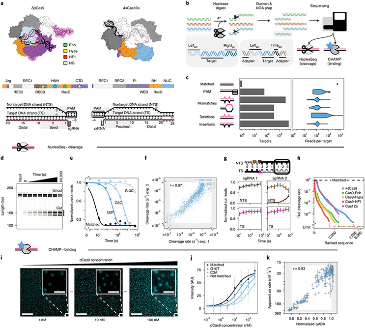
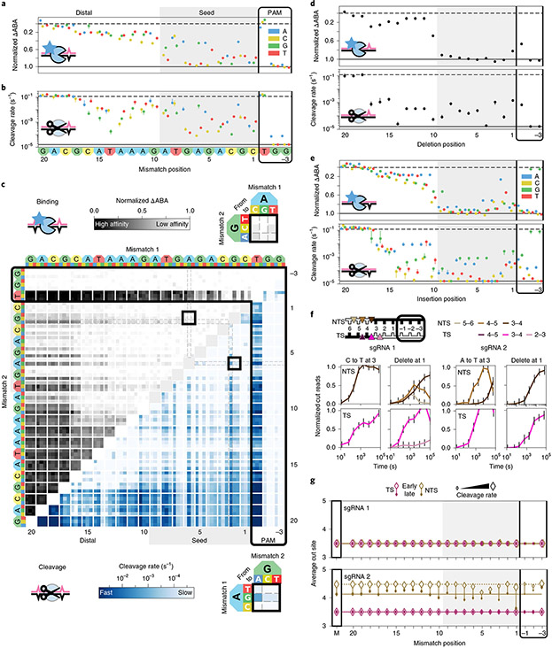
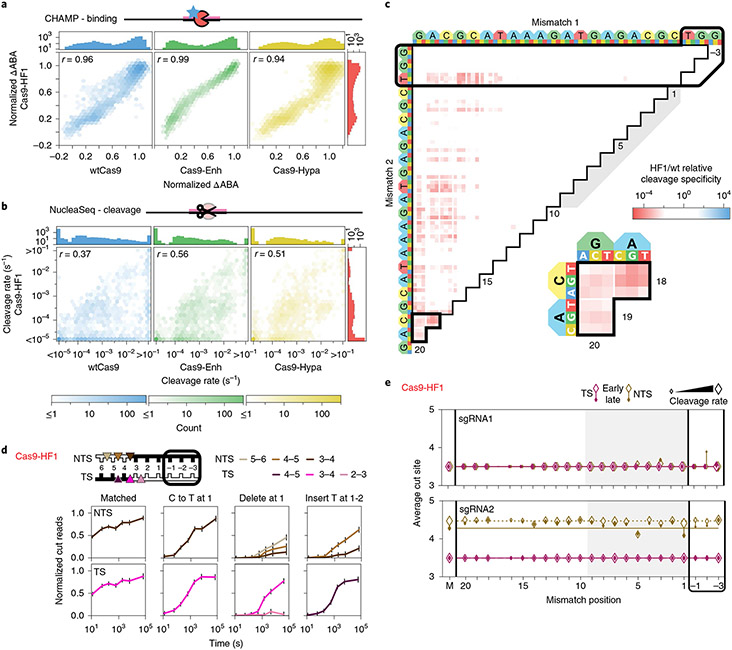
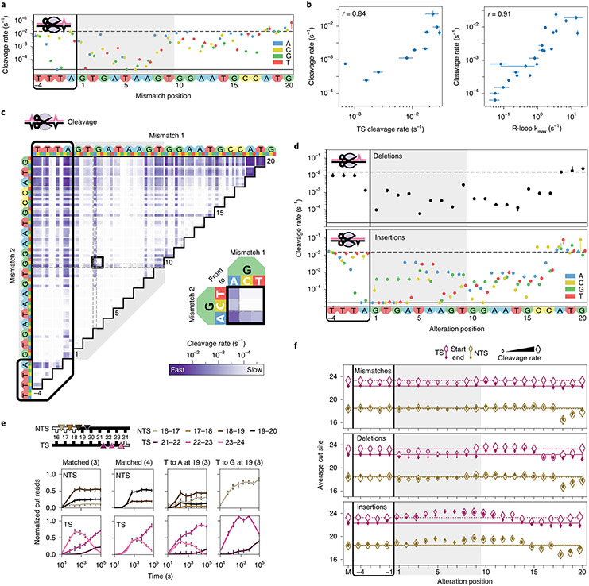
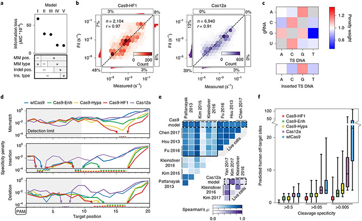

# Massively parallel kinetic profiling of natural and engineered CRISPR nucleases

**Stephen K. Jones Jr.\*, John A. Hawkins\*, Nicole V. Johnson, Cheulhee Jung, Kuang Hu, James R. Rybarski, Janice S. Chen, Jennifer A. Doudna, William H. Press, and Ilya J. Finkelstein** (\* co-first authors)

*Nature Biotechnology*, Volume 39, Issue 1, Pages 84–93 (2021)

**DOI:** [10.1038/s41587-020-0646-5](https://doi.org/10.1038/s41587-020-0646-5)

---

## Table of Contents

- [Abstract](#abstract)
- [Results](#results)
- [Discussion](#discussion)
- [Methods](#methods)
- [Acknowledgements](#acknowledgements)

---
##  Abstract
Engineered _Sp_ Cas9s and _As_ Cas12a cleave fewer off-target genomic sites than wild-type (wt) Cas9. However, understanding their fidelity, mechanisms and cleavage outcomes requires systematic profiling across mispaired target DNAs. Here we describe NucleaSeq—nuclease digestion and deep sequencing—a massively parallel platform that measures the cleavage kinetics and time-resolved cleavage products for over 10,000 targets containing mismatches, insertions and deletions relative to the guide RNA. Combining cleavage rates and binding specificities on the same target libraries, we benchmarked five _Sp_ Cas9 variants and _As_ Cas12a. A biophysical model built from these data sets revealed mechanistic insights into off-target cleavage. Engineered Cas9s, especially Cas9-HF1, dramatically increased cleavage specificity but not binding specificity compared to wtCas9. Surprisingly, AsCas12a cleavage specificity differed little from that of wtCas9. Initial DNA cleavage sites and end trimming varied by nuclease, guide RNA and the positions of mispaired nucleotides. More broadly, NucleaSeq enables rapid, quantitative and systematic comparisons of specificity and cleavage outcomes across engineered and natural nucleases.
* * *
CRISPR-associated (Cas) nucleases have revolutionized gene editing. The _Streptococcus pyogenes (Sp)_ Cas9 nuclease interrogates genomes by first recognizing a three-nucleotide NGG protospacer adjacent motif (PAM), followed by hybridization of its guide RNA with a target DNA to form an R-loop[1](https://pmc.ncbi.nlm.nih.gov/articles/PMC9665413/#R1),[2](https://pmc.ncbi.nlm.nih.gov/articles/PMC9665413/#R2). A complete R-loop activates the nuclease domains to cleave both strands of the target DNA[2](https://pmc.ncbi.nlm.nih.gov/articles/PMC9665413/#R2)-[5](https://pmc.ncbi.nlm.nih.gov/articles/PMC9665413/#R5). Genomic ‘off-target’ sites that are partially complementary to the guide RNA can also activate the nuclease, leading to unanticipated mutations, large-scale deletions and chromosomal rearrangements[6](https://pmc.ncbi.nlm.nih.gov/articles/PMC9665413/#R6)-[8](https://pmc.ncbi.nlm.nih.gov/articles/PMC9665413/#R8).
Engineered Cas9 variants and _Acidaminococcus_ species Cas12a (hereafter Cas12a) cleave fewer off-targets than _Sp_ Cas9 in cells[9](https://pmc.ncbi.nlm.nih.gov/articles/PMC9665413/#R9)-[20](https://pmc.ncbi.nlm.nih.gov/articles/PMC9665413/#R20). Currently, nuclease specificity is inferred from DNA break repair scars at on- and off-target genomic sites[21](https://pmc.ncbi.nlm.nih.gov/articles/PMC9665413/#R21)-[23](https://pmc.ncbi.nlm.nih.gov/articles/PMC9665413/#R23). Such off-target detection strategies cannot differentiate enzyme-intrinsic kinetic parameters from factors like the nuclease delivery method, exposure time, genetic context, cell cycle phase or DNA break repair pathway. Most in vitro next-generation sequencing (NGS)-based strategies are also designed to find putative off-target sites in genomes, but they compare read counts rather than kinetic rates and fail to identify DNA ends or their processing kinetics[22](https://pmc.ncbi.nlm.nih.gov/articles/PMC9665413/#R22),[24](https://pmc.ncbi.nlm.nih.gov/articles/PMC9665413/#R24)-[27](https://pmc.ncbi.nlm.nih.gov/articles/PMC9665413/#R27). To directly benchmark and predict the specificities of these enzymes, off-target binding affinity and cleavage kinetics need to be compared across a systematic library of off-target DNA sequences. Here we describe a new experimental platform that comprehensively measures DNA binding and cleavage specificity across synthetic DNA libraries to benchmark CRISPR–Cas nucleases.
NucleaSeq is a rapid, massively parallel, in vitro platform that measures the cleavage kinetics of CRISPR–Cas nucleases. NucleaSeq captures the time-resolved identities of cleaved products for large libraries of guide RNA-matched and mispaired DNA sequences. Nuclease binding specificities for these libraries are measured on repurposed NGS MiSeq chips via the chip-hybridized association mapping platform (CHAMP)[28](https://pmc.ncbi.nlm.nih.gov/articles/PMC9665413/#R28). Coupling NucleaSeq and CHAMP, we evaluated five _Sp_ Cas9 variants and Cas12a for DNAs containing guide-RNA-relative mismatches, insertions and deletions. Engineered Cas9s increase cleavage specificity but not binding specificity. Surprisingly, Cas12a cleaves with similar specificity to wtCas9 in vitro, despite its higher specificity in cells[12](https://pmc.ncbi.nlm.nih.gov/articles/PMC9665413/#R12),[20](https://pmc.ncbi.nlm.nih.gov/articles/PMC9665413/#R20),[23](https://pmc.ncbi.nlm.nih.gov/articles/PMC9665413/#R23). The initial DNA cleavage site and subsequent end trimming vary with the nuclease, guide RNA and positions of RNA–DNA mispairs. Intriguingly, PAM-distal RNA–DNA mispairs generate incompatible DNA ends via nuclease end trimming without slowing overall cleavage rates. We used our data to train and develop a biophysical model that provides a quantitative framework for comparing CRISPR nucleases and reveals mechanistic insights into off-target cleavage. More broadly, NucleaSeq and CHAMP enable rapid, quantitative and systematic comparisons of the specificities and cleavage products of engineered and natural nucleases.
---
##  Results
### Measuring off-target binding, cleavage and end trimming by CRISPR nucleases.
We set out to systematically evaluate the DNA cleavage and binding specificities of six CRISPR–Cas nucleases: wild-type _Sp_ Cas9 (wt), four engineered _Sp_ Cas9s (enhanced eSp1.1, high fidelity HF1, hyper-accurate Hypa and relaxed PAM NG) and Cas12a (formerly Cpf1) ([Fig. 1a](https://pmc.ncbi.nlm.nih.gov/articles/PMC9665413/#F1), [Supplementary Fig. 1a](https://pmc.ncbi.nlm.nih.gov/articles/PMC9665413/#SD1) and [Supplementary Files 1](https://pmc.ncbi.nlm.nih.gov/articles/PMC9665413/#SD1)-[3](https://pmc.ncbi.nlm.nih.gov/articles/PMC9665413/#SD1))[2](https://pmc.ncbi.nlm.nih.gov/articles/PMC9665413/#R2),[10](https://pmc.ncbi.nlm.nih.gov/articles/PMC9665413/#R10),[13](https://pmc.ncbi.nlm.nih.gov/articles/PMC9665413/#R13),[17](https://pmc.ncbi.nlm.nih.gov/articles/PMC9665413/#R17),[20](https://pmc.ncbi.nlm.nih.gov/articles/PMC9665413/#R20),[29](https://pmc.ncbi.nlm.nih.gov/articles/PMC9665413/#R29). For NucleaSeq, we synthesize libraries comprising more than 104 targets with randomized 5′ and 3′ PAMs or up to two mispairing alterations (guide RNA-relative mismatches, insertions or deletions) ([Fig. 1b](https://pmc.ncbi.nlm.nih.gov/articles/PMC9665413/#F1),[c](https://pmc.ncbi.nlm.nih.gov/articles/PMC9665413/#F1), [Supplementary Fig. 1b](https://pmc.ncbi.nlm.nih.gov/articles/PMC9665413/#SD1) and [Supplemental File 1](https://pmc.ncbi.nlm.nih.gov/articles/PMC9665413/#SD1)). Error-correcting barcodes flank each target, to uniquely identify both DNA products after cleavage[30](https://pmc.ncbi.nlm.nih.gov/articles/PMC9665413/#R30). To observe single-turnover kinetics, we incubate the library with ten-fold excess guide-RNA-charged ribonucleoprotein (RNP) for ~16 h ([Supplementary Fig. 1c](https://pmc.ncbi.nlm.nih.gov/articles/PMC9665413/#SD1),[d](https://pmc.ncbi.nlm.nih.gov/articles/PMC9665413/#SD1)). At each time point, we quench a reaction sample and de-proteinize it to release DNAs ([Fig. 1d](https://pmc.ncbi.nlm.nih.gov/articles/PMC9665413/#F1) and [Supplementary Fig. 1e](https://pmc.ncbi.nlm.nih.gov/articles/PMC9665413/#SD1)). We prepare each time point for NGS; adapter ligation gap-fills 5′ DNA overhangs, trims 3′ overhangs and adds time stamp barcodes to each reaction sample before pooled sequencing.
#### Fig. 1 ∣. Overview of the integrated NucleaSeq and CHAMP platform.

**a** , Crystal structures and domain maps of Cas9 and Cas12a RNP complexes (Protein Data Bank: 5F9R and 5B43). Stars: engineered Cas9 mutation sites. Scissors: cleavage sites. **b** , For NucleaSeq, a CRISPR–Cas nuclease digests a synthesized library of mispaired target DNAs under single-turnover conditions. DNAs contain unique left and right barcodes. Time point barcodes are added before NGS. NGS chips are recovered to profile DNA binding specificity via CHAMP. **c** , DNA libraries include targets with randomized PAMs or up to two guide-RNA-relative alterations. Right, read distribution by target type for CHAMP. **d** , A wtCas9 nuclease reaction time course (sgRNA 1) resolved by capillary electrophoresis. Each sample was run separately—two independent replicates for each. **e** , Cleavage rates are computed by fitting single exponential functions (lines) to uncut DNA depletions (circles). **f** , Cleavage rate reproducibility for wtCas9-sgRNA1 experiments. The gray area contains targets with rates beyond the experimental dynamic range. _r_ : Pearson’s correlation coefficient excluding gray area. **g** , Cut DNA fragments from matched DNAs (black in diagram) report the time-dependent distribution of Cas9-generated cut sites in the TSs and NTSs. wtCas9-sgRNA1 cuts bluntly between the 3rd and 4th nucleotides (left). wtCas9-sgRNA2 produces a one-nucleotide 5′ overhang and then trims it off the NTS (right). Colors: cut positions (triangles in diagram). Error bars: median ± s.e.m. of _n_ = 146 guide-RNA-matched library members. **h** , Ranked relative cleavage rates of all library members for all five nucleases. Limit: relative cleavage rate beyond detection limit. **i** , CHAMP reports the apparent binding affinity of nuclease-inactive CRISPR enzymes. Library DNAs on the surface of an NGS chip are incubated with increasing concentrations of a fluorescent dCas9 (cyan puncta). Their sequences are bioinformatically determined by comparison to the NGS output. Scale bar, 50 μm; inset, 5 μm. **j** , ABAs are computed by fitting Hill functions (lines) to mean fluorescence DNA clusters intensities (circles). AU, arbitrary fluorescence units. Median ± s.d. from bootstrap analysis of _n_ ≥ 5 DNA clusters for each target. **k** , Correlation of dCas9 ΔABAs measured with CHAMP to dCas9 on-rates from a high-throughput assay[33](https://pmc.ncbi.nlm.nih.gov/articles/PMC9665413/#R33). ΔABA, change in apparent binding affinity from the matched target, normalized to that of a scrambled DNA. _r_ : Pearson’s correlation coefficient. _x_ axis: median ± s.d. from bootstrap analysis of _n_ ≥ 5 DNA clusters for each target. _y_ axis: median ± s.e.m. of _n_ ≥ 6 for each target DNA[33](https://pmc.ncbi.nlm.nih.gov/articles/PMC9665413/#R33).
The NucleaSeq bioinformatics pipeline (available at <https://github.com/finkelsteinlab/nucleaseq>) identifies reads from cut and uncut DNAs by their flanking barcode(s). The read counts for each library member are normalized across time points and between replicates by comparing to read counts of ~150 negative control DNA sequences that are not recognized by any of the nucleases (see [Methods](https://pmc.ncbi.nlm.nih.gov/articles/PMC9665413/#S10)). Because Cas9 and Cas12a cleave DNA at a constant rate under single-turnover conditions, we fit substrate depletion to single exponential decay functions to determine cleavage rates for every target[31](https://pmc.ncbi.nlm.nih.gov/articles/PMC9665413/#R31),[32](https://pmc.ncbi.nlm.nih.gov/articles/PMC9665413/#R32); these span our detectable range (_k c_ >10−1 to ~10−5 s−1) with high reproducibility ([Fig. 1e](https://pmc.ncbi.nlm.nih.gov/articles/PMC9665413/#F1),[f](https://pmc.ncbi.nlm.nih.gov/articles/PMC9665413/#F1) and [Supplementary Fig. 1f](https://pmc.ncbi.nlm.nih.gov/articles/PMC9665413/#SD1))[25](https://pmc.ncbi.nlm.nih.gov/articles/PMC9665413/#R25). As expected, all nucleases cleave their matched DNA substrate rapidly (_k c_ ≥0.1 s−1 for wtCas9; [Fig. 1e](https://pmc.ncbi.nlm.nih.gov/articles/PMC9665413/#F1)). The precise position of the cut site is also identified for both DNA fragments ([Fig. 1g](https://pmc.ncbi.nlm.nih.gov/articles/PMC9665413/#F1)). Cleavage specificity—the ratio of cleavage rates between mispaired and matched targets—intuitively benchmarks nucleases. A low ratio means that the (saturating) nuclease cleaves the mispaired target slower than the matched target. Comparing specificities across all mismatched target DNAs shows that all engineered Cas9s outperform wtCas9. Cas9-HF1 shows the greatest specificity against mismatched targets, whereas Cas12a retains similar cleavage specificity to wtCas9 ([Fig. 1h](https://pmc.ncbi.nlm.nih.gov/articles/PMC9665413/#F1) and [Supplementary Fig. 5e](https://pmc.ncbi.nlm.nih.gov/articles/PMC9665413/#SD1)).
We compare cleavage rates to apparent DNA binding affinities measured using CHAMP[28](https://pmc.ncbi.nlm.nih.gov/articles/PMC9665413/#R28) ([Fig. 1i](https://pmc.ncbi.nlm.nih.gov/articles/PMC9665413/#F1)-[k](https://pmc.ncbi.nlm.nih.gov/articles/PMC9665413/#F1) and [Supplementary Fig. 1g](https://pmc.ncbi.nlm.nih.gov/articles/PMC9665413/#SD1)). CHAMP measures the apparent binding affinity (ABA) of CRISPR–Cas nucleases to DNA clusters on the surface of regenerated NGS chips. ABAs are normalized to matched and unmatched targets and correlate with dCas9 on-rates[33](https://pmc.ncbi.nlm.nih.gov/articles/PMC9665413/#R33) (_r_ = 0.93; [Fig. 1k](https://pmc.ncbi.nlm.nih.gov/articles/PMC9665413/#F1)). Thus, we deem that ABAs capture differences in the on-rates for different DNA sequences. By measuring cleavage and binding across the same DNA target libraries, NucleaSeq and CHAMP reveal sequence-specific mechanisms of nuclease fidelity.
### Cas9 tolerates mismatches better than insertions or deletions.
We programmed wtCas9 with two guide RNAs for both binding and cleavage analysis ([Fig. 2](https://pmc.ncbi.nlm.nih.gov/articles/PMC9665413/#F2), [Supplementary Fig. 2](https://pmc.ncbi.nlm.nih.gov/articles/PMC9665413/#SD1) and [Supplementary Table 1](https://pmc.ncbi.nlm.nih.gov/articles/PMC9665413/#SD1)). To measure off-target DNA binding, increasing concentrations of dCas9 are incubated in regenerated MiSeq chips harboring the sequenced DNA library. We detected no DNA binding at the lowest dCas9 concentration (100 pM), whereas the DNA clusters appeared completely saturated at the highest dCas9 concentration (300 nM). Consistent with previous reports in vitro and in vivo, dCas9 has a high apparent binding affinity for partially mismatched target DNAs. Our results strongly correlate between biological replicates and with the binding affinities measured via another high-throughput method (_r_ = 0.93; [Fig. 1f](https://pmc.ncbi.nlm.nih.gov/articles/PMC9665413/#F1) and [Supplementary Fig. 1f](https://pmc.ncbi.nlm.nih.gov/articles/PMC9665413/#SD1))[33](https://pmc.ncbi.nlm.nih.gov/articles/PMC9665413/#R33). NucleaSeq cleavage rates for matched DNA (≥0.1 s−1) agree well with gel-based measurements ([Supplementary Fig. 5a](https://pmc.ncbi.nlm.nih.gov/articles/PMC9665413/#SD1),[b](https://pmc.ncbi.nlm.nih.gov/articles/PMC9665413/#SD1)) and kinetic rate constants for wtCas9, where R-loop propagation is rate limiting[3](https://pmc.ncbi.nlm.nih.gov/articles/PMC9665413/#R3),[34](https://pmc.ncbi.nlm.nih.gov/articles/PMC9665413/#R34),[35](https://pmc.ncbi.nlm.nih.gov/articles/PMC9665413/#R35). Overall, Cas9 bound 70% of library targets with a higher affinity than an unmatched target but cleaved just 60% of these targets, indicating that a subset of bound DNAs is not cleaved ([Supplementary File 2](https://pmc.ncbi.nlm.nih.gov/articles/PMC9665413/#SD1)).
#### Fig. 2 ∣. Comprehensive analysis of off-target wtCas9 DNA binding and cleavage.

**a** , dCas9 ΔABAs for targets with one sgRNA1-relative mismatch. Dashed line: normalized matched target ΔABA (0); solid line: scrambled DNA ΔABA (negative control, 1). Median ± s.d. from bootstrap analysis of _n_ ≥ 5 DNA clusters for each target. **b** , Cas9 cleavage rates for the same targets as in **a**. Dashed line: cleavage rate of the matched target; solid line: limit of detection for the slowest-cleaving targets. Error bars: s.d. from 50 bootstrap analysis measurements. **c** , ΔABAs (upper, grays) and cleavage rates (lower, blues) for targets containing two sgRNA1-relative mismatches. Black boxes expanded in callouts. **d** , dCas9 ΔABAs (upper, median ± s.d. from bootstrap analysis of _n_ ≥ 5 DNA clusters for each target) and Cas9 cleavage rates (lower, error bars: s.d. from 50 bootstrap analysis measurements) for targets containing one sgRNA1-relative deletion or (**e**) insertion. **f** , Normalized reads for the TS and NTS of DNAs containing either a mismatch at position 3 (C3T or A3T) or a deletion at position 1 compared to sgRNA1 (left) or sgRNA2 (right). Error bars: maximum s.d. for cut products from cleavage of 146 matched DNA controls. **g** , Average cut site positions for each strand (TS and NTS) from DNAs containing one mismatch relative to sgRNA 1 (upper) or sgRNA 2 (lower). Range: earliest time point with more than 33% cut reads (open diamonds) to final time point (filled diamonds). Dashed and solid horizontal lines: mean cut site positions for 146 matched DNAs (M) at early and late time points.
Comparisons of wtCas9 binding affinities and cleavage rates for targets harboring single mismatches revealed key wtCas9 characteristics ([Fig. 2a](https://pmc.ncbi.nlm.nih.gov/articles/PMC9665413/#F2),[b](https://pmc.ncbi.nlm.nih.gov/articles/PMC9665413/#F2) and [Supplementary Fig. 2a](https://pmc.ncbi.nlm.nih.gov/articles/PMC9665413/#SD1)). wtCas9 recognizes a 3′-NGG PAM (and NGA or NAG weakly)[31](https://pmc.ncbi.nlm.nih.gov/articles/PMC9665413/#R31),[36](https://pmc.ncbi.nlm.nih.gov/articles/PMC9665413/#R36)-[38](https://pmc.ncbi.nlm.nih.gov/articles/PMC9665413/#R38). Binding and cleavage activity varied across three target regions. In the ‘seed’ region (positions 1~9 relative to the PAM)[1](https://pmc.ncbi.nlm.nih.gov/articles/PMC9665413/#R1),[2](https://pmc.ncbi.nlm.nih.gov/articles/PMC9665413/#R2),[36](https://pmc.ncbi.nlm.nih.gov/articles/PMC9665413/#R36), mismatches can slow cleavage >100-fold from matched target levels (<10−3 s−1). From positions 10~17, mismatches minimally affect binding but slow cleavage depending on their position and type (~10−1 to 10−3 s−1). Mismatches in the final region (~18–20) barely affect Cas9 binding or cleavage ([Fig. 2a](https://pmc.ncbi.nlm.nih.gov/articles/PMC9665413/#F2),[b](https://pmc.ncbi.nlm.nih.gov/articles/PMC9665413/#F2) and [Supplementary Fig. 2a](https://pmc.ncbi.nlm.nih.gov/articles/PMC9665413/#SD1))[39](https://pmc.ncbi.nlm.nih.gov/articles/PMC9665413/#R39). These data establish that our integrated platform quantitatively recapitulates binding and cleavage by wtCas9.
Two seed mismatches typically block binding and abolish cleavage ([Fig. 2c](https://pmc.ncbi.nlm.nih.gov/articles/PMC9665413/#F2) and [Supplementary Fig. 2b](https://pmc.ncbi.nlm.nih.gov/articles/PMC9665413/#SD1)). However, cleavage rates depend on mismatch identity: wtCas9 has poor affinity for the target with A6G and G2A seed substitutions but cleaves it faster than other seed substitution pairs (0.0017 s−1; 90% confidence interval: 0.0015–0.0021 s−1; [Fig. 2c](https://pmc.ncbi.nlm.nih.gov/articles/PMC9665413/#F2), callouts). (A subset of low binding affinity sequences is still cleaved at saturating Cas9 concentration). Targets with paired distal and seed substitutions show the broadest ranges and reveal that wtCas9 accommodates rG-dT mismatches ([Figs. 2c](https://pmc.ncbi.nlm.nih.gov/articles/PMC9665413/#F2) and [5](https://pmc.ncbi.nlm.nih.gov/articles/PMC9665413/#F5)). This thermodynamically stable wobble interaction might form Watson–Crick-like mispairs[40](https://pmc.ncbi.nlm.nih.gov/articles/PMC9665413/#R40). Other non-Watson–Crick interactions (rU-dG and rG-dG) are not as well tolerated, indicating that Cas9 constrains the RNA–DNA duplex[41](https://pmc.ncbi.nlm.nih.gov/articles/PMC9665413/#R41).
### Cas9 generates staggered overhangs at mispaired targets.
NucleaSeq identifies the 5′ ends of the target strand (TS, PAM-distal cleavage product) and non-target strand (NTS, PAM-containing cleavage product) via unique barcodes on the left and right sides of each DNA molecule. The single-guide RNA (sgRNA) 1-wtCas9 RNP generates a blunt DNA end on its matched target. However, an sgRNA 2-wtCas9 RNP produces 5′ overhangs; the NTS overhang recedes within 15 min, presumably via RuvC domain-catalyzed cleavage (trimming) ([Fig. 1g](https://pmc.ncbi.nlm.nih.gov/articles/PMC9665413/#F1)). The HNH domain cleaves most TSs between nucleotides 3 and 4, but the RuvC domain’s cleavage position, trimming rates and trimming extent depend on mispair position and identity ([Fig. 2f](https://pmc.ncbi.nlm.nih.gov/articles/PMC9665413/#F2),[g](https://pmc.ncbi.nlm.nih.gov/articles/PMC9665413/#F2), [Supplementary Fig 2e](https://pmc.ncbi.nlm.nih.gov/articles/PMC9665413/#SD1),[f](https://pmc.ncbi.nlm.nih.gov/articles/PMC9665413/#SD1) and [Supplementary File 3](https://pmc.ncbi.nlm.nih.gov/articles/PMC9665413/#SD1)). Near the PAM, deletions bias wtCas9 to cut bluntly, but an insertion pushes cleavage of both strands further from the PAM ([Supplementary Fig. 2f](https://pmc.ncbi.nlm.nih.gov/articles/PMC9665413/#SD1)). Mispaired targets likely reposition the NTS within the RuvC domain, but the relatively mobile HNH domain compensates for TS distortion in a mispair- and sgRNA-specific manner.
### Engineered Cas9 nucleases improve cleavage but not binding specificity.
We selected three engineered Cas9 variants (Cas9-Enh (eSp1.1), Cas9-HF1 and Cas9-Hypa) for comparison to wtCas9 ([Fig. 3](https://pmc.ncbi.nlm.nih.gov/articles/PMC9665413/#F3)). Remarkably, engineered dCas9 RNPs bound library targets with similar affinities to dCas9’s (_r_ = 0.93–0.96; [Fig. 3a](https://pmc.ncbi.nlm.nih.gov/articles/PMC9665413/#F3)). This result is striking because Cas9-HF1 and Cas9-Enh were both designed to destabilize nonspecific Cas9-DNA interactions and were speculated to reduce both off-target DNA binding and cleavage[13](https://pmc.ncbi.nlm.nih.gov/articles/PMC9665413/#R13),[17](https://pmc.ncbi.nlm.nih.gov/articles/PMC9665413/#R17). But all variants improve cleavage specificity: more than 40% of the library is cleaved more slowly than with wtCas9 ([Fig. 3b](https://pmc.ncbi.nlm.nih.gov/articles/PMC9665413/#F3)). Cas9-HF1 improved specificity the most, followed closely by Cas9-Hypa and then Cas9-Enh. This improvement is greatest for targets with PAM-distal mispairs (positions 18–20; [Fig. 3c](https://pmc.ncbi.nlm.nih.gov/articles/PMC9665413/#F3) and [Supplementary Fig. 4](https://pmc.ncbi.nlm.nih.gov/articles/PMC9665413/#SD1)). Cas9-HF1 trims overhanging sequences more slowly than wtCas9. We rarely observed Cas9-HF1 trim targets within our time resolution, unless mispairs occurred near cleavage sites (positions 1–5)—then cleavage patterns and end-trimming kinetics depend on mispair type ([Fig. 3d](https://pmc.ncbi.nlm.nih.gov/articles/PMC9665413/#F3), [Supplementary Fig. 4c](https://pmc.ncbi.nlm.nih.gov/articles/PMC9665413/#SD1),[d](https://pmc.ncbi.nlm.nih.gov/articles/PMC9665413/#SD1) and [Supplementary File 3](https://pmc.ncbi.nlm.nih.gov/articles/PMC9665413/#SD1)). At position 1, a C-to-T substitution produces blunt cuts; a deletion produces (at least) three NTS and two TS cleavage products; and an insertion shifts the cleavage pattern one nucleotide away from the PAM ([Fig. 3d](https://pmc.ncbi.nlm.nih.gov/articles/PMC9665413/#F3), right)[45](https://pmc.ncbi.nlm.nih.gov/articles/PMC9665413/#R45). Cas9-HF1 provides the greatest cleavage specificity and the least-trimmed DNA ends among these Cas9s ([Fig. 3e](https://pmc.ncbi.nlm.nih.gov/articles/PMC9665413/#F3)).
#### Fig. 3 ∣. Comparison of engineered Cas9 nucleases.

**a** ,**b** , Two-dimensional density plots correlate Cas9-HF1 ΔABAs (**a**) and cleavage rates (**b**) with those from wtCas9, Cas9-Enh and Cas9-Hypa (sgRNA1). Histograms: all ΔABAs or cleavage rates for the respective nuclease. _r_ : Pearson’s correlation coefficient. **c** , The ratio of Cas9-HF1 to wtCas9 cleavage specificities for targets with two sgRNA1-relative mismatches. Red: slower cleavage by Cas9-HF1; blue: slower cleavage by wtCas9. Black-outlined range expanded in callout. **d** , Cas9-HF1 cleavage patterns on the TS and NTS of select target DNAs (sgRNA1). Normalized counts of cut products comprising ≥10% of the total cut reads at any time point. Error bars: maximum s.d. for cut products from cleavage of 146 matched DNA controls. **e** , Average cut site positions generated by Cas9-HF1 for each strand (TS and NTS) for targets containing one sgRNA-relative mismatch. Range: earliest timepoint with more than 33% cut reads (open diamonds) to final time point (filled diamonds). Dashed and solid horizontal lines: mean cut site positions for 146 matched DNAs (M) at early and late time points.
Recent engineering efforts have altered and relaxed _Sp_ Cas9’s PAM[29](https://pmc.ncbi.nlm.nih.gov/articles/PMC9665413/#R29),[37](https://pmc.ncbi.nlm.nih.gov/articles/PMC9665413/#R37),[46](https://pmc.ncbi.nlm.nih.gov/articles/PMC9665413/#R46),[47](https://pmc.ncbi.nlm.nih.gov/articles/PMC9665413/#R47). To determine how PAM relaxation affects targeting, we profiled Cas9-NG ([Supplementary Fig. 5](https://pmc.ncbi.nlm.nih.gov/articles/PMC9665413/#SD1))[29](https://pmc.ncbi.nlm.nih.gov/articles/PMC9665413/#R29). Cas9-NG cleaves a matched target (NGG PAM) ~ten-fold slower than wtCas9 at 22 °C (0.016 ± 0.002 s−1 versus 0.14 ± 0.01 s−1; [Supplementary Fig. 5a](https://pmc.ncbi.nlm.nih.gov/articles/PMC9665413/#SD1),[b](https://pmc.ncbi.nlm.nih.gov/articles/PMC9665413/#SD1)). This slower cleavage rate extends to DNAs with alterations outside the PAM, limiting our ability to broadly compare Cas9-NG with wtCas9 at 22 °C. Instead, we repeated both wtCas9 and Cas9-NG cleavage experiments at 37 °C. wtCas9 cleaves targets faster at 37 °C than at 22 °C, but these data sets correlate well (_r_ = 0.7; [Supplementary Fig. 5c](https://pmc.ncbi.nlm.nih.gov/articles/PMC9665413/#SD1)). Compared to wtCas9, Cas9-NG cleaves targets with non-NGG PAM sequences more rapidly: rates for targets with NCN and NTN PAMs are about 100-fold faster ([Supplementary Fig. 5d](https://pmc.ncbi.nlm.nih.gov/articles/PMC9665413/#SD1)). Targets with non-PAM alterations show similar relative cleavage rates between these nucleases ([Supplementary Figs. 2b](https://pmc.ncbi.nlm.nih.gov/articles/PMC9665413/#SD1)-[e](https://pmc.ncbi.nlm.nih.gov/articles/PMC9665413/#SD1), [5d](https://pmc.ncbi.nlm.nih.gov/articles/PMC9665413/#SD1)-[g](https://pmc.ncbi.nlm.nih.gov/articles/PMC9665413/#SD1) and [Supplementary File 3](https://pmc.ncbi.nlm.nih.gov/articles/PMC9665413/#SD1)). But Cas9-NG more variably cleaves targets with non-NGG PAMs or mismatches near the cut site ([Supplementary Fig. 5h](https://pmc.ncbi.nlm.nih.gov/articles/PMC9665413/#SD1),[i](https://pmc.ncbi.nlm.nih.gov/articles/PMC9665413/#SD1)). Cas9-NG cleaves matched targets ~ten-fold slower than wtCas9 without improving fidelity but opens the target (and off-target) space by recognizing non-NGG PAMs.
### Cas12a cleavage specificity.
We assayed Cas12a cleavage using the same libraries as for Cas9 ([Fig. 4](https://pmc.ncbi.nlm.nih.gov/articles/PMC9665413/#F4), [Supplementary Fig. 1b](https://pmc.ncbi.nlm.nih.gov/articles/PMC9665413/#SD1), [Supplementary Fig. 6](https://pmc.ncbi.nlm.nih.gov/articles/PMC9665413/#SD1), [Supplementary Table 2](https://pmc.ncbi.nlm.nih.gov/articles/PMC9665413/#SD1) and [Supplementary Files 1](https://pmc.ncbi.nlm.nih.gov/articles/PMC9665413/#SD1)-[3](https://pmc.ncbi.nlm.nih.gov/articles/PMC9665413/#SD1)). We recovered Cas12a’s 5′-TTTV PAM and found that Cas12a cleaves the same matched targets at least ten-fold slower than wtCas9 ([Figs. 2b](https://pmc.ncbi.nlm.nih.gov/articles/PMC9665413/#F2) and [4a](https://pmc.ncbi.nlm.nih.gov/articles/PMC9665413/#F4)). For mismatched targets, we previously established that cleavage rates correlate strongly with R-loop propagation rates (_r_ = 0.91; [Fig. 4b](https://pmc.ncbi.nlm.nih.gov/articles/PMC9665413/#F4))[32](https://pmc.ncbi.nlm.nih.gov/articles/PMC9665413/#R32). Thus, Cas12a cleavage specificity is dominated by rate-limiting (and reversible) R-loop propagation followed by rapid DNA cleavage.
#### Fig. 4 ∣. Comprehensive analysis of off-target Cas12a cleavage.

**a** , Cas12a cleavage rates for DNAs containing one crRNA3-relative mismatch. Dashed line: cleavage rate of the matched target. Solid line: limit of detection for the slowest-cleaving targets. Error bars: s.d. from 50 bootstrap analysis measurements. **b** , Total cleavage rate compared to reported target strand cleavage (left) and R-loop propagation (right) rates[32](https://pmc.ncbi.nlm.nih.gov/articles/PMC9665413/#R32). Total cleavage rates error bars: s.d. from 50 bootstrap analysis measurements. TS cleavage and R-loop propagation rate error bars: rate from a hyperbolic fit ± s.d. from _n_ = 3 independent experiments. _r_ : Pearson’s correlation coefficient. **c** , Cleavage rates for targets with two crRNA3-relative mismatches. Black box expanded in callout. **d** , Cleavage rates for DNAs containing one crRNA3-relative deletion (upper) or insertion (lower). Error bars: s.d. from 50 bootstrap analysis measurements. Nucleotides inserted to the left of the given positions. **e** , Normalized reads for the TSs and NTSs of the indicated targets. Parenthesis: crRNA. Error bars: maximum s.d. for cut products from cleavage of 146 matched DNA controls. **f** , Average cut site positions for each strand (TS and NTS) from DNAs with one crRNA3-relative mismatch (upper), deletion (middle) or insertion (lower). Range: earliest time point with more than 33% cut reads (open diamonds) to final time point (filled diamonds). Dashed and solid horizontal lines: mean cut site positions for 146 matched DNAs (M) at early and late time points.
Cas12a cleaves mismatched targets depending on mismatch position and base identity (compare G and T substitutions at C17; [Fig. 4a](https://pmc.ncbi.nlm.nih.gov/articles/PMC9665413/#F4)). Most mismatches at PAM-proximal positions 1–8 slow cleavage more than 100-fold over matched target but less than ten-fold at positions 9–17. Two PAM-proximal mismatches (positions 1–14) typically rendered cleavage undetectable, whereas pairing a PAM-distal mismatch (positions 15–20) with a PAM-proximal one changed rates minimally (vertical banding; [Fig. 4c](https://pmc.ncbi.nlm.nih.gov/articles/PMC9665413/#F4)). Like wtCas9, Cas12a tolerates rG-dT mismatches better than others ([Fig. 4c](https://pmc.ncbi.nlm.nih.gov/articles/PMC9665413/#F4), callout)[13](https://pmc.ncbi.nlm.nih.gov/articles/PMC9665413/#R13),[31](https://pmc.ncbi.nlm.nih.gov/articles/PMC9665413/#R31),[48](https://pmc.ncbi.nlm.nih.gov/articles/PMC9665413/#R48). This indicates that both nucleases preferentially stabilize the same specific mismatches within their R-loops.
Despite scant evidence on how Cas12a treats targets with guide-RNA-relative deletions or insertions, structures suggest that R-loop bulging could accommodate these targets[49](https://pmc.ncbi.nlm.nih.gov/articles/PMC9665413/#R49)-[51](https://pmc.ncbi.nlm.nih.gov/articles/PMC9665413/#R51). An indel within the first 17 positions typically slows cleavage 10- to 1,000-fold (to detection limit; [Fig. 4d](https://pmc.ncbi.nlm.nih.gov/articles/PMC9665413/#F4)). These cleavage rates vary widely with base identity (compare insertions at A4), reflecting possible protein and base-specific stabilization. Indels (and mismatches) at the final positions (18–20) can enhance cleavage rates ([Fig. 4a](https://pmc.ncbi.nlm.nih.gov/articles/PMC9665413/#F4),[d](https://pmc.ncbi.nlm.nih.gov/articles/PMC9665413/#F4) and [Supplementary Fig. 6a](https://pmc.ncbi.nlm.nih.gov/articles/PMC9665413/#SD1)) and modulate end trimming by Cas12a (see below).

#### Fig. 5 ∣. Statistical modeling of CRISPR–Cas nuclease cleavage.

**a** , AIC values for five biophysical models relying on the indicated sequence parameters. The most detailed model (V) has the lowest AIC (information loss)—that is, the best goodness of fit. R-loop position-specific parameters reduce the AIC most. **b** , Correlation between measured and modeled cleavage rates for Cas9-HF1 (left, red) and Cas12a (right, purple) using model V. Histograms: distributions of fit or measured values beyond the upper and lower detection limits. Percentages: quantity of data with one or both values beyond detection limits. _r_ : Pearson’s correlation coefficient. **c** , Base identity-dependent weights for mismatches and insertions averaged across all Cas9 and Cas12a enzymes. See [Supplementary Fig. 8](https://pmc.ncbi.nlm.nih.gov/articles/PMC9665413/#SD1) and text for additional information. **d** , Modeled specificity penalties for one guide-RNA-relative mismatch (upper), insertion (middle) or deletion (lower). PAMs are oriented left for comparison. Arrows and dashed lines: values below the detection limit. **e** , The predicted reduction in mismatch-dependent cleavage rates correlates with previous high-throughput measurements of reduced edit efficiencies for wtCas9 (blue) and Cas12a (purple). See [Methods](https://pmc.ncbi.nlm.nih.gov/articles/PMC9665413/#S10) for associated data. _ρ_ : Spearman’s correlation coefficient. **f** , The number of off-target sites in the human genome with a predicted cleavage specificity greater than the indicated specificity threshold. For each nuclease, _n_ = 1,000 targets, selected randomly from exomic DNA. The cleavage specificities of the potential off-target cleavage sites across the genome were calculated using model V. Top whisker (maxima): top of 90% confidence interval; top box: third quartile; center line: median; lower box: second quartile; lower whisker (minima): bottom of 90% confidence interval.
Few studies have examined how CRISPR nucleases target DNAs with guide-RNA-relative insertions and deletions (indels), although some are edited very efficiently[42](https://pmc.ncbi.nlm.nih.gov/articles/PMC9665413/#R42),[43](https://pmc.ncbi.nlm.nih.gov/articles/PMC9665413/#R43). Our experiments showed that wtCas9 typically cleaves targets with indels slower than mismatched targets ([Fig. 2](https://pmc.ncbi.nlm.nih.gov/articles/PMC9665413/#F2) and [Supplementary Figs. 2](https://pmc.ncbi.nlm.nih.gov/articles/PMC9665413/#SD1), [3](https://pmc.ncbi.nlm.nih.gov/articles/PMC9665413/#SD1)), indicating that they encounter additional steric constraints within the R-loop. Deletions in the seed reduce ABAs to near-background levels but are tolerated with intermediate affinity beyond the 9th PAM-distal nucleotide (ΔABAs <0.5). Cleavage rates slow at least 100-fold from matched target rates (_k c_ ~10−3 s−1) except for targets with deletions in the final positions (18–20) ([Fig. 2d](https://pmc.ncbi.nlm.nih.gov/articles/PMC9665413/#F2) and [Supplementary Fig. 2c](https://pmc.ncbi.nlm.nih.gov/articles/PMC9665413/#SD1)). Like mismatches, cleavage of targets with insertions depends on the inserted base’s identity ([Fig. 2e](https://pmc.ncbi.nlm.nih.gov/articles/PMC9665413/#F2) and [Supplementary Figs. 2d](https://pmc.ncbi.nlm.nih.gov/articles/PMC9665413/#SD1), [3b](https://pmc.ncbi.nlm.nih.gov/articles/PMC9665413/#SD1)). Insertions at PAM-distal positions (19 and 20) show higher affinity than the matched target ([Supplementary Fig. 3c](https://pmc.ncbi.nlm.nih.gov/articles/PMC9665413/#SD1)); these insertions might indicate that nucleotides upstream of the target weakly influence interactions with Cas9 (ref. [44](https://pmc.ncbi.nlm.nih.gov/articles/PMC9665413/#R44)). In sum, indels exhibited reduced binding and cleavage except at the most PAM-distal R-loop positions.

### Cas12a cleaves and trims both DNA strands in a mispair-specific manner.
Cas12a staggers target cleavage, producing 5′ overhangs[20](https://pmc.ncbi.nlm.nih.gov/articles/PMC9665413/#R20),[32](https://pmc.ncbi.nlm.nih.gov/articles/PMC9665413/#R32). Our data show that Cas12a cleaves the NTS at several positions and trims the TS progressively after initial cleavage (steady versus time-dependent cut product distributions; [Fig. 4e](https://pmc.ncbi.nlm.nih.gov/articles/PMC9665413/#F4)). These results are consistent with Cas12a’s ability to trim the NTS and cleave the TS at several positions, as detected via radiolabeled oligonucleotides[32](https://pmc.ncbi.nlm.nih.gov/articles/PMC9665413/#R32). Whereas other Cas12a nucleases from non-_Acidaminococcus_ species non-specifically nick single- and double-stranded DNAs in trans[52](https://pmc.ncbi.nlm.nih.gov/articles/PMC9665413/#R52)-[55](https://pmc.ncbi.nlm.nih.gov/articles/PMC9665413/#R55), we found no evidence for this under our experimental conditions (with _Acidaminococcus_ species Cas12a) ([Supplementary Fig. 7a](https://pmc.ncbi.nlm.nih.gov/articles/PMC9665413/#SD1),[b](https://pmc.ncbi.nlm.nih.gov/articles/PMC9665413/#SD1)). Thus, Cas12a cleaves and trims both DNA strands after establishing an R-loop between the CRISPR RNA (crRNA) and the TS DNA.
Cas12a cleaves and trims matched and mismatched targets similarly ([Fig. 4f](https://pmc.ncbi.nlm.nih.gov/articles/PMC9665413/#F4), top)—unless mismatches occur near the NTS cleavage site (positions 18–20). Here, Cas12a shifts NTS cleavage up to two nucleotides, and mismatch identities becomes critical: at T19, Cas12a cleaves an A-substituted target anywhere between nucleotides 16 and 20 but a G-substituted target exactly after nucleotide 16 ([Fig. 4e](https://pmc.ncbi.nlm.nih.gov/articles/PMC9665413/#F4)). Cas12a cleaves the latter target more uniformly than a matched target and trims its TS faster, too.
Targets harboring indels have variable cleavage products. For targets with deletions, Cas12a dramatically shifts TS cleavage (compare deletions at positions 4–8 or 16–19 with 9–15; [Fig. 4f](https://pmc.ncbi.nlm.nih.gov/articles/PMC9665413/#F4), center). This pattern reminds us of a full R-loop helix turn (10–11 base pairs (bp)), implying that one helix face permits guide RNA bulges. Single insertions at positions 1–14 push Cas12a to cleave both strands one nucleotide over ([Fig. 4f](https://pmc.ncbi.nlm.nih.gov/articles/PMC9665413/#F4), bottom), where insertions might bulge from the R-loop to maintain crRNA–DNA register. Taken together, our target libraries showcase that Cas12a’s single RuvC nuclease domain flexibly cleaves—and often trims—both DNA strands[52](https://pmc.ncbi.nlm.nih.gov/articles/PMC9665413/#R52),[53](https://pmc.ncbi.nlm.nih.gov/articles/PMC9665413/#R53).
### A biophysical model for nuclease specificity.
To understand the features governing off-target cleavage, we fit cleavage specificity to several biophysical models of increasing complexity ([Fig. 5](https://pmc.ncbi.nlm.nih.gov/articles/PMC9665413/#F5), [Supplementary Fig. 8](https://pmc.ncbi.nlm.nih.gov/articles/PMC9665413/#SD1) and [Methods](https://pmc.ncbi.nlm.nih.gov/articles/PMC9665413/#S10)). For each nuclease, the models were trained on the entire data set, which includes two distinct target DNA libraries. Training the models on multiple libraries is essential for properly constraining the fit and avoiding target-specific biases for each nuclease[56](https://pmc.ncbi.nlm.nih.gov/articles/PMC9665413/#R56)-[59](https://pmc.ncbi.nlm.nih.gov/articles/PMC9665413/#R59). Unlike machine learning approaches, our models generate off-target cleavage specificity scores from biochemically intuitive parameters[60](https://pmc.ncbi.nlm.nih.gov/articles/PMC9665413/#R60)-[62](https://pmc.ncbi.nlm.nih.gov/articles/PMC9665413/#R62). All models combine a position weight matrix describing the PAM ([Supplementary Fig. 8b](https://pmc.ncbi.nlm.nih.gov/articles/PMC9665413/#SD1)) with nuclease-dependent specificity penalties describing mispairs along the R-loop ([Fig. 5c](https://pmc.ncbi.nlm.nih.gov/articles/PMC9665413/#F5),[d](https://pmc.ncbi.nlm.nih.gov/articles/PMC9665413/#F5) and [Supplementary Fig. 8a](https://pmc.ncbi.nlm.nih.gov/articles/PMC9665413/#SD1)-[c](https://pmc.ncbi.nlm.nih.gov/articles/PMC9665413/#SD1))[63](https://pmc.ncbi.nlm.nih.gov/articles/PMC9665413/#R63). The position weight matrix accurately captures nuclease PAM preferences, including Cas9’s limited tolerance for A substitutions (for example, NGG→NGA) and Cas12a’s for C substitutions (for example, TTTV→TCTV; [Supplementary Fig. 8b](https://pmc.ncbi.nlm.nih.gov/articles/PMC9665413/#SD1)). [Models I](https://pmc.ncbi.nlm.nih.gov/articles/PMC9665413/#FD6)-V differ in how they parametrize the cleavage penalties associated with mismatches, insertions and deletions ([Supplementary Fig. 8a](https://pmc.ncbi.nlm.nih.gov/articles/PMC9665413/#SD1),[c](https://pmc.ncbi.nlm.nih.gov/articles/PMC9665413/#SD1)). For example, the simplest [model (I)](https://pmc.ncbi.nlm.nih.gov/articles/PMC9665413/#FD6) assigns a position-independent penalty for each of the 12 types of possible mismatches, regardless of where they occur within the R-loop. Insertions and deletions are treated as long strings of mismatches. This model only correlates to the measured specificity constants for the five enzymes with coefficients between 0.60 and 0.68 (Pearson’s _r_ ; [Supplementary Fig. 8](https://pmc.ncbi.nlm.nih.gov/articles/PMC9665413/#SD1)). We measured each model’s performance on reducing information loss (using the Akaike Information Criterion (AIC)) and capturing experimental cleavage rate variance[64](https://pmc.ncbi.nlm.nih.gov/articles/PMC9665413/#R64).
The best model (V) combines position-dependent penalties for mismatches, insertions and deletions with position-independent weights for mismatches and insertions (for example, insertion of a dT versus dA anywhere along the R-loop) ([Fig. 5a](https://pmc.ncbi.nlm.nih.gov/articles/PMC9665413/#F5),[b](https://pmc.ncbi.nlm.nih.gov/articles/PMC9665413/#F5)). Model V reduces information loss over four-fold compared to [Model I](https://pmc.ncbi.nlm.nih.gov/articles/PMC9665413/#FD6) and increases the correlations with our measured rates for all five nucleases from _r_ <0.7 to _r_ >0.9. Model V highlights how each position and base identity distinctly affect nuclease specificity. Our biophysical model’s PAM-distal position penalties concisely differentiate nucleases ([Fig. 5d](https://pmc.ncbi.nlm.nih.gov/articles/PMC9665413/#F5)): Cas9-HF1 penalizes mispairs and indels the most among engineered Cas9s (for example, all mispairs are strongly penalized at the 16th R-loop nucleotide), although Cas9-Hypa is close (they share mutation Q695A)[10](https://pmc.ncbi.nlm.nih.gov/articles/PMC9665413/#R10),[13](https://pmc.ncbi.nlm.nih.gov/articles/PMC9665413/#R13). Cas9-Enh only modestly improves mismatch specificity over wtCas9 but heavily penalizes PAM-distal indels. Among natural nucleases, Cas12a penalizes mismatches in positions 5–8 slightly more than wtCas9 but PAM-distal indels less.
The model weighs mismatch and insertion identities almost identically for each nuclease ([Fig. 5c](https://pmc.ncbi.nlm.nih.gov/articles/PMC9665413/#F5) and [Supplementary Fig. 8c](https://pmc.ncbi.nlm.nih.gov/articles/PMC9665413/#SD1)). The following mismatches are most tolerated by both Cas9 and Cas12a: rG-dT, rA-dC, rC-dA and rU-dG. These mispairs can adopt both wobble and Watson–Crick-like confomers[65](https://pmc.ncbi.nlm.nih.gov/articles/PMC9665413/#R65). The thermodynamics of RNA–DNA duplexes partly capture these preferences but cannot capture clashes with (or stabilization by) the RNP[41](https://pmc.ncbi.nlm.nih.gov/articles/PMC9665413/#R41). Pyrimidine insertions are preferred over larger purines. We draw three broad conclusions from our model: 1) all engineered Cas9s are more specific than wtCas9; 2) wtCas9 and Cas12a have similar cleavage specificities; and 3) mispair positions, not base identities, differentiate these nucleases.
We compared our kinetic model to high-throughput in vitro and cellular studies of wtCas9 and Cas12a specificity[1](https://pmc.ncbi.nlm.nih.gov/articles/PMC9665413/#R1),[10](https://pmc.ncbi.nlm.nih.gov/articles/PMC9665413/#R10),[12](https://pmc.ncbi.nlm.nih.gov/articles/PMC9665413/#R12),[13](https://pmc.ncbi.nlm.nih.gov/articles/PMC9665413/#R13),[22](https://pmc.ncbi.nlm.nih.gov/articles/PMC9665413/#R22),[23](https://pmc.ncbi.nlm.nih.gov/articles/PMC9665413/#R23),[66](https://pmc.ncbi.nlm.nih.gov/articles/PMC9665413/#R66)-[69](https://pmc.ncbi.nlm.nih.gov/articles/PMC9665413/#R69) ([Fig. 5e](https://pmc.ncbi.nlm.nih.gov/articles/PMC9665413/#F5) and [Supplementary Fig. 7c](https://pmc.ncbi.nlm.nih.gov/articles/PMC9665413/#SD1)). Although previous studies enumerate off-target sites at a single time point after transfection (or RNP addition), they do not report kinetic cleavage or end-trimming information. To compare different target DNAs, we computed the rank-order correlation coefficient (Spearman’s _ρ_) between values for position-dependent mismatched targets from our model and from each previous study ([Fig. 5e](https://pmc.ncbi.nlm.nih.gov/articles/PMC9665413/#F5), top). On average, our wtCas9 model correlates stronger with these studies (mean _ρ_ = 0.66 ± 0.19) than with one another independently (_ρ_ = 0.53 ± 0.27), showing that our model captures most of the variance in these data sets. Our model also positively correlates with Cas12a data sets ([Fig. 5e](https://pmc.ncbi.nlm.nih.gov/articles/PMC9665413/#F5), bottom; _ρ_ = 0.43 ± 0.22; mean ± s.d.).
We used our model to extrapolate the specificity of each nuclease within the human genome by predicting off-target sites for 1,000 exomic targets ([Fig. 5f](https://pmc.ncbi.nlm.nih.gov/articles/PMC9665413/#F5)). Cas9-HF1 has the fewest predicted off-targets, whereas wtCas9 and Cas12a show similar off-target behaviors. Their similarity in vitro, but not in cells, suggests that nuclease-extrinsic factors influence Cas12a more than wtCas9 (see [Discussion](https://pmc.ncbi.nlm.nih.gov/articles/PMC9665413/#S9))[12](https://pmc.ncbi.nlm.nih.gov/articles/PMC9665413/#R12),[20](https://pmc.ncbi.nlm.nih.gov/articles/PMC9665413/#R20),[23](https://pmc.ncbi.nlm.nih.gov/articles/PMC9665413/#R23). In sum, NucleaSeq and our biophysical model provide mechanistic insights into enzyme-intrinsic cleavage rates and cleavage products, allow quantitative comparisons between nucleases and can improve off-target prediction algorithms[70](https://pmc.ncbi.nlm.nih.gov/articles/PMC9665413/#R70).
---
##  Discussion
NucleaSeq directly compares CRISPR–Cas nucleases by assaying cleavage kinetics, cut site distributions and end-trimming rates on designer DNA libraries. Combining high-throughput off-target cleavage and binding results, we comprehensively describe Cas9 and Cas12a nucleases to reveal their mechanisms. Our resulting biophysical model compares nucleases directly, distilling their shared sequence preferences and unique biochemical features. This approach can inform both target and nuclease selection for specific applications and improve off-target prediction algorithms[42](https://pmc.ncbi.nlm.nih.gov/articles/PMC9665413/#R42),[45](https://pmc.ncbi.nlm.nih.gov/articles/PMC9665413/#R45),[71](https://pmc.ncbi.nlm.nih.gov/articles/PMC9665413/#R71)-[76](https://pmc.ncbi.nlm.nih.gov/articles/PMC9665413/#R76).
We report that Cas12a and wtCas9 have remarkably similar in vitro cleavage specificities, despite Cas12a’s higher specificity in human cells[12](https://pmc.ncbi.nlm.nih.gov/articles/PMC9665413/#R12),[23](https://pmc.ncbi.nlm.nih.gov/articles/PMC9665413/#R23). This could stem from Cas12a’s slower cleavage rates (measured here) affording cellular enzymes time to displace it from off-targets (that is, transcription or chromatin remodeling complexes[77](https://pmc.ncbi.nlm.nih.gov/articles/PMC9665413/#R77)). Their similar in vitro specificity also suggests convergence of these phage defense systems. They share mispair tolerances (that is, rG-dT mismatches and pyrimidine insertions) that lower fidelity but could enable broader phage recognition. Their RuvC nuclease domains also create staggered cuts and trim DNA ends, encouraging error-prone repair of invading nucleic acids.
Engineered Cas9s share similar binding specificities with wtCas9 but dramatically increase cleavage specificities against off-targets with PAM-distal mispairs. This improved kinetic discrimination likely results from slowing R-loop propagation rates. R-loop propagation is rate limiting for Cas9 and Cas12a cleavage and could dominate at sub-saturating cellular conditions[3](https://pmc.ncbi.nlm.nih.gov/articles/PMC9665413/#R3),[32](https://pmc.ncbi.nlm.nih.gov/articles/PMC9665413/#R32),[33](https://pmc.ncbi.nlm.nih.gov/articles/PMC9665413/#R33),[45](https://pmc.ncbi.nlm.nih.gov/articles/PMC9665413/#R45). Our in vitro data indicate that slowing the cleavage step increases specificity[45](https://pmc.ncbi.nlm.nih.gov/articles/PMC9665413/#R45), consistent with bridge helix regulation of Cas9’s HNH nuclease domain[5](https://pmc.ncbi.nlm.nih.gov/articles/PMC9665413/#R5),[78](https://pmc.ncbi.nlm.nih.gov/articles/PMC9665413/#R78),[79](https://pmc.ncbi.nlm.nih.gov/articles/PMC9665413/#R79). In either case, low binding specificity limits Cas9 engineering and dCas9-based applications (CRISPRi, CRISPRa and base editing)[80](https://pmc.ncbi.nlm.nih.gov/articles/PMC9665413/#R80)-[82](https://pmc.ncbi.nlm.nih.gov/articles/PMC9665413/#R82). Cas12a’s late transition state during R-loop formation makes it a strong candidate for applications that require high target-binding specificity[32](https://pmc.ncbi.nlm.nih.gov/articles/PMC9665413/#R32).
Our results show that guide RNA sequence affects binding, cleavage and trimming, even among Cas9 variants[83](https://pmc.ncbi.nlm.nih.gov/articles/PMC9665413/#R83). Previous studies[10](https://pmc.ncbi.nlm.nih.gov/articles/PMC9665413/#R10),[13](https://pmc.ncbi.nlm.nih.gov/articles/PMC9665413/#R13),[17](https://pmc.ncbi.nlm.nih.gov/articles/PMC9665413/#R17),[29](https://pmc.ncbi.nlm.nih.gov/articles/PMC9665413/#R29) also reported that some guide RNAs lower on-target editing by engineered variants as compared to wtCas9, despite in vitro specificity gains ([Supplementary Fig. 9](https://pmc.ncbi.nlm.nih.gov/articles/PMC9665413/#SD1)). Several non-exclusive mechanisms likely contribute to this observation: poor RNP assembly of engineered nucleases in cells; differential chromatin accessibility of engineered versus wtCas9; less efficient dsDNA-opening activity (for example, for relaxed PAM nucleases); and differential sgRNA-dependent cleavage and/or end-trimming rates[84](https://pmc.ncbi.nlm.nih.gov/articles/PMC9665413/#R84)-[89](https://pmc.ncbi.nlm.nih.gov/articles/PMC9665413/#R89). By performing NucleaSeq with differentially active guide RNAs, we hope to improve guide RNA selection models and identify goals for enhancing on-target nuclease performance.
Cas12a produced diverse, mispair-dependent cleavage products. PAM-distal mismatched targets do not slow cleavage but produce a broader spectrum of single-stranded DNA overhangs. Cellular repair pathways result in distinct repair outcomes for 5′ and 3′ overhangs[90](https://pmc.ncbi.nlm.nih.gov/articles/PMC9665413/#R90)-[92](https://pmc.ncbi.nlm.nih.gov/articles/PMC9665413/#R92). For example, templated insertions are detected at Cas9-generated chromosomal double-strand breaks[93](https://pmc.ncbi.nlm.nih.gov/articles/PMC9665413/#R93)-[95](https://pmc.ncbi.nlm.nih.gov/articles/PMC9665413/#R95). Therefore, our data suggest that intentionally programming Cas12a with PAM-distal mispairs could direct specific cellular repair outcomes. We anticipate that large-scale studies comparing matched and mismatched RNA–DNA repair outcomes will further inform how these cellular processes can be directed. More broadly, NucleaSeq and CHAMP can be readily adapted to kinetically profile off-target base editing, RNA cleavage and other protein–nucleic acid interactions.
---
##  Methods
### Oligonucleotides, CRISPR RNA and DNA libraries.
Oligonucleotides were purchased from IDT (see [Supplementary Table 1](https://pmc.ncbi.nlm.nih.gov/articles/PMC9665413/#SD1)). sgRNAs for Cas9 and crRNAs for Cas12a were purchased from Synthego (see [Supplementary Table 1](https://pmc.ncbi.nlm.nih.gov/articles/PMC9665413/#SD1)). Pooled oligonucleotide libraries were purchased from CustomArray and Twist Biosciences ([Supplementary File 1](https://pmc.ncbi.nlm.nih.gov/articles/PMC9665413/#SD1)). Libraries were amplified via 12 cycles of PCR with Phusion polymerase (NEB).
### DNA library design.
Each library contains DNAs that are variations of a matched DNA sequence (defined by nuclease PAM preference and RNA guide), termed a ‘modified target’. Modified targets include single and double substitutions, insertions or deletions and all sequences with a contiguous subsection changed to the complementary bases. Each modified target is flanked by the following additional sequence elements necessary for NucleaSeq analysis and NGS (5′ to 3′): left primer, left barcode, left buffer, modified target, right buffer, variable-length buffer, right barcode and right primer ([Supplementary Fig. 1b](https://pmc.ncbi.nlm.nih.gov/articles/PMC9665413/#SD1) and [Supplementary File 1](https://pmc.ncbi.nlm.nih.gov/articles/PMC9665413/#SD1)). As controls, we included 146 copies of the matched target. Each copy had a unique left and right barcode set. Finally, we included 150 pseudo-random barcoded DNA strands to normalize read depth between time points and biological replicates (see below).
Our libraries use unique barcodes appended to either end of each DNA strand[30](https://pmc.ncbi.nlm.nih.gov/articles/PMC9665413/#R30). By searching for the barcodes after NGS, any cleaved DNA can be computationally identified from a partial fragment after cleavage. These barcodes are 17 bp, uniquely paired, and are correctly identified despite any combination of up to two substitutions, insertions or deletions in their sequence. Similarly, primer sequences (common across the library) were selected that help distinguish left barcodes, right barcodes and cleaved ends. They are distinguishable from one another and the cleaved end of any library member cut within 5 bp of a canonical cut site.
Flanking each modified target are left and right 5-bp buffer regions held constant for all sequences to provide a constant local DNA context for nuclease activity. These buffer sequences were randomly generated with nearly equal nucleotide content. Oligos with insertions and deletions also included a variable-length buffer to ensure that these oligos were the same length as the matched target.
### Protein cloning and purification.
_Sp_ Cas9 variants were generated via Q5 site-directed mutagenesis (New England Biolabs) of a pET-based plasmid (pMJ806)[2](https://pmc.ncbi.nlm.nih.gov/articles/PMC9665413/#R2) ([Supplementary Tables 2](https://pmc.ncbi.nlm.nih.gov/articles/PMC9665413/#SD1), [3](https://pmc.ncbi.nlm.nih.gov/articles/PMC9665413/#SD1)). Nuclease-dead Cas9 variants contained the D10A and H840A mutations. Enhanced, HF1 and Hypa Cas9 variants harbored the mutations indicated in [Supplementary Table 3](https://pmc.ncbi.nlm.nih.gov/articles/PMC9665413/#SD1) (refs. [10](https://pmc.ncbi.nlm.nih.gov/articles/PMC9665413/#R10),[13](https://pmc.ncbi.nlm.nih.gov/articles/PMC9665413/#R13),[17](https://pmc.ncbi.nlm.nih.gov/articles/PMC9665413/#R17)). An N-terminal 3xFLAG epitope was introduced for fluorescent imaging of nuclease-dead variants via CHAMP (see below).
Cas9 protein variants were expressed in BL21 star (DE3) cells (Thermo Fisher Scientific) using a previously established protocol with minor modifications[2](https://pmc.ncbi.nlm.nih.gov/articles/PMC9665413/#R2). A 4-L flask containing 1 L of LB + kanamycin was inoculated with a single colony and then grown to an optical density (OD) of 0.6 at 30 °C with shaking. Protein expression was induced with 1 mM IPTG for 18 h at 18 °C with shaking. Cells were collected by centrifugation and lysed by sonication at 4 °C in lysis buffer (20 mM Tris-Cl, pH 8.0, 250 mM NaCl, 5 mM imidazole, 5 μM phenylmethylsulphonyl fluoride, 6 units ml−1 DNAse I). The lysate was clarified by ultracentrifugation at 35,000 relative centrifugal force (RCF) and then passed over a nickel affinity column (HisTrap FF 5 ml, GE Healthcare) and eluted with elution buffer (20 mM Tris-Cl, pH 8.0, 250 mM NaCl, 250 mM imidazole). The His6-MBP was proteolyzed overnight in dialysis buffer (20 mM HEPES-KOH, pH 7.5, 150 mM KCl, 10% glycerol, 1 mM DTT, 1 mM EDTA) supplemented with TEV protease (0.5 mg per 50 mg of protein). The dialyzed protein was resolved on a HiTrap SP FF 5-ml column (GE Healthcare) with a linear gradient between buffer A (20 mM HEPES-KOH, pH 7.5, 100 mM KCl) and buffer B (20 mM HEPES-KOH, pH 7.5, 1 M KCl). Protein-containing fractions were concentrated via dialysis (10 kDa Slide-A-Lyzer, Thermo Fisher Scientific) and then sized on a Superdex 200 Increase 10/300 column (GE Healthcare) pre-equilibrated into storage buffer (20 mM HEPES-KOH,pH 7.5, 500 mM KCl). The protein was snap frozen in liquid nitrogen and stored in 10-μl aliquots at −80 °C.
#### Acidaminococcus sp.
(As) Cas12a was expressed as an N-terminal His6-TwinStrep-SUMO fusion in a pET19-based plasmid (pIF502)[32](https://pmc.ncbi.nlm.nih.gov/articles/PMC9665413/#R32). The Cas12a fusion protein was expressed in BL21 star (DE3) cells (Thermo Fisher Scientific) using a previously established protocol with minor modifications[32](https://pmc.ncbi.nlm.nih.gov/articles/PMC9665413/#R32). A 20-ml culture of Terrific Broth (TB) + 50 mg ml−1 carbenicillin was inoculated with a single colony and grown overnight at 37 °C with shaking. A 4-L flask containing 1 L of TB was inoculated with 10 ml of the starter culture and then grown to an OD of 0.6 at 37 °C. Protein expression was induced with 0.5 mM IPTG for 24 h at 18 °C. Cells were collected by centrifugation and lysed by sonication at 4 °C in lysis buffer (20 mM Na-HEPES, pH 8.0, 1 M NaCl, 1 mM EDTA, 5% glycerol, 0.1% Tween-20, 1 mM PMSF, 2000 U DNase (GoldBio), 1× HALT protease inhibitor (Thermo Fisher Scientific)). The lysate was clarified by ultracentrifugation at 35,000 RCF, applied to a hand-packed StrepTactin Superflow gravity column (IBA Lifesciences) and then eluted (20 mM Na-HEPES, 1 M NaCl, 5 mM desthiobiotin, 5 mM MgCl2, 5% glycerol). The eluate was concentrated to less than 1 ml using a 30-kDa MWCO spin concentrator (Millipore); SUMO protease was added at 3 μM; and then the eluate was incubated overnight on a rotator at 4 °C. The protein was resolved on a HiLoad 16/600 Superdex 200 Column (GE Healthcare) pre-equilibrated with storage buffer (20 mM HEPES-KOH, 150 mM KCl, 5 mM MgCl2, 2 mM DTT buffer). The protein was finally snap frozen in liquid nitrogen and stored in 10-μl aliquots at −80 °C.
Cas9 and Cas12a RNP complexes were reconstituted by incubating a 2:3 molar ratio of apoprotein and RNA (sgRNA and pre-crRNA for Cas9 and Cas12a, respectively) in RNP buffer (20 mM HEPES, pH 7.5, 150 mM KCl, 10 mM MgCl2, 2 mM DTT) at room temperature for 30 min before each experiment. Reconstituted RNPs were diluted in the experimental reaction buffer, used immediately and discarded after the experiment.
### NucleaSeq.
DNA libraries were mixed in buffer (20 mM HEPES, pH 7.5, 150 mM KCl, 10 mM MgCl2, 2 mM DTT) at room temperature with RNP complex to final concentrations of 10 nM and 100 nM, respectively. Aliquots were transferred to a stop solution (final concentration: 12 mM EDTA and 12 U proteinase K (Thermo Fisher Scientific)) at the following time points: 0, 0.2, 0.5, 1, 3, 10, 30, 100, 300 and 1,000 min. The stopped reactions were incubated at 37 °C for 30 min to remove Cas9 and Cas12a from their DNA substrates. Each time point was ethanol precipitated and resuspended in TE buffer. Samples were submitted to the University of Texas Genomic Sequencing and Analysis Facility, where sequencing adapters (NEBNext Ultra, NEB) were appended. The samples were sequenced on a MiSeq or NextSeq 500 sequencer (Illumina).
### Bioinformatic analysis pipeline.
From each paired-end read pair, we inferred the maximum likelihood full-length sequence using the overlapping base pairs as described previously[28](https://pmc.ncbi.nlm.nih.gov/articles/PMC9665413/#R28). Primer and barcode sequences were then used to identify the intended sequence identity and, for cleaved products, the observed side. Observed and intended sequences were aligned using either global alignment[96](https://pmc.ncbi.nlm.nih.gov/articles/PMC9665413/#R96) for uncleaved products or global alignment with cost-free ends[97](https://pmc.ncbi.nlm.nih.gov/articles/PMC9665413/#R97) for cleaved products. Throughout this process, sequences were filtered for quality based on length, primer and barcode structure and on number of synthesis and sequencing errors. Sequences with errors in the target and buffer regions were excluded.
Next, the read counts for each full-length library member in each sample were normalized to account for two sources of variation. First, we normalized the total numbers of reads across different time points for each sample. Specifically, each member’s read count for each sample was normalized by the ratio of total read counts at that time point to the total read count of an input control sample (not treated with nuclease). Second, read counts were normalized to account for changes due to sampling from a library of changing composition. The generation of cleaved products and corresponding depletion of full-length products by nuclease activity changes the number of sampled sequences of all species, including species unaffected by the nuclease. To account for this, we used the 150 non-target control sequences as a reference. For each randomly generated non-target sequence, there is a small probability that it will be susceptible to nuclease cleavage. Hence, we used the median read count value of all the random sequences as a robust measure of changes due only to sampling from a library of changing composition (non-target median). Read counts of each library member at each time point were normalized by the ratio of the non-target median at that time point to the non-target median from the control sample.
In addition to the above two steps, cleaved products were normalized to account for differences in PCR amplification between cleaved products and full-length oligos. We observed that the normalized number of cleaved products should be proportional to the depletion of the corresponding full-length oligos. Stated as an equation, let ∣ _F_ ∣ _t_ be the number of full-length product reads and _k side_,   
---  
We choose to set the final normalization constant _k side_. Plugging this back in and rearranging gives normalization constants:   
---  
This is intentionally a function only of ratios of read counts, not absolute read counts. This lets us use the median read count ratios from all 146 matched target controls (matched target, paired with different barcode sets) to calculate the normalization constants. These final normalization constants are then used for all library members. Finally, read counts are normalized to range between 0 and 1. For full-length products, we normalize by the fit value of reads at time 0. For cleaved products, we normalize first by the sum of all cleaved products at all time points and then normalize to set the resulting median sum of all cleaved products at the final time point to the depletion of full-length products, 1 − ∣ _F_ ∣ _t f_/∣ _F_ ∣0.
The normalized read counts were fit to a single exponential decay. We observed that the data were well described by a single exponential, implying a constant reaction rate under the single-turnover conditions used in this assay. A small fraction of the starting DNA sequences of each species was never cleaved, possibly indicating some hydrolytically inactive enzymes. We thus fit for exponential decay with a constant offset. For the constant offset, we used the median normalized fraction of uncleaved sequences of the 146 perfect target sequences at the final time point. Error bars give the s.d. of 50 bootstrap measurements, each of which was calculated by resampling the raw read counts with replacement, renormalizing and refitting[98](https://pmc.ncbi.nlm.nih.gov/articles/PMC9665413/#R98). Finally, the cleavage specificity for each DNA was calculated by dividing the cleavage rate for sequence _i_ by the cleavage rate for the matched DNA _m_ (_k Ci_/_k Cm_) for each nuclease, separately ([Supplementary File 2](https://pmc.ncbi.nlm.nih.gov/articles/PMC9665413/#SD1)).
### Modeling cleavage specificity.
We modeled cleavage specificity (Model V), given as the ratio of the cleavage rate of a given sequence _s_ , _k s_, to the cleavage rate of the matched sequence _m_ , _k m_, as:   
---  
The terms of the model give cleavage rate penalties for the following sequence alterations respectively: suboptimal bases in the PAM, target deletions, target insertions and target mismatches, each with a corresponding set of positions with the given sequence alteration type: _s i_, and its position _i_.
For deletions, insertions and mismatches, the cleavage rate penalty functions _P D_, _P I_ and _P M_ are dependent only on the position _i_ , reflecting the fact that position in the target is the primary determinant of the effect of a given sequence alteration. This is intuitive for deletions, as they primarily require steric adjustments to realign the matching base pairs. For mismatches, position was determined to be the primary determinant of the cleavage rate penalty via comparison with other models (see ‘[Simplified models](https://pmc.ncbi.nlm.nih.gov/articles/PMC9665413/#S18)’ below). Insertions have a weighting function _w I_ to allow for different inserted bases to have different penalties. The base identities in the mismatch are modeled via the weighting function _t M_(_r i_,_s i_), a function of the mismatched guide RNA base _r i_ and target strand base _s i_.
Within the terms for insertion and mismatch penalties, there is an unconstrained degree of freedom in the relative magnitudes of the weights relative to the log position penalties. To remove this extra degree of freedom, the insertion and mismatch weighting functions _w I_ and _t M_ were each constrained to have an average value of 1. This was accomplished with Hadamard matrices, made possible because _w I_ and _t M_ have 4 and 12 parameters, respectively. Hadamard matrices are maximal-determinant matrices using elements of only 1 and −1. We used Hadamard matrices with −1 in all elements outside the first row or column along diagonals 0, −1, 2, −3, −4, −5, 6, 7, 8, —9 and 10, where 0 is the main diagonal and diagonal indices increase up and to the right. We parameterized a constrained length _n_ weight vector _w_ with a length (_n_ −1) vector _x_ of free parameters as follows. Let _H n_ be the _n_ × _n_ Hadamard matrix described above. Owing to the inverse identity of Hadamard matrices and the first row and column of _H n_ being composed entirely of 1s, parameterizing with _x_ and using the following conversions enforces an average value of 1 in the weights vector _w_ :   
---  
Cleavage rates that are shorter than the first time point or longer than the last one cannot be modeled accurately. Therefore, we constrained the output of our models with the following ‘bandpass filter’ function:   
---  
where _s_ and _f_ are the slowest and fastest detectible cleavage rates, corresponding to half-lives at our first and last time points.
Ridge regularization of the difference of insertion and mismatch weights from one was used to reduce over-fitting of the underlying cleavage data[99](https://pmc.ncbi.nlm.nih.gov/articles/PMC9665413/#R99). [Supplementary Fig. 8d](https://pmc.ncbi.nlm.nih.gov/articles/PMC9665413/#SD1) shows the fit weight values as a function of the regularization parameter _λ_. The relative parameter values appear to stabilize near _λ_ = 103, which we used to fit the model.
### Simplified models.
For comparison, we fit our data to four simplified models, each excluding some terms and/or factors in the full model above. The first three simplified models did not include the insertion or deletion terms, modeling the possibility that the recognition channel does not accommodate bulges to realign matching sequences after indels. Under this assumption, for example, a sequence with a single insertion between the first and second bases, but otherwise perfectly matching, would result in about 75% mismatches due to a forced frameshift. These three models were: cleavage rate as a function of only the mismatch base pair identities, only the mismatch position or both, as in the full model above. The fourth simplified model included insertions and deletions but omitted the insertion weights _w I_. Each simplified model included the PAM term. We numbered the models for reference:   
---  
---  
---  
---  
Model V is the full model above. The mismatching base pairs function in [Model I](https://pmc.ncbi.nlm.nih.gov/articles/PMC9665413/#FD6), _T M_(_r i_, _s i_), is different from the analogous weighting function _t M_(_r i_,_s i_) in the other models as it gives absolute penalty values, not weights, constrained to an average value of 1.
[Figure 5](https://pmc.ncbi.nlm.nih.gov/articles/PMC9665413/#F5) compares these models using the AIC[64](https://pmc.ncbi.nlm.nih.gov/articles/PMC9665413/#R64). The substantial improvement in AIC between [Models I](https://pmc.ncbi.nlm.nih.gov/articles/PMC9665413/#FD6) and [II](https://pmc.ncbi.nlm.nih.gov/articles/PMC9665413/#FD7) demonstrates that position is, in fact, the primary determinant of mismatch cleavage rates. [Model III](https://pmc.ncbi.nlm.nih.gov/articles/PMC9665413/#FD8) demonstrates that including the mismatched base pair identities is a useful but relatively small improvement to the position-only model. Similarly, [Models IV](https://pmc.ncbi.nlm.nih.gov/articles/PMC9665413/#FD9) and V show that adding insertions and deletions to the model provides a substantial improvement, whereas the addition of insertion weights is a relatively small improvement to the model (that is, insertions are weakly sensitive to the inserted base identity).
### Comparisons to previously published data sets.
To compare the model’s output with previous measures of nuclease specificity, we selected in vitro and in vivo published data sets that contained at least one mutation per position in the sgRNA (for _Sp_ Cas9) or crRNA (for Cas12a). We limited analysis to two genes per study. Dataset 1 (ref. [69](https://pmc.ncbi.nlm.nih.gov/articles/PMC9665413/#R69)) included representative _Homo sapiens_ (human) genes _CLTA1_ and _CLTA2_ with sgRNA v2.1 and 100 nM wtCas9. Published specificity scores were averaged across all single mismatch values at each position. Dataset 2 (ref. [22](https://pmc.ncbi.nlm.nih.gov/articles/PMC9665413/#R22)) used Digenome-seq and included sgRNAs targeting human genes _HBB_ and _VEGFA_. Dataset 3 (ref. [13](https://pmc.ncbi.nlm.nih.gov/articles/PMC9665413/#R13)) used GUIDE-Seq to profile indels at human genes _VEGFA-2_ and _EMX1-1_. Values were extracted from the published heat maps based on RGB values as measured with Fiji[100](https://pmc.ncbi.nlm.nih.gov/articles/PMC9665413/#R100). The measured scores were averaged across all single mismatch values at each position. Dataset 4 (ref. [66](https://pmc.ncbi.nlm.nih.gov/articles/PMC9665413/#R66)) in vivo log retention scores for human genes _UNC-22A_ and _ROL6_ were extracted from published graphs with a data digitization tool (<https://automeris.io/WebPlotDigitizer>). The measured scores were averaged across all single mismatch values (transitions and transversions) at each position. Dataset 5 (ref. [1](https://pmc.ncbi.nlm.nih.gov/articles/PMC9665413/#R1)) used SURVEYOR nuclease to determine the mean cleavage results for aggregated human _EMX1_ targets. Values were extracted from the published heat maps based on position-averaged RGB values as measured with Fiji[100](https://pmc.ncbi.nlm.nih.gov/articles/PMC9665413/#R100).
Dataset 6 (ref. [10](https://pmc.ncbi.nlm.nih.gov/articles/PMC9665413/#R10)) used a T7E1 reporter assay and included representative human genes _FANCF-1_ and _FANCF-4_. Percent of modification for each gene was extracted from the published heat maps based on RGB values as measured with Fiji for wtCas9 (ref. [100](https://pmc.ncbi.nlm.nih.gov/articles/PMC9665413/#R100)). Dataset 7 (ref. [23](https://pmc.ncbi.nlm.nih.gov/articles/PMC9665413/#R23)) used BLISS to generate composite mismatch tolerances for each guide position. Values were extracted from the published graph via digitization. Dataset 8 (ref. [67](https://pmc.ncbi.nlm.nih.gov/articles/PMC9665413/#R67)) relative indel frequency values at each position were extracted from the published graph via digitization. Dataset 9 (ref. [68](https://pmc.ncbi.nlm.nih.gov/articles/PMC9665413/#R68)) used a T7E1 reporter assay and included representative human gene _DNMT1_ , sites 1 and 3. Percent of modification for each gene was extracted from the published graphs via digitization. Because the measure and distribution of data varied from study to study, a non-parametric correlation was used (only requires ordinal data). Each data set was compared to one another and to our model’s average positional mismatch penalty to generate Spearman’s rank correlation coefficients (_ρ_). The average mismatch penalty is denoted as _P M_ in Model V.
To understand how the on-target activities of engineered Cas9 variants compare with wtCas9 in published data sets, we collected data from four previous studies. Dataset 3 (ref. [13](https://pmc.ncbi.nlm.nih.gov/articles/PMC9665413/#R13)) reported on the ability of wtCas9 and Cas9-HF1 to target 32 sites using a T7E1 reporter assay. Values were obtained from the publication’s [Supplementary Table 3](https://pmc.ncbi.nlm.nih.gov/articles/PMC9665413/#SD1). Dataset 6 (ref. [10](https://pmc.ncbi.nlm.nih.gov/articles/PMC9665413/#R10)) reported on the ability of wtCas9, Cas9-Enh and Cas9-HF1 to target 12 sites using an eGFP disruption assay. Values were extracted from the published graph via digitization. Dataset 10 (ref. [17](https://pmc.ncbi.nlm.nih.gov/articles/PMC9665413/#R17)) reported on the ability of wtCas9 and Cas9-Enh to target 24 sites by measuring indel formation in treated HEK293 cells. Data were not replicated. Dataset 11 (ref. [29](https://pmc.ncbi.nlm.nih.gov/articles/PMC9665413/#R29)) reported on the ability of wtCas9 and Cas9-NG to target 17 sites by measuring indel formation in treated HEK293 cells.
### CHAMP.
DNA libraries were sequenced on a MiSeq using 2 × 75 paired-end chemistry (v3, Illumina). Sequenced MiSeq chips were stored at 4 °C in storage buffer (10 mM Tris-Cl, pH 8.0, 1 mM EDTA, 500 mM NaCl) until needed for CHAMP.
Chips were regenerated similarly to our previous strategy[28](https://pmc.ncbi.nlm.nih.gov/articles/PMC9665413/#R28). Each chip was loaded into a custom microscope stage adapter, with temperature controlled by a custom heating element. All solutions were pumped through the chip at 100 μl min−1 using a syringe pump (Legato 210, KD Scientific), with reagents added via an electronic injection manifold (Rheodyne MXP9900). Chip DNAs were made single stranded with 500 μl of 60% DMSO and then washed with 500 μl of TE buffer. An unlabeled regeneration primer (user DNA specific) and a digoxygenin labeled primer (PhiX DNA specific, for alignment) were annealed over an 85–40 °C temperature gradient (30 min) in hybridization buffer (75 mM tri-sodium citrate, pH 7.0, 750 mM NaCl, 0.1% Tween-20), and then excess primers were removed at 40 °C with 1 ml of wash buffer (4.5 mM trisodium citrate, pH 7.0, 45 mM NaCl, 0.1% Tween-20). Annealed primers were extended at 60 °C using 0.08 U μl−1 Bst 2.0 WarmStart DNA polymerase (New England Biolabs) and 0.8 mM dNTPs in isothermal amplification buffer (20 mM Tris-HCl, pH 8.8, 10 mM (NH4)2SO4, 50 mM KCl, 2 mM MgSO4, 0.1% Tween-20) and then washed with 500 μl of wash buffer. Using 100 μl of 500 ng ml−1 rabbit anti-digoxigenin monoclonal antibody (Life Technologies) and 100 μl of 500 ng ml−1 Alexa488-conjugated goat anti-rabbit antibody (Thermo Fisher Scientific), PhiX DNA clusters were fluorescently labeled as markers for subsequent image alignment. The MiSeq chips were imaged on a Ti-E microscope (Nikon) in a prism-TIRF configuration[28](https://pmc.ncbi.nlm.nih.gov/articles/PMC9665413/#R28). Images were acquired in OME-TIFF format (uncompressed TIFF plus XML metadata) using the Micro-Manager software[101](https://pmc.ncbi.nlm.nih.gov/articles/PMC9665413/#R101).
The dCas9/sgRNA RNP complex was diluted to concentrations of 0.1, 0.3, 1, 3, 10, 30, 100 and 300 nM in CHAMP buffer (20 mM Tris-HCl, pH 7.5, 100 mM KCl, 5 mM MgCl2, 5% glycerol, 0.2 mg ml−1 BSA, 0.1% Tween-20, 1 mM DTT). Starting with the lowest concentration, 100 μl of RNP complex was injected into the regenerated MiSeq chip at room temperature and incubated for 10 min. Then, 300 μl of CHAMP buffer containing 4 nM Alexa488-conjugated anti-FLAG antibody (Alexa Fluor 488 antibody labeling kit, Thermo Fisher Scientific; monoclonal BioM2, Sigma-Aldrich) was injected to wash off unbound RNP and label DNA-bound RNP complex. The chip was then imaged over 420 fields of view with ten frames of 50 ms each while illuminated with 10 mW of laser power, as measured at the front face of the prism. Collected images were processed via the CHAMP bioinformatic software for downstream analysis[28](https://pmc.ncbi.nlm.nih.gov/articles/PMC9665413/#R28).
### Nuclease active site titration.
ATTO647N-labeled target DNA was generated with 20 rounds of PCR using Q5 DNA polymerase (NEB) and oligonucleotides 365, 460 and 371. The DNA was diluted in series from 512 nM to 4 nM in reaction buffer (20 mM HEPES, pH 7.5, 150 mM KCl, 10 mM MgCl2, 2 mM DTT). RNP complexes were formed by mixing protein and RNA (256 nM:384 nM) and incubating for 30 min at room temperature in the same buffer conditions. Equal volumes of RNP and ATTO647N-labeled matched DNA dilutions were combined and then incubated for 30 min at room temperature. The reaction was halted by the addition of a stop solution (40 mM EDTA and 50 U proteinase K (Thermo Fisher Scientific)), and a 30-min incubation at 37 °C removed RNPs from their DNA substrates. All samples were run in a 10% polyacrylamide native gel and then imaged using a Typhoon FLA9500 gel scanner (GE Healthcare).
### Statistics.
As stated in the figure legends, we compared normally distributed data sets using the Pearson product moment correlation; other data sets were compared using the Spearman rank-order correlation. Values were calculated in Python version 2.7 using the SciPy Stats package. Error bars were calculated from independent experiments as either s.d. or s.e.m. by using all data (reported as _n_) or bootstrapping as stated in the figure legends. Bootstrapping was performed with previously described methods[98](https://pmc.ncbi.nlm.nih.gov/articles/PMC9665413/#R98) and implemented as described in CHAMP version 0.9.3 and NucleaSeq version 0.3 software.

---
##  Acknowledgements
We thank I. Strohkendl, R. Russell and members of the University of Texas at Austin Genomic Sequencing and Analysis Facility staff for valuable insights. We are grateful to members of the Finkelstein laboratory for carefully reading the manuscript and for additional contributions by K. Dillard, F. Saifuddin, G. Nguyen and J. Kula. This work was supported by a College of Natural Sciences Catalyst award, the Welch Foundation (F-1808 to I.J.F.) and the National Institutes of Health (R01GM124141 to I.J.F. and F32 AG053051 to S.K.J.).

##  Data availability
Analyzed data are available at <https://github.com/finkelsteinlab/>. NucleaSeq sequencing data are available through the National Center for Biotechnology Information Sequence Read Archive database (PRJNA623618). All other relevant raw data are available from the corresponding authors upon reasonable request. Source data are provided with this paper.
##  Code availability
Custom software (CHAMP, NucleaSeq and freebarcodes repositories) used for data analysis are written in Python 2.7 and are available at <https://github.com/finkelsteinlab/>. Scripting for figure preparation is available from the corresponding authors upon reasonable request.

---

*Archived from [PubMed Central (PMC9665413)](https://pmc.ncbi.nlm.nih.gov/articles/PMC9665413/) on 2025-07-19.*

## References

1. Hsu PD et al. DNA targeting specificity of RNA-guided Cas9 nucleases. Nat. Biotechnol 31, 827–832 (2013).

2. Jinek M et al. A programmable dual-RNA–guided DNA endonuclease in adaptive bacterial immunity. Science 337, 816–821 (2012).

3. Gong S, Yu HH, Johnson KA & Taylor DW DNA unwinding is the primary determinant of CRISPR–Cas9 activity. Cell Rep. 22, 359–371 (2018).

4. Jiang F et al. Structures of a CRISPR–Cas9 R-loop complex primed for DNA cleavage. Science 351, 867–871 (2016).

5. Sternberg SH, LaFrance B, Kaplan M & Doudna JA Conformational control of DNA target cleavage by CRISPR–Cas9. Nature 527, 110–113 (2015).

6. Anderson KR et al. CRISPR off-target analysis in genetically engineered rats and mice. Nat. Methods 15, 512 (2018).

7. Cullot G et al. CRISPR–Cas9 genome editing induces megabase-scale chromosomal truncations. Nat. Commun 10, 1136 (2019).

8. Fu Y et al. High-frequency off-target mutagenesis induced by CRISPR–Cas nucleases in human cells. Nat. Biotechnol 31, 822–826 (2013).

9. Amrani N et al. NmeCas9 is an intrinsically high-fidelity genome-editing platform. Genome Biol. 19, 214 (2018).

10. Chen JS et al. Enhanced proofreading governs CRISPR–Cas9 targeting accuracy. Nature 550, 407–410 (2017).

11. Edraki A et al. A compact, high-accuracy Cas9 with a dinucleotide PAM for in vivo genome editing. Mol. Cell 73, 714–726 (2018).

12. Kim D et al. Genome-wide analysis reveals specificities of Cpf1 endonucleases in human cells. Nat. Biotechnol 34, 863–868 (2016).

13. Kleinstiver BP et al. High-fidelity CRISPR–Cas9 nucleases with no detectable genome-wide off-target effects. Nature 529, 490–495 (2016).

14. Lee JK et al. Directed evolution of CRISPR–Cas9 to increase its specificity. Nat. Commun 9, 3048 (2018).

15. Ran FA et al. In vivo genome editing using Staphylococcus aureus Cas9. Nature 520, 186–191 (2015).

16. Shmakov S et al. Discovery and functional characterization of diverse class 2 CRISPR–Cas systems. Mol. Cell 60, 385–397 (2015).

17. Slaymaker IM et al. Rationally engineered Cas9 nucleases with improved specificity. Science 351, 84–88 (2016).

18. Smargon AA et al. Cas13b is a type VI-B CRISPR-associated RNA-guided RNase differentially regulated by accessory proteins Csx27 and Csx28. Mol. Cell 65, 618–630 (2017).

19. Wu WY, Lebbink JHG, Kanaar R, Geijsen N & van der Oost J Genome editing by natural and engineered CRISPR-associated nucleases. Nat. Chem. Biol 14, 642–651 (2018).

20. Zetsche B et al. Cpf1 is a single RNA-guided endonuclease of a class 2 CRISPR–Cas system. Cell 163, 759–771 (2015).

21. Frock RL et al. Genome-wide detection of DNA double-stranded breaks induced by engineered nucleases. Nat. Biotechnol 33, 179–186 (2015).

22. Kim D et al. Digenome-seq: genome-wide profiling of CRISPR–Cas9 off-target effects in human cells. Nat. Methods 12, 237–243 (2015).

23. Yan WX et al. BLISS is a versatile and quantitative method for genome-wide profiling of DNA double-strand breaks. Nat. Commun 8, 15058 (2017).

24. Crosetto N et al. Nucleotide-resolution DNA double-strand break mapping by next-generation sequencing. Nat. Methods 10, 361–365 (2013).

25. Guenther U-P et al. Hidden specificity in an apparently nonspecific RNA-binding protein. Nature 502, 385–388 (2013).

26. Tsai SQ et al. GUIDE-seq enables genome-wide profiling of off-target cleavage by CRISPR–Cas nucleases. Nat. Biotechnol 33, 187–197 (2015).

27. Tsai SQ et al. CIRCLE-seq: a highly sensitive in vitro screen for genome-wide CRISPR–Cas9 nuclease off-targets. Nat. Methods 14, 607–614 (2017).

28. Jung C et al. Massively parallel biophysical analysis of CRISPR–Cas complexes on next generation sequencing chips. Cell 170, 35–47 (2017).

29. Nishimasu H et al. Engineered CRISPR–Cas9 nuclease with expanded targeting space. Science 361, 1259–1262 (2018).
