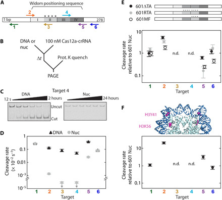
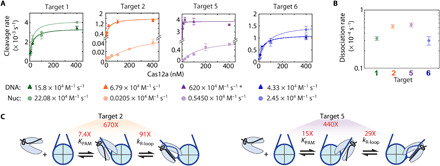
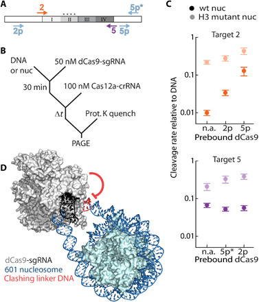
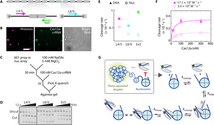

# Inhibition of CRISPR-Cas12a DNA targeting by nucleosomes and chromatin

**Isabel Strohkendl, Fatema A. Saifuddin, Bryan A. Gibson, Michael K. Rosen, Rick Russell†, and Ilya J. Finkelstein†** († co-corresponding)

*Science Advances*, Volume 7, Issue 11, eabd6733 (2021)

**DOI:** [10.1126/sciadv.abd6733](https://doi.org/10.1126/sciadv.abd6733)

---

## Table of Contents

- [Abstract](#abstract)
- [Introduction](#introduction)
- [Results](#results)
- [Discussion](#discussion)
- [Materials and Methods](#materials-and-methods)
- [Acknowledgments](#acknowledgments)

---
##  Abstract
Genome engineering nucleases must access chromatinized DNA. Here, we investigate how AsCas12a cleaves DNA within human nucleosomes and phase-condensed nucleosome arrays. Using quantitative kinetics approaches, we show that dynamic nucleosome unwrapping regulates target accessibility to Cas12a and determines the extent to which both steps of binding—PAM recognition and R-loop formation—are inhibited by the nucleosome. Relaxing DNA wrapping within the nucleosome by reducing DNA bendability, adding histone modifications, or introducing target-proximal dCas9 enhances DNA cleavage rates over 10-fold. Unexpectedly, Cas12a readily cleaves internucleosomal linker DNA within chromatin-like, phase-separated nucleosome arrays. DNA targeting is reduced only ~5-fold due to neighboring nucleosomes and chromatin compaction. This work explains the observation that on-target cleavage within nucleosomes occurs less often than off-target cleavage within nucleosome-depleted genomic regions in cells. We conclude that nucleosome unwrapping regulates accessibility to CRISPR-Cas nucleases and propose that increasing nucleosome breathing dynamics will improve DNA targeting in eukaryotic cells.
---
##  INTRODUCTION
Class 2 CRISPR-Cas nucleases Cas12a and Cas9 are precision genome-editing tools that are evolutionarily and structurally distinct yet share several key reaction steps ([_1_](https://pmc.ncbi.nlm.nih.gov/articles/PMC7946368/#R1)–[ _3_](https://pmc.ncbi.nlm.nih.gov/articles/PMC7946368/#R3)). Class 2 nucleases first identify a protospacer adjacent motif (PAM) via protein-DNA contacts. PAM binding causes local DNA unwinding and initiates directional strand invasion by the CRISPR RNA (crRNA) ([_4_](https://pmc.ncbi.nlm.nih.gov/articles/PMC7946368/#R4)). An R-loop between the crRNA guide sequence and the complementary target DNA extends toward the PAM-distal end of the target DNA strand, forming the bound ternary complex. Upon R-loop formation, the nuclease is activated and cleaves the target and nontarget DNA strands to generate a DNA break ([_5_](https://pmc.ncbi.nlm.nih.gov/articles/PMC7946368/#R5)). R-loop extension is rate-limiting for cleavage by Cas12a and Cas9 in vitro and more sensitive to mismatches for Cas12a ([_6_](https://pmc.ncbi.nlm.nih.gov/articles/PMC7946368/#R6)–[ _9_](https://pmc.ncbi.nlm.nih.gov/articles/PMC7946368/#R9)), providing a mechanistic explanation for Cas12a’s observed higher specificity in vivo ([_8_](https://pmc.ncbi.nlm.nih.gov/articles/PMC7946368/#R8), [_10_](https://pmc.ncbi.nlm.nih.gov/articles/PMC7946368/#R10)–[ _15_](https://pmc.ncbi.nlm.nih.gov/articles/PMC7946368/#R15)).
In eukaryotic cells, Cas nucleases must navigate chromatin. Our understanding of how chromatin reduces nuclease activity is limited to _Streptococcus pyogenes_ Cas9. DNA cleavage is reduced at nucleosomal sites in cells ([_16_](https://pmc.ncbi.nlm.nih.gov/articles/PMC7946368/#R16), [_17_](https://pmc.ncbi.nlm.nih.gov/articles/PMC7946368/#R17)), and actively transcribed regions are more susceptible to cleavage than dense heterochromatin ([_16_](https://pmc.ncbi.nlm.nih.gov/articles/PMC7946368/#R16), [_18_](https://pmc.ncbi.nlm.nih.gov/articles/PMC7946368/#R18)–[ _22_](https://pmc.ncbi.nlm.nih.gov/articles/PMC7946368/#R22)). Furthermore, a bound nucleosome reduces Cas9 cleavage rates in vitro ([_16_](https://pmc.ncbi.nlm.nih.gov/articles/PMC7946368/#R16), [_23_](https://pmc.ncbi.nlm.nih.gov/articles/PMC7946368/#R23), [_24_](https://pmc.ncbi.nlm.nih.gov/articles/PMC7946368/#R24)). While these studies establish that Cas9 is inhibited by nucleosomes, we do not fully understand the kinetic basis for this inhibition, how higher-order nucleosome assemblies regulate DNA accessibility, and how these mechanisms extend to Cas12a.
Nucleosomes are the smallest structural unit of eukaryotic genome organization, consisting of 147 base pairs (bp) of DNA wrapped ~1.7 times around a histone octamer ([_25_](https://pmc.ncbi.nlm.nih.gov/articles/PMC7946368/#R25)–[ _27_](https://pmc.ncbi.nlm.nih.gov/articles/PMC7946368/#R27)). Consecutive nucleosomes are separated by 10 to 50 bp of linker DNA, appearing as beads on a string ([_28_](https://pmc.ncbi.nlm.nih.gov/articles/PMC7946368/#R28)–[ _31_](https://pmc.ncbi.nlm.nih.gov/articles/PMC7946368/#R31)). Textbook models of higher-order chromatin organization picture nucleosomes arranged into a 30-nm fiber, whereas recent findings suggest that chromatin is less structured and highly dynamic ([_32_](https://pmc.ncbi.nlm.nih.gov/articles/PMC7946368/#R32)). At the level of the nucleosome, DNA transiently unwraps from the histone octamer and rewraps in a phenomenon known as “nucleosome breathing” ([_33_](https://pmc.ncbi.nlm.nih.gov/articles/PMC7946368/#R33), [_34_](https://pmc.ncbi.nlm.nih.gov/articles/PMC7946368/#R34)). Transcription factors and site-specific DNA binding proteins exploit nucleosome breathing to bind their target sites ([_35_](https://pmc.ncbi.nlm.nih.gov/articles/PMC7946368/#R35), [_36_](https://pmc.ncbi.nlm.nih.gov/articles/PMC7946368/#R36)), but the stepwise unwrapping of DNA from nucleosome edges leads to exponentially reduced site exposure near the nucleosome dyad ([_37_](https://pmc.ncbi.nlm.nih.gov/articles/PMC7946368/#R37), [_38_](https://pmc.ncbi.nlm.nih.gov/articles/PMC7946368/#R38)). Nucleosomes also increase the dissociation rate of transcription factors by several orders of magnitude ([_39_](https://pmc.ncbi.nlm.nih.gov/articles/PMC7946368/#R39)). The dynamics and accessibility of nucleosomal DNA may be further affected by electrostatic interactions between the highly polarized nucleosomes ([_40_](https://pmc.ncbi.nlm.nih.gov/articles/PMC7946368/#R40)). The high valence of nucleosome arrays enables ion-driven self-association into condensed, phase-separated droplets, mimicking chromatin in the nucleus ([_41_](https://pmc.ncbi.nlm.nih.gov/articles/PMC7946368/#R41), [_42_](https://pmc.ncbi.nlm.nih.gov/articles/PMC7946368/#R42)). Defining the impact of chromatin on Cas12a DNA targeting and the mechanistic basis of this impact could give insights into potential strategies to improve the efficiency and specificity of Cas12a as a genome-editing tool.
Here, we analyze Cas12a cleavage kinetics on nucleosomal substrates. We show that the unwrapping dynamics of a mononucleosome regulate Cas12a cleavage efficiency, as was previously reported for Cas9 ([_23_](https://pmc.ncbi.nlm.nih.gov/articles/PMC7946368/#R23)). Our data are consistent with a model in which nucleosome breathing regulates accessibility to Cas12a binding ([_36_](https://pmc.ncbi.nlm.nih.gov/articles/PMC7946368/#R36), [_43_](https://pmc.ncbi.nlm.nih.gov/articles/PMC7946368/#R43), [_44_](https://pmc.ncbi.nlm.nih.gov/articles/PMC7946368/#R44)). At nucleosome edges, Cas12a remains in a rate-limiting binding regime in which both PAM recognition and R-loop propagation are inhibited by the nucleosome, leading to overall binding inhibition of several orders of magnitude. Unexpectedly, we see substantial cleavage inhibition beyond the canonical nucleosome core particle. Unwrapping the nucleosome by DNA sequence changes, histone modifications, or nuclease dead Cas9 (dCas9) binding increases Cas12a access. In contrast, the linker sequences between nucleosomes remain readily accessible to Cas12a, even in higher-order phase-separated assemblies representative of chromatin. Our results define the impact of nucleosomes on Cas12a activity and highlight strategies for modulating nucleosome breathing dynamics to increase DNA accessibility in eukaryotic genome editing.
---
##  RESULTS
### Cas12a cleavage is inhibited across the entire nucleosome wrap
To understand how the nucleosome influences Cas12a cleavage, we designed crRNAs to target sequences adjacent to 5′-TTTA PAMs within an extended Widom 601 nucleosome positioning DNA sequence ([Fig. 1A](#fig1) and table S1) ([_45_](https://pmc.ncbi.nlm.nih.gov/articles/PMC7946368/#R45)). Using a strong positioning sequence permits efficient reconstitution of homogenous nucleosomes and nucleosome arrays (see below) and allows direct comparisons with other studies conducted on this DNA substrate ([_16_](https://pmc.ncbi.nlm.nih.gov/articles/PMC7946368/#R16), [_23_](https://pmc.ncbi.nlm.nih.gov/articles/PMC7946368/#R23), [_24_](https://pmc.ncbi.nlm.nih.gov/articles/PMC7946368/#R24), [_46_](https://pmc.ncbi.nlm.nih.gov/articles/PMC7946368/#R46), [_47_](https://pmc.ncbi.nlm.nih.gov/articles/PMC7946368/#R47)). The DNA was extended to include two Cas12a targets that are 16 and 34 bp beyond the nucleosome core particle and end-labeled using a fluorescent dye during polymerase chain reaction (PCR) amplification. Human nucleosomes were reconstituted via salt dialysis of the DNA with the purified human histone octamer (fig. S1A) ([_48_](https://pmc.ncbi.nlm.nih.gov/articles/PMC7946368/#R48)). For DNA cleavage measurements, purified _Acidaminococcus_ sp. Cas12a (henceforth referred to as Cas12a; fig. S1B) was assembled with precursor crRNA to form a ribonucleoprotein (RNP) complex that was directed to a single target in the DNA substrate. Cleavage reactions for each Cas12a target were carried out in parallel on the DNA and nucleosome substrates at 100 nM Cas12a, 25°C ([Fig. 1B](#fig1)). Time points were sampled from each reaction and quenched with EDTA and proteinase K to remove histones from the nucleosomal DNA and bound Cas12a from all reactions. The DNA products were resolved on native polyacrylamide gels and quantified to obtain the cleavage rates ([Fig. 1C](#fig1), fig. S1C, and table S2).
#### Fig. 1. DNA unwrapping regulates Cas12a cleavage of nucleosomal targets.

(**A**) The Widom 601 positioning sequence is divided into quartiles indicating the inner (II and III) and outer (I and IV) wrap and is flanked by DNA. “****”: four TA dinucleotide repeats that produce tight wrapping of the inner left quartile. Arrows: Cas12a targets, pointing in the direction of R-loop formation; for top arrows, R-loop forms with the Crick (bottom) strand, and for bottom arrows, R-loop forms with the Watson (top) strand. (**B**) Cleavage reaction setup. nuc, nucleosome substrate. (**C**) Representative gels of target 4 cleavage by Cas12a. (**D**) Cleavage rates for the six DNA and nucleosome Cas12a targets at 25°C. Downward arrows signify that the value is an upper limit due to the lack of detectable cleavage. (**E**) Top: Diagram depicting variant 601 constructs (fig. S1E). Bottom: Cas12a cleavage of variant nucleosome substrates normalized to original 601 nucleosome substrate. (**F**) Top: Crystal structure of the 601 nucleosome [Protein Data Bank (PDB): 3LZ0 ([_80_](https://pmc.ncbi.nlm.nih.gov/articles/PMC7946368/#R80))] highlighting the amino acid modifications H3Y41E and H3K56Q, which mimic H3Y41ph and H3K56ac. Bottom: Cleavage rates of H3 mutant nucleosome normalized to the original wt nucleosome. n.d., no data, as no cleavage was observed for targets 3 and 4 for all nucleosome substrates. (D to F) Each data point is the mean of at least three replicates; error bars: SEM.
Cas12a cleavage was inhibited for all nucleosome-occluded targets. Targets 3 and 4, positioned within the central wrap of the nucleosome, showed no detectable cleavage after 24 hours (<6 × 10−7 s−1; [Fig. 1D](#fig1)), indicating inhibition of at least 1000-fold relative to the nucleosome-free DNA. Targets 2 and 5, only partially overlapping with the edges of the nucleosome, were inhibited 100- and 15-fold, respectively [target 2: 1.35 (±0.16) × 10−5 s−1; target 5: 2.58 (±0.29) × 10−4 s−1, mean ± SEM of three biological replicates]. We attribute the asymmetric inhibition of the edge targets to the nonpalindromic 601 sequence and its asymmetric interactions with the histone octamer. The greater inhibition observed for target 2 is consistent with previous biophysical studies that noted greater bendability and tighter wrapping of the DNA around the histone octamer at this site (also see below) ([_46_](https://pmc.ncbi.nlm.nih.gov/articles/PMC7946368/#R46), [_49_](https://pmc.ncbi.nlm.nih.gov/articles/PMC7946368/#R49)). Targets 1 and 6, positioned in the nucleosome-flanking DNA, were cleaved comparably to nucleosome-free DNA substrates with rates of 2.72 (±0.40) × 10−3 s−1 and 8.2 (±1.6) × 10−4 s−1, respectively. Cleavage rates of the targets on the DNA substrates varied sixfold, which we attribute to DNA sequence–dependent binding and cleavage ([Fig. 1D](#fig1)). In sum, our results show strong position-dependent cleavage inhibition by the nucleosome.
We next measured nucleosome-mediated inhibition of Cas12a at 37°C (fig. S1D). Cleavage rates of the isolated DNA increased up to 13-fold and maintained a similar pattern of preferred target sequences, although now within a smaller ~3-fold range. In the context of the nucleosome, the inner wrap targets 3 and 4 showed detectable cleavage after 24 hours, resulting in ~2000-fold inhibition with rates of 5.2 (±1.9) × 10−6 s−1 and 4.2 (±1.6) × 10−6 s−1, respectively. Targets 2 and 5 were inhibited only five- and twofold with cleavage rates of 1.87 (±0.55) × 10−3 s−1 and 5.9 (±1.7) × 10−3 s−1, respectively. The smaller inhibition at 37°C than at 25°C can be explained by increased nucleosome unwrapping at higher temperatures ([_50_](https://pmc.ncbi.nlm.nih.gov/articles/PMC7946368/#R50), [_51_](https://pmc.ncbi.nlm.nih.gov/articles/PMC7946368/#R51)). We conclude that the nucleosome broadly inhibits RNA-guided nucleases and that this inhibition is strongly dependent on the proximity of the target DNA to the nucleosome dyad ([_16_](https://pmc.ncbi.nlm.nih.gov/articles/PMC7946368/#R16), [_17_](https://pmc.ncbi.nlm.nih.gov/articles/PMC7946368/#R17), [_23_](https://pmc.ncbi.nlm.nih.gov/articles/PMC7946368/#R23), [_24_](https://pmc.ncbi.nlm.nih.gov/articles/PMC7946368/#R24)).
### Nucleosome breathing increases Cas12a cleavage efficiency
Our kinetic results are consistent with the hypothesis that transient unwrapping of DNA from the histone octamer limits Cas12a cleavage rates. The effects of nucleosome breathing would be most pronounced at the edges of the nucleosome wrap (targets 2 and 5) and would be nearly absent for the highest-affinity histone-DNA interactions (nucleosome dyad; targets 3 and 4). We tested this hypothesis by measuring the cleavage of 601 variants that alter nucleosome wrapping dynamics ([Fig. 1E](#fig1) and fig. S1E) ([_46_](https://pmc.ncbi.nlm.nih.gov/articles/PMC7946368/#R46)). Tight wrapping of the 601 DNA around the histone octamer is due, in part, to a series of “TA” dinucleotides spaced 10 bp apart (asterisks in [Fig. 1A](#fig1)) ([_45_](https://pmc.ncbi.nlm.nih.gov/articles/PMC7946368/#R45), [_46_](https://pmc.ncbi.nlm.nih.gov/articles/PMC7946368/#R46)). We reasoned that adding TA dinucleotides would decrease Cas12a cleavage rates of local DNA and removing TA dinucleotides would increase cleavage rates.
Removing TA repeats from the tightly wrapped left side of the 601 sequence (601ΔTA) increased the cleavage rate of target 2 by fivefold, with the cleavage rate approaching that of the opposite edge target 5 ([Fig. 1E](#fig1)). Conversely, adding additional TA repeats to the inner right quartile (601RTA) reduced the target 5 cleavage rate by sixfold and also increased the target 2 cleavage rate by approximately threefold so that both targets were cleaved at the same rate. Flipping the inner half sequence centered around the dyad (601MF) increased the target 2 cleavage rate by nearly twofold and decreased the target 5 cleavage rate by fourfold. The observed changes in Cas12a cleavage rates of the edge targets reflect changes in the flexibility of the adjacent, interior sequences. These changes in cleavage efficiency were qualitatively consistent with force-induced nucleosome unwrapping: 601RTA DNA is equally likely to unwrap from either side of the nucleosome when under tension and the edge-specific unwrapping probabilities of the 601MF DNA are opposite from those of the original 601 substrate ([_46_](https://pmc.ncbi.nlm.nih.gov/articles/PMC7946368/#R46)). We note that all 601 variants change the sequence of the nucleosome inner wrap, yet cleavage rate changes are evident at the outer wrap edges. These cleavage rates demonstrate that increased unwrapping in one-half of the positioning sequence leads to tightening of the opposite DNA—a phenomenon documented previously ([_46_](https://pmc.ncbi.nlm.nih.gov/articles/PMC7946368/#R46), [_52_](https://pmc.ncbi.nlm.nih.gov/articles/PMC7946368/#R52), [_53_](https://pmc.ncbi.nlm.nih.gov/articles/PMC7946368/#R53)).
Histone posttranslational modifications (PTMs) also alter nucleosome unwrapping dynamics ([_54_](https://pmc.ncbi.nlm.nih.gov/articles/PMC7946368/#R54)). Phosphorylation of H3Y41 and acetylation of H3K56, associated with increased DNA metabolism, both increase nucleosomal DNA accessibility by increasing the unwrapping dynamics (highlighted in [Fig. 1F](#fig1)) ([_36_](https://pmc.ncbi.nlm.nih.gov/articles/PMC7946368/#R36), [_54_](https://pmc.ncbi.nlm.nih.gov/articles/PMC7946368/#R54), [_55_](https://pmc.ncbi.nlm.nih.gov/articles/PMC7946368/#R55)). We performed Cas12a cleavage reactions on a reconstituted human nucleosome containing amino acid substitutions in histone H3 (Y41E and K56Q), which are experimentally verified mimics of phosphorylated Y41 (Y41ph) and acetylated K56 (K56ac) PTMs ([_55_](https://pmc.ncbi.nlm.nih.gov/articles/PMC7946368/#R55)). The nucleosome edge targets 2 and 5 were cleaved 21-fold and 3-fold faster than in the wild-type (wt) nucleosome, respectively, within 5-fold of their associated DNA cleavage rates ([Fig. 1F](#fig1)). The large, asymmetric increase in the cleavage rates suggests that histone PTMs that alter nucleosome stability will affect DNA accessibility to Cas nucleases ([_36_](https://pmc.ncbi.nlm.nih.gov/articles/PMC7946368/#R36)). Targets 3 and 4 remain refractory to cleavage within the mutant H3 nucleosome, indicating that the inner dyad remains inaccessible at 25°C. As expected, the cleavage rates for targets 1 and 6 within nucleosome-flanking DNA were identical to those for the wt nucleosome. Collectively, these results show that cleavage by Cas12a is influenced by the mechanical properties of the nucleosome’s histone-DNA interactions. We conclude that the Cas12a cleavage rate is primarily regulated by nucleosomal DNA accessibility.
### Nucleosomes inhibit PAM recognition and R-loop propagation
We previously showed that R-loop formation—the second step in DNA binding—is rate-limiting for Cas12a-mediated cleavage of short (60-bp) substrates. Thus, the cleavage rates with subsaturating concentrations of Cas12a report on the two-step DNA binding process, and the maximal cleavage rate with saturating Cas12a concentration is a direct measure of the R-loop propagation rate ([_8_](https://pmc.ncbi.nlm.nih.gov/articles/PMC7946368/#R8)). We used this mechanistic insight to determine whether each binding step is inhibited by the nucleosome and to determine the extent of inhibition.
We measured the DNA binding rates for targets 1, 2, 5, and 6 by performing cleavage reactions with Cas12a concentrations ranging from 5 to 400 nM ([Fig. 2A](#fig2)). From the concentration-dependent cleavage rates, we determined the second-order rate constant (_k_ max/_K_ 1/2; _k_ max, rate of R-loop formation; _K_ 1/2, PAM binding affinity), which represents the overall rate constant for the two-step DNA binding process. Even without the nucleosome present, the binding rate constants for the four targets vary by two orders of magnitude (table S2). With the nucleosome present, Cas12a binding to the edge targets 2 and 5 was substantially inhibited, as the rate constant decreased for target 2 by 330-fold to 205 (±15) M−1 s−1, and for target 5 by 1100-fold to 5.451 (±0.045) × 103 M−1 s−1. As expected, the flanking targets 1 and 6 were relatively insensitive to the nucleosome, with the _k_ max/_K_ 1/2 values changing less than twofold [to 2.208 (±0.029) and 0.245 (±0.010) × 105 M−1 s−1, respectively].
#### Fig. 2. Nucleosomes inhibit Cas12a’s two-step DNA binding.

(**A**) Concentration-dependent Cas12a cleavage plots of DNA (dark triangles) and nucleosome substrates (light circles). Colored lines: Hyperbolic curve fitting. Second-order rate constants for each target are written below. The asterisk indicates that the target 5 DNA cleavage second-order rate constant is a lower limit due to lack of data points in the concentration-dependent phase. Each data point is the mean of at least three replicates; error bars: SEM. (**B**) Dissociation rates determined by electrophoretic mobility shift assay (fig. S2). Data points represent at least duplicates; error bars: SEM. (**C**) Diagrams showing the calculated nucleosomal inhibition on Cas12a PAM recognition and R-loop formation (fig. S2C). _K_ PAM (Cas12a affinity for the targets’ PAM) increases and _k_ R-loop (rate of R-loop formation) decreases due to the nucleosome.
To test whether Cas12a binding remains rate-limiting for DNA cleavage in the presence of a nucleosome, we measured dissociation of nuclease dead Cas12 (dCas12a) at these targets. We found that dissociation required hours and was much slower than DNA cleavage from the bound complex ([Fig. 2B](#fig2) and fig. S2). Thus, DNA binding remains rate-limiting for cleavage, and the second-order rate constants for cleavage reflect the binding kinetics in the presence and absence of the nucleosome. Therefore, the presence of a bound nucleosome greatly decreases the Cas12a binding rate, consistent with a model of restricted access to Cas12a.
Next, we dissected the decreased Cas12a binding rate for targets 2 and 5. The decreases in the second-order rate constant noted above could result from weakened binding to the PAM sequence, slower R-loop formation, or both. To determine the effect on R-loop formation, we focused on the maximal cleavage rate. This maximal rate for nucleosome cleavage reports directly on the rate of R-loop formation [6.6 (±2.1) and 77.4 (±6.7) × 10−5 s−1 for targets 2 and 5, respectively], as cleavage of both DNA strands is expected to be much faster ([_8_](https://pmc.ncbi.nlm.nih.gov/articles/PMC7946368/#R8)). In the absence of the nucleosome, the maximal rate constants are at least 10-fold larger, indicating inhibition of R-loop formation by the nucleosome. Furthermore, this rate constant modestly underestimates the inhibition because the cleavage reaction on DNA substrates becomes limited by the slower cleavage of the target strand at high Cas12a concentrations ([_8_](https://pmc.ncbi.nlm.nih.gov/articles/PMC7946368/#R8)). Comparison with the R-loop formation rate as directly measured from nontarget strand (NTS) cleavage on oligonucleotide substrates (fig. S2C and table S3) reveals that the nucleosome slows R-loop formation for targets 2 and 5 by 91- and 29-fold, respectively. The larger inhibition for R-loop propagation at target 2 is consistent with the nucleosome entry region being more tightly wrapped than the exit region. A comparison of the _K_ 1/2 values from NTS and nucleosome cleavage shows that PAM recognition is also inhibited 7.4-fold and 15-fold for targets 2 and 5 in the nucleosome, respectively ([Fig. 2C](#fig2)). Combining the effects measured for each binding step individually gives values of 670 (±400)–fold and 440 (±87)–fold for inhibition to targets 2 and 5, respectively—the same within error as determined from the second-order rate constants.
Our results show that the nucleosome inhibits both PAM recognition and R-loop formation, even beyond the edge of the canonical nucleosome core particle ([Fig. 2C](#fig2)). This inhibition likely arises from the steric clashes between the similarly sized nucleosome and Cas12a RNP. PAM recognition and R-loop propagation occur within a narrow protein channel ([_56_](https://pmc.ncbi.nlm.nih.gov/articles/PMC7946368/#R56), [_57_](https://pmc.ncbi.nlm.nih.gov/articles/PMC7946368/#R57)), and the orientation of Cas12a’s edge targets within our substrate forces the REC and NUC lobes to point toward and overlap with the nucleosome core—creating a steric clash. Thus, nucleosome unwrapping dynamics will dominate both PAM recognition and R-loop propagation rates for targets that are close to the nucleosome.
### Proximally targeted Cas nucleases trap unwrapped nucleosomes
Cas nuclease cleavage efficiency in cells can be enhanced by cotargeting dCas9 near the intended genomic cut site (termed proxy-CRISPR) ([_58_](https://pmc.ncbi.nlm.nih.gov/articles/PMC7946368/#R58)). The biochemical basis for this enhanced cleavage is unknown. We reasoned that dCas9 captures nucleosomal DNA while it is transiently unwrapped, thereby increasing the accessibility of the proximal DNA substrate for the nuclease-active Cas12a. To directly test this model, we targeted _S. pyogenes_ dCas9 (fig. S1B) to sequences with the canonical 3′-GGN PAM adjacent to the four Cas12a targets that either fully or partially overlap with the nucleosome ([Fig. 3A](#fig3)). dCas9 RNPs targeting a single proxy site (p2, p5, or p5*) were preincubated with the nucleosome substrate for 30 min before adding Cas12a RNP to begin the cleavage reaction ([Fig. 3B](#fig3)). Targets 3 and 4 remained uncleaved over 24 hours when dCas9 was directed to any of the adjacent or flanking sites (fig. S3A), showing that dCas9 is not able to disassemble or shift the nucleosome away from its dyad.
#### Fig. 3. Steric interference by a proximal nuclease enhances nucleosomal DNA cleavage.

(**A**) Diagram depicting dCas9 (light blue arrows) and Cas12a (color-coded arrows) targets. Only targets discussed in the main text are included here; others are shown in fig. S3. (**B**) Proxy-CRISPR reaction scheme. (**C**) Proxy-CRISPR nucleosome cleavage rates for indicated dCas9 and Cas12a pairs. n.a., original nucleosome cleavage rate without dCas9 prebound. Data points are normalized to the DNA cleavage rate of each target. Each data point is the mean of three replicates; error bars: SEM. (**D**) _Sp_ Cas9 [PDB: 4UN3 ([_81_](https://pmc.ncbi.nlm.nih.gov/articles/PMC7946368/#R81))] modeled to bind target 5p, 13 bp away from the nucleosome [PDB: 3LZ0 ([_80_](https://pmc.ncbi.nlm.nih.gov/articles/PMC7946368/#R80))]. Linker DNA was generated using sequence to structure modeling. Extension of the distal linker DNA shows a steric clash with the bound Cas9.
Target 2 cleavage rates increased more than threefold when dCas9 was prebound to an adjacent sequence within the wt nucleosome (target 2p, 24 bp away; [Fig. 3C](#fig3), orange circles), consistent with the model that nucleosome breathing dynamics dictate cleavage rates. In contrast, dCas9 targeted to 5p inhibited Cas12a cleavage of target 5 on the DNA substrate—presumably because of a steric clash between the two RNPs (6 bp separate the two PAMs; fig. S3B). When dCas9 targets 5p* (18 bp away from target 5), the Cas12a cleavage rate for nucleosomal target 5 did not change ([Fig. 3C](#fig3), purple circles, and table S4). Target 5 is within the more unwrapped nucleosome edge, indicating that a proximal dCas9 does not increase accessibility further and may have a deleterious effect on cleavage when the two targets are too close. We speculate that because target 2 is more tightly wrapped than target 5, prebinding dCas9 peels the DNA from the histone octamer, favoring an unwrapped state. Increasing intrinsic nucleosome breathing via H3 (Y41E, K56Q) mutations reduces the cleavage enhancements observed with dCas9 at target 2 ([Fig. 3C](#fig3)).
Unexpectedly, we also see a 12-fold enhancement in target 2 cleavage by Cas12a when dCas9 is prebound to the distal target 5p. The stronger effect of the distal proxy-CRISPR pair suggests that cleavage enhancement may also arise due to steric clashes between the bound dCas9 and the DNA that emerges from the alternate end of the nucleosome ([Fig. 3D](#fig3)). We propose that binding dCas9 near the nucleosome core particle peels DNA away from the nucleosome core and also creates steric interference for the flanking DNA at the opposite edge ([_59_](https://pmc.ncbi.nlm.nih.gov/articles/PMC7946368/#R59)). Our proxy-CRISPR results further highlight the importance of nucleosome unwrapping as a key regulator of DNA cleavage by Cas12a (and likely other Cas nucleases) and provide another approach to increasing accessibility of nucleosome-occluded targets.
### DNA accessibility is minimally affected by chromatin phase separation
Regularly spaced arrays of nucleosomes, separated by 10 to 50 bp of linker DNA, make up chromatin in the cell ([_30_](https://pmc.ncbi.nlm.nih.gov/articles/PMC7946368/#R30), [_31_](https://pmc.ncbi.nlm.nih.gov/articles/PMC7946368/#R31)). Interactions between the histone tails of neighboring nucleosomes in such an array can induce liquid-liquid phase separation of nucleosomal arrays, forming a chromatin compartment at high cell-like densities ([_41_](https://pmc.ncbi.nlm.nih.gov/articles/PMC7946368/#R41)). We investigated how Cas12a cleavage kinetics are altered in nucleosome arrays under phase-separated conditions. The DNA substrate consists of 12 repeats of the 601 positioning sequence, separated by 46- and 53-bp unique linker sequences ([Fig. 4A](#fig4)). Cas12a “linker” targets between the fourth and fifth nucleosomes (L4/5) and the eighth and ninth nucleosomes (L8/9) are 9 to 13 bp away from the 601 sequences—leaving sufficient space for Cas12a to bind entirely within the linker ([_5_](https://pmc.ncbi.nlm.nih.gov/articles/PMC7946368/#R5)). The “edge” target, Ex5, has a 12-bp overlap with the more loosely wrapped edge of the fifth nucleosome. We confirmed that Cas12a RNPs targeting the L4/5 linker can enter the liquid-like chromatin compartments under these conditions by assembling Cas12a with a fluorescent crRNA and observing colocalization with H2B-labeled nucleosomes ([Fig. 4B](#fig4)). This observation is consistent with our previous fluorescence recovery after photobleaching results and the penetration of transcription factors and chromatin modifiers within chromatin droplets ([_41_](https://pmc.ncbi.nlm.nih.gov/articles/PMC7946368/#R41)). In contrast, a Cas12a RNP prebound to a competitor target DNA did not colocalize with the chromatin compartments and a Cas12a RNP with a nontargeting crRNA showed only faint colocalization signal (fig. S4A), confirming that Cas12a entry into droplets depends on DNA binding.
#### Fig. 4. Phase-separated nucleosome arrays minimally inhibit DNA accessibility.

(**A**) Diagram of a 12-mer 601 array. Gray boxes: 601 positioning sequences; black lines: unique linker DNAs. Cas12a targets are highlighted (L4/5, magenta; Ex5, green; L8/9, cyan), and the associated arrows represent direction of R-loop formation. (**B**) Phase-separated nucleosome array droplets colocalize with dCas12a-L4/5. Histone H2B is labeled with AF594; L4/5 crRNA is labeled with AF488. Scale bar, 10 μm. (**C**) Reaction scheme depicting Cas12a cleavage of DNA arrays or phase-separated nucleosome arrays. (**D**) Representative agarose gel showing Cas12a cleavage of phase-separated nucleosome arrays, detected by ethidium bromide. All reactions are from the same gel; the black line represents cropping of the gel. (**E**) Cas12a cleavage plot of DNA and nucleosome arrays. Data points are color-coordinated with (A). Rates are included in table S5. (**F**) Concentration-dependent Cas12a cleavage of L4/5, targeting DNA, and nucleosome arrays. (E and F) Each data point represents the mean of at least three replicates (exception: DNA cleavage at 30 and 200 nM Cas12a was done in duplicate). Error bars: SEM. (**G**) Model of Cas12a cleavage inhibition by the nucleosome and chromatin. Chromatin has a small impact on Cas12a cleavage efficiency, which can be attributed to neighboring nucleosomes. The nucleosome inhibits Cas12a binding to wrapped DNA.
We measured Cas12a cleavage rates on phase-separated nucleosome arrays and nucleosome-free DNA under identical buffer conditions ([Fig. 4C](#fig4) and table S5). Cleavage reaction time points were resolved on 1% agarose gels stained with ethidium bromide ([Fig. 4D](#fig4)). Cleavage rates for all three targets on nucleosome-free DNA substrates range from 1 × 10−3 to 8 × 10−3 s−1 at physiological concentrations of mono- and divalent salts ([Fig. 4E](#fig4)). When nucleosome arrays are phase-separated, cleavage of linker targets L4/5 and L8/9 is inhibited only ~3-fold at 100 nM Cas12a. Target Ex5 shows 19-fold cleavage inhibition—combining the inhibition of R-loop propagation into the nucleosome and the impact of chromatin. Microscopy time courses show shrinking and dissolution of chromatin droplets upon cleavage, as expected from the phase separation behavior of shorter nucleosome arrays (fig. S4B). Because cleavage and droplet dissolution appear to proceed on similar time scales, we attribute the majority of Cas12a-mediated cleavage to occur within the phase-separated droplets.
To better characterize the inhibition on Cas12a cleavage by phase separation, we measured target L4/5 cleavage rates at variable Cas12a concentrations ([Fig. 4F](#fig4)). We note that the cleavage time courses of phase-separated nucleosome arrays at lower Cas12a concentrations show biphasic behavior (fig. S4C), but due to the small amplitude of the second phase, all reactions are fit by a single exponential. The resulting second-order rate constants are 1.71 (±0.02) × 105 M−1 s−1 and 3.4 (±0.2) × 104 M−1 s−1, demonstrating a ~5-fold inhibition on Cas12a target search upon nucleosome array phase separation.
The inhibition on Cas12a target search may be due to steric occlusion of the linker DNA by neighboring nucleosomes and/or phase separation of the nucleosome arrays. To test the first possibility, we repeated Cas12a cleavage of target L4/5 within a dinucleosome, which does not undergo phase separation under these conditions (fig. S5 and table S5). The second-order rate constant was threefold lower on a dinucleosome relative to the matched DNA substrate alone [2.23 (±0.03) × 105 M−1 s−1 and 7.15 (±0.08) × 104 M−1 s−1, respectively]. This indicates that neighboring nucleosomes, and not phase separation per se, significantly inhibit the Cas12a target search. Increased nucleosome unwrapping within H3 (Y41E and K56Q) containing dinucleosomes only accelerated L4/5 target cleavage 50% relative to wt dinucleosomes [second-order rate constant: 11.0 (±0.1) × 104 M−1 s−1; fig. S5D]. These results show that adjacent nucleosomes can moderately inhibit Cas12a accessibility to linker DNA, but that this linker DNA remains accessible to Cas nucleases even in liquid condensates where chromatin is organized at high cell-like densities.
---
##  DISCUSSION
Here, we use quantitative kinetics to show that nucleosome breathing regulates cleavage by Cas12a. The nucleosome inhibits DNA cleavage by blocking both PAM recognition and R-loop propagation ([Fig. 4G](#fig4)). At 25°C, the inner nucleosome wrap is completely inaccessible to Cas12a, and binding is inhibited almost three orders of magnitude at nucleosome edges. At 37°C, cleavage within the inner wrap is inhibited three orders of magnitude relative to nucleosome-free DNA, and edge targets are inhibited less than fivefold. Multiple studies have characterized how mismatches within the R-loop can reduce Cas9 and Cas12a binding and cleavage several orders of magnitude in vitro ([_8_](https://pmc.ncbi.nlm.nih.gov/articles/PMC7946368/#R8), [_60_](https://pmc.ncbi.nlm.nih.gov/articles/PMC7946368/#R60)–[ _69_](https://pmc.ncbi.nlm.nih.gov/articles/PMC7946368/#R69)). Here, we show that the nucleosome is a more potent barrier to DNA binding than nearly all of these partially matched targets. Our results thus explain the observation that off-target cleavage in nucleosome-depleted regions is more likely to occur than on-target cleavage within a nucleosome in cells ([_18_](https://pmc.ncbi.nlm.nih.gov/articles/PMC7946368/#R18), [_20_](https://pmc.ncbi.nlm.nih.gov/articles/PMC7946368/#R20)). More broadly, these results highlight the importance of nucleosome dynamics in base editing, CRISPRi, and other strategies that exploit targeted DNA binding by Cas9 and Cas12a.
Our results indicate that dynamic, transient unwrapping of DNA from the ends of the nucleosome is critical for access to the DNA by Cas12a. Thus, increasing nucleosome unwrapping via changes to the DNA flexibility, histone modifications, or proximal dCas9 binding increases the corresponding Cas12a cleavage rates. Even when dCas9 is not in direct contact with the nucleosome, it can increase nucleosome unwrapping by altering the mechanical properties of the adjacent DNA and by sterically clashing with the distal linker DNA of a nucleosome—providing an explanation for increased efficiency of in vivo Cas9 double-targeting strategies like proxy-CRISPR ([_58_](https://pmc.ncbi.nlm.nih.gov/articles/PMC7946368/#R58), [_70_](https://pmc.ncbi.nlm.nih.gov/articles/PMC7946368/#R70)). Modifications within the histone tails can also influence nucleosome unwrapping dynamics ([_54_](https://pmc.ncbi.nlm.nih.gov/articles/PMC7946368/#R54), [_71_](https://pmc.ncbi.nlm.nih.gov/articles/PMC7946368/#R71)). The histone tail-DNA contacts have been suggested to ensure inner wrap stability during outer wrap unwinding ([_72_](https://pmc.ncbi.nlm.nih.gov/articles/PMC7946368/#R72)), while in vitro assays have shown them to have modest effects on nucleosome edge site exposure ([_73_](https://pmc.ncbi.nlm.nih.gov/articles/PMC7946368/#R73)). Thus, the simplest expectations are that PTMs within the tails will increase the accessibility of edge targets to Cas12a, analogous to the mutant H3 nucleosomes used in our study, and that targeted histone modifications may be useful for improving Cas nuclease activity at hard-to-cleave genomic targets.
Our results are broadly consistent with previous studies that show strong inhibition of Cas9 cleavage within the nucleosome ([_16_](https://pmc.ncbi.nlm.nih.gov/articles/PMC7946368/#R16), [_17_](https://pmc.ncbi.nlm.nih.gov/articles/PMC7946368/#R17), [_23_](https://pmc.ncbi.nlm.nih.gov/articles/PMC7946368/#R23), [_24_](https://pmc.ncbi.nlm.nih.gov/articles/PMC7946368/#R24)). In addition to quantifying inhibition of both PAM recognition and R-loop formation of Cas12 binding, we demonstrate that PAM recognition can be hindered beyond the canonical nucleosome core. Greater unwrapping toward the nucleosome dyad is necessary for targets positioned more centrally within the nucleosome, and conversely, as targets are positioned farther away from the nucleosome, the importance of unwrapping is reduced (shown by the faded Cas12a in [Fig. 4G](#fig4)).
In addition to class 2 nucleases, the type I CRISPR-Cascade RNA-guided effector complexes are increasingly repurposed for mammalian genome editing ([_74_](https://pmc.ncbi.nlm.nih.gov/articles/PMC7946368/#R74)–[ _76_](https://pmc.ncbi.nlm.nih.gov/articles/PMC7946368/#R76)). These CRISPR systems also recognize targets via a two-step binding mechanism. We speculate that the nucleosome will inhibit type I effector complexes by blocking PAM recognition and R-loop propagation. Notably, type I family CRISPR systems include Cas3, a processive adenosine 5′-triphosphate (ATP)–dependent nuclease/helicase to destroy foreign DNA. Future studies will be required to probe how Cascade binds nucleosomal DNA and how the Cascade/Cas3 complex navigates through this roadblock ([_77_](https://pmc.ncbi.nlm.nih.gov/articles/PMC7946368/#R77), [_78_](https://pmc.ncbi.nlm.nih.gov/articles/PMC7946368/#R78)).
Last, we observed that Cas12a can rapidly cleave condensed, chromatin-like DNA that is compartmentalized in a phase-separated droplet. Chromatin droplet condensation exerts almost no inhibitory effect on Ca12a cleavage, albeit without the linker histone H1 ([_41_](https://pmc.ncbi.nlm.nih.gov/articles/PMC7946368/#R41)) or the heterochromatin-promoting HP1 protein ([_79_](https://pmc.ncbi.nlm.nih.gov/articles/PMC7946368/#R79)). Rather, it is the presence of neighboring nucleosomes that modestly inhibits Cas12a target search of linker DNA. Chromatin droplet dissolution following DNA cleavage raises the possibility that DNA breaks in cells can help increase accessibility for host repair proteins by shifting local equilibrium away from phase-separated chromatin compartments. Future studies will need to elucidate how dense, heterogenous, and target-poor chromatin may further affect CRISPR-Cas cleavage kinetics following condensation. In sum, our work highlights that dynamics of the nucleosome core particle, rather than higher-order chromatin-like organization, is the key regulator of Cas12a cleavage efficiency.
---
##  MATERIALS AND METHODS
### Nucleic acids and proteins
All DNA oligos and GeneBlocks were purchased from Integrated DNA Technologies (IDT) (table S1). crRNA for Cas12a and single guide RNA (sgRNA) for Cas9 were purchased from IDT or Synthego (table S1). The mononucleosome 601 substrate was amplified from a GeneBlock sequence with primers that include a 5′-Cy5 for fluorescence imaging. Unincorporated primers were removed using the Zymo DNA Clean and Concentrator Kit. Oligonucleotides used to measure NTS cleavage were 5′-radiolabeled with [γ-32P]ATP (PerkinElmer) as described previously ([_8_](https://pmc.ncbi.nlm.nih.gov/articles/PMC7946368/#R8)).
The dinucleosome substrate was ordered as a pUC57 vector from Biomatik. The plasmid was transformed into BL21 cells, and the Qiagen Plasmid Mega Kit was used according to the manufacturer’s instructions to purify the plasmid. The dinucleosome DNA was cut and separated from the plasmid DNA by restriction enzyme digestion (Bam HI–HF and Kpn 1–HF) and polyacrylamide gel separation. Excised bands of dinucleosome DNA were placed in tris-EDTA buffer, placed at −80°C for 30 min, and then incubated at 37°C overnight. Dinucleosome DNA was concentrated using Amicon Ultracel 30K spin columns. DNA arrays of 12 × 601 sequences were produced as described previously ([_41_](https://pmc.ncbi.nlm.nih.gov/articles/PMC7946368/#R41)).
_AsCas12a_ and nuclease dead _AsCas12a_ (dCas12a) and _Sp_ Cas9 (dCas9) were expressed and purified as described previously (fig. S1B) ([_8_](https://pmc.ncbi.nlm.nih.gov/articles/PMC7946368/#R8), [_63_](https://pmc.ncbi.nlm.nih.gov/articles/PMC7946368/#R63)) . Human histone octamers were purchased from The Histone Source. H3 mutations Y41E and K56Q were made sequentially using primers with the mutated nucleotides. The H3 mutant plasmid was sent to The Histone Source for protein purification.
### Nucleosome reconstitution
Nucleosomes were reconstituted via salt dialysis ([_48_](https://pmc.ncbi.nlm.nih.gov/articles/PMC7946368/#R48)). Briefly, 10- to 15-μl reactions containing Cy5-labeled 601 DNAs (200 ng/μl) were mixed with human histone octamer at varying octamer: DNA molar ratios, typically 1:1 to 2:1, in 2 M NaCl. Reconstitution reactions were transferred to dialysis buttons (10,000 molecular weight cutoff, Millipore) equilibrated in High Salt Reconstitution Buffer [10 mM tris-HCl, (pH 7.5), 2 M NaCl, 1 mM EDTA (pH 8.0), 1 mM dithiothreitol (DTT)]. Reconstitutions were done at 4°C using a one-way pump in which No Salt Reconstitution Buffer [10 mM tris-HCl (pH 7.5), 1 mM EDTA (pH 8.0), 1 mM DTT] was flowed into the dialysis buffer until the dialysis buttons were at 250 mM NaCl. Dialyzed reactions were then further dialyzed against 500 ml of TCS buffer [20 mM tris-HCl (pH 7.5), 1 mM EDTA (pH 8.0), 1 mM DTT, 0.5% NP-40] for 1 hour and then de-aggregated by centrifugation at 4°C, max speed. The fraction of Cy5-labeled 601 DNA incorporated into nucleosomes was determined by native polyacrylamide gel electrophoresis.
Dinucleosomes were reconstituted via salt dialysis with slight modifications: Unlabeled dinucleosome DNA was kept at 100 ng/μl; salt dialysis occurred in a stepwise manner in which reconstitution reactions were dialyzed against buffer with 1.5, 1, 0.6, and 0.25 M NaCl; the fraction of DNA incorporated into dinucleosomes was determined via ethidium bromide detection. Nucleosome arrays with fluorescent H2B were reconstituted as described previously ([_41_](https://pmc.ncbi.nlm.nih.gov/articles/PMC7946368/#R41)).
### RNP complex assembly
Cas12a RNPs were assembled before each cleavage experiment using purified Cas12a and a precursor crRNA (pre-crRNA) that contained the full direct repeat sequence and a guide sequence complementary to one of the six targets within the 601 DNA substrate. Assembly reactions were performed by incubating Cas12a with a ~2-fold excess of crRNA for 30 min at 25°C in 50 mM tris-HCl (pH 8.0), 100 mM NaCl, 5 mM MgCl2, and 2 mM DTT. dCas9 RNPs were assembled with their sgRNAs using the same protocol. For nucleosome array experiments, NaCl was switched to NaOAc.
### Mononucleosome cleavage kinetics
Cas12a cleavage reactions were performed in the same buffer conditions as the assembly reaction. All cleavage reactions were initiated by adding the 601 DNA (or nucleosome) substrate to the assembled Cas12a RNP at 25°C. Mononucleosome reactions included 1 to 2 nM DNA and 100 nM Cas12a RNP, unless otherwise indicated. At various time points, 10 μl of samples of the cleavage reaction was withdrawn and stopped in 5 μl of quench solution [30% glycerol with Orange G dye, 100 mM EDTA (pH 8.0), 0.02% SDS, proteinase K (2 μg/μl)].
Quenched samples were incubated at 52°C for 1 hour to ensure protein digestion by proteinase K (Thermo Fisher Scientific), resolved on a 10% native gel [0.5× tris-borate EDTA (TBE)], and scanned with Typhoon FLA 9500 (GE Healthcare) using the preset Cy5 detection settings. Bands of fluorescence corresponding to substrate and cleaved product were quantified using ImageQuant 5.2 (GE Healthcare). DNA cleavage rates were the same regardless of which end of the 601 DNA substrate was labeled with Cy5, indicating that the fluorophore did not affect DNA cleavage by Cas12a.
Supporting cleavage reactions of the short oligo duplexes (fig. S2C and tables S1 and S3) were performed as described previously ([_8_](https://pmc.ncbi.nlm.nih.gov/articles/PMC7946368/#R8)) but with buffer conditions altered to better match the buffer conditions of the mononucleosome substrate reactions: 50 mM tris (pH 8.0), 100 mM NaCl, 5 mM MgCl2, 2 mM DTT, bovine serum albumin (BSA) (0.2 mg/ml). Quenched samples were resolved over a 20% denaturing polyacrylamide gel containing 7 M urea. Gels were exposed, imaged, and analyzed as previously described ([_8_](https://pmc.ncbi.nlm.nih.gov/articles/PMC7946368/#R8)).
For proxy-CRISPR cleavage reactions ([Fig. 3](#fig3) and table S4), DNA substrates were preincubated with dCas9 for 30 min. The cleavage reactions were initiated by addition of 100 nM Cas12a. The final concentration of dCas9 was 50 nM. Time points were sampled, and gels were analyzed as described above.
### Mononucleosome dissociation kinetics
dCas12a-crRNA complexes were incubated with reconstituted nucleosomes for at least 2 hours (21 hours for target 2) to promote maximum binding at 25°C. Buffer conditions were the same as the cleavage reactions described above. The dCas12a protein includes a RuvC nuclease-inactivating point mutation (D908A), preventing DNA cleavage ([_56_](https://pmc.ncbi.nlm.nih.gov/articles/PMC7946368/#R56)). Prebinding was done at above the _K_ 1/2 values calculated from concentration-dependent cleavage reactions: 360 nM Cas12a for targets 1, 5, and 6 and 500 nM for target 2. Dissociation reactions were diluted to 100 nM Cas12a, and Cas12a rebinding to the substrate was prevented by addition of the target strand (complementary to the crRNA; table S1) in fivefold excess to Cas12a. Time points were sampled, mixed with prechilled loading buffer, put on ice-cold water, and immediately loaded onto a prerun, chilled native 5% polyacrylamide gel in 0.5× TBE. The gel and running buffer were supplemented with 5 mM MgCl2 and 5% glycerol to stabilize complexes and prevent disassembly in the gel. The gel was maintained at 4°C during the run to further prevent complex dissociation. The signal that migrated above “nucleosome-only” and “DNA-bound Cas12a” bands was considered part of the “nucleosome-bound complex” and was normalized to a “no binding” control lane in which nucleosome substrate and chase were premixed before addition of dCas12a (representing _t_ = ∞).
### Nucleosome array cleavage kinetics
Nucleosome arrays were incubated in Phase Separation Buffer [50 mM tris-HCl (pH 8.0), 100 mM NaOAc, 5 mM MgCl2, 2 mM DTT, BSA (0.1 mg/ml), 5% glycerol] at 1.4× the final nucleosome concentration for 30 min at 25°C. This preincubation step was maintained for DNA-only substrates. After preincubation, reactions were initiated by addition of 0.4× volumes of preassembled Cas12a to the DNA substrate, bringing the nucleosome final concentration to 100 nM. At various time points, 6-μl aliquots were withdrawn and stopped in 3 μl of quench solution (as defined above for mononucleosome reactions). Following digestion with proteinase K at 52°C, samples were run on a 1% agarose gel and stained with ethidium bromide. Gels were scanned using Typhoon FLA 9500 (GE Healthcare) using fluorescence excitation and emission wavelengths of 532 and 600 nm, respectively. Bands of fluorescence corresponding to substrate and cleaved product were quantified using ImageQuant 5.2 (GE Healthcare).
### Fluorescence microscopy of phase-separated arrays
Nucleosome arrays with Alexa Fluor 594–labeled histone H2B (16.7%) were prepared as described above. Glass coverslips were passivated by 10-min incubation in BSA buffer [40 mM tris (pH 7.5), 100 mM NaCl, 1 mM MgCl2, 1 mM DTT, BSA (0.2 mg/ml)], rinsed with deionized water, and quickly dried with nitrogen gas. Microscopy samples were sandwiched between a passivated coverslip and glass slide with double-sticky tape outlining the channel barriers. Samples were visualized on an Eclipse Ti microscope (Nikon) equipped with a 60× water-immersion objective [1.2 numerical aperture (NA), Nikon], complementary metal-oxide semiconductor (CMOS) camera (Zyla 5.5, Andor), and motorized stage (ProScan III, Prior). A light-emitting diode (LED) light source (SOLA-SE-II, Lumencor) was used to illuminate AF594-labeled histone octamers or AF488-labeled crRNA using filter sets (49004 and 49002, Chroma). Data were collected with 200-ms exposure, 2 × 2 binning using Micromanager v1.4 software.
Fluorescent Cas12a RNPs were assembled as described above but with Cas12a protein in slight excess of the 3′-AF488 crRNA. For colocalization experiments, 100 nM dCas12a was mixed with 100 nM nucleosome (8.3 nM arrays). For time courses, wt Cas12a RNPs were used at 100 nM (per target). For monitoring DNA cleavage by Eco RI as a positive control, 20 U of Eco RI–HF was used for 2 pmol of nucleosome.
### Dinucleosome cleavage kinetics
Dinucleosome cleavage reactions were carried out in the same buffer conditions as nucleosome array reactions, and the 30-min preincubation step was maintained. The final nucleosome concentration was 6 nM. Time points were resolved on a 10% native gel (0.5× TBE) and detected with ethidium bromide. Cleavage gels were scanned and analyzed as described for nucleosome array reactions.
### Quantification and statistical analysis
All cleavage reactions were performed at least three times at the indicated Cas12a concentration for each target, unless otherwise stated. Dinucleosome cleavage reactions were done at least twice for each Cas12a concentration. The progress curves were fit by a single exponential function to determine the observed rate, and the reported values reflect the average ± SEM from these replicates. All data fitting was performed with KaleidaGraph. If reconstituted mononucleosomes had a nonnegligible amount of unincorporated Cy5-labeled DNA (maximum 20%), nucleosomal cleavage data were fit by a double exponential function in which the cleaved product corresponding to unincorporated DNA was constrained by previously determined rate and amplitude. To determine _k_ max and _K_ 1/2, the dependence of the observed rate constant on Cas12a concentration was analyzed by performing weighted data fit using a hyperbolic curve. The reported _k_ max and _K_ 1/2 reflect the derived values ± error of the fit.
Cas12a dissociation progress curves were fit by a decreasing single exponential function, and the rate constants reported reflect the average ± SEM from at least two replicate experiments. Microscopy experiments were replicated at least three times per condition, and time courses were repeated twice.
---
##  Acknowledgments
We thank members of the Finkelstein and Russell laboratories for helpful discussions and reagents. We particularly thank H. Zhang and J. Cooper for guidance with fluorescence microscopy. **Funding:** This work was supported by (i) NIGMS grants P01GM066275 and R35GM131777 (to R.R.) and R01GM124141 (to I.J.F.); (ii) Welch Foundation grants F-1563 (to R.R.), F-1808 (to I.J.F.), and I-1544 (to M.K.R.); and (iii) the Allen Foundation Distinguished Investigator Award (to M.K.R.). **Author contributions:** All authors conceptualized the research. I.S. and F.A.S. performed Cas12a cleavage experiments. I.S. performed the microscopy experiments. B.A.G. prepared nucleosome arrays. I.S., R.R., and I.J.F. wrote the paper with assistance from all authors. **Competing interests:** M.K.R. is a cofounder of Faze Medicines. The authors confirm no other competing interests. **Data and materials availability:** All data needed to evaluate the conclusions of the paper are included in the paper and/or the Supplementary Materials as figures and tables. Additional data related to this paper may be requested from the authors.
##  SUPPLEMENTARY MATERIALS
Supplementary material for this article is available at <http://advances.sciencemag.org/cgi/content/full/7/11/eabd6030/DC1>
[View/request a protocol for this paper from _Bio-protocol_](https://en.bio-protocol.org/cjrap.aspx?eid=10.1126/sciadv.abd6030).
##  REFERENCES AND NOTES
  * 1.Pickar-Oliver A., Gersbach C. A., The next generation of CRISPR-Cas technologies and applications. Nat. Rev. Mol. Cell Biol. 20, 490–507 (2019). [[DOI](https://doi.org/10.1038/s41580-019-0131-5)] [[PMC free article](https://pmc.ncbi.nlm.nih.gov/articles/PMC7079207/)] [[PubMed](https://pubmed.ncbi.nlm.nih.gov/31147612/)] [[Google Scholar](https://scholar.google.com/scholar_lookup?journal=Nat.%20Rev.%20Mol.%20Cell%20Biol.&title=The%20next%20generation%20of%20CRISPR-Cas%20technologies%20and%20applications&volume=20&publication_year=2019&pages=490-507&pmid=31147612&doi=10.1038/s41580-019-0131-5&)]
  * 2.Swarts D. C., Jinek M., Cas9 versus Cas12a/Cpf1: Structure-function comparisons and implications for genome editing. Wiley Interdisc. Rev. RNA 9, e1481 (2018). [[DOI](https://doi.org/10.1002/wrna.1481)] [[PubMed](https://pubmed.ncbi.nlm.nih.gov/29790280/)] [[Google Scholar](https://scholar.google.com/scholar_lookup?journal=Wiley%20Interdisc.%20Rev.%20RNA&title=Cas9%20versus%20Cas12a/Cpf1:%20Structure-function%20comparisons%20and%20implications%20for%20genome%20editing&volume=9&publication_year=2018&pages=e1481&pmid=29790280&doi=10.1002/wrna.1481&)]
  * 3.Shmakov S., Smargon A., Scott D., Cox D., Pyzocha N., Yan W., Abudayyeh O. O., Gootenberg J. S., Makarova K. S., Wolf Y. I., Severinov K., Zhang F., Koonin E. V., Diversity and evolution of class 2 CRISPR-Cas systems. Nat. Rev. Microbiol. 15, 169–182 (2017). [[DOI](https://doi.org/10.1038/nrmicro.2016.184)] [[PMC free article](https://pmc.ncbi.nlm.nih.gov/articles/PMC5851899/)] [[PubMed](https://pubmed.ncbi.nlm.nih.gov/28111461/)] [[Google Scholar](https://scholar.google.com/scholar_lookup?journal=Nat.%20Rev.%20Microbiol.&title=Diversity%20and%20evolution%20of%20class%202%20CRISPR-Cas%20systems&volume=15&publication_year=2017&pages=169-182&pmid=28111461&doi=10.1038/nrmicro.2016.184&)]
  * 4.Nishimasu H., Nureki O., Structures and mechanisms of CRISPR RNA-guided effector nucleases. Curr. Opin. Struct. Biol. 43, 68–78 (2017). [[DOI](https://doi.org/10.1016/j.sbi.2016.11.013)] [[PubMed](https://pubmed.ncbi.nlm.nih.gov/27912110/)] [[Google Scholar](https://scholar.google.com/scholar_lookup?journal=Curr.%20Opin.%20Struct.%20Biol.&title=Structures%20and%20mechanisms%20of%20CRISPR%20RNA-guided%20effector%20nucleases&volume=43&publication_year=2017&pages=68-78&pmid=27912110&doi=10.1016/j.sbi.2016.11.013&)]
  * 5.Swarts D. C., van der Oost J., Jinek M., Structural basis for guide RNA processing and seed-dependent DNA targeting by CRISPR-Cas12a. Mol. Cell 66, 221–233.e4 (2017). [[DOI](https://doi.org/10.1016/j.molcel.2017.03.016)] [[PMC free article](https://pmc.ncbi.nlm.nih.gov/articles/PMC6879319/)] [[PubMed](https://pubmed.ncbi.nlm.nih.gov/28431230/)] [[Google Scholar](https://scholar.google.com/scholar_lookup?journal=Mol.%20Cell&title=Structural%20basis%20for%20guide%20RNA%20processing%20and%20seed-dependent%20DNA%20targeting%20by%20CRISPR-Cas12a&volume=66&publication_year=2017&pages=221-233.e4&pmid=28431230&doi=10.1016/j.molcel.2017.03.016&)]
  * 6.Gong S., Yu H. H., Johnson K. A., Taylor D. W., DNA unwinding is the primary determinant of CRISPR-Cas9 activity. Cell Rep. 22, 359–371 (2018). [[DOI](https://doi.org/10.1016/j.celrep.2017.12.041)] [[PMC free article](https://pmc.ncbi.nlm.nih.gov/articles/PMC11151164/)] [[PubMed](https://pubmed.ncbi.nlm.nih.gov/29320733/)] [[Google Scholar](https://scholar.google.com/scholar_lookup?journal=Cell%20Rep.&title=DNA%20unwinding%20is%20the%20primary%20determinant%20of%20CRISPR-Cas9%20activity&volume=22&publication_year=2018&pages=359-371&pmid=29320733&doi=10.1016/j.celrep.2017.12.041&)]
  * 7.Raper A. T., Stephenson A. A., Suo Z., Functional insights revealed by the kinetic mechanism of CRISPR/Cas9. J. Am. Chem. Soc. 140, 2971–2984 (2018). [[DOI](https://doi.org/10.1021/jacs.7b13047)] [[PubMed](https://pubmed.ncbi.nlm.nih.gov/29442507/)] [[Google Scholar](https://scholar.google.com/scholar_lookup?journal=J.%20Am.%20Chem.%20Soc.&title=Functional%20insights%20revealed%20by%20the%20kinetic%20mechanism%20of%20CRISPR/Cas9&volume=140&publication_year=2018&pages=2971-2984&pmid=29442507&doi=10.1021/jacs.7b13047&)]
  * 8.Strohkendl I., Saifuddin F. A., Rybarski J. R., Finkelstein I. J., Russell R., Kinetic basis for DNA target specificity of CRISPR-Cas12a. Mol. Cell 71, 816–824.e3 (2018). [[DOI](https://doi.org/10.1016/j.molcel.2018.06.043)] [[PMC free article](https://pmc.ncbi.nlm.nih.gov/articles/PMC6679935/)] [[PubMed](https://pubmed.ncbi.nlm.nih.gov/30078724/)] [[Google Scholar](https://scholar.google.com/scholar_lookup?journal=Mol.%20Cell&title=Kinetic%20basis%20for%20DNA%20target%20specificity%20of%20CRISPR-Cas12a&volume=71&publication_year=2018&pages=816-824.e3&pmid=30078724&doi=10.1016/j.molcel.2018.06.043&)]
  * 9.van Aelst K., Martínez-Santiago C. J., Cross S. J., Szczelkun M. D., The effect of DNA topology on observed rates of R-loop formation and DNA strand cleavage by CRISPR Cas12a. Genes 10, 169 (2019). [[DOI](https://doi.org/10.3390/genes10020169)] [[PMC free article](https://pmc.ncbi.nlm.nih.gov/articles/PMC6409811/)] [[PubMed](https://pubmed.ncbi.nlm.nih.gov/30813348/)] [[Google Scholar](https://scholar.google.com/scholar_lookup?journal=Genes&title=The%20effect%20of%20DNA%20topology%20on%20observed%20rates%20of%20R-loop%20formation%20and%20DNA%20strand%20cleavage%20by%20CRISPR%20Cas12a&volume=10&publication_year=2019&pages=169&pmid=30813348&doi=10.3390/genes10020169&)]
  * 10.Kim D., Kim J., Hur J. K., Been K. W., Yoon S.-h., Kim J.-S., Genome-wide analysis reveals specificities of Cpf1 endonucleases in human cells. Nat. Biotechnol. 34, 863–868 (2016). [[DOI](https://doi.org/10.1038/nbt.3609)] [[PubMed](https://pubmed.ncbi.nlm.nih.gov/27272384/)] [[Google Scholar](https://scholar.google.com/scholar_lookup?journal=Nat.%20Biotechnol.&title=Genome-wide%20analysis%20reveals%20specificities%20of%20Cpf1%20endonucleases%20in%20human%20cells&volume=34&publication_year=2016&pages=863-868&pmid=27272384&doi=10.1038/nbt.3609&)]
  * 11.Kleinstiver B. P., Tsai S. Q., Prew M. S., Nguyen N. T., Welch M. M., Lopez J. M., McCaw Z. R., Aryee M. J., Joung J. K., Genome-wide specificities of CRISPR-Cas Cpf1 nucleases in human cells. Nat. Biotechnol. 34, 869–874 (2016). [[DOI](https://doi.org/10.1038/nbt.3620)] [[PMC free article](https://pmc.ncbi.nlm.nih.gov/articles/PMC4980201/)] [[PubMed](https://pubmed.ncbi.nlm.nih.gov/27347757/)] [[Google Scholar](https://scholar.google.com/scholar_lookup?journal=Nat.%20Biotechnol.&title=Genome-wide%20specificities%20of%20CRISPR-Cas%20Cpf1%20nucleases%20in%20human%20cells&volume=34&publication_year=2016&pages=869-874&pmid=27347757&doi=10.1038/nbt.3620&)]
  * 12.B. Eslami-Mossallam, M. Klein, C. v. d. Smagt, K. v. d. Sanden, S. K. Jones Jr., J. A. Hawkins, I. J. Finkelstein, M. Depken, A kinetic model improves off-target predictions and reveals the physical basis of SpCas9 fidelity. bioRxiv 2020.05.21.108613 [**Preprint**]. 21 July 2020. 10.1101/2020.05.21.108613. [[DOI](https://doi.org/10.1101/2020.05.21.108613)]
  * 13.Tsai S. Q., Zheng Z., Nguyen N. T., Liebers M., Topkar V. V., Thapar V., Wyvekens N., Khayter C., Iafrate A. J., Le L. P., Aryee M. J., Joung J. K., GUIDE-seq enables genome-wide profiling of off-target cleavage by CRISPR-Cas nucleases. Nat. Biotechnol. 33, 187–197 (2015). [[DOI](https://doi.org/10.1038/nbt.3117)] [[PMC free article](https://pmc.ncbi.nlm.nih.gov/articles/PMC4320685/)] [[PubMed](https://pubmed.ncbi.nlm.nih.gov/25513782/)] [[Google Scholar](https://scholar.google.com/scholar_lookup?journal=Nat.%20Biotechnol.&title=GUIDE-seq%20enables%20genome-wide%20profiling%20of%20off-target%20cleavage%20by%20CRISPR-Cas%20nucleases&volume=33&publication_year=2015&pages=187-197&pmid=25513782&doi=10.1038/nbt.3117&)]
  * 14.Kim D., Bae S., Park J., Kim E., Kim S., Yu H. R., Hwang J., Kim J.-I., Kim J.-S., Digenome-seq: Genome-wide profiling of CRISPR-Cas9 off-target effects in human cells. Nat. Methods 12, 237–243 (2015). [[DOI](https://doi.org/10.1038/nmeth.3284)] [[PubMed](https://pubmed.ncbi.nlm.nih.gov/25664545/)] [[Google Scholar](https://scholar.google.com/scholar_lookup?journal=Nat.%20Methods&title=Digenome-seq:%20Genome-wide%20profiling%20of%20CRISPR-Cas9%20off-target%20effects%20in%20human%20cells&volume=12&publication_year=2015&pages=237-243&pmid=25664545&doi=10.1038/nmeth.3284&)]
  * 15.Pattanayak V., Lin S., Guilinger J. P., Ma E., Doudna J. A., Liu D. R., High-throughput profiling of off-target DNA cleavage reveals RNA-programmed Cas9 nuclease specificity. Nat. Biotechnol. 31, 839–843 (2013). [[DOI](https://doi.org/10.1038/nbt.2673)] [[PMC free article](https://pmc.ncbi.nlm.nih.gov/articles/PMC3782611/)] [[PubMed](https://pubmed.ncbi.nlm.nih.gov/23934178/)] [[Google Scholar](https://scholar.google.com/scholar_lookup?journal=Nat.%20Biotechnol.&title=High-throughput%20profiling%20of%20off-target%20DNA%20cleavage%20reveals%20RNA-programmed%20Cas9%20nuclease%20specificity&volume=31&publication_year=2013&pages=839-843&pmid=23934178&doi=10.1038/nbt.2673&)]
  * 16.Horlbeck M. A., Witkowsky L. B., Guglielmi B., Replogle J. M., Gilbert L. A., Villalta J. E., Torigoe S. E., Tjian R., Weissman J. S., Nucleosomes impede Cas9 access to DNA in vivo and in vitro. eLife 5, e12677 (2016). [[DOI](https://doi.org/10.7554/eLife.12677)] [[PMC free article](https://pmc.ncbi.nlm.nih.gov/articles/PMC4861601/)] [[PubMed](https://pubmed.ncbi.nlm.nih.gov/26987018/)] [[Google Scholar](https://scholar.google.com/scholar_lookup?journal=eLife&title=Nucleosomes%20impede%20Cas9%20access%20to%20DNA%20in%20vivo%20and%20in%20vitro&volume=5&publication_year=2016&pages=e12677&pmid=26987018&doi=10.7554/eLife.12677&)]
  * 17.Yarrington R. M., Verma S., Schwartz S., Trautman J. K., Carroll D., Nucleosomes inhibit target cleavage by CRISPR-Cas9 in vivo. Proc. Natl. Acad. Sci. U.S.A. 115, 9351–9358 (2018). [[DOI](https://doi.org/10.1073/pnas.1810062115)] [[PMC free article](https://pmc.ncbi.nlm.nih.gov/articles/PMC6156633/)] [[PubMed](https://pubmed.ncbi.nlm.nih.gov/30201707/)] [[Google Scholar](https://scholar.google.com/scholar_lookup?journal=Proc.%20Natl.%20Acad.%20Sci.%20U.S.A.&title=Nucleosomes%20inhibit%20target%20cleavage%20by%20CRISPR-Cas9%20in%20vivo&volume=115&publication_year=2018&pages=9351-9358&pmid=30201707&doi=10.1073/pnas.1810062115&)]
  * 18.Wu X., Scott D. A., Kriz A. J., Chiu A. C., Hsu P. D., Dadon D. B., Cheng A. W., Trevino A. E., Konermann S., Chen S., Jaenisch R., Zhang F., Sharp P. A., Genome-wide binding of the CRISPR endonuclease Cas9 in mammalian cells. Nat. Biotechnol. 32, 670–676 (2014). [[DOI](https://doi.org/10.1038/nbt.2889)] [[PMC free article](https://pmc.ncbi.nlm.nih.gov/articles/PMC4145672/)] [[PubMed](https://pubmed.ncbi.nlm.nih.gov/24752079/)] [[Google Scholar](https://scholar.google.com/scholar_lookup?journal=Nat.%20Biotechnol.&title=Genome-wide%20binding%20of%20the%20CRISPR%20endonuclease%20Cas9%20in%20mammalian%20cells&volume=32&publication_year=2014&pages=670-676&pmid=24752079&doi=10.1038/nbt.2889&)]
  * 19.Chari R., Mali P., Moosburner M., Church G. M., Unraveling CRISPR-Cas9 genome engineering parameters via a library-on-library approach. Nat. Methods 12, 823–826 (2015). [[DOI](https://doi.org/10.1038/nmeth.3473)] [[PMC free article](https://pmc.ncbi.nlm.nih.gov/articles/PMC5292764/)] [[PubMed](https://pubmed.ncbi.nlm.nih.gov/26167643/)] [[Google Scholar](https://scholar.google.com/scholar_lookup?journal=Nat.%20Methods&title=Unraveling%20CRISPR-Cas9%20genome%20engineering%20parameters%20via%20a%20library-on-library%20approach&volume=12&publication_year=2015&pages=823-826&pmid=26167643&doi=10.1038/nmeth.3473&)]
  * 20.Kuscu C., Arslan S., Singh R., Thorpe J., Adli M., Genome-wide analysis reveals characteristics of off-target sites bound by the Cas9 endonuclease. Nat. Biotechnol. 32, 677–683 (2014). [[DOI](https://doi.org/10.1038/nbt.2916)] [[PubMed](https://pubmed.ncbi.nlm.nih.gov/24837660/)] [[Google Scholar](https://scholar.google.com/scholar_lookup?journal=Nat.%20Biotechnol.&title=Genome-wide%20analysis%20reveals%20characteristics%20of%20off-target%20sites%20bound%20by%20the%20Cas9%20endonuclease&volume=32&publication_year=2014&pages=677-683&pmid=24837660&doi=10.1038/nbt.2916&)]
  * 21.Knight S. C., Xie L., Deng W., Guglielmi B., Witkowsky L. B., Bosanac L., Zhang E. T., El Beheiry M., Masson J.-B., Dahan M., Liu Z., Doudna J. A., Tjian R., Dynamics of CRISPR-Cas9 genome interrogation in living cells. Science 350, 823–826 (2015). [[DOI](https://doi.org/10.1126/science.aac6572)] [[PubMed](https://pubmed.ncbi.nlm.nih.gov/26564855/)] [[Google Scholar](https://scholar.google.com/scholar_lookup?journal=Science&title=Dynamics%20of%20CRISPR-Cas9%20genome%20interrogation%20in%20living%20cells&volume=350&publication_year=2015&pages=823-826&pmid=26564855&doi=10.1126/science.aac6572&)]
  * 22.Verkuijl S. A. N., Rots M. G., The influence of eukaryotic chromatin state on CRISPR-Cas9 editing efficiencies. Curr. Opin. Biotechnol. 55, 68–73 (2019). [[DOI](https://doi.org/10.1016/j.copbio.2018.07.005)] [[PubMed](https://pubmed.ncbi.nlm.nih.gov/30189348/)] [[Google Scholar](https://scholar.google.com/scholar_lookup?journal=Curr.%20Opin.%20Biotechnol.&title=The%20influence%20of%20eukaryotic%20chromatin%20state%20on%20CRISPR-Cas9%20editing%20efficiencies&volume=55&publication_year=2019&pages=68-73&pmid=30189348&doi=10.1016/j.copbio.2018.07.005&)]
  * 23.Isaac R. S., Jiang F., Doudna J. A., Lim W. A., Narlikar G. J., Almeida R., Nucleosome breathing and remodeling constrain CRISPR-Cas9 function. eLife 5, e13450 (2016). [[DOI](https://doi.org/10.7554/eLife.13450)] [[PMC free article](https://pmc.ncbi.nlm.nih.gov/articles/PMC4880442/)] [[PubMed](https://pubmed.ncbi.nlm.nih.gov/27130520/)] [[Google Scholar](https://scholar.google.com/scholar_lookup?journal=eLife&title=Nucleosome%20breathing%20and%20remodeling%20constrain%20CRISPR-Cas9%20function&volume=5&publication_year=2016&pages=e13450&pmid=27130520&doi=10.7554/eLife.13450&)]
  * 24.Hinz J. M., Laughery M. F., Wyrick J. J., Nucleosomes inhibit Cas9 endonuclease activity in vitro. Biochemistry 54, 7063–7066 (2015). [[DOI](https://doi.org/10.1021/acs.biochem.5b01108)] [[PubMed](https://pubmed.ncbi.nlm.nih.gov/26579937/)] [[Google Scholar](https://scholar.google.com/scholar_lookup?journal=Biochemistry&title=Nucleosomes%20inhibit%20Cas9%20endonuclease%20activity%20in%20vitro&volume=54&publication_year=2015&pages=7063-7066&pmid=26579937&doi=10.1021/acs.biochem.5b01108&)]
  * 25.Luger K., Mäder A. W., Richmond R. K., Sargent D. F., Richmond T. J., Crystal structure of the nucleosome core particle at 2.8 Å resolution. Nature 389, 251–260 (1997). [[DOI](https://doi.org/10.1038/38444)] [[PubMed](https://pubmed.ncbi.nlm.nih.gov/9305837/)] [[Google Scholar](https://scholar.google.com/scholar_lookup?journal=Nature&title=Crystal%20structure%20of%20the%20nucleosome%20core%20particle%20at%202.8%20%C3%85%20resolution&volume=389&publication_year=1997&pages=251-260&pmid=9305837&doi=10.1038/38444&)]
  * 26.Andrews A. J., Luger K., Nucleosome structure(s) and stability: Variations on a theme. Annu. Rev. Biophys. 40, 99–117 (2011). [[DOI](https://doi.org/10.1146/annurev-biophys-042910-155329)] [[PubMed](https://pubmed.ncbi.nlm.nih.gov/21332355/)] [[Google Scholar](https://scholar.google.com/scholar_lookup?journal=Annu.%20Rev.%20Biophys.&title=Nucleosome%20structure\(s\)%20and%20stability:%20Variations%20on%20a%20theme&volume=40&publication_year=2011&pages=99-117&pmid=21332355&doi=10.1146/annurev-biophys-042910-155329&)]
  * 27.Cutter A. R., Hayes J. J., A brief review of nucleosome structure. FEBS Lett. 589, 2914–2922 (2015). [[DOI](https://doi.org/10.1016/j.febslet.2015.05.016)] [[PMC free article](https://pmc.ncbi.nlm.nih.gov/articles/PMC4598263/)] [[PubMed](https://pubmed.ncbi.nlm.nih.gov/25980611/)] [[Google Scholar](https://scholar.google.com/scholar_lookup?journal=FEBS%20Lett.&title=A%20brief%20review%20of%20nucleosome%20structure&volume=589&publication_year=2015&pages=2914-2922&pmid=25980611&doi=10.1016/j.febslet.2015.05.016&)]
  * 28.McKnight S. L., Miller O. L. Jr., Ultrastructural patterns of RNA synthesis during early embryogenesis of Drosophila melanogaster. Cell 8, 305–319 (1976). [[DOI](https://doi.org/10.1016/0092-8674\(76\)90014-3)] [[PubMed](https://pubmed.ncbi.nlm.nih.gov/822943/)] [[Google Scholar](https://scholar.google.com/scholar_lookup?journal=Cell&title=Ultrastructural%20patterns%20of%20RNA%20synthesis%20during%20early%20embryogenesis%20of%20Drosophila%20melanogaster&volume=8&publication_year=1976&pages=305-319&pmid=822943&doi=10.1016/0092-8674\(76\)90014-3&)]
  * 29.Woodcock C. L. F., Safer J. P., Stanchfield J. E., Structural repeating units in chromatin. I. Evidence for their general occurrence. Exp. Cell Res. 97, 101–110 (1976). [[DOI](https://doi.org/10.1016/0014-4827\(76\)90659-5)] [[PubMed](https://pubmed.ncbi.nlm.nih.gov/812708/)] [[Google Scholar](https://scholar.google.com/scholar_lookup?journal=Exp.%20Cell%20Res.&title=Structural%20repeating%20units%20in%20chromatin.%20I.%20Evidence%20for%20their%20general%20occurrence&volume=97&publication_year=1976&pages=101-110&pmid=812708&doi=10.1016/0014-4827\(76\)90659-5&)]
  * 30.Szerlong H. J., Hansen J. C., Nucleosome distribution and linker DNA: Connecting nuclear function to dynamic chromatin structure. Biochem. Cell Biol. 89, 24–34 (2011). [[DOI](https://doi.org/10.1139/O10-139)] [[PMC free article](https://pmc.ncbi.nlm.nih.gov/articles/PMC3125042/)] [[PubMed](https://pubmed.ncbi.nlm.nih.gov/21326360/)] [[Google Scholar](https://scholar.google.com/scholar_lookup?journal=Biochem.%20Cell%20Biol.&title=Nucleosome%20distribution%20and%20linker%20DNA:%20Connecting%20nuclear%20function%20to%20dynamic%20chromatin%20structure&volume=89&publication_year=2011&pages=24-34&pmid=21326360&doi=10.1139/O10-139&)]
  * 31.Valouev A., Johnson S. M., Boyd S. D., Smith C. L., Fire A. Z., Sidow A., Determinants of nucleosome organization in primary human cells. Nature 474, 516–520 (2011). [[DOI](https://doi.org/10.1038/nature10002)] [[PMC free article](https://pmc.ncbi.nlm.nih.gov/articles/PMC3212987/)] [[PubMed](https://pubmed.ncbi.nlm.nih.gov/21602827/)] [[Google Scholar](https://scholar.google.com/scholar_lookup?journal=Nature&title=Determinants%20of%20nucleosome%20organization%20in%20primary%20human%20cells&volume=474&publication_year=2011&pages=516-520&pmid=21602827&doi=10.1038/nature10002&)]
  * 32.Fierz B., Poirier M. G., Biophysics of chromatin dynamics. Annu. Rev. Biophys. 48, 321–345 (2019). [[DOI](https://doi.org/10.1146/annurev-biophys-070317-032847)] [[PubMed](https://pubmed.ncbi.nlm.nih.gov/30883217/)] [[Google Scholar](https://scholar.google.com/scholar_lookup?journal=Annu.%20Rev.%20Biophys.&title=Biophysics%20of%20chromatin%20dynamics&volume=48&publication_year=2019&pages=321-345&pmid=30883217&doi=10.1146/annurev-biophys-070317-032847&)]
  * 33.Polach K. J., Widom J., Mechanism of protein access to specific DNA sequences in chromatin: A dynamic equilibrium model for gene regulation. J. Mol. Biol. 254, 130–149 (1995). [[DOI](https://doi.org/10.1006/jmbi.1995.0606)] [[PubMed](https://pubmed.ncbi.nlm.nih.gov/7490738/)] [[Google Scholar](https://scholar.google.com/scholar_lookup?journal=J.%20Mol.%20Biol.&title=Mechanism%20of%20protein%20access%20to%20specific%20DNA%20sequences%20in%20chromatin:%20A%20dynamic%20equilibrium%20model%20for%20gene%20regulation&volume=254&publication_year=1995&pages=130-149&pmid=7490738&doi=10.1006/jmbi.1995.0606&)]
  * 34.Li G., Widom J., Nucleosomes facilitate their own invasion. Nat. Struct. Mol. Biol. 11, 763–769 (2004). [[DOI](https://doi.org/10.1038/nsmb801)] [[PubMed](https://pubmed.ncbi.nlm.nih.gov/15258568/)] [[Google Scholar](https://scholar.google.com/scholar_lookup?journal=Nat.%20Struct.%20Mol.%20Biol.&title=Nucleosomes%20facilitate%20their%20own%20invasion&volume=11&publication_year=2004&pages=763-769&pmid=15258568&doi=10.1038/nsmb801&)]
  * 35.Anderson J. D., Thåström A., Widom J., Spontaneous access of proteins to buried nucleosomal DNA target sites occurs via a mechanism that is distinct from nucleosome translocation. Mol. Cell. Biol. 22, 7147–7157 (2002). [[DOI](https://doi.org/10.1128/MCB.22.20.7147-7157.2002)] [[PMC free article](https://pmc.ncbi.nlm.nih.gov/articles/PMC139820/)] [[PubMed](https://pubmed.ncbi.nlm.nih.gov/12242292/)] [[Google Scholar](https://scholar.google.com/scholar_lookup?journal=Mol.%20Cell.%20Biol.&title=Spontaneous%20access%20of%20proteins%20to%20buried%20nucleosomal%20DNA%20target%20sites%20occurs%20via%20a%20mechanism%20that%20is%20distinct%20from%20nucleosome%20translocation&volume=22&publication_year=2002&pages=7147-7157&pmid=12242292&doi=10.1128/MCB.22.20.7147-7157.2002&)]
  * 36.North J. A., Shimko J. C., Javaid S., Mooney A. M., Shoffner M. A., Rose S. D., Bundschuh R., Fishel R., Ottesen J. J., Poirier M. G., Regulation of the nucleosome unwrapping rate controls DNA accessibility. Nucleic Acids Res. 40, 10215–10227 (2012). [[DOI](https://doi.org/10.1093/nar/gks747)] [[PMC free article](https://pmc.ncbi.nlm.nih.gov/articles/PMC3488218/)] [[PubMed](https://pubmed.ncbi.nlm.nih.gov/22965129/)] [[Google Scholar](https://scholar.google.com/scholar_lookup?journal=Nucleic%20Acids%20Res.&title=Regulation%20of%20the%20nucleosome%20unwrapping%20rate%20controls%20DNA%20accessibility&volume=40&publication_year=2012&pages=10215-10227&pmid=22965129&doi=10.1093/nar/gks747&)]
  * 37.Tims H. S., Gurunathan K., Levitus M., Widom J., Dynamics of nucleosome invasion by DNA binding proteins. J. Mol. Biol. 411, 430–448 (2011). [[DOI](https://doi.org/10.1016/j.jmb.2011.05.044)] [[PMC free article](https://pmc.ncbi.nlm.nih.gov/articles/PMC3164294/)] [[PubMed](https://pubmed.ncbi.nlm.nih.gov/21669206/)] [[Google Scholar](https://scholar.google.com/scholar_lookup?journal=J.%20Mol.%20Biol.&title=Dynamics%20of%20nucleosome%20invasion%20by%20DNA%20binding%20proteins&volume=411&publication_year=2011&pages=430-448&pmid=21669206&doi=10.1016/j.jmb.2011.05.044&)]
  * 38.Anderson J. D., Widom J., Sequence and position-dependence of the equilibrium accessibility of nucleosomal DNA target sites. J. Mol. Biol. 296, 979–987 (2000). [[DOI](https://doi.org/10.1006/jmbi.2000.3531)] [[PubMed](https://pubmed.ncbi.nlm.nih.gov/10686097/)] [[Google Scholar](https://scholar.google.com/scholar_lookup?journal=J.%20Mol.%20Biol.&title=Sequence%20and%20position-dependence%20of%20the%20equilibrium%20accessibility%20of%20nucleosomal%20DNA%20target%20sites&volume=296&publication_year=2000&pages=979-987&pmid=10686097&doi=10.1006/jmbi.2000.3531&)]
  * 39.Luo Y., North J. A., Rose S. D., Poirier M. G., Nucleosomes accelerate transcription factor dissociation. Nucleic Acids Res. 42, 3017–3027 (2014). [[DOI](https://doi.org/10.1093/nar/gkt1319)] [[PMC free article](https://pmc.ncbi.nlm.nih.gov/articles/PMC3950707/)] [[PubMed](https://pubmed.ncbi.nlm.nih.gov/24353316/)] [[Google Scholar](https://scholar.google.com/scholar_lookup?journal=Nucleic%20Acids%20Res.&title=Nucleosomes%20accelerate%20transcription%20factor%20dissociation&volume=42&publication_year=2014&pages=3017-3027&pmid=24353316&doi=10.1093/nar/gkt1319&)]
  * 40.Gebala M., Johnson S. L., Narlikar G. J., Herschlag D., Ion counting demonstrates a high electrostatic field generated by the nucleosome. eLife 8, e44993 (2019). [[DOI](https://doi.org/10.7554/eLife.44993)] [[PMC free article](https://pmc.ncbi.nlm.nih.gov/articles/PMC6584128/)] [[PubMed](https://pubmed.ncbi.nlm.nih.gov/31184587/)] [[Google Scholar](https://scholar.google.com/scholar_lookup?journal=eLife&title=Ion%20counting%20demonstrates%20a%20high%20electrostatic%20field%20generated%20by%20the%20nucleosome&volume=8&publication_year=2019&pages=e44993&pmid=31184587&doi=10.7554/eLife.44993&)]
  * 41.Gibson B. A., Doolittle L. K., Schneider M. W. G., Jensen L. E., Gamarra N., Henry L., Gerlich D. W., Redding S., Rosen M. K., Organization of chromatin by intrinsic and regulated phase separation. Cell 179, 470–484.e21 (2019). [[DOI](https://doi.org/10.1016/j.cell.2019.08.037)] [[PMC free article](https://pmc.ncbi.nlm.nih.gov/articles/PMC6778041/)] [[PubMed](https://pubmed.ncbi.nlm.nih.gov/31543265/)] [[Google Scholar](https://scholar.google.com/scholar_lookup?journal=Cell&title=Organization%20of%20chromatin%20by%20intrinsic%20and%20regulated%20phase%20separation&volume=179&publication_year=2019&pages=470-484.e21&pmid=31543265&doi=10.1016/j.cell.2019.08.037&)]
  * 42.Larson A. G., Elnatan D., Keenen M. M., Trnka M. J., Johnston J. B., Burlingame A. L., Agard D. A., Redding S., Narlikar G. J., Liquid droplet formation by HP1α suggests a role for phase separation in heterochromatin. Nature 547, 236–240 (2017). [[DOI](https://doi.org/10.1038/nature22822)] [[PMC free article](https://pmc.ncbi.nlm.nih.gov/articles/PMC5606208/)] [[PubMed](https://pubmed.ncbi.nlm.nih.gov/28636604/)] [[Google Scholar](https://scholar.google.com/scholar_lookup?journal=Nature&title=Liquid%20droplet%20formation%20by%20HP1%CE%B1%20suggests%20a%20role%20for%20phase%20separation%20in%20heterochromatin&volume=547&publication_year=2017&pages=236-240&pmid=28636604&doi=10.1038/nature22822&)]
  * 43.Li G., Levitus M., Bustamante C., Widom J., Rapid spontaneous accessibility of nucleosomal DNA. Nat. Struct. Mol. Biol. 12, 46–53 (2005). [[DOI](https://doi.org/10.1038/nsmb869)] [[PubMed](https://pubmed.ncbi.nlm.nih.gov/15580276/)] [[Google Scholar](https://scholar.google.com/scholar_lookup?journal=Nat.%20Struct.%20Mol.%20Biol.&title=Rapid%20spontaneous%20accessibility%20of%20nucleosomal%20DNA&volume=12&publication_year=2005&pages=46-53&pmid=15580276&doi=10.1038/nsmb869&)]
  * 44.Winogradoff D., Aksimentiev A., Molecular mechanism of spontaneous nucleosome unraveling. J. Mol. Biol. 431, 323–335 (2019). [[DOI](https://doi.org/10.1016/j.jmb.2018.11.013)] [[PMC free article](https://pmc.ncbi.nlm.nih.gov/articles/PMC6331254/)] [[PubMed](https://pubmed.ncbi.nlm.nih.gov/30468737/)] [[Google Scholar](https://scholar.google.com/scholar_lookup?journal=J.%20Mol.%20Biol.&title=Molecular%20mechanism%20of%20spontaneous%20nucleosome%20unraveling&volume=431&publication_year=2019&pages=323-335&pmid=30468737&doi=10.1016/j.jmb.2018.11.013&)]
  * 45.Lowary P. T., Widom J., New DNA sequence rules for high affinity binding to histone octamer and sequence-directed nucleosome positioning. J. Mol. Biol. 276, 19–42 (1998). [[DOI](https://doi.org/10.1006/jmbi.1997.1494)] [[PubMed](https://pubmed.ncbi.nlm.nih.gov/9514715/)] [[Google Scholar](https://scholar.google.com/scholar_lookup?journal=J.%20Mol.%20Biol.&title=New%20DNA%20sequence%20rules%20for%20high%20affinity%20binding%20to%20histone%20octamer%20and%20sequence-directed%20nucleosome%20positioning&volume=276&publication_year=1998&pages=19-42&pmid=9514715&doi=10.1006/jmbi.1997.1494&)]
  * 46.Ngo T. T. M., Zhang Q., Zhou R., Yodh J. G., Ha T., Asymmetric unwrapping of nucleosomes under tension directed by DNA local flexibility. Cell 160, 1135–1144 (2015). [[DOI](https://doi.org/10.1016/j.cell.2015.02.001)] [[PMC free article](https://pmc.ncbi.nlm.nih.gov/articles/PMC4409768/)] [[PubMed](https://pubmed.ncbi.nlm.nih.gov/25768909/)] [[Google Scholar](https://scholar.google.com/scholar_lookup?journal=Cell&title=Asymmetric%20unwrapping%20of%20nucleosomes%20under%20tension%20directed%20by%20DNA%20local%20flexibility&volume=160&publication_year=2015&pages=1135-1144&pmid=25768909&doi=10.1016/j.cell.2015.02.001&)]
  * 47.Hinz J. M., Laughery M. F., Wyrick J. J., Nucleosomes selectively inhibit Cas9 off-target activity at a site located at the nucleosome edge. J. Biol. Chem. 291, 24851–24856 (2016). [[DOI](https://doi.org/10.1074/jbc.C116.758706)] [[PMC free article](https://pmc.ncbi.nlm.nih.gov/articles/PMC5122757/)] [[PubMed](https://pubmed.ncbi.nlm.nih.gov/27756838/)] [[Google Scholar](https://scholar.google.com/scholar_lookup?journal=J.%20Biol.%20Chem.&title=Nucleosomes%20selectively%20inhibit%20Cas9%20off-target%20activity%20at%20a%20site%20located%20at%20the%20nucleosome%20edge&volume=291&publication_year=2016&pages=24851-24856&pmid=27756838&doi=10.1074/jbc.C116.758706&)]
  * 48.Dyer P. N., Edayathumangalam R. S., White C. L., Bao Y., Chakravarthy S., Muthurajan U. M., Luger K., Reconstitution of nucleosome core particles from recombinant histones and DNA. Methods Enzymol. 375, 23–44 (2004). [[DOI](https://doi.org/10.1016/s0076-6879\(03\)75002-2)] [[PubMed](https://pubmed.ncbi.nlm.nih.gov/14870657/)] [[Google Scholar](https://scholar.google.com/scholar_lookup?journal=Methods%20Enzymol.&title=Reconstitution%20of%20nucleosome%20core%20particles%20from%20recombinant%20histones%20and%20DNA&volume=375&publication_year=2004&pages=23-44&pmid=14870657&doi=10.1016/s0076-6879\(03\)75002-2&)]
  * 49.Bondarenko V. A., Steele L. M., Ujvári A., Gaykalova D. A., Kulaeva O. I., Polikanov Y. S., Luse D. S., Studitsky V. M., Nucleosomes can form a polar barrier to transcript elongation by RNA polymerase II. Mol. Cell 24, 469–479 (2006). [[DOI](https://doi.org/10.1016/j.molcel.2006.09.009)] [[PubMed](https://pubmed.ncbi.nlm.nih.gov/17081995/)] [[Google Scholar](https://scholar.google.com/scholar_lookup?journal=Mol.%20Cell&title=Nucleosomes%20can%20form%20a%20polar%20barrier%20to%20transcript%20elongation%20by%20RNA%20polymerase%20II&volume=24&publication_year=2006&pages=469-479&pmid=17081995&doi=10.1016/j.molcel.2006.09.009&)]
  * 50.Blossey R., Schiessel H., The dynamics of the nucleosome: Thermal effects, external forces and ATP. FEBS J. 278, 3619–3632 (2011). [[DOI](https://doi.org/10.1111/j.1742-4658.2011.08283.x)] [[PubMed](https://pubmed.ncbi.nlm.nih.gov/21812931/)] [[Google Scholar](https://scholar.google.com/scholar_lookup?journal=FEBS%20J.&title=The%20dynamics%20of%20the%20nucleosome:%20Thermal%20effects,%20external%20forces%20and%20ATP&volume=278&publication_year=2011&pages=3619-3632&pmid=21812931&doi=10.1111/j.1742-4658.2011.08283.x&)]
  * 51.Chereji R. V., Morozov A. V., Functional roles of nucleosome stability and dynamics. Brief. Funct. Genomics 14, 50–60 (2015). [[DOI](https://doi.org/10.1093/bfgp/elu038)] [[PMC free article](https://pmc.ncbi.nlm.nih.gov/articles/PMC4366587/)] [[PubMed](https://pubmed.ncbi.nlm.nih.gov/25275099/)] [[Google Scholar](https://scholar.google.com/scholar_lookup?journal=Brief.%20Funct.%20Genomics&title=Functional%20roles%20of%20nucleosome%20stability%20and%20dynamics&volume=14&publication_year=2015&pages=50-60&pmid=25275099&doi=10.1093/bfgp/elu038&)]
  * 52.S. F. Konrad, W. Vanderlinden, W. Frederickx, T. Brouns, B. Menze, S. De Feyter, J. Lipfert, High-throughput AFM analysis reveals unwrapping pathways of H3 and CENP-A nucleosomes. _bioRxiv_ 2020.04.09.034090 (2020). bioRxiv 2020.04.09.034090 [**Preprint**]. 10 April 2020. 10.1101/2020.04.09.034090. [[DOI](https://doi.org/10.1101/2020.04.09.034090)] [[PubMed](https://pubmed.ncbi.nlm.nih.gov/33683227/)]
  * 53.Bilokapic S., Strauss M., Halic M., Histone octamer rearranges to adapt to DNA unwrapping. Nat. Struct. Mol. Biol. 25, 101–108 (2018). [[DOI](https://doi.org/10.1038/s41594-017-0005-5)] [[PMC free article](https://pmc.ncbi.nlm.nih.gov/articles/PMC5800490/)] [[PubMed](https://pubmed.ncbi.nlm.nih.gov/29323273/)] [[Google Scholar](https://scholar.google.com/scholar_lookup?journal=Nat.%20Struct.%20Mol.%20Biol.&title=Histone%20octamer%20rearranges%20to%20adapt%20to%20DNA%20unwrapping&volume=25&publication_year=2018&pages=101-108&pmid=29323273&doi=10.1038/s41594-017-0005-5&)]
  * 54.Bowman G. D., Poirier M. G., Post-translational modifications of histones that influence nucleosome dynamics. Chem. Rev. 115, 2274–2295 (2015). [[DOI](https://doi.org/10.1021/cr500350x)] [[PMC free article](https://pmc.ncbi.nlm.nih.gov/articles/PMC4375056/)] [[PubMed](https://pubmed.ncbi.nlm.nih.gov/25424540/)] [[Google Scholar](https://scholar.google.com/scholar_lookup?journal=Chem.%20Rev.&title=Post-translational%20modifications%20of%20histones%20that%20influence%20nucleosome%20dynamics&volume=115&publication_year=2015&pages=2274-2295&pmid=25424540&doi=10.1021/cr500350x&)]
  * 55.Brehove M., Wang T., North J., Luo Y., Dreher S. J., Shimko J. C., Ottesen J. J., Luger K., Poirier M. G., Histone core phosphorylation regulates DNA accessibility. J. Biol. Chem. 290, 22612–22621 (2015). [[DOI](https://doi.org/10.1074/jbc.M115.661363)] [[PMC free article](https://pmc.ncbi.nlm.nih.gov/articles/PMC4566235/)] [[PubMed](https://pubmed.ncbi.nlm.nih.gov/26175159/)] [[Google Scholar](https://scholar.google.com/scholar_lookup?journal=J.%20Biol.%20Chem.&title=Histone%20core%20phosphorylation%20regulates%20DNA%20accessibility&volume=290&publication_year=2015&pages=22612-22621&pmid=26175159&doi=10.1074/jbc.M115.661363&)]
  * 56.Yamano T., Nishimasu H., Zetsche B., Hirano H., Slaymaker I. M., Li Y., Fedorova I., Nakane T., Makarova K. S., Koonin E. V., Ishitani R., Zhang F., Nureki O., Crystal structure of Cpf1 in complex with guide RNA and target DNA. Cell 165, 949–962 (2016). [[DOI](https://doi.org/10.1016/j.cell.2016.04.003)] [[PMC free article](https://pmc.ncbi.nlm.nih.gov/articles/PMC4899970/)] [[PubMed](https://pubmed.ncbi.nlm.nih.gov/27114038/)] [[Google Scholar](https://scholar.google.com/scholar_lookup?journal=Cell&title=Crystal%20structure%20of%20Cpf1%20in%20complex%20with%20guide%20RNA%20and%20target%20DNA&volume=165&publication_year=2016&pages=949-962&pmid=27114038&doi=10.1016/j.cell.2016.04.003&)]
  * 57.Gao P., Yang H., Rajashankar K. R., Huang Z., Patel D. J., Type V CRISPR-Cas Cpf1 endonuclease employs a unique mechanism for crRNA-mediated target DNA recognition. Cell Res. 26, 901–913 (2016). [[DOI](https://doi.org/10.1038/cr.2016.88)] [[PMC free article](https://pmc.ncbi.nlm.nih.gov/articles/PMC4973337/)] [[PubMed](https://pubmed.ncbi.nlm.nih.gov/27444870/)] [[Google Scholar](https://scholar.google.com/scholar_lookup?journal=Cell%20Res.&title=Type%20V%20CRISPR-Cas%20Cpf1%20endonuclease%20employs%20a%20unique%20mechanism%20for%20crRNA-mediated%20target%20DNA%20recognition&volume=26&publication_year=2016&pages=901-913&pmid=27444870&doi=10.1038/cr.2016.88&)]
  * 58.Chen F., Ding X., Feng Y., Seebeck T., Jiang Y., Davis G. D., Targeted activation of diverse CRISPR-Cas systems for mammalian genome editing via proximal CRISPR targeting. Nat. Commun. 8, 14958 (2017). [[DOI](https://doi.org/10.1038/ncomms14958)] [[PMC free article](https://pmc.ncbi.nlm.nih.gov/articles/PMC5385574/)] [[PubMed](https://pubmed.ncbi.nlm.nih.gov/28387220/)] [[Google Scholar](https://scholar.google.com/scholar_lookup?journal=Nat.%20Commun.&title=Targeted%20activation%20of%20diverse%20CRISPR-Cas%20systems%20for%20mammalian%20genome%20editing%20via%20proximal%20CRISPR%20targeting&volume=8&publication_year=2017&pages=14958&pmid=28387220&doi=10.1038/ncomms14958&)]
  * 59.Bednar J., Garcia-Saez I., Boopathi R., Cutter A. R., Papai G., Reymer A., Syed S. H., Lone I. N., Tonchev O., Crucifix C., Menoni H., Papin C., Skoufias D. A., Kurumizaka H., Lavery R., Hamiche A., Hayes J. J., Schultz P., Angelov D., Petosa C., Dimitrov S., Structure and dynamics of a 197 bp nucleosome in complex with linker histone H1. Mol. Cell 66, 384–397.e8 (2017). [[DOI](https://doi.org/10.1016/j.molcel.2017.04.012)] [[PMC free article](https://pmc.ncbi.nlm.nih.gov/articles/PMC5508712/)] [[PubMed](https://pubmed.ncbi.nlm.nih.gov/28475873/)] [[Google Scholar](https://scholar.google.com/scholar_lookup?journal=Mol.%20Cell&title=Structure%20and%20dynamics%20of%20a%20197%20bp%20nucleosome%20in%20complex%20with%20linker%20histone%20H1&volume=66&publication_year=2017&pages=384-397.e8&pmid=28475873&doi=10.1016/j.molcel.2017.04.012&)]
  * 60.Singh D., Sternberg S. H., Fei J., Doudna J. A., Ha T., Real-time observation of DNA recognition and rejection by the RNA-guided endonuclease Cas9. Nat. Commun. 7, 12778 (2016). [[DOI](https://doi.org/10.1038/ncomms12778)] [[PMC free article](https://pmc.ncbi.nlm.nih.gov/articles/PMC5027287/)] [[PubMed](https://pubmed.ncbi.nlm.nih.gov/27624851/)] [[Google Scholar](https://scholar.google.com/scholar_lookup?journal=Nat.%20Commun.&title=Real-time%20observation%20of%20DNA%20recognition%20and%20rejection%20by%20the%20RNA-guided%20endonuclease%20Cas9&volume=7&publication_year=2016&pages=12778&pmid=27624851&doi=10.1038/ncomms12778&)]
  * 61.Singh D., Mallon J., Poddar A., Wang Y., Tippana R., Yang O., Bailey S., Ha T., Real-time observation of DNA target interrogation and product release by the RNA-guided endonuclease CRISPR Cpf1 (Cas12a). Proc. Natl. Acad. Sci. U.S.A. 115, 5444–5449 (2018). [[DOI](https://doi.org/10.1073/pnas.1718686115)] [[PMC free article](https://pmc.ncbi.nlm.nih.gov/articles/PMC6003496/)] [[PubMed](https://pubmed.ncbi.nlm.nih.gov/29735714/)] [[Google Scholar](https://scholar.google.com/scholar_lookup?journal=Proc.%20Natl.%20Acad.%20Sci.%20U.S.A.&title=Real-time%20observation%20of%20DNA%20target%20interrogation%20and%20product%20release%20by%20the%20RNA-guided%20endonuclease%20CRISPR%20Cpf1%20\(Cas12a\)&volume=115&publication_year=2018&pages=5444-5449&pmid=29735714&doi=10.1073/pnas.1718686115&)]
  * 62.Boyle E. A., Andreasson J. O. L., Chircus L. M., Sternberg S. H., Wu M. J., Guegler C. K., Doudna J. A., Greenleaf W. J., High-throughput biochemical profiling reveals sequence determinants of dCas9 off-target binding and unbinding. Proc. Natl. Acad. Sci. U.S.A. 114, 5461–5466 (2017). [[DOI](https://doi.org/10.1073/pnas.1700557114)] [[PMC free article](https://pmc.ncbi.nlm.nih.gov/articles/PMC5448226/)] [[PubMed](https://pubmed.ncbi.nlm.nih.gov/28495970/)] [[Google Scholar](https://scholar.google.com/scholar_lookup?journal=Proc.%20Natl.%20Acad.%20Sci.%20U.S.A.&title=High-throughput%20biochemical%20profiling%20reveals%20sequence%20determinants%20of%20dCas9%20off-target%20binding%20and%20unbinding&volume=114&publication_year=2017&pages=5461-5466&pmid=28495970&doi=10.1073/pnas.1700557114&)]
  * 63.Jones S. K. Jr., Hawkins J. A., Johnson N. V., Jung C., Hu K., Rybarski J. R., Chen J. S., Doudna J. A., Press W. H., Finkelstein I. J., Massively parallel kinetic profiling of natural and engineered CRISPR nucleases. Nat. Biotechnol. 39, 84–93 (2021). [[DOI](https://doi.org/10.1038/s41587-020-0646-5)] [[PMC free article](https://pmc.ncbi.nlm.nih.gov/articles/PMC9665413/)] [[PubMed](https://pubmed.ncbi.nlm.nih.gov/32895548/)] [[Google Scholar](https://scholar.google.com/scholar_lookup?journal=Nat.%20Biotechnol.&title=Massively%20parallel%20kinetic%20profiling%20of%20natural%20and%20engineered%20CRISPR%20nucleases&volume=39&publication_year=2021&pages=84-93&pmid=32895548&doi=10.1038/s41587-020-0646-5&)]
  * 64.Sternberg S. H., Redding S., Jinek M., Greene E. C., Doudna J. A., DNA interrogation by the CRISPR RNA-guided endonuclease Cas9. Nature 507, 62–67 (2014). [[DOI](https://doi.org/10.1038/nature13011)] [[PMC free article](https://pmc.ncbi.nlm.nih.gov/articles/PMC4106473/)] [[PubMed](https://pubmed.ncbi.nlm.nih.gov/24476820/)] [[Google Scholar](https://scholar.google.com/scholar_lookup?journal=Nature&title=DNA%20interrogation%20by%20the%20CRISPR%20RNA-guided%20endonuclease%20Cas9&volume=507&publication_year=2014&pages=62-67&pmid=24476820&doi=10.1038/nature13011&)]
  * 65.Ivanov I. E., Wright A. V., Cofsky J. C., Aris K. D. P., Doudna J. A., Bryant Z., Cas9 interrogates DNA in discrete steps modulated by mismatches and supercoiling. Proc. Natl. Acad. Sci. U.S.A. 117, 5853–5860 (2020). [[DOI](https://doi.org/10.1073/pnas.1913445117)] [[PMC free article](https://pmc.ncbi.nlm.nih.gov/articles/PMC7084090/)] [[PubMed](https://pubmed.ncbi.nlm.nih.gov/32123105/)] [[Google Scholar](https://scholar.google.com/scholar_lookup?journal=Proc.%20Natl.%20Acad.%20Sci.%20U.S.A.&title=Cas9%20interrogates%20DNA%20in%20discrete%20steps%20modulated%20by%20mismatches%20and%20supercoiling&volume=117&publication_year=2020&pages=5853-5860&pmid=32123105&doi=10.1073/pnas.1913445117&)]
  * 66.Szczelkun M. D., Tikhomirova M. S., Sinkunas T., Gasiunas G., Karvelis T., Pschera P., Siksnys V., Seidel R., Direct observation of R-loop formation by single RNA-guided Cas9 and Cascade effector complexes. Proc. Natl. Acad. Sci. U.S.A. 111, 9798–9803 (2014). [[DOI](https://doi.org/10.1073/pnas.1402597111)] [[PMC free article](https://pmc.ncbi.nlm.nih.gov/articles/PMC4103346/)] [[PubMed](https://pubmed.ncbi.nlm.nih.gov/24912165/)] [[Google Scholar](https://scholar.google.com/scholar_lookup?journal=Proc.%20Natl.%20Acad.%20Sci.%20U.S.A.&title=Direct%20observation%20of%20R-loop%20formation%20by%20single%20RNA-guided%20Cas9%20and%20Cascade%20effector%20complexes&volume=111&publication_year=2014&pages=9798-9803&pmid=24912165&doi=10.1073/pnas.1402597111&)]
  * 67.Murugan K., Seetharam A. S., Severin A. J., Sashital D. G., CRISPR-Cas12a has widespread off-target and dsDNA-nicking effects. J. Biol. Chem. 295, 5538–5553 (2020). [[DOI](https://doi.org/10.1074/jbc.RA120.012933)] [[PMC free article](https://pmc.ncbi.nlm.nih.gov/articles/PMC7186167/)] [[PubMed](https://pubmed.ncbi.nlm.nih.gov/32161115/)] [[Google Scholar](https://scholar.google.com/scholar_lookup?journal=J.%20Biol.%20Chem.&title=CRISPR-Cas12a%20has%20widespread%20off-target%20and%20dsDNA-nicking%20effects&volume=295&publication_year=2020&pages=5538-5553&pmid=32161115&doi=10.1074/jbc.RA120.012933&)]
  * 68.Fu B. X. H., Smith J. D., Fuchs R. T., Mabuchi M., Curcuru J., Robb G. B., Fire A. Z., Target-dependent nickase activities of the CRISPR-Cas nucleases Cpf1 and Cas9. Nat. Microbiol. 4, 888–897 (2019). [[DOI](https://doi.org/10.1038/s41564-019-0382-0)] [[PMC free article](https://pmc.ncbi.nlm.nih.gov/articles/PMC6512873/)] [[PubMed](https://pubmed.ncbi.nlm.nih.gov/30833733/)] [[Google Scholar](https://scholar.google.com/scholar_lookup?journal=Nat.%20Microbiol.&title=Target-dependent%20nickase%20activities%20of%20the%20CRISPR-Cas%20nucleases%20Cpf1%20and%20Cas9&volume=4&publication_year=2019&pages=888-897&pmid=30833733&doi=10.1038/s41564-019-0382-0&)]
  * 69.Singh D., Wang Y., Mallon J., Yang O., Fei J., Poddar A., Ceylan D., Bailey S., Ha T., Mechanisms of improved specificity of engineered Cas9s revealed by single-molecule FRET analysis. Nat. Struct. Mol. Biol. 25, 347–354 (2018). [[DOI](https://doi.org/10.1038/s41594-018-0051-7)] [[PMC free article](https://pmc.ncbi.nlm.nih.gov/articles/PMC6195204/)] [[PubMed](https://pubmed.ncbi.nlm.nih.gov/29622787/)] [[Google Scholar](https://scholar.google.com/scholar_lookup?journal=Nat.%20Struct.%20Mol.%20Biol.&title=Mechanisms%20of%20improved%20specificity%20of%20engineered%20Cas9s%20revealed%20by%20single-molecule%20FRET%20analysis&volume=25&publication_year=2018&pages=347-354&pmid=29622787&doi=10.1038/s41594-018-0051-7&)]
  * 70.Bolukbasi M. F., Liu P., Luk K., Kwok S. F., Gupta A., Amrani N., Sontheimer E. J., Zhu L. J., Wolfe S. A., Orthogonal Cas9-Cas9 chimeras provide a versatile platform for genome editing. Nat. Commun. 9, 4856 (2018). [[DOI](https://doi.org/10.1038/s41467-018-07310-x)] [[PMC free article](https://pmc.ncbi.nlm.nih.gov/articles/PMC6242970/)] [[PubMed](https://pubmed.ncbi.nlm.nih.gov/30451839/)] [[Google Scholar](https://scholar.google.com/scholar_lookup?journal=Nat.%20Commun.&title=Orthogonal%20Cas9-Cas9%20chimeras%20provide%20a%20versatile%20platform%20for%20genome%20editing&volume=9&publication_year=2018&pages=4856&pmid=30451839&doi=10.1038/s41467-018-07310-x&)]
  * 71.Onufriev A. V., Schiessel H., The nucleosome: From structure to function through physics. Curr. Opin. Struct. Biol. 56, 119–130 (2019). [[DOI](https://doi.org/10.1016/j.sbi.2018.11.003)] [[PubMed](https://pubmed.ncbi.nlm.nih.gov/30710748/)] [[Google Scholar](https://scholar.google.com/scholar_lookup?journal=Curr.%20Opin.%20Struct.%20Biol.&title=The%20nucleosome:%20From%20structure%20to%20function%20through%20physics&volume=56&publication_year=2019&pages=119-130&pmid=30710748&doi=10.1016/j.sbi.2018.11.003&)]
  * 72.Parsons T., Zhang B., Critical role of histone tail entropy in nucleosome unwinding. J. Chem. Phys. 150, 185103 (2019). [[DOI](https://doi.org/10.1063/1.5085663)] [[PubMed](https://pubmed.ncbi.nlm.nih.gov/31091895/)] [[Google Scholar](https://scholar.google.com/scholar_lookup?journal=J.%20Chem.%20Phys.&title=Critical%20role%20of%20histone%20tail%20entropy%20in%20nucleosome%20unwinding&volume=150&publication_year=2019&pages=185103&pmid=31091895&doi=10.1063/1.5085663&)]
  * 73.Polach K. J., Lowary P. T., Widom J., Effects of core histone tail domains on the equilibrium constants for dynamic DNA site accessibility in nucleosomes. J. Mol. Biol. 298, 211–223 (2000). [[DOI](https://doi.org/10.1006/jmbi.2000.3644)] [[PubMed](https://pubmed.ncbi.nlm.nih.gov/10764592/)] [[Google Scholar](https://scholar.google.com/scholar_lookup?journal=J.%20Mol.%20Biol.&title=Effects%20of%20core%20histone%20tail%20domains%20on%20the%20equilibrium%20constants%20for%20dynamic%20DNA%20site%20accessibility%20in%20nucleosomes&volume=298&publication_year=2000&pages=211-223&pmid=10764592&doi=10.1006/jmbi.2000.3644&)]
  * 74.Cameron P., Coons M. M., Klompe S. E., Lied A. M., Smith S. C., Vidal B., Donohoue P. D., Rotstein T., Kohrs B. W., Nyer D. B., Kennedy R., Banh L. M., Williams C., Toh M. S., Irby M. J., Edwards L. S., Lin C.-H., Owen A. L. G., Künne T., van der Oost J., Brouns S. J. J., Slorach E. M., Fuller C. K., Gradia S., Kanner S. B., May A. P., Sternberg S. H., Harnessing type I CRISPR-Cas systems for genome engineering in human cells. Nat. Biotechnol. 37, 1471–1477 (2019). [[DOI](https://doi.org/10.1038/s41587-019-0310-0)] [[PubMed](https://pubmed.ncbi.nlm.nih.gov/31740839/)] [[Google Scholar](https://scholar.google.com/scholar_lookup?journal=Nat.%20Biotechnol.&title=Harnessing%20type%20I%20CRISPR-Cas%20systems%20for%20genome%20engineering%20in%20human%20cells&volume=37&publication_year=2019&pages=1471-1477&pmid=31740839&doi=10.1038/s41587-019-0310-0&)]
  * 75.Pickar-Oliver A., Black J. B., Lewis M. M., Mutchnick K. J., Klann T. S., Gilcrest K. A., Sitton M. J., Nelson C. E., Barrera A., Bartelt L. C., Reddy T. E., Beisel C. L., Barrangou R., Gersbach C. A., Targeted transcriptional modulation with type I CRISPR-Cas systems in human cells. Nat. Biotechnol. 37, 1493–1501 (2019). [[DOI](https://doi.org/10.1038/s41587-019-0235-7)] [[PMC free article](https://pmc.ncbi.nlm.nih.gov/articles/PMC6893126/)] [[PubMed](https://pubmed.ncbi.nlm.nih.gov/31548729/)] [[Google Scholar](https://scholar.google.com/scholar_lookup?journal=Nat.%20Biotechnol.&title=Targeted%20transcriptional%20modulation%20with%20type%20I%20CRISPR-Cas%20systems%20in%20human%20cells&volume=37&publication_year=2019&pages=1493-1501&pmid=31548729&doi=10.1038/s41587-019-0235-7&)]
  * 76.Dolan A. E., Hou Z., Xiao Y., Gramelspacher M. J., Heo J., Howden S. E., Freddolino P. L., Ke A., Zhang Y., Introducing a spectrum of long-range genomic deletions in human embryonic stem cells using type I CRISPR-Cas. Mol. Cell 74, 936–950.e5 (2019). [[DOI](https://doi.org/10.1016/j.molcel.2019.03.014)] [[PMC free article](https://pmc.ncbi.nlm.nih.gov/articles/PMC6555677/)] [[PubMed](https://pubmed.ncbi.nlm.nih.gov/30975459/)] [[Google Scholar](https://scholar.google.com/scholar_lookup?journal=Mol.%20Cell&title=Introducing%20a%20spectrum%20of%20long-range%20genomic%20deletions%20in%20human%20embryonic%20stem%20cells%20using%20type%20I%20CRISPR-Cas&volume=74&publication_year=2019&pages=936-950.e5&pmid=30975459&doi=10.1016/j.molcel.2019.03.014&)]
  * 77.Dillard K. E., Brown M. W., Johnson N. V., Xiao Y., Dolan A., Hernandez E., Dahlhauser S. D., Kim Y., Myler L. R., Anslyn E. V., Ke A., Finkelstein I. J., Assembly and translocation of a CRISPR-Cas primed acquisition complex. Cell 175, 934–946.e15 (2018). [[DOI](https://doi.org/10.1016/j.cell.2018.09.039)] [[PMC free article](https://pmc.ncbi.nlm.nih.gov/articles/PMC6441324/)] [[PubMed](https://pubmed.ncbi.nlm.nih.gov/30343903/)] [[Google Scholar](https://scholar.google.com/scholar_lookup?journal=Cell&title=Assembly%20and%20translocation%20of%20a%20CRISPR-Cas%20primed%20acquisition%20complex&volume=175&publication_year=2018&pages=934-946.e15&pmid=30343903&doi=10.1016/j.cell.2018.09.039&)]
  * 78.Loeff L., Brouns S. J. J., Joo C., Repetitive DNA reeling by the cascade-Cas3 complex in nucleotide unwinding steps. Mol. Cell 70, 385–394.e3 (2018). [[DOI](https://doi.org/10.1016/j.molcel.2018.03.031)] [[PubMed](https://pubmed.ncbi.nlm.nih.gov/29706536/)] [[Google Scholar](https://scholar.google.com/scholar_lookup?journal=Mol.%20Cell&title=Repetitive%20DNA%20reeling%20by%20the%20cascade-Cas3%20complex%20in%20nucleotide%20unwinding%20steps&volume=70&publication_year=2018&pages=385-394.e3&pmid=29706536&doi=10.1016/j.molcel.2018.03.031&)]
  * 79.Sanulli S., Trnka M. J., Dharmarajan V., Tibble R. W., Pascal B. D., Burlingame A. L., Griffin P. R., Gross J. D., Narlikar G. J., HP1 reshapes nucleosome core to promote phase separation of heterochromatin. Nature 575, 390–394 (2019). [[DOI](https://doi.org/10.1038/s41586-019-1669-2)] [[PMC free article](https://pmc.ncbi.nlm.nih.gov/articles/PMC7039410/)] [[PubMed](https://pubmed.ncbi.nlm.nih.gov/31618757/)] [[Google Scholar](https://scholar.google.com/scholar_lookup?journal=Nature&title=HP1%20reshapes%20nucleosome%20core%20to%20promote%20phase%20separation%20of%20heterochromatin&volume=575&publication_year=2019&pages=390-394&pmid=31618757&doi=10.1038/s41586-019-1669-2&)]
  * 80.Vasudevan D., Chua E. Y. D., Davey C. A., Crystal structures of nucleosome core particles containing the ‘601’ strong positioning sequence. J. Mol. Biol. 403, 1–10 (2010). [[DOI](https://doi.org/10.1016/j.jmb.2010.08.039)] [[PubMed](https://pubmed.ncbi.nlm.nih.gov/20800598/)] [[Google Scholar](https://scholar.google.com/scholar_lookup?journal=J.%20Mol.%20Biol.&title=Crystal%20structures%20of%20nucleosome%20core%20particles%20containing%20the%20%E2%80%98601%E2%80%99%20strong%20positioning%20sequence&volume=403&publication_year=2010&pages=1-10&pmid=20800598&doi=10.1016/j.jmb.2010.08.039&)]
  * 81.Anders C., Niewoehner O., Duerst A., Jinek M., Structural basis of PAM-dependent target DNA recognition by the Cas9 endonuclease. Nature 513, 569–573 (2014). [[DOI](https://doi.org/10.1038/nature13579)] [[PMC free article](https://pmc.ncbi.nlm.nih.gov/articles/PMC4176945/)] [[PubMed](https://pubmed.ncbi.nlm.nih.gov/25079318/)] [[Google Scholar](https://scholar.google.com/scholar_lookup?journal=Nature&title=Structural%20basis%20of%20PAM-dependent%20target%20DNA%20recognition%20by%20the%20Cas9%20endonuclease&volume=513&publication_year=2014&pages=569-573&pmid=25079318&doi=10.1038/nature13579&)]

---

## References

For the complete references list, please see the [full text on PMC](https://pmc.ncbi.nlm.nih.gov/articles/PMC7946368/) or the published article in *Nat. Struct. Mol. Biol.* 28(3):256–264 (2021).

---
*Archived from [PubMed Central (PMC7946368)](https://pmc.ncbi.nlm.nih.gov/articles/PMC7946368/) on 2025-07-19.*
