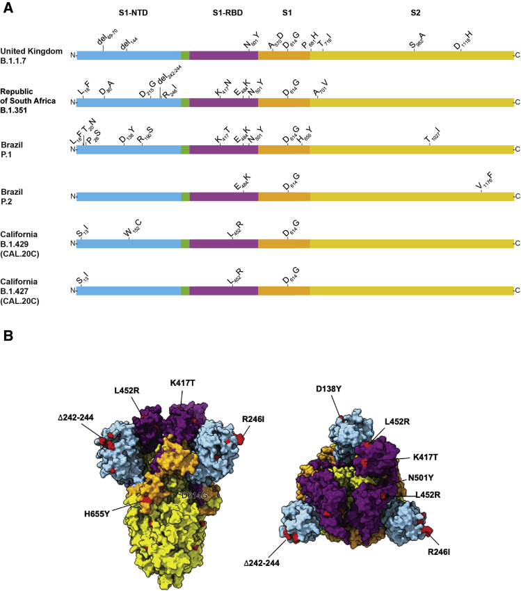
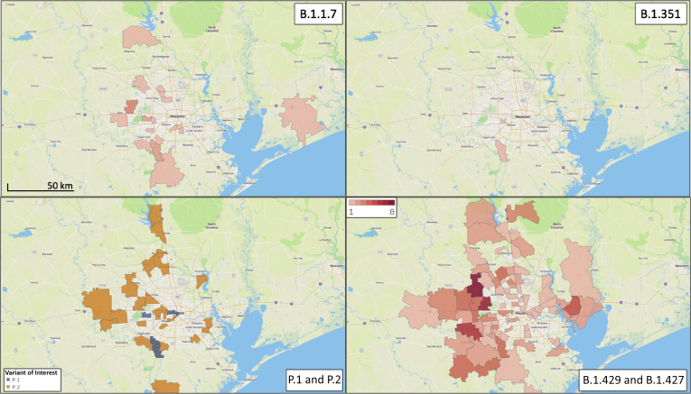

# Sequence Analysis of 20,453 Severe Acute Respiratory Syndrome Coronavirus 2 Genomes from the Houston Metropolitan Area Identifies the Emergence and Widespread Distribution of Multiple Isolates of All Major Variants of Concern

**S. Wesley Long, Randall J. Olsen, Paul A. Christensen, Sishir Subedi, Robert Olson, James J. Davis, Matthew Ojeda Saavedra, Prasanti Yerramilli, Layne Pruitt, Kristina Reppond, Madison N. Shyer, Jessica Cambric, Ilya J. Finkelstein, Jimmy Gollihar, and James M. Musser**

*American Journal of Pathology*, Volume 191, Issue 6, Pages 983–992 (2021)

**DOI:** [10.1016/j.ajpath.2021.02.007](https://doi.org/10.1016/j.ajpath.2021.02.007)

---

## Table of Contents

- [Abstract](#abstract)
- [Materials and Methods](#materials-and-methods)
- [Results](#results)
- [Discussion](#discussion)
- [Acknowledgments](#acknowledgments)

---
##  Abstract
Since the beginning of the severe acute respiratory syndrome coronavirus 2 (SARS-CoV-2) pandemic, there has been international concern about the emergence of virus variants with mutations that increase transmissibility, enhance escape from the human immune response, or otherwise alter biologically important phenotypes. In late 2020, several variants of concern emerged globally, including the UK variant (B.1.1.7), the South Africa variant (B.1.351), Brazil variants (P.1 and P.2), and two related California variants of interest (B.1.429 and B.1.427). These variants are believed to have enhanced transmissibility. For the South Africa and Brazil variants, there is evidence that mutations in spike protein permit it to escape from some vaccines and therapeutic monoclonal antibodies. On the basis of our extensive genome sequencing program involving 20,453 coronavirus disease 2019 patient samples collected from March 2020 to February 2021, we report identification of all six of these SARS-CoV-2 variants among Houston Methodist Hospital (Houston, TX) patients residing in the greater metropolitan area. Although these variants are currently at relatively low frequency (aggregate of 1.1%) in the population, they are geographically widespread. Houston is the first city in the United States in which active circulation of all six current variants of concern has been documented by genome sequencing. As vaccine deployment accelerates, increased genomic surveillance of SARS-CoV-2 is essential to understanding the presence, frequency, and medical impact of consequential variants and their patterns and trajectory of dissemination.
* * *
The severe acute respiratory syndrome coronavirus 2 (SARS-CoV-2) is the causative agent of coronavirus disease 2019 (COVID-19). Since first being identified in December 2019,[1](https://pmc.ncbi.nlm.nih.gov/articles/PMC7962948/#bib1), [2](https://pmc.ncbi.nlm.nih.gov/articles/PMC7962948/#bib2), [3](https://pmc.ncbi.nlm.nih.gov/articles/PMC7962948/#bib3), [4](https://pmc.ncbi.nlm.nih.gov/articles/PMC7962948/#bib4) the virus has spread globally and is responsible for massive human morbidity and mortality worldwide ([_https://www.who.int/docs/default-source/coronaviruse/situation-reports/20200420-sitrep-91-covid-19.pdf?sfvrsn=fcf0670b_4_](https://www.who.int/docs/default-source/coronaviruse/situation-reports/20200420-sitrep-91-covid-19.pdf?sfvrsn=fcf0670b_4), last accessed April 21, 2020).[5](https://pmc.ncbi.nlm.nih.gov/articles/PMC7962948/#bib5), [6](https://pmc.ncbi.nlm.nih.gov/articles/PMC7962948/#bib6), [7](https://pmc.ncbi.nlm.nih.gov/articles/PMC7962948/#bib7), [8](https://pmc.ncbi.nlm.nih.gov/articles/PMC7962948/#bib8) At the onset of the pandemic, effective treatments for COVID-19 were lacking. However, intense global research efforts since then have dramatically improved patient outcomes and identified several useful therapeutic or preventive modalities. The latter include immunologic agents, such as monoclonal antibody therapies,[9](https://pmc.ncbi.nlm.nih.gov/articles/PMC7962948/#bib9),[10](https://pmc.ncbi.nlm.nih.gov/articles/PMC7962948/#bib10) and several vaccines,[11](https://pmc.ncbi.nlm.nih.gov/articles/PMC7962948/#bib11),[12](https://pmc.ncbi.nlm.nih.gov/articles/PMC7962948/#bib12) directed against the spike protein.
In late 2020, the international research community described several SARS-CoV-2 variants of concern that warrant special scrutiny. These include the UK variant (B.1.1.7) ([_https://virological.org/t/preliminary-genomic-characterisation-of-an-emergent-sars-cov-2-lineage-in-the-uk-defined-by-a-novel-set-of-spike-mutations_](https://virological.org/t/preliminary-genomic-characterisation-of-an-emergent-sars-cov-2-lineage-in-the-uk-defined-by-a-novel-set-of-spike-mutations), last accessed February 19, 2021), the South Africa variant (B.1.351) ([_https://www.samrc.ac.za/sites/default/files/files/2020-07-29/WeeklyDeaths21July2020.pdf_](https://www.samrc.ac.za/sites/default/files/files/2020-07-29/WeeklyDeaths21July2020.pdf), last accessed February 18, 2021), Brazil variants (P.1 and P.2) ([_https://virological.org/t/phylogenetic-relationship-of-sars-cov-2-sequences-from-amazonas-with-emerging-brazilian-variants-harboring-mutations-e484k-and-n501y-in-the-spike-protein/585_](https://virological.org/t/phylogenetic-relationship-of-sars-cov-2-sequences-from-amazonas-with-emerging-brazilian-variants-harboring-mutations-e484k-and-n501y-in-the-spike-protein/585), last accessed February 19, 2021; and [_https://virological.org/t/genomic-characterisation-of-an-emergent-sars-cov-2-lineage-in-manaus-preliminary-findings/586_](https://virological.org/t/genomic-characterisation-of-an-emergent-sars-cov-2-lineage-in-manaus-preliminary-findings/586), last accessed February 18, 2021), and two California variants (B.1.429/CAL.20C and B.1.427/CAL.20C).[13](https://pmc.ncbi.nlm.nih.gov/articles/PMC7962948/#bib13), [14](https://pmc.ncbi.nlm.nih.gov/articles/PMC7962948/#bib14), [15](https://pmc.ncbi.nlm.nih.gov/articles/PMC7962948/#bib15), [16](https://pmc.ncbi.nlm.nih.gov/articles/PMC7962948/#bib16), [17](https://pmc.ncbi.nlm.nih.gov/articles/PMC7962948/#bib17) These virus variants were designated as concerning predominantly because of their reported enhanced person-to-person transmission in some geographic areas, and they have since been detected in several countries worldwide. For example, the UK B.1.1.7 variant spread rapidly in southeast England, where it caused large numbers of COVID-19 cases, and was identified shortly thereafter in the United States (CDC, [_https://www.cdc.gov/coronavirus/2019-ncov/transmission/variant.html_](https://www.cdc.gov/coronavirus/2019-ncov/transmission/variant.html)).[18](https://pmc.ncbi.nlm.nih.gov/articles/PMC7962948/#bib18) More than 2600 cases have since been documented in the United States, and at least one large outbreak was recently reported in a Michigan prison (90 cases of UK COVID-19 variant B.1.1.7 reported at Michigan prison, state says, [_https://www.freep.com/story/news/nation/2021/02/17/uk-variant-covid-michigan-prison-bellamy-creek/6779162002_](https://www.freep.com/story/news/nation/2021/02/17/uk-variant-covid-michigan-prison-bellamy-creek/6779162002), last accessed February 19, 2021).[19](https://pmc.ncbi.nlm.nih.gov/articles/PMC7962948/#bib19) There is concern at the CDC that it could become the dominant variant causing the disease in the United States by March.[18](https://pmc.ncbi.nlm.nih.gov/articles/PMC7962948/#bib18), [19](https://pmc.ncbi.nlm.nih.gov/articles/PMC7962948/#bib19), [20](https://pmc.ncbi.nlm.nih.gov/articles/PMC7962948/#bib20) Moreover, the UK B.1.1.7 variant may be associated with an increased death rate compared with other virus types, adding further concern (NERVTAG paper on COVID-19 variant of concern B.1.1.7, [_https://www.gov.uk/government/publications/nervtag-paper-on-covid-19-variant-of-concern-b117_](https://www.gov.uk/government/publications/nervtag-paper-on-covid-19-variant-of-concern-b117), last accessed February 19, 2021).[15](https://pmc.ncbi.nlm.nih.gov/articles/PMC7962948/#bib15),[17](https://pmc.ncbi.nlm.nih.gov/articles/PMC7962948/#bib17),[21](https://pmc.ncbi.nlm.nih.gov/articles/PMC7962948/#bib21)
Similarly, the South Africa and Brazil variants caused large disease outbreaks in their respective countries ([_https://www.samrc.ac.za/sites/default/files/files/2020-07-29/WeeklyDeaths21July2020.pdf_](https://www.samrc.ac.za/sites/default/files/files/2020-07-29/WeeklyDeaths21July2020.pdf), last accessed February 18, 2021).[16](https://pmc.ncbi.nlm.nih.gov/articles/PMC7962948/#bib16) These variants also are of concern because they contain a mutation (E484K) in the spike protein that decreases efficacy of some therapeutic monoclonal antibodies, decreases _in vitr_ o virus neutralization, and may result in potential escape from immunity induced by natural infection or vaccination.[22](https://pmc.ncbi.nlm.nih.gov/articles/PMC7962948/#bib22), [23](https://pmc.ncbi.nlm.nih.gov/articles/PMC7962948/#bib23), [24](https://pmc.ncbi.nlm.nih.gov/articles/PMC7962948/#bib24), [25](https://pmc.ncbi.nlm.nih.gov/articles/PMC7962948/#bib25), [26](https://pmc.ncbi.nlm.nih.gov/articles/PMC7962948/#bib26), [27](https://pmc.ncbi.nlm.nih.gov/articles/PMC7962948/#bib27), [28](https://pmc.ncbi.nlm.nih.gov/articles/PMC7962948/#bib28), [29](https://pmc.ncbi.nlm.nih.gov/articles/PMC7962948/#bib29), [30](https://pmc.ncbi.nlm.nih.gov/articles/PMC7962948/#bib30) All three variants (UK B.1.1.7, Brazil P.1, and South Africa B.1.351) also have a N501Y mutation in spike protein that is associated with stronger binding to the angiotensin-converting enzyme 2 receptor, possibly contributing to increased transmissibility.[31](https://pmc.ncbi.nlm.nih.gov/articles/PMC7962948/#bib31),[32](https://pmc.ncbi.nlm.nih.gov/articles/PMC7962948/#bib32)
The Houston, TX, metropolitan area is the fifth largest and most ethnically diverse city in the United States, with a population of approximately 7 million ([_https://www.houston.org/houston-data/us-most-populous-metro-areas_](https://www.houston.org/houston-data/us-most-populous-metro-areas), last accessed March 9, 2021).[33](https://pmc.ncbi.nlm.nih.gov/articles/PMC7962948/#bib33) The 2400-bed Houston Methodist health system has eight hospitals and cares for a large, multiethnic, and geographically and socioeconomically diverse patient population throughout greater Houston. The eight Houston Methodist hospitals have a single central molecular diagnostic laboratory, which means that all RT-PCR specimens can readily be identified, banked, and subjected to further study as needed. In addition, the Department of Pathology and Genomic Medicine has a long-standing record of integrating genome sequencing efforts into clinical care and research, especially related to microbial pathogens infecting our patients.[34](https://pmc.ncbi.nlm.nih.gov/articles/PMC7962948/#bib34), [35](https://pmc.ncbi.nlm.nih.gov/articles/PMC7962948/#bib35), [36](https://pmc.ncbi.nlm.nih.gov/articles/PMC7962948/#bib36), [37](https://pmc.ncbi.nlm.nih.gov/articles/PMC7962948/#bib37), [38](https://pmc.ncbi.nlm.nih.gov/articles/PMC7962948/#bib38), [39](https://pmc.ncbi.nlm.nih.gov/articles/PMC7962948/#bib39), [40](https://pmc.ncbi.nlm.nih.gov/articles/PMC7962948/#bib40), [41](https://pmc.ncbi.nlm.nih.gov/articles/PMC7962948/#bib41) In the aggregate, strategic colocalization of these diagnostic attributes coupled with a contiguous research institute building seamlessly facilitates comprehensive population genomic studies of SARS-CoV-2 viruses causing infections in the Houston metropolitan region.[38](https://pmc.ncbi.nlm.nih.gov/articles/PMC7962948/#bib38),[41](https://pmc.ncbi.nlm.nih.gov/articles/PMC7962948/#bib41)
Before the SARS-CoV-2 virus arrived in Houston, an integrated strategy was planned to confront and mitigate this microbial threat to our patients. In addition to rapidly validating an RT-PCR test for the virus, a plan was instituted to sequence the genome of every positive specimen from patients within the Houston Methodist system, with the goal of understanding pathogen spread in our community and identifying biologically important mutant viruses. Detailed population genomics of the first and second waves of SARS-CoV-2 in the Houston metropolitan region were previously described.[38](https://pmc.ncbi.nlm.nih.gov/articles/PMC7962948/#bib38),[41](https://pmc.ncbi.nlm.nih.gov/articles/PMC7962948/#bib41) Positive SARS-CoV-2 specimens continue to be sequenced with the goal of monitoring for variants of concern and genome mutations that may be associated with patient outcome or therapeutic failure.
This report describes the identification of multiple isolates of important SARS-CoV-2 variants, including the UK B.1.1.7, South Africa B.1.351, Brazil P.1 and P.2, and California B.1.429 and B.1.427 variants in Houston patient specimens collected from December 2020 through mid-February 2021. These findings represent the first detection of the South Africa and Brazil variants in Texas and the second time UK variants have been identified in Houston. Greater Houston is the first metroplex in the United States documented to have all of these important and concerning variants circulating among its residents. Our discoveries further illustrate the need for increased population genomic and epidemiology efforts to identify and help track dissemination of these variants, monitor development of new variants, and assess the relationship between variants and COVID-19 disease outcomes.
---
##  Materials and Methods
### Patient Specimens
All specimens were obtained from individuals who were registered patients at Houston Methodist hospitals, associated facilities (eg, urgent care centers), or institutions in the greater Houston metropolitan region that use the laboratory services. Virtually all individuals had signs or symptoms consistent with COVID-19. This work was approved by the Houston Methodist Research Institute Institutional Review Board (IRB1010-0199).
### SARS-CoV-2 Molecular Diagnostic Testing
Specimens obtained from symptomatic patients with a high degree of suspicion for COVID-19 were tested in the Molecular Diagnostics Laboratory at Houston Methodist Hospital using assays granted Emergency Use Authorization from the US Food and Drug Administration ([_https://www.fda.gov/medical-devices/emergency-situations-medical-devices/faqs-diagnostic-testing-sars-cov-2#offeringtests_](https://www.fda.gov/medical-devices/emergency-situations-medical-devices/faqs-diagnostic-testing-sars-cov-2#offeringtests), last accessed February 18, 2021). Multiple molecular testing platforms were used, including the COVID-19 test or RP2.1 test with BioFire Film Array instruments (Biofire Diagnostics, Salt Lake City, UT), the Xpert Xpress SARS-CoV-2 test using Cepheid GeneXpert Infinity or Cepheid GeneXpert Xpress IV instruments (Cepheid, Sunnyvale, CA), the SARS-CoV-2 Assay using the Hologic Panther instrument, the Aptima SARS-CoV-2 Assay using the Hologic Panther Fusion system (Hologic, Marlborough, MA), and the SARS-CoV-2 assay using Abbott Alinity m instruments (Abbott Laboratories, Abbott Park, IL). All assays were performed according to the manufacturer's instructions. Testing was performed on material obtained from nasopharyngeal, oropharyngeal, or nasal swabs immersed in universal transport media, bronchoalveolar lavage fluid, or sputum treated with dithiothreitol. To standardize specimen collection, an instructional video was generated for Houston Methodist health care workers ([_https://vimeo.com/396996468/2228335d56_](https://vimeo.com/396996468/2228335d56), last accessed March 9, 2021).
### SARS-CoV-2 Genome Sequencing
Libraries for whole virus genome sequencing were prepared according to version 3 of the ARTIC nCoV-2019 sequencing protocol ([_https://artic.network/ncov-2019_](https://artic.network/ncov-2019), last accessed March 9, 2021). Long reads were generated with the LSK-109 sequencing kit, 24 native barcodes (NBD104 and NBD114 kits), and a GridION instrument (Oxford Nanopore, Oxford, UK). Short sequence reads were generated with either a NextSeq 550 or NovaSeq 6000 instrument (Illumina, San Diego, CA).
### SARS-CoV-2 Genome Sequence Analysis
Viral genomes were assembled with the BV-BRC SARS-Cov-2 assembly service ([_https://www.bv-brc.org/app/ComprehensiveSARS2Analysis_](https://www.bv-brc.org/app/ComprehensiveSARS2Analysis), last accessed March 9, 2021).[42](https://pmc.ncbi.nlm.nih.gov/articles/PMC7962948/#bib42) The One Codex SARS-CoV-2 variant calling and consensus assembly pipeline was chosen for assembling all sequences ([_https://github.com/onecodex/sars-cov-2.git_](https://github.com/onecodex/sars-cov-2.git), last accessed February 18, 2021) using default parameters and a minimum read depth of 3. Briefly, the pipeline uses seqtk version 1.3-r116 for sequence trimming ([_https://github.com/lh3/seqtk.git_](https://github.com/lh3/seqtk.git), last accessed February 18, 2021); minimap version 2.1[43](https://pmc.ncbi.nlm.nih.gov/articles/PMC7962948/#bib43) for aligning reads against reference genome Wuhan-Hu-1 (NC_045512.2); samtools version 1.11 for sequence and file manipulation[44](https://pmc.ncbi.nlm.nih.gov/articles/PMC7962948/#bib44); and iVar version 1.2.2 for primer trimming and variant calling.[45](https://pmc.ncbi.nlm.nih.gov/articles/PMC7962948/#bib45) All COVID-19 genomes were submitted to GISAID ([_www.gisaid.org_](http://www.gisaid.org)). Accession numbers are available in [Supplemental Appendixes S1–S3](https://pmc.ncbi.nlm.nih.gov/articles/PMC7962948/#appsec2).
### Geospatial Analysis
The patient home address zip codes were used to visualize the geospatial distribution of spread for each variant of concern. Figures were generated using Tableau version 2020.3.4 (Tableau Software, Mountain View, CA).
---
##  Results
So far, 20,453 complete genomes of SARS-CoV-2 from clinical specimens collected from patients in the Houston metropolitan area during the period March 2020 to February 2021 have been sequenced. Variants of concern were first detected among specimens collected in December 2020, and now 23 UK variants (B.1.1.7), 2 South African variants (B.1.351), and 4 Brazilian variants (P.1) have been identified. One hundred and sixty two patients infected with the California variants (B.1.429, _N_ = 143; B.1.427, _N_ = 19) and 39 patients infected with Brazil P.2 variants were also identified ([Table 1](https://pmc.ncbi.nlm.nih.gov/articles/PMC7962948/#tbl1)).
### Table 1.
Variants of Concern or Variant of Interest Identified in the Houston, TX, Metropolitan Area
Variant | No. of isolates  
---|---  
B.1.1.7 | 23  
B.1.351 | 2  
P.1 | 4  
P.2 | 39  
B.1.429 | 143  
B.1.427 | 19  
[Open in a new tab](https://pmc.ncbi.nlm.nih.gov/articles/PMC7962948/table/tbl1/)
### UK Variant of Concern (B.1.1.7)
The UK variant B.1.1.7 was first identified in September 2020 in the United Kingdom and was designated as a variant of concern in South London on December 14, 2020. It was strongly associated with a resurgence of SARS-CoV-2 infections in that region and rapidly became the dominant lineage.[20](https://pmc.ncbi.nlm.nih.gov/articles/PMC7962948/#bib20) More importantly, the United Kingdom has the most extensive SARS-CoV-2 genome sequencing program in the world, making it particularly well-situated to rapidly identify new variants. Of the approximately 500,000 SARS-CoV-2 genome sequences submitted to GISAID from global sources, approximately one-half originated from collaborating laboratories in the United Kingdom as part of the COVID-19 Genomics UK Consortium.[46](https://pmc.ncbi.nlm.nih.gov/articles/PMC7962948/#bib46)
The UK B.1.1.7 variant is of particular concern because it has an unusually large number of genome mutations, including multiple changes in spike protein ([Figure 1](#fig1)). Some of the mutations of primary concern include N501Y located in the receptor binding domain, and a two amino acid deletion (del69-70) in multiple SARS-CoV-2 genetic backgrounds and is associated with increased transmissibility.[20](https://pmc.ncbi.nlm.nih.gov/articles/PMC7962948/#bib20) In addition, evidence has been presented from the United Kingdom that B.1.1.7 strains may cause increased hospitalization and mortality.[15](https://pmc.ncbi.nlm.nih.gov/articles/PMC7962948/#bib15),[17](https://pmc.ncbi.nlm.nih.gov/articles/PMC7962948/#bib17),[47](https://pmc.ncbi.nlm.nih.gov/articles/PMC7962948/#bib47) The first patient identified in Houston with a B.1.1.7 variant was diagnosed in January 2021; thus far, 23 patients have been identified with this variant of concern ([Table 1](https://pmc.ncbi.nlm.nih.gov/articles/PMC7962948/#tbl1)). Of note, none of the first three patients had an international travel history, suggesting that they acquired the B.1.1.7 infections either locally or during domestic travel. Preliminary evidence indicates that sera from patients immunized with the Pfizer-BioNTech SARS-CoV-2 vaccine retain the ability to neutralize B.1.1.7 variants _in vitro_.[48](https://pmc.ncbi.nlm.nih.gov/articles/PMC7962948/#bib48) Additional studies have found that convalescent plasma samples from many patients, and some monoclonal antibody therapies, retain the ability to neutralize B.1.1.7 variant SARS-CoV-2 _in vitro_.[27](https://pmc.ncbi.nlm.nih.gov/articles/PMC7962948/#bib27),[28](https://pmc.ncbi.nlm.nih.gov/articles/PMC7962948/#bib28)
#### Figure 1. {#fig1}

**A:** Schematic showing structural changes present in the spike protein of the major severe acute respiratory syndrome coronavirus 2 (SARS-CoV-2) variants identified in the study. **B:** Mapping of important changes onto the cryoEM structure of spike protein. The color scheme matches that used in **A**. Blue, amino-terminal domain (NTD); purple, receptor-binding domain (RBD); orange, S1 domain (S1); and yellow, S2 domain (S2). Aggregate mutations present in variants of concern are colored in red when amino acid residues are present in the resolved structure. **Left panel:** Side view of SARS-CoV-2 prefusion-stabilized spike. **Right panel** , **top view:** Structure of PDB 6vsb was used as reference.
### South Africa Variant of Concern (B.1.351)
The South Africa B.1.351 variant of concern was first identified in a COVID-19 epidemic wave occurring in Nelson Mandela Bay in October 2020.[16](https://pmc.ncbi.nlm.nih.gov/articles/PMC7962948/#bib16) This variant was concerning because of its large number of spike protein mutations (including K417N, E484K, and N501Y) ([Figure 1](#fig1)) and apparent increased transmissibility.[16](https://pmc.ncbi.nlm.nih.gov/articles/PMC7962948/#bib16),[31](https://pmc.ncbi.nlm.nih.gov/articles/PMC7962948/#bib31) These three mutations are located in the receptor binding domain of spike and may decrease the effectiveness of some monoclonal antibody therapies and vaccines.[22](https://pmc.ncbi.nlm.nih.gov/articles/PMC7962948/#bib22), [23](https://pmc.ncbi.nlm.nih.gov/articles/PMC7962948/#bib23), [24](https://pmc.ncbi.nlm.nih.gov/articles/PMC7962948/#bib24),[27](https://pmc.ncbi.nlm.nih.gov/articles/PMC7962948/#bib27),[28](https://pmc.ncbi.nlm.nih.gov/articles/PMC7962948/#bib28),[49](https://pmc.ncbi.nlm.nih.gov/articles/PMC7962948/#bib49) The first South Africa variant detected in Houston was identified in a patient specimen collected in late December 2020, and the second specimen collected in early January 2021. Of note, these Houston Methodist Hospital patients had no known international travel history, suggesting domestic acquisition of this B.1.351 variant.
### Brazil Variants of Concern (P.1 and P.2)
The P.1 variant of concern was reported to have originated in Manaus, Brazil, and like the South Africa B.1.351 variant, has numerous mutations in spike protein, including E484K and N501Y ([Figure 1](#fig1)).[50](https://pmc.ncbi.nlm.nih.gov/articles/PMC7962948/#bib50) The first P.1 variant was identified in Houston specimens in mid-January 2021. In total, four P.1 variants have been identified in our patient samples ([Table 1](https://pmc.ncbi.nlm.nih.gov/articles/PMC7962948/#tbl1)). The P.2 variant began to spread in Brazil in earnest in October of 2020, similar to P.1 (P.2 Lineage Report, [_https://outbreak.info/situation-reports?pango=P.2_](https://outbreak.info/situation-reports?pango=P.2), last accessed February 18, 2021). It also has a E484K amino acid change in the receptor-binding domain of spike protein ([Figure 1](#fig1)), similar to variants P.1 and B.1.351.[14](https://pmc.ncbi.nlm.nih.gov/articles/PMC7962948/#bib14) A P.2 variant was first identified in a patient specimen obtained in late December 2020. In total, 39 P.2 variants have been documented in our patient specimens ([Table 1](https://pmc.ncbi.nlm.nih.gov/articles/PMC7962948/#tbl1)).
### California Variants (B.1.429 and B.1.427)
The emergence of what is now known as the California variant, originally known as CAL.20C and later designated as lineages B.1.429 and B.1.427, was first identified in Los Angeles County in July 2020 as a single isolate (B.1.429 Lineage Report, outbreak.info 2021, [_https://outbreak.info/situation-reports?pango=B.1.429_](https://outbreak.info/situation-reports?pango=B.1.429), last accessed February 18, 2021). This variant re-emerged in October 2020 and was associated with an increasing number of cases during a wave of SARS-CoV-2 infections in the region.[13](https://pmc.ncbi.nlm.nih.gov/articles/PMC7962948/#bib13) Variant B.1.429 accounted for 36% of isolates collected from late November to late December 2020 in Los Angeles County.[13](https://pmc.ncbi.nlm.nih.gov/articles/PMC7962948/#bib13) Since November 2020, this variant has been detected in 42 states in the United States, and was first found in Houston Methodist Hospital patients in specimens obtained in late December 2020. So far, 143 and 19 patients with the B.1.429 and B.1.427 isolates, respectively, have been identified ([Table 1](https://pmc.ncbi.nlm.nih.gov/articles/PMC7962948/#tbl1)). The B.1.427 variant is closely related to B.1.429 ([Figure 1](#fig1)) and has spread from California to 34 states since October 2020 (B.1.427 Lineage Report, [_https://outbreak.info/situation-reports?pango=B.1.427_](https://outbreak.info/situation-reports?pango=B.1.427), last accessed February 19, 2021). The California variants are noteworthy primarily for their emergence and rapid spread in Los Angeles County and identification elsewhere in the United States. However, as of February 17, 2021, they have not been designated as variants of concern by the CDC.
### Geospatial Distribution of Variants
Given the importance of the identification of these SARS-CoV-2 variants in the Houston metropolitan area, their geospatial distribution was examined to investigate the extent of dissemination ([Figure 2](#fig2)). With the exception of the B.1.351 variant, patients infected with all other variants resided in widely dispersed areas of the metropolitan area. This finding is consistent with the well-known propensity of SARS-CoV-2 to spread rapidly between individuals, and especially so for these variants of concern.[16](https://pmc.ncbi.nlm.nih.gov/articles/PMC7962948/#bib16),[18](https://pmc.ncbi.nlm.nih.gov/articles/PMC7962948/#bib18),[19](https://pmc.ncbi.nlm.nih.gov/articles/PMC7962948/#bib19),[51](https://pmc.ncbi.nlm.nih.gov/articles/PMC7962948/#bib51), [52](https://pmc.ncbi.nlm.nih.gov/articles/PMC7962948/#bib52), [53](https://pmc.ncbi.nlm.nih.gov/articles/PMC7962948/#bib53)
#### Figure 2. {#fig2}

Geospatial distribution for each variant of concern identified in the study. The home address zip code for each patient was used, and figures were generated using Tableau version 2020.3.4.
---
##  Discussion
Herein we report detection of the UK (B.1.1.7), South Africa (B.1.351), and Brazil (P.1) SARS-CoV-2 variants of concern from patients in the Houston metropolitan region. Geographically widespread dissemination of the Cal.20C California (B.1.429 and B.1.427) variants of interest were identified. These SARS-CoV-2 variants are distributed across a large geospatial region in the metropolitan region ([Figure 2](#fig2)), indicating successful patient-to-patient transmission among Houstonians. None of the affected patients was from a common household or reported recent international travel, suggesting that every infection was independently acquired locally or during domestic travel. Given that Houston is a culturally and ethnically diverse population center with two international airports, a major shipping center, and a global energy sector, the discovery of patients infected with each of the four concerning SARS-CoV-2 variants is not unexpected but it is disquieting. With this report, Houston now becomes the first US city to document patients infected with each of the four SARS-CoV-2 variants of concern or interest, testament to the extensive sequencing of COVID-19 patient samples.
The P.2 variant gained recent attention in the scientific and lay press because it has been reported to cause SARS-CoV-2 reinfections ([_https://virological.org/t/spike-e484k-mutation-in-the-first-sars-cov-2-reinfection-case-confirmed-in-brazil-2020/584_](https://virological.org/t/spike-e484k-mutation-in-the-first-sars-cov-2-reinfection-case-confirmed-in-brazil-2020/584), last accessed February 19, 2021).[54](https://pmc.ncbi.nlm.nih.gov/articles/PMC7962948/#bib54) Thirty nine P.2 infections were identified among Houston patients. Although it is currently a numerically minor cause of all Houston-area infections, P.2 is now the most common SARS-CoV-2 variant of concern in this population.
The E484K amino acid replacement in spike protein is characteristic of P.1, P.2, and B.1.351 strains ([Figure 1](#fig1)). It has independently arisen in many different SARS-CoV-2 genomic backgrounds, including some B.1.1.7 strains.[55](https://pmc.ncbi.nlm.nih.gov/articles/PMC7962948/#bib55) This amino acid replacement has caused substantial public health concern because of its potentially detrimental effects on neutralizing activity of therapeutic monoclonal antibodies, sera obtained from naturally infected individuals, and post-vaccination sera.[56](https://pmc.ncbi.nlm.nih.gov/articles/PMC7962948/#bib56),[57](https://pmc.ncbi.nlm.nih.gov/articles/PMC7962948/#bib57) That is, the E484K amino acid change may facilitate vaccine escape. Among the Houston SARS-CoV-2 genomes, E484K was detected 84 times (0.4% of the total genomes sequenced). It was first detected in a respiratory specimen collected in July 2020, near the peak of our second massive wave of infections,[38](https://pmc.ncbi.nlm.nih.gov/articles/PMC7962948/#bib38) and has been identified in many diverse genomic backgrounds thereafter. Because of this strong signal of convergent evolution, all Houston SARS-CoV-2 genomes will continue to be closely monitored for the E484K amino acid change.
Recently, the Q677H amino acid change in spike protein has been identified in SARS-CoV-2 patient samples collected in multiple US states and other global locations.[58](https://pmc.ncbi.nlm.nih.gov/articles/PMC7962948/#bib58),[59](https://pmc.ncbi.nlm.nih.gov/articles/PMC7962948/#bib59) Q677H has arisen in at least six distinct genomic backgrounds.[59](https://pmc.ncbi.nlm.nih.gov/articles/PMC7962948/#bib59) A Q667P amino acid change has also been identified.[59](https://pmc.ncbi.nlm.nih.gov/articles/PMC7962948/#bib59) Among the Houston genomes, Q677H occurred 288 times (1.4%) and is encoded by two different nucleotide changes. Two other amino acid changes, 677P (in 330 genomes; 1.6%) and Q677K (in 2 genomes; <0.1%) were identified in Houston. Taken together, these data suggest selection for a yet to be determined biologic phenotype associated with amino acid replacements at position 677.
Many population genomic studies performed in various global locations have clearly demonstrated that SARS-CoV-2 variants with biologically relevant phenotypes have evolved. Emergence of new variants underlines the need for ongoing extensive genomic sequencing efforts for early identification and public health warning. In support of these efforts, our laboratory has devoted substantial resources to SARS-CoV-2 genomics, resulting in sequence analysis of more genomes than any other state in the United States.[46](https://pmc.ncbi.nlm.nih.gov/articles/PMC7962948/#bib46) Since March 2020, approximately 36,500 SARS-CoV-2–positive patients have received care in our Houston Methodist health system, and 20,453 virus genomes have been sequenced. In total, this data set represents 56% of our Houston Methodist COVID-19 patients. Inasmuch as almost 500,000 COVID-19 infections have been reported in the Houston metropolitan area (Texas Medical Center COVID-19 Dashboard 2021, [_https://www.tmc.edu/coronavirus-updates/covid-19-positive-cumulative-cases_](https://www.tmc.edu/coronavirus-updates/covid-19-positive-cumulative-cases), last accessed February 19, 2021), the genome of 4.1% of all cases reported in our area has been sequenced. On the basis of modeling, this sample depth may be sufficient to identify all variants occurring at a biologically relevant frequency.[60](https://pmc.ncbi.nlm.nih.gov/articles/PMC7962948/#bib60) Because of the wide geographic catchment of the eight-hospital system that serves a diverse patient population, the data presented herein likely reflect a reasonably detailed overview of SARS-CoV-2 genomic diversity throughout our metroplex. This comparatively deep sampling of the Houston metropolitan SARS-CoV-2 population was used to identify patients infected with variants of concern, and provid information regarding the timeframe of initial presence and frequency of each variant. The strategy was modeled on the aggressive genome sequencing being conducted in the United Kingdom, a global leader in SARS-CoV-2 genome sequencing.[61](https://pmc.ncbi.nlm.nih.gov/articles/PMC7962948/#bib61)
The large SARS-CoV-2 genome data set and comprehensive infrastructure of the Houston Methodist Hospital are critical resources. By linking the SARS-CoV-2 whole genome sequence data to patient metadata present in the electronic medical record, analytic tools such as high-performance compute clusters and machine learning were used to investigate the relationship between genomic diversity and phenotypic traits, such as strain virulence or patient outcomes.[38](https://pmc.ncbi.nlm.nih.gov/articles/PMC7962948/#bib38) For example, recent reports of increased mortality caused by B.1.1.7 variant strains are concerning and worthy of further investigation.[15](https://pmc.ncbi.nlm.nih.gov/articles/PMC7962948/#bib15),[17](https://pmc.ncbi.nlm.nih.gov/articles/PMC7962948/#bib17),[21](https://pmc.ncbi.nlm.nih.gov/articles/PMC7962948/#bib21)
The goal is to sequence the SARS-CoV-2 genome of every infected patient in the health care system in near real time, and expand outward to other patients in our community. Consistent with these goals, the American Rescue Plan, announced by the Biden administration, proposes to substantially fund sequencing capacity in the United States (White House Briefing Room, [_https://www.whitehouse.gov/briefing-room/legislation/2021/01/20/president-biden-announces-american-rescue-plan_](https://www.whitehouse.gov/briefing-room/legislation/2021/01/20/president-biden-announces-american-rescue-plan), last accessed February 19, 2021). These results from a major metropolitan region in the United States underline the necessity of greatly increased genome surveillance to rapidly identify and track the emergence and introduction of SARS-CoV-2 variants in the United States and local areas.
---
##  Acknowledgments
We thank Drs. Jessica Thomas and Zejuan Li, Erika Walker, the many talented and dedicated molecular technologists, and many labor pool volunteers in the Molecular Diagnostics Laboratory and Methodist Research Institute for dedicated efforts; Drs. Marc Boom and Dirk Sostman for support, many generous Houston philanthropists for tremendous support, and the Houston Methodist Academic Institute Infectious Diseases Fund, which have made this ongoing project possible; Jessica W. Podnar and personnel in the University of Texas Genome Sequencing and Analysis Facility for sequencing some of the genomes in this study; Hung-Che Kuo and G. Nguyen for genome sequencing support; Maulik Shukla and Marcus Nguyen at PATRIC Bioinformatics Resource Center for assistance with sequence analysis; the originating and submitting laboratories of the severe acute respiratory syndrome coronavirus 2 genome sequences from GISAID's EpiFlu Database, used in some of the work presented herein; many colleagues for critical reading of the manuscript and suggesting improvements; and Dr. Kathryn Stockbauer, Sasha Pejerrey, Adrienne Winston, and Heather McConnell for help with figures, tables, and editorial contributions.

##  Author Contributions
J.M.M. conceptualized and designed the project; S.W.L, R.J.O., P.A.C., S.S., R.O., J.J.D., M.S., P.Y., L.P., K.R., M.N.S, J.C., I.J.F, and J.G. performed research. All authors wrote the manuscript.
##  Supplemental Data
Supplemental Appendix S1
[mmc1.pdf](https://pmc.ncbi.nlm.nih.gov/articles/instance/8176137/bin/mmc1.pdf) (21.1KB, pdf) 
Supplemental Appendix S2
[mmc2.pdf](https://pmc.ncbi.nlm.nih.gov/articles/instance/8176137/bin/mmc2.pdf) (30.7KB, pdf) 
Supplemental Appendix S3
[mmc3.pdf](https://pmc.ncbi.nlm.nih.gov/articles/instance/8176137/bin/mmc3.pdf) (31.5KB, pdf)

---

## References

1. Huang C, Wang Y, Li X, Ren L, Zhao J, Hu Y, Zhang L, Fan G, Xu J, Gu X, Cheng Z, Yu T, Xia J, Wei Y, Wu W, Xie X, Yin W, Li H, Liu M, Xiao Y, Gao H, Guo L, Xie J, Wang G, Jiang R, Gao Z, Jin Q, Wang J, Cao B. Clinical features of patients infected with 2019 novel coronavirus in Wuhan, China. *Lancet*. 2020;395:497–506.

2. Zhu N, Zhang D, Wang W, Li X, Yang B, Song J, Zhao X, Huang B, Shi W, Lu R, Niu P, Zhan F, Ma X, Wang D, Xu W, Wu G, Gao GF, Tan W. A novel coronavirus from patients with pneumonia in China, 2019. *N Engl J Med*. 2020;382:727–733.

3. Chan JF, Yuan S, Kok KH, To KK, Chu H, Yang J, Xing F, Liu J, Yip CC, Poon RW, Tsoi HW, Lo SK, Chan KH, Poon VK, Chan WM, Ip JD, Cai JP, Cheng VC, Chen H, Hui CK, Yuen KY. A familial cluster of pneumonia associated with the 2019 novel coronavirus indicating person-to-person transmission: a study of a family cluster. *Lancet*. 2020;395:514–523.

4. Wu F, Zhao S, Yu B, Chen YM, Wang W, Song ZG, Hu Y, Tao ZW, Tian JH, Pei YY, Yuan ML, Zhang YL, Dai FH, Liu Y, Wang QM, Zheng JJ, Xu L, Holmes EC, Zhang YZ. A new coronavirus associated with human respiratory disease in China. *Nature*. 2020;579:265–269.

5. Gorbalenya AE, Baker SC, Baric RS, de Groot RJ, Drosten C, Gulyaeva AA, Haagmans BL, Lauber C, Leontovich AM, Neuman BW, Penzar D, Perlman S, Poon LLM, Samborskiy DV, Sidorov IA, Sola I, Ziebuhr J; Coronaviridae Study Group of the International Committee on Taxonomy of Viruses. The species severe acute respiratory syndrome-related coronavirus: classifying 2019-nCoV and naming it SARS-CoV-2. *Nat Microbiol*. 2020;5:536–544.

6. Wang C, Horby PW, Hayden FG, Gao GF. A novel coronavirus outbreak of global health concern. *Lancet*. 2020;395:470–473.

7. Perlman S. Another decade, another coronavirus. *N Engl J Med*. 2020;382:760–762.

8. Allel K, Tapia-Munoz T, Morris W. Country-level factors associated with the early spread of COVID-19 cases at 5, 10 and 15 days since the onset. *Glob Public Health*. 2020:1–14.

9. Chen P, Nirula A, Heller B, Gottlieb RL, Boscia J, Morris J, Huhn G, Cardona J, Mocherla B, Stosor V, Shawa I, Adams AC, Van Naarden J, Custer KL, Shen L, Durante M, Oakley G, Schade AE, Sabo J, Patel DR, Klekotka P, Skovronsky DM; BLAZE-1 Investigators. SARS-CoV-2 neutralizing antibody LY-CoV555 in outpatients with Covid-19. *N Engl J Med*. 2021;384:229–237.

10. Weinreich DM, Sivapalasingam S, Norton T, Ali S, Gao H, Bhore R, Musser BJ, Soo Y, Rofail D, Im J, Perry C, Pan C, Hosain R, Mahmood A, Davis JD, Turner KC, Hooper AT, Hamilton JD, Baum A, Kyratsous CA, Kim Y, Cook A, Kampman W, Kohli A, Sachdeva Y, Graber X, Kowal B, DiCioccio T, Stahl N, Lipsich L, Braunstein N, Herman G, Yancopoulos GD; Trial I. REGN-COV2, a neutralizing antibody cocktail, in outpatients with Covid-19. *N Engl J Med*. 2021;384:238–251.

11. Baden LR, El Sahly HM, Essink B, Kotloff K, Frey S, Novak R, et al. Efficacy and safety of the mRNA-1273 SARS-CoV-2 vaccine. *N Engl J Med*. 2021;384:403–416.

12. Polack FP, Thomas SJ, Kitchin N, Absalon J, Gurtman A, Lockhart S, Perez JL, Perez Marc G, Moreira ED, Zerbini C, Bailey R, Swanson KA, Roychoudhury S, Koury K, Li P, Kalina WV, Cooper D, Frenck RW Jr, Hammitt LL, Tureci O, Nell H, Schaefer A, Unal S, Tresnan DB, Mather S, Dormitzer PR, Sahin U, Jansen KU, Gruber WC; C4591001 Clinical Trial Group. Safety and efficacy of the BNT162b2 mRNA Covid-19 vaccine. *N Engl J Med*. 2020;383:2603–2615.

13. Zhang W, Davis BD, Chen SS, Sincuir Martinez JM, Plummer JT, Vail E. Emergence of a novel SARS-CoV-2 variant in Southern California. *JAMA*. 2021;325:1324–1326.

14. Voloch CM, Silva FRd, de Almeida LGP, Cardoso CC, Brustolini OJ, Gerber AL, Guimaraes APdC, Mariani D, Costa RMd, Ferreira OC, Cavalcanti AC, Frauches TS, de Mello CMB, Galliez RM, Faffe DS, Castineiras TMPP, Tanuri A, de Vasconcelos ATR. Genomic characterization of a novel SARS-CoV-2 lineage from Rio de Janeiro, Brazil. *J Virol*. 2021.

15. Challen R, Brooks-Pollock E, Read JM, Dyson L, Tsaneva-Atanasova K, Danon L. Increased hazard of mortality in cases compatible with SARS-CoV-2 variant of concern 202012/1 - a matched cohort study. *BMJ*. 2021;372:n579.

16. Tegally H, Wilkinson E, Giovanetti M, Iranzadeh A, Fonseca V, Giandhari J, et al. Emergence and rapid spread of a new severe acute respiratory syndrome-related coronavirus 2 (SARS-CoV-2) lineage with multiple spike mutations in South Africa. *medRxiv*. 2020.

17. Iacobucci G. Covid-19: new UK variant may be linked to increased death rate, early data indicate. *BMJ*. 2021;372:n230.

18. Alpert T, Lasek-Nesselquist E, Brito AF, Valesano AL, Rothman J, MacKay MJ, et al. Early introductions and community transmission of SARS-CoV-2 variant B.1.1.7 in the United States. *medRxiv*. 2021.

19. Washington NL, Gangavarapu K, Zeller M, Bolze A, Cirulli ET, Schiabor Barrett KM, et al. Genomic epidemiology identifies emergence and rapid transmission of SARS-CoV-2 B.1.1.7 in the United States. *medRxiv*. 2021.

20. Galloway SE, Paul P, MacCannell DR, Johansson MA, Brooks JT, MacNeil A, Slayton RB, Tong S, Silk BJ, Armstrong GL, Biggerstaff M, Dugan VG. Emergence of SARS-CoV-2 B.1.1.7 lineage - United States, December 29, 2020-January 12, 2021. *MMWR Morb Mortal Wkly Rep*. 2021;70:95–99.

21. Munitz A, Yechezkel M, Dickstein Y, Yamin D, Gerlic M. The rise of SARS-CoV-2 variant B.1.1.7 in Israel intensifies the role of surveillance and vaccination in elderly. *Cell Rep Med*. 2021.

22. Wang WB, Liang Y, Jin YQ, Zhang J, Su JG, Li QM. E484K mutation in SARS-CoV-2 RBD enhances binding affinity with hACE2 but reduces interactions with neutralizing antibodies and nanobodies: binding free energy calculation studies. *bioRxiv*. 2021.

23. Garcia-Beltran WF, Lam EC, Denis KS, Nitido AD, Garcia ZH, Hauser BM, Feldman J, Pavlovic MN, Gregory DJ, Poznansky MC, Sigal A, Schmidt AG, Iafrate AJ, Naranbhai V, Balazs AB. Multiple SARS-CoV-2 variants escape neutralization by vaccine-induced humoral immunity. *medRxiv*. 2021.

24. Liu H, Wei P, Zhang Q, Chen Z, Aviszus K, Downing W, Peterson S, Reynoso L, Downey GP, Frankel SK, Kappler J, Marrack P, Zhang G. 501Y.V2 and 501Y.V3 variants of SARS-CoV-2 lose binding to Bamlanivimab in vitro. *bioRxiv*. 2021.

25. Yuan M, Huang D, Lee CD, Wu NC, Jackson AM, Zhu X, Liu H, Peng L, van Gils MJ, Sanders RW, Burton DR, Reincke SM, Pruss H, Kreye J, Nemazee D, Ward AB, Wilson IA. Structural and functional ramifications of antigenic drift in recent SARS-CoV-2 variants. *bioRxiv*. 2021.

26. Greaney AJ, Loes AN, Crawford KHD, Starr TN, Malone KD, Chu HY, Bloom JD. Comprehensive mapping of mutations in the SARS-CoV-2 receptor-binding domain that affect recognition by polyclonal human plasma antibodies. *Cell Host Microbe*. 2021;29:463–476.e6.

27. Tada T, Dcosta BM, Samanovic-Golden M, Herati RS, Cornelius A, Mulligan MJ, Landau NR. Neutralization of viruses with European, South African, and United States SARS-CoV-2 variant spike proteins by convalescent sera and BNT162b2 mRNA vaccine-elicited antibodies. *bioRxiv*. 2021.

28. Planas D, Bruel T, Grzelak L, Guivel-Benhassine F, Staropoli I, Porrot F, Planchais C, Buchrieser J, Rajah MM, Bishop E, Albert M, Donati F, Behillil S, Enouf V, Maquart M, Gonzalez M, De Seze J, Pere H, Veyer D, Seve A, Simon-Loriere E, Fafi-Kremer S, Stefic K, Mouquet H, Hocqueloux L, van der Werf S, Prazuck T, Schwartz O. Sensitivity of infectious SARS-CoV-2 B.1.1.7 and B.1.351 variants to neutralizing antibodies. *bioRxiv*. 2021.

29. Wang P, Liu L, Iketani S, Luo Y, Guo Y, Wang M, Yu J, Zhang B, Kwong PD, Graham BS, Mascola JR, Chang JY, Yin MT, Sobieszczyk M, Kyratsous CA, Shapiro L, Sheng Z, Nair MS, Huang Y, Ho DD. Antibody Resistance of SARS-CoV-2 Variants B.1.351 and B.1.1.7. *bioRxiv*. 2021.

30. Cele S, Gazy I, Jackson L, Hwa SH, Tegally H, Lustig G, Giandhari J, Pillay S, Wilkinson E, Naidoo Y, Karim F, Ganga Y, Khan K, Bernstein M, Balazs AB, Gosnell BI, Hanekom W, Moosa MYS, Lessells RJ, de Oliveira T, Sigal A. Escape of SARS-CoV-2 501Y.V2 variants from neutralization by convalescent plasma. *medRxiv*. 2021.

31. Nelson G, Buzko O, Spilman P, Niazi K, Rabizadeh S, Soon-Shiong P. Molecular dynamic simulation reveals E484K mutation enhances spike RBD-ACE2 affinity and the combination of E484K, K417N and N501Y mutations (501Y.V2 variant) induces conformational change greater than N501Y mutant alone, potentially resulting in an escape mutant. *bioRxiv*. 2021.

32. Tian F, Tong B, Sun L, Shi S, Zheng B, Wang Z, Dong X, Zheng P. Mutation N501Y in RBD of spike protein strengthens the interaction between COVID-19 and its receptor ACE2. *bioRxiv*. 2021.

33. Emerson MO, Bratter J, Howell J, Jeanty PW, Cline M. Houston Region Grows More Racially/Ethnically Diverse, With Small Declines in Segregation: A Joint Report Analyzing Census Data from 1990, 2000, and 2010. Rice University. 2012.

34. Long SW, Beres SB, Olsen RJ, Musser JM. Absence of patient-to-patient intrahospital transmission of Staphylococcus aureus as determined by whole-genome sequencing. *MBio*. 2014;5:e01692-14.

35. Long SW, Olsen RJ, Eagar TN, Beres SB, Zhao P, Davis JJ, Brettin T, Xia F, Musser JM. Population genomic analysis of 1,777 extended-spectrum beta-lactamase-producing Klebsiella pneumoniae isolates, Houston, Texas: unexpected abundance of clonal group 307. *MBio*. 2017;8:e00489-17.

36. Nasser W, Beres SB, Olsen RJ, Dean MA, Rice KA, Long SW, Kristinsson KG, Gottfredsson M, Vuopio J, Raisanen K, Caugant DA, Steinbakk M, Low DE, McGeer A, Darenberg J, Henriques-Normark B, Van Beneden CA, Hoffmann S, Musser JM. Evolutionary pathway to increased virulence and epidemic group A Streptococcus disease derived from 3,615 genome sequences. *Proc Natl Acad Sci U S A*. 2014;111:E1768–E1776.

37. Kachroo P, Eraso JM, Beres SB, Olsen RJ, Zhu L, Nasser W, Bernard PE, Cantu CC, Saavedra MO, Arredondo MJ, Strope B, Do H, Kumaraswami M, Vuopio J, Grondahl-Yli-Hannuksela K, Kristinsson KG, Gottfredsson M, Pesonen M, Pensar J, Davenport ER, Clark AG, Corander J, Caugant DA, Gaini S, Magnussen MD, Kubiak SL, Nguyen HAT, Long SW, Porter AR, DeLeo FR, Musser JM. Integrated analysis of population genomics, transcriptomics and virulence provides novel insights into Streptococcus pyogenes pathogenesis. *Nat Genet*. 2019;51:548–559.

38. Long SW, Olsen RJ, Christensen PA, Bernard DW, Davis JJ, Shukla M, Nguyen M, Ojeda Saavedra M, Yerramilli P, Pruitt L, Subedi S, Kuo HC, Hendrickson H, Eskandari G, Nguyen HAT, Long JH, Kumaraswami M, Goike J, Boutz D, Gollihar J, McLellan JS, Chou CW, Javanmardi K, Finkelstein IJ, Musser JM. Molecular architecture of early dissemination and massive second wave of the SARS-CoV-2 virus in a major metropolitan area. *mBio*. 2020;11:e02707-20.

39. Salazar E, Kuchipudi SV, Christensen PA, Eagar T, Yi X, Zhao P, Jin Z, Long SW, Olsen RJ, Chen J, Castillo B, Leveque C, Towers D, Lavinder J, Gollihar J, Cardona J, Ippolito G, Nissly R, Bird I, Greenawalt D, Rossi RM, Gontu A, Srinivasan S, Poojary I, Cattadori IM, Hudson PJ, Josleyn NM, Prugar L, Huie K, Herbert A, Bernard DW, Dye JM, Kapur V, Musser JM. Convalescent plasma anti-SARS-CoV-2 spike protein ectodomain and receptor-binding domain IgG correlate with virus neutralization. *J Clin Invest*. 2020;130:6728–6738.

40. Salazar E, Perez KK, Ashraf M, Chen J, Castillo B, Christensen PA, Eubank T, Bernard DW, Eagar TN, Long SW, Subedi S, Olsen RJ, Leveque C, Schwartz MR, Dey M, Chavez-East C, Rogers J, Shehabeldin A, Joseph D, Williams G, Thomas K, Masud F, Talley C, Dlouhy KG, Lopez BV, Hampton C, Lavinder J, Gollihar JD, Maranhao AC, Ippolito GC, Saavedra MO, Cantu CC, Yerramilli P, Pruitt L, Musser JM. Treatment of coronavirus disease 2019 (COVID-19) patients with convalescent plasma. *Am J Pathol*. 2020;190:1680–1690.

41. Long SW, Olsen RJ, Christensen PA, Bernard DW, Davis JR, Shukla M, Nguyen M, Ojeda Saavedra M, Cantu CC, Yerramilli P, Pruitt L, Subedi S, Hendrickson H, Eskandari G, Kumaraswami M, McLellan JS, Musser JM. Molecular architecture of early dissemination and evolution of the SARS-CoV-2 virus in metropolitan Houston, Texas. *mBio*. 2020;11:e02707–02720.

42. Davis JJ, Wattam AR, Aziz RK, Brettin T, Butler R, Butler RM, Chlenski P, Conrad N, Dickerman A, Dietrich EM, Gabbard JL, Gerdes S, Guard A, Kenyon RW, Machi D, Mao C, Murphy-Olson D, Nguyen M, Nordberg EK, Olson GJ, Olson RD, Overbeek JC, Overbeek R, Parrello B, Pusch GD, Shukla M, Thomas C, VanOeffelen M, Vonstein V, Warren AS, Xia F, Xie D, Yoo H, Stevens R. The PATRIC Bioinformatics Resource Center: expanding data and analysis capabilities. *Nucleic Acids Res*. 2020;48:D606–D612.

43. Li H. Minimap2: pairwise alignment for nucleotide sequences. *Bioinformatics*. 2018;34:3094–3100.

44. Li H, Handsaker B, Wysoker A, Fennell T, Ruan J, Homer N, Marth G, Abecasis G, Durbin R; 1000 Genome Project Data Processing Subgroup. The sequence alignment/map format and SAMtools. *Bioinformatics*. 2009;25:2078–2079.

45. Grubaugh ND, Gangavarapu K, Quick J, Matteson NL, De Jesus JG, Main BJ, Tan AL, Paul LM, Brackney DE, Grewal S, Gurfield N, Van Rompay KKA, Isern S, Michael SF, Coffey LL, Loman NJ, Andersen KG. An amplicon-based sequencing framework for accurately measuring intrahost virus diversity using PrimalSeq and iVar. *Genome Biol*. 2019;20:8.

46. Shu Y, McCauley J. GISAID: global initiative on sharing all influenza data - from vision to reality. *Euro Surveill*. 2017;22:30494.

47. Davies NG, Jarvis CI; CMMID COVID-19 Working Group; Edmunds WJ, Jewell NP, Diaz-Ordaz K, Keogh RH. Increased mortality in community-tested cases of SARS-CoV-2 lineage B.1.1.7. *Nature*. 2021.

48. Muik A, Wallisch AK, Sanger B, Swanson KA, Muhl J, Chen W, Cai H, Maurus D, Sarkar R, Tureci O, Dormitzer PR, Sahin U. Neutralization of SARS-CoV-2 lineage B.1.1.7 pseudovirus by BNT162b2 vaccine-elicited human sera. *Science*. 2021;371:1152–1153.

49. Starr TN, Greaney AJ, Dingens AS, Bloom JD. Complete map of SARS-CoV-2 RBD mutations that escape the monoclonal antibody LY-CoV555 and its cocktail with LY-CoV016. *Cell Rep Med*. 2021;2:100255.

50. Sabino EC, Buss LF, Carvalho MPS, Prete CA Jr, Crispim MAE, Fraiji NA, Pereira RHM, Parag KV, da Silva Peixoto P, Kraemer MUG, Oikawa MK, Salomon T, Cucunuba ZM, Castro MC, de Souza Santos AA, Nascimento VH, Pereira HS, Ferguson NM, Pybus OG, Kucharski A, Busch MP, Dye C, Faria NR. Resurgence of COVID-19 in Manaus, Brazil, despite high seroprevalence. *Lancet*. 2021;397:452–455.

51. Grabowski F, Kochanczyk M, Lipniacki T. L18F substrain of SARS-CoV-2 VOC-202012/01 is rapidly spreading in England. *medRxiv*. 2021.

52. DeWitt M. Rapid impact analysis of B.1.1.7 variant on the spread of SARS-CoV-2 in North Carolina. *medRxiv*. 2021.

53. Younes M, Hamze K, Nassar H, Makki M, Ghadar M, Nguewa P, Sater FA. Emergence and fast spread of B.1.1.7 lineage in Lebanon. *medRxiv*. 2021.

54. Vasques Nonaka CK, Miranda Franco M, Graf T, Almeida Mendes AV, Santana de Aguiar R, Giovanetti M, Solano de Freitas Souza B. Genomic evidence of a SARS-CoV-2 reinfection case with E484K spike mutation in Brazil. *Preprints.org*. 2021.

55. Wise J. Covid-19: the E484K mutation and the risks it poses. *BMJ*. 2021;372:n359.

56. Liu Z, VanBlargan LA, Bloyet LM, Rothlauf PW, Chen RE, Stumpf S, Zhao H, Errico JM, Theel ES, Liebeskind MJ, Alford B, Buchser WJ, Ellebedy AH, Fremont DH, Diamond MS, Whelan SPJ. Identification of SARS-CoV-2 spike mutations that attenuate monoclonal and serum antibody neutralization. *Cell Host Microbe*. 2021;29:477–488.e4.

57. Wang Z, Schmidt F, Weisblum Y, Muecksch F, Barnes CO, Finkin S, Schaefer-Babajew D, Cipolla M, Gaebler C, Lieberman JA, Oliveira TY, Yang Z, Abernathy ME, Huey-Tubman KE, Hurley A, Turroja M, West KA, Gordon K, Millard KG, Ramos V, Silva JD, Xu J, Colbert RA, Patel R, Dizon J, Unson-O'Brien C, Shimeliovich I, Gazumyan A, Caskey M, Bjorkman PJ, Casellas R, Hatziioannou T, Bieniasz PD, Nussenzweig MC. mRNA vaccine-elicited antibodies to SARS-CoV-2 and circulating variants. *Nature*. 2021;592:616–622.

58. Pater AA, Bosmeny MS, Barkau CL, Ovington KN, Chilamkurthy R, Parasrampuria M, Eddington SB, Yinusa AO, White AA, Metz PE, Sylvain RJ, Hebert MM, Benzinger SW, Sinha K, Gagnon KT. Emergence and evolution of a prevalent new SARS-CoV-2 variant in the United States. *bioRxiv*. 2021.

59. Hodcroft EB, Domman DB, Snyder DJ, Oguntuyo K, Van Diest M, Densmore KH, Schwalm KC, Femling J, Carroll JL, Scott RS, Whyte MM, Edwards MD, Hull NC, Kevil CG, Vanchiere JA, Lee B, Dinwiddie DL, Cooper VS, Kamil JP. Emergence in late 2020 of multiple lineages of SARS-CoV-2 Spike protein variants affecting amino acid position 677. *medRxiv*. 2021.

60. Vavrek D, Speroni L, Curnow KJ, Oberholzer M, Moeder V, Febbo PG. Genomic surveillance at scale is required to detect newly emerging strains at an early timepoint. *medRxiv*. 2021.

61. Burki T. Understanding variants of SARS-CoV-2. *Lancet*. 2021;397:462.

---

*Archived from [PubMed Central (PMC7962948)](https://pmc.ncbi.nlm.nih.gov/articles/PMC7962948/) on 2025-07-19.*
