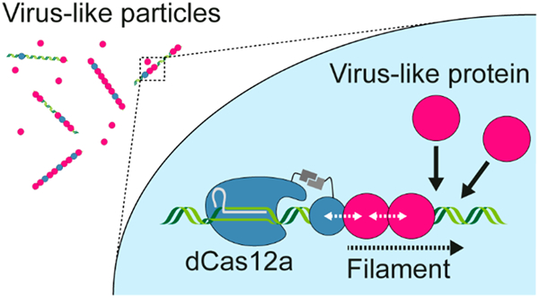
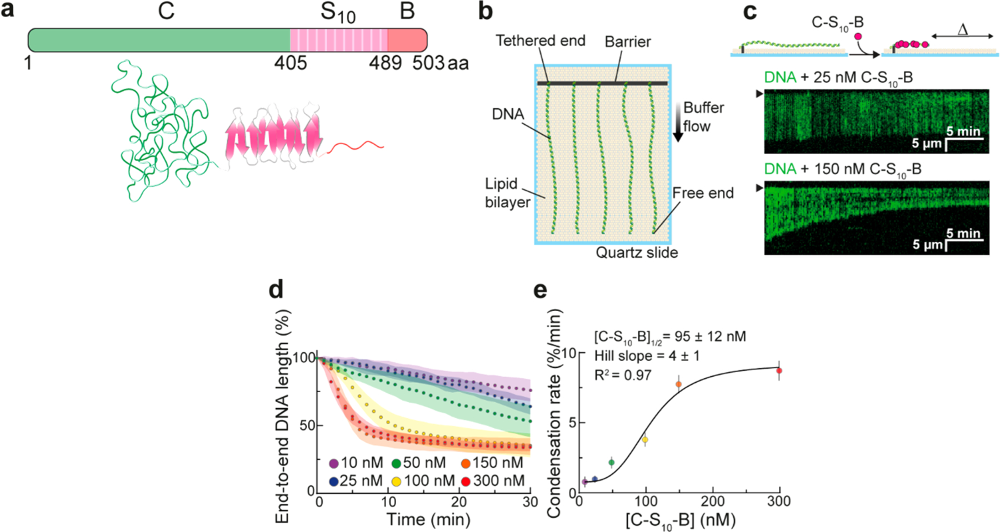
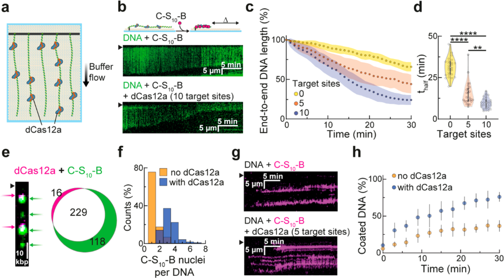
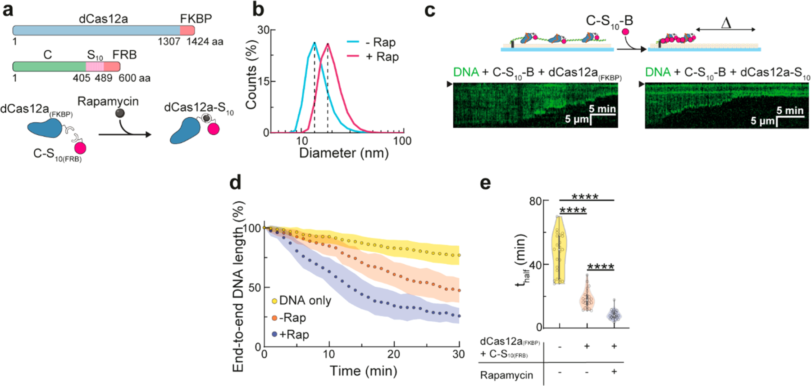
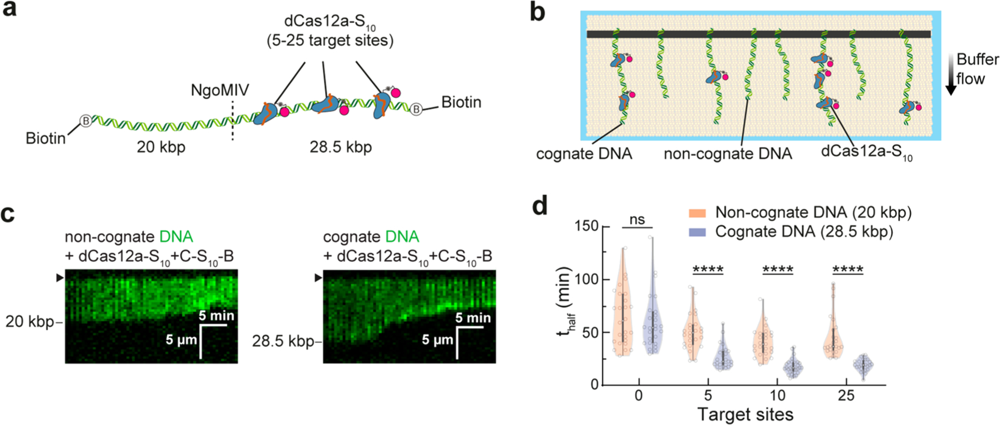

# CRISPR-Guided Programmable Self-Assembly of Artificial Virus-Like Nucleocapsids

**Carlos Calcines-Cruz, Ilya J. Finkelstein†, and Armando Hernandez-Garcia†** († co-corresponding)

*Nano Letters*, Volume 21, Issue 7, Pages 2752–2757 (2021)

**DOI:** [10.1021/acs.nanolett.0c04821](https://doi.org/10.1021/acs.nanolett.0c04821)

---

## Table of Contents

- [Abstract](#abstract)
- [Acknowledgments](#acknowledgments)

---
##  Abstract
Designer virus-inspired proteins drive the manufacturing of more effective, safer gene-delivery systems and simpler models to study viral assembly. However, self-assembly of engineered viromimetic proteins on specific nucleic acid templates, a distinctive viral property, has proved difficult. Inspired by viral packaging signals, we harness the programmability of CRISPR-Cas12a to direct the nucleation and growth of a self-assembling synthetic polypeptide into virus-like particles (VLP) on specific DNA molecules. Positioning up to ten nuclease-dead Cas12a (dCas12a) proteins along a 48.5 kbp DNA template triggers particle growth and full DNA encapsidation at limiting polypeptide concentrations. Particle growth rate is further increased when dCas12a is dimerized with a polymerization silk-like domain. Such improved self-assembly efficiency allows for discrimination between cognate versus noncognate DNA templates by the synthetic polypeptide. CRISPR-guided VLPs will help to develop programmable bioinspired nanomaterials with applications in biotechnology as well as viromimetic scaffolds to improve our understanding of viral self-assembly.
**Keywords:** virus-like particles, Cas12a, assembly kinetics, DNA curtain
##  Graphical Abstract

* * *
Virus-like particles (VLPs) mimic the capability of some viruses to encapsulate and protect genetic material from degradation by nucleases. We have previously described VLPs formed by the self-assembly of a triblock polypeptide (C−S10−B) that functionally mimics the tobacco mosaic virus coat protein[1](https://pmc.ncbi.nlm.nih.gov/articles/PMC9724498/#R1) ([Figure 1a](#fig1), [Figure S1](https://pmc.ncbi.nlm.nih.gov/articles/PMC9724498/#SD1)). C−S10−B fuses three independent blocks: (1) “C” (∼400 aa), a random coil collagen-like domain that consists mostly of glycine, proline, and uncharged polar amino acids;[2](https://pmc.ncbi.nlm.nih.gov/articles/PMC9724498/#R2) (2) “S10”, a silk-inspired polymerization domain with the sequence [(AG)3QG]10 that is responsible for C−S10−B self-assembly into rodlike structures;[3](https://pmc.ncbi.nlm.nih.gov/articles/PMC9724498/#R3)–[5](https://pmc.ncbi.nlm.nih.gov/articles/PMC9724498/#R5) and (3) “B”, a cationic dodecalysine stretch that interacts with nucleic acids and other polyanions.[6](https://pmc.ncbi.nlm.nih.gov/articles/PMC9724498/#R6),[7](https://pmc.ncbi.nlm.nih.gov/articles/PMC9724498/#R7) C−S10−B nucleates (without sequence specificity) on double-stranded DNA (dsDNA), albeit with a preference for free DNA ends.[8](https://pmc.ncbi.nlm.nih.gov/articles/PMC9724498/#R8) After rate-limiting nucleation, C−S10−B filaments grow rapidly through elongation,[1](https://pmc.ncbi.nlm.nih.gov/articles/PMC9724498/#R1),[9](https://pmc.ncbi.nlm.nih.gov/articles/PMC9724498/#R9) similar to the assembly of the tobacco mosaic virus coat protein on genomic ssRNA.

***Figure 1.*** Synthetic polypeptide C−S10−B packages DNA into nucleocapsids via molecular self-assembly. (a) Schematic depiction and modular design of C−S10−B. (b) Illustration of the DNA curtain assay. Individual DNA molecules are captured on the surface of a lipid bilayer-passivated flowcell and extended by gentle buffer flow. (c) Representative kymographs showing condensation of individual DNA strands (green) at different rates determined by C−S10−B concentration. The DNA is stained with the intercalating dye YOYO-1. Barrier position is indicated with black arrows on the kymographs. (d) DNA condensation profiles at the indicated C−S10−B concentrations. The circles and shaded areas represent the mean and standard deviation for 25 molecules per condition, respectively. (e) DNA condensation rate in the first 3 min of assembly at different concentrations of C−S10−B. The data were fit to the Hill equation (solid line). Circles and error bars are the mean ±95% confidence intervals for 25 DNA molecules per condition.

Viral coat proteins preferentially encapsulate their own genomes. They achieve such specificity by encoding one or more packaging signals along the viral DNA or RNA. These sequences bind capsid proteins with high affinity[10](https://pmc.ncbi.nlm.nih.gov/articles/PMC9724498/#R10)–[17](https://pmc.ncbi.nlm.nih.gov/articles/PMC9724498/#R17) and decrease the energy barrier for nucleation, thereby promoting encapsidation of the viral genome among a vast excess of cellular nucleic acids.[18](https://pmc.ncbi.nlm.nih.gov/articles/PMC9724498/#R18)–[21](https://pmc.ncbi.nlm.nih.gov/articles/PMC9724498/#R21) We reasoned that designer VLPs can also leverage a similar packaging signal to enhance nucleation at specific DNA sites. We chose the catalytically dead CRISPR-Cas12a (dCas12a) as a programmable nucleation signal because it binds dsDNA with 50 fM affinity, has a higher DNA binding specificity than _S. pyogenes_ Cas9,[22](https://pmc.ncbi.nlm.nih.gov/articles/PMC9724498/#R22) and can be directed to multiple sites along the DNA via pooled CRISPR RNAs (crRNAs).[23](https://pmc.ncbi.nlm.nih.gov/articles/PMC9724498/#R23)
Self-assembly kinetics were monitored in real-time using the single-molecule DNA curtain assay ([Figure 1b](#fig1)).[24](https://pmc.ncbi.nlm.nih.gov/articles/PMC9724498/#R24),[25](https://pmc.ncbi.nlm.nih.gov/articles/PMC9724498/#R25) For this, arrays of DNA molecules (48.5 kbp, derived from _λ_ -phage) are affixed to a lipid bilayer via a biotin−streptavidin linkage in a microfluidic flowcell. Microfabricated chromium barriers are used to organize thousands of DNA strands for high-throughput data collection and analysis. The surface-immobilized DNA is extended for fluorescent imaging via the application of mild buffer flow. DNA length was monitored in the experiment because time-dependent DNA contraction is a direct readout of VLP filamentation ([Figure 1c](#fig1)).[1](https://pmc.ncbi.nlm.nih.gov/articles/PMC9724498/#R1)
First, we identified the minimal concentrations for efficient encapsidation of individual dsDNA substrates by C−S10−B alone. At 100−300 nM, C−S10−B monotonically condensed individual DNA molecules until complete assembly of linear particles with a final length of 34 ± 3% of the initial length (_N_ = 25 DNA molecules at each concentration) ([Figure 1d](#fig1)). Total DNA contraction to about one-third of the DNA original length has also been observed by previous AFM studies.[1](https://pmc.ncbi.nlm.nih.gov/articles/PMC9724498/#R1) The DNA encapsidation rate—measured as _t_ half, the time required to achieve half of total packaging—decreased with higher C−S10−B concentrations up to 50 nM and plateaued at [C−S10−B] ≥ 100 nM ([Figure S2a](https://pmc.ncbi.nlm.nih.gov/articles/PMC9724498/#SD1)). In addition, the DNA did not completely contract at [C−S10−B] ≤ 50 nM as compared to 100−300 nM. Together, these observations indicate incomplete C−S10−B coating of the DNA at ≤50 nM C−S10−B concentrations. Initial condensation rate increased with C−S10−B concentration in a sigmoid-shaped curve distinctive of nucleated self-assemblies ([Figure 1e](#fig1)). DNA coating was significantly impaired at 25 nM C−S10−B compared with 150 nM ([Figure S2b](https://pmc.ncbi.nlm.nih.gov/articles/PMC9724498/#SD1), [c](https://pmc.ncbi.nlm.nih.gov/articles/PMC9724498/#SD1)). These results are consistent with a dynamic equilibrium between C−S10−B nucleation-filamentation and dissociation from DNA, akin to RAD51 and other dynamic filaments.[26](https://pmc.ncbi.nlm.nih.gov/articles/PMC9724498/#R26)
Next, we evaluated whether positioning dCas12a on the DNA can improve encapsidation at low C−S10−B concentrations. The DNA was uniformly decorated with five or ten dCas12a-crRNA ribonucleoproteins (RNPs) ([Figure 2a](#fig2)). We confirmed site-specific target binding by imaging fluorescent RNPs along the DNA molecule ([Figure S3a](https://pmc.ncbi.nlm.nih.gov/articles/PMC9724498/#SD1), [b](https://pmc.ncbi.nlm.nih.gov/articles/PMC9724498/#SD1)). We observed 1−4 target-bound RNPs on DNA substrates harboring five binding sites (1.2 ± 0.5 RNP per DNA, _N_ = 456 DNA molecules) and 1−7 RNPs on DNA substrates with ten binding sites (2.6 ± 1.1 RNP per DNA, _N_ = 185 DNA molecules) ([Figure S3c](https://pmc.ncbi.nlm.nih.gov/articles/PMC9724498/#SD1)). Because not all RNPs are decorated with fluorescent QDs, our results are a lower bound on the true target site occupancy. To monitor how encapsidation varies with RNP density, we injected 25 nM C−S10−B into flowcells where the DNA was predecorated with either five or ten RNPs ([Figure 2b](#fig2), [c](https://pmc.ncbi.nlm.nih.gov/articles/PMC9724498/#F2)). DNA contraction rate increased 2- and 3-fold for DNA with five (_t_ half = 15 ± 7 min; _N_ = 25 DNA molecules) and ten (_t_ half = 10 ± 3 min; _N_ = 25 DNA molecules) RNPs with respect to nondecorated DNA (_t_ half = 31 ± 6 min; _N_ = 25 DNA molecules) ([Figure 2d](#fig2)). We conclude that dCas12a RNPs can be installed at specific sites along the DNA template to accelerate encapsidation by C−S10−B.

***Figure 2.*** Seeding assembly with dCas12a improves DNA encapsidation by C−S10−B. (a) Illustration of dCas12a-decorated DNA substrates. dCas12a is incubated with pools of crRNAs and directed to five or ten sites uniformly distributed along the DNA prior to C−S10−B injection. (b) Representative kymographs show faster encapsidation at 25 nM C−S10−B after the DNA (green) is decorated with dCas12a. Barrier position is indicated with arrows on the kymographs. (c) Condensation profiles at 25 nM C−S10−B for DNA, and DNA decorated with dCas12a targeting five or ten sequences along the template. The circles and shaded areas represent the mean and standard deviation for 25 molecules per condition, respectively. (d) Violin plots showing the time (_t_ half) required to reach half of maximum condensation for each DNA molecule analyzed in panel c. We extrapolated _t_ half (after curve fitting to the Hill equation) for molecules that did not reach 66.5% encapsidation during the experiment (30 min). (**) and (****) indicate _p_ < 0.01 and _p_ < 0.0001, respectively. (e) Double labeling experiments show that 93% of dCas12a (magenta) colocalized with 66% of fluorescent C−S10−B clusters (green). Barrier position is indicated with a black arrow. (f) Positioning five dCas12a on the DNA increases the number of fluorescent C−S10−B clusters relative to undecorated DNA (_N_ = 484 and 246 clusters, respectively). (g) Kymographs showing binding of C−S10−B (magenta) on undecorated (top) or dCas12a-decorated (bottom) DNA (unlabeled) at 25 nM C−S10−B. Barrier position is indicated with black arrows on the kymographs. (h) Extent of DNA that is coated by fluorescent C−S10−B. Points and error bars indicate the mean and standard deviation, respectively (_N_ = 10 DNA molecules per condition).

We reasoned that dCas12a organizes large C−S10−B clusters that further polymerize into filaments. Two-color imaging confirmed that fluorescent C−S10−B colocalizes with the RNPs at early stages of encapsidation ([Figure 2e](#fig2)). Positioning five RNPs on the DNA increased the number of fluorescent C−S10−B puncta per DNA strand from 1−3 (1.3 ± 0.6, _N_ = 166 DNA molecules) to 2−7 (3.3 ± 1.0, _N_ = 97 DNA molecules) for DNA and dCas12a-decorated DNA, respectively ([Figure 2f](#fig2)). C−S10−B protomers can freely diffuse on the DNA.[27](https://pmc.ncbi.nlm.nih.gov/articles/PMC9724498/#R27) In the presence of buffer flow, these molecules slide and assemble into large clusters at the free DNA ends. In contrast, C−S10−B accumulated at dCas12a sites on the decorated DNA ([Figure S3d](https://pmc.ncbi.nlm.nih.gov/articles/PMC9724498/#SD1)). C−S10−B binding was also more rapid on predecorated DNA substrates (_t_ half = 15 ± 6 min; _N_ = 10 DNA molecules) than on nondecorated DNA (_t_ half = 45 ± 15 min; _N_ = 10 DNA molecules) ([Figure 2g](#fig2), [h](https://pmc.ncbi.nlm.nih.gov/articles/PMC9724498/#F2)). C−S10−B filamentation was unable to displace dCas12a, which forms a stable RNA:DNA loop (R-loop) with the DNA substrate ([Figure S3e](https://pmc.ncbi.nlm.nih.gov/articles/PMC9724498/#SD1)). Because dCas12a may act as a roadblock for C−S10−B linear diffusion on the DNA, we also tested whether other DNA-binding proteins will accumulate C−S10−B clusters. Notably, DNA decoration with nucleosomes also accelerated DNA encapsidation and particle growth ([Figure S4](https://pmc.ncbi.nlm.nih.gov/articles/PMC9724498/#SD1)). We conclude that dCas12a stalls C−S10−B sliding on DNA, which enhances C−S10−B collisions in its vicinity and triggers particle nucleation. In support of this model, Marchetti et al.[27](https://pmc.ncbi.nlm.nih.gov/articles/PMC9724498/#R27) observed that immobile C−S10−B clusters, and not their sliding counterparts, initiate filament growth.
To further promote and accelerate DNA packaging at limiting C−S10−B concentrations, we physically coupled dCas12a to the diblock polypeptide C−S10 via the rapamycin-inducible dimerization of FKBP and FRB domains ([Figure 3a](#fig3)). We cloned and purified a dCas12a(FKBP) C-terminal fusion and verified that this construct retains target-specific DNA binding ([Figure S5](https://pmc.ncbi.nlm.nih.gov/articles/PMC9724498/#SD1)). The FRB domain was fused to a truncated C−S10 polypeptide that lacks the “B” DNA-binding module. Both proteins, dCas12a(FKBP) and C−S10(FRB), were incubated with rapamycin and the dimerized complex was injected into the flowcell prior to incubation with 10 nM C−S10−B ([Figure 3b](#fig3), [c](https://pmc.ncbi.nlm.nih.gov/articles/PMC9724498/#F3)). Positioning five dimerized dCas12a-S10 complexes along the DNA substrate accelerated encapsidation by C−S10−B 2-fold relative to dCas12a(FKBP) alone (_t_ half = 9 ± 3 min; _N_ = 25 DNA molecules vs 18 ± 6 min; _N_ = 25 DNA molecules), and 5-fold relative to the undecorated DNA (_t_ half = 46 ± 13 min; _N_ = 25 DNA molecules) ([Figure 3d](#fig3), [e](https://pmc.ncbi.nlm.nih.gov/articles/PMC9724498/#F3)). Positioning dCas12a-S10 on a 2.5 kbp linear dsDNA or a 9.5 kbp plasmid also improved encapsidation at limiting C−S10−B concentrations in ensemble electrophoretic mobility shift assays (EMSAs) ([Figure S6](https://pmc.ncbi.nlm.nih.gov/articles/PMC9724498/#SD1)). These results indicate that initiating nucleation via interspersed dCas12a RNPs fused to the self-assembly domain S10 accelerates DNA packaging at subsaturating C−S10−B concentrations. Importantly, decoration with dCas12a or dCas12a-S10 did not disrupt the morphology of the artificial nucleocapsids, and full particles of 1/3 of the template DNA length were observed by AFM ([Figure S7](https://pmc.ncbi.nlm.nih.gov/articles/PMC9724498/#SD1)).

***Figure 3.*** Coupling of dCas12a to the polymerization domain C−S10 improves C−S10−B self-assembly on DNA. (a) Schematic depiction of the modular design of dCas12a(FKBP) and C−S10(FRB) and their dimerization via rapamycin to form the dCas12a-S10 complex. (b) Dynamic light scattering experiment showing rapamycin (Rap) induced dimerization of dCas12a(FKBP) and C−S10(FRB). The shift in population size occurred immediately after rapamycin addition. (c) Representative kymographs showing that decorating DNA with dCas12a-S10 accelerates DNA packaging relative to decoration with dCas12a(FKBP) alone at 10 nM C−S10−B. Barrier position is indicated with arrows on the kymographs. (d) Condensation profiles at 10 nM C−S10−B for undecorated DNA, and DNA decorated with five dCas12a(FKBP) or five dCas12a-S10. The circles and shaded areas represent the mean and standard deviation for 25 molecules per condition, respectively. (e) Violin plots showing the time (_t_ half) required to reach half of maximum condensation for each DNA strand analyzed in panel d. Extrapolation (after curve fitting to the Hill equation) was used to estimate _t_ half for molecules that did not reach 66.5% encapsidation during the experiment (30 min). (****) indicates _p_ < 0.0001.

Finally, we assessed whether targeting dCas12a-S10 to a specific DNA template can trigger VLP encapsidation in the presence of other (noncognate) DNA molecules. For this assay, we immobilized an equimolar mixture of two DNA templates on the flowcell surface; one was 20 kbp and the second was 28.5 kbp ([Figure 4a](#fig4)). dCas12a-S10 was directed to 5, 10, or 25 sites on the 28.5 kbp template ([Figure 4b](#fig4)). As seen in [Figure 4c](#fig4), [d](https://pmc.ncbi.nlm.nih.gov/articles/PMC9724498/#F4) and [Figure S8](https://pmc.ncbi.nlm.nih.gov/articles/PMC9724498/#SD1), dCas12a-S10 selectively accelerated the packaging of the target DNA template and the encapsidation rate increased 3-fold from zero target sites (_t_ half = 62 ± 26 min; _N_ = 25 DNA molecules) to a maximum of 25 target sites (_t_ half = 19 ± 6 min; _N_ = 25 DNA molecules).

***Figure 4.*** C−S10−B selectively assembles on DNA that is decorated with dCas12a-S10. (a) DNA was ligated with biotinylated oligos at both ends followed by cleavage with NgoMIV to generate two biotinylated DNA substrates (20 kbp and 28.5 kbp) distinguishable by size after YOYO-1 staining. (b) 28.5 kbp DNA (cognate DNA) was decorated with 5 to 25 dCas12a-S10 prior to incubation with 10 nM C−S10−B. (c) Representative kymographs showing encapsidation of the noncognate (20 kbp) and cognate (28.5 kbp) DNA substrates after decoration with ten dCas12a-S10. Barrier position is indicated with arrows on the kymographs. (d) Violin plots showing the time (_t_ half) required to reach half of maximum condensation for both DNA substrates after decoration of the cognate DNA with 5 to 25 dCas12a-S10. Extrapolation (after curve fitting to the Hill equation) was used to estimate _t_ half for molecules that did not reach 66.5% encapsidation during the experiment (30 min). (ns) and (****) indicate _p_ > 0.05 and _p_ < 0.0001, respectively.

Taken together, our data show that a target DNA-bound dCas12a (or any strongly DNA-bound roadblock protein) can serve as a viral-like packaging signal—especially if the roadblock protein contains a self-assembly or polymerization domain. RNA-guided CRISPR-Cas proteins are especially attractive as artificial packaging signals because they can be targeted to any DNA sequence that is proximal to a protospacer adjacent motif (PAM). For _As_ dCas12a, the PAM consensus sequence is TTTV; this PAM appears on average every 32 bp on 48.5 kbp long _λ_ -phage DNA. Other CRISPR-Cas enzymes, including Cas9, can also serve as nucleation signals. Relaxed PAM variants, both for Cas9 and Cas12a, will further increase the targeting possibilities for rapid and sequence specific VLP assembly.[28](https://pmc.ncbi.nlm.nih.gov/articles/PMC9724498/#R28)–[31](https://pmc.ncbi.nlm.nih.gov/articles/PMC9724498/#R31) Additionally, this work shows that the C−S10−B protein can be re-engineered to more closely resemble virus-like features.
In summary, we have used CRISPR-dCas12a and coupled it to the polymerization domain S10 to form a “packaging signal recognition complex” (in analogy with the assembly of viral capsid proteins around the viral genome) that triggers binding of C−S10−B and packaging of target DNA sequences. Importantly, such packaging signal recognition complex (and hence artificial particle nucleation and growth) can be easily redirected toward different DNA sequences by simple design of the crRNA without need of the more cumbersome manipulation of protein domains. Moreover, our results highlight the importance of having multiple strong and specific interactions in templated nucleoprotein self-assemblies and should prove useful for developing new tailor-made nanomaterials for diverse bio-technological applications.

---
##  ACKNOWLEDGMENTS
We acknowledge a CONACyT-University of Texas (CONTEX) grant used to carry out this research. A.H.G. also thanks the IA200119 DGAPA-PAPIIT grant. This work was partially funded by the NIH (GM124141 to I.J.F.) and the Welch Foundation (F-1016 to I.J.F.). C.C.C. acknowledges the support of CONACyT for supporting his graduate studies at UT-Austin. We thank David Moreno Gutiérrez for providing some of the C−S10−B protein and all the members of A.H.G.’s and I.J.F.’s laboratories for valuable discussions. We also thank the technicians and appreciate the use of the facilities at the Institute of Chemistry at UNAM, and Tom Wandless at Stanford University for the kind donation of FKBP and FRB plasmids.
##  ABBREVIATIONS 

crRNA
    
CRISPR RNA 

FKBP
    
FK506 binding protein 

FRB FKBP
    
rapamycin binding protein 

PAM
    
protospacer adjacent motif 

RNP
    
ribonucleoprotein particle 

VLP
    
virus-like particle

##  REFERENCES
  * (1).Hernandez-Garcia A; Kraft DJ; Janssen AFJ; Bomans PHH; Sommerdijk NAJM; Thies-Weesie DME; Favretto ME; Brock R; de Wolf FA; Werten MWT; van der Schoot P; Stuart MC; de Vries R Design and Self-Assembly of Simple Coat Proteins for Artificial Viruses. Nat. Nanotechnol 2014, 9 (9), 698–702. [[DOI](https://doi.org/10.1038/nnano.2014.169)] [[PubMed](https://pubmed.ncbi.nlm.nih.gov/25150720/)] [[Google Scholar](https://scholar.google.com/scholar_lookup?journal=Nat.%20Nanotechnol&title=Design%20and%20Self-Assembly%20of%20Simple%20Coat%20Proteins%20for%20Artificial%20Viruses.&author=A%20Hernandez-Garcia&author=DJ%20Kraft&author=AFJ%20Janssen&author=PHH%20Bomans&author=NAJM%20Sommerdijk&volume=9&issue=9&publication_year=2014&pages=698-702&pmid=25150720&doi=10.1038/nnano.2014.169&)]
  * (2).Werten MWT; Wisselink WH; Jansen-van den Bosch TJ; de Bruin EC; de Wolf FA Secreted Production of a Custom-Designed, Highly Hydrophilic Gelatin in Pichia Pastoris. Protein Eng., Des. Sel 2001, 14 (6), 447–454. [[DOI](https://doi.org/10.1093/protein/14.6.447)] [[PubMed](https://pubmed.ncbi.nlm.nih.gov/11477225/)] [[Google Scholar](https://scholar.google.com/scholar_lookup?journal=Protein%20Eng.,%20Des.%20Sel&title=Secreted%20Production%20of%20a%20Custom-Designed,%20Highly%20Hydrophilic%20Gelatin%20in%20Pichia%20Pastoris.&author=MWT%20Werten&author=WH%20Wisselink&author=TJ%20Jansen-van%20den%20Bosch&author=EC%20de%20Bruin&author=FA%20de%20Wolf&volume=14&issue=6&publication_year=2001&pages=447-454&pmid=11477225&doi=10.1093/protein/14.6.447&)]
  * (3).Krejchi M; Atkins E; Waddon A; Fournier M; Mason T; Tirrell D Chemical Sequence Control of β-Sheet Assembly in Macromolecular Crystals of Periodic Polypeptides. Science 1994, 265 (5177), 1427–1432. [[DOI](https://doi.org/10.1126/science.8073284)] [[PubMed](https://pubmed.ncbi.nlm.nih.gov/8073284/)] [[Google Scholar](https://scholar.google.com/scholar_lookup?journal=Science&title=Chemical%20Sequence%20Control%20of%20%CE%B2-Sheet%20Assembly%20in%20Macromolecular%20Crystals%20of%20Periodic%20Polypeptides.&author=M%20Krejchi&author=E%20Atkins&author=A%20Waddon&author=M%20Fournier&author=T%20Mason&volume=265&issue=5177&publication_year=1994&pages=1427-1432&pmid=8073284&doi=10.1126/science.8073284&)]
  * (4).Smeenk JM; Otten MBJ; Thies J; Tirrell DA; Stunnenberg HG; van Hest JCM Controlled Assembly of Macromolecular β-Sheet Fibrils. Angew. Chem., Int. Ed 2005, 44 (13), 1968–1971. [[DOI](https://doi.org/10.1002/anie.200462415)] [[PubMed](https://pubmed.ncbi.nlm.nih.gov/15724260/)] [[Google Scholar](https://scholar.google.com/scholar_lookup?journal=Angew.%20Chem.,%20Int.%20Ed&title=Controlled%20Assembly%20of%20Macromolecular%20%CE%B2-Sheet%20Fibrils.&author=JM%20Smeenk&author=MBJ%20Otten&author=J%20Thies&author=DA%20Tirrell&author=HG%20Stunnenberg&volume=44&issue=13&publication_year=2005&pages=1968-1971&pmid=15724260&doi=10.1002/anie.200462415&)]
  * (5).Zhao B; Cohen Stuart MA; Hall CK Dock ‘n Roll: Folding of a Silk-Inspired Polypeptide into an Amyloid-like Beta Solenoid. Soft Matter 2016, 12 (16), 3721–3729. [[DOI](https://doi.org/10.1039/c6sm00169f)] [[PMC free article](https://pmc.ncbi.nlm.nih.gov/articles/PMC4913789/)] [[PubMed](https://pubmed.ncbi.nlm.nih.gov/26947809/)] [[Google Scholar](https://scholar.google.com/scholar_lookup?journal=Soft%20Matter&title=Dock%20%E2%80%98n%20Roll:%20Folding%20of%20a%20Silk-Inspired%20Polypeptide%20into%20an%20Amyloid-like%20Beta%20Solenoid.&author=B%20Zhao&author=MA%20Cohen%20Stuart&author=CK%20Hall&volume=12&issue=16&publication_year=2016&pages=3721-3729&pmid=26947809&doi=10.1039/c6sm00169f&)]
  * (6).Martin ME; Rice KG Peptide-Guided Gene Delivery. AAPS J 2007, 9 (1), E18–E29. [[DOI](https://doi.org/10.1208/aapsj0901003)] [[PMC free article](https://pmc.ncbi.nlm.nih.gov/articles/PMC2751301/)] [[PubMed](https://pubmed.ncbi.nlm.nih.gov/17408236/)] [[Google Scholar](https://scholar.google.com/scholar_lookup?journal=AAPS%20J&title=Peptide-Guided%20Gene%20Delivery.&author=ME%20Martin&author=KG%20Rice&volume=9&issue=1&publication_year=2007&pages=E18-E29&pmid=17408236&doi=10.1208/aapsj0901003&)]
  * (7).Hernandez-Garcia A; Werten MWT; Stuart MC; de Wolf FA; de Vries R Coating of Single DNA Molecules by Genetically Engineered Protein Diblock Copolymers. Small 2012, 8 (22), 3491–3501. [[DOI](https://doi.org/10.1002/smll.201200939)] [[PubMed](https://pubmed.ncbi.nlm.nih.gov/22865731/)] [[Google Scholar](https://scholar.google.com/scholar_lookup?journal=Small&title=Coating%20of%20Single%20DNA%20Molecules%20by%20Genetically%20Engineered%20Protein%20Diblock%20Copolymers.&author=A%20Hernandez-Garcia&author=MWT%20Werten&author=MC%20Stuart&author=FA%20de%20Wolf&author=R%20de%20Vries&volume=8&issue=22&publication_year=2012&pages=3491-3501&pmid=22865731&doi=10.1002/smll.201200939&)]
  * (8).Hernandez-Garcia A; Cohen Stuart MA; de Vries R Templated Co-Assembly into Nanorods of Polyanions and Artificial Virus Capsid Proteins. Soft Matter 2018, 14 (1), 132–139. [[DOI](https://doi.org/10.1039/c7sm02012k)] [[PubMed](https://pubmed.ncbi.nlm.nih.gov/29218341/)] [[Google Scholar](https://scholar.google.com/scholar_lookup?journal=Soft%20Matter&title=Templated%20Co-Assembly%20into%20Nanorods%20of%20Polyanions%20and%20Artificial%20Virus%20Capsid%20Proteins.&author=A%20Hernandez-Garcia&author=MA%20Cohen%20Stuart&author=R%20de%20Vries&volume=14&issue=1&publication_year=2018&pages=132-139&pmid=29218341&doi=10.1039/c7sm02012k&)]
  * (9).Punter MTJJM; Hernandez-Garcia A; Kraft DJ; de Vries R; van der Schoot P Self-Assembly Dynamics of Linear Virus-Like Particles: Theory and Experiment. J. Phys. Chem. B 2016, 120 (26), 6286–6297. [[DOI](https://doi.org/10.1021/acs.jpcb.6b02680)] [[PubMed](https://pubmed.ncbi.nlm.nih.gov/27116218/)] [[Google Scholar](https://scholar.google.com/scholar_lookup?journal=J.%20Phys.%20Chem.%20B&title=Self-Assembly%20Dynamics%20of%20Linear%20Virus-Like%20Particles:%20Theory%20and%20Experiment.&author=MTJJM%20Punter&author=A%20Hernandez-Garcia&author=DJ%20Kraft&author=R%20de%20Vries&author=P%20van%20der%20Schoot&volume=120&issue=26&publication_year=2016&pages=6286-6297&pmid=27116218&doi=10.1021/acs.jpcb.6b02680&)]
  * (10).Chai S; Lurz R; Alonso JC The Small Subunit of the Terminase Enzyme of Bacillus Subtilis Bacteriophage SPP1 Forms a Specialized Nucleoprotein Complex with the Packaging Initiation Region. J. Mol. Biol 1995, 252 (4), 386–398. [[DOI](https://doi.org/10.1006/jmbi.1995.0505)] [[PubMed](https://pubmed.ncbi.nlm.nih.gov/7563059/)] [[Google Scholar](https://scholar.google.com/scholar_lookup?journal=J.%20Mol.%20Biol&title=The%20Small%20Subunit%20of%20the%20Terminase%20Enzyme%20of%20Bacillus%20Subtilis%20Bacteriophage%20SPP1%20Forms%20a%20Specialized%20Nucleoprotein%20Complex%20with%20the%20Packaging%20Initiation%20Region.&author=S%20Chai&author=R%20Lurz&author=JC%20Alonso&volume=252&issue=4&publication_year=1995&pages=386-398&pmid=7563059&doi=10.1006/jmbi.1995.0505&)]
  * (11).Turner DR; Joyce LE; Butler PJG The Tobacco Mosaic Virus Assembly Origin RNA. J. Mol. Biol 1988, 203 (3), 531–547. [[DOI](https://doi.org/10.1016/0022-2836\(88\)90190-8)] [[PubMed](https://pubmed.ncbi.nlm.nih.gov/3210225/)] [[Google Scholar](https://scholar.google.com/scholar_lookup?journal=J.%20Mol.%20Biol&title=The%20Tobacco%20Mosaic%20Virus%20Assembly%20Origin%20RNA.&author=DR%20Turner&author=LE%20Joyce&author=PJG%20Butler&volume=203&issue=3&publication_year=1988&pages=531-547&pmid=3210225&doi=10.1016/0022-2836\(88\)90190-8&)]
  * (12).D’Souza V; Melamed J; Habib D; Pullen K; Wallace K; Summers MF Identification of a High Affinity Nucleocapsid Protein Binding Element within the Moloney Murine Leukemia Virus Ψ-RNA Packaging Signal: Implications for Genome Recognition. J. Mol. Biol 2001, 314 (2), 217–232. [[DOI](https://doi.org/10.1006/jmbi.2001.5139)] [[PubMed](https://pubmed.ncbi.nlm.nih.gov/11718556/)] [[Google Scholar](https://scholar.google.com/scholar_lookup?journal=J.%20Mol.%20Biol&title=Identification%20of%20a%20High%20Affinity%20Nucleocapsid%20Protein%20Binding%20Element%20within%20the%20Moloney%20Murine%20Leukemia%20Virus%20%CE%A8-RNA%20Packaging%20Signal:%20Implications%20for%20Genome%20Recognition.&author=V%20D%E2%80%99Souza&author=J%20Melamed&author=D%20Habib&author=K%20Pullen&author=K%20Wallace&volume=314&issue=2&publication_year=2001&pages=217-232&pmid=11718556&doi=10.1006/jmbi.2001.5139&)]
  * (13).de Beer T; Fang J; Ortega M; Yang Q; Maes L; Duffy C; Berton N; Sippy J; Overduin M; Feiss M; Catalano CE Insights into Specific DNA Recognition during the Assembly of a Viral Genome Packaging Machine. Mol. Cell 2002, 9 (5), 981–991. [[DOI](https://doi.org/10.1016/s1097-2765\(02\)00537-3)] [[PubMed](https://pubmed.ncbi.nlm.nih.gov/12049735/)] [[Google Scholar](https://scholar.google.com/scholar_lookup?journal=Mol.%20Cell&title=Insights%20into%20Specific%20DNA%20Recognition%20during%20the%20Assembly%20of%20a%20Viral%20Genome%20Packaging%20Machine.&author=T%20de%20Beer&author=J%20Fang&author=M%20Ortega&author=Q%20Yang&author=L%20Maes&volume=9&issue=5&publication_year=2002&pages=981-991&pmid=12049735&doi=10.1016/s1097-2765\(02\)00537-3&)]
  * (14).Borodavka A; Tuma R; Stockley PG Evidence That Viral RNAs Have Evolved for Efficient, Two-Stage Packaging. Proc. Natl. Acad. Sci. U. S. A 2012, 109 (39), 15769–15774. [[DOI](https://doi.org/10.1073/pnas.1204357109)] [[PMC free article](https://pmc.ncbi.nlm.nih.gov/articles/PMC3465389/)] [[PubMed](https://pubmed.ncbi.nlm.nih.gov/23019360/)] [[Google Scholar](https://scholar.google.com/scholar_lookup?journal=Proc.%20Natl.%20Acad.%20Sci.%20U.%20S.%20A&title=Evidence%20That%20Viral%20RNAs%20Have%20Evolved%20for%20Efficient,%20Two-Stage%20Packaging.&author=A%20Borodavka&author=R%20Tuma&author=PG%20Stockley&volume=109&issue=39&publication_year=2012&pages=15769-15774&pmid=23019360&doi=10.1073/pnas.1204357109&)]
  * (15).Kutluay SB; Zang T; Blanco-Melo D; Powell C; Jannain D; Errando M; Bieniasz PD Global Changes in the RNA Binding Specificity of HIV-1 Gag Regulate Virion Genesis. Cell 2014, 159 (5), 1096–1109. [[DOI](https://doi.org/10.1016/j.cell.2014.09.057)] [[PMC free article](https://pmc.ncbi.nlm.nih.gov/articles/PMC4247003/)] [[PubMed](https://pubmed.ncbi.nlm.nih.gov/25416948/)] [[Google Scholar](https://scholar.google.com/scholar_lookup?journal=Cell&title=Global%20Changes%20in%20the%20RNA%20Binding%20Specificity%20of%20HIV-1%20Gag%20Regulate%20Virion%20Genesis.&author=SB%20Kutluay&author=T%20Zang&author=D%20Blanco-Melo&author=C%20Powell&author=D%20Jannain&volume=159&issue=5&publication_year=2014&pages=1096-1109&pmid=25416948&doi=10.1016/j.cell.2014.09.057&)]
  * (16).Stewart H; Bingham RJ; White SJ; Dykeman EC; Zothner C; Tuplin AK; Stockley PG; Twarock R; Harris M Identification of Novel RNA Secondary Structures within the Hepatitis C Virus Genome Reveals a Cooperative Involvement in Genome Packaging. Sci. Rep 2016, 6 (1), 22952. [[DOI](https://doi.org/10.1038/srep22952)] [[PMC free article](https://pmc.ncbi.nlm.nih.gov/articles/PMC4789732/)] [[PubMed](https://pubmed.ncbi.nlm.nih.gov/26972799/)] [[Google Scholar](https://scholar.google.com/scholar_lookup?journal=Sci.%20Rep&title=Identification%20of%20Novel%20RNA%20Secondary%20Structures%20within%20the%20Hepatitis%20C%20Virus%20Genome%20Reveals%20a%20Cooperative%20Involvement%20in%20Genome%20Packaging.&author=H%20Stewart&author=RJ%20Bingham&author=SJ%20White&author=EC%20Dykeman&author=C%20Zothner&volume=6&issue=1&publication_year=2016&pages=22952&pmid=26972799&doi=10.1038/srep22952&)]
  * (17).Patel N; Wroblewski E; Leonov G; Phillips SEV; Tuma R; Twarock R; Stockley PG Rewriting Nature’s Assembly Manual for a ssRNA Virus. Proc. Natl. Acad. Sci. U. S. A 2017, 114 (46), 12255–12260. [[DOI](https://doi.org/10.1073/pnas.1706951114)] [[PMC free article](https://pmc.ncbi.nlm.nih.gov/articles/PMC5699041/)] [[PubMed](https://pubmed.ncbi.nlm.nih.gov/29087310/)] [[Google Scholar](https://scholar.google.com/scholar_lookup?journal=Proc.%20Natl.%20Acad.%20Sci.%20U.%20S.%20A&title=Rewriting%20Nature%E2%80%99s%20Assembly%20Manual%20for%20a%20ssRNA%20Virus.&author=N%20Patel&author=E%20Wroblewski&author=G%20Leonov&author=SEV%20Phillips&author=R%20Tuma&volume=114&issue=46&publication_year=2017&pages=12255-12260&pmid=29087310&doi=10.1073/pnas.1706951114&)]
  * (18).Morton VL; Dykeman EC; Stonehouse NJ; Ashcroft AE; Twarock R; Stockley PG The Impact of Viral RNA on Assembly Pathway Selection. J. Mol. Biol 2010, 401 (2), 298–308. [[DOI](https://doi.org/10.1016/j.jmb.2010.05.059)] [[PubMed](https://pubmed.ncbi.nlm.nih.gov/20621589/)] [[Google Scholar](https://scholar.google.com/scholar_lookup?journal=J.%20Mol.%20Biol&title=The%20Impact%20of%20Viral%20RNA%20on%20Assembly%20Pathway%20Selection.&author=VL%20Morton&author=EC%20Dykeman&author=NJ%20Stonehouse&author=AE%20Ashcroft&author=R%20Twarock&volume=401&issue=2&publication_year=2010&pages=298-308&pmid=20621589&doi=10.1016/j.jmb.2010.05.059&)]
  * (19).Kraft DJ; Kegel WK; van der Schoot P A Kinetic Zipper Model and the Assembly of Tobacco Mosaic Virus. Biophys. J 2012, 102 (12), 2845–2855. [[DOI](https://doi.org/10.1016/j.bpj.2012.05.007)] [[PMC free article](https://pmc.ncbi.nlm.nih.gov/articles/PMC3379025/)] [[PubMed](https://pubmed.ncbi.nlm.nih.gov/22735535/)] [[Google Scholar](https://scholar.google.com/scholar_lookup?journal=Biophys.%20J&title=A%20Kinetic%20Zipper%20Model%20and%20the%20Assembly%20of%20Tobacco%20Mosaic%20Virus.&author=DJ%20Kraft&author=WK%20Kegel&author=P%20van%20der%20Schoot&volume=102&issue=12&publication_year=2012&pages=2845-2855&pmid=22735535&doi=10.1016/j.bpj.2012.05.007&)]
  * (20).Comas-Garcia M; Datta SA; Baker L; Varma R; Gudla PR; Rein A Dissection of Specific Binding of HIV-1 Gag to the “packaging Signal” in Viral RNA. eLife 2017, 6, No. e27055. [[DOI](https://doi.org/10.7554/eLife.27055)] [[PMC free article](https://pmc.ncbi.nlm.nih.gov/articles/PMC5531834/)] [[PubMed](https://pubmed.ncbi.nlm.nih.gov/28726630/)] [[Google Scholar](https://scholar.google.com/scholar_lookup?journal=eLife&title=Dissection%20of%20Specific%20Binding%20of%20HIV-1%20Gag%20to%20the%20%E2%80%9Cpackaging%20Signal%E2%80%9D%20in%20Viral%20RNA.&author=M%20Comas-Garcia&author=SA%20Datta&author=L%20Baker&author=R%20Varma&author=PR%20Gudla&volume=6&publication_year=2017&pages=e27055&pmid=28726630&doi=10.7554/eLife.27055&)]
  * (21).Comas-Garcia M Packaging of Genomic RNA in Positive-Sense Single-Stranded RNA Viruses: A Complex Story. Viruses 2019, 11 (3), 253. [[DOI](https://doi.org/10.3390/v11030253)] [[PMC free article](https://pmc.ncbi.nlm.nih.gov/articles/PMC6466141/)] [[PubMed](https://pubmed.ncbi.nlm.nih.gov/30871184/)] [[Google Scholar](https://scholar.google.com/scholar_lookup?journal=Viruses&title=Packaging%20of%20Genomic%20RNA%20in%20Positive-Sense%20Single-Stranded%20RNA%20Viruses:%20A%20Complex%20Story.&author=M%20Comas-Garcia&volume=11&issue=3&publication_year=2019&pages=253&pmid=30871184&doi=10.3390/v11030253&)]
  * (22).Strohkendl I; Saifuddin FA; Rybarski JR; Finkelstein IJ; Russell R Kinetic Basis for DNA Target Specificity of CRISPR-Cas12a. Mol. Cell 2018, 71 (5), 816–824.e3. [[DOI](https://doi.org/10.1016/j.molcel.2018.06.043)] [[PMC free article](https://pmc.ncbi.nlm.nih.gov/articles/PMC6679935/)] [[PubMed](https://pubmed.ncbi.nlm.nih.gov/30078724/)] [[Google Scholar](https://scholar.google.com/scholar_lookup?journal=Mol.%20Cell&title=Kinetic%20Basis%20for%20DNA%20Target%20Specificity%20of%20CRISPR-Cas12a.&author=I%20Strohkendl&author=FA%20Saifuddin&author=JR%20Rybarski&author=IJ%20Finkelstein&author=R%20Russell&volume=71&issue=5&publication_year=2018&pages=816-824&pmid=30078724&doi=10.1016/j.molcel.2018.06.043&)]
  * (23).Zetsche B; Heidenreich M; Mohanraju P; Fedorova I; Kneppers J; DeGennaro EM; Winblad N; Choudhury SR; Abudayyeh OO; Gootenberg JS; Wu WY; Scott DA; Severinov K; van der Oost J; Zhang F Multiplex Gene Editing by CRISPR−Cpf1 Using a Single CrRNA Array. Nat. Biotechnol 2017, 35 (1), 31–34. [[DOI](https://doi.org/10.1038/nbt.3737)] [[PMC free article](https://pmc.ncbi.nlm.nih.gov/articles/PMC5225075/)] [[PubMed](https://pubmed.ncbi.nlm.nih.gov/27918548/)] [[Google Scholar](https://scholar.google.com/scholar_lookup?journal=Nat.%20Biotechnol&title=Multiplex%20Gene%20Editing%20by%20CRISPR%E2%88%92Cpf1%20Using%20a%20Single%20CrRNA%20Array.&author=B%20Zetsche&author=M%20Heidenreich&author=P%20Mohanraju&author=I%20Fedorova&author=J%20Kneppers&volume=35&issue=1&publication_year=2017&pages=31-34&pmid=27918548&doi=10.1038/nbt.3737&)]
  * (24).Gallardo IF; Pasupathy P; Brown M; Manhart CM; Neikirk DP; Alani E; Finkelstein IJ High-Throughput Universal DNA Curtain Arrays for Single-Molecule Fluorescence Imaging. Langmuir 2015, 31 (37), 10310–10317. [[DOI](https://doi.org/10.1021/acs.langmuir.5b02416)] [[PMC free article](https://pmc.ncbi.nlm.nih.gov/articles/PMC4624423/)] [[PubMed](https://pubmed.ncbi.nlm.nih.gov/26325477/)] [[Google Scholar](https://scholar.google.com/scholar_lookup?journal=Langmuir&title=High-Throughput%20Universal%20DNA%20Curtain%20Arrays%20for%20Single-Molecule%20Fluorescence%20Imaging.&author=IF%20Gallardo&author=P%20Pasupathy&author=M%20Brown&author=CM%20Manhart&author=DP%20Neikirk&volume=31&issue=37&publication_year=2015&pages=10310-10317&pmid=26325477&doi=10.1021/acs.langmuir.5b02416&)]
  * (25).Soniat MM; Myler LR; Schaub JM; Kim Y; Gallardo IF; Finkelstein IJ Next-Generation DNA Curtains for Single-Molecule Studies of Homologous Recombination. Methods Enzymol 2017, 592, 259–281. [[DOI](https://doi.org/10.1016/bs.mie.2017.03.011)] [[PMC free article](https://pmc.ncbi.nlm.nih.gov/articles/PMC5564670/)] [[PubMed](https://pubmed.ncbi.nlm.nih.gov/28668123/)] [[Google Scholar](https://scholar.google.com/scholar_lookup?journal=Methods%20Enzymol&title=Next-Generation%20DNA%20Curtains%20for%20Single-Molecule%20Studies%20of%20Homologous%20Recombination.&author=MM%20Soniat&author=LR%20Myler&author=JM%20Schaub&author=Y%20Kim&author=IF%20Gallardo&volume=592&publication_year=2017&pages=259-281&pmid=28668123&doi=10.1016/bs.mie.2017.03.011&)]
  * (26).Miné J; Disseau L; Takahashi M; Cappello G; Dutreix M; Viovy J-L Real-Time Measurements of the Nucleation, Growth and Dissociation of Single Rad51−DNA Nucleoprotein Filaments. Nucleic Acids Res 2007, 35 (21), 7171–7187. [[DOI](https://doi.org/10.1093/nar/gkm752)] [[PMC free article](https://pmc.ncbi.nlm.nih.gov/articles/PMC2175369/)] [[PubMed](https://pubmed.ncbi.nlm.nih.gov/17947332/)] [[Google Scholar](https://scholar.google.com/scholar_lookup?journal=Nucleic%20Acids%20Res&title=Real-Time%20Measurements%20of%20the%20Nucleation,%20Growth%20and%20Dissociation%20of%20Single%20Rad51%E2%88%92DNA%20Nucleoprotein%20Filaments.&author=J%20Min%C3%A9&author=L%20Disseau&author=M%20Takahashi&author=G%20Cappello&author=M%20Dutreix&volume=35&issue=21&publication_year=2007&pages=7171-7187&pmid=17947332&doi=10.1093/nar/gkm752&)]
  * (27).Marchetti M; Kamsma D; Cazares Vargas E; Hernandez García A; van der Schoot P; de Vries R; Wuite GJL; Roos WH Real-Time Assembly of Viruslike Nucleocapsids Elucidated at the Single-Particle Level. Nano Lett 2019, 19 (8), 5746–5753. [[DOI](https://doi.org/10.1021/acs.nanolett.9b02376)] [[PMC free article](https://pmc.ncbi.nlm.nih.gov/articles/PMC6696885/)] [[PubMed](https://pubmed.ncbi.nlm.nih.gov/31368710/)] [[Google Scholar](https://scholar.google.com/scholar_lookup?journal=Nano%20Lett&title=Real-Time%20Assembly%20of%20Viruslike%20Nucleocapsids%20Elucidated%20at%20the%20Single-Particle%20Level.&author=M%20Marchetti&author=D%20Kamsma&author=E%20Cazares%20Vargas&author=A%20Hernandez%20Garc%C3%ADa&author=P%20van%20der%20Schoot&volume=19&issue=8&publication_year=2019&pages=5746-5753&pmid=31368710&doi=10.1021/acs.nanolett.9b02376&)]
  * (28).Gao L; Cox DBT; Yan WX; Manteiga JC; Schneider MW; Yamano T; Nishimasu H; Nureki O; Crosetto N; Zhang F Engineered Cpf1 Variants with Altered PAM Specificities Increase Genome Targeting Range. Nat. Biotechnol 2017, 35 (8), 789–792. [[DOI](https://doi.org/10.1038/nbt.3900)] [[PMC free article](https://pmc.ncbi.nlm.nih.gov/articles/PMC5548640/)] [[PubMed](https://pubmed.ncbi.nlm.nih.gov/28581492/)] [[Google Scholar](https://scholar.google.com/scholar_lookup?journal=Nat.%20Biotechnol&title=Engineered%20Cpf1%20Variants%20with%20Altered%20PAM%20Specificities%20Increase%20Genome%20Targeting%20Range.&author=L%20Gao&author=DBT%20Cox&author=WX%20Yan&author=JC%20Manteiga&author=MW%20Schneider&volume=35&issue=8&publication_year=2017&pages=789-792&pmid=28581492&doi=10.1038/nbt.3900&)]
  * (29).Leenay RT; Beisel CL Deciphering, Communicating, and Engineering the CRISPR PAM. J. Mol. Biol 2017, 429 (2), 177–191. [[DOI](https://doi.org/10.1016/j.jmb.2016.11.024)] [[PMC free article](https://pmc.ncbi.nlm.nih.gov/articles/PMC5235977/)] [[PubMed](https://pubmed.ncbi.nlm.nih.gov/27916599/)] [[Google Scholar](https://scholar.google.com/scholar_lookup?journal=J.%20Mol.%20Biol&title=Deciphering,%20Communicating,%20and%20Engineering%20the%20CRISPR%20PAM.&author=RT%20Leenay&author=CL%20Beisel&volume=429&issue=2&publication_year=2017&pages=177-191&pmid=27916599&doi=10.1016/j.jmb.2016.11.024&)]
  * (30).Nishimasu H; Shi X; Ishiguro S; Gao L; Hirano S; Okazaki S; Noda T; Abudayyeh OO; Gootenberg JS; Mori H; Oura S; Holmes B; Tanaka M; Seki M; Hirano H; Aburatani H; Ishitani R; Ikawa M; Yachie N; Zhang F; Nureki O Engineered CRISPR-Cas9 Nuclease with Expanded Targeting Space. Science 2018, 361 (6408), 1259–1262. [[DOI](https://doi.org/10.1126/science.aas9129)] [[PMC free article](https://pmc.ncbi.nlm.nih.gov/articles/PMC6368452/)] [[PubMed](https://pubmed.ncbi.nlm.nih.gov/30166441/)] [[Google Scholar](https://scholar.google.com/scholar_lookup?journal=Science&title=Engineered%20CRISPR-Cas9%20Nuclease%20with%20Expanded%20Targeting%20Space.&author=H%20Nishimasu&author=X%20Shi&author=S%20Ishiguro&author=L%20Gao&author=S%20Hirano&volume=361&issue=6408&publication_year=2018&pages=1259-1262&pmid=30166441&doi=10.1126/science.aas9129&)]
  * (31).Walton RT; Christie KA; Whittaker MN; Kleinstiver BP Unconstrained Genome Targeting with Near-PAMless Engineered CRISPR-Cas9 Variants. Science 2020, 368 (6488), 290–296. [[DOI](https://doi.org/10.1126/science.aba8853)] [[PMC free article](https://pmc.ncbi.nlm.nih.gov/articles/PMC7297043/)] [[PubMed](https://pubmed.ncbi.nlm.nih.gov/32217751/)] [[Google Scholar](https://scholar.google.com/scholar_lookup?journal=Science&title=Unconstrained%20Genome%20Targeting%20with%20Near-PAMless%20Engineered%20CRISPR-Cas9%20Variants.&author=RT%20Walton&author=KA%20Christie&author=MN%20Whittaker&author=BP%20Kleinstiver&volume=368&issue=6488&publication_year=2020&pages=290-296&pmid=32217751&doi=10.1126/science.aba8853&)]

---

## References

For the complete references list, please see the [full text on PMC](https://pmc.ncbi.nlm.nih.gov/articles/PMC9724498/) or the published article in *Nat. Nanotechnol.* 16(4):432–438 (2021).

---
*Archived from [PubMed Central (PMC9724498)](https://pmc.ncbi.nlm.nih.gov/articles/PMC9724498/) on 2025-07-19.*
