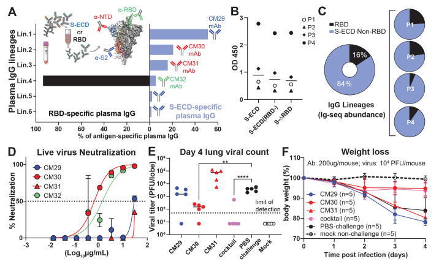
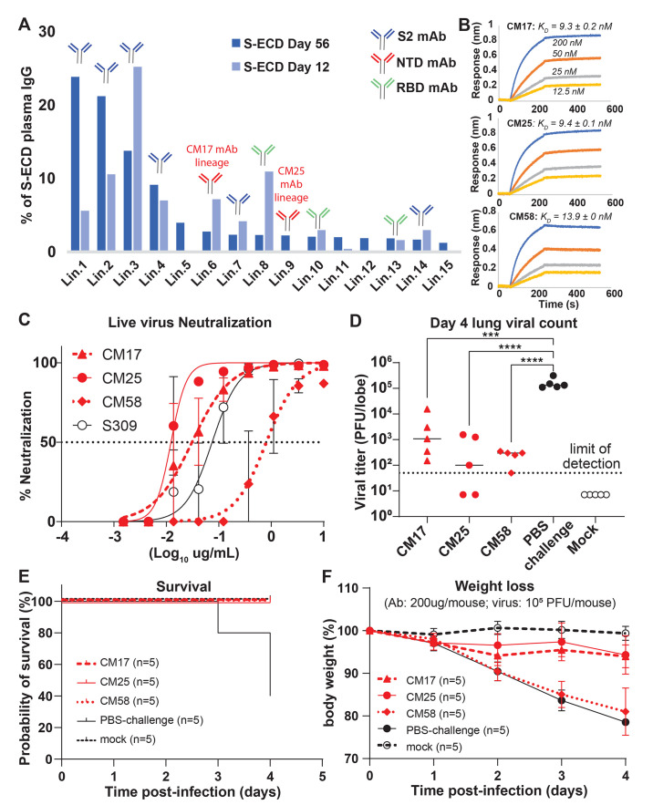
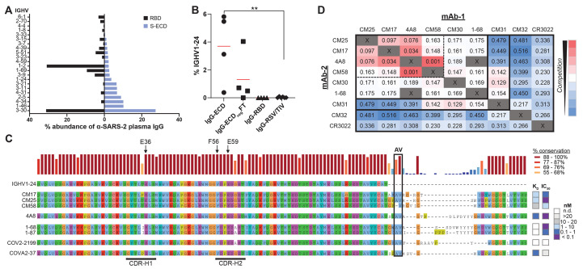
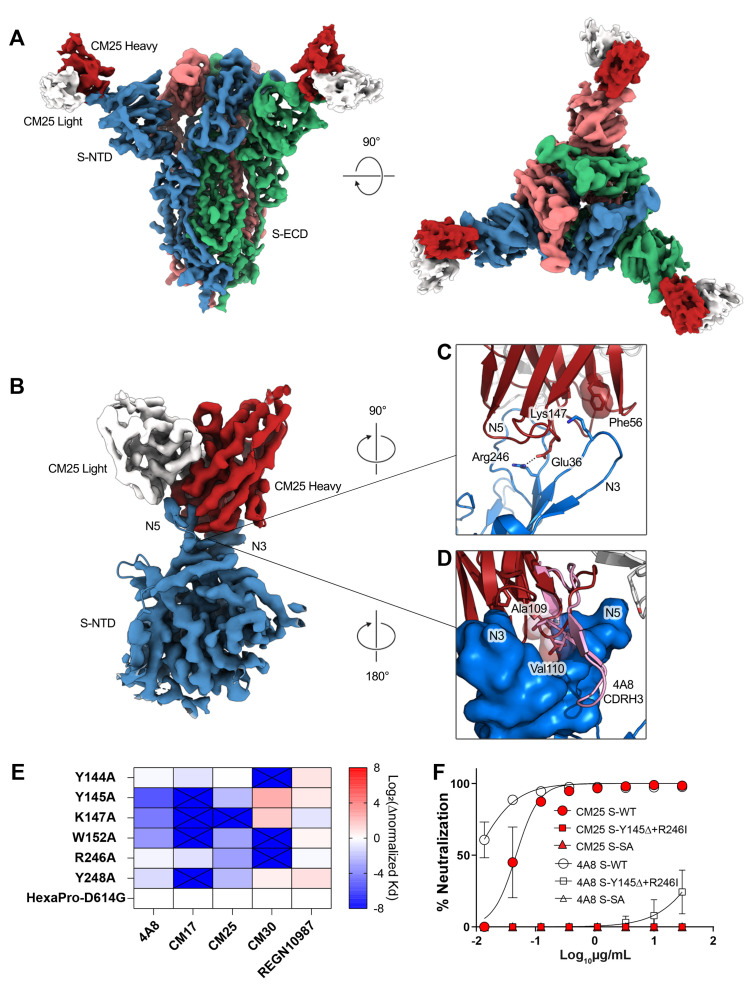

# Prevalent, protective, and convergent IgG recognition of SARS-CoV-2 non-RBD spike epitopes

**William N. Voss, Yixuan J. Hou\*, Nicole V. Johnson\*, George Delidakis, Jin Eyun Kim, Kamyab Javanmardi, Andrew P. Horton, Foteini Bartzoka, Chelsea J. Paresi, Yuri Tanno, Chia-Wei Chou, Shawn A. Abbasi, Whitney Pickens, Katia George, Daniel R. Boutz, Dalton M. Towers, Jonathan R. McDaniel, Daniel Billick, Jule Goike, Lori Rowe, Dhwani Batra, Jan Pohl, Justin Lee, Shivaprakash Gangappa, Suryaprakash Sambhara, Michelle Gadush, Nianshuang Wang, Maria D. Person, Brent L. Iverson, Jimmy D. Gollihar, John M. Dye, Andrew S. Herbert, Ilya J. Finkelstein, Ralph S. Baric, Jason S. McLellan, George Georgiou, Jason L. Lavinder†, and Gregory C. Ippolito†** (\* co-first authors; † co-corresponding)

*Science*, Volume 372, Issue 6546, Pages 1108–1112 (2021)

**DOI:** [10.1126/science.abg5268](https://doi.org/10.1126/science.abg5268)

---

## Table of Contents

- [Abstract](#abstract)
- [Main Text](#main-text)
- [Acknowledgments](#acknowledgments)
- [Supplementary Materials](#supplementary-materials)
- [References and Notes](#references-and-notes)

---

## Abstract

The molecular composition and binding epitopes of the immunoglobulin G (IgG) antibodies that circulate in blood plasma following SARS-CoV-2 infection are unknown. Proteomic deconvolution of the IgG repertoire to the spike glycoprotein in convalescent subjects revealed that the response is directed predominantly (>80%) against epitopes residing outside the receptor-binding domain (RBD). In one subject, just four IgG lineages accounted for 93.5% of the response, including an N-terminal domain (NTD)-directed antibody that was protective against lethal viral challenge. Genetic, structural, and functional characterization of a multi-donor class of "public" antibodies revealed an NTD epitope that is recurrently mutated among emerging SARS-CoV-2 variants of concern. These data show that "public" NTD-directed and other non-RBD plasma antibodies are prevalent and have implications for SARS-CoV-2 protection and antibody escape.

---

## Main Text

The SARS-CoV-2 spike ectodomain (S-ECD) folds into a multidomain architecture [[1](#ref1), [2](#ref2)] and includes the RBD, which is essential for viral infectivity, and the structurally adjacent NTD, which plays an uncertain role. Humoral immunity to the spike (S) surface glycoprotein can correlate with protection [[3](#ref3)], and it is the primary antigenic target for most vaccines and monoclonal antibodies (mAbs). That the B cell repertoire can recognize multiple spike epitopes is supported by extensive single-cell cloning campaigns [[4](#ref4)–[9](#ref9)]. However, the identity, abundance, and clonality of the IgG plasma antibody repertoire and the epitopes it may target are not known [[10](#ref10)–[12](#ref12)]. Divergence between the two repertoires is biologically plausible [[13](#ref13)–[17](#ref17)] and the evidence in COVID-19 includes a paradoxical disconnect between virus-neutralizing IgG titers and RBD-specific B cell immunity [[6](#ref6), [11](#ref11), [18](#ref18), [19](#ref19)].

To analyze the IgG repertoire, blood was collected during early convalescence from four seroconverted study subjects (P1–P4) who experienced mild COVID-19 disease that manifested with plasma virus-neutralization titers in the lowest quartile (P1 and P3), the second highest quartile (P2), or the highest quartile (P4) compared to a larger cohort (table S1 and fig. S1). The lineage composition and relative abundance of constituent IgG antibodies comprising the plasma response to either intact stabilized S-ECD (S-2P [[1](#ref1)]) or RBD was determined using the Ig-Seq pipeline [[13](#ref13), [14](#ref14), [20](#ref20)] that integrates analytical proteomics of affinity purified IgG fractions with peripheral B cell antibody variable region repertoires (BCR-Seq).

IgG lineages detected by Ig-Seq in the S-ECD fraction but absent from the RBD fraction were deemed to be reactive with spike epitopes outside the RBD. In subject P3, we detected six IgG lineages that bound to S-ECD ([Fig. 1A](#fig1)). Four of these (Lin.1 to Lin.4) accounted for 93.5% abundance of the total plasma IgG S-ECD response and exhibited extensive intralineage diversity (fig. S2) indicative of clonal expansion and selection. Notably, the top three lineages (Lin.1 to Lin.3; >85% abundance) all bound to non-RBD epitopes (S2 subunit or NTD). Bulk serology ELISAs recapitulated the Ig-Seq result and demonstrated similarly high levels of non-RBD-binding IgG (*P* > 0.05) ([Fig. 1B](#fig1)), confirming that RBD-binding plasma antibodies comprise only a minor proportion of all spike-binding IgG in naturally infected individuals [[21](#ref21)]. In all four subjects, the detected plasma IgG repertoire to S-ECD was oligoclonal, comprising only 6–22 lineages, with the top-ranked lineage comprising 15 to 50% total abundance. On average, 84% of the anti-S-ECD plasma IgG repertoire bound to epitopes outside the RBD ([Fig. 1C](#fig1)), a finding consistent with data from single B cell analyses [[22](#ref22)], and the most abundant plasma IgG lineage in all donors recognized a non-RBD epitope ([Figs. 1A](#fig1) and [2A](#fig2) and fig. S3).

<figure class="paper-figure" id="fig1">

<figcaption><strong>Fig. 1. Most plasma IgG antibodies bind non-RBD spike epitopes such as the NTD.</strong> (<b>A</b>) Affinity-purification using spike S-ECD (<a href="#ref1">[1]</a>) or RBD for subject P3. Plasma IgG lineage identities, binding specificity, and relative abundance were mapped via Ig-seq proteomics (<a href="#ref14">[14]</a>), facilitating recombinant plasma mAb characterization; anti-RBD (green); anti-S2 (blue); anti-NTD (red). (<b>B</b>) IgG ELISA binding (1:150 plasma dilution) to S-ECD alone, or in the presence of 50 μg/ml of RBD (S-ECD(RBD-)) or S-∆RBD deletion mutant. (<b>C</b>) Quantitative Ig-seq determination of anti-RBD and non-RBD IgG mAb abundance in early convalescent plasmas across four subjects. (<b>D</b>) Authentic virus neutralization (in duplicate) of the four most abundant plasma IgGs (CM29, CM30, CM31, CM32) from plasma lineages Lin.1, Lin.2, Lin.3, Lin.4 in subject P3. (<b>E</b> and <b>F</b>) Prophylactic protection of 12-month-old BALB/c mice (<em>n</em> = 5 per group) against lethal challenge with high dose (104 PFU) mouse-adapted (MA10) SARS-CoV-2. Cocktail of non-RBD mAbs (200 μg per mouse) at 2:1:1 ratio reflecting their relative plasma abundance. &#42;&#42;<em>P</em> &lt; 0.005; &#42;&#42;&#42;&#42;<em>P</em> &lt; 0.0001, determined by one-way ANOVA with Dunnett's multiple comparisons test.</figcaption>
</figure>

Binding analysis of P3 mAbs CM29–CM32 representing the most expanded clones within each of lineages Lin.1 to Lin.4 showed that CM29 (Lin.1) recognizes the S2 subunit (*K*D = 6.6 nM), CM30 and CM31 (Lin.2 and Lin.3 with *K*D = 0.8 and 37.7 nM, respectively) were specific for the NTD, and CM32 (Lin.4) bound the RBD (*K*D = 6.0 nM), as expected from the Ig-Seq differential affinity purifications ([Fig. 1A](#fig1) and table S2). CM30 potently neutralized authentic SARS-CoV-2 *in vitro* (IC₅₀ = 0.83 μg/ml), CM32 was slightly less potent (2.1 μg/ml), whereas CM29 and CM31 showed minimal neutralization activity ([Fig. 1D](#fig1)).

We then determined the capacity of mAbs CM29–CM32, singly and in combination, to confer prophylactic protection *in vivo* to virus challenge using the MA10 mouse model of SARS-CoV-2 infection [[23](#ref23), [24](#ref24)]. Even though the RBD-directed mAb CM32 could neutralize authentic virus *in vitro* and had relatively high antibody-dependent cellular phagocytosis (ADCP) activity (fig. S4), it did not protect *in vivo* (fig. S5), possibly due to amino acid changes in the MA10 virus. Similarly, no protection was observed for the non-neutralizing S2-directed mAb CM29 or non-neutralizing NTD-directed mAb CM31. The neutralizing mAb CM30, derived from the top-ranking NTD-targeting IgG lineage (21% abundance), was the sole plasma antibody that conferred complete protection to MA10 viral challenge ([Fig. 1, E and F](#fig1), and fig. S5). Interestingly, administration of a cocktail comprising the top non-RBD plasma mAbs CM29–CM31 (>85% of the IgG plasma lineages to S-ECD; [Fig. 1A](#fig1)) showed the most robust protection and lung viral titers below the limit of detection (LOD) in high viral load challenge (10⁴ PFU).

Subject P2, with ~10-fold higher neutralizing titer compared to subject P3 (fig. S1 and table S1), displayed a more polyclonal IgG response ([Fig. 2A](#fig2)), with 12/15 lineages (>80% total abundance) in the anti-S-ECD repertoire recognizing non-RBD epitopes. Conspicuously, as with P3, the most abundant S-ECD-directed plasma antibodies target the S2 subunit, with the four topmost lineages (68% total abundance) binding to S2. MAbs CM25 and CM17, representative of two NTD-targeting lineages each comprising ~2.5% of the response at day 56 (Ig-Seq Lin.6 and Lin.9) ([Fig. 2A](#fig2)), were both encoded by unmutated or near-germline IGHV1-24. We found an additional NTD-targeting unmutated IGHV1-24 plasma mAb (CM58) in subject P4. CM17, CM25 and CM58 bound S-ECD with similar single-digit nM affinity ([Fig. 2B](#fig2) and table S2) and all three potently neutralized SARS-CoV-2 virus, with IC₅₀ values of 0.01–0.81 μg/ml comparable to S309 anti-RBD control [[25](#ref25)] ([Fig. 2C](#fig2), fig. S6, and table S2). For all three mAbs, pre-administration in the MA10 mouse model resulted in significantly reduced lung viral titers post-infection with 10⁵ PFU ([Fig. 2D](#fig2); *P* < 0.001), resulting in 100% survival, compared to just 40% in the control group ([Fig. 2E](#fig2)). CM17- and CM25-treated cohorts exhibited only minimal weight loss ([Fig. 2F](#fig2)). Thus, IGHV1-24 is intrinsically suited for potent and protective targeting of the NTD.

<figure class="paper-figure" id="fig2">

<figcaption><strong>Fig. 2. Protective spike NTD-targeting antibodies are prevalent in COVID-19 convalescent plasma.</strong> (<b>A</b>) Temporal Ig-seq dynamics of the anti-S-ECD IgG repertoire at days 12 and 56 post-symptom onset. (<b>B</b>) Biolayer interferometry (BLI) sensorgrams to S-ECD ligand of anti-NTD mAbs CM17, CM25 (subject P2), and CM58 (subject P4). (<b>C</b>) <em>In vitro</em> live virus neutralization (performed in duplicate). (<b>D</b>–<b>F</b>) <em>In vivo</em> prophylactic protection of 12-month-old BALB/c mice (<em>n</em> = 5 per group) against high dose intranasal challenge (105 PFU) of mouse-adapted (MA10) SARS-CoV-2. &#42;&#42;&#42;<em>P</em> &lt; 0.0007; &#42;&#42;&#42;&#42;<em>P</em> &lt; 0.0001, determined by one-way ANOVA with Dunnett's multiple comparisons test.</figcaption>
</figure>

B cell expression of IGHV1-24 in COVID-19 (~5 to 8%) [[5](#ref5), [7](#ref7), [26](#ref26)] is ~10-fold higher than healthy individuals (0.4 to 0.8%) [[27](#ref27)]. Moreover, we could detect IGHV1-24 plasma antibodies only in S-ECD fractions (mean 3.7%), but not among anti-RBD IgGs ([Fig. 3, A and B](#fig3)). Alignment of CM17, CM25, and CM58 with four neutralizing IGHV1-24 anti-NTD mAbs cloned from peripheral B cells [4A8 [[4](#ref4)], 1-68 [[5](#ref5)], 1-87 [[5](#ref5)], COVA2-37 [[7](#ref7)]] and an additional antibody [COV2-2199 [[8](#ref8)]] identified a class of convergent VH immune receptor sequences ([Fig. 3C](#fig3)). In all cases, three glutamate (Glu) residues (Glu³⁶, Glu⁵⁹, and Glu⁸⁰) located in complementarity-determining region (CDR)-H1, CDR-H2, and framework H3 (FWR-H3), respectively, as well as a phenylalanine (Phe) residue (Phe⁵⁶) in CDR-H2, were invariably unmutated and are unique to the electronegative IGHV1-24 (pI = 4.6). The convergent VH genes paired promiscuously with six distinct light-chain VL genes, yet CDR-H3 peptide lengths were restricted (14 or 21 amino acids) (Table S3). A "checkerboard" binding-competition experiment ([Fig. 3D](#fig3)) indicated the presence of at least two epitope clusters on the NTD, including one targeted by all of the tested IGHV1-24 mAbs (4A8, CM25, CM17, CM58, and 1-68) and the IGHV3-11 mAb CM30. Another NTD epitope was identified by CM31 (IGHV2-5, 6.4% mutation), which overlapped with CM30 (IGHV3-11; 3.1% mutation), CM58, and 1-68 but did not compete with the other three IGHV1-24 NTD mAbs.

<figure class="paper-figure" id="fig3">

<figcaption><strong>Fig. 3. Genetic basis of a shared, or public, class of IGHV1-24 plasma antibodies targeting the spike NTD.</strong> (<b>A</b>) IGHV usage of plasma antibodies in all subjects (<em>n</em> = 4). (<b>B</b>) Comparative IGHV1-24 usage of anti-S-ECD (IgG-ECD) and anti-RBD (IgG-RBD) plasma antibodies, or in depleted S-ECD affinity column flow through (IgG-ECDnegFT) in all subjects (<em>n</em> = 4). IgG-RSV/TIV: IgG specific to respiratory syncytial virus (RSV) or trivalent influenza vaccine hemagglutinin HA1 (TIV) in healthy controls post-vaccination (<em>n</em> = 6). &#42;&#42;<em>P</em> &lt; 0.01, determined by Mann–Whitney <em>U</em> test. (<b>C</b>) Sequence alignment of IGHV1-24 neutralizing anti-NTD IgGs from plasma (CM17, CM25, and CM58) or from peripheral B cells (4A8 (<a href="#ref4">[4]</a>), 1-68 and 1-87 from a subject with ARDS (<a href="#ref5">[5]</a>), COV2-2199 (<a href="#ref13">[13]</a>), and COVA2-37 [mild disease subject]) (<a href="#ref7">[7]</a>). Arrows point to unique IGHV1-24 residues. Heatmap shows recombinant mAb affinity (<i>K</i>D) and live-virus neutralization (IC50) for individual antibodies. (<b>D</b>) Competitive BLI binding assay ("checkerboard competition") of NTD-binding mAbs found in this study (CM17, CM25, CM58, CM30, and CM31) and others (4A8 and 1-68). RBD-binding mAbs CM32 and CR3022 included for comparison. Numbers refer to the shift, in nanometers, after second mAb binding to the preformed mAb–NTD complex. Dashed box drawn to highlight strong competition (&lt;0.1 nm shift) among 4A8 and three IGHV1-24 mAbs examined in this study.</figcaption>
</figure>

To better understand the IGHV1-24 interactions with the spike NTD, we determined a cryo-EM structure of CM25 Fabs bound to trimeric S-ECD ([Fig. 4A](#fig4) and figs. S7 and S8). Focused refinement of the CM25-NTD interface resulted in a 3.5-Å reconstruction that revealed a heavy-chain–dominant mode of binding, with substantial contacts mediated by interactions between the three CDRs and the N3 and N5 loops of the NTD ([Fig. 4B](#fig4)). The light chain contributes only 11% (86 Ų) of the total CM25 binding interface, mainly through a stacked hydrophobic interaction between CDR-L2 Tyr⁵⁵ and Pro²⁵¹ within the N5 loop. Unique germline IGHV1-24 residues contribute 20% (149 Ų) of the total binding interface. CDR-H1 interacts extensively through hydrogen bonds and contacts between hydrophobic residues, including a salt bridge formed between the conserved Glu³⁶ residue and the N5 loop residue Arg²⁴⁶ ([Fig. 4C](#fig4)). The common IGHV1-24 Phe⁵⁶ residue in CDR-H2 forms a pi-cation interaction with Lys¹⁴⁷ in the N3 loop ([Fig. 4C](#fig4)). CM25 contains a 14-amino-acid CDR-H3 loop that contributes 35% (261 Ų) of the total interface, including the AV aliphatic motif found in all but one of the convergent IGHV1-24 NTD-binding mAbs. Ala¹⁰⁹ and Val¹¹⁰ are buried at the interface in a binding pocket framed by the N3 and N5 loops. A comparison of CM25 with an extant structure of an IGHV1-24 NTD-binding antibody isolated by B cell cloning, 4A8 [[4](#ref4)], revealed that the AV dipeptide interaction is structurally conserved, and the 21 amino-acid CDR-H3 of 4A8 extends along the outside of the NTD, contributing three additional contacts and 46% (415 Ų) of the total binding interface ([Fig. 4D](#fig4)). Both structures show extensive contacts between the heavy chain of the Fabs and the NTD N3 and N5 loops. The Glu³⁶-Arg²⁴⁶ salt bridge and an identical CDR-H2 contact between Phe⁵⁶ and Lys¹⁴⁷ are conserved in the 4A8-NTD interface.

<figure class="paper-figure" id="fig4">

<figcaption><strong>Fig. 4. Structural basis of public IGHV1-24 plasma antibodies, NTD mutations, and antibody escape.</strong> (<b>A</b>) Side and top views of the structure of CM25 Fab bound to S-ECD shown as cryo-EM density. (<b>B</b>) Focused refinement density revealing a VH-dominant mode of binding, with substantial contacts mediated by interactions between the three CDRs and the N3 and N5 loops of the NTD. (<b>C</b>) CDR-H1 interaction includes a salt bridge formed between the uniquely encoded Glu³⁶ residue and the N5 loop residue Arg²⁴⁶; Phe⁵⁶ unique residue in CDR-H2 forms a pi-cation interaction with Lys¹⁴⁷ in the N3 loop. (<b>D</b>) The AV dipeptide interaction with the N3 and N5 loops of the NTD is structurally conserved between mAbs CM25 (red) and 4A8 (pink). (<b>E</b>) Normalized shift (Log₂) in binding <i>K</i>D, as measured by differential BLI affinities for single Ala mutants and parental D614G spike protein. (<b>F</b>) Authentic virus neutralization of CM25 and 4A8 against WT, double S-N3/N5 loop mutants, and South Africa (SA) B.1.351 viral variant.</figcaption>
</figure>

SARS-CoV-2 variants of concern contain mutations in the NTD N3 and N5 loops, including Y144/Y145Δ and K147E (UK lineage B.1.1.7), W152C (California B.1.429), and 242-244Δ or R246I (South Africa B.1.351). Alanine substitutions at several of these positions ablated binding or reduced affinity more than fivefold by public IGHV1-24 antibodies as exemplified by 4A8, CM17, and CM25 ([Fig. 4E](#fig4) and fig. S9), a result consistent with the CM25-NTD and 4A8-NTD structures. Additionally, we confirmed that an engineered N3-N5 double-mutant and native B.1.351 [[28](#ref28)] both evade neutralization by mAbs CM25 and 4A8 ([Fig. 4F](#fig4)). Thus, mutations in SARS-CoV-2 variants confer escape from public neutralizing anti-NTD antibodies.

In conclusion, we find that the convalescent plasma IgG response to SARS-CoV-2 is oligoclonal and directed overwhelmingly toward non-RBD epitopes in the S-ECD. This includes public, near-germline, and potently neutralizing antibodies against the NTD. The degree to which public anti-NTD antibodies contribute to protection is likely related to their relative levels in plasma, which can be dominant in some individuals. Our finding that mutations present in circulating SARS-CoV-2 variants can impair or ablate binding and neutralization by public anti-NTD antibodies may constitute a mechanism of viral escape in a subset of the population. Numerous other NTD mutations—which overlap with the structural epitope recognized by the public IGHV1-24 antibody class—have been described in additional circulating variants, in laboratory escape mutants, and in immunocompromised patients [[12](#ref12), [29](#ref29)–[33](#ref33)].

---

## Acknowledgments

We are indebted to our study subjects for providing the blood samples required for this study. We wish to thank Drs. G. Fenves, D. Jaffee, and A. Matouschek for their support. The authors are grateful for the administrative expertise of E. K. Miller, to The LaMontagne Center for Infectious Disease, for the university's core facilities, and to Dr. C.-L. Hsieh for providing reagents and advice. **Funding:** Funding for USAMRIID was provided through the CARES Act with programmatic oversight from the Military Infectious Diseases Research Program–project 14066041. Opinions, conclusions, interpretations, and recommendations are those of the authors and are not necessarily endorsed by the U.S. Army. The mention of trade names or commercial products does not constitute endorsement or recommendation for use by the Department of the Army or the Department of Defense. The findings and conclusions in this report are those of the authors and do not necessarily represent the views of Centers for Disease Control and Prevention. Molecular graphics and analyses performed with UCSF Chimera, developed by the Resource for Biocomputing, Visualization, and Informatics at the University of California, San Francisco, with support from NIH P41-GM103311. The Sauer Structural Biology Laboratory is supported by the University of Texas College of Natural Sciences and by award RR160023 from the Cancer Prevention and Research Institute of Texas (CPRIT). This research was funded in part by the Clayton Foundation (C.J.P., B.L.I., G.G.); a National Institutes of Health (NIH)/National Institute of Allergy and Infectious Diseases (NIAID) grant awarded to J.S.M. (R01-AI127521) as well as Welch Foundation Grant No. F-0003-19620604; NIH NCI COVID-19 SeroNet grant U54-CA260543 (R.S.B.); UT System Proteomics Network pilot funding (J.J.L, M.D.P.), and in part with federal funds under a contract from the NIH NIAID, Contract Number 75N93019C00050 (G.G., J.J.L., G.C.I.). **Author contributions:** Conceptualization: W.N.V., G.G., J.J.L. and G.C.I.; Methodology: W.N.V., Y.J.H., N.V.J., J.E.K., G.D., A.P.H., B.L.I., M.D.P., J.D., A.H., R.S.B., J.S.M., G.G., J.J.L., and G.C.I.; Investigation: W.N.V., Y.J.H., N.V.J., J.E.K., G.D., A.P.H., F.B., C.P., Y.T., S.A.A., W.P., K.G., D.R.B., D.M.T., J.G., D.B., M.G., J.J.L., and G.C.I.; Data Analysis and Interpretation: W.N.V., Y.J.H., N.V.J., J.E.K., G.D., A.P.H., S.A.A., W.P., D.R.B., J.R.M., L.R., D.B., J.L., J.P., S.G., S.S., A.H., J.D.G., R.S.B., J.S.M., G.G., J.J.L., and G.C.I.; Data Curation: W.N.V., J.Y.H., N.V.J., J.E.K., G.D., J.J.L., and G.C.I.; Writing: Original Draft, W.N.V., N.J.V., J.J.L., and G.C.I.; Writing: Review & Editing: W.N.V., Y.J.H., N.J.V., B.L.I., R.S.B., J.S.M., G.G., J.J.L., and G.C.I.; Funding: J.D.G., R.S.B., J.S.M., G.G., and G.C.I. **Competing interests:** A patent application submitted by The University of Texas Board of Regents is pending for anti-SARS-CoV-2 monoclonal antibodies described in the manuscript (W.N.V., J.D.G., J.S.M., G.G., J.J.L., and G.C.I.). **Data and materials availability:** FASTQ VH and VH:VL sequence files have been deposited in the NCBI Sequence Read Archive with accession numbers PRJNA422864. The monoclonal antibodies have been deposited in GenBank with accession numbers MZ049539 to MZ049552. Coordinates for the CM25 Fab in complex with trimeric spike ectodomain have been deposited to the Protein Data Bank as PDBID:7M8J. Cryo-EM maps have been deposited to the Electron Microscopy Data Bank under accession code EMD-23717. These structural data are presented in [Fig. 4](#fig4), table S4, and figs. S7–S8. All other data are available in the main text or the supplementary materials. This work is licensed under a Creative Commons Attribution 4.0 International (CC BY 4.0) license, which permits unrestricted use, distribution, and reproduction in any medium, provided the original work is properly cited.

---

## Supplementary Materials

science.sciencemag.org/cgi/content/full/science.abg5268/DC1

Materials and Methods

Figs. S1 to S9

Tables S1 to S5

References (34–54)

MDAR Reproducibility Checklist

---

## References and Notes

1. Wrapp D., Wang N., Corbett K. S., Goldsmith J. A., Hsieh C.-L., Abiona O., Graham B. S., McLellan J. S., Cryo-EM structure of the 2019-nCoV spike in the prefusion conformation. *Science* 367, 1260–1263 (2020). [doi:10.1126/science.abb2507](https://doi.org/10.1126/science.abb2507)

2. Walls A. C., Park Y.-J., Tortorici M. A., Wall A., McGuire A. T., Veesler D., Structure, Function, and Antigenicity of the SARS-CoV-2 Spike Glycoprotein. *Cell* 181, 281–292.e6 (2020). [doi:10.1016/j.cell.2020.02.058](https://doi.org/10.1016/j.cell.2020.02.058)

3. McMahan K., Yu J., Mercado N. B., Loos C., Tostanoski L. H., Chandrashekar A., Liu J., Peter L., Atyeo C., Zhu A., Bondzie E. A., Dagotto G., Gebre M. S., Jacob-Dolan C., Li Z., Nampanya F., Patel S., Pessaint L., Van Ry A., Blade K., Yalley-Ogunro J., Cabus M., Brown R., Cook A., Teow E., Andersen H., Lewis M. G., Lauffenburger D. A., Alter G., Barouch D. H., Correlates of protection against SARS-CoV-2 in rhesus macaques. *Nature* 590, 630–634 (2021). [doi:10.1038/s41586-020-03041-6](https://doi.org/10.1038/s41586-020-03041-6)

4. Chi X., Yan R., Zhang J., Zhang G., Zhang Y., Hao M., Zhang Z., Fan P., Dong Y., Yang Y., Chen Z., Guo Y., Zhang J., Li Y., Song X., Chen Y., Xia L., Fu L., Hou L., Xu J., Yu C., Li J., Zhou Q., Chen W., A neutralizing human antibody binds to the N-terminal domain of the Spike protein of SARS-CoV-2. *Science* 369, 650–655 (2020). [doi:10.1126/science.abc6952](https://doi.org/10.1126/science.abc6952)

5. Liu L., Wang P., Nair M. S., Yu J., Rapp M., Wang Q., Luo Y., Chan J. F.-W., Sahi V., Figueroa A., Guo X. V., Cerutti G., Bimela J., Gorman J., Zhou T., Chen Z., Yuen K.-Y., Kwong P. D., Sodroski J. G., Yin M. T., Sheng Z., Huang Y., Shapiro L., Ho D. D., Potent neutralizing antibodies against multiple epitopes on SARS-CoV-2 spike. *Nature* 584, 450–456 (2020). [doi:10.1038/s41586-020-2571-7](https://doi.org/10.1038/s41586-020-2571-7)

6. Robbiani D. F., Gaebler C., Muecksch F., Lorenzi J. C. C., Wang Z., Cho A., Agudelo M., Barnes C. O., Gazumyan A., Finkin S., Hägglöf T., Oliveira T. Y., Viant C., Hurley A., Hoffmann H.-H., Millard K. G., Kost R. G., Cipolla M., Gordon K., Bianchini F., Chen S. T., Ramos V., Patel R., Dizon J., Shimeliovich I., Mendoza P., Hartweger H., Nogueira L., Pack M., Horowitz J., Schmidt F., Weisblum Y., Michailidis E., Ashbrook A. W., Waltari E., Pak J. E., Huey-Tubman K. E., Koranda N., Hoffman P. R., West A. P. Jr., Rice C. M., Hatziioannou T., Bjorkman P. J., Bieniasz P. D., Caskey M., Nussenzweig M. C., Convergent antibody responses to SARS-CoV-2 in convalescent individuals. *Nature* 584, 437–442 (2020). [doi:10.1038/s41586-020-2456-9](https://doi.org/10.1038/s41586-020-2456-9)

7. Brouwer P. J. M., Caniels T. G., van der Straten K., Snitselaar J. L., Aldon Y., Bangaru S., Torres J. L., Okba N. M. A., Claireaux M., Kerster G., Bentlage A. E. H., van Haaren M. M., Guerra D., Burger J. A., Schermer E. E., Verheul K. D., van der Velde N., van der Kooi A., van Schooten J., van Breemen M. J., Bijl T. P. L., Sliepen K., Aartse A., Derking R., Bontjer I., Kootstra N. A., Wiersinga W. J., Vidarsson G., Haagmans B. L., Ward A. B., de Bree G. J., Sanders R. W., van Gils M. J., Potent neutralizing antibodies from COVID-19 patients define multiple targets of vulnerability. *Science* 369, 643–650 (2020). [doi:10.1126/science.abc5902](https://doi.org/10.1126/science.abc5902)

8. Zost S. J., Gilchuk P., Case J. B., Binshtein E., Chen R. E., Nkolola J. P., Schäfer A., Reidy J. X., Trivette A., Nargi R. S., Sutton R. E., Suryadevara N., Martinez D. R., Williamson L. E., Chen E. C., Jones T., Day S., Myers L., Hassan A. O., Kafai N. M., Winkler E. S., Fox J. M., Shrihari S., Mueller B. K., Meiler J., Chandrashekar A., Mercado N. B., Steinhardt J. J., Ren K., Loo Y.-M., Kallewaard N. L., McCune B. T., Keeler S. P., Holtzman M. J., Barouch D. H., Gralinski L. E., Baric R. S., Thackray L. B., Diamond M. S., Carnahan R. H., Crowe J. E. Jr., Potently neutralizing and protective human antibodies against SARS-CoV-2. *Nature* 584, 443–449 (2020). [doi:10.1038/s41586-020-2548-6](https://doi.org/10.1038/s41586-020-2548-6)

9. Wec A. Z., Wrapp D., Herbert A. S., Maurer D. P., Haslwanter D., Sakharkar M., Jangra R. K., Dieterle M. E., Lilov A., Huang D., Tse L. V., Johnson N. V., Hsieh C.-L., Wang N., Nett J. H., Champney E., Burnina I., Brown M., Lin S., Sinclair M., Johnson C., Pudi S., Bortz R. 3rd, Wirchnianski A. S., Laudermilch E., Florez C., Fels J. M., O'Brien C. M., Graham B. S., Nemazee D., Burton D. R., Baric R. S., Voss J. E., Chandran K., Dye J. M., McLellan J. S., Walker L. M., Broad neutralization of SARS-related viruses by human monoclonal antibodies. *Science* 369, 731–736 (2020). [doi:10.1126/science.abc7424](https://doi.org/10.1126/science.abc7424)

10. Ripperger T. J., Uhrlaub J. L., Watanabe M., Wong R., Castaneda Y., Pizzato H. A., Thompson M. R., Bradshaw C., Weinkauf C. C., Bime C., Erickson H. L., Knox K., Bixby B., Parthasarathy S., Chaudhary S., Natt B., Cristan E., El Aini T., Rischard F., Campion J., Chopra M., Insel M., Sam A., Knepler J. L., Capaldi A. P., Spier C. M., Dake M. D., Edwards T., Kaplan M. E., Scott S. J., Hypes C., Mosier J., Harris D. T., LaFleur B. J., Sprissler R., Nikolich-Žugich J., Bhattacharya D., Orthogonal SARS-CoV-2 Serological Assays Enable Surveillance of Low-Prevalence Communities and Reveal Durable Humoral Immunity. *Immunity* 53, 925–933.e4 (2020). [doi:10.1016/j.immuni.2020.10.004](https://doi.org/10.1016/j.immuni.2020.10.004)

11. Juno J. A., Tan H.-X., Lee W. S., Reynaldi A., Kelly H. G., Wragg K., Esterbauer R., Kent H. E., Batten C. J., Mordant F. L., Gherardin N. A., Pymm P., Dietrich M. H., Scott N. E., Tham W.-H., Godfrey D. I., Subbarao K., Davenport M. P., Kent S. J., Wheatley A. K., Humoral and circulating follicular helper T cell responses in recovered patients with COVID-19. *Nat. Med.* 26, 1428–1434 (2020). [doi:10.1038/s41591-020-0995-0](https://doi.org/10.1038/s41591-020-0995-0)

12. Weisblum Y., Schmidt F., Zhang F., DaSilva J., Poston D., Lorenzi J. C. C., Muecksch F., Rutkowska M., Hoffmann H.-H., Michailidis E., Gaebler C., Agudelo M., Cho A., Wang Z., Gazumyan A., Cipolla M., Luchsinger L., Hillyer C. D., Caskey M., Robbiani D. F., Rice C. M., Nussenzweig M. C., Hatziioannou T., Bieniasz P. D., Escape from neutralizing antibodies by SARS-CoV-2 spike protein variants. *eLife* 9, e61312 (2020). [doi:10.7554/eLife.61312](https://doi.org/10.7554/eLife.61312)

13. Lavinder J. J., Wine Y., Giesecke C., Ippolito G. C., Horton A. P., Lungu O. I., Hoi K. H., DeKosky B. J., Murrin E. M., Wirth M. M., Ellington A. D., Dörner T., Marcotte E. M., Boutz D. R., Georgiou G., Identification and characterization of the constituent human serum antibodies elicited by vaccination. *Proc. Natl. Acad. Sci. U.S.A.* 111, 2259–2264 (2014). [doi:10.1073/pnas.1317793111](https://doi.org/10.1073/pnas.1317793111)

14. Lavinder J. J., Horton A. P., Georgiou G., Ippolito G. C., Next-generation sequencing and protein mass spectrometry for the comprehensive analysis of human cellular and serum antibody repertoires. *Curr. Opin. Chem. Biol.* 24, 112–120 (2015). [doi:10.1016/j.cbpa.2014.11.007](https://doi.org/10.1016/j.cbpa.2014.11.007)

15. Purtha W. E., Tedder T. F., Johnson S., Bhattacharya D., Diamond M. S., Memory B cells, but not long-lived plasma cells, possess antigen specificities for viral escape mutants. *J. Exp. Med.* 208, 2599–2606 (2011). [doi:10.1084/jem.20110740](https://doi.org/10.1084/jem.20110740)

16. Smith K. G., Light A., Nossal G. J., Tarlinton D. M., The extent of affinity maturation differs between the memory and antibody-forming cell compartments in the primary immune response. *EMBO J.* 16, 2996–3006 (1997). [doi:10.1093/emboj/16.11.2996](https://doi.org/10.1093/emboj/16.11.2996)

17. Barnes C. O., West A. P. Jr., Huey-Tubman K. E., Hoffmann M. A. G., Sharaf N. G., Hoffman P. R., Koranda N., Gristick H. B., Gaebler C., Muecksch F., Lorenzi J. C. C., Finkin S., Hägglöf T., Hurley A., Millard K. G., Weisblum Y., Schmidt F., Hatziioannou T., Bieniasz P. D., Caskey M., Robbiani D. F., Nussenzweig M. C., Bjorkman P. J., Structures of Human Antibodies Bound to SARS-CoV-2 Spike Reveal Common Epitopes and Recurrent Features of Antibodies. *Cell* 182, 828–842.e16 (2020). [doi:10.1016/j.cell.2020.06.025](https://doi.org/10.1016/j.cell.2020.06.025)

18. Luchsinger L. L., Ransegnola B. P., Jin D. K., Muecksch F., Weisblum Y., Bao W., George P. J., Rodriguez M., Tricoche N., Schmidt F., Gao C., Jawahar S., Pal M., Schnall E., Zhang H., Strauss D., Yazdanbakhsh K., Hillyer C. D., Bieniasz P. D., Hatziioannou T., Serological Assays Estimate Highly Variable SARS-CoV-2 Neutralizing Antibody Activity in Recovered COVID-19 Patients. *J. Clin. Microbiol.* 58, e02005-20 (2020). [doi:10.1128/JCM.02005-20](https://doi.org/10.1128/JCM.02005-20)

19. Wu F., Liu M., Wang A., Lu L., Wang Q., Gu C., Chen J., Wu Y., Xia S., Ling Y., Zhang Y., Xun J., Zhang R., Xie Y., Jiang S., Zhu T., Lu H., Wen Y., Huang J., Evaluating the Association of Clinical Characteristics With Neutralizing Antibody Levels in Patients Who Have Recovered From Mild COVID-19 in Shanghai, China. *JAMA Intern. Med.* 180, 1356–1362 (2020). [doi:10.1001/jamainternmed.2020.4616](https://doi.org/10.1001/jamainternmed.2020.4616)

20. DeKosky B. J., Kojima T., Rodin A., Charab W., Ippolito G. C., Ellington A. D., Georgiou G., In-depth determination and analysis of the human paired heavy- and light-chain antibody repertoire. *Nat. Med.* 21, 86–91 (2015). [doi:10.1038/nm.3743](https://doi.org/10.1038/nm.3743)

21. Greaney A. J., Loes A. N., Crawford K. H. D., Starr T. N., Malone K. D., Chu H. Y., Bloom J. D., Comprehensive mapping of mutations in the SARS-CoV-2 receptor-binding domain that affect recognition by polyclonal human plasma antibodies. *Cell Host Microbe* 29, 463–476.e6 (2021). [doi:10.1016/j.chom.2021.02.003](https://doi.org/10.1016/j.chom.2021.02.003)

22. Rogers T. F., Zhao F., Huang D., Beutler N., Burns A., He W. T., Limbo O., Smith C., Song G., Woehl J., Yang L., Abbott R. K., Callaghan S., Garcia E., Hurtado J., Parren M., Peng L., Ramirez S., Ricketts J., Ricciardi M. J., Rawlings S. A., Wu N. C., Yuan M., Smith D. M., Nemazee D., Teijaro J. R., Voss J. E., Wilson I. A., Andrabi R., Briney B., Landais E., Sok D., Jardine J. G., Burton D. R., Isolation of potent SARS-CoV-2 neutralizing antibodies and protection from disease in a small animal model. *Science* 369, 956–963 (2020). [doi:10.1126/science.abc7520](https://doi.org/10.1126/science.abc7520)

23. Leist S. R., Dinnon K. H. 3rd, Schäfer A., Tse L. V., Okuda K., Hou Y. J., West A., Edwards C. E., Sanders W., Fritch E. J., Gully K. L., Scobey T., Brown A. J., Sheahan T. P., Moorman N. J., Boucher R. C., Gralinski L. E., Montgomery S. A., Baric R. S., A Mouse-Adapted SARS-CoV-2 Induces Acute Lung Injury and Mortality in Standard Laboratory Mice. *Cell* 183, 1070–1085.e12 (2020). [doi:10.1016/j.cell.2020.09.050](https://doi.org/10.1016/j.cell.2020.09.050)

24. Dinnon K. H. 3rd, Leist S. R., Schäfer A., Edwards C. E., Martinez D. R., Montgomery S. A., West A., Yount B. L. Jr., Hou Y. J., Adams L. E., Gully K. L., Brown A. J., Huang E., Bryant M. D., Choong I. C., Glenn J. S., Gralinski L. E., Sheahan T. P., Baric R. S., A mouse-adapted model of SARS-CoV-2 to test COVID-19 countermeasures. *Nature* 586, 560–566 (2020). [doi:10.1038/s41586-020-2708-8](https://doi.org/10.1038/s41586-020-2708-8)

25. Pinto D., Park Y.-J., Beltramello M., Walls A. C., Tortorici M. A., Bianchi S., Jaconi S., Culap K., Zatta F., De Marco A., Peter A., Guarino B., Spreafico R., Cameroni E., Case J. B., Chen R. E., Havenar-Daughton C., Snell G., Telenti A., Virgin H. W., Lanzavecchia A., Diamond M. S., Fink K., Veesler D., Corti D., Cross-neutralization of SARS-CoV-2 by a human monoclonal SARS-CoV antibody. *Nature* 583, 290–295 (2020). [doi:10.1038/s41586-020-2349-y](https://doi.org/10.1038/s41586-020-2349-y)

26. Nielsen S. C. A., Yang F., Jackson K. J. L., Hoh R. A., Röltgen K., Jean G. H., Stevens B. A., Lee J.-Y., Rustagi A., Rogers A. J., Powell A. E., Hunter M., Najeeb J., Otrelo-Cardoso A. R., Yost K. E., Daniel B., Nadeau K. C., Chang H. Y., Satpathy A. T., Jardetzky T. S., Kim P. S., Wang T. T., Pinsky B. A., Blish C. A., Boyd S. D., Human B Cell Clonal Expansion and Convergent Antibody Responses to SARS-CoV-2. *Cell Host Microbe* 28, 516–525.e5 (2020). [doi:10.1016/j.chom.2020.09.002](https://doi.org/10.1016/j.chom.2020.09.002)

27. Boyd S. D., Gaëta B. A., Jackson K. J., Fire A. Z., Marshall E. L., Merker J. D., Maniar J. M., Zhang L. N., Sahaf B., Jones C. D., Simen B. B., Hanczaruk B., Nguyen K. D., Nadeau K. C., Egholm M., Miklos D. B., Zehnder J. L., Collins A. M., Individual variation in the germline Ig gene repertoire inferred from variable region gene rearrangements. *J. Immunol.* 184, 6986–6992 (2010). [doi:10.4049/jimmunol.1000445](https://doi.org/10.4049/jimmunol.1000445)

28. Tegally H., Wilkinson E., Giovanetti M., Iranzadeh A., Fonseca V., Giandhari J., Doolabh D., Pillay S., San E. J., Msomi N., Mlisana K., von Gottberg A., Walaza S., Allam M., Ismail A., Mohale T., Glass A. J., Engelbrecht S., Van Zyl G., Preiser W., Petruccione F., Sigal A., Hardie D., Marais G., Hsiao N., Korsman S., Davies M.-A., Tyers L., Mudau I., York D., Maslo C., Goedhals D., Abrahams S., Laguda-Akingba O., Alisoltani-Dehkordi A., Godzik A., Wibmer C. K., Sewell B. T., Lourenço J., Alcantara L. C. J., Kosakovsky Pond S. L., Weaver S., Martin D., Lessells R. J., Bhiman J. N., Williamson C., de Oliveira T., Detection of a SARS-CoV-2 variant of concern in South Africa. *Nature* 592, 438–443 (2021). [doi:10.1038/s41586-021-03402-9](https://doi.org/10.1038/s41586-021-03402-9)

29. McCarthy K. R., Rennick L. J., Nambulli S., Robinson-McCarthy L. R., Bain W. G., Haidar G., Duprex W. P., Recurrent deletions in the SARS-CoV-2 spike glycoprotein drive antibody escape. *Science* 371, 1139–1142 (2021). [doi:10.1126/science.abf6950](https://doi.org/10.1126/science.abf6950)

30. Choi B., Choudhary M. C., Regan J., Sparks J. A., Padera R. F., Qiu X., Solomon I. H., Kuo H.-H., Boucau J., Bowman K., Adhikari U. D., Winkler M. L., Mueller A. A., Hsu T. Y.-T., Desjardins M., Baden L. R., Chan B. T., Walker B. D., Lichterfeld M., Brigl M., Kwon D. S., Kanjilal S., Richardson E. T., Jonsson A. H., Alter G., Barczak A. K., Hanage W. P., Yu X. G., Gaiha G. D., Seaman M. S., Cernadas M., Li J. Z., Persistence and Evolution of SARS-CoV-2 in an Immunocompromised Host. *N. Engl. J. Med.* 383, 2291–2293 (2020). [doi:10.1056/NEJMc2031364](https://doi.org/10.1056/NEJMc2031364)

31. Avanzato V. A., Matson M. J., Seifert S. N., Pryce R., Williamson B. N., Anzick S. L., Barbian K., Judson S. D., Fischer E. R., Martens C., Bowden T. A., de Wit E., Riedo F. X., Munster V. J., Case Study: Prolonged Infectious SARS-CoV-2 Shedding from an Asymptomatic Immunocompromised Individual with Cancer. *Cell* 183, 1901–1912.e9 (2020). [doi:10.1016/j.cell.2020.10.049](https://doi.org/10.1016/j.cell.2020.10.049)

32. P. C. Resende *et al.*, The ongoing evolution of variants of concern and interest of SARS-CoV-2 in Brazil revealed by convergent indels in the amino (N)-terminal domain of the Spike protein. *medRxiv* 2021.03.19.21253946 [Preprint]. 20 March 2021. [doi:10.1101/2021.03.19.21253946](https://doi.org/10.1101/2021.03.19.21253946)

33. E. Andreano *et al.*, SARS-CoV-2 escape *in vitro* from a highly neutralizing COVID-19 convalescent plasma. *bioRxiv* 2020.12.28.424451 [Preprint]. 28 December 2020. [doi:10.1101/2020.12.28.424451](https://doi.org/10.1101/2020.12.28.424451)

34. Hsieh C. L., Goldsmith J. A., Schaub J. M., DiVenere A. M., Kuo H.-C., Javanmardi K., Le K. C., Wrapp D., Lee A. G., Liu Y., Chou C.-W., Byrne P. O., Hjorth C. K., Johnson N. V., Ludes-Meyers J., Nguyen A. W., Park J., Wang N., Amengor D., Lavinder J. J., Ippolito G. C., Maynard J. A., Finkelstein I. J., McLellan J. S., Structure-based design of prefusion-stabilized SARS-CoV-2 spikes. *Science* 369, 1501–1505 (2020). [doi:10.1126/science.abd0826](https://doi.org/10.1126/science.abd0826)

35. Henderson R., Edwards R. J., Mansouri K., Janowska K., Stalls V., Gobeil S. M. C., Kopp M., Li D., Parks R., Hsu A. L., Borgnia M. J., Haynes B. F., Acharya P., Controlling the SARS-CoV-2 spike glycoprotein conformation. *Nat. Struct. Mol. Biol.* 27, 925–933 (2020). [doi:10.1038/s41594-020-0479-4](https://doi.org/10.1038/s41594-020-0479-4)

36. Salazar E., Perez K. K., Ashraf M., Chen J., Castillo B., Christensen P. A., Eubank T., Bernard D. W., Eagar T. N., Long S. W., Subedi S., Olsen R. J., Leveque C., Schwartz M. R., Dey M., Chavez-East C., Rogers J., Shehabeldin A., Joseph D., Williams G., Thomas K., Masud F., Talley C., Dlouhy K. G., Lopez B. V., Hampton C., Lavinder J., Gollihar J. D., Maranhao A. C., Ippolito G. C., Saavedra M. O., Cantu C. C., Yerramilli P., Pruitt L., Musser J. M., Treatment of Coronavirus Disease 2019 (COVID-19) Patients with Convalescent Plasma. *Am. J. Pathol.* 190, 1680–1690 (2020). [doi:10.1016/j.ajpath.2020.05.014](https://doi.org/10.1016/j.ajpath.2020.05.014)

37. Ippolito G. C., Hoi K. H., Reddy S. T., Carroll S. M., Ge X., Rogosch T., Zemlin M., Shultz L. D., Ellington A. D., Vandenberg C. L., Georgiou G., Antibody repertoires in humanized NOD-scid-IL2Rγ(null) mice and human B cells reveals human-like diversification and tolerance checkpoints in the mouse. *PLOS ONE* 7, e35497 (2012). [doi:10.1371/journal.pone.0035497](https://doi.org/10.1371/journal.pone.0035497)

38. McDaniel J. R., DeKosky B. J., Tanno H., Ellington A. D., Georgiou G., Ultra-high-throughput sequencing of the immune receptor repertoire from millions of lymphocytes. *Nat. Protoc.* 11, 429–442 (2016). [doi:10.1038/nprot.2016.024](https://doi.org/10.1038/nprot.2016.024)

39. Bolger A. M., Lohse M., Usadel B., Trimmomatic: A flexible trimmer for Illumina sequence data. *Bioinformatics* 30, 2114–2120 (2014). [doi:10.1093/bioinformatics/btu170](https://doi.org/10.1093/bioinformatics/btu170)

40. Bolotin D. A., Poslavsky S., Mitrophanov I., Shugay M., Mamedov I. Z., Putintseva E. V., Chudakov D. M., MiXCR: Software for comprehensive adaptive immunity profiling. *Nat. Methods* 12, 380–381 (2015). [doi:10.1038/nmeth.3364](https://doi.org/10.1038/nmeth.3364)

41. Edgar R. C., Search and clustering orders of magnitude faster than BLAST. *Bioinformatics* 26, 2460–2461 (2010). [doi:10.1093/bioinformatics/btq461](https://doi.org/10.1093/bioinformatics/btq461)

42. Lefranc M. P., Lefranc G., Immunoglobulins or Antibodies: IMGT® Bridging Genes, Structures and Functions. *Biomedicines* 8, 319 (2020). [doi:10.3390/biomedicines8090319](https://doi.org/10.3390/biomedicines8090319)

43. Ching Y. H., Ghosh T. K., Cross S. J., Packham E. A., Honeyman L., Loughna S., Robinson T. E., Dearlove A. M., Ribas G., Bonser A. J., Thomas N. R., Scotter A. J., Caves L. S. D., Tyrrell G. P., Newbury-Ecob R. A., Munnich A., Bonnet D., Brook J. D., Mutation in myosin heavy chain 6 causes atrial septal defect. *Nat. Genet.* 37, 423–428 (2005). [doi:10.1038/ng1526](https://doi.org/10.1038/ng1526)

44. K. Javanmardi *et al.*, Rapid characterization of spike variants via mammalian cell surface display. *bioRxiv* 2021.03.30.437622 [Preprint]. 30 March 2021. [doi:10.1101/2021.03.30.437622](https://doi.org/10.1101/2021.03.30.437622)

45. Hou Y. J., Okuda K., Edwards C. E., Martinez D. R., Asakura T., Dinnon K. H. 3rd, Kato T., Lee R. E., Yount B. L., Mascenik T. M., Chen G., Olivier K. N., Ghio A., Tse L. V., Leist S. R., Gralinski L. E., Schäfer A., Dang H., Gilmore R., Nakano S., Sun L., Fulcher M. L., Livraghi-Butrico A., Nicely N. I., Cameron M., Cameron C., Kelvin D. J., de Silva A., Margolis D. M., Markmann A., Bartelt L., Zumwalt R., Martinez F. J., Salvatore S. P., Borczuk A., Tata P. R., Sontake V., Kimple A., Jaspers I., O'Neal W. K., Randell S. H., Boucher R. C., Baric R. S., SARS-CoV-2 Reverse Genetics Reveals a Variable Infection Gradient in the Respiratory Tract. *Cell* 182, 429–446.e14 (2020). [doi:10.1016/j.cell.2020.05.042](https://doi.org/10.1016/j.cell.2020.05.042)

46. Tegunov D., Cramer P., Real-time cryo-electron microscopy data preprocessing with Warp. *Nat. Methods* 16, 1146–1152 (2019). [doi:10.1038/s41592-019-0580-y](https://doi.org/10.1038/s41592-019-0580-y)

47. Punjani A., Rubinstein J. L., Fleet D. J., Brubaker M. A., cryoSPARC: Algorithms for rapid unsupervised cryo-EM structure determination. *Nat. Methods* 14, 290–296 (2017). [doi:10.1038/nmeth.4169](https://doi.org/10.1038/nmeth.4169)

48. Pettersen E. F., Goddard T. D., Huang C. C., Meng E. C., Couch G. S., Croll T. I., Morris J. H., Ferrin T. E., UCSF ChimeraX: Structure visualization for researchers, educators, and developers. *Protein Sci.* 30, 70–82 (2021). [doi:10.1002/pro.3943](https://doi.org/10.1002/pro.3943)

49. C. Michael, W. Mona, Y. Choonhan, *COSMIC2 – A Science Gateway for Cryo-Electron Microscopy* (2017).

50. Dunbar J., Krawczyk K., Leem J., Marks C., Nowak J., Regep C., Georges G., Kelm S., Popovic B., Deane C. M., SAbPred: A structure-based antibody prediction server. *Nucleic Acids Res.* 44, W474–W478 (2016). [doi:10.1093/nar/gkw361](https://doi.org/10.1093/nar/gkw361)

51. Pettersen E. F., Goddard T. D., Huang C. C., Couch G. S., Greenblatt D. M., Meng E. C., Ferrin T. E., UCSF Chimera—A visualization system for exploratory research and analysis. *J. Comput. Chem.* 25, 1605–1612 (2004). [doi:10.1002/jcc.20084](https://doi.org/10.1002/jcc.20084)

52. Emsley P., Cowtan K., Coot: Model-building tools for molecular graphics. *Acta Crystallogr. D Biol. Crystallogr.* 60, 2126–2132 (2004). [doi:10.1107/S0907444904019158](https://doi.org/10.1107/S0907444904019158)

53. Adams P. D., Grosse-Kunstleve R. W., Hung L.-W., Ioerger T. R., McCoy A. J., Moriarty N. W., Read R. J., Sacchettini J. C., Sauter N. K., Terwilliger T. C., PHENIX: Building new software for automated crystallographic structure determination. *Acta Crystallogr. D Biol. Crystallogr.* 58, 1948–1954 (2002). [doi:10.1107/S0907444902016657](https://doi.org/10.1107/S0907444902016657)

54. Croll T. I., ISOLDE: A physically realistic environment for model building into low-resolution electron-density maps. *Acta Crystallogr. D Struct. Biol.* 74, 519–530 (2018). [doi:10.1107/S2059798318002425](https://doi.org/10.1107/S2059798318002425)

---

*Archived from [PubMed Central](https://pmc.ncbi.nlm.nih.gov/articles/PMC8224265/) on 2026-05-06.*
